# Table of Contents

Table of Contents 1

Contributors 6

1 Algorithms (358) 7

Topic-wise Key Concepts 7

Algorithm Design 7

Algorithm Design Techniques 7

Asymptotic Notations 7

Bellman Ford 8

Binary Heap 8

Binary Search 9

Binary Search Tree (BST) 9

Binary Tree 10

Breadth First Search (BFS) 10

Bubble Sort 10

Computer Science 11

Depth First Search (DFS) 11

Dijkstra's Algorithm 11

Directed Acyclic Graph (DAG) 11

Double Hashing 12

Dynamic Programming 12

Graph Algorithms 12

Graph Search 13

Greedy Algorithms 13

Hashing 13

Heap Sort 13

Huffman Code 14

Identify Function 14

Insertion Sort 14

Inversion 15

Linear Probing 15

Matrix Chain Ordering (Matrix Chain Multiplication) 15

Maximum Minimum 16

Merge Sort 16

Merging 16

Minimum Spanning Tree (MST) 17

Number of Swap 17

Prims Algorithm 17

Quick Sort 18

Recurrence Relation 18

Recursion 18

Searching 19

Selection Sort 19

Shortest Path 19

Sorting 19

Space Complexity 20

Strongly Connected Components (SCC) 20

Time Complexity 20

Topological Sort 21

Tree Traversal 21

Uniform Hashing 21

Quick Formula Reference 21

Important Tips for GATE 22

1.1 Algorithm Design (8) 23

1.2 Algorithm Design Techniques (9) 25

1.3 Asymptotic Notations (22) 27

1.4 Bellman Ford (2) 32

1.5 Binary Heap (1) 32

1.6 Binary Search (4) 33

1.7 Binary Search Tree (3) 33

1.8 Binary Tree (1) 34

1.9 Breadth First Search (3) 34

1.10 Bubble Sort (1) 35

1.11 Computer Science (1) 36

1.12 Depth First Search (2) 36

1.13 Dijkstra Algorithm (5) 37

1.14 Directed Acyclic Graph (2) 38

1.15 Double Hashing (2) 39

1.16 Dynamic Programming (10) 39

1.17 Graph Algorithms (11) 42

1.18 Graph Search (23) 46

1.19 Greedy Algorithms (5) 51

1.20 Hashing (6) 53

1.21 Heap Sort (2) 54

1.22 Huffman Code (6) 54

1.23 Identify Function (38) 56

1.24 Insertion Sort (2) 68

1.25 Inversion (2) 68

1.26 Linear Probing (2) 69

1.27 Matrix Chain Ordering (3) 69

1.28 Maximum Minimum (1) 70

1.29 Merge Sort (4) 70

1.30 Merging (2) 71

1.31 Minimum Spanning Tree (35) 71

1.32 Number of Swap (1) 80

1.33 Prims Algorithm (2) 81

1.34 Quick Sort (15) 81

1.35 Recurrence Relation (36) 84

1.36 Recursion (5) 93

1.37 Searching (8) 94

1.38 Selection Sort (2) 96

1.39 Shortest Path (8) 97

1.40 Sorting (22) 99

1.41 Space Complexity (1) 103

1.42 Strongly Connected Components (3) 104

1.43 Time Complexity (31) 104

1.44 Topological Sort (4) 112

1.45 Tree Traversal (1) 113

1.46 Uniform Hashing (1) 114

Answer Keys 114

# 2 Compiler Design (242) 117

Subject Overview 117

Topic-wise Key Concepts 117

Abstract Syntax Tree (AST) 117

Ambiguous Grammar 117

Assembler 117

Backpatching 118

Basic Blocks 118

Code Optimization 118

Compilation Phases 119

Compiler Tokenization (Lexical Analysis) 119

Directed Acyclic Graph (DAG) 119

Expression Evaluation 120

First and Follow 120

Grammar 120

2.1 Abstract Syntax Tree (1) 120

2.2 Ambiguous Grammar (2) 121

2.3 Assembler (9) 121

2.4 Backpatching (1) 123

2.5 Basic Blocks (2) 123

2.6 Code Optimization (8) 124

2.7 Compilation Phases (13) 126

2.8 Compiler tokenization (1) 130

2.9 Directed Acyclic Graph (2) 130

2.10 Expression Evaluation (2) 131

2.11 First and Follow (6) 131

2.12 Grammar (47) 133

2.13 Intermediate Code (11) 145

2.14 LR Parser (20) 148

2.15 Lexical Analysis (6) 153

2.16 Linker (3) 154

2.17 Live Variable Analysis (3) 155

2.18 LI Parser (2) 156

2.19 Macros (4) 157

2.20 Operator Precedence (9) 158

2.21 Parameter Passing (14) 161

2.22 Parsing (22) 166

2.23 Register Allocation (6) 171

2.24 Runtime Environment (22) 173

2.25 Static Single Assignment (3) 178

2.26 Symbol Table (1) 179

2.27 Syntax Directed Translation (19) 179

2.28 Variable Scope (2) 186

2.29 Viable Prefix (1) 187

Answer Keys 187

# 3 Programming and DS: Data Structures (238) 189

Topic-wise Key Concepts 189

AVL Tree 189

Abstract Data Type (ADT) 189

Array 190

Binary Heap 190

Binary Search Tree (BST) 191

Binary Tree 191

Data Structures 191

Hashing 192

Infix, Prefix, Postfix Notations 192

Linked List 193

Priority Queue 193

Queue 193

Stack 194

Time Complexity 194

Tree 195

Tree Traversal 195

Uniform Hashing 195

Quick Formula Reference 196

Important Tips for GATE 196

3.1 AVL Tree (6) 197

3.2 Abstract Data Type (1) 198

3.3 Array (13) 198

3.4 Binary Heap (30) 202

3.5 Binary Search Tree (36) 208

3.6 Binary Tree (53) 215

3.7 Data Structures (4) 227

3.8 Hashing (15) 228

3.9 Infix Prefix (4) 231

3.10 Linked List (24) 232

3.11 Priority Queue (2) 239

3.12 Queue (15) 239

3.13 Stack (19) 244

3.14 Time Complexity (1) 249

3.15 Tree (13) 249

3.16 Tree Traversal (1) 253

3.17 Uniform Hashing (1) 253

Answer Keys 253

# 4 Programming and DS: Programming (1) 255

Topic-wise Key Concepts 255

Basic Output Functions (C/C++/Python) 255

Data Types and Type Casting 256

Operators and Expressions 257

Control Flow Statements 258

Functions 259

Arrays and Pointers 260

Strings 261

Storage Classes 261

Macros and Preprocessor Directives 262

Quick Formula Reference 263

C/C++ Operator Precedence and Associativity (Highest to Lowest) 263

C printf() Format Specifiers 263

Escape Sequences 264

Pointer Arithmetic (C/C++) 264

C String Functions (from <string.h>) 264

Storage Class Properties (C/C++) 264

Important Tips for GATE 264

4.1 Output (1) 265

Answer Keys 265

# 5 Programming: Programming in C (131) 266

Subject Overview 266

Topic-wise Key Concepts 266

Programming In C 266

Programming Constructs 266

Programming Paradigms 267

Variable Binding 267

Type Checking 268

Output 268

Array 268

Strings 269

Pointers 269

Aliasing 270

Functions 270

Parameter Passing 271

Recursion 271

Structure 272

Union 272

Switch Case 272

Goto 273

Identify Function 273

Loop Invariants 273

Runtime Environment 274

Quick Formula Reference 274

Important Tips for GATE 275

5.1 Aliasing (1) 275

5.2 Array (13) 275

5.3 Functions (2) 280

5.4 Goto (2) 281

5.5 Identify Function (6) 281

5.6 Loop Invariants (8) 283

5.7 Output (8) 286

5.8 Parameter Passing (12) 289

5.9 Pointers (15) 293

5.10 Programming Constructs (1) 298

5.11 Programming In C (29) 298

5.12 Programming Paradigms (2) 308

5.13 Recursion (19) 308

5.14 Runtime Environment (1) 314

5.15 Strings (2) 315

5.16 Structure (5) 315

5.17 Switch Case (2) 317

5.18 Type Checking (1) 318

5.19 Union (1) 318

5.20 Variable Binding (1) 319

Answer Keys 319

# 6 Theory of Computation (293) 321

Topic-wise Key Concepts 321

Finite Automata (FA) 321

Finite State Machines (FSM) 321

Regular Expression (RE) 322

Regular Grammar (RG) 322

Regular Language (RL) 322

Non Determinism 323

Number of States 323

Minimal State Automata 323

Pumping Lemma (for Regular Languages) 323

Closure Property 324

Context Free Grammar (CFG) 324

Context Free Language (CFL) 325

Pushdown Automata (PDA) 325

Dpda (Deterministic Pushdown Automata) 325

Pumping Lemma (for CFLs) 326

Turing Machine (TM) 326

Recursive and Recursively Enumerable Languages 326

Decidability 327

Reduction 327

Countable Uncountable Set 328

Identify Class Language 328

Medium (Computational Models) 328

Quick Formula Reference 329

Important Tips for GATE 329

6.1 Closure Property (10) 330

6.2 Context Free Grammar (2) 332

6.3 Context Free Language (35) 332

6.4 Countable Uncountable Set (3) 341

6.5 Decidability (30) 342

6.6 Dpda (1) 348

6.7 Finite Automata (43) 349

6.8 Finite State Machines (1) 364

6.9 Identify Class Language (31) 364

6.10 Medium (1) 371

6.11 Minimal State Automata (25) 371

6.12 Non Determinism (6) 376

6.13 Number of States (2) 378

6.14 Pumping Lemma (2) 378

6.15 Pushdown Automata (15) 378

6.16 Recursive and Recursively Enumerable Languages (16) 383

6.17 Reduction (2) 387

6.18 Regular Expression (29) 387

6.19 Regular Grammar (3) 393

6.20 Regular Language (35) 394

6.21 Turing Machine (1) 401

Answer Keys 402

Contributors

<table><tr><td>User</td><td>Answers</td><td>User</td><td>Added</td><td>User</td><td>Done</td></tr><tr><td>Arjun Suresh</td><td>17841, 221</td><td>Kathleen Bankson</td><td>444</td><td>Lakshman Patel (GATE</td><td>458</td></tr><tr><td>Praveen Saini</td><td>4669, 61</td><td>Arjun Suresh</td><td>267</td><td>And Tech)</td><td></td></tr><tr><td>Gate Keeda</td><td>2717, 58</td><td>GO Editor</td><td>179</td><td>kenzou</td><td>450</td></tr><tr><td>Akash Kanase</td><td>2145, 35</td><td>Ishrat Jahan</td><td>123</td><td>Milicevic3306</td><td>202</td></tr><tr><td>Deepak Poonia</td><td>1739, 28</td><td>gatecse</td><td>83</td><td>Arjun Suresh</td><td>199</td></tr><tr><td>Digvijay</td><td>1649, 27</td><td>Misbah</td><td>77</td><td>gatecse</td><td>115</td></tr><tr><td>Rajesh Pradhan</td><td>1597, 22</td><td>Rucha Shelke</td><td>33</td><td>Hira</td><td>108</td></tr><tr><td>Vikrant Singh</td><td>1515, 17</td><td>admin</td><td>27</td><td>soujanyareddy13</td><td>79</td></tr><tr><td>Amar Vashishth</td><td>1481, 20</td><td>Akash Kanase</td><td>27</td><td>Naveen Kumar</td><td>76</td></tr><tr><td>gatecse</td><td>1480, 20</td><td>Sandeep Singh</td><td>26</td><td>Pooja Khatri</td><td>72</td></tr><tr><td>Prashant Singh</td><td>1474, 28</td><td>Madhav kumar</td><td>11</td><td>V S Silpa</td><td>58</td></tr><tr><td>Sachin Mittal</td><td>1463, 18</td><td>khush tak</td><td>8</td><td>Shubham Sharma</td><td>53</td></tr><tr><td>dd</td><td>1248, 10</td><td></td><td></td><td>Shaik Masthan</td><td>48</td></tr><tr><td>Bhagirathi Nayak</td><td>1239, 21</td><td></td><td></td><td>Misbah</td><td>48</td></tr><tr><td>Rajarshi Sarkar</td><td>948, 22</td><td></td><td></td><td>Shikha Mallick</td><td>46</td></tr><tr><td>Kalpna Bhargav</td><td>924, 11</td><td></td><td></td><td>Shri 1</td><td>40</td></tr><tr><td>Shaik Masthan</td><td>919, 24</td><td></td><td></td><td>Deepak Poonia</td><td>31</td></tr><tr><td>Sankaranarayanan P.N</td><td>890, 19</td><td></td><td></td><td>shadymademe</td><td>26</td></tr><tr><td>Pooja Palod</td><td>850, 15</td><td></td><td></td><td>Akash Dinkar</td><td>25</td></tr><tr><td>Ahwan Mishra</td><td>786, 9</td><td></td><td></td><td>Umesh Shelke</td><td>20</td></tr><tr><td>Rishabh Gupta</td><td>767, 3</td><td></td><td></td><td>GO Editor</td><td>18</td></tr><tr><td>Hira</td><td>670, 28</td><td></td><td></td><td>Krithiga2101</td><td>18</td></tr><tr><td>Ankit Rokde</td><td>667, 10</td><td></td><td></td><td>jothee_new</td><td>16</td></tr><tr><td>Pragy Agarwal</td><td>641, 6</td><td></td><td></td><td>Ankit Singh</td><td>15</td></tr><tr><td>Manu Thakur</td><td>626, 10</td><td></td><td></td><td>Sweta Kumari Rawani</td><td>14</td></tr><tr><td>Anurag Semwal</td><td>592, 7</td><td></td><td></td><td>Abhrajyoti Kundu</td><td>11</td></tr><tr><td>Abhilash Panicker</td><td>528, 5</td><td></td><td></td><td>Sachin Mittal</td><td>9</td></tr><tr><td>Mithlesh Upadhyay</td><td>520, 7</td><td></td><td></td><td>Kavali Yedidyah Sagar</td><td>9</td></tr><tr><td>Monanshi Jain</td><td>506, 8</td><td></td><td></td><td>Sujith K</td><td>9</td></tr><tr><td>minal</td><td>490, 7</td><td></td><td></td><td>srestha</td><td>8</td></tr><tr><td>jayendra</td><td>472, 9</td><td></td><td></td><td>Mk Utkarsh</td><td>8</td></tr><tr><td>Akhil Nadh PC</td><td>459, 6</td><td></td><td></td><td>Sukanya Das</td><td>6</td></tr><tr><td>Anoop Sonkar</td><td>425, 6</td><td></td><td></td><td>Ajay kumar soni</td><td>6</td></tr><tr><td>ryan sequeira</td><td>414, 4</td><td></td><td></td><td>chinmay jain</td><td>6</td></tr><tr><td>Sandeep_Uniyal</td><td>405, 7</td><td></td><td></td><td>goku4199</td><td>5</td></tr><tr><td>Shubham Srivastava</td><td>394, 5</td><td></td><td></td><td>Puja Mishra</td><td>5</td></tr><tr><td>suraj</td><td>374, 6</td><td></td><td></td><td></td><td></td></tr><tr><td>Srinath Jayachandran</td><td>370, 2</td><td></td><td></td><td></td><td></td></tr><tr><td>Arnabi Bej</td><td>367, 4</td><td></td><td></td><td></td><td></td></tr><tr><td>Ashish Deshmukh</td><td>366, 2</td><td></td><td></td><td></td><td></td></tr><tr><td>Aditi Dan</td><td>364, 4</td><td></td><td></td><td></td><td></td></tr></table>

Searching, Sorting, Hashing, Asymptotic worst case time and Space complexity, Algorithm design techniques: Greedy, Dynamic programming, and Divide-and-conquer, Graph search, Minimum spanning trees, Shortest paths.

Mark Distribution in Previous GATE

<table><tr><td>Year</td><td>2026 - 1</td><td>2026 - 2</td><td>2025 - 1</td><td>2025 - 2</td><td>2024 - 1</td><td>2024 - 2</td><td>2023</td><td>2022</td><td>2021 - 1</td><td>2021 - 2</td><td>Minimum</td></tr><tr><td>1 Mark Count</td><td>4</td><td>4</td><td>2</td><td>2</td><td>1</td><td>2</td><td>2</td><td>2</td><td>3</td><td>2</td><td>1</td></tr><tr><td>2 Marks Count</td><td>6</td><td>4</td><td>3</td><td>3</td><td>4</td><td>2</td><td>2</td><td>2</td><td>3</td><td>4</td><td>2</td></tr><tr><td>Total Marks</td><td>16</td><td>12</td><td>8</td><td>8</td><td>9</td><td>6</td><td>6</td><td>6</td><td>9</td><td>10</td><td>6</td></tr></table>

Welcome to the "Algorithms" chapter, a cornerstone of Computer Science and a high-scoring section in the GATE examination. This subject delves into the systematic procedures and computational methods used to solve problems, focusing on their efficiency and correctness. Mastering algorithms is crucial not only for theoretical understanding but also for practical application in software development and system design. In GATE CS, algorithms typically carry a significant weightage, often ranging from 10 to 15 marks, with questions spanning theoretical concepts, time and space complexity analysis, problem-solving, and application of various design techniques. Expect a mix of Multiple Choice Questions (MCQ), Multiple Select Questions (MSQ), and Numerical Answer Type (NAT) questions, requiring a deep understanding of underlying principles and the ability to analyze and compare different algorithmic approaches.

# Topic-wise Key Concepts

# Algorithm Design

Definition: Algorithm design is the process of creating a well-defined computational procedure to solve a specific problem. It involves understanding the problem, choosing appropriate data structures, and devising a step-by-step method that is correct, efficient, and terminates.

# • Properties/Identities:

- Correctness: An algorithm must produce the correct output for all valid inputs.  
- Efficiency: Measured by time and space complexity.  
- Finiteness: Must terminate after a finite number of steps.  
- Definiteness: Each step must be precisely defined.  
- Input/Output: Must take zero or more inputs and produce one or more outputs.

# - Pitfalls/Tricks:

- Overlooking edge cases or constraints that might break the algorithm's logic.  
- Designing an algorithm that is correct but too inefficient for practical use or given constraints.

# - Techniques/Shortcuts:

- Start with a brute-force solution, then optimize.  
- Break down complex problems into smaller, manageable subproblems.  
- Consider different data structures and their impact on performance.

# Algorithm Design Techniques

Definition: These are general strategies or paradigms used to develop algorithms for a wide range of problems. Key techniques include Divide and Conquer, Greedy Algorithms, Dynamic Programming, Backtracking, and Branch and Bound.

# • Properties/Identities:

- Divide and Conquer: Divide problem into subproblems, solve recursively, combine solutions.  
- Greedy Algorithms: Make locally optimal choices at each step, hoping to find a global optimum.  
Dynamic Programming: Solves problems with overlapping subproblems and optimal substructure by storing results of subproblems.

# - Pitfalls/Tricks:

- Mistaking a problem for one solvable by a greedy approach when it requires dynamic programming.  
- Incorrectly identifying optimal substructure or overlapping subproblems.

# - Techniques/Shortcuts:

- For DP, identify the state, recurrence relation, and base cases.  
- For Greedy, prove the greedy choice property and optimal substructure.

# Asymptotic Notations

Definition: Mathematical notations used to describe the limiting behavior of a function when the argument tends towards a particular value or infinity, primarily used to classify algorithms by their running time or space requirements as input size grows.

# - Formulas/Theorems:

- Big-O Notation (Upper Bound): $f(n) = O(g(n))$ if there exist positive constants $c$ and $n_0$ such that $0 \leq f(n) \leq c \cdot g(n)$ for all $n \geq n_0$ .  
- Omega Notation (Lower Bound): $f(n) = \Omega(g(n))$ if there exist positive constants $c$ and $n_0$ such that $0 \leq c \cdot g(n) \leq f(n)$ for all $n \geq n_0$ .  
- Theta Notation (Tight Bound): $f(n) = \Theta(g(n))$ if there exist positive constants $c_1, c_2$ and $n_0$ such that $0 \leq c_1 \cdot g(n) \leq f(n) \leq c_2 \cdot g(n)$ for all $n \geq n_0$ .  
- Little-o Notation (Strict Upper Bound): $f(n) = o(g(n))$ if $\lim_{n\to \infty}\frac{f(n)}{g(n)} = 0$ .  
- Little-omega Notation (Strict Lower Bound): $f(n) = \omega(g(n))$ if $\lim_{n \to \infty} \frac{f(n)}{g(n)} = \infty$ .

# • Properties/Identities:

- Reflexivity: $f(n) = O(f(n)), f(n) = \Omega(f(n)), f(n) = \Theta(f(n))$ .  
- Transitivity: If $f(n) = O(g(n))$ and $g(n) = O(h(n))$ , then $f(n) = O(h(n))$ . (Applies to all notations).  
- Symmetry: $f(n) = \Theta(g(n))$ iff $g(n) = \Theta(f(n))$ .  
- Transpose Symmetry: $f(n) = O(g(n))$ iff $g(n) = \Omega(f(n))$ . Similarly for $o$ and $\omega$ .  
Sum Rule: If $f(n) = O(g(n))$ and $h(n) = O(g(n))$ , then $f(n) + h(n) = O(g(n))$ . (Take the maximum order term).  
- Product Rule: If $f(n) = O(g(n))$ and $h(n) = O(p(n))$ , then $f(n) \cdot h(n) = O(g(n) \cdot p(n))$ .

# - Pitfalls/Tricks:

- Confusing Big-O with Theta: Big-O is an upper bound, Theta is a tight bound.  
- Ignoring constants and lower-order terms: Asymptotic notation focuses on growth rate.  
• Assuming $O(f(n))$ means exactly $f(n)$ operations; it means "at most proportional to $f(n)$ ".

# - Techniques/Shortcuts:

- For polynomials, the highest degree term dominates. E.g., $3n^{2} + 5n + 10 = O(n^{2})$ .  
- Logarithms grow slower than any polynomial: $\log n = O(n^{\epsilon})$ for any $\epsilon > 0$ .  
- Exponentials grow faster than any polynomial: $n^k = O(a^n)$ for any $a > 1$ .

# Bellman Ford

Definition: A single-source shortest path algorithm that can handle graphs with negative edge weights. It works by repeatedly relaxing all edges in the graph, detecting negative cycles if they exist.

# - Formulas/Theorems:

○ Relaxation Step: For an edge $(u,v)$ with weight $w(u,v)$ , if $d[u]+w(u,v)<d[v]$ , then $d[v]=d[u]+w(u,v)$ .  
- Number of Iterations: $|V| - 1$ iterations are sufficient to find shortest paths in a graph with $|V|$ vertices, assuming no negative cycles reachable from the source.  
- Negative Cycle Detection: After $|V| - 1$ iterations, if any edge can still be relaxed in the $|V|$ -th iteration, a negative cycle exists.

# • Properties/Identities:

- Works on directed and undirected graphs (undirected edges treated as two directed edges).  
- Can detect negative cycles.  
- Time Complexity: $O(|V| \cdot |E|)$ .  
- Space Complexity: $O(|V|)$ for distance array, $O(|V|)$ for predecessor array.

# - Pitfalls/Tricks:

- Incorrectly assuming it's faster than Dijkstra's for non-negative weights (Dijkstra's is $O(E \log V)$ or $O(E + V \log V)$ ).  
- Forgetting to initialize distances (source to 0, others to infinity).

# - Techniques/Shortcuts:

- Visualize the relaxation process step-by-step.  
- For negative cycle detection, run one extra iteration after $|V| - 1$ iterations.

# Binary Heap

Definition: A complete binary tree that satisfies the heap property: for a min-heap, every node's value is less than or equal to its children's values; for a max-heap, every node's value is greater than or equal to its children's values.

Typically implemented using an array.

# - Formulas/Theorems:

- Parent of node $i$ : $\lfloor (i - 1)/2 \rfloor$ (for 0-indexed array).  
- Left child of node $i$ : $2i + 1$ (for 0-indexed array).  
- Right child of node $i$ : $2i + 2$ (for 0-indexed array).  
- Height of a heap with $N$ nodes: $\lfloor \log_2 N \rfloor$ .

# • Properties/Identities:

- Min-Heap: Root is the minimum element.  
- Max-Heap: Root is the maximum element.  
- Operations Time Complexity:  
- Insert: $O(\log N)$  
- Delete-Min/Max: $O(\log N)$  
- Build-Heap (from an array of $N$ elements): $O(N)$

Complete Binary Tree: All levels are completely filled except possibly the last level, which is filled from left to right.

# - Pitfalls/Tricks:

- Confusing min-heap with max-heap properties.  
- Incorrectly calculating parent/child indices, especially for 1-indexed vs. 0-indexed arrays.

# - Techniques/Shortcuts:

- When building a heap, start from the last non-leaf node and call \`heapify\` upwards.  
- Heap sort uses a max-heap.

# Binary Search

Definition: An efficient algorithm for finding an item from a sorted list of items. It repeatedly divides the search interval in half, eliminating half of the remaining elements at each step.

# - Formulas/Theorems:

- Recurrence Relation: $T(N) = T(N / 2) + O(1)$ .  
- Time Complexity: $O(\log N)$ .  
- Space Complexity: $O(1)$ (iterative) or $O(\log N)$ (recursive due to call stack).

# • Properties/Identities:

- Requires the input array/list to be sorted.  
- Can be used to find the first/last occurrence of an element, or the ceiling/floor.

# - Pitfalls/Tricks:

- Forgetting to handle edge cases like empty arrays or target not found.  
- Off-by-one errors in index calculations (e.g., \`mid = (low + high) / 2'). Use \`mid = low + (high - low) / 2\` to prevent overflow.

# - Techniques/Shortcuts:

- Always ensure the search space is correctly updated (\`low = mid + 1\` or \`high = mid - 1\`).  
- For finding first/last occurrence, adjust the update logic to keep searching in the relevant half even after finding a match.

# Binary Search Tree (BST)

Definition: A binary tree where for each node, all values in its left subtree are less than the node's value, and all values in its right subtree are greater than the node's value. No duplicate values are typically allowed.

# • Properties/Identities:

- Inorder Traversal: Produces elements in sorted order.  
- Average Time Complexity:  
- Search, Insert, Delete: $O(\log N)$  
- Worst-Case Time Complexity (skewed tree):  
- Search, Insert, Delete: $O(N)$  
- Space Complexity: $O(N)$ for storing nodes.

# - Pitfalls/Tricks:

- Forgetting to handle the case of deleting a node with two children (replace with inorder successor/predecessor).  
• Assuming $O(\log N)$ performance always; a skewed BST degrades to $O(N)$ .

# - Techniques/Shortcuts:

\- To find minimum, traverse left until null. To find maximum, traverse right until null.

\- For deletion, the inorder successor is the smallest node in the right subtree.

# Binary Tree

Definition: A tree data structure where each node has at most two children, referred to as the left child and the right child. It's a fundamental non-linear data structure.

# - Formulas/Theorems:

- Maximum nodes at level $i$ (root at level 0): $2^i$ .  
• Maximum nodes in a binary tree of height h: $2^{h+1}-1$ .  
• Minimum height of a binary tree with N nodes: $\lceil\log_{2}(N+1)\rceil-1$ .

# • Properties/Identities:

- Full Binary Tree: Every node has either 0 or 2 children.  
Complete Binary Tree: All levels are completely filled except possibly the last level, which is filled from left to right.  
- Perfect Binary Tree: All internal nodes have two children and all leaves are at the same level. (A perfect binary tree is always full and complete).  
- Skewed Binary Tree: All nodes have only one child (either left or right).

# - Pitfalls/Tricks:

- Confusing different types of binary trees (full, complete, perfect).  
- Incorrectly calculating height or number of nodes for specific tree types.

# - Techniques/Shortcuts:

- Understand the relationship between height and number of nodes for different tree types.  
- Practice drawing trees from traversals.

# Breadth First Search (BFS)

Definition: A graph traversal algorithm that explores all the neighbor nodes at the present depth before moving on to nodes at the next depth level. It uses a queue data structure.

# • Properties/Identities:

- Finds the shortest path in terms of number of edges (unweighted graphs).  
- Guaranteed to visit all reachable vertices.  
- Time Complexity: $O(|V| + |E|)$ for adjacency list, $O(|V|^2)$ for adjacency matrix.  
- Space Complexity: $O(|V|)$ for queue and visited array.

# - Pitfalls/Tricks:

- Forgetting to mark nodes as visited to prevent cycles and redundant processing.  
- Using BFS for weighted shortest paths (Dijkstra's is needed).

# - Techniques/Shortcuts:

- Think of BFS as "level-by-level" exploration.  
- Useful for finding connected components, shortest path in unweighted graphs, and checking bipartiteness.

# Bubble Sort

Definition: A simple sorting algorithm that repeatedly steps through the list, compares adjacent elements and swaps them if they are in the wrong order. The pass through the list is repeated until no swaps are needed, which indicates that the list is sorted.

# - Formulas/Theorems:

- Worst-case Time Complexity: $O(N^2)$ (e.g., reverse sorted array).  
○ Average-case Time Complexity: $O(N^{2})$ .  
- Best-case Time Complexity: $O(N)$ (already sorted array, with optimization to stop if no swaps).  
- Space Complexity: $O(1)$ (in-place).  
○ Number of Swaps (Worst Case): $N(N-1)/2$ .  
○ Number of Comparisons (Worst Case): $N(N - 1)/2$ .

# • Properties/Identities:

- Stable sorting algorithm.  
- Adaptive (can detect if an array is sorted and stop early).

# - Pitfalls/Tricks:

- Often used as a baseline for comparison due to its simplicity and inefficiency.  
- Not suitable for large datasets.

# - Techniques/Shortcuts:

\- Understand its passes: after $k$ passes, the last $k$ elements are in their correct sorted positions.

# Computer Science

Definition: The study of computation and information, including theoretical foundations, algorithmic design, and practical implementation. Algorithms are a core theoretical and practical component.

# • Properties/Identities:

\- Algorithms are fundamental to all areas of Computer Science.

# Depth First Search (DFS)

Definition: A graph traversal algorithm that explores as far as possible along each branch before backtracking. It uses a stack (explicit or implicit via recursion).

# • Properties/Identities:

- Can be used to find paths between two nodes, detect cycles, find connected components, and perform topological sorting.  
- Time Complexity: $O(|V| + |E|)$ for adjacency list, $O(|V|^2)$ for adjacency matrix.  
- Space Complexity: $\hat{O}(|\bar{V}|)$ for recursion stack or explicit stack, and visited array.

# - Pitfalls/Tricks:

- Can lead to very deep recursion for long paths, potentially causing stack overflow.  
- Does not guarantee shortest paths in unweighted graphs (BFS does).

# - Techniques/Shortcuts:

- Think of DFS as "going deep" before "going wide".  
- Useful for cycle detection, topological sort, and finding strongly connected components.

# Dijkstra's Algorithm

Definition: A single-source shortest path algorithm for graphs with non-negative edge weights. It uses a greedy approach and a priority queue to efficiently find the shortest paths from a source vertex to all other vertices.

# - Formulas/Theorems:

- Relaxation Step: Same as Bellman-Ford.  
- Time Complexity:

- With min-priority queue (binary heap): $O(|E| \log |V|)$ or $O(|E| + |V| \log |V|)$ if using Fibonacci heap.  
- With adjacency matrix (no priority queue, simple array scan): $O(|V|^2)$ .

\- Space Complexity: $O(|V| + |E|)$ for graph, $O(|V|)$ for distances/predecessors.

# • Properties/Identities:

- Does not work correctly with negative edge weights.  
- Greedy algorithm.  
- Guaranteed to find the shortest path.

# - Pitfalls/Tricks:

- Applying it to graphs with negative edge weights (use Bellman-Ford instead).  
- Forgetting to update distances in the priority queue (decrease-key operation).

# - Techniques/Shortcuts:

- Always pick the unvisited vertex with the smallest known distance.  
- Visualize the "settling" of vertices.

# Directed Acyclic Graph (DAG)

Definition: A directed graph that contains no directed cycles. This property makes them useful for representing processes with dependencies, like task scheduling.

# • Properties/Identities:

- Can always be topologically sorted.  
- No path can revisit a vertex.  
- Every finite DAG has at least one source (in-degree 0) and at least one sink (out-degree 0).

# - Pitfalls/Tricks:

- Confusing DAGs with general directed graphs that might have cycles.  
- Trying to apply algorithms that assume cycles (e.g., finding strongly connected components) without

modification.

# - Techniques/Shortcuts:

- Topological sort is a key algorithm for DAGs.  
- Dynamic programming problems on graphs often involve DAGs.

# Double Hashing

Definition: A collision resolution technique in hashing that uses two hash functions. When a collision occurs with the first hash function, the second hash function is used to determine the step size for probing the hash table.

# - Formulas/Theorems:

- Primary Hash Function: $h_1(k)$ .  
Secondary Hash Function: $h_2(k)$ . $h_2(k)$ must never return 0. Often $h_2(k) = R - (k \pmod{R})$ for a prime $R < \text{table\_size}$ .  
○ Probe Sequence: $h(k, i) = (h_{1}(k) + i \cdot h_{2}(k)) \pmod{M}$ , where M is table size and i is probe number $(0, 1, 2, \ldots)$ .

# • Properties/Identities:

- Minimizes clustering compared to linear probing.  
- Provides better distribution of keys.  
- Requires $h_2(k)$ to be relatively prime to $M$ to ensure all slots are probed.

# - Pitfalls/Tricks:

- Choosing a secondary hash function that can return 0 or is not relatively prime to the table size, leading to incomplete probing.  
- Incorrectly implementing the modulo operation for negative results.

# - Techniques/Shortcuts:

\- Ensure $M$ is a prime number and $R$ is a prime smaller than $M$ for $h_2(k) = R - (k \pmod{R})$ .

# Dynamic Programming

Definition: An algorithmic technique for solving complex problems by breaking them down into simpler subproblems. It's applicable when subproblems overlap and the problem exhibits optimal substructure. Solutions to subproblems are stored to avoid recomputation (memoization or tabulation).

# • Properties/Identities:

- Optimal Substructure: An optimal solution to the problem contains optimal solutions to its subproblems.  
- Overlapping Subproblems: The same subproblems are encountered multiple times.  
- Memoization (Top-down): Store results of subproblems as they are computed.  
- Tabulation (Bottom-up): Solve subproblems in a specific order, typically filling a table.

# - Pitfalls/Tricks:

- Incorrectly identifying the state of the DP problem.  
- Formulating an incorrect recurrence relation.  
- Forgetting base cases or handling them improperly.

# - Techniques/Shortcuts:

- Define the state: What information is needed to solve a subproblem?  
- Formulate the recurrence relation: How can a subproblem be solved using solutions to smaller subproblems?  
- Identify base cases.  
- Choose between memoization (recursive with caching) and tabulation (iterative).

# Graph Algorithms

Definition: A category of algorithms designed to solve problems on graphs, which are mathematical structures used to model pairwise relations between objects. This includes traversal, shortest path, minimum spanning tree, and connectivity problems.

# • Properties/Identities:

- Common representations: Adjacency matrix, adjacency list.  
- Key problems: Shortest Path, MST, Graph Traversal, Connectivity.

# - Pitfalls/Tricks:

- Not considering graph type (directed/undirected, weighted/unweighted, cyclic/acyclic) when choosing an algorithm.  
- Memory limitations for dense graphs with adjacency matrices.

# - Techniques/Shortcuts:

- Always consider the graph representation that best suits the problem and its constraints.  
- Practice drawing graphs and tracing algorithms.

# Graph Search

Definition: Algorithms for systematically visiting all vertices and edges in a graph. The two primary methods are Breadth-First Search (BFS) and Depth-First Search (DFS).

# - Properties/Identities:

- BFS: Level-by-level, uses queue, finds shortest path in unweighted graphs.  
- DFS: Explores deeply, uses stack/recursion, useful for cycle detection, topological sort, SCC.

# - Pitfalls/Tricks:

- Forgetting to use a 'visited' array/set to prevent infinite loops in cyclic graphs.  
- Choosing the wrong search algorithm for the problem (e.g., DFS for unweighted shortest path).

# - Techniques/Shortcuts:

- BFS is good for finding "closest" elements.  
- DFS is good for exploring "all paths" or "connectivity".

# Greedy Algorithms

Definition: An algorithmic paradigm that makes the locally optimal choice at each stage with the hope of finding a global optimum. It doesn't always guarantee the globally optimal solution but works for specific problems.

# - Properties/Identities:

- Greedy Choice Property: A globally optimal solution can be reached by making a locally optimal (greedy) choice.  
- Optimal Substructure: An optimal solution to the problem contains optimal solutions to its subproblems.

# - Pitfalls/Tricks:

- Applying greedy approach to problems where it doesn't yield an optimal solution (e.g., general shortest path with negative weights, 0/1 Knapsack).  
- Not proving the greedy choice property and optimal substructure.

# - Techniques/Shortcuts:

Common examples: Dijkstra's, Prim's, Kruskal's, Huffman Coding.  
- Try to prove correctness by contradiction or exchange argument.

# Hashing

Definition: A technique used to map data of arbitrary size to fixed-size values (hash codes), typically used for efficient data retrieval in hash tables. Involves a hash function and collision resolution strategies.

# - Formulas/Theorems:

- Hash Function: $h(k) = k \pmod{M}$ (division method), $h(k) = \lfloor M(kA \pmod{1}) \rfloor$ (multiplication method).  
- Load Factor: $\alpha = N / M$ , where $N$ is number of items, $M$ is table size.

# • Properties/Identities:

- Collision: When two different keys map to the same hash value.  
○ Collision Resolution: Open addressing (linear probing, quadratic probing, double hashing) or Separate chaining.  
○ Average Time Complexity (Search, Insert, Delete): $O(1)$ (with good hash function and low load factor).  
- Worst-case Time Complexity: $O(N)$ (due to collisions).

# - Pitfalls/Tricks:

- Choosing a poor hash function that leads to many collisions (e.g., for string keys, summing ASCII values).  
- Ignoring the impact of load factor on performance.

# - Techniques/Shortcuts:

- For division method, choose $M$ as a prime number not too close to a power of 2 or 10.  
- Understand the trade-offs between different collision resolution techniques.

# Heap Sort

Definition: A comparison-based sorting algorithm that uses a binary heap data structure. It's an in-place algorithm that first builds a max-heap from the input data and then repeatedly extracts the maximum element and rebuilds the heap.

# - Formulas/Theorems:

- Time Complexity: $O(N \log N)$ for all cases (best, average, worst).  
- Space Complexity: $\hat{O}(1)$ (in-place).

# • Properties/Identities:

- Not a stable sorting algorithm.  
- Uses a max-heap.  
- Build-heap step takes $O(N)$ time.  
- $N$ extractions take $N \cdot \dot{O}(\log N)$ time.

# - Pitfalls/Tricks:

- Confusing the heap property (min-heap vs. max-heap) with the sorting order.  
- Incorrectly implementing the \`heapify\` procedure.

# - Techniques/Shortcuts:

- Remember the two phases: build heap, then extract max and heapify.  
- The largest element is always at the root after heapify.

# Huffman Code

Definition: A particular type of optimal prefix code used for lossless data compression. It's a greedy algorithm that builds a binary tree based on the frequencies of characters, assigning shorter codes to more frequent characters.

# - Properties/Identities:

- Prefix Code: No code is a prefix of another code, allowing unambiguous decoding.  
- Optimal: Produces the minimum possible expected code word length for a given set of character frequencies.  
- Uses a min-priority queue to repeatedly combine the two lowest-frequency nodes.  
- Time Complexity: $O(N \log N)$ where $N$ is the number of unique characters.

# - Pitfalls/Tricks:

- Incorrectly building the Huffman tree (e.g., not using a min-priority queue, or incorrect combination logic).  
- Forgetting that it's a greedy algorithm.

# - Techniques/Shortcuts:

- Always combine the two nodes with the smallest frequencies.  
- The path from the root to a leaf defines the code word (e.g., left=0, right=1).

# Identify Function

Definition: In a general mathematical or programming context, an identity function (often denoted id or I) is a function that always returns the same value that was used as its argument. $f(x) = x$ . In algorithms, it might refer to a function used to uniquely identify elements or properties.

# • Properties/Identities:

- For any input $x$ , $f(x) = x$ .  
- It's the neutral element for function composition: $(f \circ id)(x) = f(x)$ and $(id \circ f)(x) = f(x)$ .

# - Pitfalls/Tricks:

\- This term is very generic; in an algorithmic context, it's usually implied or part of a larger concept (e.g., an identity hash function, or an identity matrix).

# Insertion Sort

Definition: A simple sorting algorithm that builds the final sorted array (or list) one item at a time. It iterates through the input elements and removes one element at a time, finds the place where it belongs within the already sorted part, and inserts it there.

# - Formulas/Theorems:

- Worst-case Time Complexity: $O(N^2)$ (e.g., reverse sorted array).  
○ Average-case Time Complexity: $O(N^{2})$ .  
- Best-case Time Complexity: $O(N)$ (already sorted array).  
- Space Complexity: $O(1)$ (in-place).  
○ Number of Swaps (Worst Case): $N(N-1)/2$ .  
○ Number of Comparisons (Worst Case): $N(N - 1)/2$ .

# • Properties/Identities:

- Stable sorting algorithm.  
- Adaptive (efficient for nearly sorted arrays).  
- Good for small datasets.

# - Pitfalls/Tricks:

- Inefficient for large, unsorted arrays.  
- Understanding the "shift" operation correctly.

# - Techniques/Shortcuts:

- Think of it like sorting a hand of playing cards.  
- The first element is considered sorted.

# Inversion

Definition: In an array $A$ , an inversion is a pair of indices $(i, j)$ such that $i < j$ and $A[i] > A[j]$ . It measures how "unsorted" an array is.

# - Formulas/Theorems:

• Maximum number of inversions in an array of size N: $N(N - 1)/2$ (for a reverse-sorted array).  
- Minimum number of inversions: 0 (for a sorted array).

# - Properties/Identities:

\- The number of inversions can be counted efficiently using a modified Merge Sort algorithm in $O(N \log N)$ time.

# - Pitfalls/Tricks:

\- Confusing inversions with just any pair of elements that are out of order; the index order $i < j$ is crucial.

# - Techniques/Shortcuts:

To count inversions, adapt Merge Sort: when merging two sorted halves, if an element from the right half is taken before an element from the left half, it means all remaining elements in the left half form inversions with the taken element.

# Linear Probing

Definition: A collision resolution technique in open addressing hashing where, upon a collision, the algorithm searches for the next available slot sequentially in the hash table (e.g., at $h(k) + 1$ , $h(k) + 2$ , $\ldots$ ).

# - Formulas/Theorems:

○ Probe Sequence: $h(k,i)=(h(k)+i)$ (mod M), where M is table size and i is probe number $(0,1,2,\ldots)$ .

# • Properties/Identities:

- Simple to implement.  
- Suffers from primary clustering: long runs of occupied slots build up, increasing average search time.

# - Pitfalls/Tricks:

- Primary clustering significantly degrades performance, especially at high load factors.  
Deletion is tricky: simply removing an element can break search chains. Often requires "lazy deletion" or re-hashing.

# - Techniques/Shortcuts:

\- Understand that it's the simplest but often least efficient open addressing method.

# Matrix Chain Ordering (Matrix Chain Multiplication)

Definition: A dynamic programming problem that seeks to find the most efficient way to multiply a sequence of matrices. The problem is not about performing the multiplications, but deciding the optimal parenthesization (order) to minimize the total number of scalar multiplications.

# - Formulas/Theorems:

\- Recurrence Relation: Let $M[i, j]$ be the minimum number of scalar multiplications needed to compute the product $A_i A_{i+1} \ldots A_j$ .

$$
M [ i, j ] = \min _ {i \leq k <   j} (M [ i, k ] + M [ k + 1, j ] + p _ {i - 1} p _ {k} p _ {j})
$$

where $A_{i}$ has dimensions $p_{i-1} \times p_{i}$ .

- Base Case: $M[i, i] = 0$ (single matrix requires no multiplications).  
- Time Complexity: $O(N^3)$ for $N$ matrices.  
- Space Complexity: $O(N^2)$ for the DP table.

# • Properties/Identities:

- Exhibits optimal substructure and overlapping subproblems.  
- The order of multiplication matters for efficiency, not for the result.

# - Pitfalls/Tricks:

- Incorrectly setting up the dimensions array $p$ . If there are $N$ matrices $A_1, \ldots, A_N$ , and $A_i$ is $p_{i-1} \times p_i$ , then the array $p$ has $N + 1$ elements.  
- Off-by-one errors in the recurrence relation indices.

# - Techniques/Shortcuts:

\- Fill the DP table diagonally, starting with chain length 2, then 3, and so on.

# Maximum Minimum

Definition: The problem of finding both the maximum and minimum elements in a given array or list. This can be done naively by iterating twice or more efficiently using a divide and conquer approach.

# - Formulas/Theorems:

- Naive Approach (2N-2 comparisons): Iterate once for max, once for min.  
- Divide and Conquer Approach (approx. 3N/2 comparisons):

- If array size is 1, max=min=element.  
- If array size is 2, compare once.  
- Recursively find max/min in two halves, then compare the two maxes and two mins.

# • Properties/Identities:

\- The divide and conquer approach is more efficient in terms of comparisons.

# - Pitfalls/Tricks:

\- Forgetting to handle base cases (array of size 1 or 2) correctly in recursive solutions.

# - Techniques/Shortcuts:

\- Pairwise comparison: process elements in pairs, comparing them. Then compare the smaller of the pair with the current min, and the larger with the current max. This also achieves approx. 3N/2 comparisons.

# Merge Sort

Definition: A divide and conquer sorting algorithm that divides an unsorted list into N sublists, each containing one element (a list of one element is considered sorted), then repeatedly merges sublists to produce new sorted sublists until there is only one sorted list remaining.

# - Formulas/Theorems:

• Recurrence Relation: $T(N) = 2T(N/2) + O(N)$ (for dividing and merging).  
- Time Complexity: $O(N \log N)$ for all cases (best, average, worst).  
- Space Complexity: $O(N)$ (due to auxiliary array for merging).

# • Properties/Identities:

- Stable sorting algorithm.  
- Not an in-place algorithm (requires extra space).  
- Well-suited for external sorting.

# - Pitfalls/Tricks:

- Incorrectly implementing the merging step, which is crucial for correctness and efficiency.  
- Forgetting to copy remaining elements from one half if the other half is exhausted during merge.

# - Techniques/Shortcuts:

- The merge step is the core: combine two sorted arrays into one sorted array.  
- Can be used to count inversions.

# Merging

Definition: The process of combining two or more sorted lists (or arrays) into a single sorted list. This is a fundamental operation in algorithms like Merge Sort.

# - Formulas/Theorems:

- Time Complexity: $O(N + M)$ to merge two sorted lists of sizes $N$ and $M$ .  
- Space Complexity: $O(N + M)$ for the new merged list.

# • Properties/Identities:

- Requires input lists to be sorted.  
- The output list is also sorted.

# - Pitfalls/Tricks:

- Off-by-one errors when handling array boundaries and indices.  
- Not correctly handling the case where one list is exhausted before the other.

# - Techniques/Shortcuts:

\- Use two pointers, one for each input list, and a third pointer for the merged list.

# Minimum Spanning Tree (MST)

Definition: For a connected, undirected, weighted graph, an MST is a subgraph that is a tree, connects all the vertices together, and has the minimum possible total edge weight. Algorithms include Prim's and Kruskal's.

# - Formulas/Theorems:

- Cut Property: For any cut (partition of vertices into two sets), if an edge crosses the cut and has strictly less weight than any other edge crossing the cut, then this edge must be in every MST.  
- Cycle Property: If an edge is the heaviest edge in any cycle of a graph, then it cannot be part of an MST.  
- An MST of a graph with $|V|$ vertices always has $|V| - 1$ edges.

# • Properties/Identities:

- Both Prim's and Kruskal's are greedy algorithms.  
- Prim's: Grows the MST from a starting vertex.  
- Kruskal's: Adds edges in increasing order of weight, avoiding cycles.

# - Pitfalls/Tricks:

- Applying MST algorithms to disconnected graphs (they will find an MST for each connected component, forming a Minimum Spanning Forest).  
- Confusing MST with shortest path problems.

# - Techniques/Shortcuts:

- Prim's uses a min-priority queue.  
- Kruskal's uses a Disjoint Set Union (DSU) data structure.

# Number of Swap

Definition: A metric used to evaluate the efficiency of certain sorting algorithms, particularly comparison sorts. It counts how many times elements are exchanged during the sorting process.

# - Formulas/Theorems:

○ Bubble Sort (Worst Case): $N(N - 1)/2$ .  
- Selection Sort (Worst Case): $N - 1$ .  
- Insertion Sort (Worst Case): $N(N - 1) / 2$ .  
- Quick Sort (Worst Case): $O(N^{2})$ swaps.  
- Heap Sort (Worst Case): $O(N \log N)$ swaps.

# • Properties/Identities:

- A lower number of swaps generally indicates better performance, especially when swap operations are costly.  
- Selection sort performs the minimum number of swaps among simple sorts.

# - Pitfalls/Tricks:

\- Confusing swaps with comparisons. Both are important metrics but measure different aspects.

# - Techniques/Shortcuts:

\- Memorize the worst-case swap counts for common sorting algorithms.

# Prims Algorithm

Definition: A greedy algorithm that finds a Minimum Spanning Tree (MST) for a weighted undirected graph. It starts from an arbitrary vertex and grows the MST by adding the cheapest edge that connects a vertex in the MST to a vertex outside the MST.

# - Formulas/Theorems:

# - Time Complexity:

- With adjacency matrix (simple array scan): $O(|V|^2)$ .  
- With adjacency list and binary min-priority queue: $O(|E| \log |V|)$ or $O(|E| + |V| \log |V|)$ .  
- Space Complexity: $O(|V| + |E|)$ for graph, $O(|V|)$ for distances/parent array.

# • Properties/Identities:

- Greedy algorithm.  
- Builds the MST by adding vertices one by one.  
- Similar structure to Dijkstra's algorithm.

# - Pitfalls/Tricks:

- Forgetting to update edge weights in the priority queue when a shorter path to an unvisited vertex is found.  
- Applying to directed graphs (MST is for undirected graphs).

# - Techniques/Shortcuts:

\- Maintain a set of vertices already in the MST and a min-priority queue of edges connecting to vertices outside

the MST.

# Quick Sort

Definition: A highly efficient, in-place, divide and conquer sorting algorithm. It works by selecting a 'pivot' element from the array and partitioning the other elements into two sub-arrays, according to whether they are less than or greater than the pivot. The sub-arrays are then sorted recursively.

# - Formulas/Theorems:

- Worst-case Time Complexity: $O(N^2)$ (e.g., already sorted array with first/last element as pivot).  
○ Average-case Time Complexity: $O(N \log N)$ .  
- Best-case Time Complexity: $O(N \log N)$ .  
- Space Complexity: $O(\log N)$ (average, for recursion stack) or $O(N)$ (worst-case, for recursion stack).  
• Recurrence Relation (Average Case): $T(N) = T(k) + T(N - k - 1) + O(N)$ , where k is the size of one partition. For balanced partitions, $T(N) = 2T(N/2) + O(N)$ .

# • Properties/Identities:

- Not a stable sorting algorithm.  
- In-place sorting algorithm.  
- Performance heavily depends on pivot selection.

# - Pitfalls/Tricks:

- Poor pivot selection can lead to $O(N^2)$ performance.  
- Incorrect partitioning logic can lead to infinite recursion or incorrect sorting.

# - Techniques/Shortcuts:

- Randomized pivot selection helps achieve average-case performance reliably.  
- Hoare's partition scheme is often more efficient than Lomuto's.

# Recurrence Relation

Definition: An equation that recursively defines a sequence or function, where each term or value is given as a function of preceding terms. Used to describe the time complexity of recursive algorithms.

# - Formulas/Theorems:

\- Master Theorem: For recurrences of the form $T(N) = aT(N / b) + f(N)$ where $a \geq 1, b > 1$ .

1. If $f(N) = O(N^{\log_b a - \epsilon})$ for some $\epsilon > 0$ , then $T(N) = \Theta(N^{\log_b a})$ .  
2. If $f(N) = \Theta(N^{\log_b a})$ , then $T(N) = \Theta(N^{\log_b a} \log N)$ .  
3. If $f(N) = \Omega(N^{\log_b a + \epsilon})$ for some $\epsilon > 0$ , AND $af(N / b) \leq cf(N)$ for some $c < 1$ and large $N$ , then $T(N) = \Theta(f(N))$ .

# • Properties/Identities:

- Describes the growth rate of recursive algorithms.  
- Methods to solve: Substitution, Recursion Tree, Master Theorem.

# - Pitfalls/Tricks:

- Incorrectly applying the Master Theorem (e.g., when $f(N)$ doesn't fit any case or the regularity condition is not met).  
- Algebraic errors in substitution or recursion tree methods.

# - Techniques/Shortcuts:

- Memorize the three cases of the Master Theorem.  
- For simple recurrences, try expanding a few terms to find a pattern.

# Recursion

Definition: A programming technique where a function calls itself directly or indirectly to solve a problem. It involves a base case (stopping condition) and a recursive step (reducing the problem to a smaller instance of itself).

# • Properties/Identities:

- Base Case: A condition that terminates the recursion.  
- Recursive Step: The function calls itself with a modified (smaller) input.  
- Often leads to elegant and concise code for problems with recursive structure.

# - Pitfalls/Tricks:

- Missing or incorrect base case leading to infinite recursion (stack overflow).  
- High space complexity due to recursion stack.  
- Performance overhead compared to iterative solutions due to function call stack management.

# - Techniques/Shortcuts:

- Always identify the base case first.  
- Ensure that each recursive call moves closer to the base case.  
- For some problems, recursion can be converted to iteration using a stack.

# Searching

Definition: The process of finding a specific item (or items) within a collection of items. Common search algorithms include Linear Search and Binary Search.

# - Formulas/Theorems:

○ Linear Search (Worst Case): $O(N)$ comparisons.  
- Binary Search (Worst Case): $O(\log N)$ comparisons.

# • Properties/Identities:

- Linear Search: Works on unsorted or sorted data.  
- Binary Search: Requires sorted data.

# - Pitfalls/Tricks:

- Using Linear Search on a large sorted array when Binary Search is applicable.  
- Errors in Binary Search boundary conditions.

# - Techniques/Shortcuts:

\- Always check if data is sorted before choosing a search algorithm.

# Selection Sort

Definition: A simple sorting algorithm that repeatedly finds the minimum element from the unsorted part of the list and swaps it with the element at the current position. It maintains two subarrays: sorted and unsorted.

# - Formulas/Theorems:

- Worst-case Time Complexity: $O(N^2)$ .  
○ Average-case Time Complexity: $O(N^{2})$ .  
- Best-case Time Complexity: $O(N^2)$ .  
- Space Complexity: $O(1)$ (in-place).  
- Number of Swaps (All Cases): $N - 1$ (minimum possible swaps for any comparison sort).  
○ Number of Comparisons (All Cases): $N(N-1)/2$ .

# • Properties/Identities:

- Not a stable sorting algorithm.  
- Performs the minimum number of swaps among simple sorts.

# - Pitfalls/Tricks:

\- Its performance is consistently $O(N^2)$ regardless of input order, unlike Bubble Sort or Insertion Sort.

# - Techniques/Shortcuts:

\- The key idea is to find the minimum and place it, then find the next minimum and place it, and so on.

# Shortest Path

Definition: The problem of finding a path between two vertices (or from a source to all other vertices) in a graph such that the sum of the weights of its constituent edges is minimized. Algorithms include BFS (unweighted), Dijkstra's (non-negative weights), and Bellman-Ford (negative weights).

# • Properties/Identities:

- Unweighted Graphs: BFS finds shortest path in terms of number of edges.  
- Non-negative Weighted Graphs: Dijkstra's algorithm.  
- Negative Weighted Graphs (no negative cycles): Bellman-Ford algorithm.  
- All-Pairs Shortest Path: Floyd-Warshall algorithm.

# - Pitfalls/Tricks:

- Using the wrong algorithm for the given graph properties (e.g., Dijkstra's on negative weights).  
- Not handling disconnected components or unreachable vertices.

# - Techniques/Shortcuts:

- Always check for negative edge weights and negative cycles.  
- Understand the relaxation principle.

# Sorting

Definition: The process of arranging elements of a list or array in a specific order (e.g., numerical, alphabetical, ascending, descending). It's a fundamental operation in computer science.

# - Formulas/Theorems:

\- Comparison Sort Lower Bound: Any comparison-based sorting algorithm requires $\Omega(N \log N)$ comparisons in the worst case.

# - Properties/Identities:

- Stable Sort: Preserves the relative order of equal elements.  
• In-place Sort: Requires $O(1)$ or $O(\log N)$ auxiliary space.  
- Adaptive Sort: Performance improves for partially sorted input.

# - Pitfalls/Tricks:

- Confusing different sorting algorithm properties (stability, in-place, worst-case vs. average-case).  
- Choosing an inefficient sort for specific data characteristics.

# - Techniques/Shortcuts:

- Know the time and space complexities, stability, and in-place nature of common sorts.  
- For GATE, often questions involve comparing two sorts or analyzing a modified sort.

# Space Complexity

Definition: A measure of the amount of memory an algorithm needs to run to completion. It includes the space required for input, output, and temporary variables, often expressed using asymptotic notation.

# • Properties/Identities:

- Auxiliary Space: The extra space used by the algorithm beyond the input data.  
- In-place Algorithm: An algorithm that transforms input using only a small, constant amount of auxiliary space, typically $O(1)$ or $O(\log N)$ for recursion stack.

# - Pitfalls/Tricks:

- Forgetting to account for the recursion stack space in recursive algorithms.  
- Confusing total space with auxiliary space.

# - Techniques/Shortcuts:

- Identify data structures created by the algorithm (arrays, queues, stacks, hash tables).  
- For recursive calls, the maximum depth of the recursion stack contributes to space complexity.

# Strongly Connected Components (SCC)

Definition: In a directed graph, a strongly connected component (SCC) is a maximal subgraph such that for every pair of vertices u and v in the subgraph, there is a path from u to v and a path from v to u. Algorithms include Kosaraju's and Tarjan's.

# - Properties/Identities:

- SCCs partition the vertices of a directed graph.  
- If we contract each SCC into a single vertex, the resulting graph is a Directed Acyclic Graph (DAG).  
- Kosaraju's Algorithm: Two DFS passes (one on original graph, one on transpose graph).  
- Tarjan's Algorithm: One DFS pass, uses discovery times and low-link values.

# - Formulas/Theorems:

\- Time Complexity (Kosaraju's, Tarjan's): $O(|V| + |E|)$ .

# - Pitfalls/Tricks:

- Confusing SCCs with connected components in undirected graphs.  
- Incorrectly performing DFS on the transpose graph for Kosaraju's.

# - Techniques/Shortcuts:

- Kosaraju's: DFS on G to get finishing times, then DFS on G transpose in decreasing order of finishing times.  
- Tarjan's: Uses a stack and \`disc\` (discovery time) and \`low\` (lowest discovery time reachable) arrays.

# Time Complexity

Definition: A measure of the amount of time an algorithm takes to run as a function of the length of its input. It's typically expressed using asymptotic notations (Big-O, Omega, Theta).

# • Properties/Identities:

- Focuses on the growth rate of operations as input size $N$ increases.  
- Usually refers to worst-case time complexity, but average-case and best-case are also important.  
- Independent of machine specifics (CPU speed, memory access time).

# - Pitfalls/Tricks:

- Confusing constant factors with asymptotic growth.  
- Incorrectly analyzing loops or recursive calls.  
- Assuming best-case performance for general analysis.

# - Techniques/Shortcuts:

- Count dominant operations (comparisons, assignments, arithmetic operations).  
- For nested loops, multiply loop counts.  
- For recursive functions, use recurrence relations and Master Theorem.

# Topological Sort

Definition: A linear ordering of vertices in a Directed Acyclic Graph (DAG) such that for every directed edge $(u, v)$ , vertex u comes before vertex v in the ordering. Not unique for all DAGs.

# • Properties/Identities:

- Only possible for DAGs.  
- Can be implemented using DFS or Kahn's algorithm (using in-degrees and a queue).  
- Time Complexity: $O(|V| + |E|)$ .

# - Pitfalls/Tricks:

- Attempting to topologically sort a graph with cycles (it's impossible).  
- Incorrectly handling multiple possible topological sorts.

# - Techniques/Shortcuts:

- DFS-based: Perform DFS, then reverse the order of finishing times.  
- Kahn's Algorithm: Find all nodes with in-degree 0, add to queue. While queue not empty, dequeue, add to sorted list, decrement in-degree of neighbors. If neighbor's in-degree becomes 0, enqueue.

# Tree Traversal

Definition: The process of visiting each node in a tree data structure exactly once. Common methods include Inorder, Preorder, Postorder (for binary trees), and Level-order traversal.

# • Properties/Identities:

- Inorder (Left-Root-Right): For BSTs, gives sorted elements.  
- Preorder (Root-Left-Right): Useful for creating a copy of the tree.  
- Postorder (Left-Right-Root): Useful for deleting a tree.  
- Level-order (BFS-like): Visits nodes level by level, uses a queue.  
- Time Complexity: $O(N)$ for a tree with $N$ nodes.  
- Space Complexity: $\hat{O}(\hat{H})$ for DFS-based (recursion stack, where $H$ is height), $O(W)$ for BFS-based (queue, where $W$ is max width).

# - Pitfalls/Tricks:

- Confusing the order of visits for different traversal types.  
- Incorrectly handling null nodes in recursive traversals.

# - Techniques/Shortcuts:

- Practice drawing the traversal paths on sample trees.  
- Remember the "Root" position in the name (Pre-Root-Order, In-Root-Order, Post-Root-Order).

# Uniform Hashing

Definition: An idealized theoretical model for hashing where each key is equally likely to hash to any slot in the hash table, independent of where other keys hash. It implies a perfectly random distribution of keys.

# • Properties/Identities:

- Assumed for theoretical analysis of hashing algorithms (e.g., average case performance of open addressing).  
- Difficult to achieve in practice with real-world data.  
- Minimizes collisions and maximizes efficiency.

# - Pitfalls/Tricks:

- Assuming practical hash functions achieve uniform hashing, which is rarely true.  
- Not understanding that it's a theoretical ideal, not a practical hash function.

# - Techniques/Shortcuts:

\- When analyzing hashing, remember that uniform hashing is the best-case scenario for collision distribution.

# Quick Formula Reference

# - Asymptotic Notations:

- Big-O: $f(n) = O(g(n)) \implies \exists c, n_0 > 0$ s.t. $0 \leq f(n) \leq c \cdot g(n)$ for $n \geq n_0$ .  
○ Omega: $f(n) = \Omega(g(n)) \implies \exists c, n_{0} > 0$ s.t. $0 \leq c \cdot g(n) \leq f(n)$ for $n \geq n_{0}$ .  
° Theta: $f(n) = \Theta(g(n)) \implies \exists c_1, c_2, n_0 > 0$ s.t. $0 \leq c_1 \cdot g(n) \leq f(n) \leq c_2 \cdot g(n)$ for $n \geq n_0$ .

# - Binary Heap:

- Parent of $i$ (0-indexed): $\lfloor (i - 1) / 2 \rfloor$ .  
- Left child of $i: 2i + 1$ .  
- Right child of $i: 2i + 2$ .  
- Height: $\lfloor \log_2N\rfloor$ .

# - Binary Tree:

- Max nodes at level $i$ : $2^{i}$ .  
- Max nodes in height $h$ : $2^{h+1} - 1$ .  
- Min height with $N$ nodes: $\lceil \log_2(N + 1) \rceil - 1$ .

# - Hashing (Open Addressing):

- Linear Probing: $h(k,i) = (h(k) + i) \pmod{M}$ .  
- Double Hashing: $h(k,i) = (h_1(k) + i \cdot h_2(k)) \pmod{M}$ .  
- Load Factor: $\alpha = N / M$ .

# - Matrix Chain Ordering:

$$
M [ i, j ] = \min _ {i \leq k <   j} (M [ i, k ] + M [ k + 1, j ] + p _ {i - 1} p _ {k} p _ {j})
$$

Base Case: $M[i,i] = 0$ .

# - Recurrence Relation (Master Theorem): $T(N) = aT(N / b) + f(N)$ .

1. If $f(N) = O(N^{\log_b a - \epsilon}), T(N) = \Theta(N^{\log_b a})$ .  
2. If $f(N) = \Theta(N^{\log_b a}), T(N) = \Theta(N^{\log_b a} \log N)$ .  
3. If $f(N) = \Omega(N^{\log_b a + \epsilon})$ and $af(N / b) \leq cf(N), T(N) = \Theta(f(N))$ .

# - Sorting Algorithm Complexities:

<table><tr><td>Algorithm</td><td>Time (Worst)</td><td>Time (Avg)</td><td>Space</td><td>Stable</td><td>In-place</td></tr><tr><td>Bubble Sort</td><td> $O(N^{2})$ </td><td> $O(N^{2})$ </td><td> $O(1)$ </td><td>Yes</td><td>Yes</td></tr><tr><td>Insertion Sort</td><td> $O(N^{2})$ </td><td> $O(N^{2})$ </td><td> $O(1)$ </td><td>Yes</td><td>Yes</td></tr><tr><td>Selection Sort</td><td> $O(N^{2})$ </td><td> $O(N^{2})$ </td><td> $O(1)$ </td><td>No</td><td>Yes</td></tr><tr><td>Merge Sort</td><td> $O(N \log N)$ </td><td> $O(N \log N)$ </td><td> $O(N)$ </td><td>Yes</td><td>No</td></tr><tr><td>Quick Sort</td><td> $O(N^{2})$ </td><td> $O(N \log N)$ </td><td> $O(\log N)$ </td><td>No</td><td>Yes</td></tr><tr><td>Heap Sort</td><td> $O(N \log N)$ </td><td> $O(N \log N)$ </td><td> $O(1)$ </td><td>No</td><td>Yes</td></tr></table>

# - Graph Algorithm Complexities (Adjacency List):

- BFS: $O(|V| + |E|)$  
。DFS: $O(|V| + |E|)$  
- Dijkstra's (Binary Heap): $O(|E|\log |V|)$  
- Bellman-Ford: $O(|V| \cdot |E|)$  
- Prim's (Binary Heap): $O(|\vec{E}|\log |V|)$  
- Kruskal's (DSU): $O(|E|\log |E|)$ or $O(|E|\log |V|)$  
- Topological Sort: $O(|V| + |E|)$  
- SCC (Kosaraju's/Tarjan's): $O(|V| + |E|)$

# Important Tips for GATE

1. Master Asymptotic Notations: A significant portion of algorithm questions revolves around time and space complexity. Understand the definitions of $O, \Omega, \Theta, o, \omega$ thoroughly, and be adept at applying them to various code snippets and recurrence relations, especially using the Master Theorem.  
2. Understand Algorithm Design Paradigms: Don't just memorize algorithms; understand why they work and which paradigm they belong to (Divide and Conquer, Greedy, Dynamic Programming). This helps in identifying the correct approach for new problems.  
3. Practice Recurrence Relations: Solving recurrence relations is a frequently tested skill. Be comfortable with the substitution method, recursion tree method, and especially the Master Theorem. Pay attention to base cases and boundary conditions.  
4. Graph Algorithms are Crucial: BFS, DFS, Dijkstra's, Bellman-Ford, Prim's, Kruskal's, Topological Sort, and SCCs are high-yield topics. Know their complexities, applications, and limitations (e.g., negative weights for

# 1.1.1 Algorithm Design: GATE CSE 1992 | Question: 8


Let $T$ be a Depth First Tree of a undirected graph $G$ . An array $P$ indexed by the vertices of $G$ is given. $P[V]$ is the parent of vertex $V$ , in $T$ . Parent of the root is the root itself.

Give a method for finding and printing the cycle formed if the edge $(u,v)$ of $G$ not in $T$ (i.e., $e \in G - T$ ) is now added to $T$ .

Time taken by your method must be proportional to the length of the cycle.

Describe the algorithm in a PASCAL $(C)$ - like language. Assume that the variables have been suitably declared.

gate1992 algorithms descriptive algorithm-design

Answer key

# 1.1.2 Algorithm Design: GATE CSE 1994 | Question: 7


An array $A$ contains $n$ integers in locations $A[0], A[1], \ldots A[n-1]$ . It is required to shift the elements of the array cyclically to the left by $K$ places, where $1 \leq K \leq n-1$ . An incomplete algorithm for doing this in linear time, without using another array is given below. Complete the algorithm by filling in the blanks. Assume all variables are suitably declared.

```txt
min:=n;
i=0;
while ______ do
begin
    temp:=A[i];
    j:=i;
    while ______ do
    begin
        A[j]:=________;
        j:=(j+K) mod n;
        if j<min then
            min:=j;
        end;
        A[(n+i-K) mod n]:=________;
        i:=________;
    end;
```

gate1994 algorithms normal algorithm-design fill-in-the-blanks

Answer key

# 1.1.3 Algorithm Design: GATE CSE 2006 | Question: 17


An element in an array $X$ is called a leader if it is greater than all elements to the right of it in $X$ . The best algorithm to find all leaders in an array

A. solves it in linear time using a left to right pass of the array  
B. solves it in linear time using a right to left pass of the array  
C. solves it using divide and conquer in time $\Theta(n \log n)$  
D. solves it in time $\Theta(n^{2})$

gatecse-2006 algorithms normal algorithm-design

Answer key

# 1.1.4 Algorithm Design: GATE CSE 2006 | Question: 54


Given two arrays of numbers $a_{1},\ldots,a_{n}$ and $b_{1},\ldots,b_{n}$ where each number is 0 or 1, the fastest algorithm to find the largest span $(i,j)$ such that $a_{i}+a_{i+1}+\cdots+a_{j}=b_{i}+b_{i+1}+\cdots+b_{j}$ or report that there is not such span,

A. Takes $O(3^n)$ and $\Omega(2^n)$ time if hashing is permitted  
B. Takes $O(n^3)$ and $\Omega(n^{2.5})$ time in the key comparison mode  
C. Takes $\Theta(n)$ time and space  
D. Takes $O(\sqrt{n})$ time only if the sum of the $2n$ elements is an even number

gatecse-2006 algorithms normal algorithm-design time-complexity

# Answer key

# 1.1.5 Algorithm Design: GATE CSE 2014 | Set 1 | Question: 37

There are 5 bags labeled 1 to 5. All the coins in a given bag have the same weight. Some bags have coins of weight 10 gm, others have coins of weight 11 gm. I pick 1, 2, 4, 8, 16 coins respectively from bags 1 to 5. Their total weight comes out to 323 gm. Then the product of the labels of the bags having 11 gm coins is \_\_\_\_.


gatecse-2014-set1 algorithms numerical-answers normal algorithm-design

# Answer key

# 1.1.6 Algorithm Design: GATE CSE 2019 | Question: 25

Consider a sequence of 14 elements: $A = [-5, -10, 6, 3, -1, -2, 13, 4, -9, -1, 4, 12, -3, 0]$ . The sequence sum $S(i, j) = \Sigma_{k=i}^{j} A[k]$ . Determine the maximum of $S(i, j)$ , where $0 \leq i \leq j < 14$ . (Divide and conquer approach may be used.)


Answer: \_\_\_\_

gatecse-2019 numerical-answers algorithms algorithm-design one-mark

# Answer key

# 1.1.7 Algorithm Design: GATE CSE 2021 | Set 1 | Question: 40

Define $R_{n}$ to be the maximum amount earned by cutting a rod of length $n$ meters into one or more pieces of integer length and selling them. For $i > 0$ , let $p[i]$ denote the selling price of a rod whose length is $i$ meters. Consider the array of prices:


$$
\mathrm{p} [ 1 ] = 1, \mathrm{p} [ 2 ] = 5, \mathrm{p} [ 3 ] = 8, \mathrm{p} [ 4 ] = 9, \mathrm{p} [ 5 ] = 1 0, \mathrm{p} [ 6 ] = 1 7, \mathrm{p} [ 7 ] = 1 8
$$

Which of the following statements is/are correct about $R_{7}$ ?

A. $R_{7} = 18$  
B. $R_{7}=19$  
C. $R_{7}$ is achieved by three different solutions  
D. $R_{7}$ cannot be achieved by a solution consisting of three pieces

gatecse-2021-set1 multiple-selects algorithms algorithm-design two-marks

# Answer key

# 1.1.8 Algorithm Design: GATE CSE 2024 | Set 2 | Question: 32

Consider an array X that contains n positive integers. A subarray of X is defined to be a sequence of array locations with consecutive indices.


The C code snippet given below has been written to compute the length of the longest subarray of X that contains at most two distinct integers. The code has two missing expressions labelled (P) and (Q).

```txt
int first=0, second=0, len1=0, len2=0, maxlen=0;
for (int i=0; i < n; i++) {
    if (X[i] == first) {
        len2++; len1++;
    } else if (X[i] == second) {
        len2++;
        len1 = ______(P) ______;
    second = first;
```

```txt
} else {
    len2 = ____(Q)____;
    len1 = 1; second = first;
}
if (len2 > maxlen) {
    maxlen = len2;
}
first = X[i];
}
```

Which one of the following options gives the CORRECT missing expressions?

(Hint: At the end of the i-th iteration, the value of len1 is the length of the longest subarray ending with X[i] that contains all equal values, and len2 is the length of the longest subarray ending with X[i] that contains at most two distinct values.)

A. (P) len1 + 1 (Q) len2 + 1  
B. (P) 1 (Q) len1 + 1  
c. (P) 1 (Q) len2 + 1  
D. (P) len2 + 1 (Q) len1 + 1

gatecse-2024-set2 algorithms algorithm-design two-marks

Answer key

# 1.2

# Algorithm Design Techniques (9)

# 1.2.1 Algorithm Design Techniques: GATE CSE 1990 | Question: 12b

Consider the following problem. Given $n$ positive integers $a_1, a_2 \ldots a_n$ , it is required to partition them in to two parts $A$ and $B$ such that, $\left|\sum_{i \in A} a_i - \sum_{i \in B} a_i\right|$ is minimised


Consider a greedy algorithm for solving this problem. The numbers are ordered so that $a_{1} \geq a_{2} \geq \ldots a_{n}$ , and at $i^{th}$ step, $a_{i}$ is placed in that part whose sum in smaller at that step. Give an example with n = 5 for which the solution produced by the greedy algorithm is not optimal.

gate1990 descriptive algorithms algorithm-design-techniques

Answer key

# 1.2.2 Algorithm Design Techniques: GATE CSE 1990 | Question: 2-vii

Match the pairs in the following questions:

<table><tr><td>(a)</td><td>Strassen’s matrix multiplication algorithm</td><td>(p)</td><td>Greedy method</td></tr><tr><td>(b)</td><td>Kruskal’s minimum spanning tree algorithm</td><td>(q)</td><td>Dynamic programming</td></tr><tr><td>(c)</td><td>Biconnected components algorithm</td><td>(r)</td><td>Divide and Conquer</td></tr><tr><td>(d)</td><td>Floyd’s shortest path algorithm</td><td>(s)</td><td>Depth-first search</td></tr></table>


gate1990 match-the-following algorithms algorithm-design-techniques easy

Answer key

# 1.2.3 Algorithm Design Techniques: GATE CSE 1994 | Question: 1.19, ISRO2016-31

Algorithm design technique used in quicksort algorithm is?

A. Dynamic programming  
B. Backtracking  
C. Divide and conquer  
D. Greedy method

gate1994 algorithms algorithm-design-techniques quick-sort easy isro2016

Answer key


# 1.2.4 Algorithm Design Techniques: GATE CSE 1995 | Question: 1.5

Merge sort uses:

A. Divide and conquer strategy

B. Backtracking approach

C. Heuristic search

D. Greedy approach

gate1995 algorithms sorting easy algorithm-design-techniques merge-sort

# Answer key

# 1.2.5 Algorithm Design Techniques: GATE CSE 1997 | Question: 1.5

The correct matching for the following pairs is

<table><tr><td>A. All pairs shortest path</td><td>1. Greedy</td></tr><tr><td>B. Quick Sort</td><td>2. Depth-First Search</td></tr><tr><td>C. Minimum weight spanning tree</td><td>3. Dynamic Programming</td></tr><tr><td>D. Connected Components</td><td>4. Divide and Conquer</td></tr></table>

A. A-2 B-4 C-1 D-3

B. A-3 B-4 C-1 D-2

C. A-3 B-4 C-2 D-1

D. A-4 B-1 C-2 D-3

gate1997 algorithms normal algorithm-design-techniques easy match-the-following

# Answer key

# 1.2.6 Algorithm Design Techniques: GATE CSE 1998 | Question: 1.21, ISRO2008-16

Which one of the following algorithm design techniques is used in finding all pairs of shortest distances in a graph?


A. Dynamic programming

B. Backtracking

C. Greedy

D. Divide and Conquer

gate1998 algorithms algorithm-design-techniques easy isro2008

# Answer key

# 1.2.7 Algorithm Design Techniques: GATE CSE 2015 | Set 1 | Question: 6

Match the following:

<table><tr><td>P.</td><td>Prim’s algorithm for minimum spanning tree</td><td>i.</td><td>Backtracking</td></tr><tr><td>Q.</td><td>Floyd-Warshall algorithm for all pairs shortest path</td><td>ii.</td><td>Greedy method</td></tr><tr><td>R.</td><td>Merge sort</td><td>iii.</td><td>Dynamic programming</td></tr><tr><td>S.</td><td>Hamiltonian circuit</td><td>iv.</td><td>Divide and conquer</td></tr></table>

A. P-iii, Q-ii, R-iv, S-i

B. P-i, Q-ii, R-iv, S-iii

C. P-ii, Q-iii, R-iv, S-i

D. P-ii, Q-i, R-iii, S-iv

gatecse-2015-set1 algorithms normal match-the-following algorithm-design-techniques

# Answer key

# 1.2.8 Algorithm Design Techniques: GATE CSE 2015 | Set 2 | Question: 36

Given below are some algorithms, and some algorithm design paradigms.

<table><tr><td>1. Dijkstra&#x27;s Shortest Path</td><td>i. Divide and Conquer</td></tr><tr><td>2. Floyd-Warshall algorithm to compute all pair shortest path</td><td>ii. Dynamic Programming</td></tr><tr><td>3. Binary search on a sorted array</td><td>iii. Greedy design</td></tr><tr><td>4. Backtracking search on a graph</td><td>iv. Depth-first search</td></tr><tr><td></td><td>v. Breadth-first search</td></tr></table>


Match the above algorithms on the left to the corresponding design paradigm they follow.

A. 1-i, 2-iii, 3-i, 4-v

B. 1-iii, 2-iii, 3-i, 4-v

C. 1-iii, 2-ii, 3-i, 4-iv

D. 1-iii, 2-ii, 3-i, 4-v

gatecse-2015-set2 algorithms easy algorithm-design-techniques match-the-following

# Answer key

# 1.2.9 Algorithm Design Techniques: GATE CSE 2017 | Set 1 | Question: 05

Consider the following table:

<table><tr><td colspan="2">Algorithms</td><td colspan="2">Design Paradigms</td></tr><tr><td>(P)</td><td>Kruskal</td><td>(i)</td><td>Divide and Conquer</td></tr><tr><td>(Q)</td><td>Quicksort</td><td>(ii)</td><td>Greedy</td></tr><tr><td>(R)</td><td>Floyd-Warshall</td><td>(iii)</td><td>Dynamic Programming</td></tr></table>


Match the algorithms to the design paradigms they are based on.

A. $(P)\leftrightarrow (ii),(Q)\leftrightarrow (iii),(R)\leftrightarrow (i)$  
B. $(P)\leftrightarrow (iii),(Q)\leftrightarrow (i),(R)\leftrightarrow (ii)$  
C. $(P)\leftrightarrow (ii),(Q)\leftrightarrow (i),(R)\leftrightarrow (iii)$  
D. $(P)\leftrightarrow (i),(Q)\leftrightarrow (ii),(R)\leftrightarrow (iii)$

gatecse-2017-set1 algorithms algorithm-design-techniques easy match-the-following

# Answer key

# 1.3

# Asymptotic Notations (22)

Practice Tests: Test 1 (15Q) Test 2 (15Q) Test 3 (15Q) Test 4 (4Q)

# 1.3.1 Asymptotic Notations: GATE CSE 1994 | Question: 1.23

Consider the following two functions:

$$
g _ {1} (n) = \left\{ \begin{array}{l} n ^ {3} \text {for} 0 \leq n \leq 1 0, 0 0 0 \\ n ^ {2} \text {for} n > 1 0, 0 0 0 \end{array} \right.
$$

$$
g _ {2} (n) = \left\{ \begin{array}{l} n \text {for} 0 \leq n \leq 1 0 0 \\ n ^ {3} \text {for} n > 1 0 0 \end{array} \right.
$$

Which of the following is true?

A. $g_{1}(n)$ is $O(g_{2}(n))$

B. $g_{1}(n)$ is $O(n^{3})$

C. $g_{2}(n)$ is $O(g_{1}(n))$

D. $g_{2}(n)$ is $O(n)$

gate1994 algorithms asymptotic-notations normal multiple-selects

# Answer key

# 1.3.2 Asymptotic Notations: GATE CSE 1996 | Question: 1.11

Which of the following is false?

A. $100n \log n = O(\frac{n \log n}{100})$  
C. If $0 < x < y$ then $n^x = O(n^y)$

B. $\sqrt{\log n} = O(\log \log n)$  
D. $2^{n} \neq O(nk)$

gate1996 algorithms asymptotic-notations normal

# Answer key

# 1.3.3 Asymptotic Notations: GATE CSE 1999 | Question: 2.21

If $T_{1} = O(1)$ , give the correct matching for the following pairs:


<table><tr><td>(M)  $T_n = T_{n-1} + n$ </td><td>(U)  $T_n = O(n)$ </td></tr><tr><td>(N)  $T_n = T_{n/2} + n$ </td><td>(V)  $T_n = O(n \log n)$ </td></tr><tr><td>(O)  $T_n = T_{n/2} + n \log n$ </td><td>(W)  $T_n = O(n^2)$ </td></tr><tr><td>(P)  $T_n = T_{n-1} + \log n$ </td><td>(X)  $T_n = O(\log^2 n)$ </td></tr></table>

A. M-W, N-V, O-U, P-X

B. M-W, N-U, O-X, P-V

c. M-V, N-W, O-X, P-U

D. M-W, N-U, O-V, P-X

gate1999 algorithms recurrence-relation asymptotic-notations normal match-the-following

# Answer key

# 1.3.4 Asymptotic Notations: GATE CSE 2000 | Question: 2.17

Consider the following functions


- $f(n) = 3n^{\sqrt{n}}$  
- $g(n) = 2^{\sqrt{n}\log_2n}$  
- $h(n) = n!$

Which of the following is true?

A. $h(n)$ is $O(f(n))$

B. $h(n)$ is $O(g(n))$

C. $g(n)$ is not $O(f(n))$

D. $f(n)$ is $O(g(n))$

gatecse-2000 algorithms asymptotic-notations normal

# Answer key

# 1.3.5 Asymptotic Notations: GATE CSE 2001 | Question: 1.16

Let $f(n) = n^2 \log n$ and $g(n) = n(\log n)^{10}$ be two positive functions of $n$ . Which of the following statements is correct?


A. $f(n) = O(g(n))$ and $g(n) \neq O(f(n))$

B. $g(n) = O(f(n))$ and $f(n)\neq O(g(n))$

C. $f(n)\neq O(g(n))$ and $g(n)\neq O(f(n))$

D. $f(n) = O(g(n))$ and $g(n) = O(f(n))$

gatecse-2001 algorithms asymptotic-notations time-complexity normal

# Answer key

# 1.3.6 Asymptotic Notations: GATE CSE 2003 | Question: 20

Consider the following three claims:


I. $(n + k)^{m} = \Theta (n^{m})$ where $k$ and $m$ are constants  
II. $2^{n + 1} = O(2^n)$  
III. $2^{2n + 1} = O(2^n)$

Which of the following claims are correct?

A. I and II

B. I and III

C. II and III

D. I, II, and III

gatecse-2003 algorithms asymptotic-notations normal

# Answer key

# 1.3.7 Asymptotic Notations: GATE CSE 2004 | Question: 29

The tightest lower bound on the number of comparisons, in the worst case, for comparison-based sorting is of the order of


A. n

B. $n^2$

C. $n\log n$

D. $n\log^2 n$

gatecse-2004 algorithms sorting asymptotic-notations easy

# Answer key

# 1.3.8 Asymptotic Notations: GATE CSE 2005 | Question: 37

Suppose $T(n) = 2T(\frac{n}{2}) + n, T(0) = T(1) = 1$

Which one of the following is FALSE?

A. $T(n) = O(n^{2})$

B. $T(n) = \Theta (n\log n)$

C. $T(n) = \Omega (n^{2})$

D. $T(n) = O(n\log n)$

gatecse-2005 algorithms asymptotic-notations recurrence-relation normal

# Answer key


# 1.3.9 Asymptotic Notations: GATE CSE 2008 | Question: 39

Consider the following functions:

- $f(n) = 2^n$  
- $g(n) = n!$  
- $h(n) = n^{\log n}$

Which of the following statements about the asymptotic behavior of $f(n), g(n)$ and $h(n)$ is true?

A. $f(n) = O(g(n)); g(n) = O(h(n))$  
B. $f(n) = \Omega(g(n)); g(n) = O(h(n))$  
C. $g(n) = O(f(n));h(n) = O(f(n))$  
D. $h(n) = O(f(n)); g(n) = \Omega(f(n))$

gatecse-2008 algorithms asymptotic-notations normal

# Answer key


# 1.3.10 Asymptotic Notations: GATE CSE 2011 | Question: 37

Which of the given options provides the increasing order of asymptotic complexity of functions $f_{1}, f_{2}, f_{3}$ and $f_{4}$ ?

- $f_{1}(n) = 2^{n}$  
- $f_{2}(n) = n^{3/2}$  
- $f_{3}(n) = n\log_{2}n$  
- $f_{4}(n) = n^{\log_{2}n}$

A. $f_{3}, f_{2}, f_{4}, f_{1}$

C. $f_{2}, f_{3}, f_{1}, f_{4}$

gatecse-2011 algorithms asymptotic-notations normal

# Answer key


# 1.3.11 Asymptotic Notations: GATE CSE 2012 | Question: 18

Let $W(n)$ and $A(n)$ denote respectively, the worst case and average case running time of an algorithm executed on an input of size $n$ . Which of the following is ALWAYS TRUE?

A. $A(n) = \Omega (W(n))$

C. $A(n) = \mathrm{O}(W(n))$

gatecse-2012 algorithms easy asymptotic-notations

# Answer key


# 1.3.12 Asymptotic Notations: GATE CSE 2015 | Set 3 | Question: 4

Consider the equality $\sum_{i=0}^{n} i^3 = X$ and the following choices for $X$ :

I. $\Theta(n^4)$


II. $\Theta(n^{5})$  
III. $O(n^{5})$  
IV. $\Omega(n^3)$

The equality above remains correct if $X$ is replaced by

A. Only I

B. Only II

C. I or III or IV but not II

D. II or III or IV but not I

gatecse-2015-set3 algorithms asymptotic-notations normal

# Answer key

# 1.3.13 Asymptotic Notations: GATE CSE 2015 | Set 3 | Question: 42

Let $f(n) = n$ and $g(n) = n^{(1 + \sin n)}$ , where $n$ is a positive integer. Which of the following statements is/are correct?

1. $f(n) = O(g(n))$  
II. $f(n) = \Omega(g(n))$

A. Only I

B. Only II

C. Both I and II

D. Neither I nor II

gatecse-2015-set3 algorithms asymptotic-notations normal

# Answer key

# 1.3.14 Asymptotic Notations: GATE CSE 2017 | Set 1 | Question: 04

Consider the following functions from positive integers to real numbers:

10, $\sqrt{n}$ , $n$ , $\log_2 n$ , $\frac{100}{n}$ .

The CORRECT arrangement of the above functions in increasing order of asymptotic complexity is:

A. $\log_2 n, \frac{100}{n}, 10, \sqrt{n}, n$

C. $10, \frac{100}{n}, \sqrt{n}, \log_2 n, n$

gatecse-2017-set1 algorithms asymptotic-notations normal

# Answer key

# 1.3.15 Asymptotic Notations: GATE CSE 2021 | Set 1 | Question: 3

Consider the following three functions.

$$
f _ {1} = 1 0 ^ {n} \quad f _ {2} = n ^ {\log n} \quad f _ {3} = n ^ {\sqrt {n}}
$$

Which one of the following options arranges the functions in the increasing order of asymptotic growth rate?

A. $f_{3}, f_{2}, f_{1}$  
C. $f_{1}, f_{2}, f_{3}$

gatecse-2021-set1 algorithms asymptotic-notations one-mark

# Answer key

# 1.3.16 Asymptotic Notations: GATE CSE 2022 | Question: 1

Which one of the following statements is TRUE for all positive functions $f(n)$ ?

A. $f(n^{2}) = \theta (f(n)^{2})$ , when $f(n)$ is a polynomial  
B. $f(n^{2}) = o(f(n)^{2})$  
C. $f(n^{2}) = O(f(n)^{2})$ , when $f(n)$ is an exponential function  
D. $f(n^{2}) = \Omega (f(n)^{2})$

gatecse-2022 algorithms asymptotic-notations one-mark

# Answer key


# 1.3.17 Asymptotic Notations: GATE CSE 2023 | Question: 19

Let $f$ and $g$ be functions of natural numbers given by $f(n) = n$ and $g(n) = n^2$ . Which of the following statements is/are TRUE?

A. $f\in O(g)$  
C. $f \in o(g)$

B. $f \in \Omega(g)$  
D. $f\in \Theta (g)$

gatecse-2023 algorithms asymptotic-notations multiple-selects one-mark

# Answer key

# 1.3.18 Asymptotic Notations: GATE CSE 2023 | Question: 44

Consider functions Function\_1 and Function\_2 expressed in pseudocode as follows:


<details>
<summary>text_image</summary>

Function_1
while n>1 do
    for i=1 to n do
        x = x + 1;
    end for
    n = ⌊n/2⌋;
end while
Function_2
for i = 1 to 100 * n do
    x = x + 1;
end for
</details>

Let $f_{1}(n)$ and $f_{2}(n)$ denote the number of times the statement “ $x = x + 1$ ” is executed in Function\_1 and Function\_2, respectively.

Which of the following statements is/are TRUE?

A. $f_{1}(n)\in \Theta (f_{2}(n))$  
C. $f_{1}(n)\in \omega (f_{2}(n))$

B. $f_{1}(n)\in o(f_{2}(n))$  
D. $f_{1}(n)\in O(n)$

gatecse-2023 algorithms asymptotic-notations multiple-selects two-marks

# Answer key

# 1.3.19 Asymptotic Notations: GATE CSE 2024 | Set 2 | Question: 5

Let $\mathrm{T}(\mathrm{n})$ be the recurrence relation defined as follows:


$$
\begin{array}{l} T (0) = 1, \\ T (1) = 2, \text {and} \\ T (n) = 5 T (n - 1) - 6 T (n - 2) \text {for} n \geq 2 \\ \end{array}
$$

Which one of the following statements is TRUE?

A. $T(n) = \Theta(2^{n})$  
C. $T(n) = \Theta(3^n)$

B. $T(n) = \Theta (n2^n)$  
D. $T(n) = \Theta (n3^n)$

gatecse-2024-set2 algorithms recurrence-relation asymptotic-notations one-mark

# Answer key

# 1.3.20 Asymptotic Notations: GATE CSE 2026 | Set 2 | Question: 14

Consider the following functions, where n is a positive integer.

$$
n ^ {1 / 3}, \log (n), \log (n!), 2 ^ {\log (n)}
$$

Which one of the following options lists the functions in increasing order of asymptotic growth rate?

Note: Assume the base of log to be 2.

A. $\log (n), n^{1 / 3}, 2^{\log (n)}, \log (n!)$  
B. $n^{1 / 3},\log (n),\log (n!),2^{\log (n)}$


C. $\log (n), n^{1 / 3}, \log (n!), 2^{\log (n)}$  
D. $2^{\log (n)},n^{1 / 3},\log (n),\log (n!)$

gatecse-2026-set2 algorithms asymptotic-notations one-mark

# Answer key

# 1.3.21 Asymptotic Notations: GATE IT 2004 | Question: 55

Let $f(n)$ , $g(n)$ and $h(n)$ be functions defined for positive integers such that

$$
f (n) = O (g (n)), g (n) \neq O (f (n)), g (n) = O (h (n)), \text {and} h (n) = O (g (n)).
$$

Which one of the following statements is FALSE?

A. $f(n) + g(n) = O(h(n) + h(n))$

C. $h(n) \neq O(f(n))$

gateit-2004 algorithms asymptotic-notations normal

B. $f(n) = O(h(n))$

D. $f(n)h(n)\neq O(g(n)h(n))$

# Answer key


# 1.3.22 Asymptotic Notations: GATE IT 2008 | Question: 10

Arrange the following functions in increasing asymptotic order:

a. $n^{1/3}$  
b. $e^{n}$  
c. $n^{7/4}$  
d. $n\log^9 n$  
e. $1.0000001^{n}$

A. a, d, c, e, b

B. d, a, c, e, b

C. a, c, d, e, b

D. a, c, d, b, e

gateit-2008 algorithms asymptotic-notations normal

# Answer key


# 1.4

# Bellman Ford (2)

# 1.4.1 Bellman Ford: GATE CSE 2009 | Question: 13

Which of the following statement(s) is/are correct regarding Bellman-Ford shortest path algorithm?

P: Always finds a negative weighted cycle, if one exists.  
Q: Finds whether any negative weighted cycle is reachable from the source.

A. P only

B. $Q$ only

C. Both $P$ and $Q$

D. Neither $P$ nor $Q$

gatecse-2009 algorithms graph-algorithms normal bellman-ford

# Answer key

# 1.4.2 Bellman Ford: GATE CSE 2013 | Question: 19

What is the time complexity of Bellman-Ford single-source shortest path algorithm on a complete graph of n vertices?

A. $\theta(n^{2})$  
C. $\theta(n^{3})$

gatecse-2013 algorithms graph-algorithms normal bellman-ford

B. $\theta(n^{2}\log n)$  
D. $\theta (n^3\log n)$

# Answer key

# 1.5

# Binary Heap (1)

# 1.5.1 Binary Heap: GATE CSE 2026 | Set 1 | Question: 13

Let $n$ be an odd number greater than 100. Consider a binary minheap with $n$ elements stored in an array $P$ whose index starts from 1.


Which of the following indices of $P$ do/does NOT correspond to any leaf node of the minheap?

A. $\frac{n+1}{2}$

B. $\frac{n-1}{2}$

C. $\frac{n-3}{2}$

D. n

gatecse-2026-set1 algorithms binary-heap multiple-selects one-mark

Answer key

# 1.6

# Binary Search (4)

Practice Test: Test 1 (6Q)

# 1.6.1 Binary Search: GATE CSE 2021 | Set 2 | Question: 8

What is the worst-case number of arithmetic operations performed by recursive binary search on a sorted array of size n?


A. $\Theta(\sqrt{n})$

C. $\Theta(n^{2})$

B. $\Theta (\log_2(n))$

D. $\Theta(n)$

gatecse-2021-set2 algorithms binary-search time-complexity one-mark

Answer key

# 1.6.2 Binary Search: GATE DA 2025 | Question: 17

For which of the following inputs does binary search take time $O(\log n)$ in the worst case?


A. An array of n integers in any order  
B. A linked list of n integers in any order  
C. An array of n integers in increasing order  
D. A linked list of n integers in increasing order

gateda-2025 algorithms binary-search multiple-selects one-mark

Answer key

# 1.6.3 Binary Search: GATE DA 2026 | Question: 21

Let A be a sorted array containing 1000 distinct integers. You perform a recursive binary search on A to find an element y. Suppose each comparison checks whether the middle element computed during the current recursive step is equal to, less than, or greater than y.


The maximum number of comparisons that may have to be performed if $y$ is not an element of $A$ is \_\_\_\_. (Answer in integer)

gateda-2026 algorithms binary-search numerical-answers one-mark

Answer key

# 1.6.4 Binary Search: GATE DS&AI 2024 | Question: 30

Let $F(n)$ denote the maximum number of comparisons made while searching for an entry in a sorted array of size n using binary search.


Which ONE of the following options is TRUE?

A. $F(n) = F(\lfloor n / 2\rfloor) + 1$

B. $F(n) = F(\lfloor n / 2\rfloor) + F(\lceil n / 2\rceil)$

C. $F(n) = F(\lfloor n/2 \rfloor)$

D. $F(n) = F(n - 1) + 1$

gate-ds-ai-2024 algorithms binary-search two-marks

Answer key

# 1.7

# Binary Search Tree (3)

# 1.7.1 Binary Search Tree: GATE CSE 2026 | Set 1 | Question: 30

Let $P$ be the set of all integers from 1 to 15. Consider any order of insertion of the elements of $P$ into a binary search tree that creates a complete binary tree.


Which one of the following elements can NEVER be the third element that is inserted?

A. 4

B. 2

C. 10

D. 5

gatecse-2026-set1 algorithms binary-search-tree two-marks

Answer key

# 1.7.2 Binary Search Tree: GATE CSE 2026 | Set 1 | Question: 52

The following sequence corresponds to the preorder traversal of a binary search tree T :

50, 25, 13, 40, 30, 47, 75, 60, 70, 80, 77


The position of the element 60 in the postorder traversal of $T$ is \_\_\_\_. (answer in integer)

Note: The position begins with 1.

gatecse-2026-set1 numerical-answers two-marks binary-search-tree algorithms

Answer key

# 1.7.3 Binary Search Tree: GATE CSE 2026 | Set 2 | Question: 39

Consider a binary search tree (BST) with n leaf nodes $(n > 0)$ . Given any node V, the key present in the node is denoted as $\text{Val}(V)$ . All the keys present in the given BST are distinct. The keys belong to the set of real numbers.


For a node V, let $\operatorname{Suc}(V)$ denote the node that is its inorder successor. If a node V does not have an inorder successor, then $\operatorname{Suc}(V)$ is NULL. As there are no duplicates, if $\operatorname{Suc}(V)$ is not NULL, then $\operatorname{Val}(V) < \operatorname{Val}(\operatorname{Suc}(V))$ .

Corresponding to every leaf node $L_{i}$ that has a non-NULL $\operatorname{Suc}(L_{i})$ , a new key $k_{i}$ with the following property is to be inserted into the BST.

$$
\mathrm{Val} (L _ {i}) <   k _ {i} <   \text {Val} (\mathrm{Suc} (L _ {i}))
$$

Let K represent the list of all such new keys to be inserted into the BST.

Which of the following statements is/are true?

A. $K$ cannot have any duplicates  
B. $K$ will have at least one element  
C. After inserting all keys from $K$ , the height of the BST can increase at most by one  
D. Number of nodes in the BST will double after inserting all keys from K

gatecse-2026-set2 algorithms binary-search-tree multiple-selects two-marks

Answer key

1.8

# Binary Tree (1)

# 1.8.1 Binary Tree: GATE CSE 2026 | Set 1 | Question: 23

The height of a binary tree is the number of edges in the longest path from the root to a leaf in the tree. The maximum possible height of a full binary tree with 23 nodes is \_\_\_\_. (answer in integer)


gatecse-2026-set1 algorithms binary-tree numerical-answers one-mark

Answer key

1.9

# Breadth First Search (3)

# 1.9.1 Breadth First Search: GATE CSE 2025 | Set 1 | Question: 33


Let $G(V, E)$ be an undirected and unweighted graph with 100 vertices. Let $d(u, v)$ denote the number of edges in a shortest path between vertices $u$ and $v$ in $V$ . Let the maximum value of $d(u, v), u, v \in V$ such that $u \neq v$ , be 30. Let $T$ be any breadth-first-search tree of $G$ . Which ONE of the given options is CORRECT for every such graph $G$ ?

A. The height of $T$ is exactly 15.

B. The height of $T$ is exactly 30.

C. The height of $T$ is at least 15.

D. The height of $T$ is at least 30.

gatecse2025-set1 algorithms breadth-first-search shortest-path two-marks

# Answer key

# 1.9.2 Breadth First Search: GATE DA 2026 | Question: 30


Consider a directed graph $G = (V, E)$ , where V is the finite set of vertices and E is the set of directed edges between the vertices. G may contain cycles but there is no self-loop. Further, G may not be strongly connected.

Let $G^{R}$ be the graph obtained by reversing the directions of all the edges in G without changing the set of vertices. Assume that Breadth First Search (BFS) or Depth First Search (DFS) from any given vertex v of a graph visits only the reachable vertices from v in that graph.

Which of the following statements must always be true, regardless of the structure of G?

A. If $u$ is a reachable vertex in the BFS of $G^R$ from $v$ , then $u$ is also a reachable vertex in the DFS of $G$ from $v$ .  
B. In $G^{R}$ , the BFS traversal from $v$ will visit exactly the same set of vertices as the DFS from $v$ in $G$ .  
C. The order of vertices visited in the BFS of $G^R$ from $v$ is the reverse of the order of vertices visited in the DFS of $G$ from $v$ .  
D. If $u$ is a reachable vertex in the DFS of $G$ from $v$ , then $v$ is also a reachable vertex in the BFS of $G^R$ from $u$ .

gateda-2026 algorithms graph-algorithms breadth-first-search depth-first-search two-marks

# 1.9.3 Breadth First Search: GATE DS&AI 2024 | Question: 34


Consider a state space where the start state is number 1. The successor function for the state numbered n returns two states numbered $n+1$ and $n+2$ . Assume that the states in the unexpanded state list are expanded in the ascending order of numbers and the previously expanded states are not added to the unexp state list.

Which ONE of the following statements about breadth-first search (BFS) and depth-first search (DFS) is true, when reaching the goal state number 6?

A. BFS expands more states than DFS.  
B. DFS expands more states than BFS.  
C. Both BFS and DFS expand equal number of states.  
D. Both BFS and DFS do not reach the goal state number 6.

gate-ds-ai-2024 algorithms breadth-first-search depth-first-search two-marks

# Answer key

# 1.10

# Bubble Sort (1)

# 1.10.1 Bubble Sort: GATE CSE 1995 | Question: 12

Consider the following sequence of numbers:


92, 37, 52, 12, 11, 25

Use Bubble sort to arrange the sequence in ascending order. Give the sequence at the end of each of the first five passes.

# 1.11

# Computer Science (1)

# 1.11.1 Computer Science: GATE CS Practice : The "Master Theorem" (Algorithms)

Consider the following recurrence relation describing the running time of an algorithm:


$$
T (n) = 2 T \left(\frac {n}{2}\right) + \frac {n}{\log n}
$$

(Base condition: $T(1) = 1$ )

What is the asymptotic tight bound $\Theta(T(n))$ ?

A. $\Theta(n)$

B. $\Theta(n \log n)$

C. $\Theta(n \log \log n)$

D. $\Theta(n(\log n)^2)$

algorithms master-theorem recurrence-relation computer-science gate-preparation

# Answer key

# 1.12

# Depth First Search (2)

Practice Test: Test 1 (12Q)

# 1.12.1 Depth First Search: GATE CSE 2026 | Set 1 | Question: 40

Consider the following pseudocode for depth-first search (DFS) algorithm which takes a directed graph $G(V, E)$ as input, where $d[v]$ and $f[v]$ are the discovery time and finishing time, respectively, of the vertex $v \in V$ .


<table><tr><td></td><td>mark  $v$  $t \leftarrow t + 1$  $d[v] \leftarrow t$ for each  $(v, w) \in E$ if  $w$  is unmarked</td></tr><tr><td>unmark all  $v \in V$  $t \leftarrow 0$ for each  $v \in V$ </td><td rowspan="2">Explore $(G, v, t)$ :  $t \leftarrow$ Explore $(G, w, t)$ end ifend for $t \leftarrow t + 1$  $f[v] \leftarrow t$ return  $t$ </td></tr><tr><td> $\mathbf{DFS}(G)$ : if  $v$  is unmarked $t \leftarrow$ Explore $(G, v, t)$ end ifend for</td></tr></table>

Suppose that the input directed graph $G(V, E)$ is a directed acyclic graph (DAG).

For an edge $(u,v)\in E$ , which of the following options will NEVER be correct?

A. $d[u] < d[v] < f[v] < f[u]$  
C. $d[v] < f[v] < d[u] < f[u]$

B. $d[v] < d[u] < f[u] < f[v]$  
D. $d[u] < d[v] < f[u] < f[v]$

gatecse-2026-set1 algorithms depth-first-search two-marks multiple-selects

# Answer key

# 1.12.2 Depth First Search: GATE DA 2025 | Question: 55


Consider a directed graph $G = (V, E)$ , where $V = \{0, 1, 2, \dots, 100\}$ and $E = \{(i, j) : 0 < j - i \leq 2, \text{ for all } i, j \in V\}$ . Suppose the adjacency list of each vertex is in decreasing order of vertex number, and depth-first search (DFS) is performed at vertex 0. The number of vertices that will be discovered after vertex 50 is \_\_\_\_ (Answer in integer)

gateda-2025 algorithms depth-first-search numerical-answers two-marks

Answer key

# 1.13

# Dijkstra Algorithm (5)

Practice Test: Test 1 (12Q)

# 1.13.1 Dijkstra Algorithm: GATE CSE 1996 | Question: 17

Let G be the directed, weighted graph shown in below figure


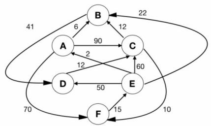

<details>
<summary>flowchart</summary>

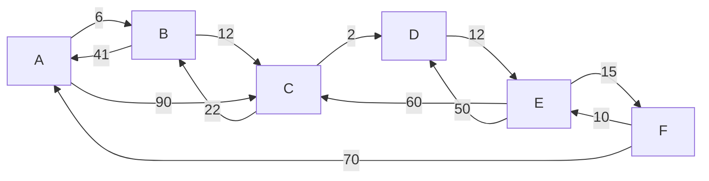
</details>

We are interested in the shortest paths from A.

a. Output the sequence of vertices identified by the Dijkstra's algorithm for single source shortest path when the algorithm is started at node $A$  
b. Write down sequence of vertices in the shortest path from $A$ to $E$  
c. What is the cost of the shortest path from $A$ to $E$ ?

gate1996 algorithms graph-algorithms normal dijkstras-algorithm descriptive

Answer key

# 1.13.2 Dijkstra Algorithm: GATE CSE 2004 | Question: 44

Suppose we run Dijkstra's single source shortest path algorithm on the following edge-weighted directed graph with vertex $P$ as the source.


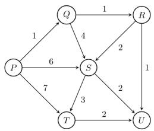

<details>
<summary>flowchart</summary>

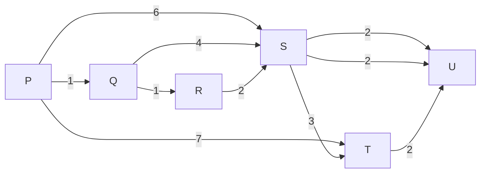
</details>

In what order do the nodes get included into the set of vertices for which the shortest path distances are finalized?

A. $P, Q, R, S, T, U$

B. $P, Q, R, U, S, T$

c. $P, Q, R, U, T, S$

D. $P, Q, T, R, U, S$

gatecse-2004 algorithms graph-algorithms normal dijkstras-algorithm

Answer key

# 1.13.3 Dijkstra Algorithm: GATE CSE 2005 | Question: 38

Let $G(V, E)$ be an undirected graph with positive edge weights. Dijkstra's single source shortest path algorithm can be implemented using the binary heap data structure with time complexity:


A. $O(|V|^{2})$

B. $O(|E| + |V|\log |V|)$

c. $O(|V|\log |V|)$

D. $O((|E| + |V|)\log |V|)$

gatecse-2005 algorithms graph-algorithms normal dijkstras-algorithm

# Answer key

# 1.13.4 Dijkstra Algorithm: GATE CSE 2006 | Question: 12


To implement Dijkstra's shortest path algorithm on unweighted graphs so that it runs in linear time, the data structure to be used is:

A. Queue

B. Stack

C. Heap

D. B-Tree

gatecse-2006 algorithms graph-algorithms easy dijkstras-algorithm

# Answer key

# 1.13.5 Dijkstra Algorithm: GATE CSE 2008 | Question: 45


<details>
<summary>flowchart</summary>

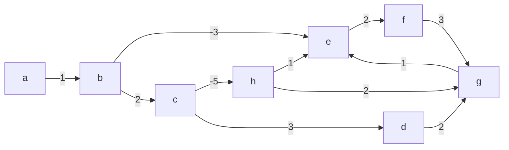
</details>

Dijkstra's single source shortest path algorithm when run from vertex $a$ in the above graph, computes the correct shortest path distance to

A. only vertex a

B. only vertices $a, e, f, g, h$

C. only vertices $a, b, c, d$

D. all the vertices

gatecse-2008 algorithms graph-algorithms normal dijkstras-algorithm

# Answer key

# 1.14

# Directed Acyclic Graph (2)

# 1.14.1 Directed Acyclic Graph: GATE CSE 2021 | Set 2 | Question: 55


In a directed acyclic graph with a source vertex s, the quality-score of a directed path is defined to be the product of the weights of the edges on the path. Further, for a vertex v other than s, the quality-score of v is defined to be the maximum among the quality-scores of all the paths from s to v. The quality-score of s is assumed to be 1.


<details>
<summary>flowchart</summary>

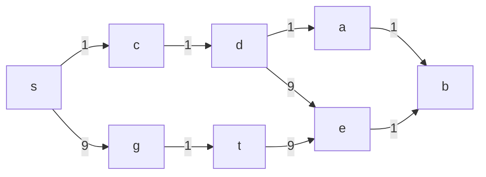
</details>

The sum of the quality-scores of all vertices on the graph shown above is \_\_\_\_

gatecse-2021-set2 algorithms graph-algorithms directed-acyclic-graph numerical-answers two-marks

# Answer key

# 1.14.2 Directed Acyclic Graph: GATE CSE 2026 | Set 2 | Question: 27


Let $G$ be a weighted directed acyclic graph with $m$ edges and $n$ vertices. Given $G$ and a source vertex $s$ in $G$ , which one of the following options gives the worst case time complexity of the fastest algorithm to find the lengths of shortest paths from $s$ to all vertices that are reachable from $s$ in $G$ ?

A. $\Theta(m + n)$

B. $\Theta(m + n\log(n))$

# 1.15

# Double Hashing (2)

# 1.15.1 Double Hashing: GATE CSE 2020 | Question: 23


Consider a double hashing scheme in which the primary hash function is $h_{1}(k)=k\bmod23$ , and the secondary hash function is $h_{2}(k)=1+(k\bmod19)$ . Assume that the table size is 23. Then the address returned by probe 1 in the probe sequence (assume that the probe sequence begins at probe 0) for key k=90 is \_\_\_\_.

gatecse-2020 numerical-answers algorithms hashing one-mark double-hashing

# Answer key

# 1.15.2 Double Hashing: GATE CSE 2025 | Set 1 | Question: 55


In a double hashing scheme, $h_{1}(k)=k\bmod11$ and $h_{2}(k)=1+(k\bmod7)$ are the auxiliary hash functions. The size m of the hash table is 11. The hash function for the i-th probe in the open address table is $[h_{1}(k)+ih_{2}(k)]\bmod m$ . The following keys are inserted in the given order: 63, 50, 25, 79, 67, 24.

The slot at which key 24 gets stored is \_\_\_\_. (Answer in integer)

gatecse2025-set1

algorithms

hashing

double-hashing

numerical-answers

easy

two-marks

# Answer key

# 1.16

# Dynamic Programming (10)

Practice Test: Test 1 (13Q)

# 1.16.1 Dynamic Programming: GATE CSE 2008 | Question: 80


The subset-sum problem is defined as follows. Given a set of $n$ positive integers, $S = \{a_1, a_2, a_3, \ldots, a_n\}$ , and positive integer $W$ , is there a subset of $S$ whose elements sum to $W$ ? A dynamic program for solving this problem uses a 2-dimensional Boolean array, $X$ , with $n$ rows and $W$ columns. $X[i, j], 1 \leq i \leq n, 0 \leq j \leq W$ , is TRUE, if and only if there is a subset of $\{a_1, a_2, \ldots, a_i\}$ elements sum to $j$ .

Which of the following is valid for $2 \leq i \leq n$ , and $a_{i} \leq j \leq W$ ?

A. $X[i,j] = X[i - 1,j]\lor X[i,j - a_i]$  
B. $X[i,j] = X[i - 1,j]\lor X[i - 1,j - a_i]$  
C. $X[i,j] = X[i - 1,j]\wedge X[i,j - a_i]$  
D. $X[i,j] = X[i - 1,j]\wedge X[i - 1,j - a_i]$

gatecse-2008

algorithms

difficult

dynamic-programming

# Answer key

# 1.16.2 Dynamic Programming: GATE CSE 2008 | Question: 81


The subset-sum problem is defined as follows. Given a set of $n$ positive integers, $S = \{a_1, a_2, a_3, \ldots, a_n\}$ , and positive integer $W$ , is there a subset of $S$ whose elements sum to $W$ ? A dynamic program for solving this problem uses a 2-dimensional Boolean array, $X$ , with $n$ rows and $l$ columns. $X[i, j], 1 \leq i \leq n, 0 \leq j \leq W$ , is TRUE, if and only if there is a subset of $\{a_1, a_2, \ldots, a_i\}$ elements sum to $j$ .

Which entry of the array X, if TRUE, implies that there is a subset whose elements sum to W?

A. $X[1, W]$

B. $X[n,0]$

C. $X[n,W]$

D. $X[n - 1,n]$

# 1.16.3 Dynamic Programming: GATE CSE 2009 | Question: 53


A sub-sequence of a given sequence is just the given sequence with some elements (possibly none or all) left out. We are given two sequences $X[m]$ and $Y[n]$ of lengths $m$ and $n$ , respectively with indexes of $X$ and $Y$ starting from 0.

We wish to find the length of the longest common sub-sequence (LCS) of $X[m]$ and $Y[n]$ as $l(m, n)$ , where an incomplete recursive definition for the function $I(i, j)$ to compute the length of the LCS of $X[m]$ and $Y[n]$ is given below:

$$
\begin{array}{l} = \text {expr1, if i,j > 0 and X[i - 1] = Y[j - 1]} \\ = \operatorname{expr2}, \text {if} i, j > 0 \text {and} X [ i - 1 ] \neq Y [ j - 1 ] \\ \end{array}
$$

$I(i,j) = 0$ , if either i = 0 or j = 0

Which one of the following options is correct?

A. expr1 = l(i - 1, j) + 1

B. expr1 = l(i, j - 1)

C. expr2 = max(l(i-1,j), l(i,j-1))

D. expr2 = max(l(i-1,j-1), l(i,j))

gatecse-2009 algorithms normal dynamic-programming recursion

# Answer key

# 1.16.4 Dynamic Programming: GATE CSE 2009 | Question: 54


A sub-sequence of a given sequence is just the given sequence with some elements (possibly none or all) left out. We are given two sequences $X[m]$ and $Y[n]$ of lengths $m$ and $n$ , respectively with indexes of $X$ and $Y$ starting from 0.

We wish to find the length of the longest common sub-sequence (LCS) of $X[m]$ and $Y[n]$ as $l(m, n)$ , where an incomplete recursive definition for the function $I(i, j)$ to compute the length of the LCS of $X[m]$ and $Y[n]$ is given below:

$$
\begin{array}{l} = \text {expr1, if i,j > 0 and X[i - 1] = Y[j - 1]} \\ = \text {expr2, if } i, j > 0 \text { and } X [ i - 1 ] \neq Y [ j - 1 ] \\ \end{array}
$$

$I(i,j) = 0$ , if either i = 0 or j = 0

The value of $l(i,j)$ could be obtained by dynamic programming based on the correct recursive definition of $l(i,j)$ of the form given above, using an array $L[M,N]$ , where $M = m + 1$ and $N = n + 1$ , such that $L[i,j] = l(i,j)$ .

Which one of the following statements would be TRUE regarding the dynamic programming solution for the recursive definition of $l(i,j)$ ?

A. All elements of $L$ should be initialized to 0 for the values of $l(i,j)$ to be properly computed.  
B. The values of $l(i,j)$ may be computed in a row major order or column major order of $L[M,N]$ .  
C. The values of $l(i,j)$ cannot be computed in either row major order or column major order of $L[M,N]$ .  
D. $L[p,q]$ needs to be computed before $L[r,s]$ if either $p < r$ or $q < s$ .

gatecse-2009 normal algorithms dynamic-programming recursion

# Answer key

# 1.16.5 Dynamic Programming: GATE CSE 2010 | Question: 34


The weight of a sequence $a_{0}, a_{1}, \ldots, a_{n-1}$ of real numbers is defined as $a_{0} + a_{1}/2 + \cdots + a_{n-1}/2^{n-1}$ . A subsequence of a sequence is obtained by deleting some elements from the sequence, keeping the order of the remaining elements the same. Let X denote the maximum possible weight of a subsequence of $a_{0}, a_{1}, \ldots, a_{n-1}$ and Y the maximum possible weight of a subsequence of $a_{1}, a_{2}, \ldots, a_{n-1}$ . Then X is equal to

A. $max(Y, a_0 + Y)$

C. $max(Y, a_{0} + 2Y)$

B. $max(Y, a_0 + Y/2)$

D. $a_{0} + Y/2$

gatecse-2010 algorithms dynamic-programming normal

# Answer key

# 1.16.6 Dynamic Programming: GATE CSE 2011 | Question: 25


An algorithm to find the length of the longest monotonically increasing sequence of numbers in an array $A[0:n - 1]$ is given below.

Let $L_{i}$ , denote the length of the longest monotonically increasing sequence starting at index i in the array.

Initialize $L_{n - 1} = 1$

For all $i$ such that $0 \leq i \leq n - 2$

$$
L _ {i} = \left\{ \begin{array}{l l} 1 + L _ {i + 1} & \quad \text {if} \mathrm{A} [ \mathrm{i} ] <   \mathrm{A} [ \mathrm{i} + 1 ] \\ 1 & \quad \text {Otherwise} \end{array} \right.
$$

Finally, the length of the longest monotonically increasing sequence is $\max\left(L_{0}, L_{1}, \ldots, L_{n-1}\right)$ .

Which of the following statements is TRUE?

A. The algorithm uses dynamic programming paradigm  
B. The algorithm has a linear complexity and uses branch and bound paradigm  
C. The algorithm has a non-linear polynomial complexity and uses branch and bound paradigm  
D. The algorithm uses divide and conquer paradigm

gatecse-2011 algorithms easy dynamic-programming

# Answer key

# 1.16.7 Dynamic Programming: GATE CSE 2014 | Set 2 | Question: 37


Consider two strings $A = "qpqrr"$ and $B = "pqprqrp"$ . Let $x$ be the length of the longest common subsequence (not necessarily contiguous) between $A$ and $B$ and let $y$ be the number of such longest common subsequences between $A$ and $B$ . Then $x + 10y =$ \_\_\_\_.

gatecse-2014-set2 algorithms normal numerical-answers dynamic-programming

# Answer key

# 1.16.8 Dynamic Programming: GATE CSE 2014 | Set 3 | Question: 37


Suppose you want to move from 0 to 100 on the number line. In each step, you either move right by a unit distance or you take a shortcut. A shortcut is simply a pre-specified pair of integers $i$ , $j$ with $i < j$ . Given a shortcut $(i, j)$ , if you are at position $i$ on the number line, you may directly move to $j$ . Suppose $T(k)$ denotes the smallest number of steps needed to move from $k$ to 100. Suppose further that there is at most 1 shortcut involving any number, and in particular, from 9 there is a shortcut to 15. Let $y$ and $z$ be such that $T(9) = 1 + \min(T(y), T(z))$ . Then the value of the product $yz$ is \_\_\_\_.

gatecse-2014-set3 algorithms normal numerical-answers dynamic-programming

# Answer key

# 1.16.9 Dynamic Programming: GATE CSE 2016 | Set 2 | Question: 14


The Floyd-Warshall algorithm for all-pair shortest paths computation is based on

A. Greedy paradigm.  
B. Divide-and-conquer paradigm.  
C. Dynamic Programming paradigm.  
D. Neither Greedy nor Divide-and-Conquer nor Dynamic Programming paradigm.

gatecse-2016-set2 algorithms dynamic-programming easy

# Answer key

# 1.16.10 Dynamic Programming: GATE CSE 2026 | Set 2 | Question: 29


Consider a table $T$ , where the elements $T[i][j], 0 \leq i, j \leq n$ , represent the cost of the optimal solutions of different subproblems of a problem that is being solved using a dynamic programming algorithm. The recursive formulation to compute the table entries is as follows:

$$
T [ 0 ] [ k ] = T [ k ] [ 0 ] = 1 \quad \text {for} k = 0, 1, 2, \dots , n
$$

$$
T [ i ] [ j ] = 2 T [ i - 1 ] [ j ] + 3 T [ i ] [ j - 1 ] \quad \text { for } 1 \leq i, j \leq n
$$

Consider the following two algorithms to compute entries of $T$ . Assume that for both the algorithms, for all $0 \leq i, j \leq n$ , $T[i][j]$ has been initialized to 1.

Algorithm \$B\_{1}\$: For \$i = 1, 2, \ldots, n\$

$$
\text {For} j = 1, 2, \dots , n
$$

$$
T [ i ] [ j ] = 2 T [ i - 1 ] [ j ] + 3 T [ i ] [ j - 1 ]
$$

Algorithm $B_{2}$ : For $s = 2,3,\dots ,2n$

$$
\text {For} i = 1, 2, \dots , n
$$

$$
\text {For} j = 1, 2, \dots , n
$$

$$
\text {If} (i + j = = s)
$$

$$
T [ i ] [ j ] = 2 T [ i - 1 ] [ j ] + 3 T [ i ] [ j - 1 ]
$$

Algorithm $B_{k}, k \in \{1, 2\}$ is said to be correct if and only if it calculates the correct values of $T[i][j]$ , for all $0 \leq i, j \leq n$ , (as per the recursive formulation) at the end of the execution of the algorithm $B_{k}$ .

Which one of the following statements is true?

A. Both algorithms $B_{1}$ and $B_{2}$ are correct  
B. Algorithm $B_{1}$ is correct, but algorithm $B_{2}$ is incorrect  
C. Algorithm $B_{2}$ is correct, but algorithm $B_{1}$ is incorrect  
D. Both algorithms $B_{1}$ and $B_{2}$ are incorrect

gatecse-2026-set2 algorithms dynamic-programming two-marks

Answer key

# 1.17

# Graph Algorithms (11)

Practice Test: Test 1 (14Q)

# 1.17.1 Graph Algorithms: GATE CSE 1994 | Question: 1.22

Which of the following statements is false?

A. Optimal binary search tree construction can be performed efficiently using dynamic programming  
B. Breadth-first search cannot be used to find connected components of a graph  
C. Given the prefix and postfix walks over a binary tree, the binary tree cannot be uniquely constructed.  
D. Depth-first search can be used to find connected components of a graph

gate1994 algorithms normal graph-algorithms

Answer key

# 1.17.2 Graph Algorithms: GATE CSE 2003 | Question: 70

Let $G = (V, E)$ be a directed graph with $n$ vertices. A path from $v_i$ to $v_j$ in $G$ is a sequence of vertices $(v_i, v_{i+1}, \ldots, v_j)$ such that $(v_k, v_{k+1}) \in E$ for all $k$ in $i$ through $j-1$ . A simple path is a path in which no vertex appears more than once.

Let A be an $n \times n$ array initialized as follows:


$$
A [ j, k ] = \left\{ \begin{array}{l l} 1, & \text {if} (j, k) \in E \\ 0, & \text {otherwise} \end{array} \right.
$$

Consider the following algorithm:

<div class="mineru-algorithm" style="white-space: pre-wrap; font-family:monospace;">
for i=1 to n
    for j=1 to n
        for k=1 to n
            A[j,k] = max(A[j,k], A[j,i] + A[i,k]);
</div>

Which of the following statements is necessarily true for all j and k after termination of the above algorithm?

A. $A[j,k]\leq n$  
B. If $A[j, j] \geq n - 1$ then $G$ has a Hamiltonian cycle  
C. If there exists a path from $j$ to $k$ , $A[j, k]$ contains the longest path length from $j$ to $k$  
D. If there exists a path from $j$ to $k$ , every simple path from $j$ to $k$ contains at most $A[j, k]$ edges

gatecse-2003 algorithms graph-algorithms normal

Answer key

# 1.17.3 Graph Algorithms: GATE CSE 2005 | Question: 82a

Let $s$ and $t$ be two vertices in a undirected graph $G = (V, E)$ having distinct positive edge weights. Let $[X, Y]$ be a partition of $V$ such that $s \in X$ and $t \in Y$ . Consider the edge $e$ having the minimum weight amongst all those edges that have one vertex in $X$ and one vertex in $Y$ .

The edge e must definitely belong to:

A. the minimum weighted spanning tree of $G$

B. the weighted shortest path from $s$ to $t$

C. each path from $s$ to $t$

D. the weighted longest path from $s$ to $t$

gatecse-2005 algorithms graph-algorithms normal

Answer key

# 1.17.4 Graph Algorithms: GATE CSE 2005 | Question: 82b

Let $s$ and $t$ be two vertices in a undirected graph $G = (V, E)$ having distinct positive edge weights. Let $[X, Y]$ be a partition of $V$ such that $s \in X$ and $t \in Y$ . Consider the edge $e$ having the minimum weight amongst all those edges that have one vertex in $X$ and one vertex in $Y$ .

Let the weight of an edge e denote the congestion on that edge. The congestion on a path is defined to be the maximum of the congestions on the edges of the path. We wish to find the path from s to t having minimum congestion. Which of the following paths is always such a path of minimum congestion?

A. a path from s to t in the minimum weighted spanning treeB. a weighted shortest path from s to t

C. an Euler walk from $s$ to $t$

D. a Hamiltonian path from $s$ to $t$

gatecse-2005 algorithms graph-algorithms normal

Answer key

# 1.17.5 Graph Algorithms: GATE CSE 2016 | Set 2 | Question: 41

In an adjacency list representation of an undirected simple graph $G = (V, E)$ , each edge $(u, v)$ has two adjacency list entries: $[v]$ in the adjacency list of $u$ , and $[u]$ in the adjacency list of $v$ . These are called twins

of each other. A twin pointer is a pointer from an adjacency list entry to its twin. If $|E|=m$ and $|V|=n$ , and the memory size is not a constraint, what is the time complexity of the most efficient algorithm to set the twin pointer in each entry in each adjacency list?

A. $\Theta(n^{2})$

B. $\Theta (n + m)$

C. $\Theta(m^{2})$

D. $\Theta(n^{4})$

gatecse-2016-set2 algorithms graph-algorithms normal

Answer key


# 1.17.6 Graph Algorithms: GATE CSE 2017 | Set 1 | Question: 26


Let $G = (V, E)$ be any connected, undirected, edge-weighted graph. The weights of the edges in $E$ are positive and distinct. Consider the following statements:

I. Minimum Spanning Tree of $G$ is always unique.  
II. Shortest path between any two vertices of $G$ is always unique.

Which of the above statements is/are necessarily true?

A. I only

B. II only

C. both I and II

D. neither I nor II

gatecse-2017-set1 algorithms graph-algorithms normal

Answer key

# 1.17.7 Graph Algorithms: GATE CSE 2021 | Set 2 | Question: 46

Consider the following directed graph:

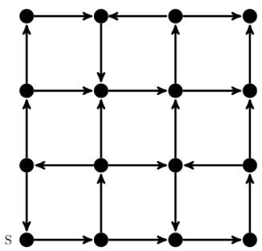

<details>
<summary>flowchart</summary>

This diagram represents a state transition or state transition network with multiple states and transitions, where arrows indicate the direction of movement between them.
</details>


Which of the following is/are correct about the graph?

A. The graph does not have a topological order  
B. A depth-first traversal starting at vertex $S$ classifies three directed edges as back edges  
C. The graph does not have a strongly connected component  
D. For each pair of vertices u and v, there is a directed path from u to v

gatecse-2021-set2 multiple-selects algorithms graph-algorithms two-marks

Answer key

# 1.17.8 Graph Algorithms: GATE CSE 2026 | Set 1 | Question: 31


Let $G(V, E)$ be an undirected, edge-weighted graph with integer weights. The weight of a path is the sum of the weights of the edges in that path. The length of a path is the number of edges in that path.

Let $s \in V$ be a vertex in $G$ . For every $u \in V$ and for every $k \geq 0$ , let $d_k(u)$ denote the weight of a shortest path (in terms of weight) from $s$ to $u$ of length at most $k$ . If there is no path from $s$ to $u$ of length at most $k$ , then $d_k(u) = \infty$ .

Consider the statements:

S1: For every $k \geq 0$ and $u \in V$ , $d_{k+1}(u) \leq d_k(u)$ .

S2: For every $(u, v) \in E$ , if $(u, v)$ is part of a shortest path (in terms of weight) from $s$ to $v$ , then for every $k \geq 0$ , $d_k(u) \leq d_k(v)$ .

Which one of the following options is correct?

A. Only S1 is true  
C. Both S1 and S2 are true

B. Only S2 is true  
D. Neither S1 nor S2 is true

gatecse-2026-set1 algorithms two-marks graph-algorithms

Answer key

In the following table, the left column contains the names of standard graph algorithms and the right column contains the time complexities of the algorithms. Match each algorithm with its time complexity.

<table><tr><td>1. Bellman-Ford algorithm</td><td>A:  $O(m \log n)$ </td></tr><tr><td>2. Kruskal’s algorithm</td><td>B:  $O(n^{3})$ </td></tr><tr><td>3. Floyd-Warshall algorithm</td><td>C:  $O(nm)$ </td></tr><tr><td>4. Topological sorting</td><td>D:  $O(n + m)$ </td></tr></table>

A. $1 \rightarrow \mathrm{C}, 2 \rightarrow \mathrm{A}, 3 \rightarrow \mathrm{B}, 4 \rightarrow \mathrm{D}$

B. $1 \rightarrow \mathrm{B}, 2 \rightarrow \mathrm{D}, 3 \rightarrow \mathrm{C}, 4 \rightarrow \mathrm{A}$

C. $1 \rightarrow \mathrm{C}, 2 \rightarrow \mathrm{D}, 3 \rightarrow \mathrm{A}, 4 \rightarrow \mathrm{B}$

D. $1 \rightarrow \mathrm{B}, 2 \rightarrow \mathrm{A}, 3 \rightarrow \mathrm{C}, 4 \rightarrow \mathrm{D}$

gateit-2005 algorithms graph-algorithms match-the-following easy

# Answer key

# 1.17.10 Graph Algorithms: GATE IT 2005 | Question: 84a

A sink in a directed graph is a vertex i such that there is an edge from every vertex $j \neq i$ to i and there is no edge from i to any other vertex. A directed graph G with n vertices is represented by its adjacency matrix A,

where $A[i][j]=1$ if there is an edge directed from vertex i to j and 0 otherwise. The following algorithm determines whether there is a sink in the graph G.

```c
i = 0;
do {
    j = i + 1;
    while ((j < n) && E1) j++;
    if (j < n) E2;
} while (j < n);
flag = 1;
for (j = 0; j < n; j++)
    if ((j! = i) && E3) flag = 0;
if (flag) printf("Sink exists");
else printf ("Sink does not exist");
```

Choose the correct expressions for $E_{1}$ and $E_{2}$

A. $E_{1}:A[i][j]$ and $E_{2}:i = j;$

B. $E_{1}:$ !A[i][j] and $E_{2}:i = j + 1$

C. $E_{1}$ : $!\bar{A}[i][j]$ and $E_{2}$ : i = j;

D. $E_{1}:A[i][j]$ and $E_{2}:i = j + 1;$

gateit-2005 algorithms graph-algorithms normal

# Answer key

# 1.17.11 Graph Algorithms: GATE IT 2005 | Question: 84b

A sink in a directed graph is a vertex $i$ such that there is an edge from every vertex $j \neq i$ to $i$ and there is no edge from $i$ to any other vertex. A directed graph $G$ with $n$ vertices is represented by its adjacency matrix $A$ ,

where $A[i][j]=1$ if there is an edge directed from vertex i to j and 0 otherwise. The following algorithm determines whether there is a sink in the graph G.

```txt
i = 0;
do {
    j = i + 1;
    while ((j < n) && E1) j++;
    if (j < n) E2;
} while (j < n);
flag = 1;
for (j = 0; j < n; j++)
    if ((j! = i) && E3) flag = 0;
if (flag) printf("Sink exists") ;
else printf ("Sink does not exist");
```

Choose the correct expression for $E_{3}$

A. $(A[i][j] \&\& !A[j][i])$ C. $(!A[i][j] || A[j][i])$

B. (!A[i][j] && A[j][i])
D. (A[i][j] || !A[j][i])

gateit-2005 algorithms graph-algorithms normal

# Answer key


B. (!A[i][j] && A[j][i])
D. (A[i][j] || !A[j][i])

# 1.18.1 Graph Search: GATE CSE 1989 | Question: 4-vii


<details>
<summary>flowchart</summary>

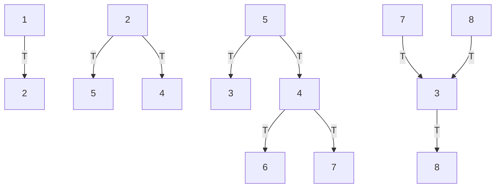
</details>

In the graph shown above, the depth-first spanning tree edges are marked with a 'T'. Identify the forward, backward, and cross edges.

gate1989 descriptive algorithms graph-algorithms depth-first-search graph-search

Answer key

# 1.18.2 Graph Search: GATE CSE 2000 | Question: 1.13

The most appropriate matching for the following pairs

<table><tr><td>X: depth first search</td><td>1: heap</td></tr><tr><td>Y: breadth first search</td><td>2: queue</td></tr><tr><td>Z: sorting</td><td>3: stack</td></tr></table>


is:

A. X - 1, Y - 2, Z - 3  
C. X - 3, Y - 2, Z - 1

B. X - 3, Y - 1, Z - 2  
D. X - 2, Y - 3, Z - 1

gatecse-2000 algorithms easy graph-algorithms graph-search match-the-following

Answer key

# 1.18.3 Graph Search: GATE CSE 2000 | Question: 2.19


Let $G$ be an undirected graph. Consider a depth-first traversal of $G$ , and let $T$ be the resulting depth-first search tree. Let $u$ be a vertex in $G$ and let $v$ be the first new (unvisited) vertex visited after visiting $u$ in the traversal. Which of the following statement is always true?

A. $\{u, v\}$ must be an edge in $G$ , and $u$ is a descendant of $v$ in $T$  
B. $\{u, v\}$ must be an edge in $G$ , and $v$ is a descendant of $u$ in $T$  
C. If $\{u, v\}$ is not an edge in $G$ then $u$ is a leaf in $T$  
D. If $\{u, v\}$ is not an edge in $G$ then $u$ and $v$ must have the same parent in $T$

gatecse-2000 algorithms graph-algorithms normal graph-search

Answer key

# 1.18.4 Graph Search: GATE CSE 2001 | Question: 2.14


Consider an undirected, unweighted graph G. Let a breadth-first traversal of G be done starting from a node r. Let $d(r,u)$ and $d(r,v)$ be the lengths of the shortest paths from r to u and v respectively in G. If u is visited before v during the breadth-first traversal, which of the following statements is correct?

A. $d(r,u) <   d(r,v)$  
C. $d(r,u)\leq d(r,v)$

gatecse-2001 algorithms graph-algorithms normal graph-search

B. $d(r,u) > d(r,v)$  
D. None of the above

# Answer key

# 1.18.5 Graph Search: GATE CSE 2003 | Question: 21

Consider the following graph:

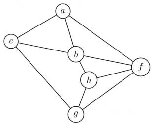

<details>
<summary>flowchart</summary>

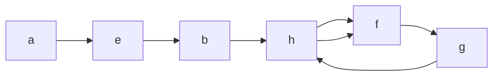
</details>


Among the following sequences:

I. abeghf  
II. abfehg  
III. abfhge  
IV. afghbe

Which are the depth-first traversals of the above graph?

A. I, II and IV only

B. I and IV only

C. II, III and IV only

D. I, III and IV only

gatecse-2003 algorithms graph-algorithms normal graph-search

# Answer key

# 1.18.6 Graph Search: GATE CSE 2006 | Question: 48

Let $T$ be a depth first search tree in an undirected graph $G$ . Vertices $u$ and $\nu$ are leaves of this tree $T$ . The degrees of both $u$ and $\nu$ in $G$ are at least 2. which one of the following statements is true?


A. There must exist a vertex w adjacent to both u and $\nu$ in G  
B. There must exist a vertex w whose removal disconnects u and $\nu$ in G  
C. There must exist a cycle in G containing u and $\nu$  
D. There must exist a cycle in G containing u and all its neighbours in G

gatecse-2006 algorithms graph-algorithms normal graph-search

# Answer key

# 1.18.7 Graph Search: GATE CSE 2008 | Question: 19

The Breadth First Search algorithm has been implemented using the queue data structure. One possible order of visiting the nodes of the following graph is:


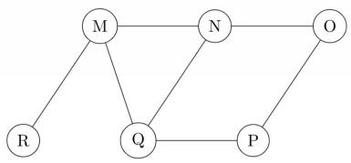

<details>
<summary>flowchart</summary>

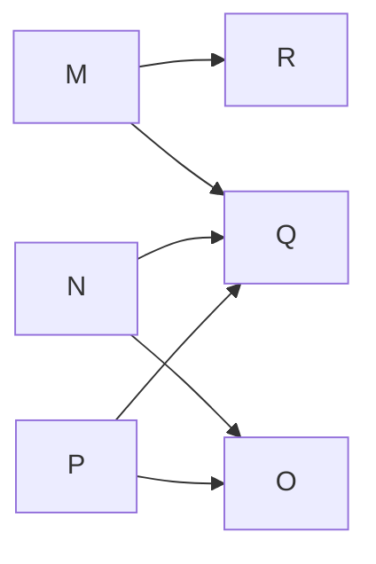
</details>

A. MNOPQR

B. NQMPOR

C. QMNPRO

D. QMNPOR

gatecse-2008 normal algorithms graph-algorithms graph-search

# Answer key

# 1.18.8 Graph Search: GATE CSE 2014 | Set 1 | Question: 11


Let G be a graph with n vertices and m edges. What is the tightest upper bound on the running time of Depth First Search on G, when G is represented as an adjacency matrix?

A. $\Theta(n)$

B. $\Theta(n+m)$

C. $\Theta(n^{2})$

D. $\Theta(m^{2})$

gatecse-2014-set1 algorithms graph-algorithms normal graph-search

Answer key

# 1.18.9 Graph Search: GATE CSE 2014 | Set 2 | Question: 14

Consider the tree arcs of a BFS traversal from a source node W in an unweighted, connected, undirected graph. The tree T formed by the tree arcs is a data structure for computing


A. the shortest path between every pair of vertices.  
B. the shortest path from W to every vertex in the graph.  
C. the shortest paths from $W$ to only those nodes that are leaves of $T$ .  
D. the longest path in the graph.

gatecse-2014-set2 algorithms graph-algorithms normal graph-search

Answer key

# 1.18.10 Graph Search: GATE CSE 2014 | Set 3 | Question: 13

Suppose depth first search is executed on the graph below starting at some unknown vertex. Assume that a recursive call to visit a vertex is made only after first checking that the vertex has not been visited earlier. Then the maximum possible recursion depth (including the initial call) is \_\_\_\_.


<details>
<summary>natural_image</summary>

Pure geometric grid pattern with circles and lines, no text or symbols present
</details>

gatecse-2014-set3 algorithms graph-algorithms numerical-answers normal graph-search

Answer key

# 1.18.11 Graph Search: GATE CSE 2015 | Set 1 | Question: 45

Let $G = (V, E)$ be a simple undirected graph, and $s$ be a particular vertex in it called the source. For $x \in V$ , let $d(x)$ denote the shortest distance in $G$ from $s$ to $x$ . A breadth first search (BFS) is performed starting at $s$ . Let $T$ be the resultant BFS tree. If $(u, v)$ is an edge of $G$ that is not in $T$ , then which one of the following CANNOT be the value of $d(u) - d(v)$ ?

A. -1

B. 0

C. 1

D. 2

gatecse-2015-set1 algorithms graph-algorithms normal graph-search

Answer key

# 1.18.12 Graph Search: GATE CSE 2016 | Set 2 | Question: 11

Breadth First Search (BFS) is started on a binary tree beginning from the root vertex. There is a vertex $t$ at a distance four from the root. If $t$ is the $n^{\text{th}}$ vertex in this BFS traversal, then the maximum possible value of $n$ is \_\_\_\_


gatecse-2016-set2 algorithms graph-algorithms normal numerical-answers graph-search

Answer key

# 1.18.13 Graph Search: GATE CSE 2017 | Set 2 | Question: 15

The Breadth First Search (BFS) algorithm has been implemented using the queue data structure. Which one

of the following is a possible order of visiting the nodes in the graph below?


A. MNOPQR

B. NQMPOR

C. QMNROP

D. POQNMR

gatecse-2017-set2 algorithms graph-algorithms graph-search

Answer key

# 1.18.14 Graph Search: GATE CSE 2018 | Question: 30

Let G be a simple undirected graph. Let $T_{D}$ be a depth first search tree of G. Let $T_{B}$ be a breadth first search tree of G. Consider the following statements.


I. No edge of $G$ is a cross edge with respect to $T_{D}$ . (A cross edge in $G$ is between two nodes neither of which is an ancestor of the other in $T_{D}$ ).

II. For every edge $(u,v)$ of G, if u is at depth i and v is at depth j in $T_{B}$ , then $|i-j|=1$ .

Which of the statements above must necessarily be true?

A. I only

B. II only

C. Both I and II

D. Neither I nor II

gatecse-2018 algorithms graph-algorithms graph-search normal two-marks

Answer key

# 1.18.15 Graph Search: GATE CSE 2023 | Question: 46

Let $U = \{1, 2, 3\}$ . Let $2^{U}$ denote the powerset of $U$ . Consider an undirected graph $G$ whose vertex set is $2^{U}$ . For any $A, B \in 2^{U}$ , $(A, B)$ is an edge in $G$ if and only if (i) $A \neq B$ , and (ii) either $A \subsetneq B$ or $B \subsetneq A$ .

For any vertex $A$ in $G$ , the set of all possible orderings in which the vertices of $G$ can be visited in a Breadth First Search (BFS) starting from $A$ is denoted by $\mathcal{B}(A)$ .

If $\emptyset$ denotes the empty set, then the cardinality of $\mathcal{B}(\emptyset)$ is \_\_\_\_.

gatecse-2023 algorithms breadth-first-search numerical-answers two-marks graph-search

Answer key

# 1.18.16 Graph Search: GATE CSE 2024 | Set 1 | Question: 35

Let $G$ be a directed graph and $T$ a depth first search (DFS) spanning tree in $G$ that is rooted at a vertex $v$ . Suppose $T$ is also a breadth first search (BFS) tree in $G$ , rooted at $v$ . Which of the following statements is/are TRUE for every such graph $G$ and tree $T$ ?

A. There are no back-edges in G with respect to the tree T  
B. There are no cross-edges in G with respect to the tree T  
C. There are no forward-edge in $G$ with respect to the tree $T$  
D. The only edges in G are the edges in T

gatecse-2024-set1 algorithms multiple-selects graph-search two-marks

Answer key

# 1.18.17 Graph Search: GATE CSE 2024 | Set 1 | Question: 50

The number of edges present in the forest generated by the DFS traversal of an undirected graph G with 100 vertices is 40. The number of connected components in G is \_\_\_\_.

gatecse-2024-set1 numerical-answers graph-search graph-algorithms two-marks

Answer key


# 1.18.18 Graph Search: GATE CSE 2025 | Set 2 | Question: 49


Consider the following algorithm someAlgo that takes an undirected graph G as input. someAlgo (G)

1. Let $v$ be any vertex in $G$ . Run BFS on $G$ starting at $v$ . Let $u$ be a vertex in $G$ at maximum distance from $v$ as given by the BFS.  
2. Run BFS on $G$ again with $u$ as the starting vertex. Let $z$ be the vertex at maximum distance from $u$ as given by the BFS.  
3. Output the distance between u and z in G.

The output of someAlgo (T) for the tree shown in the given figure is \_\_\_\_. (Answer in integer)


<details>
<summary>natural_image</summary>

Abstract geometric line drawing with interconnected nodes (no text or symbols)
</details>

gatecse2025-set2 algorithms breadth-first-search graph-search numerical-answers two-marks

# Answer key

# 1.18.19 Graph Search: GATE DS&AI 2024 | Question: 4

Consider performing depth-first search (DFS) on an undirected and unweighted graph $G$ starting at vertex $s$ . For any vertex $u$ in $G$ , $d[u]$ is the length of the shortest path from $s$ to $u$ . Let $(u, v)$ be an edge in $G$ such that $d[u] < d[v]$ . If the edge $(u, v)$ is explored first in the direction from $u$ to $v$ during the above DFS, then $(u, v)$ becomes a \_\_\_\_ edge.

A. tree

B. cross

C. back

D. gray

gate-ds-ai-2024 graph-search depth-first-search algorithms one-mark

# Answer key

# 1.18.20 Graph Search: GATE IT 2005 | Question: 14

In a depth-first traversal of a graph $G$ with $n$ vertices, $k$ edges are marked as tree edges. The number of connected components in $G$ is

A. k

B. $k + 1$

C. $n - k - 1$

D. n-k

gateit-2005 algorithms graph-algorithms normal graph-search

# Answer key

# 1.18.21 Graph Search: GATE IT 2006 | Question: 47

Consider the depth-first-search of an undirected graph with 3 vertices P, Q, and R. Let discovery time $d(u)$ represent the time instant when the vertex u is first visited, and finish time $f(u)$ represent the time instant when the vertex u is last visited. Given that

<table><tr><td> $d(P) = 5$  units</td><td> $f(P) = 12$  units</td></tr><tr><td> $d(Q) = 6$  units</td><td> $f(Q) = 10$  units</td></tr><tr><td> $d(R) = 14$  unit</td><td> $f(R) = 18$  units</td></tr></table>

Which one of the following statements is TRUE about the graph?

A. There is only one connected component  
B. There are two connected components, and $P$ and $R$ are connected  
C. There are two connected components, and $Q$ and $R$ are connected  
D. There are two connected components, and $P$ and $Q$ are connected


# Answer key

# 1.18.22 Graph Search: GATE IT 2007 | Question: 24


A depth-first search is performed on a directed acyclic graph. Let $d[u]$ denote the time at which vertex $u$ is visited for the first time and $f[u]$ the time at which the DFS call to the vertex $u$ terminates. Which of the following statements is always TRUE for all edges $(u, v)$ in the graph?

A. $d[u] < d[v]$ C. $f[u] < f[v]$

B. $d[u] < f[v]$ D. $f[u] > f[v]$

gateit-2007 algorithms graph-algorithms normal graph-search depth-first-search

# Answer key

# 1.18.23 Graph Search: GATE IT 2008 | Question: 47

Consider the following sequence of nodes for the undirected graph given below:


1. abefdgc  
2. abefcgd  
3. adgebcf  
4. a d b c g e f

A Depth First Search (DFS) is started at node a. The nodes are listed in the order they are first visited. Which of the above is/are possible output(s)?


<details>
<summary>flowchart</summary>

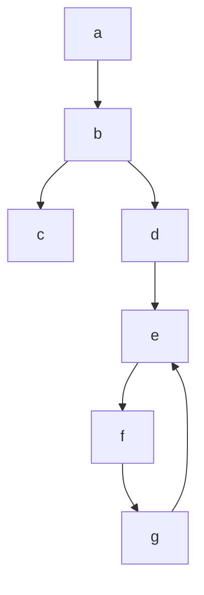
</details>

A. 1 and 3 only

B. 2 and 3 only

C. 2,3 and 4 only

D. 1,2 and 3 only

gateit-2008 algorithms graph-algorithms normal graph-search depth-first-search

# Answer key

# 1.19

# Greedy Algorithms (5)

# Practice Test: Test 1 (7Q)

# 1.19.1 Greedy Algorithms: GATE CSE 1999 | Question: 2.20


The minimum number of record movements required to merge five files A (with 10 records), B (with 20 records), C (with 15 records), D (with 5 records) and E (with 25 records) is:

A. 165

B. 90

C. 75

D. 65

gate1999 algorithms normal greedy-algorithms

# Answer key

# 1.19.2 Greedy Algorithms: GATE CSE 2003 | Question: 69


The following are the starting and ending times of activities $A, B, C, D, E, F, G$ and $H$ respectively in chronological order: " $a_s b_s c_s a_e d_s c_e e_s f_s b_e d_e g_s e_e f_e h_s g_e h_e$ ". Here, $x_s$ denotes the starting time and $x_e$ denotes the ending time of activity $X$ . We need to schedule the activities in a set of rooms available to us. An activity can be scheduled in a room only if the room is reserved for the activity for its entire duration. What is the minimum number of rooms required?

A. 3

B. 4

C. 5

D. 6

gatecse-2003 algorithms normal greedy-algorithms

# Answer key

# 1.19.3 Greedy Algorithms: GATE CSE 2005 | Question: 84a

We are given 9 tasks $T_{1}, T_{2}, \ldots, T_{9}$ . The execution of each task requires one unit of time. We can execute one task at a time. Each task $T_{i}$ has a profit $P_{i}$ and a deadline $d_{i}$ . Profit $P_{i}$ is earned if the task is completed before the end of the $d_{i}^{th}$ unit of time.


<table><tr><td>Task</td><td> $T_1$ </td><td> $T_2$ </td><td> $T_3$ </td><td> $T_4$ </td><td> $T_5$ </td><td> $T_6$ </td><td> $T_7$ </td><td> $T_8$ </td><td> $T_9$ </td></tr><tr><td>Profit</td><td>15</td><td>20</td><td>30</td><td>18</td><td>18</td><td>10</td><td>23</td><td>16</td><td>25</td></tr><tr><td>Deadline</td><td>7</td><td>2</td><td>5</td><td>3</td><td>4</td><td>5</td><td>2</td><td>7</td><td>3</td></tr></table>

Are all tasks completed in the schedule that gives maximum profit?

A. All tasks are completed

B. $T_{1}$ and $T_{6}$ are left out

C. $T_{1}$ and $T_{8}$ are left out

D. $T_{4}$ and $T_{6}$ are left out

gatecse-2005 algorithms greedy-algorithms process-scheduling normal

# Answer key

# 1.19.4 Greedy Algorithms: GATE CSE 2005 | Question: 84b

We are given 9 tasks $T_{1}, T_{2}, \ldots, T_{9}$ . The execution of each task requires one unit of time. We can execute one task at a time. Each task $T_{i}$ has a profit $P_{i}$ and a deadline $d_{i}$ . Profit $P_{i}$ is earned if the task is completed before the end of the $d_{i}^{th}$ unit of time.


<table><tr><td>Task</td><td> $T_1$ </td><td> $T_2$ </td><td> $T_3$ </td><td> $T_4$ </td><td> $T_5$ </td><td> $T_6$ </td><td> $T_7$ </td><td> $T_8$ </td><td> $T_9$ </td></tr><tr><td>Profit</td><td>15</td><td>20</td><td>30</td><td>18</td><td>18</td><td>10</td><td>23</td><td>16</td><td>25</td></tr><tr><td>Deadline</td><td>7</td><td>2</td><td>5</td><td>3</td><td>4</td><td>5</td><td>2</td><td>7</td><td>3</td></tr></table>

What is the maximum profit earned?

A. 147

B. 165

C. 167

D. 175

gatecse-2005 algorithms greedy-algorithms process-scheduling normal

# Answer key

# 1.19.5 Greedy Algorithms: GATE CSE 2018 | Question: 48

Consider the weights and values of items listed below. Note that there is only one unit of each item.

<table><tr><td>Item number</td><td>Weight (in Kgs)</td><td>Value (in rupees)</td></tr><tr><td>1</td><td>10</td><td>60</td></tr><tr><td>2</td><td>7</td><td>28</td></tr><tr><td>3</td><td>4</td><td>20</td></tr><tr><td>4</td><td>2</td><td>24</td></tr></table>


The task is to pick a subset of these items such that their total weight is no more than 11 Kgs and their total value is maximized. Moreover, no item may be split. The total value of items picked by an optimal algorithm is denoted by $V_{opt}$ . A greedy algorithm sorts the items by their value-to-weight ratios in descending order and packs them greedily, starting from the first item in the ordered list. The total value of items picked by the greedy algorithm is denoted by $V_{greedy}$ .

The value of $V_{opt} - V_{greedy}$ is \_\_\_\_

# 1.20

# Hashing (6)

Practice Tests: Test 1 (15Q) Test 2 (3Q)

# 1.20.1 Hashing: GATE CSE 1989 | Question: 1-vii, ISRO2015-14

A hash table with ten buckets with one slot per bucket is shown in the following figure. The symbols S1 to S7 initially entered using a hashing function with linear probing. The maximum number of comparisons needed in searching an item that is not present is


<table><tr><td>0</td><td>S7</td></tr><tr><td>1</td><td>S1</td></tr><tr><td>2</td><td></td></tr><tr><td>3</td><td>S4</td></tr><tr><td>4</td><td>S2</td></tr><tr><td>5</td><td></td></tr><tr><td>6</td><td>S5</td></tr><tr><td>7</td><td></td></tr><tr><td>8</td><td>S6</td></tr><tr><td>9</td><td>S3</td></tr></table>

A. 4

B. 5

C. 6

D. 3

hashing isro2015 gate1989 algorithms normal

# Answer key

# 1.20.2 Hashing: GATE CSE 1990 | Question: 13b

Consider a hash table with chaining scheme for overflow handling:


i. What is the worst-case timing complexity of inserting $n$ elements into such a table?  
ii. For what type of instance does this hashing scheme take the worst-case time for insertion?

gate1990 hashing algorithms descriptive

# Answer key

# 1.20.3 Hashing: GATE CSE 2021 | Set 1 | Question: 47

Consider a dynamic hashing approach for 4-bit integer keys:


1. There is a main hash table of size 4.  
2. The 2 least significant bits of a key is used to index into the main hash table.  
3. Initially, the main hash table entries are empty.  
4. Thereafter, when more keys are hashed into it, to resolve collisions, the set of all keys corresponding to a main hash table entry is organized as a binary tree that grows on demand.  
5. First, the $3^{\text{rd}}$ least significant bit is used to divide the keys into left and right subtrees.  
6. To resolve more collisions, each node of the binary tree is further sub-divided into left and right subtrees based on the $4^{th}$ least significant bit.  
7. A split is done only if it is needed, i.e., only when there is a collision.

Consider the following state of the hash table.

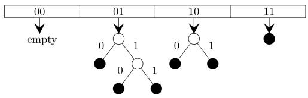

<details>
<summary>flowchart</summary>

This flowchart illustrates a hierarchical process or dependency structure with four stages (00, 01, 10, 11), where an initial state is empty and subsequent states are split into two branches with associated values.
</details>

Which of the following sequences of key insertions can cause the above state of the hash table (assume the keys are in decimal notation)?

A. 5,9,4,13,10,7

B. 9,5,10,6,7,1

C. 10,9,6,7,5,13

D. 9,5,13,6,10,14

gatecse-2021-set1 multiple-selects algorithms hashing two-marks

# Answer key

# 1.20.4 Hashing: GATE CSE 2023 | Question: 10


An algorithm has to store several keys generated by an adversary in a hash table. The adversary is malicious who tries to maximize the number of collisions. Let k be the number of keys, m be the number of slots in the hash table, and k > m.

Which one of the following is the best hashing strategy to counteract the adversary?

A. Division method, i.e., use the hash function $h(k) = k \mod m$ .  
B. Multiplication method, i.e., use the hash function $h(k) = \lfloor m(kA - \lfloor kA \rfloor) \rfloor$ , where $A$ is a carefully chosen constant.  
C. Universal hashing method.  
D. If k is a prime number, use Division method. Otherwise, use Multiplication method.

gatecse-2023 algorithms hashing one-mark

# Answer key

# 1.20.5 Hashing: GATE CSE 2026 | Set 2 | Question: 20


The keys 5, 28, 19, 15, 26, 33, 12, 17, 10 are inserted into a hash table using the hash function $h(k) = k \mod 9$ . The collisions are resolved by chaining. After all the keys are inserted, the length of the longest chain is \_\_\_\_. (answer in integer)

gatecse-2026-set2 algorithms hashing numerical-answers one-mark

# Answer key

# 1.20.6 Hashing: GATE IT 2005 | Question: 16


A hash table contains 10 buckets and uses linear probing to resolve collisions. The key values are integers and the hash function used is key%10. If the values 43, 165, 62, 123, 142 are inserted in the table, in what location would the key value 142 be inserted?

A. 2

B. 3

C. 4

D. 6

gateit-2005 algorithms hashing easy

# Answer key

# 1.21

# Heap Sort (2)

# 1.21.1 Heap Sort: GATE CSE 2013 | Question: 30


The number of elements that can be sorted in $\Theta(\log n)$ time using heap sort is

A. $\Theta(1)$

B. $\Theta(\sqrt{\log n})$

C. $\Theta\left(\frac{\log n}{\log \log n}\right)$

D. $\Theta (\log n)$

gatecse-2013 algorithms sorting normal heap-sort

# Answer key

# 1.21.2 Heap Sort: GATE CSE 2024 | Set 1 | Question: 31


An array [82, 101, 90, 11, 111, 75, 33, 131, 44, 93] is heapified. Which one of the following options represents the first three elements in the heapified array?

A. 82,90,101

B. 82,11,93

C. 131,11,93

D. 131,111,90

gatecse-2024-set1 algorithms heap-sort sorting two-marks

# Answer key

# 1.22

# Huffman Code (6)

# 1.22.1 Huffman Code: GATE CSE 1989 | Question: 13a

A language uses an alphabet of six letters, $\{a, b, c, d, e, f\}$ . The relative frequency of use of each letter of the alphabet in the language is as given below:

<table><tr><td>LETTER</td><td>RELATIVE FREQUENCY OF USE</td></tr><tr><td>a</td><td>0.19</td></tr><tr><td>b</td><td>0.05</td></tr><tr><td>c</td><td>0.17</td></tr><tr><td>d</td><td>0.08</td></tr><tr><td>e</td><td>0.40</td></tr><tr><td>f</td><td>0.11</td></tr></table>


Design a prefix binary code for the language which would minimize the average length of the encoded words of the language.

descriptive gate1989 algorithms huffman-code

Answer key

# 1.22.2 Huffman Code: GATE CSE 2007 | Question: 76

Suppose the letters $a, b, c, d, e, f$ have probabilities $\frac{1}{2}, \frac{1}{4}, \frac{1}{8}, \frac{1}{16}, \frac{1}{32}, \frac{1}{32}$ , respectively. Which of the following is the Huffman code for the letter $a, b, c, d, e, f$ ?

A. 0, 10, 110, 1110, 11110, 11111

c. 11, 10, 01, 001, 0001, 0000

B. 11, 10, 011, 010, 001, 000

D. 110, 100, 010, 000, 001, 111

gatecse-2007 algorithms greedy-algorithms normal huffman-code

Answer key


# 1.22.3 Huffman Code: GATE CSE 2007 | Question: 77

Suppose the letters $a, b, c, d, e, f$ have probabilities $\frac{1}{2}, \frac{1}{4}, \frac{1}{8}, \frac{1}{16}, \frac{1}{32}, \frac{1}{32}$ , respectively. What is the average length of the Huffman code for the letters $a, b, c, d, e, f$ ?

A. 3

B. 2.1875

C. 2.25

D. 1.9375

gatecse-2007 algorithms greedy-algorithms normal huffman-code

Answer key

# 1.22.4 Huffman Code: GATE CSE 2017 | Set 2 | Question: 50

A message is made up entirely of characters from the set $X = \{P, Q, R, S, T\}$ . The table of probabilities for each of the characters is shown below:

<table><tr><td>Character</td><td>Probability</td></tr><tr><td>P</td><td>0.22</td></tr><tr><td>Q</td><td>0.34</td></tr><tr><td>R</td><td>0.17</td></tr><tr><td>S</td><td>0.19</td></tr><tr><td>T</td><td>0.08</td></tr><tr><td>Total</td><td>1.00</td></tr></table>


If a message of 100 characters over X is encoded using Huffman coding, then the expected length of the encoded

message in bits is \_\_\_\_.

gatecse-2017-set2 huffman-code numerical-answers algorithms

# Answer key

# 1.22.5 Huffman Code: GATE CSE 2021 | Set 2 | Question: 26


Consider the string abbccddeee. Each letter in the string must be assigned a binary code satisfying the following properties:

1. For any two letters, the code assigned to one letter must not be a prefix of the code assigned to the other letter.  
2. For any two letters of the same frequency, the letter which occurs earlier in the dictionary order is assigned a code whose length is at most the length of the code assigned to the other letter.

Among the set of all binary code assignments which satisfy the above two properties, what is the minimum length of the encoded string?

A. 21

B. 23

C. 25

D. 30

gatecse-2021-set2 algorithms huffman-code two-marks

# Answer key

# 1.22.6 Huffman Code: GATE IT 2006 | Question: 48


The characters $a$ to $h$ have the set of frequencies based on the first 8 Fibonacci numbers as follows

$$
a: 1, b: 1, c: 2, d: 3, e: 5, f: 8, g: 1 3, h: 2 1
$$

A Huffman code is used to represent the characters. What is the sequence of characters corresponding to the following code?

110111100111010

A. fdheg

B. ecgdf

C. dchfg

D. fehdg

gateit-2006 algorithms greedy-algorithms normal huffman-code

# Answer key

# 1.23

# Identify Function (38)

Practice Tests:

Test 1 (15Q)

Test 2 (15Q)

Test 3 (9Q)

# 1.23.1 Identify Function: GATE CSE 1989 | Question: 8a

What is the output produced by the following program, when the input is "HTGATE"


Function what (s:string): string;

var n:integer;

begin

n = s.length

if n <= 1

then what := s

else what :=contact (what (substring (s, 2, n)), s.C [1])

end;

# Note

i. type string=record

length:integer;

C:array[1..100] of char

end

ii. Substring (s, i, j): this yields the string made up of the $i^{\text{th}}$ through $j^{\text{th}}$ characters in s; for appropriately defined in $i$ and $j$ .  
iii. Contact $(s_1, s_2)$ : this function yields a string of length $s_1$ length $+ s_2$ - length obtained by concatenating $s_1$ with $s_2$ such that $s_1$ precedes $s_2$ .

# 1.23.2 Identify Function: GATE CSE 1990 | Question: 11b

The following program computes values of a mathematical function $f(x)$ . Determine the form of $f(x)$ .


```txt
main ()
{
    int m, n; float x, y, t;
    scanf ("%f%d", &x, &n);
    t = 1; y = 0; m = 1;
    do
    {
        t *= (-x/m);
        y += t;
    } while (m++ < n);
    printf ("The value of y is %f", y);
}
```

```txt
gate1990 descriptive algorithms identify-function
```

# Answer key

# 1.23.3 Identify Function: GATE CSE 1991 | Question: 03-viii

Consider the following Pascal function:


Function X(M:integer):integer;

Var i:integer;

```txt
Begin
  i := 0;
  while i*i < M
  do i:= i+1
  X := i
end
```

The function call $X(N)$ , if $N$ is positive, will return

A. $\lfloor \sqrt{N}\rfloor$ C. $\lceil \sqrt{N}\rceil$

B. $\lfloor \sqrt{N}\rfloor +1$ D. $\lceil \sqrt{N}\rceil +1$

E. None of the above

```txt
gate1991 algorithms easy identify-function multiple-selects
```

# Answer key

# 1.23.4 Identify Function: GATE CSE 1993 | Question: 7.4

What does the following code do?


```vhdl
var a, b: integer;
begin
    a:=a+b;
    b:=a-b;
    a:=a-b;
end;
```

A. exchanges $a$ and $b$  
C. doubles $b$ and stores in $a$  
E. none of the above

```txt
gate1993 algorithms identify-function easy
```

# Answer key

# 1.23.5 Identify Function: GATE CSE 1994 | Question: 6

What function of x, n is computed by this program?


```txt
Function what(x, n:integer): integer:
Var
  value : integer
begin
  value := 1
  if n > 0 then
```

```vhdl
begin
    if n mod 2 =1 then
        value := value * x;
    value := value * what(x*x, n div 2);
end;
what := value;
end;
```

```txt
gate1994 algorithms identify-function normal descriptive
```

# Answer key

# 1.23.6 Identify Function: GATE CSE 1995 | Question: 1.4

In the following Pascal program segment, what is the value of X after the execution of the program segment?


```autohotkey
X := -10; Y := 20;
If X > Y then if X < 0 then X := abs(X) else X := 2*X;
```

A. 10

B. -20

C. -10

D. None

```txt
gate1995 algorithms identify-function easy
```

# Answer key

# 1.23.7 Identify Function: GATE CSE 1995 | Question: 2.3

Assume that $X$ and $Y$ are non-zero positive integers. What does the following Pascal program segment do?


```txt
while X <> Y do
  if X > Y then
    X := X - Y
  else
    Y := Y - X;
  write(X);
```

A. Computes the LCM of two numbers

B. Divides the larger number by the smaller number

C. Computes the GCD of two numbers

D. None of the above

```txt
gate1995 algorithms identify-function normal
```

# Answer key

# 1.23.8 Identify Function: GATE CSE 1995 | Question: 4


A. Consider the following Pascal function where $A$ and $B$ are non-zero positive integers. What is the value of $\operatorname{GET}(3,2)$ ?

```txt
function GET(A,B:integer): integer;
begin
  if B=0 then
    GET:= 1
  else if A < B then
    GET:= 0
  else
    GET:= GET(A-1, B) + GET(A-1, B-1)
end;
```

B. The Pascal procedure given for computing the transpose of an $N \times N$ , $(N > 1)$ matrix $A$ of integers has an error. Find the error and correct it. Assume that the following declaration are made in the main program

```matlab
const
  MAXSIZE=20;
type
  INTARR=array [1..MAXSIZE,1..MAXSIZE] of integer;
Procedure TRANSPOSE (var A: INTARR; N : integer);
var
  I, J, TMP: integer;
begin
  for I:=1 to N - 1 do
  for J:=1 to N do
  begin
    TMP:= A[I, J];
    A[I, J]:= A[J, I];
```

gate1995 algorithms identify-function normal descriptive

# Answer key

# 1.23.9 Identify Function: GATE CSE 1998 | Question: 2.12

What value would the following function return for the input x = 95?


```vhdl
Function fun (x:integer):integer;
Begin
  If x > 100 then fun = x - 10
  Else fun = fun(fun (x+11))
End;
```

A. 89

B. 90

C. 91

D. 92

gate1998 algorithms recursion identify-function normal

# Answer key

# 1.23.10 Identify Function: GATE CSE 1999 | Question: 2.24

Consider the following $C$ function definition


```txt
int Trial (int a, int b, int c)
{
    if ((a>=b) && (c<b)) return b;
    else if (a>=b) return Trial(a, c, b);
    else return Trial(b, a, c);
}
```

The functional Trial:

A. Finds the maximum of $a, b$ , and $c$  
C. Finds the middle number of $a, b, c$

B. Finds the minimum of $a, b$ , and $c$  
D. None of the above

gate1999 algorithms identify-function normal

# Answer key

# 1.23.11 Identify Function: GATE CSE 2000 | Question: 2.15

Suppose you are given an array $s[1....n]$ and a procedure reverse $(s,i,j)$ which reverses the order of elements in $s$ between positions $i$ and $j$ (both inclusive). What does the following sequence do, where $1 \leqslant k \leqslant n$ :


```txt
reverse (s, 1, k);
reverse (s, k+1, n);
reverse (s, 1, n);
```

A. Rotates s left by k positions  
C. Reverses all elements of $s$

B. Leaves s unchanged  
D. None of the above

gatecse-2000 algorithms normal identify-function

# Answer key

# 1.23.12 Identify Function: GATE CSE 2003 | Question: 1

Consider the following C function.

For large values of y, the return value of the function f best approximates


```c
float f,(float x, int y) {
    float p, s; int i;
    for (s=1,p=1,i=1; i<y; i++) {
        p *= x/i;
        s += p;
    }
    return s;
}
```

A. $x^{y}$

B. $e^{x}$

C. $\ln (1 + x)$

D. $x^{x}$

gatecse-2003 algorithms identify-function normal

# Answer key

# 1.23.13 Identify Function: GATE CSE 2003 | Question: 88


In the following $C$ program fragment, $j, k, n$ and TwoLog\_n are integer variables, and $A$ is an array of integers. The variable $n$ is initialized to an integer $\geqslant 3$ , and TwoLog\_n is initialized to the value of $2^{*}\lceil \log_{2}(n)\rceil$

```c
for (k = 3; k <= n; k++)
    A[k] = 0;
for (k = 2; k <= TwoLog_n; k++)
    for (j = k+1; j <= n; j++)
        A[j] = A[j] || (j%k);
for (j = 3; j <= n; j++)
    if (!A[j]) printf("%d", j);
```

The set of numbers printed by this program fragment is

A. $\{m \mid m \leq n, (\exists i) [m = i!]\}$

B. $\{m \mid m \leq n, (\exists i) [m = i^2]\}$

C. $\{m \mid m \leq n, \mathrm{m}$ is prime}

D. {}

gatecse-2003 algorithms identify-function normal

# Answer key

# 1.23.14 Identify Function: GATE CSE 2004 | Question: 41

Consider the following C program


```c
main()
{
    int x, y, m, n;
    scanf("%d %d", &x, &y);
    /* Assume x>0 and y>0*/
    m = x; n = y;
    while(m != n)
    {
        if (m > n)
            m = m-n;
        else
            n = n-m;
    }
    printf("%d", n);
}
```

The program computes

A. $x + y$ using repeated subtraction

B. $x \mod y$ using repeated subtraction

C. the greatest common divisor of $x$ and $y$

D. the least common multiple of $x$ and $y$

gatecse-2004 algorithms normal identify-function

# Answer key

# 1.23.15 Identify Function: GATE CSE 2004 | Question: 42

What does the following algorithm approximate? (Assume m > 1, $\epsilon > 0$ ).


```txt
x = m;
y = 1;
While (x-y > ε)
{
    x = (x+y)/2;
    y = m/x;
}
print(x);
```

A. $\log m$

B. $m^{2}$

C. $m^{\frac{1}{2}}$

D. $m^{\frac{1}{3}}$

gatecse-2004 algorithms identify-function normal

# 1.23.16 Identify Function: GATE CSE 2005 | Question: 31

Consider the following C-program:


```c
void foo (int n, int sum) {
    int k = 0, j = 0;
    if (n == 0) return;
    k = n % 10; j = n/10;
    sum = sum + k;
    foo (j, sum);
    printf ("%d,",k);
}

int main() {
    int a = 2048, sum = 0;
    foo(a, sum);
    printf("%d\n", sum);
}
```

What does the above program print?

A. 8, 4, 0, 2, 14

B. 8, 4, 0, 2, 0

C. 2, 0, 4, 8, 14

D. 2, 0, 4, 8, 0

gatecse-2005 algorithms identify-function recursion normal

# Answer key

# 1.23.17 Identify Function: GATE CSE 2006 | Question: 50

A set X can be represented by an array $x[n]$ as follows:

$$
x \left[ i \right] = \left\{ \begin{array}{l l} 1 & \text {if} i \in X \\ 0 & \text {otherwise} \end{array} \right.
$$

Consider the following algorithm in which x, y, and z are Boolean arrays of size n:

```txt
algorithm zzz(x[], y[], z[]) {
int i;

for(i=0; i<n; ++i)
z[i] = (x[i] ∧ ~y[i]) ∨ (~x[i] ∧ y[i]);
}
```

The set Z computed by the algorithm is:

A. $(X \cup Y)$

B. $(X\cap Y)$

C. $(X - Y) \cap (Y - X)$

D. $(X - Y) \cup (Y - X)$

gatecse-2006 algorithms identify-function normal

# Answer key

# 1.23.18 Identify Function: GATE CSE 2006 | Question: 53

Consider the following C-function in which $a[n]$ and $b[m]$ are two sorted integer arrays and $c[n+m]$ be another integer array,

```txt
void xyz(int a[], int b [], int c []){
    int i,j,k;
    i=j=k=0;
    while ((i<n) && (j<m))
        if (a[i] < b[j]) c[k++]= a[i++];
        else c[k++]= b[j++];
}
```

Which of the following condition(s) hold(s) after the termination of the while loop?

i. $j < m, k = n + j - 1$ and $a[n - 1] < b[j]$ if $i = n$  
ii. $i < n, k = m + i - 1$ and $b[m - 1] \leq a[i]$ if $j = m$

A. only (i)

B. only (ii)

C. either (i) or (ii) but not both

D. neither (i) nor (ii)

gatecse-2006 algorithms identify-function normal


# 1.23.19 Identify Function: GATE CSE 2009 | Question: 18

Consider the program below:  

```c
#include <stdio.h>
int fun(int n, int *f_p) {
    int t, f;
    if (n <= 1) {
        *f_p = 1;
        return 1;
    }
    t = fun(n-1, f_p);
    f = t + *f_p;
    *f_p = t;
    return f;
}

int main() {
    int x = 15;
    printf("%d/n", fun(5, &x));
    return 0;
}
```  
The value printed is:

A. 6

B. 8

C. 14

D. 15

```txt
gatecse-2009 algorithms recursion identify-function normal
```

# Answer key

# 1.23.20 Identify Function: GATE CSE 2010 | Question: 35

What is the value printed by the following C program?  

```c
#include<stdio.h>

int f(int *a, int n)
{
    if (n <= 0) return 0;
    else if (*a % 2 == 0) return *a+f(a+1, n-1);
    else return *a - f(a+1, n-1);
}

int main()
{
    int a[] = {12, 7, 13, 4, 11, 6};
    printf("%d", f(a, 6));
    return 0;
}
```

A. -9

B. 5

C. 15

D. 19

```txt
gatecse-2010 algorithms recursion identify-function normal
```

# Answer key

# 1.23.21 Identify Function: GATE CSE 2011 | Question: 48

Consider the following recursive C function that takes two arguments.  

```c
unsigned int foo(unsigned int n, unsigned int r) {
    if (n>0) return ((n%r) + foo(n/r, r));
    else return 0;
}
```  
What is the return value of the function foo when it is called as foo(345, 10)?

A. 345

B. 12

C. 5

D. 3

```txt
gatecse-2011 algorithms recursion identify-function normal
```

# Answer key

# 1.23.22 Identify Function: GATE CSE 2011 | Question: 49

Consider the following recursive C function that takes two arguments.


```c
unsigned int foo(unsigned int n, unsigned int r) {
    if (n>0) return ((n%r) + foo(n/r, r));
    else return 0;
}
```

What is the return value of the function foo when it is called as foo(513, 2)?

A. 9

B. 8

C. 5

D. 2

```txt
gatecse-2011 algorithms recursion identify-function normal
```

# Answer key

# 1.23.23 Identify Function: GATE CSE 2013 | Question: 31

Consider the following function:


```txt
int unknown(int n){

int i, j, k=0;
for (i=n/2; i<=n; i++)
    for (j=2; j<=n; j=j*2)
        k = k + n/2;
return (k);

}
```

The return value of the function is

A. $\Theta(n^{2})$

B. $\Theta(n^{2}\log n)$

C. $\Theta(n^{3})$

D. $\Theta(n^3\log n)$

```txt
gatecse-2013 algorithms identify-function normal
```

# Answer key

# 1.23.24 Identify Function: GATE CSE 2014 | Set 1 | Question: 41

Consider the following C function in which size is the number of elements in the array E:


```c
int MyX(int *E, unsigned int size)
{
    int Y = 0;
    int Z;
    int i, j, k;

    for(i = 0; i < size; i++)
        Y = Y + E[i];

    for(i=0; i < size; i++)
        for(j = i; j < size; j++)
        {
            Z = 0;
            for(k = i; k <= j; k++)
                Z = Z + E[k];
            if(Z > Y)
                Y = Z;
        }
    return Y;
}
```

The value returned by the function MyX is the

A. maximum possible sum of elements in any sub-array of array E.  
B. maximum element in any sub-array of array E.  
C. sum of the maximum elements in all possible sub-arrays of array E.  
D. the sum of all the elements in the array E.

```txt
gatecse-2014-set1 algorithms identify-function normal
```

# Answer key

# 1.23.25 Identify Function: GATE CSE 2014 | Set 2 | Question: 10

Consider the function func shown below:


```c
int func(int num) {
    int count = 0;
    while (num) {
        count++;
        num>>= 1;
    }
    return (count);
}
```

The value returned by func(435) is \_\_\_\_

```txt
gatecse-2014-set2 algorithms identify-function numerical-answers easy
```

# Answer key

# 1.23.26 Identify Function: GATE CSE 2014 | Set 3 | Question: 10

Let $A$ be the square matrix of size $n \times n$ . Consider the following pseudocode. What is the expected output?


```javascript
C=100;
for i=1 to n do
    for j=1 to n do
    {
        Temp = A[i][j]+C;
        A[i][j] = A[j][i];
        A[j][i] = Temp -C;
    }
for i=1 to n do
    for j=1 to n do
        output (A[i][j]);
```

A. The matrix A itself  
B. Transpose of the matrix A  
C. Adding 100 to the upper diagonal elements and subtracting 100 from lower diagonal elements of $A$  
D. None of the above

```txt
gatecse-2014-set3 algorithms identify-function easy
```

# Answer key

# 1.23.27 Identify Function: GATE CSE 2015 | Set 1 | Question: 31

Consider the following C function.


```c
int fun1 (int n) {
    int i, j, k, p, q = 0;
    for (i = 1; i < n; ++i)
    {
        p = 0;
        for (j = n; j > 1; j = j/2)
            ++p;
        for (k = 1; k < p; k = k * 2)
            ++q;
    }
    return q;
}
```

Which one of the following most closely approximates the return value of the function fun1?

A. $n^3$

B. $n(\log n)^2$

C. $n\log n$

D. $n\log (\log n)$

```txt
gatecse-2015-set1 algorithms normal identify-function
```

# Answer key

# 1.23.28 Identify Function: GATE CSE 2015 | Set 2 | Question: 11

Consider the following C function.


```txt
int fun(int n) {
```

```lisp
int x=1, k;
    if (n==1) return x;
    for (k=1; k<n; ++k)
        x = x + fun(k) * fun (n-k);
    return x;
}
```

The return value of $fun(5)$ is \_\_\_\_.

gatecse-2015-set2 algorithms identify-function recurrence-relation normal numerical-answers

# Answer key

# 1.23.29 Identify Function: GATE CSE 2015 | Set 3 | Question: 49

Suppose $c = \langle c[0], \ldots, c[k-1] \rangle$ is an array of length k, where all the entries are from the set $\{0, 1\}$ . For any positive integers a and n, consider the following pseudocode.


```asm
DOSOMETHING (c, a, n)

z ← 1
for i ← 0 to k-1
    do z ← z² mod n
    if c[i]=1
        then z ← (z × a) mod n
return z
```

If $k = 4, c = \langle 1, 0, 1, 1 \rangle, a = 2$ , and $n = 8$ , then the output of DOSOMETHING(c, a, n) is \_\_\_\_.

gatecse-2015-set3 algorithms identify-function normal numerical-answers

# Answer key

# 1.23.30 Identify Function: GATE CSE 2019 | Question: 26

Consider the following C function.


```txt
void convert (int n ) {
    if (n<0)
        printf("%d", n);
    else {
        convert(n/2);
        printf("%d", n%2);
    }
}
```

Which one of the following will happen when the function convert is called with any positive integer n as argument?

A. It will print the binary representation of n and terminate  
B. It will print the binary representation of $n$ in the reverse order and terminate  
C. It will print the binary representation of $n$ but will not terminate  
D. It will not print anything and will not terminate

gatecse-2019 algorithms identify-function two-marks

# Answer key

# 1.23.31 Identify Function: GATE CSE 2020 | Question: 48

Consider the following C functions.


```c
int tob (int b, int* arr) {
    int i;
    for (i = 0; b>0; i++) {
        if (b%2) arr[i] = 1;
        else     arr[i] = 0;
        b = b/2;
    }
    return (i);
}
```

```lisp
int pp(int a, int b) {
    int arr[20];
    int i, tot = 1, ex, len;
    ex = a;
    len = tob(b, arr);
    for (i=0; i<len ; i++) {
        if (arr[i] ==1)
            tot = tot * ex;
        ex = ex*ex;
    }
    return (tot) ;
}
```

The value returned by pp(3,4) is \_\_\_\_.

```txt
gatecse-2020 numerical-answers identify-function two-marks
```

# Answer key

# 1.23.32 Identify Function: GATE CSE 2021 | Set 1 | Question: 48

Consider the following ANSI C function:


```lisp
int SimpleFunction(int Y[], int n, int x)
{
    int total = Y[0], loopIndex;
    for (loopIndex=1; loopIndex<=n-1; loopIndex++)
        total=x*total +Y[loopIndex];
    return total;
}
```

Let $Z$ be an array of 10 elements with $Z[i] = 1$ , for all $i$ such that $0 \leq i \leq 9$ . The value returned by SimpleFunction(Z, 10, 2) is \_\_\_\_

```txt
gatecse-2021-set1 algorithms numerical-answers identify-function two-marks
```

# Answer key

# 1.23.33 Identify Function: GATE CSE 2021 | Set 2 | Question: 23

Consider the following ANSI C function:


```lisp
int SomeFunction (int x, int y)
{
    if ((x==1) || (y==1)) return 1;
    if (x==y) return x;
    if (x > y) return SomeFunction(x-y, y);
    if (y > x) return SomeFunction (x, y-x);
}
```

The value returned by SomeFunction(15, 255) is \_\_\_\_

```txt
gatecse-2021-set2 numerical-answers algorithms identify-function output one-mark
```

# Answer key

# 1.23.34 Identify Function: GATE IT 2005 | Question: 53

The following $C$ function takes two ASCII strings and determines whether one is an anagram of the other. An anagram of a string $s$ is a string obtained by permuting the letters in $s$ .


```c
int anagram (char *a, char *b) {
    int count [128], j;
    for (j = 0; j < 128; j++) count[j] = 0;
    j = 0;
    while (a[j] && b[j]) {
        A;
        B;
    }
    for (j = 0; j < 128; j++) if (count [j]) return 0;
    return 1;
}
```

Choose the correct alternative for statements $A$ and $B$ .

A. A: count [a[j]]++ and B: count[b[j]]--  
B. A: count [a[j]]++ and B: count[b[j]]++  
C. A: count [a[j++]++ and B: count[b[j]]--  
D. A: count [a[j]]++ and B: count[b[j++]]--

gateit-2005 normal identify-function

# Answer key

# 1.23.35 Identify Function: GATE IT 2005 | Question: 57

What is the output printed by the following program?


```c
#include <stdio.h>

int f(int n, int k) {
    if (n == 0) return 0;
    else if (n % 2) return f(n/2, 2*k) + k;
    else return f(n/2, 2*k) - k;
}

int main () {
    printf("%d", f(20, 1));
    return 0;
}
```

A. 5

B. 8

C. 9

D. 20

gateit-2005 algorithms identify-function normal

# Answer key

# 1.23.36 Identify Function: GATE IT 2006 | Question: 52

The following function computes the value of $\binom{m}{n}$ correctly for all legal values m and n ( $m \geq 1, n \geq 0$ and m > n)


```txt
int func(int m, int n)
{
    if (E) return 1;
    else return(func(m - 1, n) + func(m - 1, n - 1));
}
```

In the above function, which of the following is the correct expression for E?

A. $(n == 0)||(m == 1)$ C. $(n == 0)||(m == n)$

B. $(n == 0)$ && $(m == 1)$ D. $(n == 0)$ && $(m == n)$

gateit-2006 algorithms identify-function normal

# Answer key

# 1.23.37 Identify Function: GATE IT 2008 | Question: 82

Consider the code fragment written in C below :


```lisp
void f (int n)
{
    if (n <= 1) {
        printf ("%d", n);
    }
    else {
        f (n/2);
        printf ("%d", n%2);
    }
}
```

What does f(173) print?

A. 010110101

B. 010101101

c. 10110101

D. 10101101

# 1.23.38 Identify Function: GATE IT 2008 | Question: 83

Consider the code fragment written in C below :


```lisp
void f (int n)
{
    if (n <= 1) {
        printf ("%d", n);
    }
    else {
        f (n/2);
        printf ("%d", n%2);
    }
}
```

Which of the following implementations will produce the same output for $f(173)$ as the above code?

# P1

# P2

```txt
void f (int n)
{
    if (n/2) {
        f(n/2);
    }
    printf ("%d", n%2);
}
```

```awk
void f (int n)
{
    if (n <=1) {
        printf ("%d", n);
    }
    else {
        printf ("%d", n%2);
        f (n/2);
    }
}
```

A. Both $P1$ and $P2$

B. P2 only

C. P1 only

D. Neither $P1$ nor $P2$

gateit-2008 algorithms recursion identify-function normal

Answer key

# 1.24

# Insertion Sort (2)

# 1.24.1 Insertion Sort: GATE CSE 2003 | Question: 22

The usual $\Theta(n^2)$ implementation of Insertion Sort to sort an array uses linear search to identify the position where an element is to be inserted into the already sorted part of the array. If, instead, we use binary search to identify the position, the worst case running time will

A. remain $\Theta(n^{2})$

B. become $\Theta (n(\log n)^2)$

C. become $\Theta (n\log n)$

D. become $\Theta(n)$

gatecse-2003 algorithms sorting time-complexity normal insertion-sort

Answer key

# 1.24.2 Insertion Sort: GATE CSE 2003 | Question: 62

In a permutation $a_1 \ldots a_n$ , of $n$ distinct integers, an inversion is a pair $(a_i, a_j)$ such that $i < j$ and $a_i > a_j$ . What would be the worst case time complexity of the Insertion Sort algorithm, if the inputs are restricted to permutations of $1 \ldots n$ with at most $n$ inversions?

A. $\Theta(n^{2})$

B. $\Theta(n \log n)$

C. $\Theta(n^{1.5})$

D. $\Theta(n)$

gatecse-2003 algorithms sorting normal insertion-sort

Answer key

# 1.25

# Inversion (2)


# 1.25.1 Inversion: GATE CSE 2003 | Question: 61


In a permutation $a_{1}\ldots a_{n}$ , of n distinct integers, an inversion is a pair $(a_{i},a_{j})$ such that i < j and $a_{i} > a_{j}$ . If all permutations are equally likely, what is the expected number of inversions in a randomly chosen permutation of $1\ldots n$ ?

A. $\frac{n(n - 1)}{2}$

B. $\frac{n(n - 1)}{4}$

C. $\frac{n(n+1)}{4}$

D. $2n[\log_2n]$

gatecse-2003 algorithms sorting inversion normal

# Answer key

# 1.25.2 Inversion: GATE DA 2025 | Question: 19

Suppose that insertion sort is applied to the array [1, 3, 5, 7, 9, 11, x, 15, 13] and it takes exactly two swaps to sort the array. Select all possible values of x.


A. 10

B. 12

C. 14

D. 16

gateda-2025 algorithms insertion-sort sorting multiple-selects easy one-mark inversion

# Answer key

# 1.26

# Linear Probing (2)

# Practice Test: Test 1 (5Q)

# 1.26.1 Linear Probing: GATE CSE 2026 | Set 1 | Question: 14

Consider a hash table $P[0,1,\ldots,10]$ that is initially empty. The hash table is maintained using open addressing with linear probing. The hash function used is $h(x)=(x+7)\bmod11$ .


Consider the following sequence of insertions performed on P :

$$
1, 1 3, 2 2, 1 5, 1 1, 2 4
$$

Which of the following positions in the hash table is/are empty after these insertions are performed?

A. 0

B. 10

C. 2

D. 1

gatecse-2026-set1 algorithms hashing linear-probing multiple-selects one-mark

# Answer key

# 1.26.2 Linear Probing: GATE DA 2025 | Question: 8

Consider a hash table of size 10 with indices $\{0,1,\ldots,9\}$ , with the hash function

$$
h (x) = 3 x (\mathrm{mod} 1 0)
$$


where linear probing is used to handle collisions. The hash table is initially empty and then the following sequence of keys is inserted into the hash table: 1, 4, 5, 6, 14, 15. The indices where the keys 14 and 15 are stored are, respectively

A. 2 and 5

B. 2 and 6

C. 4 and 5

D. 4 and 6

gateda-2025 algorithms hashing linear-probing easy one-mark

# Answer key

# 1.27

# Matrix Chain Ordering (3)

# Practice Test: Test 1 (5Q)

# (1)

# 1.27.1 Matrix Chain Ordering: GATE CSE 2011 | Question: 38


Four Matrices $M_1, M_2, M_3$ and $M_4$ of dimensions $p \times q$ , $q \times r$ , $r \times s$ and $s \times t$ respectively can be multiplied in several ways with different number of total scalar multiplications. For example when multiplied as $((M_1 \times M_2) \times (M_3 \times M_4))$ , the total number of scalar multiplications is $pqr + rst + prt$ . When multiplied as $(((M_1 \times M_2) \times M_3) \times M_4)$ , the total number of scalar multiplications is $pqr + prs + pst$ .

If $p = 10, q = 100, r = 20, s = 5$ and $t = 80$ , then the minimum number of scalar multiplications needed is

A. 248000

B. 44000

C. 19000

D. 25000

gatecse-2011 algorithms dynamic-programming normal matrix-chain-ordering

# Answer key

# 1.27.2 Matrix Chain Ordering: GATE CSE 2016 | Set 2 | Question: 38


Let $A_{1}, A_{2}, A_{3}$ and $A_{4}$ be four matrices of dimensions $10 \times 5, 5 \times 20, 20 \times 10$ and $10 \times 5$ , respectively. The minimum number of scalar multiplications required to find the product $A_{1}A_{2}A_{3}A_{4}$ using the basic matrix multiplication method is \_\_\_\_.

gatecse-2016-set2 dynamic-programming algorithms matrix-chain-ordering normal numerical-answers

# Answer key

# 1.27.3 Matrix Chain Ordering: GATE CSE 2018 | Question: 31


Assume that multiplying a matrix $G_{1}$ of dimension $p \times q$ with another matrix $G_{2}$ of dimension $q \times r$ requires $pqr$ scalar multiplications. Computing the product of $n$ matrices $G_{1}G_{2}G_{3}\ldots G_{n}$ can be done by parenthesizing in different ways. Define $G_{i}G_{i+1}$ as an explicitly computed pair for a given paranthesization if they are directly multiplied. For example, in the matrix multiplication chain $G_{1}G_{2}G_{3}G_{4}G_{5}G_{6}$ using parenthesization $(G_{1}(G_{2}G_{3}))(G_{4}(G_{5}G_{6}))$ , $G_{2}G_{3}$ and $G_{5}G_{6}$ are only explicitly computed pairs.

Consider a matrix multiplication chain $F_{1}F_{2}F_{3}F_{4}F_{5}$ , where matrices $F_{1}, F_{2}, F_{3}, F_{4}$ and $F_{5}$ are of dimensions $2 \times 25, 25 \times 3, 3 \times 16, 16 \times 1$ and $1 \times 1000$ , respectively. In the parenthesis of $F_{1}F_{2}F_{3}F_{4}F_{5}$ that minimizes the total number of scalar multiplications, the explicitly computed pairs is/are

A. $F_{1}F_{2}$ and $F_{3}F_{4}$ only

C. $F_{3}F_{4}$ only

B. $F_{2}F_{3}$ only

D. $F_{1}F_{2}$ and $F_{4}F_{5}$ only

gatecse-2018 algorithms dynamic-programming two-marks matrix-chain-ordering

# Answer key

# 1.28

# Maximum Minimum (1)

# 1.28.1 Maximum Minimum: GATE CSE 2014 | Set 1 | Question: 39


The minimum number of comparisons required to find the minimum and the maximum of 100 numbers is

gatecse-2014-set1 algorithms numerical-answers normal maximum-minimum sorting

# Answer key

# 1.29

# Merge Sort (4)

# Practice Test: Test 1 (14Q)

# 1.29.1 Merge Sort: GATE CSE 1999 | Question: 1.14, ISRO2015-42

If one uses straight two-way merge sort algorithm to sort the following elements in ascending order: 20, 47, 15, 8, 9, 4, 40, 30, 12, 17

then the order of these elements after second pass of the algorithm is:

A. 8, 9, 15, 20, 47, 4, 12, 17, 30, 40  
B. 8, 15, 20, 47, 4, 9, 30, 40, 12, 17  
C. 15, 20, 47, 4, 8, 9, 12, 30, 40, 17

1. 2. 3. 4. 5. 6. 7. 8. 9. 10.


D. 4, 8, 9, 15, 20, 47, 12, 17, 30, 40

gate1999 algorithms merge-sort normal isro2015 sorting

# Answer key

# 1.29.2 Merge Sort: GATE CSE 2012 | Question: 39

A list of $n$ strings, each of length $n$ , is sorted into lexicographic order using the merge-sort algorithm. The worst case running time of this computation is


A. $O(n\log n)$

B. $O(n^{2}\log n)$

C. $O(n^{2} + \log n)$

D. $O(n^{2})$

gatecse-2012 algorithms sorting normal merge-sort

# Answer key

# 1.29.3 Merge Sort: GATE CSE 2015 | Set 3 | Question: 27

Assume that a mergesort algorithm in the worst case takes 30 seconds for an input of size 64. Which of the following most closely approximates the maximum input size of a problem that can be solved in 6 minutes?


A. 256

B. 512

C. 1024

D. 2018

gatecse-2015-set3 algorithms sorting merge-sort

# Answer key

# 1.29.4 Merge Sort: GATE CSE 2026 | Set 2 | Question: 22

Consider an array $A = [10, 7, 8, 19, 41, 35, 25, 31]$ . Suppose the merge sort algorithm is executed on array $A$ to sort it in increasing order. The merge sort algorithm will carry out a total of 7 merge operations.


A merge operation on sorted left array L and sorted right array R is said to be void if the output of the merge operation is the elements of array L followed by the elements of array R.

The number of void merge operations among these 7 merge operations is \_\_\_\_. (answer in integer)

gatecse-2026-set2 algorithms merge-sort numerical-answers one-mark

# Answer key

# 1.30

# Merging (2)

# Practice Test: Test 1 (6Q)

# 1.30.1 Merging: GATE CSE 1995 | Question: 1.16

For merging two sorted lists of sizes $m$ and $n$ into a sorted list of size $m + n$ , we require comparisons of


A. $O(m)$

B. $O(n)$

C. $O(m + n)$

D. $O(\log m + \log n)$

gate1995 algorithms sorting normal merging

# Answer key

# 1.30.2 Merging: GATE CSE 2014 | Set 2 | Question: 38

Suppose $P, Q, R, S, T$ are sorted sequences having lengths 20, 24, 30, 35, 50 respectively. They are to be merged into a single sequence by merging together two sequences at a time. The number of comparisons that will be needed in the worst case by the optimal algorithm for doing this is \_\_\_\_.


gatecse-2014-set2 algorithms sorting normal numerical-answers merging

# Answer key

# 1.31

# Minimum Spanning Tree (35)

# Practice Tests: Test 1 (15Q)

Test 2 (15Q)

Test 3 (15Q)

Test 4 (9Q)

# 1.31.1 Minimum Spanning Tree: GATE CSE 1991 | Question: 03,vi


Kruskal's algorithm for finding a minimum spanning tree of a weighted graph $G$ with $n$ vertices and $m$ edges has the time complexity of:

A. $O(n^{2})$

B. $O(mn)$

c. $O(m+n)$

D. $O(m\log n)$

E. $O(m^{2})$

gate1991 algorithms graph-algorithms minimum-spanning-tree time-complexity multiple-selects

# Answer key

# 1.31.2 Minimum Spanning Tree: GATE CSE 1992 | Question: 01,ix

Complexity of Kruskal's algorithm for finding the minimum spanning tree of an undirected graph containing $n$ vertices and $m$ edges if the edges are sorted is \_\_\_\_


gate1992 minimum-spanning-tree algorithms time-complexity easy fill-in-the-blanks

# Answer key

# 1.31.3 Minimum Spanning Tree: GATE CSE 1995 | Question: 22

How many minimum spanning trees does the following graph have? Draw them. (Weights are assigned to edges).


<details>
<summary>flowchart</summary>

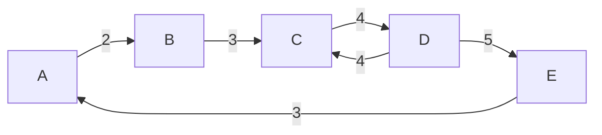
</details>

gate1995 algorithms graph-algorithms minimum-spanning-tree easy descriptive

# Answer key

# 1.31.4 Minimum Spanning Tree: GATE CSE 1996 | Question: 16

A complete, undirected, weighted graph $G$ is given on the vertex $\{0,1,\dots,n-1\}$ for any fixed 'n'. Draw the minimum spanning tree of $G$ if


A. the weight of the edge $(u,v)$ is $|u-v|$  
B. the weight of the edge $(u, v)$ is $u + v$

gate1996 algorithms graph-algorithms minimum-spanning-tree normal descriptive

# Answer key

# 1.31.5 Minimum Spanning Tree: GATE CSE 1997 | Question: 9

Consider a graph whose vertices are points in the plane with integer co-ordinates $(x,y)$ such that $1 \leq x \leq n$ and $1 \leq y \leq n$ , where $n \geq 2$ is an integer. Two vertices $(x_1, y_1)$ and $(x_2, y_2)$ are adjacent iff $|x_1 - x_2| \leq 1$ and $|y_1 - y_2| \leq 1$ . The weight of an edge $\{(x_1, y_1), (x_2, y_2)\}$ is $\sqrt{(x_1 - x_2)^2 + (y_1 - y_2)^2}$


A. What is the weight of a minimum weight-spanning tree in this graph? Write only the answer without any explanations.  
B. What is the weight of a maximum weight-spanning tree in this graph? Write only the answer without any explanations.

gate1997 algorithms minimum-spanning-tree normal descriptive

# Answer key

# 1.31.6 Minimum Spanning Tree: GATE CSE 2000 | Question: 2.18


Let $G$ be an undirected connected graph with distinct edge weights. Let $e_{max}$ be the edge with maximum weight and $e_{min}$ the edge with minimum weight. Which of the following statements is false?

A. Every minimum spanning tree of $G$ must contain $e_{min}$  
B. If $e_{max}$ is in a minimum spanning tree, then its removal must disconnect $G$  
C. No minimum spanning tree contains $e_{max}$  
D. G has a unique minimum spanning tree

gatecse-2000 algorithms minimum-spanning-tree normal

# Answer key

# 1.31.7 Minimum Spanning Tree: GATE CSE 2001 | Question: 15

Consider a weighted undirected graph with vertex set $V = \{n1, n2, n3, n4, n5, n6\}$ and edge set $E = \{(n1, n2, 2), (n1, n3, 8), (n1, n6, 3), (n2, n4, 4), (n2, n5, 12), (n3, n4, 7), (n4, n5, 9), (n4, n6, 4)\}$ .


The third value in each tuple represents the weight of the edge specified in the tuple.

A. List the edges of a minimum spanning tree of the graph.  
B. How many distinct minimum spanning trees does this graph have?  
C. Is the minimum among the edge weights of a minimum spanning tree unique over all possible minimum spanning trees of a graph?  
D. Is the maximum among the edge weights of a minimum spanning tree unique over all possible minimum spanning tree of a graph?

gatecse-2001 algorithms minimum-spanning-tree normal descriptive

# Answer key

# 1.31.8 Minimum Spanning Tree: GATE CSE 2003 | Question: 68

What is the weight of a minimum spanning tree of the following graph?


<details>
<summary>flowchart</summary>

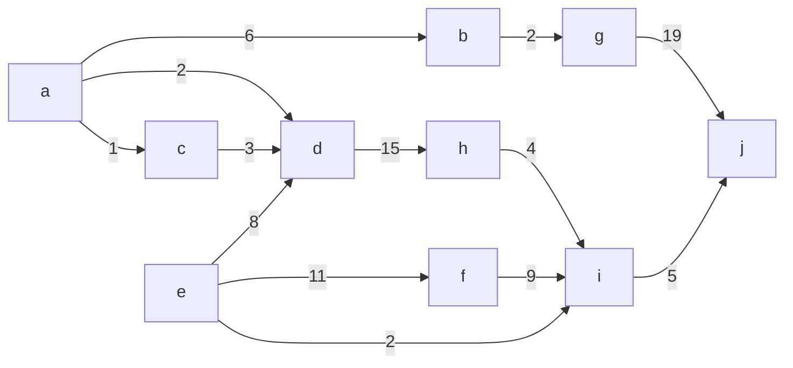
</details>

A. 29

B. 31

C. 38

D. 41

gatecse-2003 algorithms minimum-spanning-tree normal

# Answer key

# 1.31.9 Minimum Spanning Tree: GATE CSE 2005 | Question: 6

An undirected graph $G$ has $n$ nodes. its adjacency matrix is given by an $n \times n$ square matrix whose (i) diagonal elements are 0's and (ii) non-diagonal elements are 1's. Which one of the following is TRUE?


A. Graph G has no minimum spanning tree (MST)  
B. Graph $G$ has unique MST of cost $n - 1$  
C. Graph $G$ has multiple distinct MSTs, each of cost $n - 1$  
D. Graph G has multiple spanning trees of different costs

# Answer key

# 1.31.10 Minimum Spanning Tree: GATE CSE 2006 | Question: 11

Consider a weighted complete graph $G$ on the vertex set $\{v_1, v_2, \ldots, v_n\}$ such that the weight of the edge $(v_i, v_j)$ is $2|i - j|$ . The weight of a minimum spanning tree of $G$ is:


A. n - 1

B. $2n - 2$

C. $\binom{n}{2}$

D. $n^{2}$

gatecse-2006 algorithms minimum-spanning-tree normal

# Answer key

# 1.31.11 Minimum Spanning Tree: GATE CSE 2006 | Question: 47

Consider the following graph:


<details>
<summary>flowchart</summary>

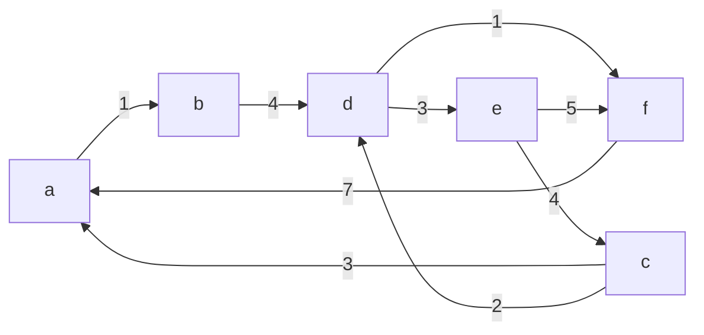
</details>


Which one of the following cannot be the sequence of edges added, in that order, to a minimum spanning tree using Kruskal's algorithm?

A. $(a - b),(d - f),(b - f),(d - c),(d - e)$

B. $(a - b),(d - f),(d - c),(b - f),(d - e)$

C. $(d - f),(a - b),(d - c),(b - f),(d - e)$

D. $(d - f),(a - b),(b - f),(d - e),(d - c)$

gatecse-2006 algorithms graph-algorithms minimum-spanning-tree normal

# Answer key

# 1.31.12 Minimum Spanning Tree: GATE CSE 2007 | Question: 49

Let $w$ be the minimum weight among all edge weights in an undirected connected graph. Let $e$ be a specific edge of weight $w$ . Which of the following is FALSE?


A. There is a minimum spanning tree containing e  
C. Every minimum spanning tree has an edge of weight w  
D. $e$ is present in every minimum spanning tree

B. If $e$ is not in a minimum spanning tree $T$ , then in the cycle formed by adding $e$ to $T$ , all edges have the same weight.

gatecse-2007 algorithms minimum-spanning-tree normal

# Answer key

# 1.31.13 Minimum Spanning Tree: GATE CSE 2009 | Question: 38

Consider the following graph:


<details>
<summary>flowchart</summary>

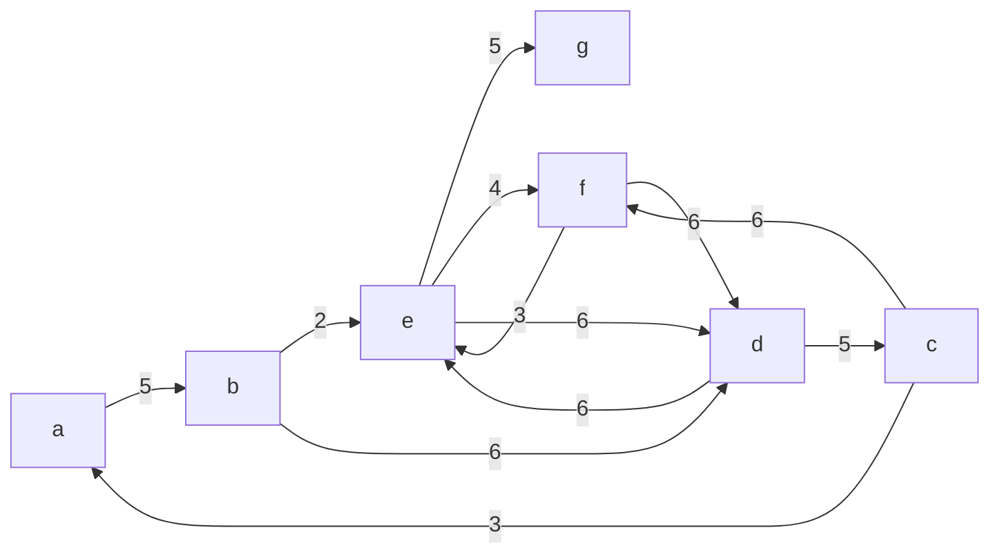
</details>

Which one of the following is NOT the sequence of edges added to the minimum spanning tree using Kruskal's algorithm?

A. (b, e) (e, f) (a, c) (b, c) (f, g) (c, d)  
B. (b, e) (e, f) (a, c) (f, g) (b, c) (c, d)  
C. (b, e) (a, c) (e, f) (b, c) (f, g) (c, d)  
D. (b, e) (e, f) (b, c) (a, c) (f, g) (c, d)

gatecse-2009 algorithms minimum-spanning-tree normal

# Answer key

# 1.31.14 Minimum Spanning Tree: GATE CSE 2010 | Question: 50

Consider a complete undirected graph with vertex set $\{0,1,2,3,4\}$ . Entry $W_{ij}$ in the matrix W below is the weight of the edge $\{i,j\}$


$$
W = \left( \begin{array}{c c c c c} 0 & 1 & 8 & 1 & 4 \\ 1 & 0 & 1 2 & 4 & 9 \\ 8 & 1 2 & 0 & 7 & 3 \\ 1 & 4 & 7 & 0 & 2 \\ 4 & 9 & 3 & 2 & 0 \end{array} \right)
$$

What is the minimum possible weight of a spanning tree T in this graph such that vertex 0 is a leaf node in the tree T?

A. 7

B. 8

C. 9

D. 10

gatecse-2010 algorithms minimum-spanning-tree normal

# Answer key

# 1.31.15 Minimum Spanning Tree: GATE CSE 2010 | Question: 51

Consider a complete undirected graph with vertex set $\{0,1,2,3,4\}$ . Entry $W_{ij}$ in the matrix W below is the weight of the edge $\{i,j\}$


$$
W = \left( \begin{array}{c c c c c} 0 & 1 & 8 & 1 & 4 \\ 1 & 0 & 1 2 & 4 & 9 \\ 8 & 1 2 & 0 & 7 & 3 \\ 1 & 4 & 7 & 0 & 2 \\ 4 & 9 & 3 & 2 & 0 \end{array} \right)
$$

What is the minimum possible weight of a path P from vertex 1 to vertex 2 in this graph such that P contains at most 3 edges?

A. 7

B. 8

C. 9

D. 10

gatecse-2010 normal algorithms minimum-spanning-tree

# Answer key

# 1.31.16 Minimum Spanning Tree: GATE CSE 2011 | Question: 54


An undirected graph $G(V, E)$ contains $n$ ( $n > 2$ ) nodes named $v_1, v_2, \ldots, v_n$ . Two nodes $v_i, v_j$ are connected if and only if $0 < |i - j| \leq 2$ . Each edge $(v_i, v_j)$ is assigned a weight $i + j$ . A sample graph with $n = 4$ is shown below.


<details>
<summary>flowchart</summary>

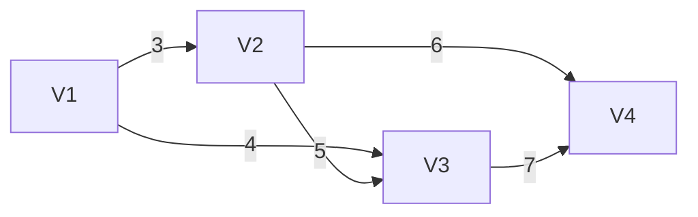
</details>

What will be the cost of the minimum spanning tree (MST) of such a graph with n nodes?

A. $\frac{1}{12} (11n^2 - 5n)$

B. $n^2 - n + 1$

C. $6n - 11$

D. $2n+1$

gatecse-2011 algorithms graph-algorithms minimum-spanning-tree normal

# Answer key

# 1.31.17 Minimum Spanning Tree: GATE CSE 2011 | Question: 55

An undirected graph $G(V, E)$ contains $n$ ( $n > 2$ ) nodes named $v_1, v_2, \ldots, v_n$ . Two nodes $v_i, v_j$ are connected if and only if $0 < |i - j| \leq 2$ . Each edge $(v_i, v_j)$ is assigned a weight $i + j$ . A sample graph with $n = 4$ is shown below.


The length of the path from $v_{5}$ to $v_{6}$ in the MST of previous question with n = 10 is

A. 11

B. 25

C. 31

D. 41

gatecse-2011 algorithms graph-algorithms minimum-spanning-tree normal

# Answer key

# 1.31.18 Minimum Spanning Tree: GATE CSE 2012 | Question: 29

Let $G$ be a weighted graph with edge weights greater than one and $G'$ be the graph constructed by squaring the weights of edges in $G$ . Let $T$ and $T'$ be the minimum spanning trees of $G$ and $G'$ , respectively, with total weights $t$ and $t'$ . Which of the following statements is TRUE?

A. $T' = T$ with total weight $t' = t^{2}$

B. $T^{\prime} = T$ with total weight $t^{\prime} < t^{2}$

C. $T' \neq T$ but total weight $t' = t^{2}$

D. None of the above

gatecse-2012 algorithms minimum-spanning-tree normal marks-to-all

# Answer key

# 1.31.19 Minimum Spanning Tree: GATE CSE 2014 | Set 2 | Question: 52

The number of distinct minimum spanning trees for the weighted graph below is \_\_\_\_


<details>
<summary>flowchart</summary>

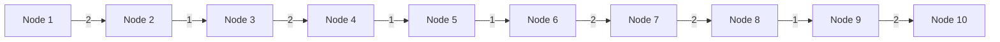
</details>

gatecse-2014-set2 algorithms minimum-spanning-tree numerical-answers normal

# Answer key


# 1.31.20 Minimum Spanning Tree: GATE CSE 2015 | Set 1 | Question: 43


The graph shown below has 8 edges with distinct integer edge weights. The minimum spanning tree (MST) is of weight 36 and contains the edges: $\{(A,C),(B,C),(B,E),(E,F),(D,F)\}$ . The edge weights of only those edges which are in the MST are given in the figure shown below. The minimum possible sum of weights of all 8 edges of this graph is \_\_\_\_.

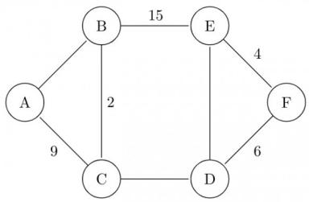

<details>
<summary>flowchart</summary>

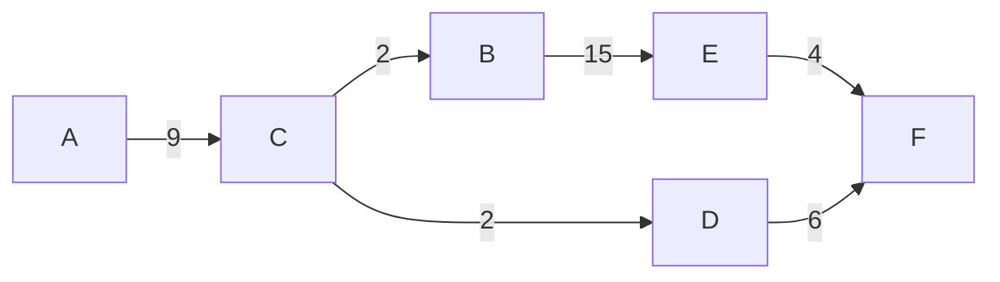
</details>

gatecse-2015-set1 algorithms minimum-spanning-tree normal numerical-answers

# Answer key

# 1.31.21 Minimum Spanning Tree: GATE CSE 2015 | Set 3 | Question: 40


Let $G$ be a connected undirected graph of 100 vertices and 300 edges. The weight of a minimum spanning tree of $G$ is 500. When the weight of each edge of $G$ is increased by five, the weight of a minimum spanning tree becomes \_\_\_\_.

gatecse-2015-set3 algorithms minimum-spanning-tree easy numerical-answers

# Answer key

# 1.31.22 Minimum Spanning Tree: GATE CSE 2016 | Set 1 | Question: 14


Let G be a weighted connected undirected graph with distinct positive edge weights. If every edge weight is increased by the same value, then which of the following statements is/are TRUE?

- $P$ : Minimum spanning tree of $G$ does not change.  
- $Q$ : Shortest path between any pair of vertices does not change.

A. P only

B. $Q$ only

C. Neither $P$ nor $Q$

D. Both $P$ and $Q$

gatecse-2016-set1 algorithms minimum-spanning-tree normal

# Answer key

# 1.31.23 Minimum Spanning Tree: GATE CSE 2016 | Set 1 | Question: 39


Let $G$ be a complete undirected graph on 4 vertices, having 6 edges with weights being 1, 2, 3, 4, 5, and 6. The maximum possible weight that a minimum weight spanning tree of $G$ can have is \_\_\_\_

gatecse-2016-set1 algorithms minimum-spanning-tree normal numerical-answers

# Answer key

# 1.31.24 Minimum Spanning Tree: GATE CSE 2016 | Set 1 | Question: 40


$G = (V, E)$ is an undirected simple graph in which each edge has a distinct weight, and $e$ is a particular edge of $G$ . Which of the following statements about the minimum spanning trees ( $MSTs$ ) of $G$ is/are TRUE?

I. If $e$ is the lightest edge of some cycle in $G$ , then every MST of $G$ includes $e$ .  
II. If $e$ is the heaviest edge of some cycle in $G$ , then every MST of $G$ excludes $e$ .

A. I only.

B. II only.

C. Both I and II.

D. Neither I nor II.

gatecse-2016-set1 algorithms minimum-spanning-tree normal

# Answer key

Consider the following undirected graph G:

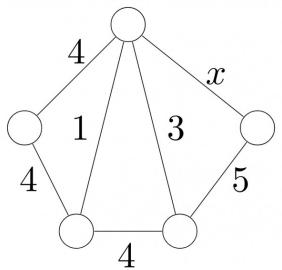

<details>
<summary>flowchart</summary>

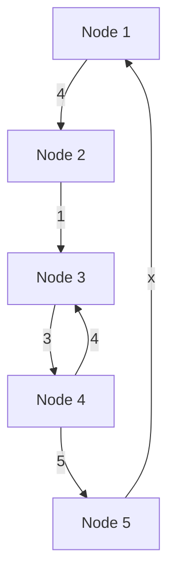
</details>

Choose a value for $x$ that will maximize the number of minimum weight spanning trees (MWSTs) of $G$ . The number of MWSTs of $G$ for this value of $x$ is \_\_\_\_.

gatecse-2018 algorithms graph-algorithms minimum-spanning-tree numerical-answers two-marks

Answer key

# 1.31.26 Minimum Spanning Tree: GATE CSE 2020 | Question: 31


Let $G = (V, E)$ be a weighted undirected graph and let $T$ be a Minimum Spanning Tree (MST) of $G$ maintained using adjacency lists. Suppose a new weighed edge $(u, v) \in V \times V$ is added to $G$ . The worst case time complexity of determining if $T$ is still an MST of the resultant graph is

A. $\Theta (|E| + |V|)$ C. $\Theta (E|\log |V|)$

B. $\Theta (|E||V|)$ D. $\Theta (|V|)$

gatecse-2020 algorithms minimum-spanning-tree graph-algorithms two-marks

Answer key

# 1.31.27 Minimum Spanning Tree: GATE CSE 2020 | Question: 49


Consider a graph $G = (V, E)$ , where $V = \{v_1, v_2, \ldots, v_{100}\}$ , $E = \{(v_i, v_j) \mid 1 \leq i < j \leq 100\}$ , and weight of the edge $(v_i, v_j)$ is $|i - j|$ . The weight of minimum spanning tree of $G$ is \_\_\_\_

gatecse-2020 numerical-answers algorithms graph-algorithms two-marks minimum-spanning-tree

Answer key

# 1.31.28 Minimum Spanning Tree: GATE CSE 2021 | Set 1 | Question: 17


Consider the following undirected graph with edge weights as shown:

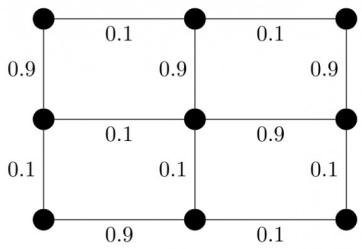

<details>
<summary>wireframe</summary>

| Row | Column 1 | Column 2 | Column 3 | Column 4 |
| --- | --- | --- | --- | --- |
| 1 | 0.9 | 0.1 | 0.1 | 0.9 |
| 2 | 0.9 | 0.1 | 0.9 | 0.9 |
| 3 | 0.1 | 0.1 | 0.1 | 0.9 |
| 4 | 0.1 | 0.1 | 0.1 | 0.1 |
</details>

The number of minimum-weight spanning trees of the graph is \_\_\_\_.

gatecse-2021-set1 algorithms graph-algorithms minimum-spanning-tree numerical-answers one-mark

Answer key

# 1.31.29 Minimum Spanning Tree: GATE CSE 2021 | Set 2 | Question: 1


Let $G$ be a connected undirected weighted graph. Consider the following two statements.

- $S_{1}$ : There exists a minimum weight edge in $G$ which is present in every minimum spanning tree of $G$ .  
- $S_{2}$ : If every edge in $G$ has distinct weight, then $G$ has a unique minimum spanning tree.

Which one of the following options is correct?

A. Both $S_{1}$ and $S_{2}$ are true  
C. $S_{1}$ is false and $S_{2}$ is true

B. $S_{1}$ is true and $S_{2}$ is false  
D. Both $S_{1}$ and $S_{2}$ are false

gatecse-2021-set2 algorithms graph-algorithms minimum-spanning-tree one-mark

# Answer key

# 1.31.30 Minimum Spanning Tree: GATE CSE 2022 | Question: 39

Consider a simple undirected weighted graph G, all of whose edge weights are distinct. Which of the following statements about the minimum spanning trees of G is/are TRUE?


A. The edge with the second smallest weight is always part of any minimum spanning tree of G.  
B. One or both of the edges with the third smallest and the fourth smallest weights are part of any minimum spanning tree of $G$ .  
C. Suppose $S \subseteq V$ be such that $S \neq \phi$ and $S \neq V$ . Consider the edge with the minimum weight such that one of its vertices is in $S$ and the other in $V \setminus S$ . Such an edge will always be part of any minimum spanning tree of $G$ .  
D. G can have multiple minimum spanning trees.

gatecse-2022 algorithms minimum-spanning-tree multiple-selects two-marks

# Answer key

# 1.31.31 Minimum Spanning Tree: GATE CSE 2022 | Question: 48

Let $G(V,E)$ be a directed graph, where $V = \{1,2,3,4,5\}$ is the set of vertices and $E$ is the set of directed edges, as defined by the following adjacency matrix $A$ .


$$
A [ i ] [ j ] = \left\{ \begin{array}{l l} 1, & 1 \leq j \leq i \leq 5 \\ 0, & \text {otherwise} \end{array} \right.
$$

$A[i][j]=1$ indicates a directed edge from node i to node j. A directed spanning tree of G, rooted at $r\in V$ , is defined as a subgraph T of G such that the undirected version of T is a tree, and T contains a directed path from r to every other vertex in V. The number of such directed spanning trees rooted at vertex 5 is

gatecse-2022 numerical-answers algorithms minimum-spanning-tree two-marks

# Answer key

# 1.31.32 Minimum Spanning Tree: GATE CSE 2024 | Set 2 | Question: 49

The number of distinct minimum-weight spanning trees of the following graph is


<details>
<summary>flowchart</summary>

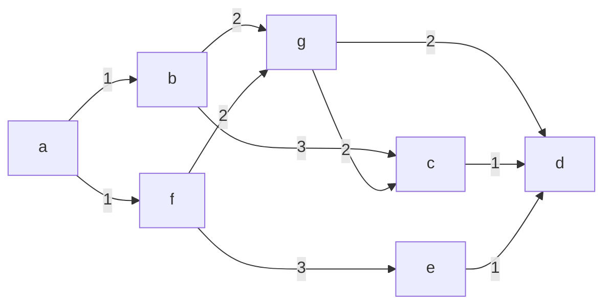
</details>

gatecse-2024-set2 numerical-answers algorithms minimum-spanning-tree two-marks

# Answer key

# 1.31.33 Minimum Spanning Tree: GATE CSE 2025 | Set 1 | Question: 54

The maximum value of x such that the edge between the nodes B and C is included in every minimum spanning tree of the given graph is \_\_\_\_. (answer in integer)


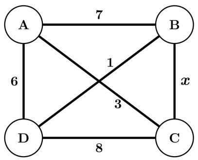

<details>
<summary>flowchart</summary>

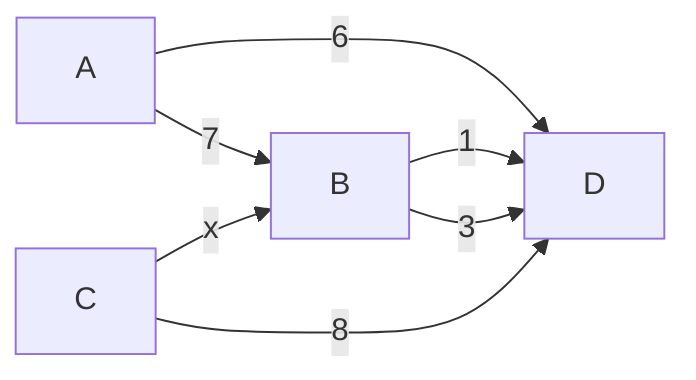
</details>

gatecse2025-set1 algorithms minimum-spanning-tree numerical-answers easy two-marks

# Answer key

# 1.31.34 Minimum Spanning Tree: GATE CSE 2026 | Set 1 | Question: 39

Let $G(V, E)$ be a simple, undirected, edge-weighted graph with unique edge weights. Which of the following statements about the minimum spanning trees (MST) of $G$ is/are true?

A. In every cycle C of G, the edge with the largest weight in C is not in any MST  
B. In every cycle $C$ of $G$ , the edge with the smallest weight in $C$ is in every MST  
C. For every vertex $v \in V$ , the edge with the largest weight incident on $v$ is not in any MST  
D. For every vertex $v \in V$ , the edge with the smallest weight incident on $v$ is in every MST

gatecse-2026-set1 two-marks algorithms minimum-spanning-tree multiple-selects

# Answer key

# 1.31.35 Minimum Spanning Tree: GATE IT 2005 | Question: 52

Let $G$ be a weighted undirected graph and e be an edge with maximum weight in $G$ . Suppose there is a minimum weight spanning tree in $G$ containing the edge e. Which of the following statements is always TRUE?

A. There exists a cutset in G having all edges of maximum weight.  
B. There exists a cycle in G having all edges of maximum weight.  
C. Edge e cannot be contained in a cycle.  
D. All edges in G have the same weight.

gateit-2005 algorithms minimum-spanning-tree normal

# Answer key

# 1.32

# Number of Swap (1)

# 1.32.1 Number of Swap: GATE CSE 2025 | Set 1 | Question: 23

The pseudocode of a function fun () is given below:


```txt
fun(int A[0, ..., n-1]) {
for i=0 to n-2
for j=0 to n-i-2
if (A[j]>A[j+1])
then swap A[j] and A[j+1]
}
```

Let $A[0, \ldots, 29]$ be an array storing 30 distinct integers in descending order. The number of swap operations that will be performed, if the function fun () is called with $A[0, \ldots, 29]$ as argument, is \_\_\_\_. (Answer in integer)

gatecse2025-set1 data-structures array number-of-swap numerical-answers one-mark

# Answer key


# 1.33.1 Prims Algorithm: GATE IT 2004 | Question: 56

Consider the undirected graph below:


<details>
<summary>bubble</summary>

| Node | Value |
| --- | --- |
| A | 10 |
| B | 49 |
| C | 10 |
| D | 7 |
| E | 2 |
| F | 5 |
| G | 26 |
| C & D & E & F & G | 22 |
</details>

Using Prim's algorithm to construct a minimum spanning tree starting with node A, which one of the following sequences of edges represents a possible order in which the edges would be added to construct the minimum spanning tree?

A. (E, G), (C, F), (F, G), (A, D), (A, B), (A, C)  
B. (A, D), (A, B), (A, C), (C, F), (G, E), (F, G)  
C. (A, B), (A, D), (D, F), (F, G), (G, E), (F, C)  
D. (A, D), (A, B), (D, F), (F, C), (F, G), (G, E)

gateit-2004 algorithms graph-algorithms normal prims-algorithm

Answer key

# 1.33.2 Prims Algorithm: GATE IT 2008 | Question: 45

For the undirected, weighted graph given below, which of the following sequences of edges represents a correct execution of Prim's algorithm to construct a Minimum Spanning Tree?


<details>
<summary>flowchart</summary>

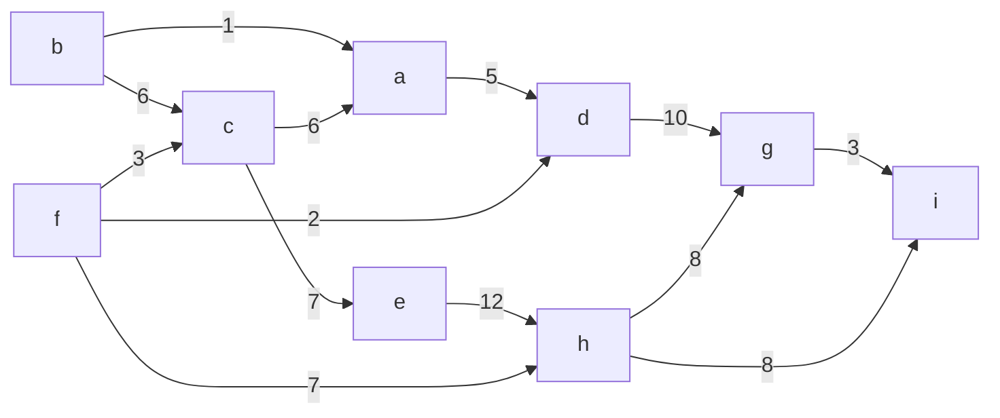
</details>

A. (a, b), (d, f), (f, c), (g, i), (d, a), (g, h), (c, e), (f, h)  
B. (c, e), (c, f), (f, d), (d, a), (a, b), (g, h), (h, f), (g, i)  
C. (d, f), (f, c), (d, a), (a, b), (c, e), (f, h), (g, h), (g, i)  
D. (h, g), (g, i), (h, f), (f, c), (f, d), (d, a), (a, b), (c, e)

gateit-2008 algorithms graph-algorithms minimum-spanning-tree normal prims-algorithm

Answer key

# 1.34

# Quick Sort (15)

Practice Tests: Test 1 (15Q) Test 2 (2Q)

# 1.34.1 Quick Sort: GATE CSE 1987 | Question: 1-xviii

Let P be a quicksort program to sort numbers in ascending order. Let $t_{1}$ and $t_{2}$ be the time taken by the program for the inputs [1 2 3 4] and [5 4 3 2 1], respectively. Which of the following holds?


A. $t_1 = t_2$

C. $t_{1} < t_{2}$

gate1987 algorithms sorting quick-sort

B. $t_1 > t_2$  
D. $t_1 = t_2 + 5\log 5$

Answer key

# 1.34.2 Quick Sort: GATE CSE 1989 | Question: 9


An input files has 10 records with keys as given below:

25 7 34 2 70 9 61 16 49 19

This is to be sorted in non-decreasing order.

i. Sort the input file using QUICKSORT by correctly positioning the first element of the file/subfile. Show the subfiles obtained at all intermediate steps. Use square brackets to demarcate subfiles.  
ii. Sort the input file using 2-way- MERGESORT showing all major intermediate steps. Use square brackets to demarcate subfiles.

gate1989 descriptive algorithms sorting quick-sort

# Answer key

# 1.34.3 Quick Sort: GATE CSE 1992 | Question: 03,iv

Assume that the last element of the set is used as partition element in Quicksort. If $n$ distinct elements from the set $[1 \ldots n]$ are to be sorted, give an input for which Quicksort takes maximum time.


gate1992 algorithms sorting easy quick-sort descriptive

# Answer key

# 1.34.4 Quick Sort: GATE CSE 1996 | Question: 2.15

Quick-sort is run on two inputs shown below to sort in ascending order taking first element as pivot


i. $1,2,3,\ldots n$  
ii. $n, n - 1, n - 2, \dots, 2, 1$

Let $C_{1}$ and $C_{2}$ be the number of comparisons made for the inputs (i) and (ii) respectively. Then,

A. $C_{1} < C_{2}$  
c. $C_{1}=C_{2}$

B. $C_1 > C_2$  
D. we cannot say anything for arbitrary n

gate1996 algorithms sorting normal quick-sort

# Answer key

# 1.34.5 Quick Sort: GATE CSE 2001 | Question: 1.14

Randomized quicksort is an extension of quicksort where the pivot is chosen randomly. What is the worst case complexity of sorting n numbers using Randomized quicksort?


A. $O(n)$

B. $O(n\log n)$

c. $O(n^{2})$

D. $O(n!)$

gatecse-2001 algorithms sorting time-complexity easy quick-sort

# Answer key

# 1.34.6 Quick Sort: GATE CSE 2006 | Question: 52

The median of $n$ elements can be found in $O(n)$ time. Which one of the following is correct about the complexity of quick sort, in which median is selected as pivot?


A. $\Theta(n)$  
C. $\Theta(n^{2})$

B. $\Theta(n \log n)$

gatecse-2006 algorithms sorting easy quick-sort

# Answer key

# 1.34.7 Quick Sort: GATE CSE 2008 | Question: 43

Consider the Quicksort algorithm. Suppose there is a procedure for finding a pivot element which splits the list into two sub-lists each of which contains at least one-fifth of the elements. Let $T(n)$ be the number of comparisons required to sort n elements. Then


A. $T(n) \leq 2T(n / 5) + n$

B. $T(n) \leq T(n / 5) + T(4n / 5) + n$

C. $T(n) \leq 2T(4n / 5) + n$

D. $T(n) \leq 2T(n / 2) + n$

gatecse-2008 algorithms sorting easy quick-sort

# Answer key

# 1.34.8 Quick Sort: GATE CSE 2009 | Question: 39


In quick-sort, for sorting $n$ elements, the $(n/4)^{th}$ smallest element is selected as pivot using an $O(n)$ time algorithm. What is the worst case time complexity of the quick sort?

A. $\Theta(n)$

B. $\Theta(n \log n)$

C. $\Theta(n^{2})$

D. $\Theta(n^{2}\log n)$

gatecse-2009 algorithms sorting normal quick-sort

# Answer key

# 1.34.9 Quick Sort: GATE CSE 2014 | Set 1 | Question: 14

Let P be quicksort program to sort numbers in ascending order using the first element as the pivot. Let $t_{1}$ and $t_{2}$ be the number of comparisons made by P for the inputs [1 2 3 4 5] and [4 1 5 3 2] respectively. Which one of the following holds?

A. $t_{1}=5$

B. $t_1 < t_2$

C. $t_{1} > t_{2}$

D. $t_{1}=t_{2}$

gatecse-2014-set1 algorithms sorting easy quick-sort

# Answer key

# 1.34.10 Quick Sort: GATE CSE 2014 | Set 3 | Question: 14


You have an array of $n$ elements. Suppose you implement quicksort by always choosing the central element of the array as the pivot. Then the tightest upper bound for the worst case performance is

A. $O(n^{2})$

B. $O(n\log n)$

C. $\Theta(n \log n)$

D. $O(n^{3})$

gatecse-2014-set3 algorithms sorting easy quick-sort

# Answer key

# 1.34.11 Quick Sort: GATE CSE 2015 | Set 1 | Question: 2


Which one of the following is the recurrence equation for the worst case time complexity of the quick sort algorithm for sorting $n (\geq 2)$ numbers? In the recurrence equations given in the options below, c is a constant.

A. $T(n) = 2T(n / 2) + cn$

B. $T(n) = T(n - 1) + T(1) + cn$

C. $T(n) = 2T(n - 1) + cn$

D. $T(n) = T(n / 2) + cn$

gatecse-2015-set1 algorithms recurrence-relation sorting easy quick-sort

# Answer key

# 1.34.12 Quick Sort: GATE CSE 2015 | Set 2 | Question: 45


Suppose you are provided with the following function declaration in the C programming language.

int partition(int a[], int n);


The function treats the first element of $a[]$ as a pivot and rearranges the array so that all elements less than or equal to the pivot is in the left part of the array, and all elements greater than the pivot is in the right part. In addition, it moves the pivot so that the pivot is the last element of the left part. The return value is the number of elements in the left part.

The following partially given function in the C programming language is used to find the $k^{th}$ smallest element in an array $a[]$ of size $n$ using the partition function. We assume $k \leq n$ .

int kth\_smallest (int a[], int n, int k)

int left\_end = partition (a, n);

```txt
if (left_end+1==k) {
        return a[left_end];
    }
    if (left_end+1 > k) {
        return kth_smallest (________);
    } else {
        return kth_smallest (________);
    }
}
```

The missing arguments lists are respectively

A. (a, left\_end, k) and (a+left\_end +1, n-left\_end -1, k-left\_end -1)  
C. $(a+$ left\_end+1, $n$ -left\_end $-1, k$ -left\_end-1) and $(a,$ $\text{left\_end}, k)$

gatecse-2015-set2 algorithms normal sorting quick-sort

B. $(a, \text{left\_end}, k)$ and $(a, n - \text{left\_end} - 1, k - \text{left\_end} - 1)$  
D. $(a, n-\text{left\_end}-1, k-\text{left\_end}-1)$ and $(a, \text{left\_end}, k)$

# Answer key

# 1.34.13 Quick Sort: GATE CSE 2019 | Question: 20


An array of 25 distinct elements is to be sorted using quicksort. Assume that the pivot element is chosen uniformly at random. The probability that the pivot element gets placed in the worst possible location in the first round of partitioning (rounded off to 2 decimal places) is \_\_\_\_

gatecse-2019 numerical-answers algorithms quick-sort probability one-mark

# Answer key

# 1.34.14 Quick Sort: GATE DA 2026 | Question: 5

Consider that the quick sort algorithm is used to sort an array of n distinct randomly ordered elements. In every call, the pivot is chosen as the first element of the current subarray.


Let $T(n)$ denote the expected time to sort the array. Assume that the time to partition is linear in the size of the current subarray.

Which of the following recurrence relations correctly represents $T(n)$ in this scenario?

A. $T(n) = T(1) + T(n - 1) + O(n)$

B. $T(n) = T\left(\frac{n}{4}\right) + T\left(\frac{3n}{4}\right) + O(n)$  
D. $T(n) = \frac{1}{n}\sum_{k = 0}^{n - 1}[T(k) + T(n - k - 1)] + O(n)$

C. $T(n)=2T\left(\frac{n}{2}\right)+O(n)$

gateda-2026 algorithms quick-sort recurrence-relation one-mark

# Answer key

# 1.34.15 Quick Sort: GATE DS&AI 2024 | Question: 20

Consider sorting the following array of integers in ascending order using an inplace Quicksort algorithm that uses the last element as the pivot.

<table><tr><td>60</td><td>70</td><td>80</td><td>90</td><td>100</td></tr></table>


The minimum number of swaps performed during this Quicksort is \_\_\_\_.

gate-ds-ai-2024 numerical-answers algorithms quick-sort one-mark

# Answer key

# 1.35

# Recurrence Relation (36)

Practice Tests: Test 1 (15Q) Test 2 (14Q)

# 1.35.1 Recurrence Relation: GATE CSE 1987 | Question: 10a

Solve the recurrence equations:

- $T(n) = T(n - 1) + n$  
- $T(1) = 1$

gate1987 algorithms recurrence-relation descriptive

Answer key

# 1.35.2 Recurrence Relation: GATE CSE 1988 | Question: 13iv

Solve the recurrence equations:

- $T(n) = T(\frac{n}{2}) + 1$  
- $T(1) = 1$

gate1988 descriptive algorithms recurrence-relation

Answer key

# 1.35.3 Recurrence Relation: GATE CSE 1989 | Question: 13b

Find a solution to the following recurrence equation:

- $T(n) = \sqrt{n} + T\left(\frac{n}{2}\right)$  
- $T(1) = 1$

gate1989 descriptive algorithms recurrence-relation

Answer key

# 1.35.4 Recurrence Relation: GATE CSE 1990 | Question: 17a

Express $T(n)$ in terms of the harmonic number $H_{n} = \sum_{i=1}^{n} \frac{1}{i}$ , $n \geq 1$ , where $T(n)$ satisfies the recurrence relation,

$$
T (n) = \frac {n + 1}{n} T (n - 1) + 1, \text {for} n \geq \sum \text {and} T (1) = 1
$$

What is the asymptotic behaviour of $T(n)$ as a function of n?

gate1990 descriptive algorithms recurrence-relation

Answer key

# 1.35.5 Recurrence Relation: GATE CSE 1992 | Question: 07a

Consider the function $F(n)$ for which the pseudocode is given below :

```txt
Function F(n)
begin
F1 ← 1
if(n=1) then F ← 3
else
    For i = 1 to n do
        begin
            C ← 0
        For j = 1 to n - 1 do
            begin C ← C + 1 end
            F1 = F1 * C
        end
F = F1
end
```


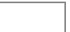

[n is a positive integer greater than zero]

A. Derive a recurrence relation for $F(n)$ .

gate1992 algorithms recurrence-relation descriptive

Answer key

# 1.35.6 Recurrence Relation: GATE CSE 1992 | Question: 07b

Consider the function $F(n)$ for which the pseudocode is given below :


```txt
Function F(n)
begin
F1 ← 1
if(n=1) then F ← 3
else
    For i = 1 to n do
        begin
            C ← 0
        For j = 1 to n - 1 do
            begin C ← C + 1 end
            F1 = F1 * C
        end
F = F1
end
```

[n is a positive integer greater than zero]

B. Solve the recurrence relation for a closed form solution of $F(n)$ .

gate1992 algorithms recurrence-relation descriptive

Answer key

# 1.35.7 Recurrence Relation: GATE CSE 1993 | Question: 15

Consider the recursive algorithm given below:


```txt
procedure bubblesort (n);
var i,j: index; temp : item;
begin
    for i:=1 to n-1 do
        if A[i] > A[i+1] then
            begin
                temp := A[i];
                A[i] := A[i+1];
                A[i+1] := temp;
            end;
    bubblesort (n-1)
end
```

Let $a_{n}$ be the number of times the ‘if...then...’ statement gets executed when the algorithm is run with value n. Set up the recurrence relation by defining $a_{n}$ in terms of $a_{n-1}$ . Solve for $a_{n}$ .

gate1993 algorithms recurrence-relation normal descriptive

Answer key

# 1.35.8 Recurrence Relation: GATE CSE 1994 | Question: 1.7, ISRO2017-14

The recurrence relation that arises in relation with the complexity of binary search is:

A. $T(n)=2T\left(\frac{n}{2}\right)+k,$ k is a constant

B. $T(n) = T\left(\frac{n}{2}\right) + k, \mathrm{k}$ is a constant

C. $T(n) = T\left(\frac{n}{2}\right) + \log n$

D. $T(n) = T\left(\frac{n}{2}\right) + n$

gate1994 algorithms recurrence-relation easy isro2017

Answer key


# 1.35.9 Recurrence Relation: GATE CSE 1996 | Question: 2.12

The recurrence relation

- $T(1) = 2$  
- $T(n) = 3T(\frac{n}{4}) + n$

has the solution $T(n)$ equal to

A. $O(n)$

B. $O(\log n)$

C. $O\left(n^{\frac{3}{4}}\right)$

D. None of the above

gate1996 algorithms recurrence-relation normal

# Answer key

# 1.35.10 Recurrence Relation: GATE CSE 1997 | Question: 15

Consider the following function.


```vhdl
Function F(n, m:integer):integer;
begin
  if (n<=0) or (m<=0) then F:=1
  else
    F:F(n-1, m) + F(n-1, m-1);
end;
```

Use the recurrence relation $\binom{n}{k}=\binom{n-1}{k}+\binom{n-1}{k-1}$ to answer the following questions. Assume that n, m are positive integers. Write only the answers without any explanation.

a. What is the value of $F(n,2)$ ?  
b. What is the value of $F(n, m)$ ?  
c. How many recursive calls are made to the function $F$ , including the original call, when evaluating $F(n, m)$ .

gate1997 algorithms recurrence-relation descriptive

# Answer key

# 1.35.11 Recurrence Relation: GATE CSE 1997 | Question: 4.6

Let $T(n)$ be the function defined by $T(1) = 1$ , $T(n) = 2T(\lfloor \frac{n}{2} \rfloor) + \sqrt{n}$ for $n \geq 2$ .

Which of the following statements is true?

A. $T(n) = O\sqrt{n}$

B. $T(n) = O(n)$

C. $T(n) = O(\log n)$

D. None of the above

gate1997 algorithms recurrence-relation normal

# Answer key


# 1.35.12 Recurrence Relation: GATE CSE 1998 | Question: 6a

Solve the following recurrence relation

$$
x _ {n} = 2 x _ {n - 1} - 1, n > 1
$$

$$
x _ {1} = 2
$$

gate1998 algorithms recurrence-relation descriptive

# Answer key

# 1.35.13 Recurrence Relation: GATE CSE 2002 | Question: 1.3

The solution to the recurrence equation $T(2^k) = 3T(2^{k - 1}) + 1, T(1) = 1$ is

A. $2^{k}$

B. $\frac{(3^{k+1}-1)}{2}$

C. $3^{\log_2 k}$

D. $2^{\log_3 k}$


# 1.35.14 Recurrence Relation: GATE CSE 2002 | Question: 2.11

The running time of the following algorithm

Procedure $A(n)$

If $n \leqslant 2$ return (1) else return $(A(\lceil \sqrt{n} \rceil))$ ;

is best described by

A. $O(n)$

B. $O(\log n)$

c. $O(\log \log n)$

D. $O(1)$

gatecse-2002 algorithms recurrence-relation normal

# Answer key

# 1.35.15 Recurrence Relation: GATE CSE 2003 | Question: 35

Consider the following recurrence relation

$$
T (1) = 1
$$

$$
T (n + 1) = T (n) + \lfloor \sqrt {n + 1} \rfloor \text { for   all } n \geq 1
$$

The value of $T(m^2)$ for $m \geq 1$ is

A. $\frac{m}{6}(21m - 39) + 4$

C. $\frac{m}{2} (3m^{2.5} - 11m + 20) - 5$

gatecse-2003 algorithms time-complexity recurrence-relation difficult

B. $\frac{m}{6} (4m^2 - 3m + 5)$

D. $\frac{m}{6} (5m^3 - 34m^2 + 137m - 104) + \frac{5}{6}$

# Answer key

# 1.35.16 Recurrence Relation: GATE CSE 2004 | Question: 83, ISRO2015-40

The time complexity of the following C function is (assume $n > 0$ )

```txt
int recursive (int n) {
    if(n == 1)
        return (1);
    else
        return (recursive (n-1) + recursive (n-1));
}
```

A. $O(n)$

B. $O(n\log n)$

C. $O(n^{2})$

D. $O(2^{n})$

gatecse-2004 algorithms recurrence-relation time-complexity normal isro2015

# Answer key

# 1.35.17 Recurrence Relation: GATE CSE 2004 | Question: 84

The recurrence equation

$$
T (1) = 1
$$

$$
T (n) = 2 T (n - 1) + n, n \geq 2
$$

evaluates to

A. $2^{n + 1} - n - 2$

B. $2^{n} - n$

C. $2^{n + 1} - 2n - 2$

D. $2^{n} + n$

gatecse-2004 algorithms recurrence-relation normal

# Answer key

# 1.35.18 Recurrence Relation: GATE CSE 2006 | Question: 51, ISRO2016-34

Consider the following recurrence:

$$
T (n) = 2 T (\sqrt {n}) + 1, T (1) = 1
$$


Which one of the following is true?

A. $T(n) = \Theta (\log \log n)$

B. $T(n) = \Theta (\log n)$

C. $T(n) = \Theta(\sqrt{n})$

D. $T(n) = \Theta(n)$

algorithms recurrence-relation isro2016 gatecse-2006

# Answer key

# 1.35.19 Recurrence Relation: GATE CSE 2008 | Question: 78

Let $x_{n}$ denote the number of binary strings of length n that contain no consecutive 0s.

Which of the following recurrences does $x_{n}$ satisfy?

A. $x_{n} = 2x_{n - 1}$

B. $x_{n} = x_{|n / 2|} + 1$

C. $x_{n} = x_{\lfloor n / 2\rfloor} + n$

D. $x_{n} = x_{n - 1} + x_{n - 2}$

gatecse-2008 algorithms recurrence-relation normal

# Answer key

# 1.35.20 Recurrence Relation: GATE CSE 2008 | Question: 79

Let $x_{n}$ denote the number of binary strings of length n that contain no consecutive 0s.

The value of $x_{5}$ is

A. 5

B. 7

C. 8

D. 16

gatecse-2008 algorithms recurrence-relation normal

# Answer key

# 1.35.21 Recurrence Relation: GATE CSE 2009 | Question: 35

The running time of an algorithm is represented by the following recurrence relation:

$$
T (n) = \left\{ \begin{array}{l l} n & n \leq 3 \\ T (\frac {n}{3}) + c n & \text {otherwise} \end{array} \right.
$$

Which one of the following represents the time complexity of the algorithm?

A. $\Theta(n)$

B. $\Theta(n \log n)$

C. $\Theta(n^{2})$

D. $\Theta(n^{2}\log n)$

gatecse-2009 algorithms recurrence-relation time-complexity normal

# Answer key

# 1.35.22 Recurrence Relation: GATE CSE 2012 | Question: 16

The recurrence relation capturing the optimal execution time of the Towers of Hanoi problem with n discs is

A. $T(n) = 2T(n - 2) + 2$

B. $T(n) = 2T(n - 1) + n$

C. $T(n) = 2T(n / 2) + 1$

D. $T(n) = 2T(n - 1) + 1$

gatecse-2012 algorithms easy recurrence-relation

# Answer key

# 1.35.23 Recurrence Relation: GATE CSE 2014 | Set 2 | Question: 13

Which one of the following correctly determines the solution of the recurrence relation with $T(1)=1$ ?

$$
T (n) = 2 T \left(\frac {n}{2}\right) + \log n
$$

A. $\Theta(n)$

B. $\Theta(n \log n)$

C. $\Theta(n^{2})$

D. $\Theta (\log n)$

gatecse-2014-set2 algorithms recurrence-relation normal

# Answer key


# 1.35.24 Recurrence Relation: GATE CSE 2015 | Set 1 | Question: 49


Let $a_{n}$ represent the number of bit strings of length n containing two consecutive 1s. What is the recurrence relation for $a_{n}$ ?

A. $a_{n - 2} + a_{n - 1} + 2^{n - 2}$  
C. $2a_{n - 2} + a_{n - 1} + 2^{n - 2}$

B. $a_{n - 2} + 2a_{n - 1} + 2^{n - 2}$

D. $2a_{n-2} + 2a_{n-1} + 2^{n-2}$

gatecse-2015-set1 algorithms recurrence-relation normal

# Answer key

# 1.35.25 Recurrence Relation: GATE CSE 2015 | Set 3 | Question: 39

Consider the following recursive C function.


```txt
void get(int n)
{
    if (n<1) return;
    get (n-1);
    get (n-3);
    printf("%d", n);
}
```

If get(6) function is being called in main() then how many times will the get() function be invoked before returning to the main()?

A. 15

B. 25

C. 35

D. 45

gatecse-2015-set3 algorithms recurrence-relation normal

# Answer key

# 1.35.26 Recurrence Relation: GATE CSE 2016 | Set 2 | Question: 39


The given diagram shows the flowchart for a recursive function $A(n)$ . Assume that all statements, except for the recursive calls, have $O(1)$ time complexity. If the worst case time complexity of this function is $O(n^{\alpha})$ , then the least possible value (accurate up to two decimal positions) of $\alpha$ is \_\_\_\_.

Flow chart for Recursive Function $A(n)$ .


<details>
<summary>flowchart</summary>

```mermaid
graph TD
  Start(["Start"]) --> A["A(n/2)"]
  A --> Check{"{""}
  Check -->|Yes| A["A(n/2)"]
  Check -->|No| A
  A --> A2["A(n/2)"]
  A2 --> Check2{"{""}
  Check2 -->|Yes| A2["A(n/2)"]
  Check2 -->|No| A
  A2 --> Check3{"{""}
  Check3 -->|Yes| A2["A(n/2)"]
  Check3 -->|No| A
  A2 --> Return1(["Return"])
  A2 --> Return2(["Return"])
  A2 --> Return3(["Return"])
```
</details>

gatecse-2016-set2 algorithms time-complexity recurrence-relation normal numerical-answers

# Answer key

# 1.35.27 Recurrence Relation: GATE CSE 2017 | Set 2 | Question: 30

Consider the recurrence function

$$
T (n) = \left\{ \begin{array}{l l} 2 T (\sqrt {n}) + 1, & n > 2 \\ 2, & 0 <   n \leq 2 \end{array} \right.
$$

Then $T(n)$ in terms of $\Theta$ notation is

A. $\Theta (\log \log n)$

B. $\Theta (\log n)$


C. $\Theta(\sqrt{n})$

D. $\Theta(n)$

gatecse-2017-set2 algorithms recurrence-relation

Answer key

# 1.35.28 Recurrence Relation: GATE CSE 2020 | Question: 2

For parameters $a$ and $b$ , both of which are $\omega(1)$ , $T(n) = T(n^{1/a}) + 1$ , and $T(b) = 1$ . Then $T(n)$ is

A. $\Theta (\log_a\log_bn)$

B. $\Theta (\log_{ab}n)$

C. $\Theta (\log_b\log_a n)$

D. $\Theta (\log_2\log_2n)$

gatecse-2020 algorithms recurrence-relation one-mark

Answer key

# 1.35.29 Recurrence Relation: GATE CSE 2021 | Set 1 | Question: 30

Consider the following recurrence relation.

$$
T (n) = \left\{ \begin{array}{l l} T (n / 2) + T (2 n / 5) + 7 n & \text {if} n > 0 \\ 1 & \text {if} n = 0 \end{array} \right.
$$

Which one of the following options is correct?

A. $T(n) = \Theta (n^{5 / 2})$

B. $T(n) = \Theta (n\log n)$

C. $T(n) = \Theta(n)$

D. $T(n) = \Theta ((\log n)^{5/2})$

gatecse-2021-set1 algorithms recurrence-relation time-complexity two-marks

Answer key

# 1.35.30 Recurrence Relation: GATE CSE 2021 | Set 2 | Question: 39

For constants $a \geq 1$ and b > 1, consider the following recurrence defined on the non-negative integers:

$$
T (n) = a \cdot T \left(\frac {n}{b}\right) + f (n)
$$

Which one of the following options is correct about the recurrence $T(n)$ ?

A. If $f(n)$ is $n\log_2(n)$ , then $T(n)$ is $\Theta(n\log_2(n))$  
B. If $f(n)$ is $\frac{n}{\log_2(n)}$ , then $T(n)$ is $\Theta(\log_2(n))$  
C. If $f(n)$ is $O(n^{\log_b(a) - \epsilon})$ for some $\epsilon > 0$ , then $T(n)$ is $\Theta(n^{\log_b(a)})$  
D. If $f(n)$ is $\Theta(n^{\log_b(a)})$ , then $T(n)$ is $\Theta(n^{\log_b(a)})$

gatecse-2021-set2 algorithms recurrence-relation two-marks

Answer key

# 1.35.31 Recurrence Relation: GATE CSE 2024 | Set 1 | Question: 32

Consider the following recurrence relation:

$$
T (n) = \left\{ \begin{array}{c} \sqrt {n} T (\sqrt {n}) + n \text {for} n \geq 1, \\ 1 \quad \text {for} n = 1 \end{array} \right.
$$

Which one of the following options is CORRECT?

A. $T(n) = \Theta (n\log \log n)$

B. $T(n) = \Theta (n\log n)$

C. $T(n) = \Theta (n^{2}\log n)$

D. $T(n) = \Theta (n^{2}\log \log n)$

gatecse-2024-set1 algorithms recurrence-relation two-marks

Answer key


# 1.35.32 Recurrence Relation: GATE CSE 2025 | Set 1 | Question: 10

Consider the following recurrence relation:

$$
T (n) = 2 T (n - 1) + n 2 ^ {n} \text {for} n > 0, \quad T (0) = 1
$$

Which ONE of the following options is CORRECT?

A. $T(n) = \Theta (n^2 2^n)$

B. $T(n) = \Theta (n2^n)$

C. $T(n) = \Theta ((\log n)^{2}2^{n})$

D. $T(n) = \Theta(4^{n})$

gatecse2025-set1 algorithms time-complexity recurrence-relation one-mark

# Answer key

# 1.35.33 Recurrence Relation: GATE CSE 2026 | Set 2 | Question: 15

Which of the following can be recurrence relation(s) corresponding to an algorithm with time complexity $\Theta(n)$ ?

A. $T(n) = T(n - 1) + 1, \quad T(1) = 1$

B. $T(n) = 2T\left(\frac{n}{2}\right) + 1, \quad T(1) = 1$

C. $T(n) = 2T\left(\frac{n}{2}\right) + n,\quad T(1) = 1$

D. $T(n) = T(n - 1) + n, \quad T(1) = 1$

gatecse-2026-set2 algorithms recurrence-relation multiple-selects one-mark

# Answer key

# 1.35.34 Recurrence Relation: GATE IT 2004 | Question: 57

Consider a list of recursive algorithms and a list of recurrence relations as shown below. Each recurrence relation corresponds to exactly one algorithm and is used to derive the time complexity of the algorithm.


<table><tr><td></td><td>Recursive Algorithm</td><td></td><td>Recurrence Relation</td></tr><tr><td>P</td><td>Binary search</td><td>l.</td><td> $T(n) = T(n-k) + T(k) + cn$ </td></tr><tr><td>Q.</td><td>Merge sort</td><td>ll.</td><td> $T(n) = 2T(n-1) + 1$ </td></tr><tr><td>R.</td><td>Quick sort</td><td>lll.</td><td> $T(n) = 2T(n/2) + cn$ </td></tr><tr><td>S.</td><td>Tower of Hanoi</td><td>lV.</td><td> $T(n) = T(n/2) + 1$ </td></tr></table>


Which of the following is the correct match between the algorithms and their recurrence relations?

A. P-II, Q-III, R-IV, S-I

B. P-IV, Q-III, R-I, S-II

C. P-III, Q-II, R-IV, S-I

D. P-IV, Q-II, R-I, S-III

gateit-2004 algorithms recurrence-relation normal match-the-following

# Answer key

# 1.35.35 Recurrence Relation: GATE IT 2005 | Question: 51

Let $T(n)$ be a function defined by the recurrence

$$
T (n) = 2 T (n / 2) + \sqrt {n} \text {for} n \geq 2 \text {and}
$$

$$
T (1) = 1
$$

Which of the following statements is TRUE?

A. $T(n) = \Theta (\log n)$

B. $T(n) = \Theta (\sqrt{n})$

C. $T(n) = \Theta(n)$

D. $T(n) = \Theta (n\log n)$

gateit-2005 algorithms recurrence-relation easy

# Answer key

# 1.35.36 Recurrence Relation: GATE IT 2008 | Question: 44

When $n = 2^{2k}$ for some $k \geqslant 0$ , the recurrence relation

$$
T (n) = \sqrt {(2)} T (n / 2) + \sqrt {n}, T (1) = 1
$$

evaluates to :


A. $\sqrt{(n)(\log n + 1)}$  
C. $\sqrt{(n)}\log \sqrt{(n)}$

gateit-2008 algorithms recurrence-relation normal

B. $\sqrt{(n)}\log n$  
D. $n\log \sqrt{n}$

Answer key

# 1.36

# Recursion (5)

Practice Test: Test 1 (10Q)

# 1.36.1 Recursion: GATE CSE 1995 | Question: 2.9

A language with string manipulation facilities uses the following operations


head(s): first character of a string

tail(s): all but exclude the first character of a string

concat(s1, s2): s1s2

For the string "acbc" what will be the output of

concat(head(s), head(tail(tail(s))))

A. ac

B. bc

C. ab

D. cc

gate1995 algorithms normal recursion

Answer key

# 1.36.2 Recursion: GATE CSE 2007 | Question: 44

In the following C function, let $n \geq m$ .


```c
int gcd(n,m) {
    if (n%m == 0) return m;
    n = n%m;
    return gcd(m,n);
}
```

How many recursive calls are made by this function?

A. $\Theta (\log_2n)$

B. $\Omega(n)$

C. $\Theta (\log_2\log_2n)$

D. $\Theta(\sqrt{n})$

gatecse-2007 algorithms recursion time-complexity normal

Answer key

# 1.36.3 Recursion: GATE CSE 2018 | Question: 45

Consider the following program written in pseudo-code. Assume that x and y are integers.


```javascript
Count (x, y) {
    if (y !=1) {
        if (x !=1) {
            print("*");
            Count (x/2, y);
        }
        else {
            y=y-1;
            Count (1024, y);
        }
    }
}
```

The number of times that the print statement is executed by the call Count(1024, 1024) is \_\_\_\_

gatecse-2018 numerical-answers algorithms recursion two-marks

Answer key

# Consider the following ANSI C program

```c
#include <stdio.h>
int foo(int x, int y, int q)
{
    if ((x<=0) && (y<=0))
    return q;
    if (x<=0)
    return foo(x, y-q, q);
    if (y<=0)
    return foo(x-q, y, q);
    return foo(x, y-q, q) + foo(x-q, y, q);
}
int main( )
{
    int r = foo(15, 15, 10);
    printf("%d", r);
    return 0;
}
```

The output of the program upon execution is \_\_\_\_

gatecse-2021-set2 algorithms recursion output numerical-answers two-marks

# Answer key

# 1.36.5 Recursion: GATE CSE 2026 | Set 1 | Question: 51

Consider the recursive functions represented by the following code segment:


```c
int bar(int n) {
    if (n == 1) return 0;
    else return 1 + bar(n/2);
}
int foo(int n) {
    if (n == 1) return 1;
    else return 1 + foo(bar(n));
}
```

The smallest positive integer $n$ for which $f \circ o(n)$ returns 5 is \_\_\_\_. (answer in integer)

Note: Ignore syntax errors (if any) in the function.

gatecse-2026-set1 algorithms recursion numerical-answers two-marks

# Answer key

# 1.37

# Searching (8)

Practice Test: Test 1 (9Q)

# 1.37.1 Searching: GATE CSE 1996 | Question: 18

Consider the following program that attempts to locate an element $x$ in an array $a$ using binary search. Assume $N > 1$ . The program is erroneous. Under what conditions does the program fail?


```txt
var i,j,k: integer; x: integer;
  a: array; [1..N] of integer;
begin i:= 1; j:= n;
repeat
  k:(i+j) div 2;
  if a[k] < x then i:= k
  else j:= k
until (a[k] = x) or (i >= j);

if (a[k] = x) then
  writeln ('x is in the array')
else
  writeln ('x is not in the array')
end;
```

# 1.37.2 Searching: GATE CSE 1996 | Question: 2.13, ISRO2016-28


The average number of key comparisons required for a successful search for sequential search on $n$ items is

A. $\frac{n}{2}$

B. $\frac{n-1}{2}$

C. $\frac{n+1}{2}$

D. None of the above

gate1996 algorithms easy isro2016 searching

# Answer key

# 1.37.3 Searching: GATE CSE 2002 | Question: 2.10

Consider the following algorithm for searching for a given number $x$ in an unsorted array $A[1..n]$ having $n$ distinct values:


1. Choose an i at random from 1..n  
2. If $A[i] = x$ , then Stop else Goto 1;

Assuming that $x$ is present in $A$ , what is the expected number of comparisons made by the algorithm before it terminates?

A. n

B. n - 1

C. $2n$

D. $\frac{n}{2}$

gatecse-2002 searching normal

# Answer key

# 1.37.4 Searching: GATE CSE 2008 | Question: 84


Consider the following C program that attempts to locate an element $x$ in an array $Y[]$ using binary search. The program is erroneous.

```txt
f (int Y[10] , int x) {
    int i, j, k;
    i= 0; j = 9;
    do {
        k = (i+ j) / 2;
        if( Y[k] < x) i = k; else j = k;
        } while (Y[k] != x) && (i < j) ;
        if(Y[k] == x) printf(" x is in the array ") ;
        else printf(" x is not in the array ") ;
    }
```

On which of the following contents of Y and x does the program fail?

A. $Y$ is [1 2 3 4 5 6 7 8 9 10] and $x < 10$  
B. $Y$ is [1 3 5 7 9 11 13 15 17 19] and $x < 1$  
C. $Y$ is $\lceil 22222222222\rceil$ and $x > 2$  
D. $Y$ is [2 4 6 8 10 12 14 16 18 20] and $2 < x < 20$ and $x$ is even

gatecse-2008 algorithms searching normal

# Answer key

# 1.37.5 Searching: GATE CSE 2008 | Question: 85


Consider the following C program that attempts to locate an element x in an array $Y[$ ] using binary search. The program is erroneous.

```txt
f (int Y[10] , int x) {
    int i, j, k;
    i = 0; j = 9;
    do {
        k = (i + j) / 2;
        if( Y[k] < x) i = k; else j = k;
        } while (Y[k] != x) && (i < j)) ;
    if(Y[k] == x) printf(" x is in the array ") ;
    else printf(" x is not in the array ") ;
```

| }

The correction needed in the program to make it work properly is

A. Change line 6 to: if $(Y[k] < x)i = k + 1$ ; else $j = k - 1$ ;  
B. Change line 6 to: if $(Y[k] < x)i = k - 1$ ; else $j = k + 1$ ;  
C. Change line 6 to: if $(Y[k] < x)i = k$ ; else $j = k$ ;  
D. Change line 7 to: } while ((Y[k] == x) && (i < j));

gatecse-2008 algorithms searching normal

Answer key

# 1.37.6 Searching: GATE CSE 2017 | Set 1 | Question: 48


Let $A$ be an array of 31 numbers consisting of a sequence of 0's followed by a sequence of 1's. The problem is to find the smallest index $i$ such that $A[i]$ is 1 by probing the minimum number of locations in $A$ . The worst case number of probes performed by an optimal algorithm is \_\_\_\_.

gatecse-2017-set1 algorithms normal numerical-answers searching

Answer key

# 1.37.7 Searching: GATE CSE 2025 | Set 2 | Question: 19


Which of the following statements regarding Breadth First Search (BFS) and Depth First Search (DFS) on an undirected simple graph $G$ is/are TRUE?

A. A DFS tree of $G$ is a Shortest Path tree of $G$ .  
B. Every non-tree edge of G with respect to a DFS tree is a forward/back edge.  
C. If $(u, v)$ is a non-tree edge of $G$ with respect to a BFS tree, then the distances from the source vertex $s$ to $u$ and $v$ in the BFS tree are within $\pm 1$ of each other.  
D. Both BFS and DFS can be used to find the connected components of G.

gatecse2025-set2 algorithms searching breadth-first-search depth-first-search multiple-selects one-mark

Answer key

# 1.37.8 Searching: GATE CSE 2025 | Set 2 | Question: 31


An array $A$ of length $n$ with distinct elements is said to be bitonic if there is an index $1 \leq i \leq n$ such that $A[1..i]$ is sorted in the non-decreasing order and $A[i + 1..n]$ is sorted in the non-increasing order.

Which ONE of the following represents the best possible asymptotic bound for the worst-case number of comparisons by an algorithm that searches for an element in a bitonic array A?

A. $\Theta(n)$  
C. $\Theta (\log^2 n)$  
B. $\Theta(1)$

gatecse2025-set2 algorithms searching bitonic-array time-complexity two-marks

Answer key

1.38

# Selection Sort (2)

# 1.38.1 Selection Sort: GATE CSE 2009 | Question: 11

What is the number of swaps required to sort n elements using selection sort, in the worst case?

A. $\Theta(n)$  
B. $\Theta(n \log n)$  
C. $\Theta(n^{2})$  
D. $\Theta(n^{2}\log n)$

gatecse-2009 algorithms sorting easy selection-sort

Answer key

# 1.38.2 Selection Sort: GATE CSE 2013 | Question: 6


Which one of the following is the tightest upper bound that represents the number of swaps required to sort n numbers using selection sort?

A. $O(\log n)$

B. $O(n)$

c. $O(n\log n)$

D. $O(n^{2})$

gatecse-2013 algorithms sorting easy selection-sort

Answer key

# 1.39

# Shortest Path (8)

Practice Test: Test 1 (15Q)

# 1.39.1 Shortest Path: GATE CSE 2002 | Question: 12

Fill in the blanks in the following template of an algorithm to compute all pairs shortest path lengths in a directed graph $G$ with $n * n$ adjacency matrix $A$ . $A[i, j]$ equals 1 if there is an edge in $G$ from $i$ to $j$ , and 0 otherwise. Your aim in filling in the blanks is to ensure that the algorithm is correct.


```txt
INITIALIZATION: For i = 1 ... n
{For j = 1 ... n
{ if a[i,j] = 0 then P[i,j] = _______ else P[i,j] = _______;}}
}
ALGORITHM: For i = 1 ... n
{For j = 1 ... n
{For k = 1 ... n
{P[_,_] = min{_____________,____________}; }
}
}
```

a. Copy the complete line containing the blanks in the Initialization step and fill in the blanks.  
b. Copy the complete line containing the blanks in the Algorithm step and fill in the blanks.  
c. Fill in the blank: The running time of the Algorithm is $O(\_ )$ .

gatecse-2002 algorithms graph-algorithms time-complexity normal descriptive shortest-path

Answer key

# 1.39.2 Shortest Path: GATE CSE 2003 | Question: 67

Let $G = (V, E)$ be an undirected graph with a subgraph $G_{1} = (V_{1}, E_{1})$ . Weights are assigned to edges of $G$ as follows.


$$
w (e) = \left\{ \begin{array}{l l} 0, & \text {if} e \in E _ {1} \\ 1, & \text {otherwise} \end{array} \right.
$$

A single-source shortest path algorithm is executed on the weighted graph $(V, E, w)$ with an arbitrary vertex $v_{1}$ of $V_{1}$ as the source. Which of the following can always be inferred from the path costs computed?

B. $G_{1}$ is connected  
C. $V_{1}$ forms a clique in $G$  
D. $G_{1}$ is a tree

A. The number of edges in the shortest paths from $v_{1}$ to all vertices of G

gatecse-2003 algorithms graph-algorithms normal shortest-path

Answer key

# 1.39.3 Shortest Path: GATE CSE 2007 | Question: 41

In an unweighted, undirected connected graph, the shortest path from a node S to every other node is computed most efficiently, in terms of time complexity, by

A. Dijkstra's algorithm starting from $S$ .

B. Warshall's algorithm.


C. Performing a DFS starting from S.

D. Performing a BFS starting from $S$ .

gatecse-2007 algorithms graph-algorithms easy shortest-path

# Answer key

# 1.39.4 Shortest Path: GATE CSE 2020 | Question: 40


Let $G = (V, E)$ be a directed, weighted graph with weight function $w: E \to \mathbb{R}$ . For some function $f: V \to \mathbb{R}$ , for each edge $(u, v) \in E$ , define $w'(u, v)$ as $w(u, v) + f(u) - f(v)$ .

Which one of the options completes the following sentence so that it is TRUE?

"The shortest paths in $G$ under $w$ are shortest paths under $w'$ too,\_\_\_\_".

A. for every $f:V\to \mathbb{R}$  
B. if and only if $\forall u\in V$ , $f(u)$ is positive  
C. if and only if $\forall u\in V$ , $f(u)$ is negative  
D. if and only if $f(u)$ is the distance from $s$ to $u$ in the graph obtained by adding a new vertex $s$ to $G$ and edges of zero weight from $s$ to every vertex of $G$

gatecse-2020 algorithms graph-algorithms two-marks shortest-path

# Answer key

# 1.39.5 Shortest Path: GATE CSE 2025 | Set 1 | Question: 8


Let G be any undirected graph with positive edge weights, and T be a minimum spanning tree of G. For any two vertices, u and v, let $d_{1}(u,v)$ and $d_{2}(u,v)$ be the shortest distances between u and v in G and T, respectively. Which ONE of the options is CORRECT for all possible G, T, u and v?

A. $d_{1}(u,v) = d_{2}(u,v)$

C. $d_{1}(u,v)\geq d_{2}(u,v)$

gatecse2025-set1 algorithms minimum-spanning-tree shortest-path one-mark

B. $d_{1}(u,v)\leq d_{2}(u,v)$

D. $d_{1}(u,v)\neq d_{2}(u,v)$

# Answer key

# 1.39.6 Shortest Path: GATE CSE 2025 | Set 2 | Question: 27


Let G be an edge-weighted undirected graph with positive edge weights. Suppose a positive constant $\alpha$ is added to the weight of every edge.

Which ONE of the following statements is TRUE about the minimum spanning trees (MSTs) and shortest paths (SPs) in G before and after the edge weight update?

A. Every MST remains an MST, and every SP remains an SP.  
B. MSTs need not remain MSTs, and every SP remains an SP.  
C. Every MST remains an MST, and SPs need not remain SPs.  
D. MSTs need not remain MSTs, and SPs need not remain SPs.

gatecse2025-set2 algorithms minimum-spanning-tree shortest-path two-marks

# Answer key

# 1.39.7 Shortest Path: GATE DA 2025 | Question: 48


Let $G$ be a simple, unweighted, and undirected graph. A subset of the vertices and edges of $G$ are shown below.


<details>
<summary>flowchart</summary>

```mermaid
graph LR
  a["a"] --> b["b"]
  b --> c["c"]
  c --> d["d"]
  e["e"] --> f["f"]
  f --> g["g"]
  g --> h["h"]
  h --> c
  c --> f
```
</details>

It is given that $a - b - c - d$ is a shortest path between $a$ and $d$ ; $e - f - g - h$ is a shortest path between $e$ and $h$ ; $a - f - c - h$ is a shortest path between $a$ and $h$ . Which of the following is/are NOT the edges of $G$ ?

A. $(b,d)$

B. $(b,g)$

C. $(b,h)$

D. $(e,g)$

gateda-2025 algorithms shortest-path multiple-selects two-marks

# Answer key

# 1.39.8 Shortest Path: GATE IT 2007 | Question: 3, UGCNET-June2012-III: 34

Consider a weighted, undirected graph with positive edge weights and let uv be an edge in the graph. It is known that the shortest path from the source vertex s to u has weight 53 and the shortest path from s to v has weight 65. Which one of the following statements is always TRUE?


A. Weight $(u, v) \leq 12$

B. Weight $(u,v) = 12$

C. Weight $(u,v)\geq 12$

D. Weight $(u,v) > 12$

gateit-2007 algorithms graph-algorithms normal ugcnetcse-june2012-paper3 shortest-path

# Answer key

# 1.40

# Sorting (22)

Practice Tests:

Test 1 (15Q)

Test 2 (15Q)

Test 3 (15Q)

Test 4 (7Q)

# 1.40.1 Sorting: GATE CSE 1988 | Question: 1iii

Quicksort is \_\_\_\_ efficient than heapsort in the worst case.


gate1988 algorithms sorting fill-in-the-blanks easy

# Answer key

# 1.40.2 Sorting: GATE CSE 1990 | Question: 3-v

The complexity of comparison based sorting algorithms is:


A. $\Theta(n \log n)$

B. $\Theta(n)$

C. $\Theta(n^{2})$

D. $\Theta(n\sqrt{n})$

gate1990 normal algorithms sorting easy time-complexity multiple-selects

# Answer key

# 1.40.3 Sorting: GATE CSE 1991 | Question: 01,vii

The minimum number of comparisons required to sort 5 elements is \_\_\_\_


gate1991 normal algorithms sorting numerical-answers

# Answer key

# 1.40.4 Sorting: GATE CSE 1991 | Question: 13

Give an optimal algorithm in pseudo-code for sorting a sequence of n numbers which has only k distinct numbers (k is not known a Priori). Give a brief analysis for the time-complexity of your algorithm.


gate1991 sorting time-complexity algorithms difficult descriptive

# Answer key

# 1.40.5 Sorting: GATE CSE 1992 | Question: 02,ix

Following algorithm(s) can be used to sort $n$ in the range $[1 \dots n^3]$ in $O(n)$ time


a. Heap sort

b. Quick sort

c. Merge sort

d. Radix sort

gate1992 easy algorithms sorting multiple-selects

# Answer key

# 1.40.6 Sorting: GATE CSE 1996 | Question: 14


A two dimensional array $A[1..n][1..n]$ of integers is partially sorted if $\forall i, j \in [1..n - 1], A[i][j] < A[i][j + 1]$ and $A[i][j] < A[i + 1][j]$

a. The smallest item in the array is at $A[i][j]$ where $i = \_$ and $j = \_$ .  
b. The smallest item is deleted. Complete the following $O(n)$ procedure to insert item x (which is guaranteed to be smaller than any item in the last row or column) still keeping A partially sorted.

```txt
procedure insert (x: integer);
var i,j: integer;
begin
    i:=1; j:=1, A[i][j]:=x;
    while (x > ____ or x > ____ ) do
        if A[i+1][j] < A[i][j] ____ then begin
            A[i][j]:=A[i+1][j]; i:=i+1;
        end
        else begin
            _
        end
    A[i][j]:= _
end
```

gate1996 algorithms sorting normal descriptive

Answer key

# 1.40.7 Sorting: GATE CSE 1998 | Question: 1.22

Give the correct matching for the following pairs:

<table><tr><td>(A)</td><td>O(log n)</td><td>(P)</td><td>Selection</td></tr><tr><td>(B)</td><td>O(n)</td><td>(Q)</td><td>Insertion sort</td></tr><tr><td>(C)</td><td>O(n log n)</td><td>(R)</td><td>Binary search</td></tr><tr><td>(D)</td><td>O(n2)</td><td>(S)</td><td>Merge sort</td></tr></table>

A. A-R B-P C-Q D-S

B. A-R B-P C-S D-Q

C. A-P B-R C-S D-Q

D. A-P B-S C-R D-Q

gate1998 algorithms sorting easy match-the-following

Answer key

# 1.40.8 Sorting: GATE CSE 1999 | Question: 1.12

A sorting technique is called stable if

A. it takes $O(n \log n)$ time  
B. it maintains the relative order of occurrence of non-distinct elements  
C. it uses divide and conquer paradigm  
D. it takes $O(n)$ space

gate1999 algorithms sorting easy

Answer key

# 1.40.9 Sorting: GATE CSE 1999 | Question: 8

Let $A$ be an $n \times n$ matrix such that the elements in each row and each column are arranged in ascending order. Draw a decision tree, which finds $1^{\text{st}}$ , $2^{\text{nd}}$ and $3^{\text{rd}}$ smallest elements in minimum number of comparisons.

gate1999 algorithms sorting normal descriptive

Answer key


# 1.40.10 Sorting: GATE CSE 2000 | Question: 17


An array contains four occurrences of 0, five occurrences of 1, and three occurrences of 2 in any order. The array is to be sorted using swap operations (elements that are swapped need to be adjacent).

a. What is the minimum number of swaps needed to sort such an array in the worst case?  
b. Give an ordering of elements in the above array so that the minimum number of swaps needed to sort the array is maximum.

gatecse-2000 algorithms sorting normal descriptive

# Answer key

# 1.40.11 Sorting: GATE CSE 2005 | Question: 39


Suppose there are $\lceil \log n \rceil$ sorted lists of $\lfloor n / \log n \rfloor$ elements each. The time complexity of producing a sorted list of all these elements is: (Hint: Use a heap data structure)

A. $O(n\log \log n)$  
C. $\Omega(n \log n)$  
gatecse-2005 algorithms sorting normal

B. $\Theta(n \log n)$

D. $\Omega \left(n^{3 / 2}\right)$

# Answer key

# 1.40.12 Sorting: GATE CSE 2006 | Question: 14, ISRO2011-14


Which one of the following in place sorting algorithms needs the minimum number of swaps?

A. Quick sort

B. Insertion sort

C. Selection sort

D. Heap sort

gatecse-2006 algorithms sorting easy isro2011

# Answer key

# 1.40.13 Sorting: GATE CSE 2007 | Question: 14


Which of the following sorting algorithms has the lowest worse-case complexity?

A. Merge sort

B. Bubble sort

C. Quick sort

D. Selection sort

gatecse-2007 algorithms sorting time-complexity easy

# Answer key

# 1.40.14 Sorting: GATE CSE 2016 | Set 1 | Question: 13


The worst case running times of Insertion sort, Merge sort and Quick sort, respectively are:

A. $\Theta(n \log n)$ , $\Theta(n \log n)$ and $\Theta(n^2)$  
B. $\Theta(n^{2}),\Theta(n^{2})$ and $\Theta(n\log n)$  
C. $\Theta(n^{2}),\Theta(n\log n)$ and $\Theta(n\log n)$  
D. $\Theta(n^{2}),\Theta(n\log n)$ and $\Theta(n^{2})$

gatecse-2016-set1 algorithms sorting easy

# Answer key

# 1.40.15 Sorting: GATE CSE 2016 | Set 2 | Question: 13


Assume that the algorithms considered here sort the input sequences in ascending order. If the input is already in the ascending order, which of the following are TRUE?

I. Quicksort runs in $\Theta(n^{2})$ time  
II. Bubblesort runs in $\Theta(n^2)$ time  
III. Mergesort runs in $\Theta(n)$ time  
IV. Insertion sort runs in $\Theta(n)$ time


A. I and II only

B. I and III only

C. II and IV only

D. I and IV only

gatecse-2016-set2 algorithms sorting time-complexity normal ambiguous

# Answer key

# 1.40.16 Sorting: GATE CSE 2021 | Set 1 | Question: 9

Consider the following array.


<table><tr><td>23</td><td>32</td><td>45</td><td>69</td><td>72</td><td>73</td><td>89</td><td>97</td></tr></table>

Which algorithm out of the following options uses the least number of comparisons (among the array elements) to sort the above array in ascending order?

A. Selection sort  
C. Insertion sort

B. Mergesort  
D. Quicksort using the last element as pivot

gatecse-2021-set1 algorithms sorting one-mark

# Answer key

# 1.40.17 Sorting: GATE CSE 2024 | Set 2 | Question: 25


Let A be an array containing integer values. The distance of A is defined as the minimum number of elements in A that must be replaced with another integer so that the resulting array is sorted in non-decreasing order. The distance of the array [2, 5, 3, 1, 4, 2, 6] is \_\_\_\_.

gatecse-2024-set2 numerical-answers algorithms sorting one-mark

# Answer key

# 1.40.18 Sorting: GATE CSE 2025 | Set 2 | Question: 10


Consider an unordered list of N distinct integers.

What is the minimum number of element comparisons required to find an integer in the list that is NOT the largest in the list?

A. 1

B. N - 1

C. N

D. $2N - 1$

gatecse2025-set2 algorithms sorting one-mark

# Answer key

# 1.40.19 Sorting: GATE DA 2026 | Question: 39


Consider the problem of sorting the given array in ascending order:

$$
P = [ 1, 2, 3, 5, 4 ]
$$

Consider two sorting algorithms Bubble Sort (BS) and Insertion Sort (IS).

Let N1 be the total number of comparisons done by BS on the elements of P and N2 be the total number of comparisons done by IS on the elements of P.

Which of the following options is/are correct?

A. $\mathrm{N1} = 10, \mathrm{N2} = 4$  
B. N1 > N2  
C. IS on P will perform only one swap  
D. Both BS and IS on P will make at least one unnecessary comparison (i.e., comparing elements that are already in correct order)

gateda-2026 algorithms sorting multiple-selects two-marks

# Answer key

Consider the following sorting algorithms:

i. Bubble sort  
ii. Insertion sort  
iii. Selection sort

Which ONE among the following choices of sorting algorithms sorts the numbers in the array[4,3,2,1,5] in increasing order after exactly two passes over the array?

A. (i) only

B. (iii) only

C. (i) and (iii) only

D. (ii) and (iii) only

gate-ds-ai-2024 algorithms sorting two-marks

Answer key

# 1.40.21 Sorting: GATE IT 2005 | Question: 59

Let $a$ and $b$ be two sorted arrays containing $n$ integers each, in non-decreasing order. Let $c$ be a sorted array containing $2n$ integers obtained by merging the two arrays $a$ and $b$ . Assuming the arrays are indexed starting from 0, consider the following four statements

1. $a[i] \geq b[i] \Rightarrow c[2i] \geq a[i]$  
II. $a[i] \geq b[i] \Rightarrow c[2i] \geq b[i]$  
III. $a[i] \geq b[i] \Rightarrow c[2i] \leq a[i]$  
IV. $a[i] \geq b[i] \Rightarrow c[2i] \leq b[i]$

Which of the following is TRUE?

A. only I and II

B. only I and IV

C. only II and III

D. only III and IV

gateit-2005 algorithms sorting normal

Answer key

# 1.40.22 Sorting: GATE IT 2008 | Question: 43

If we use Radix Sort to sort $n$ integers in the range $\left(n^{k/2}, n^k\right]$ , for some $k > 0$ which is independent of $n$ , the time taken would be?

A. $\Theta(n)$

B. $\Theta(kn)$

C. $\Theta(n \log n)$

D. $\Theta(n^{2})$

gateit-2008 algorithms sorting normal

Answer key

# 1.41

# Space Complexity (1)

# 1.41.1 Space Complexity: GATE CSE 2005 | Question: 81a

```lisp
double foo(int n)
{
    int i;
    double sum;
    if(n == 0)
    {
        return 1.0;
    }
    else
    {
        sum = 0.0;
        for(i = 0; i < n; i++)
        {
            sum += foo(i);
        }
        return sum;
    }
}
```


The space complexity of the above code is?

A. $O(1)$

B. $O(n)$

c. $O(n!)$

D. $n^{n}$

gatecse-2005 algorithms recursion normal space-complexity

Answer key

# 1.42

# Strongly Connected Components (3)

# 1.42.1 Strongly Connected Components: GATE CSE 2008 | Question: 7

The most efficient algorithm for finding the number of connected components in an undirected graph on $n$ vertices and $m$ edges has time complexity


A. $\Theta(n)$

B. $\Theta(m)$

C. $\Theta(m+n)$

D. $\Theta(mn)$

gatecse-2008 algorithms graph-algorithms time-complexity normal strongly-connected-components

Answer key

# 1.42.2 Strongly Connected Components: GATE CSE 2018 | Question: 43

Let $G$ be a graph with 100! vertices, with each vertex labelled by a distinct permutation of the numbers $1, 2, \ldots, 100$ . There is an edge between vertices $u$ and $v$ if and only if the label of $u$ can be obtained by swapping two adjacent numbers in the label of $v$ . Let $y$ denote the degree of a vertex in $G$ , and $z$ denote the number of connected components in $G$ . Then, $y + 10z =$ \_\_\_\_.

gatecse-2018 algorithms graph-algorithms numerical-answers two-marks strongly-connected-components

Answer key

# 1.42.3 Strongly Connected Components: GATE IT 2006 | Question: 46

Which of the following is the correct decomposition of the directed graph given below into its strongly connected components?


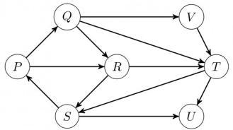

<details>
<summary>flowchart</summary>

```mermaid
graph LR
  P["P"] --> Q["Q"]
  Q --> V["V"]
  Q --> R["R"]
  R --> T["T"]
  T --> U["U"]
  T --> S["S"]
  S --> P
  S --> R
  S --> U
```
</details>

A. $\{P, Q, R, S\}, \{T\}, \{U\}, \{V\}$  
B. $\{P, Q, R, S, T, V\}, \{U\}$  
c. $\{P,Q,S,T,V\},\{R\},\{U\}$  
D. $\{P,Q,R,S,T,U,V\}$

gateit-2006 algorithms graph-algorithms normal strongly-connected-components

Answer key

# 1.43

# Time Complexity (31)

Practice Tests:

Test 1 (15Q)

Test 2 (15Q)

Test 3 (15Q)

Test 4 (9Q)

# 1.43.1 Time Complexity: GATE CSE 1988 | Question: 6i

Given below is the sketch of a program that represents the path in a two-person game tree by the sequence of active procedure calls at any time. The program assumes that the payoffs are real number in a limited range; that the constant INF is larger than any positive payoff and its negation is smaller than any negative payoff and that there is a function “payoff” and that computes the payoff for any board that is a leaf. The type “boardtype” has been suitably declared to represent board positions. It is player-1’s move if mode = MAX and player-2’s move if mode=MIN. The type modetype = (MAX, MIN). The functions “min” and “max” find the minimum and maximum of two real numbers.

function search(B: boardtype; mode: modetype): real;


<div class="mineru-algorithm" style="white-space: pre-wrap; font-family:monospace;">
var
  C:boardtype; {a child of board B}
  value:real;
begin
  if B is a leaf then
    return (payoff(B))
  else
    begin
    if mode = MAX then value :=-INF
    else
      value:INF;
    for each child C of board B do
      if mode = MAX then
        value:=max (value, search (C, MIN))
    else
      value:=min(value, search(C, MAX))
    return(value)
    end
end; (search)
</div>

Comment on the working principle of the above program. Suggest a possible mechanism for reducing the amount of search.

gate1988 normal descriptive algorithms time-complexity

# Answer key

# 1.43.2 Time Complexity: GATE CSE 1989 | Question: 2-iii

Match the pairs in the following:

<table><tr><td>(A)</td><td>O(log n)</td><td>(p)</td><td>Heapsort</td></tr><tr><td>(B)</td><td>O(n)</td><td>(q)</td><td>Depth-first search</td></tr><tr><td>(C)</td><td>O(n log n)</td><td>(r)</td><td>Binary search</td></tr><tr><td>(D)</td><td>O(n2)</td><td>(s)</td><td>Selection of the kth smallest element in a set of n elements</td></tr></table>


gate1989 match-the-following algorithms time-complexity

# Answer key

# 1.43.3 Time Complexity: GATE CSE 1993 | Question: 8.7

$\sum_{1\leq k\leq n}O(n)$ , where $O(n)$ stands for order $n$ is:

A. $O(n)$

B. $O(n^{2})$

C. $O(n^{3})$

D. $O(3n^{2})$

E. $O(1.5n^{2})$

gate1993 algorithms time-complexity easy

# Answer key

# 1.43.4 Time Complexity: GATE CSE 1999 | Question: 1.13

Suppose we want to arrange the n numbers stored in any array such that all negative values occur before all positive ones. Minimum number of exchanges required in the worst case is

A. n - 1

B. n

C. $n + 1$

D. None of the above

gate1999 algorithms time-complexity normal

# Answer key

# 1.43.5 Time Complexity: GATE CSE 1999 | Question: 1.16

If $n$ is a power of 2, then the minimum number of multiplications needed to compute $a^n$ is


A. $\log_{2}n$

B. $\sqrt{n}$

C. n - 1

D. n

gate1999 algorithms time-complexity normal

# Answer key

# 1.43.6 Time Complexity: GATE CSE 1999 | Question: 11a

Consider the following algorithms. Assume, procedure A and procedure B take $O(1)$ and $O(1/n)$ unit of time respectively. Derive the time complexity of the algorithm in O-notation.


```txt
algorithm what (n)
begin
  if n = 1 then call A
  else
    begin
      what (n-1);
      call B(n)
    end
end.
```

gate1999 algorithms time-complexity normal descriptive

# Answer key

# 1.43.7 Time Complexity: GATE CSE 2000 | Question: 1.15

Let $S$ be a sorted array of $n$ integers. Let $T(n)$ denote the time taken for the most efficient algorithm to determine if there are two elements with sum less than 1000 in $S$ . Which of the following statement is true?


A. $T(n)$ is $O(1)$  
C. $n \log_{2} n \leq T(n) < \frac{n}{2}$

gatecse-2000 easy algorithms time-complexity

B. $n \leq T(n) \leq n \log_2 n$  
D. $T(n) = \left(\frac{n}{2}\right)$

# Answer key

# 1.43.8 Time Complexity: GATE CSE 2003 | Question: 66

The cube root of a natural number n is defined as the largest natural number m such that $(m^{3} \leq n)$ . The complexity of computing the cube root of n (n is represented by binary notation) is


A. $O(n)$ but not $O(n^{0.5})$  
B. $O(n^{0.5})$ but not $O((\log n)^k)$ for any constant $k > 0$  
C. $O((\log n)^k)$ for some constant $k > 0$ , but not $O((\log \log n)^m)$ for any constant $m > 0$ .  
D. $O((\log \log n)^k)$ for some constant $k > 0.5$ , but not $O((\log \log n)^{0.5})$

gatecse-2003 algorithms time-complexity normal

# Answer key

# 1.43.9 Time Complexity: GATE CSE 2004 | Question: 39

Two matrices $M_{1}$ and $M_{2}$ are to be stored in arrays $A$ and $B$ respectively. Each array can be stored either in row-major or column-major order in contiguous memory locations. The time complexity of an algorithm to compute $M_{1} \times M_{2}$ will be


A. best if $A$ is in row-major, and $B$ is in column-major order  
B. best if both are in row-major order  
C. best if both are in column-major order  
D. independent of the storage scheme

gatecse-2004 algorithms time-complexity easy

# Answer key

# 1.43.10 Time Complexity: GATE CSE 2004 | Question: 82


Let $A[1,\ldots,n]$ be an array storing a bit (1 or 0) at each location, and $f(m)$ is a function whose time complexity is $\Theta(m)$ . Consider the following program fragment written in a C like language:

```c
counter = 0;
for (i=1; i<=n; i++)
{
    if (a[i] == 1) counter++;
    else {f (counter); counter = 0;}
}
```

The complexity of this program fragment is

A. $\Omega(n^{2})$

B. $\Omega(n \log n)$ and $O(n^2)$

C. $\Theta(n)$

D. $o(n)$

gatecse-2004 algorithms time-complexity normal

# Answer key

# 1.43.11 Time Complexity: GATE CSE 2006 | Question: 15

Consider the following C-program fragment in which i, j and n are integer variables.


```matlab
for( i = n, j = 0; i > 0; i /= 2, j +=i );
```

Let $val(j)$ denote the value stored in the variable $j$ after termination of the for loop. Which one of the following is true?

A. $val(j) = \Theta (\log n)$

B. $val(j) = \Theta (\sqrt{n})$

C. $val(j) = \Theta(n)$

D. $val(j) = \Theta (n\log n)$

gatecse-2006 algorithms normal time-complexity

# Answer key

# 1.43.12 Time Complexity: GATE CSE 2007 | Question: 15, ISRO2016-26

Consider the following segment of C-code:


```matlab
int j, n;
j = 1;
while (j <= n)
    j = j * 2;
```

The number of comparisons made in the execution of the loop for any n > 0 is:

A. $\lceil \log_2n\rceil +1$

B. n

C. $\lceil \log_2n\rceil$

D. $\lfloor \log_2n\rfloor +1$

gatecse-2007 algorithms time-complexity normal isro2016

# Answer key

# 1.43.13 Time Complexity: GATE CSE 2007 | Question: 45

What is the time complexity of the following recursive function?


```txt
int DoSomething (int n) {
    if (n <= 2)
        return 1;
    else
        return (DoSomething (floor (sqrt(n))) + n);
}
```

A. $\Theta(n^{2})$

B. $\Theta (n\log_2n)$

c. $\Theta (\log_2n)$

D. $\Theta (\log_2\log_2n)$

gatecse-2007 algorithms time-complexity normal

# Answer key

# 1.43.14 Time Complexity: GATE CSE 2007 | Question: 50


An array of n numbers is given, where n is an even number. The maximum as well as the minimum of these n numbers needs to be determined. Which of the following is TRUE about the number of comparisons needed?

A. At least 2n - c comparisons, for some constant c are needed.  
B. At most 1.5n - 2 comparisons are needed.  
C. At least $n\log_2n$ comparisons are needed  
D. None of the above

gatecse-2007 algorithms time-complexity easy

Answer key

# 1.43.15 Time Complexity: GATE CSE 2007 | Question: 51

Consider the following C program segment:


```c
int IsPrime (n)
{
    int i, n;
    for (i=2; i<=sqrt(n);i++)
        if(n%i == 0)
            {printf("Not Prime \n"); return 0;}
    return 1;
}
```

Let $T(n)$ denote number of times the for loop is executed by the program on input n. Which of the following is TRUE?

A. $T(n) = O(\sqrt{n})$ and $T(n) = \Omega(\sqrt{n})$

B. $T(n) = O(\sqrt{n})$ and $T(n) = \Omega(1)$

C. $T(n) = O(n)$ and $T(n) = \Omega (\sqrt{n})$

D. None of the above

gatecse-2007 algorithms time-complexity normal

Answer key

# 1.43.16 Time Complexity: GATE CSE 2008 | Question: 40


The minimum number of comparisons required to determine if an integer appears more than $\frac{n}{2}$ times in a sorted array of $n$ integers is

A. $\Theta(n)$

B. $\Theta (\log n)$

c. $\Theta (\log^* n)$

D. $\Theta(1)$

gatecse-2008 normal algorithms time-complexity

Answer key

# 1.43.17 Time Complexity: GATE CSE 2008 | Question: 47


We have a binary heap on $n$ elements and wish to insert $n$ more elements (not necessarily one after another) into this heap. The total time required for this is

A. $\Theta (\log n)$

B. $\Theta(n)$

C. $\Theta(n \log n)$

D. $\Theta(n^{2})$

gatecse-2008 algorithms time-complexity normal

Answer key

# 1.43.18 Time Complexity: GATE CSE 2008 | Question: 74


Consider the following C functions:

```txt
int f1 (int n)
{
    if(n == 0 || n == 1)
        return n;
    else
```

```txt
return (2 * f1(n-1) + 3 * f1(n-2));
}
int f2(int n)
{
    int i;
    int X[N], Y[N], Z[N];
    X[0] = Y[0] = Z[0] = 0;
    X[1] = 1; Y[1] = 2; Z[1] = 3;
    for(i = 2; i <= n; i++){
        X[i] = Y[i-1] + Z[i-2];
        Y[i] = 2 * X[i];
        Z[i] = 3 * X[i];
    }
    return X[n];
}
```

The running time of $f1(n)$ and $f2(n)$ are

A. $\Theta(n)$ and $\Theta(n)$

B. $\Theta(2^n)$ and $\Theta(n)$

C. $\Theta(n)$ and $\Theta(2^n)$

D. $\Theta(2^n)$ and $\Theta(2^n)$

gatecse-2008 algorithms time-complexity normal

# Answer key

# 1.43.19 Time Complexity: GATE CSE 2008 | Question: 75

Consider the following C functions:


```c
int f1 (int n)
{
    if(n == 0 || n == 1)
        return n;
    else
        return (2 * f1(n-1) + 3 * f1(n-2));
}
int f2(int n)
{
    int i;
    int X[N], Y[N], Z[N];
    X[0] = Y[0] = Z[0] = 0;
    X[1] = 1; Y[1] = 2; Z[1] = 3;
    for(i = 2; i <= n; i++){
        X[i] = Y[i-1] + Z[i-2];
        Y[i] = 2 * X[i];
        Z[i] = 3 * X[i];
    }
    return X[n];
}
```

$f1(8)$ and $f2(8)$ return the values

A. 1661 and 1640

B. 59 and 59

C. 1640 and 1640

D. 1640 and 1661

gatecse-2008 normal algorithms time-complexity

# Answer key

# 1.43.20 Time Complexity: GATE CSE 2010 | Question: 12

Two alternative packages A and B are available for processing a database having $10^{k}$ records. Package A requires $0.0001n^{2}$ time units and package B requires $10n\log_{10}n$ time units to process n records. What is the smallest value of k for which package B will be preferred over A?

A. 12

B. 10

C. 6

D. 5

gatecse-2010 algorithms time-complexity easy

# Answer key

# 1.43.21 Time Complexity: GATE CSE 2014 | Set 1 | Question: 42

Consider the following pseudo code. What is the total number of multiplications to be performed?

D = 2

for i = 1 to n do


for j = i to n do

for k = j + 1 to n do

$D = D^{*}3$

A. Half of the product of the 3 consecutive integers.  
B. One-third of the product of the 3 consecutive integers.  
C. One-sixth of the product of the 3 consecutive integers.  
D. None of the above.

gatecse-2014-set1 algorithms time-complexity normal

# Answer key

# 1.43.22 Time Complexity: GATE CSE 2015 | Set 1 | Question: 40

An algorithm performs $(\log N)^{\frac{1}{2}}$ find operations, N insert operations, $(\log N)^{\frac{1}{2}}$ delete operations, and $(\log N)^{\frac{1}{2}}$ decrease-key operations on a set of data items with keys drawn from a linearly ordered set. For a delete operation, a pointer is provided to the record that must be deleted. For the decrease-key operation, a pointer is provided to the record that has its key decreased. Which one of the following data structures is the most suited for the algorithm to use, if the goal is to achieve the best total asymptotic complexity considering all the operations?

A. Unsorted array

C. Sorted array

B. Min - heap

D. Sorted doubly linked list

gatecse-2015-set1 algorithms data-structures normal time-complexity

# Answer key

# 1.43.23 Time Complexity: GATE CSE 2015 | Set 2 | Question: 22

An unordered list contains $n$ distinct elements. The number of comparisons to find an element in this list that is neither maximum nor minimum is

A. $\Theta(n \log n)$

B. $\Theta(n)$

C. $\Theta (\log n)$

D. $\Theta(1)$

gatecse-2015-set2 algorithms time-complexity easy

# Answer key

# 1.43.24 Time Complexity: GATE CSE 2017 | Set 2 | Question: 03

Match the algorithms with their time complexities:

<table><tr><td>Algorithms</td><td>Time Complexity</td></tr><tr><td>P. Tower of Hanoi with n disks</td><td>i.  $\Theta(n^{2})$ </td></tr><tr><td>Q. Binary Search given n sorted numbers</td><td>ii.  $\Theta(n \log n)$ </td></tr><tr><td>R. Heap sort given n numbers at the worst case</td><td>iii.  $\Theta(2^{n})$ </td></tr><tr><td>S. Addition of two  $n \times n$  matrices</td><td>iv.  $\Theta(\log n)$ </td></tr></table>

A. $P \to (iii)$ $Q \to (iv)$ $r \to (i)$ $S \to (ii)$  
B. $P\to (iv)$ $Q\to (iii)$ $r\to (i)$ $S\to (ii)$  
C. $P\to (iii)$ $Q\to (iv)$ $r\to (ii)$ $S\to (i)$  
D. $P\to (iv)$ $Q\to (iii)$ $r\to (ii)$ $S\to (i)$

gatecse-2017-set2 algorithms time-complexity match-the-following easy

# Answer key

# 1.43.25 Time Complexity: GATE CSE 2017 | Set 2 | Question: 38

Consider the following C function

int fun(int n) {

int i, j;

for(i=1; i<=n; i++) {


```txt
for (j=1; j<n; j+=i) {
            printf("%d %d", i, j);
        }
    }
}
```

Time complexity of fun in terms of $\Theta$ notation is

A. $\Theta(n\sqrt{n})$  
C. $\Theta(n \log n)$

B. $\Theta(n^{2})$  
D. $\Theta(n^{2}\log n)$

gatecse-2017-set2 algorithms time-complexity

# Answer key

# 1.43.26 Time Complexity: GATE CSE 2019 | Question: 37


There are n unsorted arrays: $A_{1}, A_{2}, \ldots, A_{n}$ . Assume that n is odd. Each of $A_{1}, A_{2}, \ldots, A_{n}$ contains n distinct elements. There are no common elements between any two arrays. The worst-case time complexity of computing the median of the medians of $A_{1}, A_{2}, \ldots, A_{n}$ is

A. $O(n)$  
C. $O(n^{2})$

B. $O(n\log n)$  
D. $\Omega(n^{2}\log n)$

gatecse-2019 algorithms time-complexity two-marks

# Answer key

# 1.43.27 Time Complexity: GATE CSE 2024 | Set 1 | Question: 7


Given an integer array of size N, we want to check if the array is sorted (in either ascending or descending order). An algorithm solves this problem by making a single pass through the array and comparing each element of the array only with its adjacent elements. The worst-case time complexity of this algorithm is

A. both $\mathrm{O}(N)$ and $\Omega (N)$

C. $\Omega(N)$ but not $\mathrm{O}(N)$

B. $\mathrm{O}(N)$ but not $\Omega (N)$

D. neither $\mathrm{O}(N)$ nor $\Omega (N)$

gatecse-2024-set1 algorithms time-complexity one-mark

# Answer key

# 1.43.28 Time Complexity: GATE CSE 2026 | Set 1 | Question: 7


Consider the following recurrence relations:

For all n > 1,

$$
\begin{array}{l} T _ {1} (n) = 4 T _ {1} \left(\frac {n}{2}\right) + T _ {2} (n) \\ T _ {2} (n) = 5 T _ {2} \left(\frac {n}{4}\right) + \Theta \left(\log_ {2} n\right) \\ \end{array}
$$

Assume that for all $n \leq 1, T_1(n) = 1$ and $T_2(n) = 1$ .

Which one of the following options is correct?

A. $T_{1}(n) = \Theta (n^{2})$  
C. $T_{1}(n) = \Theta \left(n^{\log_{4}5}\right)$

B. $T_{1}(n) = \Theta (n^{2}\log_{2}n)$

D. $T_{1}(n) = \Theta \left(n^{\log_{4}5}\log_{2}n\right)$

gatecse-2026-set1 algorithms time-complexity one-mark

# Answer key

# 1.43.29 Time Complexity: GATE CSE 2026 | Set 2 | Question: 28


Consider an array A of integers of size n. The indices of A run from 1 to n. An algorithm is to be designed to check whether A satisfies the condition given below.

$\forall i, j \in \{1, \dots, n - 1\}$ such that $i > j$ , $(A[i + 1] - A[i]) > (A[j + 1] - A[j])$

Which one of the following gives the worst case time complexity of the fastest algorithm that can be designed for the problem?

A. $\Theta(n)$  
C. $\Theta(n\log(n))$

B. $\Theta (\log (n))$  
D. $\Theta(n^{2})$

# Answer key

# 1.43.30 Time Complexity: GATE IT 2007 | Question: 17

Exponentiation is a heavily used operation in public key cryptography. Which of the following options is the tightest upper bound on the number of multiplications required to compute $b^{n} \mod m, 0 \leq b, n \leq m$ ?


  
gateit-2007 algorithms time-complexity normal


# Answer key

# 1.43.31 Time Complexity: GATE IT 2007 | Question: 81

Let $P_{1}, P_{2}, \ldots, P_{n}$ be n points in the xy-plane such that no three of them are collinear. For every pair of points $P_{i}$ and $P_{j}$ , let $L_{ij}$ be the line passing through them. Let $L_{ab}$ be the line with the steepest gradient among all $n(n-1)/2$ lines.


The time complexity of the best algorithm for finding $P_{a}$ and $P_{b}$ is

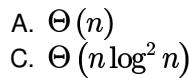  
gateit-2007 algorithms time-complexity normal

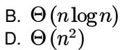

# Answer key

# 1.44

# Topological Sort (4)

# Practice Test: Test 1 (7Q)

# 1.44.1 Topological Sort: GATE CSE 2007 | Question: 5

Consider the DAG with $V = \{1,2,3,4,5,6\}$ shown below.


<details>
<summary>flowchart</summary>

```mermaid
graph LR
  1["Node 1"] --> 2["Node 2"]
  n1["1"] --> 3["Node 3"]
  n2["2"] --> 5["Node 5"]
  n3["3"] --> 4["Node 4"]
  n4["4"] --> 6["Node 6"]
  n5["5"] --> n6["6"]
```
</details>

Which of the following is not a topological ordering?

A. 123456

B. 132456

C. 132465

D. 324165

gatecse-2007 algorithms graph-algorithms topological-sort easy

# Answer key

# 1.44.2 Topological Sort: GATE CSE 2014 | Set 1 | Question: 13

Consider the directed graph below given.


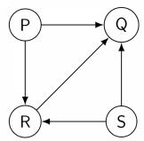

Which one of the following is TRUE?

A. The graph does not have any topological ordering.

B. Both PQRS and SRQP are topological orderings.  
C. Both PSRQ and SPRQ are topological orderings.  
D. PSRQ is the only topological ordering.

gatecse-2014-set1 graph-algorithms easy topological-sort

# Answer key

# 1.44.3 Topological Sort: GATE CSE 2016 | Set 1 | Question: 11

Consider the following directed graph:

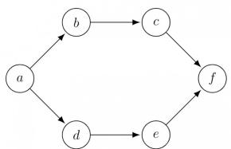

<details>
<summary>flowchart</summary>

```mermaid
graph LR
  a["a"] --> b["b"]
  b --> c["c"]
  c --> f["f"]
  d["d"] --> e["e"]
  e --> f
```
</details>

The number of different topological orderings of the vertices of the graph is \_\_\_\_.

gatecse-2016-set1 algorithms graph-algorithms normal numerical-answers topological-sort

# Answer key

# 1.44.4 Topological Sort: GATE DS&AI 2024 | Question: 41

Consider the directed acyclic graph (DAG) below:

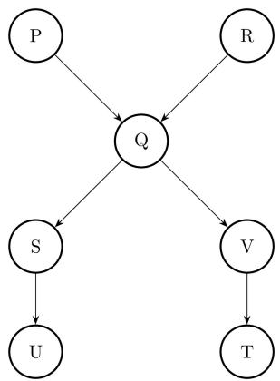

<details>
<summary>flowchart</summary>

```mermaid
graph TD
  P["P"] --> Q["Q"]
  R["R"] --> Q
  Q --> S["S"]
  Q --> V["V"]
  S --> U["U"]
  V --> T["T"]
```
</details>

Which of the following is/are valid vertex orderings that can be obtained from a topological sort of the DAG?

A. PQRSTUV

c. PQRSVUT

gate-ds-ai-2024 algorithms topological-sort directed-acyclic-graph multiple-selects two-marks

B. P R Q V SUT

D. PRQSVTU

# Answer key

# 1.45

# Tree Traversal (1)

# 1.45.1 Tree Traversal: GATE DA 2026 | Question: 15

You are given the following Pre-order and In-order traversals of a Binary Tree T with nodes E, F, G, P, Q, R, S.

Pre-order: P Q S E R F G

In-order: $S Q E P F R G$


Which of the following statements is/are true about the Binary Tree T?

A. Node P is the root of T

B. The Post-order traversal of $T$ is:

C. Node Q has only one child

D. The left subtree of node $R$


# 1.46

# Uniform Hashing (1)

# 1.46.1 Uniform Hashing: GATE CSE 2022 | Question: 6


Suppose we are given n keys, m hash table slots, and two simple uniform hash functions $h_{1}$ and $h_{2}$ . Further suppose our hashing scheme uses $h_{1}$ for the odd keys and $h_{2}$ for the even keys. What is the expected number of keys in a slot?

A. $\frac{m}{n}$

B. $\frac{n}{m}$

C. $\frac{2n}{m}$

D. $\frac{n}{2m}$

gatecse-2022 algorithms hashing uniform-hashing one-mark

# Answer key

Answer Keys

<table><tr><td>1.1.1</td><td>N/A</td></tr><tr><td>1.1.6</td><td>29</td></tr><tr><td>1.2.3</td><td>C</td></tr><tr><td>1.2.8</td><td>C</td></tr><tr><td>1.3.4</td><td>D</td></tr><tr><td>1.3.9</td><td>D</td></tr><tr><td>1.3.14</td><td>B</td></tr><tr><td>1.3.19</td><td>A</td></tr><tr><td>1.4.2</td><td>C</td></tr><tr><td>1.6.4</td><td>A</td></tr><tr><td>1.9.1</td><td>C</td></tr><tr><td>1.12.1</td><td>B;D</td></tr><tr><td>1.13.4</td><td>A</td></tr><tr><td>1.15.2</td><td>10:10</td></tr><tr><td>1.16.5</td><td>B</td></tr><tr><td>1.16.10</td><td>A</td></tr><tr><td>1.17.5</td><td>B</td></tr><tr><td>1.17.10</td><td>C</td></tr><tr><td>1.18.4</td><td>C</td></tr><tr><td>1.18.9</td><td>B</td></tr><tr><td>1.18.14</td><td>A</td></tr><tr><td>1.18.19</td><td>A</td></tr><tr><td>1.19.1</td><td>A</td></tr><tr><td>1.20.1</td><td>B</td></tr><tr><td>1.20.6</td><td>D</td></tr><tr><td>1.22.3</td><td>D</td></tr><tr><td>1.23.2</td><td>N/A</td></tr></table>

<table><tr><td>1.1.2</td><td>N/A</td></tr><tr><td>1.1.7</td><td>A;C</td></tr><tr><td>1.2.4</td><td>A</td></tr><tr><td>1.2.9</td><td>C</td></tr><tr><td>1.3.5</td><td>B</td></tr><tr><td>1.3.10</td><td>A</td></tr><tr><td>1.3.15</td><td>D</td></tr><tr><td>1.3.20</td><td>A</td></tr><tr><td>1.5.1</td><td>B;C</td></tr><tr><td>1.7.1</td><td>D</td></tr><tr><td>1.9.2</td><td>D</td></tr><tr><td>1.12.2</td><td>75:75</td></tr><tr><td>1.13.5</td><td>D</td></tr><tr><td>1.16.1</td><td>B</td></tr><tr><td>1.16.6</td><td>A</td></tr><tr><td>1.17.1</td><td>B</td></tr><tr><td>1.17.6</td><td>A</td></tr><tr><td>1.17.11</td><td>D</td></tr><tr><td>1.18.5</td><td>D</td></tr><tr><td>1.18.10</td><td>19</td></tr><tr><td>1.18.15</td><td>5040</td></tr><tr><td>1.18.20</td><td>D</td></tr><tr><td>1.19.2</td><td>B</td></tr><tr><td>1.20.2</td><td>N/A</td></tr><tr><td>1.21.1</td><td>C</td></tr><tr><td>1.22.4</td><td>225</td></tr><tr><td>1.23.3</td><td>C</td></tr></table>

<table><tr><td>1.1.3</td><td>B</td></tr><tr><td>1.1.8</td><td>B</td></tr><tr><td>1.2.5</td><td>B</td></tr><tr><td>1.3.1</td><td>A;B</td></tr><tr><td>1.3.6</td><td>A</td></tr><tr><td>1.3.11</td><td>C</td></tr><tr><td>1.3.16</td><td>A</td></tr><tr><td>1.3.21</td><td>D</td></tr><tr><td>1.6.1</td><td>B</td></tr><tr><td>1.7.2</td><td>7 : 7</td></tr><tr><td>1.9.3</td><td>C</td></tr><tr><td>1.13.1</td><td>N/A</td></tr><tr><td>1.14.1</td><td>929 : 929</td></tr><tr><td>1.16.2</td><td>C</td></tr><tr><td>1.16.7</td><td>34</td></tr><tr><td>1.17.2</td><td>D</td></tr><tr><td>1.17.7</td><td>A;B</td></tr><tr><td>1.18.1</td><td>N/A</td></tr><tr><td>1.18.6</td><td>D</td></tr><tr><td>1.18.11</td><td>D</td></tr><tr><td>1.18.16</td><td>C</td></tr><tr><td>1.18.21</td><td>D</td></tr><tr><td>1.19.3</td><td>D</td></tr><tr><td>1.20.3</td><td>C</td></tr><tr><td>1.21.2</td><td>D</td></tr><tr><td>1.22.5</td><td>B</td></tr><tr><td>1.23.4</td><td>A</td></tr></table>

<table><tr><td>1.1.4</td><td>C</td></tr><tr><td>1.2.1</td><td>N/A</td></tr><tr><td>1.2.6</td><td>A</td></tr><tr><td>1.3.2</td><td>B</td></tr><tr><td>1.3.7</td><td>C</td></tr><tr><td>1.3.12</td><td>C</td></tr><tr><td>1.3.17</td><td>A;C</td></tr><tr><td>1.3.22</td><td>A</td></tr><tr><td>1.6.2</td><td>C</td></tr><tr><td>1.7.3</td><td>A;C</td></tr><tr><td>1.10.1</td><td>N/A</td></tr><tr><td>1.13.2</td><td>B</td></tr><tr><td>1.14.2</td><td>A</td></tr><tr><td>1.16.3</td><td>C</td></tr><tr><td>1.16.8</td><td>150</td></tr><tr><td>1.17.3</td><td>A</td></tr><tr><td>1.17.8</td><td>A</td></tr><tr><td>1.18.2</td><td>C</td></tr><tr><td>1.18.7</td><td>C</td></tr><tr><td>1.18.12</td><td>31</td></tr><tr><td>1.18.17</td><td>60</td></tr><tr><td>1.18.22</td><td>D</td></tr><tr><td>1.19.4</td><td>A</td></tr><tr><td>1.20.4</td><td>C</td></tr><tr><td>1.22.1</td><td>2.33</td></tr><tr><td>1.22.6</td><td>A</td></tr><tr><td>1.23.5</td><td>N/A</td></tr></table>

<table><tr><td>1.1.5</td><td>12</td></tr><tr><td>1.2.2</td><td>B</td></tr><tr><td>1.2.7</td><td>C</td></tr><tr><td>1.3.3</td><td>X</td></tr><tr><td>1.3.8</td><td>C</td></tr><tr><td>1.3.13</td><td>D</td></tr><tr><td>1.3.18</td><td>A;D</td></tr><tr><td>1.4.1</td><td>B</td></tr><tr><td>1.6.3</td><td>10:10</td></tr><tr><td>1.8.1</td><td>11 : 11</td></tr><tr><td>1.11.1</td><td>TBA</td></tr><tr><td>1.13.3</td><td>D</td></tr><tr><td>1.15.1</td><td>13</td></tr><tr><td>1.16.4</td><td>B</td></tr><tr><td>1.16.9</td><td>C</td></tr><tr><td>1.17.4</td><td>A</td></tr><tr><td>1.17.9</td><td>A</td></tr><tr><td>1.18.3</td><td>C</td></tr><tr><td>1.18.8</td><td>C</td></tr><tr><td>1.18.13</td><td>D</td></tr><tr><td>1.18.18</td><td>6:6</td></tr><tr><td>1.18.23</td><td>B</td></tr><tr><td>1.19.5</td><td>16</td></tr><tr><td>1.20.5</td><td>3:3</td></tr><tr><td>1.22.2</td><td>A</td></tr><tr><td>1.23.1</td><td>N/A</td></tr><tr><td>1.23.6</td><td>C</td></tr></table>

<table><tr><td>1.23.7</td><td>C</td></tr><tr><td>1.23.12</td><td>B</td></tr><tr><td>1.23.17</td><td>D</td></tr><tr><td>1.23.22</td><td>D</td></tr><tr><td>1.23.27</td><td>D</td></tr><tr><td>1.23.32</td><td>1023 : 1023</td></tr><tr><td>1.23.37</td><td>D</td></tr><tr><td>1.25.2</td><td>A;C</td></tr><tr><td>1.27.3</td><td>C</td></tr><tr><td>1.29.4</td><td>3:3</td></tr><tr><td>1.31.3</td><td>2</td></tr><tr><td>1.31.8</td><td>B</td></tr><tr><td>1.31.13</td><td>D</td></tr><tr><td>1.31.18</td><td>X</td></tr><tr><td>1.31.23</td><td>7</td></tr><tr><td>1.31.28</td><td>3 : 3</td></tr><tr><td>1.31.33</td><td>5:5</td></tr><tr><td>1.33.2</td><td>C</td></tr><tr><td>1.34.5</td><td>C</td></tr><tr><td>1.34.10</td><td>A</td></tr><tr><td>1.34.15</td><td>0</td></tr><tr><td>1.35.5</td><td>N/A</td></tr><tr><td>1.35.10</td><td>N/A</td></tr><tr><td>1.35.15</td><td>B</td></tr><tr><td>1.35.20</td><td>X</td></tr><tr><td>1.35.25</td><td>B</td></tr><tr><td>1.35.30</td><td>C</td></tr><tr><td>1.35.35</td><td>C</td></tr><tr><td>1.36.4</td><td>60 : 60</td></tr><tr><td>1.37.4</td><td>C</td></tr><tr><td>1.38.1</td><td>A</td></tr><tr><td>1.39.4</td><td>A</td></tr><tr><td>1.40.1</td><td>N/A</td></tr><tr><td>1.40.6</td><td>N/A</td></tr><tr><td>1.40.11</td><td>A</td></tr><tr><td>1.40.16</td><td>C</td></tr><tr><td>1.40.21</td><td>C</td></tr><tr><td>1.42.3</td><td>B</td></tr><tr><td>1.43.5</td><td>A</td></tr><tr><td>1.43.10</td><td>C</td></tr></table>

<table><tr><td>1.23.8</td><td>N/A</td></tr><tr><td>1.23.13</td><td>D</td></tr><tr><td>1.23.18</td><td>D</td></tr><tr><td>1.23.23</td><td>B</td></tr><tr><td>1.23.28</td><td>51</td></tr><tr><td>1.23.33</td><td>15 : 15</td></tr><tr><td>1.23.38</td><td>C</td></tr><tr><td>1.26.1</td><td>C</td></tr><tr><td>1.28.1</td><td>147.1 : 148.1</td></tr><tr><td>1.30.1</td><td>C</td></tr><tr><td>1.31.4</td><td>N/A</td></tr><tr><td>1.31.9</td><td>C</td></tr><tr><td>1.31.14</td><td>D</td></tr><tr><td>1.31.19</td><td>6</td></tr><tr><td>1.31.24</td><td>B</td></tr><tr><td>1.31.29</td><td>C</td></tr><tr><td>1.31.34</td><td>A;D</td></tr><tr><td>1.34.1</td><td>C</td></tr><tr><td>1.34.6</td><td>B</td></tr><tr><td>1.34.11</td><td>B</td></tr><tr><td>1.35.1</td><td>N/A</td></tr><tr><td>1.35.6</td><td>N/A</td></tr><tr><td>1.35.11</td><td>B</td></tr><tr><td>1.35.16</td><td>D</td></tr><tr><td>1.35.21</td><td>A</td></tr><tr><td>1.35.26</td><td>2.32 : 2.33</td></tr><tr><td>1.35.31</td><td>A</td></tr><tr><td>1.35.36</td><td>A</td></tr><tr><td>1.36.5</td><td>65536 : 65536</td></tr><tr><td>1.37.5</td><td>A</td></tr><tr><td>1.38.2</td><td>B</td></tr><tr><td>1.39.5</td><td>B</td></tr><tr><td>1.40.2</td><td>A</td></tr><tr><td>1.40.7</td><td>B</td></tr><tr><td>1.40.12</td><td>C</td></tr><tr><td>1.40.17</td><td>3</td></tr><tr><td>1.40.22</td><td>C</td></tr><tr><td>1.43.1</td><td>N/A</td></tr><tr><td>1.43.6</td><td>N/A</td></tr><tr><td>1.43.11</td><td>C</td></tr></table>

<table><tr><td>1.23.9</td><td>C</td></tr><tr><td>1.23.14</td><td>C</td></tr><tr><td>1.23.19</td><td>B</td></tr><tr><td>1.23.24</td><td>A</td></tr><tr><td>1.23.29</td><td>0</td></tr><tr><td>1.23.34</td><td>D</td></tr><tr><td>1.24.1</td><td>A</td></tr><tr><td>1.26.2</td><td>D</td></tr><tr><td>1.29.1</td><td>B</td></tr><tr><td>1.30.2</td><td>358</td></tr><tr><td>1.31.5</td><td>N/A</td></tr><tr><td>1.31.10</td><td>B</td></tr><tr><td>1.31.15</td><td>B</td></tr><tr><td>1.31.20</td><td>69</td></tr><tr><td>1.31.25</td><td>4</td></tr><tr><td>1.31.30</td><td>A;B;C</td></tr><tr><td>1.31.35</td><td>A</td></tr><tr><td>1.34.2</td><td>N/A</td></tr><tr><td>1.34.7</td><td>B</td></tr><tr><td>1.34.12</td><td>A</td></tr><tr><td>1.35.2</td><td>N/A</td></tr><tr><td>1.35.7</td><td>N/A</td></tr><tr><td>1.35.12</td><td>N/A</td></tr><tr><td>1.35.17</td><td>A</td></tr><tr><td>1.35.22</td><td>D</td></tr><tr><td>1.35.27</td><td>B</td></tr><tr><td>1.35.32</td><td>A</td></tr><tr><td>1.36.1</td><td>C</td></tr><tr><td>1.37.1</td><td>N/A</td></tr><tr><td>1.37.6</td><td>5</td></tr><tr><td>1.39.1</td><td>N/A</td></tr><tr><td>1.39.6</td><td>C</td></tr><tr><td>1.40.3</td><td>7</td></tr><tr><td>1.40.8</td><td>B</td></tr><tr><td>1.40.13</td><td>A</td></tr><tr><td>1.40.18</td><td>A</td></tr><tr><td>1.41.1</td><td>B</td></tr><tr><td>1.43.2</td><td>N/A</td></tr><tr><td>1.43.7</td><td>A</td></tr><tr><td>1.43.12</td><td>D</td></tr></table>

<table><tr><td>1.23.10</td><td>D</td></tr><tr><td>1.23.15</td><td>C</td></tr><tr><td>1.23.20</td><td>C</td></tr><tr><td>1.23.25</td><td>9</td></tr><tr><td>1.23.30</td><td>D</td></tr><tr><td>1.23.35</td><td>C</td></tr><tr><td>1.24.2</td><td>D</td></tr><tr><td>1.27.1</td><td>C</td></tr><tr><td>1.29.2</td><td>B</td></tr><tr><td>1.31.1</td><td>B;D;E</td></tr><tr><td>1.31.6</td><td>C</td></tr><tr><td>1.31.11</td><td>D</td></tr><tr><td>1.31.16</td><td>B</td></tr><tr><td>1.31.21</td><td>995</td></tr><tr><td>1.31.26</td><td>D</td></tr><tr><td>1.31.31</td><td>24</td></tr><tr><td>1.32.1</td><td>435:435</td></tr><tr><td>1.34.3</td><td>N/A</td></tr><tr><td>1.34.8</td><td>B</td></tr><tr><td>1.34.13</td><td>0.08</td></tr><tr><td>1.35.3</td><td>N/A</td></tr><tr><td>1.35.8</td><td>B</td></tr><tr><td>1.35.13</td><td>B</td></tr><tr><td>1.35.18</td><td>B</td></tr><tr><td>1.35.23</td><td>A</td></tr><tr><td>1.35.28</td><td>A</td></tr><tr><td>1.35.33</td><td>A;B</td></tr><tr><td>1.36.2</td><td>A</td></tr><tr><td>1.37.2</td><td>C</td></tr><tr><td>1.37.7</td><td>B;C;D</td></tr><tr><td>1.39.2</td><td>B</td></tr><tr><td>1.39.7</td><td>A;C;D</td></tr><tr><td>1.40.4</td><td>N/A</td></tr><tr><td>1.40.9</td><td>N/A</td></tr><tr><td>1.40.14</td><td>D</td></tr><tr><td>1.40.19</td><td>B;C;D</td></tr><tr><td>1.42.1</td><td>C</td></tr><tr><td>1.43.3</td><td>B;C;D;E</td></tr><tr><td>1.43.8</td><td>C</td></tr><tr><td>1.43.13</td><td>D</td></tr></table>

<table><tr><td>1.23.11</td><td>A</td></tr><tr><td>1.23.16</td><td>D</td></tr><tr><td>1.23.21</td><td>B</td></tr><tr><td>1.23.26</td><td>A</td></tr><tr><td>1.23.31</td><td>81</td></tr><tr><td>1.23.36</td><td>C</td></tr><tr><td>1.25.1</td><td>B</td></tr><tr><td>1.27.2</td><td>1500</td></tr><tr><td>1.29.3</td><td>B</td></tr><tr><td>1.31.2</td><td>N/A</td></tr><tr><td>1.31.7</td><td>N/A</td></tr><tr><td>1.31.12</td><td>D</td></tr><tr><td>1.31.17</td><td>C</td></tr><tr><td>1.31.22</td><td>A</td></tr><tr><td>1.31.27</td><td>99</td></tr><tr><td>1.31.32</td><td>9</td></tr><tr><td>1.33.1</td><td>D</td></tr><tr><td>1.34.4</td><td>C</td></tr><tr><td>1.34.9</td><td>C</td></tr><tr><td>1.34.14</td><td>D</td></tr><tr><td>1.35.4</td><td>N/A</td></tr><tr><td>1.35.9</td><td>A</td></tr><tr><td>1.35.14</td><td>C</td></tr><tr><td>1.35.19</td><td>D</td></tr><tr><td>1.35.24</td><td>A</td></tr><tr><td>1.35.29</td><td>C</td></tr><tr><td>1.35.34</td><td>B</td></tr><tr><td>1.36.3</td><td>10230</td></tr><tr><td>1.37.3</td><td>A</td></tr><tr><td>1.37.8</td><td>D</td></tr><tr><td>1.39.3</td><td>D</td></tr><tr><td>1.39.8</td><td>C</td></tr><tr><td>1.40.5</td><td>D</td></tr><tr><td>1.40.10</td><td>N/A</td></tr><tr><td>1.40.15</td><td>D</td></tr><tr><td>1.40.20</td><td>B</td></tr><tr><td>1.42.2</td><td>109</td></tr><tr><td>1.43.4</td><td>D</td></tr><tr><td>1.43.9</td><td>D</td></tr><tr><td>1.43.14</td><td>B</td></tr></table>

<table><tr><td>1.43.15</td><td>B</td></tr><tr><td>1.43.20</td><td>C</td></tr><tr><td>1.43.25</td><td>C</td></tr><tr><td>1.43.30</td><td>A</td></tr><tr><td>1.44.4</td><td>B;D</td></tr></table>

<table><tr><td>1.43.16</td><td>B</td></tr><tr><td>1.43.21</td><td>C</td></tr><tr><td>1.43.26</td><td>C</td></tr><tr><td>1.43.31</td><td>B</td></tr><tr><td>1.45.1</td><td>A;B</td></tr></table>

<table><tr><td>1.43.17</td><td>B</td></tr><tr><td>1.43.22</td><td>A</td></tr><tr><td>1.43.27</td><td>A</td></tr><tr><td>1.44.1</td><td>D</td></tr><tr><td>1.46.1</td><td>B</td></tr></table>

<table><tr><td>1.43.18</td><td>B</td></tr><tr><td>1.43.23</td><td>D</td></tr><tr><td>1.43.28</td><td>A</td></tr><tr><td>1.44.2</td><td>C</td></tr></table>

<table><tr><td>1.43.19</td><td>C</td></tr><tr><td>1.43.24</td><td>C</td></tr><tr><td>1.43.29</td><td>A</td></tr><tr><td>1.44.3</td><td>6</td></tr></table>

Lexical analysis, Parsing, Syntax-directed translation, Runtime environments, Intermediate code generation.

Mark Distribution in Previous GATE

<table><tr><td>Year</td><td>2026 - 1</td><td>2026 - 2</td><td>2025 - 1</td><td>2025 - 2</td><td>2024 - 1</td><td>2024 - 2</td><td>2023</td><td>2022</td><td>2021 - 1</td><td>2021 - 2</td><td>Minimum</td></tr><tr><td>1 Mark Count</td><td>2</td><td>2</td><td>2</td><td>2</td><td>2</td><td>2</td><td>1</td><td>2</td><td>1</td><td>2</td><td>1</td></tr><tr><td>2 Marks Count</td><td>2</td><td>2</td><td>2</td><td>2</td><td>4</td><td>3</td><td>3</td><td>1</td><td>3</td><td>2</td><td>1</td></tr><tr><td>Total Marks</td><td>6</td><td>6</td><td>6</td><td>6</td><td>10</td><td>8</td><td>7</td><td>4</td><td>7</td><td>6</td><td>4</td></tr></table>

# Subject Overview

Compiler Design is a fundamental area of Computer Science that deals with the theory and practice of building compilers – programs that translate source code written in a high-level programming language into an equivalent low-level machine-understandable form (like assembly or machine code). Understanding compiler design is crucial for a GATE CS aspirant as it provides deep insights into how programming languages work, how software interacts with hardware, and the underlying mechanisms of program execution. This subject often carries a weightage of 6-10 marks in the GATE CS exam, typically involving 2-3 questions of 2 marks and 1-2 questions of 1 mark. Questions range from theoretical concepts (phases of compilation, definitions) and conceptual understanding (optimization techniques, runtime environment) to numerical problems (parsing table construction, FIRST/FOLLOW sets, DAG generation, register allocation). A strong grasp of this subject is vital not just for the exam, but also for a holistic understanding of computer systems.

# Topic-wise Key Concepts

# Abstract Syntax Tree (AST)

An AST is a tree representation of the abstract syntactic structure of source code, where each node denotes a construct in the source code. It abstracts away the concrete syntax (like parentheses or semicolons) and focuses on the essential structure and meaning of the program. ASTs are crucial for semantic analysis, intermediate code generation, and various optimization techniques.

# - Key Properties:

- Nodes represent operators and keywords, while leaves represent operands and identifiers.  
- More compact than a parse tree, omitting unnecessary details like non-terminals that only derive other non-terminals.  
- Used as an intermediate representation for subsequent compiler phases.

\- Common Pitfalls: Confusing AST with a parse tree. A parse tree shows every detail of the derivation; an AST shows only the essential structure.

\- Standard Problem-Solving Technique: Given a grammar and an expression, construct its parse tree first, then derive the AST by eliminating redundant nodes and structuring it based on operator precedence and associativity.

# Ambiguous Grammar

A grammar is said to be ambiguous if there exists at least one string that can be generated by the grammar in more than one leftmost derivation, or more than one rightmost derivation, or has more than one parse tree. Ambiguity is undesirable in programming language grammars because it leads to multiple interpretations of the same program statement.

# - Key Properties:

- Causes difficulty for parsers as they cannot uniquely determine the structure of an input string.  
- Common sources include dangling-else problem and lack of operator precedence/associativity rules.

\- Common Pitfalls: Not being able to identify ambiguity. A common test is to find a string with two distinct parse trees.

\- Standard Problem-Solving Technique: To resolve ambiguity, rewrite the grammar by introducing new non-terminals or by incorporating precedence and associativity rules directly into the grammar productions. For example, for arithmetic expressions, introduce non-terminals like Term and Factor.

# Assembler

An assembler is a program that translates assembly language code into machine code. Assembly language uses

mnemonics for operations and symbolic names for memory locations, making it more human-readable than raw machine code. Assemblers typically perform a one-to-one translation of assembly instructions to machine instructions.

# - Key Properties:

# - Two-Pass Assembler:

1. Pass 1: Scans the source code to build a symbol table (mapping symbolic labels to memory addresses) and determines the length of machine instructions.

2. Pass 2: Uses the symbol table to translate assembly instructions into machine code, filling in operand addresses.

\- Handles pseudo-operations (directives) like ORG, EQU, START, END, which guide the assembly process but don't translate into machine instructions.

- Common Pitfalls: Confusing assembler with compiler or linker. Assembler works at a lower level, translating assembly to machine code.  
- Standard Problem-Solving Technique: Trace the assembly process, building a symbol table and calculating location counter values for each instruction and data item.

# Backpatching

Backpatching is a technique used in one-pass code generation, particularly for control flow statements (like if-else, while loops) and boolean expressions. It involves generating jump instructions with initially unspecified target addresses, which are later filled in (patched) once the true target address becomes known.

# - Key Properties:

- Uses lists of incomplete jumps (e.g., truelist, falselist, nextlist).  
- makelist(i): Creates a new list containing only i (an index into the list of quadruples).  
- merge(p1, p2): Concatenates lists p1 and p2, returning the combined list.  
- backpatch(p, i): Inserts i as the target label for each of the jumps in listp.

\- Standard Problem-Solving Technique: Trace the generation of three-address code for control flow statements, maintaining and updating truelist, falselist, and nextlist as new quadruples are generated.

# Basic Blocks

A basic block is a sequence of consecutive statements in which flow of control enters at the beginning and leaves at the end without halt or possibility of branching except at the end. Basic blocks are fundamental units for many code optimization techniques.

# - Key Properties:

- No jumps into the middle of a basic block.  
- No jumps out of the middle of a basic block.  
- The first statement is called a leader.

# - Standard Problem-Solving Technique:

# 1. Identify leaders:

■ The first statement of the program is a leader.  
- Any statement that is the target of a conditional or unconditional jump is a leader.  
- Any statement immediately following a conditional or unconditional jump is a leader.

2. For each leader, its basic block consists of the leader and all subsequent statements up to, but not including, the next leader or the end of the program.

# Code Optimization

Code optimization is the phase of a compiler that attempts to improve the intermediate code or target code to make it run faster, use less memory, or consume less power, without changing the program's observable behavior. It can be machine-independent or machine-dependent.

# • Key Types/Techniques:

# - Machine-Independent:

- Peephole Optimization: Examines a small sliding window of instructions and replaces suboptimal sequences with better ones (e.g., redundant loads/stores, strength reduction).  
- Common Subexpression Elimination (CSE): Identifies and removes redundant computations of the same expression.  
- Dead Code Elimination: Removes code that is never executed or whose results are never used.  
- Constant Folding: Evaluates constant expressions at compile time (e.g., $2^{*}3 + 5$ becomes 11).

\- Loop Optimizations: Loop invariant code motion, induction variable elimination, loop unrolling.

\- Strength Reduction: Replacing expensive operations with cheaper ones (e.g., $\mathbf{x}^{*}$ 2 with $\mathbf{x} + \mathbf{x}$ or $\mathbf{x} << 1$ ).

Machine-Dependent: Register allocation, instruction scheduling.

\- Key Property: Optimization must preserve the semantic equivalence of the program.

\- Common Pitfalls: Misidentifying opportunities for optimization or applying an optimization that changes program behavior.

# Compilation Phases

The compilation process is typically divided into several phases, each performing a specific task in the translation of source code to target code. These phases operate sequentially, with the output of one phase serving as the input to the next.

# - Phases in Order:

1. Lexical Analysis (Scanning): Breaks source code into tokens.  
2. Syntax Analysis (Parsing): Checks grammar rules and builds a parse tree/AST.  
3. Semantic Analysis: Checks for type compatibility, undeclared variables, etc. (meaning of the program).  
4. Intermediate Code Generation: Creates an abstract machine-independent representation (e.g., three-address code).  
5. Code Optimization: Improves the intermediate or target code for efficiency.  
6. Code Generation: Translates intermediate code into target machine code (e.g., assembly).

# • Supporting Components:

\- Symbol Table Management: Stores information about identifiers, used across multiple phases.

\- Error Handling: Detects and reports errors at each phase.

\- Common Pitfalls: Confusing the order or specific responsibilities of each phase.

# Compiler Tokenization (Lexical Analysis)

Compiler tokenization, or Lexical Analysis, is the first phase of a compiler where the input stream of characters is grouped into meaningful sequences called tokens. Each token represents a basic unit of the language, such as keywords, identifiers, operators, or literals.

\- Core Idea: Converts a stream of characters into a stream of tokens.

# - Key Properties:

- Tokens are defined by regular expressions.  
- Lexical analyzers (scanners) are typically implemented using Finite Automata (NFA or DFA).  
- Handles whitespace and comments, usually discarding them.  
- Longest Match Rule: When multiple token patterns match a prefix of the input, the longest possible token is chosen.  
- Precedence Rule: If multiple patterns match the same longest prefix, the pattern listed first (or with higher precedence) is chosen.

\- Common Pitfalls: Incorrectly applying longest match or precedence rules.

\- Standard Problem-Solving Technique: Given a string and a set of regular expressions for tokens, identify the sequence of tokens.

# Directed Acyclic Graph (DAG)

A DAG is a directed graph data structure used as an intermediate representation for basic blocks in compilers. Nodes in a DAG represent operations, and edges represent the flow of values between operations. It effectively highlights common subexpressions and the order of operations within a basic block.

# - Key Properties:

- Each node has a unique value. If an expression is computed multiple times, it corresponds to a single node in the DAG.  
- Leaf nodes are identifiers or constants. Interior nodes are operators.  
- Used for common subexpression elimination, dead code elimination, and reordering of operations.

# - Standard Problem-Solving Technique:

1. For each statement x = y op z:

- If y or z are not in the DAG, create nodes for them.  
- If op is not in the DAG with children y and z, create a node for it.  
- Add x as a label to the node representing y op z.

2. If x = y, make x a label for the node representing y.

# Expression Evaluation

Expression evaluation is the process of computing the value of an arithmetic or logical expression according to operator precedence and associativity rules. Compilers often convert infix expressions to postfix or prefix notation for easier evaluation using a stack-based approach.

# - Key Notations:

- Infix: Operators between operands (e.g., $\mathbf{a} + \mathbf{b} * \mathbf{c}$ ).  
- Postfix (Reverse Polish Notation - RPN): Operators after operands (e.g., a b c \* +).  
- Prefix (Polish Notation): Operators before operands (e.g., + a \* b c).

# - Key Properties:

- Precedence: Determines which operator is evaluated first (e.g., multiplication before addition).  
- Associativity: Determines evaluation order for operators of the same precedence (e.g., left-to-right for $+, -, *$ , /; right-to-left for ^).

# - Standard Problem-Solving Technique:

- Infix to Postfix/Prefix: Use a stack to manage operators based on precedence and associativity.  
- Postfix Evaluation: Scan from left to right. Push operands onto a stack. When an operator is encountered, pop required operands, perform operation, push result back.

# First and Follow

FIRST and FOLLOW sets are crucial for constructing predictive (LL(1)) parsing tables and for resolving ambiguities in grammars. They help determine which production to apply or which token to expect next.

- FIRST(X): The set of terminal symbols that begin strings derived from X. If X can derive $\epsilon$ (empty string), then $\epsilon$ is in FIRST(X).  
- FOLLOW(A): The set of terminal symbols that can immediately follow the non-terminal A in some sentential form. FOLLOW(A) never contains $\epsilon$ .

# - Important Formulas/Rules:

1. FIRST for a terminal a: FIRST(a) = {a}.  
2. FIRST for $\epsilon$ : FIRST( $\epsilon$ ) = $\{\epsilon\}$ .  
3. FIRST for a non-terminal A: For each production A → X₁X₂ . . . Xₖ:  
- Add FIRST(X₁) - {ε} to FIRST(A).  
- If $\epsilon \in \mathrm{FIRST}(\mathrm{X}_i)$ for all $\mathrm{i} = 1\ldots \mathrm{j - 1}$ , then add $\mathrm{FIRST}(\mathrm{X}_j) - \{\epsilon\}$ to $\mathrm{FIRST}(\mathrm{A})$ .  
- If $\epsilon \in \mathrm{FIRST}(\mathrm{X}_i)$ for all $\mathrm{i} = 1\ldots \mathrm{k}$ , then add $\epsilon$ to $\mathrm{FIRST}(\mathrm{A})$ .

# 4. FOLLOW for a non-terminal A:

- Place \$ (end-marker) in FOLLOW(S) where S is the start symbol.  
- For each production $\mathrm{A} \rightarrow \alpha \mathrm{B}\beta$ : Add FIRST(β) - {ε} to FOLLOW(B).  
- For each production $\mathrm{A} \rightarrow \alpha \mathrm{B}$ or $\mathrm{A} \rightarrow \alpha \mathrm{B}\beta$ where $\epsilon \in \mathrm{FIRST}(\beta)$ : Add FOLLOW(A) to FOLLOW(B).

\- Common Pitfalls: Incorrectly handling $\epsilon$ productions, or not iterating until sets stabilize.

\- Standard Problem-Solving Technique: Apply rules iteratively until no new terminals can be added to any set.

# Grammar

A grammar is a formal system that describes the syntax of a language. It consists of a set of terminal symbols (the basic symbols of the language), non-terminal symbols (syntactic variables), a start symbol, and a set of production rules that specify how non-terminals can be replaced by sequences of terminals and non-terminals.

\- Formal Definition: A Context-Free Grammar (CFG) is a 4-tuple $\mathrm{G} = (\mathrm{V}, \mathrm{T}, \mathrm{P}, \mathrm{S})$ , where:

- V: Finite set of non-terminal symbols.  
- T: Finite set of terminal symbols (V ∩ T = ∅).  
$\circ$ P: Finite set of production rules of the form $\mathbf{A} \to \alpha$ , where $\mathbf{A} \in \mathbf{V}$ and $\alpha \in (\mathbf{V} \cup \mathbf{T})^*$ .  
。 $\text$

2.1

# Abstract Syntax Tree (1)

# 2.1.1 Abstract Syntax Tree: GATE CSE 2015 | Set 2 | Question: 14

In the context of abstract-syntax-tree (AST) and control-flow-graph (CFG), which one of the following is TRUE?

A. In both AST and CFG, let node $N_{2}$ be the successor of node $N_{1}$ . In the input program, the code corresponding to $N_{2}$ is present after the code corresponding to $N_{1}$  
B. For any input program, neither AST nor CFG will contain a cycle  
C. The maximum number of successors of a node in an AST and a CFG depends on the input program  
D. Each node in AST and CFG corresponds to at most one statement in the input program

gatecse-2015-set2 compiler-design easy abstract-syntax-tree code-optimization

Answer key

# 2.2

# Ambiguous Grammar (2)

# 2.2.1 Ambiguous Grammar: GATE CSE 1987 | Question: 1-xii

A context-free grammar is ambiguous if:

A. The grammar contains useless non-terminals.  
B. It produces more than one parse tree for some sentence.  
C. Some production has two non terminals side by side on the right-hand side.  
D. None of the above.

gate1987 compiler-design parsing ambiguous-grammar

Answer key


# 2.2.2 Ambiguous Grammar: GATE CSE 2026 | Set 2 | Question: 19

Which of the following grammars is/are ambiguous?

A. $S \rightarrow aSb \mid \epsilon$  
C. $S \rightarrow aS|Sa|\epsilon$

B. $E \rightarrow E + E |E * E |id$  
D. $S \rightarrow aS \mid \epsilon$

gatecse-2026-set2 compiler-design ambiguous-grammar multiple-selects one-mark

Answer key


# 2.3

# Assembler (9)

# 2.3.1 Assembler: GATE CSE 1992 | Question: 01,viii

The purpose of instruction location counter in an assembler is \_\_\_\_

gate1992 compiler-design assembler normal fill-in-the-blanks

Answer key


# 2.3.2 Assembler: GATE CSE 1992 | Question: 03,ii

Mention the pass number for each of the following activities that occur in a two pass assembler:

A. object code generation  
C. listing printed

B. literals added to literal table  
D. address resolution of local symbols

gate1992 compiler-design assembler easy

Answer key


# 2.3.3 Assembler: GATE CSE 1992 | Question: 3,i

Write short answers to the following:

i. Which of the following macros can put a macro assembler into an infinite loop?


<table><tr><td>.MACRO M1,X</td><td>.MACRO M2,X</td></tr><tr><td>.IF EQ,X</td><td>.IF EQ,X</td></tr><tr><td>M1 X+1</td><td>M2 X</td></tr><tr><td>.ENDC</td><td>.ENDC</td></tr><tr><td>.IF NE,X</td><td>.IF NE,X</td></tr><tr><td>.WORD X</td><td>.WORD X+1</td></tr><tr><td>.ENDC</td><td>.ENDC</td></tr><tr><td>.ENDM</td><td>.ENDM</td></tr></table>

Give an example call that does so.

gate1992 compiler-design assembler normal descriptive

# Answer key

# 2.3.4 Assembler: GATE CSE 1993 | Question: 7.6

A simple two-pass assembler does the following in the first pass:

A. It allocates space for the literals.  
B. It computes the total length of the program.  
C. It builds the symbol table for the symbols and their values.  
D. It generates code for all the load and store register instructions.  
E. None of the above.

gate1993 compiler-design assembler easy multiple-selects

# Answer key

# 2.3.5 Assembler: GATE CSE 1994 | Question: 17a

State whether the following statements are True or False with reasons for your answer:

Coroutine is just another name for a subroutine.

gate1994 compiler-design normal assembler true-false descriptive

# Answer key

# 2.3.6 Assembler: GATE CSE 1994 | Question: 17b

State whether the following statements are True or False with reasons for your answer:

A two pass assembler uses its machine opcode table in the first pass of assembly.

gate1994 compiler-design normal assembler true-false descriptive

# Answer key

# 2.3.7 Assembler: GATE CSE 1994 | Question: 18a

State whether the following statements are True or False with reasons for your answer

A subroutine cannot always be used to replace a macro in an assembly language program.

gate1994 compiler-design normal assembler true-false descriptive

# Answer key

# 2.3.8 Assembler: GATE CSE 1994 | Question: 18b

State whether the following statements are True or False with reasons for your answer

A symbol declared as ‘external’ in an assembly language program is assigned an address outside the program by the assembler itself.

gate1994 compiler-design normal assembler true-false descriptive


# 2.3.9 Assembler: GATE CSE 1996 | Question: 1.17

The pass numbers for each of the following activities

i. object code generation  
ii. literals added to literal table  
iii. listing printed  
iv. address resolution of local symbols that occur in a two pass assembler

respectively are

A. 1,2,1,2

B. 2,1,2,1

C. 2,1,1,2

D. 1,2,2,2

gate1996 compiler-design normal assembler

Answer key

# 2.4

# Backpatching (1)

# 2.4.1 Backpatching: GATE CSE 2025 | Set 2 | Question: 11

Consider the following statements about the use of backpatching in a compiler for intermediate code generation:


I. Backpatching can be used to generate code for Boolean expression in one pass.  
II. Backpatching can be used to generate code for flow-of-control statements in one pass.

Which ONE of the following options is CORRECT?

A. Only I is correct

B. Only II is correct

C. Both I and II are correct

D. Neither I nor II is correct

gatecse2025-set2 compiler-design backpatching intermediate-code one-mark

Answer key

# 2.5

# Basic Blocks (2)

# 2.5.1 Basic Blocks: GATE CSE 2025 | Set 1 | Question: 42

Refer to the given 3-address code sequence. This code sequence is split into basic blocks. The number of basic blocks is \_\_\_\_. (Answer in integer)


```txt
i = 1
j = 1
t1 = 10*i
t2 = t1+j
t3 = 8*t2
t4 = t3-88
a[t4] = 0.0
j = j+1
if j <= 10 goto 1003
i = i+1
if i <= 10 goto 1002
i = 1
t5 = i-1
t6 = 88*t5
a[t6] = 1.0
i = i+1
if i <= 10 goto 1013
```

gatecse2025-set1 compiler-design three-address-code basic-blocks numerical-answers easy two-marks

Answer key

Consider the control flow graph given below.


<details>
<summary>flowchart</summary>

```mermaid
graph TD
  A["ENTRY"] --> B["a = b + c"]
  B --> C["d = a + e"]
  C --> D["g = d + e"]
  D --> E["EXIT"]
  B --> F["B3"]
  F --> B
```
</details>

Which one of the following options is the set of live variables at the exit point of each basic block?

A. B1 : {a, b, c, e, f}, B2 : {d, e}, B3 : {b, c, e, f}, B4 : ∅  
B. B1: $\varnothing$ , B2: $\{d, e\}$ , B3: $\{a, c, f\}$ , B4: $\varnothing$  
C. B1 : {a, b, c, e, f}, B2 : {d, e}, B3 : {c, e, f}, B4 : ∅  
D. B1 : ∅, B2 : {d, e, f}, B3 : {a, b, c, e, f}, B4 : ∅

gatecse-2026-set2 compiler-design basic-blocks two-marks

Answer key

# 2.6

# Code Optimization (8)

Practice Test: Test 1 (13Q)

# 2.6.1 Code Optimization: GATE CSE 2006 | Question: 55

Consider these two functions and two statements S1 and S2 about them.


<details>
<summary>text_image</summary>

int work1(int *a, int i, int j)
{
    int x = a[i+2];
    a[j] = x+1;
    return a[i+2] - 3;
}
</details>


S1: The transformation form work1 to work2 is valid, i.e., for any program state and input arguments, work2 will compute the same output and have the same effect on program state as work1  
S2: All the transformations applied to work1 to get work2 will always improve the performance (i.e reduce CPU time) of work2 compared to work1

A. S1 is false and S2 is false

B. S1 is false and S2 is true

C. S1 is true and S2 is false

D. S1 is true and S2 is true

gatecse-2006 compiler-design normal code-optimization

Answer key

# 2.6.2 Code Optimization: GATE CSE 2006 | Question: 60

Consider the following C code segment.


```c
for (i = 0, i < n; i++)
{
    for (j = 0; j < n; j++)
```

```txt
{
    if (i%2)
    {
        x += (4*j + 5*i);
        y += (7 + 4*j);
    }
}
}
```

Which one of the following is false?

A. The code contains loop invariant computation  
B. There is scope of common sub-expression elimination in this code  
C. There is scope of strength reduction in this code  
D. There is scope of dead code elimination in this code

gatecse-2006 compiler-design code-optimization

# Answer key

# 2.6.3 Code Optimization: GATE CSE 2008 | Question: 12

Some code optimizations are carried out on the intermediate code because

A. They enhance the portability of the compiler to the target processor  
B. Program analysis is more accurate on intermediate code than on machine code  
C. The information from dataflow analysis cannot otherwise be used for optimization  
D. The information from the front end cannot otherwise be used for optimization

gatecse-2008 normal code-optimization compiler-design

# Answer key

# 2.6.4 Code Optimization: GATE CSE 2014 | Set 1 | Question: 17

Which one of the following is FALSE?


A. A basic block is a sequence of instructions where control enters the sequence at the beginning and exits at the end.  
B. Available expression analysis can be used for common subexpression elimination.  
C. Live variable analysis can be used for dead code elimination.  
D. $x = 4 * 5 \Rightarrow x = 20$ is an example of common subexpression elimination.

gatecse-2014-set1 compiler-design code-optimization normal

# Answer key

# 2.6.5 Code Optimization: GATE CSE 2014 | Set 3 | Question: 11

The minimum number of arithmetic operations required to evaluate the polynomial $P(X) = X^{5} + 4X^{3} + 6X + 5$ for a given value of $X$ , using only one temporary variable is \_\_\_\_.


gatecse-2014-set3 compiler-design numerical-answers normal code-optimization

# Answer key

# 2.6.6 Code Optimization: GATE CSE 2021 | Set 2 | Question: 30

Consider the following ANSI C code segment:


```txt
z=x + 3 + y->f1 + y->f2;
for (i = 0; i < 200; i = i + 2)
{
    if (z > i)
    {
        p = p + x + 3;
        q = q + y->f1;
    } else
    {
```


```txt
p = p + y->f2;
        q = q + x + 3;
    }
}
```

Assume that the variable y points to a struct (allocated on the heap) containing two fields f1 and f2, and the local variables x, y, z, p, q, and i are allotted registers. Common sub-expression elimination (CSE) optimization is applied on the code. The number of addition and the dereference operations (of the form y -> f1 or y -> f2) in the optimized code, respectively, are:

A. 403 and 102

B. 203 and 2

C. 303 and 102

D. 303 and 2

gatecse-2021-set2 code-optimization compiler-design two-marks

# Answer key

# 2.6.7 Code Optimization: GATE CSE 2025 | Set 1 | Question: 3

Which ONE of the following techniques used in compiler code optimization uses live variable analysis?

A. Run-time

function

call

B. Register assignment to variables

management

C. Strength reduction

D. Constant folding

gatecse2025-set1 compiler-design code-optimization easy one-mark

# Answer key

# 2.6.8 Code Optimization: GATE CSE 2026 | Set 1 | Question: 32

Consider the control flow graph shown in the figure.


<details>
<summary>flowchart</summary>

```mermaid
graph TD
  A["ENTRY"] --> B["a = b + i"]
  B --> C["a = g * k\nf = d - f\na = c * 4"]
  B --> D["t = g * k\nb = c + m"]
  C --> E["x = g * k\ny = b + i"]
  D --> E
  E --> F["z = c + m"]
  F -->|EXIT| G["B5"]
```
</details>

Which one of the following options correctly lists the set of redundant expressions (common subexpressions) in the basic blocks B4 and B5?

Note: All the variables are integers.

A. B4: $\{b + i\}$

B5: $\{c + m\}$

B. B4: $\{g*k\}$

B5: $\{c + m\}$

C. B4: $\{g*k, b+i\}$

B5: { }

D. B4: $\{g*k\}$

B5:{}

gatecse-2026-set1 compiler-design two-marks code-optimization

# Answer key

# 2.7

# Compilation Phases (13)

Practice Test: Test 1 (6Q)

# 2.7.1 Compilation Phases: GATE CSE 1987 | Question: 1-xi


In a compiler the module that checks every character of the source text is called:

A. The code generator.

B. The code optimiser.

C. The lexical analyser.

D. The syntax analyser.

gate1987 compiler-design compilation-phases lexical-analysis

# Answer key

# 2.7.2 Compilation Phases: GATE CSE 1990 | Question: 2-ix

Match the pairs in the following questions:

<table><tr><td>(a)</td><td>Lexical analysis</td><td>(p)</td><td>DAG&#x27;s</td></tr><tr><td>(b)</td><td>Code optimization</td><td>(q)</td><td>Syntax trees</td></tr><tr><td>(c)</td><td>Code generation</td><td>(r)</td><td>Push down automaton</td></tr><tr><td>(d)</td><td>Abelian groups</td><td>(s)</td><td>Finite automaton</td></tr></table>


gate1990 match-the-following compiler-design compilation-phases

# Answer key

# 2.7.3 Compilation Phases: GATE CSE 2005 | Question: 61

Consider line number 3 of the following C-program.


```c
int main() {            /*Line 1 */
    int I, N;            /*Line 2 */
    fro (I=0, I<N, I++); /*Line 3 */
}
```

Identify the compiler's response about this line while creating the object-module:

A. No compilation error

B. Only a lexical error

C. Only syntactic errors

D. Both lexical and syntactic errors

gatecse-2005 compiler-design compilation-phases normal

# Answer key

# 2.7.4 Compilation Phases: GATE CSE 2009 | Question: 17

Match all items in Group 1 with the correct options from those given in Group 2.

<table><tr><td>Group 1</td><td>Group 2</td></tr><tr><td>P. Regular Expression</td><td>1. Syntax analysis</td></tr><tr><td>Q. Pushdown automata</td><td>2. Code generation</td></tr><tr><td>R. Dataflow analysis</td><td>3. Lexical analysis</td></tr><tr><td>S. Register allocation</td><td>4. Code optimization</td></tr></table>

A. P-4, Q-1, R-2, S-3

B. P-3, Q-1, R-4, S-2

C. P-3, Q-4, R-1, S-2

D. P-2, Q-1, R-4, S-3

gatecse-2009 compiler-design easy compilation-phases match-the-following

# Answer key

# 2.7.5 Compilation Phases: GATE CSE 2015 | Set 2 | Question: 19

Match the following:


<table><tr><td>P. Lexical analysis</td><td>1. Graph coloring</td></tr><tr><td>Q. Parsing</td><td>2. DFA minimization</td></tr><tr><td>R. Register allocation</td><td>3. Post-order traversal</td></tr><tr><td>S. Expression evaluation</td><td>4. Production tree</td></tr></table>

A. P-2, Q-3, R-1, S-4

B. P-2, Q-1, R-4, S-3

C. P-2, Q-4, R-1, S-3

D. P-2, Q-3, R-4, S-1

gatecse-2015-set2 compiler-design normal compilation-phases match-the-following

# Answer key

# 2.7.6 Compilation Phases: GATE CSE 2016 | Set 2 | Question: 19

Match the following:

<table><tr><td>(P)</td><td>Lexical analysis</td><td>(i)</td><td>Leftmost derivation</td></tr><tr><td>(Q)</td><td>Top down parsing</td><td>(ii)</td><td>Type checking</td></tr><tr><td>(R)</td><td>Semantic analysis</td><td>(iii)</td><td>Regular expressions</td></tr><tr><td>(S)</td><td>Runtime environment</td><td>(iv)</td><td>Activation records</td></tr></table>

A. $\mathrm{P} \leftrightarrow \mathrm{i}, \mathrm{Q} \leftrightarrow \mathrm{ii}, \mathrm{R} \leftrightarrow \mathrm{iv}, \mathrm{S} \leftrightarrow \mathrm{iii}$

B. $\mathrm{P} \leftrightarrow \mathrm{iii}, \mathrm{Q} \leftrightarrow \mathrm{i}, \mathrm{R} \leftrightarrow \mathrm{ii}, \mathrm{S} \leftrightarrow \mathrm{iv}$

C. $P \leftrightarrow ii, Q \leftrightarrow iii, R \leftrightarrow i, S \leftrightarrow iv$

D. $\mathrm{P}\leftrightarrow \mathrm{iv},\mathrm{Q}\leftrightarrow \mathrm{i},\mathrm{R}\leftrightarrow \mathrm{ii},\mathrm{S}\leftrightarrow \mathrm{iii}$

gatecse-2016-set2 compiler-design easy match-the-following compilation-phases

# Answer key

# 2.7.7 Compilation Phases: GATE CSE 2017 | Set 2 | Question: 05

Match the following according to input (from the left column) to the compiler phase (in the right column) that processes it:

<table><tr><td>P. Syntax tree</td><td>i. Code generator</td></tr><tr><td>Q. Character stream</td><td>ii. Syntax analyser</td></tr><tr><td>R. Intermediate representation</td><td>iii. Semantic analyser</td></tr><tr><td>S. Token stream</td><td>iv. Lexical analyser</td></tr></table>

A. P-ii; Q-iii; R-iv; S-i

B. P-ii; Q-i; R-iii; S-iv

C. P-iii; Q-iv; R-i; S-ii

D. P-i; Q-iv; R-ii; S-iii

gatecse-2017-set2 compiler-design match-the-following compilation-phases easy

# Answer key

# 2.7.8 Compilation Phases: GATE CSE 2018 | Question: 8

Which one of the following statements is FALSE?

A. Context-free grammar can be used to specify both lexical and syntax rules  
B. Type checking is done before parsing  
C. High-level language programs can be translated to different Intermediate Representations  
D. Arguments to a function can be passed using the program stack

gatecse-2018 compiler-design easy compilation-phases one-mark

# Answer key

# 2.7.9 Compilation Phases: GATE CSE 2020 | Question: 9

Consider the following statements.

I. Symbol table is accessed only during lexical analysis and syntax analysis.  
II. Compilers for programming languages that support recursion necessarily need heap storage for memory allocation in the run-time environment.


III. Errors violating the condition ‘any variable must be declared before its use’ are detected during syntax analysis.

Which of the above statements is/are TRUE?

A. I only

B. I and III only

C. II only

D. None of I, II and III

gatecse-2020 compiler-design compilation-phases runtime-environment one-mark

# Answer key

# 2.7.10 Compilation Phases: GATE CSE 2021 | Set 2 | Question: 3

Consider the following ANSI C program:


```c
int main () {
    Integer x;
    return 0;
}
```

Which one of the following phases in a seven-phase C compiler will throw an error?

A. Lexical analyzer

B. Syntax analyzer

C. Semantic analyzer

D. Machine dependent optimizer

gatecse-2021-set2 compilation-phases compiler-design one-mark

# Answer key

# 2.7.11 Compilation Phases: GATE CSE 2023 | Question: 1

Consider the following statements regarding the front-end and back-end of a compiler.

S1: The front-end includes phases that are independent of the target hardware.  
S2: The back-end includes phases that are specific to the target hardware.  
S3: The back-end includes phases that are specific to the programming language used in the source code.

Identify the CORRECT option.

A. Only S1 is TRUE.

B. Only S1 and S2 are TRUE.

C. S1, S2, and S3 are all TRUE.

D. Only S1 and S3 are TRUE.

gatecse-2023 compiler-design compilation-phases one-mark

# Answer key

# 2.7.12 Compilation Phases: GATE CSE 2024 | Set 2 | Question: 11

Consider the following two sets:

<table><tr><td>Set X</td><td>Set Y</td></tr><tr><td>P. Lexical Analyzer</td><td>1. Abstract Syntax Tree</td></tr><tr><td>Q. Syntax Analyzer</td><td>2. Token</td></tr><tr><td>R. Intermediate Code Generator</td><td>3. Parse Tree</td></tr><tr><td>S. Code Optimizer</td><td>4. Constant Folding</td></tr></table>


Which one of the following options is the CORRECT match from Set X to Set Y?

A. P - 4; Q - 1; R - 3; S - 2  
B. P - 2; Q - 3; R - 1; S - 4  
C. P - 2; Q - 1; R - 3; S - 4  
D. P - 4; Q - 3; R - 2; S - 1

gatecse-2024-set2 compiler-design compilation-phases match-the-following easy one-mark

# Answer key

# 2.7.13 Compilation Phases: GATE CSE 2026 | Set 1 | Question: 17


Consider the following C statements:

```c
char *str1 = "Hello;  /* Statement S1 */
char *str2 = "Hello;"; /* Statement S2 */
int *str3 = "Hello";  /* Statement S3 */
```

Which of the following options is/are correct?

A. S1 and S2 have syntactic errors  
B. S2 has a lexical error and S3 has a syntactic error  
C. S1 has a lexical error and S3 has a semantic error  
D. S1 has a syntactic error and S3 has a semantic error

gatecse-2026-set1 compiler-design multiple-selects one-mark compilation-phases

Answer key

# 2.8

# Compiler tokenization (1)

# 2.8.1 Compiler tokenization: GATE CSE 2026 | Set 2 | Question: 25

A lexical analyzer uses the following token definitions

- letter $\rightarrow$ $[A - Za - z]$  
- digit $\rightarrow$ [0 - 9]  
- $id \rightarrow letter(letter|digit)^*$  
- number $\rightarrow$ digit $^+$  
- $ws \to (blank|tab|newline)^+$

For the string given below,

$$
x 1 \quad 2 3 \mathrm{mm} \quad 7 8 \quad \mathrm{y} \quad 7 z \quad \mathrm{zz} 5 \quad 1 4 A \quad 8 H \quad \mathrm{AaYcD}
$$


the number of tokens (excluding ws) that will be produced by the lexical analyzer is \_. (answer in integer)

gatecse-2026-set2 compiler-design compiler-tokenization numerical-answers one-mark

Answer key

# 2.9

# Directed Acyclic Graph (2)

# 2.9.1 Directed Acyclic Graph: GATE CSE 2014 | Set 3 | Question: 34

Consider the basic block given below.


<div class="mineru-algorithm" style="white-space: pre-wrap; font-family:monospace;">
$\boxed{a = b + c\quad c = a + d\quad d = b + c\quad e = d - b\quad a = e + b}$
</div>

The minimum number of nodes and edges present in the DAG representation of the above basic block respectively are

A. 6 and 6

B. 8 and 10

C. 9 and 12

D. 4 and 4

gatecse-2014-set3 compiler-design code-optimization directed-acyclic-graph normal

Answer key

# 2.9.2 Directed Acyclic Graph: GATE CSE 2021 | Set 1 | Question: 50

Consider the following C code segment:


```javascript
a = b + c;
e = a + 1;
```

$$
\mathrm{d} = \mathrm{b} + \mathrm{c};
$$

$$
\mathrm{f} = \mathrm{d} + 1;
$$

$$
\mathrm{g} = \mathrm{e} + \mathrm{f};
$$

In a compiler, this code segment is represented internally as a directed acyclic graph (DAG). The number of nodes in the DAG is \_\_\_\_

gatecse-2021-set1 compiler-design code-optimization directed-acyclic-graph numerical-answers two-marks

Answer key

# 2.10

# Expression Evaluation (2)

# 2.10.1 Expression Evaluation: GATE CSE 2002 | Question: 2.19

To evaluate an expression without any embedded function calls


A. One stack is enough  
B. Two stacks are needed  
C. As many stacks as the height of the expression tree are needed  
D. A Turing machine is needed in the general case

gatecse-2002 compiler-design expression-evaluation easy

Answer key

# 2.10.2 Expression Evaluation: GATE CSE 2014 | Set 2 | Question: 39

Consider the expression tree shown. Each leaf represents a numerical value, which can either be 0 or 1. Over all possible choices of the values at the leaves, the maximum possible value of the expression represented by the tree is \_.


<details>
<summary>flowchart</summary>

This image displays a hierarchical tree structure with nodes labeled by positive (+) or negative (-) signs, and associated binary values (0/1) at each node.
</details>

gatecse-2014-set2 compiler-design normal expression-evaluation numerical-answers

Answer key

# 2.11

# First and Follow (6)

Practice Test: Test 1 (12Q)

# 2.11.1 First and Follow: GATE CSE 1992 | Question: 02,xiii

For a context free grammar, FOLLOW(A) is the set of terminals that can appear immediately to the right of non-terminal A in some "sentential" form. We define two sets LFOLLOW(A) and RFOLLOW(A) by replacing the word "sentential" by "left sentential" and "right most sentential" respectively in the definition of FOLLOW (A).


A. FOLLOW(A) and LFOLLOW(A) may be different.  
C. All the three sets are identical.  
gate1992 parsing compiler-design normal multiple-selects first-and-follow

B. FOLLOW(A) and RFOLLOW(A) are always the same.

D. All the three sets are different.

Answer key

# 2.11.2 First and Follow: GATE CSE 2012 | Question: 52

For the grammar below, a partial $LL(1)$ parsing table is also presented along with the grammar. Entries that


need to be filled are indicated as $E1, E2$ , and $E3$ . $\varepsilon$ is the empty string, \$ indicates end of input, and, | separates alternate right hand sides of productions.

- $S \to aAbB \mid bAaB \mid \varepsilon$  
- $A \rightarrow S$  
- $B \to S$

<table><tr><td></td><td>a</td><td>b</td><td>$</td></tr><tr><td>S</td><td>E1</td><td>E2</td><td>S → ε</td></tr><tr><td>A</td><td>A → S</td><td>A → S</td><td>error</td></tr><tr><td>B</td><td>B → S</td><td>B → S</td><td>E3</td></tr></table>

The FIRST and FOLLOW sets for the non-terminals A and B are

A. $\mathrm{FIRST}(A) = \{a, b, \varepsilon\} = \mathrm{FIRST}(B)$  
B. FIRST(A) = {a, b, \$}  
C. $\operatorname{FIRST}(A) = \{a, b, \varepsilon\} = \operatorname{FIRST}(B)$

$$
\operatorname{FOLLOW} (A) = \{a, b \}
$$

$$
\operatorname{FOLLOW} (B) = \{a, b, \$ \}
$$

$$
\operatorname{FIRST} (B) = \{a, b, \varepsilon \}
$$

$$
\operatorname{FOLLOW} (A) = \{a, b \}
$$

$$
\operatorname{FOLLOW} (B) = \{\$ \}
$$

$$
\operatorname{FOLLOW} (A) = \{a, b \}
$$

$$
\text {FOLLOW} (B) = \varnothing
$$

D. $\operatorname{FIRST}(A) = \{a, b\} = \operatorname{FIRST}(B)$

$$
\text {FOLLOW} (A) = \{a, b \}
$$

$$
\operatorname{FOLLOW} (B) = \{a, b \}
$$

gatecse-2012 compiler-design parsing normal first-and-follow

# Answer key

# 2.11.3 First and Follow: GATE CSE 2017 | Set 1 | Question: 17

Consider the following grammar:

- $P \rightarrow xQRS$  
- $Q \to yz \mid z$  
- $R \to w \mid \varepsilon$  
- $S \to y$

What is FOLLOW(Q)?

A. $\{R\}$

B. $\{w\}$

C. $\{w,y\}$

D. {w,\$}

gatecse-2017-set1 compiler-design parsing easy first-and-follow

# Answer key

# 2.11.4 First and Follow: GATE CSE 2019 | Question: 19

Consider the grammar given below:

- $S \rightarrow Aa$  
- $A \rightarrow BD$  
- $B \rightarrow b \mid \epsilon$  
- $D \to d \mid \epsilon$

Let $a, b, d$ and \$ be indexed as follows:

<table><tr><td>a</td><td>b</td><td>d</td><td>$</td></tr><tr><td>3</td><td>2</td><td>1</td><td>0</td></tr></table>

Compute the FOLLOW set of the non-terminal B and write the index values for the symbols in the FOLLOW set in the descending order.(For example, if the FOLLOW set is (a, b, d, \$), then the answer should be 3210)

gatecse-2019 numerical-answers compiler-design parsing one-mark first-and-follow

Answer key

# 2.11.5 First and Follow: GATE CSE 2024 | Set 1 | Question: 28

Consider the following grammar $G$ , with $S$ as the start symbol. The grammar $G$ has three incomplete productions denoted by (1), (2), and (3).


$$
S \rightarrow d a T \mid \tag {1}
$$

$$
T \rightarrow a S | b T | \tag {2}
$$

$$
R \rightarrow (3) \mid \epsilon
$$

The set of terminals is $\{a, b, c, d, f\}$ . The FIRST and FOLLOW sets of the different non-terminals are as follows.

$$
\text {FIRST} (S) = \{c, d, f \}, \text {FIRST} (T) = \{a, b, \epsilon \}, \text {FIRST} (R) = \{c, \epsilon \}
$$

$$
\operatorname{FOLLOW} (S) = \operatorname{FOLLOW} (T) = \{c, f, \}, \operatorname{FOLLOW} (R) = \{f \}
$$

Which one of the following options CORRECTLY fills in the incomplete productions?

A. (1) $S \to Rf$ (2) $T \to \epsilon$ (3) $R \to cTR$  
B. (1) $S \rightarrow f\dot{R}$ (2) $T \rightarrow \epsilon$ (3) $R \rightarrow cTR$  
C. (1) $S \to fR$ (2) $T \to cT$ (3) $R \to cR$  
D. (1) $S \to Rf(2)T \to cT(3)R \to cR$

gatecse-2024-set1 compiler-design first-and-follow two-marks

Answer key

# 2.11.6 First and Follow: GATE CSE 2025 | Set 1 | Question: 36

Which of the following statement(s) is/are TRUE while computing First and Follow during top down parsing by a compiler?


A. For a production $A \to \epsilon, \epsilon$ will be added to $\operatorname{First}(A)$ .  
B. If there is any input right end marker, it will be added to First(S), where $S$ is the start symbol.  
C. For a production $A \to \epsilon, \epsilon$ will be added to Follow (A).  
D. If there is any input right end marker, it will be added to $\text{Follow}(S)$ , where S is the start symbol.

gatecse2025-set1 compiler-design first-and-follow parsing multiple-selects two-marks

Answer key

# 2.12 Grammar (47)

Practice Tests: Test 1 (15Q) Test 2 (15Q) Test 3 (6Q)

# 2.12.1 Grammar: GATE CSE 1988 | Question: 10ia

Consider the following grammar:

- $S \rightarrow S$  
- $S \to SS \mid a \mid \epsilon$

Construct the collection of sets of LR (0) items for this grammar and draw its goto graph.


# 2.12.2 Grammar: GATE CSE 1988 | Question: 10ib

Consider the following grammar:


- $S \rightarrow S$  
- $S \to SS \mid a \mid \epsilon$

Indicate the shift-reduce and reduce-reduce conflict (if any) in the various states of the LR(0) parser.

gate1988 compiler-design descriptive grammar parsing

Answer key

# 2.12.3 Grammar: GATE CSE 1990 | Question: 16a

Show that grammar $G_{1}$ is ambiguous using parse trees:


$$
G _ {1}: S \to \text { if   } S \text {   then   } S \text {   else   } S
$$

$$
S \rightarrow \text { if } S \text { then } S
$$

gate1990 descriptive compiler-design grammar

Answer key

# 2.12.4 Grammar: GATE CSE 1991 | Question: 10b


Consider the following grammar for arithmetic expressions using binary operators — and / which are not associative

- $E \rightarrow E - T \mid T$  
- $T \rightarrow T / F \mid \dot{F}$  
- $F \rightarrow (E) \mid id$

(E is the start symbol)

Does the grammar allow expressions with redundant parentheses as in $(id/id)$ or in $id - (id/id)$ ? If so, convert the grammar into one which does not generate expressions with redundant parentheses. Do this with minimum number of changes to the given production rules and adding at most one more production rule.

gate1991 grammar compiler-design normal descriptive

Answer key

# 2.12.5 Grammar: GATE CSE 1991 | Question: 10c


Consider the following grammar for arithmetic expressions using binary operators — and / which are not associative

- $E \rightarrow E - T \mid T$  
- $T \rightarrow T / F \mid \dot{F}$  
- $F \rightarrow (E) \mid id$

(E is the start symbol)

Does the grammar allow expressions with redundant parentheses as in $(id/id)$ or in $id - (id/id)$ ? If so, convert the grammar into one which does not generate expressions with redundant parentheses. Do this with minimum number of changes to the given production rules and adding at most one more production rule.

Convert the grammar obtained above into one that is not left recursive.

# 2.12.6 Grammar: GATE CSE 1992 | Question: 02,xviii


If $G$ is a context free grammar and $w$ is a string of length $l$ in $L(G)$ , how long is a derivation of $w$ in $G$ , if $G$ is in Chomsky normal form?

A. 2l

B. $2l+1$

C. 2l - 1

D. $l$

gate1992 compiler-design easy grammar

# Answer key

# 2.12.7 Grammar: GATE CSE 1994 | Question: 1.18

Which of the following features cannot be captured by context-free grammars?

A. Syntax of if-then-else statements

B. Syntax of recursive procedures

C. Whether a variable has been declared before its use

D. Variable names of arbitrary length

gate1994 compiler-design grammar normal

# Answer key


# 2.12.8 Grammar: GATE CSE 1994 | Question: 20

A grammar $G$ is in Chomsky-Normal Form (CNF) if all its productions are of the form $A \to BC$ or $A \to a$ , where $A, B$ and $C$ , are non-terminals and $a$ is a terminal. Suppose $G$ is a CFG in CNF and $w$ is a string in $L(G)$ of length $n$ , then how long is a derivation of $w$ in $G$ ?

gate1994 compiler-design grammar normal descriptive

# Answer key


# 2.12.9 Grammar: GATE CSE 1994 | Question: 3.5

Match the following items

<table><tr><td>(i)</td><td>Backus-Naur form</td><td>(a)</td><td>Regular expressions</td></tr><tr><td>(ii)</td><td>Lexical analysis</td><td>(b)</td><td>LALR(1) grammar</td></tr><tr><td>(iii)</td><td>YACC</td><td>(c)</td><td>LL(1) grammars</td></tr><tr><td>(iv)</td><td>Recursive descent parsing</td><td>(d)</td><td>General context-free grammars</td></tr></table>

gate1994 compiler-design grammar normal match-the-following

# Answer key

# 2.12.10 Grammar: GATE CSE 1995 | Question: 1.10

Consider a grammar with the following productions

- $S \to a\alpha b \mid b\alpha c \mid aB$  
- $S \to \alpha S \mid b$  
- $S \to \alpha bb \mid ab$  
- $S\alpha \rightarrow bdb \mid b$

The above grammar is:

A. Context free

B. Regular

C. Context sensitive

D. $LR(k)$

gate1995 compiler-design grammar normal

# Answer key

# 2.12.11 Grammar: GATE CSE 1995 | Question: 9


A. Translate the arithmetic expression $a^{*} - (b + c)$ into syntax tree.  
B. A grammar is said to have cycles if it is the case that $A \stackrel{+}{\Rightarrow} A$ Show that no grammar that has cycles can be LL(1).

gate1995 compiler-design grammar normal descriptive

# Answer key

# 2.12.12 Grammar: GATE CSE 1996 | Question: 11


Let $G$ be a context-free grammar where $G = (\{S, A, B, C\}, \{a, b, d\}, P, S)$ with the productions in $P$ given below.

- $S \rightarrow ABAC$  
- $A \rightarrow aA \mid \varepsilon$  
- $B \rightarrow bB \mid \varepsilon$  
• C → d

$(\varepsilon$ denotes the null string). Transform the grammar $G$ to an equivalent context-free grammar $G'$ that has no $\varepsilon$ productions and no unit productions. (A unit production is of the form $x \to y$ , and $x$ and $y$ are non terminals).

gate1996 compiler-design grammar normal descriptive

# Answer key

# 2.12.13 Grammar: GATE CSE 1996 | Question: 2.10

The grammar whose productions are


- $\langle \mathrm{stmt}\rangle \rightarrow$ if id then $\langle \mathrm{stmt}\rangle$  
- $\langle \mathrm{stmt}\rangle \to$ if id then $\langle \mathrm{stmt}\rangle$ else $\langle \mathrm{stmt}\rangle$  
- $\langle \mathrm{stmt}\rangle \rightarrow \mathrm{id} := \mathrm{id}$

is ambiguous because

(a) the sentence

if a then if b then c:=d

has more than two parse trees

(b) the left most and right most derivations of the sentence

if a then if b then c:=d

give rise to different parse trees

(c) the sentence

if a then if b then c:= d else c:= f

has more than two parse trees

(d) the sentence

if a then if b then c:= d else c:= f

has two parse trees

gate1996 compiler-design grammar normal

# Answer key

# 2.12.14 Grammar: GATE CSE 1997 | Question: 11

Consider the grammar

- $S \rightarrow bSe$  
- $S \rightarrow PQR$


- $P \rightarrow bPc$  
- $P \rightarrow \varepsilon$  
- $Q \rightarrow cQd$  
$\cdot Q\rightarrow \varepsilon$  
- $R \rightarrow dRe$  
- $R \to \varepsilon$

where $S, P, Q, R$ are non-terminal symbols with $S$ being the start symbol; $b, c, d, e$ are terminal symbols and $\varepsilon'$ is the empty string. This grammar generates strings of the form $b^i, c^j, d^k, e^m$ for some $i, j, k, m \geq 0$ .

a. What is the condition on the values of i, j, k, m?  
b. Find the smallest string that has two parse trees.

gate1997 compiler-design grammar normal theory-of-computation descriptive

Answer key

# 2.12.15 Grammar: GATE CSE 1998 | Question: 14


A. Let $G_{1} = (N, T, P, S_{1})$ be a CFG where, $N = \{S_{1}, A, B\}$ , $T = \{a, b\}$ and $P$ is given by

$$
\begin{array}{l l}S _ {1} \rightarrow a S _ {1} b&S _ {1} \rightarrow a B b\\S _ {1} \rightarrow a A b&B \rightarrow B b\\A \rightarrow a A&B \rightarrow b\\A \rightarrow a\end{array}
$$

What is $L(G_{1})$ ?

B. Use the grammar in Part(a) to give a CFG for $L_{2} = \{a^{i}b^{j}a^{k}b^{l} \mid i,j,k,l \geq 1, i = j \text{ or } k = l\}$ by adding not more than 5 production rules.  
C. Is $L_{2}$ inherently ambiguous?

gate1998 compiler-design grammar descriptive

Answer key

# 2.12.16 Grammar: GATE CSE 1998 | Question: 6b


Consider the grammar

- $\mathrm{S} \rightarrow Aa \mid b$  
- $A \to Ac \mid Sd \mid \epsilon$

Construct an equivalent grammar with no left recursion and with minimum number of production rules.

gate1998 compiler-design grammar descriptive

Answer key

# 2.12.17 Grammar: GATE CSE 1999 | Question: 2.15


A grammar that is both left and right recursive for a non-terminal, is

A. Ambiguous  
B. Unambiguous  
C. Information is not sufficient to decide whether it is ambiguous or unambiguous  
D. None of the above

# 2.12.18 Grammar: GATE CSE 2001 | Question: 1.18

Which of the following statements is false?

A. An unambiguous grammar has same leftmost and rightmost derivation  
B. An LL(1) parser is a top-down parser  
C. LALR is more powerful than SLR  
D. An ambiguous grammar can never be LR(k) for any k

gatecse-2001 compiler-design grammar normal

# Answer key

# 2.12.19 Grammar: GATE CSE 2001 | Question: 18

A. Remove left-recursion from the following grammar: $S \rightarrow Sa \mid Sb \mid a \mid b$  
B. Consider the following grammar:

$$
S \rightarrow a S b S \mid b S a S \mid \epsilon
$$

Construct all possible parse trees for the string abab. Is the grammar ambiguous?

gatecse-2001 compiler-design grammar descriptive

# Answer key

# 2.12.20 Grammar: GATE CSE 2003 | Question: 56

Consider the grammar shown below

- $S \to iEtSS' \mid a$  
- $S' \to eS \mid \epsilon$  
- $E \rightarrow b$

In the predictive parse table, $M$ , of this grammar, the entries $M[S', e]$ and $M[S', \$]$ respectively are

A. $\{S' \to eS\}$ and $\{S' \to \epsilon\}$  
B. $\{S' \to eS\}$ and $\{\}$  
C. $\{S^{\prime}\rightarrow \epsilon \}$ and $\{S^{\prime}\rightarrow \epsilon \}$  
D. $\{S^{\prime}\rightarrow eS,S^{\prime}\rightarrow \varepsilon \}$ and $\{S^{\prime}\rightarrow \epsilon \}$

gatecse-2003 compiler-design grammar normal parsing

# Answer key

# 2.12.21 Grammar: GATE CSE 2003 | Question: 57

Consider the grammar shown below.

- $S \to CC$  
- $C \rightarrow cC \mid d$

This grammar is

A. LL(1)  
C. LALR(1) but not SLR(1)  
gatecse-2003 compiler-design grammar parsing normal  
B. SLR(1) but not LL(1)  
D. LR(I) but not LALR(1)

# Answer key


# 2.12.22 Grammar: GATE CSE 2003 | Question: 58

Consider the translation scheme shown below.

- $S \rightarrow T R$  
- $R \to +T\{\text{print}('+');\}R \mid \varepsilon$  
- $T \to \mathsf{num}$ {print(num.val); }

Here num is a token that represents an integer and num.val represents the corresponding integer value. For an input string '9 + 5 + 2', this translation scheme will print

A. $9 + 5 + 2$

B. $95 + 2+$

C. 952++

D. $+ + 952$

gatecse-2003 compiler-design grammar normal

# Answer key

# 2.12.23 Grammar: GATE CSE 2004 | Question: 8

Which of the following grammar rules violate the requirements of an operator grammar? P, Q, R are nonterminals, and r, s, t are terminals.

1. $P \rightarrow QR$  
II. $P\to QsR$  
III. $P \rightarrow \varepsilon$  
IV. $P\to QtRr$

A. (I) only

B. (I) and (III) only

C. (II) and (III) only

D. (III) and (IV) only

gatecse-2004 compiler-design grammar normal

# Answer key

# 2.12.24 Grammar: GATE CSE 2004 | Question: 88

Consider the following grammar G:

$$
S \rightarrow b S \mid a A \mid b
$$

$$
A \rightarrow b A \mid a B
$$

$$
B \rightarrow b B \mid a S \mid a
$$

Let $N_{a}(w)$ and $N_{b}(w)$ denote the number of a's and b's in a string $\omega$ respectively.

The language $L(G)$ over $\{a,b\}^{+}$ generated by $G$ is

A. $\{w \mid N_a(w) > 3N_b(w)\}$  
B. $\{w \mid N_b(w) > 3N_a(w)\}$  
C. $\{w \mid N_a(w) = 3k, k \in \{0, 1, 2, \dots\}\}$  
D. $\{w \mid N_b(w) = 3k, k \in \{0, 1, 2, \dots\}\}$

gatecse-2004 compiler-design grammar normal

# Answer key

# 2.12.25 Grammar: GATE CSE 2005 | Question: 14

The grammar $A \to AA \mid (A) \mid \epsilon$ is not suitable for predictive-parsing because the grammar is:

A. ambiguous

B. left-recursive

C. right-recursive

D. an operator-grammar

gatecse-2005 compiler-design parsing grammar easy

# Answer key


Consider the grammar:

$$
E \rightarrow E + n \mid E \times n \mid n
$$

For a sentence $n + n \times n$ , the handles in the right-sentential form of the reduction are:

A. $n, E + n$ and $E + n \times n$

B. $n, E + n$ and $E + E \times n$

C. $n, n + n$ and $n + n \times n$

D. $n, E + n$ and $E \times n$

gatecse-2005 compiler-design grammar normal

# Answer key

# 2.12.27 Grammar: GATE CSE 2006 | Question: 32, ISRO2016-35

Consider the following statements about the context free grammar


$$
G = \{S \rightarrow S S, S \rightarrow a b, S \rightarrow b a, S \rightarrow \epsilon \}
$$

I. $G$ is ambiguous  
II. $G$ produces all strings with equal number of $a$ 's and $b$ 's  
III. G can be accepted by a deterministic PDA.

Which combination below expresses all the true statements about G?

A. I only

B. I and III only

C. II and III only

D. I, II and III

gatecse-2006 compiler-design grammar normal isro2016

# Answer key

# 2.12.28 Grammar: GATE CSE 2006 | Question: 59

Consider the following translation scheme.

- $S \rightarrow ER$  
- $R \to *E\{\text{print}('*');\} R \mid \varepsilon$  
- $E \to F + E\{\mathrm{print}(' + ');\}\mid F$  
- $F \to (S) \mid id \{\text{print}(id. value);\}$

Here $id$ is a token that represents an integer and $id.value$ represents the corresponding integer value. For an input $2 * 3 + 4$ , this translation scheme prints

A. $2 \times 3 + 4$

B. $2* + 34$

C. $23 \times 4+$

D. 234+\*

gatecse-2006 compiler-design grammar normal

# Answer key

# 2.12.29 Grammar: GATE CSE 2006 | Question: 84

Which one of the following grammars generates the language $L = \{a^i b^j \mid i \neq j\}$ ?

A. $S \rightarrow AC \mid CB$

$$
C \rightarrow a C b \mid a \mid b
$$

$$
A \rightarrow a A \mid \varepsilon
$$

$$
B \rightarrow B b \mid \varepsilon
$$

B. $S \to aS \mid Sb \mid a \mid b$

B. $S \to aS \mid Sb \mid a \mid b$

c. $S \to AC \mid CB$

$$
C \rightarrow a C b \mid \varepsilon
$$

$$
A \rightarrow a A \mid \varepsilon
$$

$$
B \rightarrow B b \mid \varepsilon
$$

D. $S \to AC \mid CB$

$$
C \to a C b \mid \varepsilon
$$

$$
A \rightarrow a A \mid a
$$

$$
B \rightarrow B b \mid b
$$

gatecse-2006 compiler-design grammar normal theory-of-computation

# Answer key


The grammar

- $S \to AC \mid CB$  
- $C \rightarrow aCb \mid \epsilon$  
- $A \rightarrow aA \mid a$  
- $B \to Bb \mid b$

generates the language $L = \{a^i b^j \mid i \neq j\}$ . In this grammar what is the length of the derivation (number of steps starting from $S$ ) to generate the string $a^l b^m$ with $l \neq m$

A. $\max(l,m)+2$

B. $l + m + 2$

C. $l + m + 3$

D. $\max (l,m) + 3$

gatecse-2006 compiler-design grammar normal

# Answer key

# 2.12.31 Grammar: GATE CSE 2007 | Question: 52

Consider the grammar with non-terminals $N = \{S, C, S_1\}$ , terminals $T = \{a, b, i, t, e\}$ , with $S$ as the start symbol, and the following set of rules:

$$
S \rightarrow i C t S S _ {1} \mid a
$$

$$
S _ {1} \rightarrow e S \mid \epsilon
$$

$$
C \rightarrow b
$$

The grammar is NOT LL(1) because:

A. it is left recursive

B. it is right recursive

C. it is ambiguous

D. it is not context-free

gatecse-2007 compiler-design grammar normal

# Answer key

# 2.12.32 Grammar: GATE CSE 2007 | Question: 53

Consider the following two statements:

• P: Every regular grammar is LL(1)  
• Q: Every regular set has a LR(1) grammar

Which of the following is TRUE?

A. Both P and Q are true

B. P is true and Q is false

C. P is false and Q is true

D. Both P and Q are false

gatecse-2007 compiler-design grammar normal

# Answer key

# 2.12.33 Grammar: GATE CSE 2007 | Question: 78

Consider the CFG with $\{S, A, B\}$ as the non-terminal alphabet, $\{a, b\}$ as the terminal alphabet, S as the start symbol and the following set of production rules:

$$
S \rightarrow a B \quad \quad S \rightarrow b A
$$

$$
B \rightarrow b \quad A \rightarrow a
$$

$$
B \rightarrow b S \quad A \rightarrow a S
$$

$$
B \rightarrow a B B \quad A \rightarrow b A A
$$

Which of the following strings is generated by the grammar?

A. aaaabb

B. aabbbb

C. aabbab

D. abbbba

gatecse-2007 compiler-design grammar normal

# Answer key


# 2.12.34 Grammar: GATE CSE 2007 | Question: 79


Consider the CFG with $\{S, A, B\}$ as the non-terminal alphabet, $\{a, b\}$ as the terminal alphabet, S as the start symbol and the following set of production rules:

$$
S \rightarrow a B \quad \quad S \rightarrow b A
$$

$$
B \rightarrow b \quad A \rightarrow a
$$

$$
B \rightarrow b S \quad A \rightarrow a S
$$

$$
B \rightarrow a B B \quad A \rightarrow b A A
$$

For the string aabbab, how many derivation trees are there?

A. 1

B. 2

C. 3

D. 4

gatecse-2007 compiler-design grammar normal

# Answer key

# 2.12.35 Grammar: GATE CSE 2008 | Question: 50

Which of the following statements are true?


I. Every left-recursive grammar can be converted to a right-recursive grammar and vice-versa  
II. All $\epsilon$ -productions can be removed from any context-free grammar by suitable transformations  
III. The language generated by a context-free grammar all of whose productions are of the form $X \to w$ or $X \to wY$ (where, $w$ is a string of terminals and $Y$ is a non-terminal), is always regular  
IV. The derivation trees of strings generated by a context-free grammar in Chomsky Normal Form are always binary trees

A. I, II, III and IV

B. II, III and IV only

C. I, III and IV only

D. I, II and IV only

gatecse-2008 normal compiler-design grammar

# Answer key

# 2.12.36 Grammar: GATE CSE 2010 | Question: 38

The grammar $S \to aSa \mid bS \mid c$ is


A. LL(1) but not LR(1)

B. LR(1) but not LL(1)

C. Both LL(1) and LR(1)

D. Neither LL(1) nor LR(1)

gatecse-2010 compiler-design grammar normal

# Answer key

# 2.12.37 Grammar: GATE CSE 2016 | Set 2 | Question: 45

Which one of the following grammars is free from left recursion?


A. $S \rightarrow AB$

B. $S \rightarrow Ab \mid Bb \mid c$

C. $S\to Aa\mid B$

D. $S \to Aa \mid Bb \mid c$

$$
A \rightarrow A a \mid b
$$

$$
A \rightarrow B d \mid \epsilon
$$

$$
A \rightarrow B b \mid S c \mid \epsilon
$$

$$
A \rightarrow B d \mid \epsilon
$$

$$
B \rightarrow c
$$

$$
B \rightarrow e
$$

$$
B \rightarrow d
$$

$$
B \rightarrow A e \mid \epsilon
$$

gatecse-2016-set2 compiler-design grammar easy

# Answer key

# 2.12.38 Grammar: GATE CSE 2016 | Set 2 | Question: 46

A student wrote two context-free grammars G1 and G2 for generating a single C-like array declaration. The dimension of the array is at least one. For example,


int a[10] [3];

The grammars use D as the start symbol, and use six terminal symbols int ; id [ ] num.

<table><tr><td>Grammar G1</td><td>Grammar G2</td></tr><tr><td>D → int L;</td><td>D → int L;</td></tr><tr><td>L → id [E</td><td>L → id E</td></tr><tr><td>E → num ]</td><td>E → E [num]</td></tr><tr><td>E → num ] [E</td><td>E → [num]</td></tr></table>

Which of the grammars correctly generate the declaration mentioned above?

A. Both G1 and G2

B. Only G1

C. Only G2

D. Neither G1 nor G2

gatecse-2016-set2 compiler-design grammar normal

# Answer key

# 2.12.39 Grammar: GATE CSE 2017 | Set 2 | Question: 32

Consider the following expression grammar G:

- $E \rightarrow E - T \mid T$  
- $T \rightarrow T + F \mid F$  
- $F \rightarrow (E) \mid id$

Which of the following grammars is not left recursive, but is equivalent to G?

A. $E \rightarrow E - T \mid T$

$$
T \rightarrow T + F \mid F
$$

$$
F \rightarrow (E) \mid i d
$$

B. $E \rightarrow TE'$

$$
E ^ {\prime} \rightarrow - T E ^ {\prime} \mid \epsilon
$$

$$
T \rightarrow T + F \mid F
$$

$$
F \rightarrow (E) \mid i d
$$

C. $E \rightarrow TX$

$$
X \rightarrow - T X \mid \epsilon
$$

$$
T \rightarrow F Y
$$

$$
Y \rightarrow + F Y \mid \epsilon
$$

$$
F \rightarrow (E) \mid i d
$$

D. $E \rightarrow TX \mid (TX)$

$$
X \rightarrow - T X \mid + T X \mid \epsilon
$$

$$
T \rightarrow i d
$$

gatecse-2017-set2 grammar

# Answer key

# 2.12.40 Grammar: GATE CSE 2019 | Question: 43

Consider the augmented grammar given below:

- $S' \to S$  
- $S \to \langle L \rangle \mid id$  
- $L \to \dot{L}, \dot{S} \mid S$

Let $I_0 = \text{CLOSURE}(\{[S' \to \cdot S]\})$ . The number of items in the set $\text{GOTO}(I_0, \langle \rangle)$ is \_\_\_\_

gatecse-2019 numerical-answers compiler-design grammar two-marks

# Answer key

# 2.12.41 Grammar: GATE CSE 2021 | Set 1 | Question: 31

Consider the following context-free grammar where the set of terminals is $\{a, b, c, d, f\}$ .

$$
\begin{array}{l} \mathrm{S} \quad \rightarrow \quad d a \mathrm{T} \mid \mathrm{R} f \\ \mathrm{T} \rightarrow a \mathrm{S} \mid b a \mathrm{T} \mid \epsilon \\ \mathrm{R} \rightarrow c a \mathrm{TR} | \epsilon \\ \end{array}
$$

The following is a partially-filled LL(1) parsing table.


<table><tr><td></td><td>a</td><td>b</td><td>c</td><td>d</td><td>f</td><td>$</td></tr><tr><td>S</td><td></td><td></td><td>1</td><td>S → daT</td><td>2</td><td></td></tr><tr><td>T</td><td>T → aS</td><td>T → baT</td><td>3</td><td></td><td>T → ε</td><td>4</td></tr><tr><td>R</td><td></td><td></td><td>R → caTR</td><td></td><td>R → ε</td><td></td></tr></table>

Which one of the following choices represents the correct combination for the numbered cells in the parsing table (“blank” denotes that the corresponding cell is empty)?

A. $\boxed{1}$ S → Rf  
B. 1 blank  
C. 1 S → Rf  
D. 1 blank  
2 S → Rf  
$2\mathrm{S}\rightarrow\mathrm{R}f$  
2 blank  
2 S → Rf  
3 T → ε  
3 T → ε  
3 blank  
3 blank  
4 T → ε  
4 T → ε  
4 T → ε  
4 blank

gatecse-2021-set1 compiler-design grammar two-marks

# Answer key

# 2.12.42 Grammar: GATE CSE 2024 | Set 1 | Question: 49


Let $G = (V, \Sigma, S, P)$ be a context-free grammar in Chomsky Normal Form with $\Sigma = \{a, b, c\}$ and $V$ containing 10 variable symbols including the start symbol $S$ . The string $w = a^{30} b^{30} c^{30}$ is derivable from $S$ . The number of steps (application of rules) in the derivation $S \to^* w$ is \_\_\_\_.

gatecse-2024-set1 numerical-answers compiler-design grammar two-marks

# Answer key

# 2.12.43 Grammar: GATE CSE 2024 | Set 2 | Question: 42


Consider a context-free grammar G with the following 3 rules.

$$
S \rightarrow a S, S \rightarrow a S b S, S \rightarrow c
$$

Let $w \in L(G)$ . Let $n_a(w), n_b(w), n_c(w)$ denote the number of times $a, b, c$ occur in $w$ , respectively. Which of the following statements is/are TRUE?

A. $n_a(w) > n_b(w)$

C. $n_c(w) = n_b(w) + 1$

B. $n_a(w) > n_c(w) - 2$

D. $n_c(w) = n_b(w)*2$

gatecse-2024-set2 compiler-design multiple-selects grammar two-marks

# Answer key

# 2.12.44 Grammar: GATE CSE 2025 | Set 2 | Question: 41

Consider two grammars $G_{1}$ and $G_{2}$ with the production rules given below:


$G_{1}:S\to if E then S|if E then S else S|a$

$$
E \to b
$$

$G_{2}:S\to if E then S\mid M$

$M\to if E then M else S|c$

$$
E \rightarrow b
$$

where if, then, else, $a, b, c$ are the terminals.

Which of the following option(s) is/are CORRECT?

A. $G_{1}$ is not $LL(1)$ and $G_{2}$ is $LL(1)$

C. $G_{1}$ and $G_{2}$ are not $LL(1)$

B. $G_{1}$ is $LL(1)$ and $G_{2}$ is not $LL(1)$

D. $G_{1}$ and $G_{2}$ are ambiguous.

gatecse2025-set2 compiler-design grammar multiple-selects easy two-marks

# 2.12.45 Grammar: GATE IT 2005 | Question: 83a

Consider the context-free grammar

$$
\begin{array}{l} E \rightarrow E + E \\ E \rightarrow (E * E) \\ E \rightarrow i d \\ \end{array}
$$

where $E$ is the starting symbol, the set of terminals is $\{id, (, +, ), *\}$ , and the set of nonterminals is $\{E\}$ .

Which of the following terminal strings has more than one parse tree when parsed according to the above grammar?

A. $id + id + id + id$  
C. $(id * (id * id)) + id$  
gateit-2005 compiler-design grammar parsing easy

B. $id + (id * (id * id))$  
D. $((id*id+id)*id)$

# Answer key

# 2.12.46 Grammar: GATE IT 2007 | Question: 9

Consider an ambiguous grammar G and its disambiguated version D. Let the language recognized by the two grammars be denoted by $L(G)$ and $L(D)$ respectively. Which one of the following is true?

A. $L(D)\subset L(G)$  
C. $L(D) = L(G)$  
gateit-2007 compiler-design grammar normal

B. $L(D) \supset L(G)$  
D. $L(D)$ is empty

# Answer key

# 2.12.47 Grammar: GATE IT 2008 | Question: 78

A CFG $G$ is given with the following productions where $S$ is the start symbol, $A$ is a non-terminal and $a$ and $b$ are terminals.

- $S \rightarrow aS \mid A$  
- $A \to aAb \mid bAa \mid \epsilon$

Which of the following strings is generated by the grammar above?

A. aabbaba

B. aabaaba

C. abababb

D. aabbaab

gateit-2008 parsing normal grammar

# Answer key

# 2.13

# Intermediate Code (11)

# Practice Test: Test 1 (9Q)

# 2.13.1 Intermediate Code: GATE CSE 1988 | Question: 2xvii

Construct a DAG for the following set of quadruples:

- $E:=A+B$  
- $F:=E-C$  
- $G:=F^{*}D$  
- $H := A + B$  
- $\mathrm{I} \coloneqq  = \mathrm{I} - \mathrm{C}$  
- $J:=I+G$

gate1988 descriptive compiler-design intermediate-code

# Answer key


# 2.13.2 Intermediate Code: GATE CSE 1989 | Question: 4-v

Is the following code template for the if-then-else statement correct? if not, correct it.

\- if expression then statement 1 else statement 2

# Template:

Code for expression

- (\*result in $E, E > O$ indicates true \*)  
- Branch on $E > O$ to $L1$  
- Code for statement 1  
- $L1$ : Code for statement 2

descriptive gate1989 compiler-design intermediate-code

# Answer key

# 2.13.3 Intermediate Code: GATE CSE 1992 | Question: 11b

Write 3 address intermediate code (quadruples) for the following boolean expression in the sequence as it would be generated by a compiler. Partial evaluation of boolean expressions is not permitted. Assume the usual rules of precedence of the operators.

$$
(a + b) > (c + d) \text {or} a > c \text {and} b <   d
$$

gate1992 compiler-design syntax-directed-translation intermediate-code descriptive

# Answer key

# 2.13.4 Intermediate Code: GATE CSE 1994 | Question: 1.12

Generation of intermediate code based on an abstract machine model is useful in compilers because


A. it makes implementation of lexical analysis and syntax analysis easier  
B. syntax-directed translations can be written for intermediate code generation  
C. it enhances the portability of the front end of the compiler  
D. it is not possible to generate code for real machines directly from high level language programs

gate1994 compiler-design intermediate-code easy

# Answer key

# 2.13.5 Intermediate Code: GATE CSE 2014 | Set 2 | Question: 34

For a C program accessing $\mathbf{X}[\mathbf{i}][\mathbf{j}][\mathbf{k}]$ , the following intermediate code is generated by a compiler. Assume that the size of an integer is 32 bits and the size of a character is 8 bits.


```txt
t0 = i * 1024
t1 = j * 32
t2 = k * 4
t3 = t1 + t0
t4 = t3 + t2
t5 = X[t4]
```

Which one of the following statements about the source code for the C program is CORRECT?

A. X is declared as "int X[32][32][8]"  
B. X is declared as "int X[4][1024][32]".  
C. X is declared as "char X[4][32][8]".  
D. X is declared as "char X[32][16][2]".

# 2.13.6 Intermediate Code: GATE CSE 2014 | Set 3 | Question: 17

One of the purposes of using intermediate code in compilers is to


A. make parsing and semantic analysis simpler.  
B. improve error recovery and error reporting.  
C. increase the chances of reusing the machine-independent code optimizer in other compilers.  
D. improve the register allocation.

gatecse-2014-set3 compiler-design intermediate-code easy

# Answer key

# 2.13.7 Intermediate Code: GATE CSE 2015 | Set 1 | Question: 8

For computer based on three-address instruction formats, each address field can be used to specify which of the following:


(S1) A memory operand  
(S2) A processor register  
(S3) An implied accumulator register

A. Either S1 or S2

B. Either S2 or S3  
D. All of $S1$ , $S2$ and $S3$

C. Only $S2$ and $S3$

gatecse-2015-set1 compiler-design intermediate-code normal

# Answer key

# 2.13.8 Intermediate Code: GATE CSE 2015 | Set 2 | Question: 29

Consider the intermediate code given below.


(1) i=1  
(2) j=1  
(3) t1 = 5 \* i  
(4) t2 = t1 + j  
(5) t3 = 4 \* t2  
(6) t4 = t3  
(7) a[t4] = -1  
(8) $j = j + 1$  
(9) if j <= 5 goto (3)  
(10) i = i + 1  
(11) if i < 5 goto (2)

The number of nodes and edges in control-flow-graph constructed for the above code, respectively, are

A. 5 and 7

B. 6 and 7

C. 5 and 5

D. 7 and 8

gatecse-2015-set2 compiler-design intermediate-code normal

# Answer key

# 2.13.9 Intermediate Code: GATE CSE 2021 | Set 2 | Question: 13

In the context of compilers, which of the following is/are NOT an intermediate representation of the source program?


A. Three address code

B. Abstract Syntax Tree (AST)

C. Control Flow Graph (CFG)

D. Symbol table

gatecse-2021-set2 multiple-selects compiler-design easy intermediate-code one-mark

# Answer key

# 2.13.10 Intermediate Code: GATE CSE 2024 | Set 1 | Question: 29

Consider the following pseudo-code.


L 1: t1 = -1

<div class="mineru-algorithm" style="white-space: pre-wrap; font-family:monospace;">
L 2: t2 = 0
L 3: t3 = 0
L 4: t4 = 4 * t3
L 5: t5 = 4 * t2
L 6: t6 = t5 * M
L 7: t7 = t4 + t6
L 8: t8 = a[t7]
L 9: if t8 &lt;= max goto L11
L 10: t1 = t8
L 11: t3 = t3 + 1
L 12: if t3 &lt; M goto L4
L 13: t2 = t2 + 1
L 14: if t2 &lt; N goto L3
L 15: max = t1
</div>

Which one of the following options CORRECTLY specifies the number of basic blocks and the number of instructions in the largest basic block, respectively?

A. 6 and 6

B. 6 and 7

C. 7 and 7

D. 7 and 6

gatecse-2024-set1

compiler-design

intermediate-code

two-marks

# Answer key

# 2.13.11 Intermediate Code: GATE CSE 2024 | Set 2 | Question: 33

Consider the following expression: $x[i] = (p + r) * -s[i] + u/w$ . The following sequence shows the list of triples representing the given expression, with entries missing for triples (1), (3), and (6).


<table><tr><td>(0)</td><td>+</td><td>p</td><td>r</td></tr><tr><td>(1)</td><td></td><td></td><td></td></tr><tr><td>(2)</td><td>uminus</td><td>(1)</td><td></td></tr><tr><td>(3)</td><td></td><td></td><td></td></tr><tr><td>(4)</td><td>/</td><td>u</td><td>w</td></tr><tr><td>(5)</td><td>+</td><td>(3)</td><td>(4)</td></tr><tr><td>(6)</td><td></td><td></td><td></td></tr><tr><td>(7)</td><td>=</td><td>(6)</td><td>(5)</td></tr></table>

Which one of the following options fills in the missing entries CORRECTLY?

A. (1) = [ ] s i (3) \* (0)(2) (6)[ ] = x i  
B. (1) $[= \mathrm{s}i$ (3) - (0)(2) (6) = [ ] $x(5)$  
C. (1) =[ ] s i (3) \* (0)(2) (6)[ ] = x (5)  
D. (1) [ ] = s i (3) - (0)(2) (6) = [ ] x i

gatecse-2024-set2 compiler-design intermediate-code two-marks

# Answer key

# 2.14

# LR Parser (20)

Practice Tests: Test 1 (15Q) Test 2 (15Q) Test 3 (7Q)

# 2.14.1 LR Parser: GATE CSE 1992 | Question: 02,xiv


Consider the SLR(1) and LALR(1) parsing tables for a context free grammar. Which of the following statement is/are true?

A. The goto part of both tables may be different.  
B. The shift entries are identical in both the tables.  
C. The reduce entries in the tables may be different.  
D. The error entries in tables may be different

gate1992 compiler-design normal parsing multiple-selects lr-parser

# Answer key

# 2.14.2 LR Parser: GATE CSE 1998 | Question: 1.26

Which of the following statements is true?


A. SLR parser is more powerful than LALR  
B. LALR parser is more powerful than Canonical LR parser  
C. Canonical LR parser is more powerful than LALR parser  
D. The parsers SLR, Canonical CR, and LALR have the same power

gate1998 compiler-design parsing normal lr-parser

# Answer key

# 2.14.3 LR Parser: GATE CSE 2003 | Question: 17


Assume that the SLR parser for a grammar G has $n_1$ states and the LALR parser for G has $n_2$ states. The relationship between $n_1$ and $n_2$ is

A. $n_{1}$ is necessarily less than $n_{2}$  
C. $n_{1}$ is necessarily greater than $n_{2}$

gatecse-2003 compiler-design parsing easy lr-parser

B. $n_1$ is necessarily equal to $n_2$

D. None of the above

# Answer key

# 2.14.4 LR Parser: GATE CSE 2005 | Question: 60


Consider the grammar:

$$
S \rightarrow (S) \mid a
$$

Let the number of states in SLR (1), LR(1) and LALR(1) parsers for the grammar be $n_{1}, n_{2}$ and $n_{3}$ respectively. The following relationship holds good:

A. $n_{1} < n_{2} < n_{3}$  
C. $n_{1}=n_{2}=n_{3}$  
gatecse-2005 compiler-design parsing normal lr-parser

B. $n_1 = n_3 < n_2$  
D. $n_1 \geq n_3 \geq n_2$

# Answer key

# 2.14.5 LR Parser: GATE CSE 2006 | Question: 7


Consider the following grammar

- $S \rightarrow S * E$  
- $S \rightarrow E$  
- $E \rightarrow F + E$  
- $E \rightarrow F$  
- $F \rightarrow id$

Consider the following LR(0) items corresponding to the grammar above

i. $S \rightarrow S*.E$

ii. $E \rightarrow F. + E$  
iii. $E\to F + .E$

Given the items above, which two of them will appear in the same set in the canonical sets-of-items for the grammar?

A. i and ii

B. ii and iii

C. i and iii

D. None of the above

gatecse-2006 compiler-design parsing normal lr-parser

# Answer key

# 2.14.6 LR Parser: GATE CSE 2008 | Question: 55

An LALR(1) parser for a grammar G can have shift-reduce (S-R) conflicts if and only if


A. The SLR(1) parser for G has S-R conflicts  
B. The LR(1) parser for G has S-R conflicts  
C. The LR(0) parser for G has S-R conflicts  
D. The LALR(1) parser for G has reduce-reduce conflicts

gatecse-2008 compiler-design parsing normal lr-parser

# Answer key

# 2.14.7 LR Parser: GATE CSE 2013 | Question: 40

Consider the following two sets of LR(1) items of an LR(1) grammar.


$$
\begin{array}{l l}X \rightarrow c. X, c / d&X \rightarrow c. X,\\X \rightarrow . c X, c / d&X \rightarrow . c X,\\X \rightarrow . d, c / d&X \rightarrow . d,\end{array}
$$

Which of the following statements related to merging of the two sets in the corresponding LALR parser is/are FALSE?

1. Cannot be merged since look ahead are different.  
2. Can be merged but will result in S-R conflict.  
3. Can be merged but will result in R-R conflict.  
4. Cannot be merged since goto on c will lead to two different sets.

A. 1 only

B. 2 only

C. 1 and 4 only

D. 1, 2, 3 and 4

gatecse-2013 compiler-design parsing normal lr-parser

# Answer key

# 2.14.8 LR Parser: GATE CSE 2013 | Question: 9

What is the maximum number of reduce moves that can be taken by a bottom-up parser for a grammar with no epsilon and unit-production (i.e., of type $A \rightarrow \epsilon$ and $A \rightarrow a$ ) to parse a string with n tokens?


A. n/2

B. n - 1

C. $2n - 1$

D. $2^{n}$

gatecse-2013 compiler-design parsing normal lr-parser

# Answer key

# 2.14.9 LR Parser: GATE CSE 2014 | Set 1 | Question: 34

A canonical set of items is given below


- $S \rightarrow L. > R$  
- $Q \rightarrow R$ .

On input symbol < the set has

A. a shift-reduce conflict and a reduce-reduce conflict.  
B. a shift-reduce conflict but not a reduce-reduce conflict.  
C. a reduce-reduce conflict but not a shift-reduce conflict.  
D. neither a shift-reduce nor a reduce-reduce conflict.

gatecse-2014-set1 compiler-design parsing normal lr-parser

# Answer key

# 2.14.10 LR Parser: GATE CSE 2015 | Set 3 | Question: 16


Among simple LR (SLR), canonical LR, and look-ahead LR (LALR), which of the following pairs identify the method that is very easy to implement and the method that is the most powerful, in that order?

A. SLR, LALR  
C. SLR, canonical LR  
gatecse-2015-set3 compiler-design parsing normal lr-parser

B. Canonical LR, LALR

D. LALR, canonical LR

# Answer key

# 2.14.11 LR Parser: GATE CSE 2017 | Set 2 | Question: 6


Which of the following statements about parser is/are CORRECT?

1. Canonical LR is more powerful than SLR  
II. SLR is more powerful than LALR  
III. SLR is more powerful than Canonical LR

A. I only

B. II only

C. III only

D. II and III only

gatecse-2017-set2 compiler-design parsing lr-parser

# Answer key

# 2.14.12 LR Parser: GATE CSE 2019 | Question: 3


Which one of the following kinds of derivation is used by LR parsers?

A. Leftmost

C. Rightmost

gatecse-2019 compiler-design parsing one-mark lr-parser

# Answer key

# 2.14.13 LR Parser: GATE CSE 2020 | Question: 24


Consider the following grammar.

$$
\cdot S \rightarrow a S B \mid d
$$

$$
\cdot B \to b
$$

The number of reduction steps taken by a bottom-up parser while accepting the string aaadbbb is \_\_\_\_.

gatecse-2020 numerical-answers compiler-design lr-parser one-mark

# Answer key

# 2.14.14 LR Parser: GATE CSE 2021 | Set 1 | Question: 5


Consider the following statements.

- $S_{1}$ : Every SLR(1) grammar is unambiguous but there are certain unambiguous grammars that are not SLR(1).  
- $S_{2}$ : For any context-free grammar, there is a parser that takes at most $O(n^{3})$ time to parse a string of length $n$ .

Which one of the following options is correct?

A. $S_{1}$ is true and $S_{2}$ is false  
C. $S_{1}$ is true and $S_{2}$ is true

gatecse-2021-set1 compiler-design lr-parser one-mark

B. $S_{1}$ is false and $S_{2}$ is true  
D. $S_{1}$ is false and $S_{2}$ is false

# Answer key

# 2.14.15 LR Parser: GATE CSE 2021 | Set 2 | Question: 51

Consider the following augmented grammar with $\{\#, @, <, >, a, b, c\}$ as the set of terminals.


$$
\begin{array}{l} S ^ {\prime} \rightarrow S \\ S \rightarrow S \# c S \\ S \rightarrow S S \\ S \rightarrow S @ \\ S \rightarrow <   S > \\ S \rightarrow a \\ S \rightarrow b \\ S \rightarrow c \\ \end{array}
$$

Let $I_0 = \text{CLOSURE}(\{S' \to \bullet S\})$ . The number of items in the set $\text{GOTO}(\text{GOTO}(I_0 <), <)$ is \_\_\_\_

gatecse-2021-set2 compiler-design lr-parser numerical-answers two-marks

# Answer key

# 2.14.16 LR Parser: GATE CSE 2022 | Question: 19

Consider the augmented grammar with $\{+,*,(,),id\}$ as the set of terminals.


- $S' \to S$  
- $S \rightarrow S + R \mid R$  
- $R \to R * P \mid P$  
- $P \to (S) \mid \mathrm{id}$

If $I_0$ is the set of two $LR(0)$ items $\{[S' \to S.], [S \to S. + R]\}$ , then $goto(closure(I_0), +)$ contains exactly \_\_\_\_ items.

gatecse-2022 numerical-answers compiler-design parsing lr-parser one-mark

# Answer key

# 2.14.17 LR Parser: GATE CSE 2022 | Question: 3

Which one of the following statements is TRUE?


A. The $LALR(1)$ parser for a grammar $G$ cannot have reduce-reduce conflict if the $LR(1)$ parser for $G$ does not have reduce-reduce conflict.  
B. Symbol table is accessed only during the lexical analysis phase.  
C. Data flow analysis is necessary for run-time memory management.  
D. $LR(1)$ parsing is sufficient for deterministic context-free languages.

gatecse-2022 compiler-design parsing one-mark lr-parser

# Answer key

# 2.14.18 LR Parser: GATE CSE 2024 | Set 2 | Question: 55

Consider the following augmented grammar, which is to be parsed with a SLR parser. The set of terminals is $\{a, b, c, d, \#, \@\}$


$$
S ^ {\prime} \rightarrow S
$$

$$
S \rightarrow S S | A a | b A c | B c | b B a
$$

$$
A \rightarrow d \#
$$

$$
B \to @
$$

Let $I_0 = \text{CLOSURE}(\{S' \to \bullet S\})$ . The number of items in the set $\text{GOTO}(I_0, S)$ is \_\_\_\_.

gatecse-2024-set2 numerical-answers compiler-design lr-parser two-marks

# Answer key

# 2.14.19 LR Parser: GATE CSE 2025 | Set 2 | Question: 30

Given a Context-Free Grammar G as follows:

$$
S \rightarrow A a | b A c | d c \mid b d a
$$

$$
A \rightarrow d
$$

Which ONE of the following statements is TRUE?

A. G is neither LALR(1) nor SLR(1)  
B. G is CLR(1), not LALR(1)  
C. G is LALR(1), not SLR(1)  
D. G is LALR(1), also SLR(1)

gatecse2025-set2 compiler-design context-free-grammar parsing lr-parser two-marks

# Answer key

# 2.14.20 LR Parser: GATE CSE 2026 | Set 2 | Question: 31

Consider the canonical $LR(0)$ parsing of the grammar below using terminals $\{a, b, c\}$ and non-terminals $\{A, B, C, S\}$ with $S$ as the start symbol.

$$
S \to A C B
$$

$$
A \rightarrow a A \mid \epsilon
$$

$$
C \rightarrow c C \mid \epsilon
$$

$$
B \rightarrow b B \mid b
$$


Which one of the following options gives the number of shift-reduce conflicts that will occur in the $LR(0)$ ACTION table?

A. 2

B. 3

C. 4

D. 5

gatecse-2026-set2 compiler-design lr-parser two-marks

# Answer key

# 2.15

# Lexical Analysis (6)

Practice Tests: Test 1 (10Q) Weekly Quiz 1 (10Q)

# 2.15.1 Lexical Analysis: GATE CSE 1987 | Question: 1-xvii

Using longer identifiers in a program will necessarily lead to:

A. Somewhat slower compilation

B. A program that is easier to understand


C. An incorrect program

D. None of the above

gate1987 compiler-design lexical-analysis

Answer key

# 2.15.2 Lexical Analysis: GATE CSE 2000 | Question: 1.18, ISRO2015-25

The number of tokens in the following C statement is


printf("i=%d, &i=%x", i, &i);

A. 3

B. 26

C. 10

D. 21

gatecse-2000 compiler-design lexical-analysis easy isro2015

Answer key

# 2.15.3 Lexical Analysis: GATE CSE 2010 | Question: 13

Which data structure in a compiler is used for managing information about variables and their attributes?

A. Abstract syntax tree

B. Symbol table

C. Semantic stack

D. Parse table

gatecse-2010 compiler-design lexical-analysis easy

Answer key

# 2.15.4 Lexical Analysis: GATE CSE 2011 | Question: 1

In a compiler, keywords of a language are recognized during

A. parsing of the program

B. the code generation

C. the lexical analysis of the program

D. dataflow analysis

gatecse-2011 compiler-design lexical-analysis easy

Answer key

# 2.15.5 Lexical Analysis: GATE CSE 2011 | Question: 19

The lexical analysis for a modern computer language such as Java needs the power of which one of the following machine models in a necessary and sufficient sense?

A. Finite state automata

B. Deterministic pushdown automata

C. Non-deterministic pushdown automata

D. Turing machine

gatecse-2011 compiler-design lexical-analysis easy

Answer key

# 2.15.6 Lexical Analysis: GATE CSE 2018 | Question: 37

A lexical analyzer uses the following patterns to recognize three tokens $T_{1}, T_{2}$ , and $T_{3}$ over the alphabet $\{a, b, c\}$ .

- $T_{1}:a?(b\mid c)^{*}a$  
- $T_{2}:b?(a\mid c)^{*}b$  
- $T_{3}:c?(b\mid a)^{*}c$

Note that 'x?' means 0 or 1 occurrence of the symbol x. Note also that the analyzer outputs the token that matches the longest possible prefix.

If the string bbaacabc is processed by the analyzer, which one of the following is the sequence of tokens it outputs?

A. $T_{1}T_{2}T_{3}$

B. $T_{1}T_{1}T_{3}$

C. $T_{2}T_{1}T_{3}$

D. $T_{3}T_{3}$

gatecse-2018 compiler-design lexical-analysis normal two-marks

Answer key

2.16

Linker (3)


# 2.16.1 Linker: GATE CSE 1991 | Question: 03,ix


A “link editor” is a program that:

A. matches the parameters of the macro-definition with locations of the parameters of the macro call  
B. matches external names of one program with their location in other programs  
C. matches the parameters of subroutine definition with the location of parameters of subroutine call.  
D. acts as a link between text editor and the user  
E. acts as a link between compiler and the user program

gate1991 compiler-design normal linker multiple-selects

Answer key

# 2.16.2 Linker: GATE CSE 2003 | Question: 76


Which of the following is NOT an advantage of using shared, dynamically linked libraries as opposed to using statistically linked libraries?

A. Smaller sizes of executable files  
B. Lesser overall page fault rate in the system  
C. Faster program startup  
D. Existing programs need not be re-linked to take advantage of newer versions of libraries

gatecse-2003 compiler-design runtime-environment linker easy

Answer key

# 2.16.3 Linker: GATE CSE 2004 | Question: 9


Consider a program $P$ that consists of two source modules $M_1$ and $M_2$ contained in two different files. If $M_1$ contains a reference to a function defined in $M_2$ the reference will be resolved at

A. Edit time

B. Compile time

C. Link time

D. Load time

gatecse-2004 compiler-design easy linker

Answer key

2.17

# Live Variable Analysis (3)

# 2.17.1 Live Variable Analysis: GATE CSE 2015 | Set 1 | Question: 50


A variable x is said to be live at a statement $s_{i}$ in a program if the following three conditions hold simultaneously:

i. There exists a statement $S_{j}$ that uses $x$  
ii. There is a path from $S_{i}$ to $\tilde{S}_{j}$ in the flow graph corresponding to the program  
iii. The path has no intervening assignment to x including at $S_{i}$ and $S_{j}$


<details>
<summary>flowchart</summary>

```mermaid
graph LR
  1["1\np = q + r\ns = p + q\nu = s * v"] --> 2["2\nv = r + u"]
  n1["1"] --> 3["3\nq = s * u"]
  n2["2"] --> 4["4\nq = v + r"]
  n3["3"] --> n4["4"]
  n4 --> n1
```
</details>

The variables which are live both at the statement in basic block 2 and at the statement in basic block 3 of the above control flow graph are

A. p, s, u

B. r, s, u

C. r, u

D. q, v

gatecse-2015-set1 compiler-design live-variable-analysis normal

Answer key

For a statement S in a program, in the context of liveness analysis, the following sets are defined:

$\operatorname{USE}(S)$ : the set of variables used in $S$

IN(S): the set of variables that are live at the entry of $S$

$\operatorname{OUT}(S)$ : the set of variables that are live at the exit of $S$

Consider a basic block that consists of two statements, $S_{1}$ followed by $S_{2}$ . Which one of the following statements is correct?

A. $\mathrm{OUT}(S_1) = \mathrm{IN}(S_2)$  
B. $\mathrm{OUT}(S_1) = \mathrm{IN}(S_1) \cup \mathrm{USE}(S_1)$  
c. $\mathrm{OUT}(S_1) = \mathrm{IN}(S_2) \cup \mathrm{OUT}(S_2)$  
D. $\mathrm{OUT}(S_1) = \mathrm{USE}(S_1) \cup \mathrm{IN}(S_2)$

gatecse-2021-set2 code-optimization live-variable-analysis compiler-design two-marks

Answer key

# 2.17.3 Live Variable Analysis: GATE CSE 2023 | Question: 27

Consider the control flow graph shown.

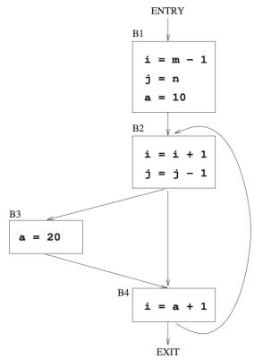

<details>
<summary>flowchart</summary>

```mermaid
graph TD
  A["ENTRY"] -->|B1| B1["i = m - 1\nj = n\na = 10"]
  B1 -->|B2| B2["i = i + 1\nj = j - 1"]
  B2 -->|B3| B3["a = 20"]
  B2 -->|B4| B4["i = a + 1"]
  B3 -->|B4| B4
  B4 -->|EXIT| A
```
</details>


Which one of the following choices correctly lists the set of live variables at the exit point of each basic block?

A. B1: { }, B2: {a}, B3: {a}, B4: {a}  
C. B1: $\{\mathrm{a},\mathrm{i},\mathrm{j}\}$ , B2: $\{\mathrm{a},\mathrm{i},\mathrm{j}\}$ , B3: $\{\mathrm{a},\mathrm{i}\}$ , B4: $\{\mathrm{a}\}$

gatecse-2023 compiler-design live-variable-analysis two-marks

Answer key

2.18

LI Parser (2)

# 2.18.1 LI Parser: GATE CSE 2024 | Set 2 | Question: 30

Consider the following context-free grammar where the start symbol is S and the set of terminals is $\{a, b, c, d\}$ .

$$
\begin{array}{l} S \rightarrow A a A b \mid B b B a \\ A \rightarrow c S \mid \epsilon \\ B \rightarrow d S \mid \epsilon \\ \end{array}
$$

The following is a partially-filled LL(1) parsing table.

<table><tr><td></td><td>a</td><td>b</td><td>c</td><td>d</td><td>$</td></tr><tr><td>S</td><td>S → AaAb</td><td>S → BbBa</td><td>(1)</td><td>(2)</td><td></td></tr><tr><td>A</td><td>A → ε</td><td>(3)</td><td>A → cS</td><td></td><td></td></tr><tr><td>B</td><td>(4)</td><td>B → ε</td><td></td><td>B → dS</td><td></td></tr></table>

Which one of the following options represents the CORRECT combination for the numbered cells in the parsing table?

Note: In the options, "blank" denotes that the corresponding cell is empty.

A. (1) $S \to AaAb(2)S \to BbBa(3)A \to \epsilon(4)B \to \epsilon$  
B. (1) $S \to BbBa$ (2) $S \to AaAb$ (3) $A \to \epsilon$ (4) $B \to \epsilon$  
C. (1) $S \to AaAb$ (2) $S \to BbBa$ (3) blank (4) blank  
D. (1) $S \to BbBa$ (2) $S \to AaAb$ (3) blank (4) blank

gatecse-2024-set2 compiler-design ll-parser parsing two-marks

Answer key

# 2.18.2 LI Parser: GATE CSE 2026 | Set 1 | Question: 18

Which of the following statements is/are true?


A. LL(1) parser uses backtracking  
B. For a grammar to be LL(1), it must be left-recursive  
C. For a grammar to be LL(1), it must be left-factored  
D. The LL(1) parsers are more powerful than the SLR parsers

gatecse-2026-set1 compiler-design parsing ll-parser multiple-selects one-mark

Answer key

# 2.19

# Macros (4)

# 2.19.1 Macros: GATE CSE 1992 | Question: 01,vii

Macro expansion is done in pass one instead of pass two in a two pass macro assembler because


gate1992 compiler-design macros easy fill-in-the-blanks

Answer key

# 2.19.2 Macros: GATE CSE 1995 | Question: 1.11

What are $x$ and $y$ in the following macro definition?


macro Add x, y
    Load y
    Mul x
    Store y
end macro

A. Variables  
C. Actual parameters  
gate1995 compiler-design macros easy

B. Identifiers  
D. Formal parameters

Answer key

# 2.19.3 Macros: GATE CSE 1996 | Question: 2.16

Which of the following macros can put a macro assembler into an infinite loop?


i. .MACRO M1, X
. IF EQ, X ; if X=0 then
M1 X + 1

```asm
.ENDC
.IF NE, X ;if X ≠ O then
.WORD X ;address (X) is stored here
.ENDC
.ENDM
```

```asm
ii.
.MACRO M2, X
.IF EQ, X
M2 X
.ENDC
.IF NE, X
.WORD X + 1
.ENDC
.ENDM
```

A. (ii) only

B. (i) only

C. both (i) and (ii)

D. None of the above

```txt
gate1996 compiler-design macros normal
```

# Answer key

# 2.19.4 Macros: GATE CSE 1997 | Question: 1.9

The conditional expansion facility of macro processor is provided to


A. test a condition during the execution of the expanded program  
B. to expand certain model statements depending upon the value of a condition during the execution of the expanded program  
C. to implement recursion  
D. to expand certain model statements depending upon the value of a condition during the process of macro expansion

```txt
gate1997 compiler-design macros easy
```

# Answer key

# 2.20

# Operator Precedence (9)

# Practice Test: Test 1 (7Q)

# 2.20.1 Operator Precedence: GATE CSE 1991 | Question: 10a

Consider the following grammar for arithmetic expressions using binary operators — and / which are not associative


- $E \rightarrow E - T \mid T$  
- $T \rightarrow T / F \mid \dot{F}$  
- $F \rightarrow (\dot{E}) \mid id$

(E is the start symbol)

Is the grammar unambiguous? Is so, what is the relative precedence between — and /? If not, give an unambiguous grammar that gives / precedence over —.

```txt
gate1991 grammar compiler-design normal descriptive ambiguous-grammar operator-precedence
```

# Answer key

# 2.20.2 Operator Precedence: GATE CSE 1997 | Question: 1.6

In the following grammar

- $X: := X \oplus Y \mid Y$  
- $Y: := Z * Y \mid Z$  
- $Z: := id$

Which of the following is true?


A. ‘ ⊕ ’ is left associative while ‘ \* ’ is right associative  
B. Both ‘ ⊕ ’ and ‘ \* ’ are left associative  
C. ‘ ⊕ ’ is right associative while ‘ \* ’ is left associative  
D. None of the above

gate1997 compiler-design grammar normal operator-precedence ambiguous-grammar

# Answer key

# 2.20.3 Operator Precedence: GATE CSE 2000 | Question: 2.21, ISRO2015-24

Given the following expression grammar:

$$
E \rightarrow E * F \mid F + E \mid F
$$

$$
F \rightarrow F - F \mid i d
$$

Which of the following is true?

A. \* has higher precedence than +

C. + and - have same precedence

B. — has higher precedence than \*

D. + has higher precedence than \*

gatecse-2000 operator-precedence normal compiler-design isro2015 ambiguous-grammar

# Answer key

# 2.20.4 Operator Precedence: GATE CSE 2002 | Question: 22

A. Construct all the parse trees corresponding to $i + j * k$ for the grammar

$$
\boldsymbol {E} \rightarrow \boldsymbol {E} + \boldsymbol {E}
$$

$$
E \rightarrow E * E
$$

$$
E \rightarrow i d
$$

B. In this grammar, what is the precedence of the two operators \* and +?  
C. If only one parse tree is desired for any string in the same language, what changes are to be made so that the resulting LALR(1) grammar is unambiguous?

gatecse-2002 compiler-design parsing normal descriptive operator-precedence ambiguous-grammar

# Answer key

# 2.20.5 Operator Precedence: GATE CSE 2011 | Question: 27

Consider two binary operators ‘↑’ and ‘↓’ with the precedence of operator ↓ being lower than that of the operator ↑. Operator ↑ is right associative while operator ↓ is left associative. Which one of the following represents the parse tree for expression (7 ↓ 3 ↑ 4 ↑ 3 ↓ 2)

A.

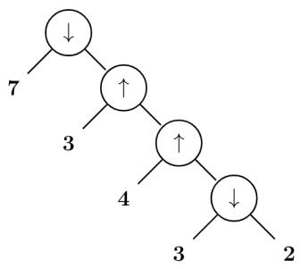

<details>
<summary>flowchart</summary>

```mermaid
graph TD
  A["↓"] -->|7| B["↑"]
  B -->|3| C["↑"]
  C -->|4| D["↓"]
  D -->|3| E["2"]
```
</details>

C.

B.

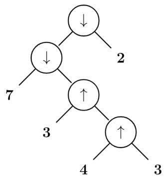

<details>
<summary>flowchart</summary>

```mermaid
graph TD
  A["↓"] --> B["7"]
  A --> C["2"]
  B --> D["↑"]
  D --> E["3"]
  D --> F["4"]
  E --> G["↑"]
  F --> G
  G --> H["3"]
```
</details>

D.


<details>
<summary>flowchart</summary>

```mermaid
graph TD
  A["7"] --> B["↓"]
  B --> C["↓"]
  C --> D["2"]
  C --> E["↑"]
  E --> F["3"]
  E --> G["4"]
  G --> H["↑"]
  H --> I["3"]
```
</details>

gatecse-2011 compiler-design parsing normal operator-precedence ambiguous-grammar


<details>
<summary>flowchart</summary>

```mermaid
graph TD
  A["7"] --> B["↓"]
  B --> C["↑"]
  C --> D["↑"]
  D --> E["↓"]
  E --> F["2"]
  C --> G["3"]
  G --> C
  C --> H["4"]
```
</details>

# Answer key

# 2.20.6 Operator Precedence: GATE CSE 2014 | Set 2 | Question: 17

Consider the grammar defined by the following production rules, with two operators \* and +

- $S \rightarrow T * P$  
- $T \rightarrow U \mid T * U$  
- $P \rightarrow Q + P \mid Q$  
- $Q \rightarrow Id$  
- $\dot{U} \rightarrow Id$

Which one of the following is TRUE?

A. + is left associative, while \* is right associative  
B. + is right associative, while \* is left associative  
C. Both + and \* are right associative  
D. Both + and \* are left associative

gatecse-2014-set2 compiler-design grammar normal operator-precedence ambiguous-grammar

# Answer key

# 2.20.7 Operator Precedence: GATE CSE 2016 | Set 1 | Question: 45

The attribute of three arithmetic operators in some programming language are given below.

<table><tr><td>OPERATOR</td><td>PRECEDENCE</td><td>ASSOCIATIVITY</td><td>ARITY</td></tr><tr><td>+</td><td>High</td><td>Left</td><td>Binary</td></tr><tr><td>-</td><td>Medium</td><td>Right</td><td>Binary</td></tr><tr><td>*</td><td>Low</td><td>Left</td><td>Binary</td></tr></table>

The value of the expression $2 - 5 + 1 - 7 \times 3$ in this language is \_\_\_\_.

gatecse-2016-set1 compiler-design parsing normal numerical-answers operator-precedence

# Answer key

# 2.20.8 Operator Precedence: GATE CSE 2018 | Question: 38

Consider the following parse tree for the expression a#b\$c\$d#e#f, involving two binary operators \$ and #.


<details>
<summary>flowchart</summary>

```mermaid
graph TD
  A[""] --> B["a"]
  A --> C["#"]
  C --> D["$"]
  C --> E["#"]
  D --> F["$ d"]
  E --> G["e f"]
  D --> H["b c"]
```
</details>

Which one of the following is correct for the given parse tree?

A. \$ has higher precedence and is left associative; # is right associative  
B. # has higher precedence and is left associative; \$ is right associative  
C. \$ has higher precedence and is left associative; # is left associative  
D. \$ has higher precedence and is right associative; # is left associative

gatecse-2018 compiler-design parsing normal two-marks operator-precedence ambiguous-grammar

# Answer key

# 2.20.9 Operator Precedence: GATE CSE 2024 | Set 1 | Question: 23

Consider the operator precedence and associativity rules for the integer arithmetic operators given in the table below.

<table><tr><td>Operator</td><td>Precedence</td><td>Associativity</td></tr><tr><td>+</td><td>Highest</td><td>Left</td></tr><tr><td>-</td><td>High</td><td>Right</td></tr><tr><td>*</td><td>Medium</td><td>Right</td></tr><tr><td>/</td><td>Low</td><td>Right</td></tr></table>

The value of the expression $3 + 1 + 5 \times 2/7 + 2 - 4 - 7 - 6/2$ as per the above rules is \_\_\_\_.

gatecse-2024-set1 numerical-answers compiler-design operator-precedence one-mark

# Answer key

# 2.21

# Parameter Passing (14)

# Practice Test: Test 1 (7Q)

# 2.21.1 Parameter Passing: GATE CSE 1988 | Question: 2xv

What is printed by following program, assuming call-by reference method of passing parameters for all variables in the parameter list of procedure P?


```pascal
program   Main(inout, output);
var    a, b:integer;
    procedure P(x, y, z:integer);
    begin
        y:=y+1
        z:=x+x
    end P;
begin
    a:=2; b:=3;
    p(a+b, a, a);
    Write(a)
end.
```

# 2.21.2 Parameter Passing: GATE CSE 1988 | Question: 8i

Consider the procedure declaration:


Procedure

P (k: integer)

where the parameter passing mechanism is call-by-value-result. Is it correct if the call, P (A[i]), where A is an array and i an integer, is implemented as below.

a. create a new local variable, say z;  
c. execute the body of P using z for k;  
suggest a correct one.

b. assign to z, the value of A [i];

d. set A [i] to z;

Explain your answer. If this is incorrect implementation,

gate1988 descriptive compiler-design runtime-environment parameter-passing

Answer key

# 2.21.3 Parameter Passing: GATE CSE 1989 | Question: 3-viii


In which of the following case(s) is it possible to obtain different results for call-by-reference and call-by-name parameter passing?

A. Passing an expression as a parameter  
C. Passing a pointer as a parameter

B. Passing an array as a parameter

D. Passing as array element as a parameter

gate1989 parameter-passing runtime-environment compiler-design multiple-selects

Answer key

# 2.21.4 Parameter Passing: GATE CSE 1990 | Question: 11a

What does the following program output?


```txt
program module (input, output);
var
  a:array [1...5] of integer;
  i, j: integer;
procedure unknown (var b: integer, var c: integer);
var
  i:integer;
begin
  for i := 1 to 5 do a[i] := i;
  b:= 0; c := 0
  for i := 1 to 5 do write (a[i]);
  writeln();
  a[3]:=11; a[1]:=11;
  for i:=1 to 5 do a [i] := sqr(a[i]);
  writeln(c,b); b := 5; c := 6;
end;
begin
  i:=1; j:=3; unknown (a[i], a[j]);
  for i:=1 to 5 do write (a[i]);
end;
```

gate1990 descriptive compiler-design runtime-environment parameter-passing

Answer key

# 2.21.5 Parameter Passing: GATE CSE 1991 | Question: 03,x

Indicate all the true statements from the following:


A. Recursive descent parsing cannot be used for grammar with left recursion.  
B. The intermediate form for representing expressions which is best suited for code optimization is the postfix form.  
C. A programming language not supporting either recursion or pointer type does not need the support of dynamic memory allocation.

D. Although C does not support call-by-name parameter passing, the effect can be correctly simulated in C  
E. No feature of Pascal typing violates strong typing in Pascal.

gate1991 compiler-design parameter-passing difficult multiple-selects

# Answer key

# 2.21.6 Parameter Passing: GATE CSE 1991 | Question: 09a

Consider the following pseudo-code (all data items are of type integer):


```matlab
procedure P(a, b, c);
    a := 2;
    c := a + b;
end {P}

begin
    x := 1;
    y := 5;
    z := 100;
    P(x, x*y, z);
    Write ('x = ', x, 'z = ', z);
end
```

Determine its output, if the parameters are passed to the Procedure P by

i. value  
ii. reference  
iii. name

gate1991 compiler-design parameter-passing normal runtime-environment descriptive

# Answer key

# 2.21.7 Parameter Passing: GATE CSE 1991 | Question: 09b

For the following code, indicate the output if


a. static scope rules  
b. dynamic scope rules

are used

```matlab
var a,b : integer;

procedure P;
    a := 5;
    b := 10;
end {P};

procedure Q;
    var a, b : integer;
    P;
end {Q};

begin
    a := 1;
    b := 2;
    Q;
    Write ('a = ', a, 'b = ', b);
end
```

gate1991 runtime-environment normal compiler-design parameter-passing descriptive

# Answer key

# 2.21.8 Parameter Passing: GATE CSE 1993 | Question: 26

A stack is used to pass parameters to procedures in a procedure call.

A. If a procedure P has two parameters as described in procedure definition:


procedure P (var x :integer; y: integer);

and if $P$ is called by; $P(a,b)$

State precisely in a sentence what is pushed on stack for parameters a and b

B. In the generated code for the body of procedure P, how will the addressing of formal parameters x and y differ?

gate1993 compiler-design parameter-passing runtime-environment normal descriptive

Answer key

# 2.21.9 Parameter Passing: GATE CSE 1995 | Question: 2.4

What is the value of X printed by the following program?


```pascal
program COMPUTE (input, output);
var X:integer;
procedure FIND (X:real);
  begin
    X:=sqrt(X);
  end;
begin
  X:=2
  FIND(X);
  writeln(X);
end.
```

A. 2

B. $\sqrt{2}$

C. Run time error

D. None of the above

gate1995 compiler-design parameter-passing runtime-environment easy

Answer key

# 2.21.10 Parameter Passing: GATE CSE 1999 | Question: 15

What will be the output of the following program assuming that parameter passing is


i. call by value  
ii. call by reference  
iii. call by copy restore

```matlab
procedure P{x, y, z};
begin
  y:y+1;
  z: x+x;
end;
begin
  a:= b:= 3;
  P(a+b, a, a);
  Print(a);
end
```

gate1999 parameter-passing normal runtime-environment descriptive

Answer key

# 2.21.11 Parameter Passing: GATE CSE 2003 | Question: 74

The following program fragment is written in a programming language that allows global variables and does not allow nested declarations of functions.


```txt
global int i=100, j=5;
void P(x) {
    int i=10;
        print(x+10);
        i=200;
        j=20;
        print (x);
}
main() {P(i+j);}
```

If the programming language uses dynamic scoping and call by name parameter passing mechanism, the values

printed by the above program are

A. 115,220

B. 25,220

C. 25,15

D. 115,105

gatecse-2003

programming

compiler-design

parameter-passing

runtime-environment

normal

Answer key

# 2.21.12 Parameter Passing: GATE CSE 2004 | Question: 2, ISRO2017-54

# Consider the following function


```txt
void swap(int a, int b)
{
    int temp;
    temp = a;
    a = b;
    b = temp;
}
```

In order to exchange the values of two variables x and y.

A. call swap(x, y)  
B. call swap(&x, &y)  
C. $swap(x, y)$ cannot be used as it does not return any value  
D. $swap(x, y)$ cannot be used as the parameters are passed by value

gatecse-2004

compiler-design

programming-in-c

parameter-passing

easy

isro2017

runtime-environment

Answer key

# 2.21.13 Parameter Passing: GATE CSE 2016 | Set 1 | Question: 36


What will be the output of the following pseudo-code when parameters are passed by reference and dynamic scoping is assumed?

```c
a = 3;
void n(x) { x = x * a; print (x); }
void m(y) { a = 1 ; a = y - a; n(a); print (a); }
void main () { m(a); }
```

A. 6,2

B. 6,6

C. 4,2

D. 4,4

gatecse-2016-set1

parameter-passing

normal

Answer key

# 2.21.14 Parameter Passing: GATE IT 2007 | Question: 33


Consider the program below in a hypothetical language which allows global variable and a choice of call by reference or call by value methods of parameter passing.

```c
int i ;
program main ()
{
    int j = 60;
    i = 50;
    call f (i, j);
    print i, j;
}
procedure f (x, y)
{
    i = 100;
    x = 10;
    y = y + i ;
}
```

Which one of the following options represents the correct output of the program for the two parameter passing mechanisms?

A. Call by value: i = 70, j = 10; Call by reference: i = 60, j = 70  
B. Call by value : i = 50, j = 60; Call by reference : i = 50, j = 70

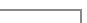

C. Call by value: $i = 10, j = 70$ ; Call by reference: $i = 100, j = 60$  
D. Call by value : i = 100, j = 60; Call by reference : i = 10, j = 70

gateit-2007 programming parameter-passing normal compiler-design runtime-environment

# Answer key

# 2.22

# Parsing (22)

Practice Tests: Test 1 (15Q) Test 2 (15Q) Test 3 (7Q)

# 2.22.1 Parsing: GATE CSE 1987 | Question: 1-xiv

An operator precedence parser is a

A. Bottom-up parser.

C. Back tracking parser.

gate1987 compiler-design parsing easy

B. Top-down parser.

D. None of the above.

# Answer key


# 2.22.2 Parsing: GATE CSE 1989 | Question: 1-iii

Merging states with a common core may produce \_\_\_\_ conflicts and does not produce \_\_\_\_ conflicts in an LALR parser.

gate1989 descriptive compiler-design parsing

# Answer key


# 2.22.3 Parsing: GATE CSE 1993 | Question: 25

A simple Pascal like language has only three statements.

i. assignment statement e.g. x:=expression  
ii. loop construct e.g. for i:=expression to expression do statement  
iii. sequencing e.g. begin statement ;...; statement end

A. Write a context-free grammar (CFG) for statements in the above language. Assume that expression has already been defined. Do not use optional parenthesis and \* operator in CFG.  
B. Show the parse tree for the following statements:

```txt
for j:=2 to 10 do
begin
    x:=expr1;
    y:=expr2;
end
```

gate1993 compiler-design parsing normal descriptive

# Answer key

# 2.22.4 Parsing: GATE CSE 1995 | Question: 8

Construct the LL(1) table for the following grammar.

1. Expr → \_Expr  
2. Expr → (Expr)  
3. Expr → Var ExprTail  
4. ExprTail → \_Expr  
5. Expr → λ  
6. Var → Id VarTail  
7. VarTail $\rightarrow$ (Expr)  
8. VarTail → λ  
9. Goal → Expr\$


# 2.22.5 Parsing: GATE CSE 1998 | Question: 1.27

Type checking is normally done during

A. lexical analysis  
C. syntax directed translation  
gate1998 compiler-design parsing easy

B. syntax analysis  
D. code optimization

Answer key

# 2.22.6 Parsing: GATE CSE 1998 | Question: 22


A. An identifier in a programming language consists of up to six letters and digits of which the first character must be a letter. Derive a regular expression for the identifier.  
B. Build an $LL(1)$ parsing table for the language defined by the $LL(1)$ grammar with productions

Program $\rightarrow$ begin $d$ semi $X$ end

$$
X \rightarrow d \text {semi} X \mid s Y
$$

$$
Y \to \text {semi} s Y \mid \epsilon
$$

gate1998 compiler-design parsing descriptive

Answer key

# 2.22.7 Parsing: GATE CSE 1999 | Question: 1.17

Which of the following is the most powerful parsing method?


A. LL (1)

B. Canonical LR

C. SLR

D. LALR

gate1999 compiler-design parsing easy

Answer key

# 2.22.8 Parsing: GATE CSE 2000 | Question: 1.19, UGCNET-Dec2013-II: 30


Which of the following derivations does a top-down parser use while parsing an input string? The input is scanned from left to right.

A. Leftmost derivation

B. Leftmost derivation traced out in reverse

C. Rightmost derivation

D. Rightmost derivation traced out in reverse

gatecse-2000 compiler-design parsing normal ugcnetcse-dec2013-paper2

Answer key

# 2.22.9 Parsing: GATE CSE 2001 | Question: 16


Consider the following grammar with terminal alphabet $\Sigma=\{a,(,),+,*\}$ and start symbol E. The production rules of the grammar are:

- $E \rightarrow aA$  
- $E \rightarrow (E)$  
- $A \rightarrow +E$  
- $A \rightarrow *E$  
- $A \to \epsilon$

a. Compute the FIRST and FOLLOW sets for $E$ and $A$ .  
b. Complete the LL(1) parse table for the grammar.


# 2.22.10 Parsing: GATE CSE 2003 | Question: 16

Which of the following suffices to convert an arbitrary CFG to an LL(1) grammar?

A. Removing left recursion alone  
C. Removing left recursion and factoring the grammar

B. Factoring the grammar alone

D. None of the above

gatecse-2003 compiler-design parsing easy

# Answer key

# 2.22.11 Parsing: GATE CSE 2005 | Question: 83a

# Statement for Linked Answer Questions 83a & 83b:

Consider the following expression grammar. The semantic rules for expression evaluation are stated next to each grammar production.

$$
\begin{array}{l} E \rightarrow \text {number} \quad | E. \text {val} = \text {number}. \text {val} \\ \mid E ^ {\prime} + ^ {\prime} E \mid E ^ {(1)}. v a l = E ^ {(2)}. v a l + E ^ {(3)}. v a l \\ \mid E ^ {\prime} \times^ {\prime} E \mid E ^ {(1)}. v a l = E ^ {(2)}. v a l \times E ^ {(3)}. v a l \\ \end{array}
$$

The above grammar and the semantic rules are fed to a yaac tool (which is an LALR(1) parser generator) for parsing and evaluating arithmetic expressions. Which one of the following is true about the action of yaac for the given grammar?

A. It detects recursion and eliminates recursion  
B. It detects reduce-reduce conflict, and resolves  
C. It detects shift-reduce conflict, and resolves the conflict in favor of a shift over a reduce action  
D. It detects shift-reduce conflict, and resolves the conflict in favor of a reduce over a shift action

gatecse-2005 compiler-design parsing difficult

# Answer key

# 2.22.12 Parsing: GATE CSE 2005 | Question: 83b

Consider the following expression grammar. The semantic rules for expression evaluation are stated next to each grammar production.

$$
\begin{array}{l} E \rightarrow \text {number} \quad | E. \text {val} = \text {number}. \text {val} \\ \mid E ^ {\prime} + ^ {\prime} E \mid E ^ {(1)}. v a l = E ^ {(2)}. v a l + E ^ {(3)}. v a l \\ \mid E ^ {\prime} \times^ {\prime} E \mid E ^ {(1)}. v a l = E ^ {(2)}. v a l \times E ^ {(3)}. v a l \\ \end{array}
$$

Assume the conflicts of this question are resolved using yacc tool and an LALR(1) parser is generated for parsing arithmetic expressions as per the given grammar. Consider an expression $3 \times 2 + 1$ . What precedence and associativity properties does the generated parser realize?

A. Equal precedence and left associativity; expression is evaluated to 7  
B. Equal precedence and right associativity; expression is evaluated to 9  
C. Precedence of ‘×’ is higher than that of ‘+’, and both operators are left associative; expression is evaluated to 7  
D. Precedence of ‘+’ is higher than that of ‘×’, and both operators are left associative; expression is evaluated to 9

# 2.22.13 Parsing: GATE CSE 2006 | Question: 58

Consider the following grammar:


- $S \rightarrow FR$  
- $R \to *S \mid \varepsilon$  
- $F \rightarrow id$

In the predictive parser table $M$ of the grammar the entries $M[S, id]$ and $M[R, \$]$ respectively are

A. $\{S\to FR\}$ and $\{R\to \varepsilon \}$  
B. $\{S\to FR\}$ and $\{\}$  
C. $\{S\to FR\}$ and $\{R\to *S\}$  
D. $\{F\to id\}$ and $\{R\to \varepsilon \}$

gatecse-2006 compiler-design parsing normal

# Answer key

# 2.22.14 Parsing: GATE CSE 2007 | Question: 18

Which one of the following is a top-down parser?

A. Recursive descent parser.  
C. An LR(k) parser.  
gatecse-2007 compiler-design parsing normal

B. Operator precedence parser.  
D. An LALR(k) parser.

# Answer key

# 2.22.15 Parsing: GATE CSE 2008 | Question: 11

Which of the following describes a handle (as applicable to LR-parsing) appropriately?


A. It is the position in a sentential form where the next shift or reduce operation will occur  
B. It is non-terminal whose production will be used for reduction in the next step  
C. It is a production that may be used for reduction in a future step along with a position in the sentential form where the next shift or reduce operation will occur  
D. It is the production $p$ that will be used for reduction in the next step along with a position in the sentential form where the right hand side of the production may be found

gatecse-2008 compiler-design parsing normal

# Answer key

# 2.22.16 Parsing: GATE CSE 2009 | Question: 42

Which of the following statements are TRUE?


I. There exist parsing algorithms for some programming languages whose complexities are less than $\Theta(n^{3})$  
II. A programming language which allows recursion can be implemented with static storage allocation.  
III. No L-attributed definition can be evaluated in the framework of bottom-up parsing.  
IV. Code improving transformations can be performed at both source language and intermediate code level.

A. I and II

B. I and IV

C. III and IV

D. I, III and IV

gatecse-2009 compiler-design parsing normal

# Answer key

# 2.22.17 Parsing: GATE CSE 2012 | Question: 53

For the grammar below, a partial $LL(1)$ parsing table is also presented along with the grammar. Entries that


need to be filled are indicated as $E1, E2$ , and $E3$ . $\varepsilon$ is the empty string, \$ indicates end of input, and, | separates alternate right hand sides of productions.

- $S \to aAbB \mid bAaB \mid \varepsilon$  
- $A \rightarrow S$  
- $B \to S$

<table><tr><td></td><td>a</td><td>b</td><td>$</td></tr><tr><td>S</td><td>E1</td><td>E2</td><td>S → ε</td></tr><tr><td>A</td><td>A → S</td><td>A → S</td><td>error</td></tr><tr><td>B</td><td>B → S</td><td>B → S</td><td>E3</td></tr></table>

The appropriate entries for E1, E2, and E3 are

A. $E1: S \to aAbB, A \to S$ $E2: S \to bAaB, B \to S$ $E3: B \to S$

B. $E1: S \to aAbB, S \to \varepsilon$ $E2: S \to bAaB, S \to \varepsilon$ $E3: S \to \varepsilon$

C. $E1: S \to aAbB, S \to \varepsilon$ $E2: S \to bAaB, S \to \varepsilon$ $E3: B \to S$

D. $E1: A \to S, S \to \varepsilon$ $E2: B \to S, S \to \varepsilon$ $E3: B \to S$

normal gatecse-2012 compiler-design parsing

Answer key

# 2.22.18 Parsing: GATE CSE 2015 | Set 3 | Question: 31

Consider the following grammar G

$$
S \rightarrow F \mid H
$$

$$
F \rightarrow p \mid c
$$

$$
H \rightarrow d \mid c
$$

Where $S, F,$ and $H$ are non-terminal symbols, $p, d,$ and $c$ are terminal symbols. Which of the following statement(s) is/are correct?

S1: LL(1) can parse all strings that are generated using grammar G

S2: LR(1) can parse all strings that are generated using grammar G

A. Only S1

B. Only S2

C. Both S1 and S2

D. Neither S1 and S2

gatecse-2015-set3 compiler-design parsing normal

Answer key

# 2.22.19 Parsing: GATE CSE 2017 | Set 1 | Question: 43

Consider the following grammar:

- stmt → if expr then expr else expr; stmt | Ó  
- expr $\rightarrow$ term relop term | term  
- term $\rightarrow$ id | number  
- $\mathrm{id} \rightarrow \mathbf{a} \mid \mathbf{b} \mid \mathbf{c}$  
- number $\rightarrow$ [0 - 9]

where relop is a relational operator (e.g., <, >, ...), Ó refers to the empty statement, and if, then, else are terminals.

Consider a program $P$ following the above grammar containing ten if terminals. The number of control flow paths in $P$ is \_\_\_\_. For example, the program

if $e_1$ then $e_2$ else $e_3$

has 2 control flow paths. $e_{1} \rightarrow e_{2}$ and $e_{1} \rightarrow e_{3}$ .


# 2.22.20 Parsing: GATE CSE 2024 | Set 1 | Question: 16

Which of the following is/are Bottom-Up Parser(s)?

A. Shift-reduce Parser

C. LL(1) Parser

B. Predictive Parser

D. LR Parser

gatecse-2024-set1 multiple-selects compiler-design parsing easy one-mark

# Answer key

# 2.22.21 Parsing: GATE IT 2005 | Question: 83b

Consider the context-free grammar

- $E \rightarrow E + E$  
- $E \rightarrow (E * E)$  
- $E \rightarrow \mathrm{id}$


where E is the starting symbol, the set of terminals is $\{id, (, +, ), *\}$ , and the set of non-terminals is $\{E\}$ .

For the terminal string $id + id + id + id$ , how many parse trees are possible?

A. 5

B. 4

C. 3

D. 2

gateit-2005 compiler-design parsing normal

# Answer key

# 2.22.22 Parsing: GATE IT 2008 | Question: 79

$A$ CFG $G$ is given with the following productions where $S$ is the start symbol, $A$ is a non-terminal and a and b are terminals.

- $S \rightarrow aS \mid A$  
- $A \to aAb \mid bAa \mid \epsilon$

For the string "aabbaab" how many steps are required to derive the string and how many parse trees are there?

A. 6 and 1

B. 6 and 2

C. 7 and 2

D. 4 and 2

gateit-2008 compiler-design parsing normal

# Answer key

# 2.23

# Register Allocation (6)

# Practice Test: Test 1 (7Q)

# 2.23.1 Register Allocation: GATE CSE 1997 | Question: 4.9

The expression $(a*b)*c$ op...

where ‘op’ is one of ‘+’, ‘\*’ and ‘↑’ (exponentiation) can be evaluated on a CPU with single register without storing the value of $(a * b)$ if

A. 'op' is '+' or '\*'

B. 'op' is '↑' or '\*'

C. 'op' is '↑' or '+'

D. not possible to evaluate without storing

gate1997 compiler-design register-allocation normal

# Answer key

# 2.23.2 Register Allocation: GATE CSE 2004 | Question: 10

Consider the grammar rule $E \rightarrow E1 - E2$ for arithmetic expressions. The code generated is targeted to a CPU having a single user register. The subtraction operation requires the first operand to be in the register.


If E1 and E2 do not have any common sub expression, in order to get the shortest possible code

A. E1 should be evaluated first  
B. E2 should be evaluated first  
C. Evaluation of E1 and E2 should necessarily be interleaved  
D. Order of evaluation of E1 and E2 is of no consequence

gatecse-2004 compiler-design register-allocation normal

# Answer key

# 2.23.3 Register Allocation: GATE CSE 2010 | Question: 37

The program below uses six temporary variables $a, b, c, d, e, f$ .


```txt
a = 1
b = 10
c = 20
d = a + b
e = c + d
f = c + e
b = c + e
e = b + f
d = 5 + e
return d + f
```

Assuming that all operations take their operands from registers, what is the minimum number of registers needed to execute this program without spilling?

A. 2

B. 3

C. 4

D. 6

gatecse-2010 compiler-design register-allocation normal

# Answer key

# 2.23.4 Register Allocation: GATE CSE 2011 | Question: 36

Consider evaluating the following expression tree on a machine with load-store architecture in which memory can be accessed only through load and store instructions. The variables $a, b, c, d$ , and $e$ are initially stored in memory. The binary operators used in this expression tree can be evaluated by the machine only when operands are in registers. The instructions produce result only in a register. If no intermediate results can be stored in memory, what is the minimum number of registers needed to evaluate this expression?


<details>
<summary>flowchart</summary>

```mermaid
graph TD
  A["+"] --> B["-"]
  A --> C["-"]
  B --> D["a"]
  B --> E["b"]
  C --> F["e"]
  C --> G["+"]
  F --> G
  G --> H["c"]
  G --> I["d"]
```
</details>

A. 2

B. 9

C. 5

D. 3

gatecse-2011 compiler-design register-allocation normal

# Answer key

# 2.23.5 Register Allocation: GATE CSE 2013 | Question: 48

The following code segment is executed on a processor which allows only register operands in its instructions. Each instruction can have almost two source operands and one destination operand. Assume that all variables are dead after this code segment.


```javascript
c = a + b;
d = c * a;
e = c + a;
x = c * c;
if (x > a) {
    y = a * a;
```


```lisp
}
else {
  d = d * d;
  e = e * e;
}
```

Q.48 Suppose the instruction set architecture of the processor has only two registers. The only allowed compiler optimization is code motion, which moves statements from one place to another while preserving correctness. What is the minimum number of spills to memory in the compiled code?

A. 0

B. 1

C. 2

D. 3

gatecse-2013 normal compiler-design register-allocation

Answer key

# 2.23.6 Register Allocation: GATE CSE 2017 | Set 1 | Question: 52

Consider the expression $(a-1)*(((b+c)/3)+d)$ . Let X be the minimum number of registers required by an optimal code generation (without any register spill) algorithm for a load/store architecture, in which


A. only load and store instructions can have memory operands and  
B. arithmetic instructions can have only register or immediate operands.

The value of X is \_\_\_\_.

gatecse-2017-set1 compiler-design register-allocation normal numerical-answers

Answer key

# 2.24

# Runtime Environment (22)

Practice Tests: Test 1 (15Q) Test 2 (2Q)

# 2.24.1 Runtime Environment: GATE CSE 1988 | Question: 2xii

Consider the following program skeleton and below figure which shows activation records of procedures involved in the calling sequence.


$$
p \to s \to q \to r \to q.
$$

Write the access links of the activation records to enable correct access and variables in the procedures from other procedures involved in the calling sequence

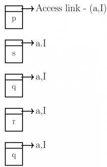

<details>
<summary>flowchart</summary>

```mermaid
graph LR
  A["p"] -->|"Access link - a,I"| B["s"]
  B -->|"a.I"| C["q"]
  C -->|"a,I"| D["r"]
  D -->|"a,I"| E["q"]
```
</details>

```txt
procedure p;
  procedure q;
  procedure r;
  begin
    q
    end r;
  begin
    r
  end q;
  procedure s;
  begin
    q
  end s;
  begin
    s
```

gate1988 normal descriptive runtime-environment compiler-design

# Answer key

# 2.24.2 Runtime Environment: GATE CSE 1989 | Question: 10a

Will recursion work correctly in a language with static allocation of all variables? Explain.

gate1989 descriptive compiler-design runtime-environment

# Answer key


# 2.24.3 Runtime Environment: GATE CSE 1989 | Question: 8b

Indicate the result of the following program if the language uses (i) static scope rules and (ii) dynamic scope rules.


```txt
var x, y:integer;
procedure A (var z:integer);
var x:integer;
begin x:=1; B; z:= x end;
procedure B;
begin x:=x+1 end;
begin
x:=5; A(y); write (y)
...end.
```

gate1989 descriptive compiler-design runtime-environment

# Answer key

# 2.24.4 Runtime Environment: GATE CSE 1990 | Question: 2-v

Match the pairs in the following questions:

<table><tr><td>(a)</td><td>Pointer data type</td><td>(p)</td><td>Type conversion</td></tr><tr><td>(b)</td><td>Activation record</td><td>(q)</td><td>Dynamic data structure</td></tr><tr><td>(c)</td><td>Repeat-until</td><td>(r)</td><td>Recursion</td></tr><tr><td>(d)</td><td>Coercion</td><td>(s)</td><td>Nondeterministic loop</td></tr></table>


gate1990 match-the-following compiler-design runtime-environment recursion

# Answer key

# 2.24.5 Runtime Environment: GATE CSE 1990 | Question: 4-v

State whether the following statements are TRUE or FALSE with reason:


The Link-load-and-go loading scheme required less storage space than the link-and-go loading scheme.

gate1990 true-false compiler-design runtime-environment

# Answer key

# 2.24.6 Runtime Environment: GATE CSE 1993 | Question: 7.7

A part of the system software which under all circumstances must reside in the main memory is:


A. text editor

B. assembler

C. linker

D. loader

E. none of the above

gate1993 compiler-design runtime-environment easy

# Answer key

# 2.24.7 Runtime Environment: GATE CSE 1995 | Question: 1.14


A linker is given object modules for a set of programs that were compiled separately. What information need not be included in an object module?

A. Object code  
B. Relocation bits  
C. Names and locations of all external symbols defined in the object module  
D. Absolute addresses of internal symbols

gate1995 compiler-design runtime-environment normal

Answer key

# 2.24.8 Runtime Environment: GATE CSE 1996 | Question: 2.17


The correct matching for the following pairs is

<table><tr><td>(A)</td><td>Activation record</td><td>(1)</td><td>Linking loader</td></tr><tr><td>(B)</td><td>Location counter</td><td>(2)</td><td>Garbage collection</td></tr><tr><td>(C)</td><td>Reference counts</td><td>(3)</td><td>Subroutine call</td></tr><tr><td>(D)</td><td>Address relocation</td><td>(4)</td><td>Assembler</td></tr></table>

A. A-3 B-4 C-1 D-2

B. A-4 B-3 C-1 D-2

C. A-4 B-3 C-2 D-1

D. A-3 B-4 C-2 D-1

gate1996 compiler-design easy runtime-environment

Answer key

# 2.24.9 Runtime Environment: GATE CSE 1997 | Question: 1.10


Heap allocation is required for languages.

A. that support recursion  
C. that use dynamic scope rules

B. that support dynamic data structure  
D. None of the above

gate1997 compiler-design easy runtime-environment

Answer key

# 2.24.10 Runtime Environment: GATE CSE 1997 | Question: 1.8


A language $L$ allows declaration of arrays whose sizes are not known during compilation. It is required to make efficient use of memory. Which one of the following is true?

A. A compiler using static memory allocation can be written for $L$  
B. A compiler cannot be written for $L$ ; an interpreter must be used  
C. A compiler using dynamic memory allocation can be written for $L$  
D. None of the above

gate1997 compiler-design easy runtime-environment

Answer key

# 2.24.11 Runtime Environment: GATE CSE 1998 | Question: 1.25, ISRO2008-41


In a resident – OS computer, which of the following systems must reside in the main memory under all situations?

A. Assembler

B. Linker

C. Loader

D. Compiler

gate1998 compiler-design runtime-environment normal isro2008

Answer key

# 2.24.12 Runtime Environment: GATE CSE 1998 | Question: 1.28


A linker reads four modules whose lengths are 200,800,600 and 500 words, respectively. If they are loaded in that order, what are the relocation constants?

A. 0,200,500,600

B. 0,200,1000,1600

C. 200,500,600,800

D. 200,700,1300,2100

gate1998 compiler-design runtime-environment normal

# Answer key

# 2.24.13 Runtime Environment: GATE CSE 1998 | Question: 2.15

Faster access to non-local variables is achieved using an array of pointers to activation records called a

A. stack

B. heap

C. display

D. activation tree

gate1998 programming compiler-design normal runtime-environment

# Answer key

# 2.24.14 Runtime Environment: GATE CSE 2001 | Question: 1.17


The process of assigning load addresses to the various parts of the program and adjusting the code and the data in the program to reflect the assigned addresses is called

A. Assembly

B. parsing

C. Relocation

D. Symbol resolution

gatecse-2001 compiler-design runtime-environment easy

# Answer key

# 2.24.15 Runtime Environment: GATE CSE 2002 | Question: 2.20


Dynamic linking can cause security concerns because

A. Security is dynamic  
B. The path for searching dynamic libraries is not known till runtime  
C. Linking is insecure  
D. Cryptographic procedures are not available for dynamic linking

gatecse-2002 compiler-design runtime-environment easy

# Answer key


# 2.24.16 Runtime Environment: GATE CSE 2008 | Question: 54

Which of the following are true?


I. A programming language which does not permit global variables of any kind and has no nesting of procedures/functions, but permits recursion can be implemented with static storage allocation  
II. Multi-level access link (or display) arrangement is needed to arrange activation records only if the programming language being implemented has nesting of procedures/functions  
III. Recursion in programming languages cannot be implemented with dynamic storage allocation  
IV. Nesting procedures/functions and recursion require a dynamic heap allocation scheme and cannot be implemented with a stack-based allocation scheme for activation records  
V. Programming languages which permit a function to return a function as its result cannot be implemented with a stack-based storage allocation scheme for activation records

A. II and V only

B. I, III and IV only

C. I, II and V only

D. II, III and V only

gatecse-2008 compiler-design difficult runtime-environment

# Answer key

# 2.24.17 Runtime Environment: GATE CSE 2010 | Question: 14

Which languages necessarily need heap allocation in the runtime environment?

A. Those that support recursion.  
C. Those that allow dynamic data structure.

B. Those that use dynamic scoping.

D. Those that use global variables.

gatecse-2010 compiler-design easy runtime-environment

# Answer key

# 2.24.18 Runtime Environment: GATE CSE 2012 | Question: 36

Consider the program given below, in a block-structured pseudo-language with lexical scoping and nesting of procedures permitted.

Program main;
Var ...

Procedure A1;
  Var ...
  Call A2;
End A1

Procedure A2; Var ...

Procedure A21;
  Var ...
  Call A1;
End A21

Call A21;
End A2

Call A1;
End main.

Consider the calling chain: Main → A1 → A2 → A21 → A1

The correct set of activation records along with their access links is given by:

(A)  

<details>
<summary>flowchart</summary>

```mermaid
graph LR
  A["FRAME POINTER"] --> B["A1"]
  B --> C["A1"]
  C --> D["A21"]
  D --> E["A2"]
  E --> F["A1"]
  F --> G["Main"]
  G --> F
```
</details>

(B)  


<details>
<summary>flowchart</summary>

```mermaid
graph LR
  A1["A1"] -->|"FRAME POINTER"| B["A1"]
  B -->|"ACCESS LINKS"| C["Main"]
  C --> A2["A2"]
  A2 --> B
  B -->|"ACCESS LINKS"| C
```
</details>

(C)  


<details>
<summary>flowchart</summary>

```mermaid
graph LR
  A["FRAME POINTER"] --> B["Main"]
  B --> C["A1"]
  C --> D["A2"]
  D --> E["A21"]
  E --> C
```
</details>

(D)  

<details>
<summary>flowchart</summary>

```mermaid
graph LR
  A1["A1"] --> Main["Main"]
  A1 --> A11["A1"]
  A1 --> A2["A2"]
  A1 --> A21["A21"]
  A1 --> A12["A12"]
  A12 --> Main
  A1 --> A2
  A1 --> A21
  A1 --> A11
  A1 --> A2
  A1 --> A12
```
</details>

gatecse-2012 compiler-design runtime-environment normal

# Answer key

# 2.24.19 Runtime Environment: GATE CSE 2014 | Set 2 | Question: 18

Which one of the following is NOT performed during compilation?

A. Dynamic memory allocation

C. Symbol table management

B. Type checking

D. Inline expansion

gatecse-2014-set2 compiler-design easy runtime-environment


# 2.24.20 Runtime Environment: GATE CSE 2014 | Set 3 | Question: 18

Which of the following statements are CORRECT?


1. Static allocation of all data areas by a compiler makes it impossible to implement recursion.  
2. Automatic garbage collection is essential to implement recursion.  
3. Dynamic allocation of activation records is essential to implement recursion.  
4. Both heap and stack are essential to implement recursion.

A. 1 and 2 only

B. 2 and 3 only

C. 3 and 4 only

D. 1 and 3 only

gatecse-2014-set3 compiler-design runtime-environment normal

# Answer key

# 2.24.21 Runtime Environment: GATE CSE 2021 | Set 1 | Question: 4

Consider the following statements.


- $S_{1}$ : The sequence of procedure calls corresponds to a preorder traversal of the activation tree.  
- $S_{2}$ : The sequence of procedure returns corresponds to a postorder traversal of the activation tree.

Which one of the following options is correct?

A. $S_{1}$ is true and $S_{2}$ is false

C. $S_{1}$ is true and $S_{2}$ is true

gatecse-2021-set1 runtime-environment normal one-mark

# Answer key

# 2.24.22 Runtime Environment: GATE CSE 2023 | Question: 26

Consider the following program:


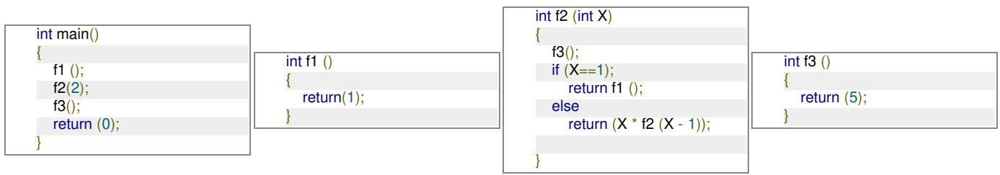

<details>
<summary>flowchart</summary>

```mermaid
graph LR
  subgraph Algorithm1
  A["int main()"] --> B["f1 ( );"]
  B --> C["f2(2);"]
  C --> D["f3( );"]
  D --> E["return (0);"]
  end

  subgraph Algorithm2
  F["int f1 ( )"] --> G["return(1);"]
  G --> H[""]
  end

  subgraph Algorithm3
  I["int f2 (int X)"] --> J["f3( );"]
  J --> K["if (X==1);"]
  K --> L["return f1 ( );"]
  L --> M["else"]
  M --> N["return (X * f2 (X - 1));"]
  end

  subgraph Algorithm4
  O["int f3 ( )"] --> P["return (5);"]
  end
```
</details>

Which one of the following options represents the activation tree corresponding to the main function?

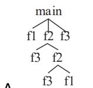


gatecse-2023 compiler-design runtime-environment two-marks

B.

D.

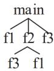


# Answer key

# 2.25

# Static Single Assignment (3)

Practice Test: Test 1 (6Q)

# 2.25.1 Static Single Assignment: GATE CSE 2015 | Set 1 | Question: 55


The least number of temporary variables required to create a three-address code in static single assignment form for the expression $q + r/3 + s - t * 5 + u * v/w$ is \_\_\_\_.

gatecse-2015-set1 compiler-design intermediate-code normal numerical-answers static-single-assignment

# Answer key

# 2.25.2 Static Single Assignment: GATE CSE 2016 | Set 1 | Question: 19

Consider the following code segment.


```matlab
x = u - t;
y = x * v;
x = y + w;
y = t - z;
y = x * y;
```

The minimum number of total variables required to convert the above code segment to static single assignment form is \_\_\_\_.

gatecse-2016-set1 compiler-design static-single-assignment normal numerical-answers

# Answer key

# 2.25.3 Static Single Assignment: GATE CSE 2017 | Set 1 | Question: 12

Consider the following intermediate program in three address code


```txt
p = a - b
q = p * c
p = u * v
q = p + q
```

Which one of the following corresponds to a static single assignment form of the above code?

A.

```txt
p1 = a - b
q1 = p1 * c
p1 = u * v
q1 = p1 + q1
```

B.

```txt
p3 = a - b
q4 = p3 * c
p4 = u * v
q5 = p4 + q4
```

C.

```txt
p1 = a - b
q1 = p2 * c
p3 = u * v
q2 = p4 + q3
```

D.

```txt
p1 = a - b
q1 = p * c
p2 = u * v
q2 = p + q
```

gatecse-2017-set1 compiler-design intermediate-code normal static-single-assignment

# Answer key

2.26

# Symbol Table (1)

# 2.26.1 Symbol Table: GATE CSE 2025 | Set 1 | Question: 2

Which ONE of the following statements is FALSE regarding the symbol table?


A. Symbol table is responsible for keeping track of the scope of variables.  
B. Symbol table can be implemented using a binary search tree.  
C. Symbol table is not required after the parsing phase.  
D. Symbol table is created during the lexical analysis phase.

gatecse2025-set1 compiler-design symbol-table easy one-mark

# Answer key

2.27

# Syntax Directed Translation (19)

Practice Tests: Test 1 (15Q) Test 2 (10Q)

# 2.27.1 Syntax Directed Translation: GATE CSE 1992 | Question: 11a


Write syntax directed definitions (semantic rules) for the following grammar to add the type of each identifier to its entry in the symbol table during semantic analysis. Rewriting the grammar is not permitted and semantic rules are to be added to the ends of productions only.

- $D \to TL$ ;  
- $T \rightarrow \mathrm{int}$  
- $T \rightarrow$ real  
- $L \to L, id$  
- $L \rightarrow id$

gate1992 compiler-design syntax-directed-translation normal descriptive

Answer key

# 2.27.2 Syntax Directed Translation: GATE CSE 1995 | Question: 2.10


A shift reduce parser carries out the actions specified within braces immediately after reducing with the corresponding rule of grammar

- $S \rightarrow xxW$ {print"1"}  
- $S \to y$ {print"2"}  
- $W \to Sz$ {print"3"}

What is the translation of xxxxyzz using the syntax directed translation scheme described by the above rules?

A. 23131

B. 11233

C. 11231

D. 33211

gate1995 compiler-design grammar syntax-directed-translation normal

Answer key

# 2.27.3 Syntax Directed Translation: GATE CSE 1996 | Question: 20


Consider the syntax-directed translation schema (SDTS) shown below:

- $E \rightarrow E + E$ {print "+"}  
- $E \to E * E$ {print “.”}  
- $E \to id$ {print id.name}  
- $E \rightarrow (E)$

An LR-parser executes the actions associated with the productions immediately after a reduction by the corresponding production. Draw the parse tree and write the translation for the sentence.

$(a + b) * (c + d)$ , using SDTS given above.

gate1996 compiler-design syntax-directed-translation normal descriptive

Answer key

# 2.27.4 Syntax Directed Translation: GATE CSE 1998 | Question: 23


Let the attribute 'val' give the value of a binary number generated by S in the following grammar:

- $S \to L \cdot L \mid L$  
- $L \rightarrow LB \mid B$  
- $B\to 0\mid 1$

For example, an input 101.101 gives S.val = 5.625

Construct a syntax directed translation scheme using only synthesized attributes, to determine S. val.

gate1998 compiler-design syntax-directed-translation normal descriptive

Answer key

Consider the syntax directed translation scheme (SDTS) given in the following. Assume attribute evaluation with bottom-up parsing, i.e., attributes are evaluated immediately after a reduction.

- $E \to E_1 * T$ $\{E.val = E_1.val * T.val\}$  
- $E \to T$ $\{E.val = T.val\}$  
- $T \rightarrow F - T_1$ $\{T.val = F.val - T_1.val\}$  
- $T \rightarrow F$ $\{T.val = F.val\}$  
- $F \to 2$ $\{F.val = 2\}$  
- $F \to 4$ $\{F.val = 4\}$

A. Using this SDTS, construct a parse tree for the expression $4 - 2 - 4 * 2$ and also compute its $E$ . val.  
B. It is required to compute the total number of reductions performed to parse a given input. Using synthesized attributes only, modify the SDTS given, without changing the grammar, to find E.red, the number of reductions performed while reducing an input to E.

gatecse-2000 compiler-design syntax-directed-translation normal descriptive

Answer key

# 2.27.6 Syntax Directed Translation: GATE CSE 2001 | Question: 17

The syntax of the repeat-until statement is given by the following grammar

$S \rightarrow$ repeat $S_{1}$ until $E$


where E stands for expressions, S and $S_{1}$ stand for statements. The non-terminals S and $S_{1}$ have an attribute code that represents generated code. The non-terminal E has two attributes. The attribute code represents generated code to evaluate the expression and store its value in a distinct variable, and the attribute varName contains the name of the variable in which the truth value is stored. The truth-value stored in the variable is 1 if E is true, 0 if E is false.

Give a syntax-directed definition to generate three-address code for the repeat-until statement. Assume that you can call a function newlabel() that returns a distinct label for a statement. Use the operator '\\' to concatenate two strings and the function gen(s) to generate a line containing the string s.

gatecse-2001 compiler-design syntax-directed-translation normal descriptive

Answer key

# 2.27.7 Syntax Directed Translation: GATE CSE 2003 | Question: 18

In a bottom-up evaluation of a syntax directed definition, inherited attributes can


A. always be evaluated  
B. be evaluated only if the definition is L-attributed  
C. be evaluated only if the definition has synthesized attributes  
D. never be evaluated

gatecse-2003 compiler-design syntax-directed-translation normal

Answer key

# 2.27.8 Syntax Directed Translation: GATE CSE 2003 | Question: 59

Consider the syntax directed definition shown below.

$$
\begin{array}{l} S \rightarrow \mathbf {i d} := E \quad \{g e n (\mathbf {i d}. p l a c e = E. p l a c e;) \} \\ E \rightarrow E _ {1} + E _ {2} \quad \{t = n e w t e m p (); \\ g e n (t = E _ {1}. p l a c e + E _ {2}. p l a c e;); \\ E. p l a c e = t; \} \\ E \rightarrow i d \quad \{E. p l a c e = \mathbf {i d}. p l a c e; \} \\ \end{array}
$$


Here, gen is a function that generates the output code, and newtemp is a function that returns the name of a new temporary variable on every call. Assume that $t_{i}^{\prime}$ 's are the temporary variable names generated by newtemp. For the statement 'X := Y + Z', the 3-address code sequence generated by this definition is

A. $X = Y + Z$

B. $t_1 = Y + Z; X = t_1$

C. $t_1 = Y; t_2 = t_1 + Z; X = t_2$

D. $t_1 = Y; t_2 = Z; t_3 = t_1 + t_2; X = t_3$

gatecse-2003 compiler-design syntax-directed-translation normal

# Answer key

# 2.27.9 Syntax Directed Translation: GATE CSE 2004 | Question: 45

Consider the grammar with the following translation rules and E as the start symbol

$$
\begin{array}{l} E \rightarrow E _ {1} \# T \quad \{E. v a l u e = E _ {1}. v a l u e * T. v a l u e \} \\ | T \quad \{E. v a l u e = T. v a l u e \} \\ T \rightarrow T _ {1} \&F \quad \{T. v a l u e = T _ {1}. v a l u e + F. v a l u e \} \\ | F \quad \{T. v a l u e = F. v a l u e \} \\ F \rightarrow \text {num} \quad \{F. v a l u e = n u m. v a l u e \} \\ \end{array}
$$

Compute E.value for the root of the parse tree for the expression:2 # 3 & 5 # 6 & 4

A. 200

B. 180

C. 160

D. 40

gatecse-2004 compiler-design grammar normal syntax-directed-translation

# Answer key

# 2.27.10 Syntax Directed Translation: GATE CSE 2016 | Set 1 | Question: 46

Consider the following Syntax Directed Translation Scheme (SDTS), with non-terminals $\{S, A\}$ and terminals $\{a, b\}$ .


$$
S \rightarrow a A \quad \{\text {print} 1 \}
$$

$$
S \rightarrow a \quad \{\text {print} 2 \}
$$

$$
A \rightarrow S b \quad \{\text {print} 3 \}
$$

Using the above SDTS, the output printed by a bottom-up parser, for the input aab is:

A. 132

B. 223

C. 231

D. syntax error

gatecse-2016-set1 compiler-design syntax-directed-translation normal

# Answer key

# 2.27.11 Syntax Directed Translation: GATE CSE 2019 | Question: 36

Consider the following grammar and the semantic actions to support the inherited type declaration attributes. Let $X_{1}, X_{2}, X_{3}, X_{4}, X_{5}$ , and $X_{6}$ be the placeholders for the non-terminals D, T, L or $L_{1}$ in the following table:

<table><tr><td>Production rule</td><td>Semantic action</td></tr><tr><td> $D \rightarrow TL$ </td><td> $X_1. type = X_2. type$ </td></tr><tr><td> $T \rightarrow \text{int}$ </td><td> $T. type = \text{int}$ </td></tr><tr><td> $T \rightarrow \text{float}$ </td><td> $T. type = \text{float}$ </td></tr><tr><td> $L \rightarrow L_1, id$ </td><td> $X_3. type = X_4. type$  $\text{addType}(id. entry, X_5. type)$ </td></tr><tr><td> $L \rightarrow id$ </td><td> $\text{addType}(id. entry, X_6. type)$ </td></tr></table>

Which one of the following are appropriate choices for $X_{1}, X_{2}, X_{3}$ and $X_{4}$ ?

A. $X_{1} = L, X_{2} = T, X_{3} = L_{1}, X_{4} = L$


B. $X_{1} = T, X_{2} = L, X_{3} = L_{1}, X_{4} = T$  
C. $X_{1} = L, X_{2} = L, X_{3} = L_{1}, X_{4} = T$  
D. $X_{1} = T, X_{2} = L, X_{3} = T, X_{4} = L_{1}$

gatecse-2019 compiler-design syntax-directed-translation two-marks

# Answer key

# 2.27.12 Syntax Directed Translation: GATE CSE 2020 | Question: 33

Consider the productions $A \rightarrow PQ$ and $A \rightarrow XY$ . Each of the five non-terminals A, P, Q, X, and Y has two attributes: s is a synthesized attribute, and i is an inherited attribute. Consider the following rules.


- Rule $1: P.i = A.i + 2$ , $Q.i = P.i + A.i$ , and $A.s = P.s + Q.s$  
- Rule 2: $X.i = A.i + Y.s$ and $Y.i = X.s + A.i$

Which one of the following is TRUE?

A. Both Rule 1 and Rule 2 are $L$ -attributed.

C. Only Rule 2 is $L$ -attributed.

B. Only Rule 1 is $L$ -attributed.

D. Neither Rule 1 nor Rule 2 is $L$ -attributed.

gatecse-2020 compiler-design syntax-directed-translation two-marks

# Answer key

# 2.27.13 Syntax Directed Translation: GATE CSE 2021 | Set 1 | Question: 26

Consider the following grammar (that admits a series of declarations, followed by expressions) and the associated syntax directed translation (SDT) actions, given as pseudo-code


$$
P \rightarrow D ^ {*} E ^ {*}
$$

$D \rightarrow \text{int ID}\{\text{record that ID.lexeme is of type int}\}$

$D \rightarrow$ bool ID{record that ID.lexeme is of type bool}

$E \rightarrow E_{1} + E_{2}$ {check that $E_{1}$ . type $= E_{2}$ . type $=$ int; set $E$ . type := int}

$E \rightarrow !E_1\{\text{check that } E_1.\text{ type} = \text{bool}; \text{ set } E.\text{ type} := \text{bool}\}$

$E \rightarrow \text{ID}\{\text{set } E.\text{type} := \text{int}\}$

With respect to the above grammar, which one of the following choices is correct?

A. The actions can be used to correctly type-check any syntactically correct program  
B. The actions can be used to type-check syntactically correct integer variable declarations and integer expressions  
C. The actions can be used to type-check syntactically correct boolean variable declarations and boolean expressions.  
D. The actions will lead to an infinite loop

gatecse-2021-set1 compiler-design syntax-directed-translation two-marks

# Answer key

# 2.27.14 Syntax Directed Translation: GATE CSE 2022 | Question: 55

Consider the following grammar along with translation rules.

$$
\begin{array}{l} S \rightarrow S _ {1} \# T \quad \left\{S _ {\cdot \text {val}} = S _ {1 \cdot \text {val}} ^ {*} T _ {\cdot \text {val}} \right\} \\ S \rightarrow T \quad \{S _ {\cdot \text {val}} = T _ {\cdot \text {val}} \} \\ T \rightarrow T _ {1} \% R \quad \left\{T _ {\cdot \text {val}} = T _ {1 \cdot \text {val}} \div R _ {\cdot \text {val}} \right\} \\ T \rightarrow R \quad \{T _ {\cdot \text {val}} = R _ {\cdot \text {val}} \} \\ R \rightarrow \mathrm{id} \quad \left\{R _ {\cdot \text {val}} = \mathrm{id} _ {\cdot \text {val}} \right\} \\ \end{array}
$$


Here # and % are operators and id is a token that represents an integer and id.val represents the corresponding integer value. The set of non-terminals is $\{S, T, R, P\}$ and a subscripted non-terminal indicates an instance of the non-terminal.

Using this translation scheme, the computed value of $S_{val}$ for root of the parse tree for the expression $20\#10\%5\#8\%2\%2$ is \_\_\_\_.

gatecse-2022 numerical-answers compiler-design syntax-directed-translation two-marks

# Answer key

# 2.27.15 Syntax Directed Translation: GATE CSE 2023 | Question: 50


Consider the syntax directed translation given by the following grammar and semantic rules. Here $N, I, F$ and $B$ are non-terminals. $N$ is the starting non-terminal, and $\#$ , $\mathbf{0}$ and $\mathbf{1}$ are lexical tokens corresponding to input letters “ $\#$ ”, “0” and “1”, respectively. $X.\ val$ denotes the synthesized attribute (a numeric value) associated with a non-terminal $X$ . $I_1$ and $F_1$ denote occurrences of $I$ and $F$ on the right hand side of a production, respectively. For the tokens $\mathbf{0}$ and $\mathbf{1}$ , $\mathbf{0}$ . $val = 0$ and $\mathbf{1}$ . $val = 1$ .

$$
\begin{array}{l} N \rightarrow I \# F \quad N. v a l = I. v a l + F. v a l \\ I \rightarrow I _ {1} B \quad I. v a l = (2 I _ {1}. v a l) + B. v a l \\ I \rightarrow B \quad I. v a l = \mathrm{B.val} \\ F \rightarrow B F _ {1} \quad F. v a l = \frac {1}{2} (B. v a l + F _ {1}. v a l) \\ F \rightarrow B \quad \mathrm{F.val} = \frac {1}{2} B. v a l \\ B \rightarrow \mathbf {0} \quad B. v a l = \mathbf {0}. v a l \\ B \rightarrow \mathbf {1} \quad B. v a l = \mathbf {1}. v a l \\ \end{array}
$$

The value computed by the translation scheme for the input string

$$
1 0 \# 0 1 1
$$

is \_\_\_\_. (Rounded off to three decimal places)

gatecse-2023 compiler-design syntax-directed-translation numerical-answers two-marks

# Answer key

# 2.27.16 Syntax Directed Translation: GATE CSE 2024 | Set 1 | Question: 27

Consider the following syntax-directed definition (SDD).

<table><tr><td>S → DHTU</td><td>{S. val = D. val + H. val + T. val + U. val;}</td></tr><tr><td>D →&quot; M&quot; D1</td><td>{D. val = 5 + D1. val;}</td></tr><tr><td>D → ε</td><td>{D. val = -5;}</td></tr><tr><td>H →&quot; L&quot; H1</td><td>{H. val = 5*10 + H1. val;}</td></tr><tr><td>H → ε</td><td>{H. val = -10;}</td></tr><tr><td>T → &quot;C&quot; T1</td><td>{T. val = 5*100 + T1. val;}</td></tr><tr><td>T → ε</td><td>{T. val = -5;}</td></tr><tr><td>U → &quot;K&quot;</td><td>{U. val = 5;}</td></tr></table>


Given "MMLK" as the input, which one of the following options is the CORRECT value computed by the SDD (in the attribute S. val)?

A. 45

B. 50

C. 55

D. 65

# 2.27.17 Syntax Directed Translation: GATE CSE 2024 | Set 2 | Question: 19

Which of the following statements is/are FALSE?


A. An attribute grammar is a syntax-directed definition (SDD) in which the functions in the semantic rules have no side effects  
B. The attributes in a L-attributed definition cannot always be evaluated in a depth-first order  
C. Synthesized attributes can be evaluated by a bottom-up parser as the input is parsed  
D. All L-attributed definitions based on LR(1) grammar can be evaluated using a bottom-up parsing strategy

gatecse-2024-set2 compiler-design syntax-directed-translation multiple-selects one-mark

# Answer key

# 2.27.18 Syntax Directed Translation: GATE CSE 2025 | Set 2 | Question: 12

Given the following syntax directed translation rules:


- Rule 1: $R \to AB\{B.i = R.i - 1; A.i = B.i; R.i = A.i + 1; \}$  
- Rule 2: $P \to CD\{P.i = C.i + D.i; D.i = C.i + 2; \}$  
- Rule 3: $Q \to EF\{Q.i = E.i + F.i; \}$

Which ONE is the CORRECT option among the following?

A. Rule 1 is $S$ -attributed and $L$ -attributed; Rule 2 is $S$ -attributed and not $L$ -attributed; Rule 3 is neither $S$ -attributed nor $L$ -attributed.  
B. Rule 1 is neither $S$ -attributed not $L$ -attributed; Rule 2 is $S$ -attributed and $L$ -attributed; Rule 3 is $S$ -attributed and $L$ -attributed.  
C. Rule 1 is neither $S$ -attributed nor $L$ -attributed; Rule 2 is not $S$ -attributed and is $L$ -attributed; Rule 3 is $S$ -attributed and $L$ -attributed.  
D. Rule 1 is $S$ -attributed and not $L$ -attributed; Rule 2 is not $S$ -attributed and is $L$ -attributed; Rule 3 is $S$ -attributed and $L$ -attributed.

gatecse2025-set2 compiler-design syntax-directed-translation one-mark

# Answer key

# 2.27.19 Syntax Directed Translation: GATE CSE 2026 | Set 1 | Question: 43

Consider the following two syntax-directed definitions SDD1 and SDD2 for type declarations.


<table><tr><td colspan="2">SDD1</td></tr><tr><td>Grammar (G1)</td><td>Semantic Rules</td></tr><tr><td> $D \rightarrow TV$ </td><td> $D.type = T.type$  $V.type = T.type$ </td></tr><tr><td> $T \rightarrow \text{int}$ </td><td> $T.type = \text{int}$ </td></tr><tr><td> $T \rightarrow \text{float}$ </td><td> $T.type = \text{float}$ </td></tr><tr><td> $V \rightarrow V_1 \text{ id}$ </td><td> $V_1.type = V.type$ put(id.entry, V.type)</td></tr><tr><td> $V \rightarrow \text{id}$ </td><td>put(id.entry, V.type)</td></tr></table>

<table><tr><td colspan="2">SDD2</td></tr><tr><td>Grammar (G2)</td><td>Semantic Rules</td></tr><tr><td> $D \rightarrow D_1 \text{ id}$ </td><td> $D.type = D_1.type$ put(id.entry, D_1.type)</td></tr><tr><td> $D \rightarrow T \text{ id}$ </td><td> $D.type = T.type$ put(id.entry, T.type)</td></tr><tr><td>T → int</td><td>T.type = int</td></tr><tr><td>T → float</td><td>T.type = float</td></tr></table>

D is the start symbol, and int, float and id are the three terminals. The non-terminal $V_{1}$ is the same as V and the non-terminal $D_{1}$ is the same as D. Here, the subscript is used to differentiate the grammar symbols on the two sides of a production. The function put updates the symbol table with the type information for an identifier.

Let P and Q be the languages specified by grammars G1 and G2, respectively.

Which of the following statements is/are true?

A. The languages P and Q are the same  
B. SDD2 is S-attributed and contains only synthesized attributes  
C. SDD1 is L-attributed and contains only inherited attributes  
D. The specifications of SDD1 and SDD2 are such that the same entries get added to the symbol table

gatecse-2026-set1 compiler-design syntax-directed-translation two-marks multiple-selects

# Answer key

# 2.28

# Variable Scope (2)

# 2.28.1 Variable Scope: GATE CSE 1987 | Question: 1-xix

Study the following program written in a block-structured language:


```txt
Var x, y:interger;
procedure P(n:interger);
begin
  x:=(n+2)/(n-3);
end;

procedure Q
Var x, y:interger;
begin
  x:=3;
  y:=4;
  P(y);
  Write(x)                      __(1)
end;

begin
  x:=7;
  y:=8;
  Q;
Write(x);                      __(2)
end.
```

What will be printed by the write statements marked (1) and (2) in the program if the variables are statically scoped?

A. 3,6

B. 6,7

C. 3,7

D. None of the above.

gate1987 compiler-design variable-scope runtime-environment

# Answer key

# 2.28.2 Variable Scope: GATE CSE 1987 | Question: 1-xx

For the program given below what will be printed by the write statements marked (1) and (2) in the program if the variables are dynamically scoped?


```txt
Var x, y:interger;
procedure P(n:interger);
begin
  x := (n+2)/(n-3);
end;

procedure Q
Var x, y:interger;
begin
  x:=3;
  y:=4;
```

<table><tr><td>P(y);Write(x);</td><td>__(1)</td></tr><tr><td>end;</td><td></td></tr><tr><td>begin</td><td></td></tr><tr><td>x:=7;y:=8;</td><td></td></tr><tr><td>Q;Write(x);</td><td>__(2)</td></tr><tr><td>end.</td><td></td></tr></table>

A. 3,6

B. 6,7

C. 3,7

D. None of the above

gate1987 compiler-design variable-scope runtime-environment

Answer key

# 2.29

# Viable Prefix (1)

# 2.29.1 Viable Prefix: GATE CSE 2015 | Set 1 | Question: 13

Which one of the following is TRUE at any valid state in shift-reduce parsing?

A. Viable prefixes appear only at the bottom of the stack and not inside  
B. Viable prefixes appear only at the top of the stack and not inside  
C. The stack contains only a set of viable prefixes  
D. The stack never contains viable prefixes

gatecse-2015-set1 compiler-design parsing normal viable-prefix lr-parser

Answer key

Answer Keys

<table><tr><td>2.1.1</td><td>C</td><td>2.2.1</td><td>B</td><td>2.2.2</td><td>B;C</td><td>2.3.1</td><td>N/A</td><td>2.3.2</td><td>TBA</td></tr><tr><td>2.3.3</td><td>N/A</td><td>2.3.4</td><td>A;B;C</td><td>2.3.5</td><td>True</td><td>2.3.6</td><td>N/A</td><td>2.3.7</td><td>True</td></tr><tr><td>2.3.8</td><td>False</td><td>2.3.9</td><td>B</td><td>2.4.1</td><td>C</td><td>2.5.1</td><td>6:6</td><td>2.5.2</td><td>A</td></tr><tr><td>2.6.1</td><td>A</td><td>2.6.2</td><td>D</td><td>2.6.3</td><td>A</td><td>2.6.4</td><td>D</td><td>2.6.5</td><td>7</td></tr><tr><td>2.6.6</td><td>D</td><td>2.6.7</td><td>B</td><td>2.6.8</td><td>D</td><td>2.7.1</td><td>C</td><td>2.7.2</td><td>N/A</td></tr><tr><td>2.7.3</td><td>A</td><td>2.7.4</td><td>B</td><td>2.7.5</td><td>C</td><td>2.7.6</td><td>B</td><td>2.7.7</td><td>C</td></tr><tr><td>2.7.8</td><td>B</td><td>2.7.9</td><td>D</td><td>2.7.10</td><td>C</td><td>2.7.11</td><td>B</td><td>2.7.12</td><td>B</td></tr><tr><td>2.7.13</td><td>C</td><td>2.8.1</td><td>13:13</td><td>2.9.1</td><td>A</td><td>2.9.2</td><td>6:6</td><td>2.10.1</td><td>A</td></tr><tr><td>2.10.2</td><td>6</td><td>2.11.1</td><td>A;B</td><td>2.11.2</td><td>A</td><td>2.11.3</td><td>C</td><td>2.11.4</td><td>31</td></tr><tr><td>2.11.5</td><td>A</td><td>2.11.6</td><td>A;D</td><td>2.12.1</td><td>N/A</td><td>2.12.2</td><td>N/A</td><td>2.12.3</td><td>N/A</td></tr><tr><td>2.12.4</td><td>N/A</td><td>2.12.5</td><td>N/A</td><td>2.12.6</td><td>C</td><td>2.12.7</td><td>C</td><td>2.12.8</td><td>N/A</td></tr><tr><td>2.12.9</td><td>N/A</td><td>2.12.10</td><td>X</td><td>2.12.11</td><td>N/A</td><td>2.12.12</td><td>N/A</td><td>2.12.13</td><td>D</td></tr><tr><td>2.12.14</td><td>N/A</td><td>2.12.15</td><td>N/A</td><td>2.12.16</td><td>N/A</td><td>2.12.17</td><td>C</td><td>2.12.18</td><td>A</td></tr><tr><td>2.12.19</td><td>N/A</td><td>2.12.20</td><td>D</td><td>2.12.21</td><td>A</td><td>2.12.22</td><td>B</td><td>2.12.23</td><td>B</td></tr><tr><td>2.12.24</td><td>C</td><td>2.12.25</td><td>A</td><td>2.12.26</td><td>D</td><td>2.12.27</td><td>B</td><td>2.12.28</td><td>D</td></tr><tr><td>2.12.29</td><td>D</td><td>2.12.30</td><td>A</td><td>2.12.31</td><td>C</td><td>2.12.32</td><td>C</td><td>2.12.33</td><td>C</td></tr><tr><td>2.12.34</td><td>B</td><td>2.12.35</td><td>C</td><td>2.12.36</td><td>C</td><td>2.12.37</td><td>B</td><td>2.12.38</td><td>A</td></tr><tr><td>2.12.39</td><td>C</td><td>2.12.40</td><td>5</td><td>2.12.41</td><td>A</td><td>2.12.42</td><td>179</td><td>2.12.43</td><td>B;C</td></tr><tr><td>2.12.44</td><td>C;D</td><td>2.12.45</td><td>A</td><td>2.12.46</td><td>C</td><td>2.12.47</td><td>D</td><td>2.13.1</td><td>N/A</td></tr><tr><td>2.13.2</td><td>N/A</td><td>2.13.3</td><td>N/A</td><td>2.13.4</td><td>C</td><td>2.13.5</td><td>A</td><td>2.13.6</td><td>C</td></tr></table>


<table><tr><td>2.13.7</td><td>A</td></tr><tr><td>2.14.1</td><td>B;C;D</td></tr><tr><td>2.14.6</td><td>B</td></tr><tr><td>2.14.11</td><td>A</td></tr><tr><td>2.14.16</td><td>5</td></tr><tr><td>2.15.1</td><td>A</td></tr><tr><td>2.15.6</td><td>D</td></tr><tr><td>2.17.2</td><td>A</td></tr><tr><td>2.19.2</td><td>D</td></tr><tr><td>2.20.3</td><td>B</td></tr><tr><td>2.20.8</td><td>A</td></tr><tr><td>2.21.4</td><td>N/A</td></tr><tr><td>2.21.9</td><td>A</td></tr><tr><td>2.21.14</td><td>D</td></tr><tr><td>2.22.5</td><td>C</td></tr><tr><td>2.22.10</td><td>D</td></tr><tr><td>2.22.15</td><td>D</td></tr><tr><td>2.22.20</td><td>A;D</td></tr><tr><td>2.23.3</td><td>B</td></tr><tr><td>2.24.2</td><td>N/A</td></tr><tr><td>2.24.7</td><td>C</td></tr><tr><td>2.24.12</td><td>B</td></tr><tr><td>2.24.17</td><td>C</td></tr><tr><td>2.24.22</td><td>A</td></tr><tr><td>2.27.1</td><td>N/A</td></tr><tr><td>2.27.6</td><td>N/A</td></tr><tr><td>2.27.11</td><td>A</td></tr><tr><td>2.27.16</td><td>A</td></tr><tr><td>2.28.2</td><td>B</td></tr></table>

<table><tr><td>2.13.8</td><td>B</td></tr><tr><td>2.14.2</td><td>C</td></tr><tr><td>2.14.7</td><td>D</td></tr><tr><td>2.14.12</td><td>D</td></tr><tr><td>2.14.17</td><td>D</td></tr><tr><td>2.15.2</td><td>C</td></tr><tr><td>2.16.1</td><td>B</td></tr><tr><td>2.17.3</td><td>D</td></tr><tr><td>2.19.3</td><td>A</td></tr><tr><td>2.20.4</td><td>N/A</td></tr><tr><td>2.20.9</td><td>6</td></tr><tr><td>2.21.5</td><td>A;D</td></tr><tr><td>2.21.10</td><td>N/A</td></tr><tr><td>2.22.1</td><td>A</td></tr><tr><td>2.22.6</td><td>N/A</td></tr><tr><td>2.22.11</td><td>C</td></tr><tr><td>2.22.16</td><td>B</td></tr><tr><td>2.22.21</td><td>A</td></tr><tr><td>2.23.4</td><td>D</td></tr><tr><td>2.24.3</td><td>N/A</td></tr><tr><td>2.24.8</td><td>D</td></tr><tr><td>2.24.13</td><td>C</td></tr><tr><td>2.24.18</td><td>D</td></tr><tr><td>2.25.1</td><td>8</td></tr><tr><td>2.27.2</td><td>A</td></tr><tr><td>2.27.7</td><td>B</td></tr><tr><td>2.27.12</td><td>B</td></tr><tr><td>2.27.17</td><td>B;D</td></tr><tr><td>2.29.1</td><td>C</td></tr></table>

<table><tr><td>2.13.9</td><td>D</td></tr><tr><td>2.14.3</td><td>B</td></tr><tr><td>2.14.8</td><td>B</td></tr><tr><td>2.14.13</td><td>7</td></tr><tr><td>2.14.18</td><td>9</td></tr><tr><td>2.15.3</td><td>B</td></tr><tr><td>2.16.2</td><td>C</td></tr><tr><td>2.18.1</td><td>A</td></tr><tr><td>2.19.4</td><td>D</td></tr><tr><td>2.20.5</td><td>B</td></tr><tr><td>2.21.1</td><td>10</td></tr><tr><td>2.21.6</td><td>N/A</td></tr><tr><td>2.21.11</td><td>X</td></tr><tr><td>2.22.2</td><td>N/A</td></tr><tr><td>2.22.7</td><td>B</td></tr><tr><td>2.22.12</td><td>B</td></tr><tr><td>2.22.17</td><td>C</td></tr><tr><td>2.22.22</td><td>A</td></tr><tr><td>2.23.5</td><td>B</td></tr><tr><td>2.24.4</td><td>N/A</td></tr><tr><td>2.24.9</td><td>B</td></tr><tr><td>2.24.14</td><td>C</td></tr><tr><td>2.24.19</td><td>A</td></tr><tr><td>2.25.2</td><td>10</td></tr><tr><td>2.27.3</td><td>N/A</td></tr><tr><td>2.27.8</td><td>B</td></tr><tr><td>2.27.13</td><td>B</td></tr><tr><td>2.27.18</td><td>C</td></tr></table>

<table><tr><td>2.13.10</td><td>D</td></tr><tr><td>2.14.4</td><td>B</td></tr><tr><td>2.14.9</td><td>D</td></tr><tr><td>2.14.14</td><td>C</td></tr><tr><td>2.14.19</td><td>C</td></tr><tr><td>2.15.4</td><td>C</td></tr><tr><td>2.16.3</td><td>C</td></tr><tr><td>2.18.2</td><td>C</td></tr><tr><td>2.20.1</td><td>N/A</td></tr><tr><td>2.20.6</td><td>B</td></tr><tr><td>2.21.2</td><td>N/A</td></tr><tr><td>2.21.7</td><td>N/A</td></tr><tr><td>2.21.12</td><td>D</td></tr><tr><td>2.22.3</td><td>N/A</td></tr><tr><td>2.22.8</td><td>A</td></tr><tr><td>2.22.13</td><td>A</td></tr><tr><td>2.22.18</td><td>D</td></tr><tr><td>2.23.1</td><td>A</td></tr><tr><td>2.23.6</td><td>2</td></tr><tr><td>2.24.5</td><td>True</td></tr><tr><td>2.24.10</td><td>C</td></tr><tr><td>2.24.15</td><td>B</td></tr><tr><td>2.24.20</td><td>D</td></tr><tr><td>2.25.3</td><td>B</td></tr><tr><td>2.27.4</td><td>N/A</td></tr><tr><td>2.27.9</td><td>C</td></tr><tr><td>2.27.14</td><td>80</td></tr><tr><td>2.27.19</td><td>A;B;D</td></tr></table>

<table><tr><td>2.13.11</td><td>A</td></tr><tr><td>2.14.5</td><td>D</td></tr><tr><td>2.14.10</td><td>C</td></tr><tr><td>2.14.15</td><td>8 : 8</td></tr><tr><td>2.14.20</td><td>D</td></tr><tr><td>2.15.5</td><td>A</td></tr><tr><td>2.17.1</td><td>C</td></tr><tr><td>2.19.1</td><td>N/A</td></tr><tr><td>2.20.2</td><td>A</td></tr><tr><td>2.20.7</td><td>9</td></tr><tr><td>2.21.3</td><td>A;D</td></tr><tr><td>2.21.8</td><td>N/A</td></tr><tr><td>2.21.13</td><td>D</td></tr><tr><td>2.22.4</td><td>N/A</td></tr><tr><td>2.22.9</td><td>N/A</td></tr><tr><td>2.22.14</td><td>A</td></tr><tr><td>2.22.19</td><td>1024</td></tr><tr><td>2.23.2</td><td>B</td></tr><tr><td>2.24.1</td><td>N/A</td></tr><tr><td>2.24.6</td><td>D</td></tr><tr><td>2.24.11</td><td>C</td></tr><tr><td>2.24.16</td><td>A</td></tr><tr><td>2.24.21</td><td>C</td></tr><tr><td>2.26.1</td><td>C</td></tr><tr><td>2.27.5</td><td>N/A</td></tr><tr><td>2.27.10</td><td>C</td></tr><tr><td>2.27.15</td><td>2.375</td></tr><tr><td>2.28.1</td><td>A</td></tr></table>

# Webpage

Stacks, Queues, Linked lists, Trees, Binary search trees, Binary heaps, Graphs.

Mark Distribution in Previous GATE

<table><tr><td>Year</td><td>2026 - 1</td><td>2026 - 2</td><td>2025 - 1</td><td>2025 - 2</td><td>2024 - 1</td><td>2024 - 2</td><td>2023</td><td>2022</td><td>2021 - 1</td><td>2021 - 2</td><td>Minimum</td></tr><tr><td>1 Mark Count</td><td>0</td><td>1</td><td>3</td><td>2</td><td>0</td><td>0</td><td>2</td><td>2</td><td>4</td><td>2</td><td>0</td></tr><tr><td>2 Marks Count</td><td>1</td><td>1</td><td>1</td><td>2</td><td>1</td><td>2</td><td>3</td><td>1</td><td>1</td><td>0</td><td>0</td></tr><tr><td>Total Marks</td><td>2</td><td>3</td><td>5</td><td>6</td><td>2</td><td>4</td><td>8</td><td>4</td><td>6</td><td>2</td><td>2</td></tr></table>

Welcome to the "Programming and Data Structures: Data Structures" chapter, a cornerstone of the GATE Computer Science syllabus. This subject is fundamental to understanding how data is organized, stored, and manipulated efficiently, which is crucial for designing optimal algorithms and software systems. For GATE CS, Data Structures typically carries a significant weightage, often contributing 8-12 marks, sometimes more, through a mix of Multiple Choice Questions (MCQs) and Numerical Answer Type (NAT) questions. Questions frequently test your understanding of core concepts, time and space complexity analysis of operations, properties of various data structures, and their applications in problem-solving. Expect problems involving tracing operations on specific data structures like AVL trees or heaps, analyzing the complexity of given code snippets, or determining the output of tree traversals.

# Topic-wise Key Concepts

# AVL Tree

An AVL tree is a self-balancing Binary Search Tree (BST) where the difference between the heights of the left and right subtrees for any node is at most 1. This strict balance ensures that the tree remains relatively balanced, preventing worst-case scenarios of skewed BSTs.

- Balance Factor: For any node $N$ , $\text{BalanceFactor}(N) = \text{Height(RightSubtree}(N)) - \text{Height(LeftSubtree}(N))$ . In an AVL tree, $\text{BalanceFactor}(N) \in \{-1, 0, 1\}$ .  
- Rotations: When an insertion or deletion causes a node to become unbalanced (balance factor becomes $\pm 2$ ), rotations are performed to restore balance. There are four types of rotations:

1. LL Rotation (Left-Left): Occurs when an insertion into the left subtree of the left child causes imbalance. A single right rotation is performed.  
2. RR Rotation (Right-Right): Occurs when an insertion into the right subtree of the right child causes imbalance. A single left rotation is performed.  
3. LR Rotation (Left-Right): Occurs when an insertion into the right subtree of the left child causes imbalance. A left rotation on the child, followed by a right rotation on the parent.  
4. RL Rotation (Right-Left): Occurs when an insertion into the left subtree of the right child causes imbalance. A right rotation on the child, followed by a left rotation on the parent.

- Height of an AVL Tree: For an AVL tree with $n$ nodes, its height $h$ is always $O(\log n)$ . Specifically, $h < 1.44\log_2(n + 2)$ .  
- Time Complexity: Insertion, deletion, and search operations all take $O(\log n)$ time in the worst case due to the balanced nature.

Common Pitfalls: Incorrectly identifying the type of rotation needed, especially for LR and RL cases. Forgetting to update heights and balance factors after rotations. Tracing rotations correctly requires careful step-by-step analysis.

Problem-Solving Techniques: Practice tracing insertions/deletions and the subsequent rotations on small example AVL trees. Understand the pivot node and the child involved in the imbalance.

# Abstract Data Type (ADT)

An Abstract Data Type (ADT) is a mathematical model for data types, defining the data stored and the operations that can be performed on it, without specifying how these operations are implemented. It focuses on "what" an operation does rather than "how" it does it.

\- Key Properties:

- Abstraction: Hides the internal implementation details from the user.  
- Encapsulation: Bundles data and methods that operate on the data into a single unit.

\- Examples: Stack, Queue, List, Priority Queue, Map, Set are all ADTs. A data structure (e.g., array, linked list) is a

concrete implementation of an ADT.

Common Pitfalls: Confusing an ADT with a data structure. An ADT is a logical concept, while a data structure is a physical implementation.

Problem-Solving Techniques: Identify the core operations and their logical behavior when asked to define or recognize an ADT.

# Array

An array is a collection of elements of the same data type, stored in contiguous memory locations. Elements are accessed using an integer index.

\- Address Calculation (1D Array): For an array $A$ starting at BaseAddress, with elements of size $S$ , and lower bound $L_0$ :

$$
\text {Address} (A [ i ]) = \text {BaseAddress} + (i - L _ {0}) \times S
$$

If $L_0 = 0$ , then $\text{Address}(A[i]) = \text{BaseAddress} + i \times S$ .

\- Address Calculation (2D Array - Row-Major Order): For an array $A[R][C]$ (R rows, C columns), starting at BaseAddress, with element size $S$ , and lower bounds $L_{row}, L_{col}$ :

$$
\text {Address} (A [ i ] [ j ]) = \text {BaseAddress} + \left((i - L _ {r o w}) \times C + (j - L _ {c o l})\right) \times S
$$

If $L_{row} = 0, L_{col} = 0$ , then $\text{Address}(A[i][j]) = \text{BaseAddress} + (i \times C + j) \times S$ .

\- Address Calculation (2D Array - Column-Major Order): For an array $A[R][C]$ , starting at BaseAddress, with element size $S$ , and lower bounds $L_{row}, L_{col}$ :

$$
\text {Address} (A [ i ] [ j ]) = \text {BaseAddress} + ((j - L _ {c o l}) \times R + (i - L _ {r o w})) \times S
$$

If $L_{row} = 0, L_{col} = 0$ , then $\text{Address}(A[i][j]) = \text{BaseAddress} + (j \times R + i) \times S$ .

\- Time Complexity:

- Accessing an element: $O(1)$  
- Insertion/Deletion at end: $O(1)$ (if space available)  
- Insertion/Deletion at beginning/middle: $O(n)$ (requires shifting elements)

Common Pitfalls: Off-by-one errors in index calculations, especially with non-zero lower bounds. Confusing row-major with column-major order.

Problem-Solving Techniques: Carefully apply the address calculation formulas. Understand the memory layout for multi-dimensional arrays.

# Binary Heap

A binary heap is a complete binary tree that satisfies the heap property: for a min-heap, every parent node's value is less than or equal to its children's values; for a max-heap, every parent node's value is greater than or equal to its children's values. Heaps are typically implemented using an array.

\- Array Representation (0-indexed):

- Parent of node at index $i$ : $\lfloor (i - 1) / 2 \rfloor$  
- Left child of node at index $i: 2i + 1$  
- Right child of node at index $i: 2i + 2$

\- Heap Properties:

Completeness: All levels are completely filled except possibly the last level, which is filled from left to right.  
- Heap Property: (Min-heap or Max-heap)

\- Time Complexity:

- Insert: $O(\log n)$ (heapify-up)  
- Delete-min/max (extract-root): $O(\log n)$ (heapify-down)  
- Build Heap from an array of $n$ elements: $O(n)$  
- Search: $O(n)$ (Heaps are not designed for efficient search of arbitrary elements)

Common Pitfalls: Violating the completeness property. Incorrectly applying heapify-up or heapify-down logic. Confusing min-heap and max-heap properties.

Problem-Solving Techniques: Trace heap operations (insert, delete) step-by-step. For building a heap, start from the last non-leaf node and perform heapify-down upwards.

# Binary Search Tree (BST)

A Binary Search Tree (BST) is a binary tree where for every node, all values in its left subtree are less than the node's value, and all values in its right subtree are greater than the node's value. Duplicate values are typically not allowed or handled specifically (e.g., placed in the right subtree).

# - BST Properties:

- Left subtree values < Root value  
- Right subtree values > Root value  
- Both left and right subtrees are also BSTs.  
- Inorder traversal of a BST yields elements in sorted order.

# • Time Complexity (Average Case):

\- Search, Insertion, Deletion: $O(\log n)$

# • Time Complexity (Worst Case - Skewed Tree):

\- Search, Insertion, Deletion: $O(n)$ (occurs when elements are inserted in sorted or reverse-sorted order, leading to a linked list-like structure)

# - Deletion Cases:

1. Node to be deleted is a leaf: Simply remove it.  
2. Node has one child: Replace the node with its child.  
3. Node has two children: Replace the node's value with its inorder predecessor (largest in left subtree) or inorder successor (smallest in right subtree), then delete the predecessor/successor node (which will have 0 or 1 child).

Common Pitfalls: Forgetting the worst-case $O(n)$ complexity for skewed trees. Incorrectly handling deletion of nodes with two children. Not understanding that inorder traversal is key to sorted output.

Problem-Solving Techniques: Practice constructing BSTs and performing deletions. Understand the recursive nature of BST operations.

# Binary Tree

A binary tree is a tree data structure in which each node has at most two children, referred to as the left child and the right child.

# - Key Properties:

- Full Binary Tree: Every node has either 0 or 2 children.  
Complete Binary Tree: All levels are completely filled except possibly the last level, which is filled from left to right.  
- Perfect Binary Tree: All internal nodes have two children, and all leaf nodes are at the same level. (A perfect binary tree is always full and complete).  
- Skewed Binary Tree: All nodes have only one child (either left or right), resembling a linked list.

# - Formulas:

• Maximum number of nodes at level k (root at level 0): $2^{k}$  
• Maximum number of nodes in a binary tree of height h (max levels $h + 1$ ): $2^{h+1} - 1$  
- Minimum height of a binary tree with $n$ nodes: $\lceil \log_2(n + 1) \rceil - 1$ or $\lfloor \log_2 n \rfloor$ (for complete binary tree)  
- Number of leaf nodes $L$ and internal nodes $I$ in a full binary tree: $L = I + 1$

Common Pitfalls: Confusing the definitions of full, complete, and perfect binary trees. Miscalculating height or number of nodes.

Problem-Solving Techniques: Draw examples to visualize properties. Apply formulas carefully based on the definition of the tree type.

# Data Structures

Data structures are specialized formats for organizing and storing data in a computer so that it can be accessed and modified efficiently. They provide a means to manage large amounts of data effectively for various applications.

# - Classification:

- Primitive vs. Non-Primitive: Primitive (int, char, float), Non-Primitive (Arrays, Linked Lists, Trees, Graphs).  
- Linear vs. Non-Linear: Linear (Arrays, Linked Lists, Stacks, Queues), Non-Linear (Trees, Graphs).

Static vs. Dynamic: Static (fixed size at compile time, e.g., arrays), Dynamic (size can change at runtime, e.g., linked lists).

\- Importance: Choosing the right data structure is critical for optimal algorithm performance (time and space complexity).

Common Pitfalls: Not understanding the trade-offs between different data structures (e.g., array vs. linked list for insertion/deletion).

Problem-Solving Techniques: Analyze problem requirements (e.g., frequent insertions, fast searches, memory constraints) to select the most appropriate data structure.

# Hashing

Hashing is a technique used to map keys to array indices (hash table slots) for efficient data storage and retrieval. A hash function $h(k)$ computes an index for a given key k.

# - Hash Functions:

- Division Method: $h(k) = k \pmod{m}$ , where $m$ is the size of the hash table (often a prime number not close to a power of 2).  
- Multiplication Method: $h(k) = \lfloor m(kA \pmod{1}) \rfloor$ , where $A$ is a constant $0 < A < 1$ (e.g., $A \approx (\sqrt{5} - 1)/2$ ).  
- Mid-Square Method: Square the key, then extract some middle digits.  
- Folding Method: Divide the key into parts, then combine them (e.g., add them).

\- Collision Resolution Techniques: When two different keys map to the same index.

\- Chaining: Each hash table slot points to a linked list of all keys that hash to that slot.

- Average case for search/insert/delete: $O(1 + \alpha)$ , where $\alpha$ is the load factor.  
- Worst case: $O(n)$ if all keys hash to the same slot.

\- Open Addressing: All elements are stored directly in the hash table. When a collision occurs, probe for an alternative empty slot.

- Linear Probing: $h(k, i) = (h'(k) + i) \pmod{m}$ , where $i = 0, 1, 2, \ldots$ . Suffers from primary clustering.  
- Quadratic Probing: $h(k,i) = (h'(k) + c_1i + c_2i^2) \pmod{m}$ . Reduces primary clustering but can suffer from secondary clustering.  
- Double Hashing: $h(k, i) = (h_1(k) + i \cdot h_2(k)) \pmod{m}$ . Uses two hash functions to generate probe sequences, reducing clustering.

\- Load Factor $(\alpha)$ : $\alpha = n / m$ , where $n$ is the number of elements and $m$ is the table size.

- For chaining: $\alpha$ can be greater than 1.  
- For open addressing: $\alpha \leq 1$ .

Common Pitfalls: Choosing a non-prime table size for division method. Incorrectly applying probing sequences. Understanding the difference between primary and secondary clustering.

Problem-Solving Techniques: Trace insertions and searches with given hash functions and collision resolution strategies. Calculate load factor and analyze performance implications.

# Infix, Prefix, Postfix Notations

These are different ways to write arithmetic expressions, differing in the position of operators relative to their operands.

\- Infix Notation: Operator is between operands (e.g., $A + B$ ). This is the human-readable form.

\- Prefix Notation (Polish Notation): Operator precedes its operands (e.g., +AB).

\- Postfix Notation (Reverse Polish Notation): Operator follows its operands (e.g., $AB+$ ).

\- Properties: Prefix and Postfix notations do not require parentheses to define operator precedence or associativity, making them unambiguous for computer evaluation.

# - Conversion Rules:

- Infix to Postfix/Prefix: Typically uses a stack. Operators are pushed onto the stack based on precedence and associativity. Operands are directly appended to the output.  
- Evaluation of Postfix/Prefix: Also uses a stack. For postfix, operands are pushed; when an operator is encountered, pop two operands, perform the operation, and push the result. For prefix, scan from right to left.

Common Pitfalls: Incorrectly handling operator precedence and associativity during conversions. Mistakes in stack operations (push/pop order).

Problem-Solving Techniques: Practice conversions using the stack-based algorithms. Remember operator

precedence (e.g., ×, / > +, -) and associativity (most are left-associative, exponentiation is right-associative).

# Linked List

A linked list is a linear data structure where elements are not stored in contiguous memory locations. Instead, each element (node) contains data and a pointer (or link) to the next node in the sequence.

# - Types of Linked Lists:

- Singly Linked List: Each node points to the next node. Traversal is unidirectional.  
- Doubly Linked List: Each node has pointers to both the next and previous nodes. Traversal is bidirectional.  
- Circular Linked List: The last node points back to the first node (or head). Can be singly or doubly circular.

# - Time Complexity:

- Insertion/Deletion at beginning: $O(1)$  
- Insertion/Deletion at end: $O(n)$ for singly linked list (requires traversal), $O(1)$ if tail pointer is maintained. $O(1)$ for doubly linked list if tail pointer is maintained.  
- Insertion/Deletion at specific position: $O(n)$ (requires traversal to find position)  
- Search: $O(n)$

\- Advantages: Dynamic size, efficient insertions/deletions at specific points (if pointer to previous node is available).

\- Disadvantages: More memory overhead (for pointers), no random access $(O(n)$ for access).

Common Pitfalls: Null pointer exceptions when traversing or manipulating the list. Incorrectly updating pointers during insertion/deletion, leading to lost nodes or broken links. Handling edge cases like empty list or single-node list.

Problem-Solving Techniques: Draw diagrams to visualize pointer changes. Pay close attention to the order of pointer updates. Always check for null pointers.

# Priority Queue

A Priority Queue is an Abstract Data Type (ADT) that functions like a queue but with an additional concept of "priority." Elements are retrieved based on their priority, not necessarily their insertion order. The element with the highest (or lowest) priority is always dequeued first.

# - Core Operations:

- Insert (enqueue): Adds an element with a given priority.  
- Extract-Min/Max (dequeue): Removes and returns the element with the highest (or lowest) priority.  
- Peek: Returns the highest (or lowest) priority element without removing it.

# - Implementations:

- Binary Heap: Most efficient implementation, providing $O(\log n)$ for insert and extract-min/max.  
- Unsorted Array/Linked List: $O(1)$ insert, $O(n)$ extract-min/max.  
- Sorted Array/Linked List: $O(n)$ insert, $O(1)$ extract-min/max.

Common Pitfalls: Confusing a priority queue with a regular queue. Not understanding that the underlying data structure (e.g., heap) determines the complexity.

Problem-Solving Techniques: When a problem requires always processing the "most important" item next, a priority queue (implemented with a heap) is often the solution.

# Queue

A Queue is a linear Abstract Data Type (ADT) that follows the First-In, First-Out (FIFO) principle. Elements are added at one end (rear/tail) and removed from the other end (front/head).

# - Core Operations:

- Enqueue: Adds an element to the rear of the queue.  
- Dequeue: Removes and returns the element from the front of the queue.  
- Front/Peek: Returns the element at the front without removing it.  
- IsEmpty, IsFull: Checks the state of the queue.

# - Implementations:

Array-based: Can lead to "queue full" even if space is available (linear array). Circular array implementation solves this.  
- Linked List-based: More dynamic, no fixed size issues.

\- Time Complexity (Array or Linked List): All core operations (enqueue, dequeue, front) are $O(1)$ .

Common Pitfalls: Underflow (dequeuing from an empty queue) and Overflow (enqueuing into a full array-based queue). Incorrectly managing front and rear pointers in array implementations, especially circular queues.

Problem-Solving Techniques: Trace operations carefully. Understand how front and rear pointers move. For circular queues, remember the modulus operator for index calculations: $(index + 1)$ (mod S)ize.

# Stack

A Stack is a linear Abstract Data Type (ADT) that follows the Last-In, First-Out (LIFO) principle. Elements are added and removed only from one end, called the "top."

# - Core Operations:

- Push: Adds an element to the top of the stack.  
- Pop: Removes and returns the element from the top of the stack.  
- Peek/Top: Returns the element at the top without removing it.  
- IsEmpty, IsFull: Checks the state of the stack.

# - Implementations:

Array-based: Uses a fixed-size array and a top pointer/index.  
- Linked List-based: Each node points to the next, with the head of the list being the top of the stack.

\- Time Complexity (Array or Linked List): All core operations (push, pop, peek) are $O(1)$ .

\- Applications: Function call stack, expression evaluation (infix to postfix/prefix conversion), undo/redo functionality, backtracking algorithms.

Common Pitfalls: Underflow (popping from an empty stack) and Overflow (pushing into a full array-based stack). Incorrectly managing the top pointer/index.

Problem-Solving Techniques: Trace stack operations. Recognize problems that naturally fit the LIFO principle (e.g., reversing a sequence, checking parenthesis balance).

# Time Complexity

Time complexity measures the amount of time an algorithm takes to run as a function of the input size $(n)$ . It's typically expressed using asymptotic notations to describe the growth rate for large $n$ .

# - Asymptotic Notations:

- Big-O Notation (O): Upper bound. $f(n) = O(g(n))$ if there exist positive constants $c$ and $n_0$ such that $0 \leq f(n) \leq c \cdot g(n)$ for all $n \geq n_0$ . Describes the worst-case time.  
- Big-Omega Notation $(\Omega)$ : Lower bound. $f(n) = \Omega(g(n))$ if there exist positive constants $c$ and $n_0$ such that $0 \leq c \cdot g(n) \leq f(n)$ for all $n \geq n_0$ . Describes the best-case time.  
- Big-Theta Notation $(\Theta)$ : Tight bound. $f(n) = \Theta(g(n))$ if there exist positive constants $c_{1}, c_{2}$ and $n_{0}$ such that $0 \leq c_{1} \cdot g(n) \leq f(n) \leq c_{2} \cdot g(n)$ for all $n \geq n_{0}$ . Describes average-case time or when best and worst cases are the same.  
- Little-o Notation (o): Strict upper bound. $f(n) = o(g(n))$ if $\lim_{n\to \infty}\frac{f(n)}{g(n)} = 0$ .  
- Little-omega Notation $(\omega)$ : Strict lower bound. $f(n) = \omega(g(n))$ if $\lim_{n\to \infty}\frac{f(n)}{g(n)} = \infty$ .

\- Common Growth Rates (from fastest to slowest):

$$
O (n!), O (2 ^ {n}), O (n ^ {3}), O (n ^ {2}), O (n \log n), O (n), O (\log n), O (1)
$$

\- Master Theorem for Recurrence Relations: For recurrences of the form $T(n) = aT(n / b) + f(n)$ , where $a \geq 1, b > 1$ are constants, and $f(n)$ is an asymptotically positive function:

1. If $f(n) = O(n^{\log_b a - \epsilon})$ for some constant $\epsilon > 0$ , then $T(n) = \Theta(n^{\log_b a})$ .  
2. If $f(n) = \Theta(n^{\log_b a})$ , then $T(n) = \Theta(n^{\log_b a} \log n)$ .  
3. If $f(n) = \Omega(n^{\log_b a + \epsilon})$ for some constant $\epsilon > 0$ , AND if $af(n / b) \leq cf(n)$ for some constant $c < 1$ and all sufficiently large $n$ , then $T(n) = \Theta(f(n))$ .

Common Pitfalls: Ignoring constant factors or lower-order terms (which are dropped in asymptotic analysis). Confusing best, worst, and average case complexities. Incorrectly applying Master Theorem conditions.

Problem-Solving Techniques: Analyze loops (number of iterations). For recursive functions, set up recurrence relations and solve them (often using Master Theorem or substitution method). Identify the dominant term in a sum of complexities.

# Tree

A tree is a non-linear, hierarchical data structure consisting of nodes connected by edges. It is a connected acyclic graph, meaning there are no cycles and all nodes are reachable from the root.

# - Key Terminology:

- Root: The topmost node of the tree.  
- Parent: A node that has one or more child nodes.  
- Child: A node directly connected to another node when moving away from the root.  
- Sibling: Nodes that share the same parent.  
- Leaf Node (External Node): A node with no children.  
- Internal Node: A node with at least one child.  
- Ancestors: All nodes on the path from the root to a node.  
- Descendants: All nodes in the subtree rooted at a node.  
- Depth: The length of the path from the root to a node (root is at depth 0).  
- Height: The length of the longest path from a node to a leaf. The height of the tree is the height of its root.  
- Degree of a Node: Number of children it has.  
- Degree of a Tree: Maximum degree of any node in the tree.

# - Properties:

- A tree with $n$ nodes has exactly $n - 1$ edges.  
- There is a unique path between any two nodes in a tree.

Common Pitfalls: Confusing tree terminology (e.g., depth vs. height, parent vs. child). Forgetting the n - 1 edges property.

Problem-Solving Techniques: Draw trees to visualize concepts. Understand recursive definitions for tree operations.

# Tree Traversal

Tree traversal refers to the process of visiting each node in a tree exactly once in a systematic way. There are two main categories: Depth-First Search (DFS) and Breadth-First Search (BFS).

\- Depth-First Search (DFS) Traversal: Uses a stack (implicitly via recursion) to explore as far as possible along each branch before backtracking.

- Inorder Traversal (Left, Root, Right): Visits the left subtree, then the root, then the right subtree. For BSTs, this yields sorted elements.  
- Preorder Traversal (Root, Left, Right): Visits the root, then the left subtree, then the right subtree. Useful for creating a copy of the tree.  
- Postorder Traversal (Left, Right, Root): Visits the left subtree, then the right subtree, then the root. Useful for deleting a tree (deletes children before parent).

\- Breadth-First Search (BFS) Traversal (Level Order Traversal): Visits nodes level by level, from left to right. Uses a queue.

\- Starts at the root, then visits all nodes at depth 1, then all nodes at depth 2, and so on.

Common Pitfalls: Incorrectly applying the order of visits for DFS traversals. Difficulty in reconstructing a tree from given traversals (e.g., Inorder + Preorder can reconstruct a unique BST).

Problem-Solving Techniques: Practice tracing all four traversal types on various trees. Remember the specific order for each. For tree reconstruction, use one traversal (e.g., Preorder) to find the root, then use another (e.g., Inorder) to partition the remaining elements into left and right subtrees.

# Uniform Hashing

Uniform Hashing is an idealized assumption used in the analysis of hashing algorithms. It states that each key is equally likely to hash to any slot in the hash table, independently of where other keys hash.

\- Key Property: If we have $n$ keys and $m$ slots, the probability that a key hashes to any particular slot is $1 / m$ .

# - Implications:

- Minimizes collisions in theory.  
- Leads to the best possible average-case performance for hash tables.  
- Under simple uniform hashing, the expected length of a chain in chaining is $\alpha = n / m$ .  
Under uniform hashing, the expected number of probes for unsuccessful search in open addressing is $1/(1-\alpha)$ .

Common Pitfalls: Assuming uniform hashing holds true in practice. Real-world hash functions are rarely perfectly uniform, leading to deviations from theoretical performance.

Problem-Solving Techniques: Understand that uniform hashing is a theoretical model for analyzing the average-case performance of hashing. Use its properties to calculate expected values related to collisions or probes.

Quick Formula Reference

<table><tr><td>Topic</td><td>Formula/Concept</td></tr><tr><td>AVL Tree</td><td>Balance Factor:  $Height(Right) - Height(Left) \in \{-1, 0, 1\}$ Height:  $O(\log n)$ </td></tr><tr><td>Array (1D)</td><td> $Address(A[i]) = BaseAddress + (i - L_0) \times S$ </td></tr><tr><td>Array (2D - Row-Major)</td><td> $Address(A[i][j]) = BaseAddress + ((i - L_{row}) \times C + (j - L_{col})) \times S$ </td></tr><tr><td>Array (2D - Column-Major)</td><td> $Address(A[i][j]) = BaseAddress + ((j - L_{col}) \times R + (i - L_{row})) \times S$ Parent of  $i$ :  $\lfloor (i - 1)/2 \rfloor$ </td></tr><tr><td>Binary Heap (0-indexed)</td><td>Left child of  $i$ :  $2i + 1$ Right child of  $i$ :  $2i + 2$ Max nodes at level  $k$ :  $2^k$ </td></tr><tr><td>Binary Tree</td><td>Max nodes in height  $h$  tree:  $2^{h+1} - 1$ Min height for  $n$  nodes:  $\lfloor \log_2 n \rfloor$  (complete tree)Full Binary Tree:  $L = I + 1$ </td></tr><tr><td>Hashing (Division)</td><td> $h(k) = k \pmod{m}$ </td></tr><tr><td>Hashing (Multiplication)</td><td> $h(k) = \lfloor m(kA \pmod{1}) \rfloor$ </td></tr><tr><td>Hashing (Linear Probing)</td><td> $h(k, i) = (h'(k) + i) \pmod{m}$ </td></tr><tr><td>Hashing (Quadratic Probing)</td><td> $h(k, i) = (h'(k) + c_1 i + c_2 i^2) \pmod{m}$ </td></tr><tr><td>Hashing (Double Hashing)</td><td> $h(k, i) = (h_1(k) + i \cdot h_2(k)) \pmod{m}$ </td></tr><tr><td>Hashing (Load Factor)</td><td> $\alpha = n/m$ </td></tr><tr><td>Time Complexity (Big-O)</td><td> $f(n) = O(g(n))$  if  $f(n) \leq c \cdot g(n)$  for  $n \geq n_0$ </td></tr><tr><td>Time Complexity (Big-Omega)</td><td> $f(n) = \Omega(g(n))$  if  $c \cdot g(n) \leq f(n)$  for  $n \geq n_0$ </td></tr><tr><td>Time Complexity (Big-Theta)</td><td> $c_1 \cdot g(n) \leq f(n) \leq c_2 \cdot g(n)$  for  $n \geq n_0$ </td></tr><tr><td>Master Theorem (Case 1)</td><td>If  $f(n) = O(n^{\log_b a - \epsilon})$ , then  $T(n) = \Theta(n^{\log_b a})$ </td></tr><tr><td>Master Theorem (Case 2)</td><td>If  $f(n) = \Theta(n^{\log_b a})$ , then  $T(n) = \Theta(n^{\log_b a} \log n)$ </td></tr><tr><td>Master Theorem (Case 3)</td><td>If  $f(n) = \Omega(n^{\log_b a + \epsilon})$  and  $af(n/b) \leq cf(n)$ , then  $T(n) = \Theta(f(n))$ </td></tr><tr><td>Tree (General)</td><td> $n$  nodes,  $n - 1$  edges</td></tr></table>

# Important Tips for GATE

- Master Time & Space Complexity: This is arguably the most crucial aspect. Be able to analyze the complexity of operations on all data structures and for given code snippets. Understand best, worst, and average cases. Practice applying the Master Theorem rigorously.  
- Understand ADT vs. Data Structure: Clearly differentiate between the abstract concept (ADT) and its concrete implementation (data structure). For example, a Stack is an ADT, while an array-based stack or linked-list based stack are data structures implementing the Stack ADT.  
- Visualize Operations: For tree-based structures (AVL, BST, Heap) and linked lists, always draw diagrams and trace operations step-by-step. This helps catch errors in pointer manipulation, rotations, or heapify processes.  
- Practice Tree Traversals: Be proficient in Inorder, Preorder, Postorder, and Level-order traversals. Understand their applications and how to reconstruct a tree from given traversals (e.g., Preorder + Inorder).  
- Hashing Concepts are Key: Pay close attention to different hash functions, collision resolution techniques (chaining, linear probing, quadratic probing, double hashing), and their impact on performance (load factor, clustering). Be ready to trace insertions and searches.  
- Know Standard Implementations: Understand how basic ADTs like Stack and Queue are implemented using arrays and linked lists, including edge cases like underflow/overflow and circular array logic.  
- Identify Common Pitfalls: Be aware of typical mistakes like off-by-one errors in array indexing, null pointer exceptions in linked lists, incorrect balance factor calculations in AVL trees, or misinterpreting operator precedence in expression conversions.  
- Practice Problem-Solving: Data structures questions are often application-oriented. Practice a wide variety of problems to recognize when to use a particular data structure and how to apply its operations to solve the problem

# 3.1

# AVL Tree (6)

Practice Test: Test 1 (12Q)

# 3.1.1 AVL Tree: GATE CSE 1988 | Question: 7ii


Mark the balance factor of each node on the tree given in the below figure and state whether it is height-balanced.

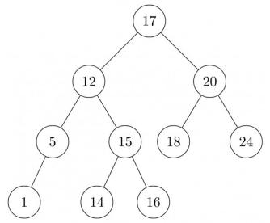

<details>
<summary>flowchart</summary>

```mermaid
graph TD
  A["17"] --> B["12"]
  A --> C["20"]
  B --> D["5"]
  B --> E["15"]
  C --> F["18"]
  C --> G["24"]
  D --> H["1"]
  E --> I["14"]
  E --> J["16"]
```
</details>

gate1988 data-structures normal descriptive avl-tree

Answer key

# 3.1.2 AVL Tree: GATE CSE 1996 | Question: 1.14


In the balanced binary tree in the below figure, how many nodes will become unbalanced when a node is inserted as a child of the node "g"?


<details>
<summary>flowchart</summary>

```mermaid
graph TD
  a["a"] --> b["b"]
  b --> c["c"]
  b --> d["d"]
  b --> e["e"]
  c --> g["g"]
  d --> f["f"]
  e --> f
```
</details>

A. 1

B. 3

C. 7

D. 8

gate1996 data-structures binary-tree avl-tree normal

Answer key

# 3.1.3 AVL Tree: GATE CSE 1998 | Question: 21


A. Derive a recurrence relation for the size of the smallest AVL tree with height h.  
B. What is the size of the smallest AVL tree with height 8?

gate1998 data-structures avl-tree descriptive numerical-answers

Answer key

# 3.1.4 AVL Tree: GATE CSE 2009 | Question: 37, ISRO-DEC2017-55


What is the maximum height of any AVL-tree with 7 nodes? Assume that the height of a tree with a single node is 0.

A. 2

B. 3

C. 4

D. 5

gatecse-2009 data-structures binary-search-tree normal isrodec2017 avl-tree

Answer key

# 3.1.5 AVL Tree: GATE CSE 2020 | Question: 6

What is the worst case time complexity of inserting $n^{2}$ elements into an AVL-tree with n elements initially?


A. $\Theta(n^{4})$

B. $\Theta(n^{2})$

C. $\Theta(n^{2}\log n)$

D. $\Theta(n^3)$

gatecse-2020 binary-tree avl-tree one-mark

# Answer key

# 3.1.6 AVL Tree: GATE IT 2008 | Question: 12

Which of the following is TRUE?


A. The cost of searching an AVL tree is $\Theta (\log n)$ but that of a binary search tree is $O(n)$  
B. The cost of searching an AVL tree is $\Theta (\log n)$ but that of a complete binary tree is $\Theta (n\log n)$  
C. The cost of searching a binary search tree is $O(\log n)$ but that of an AVL tree is $\Theta(n)$  
D. The cost of searching an AVL tree is $\Theta(n \log n)$ but that of a binary search tree is $O(n)$

gateit-2008 data-structures binary-search-tree easy avl-tree

# Answer key

# 3.2

# Abstract Data Type (1)

# 3.2.1 Abstract Data Type: GATE CSE 2005 | Question: 2

An Abstract Data Type (ADT) is:


A. same as an abstract class  
B. a data type that cannot be instantiated  
C. a data type for which only the operations defined on it can be used, but none else  
D. all of the above

gatecse-2005 data-structures normal abstract-data-type

# Answer key

# 3.3

# Array (13)

Practice Test: Test 1 (9Q)

# 3.3.1 Array: GATE CSE 1993 | Question: 12


The following Pascal program segments finds the largest number in a two-dimensional integer array $A[0 \ldots n - 1, 0 \ldots n - 1]$ using a single loop. Fill up the boxes to complete the program and write against

A, B, C and D in your answer book Assume that max is a variable to store the largest value and i, j are the indices to the array.

```ruby
begin
  max:=|A|, i:=0, j:=0;
  while |B| do
  begin
    if A[i, j]>max then max:=A[i, j];
    if |C| then j:=j+1;
    else begin
      j:=0;
      i:=|D|
    end
  end
end
```

gate1993 data-structures array normal descriptive

# Answer key

# 3.3.2 Array: GATE CSE 1994 | Question: 1.11


In a compact single dimensional array representation for lower triangular matrices (i.e all the elements above the diagonal are zero) of size $n \times n$ , non-zero elements, (i.e elements of lower triangle) of each row are

stored one after another, starting from the first row, the index of the $(i,j)^{th}$ element of the lower triangular matrix in this new representation is:

A. $i + j$

B. $i + j - 1$

C. $(j - 1) + \frac{i(i - 1)}{2}$

D. $i + \frac{j(j - 1)}{2}$

gate1994 data-structures array normal

# Answer key

# 3.3.3 Array: GATE CSE 1994 | Question: 25

An array A contains n integers in non-decreasing order, $A[1] \leq A[2] \leq \cdots \leq A[n]$ . Describe, using Pascal like pseudo code, a linear time algorithm to find i, j, such that $A[i] + A[j] = a$ given integer M, if such i, j exist.


gate1994 data-structures array normal descriptive

# Answer key

# 3.3.4 Array: GATE CSE 1997 | Question: 17

An array $A$ contains $n \geq 1$ positive integers in the locations $A[1], A[2], \ldots A[n]$ . The following program fragment prints the length of a shortest sequence of consecutive elements of $A$ , $A[i], A[i + 1], \ldots, A[j]$

such that the sum of their values is $\geq M$ , a given positive number. It prints ‘n+1’ if no such sequence exists. Complete the program by filling in the boxes. In each case use the simplest possible expression. Write only the line number and the contents of the box.

```pascal
begin
i:=1:j:=1;
sum := □
min:=n; finish:=false;
while not finish do
    if □ then
        if j=n then finish:=true
        else
        begin
            j:=j+1;
            sum:= □
        end
    else
    begin
        if(j-i) < min then min:=j-i;
        sum:=sum -A[i];
        i:=i+1;
    end
    writeln (min +1);
end.
```

gate1997 data-structures array normal descriptive

# Answer key

# 3.3.5 Array: GATE CSE 1998 | Question: 2.14

Let $A$ be a two dimensional array declared as follows:


A: array [1 .... 10] [1 .... 15] of integer;

Assuming that each integer takes one memory location, the array is stored in row-major order and the first element of the array is stored at location 100, what is the address of the element $A[i][j]$ ?

A. $15i + j + 84$

B. $15j + i + 84$

C. $10i + j + 89$

D. $10j + i + 89$

gate1998 data-structures array easy

# Answer key

# 3.3.6 Array: GATE CSE 2000 | Question: 1.2

An $n \times n$ array v is defined as follows:

$v[i,j] = i - j$ for all $i,j,i\leq n,1\leq j\leq n$

The sum of the elements of the array v is

A. 0

B. n - 1

C. $n^2 - 3n + 2$

D. $n^{2}\frac{(n+1)}{2}$

gatecse-2000 data-structures array easy

# Answer key

# 3.3.7 Array: GATE CSE 2000 | Question: 15

Suppose you are given arrays $p[1......N]$ and $q[1......N]$ both uninitialized, that is, each location may contain an arbitrary value), and a variable count, initialized to 0. Consider the following procedures set and is\_set:

```c
set(i) {
    count = count + 1;
    q[count] = i;
    p[i] = count;
}
is_set(i) {
    if (p[i] ≤ 0 or p[i] > count)
        return false;
    if (q[p[i]] ≠ 1)
        return false;
    return true;
}
```

A. Suppose we make the following sequence of calls:

set(7); set(3); set(9);

After these sequence of calls, what is the value of count, and what do $q[1], q[2], q[3], p[7], p[3]$ and $p[9]$ contain?

B. Complete the following statement "The first count elements of \_\_\_\_ contain values i such that set (\_\_\_\_) has been called".

C. Show that if $set(i)$ has not been called for some $i$ , then regardless of what $p[i]$ contains, $is\_set(i)$ will return false.

gatecse-2000 data-structures array easy descriptive

# Answer key

# 3.3.8 Array: GATE CSE 2005 | Question: 5

A program P reads in 500 integers in the range $[0,100]$ representing the scores of 500 students. It then prints the frequency of each score above 50. What would be the best way for P to store the frequencies?

A. An array of 50 numbers

B. An array of 100 numbers

C. An array of 500 numbers

D. A dynamically allocated array of 550 numbers

gatecse-2005 data-structures array easy

# Answer key

# 3.3.9 Array: GATE CSE 2013 | Question: 50

The procedure given below is required to find and replace certain characters inside an input character string supplied in array A. The characters to be replaced are supplied in array oldc, while their respective replacement characters are supplied in array newc. Array A has a fixed length of five characters, while arrays oldc and newc contain three characters each. However, the procedure is flawed.

```c
void find_and_replace (char *A, char *oldc, char *newc) {
    for (int i=0; i<5; i++)
        for (int j=0; j<3; j++)
            if (A[i] == oldc[j])
                A[i] = newc[j];
```


The procedure is tested with the following four test cases.

1. oldc = "abc", newc = "dab"  
2. oldc = "cde", newc = "bcd"  
3. oldc = "bca", newc = "cda"  
4. oldc = "abc", newc = "bac"

The tester now tests the program on all input strings of length five consisting of characters 'a', 'b', 'c', 'd' and 'e' with duplicates allowed. If the tester carries out this testing with the four test cases given above, how many test cases will be able to capture the flaw?

A. Only one

B. Only two

C. Only three

D. All four

gatecse-2013 data-structures array normal

# Answer key

# 3.3.10 Array: GATE CSE 2013 | Question: 51

The procedure given below is required to find and replace certain characters inside an input character string supplied in array A. The characters to be replaced are supplied in array oldc, while their respective replacement characters are supplied in array newc. Array A has a fixed length of five characters, while arrays oldc and newc contain three characters each. However, the procedure is flawed.

```c
void find_and_replace (char *A, char *oldc, char *newc) {
    for (int i=0; i<5; i++)
        for (int j=0; j<3; j++)
            if (A[i] == oldc[j])
                A[i] = newc[j];
}
```


The procedure is tested with the following four test cases.

1. oldc = "abc", newc = "dab"  
2. oldc = "cde", newc = "bcd"  
3. oldc = "bca", newc = "cda"  
4. oldc = "abc", newc = "bac"

If array $A$ is made to hold the string "abcde", which of the above four test cases will be successful in exposing the flaw in this procedure?

A. None

B. 2 only

C. 3 and 4 only

D. 4 only

gatecse-2013 data-structures array normal

# Answer key

# 3.3.11 Array: GATE CSE 2014 | Set 3 | Question: 42

Consider the C function given below. Assume that the array listA contains $n(>0)$ elements, sorted in ascending order.

```c
int ProcessArray(int *listA, int x, int n)
{
    int i, j, k;
    i = 0;    j = n-1;
    do {
        k = (i+j)/2;
        if (x <= listA[k]) j = k-1;
        if (listA[k] <= x) i = k+1;
    }
    while (i <= j);
    if (listA[k] == x) return(k);
    else return -1;
}
```


Which one of the following statements about the function ProcessArray is CORRECT?

A. It will run into an infinite loop when $x$ is not in listA.  
B. It is an implementation of binary search.  
C. It will always find the maximum element in listA.  
D. It will return -1 even when x is present in listA.

gatecse-2014-set3 data-structures array easy

# Answer key

# 3.3.12 Array: GATE CSE 2015 | Set 2 | Question: 31

A Young tableau is a $2D$ array of integers increasing from left to right and from top to bottom. Any unfilled entries are marked with $\infty$ , and hence there cannot be any entry to the right of, or below a $\infty$ . The following Young tableau consists of unique entries.


<table><tr><td>1</td><td>2</td><td>5</td><td>14</td></tr><tr><td>3</td><td>4</td><td>6</td><td>23</td></tr><tr><td>10</td><td>12</td><td>18</td><td>25</td></tr><tr><td>31</td><td>∞</td><td>∞</td><td>∞</td></tr></table>

When an element is removed from a Young tableau, other elements should be moved into its place so that the resulting table is still a Young tableau (unfilled entries may be filled with a $\infty$ ). The minimum number of entries (other than 1) to be shifted, to remove 1 from the given Young tableau is \_\_\_\_.

gatecse-2015-set2 databases array normal numerical-answers

# Answer key

# 3.3.13 Array: GATE CSE 2021 | Set 1 | Question: 2

Let P be an array containing n integers. Let t be the lowest upper bound on the number of comparisons of the array elements, required to find the minimum and maximum values in an arbitrary array of n elements. Which one of the following choices is correct?


A. $t > 2n - 2$  
C. $t > n$ and $t \leq 3\left\lceil \frac{n}{2} \right\rceil$  
gatecse-2021-set1 data-structures array one-mark

B. $t > 3\lceil \frac{n}{2}\rceil$ and $t\leq 2n - 2$  
D. $t > \lceil \log_2(n) \rceil$ and $t \leq n$

# Answer key

# 3.4

# Binary Heap (30)

Practice Tests:

Test 1 (15Q)

Test 2 (15Q)

Test 3 (15Q)

Test 4 (2Q)

# 3.4.1 Binary Heap: GATE CSE 1990 | Question: 2-viii

Match the pairs in the following questions:

<table><tr><td>(a)</td><td>A heap construction</td><td>(p)</td><td> $\Omega(n \log_{10} n)$ </td></tr><tr><td>(b)</td><td>Constructing Hashtable with linear probing</td><td>(q)</td><td> $O(n)$ </td></tr><tr><td>(c)</td><td>AVL tree construction</td><td>(r)</td><td> $O(n^{2})$ </td></tr><tr><td>(d)</td><td>Digital trie construction</td><td>(s)</td><td> $O(n \log_{2} n)$ </td></tr></table>


gate1990 match-the-following data-structures binary-heap

# Answer key

# 3.4.2 Binary Heap: GATE CSE 1996 | Question: 2.11

The minimum number of interchanges needed to convert the array into a max-heap is


89,19,40,17,12,10,2,5,7,11,6,9,70

A. 0

B. 1

C. 2

D. 3

gate1996 data-structures binary-heap easy

Answer key

# 3.4.3 Binary Heap: GATE CSE 1999 | Question: 12


A. In binary tree, a full node is defined to be a node with 2 children. Use induction on the height of the binary tree to prove that the number of full nodes plus one is equal to the number of leaves.  
B. Draw the min-heap that results from insertion of the following elements in order into an initially empty min-heap: 7, 6, 5, 4, 3, 2, 1. Show the result after the deletion of the root of this heap.

gate1999 data-structures binary-heap normal descriptive

Answer key

# 3.4.4 Binary Heap: GATE CSE 2001 | Question: 1.15


Consider any array representation of an $n$ element binary heap where the elements are stored from index 1 to index $n$ of the array. For the element stored at index $i$ of the array $(i \leq n)$ , the index of the parent is

A. i - 1

B. $\left\lfloor\frac{i}{2}\right\rfloor$

C. $\left\lceil\frac{i}{2}\right\rceil$

D. $\frac{(i+1)}{2}$

gatecse-2001 data-structures binary-heap easy

Answer key

# 3.4.5 Binary Heap: GATE CSE 2003 | Question: 23


In a min-heap with $n$ elements with the smallest element at the root, the $7^{th}$ smallest element can be found in time

A. $\Theta(n \log n)$

B. $\Theta(n)$

C. $\Theta(\log n)$

D. $\Theta(1)$

gatecse-2003 data-structures binary-heap

Answer key

# 3.4.6 Binary Heap: GATE CSE 2004 | Question: 37


The elements 32, 15, 20, 30, 12, 25, 16, are inserted one by one in the given order into a maxHeap. The resultant maxHeap is

A.

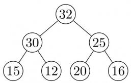

<details>
<summary>flowchart</summary>

```mermaid
graph TD
  32["32"] --> 30["30"]
  n30["30"] --> 15["15"]
  n30 --> 12["12"]
  n30 --> 25["25"]
  n25["25"] --> 20["20"]
  n25 --> 16["16"]
```
</details>

B.

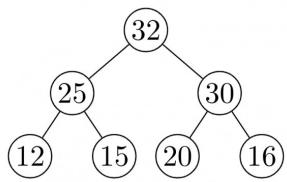

<details>
<summary>funnel</summary>

| Node | Value |
| --- | --- |
| 1 | 12 |
| 2 | 25 |
| 3 | 32 |
| 4 | 15 |
| 5 | 20 |
| 6 | 16 |
| 7 | 30 |
</details>

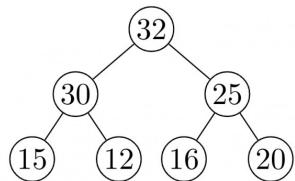

<details>
<summary>funnel</summary>

| Node | Value |
| --- | --- |
| 32 | 32 |
| 30 | 30 |
| 25 | 25 |
| 15 | 15 |
| 12 | 12 |
| 16 | 16 |
| 20 | 20 |
</details>

D.

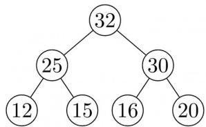

<details>
<summary>funnel</summary>

| Node | Value |
| --- | --- |
| 1 | 12 |
| 2 | 25 |
| 3 | 32 |
| 4 | 15 |
| 5 | 16 |
| 6 | 20 |
| 7 | 30 |
</details>

C.

gatecse-2004 data-structures binary-heap easy

Answer key

# 3.4.7 Binary Heap: GATE CSE 2005 | Question: 34


A priority queue is implemented as a Max-Heap. Initially, it has 5 elements. The level-order traversal of the heap is: 10, 8, 5, 3, 2. Two new elements 1 and 7 are inserted into the heap in that order. The level-order traversal of the heap after the insertion of the elements is:

A. 10,8,7,5,3,2,1

B. 10,8,7,2,3,1,5

c. 10,8,7,1,2,3,5

D. 10,8,7,3,2,1,5

gatecse-2005 data-structures binary-heap normal

# Answer key

# 3.4.8 Binary Heap: GATE CSE 2006 | Question: 10

In a binary max heap containing n numbers, the smallest element can be found in time


A. $O(n)$

B. $O(\log n)$

C. $O(\log \log n)$

D. $O(1)$

gatecse-2006 data-structures binary-heap easy

# Answer key

# 3.4.9 Binary Heap: GATE CSE 2006 | Question: 76

Statement for Linked Answer Questions 76 & 77:


A 3-ary max heap is like a binary max heap, but instead of 2 children, nodes have 3 children. A 3-ary heap can be represented by an array as follows: The root is stored in the first location, $a[0]$ , nodes in the next level, from left to right, is stored from $a[1]$ to $a[3]$ . The nodes from the second level of the tree from left to right are stored from $a[4]$ location onward. An item $x$ can be inserted into a 3-ary heap containing $n$ items by placing $x$ in the location $a[n]$ and pushing it up the tree to satisfy the heap property.

Which one of the following is a valid sequence of elements in an array representing 3-ary max heap?

A. 1,3,5,6,8,9

B. 9,6,3,1,8,5

C. 9,3,6,8,5,1

D. 9,5,6,8,3,1

gatecse-2006 data-structures binary-heap normal

# Answer key

# 3.4.10 Binary Heap: GATE CSE 2006 | Question: 77

Statement for Linked Answer Questions 76 & 77:


A 3-ary max heap is like a binary max heap, but instead of 2 children, nodes have 3 children. A 3-ary heap can be represented by an array as follows: The root is stored in the first location, $a[0]$ , nodes in the next level, from left to right, is stored from $a[1]$ to $a[3]$ . The nodes from the second level of the tree from left to right are stored from $a[4]$ location onward. An item $x$ can be inserted into a 3-ary heap containing $n$ items by placing $x$ in the location $a[n]$ and pushing it up the tree to satisfy the heap property.

76. Which one of the following is a valid sequence of elements in an array representing3—ary max heap?

A. 1,3,5,6,8,9

B. 9,6,3,1,8,5

C. 9,3,6,8,5,1

D. 9,5,6,8,3,1

77. Suppose the elements 7, 2, 10 and 4 are inserted, in that order, into the valid 3-ary max heap found in the previous question, Q.76. Which one of the following is the sequence of items in the array representing the resultant heap?

A. 10,7,9,8,3,1,5,2,6,4

B. 10,9,8,7,6,5,4,3,2,1

C. 10,9,4,5,7,6,8,2,1,3

D. 10,8,6,9,7,2,3,4,1,5

gatecse-2006 data-structures binary-heap normal

# Answer key

# 3.4.11 Binary Heap: GATE CSE 2007 | Question: 47


Consider the process of inserting an element into a Max Heap, where the Max Heap is represented by an array. Suppose we perform a binary search on the path from the new leaf to the root to find the position for the newly inserted element, the number of comparisons performed is:

A. $\Theta (\log_2n)$

B. $\Theta (\log_2\log_2n)$

C. $\Theta(n)$

D. $\Theta(n\log_2n)$

gatecse-2007 data-structures binary-heap normal

# Answer key

# 3.4.12 Binary Heap: GATE CSE 2009 | Question: 59

Consider a binary max-heap implemented using an array.
Which one of the following array represents a binary max-heap?

A. $\{25,12,16,13,10,8,14\}$  
C. $\{25,14,16,13,10,8,12\}$

gatecse-2009 data-structures binary-heap easy

# Answer key


# 3.4.13 Binary Heap: GATE CSE 2009 | Question: 60

Consider a binary max-heap implemented using an array.

What is the content of the array after two delete operations on $\{25, 14, 16, 13, 10, 8, 12\}$

A. $\{14,13,12,10,8\}$

B. $\{14,12,13,8,10\}$

C. $\{14,13,8,12,10\}$

D. $\{14,13,12,8,10\}$

gatecse-2009 data-structures binary-heap normal

# Answer key


# 3.4.14 Binary Heap: GATE CSE 2011 | Question: 23

A max-heap is a heap where the value of each parent is greater than or equal to the value of its children. Which of the following is a max-heap?

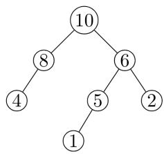

<details>
<summary>flowchart</summary>

```mermaid
graph TD
  1["1"] --> 2["2"]
  n1["1"] --> 3["5"]
  n1 --> 4["4"]
  n2["2"] --> 6["6"]
  n2 --> 7["8"]
  n3["3"] --> 8["10"]
  n4["4"] --> n8["8"]
```
</details>

A.  


<details>
<summary>flowchart</summary>

```mermaid
graph TD
  10["10"] --> 5["5"]
  n5["5"] --> 4["④"]
  n5 --> 8["⑧"]
  n5 --> 6["6"]
  n6["6"] --> 2["②"]
  n6 --> 1["①"]
```
</details>

C.

gatecse-2011 data-structures binary-heap easy

B.  


<details>
<summary>flowchart</summary>

```mermaid
graph TD
  10["10"] --> 8["8"]
  n8["8"] --> 4["4"]
  n8 --> 5["5"]
  n8 --> 6["6"]
  n6["6"] --> 1["1"]
  n6 --> 2["2"]
```
</details>

D.  


<details>
<summary>flowchart</summary>

```mermaid
graph TD
  1["1"] --> 2["2"]
  n2["2"] --> 5["5"]
  n5["5"] --> 8["8"]
  n8["8"] --> 6["6"]
  n6["6"] --> 10["10"]
```
</details>

# Answer key

# 3.4.15 Binary Heap: GATE CSE 2014 | Set 2 | Question: 12

A priority queue is implemented as a Max-Heap. Initially, it has 5 elements. The level-order traversal of the heap is: 10, 8, 5, 3, 2. Two new elements 1 and 7 are inserted into the heap in that order. The level-order traversal of the heap after the insertion of the elements is:

A. 10,8,7,3,2,1,5

B. 10,8,7,2,3,1,5

C. 10,8,7,1,2,3,5

D. 10,8,7,5,3,2,1

gatecse-2014-set2 data-structures binary-heap normal

# Answer key


# 3.4.16 Binary Heap: GATE CSE 2015 | Set 1 | Question: 32

Consider a max heap, represented by the array: 40, 30, 20, 10, 15, 16, 17, 8, 4.

<table><tr><td>Array index</td><td>1</td><td>2</td><td>3</td><td>4</td><td>5</td><td>6</td><td>7</td><td>8</td><td>9</td></tr><tr><td>Value</td><td>40</td><td>30</td><td>20</td><td>10</td><td>15</td><td>16</td><td>17</td><td>8</td><td>4</td></tr></table>


Now consider that a value 35 is inserted into this heap. After insertion, the new heap is

A. 40,30,20,10,15,16,17,8,4,35  
C. 40,30,20,10,35,16,17,8,4,15

B. 40,35,20,10,30,16,17,8,4,15  
D. 40,35,20,10,15,16,17,8,4,30

gatecse-2015-set1 data-structures binary-heap easy

# Answer key

# 3.4.17 Binary Heap: GATE CSE 2015 | Set 2 | Question: 17


Consider a complete binary tree where the left and right subtrees of the root are max-heaps. The lower bound for the number of operations to convert the tree to a heap is

A. $\Omega (\log n)$  
C. $\Omega(n \log n)$

B. $\Omega(n)$  
D. $\Omega(n^{2})$

gatecse-2015-set2 data-structures binary-heap normal

# Answer key

# 3.4.18 Binary Heap: GATE CSE 2015 | Set 3 | Question: 19


Consider the following array of elements.

$\langle 89,19,50,17,12,15,2,5,7,11,6,9,100\rangle$

The minimum number of interchanges needed to convert it into a max-heap is

A. 4

B. 5

C. 2

D. 3

gatecse-2015-set3 data-structures binary-heap easy

# Answer key

# 3.4.19 Binary Heap: GATE CSE 2016 | Set 1 | Question: 37


An operator delete(i) for a binary heap data structure is to be designed to delete the item in the i-th node.

Assume that the heap is implemented in an array and i refers to the i-th index of the array. If the heap tree has depth d (number of edges on the path from the root to the farthest leaf), then what is the time complexity to re-fix the heap efficiently after the removal of the element?

A. $O(1)$  
C. $O(2^{d})$ but not $O(d)$

B. $O(d)$ but not $O(1)$  
D. $O(d2^{d})$ but not $O(2^{d})$

gatecse-2016-set1 data-structures binary-heap normal

# Answer key

# 3.4.20 Binary Heap: GATE CSE 2016 | Set 2 | Question: 34


A complete binary min-heap is made by including each integer in [1, 1023] exactly once. The depth of a node in the heap is the length of the path from the root of the heap to that node. Thus, the root is at depth 0. The maximum depth at which integer 9 can appear is \_\_\_\_.

gatecse-2016-set2 data-structures binary-heap normal numerical-answers

# Answer key

# 3.4.21 Binary Heap: GATE CSE 2018 | Question: 46


The number of possible min-heaps containing each value from $\{1,2,3,4,5,6,7\}$ exactly once is \_\_\_\_

gatecse-2018 binary-heap numerical-answers combinatory two-marks

# Answer key

# 3.4.22 Binary Heap: GATE CSE 2019 | Question: 40


Consider the following statements:

I. The smallest element in a max-heap is always at a leaf node  
II. The second largest element in a max-heap is always a child of a root node  
III. A max-heap can be constructed from a binary search tree in $\Theta(n)$ time  
IV. A binary search tree can be constructed from a max-heap in $\Theta(n)$ time

Which of the above statements are TRUE?

A. I, II and III

B. I, II and IV

C. I, III and IV

D. II, III and IV

gatecse-2019

data-structures

binary-heap

two-marks

Answer key

# 3.4.23 Binary Heap: GATE CSE 2020 | Question: 47


Consider the array representation of a binary min-heap containing 1023 elements. The minimum number of comparisons required to find the maximum in the heap is \_\_\_\_.

gatecse-2020

numerical-answers

binary-heap

two-marks

Answer key

# 3.4.24 Binary Heap: GATE CSE 2021 | Set 2 | Question: 2


Let H be a binary min-heap consisting of n elements implemented as an array. What is the worst case time complexity of an optimal algorithm to find the maximum element in H?

A. $\Theta(1)$

C. $\Theta(n)$

B. $\Theta (\log n)$

D. $\Theta(n \log n)$

gatecse-2021-set2

data-structures

binary-heap

time-complexity

one-mark

Answer key

# 3.4.25 Binary Heap: GATE CSE 2023 | Question: 2


Which one of the following sequences when stored in an array at locations $A[1], \ldots, A[10]$ forms a max-heap?

A. 23,17,10,6,13,14,1,5,7,12

C. 23,17,14,6,13,10,1,5,7,15

B. 23,17,14,7,13,10,1,5,6,12

D. 23,14,17,1,10,13,16,12,7,5

gatecse-2023

data-structures

binary-heap

one-mark

Answer key

# 3.4.26 Binary Heap: GATE CSE 2024 | Set 1 | Question: 33


Consider a binary min-heap containing 105 distinct elements. Let k be the index (in the underlying array) of the maximum element stored in the heap. The number of possible values of k is

A. 53

B. 52

C. 27

D. 1

gatecse-2024-set1

data-structures

binary-heap

two-marks

Answer key

# 3.4.27 Binary Heap: GATE CSE 2025 | Set 1 | Question: 25


The height of any rooted tree is defined as the maximum number of edges in the path from the root node to any leaf node.

Suppose a Min-Heap T stores 32 keys. The height of T is \_\_\_\_. (Answer in integer)

gatecse2025-set1

data-structures

binary-heap

numerical-answers

easy

one-mark

Answer key

# 3.4.28 Binary Heap: GATE IT 2004 | Question: 53


An array of integers of size $n$ can be converted into a heap by adjusting the heaps rooted at each internal node of the complete binary tree starting at the node $\lfloor (n - 1)/2 \rfloor$ , and doing this adjustment up to the root node (root node is at index 0) in the order $\lfloor (n - 1)/2 \rfloor$ , $\lfloor (n - 3)/2 \rfloor$ , ..., 0. The time required to construct a heap in this manner is

A. $O(\log n)$

B. $O(n)$

C. $O(n\log \log n)$

D. $O(n\log n)$

gateit-2004 data-structures binary-heap normal

# Answer key

# 3.4.29 Binary Heap: GATE IT 2006 | Question: 44

Which of the following sequences of array elements forms a heap?

A. $\{23,17,14,6,13,10,1,12,7,5\}$

C. $\{23,17,14,7,13,10,1,5,6,12\}$

gateit-2006 data-structures binary-heap easy

B. $\{23,17,14,6,13,10,1,5,7,12\}$

D. $\{23,17,14,7,13,10,1,12,5,7\}$

# Answer key


# 3.4.30 Binary Heap: GATE IT 2006 | Question: 72

An array X of n distinct integers is interpreted as a complete binary tree. The index of the first element of the array is 0. If only the root node does not satisfy the heap property, the algorithm to convert the complete binary tree into a heap has the best asymptotic time complexity of

A. $O(n)$

B. $O(\log n)$

C. $O(n\log n)$

D. $O(n\log \log n)$

gateit-2006 data-structures binary-heap easy

# Answer key


# 3.5

# Binary Search Tree (36)

Practice Tests: Test 1 (15Q) Test 2 (15Q) Test 3 (15Q) Test 4 (15Q)

# 3.5.1 Binary Search Tree: GATE CSE 1996 | Question: 2.14

A binary search tree is generated by inserting in order the following integers:

$$
5 0, 1 5, 6 2, 5, 2 0, 5 8, 9 1, 3, 8, 3 7, 6 0, 2 4
$$

The number of nodes in the left subtree and right subtree of the root respectively is

A. $(4,7)$

B. (7,4)

C. (8,3)

D. (3,8)

gate1996 data-structures binary-search-tree easy

# Answer key

# 3.5.2 Binary Search Tree: GATE CSE 1996 | Question: 4


A binary search tree is used to locate the number 43. Which of the following probe sequences are possible and which are not? Explain.

(a) 61 52 14 17 40 43  
(b) 2 3 50 40 60 43  
(c) 10 65 31 48 37 43  
(d) 81 61 52 14 41 43  
(e) 17 77 27 66 18 43

gate1996 data-structures binary-search-tree normal descriptive

# Answer key


# 3.5.3 Binary Search Tree: GATE CSE 1997 | Question: 4.5


A binary search tree contains the value 1, 2, 3, 4, 5, 6, 7, 8. The tree is traversed in pre-order and the values are printed out. Which of the following sequences is a valid output?

A. 53124786

B. 53126487

C. 53241678

D. 53124768

gate1997 data-structures binary-search-tree normal

# Answer key

# 3.5.4 Binary Search Tree: GATE CSE 2001 | Question: 14


A. Insert the following keys one by one into a binary search tree in the order specified.

$$
1 5, 3 2, 2 0, 9, 3, 2 5, 1 2, 1
$$

Show the final binary search tree after the insertions.

B. Draw the binary search tree after deleting 15 from it.  
C. Complete the statements $S1$ , $S2$ and $S3$ in the following function so that the function computes the depth of a binary tree rooted at $t$ .

```c
typedef struct tnode{
    int key;
    struct tnode *left, *right;
} *Tree;

int depth (Tree t)
{
    int x, y;
    if (t == NULL) return 0;
    x = depth (t -> left);
S1: ________;
S2:     if (x > y) return ________;
S3:    else return ________;
}
```

gatecse-2001 data-structures binary-search-tree normal descriptive

# Answer key

# 3.5.5 Binary Search Tree: GATE CSE 2003 | Question: 19, ISRO2009-24


Suppose the numbers 7, 5, 1, 8, 3, 6, 0, 9, 4, 2 are inserted in that order into an initially empty binary search tree. The binary search tree uses the usual ordering on natural numbers. What is the in-order traversal sequence of the resultant tree?

A. 7510324689

B. 0243165987

C. 0123456789

D. 9864230157

gatecse-2003 binary-search-tree easy isro2009

# Answer key

# 3.5.6 Binary Search Tree: GATE CSE 2003 | Question: 6

Let $T(n)$ be the number of different binary search trees on n distinct elements.

Then $T(n) = \sum_{k=1}^{n} T(k-1)T(x)$ , where x is

A. $n - k + 1$

B. n-k

C. n-k-1

D. $n - k - 2$

gatecse-2003 normal binary-search-tree

# Answer key


# 3.5.7 Binary Search Tree: GATE CSE 2003 | Question: 63, ISRO2009-25


A data structure is required for storing a set of integers such that each of the following operations can be done in $O(\log n)$ time, where n is the number of elements in the set.

I. Deletion of the smallest element  
II. Insertion of an element if it is not already present in the set

Which of the following data structures can be used for this purpose?

A. A heap can be used but not a balanced binary search tree  
B. A balanced binary search tree can be used but not a heap  
C. Both balanced binary search tree and heap can be used  
D. Neither balanced search tree nor heap can be used

gatecse-2003 data-structures easy isro2009 binary-search-tree

Answer key

# 3.5.8 Binary Search Tree: GATE CSE 2004 | Question: 4, ISRO2009-26


The following numbers are inserted into an empty binary search tree in the given order: 10, 1, 3, 5, 15, 12, 16. What is the height of the binary search tree (the height is the maximum distance of a leaf node from the root)?

A. 2

B. 3

C. 4

D. 6

gatecse-2004 data-structures binary-search-tree easy isro2009

Answer key

# 3.5.9 Binary Search Tree: GATE CSE 2004 | Question: 85


A program takes as input a balanced binary search tree with n leaf nodes and computes the value of a function $g(x)$ for each node x. If the cost of computing $g(x)$ is:

$$
\min \left(\underset {\text {in left - subtree of $x$}} {\text {number of leaf - nodes}}, \underset {\text {in right - subtree of $x$}} {\text {number of leaf - nodes}}\right)
$$

Then the worst-case time complexity of the program is?

A. $\Theta(n)$  
C. $\Theta(n^{2})$

B. $\Theta(n \log n)$

D. $\Theta(n^{2}\log n)$

gatecse-2004 binary-search-tree normal data-structures

Answer key

# 3.5.10 Binary Search Tree: GATE CSE 2005 | Question: 33


Postorder traversal of a given binary search tree, T produces the following sequence of keys 10, 9, 23, 22, 27, 25, 15, 50, 95, 60, 40, 29

Which one of the following sequences of keys can be the result of an in-order traversal of the tree T?

A. 9, 10, 15, 22, 23, 25, 27, 29, 40, 50, 60, 95  
B. 9, 10, 15, 22, 40, 50, 60, 95, 23, 25, 27, 29  
C. 29, 15, 9, 10, 25, 22, 23, 27, 40, 60, 50, 95  
D. 95, 50, 60, 40, 27, 23, 22, 25, 10, 9, 15, 29

gatecse-2005 data-structures binary-search-tree easy

Answer key

# 3.5.11 Binary Search Tree: GATE CSE 2005 | Question: 35

How many distinct binary search trees can be created out of 4 distinct keys?

A. 5

B. 14

C. 24

D. 42

gatecse-2005 data-structures binary-search-tree counting normal

Answer key

# 3.5.12 Binary Search Tree: GATE CSE 2008 | Question: 46

You are given the postorder traversal, $P$ , of a binary search tree on the $n$ elements $1, 2, \ldots, n$ . You have to determine the unique binary search tree that has $P$ as its postorder traversal. What is the time complexity of the most efficient algorithm for doing this?

A. $\Theta (\log n)$  
B. $\Theta(n)$  
C. $\Theta(n\log n)$

D. None of the above, as the tree cannot be uniquely determined

gatecse-2008 data-structures binary-search-tree normal

Answer key

# 3.5.13 Binary Search Tree: GATE CSE 2012 | Question: 5

The worst case running time to search for an element in a balanced binary search tree with $n2^n$ elements is

A. $\Theta(n \log n)$

B. $\Theta(n2^n)$

C. $\Theta(n)$

D. $\Theta (\log n)$

gatecse-2012 data-structures normal binary-search-tree

Answer key

# 3.5.14 Binary Search Tree: GATE CSE 2013 | Question: 43

The preorder traversal sequence of a binary search tree is 30, 20, 10, 15, 25, 23, 39, 35, 42. Which one of the following is the postorder traversal sequence of the same tree?

A. 10,20,15,23,25,35,42,39,30

B. 15,10,25,23,20,42,35,39,30

C. 15,20,10,23,25,42,35,39,30

D. 15,10,23,25,20,35,42,39,30

gatecse-2013 data-structures binary-search-tree normal

Answer key

# 3.5.15 Binary Search Tree: GATE CSE 2013 | Question: 7

Which one of the following is the tightest upper bound that represents the time complexity of inserting an object into a binary search tree of n nodes?

A. $O(1)$

B. $O(\log n)$

C. $O(n)$

D. $O(n\log n)$

gatecse-2013 data-structures easy binary-search-tree

Answer key

# 3.5.16 Binary Search Tree: GATE CSE 2014 | Set 3 | Question: 39

Suppose we have a balanced binary search tree $T$ holding $n$ numbers. We are given two numbers $L$ and $H$ and wish to sum up all the numbers in $T$ that lie between $L$ and $H$ . Suppose there are $m$ such numbers in

T. If the tightest upper bound on the time to compute the sum is $O(n^{a} \log^{b} n + m^{c} \log^{d} n)$ , the value of $a + 10b + 100c + 1000d$ is \_\_\_\_.

gatecse-2014-set3 data-structures binary-search-tree numerical-answers normal

Answer key


# 3.5.17 Binary Search Tree: GATE CSE 2015 | Set 1 | Question: 10

Which of the following is/are correct in order traversal sequence(s) of binary search tree(s)?

1. 3,5,7,8,15,19,25  
II. 5,8,9,12,10,15,25  
III. 2,7,10,8,14,16,20  
IV. 4,6,7,9,18,20,25

A. I and IV only

B. II and III only

C. II and IV only

D. II only

gatecse-2015-set1 data-structures binary-search-tree easy

# Answer key

# 3.5.18 Binary Search Tree: GATE CSE 2015 | Set 1 | Question: 23

What are the worst-case complexities of insertion and deletion of a key in a binary search tree?

A. $\Theta (\log n)$ for both insertion and deletion  
B. $\Theta(n)$ for both insertion and deletion  
C. $\Theta(n)$ for insertion and $\Theta(\log n)$ for deletion  
D. $\Theta (\log n)$ for insertion and $\Theta (n)$ for deletion

gatecse-2015-set1 data-structures binary-search-tree easy

# Answer key

# 3.5.19 Binary Search Tree: GATE CSE 2015 | Set 3 | Question: 13

While inserting the elements 71, 65, 84, 69, 67, 83 in an empty binary search tree (BST) in the sequence shown, the element in the lowest level is

A. 65

B. 67

C. 69

D. 83

gatecse-2015-set3 data-structures binary-search-tree easy

# Answer key

# 3.5.20 Binary Search Tree: GATE CSE 2016 | Set 2 | Question: 40

The number of ways in which the numbers 1, 2, 3, 4, 5, 6, 7 can be inserted in an empty binary search tree, such that the resulting tree has height 6, is \_\_\_\_.

Note: The height of a tree with a single node is 0.

gatecse-2016-set2 data-structures binary-search-tree normal numerical-answers

# Answer key

# 3.5.21 Binary Search Tree: GATE CSE 2017 | Set 1 | Question: 6

Let T be a binary search tree with 15 nodes. The minimum and maximum possible heights of T are:

Note: The height of a tree with a single node is 0.

A. 4 and 15 respectively.  
C. 4 and 14 respectively.  
gatecse-2017-set1 data-structures binary-search-tree easy

B. 3 and 14 respectively.

D. 3 and 15 respectively.

# Answer key

# 3.5.22 Binary Search Tree: GATE CSE 2017 | Set 2 | Question: 36

The pre-order traversal of a binary search tree is given by 12, 8, 6, 2, 7, 9, 10, 16, 15, 19, 17, 20. Then the post-order traversal of this tree is

A. 2,6,7,8,9,10,12,15,16,17,19,20  
B. 2,7,6,10,9,8,15,17,20,19,16,12


C. 7,2,6,8,9,10,20,17,19,15,16,12  
D. 7,6,2,10,9,8,15,16,17,20,19,12

gatecse-2017-set2 data-structures binary-search-tree

# Answer key

# 3.5.23 Binary Search Tree: GATE CSE 2020 | Question: 41

In a balanced binary search tree with n elements, what is the worst case time complexity of reporting all elements in range $[a, b]$ ? Assume that the number of reported elements is k.


A. $\Theta (\log n)$  
C. $\Theta(k\log n)$

B. $\Theta (\log n + k)$  
D. $\Theta(n \log k)$

gatecse-2020 data-structures binary-search-tree two-marks

# Answer key

# 3.5.24 Binary Search Tree: GATE CSE 2020 | Question: 5

The preorder traversal of a binary search tree is 15, 10, 12, 11, 20, 18, 16, 19. Which one of the following is the postorder traversal of the tree?


A. 10,11,12,15,16,18,19,20

c. 20,19,18,16,15,12,11,10

B. 11,12,10,16,19,18,20,15

D. 19,16,18,20,11,12,10,15

gatecse-2020 binary-search-tree one-mark

# Answer key

# 3.5.25 Binary Search Tree: GATE CSE 2021 | Set 1 | Question: 10


A binary search tree $T$ contains $n$ distinct elements. What is the time complexity of picking an element in $T$ that is smaller than the maximum element in $T$ ?

A. $\Theta(n \log n)$

B. $\Theta(n)$

C. $\Theta (\log n)$

D. $\Theta(1)$

gatecse-2021-set1 data-structures binary-search-tree time-complexity one-mark

# Answer key

# 3.5.26 Binary Search Tree: GATE CSE 2022 | Question: 18


Suppose a binary search tree with 1000 distinct elements is also a complete binary tree. The tree is stored using the array representation of binary heap trees. Assuming that the array indices start with 0, the $3^{rd}$ largest element of the tree is stored at index \_\_\_\_.

gatecse-2022 numerical-answers data-structures binary-search-tree one-mark

# Answer key

# 3.5.27 Binary Search Tree: GATE CSE 2024 | Set 2 | Question: 29


You are given a set $V$ of distinct integers. A binary search tree $T$ is created by inserting all elements of $V$ one by one, starting with an empty tree. The tree $T$ follows the convention that, at each node, all values stored in the left subtree of the node are smaller than the value stored at the node. You are not aware of the sequence in which these values were inserted into $T$ , and you do not have access to $T$ .

Which one of the following statements is TRUE?

A. Inorder traversal of T can be determined from V  
B. Root node of T can be determined from V  
C. Preorder traversal of T can be determined from V  
D. Postorder traversal of T can be determined from V

gatecse-2024-set2 binary-search-tree two-marks

# Answer key

# 3.5.28 Binary Search Tree: GATE CSE 2025 | Set 1 | Question: 16


Which of the following statement(s) is/are TRUE for any binary search tree (BST) having n distinct integers?

A. The maximum length of a path from the root node to any other node is $(n - 1)$ .  
B. An inorder traversal will always produce a sorted sequence of elements.  
C. Finding an element takes $O(\log_2 n)$ time in the worst case.  
D. Every BST is also a Min-Heap.

gatecse2025-set1 data-structures binary-search-tree multiple-selects one-mark

# Answer key

# 3.5.29 Binary Search Tree: GATE CSE 2025 | Set 2 | Question: 25


Suppose the values 10, -4, 15, 30, 20, 5, 60, 19 are inserted in that order into an initially empty binary search tree. Let $T$ be the resulting binary search tree. The number of edges in the path from the node containing 19 to the root node of $T$ is \_\_\_\_. (Answer in integer)

gatecse2025-set2 data-structures binary-search-tree numerical-answers easy one-mark

# Answer key

# 3.5.30 Binary Search Tree: GATE IT 2005 | Question: 12


The numbers $1, 2, \ldots, n$ are inserted in a binary search tree in some order. In the resulting tree, the right subtree of the root contains $p$ nodes. The first number to be inserted in the tree must be

A. p

B. $p + 1$

C. n - p

D. $n - p + 1$

gateit-2005 data-structures normal binary-search-tree

# Answer key

# 3.5.31 Binary Search Tree: GATE IT 2005 | Question: 55


A binary search tree contains the numbers 1, 2, 3, 4, 5, 6, 7, 8. When the tree is traversed in pre-order and the values in each node printed out, the sequence of values obtained is 5, 3, 1, 2, 4, 6, 8, 7. If the tree is traversed in post-order, the sequence obtained would be

A. 8,7,6,5,4,3,2,1  
C. 2,1,4,3,6,7,8,5

gateit-2005 data-structures binary-search-tree normal

# Answer key

# 3.5.32 Binary Search Tree: GATE IT 2006 | Question: 45


Suppose that we have numbers between 1 and 100 in a binary search tree and want to search for the number 55. Which of the following sequences CANNOT be the sequence of nodes examined?

A. $\{10,75,64,43,60,57,55\}$  
C. $\{9,85,47,68,43,57,55\}$

gateit-2006 data-structures binary-search-tree normal

# Answer key

# 3.5.33 Binary Search Tree: GATE IT 2007 | Question: 29


When searching for the key value 60 in a binary search tree, nodes containing the key values 10, 20, 40, 50, 70, 80, 90 are traversed, not necessarily in the order given. How many different orders are possible in which these key values can occur on the search path from the root to the node containing the value 60?

A. 35

B. 64

C. 128

D. 5040

gateit-2007 data-structures binary-search-tree normal

# Answer key

# 3.5.34 Binary Search Tree: GATE IT 2008 | Question: 71


A Binary Search Tree (BST) stores values in the range 37 to 573. Consider the following sequence of keys.

1. 81,537,102,439,285,376,305  
II. 52,97,121,195,242,381,472  
III. 142, 248, 520, 386, 345, 270, 307  
IV. 550, 149, 507, 395, 463, 402, 270

Suppose the BST has been unsuccessfully searched for key 273. Which all of the above sequences list nodes in the order in which we could have encountered them in the search?

A. II and III only

B. I and III only

C. III and IV only

D. III only

gateit-2008 data-structures binary-search-tree normal

# Answer key

# 3.5.35 Binary Search Tree: GATE IT 2008 | Question: 72

A Binary Search Tree (BST) stores values in the range 37 to 573. Consider the following sequence of keys.


1. 81,537,102,439,285,376,305  
II. 52,97,121,195,242,381,472  
III. 142, 248, 520, 386, 345, 270, 307  
IV. 550, 149, 507, 395, 463, 402, 270

Which of the following statements is TRUE?

A. I, II and IV are inorder sequences of three different BSTs  
B. I is a preorder sequence of some BST with 439 as the root  
C. II is an inorder sequence of some BST where 121 is the root and 52 is a leaf  
D. IV is a postorder sequence of some BST with 149 as the root

gateit-2008 data-structures binary-search-tree easy

# Answer key

# 3.5.36 Binary Search Tree: GATE IT 2008 | Question: 73

How many distinct BSTs can be constructed with 3 distinct keys?


A. 4

B. 5

C. 6

D. 9

gateit-2008 data-structures binary-search-tree normal

# Answer key

# 3.6

# Binary Tree (53)

Practice Tests:

Test 1 (15Q)

Test 2 (15Q)

Test 3 (15Q)

Test 4 (6Q)

# 3.6.1 Binary Tree: GATE CSE 1987 | Question: 2c

State whether the following statements are TRUE or FALSE:


It is possible to construct a binary tree uniquely whose pre-order and post-order traversals are given?

gate1987 binary-tree data-structures normal true-false

# Answer key

# 3.6.2 Binary Tree: GATE CSE 1987 | Question: 2g

State whether the following statements are TRUE or FALSE:


If the number of leaves in a tree is not a power of 2, then the tree is not a binary tree.

# 3.6.3 Binary Tree: GATE CSE 1987 | Question: 7b

Construct a binary tree whose preorder traversal is

\- K L N M P R Q S T

and inorder traversal is

\- NLKPRMSQT

gate1987 data-structures binary-tree descriptive

Answer key

# 3.6.4 Binary Tree: GATE CSE 1988 | Question: 7i

Define the height of a binary tree or subtree and also define a height-balanced (AVL) tree.

gate1988 normal descriptive data-structures binary-tree

Answer key

# 3.6.5 Binary Tree: GATE CSE 1988 | Question: 7iii

Consider the tree given in the below figure, insert 13 and show the new balance factors that would arise if the tree is not rebalanced. Finally, carry out the required rebalancing of the tree and show the new tree with the balance factors on each mode.


<details>
<summary>flowchart</summary>

```mermaid
graph TD
  n17["17"] --> n12["12"]
  n17 --> n20["20"]
  n12 --> n5["5"]
  n12 --> n15["15"]
  n20 --> n18["18"]
  n20 --> n24["24"]
  n5 --> n1["1"]
  n15 --> n14["14"]
  n15 --> n16["16"]
```
</details>

gate1988 normal descriptive data-structures binary-tree

Answer key

# 3.6.6 Binary Tree: GATE CSE 1989 | Question: 3-ixa

Which one of the following statements (s) is/are FALSE?


A. Overlaying is used to run a program, which is longer than the address space of the computer.  
B. Optimal binary search tree construction can be performed efficiently by using dynamic programming.  
C. Depth first search cannot be used to find connected components of a graph.  
D. Given the prefix and postfix walls over a binary tree, the binary tree can be uniquely constructed.

normal gate1989 binary-tree multiple-selects

Answer key

# 3.6.7 Binary Tree: GATE CSE 1990 | Question: 3-iv

The total external path length, EPL, of a binary tree with n external nodes is, $EPL = \sum_{w} I_{w}$ , where $I_{w}$ is the path length of external node w),

A. $\leq n^2$ always.  
C. Equal to $n^2$ always.

gate1990 normal data-structures binary-tree multiple-selects

B. $\geq n\log_2 n$ always.  
D. $O(n)$ for some special trees.

# Answer key

# 3.6.8 Binary Tree: GATE CSE 1991 | Question: 01,viii

The weighted external path length of the binary tree in figure is \_\_\_\_


<details>
<summary>flowchart</summary>

```mermaid
graph TD
  A["Node 1"] --> B["Node 2"]
  A --> C["Node 3"]
  B --> D["Node 4"]
  C --> E["Node 5"]
  D --> F["Node 6"]
  E --> G["Node 7"]
  F --> H["Node 8"]
  G --> I["Node 9"]
  H --> J["Node 10"]
  I --> K["Node 11"]
  J --> L["Node 12"]
  K --> M["Node 13"]
  L --> N["Node 14"]
  M --> O["Node 15"]
```
</details>

gate1991 binary-tree data-structures normal numerical-answers

# Answer key

# 3.6.9 Binary Tree: GATE CSE 1991 | Question: 1, ix

If the binary tree in figure is traversed in inorder, then the order in which the nodes will be visited is \_\_\_\_


<details>
<summary>flowchart</summary>

```mermaid
graph TD
  1["1"] --> 7["7"]
  n1["1"] --> 4["4"]
  n1 --> 6["6"]
  3["3"] --> 5["5"]
  n5["5"] --> 2["2"]
  n5 --> 8["8"]
```
</details>

gate1991 binary-tree easy data-structures descriptive

# Answer key

# 3.6.10 Binary Tree: GATE CSE 1991 | Question: 14,a

Consider the binary tree in the figure below:


<details>
<summary>flowchart</summary>

```mermaid
graph TD
  1["1"] --> 5["5"]
  1["1"] --> 18["18"]
  5["5"] --> 7["7"]
  5["5"] --> 13["13"]
  18["18"] --> 25["25"]
  18["18"] --> 20["20"]
  7["7"] --> 11["11"]
  7["7"] --> 9["9"]
  13["13"] --> 15["15"]
  13["13"] --> 17["17"]
  25["25"] --> 27["27"]
```
</details>

What structure is represented by the binary tree?

gate1991 data-structures binary-tree time-complexity easy descriptive

# Answer key

# 3.6.11 Binary Tree: GATE CSE 1991 | Question: 14,b

Consider the binary tree in the figure below:


<details>
<summary>flowchart</summary>

```mermaid
graph TD
  1["1"] --> 5["5"]
  1["1"] --> 18["18"]
  n5["5"] --> 7["7"]
  n5 --> 13["13"]
  n18["18"] --> 25["25"]
  n18 --> 20["20"]
  n7["7"] --> 11["11"]
  n7 --> 9["9"]
  n13["13"] --> 15["15"]
  n13 --> 17["17"]
  n13 --> 27["27"]
```
</details>

Give different steps for deleting the node with key5 so that the structure is preserved.

gate1991 data-structures binary-tree normal descriptive

Answer key

# 3.6.12 Binary Tree: GATE CSE 1991 | Question: 14,c

Consider the binary tree in the figure below:


<details>
<summary>flowchart</summary>

```mermaid
graph TD
  1["1"] --> 5["5"]
  1["1"] --> 18["18"]
  5["5"] --> 7["7"]
  5["5"] --> 13["13"]
  18["18"] --> 20["20"]
  7["7"] --> 11["11"]
  7["7"] --> 9["9"]
  13["13"] --> 15["15"]
  13["13"] --> 17["17"]
  25["25"] --> 27["27"]
```
</details>

Outline a procedure in Pseudo-code to delete an arbitrary node from such a binary tree with n nodes that preserves the structures. What is the worst-case time complexity of your procedure?

gate1991 normal data-structures binary-tree time-complexity descriptive

Answer key

# 3.6.13 Binary Tree: GATE CSE 1993 | Question: 16


Prove by the principal of mathematical induction that for any binary tree, in which every non-leaf node has 2-descendants, the number of leaves in the tree is one more than the number of non-leaf nodes.

gate1993 data-structures binary-tree normal descriptive

Answer key

# 3.6.14 Binary Tree: GATE CSE 1994 | Question: 8


A rooted tree with 12 nodes has its nodes numbered 1 to 12 in pre-order. When the tree is traversed in post-order, the nodes are visited in the order 3, 5, 4, 2, 7, 8, 6, 10, 11, 12, 9, 1.

Reconstruct the original tree from this information, that is, find the parent of each node, and show the tree diagrammatically.

gate1994 data-structures binary-tree normal descriptive

Answer key

# 3.6.15 Binary Tree: GATE CSE 1995 | Question: 1.17


A binary tree T has n leaf nodes. The number of nodes of degree 2 in T is

A. $\log_{2}n$

B. $n - 1$

C. n

D. $2^{n}$

gate1995 data-structures binary-tree normal

Answer key

# 3.6.16 Binary Tree: GATE CSE 1995 | Question: 6


What is the number of binary trees with 3 nodes which when traversed in post-order give the sequence $A, B, C$ ? Draw all these binary trees.

# Answer key

# 3.6.17 Binary Tree: GATE CSE 1996 | Question: 1.15

Which of the following sequences denotes the post order traversal sequence of the below tree?


<details>
<summary>flowchart</summary>

```mermaid
graph TD
  a["a"] --> b["b"]
  b --> c["c"]
  b --> d["d"]
  b --> e["e"]
  c --> g["g"]
  d --> f["f"]
  e --> f
```
</details>

A. fegcdba  
C. $gc\bar{d}b\,f\,e\,a$

gate1996 data-structures binary-tree easy

B. $g c b d a f e$  
D. f e d g c b a

# Answer key

# 3.6.18 Binary Tree: GATE CSE 1997 | Question: 16


A size-balanced binary tree is a binary tree in which for every node the difference between the number of nodes in the left and right subtree is at most 1. The distance of a node from the root is the length of the path from the root to the node. The height of a binary tree is the maximum distance of a leaf node from the root.

A. Prove, by using induction on $h$ , that a size-balance binary tree of height $h$ contains at least $2^h$ nodes.  
B. In a size-balanced binary tree of height $h \geqslant 1$ , how many nodes are at distance $h - 1$ from the root? Write only the answer without any explanations.

gate1997 data-structures binary-tree normal descriptive proof

# Answer key

# 3.6.19 Binary Tree: GATE CSE 1998 | Question: 20


Draw the binary tree with node labels a, b, c, d, e, f and g for which the inorder and postorder traversals result in the following sequences:

Inorder: a f b c d g e

Postorder: a f c g e d b

gate1998 data-structures binary-tree descriptive

# Answer key

# 3.6.20 Binary Tree: GATE CSE 2000 | Question: 1.14


Consider the following nested representation of binary trees: $(XYZ)$ indicates Y and Z are the left and right subtrees, respectively, of node X. Note that Y and Z may be NULL, or further nested. Which of the following represents a valid binary tree?

A. (12(4567))  
C. (1 (2 3 4) (5 6 7))

gatecse-2000 data-structures binary-tree easy

B. (1 (2 3 4) 5 6) 7)  
D. (1 (2 3 NULL) (4 5))

# Answer key

# 3.6.21 Binary Tree: GATE CSE 2000 | Question: 2.16


Let LASTPOST, LASTIN and LASTPRE denote the last vertex visited \`in a postorder, inorder and preorder traversal respectively, of a complete binary tree. Which of the following is always true?

A. LASTIN = LASTPOST

B. LASTIN = LASTPRE

# 3.6.22 Binary Tree: GATE CSE 2002 | Question: 2.12


A weight-balanced tree is a binary tree in which for each node, the number of nodes in the left sub tree is at least half and at most twice the number of nodes in the right sub tree. The maximum possible height (number of nodes on the path from the root to the furthest leaf) of such a tree on n nodes is best described by which of the following?

A. $\log_{2}n$

B. $\log_{\frac{4}{3}} n$

C. $\log_3n$

D. $\log_{\frac{3}{2}} n$

gatecse-2002 data-structures binary-tree normal

# Answer key

# 3.6.23 Binary Tree: GATE CSE 2002 | Question: 6

Draw all binary trees having exactly three nodes labeled A, B and C on which preorder traversal gives the sequence C, B, A.

gatecse-2002 data-structures binary-tree easy descriptive

# Answer key

# 3.6.24 Binary Tree: GATE CSE 2004 | Question: 35

Consider the label sequences obtained by the following pairs of traversals on a labeled binary tree. Which of these pairs identify a tree uniquely?

I. preorder and postorder  
II. inorder and postorder  
III. preorder and inorder  
IV. level order and postorder

A. I only

B. II, III

C. III only

D. IV only

gatecse-2004 data-structures binary-tree normal

# Answer key

# 3.6.25 Binary Tree: GATE CSE 2004 | Question: 43

Consider the following C program segment


```c
struct CellNode{
    struct CellNode *leftChild
    int element;
    struct CellNode *rightChild;
};

int Dosomething (struct CellNode *ptr)
{
    int value = 0;
    if(ptr != NULL)
    {
        if (ptr -> leftChild != NULL)
            value = 1 + DoSomething (ptr -> leftChild);
        if (ptr -> rightChild != NULL)
            value = max(value, 1 + Dosomething (ptr -> rightChild));
    }
    return(value);
}
```

The value returned by the function DoSomething when a pointer to the root of a non-empty tree is passed as argument is

A. The number of leaf nodes in the

tree

C. The number of internal nodes in

B. The number of nodes in the tree

D. The height of the tree


# 3.6.26 Binary Tree: GATE CSE 2006 | Question: 13


A scheme for storing binary trees in an array $X$ is as follows. Indexing of $X$ starts at 1 instead of 0. the root is stored at $X[1]$ . For a node stored at $X[i]$ , the left child, if any, is stored in $X[2i]$ and the right child, if any, in $X[2i + 1]$ . To be able to store any binary tree on $n$ vertices the minimum size of $X$ should be

A. $\log_2 n$

B. n

C. $2n + 1$

D. $2^{n} - 1$

gatecse-2006 data-structures binary-tree normal

# Answer key

# 3.6.27 Binary Tree: GATE CSE 2007 | Question: 12

The height of a binary tree is the maximum number of edges in any root to leaf path. The maximum number of nodes in a binary tree of height $h$ is:

A. $2^{h} - 1$

B. $2^{h - 1} - 1$

C. $2^{h + 1} - 1$

D. $2^{h+1}$

gatecse-2007 data-structures binary-tree easy

# Answer key

# 3.6.28 Binary Tree: GATE CSE 2007 | Question: 13

The maximum number of binary trees that can be formed with three unlabeled nodes is:

A. 1

B. 5

C. 4

D. 3

gatecse-2007 data-structures binary-tree normal

# Answer key

# 3.6.29 Binary Tree: GATE CSE 2007 | Question: 39, UGCNET-June2015-II: 22

The inorder and preorder traversal of a binary tree are

d b e a f c g and a b d e c f g, respectively

The postorder traversal of the binary tree is:

A. debfgca

B. e d b g f c a

C. edbfgca

D. defgbca

gatecse-2007 data-structures binary-tree normal ugcnetcse-june2015-paper2

# Answer key

# 3.6.30 Binary Tree: GATE CSE 2007 | Question: 46

Consider the following C program segment where CellNode represents a node in a binary tree:


```c
struct CellNode {
    struct CellNode *leftChild;
    int element;
    struct CellNode *rightChild;
};

int Getvalue (struct CellNode *ptr) {
    int value = 0;
    if (ptr != NULL) {
        if ((ptr->leftChild == NULL) &&
            (ptr->rightChild == NULL))
            value = 1;
        else
            value = value + GetValue(ptr->leftChild)
                + GetValue(ptr->rightChild);
    }
    return(value);
}
```


The value returned by GetValue when a pointer to the root of a binary tree is passed as its argument is:

A. the number of nodes in the tree  
C. the number of leaf nodes in the tree

B. the number of internal nodes in the tree  
D. the height of the tree

gatecse-2007 data-structures binary-tree normal

# Answer key

# 3.6.31 Binary Tree: GATE CSE 2010 | Question: 10

In a binary tree with $n$ nodes, every node has an odd number of descendants. Every node is considered to be its own descendant. What is the number of nodes in the tree that have exactly one child?

A. 0

B. 1

C. $\frac{(n-1)}{2}$

D. n - 1

gatecse-2010 data-structures binary-tree normal

# Answer key

# 3.6.32 Binary Tree: GATE CSE 2011 | Question: 29

We are given a set of n distinct elements and an unlabeled binary tree with n nodes. In how many ways can we populate the tree with the given set so that it becomes a binary search tree?

A. 0

B. 1

C. $n!$

D. $\frac{1}{n + 1} \cdot^{2n} C_n$

gatecse-2011 binary-tree normal

# Answer key

# 3.6.33 Binary Tree: GATE CSE 2012 | Question: 47

The height of a tree is defined as the number of edges on the longest path in the tree. The function shown in the pseudo-code below is invoked as height (root) to compute the height of a binary tree rooted at the tree pointer root.

```txt
int height(treeptr n)
{ if(n == NULL) return -1;
    if(n -> left == NULL)
        if(n -> right == NULL) return 0;
        else return B1; // Box 1

    else{h1 = height(n -> left);
        if(n -> right == NULL) return (1+h1);
        else{h2 = height(n -> right);
            return B2; // Box 2
        }
    }
}
```

The appropriate expressions for the two boxes B1 and B2 are:

A. \(\mathbf{B1}\): \((1 + \text{height}(n \to \text{right})); \(\mathbf{B2}\): \((1 + \max(h1, h2))\)  
B. B1: (height(n → right)); B2: (1 + max(h1, h2))  
C. $\mathbf{B1}$ : height( $n \to \text{right}$ ); $\mathbf{B2}$ : max( $h1, h2$ )  
D. $\mathbf{B1}$ : $(1 + \text{height}(n \to \text{right}))$ ; $\mathbf{B2}$ : $\max(h1, h2)$

gatecse-2012 data-structures binary-tree normal

# Answer key

# 3.6.34 Binary Tree: GATE CSE 2014 | Set 1 | Question: 12

Consider a rooted n node binary tree represented using pointers. The best upper bound on the time required to determine the number of subtrees having exactly 4 nodes is $O(n^{a} \log^{b} n)$ . Then the value of $a + 10b$ is


# 3.6.35 Binary Tree: GATE CSE 2015 | Set 1 | Question: 25


The height of a tree is the length of the longest root-to-leaf path in it. The maximum and minimum number of nodes in a binary tree of height 5 are

A. 63 and 6, respectively

B. 64 and 5, respectively

C. 32 and 6, respectively

D. 31 and 5, respectively

gatecse-2015-set1 data-structures binary-tree easy

# Answer key

# 3.6.36 Binary Tree: GATE CSE 2015 | Set 2 | Question: 10


A binary tree T has 20 leaves. The number of nodes in T having two children is \_\_\_\_.

gatecse-2015-set2 data-structures binary-tree easy numerical-answers

# Answer key

# 3.6.37 Binary Tree: GATE CSE 2015 | Set 3 | Question: 25


Consider a binary tree T that has 200 leaf nodes. Then the number of nodes in T that have exactly two children are \_\_\_\_.

gatecse-2015-set3 data-structures binary-tree normal numerical-answers

# Answer key

# 3.6.38 Binary Tree: GATE CSE 2016 | Set 2 | Question: 36


Consider the following New-order strategy for traversing a binary tree:

- Visit the root;  
- Visit the right subtree using New-order;  
- Visit the left subtree using New-order;

The New-order traversal of the expression tree corresponding to the reverse polish expression

34\*5-2^67\*1+-

is given by:

A. $+ - 167*2 \wedge 5 - 34*$  
B. $-+1*67\wedge2-5*34$  
C. $- + 1 * 76 \wedge 2 - 5 * 43$  
D. $176* + 2543* - \wedge -$

gatecse-2016-set2 data-structures binary-tree normal

# Answer key

# 3.6.39 Binary Tree: GATE CSE 2018 | Question: 20


The postorder traversal of a binary tree is 8, 9, 6, 7, 4, 5, 2, 3, 1. The inorder traversal of the same tree is 8, 6, 9, 4, 7, 2, 5, 1, 3. The height of a tree is the length of the longest path from the root to any leaf. The height of the binary tree above is \_\_\_\_

gatecse-2018 data-structures binary-tree numerical-answers one-mark

# Answer key

# 3.6.40 Binary Tree: GATE CSE 2019 | Question: 46


Let $T$ be a full binary tree with 8 leaves. (A full binary tree has every level full.) Suppose two leaves $a$ and $b$ of $T$ are chosen uniformly and independently at random. The expected value of the distance between $a$ and $b$ in $T$ (ie., the number of edges in the unique path between $a$ and $b$ ) is (rounded off to 2 decimal p


# Answer key

# 3.6.41 Binary Tree: GATE CSE 2021 | Set 2 | Question: 16


Consider a complete binary tree with 7 nodes. Let A denote the set of first 3 elements obtained by performing Breadth-First Search (BFS) starting from the root. Let B denote the set of first 3 elements obtained by performing Depth-First Search (DFS) starting from the root.

The value of $|A - B|$ is \_\_\_\_

gatecse-2021-set2 numerical-answers data-structures binary-tree one-mark

# Answer key

# 3.6.42 Binary Tree: GATE CSE 2023 | Question: 37

Consider the C function foo and the binary tree shown.


```c
typedef struct node {
    int val;
    struct node *left, *right;
} node;

int foo(node *p) {
    int retval;
    if (p == NULL)
        return 0;
    else {
        retval = p->val + foo(p->left) + foo(p->right);
        printf("%d ", retval);
        return retval;
    }
}
```


<details>
<summary>flowchart</summary>

```mermaid
graph TD
  10["10"] --> 5["5"]
  10["10"] --> 11["11"]
  5["5"] --> 3["3"]
  5["5"] --> 8["8"]
  11["11"] --> 13["13"]
```
</details>

When foo is called with a pointer to the root node of the given binary tree, what will it print?

A. 385131110

B. 358101113

C. 3816132450

D. 3 16 8 50 24 13

gatecse-2023 data-structures binary-tree two-marks

# Answer key

# 3.6.43 Binary Tree: GATE CSE 2025 | Set 2 | Question: 3


Consider a binary tree $T$ in which every node has either zero or two children. Let $n > 0$ be the number of nodes in $T$ .

Which ONE of the following is the number of nodes in T that have exactly two children?

A. $\frac{n-2}{2}$

B. $\frac{n-1}{2}$

C. $\frac{n}{2}$

D. $\frac{n+1}{2}$

gatecse2025-set2 data-structures binary-tree one-mark

# Answer key

# 3.6.44 Binary Tree: GATE DS&AI 2024 | Question: 18

Consider the following tree traversals on a full binary tree:

i. Preorder  
ii. Inorder


# iii. Postorder

Which of the following traversal options is/are sufficient to uniquely reconstruct the full binary tree?

A. (i) and (ii)

B. (ii) and (iii)

C. (i) and (iii)

D. (ii) only

gate-ds-ai-2024 data-structures binary-tree multiple-selects one-mark

# Answer key

# 3.6.45 Binary Tree: GATE DS&AI 2024 | Question: 42

Let H, I, L, and N represent height, number of internal nodes, number of leaf nodes, and the total number of nodes respectively in a rooted binary tree.


Which of the following statements is/are always TRUE?

A. $L \leq I + 1$

B. $H + 1 \leq N \leq 2^{H + 1} - 1$

C. $H \leq I \leq 2^{H} - 1$

D. $H \leq L \leq 2^{H - 1}$

gate-ds-ai-2024 data-structures binary-tree multiple-selects two-marks

# Answer key

# 3.6.46 Binary Tree: GATE IT 2004 | Question: 54

Which one of the following binary trees has its inorder and preorder traversals as BCAD and ABCD, respectively?


A.


B.


C.


D.


gateit-2004 binary-tree easy data-structures

# Answer key

# 3.6.47 Binary Tree: GATE IT 2005 | Question: 50

In a binary tree, for every node the difference between the number of nodes in the left and right subtrees is at most 2. If the height of the tree is h > 0, then the minimum number of nodes in the tree is


A. $2^{h-1}$

B. $2^{h - 1} + 1$

C. $2^{h} - 1$

D. $2^{h}$

gateit-2005 data-structures binary-tree normal

# Answer key

# 3.6.48 Binary Tree: GATE IT 2006 | Question: 71

An array X of n distinct integers is interpreted as a complete binary tree. The index of the first element of the array is 0. The index of the parent of element $X[i], i \neq 0$ , is?


A. $\left\lfloor\frac{i}{2}\right\rfloor$

B. $\left\lceil\frac{i-1}{2}\right\rceil$

C. $\left\lceil\frac{i}{2}\right\rceil$

D. $\left\lceil\frac{i}{2}\right\rceil-1$

gateit-2006 data-structures binary-tree normal

# Answer key

# 3.6.49 Binary Tree: GATE IT 2006 | Question: 73


An array $X$ of $n$ distinct integers is interpreted as a complete binary tree. The index of the first element of the array is 0. If the root node is at level 0, the level of element $X[i], i \neq 0$ , is

A. $\lfloor \log_2i\rfloor$ C. $\lfloor \log_2(i + 1)\rfloor$

B. $\lceil \log_2(i + 1)\rceil$ D. $\lceil \log_2i\rceil$

gateit-2006 data-structures binary-tree normal

# Answer key

# 3.6.50 Binary Tree: GATE IT 2006 | Question: 9


In a binary tree, the number of internal nodes of degree 1 is 5, and the number of internal nodes of degree 2 is 10. The number of leaf nodes in the binary tree is

A. 10

B. 11

C. 12

D. 15

gateit-2006 data-structures binary-tree normal

# Answer key

# 3.6.51 Binary Tree: GATE IT 2008 | Question: 46

The following three are known to be the preorder, inorder and postorder sequences of a binary tree. But it is not known which is which.

I. MBCAFHPYK  
II. KAMCBYPFH  
III. MABCKYFPH

Pick the true statement from the following.

A. I and II are preorder and inorder sequences, respectively  
B. I and III are preorder and postorder sequences, respectively  
C. II is the inorder sequence, but nothing more can be said about the other two sequences  
D. II and III are the preorder and inorder sequences, respectively

gateit-2008 data-structures normal binary-tree

# Answer key


# 3.6.52 Binary Tree: GATE IT 2008 | Question: 76


A binary tree with $n > 1$ nodes has $n_1, n_2$ and $n_3$ nodes of degree one, two and three respectively. The degree of a node is defined as the number of its neighbours.

$n_3$ can be expressed as

A. $n_1 + n_2 - 1$

B. $n_{1}-2$

C. $\left[\left(\left(n_{1}+n_{2}\right)/2\right)\right]$

D. $n_2 - 1$

gateit-2008 data-structures binary-tree normal

# Answer key

# 3.6.53 Binary Tree: GATE IT 2008 | Question: 77


A binary tree with $n > 1$ nodes has $n_1, n_2$ and $n_3$ nodes of degree one, two and three respectively. The degree of a node is defined as the number of its neighbours.

Starting with the above tree, while there remains a node v of degree two in the tree, add an edge between the two neighbours of v and then remove v from the tree. How many edges will remain at the end of the process?

A. $2 * n_{1} - 3$

B. $n_2 + 2 * n_1 - 2$

C. $n_{3}-n_{2}$

D. $n_2 + n_1 - 2$

gateit-2008 data-structures binary-tree normal

# Answer key

# 3.7.1 Data Structures: GATE CSE 1997 | Question: 6.2

Let $G$ be the graph with 100 vertices numbered 1 to 100. Two vertices $i$ and $j$ are adjacent if $|i - j| = 8$ or $|i - j| = 12$ . The number of connected components in $G$ is


A. 8

B. 4

C. 12

D. 25

gate1997 data-structures normal graph-theory

Answer key

# 3.7.2 Data Structures: GATE CSE 2014 | Set 1 | Question: 3

Let $G = (V, E)$ be a directed graph where V is the set of vertices and E the set of edges. Then which one of the following graphs has the same strongly connected components as G?


A. $G_{1} = (V,E_{1})$ where $E_{1} = \{(u,v)\mid (u,v)\notin E\}$  
B. $G_{2} = (V,E_{2})$ where $E_{2} = \{(u,v)\mid (v,u)\in E\}$  
C. $G_{3} = (V,E_{3})$ where $E_{3} = \{(u,v)\mid$ there is a path of length $\leq 2$ from $u$ to $v$ in $E\}$  
D. $G_{4} = (V_{4}, E)$ where $V_{4}$ is the set of vertices in $G$ which are not isolated

gatecse-2014-set1 data-structures graph-theory ambiguous

Answer key

# 3.7.3 Data Structures: GATE CSE 2016 | Set 1 | Question: 38

Consider the weighted undirected graph with 4 vertices, where the weight of edge $\{i,j\}$ is given by the entry $W_{ij}$ in the matrix W.


$$
W = \left[ \begin{array}{c c c c} 0 & 2 & 8 & 5 \\ 2 & 0 & 5 & 8 \\ 8 & 5 & 0 & x \\ 5 & 8 & x & 0 \end{array} \right]
$$

The largest possible integer value of $x$ , for which at least one shortest path between some pair of vertices will contain the edge with weight $x$ is \_\_\_\_.

gatecse-2016-set1 data-structures graph-theory normal numerical-answers

Answer key

# 3.7.4 Data Structures: GATE DS&AI 2024 | Question: 6

Match the items in Column 1 with the items in Column 2 in the following table:

<table><tr><td colspan="2">Column 1</td><td colspan="2">Column 2</td></tr><tr><td>(p)</td><td>First In First Out</td><td>(i)</td><td>Stacks</td></tr><tr><td>(q)</td><td>Lookup Operation</td><td>(ii)</td><td>Queues</td></tr><tr><td>(r)</td><td>Last In First Out</td><td>(iii)</td><td>Hash Tables</td></tr></table>


A. (p) - (ii), (q) - (iii), (r) - (i)  
B. (p) - (ii), (q) - (i), (r) - (iii)  
C. (p) - (i), (q) - (ii), (r) - (iii)  
D. (p) - (i), (q) - (iii), (r) - (ii)

# 3.8

# Hashing (15)

Practice Test: Test 1 (14Q)

# 3.8.1 Hashing: GATE CSE 1996 | Question: 1.13

An advantage of chained hash table (external hashing) over the open addressing scheme is

A. Worst case complexity of search operations is less

B. Space used is less

C. Deletion is easier

D. None of the above

gate1996 data-structures hashing normal

Answer key

# 3.8.2 Hashing: GATE CSE 1996 | Question: 15

Insert the characters of the string K R P C S N Y T J M into a hash table of size 10.

Use the hash function

$$
h (x) = (o r d (x) - o r d (\text {``} a \text {``}) + 1) \mod 1 0
$$

and linear probing to resolve collisions.

A. Which insertions cause collisions?  
B. Display the final hash table.

gate1996 data-structures hashing normal descriptive

Answer key

# 3.8.3 Hashing: GATE CSE 1997 | Question: 12

Consider a hash table with n buckets, where external (overflow) chaining is used to resolve collisions. The hash function is such that the probability that a key value is hashed to a particular bucket is $\frac{1}{n}$ . The hash table is initially empty and K distinct values are inserted in the table.

A. What is the probability that bucket number 1 is empty after the $K^{th}$ insertion?  
B. What is the probability that no collision has occurred in any of the $K$ insertions?  
C. What is the probability that the first collision occurs at the $K^{th}$ insertion?

gate1997 data-structures hashing probability normal descriptive

Answer key

# 3.8.4 Hashing: GATE CSE 2004 | Question: 7

Given the following input (4322, 1334, 1471, 9679, 1989, 6171, 6173, 4199) and the hash function x mod 10, which of the following statements are true?

I. 9679, 1989, 4199 hash to the same value  
II. 1471,6171 hash to the same value  
III. All elements hash to the same value  
IV. Each element hashes to a different value

A. I only

B. II only

C. I and II only

D. III or IV

gatecse-2004 data-structures hashing easy

Answer key

# 3.8.5 Hashing: GATE CSE 2007 | Question: 40


Consider a hash table of size seven, with starting index zero, and a hash function $(3x + 4)$ mod 7. Assuming the hash table is initially empty, which of the following is the contents of the table when the sequence 1, 3, 8, 10 is inserted into the table using closed hashing? Note that - denotes an empty location in the table.

A. 8, -, -, -, -, 10

B. 1,8,10, -, -, -, 3

C. 1, -, -, -, -, 3

D. 1,10,8, -, -, -,3

gatecse-2007 data-structures hashing easy

# Answer key

# 3.8.6 Hashing: GATE CSE 2009 | Question: 36


The keys 12, 18, 13, 2, 3, 23, 5 and 15 are inserted into an initially empty hash table of length 10 using open addressing with hash function $h(k) = k \mod 10$ and linear probing. What is the resultant hash table?


<details>
<summary>text_image</summary>

0
1
2 2
3 23
4
5 15
6
7
8 18
9
</details>

gatecse-2009 data-structures hashing normal

B.

<table><tr><td>0</td><td></td></tr><tr><td>1</td><td></td></tr><tr><td>2</td><td>12</td></tr><tr><td>3</td><td>13</td></tr><tr><td>4</td><td></td></tr><tr><td>5</td><td>5</td></tr><tr><td>6</td><td></td></tr><tr><td>7</td><td></td></tr><tr><td>8</td><td>18</td></tr><tr><td>9</td><td></td></tr></table>

C.

<table><tr><td>0</td><td></td></tr><tr><td>1</td><td></td></tr><tr><td>2</td><td>12</td></tr><tr><td>3</td><td>13</td></tr><tr><td>4</td><td>2</td></tr><tr><td>5</td><td>3</td></tr><tr><td>6</td><td>23</td></tr><tr><td>7</td><td>5</td></tr><tr><td>8</td><td>18</td></tr><tr><td>9</td><td>15</td></tr></table>

D.

<table><tr><td>0</td><td></td></tr><tr><td>1</td><td></td></tr><tr><td>2</td><td>2,12</td></tr><tr><td>3</td><td>13,3,23</td></tr><tr><td>4</td><td></td></tr><tr><td>5</td><td>5,15</td></tr><tr><td>6</td><td></td></tr><tr><td>7</td><td></td></tr><tr><td>8</td><td>18</td></tr><tr><td>9</td><td></td></tr></table>

# Answer key

# 3.8.7 Hashing: GATE CSE 2010 | Question: 52


A hash table of length 10 uses open addressing with hash function $h(k) = k \mod 10$ , and linear probing. After inserting 6 values into an empty hash table, the table is shown as below

<table><tr><td>0</td><td></td></tr><tr><td>1</td><td></td></tr><tr><td>2</td><td>42</td></tr><tr><td>3</td><td>23</td></tr><tr><td>4</td><td>34</td></tr><tr><td>5</td><td>52</td></tr><tr><td>6</td><td>46</td></tr><tr><td>7</td><td>33</td></tr><tr><td>8</td><td></td></tr><tr><td>9</td><td></td></tr></table>

Which one of the following choices gives a possible order in which the key values could have been inserted in the table?

A. 46,42,34,52,23,33

B. 34, 42, 23, 52, 33, 46

C. 46,34,42,23,52,33

D. 42, 46, 33, 23, 34, 52

gatecse-2010 data-structures hashing normal

# Answer key

A hash table of length 10 uses open addressing with hash function $h(k) = k \mod 10$ , and linear probing. After inserting 6 values into an empty hash table, the table is shown as below

<table><tr><td>0</td><td></td></tr><tr><td>1</td><td></td></tr><tr><td>2</td><td>42</td></tr><tr><td>3</td><td>23</td></tr><tr><td>4</td><td>34</td></tr><tr><td>5</td><td>52</td></tr><tr><td>6</td><td>46</td></tr><tr><td>7</td><td>33</td></tr><tr><td>8</td><td></td></tr><tr><td>9</td><td></td></tr></table>

How many different insertion sequences of the key values using the same hash function and linear probing will result in the hash table shown above?

A. 10

B. 20

C. 30

D. 40

data-structures hashing normal gatecse-2010

Answer key

# 3.8.9 Hashing: GATE CSE 2014 | Set 1 | Question: 40


Consider a hash table with 9 slots. The hash function is $h(k) = k \mod 9$ . The collisions are resolved by chaining. The following 9 keys are inserted in the order: 5, 28, 19, 15, 20, 33, 12, 17, 10. The maximum, minimum, and average chain lengths in the hash table, respectively, are

A. 3,0, and 1

B. 3,3, and 3

C. 4,0, and 1

D. 3,0, and 2

gatecse-2014-set1 data-structures hashing normal

Answer key

# 3.8.10 Hashing: GATE CSE 2014 | Set 3 | Question: 40


Consider a hash table with 100 slots. Collisions are resolved using chaining. Assuming simple uniform hashing, what is the probability that the first 3 slots are unfilled after the first 3 insertions?

A. $(97 \times 97 \times 97)/100^{3}$

B. $(99 \times 98 \times 97) / 100^{3}$

C. $(97 \times 96 \times 95)/100^{3}$

D. $(97 \times 96 \times 95 / (3! \times 100^3)$

gatecse-2014-set3 data-structures hashing probability normal

Answer key

# 3.8.11 Hashing: GATE CSE 2015 | Set 2 | Question: 33


Which one of the following hash functions on integers will distribute keys most uniformly over 10 buckets numbered 0 to 9 for i ranging from 0 to 2020?

A. $h(i) = i^2\mathrm{mod}10$

B. $h(i) = i^3\mathrm{mod}10$

C. $h(i) = (11*i^2)\bmod 10$

D. $h(i) = (12*i^2)\bmod 10$

gatecse-2015-set2 data-structures hashing normal

Answer key

# 3.8.12 Hashing: GATE CSE 2015 | Set 3 | Question: 17


Given that hash table T with 25 slots that stores 2000 elements, the load factor a for T is \_\_\_\_.

# 3.8.13 Hashing: GATE IT 2006 | Question: 20

Which of the following statement(s) is TRUE?


I. A hash function takes a message of arbitrary length and generates a fixed length code.  
II. A hash function takes a message of fixed length and generates a code of variable length.  
III. A hash function may give the same hash value for distinct messages.

A. I only

B. II and III only

C. I and III only

D. II only

gateit-2006 data-structures hashing normal

# Answer key

# 3.8.14 Hashing: GATE IT 2007 | Question: 28


Consider a hash function that distributes keys uniformly. The hash table size is 20. After hashing of how many keys will the probability that any new key hashed collides with an existing one exceed 0.5.

A. 5

B. 6

C. 7

D. 10

gateit-2007 data-structures hashing probability normal

# Answer key

# 3.8.15 Hashing: GATE IT 2008 | Question: 48


Consider a hash table of size 11 that uses open addressing with linear probing. Let $h(k) = k \mod 11$ be the hash function used. A sequence of records with keys

43 36 92 87 11 4 71 13 14

is inserted into an initially empty hash table, the bins of which are indexed from zero to ten. What is the index of the bin into which the last record is inserted?

A. 3

B. 4

C. 6

D. 7

gateit-2008 data-structures hashing normal

# Answer key

# 3.9

# Infix Prefix (4)

# Practice Test: Test 1 (6Q)

# 3.9.1 Infix Prefix: GATE CSE 1997 | Question: 1.7

Which of the following is essential for converting an infix expression to the postfix form efficiently?

A. An operator stack

B. An operand stack

C. An operand stack and an operator stack

D. A parse tree

gate1997 normal infix-prefix stack data-structures

# Answer key

# 3.9.2 Infix Prefix: GATE CSE 1998 | Question: 19b

Compute the post fix equivalent of the following expression $3^{*} \log (x + 1) - \frac{a}{2}$

gate1998 stack infix-prefix descriptive

# Answer key

# 3.9.3 Infix Prefix: GATE CSE 2004 | Question: 38, ISRO2009-27


Assume that the operators $+, -, \times$ are left associative and $\hat{}$ is right associative. The order of precedence (from highest to lowest) is $\hat{}$ , $\times$ , $+$ , $-$ . The postfix expression corresponding to the infix expression $a + b \times c - d \hat{} e \hat{} f$ is


A. $abc \times +def \hat{} \hat{} -$  
B. $abc \times +de \hat{} f \hat{} -$  
C. $ab + c \times d - e^{\wedge} f^{\wedge}$  
D. $- + a \times bc \wedge \wedge def$

gatecse-2004 stack isro2009 infix-prefix

Answer key

# 3.9.4 Infix Prefix: GATE CSE 2007 | Question: 38, ISRO2016-27

The following postfix expression with single digit operands is evaluated using a stack:

$$
8 2 3 ^ {\wedge} / 2 3 * + 5 1 * -
$$


Note that $\hat{\mathbf{}}$ is the exponentiation operator. The top two elements of the stack after the first $*$ is evaluated are

A. 6,1

B. 5,7

C. 3,2

D. 1,5

gatecse-2007 data-structures stack normal infix-prefix isro2016

Answer key

# 3.10

# Linked List (24)

Practice Tests: Test 1 (15Q) Test 2 (15Q) Test 3 (3Q)

# 3.10.1 Linked List: GATE CSE 1987 | Question: 1-xv

In a circular linked list organization, insertion of a record involves modification of

A. One pointer.  
C. Multiple pointers.

B. Two pointers.

D. No pointer.

gate1987 data-structures linked-list

Answer key


# 3.10.2 Linked List: GATE CSE 1987 | Question: 6a

A list of $n$ elements is commonly written as a sequence of $n$ elements enclosed in a pair of square brackets. For example. [10, 20, 30] is a list of three elements and $\square$ is a nil list. Five functions are defined below:

- $car(l)$ returns the first element of its argument list $l$ ;  
- $cdr(l)$ returns the list obtained by removing the first element of the argument list $l$ ;  
- glue(a, l) returns a list m such that $car(m) = a$ and $cdr(m) = l$ .  
- $f(x, y) \equiv \text{if } x = \square \text{ then } y$  
- $g(x) \equiv \text{if } x = \square \text{ then } \square$

$$
\text {else} g l u e (c a r (x), f (c d r (x), y));
$$

$$
\text {else} f (g (c d r (x)), \text {glue} (c a r (x), \square))
$$

What do the following compute?

a. $f([32,16,8],[9,11,12])$  
b. $g([5,1,8,9])$

gate1987 data-structures linked-list descriptive

Answer key

# 3.10.3 Linked List: GATE CSE 1993 | Question: 13

Consider a singly linked list having n nodes. The data items $d_{1}, d_{2}, \ldots, d_{n}$ are stored in these n nodes. Let X be a pointer to the $j^{th}$ node ( $1 \leq j \leq n$ ) in which $d_{j}$ is stored. A new data item d stored in node with address Y is to be inserted. Give an algorithm to insert d into the list to obtain a list having


$d_{1}, d_{2}, \ldots, d_{j}, d, \ldots, d_{n}$ in order without using the header.

gate1993 data-structures linked-list normal descriptive

# Answer key

# 3.10.4 Linked List: GATE CSE 1994 | Question: 1.17, UGCNET-Sep2013-II: 32

Linked lists are not suitable data structures for which one of the following problems?

A. Insertion sort

B. Binary search

C. Radix sort

D. Polynomial manipulation

gate1994 data-structures linked-list normal ugcnetsep2013ii

# Answer key


# 3.10.5 Linked List: GATE CSE 1995 | Question: 2.22

Which of the following statements is true?

I. As the number of entries in a hash table increases, the number of collisions increases.  
II. Recursive programs are efficient  
III. The worst case complexity for Quicksort is $O(n^2)$  
IV. Binary search using a linear linked list is efficient

A. I and II

B. II and III

C. I and IV

D. I and III

gate1995 data-structures linked-list hashing

# Answer key

# 3.10.6 Linked List: GATE CSE 1997 | Question: 1.4


The concatenation of two lists is to be performed on $O(1)$ time. Which of the following implementations of a list should be used?

A. Singly linked list  
C. Circular doubly linked list

B. Doubly linked list  
D. Array implementation of list

gate1997 data-structures linked-list easy

# Answer key


# 3.10.7 Linked List: GATE CSE 1997 | Question: 18

Consider the following piece of 'C' code fragment that removes duplicates from an ordered list of integers.

```c
Node *remove-duplicates (Node* head, int *j)
{
    Node *t1, *t2; *j=0;
    t1 = head;
    if (t1 != NULL)
        t2 = t1 ->next;
    else return head;
    *j = 1;
    if(t2 == NULL) return head;
    while (t2 != NULL)
    {
        if (t1.val != t2.val) --------------->(S1)
        {
            (*j)+++;
            t1 -> next = t2;
            t1 = t2; ---->(S2)
        }
        t2 = t2 ->next;
    }
    t1 -> next = NULL;
    return head;
}
```


Assume the list contains n elements ( $n \geq 2$ ) in the following questions.

a. How many times is the comparison in statement S1 made?  
b. What is the minimum and the maximum number of times statements marked $S2$ get executed?  
c. What is the significance of the value in the integer pointed to by j when the function completes?

gate1997 data-structures linked-list normal descriptive

# Answer key

# 3.10.8 Linked List: GATE CSE 1998 | Question: 19a

Let p be a pointer as shown in the figure in a single linked list.


<details>
<summary>flowchart</summary>

```mermaid
graph LR
  A["..."] --> B["p : cell i"]
  B --> C["cell(i+1)"]
  C --> D["cell(i+2)"]
  D --> E["cell(i+3)"]
  E --> F["..."]
```
</details>


What do the following assignment statements achieve?

```txt
q:= p -> next
p -> next:= q -> next
q -> next:=(q -> next) -> next
(p -> next) -> next:= q
```

gate1998 data-structures linked-list normal descriptive

# Answer key

# 3.10.9 Linked List: GATE CSE 1999 | Question: 11b

Write a constant time algorithm to insert a node with data D just before the node with address p of a singly linked list.

gate1999 data-structures linked-list descriptive

# Answer key


# 3.10.10 Linked List: GATE CSE 2002 | Question: 1.5

In the worst case, the number of comparisons needed to search a single linked list of length $n$ for a given element is

A. $\log n$

B. $\frac{n}{2}$

C. $\log_2 n - 1$

D. n

gatecse-2002 easy data-structures linked-list

# Answer key

# 3.10.11 Linked List: GATE CSE 2003 | Question: 90

Consider the function $f$ defined below.


```c
struct item {
    int data;
    struct item * next;
};
int f(struct item *p) {
    return ((p == NULL) || (p->next == NULL)||(p->data <= p ->next -> data) &&
    f(p->next)));
}
```


For a given linked list p, the function f returns 1 if and only if

A. the list is empty or has exactly one element  
B. the elements in the list are sorted in non-decreasing order of data value  
C. the elements in the list are sorted in non-increasing order of data value  
D. not all elements in the list have the same data value

# 3.10.12 Linked List: GATE CSE 2004 | Question: 36


A circularly linked list is used to represent a Queue. A single variable p is used to access the Queue. To which node should p point such that both the operations enQueue and deQueue can be performed in constant time?


<details>
<summary>flowchart</summary>

```mermaid
graph LR
  A["Front"] --> B[""]
  B --> C[""]
  C --> D["Rear"]
  D --> A
  E["P"] --> F["?"]
```
</details>

A. rear node

C. not possible with a single pointer

gatecse-2004 data-structures linked-list normal

B. front node

D. node next to front

# Answer key

# 3.10.13 Linked List: GATE CSE 2004 | Question: 40

Suppose each set is represented as a linked list with elements in arbitrary order. Which of the operations among union, intersection, membership, cardinality will be the slowest?


A. union only

C. membership, cardinality

B. intersection, membership

D. union, intersection

gatecse-2004 data-structures linked-list normal

# Answer key

# 3.10.14 Linked List: GATE CSE 2008 | Question: 62

The following C function takes a single-linked list of integers as a parameter and rearranges the elements of the list. The function is called with the list containing the integers 1, 2, 3, 4, 5, 6, 7 in the given order. What will be the contents of the list after function completes execution?


```c
struct node {
    int value;
    struct node *next;
};

void rearrange(struct node *list) {
    struct node *p, *q;
    int temp;
    if (!list || !list -> next) return;
    p = list; q = list -> next;
    while(q) {
        temp = p -> value; p->value = q -> value;
        q->value = temp; p = q -> next;
        q = p? p -> next : 0;
    }
}
```

A. 1,2,3,4,5,6,7

C. 1,3,2,5,4,7,6

gatecse-2008 data-structures linked-list normal

B. 2,1,4,3,6,5,7

D. 2,3,4,5,6,7,1

# Answer key

# 3.10.15 Linked List: GATE CSE 2010 | Question: 36

The following C function takes a singly-linked list as input argument. It modifies the list by moving the last element to the front of the list and returns the modified list. Some part of the code is left blank.


```c
typedef struct node
{
    int value;
    struct node *next;
} Node;
Node *move_to-front(Node *head)
```

```c
{
    Node *p, *q;
    if ((head == NULL) || (head -> next == NULL))
        return head;
    q = NULL;
    p = head;
    while (p->next != NULL)
    {
        q=p;
        p=p->next;
    }
    _________________
    return head;
}
```

Choose the correct alternative to replace the blank line.

A. q=NULL; p → next = head; head = p;  
B. $q \rightarrow next = NULL; head = p; p \rightarrow next = head;$  
C. head = p; p → next = q; q → next = NULL;  
D. $q \rightarrow next = NULL; p \rightarrow next = head; head = p;$

gatecse-2010 data-structures linked-list normal

# Answer key

# 3.10.16 Linked List: GATE CSE 2016 | Set 2 | Question: 15


N items are stored in a sorted doubly linked list. For a delete operation, a pointer is provided to the record to be deleted. For a decrease-key operation, a pointer is provided to the record on which the operation is to be performed.

An algorithm performs the following operations on the list in this order: $\Theta(N)$ delete, $O(\log N)$ insert, $O(\log N)$ find, and $\Theta(N)$ decrease-key. What is the time complexity of all these operations put together?

A. $O(\log^2 N)$

B. $O(N)$

c. $O(N^{2})$

D. $\Theta (N^2\log N)$

gatecse-2016-set2 data-structures linked-list time-complexity normal algorithms

# Answer key

# 3.10.17 Linked List: GATE CSE 2017 | Set 1 | Question: 08

Consider the C code fragment given below.


```c
typedef struct node {
    int data;
    node* next;
} node;

void join(node* m, node* n) {
    node* p = n;
    while(p->next != NULL) {
        p = p->next;
    }
    p->next = m;
}
```

Assuming that m and n point to valid NULL-terminated linked lists, invocation of join will

A. append list m to the end of list n for all inputs.  
B. either cause a null pointer dereference or append list m to the end of list n.  
C. cause a null pointer dereference for all inputs.  
D. append list n to the end of list m for all inputs.

gatecse-2017-set1 data-structures linked-list normal

# Answer key

# 3.10.18 Linked List: GATE CSE 2020 | Question: 16


What is the worst case time complexity of inserting $n$ elements into an empty linked list, if the linked list needs to be maintained in sorted order?

A. $\Theta(n)$

B. $\Theta(n \log n)$

C. $\Theta(n^{2})$

D. $\Theta(1)$

gatecse-2020 linked-list one-mark

Answer key

# 3.10.19 Linked List: GATE CSE 2022 | Question: 5

Consider the problem of reversing a singly linked list. To take an example, given the linked list below,


<details>
<summary>flowchart</summary>

```mermaid
graph LR
  A["head"] --> B["a"]
  B --> C["b"]
  C --> D["c"]
  D --> E["d"]
  E --> F["e"]
  F --> G[""]
  G --> H[""]
```
</details>


the reversed linked list should look like


<details>
<summary>flowchart</summary>

```mermaid
graph LR
  A["head"] --> B["e"]
  B --> C["d"]
  C --> D["c"]
  D --> E["b"]
  E --> F["a"]
  F --> G[""]
```
</details>

Which one of the following statements is TRUE about the time complexity of algorithms that solve the above problem in $O(1)$ space?

A. The best algorithm for the problem takes $\theta(n)$ time in the worst case.  
B. The best algorithm for the problem takes $\theta(n \log n)$ time in the worst case.  
C. The best algorithm for the problem takes $\theta(n^2)$ time in the worst case.  
D. It is not possible to reverse a singly linked list in $O(1)$ space.

gatecse-2022 data-structures linked-list one-mark

Answer key

# 3.10.20 Linked List: GATE CSE 2023 | Question: 3


Let SLLdel be a function that deletes a node in a singly-linked list given a pointer to the node and a pointer to the head of the list. Similarly, let DLLdel be another function that deletes a node in a doubly-linked list given a pointer to the node and a pointer to the head of the list.

Let n denote the number of nodes in each of the linked lists. Which one of the following choices is TRUE about the worst-case time complexity of SLLdel and DLLdel?

A. SLLdel is $O(1)$ and DLLdel is $O(n)$  
C. Both SLLdel and DLLdel are $O(1)$

B. Both SLLdel and DLLdel are $O(\log (n))$

D. SLLdel is $O(n)$ and DLLdel is $O(1)$

gatecse-2023 data-structures linked-list one-mark

Answer key

# 3.10.21 Linked List: GATE CSE 2025 | Set 1 | Question: 52


Let LIST be a datatype for an implementation of linked list defined as follows:

```c
typedef struct list {
int data;
struct list *next;
} LIST;
```

Suppose a program has created two linked lists, $L1$ and $L2$ , whose contents are given in the figure below (code for creating $L1$ and $L2$ is not provided here). $L1$ contains 9 nodes, and $L2$ contains 7 nodes.

Consider the following C program segment that modifies the list L1. The number of nodes that will be there in L1 after the execution of the code segment is \_\_\_\_. (Answer in integer)


<details>
<summary>flowchart</summary>

```mermaid
graph LR
  L1["L1"] --> 1["1"]
  L1 --> 7["7"]
  L1 --> 12["12"]
  L1 --> 3["3"]
  L1 --> 9["9"]
  L1 --> 5["5"]
  L1 --> 11["11"]
  L1 --> 15["15"]
  L1 --> 8["8"]
  L2["L2"] --> 1["1"]
  L2 --> 11["11"]
  L2 --> 6["6"]
  L2 --> 9["9"]
  L2 --> 15["15"]
  L2 --> 12["12"]
  L2 --> 4["4"]
  L2 --> 8["8"]
```
</details>

```c
int find (int query, LIST *list) {
while (list != NULL) {
if(list->data == query) return 1 ;
list = list->next;
}
return 0 ;
}
int main (){
... ... ...
ptr1=L1; ptr2=L2;
while (ptr1->next != NULL){
query = ptr1->next->data;
if (find (query, L2))
ptr1->next = ptr1->next->next;
else ptr1 = ptr1->next;
}
... ... ...
return 0;
}
```

gatecse2025-set1 data-structures linked-list numerical-answers two-marks

# Answer key

# 3.10.22 Linked List: GATE CSE 2026 | Set 1 | Question: 29


Consider the following code snippet in C language that computes the number of nodes in a non-empty singly linked list pointed to by the pointer variable head.

```c
struct node{
    int elt;
    struct node *next;
};
int getListSize (struct node *head)
{
    if( E1 ) return 1;
    return E2;
}
```

Which one of the following options gives the correct replacements for the expressions E1 and E2?

A.

```txt
head == NULL
1 + KurtSize(head)
```

B.

```txt
head->next == NULL
1 + KurtSize(head->next)
```

C.

```txt
head == NULL
1 + KurtSize(head->next)
```

D.

```txt
head->next == NULL
1 + KurtSize(head)
```

gatecse-2026-set1 data-structures two-marks linked-list

# Answer key

# 3.10.23 Linked List: GATE IT 2004 | Question: 13

Let P be a singly linked list. Let Q be the pointer to an intermediate node x in the list. What is the worst-case time complexity of the best-known algorithm to delete the node x from the list?

A. $O(n)$

B. $O(\log^{2} n)$

c. $O(\log n)$

D. $O(1)$

gateit-2004 data-structures linked-list normal ambiguous

# Answer key


The following C function takes a singly-linked list of integers as a parameter and rearranges the elements of the list. The list is represented as pointer to a structure. The function is called with the list containing the integers 1, 2, 3, 4, 5, 6, 7 in the given order. What will be the contents of the list after the function completes execution?

```txt
struct node {int value; struct node *next,);
void rearrange (struct node *list) {
    struct node *p, *q;
    int temp;
    if (!list || !list -> next) return;
    p = list; q = list -> next;
    while (q) {
        temp = p -> value;
        p -> value = q -> value;
        q -> value = temp;
        p = q -> next;
        q = p ? p -> next : 0;
    }
}
```

A. 1,2,3,4,5,6,7  
C. 1,3,2,5,4,7,6

gateit-2005 data-structures linked-list normal

B. 2,1,4,3,6,5,7  
D. 2,3,4,5,6,7,1

# Answer key

# 3.11

# Priority Queue (2)

# 3.11.1 Priority Queue: GATE CSE 1997 | Question: 4.7


A priority queue Q is used to implement a stack that stores characters. PUSH (C) is implemented as INSERT (Q, C, K) where K is an appropriate integer key chosen by the implementation. POP is implemented as DELETEMIN(Q). For a sequence of operations, the keys chosen are in

A. non-increasing order  
C. strictly increasing order

gate1997 data-structures stack normal priority-queue

B. non-decreasing order  
D. strictly decreasing order

# Answer key

# 3.11.2 Priority Queue: GATE CSE 2023 | Question: 36


Let $A$ be a priority queue for maintaining a set of elements. Suppose $A$ is implemented using a max-heap data structure. The operation EXTRACT-MAX(A) extracts and deletes the maximum element from $A$ .

The operation INSERT(A,key) inserts a new element key in A. The properties of a max-heap are preserved at the end of each of these operations.

When A contains n elements, which one of the following statements about the worst case running time of these two operations is TRUE?

A. Both EXTRACT-MAX(A) and INSERT(A, key) run in $O(1)$ .  
B. Both EXTRACT-MAX(A) and INSERT(A, key) run in $O(\log(n))$ .  
C. EXTRACT-MAX(A) runs in $O(1)$ whereas INSERT(A, key) runs in $O(n)$ .  
D. EXTRACT-MAX(A) runs in $O(1)$ whereas INSERT(A, key) runs in $O(\log(n))$ .

gatecse-2023 data-structures priority-queue time-complexity binary-heap two-marks

# Answer key

# 3.12

# Queue (15)

Practice Tests: Test 1 (15Q) Test 2 (6Q)

Suggest a data structure for representing a subset S of integers from 1 to n. Following operations on the set S are to be performed in constant time (independent of cardinality of S).

i. MEMBER (X): Check whether X is in the set S or not  
ii. FIND-ONE (S): If S is not empty, return one element of the set S (any arbitrary element will do)  
iii. ADD $(X)$ : Add integer $X$ to set $S$  
ii. DELETE (X): Delete integer X from S

Give pictorial examples of your data structure. Give routines for these operations in an English like language. You may assume that the data structure has been suitable initialized. Clearly state your assumptions regarding initialization.

gate1992 data-structures normal descriptive queue

Answer key

# 3.12.2 Queue: GATE CSE 1994 | Question: 26


A queue $Q$ containing $n$ items and an empty stack $S$ are given. It is required to transfer all the items from the queue to the stack, so that the item at the front of queue is on the TOP of the stack, and the order of all

other items are preserved. Show how this can be done in $O(n)$ time using only a constant amount of additional storage. Note that the only operations which can be performed on the queue and stack are Delete, Insert, Push and Pop. Do not assume any implementation of the queue or stack.

gate1994 data-structures queue stack normal descriptive

Answer key

# 3.12.3 Queue: GATE CSE 1996 | Question: 1.12


Consider the following statements:

i. First-in-first out types of computations are efficiently supported by STACKS.  
ii. Implementing LISTS on linked lists is more efficient than implementing LISTS on an array for almost all the basic LIST operations.  
iii. Implementing QUEUES on a circular array is more efficient than implementing QUEUES on a linear array with two indices.  
iv. Last-in-first-out type of computations are efficiently supported by QUEUES.

A. (ii) and (iii) are true

C. (iii) and (iv) are true

B. (i) and (ii) are true

D. (ii) and (iv) are true

gate1996 data-structures easy queue stack linked-list

Answer key

# 3.12.4 Queue: GATE CSE 2001 | Question: 2.16


What is the minimum number of stacks of size n required to implement a queue of size n?

A. One

B. Two

C. Three

D. Four

gatecse-2001 data-structures easy stack queue

Answer key

# 3.12.5 Queue: GATE CSE 2006 | Question: 49


An implementation of a queue Q, using two stacks S1 and S2, is given below:

void insert (Q, x) {
    push (S1, x);
}
void delete (Q) {
    if (stack-empty(S2)) then

```lisp
if (stack-empty(S1)) then {
        print("Q is empty");
        return;
    }
    else while (!(stack-empty(S1))){
        x=pop(S1);
        push(S2,x);
    }
    x=pop(S2);
}
```

Let $n$ insert and $m(\leq n)$ delete operations be performed in an arbitrary order on an empty queue $Q$ . Let $x$ and $y$ be the number of push and pop operations performed respectively in the process. Which one of the following is true for all $m$ and $n$ ?

A. $n + m \leq x < 2n$ and $2m \leq y \leq n + m$  
B. $n + m \leq x < 2n$ and $2m \leq y \leq 2n$  
C. $2m \leq x < 2n$ and $2m \leq y \leq n + m$  
D. $2m \leq x < 2n$ and $2m \leq y \leq 2n$

gatecse-2006 data-structures queue stack normal

# Answer key

# 3.12.6 Queue: GATE CSE 2012 | Question: 35

Suppose a circular queue of capacity $(n-1)$ elements is implemented with an array of n elements. Assume that the insertion and deletion operations are carried out using REAR and FRONT as array index variables, respectively. Initially, REAR = FRONT = 0. The conditions to detect queue full and queue empty are:

A. full : (REAR + 1) mod n == FRONT
empty : REAR == FRONT  
B. full : (REAR + 1) mod n == FRONT
empty : (FRONT + 1) mod n == REAR  
C. full : REAR == FRONT
    empty : (REAR + 1) mod n == FRONT  
D. full : (FRONT + 1) mod n == REAR
empty : REAR == FRONT

gatecse-2012 data-structures queue normal

# Answer key

# 3.12.7 Queue: GATE CSE 2013 | Question: 44

Consider the following operation along with Enqueue and Dequeue operations on queues, where $k$ is a global parameter.

```txt
MultiDequeue(Q){
    m = k
    while (Q is not empty) and (m > 0) {
        Dequeue(Q)
        m = m - 1
    }
}
```

What is the worst case time complexity of a sequence of n queue operations on an initially empty queue?

A. $\Theta(n)$

B. $\Theta(n + k)$

C. $\Theta(nk)$

D. $\Theta(n^{2})$

gatecse-2013 data-structures algorithms normal queue

# Answer key

# 3.12.8 Queue: GATE CSE 2016 | Set 1 | Question: 10

A queue is implemented using an array such that ENQUEUE and DEQUEUE operations are performed efficiently. Which one of the following statements is CORRECT (n refers to the number of items in the


queue) ?

A. Both operations can be performed in $O(1)$ time.  
B. At most one operation can be performed in $O(1)$ time but the worst case time for the operation will be $\Omega(n)$ .  
C. The worst case time complexity for both operations will be $\Omega(n)$ .  
D. Worst case time complexity for both operations will be $\Omega(\log n)$

gatecse-2016-set1 data-structures queue normal

# Answer key

# 3.12.9 Queue: GATE CSE 2016 | Set 1 | Question: 41

Let Q denote a queue containing sixteen numbers and S be an empty stack. $Head(Q)$ returns the element at the head of the queue Q without removing it from Q. Similarly $Top(S)$ returns the element at the top of S without removing it from S. Consider the algorithm given below.


```matlab
while Q is not Empty do
  if S is Empty OR Top(S) ≤ Head (Q) then
    x:= Dequeue (Q);
    Push (S, x);
  else
    x:= Pop(S);
    Enqueue (Q, x);
  end
end
```

The maximum possible number of iterations of the while loop in the algorithm is \_\_\_\_.

gatecse-2016-set1 data-structures queue difficult numerical-answers

# Answer key

# 3.12.10 Queue: GATE CSE 2017 | Set 2 | Question: 13

A circular queue has been implemented using a singly linked list where each node consists of a value and a single pointer pointing to the next node. We maintain exactly two external pointers FRONT and REAR pointing to the front node and the rear node of the queue, respectively. Which of the following statements is/are CORRECT for such a circular queue, so that insertion and deletion operations can be performed in $O(1)$ time?

I. Next pointer of front node points to the rear node.  
II. Next pointer of rear node points to the front node.

A. (I) only.  
C. Both (I) and (II).  
gatecse-2017-set2 data-structures queue

# Answer key

# 3.12.11 Queue: GATE CSE 2018 | Question: 3

A queue is implemented using a non-circular singly linked list. The queue has a head pointer and a tail pointer, as shown in the figure. Let $n$ denote the number of nodes in the queue. Let 'enqueue' be implemented by inserting a new node at the head, and 'dequeue' be implemented by deletion of a node from the tail.


<details>
<summary>flowchart</summary>

```mermaid
graph LR
  A["Head"] --> B["Tail"]
  B --> C["..."]
  C --> D["Tail"]
```
</details>

Which one of the following is the time complexity of the most time-efficient implementation of 'enqueue' and 'dequeue, respectively, for this data structure?

A. $\Theta(1), \Theta(1)$  
C. $\Theta(n), \Theta(1)$

gatecse-2018 algorithms data-structures queue normal linked-list one-mark


# 3.12.12 Queue: GATE CSE 2022 | Question: 52


Consider the queues $Q_{1}$ containing four elements and $Q_{2}$ containing none (shown as the Initial State in the figure). The only operations allowed on these two queues are Enqueue (Q, element) and Dequeue (Q).

The minimum number of Enqueue operations on $Q_{1}$ required to place the elements of $Q_{1}$ in $Q_{2}$ in reverse order (shown as the Final State in the figure) without using any additional storage is \_\_\_\_.


gatecse-2022 numerical-answers data-structures queue two-marks

# Answer key

# 3.12.13 Queue: GATE CSE 2026 | Set 2 | Question: 40


Consider a stack $S$ and a queue $Q$ . Both of them are initially empty and have the capacity to store ten elements each. The elements 1, 2, 3, 4, and 5 arrive one by one, in that order. When an element arrives, it is assigned either to $S$ (pushed on $S$ ) or to $Q$ (enqueued to $Q$ ). Once all the five elements are stored, the output is generated in two steps. First, stack $S$ is emptied by popping all elements. Then queue $Q$ is emptied by dequeueing all elements. The output obtained by following this process is 43125.

Given the output, the objective is to predict whether an element was assigned to S or Q.

Which of the following options is/are possible valid assignment(s) of the elements?

Note: In the options, the notation $xS$ denotes that element $x$ was assigned to $S$ and $yQ$ denotes that element $y$ was assigned to $Q$ .

A. $1S, 2Q, 3S, 4S, 5Q$

B. $1Q, 2Q, 3S, 4S, 5Q$

C. $1Q, 2Q, 3Q, 4S, 5S$

D. $1S, 2S, 3S, 4Q, 5Q$

gatecse-2026-set2 data-structures stack queue multiple-selects two-marks

# Answer key

# 3.12.14 Queue: GATE DS&AI 2024 | Question: 22


The fundamental operations in a double-ended queue D are:

insertFirst (e) - Insert a new element e at the beginning of D.

insertLast (e) - Insert a new element e at the end of D.

removeFirst () - Remove and return the first element of D.

removeLast () - Remove and return the last element of D.

In an empty double-ended queue, the following operations are performed:

insertFirst (10)

insertLast (32)

a ← removeFirst ()

insertLast (28)

insertLast (17)

a ← removeFirst ()

a ← removeLast ()

The value of a is \_\_\_\_.

# 3.12.15 Queue: GATE IT 2007 | Question: 30


Suppose you are given an implementation of a queue of integers. The operations that can be performed on the queue are:

i. isEmpty (Q) — returns true if the queue is empty, false otherwise.  
ii. delete (Q) — deletes the element at the front of the queue and returns its value.  
iii. insert (Q, i) — inserts the integer i at the rear of the queue.

Consider the following function:  
```javascript
void f (queue Q) {
int i ;
if (!isEmpty(Q)) {
    i = delete(Q);
    f(Q);
    insert(Q, i);
}
}
```

What operation is performed by the above function f ?

A. Leaves the queue Q unchanged  
B. Reverses the order of the elements in the queue $Q$  
C. Deletes the element at the front of the queue $Q$ and inserts it at the rear keeping the other elements in the same order  
D. Empties the queue Q

gateit-2007 data-structures queue normal

Answer key

# 3.13

# Stack (19)

Practice Tests: Test 1 (15Q) Test 2 (10Q)

# 3.13.1 Stack: GATE CSE 1989 | Question: 4-ii

Compute the postfix equivalent of the following infix arithmetic expression

$$
a + b * c + d * e \uparrow f
$$

where $\uparrow$ represents exponentiation. Assume normal operator precedences.

gate1989 descriptive data-structures stack

Answer key


# 3.13.2 Stack: GATE CSE 1991 | Question: 03,vii

The following sequence of operations is performed on a stack:

PUSH(10), PUSH(20), POP, PUSH(10), PUSH(20), POP, POP, POP, PUSH(20), POP

The sequence of values popped out is

A. 20,10,20,10,20

C. 10,20,20,10,20

B. 20,20,10,10,20

D. 20,20,10,20,10

gate1991 data-structures stack easy

Answer key


# 3.13.3 Stack: GATE CSE 1994 | Question: 1.14


Which of the following permutations can be obtained in the output (in the same order) using a stack assuming that the input is the sequence 1, 2, 3, 4, 5 in that order?

A. 3, 4, 5, 1, 2

B. 3, 4, 5, 2, 1

C. 1, 5, 2, 3, 4

D. 5, 4, 3, 1, 2

gate1994 data-structures stack normal

# Answer key

# 3.13.4 Stack: GATE CSE 1995 | Question: 2.21

The postfix expression for the infix expression $A + B * (C + D) / F + D * E$ is:

A. $AB + CD + *F / D + E*$

B. $ABCD + *F / DE * + +$

C. $A*B + CD / F*DE++$

D. $A + *BCD / F * DE + +$

gate1995 data-structures stack easy

# Answer key

# 3.13.5 Stack: GATE CSE 2000 | Question: 13


Suppose a stack implementation supports, in addition to PUSH and POP, an operation REVERSE, which reverses the order of the elements on the stack.

A. To implement a queue using the above stack implementation, show how to implement ENQUEUE using a single operation and DEQUEUE using a sequence of 3 operations.  
B. The following post fix expression, containing single digit operands and arithmetic operators + and \*, is evaluated using a stack.

$$
5 2 * 3 4 + 5 2 * * +
$$

Show the contents of the stack

i. After evaluating 5 2 \* 3 4+  
ii. After evaluating 52\*34+52

iii. At the end of evaluation

gatecse-2000 data-structures stack normal descriptive

# Answer key

# 3.13.6 Stack: GATE CSE 2003 | Question: 64


Let $\mathbf{S}$ be a stack of size $n \geq 1$ . Starting with the empty stack, suppose we push the first $n$ natural numbers in sequence, and then perform $n$ pop operations. Assume that Push and Pop operations take $X$ seconds each, and $Y$ seconds elapse between the end of one such stack operation and the start of the next operation. For $m \geq 1$ , define the stack-life of $m$ as the time elapsed from the end of $Push(m)$ to the start of the pop operation that removes $m$ from $\mathbf{S}$ . The average stack-life of an element of this stack is

A. $n(X + Y)$

B. $3Y + 2X$

C. $n(X + Y) - X$

D. $Y + 2X$

gatecse-2003 data-structures stack normal

# Answer key

# 3.13.7 Stack: GATE CSE 2004 | Question: 3


A single array $A[1 \ldots \text{MAXSIZE}]$ is used to implement two stacks. The two stacks grow from opposite ends of the array. Variables $top1$ and $top2$ ( $top1 < top2$ ) point to the location of the topmost element in each of the stacks. If the space is to be used efficiently, the condition for “ $stack$ $full$ ” is

A. (top1 = MAXSIZE/2) and (top2 = MAXSIZE/2 + 8.) top1 + top2 = MAXSIZE  
C. (top1 = MAXSIZE/2) or (top2 = MAXSIZE) D. top1 = top2 - 1

gatecse-2004 data-structures stack easy

# Answer key


# 3.13.8 Stack: GATE CSE 2004 | Question: 5

The best data structure to check whether an arithmetic expression has balanced parentheses is a


A. queue

B. stack

C. tree

D. list

gatecse-2004 data-structures easy stack

Answer key

# 3.13.9 Stack: GATE CSE 2014 | Set 2 | Question: 41

Suppose a stack implementation supports an instruction REVERSE, which reverses the order of elements on the stack, in addition to the PUSH and POP instructions. Which one of the following statements is TRUE (with respect to this modified stack)?


A. A queue cannot be implemented using this stack.  
B. A queue can be implemented where ENQUEUE takes a single instruction and DEQUEUE takes a sequence of two instructions.  
C. A queue can be implemented where ENQUEUE takes a sequence of three instructions and DEQUEUE takes a single instruction.  
D. A queue can be implemented where both ENQUEUE and DEQUEUE take a single instruction each.

gatecse-2014-set2 data-structures stack easy

Answer key

# 3.13.10 Stack: GATE CSE 2015 | Set 2 | Question: 38

Consider the C program below


```c
#include <stdio.h>
int *A, stkTop;
int stkFunc (int opcode, int val)
{
    static int size=0, stkTop=0;
    switch (opcode) {
        case -1: size = val; break;
        case 0: if (stkTop < size ) A[stkTop++]=val; break;
        default: if (stkTop) return A[--stkTop];
    }
    return -1;
}
int main()
{
    int B[20]; A=B; stkTop = -1;
    stkFunc (-1, 10);
    stkFunc (0, 5);
    stkFunc (0, 10);
    printf ("%d\n", stkFunc(1, 0)+ stkFunc(1, 0));
}
```

The value printed by the above program is \_\_\_\_.

gatecse-2015-set2 data-structures stack easy numerical-answers

Answer key

# 3.13.11 Stack: GATE CSE 2015 | Set 3 | Question: 12

The result evaluating the postfix expression 10 5 + 60 6/ \* 8- is


A. 284

B. 213

C. 142

D. 71

gatecse-2015-set3 data-structures stack easy

Answer key

# 3.13.12 Stack: GATE CSE 2021 | Set 1 | Question: 21

Consider the following sequence of operations on an empty stack.


$$
\text {push} (5 4); \text {push} (5 2); \text {pop} (); \text {push} (5 5); \text {push} (6 2); \mathrm{s} = \text {pop} ();
$$

Consider the following sequence of operations on an empty queue.

$$
\text {enqueue} (2 1); \text {enqueue} (2 4); \text {dequeue} (); \text {enqueue} (2 8); \text {enqueue} (3 2); q = \text {dequeue} ();
$$

The value of $s+q$ is \_\_\_\_.

gatecse-2021-set1 data-structures stack easy numerical-answers one-mark

# Answer key

# 3.13.13 Stack: GATE CSE 2023 | Question: 49

Consider a sequence $a$ of elements $a_0 = 1, a_1 = 5, a_2 = 7, a_3 = 8, a_4 = 9$ , and $a_5 = 2$ . The following operations are performed on a stack $S$ and a queue $Q$ , both of which are initially empty.


I. push the elements of a from $a_{0}$ to $a_{5}$ in that order into S.  
II. enqueue the elements of a from $a_{0}$ to $a_{5}$ in that order into Q.  
III. pop an element from $S$ .  
IV. dequeue an element from $Q$ .  
V. pop an element from S.  
VI. dequeue an element from $Q$ .  
VII. dequeue an element from Q and push the same element into S.  
VIII. Repeat operation VII three times.  
IX. pop an element from $S$ .  
X. pop an element from S.

The top element of S after executing the above operations is \_\_\_\_.

gatecse-2023 data-structures stack numerical-answers two-marks easy

# Answer key

# 3.13.14 Stack: GATE CSE 2024 | Set 2 | Question: 38

Let S1 and S2 be two stacks. S1 has capacity of 4 elements. S2 has capacity of 2 elements. S1 already has 4 elements: 100, 200, 300, and 400, whereas S2 is empty, as shown below.


<table><tr><td>400(Top)</td></tr><tr><td>300</td></tr><tr><td>200</td></tr><tr><td>100</td></tr></table>

Stack S1

  
Stack S2

Only the following three operations are available:

- PushToS2: Pop the top element from S1 and push it on S2.  
- PushToS1: Pop the top element from S2 and push it on S1.  
- GenerateOutput: Pop the top element from S1 and output it to the user.

Note that the pop operation is not allowed on an empty stack and the push operation is not allowed on a full stack.

Which of the following output sequences can be generated by using the above operations?

A. 100,200,400,300

c. 400,200,100,300

B. 200,300,400,100

D. 300,200,400,100

gatecse-2024-set2 data-structures stack multiple-selects two-marks

# Answer key

# 3.13.15 Stack: GATE CSE 2025 | Set 2 | Question: 35


Consider a stack data structure into which we can PUSH and POP records. Assume that each record pushed in the stack has a positive integer key and that all keys are distinct.

We wish to augment the stack data structure with an $O(1)$ time MIN operation that returns a pointer to the record with smallest key present in the stack

1. without deleting the corresponding record, and  
2. without increasing the complexities of the standard stack operations.

Which one or more of the following approach(es) can achieve it?

A. Keep with every record in the stack, a pointer to the record with the smallest key below it.  
B. Keep a pointer to the record with the smallest key in the stack.  
C. Keep an auxiliary array in which the key values of the records in the stack are maintained in sorted order.  
D. Keep a Min-Heap in which the key values of the records in the stack are maintained.

gatecse2025-set2 data-structures stack multiple-selects two-marks

# Answer key

# 3.13.16 Stack: GATE DA 2025 | Question: 54

Consider the following pseudocode.


```python
Create empty stack S
Set x=0, flag=0, sum=0
Push x onto S
while (S is not empty){
    if (flag equals 0){
        Set x = x+1
        Push x onto S}
    if (x equals 8):
        Set flag=1
    if (flag equals 1){
        x = Pop(S)
        if (x is odd):
            Pop (S)
        Set sum = sum + x}
    }
Output sum
```

The value of sum output by a program executing the above pseudocode is \_\_\_\_ (Answer in integer)

gateda-2025 data-structures stack output numerical-answers two-marks

# Answer key

# 3.13.17 Stack: GATE IT 2004 | Question: 52

A program attempts to generate as many permutations as possible of the string, 'abcd' by pushing the characters $a, b, c, d$ in the same order onto a stack, but it may pop off the top character at any time. Which one of the following strings CANNOT be generated using this program?

A. abcd

B. dcba

C. cbad

D. cabd

gateit-2004 data-structures normal stack

# Answer key

# 3.13.18 Stack: GATE IT 2005 | Question: 13

A function $f$ defined on stacks of integers satisfies the following properties. $f(\emptyset)=0$ and $f(push(S,i))=max(f(S),0)+i$ for all stacks $S$ and integers $i$ .

If a stack $S$ contains the integers 2, -3, 2, -1, 2 in order from bottom to top, what is $f(S)$ ?

A. 6

B. 4

C. 3

D. 2


# 3.13.19 Stack: GATE IT 2007 | Question: 32

Consider the following C program:


```c
#include <stdio.h>
    #define EOF -1
    void push (int); /* push the argument on the stack */
    int pop (void); /* pop the top of the stack */
    void flagError ();
    int main ()
    {     int c, m, n, r;
        while ((c = getchar ()) != EOF)
        { if (isdigit (c) )
            push (c);
        else if ((c == '+') || (c == '*'))
        {       m = pop ();
            n = pop ();
            r = (c == '+') ? n + m : n*m;
            push (r);
        }
        else if (c != ' ')
            flagError ();
    }
    printf("% c", pop ());
}
```

What is the output of the program for the following input?

```txt
52 * 332 + *+
```

A. 15

B. 25

C. 30

D. 150

gateit-2007 stack normal

# Answer key

# 3.14

# Time Complexity (1)

# 3.14.1 Time Complexity: GATE CSE 2025 | Set 2 | Question: 28


A meld operation on two instances of a data structure combines them into one single instance of the same data structure. Consider the following data structures:

P. Unsorted doubly linked list with pointers to the head node and tail node of the list.  
Q. Min-heap implemented using an array.  
R. Binary Search Tree.

Which ONE of the following options gives the worst-case time complexities for meld operation on instances of size n of these data structures?

A. $\mathrm{P}:\Theta (1),\mathrm{Q}:\Theta (n),\mathrm{R}:\Theta (n)$  
B. $\mathrm{P}:\Theta (1),\mathrm{Q}:\Theta (n\log n),\mathrm{R}:\Theta (n)$  
C. $\mathrm{P}:\Theta (n),\mathrm{Q}:\Theta (n\log n),\mathrm{R}:\Theta \left(n^{2}\right)$  
D. P: $\Theta(1)$ , Q: $\Theta(n)$ , R: $\Theta(n \log n)$

gatecse2025-set2 data-structures time-complexity two-marks

# Answer key

# 3.15

# Tree (13)

Practice Tests: Test 1 (15Q) Test 2 (3Q)

# 3.15.1 Tree: GATE CSE 1990 | Question: 13a

Consider the height-balanced tree $T_{t}$ with values stored at only the leaf nodes, shown in Fig.4.


<details>
<summary>flowchart</summary>

```mermaid
graph TD
  A["A"] -->|1| n1["1"]
  A["A"] -->|2| n2["2"]
  B["B"] -->|1| n2
  B["B"] -->|2| n3["3"]
  C["C"] -->|3| n3
  C["C"] -->|4| n4["4"]
  D["D"] -->|5| n5["5"]
```
</details>

Fig.4

(i) Show how to merge to the tree, $T_{1}$ elements from tree $T_{2}$ shown in Fig.5 using node D of tree $T_{1}$ .


<details>
<summary>flowchart</summary>

```mermaid
graph TD
  F["F"] --> E["E"]
  E --> 6["⑥"]
  E --> 7["⑦"]
  E --> 8["⑧"]
```
</details>

Fig.5

(ii) What is the time complexity of a merge operation of balanced trees $T_{1}$ and $T_{2}$ where $T_{1}$ and $T_{2}$ are of height $h_{1}$ and $h_{2}$ respectively, assuming that rotation schemes are given. Give reasons.

gate1990 data-structures tree descriptive

Answer key

# 3.15.2 Tree: GATE CSE 1992 | Question: 02,vii

A 2 - 3 tree is such that

a. All internal nodes have either 2 or 3 children  
b. All paths from root to the leaves have the same length

The number of internal nodes of a 2 - 3 tree having 9 leaves could be

A. 4  
B. 5  
C. 6  
D. 7

gate1992 tree data-structures normal multiple-selects

Answer key

# 3.15.3 Tree: GATE CSE 1994 | Question: 5

A 3 — ary tree is a tree in which every internal node has exactly three children. Use induction to prove that the number of leaves in a 3 — ary tree with n internal nodes is $2(n+1)$ .

gate1994 data-structures tree proof descriptive

Answer key

# 3.15.4 Tree: GATE CSE 1998 | Question: 1.24

Which of the following statements is false?

A. A tree with a n nodes has $(n-1)$ edges  
B. A labeled rooted binary tree can be uniquely constructed given its postorder and preorder traversal results.  
C. A complete binary tree with $n$ internal nodes has $(n + 1)$ leaves.  
D. The maximum number of nodes in a binary tree of height $h$ is $2^{h + 1} - 1$


# 3.15.5 Tree: GATE CSE 1998 | Question: 2.11


A complete $n$ -ary tree is one in which every node has $0$ or $n$ sons. If $x$ is the number of internal nodes of a complete $n$ -ary tree, the number of leaves in it is given by

A. $x(n - 1) + 1$

B. $xn - 1$

C. $xn + 1$

D. $x(n + 1)$

gate1998 data-structures tree normal

# Answer key

# 3.15.6 Tree: GATE CSE 2002 | Question: 2.9

The number of leaf nodes in a rooted tree of n nodes, with each node having 0 or 3 children is:

A. $\frac{n}{2}$

B. $\frac{(n-1)}{3}$

C. $\frac{(n-1)}{2}$

D. $\frac{(2n+1)}{3}$

gatecse-2002 data-structures tree normal

# Answer key

# 3.15.7 Tree: GATE CSE 2004 | Question: 6

Level order traversal of a rooted tree can be done by starting from the root and performing

A. preorder traversal

B. in-order traversal

C. depth first search

D. breadth first search

gatecse-2004 data-structures tree easy

# Answer key

# 3.15.8 Tree: GATE CSE 2005 | Question: 36

In a complete $k$ -ary tree, every internal node has exactly $k$ children. The number of leaves in such a tree with $n$ internal node is:

A. nk

B. $(n - 1)k + 1$

C. $n(k - 1) + 1$

D. $n(k-1)$

gatecse-2005 data-structures tree normal

# Answer key

# 3.15.9 Tree: GATE CSE 2007 | Question: 43

A complete $n - ary$ tree is a tree in which each node has $n$ children or no children. Let $I$ be the number of internal nodes and $L$ be the number of leaves in a complete $n - ary$ tree. If $L = 41$ and $I = 10$ , what is the value of $n$ ?

A. 3

B. 4

C. 5

D. 6

gatecse-2007 data-structures tree normal

# Answer key

# 3.15.10 Tree: GATE CSE 2014 | Set 3 | Question: 12

Consider the following rooted tree with the vertex labeled P as the root:


<details>
<summary>flowchart</summary>

```mermaid
graph TD
  P["P"] --> R["R"]
  Q["Q"] --> R
  R --> U["U"]
  R --> V["V"]
  R --> T["T"]
  R --> W["W"]
```
</details>


The order in which the nodes are visited during an in-order traversal of the tree is

A. SQPTRWUV

B. SQPTUWRV

C. SQPTWUVR

D. SQPTRUWV

gatecse-2014-set3 data-structures tree easy

Answer key

# 3.15.11 Tree: GATE CSE 2014 | Set 3 | Question: 41

Consider the pseudocode given below. The function DoSomething() takes as argument a pointer to the root of an arbitrary tree represented by the leftMostChild - rightSibling representation. Each node of the tree is of type treeNode.


```c
typedef struct treeNode* treeptr;

struct treeNode
{
    treeptr leftMostChild, rightSibling;
};

int DoSomething (treeptr tree)
{
    int value=0;
    if (tree != NULL) {
        if (tree->leftMostChild == NULL)
            value = 1;
        else
            value = DoSomething(tree->leftMostChild);
        value = value + DoSomething(tree->rightSibling);
    }
    return(value);
}
```

When the pointer to the root of a tree is passed as the argument to DoSomething, the value returned by the function corresponds to the

A. number of internal nodes in the tree.

B. height of the tree.

C. number of nodes without a right sibling in the tree.

D. number of leaf nodes in the tree

gatecse-2014-set3 data-structures tree normal

Answer key

# 3.15.12 Tree: GATE CSE 2017 | Set 1 | Question: 20

Let $T$ be a tree with 10 vertices. The sum of the degrees of all the vertices in $T$ is \_\_\_\_


gatecse-2017-set1 data-structures tree easy numerical-answers

Answer key

# 3.15.13 Tree: GATE CSE 2021 | Set 1 | Question: 41

An articulation point in a connected graph is a vertex such that removing the vertex and its incident edges disconnects the graph into two or more connected components.


Let T be a DFS tree obtained by doing DFS in a connected undirected graph G.

Which of the following options is/are correct?

A. Root of T can never be an articulation point in G.  
B. Root of T is an articulation point in G if and only if it has 2 or more children.  
C. A leaf of T can be an articulation point in G.  
D. If $u$ is an articulation point in $G$ such that $x$ is an ancestor of $u$ in $T$ and $y$ is a descendant of $u$ in $T$ , then all paths from $x$ to $y$ in $G$ must pass through $u$ .

gatecse-2021-set1 multiple-selects data-structures tree two-marks

Answer key

# 3.16.1 Tree Traversal: GATE CSE 2026 | Set 2 | Question: 2


The set T represents various traversals over binary tree. The set S represents the order of visiting nodes during a traversal.

<table><tr><td>T</td><td>S</td></tr><tr><td>I: InorderII: PreorderIII: Postorder</td><td>L: left subtree, node, right subtreeM: node, left subtree, right subtreeN: left subtree, right subtree, node</td></tr></table>

Which one of the following is the correct match from T to S ?

A. I - L, II - M, III - N  
B. I - M, II - L, III - N  
C. I-N, II-M, III-L  
D. I - L, II - N, III - M

gatecse-2026-set2 data-structures tree-traversal one-mark

Answer key

# 3.17

# Uniform Hashing (1)

# 3.17.1 Uniform Hashing: GATE DS&AI 2024 | Question: 11


Consider performing uniform hashing on an open address hash table with load factor $\alpha = \frac{n}{m} < 1$ , where n elements are stored in the table with m slots. The expected number of probes in an unsuccessful search is at most $\frac{1}{1-\alpha}$ .

Inserting an element in this hash table requires at most probes, \_\_\_\_ on average.

A. $\ln\left(\frac{1}{1-\alpha}\right)$

B. $\frac{1}{1-\alpha}$

C. $1 + \frac{\alpha}{2}$

D. $\frac{1}{1+\alpha}$

gate-ds-ai-2024 data-structures hashing uniform-hashing one-mark

Answer key

# Answer Keys

<table><tr><td>3.1.1</td><td>N/A</td></tr><tr><td>3.1.6</td><td>A</td></tr><tr><td>3.3.4</td><td>N/A</td></tr><tr><td>3.3.9</td><td>B</td></tr><tr><td>3.4.1</td><td>N/A</td></tr><tr><td>3.4.6</td><td>A</td></tr><tr><td>3.4.11</td><td>B</td></tr><tr><td>3.4.16</td><td>B</td></tr><tr><td>3.4.21</td><td>80</td></tr><tr><td>3.4.26</td><td>A</td></tr><tr><td>3.5.1</td><td>B</td></tr><tr><td>3.5.6</td><td>B</td></tr></table>

<table><tr><td>3.1.2</td><td>B</td></tr><tr><td>3.2.1</td><td>C</td></tr><tr><td>3.3.5</td><td>A</td></tr><tr><td>3.3.10</td><td>C</td></tr><tr><td>3.4.2</td><td>C</td></tr><tr><td>3.4.7</td><td>D</td></tr><tr><td>3.4.12</td><td>C</td></tr><tr><td>3.4.17</td><td>A</td></tr><tr><td>3.4.22</td><td>A</td></tr><tr><td>3.4.27</td><td>5:5</td></tr><tr><td>3.5.2</td><td>N/A</td></tr><tr><td>3.5.7</td><td>B</td></tr></table>

<table><tr><td>3.1.3</td><td>N/A</td></tr><tr><td>3.3.1</td><td>N/A</td></tr><tr><td>3.3.6</td><td>A</td></tr><tr><td>3.3.11</td><td>B</td></tr><tr><td>3.4.3</td><td>N/A</td></tr><tr><td>3.4.8</td><td>A</td></tr><tr><td>3.4.13</td><td>D</td></tr><tr><td>3.4.18</td><td>D</td></tr><tr><td>3.4.23</td><td>511</td></tr><tr><td>3.4.28</td><td>B</td></tr><tr><td>3.5.3</td><td>D</td></tr><tr><td>3.5.8</td><td>B</td></tr></table>

<table><tr><td>3.1.4</td><td>B</td></tr><tr><td>3.3.2</td><td>C</td></tr><tr><td>3.3.7</td><td>N/A</td></tr><tr><td>3.3.12</td><td>5</td></tr><tr><td>3.4.4</td><td>B</td></tr><tr><td>3.4.9</td><td>D</td></tr><tr><td>3.4.14</td><td>B</td></tr><tr><td>3.4.19</td><td>B</td></tr><tr><td>3.4.24</td><td>C</td></tr><tr><td>3.4.29</td><td>C</td></tr><tr><td>3.5.4</td><td>N/A</td></tr><tr><td>3.5.9</td><td>B</td></tr></table>

<table><tr><td>3.1.5</td><td>C</td></tr><tr><td>3.3.3</td><td>N/A</td></tr><tr><td>3.3.8</td><td>A</td></tr><tr><td>3.3.13</td><td>C</td></tr><tr><td>3.4.5</td><td>D</td></tr><tr><td>3.4.10</td><td>A</td></tr><tr><td>3.4.15</td><td>A</td></tr><tr><td>3.4.20</td><td>8</td></tr><tr><td>3.4.25</td><td>B</td></tr><tr><td>3.4.30</td><td>B</td></tr><tr><td>3.5.5</td><td>C</td></tr><tr><td>3.5.10</td><td>A</td></tr><tr><td>3.5.11</td><td>B</td></tr><tr><td>3.5.16</td><td>110</td></tr><tr><td>3.5.21</td><td>B</td></tr><tr><td>3.5.26</td><td>509</td></tr><tr><td>3.5.31</td><td>D</td></tr><tr><td>3.5.36</td><td>B</td></tr><tr><td>3.6.5</td><td>N/A</td></tr><tr><td>3.6.10</td><td>N/A</td></tr><tr><td>3.6.15</td><td>B</td></tr><tr><td>3.6.20</td><td>C</td></tr><tr><td>3.6.25</td><td>D</td></tr><tr><td>3.6.30</td><td>C</td></tr><tr><td>3.6.35</td><td>A</td></tr><tr><td>3.6.40</td><td>4.25</td></tr><tr><td>3.6.45</td><td>A;B;C</td></tr><tr><td>3.6.50</td><td>B</td></tr><tr><td>3.7.2</td><td>B</td></tr><tr><td>3.8.3</td><td>N/A</td></tr><tr><td>3.8.8</td><td>C</td></tr><tr><td>3.8.13</td><td>C</td></tr><tr><td>3.9.3</td><td>A</td></tr><tr><td>3.10.4</td><td>B</td></tr><tr><td>3.10.9</td><td>N/A</td></tr><tr><td>3.10.14</td><td>B</td></tr><tr><td>3.10.19</td><td>A</td></tr><tr><td>3.10.24</td><td>B</td></tr><tr><td>3.12.3</td><td>A</td></tr><tr><td>3.12.8</td><td>A</td></tr><tr><td>3.12.13</td><td>A;B</td></tr><tr><td>3.13.3</td><td>B</td></tr><tr><td>3.13.8</td><td>B</td></tr><tr><td>3.13.13</td><td>8</td></tr><tr><td>3.13.18</td><td>C</td></tr><tr><td>3.15.3</td><td>N/A</td></tr><tr><td>3.15.8</td><td>C</td></tr><tr><td>3.15.13</td><td>B</td></tr></table>

<table><tr><td>3.5.12</td><td>B</td></tr><tr><td>3.5.17</td><td>A</td></tr><tr><td>3.5.22</td><td>B</td></tr><tr><td>3.5.27</td><td>A</td></tr><tr><td>3.5.32</td><td>C</td></tr><tr><td>3.6.1</td><td>False</td></tr><tr><td>3.6.6</td><td>A;C;D</td></tr><tr><td>3.6.11</td><td>N/A</td></tr><tr><td>3.6.16</td><td>N/A</td></tr><tr><td>3.6.21</td><td>D</td></tr><tr><td>3.6.26</td><td>D</td></tr><tr><td>3.6.31</td><td>A</td></tr><tr><td>3.6.36</td><td>19</td></tr><tr><td>3.6.41</td><td>1 : 1</td></tr><tr><td>3.6.46</td><td>D</td></tr><tr><td>3.6.51</td><td>D</td></tr><tr><td>3.7.3</td><td>12</td></tr><tr><td>3.8.4</td><td>C</td></tr><tr><td>3.8.9</td><td>A</td></tr><tr><td>3.8.14</td><td>B</td></tr><tr><td>3.9.4</td><td>A</td></tr><tr><td>3.10.5</td><td>D</td></tr><tr><td>3.10.10</td><td>D</td></tr><tr><td>3.10.15</td><td>D</td></tr><tr><td>3.10.20</td><td>D</td></tr><tr><td>3.11.1</td><td>D</td></tr><tr><td>3.12.4</td><td>B</td></tr><tr><td>3.12.9</td><td>256</td></tr><tr><td>3.12.14</td><td>17</td></tr><tr><td>3.13.4</td><td>B</td></tr><tr><td>3.13.9</td><td>C</td></tr><tr><td>3.13.14</td><td>B;C;D</td></tr><tr><td>3.13.19</td><td>B</td></tr><tr><td>3.15.4</td><td>B;C</td></tr><tr><td>3.15.9</td><td>C</td></tr><tr><td>3.16.1</td><td>A</td></tr></table>

<table><tr><td>3.5.13</td><td>C</td></tr><tr><td>3.5.18</td><td>B</td></tr><tr><td>3.5.23</td><td>B</td></tr><tr><td>3.5.28</td><td>A;B</td></tr><tr><td>3.5.33</td><td>A</td></tr><tr><td>3.6.2</td><td>False</td></tr><tr><td>3.6.7</td><td>B</td></tr><tr><td>3.6.12</td><td>N/A</td></tr><tr><td>3.6.17</td><td>C</td></tr><tr><td>3.6.22</td><td>D</td></tr><tr><td>3.6.27</td><td>C</td></tr><tr><td>3.6.32</td><td>B</td></tr><tr><td>3.6.37</td><td>199</td></tr><tr><td>3.6.42</td><td>C</td></tr><tr><td>3.6.47</td><td>B</td></tr><tr><td>3.6.52</td><td>B</td></tr><tr><td>3.7.4</td><td>A</td></tr><tr><td>3.8.5</td><td>B</td></tr><tr><td>3.8.10</td><td>A</td></tr><tr><td>3.8.15</td><td>D</td></tr><tr><td>3.10.1</td><td>B</td></tr><tr><td>3.10.6</td><td>C</td></tr><tr><td>3.10.11</td><td>B</td></tr><tr><td>3.10.16</td><td>C</td></tr><tr><td>3.10.21</td><td>5:5</td></tr><tr><td>3.11.2</td><td>B</td></tr><tr><td>3.12.5</td><td>A</td></tr><tr><td>3.12.10</td><td>B</td></tr><tr><td>3.12.15</td><td>B</td></tr><tr><td>3.13.5</td><td>N/A</td></tr><tr><td>3.13.10</td><td>15</td></tr><tr><td>3.13.15</td><td>A</td></tr><tr><td>3.14.1</td><td>A</td></tr><tr><td>3.15.5</td><td>A</td></tr><tr><td>3.15.10</td><td>A</td></tr><tr><td>3.17.1</td><td>B</td></tr></table>

<table><tr><td>3.5.14</td><td>D</td></tr><tr><td>3.5.19</td><td>B</td></tr><tr><td>3.5.24</td><td>B</td></tr><tr><td>3.5.29</td><td>4:4</td></tr><tr><td>3.5.34</td><td>D</td></tr><tr><td>3.6.3</td><td>N/A</td></tr><tr><td>3.6.8</td><td>144</td></tr><tr><td>3.6.13</td><td>N/A</td></tr><tr><td>3.6.18</td><td>N/A</td></tr><tr><td>3.6.23</td><td>N/A</td></tr><tr><td>3.6.28</td><td>B</td></tr><tr><td>3.6.33</td><td>A</td></tr><tr><td>3.6.38</td><td>C</td></tr><tr><td>3.6.43</td><td>B</td></tr><tr><td>3.6.48</td><td>D</td></tr><tr><td>3.6.53</td><td>A</td></tr><tr><td>3.8.1</td><td>C</td></tr><tr><td>3.8.6</td><td>C</td></tr><tr><td>3.8.11</td><td>B</td></tr><tr><td>3.9.1</td><td>A</td></tr><tr><td>3.10.2</td><td>N/A</td></tr><tr><td>3.10.7</td><td>N/A</td></tr><tr><td>3.10.12</td><td>A</td></tr><tr><td>3.10.17</td><td>B</td></tr><tr><td>3.10.22</td><td>B</td></tr><tr><td>3.12.1</td><td>N/A</td></tr><tr><td>3.12.6</td><td>A</td></tr><tr><td>3.12.11</td><td>B</td></tr><tr><td>3.13.1</td><td>N/A</td></tr><tr><td>3.13.6</td><td>C</td></tr><tr><td>3.13.11</td><td>C</td></tr><tr><td>3.13.16</td><td>24:24</td></tr><tr><td>3.15.1</td><td>N/A</td></tr><tr><td>3.15.6</td><td>D</td></tr><tr><td>3.15.11</td><td>D</td></tr></table>

<table><tr><td>3.5.15</td><td>C</td></tr><tr><td>3.5.20</td><td>64</td></tr><tr><td>3.5.25</td><td>D</td></tr><tr><td>3.5.30</td><td>C</td></tr><tr><td>3.5.35</td><td>C</td></tr><tr><td>3.6.4</td><td>N/A</td></tr><tr><td>3.6.9</td><td>N/A</td></tr><tr><td>3.6.14</td><td>N/A</td></tr><tr><td>3.6.19</td><td>N/A</td></tr><tr><td>3.6.24</td><td>B</td></tr><tr><td>3.6.29</td><td>A</td></tr><tr><td>3.6.34</td><td>1</td></tr><tr><td>3.6.39</td><td>4</td></tr><tr><td>3.6.44</td><td>A;B;C</td></tr><tr><td>3.6.49</td><td>C</td></tr><tr><td>3.7.1</td><td>B</td></tr><tr><td>3.8.2</td><td>N/A</td></tr><tr><td>3.8.7</td><td>C</td></tr><tr><td>3.8.12</td><td>80</td></tr><tr><td>3.9.2</td><td>N/A</td></tr><tr><td>3.10.3</td><td>N/A</td></tr><tr><td>3.10.8</td><td>N/A</td></tr><tr><td>3.10.13</td><td>D</td></tr><tr><td>3.10.18</td><td>C</td></tr><tr><td>3.10.23</td><td>A</td></tr><tr><td>3.12.2</td><td>N/A</td></tr><tr><td>3.12.7</td><td>A</td></tr><tr><td>3.12.12</td><td>0</td></tr><tr><td>3.13.2</td><td>B</td></tr><tr><td>3.13.7</td><td>D</td></tr><tr><td>3.13.12</td><td>86 : 86</td></tr><tr><td>3.13.17</td><td>D</td></tr><tr><td>3.15.2</td><td>A;D</td></tr><tr><td>3.15.7</td><td>D</td></tr><tr><td>3.15.12</td><td>18</td></tr></table>

Programming in C. Recursion.

Mark Distribution in Previous GATE

<table><tr><td>Year</td><td>2026 - 1</td><td>2026 - 2</td><td>2025 - 1</td><td>2025 - 2</td><td>2024 - 1</td><td>2024 - 2</td><td>2023</td><td>2022</td><td>2021 - 1</td><td>2021 - 2</td><td>Minimum</td></tr><tr><td>1 Mark Count</td><td>0</td><td>0</td><td>1</td><td>2</td><td>2</td><td>2</td><td>1</td><td>1</td><td>0</td><td>2</td><td>0</td></tr><tr><td>2 Marks Count</td><td>0</td><td>0</td><td>2</td><td>2</td><td>1</td><td>1</td><td>0</td><td>2</td><td>2</td><td>2</td><td>0</td></tr><tr><td>Total Marks</td><td>0</td><td>0</td><td>5</td><td>6</td><td>4</td><td>4</td><td>1</td><td>5</td><td>4</td><td>6</td><td>0</td></tr></table>

Welcome to the "Programming and DS: Programming" chapter, specifically focusing on the crucial aspect of Output. This subject is fundamental to understanding how programs execute and interact with the user or external systems. For the GATE Computer Science exam, mastering output prediction is not merely about knowing syntax; it's about deeply comprehending the semantics of programming languages, including data types, operators, control flow, memory management, and function calls. Questions related to output prediction are ubiquitous in the GATE CS paper, often integrated into problems involving C/C++/Python code snippets. They typically carry a weightage of 1-2 marks per question, but their underlying concepts are essential for solving larger programming problems. You can expect Multiple Choice Questions (MCQs), Multiple Select Questions (MSQs), and Numerical Answer Type (NAT) questions where you must accurately determine the final output of a given program or code segment.

# Topic-wise Key Concepts

# Basic Output Functions (C/C++/Python)

This section covers the primary mechanisms for displaying information to the console, which is critical for verifying program logic and understanding execution flow.

- Definition and Core Idea: Output functions are library routines or built-in statements that send data from a program to a standard output device, typically the console. They allow programs to communicate results, status, or prompts to the user.  
- Important Formulas, Theorems, and Results:

\- C - printf(): The standard output function in C.

int printf(const char \*format, ...);

Returns the number of characters printed, or a negative value on error.

\- Format Specifiers: These tell printf how to interpret and display the corresponding argument.

- %d or %i: Signed decimal integer  
- %u: Unsigned decimal integer  
- %o: Unsigned octal integer  
- %x or %X: Unsigned hexadecimal integer (lowercase/uppercase)  
- %f: Decimal floating point (float or double)  
- %If: Used with scanf for double, but %f works for printf for both float and double due to default argument promotions.  
- %e or %E: Scientific notation (lowercase/uppercase 'e')  
- %g or %G: Shorter of %f or %e  
- %c: Character  
- %s: String (null-terminated character array)  
- %p: Pointer address (implementation-defined format)  
- %%: Prints a literal % character  
- %n: Writes the number of characters written so far into the integer pointed to by the corresponding argument.

\- Flags (optional):

- : Left-justify  
■ +: Always print sign for signed numbers  
■ (space): Print space if no sign  
■ 0: Pad with leading zeros  
- #: Alternate form (e.g., 0x for hex, leading zero for octal, decimal point for floats)

- Width (optional): Minimum field width.  
- Precision (optional): For floats, number of digits after decimal; for strings, max number of characters to print.

\- C++ - cout: The standard output stream object in C++.

std::cout << expression << expression ...;

Uses operator overloading for various data types. No format specifiers like printf, but manipulators can be used.

# - Manipulators:

- std::endl: Inserts a newline character and flushes the buffer.  
- std::fixed: Uses fixed-point notation for floating-point numbers.  
- std::scientific: Uses scientific notation.  
- std::setprecision(n): Sets the decimal precision (total digits for default, digits after decimal for fixed/scientific).  
- std::setw(w): Sets field width for the next item.  
- std::left, std::right: Justification.  
- std::hex, std::oct, std::dec: Base conversion.

\- Python - print(): The built-in function for output in Python.

print(\*objects, sep=' ', end='\n', file=sys.stdout, flush=False)

- \*objects: One or more objects to be printed.  
- sep='': Separator between objects (default is space).  
- end='\n': String appended after the last object (default is newline).  
- file=sys.stdout: Output stream (default is standard output).

# Formatted String Literals (f-strings) (Python 3.6+):

f"text {variable\_name:format\_specifier} text"

Example: f"Value: {x:.2f}" for two decimal places.

\- Escape Sequences (Common to C/C++/Python strings):

■ \n: Newline  
- \t: Horizontal tab  
- \b: Backspace  
- \r: Carriage return  
- \\: Backslash  
- \': Single quote  
■ \": Double quote

\- \0: Null character (string terminator in C/C++)

\- \xhh: Hexadecimal value hh

\- \ooo: Octal value ooo

• Key Properties and Identities:

- printf returns the count of characters printed.  
- cout returns a reference to std::cout, allowing chaining.  
- print() in Python always returns None.  
- String literals in C/C++ are null-terminated.  
- Floating-point precision issues can lead to unexpected output.

• Common Pitfalls or Tricky Points:

- Mismatching format specifiers in C printf: Using %d for a float or %f for an int leads to undefined behavior, often printing garbage.  
- Missing arguments for printf: If a format specifier is present but no corresponding argument, it can lead to crashes or printing garbage from the stack.  
- Forgetting std::endl vs. '\n' in C++: std::endl flushes the buffer, which can be slower. '\n' just inserts a newline.  
- Python print() default behavior: Forgetting sep or end arguments can lead to unintended spacing or newlines.  
- Precision with floating-point numbers: Output might be truncated or rounded differently than expected due to internal representation.  
- Buffer flushing: Output might not appear immediately if the buffer is not flushed (e.g., after printf without a newline, or cout without endl).

\- Standard Problem-Solving Techniques:

- Trace format specifiers carefully: For C printf, ensure each format specifier matches the type and order of the arguments.  
- Understand default output behavior: For C++, know that cout automatically handles types. For Python, remember default sep=' ' and end='\n'.  
- Dry run with specific values: Substitute variables with their values and mentally execute the output statement.  
- Pay attention to escape sequences: These can drastically alter the visual layout of the output.

# Data Types and Type Casting

The way data is stored and interpreted directly influences its output. Type casting allows explicit conversion, which is a common source of tricky output questions.

\- Definition and Core Idea: Data types define the kind of values a variable can hold and the operations that can be

performed on them. Type casting is the process of converting a value from one data type to another, either implicitly (automatic) or explicitly (programmer-specified).

# - Important Formulas, Theorems, and Results:

\- Integer Types (C/C++): char, short, int, long, long long (signed/unsigned variants). Sizes are implementation-dependent but typically:

- char: 1 byte  
- short: 2 bytes  
- int: 2 or 4 bytes (commonly 4)  
- long: 4 or 8 bytes (commonly 4 on 32-bit, 8 on 64-bit)  
- long long: 8 bytes

\- Floating-Point Types (C/C++): float, double, long double.

- float: 4 bytes (single precision)  
■ double: 8 bytes (double precision)  
- long double: 10 or 16 bytes

\- Implicit Type Conversion (Promotion): Occurs automatically in expressions to prevent data loss. Smaller types are promoted to larger types (e.g., int to float, float to double).

Example: int i = 5; float f = 2.5; float result = i + f; (i is promoted to float).

\- Explicit Type Casting (C-style): (type)expression

Example: int x = (int)3.14; (x becomes 3)

\- Explicit Type Casting (C++-style):

- static\_cast<type>(expression): For safe and predictable conversions (e.g., numeric conversions).  
- reinterpret\_cast<type>(expression): For low-level, potentially unsafe conversions (e.g., pointer to integer).

\- Integer Division: In C/C++/Python 2, division of two integers results in an integer (truncates fractional part).

Example: int a = 7 / 3; (a becomes 2)

In Python 3, / performs float division, // performs integer (floor) division.

# • Key Properties and Identities:

- When a larger type is cast to a smaller type, data loss can occur (e.g., double to int truncates, int to char can lose higher-order bits).  
- Unsigned integers wrap around on overflow/underflow.  
- Character types are often treated as small integers in arithmetic operations (ASCII values).

# • Common Pitfalls or Tricky Points:

- Integer division vs. floating-point division: 5/2 is 2 in C/C++, but 5.0/2 is 2.5.  
Loss of precision/data: Casting a large int to a float can lose precision if the int value exceeds the float's representable range. Casting a negative number to an unsigned type can result in a large positive number.  
- Character arithmetic: 'A' + 1 results in 'B' (assuming ASCII).  
- Order of operations with casting: (float)a / b vs. (float)(a / b) yield different results if a and b are integers.

# - Standard Problem-Solving Techniques:

- Identify implicit conversions: Trace expressions to see how types are promoted.  
- Evaluate explicit casts carefully: Understand the potential for truncation or data loss.  
- Pay attention to integer division: Always check if operands are integers or floats.  
- Consider the range of data types: Especially for questions involving overflow/underflow or conversions between signed/unsigned types.

# Operators and Expressions

Operators combine variables and values to form expressions, whose evaluation order is governed by precedence and associativity, directly impacting the final output.

\- Definition and Core Idea: Operators are symbols that perform operations on one or more operands. An expression is a combination of operators, operands, and function calls that evaluates to a single value.

# - Important Formulas, Theorems, and Results:

- Arithmetic Operators: +, -, \*, /, % (modulus).  
- % operator only works with integer operands.  
- Relational Operators: == (equal to), != (not equal to), <, >, <=, >=.  
- Return 0 (false) or 1 (true) in C/C++. Return True or False in Python.  
- C/C++: && (AND), || (OR), ! (NOT).  
- Short-circuit evaluation: && evaluates right operand only if left is true. || evaluates right operand only if left is false.  
- Python: and, or, not.

# - Logical Operators:

\- Bitwise Operators (C/C++): & (AND), | (OR), ^ (XOR), \~ (NOT), << (left shift), >> (right shift).

- <<: x << y is equivalent to $x \times 2^y$ .  
- >>: x >> y is equivalent to $x / 2^y$ . For signed numbers, right shift behavior (arithmetic vs. logical) can be implementation-defined for negative numbers.

○ Assignment Operators: =, +=, -=, \*=, /=, %=, &=, |=, ^=, <<=, >>=.  
- Increment/Decrement Operators (C/C++): ++ (increment), -- (decrement).

- Prefix (++x): Increments then uses the new value.  
- Postfix (x++): Uses the current value then increments.

\- Conditional (Ternary) Operator (C/C++): condition ? expression1 : expression2.

\- If condition is true, expression1 is evaluated; otherwise, expression2 is evaluated.

\- Comma Operator (C/C++): expression1, expression2.

\- Evaluates expression1, discards its result, then evaluates expression2 and returns its result.

\- Operator Precedence and Associativity: (See Quick Formula Reference for detailed table)

- Precedence determines which operator is evaluated first in an expression (e.g., \* before +).  
- Associativity determines evaluation order for operators of the same precedence (e.g., left-to-right for arithmetic, right-to-left for assignment).

# • Key Properties and Identities:

- In C/C++, any non-zero value is considered true in a boolean context; zero is false.  
- Side effects: Operators like ++, --, and assignment operators modify the value of an operand.  
- Undefined behavior: Modifying a variable multiple times within the same expression without an intervening sequence point (e.g., $i = i++ + ++i$ ;) leads to undefined behavior.

# • Common Pitfalls or Tricky Points:

- = vs. ===: Accidental assignment in a conditional (e.g., if (x = 0) instead of if (x == 0)). The assignment evaluates to 0 (false), so the block might not execute.  
- Operator precedence errors: Misinterpreting the order of operations can lead to incorrect results (e.g., $1 + 2 * 3$ is 7, not 9).  
- Side effects with increment/decrement: Understanding when the value is used and when it's updated (prefix vs. postfix) is crucial, especially in complex expressions.  
- Short-circuiting: Logical operators && and || can prevent the evaluation of the right-hand operand, which can hide side effects or prevent errors (e.g., null pointer dereference).  
- Bitwise operations on signed numbers: Right shift of negative numbers can be tricky due to sign extension.  
- Comma operator: Often misunderstood; only the last expression's value is returned.

# - Standard Problem-Solving Techniques:

- Parenthesize ambiguous expressions: If unsure about precedence, add parentheses.  
- Trace side effects: Keep track of variable values \*before\* and \*after\* each operation, especially with ++/--.  
○ Evaluate expressions step-by-step: Apply precedence and associativity rules rigorously.  
- Understand short-circuiting: Determine if the right-hand side of a logical expression will be evaluated.

# Control Flow Statements

Control flow statements dictate the order in which instructions are executed, determining which parts of the code contribute to the final output.

\- Definition and Core Idea: Control flow statements manage the sequence of execution of program instructions. They include conditional statements (if-else, switch) for decision-making and loop statements (for, while, do-while) for repetition.

# - Important Formulas, Theorems, and Results:

\- if-else (C/C++/Python):

if (condition) { /\* statements \*/ } else { /\* statements \*/ }

In Python, if condition: ... elif condition: ... else: ...

\- switch-case (C/C++):

switch (expression) { case constant1: ... break; case constant2: ... break; default: ... }

- expression must evaluate to an integer type.  
- break is crucial to exit the switch; otherwise, execution "falls through" to the next case.

\- for loop (C/C++/Python):

C/C++: for (initialization; condition; update) { /\* statements \*/ }

Python: for item in iterable: /\* statements \*/

\- while loop (C/C++/Python):

while (condition) { /\* statements \*/ }

\- do-while loop (C/C++):

do { /\* statements \*/ } while (condition);

\- Guarantees at least one execution of the loop body.

- break statement: Terminates the innermost loop or switch statement immediately.  
- continue statement: Skips the rest of the current iteration of the innermost loop and proceeds to the next iteration.  
- goto statement (C/C++): Unconditional jump to a labeled statement. Generally discouraged but can appear in GATE questions.

# • Key Properties and Identities:

- Conditions in C/C++ are evaluated as true if non-zero, false if zero.  
- Loop termination conditions are critical.  
- Scope of variables declared within loop headers or blocks.

# • Common Pitfalls or Tricky Points:

- Dangling else: An else always binds to the nearest preceding unmatched if. if (cond1) if (cond2) stmt1; else stmt2; (else binds to if (cond2))  
- Missing break in switch: Leads to fall-through, executing subsequent case blocks.  
- Infinite loops: Incorrect loop conditions or update statements (e.g., while(1) without a break, or for(;;)).  
- Off-by-one errors in loops: Incorrect loop bounds (e.g., <= N vs. < N).  
- Loop variables scope: A variable declared in a for loop's initialization part is typically scoped to the loop itself (C99, C++, Python).  
- Side effects in loop conditions: while (i++ < 10) can be tricky.

# - Standard Problem-Solving Techniques:

- Dry run loop iterations: Manually trace the values of loop variables and conditions for each iteration.  
- Identify loop termination: Determine exactly when a loop will exit.  
- Check for break and continue: These alter normal loop flow.  
- Understand switch fall-through: Assume fall-through unless a break is present.  
- Trace nested loops carefully: Inner loops complete all iterations for each iteration of the outer loop.

# Functions

Functions encapsulate reusable code, and their call mechanisms (pass by value/reference) and recursion significantly influence variable states and output.

- Definition and Core Idea: A function is a block of organized, reusable code that performs a single, related action. They allow modular programming and abstraction.  
- Call by Value (C/C++/Python): Arguments are passed as copies. Changes to parameters inside the function do not affect the original arguments in the caller.
Example (C):

# - Important Formulas, Theorems, and Results:

```txt
void func(int x) { x = 10; }
int main() { int a = 5; func(a); printf("%d", a); // Output: 5 }
```

\- Call by Reference (C/C++ using pointers/references): Arguments are passed by their memory addresses (pointers) or aliases (references). Changes to parameters inside the function directly affect the original arguments.
Example (C with pointers):

```txt
void func(int *x) { *x = 10; }
int main() { int a = 5; func(&a); printf("%d", a); // Output: 10 }
```

Example (C++ with references):

```cpp
void func(int &x) { x = 10; }
int main() { int a = 5; func(a); std::cout << a; // Output: 10 }
```

\- Recursion: A function calling itself.

- Base Case: A condition that stops the recursion. Without it, infinite recursion occurs.  
- Recursive Step: The function calls itself with a modified input, moving towards the base case.

- Function Prototypes (C/C++): Declare a function's return type, name, and parameter types before its definition. return\_type function\_name(parameter\_type1, parameter\_type2, ...);  
- Return Value: A function can return a single value using the return statement. If no return is specified for a non-void function, it's undefined behavior in C/C++. Python functions implicitly return None if no return statement is reached.

# • Key Properties and Identities:

- Local variables within a function have automatic storage duration and are destroyed upon function exit.  
- Static local variables retain their value across function calls.  
- Global variables are accessible from any function.  
- Function call stack: Each function call creates a new stack frame for its local variables and parameters.

# • Common Pitfalls or Tricky Points:

- Forgetting & or \* with pointers: Incorrectly passing by value when reference was intended, or dereferencing issues.  
- Missing base case in recursion: Leads to stack overflow (infinite recursion).  
- Incorrect base case logic: Can lead to incorrect results or infinite recursion.  
- Returning address of local variable: A local variable's memory is deallocated after the function returns, making its address invalid (dangling pointer).  
- Side effects in function calls: If a function modifies global variables or uses call-by-reference, it affects the program state outside the function.  
- Order of evaluation of function arguments: In C/C++, the order in which function arguments are evaluated is unspecified.

# - Standard Problem-Solving Techniques:

- Trace function calls: Keep track of the call stack for recursive functions.  
- Distinguish call by value vs. call by reference: Determine if the original arguments are modified.  
- Identify base cases and recursive steps: Crucial for understanding recursive function behavior.  
- Track variable scope and lifetime: Know which variables are accessible and when they exist.  
- Dry run with small inputs: Especially for recursive functions, trace a few calls.

# Arrays and Pointers

Arrays and pointers are intimately related in C/C++ and are frequent subjects of output questions, often involving memory addresses and dereferencing.

\- Definition and Core Idea: An array is a collection of elements of the same data type stored in contiguous memory locations. A pointer is a variable that stores the memory address of another variable.

# - Important Formulas, Theorems, and Results:

- Array Declaration (C/C++): type array\_name[size];  
Example: int arr[5];  
Array Indexing: Elements are accessed using array\_name[index], where index ranges from 0 to size-1.  
Array-Pointer Duality (C/C++): An array name, when used in an expression (except with sizeof or &), decays into a pointer to its first element.  
arr is equivalent to &arr[0].  
arr[i] is equivalent to \*(arr + i).

\- Pointer Declaration (C/C++): type \*pointer\_name;

Example: int \*ptr;

\- Address-of Operator (C/C++): & returns the memory address of a variable.

\- Dereference Operator (C/C++): \* accesses the value at the memory address stored in a pointer.

# - Pointer Arithmetic (C/C++):

- ptr + n: Moves the pointer n \* sizeof(type) bytes forward.  
- ptr - n: Moves the pointer n \* sizeof(type) bytes backward.  
- ptr1 - ptr2: Difference between two pointers of the same type (results in number of elements between them).  
- Increment/Decrement: ptr++, ptr-- move by sizeof(type).

\- Pointers to Pointers (C/C++): type \*\*ptr\_to\_ptr;

Example: int \*\*pp;

# • Dynamic Memory Allocation (C):

- malloc(size\_t size): Allocates size bytes. Returns void\*.  
- calloc(size\_t num, size\_t size): Allocates num \* size bytes and initializes to zero.  
- realloc(void \*ptr, size\_t new\_size): Resizes previously allocated memory.  
- free(void \*ptr): Deallocates memory.

# • Key Properties and Identities:

- Arrays are stored contiguously.  
- Pointers can be assigned, compared, and used in arithmetic.  
- NULL pointer: A pointer that points to no valid memory location (often 0).  
- sizeof(array\_name) gives the total size of the array in bytes. sizeof(pointer\_name) gives the size of the pointer variable itself (e.g., 4 or 8 bytes).

# • Common Pitfalls or Tricky Points:

Array out-of-bounds access: Accessing arr[size] or negative indices leads to undefined behavior

(reading/writing to arbitrary memory).

- Dangling pointers: Pointers that point to deallocated memory.  
- Wild pointers: Uninitialized pointers that point to arbitrary memory.  
- Pointer type mismatch: Assigning a pointer of one type to another without explicit casting can lead to incorrect dereferencing.  
Confusion between array name and pointer: While arr decays to &arr[0], sizeof(arr) is different from sizeof(&arr[0]).  
- Incorrect pointer arithmetic: Adding an integer to a pointer moves it by multiples of the pointed-to type's size.  
- Memory leaks: Forgetting to free dynamically allocated memory.

# - Standard Problem-Solving Techniques:

Draw memory diagrams: Visualize memory addresses, array elements, and what pointers point to.  
- Trace pointer values: Keep track of the address stored in each pointer variable.  
- Trace dereferenced values: When \*ptr is used, find the value at that address.  
Calculate pointer arithmetic carefully: Remember to multiply by sizeof(type).  
- Check array bounds: Ensure all array accesses are within 0 to size-1.

# Strings

Strings, often implemented as character arrays in C/C++, involve specific functions and memory handling that are frequently tested.

\- Definition and Core Idea: A string is a sequence of characters. In C/C++, strings are typically null-terminated character arrays. Python has a built-in immutable string type.

# - Important Formulas, Theorems, and Results (C/C++):

Declaration: char str[] = "hello"; or char \*str = "hello"; (read-only string literal).  
- Null Termination: All C-style strings end with a null character (\'0').

# - Standard Library Functions (from <string.h>):

- size\_t strlen(const char \*s);: Returns the length of string s (excluding '\0').  
- char \*strcpy(char \*dest, const char \*src);: Copies src to dest. Returns dest.  
- char \*strncpy(char \*dest, const char \*src, size\_t n);: Copies at most n characters. Does not guarantee null termination if src is longer than n.  
- char \*strcat(char \*dest, const char \*src);: Appends src to dest. Returns dest.  
- char \*strncat(char \*dest, const char \*src, size\_t n);: Appends at most n characters.  
- int strcmp(const char \*s1, const char \*s2);: Compares s1 and s2 lexicographically. Returns <0 if s1 < s2, 0 if s1 == s2, >0 if s1 > s2.  
- int strncmp(const char \*s1, const char \*s2, size\_t n);: Compares at most n characters.  
- char \*strstr(const char \*haystack, const char \*needle);: Finds the first occurrence of needle in haystack. Returns pointer to first occurrence or NULL.  
- char \*strchr(const char \*s, int c);: Finds the first occurrence of character c in string s.

# • Key Properties and Identities:

- String literals are often stored in read-only memory. Modifying them leads to undefined behavior.  
- strcpy and strcat do not perform bounds checking, making them vulnerable to buffer overflows.  
- String comparison functions return integer values based on lexicographical order.

# • Common Pitfalls or Tricky Points:

- Buffer Overflow: Copying a string larger than the destination buffer using strcpy or strcat.  
- Missing Null Terminator: If a string is not null-terminated, functions like strlen or printf("%s") will read past the allocated memory, leading to crashes or garbage output. strncpy is particularly prone to this if n is less than the source string's length.  
Modifying String Literals: Attempting to change characters in char \*s = "hello"; results in a runtime error or undefined behavior. Use char s[] = "hello"; for modifiable strings.  
○ Incorrect comparison: Using == to compare C-style strings compares their memory addresses, not their content. Use strcmp().  
- Empty strings: An empty string "" contains only a null terminator. strlen("") is 0.

# - Standard Problem-Solving Techniques:

- Trace memory for string operations: Visualize how characters are copied, concatenated, or modified in memory, including the null terminator.  
- Check buffer sizes: Ensure destination buffers are large enough to accommodate source strings plus the null terminator.  
- Use strcmp for content comparison: Never use == for C-style strings.  
- Be aware of strncpy behavior: It might not null-terminate if the source is too long.

Storage classes determine the scope, lifetime, and linkage of variables, which directly impacts their values and accessibility at different points in a program's execution.

- Definition and Core Idea: Storage classes in C/C++ specify the scope (visibility), lifetime (duration), and linkage (how names are shared across files) of variables and functions.  
- Important Formulas, Theorems, and Results:

\- auto (Automatic):

- Scope: Local to the block in which it's declared.  
- Lifetime: Created on entry to the block, destroyed on exit.  
- Initialization: Contains garbage value if not explicitly initialized.  
- Linkage: No linkage.  
- Default for local variables.

\- static:

\- Local static variables:

- Scope: Local to the block.  
- Lifetime: Persists throughout the program's execution (initialized once).  
- Initialization: Zero-initialized by default if not explicitly initialized.  
- Linkage: No linkage.

■ Global static variables/functions:

- Scope: File scope.  
- Lifetime: Program execution.  
- Initialization: Zero-initialized by default.  
- Linkage: Internal linkage (visible only within the file where declared).

\- extern (External):

- Scope: Global (can be accessed from other files).  
- Lifetime: Program execution.  
- Initialization: Zero-initialized by default.  
- Linkage: External linkage (can be shared across multiple files).  
- Used to declare a variable/function defined in another file.

\- register:

- Scope: Local to the block.  
- Lifetime: Block execution.  
- Initialization: Garbage value.  
- Linkage: No linkage.  
- Hint to the compiler to store the variable in a CPU register for faster access. Compiler may ignore this hint. Cannot take address of a register variable.

• Key Properties and Identities:

- static variables are initialized only once, even if the function is called multiple times.  
- Global variables (declared outside any function) have extern linkage by default.  
- Uninitialized auto variables have indeterminate values; uninitialized static/extern variables are zero-initialized.

• Common Pitfalls or Tricky Points:

- Uninitialized auto variables: Using their values before initialization leads to garbage output or undefined behavior.  
- Misunderstanding static local variables: Forgetting they retain their value across function calls.  
- Scope confusion: Shadowing a global variable with a local variable of the same name.  
extern without definition: Declaring a variable extern but never defining it in any compilation unit will lead to a linker error.  
- Taking address of register variable: This is an error.

\- Standard Problem-Solving Techniques:

- Track variable lifetime: For each variable, determine when it comes into existence and when it's destroyed.  
- Identify variable scope: Determine where each variable is accessible.  
- Pay attention to initialization: Differentiate between default zero-initialization and indeterminate values.  
- Trace function calls with static variables: Keep a separate record of static variable values that persist.

# Macros and Preprocessor Directives

Preprocessor directives modify the source code before compilation, which can subtly alter program behavior and output.

- Definition and Core Idea: Preprocessor directives are instructions to the C/C++ preprocessor to perform text substitutions or conditional compilation before the actual compilation phase.  
- Important Formulas, Theorems, and Results:

# - #define (Macro Definition):

- Object-like macro: #define PI 3.14159 (simple text replacement).  
- Function-like macro: #define MAX(a, b) ((a) > (b) ? (a) : (b)) (takes arguments).

\- #include: Inserts the content of a specified file.

- #include <filename>: Searches standard library paths.  
- #include "filename": Searches current directory first, then standard paths.

# - Conditional Compilation:

- #ifdef MACRO / #ifndef MACRO: Checks if MACRO is defined/not defined.  
- #if constant\_expression: Evaluates a constant integer expression.  
- #elif constant\_expression / #else / #endif.  
- defined(MACRO): Operator used within #if to check if a macro is defined.

\- #undef: Undefines a previously defined macro.

\- #pragma: Provides compiler-specific directives.

# • Key Properties and Identities:

- Macros are simple text substitutions; they do not respect scope or type checking.  
- Function-like macros are expanded inline, potentially leading to faster execution but also larger code size.  
- Preprocessor directives are processed before compilation.

# • Common Pitfalls or Tricky Points:

Macro argument side effects: If a macro argument has a side effect (e.g., MAX(i++, j)), it might be evaluated multiple times, leading to unexpected results.  
Example: #define SQUARE(x) (x \* x). SQUARE(a+b) expands to (a+b \* a+b), which is (a + (b\*a) + b) due to operator precedence.  
- Missing parentheses in macros: Crucial for correct evaluation, especially in function-like macros. Always parenthesize arguments and the entire macro definition.  
Correct: #define SQUARE(x) ((x) \* (x))  
- Semicolons after macros: Don't put a semicolon after a macro definition unless it's part of the replacement text.  
- Conditional compilation logic: Incorrect #ifdef/#ifndef or #if conditions can include/exclude wrong code blocks.

# - Standard Problem-Solving Techniques:

- Mentally expand macros: Replace macro calls with their expanded text before evaluating the expression.  
- Trace conditional compilation: Determine which code blocks are included based on macro definitions.  
- Watch for side effects in macro arguments: Be extra careful when arguments involve ++, --, or function calls.

# Quick Formula Reference

This section provides a consolidated list of essential formulas and rules for quick revision.

C/C++ Operator Precedence and Associativity (Highest to Lowest)

<table><tr><td>Precedence</td><td>Operators</td><td>Associativity</td></tr><tr><td>1 (Highest)</td><td>() [] . -&gt; ::</td><td>Left-to-Right</td></tr><tr><td>2</td><td>++ -- (postfix)</td><td>Left-to-Right</td></tr><tr><td>3</td><td>++ -- (prefix) + - (unary) ! ~ * (dereference) &amp; (address-of) sizeof (type)</td><td>Right-to-Left</td></tr><tr><td>4</td><td>* / %</td><td>Left-to-Right</td></tr><tr><td>5</td><td>+ - (binary)</td><td>Left-to-Right</td></tr><tr><td>6</td><td>&lt;&lt; &gt;&gt;</td><td>Left-to-Right</td></tr><tr><td>7</td><td>&lt; &lt;= &gt; &gt;=</td><td>Left-to-Right</td></tr><tr><td>8</td><td>== !=</td><td>Left-to-Right</td></tr><tr><td>9</td><td>&amp; (bitwise AND)</td><td>Left-to-Right</td></tr><tr><td>10</td><td>^ (bitwise XOR)</td><td>Left-to-Right</td></tr><tr><td>11</td><td>| (bitwise OR)</td><td>Left-to-Right</td></tr><tr><td>12</td><td>&amp;&amp; (logical AND)</td><td>Left-to-Right</td></tr><tr><td>13</td><td>|| (logical OR)</td><td>Left-to-Right</td></tr><tr><td>14</td><td>?: (conditional)</td><td>Right-to-Left</td></tr><tr><td>15</td><td>= += -= *= /= %= &amp;= |= ^= &lt;&lt;= &gt;&gt;=</td><td>Right-to-Left</td></tr><tr><td colspan="2">16 (Lowest) , (comma)</td><td>Left-to-Right</td></tr></table>

# C printf() Format Specifiers

- %d, %i: signed int  
- %u: unsigned int  
- %o: unsigned octal  
- %X, %X: unsigned hexadecimal  
- %f: float/double (decimal)  
- %e, %E: float/double (scientific)  
- %g, %G: float/double (shorter of %f or %e)  
- %c: char  
- %s: string (char array)  
- %p: pointer address  
- %%: literal '%'  
- %n: writes count of characters printed so far

# Escape Sequences

- \n: Newline  
- \t: Tab  
- \b: Backspace  
- \r: Carriage return  
- \\: Backslash  
- \': Single quote  
- \": Double quote  
- \0: Null character

# Pointer Arithmetic (C/C++)

- ptr + n: Address of ptr + n \* sizeof(\*ptr)  
- ptr - n: Address of ptr - n \* sizeof(\*ptr)  
- ptr1 - ptr2: (address\_of\_ptr1 - address\_of\_ptr2) / sizeof(\*ptr1)

# C String Functions (from <string.h>)

- strlen(s): Length of string s (excluding '\0').  
- strcpy(dest, src): Copies src to dest.  
- strcat(dest, src): Appends src to dest.  
- strcmp(s1, s2): Compares s1 and s2. Returns 0 if equal.

# Storage Class Properties (C/C++)

- auto: Local scope, block lifetime, garbage init, no linkage.  
- static (local): Local scope, program lifetime, zero init, no linkage.  
- static (global): File scope, program lifetime, zero init, internal linkage.  
- extern: Global scope, program lifetime, zero init, external linkage.  
- register: Local scope, block lifetime, garbage init, no linkage (cannot take address).

# Important Tips for GATE

1. Meticulous Dry Running: For every code snippet, mentally execute it line by line. Keep a scratchpad to track variable values, memory addresses (for pointers/arrays), and the exact output generated at each printf/cout/print() call.  
2. Master Operator Precedence and Associativity: This is arguably the most common source of errors in output prediction. Memorize the table or at least the relative order of common operators (arithmetic, logical, bitwise, assignment, increment/decrement). When in doubt, use parentheses.  
3. Watch for Side Effects and Sequence Points: Be extremely cautious with expressions involving increment/decrement operators (++, --) or multiple assignments within a single statement (e.g., a = b++ + ++c);. If a variable is modified more than once without an intervening sequence point, the behavior is undefined, though GATE questions usually imply a specific, predictable (though tricky) outcome.  
4. Understand Data Types and Type Casting: Pay close attention to integer division (truncation), implicit type promotions, and explicit type casts. Conversions between signed and unsigned integers, or between integer and floating-point types, can drastically change values.  
5. Trace Control Flow Rigorously: For loops, identify the initialization, condition, and update parts. Determine the

exact number of iterations. For if-else and switch-case, carefully evaluate conditions and watch for break statements (or their absence, leading to fall-through).

6. Demystify Pointers and Arrays: Draw memory diagrams to visualize array elements and what pointers are pointing to. Remember array-pointer duality, pointer arithmetic (sizeof the pointed-to type is crucial), and the difference between arr and &arr[0]. Be wary of out-of-bounds access.  
7. Grasp Function Call Mechanisms: Clearly distinguish between call-by-value (copies are passed, originals unaffected) and call-by-reference (pointers/references, originals can be modified). For recursion, identify the base case and the recursive step, and trace a few calls to understand the pattern.  
8. Preprocessor Directives and Macros: Mentally expand macros before evaluating the code. Be aware of common macro pitfalls like missing parentheses around arguments or the macro body, which can lead to unexpected operator precedence issues.

# 4.1

# Output (1)

# 4.1.1 Output: GATE CSE 2024 | Set 2 | Question: 23

Consider the following C function definition.


```c
int fX(char *a) {
    char *b = a;
    while (*b)
        b++;
    return b - a; }
```

Which of the following statements is/are TRUE?

A. The function call fX("abcd") will always return a value  
B. Assuming a character array c is declared as char c[] = "abcd" in main (), the function call fX(c) will always return a value  
C. The code of the function will not compile  
D. Assuming a character pointer c is declared as char \*c="abcd" in main (), the function call fX(c) will always return a value

gatecse-2024-set2 programming programming-in-c multiple-selects output one-mark

# Answer key

# Answer Keys

4.1.1

A;B;D

Welcome to the "Programming: Programming in C" chapter of your GATE Computer Science exam preparation. This section is designed to be a comprehensive, exam-focused reference, providing a quick yet thorough review of all essential concepts, formulas, and problem-solving techniques relevant to C programming for the GATE exam. Mastering C is fundamental not just for direct programming questions but also for understanding underlying principles of Data Structures, Algorithms, Operating Systems, and Computer Architecture. It forms the bedrock of many advanced computer science concepts.

# Subject Overview

The "Programming in C" subject is a cornerstone of the GATE Computer Science syllabus, focusing on the syntax, semantics, and practical application of the C programming language. It is crucial for building a strong foundation in computer science, as C's low-level memory management capabilities and efficiency make it indispensable for system programming, embedded systems, and high-performance computing. For GATE CS, this subject typically carries a weightage of 5-10 marks, often integrated with questions from Data Structures and Algorithms. Questions usually involve code snippets for output prediction, error identification, understanding memory allocation, pointer arithmetic, function calls, recursion, and conceptual questions on data types, control flow, and storage classes. A deep understanding of C helps in visualizing program execution and memory layout, which is vital for solving complex problems.

# Topic-wise Key Concepts

# Programming In C

Definition and Core Idea: C is a general-purpose, procedural, imperative computer programming language developed in the early 1970s by Dennis Ritchie at Bell Labs. It is known for its efficiency, low-level memory access, and portability, making it a popular choice for system programming and embedded systems.

# • Key Properties and Identities:

- Mid-level language: Combines features of high-level languages with the ability to manipulate memory directly.  
- Procedural: Programs are structured as a sequence of function calls.  
- Compiled: Source code is translated into machine code by a compiler.  
- Strongly typed (but with implicit conversions): Variables have specific types, but C allows flexible type casting.  
- Memory management: Manual memory allocation and deallocation using functions like malloc() and free().

# • Common Pitfalls or Tricky Points:

- Undefined behavior: Operations like accessing out-of-bounds array elements or dereferencing a dangling pointer can lead to unpredictable results.  
- Memory leaks: Forgetting to free() dynamically allocated memory.  
- Buffer overflows: Writing past the end of an allocated buffer.

# - Standard Problem-Solving Techniques or Shortcuts:

- Understand the compilation process (preprocessor, compiler, assembler, linker).  
- Always initialize variables to avoid garbage values.  
- Pay attention to operator precedence and associativity.

# Programming Constructs

Definition and Core Idea: Programming constructs are the fundamental building blocks that control the flow of execution in a program. They include sequential execution, selection (conditional statements), and iteration (loops).

# • Key Properties and Identities:

\- Sequential: Statements execute one after another.

# - Selection:

\- if-else: Executes a block of code based on a condition.

if (condition) { // code } else { // code }

\- switch-case: Multi-way branching based on the value of an integer expression.

# - Iteration (Loops):

\- for loop: Used when the number of iterations is known.

for (initialization; condition; increment/decrement) { // code }

- while loop: Executes as long as a condition is true (entry-controlled). while (condition) { // code }  
- do-while loop: Executes at least once, then continues as long as a condition is true (exit-controlled).
do { // code } while (condition);

\- Jump Statements: break, continue, goto, return.

# • Common Pitfalls or Tricky Points:

- Off-by-one errors in loops.  
- Infinite loops due to incorrect loop conditions or missing increment/decrement.  
- Forgetting break in switch-case, leading to fall-through.  
- Using = (assignment) instead of == (comparison) in conditions.

# - Standard Problem-Solving Techniques or Shortcuts:

- Trace the execution path of the program step-by-step for conditional and loop statements.  
- For loops, identify the initial state, the termination condition, and how variables change in each iteration.

# Programming Paradigms

Definition and Core Idea: A programming paradigm is a fundamental style of computer programming, providing a way to classify programming languages based on their features. C primarily adheres to the procedural paradigm.

# • Key Properties and Identities:

- Procedural Programming: Focuses on a sequence of instructions (procedures or functions) to perform computations. Data and functions are separate. C, Fortran, Pascal are examples.  
- Imperative Programming: Programs explicitly state how the computation should be performed, detailing changes to the program state. C is an imperative language.  
- Contrast with Object-Oriented (data and methods encapsulated) and Functional (computation as evaluation of mathematical functions, avoiding state changes) paradigms.

# • Common Pitfalls or Tricky Points:

- Confusing C's procedural nature with object-oriented concepts like classes and objects, which are not directly supported.  
- Trying to apply functional programming principles (like immutability) where C's mutable state is fundamental.

# - Standard Problem-Solving Techniques or Shortcuts:

- Understand that C programs are executed as a series of instructions that modify program state.  
- Focus on function calls, parameter passing, and global/local variable interactions.

# Variable Binding

Definition and Core Idea: Variable binding refers to the process of associating attributes (like type, value, and storage location) with a variable name. This binding can occur at different stages of a program's lifecycle.

# • Key Properties and Identities:

Static Binding (Compile-time): Attributes are determined before runtime and remain fixed. E.g., type binding for most variables in C.  
• Dynamic Binding (Run-time): Attributes are determined during program execution. E.g., value binding, or in some languages, type binding (polymorphism).  
- Storage Class Binding: Determines the scope and lifetime of a variable.

- auto: Local to a block, created on entry, destroyed on exit (default for local variables).  
■ static: Local to a block/file, created once, persists throughout program execution.  
- extern: Global variable, declared in one file, defined in another.  
- register: Suggests storing variable in CPU register for faster access (compiler may ignore).

- Scope: Region of code where a variable is accessible (block scope, function scope, file scope, program scope).  
- Lifetime: Period during which a variable exists in memory.

# • Common Pitfalls or Tricky Points:

- Confusing scope and lifetime: A variable might be alive but out of scope.  
- Modifying static local variables across multiple function calls.  
- Shadowing: A local variable having the same name as a global variable.

# - Standard Problem-Solving Techniques or Shortcuts:

- Draw scope boxes for functions and blocks to visualize variable accessibility.  
- Track variable values across function calls, especially for static variables.

# Type Checking

Definition and Core Idea: Type checking is the process of verifying and enforcing the type constraints of a programming language. It ensures that operations are applied to compatible data types, preventing common programming errors.

# • Key Properties and Identities:

Static Type Checking (Compile-time): Types are checked before program execution. C is primarily statically typed.  
• Dynamic Type Checking (Run-time): Types are checked during program execution.  
- Type Compatibility: Rules for when types can be used together (e.g., implicit conversions).  
- Type Casting: Explicit conversion of one data type to another using (type)expression.  
- Implicit Type Promotion (Integral Promotion): Smaller integer types (char, short) are promoted to int in expressions.  
- Arithmetic Conversion: In binary operations, operands are converted to a common type (usually the "larger" or "wider" type).

# • Common Pitfalls or Tricky Points:

- Unexpected implicit type conversions, especially between signed and unsigned integers, or between integers and floating-point types, leading to loss of precision or incorrect results.  
- Incorrect type casting, e.g., casting a pointer to an incompatible type and then dereferencing it.  
- Integer division truncates the fractional part (e.g., $5 / 2 = 2$ ).

# - Standard Problem-Solving Techniques or Shortcuts:

- Always be aware of the data types involved in an expression.  
- Use explicit type casting when precision or specific type behavior is required.  
- Remember that sizeof operator returns an unsigned integer type (size\_t).

# Output

Definition and Core Idea: Output refers to the process of displaying information from a program to the user or writing it to a file. In C, standard output functions like printf(), puts(), and putchar() are commonly used.

# • Key Properties and Identities:

\- printf(const char \*format, ...): Formatted output to standard output.

\- Format specifiers:

- %d or %i: signed decimal integer  
- %u: unsigned decimal integer  
- %f: decimal floating point (double by default)  
- %c: character  
- %s: string  
- %p: pointer address (hexadecimal)  
- %x or %X: hexadecimal integer  
- %o: octal integer  
- %%: print a literal % character

\- Modifiers: .precision, width, - (left-align), + (sign), 0 (zero-pad), I (long), II (long long), h (short).

\- puts(const char \*str): Writes a string to standard output, followed by a newline.

\- putchar(int char\_val): Writes a single character to standard output.

# • Common Pitfalls or Tricky Points:

- Mismatched format specifiers and argument types can lead to undefined behavior or incorrect output.  
- Forgetting newline characters \n in printf() (puts() adds it automatically).  
- Buffer flushing issues, especially when mixing buffered and unbuffered I/O.

# - Standard Problem-Solving Techniques or Shortcuts:

- Carefully match each format specifier in printf() with its corresponding argument.  
- Trace the exact values and types of variables being printed.  
- Understand the effect of width and precision specifiers on output formatting.

# Array

Definition and Core Idea: An array is a collection of elements of the same data type, stored in contiguous memory locations. Elements are accessed using an index, typically starting from zero.

# • Key Properties and Identities:

\- Contiguous memory allocation.

- Fixed size at compile time (for static arrays).  
- Zero-indexed: The first element is at index 0.  
- Array name decays to a pointer to its first element in most contexts.  
- Address Calculation (1D Array):

$$
\text {Address} (A [ i ]) = \text {BaseAddress} + i \times \text {sizeof} (\text {ElementType})
$$

\- Address Calculation (2D Array, Row-Major):

$$
\text {Address} (A [ i ] [ j ]) = \text {BaseAddress} + (i \times \text {cols} + j) \times \text {sizeof} (\text {ElementType})
$$

where cols is the number of columns in the array.

# • Common Pitfalls or Tricky Points:

- Array out-of-bounds access: Accessing elements beyond the declared size leads to undefined behavior.  
- When an array is passed to a function, it decays into a pointer, losing its size information.  
sizeof(array\_in\_function) will return the size of a pointer, not the array.  
- Multidimensional arrays are stored in row-major order in C.

# - Standard Problem-Solving Techniques or Shortcuts:

- Draw memory diagrams to visualize array elements and their addresses.  
- Always check loop bounds to prevent out-of-bounds access.  
- Remember that array indexing A[i] is equivalent to pointer arithmetic $^{*}$ (A + i).

# Strings

Definition and Core Idea: In C, a string is a sequence of characters stored in a character array, terminated by a null character (\0). This null terminator marks the end of the string.

# • Key Properties and Identities:

- Declared as char array\_name[] or char \*pointer\_name.  
- Always null-terminated. The size of the array must be at least one greater than the number of characters in the string to accommodate \0.  
- Standard library functions (from <string.h>):  
- strlen(const char \*s): Returns the length of the string (excluding \0).  
- strcpy(char \*dest, const char \*src): Copies src to dest.  
- strncpy(char \*dest, const char \*src, size\_t n): Copies at most n characters. Does not guarantee null termination if src is longer than n.  
- strcat(char \*dest, const char \*src): Appends src to dest.  
- strncat(char \*dest, const char \*src, size\_t n): Appends at most n characters.  
- strcmp(const char \*s1, const char \*s2): Compares s1 and s2 lexicographically. Returns 0 if equal, <0 if s1 < s2, >0 if s1 > s2.  
- strncmp(const char \*s1, const char \*s2, size\_t n): Compares at most n characters.

# • Common Pitfalls or Tricky Points:

Buffer overflow: Using strcpy() or strcat() without ensuring the destination buffer is large enough. Always prefer strcpy() and strcat() with careful handling of null termination.  
- Forgetting the null terminator \0, leading to functions like strlen() reading past the allocated memory.  
Modifying string literals (e.g., char \*s = "hello"; s[0] = 'H';) leads to undefined behavior, as string literals are often stored in read-only memory.

# - Standard Problem-Solving Techniques or Shortcuts:

- Always allocate sufficient memory for strings, considering the null terminator.  
- When dealing with string manipulation, mentally trace the contents of the character arrays, including the \0.  
- Be careful with pointer arithmetic on string pointers.

# Pointers

Definition and Core Idea: A pointer is a variable that stores the memory address of another variable. It allows for indirect access to data and is fundamental for dynamic memory management, arrays, and complex data structures in C.

# • Key Properties and Identities:

- Declaration: type \*pointer\_name;  
- Address-of operator: & (returns the memory address of a variable).  
- Dereference operator: \* (accesses the value at the address stored in a pointer).  
- Pointer Arithmetic:

\- Adding an integer to a pointer: $p + n$ points to the memory location $n \times \text{sizeof}(*p)$ bytes away from $p$ .

$$
\text {Address} (p + n) = \text {Address} (p) + n \times \text {sizeof} (^ {*} \mathrm{p})
$$

- Subtracting an integer from a pointer: p - n.  
- Subtracting two pointers (of the same type): p - q gives the number of elements between them.

$$
p - q = \frac {\text {Address} (p) - \text {Address} (q)}{\text {sizeof} (^ {*} \mathrm{p})}
$$

\- Pointers can be compared for equality or order.

- void\* (Generic Pointer): Can point to any data type but cannot be dereferenced directly or used in arithmetic without casting.  
- NULL Pointer: A pointer that points to no valid memory location.

• Common Pitfalls or Tricky Points:

- Dangling Pointers: Pointers that point to memory that has been deallocated or is no longer valid.  
- Wild Pointers: Uninitialized pointers that point to arbitrary memory locations.  
- Dereferencing a NULL pointer or a wild pointer leads to segmentation faults or undefined behavior.  
- Incorrect pointer arithmetic (e.g., adding incompatible types, or arithmetic on void\* without casting).  
- Confusing \*p (value at address p) with p (the address itself).

\- Standard Problem-Solving Techniques or Shortcuts:

- Draw memory diagrams showing variable names, their addresses, and their values.  
- Mentally trace pointer assignments and dereferencing operations.  
- Always initialize pointers to NULL if they don't point to valid memory immediately.  
- Check for NULL before dereferencing pointers.

# Aliasing

Definition and Core Idea: Aliasing occurs when multiple distinct names or pointers refer to the same memory location. In C, this often happens with pointers, array names, or when passing arguments by reference (using pointers).

• Key Properties and Identities:

- If p1 and p2 are pointers and p1 = p2;, then both p1 and p2 alias the same memory location.  
- Modifying data through one alias will affect the data accessed through other aliases.  
- Can occur with function parameters if pointers are passed.

• Common Pitfalls or Tricky Points:

- Unexpected side effects: Changes made through one alias might inadvertently affect other parts of the program that use a different alias to the same data.  
- Difficult to optimize for compilers due to potential data dependencies.  
- Can lead to subtle bugs that are hard to trace.

\- Standard Problem-Solving Techniques or Shortcuts:

Draw memory diagrams to explicitly show when multiple pointers point to the same location.  
- Be extra cautious when modifying data through pointers, especially when those pointers might be aliases.  
In GATE questions, always consider if multiple variables/pointers might be referring to the same underlying memory.

# Functions

Definition and Core Idea: A function is a self-contained block of code that performs a specific task. Functions promote modularity, reusability, and readability in C programs.

• Key Properties and Identities:

Declaration (Prototype): Specifies the function's return type, name, and parameter types (e.g., int add(int a, int b);).  
- Definition: Contains the actual code of the function.  
- Call: Invokes the function's execution.  
- Return Type: The data type of the value the function sends back to the caller. void if no value is returned.  
- Parameters (Arguments): Values passed to the function.  
- Local Variables: Declared inside a function, have function scope and automatic lifetime.  
- Global Variables: Declared outside any function, have file scope and static lifetime.

• Common Pitfalls or Tricky Points:

- Scope of local variables: Local variables cease to exist once the function returns. Returning a pointer to a local variable leads to a dangling pointer.  
- Side effects: Functions modifying global variables or parameters passed by reference (pointers) can lead to

hard-to-track bugs.

\- Function prototypes are crucial for correct compilation, especially when functions are defined after their calls.

# - Standard Problem-Solving Techniques or Shortcuts:

- Trace function calls using a call stack model, keeping track of local variables and parameters for each active function.  
- Clearly distinguish between parameters (formal arguments) and arguments (actual arguments).  
- Understand how return values are passed back to the caller.

# Parameter Passing

Definition and Core Idea: Parameter passing refers to the mechanism by which arguments (actual parameters) are passed from the calling function to the called function (formal parameters).

# • Key Properties and Identities:

\- Call by Value (C's default): A copy of the actual argument's value is passed to the formal parameter. Changes to the formal parameter inside the function do not affect the original actual argument in the caller.

void func(int x) { x = x + 1; } // x is a copy

\- Call by Reference (Simulated in C using Pointers): The address of the actual argument is passed. The formal parameter is a pointer. Changes made through the pointer inside the function directly modify the original actual argument in the caller.

void func(int \*ptr) { \*ptr = \*ptr + 1; } // \*ptr modifies original variable

\- Arrays are always passed by reference (decay to a pointer to their first element).

# • Common Pitfalls or Tricky Points:

- Misunderstanding when a function can modify the caller's variables. Only possible with call by reference (pointers).  
- Forgetting to dereference a pointer when intending to modify the original value in call by reference.  
- Passing large structures by value can be inefficient due to copying.

# - Standard Problem-Solving Techniques or Shortcuts:

- When tracing code, explicitly note whether a variable is being passed by value (copy) or by reference (address).  
- For call by reference, always draw an arrow from the pointer parameter to the actual variable it points to in the caller's memory.

# Recursion

Definition and Core Idea: Recursion is a programming technique where a function calls itself, either directly or indirectly, to solve a problem. It's often used for problems that can be broken down into smaller, similar subproblems.

# • Key Properties and Identities:

- Base Case: A condition that stops the recursion, preventing an infinite loop. Without a base case, recursion leads to stack overflow.  
- Recursive Step: The part of the function that calls itself with a modified input, moving closer to the base case.  
- Every recursive function can be rewritten iteratively, and vice-versa.  
- Often involves a call stack: Each recursive call adds a new frame to the stack.  
- Tail Recursion: A special form where the recursive call is the last operation in the function. Some compilers can optimize this to iterative code.

# - Formulas and Results (for complexity analysis):

- Recurrence relations are used to analyze the time and space complexity of recursive algorithms. E.g., for factorial: $T(n) = T(n - 1) + O(1)$ .  
- Space complexity often depends on the maximum depth of the recursion stack.

# • Common Pitfalls or Tricky Points:

- Missing or incorrect base case, leading to infinite recursion and stack overflow.  
- Excessive recursion depth can lead to stack overflow even with a correct base case.  
- Difficulty in tracing complex recursive calls.  
- Redundant computations in non-optimized recursive solutions (e.g., naive Fibonacci).

# - Standard Problem-Solving Techniques or Shortcuts:

- Identify the base case first.  
- Assume the recursive call works correctly for smaller inputs.  
- Trace the execution for small inputs, drawing the call stack to visualize the flow and variable states.  
- For GATE, often involves predicting output or determining the number of function calls.

# Structure

Definition and Core Idea: A structure (struct) in C is a user-defined data type that groups together variables of different data types under a single name. It allows for creating complex data types that represent real-world entities.

# • Key Properties and Identities:

- Declared using the struct keyword.  
- Members are stored in contiguous memory, but padding may be inserted by the compiler for alignment.

\- Member Access:

- Dot operator (.) for structure variables: struct\_var.member  
- Arrow operator (->) for pointers to structures: struct\_ptr->member (equivalent to (\*struct\_ptr).member)

\- sizeof(struct): The size of a structure is at least the sum of the sizes of its members, but due to padding, it can be larger. The compiler aligns members to optimize memory access.

$$
\text {sizeof(struct)} \geq \sum \text {sizeof(member)}
$$

\- Structures can contain members of other structure types or pointers to themselves (for linked lists, trees).

# • Common Pitfalls or Tricky Points:

- Understanding memory alignment and padding, which affects sizeof() and memory efficiency.  
- Confusing . and -> operators.  
- Passing structures by value can be inefficient for large structures; passing by pointer is often preferred.  
- Self-referential structures (e.g., for linked lists) require careful handling of pointers.

# - Standard Problem-Solving Techniques or Shortcuts:

- When calculating sizeof(struct), consider the alignment requirements of each member (usually to its own size or the largest member's size).  
Draw diagrams for structures, especially those with pointers or nested structures, to visualize memory layout.

# Union

Definition and Core Idea: A union is a special user-defined data type in C that allows different data types to be stored in the same memory location. Only one member of the union can hold a value at any given time.

# • Key Properties and Identities:

- Declared using the union keyword.  
- All members share the same memory space.  
- sizeof(union): The size of a union is equal to the size of its largest member, ensuring enough space for any member.

$$
\operatorname{sizeof} (\text {union}) = \max (\operatorname{sizeof} (\text {member} _ {1}), \operatorname{sizeof} (\text {member} _ {2}), \dots)
$$

\- Accessing a member that was not the last one written to results in undefined behavior (unless it's a "type-punning" scenario which is implementation-defined).

# • Common Pitfalls or Tricky Points:

- Accessing an inactive member (a member that was not the last one assigned a value) leads to undefined behavior.  
- Unions are primarily used for memory optimization or type punning (interpreting the same memory in different ways).  
- Understanding that changing one member's value overwrites the previous member's value.

# - Standard Problem-Solving Techniques or Shortcuts:

- When calculating sizeof(union), simply find the largest member's size.  
- Mentally track which member of the union is currently "active" (last written to) to predict output.

# Switch Case

Definition and Core Idea: The switch-case statement is a multi-way branch control statement that allows a program to execute different blocks of code based on the value of a single expression.

# • Key Properties and Identities:

- The switch expression must evaluate to an integer type (char, short, int, long, long long, or an enumeration type).  
- case labels must be constant integer expressions.  
- break statement: Exits the switch block.  
- default label: Optional, executed if no case matches.

\- Fall-through: If a break statement is omitted, execution "falls through" to the next case label.

# • Common Pitfalls or Tricky Points:

- Forgetting break statements, leading to unintended fall-through and incorrect logic. This is a very common GATE question trap.  
- Using non-integer expressions or non-constant values for case labels.  
- Placing statements before the first case label (these will always execute).

# - Standard Problem-Solving Techniques or Shortcuts:

\- Carefully trace the execution path, paying close attention to the presence or absence of break statements.

\- Identify the value of the switch expression and which case (or default) it matches.

# Goto

Definition and Core Idea: The goto statement provides an unconditional jump from one point in a function to another labeled point within the same function. It alters the normal sequential flow of control.

# • Key Properties and Identities:

- Syntax: goto label; and label: statement;  
- The label must be within the same function.  
- Can be used to break out of nested loops or handle error conditions.

# • Common Pitfalls or Tricky Points:

- Generally discouraged in modern programming practice as it can lead to "spaghetti code" that is difficult to read, debug, and maintain.  
- Jumping into a block can bypass variable initialization, leading to undefined behavior.  
- Jumping out of a block can skip destructors (though C doesn't have explicit destructors like C++).

# - Standard Problem-Solving Techniques or Shortcuts:

- When encountering goto, simply follow the jump to the specified label to trace the control flow.  
- Understand its direct impact on program execution flow.

# Identify Function

Definition and Core Idea: This topic refers to the ability to analyze a given C function's code, its signature (return type, name, parameters), and its interactions with other parts of the program to determine its precise purpose, behavior, and potential side effects.

# • Key Properties and Identities:

Function Signature: return\_type function\_name(parameter\_list); provides initial clues about what the function takes and what it returns.  
- Function Body: The statements within the function define its logic.  
- Side Effects: Changes a function makes to the program state outside its local scope (e.g., modifying global variables, parameters passed by reference, performing I/O).  
- Pure Functions: Functions that, given the same input, always return the same output and have no side effects. (Rare in C, but a useful concept).

# • Common Pitfalls or Tricky Points:

- Misinterpreting the purpose due to complex logic or subtle side effects.  
- Not recognizing the impact of parameter passing mechanisms (call by value vs. call by reference).  
- Overlooking hidden dependencies on global variables or external resources.

# - Standard Problem-Solving Techniques or Shortcuts:

- Trace the function with a few sample inputs, noting the return value and any changes to external variables.  
- Break down complex functions into smaller, understandable parts.  
Look for common patterns: mathematical operations, array/string manipulations, recursive calls, pointer operations.

# Loop Invariants

Definition and Core Idea: A loop invariant is a condition or property that holds true before the first iteration of a loop, remains true before each subsequent iteration, and is true after the loop terminates. It is a powerful tool for proving the correctness of loops and algorithms.

# • Key Properties and Identities:

- Initialization: The invariant must be true before the first iteration of the loop.  
- Maintenance: If the invariant is true before an iteration, it must remain true after that iteration (before the next).  
- Termination: When the loop terminates, the invariant, combined with the loop termination condition, should

imply the desired property of the algorithm.

# • Common Pitfalls or Tricky Points:

- Identifying the correct loop invariant for a given problem.  
- Rigorously proving all three properties (initialization, maintenance, termination).  
- Confusing the loop invariant with the loop condition or the desired post-condition.

# - Standard Problem-Solving Techniques or Shortcuts:

- For common algorithms (e.g., sorting, searching), try to recall standard loop invariants.  
To find an invariant, consider what property is preserved or incrementally built up by each iteration towards the final solution.  
- Useful for understanding why an algorithm works, not just how.

# Runtime Environment

Definition and Core Idea: The runtime environment refers to the state of a program during its execution, including its memory layout, the call stack, heap, and interaction with the operating system. Understanding this is crucial for debugging and optimizing C programs.

# • Key Properties and Identities:

\- Memory Layout:

- Text Segment: Stores compiled code (read-only).  
- Data Segment: Stores global and static variables (initialized data).  
- BSS Segment: Stores uninitialized global and static variables (zero-initialized by OS).  
- Heap: Dynamically allocated memory (malloc(), calloc(), realloc(), free()). Grows upwards.  
- Stack: Stores local variables, function parameters, and return addresses for function calls. Grows downwards.

\- Call Stack: A stack data structure that stores information about the active subroutines (functions) of a computer program. Each function call creates a "stack frame."

# • Common Pitfalls or Tricky Points:

- Stack Overflow: Occurs when the call stack runs out of memory, often due to infinite recursion or very deep recursion.  
- Memory Leaks: Dynamically allocated memory that is no longer referenced by the program but has not been deallocated using free().  
Segmentation Faults: Occur when a program tries to access a memory location that it is not allowed to access (e.g., dereferencing a NULL pointer, accessing out-of-bounds array memory).  
- Returning pointers to local stack variables (dangling pointers).

# - Standard Problem-Solving Techniques or Shortcuts:

- Draw the stack and heap to visualize memory allocation and deallocation.  
- For recursive functions, trace the stack frames to understand memory usage.  
- Always match every malloc() with a free() to prevent memory leaks.

# Quick Formula Reference

This section consolidates key formulas and results for quick revision.

\- Array Address Calculation (1D):

$$
\text {Address} (A [ i ]) = \text {BaseAddress} + i \times \text {sizeof(ElementType)}
$$

\- Array Address Calculation (2D, Row-Major):

$$
\text {Address} (A [ i ] [ j ]) = \text {BaseAddress} + (i \times \text {cols} + j) \times \text {sizeof} (\text {ElementType})
$$

\- Pointer Arithmetic (Addition):

$$
\text {Address} (p + n) = \text {Address} (p) + n \times \text {sizeof} (^ {*} \mathrm{p})
$$

\- Pointer Arithmetic (Subtraction):

$$
p - q = \frac {\operatorname{Address} (p) - \operatorname{Address} (q)}{\operatorname{sizeof} (* \mathrm{p})} \quad (\text {for same type pointers})
$$

\- sizeof(struct):

$$
\text {sizeof(struct)} \geq \sum \text {sizeof(member)} \quad (\text {due to padding})
$$

\- sizeof(union):

$$
\text {sizeof(union)} = \max (\text {sizeof(member} _ {1}), \text {sizeof(member} _ {2}), \dots)
$$

- String Length: strlen(s) returns number of characters before \0.  
- Integer Division: $a/b$ truncates towards zero for positive integers. E.g., $5/2 = 2$ .  
- Modulo Operator: $a\% b$ result sign is implementation-defined for negative operands, but typically matches the sign of $a$ .

# Important Tips for GATE

1. Master Pointers and Arrays: A significant portion of C questions revolves around pointers, array indexing, and their interaction. Practice drawing memory diagrams for complex pointer expressions and array manipulations. Understand array decay to pointers.  
2. Trace Code Meticulously: For output prediction questions, mentally (or on scratch paper) trace the execution flow, variable values, and memory changes step-by-step. Pay close attention to loop conditions, conditional statements, and function calls.  
3. Understand Scope and Lifetime: Differentiate between local, global, and static variables. Be aware of when variables are created and destroyed, especially for recursive functions and functions returning pointers to local variables.  
4. Beware of Type Conversions and Operator Precedence: C's implicit type conversions can lead to unexpected results. Always be mindful of data types in expressions. Memorize common operator precedence rules (e.g., \* and / before + and -; unary operators have high precedence).  
5. Practice Recursion Tracing: Recursion questions are common. Practice tracing recursive calls, identifying the base case, and understanding how values are returned up the call stack. Watch out for stack overflow scenarios.  
6. Look for Edge Cases and Undefined Behavior: GATE questions often test understanding of edge cases (e.g., empty strings, NULL pointers, array bounds) and undefined behavior (e.g., dereferencing NULL, modifying string literals, out-of-bounds access).  
7. Memory Management: Understand the difference between stack and heap memory. Know how malloc(), calloc(), realloc(), and free() work, and the consequences of memory leaks or double-freeing.  
8. Time Management: C programming questions can be time-consuming due to detailed tracing. If a question seems too complex, try to quickly identify the core concept being tested or make an educated guess based on common pitfalls. Don't get stuck on one question.

5.1

Aliasing (1)

# 5.1.1 Aliasing: GATE CSE 2000 | Question: 1.16

Aliasing in the context of programming languages refers to

A. multiple variables having the same memory location  
B. multiple variables having the same value  
C. multiple variables having the same identifier  
D. multiple uses of the same variable

gatecse-2000 programming easy aliasing

Answer key


5.2

Array (13)

# 5.2.1 Array: GATE CSE 2002 | Question: 2.8

Consider the following declaration of a two-dimensional array in C:

char a[100][100];

Assuming that the main memory is byte-addressable and that the array is stored starting from memory address0, the address of a[40][50] is:

A. 4040

B. 4050

C. 5040

D. 5050


# 5.2.2 Array: GATE CSE 2011 | Question: 22

What does the following fragment of C program print?


```c
char c[] = "GATE2011";
char *p = c;
printf("%s", p + p[3] - p[1]);
```

A. GATE2011

B. E2011

C. 2011

D. 011

gatecse-2011 programming programming-in-c normal array

# Answer key

# 5.2.3 Array: GATE CSE 2015 | Set 1 | Question: 35

What is the output of the following C code? Assume that the address of $x$ is 2000 (in decimal) and an integer requires four bytes of memory.


```awk
int main () {
    unsigned int x [4] [3] =
    {{1, 2, 3}, {4, 5, 6}, {7, 8, 9}, {10, 11, 12}};
    printf ("%u, %u, %u", x + 3, *(x + 3), *(x + 2) + 3);
}
```

A. 2036,2036,2036

B. 2012,4,2204

c. 2036,10,10

D. 2012,4,6

gatecse-2015-set1 programming programming-in-c array normal

# Answer key

# 5.2.4 Array: GATE CSE 2015 | Set 3 | Question: 30

Consider the following two C code segments. $Y$ and $X$ are one and two dimensional arrays of size $n$ and $n \times n$ respectively, where $2 \leq n \leq 10$ . Assume that in both code segments, elements of $Y$ are initialized to 0 and each element $X[i][j]$ of array $X$ is initialized to $i + j$ . Further assume that when stored in main memory all elements of $X$ are in same main memory page frame.

Code segment 1 :

```txt
// initialize elements of Y to 0
// initialize elements of X[i][j] of X to i+j
for (i=0; i<n; i++)
    Y[i] += X[0][i];
```

Code segment 2 :

```txt
// initialize elements of Y to 0
// initialize elements of X[i][j] of X to i+j
for (i=0; i<n; i++)
    Y[i] += X[i][0];
```

Which of the following statements is/are correct?

S1: Final contents of array Y will be same in both code segments  
S2: Elements of array X accessed inside the for loop shown in code segment 1 are contiguous in main memory  
S3: Elements of array X accessed inside the for loop shown in code segment 2 are contiguous in main memory

A. Only S2 is correct  
C. Only S1 and S2 are correct  
gatecse-2015-set3 programming-in-c normal array

# Answer key

# 5.2.5 Array: GATE CSE 2015 | Set 3 | Question: 7

Consider the following C program segment.


\# include <stdio.h>

```c
int main()
{
    char s1[7] = "1234", *p;
    p = s1 + 2;
    *p = '0';
    printf("%s", s1);
}
```

What will be printed by the program?

A. 12

B. 120400

C. 1204

D. 1034

```txt
gatecse-2015-set3 programming programming-in-c normal array
```

# Answer key

# 5.2.6 Array: GATE CSE 2019 | Question: 24

Consider the following C program:


```c
#include <stdio.h>
int main() {
    int arr[]={1, 2, 3, 4, 5, 6, 7, 8, 9, 0, 1, 2, 5}, *ip=arr+4;
    printf("%d\n", ip[1]);
    return 0;
}
```

The number that will be displayed on execution of the program is \_\_\_\_

```txt
gatecse-2019 numerical-answers programming-in-c programming array easy one-mark
```

# Answer key

# 5.2.7 Array: GATE CSE 2020 | Question: 22

Consider the following C program.


```c
#include <stdio.h>
int main () {
    int a[4] [5] = {{1, 2, 3, 4, 5},
        {6, 7,8, 9, 10},
        {11, 12, 13, 14, 15},
        {16, 17,18, 19, 20}};
    printf("%d\n", *(*(a+**a+2)+3));
    return(0);
}
```

The output of the program is \_\_\_\_.

```txt
gatecse-2020 numerical-answers programming-in-c array one-mark
```

# Answer key

# 5.2.8 Array: GATE CSE 2021 | Set 2 | Question: 10

Consider the following ANSI C program.


```c
#include <stdio.h>
int main()
{
    int arr[4][5];
    int i, j;
    for (i=0; i<4; i++)
    {
        for (j=0; j<5; j++)
        {
            arr[i][j] = 10 * i + j;
        }
    }
    printf("%d", *(arr[1]+9));
    return 0;
}
```

What is the output of the above program?

A. 14

B. 20

C. 24

D. 30

# 5.2.9 Array: GATE CSE 2022 | Question: 33

What is printed by the following ANSI C program?


```c
#include<stdio.h>

int main (int argc, char *argv[])
{
    int a[3][3][3] =
    {{1, 2, 3, 4, 5, 6, 7, 8, 9},
    {10, 11, 12, 13, 14, 15, 16, 17, 18},
    {19, 20, 21, 22, 23, 24, 25, 26, 27}};
    int i = 0, j = 0, k = 0;
    for ( i = 0; i < 3; i ++) {
        for ( k = 0; k < 3; k++)
            printf("%d", a[i][j][k]);
        printf ("\n");
    }
    return 0;
}
```

1 2 3

A. 10 11 12  
19 20 21
1 4 7

B. 10 13 16  
19 22 25
1 2 3

C. 4 5 6  
7 8 9
1 2 3

D. 13 14 15  
25 26 27

gatecse-2022 programming programming-in-c array output two-marks

# Answer key

# 5.2.10 Array: GATE IT 2004 | Question: 58

Consider the following C program which is supposed to compute the transpose of a given $4 \times 4$ matrix M. Note that, there is an X in the program which indicates some missing statements. Choose the correct option to replace X in the program.

```c
#include<stdio.h>
#define ROW 4
#define COL 4
int M[ROW][COL] = {1, 2, 3, 4, 5, 6, 7, 8, 9, 10, 11, 12, 13, 14, 15, 16};
main()
{
    int i, j, t;
    for (i = 0; i < 4; ++i)
    {
```


```txt
X
}
for (i = 0; i < 4; ++i)
    for (j = 0; j < 4; ++j)
        printf ("%d", M[i][j]);
}
```

A.

```txt
for(j = 0; j < 4; ++j){
    t = M[i][j];
    M[i][j] = M[j][i];
    M[j][i] = t;
```

B.

```txt
for(j = 0; j < 4; ++j){
    M[i][j] = t;
    t = M[j][i];
    M[j][i] = M[i][j];
```

C.

```txt
for(j = i; j < 4; ++j){
    t = M[i][j];
    M[i][j] = M[j][i];
    M[j][i] = t;
}
```

D.

```txt
for(j = i; j < 4; ++j){
    M[i][j] = t;
    t = M[j][i];
    M[j][i] = M[i][j];
}
```

gateit-2004 programming easy programming-in-c array

# Answer key

# 5.2.11 Array: GATE IT 2008 | Question: 49

What is the output printed by the following C code?


```c
# include <stdio.h>
int main ()
{
    char a [6] = "world";
    int i, j;
    for (i = 0, j = 5; i < j; a [i++] = a [j--]);
    printf ("%s\n", a);
}
```

A. dlrow

B. Null string

C. dlrld

D. worow

gateit-2008 programming programming-in-c normal array

# Answer key

# 5.2.12 Array: GATE IT 2008 | Question: 51

Consider the C program given below. What does it print?


```c
#include <stdio.h>
int main ()
{
    int i, j;
    int a [8] = {1, 2, 3, 4, 5, 6, 7, 8};
    for(i = 0; i < 3; i++) {
        a[i] = a[i] + 1;
        i++;
    }
    i--;
    for (j = 7; j > 4; j--) {
        int i = j/2;
        a[i] = a[i] - 1;
    }
    printf ("%d, %d", i, a[i]);
}
```

A. 2,3

B. 2,4

C. 3,2

D. 3,3

gateit-2008 programming programming-in-c normal array

# Answer key

# 5.2.13 Array: GATE IT 2008 | Question: 52

C program is given below:


```txt
# include <stdio.h>
int main ()
{
```

```txt
int i, j;
    char a [2] [3] = {{{'a', 'b', 'c'}, {{{'d', 'e', 'f'}}}};
    char b [3] [2];
    char *p = *b;
    for (i = 0; i < 2; i++) {
        for (j = 0; j < 3; j++) {
            *(p + 2*j + i) = a [i] [j];
        }
    }
}
```

What should be the contents of the array b at the end of the program?

A. a b
c d
e f  
B. a d
b e
c f  
C. a c
    e b
    d f  
D. a e
    d c
    b f

gateit-2008 programming programming-in-c normal array

Answer key

# 5.3

# Functions (2)

# 5.3.1 Functions: GATE CSE 2015 | Set 3 | Question: 54

Consider the following C program:


```c
#include<stdio.h>
int f1(void);
int f2(void);
int f3(void);
int x=10;
int main()
{
    int x=1;
    x += f1() + f2 () + f3() + f2();
    printf("%d", x);
    return 0;
}
int f1() { int x = 25; x++; return x;}
int f2() { static int x = 50; x++; return x;}
int f3() { x *= 10; return x;}
```

The output of the program is \_\_\_\_.

gatecse-2015-set3 programming programming-in-c functions normal numerical-answers

Answer key

# 5.3.2 Functions: GATE CSE 2024 | Set 2 | Question: 3

Consider the following C program. Assume parameters to a function are evaluated from right to left.


```c
#include <stdio.h>

int g(int p) { printf("%d", p); return p; }
int h(int q) { printf("%d", q); return q; }

void f(int x, int y) {
```

```txt
g(x);
    h(y);
}

int main() {
    f(g(10), h(20));
}
```

Which one of the following options is the CORRECT output of the above C program?

A. 20101020

B. 10202010

C. 20102010

D. 10201020

gatecse-2024-set2 programming programming-in-c functions one-mark

Answer key

# 5.4

# Goto (2)

# 5.4.1 Goto: GATE CSE 1989 | Question: 3-i

An unrestricted use of the "go to" statement is harmful because of which of the following reason (s):

A. It makes it more difficult to verify programs.  
B. It makes programs more inefficient.  
C. It makes it more difficult to modify existing programs.  
D. It results in the compiler generating longer machine code.

gate1989 normal programming goto

Answer key

# 5.4.2 Goto: GATE CSE 1994 | Question: 1.5

An unrestricted use of the "goto" statement is harmful because

A. it makes it more difficult to verify programs  
B. it increases the running time of the programs  
C. it increases the memory required for the programs  
D. it results in the compiler generating longer machine code

gate1994 programming easy goto

Answer key


# 5.5

# Identify Function (6)

# 5.5.1 Identify Function: GATE CSE 1995 | Question: 3

Consider the following high level programming segment. Give the contents of the memory locations for variables W, X, Y and Z after the execution of the program segment. The values of the variables A and B are 5CH and 92H, respectively. Also indicate error conditions if any.

```txt
var
  A, B, W, X, Y  :unsigned byte;
  Z           :unsigned integer, (each integer is represented by two bytes)
begin
  X           :=A+B
  Y           :=abs(A-B);
  W           :=A-B
  Z           :=A*B
end;
```

gate1995 programming identify-function descriptive

Answer key

# 5.5.2 Identify Function: GATE CSE 1998 | Question: 2.13

What is the result of the following program?


```julia
program side-effect (input, output);
var x, result: integer;
function f (var x:integer):integer;
begin
    x:x+1;f:=x;
end
begin
    x:=5;
    result:=f(x)*f(x);
    writeln(result);
end
```

A. 5

B. 25

C. 36

D. 42

```txt
gate1998 programming normal identify-function
```

Answer key

# 5.5.3 Identify Function: GATE CSE 2017 | Set 2 | Question: 14

Consider the following function implemented in C:


```c
void printxy(int x, int y) {
    int *ptr;
    x=0;
    ptr=&x;
    y=*ptr;
    *ptr=1;
    printf("%d, %d", x, y);
}
```

The output of invoking $\text{printxy}(1,1)$ is:

A. 0,0

B. 0,1

C. 1,0

D. 1,1

```txt
gatecse-2017-set2 programming-in-c identify-function pointers
```

Answer key

# 5.5.4 Identify Function: GATE CSE 2017 | Set 2 | Question: 43

Consider the following snippet of a C program. Assume that swap $(\& x, \& y)$ exchanges the content of $x$ and $y$ :


```txt
int main () {
    int array[] = {3, 5, 1, 4, 6, 2};
    int done =0;
    int i;
    while (done==0) {
        done =1;
        for (i=0; i<=4; i++) {
            if (array[i] < array[i+1]) {
                swap(&array[i], &array[i+1]);
                done=0;
            }
        }
        for (i=5; i>=1; i--) {
            if (array[i] > array[i-1]) {
                swap(&array[i], &array[i-1]);
                done =0;
            }
        }
    }
    printf("%d", array[3]);
}
```

The output of the program is \_\_\_\_

```txt
gatecse-2017-set2 programming algorithms numerical-answers identify-function
```

Answer key

# 5.5.5 Identify Function: GATE CSE 2019 | Question: 18

Consider the following C program :


#include<stdio.h>

```c
int jumble(int x, int y){
    x = 2*x+y;
    return x;
}
int main(){
    int x=2, y=5;
    y=jumble(y,x);
    x=jumble(y,x);
    printf("%d \n",x);
    return 0;
}
```

The value printed by the program is \_\_\_\_.

```txt
gatecse-2019 programming-in-c numerical-answers identify-function one-mark
```

# Answer key

# 5.5.6 Identify Function: GATE IT 2004 | Question: 15

Let $x$ be an integer which can take a value of 0 or 1. The statement


```javascript
if (x == 0) x = 1; else x = 0;
```

is equivalent to which one of the following ?

A. $x = 1 + x;$

B. x = 1 - x;

C. x = x - 1;

D. $x = 1\% x;$

```txt
gateit-2004 programming easy identify-function
```

# Answer key

# 5.6

# Loop Invariants (8)

# 5.6.1 Loop Invariants: GATE CSE 1987 | Question: 7a

List the invariant assertions at points $A, B, C, D$ and $E$ in program given below:


```txt
Program division (input, output)
Const
  dividend = 81;
  divisor = 9;
Var remainder, quotient:interger
begin
  (*(dividend >= 0) AND (divisor > 0)*)
  remainder := dividend;
  quotient := 0;
  (*A*)
While (remainder >= 0) do
begin (*B*)
  quotient := quotient + 1;
  remainder := remainder - divisor;
  (*C*)
end;
  (*D*)
  quotient := quotient - 1;
  remainder := remainder + divisor;
  (*E*)
end
```

```txt
gate1987 programming loop-invariants descriptive
```

# Answer key

# 5.6.2 Loop Invariants: GATE CSE 1988 | Question: 6ii

Below figure is the flow-chart corresponding to a program to calculate the gcd of two integers, M and N respectively, $(M, N > 0)$ . Use assertions at the cut point $C_{1}$ , $C_{2}$ and $C_{3}$ to prove that the flow-chart is correct.


<details>
<summary>flowchart</summary>

```mermaid
graph TD
  START["START"] --> M["M,N,K,L\nInteger\nL ← M, K ← N"]
  M --> C1["C1"]
  C1 --> K{"K ≠ L"}
  K -->|F| C3["C3"]
  K -->|T| K">L{"K>L"}
  K -->|F| L["L ← L - K"]
  L --> C2["C2"]
  C2 --> C1
  C3 --> RETURN["RETURN K"]
  K -->|T| K">L
  K -->|F| L
  L --> C2
  C2 --> C2
```
</details>

gate1988 normal descriptive loop-invariants

# Answer key

# 5.6.3 Loop Invariants: GATE CSE 1988 | Question: 8ii

Consider the two program segments below:


```elixir
a. for
    i:=1 to f(x) by 1 do
    S
end
```

```matlab
b. i:=1;
While i<=f(x) do
    S
    i:=i+1
end
```

Under what conditions are these two programs equivalent? Treat S as any sequence of statements and f as a function.

gate1988 programming descriptive loop-invariants

# Answer key

# 5.6.4 Loop Invariants: GATE CSE 1991 | Question: 1,vi

Consider the following PASCAL program segment:


```vhdl
if i mod 2 = 0 then
    while i >= 0 do
    begin
        i := i div 2;
        if i mod 2 <> 0 then i := i - 1;
        else i := i - 2;
    end;
```

An appropriate loop-invariant for the while-loop is \_\_\_\_

gate1991 programming loop-invariants normal fill-in-the-blanks

# Answer key

# 5.6.5 Loop Invariants: GATE CSE 2004 | Question: 32

Consider the following program fragment for reversing the digits in a given integer to obtain a new integer.

Let $n = d_{1}d_{2}\ldots d_{m}$ .


```txt
int n, rev;
rev = 0;
while(n > 0) {
    rev = rev * 10 + n%10;
```

$$
n = n / 1 0;
$$

The loop invariant condition at the end of the $i^{th}$ iteration is:

A. $n = d_{1}d_{2}\dots d_{m - i}$ and $\mathrm{rev} = d_m d_{m - 1}\dots d_{m - i + 1}$  
B. $n = d_{m - i + 1}\dots d_{m - 1}d_{m}$ or $\mathrm{rev} = d_{m - i}\dots d_2d_1$  
C. $n \neq \mathrm{rev}$  
D. $n = d_{1}d_{2}\dots d_{m}$ or $\mathrm{rev} = d_m\dots d_2d_1$

gatecse-2004 programming loop-invariants normal

# Answer key

# 5.6.6 Loop Invariants: GATE CSE 2015 | Set 1 | Question: 33

Consider the following pseudo code, where x and y are positive integers.


```txt
begin
    q := 0
    r := x
    while r ≥ y do
        begin
        r := r - y
        q := q + 1
    end
end
```

The post condition that needs to be satisfied after the program terminates is

A. $\{r = qx + y \land r < y\}$  
B. $\{x = qy + r \wedge r < y\}$  
C. $\{y = qx + r \wedge 0 < r < y\}$  
D. $\{q + 1 < r - y \land y > 0\}$

gatecse-2015-set1 programming loop-invariants normal

# Answer key

# 5.6.7 Loop Invariants: GATE CSE 2016 | Set 2 | Question: 35

The following function computes $X^{Y}$ for positive integers X and Y.


```lisp
int exp (int X, int Y) {
    int res =1, a = X, b = Y;

    while (b != 0) {
        if (b % 2 == 0) {a = a * a; b = b/2; }
        else        {res = res * a; b = b - 1; }
    }
    return res;
}
```

Which one of the following conditions is TRUE before every iteration of the loop?

A. $X^{Y} = a^{b}$  
C. $X^{Y}=res*a^{b}$  
B. $(res*a)^Y = (res*X)^b$  
D. $X^{Y} = (res*a)^{b}$

gatecse-2016-set2 programming loop-invariants normal

# Answer key

# 5.6.8 Loop Invariants: GATE CSE 2017 | Set 2 | Question: 37

Consider the C program fragment below which is meant to divide $x$ by $y$ using repeated subtractions. The variables $x, y, q$ and $r$ are all unsigned int.


```txt
while (r >= y) {
    r=r-y;
    q=q+1;
}
```

Which of the following conditions on the variables x, y, q and r before the execution of the fragment will ensure that the loop terminated in a state satisfying the condition $x == (y * q + r)$ ?

A. $(q == r)$ && $(r == 0)$  
B. $(x > 0)$ && $(r == x)$ && $(y > 0)$  
C. $(q == 0)$ && $(r == x)$ && $(y > 0)$  
D. (q == 0) && (y > 0)

gatecse-2017-set2 programming loop-invariants

# Answer key

5.7

# Output (8)

# 5.7.1 Output: GATE CSE 2022 | Question: 34

What is printed by the following ANSI C program?


```c
#include<stdio.h>

int main(int argc, char *argv[]) {
    char a = 'P';
    char b = 'x';
    char c = (a&b) + '*';
    char d = (a|b) - '-';
    char e = (a^b) + '+';
    printf("%c %c %c\n", c, d, e);
    return 0;
}
```

ASCII encoding for relevant characters is given below

<table><tr><td>A</td><td>B</td><td>C</td><td>...</td><td>Z</td></tr><tr><td>65</td><td>66</td><td>67</td><td>...</td><td>90</td></tr></table>

<table><tr><td>a</td><td>b</td><td>c</td><td>...</td><td>z</td></tr><tr><td>97</td><td>98</td><td>99</td><td>...</td><td>122</td></tr></table>

<table><tr><td>*</td><td>+</td><td>-</td></tr><tr><td>42</td><td>43</td><td>45</td></tr></table>

A. z K S

B. 122 75 83

C. \* - +

D. P x +

gatecse-2022 programming programming-in-c output two-marks

# Answer key

# 5.7.2 Output: GATE CSE 2023 | Question: 25

The integer value printed by the ANSI-C program given below is \_\_\_\_


```c
#include<stdio.h>

int funcp(){
    static int x = 1;
    x++;
    return x;
}

int main(){
    int x,y;
    x = funcp();
    y = funcp()+x;
    printf("%d\n", (x+y));
    return 0;
}
```

# 5.7.3 Output: GATE CSE 2024 | Set 1 | Question: 8

Consider the following C program:  

```c
#include <stdio.h>
int main() {
int a=6;
int b = 0;
while (a<10) {
a = a / 12+1 ;
a += b ;}
printf ("%d", a);
return 0 ; }
```

Which one of the following statements is CORRECT?

A. The program prints 9 as output  
C. The program gets stuck in an infinite loop

gatecse-2024-set1 programming programming-in-c output one-mark

B. The program prints 10 as output  
D. The program prints 6 as output

# Answer key

# 5.7.4 Output: GATE CSE 2024 | Set 1 | Question: 9


Consider the following C program:  
```c
#include <stdio.h>
void fX ();
int main(){
fX();
return 0 };
```

```txt
void fX () {
char a;
if ((a=g e t c h a r()) != '\n')
fX();
if (a != '\n')
putchar (a); }
```

Assume that the input to the program from the command line is 1234 followed by a newline character. Which one of the following statements is CORRECT?

A. The program will not terminate  
B. The program will terminate with no output  
C. The program will terminate with 4321 as output  
D. The program will terminate with 1234 as output

gatecse-2024-set1 programming programming-in-c output one-mark

# Answer key

# 5.7.5 Output: GATE CSE 2025 | Set 1 | Question: 53

Consider the following C program:  

```c
#include <stdio.h>
int gate (int n) {
int d, t, newnum, turn;
```

```txt
newnum = turn = 0; t=1;
while (n>=t) t *= 10;
t /=10;
while (t>0) {
d = n/t;
n = n%t;
t /= 10;
if (turn) newnum = 10*newnum + d;
turn = (turn + 1) % 2;
}
return newnum;
}
int main () {
printf ("%d", gate(14362));
return 0;
}
```

The value printed by the given C program is \_\_\_\_. (Answer in integer)

```txt
gatecse2025-set1 programming-in-c output numerical-answers two-marks
```

# Answer key

# 5.7.6 Output: GATE CSE 2025 | Set 2 | Question: 23


```txt
int x=126,y=105;
do {
    if(x>y) x=x-y;
    else y=y-x;
} while(x!=y);
printf("%d",x);
```

The output of the given C code segment is \_\_\_\_. (Answer in integer)

```txt
gatecse2025-set2 programming-in-c output numerical-answers one-mark
```

# Answer key

# 5.7.7 Output: GATE CSE 2025 | Set 2 | Question: 53

Consider the following C program:


```c
#include <stdio.h>

int g(int n) {
    return (n+10);
}

int f(int n) {
    return g(n*2);
}

int main() {
    int sum, n;
    sum=0;
    for (n=1; n<3; n++)
        sum += g(f(n));
    printf ("%d", sum);
    return 0;
}
```

The output of the given C program is \_\_\_\_. (Answer in integer)

```txt
gatecse2025-set2 programming-in-c output numerical-answers two-marks
```

# Answer key

# 5.7.8 Output: GATE CSE 2026 | Set 1 | Question: 24

Consider the following program in C:


```c
#include <stdio.h>
void func(int i, int j) {
    if(i < j) {
        int i = 0;
```

```c
while (i < 10) {
    j += 2;
    i++;
}
}
printf("%d", i);
}
int main() {
    int i = 9, j = 10;
    func(i, j);
    return 0;
}
```

The output of the program is \_\_\_\_. (answer in integer)

Note: Assume that the program compiles and runs successfully.

```txt
gatecse-2026-set1 programming-in-c output numerical-answers one-mark
```

# Answer key

# 5.8

# Parameter Passing (12)

# 5.8.1 Parameter Passing: GATE CSE 1992 | Question: 10b

Show the activation records and the display structure just after the procedures called at lines marked x and y have started their execution. Be sure to indicate which of the two procedures named A you are referring to.

```txt
Program Test;
  Procedure A;
    Procedure B;
      Procedure A;
      begin
      ......
      end A;
    begin
      y: A;
    end B;
  begin
    B;
  end A;

begin
  x: A;
end Test
```

```txt
gate1992 parameter-passing programming runtime-environment normal descriptive
```

# Answer key

# 5.8.2 Parameter Passing: GATE CSE 1994 | Question: 1.20

In which of the following cases is it possible to obtain different results for call-by-reference and call-by-name parameter passing methods?

A. Passing a constant value as a parameter

C. Passing an array element as a parameter

```txt
gate1994 programming parameter-passing easy
```

B. Passing the address of an array as a parameter

D. Passing an array

# Answer key

# 5.8.3 Parameter Passing: GATE CSE 2001 | Question: 2.17 | UGCNET-AUG2016-III: 21

What is printed by the print statements in the program P1 assuming call by reference parameter passing?

```txt
Program P1()
{
    x = 10;
    y = 3;
    func1(y,x,x)
    print x;
```


```matlab
print y;
}

func1(x,y,z)
{
    y = y + 4;
    z = x + y + z
}
```

A. 10,3

B. 31,3

C. 27, 7

D. None of the above

gatecse-2001 programming-in-c parameter-passing normal ugcnetcse-aug2016-paper3

# Answer key

# 5.8.4 Parameter Passing: GATE CSE 2003 | Question: 73

The following program fragment is written in a programming language that allows global variables and does not allow nested declarations of functions.


```txt
global int i=100, j=5;
void P(x) {
    int i=10;
        print(x+10);
        i=200;
        j=20;
        print (x);
}
main() {P(i+j);}
```

If the programming language uses static scoping and call by need parameter passing mechanism, the values printed by the above program are:

A. 115,220

B. 25,220

C. 25,15

D. 115,105

gatecse-2003 compiler-design normal runtime-environment parameter-passing

# Answer key

# 5.8.5 Parameter Passing: GATE CSE 2008 | Question: 60

What is printed by the following C program?


```c
int f(int x, int *py, int **ppz)
{
    int y, z;
    **ppz += 1; z = **ppz;  // corrected z = *ppz; to z = **ppz;
    *py += 2; y = *py;
    x += 3;
    return x+y+z;
}

void main()
{
    int c, *b, **a;
    c = 4; b = &c; a = &b;
    printf("%d", f(c, b, a));
}
```

A. 18

B. 19

C. 21

D. 22

gatecse-2008 programming programming-in-c normal parameter-passing

# Answer key

# 5.8.6 Parameter Passing: GATE CSE 2010 | Question: 11

What does the following program print?


```c
#include<stdio.h>

void f(int *p, int *q) {
    p=q;
    *p=2;
}
```

```txt
int i=0, j=1;

int main() {
    f(&i, &j);
    printf("%d %d\n", i,j);
    return 0;
}
```

A. 22

B. 21

C. 01

D. 02

gatecse-2010 programming programming-in-c easy parameter-passing

Answer key

# 5.8.7 Parameter Passing: GATE CSE 2013 | Question: 42


What is the return value of $f(p,p)$ , if the value of p is initialized to 5 before the call? Note that the first parameter is passed by reference, whereas the second parameter is passed by value.

```c
int f (int &x, int c) {
    c = c - 1;
    if (c==0) return 1;
    x = x + 1;
    return f(x,c) * x;
}
```

gatecse-2013 compiler-design normal marks-to-all numerical-answers parameter-passing runtime-environment

Answer key

# 5.8.8 Parameter Passing: GATE CSE 2016 | Set 1 | Question: 15

Consider the following C program.


```c
#include <stdio.h>
void mystery (int *ptra, int *ptrb) {
    int *temp;
    temp = ptrb;
    ptrb =ptra;
    ptra = temp;
}
int main () {
    int a = 2016, b=0, c= 4, d= 42;
    mystery (&a, &b);
    if (a < c)
        mystery (&c, &a);
    mystery (&a, &d);
    printf("%d\n", a);
}
```

The output of the program is \_\_\_\_.

gatecse-2016-set1 programming-in-c easy numerical-answers parameter-passing

Answer key

# 5.8.9 Parameter Passing: GATE CSE 2016 | Set 2 | Question: 12

The value printed by the following program is \_\_\_\_.


```c
void f (int * p, int m) {
    m = m + 5;
    *p = *p + m;
    return;
}
void main () {
    int i=5, j=10;

    f (&i, j);
    printf ("%d", i+j);
}
```

# 5.8.10 Parameter Passing: GATE CSE 2018 | Question: 29


```c
#include<stdio.h>
void fun1(char* s1, char* s2){
    char* temp;
    temp = s1;
    s1 = s2;
    s2 = temp;
}
void fun2(char** s1, char** s2){
    char* temp;
    temp = *s1;
    *s1 = *s2;
    *s2 = temp;
}
int main(){
    char *str1="Hi", *str2 = "Bye";
    fun1(str1, str2); printf("%s %s", str1, str2);
    fun2(&str1, &str2); printf("%s %s", str1, str2);
    return 0;
}
```

The output of the program above is:

A. Hi Bye Bye Hi

C. Bye Hi Hi Bye

gatecse-2018 programming-in-c pointers parameter-passing normal programming two-marks

B. Hi Bye Hi Bye

D. Bye Hi Bye Hi

# Answer key

# 5.8.11 Parameter Passing: GATE IT 2006 | Question: 50

Which one of the choices given below would be printed when the following program is executed?


```c
#include <stdio.h>
void swap (int *x, int *y)
{
    static int *temp;
    temp = x;
    x = y;
    y = temp;
}
void printab ()
{
    static int i, a = -3, b = -6;
    i = 0;
    while (i <= 4)
    {
        if ((i++)%2 == 1) continue;
        a = a + i;
        b = b + i;
    }
    swap (&a, &b);
    printf("a = %d, b = %d\n", a, b);
}
main()
{
    printab();
    printab();
}
```

A. $a = 0, b = 3$

$$
a = 0, b = 3
$$

C. $a = 3, b = 6$

$$
a = 3, b = 6
$$

gateit-2006 programming programming-in-c normal parameter-passing

B. $a = 3, b = 0$

$$
a = 1 2, b = 9
$$

D. $a = 6, b = 3$

$$
a = 1 5, b = 1 2
$$

# Answer key

# 5.8.12 Parameter Passing: GATE IT 2008 | Question: 50

Consider the C program below. What does it print?


\# include <stdio.h>

```txt
# define swap1 (a, b) tmp = a; a = b; b = tmp
void swap2 ( int a, int b)
{
    int tmp;
    tmp = a; a = b; b = tmp;
}
void swap3 (int*a, int*b)
{
    int tmp;
    tmp = *a; *a = *b; *b = tmp;
}
int main ()
{
    int num1 = 5, num2 = 4, tmp;
    if (num1 < num2) {swap1 (num1, num2);}
    if (num1 < num2) {swap2 (num1 + 1, num2);}
    if (num1 >= num2) {swap3 (&num1, &num2);}
    printf ("%d, %d", num1, num2);
}
```

A. 5,5

B. 5,4

C. 4,5

D. 4,4

gateit-2008 programming programming-in-c easy parameter-passing

# Answer key

# 5.9

# Pointers (15)

# 5.9.1 Pointers: GATE CSE 2000 | Question: 1.12

The most appropriate matching for the following pairs

<table><tr><td>X: m = malloc(5); m = NULL;</td><td>1: using dangling pointers</td></tr><tr><td>Y: free(n); n -&gt; value = 5;</td><td>2: using uninitialized pointers</td></tr><tr><td>Z: char *p, *p = ‘a’;</td><td>3: lost memory</td></tr></table>

is:

A. $X - 1$ Y-3 Z-2

B. $X - 2$ Y-1 Z-3

C. $X - 3$ Y-2 Z-1

D. $X - 3$ $Y - 1$ $Z - 2$

gatecse-2000 programming programming-in-c easy match-the-following pointers

# Answer key

# 5.9.2 Pointers: GATE CSE 2001 | Question: 2.18

Consider the following three C functions:

[P1]

```c
int *g(void)
{
    int x = 10;
    return (&x);
}
```

[P2]

```c
int *g(void)
{
    int *px;
    *px = 10;
    return px
```

[P3]

```c
int *g(void)
{
    int *px;
    px = (int*) malloc (sizeof(int));
    *px = 10;
    return px;
}
```


Which of the above three functions are likely to cause problems with pointers?

A. Only P3

B. Only $P1$ and $P3$

C. Only $P1$ and $P2$

D. $P1, P2$ and $P3$

gatecse-2001 programming programming-in-c normal pointers

Answer key

# 5.9.3 Pointers: GATE CSE 2003 | Question: 2

Assume the following C variable declaration:

int \*A[10], B[10][10];

Of the following expressions:

1. $A[2]$  
II. $A[2][3]$  
III. $B[1]$  
IV. $B[2][3]$

which will not give compile-time errors if used as left hand sides of assignment statements in a C program?

A. I, II, and IV only

B. II, III, and IV only

C. II and IV only

D. IV only

gatecse-2003 programming programming-in-c easy pointers

Answer key

# 5.9.4 Pointers: GATE CSE 2003 | Question: 89

Consider the C program shown below:

```lisp
#include<stdio.h>
#define print(x) printf("%d", x)

int x;
void Q(int z)
{
    z+=x;
    print(z);
}

void P(int *y)
{
    int x = *y + 2;
    Q(x);
    *y = x - 1;
    print(x);
}
main(void) {
    x = 5;
    P(&x);
    print(x);
}
```

The output of this program is:

A. 1276

B. 22 12 11

C. 1466

D. 766

gatecse-2003 programming programming-in-c normal pointers

Answer key

# 5.9.5 Pointers: GATE CSE 2005 | Question: 1, ISRO2017-55

What does the following C-statement declare?

int (\*f) (int \*);

A. A function that takes an integer pointer as argument and returns an integer  
B. A function that takes an integer as argument and returns an integer pointer  
C. A pointer to a function that takes an integer pointer as argument and returns an integer


D. A function that takes an integer pointer as argument and returns a function pointer

gatecse-2005 programming programming-in-c pointers easy isro2017

Answer key

# 5.9.6 Pointers: GATE CSE 2006 | Question: 57

Consider this C code to swap two integers and these five statements: the code


```lisp
void swap (int *px, int *py)
{
    *px = *px - *py;
    *py = *px + *py;
    *px = *py - *px;
}
```

S1: will generate a compilation error  
S2: may generate a segmentation fault at runtime depending on the arguments passed  
S3: correctly implements the swap procedure for all input pointers referring to integers stored in memory locations accessible to the process  
S4: implements the swap procedure correctly for some but not all valid input pointers  
S5: may add or subtract integers and pointers

A. S1

B. S2 and S3

C. S2 and S4

D. S2 and S5

gatecse-2006 programming programming-in-c normal pointers

Answer key

# 5.9.7 Pointers: GATE CSE 2014 | Set 1 | Question: 10

Consider the following program in C language:


```c
#include <stdio.h>

main()
{
    int i;
    int*pi = &i;

    scanf("%d",pi);
    printf("%d\n", i+5);
}
```

Which one of the following statements is TRUE?

A. Compilation fails.  
B. Execution results in a run-time error.  
C. On execution, the value printed is 5 more than the address of variable $i$ .  
D. On execution, the value printed is 5 more than the integer value entered.

gatecse-2014-set1 programming programming-in-c easy pointers

Answer key

# 5.9.8 Pointers: GATE CSE 2015 | Set 3 | Question: 26

Consider the following C program


```c
#include<stdio.h>
int main() {
    static int a[] = {10, 20, 30, 40, 50};
    static int *p[] = {a, a+3, a+4, a+1, a+2};
    int **ptr = p;
    ptr++;
    printf("%d%d", ptr-p, **ptr);
}
```

The output of the program is \_\_\_\_.

# Answer key

# 5.9.9 Pointers: GATE CSE 2017 | Set 1 | Question: 13

Consider the following C code:  

```c
#include<stdio.h>
int *assignval (int *x, int val) {
    *x = val;
    return x;
}

void main () {
    int *x = malloc(sizeof(int));
    if (NULL == x) return;
    x = assignval (x,0);
    if (x) {
        x = (int *)malloc(sizeof(int));
        if (NULL == x) return;
        x = assignval (x,10);
    }
    printf("%d\n", *x);
    free(x);
}
```

The code suffers from which one of the following problems:

A. compiler error as the return of malloc is not typecast appropriately.  
B. compiler error because the comparison should be made as x == NULL and not as shown.  
C. compiles successfully but execution may result in dangling pointer.  
D. compiles successfully but execution may result in memory leak.

gatecse-2017-set1 programming-in-c programming pointers

# Answer key

# 5.9.10 Pointers: GATE CSE 2017 | Set 2 | Question: 55

Consider the following C program.  

```c
#include<stdio.h>
#include<string.h>
int main() {
    char* c="GATECSIT2017";
    char* p=c;
    printf("%d", (int)strlen(c+2[p]-6[p]-1));
    return 0;
}
```

The output of the program is \_\_\_\_

gatecse-2017-set2 programming-in-c numerical-answers array pointers

# Answer key

# 5.9.11 Pointers: GATE CSE 2022 | Question: 11

What is printed by the following ANSI C program?  

```c
#include<stdio.h>

int main(int argc, char *argv[])
{
    int x = 1, z[2] = {10, 11};
    int *p = NULL;
    p = &x;
    *p = 10;
```

```txt
p = &z[1];

*(&z[0] + 1) += 3;

printf("%d, %d, %d\n", x, z[0], z[1]);

return 0;

}
```

A. 1,10,11

B. 1,10,14

c. 10,14,11

D. 10,10,14

gatecse-2022 programming programming-in-c pointers output one-mark

Answer key

# 5.9.12 Pointers: GATE CSE 2024 | Set 2 | Question: 26

What is the output of the following C program?


```c
#include <stdio.h>
int main() {
double a[2]={20.0,25.0},* p,* q;
p=a ;
q=p+1 ;
printf("%d,%d", (int) (q-p),( int)(* q- * p));
return 0;}
```

A. 4,8

B. 1,5

C. 8,5

D. 1,8

gatecse-2024-set2 programming programming-in-c pointers two-marks

Answer key

# 5.9.13 Pointers: GATE CSE 2025 | Set 1 | Question: 24


```c
#include <stdio.h>
void foo(int *p, int x) {
*p=x;
}
int main(){
int *z;
int a = 20, b = 25;
z = &a;
foo(z,b);
printf("%d",a);
return 0;
}
```

The output of the given C program is \_\_\_\_. (Answer in integer)

gatecse2025-set1 programming-in-c pointers output numerical-answers easy one-mark

Answer key

# 5.9.14 Pointers: GATE CSE 2025 | Set 2 | Question: 52

Consider the following C program:


```c
#include<stdio.h>
int main(){
    int a;
    int arr[5] = {30,50,10};
    int *ptr;
    ptr = &arr[0] + 1;
    a = *ptr;
    (*ptr)++;
    ptr++;
    printf("%d", a + (*ptr) + arr[1]);
    return 0;
}
```

The output of the above program is \_\_\_\_. (Answer in integer)

# Answer key

# 5.9.15 Pointers: GATE CSE 2026 | Set 2 | Question: 50

Consider the following ANSI-C program.


```c
#include <stdio.h>
int main(){
    int *ptr, a, b, c;
    a=5; b=11; c=20;
    ptr=&a; *ptr=c; ptr=&c;
    a=(*(&b); c=*ptr-a;
    printf("%d",c);
    return(0);
}
```

The output of this program is \_\_\_\_ . (answer in integer)

Note: Assume that the program compiles and runs successfully.

gatecse-2026-set2 programming-in-c pointers output numerical-answers two-marks

# Answer key

# 5.10

# Programming Constructs (1)

# 5.10.1 Programming Constructs: GATE CSE 1999 | Question: 2.5

Given the programming constructs


i. assignment  
ii. for loops where the loop parameter cannot be changed within the loop  
iii. if-then-else  
iv. forward go to  
v. arbitrary go to  
vi. non-recursive procedure call  
vii. recursive procedure/function call  
viii. repeat loop,

which constructs will you not include in a programming language such that it should be possible to program the terminates (i.e., halting) function in the same programming language

A. (ii), (iii), (iv)  
C. (vi), (vii), (viii)

B. (v), (vii), (viii)  
D. (iii), (vii), (viii)

gate1999 programming normal programming-constructs

# Answer key

# 5.11

# Programming In C (29)

# 5.11.1 Programming In C: GATE CSE 2000 | Question: 2.20

The value of j at the end of the execution of the following C program:


```c
int incr (int i)
{
    static int count = 0;
    count = count + i;
    return (count);
}
main () {
    int i, j;
    for (i = 0; i <= 4; i++)
        j = incr (i);
}
```

is:

A. 10

B. 4

C. 6

D. 7

gatecse-2000 programming programming-in-c easy

# Answer key

# 5.11.2 Programming In C: GATE CSE 2002 | Question: 1.17

# In the C language:


A. At most one activation record exists between the current activation record and the activation record for the main  
B. The number of activation records between the current activation record and the activation records from the main depends on the actual function calling sequence.  
C. The visibility of global variables depends on the actual function calling sequence  
D. Recursion requires the activation record for the recursive function to be saved in a different stack before the recursive function can be called.

gatecse-2002 programming programming-in-c easy descriptive

# Answer key

# 5.11.3 Programming In C: GATE CSE 2002 | Question: 2.18

# The C language is:


A. A context free language  
C. A regular language

B. A context sensitive language  
D. Parsable fully only by a Turing machine

gatecse-2002 programming programming-in-c normal

# Answer key

# 5.11.4 Programming In C: GATE CSE 2005 | Question: 32

# Consider the following C program:


```txt
double foo (double); /* Line 1 */
int main() {
    double da, db;
    //input da
    db = foo(da);
}
double foo (double a) {
    return a;
}
```

The above code compiled without any error or warning. If Line 1 is deleted, the above code will show:

A. no compile warning or error  
B. some compiler-warnings not leading to unintended results  
C. some compiler-warnings due to type-mismatch eventually leading to unintended results  
D. compiler errors

gatecse-2005 programming programming-in-c compiler-design easy

# Answer key

# 5.11.5 Programming In C: GATE CSE 2008 | Question: 18

Which combination of the integer variables $x, y$ , and $z$ makes the variable $a$ get the value 4 in the following expression?

$$
a = (x > y)? ((x > z)? x: z): ((y > z)? y: z)
$$

A. $x = 3, y = 4, z = 2$  
C. $x = 6, y = 3, z = 5$

B. $x = 6, y = 5, z = 3$  
D. $x = 5, y = 4, z = 5$

gatecse-2008 programming programming-in-c easy


# 5.11.6 Programming In C: GATE CSE 2008 | Question: 61


Choose the correct option to fill ?1 and ?2 so that the program below prints an input string in reverse order. Assume that the input string is terminated by a new line character.

```c
void reverse(void)
{
    int c;
    if(?1) reverse();
    ?2
}
main()
{
    printf("Enter text");
    printf("\n");
    reverse();
    printf("\n");
}
```

A. ?1 is (getchar()!='\n')  
?2 is getchar(c);  
B. ?1 is ((c = getchar())!=' \n')  
?2 is getchar(c);  
C. ?1 is (c! =' \n')  
?2 is putchar(c);  
D. ?1 is ((c = getchar())!=' \n')  
?2 is putchar(c);

gatecse-2008 programming normal programming-in-c

# Answer key

# 5.11.7 Programming In C: GATE CSE 2012 | Question: 48

Consider the following C code segment.


```c
int a, b, c = 0;
void prtFun(void);
main()
{
    static int a = 1;      /* Line 1 */
    prtFun();
    a += 1;
    prtFun();
    printf("\n %d %d ", a, b);
}

void prtFun(void)
{
    static int a = 2;      /* Line 2 */
    int b = 1;
    a += ++b;
    printf("\n %d %d ", a, b);
}
```

What output will be generated by the given code segment?

<table><tr><td>3</td><td>1</td><td>4</td><td>2</td><td>4</td><td>2</td><td>3</td><td>1</td></tr><tr><td>4</td><td>1</td><td>B. 6</td><td>1</td><td>C. 6</td><td>2</td><td>D. 5</td><td>2</td></tr><tr><td>4</td><td>2</td><td>6</td><td>1</td><td>2</td><td>0</td><td>5</td><td>2</td></tr></table>

gatecse-2012 programming programming-in-c normal

# Answer key

Consider the following C code segment.

```c
int a, b, c = 0;
void prtFun(void);
main()
{
    static int a = 1;      /* Line 1 */
    prtFun();
    a += 1;
    prtFun();
    printf("\n %d %d ", a, b);
}

void prtFun(void)
{
    static int a = 2;      /* Line 2 */
    int b = 1;
    a += ++b;
    printf("\n %d %d ", a, b);
}
```

What output will be generated by the given code segment if:

Line 1 is replaced by auto int a = 1;

Line 2 is replaced by register int a = 2;

<table><tr><td>3</td><td>1</td><td>4</td><td>2</td><td>4</td><td>2</td><td>4</td><td>2</td></tr><tr><td>A.</td><td>4</td><td>1</td><td>B.</td><td>6</td><td>1</td><td>C.</td><td>6</td></tr><tr><td></td><td>4</td><td>2</td><td>6</td><td>1</td><td>2</td><td>0</td><td>2</td></tr></table>

normal gatecse-2012 programming-in-c programming

# Answer key

# 5.11.9 Programming In C: GATE CSE 2014 | Set 2 | Question: 11

Suppose $n$ and $p$ are unsigned int variables in a C program. We wish to set $p$ to $^nC_3$ . If $n$ is large, which one of the following statements is most likely to set $p$ correctly?

A. $p = n * (n - 1) * (n - 2) / 6$ ;  
C. $p = n * (n - 1) / 3 * (n - 2) / 2;$

gatecse-2014-set2 programming programming-in-c normal

B. $p = n * (n - 1) / 2 * (n - 2) / 3;$  
D. $p = n * (n - 1) * (n - 2) / 6.0;$

# Answer key

# 5.11.10 Programming In C: GATE CSE 2014 | Set 2 | Question: 42

Consider the C function given below.


```lisp
int f(int j)
{
    static int i = 50;
    int k;
    if (i == j)
    {
        printf("something");
        k = f(i);
        return 0;
    }
    else return 0;
}
```


Which one of the following is TRUE?

A. The function returns 0 for all values of j.  
B. The function prints the string something for all values of j.  
C. The function returns 0 when $j = 50$ .  
D. The function will exhaust the runtime stack or run into an infinite loop when $j = 50$ .

# 5.11.11 Programming In C: GATE CSE 2015 | Set 1 | Question: 11

The output of the following C program is \_\_\_\_.


```txt
void f1 ( int a, int b) {
    int c;
    c = a; a = b;
    b = c;
}
void f2 ( int * a, int * b) {
    int c;
    c = * a; *a = *b; *b = c;
}
int main () {
    int a = 4, b = 5, c = 6;
    f1 ( a, b);
    f2 (&b, &c);
    printf ("%d", c - a - b);
}
```

gatecse-2015-set1 programming programming-in-c easy numerical-answers

# Answer key

# 5.11.12 Programming In C: GATE CSE 2016 | Set 1 | Question: 12

Consider the following "C" program.


```lisp
void f(int, short);
void main()
{
    int i = 100;
    short s = 12;
    short *p = &s;
    _______; // call to f()
}
```

Which one of the following expressions, when placed in the blank above, will NOT result in a type checking error?

A. $f(s, *s)$

B. $i = f(i,s)$

C. $f(i, *s)$

D. $f(i, *p)$

gatecse-2016-set1 programming-in-c easy

# Answer key

# 5.11.13 Programming In C: GATE CSE 2016 | Set 1 | Question: 34

The following function computes the maximum value contained in an integer array $P[\cdot]$ of size n (n >= 1).


```lisp
int max (int *p,int n) {
    int a = 0, b=n-1;

    while (__________) {
        if (p[a]<= p[b]) {a = a+1;}
        else        {b = b-1;}
    }
    return p[a];
}
```

The missing loop condition is:

A. $a! = n$

B. $b! = 0$

C. $b > (a + 1)$

D. $b! = a$

gatecse-2016-set1 programming-in-c normal

# Answer key

# 5.11.14 Programming In C: GATE CSE 2017 | Set 1 | Question: 53

Consider the following C program.


#include<stdio.h>

```c
#include<string.h>

void printlength(char *s, char *t) {
    unsigned int c=0;
    int len = ((strlen(s) - strlen(t)) > c) ? strlen(s) : strlen(t);
    printf("%d\n", len);
}

void main() {
    char *x = "abc";
    char *y = "defgh";
    printlength(x,y);
}
```

Recall that strlen is defined in string.h as returning a value of type size\_t, which is an unsigned int. The output of the program is \_\_\_\_.

```txt
gatecse-2017-set1 programming programming-in-c normal numerical-answers
```

# Answer key

# 5.11.15 Programming In C: GATE CSE 2017 | Set 1 | Question: 55

The output of executing the following C program is \_\_\_\_.


```c
#include<stdio.h>

int total(int v) {
    static int count = 0;
    while(v) {
        count += v&1;
        v >>= 1;
    }
    return count;
}

void main() {
    static int x=0;
    int i=5;
    for(; i>0; i--) {
        x = x + total(i);
    }
    printf("%d\n", x);
}
```

```txt
gatecse-2017-set1 programming programming-in-c normal numerical-answers
```

# Answer key

# 5.11.16 Programming In C: GATE CSE 2017 | Set 2 | Question: 2

Match the following:


<table><tr><td>P. static char var ;</td><td>i. Sequence of memory locations to store addresses</td></tr><tr><td>Q. m = malloc(10); m =NULL ;</td><td>ii. A variable located in data section of memory</td></tr><tr><td>R. char *ptr[10] ;</td><td>iii. Request to allocate a CPU register to store data</td></tr><tr><td>S. register int varl;</td><td>iv. A lost memory which cannot be freed</td></tr></table>

A. P-ii; Q-iv; R-i; S-iii

B. P-ii; Q-i; R-iv; S-iii

C. P-ii; Q-iv; R-iii; S-i

D. P-iii; Q-iv; R-i; S-ii

```txt
gatecse-2017-set2 programming programming-in-c match-the-following
```

# Answer key

# 5.11.17 Programming In C: GATE CSE 2017 | Set 2 | Question: 54

Consider the following C program.


```c
#include<stdio.h>
int main () {
    int m=10;
    int n, n1;
    n=++m;
```

```txt
n1=m++;
    n--;
    --n1;
    n-=n1;
    printf("%d", n);
    return 0;
}
```

The output of the program is \_\_\_\_

```txt
gatecse-2017-set2 programming-in-c numerical-answers easy
```

# Answer key

# 5.11.18 Programming In C: GATE CSE 2018 | Question: 32

Consider the following C code. Assume that unsigned long int type length is 64 bits.


```c
unsigned long int fun(unsigned long int n) {
    unsigned long int i, j=0, sum = 0;
    for( i=n; i>1; i=i/2) j++;
    for( ; j>1; j=j/2) sum++;
    return sum;
}
```

The value returned when we call fun with the input $2^{40}$ is:

A. 4

B. 5

C. 6

D. 40

```txt
gatecse-2018 programming-in-c normal programming two-marks
```

# Answer key

# 5.11.19 Programming In C: GATE CSE 2019 | Question: 27

Consider the following C program:


```c
#include <stdio.h>
int r() {
    static int num=7;
    return num--;
}
int main() {
    for (r();r();r())
        printf("%d",r());
    return 0;
}
```

Which one of the following values will be displayed on execution of the programs?

A. 41

B. 52

C. 63

D. 630

```txt
gatecse-2019 programming-in-c programming two-marks
```

# Answer key

# 5.11.20 Programming In C: GATE CSE 2019 | Question: 52

Consider the following C program:


```c
#include <stdio.h>
int main() {
    float sum = 0.0, j=1.0, i=2.0;
    while (i/j > 0.0625) {
        j=j+j;
        sum=sum+i/j;
        printf("%f\n", sum);
    }
    return 0;
}
```

The number of times the variable sum will be printed, when the above program is executed, is \_\_\_\_

# Answer key

Consider the following C program:

```c
#include <stdio.h>
int main()
{
    int a[] = {2, 4, 6, 8, 10};
    int i, sum=0, *b=a+4;
    for (i=0; i<5; i++)
        sum=sum+(*b-i)-*(b-i);
    printf("%d\n", sum);
    return 0;
}
```

The output of the above C program is \_\_\_\_

gatecse-2019

numerical-answers

programming-in-c

programming

two-marks

Answer key

# 5.11.22 Programming In C: GATE CSE 2021 | Set 1 | Question: 37

Consider the following ANSI C program.


```c
#include <stdio.h>
int main()
{
    int i, j, count;
    count=0;
    i=0;
    for (j=-3; j<=3; j++)
    {
        if (( j >= 0) && (i++))
            count = count + j;
    }
    count = count +i;
    printf("%d", count);
    return 0;
}
```

Which one of the following options is correct?

A. The program will not compile successfully  
B. The program will compile successfully and output 10 when executed  
C. The program will compile successfully and output 8 when executed  
D. The program will compile successfully and output 13 when executed

gatecse-2021-set1 programming-in-c two-marks

Answer key

# 5.11.23 Programming In C: GATE CSE 2024 | Set 1 | Question: 38

Consider the following C function definition.


```c
int f (int x, int y){
for (int i=0 ; i<y ; i++ ) {
x= x + x + y;
}
return x;
}
```

Which of the following statements is/are TRUE about the above function?

A. If the inputs are $x = 20, y = 10$ , then the return value is greater than $2^{20}$  
B. If the inputs are $x = 20, y = 20$ , then the return value is greater than $2^{20}$  
C. If the inputs are $x = 20, y = 10$ , then the return value is less than $2^{10}$  
D. If the inputs are $x = 10, y = 20$ , then the return value is greater than $2^{20}$

# 5.11.24 Programming In C: GATE CSE 2026 | Set 2 | Question: 9

Consider the following three ANSI-C programs, P1, P2, and P3.

<table><tr><td>P1</td><td>P2</td><td>P3</td></tr><tr><td>#includeint a=5;int main(){int a=7;return(0);}</td><td>#includeint main(){int a=5;int a=7;return(0);}</td><td>#includeint main(){int a=5;float a=7;return(0);}</td></tr></table>

Which one of the following statements is true?

A. Only P1 will compile without any error  
B. Only P2 will compile without any error  
C. Only P3 will compile without any error  
D. All three programs P1, P2, and P3 will compile without any error

gatecse-2026-set2 programming-in-c one-mark

# Answer key

# 5.11.25 Programming In C: GATE IT 2004 | Question: 59

What is the output of the following program?


```c
#include<stdio.h>
int funcf (int x);
int funcg (int y);
main ()
{
    int x = 5, y = 10, count;
    for (count = 1; count <= 2; ++count) {
        y += funcf(x) + funcg(x);
        printf ("%d", y);
    }
}
funcf (int x) {
    int y;
    y = funcg(x);
    return (y);
}
funcg (int x) {
    static int y = 10;
    y += 1;
    return (y + x);
}
```

A. 43 80

B. 42 74

C. 33 37

D. 32 32

gateit-2004 programming programming-in-c normal

# Answer key

# 5.11.26 Programming In C: GATE IT 2004 | Question: 60

Choose the correct option to fill the ?1 and ?2 so that the program prints an input string in reverse order. Assume that the input string is terminated by a new line character.


```c
#include <stdio.h>
void wrt_it (void);
int main (void)
{
    printf("Enter Text");
```


```c
printf ("\n");
    wrt_it();
    printf ("\n");
    return 0;
}
void wrt_it (void)
{
    int c;
    if (?1)
        wrt_it();
    ?2
}
```

A. ?1 is getchar() != '\n'  
?2 is getchar(c);  
B. ?1 is (c = getchar()); != '\n'  
?2 is getchar(c);  
C. ?1 is c! = '\n'  
?2 is putchar(c);  
D. ?1 is (c = getchar())! = '\n'  
?2 is putchar(c);

gateit-2004 programming programming-in-c normal

# Answer key

# 5.11.27 Programming In C: GATE IT 2005 | Question: 58

Let $a$ be an array containing $n$ integers in increasing order. The following algorithm determines whether there are two distinct numbers in the array whose difference is a specified number $S > 0$ .


```txt
i = 0; j = 1;
while (j < n ){
    if (E) j++;
    else if (a[j] - a[i] == S) break;
    else i++;
}
if (j < n) printf("yes") else printf ("no");
```

Choose the correct expression for E.

A. $a[j] - a[i] > S$  
C. $a[i] - a[j] < S$

gateit-2005 programming normal programming-in-c

B. $a[j] - a[i] < S$  
D. $a[i] - a[j] > S$

# Answer key

# 5.11.28 Programming In C: GATE IT 2006 | Question: 51

Which one of the choices given below would be printed when the following program is executed?


```c
#include <stdio.h>
int a1[] = {6, 7, 8, 18, 34, 67};
int a2[] = {23, 56, 28, 29};
int a3[] = {-12, 27, -31};
int *x[] = {a1, a2, a3};
void print(int *a[])
{
    printf("%d,", a[0][2]);
    printf("%d,", *a[2]);
    printf("%d,", *++a[0]);
    printf("%d,", *(++a)[0]);
    printf("%d\n", a[-1][+1]);
}
main()
{
    print(x);
}
```

A. 8,-12,7,23,8

C. -12,-12,27,-31,23

B. 8,8,7,23,7

D. -12, -12, 27, -31, 56

gateit-2006 programming programming-in-c normal

# 5.11.29 Programming In C: GATE IT 2007 | Question: 31

Consider the C program given below :


```c
#include <stdio.h>
int main ()  {
    int sum = 0, maxsum = 0, i, n = 6;
    int a [] = {2, -2, -1, 3, 4, 2};
    for (i = 0; i < n; i++)  {
        if (i == 0 || a[i] < 0 || a[i] < a[i - 1]) {
            if (sum > maxsum) maxsum = sum;
            sum = (a[i] > 0) ? a[i] : 0;
        }
        else sum += a[i];
    }
    if (sum > maxsum) maxsum = sum ;
    printf ("%d\n", maxsum);
}
```

What is the value printed out when this program is executed?

A. 9

B. 8

C. 7

D. 6

gateit-2007 programming programming-in-c normal

# Answer key

# 5.12

# Programming Paradigms (2)

# 5.12.1 Programming Paradigms: GATE CSE 2004 | Question: 1

The goal of structured programming is to:

A. have well indented programs  
B. be able to infer the flow of control from the compiled code  
C. be able to infer the flow of control from the program text  
D. avoid the use of GOTO statements

gatecse-2004 programming easy programming-paradigms

# Answer key

# 5.12.2 Programming Paradigms: GATE CSE 2004 | Question: 90

Choose the best matching between the programming styles in Group 1 and their characteristics in Group 2.

<table><tr><td>Group 1</td><td>Group 2</td></tr><tr><td>P. Functional</td><td>1. Common-based, procedural</td></tr><tr><td>Q. Logic</td><td>2. Imperative, abstract data types</td></tr><tr><td>R. Object-oriented</td><td>3. Side-effect free, declarative, expression evaluations</td></tr><tr><td>S. Imperative</td><td>4. Declarative, clausal representation, theorem proving</td></tr></table>

A. $P - 2$ $Q - 3$ $R - 4$ $S - 1$ C. $P - 3$ $Q - 4$ $R - 1$ $S - 2$

B. $P - 4$ $Q - 3$ $R - 2$ $S - 1$ D. $P - 3$ $Q - 4$ $R - 2$ $S - 1$

gatecse-2004 programming normal programming-paradigms match-the-following

# Answer key

# 5.13

# Recursion (19)

# 5.13.1 Recursion: GATE CSE 1991 | Question: 01,x

Consider the following recursive definition of fib:


fib(n) := if n = 0 then 1
    else if n = 1 then 1

The number of times fib is called (including the first call) for evaluation of fib(7) is \_\_\_\_.

gate1991 programming recursion normal numerical-answers

# Answer key

# 5.13.2 Recursion: GATE CSE 1994 | Question: 21

Consider the following recursive function:


```matlab
function fib (n:integer);integer;
begin
if (n=0) or (n=1) then fib := 1
else fib := fib(n-1) + fib(n-2)
end;
```

The above function is run on a computer with a stack of 64 bytes. Assuming that only return address and parameter are passed on the stack, and that an integer value and an address takes 2 bytes each, estimate the maximum value of n for which the stack will not overflow. Give reasons for your answer.

gate1994 programming recursion normal descriptive

# Answer key

# 5.13.3 Recursion: GATE CSE 2000 | Question: 16

A recursive program to compute Fibonacci numbers is shown below. Assume you are also given an array $f[0 \dots m]$ with all elements initialized to 0.


```c
fib(n) {
    if (n > M) error ();
    if (n == 0) return 1;
    if (n == 1) return 1;
    if (☐)________________________(1)
        return ☐________________________(2)
    t = fib(n - 1) + fib(n - 2);
    ☐________________________(3)
    return t;
}
```

A. Fill in the boxes with expressions/statement to make fib() store and reuse computed Fibonacci values. Write the box number and the corresponding contents in your answer book.  
B. What is the time complexity of the resulting program when computing $fib(n)$ ?

gatecse-2000 algorithms normal descriptive recursion

# Answer key

# 5.13.4 Recursion: GATE CSE 2001 | Question: 13

Consider the following C program:


```c
void abc(char*s)
{
    if(s[0]=='\0')return;
    abc(s+1);
    abc(s+1);
    printf("%c",s[0]);
}

main()
{
    abc("123");
}
```

A. What will be the output of the program?  
B. If $abc(s)$ is called with a null-terminated string $s$ of length $n$ characters (not counting the null ('\0') character), how many characters will be printed by $abc(s)$ ?

# 5.13.5 Recursion: GATE CSE 2002 | Question: 11

The following recursive function in C is a solution to the Towers of Hanoi problem.


```solidity
void move(int n, char A, char B, char C) {
    if (...........) {
        move (...........);
        printf("Move disk %d from pole %c to pole %c\n", n, A, C);
        move (...........);
    }
}
```

Fill in the dotted parts of the solution.

gatecse-2002 programming recursion descriptive

Answer key

# 5.13.6 Recursion: GATE CSE 2004 | Question: 31, ISRO2008-40

Consider the following C function:


```c
int f(int n)
{
    static int i = 1;
    if(n >= 5) return n;
    n = n+i;
    i++;
    return f(n);
}
```

The value returned by $f(1)$ is:

A. 5

B. 6

C. 7

D. 8

gatecse-2004 programming programming-in-c recursion easy isro2008

Answer key

# 5.13.7 Recursion: GATE CSE 2005 | Question: 81b

```lisp
double foo(int n)
{
    int i;
    double sum;
    if(n == 0)
    {
        return 1.0;
    }
    else
    {
        sum = 0.0;
        for(i = 0; i < n; i++)
        {
            sum += foo(i);
        }
        return sum;
    }
}
```


Suppose we modify the above function $foo()$ and stores the value of $foo(i)$ $0 \leq i < n$ , as and when they are computed. With this modification the time complexity for function $foo()$ is significantly reduced. The space complexity of the modified function would be:

A. $O(1)$

B. $O(n)$

C. $O(n^{2})$

D. n!

gatecse-2005 programming recursion normal

Answer key

# 5.13.8 Recursion: GATE CSE 2007 | Question: 42

Consider the following C function:


```c
int f(int n)
{
    static int r = 0;
    if (n <= 0) return 1;
    if (n > 3)
    {   r = n;
        return f(n-2) + 2;
    }
    return f(n-1) + r;
}
```

What is the value of $f(5)$ ?

A. 5

B. 7

C. 9

D. 18

```txt
gatecse-2007 programming recursion normal
```

# Answer key

# 5.13.9 Recursion: GATE CSE 2014 | Set 2 | Question: 40

Consider the following function.


```txt
double f(double x){
    if( abs(x*x - 3) < 0.01)
        return x;
    else
        return f(x/2 + 1.5/x);
}
```

Give a value $q$ (to 2 decimals) such that $f(q)$ will return $q$ : \_\_\_\_.

```txt
gatecse-2014-set2 programming recursion numerical-answers normal
```

# Answer key

# 5.13.10 Recursion: GATE CSE 2015 | Set 2 | Question: 15

Consider the following function written in the C programming language :


```txt
void foo(char *a)
{
    if (*a && *a != ' ')
    {
        foo(a+1);
        putchar(*a);
    }
}
```

The output of the above function on input "ABCD EFGH" is

A. ABCD EFGH

B. ABCD

C. HGFE DCBA

D. DCBA

```txt
gatecse-2015-set2 programming programming-in-c normal recursion
```

# Answer key

# 5.13.11 Recursion: GATE CSE 2016 | Set 1 | Question: 35

What will be the output of the following C program?


```c
void count (int n) {
    static int d=1;

    printf ("%d",n);
    printf ("%d",d);
    d++;
    if (n>1) count (n-1);
    printf ("%d",d);

}
```

```dart
void main(){
    count (3);
}
```

A. 312213444  
B. 312111222  
C. 3122134  
D. 3121112

```txt
gatecse-2016-set1 programming-in-c recursion normal
```

# Answer key

# 5.13.12 Recursion: GATE CSE 2016 | Set 2 | Question: 37

Consider the following program:  

```c
int f (int * p, int n)
{
    if (n <= 1) return 0;
    else return max (f (p+1, n-1), p[0] - p[1]);
}
int main ()
{
    int a[] = {3, 5, 2, 6, 4};
    printf("%d", f(a, 5));
}
```

Note: $\max (x,y)$ returns the maximum of $x$ and $y$ .

The value printed by this program is \_\_\_\_.

```txt
gatecse-2016-set2 programming-in-c normal numerical-answers recursion
```

# Answer key

# 5.13.13 Recursion: GATE CSE 2017 | Set 1 | Question: 35

Consider the following two functions.  

```c
void fun1(int n) {
    if(n == 0) return;
    printf("%d", n);
    fun2(n - 2);
    printf("%d", n);
}
void fun2(int n) {
    if(n == 0) return;
    printf("%d", n);
    fun1(++n);
    printf("%d", n);
}
```

The output printed when fun1(5) is called is

A. 53423122233445  
B. 53423120112233  
C. 53423122132435  
D. 53423120213243

```txt
gatecse-2017-set1 programming normal tricky recursion
```

# Answer key

# 5.13.14 Recursion: GATE CSE 2017 | Set 1 | Question: 36

Consider the C functions foo and bar given below:  

```javascript
int foo(int val) {
    int x=0;
    while(val > 0) {
        x = x + foo(val--);
```

```scss
}
    return val;
}
```

```txt
int bar(int val) {
    int x = 0;
    while(val > 0) {
        x = x + bar(val - 1);
    }
    return val;
}
```

Invocations of foo(3) and bar(3) will result in:

A. Return of 6 and 6 respectively.

B. Infinite loop and abnormal termination respectively.

C. Abnormal termination and infinite loop respectively.

D. Both terminating abnormally.

```txt
gatecse-2017-set1 programming-in-c programming normal recursion
```

# Answer key

# 5.13.15 Recursion: GATE CSE 2018 | Question: 21

Consider the following C program:


```c
#include<stdio.h>

int counter=0;

int calc (int a, int b) {
    int c;
    counter++;
    if(b==3) return (a*a*a);
    else {
        c = calc(a, b/3);
        return (c*c*c);
    }
}

int main() {
    calc(4, 81);
    printf("%d", counter);
}
```

The output of this program is \_\_\_\_.

```txt
gatecse-2018 programming-in-c numerical-answers recursion programming one-mark
```

# Answer key

# 5.13.16 Recursion: GATE CSE 2020 | Question: 46

Consider the following C functions.


```c
int fun1(int n) {
    static int i= 0;
    if (n > 0) {
        ++i;
        fun1(n-1);
    }
    return (i);
}
```

```txt
int fun2(int n) {
    static int i= 0;
    if (n>0) {
        i = i+ fun1 (n) ;
        fun2(n-1) ;
    }
return (i);
}
```

The return value of fun2(5) is \_\_\_\_

```txt
gatecse-2020 numerical-answers programming-in-c recursion two-marks
```

# Answer key

# 5.13.17 Recursion: GATE CSE 2025 | Set 1 | Question: 51


```c
int foo(int S[],int size) {
    if(size == 0) return 0;
    if(size == 1) return 1;
    if(S[0] != S[1]) return 1+foo(S+1,size-1);
    return foo(S+1,size-1);
}
int main() {
    int A[]={0,1,2,2,2,0,0,1,1};
    printf("%d",foo(A,9));
    return 0;
}
```

The value printed by the given C program is \_\_\_\_. (Answer in integer)

```txt
gatecse2025-set1 programming-in-c recursion output numerical-answers two-marks
```

# Answer key

# 5.13.18 Recursion: GATE CSE 2026 | Set 2 | Question: 51

Consider the following ANSI-C function.


```txt
int func(int start, int end){
    int length=end+1-start;
    if((length<1)||(start<0)||(end<0)){ return(0); }
    if(length%3==0){
        return(func(start+1, end));
    }else if(length%3==1){
        return(1+func(start, end-1));
    }else {
        return(func(start+2, end));
    }
}
```

The maximum possible value that can be returned from this function is \_\_\_\_. (answer in integer)

Note: Ignore syntax errors (if any) in the function.

```txt
gatecse-2026-set2 programming-in-c recursion output numerical-answers two-marks
```

# Answer key

# 5.13.19 Recursion: GATE IT 2007 | Question: 27

The function f is defined as follows:


```c
int f (int n) {
    if (n <= 1) return 1;
    else if (n % 2 == 0) return f(n/2);
    else return f(3n - 1);
}
```

Assuming that arbitrarily large integers can be passed as a parameter to the function, consider the following statements.

i. The function $f$ terminates for finitely many different values of $n \geq 1$ .  
ii. The function $f$ terminates for infinitely many different values of $n \geq 1$ .  
iii. The function $f$ does not terminate for finitely many different values of $n \geq 1$ .  
iv. The function $f$ does not terminate for infinitely many different values of $n \geq 1$ .

Which one of the following options is true of the above?

A. i and iii

B. i and iv

C. ii and iii

D. ii and iv

```txt
gateit-2007 programming recursion normal
```

# Answer key

# 5.14

# Runtime Environment (1)

# 5.14.1 Runtime Environment: GATE CSE 2026 | Set 2 | Question: 7

In C runtime environment, which one of the following is stored in heap?


A. A static variable declared inside a function  
B. An array of integers declared inside a function  
C. A dynamically allocated array of integers created using malloc() function call  
D. Return address of a function

gatecse-2026-set2 programming-in-c runtime-environment one-mark

# Answer key

# 5.15

# Strings (2)

# 5.15.1 Strings: GATE CSE 2004 | Question: 33

Consider the following C program segment:


```javascript
char p[20]; int i;
char* s = "string";
int length = strlen(s);
for(i = 0; i < length; i++)
    p[i] = s[length-i];
printf("%s", p);
```

The output of the program is:

A. gnirts

C. gnirt

gatecse-2004 programming programming-in-c strings easy

B. string

D. no output is printed

# Answer key

# 5.15.2 Strings: GATE CSE 2025 | Set 2 | Question: 9

Consider the following C program:


```c
#include <stdio.h>
void stringcopy (char *, char *);
int main() {
    char a[30] = "@@#Hello World!";
    stringcopy(a, a+2);
    printf("%s\n",a);
    return 0;
}
void stringcopy(char *s, char *t) {
while (*t)
    *s++=*t++;
}
```

Which one of the following will be the output of the program?

A. @#Hello World!

B. Hello World!

C. ello World!

D. Hello World!d!

gatecse2025-set2 programming-in-c strings output one-mark

# Answer key

# 5.16

# Structure (5)

# 5.16.1 Structure: GATE CSE 2000 | Question: 1.11

The following C declarations:


```txt
struct node {
    int i:
    float j;
};
struct node *s[10];
```

define s to be:

A. An array, each element of which is a pointer to a structure of type node  
B. A structure of 2 fields, each field being a pointer to an array of 10 elements  
C. A structure of 3 fields: an integer, a float, and an array of 10 elements  
D. An array, each element of which is a structure of type node


# Answer key

# 5.16.2 Structure: GATE CSE 2018 | Question: 2

Consider the following C program:  

```c
#include<stdio.h>
struct Ournode{
    char x, y, z;
};
int main() {
    struct Ournode p={'1', '0', 'a'+2};
    struct Ournode *q=&p;
    printf("%c, %c", *((char*)q+1), *((char*)q+2));
    return 0;
}
```  
The output of this program is:

A. 0, c

B. 0, a+2

C. '0', 'a+2'

D. '0', 'c'

gatecse-2018 programming-in-c programming structure normal one-mark

# Answer key

# 5.16.3 Structure: GATE CSE 2021 | Set 2 | Question: 35

Consider the following ANSI C program:  

```c
#include <stdio.h>
#include <stdlib.h>
struct Node{
    int value;
    struct Node *next;};
int main( ) {
    struct Node *boxE, *head, *boxN; int index=0;
    boxE=head= (struct Node *) malloc(sizeof(struct Node));
    head → value = index;
    for (index =1; index<=3; index++){
        boxN = (struct Node *) malloc (sizeof(struct Node));
        boxE → next = boxN;
        boxN → value = index;
        boxE = boxN; }
for (index=0; index<=3; index++) {
    printf("\Value at index %d is %d\n", index, head → value);
    head = head → next;
    printf("\Value at index %d is %d\n", index+1, head → value); } }
```

Which one of the following statements below is correct about the program?

A. Upon execution, the program creates a linked-list of five nodes  
B. Upon execution, the program goes into an infinite loop  
C. It has a missing return which will be reported as an error by the compiler  
D. It dereferences an uninitialized pointer that may result in a run-time error

gatecse-2021-set2 programming-in-c normal pointers structure two-marks

# Answer key

# 5.16.4 Structure: GATE IT 2004 | Question: 61

Consider the following C program:  

```c
#include <stdio.h>
typedef struct {
    char *a;
    char *b;
} t;
void f1 (t s);
void f2 (t *p);
main()
```

```c
{
    static t s = {"A", "B"};
    printf ("%s %s\n", s.a, s.b);
    f1(s);
    printf ("%s %s\n", s.a, s.b);
    f2(&s);
}
void f1 (t s)
{
    s.a = "U";
    s.b = "V";
    printf ("%s %s\n", s.a, s.b);
    return;
}
void f2(t *p)
{
    p -> a = "V";
    p -> b = "W";
    printf("%s %s\n", p -> a, p -> b);
    return;
}
```

What is the output generated by the program ?

A. $A B$

UV

V W

V W

C. $AB$

UV

UV

V W

normal

structure

B. $A B$

UV

$A B$

V W

D. $AB$

UV

V W

UV

gateit-2004 programming programming-in-c normal structure

Answer key

# 5.16.5 Structure: GATE IT 2006 | Question: 49

Which one of the choices given below would be printed when the following program is executed?


```c
#include <stdio.h>
struct test {
    int i;
    char *c;
}st[] = {5, "become", 4, "better", 6, "jungle", 8, "ancestor", 7, "brother"};
main ()
{
    struct test *p = st;
    p += 1;
    ++p -> c;
    printf("%s,", p++ -> c);
    printf("%c,", *++p -> c);
    printf("%d,", p[0].i);
    printf("%s \n", p -> c);
}
```

A. jungle, n, 8, nclastor  
C. cetter, k, 6, jungle

gateit-2006 programming programming-in-c normal structure

B. etter, u, 6, ungle  
D. etter, u, 8, ancestor

Answer key

5.17

Switch Case (2)

# 5.17.1 Switch Case: GATE CSE 2012 | Question: 3

What will be the output of the following C program segment?


```txt
char inChar = 'A';
  switch ( inChar ) {
    case 'A' : printf ("Choice A \ n");
    case 'B' :
    case 'C' : printf ("Choice B");
    case 'D' :
    case 'E' :
    default : printf ("No Choice");
```

}

A. No Choice

C. Choice A

Choice B No Choice

gatecse-2012 programming easy programming-in-c switch-case marks-to-all

B. Choice A

D. Program gives no output as it is erroneous

Answer key

# 5.17.2 Switch Case: GATE CSE 2015 | Set 3 | Question: 48

Consider the following C program:


```cpp
#include<stdio.h>
int main()
{
    int i, j, k = 0;
    j=2 * 3 / 4 + 2.0 / 5 + 8 / 5;
    k=-j;
    for (i=0; i<5; i++)
    {
        switch(i+k)
        {
            case 1:
            case 2: printf("\n%d", i+k);
            case 3: printf("\n%d", i+k);
            default: printf("\n%d", i+k);
        }
    }
    return 0;
}
```

The number of times printf statement is executed is \_\_\_\_.

gatecse-2015-set3

programming

programming-in-c

switch-case

normal

numerical-answers

Answer key

5.18

# Type Checking (1)

# 5.18.1 Type Checking: GATE CSE 2003 | Question: 24

Which of the following statements is FALSE?


A. In statically typed languages, each variable in a program has a fixed type  
B. In un-typed languages, values do not have any types  
C. In dynamically typed languages, variables have no types  
D. In all statically typed languages, each variable in a program is associated with values of only a single type during the execution of the program

gatecse-2003 programming normal type-checking

Answer key

5.19

# Union (1)

# 5.19.1 Union: GATE CSE 2000 | Question: 1.17, ISRO2015-79

Consider the following C declaration:


```txt
struct {
    short x[5];
    union {
        float y;
        long z;
    } u;
}t;
```

Assume that the objects of the type short, float and long occupy 2 bytes, 4 bytes and 8 bytes, respectively. The memory requirement for variable t, ignoring alignment consideration, is:

A. 22 bytes

B. 14 bytes

C. 18 bytes

D. 10 bytes

# 5.20

# Variable Binding (1)

# 5.20.1 Variable Binding: GATE IT 2007 | Question: 34, UGCNET-Dec2012-III: 52

Consider the program below in a hypothetical programming language which allows global variables and a choice of static or dynamic scoping.


```txt
int i;
program main()
{
    i = 10;
    call f();
}

procedure f()
{
    int i = 20;
    call g();
}
procedure g()
{
    print i;
}
```

Let $x$ be the value printed under static scoping and $y$ be the value printed under dynamic scoping. Then, $x$ and $y$ are:

A. $x = 10, y = 20$

B. $x = 20, y = 10$

C. $x = 10, y = 10$

D. $x = 20, y = 20$

gateit-2007 programming variable-binding easy ugcnetcse-dec2012-paper3

# Answer key

Answer Keys

<table><tr><td>5.1.1</td><td>A</td></tr><tr><td>5.2.5</td><td>C</td></tr><tr><td>5.2.10</td><td>C</td></tr><tr><td>5.3.2</td><td>A</td></tr><tr><td>5.5.3</td><td>C</td></tr><tr><td>5.6.2</td><td>N/A</td></tr><tr><td>5.6.7</td><td>C</td></tr><tr><td>5.7.4</td><td>C</td></tr><tr><td>5.8.1</td><td>N/A</td></tr><tr><td>5.8.6</td><td>D</td></tr><tr><td>5.8.11</td><td>D</td></tr><tr><td>5.9.4</td><td>A</td></tr><tr><td>5.9.9</td><td>D</td></tr><tr><td>5.9.14</td><td>111:111</td></tr><tr><td>5.11.3</td><td>B</td></tr><tr><td>5.11.8</td><td>D</td></tr><tr><td>5.11.13</td><td>D</td></tr><tr><td>5.11.18</td><td>B</td></tr></table>

<table><tr><td>5.2.1</td><td>B</td></tr><tr><td>5.2.6</td><td>6</td></tr><tr><td>5.2.11</td><td>B</td></tr><tr><td>5.4.1</td><td>A</td></tr><tr><td>5.5.4</td><td>3</td></tr><tr><td>5.6.3</td><td>N/A</td></tr><tr><td>5.6.8</td><td>C</td></tr><tr><td>5.7.5</td><td>46:46</td></tr><tr><td>5.8.2</td><td>C</td></tr><tr><td>5.8.7</td><td>6561</td></tr><tr><td>5.8.12</td><td>C</td></tr><tr><td>5.9.5</td><td>C</td></tr><tr><td>5.9.10</td><td>2</td></tr><tr><td>5.9.15</td><td>9:9</td></tr><tr><td>5.11.4</td><td>D</td></tr><tr><td>5.11.9</td><td>B</td></tr><tr><td>5.11.14</td><td>3</td></tr><tr><td>5.11.19</td><td>B</td></tr></table>

<table><tr><td>5.2.2</td><td>C</td></tr><tr><td>5.2.7</td><td>19</td></tr><tr><td>5.2.12</td><td>C</td></tr><tr><td>5.4.2</td><td>A</td></tr><tr><td>5.5.5</td><td>26</td></tr><tr><td>5.6.4</td><td>N/A</td></tr><tr><td>5.7.1</td><td>A</td></tr><tr><td>5.7.6</td><td>21:21</td></tr><tr><td>5.8.3</td><td>B</td></tr><tr><td>5.8.8</td><td>2016</td></tr><tr><td>5.9.1</td><td>D</td></tr><tr><td>5.9.6</td><td>C</td></tr><tr><td>5.9.11</td><td>D</td></tr><tr><td>5.10.1</td><td>B</td></tr><tr><td>5.11.5</td><td>A</td></tr><tr><td>5.11.10</td><td>D</td></tr><tr><td>5.11.15</td><td>23</td></tr><tr><td>5.11.20</td><td>5</td></tr></table>

<table><tr><td>5.2.3</td><td>A</td></tr><tr><td>5.2.8</td><td>C</td></tr><tr><td>5.2.13</td><td>B</td></tr><tr><td>5.5.1</td><td>N/A</td></tr><tr><td>5.5.6</td><td>B</td></tr><tr><td>5.6.5</td><td>A</td></tr><tr><td>5.7.2</td><td>7</td></tr><tr><td>5.7.7</td><td>46:46</td></tr><tr><td>5.8.4</td><td>D</td></tr><tr><td>5.8.9</td><td>30</td></tr><tr><td>5.9.2</td><td>C</td></tr><tr><td>5.9.7</td><td>D</td></tr><tr><td>5.9.12</td><td>B</td></tr><tr><td>5.11.1</td><td>A</td></tr><tr><td>5.11.6</td><td>D</td></tr><tr><td>5.11.11</td><td>-5</td></tr><tr><td>5.11.16</td><td>A</td></tr><tr><td>5.11.21</td><td>10</td></tr></table>

<table><tr><td>5.2.4</td><td>C</td></tr><tr><td>5.2.9</td><td>A</td></tr><tr><td>5.3.1</td><td>230</td></tr><tr><td>5.5.2</td><td>C</td></tr><tr><td>5.6.1</td><td>N/A</td></tr><tr><td>5.6.6</td><td>B</td></tr><tr><td>5.7.3</td><td>C</td></tr><tr><td>5.7.8</td><td>09 :09</td></tr><tr><td>5.8.5</td><td>B</td></tr><tr><td>5.8.10</td><td>A</td></tr><tr><td>5.9.3</td><td>A</td></tr><tr><td>5.9.8</td><td>140</td></tr><tr><td>5.9.13</td><td>25:25</td></tr><tr><td>5.11.2</td><td>B</td></tr><tr><td>5.11.7</td><td>C</td></tr><tr><td>5.11.12</td><td>D</td></tr><tr><td>5.11.17</td><td>0</td></tr><tr><td>5.11.22</td><td>B</td></tr></table>

<table><tr><td>5.11.23</td><td>B;D</td></tr><tr><td>5.11.28</td><td>A</td></tr><tr><td>5.13.2</td><td>16</td></tr><tr><td>5.13.7</td><td>B</td></tr><tr><td>5.13.12</td><td>3</td></tr><tr><td>5.13.17</td><td>5:5</td></tr><tr><td>5.15.2</td><td>D</td></tr><tr><td>5.16.5</td><td>B</td></tr><tr><td>5.20.1</td><td>A</td></tr></table>

<table><tr><td>5.11.24</td><td>A</td></tr><tr><td>5.11.29</td><td>C</td></tr><tr><td>5.13.3</td><td>N/A</td></tr><tr><td>5.13.8</td><td>D</td></tr><tr><td>5.13.13</td><td>A</td></tr><tr><td>5.13.18</td><td>1:1</td></tr><tr><td>5.16.1</td><td>A</td></tr><tr><td>5.17.1</td><td>X</td></tr></table>

<table><tr><td>5.11.25</td><td>A</td></tr><tr><td>5.12.1</td><td>C</td></tr><tr><td>5.13.4</td><td>N/A</td></tr><tr><td>5.13.9</td><td>1.72 : 1.74</td></tr><tr><td>5.13.14</td><td>C</td></tr><tr><td>5.13.19</td><td>D</td></tr><tr><td>5.16.2</td><td>A</td></tr><tr><td>5.17.2</td><td>10</td></tr></table>

<table><tr><td>5.11.26</td><td>D</td></tr><tr><td>5.12.2</td><td>D</td></tr><tr><td>5.13.5</td><td>N/A</td></tr><tr><td>5.13.10</td><td>D</td></tr><tr><td>5.13.15</td><td>4</td></tr><tr><td>5.14.1</td><td>C</td></tr><tr><td>5.16.3</td><td>D</td></tr><tr><td>5.18.1</td><td>C</td></tr></table>

<table><tr><td>5.11.27</td><td>B</td></tr><tr><td>5.13.1</td><td>41</td></tr><tr><td>5.13.6</td><td>C</td></tr><tr><td>5.13.11</td><td>A</td></tr><tr><td>5.13.16</td><td>55</td></tr><tr><td>5.15.1</td><td>D</td></tr><tr><td>5.16.4</td><td>B</td></tr><tr><td>5.19.1</td><td>C</td></tr></table>

Regular expressions and finite automata, Context-free grammars and push-down automata, Regular and context-free languages, Pumping lemma, Turing machines and undecidability.

Mark Distribution in Previous GATE

<table><tr><td>Year</td><td>2026 - 1</td><td>2026 - 2</td><td>2025 - 1</td><td>2025 - 2</td><td>2024 - 1</td><td>2024 - 2</td><td>2023</td><td>2022</td><td>2021 - 1</td><td>2021 - 2</td><td>Minimum</td></tr><tr><td>1 Mark Count</td><td>2</td><td>1</td><td>2</td><td>3</td><td>1</td><td>1</td><td>3</td><td>2</td><td>2</td><td>3</td><td>1</td></tr><tr><td>2 Marks Count</td><td>2</td><td>2</td><td>4</td><td>2</td><td>2</td><td>3</td><td>3</td><td>3</td><td>3</td><td>4</td><td>2</td></tr><tr><td>Total Marks</td><td>6</td><td>5</td><td>10</td><td>7</td><td>5</td><td>7</td><td>9</td><td>8</td><td>8</td><td>11</td><td>5</td></tr></table>

Welcome to the "Theory of Computation" chapter, a cornerstone of Computer Science that delves into the fundamental capabilities and limitations of computational models. This subject is crucial for the GATE CS exam as it builds a strong theoretical foundation for understanding algorithms, programming languages, and system design. It typically carries a weightage of 8-12 marks, with questions ranging from conceptual understanding of language classes and machine models to problem-solving involving the design of automata, grammar conversions, and decidability proofs. Expect a mix of Multiple Choice Questions (MCQs), Multiple Select Questions (MSQs), and Numerical Answer Type (NAT) questions, often requiring a deep grasp of definitions, properties, and theorems.

# Topic-wise Key Concepts

# Finite Automata (FA)

Finite Automata are the simplest computational models, used to recognize regular languages. They have a finite number of states and transitions based on input symbols, without any auxiliary memory. They are fundamental for lexical analysis in compilers and designing simple control systems.

\- Definition: A Deterministic Finite Automaton (DFA) is formally defined as a 5-tuple $M = (Q, \Sigma, \delta, q_0, F)$ , where:

1. $Q$ is a finite set of states.  
2. $\Sigma$ is a finite set of input symbols (alphabet).  
3. $\delta : Q \times \Sigma \to Q$ is the transition function.  
4. $q_{0} \in Q$ is the initial state.  
5. $F \subseteq Q$ is the set of final (accepting) states.

\- Key Properties:

- Every NFA has an equivalent DFA.  
- DFA and NFA recognize the same class of languages (Regular Languages).  
DFA can be minimized to a unique (up to isomorphism) minimal state DFA.

\- Common Pitfalls: Incorrectly handling epsilon transitions in NFA to DFA conversion; confusing acceptance criteria for NFA/DFA.

\- Problem-Solving Techniques:

- Subset Construction: For converting NFA to DFA.  
- Table Filling Algorithm / Myhill-Nerode Theorem: For DFA minimization.  
- State Elimination Method / Arden's Theorem: For converting FA to Regular Expression.

# Finite State Machines (FSM)

Finite State Machines are mathematical models of computation used to design systems that can be in one of a finite number of states. While often used interchangeably with FA, FSMs typically include an output function, making them suitable for modeling sequential circuits and control logic.

\- Definition:

- Mealy Machine: $M = (Q, \Sigma, \Delta, \delta, \lambda, q_0)$ , where $\Delta$ is the output alphabet, and $\lambda : Q \times \Sigma \to \Delta$ is the output function. Output depends on current state and input.  
- Moore Machine: $M = (Q, \Sigma, \Delta, \delta, \lambda, q_0)$ , where $\lambda : Q \to \Delta$ is the output function. Output depends only on the current state.

\- Key Properties:

\- Any Mealy machine can be converted to an equivalent Moore machine, and vice-versa.

\- Moore machine output is delayed by one clock cycle compared to Mealy.

\- Common Pitfalls: Incorrectly converting between Mealy and Moore machines, especially handling initial state outputs.

\- Problem-Solving Techniques: State diagram construction, state table analysis, conversion algorithms between

Mealy and Moore.

# Regular Expression (RE)

Regular Expressions are a powerful notation for describing regular languages. They provide a concise way to specify patterns of strings, widely used in text processing, search engines, and lexical analysis.

\- Definition: A Regular Expression is built using basic symbols and three operations:

- Union: $R_{1} + R_{2}$ (or $R_{1}|R_{2}$ ) represents strings in $L(R_{1})$ or $L(R_{2})$ .  
- Concatenation: $R_{1}R_{2}$ represents strings formed by concatenating a string from $L(R_{1})$ with one from $L(R_{2})$ .  
- Kleene Star: $R^{*}$ represents zero or more concatenations of strings from $L(R)$ , including the empty string $\epsilon$ .

\- Key Identities:

$\circ R + \emptyset = R$  
$\circ R \epsilon = \epsilon R = R$  
$\circ (R^{*})^{*} = R^{*}$  
$\circ\emptyset^{*}=\epsilon$  
$\circ R(S + T) = RS + RT$  
$\circ (RS)^{*}R = R(SR)^{*}$  
$\circ (R + S)^{*} = (R^{*}S^{*})^{*} = (R^{*} + S^{*})^{*}$

\- Common Pitfalls: Operator precedence (Kleene star > concatenation > union); incorrect application of identities.

\- Problem-Solving Techniques:

\- Arden's Theorem: For solving equations of the form $R = Q + RP$ to get $R = QP^*$ .

\- State Elimination Method: For converting FA to RE.

# Regular Grammar (RG)

Regular Grammars are a type of formal grammar that generates exactly the class of regular languages. They are restricted in their production rules, making them less powerful than Context-Free Grammars but simpler to parse.

- Definition: A grammar $G = (V, \Sigma, P, S)$ is regular if all its production rules are of one of the following forms:  
- Right-linear: $A \to aB$ or $A \to a$ or $A \to \epsilon$ , where $A, B \in V$ (non-terminals), $a \in \Sigma$ (terminal).  
○ Left-linear: $A \to Ba$ or $A \to a$ or $A \to \epsilon$ , where $A, B \in V, a \in \Sigma$ .

\- Key Properties:

- A grammar cannot be both right-linear and left-linear simultaneously (unless it generates a finite language).  
- Regular Grammars, Regular Expressions, and Finite Automata are all equivalent in terms of language recognition power.

\- Common Pitfalls: Mixing right-linear and left-linear rules in the same grammar; incorrectly converting between FA and RG.

\- Problem-Solving Techniques: Constructing an FA from a RG, and vice-versa, by mapping non-terminals to states and productions to transitions.

# Regular Language (RL)

Regular Languages are the simplest class of languages in the Chomsky Hierarchy, recognized by Finite Automata, described by Regular Expressions, or generated by Regular Grammars. They represent patterns that can be matched without requiring memory beyond the current state.

\- Definition: A language is regular if and only if it can be recognized by a Finite Automaton.

\- Key Properties (Closure Properties): Regular languages are closed under:

- Union ( $L_1 \cup L_2$ )  
- Intersection ( $L_1 \cap L_2$ )  
- Complement ( $\Sigma^{*} \setminus L$ )  
- Concatenation ( $L_1L_2$ )  
- Kleene Star ( $L^{*}$ )  
- Reversal ( $L^{R}$ )  
- Homomorphism, Inverse Homomorphism

\- Common Pitfalls: Misidentifying non-regular languages as regular; incorrectly applying closure properties.

\- Problem-Solving Techniques:

- Pumping Lemma for Regular Languages: The primary tool to prove a language is NOT regular.  
- Myhill-Nerode Theorem: Can be used to prove regularity or non-regularity, and for DFA minimization.

# Non Determinism

Non-determinism in automata allows for multiple possible transitions from a given state on a given input symbol, or transitions on an empty string (epsilon transitions). It often simplifies the design of automata, though it doesn't increase their computational power for regular languages.

\- Definition: A Non-deterministic Finite Automaton (NFA) is a 5-tuple $M = (Q, \Sigma, \delta, q_0, F)$ , where $\delta : Q \times (\Sigma \cup \{\epsilon\}) \to \mathcal{P}(Q)$ is the transition function, mapping to a set of states.

\- Key Properties:

- Every NFA has an equivalent DFA (recognizes the same language).  
An NFA can be exponentially more concise than its equivalent DFA (e.g., an NFA with $n$ states might require up to $2^n$ states in the equivalent DFA).  
- Non-determinism is crucial for Pushdown Automata (NPDA is more powerful than DPDA).

\- Common Pitfalls: Incorrectly handling epsilon closures; missing possible paths in non-deterministic transitions.

\- Problem-Solving Techniques:

- Subset Construction Algorithm: The standard method to convert an NFA (with or without epsilon transitions) to an equivalent DFA.  
- Understanding how to trace paths in an NFA to determine language acceptance.

# Number of States

The "number of states" refers to the cardinality of the set of states $Q$ in an automaton. This concept is critical for understanding the complexity and minimality of machine models, particularly for finite automata.

\- Key Properties:

- For an NFA with $n$ states, the equivalent DFA can have up to $2^n$ states.  
- A minimal DFA for a given regular language is unique (up to isomorphism) and has the fewest possible states.  
- The number of states in a minimal DFA is equal to the number of equivalence classes of the Myhill-Nerode relation.

\- Common Pitfalls: Failing to identify redundant or unreachable states, which leads to non-minimal DFAs.

\- Problem-Solving Techniques:

- DFA Minimization Algorithms: Partitioning states into distinguishable/indistinguishable sets.  
Myhill-Nerode Theorem: Using equivalence classes of strings to determine the minimum number of states.

# Minimal State Automata

A Minimal State Automaton (specifically, a Minimal DFA) is a Deterministic Finite Automaton that recognizes a given regular language using the smallest possible number of states. It is unique for any given regular language and is crucial for efficient implementation.

\- Definition: A DFA $M'$ is minimal if there is no other DFA $M''$ such that $L(M'') = L(M')$ and $|Q''| < |Q'|$ .

\- Key Properties:

- Every regular language has a unique minimal DFA (up to isomorphism).  
- All states in a minimal DFA must be reachable from the start state and must be distinguishable from each other.

\- Common Pitfalls: Incorrectly merging distinguishable states; not removing unreachable states before minimization.

\- Problem-Solving Techniques:

\- Table Filling Algorithm (or Partitioning Algorithm):

1. Initialize a table of all pairs of states $(p, q)$ . Mark all pairs $(p, q)$ where $p \in F$ and $q \notin F$ (or vice versa) as distinguishable.  
2. Iteratively mark $(p,q)$ as distinguishable if for some input symbol $a$ , $(\delta(p,a),\delta(q,a))$ is already marked distinguishable.  
3. Repeat until no new pairs can be marked. All unmarked pairs are indistinguishable and can be merged.

\- Myhill-Nerode Theorem: States that a language $L$ is regular if and only if the number of equivalence classes of the Myhill-Nerode relation $\equiv_L$ is finite. The number of states in the minimal DFA is equal to the number of these equivalence classes.

# Pumping Lemma (for Regular Languages)

The Pumping Lemma for Regular Languages is a fundamental theorem used to prove that a language is NOT regular. It states that all sufficiently long strings in a regular language can be "pumped" (i.e., a middle section of the string can be repeated any number of times) and the resulting string will still be in the language.

\- Theorem: If $L$ is a regular language, then there exists some integer $p \geq 1$ (the pumping length) such that for any string $s \in L$ with $|s| \geq p$ , $s$ can be divided into three parts $s = xyz$ satisfying the conditions:

1. $|y| > 0$ (the middle part cannot be empty).  
2. $|xy| \leq p$ (the pumpable part must occur within the first p symbols).  
3. For all $i \geq 0$ , the string $xy^i z \in L$ .

# - Key Properties:

- It is a necessary condition for regularity, not a sufficient one. It can only be used to prove non-regularity.  
- The proof strategy is usually by contradiction (an "adversary game").

# - Common Pitfalls:

- Trying to prove regularity using the Pumping Lemma (it's impossible).  
- Incorrectly choosing the string $s$ or the partition $xyz$ to break the lemma.  
- Forgetting the condition $|y| > 0$ or $|xy| \leq p$ .

# - Problem-Solving Techniques:

1. Assume L is regular and let p be the pumping length.  
2. Choose a "hard" string $s \in \bar{L}$ such that $|s| \geq p$ , typically one that grows with $p$ (e.g., $a^p b^p$ ).  
3. Consider all possible ways to divide s into xyz satisfying $|y| > 0$ and $|xy| \leq p$ .  
4. For each division, find an $i \geq 0$ such that $xy^i z \notin L$ . This contradicts the lemma, proving $L$ is not regular.

# Closure Property

Closure properties describe whether a class of languages remains within that class after applying certain operations. Understanding these properties is vital for classifying languages and proving relationships between language classes.

- Definition: A class of languages $\mathcal{C}$ is closed under an operation $\mathcal{O}$ if, for any language $L_{1}, L_{2} \in \mathcal{C}$ , the result of $\mathcal{O}(L_{1}, L_{2})$ (or $\mathcal{O}(L_{1})$ ) is also in $\mathcal{C}$ .  
• Key Properties (to memorize):

<table><tr><td>Operation</td><td>Regular Languages</td><td>Context-Free Languages</td><td>Recursive Languages</td><td>Recursively Enumerable Languages</td></tr><tr><td>Union</td><td>Yes</td><td>Yes</td><td>Yes</td><td>Yes</td></tr><tr><td>Intersection</td><td>Yes</td><td>No</td><td>Yes</td><td>Yes</td></tr><tr><td>Complement</td><td>Yes</td><td>No</td><td>Yes</td><td>No</td></tr><tr><td>Concatenation</td><td>Yes</td><td>Yes</td><td>Yes</td><td>Yes</td></tr><tr><td>Kleene Star</td><td>Yes</td><td>Yes</td><td>Yes</td><td>Yes</td></tr><tr><td>Reversal</td><td>Yes</td><td>Yes</td><td>Yes</td><td>Yes</td></tr><tr><td>Homomorphism</td><td>Yes</td><td>Yes</td><td>Yes</td><td>Yes</td></tr><tr><td>Inverse Homomorphism</td><td>Yes</td><td>Yes</td><td>Yes</td><td>Yes</td></tr></table>

- Common Pitfalls: Confusing closure properties between different language classes, especially for intersection and complement.  
- Problem-Solving Techniques: Use closure properties to deduce the class of a new language based on known languages and operations. For non-closure, use counterexamples.

# Context Free Grammar (CFG)

Context-Free Grammars are more powerful than regular grammars and are used to describe Context-Free Languages. They are fundamental to defining the syntax of programming languages and parsing. Productions allow a non-terminal to be replaced by a string of terminals and non-terminals, regardless of its context.

• Definition: A CFG is a 4-tuple $G = (V, \Sigma, P, S)$ , where:

1. V is a finite set of non-terminal symbols.  
2. $\Sigma$ is a finite set of terminal symbols.  
3. $P$ is a finite set of production rules of the form $A \to \alpha$ , where $A \in V$ and $\alpha \in (V \cup \Sigma)^*$ .  
4. $S \in V$ is the start symbol.

# - Key Forms:

- Chomsky Normal Form (CNF): All productions are of the form $A \to BC$ or $A \to a$ , where $A, B, C \in V$ and $a \in \Sigma$ . $\epsilon$ -productions are allowed only for the start symbol if it doesn't appear on the RHS.  
- Greibach Normal Form (GNF): All productions are of the form $A \to a\alpha$ , where $A \in V$ , $a \in \Sigma$ , and $\alpha \in V^{*}$ .

\- Common Pitfalls: Detecting ambiguity (a string having more than one leftmost/rightmost derivation or parse tree); incorrect conversion to CNF/GNF.

# - Problem-Solving Techniques:

- Simplification of CFG: Removing useless symbols, $\epsilon$ -productions, and unit productions.  
- Conversion to CNF/GNF: Systematic procedures involving variable substitution and rule modification.  
- Derivation trees, leftmost/rightmost derivations.

# Context Free Language (CFL)

Context-Free Languages are recognized by Pushdown Automata and generated by Context-Free Grammars. They can describe languages with nested structures, such as balanced parentheses or properly nested HTML tags, which regular languages cannot handle.

\- Definition: A language is Context-Free if and only if it can be generated by a Context-Free Grammar.

\- Key Properties:

Closure Properties: Closed under union, concatenation, Kleene star, reversal, homomorphism, inverse homomorphism.  
- Non-Closure Properties: NOT closed under intersection, complement.  
• Deterministic CFLs (DCFLs) are a proper subset of CFLs and are closed under complement.

\- Common Pitfalls: Misidentifying non-CFLs as CFLs; incorrectly applying closure properties.

\- Problem-Solving Techniques:

- Pumping Lemma for CFLs: The primary tool to prove a language is NOT context-free.  
- Designing CFGs or PDAs for given languages.

# Pushdown Automata (PDA)

Pushdown Automata are an extension of Finite Automata with an additional stack memory. This stack allows PDAs to recognize Context-Free Languages, which require memory to handle nested structures, unlike regular languages.

\- Definition: A Pushdown Automaton is formally defined as a 7-tuple $M = (Q, \Sigma, \Gamma, \delta, q_0, Z_0, F)$ , where:

1. $Q$ is a finite set of states.  
2. $\Sigma$ is the input alphabet.  
3. $\Gamma$ is the stack alphabet.  
4. $\delta : Q \times (\Sigma \cup \{\epsilon\}) \times \Gamma \to \mathcal{P}(Q \times \Gamma^{*})$ is the transition function.  
5. $q_{0} \in Q$ is the initial state.  
6. $\bar{Z}_0\in \bar{\Gamma}$ is the initial stack symbol.  
7. $F \subseteq Q$ is the set of final states.

\- Key Properties:

Non-deterministic PDAs (NPDAs) are more powerful than Deterministic PDAs (DPDAs). NPDAs recognize all CFLs, while DPDAs recognize only DCFLs (a proper subset of CFLs).  
- PDAs can accept languages either by final state or by empty stack. These two modes are equivalent for NPDAs.

\- Common Pitfalls: Incorrectly handling stack operations (push/pop); confusing acceptance criteria; designing a DPDA when an NPDA is required.

\- Problem-Solving Techniques:

- Designing PDAs for given CFLs, focusing on how the stack is used to remember context.  
- Converting CFG to PDA and vice-versa.

# Dpda (Deterministic Pushdown Automata)

A Deterministic Pushdown Automaton (DPDA) is a PDA where for any given state, input symbol (or epsilon), and stack top, there is at most one possible transition. DPDAs recognize Deterministic Context-Free Languages (DCFLs), which are a proper subset of CFLs.

\- Definition: A PDA is deterministic if its transition function $\delta$ satisfies:

1. For any $(q, a, X) \in Q \times (\Sigma \cup \{\epsilon\}) \times \Gamma$ , $|\delta(q, a, X)| \leq 1$ .  
2. If $\delta(q, \epsilon, X) \neq \emptyset$ , then $\delta(q, a, X) = \emptyset$ for all $a \in \Sigma$ . (No conflict between epsilon and input transitions).

\- Key Properties:

- DPDAs recognize DCFLs. All regular languages are DCFLs.  
- DCFLs are closed under complement (unlike general CFLs).  
- Not all CFLs are DCFLs (e.g., $\{ww^R \mid w \in \{a, b\}^*\}$ is a CFL but not a DCFL).

\- Common Pitfalls: Failing to ensure determinism in all transition cases; confusing DCFLs with general CFLs.

\- Problem-Solving Techniques: Designing DPDAs requires careful consideration to avoid non-deterministic choices. Often involves lookahead or specific stack symbol usage.

# Pumping Lemma (for CFLs)

The Pumping Lemma for Context-Free Languages is a more generalized version of the Pumping Lemma for Regular Languages. It's used to prove that certain languages are NOT context-free, by showing that sufficiently long strings in a CFL can be "pumped" in a specific way.

\- Theorem: If $L$ is a Context-Free Language, then there exists some integer $p \geq 1$ (the pumping length) such that for any string $s \in L$ with $|s| \geq p$ , $s$ can be divided into five parts $s = uvwxy$ satisfying the conditions:

1. $|vx| > 0$ (at least one of v or x must be non-empty).  
2. $|vwx| \leq p$ (the pumpable parts must occur relatively close to each other).  
3. For all $i \geq 0$ , the string $uv^{i}wx^{i}y \in L$ .

# - Key Properties:

- It is a necessary condition for context-freeness, not a sufficient one. It can only be used to prove non-context-freeness.  
- The proof strategy is by contradiction (an "adversary game"), similar to the regular pumping lemma.

# - Common Pitfalls:

- Trying to prove context-freeness using the Pumping Lemma.  
- Incorrectly choosing the string $s$ or the partition $uvwxy$ .  
- Forgetting the conditions $|vx| > 0$ or $|vwx| \leq p$ .

# - Problem-Solving Techniques:

1. Assume L is CFL and let p be the pumping length.  
2. Choose a "hard" string $s \in L$ such that $|s| \geq p$ , typically one that involves three dependent counts (e.g., $a^p b^p c^p$ ).  
3. Consider all possible ways to divide $s$ into $uvwxy$ satisfying $|vx| > 0$ and $|vwx| \leq p$ .  
4. For each division, find an $i \geq 0$ such that $uv^iwx^i y \notin L$ . This contradicts the lemma, proving $L$ is not CFL.

# Turing Machine (TM)

The Turing Machine is the most powerful and widely accepted model of computation, capable of simulating any algorithm. It consists of a finite control unit, a read/write head, and an infinite tape. It forms the basis of the Church-Turing Thesis, which states that any effectively computable function can be computed by a Turing Machine.

\- Definition: A Turing Machine is formally defined as a 7-tuple $M = (Q, \Sigma, \Gamma, \delta, q_0, B, F)$ , where:

1. $Q$ is a finite set of states.  
2. $\Sigma$ is the input alphabet (not containing $B$ ).  
3. $\Gamma$ is the tape alphabet $(\Sigma \subseteq \Gamma$ , and $B \in \Gamma)$ .  
4. $\delta : Q \times \Gamma \to Q \times \Gamma \times \{L, R\}$ is the transition function (L for left, R for right).  
5. $q_{0} \in Q$ is the initial state.  
6. $B \in \Gamma$ is the blank symbol.  
7. $F \subseteq Q$ is the set of final (halting) states.

# - Key Properties:

- Turing Machines can recognize Recursively Enumerable Languages.  
Variations of TMs (multi-tape, multi-head, non-deterministic) have equivalent computational power to the basic TM.  
- The Halting Problem for Turing Machines is undecidable.

\- Common Pitfalls: Designing complex TMs; understanding the implications of the halting problem; confusing decidability with recognizability.

# - Problem-Solving Techniques:

\- Designing TMs for various languages (e.g., $\{a^n b^n c^n\}$ , palindrome recognition).

\- Understanding the Church-Turing Thesis and its implications for computability.

# Recursive and Recursively Enumerable Languages

These two classes of languages represent the limits of what Turing Machines can compute. They are central to the study of computability and decidability.

# - Definition:

\- Recursively Enumerable Language (RE / Recognizable): A language $L$ is RE if there exists a Turing Machine $M$ that halts and accepts every string $w \in L$ , but may either halt and reject or loop indefinitely for strings $w \notin L$ .

\- Recursive Language (Decidable): A language $L$ is Recursive if there exists a Turing Machine $M$ that halts on all inputs. For $w \in L$ , $M$ accepts; for $w \notin L$ , $M$ rejects.

# - Key Properties:

- Every Recursive Language is also Recursively Enumerable.  
- A language $L$ is Recursive if and only if both $L$ and its complement $\bar{L}$ are Recursively Enumerable.  
- RE languages are closed under union, intersection, concatenation, Kleene star, homomorphism, inverse homomorphism. They are NOT closed under complement.  
- Recursive languages are closed under union, intersection, complement, concatenation, Kleene star, homomorphism, inverse homomorphism.

\- Common Pitfalls: Confusing the definitions of "halts on all inputs" (decidable) vs. "halts and accepts" (recognizable); misinterpreting closure properties.

\- Problem-Solving Techniques: Using closure properties to classify languages; applying reduction to prove undecidability/non-recognizability.

# Decidability

Decidability refers to whether an algorithm (a Turing Machine that always halts) exists to solve a given problem. A problem is decidable if there's an algorithm that can always give a "yes" or "no" answer in finite time for any instance of the problem.

\- Definition: A problem is decidable if the language representing all "yes" instances of the problem is a Recursive Language.

• Key Properties (Examples of Decidable/Undecidable Problems):

# - Decidable:

- Membership problem for Regular Languages (Is $w \in L(FA)$ )?  
- Emptiness problem for Regular Languages (Is $L(FA) = \emptyset$ ?).  
- Equivalence problem for Regular Languages (Is $L(FA_1) = L(FA_2)$ ?).  
- Membership problem for CFLs (Is $w \in L(CFG)$ )?  
- Emptiness problem for CFLs (Is $L(CFG) = \emptyset$ ?).

# - Undecidable:

- Halting Problem for TMs (Does TM $M$ halt on input $w$ )?  
- Equivalence problem for CFLs (Is $L(CFG_1) = L(CFG_2)$ ?).  
- Ambiguity problem for CFGs (Is CFG $G$ ambiguous?).  
- Membership problem for RE languages (Is $w \in L(TM)$ ? - this is RE, but not Recursive).  
- Emptiness problem for TMs (Is $L(TM) = \emptyset$ )?  
■ Post Correspondence Problem (PCP).

\- Common Pitfalls: Assuming all problems are decidable; misremembering the decidability status of common problems.

# - Problem-Solving Techniques:

- Reduction: The primary method to prove a problem is undecidable.  
- Understanding Rice's Theorem (all non-trivial properties of RE languages are undecidable).

# Reduction

Reduction is a powerful technique used to prove the undecidability of problems. If problem A can be "reduced" to problem B, it means that an algorithm for solving B could be used to solve A. Therefore, if A is known to be undecidable, B must also be undecidable.

\- Definition: A problem $A$ is reducible to problem $B$ (denoted $A \leq_m B$ for many-one reduction) if there exists a computable function $f$ that transforms every instance $x$ of problem $A$ into an instance $f(x)$ of problem $B$ such that $x$ is a "yes" instance of $A$ if and only if $f(x)$ is a "yes" instance of $B$ .

# - Key Properties:

- If $A \leq_{m} B$ and $A$ is undecidable, then $B$ is undecidable.  
- If $A \leq_{m} B$ and $B$ is decidable, then $A$ is decidable.  
- If $A \leq_{m} B$ and $A$ is non-RE, then $B$ is non-RE.  
- If $A \leq_{m} B$ and $B$ is RE, then $A$ is RE.

\- Common Pitfalls: Reducing in the wrong direction (e.g., trying to reduce an undecidable problem to a decidable one); constructing an incorrect transformation function $f$ .

# - Problem-Solving Techniques:

\- Identify a known undecidable problem (e.g., Halting Problem, Emptiness Problem for TMs) to reduce FROM.

- Construct a transformation function $f$ that takes an instance of the known undecidable problem and converts it into an instance of the target problem.  
- Prove that this transformation preserves the "yes/no" answer.

# Countable Uncountable Set

These concepts from set theory are crucial for understanding the limits of computation, particularly why there exist languages that are not recursively enumerable. It relates to the cardinality of sets.

# - Definition:

- Countable Set: A set is countable if it is finite or if its elements can be put into a one-to-one correspondence with the set of natural numbers $\mathbb{N}$ (i.e., it can be enumerated). Examples: integers $\mathbb{Z}$ , rational numbers $\mathbb{Q}$ , set of all finite strings $\Sigma^{*}$ .  
- Uncountable Set: A set is uncountable if it is infinite but cannot be put into a one-to-one correspondence with $\mathbb{N}$ . Examples: real numbers $\mathbb{R}$ , power set of $\mathbb{N}$ , set of all languages over $\Sigma$ .

# - Key Properties:

- The set of all Turing Machines is countable.  
- The set of all possible languages over any alphabet $\Sigma$ is uncountable.  
- Since there are more languages than Turing Machines, there must exist languages that cannot be recognized by any Turing Machine (i.e., non-RE languages).

\- Common Pitfalls: Confusing finite sets with infinite countable sets; misapplying diagonalization.

# - Problem-Solving Techniques:

Diagonalization Argument: A standard technique to prove a set is uncountable (e.g., Cantor's diagonalization for real numbers).  
- Understanding the implications for computability theory.

# Identify Class Language

This topic refers to the ability to correctly classify a given language within the Chomsky Hierarchy, which organizes formal languages by their generative power and the type of automaton that recognizes them.

# - Chomsky Hierarchy (from least to most powerful):

1. Type 3: Regular Languages (RL): Recognized by Finite Automata (FA). Generated by Regular Grammars (RG).  
2. Type 2: Context-Free Languages (CFL): Recognized by Pushdown Automata (PDA). Generated by Context-Free Grammars (CFG). (Deterministic CFLs (DCFLs) are a proper subset of CFLs, recognized by DPDAs).  
3. Type 1: Context-Sensitive Languages (CSL): Recognized by Linear Bounded Automata (LBA). Generated by Context-Sensitive Grammars (CSG). (Less common in GATE).  
4. Type 0: Recursively Enumerable Languages (RE): Recognized by Turing Machines (TM). Generated by Unrestricted Grammars. (Recursive Languages are a proper subset of RE languages, recognized by TMs that always halt).

\- Relationships: RL $\subset$ DCFL $\subset$ CFL $\subset$ CSL $\subset$ Recursive $\subset$ RE.

\- Common Pitfalls: Incorrectly applying pumping lemmas; misjudging the memory requirements of a language; confusing closure properties.

# - Problem-Solving Techniques:

- Pumping Lemma: First attempt to prove non-regularity or non-context-freeness.  
- Closure Properties: Use them to combine or transform languages and deduce their class.  
Machine Models: Try to design the simplest machine (FA, PDA, TM) that can recognize the language.  
- Grammar Rules: Analyze the structure of production rules if a grammar is given.

# Medium (Computational Models)

In the context of Theory of Computation, "Medium" refers to the abstract computational models or machines used to define and study computation. These models, such as Finite Automata, Pushdown Automata, and Turing Machines, represent different levels of computational power and memory capabilities.

\- Definition: Computational models are abstract machines that define the capabilities and limitations of algorithms. Each model specifies a set of operations and memory structures it can use.

# • Key Models and Their Power:

- Finite Automata (FA): No auxiliary memory. Recognizes Regular Languages. Simplest model.  
- Pushdown Automata (PDA): Finite control + a stack (LIFO memory). Recognizes Context-Free Languages. More powerful than FA.

\- Turing Machine (TM): Finite control + an infinite tape (random access memory). Recognizes Recursively Enumerable Languages. Most powerful model, equivalent to any real-world computer.

# - Key Properties:

- The hierarchy of computational power (FA < PDA < TM) directly corresponds to the Chomsky Hierarchy of languages.  
- Each model defines the class of languages it can recognize (its "computational power").

\- Common Pitfalls: Confusing the memory capabilities of different models; overestimating or underestimating the power of a specific model.

# - Problem-Solving Techniques:

- Analyze the memory requirements of a language to determine the minimum computational model needed to recognize it.  
- Understand how each model's memory structure (or lack thereof) limits its ability to recognize certain patterns (e.g., FA cannot count arbitrary numbers of symbols).

# Quick Formula Reference

- DFA: $M = (Q, \Sigma, \delta, q_0, F)$  
- NFA: $M = (Q, \Sigma, \delta, q_0, F)$ , where $\delta: Q \times (\Sigma \cup \{\epsilon\}) \to \mathcal{P}(Q)$  
- Regular Expression Operations: Union $(R_{1} + R_{2})$ , Concatenation $(R_{1}R_{2})$ , Kleene Star $(R^{*})$  
- Arden's Theorem: If $R = Q + RP$ , then $R = QP^*$ .  
- Regular Grammar (Right-linear): $A \to aB$ or $A \to a$ or $A \to \epsilon$  
- Pumping Lemma for Regular Languages: For $s = xyz \in L$ with $|s| \geq p$ : $|y| > 0$ , $|xy| \leq p$ , $\forall i \geq 0$ , $xy^i z \in L$ .  
- Context-Free Grammar (CFG): $G = (V, \Sigma, P, S)$ , with productions $A \to \alpha$ .  
- Chomsky Normal Form (CNF): $A \rightarrow BC$ or $A \rightarrow a$ .  
- Greibach Normal Form (GNF): $A \to a\alpha$ .  
- Pushdown Automata (PDA): $M = (Q, \Sigma, \Gamma, \delta, q_0, Z_0, F)$ , with transitions $\delta(q, a, X) = \{(q', Y_1 Y_2 \dots Y_k)\}$ .  
- Pumping Lemma for Context-Free Languages: For $s = uvwxy \in L$ with $|s| \geq p$ : $|vx| > 0$ , $|vwx| \leq p$ , $\forall i > 0$ , $uv^iwx^i y \in L$ .  
- Turing Machine (TM): $M = (Q, \Sigma, \Gamma, \delta, q_0, B, F)$ , with transitions $\delta(q, X) = (q', Y, D)$ .  
- Chomsky Hierarchy: Regular $\subset$ DCFL $\subset$ CFL $\subset$ CSL $\subset$ Recursive $\subset$ RE.  
• Closure Properties (Summary):

<table><tr><td>Operation</td><td>RL</td><td>CFL</td><td>Recursive</td><td>RE</td></tr><tr><td>Union</td><td>Y</td><td>Y</td><td>Y</td><td>Y</td></tr><tr><td>Intersection</td><td>Y</td><td>N</td><td>Y</td><td>Y</td></tr><tr><td>Complement</td><td>Y</td><td>N</td><td>Y</td><td>N</td></tr><tr><td>Concatenation</td><td>Y</td><td>Y</td><td>Y</td><td>Y</td></tr><tr><td>Kleene Star</td><td>Y</td><td>Y</td><td>Y</td><td>Y</td></tr><tr><td>Reversal</td><td>Y</td><td>Y</td><td>Y</td><td>Y</td></tr></table>

# Important Tips for GATE

1. Master the Chomsky Hierarchy: Understand the relationships between language classes (Regular, CFL, Recursive, RE) and their corresponding machine models (FA, PDA, TM). This is fundamental for classifying languages and solving many conceptual questions.  
2. Memorize Closure Properties: Create a table and commit to memory which language classes are closed under which operations (union, intersection, complement, concatenation, Kleene star, reversal). This is a frequent source of direct questions.  
3. Practice Pumping Lemma Proofs: The Pumping Lemma for both Regular and Context-Free Languages is a crucial tool. Practice choosing the "hard" string and demonstrating the contradiction for various non-regular/non-CFLs. Remember, it only proves non-membership.  
4. Understand NFA to DFA Conversion and Minimization: Be proficient in subset construction for NFA to DFA conversion and the table-filling algorithm for DFA minimization. These are common problem-solving tasks.  
5. Distinguish Decidability vs. Recognizability: Clearly understand the difference between Recursive (decidable) and Recursively Enumerable (recognizable) languages, especially regarding the halting behavior of Turing Machines. Know the decidability status of common problems (Halting Problem, Emptiness for TMs, Equivalence for CFLs, etc.).  
6. Focus on Design Principles: While complex designs are rare, understand the core principles of designing simple FAs, PDAs, and TMs for basic languages. Pay attention to how memory (or lack thereof) is utilized.  
7. Pay Attention to Formal Definitions: GATE questions often test your understanding of the precise formal

definitions of automata, grammars, and languages. Small details like epsilon transitions, initial stack symbols, or blank tape symbols can be critical.

8. Time Management for Tricky Questions: Some ToC problems, especially those involving complex reductions or intricate Pumping Lemma applications, can be time-consuming. Practice identifying these quickly and decide whether to attempt them or mark for review.

# 6.1

# Closure Property (10)

Practice Test: Test 1 (12Q)

# 6.1.1 Closure Property: GATE CSE 1989 | Question: 3-ii

Context-free languages and regular languages are both closed under the operation (s) of :

A. Union

B. Intersection

C. Concatenation

D. Complementation

gate1989 easy theory-of-computation closure-property multiple-selects

Answer key

# 6.1.2 Closure Property: GATE CSE 1992 | Question: 16

Which of the following three statements are true? Prove your answer.

i. The union of two recursive languages is recursive.  
ii. The language $\{O^n \mid n$ is a prime\} is not regular.  
iii. Regular languages are closed under infinite union.

gate1992 theory-of-computation normal closure-property proof descriptive

Answer key

# 6.1.3 Closure Property: GATE CSE 2002 | Question: 2.14

Which of the following is true?

A. The complement of a recursive language is recursive  
B. The complement of a recursively enumerable language is recursively enumerable  
C. The complement of a recursive language is either recursive or recursively enumerable  
D. The complement of a context-free language is context-free

gatecse-2002 theory-of-computation easy closure-property

Answer key

# 6.1.4 Closure Property: GATE CSE 2013 | Question: 17

Which of the following statements is/are FALSE?

1. For every non-deterministic Turing machine, there exists an equivalent deterministic Turing machine.  
2. Turing recognizable languages are closed under union and complementation.  
3. Turing decidable languages are closed under intersection and complementation.  
4. Turing recognizable languages are closed under union and intersection.

A. 1 and 4 only

B. 1 and 3 only

C. 2 only

D. 3 only

gatecse-2013 theory-of-computation normal closure-property

Answer key

# 6.1.5 Closure Property: GATE CSE 2016 | Set 2 | Question: 18

Consider the following types of languages: $L_{1}$ : Regular, $L_{2}$ : Context-free, $L_{3}$ : Recursive, $L_{4}$ : Recursively enumerable. Which of the following is/are TRUE ?

I. $\overline{L_3} \cup L_4$ is recursively enumerable.


II. $\overline{L_2} \cup L_3$ is recursive.  
III. $L_1^* \cap L_2$ is context-free.  
IV. $L_{1} \cup \overline{L_{2}}$ is context-free.

A. I only.

B. I and III only.

C. I and IV only.

D. I, II and III only.

gatecse-2016-set2

theory-of-computation

regular-language

context-free-language

closure-property

normal

Answer key

# 6.1.6 Closure Property: GATE CSE 2017 | Set 2 | Question: 04

Let $L_{1}, L_{2}$ be any two context-free languages and R be any regular language. Then which of the following is/are CORRECT?

I. $L_{1} \cup L_{2}$ is context-free  
II. $\overline{L_1}$ is context-free  
III. $L_{1} - R$ is context-free  
IV. $L_{1} \cap L_{2}$ is context-free

A. I, II and IV only

B. I and III only

C. II and IV only

D. I only

gatecse-2017-set2

theory-of-computation

closure-property

Answer key

# 6.1.7 Closure Property: GATE CSE 2018 | Question: 7

The set of all recursively enumerable languages is:

A. closed under complementation  
C. a subset of the set of all recursive languages

B. closed under intersection

D. an uncountable set

gatecse-2018

theory-of-computation

closure-property

easy

one-mark

Answer key

# 6.1.8 Closure Property: GATE CSE 2025 | Set 2 | Question: 20

Consider the two lists List I and List II given below:

<table><tr><td>List I</td><td>List II</td></tr><tr><td>Context-free languages</td><td>Closed under union</td></tr><tr><td>Recursive languages</td><td>Not closed under complementation</td></tr><tr><td>Regular languages</td><td>Closed under intersection</td></tr></table>


For matching of items in List I with those in List II, which of the following option(s) is/are CORRECT?

A. (i) - (a), (ii) - (b), and (iii) - (c)  
C. (i) - (b), (ii) - (c), and (iii) - (a)

B. (i) - (b), (ii) - (a), and (iii) - (c)  
D. (i) - (a), (ii) - (c), and (iii) - (b)

gatecse2025-set2

theory-of-computation

closure-property

match-the-following

multiple-selects

easy one-mark

Answer key

# 6.1.9 Closure Property: GATE CSE 2026 | Set 1 | Question: 41

Let $L_{1}$ and $L_{2}$ be two languages over a finite alphabet, such that $L_{1} \cap L_{2}$ and $L_{2}$ are regular languages.

Which of the following statements is/are always true?

A. $L_{1}$ is regular  
C. $\overline{L_2}$ is context-free

B. $L_{1} \cup L_{2}$ is regular  
D. $L_{1}$ is context-free


# 6.1.10 Closure Property: GATE IT 2006 | Question: 32

Let $L$ be a context-free language and $M$ a regular language. Then the language $L \cap M$ is


A. always regular

B. never regular

C. always a deterministic context-free language

D. always a context-free language

gateit-2006 theory-of-computation closure-property easy

Answer key

# 6.2

# Context Free Grammar (2)

Practice Tests: Test 1 (11Q) Weekly Quiz 10 (10Q) Weekly Quiz 4 (10Q)

# 6.2.1 Context Free Grammar: GATE CSE 2025 | Set 1 | Question: 9

Consider the following context-free grammar G, where S, A, and B are the variables (non-terminals), a and b are the terminal symbols, S is the start variable, and the rules of G are described as:


$$
S \rightarrow a a B \mid A b b
$$

$$
A \rightarrow a \mid a A
$$

$$
B \rightarrow b \mid b B
$$

Which ONE of the languages $L(G)$ is accepted by G?

A. $L(G) = \{a^{2}b^{n} \mid n \geq 1\} \cup \{a^{n}b^{2} \mid n \geq 1\}$  
B. $L(G) = \{a^n b^{2n} \mid n \geq 1\} \cup \{a^{2n}b^n \mid n \geq 1\}$  
C. $L(G) = \{a^n b^n \mid n \geq 1\}$  
D. $L(G)=\{a^{2n}b^{2n} \mid n \geq 1\}$

gatecse2025-set1 theory-of-computation context-free-grammar easy one-mark

Answer key

# 6.2.2 Context Free Grammar: GATE CSE 2026 | Set 1 | Question: 15

Consider the following grammar where S is the start symbol, and a and b are terminal symbols.

$$
S \rightarrow a S b S \mid b S \mid \epsilon
$$

Which of the following statements is/are true?

A. The grammar is ambiguous  
B. The string abb has two distinct derivations in this grammar  
C. The string abab has only one rightmost derivation  
D. The language generated by the grammar is undecidable

gatecse-2026-set1 theory-of-computation context-free-grammar multiple-selects one-mark

Answer key

# 6.3

# Context Free Language (35)

Practice Tests: Test 1 (15Q) Test 2 (15Q) Test 3 (14Q)

# 6.3.1 Context Free Language: GATE CSE 1987 | Question: 2k

State whether the following statements are TRUE or FALSE:


The intersection of two CFL's is also a CFL.

gate1987 theory-of-computation context-free-language true-false

# Answer key

# 6.3.2 Context Free Language: GATE CSE 1992 | Question: 02,xix

Context-free languages are:

A. closed under union  
C. closed under intersection

B. closed under complementation  
D. closed under Kleene closure

gate1992 context-free-language theory-of-computation normal multiple-selects

# Answer key

# 6.3.3 Context Free Language: GATE CSE 1995 | Question: 2.20

Which of the following definitions below generate the same language as $L$ , where $L = \{x^n y^n \text{ such that } n \geq 1\}$ ?

1. $E\to xEy\mid xy$  
II. $xy\mid (x^{+}xyy^{+})$  
III. $x^{+}y^{+}$

A. I only

B. I and II

C. II and III

D. II only

gate1995 theory-of-computation easy context-free-language

# Answer key

# 6.3.4 Context Free Language: GATE CSE 1996 | Question: 2.8

If $L_{1}$ and $L_{2}$ are context free languages and $R$ a regular set, one of the languages below is not necessarily a context free language. Which one?

A. $L_{1} \cdot L_{2}$

B. $L_{1} \cap L_{2}$

C. $L_{1} \cap R$

D. $L_{1} \cup L_{2}$

gate1996 theory-of-computation context-free-language easy

# Answer key

# 6.3.5 Context Free Language: GATE CSE 1996 | Question: 2.9

Define a context free languages $L \in \{0,1\}^*$ , $\text{init}(L) = \{u \mid uv \in L \text{ for some } v \text{ in } \{0,1\}^*\}$ (in other words, $\text{init}(L)$ is the set of prefixes of $L$ )

Let $L = \{w \mid w \text{ is nonempty and has an equal number of } 0's \text{ and } 1's\}$

Then init(L) is:

A. the set of all binary strings with unequal number of 0's and 1's  
B. the set of all binary strings including null string  
C. the set of all binary strings with exactly one more 0 than the number of 1's or one more 1 than the number of 0's  
D. None of the above

gate1996 theory-of-computation context-free-language normal

# Answer key

# 6.3.6 Context Free Language: GATE CSE 1999 | Question: 1.5

Context-free languages are closed under:

A. Union, intersection  
C. Intersection, complement

B. Union, Kleene closure  
D. Complement, Kleene closure


# 6.3.7 Context Free Language: GATE CSE 1999 | Question: 7

Show that the language

$$
L = \{x c x \mid x \in \{0, 1 \} ^ {*} \text {and} c \text {is a terminal symbol} \}
$$

is not context free. $c$ is not 0 or 1.

gate1999 theory-of-computation context-free-language normal proof

Answer key

# 6.3.8 Context Free Language: GATE CSE 2000 | Question: 7


A. Construct as minimal finite state machine that accepts the language, over $\{0,1\}$ , of all strings that contain neither the substring 00 nor the substring 11.

B. Consider the grammar

$\circ S \rightarrow aSAb$  
$\circ S \rightarrow \epsilon$  
$\circ A\rightarrow bA$  
$\circ A\rightarrow \epsilon$

where $S, A$ are non-terminal symbols with $S$ being the start symbol; $a, b$ are terminal symbols and $\epsilon$ is the empty string. This grammar generates strings of the form $a^i b^j$ for some $i, j \geq 0$ , where $i$ and $j$ satisfy some condition. What is the condition on the values of $i$ and $j$ ?

gatecse-2000 theory-of-computation descriptive regular-language context-free-language

Answer key

# 6.3.9 Context Free Language: GATE CSE 2001 | Question: 1.5

Which of the following statements is true?

A. If a language is context free it can always be accepted by a deterministic push-down automaton  
B. The union of two context free languages is context free  
C. The intersection of two context free languages is a context free  
D. The complement of a context free language is a context free

gatecse-2001 theory-of-computation context-free-language easy

Answer key


# 6.3.10 Context Free Language: GATE CSE 2003 | Question: 51

Let $G = (\{S\}, \{a, b\}, R, S)$ be a context free grammar where the rule set $\mathsf{R}$ is $S \to aSb \mid SS \mid \epsilon$ . Which of the following statements is true?

A. $G$ is not ambiguous  
B. There exist $x, y \in L(G)$ such that $xy \notin L(G)$  
C. There is a deterministic pushdown automaton that accepts $L(G)$  
D. We can find a deterministic finite state automaton that accepts $L(G)$

gatecse-2003 theory-of-computation context-free-language normal

Answer key


# 6.3.11 Context Free Language: GATE CSE 2005 | Question: 57

Consider the languages:


- $L_{1} = \{ww^{R} \mid w \in \{0,1\}^{*}\}$  
- $L_{2} = \{w\# w^{R} \mid w \in \{0,1\}^{*}\}$ , where $\#$ is a special symbol  
- $L_{3} = \{ww \mid w \in \{0,1\}^{*}\}$

Which one of the following is TRUE?

A. $L_{1}$ is a deterministic CFL

B. $L_{2}$ is a deterministic CFL

C. $L_{3}$ is a CFL, but not a deterministic CFL

D. $L_{3}$ is a deterministic CFL

gatecse-2005 theory-of-computation context-free-language easy

# Answer key

# 6.3.12 Context Free Language: GATE CSE 2006 | Question: 19

Let

$$
L _ {1} = \{0 ^ {n + m} 1 ^ {n} 0 ^ {m} \mid n, m \geq 0 \},
$$

$$
L _ {2} = \{0 ^ {n + m} 1 ^ {n + m} 0 ^ {m} \mid n, m \geq 0 \} \text { and }
$$

$$
L _ {3} = \{0 ^ {n + m} 1 ^ {n + m} 0 ^ {n + m} \mid n, m \geq 0 \}.
$$

Which of these languages are NOT context free?

A. $L_{1}$ only

B. $L_{3}$ only

C. $L_{1}$ and $L_{2}$

D. $L_{2}$ and $L_{3}$

gatecse-2006 theory-of-computation context-free-language normal

# Answer key


# 6.3.13 Context Free Language: GATE CSE 2009 | Question: 12, ISRO2016-37

$$
S \rightarrow a S a \mid b S b \mid a \mid b
$$

The language generated by the above grammar over the alphabet $\{a, b\}$ is the set of:

A. all palindromes

B. all odd length palindromes

C. strings that begin and end with the same symbol

D. all even length palindromes

gatecse-2009 theory-of-computation context-free-language easy isro2016

# Answer key


# 6.3.14 Context Free Language: GATE CSE 2015 | Set 3 | Question: 32

Which of the following languages are context-free?

$$
L _ {1}: \{a ^ {m} b ^ {n} a ^ {n} b ^ {m} \mid m, n \geq 1 \}
$$

$$
L _ {2}: \{a ^ {m} b ^ {n} a ^ {m} b ^ {n} \mid m, n \geq 1 \}
$$

$$
L _ {3}: \{a ^ {m} b ^ {n} \mid m = 2 n + 1 \}
$$

A. $L_{1}$ and $L_{2}$ only

B. $L_{1}$ and $L_{3}$ only

C. $L_{2}$ and $L_{3}$ only

D. $L_{3}$ only

gatecse-2015-set3 theory-of-computation context-free-language normal

# Answer key


# 6.3.15 Context Free Language: GATE CSE 2016 | Set 1 | Question: 16

Which of the following languages is generated by the given grammar?

$$
S \rightarrow a S \mid b S \mid \varepsilon
$$

A. $\{a^n b^m \mid n, m \geq 0\}$  
B. $\{w\in \{a,b\}^{*}\mid w$ has equal number of a's and b's}  
C. $\{a^n\mid n\geq 0\} \cup \{b^n\mid n\geq 0\} \cup \{a^n b^n\mid n\geq 0\}$


D. $\{a,b\}^{*}$

gatecse-2016-set1 theory-of-computation context-free-language normal

# Answer key

# 6.3.16 Context Free Language: GATE CSE 2016 | Set 1 | Question: 42

Consider the following context-free grammars;

$$
G _ {1}: S \to a S \mid B, B \to b \mid b B
$$

$$
G _ {2}: S \to a A \mid b B, A \to a A \mid B \mid \varepsilon , B \to b B \mid \varepsilon
$$

Which one of the following pairs of languages is generated by $G_{1}$ and $G_{2}$ , respectively?

A. $\{a^m b^n \mid m > 0 \text{ or } n > 0\}$ and $\{a^m b^n \mid m > 0 \text{ and } n > 0\}$  
B. $\{a^m b^n \mid m > 0 \text{ and } n > 0\}$ and $\{a^m b^n \mid m > 0 \text{ or } n \geq 0\}$  
C. $\{a^m b^n \mid m \geq 0 \text{ or } n > 0\}$ and $\{a^m b^n \mid m > 0 \text{ and } n > 0\}$  
D. $\{a^m b^n \mid m \geq 0 \text{ and } n > 0\}$ and $\{a^m b^n \mid m > 0 \text{ or } n > 0\}$

gatecse-2016-set1 theory-of-computation context-free-language normal

# Answer key

# 6.3.17 Context Free Language: GATE CSE 2016 | Set 2 | Question: 43

Consider the following languages:

- $L_{1} = \{a^{n}b^{m}c^{n + m}:m,n\geq 1\}$  
- $L_{2} = \{a^{n}b^{n}c^{2n}:n\geq 1\}$

Which one of the following is TRUE?

A. Both $L_{1}$ and $L_{2}$ are context-free.  
B. $L_{1}$ is context-free while $L_{2}$ is not context-free.  
C. $L_{2}$ is context-free while $L_{1}$ is not context-free.  
D. Neither $L_{1}$ nor $L_{2}$ is context-free.

gatecse-2016-set2 theory-of-computation context-free-language normal

# Answer key

# 6.3.18 Context Free Language: GATE CSE 2017 | Set 1 | Question: 10

Consider the following context-free grammar over the alphabet $\Sigma = \{a, b, c\}$ with $S$ as the start symbol:

$$
S \rightarrow a b S c T \mid a b c T
$$

$$
T \rightarrow b T \mid b
$$

Which one of the following represents the language generated by the above grammar?

A. $\{(ab)^n (cb)^n\mid n\geq 1\}$  
B. $\{(ab)^n cb^{m_1}cb^{m_2}\dots cb^{m_n}\mid n,m_1,m_2,\dots ,m_n\geq 1\}$  
C. $\{(ab)^n (cb^m)^n\mid m,n\geq 1\}$  
D. $\{(ab)^n (cb^n)^m\mid m,n\geq 1\}$

gatecse-2017-set1 theory-of-computation context-free-language normal

# Answer key

# 6.3.19 Context Free Language: GATE CSE 2017 | Set 1 | Question: 34

If $G$ is a grammar with productions

$$
S \rightarrow S a S \mid a S b \mid b S a \mid S S \mid \epsilon
$$

where S is the start variable, then which one of the following strings is not generated by G?

A. abab

B. aaab

C. abbaa

D. babba

gatecse-2017-set1 theory-of-computation context-free-language normal

# Answer key

# 6.3.20 Context Free Language: GATE CSE 2017 | Set 1 | Question: 38

Consider the following languages over the alphabet $\Sigma = \{a, b, c\}$ . Let $L_{1} = \{a^{n}b^{n}c^{m} \mid m, n \geq 0\}$ and $L_{2} = \{a^{m}b^{n}c^{n} \mid m, n \geq 0\}$ .

Which of the following are context-free languages?

1. $L_{1} \cup L_{2}$  
II. $L_{1}\cap L_{2}$

A. I only

B. II only

C. I and II

D. Neither I nor II

gatecse-2017-set1 theory-of-computation context-free-language normal

# Answer key

# 6.3.21 Context Free Language: GATE CSE 2017 | Set 2 | Question: 16

Identify the language generated by the following grammar, where S is the start variable.

- $S \to XY$  
- $X \to aX \mid a$  
- $Y \to aYb \mid \epsilon$

A. $\{a^m b^n \mid m \geq n, n > 0\}$  
C. $\{a^m b^n \mid m > n, n \geq 0\}$

gatecse-2017-set2 theory-of-computation context-free-language

B. $\{a^m b^n \mid m \geq n, n \geq 0\}$  
D. $\{a^m b^n \mid m > n, n > 0\}$

# Answer key

# 6.3.22 Context Free Language: GATE CSE 2019 | Question: 31

Which one of the following languages over $\Sigma = \{a, b\}$ is NOT context-free?

A. $\{ww^R \mid w \in \{a, b\}^*\}$  
B. $\{wa^{n}b^{n}w^{R}\mid w\in \{a,b\}^{*},n\geq 0\}$  
C. $\{wa^n w^R b^n \mid w \in \{a, b\}^*, n \geq 0\}$  
D. $\{a^n b^i \mid i \in \{n, 3n, 5n\}, n \geq 0\}$

gatecse-2019 theory-of-computation context-free-language two-marks

# Answer key

# 6.3.23 Context Free Language: GATE CSE 2021 | Set 1 | Question: 1

Suppose that $L_{1}$ is a regular language and $L_{2}$ is a context-free language. Which one of the following languages is NOT necessarily context-free?

A. $L_{1} \cap L_{2}$

B. $L_{1} \cdot L_{2}$

C. $L_{1}-L_{2}$

D. $L_{1} \cup L_{2}$

gatecse-2021-set1 context-free-language theory-of-computation one-mark

# Answer key

# 6.3.24 Context Free Language: GATE CSE 2021 | Set 2 | Question: 41

For a string $w$ , we define $w^R$ to be the reverse of $w$ . For example, if $w = 01101$ then $w^R = 10110$ .


Which of the following languages is/are context-free?

A. $\{wxw^R x^R \mid w, x \in \{0,1\}^*\}$  
C. $\{wxw^R \mid w, x \in \{0,1\}^*\}$

B. $\{ww^R xx^R \mid w, x \in \{0,1\}^*\}$  
D. $\{wxx^R w^R \mid w, x \in \{0,1\}^*\}$

gatecse-2021-set2 multiple-selects theory-of-computation context-free-language two-marks

# Answer key

# 6.3.25 Context Free Language: GATE CSE 2022 | Question: 38

Consider the following languages:

- $L_{1} = \{ww|w\in \{a,b\}^{*}\}$  
- $L_{2} = \{a^{n}b^{n}c^{m}|m,n\geq 0\}$  
- $L_{3} = \{a^{m}b^{n}c^{n}|m,n\geq 0\}$

Which of the following statements is/are FALSE?

A. $L_{1}$ is not context-free but $L_{2}$ and $L_{3}$ are deterministic context-free.  
B. Neither $L_{1}$ nor $L_{2}$ is context-free.  
C. $L_{2}, L_{3}$ and $L_{2} \cap L_{3}$ all are context-free.  
D. Neither $L_{1}$ nor its complement is context-free.

gatecse-2022 theory-of-computation context-free-language multiple-selects two-marks

# Answer key

# 6.3.26 Context Free Language: GATE CSE 2023 | Question: 29

Consider the context-free grammar G below

$$
\begin{array}{l} S \rightarrow a S b \mid X \\ X \to a X \mid X b \mid a \mid b, \\ \end{array}
$$

where S and X are non-terminals, and a and b are terminal symbols. The starting non-terminal is S. Which one of the following statements is CORRECT?

A. The language generated by $G$ is $(a + b)^*$  
B. The language generated by $G$ is $a^{*}(a + b)b^{*}$  
C. The language generated by $G$ is $a^{*}b^{*}(a + b)$  
D. The language generated by G is not a regular language

gatecse-2023 theory-of-computation context-free-language two-marks

# Answer key

# 6.3.27 Context Free Language: GATE CSE 2025 | Set 1 | Question: 35

Consider the following two languages over the alphabet $\{a, b, c\}$ , where $m$ and $n$ are natural numbers.

$$
L _ {1} = \left\{a ^ {m} b ^ {m} c ^ {m + n} \mid m, n \geq 1 \right\}
$$

$$
L _ {2} = \left\{a ^ {m} b ^ {n} c ^ {m + n} \mid m, n \geq 1 \right\}
$$

Which ONE of the following statements is CORRECT?

A. Both $L_{1}$ and $L_{2}$ are context-free languages.  
B. $L_{1}$ is a context-free language but $L_{2}$ is not a context-free language.  
C. $L_{1}$ is not a context-free language but $L_{2}$ is a context-free language.  
D. Neither $L_{1}$ nor $L_{2}$ are context-free languages.


# 6.3.28 Context Free Language: GATE CSE 2026 | Set 1 | Question: 42

Consider the following context-free grammar G.

$$
S \rightarrow a b a A B A b b a
$$

$$
A \rightarrow a a B B A b \mid b B a b a a
$$

$$
B \rightarrow a B b \mid a b
$$


In the above grammar, $S$ is the start symbol, $a$ and $b$ are terminal symbols, and $A$ and $B$ are non-terminal symbols.

Let $L(G)$ be the language generated by the grammar G. For a string $s \in L(G)$ , let $n_1(s)$ be the number of $a$ 's in s and $n_2(s)$ be the number of $b$ 's in s.

Which of the following statements is/are true?

A. There is a string $s \in L(G)$ such that $n_1(s) < n_2(s)$  
B. For every string $s \in L(G), n_1(s) \geq n_2(s)$  
C. There is a string $s \in L(G)$ such that $n_1(s) > 2n_2(s)$  
D. For every string $s \in L(G), n_1(s) \leq 2n_2(s)$

gatecse-2026-set1 theory-of-computation context-free-language two-marks multiple-selects

# Answer key

# 6.3.29 Context Free Language: GATE CSE 2026 | Set 2 | Question: 38

Let $\Sigma = \{a, b, c, d\}$ and let $L = \{a^i b^j c^k d^\ell \mid i, j, k, \ell \geq 0\}$ .

Which of the following constraints ensure(s) that the language L is context-free?

A. $i + k = j + \ell$

B. $i = k$ and $j = \ell$

C. $i = \ell$ and $j = k$

D. $i + j = k + \ell$

gatecse-2026-set2 theory-of-computation context-free-language multiple-selects two-marks

# Answer key

# 6.3.30 Context Free Language: GATE IT 2006 | Question: 34

In the context-free grammar below, $S$ is the start symbol, $a$ and $b$ are terminals, and $\epsilon$ denotes the empty string.

- $S \to aSAb \mid \epsilon$  
- $A \to bA \mid \epsilon$

The grammar generates the language

A. $((a + b)^{*}b)$ C. $\{a^{m}b^{n}\mid m = n)$

B. $\{a^m b^n \mid m \leq n\}$ D. $a^* b^*$

gateit-2006 theory-of-computation context-free-language normal

# Answer key

# 6.3.31 Context Free Language: GATE IT 2006 | Question: 4

In the context-free grammar below, $S$ is the start symbol, $a$ and $b$ are terminals, and $\epsilon$ denotes the empty string.

$$
S \rightarrow a S a \mid b S b \mid a \mid b \mid \epsilon
$$

Which of the following strings is NOT generated by the grammar?


A. aaaa

B. baba

C. abba

D. babaaabab

gateit-2006 theory-of-computation context-free-language easy

# Answer key

# 6.3.32 Context Free Language: GATE IT 2007 | Question: 46

The two grammars given below generate a language over the alphabet $\{x, y, z\}$

- $G1: S \to x \mid z \mid xS \mid zS \mid yB$  
- $G2: S \to y \mid z \mid y S \mid z S \mid x B$

$$
B \rightarrow y \mid z \mid y B \mid z B
$$

$$
B \rightarrow y \mid y S
$$

Which one of the following choices describes the properties satisfied by the strings in these languages?

A. G1: No y appears before any x  
G2: Every $x$ is followed by at least one $y$  
B. G1: No y appears before any x  
G2: No $x$ appears before any $y$  
C. $G1: \text{No } y$ appears after any $x$  
G2: Every $x$ is followed by at least one $y$  
D. G1: No y appears after any x  
G2: Every $y$ is followed by at least one $x$

gateit-2007 theory-of-computation normal context-free-language

# Answer key

# 6.3.33 Context Free Language: GATE IT 2007 | Question: 48

Consider the grammar given below:

$$
S \rightarrow x B \mid y A
$$

$$
A \rightarrow x \mid x S \mid y A A
$$

$$
B \rightarrow y \mid y S \mid x B B
$$

Consider the following strings.

i. xxyyx  
ii. xxyxy  
iii. xyxy  
iv. yxxy  
v. yxx  
vi. xyx

Which of the above strings are generated by the grammar ?

A. i, ii and iii

C. ii, iii and iv

B. ii, v and vi  
D. i, iii and iv

gateit-2007 theory-of-computation context-free-language normal

# Answer key

# 6.3.34 Context Free Language: GATE IT 2007 | Question: 49

Consider the following grammars. Names representing terminals have been specified in capital letters.


\begin{array}{||lll|}\hline G1 : & \text{stmtn} & \rightarrow & \text{WHILE (expr) stmtn} \\%\hline \text{} & \text{stmtn} & \rightarrow & \t

Which one of the following statements is true?

A. $G_{1}$ is context-free but not regular and $G_{2}$ is regular  
B. $G_{2}$ is context-free but not regular and $G_{1}$ is regular


C. Both $G_{1}$ and $G_{2}$ are regular  
D. Both $G_{1}$ and $G_{2}$ are context-free but neither of them is regular

gateit-2007 theory-of-computation context-free-language normal

# Answer key

# 6.3.35 Context Free Language: GATE IT 2008 | Question: 34

Consider a CFG with the following productions.

$$
\begin{array}{l} S \rightarrow A A \mid B \\ A \rightarrow 0 A \mid A 0 \mid 1 \\ B \rightarrow 0 B 0 0 \mid 1 \\ \end{array}
$$


$S$ is the start symbol, $A$ and $B$ are non-terminals and 0 and 1 are the terminals. The language generated by this grammar is:

A. $\{0^n 10^{2n} \mid n \geq 1\}$  
B. $\{0^i 10^j 10^k \mid i, j, k \geq 0\} \cup \{0^n 10^{2n} \mid n \geq 0\}$  
C. $\{0^i 10^j \mid i, j \geq 0\} \cup \{0^n 10^{2n} \mid n \geq 0\}$  
D. The set of all strings over $\{0,1\}$ containing at least two 0's

gateit-2008 theory-of-computation context-free-language normal

# Answer key

# 6.4

# Countable Uncountable Set (3)

# Practice Test: Test 1 (9Q)

# 6.4.1 Countable Uncountable Set: GATE CSE 1997 | Question: 3.4

Given $\Sigma = \{a, b\}$ , which one of the following sets is not countable?


A. Set of all strings over $\Sigma$  
B. Set of all languages over $\Sigma$  
C. Set of all regular languages over $\Sigma$  
D. Set of all languages over $\Sigma$ accepted by Turing machines

gate1997 theory-of-computation normal countable-uncountable-set

# Answer key

# 6.4.2 Countable Uncountable Set: GATE CSE 2014 | Set 3 | Question: 16

Let $\Sigma$ be a finite non-empty alphabet and let $2^{\Sigma^{*}}$ be the power set of $\Sigma^{*}$ . Which one of the following is TRUE?


A. Both $2^{\Sigma^{*}}$ and $\Sigma^{*}$ are countable  
B. $2^{\Sigma^{*}}$ is countable and $\Sigma^{*}$ is uncountable  
C. $2^{\Sigma^{*}}$ is uncountable and $\Sigma^{*}$ is countable  
D. Both $2^{\Sigma^{*}}$ and $\Sigma^{*}$ are uncountable

gatecse-2014-set3 theory-of-computation normal countable-uncountable-set

# Answer key

# 6.4.3 Countable Uncountable Set: GATE CSE 2019 | Question: 34

Consider the following sets:

S1: Set of all recursively enumerable languages over the alphabet $\{0,1\}$


S2: Set of all syntactically valid C programs

S3: Set of all languages over the alphabet $\{0,1\}$

S4: Set of all non-regular languages over the alphabet $\{0,1\}$

Which of the above sets are uncountable?

A. S1 and S2

B. S3 and S4

C. S2 and S3

D. S1 and S4

gatecse-2019

theory-of-computation

countable-uncountable-set

two-marks

Answer key

# 6.5

# Decidability (30)

Practice Tests:

Test 1 (15Q)

Test 2 (15Q)

Test 3 (8Q)

Weekly Quiz 6 (10Q)

# 6.5.1 Decidability: GATE CSE 1987 | Question: 21

State whether the following statement are TRUE or FALSE.

A is recursive if both A and its complement are accepted by Turing machines.

gate1987

theory-of-computation

turing-machine

decidability

true-false

Answer key

# 6.5.2 Decidability: GATE CSE 1987 | Question: 2m

State whether the following statements are TRUE or FALSE:

The problem as to whether a Turing machine M accepts input w is undecidable.

gate1987

theory-of-computation

turing-machine

decidability

true-false

Answer key

# 6.5.3 Decidability: GATE CSE 1988 | Question: 2viii

State the halting problem of the Turing machine.

gate1988

theory-of-computation

descriptive

decidability

turing-machine

Answer key

# 6.5.4 Decidability: GATE CSE 1989 | Question: 3-iii

Which of the following problems are undecidable?

A. Membership problem in context-free languages.  
B. Whether a given context-free language is regular.  
C. Whether a finite state automation halts on all inputs.  
D. Membership problem for type 0 languages.

gate1989

normal

theory-of-computation

decidability

multiple-selects

Answer key

# 6.5.5 Decidability: GATE CSE 1990 | Question: 3-vii

It is undecidable whether:

A. An arbitrary Turing machine halts after 100 steps.  
B. A Turing machine prints a specific letter.  
C. A Turing machine computes the products of two numbers  
D. None of the above.


# 6.5.6 Decidability: GATE CSE 1995 | Question: 11

Let $L$ be a language over $\Sigma$ i.e., $L \subseteq \Sigma^{*}$ . Suppose $L$ satisfies the two conditions given below.

i. $L$ is in NP and  
ii. For every $n$ , there is exactly one string of length $n$ that belongs to $L$ .  
Let $L^{c}$ be the complement of L over $\Sigma^{*}$ . Show that $L^{c}$ is also in NP.

gate1995 theory-of-computation normal decidability proof descriptive

# Answer key

# 6.5.7 Decidability: GATE CSE 1996 | Question: 1.9

Which of the following statements is false?

A. The Halting Problem of Turing machines is undecidable  
B. Determining whether a context-free grammar is ambiguous is undecidable  
C. Given two arbitrary context-free grammars $G_{1}$ and $G_{2}$ it is undecidable whether $L(G_{1}) = L(G_{2})$  
D. Given two regular grammars $G_{1}$ and $G_{2}$ it is undecidable whether $L(G_{1}) = L(G_{2})$

gate1996 theory-of-computation decidability easy

# Answer key

# 6.5.8 Decidability: GATE CSE 1997 | Question: 6.5

Which one of the following is not decidable?

A. Given a Turing machine $M$ , a string $s$ and an integer $k$ , $M$ accepts $s$ within $k$ steps  
B. Equivalence of two given Turing machines  
C. Language accepted by a given finite state machine is not empty  
D. Language generated by a context free grammar is non-empty

gate1997 theory-of-computation decidability easy

# Answer key

# 6.5.9 Decidability: GATE CSE 1999 | Question: 10

Suppose we have a function HALTS which when applied to any arbitrary function f and its arguments will say TRUE if function f terminates for those arguments and FALSE otherwise. Example: Given the following function definition.

FACTORIAL (N) = IF (N=0) THEN 1 ELSE N\*FACTORIAL (N-1)

Then HALTS (FACTORIAL, 4) = TRUE and HALTS (FACTORIAL, -5) = FALSE

Let us define the function FUNNY (f) = IF HALTS (f) THEN not (f) ELSE TRUE

a. Show that FUNNY terminates for all functions f.  
b. use (a) to prove (by contradiction) that it is not possible to have a function like HALTS which for arbitrary functions and inputs says whether it will terminate on that input or not.

gate1999 theory-of-computation descriptive decidability

# Answer key

# 6.5.10 Decidability: GATE CSE 2000 | Question: 2.9

Consider the following decision problems:

(P1): Does a given finite state machine accept a given string?


(P2): Does a given context free grammar generate an infinite number of strings?

Which of the following statements is true?

A. Both(P1) and (P2) are decidable

B. Neither $(P1)$ nor $(P2)$ is decidable

C. Only $(P1)$ is decidable

D. Only $(P2)$ is decidable

gatecse-2000 theory-of-computation decidability normal

Answer key

# 6.5.11 Decidability: GATE CSE 2001 | Question: 2.7

Consider the following problem X.


Given a Turing machine $M$ over the input alphabet $\Sigma$ , any state $q$ of $M$ and a word $w \in \Sigma^{*}$ , does the computation of $M$ on $w$ visit the state of $q$ ?

Which of the following statements about X is correct?

A. X is decidable

B. $X$ is undecidable but partially decidable

C. $X$ is undecidable and not even partially decidable

D. $X$ is not a decision problem

gatecse-2001 theory-of-computation decidability normal

Answer key

# 6.5.12 Decidability: GATE CSE 2001 | Question: 7

Let a decision problem X be defined as follows:


X: Given a Turing machine M over $\Sigma$ and any word $w \in \Sigma$ , does M loop forever on w?

You may assume that the halting problem of Turing machine is undecidable but partially decidable.

A. Show that $X$ is undecidable

B. Show that $X$ is not even partially decidable

gatecse-2001 theory-of-computation decidability turing-machine easy descriptive

Answer key

# 6.5.13 Decidability: GATE CSE 2002 | Question: 14

The aim of the following question is to prove that the language $\{M \mid M$ is the code of the Turing Machine which, irrespective of the input, halts and outputs a 1\}, is

undecidable. This is to be done by reducing from the language $\{M', x \mid M'$ halts on $x\}$ , which is known to be undecidable. In parts (a) and (b) describe the 2 main steps in the construction of $M$ . In part (c) describe the key property which relates the behaviour of $M$ on its input $w$ to the behaviour of $M'$ on $x$ .

A. On input w, what is the first step that M must make?  
B. On input $w$ , based on the outcome of the first step, what is the second step $M$ must make?  
C. What key property relates the behaviour of $M$ on $w$ to the behaviour of $M'$ on $x$ ?

gatecse-2002 theory-of-computation decidability normal turing-machine descriptive difficult

Answer key

# 6.5.14 Decidability: GATE CSE 2003 | Question: 52

Consider two languages $L_{1}$ and $L_{2}$ each on the alphabet $\Sigma$ . Let $f:\Sigma^{*}\to\Sigma^{*}$ be a polynomial time computable bijection such that $(\forall x)[x\in L_{1}$ iff $f(x)\in L_{2}]$ . Further, let $f^{-1}$ be also polynomial time computable.

Which of the following CANNOT be true?


A. $L_{1}\in P$ and $L_{2}$ is finite C. $L_{1}$ is undecidable and $L_{2}$ is decidable

gatecse-2003 theory-of-computation difficult decidability

B. $L_{1}\in NP$ and $L_{2}\in P$ D. $L_{1}$ is recursively enumerable and $L_{2}$ is recursive

# Answer key

# 6.5.15 Decidability: GATE CSE 2003 | Question: 53

A single tape Turing Machine M has two states q0 and q1, of which q0 is the starting state. The tape alphabet of M is $\{0,1,B\}$ and its input alphabet is $\{0,1\}$ . The symbol B is the blank symbol used to indicate end of an input string. The transition function of M is described in the following table.


<table><tr><td></td><td>0</td><td>1</td><td>B</td></tr><tr><td>q0</td><td>q1,1,R</td><td>q1,1,R</td><td>Halt</td></tr><tr><td>q1</td><td>q1,1,R</td><td>q0,1,L</td><td>q0,B,L</td></tr></table>

The table is interpreted as illustrated below.

The entry $(q1,1,R)$ in row $q0$ and column 1 signifies that if $M$ is in state $q0$ and reads 1 on the current page square, then it writes 1 on the same tape square, moves its tape head one position to the right and transitions to state $q1$ .

Which of the following statements is true about M?

A. $M$ does not halt on any string in $(0 + 1)^{+}$ C. $M$ halts on all strings ending in a 0

gatecse-2003 theory-of-computation decidability normal

B. $M$ does not halt on any string in $(00 + 1)^{*}$ D. $M$ halts on all strings ending in a 1

# Answer key

# 6.5.16 Decidability: GATE CSE 2007 | Question: 6

Which of the following problems is undecidable?

A. Membership problem for CFGs  
C. Finiteness problem for FSAs

gatecse-2007 theory-of-computation decidability normal

B. Ambiguity problem for CFGs  
D. Equivalence problem for FSAs

# Answer key

# 6.5.17 Decidability: GATE CSE 2008 | Question: 10

Which of the following are decidable?

I. Whether the intersection of two regular languages is infinite  
II. Whether a given context-free language is regular  
III. Whether two push-down automata accept the same language  
IV. Whether a given grammar is context-free

A. I and II

B. I and IV

C. II and III

D. II and IV

gatecse-2008 theory-of-computation decidability easy

# Answer key

# 6.5.18 Decidability: GATE CSE 2012 | Question: 24

Which of the following problems are decidable?

1. Does a given program ever produce an output?  
2. If $L$ is a context-free language, then, is $\bar{L}$ also context-free?  
3. If $L$ is a regular language, then, is $\bar{L}$ also regular?  
4. If $L$ is a recursive language, then, is $\bar{L}$ also recursive?

A. 1,2,3,4

B. 1,2

C. 2,3,4

D. 3,4


# Answer key

# 6.5.19 Decidability: GATE CSE 2013 | Question: 41

Which of the following is/are undecidable?

1. $G$ is a CFG. Is $L(G) = \phi$ ?  
2. $G$ is a CFG. Is $L(G) = \Sigma^{*}$ ?  
3. $M$ is a Turing machine. Is $L(M)$ regular?  
4. $A$ is a DFA and $N$ is an NFA. Is $L(A) = L(N)$ ?

A. 3 only  
C. 1,2 and 3 only

B. 3 and 4 only

D. 2 and 3 only

gatecse-2013 theory-of-computation decidability normal

# Answer key


# 6.5.20 Decidability: GATE CSE 2014 | Set 3 | Question: 35

Which one of the following problems is undecidable?

A. Deciding if a given context-free grammar is ambiguous.  
B. Deciding if a given string is generated by a given context-free grammar.  
C. Deciding if the language generated by a given context-free grammar is empty.  
D. Deciding if the language generated by a given context-free grammar is finite.

gatecse-2014-set3 theory-of-computation context-free-language decidability normal

# Answer key


# 6.5.21 Decidability: GATE CSE 2015 | Set 2 | Question: 21

Consider the following statements.

I. The complement of every Turing decidable language is Turing decidable  
II. There exists some language which is in NP but is not Turing decidable  
III. If L is a language in NP, L is Turing decidable

Which of the above statements is/are true?

A. Only II

B. Only III

C. Only I and II

D. Only I and III

gatecse-2015-set2 theory-of-computation decidability easy

# Answer key

# 6.5.22 Decidability: GATE CSE 2015 | Set 3 | Question: 53


Language $L_{1}$ is polynomial time reducible to language $L_{2}$ . Language $L_{3}$ is polynomial time reducible to language $L_{2}$ , which in turn polynomial time reducible to language $L_{4}$ . Which of the following is/are true?

1. if $L_{4}\in P$ , then $L_{2}\in P$  
II. if $L_{1}\in P$ or $L_{3}\in P$ , then $L_{2}\in P$  
III. $L_{1}\in P$ , if and only if $L_{3}\in P$  
IV. if $L_{4}\in P$ , then $L_{3}\in P$

A. II only

B. III only

C. I and IV only

D. I only

gatecse-2015-set3 theory-of-computation decidability normal

# Answer key

# 6.5.23 Decidability: GATE CSE 2016 | Set 1 | Question: 17

Which of the following decision problems are undecidable?


I. Given NFAs $N_{1}$ and $N_{2}$ , is $L(N_{1}) \cap L(N_{2}) = \Phi$  
II. Given a CFG $G = (N, \Sigma, P, S)$ and a string $x \in \Sigma^*$ , does $x \in L(G)$ ?  
III. Given CFGs $G_{1}$ and $G_{2}$ , is $L(G_{1}) = L(G_{2})$ ?  
IV. Given a TM $M$ , is $L(M) = \Phi$ ?

A. I and IV only

B. II and III only

C. III and IV only

D. II and IV only

gatecse-2016-set1 theory-of-computation decidability easy

# Answer key

# 6.5.24 Decidability: GATE CSE 2017 | Set 1 | Question: 39

Let $A$ and $B$ be finite alphabets and let $\#$ be a symbol outside both $A$ and $B$ . Let $f$ be a total function from $A^*$ to $B^*$ . We say $f$ is computable if there exists a Turing machine $M$ which given an input $x \in A^*$ , always

halts with $f(x)$ on its tape. Let $L_{f}$ denote the language $\{x \# f(x) \mid x \in A^{*}\}$ . Which of the following statements is true:

A. $f$ is computable if and only if $L_{f}$ is recursive.  
B. $f$ is computable if and only if $\bar{L}_f$ is recursively enumerable.  
C. If $f$ is computable then $L_{f}$ is recursive, but not conversely.  
D. If $f$ is computable then $L_{f}$ is recursively enumerable, but not conversely.

gatecse-2017-set1 theory-of-computation decidability difficult difficult

# Answer key

# 6.5.25 Decidability: GATE CSE 2017 | Set 2 | Question: 41

Let $L(R)$ be the language represented by regular expression R. Let $L(G)$ be the language generated by a context free grammar G. Let $L(M)$ be the language accepted by a Turing machine M. Which of the following decision problems are undecidable?


I. Given a regular expression $R$ and a string $w$ , is $w \in L(R)$ ?

II. Given a context-free grammar $G$ , is $L(G) = \emptyset$

III. Given a context-free grammar $G$ , is $L(G) = \Sigma^{*}$ for some alphabet $\Sigma$ ?

IV. Given a Turing machine $M$ and a string $w$ , is $w \in L(M)$ ?

A. I and IV only

B. II and III only

C. II, III and IV only

D. III and IV only

gatecse-2017-set2 theory-of-computation decidability

# Answer key

# 6.5.26 Decidability: GATE CSE 2018 | Question: 36

Consider the following problems. $L(G)$ denotes the language generated by a grammar $G$ . $L(M)$ denotes the language accepted by a machine $M$ .

I. For an unrestricted grammar $G$ and a string $w$ , whether $w \in L(G)$  
II. Given a Turing machine $M$ , whether $L(M)$ is regular  
III. Given two grammar $G_{1}$ and $G_{2}$ , whether $L(G_{1}) = L(G_{2})$  
IV. Given an NFA $N$ , whether there is a deterministic PDA $P$ such that $N$ and $P$ accept the same language

Which one of the following statement is correct?

A. Only I and II are undecidable  
C. Only II and IV are undecidable

B. Only II is undecidable

gatecse-2018 theory-of-computation decidability easy two-marks

# Answer key


Which of the following languages are undecidable? Note that $\langle M\rangle$ indicates encoding of the Turing machine M.

- $L_{1} = \{\langle M\rangle \mid L(M) = \varnothing\}$  
- $L_{2} = \{\langle M, w, q \rangle \mid M \text{ on input } w \text{ reaches state } q \text{ in exactly 100 steps}\}$  
- $L_{3} = \{\langle M\rangle \mid L(M) \text{ is not recursive}\}$  
- $L_{4} = \{\langle M \rangle \mid L(M) \text{ contains at least 21 members}\}$

A. $L_{1}, L_{3}$ , and $L_{4}$ only

C. $L_{2}$ and $L_{3}$ only

B. $L_{1}$ and $L_{3}$ only  
D. $L_{2}, L_{3}$ , and $L_{4}$ only

gatecse-2020 theory-of-computation decidability two-marks

# Answer key

# 6.5.28 Decidability: GATE CSE 2021 | Set 2 | Question: 36

Consider the following two statements about regular languages:

- $S_{1}$ : Every infinite regular language contains an undecidable language as a subset.  
- $S_{2}$ : Every finite language is regular.

Which one of the following choices is correct?

A. Only $S_{1}$ is true  
C. Both $S_{1}$ and $S_{2}$ are true

B. Only $S_{2}$ is true  
D. Neither $S_{1}$ nor $S_{2}$ is true

gatecse-2021-set2 theory-of-computation regular-language decidability two-marks

# Answer key

# 6.5.29 Decidability: GATE CSE 2022 | Question: 36

Which of the following is/are undecidable?

A. Given two Turing machines $M_1$ and $M_2$ , decide if $L(M_1) = L(M_2)$ .  
B. Given a Turing machine $M$ , decide if $L(M)$ is regular.  
C. Given a Turing machine $M$ , decide if $M$ accepts all strings.  
D. Given a Turing machine M, decide if M takes more than 1073 steps on every string.

gatecse-2022 theory-of-computation turing-machine decidability multiple-selects two-marks

# Answer key

# 6.5.30 Decidability: GATE CSE 2025 | Set 2 | Question: 15

Let $G_{1}, G_{2}$ be Context Free Grammars (CFGs) and $R$ be a regular expression. For a grammar $G$ , let $L(G)$ denote the language generated by $G$ .

Which ONE among the following questions is decidable?

A. Is $L(G_1) = L(G_2)$ ?

C. Is $L(G_1) = L(R)$ ?

B. Is $L(G_1) \cap L(G_2) = \emptyset$ ?

D. Is $L(G_{1}) = \emptyset$ ?

gatecse2025-set2 theory-of-computation decidability easy one-mark

# Answer key

# 6.6

# Dpda (1)

# 6.6.1 Dpda: GATE CSE 2025 | Set 2 | Question: 14

Which ONE of the following languages is accepted by a deterministic pushdown automaton?

A. Any regular language  
B. Any context-free language  
C. Any language accepted by a non-deterministic pushdown automaton

# 6.7

# Finite Automata (43)

Practice Tests: Test 1 (15Q) Test 2 (15Q) Test 3 (15Q) Test 4 (8Q) Weekly Quiz 1 (15Q)

# 6.7.1 Finite Automata: GATE CSE 1988 | Question: 15

Consider the DFA $M$ and NFA $M_2$ as defined below. Let the language accepted by machine $M$ be $L$ . What language machine $M_2$ accepts, if


i. $F2 = A?$  
ii. $F2 = B?$  
iii. $F2 = C?$  
iv. $F2 = D?$

- $M = (Q, \Sigma, \delta, q_0, F)$  
- $M_{2} = (Q2, \Sigma, \delta_{2}, q_{00}, F2)$

Where,

$$
Q 2 = (Q \times Q \times Q) \cup \{q _ {0 0} \}
$$

$$
\delta_ {2} (q _ {0 0}, \epsilon) = \{\langle q _ {0}, q, q \rangle \mid q \in Q \}
$$

$$
\delta_ {2} (\langle p, q, r \rangle , \sigma) = \langle \delta (p, \sigma), \delta (q, \sigma), r \rangle
$$

for all $p,q,r\in Q$ and $\sigma \in \Sigma$

$$
A = \{\langle p, q, r \rangle \mid p \in F; q, r \in Q \}
$$

$$
B = \{\langle p, q, r \rangle \mid q \in F; p, r \in Q \}
$$

$$
C = \{\langle p, q, r \rangle \mid p, q, r \in Q; \exists s \in \Sigma^ {*}, \delta (p, s) \in F \}
$$

$$
D = \{\langle p, q, r \rangle \mid p, q \in Q; r \in F \}
$$

gate1988 descriptive theory-of-computation finite-automata difficult

# Answer key

# 6.7.2 Finite Automata: GATE CSE 1991 | Question: 17,b

Let L be the language of all binary strings in which the third symbol from the right is a1. Give a non-deterministic finite automaton that recognizes L. How many states does the minimized equivalent deterministic finite automaton have? Justify your answer briefly?

gate1991 theory-of-computation finite-automata normal descriptive

# Answer key

# 6.7.3 Finite Automata: GATE CSE 1993 | Question: 27

Draw the state transition of a deterministic finite state automaton which accepts all strings from the alphabet $\{a, b\}$ , such that no string has 3 consecutive occurrences of the letter b.

gate1993 theory-of-computation finite-automata easy descriptive

# Answer key

# 6.7.4 Finite Automata: GATE CSE 1996 | Question: 12

Given below are the transition diagrams for two finite state machines $M_{1}$ and $M_{2}$ recognizing languages $L_{1}$ and $L_{2}$ respectively.


A. Display the transition diagram for a machine that recognizes $L_{1}, L_{2}$ , obtained from transition diagrams for $M_{1}$ and $M_{2}$ by adding only $\varepsilon$ transitions and no new states.  
B. Modify the transition diagram obtained in part (a) obtain a transition diagram for a machine that recognizes $(L_{1}, L_{2})^{*}$ by adding only $\varepsilon$ transitions and no new states.  
(Final states are enclosed in double circles).

gate1996 theory-of-computation finite-automata normal descriptive

# Answer key

# 6.7.5 Finite Automata: GATE CSE 1997 | Question: 21

Given that L is a language accepted by a finite state machine, show that $L^{P}$ and $L^{R}$ are also accepted by some finite state machines, where

$$
L ^ {P} = \{s \mid s s ^ {\prime} \in L \text {some string} s ^ {\prime} \}
$$

$$
L ^ {R} = \{s \mid s \text {obtained by reversing some string in} L \}
$$

gate1997 theory-of-computation finite-automata proof

# Answer key

# 6.7.6 Finite Automata: GATE CSE 1998 | Question: 1.10

Which of the following set can be recognized by a Deterministic Finite state Automaton?

A. The numbers 1, 2, 4, 8, $\ldots$ 2 $^{n}$ , $\ldots$ written in binary  
B. The numbers 1, 2, 4, 8, $\ldots$ $2^{n}$ , $\ldots$ written in unary  
C. The set of binary string in which the number of zeros is the same as the number of ones.  
D. The set $\{1, 101, 11011, 1110111, \ldots\}$

gate1998 theory-of-computation finite-automata normal

# Answer key

# 6.7.7 Finite Automata: GATE CSE 2001 | Question: 5

Construct DFA's for the following languages:

A. $L = \{w \mid w \in \{a, b\}^*$ , w has baab as a substring }  
B. $L = \{w \mid w \in \{a, b\}^*, \text{w has an odd number of a's and an odd number of b's}\}$

gatecse-2001 theory-of-computation easy descriptive finite-automata normal

# Answer key

# 6.7.8 Finite Automata: GATE CSE 2002 | Question: 2.5

The finite state machine described by the following state diagram with $A$ as starting state, where an arc label is $x / y$ , and $x$ stands for 1-bit input and $y$ stands for 2-bit output


<details>
<summary>flowchart</summary>

```mermaid
graph LR
  A["start"] --> A
  A -->|0/00| A
  A -->|0/01| B
  A -->|1/01| B
  B -->|1/10| C
  C -->|1/10| C
  C -->|0/01| A
```
</details>

A. outputs the sum of the present and the previous bits of the input  
B. outputs 01 whenever the input sequence contains 11  
C. outputs 00 whenever the input sequence contains 10  
D. none of the above

gatecse-2002 theory-of-computation normal finite-automata

Answer key

# 6.7.9 Finite Automata: GATE CSE 2002 | Question: 21

We require a four state automaton to recognize the regular expression $(a \mid b)^{*}abb$

A. Give an NFA for this purpose  
B. Give a DFA for this purpose

gatecse-2002 theory-of-computation finite-automata normal descriptive

Answer key

# 6.7.10 Finite Automata: GATE CSE 2003 | Question: 50

Consider the following deterministic finite state automaton M.


<details>
<summary>flowchart</summary>

```mermaid
graph LR
  A["start"] --> B["1"]
  B --> C["0"]
  C --> D["1"]
  D --> E["0"]
  E --> F["0"]
  F --> G["1"]
  G --> H["0,1"]
```
</details>


Let $S$ denote the set of seven bit binary strings in which the first, the fourth, and the last bits are1. The number of strings in $S$ that are accepted by $M$ is

A. 1

B. 5

C. 7

D. 8

gatecse-2003 theory-of-computation finite-automata normal

Answer key

# 6.7.11 Finite Automata: GATE CSE 2003 | Question: 55

Consider the NFA M shown below.


<details>
<summary>flowchart</summary>

```mermaid
graph LR
  start --> Node1((Start))
  Node1 -->|0,1| Node2((End))
  Node2 -->|0,1| Node2
  Node2 -->|0| Node1
  Node1 -->|1| Node3((End))
  Node3 -->|0| Node2
```
</details>


Let the language accepted by M be L. Let $L_{1}$ be the language accepted by the NFA $M_{1}$ obtained by changing the accepting state of M to a non-accepting state and by changing the non-accepting states of M to accepting states. Which of the following statements is true?

A. $L_{1} = \{0,1\}^{*} - L$

B. $L_{1} = \{0,1\}^{*}$

C. $L_{1} \subseteq L$

D. $L_{1}=L$

gatecse-2003 theory-of-computation finite-automata normal

# 6.7.12 Finite Automata: GATE CSE 2004 | Question: 86


The following finite state machine accepts all those binary strings in which the number of 1's and 0's are respectively:


<details>
<summary>flowchart</summary>

```mermaid
graph LR
  A["State 1"] -->|1| B["State 2"]
  A -->|0| C["State 3"]
  B -->|1| C
  B -->|0| D["State 4"]
  C -->|1| D
  C -->|0| E["State 5"]
  D -->|1| E
  D -->|0| F["State 6"]
  E -->|1| F
  E -->|0| G["State 7"]
  F -->|1| G
  F -->|0| H["State 8"]
  G -->|1| H
  G -->|0| I["State 9"]
```
</details>

A. divisible by 3 and 2

B. odd and even

C. even and odd

D. divisible by 2 and 3

gatecse-2004 theory-of-computation finite-automata easy

# Answer key

# 6.7.13 Finite Automata: GATE CSE 2005 | Question: 53

Consider the machine M:


<details>
<summary>flowchart</summary>

```mermaid
graph LR
  Start(()) -->|a| Transition1(())
  Start -->|b| Transition1
  Transition1 -->|a| Transition2(())
  Transition1 -->|b| Transition2
  Transition2 -->|a| Transition3(())
  Transition2 -->|b| Transition4(())
  Transition3 -->|a,b| Transition4
  Transition4 -->|b| Transition4
```
</details>

The language recognized by M is:

A. $\{w\in \{a,b\}^{*}\mid$ every a in $w$ is followed by exactly two $b^{\prime}\mathrm{s}\}$  
B. $\{w\in \{a,b\}^{*}\mid$ every a in $w$ is followed by at least two $b^{\prime}$ s}  
C. $\{w\in \{a,b\}^{*}\mid w$ contains the substring 'abb'}  
D. $\{w\in \{a,b\}^{*}\mid w$ does not contain 'aa' as a substring}

gatecse-2005 theory-of-computation finite-automata normal

# Answer key

# 6.7.14 Finite Automata: GATE CSE 2005 | Question: 63


The following diagram represents a finite state machine which takes as input a binary number from the least significant bit.


<details>
<summary>flowchart</summary>

```mermaid
graph LR
  start["start"] --> Q0["Q0"]
  Q0 -->|1/1| Q1["Q1"]
  Q1 -->|1/0| Q0
  Q0 -->|0/0| Q0
  Q1 -->|0/1| Q1
```
</details>

Which of the following is TRUE?

A. It computes 1's complement of the input number


B. It computes 2's complement of the input number  
C. It increments the input number  
D. it decrements the input number

gatecse-2005 theory-of-computation finite-automata easy

Answer key

# 6.7.15 Finite Automata: GATE CSE 2007 | Question: 74

Consider the following Finite State Automaton:


<details>
<summary>flowchart</summary>

```mermaid
graph LR
  start --> q0
  q0 -->|a| q1
  q0 -->|b| q0
  q1 -->|a| q2
  q1 -->|b| q1
  q2 -->|a| q1
  q2 -->|b| q2
```
</details>

The language accepted by this automaton is given by the regular expression

A. $b^{*}ab^{*}ab^{*}ab^{*}$

B. $(a+b)^{*}$

C. $b^{*}a(a + b)^{*}$

D. $b^{*}ab^{*}ab^{*}$

gatecse-2007 theory-of-computation finite-automata normal

Answer key

# 6.7.16 Finite Automata: GATE CSE 2008 | Question: 49

Given below are two finite state automata ( $\rightarrow$ indicates the start state and F indicates a final state)

<table><tr><td colspan="3">Y</td><td colspan="3">Z</td></tr><tr><td></td><td>a</td><td>b</td><td></td><td>a</td><td>b</td></tr><tr><td> $\rightarrow 1$ </td><td>1</td><td>2</td><td> $\rightarrow 1$ </td><td>2</td><td>2</td></tr><tr><td> $2(F)$ </td><td>2</td><td>1</td><td> $2(F)$ </td><td>1</td><td>1</td></tr></table>

Which of the following represents the product automaton $Z \times Y$ ?

<table><tr><td></td><td>a</td><td>b</td></tr><tr><td> $\rightarrow P$ </td><td>S</td><td>R</td></tr><tr><td>Q</td><td>R</td><td>S</td></tr><tr><td>R(F)</td><td>Q</td><td>P</td></tr><tr><td>S</td><td>Q</td><td>P</td></tr></table>

B.

<table><tr><td></td><td>a</td><td>b</td></tr><tr><td> $\rightarrow P$ </td><td>S</td><td>Q</td></tr><tr><td>Q</td><td>R</td><td>S</td></tr><tr><td>R(F)</td><td>Q</td><td>P</td></tr><tr><td>S</td><td>P</td><td>Q</td></tr></table>

C.

<table><tr><td></td><td>a</td><td>b</td></tr><tr><td> $\rightarrow P$ </td><td>Q</td><td>S</td></tr><tr><td>Q</td><td>R</td><td>S</td></tr><tr><td>R(F)</td><td>Q</td><td>P</td></tr><tr><td>S</td><td>Q</td><td>P</td></tr></table>

D.

<table><tr><td></td><td>a</td><td>b</td></tr><tr><td> $\rightarrow P$ </td><td>S</td><td>Q</td></tr><tr><td>Q</td><td>S</td><td>R</td></tr><tr><td>R(F)</td><td>Q</td><td>P</td></tr><tr><td>S</td><td>Q</td><td>P</td></tr></table>

gatecse-2008 normal theory-of-computation finite-automata

Answer key

# 6.7.17 Finite Automata: GATE CSE 2008 | Question: 52

Match the following NFAs with the regular expressions they correspond to:

  
P


<details>
<summary>flowchart</summary>

```mermaid
graph LR
  A["Node 1"] -->|1| B["Node 2"]
  A -->|0| C["Node 3"]
  B -->|1| A
  B -->|0| C
```
</details>

R


<details>
<summary>flowchart</summary>

```mermaid
graph LR
  A["Node 1"] -->|1| B["Node 2"]
  B -->|0| C["Node 3"]
  C -->|0| A
  A -->|1| D["Node 4"]
  D -->|1| B
```
</details>

S

1. $\epsilon + 0(01^{*}1 + 00)^{*}01^{*}$  
2. $\epsilon + 0(10^{*}1 + 00)^{*}0$  
3. $\epsilon + 0(10^{*}1 + 10)^{*}1$  
4. $\epsilon + 0(10^{*}1 + 10)^{*}10^{*}$

A. $P - 2, Q - 1, R - 3, S - 4$

C. $P - 1, Q - 2, R - 3, S - 4$

B. $P - 1, Q - 3, R - 2, S - 4$

D. $P - 3, Q - 2, R - 1, S - 4$

gatecse-2008 theory-of-computation finite-automata normal

# Answer key

# 6.7.18 Finite Automata: GATE CSE 2009 | Question: 41


<details>
<summary>flowchart</summary>

This diagram illustrates a state transition or state transition flow between three states, showing transitions between them with labeled states and directional arrows indicating transitions.
</details>

The above DFA accepts the set of all strings over $\{0,1\}$ that

A. begin either with 0 or 1.

B. end with 0.

C. end with 00.

D. contain the substring 00.

gatecse-2009 theory-of-computation finite-automata easy

# Answer key

# 6.7.19 Finite Automata: GATE CSE 2012 | Question: 12

What is the complement of the language accepted by the NFA shown below? Assume $\Sigma = \{a\}$ and $\epsilon$ is the empty string.


<details>
<summary>flowchart</summary>

```mermaid
graph LR
  A["Start"] --> B["State A"]
  B -->|a| C["Feedback Loop (a)"]
  C -->|ε| D["Final Output (ε)"]
  D --> B
```
</details>

A. $\phi$

B. $\{\epsilon\}$

C. $a^{*}$

D. $\{a,\epsilon\}$

gatecse-2012 finite-automata easy theory-of-computation

# Answer key

# 6.7.20 Finite Automata: GATE CSE 2012 | Question: 46

Consider the set of strings on $\{0,1\}$ in which, every substring of 3 symbols has at most two zeros. For example, 001110 and 011001 are in the language, but 100010 is not. All strings of length less than 3 are also in the language. A partially completed DFA that accepts this language is shown below.


<details>
<summary>flowchart</summary>

```mermaid
graph LR
  00["00"] -->|0| 0["0"]
  n0["0"] -->|1| 01["01"]
  n0 -->|0| n0
  n0 -->|1| 10["10"]
  n0 -->|1| 11["11"]
  n10["10"] -->|0| n10
  n10 -->|1| n11["11"]
  n11 -->|1| n11
  n11 -->|1| n10
  n10 -->|0| n10
  n10 -->|1| n01["01"]
  n10 -->|0| n0
  n10 -->|1| n01
  n10 -->|0| n0
  n10 -->|1| n11
  n11 -->|1| n11
```
</details>

The missing arcs in the DFA are:

<table><tr><td></td><td>00</td><td>01</td><td>10</td><td>11</td><td>q</td></tr><tr><td>00</td><td>1</td><td>0</td><td></td><td></td><td></td></tr><tr><td>01</td><td></td><td></td><td></td><td>1</td><td></td></tr><tr><td>10</td><td>0</td><td></td><td></td><td></td><td></td></tr><tr><td>11</td><td></td><td></td><td>0</td><td></td><td></td></tr><tr><td></td><td>00</td><td>01</td><td>10</td><td>11</td><td>q</td></tr><tr><td>00</td><td></td><td>1</td><td></td><td></td><td>0</td></tr><tr><td>01</td><td></td><td>1</td><td></td><td></td><td></td></tr><tr><td>10</td><td></td><td></td><td>0</td><td></td><td></td></tr><tr><td>11</td><td></td><td>0</td><td></td><td></td><td></td></tr></table>

gatecse-2012 theory-of-computation finite-automata normal

<table><tr><td></td><td>00</td><td>01</td><td>10</td><td>11</td><td>q</td></tr><tr><td>00</td><td></td><td>0</td><td></td><td></td><td>1</td></tr><tr><td>01</td><td></td><td>1</td><td></td><td></td><td></td></tr><tr><td>10</td><td></td><td></td><td></td><td>0</td><td></td></tr><tr><td>11</td><td></td><td>0</td><td></td><td></td><td></td></tr><tr><td></td><td>00</td><td>01</td><td>10</td><td>11</td><td>q</td></tr><tr><td>00</td><td></td><td>1</td><td></td><td></td><td>0</td></tr><tr><td>01</td><td></td><td></td><td></td><td>1</td><td></td></tr><tr><td>10</td><td>0</td><td></td><td></td><td></td><td></td></tr><tr><td>11</td><td></td><td></td><td>0</td><td></td><td></td></tr></table>

# Answer key

# 6.7.21 Finite Automata: GATE CSE 2013 | Question: 33

Consider the DFA A given below.


<details>
<summary>flowchart</summary>

```mermaid
graph LR
  A["Start"] --> B["State 1"]
  B -->|1| C["State 2"]
  B -->|0| D["State 3"]
  C -->|0| D
  D -->|0,1| D
```
</details>

Which of the following are FALSE?

1. Complement of $L(A)$ is context-free.  
2. $L(A) = L((11^{*}0 + 0)(0 + 1)^{*}0^{*}1^{*})$  
3. For the language accepted by A, A is the minimal DFA.  
4. A accepts all strings over $\{0,1\}$ of length at least 2.

A. 1 and 3 only

B. 2 and 4 only

C. 2 and 3 only

D. 3 and 4 only

gatecse-2013 theory-of-computation finite-automata normal

# Answer key

# 6.7.22 Finite Automata: GATE CSE 2014 | Set 1 | Question: 16

Consider the finite automaton in the following figure:


<details>
<summary>flowchart</summary>

```mermaid
graph LR
  A["q0"] -->|1| B["q1"]
  B -->|0,1| C["q2"]
  C -->|0,1| D["q3"]
  C -->|1| A
  A -->|0,1| A
```
</details>

What is the set of reachable states for the input string 0011?

A. $\{q_{0}, q_{1}, q_{2}\}$

B. $\{q_{0}, q_{1}\}$

C. $\{q_0, q_1, q_2, q_3\}$

D. $\{q_{3}\}$

gatecse-2014-set1 theory-of-computation finite-automata easy

Answer key

# 6.7.23 Finite Automata: GATE CSE 2016 | Set 2 | Question: 42

Consider the following two statements:

I. If all states of an NFA are accepting states then the language accepted by the NFA is $\Sigma^{*}$ .  
II. There exists a regular language $A$ such that for all languages $B, A \cap B$ is regular.

Which one of the following is CORRECT?

A. Only I is true

B. Only II is true

C. Both I and II are true

D. Both I and II are false

gatecse-2016-set2 theory-of-computation finite-automata normal

Answer key

# 6.7.24 Finite Automata: GATE CSE 2017 | Set 2 | Question: 39

Let $\delta$ denote the transition function and $\hat{\delta}$ denote the extended transition function of the $\epsilon$ -NFA whose transition table is given below:


<table><tr><td> $\delta$ </td><td> $\epsilon$ </td><td> $a$ </td><td> $b$ </td></tr><tr><td> $\rightarrow$   $q_0$ </td><td> $\{q_2\}$ </td><td> $\{q_1\}$ </td><td> $\{q_0\}$ </td></tr><tr><td> $q_1$ </td><td> $\{q_2\}$ </td><td> $\{q_2\}$ </td><td> $\{q_3\}$ </td></tr><tr><td> $q_2$ </td><td> $\{q_0\}$ </td><td> $\emptyset$ </td><td> $\emptyset$ </td></tr><tr><td> $q_3$ </td><td> $\emptyset$ </td><td> $\emptyset$ </td><td> $\{q_2\}$ </td></tr></table>

Then $\hat{\delta}(q_2, aba)$ is

A. $\emptyset$

B. $\{q_0, q_1, q_3\}$

C. $\{q_{0}, q_{1}, q_{2}\}$

D. $\{q_0, q_2, q_3\}$

gatecse-2017-set2 theory-of-computation finite-automata

Answer key

# 6.7.25 Finite Automata: GATE CSE 2021 | Set 1 | Question: 38

Consider the following language:

$$
L = \{w \in \{0, 1 \} ^ {*} \mid w \text {ends with the substring} 0 1 1 \}
$$

Which one of the following deterministic finite automata accepts L?


<details>
<summary>flowchart</summary>

```mermaid
graph LR
  start --> A["State 1"]
  A -->|0| B["State 0"]
  B -->|1| C["State 1"]
  C -->|0| B
  B -->|0| A
  A -->|1| D["State 1"]
  D -->|1| E["State 1"]
```
</details>

A.

B.


C.


<details>
<summary>flowchart</summary>

```mermaid
graph LR
  A["start"] --> B["1"]
  B --> C["0"]
  C --> D["0"]
  D --> E["1"]
  E --> F["1"]
  F --> G["0"]
  G --> D
  D --> H["1"]
  H --> I["1"]
  I --> J["1"]
```
</details>

gatecse-2021-set1

theory-of-computation

finite-automata

two-marks

D.


<details>
<summary>flowchart</summary>

```mermaid
graph LR
  start --> n1["1"]
  n1 --> n0["0"]
  n0 --> n1
  n1 --> n0
  n0 --> n1
  n1 --> n1
```
</details>

Answer key

# 6.7.26 Finite Automata: GATE CSE 2021 | Set 2 | Question: 17

Consider the following deterministic finite automaton (DFA)


<details>
<summary>flowchart</summary>

This diagram represents a state transition or state transition diagram with binary states (0, 1) and transitions labeled with directional arrows indicating transitions between states.
</details>

The number of strings of length 8 accepted by the above automaton is \_\_\_\_

gatecse-2021-set2

numerical-answers

theory-of-computation

finite-automata

one-mark

Answer key

# 6.7.27 Finite Automata: GATE CSE 2021 | Set 2 | Question: 28

Suppose we want to design a synchronous circuit that processes a string of 0's and 1's. Given a string, it produces another string by replacing the first 1 in any subsequence of consecutive 1's by a 0. Consider the following example.


Input sequence: 00100011000011100

Output sequence: 00000001000001100

A Mealy Machine is a state machine where both the next state and the output are functions of the present state and the current input.

The above mentioned circuit can be designed as a two-state Mealy machine. The states in the Mealy machine can be represented using Boolean values 0 and 1. We denote the current state, the next state, the next incoming bit, and the output bit of the Mealy machine by the variables s, t, b and y respectively.

Assume the initial state of the Mealy machine is 0.

What are the Boolean expressions corresponding to t and y in terms of s and b?

$t = s + b$

$$
\begin{array}{c} \text {A.} \\ y = s b \\ t = b \end{array}
$$

$$
\begin{array}{c} \text {C.} \\ y = s \bar {b} \end{array}
$$

gatecse-2021-set2

cse-2021-set2 theory-of-computation

finite-automata

two-marks

$t = b$

$$
\begin{array}{l} y = s b \\ t = s + b \\ \end{array}
$$

$$
\begin{array}{c} \text {D.} \\ y = s \bar {b} \end{array}
$$

Answer key

# 6.7.28 Finite Automata: GATE CSE 2024 | Set 1 | Question: 40

Consider the 5 -state DFA. $M$ accepting the language $L(M) \subset (0 + 1)^*$ shown below. For any string $w \in (0 + 1)^*$ let $n_0(w)$ be the number of $0's$ in $w$ and $n_1(w)$ be the number of 1 's in $w$ .


<details>
<summary>flowchart</summary>

```mermaid
graph LR
  1["1"] -->|0| 3["3"]
  n1["1"] -->|1| 2["2"]
  n1 -->|1| 4["4"]
  n1 -->|1| 5["5"]
  n2["2"] -->|0| n3["3"]
  n2 -->|1| n3
  n4["4"] -->|1| n5["5"]
  n5 -->|0| n4
  n4 -->|1| n5
```
</details>

Which of the following statements is/are FALSE?

A. States 2 and 4 are distinguishable in M  
B. States 3 and 4 are distinguishable in $M$  
C. States 2 and 5 are distinguishable in $M$  
D. Any string $w$ with $n_0(w) = n_1(w)$ is in $L(M)$

gatecse-2024-set1

multiple-selects

theory-of-computation

finite-automata

two-marks

Answer key

# 6.7.29 Finite Automata: GATE CSE 2024 | Set 2 | Question: 12

Which one of the following regular expressions is equivalent to the language accepted by the DFA given below?


<details>
<summary>flowchart</summary>

```mermaid
graph LR
  A[""] --> B[""]
  B -->|0| A
  B -->|1| C[""]
  C -->|0| B
  C -->|1| B
```
</details>

A. $0^{*}1(0 + 10^{*}1)^{*}$

B. $0^{*}(10^{*}11)^{*}0^{*}$

C. $0^{*}1(010^{*}1)^{*}0^{*}$

D. $0(1 + 0^{*}10^{*}1)^{*}0^{*}$

gatecse-2024-set2

theory-of-computation

finite-automata

one-mark

Answer key

# 6.7.30 Finite Automata: GATE CSE 2024 | Set 2 | Question: 31

Let M be the 5-state NFA with $\epsilon$ -transitions shown in the diagram below.


<details>
<summary>flowchart</summary>

```mermaid
graph LR
  1["1"] -->|ε| 2["2"]
  n1["1"] -->|ε| 4["4"]
  n2["2"] -->|0| 3["3"]
  n2 -->|0| n3["3"]
  n3 -->|ε| 5["5"]
  n4["4"] -->|1| n5["5"]
  n4 -->|1| n5
```
</details>

Which one of the following regular expressions represents the language accepted by M?

A. $(00)^{*} + 1(11)^{*}$  
C. $(00)^{*} + (1 + (00)^{*})(11)^{*}$

B. $0^{*} + (1 + 0(00)^{*})(11)^{*}$

D. $0^{+} + 1(11)^{*} + 0(11)^{*}$


# 6.7.31 Finite Automata: GATE CSE 2025 | Set 1 | Question: 40


Consider the following deterministic finite automaton (DFA) defined over the alphabet, $\Sigma = \{a, b\}$ . Identify which of the following language(s) is/are accepted by the given DFA.


<details>
<summary>flowchart</summary>

This diagram illustrates a state transition or state transition process with labeled transitions (a, b) and directional arrows indicating transitions between states.
</details>

A. The set of all strings containing an even number of b 's.  
B. The set of all strings containing the pattern bab.  
C. The set of all strings ending with the pattern bab.  
D. The set of all strings not containing the pattern aba.

gatecse2025-set1 theory-of-computation finite-automata multiple-selects easy two-marks

Answer key

# 6.7.32 Finite Automata: GATE CSE 2026 | Set 2 | Question: 37

Consider the following two finite automata $D_{1}$ and $D_{2}$ .


<details>
<summary>flowchart</summary>

```mermaid
graph LR
  A["Node 0"] -->|0| B["Node 1"]
  A -->|0| C["Node 0"]
  A -->|0| D["Node 1"]
  A -->|1| E["Node 0"]
  A -->|1| F["Node 1"]
  A -->|1| G["Node 0"]
  B -->|0| A
  C -->|0| A
  D -->|0| A
  E -->|1| A
  F -->|1| A
  G -->|0| A
```
</details>

$D_{1}$


<details>
<summary>flowchart</summary>

```mermaid
graph LR
  A["Start"] --> B["State 1"]
  B -->|0| C["State 0"]
  B -->|1| D["State 1"]
  C -->|0| E["State 0"]
  C -->|1| F["State 1"]
  D -->|0| E
  D -->|1| F
  E -->|0| F
  E -->|1| F
```
</details>

$D_{2}$

Which of the following statements is/are true?

A. $L(D_{1}) = L(D_{2})$  
B. $L(D_{1})$ is a proper subset of $L(D_{2})$  
C. $L(D_{1})\cap L(D_{2}) = \{\epsilon \}$  
D. $\left(L\left(D_1\right) \cup L\left(D_2\right)\right)^*$ consists of all strings in $\{0,1\}^*$ whose length is divisible by 3

gatecse-2026-set2 theory-of-computation finite-automata multiple-selects two-marks

Answer key

# 6.7.33 Finite Automata: GATE IT 2004 | Question: 41

Let $M = (K, \Sigma, \sigma, s, F)$ be a finite state automaton, where

$$
K = \{A, B \}, \Sigma = \{a, b \}, s = A, F = \{B \},
$$

$$
\sigma (A, a) = A, \sigma (A, b) = B, \sigma (B, a) = B \text {and} \sigma (B, b) = A
$$

A grammar to generate the language accepted by $M$ can be specified as $G = (V, \Sigma, R, S)$ , where $V = K \cup \Sigma$ , and $S = A$ .

Which one of the following set of rules will make $L(G) = L(M)$ ?

A. $\{A \to aB, A \to bA, B \to bA, B \to aA, B \to \epsilon\}$


B. $\{A \rightarrow aA, A \rightarrow bB, B \rightarrow aB, B \rightarrow bA, B \rightarrow \epsilon\}$  
C. $\{A \to bB, A \to aB, B \to aA, B \to bA, B \to \epsilon\}$  
D. $\{A\to aA,A\to bA,B\to aB,B\to bA,A\to \epsilon)$

gateit-2004 theory-of-computation finite-automata normal

# Answer key

# 6.7.34 Finite Automata: GATE IT 2005 | Question: 37

Consider the non-deterministic finite automaton (NFA) shown in the figure.


<details>
<summary>flowchart</summary>

```mermaid
graph LR
  start --> X
  X -->|0| Y
  X -->|1| start
  Y -->|0| Y
  Y -->|1| Z
  Z -->|0| X
  Z -->|1| start
```
</details>


State X is the starting state of the automaton. Let the language accepted by the NFA with Y as the only accepting state be L1. Similarly, let the language accepted by the NFA with Z as the only accepting state be L2. Which of the following statements about L1 and L2 is TRUE?

A. $L1 = L2$

C. $L2 \subset L1$

B. $L1 \subset L2$

D. None of the above

gateit-2005 theory-of-computation finite-automata normal

# Answer key

# 6.7.35 Finite Automata: GATE IT 2005 | Question: 39

Consider the regular grammar:

- $S \to Xa \mid Ya$  
- $X \rightarrow \mathrm{Za}$  
- $Z \to Sa \mid \epsilon$  
- $Y \rightarrow Wa$  
- $W \rightarrow Sa$


where $S$ is the starting symbol, the set of terminals is $\{a\}$ and the set of non-terminals is $\{S, W, X, Y, Z\}$ . We wish to construct a deterministic finite automaton (DFA) to recognize the same language. What is the minimum number of states required for the DFA?

A. 2

B. 3

C. 4

D. 5

gateit-2005 theory-of-computation finite-automata normal

# Answer key

# 6.7.36 Finite Automata: GATE IT 2006 | Question: 3

In the automaton below, s is the start state and t is the only final state.


<details>
<summary>flowchart</summary>

```mermaid
graph LR
  start["start"] --> S["S"]
  S -->|b| t["t"]
  t -->|b| S
  S -->|a| S
  S -->|a| T[""]
  T -->|b| S
  T -->|a| t
```
</details>

Consider the strings $u = abbaba, v = bab$ , and $w = aabb$ . Which of the following statements is true?

A. The automaton accepts u and v but not w

C. The automaton rejects each of $u, v$ , and $w$

gateit-2006 theory-of-computation finite-automata easy

B. The automaton accepts each of $u, v$ , and $w$

D. The automaton accepts $u$ but rejects $v$ and $w$

Answer key

# 6.7.37 Finite Automata: GATE IT 2006 | Question: 37


For a state machine with the following state diagram the expression for the next state $S^{+}$ in terms of the current state S and the input variables x and y is


A. $S^{+} = S^{\prime}.y^{\prime} + S.x$  
C. $S^{+} = x.y'$

gateit-2006 theory-of-computation finite-automata normal

B. $S^{+} = S.x.y' + S'.y.x'$  
D. $S^{+} = S^{\prime}.\mathcal{Y} + S.\mathcal{X}^{\prime}$

Answer key

# 6.7.38 Finite Automata: GATE IT 2007 | Question: 47

Consider the following DFA in which $S_{0}$ is the start state and $S_{1}$ , $S_{3}$ are the final states.


<details>
<summary>flowchart</summary>

```mermaid
graph LR
  start["start"] --> S0["S0"]
  S0 -->|x| S1["S1"]
  S0 -->|y| S3["S3"]
  S1 -->|x| S0
  S1 -->|y| S2["S2"]
  S2 -->|x| S3
  S2 -->|y| S1
  S3 -->|y| S0
  S3 -->|x| S2
```
</details>

What language does this DFA recognize?

A. All strings of x and y  
B. All strings of $x$ and $y$ which have either even number of $x$ and even number of $y$ or odd number of $x$ and odd number of $y$  
C. All strings of $x$ and $y$ which have equal number of $x$ and $y$  
D. All strings of $x$ and $y$ with either even number of $x$ and odd number of $y$ or odd number of $x$ and even number of $y$

gateit-2007 theory-of-computation finite-automata normal

Answer key

Consider the following finite automata P and Q over the alphabet $\{a, b, c\}$ . The start states are indicated by a double arrow and final states are indicated by a double circle. Let the languages recognized by them be denoted by $L(P)$ and $L(Q)$ respectively.


The automation which recognizes the language $L(P) \cap L(Q)$ is :

A.  


<details>
<summary>flowchart</summary>

```mermaid
graph LR
  r0["r0"] -->|a| r1["r1"]
  r0 -->|b| r2["r2"]
  r1 -->|b| r2
  r1 -->|a| r3["r3"]
  r2 -->|a| r3
  r2 -->|a| r3
  r3 -->|c| r2
```
</details>

C.  


<details>
<summary>flowchart</summary>

```mermaid
graph LR
  r0["r0"] -->|"a"| r1["r1"]
  r0 -->|"b"| r2["r2"]
  r1 -->|"a"| r2
  r1 -->|"b"| r2
  r2 -->|"a"| r3["r3"]
  r2 -->|"b"| r3
  r3 -->|"c"| r2
  r3 -->|"b"| r0
```
</details>

gateit-2007 theory-of-computation finite-automata normal


<details>
<summary>flowchart</summary>

```mermaid
graph LR
  r0["r0"] -->|a| r1["r1"]
  r0 -->|b| r2["r2"]
  r1 -->|a| r2
  r1 -->|b| r2
  r2 -->|a| r3["r3"]
  r2 -->|b| r3
  r3 -->|c| r2
```
</details>

B.


<details>
<summary>flowchart</summary>

```mermaid
graph LR
  r0["r0"] -->|a| r1["r1"]
  r0 -->|c| r2["r2"]
  r1 -->|b| r2
  r1 -->|a| r2
  r2 -->|b| r3["r3"]
  r2 -->|b| r3
  r3 -->|c| r2
  r3 -->|b| r1
```
</details>

D.

Answer key

# 6.7.40 Finite Automata: GATE IT 2007 | Question: 71

Consider the regular expression $R = (a + b)^* (aa + bb)(a + b)^*$

Which of the following non-deterministic finite automata recognizes the language defined by the regular expression R? Edges labeled $\lambda$ denote transitions on the empty string.

A.  


<details>
<summary>flowchart</summary>

```mermaid
graph LR
  S0["S0"] -->|a,b| S0
  S0 -->|a| S1["S1"]
  S0 -->|b| S2["S2"]
  S1 -->|a| S3["S3"]
  S1 -->|b| S2
  S2 -->|b| S3
  S3 -->|a,b| S3
```
</details>

C.  


<details>
<summary>flowchart</summary>

```mermaid
graph LR
  S0["S0"] -->|a| S1["S1"]
  S0 -->|b| S2["S2"]
  S1 -->|a| S3["S3"]
  S1 -->|b| S2
  S2 -->|a,b| S1
  S2 -->|b| S3
```
</details>

B.  


<details>
<summary>flowchart</summary>

```mermaid
graph LR
  S0["S0"] -->|a| S1["S1"]
  S0 -->|b| S2["S2"]
  S1 -->|a| S3["S3"]
  S1 -->|a| S0
  S2 -->|b| S3
  S2 -->|a,b| S1
  S3 -->|b| S2
  S0 -->|a,b| S1
```
</details>

D.


<details>
<summary>flowchart</summary>

```mermaid
graph LR
  S0["S0"] -->|a| S1["S1"]
  S0 -->|b| S2["S2"]
  S1 -->|a| S3["S3"]
  S1 -->|b| S2
  S2 -->|a,b| S3
  S2 -->|b| S3
  S3 -->|a,b| S1
```
</details>


# 6.7.41 Finite Automata: GATE IT 2007 | Question: 72

Consider the regular expression $R = (a + b)^* (aa + bb)(a + b)^*$

Which deterministic finite automaton accepts the language represented by the regular expression R?


<details>
<summary>flowchart</summary>

```mermaid
graph LR
  S0["S0"] -->|a| S1["S1"]
  S0 -->|b| S2["S2"]
  S1 -->|a| S3["S3"]
  S1 -->|a| S2
  S2 -->|b| S4["S4"]
  S3 -->|a| S4
  S3 -->|b| S4
  S4 -->|b| S4
```
</details>

A.


<details>
<summary>flowchart</summary>

```mermaid
graph LR
  S0["S0"] -->|a| S1["S1"]
  S0 -->|b| S2["S2"]
  S1 -->|a| S3["S3"]
  S1 -->|b| S4["S4"]
  S2 -->|a| S3
  S2 -->|b| S4
  S3 -->|a| S4
  S3 -->|b| S4
  S4 -->|a| S3
  S4 -->|b| S4
```
</details>

B.


<details>
<summary>flowchart</summary>

```mermaid
graph LR
  S0["S0"] -->|a| S1["S1"]
  S0 -->|b| S0
  S1 -->|a| S3["S3"]
  S1 -->|b| S0
  S2["S2"] -->|a| S0
  S2 -->|b| S3
  S3 -->|a,b| S3
```
</details>

C.  
gateit-2007 theory-of-computation finite-automata normal

D.  


<details>
<summary>flowchart</summary>

```mermaid
graph LR
  S0["S0"] -->|a| S1["S1"]
  S0 -->|b| S2["S2"]
  S1 -->|a| S0
  S1 -->|b| S3["S3"]
  S2 -->|a| S3
  S2 -->|b| S0
  S3 -->|a,b| S3
```
</details>

# Answer key

# 6.7.42 Finite Automata: GATE IT 2008 | Question: 32

If the final states and non-final states in the DFA below are interchanged, then which of the following languages over the alphabet $\{a, b\}$ will be accepted by the new DFA?


<details>
<summary>flowchart</summary>

```mermaid
graph LR
  start["start"] --> State1((" ))
  State1 -->|a| State2((" ))
  State2 -->|a| State1
  State1 -->|b| State1
  State2 -->|a| State3((" ))
  State3 -->|a| State3
  State3 -->|b| State1
```
</details>

A. Set of all strings that do not end with ab  
B. Set of all strings that begin with either an $a$ or $a b$  
C. Set of all strings that do not contain the substring $ab$ ,  
D. The set described by the regular expression $b^{*}aa^{*}(ba)^{*}b^{*}$

gateit-2008 theory-of-computation finite-automata normal

# Answer key

# 6.7.43 Finite Automata: GATE IT 2008 | Question: 36

Consider the following two finite automata. $M_{1}$ accepts $L_{1}$ and $M_{2}$ accepts $L_{2}$ .

  
$M_{1}$


<details>
<summary>flowchart</summary>

```mermaid
graph LR
  A[""] --> B[""]
  B -->|1| C[""]
  C -->|1| D[""]
  D -->|0,1| B
  B -->|0,1| E[""]
```
</details>

Which one of the following is TRUE?

A. $L_{1}=L_{2}$  
C. $L_{1} \cap L_{2}^{C} = \varnothing$

gateit-2008 theory-of-computation finite-automata normal

B. $L_{1} \subset L_{2}$  
D. $L_{1} \cup L_{2} \neq L_{1}$

Answer key

6.8

# Finite State Machines (1)

# 6.8.1 Finite State Machines: GATE CSE 2025 | Set 1 | Question: 49

Consider a finite state machine (FSM) with one input X and one output f, represented by the given state transition table. The minimum number of states required to realize this FSM is \_\_\_\_. (Answer in integer).


<table><tr><td>Present state</td><td colspan="2">Next state</td><td colspan="2">Output f</td></tr><tr><td></td><td>X=0</td><td>X=1</td><td>X=0</td><td>X=1</td></tr><tr><td>A</td><td>F</td><td>B</td><td>0</td><td>0</td></tr><tr><td>B</td><td>D</td><td>C</td><td>0</td><td>0</td></tr><tr><td>C</td><td>F</td><td>E</td><td>0</td><td>0</td></tr><tr><td>D</td><td>G</td><td>A</td><td>1</td><td>0</td></tr><tr><td>E</td><td>D</td><td>C</td><td>0</td><td>0</td></tr><tr><td>F</td><td>F</td><td>B</td><td>1</td><td>1</td></tr><tr><td>G</td><td>G</td><td>H</td><td>0</td><td>1</td></tr><tr><td>H</td><td>G</td><td>A</td><td>1</td><td>0</td></tr></table>

gatecse2025-set1 theory-of-computation finite-state-machines numerical-answers two-marks

Answer key

6.9

# Identify Class Language (31)

Practice Tests: Test 1 (15Q) Test 2 (15Q) Test 3 (13Q) Weekly Quiz 8 (10Q)

# 6.9.1 Identify Class Language: GATE CSE 1987 | Question: 1-xiii

FORTRAN is a:

A. Regular language.  
C. Context-sensitive language.  
gate1987 theory-of-computation identify-class-language

B. Context-free language.  
D. None of the above.

Answer key

# 6.9.2 Identify Class Language: GATE CSE 1988 | Question: 2ix

What is the type of the language $L$ , where $L = \{a^n b^n \mid 0 < n < 327$ -th prime number\}

gate1988 normal descriptive theory-of-computation identify-class-language

Answer key


# 6.9.3 Identify Class Language: GATE CSE 1991 | Question: 17,a


Show that the Turing machines, which have a read only input tape and constant size work tape, recognize precisely the class of regular languages.

gate1991 theory-of-computation descriptive identify-class-language proof

Answer key

# 6.9.4 Identify Class Language: GATE CSE 1994 | Question: 19


A. Given a set:

$$
S = \{x \mid \text {there is an x - block of 5's in the decimal expansion of} \pi \}
$$

(Note: $x$ -block is a maximal block of $x$ successive 5's)

Which of the following statements is true with respect to S? No reason to be given for the answer.

i. $S$ is regular  
ii. $S$ is recursively enumerable  
iii. $S$ is not recursively enumerable  
iv. $S$ is recursive

B. Given that a language $L_{1}$ is regular and that the language $L_{1} \cup L_{2}$ is regular, is the language $L_{2}$ always regular? Prove your answer.

gate1994 theory-of-computation identify-class-language normal descriptive

Answer key

# 6.9.5 Identify Class Language: GATE CSE 1999 | Question: 2.4


If $L1$ is context free language and $L2$ is a regular language which of the following is/are false?

A. $L1 - L2$ is not context free

B. $L1 \cap L2$ is context free

C. $\sim L1$ is context free

D. $\sim L2$ is regular

gate1999 theory-of-computation identify-class-language normal multiple-selects

Answer key

# 6.9.6 Identify Class Language: GATE CSE 2000 | Question: 1.5


Let L denote the languages generated by the grammar $S \rightarrow 0, S0 \mid 00$ . Which of the following is TRUE?

A. $L = 0^{+}$  
C. $L$ is context free but not regular

B. $L$ is regular but not $0^{+}$

D. $L$ is not context free

gatecse-2000 theory-of-computation easy identify-class-language

Answer key

# 6.9.7 Identify Class Language: GATE CSE 2002 | Question: 1.7


The language accepted by a Pushdown Automaton in which the stack is limited to 10 items is best described as

A. Context free  
C. Deterministic Context free

B. Regular

gatecse-2002 theory-of-computation easy identify-class-language

Answer key


# 6.9.8 Identify Class Language: GATE CSE 2004 | Question: 87

The language $\{a^m b^n c^{m + n} \mid m, n \geq 1\}$ is

A. regular

B. context-free but not regular

C. context-sensitive but not context free

D. type-0 but not context sensitive

gatecse-2004 theory-of-computation normal identify-class-language

# Answer key


# 6.9.9 Identify Class Language: GATE CSE 2005 | Question: 55

Consider the languages:

$$
L _ {1} = \left\{a ^ {n} b ^ {n} c ^ {m} \mid n, m > 0 \right\} \text {and} L _ {2} = \left\{a ^ {n} b ^ {m} c ^ {m} \mid n, m > 0 \right\}
$$

Which one of the following statements is FALSE?

A. $L_{1} \cap L_{2}$ is a context-free language  
B. $L_{1} \cup L_{2}$ is a context-free language  
C. $L_{1}$ and $L_{2}$ are context-free languages  
D. $L_{1} \cap L_{2}$ is a context sensitive language

gatecse-2005 theory-of-computation identify-class-language normal

# Answer key


# 6.9.10 Identify Class Language: GATE CSE 2006 | Question: 30

For $s \in (0 + 1)^*$ let $d(s)$ denote the decimal value of $s$ (e.g. $d(101) = 5$ ). Let

$$
L = \{s \in (0 + 1) ^ {*} \mid d (s) \bmod 5 = 2 \text {   and   } d (s) \bmod 7 \neq 4 \}
$$

Which one of the following statements is true?

A. $L$ is recursively enumerable, but not recursive

B. $L$ is recursive, but not context-free

C. $L$ is context-free, but not regular

D. $L$ is regular

gatecse-2006 theory-of-computation normal identify-class-language

# Answer key


# 6.9.11 Identify Class Language: GATE CSE 2006 | Question: 33

Let $L_{1}$ be a regular language, $L_{2}$ be a deterministic context-free language and $L_{3}$ a recursively enumerable, but not recursive, language. Which one of the following statements is false?

A. $L_{1} \cap L_{2}$ is a deterministic CFL  
B. $L_{3} \cap L_{1}$ is recursive  
C. $L_{1} \cup L_{2}$ is context free  
D. $L_{1} \cap L_{2} \cap L_{3}$ is recursively enumerable

gatecse-2006 theory-of-computation normal identify-class-language

# Answer key


# 6.9.12 Identify Class Language: GATE CSE 2007 | Question: 30

The language $L = \{0^i 21^i \mid i \geq 0\}$ over the alphabet $\{0, 1, 2\}$ is:

A. not recursive

B. is recursive and is a deterministic CFL

C. is a regular language

D. is not a deterministic CFL but a CFL

gatecse-2007 theory-of-computation normal identify-class-language

# Answer key


# 6.9.13 Identify Class Language: GATE CSE 2008 | Question: 51

Match the following:

<table><tr><td>E.</td><td>Checking that identifiers are declared before their use</td><td>P.  $L = \{a^{n}b^{m}c^{n}d^{m} \mid n \geq 1, m \geq 1\}$ </td></tr><tr><td>F.</td><td>Number of formal parameters in the declaration of a function agrees with the number of actual parameters in a use of that function</td><td>Q.  $X \rightarrow XbX \mid XcX \mid dXf \mid g$ </td></tr><tr><td>G.</td><td>Arithmetic expressions with matched pairs of parentheses</td><td>R.  $L = \{wcw \mid w \in (a \mid b)^{*}\}$ </td></tr><tr><td>H.</td><td>Palindromes</td><td>S.  $X \rightarrow bXb \mid cXc \mid \epsilon$ </td></tr></table>

A. E-P, F-R, G-Q, H-S  
C. E-R, F-P, G-Q, H-S

B. E-R, F-P, G-S, H-Q

D. E-P, F-R, G-S, H-Q

gatecse-2008 normal theory-of-computation identify-class-language match-the-following

# Answer key

# 6.9.14 Identify Class Language: GATE CSE 2008 | Question: 9

Which of the following is true for the language


$$
\{a ^ {p} \mid p \text {is a prime} \}\?
$$

A. It is not accepted by a Turing Machine  
B. It is regular but not context-free  
C. It is context-free but not regular  
D. It is neither regular nor context-free, but accepted by a Turing machine

gatecse-2008 theory-of-computation easy identify-class-language

# Answer key

# 6.9.15 Identify Class Language: GATE CSE 2009 | Question: 40

Let $L = L_{1} \cap L_{2}$ , where $L_{1}$ and $L_{2}$ are languages as defined below:

$$
L _ {1} = \{a ^ {m} b ^ {m} c a ^ {n} b ^ {n} \mid m, n \geq 0 \}
$$

$$
L _ {2} = \left\{a ^ {i} b ^ {j} c ^ {k} \mid i, j, k \geq 0 \right\}
$$

Then $L$ is

A. Not recursive  
C. Context free but not regular

B. Regular  
D. Recursively enumerable but not context free.

gatecse-2009 theory-of-computation easy identify-class-language

# Answer key

# 6.9.16 Identify Class Language: GATE CSE 2010 | Question: 40

Consider the languages

$$
L 1 = \{0 ^ {i} 1 ^ {j} \mid i \neq j \},
$$

$$
L 2 = \{0 ^ {i} 1 ^ {j} \mid i = j \},
$$

$$
L 3 = \{0 ^ {i} 1 ^ {j} \mid i = 2 j + 1 \},
$$

$$
L 4 = \{0 ^ {i} 1 ^ {j} \mid i \neq 2 j \}
$$

A. Only $L2$ is context free.  
C. Only $L1$ and $L2$ are context free.

B. Only $L2$ and $L3$ are context free.  
D. All are context free

gatecse-2010 theory-of-computation context-free-language identify-class-language normal

# Answer key


Consider the languages L1, L2 and L3 as given below.

$$
L 1 = \{0 ^ {p} 1 ^ {q} \mid p, q \in N \},
$$

$$
L 2 = \{0 ^ {p} 1 ^ {q} \mid p, q \in N \text {and} p = q \} \text {and},
$$

$$
L 3 = \{0 ^ {p} 1 ^ {q} 0 ^ {r} \mid p, q, r \in N \text {   and   } p = q = r \}.
$$

Which of the following statements is NOT TRUE?

A. Push Down Automata (PDA) can be used to recognize L1 and L2  
B. $L1$ is a regular language  
C. All the three languages are context free  
D. Turing machines can be used to recognize all the languages

gatecse-2011 theory-of-computation identify-class-language normal

Answer key

# 6.9.18 Identify Class Language: GATE CSE 2013 | Question: 32

Consider the following languages.

$$
L _ {1} = \{0 ^ {p} 1 ^ {q} 0 ^ {r} \mid p, q, r \geq 0 \}
$$

$$
L _ {2} = \{0 ^ {p} 1 ^ {q} 0 ^ {r} \mid p, q, r \geq 0, p \neq r \}
$$

Which one of the following statements is FALSE?

A. $L_{2}$ is context-free.  
C. Complement of $L_{2}$ is recursive.

B. $L_{1} \cap L_{2}$ is context-free.  
D. Complement of $L_{1}$ is context-free but not regular.

gatecse-2013 theory-of-computation identify-class-language normal

Answer key

# 6.9.19 Identify Class Language: GATE CSE 2014 | Set 3 | Question: 36


Consider the following languages over the alphabet $\sum = \{0,1,c\}$

$$
L _ {1} = \{0 ^ {n} 1 ^ {n} \mid n \geq 0 \}
$$

$$
L _ {2} = \{w c w ^ {r} \mid w \in \{0, 1 \} ^ {*} \}
$$

$$
L _ {3} = \{w w ^ {r} \mid w \in \{0, 1 \} ^ {*} \}
$$

Here, $w^r$ is the reverse of the string $w$ . Which of these languages are deterministic Context-free languages?

A. None of the languages

C. Only $L_{1}$ and $L_{2}$

gatecse-2014-set3 theory-of-computation identify-class-language context-free-language normal

B. Only $L_{1}$  
D. All the three languages

Answer key

# 6.9.20 Identify Class Language: GATE CSE 2017 | Set 1 | Question: 37


Consider the context-free grammars over the alphabet $\{a, b, c\}$ given below. $S$ and $T$ are non-terminals.

$$
G _ {1}: S \to a S b \mid T, T \to c T \mid \epsilon
$$

$$
G _ {2}: S \to b S a \mid T, T \to c T \mid \epsilon
$$

The language $L(G_{1})\cap L(G_{2})$ is

A. Finite  
C. Context-Free but not regular  
B. Not finite but regular  
D. Recursive but not context-free

gatecse-2017-set1 theory-of-computation context-free-language identify-class-language normal

Answer key


Consider the following languages.

- $L_{1} = \{a^{p} \mid p \text{ is a prime number}\}$  
- $L_{2} = \{a^{n}b^{m}c^{2m} \mid n \geq 0, m \geq 0\}$  
- $L_{3} = \{a^{n}b^{n}c^{2n}\mid n\geq 0\}$  
- $L_{4} = \{a^{n}b^{n} \mid n \geq 1\}$

Which of the following are CORRECT?

I. $L_{1}$ is context free but not regular  
II. $L_{2}$ is not context free  
III. $L_{3}$ is not context free but recursive  
IV. $L_{4}$ is deterministic context free

A. I, II and IV only

B. II and III only

C. I and IV only

D. III and IV only

gatecse-2017-set2 theory-of-computation identify-class-language

# Answer key

# 6.9.22 Identify Class Language: GATE CSE 2018 | Question: 35

Consider the following languages:

1. $\{a^m b^n c^p d^q \mid m + p = n + q, \text{where } m, n, p, q \geq 0\}$  
II. $\{a^m b^n c^p d^q \mid m = n \text{ and } p = q, \text{ where } m, n, p, q \geq 0\}$  
III. $\{a^m b^n c^p d^q \mid m = n = p \text{ and } p \neq q, \text{ where } m, n, p, q \geq 0\}$  
IV. $\{a^m b^n c^p d^q \mid mn = p + q, \text{where } m, n, p, q \geq 0\}$

Which of the above languages are context-free?

A. I and IV only

B. I and II only

C. II and III only

D. II and IV only

gatecse-2018 theory-of-computation identify-class-language context-free-language normal two-marks

# Answer key

# 6.9.23 Identify Class Language: GATE CSE 2020 | Question: 10

Consider the language $L = \{a^n \mid n \geq 0\} \cup \{a^n b^n \mid n \geq 0\}$ and the following statements.

I. $L$ is deterministic context-free.  
II. $L$ is context-free but not deterministic context-free.  
III. $L$ is not $LL(k)$ for any $k$ .

Which of the above statements is/are TRUE?

A. I only  
C. I and III only

B. II only

gatecse-2020 theory-of-computation identify-class-language one-mark

# Answer key

# 6.9.24 Identify Class Language: GATE CSE 2020 | Question: 32

Consider the following languages.

$$
\begin{array}{l} L _ {1} = \{w x y x \mid w, x, y \in (0 + 1) ^ {+} \} \\ L _ {2} = \{x y \mid x, y \in (a + b) ^ {*}, | x | = | y |, x \neq y \} \\ \end{array}
$$

Which one of the following is TRUE?

A. $L_{1}$ is regular and $L_{2}$ is context-free.  
B. $L_{1}$ context-free but not regular and $L_{2}$ is context-free.


C. Neither $L_{1}$ nor $L_{2}$ is context-free.  
D. $L_{1}$ context-free but $L_{2}$ is not context-free.

gatecse-2020 theory-of-computation identify-class-language two-marks

# Answer key

# 6.9.25 Identify Class Language: GATE CSE 2021 | Set 2 | Question: 12

Let $L_{1}$ be a regular language and $L_{2}$ be a context-free language. Which of the following languages is/are context-free?

A. $L_{1} \cap \overline{L_{2}}$

B. $\overline{\overline{L_{1}}\cup\overline{L_{2}}}$

C. $L_{1} \cup (L_{2} \cup \overline{L_{2}})$

D. $(L_{1} \cap L_{2}) \cup (\overline{L_{1}} \cap L_{2})$

gatecse-2021-set2 multiple-selects theory-of-computation identify-class-language one-mark

# Answer key

# 6.9.26 Identify Class Language: GATE CSE 2022 | Question: 13

Which of the following statements is/are TRUE?

A. Every subset of a recursively enumerable language is recursive.  
B. If a language $L$ and its complement $\overline{L}$ are both recursively enumerable, then $L$ must be recursive.  
C. Complement of a context-free language must be recursive.  
D. If $L_{1}$ and $L_{2}$ are regular, then $L_{1} \cap L_{2}$ must be deterministic context-free.

gatecse-2022 theory-of-computation identify-class-language recursive-and-recursively-enumerable-languages multiple-selects one-mark

# Answer key

# 6.9.27 Identify Class Language: GATE CSE 2022 | Question: 37

Consider the following languages:

$$
L _ {1} = \{a ^ {n} w a ^ {n} | w \in \{a, b \} ^ {*} \}
$$

$$
L _ {2} = \{w x w ^ {R} | w, x \in \{a, b \} ^ {*}, | w |, | x | > 0 \}
$$

Note that $w^{R}$ is the reversal of the string w. Which of the following is/are TRUE?

A. $L_{1}$ and $L_{2}$ are regular.  
C. $L_{1}$ is regular and $L_{2}$ is context-free.

B. $L_{1}$ and $L_{2}$ are context-free.

D. $L_{1}$ and $L_{2}$ are context-free but not regular.

gatecse-2022 theory-of-computation identify-class-language context-free-language multiple-selects two-marks

# Answer key

# 6.9.28 Identify Class Language: GATE CSE 2023 | Question: 14

Which of the following statements is/are CORRECT?

A. The intersection of two regular languages is regular.  
B. The intersection of two context-free languages is context-free.  
C. The intersection of two recursive languages is recursive.  
D. The intersection of two recursively enumerable languages is recursively enumerable.

gatecse-2023 theory-of-computation identify-class-language multiple-selects one-mark

# Answer key

# 6.9.29 Identify Class Language: GATE IT 2005 | Question: 4

Let $L$ be a regular language and $M$ be a context-free language, both over the alphabet $\Sigma$ . Let $L^c$ and $M^c$ denote the complements of $L$ and $M$ respectively. Which of the following statements about the language $L^c \cup M^c$ is TRUE?


A. It is necessarily regular but not necessarily context-free.  
C. It is necessarily non-regular.

gateit-2005 theory-of-computation normal identify-class-language

B. It is necessarily context-free.  
D. None of the above

Answer key

# 6.9.30 Identify Class Language: GATE IT 2005 | Question: 6

The language $\{0^n 1^n 2^n \mid 1 \leq n \leq 10^6\}$ is

A. regular  
C. context-free but its complement is not context-free

gateit-2005 theory-of-computation easy identify-class-language

B. context-free but not regular  
D. not context-free

Answer key

# 6.9.31 Identify Class Language: GATE IT 2008 | Question: 33

Consider the following languages.

- $L_{1} = \{a^{i}b^{j}c^{k} \mid i = j, k \geq 1\}$  
- $L_{2} = \{a^{i}b^{j} \mid j = 2i, i \geq 0\}$

Which of the following is true?

A. $L_{1}$ is not a CFL but $L_{2}$ is  
B. $L_{1} \cap L_{2} = \varnothing$ and $L_{1}$ is non-regular  
C. $L_{1} \cup L_{2}$ is not a CFL but $L_{2}$ is  
D. There is a 4-state PDA that accepts $L_{1}$ , but there is no DPDA that accepts $L_{2}$ .

gateit-2008 theory-of-computation normal identify-class-language

Answer key

# 6.10

# Medium (1)

# 6.10.1 Medium: GATE CSE 2006 | Question: 29

If $s$ is a string over $(0 + 1)^*$ then let $n_0(s)$ denote the number of 0's in $s$ and $n_1(s)$ the number of 1's in $s$ . Which one of the following languages is not regular?

A. $L = \{s\in (0 + 1)^{*}\mid n_{0}(s)$ is a 3-digit prime}  
B. $L = \{s\in (0 + 1)^{*}\mid$ for every prefix $\mathrm{s}'$ of $\mathrm{s},|n_0(s') - n_1(s')|\leq 2\}$  
C. $L = \{s\in (0 + 1)^{*}\mid n_{0}(s) - n_{1}(s)\mid \leq 4\}$  
D. $L = \{s\in (0 + 1)^{*}\mid n_{0}(s)\mod 7 = n_{1}(s)\mod 5 = 0\}$

gatecse-2006 theory-of-computation medium regular-language

Answer key

# 6.11

# Minimal State Automata (25)

Practice Tests: Test 1 (15Q) Test 2 (15Q)

# 6.11.1 Minimal State Automata: GATE CSE 1987 | Question: 2j

State whether the following statements are TRUE or FALSE:

A minimal DFA that is equivalent to an NDFA with n nodes has always $2^{n}$ states.

gate1987 theory-of-computation finite-automata minimal-state-automata

Answer key


# 6.11.2 Minimal State Automata: GATE CSE 1997 | Question: 20


Construct a finite state machine with minimum number of states, accepting all strings over $(a, b)$ such that the number of $a'$ s is divisible by two and the number of $b'$ s is divisible by three.

gate1997 theory-of-computation finite-automata normal minimal-state-automata descriptive

Answer key

# 6.11.3 Minimal State Automata: GATE CSE 1997 | Question: 70

Following is a state table for time finite state machine.

<table><tr><td rowspan="2">Present State</td><td colspan="2">Next State Output</td></tr><tr><td>Input-0</td><td>Input-1</td></tr><tr><td>A</td><td>B.1</td><td>H.1</td></tr><tr><td>B</td><td>F.1</td><td>D.1</td></tr><tr><td>C</td><td>D.0</td><td>E.1</td></tr><tr><td>D</td><td>C.0</td><td>F.1</td></tr><tr><td>E</td><td>D.1</td><td>C.1</td></tr><tr><td>F</td><td>C.1</td><td>C.1</td></tr><tr><td>G</td><td>C.1</td><td>D.1</td></tr><tr><td>H</td><td>C.0</td><td>A.1</td></tr></table>


A. Find the equivalence partition on the states of the machine.  
B. Give the state table for the minimal machine. (Use appropriate names for the equivalent states. For example if states X and Y are equivalent then use XY as the name for the equivalent state in the minimal machine).

gate1997 theory-of-computation minimal-state-automata descriptive

Answer key

# 6.11.4 Minimal State Automata: GATE CSE 1998 | Question: 2.5


Let L be the set of all binary strings whose last two symbols are the same. The number of states in the minimal state deterministic finite state automaton accepting L is

A. 2

B. 5

C. 8

D. 3

gate1998 theory-of-computation finite-automata normal minimal-state-automata

Answer key

# 6.11.5 Minimal State Automata: GATE CSE 1998 | Question: 4


Design a deterministic finite state automaton (using minimum number of states) that recognizes the following language:

$L = \{w \in \{0,1\}^* \mid w \text{ interpreted as binary number (ignoring the leading zeros) is divisible by five}\}$ .

gate1998 theory-of-computation finite-automata normal minimal-state-automata descriptive

Answer key

# 6.11.6 Minimal State Automata: GATE CSE 1999 | Question: 1.4


Consider the regular expression $(0+1)(0+1)\ldots N$ times. The minimum state finite automaton that recognizes the language represented by this regular expression contains

A. n states

B. $n + 1$ states

C. $n + 2$ states

D. None of the above

gate1999 theory-of-computation finite-automata easy minimal-state-automata

Answer key

# 6.11.7 Minimal State Automata: GATE CSE 2001 | Question: 1.6


Given an arbitrary non-deterministic finite automaton (NFA) with N states, the maximum number of states in an equivalent minimized DFA at least

A. $N^{2}$

B. $2^{N}$

C. $2N$

D. N!

gatecse-2001

finite-automata

theory-of-computation

easy

minimal-state-automata

# Answer key

# 6.11.8 Minimal State Automata: GATE CSE 2001 | Question: 2.5

Consider a DFA over $\Sigma = \{a, b\}$ accepting all strings which have number of a's divisible by 6 and number of $b$ 's divisible by 8. What is the minimum number of states that the DFA will have?


A. 8

B. 14

C. 15

D. 48

gatecse-2001

theory-of-computation

finite-automata

minimal-state-automata

# Answer key

# 6.11.9 Minimal State Automata: GATE CSE 2002 | Question: 2.13

The smallest finite automaton which accepts the language $\{x \mid \text{length of } x \text{ is divisible by } 3\}$ has


A. 2 states

B. 3 states

C. 4 states

D. 5 states

gatecse-2002

theory-of-computation

normal

finite-automata

minimal-state-automata

# Answer key

# 6.11.10 Minimal State Automata: GATE CSE 2006 | Question: 34

Consider the regular language $L = (111 + 11111)^*$ . The minimum number of states in any DFA accepting this languages is:


A. 3

B. 5

C. 8

D. 9

gatecse-2006

theory-of-computation

finite-automata

normal

minimal-state-automata

# Answer key

# 6.11.11 Minimal State Automata: GATE CSE 2007 | Question: 29

A minimum state deterministic finite automaton accepting the language

$L = \{w \mid w \in \{0,1\}^*, \text{number of } 0\text{s and } 1\text{s in } w \text{ are divisible by } 3 \text{ and } 5, \text{ respectively}\}$ has


A. 15 states

B. 11 states

C. 10 states

D. 9 states

gatecse-2007

theory-of-computation

finite-automata

normal

minimal-state-automata

# Answer key

# 6.11.12 Minimal State Automata: GATE CSE 2007 | Question: 75

Consider the following Finite State Automaton:


<details>
<summary>flowchart</summary>

```mermaid
graph LR
  start["start"] --> q0["q0"]
  q0 -->|a| q1["q1"]
  q0 -->|b| q0
  q1 -->|a| q2["q2"]
  q1 -->|b| q1
  q2 -->|a| q1
  q2 -->|b| q2
```
</details>

The minimum state automaton equivalent to the above FSA has the following number of states:

A. 1

B. 2

C. 3

D. 4

# Answer key

# 6.11.13 Minimal State Automata: GATE CSE 2010 | Question: 41

Let $w$ be any string of length $n$ in $\{0,1\}^*$ . Let $L$ be the set of all substrings of $w$ . What is the minimum number of states in non-deterministic finite automation that accepts $L$ ?


A. n - 1

B. n

C. $n + 1$

D. $2^{n - 1}$

gatecse-2010 theory-of-computation finite-automata normal minimal-state-automata

# Answer key

# 6.11.14 Minimal State Automata: GATE CSE 2011 | Question: 42

Definition of a language L with alphabet $\{a\}$ is given as following.

$$
L = \left\{a ^ {n k} \mid k > 0, \text {and} n \text {is a positive integer constant} \right\}
$$

What is the minimum number of states needed in a DFA to recognize L?

A. $k + 1$

B. $n + 1$

C. $2^{n+1}$

D. $2^{k + 1}$

gatecse-2011 theory-of-computation finite-automata normal minimal-state-automata

# Answer key

# 6.11.15 Minimal State Automata: GATE CSE 2011 | Question: 45

A deterministic finite automaton (DFA) D with alphabet $\Sigma=\{a,b\}$ is given below.


<details>
<summary>flowchart</summary>

```mermaid
graph LR
  p["p"] -->|a| s["s"]
  p -->|b| q["q"]
  q -->|a| t["t"]
  q -->|b| r["r"]
  r -->|a,b| p
  s -->|a,b| s
  t -->|a,b| t
```
</details>

Which of the following finite state machines is a valid minimal DFA which accepts the same languages as D?

A.


<details>
<summary>flowchart</summary>

```mermaid
graph LR
  p["p"] -->|b| q["q"]
  p -->|a| s["s"]
  q -->|b| r["r"]
  r -->|a,b| p
  s -->|a,b| s
```
</details>

B.


<details>
<summary>flowchart</summary>

```mermaid
graph LR
  p["p"] -->|a,b| q["q"]
  q -->|b| s["s"]
  q -->|a| r["r"]
  s -->|a,b| s
  r -->|a,b| r
```
</details>

C.


<details>
<summary>flowchart</summary>

```mermaid
graph LR
  A["p"] -->|a,b| B["q"]
  B -->|b| C["r"]
  C -->|a,b| B
```
</details>

D.


<details>
<summary>flowchart</summary>

```mermaid
graph LR
  p["p"] -->|a| s["s"]
  p -->|b| q["q"]
  q -->|a| s
  s -->|a,b| q
  q -->|b| p
```
</details>


# 6.11.16 Minimal State Automata: GATE CSE 2015 | Set 1 | Question: 52


<details>
<summary>flowchart</summary>

```mermaid
graph LR
  M["M"] --> A["State A"]
  A -->|a| B["State B"]
  B -->|b| A
  A -->|a| C["State C"]
  C -->|b| A
  B -->|a| C
  C -->|a| D["State D"]
  D -->|a| A
  D -->|b| C
```
</details>

Consider the DFAs $M$ and $N$ given above. The number of states in a minimal DFA that accept the language $L(M) \cap L(N)$ is \_\_\_\_.

gatecse-2015-set1 theory-of-computation finite-automata easy numerical-answers minimal-state-automata

Answer key

# 6.11.17 Minimal State Automata: GATE CSE 2015 | Set 2 | Question: 53


The number of states in the minimal deterministic finite automaton corresponding to the regular expression $(0+1)^{*}(10)$ is \_\_\_\_.

gatecse-2015-set2 theory-of-computation finite-automata normal numerical-answers minimal-state-automata

Answer key

# 6.11.18 Minimal State Automata: GATE CSE 2015 | Set 3 | Question: 18


Let $L$ be the language represented by the regular expression $\Sigma^{*}0011\Sigma^{*}$ where $\Sigma=\{0,1\}$ . What is the minimum number of states in a DFA that recognizes $\bar{L}$ (complement of $L$ )?

A. 4

B. 5

C. 6

D. 8

gatecse-2015-set3 theory-of-computation finite-automata normal minimal-state-automata

Answer key

# 6.11.19 Minimal State Automata: GATE CSE 2016 | Set 2 | Question: 16


The number of states in the minimum sized DFA that accepts the language defined by the regular expression.

$$
(0 + 1) ^ {*} (0 + 1) (0 + 1) ^ {*}
$$

is \_\_\_\_.

gatecse-2016-set2 theory-of-computation finite-automata normal numerical-answers minimal-state-automata

Answer key

# 6.11.20 Minimal State Automata: GATE CSE 2017 | Set 1 | Question: 22


Consider the language $L$ given by the regular expression $(a + b)^* b(a + b)$ over the alphabet $\{a, b\}$ . The smallest number of states needed in a deterministic finite-state automaton (DFA) accepting $L$ is \_\_\_\_.

gatecse-2017-set1 theory-of-computation finite-automata numerical-answers minimal-state-automata

Answer key

# 6.11.21 Minimal State Automata: GATE CSE 2017 | Set 2 | Question: 25


The minimum possible number of states of a deterministic finite automaton that accepts the regular language $L = \{w_1aw_2 \mid w_1, w_2 \in \{a, b\}^*, |w_1| = 2, |w_2| \geq 3\}$ is \_\_\_\_.

theory-of-computation gatecse-2017-set2 finite-automata numerical-answers minimal-state-automata

Answer key

# 6.11.22 Minimal State Automata: GATE CSE 2018 | Question: 6


Let $N$ be an NFA with $n$ states. Let $k$ be the number of states of a minimal DFA which is equivalent to $N$ . Which one of the following is necessarily true?

A. $k \geq 2^{n}$

B. $k \geq n$

C. $k \leq n^{2}$

D. $k \leq 2^{n}$

gatecse-2018 theory-of-computation minimal-state-automata normal one-mark

# Answer key

# 6.11.23 Minimal State Automata: GATE CSE 2019 | Question: 48

Let $\Sigma$ be the set of all bijections from $\{1, \ldots, 5\}$ to $\{1, \ldots, 5\}$ , where $id$ denotes the identity function, i.e. $id(j) = j, \forall j$ . Let $\circ$ denote composition on functions. For a string $x = x_1 x_2 \ldots x_n \in \Sigma^n, n \geq 0$ , let $\pi(x) = x_1 \circ x_2 \circ \cdots \circ x_n$ . Consider the language $L = \{x \in \Sigma^* \mid \pi(x) = id\}$ . The minimum number of states in any DFA accepting $L$ is \_\_\_\_

gatecse-2019 numerical-answers theory-of-computation finite-automata minimal-state-automata difficult two-marks

# Answer key

# 6.11.24 Minimal State Automata: GATE CSE 2023 | Question: 53

Consider the language L over the alphabet $\{0,1\}$ , given below:

$$
L = \{w \in \{0, 1 \} ^ {*} \mid w \text {does not contain three or more consecutive 1 's} \}.
$$

The minimum number of states in a Deterministic Finite-State Automaton (DFA) for $L$ is \_\_\_\_.

gatecse-2023 theory-of-computation minimal-state-automata numerical-answers two-marks

# Answer key

# 6.11.25 Minimal State Automata: GATE IT 2008 | Question: 6

Let $N$ be an NFA with $n$ states and let $M$ be the minimized DFA with $m$ states recognizing the same language. Which of the following in NECESSARILY true?

A. $m \leq 2^{n}$

B. $n \leq m$

C. $M$ has one accept state

D. $m = 2^{n}$

gateit-2008 theory-of-computation finite-automata normal minimal-state-automata

# Answer key

# 6.12

# Non Determinism (6)

# Practice Test: Test 1 (6Q)

# 6.12.1 Non Determinism: GATE CSE 1992 | Question: 02,xx

In which of the cases stated below is the following statement true?

"For every non-deterministic machine $M_{1}$ there exists an equivalent deterministic machine $M_{2}$ recognizing the same language".

A. $M_{1}$ is non-deterministic finite automaton.  
B. $M_{1}$ is non-deterministic PDA.  
C. $M_{1}$ is a non-deterministic Turing machine.  
D. For no machines $M_{1}$ and $M_{2}$ , the above statement true.

gate1992 theory-of-computation easy non-determinism multiple-selects

# Answer key


# 6.12.2 Non Determinism: GATE CSE 1994 | Question: 1.16

Which of the following conversions is not possible (algorithmically)?


A. Regular grammar to context free grammar  
B. Non-deterministic FSA to deterministic FSA  
C. Non-deterministic PDA to deterministic PDA  
D. Non-deterministic Turing machine to deterministic Turing machine

gate1994 theory-of-computation easy non-determinism

# Answer key

# 6.12.3 Non Determinism: GATE CSE 1998 | Question: 1.11


Regarding the power of recognition of languages, which of the following statements is false?

A. The non-deterministic finite-state automata are equivalent to deterministic finite-state automata.  
B. Non-deterministic Push-down automata are equivalent to deterministic Push-down automata.  
C. Non-deterministic Turing machines are equivalent to deterministic Turing machines.  
D. Multi-tape Turing machines are available are equivalent to Single-tape Turing machines.

gate1998 theory-of-computation easy non-determinism

# Answer key

# 6.12.4 Non Determinism: GATE CSE 2005 | Question: 54


Let $N_f$ and $N_p$ denote the classes of languages accepted by non-deterministic finite automata and non-deterministic push-down automata, respectively. Let $D_f$ and $D_p$ denote the classes of languages accepted by deterministic finite automata and deterministic push-down automata respectively. Which one of the following is TRUE?

A. $D_{f}\subset N_{f}$ and $D_{p}\subset N_{p}$  
C. $D_{f} = N_{f}$ and $D_{p} = N_{p}$

B. $D_{f}\subset N_{f}$ and $D_{p} = N_{p}$

D. $D_{f} = N_{f}$ and $D_{p}\subset N_{p}$

gatecse-2005 theory-of-computation easy non-determinism

# Answer key

# 6.12.5 Non Determinism: GATE CSE 2011 | Question: 8


Which of the following pairs have DIFFERENT expressive power?

A. Deterministic finite automata (DFA) and Non-deterministic finite automata (NFA)  
B. Deterministic push down automata (DPDA) and Non-deterministic push down automata (NPDA)  
C. Deterministic single tape Turing machine and Non-deterministic single tape Turing machine  
D. Single tape Turing machine and multi-tape Turing machine

gatecse-2011 theory-of-computation easy non-determinism

# Answer key

# 6.12.6 Non Determinism: GATE IT 2004 | Question: 9


Which one of the following statements is FALSE?

A. There exist context-free languages such that all the context-free grammars generating them are ambiguous  
B. An unambiguous context-free grammar always has a unique parse tree for each string of the language generated by it  
C. Both deterministic and non-deterministic pushdown automata always accept the same set of languages  
D. A finite set of string from some alphabet is always a regular language

# 6.13

# Number of States (2)

# 6.13.1 Number of States: GATE CSE 2025 | Set 2 | Question: 50

Let $\Sigma = \{1,2,3,4\}$ . For $x \in \Sigma^{*}$ , let $\operatorname{prod}(x)$ be the product of symbols in $x$ modulo 7. We take $\operatorname{prod}(\epsilon) = 1$ , where $\epsilon$ is the null string.


For example, $\operatorname{prod}(124) = (1 \times 2 \times 4) \bmod 7 = 1$ .

Define $L = \{x\in \Sigma^{*}\mid \mathrm{prod}(x) = 2\}$

The number of states in a minimum state DFA for $L$ is \_\_\_\_. (Answer in integer)

gatecse2025-set2 theory-of-computation finite-automata number-of-states numerical-answers two-marks

# Answer key

# 6.13.2 Number of States: GATE CSE 2026 | Set 1 | Question: 16

Let M be a nondeterministic finite automaton (NFA) with 6 states over a finite alphabet.


Which of the following options CANNOT be the number of states in the minimal deterministic finite automaton (DFA) that is equivalent to M ?

A. 32

B. 65

C. 1

D. 128

gatecse-2026-set1 theory-of-computation finite-automata number-of-states multiple-selects one-mark

# Answer key

# 6.14

# Pumping Lemma (2)

# 6.14.1 Pumping Lemma: GATE CSE 2019 | Question: 15

For $\Sigma = \{a, b\}$ , let us consider the regular language $L = \{x \mid x = a^{2+3k} \text{ or } x = b^{10+12k}, k \geq 0\}$ . Which one of the following can be a pumping length (the constant guaranteed by the pumping lemma) for $L$ ?


A. 3

B. 5

C. 9

D. 24

gatecse-2019 theory-of-computation pumping-lemma one-mark

# Answer key

# 6.14.2 Pumping Lemma: GATE IT 2005 | Question: 40

A language L satisfies the Pumping Lemma for regular languages, and also the Pumping Lemma for context-free languages. Which of the following statements about L is TRUE?


A. L is necessarily a regular language.  
B. L is necessarily a context-free language, but not necessarily a regular language.  
C. L is necessarily a non-regular language.  
D. None of the above

gateit-2005 theory-of-computation pumping-lemma easy

# Answer key

# 6.15

# Pushdown Automata (15)

Practice Tests: Test 1 (15Q) Test 2 (4Q)

# 6.15.1 Pushdown Automata: GATE CSE 1996 | Question: 13

Let $Q = (\{q_1, q_2\}, \{a, b\}, \{a, b, \bot\}, \delta, \bot, \phi)$ be a pushdown automaton accepting by empty stack for the language which is the set of all nonempty even palindromes over the set $\{a, b\}$ . Below is an incomplete


specification of the transitions $\delta$ . Complete the specification. The top of the stack is assumed to be at the right end of the string representing stack contents.

1. $\delta (q_{1},a,\bot) = \{(q_{1},\bot a)\}$  
2. $\delta (q_1,b,\bot) = \{(q_1,\bot b)\}$  
3. $\delta (q_{1},a,a) = \{(q_{1},aa)\}$  
4. $\delta (q_{1},b,a) = \{(q_{1},ab)\}$  
5. $\delta (q_{1},a,b) = \{(q_{1},ba)\}$  
6. $\delta (q_{1},b,b) = \{(q_{1},bb)\}$  
7. $\delta (q_{1},a,a) = \{(\dots ,\dots)\}$  
8. $\delta (q_{1},b,b) = \{(\dots ,\dots)\}$  
9. $\delta (q_2,a,a) = \{(q_2,\epsilon)\}$  
10. $\delta (q_2,b,b) = \{(q_2,\epsilon)\}$  
11. $\delta (q_2,\epsilon ,\bot) = \{(q_2,\epsilon)\}$

gate1996 theory-of-computation pushdown-automata normal descriptive

# Answer key

# 6.15.2 Pushdown Automata: GATE CSE 1997 | Question: 6.6

Which of the following languages over $\{a,b,c\}$ is accepted by a deterministic pushdown automata?

A. $\{wcw^R \mid w \in \{a, b\}^*\}$

C. $\{a^n b^n c^n \mid n \geq 0\}$

B. $\{ww^R \mid w \in \{a, b, c\}^*\}$

D. $\{w\mid w$ is a palindrome over $\{a,b,c\}\}$

Note: $w^{R}$ is the string obtained by reversing 'w'.

gate1997 theory-of-computation pushdown-automata easy

# Answer key

# 6.15.3 Pushdown Automata: GATE CSE 1998 | Question: 13

Let $M = (\{q_0, q_1\}, \{0, 1\}, \{z_0, X\}, \delta, q_0, z_0, \phi)$ be a Pushdown automation where $\delta$ is given by

$$
\delta (q _ {0}, 1, z _ {0}) = \{(q _ {0}, X z _ {0}) \}
$$

$$
\delta (q _ {0}, \epsilon , z _ {0}) = \{(q _ {0}, \epsilon) \}
$$

$$
\delta (q _ {0}, 1, X) = \{(q _ {0}, X X) \}
$$

$$
\delta (q _ {1}, 1, X) = \{(q _ {1}, \epsilon) \}
$$

$$
\delta (q _ {0}, 0, X) = \{(q _ {1}, X) \}
$$

$$
\delta (q _ {0}, 0, z _ {0}) = \{(q _ {0}, z _ {0}) \}
$$

a. What is the language accepted by this PDA by empty stack?

b. Describe informally the working of the PDA

gate1998 theory-of-computation pushdown-automata descriptive

# Answer key

# 6.15.4 Pushdown Automata: GATE CSE 1999 | Question: 1.6

Let $L_{1}$ be the set of all languages accepted by a PDA by final state and $L_{2}$ the set of all languages accepted by empty stack. Which of the following is true?

A. $L_{1}=L_{2}$

C. $L_{1} \subset L_{2}$

B. $L_{1} \supset L_{2}$

D. None

normal theory-of-computation gate1999 pushdown-automata

# Answer key


A push down automation (pda) is given in the following extended notation of finite state diagram:


<details>
<summary>flowchart</summary>

```mermaid
graph LR
  A["q0"] -->|2.s/s| B["q1"]
  A -->|1.s/1.s| A
  B -->|1,1.s/s| B
```
</details>

The nodes denote the states while the edges denote the moves of the pda. The edge labels are of the form $d$ , $s/s'$ where $d$ is the input symbol read and $s$ , $s'$ are the stack contents before and after the move. For example the edge labeled 1, $s/1.s$ denotes the move from state $q_0$ to $q_0$ in which the input symbol 1 is read and pushed to the stack.

A. Introduce two edges with appropriate labels in the above diagram so that the resulting pda accepts the language $\{x2x^R \mid x \in \{0,1\}^*, x^R$ denotes reverse of $x\}$ , by empty stack.  
B. Describe a non-deterministic pda with three states in the above notation that accept the language $\{0^n 1^m \mid n \leq m \leq 2n\}$ by empty stack

gatecse-2000 theory-of-computation descriptive pushdown-automata

Answer key

# 6.15.6 Pushdown Automata: GATE CSE 2001 | Question: 6

Give a deterministic PDA for the language $L = \{a^n cb^{2n} \mid n \geq 1\}$ over the alphabet $\Sigma = \{a, b, c\}$ . Specify the acceptance state.


gatecse-2001 theory-of-computation normal pushdown-automata descriptive

Answer key

# 6.15.7 Pushdown Automata: GATE CSE 2009 | Question: 16, ISRO2017-12

Which one of the following is FALSE?

A. There is a unique minimal DFA for every regular language  
B. Every NFA can be converted to an equivalent PDA.  
C. Complement of every context-free language is recursive.  
D. Every nondeterministic PDA can be converted to an equivalent deterministic PDA.

gatecse-2009 theory-of-computation easy isro2017 pushdown-automata

Answer key

# 6.15.8 Pushdown Automata: GATE CSE 2015 | Set 1 | Question: 51

Consider the NPDA


$$
\langle Q = \{q _ {0}, q _ {1}, q _ {2} \}, \Sigma = \{0, 1 \}, \Gamma = \{0, 1, \bot \}, \delta , q _ {0}, \bot , F = \{q _ {2} \} \rangle
$$

, where (as per usual convention) Q is the set of states, $\Sigma$ is the input alphabet, $\Gamma$ is the stack alphabet, $\delta$ is the state transition function $q_{0}$ is the initial state, $\perp$ is the initial stack symbol, and F is the set of accepting states. The state transition is as follows:


<details>
<summary>flowchart</summary>

```mermaid
graph LR
  q0["q0"] -->|1, Z → 1Z| q0
  q0 -->|0, Z → 0Z| q0
  q0 -->|0/1/ε, Z → Z| q1["q1"]
  q1 -->|0, 1Z → Z| q1
  q1 -->|1, 0Z → Z| q1
  q1 -->|ε, ⊥ → ε| q2["q2"]
```
</details>

Which one of the following sequences must follow the string 101100 so that the overall string is accepted by the


automaton?

A. 10110

B. 10010

C. 01010

D. 01001

gatecse-2015-set1 theory-of-computation pushdown-automata normal

Answer key

# 6.15.9 Pushdown Automata: GATE CSE 2016 | Set 1 | Question: 43

Consider the transition diagram of a PDA given below with input alphabet $\Sigma = \{a, b\}$ and stack alphabet $\Gamma = \{X, Z\}$ . $Z$ is the initial stack symbol. Let $L$ denote the language accepted by the PDA


<details>
<summary>flowchart</summary>

```mermaid
graph LR
  A["a, X/XX\na, Z/XZ"] --> C((" ))
  C -->|"b, X/ε"| D((" ))
  D -->|"b, X/ε"| E((" ))
  E -->|"ε, Z/Z"| F((""))
```
</details>

Which one of the following is TRUE?

A. $L = \{a^n b^n \mid n \geq 0\}$ and is not accepted by any finite automata  
B. $L = \{a^n \mid n \geq 0\} \cup \{a^n b^n \mid n \geq 0\}$ and is not accepted by any deterministic PDA  
C. L is not accepted by any Turing machine that halts on every input  
D. $L = \{a^n\mid n\geq 0\} \cup \{a^n b^n\mid n\geq 0\}$ and is deterministic context-free

gatecse-2016-set1 theory-of-computation pushdown-automata normal

Answer key

# 6.15.10 Pushdown Automata: GATE CSE 2021 | Set 1 | Question: 51

In a pushdown automaton $P = (Q, \Sigma, \Gamma, \delta, q_0, F)$ , a transition of the form,


where $p, q \in Q$ , $a \in \Sigma \cup \{\epsilon\}$ , and $X, Y \in \Gamma \cup \{\epsilon\}$ , represents

$$
(q, Y) \in \delta (p, a, X).
$$

Consider the following pushdown automaton over the input alphabet $\Sigma = \{a, b\}$ and stack alphabet $\Gamma = \{\#, A\}$ .


<details>
<summary>flowchart</summary>

```mermaid
graph LR
  start["start"] --> q0["q0"]
  q0 -->|ε, ε → #| q1["q1"]
  q1 -->|a, ε → A| q2["q2"]
  q1 -->|ε, ε → ε| q2
  q2 -->|b, A → ε| q2
  q2 -->|ε, A → A| q3["q3"]
```
</details>

The number of strings of length 100 accepted by the above pushdown automaton is \_\_\_\_

gatecse-2021-set1 theory-of-computation pushdown-automata numerical-answers two-marks

Answer key

# 6.15.11 Pushdown Automata: GATE CSE 2023 | Question: 30

Consider the pushdown automaton (PDA) $P$ below, which runs on the input alphabet $\{a, b\}$ , has stack alphabet $\{\bot, A\}$ , and has three states $\{s, p, q\}$ , with $s$ being the start state. A transition from state $u$ to state $v$ , labelled $c / X / \gamma$ , where $c$ is an input symbol or $\epsilon, X$ is a stack symbol, and $\gamma$ is a string of stack symbols, represents the fact that in state $u$ , the (PDA) can read $c$ from the input, with $X$ on the top of its stack, pop $X$ from the stack, push in the string $\gamma$ on the stack, and go to state $v$ . In the initial configuration, the stack has only the symbol $\bot$ in it. The (PDA) accepts by empty stack.


<details>
<summary>flowchart</summary>

```mermaid
graph LR
  s["s"] -->|a/⊥/A⊥| s
  s -->|a/A/AA| s
  s -->|b/A/ε| p
  s -->|b/A/ε| p
  s -->|ε/A/ε| q
  p -->|b/A/ε| p
  p -->|ε/A/ε| q
  p -->|b/A/ε| B
  q -->|ε/A/ε| q
  q -->|a/⊥/ε| q
```
</details>

Which one of the following options correctly describes the language accepted by P?

A. $\{a^m b^n \mid 1 \leq m \text{ and } n < m\}$  
B. $\{a^m b^n \mid 0 \leq n \leq m\}$  
C. $\{a^m b^n \mid 0 \leq m \text{ and } 0 \leq n\}$  
D. $\{a^m\mid 0\leq m\} \cup \{b^n\mid 0\leq n\}$

gatecse-2023 theory-of-computation pushdown-automata two-marks

# Answer key

# 6.15.12 Pushdown Automata: GATE IT 2004 | Question: 40

Let $M = (K, \Sigma, \Gamma, \Delta, s, F)$ be a pushdown automaton, where

$$
K = (s, f), F = \{f \}, \Sigma = \{a, b \}, \Gamma = \{a \} \text {and}
$$

$$
\Delta = \{((s, a, \epsilon), (s, a)), ((s, b, \epsilon), (s, a)), ((s, a, a), (f, \epsilon)), ((f, a, a), (f, \epsilon)), ((f, b, a), (f, \epsilon)) \}.
$$

Which one of the following strings is not a member of $L(M)$ ?

A. aaa

B. aabab

C. baaba

D. bab

gateit-2004 theory-of-computation pushdown-automata normal

# Answer key

# 6.15.13 Pushdown Automata: GATE IT 2005 | Question: 38

Let $P$ be a non-deterministic push-down automaton (NPDA) with exactly one state, $q$ , and exactly one symbol, $Z$ , in its stack alphabet. State $q$ is both the starting as well as the accepting state of the PDA. The stack is initialized with one $Z$ before the start of the operation of the PDA. Let the input alphabet of the PDA be $\Sigma$ . Let $L(P)$ be the language accepted by the PDA by reading a string and reaching its accepting state. Let $N(P)$ be the language accepted by the PDA by reading a string and emptying its stack. Which of the following statements is TRUE?

A. $L(P)$ is necessarily $\Sigma^{*}$ but $N(P)$ is not necessarily $\Sigma^{*}$ .  
B. $N(P)$ is necessarily $\Sigma^{*}$ but $L(P)$ is not necessarily $\Sigma^{*}$ .  
C. Both $L(P)$ and $N(P)$ are necessarily $\Sigma^{*}$ .  
D. Neither $L(P)$ nor $N(P)$ are necessarily $\Sigma^{*}$

gateit-2005 theory-of-computation pushdown-automata normal

# Answer key

# 6.15.14 Pushdown Automata: GATE IT 2006 | Question: 31

Which of the following languages is accepted by a non-deterministic pushdown automaton (PDA) but NOT by a deterministic PDA?

A. $\{a^n b^n c^n \mid n \geq 0\}$  
C. $\{a^{n}b^{n} \mid n \geq 0\}$


# 6.15.15 Pushdown Automata: GATE IT 2006 | Question: 33


Consider the pushdown automaton (PDA) below which runs over the input alphabet $(a, b, c)$ . It has the stack alphabet $\{Z_0, X\}$ where $Z_0$ is the bottom-of-stack marker. The set of states of the PDA is $(s, t, u, f)$ where $s$ is the start state and $f$ is the final state. The PDA accepts by final state. The transitions of the PDA given below are depicted in a standard manner. For example, the transition $(s, b, X) \to (t, XZ_0)$ means that if the PDA is in state $s$ and the symbol on the top of the stack is $X$ , then it can read $b$ from the input and move to state $t$ after popping the top of stack and pushing the symbols $Z_0$ and $X$ (in that order) on the stack.

$$
(s, a, Z _ {0}) \rightarrow (s, X X Z _ {0})
$$

$$
(s, \epsilon , Z _ {0}) \rightarrow (f, \epsilon)
$$

$$
(s, a, X) \rightarrow (s, X X X)
$$

$$
(s, b, X) \rightarrow (t, \epsilon)
$$

$$
(t, b, X) \rightarrow (t, \epsilon)
$$

$$
(t, c, X) \rightarrow (u, \epsilon)
$$

$$
(u, c, X) \rightarrow (u, \epsilon)
$$

$$
(u, \epsilon , Z _ {0}) \rightarrow (f, \epsilon)
$$

The language accepted by the PDA is

A. $\{a^l b^m c^n \mid l = m = n\}$  
C. $\{a^l b^m c^n \mid 2l = m + n\}$  
gateit-2006 theory-of-computation pushdown-automata normal

B. $\{a^l b^m c^n \mid l = m\}$  
D. $\{a^l b^m c^n \mid m = n\}$

Answer key

# 6.16

# Recursive and Recursively Enumerable Languages (16)

Practice Tests: Test 1 (15Q) Test 2 (11Q)

# 6.16.1 Recursive and Recursively Enumerable Languages: GATE CSE 1990 | Question: 3-vi


Recursive languages are:

A. A proper superset of context free languages.  
C. Also called type 0 languages.

B. Always recognizable by pushdown automata.  
D. Recognizable by Turing machines.

gate1990 normal theory-of-computation turing-machine recursive-and-recursively-enumerable-languages multiple-selects

Answer key

# 6.16.2 Recursive and Recursively Enumerable Languages: GATE CSE 2003 | Question: 13

Nobody knows yet if P = NP. Consider the language L defined as follows.

$$
L = \left\{ \begin{array}{l l} (0 + 1) ^ {*} & \text {if} P = N P \\ \phi & \text {otherwise} \end{array} \right.
$$

Which of the following statements is true?

A. $L$ is recursive  
B. $L$ is recursively enumerable but not recursive  
C. $L$ is not recursively enumerable  
D. Whether $L$ is recursively enumerable or not will be known after we find out if $P = NP$

gatecse-2003 theory-of-computation normal recursive-and-recursively-enumerable-languages

Answer key


# 6.16.3 Recursive and Recursively Enumerable Languages: GATE CSE 2003 | Question: 15


If the strings of a language $L$ can be effectively enumerated in lexicographic (i.e., alphabetic) order, which of the following statements is true?

A. $L$ is necessarily finite  
B. L is regular but not necessarily finite  
C. $L$ is context free but not necessarily regular  
D. $L$ is recursive but not necessarily context-free

theory-of-computation gatecse-2003 normal recursive-and-recursively-enumerable-languages

# Answer key

# 6.16.4 Recursive and Recursively Enumerable Languages: GATE CSE 2003 | Question: 54


Define languages $L_{0}$ and $L_{1}$ as follows :

- $L_{0} = \{\langle M, w, 0 \rangle \mid M \text{ halts on } w\}$  
- $L_{1} = \{\langle M, w, 1 \rangle \mid M \text{ does not halts on } w\}$

Here $\langle M, w, i \rangle$ is a triplet, whose first component M is an encoding of a Turing Machine, second component w is a string, and third component i is a bit.

Let $L = L_{0} \cup L_{1}$ . Which of the following is true?

A. L is recursively enumerable, but $L'$ is not  
B. $L'$ is recursively enumerable, but $L$ is not  
C. Both $L$ and $L'$ are recursive  
D. Neither $L$ nor $L'$ is recursively enumerable

theory-of-computation recursive-and-recursively-enumerable-languages gatecse-2003 difficult

# Answer key

# 6.16.5 Recursive and Recursively Enumerable Languages: GATE CSE 2004 | Question: 89


$L_{1}$ is a recursively enumerable language over $\Sigma$ . An algorithm $A$ effectively enumerates its words as $\omega_{1}, \omega_{2}, \omega_{3}, \ldots$ . Define another language $L_{2}$ over $\Sigma \cup \{\#\}$ as $\{w_{i} \# w_{j} \mid w_{i}, w_{j} \in L_{1}, i < j\}$ . Here $\#$ is new symbol. Consider the following assertions.

- $S_{1}: L_{1}$ is recursive implies $L_{2}$ is recursive  
- $S_{2}: L_{2}$ is recursive implies $L_{1}$ is recursive

Which of the following statements is true?

A. Both $S_{1}$ and $S_{2}$ are true

B. $S_{1}$ is true but $S_{2}$ is not necessarily true

C. $S_{2}$ is true but $S_{1}$ is not necessarily true

D. Neither is necessarily true

gatecse-2004 theory-of-computation recursive-and-recursively-enumerable-languages difficult

# Answer key

# 6.16.6 Recursive and Recursively Enumerable Languages: GATE CSE 2005 | Question: 56


Let $L_{1}$ be a recursive language, and let $L_{2}$ be a recursively enumerable but not a recursive language. Which one of the following is TRUE?

A. $L_{1}$ is recursive and $L_{2}$ is recursively enumerable  
B. $L_{1}$ is recursive and $L_{2}$ is not recursively enumerable  
C. $L_{1}$ and $L_{2}$ are recursively enumerable  
D. $L_{1}$ is recursively enumerable and $L_{2}$ is recursive

# 6.16.7 Recursive and Recursively Enumerable Languages: GATE CSE 2008 | Question: 13, ISRO2016-36

If $L$ and $\overline{L}$ are recursively enumerable then $L$ is


A. regular

B. context-free

C. context-sensitive

D. recursive

gatecse-2008 theory-of-computation easy isro2016 recursive-and-recursively-enumerable-languages

# Answer key

# 6.16.8 Recursive and Recursively Enumerable Languages: GATE CSE 2008 | Question: 48


Which of the following statements is false?

A. Every NFA can be converted to an equivalent DFA  
B. Every non-deterministic Turing machine can be converted to an equivalent deterministic Turing machine  
C. Every regular language is also a context-free language  
D. Every subset of a recursively enumerable set is recursive

gatecse-2008 theory-of-computation easy recursive-and-recursively-enumerable-languages

# Answer key

# 6.16.9 Recursive and Recursively Enumerable Languages: GATE CSE 2010 | Question: 17


Let $L_{1}$ be the recursive language. Let $L_{2}$ and $L_{3}$ be languages that are recursively enumerable but not recursive. Which of the following statements is not necessarily true?

A. $L_{2} - L_{1}$ is recursively enumerable.  
B. $L_{1} - L_{3}$ is recursively enumerable.  
C. $L_{2} \cap L_{3}$ is recursively enumerable.  
D. $L_{2} \cup L_{3}$ is recursively enumerable.

gatecse-2010 theory-of-computation recursive-and-recursively-enumerable-languages decidability normal

# Answer key

# 6.16.10 Recursive and Recursively Enumerable Languages: GATE CSE 2014 | Set 1 | Question: 35


Let $\bar{L}$ be a language and $\bar{L}$ be its complement. Which one of the following is NOT a viable possibility?

A. Neither $L$ nor $\bar{L}$ is recursively enumerable (r.e.).  
B. One of $\bar{L}$ and $\bar{L}$ is r.e. but not recursive; the other is not r.e.  
C. Both $L$ and $\bar{L}$ are r.e. but not recursive.  
D. Both $L$ and $\bar{L}$ are recursive.

gatecse-2014-set1 theory-of-computation easy recursive-and-recursively-ennumerable-languages

# Answer key

# 6.16.11 Recursive and Recursively Enumerable Languages: GATE CSE 2014 | Set 2 | Question: 16


Let $A \leq_{m} B$ denotes that language $A$ is mapping reducible (also known as many-to-one reducible) to language $B$ . Which one of the following is FALSE?

A. If $A \leq_{m} B$ and $B$ is recursive then $A$ is recursive.  
B. If $A \leq_{m} B$ and $A$ is undecidable then $B$ is undecidable.  
C. If $A \leq_{m} B$ and $B$ is recursively enumerable then $A$ is recursively enumerable.  
D. If $A \leq_{m} B$ and $B$ is not recursively enumerable then $A$ is not recursively enumerable.

# 6.16.12 Recursive and Recursively Enumerable Languages: GATE CSE 2014 | Set 2 | Question: 35

Let $\langle M\rangle$ be the encoding of a Turing machine as a string over $\Sigma = \{0,1\}$ . Let

$L = \{\langle M\rangle \mid M$ is a Turing machine

that accepts a string of length 2014}.


Then $L$ is:

A. decidable and recursively enumerable  
C. undecidable and not recursively enumerable

B. undecidable but recursively enumerable

D. decidable but not recursively enumerable

gatecse-2014-set2 theory-of-computation recursive-and-recursively-enumerable-languages normal

# Answer key

# 6.16.13 Recursive and Recursively Enumerable Languages: GATE CSE 2015 | Set 1 | Question: 3

For any two languages $L_{1}$ and $L_{2}$ such that $L_{1}$ is context-free and $L_{2}$ is recursively enumerable but not recursive, which of the following is/are necessarily true?

I. $\bar{L}_1$ (Complement of $L_{1}$ ) is recursive  
II. $\bar{L}_2$ (Complement of $L_{2}$ ) is recursive  
III. $\bar{L}_1$ is context-free  
IV. $\bar{L}_1 \cup L_2$ is recursively enumerable

A. I only

B. III only

C. III and IV only

D. I and IV only

gatecse-2015-set1 theory-of-computation recursive-and-recursively-enumerable-languages normal

# Answer key

# 6.16.14 Recursive and Recursively Enumerable Languages: GATE CSE 2016 | Set 2 | Question: 44

Consider the following languages.

- $L_{1} = \{\langle M \rangle \mid M \text{ takes at least 2016 steps on some input}\}$ ,  
- $L_{2} = \{\langle M \rangle \mid M \text{ takes at least 2016 steps on all inputs}\}$ and  
- $L_{3} = \{\langle M\rangle \mid M$ accepts $\epsilon\}$ ,

where for each Turing machine $M$ , $\langle M \rangle$ denotes a specific encoding of $M$ . Which one of the following is TRUE?

A. $L_{1}$ is recursive and $L_{2}, L_{3}$ are not recursive  
B. $L_{2}$ is recursive and $L_{1}, L_{3}$ are not recursive  
C. $L_{1}, L_{2}$ are recursive and $L_{3}$ is not recursive  
D. $L_{1}, L_{2}, L_{3}$ are recursive

gatecse-2016-set2 theory-of-computation recursive-and-recursively-enumerable-languages

# Answer key

# 6.16.15 Recursive and Recursively Enumerable Languages: GATE CSE 2021 | Set 1 | Question: 12

Let $\langle M\rangle$ denote an encoding of an automaton $M$ . Suppose that $\Sigma = \{0,1\}$ . Which of the following languages is/are NOT recursive?

A. $L = \{\langle M\rangle \mid M$ is a DFA such that $L(M) = \emptyset \}$  
B. $L = \{\langle M\rangle \mid M$ is a DFA such that $L(M) = \Sigma^{*}\}$  
C. $L = \{\langle M\rangle \mid M$ is a PDA such that $L(M) = \emptyset \}$  
D. $L = \{\langle M\rangle \mid M$ is a PDA such that $L(M) = \Sigma^{*}\}$


# Answer key

# 6.16.16 Recursive and Recursively Enumerable Languages: GATE CSE 2021 | Set 1 | Question: 39

For a Turing machine $M$ , $\langle M\rangle$ denotes an encoding of $M$ . Consider the following two languages.

$$
\begin{array}{l} L _ {1} = \{\langle M \rangle \mid M \text { takes   more   than   2021   steps   on   all   inputs} \} \\ L _ {2} = \{\langle M \rangle \mid M \text { takes   more   than   2021   steps   on   some   input } \} \\ \end{array}
$$

Which one of the following options is correct?

A. Both $L_{1}$ and $L_{2}$ are decidable

B. $L_{1}$ is decidable and $L_{2}$ is undecidable

C. $L_{1}$ is undecidable and $L_{2}$ is decidable

D. Both $L_{1}$ and $L_{2}$ are undecidable

gatecse-2021-set1 theory-of-computation recursive-and-recursively-enumerable-languages decidability easy two-marks

# Answer key

# 6.17

# Reduction (2)

# 6.17.1 Reduction: GATE CSE 2005 | Question: 45

Consider three decision problems $P_{1}$ , $P_{2}$ and $P_{3}$ . It is known that $P_{1}$ is decidable and $P_{2}$ is undecidable. Which one of the following is TRUE?


A. $P_{3}$ is decidable if $P_{1}$ is reducible to $P_{3}$  
B. $P_{3}$ is undecidable if $P_{3}$ is reducible to $P_{2}$  
C. $P_{3}$ is undecidable if $P_{2}$ is reducible to $P_{3}$  
D. $P_{3}$ is decidable if $P_{3}$ is reducible to $P_{2}$ 's complement

gatecse-2005 theory-of-computation decidability normal reduction

# Answer key

# 6.17.2 Reduction: GATE CSE 2016 | Set 1 | Question: 44

Let $X$ be a recursive language and $Y$ be a recursively enumerable but not recursive language. Let $W$ and $Z$ be two languages such that $\overline{Y}$ reduces to $W$ , and $Z$ reduces to $\overline{X}$ (reduction means the standard many-one reduction). Which one of the following statements is TRUE?


A. $W$ can be recursively enumerable and $Z$ is recursive.  
B. $W$ can be recursive and $Z$ is recursively enumerable.  
C. $W$ is not recursively enumerable and $Z$ is recursive.  
D. $W$ is not recursively enumerable and $Z$ is not recursive.

gatecse-2016-set1 theory-of-computation easy recursive-and-recursively-ennumerable-languages reduction

# Answer key

# 6.18

# Regular Expression (29)

Practice Tests: Test 1 (15Q) Test 2 (15Q) Test 3 (7Q)

# 6.18.1 Regular Expression: GATE CSE 1987 | Question: 10d

Give a regular expression over the alphabet $\{0,1\}$ to denote the set of proper non-null substrings of the string 0110.


gate1987 theory-of-computation regular-expression descriptive

# Answer key

# 6.18.2 Regular Expression: GATE CSE 1991 | Question: 03,xiii


Let $r = 1(1 + 0)^{*}$ , $s = 11^{*}0$ and $t = 1^{*}0$ be three regular expressions. Which one of the following is true?

A. $L(s)\subseteq L(r)$ and $L(s)\subseteq L(t)$

B. $L(r)\subseteq L(s)$ and $L(s)\subseteq L(t)$

C. $L(s)\subseteq L(t)$ and $L(s)\subseteq L(r)$

D. $L(t)\subseteq L(s)$ and $L(s)\subseteq L(r)$

E. None of the above

gate1991 theory-of-computation regular-expression normal multiple-selects

# Answer key

# 6.18.3 Regular Expression: GATE CSE 1992 | Question: 02,xvii

Which of the following regular expression identities is/are TRUE?

A. $r^{(*)} = r^{*}$

B. $(r^{*}s^{*}) = (r + s)^{*}$

C. $(r + s)^{*} = r^{*} + s^{*}$

D. $r^{*}s^{*} = r^{*} + s^{*}$

gate1992 theory-of-computation regular-expression easy

# Answer key

# 6.18.4 Regular Expression: GATE CSE 1994 | Question: 2.10

The regular expression for the language recognized by the finite state automaton of figure is \_\_\_\_


<details>
<summary>flowchart</summary>

```mermaid
graph LR
  A["A"] -->|1| B["B"]
  B -->|0| C["C"]
  C -->|0,1| A
```
</details>

gate1994 theory-of-computation finite-automata regular-expression easy fill-in-the-blanks

# Answer key

# 6.18.5 Regular Expression: GATE CSE 1995 | Question: 1.9, ISRO2017-13


In some programming language, an identifier is permitted to be a letter followed by any number of letters or digits. If L and D denote the sets of letters and digits respectively, which of the following expressions defines an identifier?

A. $(L+D)^{+}$

B. $(L.D)^{*}$

C. $L(L + D)^*$

D. $L(L, D)^*$

gate1995 theory-of-computation regular-expression easy isro2017

# Answer key

# 6.18.6 Regular Expression: GATE CSE 1996 | Question: 1.8

Which two of the following four regular expressions are equivalent? ( $\varepsilon$ is the empty string).

i. $(00)^{*}(\varepsilon + 0)$  
ii. (00)\*  
iii. $0^{*}$  
iv. 0(00)\*

A. (i) and (ii)

B. (ii) and (iii)

C. (i) and (iii)

D. (iii) and (iv)

gate1996 theory-of-computation regular-expression easy

# Answer key

# 6.18.7 Regular Expression: GATE CSE 1997 | Question: 6.4


Which one of the following regular expressions over $\{0,1\}$ denotes the set of all strings not containing 100 as substring?

A. $0^{*}(1+0)^{*}$

B. 0\*1010\*

C. 0\*1\*01\*

D. $0^{*}(10 + 1)^{*}$


# Answer key

# 6.18.8 Regular Expression: GATE CSE 1998 | Question: 1.12

The string 1101 does not belong to the set represented by

A. $110^{*}(0 + 1)$

B. $1(0 + 1)^{*}101$

C. $(10)^{*}(01)^{*}(00+11)^{*}$

D. $(00 + (11)^{*}0)^{*}$

gate1998 theory-of-computation regular-expression easy multiple-selects

# Answer key

# 6.18.9 Regular Expression: GATE CSE 1998 | Question: 1.9

If the regular set $A$ is represented by $A = (01 + 1)^*$ and the regular set $B$ is represented by $B = ((01)^* 1^*)^*$ , which of the following is true?

A. $A \subset B$

B. $B \subset A$

C. $A$ and $B$ are incomparable

D. A = B

gate1998 theory-of-computation regular-expression normal

# Answer key

# 6.18.10 Regular Expression: GATE CSE 1998 | Question: 3b

Give a regular expression for the set of binary strings where every 0 is immediately followed by exactly k 1's and preceded by at least k 1's (k is a fixed integer)

gate1998 theory-of-computation regular-expression easy descriptive

# Answer key

# 6.18.11 Regular Expression: GATE CSE 2000 | Question: 1.4

Let $S$ and $T$ be languages over $\Sigma = \{a, b\}$ represented by the regular expressions $(a + b^{*})^{*}$ and $(a + b)^{*}$ , respectively. Which of the following is true?

A. $S \subset T$

B. $T \subset S$

C. S = T

D. $S \cap T = \phi$

gatecse-2000 theory-of-computation regular-expression easy

# Answer key

# 6.18.12 Regular Expression: GATE CSE 2003 | Question: 14

The regular expression $0^{*}(10^{*})^{*}$ denotes the same set as

A. $(1^{*}0)^{*}1^{*}$

B. $0 + (0 + 10)^*$

C. $(0 + 1)^{*}10(0 + 1)^{*}$

D. None of the above

gatecse-2003 theory-of-computation regular-expression easy

# Answer key

# 6.18.13 Regular Expression: GATE CSE 2009 | Question: 15

Which one of the following languages over the alphabet $\{0,1\}$ is described by the regular expression: $(0 + 1)^{*}0(0 + 1)^{*}0(0 + 1)^{*}$ ?

A. The set of all strings containing the substring 00  
B. The set of all strings containing at most two 0's  
C. The set of all strings containing at least two 0's  
D. The set of all strings that begin and end with either 0 or 1

gatecse-2009 theory-of-computation regular-expression easy

# Answer key


# 6.18.14 Regular Expression: GATE CSE 2010 | Question: 39


Let $L = \{w \in (0 + 1)^* \mid w \text{ has even number of } 1s\}$ . i.e., $L$ is the set of all the bit strings with even numbers of 1s. Which one of the regular expressions below represents $L$ ?

A. $(0^{*}10^{*}1)^{*}$  
c. $0^{*}(10^{*}1)^{*}0^{*}$

B. $0^{*}(10^{*}10^{*})^{*}$  
D. $0^{*}1(10^{*}1)^{*}10^{*}$

gatecse-2010 theory-of-computation regular-expression normal

# Answer key

# 6.18.15 Regular Expression: GATE CSE 2014 | Set 1 | Question: 36

Which of the regular expressions given below represent the following DFA?


<details>
<summary>flowchart</summary>

```mermaid
graph LR
  A[""] --> B[""]
  B --> C[""]
  C --> D[""]
  D --> E[""]
  E --> F[""]
  F --> G[""]
  G --> H[""]
  H --> I[""]
  I --> J[""]
  J --> K[""]
  K --> L[""]
  L --> M[""]
```
</details>


1. $0^{*}1(1 + 00^{*}1)^{*}$  
II. $0^{*}1^{*}1 + 11^{*}0^{*}1$  
III. $(0 + 1)^{*}1$

A. I and II only

B. I and III only

C. II and III only

D. I, II and III

gatecse-2014-set1 theory-of-computation regular-expression finite-automata easy

# Answer key

# 6.18.16 Regular Expression: GATE CSE 2014 | Set 3 | Question: 15

The length of the shortest string NOT in the language (over $\Sigma = \{a, b\}$ ) of the following regular expression is \_\_\_\_.

$$
a ^ {*} b ^ {*} (b a) ^ {*} a ^ {*}
$$

gatecse-2014-set3 theory-of-computation regular-expression numerical-answers easy

# Answer key

# 6.18.17 Regular Expression: GATE CSE 2016 | Set 1 | Question: 18


Which one of the following regular expressions represents the language: the set of all binary strings having two consecutive 0's and two consecutive 1's?

A. $(0 + 1)^{*}0011(0 + 1)^{*} + (0 + 1)^{*}1100(0 + 1)^{*}$  
C. $(0 + 1)^{*}00(0 + 1)^{*} + (0 + 1)^{*}11(0 + 1)^{*}$  
gatecse-2016-set1 theory-of-computation regular-expression normal

B. $(0 + 1)^{*}(00(0 + 1)^{*}11 + 11(0 + 1)^{*}00)(0 + 1)^{*}$  
D. $00(0 + 1)^{*}11 + 11(0 + 1)^{*}00$

# Answer key

# 6.18.18 Regular Expression: GATE CSE 2020 | Question: 7

Which one of the following regular expressions represents the set of all binary strings with an odd number of 1's?

A. $((0 + 1)^{*}1(0 + 1)^{*}1)^{*}10^{*}$  
C. $10^{*}(0^{*}10^{*}10^{*})^{*}$

B. $(0^{*}10^{*}10^{*})^{*}0^{*}1$  
D. $(0^{*}10^{*}10^{*})^{*}10^{*}$

gatecse-2020 regular-expression normal theory-of-computation one-mark

# Answer key

# 6.18.19 Regular Expression: GATE CSE 2021 | Set 2 | Question: 47


Which of the following regular expressions represent(s) the set of all binary numbers that are divisible by


three? Assume that the string $\epsilon$ is divisible by three.

A. $(0 + 1(01^{*}0)^{*}1)^{*}$

B. $(0 + 11 + 10(1 + 00)^{*}01)^{*}$

C. $(0^{*}(1(01^{*}0)^{*}1)^{*})^{*}$

D. $(0 + 11 + 11(1 + 00)^{*}00)^{*}$

gatecse-2021-set2 multiple-selects theory-of-computation regular-expression two-marks

# Answer key

# 6.18.20 Regular Expression: GATE CSE 2022 | Question: 2

Which one of the following regular expressions correctly represents the language of the finite automaton given below?


<details>
<summary>flowchart</summary>

```mermaid
graph LR
  A["Node 1"] -->|a| B["Node 2"]
  A -->|b| B
  B -->|a| C["Node 3"]
  B -->|b| C
  C -->|a| A
  C -->|b| A
```
</details>

A. $ab^{*}bab^{*} + ba^{*}aba^{*}$  
B. $(ab^{*}b)^{*}ab^{*} + (ba^{*}a)^{*}ba^{*}$  
C. $(ab^{*}b + ba^{*}a)^{*}(a^{*} + b^{*})$  
D. $(ba^{*}a + ab^{*}b)^{*}(ab^{*} + ba^{*})$

gatecse-2022 theory-of-computation finite-automata regular-expression one-mark

# Answer key

# 6.18.21 Regular Expression: GATE CSE 2023 | Question: 4

Consider the Deterministic Finite-state Automaton (DFA) A shown below. The DFA runs on the alphabet $\{0,1\}$ , and has the set of states $\{s,p,q,r\}$ , with s being the start state and p being the only final state.


<details>
<summary>flowchart</summary>

```mermaid
graph LR
  s["s"] -->|1| p["p"]
  p -->|1| q["q"]
  q -->|1| p
  s -->|0| r["r"]
  r -->|0| p
  p -->|0| s
  q -->|0| r
```
</details>

Which one of the following regular expressions correctly describes the language accepted by A?

A. $1(0^{*}11)^{*}$

B. $0(0+1)^{*}$

C. $1(0 + 11)^{*}$

D. $1(110^{*})^{*}$

gatecse-2023 theory-of-computation regular-expression one-mark

# Answer key

# 6.18.22 Regular Expression: GATE CSE 2023 | Question: 9

Consider the following definition of a lexical token id for an identifier in a programming language, using extended regular expressions:


$$
\begin{array}{l} \text {letter} \quad \rightarrow [ \mathrm{A} - \mathrm{Za} - \mathrm{z} ] \\ \text {digit} \quad \rightarrow [ 0 - 9 ] \\ \mathrm{id} \quad \rightarrow \text {letter} (\text {letter} \mid \text {digit}) ^ {*} \\ \end{array}
$$

Which one of the following Non-deterministic Finite-state Automata with $\epsilon$ -transitions accepts the set of valid identifiers? (A double-circle denotes a final state)

A.  


C.  


<details>
<summary>flowchart</summary>

This diagram illustrates a logical or logical process involving letters, digits, and a cycle with epsilon (ε) and epsilon (ε) inputs.
</details>

gatecse-2023 theory-of-computation regular-expression one-mark

B.  


D.  


# Answer key

# 6.18.23 Regular Expression: GATE CSE 2024 | Set 1 | Question: 51

Consider the following two regular expressions over the alphabet $\{0,1\}$ :

$$
r = 0 ^ {*} + 1 ^ {*}
$$

$$
s = 0 1 ^ {*} + 1 0 ^ {*}
$$

The total number of strings of length less than or equal to 5, which are neither in r nor in s, is \_\_\_\_.

gatecse-2024-set1 numerical-answers theory-of-computation regular-expression two-marks

# Answer key

# 6.18.24 Regular Expression: GATE CSE 2024 | Set 2 | Question: 52

Let $L_{1}$ be the language represented by the regular expression $b^{*}ab^{*}(ab^{*}ab^{*})^{*}$ and $L_{2}=\{w\in(a+b)^{*}||w|\leq4\}$ , where $|w|$ denotes the length of string w. The number of strings in $L_{2}$ which are also in $L_{1}$ is \_\_\_\_.

gatecse-2024-set2 numerical-answers theory-of-computation regular-expression two-marks

# Answer key

# 6.18.25 Regular Expression: GATE IT 2004 | Question: 7

Which one of the following regular expressions is NOT equivalent to the regular expression $(a + b + c)^{*}$ ?

A. $(a^{*} + b^{*} + c^{*})^{*}$  
C. $((ab)^{*} + c^{*})^{*}$

gateit-2004 theory-of-computation regular-expression normal

B. $(a^{*}b^{*}c^{*})^{*}$  
D. $(a^{*}b^{*} + c^{*})^{*}$

# Answer key

# 6.18.26 Regular Expression: GATE IT 2005 | Question: 5

Which of the following statements is TRUE about the regular expression 01\*0?

A. It represents a finite set of finite strings.  
B. It represents an infinite set of finite strings.  
C. It represents a finite set of infinite strings.  
D. It represents an infinite set of infinite strings.

gateit-2005 theory-of-computation regular-expression easy

# Answer key

# 6.18.27 Regular Expression: GATE IT 2006 | Question: 5

Which regular expression best describes the language accepted by the non-deterministic automaton below?


<details>
<summary>flowchart</summary>

```mermaid
graph LR
  A[""] --> B["S"]
  B -->|a| C["S"]
  C -->|a,b| D["S"]
  D -->|b| E["t"]
```
</details>

A. $(a + b)^{*}a(a + b)b$  
C. $(a + b)^{*}a(a + b)^{*}b(a + b)^{*}$

B. $(abb)^{*}$

D. $(a + b)^{*}$

gateit-2006 theory-of-computation regular-expression normal

# Answer key

# 6.18.28 Regular Expression: GATE IT 2007 | Question: 73

Consider the regular expression $R = (a + b)^* (aa + bb)(a + b)^*$

Which one of the regular expressions given below defines the same language as defined by the regular expression $R$ ?

A. $(a(ba)^* + b(ab)^*)(a + b)^+$  
B. $(a(ba)^* + b(ab)^*)^*(a + b)^*$  
C. $(a(ba)^{*}(a + bb) + b(ab)^{*}(b + aa))(a + b)^{*}$  
D. $(a(ba)^{*}(a + bb) + b(ab)^{*}(b + aa))(a + b)^{+}$

gateit-2007 theory-of-computation regular-expression normal

# Answer key

# 6.18.29 Regular Expression: GATE IT 2008 | Question: 5

Which of the following regular expressions describes the language over $\{0,1\}$ consisting of strings that contain exactly two 1's?

A. $(0 + 1)^{*}11(0 + 1)^{*}$

C. $0^{*}10^{*}10^{*}$

gateit-2008 theory-of-computation regular-expression easy

# Answer key

# 6.19

# Regular Grammar (3)

# 6.19.1 Regular Grammar: GATE CSE 1990 | Question: 15a

Is the language generated by the grammar G regular? If so, give a regular expression for it, else prove otherwise

• G:

$\circ S \rightarrow aB$  
$\circ B\rightarrow bC$  
。 $C\to xB$  
。 $C \rightarrow c$

gate1990 descriptive theory-of-computation regular-language regular-grammar

# Answer key

# 6.19.2 Regular Grammar: GATE CSE 2015 | Set 2 | Question: 35

Consider the alphabet $\Sigma=\{0,1\}$ , the null/empty string $\lambda$ and the set of strings $X_{0}, X_{1}$ , and $X_{2}$ generated by the corresponding non-terminals of a regular grammar. $X_{0}, X_{1}$ , and $X_{2}$ are related as follows.

- $X_0 = 1X_1$  
- $X_{1} = 0X_{1} + 1X_{2}$  
- $X_{2} = 0X_{1} + \{\lambda\}$


Which one of the following choices precisely represents the strings in $X_{0}$ ?

A. $10(0^{*} + (10)^{*})1$

B. $10(0^{*} + (10)^{*})^{*}1$

C. $1(0 + 10)^{*}1$

D. $10(0 + 10)^{*}1 + 110(0 + 10)^{*}1$

gatecse-2015-set2 theory-of-computation regular-grammar normal

# Answer key

# 6.19.3 Regular Grammar: GATE IT 2006 | Question: 29

Consider the regular grammar below

$$
S \rightarrow b S \mid a A \mid \epsilon
$$

$$
A \rightarrow a S \mid b A
$$

The Myhill-Nerode equivalence classes for the language generated by the grammar are

A. $\{w\in (a + b)^*\mid \# a(w)$ is even) and $\{w\in (a + b)^*\mid \# a(w)$ is odd}  
B. $\{w\in (a + b)^*\mid \# a(w)\text{ is even})$ and $\{w\in (a + b)^*\mid \# b(w)\text{ is odd}\}$  
C. $\{w\in (a + b)^*\mid \# a(w) = \# b(w)\text{and}\{w\in (a + b)^*\mid \# a(w)\neq \# b(w)\}$  
D. $\{\epsilon\}, \{wa \mid w \in (a + b)^*\text{and}\{wb \mid w \in (a + b)^*\}$

gateit-2006 theory-of-computation normal regular-grammar

# Answer key

# 6.20

# Regular Language (35)

Practice Tests:

Test 1 (15Q)

Test 2 (15Q)

Test 3 (15Q)

Test 4 (7Q)

# 6.20.1 Regular Language: GATE CSE 1987 | Question: 2h

State whether the following statements are TRUE or FALSE:

Regularity is preserved under the operation of string reversal.

gate1987 theory-of-computation regular-language true-false

# Answer key

# 6.20.2 Regular Language: GATE CSE 1987 | Question: 2i

State whether the following statements are TRUE or FALSE:

All subsets of regular sets are regular.

gate1987 theory-of-computation regular-language true-false

# Answer key

# 6.20.3 Regular Language: GATE CSE 1990 | Question: 3-viii

Let $R_{1}$ and $R_{2}$ be regular sets defined over the alphabet $\Sigma$ Then:

A. $R_{1} \cap R_{2}$ is not regular.

B. $R_{1} \cup R_{2}$ is regular.

C. $\Sigma^{*}-R_{1}$ is regular.

D. $R_{1}^{*}$ is not regular.

gate1990 normal theory-of-computation regular-language multiple-selects

# Answer key

# 6.20.4 Regular Language: GATE CSE 1991 | Question: 03,xiv

Which of the following is the strongest correct statement about a finite language over some finite alphabet $\Sigma$ ?

A. It could be undecidable

B. It is Turing-machine recognizable

C. It is a context-sensitive language.

D. It is a regular language.

E. None of the above,


# 6.20.5 Regular Language: GATE CSE 1995 | Question: 2.24

Let $\Sigma = \{0,1\}$ , $L = \Sigma^{*}$ and $R = \{0^{n}1^{n} \mid n > 0\}$ then the languages $L \cup R$ and $R$ are respectively

A. regular, regular

B. not regular, regular

C. regular, not regular

D. not regular, not regular

gate1995 theory-of-computation easy regular-language

# Answer key

# 6.20.6 Regular Language: GATE CSE 1996 | Question: 1.10

Let $L \subseteq \Sigma^{*}$ where $\Sigma = \{a, b\}$ . Which of the following is true?

a. $L = \{x \mid x \text{ has an equal number of } a's \text{ and } b's\}$ is regular  
b. $L = \{a^n b^n \mid n \geq 1\}$ is regular  
c. $L = \{x \mid x \text{ has more number of } a's \text{ than } b's\}$ is regular  
d. $L = \{a^{\dot{m}}b^{n}\mid m\geq 1,n\geq 1\}$ is regular

gate1996 theory-of-computation normal regular-language

# Answer key

# 6.20.7 Regular Language: GATE CSE 1998 | Question: 2.6

Which of the following statements is false?

a. Every finite subset of a non-regular set is regular  
b. Every subset of a regular set is regular  
c. Every finite subset of a regular set is regular  
d. The intersection of two regular sets is regular

gate1998 theory-of-computation easy regular-language

# Answer key

# 6.20.8 Regular Language: GATE CSE 1999 | Question: 6


A. Given that $A$ is regular and $(A \cup B)$ is regular, does it follow that $B$ is necessarily regular? Justify your answer.  
B. Given two finite automata $M1, M2$ , outline an algorithm to decide if $L(M1) \subset L(M2)$ . (note: strict subset)

gate1999 theory-of-computation normal regular-language descriptive

# Answer key

# 6.20.9 Regular Language: GATE CSE 2000 | Question: 2.8

What can be said about a regular language $L$ over $\{a\}$ whose minimal finite state automaton has two states?

A. $L$ must be $\{a^n \mid n \text{ is odd}\}$  
B. $L$ must be $\{a^n \mid n \text{ is even}\}$  
C. $L$ must be $\{a^n\mid n\geq 0\}$  
D. Either $L$ must be $\{a^n \mid n \text{ is odd}\}$ , or $L$ must be $\{a^n \mid n \text{ is even}\}$

gatecse-2000 theory-of-computation easy regular-language

# Answer key


# 6.20.10 Regular Language: GATE CSE 2001 | Question: 1.4

Consider the following two statements:

$S_{1}:\left\{0^{2n}\mid n\geq 1\right\}$ is a regular language

$S_{2}:\{0^{m}1^{n}0^{m + n}\mid m\geq 1$ and $n\geq 1\}$ is a regular language

Which of the following statement is correct?

A. Only $S_{1}$ is correct

B. Only $S_{2}$ is correct

C. Both $S_{1}$ and $S_{2}$ are correct

D. None of $S_{1}$ and $S_{2}$ is correct

gatecse-2001 theory-of-computation easy regular-language

# Answer key

# 6.20.11 Regular Language: GATE CSE 2001 | Question: 2.6

Consider the following languages:

- $L1 = \{ww \mid w \in \{a, b\}^*\}$  
- $L2 = \{ww^R \mid w \in \{a, b\}^*, w^R \text{ is the reverse of } w\}$  
- $L3 = \{0^{2i} \mid \text{i is an integer}\}$  
- $L4 = \left\{ 0^{i^2} \mid \text{i is an integer} \right\}$

Which of the languages are regular?

A. Only $L1$ and $L2$

B. Only $L2, L3$ and $L4$

C. Only $L3$ and $L4$

D. Only L3

gatecse-2001 theory-of-computation normal regular-language

# Answer key

# 6.20.12 Regular Language: GATE CSE 2007 | Question: 31

Which of the following languages is regular?

A. $\{ww^R \mid w \in \{0,1\}^+\}$

B. $\{ww^R x \mid x, w \in \{0,1\}^+\}$

C. $\{wxw^R \mid x, w \in \{0,1\}^+\}$

D. $\{xww^R \mid x, w \in \{0,1\}^+\}$

gatecse-2007 theory-of-computation normal regular-language

# Answer key

# 6.20.13 Regular Language: GATE CSE 2007 | Question: 7

Which of the following is TRUE?

A. Every subset of a regular set is regular  
B. Every finite subset of a non-regular set is regular  
C. The union of two non-regular sets is not regular  
D. Infinite union of finite sets is regular

gatecse-2007 theory-of-computation easy regular-language

# Answer key

# 6.20.14 Regular Language: GATE CSE 2008 | Question: 53

Which of the following are regular sets?

1. $\{a^n b^{2m} \mid n \geq 0, m \geq 0\}$  
II. $\{a^n b^m \mid n = 2m\}$  
III. $\{a^n b^m \mid n \neq m\}$

IV. $\{xcy \mid x, y, \in \{a, b\}^*\}$

A. I and IV only

B. I and III only

C. I only

D. IV only

gatecse-2008 theory-of-computation normal regular-language

# Answer key

# 6.20.15 Regular Language: GATE CSE 2011 | Question: 24

Let P be a regular language and Q be a context-free language such that $Q \subseteq P$ . (For example, let P be the language represented by the regular expression $p^{*}q^{*}$ and Q be $\{p^{n}q^{n} \mid n \in N\}$ ). Then which of the following is ALWAYS regular?

A. $P \cap Q$

B. P - Q

C. $\Sigma^{*} - P$

D. $\Sigma^{*} - Q$

gatecse-2011 theory-of-computation easy regular-language

# Answer key

# 6.20.16 Regular Language: GATE CSE 2012 | Question: 25

Given the language $L = \{ab, aa, baa\}$ , which of the following strings are in $L^*$ ?

1. abaabaaabaa  
2. aaaabaaaa  
3. baaaaabaaaab  
4. baaaaabaa

A. 1, 2 and 3

B. 2, 3 and 4

C. 1, 2 and 4

D. 1, 3 and 4

gatecse-2012 theory-of-computation easy regular-language

# Answer key

# 6.20.17 Regular Language: GATE CSE 2013 | Question: 8

Consider the languages $L_{1} = \phi$ and $L_{2} = \{a\}$ . Which one of the following represents $L_{1}L_{2}^{*}\cup L_{1}^{*}$ ?

A. $\{\epsilon\}$

B. $\phi$

C. $a^{*}$

D. $\{\epsilon,a\}$

gatecse-2013 theory-of-computation normal regular-language

# Answer key

# 6.20.18 Regular Language: GATE CSE 2014 | Set 1 | Question: 15

Which one of the following is TRUE?

A. The language $L = \{a^n b^n \mid n \geq 0\}$ is regular.  
B. The language $L = \{a^n \mid n \text{ is prime} \}$ is regular.  
C. The language $L = \{w \mid w \text{ has } 3k + 1b's \text{ for some } k \in N \text{ with } \Sigma = \{a, b\}\}$ is regular.  
D. The language $L = \{ww \mid w \in \Sigma^* \text{ with } \Sigma = \{0,1\}\}$ is regular.

gatecse-2014-set1 theory-of-computation regular-language normal

# Answer key

# 6.20.19 Regular Language: GATE CSE 2014 | Set 2 | Question: 15

If $L_{1} = \{a^{n} \mid n \geq 0\}$ and $L_{2} = \{b^{n} \mid n \geq 0\}$ , consider

I. $L_{1}, L_{2}$ is a regular language  
$\| .L_{1}.L_{2} = \{a^{n}b^{n}\mid n\geq 0\}$

Which one of the following is CORRECT?

A. Only I

B. Only II

C. Both I and II

D. Neither I nor II


# Answer key

# 6.20.20 Regular Language: GATE CSE 2014 | Set 2 | Question: 36


Let $L_{1} = \{w \in \{0,1\}^{*} \mid w \quad \text{has at least as many occurrences of } (110)'\text{s as } (011)'\text{s}\}$ . Let $L_{2} = \{w \in \{0,1\}^{*} \mid w \text{ has at least as many occurrences of } (000)'\text{s as } (111)'\text{s}\}$ . Which one of the following is TRUE?

A. $L_{1}$ is regular but not $L_{2}$

B. $L_{2}$ is regular but not $L_{1}$

C. Both $L_{1}$ and $L_{2}$ are regular

D. Neither $L_{1}$ nor $L_{2}$ are regular

gatecse-2014-set2 theory-of-computation normal regular-language

# Answer key

# 6.20.21 Regular Language: GATE CSE 2015 | Set 2 | Question: 51


Which of the following is/are regular languages?

$L_{1}:\left\{wxw^{R}\mid w,x\in\{a,b\}^{*}\text{ and }|w|,|x|>0\right\},w^{R}\text{ is the reverse of string }w$

$L_{2}:\{a^{n}b^{m}\mid m\neq n\text{ and }m,n\geq 0\}$

$L_{3}:\{a^{p}b^{q}c^{r}\mid p,q,r\geq 0\}$

A. $L_{1}$ and $L_{3}$ only

B. $L_{2}$ only

C. $L_{2}$ and $L_{3}$ only

D. $L_{3}$ only

gatecse-2015-set2 theory-of-computation normal regular-language

# Answer key

# 6.20.22 Regular Language: GATE CSE 2016 | Set 2 | Question: 17


Language $L_{1}$ is defined by the grammar: $S_{1} \rightarrow aS_{1}b \mid \varepsilon$

Language $L_{2}$ is defined by the grammar: $S_{2} \rightarrow abS_{2} \mid \varepsilon$

Consider the following statements:

- P: $L_{1}$ is regular  
- Q: $L_{2}$ is regular

Which one of the following is TRUE?

A. Both $P$ and $Q$ are true.

B. $P$ is true and $Q$ is false.

C. $P$ is false and $Q$ is true.

D. Both $P$ and $Q$ are false.

gatecse-2016-set2 theory-of-computation easy regular-language

# Answer key

# 6.20.23 Regular Language: GATE CSE 2018 | Question: 52


Given a language L, define $L^{i}$ as follows:

$$
L ^ {0} = \{\varepsilon \}
$$

$$
L ^ {i} = L ^ {i - 1} \bullet L \text {   for   all   } I > 0
$$

The order of a language $L$ is defined as the smallest $k$ such that $L^k = L^{k+1}$ . Consider the language $L_1$ (over alphabet 0) accepted by the following automaton.


The order of $L_{1}$ is \_\_\_\_.

# 6.20.24 Regular Language: GATE CSE 2019 | Question: 7

If $L$ is a regular language over $\Sigma = \{a, b\}$ , which one of the following languages is NOT regular?

A. $L.L^{R} = \{xy\mid x\in L,y^{R}\in L\}$  
B. $\{ww^R \mid w \in L\}$  
C. Prefix $(L) = \{x\in \Sigma^{*}\mid \exists y\in \Sigma^{*}$ such that $xy\in L\}$  
D. Suffix $(L) = \{y\in \Sigma^{*}\mid \exists x\in \Sigma^{*}$ such that $xy\in L\}$

gatecse-2019 theory-of-computation regular-language one-mark

# Answer key

# 6.20.25 Regular Language: GATE CSE 2020 | Question: 51

Consider the following language.

$L = \{x\in \{a,b\}^{*}|$ number of $a$ 's in $x$ divisible by 2 but not divisible by 3}

The minimum number of states in DFA that accepts $L$ is \_\_\_\_

gatecse-2020 numerical-answers theory-of-computation regular-language two-marks

# Answer key

# 6.20.26 Regular Language: GATE CSE 2020 | Question: 8

Consider the following statements.

I. If $L_{1} \cup L_{2}$ is regular, then both $L_{1}$ and $L_{2}$ must be regular.  
II. The class of regular languages is closed under infinite union.

Which of the above statements is/are TRUE?

A. I only

C. Both I and II

gatecse-2020 theory-of-computation regular-language one-mark

B. II only

D. Neither I nor II

# Answer key

# 6.20.27 Regular Language: GATE CSE 2021 | Set 2 | Question: 9

Let $L \subseteq \{0,1\}^{*}$ be an arbitrary regular language accepted by a minimal DFA with k states. Which one of the following languages must necessarily be accepted by a minimal DFA with k states?

A. $L - \{01\}$

B. $L \cup \{01\}$

C. $\{0,1\}^{*} - L$

D. $L \cdot L$

gatecse-2021-set2 theory-of-computation finite-automata regular-language one-mark

# Answer key

# 6.20.28 Regular Language: GATE CSE 2024 | Set 1 | Question: 13

Let $L_{1}, L_{2}$ be two regular languages and $L_{3}$ a language which is not regular.

Which of the following statements is/are always TRUE?

A. $L_{1} = L_{2}$ if and only if

$$
L _ {1} \cap \overline {{L _ {2}}} = \phi
$$

C. $\overline{L_3}$ is not regular

B. $L_{1} \cup L_{3}$ is not regular

D. $\overline{L_1} \cup \overline{L_2}$ is regular

gatecse-2024-set1 multiple-selects theory-of-computation regular-language one-mark

# Answer key


A regular language $L$ is accepted by a non-deterministic finite automaton (NFA) with $n$ states. Which of the following statement(s) is/are FALSE?

A. L may have an accepting NFA with < n states.  
B. $L$ may have an accepting DFA with $< n$ states.  
C. There exists a DFA with $\leq 2^n$ states that accepts $L$ .  
D. Every DFA that accepts $L$ has $>2^{n}$ states.

gatecse2025-set1 theory-of-computation finite-automata regular-language multiple-selects one-mark

Answer key

# 6.20.30 Regular Language: GATE CSE 2025 | Set 1 | Question: 34

Consider the following two languages over the alphabet $\{a, b\}$ :

$$
L _ {1} = \{\alpha \beta \alpha \mid \alpha \in \{a, b \} ^ {+} \text {AND} \beta \in \{a, b \} ^ {+} \}
$$

$$
L _ {2} = \{\alpha \beta \alpha \mid \alpha \in \{a \} ^ {+} \text {AND} \beta \in \{a, b \} ^ {+} \}
$$

Which ONE of the following statements is CORRECT?

A. Both $L_{1}$ and $L_{2}$ are regular languages.  
B. $L_{1}$ is a regular language but $L_{2}$ is not a regular language.  
C. $L_{1}$ is not a regular language but $L_{2}$ is a regular language.  
D. Neither $L_{1}$ nor $L_{2}$ is a regular language.

gatecse2025-set1 theory-of-computation regular-language two-marks

Answer key

# 6.20.31 Regular Language: GATE CSE 2025 | Set 2 | Question: 42

Let $\Sigma = \{a, b, c\}$ . For $x \in \Sigma^{*}$ , and $\alpha \in \Sigma$ , let $\#_{\alpha}(x)$ denote the number of occurrences of $\alpha$ in $x$ . Which one or more of the following option(s) define(s) regular language(s)?

A. $\{a^m b^n \mid m, n \geq 0\}$  
B. $\{a, b\}^* \cap \{a^m b^n c^{m-n} \mid m \geq n \geq 0\}$  
C. $\{w \mid w \in \{a, b\}^*, \#_a(w) \equiv 2 (\bmod 7), \text{and} \#_b(w) \equiv 3 (\bmod 9)\}$  
D. $\{w \mid w \in \{a, b\}^*, \#_a(w) \equiv 2 (\bmod 7), \text{and} \#_a(w) = \#_b(w)\}$

gatecse2025-set2 theory-of-computation regular-language multiple-selects two-marks

Answer key

# 6.20.32 Regular Language: GATE IT 2006 | Question: 30

Which of the following statements about regular languages is NOT true?

A. Every language has a regular superset  
B. Every language has a regular subset  
C. Every subset of a regular language is regular  
D. Every subset of a finite language is regular

gateit-2006 theory-of-computation easy regular-language

Answer key


# 6.20.33 Regular Language: GATE IT 2006 | Question: 80

Let L be a regular language. Consider the constructions on L below:

I. repeat (L) = {ww | w ∈ L}  
II. prefix (L) = {u | ∃v : uv ∈ L}  
II. suffix (L) = {v | ∃u : uv ∈ L}  
IV. half $(L) = \{u\mid \exists v:|v| = |u|$ and $uv\in L\}$

Which of the constructions could lead to a non-regular language?

A. Both I and IV

B. Only I

C. Only IV

D. Both II and III

gateit-2006 theory-of-computation normal regular-language

# Answer key

# 6.20.34 Regular Language: GATE IT 2006 | Question: 81

Let L be a regular language. Consider the constructions on L below:

1. repeat(L) = {ww | w ∈ L}  
$\| .\operatorname{prefix}(L) = \{u\mid \exists v:uv\in L\}$  
$\| \cdot$ . suffix(L) = {v | ∃u : uv ∈ L}  
IV. half(L) = {u | ∃v : |v| = |u| and uv ∈ L}

Which of the constructions could lead to a non-regular language?

a. Both I and IV

b. Only I

d. Both II and III

Which choice of L is best suited to support your answer above?

A. $(a + b)^{*}$  
C. $(ab)^{*}$

B. $\{\epsilon, a, ab, bab\}$  
D. $\{a^n b^n \mid n \geq 0\}$

gateit-2006 theory-of-computation normal regular-language

# Answer key

# 6.20.35 Regular Language: GATE IT 2008 | Question: 35

Which of the following languages is (are) non-regular?

- $L_{1} = \{0^{m}1^{n} \mid 0 \leq m \leq n \leq 10000\}$  
- $L_{2} = \{w \mid w \text{ reads the same forward and backward}\}$  
- $L_{3} = \{w \in \{0,1\}^{*} \mid w \text{ contains an even number of } 0's \text{ and an even number of } 1's\}$

A. $L_{2}$ and $L_{3}$ only

B. $L_{1}$ and $L_{2}$ only

C. $L_{3}$ only

D. $L_{2}$ only

gateit-2008 theory-of-computation normal regular-language

# Answer key

# 6.21

# Turing Machine (1)

# Practice Test: Test 1 (13Q)

# 6.21.1 Turing Machine: GATE CSE 2026 | Set 2 | Question: 3

Which one of the following statements is equivalent to the following assertion?

Turing machine $M$ decides the language $L \subseteq \{0,1\}^*$

A. Turing machine M halts on all input strings in $\{0,1\}^{*}$  
B. Turing machine M accepts all input strings in L  
C. Turing machine $M$ rejects all input strings in $\{0,1\}^{*} - L$  
D. Turing machine M accepts all input strings in L and rejects all input strings in $\{0,1\}^{*}-L$


Answer Keys

<table><tr><td>6.1.1</td><td>A;C</td><td>6.1.2</td><td>A;B</td><td>6.1.3</td><td>A</td><td>6.1.4</td><td>C</td><td>6.1.5</td><td>D</td></tr><tr><td>6.1.6</td><td>B</td><td>6.1.7</td><td>B</td><td>6.1.8</td><td>B;C</td><td>6.1.9</td><td>C</td><td>6.1.10</td><td>D</td></tr><tr><td>6.2.1</td><td>A</td><td>6.2.2</td><td>A;B;C</td><td>6.3.1</td><td>False</td><td>6.3.2</td><td>A;D</td><td>6.3.3</td><td>A</td></tr><tr><td>6.3.4</td><td>B</td><td>6.3.5</td><td>B</td><td>6.3.6</td><td>B</td><td>6.3.7</td><td>N/A</td><td>6.3.8</td><td>N/A</td></tr><tr><td>6.3.9</td><td>B</td><td>6.3.10</td><td>C</td><td>6.3.11</td><td>B</td><td>6.3.12</td><td>D</td><td>6.3.13</td><td>B</td></tr><tr><td>6.3.14</td><td>B</td><td>6.3.15</td><td>D</td><td>6.3.16</td><td>D</td><td>6.3.17</td><td>B</td><td>6.3.18</td><td>B</td></tr><tr><td>6.3.19</td><td>D</td><td>6.3.20</td><td>A</td><td>6.3.21</td><td>C</td><td>6.3.22</td><td>C</td><td>6.3.23</td><td>C</td></tr><tr><td>6.3.24</td><td>B;C;D</td><td>6.3.25</td><td>B;C;D</td><td>6.3.26</td><td>B</td><td>6.3.27</td><td>C</td><td>6.3.28</td><td>B;D</td></tr><tr><td>6.3.29</td><td>A;C;D</td><td>6.3.30</td><td>B</td><td>6.3.31</td><td>B</td><td>6.3.32</td><td>A</td><td>6.3.33</td><td>C</td></tr><tr><td>6.3.34</td><td>D</td><td>6.3.35</td><td>B</td><td>6.4.1</td><td>B</td><td>6.4.2</td><td>C</td><td>6.4.3</td><td>B</td></tr><tr><td>6.5.1</td><td>True</td><td>6.5.2</td><td>True</td><td>6.5.3</td><td>N/A</td><td>6.5.4</td><td>B;D</td><td>6.5.5</td><td>B;C</td></tr><tr><td>6.5.6</td><td>N/A</td><td>6.5.7</td><td>D</td><td>6.5.8</td><td>B</td><td>6.5.9</td><td>N/A</td><td>6.5.10</td><td>A</td></tr><tr><td>6.5.11</td><td>B</td><td>6.5.12</td><td>N/A</td><td>6.5.13</td><td>N/A</td><td>6.5.14</td><td>C</td><td>6.5.15</td><td>A</td></tr><tr><td>6.5.16</td><td>B</td><td>6.5.17</td><td>B</td><td>6.5.18</td><td>D</td><td>6.5.19</td><td>D</td><td>6.5.20</td><td>A</td></tr><tr><td>6.5.21</td><td>D</td><td>6.5.22</td><td>C</td><td>6.5.23</td><td>C</td><td>6.5.24</td><td>A</td><td>6.5.25</td><td>D</td></tr><tr><td>6.5.26</td><td>D</td><td>6.5.27</td><td>A</td><td>6.5.28</td><td>C</td><td>6.5.29</td><td>A;B;C</td><td>6.5.30</td><td>D</td></tr><tr><td>6.6.1</td><td>A</td><td>6.7.1</td><td>N/A</td><td>6.7.2</td><td>N/A</td><td>6.7.3</td><td>N/A</td><td>6.7.4</td><td>N/A</td></tr><tr><td>6.7.5</td><td>N/A</td><td>6.7.6</td><td>A</td><td>6.7.7</td><td>N/A</td><td>6.7.8</td><td>A</td><td>6.7.9</td><td>N/A</td></tr><tr><td>6.7.10</td><td>C</td><td>6.7.11</td><td>B</td><td>6.7.12</td><td>A</td><td>6.7.13</td><td>X</td><td>6.7.14</td><td>B</td></tr><tr><td>6.7.15</td><td>C</td><td>6.7.16</td><td>A</td><td>6.7.17</td><td>C</td><td>6.7.18</td><td>C</td><td>6.7.19</td><td>B</td></tr><tr><td>6.7.20</td><td>D</td><td>6.7.21</td><td>D</td><td>6.7.22</td><td>A</td><td>6.7.23</td><td>B</td><td>6.7.24</td><td>C</td></tr><tr><td>6.7.25</td><td>D</td><td>6.7.26</td><td>256:256</td><td>6.7.27</td><td>B</td><td>6.7.28</td><td>B;C</td><td>6.7.29</td><td>A</td></tr><tr><td>6.7.30</td><td>B</td><td>6.7.31</td><td>C</td><td>6.7.32</td><td>C;D</td><td>6.7.33</td><td>B</td><td>6.7.34</td><td>A</td></tr><tr><td>6.7.35</td><td>B</td><td>6.7.36</td><td>D</td><td>6.7.37</td><td>A</td><td>6.7.38</td><td>D</td><td>6.7.39</td><td>A</td></tr><tr><td>6.7.40</td><td>A</td><td>6.7.41</td><td>A</td><td>6.7.42</td><td>A</td><td>6.7.43</td><td>X</td><td>6.8.1</td><td>5:5</td></tr><tr><td>6.9.1</td><td>C</td><td>6.9.2</td><td>N/A</td><td>6.9.3</td><td>N/A</td><td>6.9.4</td><td>N/A</td><td>6.9.5</td><td>A;C</td></tr><tr><td>6.9.6</td><td>B</td><td>6.9.7</td><td>B</td><td>6.9.8</td><td>B</td><td>6.9.9</td><td>A</td><td>6.9.10</td><td>D</td></tr><tr><td>6.9.11</td><td>B</td><td>6.9.12</td><td>B</td><td>6.9.13</td><td>C</td><td>6.9.14</td><td>D</td><td>6.9.15</td><td>C</td></tr><tr><td>6.9.16</td><td>D</td><td>6.9.17</td><td>C</td><td>6.9.18</td><td>D</td><td>6.9.19</td><td>C</td><td>6.9.20</td><td>B</td></tr><tr><td>6.9.21</td><td>D</td><td>6.9.22</td><td>B</td><td>6.9.23</td><td>C</td><td>6.9.24</td><td>A</td><td>6.9.25</td><td>B;C;D</td></tr><tr><td>6.9.26</td><td>B;C;D</td><td>6.9.27</td><td>A;B;C</td><td>6.9.28</td><td>A;C;D</td><td>6.9.29</td><td>D</td><td>6.9.30</td><td>A</td></tr><tr><td>6.9.31</td><td>B</td><td>6.10.1</td><td>C</td><td>6.11.1</td><td>0</td><td>6.11.2</td><td>N/A</td><td>6.11.3</td><td>N/A</td></tr><tr><td>6.11.4</td><td>B</td><td>6.11.5</td><td>N/A</td><td>6.11.6</td><td>B</td><td>6.11.7</td><td>B</td><td>6.11.8</td><td>D</td></tr><tr><td>6.11.9</td><td>B</td><td>6.11.10</td><td>D</td><td>6.11.11</td><td>A</td><td>6.11.12</td><td>B</td><td>6.11.13</td><td>C</td></tr><tr><td>6.11.14</td><td>B</td><td>6.11.15</td><td>A</td><td>6.11.16</td><td>1</td><td>6.11.17</td><td>3</td><td>6.11.18</td><td>B</td></tr><tr><td>6.11.19</td><td>2</td><td>6.11.20</td><td>4</td><td>6.11.21</td><td>8</td><td>6.11.22</td><td>D</td><td>6.11.23</td><td>120</td></tr></table>

<table><tr><td>6.11.24</td><td>4</td></tr><tr><td>6.12.4</td><td>D</td></tr><tr><td>6.14.1</td><td>D</td></tr><tr><td>6.15.4</td><td>A</td></tr><tr><td>6.15.9</td><td>D</td></tr><tr><td>6.15.14</td><td>B</td></tr><tr><td>6.16.4</td><td>D</td></tr><tr><td>6.16.9</td><td>B</td></tr><tr><td>6.16.14</td><td>C</td></tr><tr><td>6.18.1</td><td>N/A</td></tr><tr><td>6.18.6</td><td>C</td></tr><tr><td>6.18.11</td><td>C</td></tr><tr><td>6.18.16</td><td>3</td></tr><tr><td>6.18.21</td><td>C</td></tr><tr><td>6.18.26</td><td>B</td></tr><tr><td>6.19.2</td><td>C</td></tr><tr><td>6.20.4</td><td>D</td></tr><tr><td>6.20.9</td><td>X</td></tr><tr><td>6.20.14</td><td>A</td></tr><tr><td>6.20.19</td><td>A</td></tr><tr><td>6.20.24</td><td>B</td></tr><tr><td>6.20.29</td><td>D</td></tr><tr><td>6.20.34</td><td>A</td></tr></table>

<table><tr><td>6.11.25</td><td>A</td></tr><tr><td>6.12.5</td><td>B</td></tr><tr><td>6.14.2</td><td>D</td></tr><tr><td>6.15.5</td><td>N/A</td></tr><tr><td>6.15.10</td><td>50 : 50</td></tr><tr><td>6.15.15</td><td>C</td></tr><tr><td>6.16.5</td><td>A</td></tr><tr><td>6.16.10</td><td>C</td></tr><tr><td>6.16.15</td><td>D</td></tr><tr><td>6.18.2</td><td>A;C</td></tr><tr><td>6.18.7</td><td>D</td></tr><tr><td>6.18.12</td><td>A</td></tr><tr><td>6.18.17</td><td>B</td></tr><tr><td>6.18.22</td><td>C</td></tr><tr><td>6.18.27</td><td>A</td></tr><tr><td>6.19.3</td><td>A</td></tr><tr><td>6.20.5</td><td>C</td></tr><tr><td>6.20.10</td><td>A</td></tr><tr><td>6.20.15</td><td>C</td></tr><tr><td>6.20.20</td><td>A</td></tr><tr><td>6.20.25</td><td>6</td></tr><tr><td>6.20.30</td><td>C</td></tr><tr><td>6.20.35</td><td>D</td></tr></table>

<table><tr><td>6.12.1</td><td>A;C</td></tr><tr><td>6.12.6</td><td>C</td></tr><tr><td>6.15.1</td><td>N/A</td></tr><tr><td>6.15.6</td><td>N/A</td></tr><tr><td>6.15.11</td><td>A</td></tr><tr><td>6.16.1</td><td>A;D</td></tr><tr><td>6.16.6</td><td>B</td></tr><tr><td>6.16.11</td><td>D</td></tr><tr><td>6.16.16</td><td>A</td></tr><tr><td>6.18.3</td><td>A</td></tr><tr><td>6.18.8</td><td>C;D</td></tr><tr><td>6.18.13</td><td>C</td></tr><tr><td>6.18.18</td><td>X</td></tr><tr><td>6.18.23</td><td>44</td></tr><tr><td>6.18.28</td><td>C</td></tr><tr><td>6.20.1</td><td>True</td></tr><tr><td>6.20.6</td><td>D</td></tr><tr><td>6.20.11</td><td>D</td></tr><tr><td>6.20.16</td><td>C</td></tr><tr><td>6.20.21</td><td>A</td></tr><tr><td>6.20.26</td><td>D</td></tr><tr><td>6.20.31</td><td>A;C</td></tr><tr><td>6.21.1</td><td>D</td></tr></table>

<table><tr><td>6.12.2</td><td>C</td></tr><tr><td>6.13.1</td><td>6:6</td></tr><tr><td>6.15.2</td><td>A</td></tr><tr><td>6.15.7</td><td>D</td></tr><tr><td>6.15.12</td><td>B</td></tr><tr><td>6.16.2</td><td>A</td></tr><tr><td>6.16.7</td><td>D</td></tr><tr><td>6.16.12</td><td>B</td></tr><tr><td>6.17.1</td><td>C</td></tr><tr><td>6.18.4</td><td>N/A</td></tr><tr><td>6.18.9</td><td>D</td></tr><tr><td>6.18.14</td><td>B</td></tr><tr><td>6.18.19</td><td>A;B;C</td></tr><tr><td>6.18.24</td><td>15</td></tr><tr><td>6.18.29</td><td>C</td></tr><tr><td>6.20.2</td><td>False</td></tr><tr><td>6.20.7</td><td>B</td></tr><tr><td>6.20.12</td><td>C</td></tr><tr><td>6.20.17</td><td>A</td></tr><tr><td>6.20.22</td><td>C</td></tr><tr><td>6.20.27</td><td>C</td></tr><tr><td>6.20.32</td><td>C</td></tr></table>

<table><tr><td>6.12.3</td><td>B</td></tr><tr><td>6.13.2</td><td>B;D</td></tr><tr><td>6.15.3</td><td>N/A</td></tr><tr><td>6.15.8</td><td>B</td></tr><tr><td>6.15.13</td><td>D</td></tr><tr><td>6.16.3</td><td>D</td></tr><tr><td>6.16.8</td><td>D</td></tr><tr><td>6.16.13</td><td>D</td></tr><tr><td>6.17.2</td><td>C</td></tr><tr><td>6.18.5</td><td>C</td></tr><tr><td>6.18.10</td><td>N/A</td></tr><tr><td>6.18.15</td><td>B</td></tr><tr><td>6.18.20</td><td>D</td></tr><tr><td>6.18.25</td><td>C</td></tr><tr><td>6.19.1</td><td>N/A</td></tr><tr><td>6.20.3</td><td>B;C</td></tr><tr><td>6.20.8</td><td>N/A</td></tr><tr><td>6.20.13</td><td>B</td></tr><tr><td>6.20.18</td><td>C</td></tr><tr><td>6.20.23</td><td>2</td></tr><tr><td>6.20.28</td><td>C;D</td></tr><tr><td>6.20.33</td><td>B</td></tr></table>
