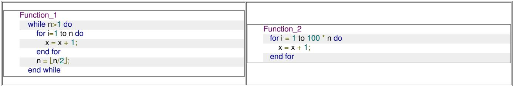

```txt
} else {
    len2 = ____(Q)____;
    len1 = 1; second = first;
}
if (len2 > maxlen) {
    maxlen = len2;
}
first = X[i];
}
```

Which one of the following options gives the CORRECT missing expressions?

(Hint: At the end of the i-th iteration, the value of len1 is the length of the longest subarray ending with X[i] that contains all equal values, and len2 is the length of the longest subarray ending with X[i] that contains at most two distinct values.)

A. (P) len1 + 1 (Q) len2 + 1  
B. (P) 1 (Q) len1 + 1  
c. (P) 1 (Q) len2 + 1  
D. (P) len2 + 1 (Q) len1 + 1

gatecse-2024-set2 algorithms algorithm-design two-marks

Answer key

# 1.2

# Algorithm Design Techniques (9)

# 1.2.1 Algorithm Design Techniques: GATE CSE 1990 | Question: 12b

Consider the following problem. Given $n$ positive integers $a_1, a_2 \ldots a_n$ , it is required to partition them in to two parts $A$ and $B$ such that, $\left|\sum_{i \in A} a_i - \sum_{i \in B} a_i\right|$ is minimised


Consider a greedy algorithm for solving this problem. The numbers are ordered so that $a_{1} \geq a_{2} \geq \ldots a_{n}$ , and at $i^{th}$ step, $a_{i}$ is placed in that part whose sum in smaller at that step. Give an example with n = 5 for which the solution produced by the greedy algorithm is not optimal.

gate1990 descriptive algorithms algorithm-design-techniques

Answer key

# 1.2.2 Algorithm Design Techniques: GATE CSE 1990 | Question: 2-vii

Match the pairs in the following questions:

<table><tr><td>(a)</td><td>Strassen’s matrix multiplication algorithm</td><td>(p)</td><td>Greedy method</td></tr><tr><td>(b)</td><td>Kruskal’s minimum spanning tree algorithm</td><td>(q)</td><td>Dynamic programming</td></tr><tr><td>(c)</td><td>Biconnected components algorithm</td><td>(r)</td><td>Divide and Conquer</td></tr><tr><td>(d)</td><td>Floyd’s shortest path algorithm</td><td>(s)</td><td>Depth-first search</td></tr></table>


gate1990 match-the-following algorithms algorithm-design-techniques easy

Answer key

# 1.2.3 Algorithm Design Techniques: GATE CSE 1994 | Question: 1.19, ISRO2016-31

Algorithm design technique used in quicksort algorithm is?

A. Dynamic programming  
B. Backtracking  
C. Divide and conquer  
D. Greedy method

gate1994 algorithms algorithm-design-techniques quick-sort easy isro2016

Answer key


# 1.2.4 Algorithm Design Techniques: GATE CSE 1995 | Question: 1.5

Merge sort uses:

A. Divide and conquer strategy

B. Backtracking approach

C. Heuristic search

D. Greedy approach

gate1995 algorithms sorting easy algorithm-design-techniques merge-sort

# Answer key

# 1.2.5 Algorithm Design Techniques: GATE CSE 1997 | Question: 1.5

The correct matching for the following pairs is

<table><tr><td>A. All pairs shortest path</td><td>1. Greedy</td></tr><tr><td>B. Quick Sort</td><td>2. Depth-First Search</td></tr><tr><td>C. Minimum weight spanning tree</td><td>3. Dynamic Programming</td></tr><tr><td>D. Connected Components</td><td>4. Divide and Conquer</td></tr></table>

A. A-2 B-4 C-1 D-3

B. A-3 B-4 C-1 D-2

C. A-3 B-4 C-2 D-1

D. A-4 B-1 C-2 D-3

gate1997 algorithms normal algorithm-design-techniques easy match-the-following

# Answer key

# 1.2.6 Algorithm Design Techniques: GATE CSE 1998 | Question: 1.21, ISRO2008-16

Which one of the following algorithm design techniques is used in finding all pairs of shortest distances in a graph?


A. Dynamic programming

B. Backtracking

C. Greedy

D. Divide and Conquer

gate1998 algorithms algorithm-design-techniques easy isro2008

# Answer key

# 1.2.7 Algorithm Design Techniques: GATE CSE 2015 | Set 1 | Question: 6

Match the following:

<table><tr><td>P.</td><td>Prim’s algorithm for minimum spanning tree</td><td>i.</td><td>Backtracking</td></tr><tr><td>Q.</td><td>Floyd-Warshall algorithm for all pairs shortest path</td><td>ii.</td><td>Greedy method</td></tr><tr><td>R.</td><td>Merge sort</td><td>iii.</td><td>Dynamic programming</td></tr><tr><td>S.</td><td>Hamiltonian circuit</td><td>iv.</td><td>Divide and conquer</td></tr></table>

A. P-iii, Q-ii, R-iv, S-i

B. P-i, Q-ii, R-iv, S-iii

C. P-ii, Q-iii, R-iv, S-i

D. P-ii, Q-i, R-iii, S-iv

gatecse-2015-set1 algorithms normal match-the-following algorithm-design-techniques

# Answer key

# 1.2.8 Algorithm Design Techniques: GATE CSE 2015 | Set 2 | Question: 36

Given below are some algorithms, and some algorithm design paradigms.

<table><tr><td>1. Dijkstra&#x27;s Shortest Path</td><td>i. Divide and Conquer</td></tr><tr><td>2. Floyd-Warshall algorithm to compute all pair shortest path</td><td>ii. Dynamic Programming</td></tr><tr><td>3. Binary search on a sorted array</td><td>iii. Greedy design</td></tr><tr><td>4. Backtracking search on a graph</td><td>iv. Depth-first search</td></tr><tr><td></td><td>v. Breadth-first search</td></tr></table>


Match the above algorithms on the left to the corresponding design paradigm they follow.

A. 1-i, 2-iii, 3-i, 4-v

B. 1-iii, 2-iii, 3-i, 4-v

C. 1-iii, 2-ii, 3-i, 4-iv

D. 1-iii, 2-ii, 3-i, 4-v

gatecse-2015-set2 algorithms easy algorithm-design-techniques match-the-following

# Answer key

# 1.2.9 Algorithm Design Techniques: GATE CSE 2017 | Set 1 | Question: 05

Consider the following table:

<table><tr><td colspan="2">Algorithms</td><td colspan="2">Design Paradigms</td></tr><tr><td>(P)</td><td>Kruskal</td><td>(i)</td><td>Divide and Conquer</td></tr><tr><td>(Q)</td><td>Quicksort</td><td>(ii)</td><td>Greedy</td></tr><tr><td>(R)</td><td>Floyd-Warshall</td><td>(iii)</td><td>Dynamic Programming</td></tr></table>


Match the algorithms to the design paradigms they are based on.

A. $(P)\leftrightarrow (ii),(Q)\leftrightarrow (iii),(R)\leftrightarrow (i)$  
B. $(P)\leftrightarrow (iii),(Q)\leftrightarrow (i),(R)\leftrightarrow (ii)$  
C. $(P)\leftrightarrow (ii),(Q)\leftrightarrow (i),(R)\leftrightarrow (iii)$  
D. $(P)\leftrightarrow (i),(Q)\leftrightarrow (ii),(R)\leftrightarrow (iii)$

gatecse-2017-set1 algorithms algorithm-design-techniques easy match-the-following

# Answer key

# 1.3

# Asymptotic Notations (22)

Practice Tests: Test 1 (15Q) Test 2 (15Q) Test 3 (15Q) Test 4 (4Q)

# 1.3.1 Asymptotic Notations: GATE CSE 1994 | Question: 1.23

Consider the following two functions:

$$
g _ {1} (n) = \left\{ \begin{array}{l} n ^ {3} \text {for} 0 \leq n \leq 1 0, 0 0 0 \\ n ^ {2} \text {for} n > 1 0, 0 0 0 \end{array} \right.
$$

$$
g _ {2} (n) = \left\{ \begin{array}{l} n \text {for} 0 \leq n \leq 1 0 0 \\ n ^ {3} \text {for} n > 1 0 0 \end{array} \right.
$$

Which of the following is true?

A. $g_{1}(n)$ is $O(g_{2}(n))$

B. $g_{1}(n)$ is $O(n^{3})$

C. $g_{2}(n)$ is $O(g_{1}(n))$

D. $g_{2}(n)$ is $O(n)$

gate1994 algorithms asymptotic-notations normal multiple-selects

# Answer key

# 1.3.2 Asymptotic Notations: GATE CSE 1996 | Question: 1.11

Which of the following is false?

A. $100n \log n = O(\frac{n \log n}{100})$  
C. If $0 < x < y$ then $n^x = O(n^y)$

B. $\sqrt{\log n} = O(\log \log n)$  
D. $2^{n} \neq O(nk)$

gate1996 algorithms asymptotic-notations normal

# Answer key

# 1.3.3 Asymptotic Notations: GATE CSE 1999 | Question: 2.21

If $T_{1} = O(1)$ , give the correct matching for the following pairs:


<table><tr><td>(M)  $T_n = T_{n-1} + n$ </td><td>(U)  $T_n = O(n)$ </td></tr><tr><td>(N)  $T_n = T_{n/2} + n$ </td><td>(V)  $T_n = O(n \log n)$ </td></tr><tr><td>(O)  $T_n = T_{n/2} + n \log n$ </td><td>(W)  $T_n = O(n^2)$ </td></tr><tr><td>(P)  $T_n = T_{n-1} + \log n$ </td><td>(X)  $T_n = O(\log^2 n)$ </td></tr></table>

A. M-W, N-V, O-U, P-X

B. M-W, N-U, O-X, P-V

c. M-V, N-W, O-X, P-U

D. M-W, N-U, O-V, P-X

gate1999 algorithms recurrence-relation asymptotic-notations normal match-the-following

# Answer key

# 1.3.4 Asymptotic Notations: GATE CSE 2000 | Question: 2.17

Consider the following functions


- $f(n) = 3n^{\sqrt{n}}$  
- $g(n) = 2^{\sqrt{n}\log_2n}$  
- $h(n) = n!$

Which of the following is true?

A. $h(n)$ is $O(f(n))$

B. $h(n)$ is $O(g(n))$

C. $g(n)$ is not $O(f(n))$

D. $f(n)$ is $O(g(n))$

gatecse-2000 algorithms asymptotic-notations normal

# Answer key

# 1.3.5 Asymptotic Notations: GATE CSE 2001 | Question: 1.16

Let $f(n) = n^2 \log n$ and $g(n) = n(\log n)^{10}$ be two positive functions of $n$ . Which of the following statements is correct?


A. $f(n) = O(g(n))$ and $g(n) \neq O(f(n))$

B. $g(n) = O(f(n))$ and $f(n)\neq O(g(n))$

C. $f(n)\neq O(g(n))$ and $g(n)\neq O(f(n))$

D. $f(n) = O(g(n))$ and $g(n) = O(f(n))$

gatecse-2001 algorithms asymptotic-notations time-complexity normal

# Answer key

# 1.3.6 Asymptotic Notations: GATE CSE 2003 | Question: 20

Consider the following three claims:


I. $(n + k)^{m} = \Theta (n^{m})$ where $k$ and $m$ are constants  
II. $2^{n + 1} = O(2^n)$  
III. $2^{2n + 1} = O(2^n)$

Which of the following claims are correct?

A. I and II

B. I and III

C. II and III

D. I, II, and III

gatecse-2003 algorithms asymptotic-notations normal

# Answer key

# 1.3.7 Asymptotic Notations: GATE CSE 2004 | Question: 29

The tightest lower bound on the number of comparisons, in the worst case, for comparison-based sorting is of the order of


A. n

B. $n^2$

C. $n\log n$

D. $n\log^2 n$

gatecse-2004 algorithms sorting asymptotic-notations easy

# Answer key

# 1.3.8 Asymptotic Notations: GATE CSE 2005 | Question: 37

Suppose $T(n) = 2T(\frac{n}{2}) + n, T(0) = T(1) = 1$

Which one of the following is FALSE?

A. $T(n) = O(n^{2})$

B. $T(n) = \Theta (n\log n)$

C. $T(n) = \Omega (n^{2})$

D. $T(n) = O(n\log n)$

gatecse-2005 algorithms asymptotic-notations recurrence-relation normal

# Answer key


# 1.3.9 Asymptotic Notations: GATE CSE 2008 | Question: 39

Consider the following functions:

- $f(n) = 2^n$  
- $g(n) = n!$  
- $h(n) = n^{\log n}$

Which of the following statements about the asymptotic behavior of $f(n), g(n)$ and $h(n)$ is true?

A. $f(n) = O(g(n)); g(n) = O(h(n))$  
B. $f(n) = \Omega(g(n)); g(n) = O(h(n))$  
C. $g(n) = O(f(n));h(n) = O(f(n))$  
D. $h(n) = O(f(n)); g(n) = \Omega(f(n))$

gatecse-2008 algorithms asymptotic-notations normal

# Answer key


# 1.3.10 Asymptotic Notations: GATE CSE 2011 | Question: 37

Which of the given options provides the increasing order of asymptotic complexity of functions $f_{1}, f_{2}, f_{3}$ and $f_{4}$ ?

- $f_{1}(n) = 2^{n}$  
- $f_{2}(n) = n^{3/2}$  
- $f_{3}(n) = n\log_{2}n$  
- $f_{4}(n) = n^{\log_{2}n}$

A. $f_{3}, f_{2}, f_{4}, f_{1}$

C. $f_{2}, f_{3}, f_{1}, f_{4}$

gatecse-2011 algorithms asymptotic-notations normal

# Answer key


# 1.3.11 Asymptotic Notations: GATE CSE 2012 | Question: 18

Let $W(n)$ and $A(n)$ denote respectively, the worst case and average case running time of an algorithm executed on an input of size $n$ . Which of the following is ALWAYS TRUE?

A. $A(n) = \Omega (W(n))$

C. $A(n) = \mathrm{O}(W(n))$

gatecse-2012 algorithms easy asymptotic-notations

# Answer key


# 1.3.12 Asymptotic Notations: GATE CSE 2015 | Set 3 | Question: 4

Consider the equality $\sum_{i=0}^{n} i^3 = X$ and the following choices for $X$ :

I. $\Theta(n^4)$


II. $\Theta(n^{5})$  
III. $O(n^{5})$  
IV. $\Omega(n^3)$

The equality above remains correct if $X$ is replaced by

A. Only I

B. Only II

C. I or III or IV but not II

D. II or III or IV but not I

gatecse-2015-set3 algorithms asymptotic-notations normal

# Answer key

# 1.3.13 Asymptotic Notations: GATE CSE 2015 | Set 3 | Question: 42

Let $f(n) = n$ and $g(n) = n^{(1 + \sin n)}$ , where $n$ is a positive integer. Which of the following statements is/are correct?

1. $f(n) = O(g(n))$  
II. $f(n) = \Omega(g(n))$

A. Only I

B. Only II

C. Both I and II

D. Neither I nor II

gatecse-2015-set3 algorithms asymptotic-notations normal

# Answer key

# 1.3.14 Asymptotic Notations: GATE CSE 2017 | Set 1 | Question: 04

Consider the following functions from positive integers to real numbers:

10, $\sqrt{n}$ , $n$ , $\log_2 n$ , $\frac{100}{n}$ .

The CORRECT arrangement of the above functions in increasing order of asymptotic complexity is:

A. $\log_2 n, \frac{100}{n}, 10, \sqrt{n}, n$

C. $10, \frac{100}{n}, \sqrt{n}, \log_2 n, n$

gatecse-2017-set1 algorithms asymptotic-notations normal

# Answer key

# 1.3.15 Asymptotic Notations: GATE CSE 2021 | Set 1 | Question: 3

Consider the following three functions.

$$
f _ {1} = 1 0 ^ {n} \quad f _ {2} = n ^ {\log n} \quad f _ {3} = n ^ {\sqrt {n}}
$$

Which one of the following options arranges the functions in the increasing order of asymptotic growth rate?

A. $f_{3}, f_{2}, f_{1}$  
C. $f_{1}, f_{2}, f_{3}$

gatecse-2021-set1 algorithms asymptotic-notations one-mark

# Answer key

# 1.3.16 Asymptotic Notations: GATE CSE 2022 | Question: 1

Which one of the following statements is TRUE for all positive functions $f(n)$ ?

A. $f(n^{2}) = \theta (f(n)^{2})$ , when $f(n)$ is a polynomial  
B. $f(n^{2}) = o(f(n)^{2})$  
C. $f(n^{2}) = O(f(n)^{2})$ , when $f(n)$ is an exponential function  
D. $f(n^{2}) = \Omega (f(n)^{2})$

gatecse-2022 algorithms asymptotic-notations one-mark

# Answer key


# 1.3.17 Asymptotic Notations: GATE CSE 2023 | Question: 19

Let $f$ and $g$ be functions of natural numbers given by $f(n) = n$ and $g(n) = n^2$ . Which of the following statements is/are TRUE?

A. $f\in O(g)$  
C. $f \in o(g)$

B. $f \in \Omega(g)$  
D. $f\in \Theta (g)$

gatecse-2023 algorithms asymptotic-notations multiple-selects one-mark

# Answer key

# 1.3.18 Asymptotic Notations: GATE CSE 2023 | Question: 44

Consider functions Function\_1 and Function\_2 expressed in pseudocode as follows:




<details>
<summary>text_image</summary>

Function_1
while n>1 do
    for i=1 to n do
        x = x + 1;
    end for
    n = ⌊n/2⌋;
end while
Function_2
for i = 1 to 100 * n do
    x = x + 1;
end for
</details>

Let $f_{1}(n)$ and $f_{2}(n)$ denote the number of times the statement “ $x = x + 1$ ” is executed in Function\_1 and Function\_2, respectively.

Which of the following statements is/are TRUE?

A. $f_{1}(n)\in \Theta (f_{2}(n))$  
C. $f_{1}(n)\in \omega (f_{2}(n))$

B. $f_{1}(n)\in o(f_{2}(n))$  
D. $f_{1}(n)\in O(n)$

gatecse-2023 algorithms asymptotic-notations multiple-selects two-marks

# Answer key

# 1.3.19 Asymptotic Notations: GATE CSE 2024 | Set 2 | Question: 5

Let $\mathrm{T}(\mathrm{n})$ be the recurrence relation defined as follows:


$$
\begin{array}{l} T (0) = 1, \\ T (1) = 2, \text {and} \\ T (n) = 5 T (n - 1) - 6 T (n - 2) \text {for} n \geq 2 \\ \end{array}
$$

Which one of the following statements is TRUE?

A. $T(n) = \Theta(2^{n})$  
C. $T(n) = \Theta(3^n)$

B. $T(n) = \Theta (n2^n)$  
D. $T(n) = \Theta (n3^n)$

gatecse-2024-set2 algorithms recurrence-relation asymptotic-notations one-mark

# Answer key

# 1.3.20 Asymptotic Notations: GATE CSE 2026 | Set 2 | Question: 14

Consider the following functions, where n is a positive integer.

$$
n ^ {1 / 3}, \log (n), \log (n!), 2 ^ {\log (n)}
$$

Which one of the following options lists the functions in increasing order of asymptotic growth rate?

Note: Assume the base of log to be 2.

A. $\log (n), n^{1 / 3}, 2^{\log (n)}, \log (n!)$  
B. $n^{1 / 3},\log (n),\log (n!),2^{\log (n)}$


C. $\log (n), n^{1 / 3}, \log (n!), 2^{\log (n)}$  
D. $2^{\log (n)},n^{1 / 3},\log (n),\log (n!)$

gatecse-2026-set2 algorithms asymptotic-notations one-mark

# Answer key

# 1.3.21 Asymptotic Notations: GATE IT 2004 | Question: 55

Let $f(n)$ , $g(n)$ and $h(n)$ be functions defined for positive integers such that

$$
f (n) = O (g (n)), g (n) \neq O (f (n)), g (n) = O (h (n)), \text {and} h (n) = O (g (n)).
$$

Which one of the following statements is FALSE?

A. $f(n) + g(n) = O(h(n) + h(n))$

C. $h(n) \neq O(f(n))$

gateit-2004 algorithms asymptotic-notations normal

B. $f(n) = O(h(n))$

D. $f(n)h(n)\neq O(g(n)h(n))$

# Answer key


# 1.3.22 Asymptotic Notations: GATE IT 2008 | Question: 10

Arrange the following functions in increasing asymptotic order:

a. $n^{1/3}$  
b. $e^{n}$  
c. $n^{7/4}$  
d. $n\log^9 n$  
e. $1.0000001^{n}$

A. a, d, c, e, b

B. d, a, c, e, b

C. a, c, d, e, b

D. a, c, d, b, e

gateit-2008 algorithms asymptotic-notations normal

# Answer key


# 1.4

# Bellman Ford (2)

# 1.4.1 Bellman Ford: GATE CSE 2009 | Question: 13

Which of the following statement(s) is/are correct regarding Bellman-Ford shortest path algorithm?

P: Always finds a negative weighted cycle, if one exists.  
Q: Finds whether any negative weighted cycle is reachable from the source.

A. P only

B. $Q$ only

C. Both $P$ and $Q$

D. Neither $P$ nor $Q$

gatecse-2009 algorithms graph-algorithms normal bellman-ford

# Answer key

# 1.4.2 Bellman Ford: GATE CSE 2013 | Question: 19

What is the time complexity of Bellman-Ford single-source shortest path algorithm on a complete graph of n vertices?

A. $\theta(n^{2})$  
C. $\theta(n^{3})$

gatecse-2013 algorithms graph-algorithms normal bellman-ford

B. $\theta(n^{2}\log n)$  
D. $\theta (n^3\log n)$

# Answer key

# 1.5

# Binary Heap (1)

# 1.5.1 Binary Heap: GATE CSE 2026 | Set 1 | Question: 13

Let $n$ be an odd number greater than 100. Consider a binary minheap with $n$ elements stored in an array $P$ whose index starts from 1.


Which of the following indices of $P$ do/does NOT correspond to any leaf node of the minheap?

A. $\frac{n+1}{2}$

B. $\frac{n-1}{2}$

C. $\frac{n-3}{2}$

D. n

gatecse-2026-set1 algorithms binary-heap multiple-selects one-mark

Answer key

# 1.6

# Binary Search (4)

Practice Test: Test 1 (6Q)

# 1.6.1 Binary Search: GATE CSE 2021 | Set 2 | Question: 8

What is the worst-case number of arithmetic operations performed by recursive binary search on a sorted array of size n?


A. $\Theta(\sqrt{n})$

C. $\Theta(n^{2})$

B. $\Theta (\log_2(n))$

D. $\Theta(n)$

gatecse-2021-set2 algorithms binary-search time-complexity one-mark

Answer key

# 1.6.2 Binary Search: GATE DA 2025 | Question: 17

For which of the following inputs does binary search take time $O(\log n)$ in the worst case?


A. An array of n integers in any order  
B. A linked list of n integers in any order  
C. An array of n integers in increasing order  
D. A linked list of n integers in increasing order

gateda-2025 algorithms binary-search multiple-selects one-mark

Answer key

# 1.6.3 Binary Search: GATE DA 2026 | Question: 21

Let A be a sorted array containing 1000 distinct integers. You perform a recursive binary search on A to find an element y. Suppose each comparison checks whether the middle element computed during the current recursive step is equal to, less than, or greater than y.


The maximum number of comparisons that may have to be performed if $y$ is not an element of $A$ is \_\_\_\_. (Answer in integer)

gateda-2026 algorithms binary-search numerical-answers one-mark

Answer key

# 1.6.4 Binary Search: GATE DS&AI 2024 | Question: 30

Let $F(n)$ denote the maximum number of comparisons made while searching for an entry in a sorted array of size n using binary search.


Which ONE of the following options is TRUE?

A. $F(n) = F(\lfloor n / 2\rfloor) + 1$

B. $F(n) = F(\lfloor n / 2\rfloor) + F(\lceil n / 2\rceil)$

C. $F(n) = F(\lfloor n/2 \rfloor)$

D. $F(n) = F(n - 1) + 1$

gate-ds-ai-2024 algorithms binary-search two-marks

Answer key

# 1.7

# Binary Search Tree (3)

# 1.7.1 Binary Search Tree: GATE CSE 2026 | Set 1 | Question: 30

Let $P$ be the set of all integers from 1 to 15. Consider any order of insertion of the elements of $P$ into a binary search tree that creates a complete binary tree.


Which one of the following elements can NEVER be the third element that is inserted?

A. 4

B. 2

C. 10

D. 5

gatecse-2026-set1 algorithms binary-search-tree two-marks

Answer key

# 1.7.2 Binary Search Tree: GATE CSE 2026 | Set 1 | Question: 52

The following sequence corresponds to the preorder traversal of a binary search tree T :

50, 25, 13, 40, 30, 47, 75, 60, 70, 80, 77


The position of the element 60 in the postorder traversal of $T$ is \_\_\_\_. (answer in integer)

Note: The position begins with 1.

gatecse-2026-set1 numerical-answers two-marks binary-search-tree algorithms

Answer key

# 1.7.3 Binary Search Tree: GATE CSE 2026 | Set 2 | Question: 39

Consider a binary search tree (BST) with n leaf nodes $(n > 0)$ . Given any node V, the key present in the node is denoted as $\text{Val}(V)$ . All the keys present in the given BST are distinct. The keys belong to the set of real numbers.


For a node V, let $\operatorname{Suc}(V)$ denote the node that is its inorder successor. If a node V does not have an inorder successor, then $\operatorname{Suc}(V)$ is NULL. As there are no duplicates, if $\operatorname{Suc}(V)$ is not NULL, then $\operatorname{Val}(V) < \operatorname{Val}(\operatorname{Suc}(V))$ .

Corresponding to every leaf node $L_{i}$ that has a non-NULL $\operatorname{Suc}(L_{i})$ , a new key $k_{i}$ with the following property is to be inserted into the BST.

$$
\mathrm{Val} (L _ {i}) <   k _ {i} <   \text {Val} (\mathrm{Suc} (L _ {i}))
$$

Let K represent the list of all such new keys to be inserted into the BST.

Which of the following statements is/are true?

A. $K$ cannot have any duplicates  
B. $K$ will have at least one element  
C. After inserting all keys from $K$ , the height of the BST can increase at most by one  
D. Number of nodes in the BST will double after inserting all keys from K

gatecse-2026-set2 algorithms binary-search-tree multiple-selects two-marks

Answer key

1.8

# Binary Tree (1)

# 1.8.1 Binary Tree: GATE CSE 2026 | Set 1 | Question: 23

The height of a binary tree is the number of edges in the longest path from the root to a leaf in the tree. The maximum possible height of a full binary tree with 23 nodes is \_\_\_\_. (answer in integer)


gatecse-2026-set1 algorithms binary-tree numerical-answers one-mark

Answer key

1.9

# Breadth First Search (3)

# 1.9.1 Breadth First Search: GATE CSE 2025 | Set 1 | Question: 33


Let $G(V, E)$ be an undirected and unweighted graph with 100 vertices. Let $d(u, v)$ denote the number of edges in a shortest path between vertices $u$ and $v$ in $V$ . Let the maximum value of $d(u, v), u, v \in V$ such that $u \neq v$ , be 30. Let $T$ be any breadth-first-search tree of $G$ . Which ONE of the given options is CORRECT for every such graph $G$ ?

A. The height of $T$ is exactly 15.

B. The height of $T$ is exactly 30.

C. The height of $T$ is at least 15.

D. The height of $T$ is at least 30.

gatecse2025-set1 algorithms breadth-first-search shortest-path two-marks

# Answer key

# 1.9.2 Breadth First Search: GATE DA 2026 | Question: 30


Consider a directed graph $G = (V, E)$ , where V is the finite set of vertices and E is the set of directed edges between the vertices. G may contain cycles but there is no self-loop. Further, G may not be strongly connected.

Let $G^{R}$ be the graph obtained by reversing the directions of all the edges in G without changing the set of vertices. Assume that Breadth First Search (BFS) or Depth First Search (DFS) from any given vertex v of a graph visits only the reachable vertices from v in that graph.

Which of the following statements must always be true, regardless of the structure of G?

A. If $u$ is a reachable vertex in the BFS of $G^R$ from $v$ , then $u$ is also a reachable vertex in the DFS of $G$ from $v$ .  
B. In $G^{R}$ , the BFS traversal from $v$ will visit exactly the same set of vertices as the DFS from $v$ in $G$ .  
C. The order of vertices visited in the BFS of $G^R$ from $v$ is the reverse of the order of vertices visited in the DFS of $G$ from $v$ .  
D. If $u$ is a reachable vertex in the DFS of $G$ from $v$ , then $v$ is also a reachable vertex in the BFS of $G^R$ from $u$ .

gateda-2026 algorithms graph-algorithms breadth-first-search depth-first-search two-marks

# 1.9.3 Breadth First Search: GATE DS&AI 2024 | Question: 34


Consider a state space where the start state is number 1. The successor function for the state numbered n returns two states numbered $n+1$ and $n+2$ . Assume that the states in the unexpanded state list are expanded in the ascending order of numbers and the previously expanded states are not added to the unexp state list.

Which ONE of the following statements about breadth-first search (BFS) and depth-first search (DFS) is true, when reaching the goal state number 6?

A. BFS expands more states than DFS.  
B. DFS expands more states than BFS.  
C. Both BFS and DFS expand equal number of states.  
D. Both BFS and DFS do not reach the goal state number 6.

gate-ds-ai-2024 algorithms breadth-first-search depth-first-search two-marks

# Answer key

# 1.10

# Bubble Sort (1)

# 1.10.1 Bubble Sort: GATE CSE 1995 | Question: 12

Consider the following sequence of numbers:


92, 37, 52, 12, 11, 25

Use Bubble sort to arrange the sequence in ascending order. Give the sequence at the end of each of the first five passes.

# 1.11

# Computer Science (1)

# 1.11.1 Computer Science: GATE CS Practice : The "Master Theorem" (Algorithms)

Consider the following recurrence relation describing the running time of an algorithm:


$$
T (n) = 2 T \left(\frac {n}{2}\right) + \frac {n}{\log n}
$$

(Base condition: $T(1) = 1$ )

What is the asymptotic tight bound $\Theta(T(n))$ ?

A. $\Theta(n)$

B. $\Theta(n \log n)$

C. $\Theta(n \log \log n)$

D. $\Theta(n(\log n)^2)$

algorithms master-theorem recurrence-relation computer-science gate-preparation

# Answer key

# 1.12

# Depth First Search (2)

Practice Test: Test 1 (12Q)

# 1.12.1 Depth First Search: GATE CSE 2026 | Set 1 | Question: 40

Consider the following pseudocode for depth-first search (DFS) algorithm which takes a directed graph $G(V, E)$ as input, where $d[v]$ and $f[v]$ are the discovery time and finishing time, respectively, of the vertex $v \in V$ .


<table><tr><td></td><td>mark  $v$  $t \leftarrow t + 1$  $d[v] \leftarrow t$ for each  $(v, w) \in E$ if  $w$  is unmarked</td></tr><tr><td>unmark all  $v \in V$  $t \leftarrow 0$ for each  $v \in V$ </td><td rowspan="2">Explore $(G, v, t)$ :  $t \leftarrow$ Explore $(G, w, t)$ end ifend for $t \leftarrow t + 1$  $f[v] \leftarrow t$ return  $t$ </td></tr><tr><td> $\mathbf{DFS}(G)$ : if  $v$  is unmarked $t \leftarrow$ Explore $(G, v, t)$ end ifend for</td></tr></table>

Suppose that the input directed graph $G(V, E)$ is a directed acyclic graph (DAG).

For an edge $(u,v)\in E$ , which of the following options will NEVER be correct?

A. $d[u] < d[v] < f[v] < f[u]$  
C. $d[v] < f[v] < d[u] < f[u]$

B. $d[v] < d[u] < f[u] < f[v]$  
D. $d[u] < d[v] < f[u] < f[v]$

gatecse-2026-set1 algorithms depth-first-search two-marks multiple-selects

# Answer key