# 1.12.2 Depth First Search: GATE DA 2025 | Question: 55


Consider a directed graph $G = (V, E)$ , where $V = \{0, 1, 2, \dots, 100\}$ and $E = \{(i, j) : 0 < j - i \leq 2, \text{ for all } i, j \in V\}$ . Suppose the adjacency list of each vertex is in decreasing order of vertex number, and depth-first search (DFS) is performed at vertex 0. The number of vertices that will be discovered after vertex 50 is \_\_\_\_ (Answer in integer)

gateda-2025 algorithms depth-first-search numerical-answers two-marks

Answer key

# 1.13

# Dijkstra Algorithm (5)

Practice Test: Test 1 (12Q)

# 1.13.1 Dijkstra Algorithm: GATE CSE 1996 | Question: 17

Let G be the directed, weighted graph shown in below figure


<details>
<summary>flowchart</summary>

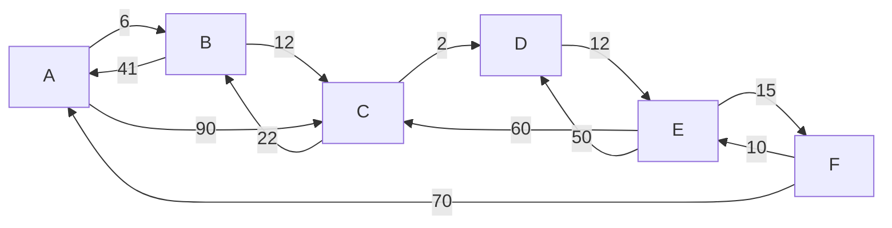
</details>

We are interested in the shortest paths from A.

a. Output the sequence of vertices identified by the Dijkstra's algorithm for single source shortest path when the algorithm is started at node $A$  
b. Write down sequence of vertices in the shortest path from $A$ to $E$  
c. What is the cost of the shortest path from $A$ to $E$ ?

gate1996 algorithms graph-algorithms normal dijkstras-algorithm descriptive

Answer key

# 1.13.2 Dijkstra Algorithm: GATE CSE 2004 | Question: 44

Suppose we run Dijkstra's single source shortest path algorithm on the following edge-weighted directed graph with vertex $P$ as the source.


<details>
<summary>flowchart</summary>

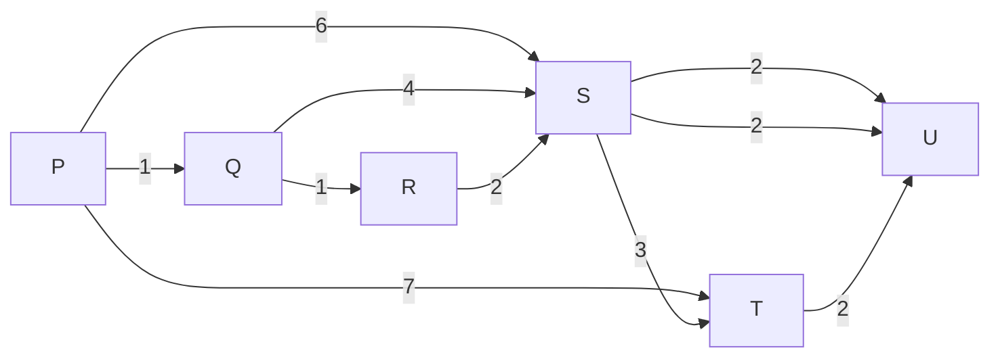
</details>

In what order do the nodes get included into the set of vertices for which the shortest path distances are finalized?

A. $P, Q, R, S, T, U$

B. $P, Q, R, U, S, T$

c. $P, Q, R, U, T, S$

D. $P, Q, T, R, U, S$

gatecse-2004 algorithms graph-algorithms normal dijkstras-algorithm

Answer key

# 1.13.3 Dijkstra Algorithm: GATE CSE 2005 | Question: 38

Let $G(V, E)$ be an undirected graph with positive edge weights. Dijkstra's single source shortest path algorithm can be implemented using the binary heap data structure with time complexity:


A. $O(|V|^{2})$

B. $O(|E| + |V|\log |V|)$

c. $O(|V|\log |V|)$

D. $O((|E| + |V|)\log |V|)$

gatecse-2005 algorithms graph-algorithms normal dijkstras-algorithm

# Answer key

# 1.13.4 Dijkstra Algorithm: GATE CSE 2006 | Question: 12


To implement Dijkstra's shortest path algorithm on unweighted graphs so that it runs in linear time, the data structure to be used is:

A. Queue

B. Stack

C. Heap

D. B-Tree

gatecse-2006 algorithms graph-algorithms easy dijkstras-algorithm

# Answer key

# 1.13.5 Dijkstra Algorithm: GATE CSE 2008 | Question: 45


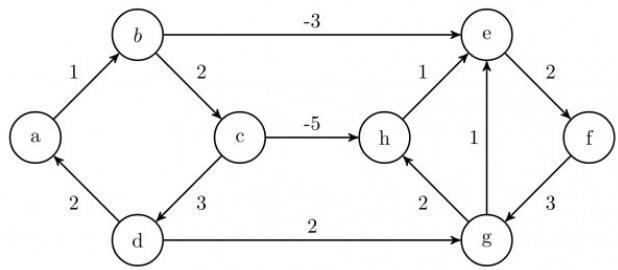

<details>
<summary>flowchart</summary>

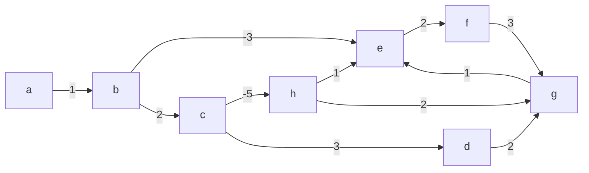
</details>

Dijkstra's single source shortest path algorithm when run from vertex $a$ in the above graph, computes the correct shortest path distance to

A. only vertex a

B. only vertices $a, e, f, g, h$

C. only vertices $a, b, c, d$

D. all the vertices

gatecse-2008 algorithms graph-algorithms normal dijkstras-algorithm

# Answer key

# 1.14

# Directed Acyclic Graph (2)

# 1.14.1 Directed Acyclic Graph: GATE CSE 2021 | Set 2 | Question: 55


In a directed acyclic graph with a source vertex s, the quality-score of a directed path is defined to be the product of the weights of the edges on the path. Further, for a vertex v other than s, the quality-score of v is defined to be the maximum among the quality-scores of all the paths from s to v. The quality-score of s is assumed to be 1.

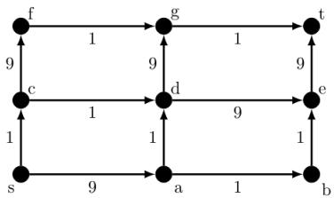

<details>
<summary>flowchart</summary>

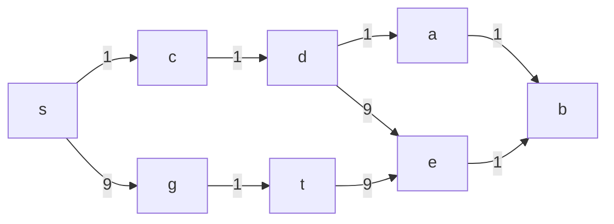
</details>

The sum of the quality-scores of all vertices on the graph shown above is \_\_\_\_

gatecse-2021-set2 algorithms graph-algorithms directed-acyclic-graph numerical-answers two-marks

# Answer key

# 1.14.2 Directed Acyclic Graph: GATE CSE 2026 | Set 2 | Question: 27


Let $G$ be a weighted directed acyclic graph with $m$ edges and $n$ vertices. Given $G$ and a source vertex $s$ in $G$ , which one of the following options gives the worst case time complexity of the fastest algorithm to find the lengths of shortest paths from $s$ to all vertices that are reachable from $s$ in $G$ ?

A. $\Theta(m + n)$

B. $\Theta(m + n\log(n))$

# 1.15

# Double Hashing (2)

# 1.15.1 Double Hashing: GATE CSE 2020 | Question: 23


Consider a double hashing scheme in which the primary hash function is $h_{1}(k)=k\bmod23$ , and the secondary hash function is $h_{2}(k)=1+(k\bmod19)$ . Assume that the table size is 23. Then the address returned by probe 1 in the probe sequence (assume that the probe sequence begins at probe 0) for key k=90 is \_\_\_\_.

gatecse-2020 numerical-answers algorithms hashing one-mark double-hashing

# Answer key

# 1.15.2 Double Hashing: GATE CSE 2025 | Set 1 | Question: 55


In a double hashing scheme, $h_{1}(k)=k\bmod11$ and $h_{2}(k)=1+(k\bmod7)$ are the auxiliary hash functions. The size m of the hash table is 11. The hash function for the i-th probe in the open address table is $[h_{1}(k)+ih_{2}(k)]\bmod m$ . The following keys are inserted in the given order: 63, 50, 25, 79, 67, 24.

The slot at which key 24 gets stored is \_\_\_\_. (Answer in integer)

gatecse2025-set1

algorithms

hashing

double-hashing

numerical-answers

easy

two-marks

# Answer key

# 1.16

# Dynamic Programming (10)

Practice Test: Test 1 (13Q)

# 1.16.1 Dynamic Programming: GATE CSE 2008 | Question: 80


The subset-sum problem is defined as follows. Given a set of $n$ positive integers, $S = \{a_1, a_2, a_3, \ldots, a_n\}$ , and positive integer $W$ , is there a subset of $S$ whose elements sum to $W$ ? A dynamic program for solving this problem uses a 2-dimensional Boolean array, $X$ , with $n$ rows and $W$ columns. $X[i, j], 1 \leq i \leq n, 0 \leq j \leq W$ , is TRUE, if and only if there is a subset of $\{a_1, a_2, \ldots, a_i\}$ elements sum to $j$ .

Which of the following is valid for $2 \leq i \leq n$ , and $a_{i} \leq j \leq W$ ?

A. $X[i,j] = X[i - 1,j]\lor X[i,j - a_i]$  
B. $X[i,j] = X[i - 1,j]\lor X[i - 1,j - a_i]$  
C. $X[i,j] = X[i - 1,j]\wedge X[i,j - a_i]$  
D. $X[i,j] = X[i - 1,j]\wedge X[i - 1,j - a_i]$

gatecse-2008

algorithms

difficult

dynamic-programming

# Answer key

# 1.16.2 Dynamic Programming: GATE CSE 2008 | Question: 81


The subset-sum problem is defined as follows. Given a set of $n$ positive integers, $S = \{a_1, a_2, a_3, \ldots, a_n\}$ , and positive integer $W$ , is there a subset of $S$ whose elements sum to $W$ ? A dynamic program for solving this problem uses a 2-dimensional Boolean array, $X$ , with $n$ rows and $l$ columns. $X[i, j], 1 \leq i \leq n, 0 \leq j \leq W$ , is TRUE, if and only if there is a subset of $\{a_1, a_2, \ldots, a_i\}$ elements sum to $j$ .

Which entry of the array X, if TRUE, implies that there is a subset whose elements sum to W?

A. $X[1, W]$

B. $X[n,0]$

C. $X[n,W]$

D. $X[n - 1,n]$

# 1.16.3 Dynamic Programming: GATE CSE 2009 | Question: 53


A sub-sequence of a given sequence is just the given sequence with some elements (possibly none or all) left out. We are given two sequences $X[m]$ and $Y[n]$ of lengths $m$ and $n$ , respectively with indexes of $X$ and $Y$ starting from 0.

We wish to find the length of the longest common sub-sequence (LCS) of $X[m]$ and $Y[n]$ as $l(m, n)$ , where an incomplete recursive definition for the function $I(i, j)$ to compute the length of the LCS of $X[m]$ and $Y[n]$ is given below:

$$
\begin{array}{l} = \text {expr1, if i,j > 0 and X[i - 1] = Y[j - 1]} \\ = \operatorname{expr2}, \text {if} i, j > 0 \text {and} X [ i - 1 ] \neq Y [ j - 1 ] \\ \end{array}
$$

$I(i,j) = 0$ , if either i = 0 or j = 0

Which one of the following options is correct?

A. expr1 = l(i - 1, j) + 1

B. expr1 = l(i, j - 1)

C. expr2 = max(l(i-1,j), l(i,j-1))

D. expr2 = max(l(i-1,j-1), l(i,j))

gatecse-2009 algorithms normal dynamic-programming recursion

# Answer key

# 1.16.4 Dynamic Programming: GATE CSE 2009 | Question: 54


A sub-sequence of a given sequence is just the given sequence with some elements (possibly none or all) left out. We are given two sequences $X[m]$ and $Y[n]$ of lengths $m$ and $n$ , respectively with indexes of $X$ and $Y$ starting from 0.

We wish to find the length of the longest common sub-sequence (LCS) of $X[m]$ and $Y[n]$ as $l(m, n)$ , where an incomplete recursive definition for the function $I(i, j)$ to compute the length of the LCS of $X[m]$ and $Y[n]$ is given below:

$$
\begin{array}{l} = \text {expr1, if i,j > 0 and X[i - 1] = Y[j - 1]} \\ = \text {expr2, if } i, j > 0 \text { and } X [ i - 1 ] \neq Y [ j - 1 ] \\ \end{array}
$$

$I(i,j) = 0$ , if either i = 0 or j = 0

The value of $l(i,j)$ could be obtained by dynamic programming based on the correct recursive definition of $l(i,j)$ of the form given above, using an array $L[M,N]$ , where $M = m + 1$ and $N = n + 1$ , such that $L[i,j] = l(i,j)$ .

Which one of the following statements would be TRUE regarding the dynamic programming solution for the recursive definition of $l(i,j)$ ?

A. All elements of $L$ should be initialized to 0 for the values of $l(i,j)$ to be properly computed.  
B. The values of $l(i,j)$ may be computed in a row major order or column major order of $L[M,N]$ .  
C. The values of $l(i,j)$ cannot be computed in either row major order or column major order of $L[M,N]$ .  
D. $L[p,q]$ needs to be computed before $L[r,s]$ if either $p < r$ or $q < s$ .

gatecse-2009 normal algorithms dynamic-programming recursion

# Answer key

# 1.16.5 Dynamic Programming: GATE CSE 2010 | Question: 34


The weight of a sequence $a_{0}, a_{1}, \ldots, a_{n-1}$ of real numbers is defined as $a_{0} + a_{1}/2 + \cdots + a_{n-1}/2^{n-1}$ . A subsequence of a sequence is obtained by deleting some elements from the sequence, keeping the order of the remaining elements the same. Let X denote the maximum possible weight of a subsequence of $a_{0}, a_{1}, \ldots, a_{n-1}$ and Y the maximum possible weight of a subsequence of $a_{1}, a_{2}, \ldots, a_{n-1}$ . Then X is equal to

A. $max(Y, a_0 + Y)$

C. $max(Y, a_{0} + 2Y)$

B. $max(Y, a_0 + Y/2)$

D. $a_{0} + Y/2$

gatecse-2010 algorithms dynamic-programming normal

# Answer key

# 1.16.6 Dynamic Programming: GATE CSE 2011 | Question: 25


An algorithm to find the length of the longest monotonically increasing sequence of numbers in an array $A[0:n - 1]$ is given below.

Let $L_{i}$ , denote the length of the longest monotonically increasing sequence starting at index i in the array.

Initialize $L_{n - 1} = 1$

For all $i$ such that $0 \leq i \leq n - 2$

$$
L _ {i} = \left\{ \begin{array}{l l} 1 + L _ {i + 1} & \quad \text {if} \mathrm{A} [ \mathrm{i} ] <   \mathrm{A} [ \mathrm{i} + 1 ] \\ 1 & \quad \text {Otherwise} \end{array} \right.
$$

Finally, the length of the longest monotonically increasing sequence is $\max\left(L_{0}, L_{1}, \ldots, L_{n-1}\right)$ .

Which of the following statements is TRUE?

A. The algorithm uses dynamic programming paradigm  
B. The algorithm has a linear complexity and uses branch and bound paradigm  
C. The algorithm has a non-linear polynomial complexity and uses branch and bound paradigm  
D. The algorithm uses divide and conquer paradigm

gatecse-2011 algorithms easy dynamic-programming

# Answer key

# 1.16.7 Dynamic Programming: GATE CSE 2014 | Set 2 | Question: 37


Consider two strings $A = "qpqrr"$ and $B = "pqprqrp"$ . Let $x$ be the length of the longest common subsequence (not necessarily contiguous) between $A$ and $B$ and let $y$ be the number of such longest common subsequences between $A$ and $B$ . Then $x + 10y =$ \_\_\_\_.

gatecse-2014-set2 algorithms normal numerical-answers dynamic-programming

# Answer key

# 1.16.8 Dynamic Programming: GATE CSE 2014 | Set 3 | Question: 37


Suppose you want to move from 0 to 100 on the number line. In each step, you either move right by a unit distance or you take a shortcut. A shortcut is simply a pre-specified pair of integers $i$ , $j$ with $i < j$ . Given a shortcut $(i, j)$ , if you are at position $i$ on the number line, you may directly move to $j$ . Suppose $T(k)$ denotes the smallest number of steps needed to move from $k$ to 100. Suppose further that there is at most 1 shortcut involving any number, and in particular, from 9 there is a shortcut to 15. Let $y$ and $z$ be such that $T(9) = 1 + \min(T(y), T(z))$ . Then the value of the product $yz$ is \_\_\_\_.

gatecse-2014-set3 algorithms normal numerical-answers dynamic-programming

# Answer key

# 1.16.9 Dynamic Programming: GATE CSE 2016 | Set 2 | Question: 14


The Floyd-Warshall algorithm for all-pair shortest paths computation is based on

A. Greedy paradigm.  
B. Divide-and-conquer paradigm.  
C. Dynamic Programming paradigm.  
D. Neither Greedy nor Divide-and-Conquer nor Dynamic Programming paradigm.

gatecse-2016-set2 algorithms dynamic-programming easy

# Answer key

# 1.16.10 Dynamic Programming: GATE CSE 2026 | Set 2 | Question: 29


Consider a table $T$ , where the elements $T[i][j], 0 \leq i, j \leq n$ , represent the cost of the optimal solutions of different subproblems of a problem that is being solved using a dynamic programming algorithm. The recursive formulation to compute the table entries is as follows:

$$
T [ 0 ] [ k ] = T [ k ] [ 0 ] = 1 \quad \text {for} k = 0, 1, 2, \dots , n
$$

$$
T [ i ] [ j ] = 2 T [ i - 1 ] [ j ] + 3 T [ i ] [ j - 1 ] \quad \text { for } 1 \leq i, j \leq n
$$

Consider the following two algorithms to compute entries of $T$ . Assume that for both the algorithms, for all $0 \leq i, j \leq n$ , $T[i][j]$ has been initialized to 1.

Algorithm \$B\_{1}\$: For \$i = 1, 2, \ldots, n\$

$$
\text {For} j = 1, 2, \dots , n
$$

$$
T [ i ] [ j ] = 2 T [ i - 1 ] [ j ] + 3 T [ i ] [ j - 1 ]
$$

Algorithm $B_{2}$ : For $s = 2,3,\dots ,2n$

$$
\text {For} i = 1, 2, \dots , n
$$

$$
\text {For} j = 1, 2, \dots , n
$$

$$
\text {If} (i + j = = s)
$$

$$
T [ i ] [ j ] = 2 T [ i - 1 ] [ j ] + 3 T [ i ] [ j - 1 ]
$$

Algorithm $B_{k}, k \in \{1, 2\}$ is said to be correct if and only if it calculates the correct values of $T[i][j]$ , for all $0 \leq i, j \leq n$ , (as per the recursive formulation) at the end of the execution of the algorithm $B_{k}$ .

Which one of the following statements is true?

A. Both algorithms $B_{1}$ and $B_{2}$ are correct  
B. Algorithm $B_{1}$ is correct, but algorithm $B_{2}$ is incorrect  
C. Algorithm $B_{2}$ is correct, but algorithm $B_{1}$ is incorrect  
D. Both algorithms $B_{1}$ and $B_{2}$ are incorrect

gatecse-2026-set2 algorithms dynamic-programming two-marks

Answer key

# 1.17

# Graph Algorithms (11)

Practice Test: Test 1 (14Q)

# 1.17.1 Graph Algorithms: GATE CSE 1994 | Question: 1.22

Which of the following statements is false?

A. Optimal binary search tree construction can be performed efficiently using dynamic programming  
B. Breadth-first search cannot be used to find connected components of a graph  
C. Given the prefix and postfix walks over a binary tree, the binary tree cannot be uniquely constructed.  
D. Depth-first search can be used to find connected components of a graph

gate1994 algorithms normal graph-algorithms

Answer key

# 1.17.2 Graph Algorithms: GATE CSE 2003 | Question: 70

Let $G = (V, E)$ be a directed graph with $n$ vertices. A path from $v_i$ to $v_j$ in $G$ is a sequence of vertices $(v_i, v_{i+1}, \ldots, v_j)$ such that $(v_k, v_{k+1}) \in E$ for all $k$ in $i$ through $j-1$ . A simple path is a path in which no vertex appears more than once.

Let A be an $n \times n$ array initialized as follows:


$$
A [ j, k ] = \left\{ \begin{array}{l l} 1, & \text {if} (j, k) \in E \\ 0, & \text {otherwise} \end{array} \right.
$$

Consider the following algorithm:

<div class="mineru-algorithm" style="white-space: pre-wrap; font-family:monospace;">
for i=1 to n
    for j=1 to n
        for k=1 to n
            A[j,k] = max(A[j,k], A[j,i] + A[i,k]);
</div>

Which of the following statements is necessarily true for all j and k after termination of the above algorithm?

A. $A[j,k]\leq n$  
B. If $A[j, j] \geq n - 1$ then $G$ has a Hamiltonian cycle  
C. If there exists a path from $j$ to $k$ , $A[j, k]$ contains the longest path length from $j$ to $k$  
D. If there exists a path from $j$ to $k$ , every simple path from $j$ to $k$ contains at most $A[j, k]$ edges

gatecse-2003 algorithms graph-algorithms normal

Answer key

# 1.17.3 Graph Algorithms: GATE CSE 2005 | Question: 82a

Let $s$ and $t$ be two vertices in a undirected graph $G = (V, E)$ having distinct positive edge weights. Let $[X, Y]$ be a partition of $V$ such that $s \in X$ and $t \in Y$ . Consider the edge $e$ having the minimum weight amongst all those edges that have one vertex in $X$ and one vertex in $Y$ .

The edge e must definitely belong to:

A. the minimum weighted spanning tree of $G$

B. the weighted shortest path from $s$ to $t$

C. each path from $s$ to $t$

D. the weighted longest path from $s$ to $t$

gatecse-2005 algorithms graph-algorithms normal

Answer key

# 1.17.4 Graph Algorithms: GATE CSE 2005 | Question: 82b

Let $s$ and $t$ be two vertices in a undirected graph $G = (V, E)$ having distinct positive edge weights. Let $[X, Y]$ be a partition of $V$ such that $s \in X$ and $t \in Y$ . Consider the edge $e$ having the minimum weight amongst all those edges that have one vertex in $X$ and one vertex in $Y$ .

Let the weight of an edge e denote the congestion on that edge. The congestion on a path is defined to be the maximum of the congestions on the edges of the path. We wish to find the path from s to t having minimum congestion. Which of the following paths is always such a path of minimum congestion?

A. a path from s to t in the minimum weighted spanning treeB. a weighted shortest path from s to t

C. an Euler walk from $s$ to $t$

D. a Hamiltonian path from $s$ to $t$

gatecse-2005 algorithms graph-algorithms normal

Answer key

# 1.17.5 Graph Algorithms: GATE CSE 2016 | Set 2 | Question: 41

In an adjacency list representation of an undirected simple graph $G = (V, E)$ , each edge $(u, v)$ has two adjacency list entries: $[v]$ in the adjacency list of $u$ , and $[u]$ in the adjacency list of $v$ . These are called twins

of each other. A twin pointer is a pointer from an adjacency list entry to its twin. If $|E|=m$ and $|V|=n$ , and the memory size is not a constraint, what is the time complexity of the most efficient algorithm to set the twin pointer in each entry in each adjacency list?

A. $\Theta(n^{2})$

B. $\Theta (n + m)$

C. $\Theta(m^{2})$

D. $\Theta(n^{4})$

gatecse-2016-set2 algorithms graph-algorithms normal

Answer key


# 1.17.6 Graph Algorithms: GATE CSE 2017 | Set 1 | Question: 26


Let $G = (V, E)$ be any connected, undirected, edge-weighted graph. The weights of the edges in $E$ are positive and distinct. Consider the following statements:

I. Minimum Spanning Tree of $G$ is always unique.  
II. Shortest path between any two vertices of $G$ is always unique.

Which of the above statements is/are necessarily true?

A. I only

B. II only

C. both I and II

D. neither I nor II

gatecse-2017-set1 algorithms graph-algorithms normal

Answer key

# 1.17.7 Graph Algorithms: GATE CSE 2021 | Set 2 | Question: 46

Consider the following directed graph:


<details>
<summary>flowchart</summary>

This diagram represents a state transition or state transition network with multiple states and transitions, where arrows indicate the direction of movement between them.
</details>


Which of the following is/are correct about the graph?

A. The graph does not have a topological order  
B. A depth-first traversal starting at vertex $S$ classifies three directed edges as back edges  
C. The graph does not have a strongly connected component  
D. For each pair of vertices u and v, there is a directed path from u to v

gatecse-2021-set2 multiple-selects algorithms graph-algorithms two-marks

Answer key

# 1.17.8 Graph Algorithms: GATE CSE 2026 | Set 1 | Question: 31


Let $G(V, E)$ be an undirected, edge-weighted graph with integer weights. The weight of a path is the sum of the weights of the edges in that path. The length of a path is the number of edges in that path.

Let $s \in V$ be a vertex in $G$ . For every $u \in V$ and for every $k \geq 0$ , let $d_k(u)$ denote the weight of a shortest path (in terms of weight) from $s$ to $u$ of length at most $k$ . If there is no path from $s$ to $u$ of length at most $k$ , then $d_k(u) = \infty$ .

Consider the statements:

S1: For every $k \geq 0$ and $u \in V$ , $d_{k+1}(u) \leq d_k(u)$ .

S2: For every $(u, v) \in E$ , if $(u, v)$ is part of a shortest path (in terms of weight) from $s$ to $v$ , then for every $k \geq 0$ , $d_k(u) \leq d_k(v)$ .

Which one of the following options is correct?

A. Only S1 is true  
C. Both S1 and S2 are true

B. Only S2 is true  
D. Neither S1 nor S2 is true

gatecse-2026-set1 algorithms two-marks graph-algorithms

Answer key

In the following table, the left column contains the names of standard graph algorithms and the right column contains the time complexities of the algorithms. Match each algorithm with its time complexity.

<table><tr><td>1. Bellman-Ford algorithm</td><td>A:  $O(m \log n)$ </td></tr><tr><td>2. Kruskal’s algorithm</td><td>B:  $O(n^{3})$ </td></tr><tr><td>3. Floyd-Warshall algorithm</td><td>C:  $O(nm)$ </td></tr><tr><td>4. Topological sorting</td><td>D:  $O(n + m)$ </td></tr></table>

A. $1 \rightarrow \mathrm{C}, 2 \rightarrow \mathrm{A}, 3 \rightarrow \mathrm{B}, 4 \rightarrow \mathrm{D}$

B. $1 \rightarrow \mathrm{B}, 2 \rightarrow \mathrm{D}, 3 \rightarrow \mathrm{C}, 4 \rightarrow \mathrm{A}$

C. $1 \rightarrow \mathrm{C}, 2 \rightarrow \mathrm{D}, 3 \rightarrow \mathrm{A}, 4 \rightarrow \mathrm{B}$

D. $1 \rightarrow \mathrm{B}, 2 \rightarrow \mathrm{A}, 3 \rightarrow \mathrm{C}, 4 \rightarrow \mathrm{D}$

gateit-2005 algorithms graph-algorithms match-the-following easy

# Answer key

# 1.17.10 Graph Algorithms: GATE IT 2005 | Question: 84a

A sink in a directed graph is a vertex i such that there is an edge from every vertex $j \neq i$ to i and there is no edge from i to any other vertex. A directed graph G with n vertices is represented by its adjacency matrix A,

where $A[i][j]=1$ if there is an edge directed from vertex i to j and 0 otherwise. The following algorithm determines whether there is a sink in the graph G.

```c
i = 0;
do {
    j = i + 1;
    while ((j < n) && E1) j++;
    if (j < n) E2;
} while (j < n);
flag = 1;
for (j = 0; j < n; j++)
    if ((j! = i) && E3) flag = 0;
if (flag) printf("Sink exists");
else printf ("Sink does not exist");
```

Choose the correct expressions for $E_{1}$ and $E_{2}$

A. $E_{1}:A[i][j]$ and $E_{2}:i = j;$

B. $E_{1}:$ !A[i][j] and $E_{2}:i = j + 1$

C. $E_{1}$ : $!\bar{A}[i][j]$ and $E_{2}$ : i = j;

D. $E_{1}:A[i][j]$ and $E_{2}:i = j + 1;$

gateit-2005 algorithms graph-algorithms normal

# Answer key

# 1.17.11 Graph Algorithms: GATE IT 2005 | Question: 84b

A sink in a directed graph is a vertex $i$ such that there is an edge from every vertex $j \neq i$ to $i$ and there is no edge from $i$ to any other vertex. A directed graph $G$ with $n$ vertices is represented by its adjacency matrix $A$ ,

where $A[i][j]=1$ if there is an edge directed from vertex i to j and 0 otherwise. The following algorithm determines whether there is a sink in the graph G.

```txt
i = 0;
do {
    j = i + 1;
    while ((j < n) && E1) j++;
    if (j < n) E2;
} while (j < n);
flag = 1;
for (j = 0; j < n; j++)
    if ((j! = i) && E3) flag = 0;
if (flag) printf("Sink exists") ;
else printf ("Sink does not exist");
```

Choose the correct expression for $E_{3}$

A. $(A[i][j] \&\& !A[j][i])$ C. $(!A[i][j] || A[j][i])$

B. (!A[i][j] && A[j][i])
D. (A[i][j] || !A[j][i])

gateit-2005 algorithms graph-algorithms normal

# Answer key


B. (!A[i][j] && A[j][i])
D. (A[i][j] || !A[j][i])

# 1.18.1 Graph Search: GATE CSE 1989 | Question: 4-vii


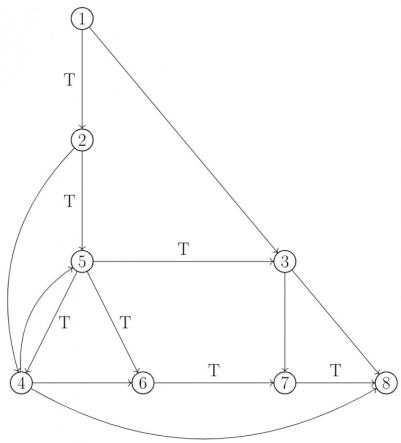

<details>
<summary>flowchart</summary>

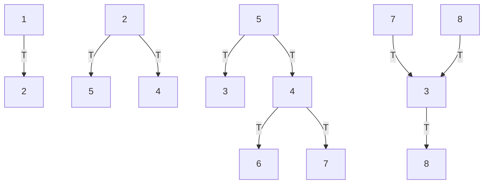
</details>

In the graph shown above, the depth-first spanning tree edges are marked with a 'T'. Identify the forward, backward, and cross edges.

gate1989 descriptive algorithms graph-algorithms depth-first-search graph-search

Answer key

# 1.18.2 Graph Search: GATE CSE 2000 | Question: 1.13

The most appropriate matching for the following pairs

<table><tr><td>X: depth first search</td><td>1: heap</td></tr><tr><td>Y: breadth first search</td><td>2: queue</td></tr><tr><td>Z: sorting</td><td>3: stack</td></tr></table>


is:

A. X - 1, Y - 2, Z - 3  
C. X - 3, Y - 2, Z - 1

B. X - 3, Y - 1, Z - 2  
D. X - 2, Y - 3, Z - 1

gatecse-2000 algorithms easy graph-algorithms graph-search match-the-following

Answer key

# 1.18.3 Graph Search: GATE CSE 2000 | Question: 2.19


Let $G$ be an undirected graph. Consider a depth-first traversal of $G$ , and let $T$ be the resulting depth-first search tree. Let $u$ be a vertex in $G$ and let $v$ be the first new (unvisited) vertex visited after visiting $u$ in the traversal. Which of the following statement is always true?

A. $\{u, v\}$ must be an edge in $G$ , and $u$ is a descendant of $v$ in $T$  
B. $\{u, v\}$ must be an edge in $G$ , and $v$ is a descendant of $u$ in $T$  
C. If $\{u, v\}$ is not an edge in $G$ then $u$ is a leaf in $T$  
D. If $\{u, v\}$ is not an edge in $G$ then $u$ and $v$ must have the same parent in $T$

gatecse-2000 algorithms graph-algorithms normal graph-search

Answer key

# 1.18.4 Graph Search: GATE CSE 2001 | Question: 2.14


Consider an undirected, unweighted graph G. Let a breadth-first traversal of G be done starting from a node r. Let $d(r,u)$ and $d(r,v)$ be the lengths of the shortest paths from r to u and v respectively in G. If u is visited before v during the breadth-first traversal, which of the following statements is correct?

A. $d(r,u) <   d(r,v)$  
C. $d(r,u)\leq d(r,v)$

gatecse-2001 algorithms graph-algorithms normal graph-search

B. $d(r,u) > d(r,v)$  
D. None of the above

# Answer key

# 1.18.5 Graph Search: GATE CSE 2003 | Question: 21

Consider the following graph:


<details>
<summary>flowchart</summary>

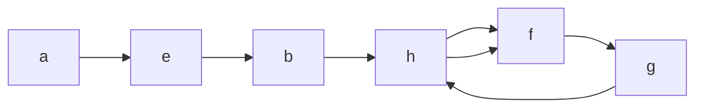
</details>


Among the following sequences:

I. abeghf  
II. abfehg  
III. abfhge  
IV. afghbe

Which are the depth-first traversals of the above graph?

A. I, II and IV only

B. I and IV only

C. II, III and IV only

D. I, III and IV only

gatecse-2003 algorithms graph-algorithms normal graph-search

# Answer key

# 1.18.6 Graph Search: GATE CSE 2006 | Question: 48

Let $T$ be a depth first search tree in an undirected graph $G$ . Vertices $u$ and $\nu$ are leaves of this tree $T$ . The degrees of both $u$ and $\nu$ in $G$ are at least 2. which one of the following statements is true?


A. There must exist a vertex w adjacent to both u and $\nu$ in G  
B. There must exist a vertex w whose removal disconnects u and $\nu$ in G  
C. There must exist a cycle in G containing u and $\nu$  
D. There must exist a cycle in G containing u and all its neighbours in G

gatecse-2006 algorithms graph-algorithms normal graph-search

# Answer key

# 1.18.7 Graph Search: GATE CSE 2008 | Question: 19

The Breadth First Search algorithm has been implemented using the queue data structure. One possible order of visiting the nodes of the following graph is:


<details>
<summary>flowchart</summary>

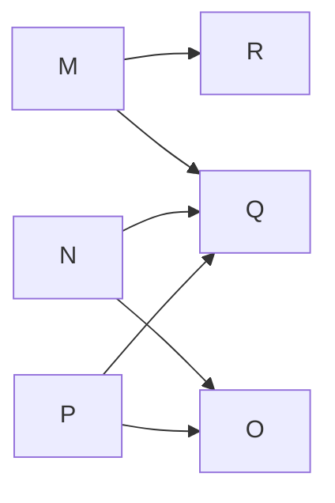
</details>

A. MNOPQR

B. NQMPOR

C. QMNPRO

D. QMNPOR

gatecse-2008 normal algorithms graph-algorithms graph-search

# Answer key

# 1.18.8 Graph Search: GATE CSE 2014 | Set 1 | Question: 11


Let G be a graph with n vertices and m edges. What is the tightest upper bound on the running time of Depth First Search on G, when G is represented as an adjacency matrix?

A. $\Theta(n)$

B. $\Theta(n+m)$

C. $\Theta(n^{2})$

D. $\Theta(m^{2})$

gatecse-2014-set1 algorithms graph-algorithms normal graph-search

Answer key

# 1.18.9 Graph Search: GATE CSE 2014 | Set 2 | Question: 14

Consider the tree arcs of a BFS traversal from a source node W in an unweighted, connected, undirected graph. The tree T formed by the tree arcs is a data structure for computing


A. the shortest path between every pair of vertices.  
B. the shortest path from W to every vertex in the graph.  
C. the shortest paths from $W$ to only those nodes that are leaves of $T$ .  
D. the longest path in the graph.

gatecse-2014-set2 algorithms graph-algorithms normal graph-search

Answer key

# 1.18.10 Graph Search: GATE CSE 2014 | Set 3 | Question: 13

Suppose depth first search is executed on the graph below starting at some unknown vertex. Assume that a recursive call to visit a vertex is made only after first checking that the vertex has not been visited earlier. Then the maximum possible recursion depth (including the initial call) is \_\_\_\_.


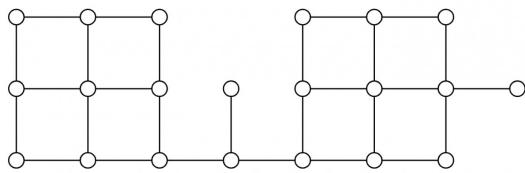

<details>
<summary>natural_image</summary>

Pure geometric grid pattern with circles and lines, no text or symbols present
</details>

gatecse-2014-set3 algorithms graph-algorithms numerical-answers normal graph-search

Answer key

# 1.18.11 Graph Search: GATE CSE 2015 | Set 1 | Question: 45

Let $G = (V, E)$ be a simple undirected graph, and $s$ be a particular vertex in it called the source. For $x \in V$ , let $d(x)$ denote the shortest distance in $G$ from $s$ to $x$ . A breadth first search (BFS) is performed starting at $s$ . Let $T$ be the resultant BFS tree. If $(u, v)$ is an edge of $G$ that is not in $T$ , then which one of the following CANNOT be the value of $d(u) - d(v)$ ?

A. -1

B. 0

C. 1

D. 2

gatecse-2015-set1 algorithms graph-algorithms normal graph-search

Answer key

# 1.18.12 Graph Search: GATE CSE 2016 | Set 2 | Question: 11

Breadth First Search (BFS) is started on a binary tree beginning from the root vertex. There is a vertex $t$ at a distance four from the root. If $t$ is the $n^{\text{th}}$ vertex in this BFS traversal, then the maximum possible value of $n$ is \_\_\_\_


gatecse-2016-set2 algorithms graph-algorithms normal numerical-answers graph-search

Answer key

# 1.18.13 Graph Search: GATE CSE 2017 | Set 2 | Question: 15

The Breadth First Search (BFS) algorithm has been implemented using the queue data structure. Which one

