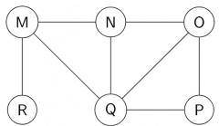
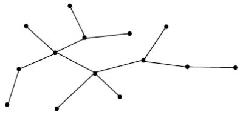
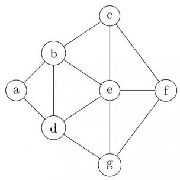
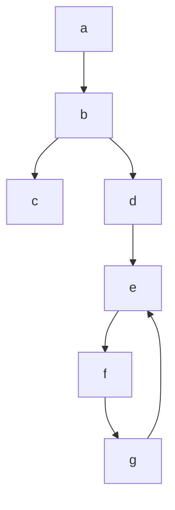

of the following is a possible order of visiting the nodes in the graph below?



A. MNOPQR

B. NQMPOR

C. QMNROP

D. POQNMR

gatecse-2017-set2 algorithms graph-algorithms graph-search

Answer key

# 1.18.14 Graph Search: GATE CSE 2018 | Question: 30

Let G be a simple undirected graph. Let $T_{D}$ be a depth first search tree of G. Let $T_{B}$ be a breadth first search tree of G. Consider the following statements.


I. No edge of $G$ is a cross edge with respect to $T_{D}$ . (A cross edge in $G$ is between two nodes neither of which is an ancestor of the other in $T_{D}$ ).

II. For every edge $(u,v)$ of G, if u is at depth i and v is at depth j in $T_{B}$ , then $|i-j|=1$ .

Which of the statements above must necessarily be true?

A. I only

B. II only

C. Both I and II

D. Neither I nor II

gatecse-2018 algorithms graph-algorithms graph-search normal two-marks

Answer key

# 1.18.15 Graph Search: GATE CSE 2023 | Question: 46

Let $U = \{1, 2, 3\}$ . Let $2^{U}$ denote the powerset of $U$ . Consider an undirected graph $G$ whose vertex set is $2^{U}$ . For any $A, B \in 2^{U}$ , $(A, B)$ is an edge in $G$ if and only if (i) $A \neq B$ , and (ii) either $A \subsetneq B$ or $B \subsetneq A$ .

For any vertex $A$ in $G$ , the set of all possible orderings in which the vertices of $G$ can be visited in a Breadth First Search (BFS) starting from $A$ is denoted by $\mathcal{B}(A)$ .

If $\emptyset$ denotes the empty set, then the cardinality of $\mathcal{B}(\emptyset)$ is \_\_\_\_.

gatecse-2023 algorithms breadth-first-search numerical-answers two-marks graph-search

Answer key

# 1.18.16 Graph Search: GATE CSE 2024 | Set 1 | Question: 35

Let $G$ be a directed graph and $T$ a depth first search (DFS) spanning tree in $G$ that is rooted at a vertex $v$ . Suppose $T$ is also a breadth first search (BFS) tree in $G$ , rooted at $v$ . Which of the following statements is/are TRUE for every such graph $G$ and tree $T$ ?

A. There are no back-edges in G with respect to the tree T  
B. There are no cross-edges in G with respect to the tree T  
C. There are no forward-edge in $G$ with respect to the tree $T$  
D. The only edges in G are the edges in T

gatecse-2024-set1 algorithms multiple-selects graph-search two-marks

Answer key

# 1.18.17 Graph Search: GATE CSE 2024 | Set 1 | Question: 50

The number of edges present in the forest generated by the DFS traversal of an undirected graph G with 100 vertices is 40. The number of connected components in G is \_\_\_\_.

gatecse-2024-set1 numerical-answers graph-search graph-algorithms two-marks

Answer key


# 1.18.18 Graph Search: GATE CSE 2025 | Set 2 | Question: 49


Consider the following algorithm someAlgo that takes an undirected graph G as input. someAlgo (G)

1. Let $v$ be any vertex in $G$ . Run BFS on $G$ starting at $v$ . Let $u$ be a vertex in $G$ at maximum distance from $v$ as given by the BFS.  
2. Run BFS on $G$ again with $u$ as the starting vertex. Let $z$ be the vertex at maximum distance from $u$ as given by the BFS.  
3. Output the distance between u and z in G.

The output of someAlgo (T) for the tree shown in the given figure is \_\_\_\_. (Answer in integer)



<details>
<summary>natural_image</summary>

Abstract geometric line drawing with interconnected nodes (no text or symbols)
</details>

gatecse2025-set2 algorithms breadth-first-search graph-search numerical-answers two-marks

# Answer key

# 1.18.19 Graph Search: GATE DS&AI 2024 | Question: 4

Consider performing depth-first search (DFS) on an undirected and unweighted graph $G$ starting at vertex $s$ . For any vertex $u$ in $G$ , $d[u]$ is the length of the shortest path from $s$ to $u$ . Let $(u, v)$ be an edge in $G$ such that $d[u] < d[v]$ . If the edge $(u, v)$ is explored first in the direction from $u$ to $v$ during the above DFS, then $(u, v)$ becomes a \_\_\_\_ edge.

A. tree

B. cross

C. back

D. gray

gate-ds-ai-2024 graph-search depth-first-search algorithms one-mark

# Answer key

# 1.18.20 Graph Search: GATE IT 2005 | Question: 14

In a depth-first traversal of a graph $G$ with $n$ vertices, $k$ edges are marked as tree edges. The number of connected components in $G$ is

A. k

B. $k + 1$

C. $n - k - 1$

D. n-k

gateit-2005 algorithms graph-algorithms normal graph-search

# Answer key

# 1.18.21 Graph Search: GATE IT 2006 | Question: 47

Consider the depth-first-search of an undirected graph with 3 vertices P, Q, and R. Let discovery time $d(u)$ represent the time instant when the vertex u is first visited, and finish time $f(u)$ represent the time instant when the vertex u is last visited. Given that

<table><tr><td> $d(P) = 5$  units</td><td> $f(P) = 12$  units</td></tr><tr><td> $d(Q) = 6$  units</td><td> $f(Q) = 10$  units</td></tr><tr><td> $d(R) = 14$  unit</td><td> $f(R) = 18$  units</td></tr></table>

Which one of the following statements is TRUE about the graph?

A. There is only one connected component  
B. There are two connected components, and $P$ and $R$ are connected  
C. There are two connected components, and $Q$ and $R$ are connected  
D. There are two connected components, and $P$ and $Q$ are connected


# Answer key

# 1.18.22 Graph Search: GATE IT 2007 | Question: 24


A depth-first search is performed on a directed acyclic graph. Let $d[u]$ denote the time at which vertex $u$ is visited for the first time and $f[u]$ the time at which the DFS call to the vertex $u$ terminates. Which of the following statements is always TRUE for all edges $(u, v)$ in the graph?

A. $d[u] < d[v]$ C. $f[u] < f[v]$

B. $d[u] < f[v]$ D. $f[u] > f[v]$

gateit-2007 algorithms graph-algorithms normal graph-search depth-first-search

# Answer key

# 1.18.23 Graph Search: GATE IT 2008 | Question: 47

Consider the following sequence of nodes for the undirected graph given below:


1. abefdgc  
2. abefcgd  
3. adgebcf  
4. a d b c g e f

A Depth First Search (DFS) is started at node a. The nodes are listed in the order they are first visited. Which of the above is/are possible output(s)?



<details>
<summary>flowchart</summary>


</details>

A. 1 and 3 only

B. 2 and 3 only

C. 2,3 and 4 only

D. 1,2 and 3 only

gateit-2008 algorithms graph-algorithms normal graph-search depth-first-search

# Answer key

# 1.19

# Greedy Algorithms (5)

# Practice Test: Test 1 (7Q)

# 1.19.1 Greedy Algorithms: GATE CSE 1999 | Question: 2.20


The minimum number of record movements required to merge five files A (with 10 records), B (with 20 records), C (with 15 records), D (with 5 records) and E (with 25 records) is:

A. 165

B. 90

C. 75

D. 65

gate1999 algorithms normal greedy-algorithms

# Answer key

# 1.19.2 Greedy Algorithms: GATE CSE 2003 | Question: 69


The following are the starting and ending times of activities $A, B, C, D, E, F, G$ and $H$ respectively in chronological order: " $a_s b_s c_s a_e d_s c_e e_s f_s b_e d_e g_s e_e f_e h_s g_e h_e$ ". Here, $x_s$ denotes the starting time and $x_e$ denotes the ending time of activity $X$ . We need to schedule the activities in a set of rooms available to us. An activity can be scheduled in a room only if the room is reserved for the activity for its entire duration. What is the minimum number of rooms required?

A. 3

B. 4

C. 5

D. 6

gatecse-2003 algorithms normal greedy-algorithms

# Answer key

# 1.19.3 Greedy Algorithms: GATE CSE 2005 | Question: 84a

We are given 9 tasks $T_{1}, T_{2}, \ldots, T_{9}$ . The execution of each task requires one unit of time. We can execute one task at a time. Each task $T_{i}$ has a profit $P_{i}$ and a deadline $d_{i}$ . Profit $P_{i}$ is earned if the task is completed before the end of the $d_{i}^{th}$ unit of time.


<table><tr><td>Task</td><td> $T_1$ </td><td> $T_2$ </td><td> $T_3$ </td><td> $T_4$ </td><td> $T_5$ </td><td> $T_6$ </td><td> $T_7$ </td><td> $T_8$ </td><td> $T_9$ </td></tr><tr><td>Profit</td><td>15</td><td>20</td><td>30</td><td>18</td><td>18</td><td>10</td><td>23</td><td>16</td><td>25</td></tr><tr><td>Deadline</td><td>7</td><td>2</td><td>5</td><td>3</td><td>4</td><td>5</td><td>2</td><td>7</td><td>3</td></tr></table>

Are all tasks completed in the schedule that gives maximum profit?

A. All tasks are completed

B. $T_{1}$ and $T_{6}$ are left out

C. $T_{1}$ and $T_{8}$ are left out

D. $T_{4}$ and $T_{6}$ are left out

gatecse-2005 algorithms greedy-algorithms process-scheduling normal

# Answer key

# 1.19.4 Greedy Algorithms: GATE CSE 2005 | Question: 84b

We are given 9 tasks $T_{1}, T_{2}, \ldots, T_{9}$ . The execution of each task requires one unit of time. We can execute one task at a time. Each task $T_{i}$ has a profit $P_{i}$ and a deadline $d_{i}$ . Profit $P_{i}$ is earned if the task is completed before the end of the $d_{i}^{th}$ unit of time.


<table><tr><td>Task</td><td> $T_1$ </td><td> $T_2$ </td><td> $T_3$ </td><td> $T_4$ </td><td> $T_5$ </td><td> $T_6$ </td><td> $T_7$ </td><td> $T_8$ </td><td> $T_9$ </td></tr><tr><td>Profit</td><td>15</td><td>20</td><td>30</td><td>18</td><td>18</td><td>10</td><td>23</td><td>16</td><td>25</td></tr><tr><td>Deadline</td><td>7</td><td>2</td><td>5</td><td>3</td><td>4</td><td>5</td><td>2</td><td>7</td><td>3</td></tr></table>

What is the maximum profit earned?

A. 147

B. 165

C. 167

D. 175

gatecse-2005 algorithms greedy-algorithms process-scheduling normal

# Answer key

# 1.19.5 Greedy Algorithms: GATE CSE 2018 | Question: 48

Consider the weights and values of items listed below. Note that there is only one unit of each item.

<table><tr><td>Item number</td><td>Weight (in Kgs)</td><td>Value (in rupees)</td></tr><tr><td>1</td><td>10</td><td>60</td></tr><tr><td>2</td><td>7</td><td>28</td></tr><tr><td>3</td><td>4</td><td>20</td></tr><tr><td>4</td><td>2</td><td>24</td></tr></table>


The task is to pick a subset of these items such that their total weight is no more than 11 Kgs and their total value is maximized. Moreover, no item may be split. The total value of items picked by an optimal algorithm is denoted by $V_{opt}$ . A greedy algorithm sorts the items by their value-to-weight ratios in descending order and packs them greedily, starting from the first item in the ordered list. The total value of items picked by the greedy algorithm is denoted by $V_{greedy}$ .

The value of $V_{opt} - V_{greedy}$ is \_\_\_\_

# 1.20

# Hashing (6)

Practice Tests: Test 1 (15Q) Test 2 (3Q)

# 1.20.1 Hashing: GATE CSE 1989 | Question: 1-vii, ISRO2015-14

A hash table with ten buckets with one slot per bucket is shown in the following figure. The symbols S1 to S7 initially entered using a hashing function with linear probing. The maximum number of comparisons needed in searching an item that is not present is


<table><tr><td>0</td><td>S7</td></tr><tr><td>1</td><td>S1</td></tr><tr><td>2</td><td></td></tr><tr><td>3</td><td>S4</td></tr><tr><td>4</td><td>S2</td></tr><tr><td>5</td><td></td></tr><tr><td>6</td><td>S5</td></tr><tr><td>7</td><td></td></tr><tr><td>8</td><td>S6</td></tr><tr><td>9</td><td>S3</td></tr></table>

A. 4

B. 5

C. 6

D. 3

hashing isro2015 gate1989 algorithms normal

# Answer key

# 1.20.2 Hashing: GATE CSE 1990 | Question: 13b

Consider a hash table with chaining scheme for overflow handling:


i. What is the worst-case timing complexity of inserting $n$ elements into such a table?  
ii. For what type of instance does this hashing scheme take the worst-case time for insertion?

gate1990 hashing algorithms descriptive

# Answer key

# 1.20.3 Hashing: GATE CSE 2021 | Set 1 | Question: 47

Consider a dynamic hashing approach for 4-bit integer keys:


1. There is a main hash table of size 4.  
2. The 2 least significant bits of a key is used to index into the main hash table.  
3. Initially, the main hash table entries are empty.  
4. Thereafter, when more keys are hashed into it, to resolve collisions, the set of all keys corresponding to a main hash table entry is organized as a binary tree that grows on demand.  
5. First, the $3^{\text{rd}}$ least significant bit is used to divide the keys into left and right subtrees.  
6. To resolve more collisions, each node of the binary tree is further sub-divided into left and right subtrees based on the $4^{th}$ least significant bit.  
7. A split is done only if it is needed, i.e., only when there is a collision.

Consider the following state of the hash table.


<details>
<summary>flowchart</summary>

This flowchart illustrates a hierarchical process or dependency structure with four stages (00, 01, 10, 11), where an initial state is empty and subsequent states are split into two branches with associated values.
</details>

Which of the following sequences of key insertions can cause the above state of the hash table (assume the keys are in decimal notation)?

A. 5,9,4,13,10,7

B. 9,5,10,6,7,1

C. 10,9,6,7,5,13

D. 9,5,13,6,10,14

gatecse-2021-set1 multiple-selects algorithms hashing two-marks

# Answer key

# 1.20.4 Hashing: GATE CSE 2023 | Question: 10


An algorithm has to store several keys generated by an adversary in a hash table. The adversary is malicious who tries to maximize the number of collisions. Let k be the number of keys, m be the number of slots in the hash table, and k > m.

Which one of the following is the best hashing strategy to counteract the adversary?

A. Division method, i.e., use the hash function $h(k) = k \mod m$ .  
B. Multiplication method, i.e., use the hash function $h(k) = \lfloor m(kA - \lfloor kA \rfloor) \rfloor$ , where $A$ is a carefully chosen constant.  
C. Universal hashing method.  
D. If k is a prime number, use Division method. Otherwise, use Multiplication method.

gatecse-2023 algorithms hashing one-mark

# Answer key

# 1.20.5 Hashing: GATE CSE 2026 | Set 2 | Question: 20


The keys 5, 28, 19, 15, 26, 33, 12, 17, 10 are inserted into a hash table using the hash function $h(k) = k \mod 9$ . The collisions are resolved by chaining. After all the keys are inserted, the length of the longest chain is \_\_\_\_. (answer in integer)

gatecse-2026-set2 algorithms hashing numerical-answers one-mark

# Answer key

# 1.20.6 Hashing: GATE IT 2005 | Question: 16


A hash table contains 10 buckets and uses linear probing to resolve collisions. The key values are integers and the hash function used is key%10. If the values 43, 165, 62, 123, 142 are inserted in the table, in what location would the key value 142 be inserted?

A. 2

B. 3

C. 4

D. 6

gateit-2005 algorithms hashing easy

# Answer key

# 1.21

# Heap Sort (2)

# 1.21.1 Heap Sort: GATE CSE 2013 | Question: 30


The number of elements that can be sorted in $\Theta(\log n)$ time using heap sort is

A. $\Theta(1)$

B. $\Theta(\sqrt{\log n})$

C. $\Theta\left(\frac{\log n}{\log \log n}\right)$

D. $\Theta (\log n)$

gatecse-2013 algorithms sorting normal heap-sort

# Answer key

# 1.21.2 Heap Sort: GATE CSE 2024 | Set 1 | Question: 31


An array [82, 101, 90, 11, 111, 75, 33, 131, 44, 93] is heapified. Which one of the following options represents the first three elements in the heapified array?

A. 82,90,101

B. 82,11,93

C. 131,11,93

D. 131,111,90

gatecse-2024-set1 algorithms heap-sort sorting two-marks

# Answer key

# 1.22

# Huffman Code (6)

# 1.22.1 Huffman Code: GATE CSE 1989 | Question: 13a

A language uses an alphabet of six letters, $\{a, b, c, d, e, f\}$ . The relative frequency of use of each letter of the alphabet in the language is as given below:

<table><tr><td>LETTER</td><td>RELATIVE FREQUENCY OF USE</td></tr><tr><td>a</td><td>0.19</td></tr><tr><td>b</td><td>0.05</td></tr><tr><td>c</td><td>0.17</td></tr><tr><td>d</td><td>0.08</td></tr><tr><td>e</td><td>0.40</td></tr><tr><td>f</td><td>0.11</td></tr></table>


Design a prefix binary code for the language which would minimize the average length of the encoded words of the language.

descriptive gate1989 algorithms huffman-code

Answer key

# 1.22.2 Huffman Code: GATE CSE 2007 | Question: 76

Suppose the letters $a, b, c, d, e, f$ have probabilities $\frac{1}{2}, \frac{1}{4}, \frac{1}{8}, \frac{1}{16}, \frac{1}{32}, \frac{1}{32}$ , respectively. Which of the following is the Huffman code for the letter $a, b, c, d, e, f$ ?

A. 0, 10, 110, 1110, 11110, 11111

c. 11, 10, 01, 001, 0001, 0000

B. 11, 10, 011, 010, 001, 000

D. 110, 100, 010, 000, 001, 111

gatecse-2007 algorithms greedy-algorithms normal huffman-code

Answer key


# 1.22.3 Huffman Code: GATE CSE 2007 | Question: 77

Suppose the letters $a, b, c, d, e, f$ have probabilities $\frac{1}{2}, \frac{1}{4}, \frac{1}{8}, \frac{1}{16}, \frac{1}{32}, \frac{1}{32}$ , respectively. What is the average length of the Huffman code for the letters $a, b, c, d, e, f$ ?

A. 3

B. 2.1875

C. 2.25

D. 1.9375

gatecse-2007 algorithms greedy-algorithms normal huffman-code

Answer key

# 1.22.4 Huffman Code: GATE CSE 2017 | Set 2 | Question: 50

A message is made up entirely of characters from the set $X = \{P, Q, R, S, T\}$ . The table of probabilities for each of the characters is shown below:

<table><tr><td>Character</td><td>Probability</td></tr><tr><td>P</td><td>0.22</td></tr><tr><td>Q</td><td>0.34</td></tr><tr><td>R</td><td>0.17</td></tr><tr><td>S</td><td>0.19</td></tr><tr><td>T</td><td>0.08</td></tr><tr><td>Total</td><td>1.00</td></tr></table>


If a message of 100 characters over X is encoded using Huffman coding, then the expected length of the encoded

message in bits is \_\_\_\_.

gatecse-2017-set2 huffman-code numerical-answers algorithms

# Answer key

# 1.22.5 Huffman Code: GATE CSE 2021 | Set 2 | Question: 26


Consider the string abbccddeee. Each letter in the string must be assigned a binary code satisfying the following properties:

1. For any two letters, the code assigned to one letter must not be a prefix of the code assigned to the other letter.  
2. For any two letters of the same frequency, the letter which occurs earlier in the dictionary order is assigned a code whose length is at most the length of the code assigned to the other letter.

Among the set of all binary code assignments which satisfy the above two properties, what is the minimum length of the encoded string?

A. 21

B. 23

C. 25

D. 30

gatecse-2021-set2 algorithms huffman-code two-marks

# Answer key

# 1.22.6 Huffman Code: GATE IT 2006 | Question: 48


The characters $a$ to $h$ have the set of frequencies based on the first 8 Fibonacci numbers as follows

$$
a: 1, b: 1, c: 2, d: 3, e: 5, f: 8, g: 1 3, h: 2 1
$$

A Huffman code is used to represent the characters. What is the sequence of characters corresponding to the following code?

110111100111010

A. fdheg

B. ecgdf

C. dchfg

D. fehdg

gateit-2006 algorithms greedy-algorithms normal huffman-code

# Answer key

# 1.23

# Identify Function (38)

Practice Tests:

Test 1 (15Q)

Test 2 (15Q)

Test 3 (9Q)

# 1.23.1 Identify Function: GATE CSE 1989 | Question: 8a

What is the output produced by the following program, when the input is "HTGATE"


Function what (s:string): string;

var n:integer;

begin

n = s.length

if n <= 1

then what := s

else what :=contact (what (substring (s, 2, n)), s.C [1])

end;

# Note

i. type string=record

length:integer;

C:array[1..100] of char

end

ii. Substring (s, i, j): this yields the string made up of the $i^{\text{th}}$ through $j^{\text{th}}$ characters in s; for appropriately defined in $i$ and $j$ .  
iii. Contact $(s_1, s_2)$ : this function yields a string of length $s_1$ length $+ s_2$ - length obtained by concatenating $s_1$ with $s_2$ such that $s_1$ precedes $s_2$ .

# 1.23.2 Identify Function: GATE CSE 1990 | Question: 11b

The following program computes values of a mathematical function $f(x)$ . Determine the form of $f(x)$ .


```txt
main ()
{
    int m, n; float x, y, t;
    scanf ("%f%d", &x, &n);
    t = 1; y = 0; m = 1;
    do
    {
        t *= (-x/m);
        y += t;
    } while (m++ < n);
    printf ("The value of y is %f", y);
}
```

```txt
gate1990 descriptive algorithms identify-function
```

# Answer key

# 1.23.3 Identify Function: GATE CSE 1991 | Question: 03-viii

Consider the following Pascal function:


Function X(M:integer):integer;

Var i:integer;

```txt
Begin
  i := 0;
  while i*i < M
  do i:= i+1
  X := i
end
```

The function call $X(N)$ , if $N$ is positive, will return

A. $\lfloor \sqrt{N}\rfloor$ C. $\lceil \sqrt{N}\rceil$

B. $\lfloor \sqrt{N}\rfloor +1$ D. $\lceil \sqrt{N}\rceil +1$

E. None of the above

```txt
gate1991 algorithms easy identify-function multiple-selects
```

# Answer key

# 1.23.4 Identify Function: GATE CSE 1993 | Question: 7.4

What does the following code do?


```vhdl
var a, b: integer;
begin
    a:=a+b;
    b:=a-b;
    a:=a-b;
end;
```

A. exchanges $a$ and $b$  
C. doubles $b$ and stores in $a$  
E. none of the above

```txt
gate1993 algorithms identify-function easy
```

# Answer key

# 1.23.5 Identify Function: GATE CSE 1994 | Question: 6

What function of x, n is computed by this program?


```txt
Function what(x, n:integer): integer:
Var
  value : integer
begin
  value := 1
  if n > 0 then
```

```vhdl
begin
    if n mod 2 =1 then
        value := value * x;
    value := value * what(x*x, n div 2);
end;
what := value;
end;
```

```txt
gate1994 algorithms identify-function normal descriptive
```

# Answer key

# 1.23.6 Identify Function: GATE CSE 1995 | Question: 1.4

In the following Pascal program segment, what is the value of X after the execution of the program segment?


```autohotkey
X := -10; Y := 20;
If X > Y then if X < 0 then X := abs(X) else X := 2*X;
```

A. 10

B. -20

C. -10

D. None

```txt
gate1995 algorithms identify-function easy
```

# Answer key

# 1.23.7 Identify Function: GATE CSE 1995 | Question: 2.3

Assume that $X$ and $Y$ are non-zero positive integers. What does the following Pascal program segment do?


```txt
while X <> Y do
  if X > Y then
    X := X - Y
  else
    Y := Y - X;
  write(X);
```

A. Computes the LCM of two numbers

B. Divides the larger number by the smaller number

C. Computes the GCD of two numbers

D. None of the above

```txt
gate1995 algorithms identify-function normal
```

# Answer key

# 1.23.8 Identify Function: GATE CSE 1995 | Question: 4


A. Consider the following Pascal function where $A$ and $B$ are non-zero positive integers. What is the value of $\operatorname{GET}(3,2)$ ?

```txt
function GET(A,B:integer): integer;
begin
  if B=0 then
    GET:= 1
  else if A < B then
    GET:= 0
  else
    GET:= GET(A-1, B) + GET(A-1, B-1)
end;
```

B. The Pascal procedure given for computing the transpose of an $N \times N$ , $(N > 1)$ matrix $A$ of integers has an error. Find the error and correct it. Assume that the following declaration are made in the main program

```matlab
const
  MAXSIZE=20;
type
  INTARR=array [1..MAXSIZE,1..MAXSIZE] of integer;
Procedure TRANSPOSE (var A: INTARR; N : integer);
var
  I, J, TMP: integer;
begin
  for I:=1 to N - 1 do
  for J:=1 to N do
  begin
    TMP:= A[I, J];
    A[I, J]:= A[J, I];
```

gate1995 algorithms identify-function normal descriptive

# Answer key

# 1.23.9 Identify Function: GATE CSE 1998 | Question: 2.12

What value would the following function return for the input x = 95?


```vhdl
Function fun (x:integer):integer;
Begin
  If x > 100 then fun = x - 10
  Else fun = fun(fun (x+11))
End;
```

A. 89

B. 90

C. 91

D. 92

gate1998 algorithms recursion identify-function normal

# Answer key

# 1.23.10 Identify Function: GATE CSE 1999 | Question: 2.24

Consider the following $C$ function definition


```txt
int Trial (int a, int b, int c)
{
    if ((a>=b) && (c<b)) return b;
    else if (a>=b) return Trial(a, c, b);
    else return Trial(b, a, c);
}
```

The functional Trial:

A. Finds the maximum of $a, b$ , and $c$  
C. Finds the middle number of $a, b, c$

B. Finds the minimum of $a, b$ , and $c$  
D. None of the above

gate1999 algorithms identify-function normal

# Answer key

# 1.23.11 Identify Function: GATE CSE 2000 | Question: 2.15

Suppose you are given an array $s[1....n]$ and a procedure reverse $(s,i,j)$ which reverses the order of elements in $s$ between positions $i$ and $j$ (both inclusive). What does the following sequence do, where $1 \leqslant k \leqslant n$ :


```txt
reverse (s, 1, k);
reverse (s, k+1, n);
reverse (s, 1, n);
```

A. Rotates s left by k positions  
C. Reverses all elements of $s$

B. Leaves s unchanged  
D. None of the above

gatecse-2000 algorithms normal identify-function

# Answer key

# 1.23.12 Identify Function: GATE CSE 2003 | Question: 1

Consider the following C function.

For large values of y, the return value of the function f best approximates


```c
float f,(float x, int y) {
    float p, s; int i;
    for (s=1,p=1,i=1; i<y; i++) {
        p *= x/i;
        s += p;
    }
    return s;
}
```

A. $x^{y}$

B. $e^{x}$

C. $\ln (1 + x)$

D. $x^{x}$

gatecse-2003 algorithms identify-function normal

# Answer key

# 1.23.13 Identify Function: GATE CSE 2003 | Question: 88


In the following $C$ program fragment, $j, k, n$ and TwoLog\_n are integer variables, and $A$ is an array of integers. The variable $n$ is initialized to an integer $\geqslant 3$ , and TwoLog\_n is initialized to the value of $2^{*}\lceil \log_{2}(n)\rceil$

```c
for (k = 3; k <= n; k++)
    A[k] = 0;
for (k = 2; k <= TwoLog_n; k++)
    for (j = k+1; j <= n; j++)
        A[j] = A[j] || (j%k);
for (j = 3; j <= n; j++)
    if (!A[j]) printf("%d", j);
```

The set of numbers printed by this program fragment is

A. $\{m \mid m \leq n, (\exists i) [m = i!]\}$

B. $\{m \mid m \leq n, (\exists i) [m = i^2]\}$

C. $\{m \mid m \leq n, \mathrm{m}$ is prime}

D. {}

gatecse-2003 algorithms identify-function normal

# Answer key

# 1.23.14 Identify Function: GATE CSE 2004 | Question: 41

Consider the following C program


```c
main()
{
    int x, y, m, n;
    scanf("%d %d", &x, &y);
    /* Assume x>0 and y>0*/
    m = x; n = y;
    while(m != n)
    {
        if (m > n)
            m = m-n;
        else
            n = n-m;
    }
    printf("%d", n);
}
```

The program computes

A. $x + y$ using repeated subtraction

B. $x \mod y$ using repeated subtraction

C. the greatest common divisor of $x$ and $y$

D. the least common multiple of $x$ and $y$

gatecse-2004 algorithms normal identify-function

# Answer key

# 1.23.15 Identify Function: GATE CSE 2004 | Question: 42

What does the following algorithm approximate? (Assume m > 1, $\epsilon > 0$ ).


```txt
x = m;
y = 1;
While (x-y > ε)
{
    x = (x+y)/2;
    y = m/x;
}
print(x);
```

A. $\log m$

B. $m^{2}$

C. $m^{\frac{1}{2}}$

D. $m^{\frac{1}{3}}$

gatecse-2004 algorithms identify-function normal