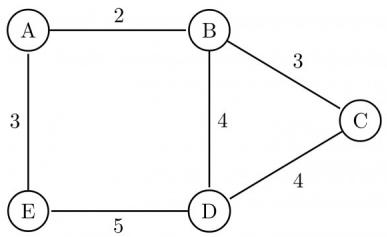
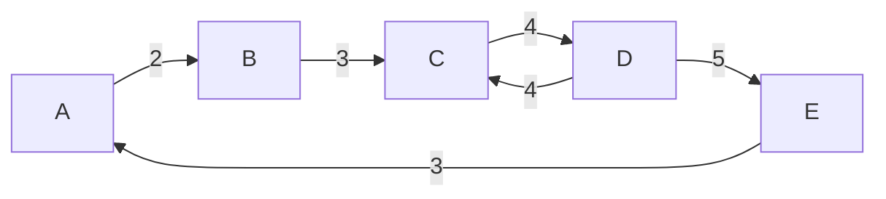

# 1.23.16 Identify Function: GATE CSE 2005 | Question: 31

Consider the following C-program:


```c
void foo (int n, int sum) {
    int k = 0, j = 0;
    if (n == 0) return;
    k = n % 10; j = n/10;
    sum = sum + k;
    foo (j, sum);
    printf ("%d,",k);
}

int main() {
    int a = 2048, sum = 0;
    foo(a, sum);
    printf("%d\n", sum);
}
```

What does the above program print?

A. 8, 4, 0, 2, 14

B. 8, 4, 0, 2, 0

C. 2, 0, 4, 8, 14

D. 2, 0, 4, 8, 0

gatecse-2005 algorithms identify-function recursion normal

# Answer key

# 1.23.17 Identify Function: GATE CSE 2006 | Question: 50

A set X can be represented by an array $x[n]$ as follows:

$$
x \left[ i \right] = \left\{ \begin{array}{l l} 1 & \text {if} i \in X \\ 0 & \text {otherwise} \end{array} \right.
$$

Consider the following algorithm in which x, y, and z are Boolean arrays of size n:

```txt
algorithm zzz(x[], y[], z[]) {
int i;

for(i=0; i<n; ++i)
z[i] = (x[i] ∧ ~y[i]) ∨ (~x[i] ∧ y[i]);
}
```

The set Z computed by the algorithm is:

A. $(X \cup Y)$

B. $(X\cap Y)$

C. $(X - Y) \cap (Y - X)$

D. $(X - Y) \cup (Y - X)$

gatecse-2006 algorithms identify-function normal

# Answer key

# 1.23.18 Identify Function: GATE CSE 2006 | Question: 53

Consider the following C-function in which $a[n]$ and $b[m]$ are two sorted integer arrays and $c[n+m]$ be another integer array,

```txt
void xyz(int a[], int b [], int c []){
    int i,j,k;
    i=j=k=0;
    while ((i<n) && (j<m))
        if (a[i] < b[j]) c[k++]= a[i++];
        else c[k++]= b[j++];
}
```

Which of the following condition(s) hold(s) after the termination of the while loop?

i. $j < m, k = n + j - 1$ and $a[n - 1] < b[j]$ if $i = n$  
ii. $i < n, k = m + i - 1$ and $b[m - 1] \leq a[i]$ if $j = m$

A. only (i)

B. only (ii)

C. either (i) or (ii) but not both

D. neither (i) nor (ii)

gatecse-2006 algorithms identify-function normal


# 1.23.19 Identify Function: GATE CSE 2009 | Question: 18

Consider the program below:  

```c
#include <stdio.h>
int fun(int n, int *f_p) {
    int t, f;
    if (n <= 1) {
        *f_p = 1;
        return 1;
    }
    t = fun(n-1, f_p);
    f = t + *f_p;
    *f_p = t;
    return f;
}

int main() {
    int x = 15;
    printf("%d/n", fun(5, &x));
    return 0;
}
```  
The value printed is:

A. 6

B. 8

C. 14

D. 15

```txt
gatecse-2009 algorithms recursion identify-function normal
```

# Answer key

# 1.23.20 Identify Function: GATE CSE 2010 | Question: 35

What is the value printed by the following C program?  

```c
#include<stdio.h>

int f(int *a, int n)
{
    if (n <= 0) return 0;
    else if (*a % 2 == 0) return *a+f(a+1, n-1);
    else return *a - f(a+1, n-1);
}

int main()
{
    int a[] = {12, 7, 13, 4, 11, 6};
    printf("%d", f(a, 6));
    return 0;
}
```

A. -9

B. 5

C. 15

D. 19

```txt
gatecse-2010 algorithms recursion identify-function normal
```

# Answer key

# 1.23.21 Identify Function: GATE CSE 2011 | Question: 48

Consider the following recursive C function that takes two arguments.  

```c
unsigned int foo(unsigned int n, unsigned int r) {
    if (n>0) return ((n%r) + foo(n/r, r));
    else return 0;
}
```  
What is the return value of the function foo when it is called as foo(345, 10)?

A. 345

B. 12

C. 5

D. 3

```txt
gatecse-2011 algorithms recursion identify-function normal
```

# Answer key

# 1.23.22 Identify Function: GATE CSE 2011 | Question: 49

Consider the following recursive C function that takes two arguments.


```c
unsigned int foo(unsigned int n, unsigned int r) {
    if (n>0) return ((n%r) + foo(n/r, r));
    else return 0;
}
```

What is the return value of the function foo when it is called as foo(513, 2)?

A. 9

B. 8

C. 5

D. 2

```txt
gatecse-2011 algorithms recursion identify-function normal
```

# Answer key

# 1.23.23 Identify Function: GATE CSE 2013 | Question: 31

Consider the following function:


```txt
int unknown(int n){

int i, j, k=0;
for (i=n/2; i<=n; i++)
    for (j=2; j<=n; j=j*2)
        k = k + n/2;
return (k);

}
```

The return value of the function is

A. $\Theta(n^{2})$

B. $\Theta(n^{2}\log n)$

C. $\Theta(n^{3})$

D. $\Theta(n^3\log n)$

```txt
gatecse-2013 algorithms identify-function normal
```

# Answer key

# 1.23.24 Identify Function: GATE CSE 2014 | Set 1 | Question: 41

Consider the following C function in which size is the number of elements in the array E:


```c
int MyX(int *E, unsigned int size)
{
    int Y = 0;
    int Z;
    int i, j, k;

    for(i = 0; i < size; i++)
        Y = Y + E[i];

    for(i=0; i < size; i++)
        for(j = i; j < size; j++)
        {
            Z = 0;
            for(k = i; k <= j; k++)
                Z = Z + E[k];
            if(Z > Y)
                Y = Z;
        }
    return Y;
}
```

The value returned by the function MyX is the

A. maximum possible sum of elements in any sub-array of array E.  
B. maximum element in any sub-array of array E.  
C. sum of the maximum elements in all possible sub-arrays of array E.  
D. the sum of all the elements in the array E.

```txt
gatecse-2014-set1 algorithms identify-function normal
```

# Answer key

# 1.23.25 Identify Function: GATE CSE 2014 | Set 2 | Question: 10

Consider the function func shown below:


```c
int func(int num) {
    int count = 0;
    while (num) {
        count++;
        num>>= 1;
    }
    return (count);
}
```

The value returned by func(435) is \_\_\_\_

```txt
gatecse-2014-set2 algorithms identify-function numerical-answers easy
```

# Answer key

# 1.23.26 Identify Function: GATE CSE 2014 | Set 3 | Question: 10

Let $A$ be the square matrix of size $n \times n$ . Consider the following pseudocode. What is the expected output?


```javascript
C=100;
for i=1 to n do
    for j=1 to n do
    {
        Temp = A[i][j]+C;
        A[i][j] = A[j][i];
        A[j][i] = Temp -C;
    }
for i=1 to n do
    for j=1 to n do
        output (A[i][j]);
```

A. The matrix A itself  
B. Transpose of the matrix A  
C. Adding 100 to the upper diagonal elements and subtracting 100 from lower diagonal elements of $A$  
D. None of the above

```txt
gatecse-2014-set3 algorithms identify-function easy
```

# Answer key

# 1.23.27 Identify Function: GATE CSE 2015 | Set 1 | Question: 31

Consider the following C function.


```c
int fun1 (int n) {
    int i, j, k, p, q = 0;
    for (i = 1; i < n; ++i)
    {
        p = 0;
        for (j = n; j > 1; j = j/2)
            ++p;
        for (k = 1; k < p; k = k * 2)
            ++q;
    }
    return q;
}
```

Which one of the following most closely approximates the return value of the function fun1?

A. $n^3$

B. $n(\log n)^2$

C. $n\log n$

D. $n\log (\log n)$

```txt
gatecse-2015-set1 algorithms normal identify-function
```

# Answer key

# 1.23.28 Identify Function: GATE CSE 2015 | Set 2 | Question: 11

Consider the following C function.


```txt
int fun(int n) {
```

```lisp
int x=1, k;
    if (n==1) return x;
    for (k=1; k<n; ++k)
        x = x + fun(k) * fun (n-k);
    return x;
}
```

The return value of $fun(5)$ is \_\_\_\_.

gatecse-2015-set2 algorithms identify-function recurrence-relation normal numerical-answers

# Answer key

# 1.23.29 Identify Function: GATE CSE 2015 | Set 3 | Question: 49

Suppose $c = \langle c[0], \ldots, c[k-1] \rangle$ is an array of length k, where all the entries are from the set $\{0, 1\}$ . For any positive integers a and n, consider the following pseudocode.


```asm
DOSOMETHING (c, a, n)

z ← 1
for i ← 0 to k-1
    do z ← z² mod n
    if c[i]=1
        then z ← (z × a) mod n
return z
```

If $k = 4, c = \langle 1, 0, 1, 1 \rangle, a = 2$ , and $n = 8$ , then the output of DOSOMETHING(c, a, n) is \_\_\_\_.

gatecse-2015-set3 algorithms identify-function normal numerical-answers

# Answer key

# 1.23.30 Identify Function: GATE CSE 2019 | Question: 26

Consider the following C function.


```txt
void convert (int n ) {
    if (n<0)
        printf("%d", n);
    else {
        convert(n/2);
        printf("%d", n%2);
    }
}
```

Which one of the following will happen when the function convert is called with any positive integer n as argument?

A. It will print the binary representation of n and terminate  
B. It will print the binary representation of $n$ in the reverse order and terminate  
C. It will print the binary representation of $n$ but will not terminate  
D. It will not print anything and will not terminate

gatecse-2019 algorithms identify-function two-marks

# Answer key

# 1.23.31 Identify Function: GATE CSE 2020 | Question: 48

Consider the following C functions.


```c
int tob (int b, int* arr) {
    int i;
    for (i = 0; b>0; i++) {
        if (b%2) arr[i] = 1;
        else     arr[i] = 0;
        b = b/2;
    }
    return (i);
}
```

```lisp
int pp(int a, int b) {
    int arr[20];
    int i, tot = 1, ex, len;
    ex = a;
    len = tob(b, arr);
    for (i=0; i<len ; i++) {
        if (arr[i] ==1)
            tot = tot * ex;
        ex = ex*ex;
    }
    return (tot) ;
}
```

The value returned by pp(3,4) is \_\_\_\_.

```txt
gatecse-2020 numerical-answers identify-function two-marks
```

# Answer key

# 1.23.32 Identify Function: GATE CSE 2021 | Set 1 | Question: 48

Consider the following ANSI C function:


```lisp
int SimpleFunction(int Y[], int n, int x)
{
    int total = Y[0], loopIndex;
    for (loopIndex=1; loopIndex<=n-1; loopIndex++)
        total=x*total +Y[loopIndex];
    return total;
}
```

Let $Z$ be an array of 10 elements with $Z[i] = 1$ , for all $i$ such that $0 \leq i \leq 9$ . The value returned by SimpleFunction(Z, 10, 2) is \_\_\_\_

```txt
gatecse-2021-set1 algorithms numerical-answers identify-function two-marks
```

# Answer key

# 1.23.33 Identify Function: GATE CSE 2021 | Set 2 | Question: 23

Consider the following ANSI C function:


```lisp
int SomeFunction (int x, int y)
{
    if ((x==1) || (y==1)) return 1;
    if (x==y) return x;
    if (x > y) return SomeFunction(x-y, y);
    if (y > x) return SomeFunction (x, y-x);
}
```

The value returned by SomeFunction(15, 255) is \_\_\_\_

```txt
gatecse-2021-set2 numerical-answers algorithms identify-function output one-mark
```

# Answer key

# 1.23.34 Identify Function: GATE IT 2005 | Question: 53

The following $C$ function takes two ASCII strings and determines whether one is an anagram of the other. An anagram of a string $s$ is a string obtained by permuting the letters in $s$ .


```c
int anagram (char *a, char *b) {
    int count [128], j;
    for (j = 0; j < 128; j++) count[j] = 0;
    j = 0;
    while (a[j] && b[j]) {
        A;
        B;
    }
    for (j = 0; j < 128; j++) if (count [j]) return 0;
    return 1;
}
```

Choose the correct alternative for statements $A$ and $B$ .

A. A: count [a[j]]++ and B: count[b[j]]--  
B. A: count [a[j]]++ and B: count[b[j]]++  
C. A: count [a[j++]++ and B: count[b[j]]--  
D. A: count [a[j]]++ and B: count[b[j++]]--

gateit-2005 normal identify-function

# Answer key

# 1.23.35 Identify Function: GATE IT 2005 | Question: 57

What is the output printed by the following program?


```c
#include <stdio.h>

int f(int n, int k) {
    if (n == 0) return 0;
    else if (n % 2) return f(n/2, 2*k) + k;
    else return f(n/2, 2*k) - k;
}

int main () {
    printf("%d", f(20, 1));
    return 0;
}
```

A. 5

B. 8

C. 9

D. 20

gateit-2005 algorithms identify-function normal

# Answer key

# 1.23.36 Identify Function: GATE IT 2006 | Question: 52

The following function computes the value of $\binom{m}{n}$ correctly for all legal values m and n ( $m \geq 1, n \geq 0$ and m > n)


```txt
int func(int m, int n)
{
    if (E) return 1;
    else return(func(m - 1, n) + func(m - 1, n - 1));
}
```

In the above function, which of the following is the correct expression for E?

A. $(n == 0)||(m == 1)$ C. $(n == 0)||(m == n)$

B. $(n == 0)$ && $(m == 1)$ D. $(n == 0)$ && $(m == n)$

gateit-2006 algorithms identify-function normal

# Answer key

# 1.23.37 Identify Function: GATE IT 2008 | Question: 82

Consider the code fragment written in C below :


```lisp
void f (int n)
{
    if (n <= 1) {
        printf ("%d", n);
    }
    else {
        f (n/2);
        printf ("%d", n%2);
    }
}
```

What does f(173) print?

A. 010110101

B. 010101101

c. 10110101

D. 10101101

# 1.23.38 Identify Function: GATE IT 2008 | Question: 83

Consider the code fragment written in C below :


```lisp
void f (int n)
{
    if (n <= 1) {
        printf ("%d", n);
    }
    else {
        f (n/2);
        printf ("%d", n%2);
    }
}
```

Which of the following implementations will produce the same output for $f(173)$ as the above code?

# P1

# P2

```txt
void f (int n)
{
    if (n/2) {
        f(n/2);
    }
    printf ("%d", n%2);
}
```

```awk
void f (int n)
{
    if (n <=1) {
        printf ("%d", n);
    }
    else {
        printf ("%d", n%2);
        f (n/2);
    }
}
```

A. Both $P1$ and $P2$

B. P2 only

C. P1 only

D. Neither $P1$ nor $P2$

gateit-2008 algorithms recursion identify-function normal

Answer key

# 1.24

# Insertion Sort (2)

# 1.24.1 Insertion Sort: GATE CSE 2003 | Question: 22

The usual $\Theta(n^2)$ implementation of Insertion Sort to sort an array uses linear search to identify the position where an element is to be inserted into the already sorted part of the array. If, instead, we use binary search to identify the position, the worst case running time will

A. remain $\Theta(n^{2})$

B. become $\Theta (n(\log n)^2)$

C. become $\Theta (n\log n)$

D. become $\Theta(n)$

gatecse-2003 algorithms sorting time-complexity normal insertion-sort

Answer key

# 1.24.2 Insertion Sort: GATE CSE 2003 | Question: 62

In a permutation $a_1 \ldots a_n$ , of $n$ distinct integers, an inversion is a pair $(a_i, a_j)$ such that $i < j$ and $a_i > a_j$ . What would be the worst case time complexity of the Insertion Sort algorithm, if the inputs are restricted to permutations of $1 \ldots n$ with at most $n$ inversions?

A. $\Theta(n^{2})$

B. $\Theta(n \log n)$

C. $\Theta(n^{1.5})$

D. $\Theta(n)$

gatecse-2003 algorithms sorting normal insertion-sort

Answer key

# 1.25

# Inversion (2)


# 1.25.1 Inversion: GATE CSE 2003 | Question: 61


In a permutation $a_{1}\ldots a_{n}$ , of n distinct integers, an inversion is a pair $(a_{i},a_{j})$ such that i < j and $a_{i} > a_{j}$ . If all permutations are equally likely, what is the expected number of inversions in a randomly chosen permutation of $1\ldots n$ ?

A. $\frac{n(n - 1)}{2}$

B. $\frac{n(n - 1)}{4}$

C. $\frac{n(n+1)}{4}$

D. $2n[\log_2n]$

gatecse-2003 algorithms sorting inversion normal

# Answer key

# 1.25.2 Inversion: GATE DA 2025 | Question: 19

Suppose that insertion sort is applied to the array [1, 3, 5, 7, 9, 11, x, 15, 13] and it takes exactly two swaps to sort the array. Select all possible values of x.


A. 10

B. 12

C. 14

D. 16

gateda-2025 algorithms insertion-sort sorting multiple-selects easy one-mark inversion

# Answer key

# 1.26

# Linear Probing (2)

# Practice Test: Test 1 (5Q)

# 1.26.1 Linear Probing: GATE CSE 2026 | Set 1 | Question: 14

Consider a hash table $P[0,1,\ldots,10]$ that is initially empty. The hash table is maintained using open addressing with linear probing. The hash function used is $h(x)=(x+7)\bmod11$ .


Consider the following sequence of insertions performed on P :

$$
1, 1 3, 2 2, 1 5, 1 1, 2 4
$$

Which of the following positions in the hash table is/are empty after these insertions are performed?

A. 0

B. 10

C. 2

D. 1

gatecse-2026-set1 algorithms hashing linear-probing multiple-selects one-mark

# Answer key

# 1.26.2 Linear Probing: GATE DA 2025 | Question: 8

Consider a hash table of size 10 with indices $\{0,1,\ldots,9\}$ , with the hash function

$$
h (x) = 3 x (\mathrm{mod} 1 0)
$$


where linear probing is used to handle collisions. The hash table is initially empty and then the following sequence of keys is inserted into the hash table: 1, 4, 5, 6, 14, 15. The indices where the keys 14 and 15 are stored are, respectively

A. 2 and 5

B. 2 and 6

C. 4 and 5

D. 4 and 6

gateda-2025 algorithms hashing linear-probing easy one-mark

# Answer key

# 1.27

# Matrix Chain Ordering (3)

# Practice Test: Test 1 (5Q)

# (1)

# 1.27.1 Matrix Chain Ordering: GATE CSE 2011 | Question: 38


Four Matrices $M_1, M_2, M_3$ and $M_4$ of dimensions $p \times q$ , $q \times r$ , $r \times s$ and $s \times t$ respectively can be multiplied in several ways with different number of total scalar multiplications. For example when multiplied as $((M_1 \times M_2) \times (M_3 \times M_4))$ , the total number of scalar multiplications is $pqr + rst + prt$ . When multiplied as $(((M_1 \times M_2) \times M_3) \times M_4)$ , the total number of scalar multiplications is $pqr + prs + pst$ .

If $p = 10, q = 100, r = 20, s = 5$ and $t = 80$ , then the minimum number of scalar multiplications needed is

A. 248000

B. 44000

C. 19000

D. 25000

gatecse-2011 algorithms dynamic-programming normal matrix-chain-ordering

# Answer key

# 1.27.2 Matrix Chain Ordering: GATE CSE 2016 | Set 2 | Question: 38


Let $A_{1}, A_{2}, A_{3}$ and $A_{4}$ be four matrices of dimensions $10 \times 5, 5 \times 20, 20 \times 10$ and $10 \times 5$ , respectively. The minimum number of scalar multiplications required to find the product $A_{1}A_{2}A_{3}A_{4}$ using the basic matrix multiplication method is \_\_\_\_.

gatecse-2016-set2 dynamic-programming algorithms matrix-chain-ordering normal numerical-answers

# Answer key

# 1.27.3 Matrix Chain Ordering: GATE CSE 2018 | Question: 31


Assume that multiplying a matrix $G_{1}$ of dimension $p \times q$ with another matrix $G_{2}$ of dimension $q \times r$ requires $pqr$ scalar multiplications. Computing the product of $n$ matrices $G_{1}G_{2}G_{3}\ldots G_{n}$ can be done by parenthesizing in different ways. Define $G_{i}G_{i+1}$ as an explicitly computed pair for a given paranthesization if they are directly multiplied. For example, in the matrix multiplication chain $G_{1}G_{2}G_{3}G_{4}G_{5}G_{6}$ using parenthesization $(G_{1}(G_{2}G_{3}))(G_{4}(G_{5}G_{6}))$ , $G_{2}G_{3}$ and $G_{5}G_{6}$ are only explicitly computed pairs.

Consider a matrix multiplication chain $F_{1}F_{2}F_{3}F_{4}F_{5}$ , where matrices $F_{1}, F_{2}, F_{3}, F_{4}$ and $F_{5}$ are of dimensions $2 \times 25, 25 \times 3, 3 \times 16, 16 \times 1$ and $1 \times 1000$ , respectively. In the parenthesis of $F_{1}F_{2}F_{3}F_{4}F_{5}$ that minimizes the total number of scalar multiplications, the explicitly computed pairs is/are

A. $F_{1}F_{2}$ and $F_{3}F_{4}$ only

C. $F_{3}F_{4}$ only

B. $F_{2}F_{3}$ only

D. $F_{1}F_{2}$ and $F_{4}F_{5}$ only

gatecse-2018 algorithms dynamic-programming two-marks matrix-chain-ordering

# Answer key

# 1.28

# Maximum Minimum (1)

# 1.28.1 Maximum Minimum: GATE CSE 2014 | Set 1 | Question: 39


The minimum number of comparisons required to find the minimum and the maximum of 100 numbers is

gatecse-2014-set1 algorithms numerical-answers normal maximum-minimum sorting

# Answer key

# 1.29

# Merge Sort (4)

# Practice Test: Test 1 (14Q)

# 1.29.1 Merge Sort: GATE CSE 1999 | Question: 1.14, ISRO2015-42

If one uses straight two-way merge sort algorithm to sort the following elements in ascending order: 20, 47, 15, 8, 9, 4, 40, 30, 12, 17

then the order of these elements after second pass of the algorithm is:

A. 8, 9, 15, 20, 47, 4, 12, 17, 30, 40  
B. 8, 15, 20, 47, 4, 9, 30, 40, 12, 17  
C. 15, 20, 47, 4, 8, 9, 12, 30, 40, 17

1. 2. 3. 4. 5. 6. 7. 8. 9. 10.


D. 4, 8, 9, 15, 20, 47, 12, 17, 30, 40

gate1999 algorithms merge-sort normal isro2015 sorting

# Answer key

# 1.29.2 Merge Sort: GATE CSE 2012 | Question: 39

A list of $n$ strings, each of length $n$ , is sorted into lexicographic order using the merge-sort algorithm. The worst case running time of this computation is


A. $O(n\log n)$

B. $O(n^{2}\log n)$

C. $O(n^{2} + \log n)$

D. $O(n^{2})$

gatecse-2012 algorithms sorting normal merge-sort

# Answer key

# 1.29.3 Merge Sort: GATE CSE 2015 | Set 3 | Question: 27

Assume that a mergesort algorithm in the worst case takes 30 seconds for an input of size 64. Which of the following most closely approximates the maximum input size of a problem that can be solved in 6 minutes?


A. 256

B. 512

C. 1024

D. 2018

gatecse-2015-set3 algorithms sorting merge-sort

# Answer key

# 1.29.4 Merge Sort: GATE CSE 2026 | Set 2 | Question: 22

Consider an array $A = [10, 7, 8, 19, 41, 35, 25, 31]$ . Suppose the merge sort algorithm is executed on array $A$ to sort it in increasing order. The merge sort algorithm will carry out a total of 7 merge operations.


A merge operation on sorted left array L and sorted right array R is said to be void if the output of the merge operation is the elements of array L followed by the elements of array R.

The number of void merge operations among these 7 merge operations is \_\_\_\_. (answer in integer)

gatecse-2026-set2 algorithms merge-sort numerical-answers one-mark

# Answer key

# 1.30

# Merging (2)

# Practice Test: Test 1 (6Q)

# 1.30.1 Merging: GATE CSE 1995 | Question: 1.16

For merging two sorted lists of sizes $m$ and $n$ into a sorted list of size $m + n$ , we require comparisons of


A. $O(m)$

B. $O(n)$

C. $O(m + n)$

D. $O(\log m + \log n)$

gate1995 algorithms sorting normal merging

# Answer key

# 1.30.2 Merging: GATE CSE 2014 | Set 2 | Question: 38

Suppose $P, Q, R, S, T$ are sorted sequences having lengths 20, 24, 30, 35, 50 respectively. They are to be merged into a single sequence by merging together two sequences at a time. The number of comparisons that will be needed in the worst case by the optimal algorithm for doing this is \_\_\_\_.


gatecse-2014-set2 algorithms sorting normal numerical-answers merging

# Answer key

# 1.31

# Minimum Spanning Tree (35)

# Practice Tests: Test 1 (15Q)

Test 2 (15Q)

Test 3 (15Q)

Test 4 (9Q)

# 1.31.1 Minimum Spanning Tree: GATE CSE 1991 | Question: 03,vi


Kruskal's algorithm for finding a minimum spanning tree of a weighted graph $G$ with $n$ vertices and $m$ edges has the time complexity of:

A. $O(n^{2})$

B. $O(mn)$

c. $O(m+n)$

D. $O(m\log n)$

E. $O(m^{2})$

gate1991 algorithms graph-algorithms minimum-spanning-tree time-complexity multiple-selects

# Answer key

# 1.31.2 Minimum Spanning Tree: GATE CSE 1992 | Question: 01,ix

Complexity of Kruskal's algorithm for finding the minimum spanning tree of an undirected graph containing $n$ vertices and $m$ edges if the edges are sorted is \_\_\_\_


gate1992 minimum-spanning-tree algorithms time-complexity easy fill-in-the-blanks

# Answer key

# 1.31.3 Minimum Spanning Tree: GATE CSE 1995 | Question: 22

How many minimum spanning trees does the following graph have? Draw them. (Weights are assigned to edges).




<details>
<summary>flowchart</summary>


</details>

gate1995 algorithms graph-algorithms minimum-spanning-tree easy descriptive

# Answer key

# 1.31.4 Minimum Spanning Tree: GATE CSE 1996 | Question: 16

A complete, undirected, weighted graph $G$ is given on the vertex $\{0,1,\dots,n-1\}$ for any fixed 'n'. Draw the minimum spanning tree of $G$ if


A. the weight of the edge $(u,v)$ is $|u-v|$  
B. the weight of the edge $(u, v)$ is $u + v$

gate1996 algorithms graph-algorithms minimum-spanning-tree normal descriptive

# Answer key

# 1.31.5 Minimum Spanning Tree: GATE CSE 1997 | Question: 9

Consider a graph whose vertices are points in the plane with integer co-ordinates $(x,y)$ such that $1 \leq x \leq n$ and $1 \leq y \leq n$ , where $n \geq 2$ is an integer. Two vertices $(x_1, y_1)$ and $(x_2, y_2)$ are adjacent iff $|x_1 - x_2| \leq 1$ and $|y_1 - y_2| \leq 1$ . The weight of an edge $\{(x_1, y_1), (x_2, y_2)\}$ is $\sqrt{(x_1 - x_2)^2 + (y_1 - y_2)^2}$


A. What is the weight of a minimum weight-spanning tree in this graph? Write only the answer without any explanations.  
B. What is the weight of a maximum weight-spanning tree in this graph? Write only the answer without any explanations.

gate1997 algorithms minimum-spanning-tree normal descriptive

# Answer key