# 1.31.6 Minimum Spanning Tree: GATE CSE 2000 | Question: 2.18


Let $G$ be an undirected connected graph with distinct edge weights. Let $e_{max}$ be the edge with maximum weight and $e_{min}$ the edge with minimum weight. Which of the following statements is false?

A. Every minimum spanning tree of $G$ must contain $e_{min}$  
B. If $e_{max}$ is in a minimum spanning tree, then its removal must disconnect $G$  
C. No minimum spanning tree contains $e_{max}$  
D. G has a unique minimum spanning tree

gatecse-2000 algorithms minimum-spanning-tree normal

# Answer key

# 1.31.7 Minimum Spanning Tree: GATE CSE 2001 | Question: 15

Consider a weighted undirected graph with vertex set $V = \{n1, n2, n3, n4, n5, n6\}$ and edge set $E = \{(n1, n2, 2), (n1, n3, 8), (n1, n6, 3), (n2, n4, 4), (n2, n5, 12), (n3, n4, 7), (n4, n5, 9), (n4, n6, 4)\}$ .


The third value in each tuple represents the weight of the edge specified in the tuple.

A. List the edges of a minimum spanning tree of the graph.  
B. How many distinct minimum spanning trees does this graph have?  
C. Is the minimum among the edge weights of a minimum spanning tree unique over all possible minimum spanning trees of a graph?  
D. Is the maximum among the edge weights of a minimum spanning tree unique over all possible minimum spanning tree of a graph?

gatecse-2001 algorithms minimum-spanning-tree normal descriptive

# Answer key

# 1.31.8 Minimum Spanning Tree: GATE CSE 2003 | Question: 68

What is the weight of a minimum spanning tree of the following graph?


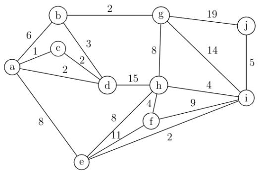

<details>
<summary>flowchart</summary>

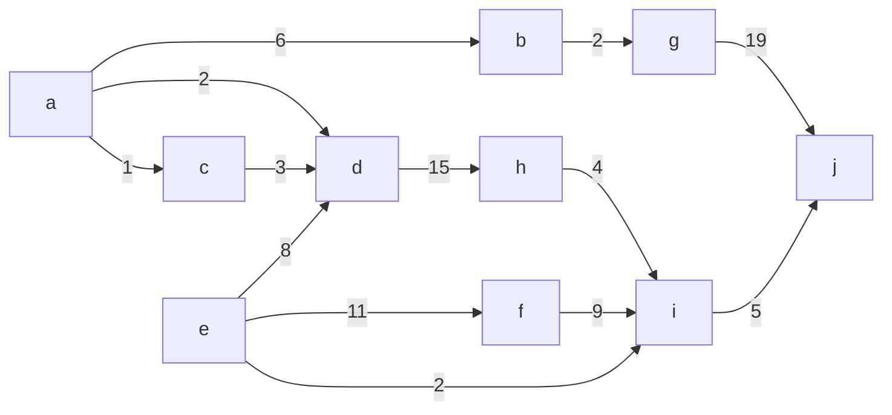
</details>

A. 29

B. 31

C. 38

D. 41

gatecse-2003 algorithms minimum-spanning-tree normal

# Answer key

# 1.31.9 Minimum Spanning Tree: GATE CSE 2005 | Question: 6

An undirected graph $G$ has $n$ nodes. its adjacency matrix is given by an $n \times n$ square matrix whose (i) diagonal elements are 0's and (ii) non-diagonal elements are 1's. Which one of the following is TRUE?


A. Graph G has no minimum spanning tree (MST)  
B. Graph $G$ has unique MST of cost $n - 1$  
C. Graph $G$ has multiple distinct MSTs, each of cost $n - 1$  
D. Graph G has multiple spanning trees of different costs

# Answer key

# 1.31.10 Minimum Spanning Tree: GATE CSE 2006 | Question: 11

Consider a weighted complete graph $G$ on the vertex set $\{v_1, v_2, \ldots, v_n\}$ such that the weight of the edge $(v_i, v_j)$ is $2|i - j|$ . The weight of a minimum spanning tree of $G$ is:


A. n - 1

B. $2n - 2$

C. $\binom{n}{2}$

D. $n^{2}$

gatecse-2006 algorithms minimum-spanning-tree normal

# Answer key

# 1.31.11 Minimum Spanning Tree: GATE CSE 2006 | Question: 47

Consider the following graph:

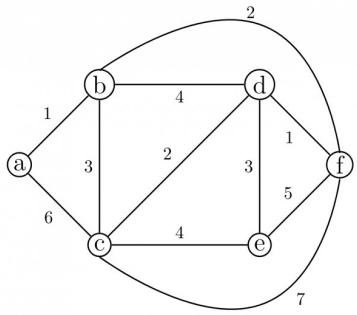

<details>
<summary>flowchart</summary>

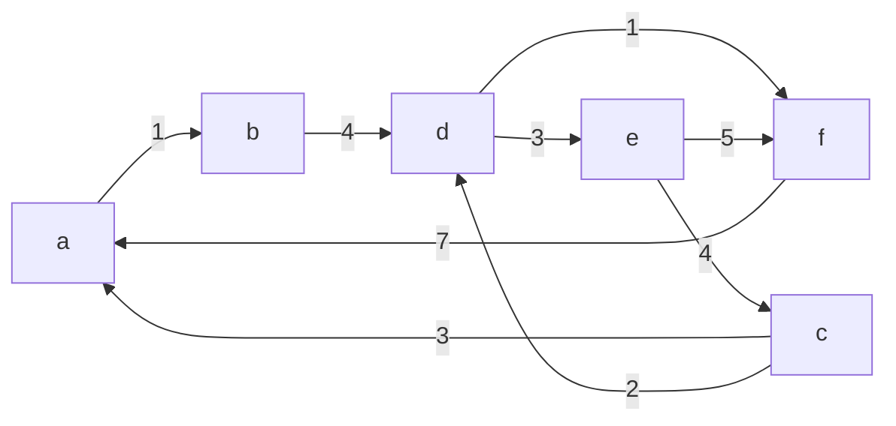
</details>


Which one of the following cannot be the sequence of edges added, in that order, to a minimum spanning tree using Kruskal's algorithm?

A. $(a - b),(d - f),(b - f),(d - c),(d - e)$

B. $(a - b),(d - f),(d - c),(b - f),(d - e)$

C. $(d - f),(a - b),(d - c),(b - f),(d - e)$

D. $(d - f),(a - b),(b - f),(d - e),(d - c)$

gatecse-2006 algorithms graph-algorithms minimum-spanning-tree normal

# Answer key

# 1.31.12 Minimum Spanning Tree: GATE CSE 2007 | Question: 49

Let $w$ be the minimum weight among all edge weights in an undirected connected graph. Let $e$ be a specific edge of weight $w$ . Which of the following is FALSE?


A. There is a minimum spanning tree containing e  
C. Every minimum spanning tree has an edge of weight w  
D. $e$ is present in every minimum spanning tree

B. If $e$ is not in a minimum spanning tree $T$ , then in the cycle formed by adding $e$ to $T$ , all edges have the same weight.

gatecse-2007 algorithms minimum-spanning-tree normal

# Answer key

# 1.31.13 Minimum Spanning Tree: GATE CSE 2009 | Question: 38

Consider the following graph:


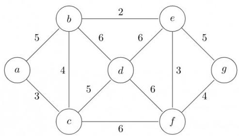

<details>
<summary>flowchart</summary>

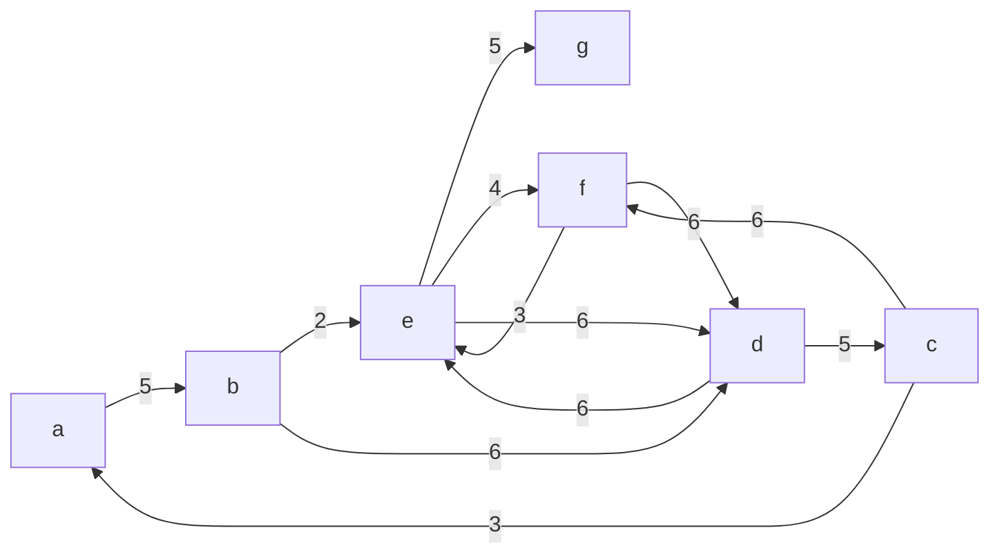
</details>

Which one of the following is NOT the sequence of edges added to the minimum spanning tree using Kruskal's algorithm?

A. (b, e) (e, f) (a, c) (b, c) (f, g) (c, d)  
B. (b, e) (e, f) (a, c) (f, g) (b, c) (c, d)  
C. (b, e) (a, c) (e, f) (b, c) (f, g) (c, d)  
D. (b, e) (e, f) (b, c) (a, c) (f, g) (c, d)

gatecse-2009 algorithms minimum-spanning-tree normal

# Answer key

# 1.31.14 Minimum Spanning Tree: GATE CSE 2010 | Question: 50

Consider a complete undirected graph with vertex set $\{0,1,2,3,4\}$ . Entry $W_{ij}$ in the matrix W below is the weight of the edge $\{i,j\}$


$$
W = \left( \begin{array}{c c c c c} 0 & 1 & 8 & 1 & 4 \\ 1 & 0 & 1 2 & 4 & 9 \\ 8 & 1 2 & 0 & 7 & 3 \\ 1 & 4 & 7 & 0 & 2 \\ 4 & 9 & 3 & 2 & 0 \end{array} \right)
$$

What is the minimum possible weight of a spanning tree T in this graph such that vertex 0 is a leaf node in the tree T?

A. 7

B. 8

C. 9

D. 10

gatecse-2010 algorithms minimum-spanning-tree normal

# Answer key

# 1.31.15 Minimum Spanning Tree: GATE CSE 2010 | Question: 51

Consider a complete undirected graph with vertex set $\{0,1,2,3,4\}$ . Entry $W_{ij}$ in the matrix W below is the weight of the edge $\{i,j\}$


$$
W = \left( \begin{array}{c c c c c} 0 & 1 & 8 & 1 & 4 \\ 1 & 0 & 1 2 & 4 & 9 \\ 8 & 1 2 & 0 & 7 & 3 \\ 1 & 4 & 7 & 0 & 2 \\ 4 & 9 & 3 & 2 & 0 \end{array} \right)
$$

What is the minimum possible weight of a path P from vertex 1 to vertex 2 in this graph such that P contains at most 3 edges?

A. 7

B. 8

C. 9

D. 10

gatecse-2010 normal algorithms minimum-spanning-tree

# Answer key

# 1.31.16 Minimum Spanning Tree: GATE CSE 2011 | Question: 54


An undirected graph $G(V, E)$ contains $n$ ( $n > 2$ ) nodes named $v_1, v_2, \ldots, v_n$ . Two nodes $v_i, v_j$ are connected if and only if $0 < |i - j| \leq 2$ . Each edge $(v_i, v_j)$ is assigned a weight $i + j$ . A sample graph with $n = 4$ is shown below.

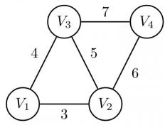

<details>
<summary>flowchart</summary>

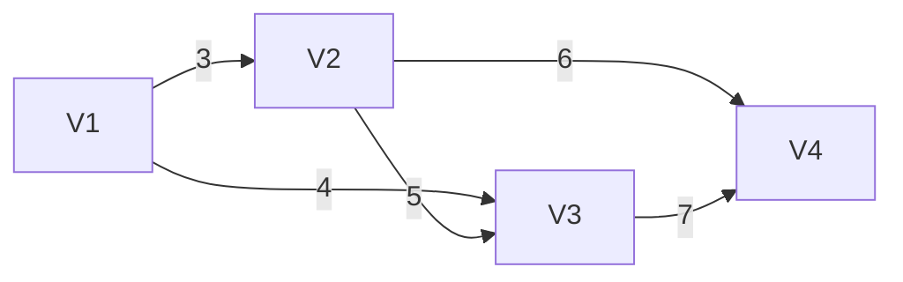
</details>

What will be the cost of the minimum spanning tree (MST) of such a graph with n nodes?

A. $\frac{1}{12} (11n^2 - 5n)$

B. $n^2 - n + 1$

C. $6n - 11$

D. $2n+1$

gatecse-2011 algorithms graph-algorithms minimum-spanning-tree normal

# Answer key

# 1.31.17 Minimum Spanning Tree: GATE CSE 2011 | Question: 55

An undirected graph $G(V, E)$ contains $n$ ( $n > 2$ ) nodes named $v_1, v_2, \ldots, v_n$ . Two nodes $v_i, v_j$ are connected if and only if $0 < |i - j| \leq 2$ . Each edge $(v_i, v_j)$ is assigned a weight $i + j$ . A sample graph with $n = 4$ is shown below.


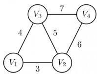

The length of the path from $v_{5}$ to $v_{6}$ in the MST of previous question with n = 10 is

A. 11

B. 25

C. 31

D. 41

gatecse-2011 algorithms graph-algorithms minimum-spanning-tree normal

# Answer key

# 1.31.18 Minimum Spanning Tree: GATE CSE 2012 | Question: 29

Let $G$ be a weighted graph with edge weights greater than one and $G'$ be the graph constructed by squaring the weights of edges in $G$ . Let $T$ and $T'$ be the minimum spanning trees of $G$ and $G'$ , respectively, with total weights $t$ and $t'$ . Which of the following statements is TRUE?

A. $T' = T$ with total weight $t' = t^{2}$

B. $T^{\prime} = T$ with total weight $t^{\prime} < t^{2}$

C. $T' \neq T$ but total weight $t' = t^{2}$

D. None of the above

gatecse-2012 algorithms minimum-spanning-tree normal marks-to-all

# Answer key

# 1.31.19 Minimum Spanning Tree: GATE CSE 2014 | Set 2 | Question: 52

The number of distinct minimum spanning trees for the weighted graph below is \_\_\_\_

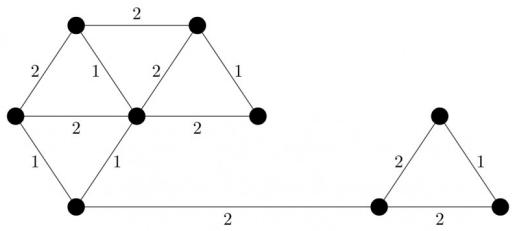

<details>
<summary>flowchart</summary>

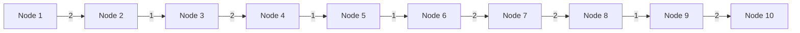
</details>

gatecse-2014-set2 algorithms minimum-spanning-tree numerical-answers normal

# Answer key


# 1.31.20 Minimum Spanning Tree: GATE CSE 2015 | Set 1 | Question: 43


The graph shown below has 8 edges with distinct integer edge weights. The minimum spanning tree (MST) is of weight 36 and contains the edges: $\{(A,C),(B,C),(B,E),(E,F),(D,F)\}$ . The edge weights of only those edges which are in the MST are given in the figure shown below. The minimum possible sum of weights of all 8 edges of this graph is \_\_\_\_.


<details>
<summary>flowchart</summary>

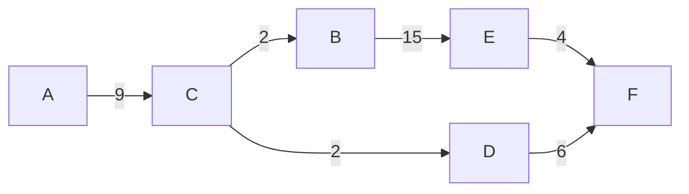
</details>

gatecse-2015-set1 algorithms minimum-spanning-tree normal numerical-answers

# Answer key

# 1.31.21 Minimum Spanning Tree: GATE CSE 2015 | Set 3 | Question: 40


Let $G$ be a connected undirected graph of 100 vertices and 300 edges. The weight of a minimum spanning tree of $G$ is 500. When the weight of each edge of $G$ is increased by five, the weight of a minimum spanning tree becomes \_\_\_\_.

gatecse-2015-set3 algorithms minimum-spanning-tree easy numerical-answers

# Answer key

# 1.31.22 Minimum Spanning Tree: GATE CSE 2016 | Set 1 | Question: 14


Let G be a weighted connected undirected graph with distinct positive edge weights. If every edge weight is increased by the same value, then which of the following statements is/are TRUE?

- $P$ : Minimum spanning tree of $G$ does not change.  
- $Q$ : Shortest path between any pair of vertices does not change.

A. P only

B. $Q$ only

C. Neither $P$ nor $Q$

D. Both $P$ and $Q$

gatecse-2016-set1 algorithms minimum-spanning-tree normal

# Answer key

# 1.31.23 Minimum Spanning Tree: GATE CSE 2016 | Set 1 | Question: 39


Let $G$ be a complete undirected graph on 4 vertices, having 6 edges with weights being 1, 2, 3, 4, 5, and 6. The maximum possible weight that a minimum weight spanning tree of $G$ can have is \_\_\_\_

gatecse-2016-set1 algorithms minimum-spanning-tree normal numerical-answers

# Answer key

# 1.31.24 Minimum Spanning Tree: GATE CSE 2016 | Set 1 | Question: 40


$G = (V, E)$ is an undirected simple graph in which each edge has a distinct weight, and $e$ is a particular edge of $G$ . Which of the following statements about the minimum spanning trees ( $MSTs$ ) of $G$ is/are TRUE?

I. If $e$ is the lightest edge of some cycle in $G$ , then every MST of $G$ includes $e$ .  
II. If $e$ is the heaviest edge of some cycle in $G$ , then every MST of $G$ excludes $e$ .

A. I only.

B. II only.

C. Both I and II.

D. Neither I nor II.

gatecse-2016-set1 algorithms minimum-spanning-tree normal

# Answer key

Consider the following undirected graph G:


<details>
<summary>flowchart</summary>

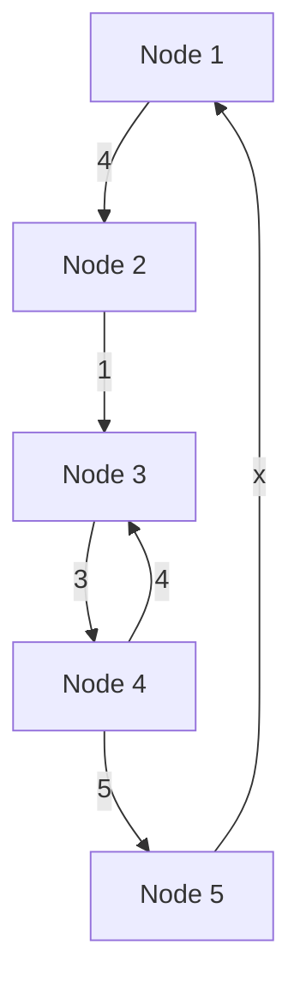
</details>

Choose a value for $x$ that will maximize the number of minimum weight spanning trees (MWSTs) of $G$ . The number of MWSTs of $G$ for this value of $x$ is \_\_\_\_.

gatecse-2018 algorithms graph-algorithms minimum-spanning-tree numerical-answers two-marks

Answer key

# 1.31.26 Minimum Spanning Tree: GATE CSE 2020 | Question: 31


Let $G = (V, E)$ be a weighted undirected graph and let $T$ be a Minimum Spanning Tree (MST) of $G$ maintained using adjacency lists. Suppose a new weighed edge $(u, v) \in V \times V$ is added to $G$ . The worst case time complexity of determining if $T$ is still an MST of the resultant graph is

A. $\Theta (|E| + |V|)$ C. $\Theta (E|\log |V|)$

B. $\Theta (|E||V|)$ D. $\Theta (|V|)$

gatecse-2020 algorithms minimum-spanning-tree graph-algorithms two-marks

Answer key

# 1.31.27 Minimum Spanning Tree: GATE CSE 2020 | Question: 49


Consider a graph $G = (V, E)$ , where $V = \{v_1, v_2, \ldots, v_{100}\}$ , $E = \{(v_i, v_j) \mid 1 \leq i < j \leq 100\}$ , and weight of the edge $(v_i, v_j)$ is $|i - j|$ . The weight of minimum spanning tree of $G$ is \_\_\_\_

gatecse-2020 numerical-answers algorithms graph-algorithms two-marks minimum-spanning-tree

Answer key

# 1.31.28 Minimum Spanning Tree: GATE CSE 2021 | Set 1 | Question: 17


Consider the following undirected graph with edge weights as shown:


<details>
<summary>wireframe</summary>

| Row | Column 1 | Column 2 | Column 3 | Column 4 |
| --- | --- | --- | --- | --- |
| 1 | 0.9 | 0.1 | 0.1 | 0.9 |
| 2 | 0.9 | 0.1 | 0.9 | 0.9 |
| 3 | 0.1 | 0.1 | 0.1 | 0.9 |
| 4 | 0.1 | 0.1 | 0.1 | 0.1 |
</details>

The number of minimum-weight spanning trees of the graph is \_\_\_\_.

gatecse-2021-set1 algorithms graph-algorithms minimum-spanning-tree numerical-answers one-mark

Answer key

# 1.31.29 Minimum Spanning Tree: GATE CSE 2021 | Set 2 | Question: 1


Let $G$ be a connected undirected weighted graph. Consider the following two statements.

- $S_{1}$ : There exists a minimum weight edge in $G$ which is present in every minimum spanning tree of $G$ .  
- $S_{2}$ : If every edge in $G$ has distinct weight, then $G$ has a unique minimum spanning tree.

Which one of the following options is correct?

A. Both $S_{1}$ and $S_{2}$ are true  
C. $S_{1}$ is false and $S_{2}$ is true

B. $S_{1}$ is true and $S_{2}$ is false  
D. Both $S_{1}$ and $S_{2}$ are false

gatecse-2021-set2 algorithms graph-algorithms minimum-spanning-tree one-mark

# Answer key

# 1.31.30 Minimum Spanning Tree: GATE CSE 2022 | Question: 39

Consider a simple undirected weighted graph G, all of whose edge weights are distinct. Which of the following statements about the minimum spanning trees of G is/are TRUE?


A. The edge with the second smallest weight is always part of any minimum spanning tree of G.  
B. One or both of the edges with the third smallest and the fourth smallest weights are part of any minimum spanning tree of $G$ .  
C. Suppose $S \subseteq V$ be such that $S \neq \phi$ and $S \neq V$ . Consider the edge with the minimum weight such that one of its vertices is in $S$ and the other in $V \setminus S$ . Such an edge will always be part of any minimum spanning tree of $G$ .  
D. G can have multiple minimum spanning trees.

gatecse-2022 algorithms minimum-spanning-tree multiple-selects two-marks

# Answer key

# 1.31.31 Minimum Spanning Tree: GATE CSE 2022 | Question: 48

Let $G(V,E)$ be a directed graph, where $V = \{1,2,3,4,5\}$ is the set of vertices and $E$ is the set of directed edges, as defined by the following adjacency matrix $A$ .


$$
A [ i ] [ j ] = \left\{ \begin{array}{l l} 1, & 1 \leq j \leq i \leq 5 \\ 0, & \text {otherwise} \end{array} \right.
$$

$A[i][j]=1$ indicates a directed edge from node i to node j. A directed spanning tree of G, rooted at $r\in V$ , is defined as a subgraph T of G such that the undirected version of T is a tree, and T contains a directed path from r to every other vertex in V. The number of such directed spanning trees rooted at vertex 5 is

gatecse-2022 numerical-answers algorithms minimum-spanning-tree two-marks

# Answer key

# 1.31.32 Minimum Spanning Tree: GATE CSE 2024 | Set 2 | Question: 49

The number of distinct minimum-weight spanning trees of the following graph is


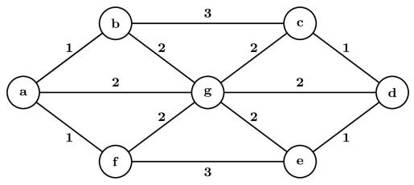

<details>
<summary>flowchart</summary>

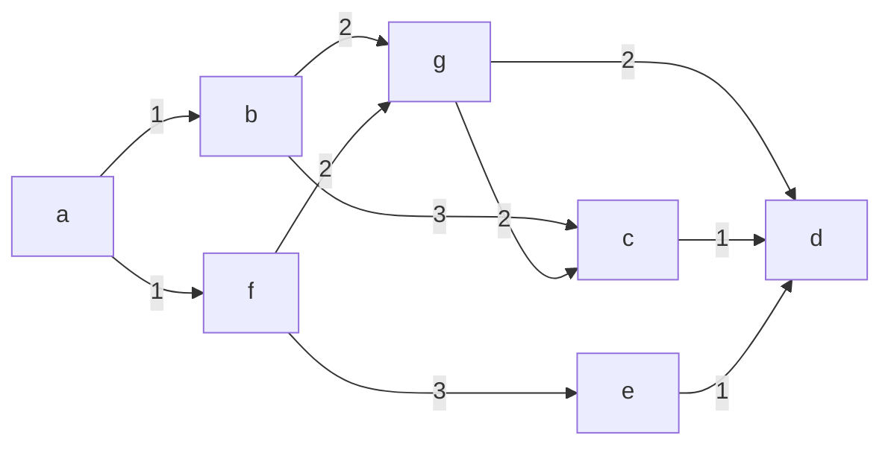
</details>

gatecse-2024-set2 numerical-answers algorithms minimum-spanning-tree two-marks

# Answer key

# 1.31.33 Minimum Spanning Tree: GATE CSE 2025 | Set 1 | Question: 54

The maximum value of x such that the edge between the nodes B and C is included in every minimum spanning tree of the given graph is \_\_\_\_. (answer in integer)


<details>
<summary>flowchart</summary>

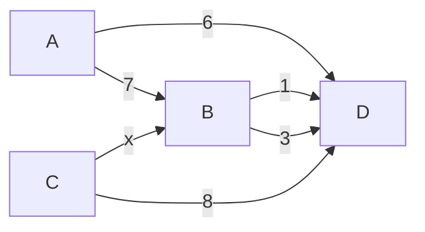
</details>

gatecse2025-set1 algorithms minimum-spanning-tree numerical-answers easy two-marks

# Answer key

# 1.31.34 Minimum Spanning Tree: GATE CSE 2026 | Set 1 | Question: 39

Let $G(V, E)$ be a simple, undirected, edge-weighted graph with unique edge weights. Which of the following statements about the minimum spanning trees (MST) of $G$ is/are true?

A. In every cycle C of G, the edge with the largest weight in C is not in any MST  
B. In every cycle $C$ of $G$ , the edge with the smallest weight in $C$ is in every MST  
C. For every vertex $v \in V$ , the edge with the largest weight incident on $v$ is not in any MST  
D. For every vertex $v \in V$ , the edge with the smallest weight incident on $v$ is in every MST

gatecse-2026-set1 two-marks algorithms minimum-spanning-tree multiple-selects

# Answer key

# 1.31.35 Minimum Spanning Tree: GATE IT 2005 | Question: 52

Let $G$ be a weighted undirected graph and e be an edge with maximum weight in $G$ . Suppose there is a minimum weight spanning tree in $G$ containing the edge e. Which of the following statements is always TRUE?

A. There exists a cutset in G having all edges of maximum weight.  
B. There exists a cycle in G having all edges of maximum weight.  
C. Edge e cannot be contained in a cycle.  
D. All edges in G have the same weight.

gateit-2005 algorithms minimum-spanning-tree normal

# Answer key

# 1.32

# Number of Swap (1)

# 1.32.1 Number of Swap: GATE CSE 2025 | Set 1 | Question: 23

The pseudocode of a function fun () is given below:


```txt
fun(int A[0, ..., n-1]) {
for i=0 to n-2
for j=0 to n-i-2
if (A[j]>A[j+1])
then swap A[j] and A[j+1]
}
```

Let $A[0, \ldots, 29]$ be an array storing 30 distinct integers in descending order. The number of swap operations that will be performed, if the function fun () is called with $A[0, \ldots, 29]$ as argument, is \_\_\_\_. (Answer in integer)

gatecse2025-set1 data-structures array number-of-swap numerical-answers one-mark

# Answer key


# 1.33.1 Prims Algorithm: GATE IT 2004 | Question: 56

Consider the undirected graph below:


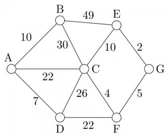

<details>
<summary>bubble</summary>

| Node | Value |
| --- | --- |
| A | 10 |
| B | 49 |
| C | 10 |
| D | 7 |
| E | 2 |
| F | 5 |
| G | 26 |
| C & D & E & F & G | 22 |
</details>

Using Prim's algorithm to construct a minimum spanning tree starting with node A, which one of the following sequences of edges represents a possible order in which the edges would be added to construct the minimum spanning tree?

A. (E, G), (C, F), (F, G), (A, D), (A, B), (A, C)  
B. (A, D), (A, B), (A, C), (C, F), (G, E), (F, G)  
C. (A, B), (A, D), (D, F), (F, G), (G, E), (F, C)  
D. (A, D), (A, B), (D, F), (F, C), (F, G), (G, E)

gateit-2004 algorithms graph-algorithms normal prims-algorithm

Answer key

# 1.33.2 Prims Algorithm: GATE IT 2008 | Question: 45

For the undirected, weighted graph given below, which of the following sequences of edges represents a correct execution of Prim's algorithm to construct a Minimum Spanning Tree?


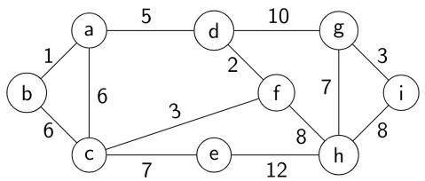

<details>
<summary>flowchart</summary>

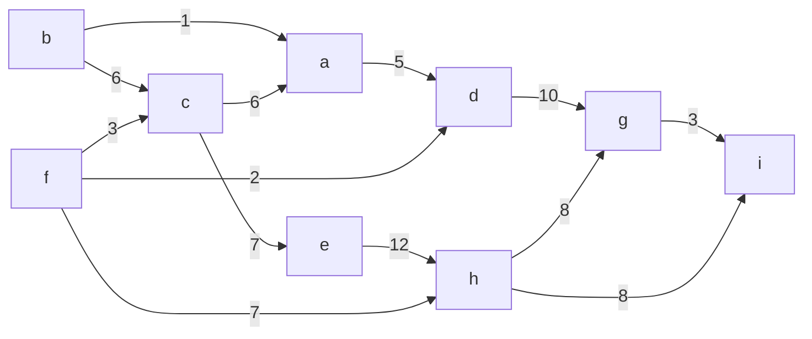
</details>

A. (a, b), (d, f), (f, c), (g, i), (d, a), (g, h), (c, e), (f, h)  
B. (c, e), (c, f), (f, d), (d, a), (a, b), (g, h), (h, f), (g, i)  
C. (d, f), (f, c), (d, a), (a, b), (c, e), (f, h), (g, h), (g, i)  
D. (h, g), (g, i), (h, f), (f, c), (f, d), (d, a), (a, b), (c, e)

gateit-2008 algorithms graph-algorithms minimum-spanning-tree normal prims-algorithm

Answer key

# 1.34

# Quick Sort (15)

Practice Tests: Test 1 (15Q) Test 2 (2Q)

# 1.34.1 Quick Sort: GATE CSE 1987 | Question: 1-xviii

Let P be a quicksort program to sort numbers in ascending order. Let $t_{1}$ and $t_{2}$ be the time taken by the program for the inputs [1 2 3 4] and [5 4 3 2 1], respectively. Which of the following holds?


A. $t_1 = t_2$

C. $t_{1} < t_{2}$

gate1987 algorithms sorting quick-sort

B. $t_1 > t_2$  
D. $t_1 = t_2 + 5\log 5$

Answer key

# 1.34.2 Quick Sort: GATE CSE 1989 | Question: 9


An input files has 10 records with keys as given below:

25 7 34 2 70 9 61 16 49 19

This is to be sorted in non-decreasing order.

i. Sort the input file using QUICKSORT by correctly positioning the first element of the file/subfile. Show the subfiles obtained at all intermediate steps. Use square brackets to demarcate subfiles.  
ii. Sort the input file using 2-way- MERGESORT showing all major intermediate steps. Use square brackets to demarcate subfiles.

gate1989 descriptive algorithms sorting quick-sort

# Answer key

# 1.34.3 Quick Sort: GATE CSE 1992 | Question: 03,iv

Assume that the last element of the set is used as partition element in Quicksort. If $n$ distinct elements from the set $[1 \ldots n]$ are to be sorted, give an input for which Quicksort takes maximum time.


gate1992 algorithms sorting easy quick-sort descriptive

# Answer key

# 1.34.4 Quick Sort: GATE CSE 1996 | Question: 2.15

Quick-sort is run on two inputs shown below to sort in ascending order taking first element as pivot


i. $1,2,3,\ldots n$  
ii. $n, n - 1, n - 2, \dots, 2, 1$

Let $C_{1}$ and $C_{2}$ be the number of comparisons made for the inputs (i) and (ii) respectively. Then,

A. $C_{1} < C_{2}$  
c. $C_{1}=C_{2}$

B. $C_1 > C_2$  
D. we cannot say anything for arbitrary n

gate1996 algorithms sorting normal quick-sort

# Answer key

# 1.34.5 Quick Sort: GATE CSE 2001 | Question: 1.14

Randomized quicksort is an extension of quicksort where the pivot is chosen randomly. What is the worst case complexity of sorting n numbers using Randomized quicksort?


A. $O(n)$

B. $O(n\log n)$

c. $O(n^{2})$

D. $O(n!)$

gatecse-2001 algorithms sorting time-complexity easy quick-sort

# Answer key

# 1.34.6 Quick Sort: GATE CSE 2006 | Question: 52

The median of $n$ elements can be found in $O(n)$ time. Which one of the following is correct about the complexity of quick sort, in which median is selected as pivot?


A. $\Theta(n)$  
C. $\Theta(n^{2})$

B. $\Theta(n \log n)$

gatecse-2006 algorithms sorting easy quick-sort

# Answer key

# 1.34.7 Quick Sort: GATE CSE 2008 | Question: 43

Consider the Quicksort algorithm. Suppose there is a procedure for finding a pivot element which splits the list into two sub-lists each of which contains at least one-fifth of the elements. Let $T(n)$ be the number of comparisons required to sort n elements. Then


A. $T(n) \leq 2T(n / 5) + n$

B. $T(n) \leq T(n / 5) + T(4n / 5) + n$

C. $T(n) \leq 2T(4n / 5) + n$

D. $T(n) \leq 2T(n / 2) + n$

gatecse-2008 algorithms sorting easy quick-sort

# Answer key

# 1.34.8 Quick Sort: GATE CSE 2009 | Question: 39


In quick-sort, for sorting $n$ elements, the $(n/4)^{th}$ smallest element is selected as pivot using an $O(n)$ time algorithm. What is the worst case time complexity of the quick sort?

A. $\Theta(n)$

B. $\Theta(n \log n)$

C. $\Theta(n^{2})$

D. $\Theta(n^{2}\log n)$

gatecse-2009 algorithms sorting normal quick-sort

# Answer key

# 1.34.9 Quick Sort: GATE CSE 2014 | Set 1 | Question: 14

Let P be quicksort program to sort numbers in ascending order using the first element as the pivot. Let $t_{1}$ and $t_{2}$ be the number of comparisons made by P for the inputs [1 2 3 4 5] and [4 1 5 3 2] respectively. Which one of the following holds?

A. $t_{1}=5$

B. $t_1 < t_2$

C. $t_{1} > t_{2}$

D. $t_{1}=t_{2}$

gatecse-2014-set1 algorithms sorting easy quick-sort

# Answer key

# 1.34.10 Quick Sort: GATE CSE 2014 | Set 3 | Question: 14


You have an array of $n$ elements. Suppose you implement quicksort by always choosing the central element of the array as the pivot. Then the tightest upper bound for the worst case performance is

A. $O(n^{2})$

B. $O(n\log n)$

C. $\Theta(n \log n)$

D. $O(n^{3})$

gatecse-2014-set3 algorithms sorting easy quick-sort

# Answer key

# 1.34.11 Quick Sort: GATE CSE 2015 | Set 1 | Question: 2


Which one of the following is the recurrence equation for the worst case time complexity of the quick sort algorithm for sorting $n (\geq 2)$ numbers? In the recurrence equations given in the options below, c is a constant.

A. $T(n) = 2T(n / 2) + cn$

B. $T(n) = T(n - 1) + T(1) + cn$

C. $T(n) = 2T(n - 1) + cn$

D. $T(n) = T(n / 2) + cn$

gatecse-2015-set1 algorithms recurrence-relation sorting easy quick-sort

# Answer key

# 1.34.12 Quick Sort: GATE CSE 2015 | Set 2 | Question: 45


Suppose you are provided with the following function declaration in the C programming language.

int partition(int a[], int n);


The function treats the first element of $a[]$ as a pivot and rearranges the array so that all elements less than or equal to the pivot is in the left part of the array, and all elements greater than the pivot is in the right part. In addition, it moves the pivot so that the pivot is the last element of the left part. The return value is the number of elements in the left part.

The following partially given function in the C programming language is used to find the $k^{th}$ smallest element in an array $a[]$ of size $n$ using the partition function. We assume $k \leq n$ .

int kth\_smallest (int a[], int n, int k)

int left\_end = partition (a, n);

```txt
if (left_end+1==k) {
        return a[left_end];
    }
    if (left_end+1 > k) {
        return kth_smallest (________);
    } else {
        return kth_smallest (________);
    }
}
```

The missing arguments lists are respectively

A. (a, left\_end, k) and (a+left\_end +1, n-left\_end -1, k-left\_end -1)  
C. $(a+$ left\_end+1, $n$ -left\_end $-1, k$ -left\_end-1) and $(a,$ $\text{left\_end}, k)$

gatecse-2015-set2 algorithms normal sorting quick-sort

B. $(a, \text{left\_end}, k)$ and $(a, n - \text{left\_end} - 1, k - \text{left\_end} - 1)$  
D. $(a, n-\text{left\_end}-1, k-\text{left\_end}-1)$ and $(a, \text{left\_end}, k)$

# Answer key

# 1.34.13 Quick Sort: GATE CSE 2019 | Question: 20


An array of 25 distinct elements is to be sorted using quicksort. Assume that the pivot element is chosen uniformly at random. The probability that the pivot element gets placed in the worst possible location in the first round of partitioning (rounded off to 2 decimal places) is \_\_\_\_

gatecse-2019 numerical-answers algorithms quick-sort probability one-mark

# Answer key

# 1.34.14 Quick Sort: GATE DA 2026 | Question: 5

Consider that the quick sort algorithm is used to sort an array of n distinct randomly ordered elements. In every call, the pivot is chosen as the first element of the current subarray.


Let $T(n)$ denote the expected time to sort the array. Assume that the time to partition is linear in the size of the current subarray.

Which of the following recurrence relations correctly represents $T(n)$ in this scenario?

A. $T(n) = T(1) + T(n - 1) + O(n)$

B. $T(n) = T\left(\frac{n}{4}\right) + T\left(\frac{3n}{4}\right) + O(n)$  
D. $T(n) = \frac{1}{n}\sum_{k = 0}^{n - 1}[T(k) + T(n - k - 1)] + O(n)$

C. $T(n)=2T\left(\frac{n}{2}\right)+O(n)$

gateda-2026 algorithms quick-sort recurrence-relation one-mark

# Answer key

# 1.34.15 Quick Sort: GATE DS&AI 2024 | Question: 20

Consider sorting the following array of integers in ascending order using an inplace Quicksort algorithm that uses the last element as the pivot.

<table><tr><td>60</td><td>70</td><td>80</td><td>90</td><td>100</td></tr></table>


The minimum number of swaps performed during this Quicksort is \_\_\_\_.

gate-ds-ai-2024 numerical-answers algorithms quick-sort one-mark

# Answer key

# 1.35

# Recurrence Relation (36)

Practice Tests: Test 1 (15Q) Test 2 (14Q)