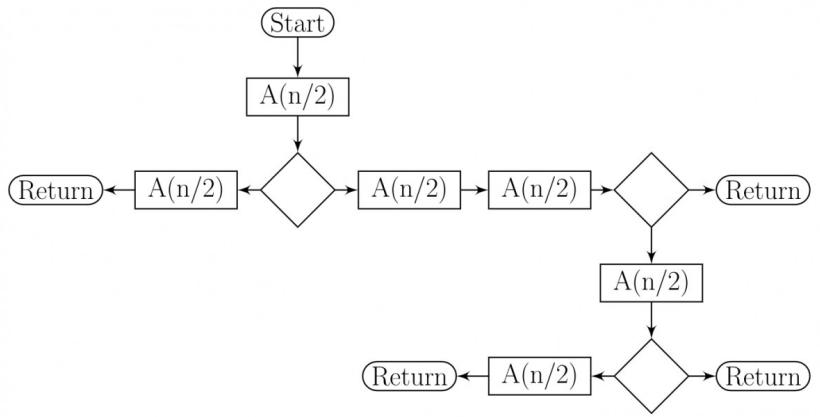

# 1.35.1 Recurrence Relation: GATE CSE 1987 | Question: 10a

Solve the recurrence equations:

- $T(n) = T(n - 1) + n$  
- $T(1) = 1$

gate1987 algorithms recurrence-relation descriptive

Answer key

# 1.35.2 Recurrence Relation: GATE CSE 1988 | Question: 13iv

Solve the recurrence equations:

- $T(n) = T(\frac{n}{2}) + 1$  
- $T(1) = 1$

gate1988 descriptive algorithms recurrence-relation

Answer key

# 1.35.3 Recurrence Relation: GATE CSE 1989 | Question: 13b

Find a solution to the following recurrence equation:

- $T(n) = \sqrt{n} + T\left(\frac{n}{2}\right)$  
- $T(1) = 1$

gate1989 descriptive algorithms recurrence-relation

Answer key

# 1.35.4 Recurrence Relation: GATE CSE 1990 | Question: 17a

Express $T(n)$ in terms of the harmonic number $H_{n} = \sum_{i=1}^{n} \frac{1}{i}$ , $n \geq 1$ , where $T(n)$ satisfies the recurrence relation,

$$
T (n) = \frac {n + 1}{n} T (n - 1) + 1, \text {for} n \geq \sum \text {and} T (1) = 1
$$

What is the asymptotic behaviour of $T(n)$ as a function of n?

gate1990 descriptive algorithms recurrence-relation

Answer key

# 1.35.5 Recurrence Relation: GATE CSE 1992 | Question: 07a

Consider the function $F(n)$ for which the pseudocode is given below :

```txt
Function F(n)
begin
F1 ← 1
if(n=1) then F ← 3
else
    For i = 1 to n do
        begin
            C ← 0
        For j = 1 to n - 1 do
            begin C ← C + 1 end
            F1 = F1 * C
        end
F = F1
end
```


[n is a positive integer greater than zero]

A. Derive a recurrence relation for $F(n)$ .

gate1992 algorithms recurrence-relation descriptive

Answer key

# 1.35.6 Recurrence Relation: GATE CSE 1992 | Question: 07b

Consider the function $F(n)$ for which the pseudocode is given below :


```txt
Function F(n)
begin
F1 ← 1
if(n=1) then F ← 3
else
    For i = 1 to n do
        begin
            C ← 0
        For j = 1 to n - 1 do
            begin C ← C + 1 end
            F1 = F1 * C
        end
F = F1
end
```

[n is a positive integer greater than zero]

B. Solve the recurrence relation for a closed form solution of $F(n)$ .

gate1992 algorithms recurrence-relation descriptive

Answer key

# 1.35.7 Recurrence Relation: GATE CSE 1993 | Question: 15

Consider the recursive algorithm given below:


```txt
procedure bubblesort (n);
var i,j: index; temp : item;
begin
    for i:=1 to n-1 do
        if A[i] > A[i+1] then
            begin
                temp := A[i];
                A[i] := A[i+1];
                A[i+1] := temp;
            end;
    bubblesort (n-1)
end
```

Let $a_{n}$ be the number of times the ‘if...then...’ statement gets executed when the algorithm is run with value n. Set up the recurrence relation by defining $a_{n}$ in terms of $a_{n-1}$ . Solve for $a_{n}$ .

gate1993 algorithms recurrence-relation normal descriptive

Answer key

# 1.35.8 Recurrence Relation: GATE CSE 1994 | Question: 1.7, ISRO2017-14

The recurrence relation that arises in relation with the complexity of binary search is:

A. $T(n)=2T\left(\frac{n}{2}\right)+k,$ k is a constant

B. $T(n) = T\left(\frac{n}{2}\right) + k, \mathrm{k}$ is a constant

C. $T(n) = T\left(\frac{n}{2}\right) + \log n$

D. $T(n) = T\left(\frac{n}{2}\right) + n$

gate1994 algorithms recurrence-relation easy isro2017

Answer key


# 1.35.9 Recurrence Relation: GATE CSE 1996 | Question: 2.12

The recurrence relation

- $T(1) = 2$  
- $T(n) = 3T(\frac{n}{4}) + n$

has the solution $T(n)$ equal to

A. $O(n)$

B. $O(\log n)$

C. $O\left(n^{\frac{3}{4}}\right)$

D. None of the above

gate1996 algorithms recurrence-relation normal

# Answer key

# 1.35.10 Recurrence Relation: GATE CSE 1997 | Question: 15

Consider the following function.


```vhdl
Function F(n, m:integer):integer;
begin
  if (n<=0) or (m<=0) then F:=1
  else
    F:F(n-1, m) + F(n-1, m-1);
end;
```

Use the recurrence relation $\binom{n}{k}=\binom{n-1}{k}+\binom{n-1}{k-1}$ to answer the following questions. Assume that n, m are positive integers. Write only the answers without any explanation.

a. What is the value of $F(n,2)$ ?  
b. What is the value of $F(n, m)$ ?  
c. How many recursive calls are made to the function $F$ , including the original call, when evaluating $F(n, m)$ .

gate1997 algorithms recurrence-relation descriptive

# Answer key

# 1.35.11 Recurrence Relation: GATE CSE 1997 | Question: 4.6

Let $T(n)$ be the function defined by $T(1) = 1$ , $T(n) = 2T(\lfloor \frac{n}{2} \rfloor) + \sqrt{n}$ for $n \geq 2$ .

Which of the following statements is true?

A. $T(n) = O\sqrt{n}$

B. $T(n) = O(n)$

C. $T(n) = O(\log n)$

D. None of the above

gate1997 algorithms recurrence-relation normal

# Answer key


# 1.35.12 Recurrence Relation: GATE CSE 1998 | Question: 6a

Solve the following recurrence relation

$$
x _ {n} = 2 x _ {n - 1} - 1, n > 1
$$

$$
x _ {1} = 2
$$

gate1998 algorithms recurrence-relation descriptive

# Answer key

# 1.35.13 Recurrence Relation: GATE CSE 2002 | Question: 1.3

The solution to the recurrence equation $T(2^k) = 3T(2^{k - 1}) + 1, T(1) = 1$ is

A. $2^{k}$

B. $\frac{(3^{k+1}-1)}{2}$

C. $3^{\log_2 k}$

D. $2^{\log_3 k}$


# 1.35.14 Recurrence Relation: GATE CSE 2002 | Question: 2.11

The running time of the following algorithm

Procedure $A(n)$

If $n \leqslant 2$ return (1) else return $(A(\lceil \sqrt{n} \rceil))$ ;

is best described by

A. $O(n)$

B. $O(\log n)$

c. $O(\log \log n)$

D. $O(1)$

gatecse-2002 algorithms recurrence-relation normal

# Answer key

# 1.35.15 Recurrence Relation: GATE CSE 2003 | Question: 35

Consider the following recurrence relation

$$
T (1) = 1
$$

$$
T (n + 1) = T (n) + \lfloor \sqrt {n + 1} \rfloor \text { for   all } n \geq 1
$$

The value of $T(m^2)$ for $m \geq 1$ is

A. $\frac{m}{6}(21m - 39) + 4$

C. $\frac{m}{2} (3m^{2.5} - 11m + 20) - 5$

gatecse-2003 algorithms time-complexity recurrence-relation difficult

B. $\frac{m}{6} (4m^2 - 3m + 5)$

D. $\frac{m}{6} (5m^3 - 34m^2 + 137m - 104) + \frac{5}{6}$

# Answer key

# 1.35.16 Recurrence Relation: GATE CSE 2004 | Question: 83, ISRO2015-40

The time complexity of the following C function is (assume $n > 0$ )

```txt
int recursive (int n) {
    if(n == 1)
        return (1);
    else
        return (recursive (n-1) + recursive (n-1));
}
```

A. $O(n)$

B. $O(n\log n)$

C. $O(n^{2})$

D. $O(2^{n})$

gatecse-2004 algorithms recurrence-relation time-complexity normal isro2015

# Answer key

# 1.35.17 Recurrence Relation: GATE CSE 2004 | Question: 84

The recurrence equation

$$
T (1) = 1
$$

$$
T (n) = 2 T (n - 1) + n, n \geq 2
$$

evaluates to

A. $2^{n + 1} - n - 2$

B. $2^{n} - n$

C. $2^{n + 1} - 2n - 2$

D. $2^{n} + n$

gatecse-2004 algorithms recurrence-relation normal

# Answer key

# 1.35.18 Recurrence Relation: GATE CSE 2006 | Question: 51, ISRO2016-34

Consider the following recurrence:

$$
T (n) = 2 T (\sqrt {n}) + 1, T (1) = 1
$$


Which one of the following is true?

A. $T(n) = \Theta (\log \log n)$

B. $T(n) = \Theta (\log n)$

C. $T(n) = \Theta(\sqrt{n})$

D. $T(n) = \Theta(n)$

algorithms recurrence-relation isro2016 gatecse-2006

# Answer key

# 1.35.19 Recurrence Relation: GATE CSE 2008 | Question: 78

Let $x_{n}$ denote the number of binary strings of length n that contain no consecutive 0s.

Which of the following recurrences does $x_{n}$ satisfy?

A. $x_{n} = 2x_{n - 1}$

B. $x_{n} = x_{|n / 2|} + 1$

C. $x_{n} = x_{\lfloor n / 2\rfloor} + n$

D. $x_{n} = x_{n - 1} + x_{n - 2}$

gatecse-2008 algorithms recurrence-relation normal

# Answer key

# 1.35.20 Recurrence Relation: GATE CSE 2008 | Question: 79

Let $x_{n}$ denote the number of binary strings of length n that contain no consecutive 0s.

The value of $x_{5}$ is

A. 5

B. 7

C. 8

D. 16

gatecse-2008 algorithms recurrence-relation normal

# Answer key

# 1.35.21 Recurrence Relation: GATE CSE 2009 | Question: 35

The running time of an algorithm is represented by the following recurrence relation:

$$
T (n) = \left\{ \begin{array}{l l} n & n \leq 3 \\ T (\frac {n}{3}) + c n & \text {otherwise} \end{array} \right.
$$

Which one of the following represents the time complexity of the algorithm?

A. $\Theta(n)$

B. $\Theta(n \log n)$

C. $\Theta(n^{2})$

D. $\Theta(n^{2}\log n)$

gatecse-2009 algorithms recurrence-relation time-complexity normal

# Answer key

# 1.35.22 Recurrence Relation: GATE CSE 2012 | Question: 16

The recurrence relation capturing the optimal execution time of the Towers of Hanoi problem with n discs is

A. $T(n) = 2T(n - 2) + 2$

B. $T(n) = 2T(n - 1) + n$

C. $T(n) = 2T(n / 2) + 1$

D. $T(n) = 2T(n - 1) + 1$

gatecse-2012 algorithms easy recurrence-relation

# Answer key

# 1.35.23 Recurrence Relation: GATE CSE 2014 | Set 2 | Question: 13

Which one of the following correctly determines the solution of the recurrence relation with $T(1)=1$ ?

$$
T (n) = 2 T \left(\frac {n}{2}\right) + \log n
$$

A. $\Theta(n)$

B. $\Theta(n \log n)$

C. $\Theta(n^{2})$

D. $\Theta (\log n)$

gatecse-2014-set2 algorithms recurrence-relation normal

# Answer key


# 1.35.24 Recurrence Relation: GATE CSE 2015 | Set 1 | Question: 49


Let $a_{n}$ represent the number of bit strings of length n containing two consecutive 1s. What is the recurrence relation for $a_{n}$ ?

A. $a_{n - 2} + a_{n - 1} + 2^{n - 2}$  
C. $2a_{n - 2} + a_{n - 1} + 2^{n - 2}$

B. $a_{n - 2} + 2a_{n - 1} + 2^{n - 2}$

D. $2a_{n-2} + 2a_{n-1} + 2^{n-2}$

gatecse-2015-set1 algorithms recurrence-relation normal

# Answer key

# 1.35.25 Recurrence Relation: GATE CSE 2015 | Set 3 | Question: 39

Consider the following recursive C function.


```txt
void get(int n)
{
    if (n<1) return;
    get (n-1);
    get (n-3);
    printf("%d", n);
}
```

If get(6) function is being called in main() then how many times will the get() function be invoked before returning to the main()?

A. 15

B. 25

C. 35

D. 45

gatecse-2015-set3 algorithms recurrence-relation normal

# Answer key

# 1.35.26 Recurrence Relation: GATE CSE 2016 | Set 2 | Question: 39


The given diagram shows the flowchart for a recursive function $A(n)$ . Assume that all statements, except for the recursive calls, have $O(1)$ time complexity. If the worst case time complexity of this function is $O(n^{\alpha})$ , then the least possible value (accurate up to two decimal positions) of $\alpha$ is \_\_\_\_.

Flow chart for Recursive Function $A(n)$ .



<details>
<summary>flowchart</summary>

```mermaid
graph TD
  Start(["Start"]) --> A["A(n/2)"]
  A --> Check{"{""}
  Check -->|Yes| A["A(n/2)"]
  Check -->|No| A
  A --> A2["A(n/2)"]
  A2 --> Check2{"{""}
  Check2 -->|Yes| A2["A(n/2)"]
  Check2 -->|No| A
  A2 --> Check3{"{""}
  Check3 -->|Yes| A2["A(n/2)"]
  Check3 -->|No| A
  A2 --> Return1(["Return"])
  A2 --> Return2(["Return"])
  A2 --> Return3(["Return"])
```
</details>

gatecse-2016-set2 algorithms time-complexity recurrence-relation normal numerical-answers

# Answer key

# 1.35.27 Recurrence Relation: GATE CSE 2017 | Set 2 | Question: 30

Consider the recurrence function

$$
T (n) = \left\{ \begin{array}{l l} 2 T (\sqrt {n}) + 1, & n > 2 \\ 2, & 0 <   n \leq 2 \end{array} \right.
$$

Then $T(n)$ in terms of $\Theta$ notation is

A. $\Theta (\log \log n)$

B. $\Theta (\log n)$


C. $\Theta(\sqrt{n})$

D. $\Theta(n)$

gatecse-2017-set2 algorithms recurrence-relation

Answer key

# 1.35.28 Recurrence Relation: GATE CSE 2020 | Question: 2

For parameters $a$ and $b$ , both of which are $\omega(1)$ , $T(n) = T(n^{1/a}) + 1$ , and $T(b) = 1$ . Then $T(n)$ is

A. $\Theta (\log_a\log_bn)$

B. $\Theta (\log_{ab}n)$

C. $\Theta (\log_b\log_a n)$

D. $\Theta (\log_2\log_2n)$

gatecse-2020 algorithms recurrence-relation one-mark

Answer key

# 1.35.29 Recurrence Relation: GATE CSE 2021 | Set 1 | Question: 30

Consider the following recurrence relation.

$$
T (n) = \left\{ \begin{array}{l l} T (n / 2) + T (2 n / 5) + 7 n & \text {if} n > 0 \\ 1 & \text {if} n = 0 \end{array} \right.
$$

Which one of the following options is correct?

A. $T(n) = \Theta (n^{5 / 2})$

B. $T(n) = \Theta (n\log n)$

C. $T(n) = \Theta(n)$

D. $T(n) = \Theta ((\log n)^{5/2})$

gatecse-2021-set1 algorithms recurrence-relation time-complexity two-marks

Answer key

# 1.35.30 Recurrence Relation: GATE CSE 2021 | Set 2 | Question: 39

For constants $a \geq 1$ and b > 1, consider the following recurrence defined on the non-negative integers:

$$
T (n) = a \cdot T \left(\frac {n}{b}\right) + f (n)
$$

Which one of the following options is correct about the recurrence $T(n)$ ?

A. If $f(n)$ is $n\log_2(n)$ , then $T(n)$ is $\Theta(n\log_2(n))$  
B. If $f(n)$ is $\frac{n}{\log_2(n)}$ , then $T(n)$ is $\Theta(\log_2(n))$  
C. If $f(n)$ is $O(n^{\log_b(a) - \epsilon})$ for some $\epsilon > 0$ , then $T(n)$ is $\Theta(n^{\log_b(a)})$  
D. If $f(n)$ is $\Theta(n^{\log_b(a)})$ , then $T(n)$ is $\Theta(n^{\log_b(a)})$

gatecse-2021-set2 algorithms recurrence-relation two-marks

Answer key

# 1.35.31 Recurrence Relation: GATE CSE 2024 | Set 1 | Question: 32

Consider the following recurrence relation:

$$
T (n) = \left\{ \begin{array}{c} \sqrt {n} T (\sqrt {n}) + n \text {for} n \geq 1, \\ 1 \quad \text {for} n = 1 \end{array} \right.
$$

Which one of the following options is CORRECT?

A. $T(n) = \Theta (n\log \log n)$

B. $T(n) = \Theta (n\log n)$

C. $T(n) = \Theta (n^{2}\log n)$

D. $T(n) = \Theta (n^{2}\log \log n)$

gatecse-2024-set1 algorithms recurrence-relation two-marks

Answer key


# 1.35.32 Recurrence Relation: GATE CSE 2025 | Set 1 | Question: 10

Consider the following recurrence relation:

$$
T (n) = 2 T (n - 1) + n 2 ^ {n} \text {for} n > 0, \quad T (0) = 1
$$

Which ONE of the following options is CORRECT?

A. $T(n) = \Theta (n^2 2^n)$

B. $T(n) = \Theta (n2^n)$

C. $T(n) = \Theta ((\log n)^{2}2^{n})$

D. $T(n) = \Theta(4^{n})$

gatecse2025-set1 algorithms time-complexity recurrence-relation one-mark

# Answer key

# 1.35.33 Recurrence Relation: GATE CSE 2026 | Set 2 | Question: 15

Which of the following can be recurrence relation(s) corresponding to an algorithm with time complexity $\Theta(n)$ ?

A. $T(n) = T(n - 1) + 1, \quad T(1) = 1$

B. $T(n) = 2T\left(\frac{n}{2}\right) + 1, \quad T(1) = 1$

C. $T(n) = 2T\left(\frac{n}{2}\right) + n,\quad T(1) = 1$

D. $T(n) = T(n - 1) + n, \quad T(1) = 1$

gatecse-2026-set2 algorithms recurrence-relation multiple-selects one-mark

# Answer key

# 1.35.34 Recurrence Relation: GATE IT 2004 | Question: 57

Consider a list of recursive algorithms and a list of recurrence relations as shown below. Each recurrence relation corresponds to exactly one algorithm and is used to derive the time complexity of the algorithm.


<table><tr><td></td><td>Recursive Algorithm</td><td></td><td>Recurrence Relation</td></tr><tr><td>P</td><td>Binary search</td><td>l.</td><td> $T(n) = T(n-k) + T(k) + cn$ </td></tr><tr><td>Q.</td><td>Merge sort</td><td>ll.</td><td> $T(n) = 2T(n-1) + 1$ </td></tr><tr><td>R.</td><td>Quick sort</td><td>lll.</td><td> $T(n) = 2T(n/2) + cn$ </td></tr><tr><td>S.</td><td>Tower of Hanoi</td><td>lV.</td><td> $T(n) = T(n/2) + 1$ </td></tr></table>


Which of the following is the correct match between the algorithms and their recurrence relations?

A. P-II, Q-III, R-IV, S-I

B. P-IV, Q-III, R-I, S-II

C. P-III, Q-II, R-IV, S-I

D. P-IV, Q-II, R-I, S-III

gateit-2004 algorithms recurrence-relation normal match-the-following

# Answer key

# 1.35.35 Recurrence Relation: GATE IT 2005 | Question: 51

Let $T(n)$ be a function defined by the recurrence

$$
T (n) = 2 T (n / 2) + \sqrt {n} \text {for} n \geq 2 \text {and}
$$

$$
T (1) = 1
$$

Which of the following statements is TRUE?

A. $T(n) = \Theta (\log n)$

B. $T(n) = \Theta (\sqrt{n})$

C. $T(n) = \Theta(n)$

D. $T(n) = \Theta (n\log n)$

gateit-2005 algorithms recurrence-relation easy

# Answer key

# 1.35.36 Recurrence Relation: GATE IT 2008 | Question: 44

When $n = 2^{2k}$ for some $k \geqslant 0$ , the recurrence relation

$$
T (n) = \sqrt {(2)} T (n / 2) + \sqrt {n}, T (1) = 1
$$

evaluates to :


A. $\sqrt{(n)(\log n + 1)}$  
C. $\sqrt{(n)}\log \sqrt{(n)}$

gateit-2008 algorithms recurrence-relation normal

B. $\sqrt{(n)}\log n$  
D. $n\log \sqrt{n}$

Answer key

# 1.36

# Recursion (5)

Practice Test: Test 1 (10Q)

# 1.36.1 Recursion: GATE CSE 1995 | Question: 2.9

A language with string manipulation facilities uses the following operations


head(s): first character of a string

tail(s): all but exclude the first character of a string

concat(s1, s2): s1s2

For the string "acbc" what will be the output of

concat(head(s), head(tail(tail(s))))

A. ac

B. bc

C. ab

D. cc

gate1995 algorithms normal recursion

Answer key

# 1.36.2 Recursion: GATE CSE 2007 | Question: 44

In the following C function, let $n \geq m$ .


```c
int gcd(n,m) {
    if (n%m == 0) return m;
    n = n%m;
    return gcd(m,n);
}
```

How many recursive calls are made by this function?

A. $\Theta (\log_2n)$

B. $\Omega(n)$

C. $\Theta (\log_2\log_2n)$

D. $\Theta(\sqrt{n})$

gatecse-2007 algorithms recursion time-complexity normal

Answer key

# 1.36.3 Recursion: GATE CSE 2018 | Question: 45

Consider the following program written in pseudo-code. Assume that x and y are integers.


```javascript
Count (x, y) {
    if (y !=1) {
        if (x !=1) {
            print("*");
            Count (x/2, y);
        }
        else {
            y=y-1;
            Count (1024, y);
        }
    }
}
```

The number of times that the print statement is executed by the call Count(1024, 1024) is \_\_\_\_

gatecse-2018 numerical-answers algorithms recursion two-marks

Answer key

# Consider the following ANSI C program

```c
#include <stdio.h>
int foo(int x, int y, int q)
{
    if ((x<=0) && (y<=0))
    return q;
    if (x<=0)
    return foo(x, y-q, q);
    if (y<=0)
    return foo(x-q, y, q);
    return foo(x, y-q, q) + foo(x-q, y, q);
}
int main( )
{
    int r = foo(15, 15, 10);
    printf("%d", r);
    return 0;
}
```

The output of the program upon execution is \_\_\_\_

gatecse-2021-set2 algorithms recursion output numerical-answers two-marks

# Answer key

# 1.36.5 Recursion: GATE CSE 2026 | Set 1 | Question: 51

Consider the recursive functions represented by the following code segment:


```c
int bar(int n) {
    if (n == 1) return 0;
    else return 1 + bar(n/2);
}
int foo(int n) {
    if (n == 1) return 1;
    else return 1 + foo(bar(n));
}
```

The smallest positive integer $n$ for which $f \circ o(n)$ returns 5 is \_\_\_\_. (answer in integer)

Note: Ignore syntax errors (if any) in the function.

gatecse-2026-set1 algorithms recursion numerical-answers two-marks

# Answer key

# 1.37

# Searching (8)

Practice Test: Test 1 (9Q)

# 1.37.1 Searching: GATE CSE 1996 | Question: 18

Consider the following program that attempts to locate an element $x$ in an array $a$ using binary search. Assume $N > 1$ . The program is erroneous. Under what conditions does the program fail?


```txt
var i,j,k: integer; x: integer;
  a: array; [1..N] of integer;
begin i:= 1; j:= n;
repeat
  k:(i+j) div 2;
  if a[k] < x then i:= k
  else j:= k
until (a[k] = x) or (i >= j);

if (a[k] = x) then
  writeln ('x is in the array')
else
  writeln ('x is not in the array')
end;
```

# 1.37.2 Searching: GATE CSE 1996 | Question: 2.13, ISRO2016-28


The average number of key comparisons required for a successful search for sequential search on $n$ items is

A. $\frac{n}{2}$

B. $\frac{n-1}{2}$

C. $\frac{n+1}{2}$

D. None of the above

gate1996 algorithms easy isro2016 searching

# Answer key

# 1.37.3 Searching: GATE CSE 2002 | Question: 2.10

Consider the following algorithm for searching for a given number $x$ in an unsorted array $A[1..n]$ having $n$ distinct values:


1. Choose an i at random from 1..n  
2. If $A[i] = x$ , then Stop else Goto 1;

Assuming that $x$ is present in $A$ , what is the expected number of comparisons made by the algorithm before it terminates?

A. n

B. n - 1

C. $2n$

D. $\frac{n}{2}$

gatecse-2002 searching normal

# Answer key

# 1.37.4 Searching: GATE CSE 2008 | Question: 84


Consider the following C program that attempts to locate an element $x$ in an array $Y[]$ using binary search. The program is erroneous.

```txt
f (int Y[10] , int x) {
    int i, j, k;
    i= 0; j = 9;
    do {
        k = (i+ j) / 2;
        if( Y[k] < x) i = k; else j = k;
        } while (Y[k] != x) && (i < j) ;
        if(Y[k] == x) printf(" x is in the array ") ;
        else printf(" x is not in the array ") ;
    }
```

On which of the following contents of Y and x does the program fail?

A. $Y$ is [1 2 3 4 5 6 7 8 9 10] and $x < 10$  
B. $Y$ is [1 3 5 7 9 11 13 15 17 19] and $x < 1$  
C. $Y$ is $\lceil 22222222222\rceil$ and $x > 2$  
D. $Y$ is [2 4 6 8 10 12 14 16 18 20] and $2 < x < 20$ and $x$ is even

gatecse-2008 algorithms searching normal

# Answer key

# 1.37.5 Searching: GATE CSE 2008 | Question: 85


Consider the following C program that attempts to locate an element x in an array $Y[$ ] using binary search. The program is erroneous.

```txt
f (int Y[10] , int x) {
    int i, j, k;
    i = 0; j = 9;
    do {
        k = (i + j) / 2;
        if( Y[k] < x) i = k; else j = k;
        } while (Y[k] != x) && (i < j)) ;
    if(Y[k] == x) printf(" x is in the array ") ;
    else printf(" x is not in the array ") ;
```

| }

The correction needed in the program to make it work properly is

A. Change line 6 to: if $(Y[k] < x)i = k + 1$ ; else $j = k - 1$ ;  
B. Change line 6 to: if $(Y[k] < x)i = k - 1$ ; else $j = k + 1$ ;  
C. Change line 6 to: if $(Y[k] < x)i = k$ ; else $j = k$ ;  
D. Change line 7 to: } while ((Y[k] == x) && (i < j));

gatecse-2008 algorithms searching normal

Answer key

# 1.37.6 Searching: GATE CSE 2017 | Set 1 | Question: 48


Let $A$ be an array of 31 numbers consisting of a sequence of 0's followed by a sequence of 1's. The problem is to find the smallest index $i$ such that $A[i]$ is 1 by probing the minimum number of locations in $A$ . The worst case number of probes performed by an optimal algorithm is \_\_\_\_.

gatecse-2017-set1 algorithms normal numerical-answers searching

Answer key

# 1.37.7 Searching: GATE CSE 2025 | Set 2 | Question: 19


Which of the following statements regarding Breadth First Search (BFS) and Depth First Search (DFS) on an undirected simple graph $G$ is/are TRUE?

A. A DFS tree of $G$ is a Shortest Path tree of $G$ .  
B. Every non-tree edge of G with respect to a DFS tree is a forward/back edge.  
C. If $(u, v)$ is a non-tree edge of $G$ with respect to a BFS tree, then the distances from the source vertex $s$ to $u$ and $v$ in the BFS tree are within $\pm 1$ of each other.  
D. Both BFS and DFS can be used to find the connected components of G.

gatecse2025-set2 algorithms searching breadth-first-search depth-first-search multiple-selects one-mark

Answer key

# 1.37.8 Searching: GATE CSE 2025 | Set 2 | Question: 31


An array $A$ of length $n$ with distinct elements is said to be bitonic if there is an index $1 \leq i \leq n$ such that $A[1..i]$ is sorted in the non-decreasing order and $A[i + 1..n]$ is sorted in the non-increasing order.

Which ONE of the following represents the best possible asymptotic bound for the worst-case number of comparisons by an algorithm that searches for an element in a bitonic array A?

A. $\Theta(n)$  
C. $\Theta (\log^2 n)$  
B. $\Theta(1)$

gatecse2025-set2 algorithms searching bitonic-array time-complexity two-marks

Answer key

1.38

# Selection Sort (2)

# 1.38.1 Selection Sort: GATE CSE 2009 | Question: 11

What is the number of swaps required to sort n elements using selection sort, in the worst case?

A. $\Theta(n)$  
B. $\Theta(n \log n)$  
C. $\Theta(n^{2})$  
D. $\Theta(n^{2}\log n)$

gatecse-2009 algorithms sorting easy selection-sort

Answer key

