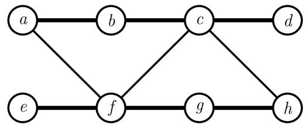
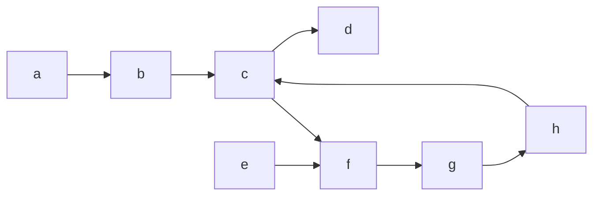
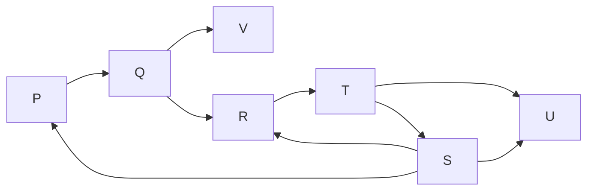

# 1.38.2 Selection Sort: GATE CSE 2013 | Question: 6


Which one of the following is the tightest upper bound that represents the number of swaps required to sort n numbers using selection sort?

A. $O(\log n)$

B. $O(n)$

c. $O(n\log n)$

D. $O(n^{2})$

gatecse-2013 algorithms sorting easy selection-sort

Answer key

# 1.39

# Shortest Path (8)

Practice Test: Test 1 (15Q)

# 1.39.1 Shortest Path: GATE CSE 2002 | Question: 12

Fill in the blanks in the following template of an algorithm to compute all pairs shortest path lengths in a directed graph $G$ with $n * n$ adjacency matrix $A$ . $A[i, j]$ equals 1 if there is an edge in $G$ from $i$ to $j$ , and 0 otherwise. Your aim in filling in the blanks is to ensure that the algorithm is correct.


```txt
INITIALIZATION: For i = 1 ... n
{For j = 1 ... n
{ if a[i,j] = 0 then P[i,j] = _______ else P[i,j] = _______;}}
}
ALGORITHM: For i = 1 ... n
{For j = 1 ... n
{For k = 1 ... n
{P[_,_] = min{_____________,____________}; }
}
}
```

a. Copy the complete line containing the blanks in the Initialization step and fill in the blanks.  
b. Copy the complete line containing the blanks in the Algorithm step and fill in the blanks.  
c. Fill in the blank: The running time of the Algorithm is $O(\_ )$ .

gatecse-2002 algorithms graph-algorithms time-complexity normal descriptive shortest-path

Answer key

# 1.39.2 Shortest Path: GATE CSE 2003 | Question: 67

Let $G = (V, E)$ be an undirected graph with a subgraph $G_{1} = (V_{1}, E_{1})$ . Weights are assigned to edges of $G$ as follows.


$$
w (e) = \left\{ \begin{array}{l l} 0, & \text {if} e \in E _ {1} \\ 1, & \text {otherwise} \end{array} \right.
$$

A single-source shortest path algorithm is executed on the weighted graph $(V, E, w)$ with an arbitrary vertex $v_{1}$ of $V_{1}$ as the source. Which of the following can always be inferred from the path costs computed?

B. $G_{1}$ is connected  
C. $V_{1}$ forms a clique in $G$  
D. $G_{1}$ is a tree

A. The number of edges in the shortest paths from $v_{1}$ to all vertices of G

gatecse-2003 algorithms graph-algorithms normal shortest-path

Answer key

# 1.39.3 Shortest Path: GATE CSE 2007 | Question: 41

In an unweighted, undirected connected graph, the shortest path from a node S to every other node is computed most efficiently, in terms of time complexity, by

A. Dijkstra's algorithm starting from $S$ .

B. Warshall's algorithm.


C. Performing a DFS starting from S.

D. Performing a BFS starting from $S$ .

gatecse-2007 algorithms graph-algorithms easy shortest-path

# Answer key

# 1.39.4 Shortest Path: GATE CSE 2020 | Question: 40


Let $G = (V, E)$ be a directed, weighted graph with weight function $w: E \to \mathbb{R}$ . For some function $f: V \to \mathbb{R}$ , for each edge $(u, v) \in E$ , define $w'(u, v)$ as $w(u, v) + f(u) - f(v)$ .

Which one of the options completes the following sentence so that it is TRUE?

"The shortest paths in $G$ under $w$ are shortest paths under $w'$ too,\_\_\_\_".

A. for every $f:V\to \mathbb{R}$  
B. if and only if $\forall u\in V$ , $f(u)$ is positive  
C. if and only if $\forall u\in V$ , $f(u)$ is negative  
D. if and only if $f(u)$ is the distance from $s$ to $u$ in the graph obtained by adding a new vertex $s$ to $G$ and edges of zero weight from $s$ to every vertex of $G$

gatecse-2020 algorithms graph-algorithms two-marks shortest-path

# Answer key

# 1.39.5 Shortest Path: GATE CSE 2025 | Set 1 | Question: 8


Let G be any undirected graph with positive edge weights, and T be a minimum spanning tree of G. For any two vertices, u and v, let $d_{1}(u,v)$ and $d_{2}(u,v)$ be the shortest distances between u and v in G and T, respectively. Which ONE of the options is CORRECT for all possible G, T, u and v?

A. $d_{1}(u,v) = d_{2}(u,v)$

C. $d_{1}(u,v)\geq d_{2}(u,v)$

gatecse2025-set1 algorithms minimum-spanning-tree shortest-path one-mark

B. $d_{1}(u,v)\leq d_{2}(u,v)$

D. $d_{1}(u,v)\neq d_{2}(u,v)$

# Answer key

# 1.39.6 Shortest Path: GATE CSE 2025 | Set 2 | Question: 27


Let G be an edge-weighted undirected graph with positive edge weights. Suppose a positive constant $\alpha$ is added to the weight of every edge.

Which ONE of the following statements is TRUE about the minimum spanning trees (MSTs) and shortest paths (SPs) in G before and after the edge weight update?

A. Every MST remains an MST, and every SP remains an SP.  
B. MSTs need not remain MSTs, and every SP remains an SP.  
C. Every MST remains an MST, and SPs need not remain SPs.  
D. MSTs need not remain MSTs, and SPs need not remain SPs.

gatecse2025-set2 algorithms minimum-spanning-tree shortest-path two-marks

# Answer key

# 1.39.7 Shortest Path: GATE DA 2025 | Question: 48


Let $G$ be a simple, unweighted, and undirected graph. A subset of the vertices and edges of $G$ are shown below.



<details>
<summary>flowchart</summary>


</details>

It is given that $a - b - c - d$ is a shortest path between $a$ and $d$ ; $e - f - g - h$ is a shortest path between $e$ and $h$ ; $a - f - c - h$ is a shortest path between $a$ and $h$ . Which of the following is/are NOT the edges of $G$ ?

A. $(b,d)$

B. $(b,g)$

C. $(b,h)$

D. $(e,g)$

gateda-2025 algorithms shortest-path multiple-selects two-marks

# Answer key

# 1.39.8 Shortest Path: GATE IT 2007 | Question: 3, UGCNET-June2012-III: 34

Consider a weighted, undirected graph with positive edge weights and let uv be an edge in the graph. It is known that the shortest path from the source vertex s to u has weight 53 and the shortest path from s to v has weight 65. Which one of the following statements is always TRUE?


A. Weight $(u, v) \leq 12$

B. Weight $(u,v) = 12$

C. Weight $(u,v)\geq 12$

D. Weight $(u,v) > 12$

gateit-2007 algorithms graph-algorithms normal ugcnetcse-june2012-paper3 shortest-path

# Answer key

# 1.40

# Sorting (22)

Practice Tests:

Test 1 (15Q)

Test 2 (15Q)

Test 3 (15Q)

Test 4 (7Q)

# 1.40.1 Sorting: GATE CSE 1988 | Question: 1iii

Quicksort is \_\_\_\_ efficient than heapsort in the worst case.


gate1988 algorithms sorting fill-in-the-blanks easy

# Answer key

# 1.40.2 Sorting: GATE CSE 1990 | Question: 3-v

The complexity of comparison based sorting algorithms is:


A. $\Theta(n \log n)$

B. $\Theta(n)$

C. $\Theta(n^{2})$

D. $\Theta(n\sqrt{n})$

gate1990 normal algorithms sorting easy time-complexity multiple-selects

# Answer key

# 1.40.3 Sorting: GATE CSE 1991 | Question: 01,vii

The minimum number of comparisons required to sort 5 elements is \_\_\_\_


gate1991 normal algorithms sorting numerical-answers

# Answer key

# 1.40.4 Sorting: GATE CSE 1991 | Question: 13

Give an optimal algorithm in pseudo-code for sorting a sequence of n numbers which has only k distinct numbers (k is not known a Priori). Give a brief analysis for the time-complexity of your algorithm.


gate1991 sorting time-complexity algorithms difficult descriptive

# Answer key

# 1.40.5 Sorting: GATE CSE 1992 | Question: 02,ix

Following algorithm(s) can be used to sort $n$ in the range $[1 \dots n^3]$ in $O(n)$ time


a. Heap sort

b. Quick sort

c. Merge sort

d. Radix sort

gate1992 easy algorithms sorting multiple-selects

# Answer key

# 1.40.6 Sorting: GATE CSE 1996 | Question: 14


A two dimensional array $A[1..n][1..n]$ of integers is partially sorted if $\forall i, j \in [1..n - 1], A[i][j] < A[i][j + 1]$ and $A[i][j] < A[i + 1][j]$

a. The smallest item in the array is at $A[i][j]$ where $i = \_$ and $j = \_$ .  
b. The smallest item is deleted. Complete the following $O(n)$ procedure to insert item x (which is guaranteed to be smaller than any item in the last row or column) still keeping A partially sorted.

```txt
procedure insert (x: integer);
var i,j: integer;
begin
    i:=1; j:=1, A[i][j]:=x;
    while (x > ____ or x > ____ ) do
        if A[i+1][j] < A[i][j] ____ then begin
            A[i][j]:=A[i+1][j]; i:=i+1;
        end
        else begin
            _
        end
    A[i][j]:= _
end
```

gate1996 algorithms sorting normal descriptive

Answer key

# 1.40.7 Sorting: GATE CSE 1998 | Question: 1.22

Give the correct matching for the following pairs:

<table><tr><td>(A)</td><td>O(log n)</td><td>(P)</td><td>Selection</td></tr><tr><td>(B)</td><td>O(n)</td><td>(Q)</td><td>Insertion sort</td></tr><tr><td>(C)</td><td>O(n log n)</td><td>(R)</td><td>Binary search</td></tr><tr><td>(D)</td><td>O(n2)</td><td>(S)</td><td>Merge sort</td></tr></table>

A. A-R B-P C-Q D-S

B. A-R B-P C-S D-Q

C. A-P B-R C-S D-Q

D. A-P B-S C-R D-Q

gate1998 algorithms sorting easy match-the-following

Answer key

# 1.40.8 Sorting: GATE CSE 1999 | Question: 1.12

A sorting technique is called stable if

A. it takes $O(n \log n)$ time  
B. it maintains the relative order of occurrence of non-distinct elements  
C. it uses divide and conquer paradigm  
D. it takes $O(n)$ space

gate1999 algorithms sorting easy

Answer key

# 1.40.9 Sorting: GATE CSE 1999 | Question: 8

Let $A$ be an $n \times n$ matrix such that the elements in each row and each column are arranged in ascending order. Draw a decision tree, which finds $1^{\text{st}}$ , $2^{\text{nd}}$ and $3^{\text{rd}}$ smallest elements in minimum number of comparisons.

gate1999 algorithms sorting normal descriptive

Answer key


# 1.40.10 Sorting: GATE CSE 2000 | Question: 17


An array contains four occurrences of 0, five occurrences of 1, and three occurrences of 2 in any order. The array is to be sorted using swap operations (elements that are swapped need to be adjacent).

a. What is the minimum number of swaps needed to sort such an array in the worst case?  
b. Give an ordering of elements in the above array so that the minimum number of swaps needed to sort the array is maximum.

gatecse-2000 algorithms sorting normal descriptive

# Answer key

# 1.40.11 Sorting: GATE CSE 2005 | Question: 39


Suppose there are $\lceil \log n \rceil$ sorted lists of $\lfloor n / \log n \rfloor$ elements each. The time complexity of producing a sorted list of all these elements is: (Hint: Use a heap data structure)

A. $O(n\log \log n)$  
C. $\Omega(n \log n)$  
gatecse-2005 algorithms sorting normal

B. $\Theta(n \log n)$

D. $\Omega \left(n^{3 / 2}\right)$

# Answer key

# 1.40.12 Sorting: GATE CSE 2006 | Question: 14, ISRO2011-14


Which one of the following in place sorting algorithms needs the minimum number of swaps?

A. Quick sort

B. Insertion sort

C. Selection sort

D. Heap sort

gatecse-2006 algorithms sorting easy isro2011

# Answer key

# 1.40.13 Sorting: GATE CSE 2007 | Question: 14


Which of the following sorting algorithms has the lowest worse-case complexity?

A. Merge sort

B. Bubble sort

C. Quick sort

D. Selection sort

gatecse-2007 algorithms sorting time-complexity easy

# Answer key

# 1.40.14 Sorting: GATE CSE 2016 | Set 1 | Question: 13


The worst case running times of Insertion sort, Merge sort and Quick sort, respectively are:

A. $\Theta(n \log n)$ , $\Theta(n \log n)$ and $\Theta(n^2)$  
B. $\Theta(n^{2}),\Theta(n^{2})$ and $\Theta(n\log n)$  
C. $\Theta(n^{2}),\Theta(n\log n)$ and $\Theta(n\log n)$  
D. $\Theta(n^{2}),\Theta(n\log n)$ and $\Theta(n^{2})$

gatecse-2016-set1 algorithms sorting easy

# Answer key

# 1.40.15 Sorting: GATE CSE 2016 | Set 2 | Question: 13


Assume that the algorithms considered here sort the input sequences in ascending order. If the input is already in the ascending order, which of the following are TRUE?

I. Quicksort runs in $\Theta(n^{2})$ time  
II. Bubblesort runs in $\Theta(n^2)$ time  
III. Mergesort runs in $\Theta(n)$ time  
IV. Insertion sort runs in $\Theta(n)$ time


A. I and II only

B. I and III only

C. II and IV only

D. I and IV only

gatecse-2016-set2 algorithms sorting time-complexity normal ambiguous

# Answer key

# 1.40.16 Sorting: GATE CSE 2021 | Set 1 | Question: 9

Consider the following array.


<table><tr><td>23</td><td>32</td><td>45</td><td>69</td><td>72</td><td>73</td><td>89</td><td>97</td></tr></table>

Which algorithm out of the following options uses the least number of comparisons (among the array elements) to sort the above array in ascending order?

A. Selection sort  
C. Insertion sort

B. Mergesort  
D. Quicksort using the last element as pivot

gatecse-2021-set1 algorithms sorting one-mark

# Answer key

# 1.40.17 Sorting: GATE CSE 2024 | Set 2 | Question: 25


Let A be an array containing integer values. The distance of A is defined as the minimum number of elements in A that must be replaced with another integer so that the resulting array is sorted in non-decreasing order. The distance of the array [2, 5, 3, 1, 4, 2, 6] is \_\_\_\_.

gatecse-2024-set2 numerical-answers algorithms sorting one-mark

# Answer key

# 1.40.18 Sorting: GATE CSE 2025 | Set 2 | Question: 10


Consider an unordered list of N distinct integers.

What is the minimum number of element comparisons required to find an integer in the list that is NOT the largest in the list?

A. 1

B. N - 1

C. N

D. $2N - 1$

gatecse2025-set2 algorithms sorting one-mark

# Answer key

# 1.40.19 Sorting: GATE DA 2026 | Question: 39


Consider the problem of sorting the given array in ascending order:

$$
P = [ 1, 2, 3, 5, 4 ]
$$

Consider two sorting algorithms Bubble Sort (BS) and Insertion Sort (IS).

Let N1 be the total number of comparisons done by BS on the elements of P and N2 be the total number of comparisons done by IS on the elements of P.

Which of the following options is/are correct?

A. $\mathrm{N1} = 10, \mathrm{N2} = 4$  
B. N1 > N2  
C. IS on P will perform only one swap  
D. Both BS and IS on P will make at least one unnecessary comparison (i.e., comparing elements that are already in correct order)

gateda-2026 algorithms sorting multiple-selects two-marks

# Answer key

Consider the following sorting algorithms:

i. Bubble sort  
ii. Insertion sort  
iii. Selection sort

Which ONE among the following choices of sorting algorithms sorts the numbers in the array[4,3,2,1,5] in increasing order after exactly two passes over the array?

A. (i) only

B. (iii) only

C. (i) and (iii) only

D. (ii) and (iii) only

gate-ds-ai-2024 algorithms sorting two-marks

Answer key

# 1.40.21 Sorting: GATE IT 2005 | Question: 59

Let $a$ and $b$ be two sorted arrays containing $n$ integers each, in non-decreasing order. Let $c$ be a sorted array containing $2n$ integers obtained by merging the two arrays $a$ and $b$ . Assuming the arrays are indexed starting from 0, consider the following four statements

1. $a[i] \geq b[i] \Rightarrow c[2i] \geq a[i]$  
II. $a[i] \geq b[i] \Rightarrow c[2i] \geq b[i]$  
III. $a[i] \geq b[i] \Rightarrow c[2i] \leq a[i]$  
IV. $a[i] \geq b[i] \Rightarrow c[2i] \leq b[i]$

Which of the following is TRUE?

A. only I and II

B. only I and IV

C. only II and III

D. only III and IV

gateit-2005 algorithms sorting normal

Answer key

# 1.40.22 Sorting: GATE IT 2008 | Question: 43

If we use Radix Sort to sort $n$ integers in the range $\left(n^{k/2}, n^k\right]$ , for some $k > 0$ which is independent of $n$ , the time taken would be?

A. $\Theta(n)$

B. $\Theta(kn)$

C. $\Theta(n \log n)$

D. $\Theta(n^{2})$

gateit-2008 algorithms sorting normal

Answer key

# 1.41

# Space Complexity (1)

# 1.41.1 Space Complexity: GATE CSE 2005 | Question: 81a

```lisp
double foo(int n)
{
    int i;
    double sum;
    if(n == 0)
    {
        return 1.0;
    }
    else
    {
        sum = 0.0;
        for(i = 0; i < n; i++)
        {
            sum += foo(i);
        }
        return sum;
    }
}
```


The space complexity of the above code is?

A. $O(1)$

B. $O(n)$

c. $O(n!)$

D. $n^{n}$

gatecse-2005 algorithms recursion normal space-complexity

Answer key

# 1.42

# Strongly Connected Components (3)

# 1.42.1 Strongly Connected Components: GATE CSE 2008 | Question: 7

The most efficient algorithm for finding the number of connected components in an undirected graph on $n$ vertices and $m$ edges has time complexity


A. $\Theta(n)$

B. $\Theta(m)$

C. $\Theta(m+n)$

D. $\Theta(mn)$

gatecse-2008 algorithms graph-algorithms time-complexity normal strongly-connected-components

Answer key

# 1.42.2 Strongly Connected Components: GATE CSE 2018 | Question: 43

Let $G$ be a graph with 100! vertices, with each vertex labelled by a distinct permutation of the numbers $1, 2, \ldots, 100$ . There is an edge between vertices $u$ and $v$ if and only if the label of $u$ can be obtained by swapping two adjacent numbers in the label of $v$ . Let $y$ denote the degree of a vertex in $G$ , and $z$ denote the number of connected components in $G$ . Then, $y + 10z =$ \_\_\_\_.

gatecse-2018 algorithms graph-algorithms numerical-answers two-marks strongly-connected-components

Answer key

# 1.42.3 Strongly Connected Components: GATE IT 2006 | Question: 46

Which of the following is the correct decomposition of the directed graph given below into its strongly connected components?


<details>
<summary>flowchart</summary>


</details>

A. $\{P, Q, R, S\}, \{T\}, \{U\}, \{V\}$  
B. $\{P, Q, R, S, T, V\}, \{U\}$  
c. $\{P,Q,S,T,V\},\{R\},\{U\}$  
D. $\{P,Q,R,S,T,U,V\}$

gateit-2006 algorithms graph-algorithms normal strongly-connected-components

Answer key

# 1.43

# Time Complexity (31)

Practice Tests:

Test 1 (15Q)

Test 2 (15Q)

Test 3 (15Q)

Test 4 (9Q)

# 1.43.1 Time Complexity: GATE CSE 1988 | Question: 6i

Given below is the sketch of a program that represents the path in a two-person game tree by the sequence of active procedure calls at any time. The program assumes that the payoffs are real number in a limited range; that the constant INF is larger than any positive payoff and its negation is smaller than any negative payoff and that there is a function “payoff” and that computes the payoff for any board that is a leaf. The type “boardtype” has been suitably declared to represent board positions. It is player-1’s move if mode = MAX and player-2’s move if mode=MIN. The type modetype = (MAX, MIN). The functions “min” and “max” find the minimum and maximum of two real numbers.

function search(B: boardtype; mode: modetype): real;


<div class="mineru-algorithm" style="white-space: pre-wrap; font-family:monospace;">
var
  C:boardtype; {a child of board B}
  value:real;
begin
  if B is a leaf then
    return (payoff(B))
  else
    begin
    if mode = MAX then value :=-INF
    else
      value:INF;
    for each child C of board B do
      if mode = MAX then
        value:=max (value, search (C, MIN))
    else
      value:=min(value, search(C, MAX))
    return(value)
    end
end; (search)
</div>

Comment on the working principle of the above program. Suggest a possible mechanism for reducing the amount of search.

gate1988 normal descriptive algorithms time-complexity

# Answer key

# 1.43.2 Time Complexity: GATE CSE 1989 | Question: 2-iii

Match the pairs in the following:

<table><tr><td>(A)</td><td>O(log n)</td><td>(p)</td><td>Heapsort</td></tr><tr><td>(B)</td><td>O(n)</td><td>(q)</td><td>Depth-first search</td></tr><tr><td>(C)</td><td>O(n log n)</td><td>(r)</td><td>Binary search</td></tr><tr><td>(D)</td><td>O(n2)</td><td>(s)</td><td>Selection of the kth smallest element in a set of n elements</td></tr></table>


gate1989 match-the-following algorithms time-complexity

# Answer key

# 1.43.3 Time Complexity: GATE CSE 1993 | Question: 8.7

$\sum_{1\leq k\leq n}O(n)$ , where $O(n)$ stands for order $n$ is:

A. $O(n)$

B. $O(n^{2})$

C. $O(n^{3})$

D. $O(3n^{2})$

E. $O(1.5n^{2})$

gate1993 algorithms time-complexity easy

# Answer key

# 1.43.4 Time Complexity: GATE CSE 1999 | Question: 1.13

Suppose we want to arrange the n numbers stored in any array such that all negative values occur before all positive ones. Minimum number of exchanges required in the worst case is

A. n - 1

B. n

C. $n + 1$

D. None of the above

gate1999 algorithms time-complexity normal

# Answer key

# 1.43.5 Time Complexity: GATE CSE 1999 | Question: 1.16

If $n$ is a power of 2, then the minimum number of multiplications needed to compute $a^n$ is


A. $\log_{2}n$

B. $\sqrt{n}$

C. n - 1

D. n

gate1999 algorithms time-complexity normal

# Answer key

# 1.43.6 Time Complexity: GATE CSE 1999 | Question: 11a

Consider the following algorithms. Assume, procedure A and procedure B take $O(1)$ and $O(1/n)$ unit of time respectively. Derive the time complexity of the algorithm in O-notation.


```txt
algorithm what (n)
begin
  if n = 1 then call A
  else
    begin
      what (n-1);
      call B(n)
    end
end.
```

gate1999 algorithms time-complexity normal descriptive

# Answer key

# 1.43.7 Time Complexity: GATE CSE 2000 | Question: 1.15

Let $S$ be a sorted array of $n$ integers. Let $T(n)$ denote the time taken for the most efficient algorithm to determine if there are two elements with sum less than 1000 in $S$ . Which of the following statement is true?


A. $T(n)$ is $O(1)$  
C. $n \log_{2} n \leq T(n) < \frac{n}{2}$

gatecse-2000 easy algorithms time-complexity

B. $n \leq T(n) \leq n \log_2 n$  
D. $T(n) = \left(\frac{n}{2}\right)$

# Answer key

# 1.43.8 Time Complexity: GATE CSE 2003 | Question: 66

The cube root of a natural number n is defined as the largest natural number m such that $(m^{3} \leq n)$ . The complexity of computing the cube root of n (n is represented by binary notation) is


A. $O(n)$ but not $O(n^{0.5})$  
B. $O(n^{0.5})$ but not $O((\log n)^k)$ for any constant $k > 0$  
C. $O((\log n)^k)$ for some constant $k > 0$ , but not $O((\log \log n)^m)$ for any constant $m > 0$ .  
D. $O((\log \log n)^k)$ for some constant $k > 0.5$ , but not $O((\log \log n)^{0.5})$

gatecse-2003 algorithms time-complexity normal

# Answer key

# 1.43.9 Time Complexity: GATE CSE 2004 | Question: 39

Two matrices $M_{1}$ and $M_{2}$ are to be stored in arrays $A$ and $B$ respectively. Each array can be stored either in row-major or column-major order in contiguous memory locations. The time complexity of an algorithm to compute $M_{1} \times M_{2}$ will be


A. best if $A$ is in row-major, and $B$ is in column-major order  
B. best if both are in row-major order  
C. best if both are in column-major order  
D. independent of the storage scheme

gatecse-2004 algorithms time-complexity easy

# Answer key

# 1.43.10 Time Complexity: GATE CSE 2004 | Question: 82


Let $A[1,\ldots,n]$ be an array storing a bit (1 or 0) at each location, and $f(m)$ is a function whose time complexity is $\Theta(m)$ . Consider the following program fragment written in a C like language:

```c
counter = 0;
for (i=1; i<=n; i++)
{
    if (a[i] == 1) counter++;
    else {f (counter); counter = 0;}
}
```

The complexity of this program fragment is

A. $\Omega(n^{2})$

B. $\Omega(n \log n)$ and $O(n^2)$

C. $\Theta(n)$

D. $o(n)$

gatecse-2004 algorithms time-complexity normal

# Answer key

# 1.43.11 Time Complexity: GATE CSE 2006 | Question: 15

Consider the following C-program fragment in which i, j and n are integer variables.


```matlab
for( i = n, j = 0; i > 0; i /= 2, j +=i );
```

Let $val(j)$ denote the value stored in the variable $j$ after termination of the for loop. Which one of the following is true?

A. $val(j) = \Theta (\log n)$

B. $val(j) = \Theta (\sqrt{n})$

C. $val(j) = \Theta(n)$

D. $val(j) = \Theta (n\log n)$

gatecse-2006 algorithms normal time-complexity

# Answer key

# 1.43.12 Time Complexity: GATE CSE 2007 | Question: 15, ISRO2016-26

Consider the following segment of C-code:


```matlab
int j, n;
j = 1;
while (j <= n)
    j = j * 2;
```

The number of comparisons made in the execution of the loop for any n > 0 is:

A. $\lceil \log_2n\rceil +1$

B. n

C. $\lceil \log_2n\rceil$

D. $\lfloor \log_2n\rfloor +1$

gatecse-2007 algorithms time-complexity normal isro2016

# Answer key

# 1.43.13 Time Complexity: GATE CSE 2007 | Question: 45

What is the time complexity of the following recursive function?


```txt
int DoSomething (int n) {
    if (n <= 2)
        return 1;
    else
        return (DoSomething (floor (sqrt(n))) + n);
}
```

A. $\Theta(n^{2})$

B. $\Theta (n\log_2n)$

c. $\Theta (\log_2n)$

D. $\Theta (\log_2\log_2n)$

gatecse-2007 algorithms time-complexity normal

# Answer key

# 1.43.14 Time Complexity: GATE CSE 2007 | Question: 50


An array of n numbers is given, where n is an even number. The maximum as well as the minimum of these n numbers needs to be determined. Which of the following is TRUE about the number of comparisons needed?

A. At least 2n - c comparisons, for some constant c are needed.  
B. At most 1.5n - 2 comparisons are needed.  
C. At least $n\log_2n$ comparisons are needed  
D. None of the above

gatecse-2007 algorithms time-complexity easy

Answer key

# 1.43.15 Time Complexity: GATE CSE 2007 | Question: 51

Consider the following C program segment:


```c
int IsPrime (n)
{
    int i, n;
    for (i=2; i<=sqrt(n);i++)
        if(n%i == 0)
            {printf("Not Prime \n"); return 0;}
    return 1;
}
```

Let $T(n)$ denote number of times the for loop is executed by the program on input n. Which of the following is TRUE?

A. $T(n) = O(\sqrt{n})$ and $T(n) = \Omega(\sqrt{n})$

B. $T(n) = O(\sqrt{n})$ and $T(n) = \Omega(1)$

C. $T(n) = O(n)$ and $T(n) = \Omega (\sqrt{n})$

D. None of the above

gatecse-2007 algorithms time-complexity normal

Answer key

# 1.43.16 Time Complexity: GATE CSE 2008 | Question: 40


The minimum number of comparisons required to determine if an integer appears more than $\frac{n}{2}$ times in a sorted array of $n$ integers is

A. $\Theta(n)$

B. $\Theta (\log n)$

c. $\Theta (\log^* n)$

D. $\Theta(1)$

gatecse-2008 normal algorithms time-complexity

Answer key

# 1.43.17 Time Complexity: GATE CSE 2008 | Question: 47


We have a binary heap on $n$ elements and wish to insert $n$ more elements (not necessarily one after another) into this heap. The total time required for this is

A. $\Theta (\log n)$

B. $\Theta(n)$

C. $\Theta(n \log n)$

D. $\Theta(n^{2})$

gatecse-2008 algorithms time-complexity normal

Answer key

# 1.43.18 Time Complexity: GATE CSE 2008 | Question: 74


Consider the following C functions:

```txt
int f1 (int n)
{
    if(n == 0 || n == 1)
        return n;
    else
```