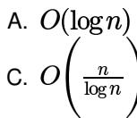
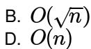
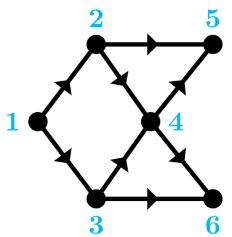
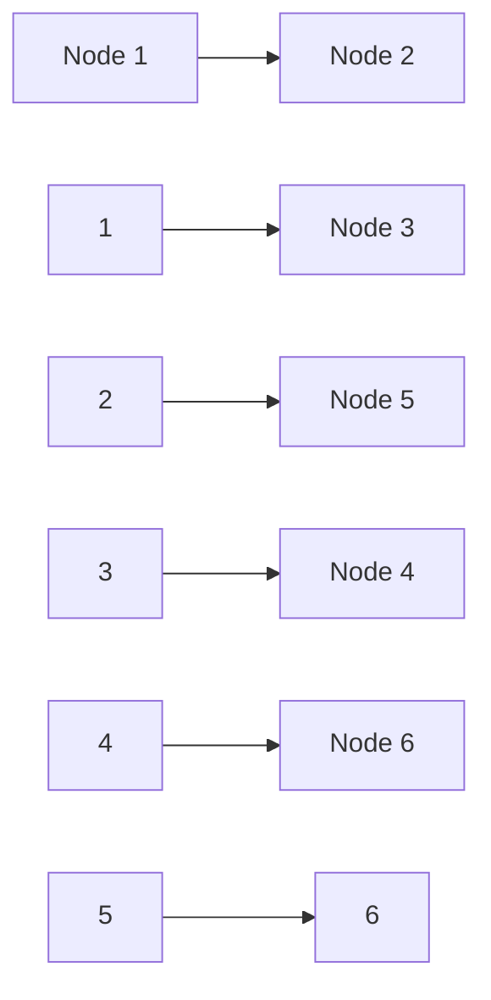
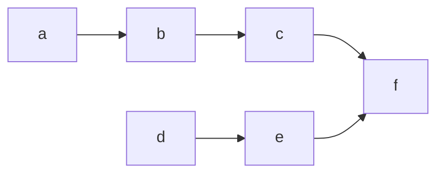
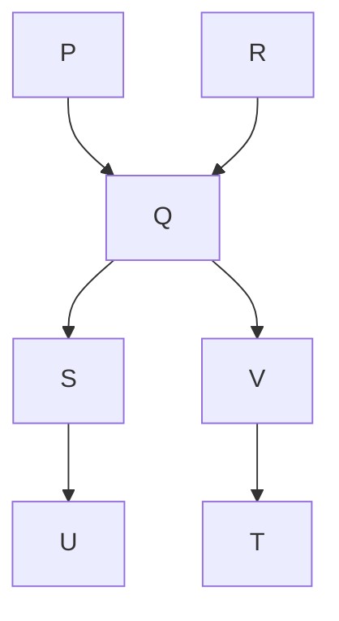

```txt
return (2 * f1(n-1) + 3 * f1(n-2));
}
int f2(int n)
{
    int i;
    int X[N], Y[N], Z[N];
    X[0] = Y[0] = Z[0] = 0;
    X[1] = 1; Y[1] = 2; Z[1] = 3;
    for(i = 2; i <= n; i++){
        X[i] = Y[i-1] + Z[i-2];
        Y[i] = 2 * X[i];
        Z[i] = 3 * X[i];
    }
    return X[n];
}
```

The running time of $f1(n)$ and $f2(n)$ are

A. $\Theta(n)$ and $\Theta(n)$

B. $\Theta(2^n)$ and $\Theta(n)$

C. $\Theta(n)$ and $\Theta(2^n)$

D. $\Theta(2^n)$ and $\Theta(2^n)$

gatecse-2008 algorithms time-complexity normal

# Answer key

# 1.43.19 Time Complexity: GATE CSE 2008 | Question: 75

Consider the following C functions:


```c
int f1 (int n)
{
    if(n == 0 || n == 1)
        return n;
    else
        return (2 * f1(n-1) + 3 * f1(n-2));
}
int f2(int n)
{
    int i;
    int X[N], Y[N], Z[N];
    X[0] = Y[0] = Z[0] = 0;
    X[1] = 1; Y[1] = 2; Z[1] = 3;
    for(i = 2; i <= n; i++){
        X[i] = Y[i-1] + Z[i-2];
        Y[i] = 2 * X[i];
        Z[i] = 3 * X[i];
    }
    return X[n];
}
```

$f1(8)$ and $f2(8)$ return the values

A. 1661 and 1640

B. 59 and 59

C. 1640 and 1640

D. 1640 and 1661

gatecse-2008 normal algorithms time-complexity

# Answer key

# 1.43.20 Time Complexity: GATE CSE 2010 | Question: 12

Two alternative packages A and B are available for processing a database having $10^{k}$ records. Package A requires $0.0001n^{2}$ time units and package B requires $10n\log_{10}n$ time units to process n records. What is the smallest value of k for which package B will be preferred over A?

A. 12

B. 10

C. 6

D. 5

gatecse-2010 algorithms time-complexity easy

# Answer key

# 1.43.21 Time Complexity: GATE CSE 2014 | Set 1 | Question: 42

Consider the following pseudo code. What is the total number of multiplications to be performed?

D = 2

for i = 1 to n do


for j = i to n do

for k = j + 1 to n do

$D = D^{*}3$

A. Half of the product of the 3 consecutive integers.  
B. One-third of the product of the 3 consecutive integers.  
C. One-sixth of the product of the 3 consecutive integers.  
D. None of the above.

gatecse-2014-set1 algorithms time-complexity normal

# Answer key

# 1.43.22 Time Complexity: GATE CSE 2015 | Set 1 | Question: 40

An algorithm performs $(\log N)^{\frac{1}{2}}$ find operations, N insert operations, $(\log N)^{\frac{1}{2}}$ delete operations, and $(\log N)^{\frac{1}{2}}$ decrease-key operations on a set of data items with keys drawn from a linearly ordered set. For a delete operation, a pointer is provided to the record that must be deleted. For the decrease-key operation, a pointer is provided to the record that has its key decreased. Which one of the following data structures is the most suited for the algorithm to use, if the goal is to achieve the best total asymptotic complexity considering all the operations?

A. Unsorted array

C. Sorted array

B. Min - heap

D. Sorted doubly linked list

gatecse-2015-set1 algorithms data-structures normal time-complexity

# Answer key

# 1.43.23 Time Complexity: GATE CSE 2015 | Set 2 | Question: 22

An unordered list contains $n$ distinct elements. The number of comparisons to find an element in this list that is neither maximum nor minimum is

A. $\Theta(n \log n)$

B. $\Theta(n)$

C. $\Theta (\log n)$

D. $\Theta(1)$

gatecse-2015-set2 algorithms time-complexity easy

# Answer key

# 1.43.24 Time Complexity: GATE CSE 2017 | Set 2 | Question: 03

Match the algorithms with their time complexities:

<table><tr><td>Algorithms</td><td>Time Complexity</td></tr><tr><td>P. Tower of Hanoi with n disks</td><td>i.  $\Theta(n^{2})$ </td></tr><tr><td>Q. Binary Search given n sorted numbers</td><td>ii.  $\Theta(n \log n)$ </td></tr><tr><td>R. Heap sort given n numbers at the worst case</td><td>iii.  $\Theta(2^{n})$ </td></tr><tr><td>S. Addition of two  $n \times n$  matrices</td><td>iv.  $\Theta(\log n)$ </td></tr></table>

A. $P \to (iii)$ $Q \to (iv)$ $r \to (i)$ $S \to (ii)$  
B. $P\to (iv)$ $Q\to (iii)$ $r\to (i)$ $S\to (ii)$  
C. $P\to (iii)$ $Q\to (iv)$ $r\to (ii)$ $S\to (i)$  
D. $P\to (iv)$ $Q\to (iii)$ $r\to (ii)$ $S\to (i)$

gatecse-2017-set2 algorithms time-complexity match-the-following easy

# Answer key

# 1.43.25 Time Complexity: GATE CSE 2017 | Set 2 | Question: 38

Consider the following C function

int fun(int n) {

int i, j;

for(i=1; i<=n; i++) {


```txt
for (j=1; j<n; j+=i) {
            printf("%d %d", i, j);
        }
    }
}
```

Time complexity of fun in terms of $\Theta$ notation is

A. $\Theta(n\sqrt{n})$  
C. $\Theta(n \log n)$

B. $\Theta(n^{2})$  
D. $\Theta(n^{2}\log n)$

gatecse-2017-set2 algorithms time-complexity

# Answer key

# 1.43.26 Time Complexity: GATE CSE 2019 | Question: 37


There are n unsorted arrays: $A_{1}, A_{2}, \ldots, A_{n}$ . Assume that n is odd. Each of $A_{1}, A_{2}, \ldots, A_{n}$ contains n distinct elements. There are no common elements between any two arrays. The worst-case time complexity of computing the median of the medians of $A_{1}, A_{2}, \ldots, A_{n}$ is

A. $O(n)$  
C. $O(n^{2})$

B. $O(n\log n)$  
D. $\Omega(n^{2}\log n)$

gatecse-2019 algorithms time-complexity two-marks

# Answer key

# 1.43.27 Time Complexity: GATE CSE 2024 | Set 1 | Question: 7


Given an integer array of size N, we want to check if the array is sorted (in either ascending or descending order). An algorithm solves this problem by making a single pass through the array and comparing each element of the array only with its adjacent elements. The worst-case time complexity of this algorithm is

A. both $\mathrm{O}(N)$ and $\Omega (N)$

C. $\Omega(N)$ but not $\mathrm{O}(N)$

B. $\mathrm{O}(N)$ but not $\Omega (N)$

D. neither $\mathrm{O}(N)$ nor $\Omega (N)$

gatecse-2024-set1 algorithms time-complexity one-mark

# Answer key

# 1.43.28 Time Complexity: GATE CSE 2026 | Set 1 | Question: 7


Consider the following recurrence relations:

For all n > 1,

$$
\begin{array}{l} T _ {1} (n) = 4 T _ {1} \left(\frac {n}{2}\right) + T _ {2} (n) \\ T _ {2} (n) = 5 T _ {2} \left(\frac {n}{4}\right) + \Theta \left(\log_ {2} n\right) \\ \end{array}
$$

Assume that for all $n \leq 1, T_1(n) = 1$ and $T_2(n) = 1$ .

Which one of the following options is correct?

A. $T_{1}(n) = \Theta (n^{2})$  
C. $T_{1}(n) = \Theta \left(n^{\log_{4}5}\right)$

B. $T_{1}(n) = \Theta (n^{2}\log_{2}n)$

D. $T_{1}(n) = \Theta \left(n^{\log_{4}5}\log_{2}n\right)$

gatecse-2026-set1 algorithms time-complexity one-mark

# Answer key

# 1.43.29 Time Complexity: GATE CSE 2026 | Set 2 | Question: 28


Consider an array A of integers of size n. The indices of A run from 1 to n. An algorithm is to be designed to check whether A satisfies the condition given below.

$\forall i, j \in \{1, \dots, n - 1\}$ such that $i > j$ , $(A[i + 1] - A[i]) > (A[j + 1] - A[j])$

Which one of the following gives the worst case time complexity of the fastest algorithm that can be designed for the problem?

A. $\Theta(n)$  
C. $\Theta(n\log(n))$

B. $\Theta (\log (n))$  
D. $\Theta(n^{2})$

# Answer key

# 1.43.30 Time Complexity: GATE IT 2007 | Question: 17

Exponentiation is a heavily used operation in public key cryptography. Which of the following options is the tightest upper bound on the number of multiplications required to compute $b^{n} \mod m, 0 \leq b, n \leq m$ ?


  
gateit-2007 algorithms time-complexity normal



# Answer key

# 1.43.31 Time Complexity: GATE IT 2007 | Question: 81

Let $P_{1}, P_{2}, \ldots, P_{n}$ be n points in the xy-plane such that no three of them are collinear. For every pair of points $P_{i}$ and $P_{j}$ , let $L_{ij}$ be the line passing through them. Let $L_{ab}$ be the line with the steepest gradient among all $n(n-1)/2$ lines.


The time complexity of the best algorithm for finding $P_{a}$ and $P_{b}$ is

  
gateit-2007 algorithms time-complexity normal


# Answer key

# 1.44

# Topological Sort (4)

# Practice Test: Test 1 (7Q)

# 1.44.1 Topological Sort: GATE CSE 2007 | Question: 5

Consider the DAG with $V = \{1,2,3,4,5,6\}$ shown below.




<details>
<summary>flowchart</summary>


</details>

Which of the following is not a topological ordering?

A. 123456

B. 132456

C. 132465

D. 324165

gatecse-2007 algorithms graph-algorithms topological-sort easy

# Answer key

# 1.44.2 Topological Sort: GATE CSE 2014 | Set 1 | Question: 13

Consider the directed graph below given.


Which one of the following is TRUE?

A. The graph does not have any topological ordering.

B. Both PQRS and SRQP are topological orderings.  
C. Both PSRQ and SPRQ are topological orderings.  
D. PSRQ is the only topological ordering.

gatecse-2014-set1 graph-algorithms easy topological-sort

# Answer key

# 1.44.3 Topological Sort: GATE CSE 2016 | Set 1 | Question: 11

Consider the following directed graph:


<details>
<summary>flowchart</summary>


</details>

The number of different topological orderings of the vertices of the graph is \_\_\_\_.

gatecse-2016-set1 algorithms graph-algorithms normal numerical-answers topological-sort

# Answer key

# 1.44.4 Topological Sort: GATE DS&AI 2024 | Question: 41

Consider the directed acyclic graph (DAG) below:


<details>
<summary>flowchart</summary>


</details>

Which of the following is/are valid vertex orderings that can be obtained from a topological sort of the DAG?

A. PQRSTUV

c. PQRSVUT

gate-ds-ai-2024 algorithms topological-sort directed-acyclic-graph multiple-selects two-marks

B. P R Q V SUT

D. PRQSVTU

# Answer key

# 1.45

# Tree Traversal (1)

# 1.45.1 Tree Traversal: GATE DA 2026 | Question: 15

You are given the following Pre-order and In-order traversals of a Binary Tree T with nodes E, F, G, P, Q, R, S.

Pre-order: P Q S E R F G

In-order: $S Q E P F R G$


Which of the following statements is/are true about the Binary Tree T?

A. Node P is the root of T

B. The Post-order traversal of $T$ is:

C. Node Q has only one child

D. The left subtree of node $R$


# 1.46

# Uniform Hashing (1)

# 1.46.1 Uniform Hashing: GATE CSE 2022 | Question: 6


Suppose we are given n keys, m hash table slots, and two simple uniform hash functions $h_{1}$ and $h_{2}$ . Further suppose our hashing scheme uses $h_{1}$ for the odd keys and $h_{2}$ for the even keys. What is the expected number of keys in a slot?

A. $\frac{m}{n}$

B. $\frac{n}{m}$

C. $\frac{2n}{m}$

D. $\frac{n}{2m}$

gatecse-2022 algorithms hashing uniform-hashing one-mark

# Answer key

Answer Keys

<table><tr><td>1.1.1</td><td>N/A</td></tr><tr><td>1.1.6</td><td>29</td></tr><tr><td>1.2.3</td><td>C</td></tr><tr><td>1.2.8</td><td>C</td></tr><tr><td>1.3.4</td><td>D</td></tr><tr><td>1.3.9</td><td>D</td></tr><tr><td>1.3.14</td><td>B</td></tr><tr><td>1.3.19</td><td>A</td></tr><tr><td>1.4.2</td><td>C</td></tr><tr><td>1.6.4</td><td>A</td></tr><tr><td>1.9.1</td><td>C</td></tr><tr><td>1.12.1</td><td>B;D</td></tr><tr><td>1.13.4</td><td>A</td></tr><tr><td>1.15.2</td><td>10:10</td></tr><tr><td>1.16.5</td><td>B</td></tr><tr><td>1.16.10</td><td>A</td></tr><tr><td>1.17.5</td><td>B</td></tr><tr><td>1.17.10</td><td>C</td></tr><tr><td>1.18.4</td><td>C</td></tr><tr><td>1.18.9</td><td>B</td></tr><tr><td>1.18.14</td><td>A</td></tr><tr><td>1.18.19</td><td>A</td></tr><tr><td>1.19.1</td><td>A</td></tr><tr><td>1.20.1</td><td>B</td></tr><tr><td>1.20.6</td><td>D</td></tr><tr><td>1.22.3</td><td>D</td></tr><tr><td>1.23.2</td><td>N/A</td></tr></table>

<table><tr><td>1.1.2</td><td>N/A</td></tr><tr><td>1.1.7</td><td>A;C</td></tr><tr><td>1.2.4</td><td>A</td></tr><tr><td>1.2.9</td><td>C</td></tr><tr><td>1.3.5</td><td>B</td></tr><tr><td>1.3.10</td><td>A</td></tr><tr><td>1.3.15</td><td>D</td></tr><tr><td>1.3.20</td><td>A</td></tr><tr><td>1.5.1</td><td>B;C</td></tr><tr><td>1.7.1</td><td>D</td></tr><tr><td>1.9.2</td><td>D</td></tr><tr><td>1.12.2</td><td>75:75</td></tr><tr><td>1.13.5</td><td>D</td></tr><tr><td>1.16.1</td><td>B</td></tr><tr><td>1.16.6</td><td>A</td></tr><tr><td>1.17.1</td><td>B</td></tr><tr><td>1.17.6</td><td>A</td></tr><tr><td>1.17.11</td><td>D</td></tr><tr><td>1.18.5</td><td>D</td></tr><tr><td>1.18.10</td><td>19</td></tr><tr><td>1.18.15</td><td>5040</td></tr><tr><td>1.18.20</td><td>D</td></tr><tr><td>1.19.2</td><td>B</td></tr><tr><td>1.20.2</td><td>N/A</td></tr><tr><td>1.21.1</td><td>C</td></tr><tr><td>1.22.4</td><td>225</td></tr><tr><td>1.23.3</td><td>C</td></tr></table>

<table><tr><td>1.1.3</td><td>B</td></tr><tr><td>1.1.8</td><td>B</td></tr><tr><td>1.2.5</td><td>B</td></tr><tr><td>1.3.1</td><td>A;B</td></tr><tr><td>1.3.6</td><td>A</td></tr><tr><td>1.3.11</td><td>C</td></tr><tr><td>1.3.16</td><td>A</td></tr><tr><td>1.3.21</td><td>D</td></tr><tr><td>1.6.1</td><td>B</td></tr><tr><td>1.7.2</td><td>7 : 7</td></tr><tr><td>1.9.3</td><td>C</td></tr><tr><td>1.13.1</td><td>N/A</td></tr><tr><td>1.14.1</td><td>929 : 929</td></tr><tr><td>1.16.2</td><td>C</td></tr><tr><td>1.16.7</td><td>34</td></tr><tr><td>1.17.2</td><td>D</td></tr><tr><td>1.17.7</td><td>A;B</td></tr><tr><td>1.18.1</td><td>N/A</td></tr><tr><td>1.18.6</td><td>D</td></tr><tr><td>1.18.11</td><td>D</td></tr><tr><td>1.18.16</td><td>C</td></tr><tr><td>1.18.21</td><td>D</td></tr><tr><td>1.19.3</td><td>D</td></tr><tr><td>1.20.3</td><td>C</td></tr><tr><td>1.21.2</td><td>D</td></tr><tr><td>1.22.5</td><td>B</td></tr><tr><td>1.23.4</td><td>A</td></tr></table>

<table><tr><td>1.1.4</td><td>C</td></tr><tr><td>1.2.1</td><td>N/A</td></tr><tr><td>1.2.6</td><td>A</td></tr><tr><td>1.3.2</td><td>B</td></tr><tr><td>1.3.7</td><td>C</td></tr><tr><td>1.3.12</td><td>C</td></tr><tr><td>1.3.17</td><td>A;C</td></tr><tr><td>1.3.22</td><td>A</td></tr><tr><td>1.6.2</td><td>C</td></tr><tr><td>1.7.3</td><td>A;C</td></tr><tr><td>1.10.1</td><td>N/A</td></tr><tr><td>1.13.2</td><td>B</td></tr><tr><td>1.14.2</td><td>A</td></tr><tr><td>1.16.3</td><td>C</td></tr><tr><td>1.16.8</td><td>150</td></tr><tr><td>1.17.3</td><td>A</td></tr><tr><td>1.17.8</td><td>A</td></tr><tr><td>1.18.2</td><td>C</td></tr><tr><td>1.18.7</td><td>C</td></tr><tr><td>1.18.12</td><td>31</td></tr><tr><td>1.18.17</td><td>60</td></tr><tr><td>1.18.22</td><td>D</td></tr><tr><td>1.19.4</td><td>A</td></tr><tr><td>1.20.4</td><td>C</td></tr><tr><td>1.22.1</td><td>2.33</td></tr><tr><td>1.22.6</td><td>A</td></tr><tr><td>1.23.5</td><td>N/A</td></tr></table>

<table><tr><td>1.1.5</td><td>12</td></tr><tr><td>1.2.2</td><td>B</td></tr><tr><td>1.2.7</td><td>C</td></tr><tr><td>1.3.3</td><td>X</td></tr><tr><td>1.3.8</td><td>C</td></tr><tr><td>1.3.13</td><td>D</td></tr><tr><td>1.3.18</td><td>A;D</td></tr><tr><td>1.4.1</td><td>B</td></tr><tr><td>1.6.3</td><td>10:10</td></tr><tr><td>1.8.1</td><td>11 : 11</td></tr><tr><td>1.11.1</td><td>TBA</td></tr><tr><td>1.13.3</td><td>D</td></tr><tr><td>1.15.1</td><td>13</td></tr><tr><td>1.16.4</td><td>B</td></tr><tr><td>1.16.9</td><td>C</td></tr><tr><td>1.17.4</td><td>A</td></tr><tr><td>1.17.9</td><td>A</td></tr><tr><td>1.18.3</td><td>C</td></tr><tr><td>1.18.8</td><td>C</td></tr><tr><td>1.18.13</td><td>D</td></tr><tr><td>1.18.18</td><td>6:6</td></tr><tr><td>1.18.23</td><td>B</td></tr><tr><td>1.19.5</td><td>16</td></tr><tr><td>1.20.5</td><td>3:3</td></tr><tr><td>1.22.2</td><td>A</td></tr><tr><td>1.23.1</td><td>N/A</td></tr><tr><td>1.23.6</td><td>C</td></tr></table>

<table><tr><td>1.23.7</td><td>C</td></tr><tr><td>1.23.12</td><td>B</td></tr><tr><td>1.23.17</td><td>D</td></tr><tr><td>1.23.22</td><td>D</td></tr><tr><td>1.23.27</td><td>D</td></tr><tr><td>1.23.32</td><td>1023 : 1023</td></tr><tr><td>1.23.37</td><td>D</td></tr><tr><td>1.25.2</td><td>A;C</td></tr><tr><td>1.27.3</td><td>C</td></tr><tr><td>1.29.4</td><td>3:3</td></tr><tr><td>1.31.3</td><td>2</td></tr><tr><td>1.31.8</td><td>B</td></tr><tr><td>1.31.13</td><td>D</td></tr><tr><td>1.31.18</td><td>X</td></tr><tr><td>1.31.23</td><td>7</td></tr><tr><td>1.31.28</td><td>3 : 3</td></tr><tr><td>1.31.33</td><td>5:5</td></tr><tr><td>1.33.2</td><td>C</td></tr><tr><td>1.34.5</td><td>C</td></tr><tr><td>1.34.10</td><td>A</td></tr><tr><td>1.34.15</td><td>0</td></tr><tr><td>1.35.5</td><td>N/A</td></tr><tr><td>1.35.10</td><td>N/A</td></tr><tr><td>1.35.15</td><td>B</td></tr><tr><td>1.35.20</td><td>X</td></tr><tr><td>1.35.25</td><td>B</td></tr><tr><td>1.35.30</td><td>C</td></tr><tr><td>1.35.35</td><td>C</td></tr><tr><td>1.36.4</td><td>60 : 60</td></tr><tr><td>1.37.4</td><td>C</td></tr><tr><td>1.38.1</td><td>A</td></tr><tr><td>1.39.4</td><td>A</td></tr><tr><td>1.40.1</td><td>N/A</td></tr><tr><td>1.40.6</td><td>N/A</td></tr><tr><td>1.40.11</td><td>A</td></tr><tr><td>1.40.16</td><td>C</td></tr><tr><td>1.40.21</td><td>C</td></tr><tr><td>1.42.3</td><td>B</td></tr><tr><td>1.43.5</td><td>A</td></tr><tr><td>1.43.10</td><td>C</td></tr></table>

<table><tr><td>1.23.8</td><td>N/A</td></tr><tr><td>1.23.13</td><td>D</td></tr><tr><td>1.23.18</td><td>D</td></tr><tr><td>1.23.23</td><td>B</td></tr><tr><td>1.23.28</td><td>51</td></tr><tr><td>1.23.33</td><td>15 : 15</td></tr><tr><td>1.23.38</td><td>C</td></tr><tr><td>1.26.1</td><td>C</td></tr><tr><td>1.28.1</td><td>147.1 : 148.1</td></tr><tr><td>1.30.1</td><td>C</td></tr><tr><td>1.31.4</td><td>N/A</td></tr><tr><td>1.31.9</td><td>C</td></tr><tr><td>1.31.14</td><td>D</td></tr><tr><td>1.31.19</td><td>6</td></tr><tr><td>1.31.24</td><td>B</td></tr><tr><td>1.31.29</td><td>C</td></tr><tr><td>1.31.34</td><td>A;D</td></tr><tr><td>1.34.1</td><td>C</td></tr><tr><td>1.34.6</td><td>B</td></tr><tr><td>1.34.11</td><td>B</td></tr><tr><td>1.35.1</td><td>N/A</td></tr><tr><td>1.35.6</td><td>N/A</td></tr><tr><td>1.35.11</td><td>B</td></tr><tr><td>1.35.16</td><td>D</td></tr><tr><td>1.35.21</td><td>A</td></tr><tr><td>1.35.26</td><td>2.32 : 2.33</td></tr><tr><td>1.35.31</td><td>A</td></tr><tr><td>1.35.36</td><td>A</td></tr><tr><td>1.36.5</td><td>65536 : 65536</td></tr><tr><td>1.37.5</td><td>A</td></tr><tr><td>1.38.2</td><td>B</td></tr><tr><td>1.39.5</td><td>B</td></tr><tr><td>1.40.2</td><td>A</td></tr><tr><td>1.40.7</td><td>B</td></tr><tr><td>1.40.12</td><td>C</td></tr><tr><td>1.40.17</td><td>3</td></tr><tr><td>1.40.22</td><td>C</td></tr><tr><td>1.43.1</td><td>N/A</td></tr><tr><td>1.43.6</td><td>N/A</td></tr><tr><td>1.43.11</td><td>C</td></tr></table>

<table><tr><td>1.23.9</td><td>C</td></tr><tr><td>1.23.14</td><td>C</td></tr><tr><td>1.23.19</td><td>B</td></tr><tr><td>1.23.24</td><td>A</td></tr><tr><td>1.23.29</td><td>0</td></tr><tr><td>1.23.34</td><td>D</td></tr><tr><td>1.24.1</td><td>A</td></tr><tr><td>1.26.2</td><td>D</td></tr><tr><td>1.29.1</td><td>B</td></tr><tr><td>1.30.2</td><td>358</td></tr><tr><td>1.31.5</td><td>N/A</td></tr><tr><td>1.31.10</td><td>B</td></tr><tr><td>1.31.15</td><td>B</td></tr><tr><td>1.31.20</td><td>69</td></tr><tr><td>1.31.25</td><td>4</td></tr><tr><td>1.31.30</td><td>A;B;C</td></tr><tr><td>1.31.35</td><td>A</td></tr><tr><td>1.34.2</td><td>N/A</td></tr><tr><td>1.34.7</td><td>B</td></tr><tr><td>1.34.12</td><td>A</td></tr><tr><td>1.35.2</td><td>N/A</td></tr><tr><td>1.35.7</td><td>N/A</td></tr><tr><td>1.35.12</td><td>N/A</td></tr><tr><td>1.35.17</td><td>A</td></tr><tr><td>1.35.22</td><td>D</td></tr><tr><td>1.35.27</td><td>B</td></tr><tr><td>1.35.32</td><td>A</td></tr><tr><td>1.36.1</td><td>C</td></tr><tr><td>1.37.1</td><td>N/A</td></tr><tr><td>1.37.6</td><td>5</td></tr><tr><td>1.39.1</td><td>N/A</td></tr><tr><td>1.39.6</td><td>C</td></tr><tr><td>1.40.3</td><td>7</td></tr><tr><td>1.40.8</td><td>B</td></tr><tr><td>1.40.13</td><td>A</td></tr><tr><td>1.40.18</td><td>A</td></tr><tr><td>1.41.1</td><td>B</td></tr><tr><td>1.43.2</td><td>N/A</td></tr><tr><td>1.43.7</td><td>A</td></tr><tr><td>1.43.12</td><td>D</td></tr></table>

<table><tr><td>1.23.10</td><td>D</td></tr><tr><td>1.23.15</td><td>C</td></tr><tr><td>1.23.20</td><td>C</td></tr><tr><td>1.23.25</td><td>9</td></tr><tr><td>1.23.30</td><td>D</td></tr><tr><td>1.23.35</td><td>C</td></tr><tr><td>1.24.2</td><td>D</td></tr><tr><td>1.27.1</td><td>C</td></tr><tr><td>1.29.2</td><td>B</td></tr><tr><td>1.31.1</td><td>B;D;E</td></tr><tr><td>1.31.6</td><td>C</td></tr><tr><td>1.31.11</td><td>D</td></tr><tr><td>1.31.16</td><td>B</td></tr><tr><td>1.31.21</td><td>995</td></tr><tr><td>1.31.26</td><td>D</td></tr><tr><td>1.31.31</td><td>24</td></tr><tr><td>1.32.1</td><td>435:435</td></tr><tr><td>1.34.3</td><td>N/A</td></tr><tr><td>1.34.8</td><td>B</td></tr><tr><td>1.34.13</td><td>0.08</td></tr><tr><td>1.35.3</td><td>N/A</td></tr><tr><td>1.35.8</td><td>B</td></tr><tr><td>1.35.13</td><td>B</td></tr><tr><td>1.35.18</td><td>B</td></tr><tr><td>1.35.23</td><td>A</td></tr><tr><td>1.35.28</td><td>A</td></tr><tr><td>1.35.33</td><td>A;B</td></tr><tr><td>1.36.2</td><td>A</td></tr><tr><td>1.37.2</td><td>C</td></tr><tr><td>1.37.7</td><td>B;C;D</td></tr><tr><td>1.39.2</td><td>B</td></tr><tr><td>1.39.7</td><td>A;C;D</td></tr><tr><td>1.40.4</td><td>N/A</td></tr><tr><td>1.40.9</td><td>N/A</td></tr><tr><td>1.40.14</td><td>D</td></tr><tr><td>1.40.19</td><td>B;C;D</td></tr><tr><td>1.42.1</td><td>C</td></tr><tr><td>1.43.3</td><td>B;C;D;E</td></tr><tr><td>1.43.8</td><td>C</td></tr><tr><td>1.43.13</td><td>D</td></tr></table>

<table><tr><td>1.23.11</td><td>A</td></tr><tr><td>1.23.16</td><td>D</td></tr><tr><td>1.23.21</td><td>B</td></tr><tr><td>1.23.26</td><td>A</td></tr><tr><td>1.23.31</td><td>81</td></tr><tr><td>1.23.36</td><td>C</td></tr><tr><td>1.25.1</td><td>B</td></tr><tr><td>1.27.2</td><td>1500</td></tr><tr><td>1.29.3</td><td>B</td></tr><tr><td>1.31.2</td><td>N/A</td></tr><tr><td>1.31.7</td><td>N/A</td></tr><tr><td>1.31.12</td><td>D</td></tr><tr><td>1.31.17</td><td>C</td></tr><tr><td>1.31.22</td><td>A</td></tr><tr><td>1.31.27</td><td>99</td></tr><tr><td>1.31.32</td><td>9</td></tr><tr><td>1.33.1</td><td>D</td></tr><tr><td>1.34.4</td><td>C</td></tr><tr><td>1.34.9</td><td>C</td></tr><tr><td>1.34.14</td><td>D</td></tr><tr><td>1.35.4</td><td>N/A</td></tr><tr><td>1.35.9</td><td>A</td></tr><tr><td>1.35.14</td><td>C</td></tr><tr><td>1.35.19</td><td>D</td></tr><tr><td>1.35.24</td><td>A</td></tr><tr><td>1.35.29</td><td>C</td></tr><tr><td>1.35.34</td><td>B</td></tr><tr><td>1.36.3</td><td>10230</td></tr><tr><td>1.37.3</td><td>A</td></tr><tr><td>1.37.8</td><td>D</td></tr><tr><td>1.39.3</td><td>D</td></tr><tr><td>1.39.8</td><td>C</td></tr><tr><td>1.40.5</td><td>D</td></tr><tr><td>1.40.10</td><td>N/A</td></tr><tr><td>1.40.15</td><td>D</td></tr><tr><td>1.40.20</td><td>B</td></tr><tr><td>1.42.2</td><td>109</td></tr><tr><td>1.43.4</td><td>D</td></tr><tr><td>1.43.9</td><td>D</td></tr><tr><td>1.43.14</td><td>B</td></tr></table>

<table><tr><td>1.43.15</td><td>B</td></tr><tr><td>1.43.20</td><td>C</td></tr><tr><td>1.43.25</td><td>C</td></tr><tr><td>1.43.30</td><td>A</td></tr><tr><td>1.44.4</td><td>B;D</td></tr></table>

<table><tr><td>1.43.16</td><td>B</td></tr><tr><td>1.43.21</td><td>C</td></tr><tr><td>1.43.26</td><td>C</td></tr><tr><td>1.43.31</td><td>B</td></tr><tr><td>1.45.1</td><td>A;B</td></tr></table>

<table><tr><td>1.43.17</td><td>B</td></tr><tr><td>1.43.22</td><td>A</td></tr><tr><td>1.43.27</td><td>A</td></tr><tr><td>1.44.1</td><td>D</td></tr><tr><td>1.46.1</td><td>B</td></tr></table>

<table><tr><td>1.43.18</td><td>B</td></tr><tr><td>1.43.23</td><td>D</td></tr><tr><td>1.43.28</td><td>A</td></tr><tr><td>1.44.2</td><td>C</td></tr></table>

<table><tr><td>1.43.19</td><td>C</td></tr><tr><td>1.43.24</td><td>C</td></tr><tr><td>1.43.29</td><td>A</td></tr><tr><td>1.44.3</td><td>6</td></tr></table>

Lexical analysis, Parsing, Syntax-directed translation, Runtime environments, Intermediate code generation.

Mark Distribution in Previous GATE

<table><tr><td>Year</td><td>2026 - 1</td><td>2026 - 2</td><td>2025 - 1</td><td>2025 - 2</td><td>2024 - 1</td><td>2024 - 2</td><td>2023</td><td>2022</td><td>2021 - 1</td><td>2021 - 2</td><td>Minimum</td></tr><tr><td>1 Mark Count</td><td>2</td><td>2</td><td>2</td><td>2</td><td>2</td><td>2</td><td>1</td><td>2</td><td>1</td><td>2</td><td>1</td></tr><tr><td>2 Marks Count</td><td>2</td><td>2</td><td>2</td><td>2</td><td>4</td><td>3</td><td>3</td><td>1</td><td>3</td><td>2</td><td>1</td></tr><tr><td>Total Marks</td><td>6</td><td>6</td><td>6</td><td>6</td><td>10</td><td>8</td><td>7</td><td>4</td><td>7</td><td>6</td><td>4</td></tr></table>

# Subject Overview

Compiler Design is a fundamental area of Computer Science that deals with the theory and practice of building compilers – programs that translate source code written in a high-level programming language into an equivalent low-level machine-understandable form (like assembly or machine code). Understanding compiler design is crucial for a GATE CS aspirant as it provides deep insights into how programming languages work, how software interacts with hardware, and the underlying mechanisms of program execution. This subject often carries a weightage of 6-10 marks in the GATE CS exam, typically involving 2-3 questions of 2 marks and 1-2 questions of 1 mark. Questions range from theoretical concepts (phases of compilation, definitions) and conceptual understanding (optimization techniques, runtime environment) to numerical problems (parsing table construction, FIRST/FOLLOW sets, DAG generation, register allocation). A strong grasp of this subject is vital not just for the exam, but also for a holistic understanding of computer systems.

# Topic-wise Key Concepts

# Abstract Syntax Tree (AST)

An AST is a tree representation of the abstract syntactic structure of source code, where each node denotes a construct in the source code. It abstracts away the concrete syntax (like parentheses or semicolons) and focuses on the essential structure and meaning of the program. ASTs are crucial for semantic analysis, intermediate code generation, and various optimization techniques.

# - Key Properties:

- Nodes represent operators and keywords, while leaves represent operands and identifiers.  
- More compact than a parse tree, omitting unnecessary details like non-terminals that only derive other non-terminals.  
- Used as an intermediate representation for subsequent compiler phases.

\- Common Pitfalls: Confusing AST with a parse tree. A parse tree shows every detail of the derivation; an AST shows only the essential structure.

\- Standard Problem-Solving Technique: Given a grammar and an expression, construct its parse tree first, then derive the AST by eliminating redundant nodes and structuring it based on operator precedence and associativity.

# Ambiguous Grammar

A grammar is said to be ambiguous if there exists at least one string that can be generated by the grammar in more than one leftmost derivation, or more than one rightmost derivation, or has more than one parse tree. Ambiguity is undesirable in programming language grammars because it leads to multiple interpretations of the same program statement.

# - Key Properties:

- Causes difficulty for parsers as they cannot uniquely determine the structure of an input string.  
- Common sources include dangling-else problem and lack of operator precedence/associativity rules.

\- Common Pitfalls: Not being able to identify ambiguity. A common test is to find a string with two distinct parse trees.

\- Standard Problem-Solving Technique: To resolve ambiguity, rewrite the grammar by introducing new non-terminals or by incorporating precedence and associativity rules directly into the grammar productions. For example, for arithmetic expressions, introduce non-terminals like Term and Factor.

# Assembler

An assembler is a program that translates assembly language code into machine code. Assembly language uses

mnemonics for operations and symbolic names for memory locations, making it more human-readable than raw machine code. Assemblers typically perform a one-to-one translation of assembly instructions to machine instructions.

# - Key Properties:

# - Two-Pass Assembler:

1. Pass 1: Scans the source code to build a symbol table (mapping symbolic labels to memory addresses) and determines the length of machine instructions.

2. Pass 2: Uses the symbol table to translate assembly instructions into machine code, filling in operand addresses.

\- Handles pseudo-operations (directives) like ORG, EQU, START, END, which guide the assembly process but don't translate into machine instructions.

- Common Pitfalls: Confusing assembler with compiler or linker. Assembler works at a lower level, translating assembly to machine code.  
- Standard Problem-Solving Technique: Trace the assembly process, building a symbol table and calculating location counter values for each instruction and data item.

# Backpatching

Backpatching is a technique used in one-pass code generation, particularly for control flow statements (like if-else, while loops) and boolean expressions. It involves generating jump instructions with initially unspecified target addresses, which are later filled in (patched) once the true target address becomes known.

# - Key Properties:

- Uses lists of incomplete jumps (e.g., truelist, falselist, nextlist).  
- makelist(i): Creates a new list containing only i (an index into the list of quadruples).  
- merge(p1, p2): Concatenates lists p1 and p2, returning the combined list.  
- backpatch(p, i): Inserts i as the target label for each of the jumps in listp.

\- Standard Problem-Solving Technique: Trace the generation of three-address code for control flow statements, maintaining and updating truelist, falselist, and nextlist as new quadruples are generated.

# Basic Blocks

A basic block is a sequence of consecutive statements in which flow of control enters at the beginning and leaves at the end without halt or possibility of branching except at the end. Basic blocks are fundamental units for many code optimization techniques.

# - Key Properties:

- No jumps into the middle of a basic block.  
- No jumps out of the middle of a basic block.  
- The first statement is called a leader.

# - Standard Problem-Solving Technique:

# 1. Identify leaders:

■ The first statement of the program is a leader.  
- Any statement that is the target of a conditional or unconditional jump is a leader.  
- Any statement immediately following a conditional or unconditional jump is a leader.

2. For each leader, its basic block consists of the leader and all subsequent statements up to, but not including, the next leader or the end of the program.

# Code Optimization

Code optimization is the phase of a compiler that attempts to improve the intermediate code or target code to make it run faster, use less memory, or consume less power, without changing the program's observable behavior. It can be machine-independent or machine-dependent.

# • Key Types/Techniques:

# - Machine-Independent:

- Peephole Optimization: Examines a small sliding window of instructions and replaces suboptimal sequences with better ones (e.g., redundant loads/stores, strength reduction).  
- Common Subexpression Elimination (CSE): Identifies and removes redundant computations of the same expression.  
- Dead Code Elimination: Removes code that is never executed or whose results are never used.  
- Constant Folding: Evaluates constant expressions at compile time (e.g., $2^{*}3 + 5$ becomes 11).

\- Loop Optimizations: Loop invariant code motion, induction variable elimination, loop unrolling.

\- Strength Reduction: Replacing expensive operations with cheaper ones (e.g., $\mathbf{x}^{*}$ 2 with $\mathbf{x} + \mathbf{x}$ or $\mathbf{x} << 1$ ).

Machine-Dependent: Register allocation, instruction scheduling.

\- Key Property: Optimization must preserve the semantic equivalence of the program.

\- Common Pitfalls: Misidentifying opportunities for optimization or applying an optimization that changes program behavior.

# Compilation Phases

The compilation process is typically divided into several phases, each performing a specific task in the translation of source code to target code. These phases operate sequentially, with the output of one phase serving as the input to the next.

# - Phases in Order:

1. Lexical Analysis (Scanning): Breaks source code into tokens.  
2. Syntax Analysis (Parsing): Checks grammar rules and builds a parse tree/AST.  
3. Semantic Analysis: Checks for type compatibility, undeclared variables, etc. (meaning of the program).  
4. Intermediate Code Generation: Creates an abstract machine-independent representation (e.g., three-address code).  
5. Code Optimization: Improves the intermediate or target code for efficiency.  
6. Code Generation: Translates intermediate code into target machine code (e.g., assembly).

# • Supporting Components:

\- Symbol Table Management: Stores information about identifiers, used across multiple phases.

\- Error Handling: Detects and reports errors at each phase.

\- Common Pitfalls: Confusing the order or specific responsibilities of each phase.

# Compiler Tokenization (Lexical Analysis)

Compiler tokenization, or Lexical Analysis, is the first phase of a compiler where the input stream of characters is grouped into meaningful sequences called tokens. Each token represents a basic unit of the language, such as keywords, identifiers, operators, or literals.

\- Core Idea: Converts a stream of characters into a stream of tokens.

# - Key Properties:

- Tokens are defined by regular expressions.  
- Lexical analyzers (scanners) are typically implemented using Finite Automata (NFA or DFA).  
- Handles whitespace and comments, usually discarding them.  
- Longest Match Rule: When multiple token patterns match a prefix of the input, the longest possible token is chosen.  
- Precedence Rule: If multiple patterns match the same longest prefix, the pattern listed first (or with higher precedence) is chosen.

\- Common Pitfalls: Incorrectly applying longest match or precedence rules.

\- Standard Problem-Solving Technique: Given a string and a set of regular expressions for tokens, identify the sequence of tokens.

# Directed Acyclic Graph (DAG)

A DAG is a directed graph data structure used as an intermediate representation for basic blocks in compilers. Nodes in a DAG represent operations, and edges represent the flow of values between operations. It effectively highlights common subexpressions and the order of operations within a basic block.

# - Key Properties:

- Each node has a unique value. If an expression is computed multiple times, it corresponds to a single node in the DAG.  
- Leaf nodes are identifiers or constants. Interior nodes are operators.  
- Used for common subexpression elimination, dead code elimination, and reordering of operations.

# - Standard Problem-Solving Technique:

1. For each statement x = y op z:

- If y or z are not in the DAG, create nodes for them.  
- If op is not in the DAG with children y and z, create a node for it.  
- Add x as a label to the node representing y op z.

2. If x = y, make x a label for the node representing y.

# Expression Evaluation

Expression evaluation is the process of computing the value of an arithmetic or logical expression according to operator precedence and associativity rules. Compilers often convert infix expressions to postfix or prefix notation for easier evaluation using a stack-based approach.

# - Key Notations:

- Infix: Operators between operands (e.g., $\mathbf{a} + \mathbf{b} * \mathbf{c}$ ).  
- Postfix (Reverse Polish Notation - RPN): Operators after operands (e.g., a b c \* +).  
- Prefix (Polish Notation): Operators before operands (e.g., + a \* b c).

# - Key Properties:

- Precedence: Determines which operator is evaluated first (e.g., multiplication before addition).  
- Associativity: Determines evaluation order for operators of the same precedence (e.g., left-to-right for $+, -, *$ , /; right-to-left for ^).

# - Standard Problem-Solving Technique:

- Infix to Postfix/Prefix: Use a stack to manage operators based on precedence and associativity.  
- Postfix Evaluation: Scan from left to right. Push operands onto a stack. When an operator is encountered, pop required operands, perform operation, push result back.

# First and Follow

FIRST and FOLLOW sets are crucial for constructing predictive (LL(1)) parsing tables and for resolving ambiguities in grammars. They help determine which production to apply or which token to expect next.

- FIRST(X): The set of terminal symbols that begin strings derived from X. If X can derive $\epsilon$ (empty string), then $\epsilon$ is in FIRST(X).  
- FOLLOW(A): The set of terminal symbols that can immediately follow the non-terminal A in some sentential form. FOLLOW(A) never contains $\epsilon$ .

# - Important Formulas/Rules:

1. FIRST for a terminal a: FIRST(a) = {a}.  
2. FIRST for $\epsilon$ : FIRST( $\epsilon$ ) = $\{\epsilon\}$ .  
3. FIRST for a non-terminal A: For each production A → X₁X₂ . . . Xₖ:  
- Add FIRST(X₁) - {ε} to FIRST(A).  
- If $\epsilon \in \mathrm{FIRST}(\mathrm{X}_i)$ for all $\mathrm{i} = 1\ldots \mathrm{j - 1}$ , then add $\mathrm{FIRST}(\mathrm{X}_j) - \{\epsilon\}$ to $\mathrm{FIRST}(\mathrm{A})$ .  
- If $\epsilon \in \mathrm{FIRST}(\mathrm{X}_i)$ for all $\mathrm{i} = 1\ldots \mathrm{k}$ , then add $\epsilon$ to $\mathrm{FIRST}(\mathrm{A})$ .

# 4. FOLLOW for a non-terminal A:

- Place \$ (end-marker) in FOLLOW(S) where S is the start symbol.  
- For each production $\mathrm{A} \rightarrow \alpha \mathrm{B}\beta$ : Add FIRST(β) - {ε} to FOLLOW(B).  
- For each production $\mathrm{A} \rightarrow \alpha \mathrm{B}$ or $\mathrm{A} \rightarrow \alpha \mathrm{B}\beta$ where $\epsilon \in \mathrm{FIRST}(\beta)$ : Add FOLLOW(A) to FOLLOW(B).

\- Common Pitfalls: Incorrectly handling $\epsilon$ productions, or not iterating until sets stabilize.

\- Standard Problem-Solving Technique: Apply rules iteratively until no new terminals can be added to any set.

# Grammar

A grammar is a formal system that describes the syntax of a language. It consists of a set of terminal symbols (the basic symbols of the language), non-terminal symbols (syntactic variables), a start symbol, and a set of production rules that specify how non-terminals can be replaced by sequences of terminals and non-terminals.

\- Formal Definition: A Context-Free Grammar (CFG) is a 4-tuple $\mathrm{G} = (\mathrm{V}, \mathrm{T}, \mathrm{P}, \mathrm{S})$ , where:

- V: Finite set of non-terminal symbols.  
- T: Finite set of terminal symbols (V ∩ T = ∅).  
$\circ$ P: Finite set of production rules of the form $\mathbf{A} \to \alpha$ , where $\mathbf{A} \in \mathbf{V}$ and $\alpha \in (\mathbf{V} \cup \mathbf{T})^*$ .  
。 $\text$

2.1

# Abstract Syntax Tree (1)

# 2.1.1 Abstract Syntax Tree: GATE CSE 2015 | Set 2 | Question: 14

In the context of abstract-syntax-tree (AST) and control-flow-graph (CFG), which one of the following is TRUE?

