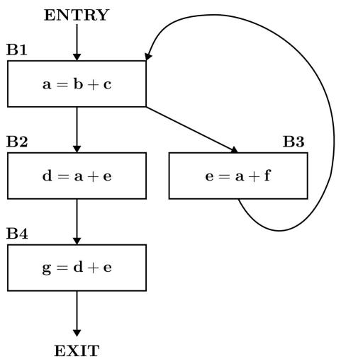
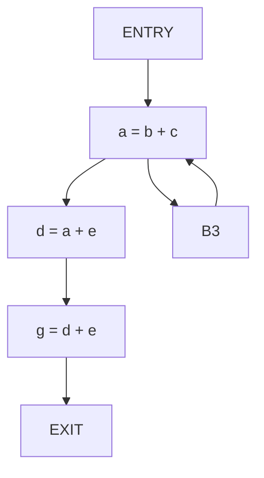
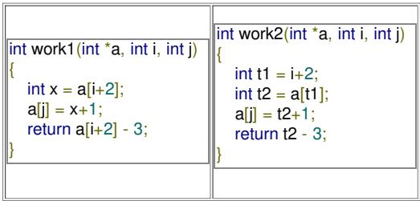
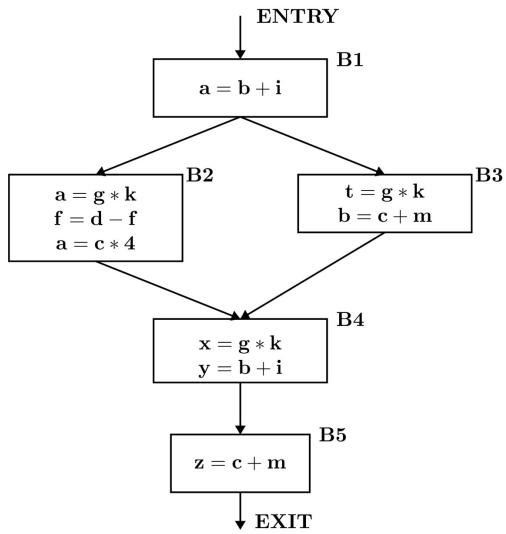
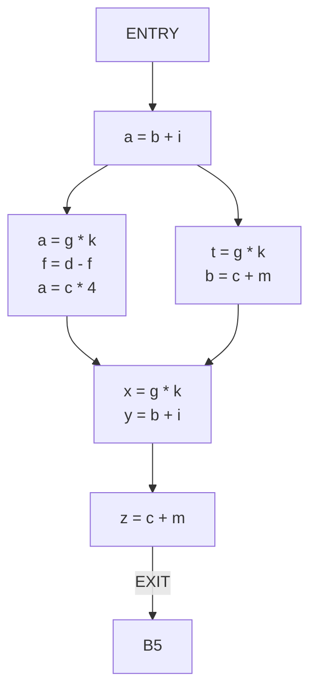
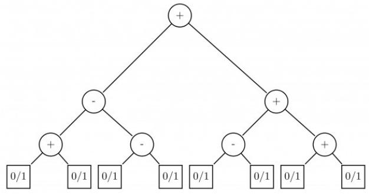

A. In both AST and CFG, let node $N_{2}$ be the successor of node $N_{1}$ . In the input program, the code corresponding to $N_{2}$ is present after the code corresponding to $N_{1}$  
B. For any input program, neither AST nor CFG will contain a cycle  
C. The maximum number of successors of a node in an AST and a CFG depends on the input program  
D. Each node in AST and CFG corresponds to at most one statement in the input program

gatecse-2015-set2 compiler-design easy abstract-syntax-tree code-optimization

Answer key

# 2.2

# Ambiguous Grammar (2)

# 2.2.1 Ambiguous Grammar: GATE CSE 1987 | Question: 1-xii

A context-free grammar is ambiguous if:

A. The grammar contains useless non-terminals.  
B. It produces more than one parse tree for some sentence.  
C. Some production has two non terminals side by side on the right-hand side.  
D. None of the above.

gate1987 compiler-design parsing ambiguous-grammar

Answer key


# 2.2.2 Ambiguous Grammar: GATE CSE 2026 | Set 2 | Question: 19

Which of the following grammars is/are ambiguous?

A. $S \rightarrow aSb \mid \epsilon$  
C. $S \rightarrow aS|Sa|\epsilon$

B. $E \rightarrow E + E |E * E |id$  
D. $S \rightarrow aS \mid \epsilon$

gatecse-2026-set2 compiler-design ambiguous-grammar multiple-selects one-mark

Answer key


# 2.3

# Assembler (9)

# 2.3.1 Assembler: GATE CSE 1992 | Question: 01,viii

The purpose of instruction location counter in an assembler is \_\_\_\_

gate1992 compiler-design assembler normal fill-in-the-blanks

Answer key


# 2.3.2 Assembler: GATE CSE 1992 | Question: 03,ii

Mention the pass number for each of the following activities that occur in a two pass assembler:

A. object code generation  
C. listing printed

B. literals added to literal table  
D. address resolution of local symbols

gate1992 compiler-design assembler easy

Answer key


# 2.3.3 Assembler: GATE CSE 1992 | Question: 3,i

Write short answers to the following:

i. Which of the following macros can put a macro assembler into an infinite loop?


<table><tr><td>.MACRO M1,X</td><td>.MACRO M2,X</td></tr><tr><td>.IF EQ,X</td><td>.IF EQ,X</td></tr><tr><td>M1 X+1</td><td>M2 X</td></tr><tr><td>.ENDC</td><td>.ENDC</td></tr><tr><td>.IF NE,X</td><td>.IF NE,X</td></tr><tr><td>.WORD X</td><td>.WORD X+1</td></tr><tr><td>.ENDC</td><td>.ENDC</td></tr><tr><td>.ENDM</td><td>.ENDM</td></tr></table>

Give an example call that does so.

gate1992 compiler-design assembler normal descriptive

# Answer key

# 2.3.4 Assembler: GATE CSE 1993 | Question: 7.6

A simple two-pass assembler does the following in the first pass:

A. It allocates space for the literals.  
B. It computes the total length of the program.  
C. It builds the symbol table for the symbols and their values.  
D. It generates code for all the load and store register instructions.  
E. None of the above.

gate1993 compiler-design assembler easy multiple-selects

# Answer key

# 2.3.5 Assembler: GATE CSE 1994 | Question: 17a

State whether the following statements are True or False with reasons for your answer:

Coroutine is just another name for a subroutine.

gate1994 compiler-design normal assembler true-false descriptive

# Answer key

# 2.3.6 Assembler: GATE CSE 1994 | Question: 17b

State whether the following statements are True or False with reasons for your answer:

A two pass assembler uses its machine opcode table in the first pass of assembly.

gate1994 compiler-design normal assembler true-false descriptive

# Answer key

# 2.3.7 Assembler: GATE CSE 1994 | Question: 18a

State whether the following statements are True or False with reasons for your answer

A subroutine cannot always be used to replace a macro in an assembly language program.

gate1994 compiler-design normal assembler true-false descriptive

# Answer key

# 2.3.8 Assembler: GATE CSE 1994 | Question: 18b

State whether the following statements are True or False with reasons for your answer

A symbol declared as ‘external’ in an assembly language program is assigned an address outside the program by the assembler itself.

gate1994 compiler-design normal assembler true-false descriptive


# 2.3.9 Assembler: GATE CSE 1996 | Question: 1.17

The pass numbers for each of the following activities

i. object code generation  
ii. literals added to literal table  
iii. listing printed  
iv. address resolution of local symbols that occur in a two pass assembler

respectively are

A. 1,2,1,2

B. 2,1,2,1

C. 2,1,1,2

D. 1,2,2,2

gate1996 compiler-design normal assembler

Answer key

# 2.4

# Backpatching (1)

# 2.4.1 Backpatching: GATE CSE 2025 | Set 2 | Question: 11

Consider the following statements about the use of backpatching in a compiler for intermediate code generation:


I. Backpatching can be used to generate code for Boolean expression in one pass.  
II. Backpatching can be used to generate code for flow-of-control statements in one pass.

Which ONE of the following options is CORRECT?

A. Only I is correct

B. Only II is correct

C. Both I and II are correct

D. Neither I nor II is correct

gatecse2025-set2 compiler-design backpatching intermediate-code one-mark

Answer key

# 2.5

# Basic Blocks (2)

# 2.5.1 Basic Blocks: GATE CSE 2025 | Set 1 | Question: 42

Refer to the given 3-address code sequence. This code sequence is split into basic blocks. The number of basic blocks is \_\_\_\_. (Answer in integer)


```txt
i = 1
j = 1
t1 = 10*i
t2 = t1+j
t3 = 8*t2
t4 = t3-88
a[t4] = 0.0
j = j+1
if j <= 10 goto 1003
i = i+1
if i <= 10 goto 1002
i = 1
t5 = i-1
t6 = 88*t5
a[t6] = 1.0
i = i+1
if i <= 10 goto 1013
```

gatecse2025-set1 compiler-design three-address-code basic-blocks numerical-answers easy two-marks

Answer key

Consider the control flow graph given below.



<details>
<summary>flowchart</summary>


</details>

Which one of the following options is the set of live variables at the exit point of each basic block?

A. B1 : {a, b, c, e, f}, B2 : {d, e}, B3 : {b, c, e, f}, B4 : ∅  
B. B1: $\varnothing$ , B2: $\{d, e\}$ , B3: $\{a, c, f\}$ , B4: $\varnothing$  
C. B1 : {a, b, c, e, f}, B2 : {d, e}, B3 : {c, e, f}, B4 : ∅  
D. B1 : ∅, B2 : {d, e, f}, B3 : {a, b, c, e, f}, B4 : ∅

gatecse-2026-set2 compiler-design basic-blocks two-marks

Answer key

# 2.6

# Code Optimization (8)

Practice Test: Test 1 (13Q)

# 2.6.1 Code Optimization: GATE CSE 2006 | Question: 55

Consider these two functions and two statements S1 and S2 about them.



<details>
<summary>text_image</summary>

int work1(int *a, int i, int j)
{
    int x = a[i+2];
    a[j] = x+1;
    return a[i+2] - 3;
}
</details>


S1: The transformation form work1 to work2 is valid, i.e., for any program state and input arguments, work2 will compute the same output and have the same effect on program state as work1  
S2: All the transformations applied to work1 to get work2 will always improve the performance (i.e reduce CPU time) of work2 compared to work1

A. S1 is false and S2 is false

B. S1 is false and S2 is true

C. S1 is true and S2 is false

D. S1 is true and S2 is true

gatecse-2006 compiler-design normal code-optimization

Answer key

# 2.6.2 Code Optimization: GATE CSE 2006 | Question: 60

Consider the following C code segment.


```c
for (i = 0, i < n; i++)
{
    for (j = 0; j < n; j++)
```

```txt
{
    if (i%2)
    {
        x += (4*j + 5*i);
        y += (7 + 4*j);
    }
}
}
```

Which one of the following is false?

A. The code contains loop invariant computation  
B. There is scope of common sub-expression elimination in this code  
C. There is scope of strength reduction in this code  
D. There is scope of dead code elimination in this code

gatecse-2006 compiler-design code-optimization

# Answer key

# 2.6.3 Code Optimization: GATE CSE 2008 | Question: 12

Some code optimizations are carried out on the intermediate code because

A. They enhance the portability of the compiler to the target processor  
B. Program analysis is more accurate on intermediate code than on machine code  
C. The information from dataflow analysis cannot otherwise be used for optimization  
D. The information from the front end cannot otherwise be used for optimization

gatecse-2008 normal code-optimization compiler-design

# Answer key

# 2.6.4 Code Optimization: GATE CSE 2014 | Set 1 | Question: 17

Which one of the following is FALSE?


A. A basic block is a sequence of instructions where control enters the sequence at the beginning and exits at the end.  
B. Available expression analysis can be used for common subexpression elimination.  
C. Live variable analysis can be used for dead code elimination.  
D. $x = 4 * 5 \Rightarrow x = 20$ is an example of common subexpression elimination.

gatecse-2014-set1 compiler-design code-optimization normal

# Answer key

# 2.6.5 Code Optimization: GATE CSE 2014 | Set 3 | Question: 11

The minimum number of arithmetic operations required to evaluate the polynomial $P(X) = X^{5} + 4X^{3} + 6X + 5$ for a given value of $X$ , using only one temporary variable is \_\_\_\_.


gatecse-2014-set3 compiler-design numerical-answers normal code-optimization

# Answer key

# 2.6.6 Code Optimization: GATE CSE 2021 | Set 2 | Question: 30

Consider the following ANSI C code segment:


```txt
z=x + 3 + y->f1 + y->f2;
for (i = 0; i < 200; i = i + 2)
{
    if (z > i)
    {
        p = p + x + 3;
        q = q + y->f1;
    } else
    {
```


```txt
p = p + y->f2;
        q = q + x + 3;
    }
}
```

Assume that the variable y points to a struct (allocated on the heap) containing two fields f1 and f2, and the local variables x, y, z, p, q, and i are allotted registers. Common sub-expression elimination (CSE) optimization is applied on the code. The number of addition and the dereference operations (of the form y -> f1 or y -> f2) in the optimized code, respectively, are:

A. 403 and 102

B. 203 and 2

C. 303 and 102

D. 303 and 2

gatecse-2021-set2 code-optimization compiler-design two-marks

# Answer key

# 2.6.7 Code Optimization: GATE CSE 2025 | Set 1 | Question: 3

Which ONE of the following techniques used in compiler code optimization uses live variable analysis?

A. Run-time

function

call

B. Register assignment to variables

management

C. Strength reduction

D. Constant folding

gatecse2025-set1 compiler-design code-optimization easy one-mark

# Answer key

# 2.6.8 Code Optimization: GATE CSE 2026 | Set 1 | Question: 32

Consider the control flow graph shown in the figure.




<details>
<summary>flowchart</summary>


</details>

Which one of the following options correctly lists the set of redundant expressions (common subexpressions) in the basic blocks B4 and B5?

Note: All the variables are integers.

A. B4: $\{b + i\}$

B5: $\{c + m\}$

B. B4: $\{g*k\}$

B5: $\{c + m\}$

C. B4: $\{g*k, b+i\}$

B5: { }

D. B4: $\{g*k\}$

B5:{}

gatecse-2026-set1 compiler-design two-marks code-optimization

# Answer key

# 2.7

# Compilation Phases (13)

Practice Test: Test 1 (6Q)

# 2.7.1 Compilation Phases: GATE CSE 1987 | Question: 1-xi


In a compiler the module that checks every character of the source text is called:

A. The code generator.

B. The code optimiser.

C. The lexical analyser.

D. The syntax analyser.

gate1987 compiler-design compilation-phases lexical-analysis

# Answer key

# 2.7.2 Compilation Phases: GATE CSE 1990 | Question: 2-ix

Match the pairs in the following questions:

<table><tr><td>(a)</td><td>Lexical analysis</td><td>(p)</td><td>DAG&#x27;s</td></tr><tr><td>(b)</td><td>Code optimization</td><td>(q)</td><td>Syntax trees</td></tr><tr><td>(c)</td><td>Code generation</td><td>(r)</td><td>Push down automaton</td></tr><tr><td>(d)</td><td>Abelian groups</td><td>(s)</td><td>Finite automaton</td></tr></table>


gate1990 match-the-following compiler-design compilation-phases

# Answer key

# 2.7.3 Compilation Phases: GATE CSE 2005 | Question: 61

Consider line number 3 of the following C-program.


```c
int main() {            /*Line 1 */
    int I, N;            /*Line 2 */
    fro (I=0, I<N, I++); /*Line 3 */
}
```

Identify the compiler's response about this line while creating the object-module:

A. No compilation error

B. Only a lexical error

C. Only syntactic errors

D. Both lexical and syntactic errors

gatecse-2005 compiler-design compilation-phases normal

# Answer key

# 2.7.4 Compilation Phases: GATE CSE 2009 | Question: 17

Match all items in Group 1 with the correct options from those given in Group 2.

<table><tr><td>Group 1</td><td>Group 2</td></tr><tr><td>P. Regular Expression</td><td>1. Syntax analysis</td></tr><tr><td>Q. Pushdown automata</td><td>2. Code generation</td></tr><tr><td>R. Dataflow analysis</td><td>3. Lexical analysis</td></tr><tr><td>S. Register allocation</td><td>4. Code optimization</td></tr></table>

A. P-4, Q-1, R-2, S-3

B. P-3, Q-1, R-4, S-2

C. P-3, Q-4, R-1, S-2

D. P-2, Q-1, R-4, S-3

gatecse-2009 compiler-design easy compilation-phases match-the-following

# Answer key

# 2.7.5 Compilation Phases: GATE CSE 2015 | Set 2 | Question: 19

Match the following:


<table><tr><td>P. Lexical analysis</td><td>1. Graph coloring</td></tr><tr><td>Q. Parsing</td><td>2. DFA minimization</td></tr><tr><td>R. Register allocation</td><td>3. Post-order traversal</td></tr><tr><td>S. Expression evaluation</td><td>4. Production tree</td></tr></table>

A. P-2, Q-3, R-1, S-4

B. P-2, Q-1, R-4, S-3

C. P-2, Q-4, R-1, S-3

D. P-2, Q-3, R-4, S-1

gatecse-2015-set2 compiler-design normal compilation-phases match-the-following

# Answer key

# 2.7.6 Compilation Phases: GATE CSE 2016 | Set 2 | Question: 19

Match the following:

<table><tr><td>(P)</td><td>Lexical analysis</td><td>(i)</td><td>Leftmost derivation</td></tr><tr><td>(Q)</td><td>Top down parsing</td><td>(ii)</td><td>Type checking</td></tr><tr><td>(R)</td><td>Semantic analysis</td><td>(iii)</td><td>Regular expressions</td></tr><tr><td>(S)</td><td>Runtime environment</td><td>(iv)</td><td>Activation records</td></tr></table>

A. $\mathrm{P} \leftrightarrow \mathrm{i}, \mathrm{Q} \leftrightarrow \mathrm{ii}, \mathrm{R} \leftrightarrow \mathrm{iv}, \mathrm{S} \leftrightarrow \mathrm{iii}$

B. $\mathrm{P} \leftrightarrow \mathrm{iii}, \mathrm{Q} \leftrightarrow \mathrm{i}, \mathrm{R} \leftrightarrow \mathrm{ii}, \mathrm{S} \leftrightarrow \mathrm{iv}$

C. $P \leftrightarrow ii, Q \leftrightarrow iii, R \leftrightarrow i, S \leftrightarrow iv$

D. $\mathrm{P}\leftrightarrow \mathrm{iv},\mathrm{Q}\leftrightarrow \mathrm{i},\mathrm{R}\leftrightarrow \mathrm{ii},\mathrm{S}\leftrightarrow \mathrm{iii}$

gatecse-2016-set2 compiler-design easy match-the-following compilation-phases

# Answer key

# 2.7.7 Compilation Phases: GATE CSE 2017 | Set 2 | Question: 05

Match the following according to input (from the left column) to the compiler phase (in the right column) that processes it:

<table><tr><td>P. Syntax tree</td><td>i. Code generator</td></tr><tr><td>Q. Character stream</td><td>ii. Syntax analyser</td></tr><tr><td>R. Intermediate representation</td><td>iii. Semantic analyser</td></tr><tr><td>S. Token stream</td><td>iv. Lexical analyser</td></tr></table>

A. P-ii; Q-iii; R-iv; S-i

B. P-ii; Q-i; R-iii; S-iv

C. P-iii; Q-iv; R-i; S-ii

D. P-i; Q-iv; R-ii; S-iii

gatecse-2017-set2 compiler-design match-the-following compilation-phases easy

# Answer key

# 2.7.8 Compilation Phases: GATE CSE 2018 | Question: 8

Which one of the following statements is FALSE?

A. Context-free grammar can be used to specify both lexical and syntax rules  
B. Type checking is done before parsing  
C. High-level language programs can be translated to different Intermediate Representations  
D. Arguments to a function can be passed using the program stack

gatecse-2018 compiler-design easy compilation-phases one-mark

# Answer key

# 2.7.9 Compilation Phases: GATE CSE 2020 | Question: 9

Consider the following statements.

I. Symbol table is accessed only during lexical analysis and syntax analysis.  
II. Compilers for programming languages that support recursion necessarily need heap storage for memory allocation in the run-time environment.


III. Errors violating the condition ‘any variable must be declared before its use’ are detected during syntax analysis.

Which of the above statements is/are TRUE?

A. I only

B. I and III only

C. II only

D. None of I, II and III

gatecse-2020 compiler-design compilation-phases runtime-environment one-mark

# Answer key

# 2.7.10 Compilation Phases: GATE CSE 2021 | Set 2 | Question: 3

Consider the following ANSI C program:


```c
int main () {
    Integer x;
    return 0;
}
```

Which one of the following phases in a seven-phase C compiler will throw an error?

A. Lexical analyzer

B. Syntax analyzer

C. Semantic analyzer

D. Machine dependent optimizer

gatecse-2021-set2 compilation-phases compiler-design one-mark

# Answer key

# 2.7.11 Compilation Phases: GATE CSE 2023 | Question: 1

Consider the following statements regarding the front-end and back-end of a compiler.

S1: The front-end includes phases that are independent of the target hardware.  
S2: The back-end includes phases that are specific to the target hardware.  
S3: The back-end includes phases that are specific to the programming language used in the source code.

Identify the CORRECT option.

A. Only S1 is TRUE.

B. Only S1 and S2 are TRUE.

C. S1, S2, and S3 are all TRUE.

D. Only S1 and S3 are TRUE.

gatecse-2023 compiler-design compilation-phases one-mark

# Answer key

# 2.7.12 Compilation Phases: GATE CSE 2024 | Set 2 | Question: 11

Consider the following two sets:

<table><tr><td>Set X</td><td>Set Y</td></tr><tr><td>P. Lexical Analyzer</td><td>1. Abstract Syntax Tree</td></tr><tr><td>Q. Syntax Analyzer</td><td>2. Token</td></tr><tr><td>R. Intermediate Code Generator</td><td>3. Parse Tree</td></tr><tr><td>S. Code Optimizer</td><td>4. Constant Folding</td></tr></table>


Which one of the following options is the CORRECT match from Set X to Set Y?

A. P - 4; Q - 1; R - 3; S - 2  
B. P - 2; Q - 3; R - 1; S - 4  
C. P - 2; Q - 1; R - 3; S - 4  
D. P - 4; Q - 3; R - 2; S - 1

gatecse-2024-set2 compiler-design compilation-phases match-the-following easy one-mark

# Answer key

# 2.7.13 Compilation Phases: GATE CSE 2026 | Set 1 | Question: 17


Consider the following C statements:

```c
char *str1 = "Hello;  /* Statement S1 */
char *str2 = "Hello;"; /* Statement S2 */
int *str3 = "Hello";  /* Statement S3 */
```

Which of the following options is/are correct?

A. S1 and S2 have syntactic errors  
B. S2 has a lexical error and S3 has a syntactic error  
C. S1 has a lexical error and S3 has a semantic error  
D. S1 has a syntactic error and S3 has a semantic error

gatecse-2026-set1 compiler-design multiple-selects one-mark compilation-phases

Answer key

# 2.8

# Compiler tokenization (1)

# 2.8.1 Compiler tokenization: GATE CSE 2026 | Set 2 | Question: 25

A lexical analyzer uses the following token definitions

- letter $\rightarrow$ $[A - Za - z]$  
- digit $\rightarrow$ [0 - 9]  
- $id \rightarrow letter(letter|digit)^*$  
- number $\rightarrow$ digit $^+$  
- $ws \to (blank|tab|newline)^+$

For the string given below,

$$
x 1 \quad 2 3 \mathrm{mm} \quad 7 8 \quad \mathrm{y} \quad 7 z \quad \mathrm{zz} 5 \quad 1 4 A \quad 8 H \quad \mathrm{AaYcD}
$$


the number of tokens (excluding ws) that will be produced by the lexical analyzer is \_. (answer in integer)

gatecse-2026-set2 compiler-design compiler-tokenization numerical-answers one-mark

Answer key

# 2.9

# Directed Acyclic Graph (2)

# 2.9.1 Directed Acyclic Graph: GATE CSE 2014 | Set 3 | Question: 34

Consider the basic block given below.


<div class="mineru-algorithm" style="white-space: pre-wrap; font-family:monospace;">
$\boxed{a = b + c\quad c = a + d\quad d = b + c\quad e = d - b\quad a = e + b}$
</div>

The minimum number of nodes and edges present in the DAG representation of the above basic block respectively are

A. 6 and 6

B. 8 and 10

C. 9 and 12

D. 4 and 4

gatecse-2014-set3 compiler-design code-optimization directed-acyclic-graph normal

Answer key

# 2.9.2 Directed Acyclic Graph: GATE CSE 2021 | Set 1 | Question: 50

Consider the following C code segment:


```javascript
a = b + c;
e = a + 1;
```

$$
\mathrm{d} = \mathrm{b} + \mathrm{c};
$$

$$
\mathrm{f} = \mathrm{d} + 1;
$$

$$
\mathrm{g} = \mathrm{e} + \mathrm{f};
$$

In a compiler, this code segment is represented internally as a directed acyclic graph (DAG). The number of nodes in the DAG is \_\_\_\_

gatecse-2021-set1 compiler-design code-optimization directed-acyclic-graph numerical-answers two-marks

Answer key

# 2.10

# Expression Evaluation (2)

# 2.10.1 Expression Evaluation: GATE CSE 2002 | Question: 2.19

To evaluate an expression without any embedded function calls


A. One stack is enough  
B. Two stacks are needed  
C. As many stacks as the height of the expression tree are needed  
D. A Turing machine is needed in the general case

gatecse-2002 compiler-design expression-evaluation easy

Answer key

# 2.10.2 Expression Evaluation: GATE CSE 2014 | Set 2 | Question: 39

Consider the expression tree shown. Each leaf represents a numerical value, which can either be 0 or 1. Over all possible choices of the values at the leaves, the maximum possible value of the expression represented by the tree is \_.




<details>
<summary>flowchart</summary>

This image displays a hierarchical tree structure with nodes labeled by positive (+) or negative (-) signs, and associated binary values (0/1) at each node.
</details>

gatecse-2014-set2 compiler-design normal expression-evaluation numerical-answers

Answer key

# 2.11

# First and Follow (6)

Practice Test: Test 1 (12Q)

# 2.11.1 First and Follow: GATE CSE 1992 | Question: 02,xiii

For a context free grammar, FOLLOW(A) is the set of terminals that can appear immediately to the right of non-terminal A in some "sentential" form. We define two sets LFOLLOW(A) and RFOLLOW(A) by replacing the word "sentential" by "left sentential" and "right most sentential" respectively in the definition of FOLLOW (A).


A. FOLLOW(A) and LFOLLOW(A) may be different.  
C. All the three sets are identical.  
gate1992 parsing compiler-design normal multiple-selects first-and-follow

B. FOLLOW(A) and RFOLLOW(A) are always the same.

D. All the three sets are different.

Answer key

# 2.11.2 First and Follow: GATE CSE 2012 | Question: 52

For the grammar below, a partial $LL(1)$ parsing table is also presented along with the grammar. Entries that


need to be filled are indicated as $E1, E2$ , and $E3$ . $\varepsilon$ is the empty string, \$ indicates end of input, and, | separates alternate right hand sides of productions.

- $S \to aAbB \mid bAaB \mid \varepsilon$  
- $A \rightarrow S$  
- $B \to S$

<table><tr><td></td><td>a</td><td>b</td><td>$</td></tr><tr><td>S</td><td>E1</td><td>E2</td><td>S → ε</td></tr><tr><td>A</td><td>A → S</td><td>A → S</td><td>error</td></tr><tr><td>B</td><td>B → S</td><td>B → S</td><td>E3</td></tr></table>

The FIRST and FOLLOW sets for the non-terminals A and B are

A. $\mathrm{FIRST}(A) = \{a, b, \varepsilon\} = \mathrm{FIRST}(B)$  
B. FIRST(A) = {a, b, \$}  
C. $\operatorname{FIRST}(A) = \{a, b, \varepsilon\} = \operatorname{FIRST}(B)$

$$
\operatorname{FOLLOW} (A) = \{a, b \}
$$

$$
\operatorname{FOLLOW} (B) = \{a, b, \$ \}
$$

$$
\operatorname{FIRST} (B) = \{a, b, \varepsilon \}
$$

$$
\operatorname{FOLLOW} (A) = \{a, b \}
$$

$$
\operatorname{FOLLOW} (B) = \{\$ \}
$$

$$
\operatorname{FOLLOW} (A) = \{a, b \}
$$

$$
\text {FOLLOW} (B) = \varnothing
$$

D. $\operatorname{FIRST}(A) = \{a, b\} = \operatorname{FIRST}(B)$

$$
\text {FOLLOW} (A) = \{a, b \}
$$

$$
\operatorname{FOLLOW} (B) = \{a, b \}
$$

gatecse-2012 compiler-design parsing normal first-and-follow

# Answer key

# 2.11.3 First and Follow: GATE CSE 2017 | Set 1 | Question: 17

Consider the following grammar:

- $P \rightarrow xQRS$  
- $Q \to yz \mid z$  
- $R \to w \mid \varepsilon$  
- $S \to y$

What is FOLLOW(Q)?

A. $\{R\}$

B. $\{w\}$

C. $\{w,y\}$

D. {w,\$}

gatecse-2017-set1 compiler-design parsing easy first-and-follow

# Answer key

# 2.11.4 First and Follow: GATE CSE 2019 | Question: 19

Consider the grammar given below:

- $S \rightarrow Aa$  
- $A \rightarrow BD$  
- $B \rightarrow b \mid \epsilon$  
- $D \to d \mid \epsilon$


