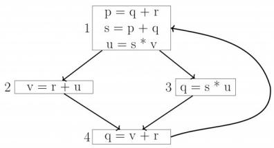
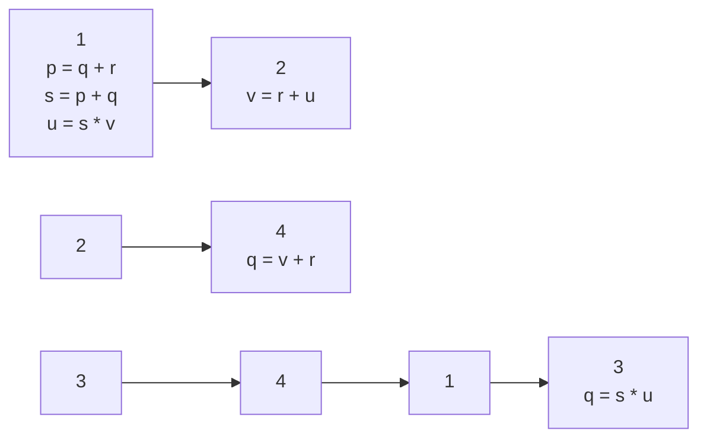
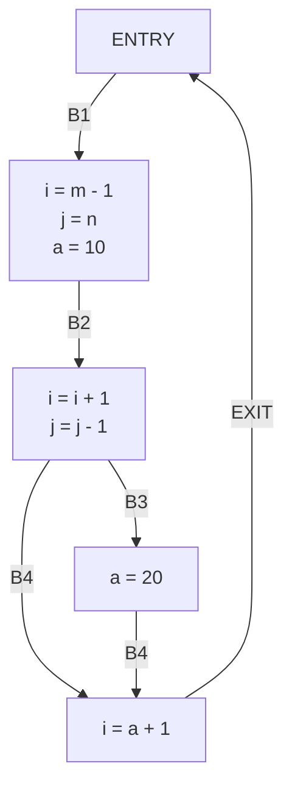

# 2.12.45 Grammar: GATE IT 2005 | Question: 83a

Consider the context-free grammar

$$
\begin{array}{l} E \rightarrow E + E \\ E \rightarrow (E * E) \\ E \rightarrow i d \\ \end{array}
$$

where $E$ is the starting symbol, the set of terminals is $\{id, (, +, ), *\}$ , and the set of nonterminals is $\{E\}$ .

Which of the following terminal strings has more than one parse tree when parsed according to the above grammar?

A. $id + id + id + id$  
C. $(id * (id * id)) + id$  
gateit-2005 compiler-design grammar parsing easy

B. $id + (id * (id * id))$  
D. $((id*id+id)*id)$

# Answer key

# 2.12.46 Grammar: GATE IT 2007 | Question: 9

Consider an ambiguous grammar G and its disambiguated version D. Let the language recognized by the two grammars be denoted by $L(G)$ and $L(D)$ respectively. Which one of the following is true?

A. $L(D)\subset L(G)$  
C. $L(D) = L(G)$  
gateit-2007 compiler-design grammar normal

B. $L(D) \supset L(G)$  
D. $L(D)$ is empty

# Answer key

# 2.12.47 Grammar: GATE IT 2008 | Question: 78

A CFG $G$ is given with the following productions where $S$ is the start symbol, $A$ is a non-terminal and $a$ and $b$ are terminals.

- $S \rightarrow aS \mid A$  
- $A \to aAb \mid bAa \mid \epsilon$

Which of the following strings is generated by the grammar above?

A. aabbaba

B. aabaaba

C. abababb

D. aabbaab

gateit-2008 parsing normal grammar

# Answer key

# 2.13

# Intermediate Code (11)

# Practice Test: Test 1 (9Q)

# 2.13.1 Intermediate Code: GATE CSE 1988 | Question: 2xvii

Construct a DAG for the following set of quadruples:

- $E:=A+B$  
- $F:=E-C$  
- $G:=F^{*}D$  
- $H := A + B$  
- $\mathrm{I} \coloneqq  = \mathrm{I} - \mathrm{C}$  
- $J:=I+G$

gate1988 descriptive compiler-design intermediate-code

# Answer key


# 2.13.2 Intermediate Code: GATE CSE 1989 | Question: 4-v

Is the following code template for the if-then-else statement correct? if not, correct it.

\- if expression then statement 1 else statement 2

# Template:

Code for expression

- (\*result in $E, E > O$ indicates true \*)  
- Branch on $E > O$ to $L1$  
- Code for statement 1  
- $L1$ : Code for statement 2

descriptive gate1989 compiler-design intermediate-code

# Answer key

# 2.13.3 Intermediate Code: GATE CSE 1992 | Question: 11b

Write 3 address intermediate code (quadruples) for the following boolean expression in the sequence as it would be generated by a compiler. Partial evaluation of boolean expressions is not permitted. Assume the usual rules of precedence of the operators.

$$
(a + b) > (c + d) \text {or} a > c \text {and} b <   d
$$

gate1992 compiler-design syntax-directed-translation intermediate-code descriptive

# Answer key

# 2.13.4 Intermediate Code: GATE CSE 1994 | Question: 1.12

Generation of intermediate code based on an abstract machine model is useful in compilers because


A. it makes implementation of lexical analysis and syntax analysis easier  
B. syntax-directed translations can be written for intermediate code generation  
C. it enhances the portability of the front end of the compiler  
D. it is not possible to generate code for real machines directly from high level language programs

gate1994 compiler-design intermediate-code easy

# Answer key

# 2.13.5 Intermediate Code: GATE CSE 2014 | Set 2 | Question: 34

For a C program accessing $\mathbf{X}[\mathbf{i}][\mathbf{j}][\mathbf{k}]$ , the following intermediate code is generated by a compiler. Assume that the size of an integer is 32 bits and the size of a character is 8 bits.


```txt
t0 = i * 1024
t1 = j * 32
t2 = k * 4
t3 = t1 + t0
t4 = t3 + t2
t5 = X[t4]
```

Which one of the following statements about the source code for the C program is CORRECT?

A. X is declared as "int X[32][32][8]"  
B. X is declared as "int X[4][1024][32]".  
C. X is declared as "char X[4][32][8]".  
D. X is declared as "char X[32][16][2]".

# 2.13.6 Intermediate Code: GATE CSE 2014 | Set 3 | Question: 17

One of the purposes of using intermediate code in compilers is to


A. make parsing and semantic analysis simpler.  
B. improve error recovery and error reporting.  
C. increase the chances of reusing the machine-independent code optimizer in other compilers.  
D. improve the register allocation.

gatecse-2014-set3 compiler-design intermediate-code easy

# Answer key

# 2.13.7 Intermediate Code: GATE CSE 2015 | Set 1 | Question: 8

For computer based on three-address instruction formats, each address field can be used to specify which of the following:


(S1) A memory operand  
(S2) A processor register  
(S3) An implied accumulator register

A. Either S1 or S2

B. Either S2 or S3  
D. All of $S1$ , $S2$ and $S3$

C. Only $S2$ and $S3$

gatecse-2015-set1 compiler-design intermediate-code normal

# Answer key

# 2.13.8 Intermediate Code: GATE CSE 2015 | Set 2 | Question: 29

Consider the intermediate code given below.


(1) i=1  
(2) j=1  
(3) t1 = 5 \* i  
(4) t2 = t1 + j  
(5) t3 = 4 \* t2  
(6) t4 = t3  
(7) a[t4] = -1  
(8) $j = j + 1$  
(9) if j <= 5 goto (3)  
(10) i = i + 1  
(11) if i < 5 goto (2)

The number of nodes and edges in control-flow-graph constructed for the above code, respectively, are

A. 5 and 7

B. 6 and 7

C. 5 and 5

D. 7 and 8

gatecse-2015-set2 compiler-design intermediate-code normal

# Answer key

# 2.13.9 Intermediate Code: GATE CSE 2021 | Set 2 | Question: 13

In the context of compilers, which of the following is/are NOT an intermediate representation of the source program?


A. Three address code

B. Abstract Syntax Tree (AST)

C. Control Flow Graph (CFG)

D. Symbol table

gatecse-2021-set2 multiple-selects compiler-design easy intermediate-code one-mark

# Answer key

# 2.13.10 Intermediate Code: GATE CSE 2024 | Set 1 | Question: 29

Consider the following pseudo-code.


L 1: t1 = -1

<div class="mineru-algorithm" style="white-space: pre-wrap; font-family:monospace;">
L 2: t2 = 0
L 3: t3 = 0
L 4: t4 = 4 * t3
L 5: t5 = 4 * t2
L 6: t6 = t5 * M
L 7: t7 = t4 + t6
L 8: t8 = a[t7]
L 9: if t8 &lt;= max goto L11
L 10: t1 = t8
L 11: t3 = t3 + 1
L 12: if t3 &lt; M goto L4
L 13: t2 = t2 + 1
L 14: if t2 &lt; N goto L3
L 15: max = t1
</div>

Which one of the following options CORRECTLY specifies the number of basic blocks and the number of instructions in the largest basic block, respectively?

A. 6 and 6

B. 6 and 7

C. 7 and 7

D. 7 and 6

gatecse-2024-set1

compiler-design

intermediate-code

two-marks

# Answer key

# 2.13.11 Intermediate Code: GATE CSE 2024 | Set 2 | Question: 33

Consider the following expression: $x[i] = (p + r) * -s[i] + u/w$ . The following sequence shows the list of triples representing the given expression, with entries missing for triples (1), (3), and (6).


<table><tr><td>(0)</td><td>+</td><td>p</td><td>r</td></tr><tr><td>(1)</td><td></td><td></td><td></td></tr><tr><td>(2)</td><td>uminus</td><td>(1)</td><td></td></tr><tr><td>(3)</td><td></td><td></td><td></td></tr><tr><td>(4)</td><td>/</td><td>u</td><td>w</td></tr><tr><td>(5)</td><td>+</td><td>(3)</td><td>(4)</td></tr><tr><td>(6)</td><td></td><td></td><td></td></tr><tr><td>(7)</td><td>=</td><td>(6)</td><td>(5)</td></tr></table>

Which one of the following options fills in the missing entries CORRECTLY?

A. (1) = [ ] s i (3) \* (0)(2) (6)[ ] = x i  
B. (1) $[= \mathrm{s}i$ (3) - (0)(2) (6) = [ ] $x(5)$  
C. (1) =[ ] s i (3) \* (0)(2) (6)[ ] = x (5)  
D. (1) [ ] = s i (3) - (0)(2) (6) = [ ] x i

gatecse-2024-set2 compiler-design intermediate-code two-marks

# Answer key

# 2.14

# LR Parser (20)

Practice Tests: Test 1 (15Q) Test 2 (15Q) Test 3 (7Q)

# 2.14.1 LR Parser: GATE CSE 1992 | Question: 02,xiv


Consider the SLR(1) and LALR(1) parsing tables for a context free grammar. Which of the following statement is/are true?

A. The goto part of both tables may be different.  
B. The shift entries are identical in both the tables.  
C. The reduce entries in the tables may be different.  
D. The error entries in tables may be different

gate1992 compiler-design normal parsing multiple-selects lr-parser

# Answer key

# 2.14.2 LR Parser: GATE CSE 1998 | Question: 1.26

Which of the following statements is true?


A. SLR parser is more powerful than LALR  
B. LALR parser is more powerful than Canonical LR parser  
C. Canonical LR parser is more powerful than LALR parser  
D. The parsers SLR, Canonical CR, and LALR have the same power

gate1998 compiler-design parsing normal lr-parser

# Answer key

# 2.14.3 LR Parser: GATE CSE 2003 | Question: 17


Assume that the SLR parser for a grammar G has $n_1$ states and the LALR parser for G has $n_2$ states. The relationship between $n_1$ and $n_2$ is

A. $n_{1}$ is necessarily less than $n_{2}$  
C. $n_{1}$ is necessarily greater than $n_{2}$

gatecse-2003 compiler-design parsing easy lr-parser

B. $n_1$ is necessarily equal to $n_2$

D. None of the above

# Answer key

# 2.14.4 LR Parser: GATE CSE 2005 | Question: 60


Consider the grammar:

$$
S \rightarrow (S) \mid a
$$

Let the number of states in SLR (1), LR(1) and LALR(1) parsers for the grammar be $n_{1}, n_{2}$ and $n_{3}$ respectively. The following relationship holds good:

A. $n_{1} < n_{2} < n_{3}$  
C. $n_{1}=n_{2}=n_{3}$  
gatecse-2005 compiler-design parsing normal lr-parser

B. $n_1 = n_3 < n_2$  
D. $n_1 \geq n_3 \geq n_2$

# Answer key

# 2.14.5 LR Parser: GATE CSE 2006 | Question: 7


Consider the following grammar

- $S \rightarrow S * E$  
- $S \rightarrow E$  
- $E \rightarrow F + E$  
- $E \rightarrow F$  
- $F \rightarrow id$

Consider the following LR(0) items corresponding to the grammar above

i. $S \rightarrow S*.E$

ii. $E \rightarrow F. + E$  
iii. $E\to F + .E$

Given the items above, which two of them will appear in the same set in the canonical sets-of-items for the grammar?

A. i and ii

B. ii and iii

C. i and iii

D. None of the above

gatecse-2006 compiler-design parsing normal lr-parser

# Answer key

# 2.14.6 LR Parser: GATE CSE 2008 | Question: 55

An LALR(1) parser for a grammar G can have shift-reduce (S-R) conflicts if and only if


A. The SLR(1) parser for G has S-R conflicts  
B. The LR(1) parser for G has S-R conflicts  
C. The LR(0) parser for G has S-R conflicts  
D. The LALR(1) parser for G has reduce-reduce conflicts

gatecse-2008 compiler-design parsing normal lr-parser

# Answer key

# 2.14.7 LR Parser: GATE CSE 2013 | Question: 40

Consider the following two sets of LR(1) items of an LR(1) grammar.


$$
\begin{array}{l l}X \rightarrow c. X, c / d&X \rightarrow c. X,\\X \rightarrow . c X, c / d&X \rightarrow . c X,\\X \rightarrow . d, c / d&X \rightarrow . d,\end{array}
$$

Which of the following statements related to merging of the two sets in the corresponding LALR parser is/are FALSE?

1. Cannot be merged since look ahead are different.  
2. Can be merged but will result in S-R conflict.  
3. Can be merged but will result in R-R conflict.  
4. Cannot be merged since goto on c will lead to two different sets.

A. 1 only

B. 2 only

C. 1 and 4 only

D. 1, 2, 3 and 4

gatecse-2013 compiler-design parsing normal lr-parser

# Answer key

# 2.14.8 LR Parser: GATE CSE 2013 | Question: 9

What is the maximum number of reduce moves that can be taken by a bottom-up parser for a grammar with no epsilon and unit-production (i.e., of type $A \rightarrow \epsilon$ and $A \rightarrow a$ ) to parse a string with n tokens?


A. n/2

B. n - 1

C. $2n - 1$

D. $2^{n}$

gatecse-2013 compiler-design parsing normal lr-parser

# Answer key

# 2.14.9 LR Parser: GATE CSE 2014 | Set 1 | Question: 34

A canonical set of items is given below


- $S \rightarrow L. > R$  
- $Q \rightarrow R$ .

On input symbol < the set has

A. a shift-reduce conflict and a reduce-reduce conflict.  
B. a shift-reduce conflict but not a reduce-reduce conflict.  
C. a reduce-reduce conflict but not a shift-reduce conflict.  
D. neither a shift-reduce nor a reduce-reduce conflict.

gatecse-2014-set1 compiler-design parsing normal lr-parser

# Answer key

# 2.14.10 LR Parser: GATE CSE 2015 | Set 3 | Question: 16


Among simple LR (SLR), canonical LR, and look-ahead LR (LALR), which of the following pairs identify the method that is very easy to implement and the method that is the most powerful, in that order?

A. SLR, LALR  
C. SLR, canonical LR  
gatecse-2015-set3 compiler-design parsing normal lr-parser

B. Canonical LR, LALR

D. LALR, canonical LR

# Answer key

# 2.14.11 LR Parser: GATE CSE 2017 | Set 2 | Question: 6


Which of the following statements about parser is/are CORRECT?

1. Canonical LR is more powerful than SLR  
II. SLR is more powerful than LALR  
III. SLR is more powerful than Canonical LR

A. I only

B. II only

C. III only

D. II and III only

gatecse-2017-set2 compiler-design parsing lr-parser

# Answer key

# 2.14.12 LR Parser: GATE CSE 2019 | Question: 3


Which one of the following kinds of derivation is used by LR parsers?

A. Leftmost

C. Rightmost

gatecse-2019 compiler-design parsing one-mark lr-parser

# Answer key

# 2.14.13 LR Parser: GATE CSE 2020 | Question: 24


Consider the following grammar.

$$
\cdot S \rightarrow a S B \mid d
$$

$$
\cdot B \to b
$$

The number of reduction steps taken by a bottom-up parser while accepting the string aaadbbb is \_\_\_\_.

gatecse-2020 numerical-answers compiler-design lr-parser one-mark

# Answer key

# 2.14.14 LR Parser: GATE CSE 2021 | Set 1 | Question: 5


Consider the following statements.

- $S_{1}$ : Every SLR(1) grammar is unambiguous but there are certain unambiguous grammars that are not SLR(1).  
- $S_{2}$ : For any context-free grammar, there is a parser that takes at most $O(n^{3})$ time to parse a string of length $n$ .

Which one of the following options is correct?

A. $S_{1}$ is true and $S_{2}$ is false  
C. $S_{1}$ is true and $S_{2}$ is true

gatecse-2021-set1 compiler-design lr-parser one-mark

B. $S_{1}$ is false and $S_{2}$ is true  
D. $S_{1}$ is false and $S_{2}$ is false

# Answer key

# 2.14.15 LR Parser: GATE CSE 2021 | Set 2 | Question: 51

Consider the following augmented grammar with $\{\#, @, <, >, a, b, c\}$ as the set of terminals.


$$
\begin{array}{l} S ^ {\prime} \rightarrow S \\ S \rightarrow S \# c S \\ S \rightarrow S S \\ S \rightarrow S @ \\ S \rightarrow <   S > \\ S \rightarrow a \\ S \rightarrow b \\ S \rightarrow c \\ \end{array}
$$

Let $I_0 = \text{CLOSURE}(\{S' \to \bullet S\})$ . The number of items in the set $\text{GOTO}(\text{GOTO}(I_0 <), <)$ is \_\_\_\_

gatecse-2021-set2 compiler-design lr-parser numerical-answers two-marks

# Answer key

# 2.14.16 LR Parser: GATE CSE 2022 | Question: 19

Consider the augmented grammar with $\{+,*,(,),id\}$ as the set of terminals.


- $S' \to S$  
- $S \rightarrow S + R \mid R$  
- $R \to R * P \mid P$  
- $P \to (S) \mid \mathrm{id}$

If $I_0$ is the set of two $LR(0)$ items $\{[S' \to S.], [S \to S. + R]\}$ , then $goto(closure(I_0), +)$ contains exactly \_\_\_\_ items.

gatecse-2022 numerical-answers compiler-design parsing lr-parser one-mark

# Answer key

# 2.14.17 LR Parser: GATE CSE 2022 | Question: 3

Which one of the following statements is TRUE?


A. The $LALR(1)$ parser for a grammar $G$ cannot have reduce-reduce conflict if the $LR(1)$ parser for $G$ does not have reduce-reduce conflict.  
B. Symbol table is accessed only during the lexical analysis phase.  
C. Data flow analysis is necessary for run-time memory management.  
D. $LR(1)$ parsing is sufficient for deterministic context-free languages.

gatecse-2022 compiler-design parsing one-mark lr-parser

# Answer key

# 2.14.18 LR Parser: GATE CSE 2024 | Set 2 | Question: 55

Consider the following augmented grammar, which is to be parsed with a SLR parser. The set of terminals is $\{a, b, c, d, \#, \@\}$


$$
S ^ {\prime} \rightarrow S
$$

$$
S \rightarrow S S | A a | b A c | B c | b B a
$$

$$
A \rightarrow d \#
$$

$$
B \to @
$$

Let $I_0 = \text{CLOSURE}(\{S' \to \bullet S\})$ . The number of items in the set $\text{GOTO}(I_0, S)$ is \_\_\_\_.

gatecse-2024-set2 numerical-answers compiler-design lr-parser two-marks

# Answer key

# 2.14.19 LR Parser: GATE CSE 2025 | Set 2 | Question: 30

Given a Context-Free Grammar G as follows:

$$
S \rightarrow A a | b A c | d c \mid b d a
$$

$$
A \rightarrow d
$$

Which ONE of the following statements is TRUE?

A. G is neither LALR(1) nor SLR(1)  
B. G is CLR(1), not LALR(1)  
C. G is LALR(1), not SLR(1)  
D. G is LALR(1), also SLR(1)

gatecse2025-set2 compiler-design context-free-grammar parsing lr-parser two-marks

# Answer key

# 2.14.20 LR Parser: GATE CSE 2026 | Set 2 | Question: 31

Consider the canonical $LR(0)$ parsing of the grammar below using terminals $\{a, b, c\}$ and non-terminals $\{A, B, C, S\}$ with $S$ as the start symbol.

$$
S \to A C B
$$

$$
A \rightarrow a A \mid \epsilon
$$

$$
C \rightarrow c C \mid \epsilon
$$

$$
B \rightarrow b B \mid b
$$


Which one of the following options gives the number of shift-reduce conflicts that will occur in the $LR(0)$ ACTION table?

A. 2

B. 3

C. 4

D. 5

gatecse-2026-set2 compiler-design lr-parser two-marks

# Answer key

# 2.15

# Lexical Analysis (6)

Practice Tests: Test 1 (10Q) Weekly Quiz 1 (10Q)

# 2.15.1 Lexical Analysis: GATE CSE 1987 | Question: 1-xvii

Using longer identifiers in a program will necessarily lead to:

A. Somewhat slower compilation

B. A program that is easier to understand


C. An incorrect program

D. None of the above

gate1987 compiler-design lexical-analysis

Answer key

# 2.15.2 Lexical Analysis: GATE CSE 2000 | Question: 1.18, ISRO2015-25

The number of tokens in the following C statement is


printf("i=%d, &i=%x", i, &i);

A. 3

B. 26

C. 10

D. 21

gatecse-2000 compiler-design lexical-analysis easy isro2015

Answer key

# 2.15.3 Lexical Analysis: GATE CSE 2010 | Question: 13

Which data structure in a compiler is used for managing information about variables and their attributes?

A. Abstract syntax tree

B. Symbol table

C. Semantic stack

D. Parse table

gatecse-2010 compiler-design lexical-analysis easy

Answer key

# 2.15.4 Lexical Analysis: GATE CSE 2011 | Question: 1

In a compiler, keywords of a language are recognized during

A. parsing of the program

B. the code generation

C. the lexical analysis of the program

D. dataflow analysis

gatecse-2011 compiler-design lexical-analysis easy

Answer key

# 2.15.5 Lexical Analysis: GATE CSE 2011 | Question: 19

The lexical analysis for a modern computer language such as Java needs the power of which one of the following machine models in a necessary and sufficient sense?

A. Finite state automata

B. Deterministic pushdown automata

C. Non-deterministic pushdown automata

D. Turing machine

gatecse-2011 compiler-design lexical-analysis easy

Answer key

# 2.15.6 Lexical Analysis: GATE CSE 2018 | Question: 37

A lexical analyzer uses the following patterns to recognize three tokens $T_{1}, T_{2}$ , and $T_{3}$ over the alphabet $\{a, b, c\}$ .

- $T_{1}:a?(b\mid c)^{*}a$  
- $T_{2}:b?(a\mid c)^{*}b$  
- $T_{3}:c?(b\mid a)^{*}c$

Note that 'x?' means 0 or 1 occurrence of the symbol x. Note also that the analyzer outputs the token that matches the longest possible prefix.

If the string bbaacabc is processed by the analyzer, which one of the following is the sequence of tokens it outputs?

A. $T_{1}T_{2}T_{3}$

B. $T_{1}T_{1}T_{3}$

C. $T_{2}T_{1}T_{3}$

D. $T_{3}T_{3}$

gatecse-2018 compiler-design lexical-analysis normal two-marks

Answer key

2.16

Linker (3)


# 2.16.1 Linker: GATE CSE 1991 | Question: 03,ix


A “link editor” is a program that:

A. matches the parameters of the macro-definition with locations of the parameters of the macro call  
B. matches external names of one program with their location in other programs  
C. matches the parameters of subroutine definition with the location of parameters of subroutine call.  
D. acts as a link between text editor and the user  
E. acts as a link between compiler and the user program

gate1991 compiler-design normal linker multiple-selects

Answer key

# 2.16.2 Linker: GATE CSE 2003 | Question: 76


Which of the following is NOT an advantage of using shared, dynamically linked libraries as opposed to using statistically linked libraries?

A. Smaller sizes of executable files  
B. Lesser overall page fault rate in the system  
C. Faster program startup  
D. Existing programs need not be re-linked to take advantage of newer versions of libraries

gatecse-2003 compiler-design runtime-environment linker easy

Answer key

# 2.16.3 Linker: GATE CSE 2004 | Question: 9


Consider a program $P$ that consists of two source modules $M_1$ and $M_2$ contained in two different files. If $M_1$ contains a reference to a function defined in $M_2$ the reference will be resolved at

A. Edit time

B. Compile time

C. Link time

D. Load time

gatecse-2004 compiler-design easy linker

Answer key

2.17

# Live Variable Analysis (3)

# 2.17.1 Live Variable Analysis: GATE CSE 2015 | Set 1 | Question: 50


A variable x is said to be live at a statement $s_{i}$ in a program if the following three conditions hold simultaneously:

i. There exists a statement $S_{j}$ that uses $x$  
ii. There is a path from $S_{i}$ to $\tilde{S}_{j}$ in the flow graph corresponding to the program  
iii. The path has no intervening assignment to x including at $S_{i}$ and $S_{j}$



<details>
<summary>flowchart</summary>


</details>

The variables which are live both at the statement in basic block 2 and at the statement in basic block 3 of the above control flow graph are

A. p, s, u

B. r, s, u

C. r, u

D. q, v

gatecse-2015-set1 compiler-design live-variable-analysis normal

Answer key

For a statement S in a program, in the context of liveness analysis, the following sets are defined:

$\operatorname{USE}(S)$ : the set of variables used in $S$

IN(S): the set of variables that are live at the entry of $S$

$\operatorname{OUT}(S)$ : the set of variables that are live at the exit of $S$

Consider a basic block that consists of two statements, $S_{1}$ followed by $S_{2}$ . Which one of the following statements is correct?

A. $\mathrm{OUT}(S_1) = \mathrm{IN}(S_2)$  
B. $\mathrm{OUT}(S_1) = \mathrm{IN}(S_1) \cup \mathrm{USE}(S_1)$  
c. $\mathrm{OUT}(S_1) = \mathrm{IN}(S_2) \cup \mathrm{OUT}(S_2)$  
D. $\mathrm{OUT}(S_1) = \mathrm{USE}(S_1) \cup \mathrm{IN}(S_2)$

gatecse-2021-set2 code-optimization live-variable-analysis compiler-design two-marks

Answer key

# 2.17.3 Live Variable Analysis: GATE CSE 2023 | Question: 27

Consider the control flow graph shown.


<details>
<summary>flowchart</summary>


</details>


Which one of the following choices correctly lists the set of live variables at the exit point of each basic block?

A. B1: { }, B2: {a}, B3: {a}, B4: {a}  
C. B1: $\{\mathrm{a},\mathrm{i},\mathrm{j}\}$ , B2: $\{\mathrm{a},\mathrm{i},\mathrm{j}\}$ , B3: $\{\mathrm{a},\mathrm{i}\}$ , B4: $\{\mathrm{a}\}$

gatecse-2023 compiler-design live-variable-analysis two-marks

Answer key

2.18

LI Parser (2)

# 2.18.1 LI Parser: GATE CSE 2024 | Set 2 | Question: 30

Consider the following context-free grammar where the start symbol is S and the set of terminals is $\{a, b, c, d\}$ .

$$
\begin{array}{l} S \rightarrow A a A b \mid B b B a \\ A \rightarrow c S \mid \epsilon \\ B \rightarrow d S \mid \epsilon \\ \end{array}
$$

The following is a partially-filled LL(1) parsing table.

