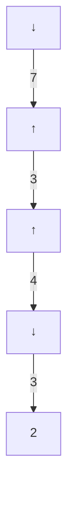
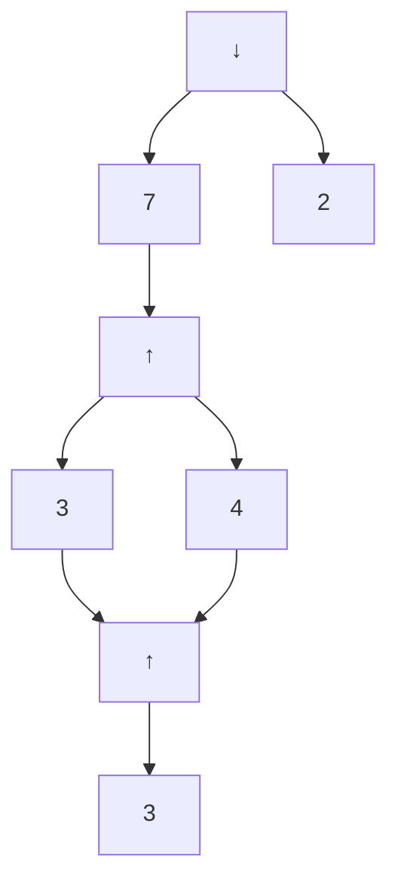
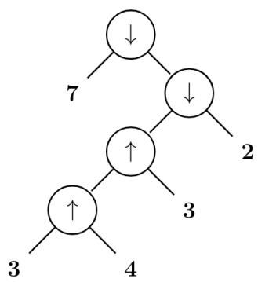
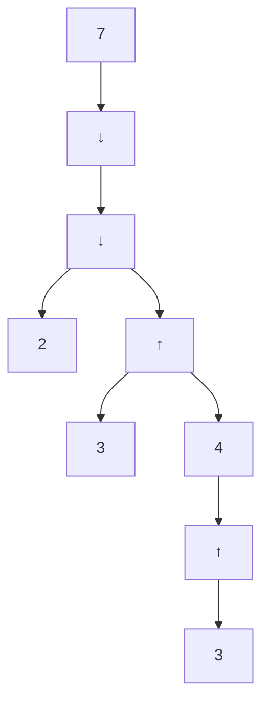
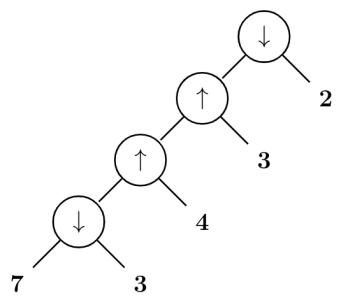
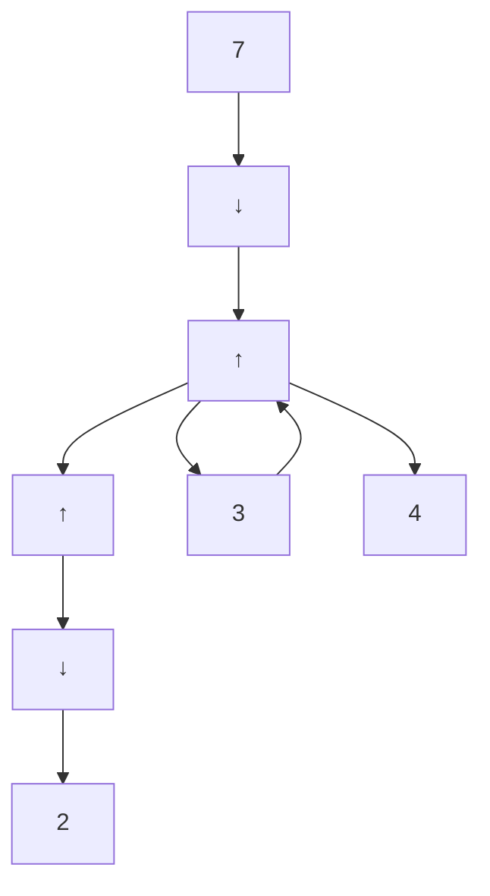
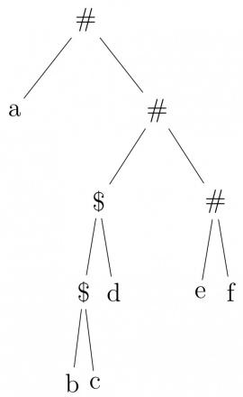

<table><tr><td></td><td>a</td><td>b</td><td>c</td><td>d</td><td>$</td></tr><tr><td>S</td><td>S → AaAb</td><td>S → BbBa</td><td>(1)</td><td>(2)</td><td></td></tr><tr><td>A</td><td>A → ε</td><td>(3)</td><td>A → cS</td><td></td><td></td></tr><tr><td>B</td><td>(4)</td><td>B → ε</td><td></td><td>B → dS</td><td></td></tr></table>

Which one of the following options represents the CORRECT combination for the numbered cells in the parsing table?

Note: In the options, "blank" denotes that the corresponding cell is empty.

A. (1) $S \to AaAb(2)S \to BbBa(3)A \to \epsilon(4)B \to \epsilon$  
B. (1) $S \to BbBa$ (2) $S \to AaAb$ (3) $A \to \epsilon$ (4) $B \to \epsilon$  
C. (1) $S \to AaAb$ (2) $S \to BbBa$ (3) blank (4) blank  
D. (1) $S \to BbBa$ (2) $S \to AaAb$ (3) blank (4) blank

gatecse-2024-set2 compiler-design ll-parser parsing two-marks

Answer key

# 2.18.2 LI Parser: GATE CSE 2026 | Set 1 | Question: 18

Which of the following statements is/are true?


A. LL(1) parser uses backtracking  
B. For a grammar to be LL(1), it must be left-recursive  
C. For a grammar to be LL(1), it must be left-factored  
D. The LL(1) parsers are more powerful than the SLR parsers

gatecse-2026-set1 compiler-design parsing ll-parser multiple-selects one-mark

Answer key

# 2.19

# Macros (4)

# 2.19.1 Macros: GATE CSE 1992 | Question: 01,vii

Macro expansion is done in pass one instead of pass two in a two pass macro assembler because


gate1992 compiler-design macros easy fill-in-the-blanks

Answer key

# 2.19.2 Macros: GATE CSE 1995 | Question: 1.11

What are $x$ and $y$ in the following macro definition?


macro Add x, y
    Load y
    Mul x
    Store y
end macro

A. Variables  
C. Actual parameters  
gate1995 compiler-design macros easy

B. Identifiers  
D. Formal parameters

Answer key

# 2.19.3 Macros: GATE CSE 1996 | Question: 2.16

Which of the following macros can put a macro assembler into an infinite loop?


i. .MACRO M1, X
. IF EQ, X ; if X=0 then
M1 X + 1

```asm
.ENDC
.IF NE, X ;if X ≠ O then
.WORD X ;address (X) is stored here
.ENDC
.ENDM
```

```asm
ii.
.MACRO M2, X
.IF EQ, X
M2 X
.ENDC
.IF NE, X
.WORD X + 1
.ENDC
.ENDM
```

A. (ii) only

B. (i) only

C. both (i) and (ii)

D. None of the above

```txt
gate1996 compiler-design macros normal
```

# Answer key

# 2.19.4 Macros: GATE CSE 1997 | Question: 1.9

The conditional expansion facility of macro processor is provided to


A. test a condition during the execution of the expanded program  
B. to expand certain model statements depending upon the value of a condition during the execution of the expanded program  
C. to implement recursion  
D. to expand certain model statements depending upon the value of a condition during the process of macro expansion

```txt
gate1997 compiler-design macros easy
```

# Answer key

# 2.20

# Operator Precedence (9)

# Practice Test: Test 1 (7Q)

# 2.20.1 Operator Precedence: GATE CSE 1991 | Question: 10a

Consider the following grammar for arithmetic expressions using binary operators — and / which are not associative


- $E \rightarrow E - T \mid T$  
- $T \rightarrow T / F \mid \dot{F}$  
- $F \rightarrow (\dot{E}) \mid id$

(E is the start symbol)

Is the grammar unambiguous? Is so, what is the relative precedence between — and /? If not, give an unambiguous grammar that gives / precedence over —.

```txt
gate1991 grammar compiler-design normal descriptive ambiguous-grammar operator-precedence
```

# Answer key

# 2.20.2 Operator Precedence: GATE CSE 1997 | Question: 1.6

In the following grammar

- $X: := X \oplus Y \mid Y$  
- $Y: := Z * Y \mid Z$  
- $Z: := id$

Which of the following is true?


A. ‘ ⊕ ’ is left associative while ‘ \* ’ is right associative  
B. Both ‘ ⊕ ’ and ‘ \* ’ are left associative  
C. ‘ ⊕ ’ is right associative while ‘ \* ’ is left associative  
D. None of the above

gate1997 compiler-design grammar normal operator-precedence ambiguous-grammar

# Answer key

# 2.20.3 Operator Precedence: GATE CSE 2000 | Question: 2.21, ISRO2015-24

Given the following expression grammar:

$$
E \rightarrow E * F \mid F + E \mid F
$$

$$
F \rightarrow F - F \mid i d
$$

Which of the following is true?

A. \* has higher precedence than +

C. + and - have same precedence

B. — has higher precedence than \*

D. + has higher precedence than \*

gatecse-2000 operator-precedence normal compiler-design isro2015 ambiguous-grammar

# Answer key

# 2.20.4 Operator Precedence: GATE CSE 2002 | Question: 22

A. Construct all the parse trees corresponding to $i + j * k$ for the grammar

$$
\boldsymbol {E} \rightarrow \boldsymbol {E} + \boldsymbol {E}
$$

$$
E \rightarrow E * E
$$

$$
E \rightarrow i d
$$

B. In this grammar, what is the precedence of the two operators \* and +?  
C. If only one parse tree is desired for any string in the same language, what changes are to be made so that the resulting LALR(1) grammar is unambiguous?

gatecse-2002 compiler-design parsing normal descriptive operator-precedence ambiguous-grammar

# Answer key

# 2.20.5 Operator Precedence: GATE CSE 2011 | Question: 27

Consider two binary operators ‘↑’ and ‘↓’ with the precedence of operator ↓ being lower than that of the operator ↑. Operator ↑ is right associative while operator ↓ is left associative. Which one of the following represents the parse tree for expression (7 ↓ 3 ↑ 4 ↑ 3 ↓ 2)

A.


<details>
<summary>flowchart</summary>


</details>

C.

B.


<details>
<summary>flowchart</summary>


</details>

D.




<details>
<summary>flowchart</summary>


</details>

gatecse-2011 compiler-design parsing normal operator-precedence ambiguous-grammar



<details>
<summary>flowchart</summary>


</details>

# Answer key

# 2.20.6 Operator Precedence: GATE CSE 2014 | Set 2 | Question: 17

Consider the grammar defined by the following production rules, with two operators \* and +

- $S \rightarrow T * P$  
- $T \rightarrow U \mid T * U$  
- $P \rightarrow Q + P \mid Q$  
- $Q \rightarrow Id$  
- $\dot{U} \rightarrow Id$

Which one of the following is TRUE?

A. + is left associative, while \* is right associative  
B. + is right associative, while \* is left associative  
C. Both + and \* are right associative  
D. Both + and \* are left associative

gatecse-2014-set2 compiler-design grammar normal operator-precedence ambiguous-grammar

# Answer key

# 2.20.7 Operator Precedence: GATE CSE 2016 | Set 1 | Question: 45

The attribute of three arithmetic operators in some programming language are given below.

<table><tr><td>OPERATOR</td><td>PRECEDENCE</td><td>ASSOCIATIVITY</td><td>ARITY</td></tr><tr><td>+</td><td>High</td><td>Left</td><td>Binary</td></tr><tr><td>-</td><td>Medium</td><td>Right</td><td>Binary</td></tr><tr><td>*</td><td>Low</td><td>Left</td><td>Binary</td></tr></table>

The value of the expression $2 - 5 + 1 - 7 \times 3$ in this language is \_\_\_\_.

gatecse-2016-set1 compiler-design parsing normal numerical-answers operator-precedence

# Answer key

# 2.20.8 Operator Precedence: GATE CSE 2018 | Question: 38

Consider the following parse tree for the expression a#b\$c\$d#e#f, involving two binary operators \$ and #.




<details>
<summary>flowchart</summary>

```mermaid
graph TD
  A[""] --> B["a"]
  A --> C["#"]
  C --> D["$"]
  C --> E["#"]
  D --> F["$ d"]
  E --> G["e f"]
  D --> H["b c"]
```
</details>

Which one of the following is correct for the given parse tree?

A. \$ has higher precedence and is left associative; # is right associative  
B. # has higher precedence and is left associative; \$ is right associative  
C. \$ has higher precedence and is left associative; # is left associative  
D. \$ has higher precedence and is right associative; # is left associative

gatecse-2018 compiler-design parsing normal two-marks operator-precedence ambiguous-grammar

# Answer key

# 2.20.9 Operator Precedence: GATE CSE 2024 | Set 1 | Question: 23

Consider the operator precedence and associativity rules for the integer arithmetic operators given in the table below.

<table><tr><td>Operator</td><td>Precedence</td><td>Associativity</td></tr><tr><td>+</td><td>Highest</td><td>Left</td></tr><tr><td>-</td><td>High</td><td>Right</td></tr><tr><td>*</td><td>Medium</td><td>Right</td></tr><tr><td>/</td><td>Low</td><td>Right</td></tr></table>

The value of the expression $3 + 1 + 5 \times 2/7 + 2 - 4 - 7 - 6/2$ as per the above rules is \_\_\_\_.

gatecse-2024-set1 numerical-answers compiler-design operator-precedence one-mark

# Answer key

# 2.21

# Parameter Passing (14)

# Practice Test: Test 1 (7Q)

# 2.21.1 Parameter Passing: GATE CSE 1988 | Question: 2xv

What is printed by following program, assuming call-by reference method of passing parameters for all variables in the parameter list of procedure P?


```pascal
program   Main(inout, output);
var    a, b:integer;
    procedure P(x, y, z:integer);
    begin
        y:=y+1
        z:=x+x
    end P;
begin
    a:=2; b:=3;
    p(a+b, a, a);
    Write(a)
end.
```

# 2.21.2 Parameter Passing: GATE CSE 1988 | Question: 8i

Consider the procedure declaration:


Procedure

P (k: integer)

where the parameter passing mechanism is call-by-value-result. Is it correct if the call, P (A[i]), where A is an array and i an integer, is implemented as below.

a. create a new local variable, say z;  
c. execute the body of P using z for k;  
suggest a correct one.

b. assign to z, the value of A [i];

d. set A [i] to z;

Explain your answer. If this is incorrect implementation,

gate1988 descriptive compiler-design runtime-environment parameter-passing

Answer key

# 2.21.3 Parameter Passing: GATE CSE 1989 | Question: 3-viii


In which of the following case(s) is it possible to obtain different results for call-by-reference and call-by-name parameter passing?

A. Passing an expression as a parameter  
C. Passing a pointer as a parameter

B. Passing an array as a parameter

D. Passing as array element as a parameter

gate1989 parameter-passing runtime-environment compiler-design multiple-selects

Answer key

# 2.21.4 Parameter Passing: GATE CSE 1990 | Question: 11a

What does the following program output?


```txt
program module (input, output);
var
  a:array [1...5] of integer;
  i, j: integer;
procedure unknown (var b: integer, var c: integer);
var
  i:integer;
begin
  for i := 1 to 5 do a[i] := i;
  b:= 0; c := 0
  for i := 1 to 5 do write (a[i]);
  writeln();
  a[3]:=11; a[1]:=11;
  for i:=1 to 5 do a [i] := sqr(a[i]);
  writeln(c,b); b := 5; c := 6;
end;
begin
  i:=1; j:=3; unknown (a[i], a[j]);
  for i:=1 to 5 do write (a[i]);
end;
```

gate1990 descriptive compiler-design runtime-environment parameter-passing

Answer key

# 2.21.5 Parameter Passing: GATE CSE 1991 | Question: 03,x

Indicate all the true statements from the following:


A. Recursive descent parsing cannot be used for grammar with left recursion.  
B. The intermediate form for representing expressions which is best suited for code optimization is the postfix form.  
C. A programming language not supporting either recursion or pointer type does not need the support of dynamic memory allocation.

D. Although C does not support call-by-name parameter passing, the effect can be correctly simulated in C  
E. No feature of Pascal typing violates strong typing in Pascal.

gate1991 compiler-design parameter-passing difficult multiple-selects

# Answer key

# 2.21.6 Parameter Passing: GATE CSE 1991 | Question: 09a

Consider the following pseudo-code (all data items are of type integer):


```matlab
procedure P(a, b, c);
    a := 2;
    c := a + b;
end {P}

begin
    x := 1;
    y := 5;
    z := 100;
    P(x, x*y, z);
    Write ('x = ', x, 'z = ', z);
end
```

Determine its output, if the parameters are passed to the Procedure P by

i. value  
ii. reference  
iii. name

gate1991 compiler-design parameter-passing normal runtime-environment descriptive

# Answer key

# 2.21.7 Parameter Passing: GATE CSE 1991 | Question: 09b

For the following code, indicate the output if


a. static scope rules  
b. dynamic scope rules

are used

```matlab
var a,b : integer;

procedure P;
    a := 5;
    b := 10;
end {P};

procedure Q;
    var a, b : integer;
    P;
end {Q};

begin
    a := 1;
    b := 2;
    Q;
    Write ('a = ', a, 'b = ', b);
end
```

gate1991 runtime-environment normal compiler-design parameter-passing descriptive

# Answer key

# 2.21.8 Parameter Passing: GATE CSE 1993 | Question: 26

A stack is used to pass parameters to procedures in a procedure call.

A. If a procedure P has two parameters as described in procedure definition:


procedure P (var x :integer; y: integer);

and if $P$ is called by; $P(a,b)$

State precisely in a sentence what is pushed on stack for parameters a and b

B. In the generated code for the body of procedure P, how will the addressing of formal parameters x and y differ?

gate1993 compiler-design parameter-passing runtime-environment normal descriptive

Answer key

# 2.21.9 Parameter Passing: GATE CSE 1995 | Question: 2.4

What is the value of X printed by the following program?


```pascal
program COMPUTE (input, output);
var X:integer;
procedure FIND (X:real);
  begin
    X:=sqrt(X);
  end;
begin
  X:=2
  FIND(X);
  writeln(X);
end.
```

A. 2

B. $\sqrt{2}$

C. Run time error

D. None of the above

gate1995 compiler-design parameter-passing runtime-environment easy

Answer key

# 2.21.10 Parameter Passing: GATE CSE 1999 | Question: 15

What will be the output of the following program assuming that parameter passing is


i. call by value  
ii. call by reference  
iii. call by copy restore

```matlab
procedure P{x, y, z};
begin
  y:y+1;
  z: x+x;
end;
begin
  a:= b:= 3;
  P(a+b, a, a);
  Print(a);
end
```

gate1999 parameter-passing normal runtime-environment descriptive

Answer key

# 2.21.11 Parameter Passing: GATE CSE 2003 | Question: 74

The following program fragment is written in a programming language that allows global variables and does not allow nested declarations of functions.


```txt
global int i=100, j=5;
void P(x) {
    int i=10;
        print(x+10);
        i=200;
        j=20;
        print (x);
}
main() {P(i+j);}
```

If the programming language uses dynamic scoping and call by name parameter passing mechanism, the values

printed by the above program are

A. 115,220

B. 25,220

C. 25,15

D. 115,105

gatecse-2003

programming

compiler-design

parameter-passing

runtime-environment

normal

Answer key

# 2.21.12 Parameter Passing: GATE CSE 2004 | Question: 2, ISRO2017-54

# Consider the following function


```txt
void swap(int a, int b)
{
    int temp;
    temp = a;
    a = b;
    b = temp;
}
```

In order to exchange the values of two variables x and y.

A. call swap(x, y)  
B. call swap(&x, &y)  
C. $swap(x, y)$ cannot be used as it does not return any value  
D. $swap(x, y)$ cannot be used as the parameters are passed by value

gatecse-2004

compiler-design

programming-in-c

parameter-passing

easy

isro2017

runtime-environment

Answer key

# 2.21.13 Parameter Passing: GATE CSE 2016 | Set 1 | Question: 36


What will be the output of the following pseudo-code when parameters are passed by reference and dynamic scoping is assumed?

```c
a = 3;
void n(x) { x = x * a; print (x); }
void m(y) { a = 1 ; a = y - a; n(a); print (a); }
void main () { m(a); }
```

A. 6,2

B. 6,6

C. 4,2

D. 4,4

gatecse-2016-set1

parameter-passing

normal

Answer key

# 2.21.14 Parameter Passing: GATE IT 2007 | Question: 33


Consider the program below in a hypothetical language which allows global variable and a choice of call by reference or call by value methods of parameter passing.

```c
int i ;
program main ()
{
    int j = 60;
    i = 50;
    call f (i, j);
    print i, j;
}
procedure f (x, y)
{
    i = 100;
    x = 10;
    y = y + i ;
}
```

Which one of the following options represents the correct output of the program for the two parameter passing mechanisms?

A. Call by value: i = 70, j = 10; Call by reference: i = 60, j = 70  
B. Call by value : i = 50, j = 60; Call by reference : i = 50, j = 70


C. Call by value: $i = 10, j = 70$ ; Call by reference: $i = 100, j = 60$  
D. Call by value : i = 100, j = 60; Call by reference : i = 10, j = 70

gateit-2007 programming parameter-passing normal compiler-design runtime-environment

# Answer key

# 2.22

# Parsing (22)

Practice Tests: Test 1 (15Q) Test 2 (15Q) Test 3 (7Q)

# 2.22.1 Parsing: GATE CSE 1987 | Question: 1-xiv

An operator precedence parser is a

A. Bottom-up parser.

C. Back tracking parser.

gate1987 compiler-design parsing easy

B. Top-down parser.

D. None of the above.

# Answer key


# 2.22.2 Parsing: GATE CSE 1989 | Question: 1-iii

Merging states with a common core may produce \_\_\_\_ conflicts and does not produce \_\_\_\_ conflicts in an LALR parser.

gate1989 descriptive compiler-design parsing

# Answer key


# 2.22.3 Parsing: GATE CSE 1993 | Question: 25

A simple Pascal like language has only three statements.

i. assignment statement e.g. x:=expression  
ii. loop construct e.g. for i:=expression to expression do statement  
iii. sequencing e.g. begin statement ;...; statement end

A. Write a context-free grammar (CFG) for statements in the above language. Assume that expression has already been defined. Do not use optional parenthesis and \* operator in CFG.  
B. Show the parse tree for the following statements:

```txt
for j:=2 to 10 do
begin
    x:=expr1;
    y:=expr2;
end
```

gate1993 compiler-design parsing normal descriptive

# Answer key

# 2.22.4 Parsing: GATE CSE 1995 | Question: 8

Construct the LL(1) table for the following grammar.

1. Expr → \_Expr  
2. Expr → (Expr)  
3. Expr → Var ExprTail  
4. ExprTail → \_Expr  
5. Expr → λ  
6. Var → Id VarTail  
7. VarTail $\rightarrow$ (Expr)  
8. VarTail → λ  
9. Goal → Expr\$


# 2.22.5 Parsing: GATE CSE 1998 | Question: 1.27

Type checking is normally done during

A. lexical analysis  
C. syntax directed translation  
gate1998 compiler-design parsing easy

B. syntax analysis  
D. code optimization

Answer key

# 2.22.6 Parsing: GATE CSE 1998 | Question: 22


A. An identifier in a programming language consists of up to six letters and digits of which the first character must be a letter. Derive a regular expression for the identifier.  
B. Build an $LL(1)$ parsing table for the language defined by the $LL(1)$ grammar with productions

Program $\rightarrow$ begin $d$ semi $X$ end

$$
X \rightarrow d \text {semi} X \mid s Y
$$

$$
Y \to \text {semi} s Y \mid \epsilon
$$

gate1998 compiler-design parsing descriptive

Answer key

# 2.22.7 Parsing: GATE CSE 1999 | Question: 1.17

Which of the following is the most powerful parsing method?


A. LL (1)

B. Canonical LR

C. SLR

D. LALR

gate1999 compiler-design parsing easy

Answer key

# 2.22.8 Parsing: GATE CSE 2000 | Question: 1.19, UGCNET-Dec2013-II: 30


Which of the following derivations does a top-down parser use while parsing an input string? The input is scanned from left to right.

A. Leftmost derivation

B. Leftmost derivation traced out in reverse

C. Rightmost derivation

D. Rightmost derivation traced out in reverse

gatecse-2000 compiler-design parsing normal ugcnetcse-dec2013-paper2

Answer key

# 2.22.9 Parsing: GATE CSE 2001 | Question: 16


Consider the following grammar with terminal alphabet $\Sigma=\{a,(,),+,*\}$ and start symbol E. The production rules of the grammar are:

- $E \rightarrow aA$  
- $E \rightarrow (E)$  
- $A \rightarrow +E$  
- $A \rightarrow *E$  
- $A \to \epsilon$

a. Compute the FIRST and FOLLOW sets for $E$ and $A$ .  
b. Complete the LL(1) parse table for the grammar.


# 2.22.10 Parsing: GATE CSE 2003 | Question: 16

Which of the following suffices to convert an arbitrary CFG to an LL(1) grammar?

A. Removing left recursion alone  
C. Removing left recursion and factoring the grammar

B. Factoring the grammar alone

D. None of the above

gatecse-2003 compiler-design parsing easy

# Answer key

# 2.22.11 Parsing: GATE CSE 2005 | Question: 83a

# Statement for Linked Answer Questions 83a & 83b:

Consider the following expression grammar. The semantic rules for expression evaluation are stated next to each grammar production.

$$
\begin{array}{l} E \rightarrow \text {number} \quad | E. \text {val} = \text {number}. \text {val} \\ \mid E ^ {\prime} + ^ {\prime} E \mid E ^ {(1)}. v a l = E ^ {(2)}. v a l + E ^ {(3)}. v a l \\ \mid E ^ {\prime} \times^ {\prime} E \mid E ^ {(1)}. v a l = E ^ {(2)}. v a l \times E ^ {(3)}. v a l \\ \end{array}
$$

The above grammar and the semantic rules are fed to a yaac tool (which is an LALR(1) parser generator) for parsing and evaluating arithmetic expressions. Which one of the following is true about the action of yaac for the given grammar?

A. It detects recursion and eliminates recursion  
B. It detects reduce-reduce conflict, and resolves  
C. It detects shift-reduce conflict, and resolves the conflict in favor of a shift over a reduce action  
D. It detects shift-reduce conflict, and resolves the conflict in favor of a reduce over a shift action

gatecse-2005 compiler-design parsing difficult

# Answer key

# 2.22.12 Parsing: GATE CSE 2005 | Question: 83b

Consider the following expression grammar. The semantic rules for expression evaluation are stated next to each grammar production.

$$
\begin{array}{l} E \rightarrow \text {number} \quad | E. \text {val} = \text {number}. \text {val} \\ \mid E ^ {\prime} + ^ {\prime} E \mid E ^ {(1)}. v a l = E ^ {(2)}. v a l + E ^ {(3)}. v a l \\ \mid E ^ {\prime} \times^ {\prime} E \mid E ^ {(1)}. v a l = E ^ {(2)}. v a l \times E ^ {(3)}. v a l \\ \end{array}
$$

Assume the conflicts of this question are resolved using yacc tool and an LALR(1) parser is generated for parsing arithmetic expressions as per the given grammar. Consider an expression $3 \times 2 + 1$ . What precedence and associativity properties does the generated parser realize?

A. Equal precedence and left associativity; expression is evaluated to 7  
B. Equal precedence and right associativity; expression is evaluated to 9  
C. Precedence of ‘×’ is higher than that of ‘+’, and both operators are left associative; expression is evaluated to 7  
D. Precedence of ‘+’ is higher than that of ‘×’, and both operators are left associative; expression is evaluated to 9


