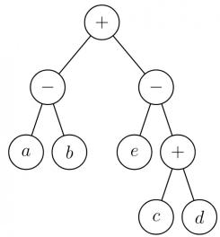
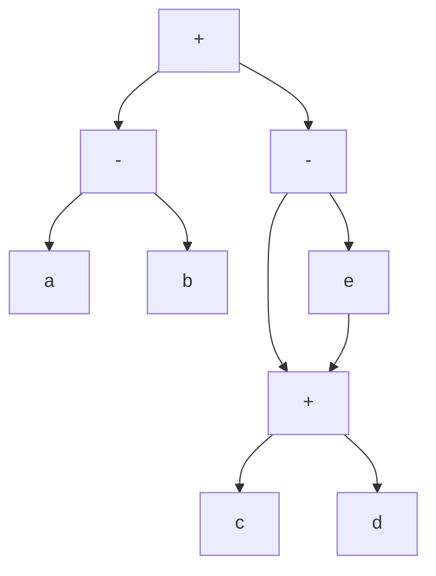
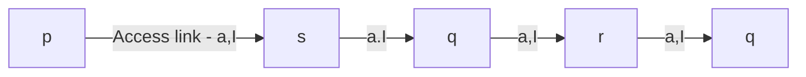
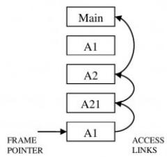
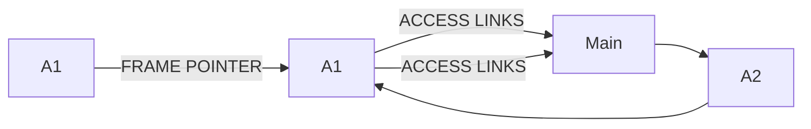
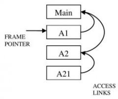
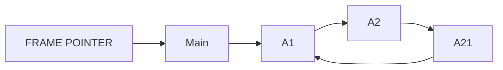
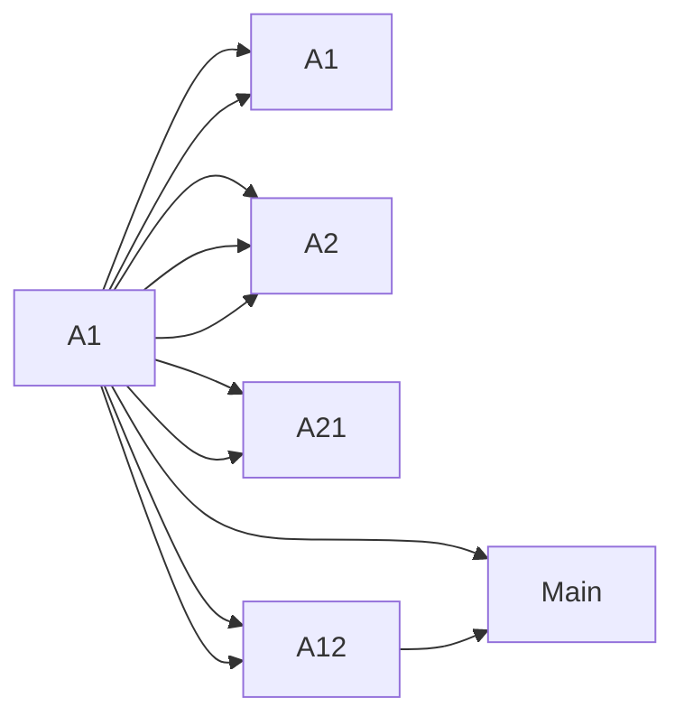
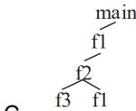
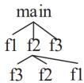

# 2.22.13 Parsing: GATE CSE 2006 | Question: 58

Consider the following grammar:


- $S \rightarrow FR$  
- $R \to *S \mid \varepsilon$  
- $F \rightarrow id$

In the predictive parser table $M$ of the grammar the entries $M[S, id]$ and $M[R, \$]$ respectively are

A. $\{S\to FR\}$ and $\{R\to \varepsilon \}$  
B. $\{S\to FR\}$ and $\{\}$  
C. $\{S\to FR\}$ and $\{R\to *S\}$  
D. $\{F\to id\}$ and $\{R\to \varepsilon \}$

gatecse-2006 compiler-design parsing normal

# Answer key

# 2.22.14 Parsing: GATE CSE 2007 | Question: 18

Which one of the following is a top-down parser?

A. Recursive descent parser.  
C. An LR(k) parser.  
gatecse-2007 compiler-design parsing normal

B. Operator precedence parser.  
D. An LALR(k) parser.

# Answer key

# 2.22.15 Parsing: GATE CSE 2008 | Question: 11

Which of the following describes a handle (as applicable to LR-parsing) appropriately?


A. It is the position in a sentential form where the next shift or reduce operation will occur  
B. It is non-terminal whose production will be used for reduction in the next step  
C. It is a production that may be used for reduction in a future step along with a position in the sentential form where the next shift or reduce operation will occur  
D. It is the production $p$ that will be used for reduction in the next step along with a position in the sentential form where the right hand side of the production may be found

gatecse-2008 compiler-design parsing normal

# Answer key

# 2.22.16 Parsing: GATE CSE 2009 | Question: 42

Which of the following statements are TRUE?


I. There exist parsing algorithms for some programming languages whose complexities are less than $\Theta(n^{3})$  
II. A programming language which allows recursion can be implemented with static storage allocation.  
III. No L-attributed definition can be evaluated in the framework of bottom-up parsing.  
IV. Code improving transformations can be performed at both source language and intermediate code level.

A. I and II

B. I and IV

C. III and IV

D. I, III and IV

gatecse-2009 compiler-design parsing normal

# Answer key

# 2.22.17 Parsing: GATE CSE 2012 | Question: 53

For the grammar below, a partial $LL(1)$ parsing table is also presented along with the grammar. Entries that


need to be filled are indicated as $E1, E2$ , and $E3$ . $\varepsilon$ is the empty string, \$ indicates end of input, and, | separates alternate right hand sides of productions.

- $S \to aAbB \mid bAaB \mid \varepsilon$  
- $A \rightarrow S$  
- $B \to S$

<table><tr><td></td><td>a</td><td>b</td><td>$</td></tr><tr><td>S</td><td>E1</td><td>E2</td><td>S → ε</td></tr><tr><td>A</td><td>A → S</td><td>A → S</td><td>error</td></tr><tr><td>B</td><td>B → S</td><td>B → S</td><td>E3</td></tr></table>

The appropriate entries for E1, E2, and E3 are

A. $E1: S \to aAbB, A \to S$ $E2: S \to bAaB, B \to S$ $E3: B \to S$

B. $E1: S \to aAbB, S \to \varepsilon$ $E2: S \to bAaB, S \to \varepsilon$ $E3: S \to \varepsilon$

C. $E1: S \to aAbB, S \to \varepsilon$ $E2: S \to bAaB, S \to \varepsilon$ $E3: B \to S$

D. $E1: A \to S, S \to \varepsilon$ $E2: B \to S, S \to \varepsilon$ $E3: B \to S$

normal gatecse-2012 compiler-design parsing

Answer key

# 2.22.18 Parsing: GATE CSE 2015 | Set 3 | Question: 31

Consider the following grammar G

$$
S \rightarrow F \mid H
$$

$$
F \rightarrow p \mid c
$$

$$
H \rightarrow d \mid c
$$

Where $S, F,$ and $H$ are non-terminal symbols, $p, d,$ and $c$ are terminal symbols. Which of the following statement(s) is/are correct?

S1: LL(1) can parse all strings that are generated using grammar G

S2: LR(1) can parse all strings that are generated using grammar G

A. Only S1

B. Only S2

C. Both S1 and S2

D. Neither S1 and S2

gatecse-2015-set3 compiler-design parsing normal

Answer key

# 2.22.19 Parsing: GATE CSE 2017 | Set 1 | Question: 43

Consider the following grammar:

- stmt → if expr then expr else expr; stmt | Ó  
- expr $\rightarrow$ term relop term | term  
- term $\rightarrow$ id | number  
- $\mathrm{id} \rightarrow \mathbf{a} \mid \mathbf{b} \mid \mathbf{c}$  
- number $\rightarrow$ [0 - 9]

where relop is a relational operator (e.g., <, >, ...), Ó refers to the empty statement, and if, then, else are terminals.

Consider a program $P$ following the above grammar containing ten if terminals. The number of control flow paths in $P$ is \_\_\_\_. For example, the program

if $e_1$ then $e_2$ else $e_3$

has 2 control flow paths. $e_{1} \rightarrow e_{2}$ and $e_{1} \rightarrow e_{3}$ .


# 2.22.20 Parsing: GATE CSE 2024 | Set 1 | Question: 16

Which of the following is/are Bottom-Up Parser(s)?

A. Shift-reduce Parser

C. LL(1) Parser

B. Predictive Parser

D. LR Parser

gatecse-2024-set1 multiple-selects compiler-design parsing easy one-mark

# Answer key

# 2.22.21 Parsing: GATE IT 2005 | Question: 83b

Consider the context-free grammar

- $E \rightarrow E + E$  
- $E \rightarrow (E * E)$  
- $E \rightarrow \mathrm{id}$


where E is the starting symbol, the set of terminals is $\{id, (, +, ), *\}$ , and the set of non-terminals is $\{E\}$ .

For the terminal string $id + id + id + id$ , how many parse trees are possible?

A. 5

B. 4

C. 3

D. 2

gateit-2005 compiler-design parsing normal

# Answer key

# 2.22.22 Parsing: GATE IT 2008 | Question: 79

$A$ CFG $G$ is given with the following productions where $S$ is the start symbol, $A$ is a non-terminal and a and b are terminals.

- $S \rightarrow aS \mid A$  
- $A \to aAb \mid bAa \mid \epsilon$

For the string "aabbaab" how many steps are required to derive the string and how many parse trees are there?

A. 6 and 1

B. 6 and 2

C. 7 and 2

D. 4 and 2

gateit-2008 compiler-design parsing normal

# Answer key

# 2.23

# Register Allocation (6)

# Practice Test: Test 1 (7Q)

# 2.23.1 Register Allocation: GATE CSE 1997 | Question: 4.9

The expression $(a*b)*c$ op...

where ‘op’ is one of ‘+’, ‘\*’ and ‘↑’ (exponentiation) can be evaluated on a CPU with single register without storing the value of $(a * b)$ if

A. 'op' is '+' or '\*'

B. 'op' is '↑' or '\*'

C. 'op' is '↑' or '+'

D. not possible to evaluate without storing

gate1997 compiler-design register-allocation normal

# Answer key

# 2.23.2 Register Allocation: GATE CSE 2004 | Question: 10

Consider the grammar rule $E \rightarrow E1 - E2$ for arithmetic expressions. The code generated is targeted to a CPU having a single user register. The subtraction operation requires the first operand to be in the register.


If E1 and E2 do not have any common sub expression, in order to get the shortest possible code

A. E1 should be evaluated first  
B. E2 should be evaluated first  
C. Evaluation of E1 and E2 should necessarily be interleaved  
D. Order of evaluation of E1 and E2 is of no consequence

gatecse-2004 compiler-design register-allocation normal

# Answer key

# 2.23.3 Register Allocation: GATE CSE 2010 | Question: 37

The program below uses six temporary variables $a, b, c, d, e, f$ .


```txt
a = 1
b = 10
c = 20
d = a + b
e = c + d
f = c + e
b = c + e
e = b + f
d = 5 + e
return d + f
```

Assuming that all operations take their operands from registers, what is the minimum number of registers needed to execute this program without spilling?

A. 2

B. 3

C. 4

D. 6

gatecse-2010 compiler-design register-allocation normal

# Answer key

# 2.23.4 Register Allocation: GATE CSE 2011 | Question: 36

Consider evaluating the following expression tree on a machine with load-store architecture in which memory can be accessed only through load and store instructions. The variables $a, b, c, d$ , and $e$ are initially stored in memory. The binary operators used in this expression tree can be evaluated by the machine only when operands are in registers. The instructions produce result only in a register. If no intermediate results can be stored in memory, what is the minimum number of registers needed to evaluate this expression?



<details>
<summary>flowchart</summary>


</details>

A. 2

B. 9

C. 5

D. 3

gatecse-2011 compiler-design register-allocation normal

# Answer key

# 2.23.5 Register Allocation: GATE CSE 2013 | Question: 48

The following code segment is executed on a processor which allows only register operands in its instructions. Each instruction can have almost two source operands and one destination operand. Assume that all variables are dead after this code segment.


```javascript
c = a + b;
d = c * a;
e = c + a;
x = c * c;
if (x > a) {
    y = a * a;
```


```lisp
}
else {
  d = d * d;
  e = e * e;
}
```

Q.48 Suppose the instruction set architecture of the processor has only two registers. The only allowed compiler optimization is code motion, which moves statements from one place to another while preserving correctness. What is the minimum number of spills to memory in the compiled code?

A. 0

B. 1

C. 2

D. 3

gatecse-2013 normal compiler-design register-allocation

Answer key

# 2.23.6 Register Allocation: GATE CSE 2017 | Set 1 | Question: 52

Consider the expression $(a-1)*(((b+c)/3)+d)$ . Let X be the minimum number of registers required by an optimal code generation (without any register spill) algorithm for a load/store architecture, in which


A. only load and store instructions can have memory operands and  
B. arithmetic instructions can have only register or immediate operands.

The value of X is \_\_\_\_.

gatecse-2017-set1 compiler-design register-allocation normal numerical-answers

Answer key

# 2.24

# Runtime Environment (22)

Practice Tests: Test 1 (15Q) Test 2 (2Q)

# 2.24.1 Runtime Environment: GATE CSE 1988 | Question: 2xii

Consider the following program skeleton and below figure which shows activation records of procedures involved in the calling sequence.


$$
p \to s \to q \to r \to q.
$$

Write the access links of the activation records to enable correct access and variables in the procedures from other procedures involved in the calling sequence


<details>
<summary>flowchart</summary>


</details>

```txt
procedure p;
  procedure q;
  procedure r;
  begin
    q
    end r;
  begin
    r
  end q;
  procedure s;
  begin
    q
  end s;
  begin
    s
```

gate1988 normal descriptive runtime-environment compiler-design

# Answer key

# 2.24.2 Runtime Environment: GATE CSE 1989 | Question: 10a

Will recursion work correctly in a language with static allocation of all variables? Explain.

gate1989 descriptive compiler-design runtime-environment

# Answer key


# 2.24.3 Runtime Environment: GATE CSE 1989 | Question: 8b

Indicate the result of the following program if the language uses (i) static scope rules and (ii) dynamic scope rules.


```txt
var x, y:integer;
procedure A (var z:integer);
var x:integer;
begin x:=1; B; z:= x end;
procedure B;
begin x:=x+1 end;
begin
x:=5; A(y); write (y)
...end.
```

gate1989 descriptive compiler-design runtime-environment

# Answer key

# 2.24.4 Runtime Environment: GATE CSE 1990 | Question: 2-v

Match the pairs in the following questions:

<table><tr><td>(a)</td><td>Pointer data type</td><td>(p)</td><td>Type conversion</td></tr><tr><td>(b)</td><td>Activation record</td><td>(q)</td><td>Dynamic data structure</td></tr><tr><td>(c)</td><td>Repeat-until</td><td>(r)</td><td>Recursion</td></tr><tr><td>(d)</td><td>Coercion</td><td>(s)</td><td>Nondeterministic loop</td></tr></table>


gate1990 match-the-following compiler-design runtime-environment recursion

# Answer key

# 2.24.5 Runtime Environment: GATE CSE 1990 | Question: 4-v

State whether the following statements are TRUE or FALSE with reason:


The Link-load-and-go loading scheme required less storage space than the link-and-go loading scheme.

gate1990 true-false compiler-design runtime-environment

# Answer key

# 2.24.6 Runtime Environment: GATE CSE 1993 | Question: 7.7

A part of the system software which under all circumstances must reside in the main memory is:


A. text editor

B. assembler

C. linker

D. loader

E. none of the above

gate1993 compiler-design runtime-environment easy

# Answer key

# 2.24.7 Runtime Environment: GATE CSE 1995 | Question: 1.14


A linker is given object modules for a set of programs that were compiled separately. What information need not be included in an object module?

A. Object code  
B. Relocation bits  
C. Names and locations of all external symbols defined in the object module  
D. Absolute addresses of internal symbols

gate1995 compiler-design runtime-environment normal

Answer key

# 2.24.8 Runtime Environment: GATE CSE 1996 | Question: 2.17


The correct matching for the following pairs is

<table><tr><td>(A)</td><td>Activation record</td><td>(1)</td><td>Linking loader</td></tr><tr><td>(B)</td><td>Location counter</td><td>(2)</td><td>Garbage collection</td></tr><tr><td>(C)</td><td>Reference counts</td><td>(3)</td><td>Subroutine call</td></tr><tr><td>(D)</td><td>Address relocation</td><td>(4)</td><td>Assembler</td></tr></table>

A. A-3 B-4 C-1 D-2

B. A-4 B-3 C-1 D-2

C. A-4 B-3 C-2 D-1

D. A-3 B-4 C-2 D-1

gate1996 compiler-design easy runtime-environment

Answer key

# 2.24.9 Runtime Environment: GATE CSE 1997 | Question: 1.10


Heap allocation is required for languages.

A. that support recursion  
C. that use dynamic scope rules

B. that support dynamic data structure  
D. None of the above

gate1997 compiler-design easy runtime-environment

Answer key

# 2.24.10 Runtime Environment: GATE CSE 1997 | Question: 1.8


A language $L$ allows declaration of arrays whose sizes are not known during compilation. It is required to make efficient use of memory. Which one of the following is true?

A. A compiler using static memory allocation can be written for $L$  
B. A compiler cannot be written for $L$ ; an interpreter must be used  
C. A compiler using dynamic memory allocation can be written for $L$  
D. None of the above

gate1997 compiler-design easy runtime-environment

Answer key

# 2.24.11 Runtime Environment: GATE CSE 1998 | Question: 1.25, ISRO2008-41


In a resident – OS computer, which of the following systems must reside in the main memory under all situations?

A. Assembler

B. Linker

C. Loader

D. Compiler

gate1998 compiler-design runtime-environment normal isro2008

Answer key

# 2.24.12 Runtime Environment: GATE CSE 1998 | Question: 1.28


A linker reads four modules whose lengths are 200,800,600 and 500 words, respectively. If they are loaded in that order, what are the relocation constants?

A. 0,200,500,600

B. 0,200,1000,1600

C. 200,500,600,800

D. 200,700,1300,2100

gate1998 compiler-design runtime-environment normal

# Answer key

# 2.24.13 Runtime Environment: GATE CSE 1998 | Question: 2.15

Faster access to non-local variables is achieved using an array of pointers to activation records called a

A. stack

B. heap

C. display

D. activation tree

gate1998 programming compiler-design normal runtime-environment

# Answer key

# 2.24.14 Runtime Environment: GATE CSE 2001 | Question: 1.17


The process of assigning load addresses to the various parts of the program and adjusting the code and the data in the program to reflect the assigned addresses is called

A. Assembly

B. parsing

C. Relocation

D. Symbol resolution

gatecse-2001 compiler-design runtime-environment easy

# Answer key

# 2.24.15 Runtime Environment: GATE CSE 2002 | Question: 2.20


Dynamic linking can cause security concerns because

A. Security is dynamic  
B. The path for searching dynamic libraries is not known till runtime  
C. Linking is insecure  
D. Cryptographic procedures are not available for dynamic linking

gatecse-2002 compiler-design runtime-environment easy

# Answer key


# 2.24.16 Runtime Environment: GATE CSE 2008 | Question: 54

Which of the following are true?


I. A programming language which does not permit global variables of any kind and has no nesting of procedures/functions, but permits recursion can be implemented with static storage allocation  
II. Multi-level access link (or display) arrangement is needed to arrange activation records only if the programming language being implemented has nesting of procedures/functions  
III. Recursion in programming languages cannot be implemented with dynamic storage allocation  
IV. Nesting procedures/functions and recursion require a dynamic heap allocation scheme and cannot be implemented with a stack-based allocation scheme for activation records  
V. Programming languages which permit a function to return a function as its result cannot be implemented with a stack-based storage allocation scheme for activation records

A. II and V only

B. I, III and IV only

C. I, II and V only

D. II, III and V only

gatecse-2008 compiler-design difficult runtime-environment

# Answer key

# 2.24.17 Runtime Environment: GATE CSE 2010 | Question: 14

Which languages necessarily need heap allocation in the runtime environment?

A. Those that support recursion.  
C. Those that allow dynamic data structure.

B. Those that use dynamic scoping.

D. Those that use global variables.

gatecse-2010 compiler-design easy runtime-environment

# Answer key

# 2.24.18 Runtime Environment: GATE CSE 2012 | Question: 36

Consider the program given below, in a block-structured pseudo-language with lexical scoping and nesting of procedures permitted.

Program main;
Var ...

Procedure A1;
  Var ...
  Call A2;
End A1

Procedure A2; Var ...

Procedure A21;
  Var ...
  Call A1;
End A21

Call A21;
End A2

Call A1;
End main.

Consider the calling chain: Main → A1 → A2 → A21 → A1

The correct set of activation records along with their access links is given by:

(A)  

<details>
<summary>flowchart</summary>


</details>

(B)  


<details>
<summary>flowchart</summary>


</details>

(C)  


<details>
<summary>flowchart</summary>


</details>

(D)  

<details>
<summary>flowchart</summary>


</details>

gatecse-2012 compiler-design runtime-environment normal

# Answer key

# 2.24.19 Runtime Environment: GATE CSE 2014 | Set 2 | Question: 18

Which one of the following is NOT performed during compilation?

A. Dynamic memory allocation

C. Symbol table management

B. Type checking

D. Inline expansion

gatecse-2014-set2 compiler-design easy runtime-environment


# 2.24.20 Runtime Environment: GATE CSE 2014 | Set 3 | Question: 18

Which of the following statements are CORRECT?


1. Static allocation of all data areas by a compiler makes it impossible to implement recursion.  
2. Automatic garbage collection is essential to implement recursion.  
3. Dynamic allocation of activation records is essential to implement recursion.  
4. Both heap and stack are essential to implement recursion.

A. 1 and 2 only

B. 2 and 3 only

C. 3 and 4 only

D. 1 and 3 only

gatecse-2014-set3 compiler-design runtime-environment normal

# Answer key

# 2.24.21 Runtime Environment: GATE CSE 2021 | Set 1 | Question: 4

Consider the following statements.


- $S_{1}$ : The sequence of procedure calls corresponds to a preorder traversal of the activation tree.  
- $S_{2}$ : The sequence of procedure returns corresponds to a postorder traversal of the activation tree.

Which one of the following options is correct?

A. $S_{1}$ is true and $S_{2}$ is false

C. $S_{1}$ is true and $S_{2}$ is true

gatecse-2021-set1 runtime-environment normal one-mark

# Answer key

# 2.24.22 Runtime Environment: GATE CSE 2023 | Question: 26

Consider the following program:


<details>
<summary>flowchart</summary>

```mermaid
graph LR
  subgraph Algorithm1
  A["int main()"] --> B["f1 ( );"]
  B --> C["f2(2);"]
  C --> D["f3( );"]
  D --> E["return (0);"]
  end

  subgraph Algorithm2
  F["int f1 ( )"] --> G["return(1);"]
  G --> H[""]
  end

  subgraph Algorithm3
  I["int f2 (int X)"] --> J["f3( );"]
  J --> K["if (X==1);"]
  K --> L["return f1 ( );"]
  L --> M["else"]
  M --> N["return (X * f2 (X - 1));"]
  end

  subgraph Algorithm4
  O["int f3 ( )"] --> P["return (5);"]
  end
```
</details>

Which one of the following options represents the activation tree corresponding to the main function?




gatecse-2023 compiler-design runtime-environment two-marks

B.

D.




# Answer key

# 2.25

# Static Single Assignment (3)

Practice Test: Test 1 (6Q)

# 2.25.1 Static Single Assignment: GATE CSE 2015 | Set 1 | Question: 55


The least number of temporary variables required to create a three-address code in static single assignment form for the expression $q + r/3 + s - t * 5 + u * v/w$ is \_\_\_\_.

gatecse-2015-set1 compiler-design intermediate-code normal numerical-answers static-single-assignment

# Answer key

# 2.25.2 Static Single Assignment: GATE CSE 2016 | Set 1 | Question: 19

Consider the following code segment.


```matlab
x = u - t;
y = x * v;
x = y + w;
y = t - z;
y = x * y;
```

The minimum number of total variables required to convert the above code segment to static single assignment form is \_\_\_\_.

gatecse-2016-set1 compiler-design static-single-assignment normal numerical-answers

# Answer key

# 2.25.3 Static Single Assignment: GATE CSE 2017 | Set 1 | Question: 12

Consider the following intermediate program in three address code


```txt
p = a - b
q = p * c
p = u * v
q = p + q
```

Which one of the following corresponds to a static single assignment form of the above code?

A.

```txt
p1 = a - b
q1 = p1 * c
p1 = u * v
q1 = p1 + q1
```

B.

```txt
p3 = a - b
q4 = p3 * c
p4 = u * v
q5 = p4 + q4
```

C.

```txt
p1 = a - b
q1 = p2 * c
p3 = u * v
q2 = p4 + q3
```

D.

```txt
p1 = a - b
q1 = p * c
p2 = u * v
q2 = p + q
```

gatecse-2017-set1 compiler-design intermediate-code normal static-single-assignment

# Answer key

2.26

# Symbol Table (1)

# 2.26.1 Symbol Table: GATE CSE 2025 | Set 1 | Question: 2

Which ONE of the following statements is FALSE regarding the symbol table?


A. Symbol table is responsible for keeping track of the scope of variables.  
B. Symbol table can be implemented using a binary search tree.  
C. Symbol table is not required after the parsing phase.  
D. Symbol table is created during the lexical analysis phase.

gatecse2025-set1 compiler-design symbol-table easy one-mark

# Answer key

2.27

# Syntax Directed Translation (19)

Practice Tests: Test 1 (15Q) Test 2 (10Q)

# 2.27.1 Syntax Directed Translation: GATE CSE 1992 | Question: 11a


Write syntax directed definitions (semantic rules) for the following grammar to add the type of each identifier to its entry in the symbol table during semantic analysis. Rewriting the grammar is not permitted and semantic rules are to be added to the ends of productions only.

- $D \to TL$ ;  
- $T \rightarrow \mathrm{int}$  
- $T \rightarrow$ real  
- $L \to L, id$  
- $L \rightarrow id$

gate1992 compiler-design syntax-directed-translation normal descriptive

Answer key

# 2.27.2 Syntax Directed Translation: GATE CSE 1995 | Question: 2.10


A shift reduce parser carries out the actions specified within braces immediately after reducing with the corresponding rule of grammar

- $S \rightarrow xxW$ {print"1"}  
- $S \to y$ {print"2"}  
- $W \to Sz$ {print"3"}

What is the translation of xxxxyzz using the syntax directed translation scheme described by the above rules?

A. 23131

B. 11233

C. 11231

D. 33211

gate1995 compiler-design grammar syntax-directed-translation normal

Answer key

# 2.27.3 Syntax Directed Translation: GATE CSE 1996 | Question: 20


Consider the syntax-directed translation schema (SDTS) shown below:

- $E \rightarrow E + E$ {print "+"}  
- $E \to E * E$ {print “.”}  
- $E \to id$ {print id.name}  
- $E \rightarrow (E)$

An LR-parser executes the actions associated with the productions immediately after a reduction by the corresponding production. Draw the parse tree and write the translation for the sentence.

$(a + b) * (c + d)$ , using SDTS given above.

gate1996 compiler-design syntax-directed-translation normal descriptive

Answer key

# 2.27.4 Syntax Directed Translation: GATE CSE 1998 | Question: 23


Let the attribute 'val' give the value of a binary number generated by S in the following grammar:

- $S \to L \cdot L \mid L$  
- $L \rightarrow LB \mid B$  
- $B\to 0\mid 1$

For example, an input 101.101 gives S.val = 5.625

Construct a syntax directed translation scheme using only synthesized attributes, to determine S. val.

gate1998 compiler-design syntax-directed-translation normal descriptive

Answer key