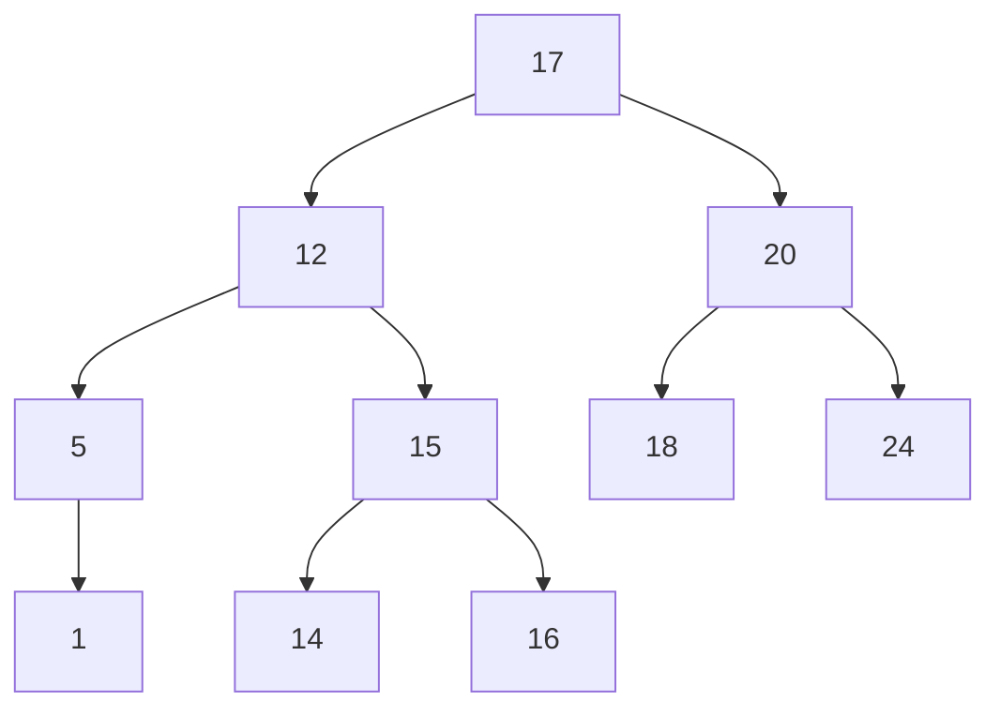
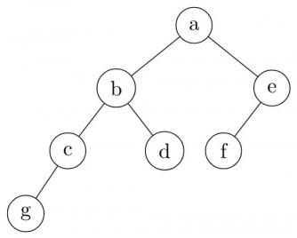
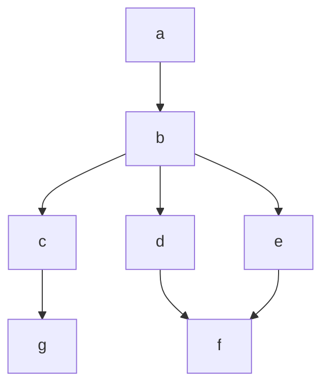
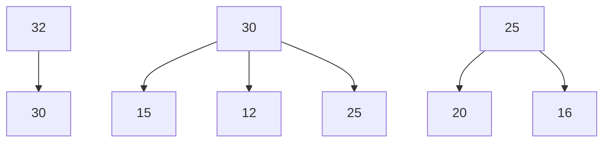

precedence (e.g., ×, / > +, -) and associativity (most are left-associative, exponentiation is right-associative).

# Linked List

A linked list is a linear data structure where elements are not stored in contiguous memory locations. Instead, each element (node) contains data and a pointer (or link) to the next node in the sequence.

# - Types of Linked Lists:

- Singly Linked List: Each node points to the next node. Traversal is unidirectional.  
- Doubly Linked List: Each node has pointers to both the next and previous nodes. Traversal is bidirectional.  
- Circular Linked List: The last node points back to the first node (or head). Can be singly or doubly circular.

# - Time Complexity:

- Insertion/Deletion at beginning: $O(1)$  
- Insertion/Deletion at end: $O(n)$ for singly linked list (requires traversal), $O(1)$ if tail pointer is maintained. $O(1)$ for doubly linked list if tail pointer is maintained.  
- Insertion/Deletion at specific position: $O(n)$ (requires traversal to find position)  
- Search: $O(n)$

\- Advantages: Dynamic size, efficient insertions/deletions at specific points (if pointer to previous node is available).

\- Disadvantages: More memory overhead (for pointers), no random access $(O(n)$ for access).

Common Pitfalls: Null pointer exceptions when traversing or manipulating the list. Incorrectly updating pointers during insertion/deletion, leading to lost nodes or broken links. Handling edge cases like empty list or single-node list.

Problem-Solving Techniques: Draw diagrams to visualize pointer changes. Pay close attention to the order of pointer updates. Always check for null pointers.

# Priority Queue

A Priority Queue is an Abstract Data Type (ADT) that functions like a queue but with an additional concept of "priority." Elements are retrieved based on their priority, not necessarily their insertion order. The element with the highest (or lowest) priority is always dequeued first.

# - Core Operations:

- Insert (enqueue): Adds an element with a given priority.  
- Extract-Min/Max (dequeue): Removes and returns the element with the highest (or lowest) priority.  
- Peek: Returns the highest (or lowest) priority element without removing it.

# - Implementations:

- Binary Heap: Most efficient implementation, providing $O(\log n)$ for insert and extract-min/max.  
- Unsorted Array/Linked List: $O(1)$ insert, $O(n)$ extract-min/max.  
- Sorted Array/Linked List: $O(n)$ insert, $O(1)$ extract-min/max.

Common Pitfalls: Confusing a priority queue with a regular queue. Not understanding that the underlying data structure (e.g., heap) determines the complexity.

Problem-Solving Techniques: When a problem requires always processing the "most important" item next, a priority queue (implemented with a heap) is often the solution.

# Queue

A Queue is a linear Abstract Data Type (ADT) that follows the First-In, First-Out (FIFO) principle. Elements are added at one end (rear/tail) and removed from the other end (front/head).

# - Core Operations:

- Enqueue: Adds an element to the rear of the queue.  
- Dequeue: Removes and returns the element from the front of the queue.  
- Front/Peek: Returns the element at the front without removing it.  
- IsEmpty, IsFull: Checks the state of the queue.

# - Implementations:

Array-based: Can lead to "queue full" even if space is available (linear array). Circular array implementation solves this.  
- Linked List-based: More dynamic, no fixed size issues.

\- Time Complexity (Array or Linked List): All core operations (enqueue, dequeue, front) are $O(1)$ .

Common Pitfalls: Underflow (dequeuing from an empty queue) and Overflow (enqueuing into a full array-based queue). Incorrectly managing front and rear pointers in array implementations, especially circular queues.

Problem-Solving Techniques: Trace operations carefully. Understand how front and rear pointers move. For circular queues, remember the modulus operator for index calculations: $(index + 1)$ (mod S)ize.

# Stack

A Stack is a linear Abstract Data Type (ADT) that follows the Last-In, First-Out (LIFO) principle. Elements are added and removed only from one end, called the "top."

# - Core Operations:

- Push: Adds an element to the top of the stack.  
- Pop: Removes and returns the element from the top of the stack.  
- Peek/Top: Returns the element at the top without removing it.  
- IsEmpty, IsFull: Checks the state of the stack.

# - Implementations:

Array-based: Uses a fixed-size array and a top pointer/index.  
- Linked List-based: Each node points to the next, with the head of the list being the top of the stack.

\- Time Complexity (Array or Linked List): All core operations (push, pop, peek) are $O(1)$ .

\- Applications: Function call stack, expression evaluation (infix to postfix/prefix conversion), undo/redo functionality, backtracking algorithms.

Common Pitfalls: Underflow (popping from an empty stack) and Overflow (pushing into a full array-based stack). Incorrectly managing the top pointer/index.

Problem-Solving Techniques: Trace stack operations. Recognize problems that naturally fit the LIFO principle (e.g., reversing a sequence, checking parenthesis balance).

# Time Complexity

Time complexity measures the amount of time an algorithm takes to run as a function of the input size $(n)$ . It's typically expressed using asymptotic notations to describe the growth rate for large $n$ .

# - Asymptotic Notations:

- Big-O Notation (O): Upper bound. $f(n) = O(g(n))$ if there exist positive constants $c$ and $n_0$ such that $0 \leq f(n) \leq c \cdot g(n)$ for all $n \geq n_0$ . Describes the worst-case time.  
- Big-Omega Notation $(\Omega)$ : Lower bound. $f(n) = \Omega(g(n))$ if there exist positive constants $c$ and $n_0$ such that $0 \leq c \cdot g(n) \leq f(n)$ for all $n \geq n_0$ . Describes the best-case time.  
- Big-Theta Notation $(\Theta)$ : Tight bound. $f(n) = \Theta(g(n))$ if there exist positive constants $c_{1}, c_{2}$ and $n_{0}$ such that $0 \leq c_{1} \cdot g(n) \leq f(n) \leq c_{2} \cdot g(n)$ for all $n \geq n_{0}$ . Describes average-case time or when best and worst cases are the same.  
- Little-o Notation (o): Strict upper bound. $f(n) = o(g(n))$ if $\lim_{n\to \infty}\frac{f(n)}{g(n)} = 0$ .  
- Little-omega Notation $(\omega)$ : Strict lower bound. $f(n) = \omega(g(n))$ if $\lim_{n\to \infty}\frac{f(n)}{g(n)} = \infty$ .

\- Common Growth Rates (from fastest to slowest):

$$
O (n!), O (2 ^ {n}), O (n ^ {3}), O (n ^ {2}), O (n \log n), O (n), O (\log n), O (1)
$$

\- Master Theorem for Recurrence Relations: For recurrences of the form $T(n) = aT(n / b) + f(n)$ , where $a \geq 1, b > 1$ are constants, and $f(n)$ is an asymptotically positive function:

1. If $f(n) = O(n^{\log_b a - \epsilon})$ for some constant $\epsilon > 0$ , then $T(n) = \Theta(n^{\log_b a})$ .  
2. If $f(n) = \Theta(n^{\log_b a})$ , then $T(n) = \Theta(n^{\log_b a} \log n)$ .  
3. If $f(n) = \Omega(n^{\log_b a + \epsilon})$ for some constant $\epsilon > 0$ , AND if $af(n / b) \leq cf(n)$ for some constant $c < 1$ and all sufficiently large $n$ , then $T(n) = \Theta(f(n))$ .

Common Pitfalls: Ignoring constant factors or lower-order terms (which are dropped in asymptotic analysis). Confusing best, worst, and average case complexities. Incorrectly applying Master Theorem conditions.

Problem-Solving Techniques: Analyze loops (number of iterations). For recursive functions, set up recurrence relations and solve them (often using Master Theorem or substitution method). Identify the dominant term in a sum of complexities.

# Tree

A tree is a non-linear, hierarchical data structure consisting of nodes connected by edges. It is a connected acyclic graph, meaning there are no cycles and all nodes are reachable from the root.

# - Key Terminology:

- Root: The topmost node of the tree.  
- Parent: A node that has one or more child nodes.  
- Child: A node directly connected to another node when moving away from the root.  
- Sibling: Nodes that share the same parent.  
- Leaf Node (External Node): A node with no children.  
- Internal Node: A node with at least one child.  
- Ancestors: All nodes on the path from the root to a node.  
- Descendants: All nodes in the subtree rooted at a node.  
- Depth: The length of the path from the root to a node (root is at depth 0).  
- Height: The length of the longest path from a node to a leaf. The height of the tree is the height of its root.  
- Degree of a Node: Number of children it has.  
- Degree of a Tree: Maximum degree of any node in the tree.

# - Properties:

- A tree with $n$ nodes has exactly $n - 1$ edges.  
- There is a unique path between any two nodes in a tree.

Common Pitfalls: Confusing tree terminology (e.g., depth vs. height, parent vs. child). Forgetting the n - 1 edges property.

Problem-Solving Techniques: Draw trees to visualize concepts. Understand recursive definitions for tree operations.

# Tree Traversal

Tree traversal refers to the process of visiting each node in a tree exactly once in a systematic way. There are two main categories: Depth-First Search (DFS) and Breadth-First Search (BFS).

\- Depth-First Search (DFS) Traversal: Uses a stack (implicitly via recursion) to explore as far as possible along each branch before backtracking.

- Inorder Traversal (Left, Root, Right): Visits the left subtree, then the root, then the right subtree. For BSTs, this yields sorted elements.  
- Preorder Traversal (Root, Left, Right): Visits the root, then the left subtree, then the right subtree. Useful for creating a copy of the tree.  
- Postorder Traversal (Left, Right, Root): Visits the left subtree, then the right subtree, then the root. Useful for deleting a tree (deletes children before parent).

\- Breadth-First Search (BFS) Traversal (Level Order Traversal): Visits nodes level by level, from left to right. Uses a queue.

\- Starts at the root, then visits all nodes at depth 1, then all nodes at depth 2, and so on.

Common Pitfalls: Incorrectly applying the order of visits for DFS traversals. Difficulty in reconstructing a tree from given traversals (e.g., Inorder + Preorder can reconstruct a unique BST).

Problem-Solving Techniques: Practice tracing all four traversal types on various trees. Remember the specific order for each. For tree reconstruction, use one traversal (e.g., Preorder) to find the root, then use another (e.g., Inorder) to partition the remaining elements into left and right subtrees.

# Uniform Hashing

Uniform Hashing is an idealized assumption used in the analysis of hashing algorithms. It states that each key is equally likely to hash to any slot in the hash table, independently of where other keys hash.

\- Key Property: If we have $n$ keys and $m$ slots, the probability that a key hashes to any particular slot is $1 / m$ .

# - Implications:

- Minimizes collisions in theory.  
- Leads to the best possible average-case performance for hash tables.  
- Under simple uniform hashing, the expected length of a chain in chaining is $\alpha = n / m$ .  
Under uniform hashing, the expected number of probes for unsuccessful search in open addressing is $1/(1-\alpha)$ .

Common Pitfalls: Assuming uniform hashing holds true in practice. Real-world hash functions are rarely perfectly uniform, leading to deviations from theoretical performance.

Problem-Solving Techniques: Understand that uniform hashing is a theoretical model for analyzing the average-case performance of hashing. Use its properties to calculate expected values related to collisions or probes.

Quick Formula Reference

<table><tr><td>Topic</td><td>Formula/Concept</td></tr><tr><td>AVL Tree</td><td>Balance Factor:  $Height(Right) - Height(Left) \in \{-1, 0, 1\}$ Height:  $O(\log n)$ </td></tr><tr><td>Array (1D)</td><td> $Address(A[i]) = BaseAddress + (i - L_0) \times S$ </td></tr><tr><td>Array (2D - Row-Major)</td><td> $Address(A[i][j]) = BaseAddress + ((i - L_{row}) \times C + (j - L_{col})) \times S$ </td></tr><tr><td>Array (2D - Column-Major)</td><td> $Address(A[i][j]) = BaseAddress + ((j - L_{col}) \times R + (i - L_{row})) \times S$ Parent of  $i$ :  $\lfloor (i - 1)/2 \rfloor$ </td></tr><tr><td>Binary Heap (0-indexed)</td><td>Left child of  $i$ :  $2i + 1$ Right child of  $i$ :  $2i + 2$ Max nodes at level  $k$ :  $2^k$ </td></tr><tr><td>Binary Tree</td><td>Max nodes in height  $h$  tree:  $2^{h+1} - 1$ Min height for  $n$  nodes:  $\lfloor \log_2 n \rfloor$  (complete tree)Full Binary Tree:  $L = I + 1$ </td></tr><tr><td>Hashing (Division)</td><td> $h(k) = k \pmod{m}$ </td></tr><tr><td>Hashing (Multiplication)</td><td> $h(k) = \lfloor m(kA \pmod{1}) \rfloor$ </td></tr><tr><td>Hashing (Linear Probing)</td><td> $h(k, i) = (h'(k) + i) \pmod{m}$ </td></tr><tr><td>Hashing (Quadratic Probing)</td><td> $h(k, i) = (h'(k) + c_1 i + c_2 i^2) \pmod{m}$ </td></tr><tr><td>Hashing (Double Hashing)</td><td> $h(k, i) = (h_1(k) + i \cdot h_2(k)) \pmod{m}$ </td></tr><tr><td>Hashing (Load Factor)</td><td> $\alpha = n/m$ </td></tr><tr><td>Time Complexity (Big-O)</td><td> $f(n) = O(g(n))$  if  $f(n) \leq c \cdot g(n)$  for  $n \geq n_0$ </td></tr><tr><td>Time Complexity (Big-Omega)</td><td> $f(n) = \Omega(g(n))$  if  $c \cdot g(n) \leq f(n)$  for  $n \geq n_0$ </td></tr><tr><td>Time Complexity (Big-Theta)</td><td> $c_1 \cdot g(n) \leq f(n) \leq c_2 \cdot g(n)$  for  $n \geq n_0$ </td></tr><tr><td>Master Theorem (Case 1)</td><td>If  $f(n) = O(n^{\log_b a - \epsilon})$ , then  $T(n) = \Theta(n^{\log_b a})$ </td></tr><tr><td>Master Theorem (Case 2)</td><td>If  $f(n) = \Theta(n^{\log_b a})$ , then  $T(n) = \Theta(n^{\log_b a} \log n)$ </td></tr><tr><td>Master Theorem (Case 3)</td><td>If  $f(n) = \Omega(n^{\log_b a + \epsilon})$  and  $af(n/b) \leq cf(n)$ , then  $T(n) = \Theta(f(n))$ </td></tr><tr><td>Tree (General)</td><td> $n$  nodes,  $n - 1$  edges</td></tr></table>

# Important Tips for GATE

- Master Time & Space Complexity: This is arguably the most crucial aspect. Be able to analyze the complexity of operations on all data structures and for given code snippets. Understand best, worst, and average cases. Practice applying the Master Theorem rigorously.  
- Understand ADT vs. Data Structure: Clearly differentiate between the abstract concept (ADT) and its concrete implementation (data structure). For example, a Stack is an ADT, while an array-based stack or linked-list based stack are data structures implementing the Stack ADT.  
- Visualize Operations: For tree-based structures (AVL, BST, Heap) and linked lists, always draw diagrams and trace operations step-by-step. This helps catch errors in pointer manipulation, rotations, or heapify processes.  
- Practice Tree Traversals: Be proficient in Inorder, Preorder, Postorder, and Level-order traversals. Understand their applications and how to reconstruct a tree from given traversals (e.g., Preorder + Inorder).  
- Hashing Concepts are Key: Pay close attention to different hash functions, collision resolution techniques (chaining, linear probing, quadratic probing, double hashing), and their impact on performance (load factor, clustering). Be ready to trace insertions and searches.  
- Know Standard Implementations: Understand how basic ADTs like Stack and Queue are implemented using arrays and linked lists, including edge cases like underflow/overflow and circular array logic.  
- Identify Common Pitfalls: Be aware of typical mistakes like off-by-one errors in array indexing, null pointer exceptions in linked lists, incorrect balance factor calculations in AVL trees, or misinterpreting operator precedence in expression conversions.  
- Practice Problem-Solving: Data structures questions are often application-oriented. Practice a wide variety of problems to recognize when to use a particular data structure and how to apply its operations to solve the problem

# 3.1

# AVL Tree (6)

Practice Test: Test 1 (12Q)

# 3.1.1 AVL Tree: GATE CSE 1988 | Question: 7ii


Mark the balance factor of each node on the tree given in the below figure and state whether it is height-balanced.


<details>
<summary>flowchart</summary>


</details>

gate1988 data-structures normal descriptive avl-tree

Answer key

# 3.1.2 AVL Tree: GATE CSE 1996 | Question: 1.14


In the balanced binary tree in the below figure, how many nodes will become unbalanced when a node is inserted as a child of the node "g"?



<details>
<summary>flowchart</summary>


</details>

A. 1

B. 3

C. 7

D. 8

gate1996 data-structures binary-tree avl-tree normal

Answer key

# 3.1.3 AVL Tree: GATE CSE 1998 | Question: 21


A. Derive a recurrence relation for the size of the smallest AVL tree with height h.  
B. What is the size of the smallest AVL tree with height 8?

gate1998 data-structures avl-tree descriptive numerical-answers

Answer key

# 3.1.4 AVL Tree: GATE CSE 2009 | Question: 37, ISRO-DEC2017-55


What is the maximum height of any AVL-tree with 7 nodes? Assume that the height of a tree with a single node is 0.

A. 2

B. 3

C. 4

D. 5

gatecse-2009 data-structures binary-search-tree normal isrodec2017 avl-tree

Answer key

# 3.1.5 AVL Tree: GATE CSE 2020 | Question: 6

What is the worst case time complexity of inserting $n^{2}$ elements into an AVL-tree with n elements initially?


A. $\Theta(n^{4})$

B. $\Theta(n^{2})$

C. $\Theta(n^{2}\log n)$

D. $\Theta(n^3)$

gatecse-2020 binary-tree avl-tree one-mark

# Answer key

# 3.1.6 AVL Tree: GATE IT 2008 | Question: 12

Which of the following is TRUE?


A. The cost of searching an AVL tree is $\Theta (\log n)$ but that of a binary search tree is $O(n)$  
B. The cost of searching an AVL tree is $\Theta (\log n)$ but that of a complete binary tree is $\Theta (n\log n)$  
C. The cost of searching a binary search tree is $O(\log n)$ but that of an AVL tree is $\Theta(n)$  
D. The cost of searching an AVL tree is $\Theta(n \log n)$ but that of a binary search tree is $O(n)$

gateit-2008 data-structures binary-search-tree easy avl-tree

# Answer key

# 3.2

# Abstract Data Type (1)

# 3.2.1 Abstract Data Type: GATE CSE 2005 | Question: 2

An Abstract Data Type (ADT) is:


A. same as an abstract class  
B. a data type that cannot be instantiated  
C. a data type for which only the operations defined on it can be used, but none else  
D. all of the above

gatecse-2005 data-structures normal abstract-data-type

# Answer key

# 3.3

# Array (13)

Practice Test: Test 1 (9Q)

# 3.3.1 Array: GATE CSE 1993 | Question: 12


The following Pascal program segments finds the largest number in a two-dimensional integer array $A[0 \ldots n - 1, 0 \ldots n - 1]$ using a single loop. Fill up the boxes to complete the program and write against

A, B, C and D in your answer book Assume that max is a variable to store the largest value and i, j are the indices to the array.

```ruby
begin
  max:=|A|, i:=0, j:=0;
  while |B| do
  begin
    if A[i, j]>max then max:=A[i, j];
    if |C| then j:=j+1;
    else begin
      j:=0;
      i:=|D|
    end
  end
end
```

gate1993 data-structures array normal descriptive

# Answer key

# 3.3.2 Array: GATE CSE 1994 | Question: 1.11


In a compact single dimensional array representation for lower triangular matrices (i.e all the elements above the diagonal are zero) of size $n \times n$ , non-zero elements, (i.e elements of lower triangle) of each row are

stored one after another, starting from the first row, the index of the $(i,j)^{th}$ element of the lower triangular matrix in this new representation is:

A. $i + j$

B. $i + j - 1$

C. $(j - 1) + \frac{i(i - 1)}{2}$

D. $i + \frac{j(j - 1)}{2}$

gate1994 data-structures array normal

# Answer key

# 3.3.3 Array: GATE CSE 1994 | Question: 25

An array A contains n integers in non-decreasing order, $A[1] \leq A[2] \leq \cdots \leq A[n]$ . Describe, using Pascal like pseudo code, a linear time algorithm to find i, j, such that $A[i] + A[j] = a$ given integer M, if such i, j exist.


gate1994 data-structures array normal descriptive

# Answer key

# 3.3.4 Array: GATE CSE 1997 | Question: 17

An array $A$ contains $n \geq 1$ positive integers in the locations $A[1], A[2], \ldots A[n]$ . The following program fragment prints the length of a shortest sequence of consecutive elements of $A$ , $A[i], A[i + 1], \ldots, A[j]$

such that the sum of their values is $\geq M$ , a given positive number. It prints ‘n+1’ if no such sequence exists. Complete the program by filling in the boxes. In each case use the simplest possible expression. Write only the line number and the contents of the box.

```pascal
begin
i:=1:j:=1;
sum := □
min:=n; finish:=false;
while not finish do
    if □ then
        if j=n then finish:=true
        else
        begin
            j:=j+1;
            sum:= □
        end
    else
    begin
        if(j-i) < min then min:=j-i;
        sum:=sum -A[i];
        i:=i+1;
    end
    writeln (min +1);
end.
```

gate1997 data-structures array normal descriptive

# Answer key

# 3.3.5 Array: GATE CSE 1998 | Question: 2.14

Let $A$ be a two dimensional array declared as follows:


A: array [1 .... 10] [1 .... 15] of integer;

Assuming that each integer takes one memory location, the array is stored in row-major order and the first element of the array is stored at location 100, what is the address of the element $A[i][j]$ ?

A. $15i + j + 84$

B. $15j + i + 84$

C. $10i + j + 89$

D. $10j + i + 89$

gate1998 data-structures array easy

# Answer key

# 3.3.6 Array: GATE CSE 2000 | Question: 1.2

An $n \times n$ array v is defined as follows:

$v[i,j] = i - j$ for all $i,j,i\leq n,1\leq j\leq n$

The sum of the elements of the array v is

A. 0

B. n - 1

C. $n^2 - 3n + 2$

D. $n^{2}\frac{(n+1)}{2}$

gatecse-2000 data-structures array easy

# Answer key

# 3.3.7 Array: GATE CSE 2000 | Question: 15

Suppose you are given arrays $p[1......N]$ and $q[1......N]$ both uninitialized, that is, each location may contain an arbitrary value), and a variable count, initialized to 0. Consider the following procedures set and is\_set:

```c
set(i) {
    count = count + 1;
    q[count] = i;
    p[i] = count;
}
is_set(i) {
    if (p[i] ≤ 0 or p[i] > count)
        return false;
    if (q[p[i]] ≠ 1)
        return false;
    return true;
}
```

A. Suppose we make the following sequence of calls:

set(7); set(3); set(9);

After these sequence of calls, what is the value of count, and what do $q[1], q[2], q[3], p[7], p[3]$ and $p[9]$ contain?

B. Complete the following statement "The first count elements of \_\_\_\_ contain values i such that set (\_\_\_\_) has been called".

C. Show that if $set(i)$ has not been called for some $i$ , then regardless of what $p[i]$ contains, $is\_set(i)$ will return false.

gatecse-2000 data-structures array easy descriptive

# Answer key

# 3.3.8 Array: GATE CSE 2005 | Question: 5

A program P reads in 500 integers in the range $[0,100]$ representing the scores of 500 students. It then prints the frequency of each score above 50. What would be the best way for P to store the frequencies?

A. An array of 50 numbers

B. An array of 100 numbers

C. An array of 500 numbers

D. A dynamically allocated array of 550 numbers

gatecse-2005 data-structures array easy

# Answer key

# 3.3.9 Array: GATE CSE 2013 | Question: 50

The procedure given below is required to find and replace certain characters inside an input character string supplied in array A. The characters to be replaced are supplied in array oldc, while their respective replacement characters are supplied in array newc. Array A has a fixed length of five characters, while arrays oldc and newc contain three characters each. However, the procedure is flawed.

```c
void find_and_replace (char *A, char *oldc, char *newc) {
    for (int i=0; i<5; i++)
        for (int j=0; j<3; j++)
            if (A[i] == oldc[j])
                A[i] = newc[j];
```


The procedure is tested with the following four test cases.

1. oldc = "abc", newc = "dab"  
2. oldc = "cde", newc = "bcd"  
3. oldc = "bca", newc = "cda"  
4. oldc = "abc", newc = "bac"

The tester now tests the program on all input strings of length five consisting of characters 'a', 'b', 'c', 'd' and 'e' with duplicates allowed. If the tester carries out this testing with the four test cases given above, how many test cases will be able to capture the flaw?

A. Only one

B. Only two

C. Only three

D. All four

gatecse-2013 data-structures array normal

# Answer key

# 3.3.10 Array: GATE CSE 2013 | Question: 51

The procedure given below is required to find and replace certain characters inside an input character string supplied in array A. The characters to be replaced are supplied in array oldc, while their respective replacement characters are supplied in array newc. Array A has a fixed length of five characters, while arrays oldc and newc contain three characters each. However, the procedure is flawed.

```c
void find_and_replace (char *A, char *oldc, char *newc) {
    for (int i=0; i<5; i++)
        for (int j=0; j<3; j++)
            if (A[i] == oldc[j])
                A[i] = newc[j];
}
```


The procedure is tested with the following four test cases.

1. oldc = "abc", newc = "dab"  
2. oldc = "cde", newc = "bcd"  
3. oldc = "bca", newc = "cda"  
4. oldc = "abc", newc = "bac"

If array $A$ is made to hold the string "abcde", which of the above four test cases will be successful in exposing the flaw in this procedure?

A. None

B. 2 only

C. 3 and 4 only

D. 4 only

gatecse-2013 data-structures array normal

# Answer key

# 3.3.11 Array: GATE CSE 2014 | Set 3 | Question: 42

Consider the C function given below. Assume that the array listA contains $n(>0)$ elements, sorted in ascending order.

```c
int ProcessArray(int *listA, int x, int n)
{
    int i, j, k;
    i = 0;    j = n-1;
    do {
        k = (i+j)/2;
        if (x <= listA[k]) j = k-1;
        if (listA[k] <= x) i = k+1;
    }
    while (i <= j);
    if (listA[k] == x) return(k);
    else return -1;
}
```


Which one of the following statements about the function ProcessArray is CORRECT?

A. It will run into an infinite loop when $x$ is not in listA.  
B. It is an implementation of binary search.  
C. It will always find the maximum element in listA.  
D. It will return -1 even when x is present in listA.

gatecse-2014-set3 data-structures array easy

# Answer key

# 3.3.12 Array: GATE CSE 2015 | Set 2 | Question: 31

A Young tableau is a $2D$ array of integers increasing from left to right and from top to bottom. Any unfilled entries are marked with $\infty$ , and hence there cannot be any entry to the right of, or below a $\infty$ . The following Young tableau consists of unique entries.


<table><tr><td>1</td><td>2</td><td>5</td><td>14</td></tr><tr><td>3</td><td>4</td><td>6</td><td>23</td></tr><tr><td>10</td><td>12</td><td>18</td><td>25</td></tr><tr><td>31</td><td>∞</td><td>∞</td><td>∞</td></tr></table>

When an element is removed from a Young tableau, other elements should be moved into its place so that the resulting table is still a Young tableau (unfilled entries may be filled with a $\infty$ ). The minimum number of entries (other than 1) to be shifted, to remove 1 from the given Young tableau is \_\_\_\_.

gatecse-2015-set2 databases array normal numerical-answers

# Answer key

# 3.3.13 Array: GATE CSE 2021 | Set 1 | Question: 2

Let P be an array containing n integers. Let t be the lowest upper bound on the number of comparisons of the array elements, required to find the minimum and maximum values in an arbitrary array of n elements. Which one of the following choices is correct?


A. $t > 2n - 2$  
C. $t > n$ and $t \leq 3\left\lceil \frac{n}{2} \right\rceil$  
gatecse-2021-set1 data-structures array one-mark

B. $t > 3\lceil \frac{n}{2}\rceil$ and $t\leq 2n - 2$  
D. $t > \lceil \log_2(n) \rceil$ and $t \leq n$

# Answer key

# 3.4

# Binary Heap (30)

Practice Tests:

Test 1 (15Q)

Test 2 (15Q)

Test 3 (15Q)

Test 4 (2Q)

# 3.4.1 Binary Heap: GATE CSE 1990 | Question: 2-viii

Match the pairs in the following questions:

<table><tr><td>(a)</td><td>A heap construction</td><td>(p)</td><td> $\Omega(n \log_{10} n)$ </td></tr><tr><td>(b)</td><td>Constructing Hashtable with linear probing</td><td>(q)</td><td> $O(n)$ </td></tr><tr><td>(c)</td><td>AVL tree construction</td><td>(r)</td><td> $O(n^{2})$ </td></tr><tr><td>(d)</td><td>Digital trie construction</td><td>(s)</td><td> $O(n \log_{2} n)$ </td></tr></table>


gate1990 match-the-following data-structures binary-heap

# Answer key

# 3.4.2 Binary Heap: GATE CSE 1996 | Question: 2.11

The minimum number of interchanges needed to convert the array into a max-heap is


89,19,40,17,12,10,2,5,7,11,6,9,70

A. 0

B. 1

C. 2

D. 3

gate1996 data-structures binary-heap easy

Answer key

# 3.4.3 Binary Heap: GATE CSE 1999 | Question: 12


A. In binary tree, a full node is defined to be a node with 2 children. Use induction on the height of the binary tree to prove that the number of full nodes plus one is equal to the number of leaves.  
B. Draw the min-heap that results from insertion of the following elements in order into an initially empty min-heap: 7, 6, 5, 4, 3, 2, 1. Show the result after the deletion of the root of this heap.

gate1999 data-structures binary-heap normal descriptive

Answer key

# 3.4.4 Binary Heap: GATE CSE 2001 | Question: 1.15


Consider any array representation of an $n$ element binary heap where the elements are stored from index 1 to index $n$ of the array. For the element stored at index $i$ of the array $(i \leq n)$ , the index of the parent is

A. i - 1

B. $\left\lfloor\frac{i}{2}\right\rfloor$

C. $\left\lceil\frac{i}{2}\right\rceil$

D. $\frac{(i+1)}{2}$

gatecse-2001 data-structures binary-heap easy

Answer key

# 3.4.5 Binary Heap: GATE CSE 2003 | Question: 23


In a min-heap with $n$ elements with the smallest element at the root, the $7^{th}$ smallest element can be found in time

A. $\Theta(n \log n)$

B. $\Theta(n)$

C. $\Theta(\log n)$

D. $\Theta(1)$

gatecse-2003 data-structures binary-heap

Answer key

# 3.4.6 Binary Heap: GATE CSE 2004 | Question: 37


The elements 32, 15, 20, 30, 12, 25, 16, are inserted one by one in the given order into a maxHeap. The resultant maxHeap is

A.


<details>
<summary>flowchart</summary>


</details>

B.


<details>
<summary>funnel</summary>

| Node | Value |
| --- | --- |
| 1 | 12 |
| 2 | 25 |
| 3 | 32 |
| 4 | 15 |
| 5 | 20 |
| 6 | 16 |
| 7 | 30 |
</details>


<details>
<summary>funnel</summary>

| Node | Value |
| --- | --- |
| 32 | 32 |
| 30 | 30 |
| 25 | 25 |
| 15 | 15 |
| 12 | 12 |
| 16 | 16 |
| 20 | 20 |
</details>

D.


<details>
<summary>funnel</summary>

| Node | Value |
| --- | --- |
| 1 | 12 |
| 2 | 25 |
| 3 | 32 |
| 4 | 15 |
| 5 | 16 |
| 6 | 20 |
| 7 | 30 |
</details>

C.

gatecse-2004 data-structures binary-heap easy

Answer key

# 3.4.7 Binary Heap: GATE CSE 2005 | Question: 34


A priority queue is implemented as a Max-Heap. Initially, it has 5 elements. The level-order traversal of the heap is: 10, 8, 5, 3, 2. Two new elements 1 and 7 are inserted into the heap in that order. The level-order traversal of the heap after the insertion of the elements is:

A. 10,8,7,5,3,2,1

B. 10,8,7,2,3,1,5

c. 10,8,7,1,2,3,5

D. 10,8,7,3,2,1,5

gatecse-2005 data-structures binary-heap normal

# Answer key

# 3.4.8 Binary Heap: GATE CSE 2006 | Question: 10

In a binary max heap containing n numbers, the smallest element can be found in time


A. $O(n)$

B. $O(\log n)$

C. $O(\log \log n)$

D. $O(1)$

gatecse-2006 data-structures binary-heap easy

# Answer key

# 3.4.9 Binary Heap: GATE CSE 2006 | Question: 76

Statement for Linked Answer Questions 76 & 77:


A 3-ary max heap is like a binary max heap, but instead of 2 children, nodes have 3 children. A 3-ary heap can be represented by an array as follows: The root is stored in the first location, $a[0]$ , nodes in the next level, from left to right, is stored from $a[1]$ to $a[3]$ . The nodes from the second level of the tree from left to right are stored from $a[4]$ location onward. An item $x$ can be inserted into a 3-ary heap containing $n$ items by placing $x$ in the location $a[n]$ and pushing it up the tree to satisfy the heap property.

Which one of the following is a valid sequence of elements in an array representing 3-ary max heap?

A. 1,3,5,6,8,9

B. 9,6,3,1,8,5

C. 9,3,6,8,5,1

D. 9,5,6,8,3,1

gatecse-2006 data-structures binary-heap normal

# Answer key

# 3.4.10 Binary Heap: GATE CSE 2006 | Question: 77

Statement for Linked Answer Questions 76 & 77:


A 3-ary max heap is like a binary max heap, but instead of 2 children, nodes have 3 children. A 3-ary heap can be represented by an array as follows: The root is stored in the first location, $a[0]$ , nodes in the next level, from left to right, is stored from $a[1]$ to $a[3]$ . The nodes from the second level of the tree from left to right are stored from $a[4]$ location onward. An item $x$ can be inserted into a 3-ary heap containing $n$ items by placing $x$ in the location $a[n]$ and pushing it up the tree to satisfy the heap property.

76. Which one of the following is a valid sequence of elements in an array representing3—ary max heap?

A. 1,3,5,6,8,9

B. 9,6,3,1,8,5

C. 9,3,6,8,5,1

D. 9,5,6,8,3,1

77. Suppose the elements 7, 2, 10 and 4 are inserted, in that order, into the valid 3-ary max heap found in the previous question, Q.76. Which one of the following is the sequence of items in the array representing the resultant heap?

A. 10,7,9,8,3,1,5,2,6,4

B. 10,9,8,7,6,5,4,3,2,1

C. 10,9,4,5,7,6,8,2,1,3

D. 10,8,6,9,7,2,3,4,1,5

gatecse-2006 data-structures binary-heap normal

# Answer key