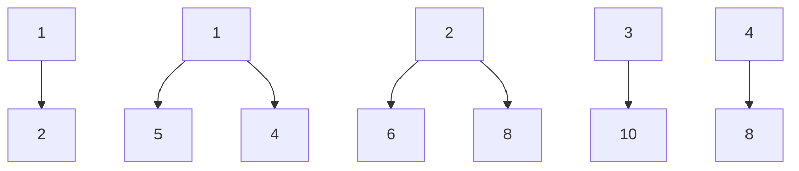
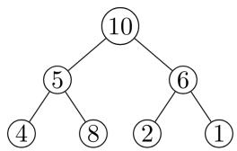
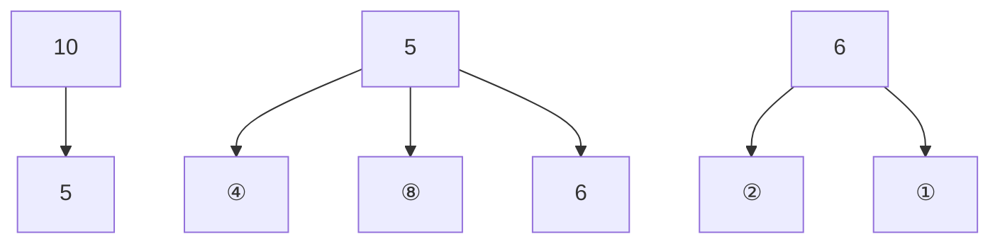
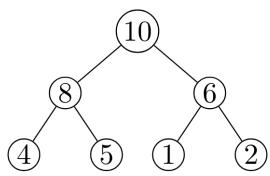
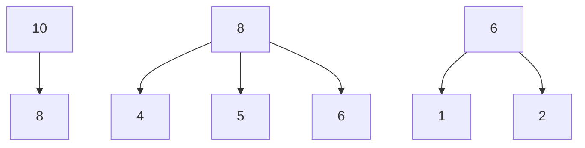
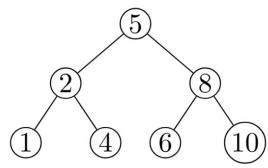
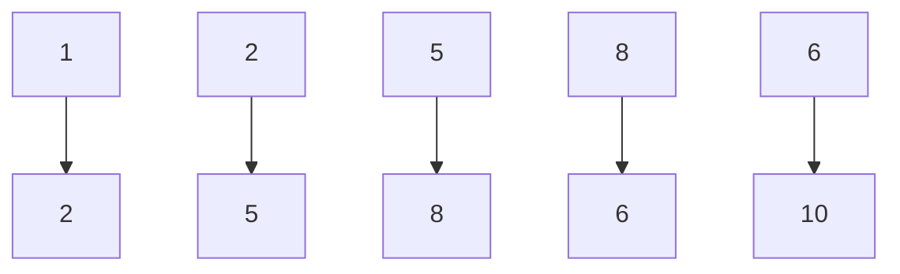
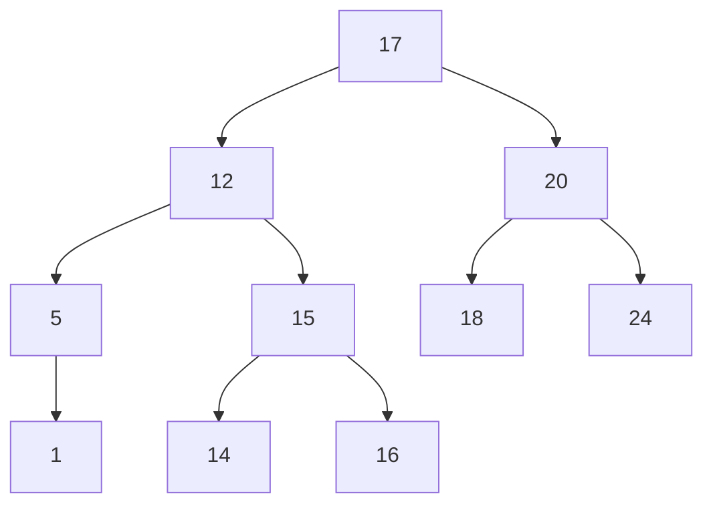

# 3.4.11 Binary Heap: GATE CSE 2007 | Question: 47


Consider the process of inserting an element into a Max Heap, where the Max Heap is represented by an array. Suppose we perform a binary search on the path from the new leaf to the root to find the position for the newly inserted element, the number of comparisons performed is:

A. $\Theta (\log_2n)$

B. $\Theta (\log_2\log_2n)$

C. $\Theta(n)$

D. $\Theta(n\log_2n)$

gatecse-2007 data-structures binary-heap normal

# Answer key

# 3.4.12 Binary Heap: GATE CSE 2009 | Question: 59

Consider a binary max-heap implemented using an array.
Which one of the following array represents a binary max-heap?

A. $\{25,12,16,13,10,8,14\}$  
C. $\{25,14,16,13,10,8,12\}$

gatecse-2009 data-structures binary-heap easy

# Answer key


# 3.4.13 Binary Heap: GATE CSE 2009 | Question: 60

Consider a binary max-heap implemented using an array.

What is the content of the array after two delete operations on $\{25, 14, 16, 13, 10, 8, 12\}$

A. $\{14,13,12,10,8\}$

B. $\{14,12,13,8,10\}$

C. $\{14,13,8,12,10\}$

D. $\{14,13,12,8,10\}$

gatecse-2009 data-structures binary-heap normal

# Answer key


# 3.4.14 Binary Heap: GATE CSE 2011 | Question: 23

A max-heap is a heap where the value of each parent is greater than or equal to the value of its children. Which of the following is a max-heap?


<details>
<summary>flowchart</summary>


</details>

A.  


<details>
<summary>flowchart</summary>


</details>

C.

gatecse-2011 data-structures binary-heap easy

B.  


<details>
<summary>flowchart</summary>


</details>

D.  


<details>
<summary>flowchart</summary>


</details>

# Answer key

# 3.4.15 Binary Heap: GATE CSE 2014 | Set 2 | Question: 12

A priority queue is implemented as a Max-Heap. Initially, it has 5 elements. The level-order traversal of the heap is: 10, 8, 5, 3, 2. Two new elements 1 and 7 are inserted into the heap in that order. The level-order traversal of the heap after the insertion of the elements is:

A. 10,8,7,3,2,1,5

B. 10,8,7,2,3,1,5

C. 10,8,7,1,2,3,5

D. 10,8,7,5,3,2,1

gatecse-2014-set2 data-structures binary-heap normal

# Answer key


# 3.4.16 Binary Heap: GATE CSE 2015 | Set 1 | Question: 32

Consider a max heap, represented by the array: 40, 30, 20, 10, 15, 16, 17, 8, 4.

<table><tr><td>Array index</td><td>1</td><td>2</td><td>3</td><td>4</td><td>5</td><td>6</td><td>7</td><td>8</td><td>9</td></tr><tr><td>Value</td><td>40</td><td>30</td><td>20</td><td>10</td><td>15</td><td>16</td><td>17</td><td>8</td><td>4</td></tr></table>


Now consider that a value 35 is inserted into this heap. After insertion, the new heap is

A. 40,30,20,10,15,16,17,8,4,35  
C. 40,30,20,10,35,16,17,8,4,15

B. 40,35,20,10,30,16,17,8,4,15  
D. 40,35,20,10,15,16,17,8,4,30

gatecse-2015-set1 data-structures binary-heap easy

# Answer key

# 3.4.17 Binary Heap: GATE CSE 2015 | Set 2 | Question: 17


Consider a complete binary tree where the left and right subtrees of the root are max-heaps. The lower bound for the number of operations to convert the tree to a heap is

A. $\Omega (\log n)$  
C. $\Omega(n \log n)$

B. $\Omega(n)$  
D. $\Omega(n^{2})$

gatecse-2015-set2 data-structures binary-heap normal

# Answer key

# 3.4.18 Binary Heap: GATE CSE 2015 | Set 3 | Question: 19


Consider the following array of elements.

$\langle 89,19,50,17,12,15,2,5,7,11,6,9,100\rangle$

The minimum number of interchanges needed to convert it into a max-heap is

A. 4

B. 5

C. 2

D. 3

gatecse-2015-set3 data-structures binary-heap easy

# Answer key

# 3.4.19 Binary Heap: GATE CSE 2016 | Set 1 | Question: 37


An operator delete(i) for a binary heap data structure is to be designed to delete the item in the i-th node.

Assume that the heap is implemented in an array and i refers to the i-th index of the array. If the heap tree has depth d (number of edges on the path from the root to the farthest leaf), then what is the time complexity to re-fix the heap efficiently after the removal of the element?

A. $O(1)$  
C. $O(2^{d})$ but not $O(d)$

B. $O(d)$ but not $O(1)$  
D. $O(d2^{d})$ but not $O(2^{d})$

gatecse-2016-set1 data-structures binary-heap normal

# Answer key

# 3.4.20 Binary Heap: GATE CSE 2016 | Set 2 | Question: 34


A complete binary min-heap is made by including each integer in [1, 1023] exactly once. The depth of a node in the heap is the length of the path from the root of the heap to that node. Thus, the root is at depth 0. The maximum depth at which integer 9 can appear is \_\_\_\_.

gatecse-2016-set2 data-structures binary-heap normal numerical-answers

# Answer key

# 3.4.21 Binary Heap: GATE CSE 2018 | Question: 46


The number of possible min-heaps containing each value from $\{1,2,3,4,5,6,7\}$ exactly once is \_\_\_\_

gatecse-2018 binary-heap numerical-answers combinatory two-marks

# Answer key

# 3.4.22 Binary Heap: GATE CSE 2019 | Question: 40


Consider the following statements:

I. The smallest element in a max-heap is always at a leaf node  
II. The second largest element in a max-heap is always a child of a root node  
III. A max-heap can be constructed from a binary search tree in $\Theta(n)$ time  
IV. A binary search tree can be constructed from a max-heap in $\Theta(n)$ time

Which of the above statements are TRUE?

A. I, II and III

B. I, II and IV

C. I, III and IV

D. II, III and IV

gatecse-2019

data-structures

binary-heap

two-marks

Answer key

# 3.4.23 Binary Heap: GATE CSE 2020 | Question: 47


Consider the array representation of a binary min-heap containing 1023 elements. The minimum number of comparisons required to find the maximum in the heap is \_\_\_\_.

gatecse-2020

numerical-answers

binary-heap

two-marks

Answer key

# 3.4.24 Binary Heap: GATE CSE 2021 | Set 2 | Question: 2


Let H be a binary min-heap consisting of n elements implemented as an array. What is the worst case time complexity of an optimal algorithm to find the maximum element in H?

A. $\Theta(1)$

C. $\Theta(n)$

B. $\Theta (\log n)$

D. $\Theta(n \log n)$

gatecse-2021-set2

data-structures

binary-heap

time-complexity

one-mark

Answer key

# 3.4.25 Binary Heap: GATE CSE 2023 | Question: 2


Which one of the following sequences when stored in an array at locations $A[1], \ldots, A[10]$ forms a max-heap?

A. 23,17,10,6,13,14,1,5,7,12

C. 23,17,14,6,13,10,1,5,7,15

B. 23,17,14,7,13,10,1,5,6,12

D. 23,14,17,1,10,13,16,12,7,5

gatecse-2023

data-structures

binary-heap

one-mark

Answer key

# 3.4.26 Binary Heap: GATE CSE 2024 | Set 1 | Question: 33


Consider a binary min-heap containing 105 distinct elements. Let k be the index (in the underlying array) of the maximum element stored in the heap. The number of possible values of k is

A. 53

B. 52

C. 27

D. 1

gatecse-2024-set1

data-structures

binary-heap

two-marks

Answer key

# 3.4.27 Binary Heap: GATE CSE 2025 | Set 1 | Question: 25


The height of any rooted tree is defined as the maximum number of edges in the path from the root node to any leaf node.

Suppose a Min-Heap T stores 32 keys. The height of T is \_\_\_\_. (Answer in integer)

gatecse2025-set1

data-structures

binary-heap

numerical-answers

easy

one-mark

Answer key

# 3.4.28 Binary Heap: GATE IT 2004 | Question: 53


An array of integers of size $n$ can be converted into a heap by adjusting the heaps rooted at each internal node of the complete binary tree starting at the node $\lfloor (n - 1)/2 \rfloor$ , and doing this adjustment up to the root node (root node is at index 0) in the order $\lfloor (n - 1)/2 \rfloor$ , $\lfloor (n - 3)/2 \rfloor$ , ..., 0. The time required to construct a heap in this manner is

A. $O(\log n)$

B. $O(n)$

C. $O(n\log \log n)$

D. $O(n\log n)$

gateit-2004 data-structures binary-heap normal

# Answer key

# 3.4.29 Binary Heap: GATE IT 2006 | Question: 44

Which of the following sequences of array elements forms a heap?

A. $\{23,17,14,6,13,10,1,12,7,5\}$

C. $\{23,17,14,7,13,10,1,5,6,12\}$

gateit-2006 data-structures binary-heap easy

B. $\{23,17,14,6,13,10,1,5,7,12\}$

D. $\{23,17,14,7,13,10,1,12,5,7\}$

# Answer key


# 3.4.30 Binary Heap: GATE IT 2006 | Question: 72

An array X of n distinct integers is interpreted as a complete binary tree. The index of the first element of the array is 0. If only the root node does not satisfy the heap property, the algorithm to convert the complete binary tree into a heap has the best asymptotic time complexity of

A. $O(n)$

B. $O(\log n)$

C. $O(n\log n)$

D. $O(n\log \log n)$

gateit-2006 data-structures binary-heap easy

# Answer key


# 3.5

# Binary Search Tree (36)

Practice Tests: Test 1 (15Q) Test 2 (15Q) Test 3 (15Q) Test 4 (15Q)

# 3.5.1 Binary Search Tree: GATE CSE 1996 | Question: 2.14

A binary search tree is generated by inserting in order the following integers:

$$
5 0, 1 5, 6 2, 5, 2 0, 5 8, 9 1, 3, 8, 3 7, 6 0, 2 4
$$

The number of nodes in the left subtree and right subtree of the root respectively is

A. $(4,7)$

B. (7,4)

C. (8,3)

D. (3,8)

gate1996 data-structures binary-search-tree easy

# Answer key

# 3.5.2 Binary Search Tree: GATE CSE 1996 | Question: 4


A binary search tree is used to locate the number 43. Which of the following probe sequences are possible and which are not? Explain.

(a) 61 52 14 17 40 43  
(b) 2 3 50 40 60 43  
(c) 10 65 31 48 37 43  
(d) 81 61 52 14 41 43  
(e) 17 77 27 66 18 43

gate1996 data-structures binary-search-tree normal descriptive

# Answer key


# 3.5.3 Binary Search Tree: GATE CSE 1997 | Question: 4.5


A binary search tree contains the value 1, 2, 3, 4, 5, 6, 7, 8. The tree is traversed in pre-order and the values are printed out. Which of the following sequences is a valid output?

A. 53124786

B. 53126487

C. 53241678

D. 53124768

gate1997 data-structures binary-search-tree normal

# Answer key

# 3.5.4 Binary Search Tree: GATE CSE 2001 | Question: 14


A. Insert the following keys one by one into a binary search tree in the order specified.

$$
1 5, 3 2, 2 0, 9, 3, 2 5, 1 2, 1
$$

Show the final binary search tree after the insertions.

B. Draw the binary search tree after deleting 15 from it.  
C. Complete the statements $S1$ , $S2$ and $S3$ in the following function so that the function computes the depth of a binary tree rooted at $t$ .

```c
typedef struct tnode{
    int key;
    struct tnode *left, *right;
} *Tree;

int depth (Tree t)
{
    int x, y;
    if (t == NULL) return 0;
    x = depth (t -> left);
S1: ________;
S2:     if (x > y) return ________;
S3:    else return ________;
}
```

gatecse-2001 data-structures binary-search-tree normal descriptive

# Answer key

# 3.5.5 Binary Search Tree: GATE CSE 2003 | Question: 19, ISRO2009-24


Suppose the numbers 7, 5, 1, 8, 3, 6, 0, 9, 4, 2 are inserted in that order into an initially empty binary search tree. The binary search tree uses the usual ordering on natural numbers. What is the in-order traversal sequence of the resultant tree?

A. 7510324689

B. 0243165987

C. 0123456789

D. 9864230157

gatecse-2003 binary-search-tree easy isro2009

# Answer key

# 3.5.6 Binary Search Tree: GATE CSE 2003 | Question: 6

Let $T(n)$ be the number of different binary search trees on n distinct elements.

Then $T(n) = \sum_{k=1}^{n} T(k-1)T(x)$ , where x is

A. $n - k + 1$

B. n-k

C. n-k-1

D. $n - k - 2$

gatecse-2003 normal binary-search-tree

# Answer key


# 3.5.7 Binary Search Tree: GATE CSE 2003 | Question: 63, ISRO2009-25


A data structure is required for storing a set of integers such that each of the following operations can be done in $O(\log n)$ time, where n is the number of elements in the set.

I. Deletion of the smallest element  
II. Insertion of an element if it is not already present in the set

Which of the following data structures can be used for this purpose?

A. A heap can be used but not a balanced binary search tree  
B. A balanced binary search tree can be used but not a heap  
C. Both balanced binary search tree and heap can be used  
D. Neither balanced search tree nor heap can be used

gatecse-2003 data-structures easy isro2009 binary-search-tree

Answer key

# 3.5.8 Binary Search Tree: GATE CSE 2004 | Question: 4, ISRO2009-26


The following numbers are inserted into an empty binary search tree in the given order: 10, 1, 3, 5, 15, 12, 16. What is the height of the binary search tree (the height is the maximum distance of a leaf node from the root)?

A. 2

B. 3

C. 4

D. 6

gatecse-2004 data-structures binary-search-tree easy isro2009

Answer key

# 3.5.9 Binary Search Tree: GATE CSE 2004 | Question: 85


A program takes as input a balanced binary search tree with n leaf nodes and computes the value of a function $g(x)$ for each node x. If the cost of computing $g(x)$ is:

$$
\min \left(\underset {\text {in left - subtree of $x$}} {\text {number of leaf - nodes}}, \underset {\text {in right - subtree of $x$}} {\text {number of leaf - nodes}}\right)
$$

Then the worst-case time complexity of the program is?

A. $\Theta(n)$  
C. $\Theta(n^{2})$

B. $\Theta(n \log n)$

D. $\Theta(n^{2}\log n)$

gatecse-2004 binary-search-tree normal data-structures

Answer key

# 3.5.10 Binary Search Tree: GATE CSE 2005 | Question: 33


Postorder traversal of a given binary search tree, T produces the following sequence of keys 10, 9, 23, 22, 27, 25, 15, 50, 95, 60, 40, 29

Which one of the following sequences of keys can be the result of an in-order traversal of the tree T?

A. 9, 10, 15, 22, 23, 25, 27, 29, 40, 50, 60, 95  
B. 9, 10, 15, 22, 40, 50, 60, 95, 23, 25, 27, 29  
C. 29, 15, 9, 10, 25, 22, 23, 27, 40, 60, 50, 95  
D. 95, 50, 60, 40, 27, 23, 22, 25, 10, 9, 15, 29

gatecse-2005 data-structures binary-search-tree easy

Answer key

# 3.5.11 Binary Search Tree: GATE CSE 2005 | Question: 35

How many distinct binary search trees can be created out of 4 distinct keys?

A. 5

B. 14

C. 24

D. 42

gatecse-2005 data-structures binary-search-tree counting normal

Answer key

# 3.5.12 Binary Search Tree: GATE CSE 2008 | Question: 46

You are given the postorder traversal, $P$ , of a binary search tree on the $n$ elements $1, 2, \ldots, n$ . You have to determine the unique binary search tree that has $P$ as its postorder traversal. What is the time complexity of the most efficient algorithm for doing this?

A. $\Theta (\log n)$  
B. $\Theta(n)$  
C. $\Theta(n\log n)$

D. None of the above, as the tree cannot be uniquely determined

gatecse-2008 data-structures binary-search-tree normal

Answer key

# 3.5.13 Binary Search Tree: GATE CSE 2012 | Question: 5

The worst case running time to search for an element in a balanced binary search tree with $n2^n$ elements is

A. $\Theta(n \log n)$

B. $\Theta(n2^n)$

C. $\Theta(n)$

D. $\Theta (\log n)$

gatecse-2012 data-structures normal binary-search-tree

Answer key

# 3.5.14 Binary Search Tree: GATE CSE 2013 | Question: 43

The preorder traversal sequence of a binary search tree is 30, 20, 10, 15, 25, 23, 39, 35, 42. Which one of the following is the postorder traversal sequence of the same tree?

A. 10,20,15,23,25,35,42,39,30

B. 15,10,25,23,20,42,35,39,30

C. 15,20,10,23,25,42,35,39,30

D. 15,10,23,25,20,35,42,39,30

gatecse-2013 data-structures binary-search-tree normal

Answer key

# 3.5.15 Binary Search Tree: GATE CSE 2013 | Question: 7

Which one of the following is the tightest upper bound that represents the time complexity of inserting an object into a binary search tree of n nodes?

A. $O(1)$

B. $O(\log n)$

C. $O(n)$

D. $O(n\log n)$

gatecse-2013 data-structures easy binary-search-tree

Answer key

# 3.5.16 Binary Search Tree: GATE CSE 2014 | Set 3 | Question: 39

Suppose we have a balanced binary search tree $T$ holding $n$ numbers. We are given two numbers $L$ and $H$ and wish to sum up all the numbers in $T$ that lie between $L$ and $H$ . Suppose there are $m$ such numbers in

T. If the tightest upper bound on the time to compute the sum is $O(n^{a} \log^{b} n + m^{c} \log^{d} n)$ , the value of $a + 10b + 100c + 1000d$ is \_\_\_\_.

gatecse-2014-set3 data-structures binary-search-tree numerical-answers normal

Answer key


# 3.5.17 Binary Search Tree: GATE CSE 2015 | Set 1 | Question: 10

Which of the following is/are correct in order traversal sequence(s) of binary search tree(s)?

1. 3,5,7,8,15,19,25  
II. 5,8,9,12,10,15,25  
III. 2,7,10,8,14,16,20  
IV. 4,6,7,9,18,20,25

A. I and IV only

B. II and III only

C. II and IV only

D. II only

gatecse-2015-set1 data-structures binary-search-tree easy

# Answer key

# 3.5.18 Binary Search Tree: GATE CSE 2015 | Set 1 | Question: 23

What are the worst-case complexities of insertion and deletion of a key in a binary search tree?

A. $\Theta (\log n)$ for both insertion and deletion  
B. $\Theta(n)$ for both insertion and deletion  
C. $\Theta(n)$ for insertion and $\Theta(\log n)$ for deletion  
D. $\Theta (\log n)$ for insertion and $\Theta (n)$ for deletion

gatecse-2015-set1 data-structures binary-search-tree easy

# Answer key

# 3.5.19 Binary Search Tree: GATE CSE 2015 | Set 3 | Question: 13

While inserting the elements 71, 65, 84, 69, 67, 83 in an empty binary search tree (BST) in the sequence shown, the element in the lowest level is

A. 65

B. 67

C. 69

D. 83

gatecse-2015-set3 data-structures binary-search-tree easy

# Answer key

# 3.5.20 Binary Search Tree: GATE CSE 2016 | Set 2 | Question: 40

The number of ways in which the numbers 1, 2, 3, 4, 5, 6, 7 can be inserted in an empty binary search tree, such that the resulting tree has height 6, is \_\_\_\_.

Note: The height of a tree with a single node is 0.

gatecse-2016-set2 data-structures binary-search-tree normal numerical-answers

# Answer key

# 3.5.21 Binary Search Tree: GATE CSE 2017 | Set 1 | Question: 6

Let T be a binary search tree with 15 nodes. The minimum and maximum possible heights of T are:

Note: The height of a tree with a single node is 0.

A. 4 and 15 respectively.  
C. 4 and 14 respectively.  
gatecse-2017-set1 data-structures binary-search-tree easy

B. 3 and 14 respectively.

D. 3 and 15 respectively.

# Answer key

# 3.5.22 Binary Search Tree: GATE CSE 2017 | Set 2 | Question: 36

The pre-order traversal of a binary search tree is given by 12, 8, 6, 2, 7, 9, 10, 16, 15, 19, 17, 20. Then the post-order traversal of this tree is

A. 2,6,7,8,9,10,12,15,16,17,19,20  
B. 2,7,6,10,9,8,15,17,20,19,16,12


C. 7,2,6,8,9,10,20,17,19,15,16,12  
D. 7,6,2,10,9,8,15,16,17,20,19,12

gatecse-2017-set2 data-structures binary-search-tree

# Answer key

# 3.5.23 Binary Search Tree: GATE CSE 2020 | Question: 41

In a balanced binary search tree with n elements, what is the worst case time complexity of reporting all elements in range $[a, b]$ ? Assume that the number of reported elements is k.


A. $\Theta (\log n)$  
C. $\Theta(k\log n)$

B. $\Theta (\log n + k)$  
D. $\Theta(n \log k)$

gatecse-2020 data-structures binary-search-tree two-marks

# Answer key

# 3.5.24 Binary Search Tree: GATE CSE 2020 | Question: 5

The preorder traversal of a binary search tree is 15, 10, 12, 11, 20, 18, 16, 19. Which one of the following is the postorder traversal of the tree?


A. 10,11,12,15,16,18,19,20

c. 20,19,18,16,15,12,11,10

B. 11,12,10,16,19,18,20,15

D. 19,16,18,20,11,12,10,15

gatecse-2020 binary-search-tree one-mark

# Answer key

# 3.5.25 Binary Search Tree: GATE CSE 2021 | Set 1 | Question: 10


A binary search tree $T$ contains $n$ distinct elements. What is the time complexity of picking an element in $T$ that is smaller than the maximum element in $T$ ?

A. $\Theta(n \log n)$

B. $\Theta(n)$

C. $\Theta (\log n)$

D. $\Theta(1)$

gatecse-2021-set1 data-structures binary-search-tree time-complexity one-mark

# Answer key

# 3.5.26 Binary Search Tree: GATE CSE 2022 | Question: 18


Suppose a binary search tree with 1000 distinct elements is also a complete binary tree. The tree is stored using the array representation of binary heap trees. Assuming that the array indices start with 0, the $3^{rd}$ largest element of the tree is stored at index \_\_\_\_.

gatecse-2022 numerical-answers data-structures binary-search-tree one-mark

# Answer key

# 3.5.27 Binary Search Tree: GATE CSE 2024 | Set 2 | Question: 29


You are given a set $V$ of distinct integers. A binary search tree $T$ is created by inserting all elements of $V$ one by one, starting with an empty tree. The tree $T$ follows the convention that, at each node, all values stored in the left subtree of the node are smaller than the value stored at the node. You are not aware of the sequence in which these values were inserted into $T$ , and you do not have access to $T$ .

Which one of the following statements is TRUE?

A. Inorder traversal of T can be determined from V  
B. Root node of T can be determined from V  
C. Preorder traversal of T can be determined from V  
D. Postorder traversal of T can be determined from V

gatecse-2024-set2 binary-search-tree two-marks

# Answer key

# 3.5.28 Binary Search Tree: GATE CSE 2025 | Set 1 | Question: 16


Which of the following statement(s) is/are TRUE for any binary search tree (BST) having n distinct integers?

A. The maximum length of a path from the root node to any other node is $(n - 1)$ .  
B. An inorder traversal will always produce a sorted sequence of elements.  
C. Finding an element takes $O(\log_2 n)$ time in the worst case.  
D. Every BST is also a Min-Heap.

gatecse2025-set1 data-structures binary-search-tree multiple-selects one-mark

# Answer key

# 3.5.29 Binary Search Tree: GATE CSE 2025 | Set 2 | Question: 25


Suppose the values 10, -4, 15, 30, 20, 5, 60, 19 are inserted in that order into an initially empty binary search tree. Let $T$ be the resulting binary search tree. The number of edges in the path from the node containing 19 to the root node of $T$ is \_\_\_\_. (Answer in integer)

gatecse2025-set2 data-structures binary-search-tree numerical-answers easy one-mark

# Answer key

# 3.5.30 Binary Search Tree: GATE IT 2005 | Question: 12


The numbers $1, 2, \ldots, n$ are inserted in a binary search tree in some order. In the resulting tree, the right subtree of the root contains $p$ nodes. The first number to be inserted in the tree must be

A. p

B. $p + 1$

C. n - p

D. $n - p + 1$

gateit-2005 data-structures normal binary-search-tree

# Answer key

# 3.5.31 Binary Search Tree: GATE IT 2005 | Question: 55


A binary search tree contains the numbers 1, 2, 3, 4, 5, 6, 7, 8. When the tree is traversed in pre-order and the values in each node printed out, the sequence of values obtained is 5, 3, 1, 2, 4, 6, 8, 7. If the tree is traversed in post-order, the sequence obtained would be

A. 8,7,6,5,4,3,2,1  
C. 2,1,4,3,6,7,8,5

gateit-2005 data-structures binary-search-tree normal

# Answer key

# 3.5.32 Binary Search Tree: GATE IT 2006 | Question: 45


Suppose that we have numbers between 1 and 100 in a binary search tree and want to search for the number 55. Which of the following sequences CANNOT be the sequence of nodes examined?

A. $\{10,75,64,43,60,57,55\}$  
C. $\{9,85,47,68,43,57,55\}$

gateit-2006 data-structures binary-search-tree normal

# Answer key

# 3.5.33 Binary Search Tree: GATE IT 2007 | Question: 29


When searching for the key value 60 in a binary search tree, nodes containing the key values 10, 20, 40, 50, 70, 80, 90 are traversed, not necessarily in the order given. How many different orders are possible in which these key values can occur on the search path from the root to the node containing the value 60?

A. 35

B. 64

C. 128

D. 5040

gateit-2007 data-structures binary-search-tree normal

# Answer key

# 3.5.34 Binary Search Tree: GATE IT 2008 | Question: 71


A Binary Search Tree (BST) stores values in the range 37 to 573. Consider the following sequence of keys.

1. 81,537,102,439,285,376,305  
II. 52,97,121,195,242,381,472  
III. 142, 248, 520, 386, 345, 270, 307  
IV. 550, 149, 507, 395, 463, 402, 270

Suppose the BST has been unsuccessfully searched for key 273. Which all of the above sequences list nodes in the order in which we could have encountered them in the search?

A. II and III only

B. I and III only

C. III and IV only

D. III only

gateit-2008 data-structures binary-search-tree normal

# Answer key

# 3.5.35 Binary Search Tree: GATE IT 2008 | Question: 72

A Binary Search Tree (BST) stores values in the range 37 to 573. Consider the following sequence of keys.


1. 81,537,102,439,285,376,305  
II. 52,97,121,195,242,381,472  
III. 142, 248, 520, 386, 345, 270, 307  
IV. 550, 149, 507, 395, 463, 402, 270

Which of the following statements is TRUE?

A. I, II and IV are inorder sequences of three different BSTs  
B. I is a preorder sequence of some BST with 439 as the root  
C. II is an inorder sequence of some BST where 121 is the root and 52 is a leaf  
D. IV is a postorder sequence of some BST with 149 as the root

gateit-2008 data-structures binary-search-tree easy

# Answer key

# 3.5.36 Binary Search Tree: GATE IT 2008 | Question: 73

How many distinct BSTs can be constructed with 3 distinct keys?


A. 4

B. 5

C. 6

D. 9

gateit-2008 data-structures binary-search-tree normal

# Answer key

# 3.6

# Binary Tree (53)

Practice Tests:

Test 1 (15Q)

Test 2 (15Q)

Test 3 (15Q)

Test 4 (6Q)

# 3.6.1 Binary Tree: GATE CSE 1987 | Question: 2c

State whether the following statements are TRUE or FALSE:


It is possible to construct a binary tree uniquely whose pre-order and post-order traversals are given?

gate1987 binary-tree data-structures normal true-false

# Answer key

# 3.6.2 Binary Tree: GATE CSE 1987 | Question: 2g

State whether the following statements are TRUE or FALSE:


If the number of leaves in a tree is not a power of 2, then the tree is not a binary tree.

# 3.6.3 Binary Tree: GATE CSE 1987 | Question: 7b

Construct a binary tree whose preorder traversal is

\- K L N M P R Q S T

and inorder traversal is

\- NLKPRMSQT

gate1987 data-structures binary-tree descriptive

Answer key

# 3.6.4 Binary Tree: GATE CSE 1988 | Question: 7i

Define the height of a binary tree or subtree and also define a height-balanced (AVL) tree.

gate1988 normal descriptive data-structures binary-tree

Answer key

# 3.6.5 Binary Tree: GATE CSE 1988 | Question: 7iii

Consider the tree given in the below figure, insert 13 and show the new balance factors that would arise if the tree is not rebalanced. Finally, carry out the required rebalancing of the tree and show the new tree with the balance factors on each mode.


<details>
<summary>flowchart</summary>


</details>

gate1988 normal descriptive data-structures binary-tree

Answer key

# 3.6.6 Binary Tree: GATE CSE 1989 | Question: 3-ixa

Which one of the following statements (s) is/are FALSE?


A. Overlaying is used to run a program, which is longer than the address space of the computer.  
B. Optimal binary search tree construction can be performed efficiently by using dynamic programming.  
C. Depth first search cannot be used to find connected components of a graph.  
D. Given the prefix and postfix walls over a binary tree, the binary tree can be uniquely constructed.

normal gate1989 binary-tree multiple-selects

Answer key

# 3.6.7 Binary Tree: GATE CSE 1990 | Question: 3-iv

The total external path length, EPL, of a binary tree with n external nodes is, $EPL = \sum_{w} I_{w}$ , where $I_{w}$ is the path length of external node w),

