A. $\leq n^2$ always.  
C. Equal to $n^2$ always.

gate1990 normal data-structures binary-tree multiple-selects

B. $\geq n\log_2 n$ always.  
D. $O(n)$ for some special trees.

# Answer key

# 3.6.8 Binary Tree: GATE CSE 1991 | Question: 01,viii

The weighted external path length of the binary tree in figure is \_\_\_\_

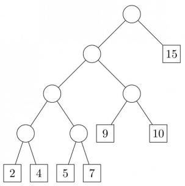

<details>
<summary>flowchart</summary>

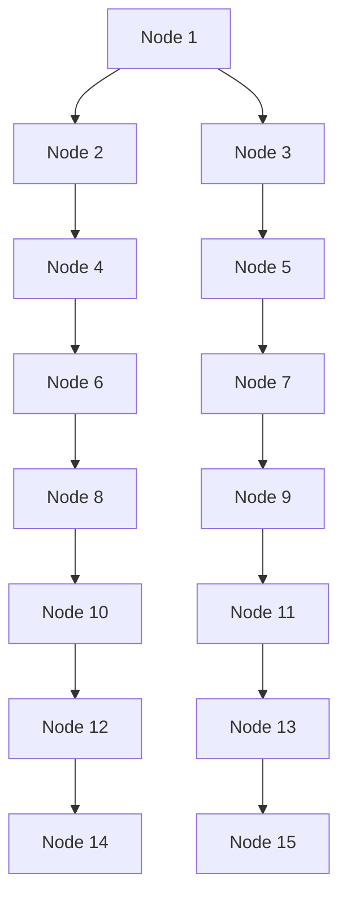
</details>

gate1991 binary-tree data-structures normal numerical-answers

# Answer key

# 3.6.9 Binary Tree: GATE CSE 1991 | Question: 1, ix

If the binary tree in figure is traversed in inorder, then the order in which the nodes will be visited is \_\_\_\_


<details>
<summary>flowchart</summary>

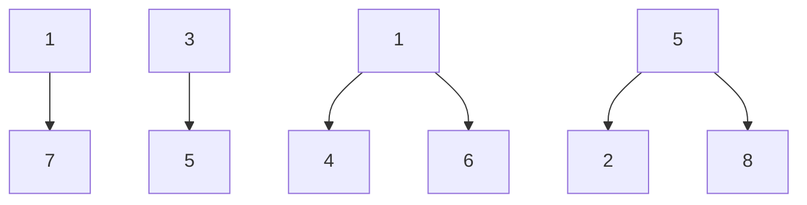
</details>

gate1991 binary-tree easy data-structures descriptive

# Answer key

# 3.6.10 Binary Tree: GATE CSE 1991 | Question: 14,a

Consider the binary tree in the figure below:


<details>
<summary>flowchart</summary>

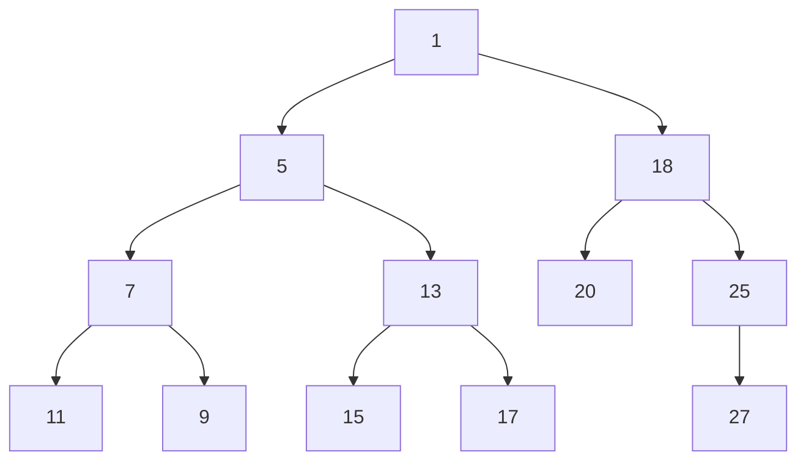
</details>

What structure is represented by the binary tree?

gate1991 data-structures binary-tree time-complexity easy descriptive

# Answer key

# 3.6.11 Binary Tree: GATE CSE 1991 | Question: 14,b

Consider the binary tree in the figure below:


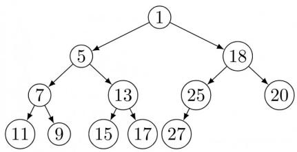

<details>
<summary>flowchart</summary>

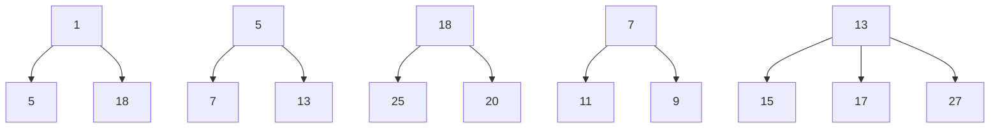
</details>

Give different steps for deleting the node with key5 so that the structure is preserved.

gate1991 data-structures binary-tree normal descriptive

Answer key

# 3.6.12 Binary Tree: GATE CSE 1991 | Question: 14,c

Consider the binary tree in the figure below:


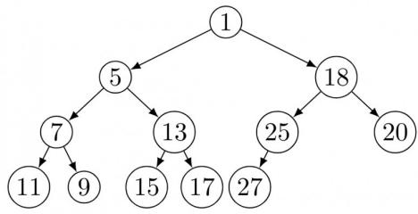

<details>
<summary>flowchart</summary>

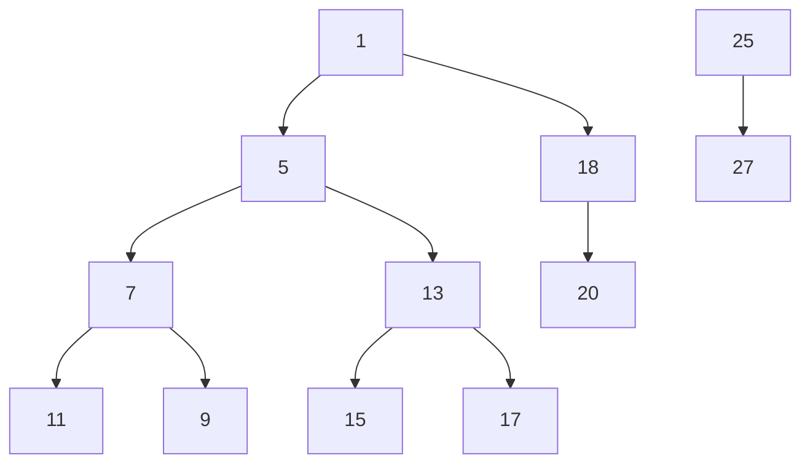
</details>

Outline a procedure in Pseudo-code to delete an arbitrary node from such a binary tree with n nodes that preserves the structures. What is the worst-case time complexity of your procedure?

gate1991 normal data-structures binary-tree time-complexity descriptive

Answer key

# 3.6.13 Binary Tree: GATE CSE 1993 | Question: 16


Prove by the principal of mathematical induction that for any binary tree, in which every non-leaf node has 2-descendants, the number of leaves in the tree is one more than the number of non-leaf nodes.

gate1993 data-structures binary-tree normal descriptive

Answer key

# 3.6.14 Binary Tree: GATE CSE 1994 | Question: 8


A rooted tree with 12 nodes has its nodes numbered 1 to 12 in pre-order. When the tree is traversed in post-order, the nodes are visited in the order 3, 5, 4, 2, 7, 8, 6, 10, 11, 12, 9, 1.

Reconstruct the original tree from this information, that is, find the parent of each node, and show the tree diagrammatically.

gate1994 data-structures binary-tree normal descriptive

Answer key

# 3.6.15 Binary Tree: GATE CSE 1995 | Question: 1.17


A binary tree T has n leaf nodes. The number of nodes of degree 2 in T is

A. $\log_{2}n$

B. $n - 1$

C. n

D. $2^{n}$

gate1995 data-structures binary-tree normal

Answer key

# 3.6.16 Binary Tree: GATE CSE 1995 | Question: 6


What is the number of binary trees with 3 nodes which when traversed in post-order give the sequence $A, B, C$ ? Draw all these binary trees.

# Answer key

# 3.6.17 Binary Tree: GATE CSE 1996 | Question: 1.15

Which of the following sequences denotes the post order traversal sequence of the below tree?


<details>
<summary>flowchart</summary>

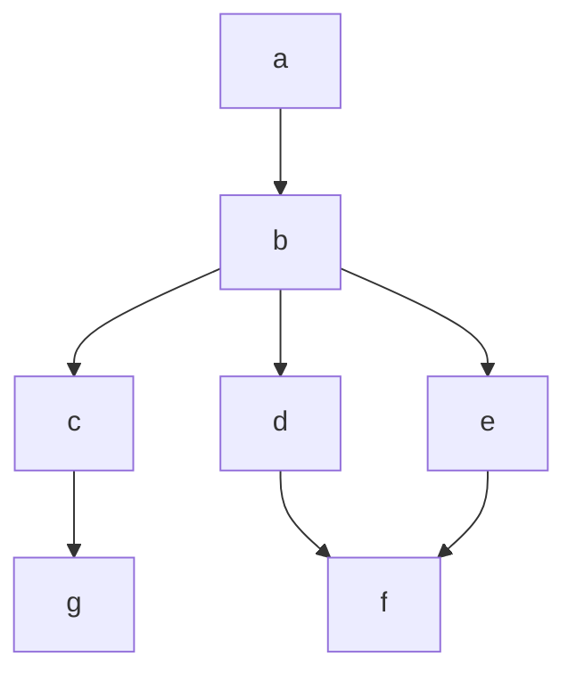
</details>

A. fegcdba  
C. $gc\bar{d}b\,f\,e\,a$

gate1996 data-structures binary-tree easy

B. $g c b d a f e$  
D. f e d g c b a

# Answer key

# 3.6.18 Binary Tree: GATE CSE 1997 | Question: 16


A size-balanced binary tree is a binary tree in which for every node the difference between the number of nodes in the left and right subtree is at most 1. The distance of a node from the root is the length of the path from the root to the node. The height of a binary tree is the maximum distance of a leaf node from the root.

A. Prove, by using induction on $h$ , that a size-balance binary tree of height $h$ contains at least $2^h$ nodes.  
B. In a size-balanced binary tree of height $h \geqslant 1$ , how many nodes are at distance $h - 1$ from the root? Write only the answer without any explanations.

gate1997 data-structures binary-tree normal descriptive proof

# Answer key

# 3.6.19 Binary Tree: GATE CSE 1998 | Question: 20


Draw the binary tree with node labels a, b, c, d, e, f and g for which the inorder and postorder traversals result in the following sequences:

Inorder: a f b c d g e

Postorder: a f c g e d b

gate1998 data-structures binary-tree descriptive

# Answer key

# 3.6.20 Binary Tree: GATE CSE 2000 | Question: 1.14


Consider the following nested representation of binary trees: $(XYZ)$ indicates Y and Z are the left and right subtrees, respectively, of node X. Note that Y and Z may be NULL, or further nested. Which of the following represents a valid binary tree?

A. (12(4567))  
C. (1 (2 3 4) (5 6 7))

gatecse-2000 data-structures binary-tree easy

B. (1 (2 3 4) 5 6) 7)  
D. (1 (2 3 NULL) (4 5))

# Answer key

# 3.6.21 Binary Tree: GATE CSE 2000 | Question: 2.16


Let LASTPOST, LASTIN and LASTPRE denote the last vertex visited \`in a postorder, inorder and preorder traversal respectively, of a complete binary tree. Which of the following is always true?

A. LASTIN = LASTPOST

B. LASTIN = LASTPRE

# 3.6.22 Binary Tree: GATE CSE 2002 | Question: 2.12


A weight-balanced tree is a binary tree in which for each node, the number of nodes in the left sub tree is at least half and at most twice the number of nodes in the right sub tree. The maximum possible height (number of nodes on the path from the root to the furthest leaf) of such a tree on n nodes is best described by which of the following?

A. $\log_{2}n$

B. $\log_{\frac{4}{3}} n$

C. $\log_3n$

D. $\log_{\frac{3}{2}} n$

gatecse-2002 data-structures binary-tree normal

# Answer key

# 3.6.23 Binary Tree: GATE CSE 2002 | Question: 6

Draw all binary trees having exactly three nodes labeled A, B and C on which preorder traversal gives the sequence C, B, A.

gatecse-2002 data-structures binary-tree easy descriptive

# Answer key

# 3.6.24 Binary Tree: GATE CSE 2004 | Question: 35

Consider the label sequences obtained by the following pairs of traversals on a labeled binary tree. Which of these pairs identify a tree uniquely?

I. preorder and postorder  
II. inorder and postorder  
III. preorder and inorder  
IV. level order and postorder

A. I only

B. II, III

C. III only

D. IV only

gatecse-2004 data-structures binary-tree normal

# Answer key

# 3.6.25 Binary Tree: GATE CSE 2004 | Question: 43

Consider the following C program segment


```c
struct CellNode{
    struct CellNode *leftChild
    int element;
    struct CellNode *rightChild;
};

int Dosomething (struct CellNode *ptr)
{
    int value = 0;
    if(ptr != NULL)
    {
        if (ptr -> leftChild != NULL)
            value = 1 + DoSomething (ptr -> leftChild);
        if (ptr -> rightChild != NULL)
            value = max(value, 1 + Dosomething (ptr -> rightChild));
    }
    return(value);
}
```

The value returned by the function DoSomething when a pointer to the root of a non-empty tree is passed as argument is

A. The number of leaf nodes in the

tree

C. The number of internal nodes in

B. The number of nodes in the tree

D. The height of the tree


# 3.6.26 Binary Tree: GATE CSE 2006 | Question: 13


A scheme for storing binary trees in an array $X$ is as follows. Indexing of $X$ starts at 1 instead of 0. the root is stored at $X[1]$ . For a node stored at $X[i]$ , the left child, if any, is stored in $X[2i]$ and the right child, if any, in $X[2i + 1]$ . To be able to store any binary tree on $n$ vertices the minimum size of $X$ should be

A. $\log_2 n$

B. n

C. $2n + 1$

D. $2^{n} - 1$

gatecse-2006 data-structures binary-tree normal

# Answer key

# 3.6.27 Binary Tree: GATE CSE 2007 | Question: 12

The height of a binary tree is the maximum number of edges in any root to leaf path. The maximum number of nodes in a binary tree of height $h$ is:

A. $2^{h} - 1$

B. $2^{h - 1} - 1$

C. $2^{h + 1} - 1$

D. $2^{h+1}$

gatecse-2007 data-structures binary-tree easy

# Answer key

# 3.6.28 Binary Tree: GATE CSE 2007 | Question: 13

The maximum number of binary trees that can be formed with three unlabeled nodes is:

A. 1

B. 5

C. 4

D. 3

gatecse-2007 data-structures binary-tree normal

# Answer key

# 3.6.29 Binary Tree: GATE CSE 2007 | Question: 39, UGCNET-June2015-II: 22

The inorder and preorder traversal of a binary tree are

d b e a f c g and a b d e c f g, respectively

The postorder traversal of the binary tree is:

A. debfgca

B. e d b g f c a

C. edbfgca

D. defgbca

gatecse-2007 data-structures binary-tree normal ugcnetcse-june2015-paper2

# Answer key

# 3.6.30 Binary Tree: GATE CSE 2007 | Question: 46

Consider the following C program segment where CellNode represents a node in a binary tree:


```c
struct CellNode {
    struct CellNode *leftChild;
    int element;
    struct CellNode *rightChild;
};

int Getvalue (struct CellNode *ptr) {
    int value = 0;
    if (ptr != NULL) {
        if ((ptr->leftChild == NULL) &&
            (ptr->rightChild == NULL))
            value = 1;
        else
            value = value + GetValue(ptr->leftChild)
                + GetValue(ptr->rightChild);
    }
    return(value);
}
```


The value returned by GetValue when a pointer to the root of a binary tree is passed as its argument is:

A. the number of nodes in the tree  
C. the number of leaf nodes in the tree

B. the number of internal nodes in the tree  
D. the height of the tree

gatecse-2007 data-structures binary-tree normal

# Answer key

# 3.6.31 Binary Tree: GATE CSE 2010 | Question: 10

In a binary tree with $n$ nodes, every node has an odd number of descendants. Every node is considered to be its own descendant. What is the number of nodes in the tree that have exactly one child?

A. 0

B. 1

C. $\frac{(n-1)}{2}$

D. n - 1

gatecse-2010 data-structures binary-tree normal

# Answer key

# 3.6.32 Binary Tree: GATE CSE 2011 | Question: 29

We are given a set of n distinct elements and an unlabeled binary tree with n nodes. In how many ways can we populate the tree with the given set so that it becomes a binary search tree?

A. 0

B. 1

C. $n!$

D. $\frac{1}{n + 1} \cdot^{2n} C_n$

gatecse-2011 binary-tree normal

# Answer key

# 3.6.33 Binary Tree: GATE CSE 2012 | Question: 47

The height of a tree is defined as the number of edges on the longest path in the tree. The function shown in the pseudo-code below is invoked as height (root) to compute the height of a binary tree rooted at the tree pointer root.

```txt
int height(treeptr n)
{ if(n == NULL) return -1;
    if(n -> left == NULL)
        if(n -> right == NULL) return 0;
        else return B1; // Box 1

    else{h1 = height(n -> left);
        if(n -> right == NULL) return (1+h1);
        else{h2 = height(n -> right);
            return B2; // Box 2
        }
    }
}
```

The appropriate expressions for the two boxes B1 and B2 are:

A. \(\mathbf{B1}\): \((1 + \text{height}(n \to \text{right})); \(\mathbf{B2}\): \((1 + \max(h1, h2))\)  
B. B1: (height(n → right)); B2: (1 + max(h1, h2))  
C. $\mathbf{B1}$ : height( $n \to \text{right}$ ); $\mathbf{B2}$ : max( $h1, h2$ )  
D. $\mathbf{B1}$ : $(1 + \text{height}(n \to \text{right}))$ ; $\mathbf{B2}$ : $\max(h1, h2)$

gatecse-2012 data-structures binary-tree normal

# Answer key

# 3.6.34 Binary Tree: GATE CSE 2014 | Set 1 | Question: 12

Consider a rooted n node binary tree represented using pointers. The best upper bound on the time required to determine the number of subtrees having exactly 4 nodes is $O(n^{a} \log^{b} n)$ . Then the value of $a + 10b$ is


# 3.6.35 Binary Tree: GATE CSE 2015 | Set 1 | Question: 25


The height of a tree is the length of the longest root-to-leaf path in it. The maximum and minimum number of nodes in a binary tree of height 5 are

A. 63 and 6, respectively

B. 64 and 5, respectively

C. 32 and 6, respectively

D. 31 and 5, respectively

gatecse-2015-set1 data-structures binary-tree easy

# Answer key

# 3.6.36 Binary Tree: GATE CSE 2015 | Set 2 | Question: 10


A binary tree T has 20 leaves. The number of nodes in T having two children is \_\_\_\_.

gatecse-2015-set2 data-structures binary-tree easy numerical-answers

# Answer key

# 3.6.37 Binary Tree: GATE CSE 2015 | Set 3 | Question: 25


Consider a binary tree T that has 200 leaf nodes. Then the number of nodes in T that have exactly two children are \_\_\_\_.

gatecse-2015-set3 data-structures binary-tree normal numerical-answers

# Answer key

# 3.6.38 Binary Tree: GATE CSE 2016 | Set 2 | Question: 36


Consider the following New-order strategy for traversing a binary tree:

- Visit the root;  
- Visit the right subtree using New-order;  
- Visit the left subtree using New-order;

The New-order traversal of the expression tree corresponding to the reverse polish expression

34\*5-2^67\*1+-

is given by:

A. $+ - 167*2 \wedge 5 - 34*$  
B. $-+1*67\wedge2-5*34$  
C. $- + 1 * 76 \wedge 2 - 5 * 43$  
D. $176* + 2543* - \wedge -$

gatecse-2016-set2 data-structures binary-tree normal

# Answer key

# 3.6.39 Binary Tree: GATE CSE 2018 | Question: 20


The postorder traversal of a binary tree is 8, 9, 6, 7, 4, 5, 2, 3, 1. The inorder traversal of the same tree is 8, 6, 9, 4, 7, 2, 5, 1, 3. The height of a tree is the length of the longest path from the root to any leaf. The height of the binary tree above is \_\_\_\_

gatecse-2018 data-structures binary-tree numerical-answers one-mark

# Answer key

# 3.6.40 Binary Tree: GATE CSE 2019 | Question: 46


Let $T$ be a full binary tree with 8 leaves. (A full binary tree has every level full.) Suppose two leaves $a$ and $b$ of $T$ are chosen uniformly and independently at random. The expected value of the distance between $a$ and $b$ in $T$ (ie., the number of edges in the unique path between $a$ and $b$ ) is (rounded off to 2 decimal p


# Answer key

# 3.6.41 Binary Tree: GATE CSE 2021 | Set 2 | Question: 16


Consider a complete binary tree with 7 nodes. Let A denote the set of first 3 elements obtained by performing Breadth-First Search (BFS) starting from the root. Let B denote the set of first 3 elements obtained by performing Depth-First Search (DFS) starting from the root.

The value of $|A - B|$ is \_\_\_\_

gatecse-2021-set2 numerical-answers data-structures binary-tree one-mark

# Answer key

# 3.6.42 Binary Tree: GATE CSE 2023 | Question: 37

Consider the C function foo and the binary tree shown.


```c
typedef struct node {
    int val;
    struct node *left, *right;
} node;

int foo(node *p) {
    int retval;
    if (p == NULL)
        return 0;
    else {
        retval = p->val + foo(p->left) + foo(p->right);
        printf("%d ", retval);
        return retval;
    }
}
```

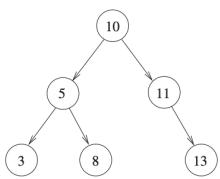

<details>
<summary>flowchart</summary>

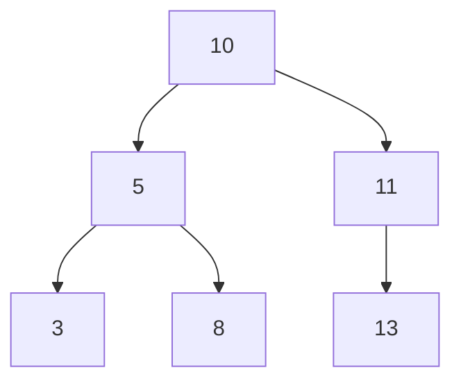
</details>

When foo is called with a pointer to the root node of the given binary tree, what will it print?

A. 385131110

B. 358101113

C. 3816132450

D. 3 16 8 50 24 13

gatecse-2023 data-structures binary-tree two-marks

# Answer key

# 3.6.43 Binary Tree: GATE CSE 2025 | Set 2 | Question: 3


Consider a binary tree $T$ in which every node has either zero or two children. Let $n > 0$ be the number of nodes in $T$ .

Which ONE of the following is the number of nodes in T that have exactly two children?

A. $\frac{n-2}{2}$

B. $\frac{n-1}{2}$

C. $\frac{n}{2}$

D. $\frac{n+1}{2}$

gatecse2025-set2 data-structures binary-tree one-mark

# Answer key

# 3.6.44 Binary Tree: GATE DS&AI 2024 | Question: 18

Consider the following tree traversals on a full binary tree:

i. Preorder  
ii. Inorder


# iii. Postorder

Which of the following traversal options is/are sufficient to uniquely reconstruct the full binary tree?

A. (i) and (ii)

B. (ii) and (iii)

C. (i) and (iii)

D. (ii) only

gate-ds-ai-2024 data-structures binary-tree multiple-selects one-mark

# Answer key

# 3.6.45 Binary Tree: GATE DS&AI 2024 | Question: 42

Let H, I, L, and N represent height, number of internal nodes, number of leaf nodes, and the total number of nodes respectively in a rooted binary tree.


Which of the following statements is/are always TRUE?

A. $L \leq I + 1$

B. $H + 1 \leq N \leq 2^{H + 1} - 1$

C. $H \leq I \leq 2^{H} - 1$

D. $H \leq L \leq 2^{H - 1}$

gate-ds-ai-2024 data-structures binary-tree multiple-selects two-marks

# Answer key

# 3.6.46 Binary Tree: GATE IT 2004 | Question: 54

Which one of the following binary trees has its inorder and preorder traversals as BCAD and ABCD, respectively?


A.


B.


C.


D.

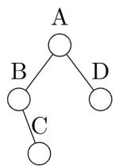

gateit-2004 binary-tree easy data-structures

# Answer key

# 3.6.47 Binary Tree: GATE IT 2005 | Question: 50

In a binary tree, for every node the difference between the number of nodes in the left and right subtrees is at most 2. If the height of the tree is h > 0, then the minimum number of nodes in the tree is


A. $2^{h-1}$

B. $2^{h - 1} + 1$

C. $2^{h} - 1$

D. $2^{h}$

gateit-2005 data-structures binary-tree normal

# Answer key

# 3.6.48 Binary Tree: GATE IT 2006 | Question: 71

An array X of n distinct integers is interpreted as a complete binary tree. The index of the first element of the array is 0. The index of the parent of element $X[i], i \neq 0$ , is?


A. $\left\lfloor\frac{i}{2}\right\rfloor$

B. $\left\lceil\frac{i-1}{2}\right\rceil$

C. $\left\lceil\frac{i}{2}\right\rceil$

D. $\left\lceil\frac{i}{2}\right\rceil-1$

gateit-2006 data-structures binary-tree normal

# Answer key

# 3.6.49 Binary Tree: GATE IT 2006 | Question: 73


An array $X$ of $n$ distinct integers is interpreted as a complete binary tree. The index of the first element of the array is 0. If the root node is at level 0, the level of element $X[i], i \neq 0$ , is

A. $\lfloor \log_2i\rfloor$ C. $\lfloor \log_2(i + 1)\rfloor$

B. $\lceil \log_2(i + 1)\rceil$ D. $\lceil \log_2i\rceil$

gateit-2006 data-structures binary-tree normal

# Answer key

# 3.6.50 Binary Tree: GATE IT 2006 | Question: 9


In a binary tree, the number of internal nodes of degree 1 is 5, and the number of internal nodes of degree 2 is 10. The number of leaf nodes in the binary tree is

A. 10

B. 11

C. 12

D. 15

gateit-2006 data-structures binary-tree normal

# Answer key

# 3.6.51 Binary Tree: GATE IT 2008 | Question: 46

The following three are known to be the preorder, inorder and postorder sequences of a binary tree. But it is not known which is which.

I. MBCAFHPYK  
II. KAMCBYPFH  
III. MABCKYFPH

Pick the true statement from the following.

A. I and II are preorder and inorder sequences, respectively  
B. I and III are preorder and postorder sequences, respectively  
C. II is the inorder sequence, but nothing more can be said about the other two sequences  
D. II and III are the preorder and inorder sequences, respectively

gateit-2008 data-structures normal binary-tree

# Answer key


# 3.6.52 Binary Tree: GATE IT 2008 | Question: 76


A binary tree with $n > 1$ nodes has $n_1, n_2$ and $n_3$ nodes of degree one, two and three respectively. The degree of a node is defined as the number of its neighbours.

$n_3$ can be expressed as

A. $n_1 + n_2 - 1$

B. $n_{1}-2$

C. $\left[\left(\left(n_{1}+n_{2}\right)/2\right)\right]$

D. $n_2 - 1$

gateit-2008 data-structures binary-tree normal

# Answer key

# 3.6.53 Binary Tree: GATE IT 2008 | Question: 77


A binary tree with $n > 1$ nodes has $n_1, n_2$ and $n_3$ nodes of degree one, two and three respectively. The degree of a node is defined as the number of its neighbours.

Starting with the above tree, while there remains a node v of degree two in the tree, add an edge between the two neighbours of v and then remove v from the tree. How many edges will remain at the end of the process?

A. $2 * n_{1} - 3$

B. $n_2 + 2 * n_1 - 2$

C. $n_{3}-n_{2}$

D. $n_2 + n_1 - 2$

gateit-2008 data-structures binary-tree normal

# Answer key

# 3.7.1 Data Structures: GATE CSE 1997 | Question: 6.2

Let $G$ be the graph with 100 vertices numbered 1 to 100. Two vertices $i$ and $j$ are adjacent if $|i - j| = 8$ or $|i - j| = 12$ . The number of connected components in $G$ is


A. 8

B. 4

C. 12

D. 25

gate1997 data-structures normal graph-theory

Answer key

# 3.7.2 Data Structures: GATE CSE 2014 | Set 1 | Question: 3

Let $G = (V, E)$ be a directed graph where V is the set of vertices and E the set of edges. Then which one of the following graphs has the same strongly connected components as G?


A. $G_{1} = (V,E_{1})$ where $E_{1} = \{(u,v)\mid (u,v)\notin E\}$  
B. $G_{2} = (V,E_{2})$ where $E_{2} = \{(u,v)\mid (v,u)\in E\}$  
C. $G_{3} = (V,E_{3})$ where $E_{3} = \{(u,v)\mid$ there is a path of length $\leq 2$ from $u$ to $v$ in $E\}$  
D. $G_{4} = (V_{4}, E)$ where $V_{4}$ is the set of vertices in $G$ which are not isolated

gatecse-2014-set1 data-structures graph-theory ambiguous

Answer key

# 3.7.3 Data Structures: GATE CSE 2016 | Set 1 | Question: 38

Consider the weighted undirected graph with 4 vertices, where the weight of edge $\{i,j\}$ is given by the entry $W_{ij}$ in the matrix W.


$$
W = \left[ \begin{array}{c c c c} 0 & 2 & 8 & 5 \\ 2 & 0 & 5 & 8 \\ 8 & 5 & 0 & x \\ 5 & 8 & x & 0 \end{array} \right]
$$

The largest possible integer value of $x$ , for which at least one shortest path between some pair of vertices will contain the edge with weight $x$ is \_\_\_\_.

gatecse-2016-set1 data-structures graph-theory normal numerical-answers

Answer key

# 3.7.4 Data Structures: GATE DS&AI 2024 | Question: 6

Match the items in Column 1 with the items in Column 2 in the following table:

<table><tr><td colspan="2">Column 1</td><td colspan="2">Column 2</td></tr><tr><td>(p)</td><td>First In First Out</td><td>(i)</td><td>Stacks</td></tr><tr><td>(q)</td><td>Lookup Operation</td><td>(ii)</td><td>Queues</td></tr><tr><td>(r)</td><td>Last In First Out</td><td>(iii)</td><td>Hash Tables</td></tr></table>


A. (p) - (ii), (q) - (iii), (r) - (i)  
B. (p) - (ii), (q) - (i), (r) - (iii)  
C. (p) - (i), (q) - (ii), (r) - (iii)  
D. (p) - (i), (q) - (iii), (r) - (ii)

# 3.8

# Hashing (15)

Practice Test: Test 1 (14Q)

# 3.8.1 Hashing: GATE CSE 1996 | Question: 1.13

An advantage of chained hash table (external hashing) over the open addressing scheme is

A. Worst case complexity of search operations is less

B. Space used is less

C. Deletion is easier

D. None of the above

gate1996 data-structures hashing normal

Answer key

# 3.8.2 Hashing: GATE CSE 1996 | Question: 15

Insert the characters of the string K R P C S N Y T J M into a hash table of size 10.

Use the hash function

$$
h (x) = (o r d (x) - o r d (\text {``} a \text {``}) + 1) \mod 1 0
$$

and linear probing to resolve collisions.

A. Which insertions cause collisions?  
B. Display the final hash table.

gate1996 data-structures hashing normal descriptive

Answer key

# 3.8.3 Hashing: GATE CSE 1997 | Question: 12

Consider a hash table with n buckets, where external (overflow) chaining is used to resolve collisions. The hash function is such that the probability that a key value is hashed to a particular bucket is $\frac{1}{n}$ . The hash table is initially empty and K distinct values are inserted in the table.

A. What is the probability that bucket number 1 is empty after the $K^{th}$ insertion?  
B. What is the probability that no collision has occurred in any of the $K$ insertions?  
C. What is the probability that the first collision occurs at the $K^{th}$ insertion?

gate1997 data-structures hashing probability normal descriptive

Answer key

# 3.8.4 Hashing: GATE CSE 2004 | Question: 7

Given the following input (4322, 1334, 1471, 9679, 1989, 6171, 6173, 4199) and the hash function x mod 10, which of the following statements are true?

I. 9679, 1989, 4199 hash to the same value  
II. 1471,6171 hash to the same value  
III. All elements hash to the same value  
IV. Each element hashes to a different value

A. I only

B. II only

C. I and II only

D. III or IV

gatecse-2004 data-structures hashing easy

Answer key


