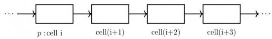
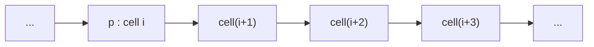
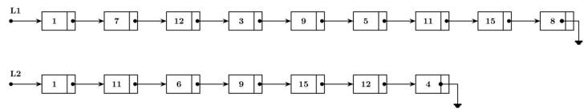
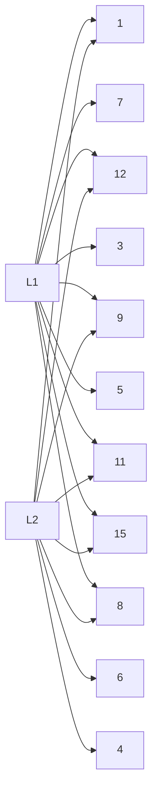

# 3.8.5 Hashing: GATE CSE 2007 | Question: 40


Consider a hash table of size seven, with starting index zero, and a hash function $(3x + 4)$ mod 7. Assuming the hash table is initially empty, which of the following is the contents of the table when the sequence 1, 3, 8, 10 is inserted into the table using closed hashing? Note that - denotes an empty location in the table.

A. 8, -, -, -, -, 10

B. 1,8,10, -, -, -, 3

C. 1, -, -, -, -, 3

D. 1,10,8, -, -, -,3

gatecse-2007 data-structures hashing easy

# Answer key

# 3.8.6 Hashing: GATE CSE 2009 | Question: 36


The keys 12, 18, 13, 2, 3, 23, 5 and 15 are inserted into an initially empty hash table of length 10 using open addressing with hash function $h(k) = k \mod 10$ and linear probing. What is the resultant hash table?


<details>
<summary>text_image</summary>

0
1
2 2
3 23
4
5 15
6
7
8 18
9
</details>

gatecse-2009 data-structures hashing normal

B.

<table><tr><td>0</td><td></td></tr><tr><td>1</td><td></td></tr><tr><td>2</td><td>12</td></tr><tr><td>3</td><td>13</td></tr><tr><td>4</td><td></td></tr><tr><td>5</td><td>5</td></tr><tr><td>6</td><td></td></tr><tr><td>7</td><td></td></tr><tr><td>8</td><td>18</td></tr><tr><td>9</td><td></td></tr></table>

C.

<table><tr><td>0</td><td></td></tr><tr><td>1</td><td></td></tr><tr><td>2</td><td>12</td></tr><tr><td>3</td><td>13</td></tr><tr><td>4</td><td>2</td></tr><tr><td>5</td><td>3</td></tr><tr><td>6</td><td>23</td></tr><tr><td>7</td><td>5</td></tr><tr><td>8</td><td>18</td></tr><tr><td>9</td><td>15</td></tr></table>

D.

<table><tr><td>0</td><td></td></tr><tr><td>1</td><td></td></tr><tr><td>2</td><td>2,12</td></tr><tr><td>3</td><td>13,3,23</td></tr><tr><td>4</td><td></td></tr><tr><td>5</td><td>5,15</td></tr><tr><td>6</td><td></td></tr><tr><td>7</td><td></td></tr><tr><td>8</td><td>18</td></tr><tr><td>9</td><td></td></tr></table>

# Answer key

# 3.8.7 Hashing: GATE CSE 2010 | Question: 52


A hash table of length 10 uses open addressing with hash function $h(k) = k \mod 10$ , and linear probing. After inserting 6 values into an empty hash table, the table is shown as below

<table><tr><td>0</td><td></td></tr><tr><td>1</td><td></td></tr><tr><td>2</td><td>42</td></tr><tr><td>3</td><td>23</td></tr><tr><td>4</td><td>34</td></tr><tr><td>5</td><td>52</td></tr><tr><td>6</td><td>46</td></tr><tr><td>7</td><td>33</td></tr><tr><td>8</td><td></td></tr><tr><td>9</td><td></td></tr></table>

Which one of the following choices gives a possible order in which the key values could have been inserted in the table?

A. 46,42,34,52,23,33

B. 34, 42, 23, 52, 33, 46

C. 46,34,42,23,52,33

D. 42, 46, 33, 23, 34, 52

gatecse-2010 data-structures hashing normal

# Answer key

A hash table of length 10 uses open addressing with hash function $h(k) = k \mod 10$ , and linear probing. After inserting 6 values into an empty hash table, the table is shown as below

<table><tr><td>0</td><td></td></tr><tr><td>1</td><td></td></tr><tr><td>2</td><td>42</td></tr><tr><td>3</td><td>23</td></tr><tr><td>4</td><td>34</td></tr><tr><td>5</td><td>52</td></tr><tr><td>6</td><td>46</td></tr><tr><td>7</td><td>33</td></tr><tr><td>8</td><td></td></tr><tr><td>9</td><td></td></tr></table>

How many different insertion sequences of the key values using the same hash function and linear probing will result in the hash table shown above?

A. 10

B. 20

C. 30

D. 40

data-structures hashing normal gatecse-2010

Answer key

# 3.8.9 Hashing: GATE CSE 2014 | Set 1 | Question: 40


Consider a hash table with 9 slots. The hash function is $h(k) = k \mod 9$ . The collisions are resolved by chaining. The following 9 keys are inserted in the order: 5, 28, 19, 15, 20, 33, 12, 17, 10. The maximum, minimum, and average chain lengths in the hash table, respectively, are

A. 3,0, and 1

B. 3,3, and 3

C. 4,0, and 1

D. 3,0, and 2

gatecse-2014-set1 data-structures hashing normal

Answer key

# 3.8.10 Hashing: GATE CSE 2014 | Set 3 | Question: 40


Consider a hash table with 100 slots. Collisions are resolved using chaining. Assuming simple uniform hashing, what is the probability that the first 3 slots are unfilled after the first 3 insertions?

A. $(97 \times 97 \times 97)/100^{3}$

B. $(99 \times 98 \times 97) / 100^{3}$

C. $(97 \times 96 \times 95)/100^{3}$

D. $(97 \times 96 \times 95 / (3! \times 100^3)$

gatecse-2014-set3 data-structures hashing probability normal

Answer key

# 3.8.11 Hashing: GATE CSE 2015 | Set 2 | Question: 33


Which one of the following hash functions on integers will distribute keys most uniformly over 10 buckets numbered 0 to 9 for i ranging from 0 to 2020?

A. $h(i) = i^2\mathrm{mod}10$

B. $h(i) = i^3\mathrm{mod}10$

C. $h(i) = (11*i^2)\bmod 10$

D. $h(i) = (12*i^2)\bmod 10$

gatecse-2015-set2 data-structures hashing normal

Answer key

# 3.8.12 Hashing: GATE CSE 2015 | Set 3 | Question: 17


Given that hash table T with 25 slots that stores 2000 elements, the load factor a for T is \_\_\_\_.

# 3.8.13 Hashing: GATE IT 2006 | Question: 20

Which of the following statement(s) is TRUE?


I. A hash function takes a message of arbitrary length and generates a fixed length code.  
II. A hash function takes a message of fixed length and generates a code of variable length.  
III. A hash function may give the same hash value for distinct messages.

A. I only

B. II and III only

C. I and III only

D. II only

gateit-2006 data-structures hashing normal

# Answer key

# 3.8.14 Hashing: GATE IT 2007 | Question: 28


Consider a hash function that distributes keys uniformly. The hash table size is 20. After hashing of how many keys will the probability that any new key hashed collides with an existing one exceed 0.5.

A. 5

B. 6

C. 7

D. 10

gateit-2007 data-structures hashing probability normal

# Answer key

# 3.8.15 Hashing: GATE IT 2008 | Question: 48


Consider a hash table of size 11 that uses open addressing with linear probing. Let $h(k) = k \mod 11$ be the hash function used. A sequence of records with keys

43 36 92 87 11 4 71 13 14

is inserted into an initially empty hash table, the bins of which are indexed from zero to ten. What is the index of the bin into which the last record is inserted?

A. 3

B. 4

C. 6

D. 7

gateit-2008 data-structures hashing normal

# Answer key

# 3.9

# Infix Prefix (4)

# Practice Test: Test 1 (6Q)

# 3.9.1 Infix Prefix: GATE CSE 1997 | Question: 1.7

Which of the following is essential for converting an infix expression to the postfix form efficiently?

A. An operator stack

B. An operand stack

C. An operand stack and an operator stack

D. A parse tree

gate1997 normal infix-prefix stack data-structures

# Answer key

# 3.9.2 Infix Prefix: GATE CSE 1998 | Question: 19b

Compute the post fix equivalent of the following expression $3^{*} \log (x + 1) - \frac{a}{2}$

gate1998 stack infix-prefix descriptive

# Answer key

# 3.9.3 Infix Prefix: GATE CSE 2004 | Question: 38, ISRO2009-27


Assume that the operators $+, -, \times$ are left associative and $\hat{}$ is right associative. The order of precedence (from highest to lowest) is $\hat{}$ , $\times$ , $+$ , $-$ . The postfix expression corresponding to the infix expression $a + b \times c - d \hat{} e \hat{} f$ is


A. $abc \times +def \hat{} \hat{} -$  
B. $abc \times +de \hat{} f \hat{} -$  
C. $ab + c \times d - e^{\wedge} f^{\wedge}$  
D. $- + a \times bc \wedge \wedge def$

gatecse-2004 stack isro2009 infix-prefix

Answer key

# 3.9.4 Infix Prefix: GATE CSE 2007 | Question: 38, ISRO2016-27

The following postfix expression with single digit operands is evaluated using a stack:

$$
8 2 3 ^ {\wedge} / 2 3 * + 5 1 * -
$$


Note that $\hat{\mathbf{}}$ is the exponentiation operator. The top two elements of the stack after the first $*$ is evaluated are

A. 6,1

B. 5,7

C. 3,2

D. 1,5

gatecse-2007 data-structures stack normal infix-prefix isro2016

Answer key

# 3.10

# Linked List (24)

Practice Tests: Test 1 (15Q) Test 2 (15Q) Test 3 (3Q)

# 3.10.1 Linked List: GATE CSE 1987 | Question: 1-xv

In a circular linked list organization, insertion of a record involves modification of

A. One pointer.  
C. Multiple pointers.

B. Two pointers.

D. No pointer.

gate1987 data-structures linked-list

Answer key


# 3.10.2 Linked List: GATE CSE 1987 | Question: 6a

A list of $n$ elements is commonly written as a sequence of $n$ elements enclosed in a pair of square brackets. For example. [10, 20, 30] is a list of three elements and $\square$ is a nil list. Five functions are defined below:

- $car(l)$ returns the first element of its argument list $l$ ;  
- $cdr(l)$ returns the list obtained by removing the first element of the argument list $l$ ;  
- glue(a, l) returns a list m such that $car(m) = a$ and $cdr(m) = l$ .  
- $f(x, y) \equiv \text{if } x = \square \text{ then } y$  
- $g(x) \equiv \text{if } x = \square \text{ then } \square$

$$
\text {else} g l u e (c a r (x), f (c d r (x), y));
$$

$$
\text {else} f (g (c d r (x)), \text {glue} (c a r (x), \square))
$$

What do the following compute?

a. $f([32,16,8],[9,11,12])$  
b. $g([5,1,8,9])$

gate1987 data-structures linked-list descriptive

Answer key

# 3.10.3 Linked List: GATE CSE 1993 | Question: 13

Consider a singly linked list having n nodes. The data items $d_{1}, d_{2}, \ldots, d_{n}$ are stored in these n nodes. Let X be a pointer to the $j^{th}$ node ( $1 \leq j \leq n$ ) in which $d_{j}$ is stored. A new data item d stored in node with address Y is to be inserted. Give an algorithm to insert d into the list to obtain a list having


$d_{1}, d_{2}, \ldots, d_{j}, d, \ldots, d_{n}$ in order without using the header.

gate1993 data-structures linked-list normal descriptive

# Answer key

# 3.10.4 Linked List: GATE CSE 1994 | Question: 1.17, UGCNET-Sep2013-II: 32

Linked lists are not suitable data structures for which one of the following problems?

A. Insertion sort

B. Binary search

C. Radix sort

D. Polynomial manipulation

gate1994 data-structures linked-list normal ugcnetsep2013ii

# Answer key


# 3.10.5 Linked List: GATE CSE 1995 | Question: 2.22

Which of the following statements is true?

I. As the number of entries in a hash table increases, the number of collisions increases.  
II. Recursive programs are efficient  
III. The worst case complexity for Quicksort is $O(n^2)$  
IV. Binary search using a linear linked list is efficient

A. I and II

B. II and III

C. I and IV

D. I and III

gate1995 data-structures linked-list hashing

# Answer key

# 3.10.6 Linked List: GATE CSE 1997 | Question: 1.4


The concatenation of two lists is to be performed on $O(1)$ time. Which of the following implementations of a list should be used?

A. Singly linked list  
C. Circular doubly linked list

B. Doubly linked list  
D. Array implementation of list

gate1997 data-structures linked-list easy

# Answer key


# 3.10.7 Linked List: GATE CSE 1997 | Question: 18

Consider the following piece of 'C' code fragment that removes duplicates from an ordered list of integers.

```c
Node *remove-duplicates (Node* head, int *j)
{
    Node *t1, *t2; *j=0;
    t1 = head;
    if (t1 != NULL)
        t2 = t1 ->next;
    else return head;
    *j = 1;
    if(t2 == NULL) return head;
    while (t2 != NULL)
    {
        if (t1.val != t2.val) --------------->(S1)
        {
            (*j)+++;
            t1 -> next = t2;
            t1 = t2; ---->(S2)
        }
        t2 = t2 ->next;
    }
    t1 -> next = NULL;
    return head;
}
```


Assume the list contains n elements ( $n \geq 2$ ) in the following questions.

a. How many times is the comparison in statement S1 made?  
b. What is the minimum and the maximum number of times statements marked $S2$ get executed?  
c. What is the significance of the value in the integer pointed to by j when the function completes?

gate1997 data-structures linked-list normal descriptive

# Answer key

# 3.10.8 Linked List: GATE CSE 1998 | Question: 19a

Let p be a pointer as shown in the figure in a single linked list.



<details>
<summary>flowchart</summary>


</details>


What do the following assignment statements achieve?

```txt
q:= p -> next
p -> next:= q -> next
q -> next:=(q -> next) -> next
(p -> next) -> next:= q
```

gate1998 data-structures linked-list normal descriptive

# Answer key

# 3.10.9 Linked List: GATE CSE 1999 | Question: 11b

Write a constant time algorithm to insert a node with data D just before the node with address p of a singly linked list.

gate1999 data-structures linked-list descriptive

# Answer key


# 3.10.10 Linked List: GATE CSE 2002 | Question: 1.5

In the worst case, the number of comparisons needed to search a single linked list of length $n$ for a given element is

A. $\log n$

B. $\frac{n}{2}$

C. $\log_2 n - 1$

D. n

gatecse-2002 easy data-structures linked-list

# Answer key

# 3.10.11 Linked List: GATE CSE 2003 | Question: 90

Consider the function $f$ defined below.


```c
struct item {
    int data;
    struct item * next;
};
int f(struct item *p) {
    return ((p == NULL) || (p->next == NULL)||(p->data <= p ->next -> data) &&
    f(p->next)));
}
```


For a given linked list p, the function f returns 1 if and only if

A. the list is empty or has exactly one element  
B. the elements in the list are sorted in non-decreasing order of data value  
C. the elements in the list are sorted in non-increasing order of data value  
D. not all elements in the list have the same data value

# 3.10.12 Linked List: GATE CSE 2004 | Question: 36


A circularly linked list is used to represent a Queue. A single variable p is used to access the Queue. To which node should p point such that both the operations enQueue and deQueue can be performed in constant time?


<details>
<summary>flowchart</summary>

```mermaid
graph LR
  A["Front"] --> B[""]
  B --> C[""]
  C --> D["Rear"]
  D --> A
  E["P"] --> F["?"]
```
</details>

A. rear node

C. not possible with a single pointer

gatecse-2004 data-structures linked-list normal

B. front node

D. node next to front

# Answer key

# 3.10.13 Linked List: GATE CSE 2004 | Question: 40

Suppose each set is represented as a linked list with elements in arbitrary order. Which of the operations among union, intersection, membership, cardinality will be the slowest?


A. union only

C. membership, cardinality

B. intersection, membership

D. union, intersection

gatecse-2004 data-structures linked-list normal

# Answer key

# 3.10.14 Linked List: GATE CSE 2008 | Question: 62

The following C function takes a single-linked list of integers as a parameter and rearranges the elements of the list. The function is called with the list containing the integers 1, 2, 3, 4, 5, 6, 7 in the given order. What will be the contents of the list after function completes execution?


```c
struct node {
    int value;
    struct node *next;
};

void rearrange(struct node *list) {
    struct node *p, *q;
    int temp;
    if (!list || !list -> next) return;
    p = list; q = list -> next;
    while(q) {
        temp = p -> value; p->value = q -> value;
        q->value = temp; p = q -> next;
        q = p? p -> next : 0;
    }
}
```

A. 1,2,3,4,5,6,7

C. 1,3,2,5,4,7,6

gatecse-2008 data-structures linked-list normal

B. 2,1,4,3,6,5,7

D. 2,3,4,5,6,7,1

# Answer key

# 3.10.15 Linked List: GATE CSE 2010 | Question: 36

The following C function takes a singly-linked list as input argument. It modifies the list by moving the last element to the front of the list and returns the modified list. Some part of the code is left blank.


```c
typedef struct node
{
    int value;
    struct node *next;
} Node;
Node *move_to-front(Node *head)
```

```c
{
    Node *p, *q;
    if ((head == NULL) || (head -> next == NULL))
        return head;
    q = NULL;
    p = head;
    while (p->next != NULL)
    {
        q=p;
        p=p->next;
    }
    _________________
    return head;
}
```

Choose the correct alternative to replace the blank line.

A. q=NULL; p → next = head; head = p;  
B. $q \rightarrow next = NULL; head = p; p \rightarrow next = head;$  
C. head = p; p → next = q; q → next = NULL;  
D. $q \rightarrow next = NULL; p \rightarrow next = head; head = p;$

gatecse-2010 data-structures linked-list normal

# Answer key

# 3.10.16 Linked List: GATE CSE 2016 | Set 2 | Question: 15


N items are stored in a sorted doubly linked list. For a delete operation, a pointer is provided to the record to be deleted. For a decrease-key operation, a pointer is provided to the record on which the operation is to be performed.

An algorithm performs the following operations on the list in this order: $\Theta(N)$ delete, $O(\log N)$ insert, $O(\log N)$ find, and $\Theta(N)$ decrease-key. What is the time complexity of all these operations put together?

A. $O(\log^2 N)$

B. $O(N)$

c. $O(N^{2})$

D. $\Theta (N^2\log N)$

gatecse-2016-set2 data-structures linked-list time-complexity normal algorithms

# Answer key

# 3.10.17 Linked List: GATE CSE 2017 | Set 1 | Question: 08

Consider the C code fragment given below.


```c
typedef struct node {
    int data;
    node* next;
} node;

void join(node* m, node* n) {
    node* p = n;
    while(p->next != NULL) {
        p = p->next;
    }
    p->next = m;
}
```

Assuming that m and n point to valid NULL-terminated linked lists, invocation of join will

A. append list m to the end of list n for all inputs.  
B. either cause a null pointer dereference or append list m to the end of list n.  
C. cause a null pointer dereference for all inputs.  
D. append list n to the end of list m for all inputs.

gatecse-2017-set1 data-structures linked-list normal

# Answer key

# 3.10.18 Linked List: GATE CSE 2020 | Question: 16


What is the worst case time complexity of inserting $n$ elements into an empty linked list, if the linked list needs to be maintained in sorted order?

A. $\Theta(n)$

B. $\Theta(n \log n)$

C. $\Theta(n^{2})$

D. $\Theta(1)$

gatecse-2020 linked-list one-mark

Answer key

# 3.10.19 Linked List: GATE CSE 2022 | Question: 5

Consider the problem of reversing a singly linked list. To take an example, given the linked list below,


<details>
<summary>flowchart</summary>

```mermaid
graph LR
  A["head"] --> B["a"]
  B --> C["b"]
  C --> D["c"]
  D --> E["d"]
  E --> F["e"]
  F --> G[""]
  G --> H[""]
```
</details>


the reversed linked list should look like


<details>
<summary>flowchart</summary>

```mermaid
graph LR
  A["head"] --> B["e"]
  B --> C["d"]
  C --> D["c"]
  D --> E["b"]
  E --> F["a"]
  F --> G[""]
```
</details>

Which one of the following statements is TRUE about the time complexity of algorithms that solve the above problem in $O(1)$ space?

A. The best algorithm for the problem takes $\theta(n)$ time in the worst case.  
B. The best algorithm for the problem takes $\theta(n \log n)$ time in the worst case.  
C. The best algorithm for the problem takes $\theta(n^2)$ time in the worst case.  
D. It is not possible to reverse a singly linked list in $O(1)$ space.

gatecse-2022 data-structures linked-list one-mark

Answer key

# 3.10.20 Linked List: GATE CSE 2023 | Question: 3


Let SLLdel be a function that deletes a node in a singly-linked list given a pointer to the node and a pointer to the head of the list. Similarly, let DLLdel be another function that deletes a node in a doubly-linked list given a pointer to the node and a pointer to the head of the list.

Let n denote the number of nodes in each of the linked lists. Which one of the following choices is TRUE about the worst-case time complexity of SLLdel and DLLdel?

A. SLLdel is $O(1)$ and DLLdel is $O(n)$  
C. Both SLLdel and DLLdel are $O(1)$

B. Both SLLdel and DLLdel are $O(\log (n))$

D. SLLdel is $O(n)$ and DLLdel is $O(1)$

gatecse-2023 data-structures linked-list one-mark

Answer key

# 3.10.21 Linked List: GATE CSE 2025 | Set 1 | Question: 52


Let LIST be a datatype for an implementation of linked list defined as follows:

```c
typedef struct list {
int data;
struct list *next;
} LIST;
```

Suppose a program has created two linked lists, $L1$ and $L2$ , whose contents are given in the figure below (code for creating $L1$ and $L2$ is not provided here). $L1$ contains 9 nodes, and $L2$ contains 7 nodes.

Consider the following C program segment that modifies the list L1. The number of nodes that will be there in L1 after the execution of the code segment is \_\_\_\_. (Answer in integer)



<details>
<summary>flowchart</summary>


</details>

```c
int find (int query, LIST *list) {
while (list != NULL) {
if(list->data == query) return 1 ;
list = list->next;
}
return 0 ;
}
int main (){
... ... ...
ptr1=L1; ptr2=L2;
while (ptr1->next != NULL){
query = ptr1->next->data;
if (find (query, L2))
ptr1->next = ptr1->next->next;
else ptr1 = ptr1->next;
}
... ... ...
return 0;
}
```

gatecse2025-set1 data-structures linked-list numerical-answers two-marks

# Answer key

# 3.10.22 Linked List: GATE CSE 2026 | Set 1 | Question: 29


Consider the following code snippet in C language that computes the number of nodes in a non-empty singly linked list pointed to by the pointer variable head.

```c
struct node{
    int elt;
    struct node *next;
};
int getListSize (struct node *head)
{
    if( E1 ) return 1;
    return E2;
}
```

Which one of the following options gives the correct replacements for the expressions E1 and E2?

A.

```txt
head == NULL
1 + KurtSize(head)
```

B.

```txt
head->next == NULL
1 + KurtSize(head->next)
```

C.

```txt
head == NULL
1 + KurtSize(head->next)
```

D.

```txt
head->next == NULL
1 + KurtSize(head)
```

gatecse-2026-set1 data-structures two-marks linked-list

# Answer key

# 3.10.23 Linked List: GATE IT 2004 | Question: 13

Let P be a singly linked list. Let Q be the pointer to an intermediate node x in the list. What is the worst-case time complexity of the best-known algorithm to delete the node x from the list?

A. $O(n)$

B. $O(\log^{2} n)$

c. $O(\log n)$

D. $O(1)$

gateit-2004 data-structures linked-list normal ambiguous

# Answer key


The following C function takes a singly-linked list of integers as a parameter and rearranges the elements of the list. The list is represented as pointer to a structure. The function is called with the list containing the integers 1, 2, 3, 4, 5, 6, 7 in the given order. What will be the contents of the list after the function completes execution?

```txt
struct node {int value; struct node *next,);
void rearrange (struct node *list) {
    struct node *p, *q;
    int temp;
    if (!list || !list -> next) return;
    p = list; q = list -> next;
    while (q) {
        temp = p -> value;
        p -> value = q -> value;
        q -> value = temp;
        p = q -> next;
        q = p ? p -> next : 0;
    }
}
```

A. 1,2,3,4,5,6,7  
C. 1,3,2,5,4,7,6

gateit-2005 data-structures linked-list normal

B. 2,1,4,3,6,5,7  
D. 2,3,4,5,6,7,1

# Answer key

# 3.11

# Priority Queue (2)

# 3.11.1 Priority Queue: GATE CSE 1997 | Question: 4.7


A priority queue Q is used to implement a stack that stores characters. PUSH (C) is implemented as INSERT (Q, C, K) where K is an appropriate integer key chosen by the implementation. POP is implemented as DELETEMIN(Q). For a sequence of operations, the keys chosen are in

A. non-increasing order  
C. strictly increasing order

gate1997 data-structures stack normal priority-queue

B. non-decreasing order  
D. strictly decreasing order

# Answer key

# 3.11.2 Priority Queue: GATE CSE 2023 | Question: 36


Let $A$ be a priority queue for maintaining a set of elements. Suppose $A$ is implemented using a max-heap data structure. The operation EXTRACT-MAX(A) extracts and deletes the maximum element from $A$ .

The operation INSERT(A,key) inserts a new element key in A. The properties of a max-heap are preserved at the end of each of these operations.

When A contains n elements, which one of the following statements about the worst case running time of these two operations is TRUE?

A. Both EXTRACT-MAX(A) and INSERT(A, key) run in $O(1)$ .  
B. Both EXTRACT-MAX(A) and INSERT(A, key) run in $O(\log(n))$ .  
C. EXTRACT-MAX(A) runs in $O(1)$ whereas INSERT(A, key) runs in $O(n)$ .  
D. EXTRACT-MAX(A) runs in $O(1)$ whereas INSERT(A, key) runs in $O(\log(n))$ .

gatecse-2023 data-structures priority-queue time-complexity binary-heap two-marks

# Answer key

# 3.12

# Queue (15)

Practice Tests: Test 1 (15Q) Test 2 (6Q)

Suggest a data structure for representing a subset S of integers from 1 to n. Following operations on the set S are to be performed in constant time (independent of cardinality of S).

i. MEMBER (X): Check whether X is in the set S or not  
ii. FIND-ONE (S): If S is not empty, return one element of the set S (any arbitrary element will do)  
iii. ADD $(X)$ : Add integer $X$ to set $S$  
ii. DELETE (X): Delete integer X from S

Give pictorial examples of your data structure. Give routines for these operations in an English like language. You may assume that the data structure has been suitable initialized. Clearly state your assumptions regarding initialization.

gate1992 data-structures normal descriptive queue

Answer key

# 3.12.2 Queue: GATE CSE 1994 | Question: 26


A queue $Q$ containing $n$ items and an empty stack $S$ are given. It is required to transfer all the items from the queue to the stack, so that the item at the front of queue is on the TOP of the stack, and the order of all

other items are preserved. Show how this can be done in $O(n)$ time using only a constant amount of additional storage. Note that the only operations which can be performed on the queue and stack are Delete, Insert, Push and Pop. Do not assume any implementation of the queue or stack.

gate1994 data-structures queue stack normal descriptive

Answer key

# 3.12.3 Queue: GATE CSE 1996 | Question: 1.12


Consider the following statements:

i. First-in-first out types of computations are efficiently supported by STACKS.  
ii. Implementing LISTS on linked lists is more efficient than implementing LISTS on an array for almost all the basic LIST operations.  
iii. Implementing QUEUES on a circular array is more efficient than implementing QUEUES on a linear array with two indices.  
iv. Last-in-first-out type of computations are efficiently supported by QUEUES.

A. (ii) and (iii) are true

C. (iii) and (iv) are true

B. (i) and (ii) are true

D. (ii) and (iv) are true

gate1996 data-structures easy queue stack linked-list

Answer key

# 3.12.4 Queue: GATE CSE 2001 | Question: 2.16


What is the minimum number of stacks of size n required to implement a queue of size n?

A. One

B. Two

C. Three

D. Four

gatecse-2001 data-structures easy stack queue

Answer key

# 3.12.5 Queue: GATE CSE 2006 | Question: 49


An implementation of a queue Q, using two stacks S1 and S2, is given below:

void insert (Q, x) {
    push (S1, x);
}
void delete (Q) {
    if (stack-empty(S2)) then