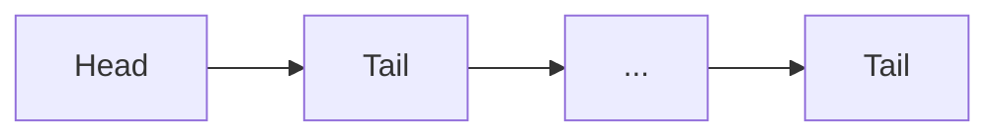
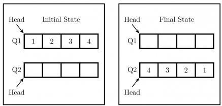
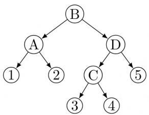
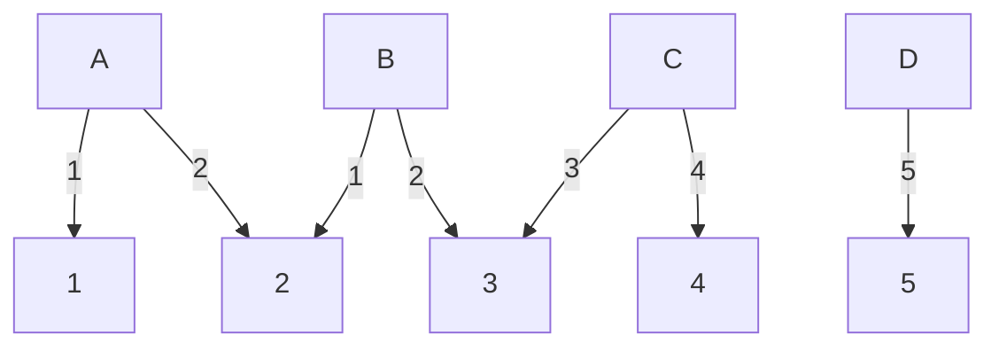
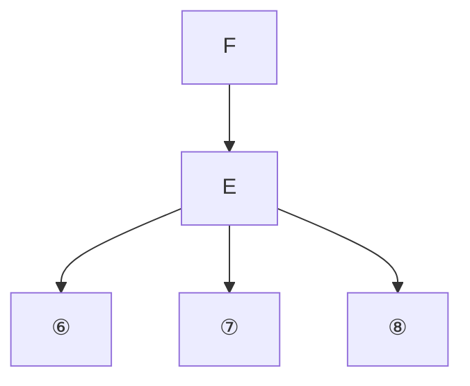
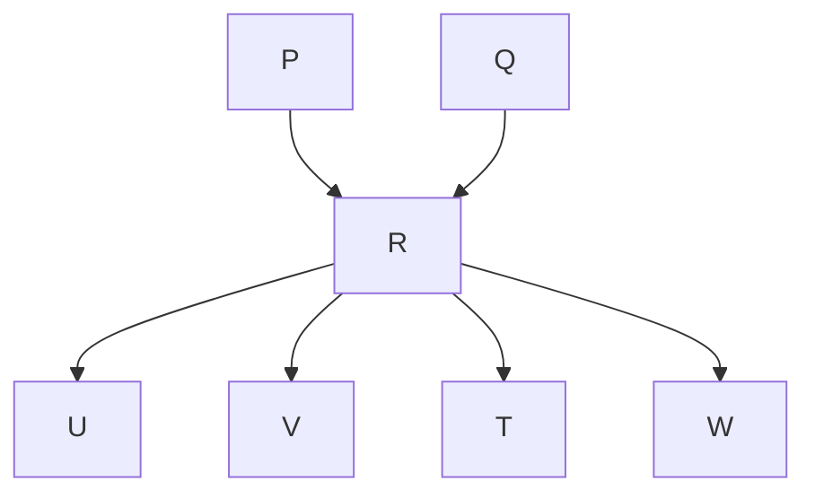

```lisp
if (stack-empty(S1)) then {
        print("Q is empty");
        return;
    }
    else while (!(stack-empty(S1))){
        x=pop(S1);
        push(S2,x);
    }
    x=pop(S2);
}
```

Let $n$ insert and $m(\leq n)$ delete operations be performed in an arbitrary order on an empty queue $Q$ . Let $x$ and $y$ be the number of push and pop operations performed respectively in the process. Which one of the following is true for all $m$ and $n$ ?

A. $n + m \leq x < 2n$ and $2m \leq y \leq n + m$  
B. $n + m \leq x < 2n$ and $2m \leq y \leq 2n$  
C. $2m \leq x < 2n$ and $2m \leq y \leq n + m$  
D. $2m \leq x < 2n$ and $2m \leq y \leq 2n$

gatecse-2006 data-structures queue stack normal

# Answer key

# 3.12.6 Queue: GATE CSE 2012 | Question: 35

Suppose a circular queue of capacity $(n-1)$ elements is implemented with an array of n elements. Assume that the insertion and deletion operations are carried out using REAR and FRONT as array index variables, respectively. Initially, REAR = FRONT = 0. The conditions to detect queue full and queue empty are:

A. full : (REAR + 1) mod n == FRONT
empty : REAR == FRONT  
B. full : (REAR + 1) mod n == FRONT
empty : (FRONT + 1) mod n == REAR  
C. full : REAR == FRONT
    empty : (REAR + 1) mod n == FRONT  
D. full : (FRONT + 1) mod n == REAR
empty : REAR == FRONT

gatecse-2012 data-structures queue normal

# Answer key

# 3.12.7 Queue: GATE CSE 2013 | Question: 44

Consider the following operation along with Enqueue and Dequeue operations on queues, where $k$ is a global parameter.

```txt
MultiDequeue(Q){
    m = k
    while (Q is not empty) and (m > 0) {
        Dequeue(Q)
        m = m - 1
    }
}
```

What is the worst case time complexity of a sequence of n queue operations on an initially empty queue?

A. $\Theta(n)$

B. $\Theta(n + k)$

C. $\Theta(nk)$

D. $\Theta(n^{2})$

gatecse-2013 data-structures algorithms normal queue

# Answer key

# 3.12.8 Queue: GATE CSE 2016 | Set 1 | Question: 10

A queue is implemented using an array such that ENQUEUE and DEQUEUE operations are performed efficiently. Which one of the following statements is CORRECT (n refers to the number of items in the


queue) ?

A. Both operations can be performed in $O(1)$ time.  
B. At most one operation can be performed in $O(1)$ time but the worst case time for the operation will be $\Omega(n)$ .  
C. The worst case time complexity for both operations will be $\Omega(n)$ .  
D. Worst case time complexity for both operations will be $\Omega(\log n)$

gatecse-2016-set1 data-structures queue normal

# Answer key

# 3.12.9 Queue: GATE CSE 2016 | Set 1 | Question: 41

Let Q denote a queue containing sixteen numbers and S be an empty stack. $Head(Q)$ returns the element at the head of the queue Q without removing it from Q. Similarly $Top(S)$ returns the element at the top of S without removing it from S. Consider the algorithm given below.


```matlab
while Q is not Empty do
  if S is Empty OR Top(S) ≤ Head (Q) then
    x:= Dequeue (Q);
    Push (S, x);
  else
    x:= Pop(S);
    Enqueue (Q, x);
  end
end
```

The maximum possible number of iterations of the while loop in the algorithm is \_\_\_\_.

gatecse-2016-set1 data-structures queue difficult numerical-answers

# Answer key

# 3.12.10 Queue: GATE CSE 2017 | Set 2 | Question: 13

A circular queue has been implemented using a singly linked list where each node consists of a value and a single pointer pointing to the next node. We maintain exactly two external pointers FRONT and REAR pointing to the front node and the rear node of the queue, respectively. Which of the following statements is/are CORRECT for such a circular queue, so that insertion and deletion operations can be performed in $O(1)$ time?

I. Next pointer of front node points to the rear node.  
II. Next pointer of rear node points to the front node.

A. (I) only.  
C. Both (I) and (II).  
gatecse-2017-set2 data-structures queue

# Answer key

# 3.12.11 Queue: GATE CSE 2018 | Question: 3

A queue is implemented using a non-circular singly linked list. The queue has a head pointer and a tail pointer, as shown in the figure. Let $n$ denote the number of nodes in the queue. Let 'enqueue' be implemented by inserting a new node at the head, and 'dequeue' be implemented by deletion of a node from the tail.


<details>
<summary>flowchart</summary>


</details>

Which one of the following is the time complexity of the most time-efficient implementation of 'enqueue' and 'dequeue, respectively, for this data structure?

A. $\Theta(1), \Theta(1)$  
C. $\Theta(n), \Theta(1)$

gatecse-2018 algorithms data-structures queue normal linked-list one-mark


# 3.12.12 Queue: GATE CSE 2022 | Question: 52


Consider the queues $Q_{1}$ containing four elements and $Q_{2}$ containing none (shown as the Initial State in the figure). The only operations allowed on these two queues are Enqueue (Q, element) and Dequeue (Q).

The minimum number of Enqueue operations on $Q_{1}$ required to place the elements of $Q_{1}$ in $Q_{2}$ in reverse order (shown as the Final State in the figure) without using any additional storage is \_\_\_\_.



gatecse-2022 numerical-answers data-structures queue two-marks

# Answer key

# 3.12.13 Queue: GATE CSE 2026 | Set 2 | Question: 40


Consider a stack $S$ and a queue $Q$ . Both of them are initially empty and have the capacity to store ten elements each. The elements 1, 2, 3, 4, and 5 arrive one by one, in that order. When an element arrives, it is assigned either to $S$ (pushed on $S$ ) or to $Q$ (enqueued to $Q$ ). Once all the five elements are stored, the output is generated in two steps. First, stack $S$ is emptied by popping all elements. Then queue $Q$ is emptied by dequeueing all elements. The output obtained by following this process is 43125.

Given the output, the objective is to predict whether an element was assigned to S or Q.

Which of the following options is/are possible valid assignment(s) of the elements?

Note: In the options, the notation $xS$ denotes that element $x$ was assigned to $S$ and $yQ$ denotes that element $y$ was assigned to $Q$ .

A. $1S, 2Q, 3S, 4S, 5Q$

B. $1Q, 2Q, 3S, 4S, 5Q$

C. $1Q, 2Q, 3Q, 4S, 5S$

D. $1S, 2S, 3S, 4Q, 5Q$

gatecse-2026-set2 data-structures stack queue multiple-selects two-marks

# Answer key

# 3.12.14 Queue: GATE DS&AI 2024 | Question: 22


The fundamental operations in a double-ended queue D are:

insertFirst (e) - Insert a new element e at the beginning of D.

insertLast (e) - Insert a new element e at the end of D.

removeFirst () - Remove and return the first element of D.

removeLast () - Remove and return the last element of D.

In an empty double-ended queue, the following operations are performed:

insertFirst (10)

insertLast (32)

a ← removeFirst ()

insertLast (28)

insertLast (17)

a ← removeFirst ()

a ← removeLast ()

The value of a is \_\_\_\_.

# 3.12.15 Queue: GATE IT 2007 | Question: 30


Suppose you are given an implementation of a queue of integers. The operations that can be performed on the queue are:

i. isEmpty (Q) — returns true if the queue is empty, false otherwise.  
ii. delete (Q) — deletes the element at the front of the queue and returns its value.  
iii. insert (Q, i) — inserts the integer i at the rear of the queue.

Consider the following function:  
```javascript
void f (queue Q) {
int i ;
if (!isEmpty(Q)) {
    i = delete(Q);
    f(Q);
    insert(Q, i);
}
}
```

What operation is performed by the above function f ?

A. Leaves the queue Q unchanged  
B. Reverses the order of the elements in the queue $Q$  
C. Deletes the element at the front of the queue $Q$ and inserts it at the rear keeping the other elements in the same order  
D. Empties the queue Q

gateit-2007 data-structures queue normal

Answer key

# 3.13

# Stack (19)

Practice Tests: Test 1 (15Q) Test 2 (10Q)

# 3.13.1 Stack: GATE CSE 1989 | Question: 4-ii

Compute the postfix equivalent of the following infix arithmetic expression

$$
a + b * c + d * e \uparrow f
$$

where $\uparrow$ represents exponentiation. Assume normal operator precedences.

gate1989 descriptive data-structures stack

Answer key


# 3.13.2 Stack: GATE CSE 1991 | Question: 03,vii

The following sequence of operations is performed on a stack:

PUSH(10), PUSH(20), POP, PUSH(10), PUSH(20), POP, POP, POP, PUSH(20), POP

The sequence of values popped out is

A. 20,10,20,10,20

C. 10,20,20,10,20

B. 20,20,10,10,20

D. 20,20,10,20,10

gate1991 data-structures stack easy

Answer key


# 3.13.3 Stack: GATE CSE 1994 | Question: 1.14


Which of the following permutations can be obtained in the output (in the same order) using a stack assuming that the input is the sequence 1, 2, 3, 4, 5 in that order?

A. 3, 4, 5, 1, 2

B. 3, 4, 5, 2, 1

C. 1, 5, 2, 3, 4

D. 5, 4, 3, 1, 2

gate1994 data-structures stack normal

# Answer key

# 3.13.4 Stack: GATE CSE 1995 | Question: 2.21

The postfix expression for the infix expression $A + B * (C + D) / F + D * E$ is:

A. $AB + CD + *F / D + E*$

B. $ABCD + *F / DE * + +$

C. $A*B + CD / F*DE++$

D. $A + *BCD / F * DE + +$

gate1995 data-structures stack easy

# Answer key

# 3.13.5 Stack: GATE CSE 2000 | Question: 13


Suppose a stack implementation supports, in addition to PUSH and POP, an operation REVERSE, which reverses the order of the elements on the stack.

A. To implement a queue using the above stack implementation, show how to implement ENQUEUE using a single operation and DEQUEUE using a sequence of 3 operations.  
B. The following post fix expression, containing single digit operands and arithmetic operators + and \*, is evaluated using a stack.

$$
5 2 * 3 4 + 5 2 * * +
$$

Show the contents of the stack

i. After evaluating 5 2 \* 3 4+  
ii. After evaluating 52\*34+52

iii. At the end of evaluation

gatecse-2000 data-structures stack normal descriptive

# Answer key

# 3.13.6 Stack: GATE CSE 2003 | Question: 64


Let $\mathbf{S}$ be a stack of size $n \geq 1$ . Starting with the empty stack, suppose we push the first $n$ natural numbers in sequence, and then perform $n$ pop operations. Assume that Push and Pop operations take $X$ seconds each, and $Y$ seconds elapse between the end of one such stack operation and the start of the next operation. For $m \geq 1$ , define the stack-life of $m$ as the time elapsed from the end of $Push(m)$ to the start of the pop operation that removes $m$ from $\mathbf{S}$ . The average stack-life of an element of this stack is

A. $n(X + Y)$

B. $3Y + 2X$

C. $n(X + Y) - X$

D. $Y + 2X$

gatecse-2003 data-structures stack normal

# Answer key

# 3.13.7 Stack: GATE CSE 2004 | Question: 3


A single array $A[1 \ldots \text{MAXSIZE}]$ is used to implement two stacks. The two stacks grow from opposite ends of the array. Variables $top1$ and $top2$ ( $top1 < top2$ ) point to the location of the topmost element in each of the stacks. If the space is to be used efficiently, the condition for “ $stack$ $full$ ” is

A. (top1 = MAXSIZE/2) and (top2 = MAXSIZE/2 + 8.) top1 + top2 = MAXSIZE  
C. (top1 = MAXSIZE/2) or (top2 = MAXSIZE) D. top1 = top2 - 1

gatecse-2004 data-structures stack easy

# Answer key


# 3.13.8 Stack: GATE CSE 2004 | Question: 5

The best data structure to check whether an arithmetic expression has balanced parentheses is a


A. queue

B. stack

C. tree

D. list

gatecse-2004 data-structures easy stack

Answer key

# 3.13.9 Stack: GATE CSE 2014 | Set 2 | Question: 41

Suppose a stack implementation supports an instruction REVERSE, which reverses the order of elements on the stack, in addition to the PUSH and POP instructions. Which one of the following statements is TRUE (with respect to this modified stack)?


A. A queue cannot be implemented using this stack.  
B. A queue can be implemented where ENQUEUE takes a single instruction and DEQUEUE takes a sequence of two instructions.  
C. A queue can be implemented where ENQUEUE takes a sequence of three instructions and DEQUEUE takes a single instruction.  
D. A queue can be implemented where both ENQUEUE and DEQUEUE take a single instruction each.

gatecse-2014-set2 data-structures stack easy

Answer key

# 3.13.10 Stack: GATE CSE 2015 | Set 2 | Question: 38

Consider the C program below


```c
#include <stdio.h>
int *A, stkTop;
int stkFunc (int opcode, int val)
{
    static int size=0, stkTop=0;
    switch (opcode) {
        case -1: size = val; break;
        case 0: if (stkTop < size ) A[stkTop++]=val; break;
        default: if (stkTop) return A[--stkTop];
    }
    return -1;
}
int main()
{
    int B[20]; A=B; stkTop = -1;
    stkFunc (-1, 10);
    stkFunc (0, 5);
    stkFunc (0, 10);
    printf ("%d\n", stkFunc(1, 0)+ stkFunc(1, 0));
}
```

The value printed by the above program is \_\_\_\_.

gatecse-2015-set2 data-structures stack easy numerical-answers

Answer key

# 3.13.11 Stack: GATE CSE 2015 | Set 3 | Question: 12

The result evaluating the postfix expression 10 5 + 60 6/ \* 8- is


A. 284

B. 213

C. 142

D. 71

gatecse-2015-set3 data-structures stack easy

Answer key

# 3.13.12 Stack: GATE CSE 2021 | Set 1 | Question: 21

Consider the following sequence of operations on an empty stack.


$$
\text {push} (5 4); \text {push} (5 2); \text {pop} (); \text {push} (5 5); \text {push} (6 2); \mathrm{s} = \text {pop} ();
$$

Consider the following sequence of operations on an empty queue.

$$
\text {enqueue} (2 1); \text {enqueue} (2 4); \text {dequeue} (); \text {enqueue} (2 8); \text {enqueue} (3 2); q = \text {dequeue} ();
$$

The value of $s+q$ is \_\_\_\_.

gatecse-2021-set1 data-structures stack easy numerical-answers one-mark

# Answer key

# 3.13.13 Stack: GATE CSE 2023 | Question: 49

Consider a sequence $a$ of elements $a_0 = 1, a_1 = 5, a_2 = 7, a_3 = 8, a_4 = 9$ , and $a_5 = 2$ . The following operations are performed on a stack $S$ and a queue $Q$ , both of which are initially empty.


I. push the elements of a from $a_{0}$ to $a_{5}$ in that order into S.  
II. enqueue the elements of a from $a_{0}$ to $a_{5}$ in that order into Q.  
III. pop an element from $S$ .  
IV. dequeue an element from $Q$ .  
V. pop an element from S.  
VI. dequeue an element from $Q$ .  
VII. dequeue an element from Q and push the same element into S.  
VIII. Repeat operation VII three times.  
IX. pop an element from $S$ .  
X. pop an element from S.

The top element of S after executing the above operations is \_\_\_\_.

gatecse-2023 data-structures stack numerical-answers two-marks easy

# Answer key

# 3.13.14 Stack: GATE CSE 2024 | Set 2 | Question: 38

Let S1 and S2 be two stacks. S1 has capacity of 4 elements. S2 has capacity of 2 elements. S1 already has 4 elements: 100, 200, 300, and 400, whereas S2 is empty, as shown below.


<table><tr><td>400(Top)</td></tr><tr><td>300</td></tr><tr><td>200</td></tr><tr><td>100</td></tr></table>

Stack S1

  
Stack S2

Only the following three operations are available:

- PushToS2: Pop the top element from S1 and push it on S2.  
- PushToS1: Pop the top element from S2 and push it on S1.  
- GenerateOutput: Pop the top element from S1 and output it to the user.

Note that the pop operation is not allowed on an empty stack and the push operation is not allowed on a full stack.

Which of the following output sequences can be generated by using the above operations?

A. 100,200,400,300

c. 400,200,100,300

B. 200,300,400,100

D. 300,200,400,100

gatecse-2024-set2 data-structures stack multiple-selects two-marks

# Answer key

# 3.13.15 Stack: GATE CSE 2025 | Set 2 | Question: 35


Consider a stack data structure into which we can PUSH and POP records. Assume that each record pushed in the stack has a positive integer key and that all keys are distinct.

We wish to augment the stack data structure with an $O(1)$ time MIN operation that returns a pointer to the record with smallest key present in the stack

1. without deleting the corresponding record, and  
2. without increasing the complexities of the standard stack operations.

Which one or more of the following approach(es) can achieve it?

A. Keep with every record in the stack, a pointer to the record with the smallest key below it.  
B. Keep a pointer to the record with the smallest key in the stack.  
C. Keep an auxiliary array in which the key values of the records in the stack are maintained in sorted order.  
D. Keep a Min-Heap in which the key values of the records in the stack are maintained.

gatecse2025-set2 data-structures stack multiple-selects two-marks

# Answer key

# 3.13.16 Stack: GATE DA 2025 | Question: 54

Consider the following pseudocode.


```python
Create empty stack S
Set x=0, flag=0, sum=0
Push x onto S
while (S is not empty){
    if (flag equals 0){
        Set x = x+1
        Push x onto S}
    if (x equals 8):
        Set flag=1
    if (flag equals 1){
        x = Pop(S)
        if (x is odd):
            Pop (S)
        Set sum = sum + x}
    }
Output sum
```

The value of sum output by a program executing the above pseudocode is \_\_\_\_ (Answer in integer)

gateda-2025 data-structures stack output numerical-answers two-marks

# Answer key

# 3.13.17 Stack: GATE IT 2004 | Question: 52

A program attempts to generate as many permutations as possible of the string, 'abcd' by pushing the characters $a, b, c, d$ in the same order onto a stack, but it may pop off the top character at any time. Which one of the following strings CANNOT be generated using this program?

A. abcd

B. dcba

C. cbad

D. cabd

gateit-2004 data-structures normal stack

# Answer key

# 3.13.18 Stack: GATE IT 2005 | Question: 13

A function $f$ defined on stacks of integers satisfies the following properties. $f(\emptyset)=0$ and $f(push(S,i))=max(f(S),0)+i$ for all stacks $S$ and integers $i$ .

If a stack $S$ contains the integers 2, -3, 2, -1, 2 in order from bottom to top, what is $f(S)$ ?

A. 6

B. 4

C. 3

D. 2


# 3.13.19 Stack: GATE IT 2007 | Question: 32

Consider the following C program:


```c
#include <stdio.h>
    #define EOF -1
    void push (int); /* push the argument on the stack */
    int pop (void); /* pop the top of the stack */
    void flagError ();
    int main ()
    {     int c, m, n, r;
        while ((c = getchar ()) != EOF)
        { if (isdigit (c) )
            push (c);
        else if ((c == '+') || (c == '*'))
        {       m = pop ();
            n = pop ();
            r = (c == '+') ? n + m : n*m;
            push (r);
        }
        else if (c != ' ')
            flagError ();
    }
    printf("% c", pop ());
}
```

What is the output of the program for the following input?

```txt
52 * 332 + *+
```

A. 15

B. 25

C. 30

D. 150

gateit-2007 stack normal

# Answer key

# 3.14

# Time Complexity (1)

# 3.14.1 Time Complexity: GATE CSE 2025 | Set 2 | Question: 28


A meld operation on two instances of a data structure combines them into one single instance of the same data structure. Consider the following data structures:

P. Unsorted doubly linked list with pointers to the head node and tail node of the list.  
Q. Min-heap implemented using an array.  
R. Binary Search Tree.

Which ONE of the following options gives the worst-case time complexities for meld operation on instances of size n of these data structures?

A. $\mathrm{P}:\Theta (1),\mathrm{Q}:\Theta (n),\mathrm{R}:\Theta (n)$  
B. $\mathrm{P}:\Theta (1),\mathrm{Q}:\Theta (n\log n),\mathrm{R}:\Theta (n)$  
C. $\mathrm{P}:\Theta (n),\mathrm{Q}:\Theta (n\log n),\mathrm{R}:\Theta \left(n^{2}\right)$  
D. P: $\Theta(1)$ , Q: $\Theta(n)$ , R: $\Theta(n \log n)$

gatecse2025-set2 data-structures time-complexity two-marks

# Answer key

# 3.15

# Tree (13)

Practice Tests: Test 1 (15Q) Test 2 (3Q)

# 3.15.1 Tree: GATE CSE 1990 | Question: 13a

Consider the height-balanced tree $T_{t}$ with values stored at only the leaf nodes, shown in Fig.4.




<details>
<summary>flowchart</summary>


</details>

Fig.4

(i) Show how to merge to the tree, $T_{1}$ elements from tree $T_{2}$ shown in Fig.5 using node D of tree $T_{1}$ .


<details>
<summary>flowchart</summary>


</details>

Fig.5

(ii) What is the time complexity of a merge operation of balanced trees $T_{1}$ and $T_{2}$ where $T_{1}$ and $T_{2}$ are of height $h_{1}$ and $h_{2}$ respectively, assuming that rotation schemes are given. Give reasons.

gate1990 data-structures tree descriptive

Answer key

# 3.15.2 Tree: GATE CSE 1992 | Question: 02,vii

A 2 - 3 tree is such that

a. All internal nodes have either 2 or 3 children  
b. All paths from root to the leaves have the same length

The number of internal nodes of a 2 - 3 tree having 9 leaves could be

A. 4  
B. 5  
C. 6  
D. 7

gate1992 tree data-structures normal multiple-selects

Answer key

# 3.15.3 Tree: GATE CSE 1994 | Question: 5

A 3 — ary tree is a tree in which every internal node has exactly three children. Use induction to prove that the number of leaves in a 3 — ary tree with n internal nodes is $2(n+1)$ .

gate1994 data-structures tree proof descriptive

Answer key

# 3.15.4 Tree: GATE CSE 1998 | Question: 1.24

Which of the following statements is false?

A. A tree with a n nodes has $(n-1)$ edges  
B. A labeled rooted binary tree can be uniquely constructed given its postorder and preorder traversal results.  
C. A complete binary tree with $n$ internal nodes has $(n + 1)$ leaves.  
D. The maximum number of nodes in a binary tree of height $h$ is $2^{h + 1} - 1$


# 3.15.5 Tree: GATE CSE 1998 | Question: 2.11


A complete $n$ -ary tree is one in which every node has $0$ or $n$ sons. If $x$ is the number of internal nodes of a complete $n$ -ary tree, the number of leaves in it is given by

A. $x(n - 1) + 1$

B. $xn - 1$

C. $xn + 1$

D. $x(n + 1)$

gate1998 data-structures tree normal

# Answer key

# 3.15.6 Tree: GATE CSE 2002 | Question: 2.9

The number of leaf nodes in a rooted tree of n nodes, with each node having 0 or 3 children is:

A. $\frac{n}{2}$

B. $\frac{(n-1)}{3}$

C. $\frac{(n-1)}{2}$

D. $\frac{(2n+1)}{3}$

gatecse-2002 data-structures tree normal

# Answer key

# 3.15.7 Tree: GATE CSE 2004 | Question: 6

Level order traversal of a rooted tree can be done by starting from the root and performing

A. preorder traversal

B. in-order traversal

C. depth first search

D. breadth first search

gatecse-2004 data-structures tree easy

# Answer key

# 3.15.8 Tree: GATE CSE 2005 | Question: 36

In a complete $k$ -ary tree, every internal node has exactly $k$ children. The number of leaves in such a tree with $n$ internal node is:

A. nk

B. $(n - 1)k + 1$

C. $n(k - 1) + 1$

D. $n(k-1)$

gatecse-2005 data-structures tree normal

# Answer key

# 3.15.9 Tree: GATE CSE 2007 | Question: 43

A complete $n - ary$ tree is a tree in which each node has $n$ children or no children. Let $I$ be the number of internal nodes and $L$ be the number of leaves in a complete $n - ary$ tree. If $L = 41$ and $I = 10$ , what is the value of $n$ ?

A. 3

B. 4

C. 5

D. 6

gatecse-2007 data-structures tree normal

# Answer key

# 3.15.10 Tree: GATE CSE 2014 | Set 3 | Question: 12

Consider the following rooted tree with the vertex labeled P as the root:


<details>
<summary>flowchart</summary>


</details>


The order in which the nodes are visited during an in-order traversal of the tree is

A. SQPTRWUV

B. SQPTUWRV

C. SQPTWUVR

D. SQPTRUWV

gatecse-2014-set3 data-structures tree easy

Answer key

# 3.15.11 Tree: GATE CSE 2014 | Set 3 | Question: 41

Consider the pseudocode given below. The function DoSomething() takes as argument a pointer to the root of an arbitrary tree represented by the leftMostChild - rightSibling representation. Each node of the tree is of type treeNode.


```c
typedef struct treeNode* treeptr;

struct treeNode
{
    treeptr leftMostChild, rightSibling;
};

int DoSomething (treeptr tree)
{
    int value=0;
    if (tree != NULL) {
        if (tree->leftMostChild == NULL)
            value = 1;
        else
            value = DoSomething(tree->leftMostChild);
        value = value + DoSomething(tree->rightSibling);
    }
    return(value);
}
```

When the pointer to the root of a tree is passed as the argument to DoSomething, the value returned by the function corresponds to the

A. number of internal nodes in the tree.

B. height of the tree.

C. number of nodes without a right sibling in the tree.

D. number of leaf nodes in the tree

gatecse-2014-set3 data-structures tree normal

Answer key

# 3.15.12 Tree: GATE CSE 2017 | Set 1 | Question: 20

Let $T$ be a tree with 10 vertices. The sum of the degrees of all the vertices in $T$ is \_\_\_\_


gatecse-2017-set1 data-structures tree easy numerical-answers

Answer key

# 3.15.13 Tree: GATE CSE 2021 | Set 1 | Question: 41

An articulation point in a connected graph is a vertex such that removing the vertex and its incident edges disconnects the graph into two or more connected components.


Let T be a DFS tree obtained by doing DFS in a connected undirected graph G.

Which of the following options is/are correct?

A. Root of T can never be an articulation point in G.  
B. Root of T is an articulation point in G if and only if it has 2 or more children.  
C. A leaf of T can be an articulation point in G.  
D. If $u$ is an articulation point in $G$ such that $x$ is an ancestor of $u$ in $T$ and $y$ is a descendant of $u$ in $T$ , then all paths from $x$ to $y$ in $G$ must pass through $u$ .

gatecse-2021-set1 multiple-selects data-structures tree two-marks

Answer key