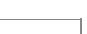

```scss
}
    return val;
}
```

```txt
int bar(int val) {
    int x = 0;
    while(val > 0) {
        x = x + bar(val - 1);
    }
    return val;
}
```

Invocations of foo(3) and bar(3) will result in:

A. Return of 6 and 6 respectively.

B. Infinite loop and abnormal termination respectively.

C. Abnormal termination and infinite loop respectively.

D. Both terminating abnormally.

```txt
gatecse-2017-set1 programming-in-c programming normal recursion
```

# Answer key

# 5.13.15 Recursion: GATE CSE 2018 | Question: 21

Consider the following C program:


```c
#include<stdio.h>

int counter=0;

int calc (int a, int b) {
    int c;
    counter++;
    if(b==3) return (a*a*a);
    else {
        c = calc(a, b/3);
        return (c*c*c);
    }
}

int main() {
    calc(4, 81);
    printf("%d", counter);
}
```

The output of this program is \_\_\_\_.

```txt
gatecse-2018 programming-in-c numerical-answers recursion programming one-mark
```

# Answer key

# 5.13.16 Recursion: GATE CSE 2020 | Question: 46

Consider the following C functions.


```c
int fun1(int n) {
    static int i= 0;
    if (n > 0) {
        ++i;
        fun1(n-1);
    }
    return (i);
}
```

```txt
int fun2(int n) {
    static int i= 0;
    if (n>0) {
        i = i+ fun1 (n) ;
        fun2(n-1) ;
    }
return (i);
}
```

The return value of fun2(5) is \_\_\_\_

```txt
gatecse-2020 numerical-answers programming-in-c recursion two-marks
```

# Answer key

# 5.13.17 Recursion: GATE CSE 2025 | Set 1 | Question: 51


```c
int foo(int S[],int size) {
    if(size == 0) return 0;
    if(size == 1) return 1;
    if(S[0] != S[1]) return 1+foo(S+1,size-1);
    return foo(S+1,size-1);
}
int main() {
    int A[]={0,1,2,2,2,0,0,1,1};
    printf("%d",foo(A,9));
    return 0;
}
```

The value printed by the given C program is \_\_\_\_. (Answer in integer)

```txt
gatecse2025-set1 programming-in-c recursion output numerical-answers two-marks
```

# Answer key

# 5.13.18 Recursion: GATE CSE 2026 | Set 2 | Question: 51

Consider the following ANSI-C function.


```txt
int func(int start, int end){
    int length=end+1-start;
    if((length<1)||(start<0)||(end<0)){ return(0); }
    if(length%3==0){
        return(func(start+1, end));
    }else if(length%3==1){
        return(1+func(start, end-1));
    }else {
        return(func(start+2, end));
    }
}
```

The maximum possible value that can be returned from this function is \_\_\_\_. (answer in integer)

Note: Ignore syntax errors (if any) in the function.

```txt
gatecse-2026-set2 programming-in-c recursion output numerical-answers two-marks
```

# Answer key

# 5.13.19 Recursion: GATE IT 2007 | Question: 27

The function f is defined as follows:


```c
int f (int n) {
    if (n <= 1) return 1;
    else if (n % 2 == 0) return f(n/2);
    else return f(3n - 1);
}
```

Assuming that arbitrarily large integers can be passed as a parameter to the function, consider the following statements.

i. The function $f$ terminates for finitely many different values of $n \geq 1$ .  
ii. The function $f$ terminates for infinitely many different values of $n \geq 1$ .  
iii. The function $f$ does not terminate for finitely many different values of $n \geq 1$ .  
iv. The function $f$ does not terminate for infinitely many different values of $n \geq 1$ .

Which one of the following options is true of the above?

A. i and iii

B. i and iv

C. ii and iii

D. ii and iv

```txt
gateit-2007 programming recursion normal
```

# Answer key

# 5.14

# Runtime Environment (1)

# 5.14.1 Runtime Environment: GATE CSE 2026 | Set 2 | Question: 7

In C runtime environment, which one of the following is stored in heap?


A. A static variable declared inside a function  
B. An array of integers declared inside a function  
C. A dynamically allocated array of integers created using malloc() function call  
D. Return address of a function

gatecse-2026-set2 programming-in-c runtime-environment one-mark

# Answer key

# 5.15

# Strings (2)

# 5.15.1 Strings: GATE CSE 2004 | Question: 33

Consider the following C program segment:


```javascript
char p[20]; int i;
char* s = "string";
int length = strlen(s);
for(i = 0; i < length; i++)
    p[i] = s[length-i];
printf("%s", p);
```

The output of the program is:

A. gnirts

C. gnirt

gatecse-2004 programming programming-in-c strings easy

B. string

D. no output is printed

# Answer key

# 5.15.2 Strings: GATE CSE 2025 | Set 2 | Question: 9

Consider the following C program:


```c
#include <stdio.h>
void stringcopy (char *, char *);
int main() {
    char a[30] = "@@#Hello World!";
    stringcopy(a, a+2);
    printf("%s\n",a);
    return 0;
}
void stringcopy(char *s, char *t) {
while (*t)
    *s++=*t++;
}
```

Which one of the following will be the output of the program?

A. @#Hello World!

B. Hello World!

C. ello World!

D. Hello World!d!

gatecse2025-set2 programming-in-c strings output one-mark

# Answer key

# 5.16

# Structure (5)

# 5.16.1 Structure: GATE CSE 2000 | Question: 1.11

The following C declarations:


```txt
struct node {
    int i:
    float j;
};
struct node *s[10];
```

define s to be:

A. An array, each element of which is a pointer to a structure of type node  
B. A structure of 2 fields, each field being a pointer to an array of 10 elements  
C. A structure of 3 fields: an integer, a float, and an array of 10 elements  
D. An array, each element of which is a structure of type node



# Answer key

# 5.16.2 Structure: GATE CSE 2018 | Question: 2

Consider the following C program:  

```c
#include<stdio.h>
struct Ournode{
    char x, y, z;
};
int main() {
    struct Ournode p={'1', '0', 'a'+2};
    struct Ournode *q=&p;
    printf("%c, %c", *((char*)q+1), *((char*)q+2));
    return 0;
}
```  
The output of this program is:

A. 0, c

B. 0, a+2

C. '0', 'a+2'

D. '0', 'c'

gatecse-2018 programming-in-c programming structure normal one-mark

# Answer key

# 5.16.3 Structure: GATE CSE 2021 | Set 2 | Question: 35

Consider the following ANSI C program:  

```c
#include <stdio.h>
#include <stdlib.h>
struct Node{
    int value;
    struct Node *next;};
int main( ) {
    struct Node *boxE, *head, *boxN; int index=0;
    boxE=head= (struct Node *) malloc(sizeof(struct Node));
    head → value = index;
    for (index =1; index<=3; index++){
        boxN = (struct Node *) malloc (sizeof(struct Node));
        boxE → next = boxN;
        boxN → value = index;
        boxE = boxN; }
for (index=0; index<=3; index++) {
    printf("\Value at index %d is %d\n", index, head → value);
    head = head → next;
    printf("\Value at index %d is %d\n", index+1, head → value); } }
```

Which one of the following statements below is correct about the program?

A. Upon execution, the program creates a linked-list of five nodes  
B. Upon execution, the program goes into an infinite loop  
C. It has a missing return which will be reported as an error by the compiler  
D. It dereferences an uninitialized pointer that may result in a run-time error

gatecse-2021-set2 programming-in-c normal pointers structure two-marks

# Answer key

# 5.16.4 Structure: GATE IT 2004 | Question: 61

Consider the following C program:  

```c
#include <stdio.h>
typedef struct {
    char *a;
    char *b;
} t;
void f1 (t s);
void f2 (t *p);
main()
```

```c
{
    static t s = {"A", "B"};
    printf ("%s %s\n", s.a, s.b);
    f1(s);
    printf ("%s %s\n", s.a, s.b);
    f2(&s);
}
void f1 (t s)
{
    s.a = "U";
    s.b = "V";
    printf ("%s %s\n", s.a, s.b);
    return;
}
void f2(t *p)
{
    p -> a = "V";
    p -> b = "W";
    printf("%s %s\n", p -> a, p -> b);
    return;
}
```

What is the output generated by the program ?

A. $A B$

UV

V W

V W

C. $AB$

UV

UV

V W

normal

structure

B. $A B$

UV

$A B$

V W

D. $AB$

UV

V W

UV

gateit-2004 programming programming-in-c normal structure

Answer key

# 5.16.5 Structure: GATE IT 2006 | Question: 49

Which one of the choices given below would be printed when the following program is executed?


```c
#include <stdio.h>
struct test {
    int i;
    char *c;
}st[] = {5, "become", 4, "better", 6, "jungle", 8, "ancestor", 7, "brother"};
main ()
{
    struct test *p = st;
    p += 1;
    ++p -> c;
    printf("%s,", p++ -> c);
    printf("%c,", *++p -> c);
    printf("%d,", p[0].i);
    printf("%s \n", p -> c);
}
```

A. jungle, n, 8, nclastor  
C. cetter, k, 6, jungle

gateit-2006 programming programming-in-c normal structure

B. etter, u, 6, ungle  
D. etter, u, 8, ancestor

Answer key

5.17

Switch Case (2)

# 5.17.1 Switch Case: GATE CSE 2012 | Question: 3

What will be the output of the following C program segment?


```txt
char inChar = 'A';
  switch ( inChar ) {
    case 'A' : printf ("Choice A \ n");
    case 'B' :
    case 'C' : printf ("Choice B");
    case 'D' :
    case 'E' :
    default : printf ("No Choice");
```

}

A. No Choice

C. Choice A

Choice B No Choice

gatecse-2012 programming easy programming-in-c switch-case marks-to-all

B. Choice A

D. Program gives no output as it is erroneous

Answer key

# 5.17.2 Switch Case: GATE CSE 2015 | Set 3 | Question: 48

Consider the following C program:


```cpp
#include<stdio.h>
int main()
{
    int i, j, k = 0;
    j=2 * 3 / 4 + 2.0 / 5 + 8 / 5;
    k=-j;
    for (i=0; i<5; i++)
    {
        switch(i+k)
        {
            case 1:
            case 2: printf("\n%d", i+k);
            case 3: printf("\n%d", i+k);
            default: printf("\n%d", i+k);
        }
    }
    return 0;
}
```

The number of times printf statement is executed is \_\_\_\_.

gatecse-2015-set3

programming

programming-in-c

switch-case

normal

numerical-answers

Answer key

5.18

# Type Checking (1)

# 5.18.1 Type Checking: GATE CSE 2003 | Question: 24

Which of the following statements is FALSE?


A. In statically typed languages, each variable in a program has a fixed type  
B. In un-typed languages, values do not have any types  
C. In dynamically typed languages, variables have no types  
D. In all statically typed languages, each variable in a program is associated with values of only a single type during the execution of the program

gatecse-2003 programming normal type-checking

Answer key

5.19

# Union (1)

# 5.19.1 Union: GATE CSE 2000 | Question: 1.17, ISRO2015-79

Consider the following C declaration:


```txt
struct {
    short x[5];
    union {
        float y;
        long z;
    } u;
}t;
```

Assume that the objects of the type short, float and long occupy 2 bytes, 4 bytes and 8 bytes, respectively. The memory requirement for variable t, ignoring alignment consideration, is:

A. 22 bytes

B. 14 bytes

C. 18 bytes

D. 10 bytes

# 5.20

# Variable Binding (1)

# 5.20.1 Variable Binding: GATE IT 2007 | Question: 34, UGCNET-Dec2012-III: 52

Consider the program below in a hypothetical programming language which allows global variables and a choice of static or dynamic scoping.


```txt
int i;
program main()
{
    i = 10;
    call f();
}

procedure f()
{
    int i = 20;
    call g();
}
procedure g()
{
    print i;
}
```

Let $x$ be the value printed under static scoping and $y$ be the value printed under dynamic scoping. Then, $x$ and $y$ are:

A. $x = 10, y = 20$

B. $x = 20, y = 10$

C. $x = 10, y = 10$

D. $x = 20, y = 20$

gateit-2007 programming variable-binding easy ugcnetcse-dec2012-paper3

# Answer key

Answer Keys

<table><tr><td>5.1.1</td><td>A</td></tr><tr><td>5.2.5</td><td>C</td></tr><tr><td>5.2.10</td><td>C</td></tr><tr><td>5.3.2</td><td>A</td></tr><tr><td>5.5.3</td><td>C</td></tr><tr><td>5.6.2</td><td>N/A</td></tr><tr><td>5.6.7</td><td>C</td></tr><tr><td>5.7.4</td><td>C</td></tr><tr><td>5.8.1</td><td>N/A</td></tr><tr><td>5.8.6</td><td>D</td></tr><tr><td>5.8.11</td><td>D</td></tr><tr><td>5.9.4</td><td>A</td></tr><tr><td>5.9.9</td><td>D</td></tr><tr><td>5.9.14</td><td>111:111</td></tr><tr><td>5.11.3</td><td>B</td></tr><tr><td>5.11.8</td><td>D</td></tr><tr><td>5.11.13</td><td>D</td></tr><tr><td>5.11.18</td><td>B</td></tr></table>

<table><tr><td>5.2.1</td><td>B</td></tr><tr><td>5.2.6</td><td>6</td></tr><tr><td>5.2.11</td><td>B</td></tr><tr><td>5.4.1</td><td>A</td></tr><tr><td>5.5.4</td><td>3</td></tr><tr><td>5.6.3</td><td>N/A</td></tr><tr><td>5.6.8</td><td>C</td></tr><tr><td>5.7.5</td><td>46:46</td></tr><tr><td>5.8.2</td><td>C</td></tr><tr><td>5.8.7</td><td>6561</td></tr><tr><td>5.8.12</td><td>C</td></tr><tr><td>5.9.5</td><td>C</td></tr><tr><td>5.9.10</td><td>2</td></tr><tr><td>5.9.15</td><td>9:9</td></tr><tr><td>5.11.4</td><td>D</td></tr><tr><td>5.11.9</td><td>B</td></tr><tr><td>5.11.14</td><td>3</td></tr><tr><td>5.11.19</td><td>B</td></tr></table>

<table><tr><td>5.2.2</td><td>C</td></tr><tr><td>5.2.7</td><td>19</td></tr><tr><td>5.2.12</td><td>C</td></tr><tr><td>5.4.2</td><td>A</td></tr><tr><td>5.5.5</td><td>26</td></tr><tr><td>5.6.4</td><td>N/A</td></tr><tr><td>5.7.1</td><td>A</td></tr><tr><td>5.7.6</td><td>21:21</td></tr><tr><td>5.8.3</td><td>B</td></tr><tr><td>5.8.8</td><td>2016</td></tr><tr><td>5.9.1</td><td>D</td></tr><tr><td>5.9.6</td><td>C</td></tr><tr><td>5.9.11</td><td>D</td></tr><tr><td>5.10.1</td><td>B</td></tr><tr><td>5.11.5</td><td>A</td></tr><tr><td>5.11.10</td><td>D</td></tr><tr><td>5.11.15</td><td>23</td></tr><tr><td>5.11.20</td><td>5</td></tr></table>

<table><tr><td>5.2.3</td><td>A</td></tr><tr><td>5.2.8</td><td>C</td></tr><tr><td>5.2.13</td><td>B</td></tr><tr><td>5.5.1</td><td>N/A</td></tr><tr><td>5.5.6</td><td>B</td></tr><tr><td>5.6.5</td><td>A</td></tr><tr><td>5.7.2</td><td>7</td></tr><tr><td>5.7.7</td><td>46:46</td></tr><tr><td>5.8.4</td><td>D</td></tr><tr><td>5.8.9</td><td>30</td></tr><tr><td>5.9.2</td><td>C</td></tr><tr><td>5.9.7</td><td>D</td></tr><tr><td>5.9.12</td><td>B</td></tr><tr><td>5.11.1</td><td>A</td></tr><tr><td>5.11.6</td><td>D</td></tr><tr><td>5.11.11</td><td>-5</td></tr><tr><td>5.11.16</td><td>A</td></tr><tr><td>5.11.21</td><td>10</td></tr></table>

<table><tr><td>5.2.4</td><td>C</td></tr><tr><td>5.2.9</td><td>A</td></tr><tr><td>5.3.1</td><td>230</td></tr><tr><td>5.5.2</td><td>C</td></tr><tr><td>5.6.1</td><td>N/A</td></tr><tr><td>5.6.6</td><td>B</td></tr><tr><td>5.7.3</td><td>C</td></tr><tr><td>5.7.8</td><td>09 :09</td></tr><tr><td>5.8.5</td><td>B</td></tr><tr><td>5.8.10</td><td>A</td></tr><tr><td>5.9.3</td><td>A</td></tr><tr><td>5.9.8</td><td>140</td></tr><tr><td>5.9.13</td><td>25:25</td></tr><tr><td>5.11.2</td><td>B</td></tr><tr><td>5.11.7</td><td>C</td></tr><tr><td>5.11.12</td><td>D</td></tr><tr><td>5.11.17</td><td>0</td></tr><tr><td>5.11.22</td><td>B</td></tr></table>

<table><tr><td>5.11.23</td><td>B;D</td></tr><tr><td>5.11.28</td><td>A</td></tr><tr><td>5.13.2</td><td>16</td></tr><tr><td>5.13.7</td><td>B</td></tr><tr><td>5.13.12</td><td>3</td></tr><tr><td>5.13.17</td><td>5:5</td></tr><tr><td>5.15.2</td><td>D</td></tr><tr><td>5.16.5</td><td>B</td></tr><tr><td>5.20.1</td><td>A</td></tr></table>

<table><tr><td>5.11.24</td><td>A</td></tr><tr><td>5.11.29</td><td>C</td></tr><tr><td>5.13.3</td><td>N/A</td></tr><tr><td>5.13.8</td><td>D</td></tr><tr><td>5.13.13</td><td>A</td></tr><tr><td>5.13.18</td><td>1:1</td></tr><tr><td>5.16.1</td><td>A</td></tr><tr><td>5.17.1</td><td>X</td></tr></table>

<table><tr><td>5.11.25</td><td>A</td></tr><tr><td>5.12.1</td><td>C</td></tr><tr><td>5.13.4</td><td>N/A</td></tr><tr><td>5.13.9</td><td>1.72 : 1.74</td></tr><tr><td>5.13.14</td><td>C</td></tr><tr><td>5.13.19</td><td>D</td></tr><tr><td>5.16.2</td><td>A</td></tr><tr><td>5.17.2</td><td>10</td></tr></table>

<table><tr><td>5.11.26</td><td>D</td></tr><tr><td>5.12.2</td><td>D</td></tr><tr><td>5.13.5</td><td>N/A</td></tr><tr><td>5.13.10</td><td>D</td></tr><tr><td>5.13.15</td><td>4</td></tr><tr><td>5.14.1</td><td>C</td></tr><tr><td>5.16.3</td><td>D</td></tr><tr><td>5.18.1</td><td>C</td></tr></table>

<table><tr><td>5.11.27</td><td>B</td></tr><tr><td>5.13.1</td><td>41</td></tr><tr><td>5.13.6</td><td>C</td></tr><tr><td>5.13.11</td><td>A</td></tr><tr><td>5.13.16</td><td>55</td></tr><tr><td>5.15.1</td><td>D</td></tr><tr><td>5.16.4</td><td>B</td></tr><tr><td>5.19.1</td><td>C</td></tr></table>

Regular expressions and finite automata, Context-free grammars and push-down automata, Regular and context-free languages, Pumping lemma, Turing machines and undecidability.

Mark Distribution in Previous GATE

<table><tr><td>Year</td><td>2026 - 1</td><td>2026 - 2</td><td>2025 - 1</td><td>2025 - 2</td><td>2024 - 1</td><td>2024 - 2</td><td>2023</td><td>2022</td><td>2021 - 1</td><td>2021 - 2</td><td>Minimum</td></tr><tr><td>1 Mark Count</td><td>2</td><td>1</td><td>2</td><td>3</td><td>1</td><td>1</td><td>3</td><td>2</td><td>2</td><td>3</td><td>1</td></tr><tr><td>2 Marks Count</td><td>2</td><td>2</td><td>4</td><td>2</td><td>2</td><td>3</td><td>3</td><td>3</td><td>3</td><td>4</td><td>2</td></tr><tr><td>Total Marks</td><td>6</td><td>5</td><td>10</td><td>7</td><td>5</td><td>7</td><td>9</td><td>8</td><td>8</td><td>11</td><td>5</td></tr></table>

Welcome to the "Theory of Computation" chapter, a cornerstone of Computer Science that delves into the fundamental capabilities and limitations of computational models. This subject is crucial for the GATE CS exam as it builds a strong theoretical foundation for understanding algorithms, programming languages, and system design. It typically carries a weightage of 8-12 marks, with questions ranging from conceptual understanding of language classes and machine models to problem-solving involving the design of automata, grammar conversions, and decidability proofs. Expect a mix of Multiple Choice Questions (MCQs), Multiple Select Questions (MSQs), and Numerical Answer Type (NAT) questions, often requiring a deep grasp of definitions, properties, and theorems.

# Topic-wise Key Concepts

# Finite Automata (FA)

Finite Automata are the simplest computational models, used to recognize regular languages. They have a finite number of states and transitions based on input symbols, without any auxiliary memory. They are fundamental for lexical analysis in compilers and designing simple control systems.

\- Definition: A Deterministic Finite Automaton (DFA) is formally defined as a 5-tuple $M = (Q, \Sigma, \delta, q_0, F)$ , where:

1. $Q$ is a finite set of states.  
2. $\Sigma$ is a finite set of input symbols (alphabet).  
3. $\delta : Q \times \Sigma \to Q$ is the transition function.  
4. $q_{0} \in Q$ is the initial state.  
5. $F \subseteq Q$ is the set of final (accepting) states.

\- Key Properties:

- Every NFA has an equivalent DFA.  
- DFA and NFA recognize the same class of languages (Regular Languages).  
DFA can be minimized to a unique (up to isomorphism) minimal state DFA.

\- Common Pitfalls: Incorrectly handling epsilon transitions in NFA to DFA conversion; confusing acceptance criteria for NFA/DFA.

\- Problem-Solving Techniques:

- Subset Construction: For converting NFA to DFA.  
- Table Filling Algorithm / Myhill-Nerode Theorem: For DFA minimization.  
- State Elimination Method / Arden's Theorem: For converting FA to Regular Expression.

# Finite State Machines (FSM)

Finite State Machines are mathematical models of computation used to design systems that can be in one of a finite number of states. While often used interchangeably with FA, FSMs typically include an output function, making them suitable for modeling sequential circuits and control logic.

\- Definition:

- Mealy Machine: $M = (Q, \Sigma, \Delta, \delta, \lambda, q_0)$ , where $\Delta$ is the output alphabet, and $\lambda : Q \times \Sigma \to \Delta$ is the output function. Output depends on current state and input.  
- Moore Machine: $M = (Q, \Sigma, \Delta, \delta, \lambda, q_0)$ , where $\lambda : Q \to \Delta$ is the output function. Output depends only on the current state.

\- Key Properties:

\- Any Mealy machine can be converted to an equivalent Moore machine, and vice-versa.

\- Moore machine output is delayed by one clock cycle compared to Mealy.

\- Common Pitfalls: Incorrectly converting between Mealy and Moore machines, especially handling initial state outputs.

\- Problem-Solving Techniques: State diagram construction, state table analysis, conversion algorithms between

Mealy and Moore.

# Regular Expression (RE)

Regular Expressions are a powerful notation for describing regular languages. They provide a concise way to specify patterns of strings, widely used in text processing, search engines, and lexical analysis.

\- Definition: A Regular Expression is built using basic symbols and three operations:

- Union: $R_{1} + R_{2}$ (or $R_{1}|R_{2}$ ) represents strings in $L(R_{1})$ or $L(R_{2})$ .  
- Concatenation: $R_{1}R_{2}$ represents strings formed by concatenating a string from $L(R_{1})$ with one from $L(R_{2})$ .  
- Kleene Star: $R^{*}$ represents zero or more concatenations of strings from $L(R)$ , including the empty string $\epsilon$ .

\- Key Identities:

$\circ R + \emptyset = R$  
$\circ R \epsilon = \epsilon R = R$  
$\circ (R^{*})^{*} = R^{*}$  
$\circ\emptyset^{*}=\epsilon$  
$\circ R(S + T) = RS + RT$  
$\circ (RS)^{*}R = R(SR)^{*}$  
$\circ (R + S)^{*} = (R^{*}S^{*})^{*} = (R^{*} + S^{*})^{*}$

\- Common Pitfalls: Operator precedence (Kleene star > concatenation > union); incorrect application of identities.

\- Problem-Solving Techniques:

\- Arden's Theorem: For solving equations of the form $R = Q + RP$ to get $R = QP^*$ .

\- State Elimination Method: For converting FA to RE.

# Regular Grammar (RG)

Regular Grammars are a type of formal grammar that generates exactly the class of regular languages. They are restricted in their production rules, making them less powerful than Context-Free Grammars but simpler to parse.

- Definition: A grammar $G = (V, \Sigma, P, S)$ is regular if all its production rules are of one of the following forms:  
- Right-linear: $A \to aB$ or $A \to a$ or $A \to \epsilon$ , where $A, B \in V$ (non-terminals), $a \in \Sigma$ (terminal).  
○ Left-linear: $A \to Ba$ or $A \to a$ or $A \to \epsilon$ , where $A, B \in V, a \in \Sigma$ .

\- Key Properties:

- A grammar cannot be both right-linear and left-linear simultaneously (unless it generates a finite language).  
- Regular Grammars, Regular Expressions, and Finite Automata are all equivalent in terms of language recognition power.

\- Common Pitfalls: Mixing right-linear and left-linear rules in the same grammar; incorrectly converting between FA and RG.

\- Problem-Solving Techniques: Constructing an FA from a RG, and vice-versa, by mapping non-terminals to states and productions to transitions.

# Regular Language (RL)

Regular Languages are the simplest class of languages in the Chomsky Hierarchy, recognized by Finite Automata, described by Regular Expressions, or generated by Regular Grammars. They represent patterns that can be matched without requiring memory beyond the current state.

\- Definition: A language is regular if and only if it can be recognized by a Finite Automaton.

\- Key Properties (Closure Properties): Regular languages are closed under:

- Union ( $L_1 \cup L_2$ )  
- Intersection ( $L_1 \cap L_2$ )  
- Complement ( $\Sigma^{*} \setminus L$ )  
- Concatenation ( $L_1L_2$ )  
- Kleene Star ( $L^{*}$ )  
- Reversal ( $L^{R}$ )  
- Homomorphism, Inverse Homomorphism

\- Common Pitfalls: Misidentifying non-regular languages as regular; incorrectly applying closure properties.

\- Problem-Solving Techniques:

- Pumping Lemma for Regular Languages: The primary tool to prove a language is NOT regular.  
- Myhill-Nerode Theorem: Can be used to prove regularity or non-regularity, and for DFA minimization.

# Non Determinism

Non-determinism in automata allows for multiple possible transitions from a given state on a given input symbol, or transitions on an empty string (epsilon transitions). It often simplifies the design of automata, though it doesn't increase their computational power for regular languages.

\- Definition: A Non-deterministic Finite Automaton (NFA) is a 5-tuple $M = (Q, \Sigma, \delta, q_0, F)$ , where $\delta : Q \times (\Sigma \cup \{\epsilon\}) \to \mathcal{P}(Q)$ is the transition function, mapping to a set of states.

\- Key Properties:

- Every NFA has an equivalent DFA (recognizes the same language).  
An NFA can be exponentially more concise than its equivalent DFA (e.g., an NFA with $n$ states might require up to $2^n$ states in the equivalent DFA).  
- Non-determinism is crucial for Pushdown Automata (NPDA is more powerful than DPDA).

\- Common Pitfalls: Incorrectly handling epsilon closures; missing possible paths in non-deterministic transitions.

\- Problem-Solving Techniques:

- Subset Construction Algorithm: The standard method to convert an NFA (with or without epsilon transitions) to an equivalent DFA.  
- Understanding how to trace paths in an NFA to determine language acceptance.

# Number of States

The "number of states" refers to the cardinality of the set of states $Q$ in an automaton. This concept is critical for understanding the complexity and minimality of machine models, particularly for finite automata.

\- Key Properties:

- For an NFA with $n$ states, the equivalent DFA can have up to $2^n$ states.  
- A minimal DFA for a given regular language is unique (up to isomorphism) and has the fewest possible states.  
- The number of states in a minimal DFA is equal to the number of equivalence classes of the Myhill-Nerode relation.

\- Common Pitfalls: Failing to identify redundant or unreachable states, which leads to non-minimal DFAs.

\- Problem-Solving Techniques:

- DFA Minimization Algorithms: Partitioning states into distinguishable/indistinguishable sets.  
Myhill-Nerode Theorem: Using equivalence classes of strings to determine the minimum number of states.

# Minimal State Automata

A Minimal State Automaton (specifically, a Minimal DFA) is a Deterministic Finite Automaton that recognizes a given regular language using the smallest possible number of states. It is unique for any given regular language and is crucial for efficient implementation.

\- Definition: A DFA $M'$ is minimal if there is no other DFA $M''$ such that $L(M'') = L(M')$ and $|Q''| < |Q'|$ .

\- Key Properties:

- Every regular language has a unique minimal DFA (up to isomorphism).  
- All states in a minimal DFA must be reachable from the start state and must be distinguishable from each other.

\- Common Pitfalls: Incorrectly merging distinguishable states; not removing unreachable states before minimization.

\- Problem-Solving Techniques:

\- Table Filling Algorithm (or Partitioning Algorithm):

1. Initialize a table of all pairs of states $(p, q)$ . Mark all pairs $(p, q)$ where $p \in F$ and $q \notin F$ (or vice versa) as distinguishable.  
2. Iteratively mark $(p,q)$ as distinguishable if for some input symbol $a$ , $(\delta(p,a),\delta(q,a))$ is already marked distinguishable.  
3. Repeat until no new pairs can be marked. All unmarked pairs are indistinguishable and can be merged.

\- Myhill-Nerode Theorem: States that a language $L$ is regular if and only if the number of equivalence classes of the Myhill-Nerode relation $\equiv_L$ is finite. The number of states in the minimal DFA is equal to the number of these equivalence classes.

# Pumping Lemma (for Regular Languages)

The Pumping Lemma for Regular Languages is a fundamental theorem used to prove that a language is NOT regular. It states that all sufficiently long strings in a regular language can be "pumped" (i.e., a middle section of the string can be repeated any number of times) and the resulting string will still be in the language.

\- Theorem: If $L$ is a regular language, then there exists some integer $p \geq 1$ (the pumping length) such that for any string $s \in L$ with $|s| \geq p$ , $s$ can be divided into three parts $s = xyz$ satisfying the conditions:

1. $|y| > 0$ (the middle part cannot be empty).  
2. $|xy| \leq p$ (the pumpable part must occur within the first p symbols).  
3. For all $i \geq 0$ , the string $xy^i z \in L$ .

# - Key Properties:

- It is a necessary condition for regularity, not a sufficient one. It can only be used to prove non-regularity.  
- The proof strategy is usually by contradiction (an "adversary game").

# - Common Pitfalls:

- Trying to prove regularity using the Pumping Lemma (it's impossible).  
- Incorrectly choosing the string $s$ or the partition $xyz$ to break the lemma.  
- Forgetting the condition $|y| > 0$ or $|xy| \leq p$ .

# - Problem-Solving Techniques:

1. Assume L is regular and let p be the pumping length.  
2. Choose a "hard" string $s \in \bar{L}$ such that $|s| \geq p$ , typically one that grows with $p$ (e.g., $a^p b^p$ ).  
3. Consider all possible ways to divide s into xyz satisfying $|y| > 0$ and $|xy| \leq p$ .  
4. For each division, find an $i \geq 0$ such that $xy^i z \notin L$ . This contradicts the lemma, proving $L$ is not regular.

# Closure Property

Closure properties describe whether a class of languages remains within that class after applying certain operations. Understanding these properties is vital for classifying languages and proving relationships between language classes.

- Definition: A class of languages $\mathcal{C}$ is closed under an operation $\mathcal{O}$ if, for any language $L_{1}, L_{2} \in \mathcal{C}$ , the result of $\mathcal{O}(L_{1}, L_{2})$ (or $\mathcal{O}(L_{1})$ ) is also in $\mathcal{C}$ .  
• Key Properties (to memorize):

<table><tr><td>Operation</td><td>Regular Languages</td><td>Context-Free Languages</td><td>Recursive Languages</td><td>Recursively Enumerable Languages</td></tr><tr><td>Union</td><td>Yes</td><td>Yes</td><td>Yes</td><td>Yes</td></tr><tr><td>Intersection</td><td>Yes</td><td>No</td><td>Yes</td><td>Yes</td></tr><tr><td>Complement</td><td>Yes</td><td>No</td><td>Yes</td><td>No</td></tr><tr><td>Concatenation</td><td>Yes</td><td>Yes</td><td>Yes</td><td>Yes</td></tr><tr><td>Kleene Star</td><td>Yes</td><td>Yes</td><td>Yes</td><td>Yes</td></tr><tr><td>Reversal</td><td>Yes</td><td>Yes</td><td>Yes</td><td>Yes</td></tr><tr><td>Homomorphism</td><td>Yes</td><td>Yes</td><td>Yes</td><td>Yes</td></tr><tr><td>Inverse Homomorphism</td><td>Yes</td><td>Yes</td><td>Yes</td><td>Yes</td></tr></table>

- Common Pitfalls: Confusing closure properties between different language classes, especially for intersection and complement.  
- Problem-Solving Techniques: Use closure properties to deduce the class of a new language based on known languages and operations. For non-closure, use counterexamples.

# Context Free Grammar (CFG)

Context-Free Grammars are more powerful than regular grammars and are used to describe Context-Free Languages. They are fundamental to defining the syntax of programming languages and parsing. Productions allow a non-terminal to be replaced by a string of terminals and non-terminals, regardless of its context.

• Definition: A CFG is a 4-tuple $G = (V, \Sigma, P, S)$ , where:

1. V is a finite set of non-terminal symbols.  
2. $\Sigma$ is a finite set of terminal symbols.  
3. $P$ is a finite set of production rules of the form $A \to \alpha$ , where $A \in V$ and $\alpha \in (V \cup \Sigma)^*$ .  
4. $S \in V$ is the start symbol.

# - Key Forms:

- Chomsky Normal Form (CNF): All productions are of the form $A \to BC$ or $A \to a$ , where $A, B, C \in V$ and $a \in \Sigma$ . $\epsilon$ -productions are allowed only for the start symbol if it doesn't appear on the RHS.  
- Greibach Normal Form (GNF): All productions are of the form $A \to a\alpha$ , where $A \in V$ , $a \in \Sigma$ , and $\alpha \in V^{*}$ .

\- Common Pitfalls: Detecting ambiguity (a string having more than one leftmost/rightmost derivation or parse tree); incorrect conversion to CNF/GNF.