# 6.7

# Finite Automata (43)

Practice Tests: Test 1 (15Q) Test 2 (15Q) Test 3 (15Q) Test 4 (8Q) Weekly Quiz 1 (15Q)

# 6.7.1 Finite Automata: GATE CSE 1988 | Question: 15

Consider the DFA $M$ and NFA $M_2$ as defined below. Let the language accepted by machine $M$ be $L$ . What language machine $M_2$ accepts, if


i. $F2 = A?$  
ii. $F2 = B?$  
iii. $F2 = C?$  
iv. $F2 = D?$

- $M = (Q, \Sigma, \delta, q_0, F)$  
- $M_{2} = (Q2, \Sigma, \delta_{2}, q_{00}, F2)$

Where,

$$
Q 2 = (Q \times Q \times Q) \cup \{q _ {0 0} \}
$$

$$
\delta_ {2} (q _ {0 0}, \epsilon) = \{\langle q _ {0}, q, q \rangle \mid q \in Q \}
$$

$$
\delta_ {2} (\langle p, q, r \rangle , \sigma) = \langle \delta (p, \sigma), \delta (q, \sigma), r \rangle
$$

for all $p,q,r\in Q$ and $\sigma \in \Sigma$

$$
A = \{\langle p, q, r \rangle \mid p \in F; q, r \in Q \}
$$

$$
B = \{\langle p, q, r \rangle \mid q \in F; p, r \in Q \}
$$

$$
C = \{\langle p, q, r \rangle \mid p, q, r \in Q; \exists s \in \Sigma^ {*}, \delta (p, s) \in F \}
$$

$$
D = \{\langle p, q, r \rangle \mid p, q \in Q; r \in F \}
$$

gate1988 descriptive theory-of-computation finite-automata difficult

# Answer key

# 6.7.2 Finite Automata: GATE CSE 1991 | Question: 17,b

Let L be the language of all binary strings in which the third symbol from the right is a1. Give a non-deterministic finite automaton that recognizes L. How many states does the minimized equivalent deterministic finite automaton have? Justify your answer briefly?

gate1991 theory-of-computation finite-automata normal descriptive

# Answer key

# 6.7.3 Finite Automata: GATE CSE 1993 | Question: 27

Draw the state transition of a deterministic finite state automaton which accepts all strings from the alphabet $\{a, b\}$ , such that no string has 3 consecutive occurrences of the letter b.

gate1993 theory-of-computation finite-automata easy descriptive

# Answer key

# 6.7.4 Finite Automata: GATE CSE 1996 | Question: 12

Given below are the transition diagrams for two finite state machines $M_{1}$ and $M_{2}$ recognizing languages $L_{1}$ and $L_{2}$ respectively.


A. Display the transition diagram for a machine that recognizes $L_{1}, L_{2}$ , obtained from transition diagrams for $M_{1}$ and $M_{2}$ by adding only $\varepsilon$ transitions and no new states.  
B. Modify the transition diagram obtained in part (a) obtain a transition diagram for a machine that recognizes $(L_{1}, L_{2})^{*}$ by adding only $\varepsilon$ transitions and no new states.  
(Final states are enclosed in double circles).

gate1996 theory-of-computation finite-automata normal descriptive

# Answer key

# 6.7.5 Finite Automata: GATE CSE 1997 | Question: 21

Given that L is a language accepted by a finite state machine, show that $L^{P}$ and $L^{R}$ are also accepted by some finite state machines, where

$$
L ^ {P} = \{s \mid s s ^ {\prime} \in L \text {some string} s ^ {\prime} \}
$$

$$
L ^ {R} = \{s \mid s \text {obtained by reversing some string in} L \}
$$

gate1997 theory-of-computation finite-automata proof

# Answer key

# 6.7.6 Finite Automata: GATE CSE 1998 | Question: 1.10

Which of the following set can be recognized by a Deterministic Finite state Automaton?

A. The numbers 1, 2, 4, 8, $\ldots$ 2 $^{n}$ , $\ldots$ written in binary  
B. The numbers 1, 2, 4, 8, $\ldots$ $2^{n}$ , $\ldots$ written in unary  
C. The set of binary string in which the number of zeros is the same as the number of ones.  
D. The set $\{1, 101, 11011, 1110111, \ldots\}$

gate1998 theory-of-computation finite-automata normal

# Answer key

# 6.7.7 Finite Automata: GATE CSE 2001 | Question: 5

Construct DFA's for the following languages:

A. $L = \{w \mid w \in \{a, b\}^*$ , w has baab as a substring }  
B. $L = \{w \mid w \in \{a, b\}^*, \text{w has an odd number of a's and an odd number of b's}\}$

gatecse-2001 theory-of-computation easy descriptive finite-automata normal

# Answer key

# 6.7.8 Finite Automata: GATE CSE 2002 | Question: 2.5

The finite state machine described by the following state diagram with $A$ as starting state, where an arc label is $x / y$ , and $x$ stands for 1-bit input and $y$ stands for 2-bit output


<details>
<summary>flowchart</summary>

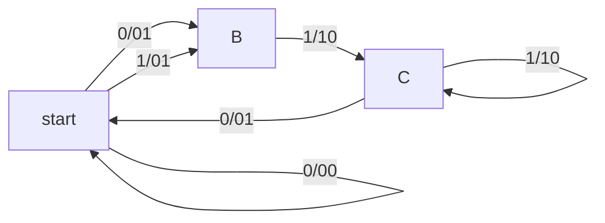
</details>

A. outputs the sum of the present and the previous bits of the input  
B. outputs 01 whenever the input sequence contains 11  
C. outputs 00 whenever the input sequence contains 10  
D. none of the above

gatecse-2002 theory-of-computation normal finite-automata

Answer key

# 6.7.9 Finite Automata: GATE CSE 2002 | Question: 21

We require a four state automaton to recognize the regular expression $(a \mid b)^{*}abb$

A. Give an NFA for this purpose  
B. Give a DFA for this purpose

gatecse-2002 theory-of-computation finite-automata normal descriptive

Answer key

# 6.7.10 Finite Automata: GATE CSE 2003 | Question: 50

Consider the following deterministic finite state automaton M.

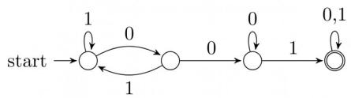

<details>
<summary>flowchart</summary>

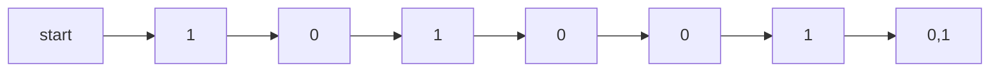
</details>


Let $S$ denote the set of seven bit binary strings in which the first, the fourth, and the last bits are1. The number of strings in $S$ that are accepted by $M$ is

A. 1

B. 5

C. 7

D. 8

gatecse-2003 theory-of-computation finite-automata normal

Answer key

# 6.7.11 Finite Automata: GATE CSE 2003 | Question: 55

Consider the NFA M shown below.

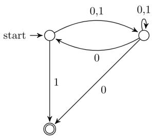

<details>
<summary>flowchart</summary>

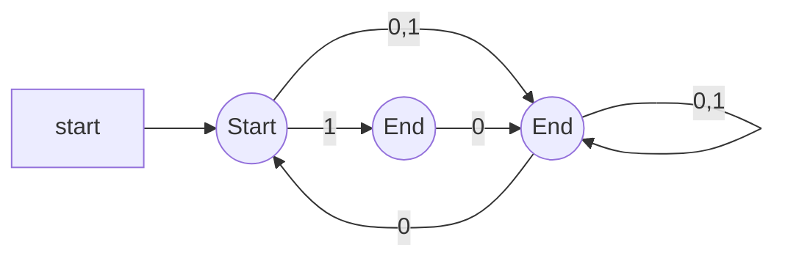
</details>


Let the language accepted by M be L. Let $L_{1}$ be the language accepted by the NFA $M_{1}$ obtained by changing the accepting state of M to a non-accepting state and by changing the non-accepting states of M to accepting states. Which of the following statements is true?

A. $L_{1} = \{0,1\}^{*} - L$

B. $L_{1} = \{0,1\}^{*}$

C. $L_{1} \subseteq L$

D. $L_{1}=L$

gatecse-2003 theory-of-computation finite-automata normal

# 6.7.12 Finite Automata: GATE CSE 2004 | Question: 86


The following finite state machine accepts all those binary strings in which the number of 1's and 0's are respectively:


<details>
<summary>flowchart</summary>

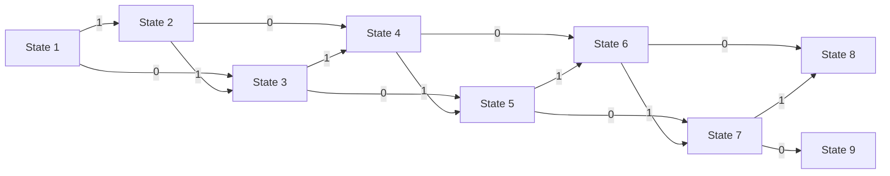
</details>

A. divisible by 3 and 2

B. odd and even

C. even and odd

D. divisible by 2 and 3

gatecse-2004 theory-of-computation finite-automata easy

# Answer key

# 6.7.13 Finite Automata: GATE CSE 2005 | Question: 53

Consider the machine M:

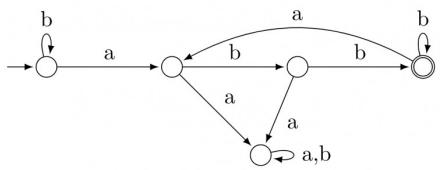

<details>
<summary>flowchart</summary>

```mermaid
graph LR
  Start(()) -->|a| Transition1(())
  Start -->|b| Transition1
  Transition1 -->|a| Transition2(())
  Transition1 -->|b| Transition2
  Transition2 -->|a| Transition3(())
  Transition2 -->|b| Transition4(())
  Transition3 -->|a,b| Transition4
  Transition4 -->|b| Transition4
```
</details>

The language recognized by M is:

A. $\{w\in \{a,b\}^{*}\mid$ every a in $w$ is followed by exactly two $b^{\prime}\mathrm{s}\}$  
B. $\{w\in \{a,b\}^{*}\mid$ every a in $w$ is followed by at least two $b^{\prime}$ s}  
C. $\{w\in \{a,b\}^{*}\mid w$ contains the substring 'abb'}  
D. $\{w\in \{a,b\}^{*}\mid w$ does not contain 'aa' as a substring}

gatecse-2005 theory-of-computation finite-automata normal

# Answer key

# 6.7.14 Finite Automata: GATE CSE 2005 | Question: 63


The following diagram represents a finite state machine which takes as input a binary number from the least significant bit.

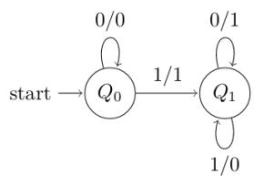

<details>
<summary>flowchart</summary>

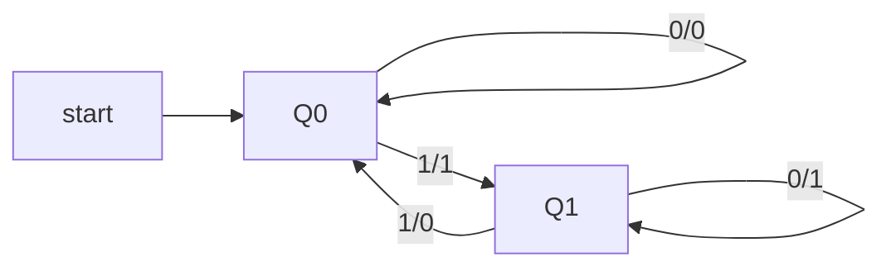
</details>

Which of the following is TRUE?

A. It computes 1's complement of the input number


B. It computes 2's complement of the input number  
C. It increments the input number  
D. it decrements the input number

gatecse-2005 theory-of-computation finite-automata easy

Answer key

# 6.7.15 Finite Automata: GATE CSE 2007 | Question: 74

Consider the following Finite State Automaton:

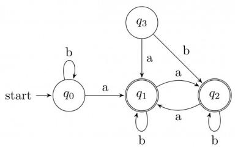

<details>
<summary>flowchart</summary>

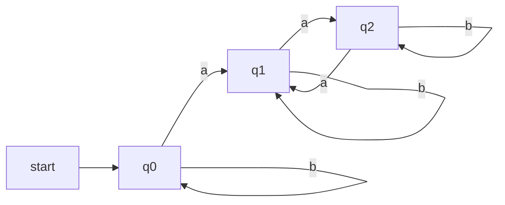
</details>

The language accepted by this automaton is given by the regular expression

A. $b^{*}ab^{*}ab^{*}ab^{*}$

B. $(a+b)^{*}$

C. $b^{*}a(a + b)^{*}$

D. $b^{*}ab^{*}ab^{*}$

gatecse-2007 theory-of-computation finite-automata normal

Answer key

# 6.7.16 Finite Automata: GATE CSE 2008 | Question: 49

Given below are two finite state automata ( $\rightarrow$ indicates the start state and F indicates a final state)

<table><tr><td colspan="3">Y</td><td colspan="3">Z</td></tr><tr><td></td><td>a</td><td>b</td><td></td><td>a</td><td>b</td></tr><tr><td> $\rightarrow 1$ </td><td>1</td><td>2</td><td> $\rightarrow 1$ </td><td>2</td><td>2</td></tr><tr><td> $2(F)$ </td><td>2</td><td>1</td><td> $2(F)$ </td><td>1</td><td>1</td></tr></table>

Which of the following represents the product automaton $Z \times Y$ ?

<table><tr><td></td><td>a</td><td>b</td></tr><tr><td> $\rightarrow P$ </td><td>S</td><td>R</td></tr><tr><td>Q</td><td>R</td><td>S</td></tr><tr><td>R(F)</td><td>Q</td><td>P</td></tr><tr><td>S</td><td>Q</td><td>P</td></tr></table>

B.

<table><tr><td></td><td>a</td><td>b</td></tr><tr><td> $\rightarrow P$ </td><td>S</td><td>Q</td></tr><tr><td>Q</td><td>R</td><td>S</td></tr><tr><td>R(F)</td><td>Q</td><td>P</td></tr><tr><td>S</td><td>P</td><td>Q</td></tr></table>

C.

<table><tr><td></td><td>a</td><td>b</td></tr><tr><td> $\rightarrow P$ </td><td>Q</td><td>S</td></tr><tr><td>Q</td><td>R</td><td>S</td></tr><tr><td>R(F)</td><td>Q</td><td>P</td></tr><tr><td>S</td><td>Q</td><td>P</td></tr></table>

D.

<table><tr><td></td><td>a</td><td>b</td></tr><tr><td> $\rightarrow P$ </td><td>S</td><td>Q</td></tr><tr><td>Q</td><td>S</td><td>R</td></tr><tr><td>R(F)</td><td>Q</td><td>P</td></tr><tr><td>S</td><td>Q</td><td>P</td></tr></table>

gatecse-2008 normal theory-of-computation finite-automata

Answer key

# 6.7.17 Finite Automata: GATE CSE 2008 | Question: 52

Match the following NFAs with the regular expressions they correspond to:

  
P


<details>
<summary>flowchart</summary>

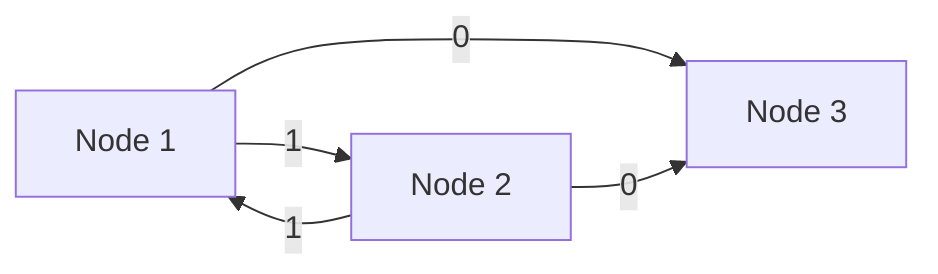
</details>

R

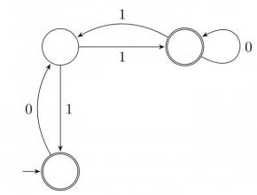

<details>
<summary>flowchart</summary>

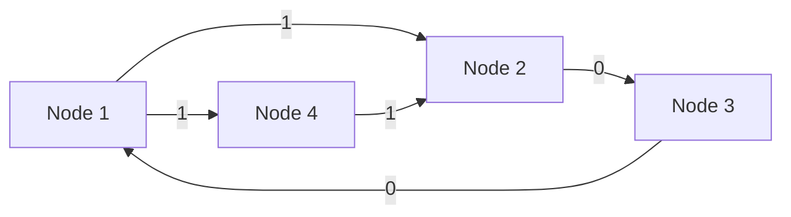
</details>

S

1. $\epsilon + 0(01^{*}1 + 00)^{*}01^{*}$  
2. $\epsilon + 0(10^{*}1 + 00)^{*}0$  
3. $\epsilon + 0(10^{*}1 + 10)^{*}1$  
4. $\epsilon + 0(10^{*}1 + 10)^{*}10^{*}$

A. $P - 2, Q - 1, R - 3, S - 4$

C. $P - 1, Q - 2, R - 3, S - 4$

B. $P - 1, Q - 3, R - 2, S - 4$

D. $P - 3, Q - 2, R - 1, S - 4$

gatecse-2008 theory-of-computation finite-automata normal

# Answer key

# 6.7.18 Finite Automata: GATE CSE 2009 | Question: 41

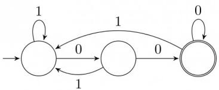

<details>
<summary>flowchart</summary>

This diagram illustrates a state transition or state transition flow between three states, showing transitions between them with labeled states and directional arrows indicating transitions.
</details>

The above DFA accepts the set of all strings over $\{0,1\}$ that

A. begin either with 0 or 1.

B. end with 0.

C. end with 00.

D. contain the substring 00.

gatecse-2009 theory-of-computation finite-automata easy

# Answer key

# 6.7.19 Finite Automata: GATE CSE 2012 | Question: 12

What is the complement of the language accepted by the NFA shown below? Assume $\Sigma = \{a\}$ and $\epsilon$ is the empty string.


<details>
<summary>flowchart</summary>

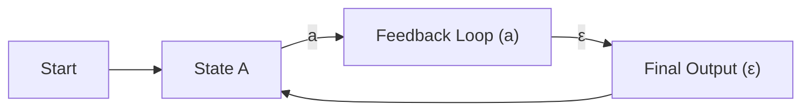
</details>

A. $\phi$

B. $\{\epsilon\}$

C. $a^{*}$

D. $\{a,\epsilon\}$

gatecse-2012 finite-automata easy theory-of-computation

# Answer key

# 6.7.20 Finite Automata: GATE CSE 2012 | Question: 46

Consider the set of strings on $\{0,1\}$ in which, every substring of 3 symbols has at most two zeros. For example, 001110 and 011001 are in the language, but 100010 is not. All strings of length less than 3 are also in the language. A partially completed DFA that accepts this language is shown below.


<details>
<summary>flowchart</summary>

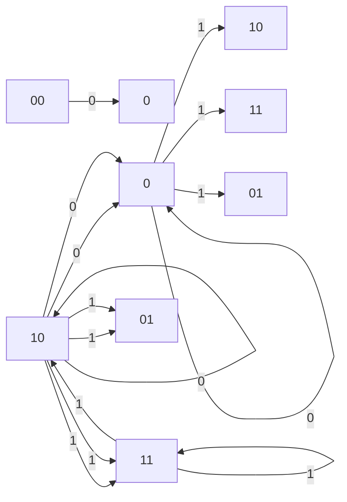
</details>

The missing arcs in the DFA are:

<table><tr><td></td><td>00</td><td>01</td><td>10</td><td>11</td><td>q</td></tr><tr><td>00</td><td>1</td><td>0</td><td></td><td></td><td></td></tr><tr><td>01</td><td></td><td></td><td></td><td>1</td><td></td></tr><tr><td>10</td><td>0</td><td></td><td></td><td></td><td></td></tr><tr><td>11</td><td></td><td></td><td>0</td><td></td><td></td></tr><tr><td></td><td>00</td><td>01</td><td>10</td><td>11</td><td>q</td></tr><tr><td>00</td><td></td><td>1</td><td></td><td></td><td>0</td></tr><tr><td>01</td><td></td><td>1</td><td></td><td></td><td></td></tr><tr><td>10</td><td></td><td></td><td>0</td><td></td><td></td></tr><tr><td>11</td><td></td><td>0</td><td></td><td></td><td></td></tr></table>

gatecse-2012 theory-of-computation finite-automata normal

<table><tr><td></td><td>00</td><td>01</td><td>10</td><td>11</td><td>q</td></tr><tr><td>00</td><td></td><td>0</td><td></td><td></td><td>1</td></tr><tr><td>01</td><td></td><td>1</td><td></td><td></td><td></td></tr><tr><td>10</td><td></td><td></td><td></td><td>0</td><td></td></tr><tr><td>11</td><td></td><td>0</td><td></td><td></td><td></td></tr><tr><td></td><td>00</td><td>01</td><td>10</td><td>11</td><td>q</td></tr><tr><td>00</td><td></td><td>1</td><td></td><td></td><td>0</td></tr><tr><td>01</td><td></td><td></td><td></td><td>1</td><td></td></tr><tr><td>10</td><td>0</td><td></td><td></td><td></td><td></td></tr><tr><td>11</td><td></td><td></td><td>0</td><td></td><td></td></tr></table>

# Answer key

# 6.7.21 Finite Automata: GATE CSE 2013 | Question: 33

Consider the DFA A given below.

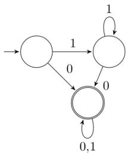

<details>
<summary>flowchart</summary>

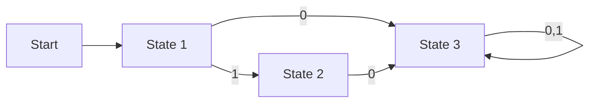
</details>

Which of the following are FALSE?

1. Complement of $L(A)$ is context-free.  
2. $L(A) = L((11^{*}0 + 0)(0 + 1)^{*}0^{*}1^{*})$  
3. For the language accepted by A, A is the minimal DFA.  
4. A accepts all strings over $\{0,1\}$ of length at least 2.

A. 1 and 3 only

B. 2 and 4 only

C. 2 and 3 only

D. 3 and 4 only

gatecse-2013 theory-of-computation finite-automata normal

# Answer key

# 6.7.22 Finite Automata: GATE CSE 2014 | Set 1 | Question: 16

Consider the finite automaton in the following figure:


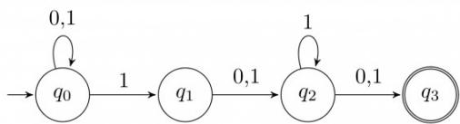

<details>
<summary>flowchart</summary>

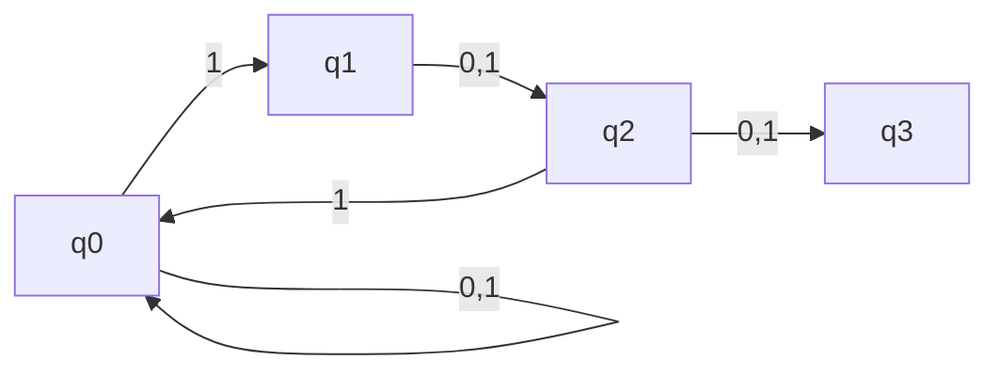
</details>

What is the set of reachable states for the input string 0011?

A. $\{q_{0}, q_{1}, q_{2}\}$

B. $\{q_{0}, q_{1}\}$

C. $\{q_0, q_1, q_2, q_3\}$

D. $\{q_{3}\}$

gatecse-2014-set1 theory-of-computation finite-automata easy

Answer key

# 6.7.23 Finite Automata: GATE CSE 2016 | Set 2 | Question: 42

Consider the following two statements:

I. If all states of an NFA are accepting states then the language accepted by the NFA is $\Sigma^{*}$ .  
II. There exists a regular language $A$ such that for all languages $B, A \cap B$ is regular.

Which one of the following is CORRECT?

A. Only I is true

B. Only II is true

C. Both I and II are true

D. Both I and II are false

gatecse-2016-set2 theory-of-computation finite-automata normal

Answer key

# 6.7.24 Finite Automata: GATE CSE 2017 | Set 2 | Question: 39

Let $\delta$ denote the transition function and $\hat{\delta}$ denote the extended transition function of the $\epsilon$ -NFA whose transition table is given below:


<table><tr><td> $\delta$ </td><td> $\epsilon$ </td><td> $a$ </td><td> $b$ </td></tr><tr><td> $\rightarrow$   $q_0$ </td><td> $\{q_2\}$ </td><td> $\{q_1\}$ </td><td> $\{q_0\}$ </td></tr><tr><td> $q_1$ </td><td> $\{q_2\}$ </td><td> $\{q_2\}$ </td><td> $\{q_3\}$ </td></tr><tr><td> $q_2$ </td><td> $\{q_0\}$ </td><td> $\emptyset$ </td><td> $\emptyset$ </td></tr><tr><td> $q_3$ </td><td> $\emptyset$ </td><td> $\emptyset$ </td><td> $\{q_2\}$ </td></tr></table>

Then $\hat{\delta}(q_2, aba)$ is

A. $\emptyset$

B. $\{q_0, q_1, q_3\}$

C. $\{q_{0}, q_{1}, q_{2}\}$

D. $\{q_0, q_2, q_3\}$

gatecse-2017-set2 theory-of-computation finite-automata

Answer key

# 6.7.25 Finite Automata: GATE CSE 2021 | Set 1 | Question: 38

Consider the following language:

$$
L = \{w \in \{0, 1 \} ^ {*} \mid w \text {ends with the substring} 0 1 1 \}
$$

Which one of the following deterministic finite automata accepts L?

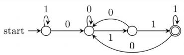

<details>
<summary>flowchart</summary>

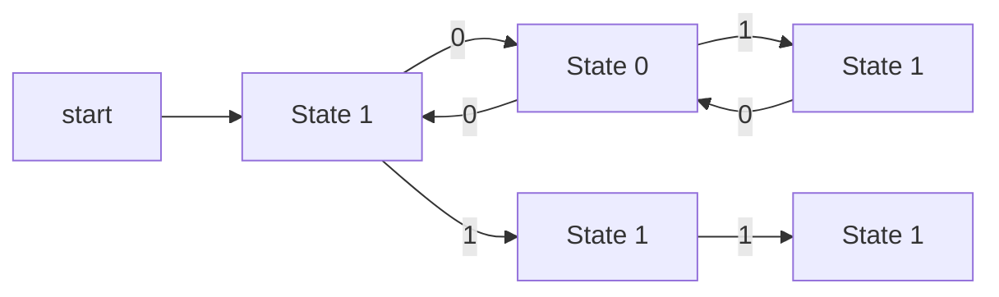
</details>

A.

B.


C.


<details>
<summary>flowchart</summary>

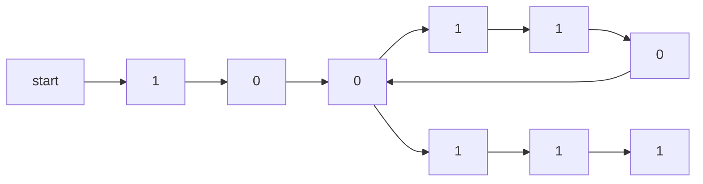
</details>

gatecse-2021-set1

theory-of-computation

finite-automata

two-marks

D.


<details>
<summary>flowchart</summary>

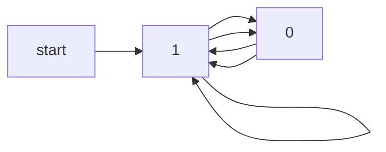
</details>

Answer key

# 6.7.26 Finite Automata: GATE CSE 2021 | Set 2 | Question: 17

Consider the following deterministic finite automaton (DFA)


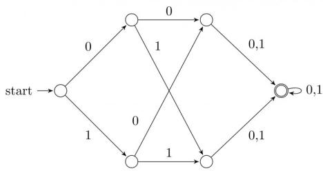

<details>
<summary>flowchart</summary>

This diagram represents a state transition or state transition diagram with binary states (0, 1) and transitions labeled with directional arrows indicating transitions between states.
</details>

The number of strings of length 8 accepted by the above automaton is \_\_\_\_

gatecse-2021-set2

numerical-answers

theory-of-computation

finite-automata

one-mark

Answer key

# 6.7.27 Finite Automata: GATE CSE 2021 | Set 2 | Question: 28

Suppose we want to design a synchronous circuit that processes a string of 0's and 1's. Given a string, it produces another string by replacing the first 1 in any subsequence of consecutive 1's by a 0. Consider the following example.


Input sequence: 00100011000011100

Output sequence: 00000001000001100

A Mealy Machine is a state machine where both the next state and the output are functions of the present state and the current input.

The above mentioned circuit can be designed as a two-state Mealy machine. The states in the Mealy machine can be represented using Boolean values 0 and 1. We denote the current state, the next state, the next incoming bit, and the output bit of the Mealy machine by the variables s, t, b and y respectively.

Assume the initial state of the Mealy machine is 0.

What are the Boolean expressions corresponding to t and y in terms of s and b?

$t = s + b$

$$
\begin{array}{c} \text {A.} \\ y = s b \\ t = b \end{array}
$$

$$
\begin{array}{c} \text {C.} \\ y = s \bar {b} \end{array}
$$

gatecse-2021-set2

cse-2021-set2 theory-of-computation

finite-automata

two-marks

$t = b$

$$
\begin{array}{l} y = s b \\ t = s + b \\ \end{array}
$$

$$
\begin{array}{c} \text {D.} \\ y = s \bar {b} \end{array}
$$

Answer key

# 6.7.28 Finite Automata: GATE CSE 2024 | Set 1 | Question: 40

Consider the 5 -state DFA. $M$ accepting the language $L(M) \subset (0 + 1)^*$ shown below. For any string $w \in (0 + 1)^*$ let $n_0(w)$ be the number of $0's$ in $w$ and $n_1(w)$ be the number of 1 's in $w$ .


<details>
<summary>flowchart</summary>

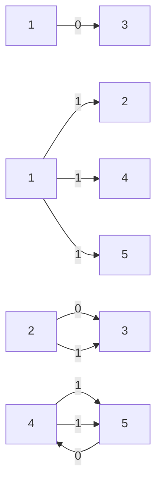
</details>

Which of the following statements is/are FALSE?

A. States 2 and 4 are distinguishable in M  
B. States 3 and 4 are distinguishable in $M$  
C. States 2 and 5 are distinguishable in $M$  
D. Any string $w$ with $n_0(w) = n_1(w)$ is in $L(M)$

gatecse-2024-set1

multiple-selects

theory-of-computation

finite-automata

two-marks

Answer key

# 6.7.29 Finite Automata: GATE CSE 2024 | Set 2 | Question: 12

Which one of the following regular expressions is equivalent to the language accepted by the DFA given below?


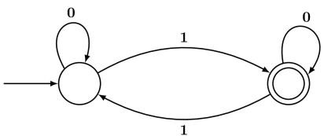

<details>
<summary>flowchart</summary>

```mermaid
graph LR
  A[""] --> B[""]
  B -->|0| A
  B -->|1| C[""]
  C -->|0| B
  C -->|1| B
```
</details>

A. $0^{*}1(0 + 10^{*}1)^{*}$

B. $0^{*}(10^{*}11)^{*}0^{*}$

C. $0^{*}1(010^{*}1)^{*}0^{*}$

D. $0(1 + 0^{*}10^{*}1)^{*}0^{*}$

gatecse-2024-set2

theory-of-computation

finite-automata

one-mark

Answer key

# 6.7.30 Finite Automata: GATE CSE 2024 | Set 2 | Question: 31

Let M be the 5-state NFA with $\epsilon$ -transitions shown in the diagram below.

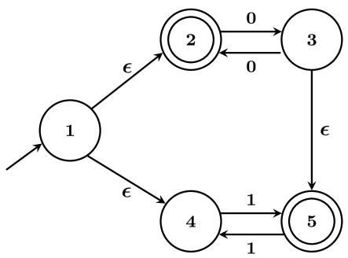

<details>
<summary>flowchart</summary>

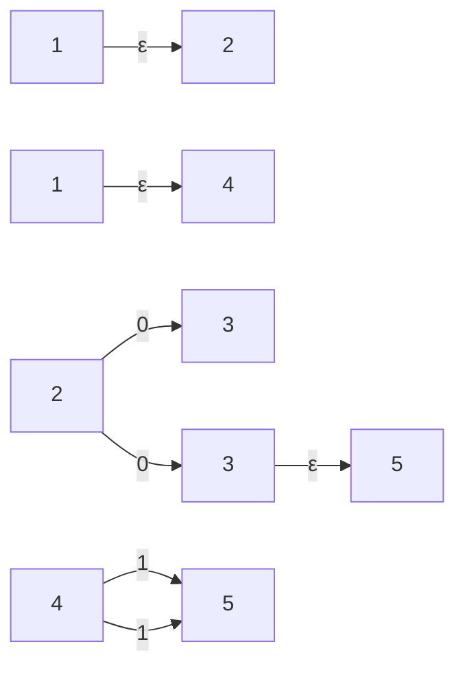
</details>

Which one of the following regular expressions represents the language accepted by M?

A. $(00)^{*} + 1(11)^{*}$  
C. $(00)^{*} + (1 + (00)^{*})(11)^{*}$

B. $0^{*} + (1 + 0(00)^{*})(11)^{*}$

D. $0^{+} + 1(11)^{*} + 0(11)^{*}$


# 6.7.31 Finite Automata: GATE CSE 2025 | Set 1 | Question: 40


Consider the following deterministic finite automaton (DFA) defined over the alphabet, $\Sigma = \{a, b\}$ . Identify which of the following language(s) is/are accepted by the given DFA.

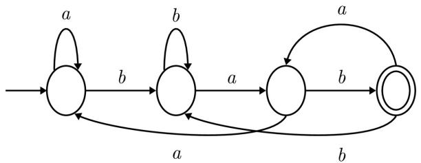

<details>
<summary>flowchart</summary>

This diagram illustrates a state transition or state transition process with labeled transitions (a, b) and directional arrows indicating transitions between states.
</details>

A. The set of all strings containing an even number of b 's.  
B. The set of all strings containing the pattern bab.  
C. The set of all strings ending with the pattern bab.  
D. The set of all strings not containing the pattern aba.

gatecse2025-set1 theory-of-computation finite-automata multiple-selects easy two-marks

Answer key

# 6.7.32 Finite Automata: GATE CSE 2026 | Set 2 | Question: 37

Consider the following two finite automata $D_{1}$ and $D_{2}$ .


<details>
<summary>flowchart</summary>

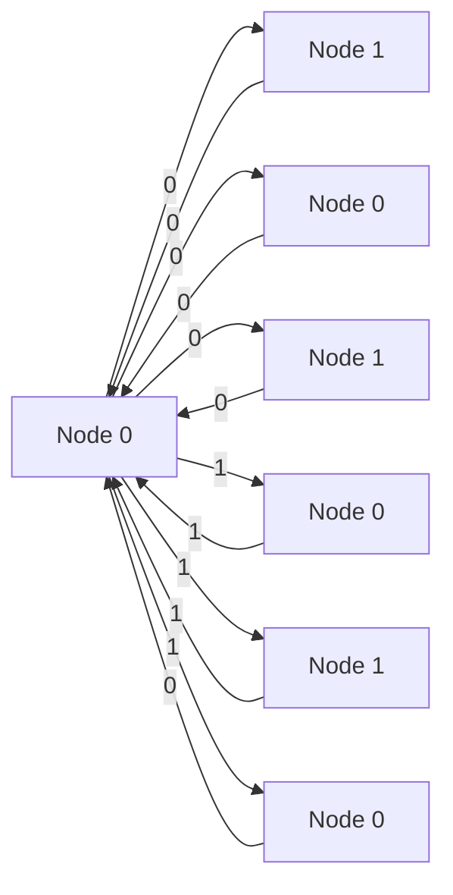
</details>

$D_{1}$


<details>
<summary>flowchart</summary>

```mermaid
graph LR
  A["Start"] --> B["State 1"]
  B -->|0| C["State 0"]
  B -->|1| D["State 1"]
  C -->|0| E["State 0"]
  C -->|1| F["State 1"]
  D -->|0| E
  D -->|1| F
  E -->|0| F
  E -->|1| F
```
</details>

$D_{2}$

Which of the following statements is/are true?

A. $L(D_{1}) = L(D_{2})$  
B. $L(D_{1})$ is a proper subset of $L(D_{2})$  
C. $L(D_{1})\cap L(D_{2}) = \{\epsilon \}$  
D. $\left(L\left(D_1\right) \cup L\left(D_2\right)\right)^*$ consists of all strings in $\{0,1\}^*$ whose length is divisible by 3

gatecse-2026-set2 theory-of-computation finite-automata multiple-selects two-marks

Answer key

# 6.7.33 Finite Automata: GATE IT 2004 | Question: 41

Let $M = (K, \Sigma, \sigma, s, F)$ be a finite state automaton, where

$$
K = \{A, B \}, \Sigma = \{a, b \}, s = A, F = \{B \},
$$

$$
\sigma (A, a) = A, \sigma (A, b) = B, \sigma (B, a) = B \text {and} \sigma (B, b) = A
$$

A grammar to generate the language accepted by $M$ can be specified as $G = (V, \Sigma, R, S)$ , where $V = K \cup \Sigma$ , and $S = A$ .

Which one of the following set of rules will make $L(G) = L(M)$ ?

A. $\{A \to aB, A \to bA, B \to bA, B \to aA, B \to \epsilon\}$


B. $\{A \rightarrow aA, A \rightarrow bB, B \rightarrow aB, B \rightarrow bA, B \rightarrow \epsilon\}$  
C. $\{A \to bB, A \to aB, B \to aA, B \to bA, B \to \epsilon\}$  
D. $\{A\to aA,A\to bA,B\to aB,B\to bA,A\to \epsilon)$

gateit-2004 theory-of-computation finite-automata normal

# Answer key

# 6.7.34 Finite Automata: GATE IT 2005 | Question: 37

Consider the non-deterministic finite automaton (NFA) shown in the figure.

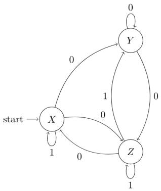

<details>
<summary>flowchart</summary>

```mermaid
graph LR
  start --> X
  X -->|0| Y
  X -->|1| start
  Y -->|0| Y
  Y -->|1| Z
  Z -->|0| X
  Z -->|1| start
```
</details>


State X is the starting state of the automaton. Let the language accepted by the NFA with Y as the only accepting state be L1. Similarly, let the language accepted by the NFA with Z as the only accepting state be L2. Which of the following statements about L1 and L2 is TRUE?

A. $L1 = L2$

C. $L2 \subset L1$

B. $L1 \subset L2$

D. None of the above

gateit-2005 theory-of-computation finite-automata normal

# Answer key

# 6.7.35 Finite Automata: GATE IT 2005 | Question: 39

Consider the regular grammar:

- $S \to Xa \mid Ya$  
- $X \rightarrow \mathrm{Za}$  
- $Z \to Sa \mid \epsilon$  
- $Y \rightarrow Wa$  
- $W \rightarrow Sa$


where $S$ is the starting symbol, the set of terminals is $\{a\}$ and the set of non-terminals is $\{S, W, X, Y, Z\}$ . We wish to construct a deterministic finite automaton (DFA) to recognize the same language. What is the minimum number of states required for the DFA?

A. 2

B. 3

C. 4

D. 5

gateit-2005 theory-of-computation finite-automata normal

# Answer key

# 6.7.36 Finite Automata: GATE IT 2006 | Question: 3

In the automaton below, s is the start state and t is the only final state.

