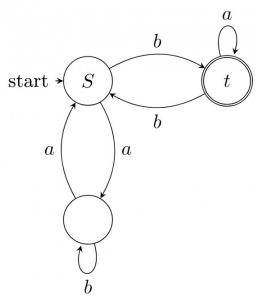

<details>
<summary>flowchart</summary>

```mermaid
graph LR
  start["start"] --> S["S"]
  S -->|b| t["t"]
  t -->|b| S
  S -->|a| S
  S -->|a| T[""]
  T -->|b| S
  T -->|a| t
```
</details>

Consider the strings $u = abbaba, v = bab$ , and $w = aabb$ . Which of the following statements is true?

A. The automaton accepts u and v but not w

C. The automaton rejects each of $u, v$ , and $w$

gateit-2006 theory-of-computation finite-automata easy

B. The automaton accepts each of $u, v$ , and $w$

D. The automaton accepts $u$ but rejects $v$ and $w$

Answer key

# 6.7.37 Finite Automata: GATE IT 2006 | Question: 37


For a state machine with the following state diagram the expression for the next state $S^{+}$ in terms of the current state S and the input variables x and y is

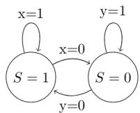

A. $S^{+} = S^{\prime}.y^{\prime} + S.x$  
C. $S^{+} = x.y'$

gateit-2006 theory-of-computation finite-automata normal

B. $S^{+} = S.x.y' + S'.y.x'$  
D. $S^{+} = S^{\prime}.\mathcal{Y} + S.\mathcal{X}^{\prime}$

Answer key

# 6.7.38 Finite Automata: GATE IT 2007 | Question: 47

Consider the following DFA in which $S_{0}$ is the start state and $S_{1}$ , $S_{3}$ are the final states.


<details>
<summary>flowchart</summary>

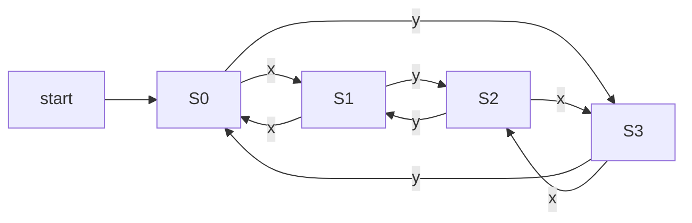
</details>

What language does this DFA recognize?

A. All strings of x and y  
B. All strings of $x$ and $y$ which have either even number of $x$ and even number of $y$ or odd number of $x$ and odd number of $y$  
C. All strings of $x$ and $y$ which have equal number of $x$ and $y$  
D. All strings of $x$ and $y$ with either even number of $x$ and odd number of $y$ or odd number of $x$ and even number of $y$

gateit-2007 theory-of-computation finite-automata normal

Answer key

Consider the following finite automata P and Q over the alphabet $\{a, b, c\}$ . The start states are indicated by a double arrow and final states are indicated by a double circle. Let the languages recognized by them be denoted by $L(P)$ and $L(Q)$ respectively.

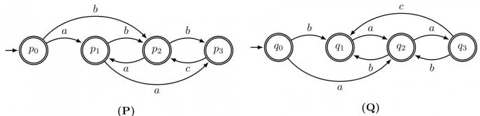

The automation which recognizes the language $L(P) \cap L(Q)$ is :

A.  
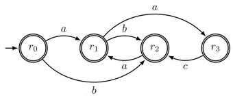

<details>
<summary>flowchart</summary>

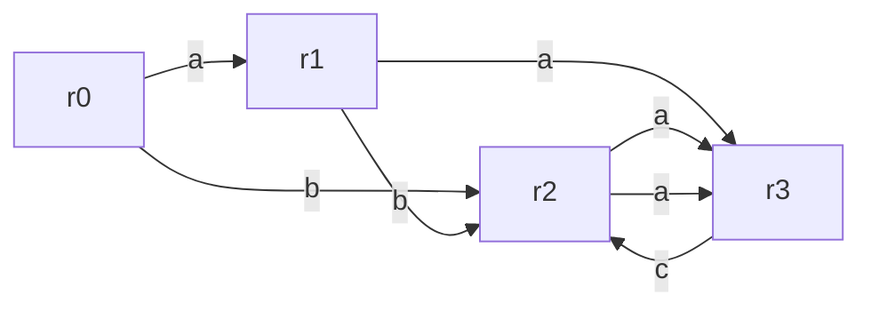
</details>

C.  
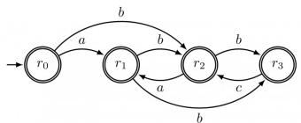

<details>
<summary>flowchart</summary>

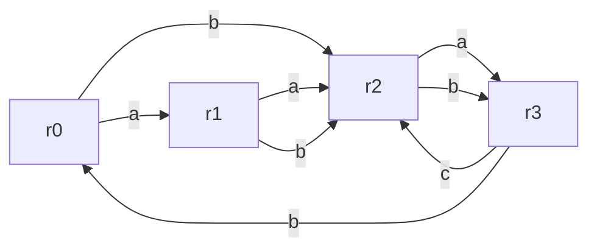
</details>

gateit-2007 theory-of-computation finite-automata normal

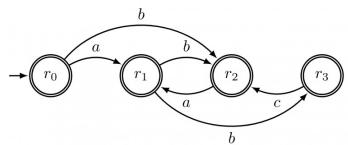

<details>
<summary>flowchart</summary>

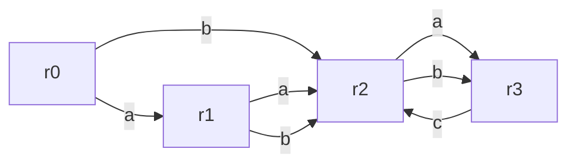
</details>

B.

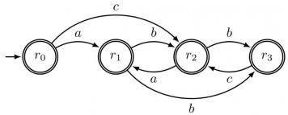

<details>
<summary>flowchart</summary>

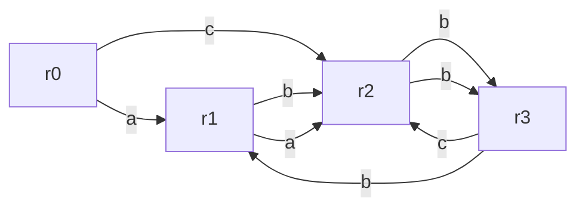
</details>

D.

Answer key

# 6.7.40 Finite Automata: GATE IT 2007 | Question: 71

Consider the regular expression $R = (a + b)^* (aa + bb)(a + b)^*$

Which of the following non-deterministic finite automata recognizes the language defined by the regular expression R? Edges labeled $\lambda$ denote transitions on the empty string.

A.  
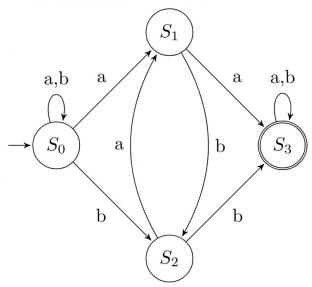

<details>
<summary>flowchart</summary>

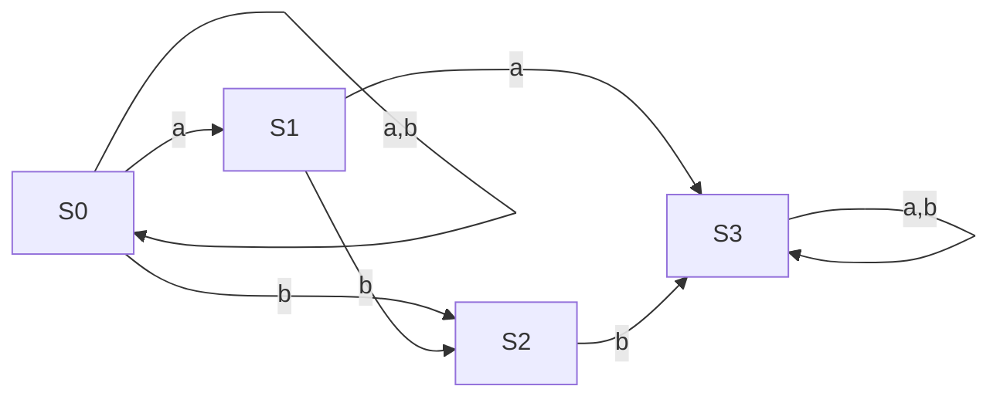
</details>

C.  
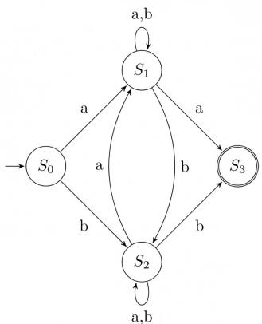

<details>
<summary>flowchart</summary>

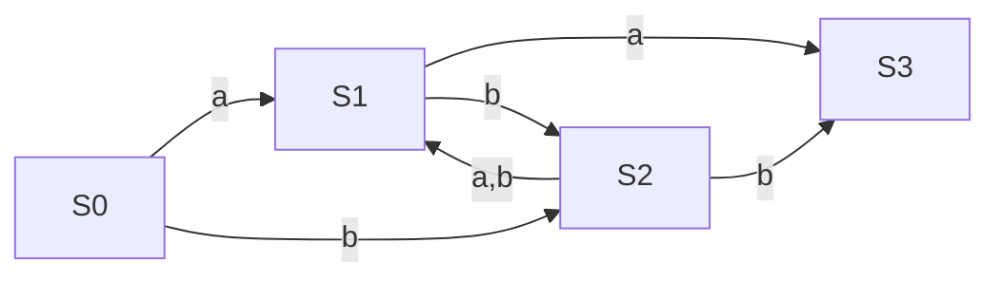
</details>

B.  


<details>
<summary>flowchart</summary>

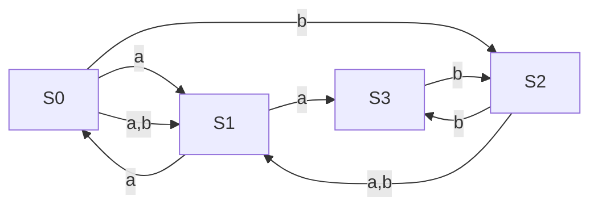
</details>

D.

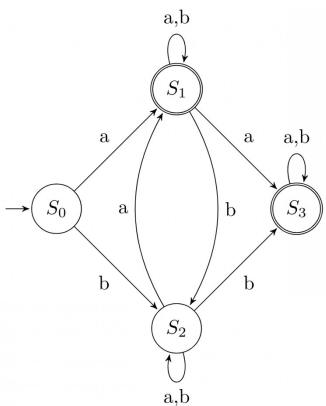

<details>
<summary>flowchart</summary>

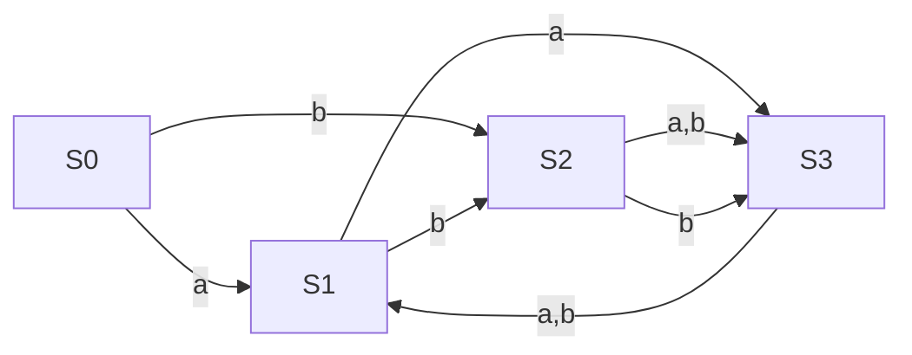
</details>


# 6.7.41 Finite Automata: GATE IT 2007 | Question: 72

Consider the regular expression $R = (a + b)^* (aa + bb)(a + b)^*$

Which deterministic finite automaton accepts the language represented by the regular expression R?


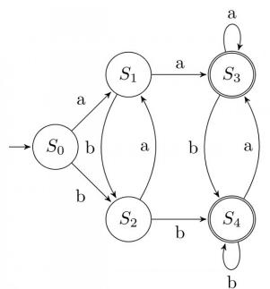

<details>
<summary>flowchart</summary>

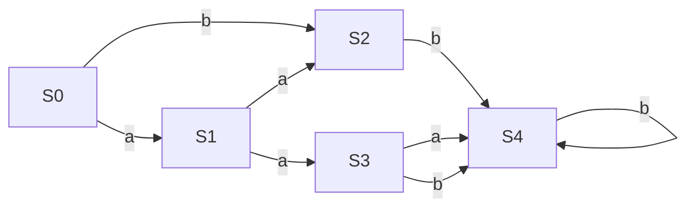
</details>

A.

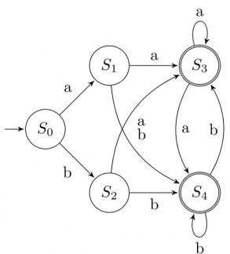

<details>
<summary>flowchart</summary>

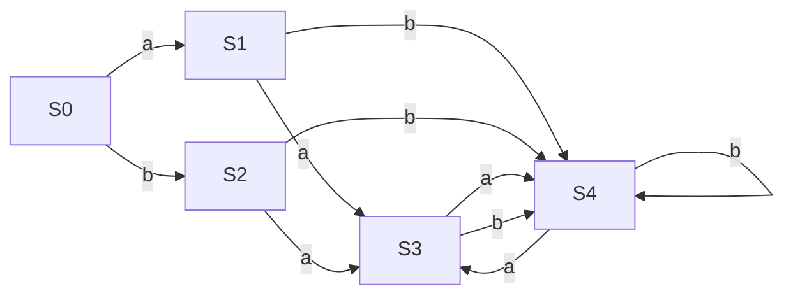
</details>

B.


<details>
<summary>flowchart</summary>

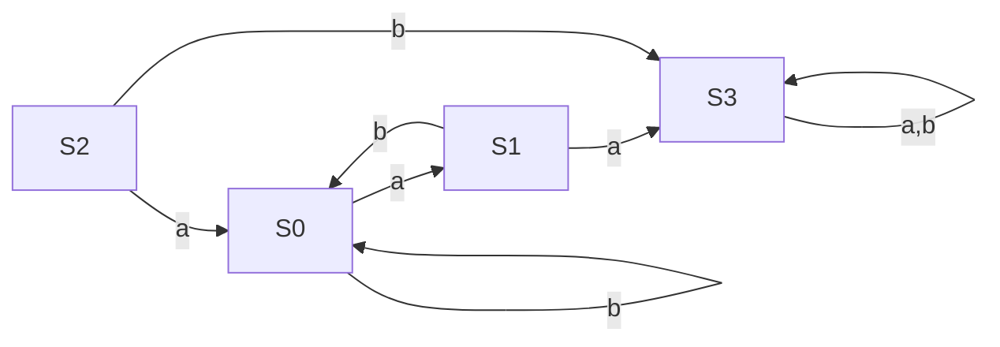
</details>

C.  
gateit-2007 theory-of-computation finite-automata normal

D.  
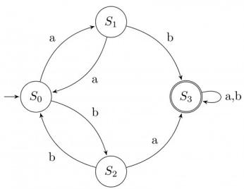

<details>
<summary>flowchart</summary>

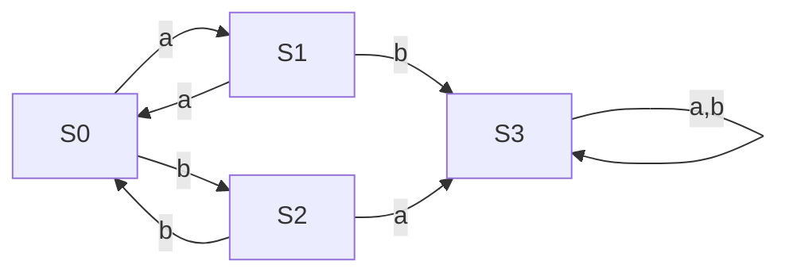
</details>

# Answer key

# 6.7.42 Finite Automata: GATE IT 2008 | Question: 32

If the final states and non-final states in the DFA below are interchanged, then which of the following languages over the alphabet $\{a, b\}$ will be accepted by the new DFA?


<details>
<summary>flowchart</summary>

```mermaid
graph LR
  start["start"] --> State1((" ))
  State1 -->|a| State2((" ))
  State2 -->|a| State1
  State1 -->|b| State1
  State2 -->|a| State3((" ))
  State3 -->|a| State3
  State3 -->|b| State1
```
</details>

A. Set of all strings that do not end with ab  
B. Set of all strings that begin with either an $a$ or $a b$  
C. Set of all strings that do not contain the substring $ab$ ,  
D. The set described by the regular expression $b^{*}aa^{*}(ba)^{*}b^{*}$

gateit-2008 theory-of-computation finite-automata normal

# Answer key

# 6.7.43 Finite Automata: GATE IT 2008 | Question: 36

Consider the following two finite automata. $M_{1}$ accepts $L_{1}$ and $M_{2}$ accepts $L_{2}$ .

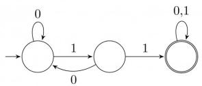  
$M_{1}$


<details>
<summary>flowchart</summary>

```mermaid
graph LR
  A[""] --> B[""]
  B -->|1| C[""]
  C -->|1| D[""]
  D -->|0,1| B
  B -->|0,1| E[""]
```
</details>

Which one of the following is TRUE?

A. $L_{1}=L_{2}$  
C. $L_{1} \cap L_{2}^{C} = \varnothing$

gateit-2008 theory-of-computation finite-automata normal

B. $L_{1} \subset L_{2}$  
D. $L_{1} \cup L_{2} \neq L_{1}$

Answer key

6.8

# Finite State Machines (1)

# 6.8.1 Finite State Machines: GATE CSE 2025 | Set 1 | Question: 49

Consider a finite state machine (FSM) with one input X and one output f, represented by the given state transition table. The minimum number of states required to realize this FSM is \_\_\_\_. (Answer in integer).


<table><tr><td>Present state</td><td colspan="2">Next state</td><td colspan="2">Output f</td></tr><tr><td></td><td>X=0</td><td>X=1</td><td>X=0</td><td>X=1</td></tr><tr><td>A</td><td>F</td><td>B</td><td>0</td><td>0</td></tr><tr><td>B</td><td>D</td><td>C</td><td>0</td><td>0</td></tr><tr><td>C</td><td>F</td><td>E</td><td>0</td><td>0</td></tr><tr><td>D</td><td>G</td><td>A</td><td>1</td><td>0</td></tr><tr><td>E</td><td>D</td><td>C</td><td>0</td><td>0</td></tr><tr><td>F</td><td>F</td><td>B</td><td>1</td><td>1</td></tr><tr><td>G</td><td>G</td><td>H</td><td>0</td><td>1</td></tr><tr><td>H</td><td>G</td><td>A</td><td>1</td><td>0</td></tr></table>

gatecse2025-set1 theory-of-computation finite-state-machines numerical-answers two-marks

Answer key

6.9

# Identify Class Language (31)

Practice Tests: Test 1 (15Q) Test 2 (15Q) Test 3 (13Q) Weekly Quiz 8 (10Q)

# 6.9.1 Identify Class Language: GATE CSE 1987 | Question: 1-xiii

FORTRAN is a:

A. Regular language.  
C. Context-sensitive language.  
gate1987 theory-of-computation identify-class-language

B. Context-free language.  
D. None of the above.

Answer key

# 6.9.2 Identify Class Language: GATE CSE 1988 | Question: 2ix

What is the type of the language $L$ , where $L = \{a^n b^n \mid 0 < n < 327$ -th prime number\}

gate1988 normal descriptive theory-of-computation identify-class-language

Answer key


# 6.9.3 Identify Class Language: GATE CSE 1991 | Question: 17,a


Show that the Turing machines, which have a read only input tape and constant size work tape, recognize precisely the class of regular languages.

gate1991 theory-of-computation descriptive identify-class-language proof

Answer key

# 6.9.4 Identify Class Language: GATE CSE 1994 | Question: 19


A. Given a set:

$$
S = \{x \mid \text {there is an x - block of 5's in the decimal expansion of} \pi \}
$$

(Note: $x$ -block is a maximal block of $x$ successive 5's)

Which of the following statements is true with respect to S? No reason to be given for the answer.

i. $S$ is regular  
ii. $S$ is recursively enumerable  
iii. $S$ is not recursively enumerable  
iv. $S$ is recursive

B. Given that a language $L_{1}$ is regular and that the language $L_{1} \cup L_{2}$ is regular, is the language $L_{2}$ always regular? Prove your answer.

gate1994 theory-of-computation identify-class-language normal descriptive

Answer key

# 6.9.5 Identify Class Language: GATE CSE 1999 | Question: 2.4


If $L1$ is context free language and $L2$ is a regular language which of the following is/are false?

A. $L1 - L2$ is not context free

B. $L1 \cap L2$ is context free

C. $\sim L1$ is context free

D. $\sim L2$ is regular

gate1999 theory-of-computation identify-class-language normal multiple-selects

Answer key

# 6.9.6 Identify Class Language: GATE CSE 2000 | Question: 1.5


Let L denote the languages generated by the grammar $S \rightarrow 0, S0 \mid 00$ . Which of the following is TRUE?

A. $L = 0^{+}$  
C. $L$ is context free but not regular

B. $L$ is regular but not $0^{+}$

D. $L$ is not context free

gatecse-2000 theory-of-computation easy identify-class-language

Answer key

# 6.9.7 Identify Class Language: GATE CSE 2002 | Question: 1.7


The language accepted by a Pushdown Automaton in which the stack is limited to 10 items is best described as

A. Context free  
C. Deterministic Context free

B. Regular

gatecse-2002 theory-of-computation easy identify-class-language

Answer key


# 6.9.8 Identify Class Language: GATE CSE 2004 | Question: 87

The language $\{a^m b^n c^{m + n} \mid m, n \geq 1\}$ is

A. regular

B. context-free but not regular

C. context-sensitive but not context free

D. type-0 but not context sensitive

gatecse-2004 theory-of-computation normal identify-class-language

# Answer key


# 6.9.9 Identify Class Language: GATE CSE 2005 | Question: 55

Consider the languages:

$$
L _ {1} = \left\{a ^ {n} b ^ {n} c ^ {m} \mid n, m > 0 \right\} \text {and} L _ {2} = \left\{a ^ {n} b ^ {m} c ^ {m} \mid n, m > 0 \right\}
$$

Which one of the following statements is FALSE?

A. $L_{1} \cap L_{2}$ is a context-free language  
B. $L_{1} \cup L_{2}$ is a context-free language  
C. $L_{1}$ and $L_{2}$ are context-free languages  
D. $L_{1} \cap L_{2}$ is a context sensitive language

gatecse-2005 theory-of-computation identify-class-language normal

# Answer key


# 6.9.10 Identify Class Language: GATE CSE 2006 | Question: 30

For $s \in (0 + 1)^*$ let $d(s)$ denote the decimal value of $s$ (e.g. $d(101) = 5$ ). Let

$$
L = \{s \in (0 + 1) ^ {*} \mid d (s) \bmod 5 = 2 \text {   and   } d (s) \bmod 7 \neq 4 \}
$$

Which one of the following statements is true?

A. $L$ is recursively enumerable, but not recursive

B. $L$ is recursive, but not context-free

C. $L$ is context-free, but not regular

D. $L$ is regular

gatecse-2006 theory-of-computation normal identify-class-language

# Answer key


# 6.9.11 Identify Class Language: GATE CSE 2006 | Question: 33

Let $L_{1}$ be a regular language, $L_{2}$ be a deterministic context-free language and $L_{3}$ a recursively enumerable, but not recursive, language. Which one of the following statements is false?

A. $L_{1} \cap L_{2}$ is a deterministic CFL  
B. $L_{3} \cap L_{1}$ is recursive  
C. $L_{1} \cup L_{2}$ is context free  
D. $L_{1} \cap L_{2} \cap L_{3}$ is recursively enumerable

gatecse-2006 theory-of-computation normal identify-class-language

# Answer key


# 6.9.12 Identify Class Language: GATE CSE 2007 | Question: 30

The language $L = \{0^i 21^i \mid i \geq 0\}$ over the alphabet $\{0, 1, 2\}$ is:

A. not recursive

B. is recursive and is a deterministic CFL

C. is a regular language

D. is not a deterministic CFL but a CFL

gatecse-2007 theory-of-computation normal identify-class-language

# Answer key


# 6.9.13 Identify Class Language: GATE CSE 2008 | Question: 51

Match the following:

<table><tr><td>E.</td><td>Checking that identifiers are declared before their use</td><td>P.  $L = \{a^{n}b^{m}c^{n}d^{m} \mid n \geq 1, m \geq 1\}$ </td></tr><tr><td>F.</td><td>Number of formal parameters in the declaration of a function agrees with the number of actual parameters in a use of that function</td><td>Q.  $X \rightarrow XbX \mid XcX \mid dXf \mid g$ </td></tr><tr><td>G.</td><td>Arithmetic expressions with matched pairs of parentheses</td><td>R.  $L = \{wcw \mid w \in (a \mid b)^{*}\}$ </td></tr><tr><td>H.</td><td>Palindromes</td><td>S.  $X \rightarrow bXb \mid cXc \mid \epsilon$ </td></tr></table>

A. E-P, F-R, G-Q, H-S  
C. E-R, F-P, G-Q, H-S

B. E-R, F-P, G-S, H-Q

D. E-P, F-R, G-S, H-Q

gatecse-2008 normal theory-of-computation identify-class-language match-the-following

# Answer key

# 6.9.14 Identify Class Language: GATE CSE 2008 | Question: 9

Which of the following is true for the language


$$
\{a ^ {p} \mid p \text {is a prime} \}\?
$$

A. It is not accepted by a Turing Machine  
B. It is regular but not context-free  
C. It is context-free but not regular  
D. It is neither regular nor context-free, but accepted by a Turing machine

gatecse-2008 theory-of-computation easy identify-class-language

# Answer key

# 6.9.15 Identify Class Language: GATE CSE 2009 | Question: 40

Let $L = L_{1} \cap L_{2}$ , where $L_{1}$ and $L_{2}$ are languages as defined below:

$$
L _ {1} = \{a ^ {m} b ^ {m} c a ^ {n} b ^ {n} \mid m, n \geq 0 \}
$$

$$
L _ {2} = \left\{a ^ {i} b ^ {j} c ^ {k} \mid i, j, k \geq 0 \right\}
$$

Then $L$ is

A. Not recursive  
C. Context free but not regular

B. Regular  
D. Recursively enumerable but not context free.

gatecse-2009 theory-of-computation easy identify-class-language

# Answer key

# 6.9.16 Identify Class Language: GATE CSE 2010 | Question: 40

Consider the languages

$$
L 1 = \{0 ^ {i} 1 ^ {j} \mid i \neq j \},
$$

$$
L 2 = \{0 ^ {i} 1 ^ {j} \mid i = j \},
$$

$$
L 3 = \{0 ^ {i} 1 ^ {j} \mid i = 2 j + 1 \},
$$

$$
L 4 = \{0 ^ {i} 1 ^ {j} \mid i \neq 2 j \}
$$

A. Only $L2$ is context free.  
C. Only $L1$ and $L2$ are context free.

B. Only $L2$ and $L3$ are context free.  
D. All are context free

gatecse-2010 theory-of-computation context-free-language identify-class-language normal

# Answer key


Consider the languages L1, L2 and L3 as given below.

$$
L 1 = \{0 ^ {p} 1 ^ {q} \mid p, q \in N \},
$$

$$
L 2 = \{0 ^ {p} 1 ^ {q} \mid p, q \in N \text {and} p = q \} \text {and},
$$

$$
L 3 = \{0 ^ {p} 1 ^ {q} 0 ^ {r} \mid p, q, r \in N \text {   and   } p = q = r \}.
$$

Which of the following statements is NOT TRUE?

A. Push Down Automata (PDA) can be used to recognize L1 and L2  
B. $L1$ is a regular language  
C. All the three languages are context free  
D. Turing machines can be used to recognize all the languages

gatecse-2011 theory-of-computation identify-class-language normal

Answer key

# 6.9.18 Identify Class Language: GATE CSE 2013 | Question: 32

Consider the following languages.

$$
L _ {1} = \{0 ^ {p} 1 ^ {q} 0 ^ {r} \mid p, q, r \geq 0 \}
$$

$$
L _ {2} = \{0 ^ {p} 1 ^ {q} 0 ^ {r} \mid p, q, r \geq 0, p \neq r \}
$$

Which one of the following statements is FALSE?

A. $L_{2}$ is context-free.  
C. Complement of $L_{2}$ is recursive.

B. $L_{1} \cap L_{2}$ is context-free.  
D. Complement of $L_{1}$ is context-free but not regular.

gatecse-2013 theory-of-computation identify-class-language normal

Answer key

# 6.9.19 Identify Class Language: GATE CSE 2014 | Set 3 | Question: 36


Consider the following languages over the alphabet $\sum = \{0,1,c\}$

$$
L _ {1} = \{0 ^ {n} 1 ^ {n} \mid n \geq 0 \}
$$

$$
L _ {2} = \{w c w ^ {r} \mid w \in \{0, 1 \} ^ {*} \}
$$

$$
L _ {3} = \{w w ^ {r} \mid w \in \{0, 1 \} ^ {*} \}
$$

Here, $w^r$ is the reverse of the string $w$ . Which of these languages are deterministic Context-free languages?

A. None of the languages

C. Only $L_{1}$ and $L_{2}$

gatecse-2014-set3 theory-of-computation identify-class-language context-free-language normal

B. Only $L_{1}$  
D. All the three languages

Answer key

# 6.9.20 Identify Class Language: GATE CSE 2017 | Set 1 | Question: 37


Consider the context-free grammars over the alphabet $\{a, b, c\}$ given below. $S$ and $T$ are non-terminals.

$$
G _ {1}: S \to a S b \mid T, T \to c T \mid \epsilon
$$

$$
G _ {2}: S \to b S a \mid T, T \to c T \mid \epsilon
$$

The language $L(G_{1})\cap L(G_{2})$ is

A. Finite  
C. Context-Free but not regular  
B. Not finite but regular  
D. Recursive but not context-free

gatecse-2017-set1 theory-of-computation context-free-language identify-class-language normal

Answer key


Consider the following languages.

- $L_{1} = \{a^{p} \mid p \text{ is a prime number}\}$  
- $L_{2} = \{a^{n}b^{m}c^{2m} \mid n \geq 0, m \geq 0\}$  
- $L_{3} = \{a^{n}b^{n}c^{2n}\mid n\geq 0\}$  
- $L_{4} = \{a^{n}b^{n} \mid n \geq 1\}$

Which of the following are CORRECT?

I. $L_{1}$ is context free but not regular  
II. $L_{2}$ is not context free  
III. $L_{3}$ is not context free but recursive  
IV. $L_{4}$ is deterministic context free

A. I, II and IV only

B. II and III only

C. I and IV only

D. III and IV only

gatecse-2017-set2 theory-of-computation identify-class-language

# Answer key

# 6.9.22 Identify Class Language: GATE CSE 2018 | Question: 35

Consider the following languages:

1. $\{a^m b^n c^p d^q \mid m + p = n + q, \text{where } m, n, p, q \geq 0\}$  
II. $\{a^m b^n c^p d^q \mid m = n \text{ and } p = q, \text{ where } m, n, p, q \geq 0\}$  
III. $\{a^m b^n c^p d^q \mid m = n = p \text{ and } p \neq q, \text{ where } m, n, p, q \geq 0\}$  
IV. $\{a^m b^n c^p d^q \mid mn = p + q, \text{where } m, n, p, q \geq 0\}$

Which of the above languages are context-free?

A. I and IV only

B. I and II only

C. II and III only

D. II and IV only

gatecse-2018 theory-of-computation identify-class-language context-free-language normal two-marks

# Answer key

# 6.9.23 Identify Class Language: GATE CSE 2020 | Question: 10

Consider the language $L = \{a^n \mid n \geq 0\} \cup \{a^n b^n \mid n \geq 0\}$ and the following statements.

I. $L$ is deterministic context-free.  
II. $L$ is context-free but not deterministic context-free.  
III. $L$ is not $LL(k)$ for any $k$ .

Which of the above statements is/are TRUE?

A. I only  
C. I and III only

B. II only

gatecse-2020 theory-of-computation identify-class-language one-mark

# Answer key

# 6.9.24 Identify Class Language: GATE CSE 2020 | Question: 32

Consider the following languages.

$$
\begin{array}{l} L _ {1} = \{w x y x \mid w, x, y \in (0 + 1) ^ {+} \} \\ L _ {2} = \{x y \mid x, y \in (a + b) ^ {*}, | x | = | y |, x \neq y \} \\ \end{array}
$$

Which one of the following is TRUE?

A. $L_{1}$ is regular and $L_{2}$ is context-free.  
B. $L_{1}$ context-free but not regular and $L_{2}$ is context-free.


C. Neither $L_{1}$ nor $L_{2}$ is context-free.  
D. $L_{1}$ context-free but $L_{2}$ is not context-free.

gatecse-2020 theory-of-computation identify-class-language two-marks

# Answer key

# 6.9.25 Identify Class Language: GATE CSE 2021 | Set 2 | Question: 12

Let $L_{1}$ be a regular language and $L_{2}$ be a context-free language. Which of the following languages is/are context-free?

A. $L_{1} \cap \overline{L_{2}}$

B. $\overline{\overline{L_{1}}\cup\overline{L_{2}}}$

C. $L_{1} \cup (L_{2} \cup \overline{L_{2}})$

D. $(L_{1} \cap L_{2}) \cup (\overline{L_{1}} \cap L_{2})$

gatecse-2021-set2 multiple-selects theory-of-computation identify-class-language one-mark

# Answer key

# 6.9.26 Identify Class Language: GATE CSE 2022 | Question: 13

Which of the following statements is/are TRUE?

A. Every subset of a recursively enumerable language is recursive.  
B. If a language $L$ and its complement $\overline{L}$ are both recursively enumerable, then $L$ must be recursive.  
C. Complement of a context-free language must be recursive.  
D. If $L_{1}$ and $L_{2}$ are regular, then $L_{1} \cap L_{2}$ must be deterministic context-free.

gatecse-2022 theory-of-computation identify-class-language recursive-and-recursively-enumerable-languages multiple-selects one-mark

# Answer key

# 6.9.27 Identify Class Language: GATE CSE 2022 | Question: 37

Consider the following languages:

$$
L _ {1} = \{a ^ {n} w a ^ {n} | w \in \{a, b \} ^ {*} \}
$$

$$
L _ {2} = \{w x w ^ {R} | w, x \in \{a, b \} ^ {*}, | w |, | x | > 0 \}
$$

Note that $w^{R}$ is the reversal of the string w. Which of the following is/are TRUE?

A. $L_{1}$ and $L_{2}$ are regular.  
C. $L_{1}$ is regular and $L_{2}$ is context-free.

B. $L_{1}$ and $L_{2}$ are context-free.

D. $L_{1}$ and $L_{2}$ are context-free but not regular.

gatecse-2022 theory-of-computation identify-class-language context-free-language multiple-selects two-marks

# Answer key

# 6.9.28 Identify Class Language: GATE CSE 2023 | Question: 14

Which of the following statements is/are CORRECT?

A. The intersection of two regular languages is regular.  
B. The intersection of two context-free languages is context-free.  
C. The intersection of two recursive languages is recursive.  
D. The intersection of two recursively enumerable languages is recursively enumerable.

gatecse-2023 theory-of-computation identify-class-language multiple-selects one-mark

# Answer key

# 6.9.29 Identify Class Language: GATE IT 2005 | Question: 4

Let $L$ be a regular language and $M$ be a context-free language, both over the alphabet $\Sigma$ . Let $L^c$ and $M^c$ denote the complements of $L$ and $M$ respectively. Which of the following statements about the language $L^c \cup M^c$ is TRUE?


A. It is necessarily regular but not necessarily context-free.  
C. It is necessarily non-regular.

gateit-2005 theory-of-computation normal identify-class-language

B. It is necessarily context-free.  
D. None of the above

Answer key

# 6.9.30 Identify Class Language: GATE IT 2005 | Question: 6

The language $\{0^n 1^n 2^n \mid 1 \leq n \leq 10^6\}$ is

A. regular  
C. context-free but its complement is not context-free

gateit-2005 theory-of-computation easy identify-class-language

B. context-free but not regular  
D. not context-free

Answer key

# 6.9.31 Identify Class Language: GATE IT 2008 | Question: 33

Consider the following languages.

- $L_{1} = \{a^{i}b^{j}c^{k} \mid i = j, k \geq 1\}$  
- $L_{2} = \{a^{i}b^{j} \mid j = 2i, i \geq 0\}$

Which of the following is true?

A. $L_{1}$ is not a CFL but $L_{2}$ is  
B. $L_{1} \cap L_{2} = \varnothing$ and $L_{1}$ is non-regular  
C. $L_{1} \cup L_{2}$ is not a CFL but $L_{2}$ is  
D. There is a 4-state PDA that accepts $L_{1}$ , but there is no DPDA that accepts $L_{2}$ .

gateit-2008 theory-of-computation normal identify-class-language

Answer key

# 6.10

# Medium (1)

# 6.10.1 Medium: GATE CSE 2006 | Question: 29

If $s$ is a string over $(0 + 1)^*$ then let $n_0(s)$ denote the number of 0's in $s$ and $n_1(s)$ the number of 1's in $s$ . Which one of the following languages is not regular?

A. $L = \{s\in (0 + 1)^{*}\mid n_{0}(s)$ is a 3-digit prime}  
B. $L = \{s\in (0 + 1)^{*}\mid$ for every prefix $\mathrm{s}'$ of $\mathrm{s},|n_0(s') - n_1(s')|\leq 2\}$  
C. $L = \{s\in (0 + 1)^{*}\mid n_{0}(s) - n_{1}(s)\mid \leq 4\}$  
D. $L = \{s\in (0 + 1)^{*}\mid n_{0}(s)\mod 7 = n_{1}(s)\mod 5 = 0\}$

gatecse-2006 theory-of-computation medium regular-language

Answer key

# 6.11

# Minimal State Automata (25)

Practice Tests: Test 1 (15Q) Test 2 (15Q)

# 6.11.1 Minimal State Automata: GATE CSE 1987 | Question: 2j

State whether the following statements are TRUE or FALSE:

A minimal DFA that is equivalent to an NDFA with n nodes has always $2^{n}$ states.

gate1987 theory-of-computation finite-automata minimal-state-automata

Answer key


# 6.11.2 Minimal State Automata: GATE CSE 1997 | Question: 20


Construct a finite state machine with minimum number of states, accepting all strings over $(a, b)$ such that the number of $a'$ s is divisible by two and the number of $b'$ s is divisible by three.

gate1997 theory-of-computation finite-automata normal minimal-state-automata descriptive

Answer key

# 6.11.3 Minimal State Automata: GATE CSE 1997 | Question: 70

Following is a state table for time finite state machine.

<table><tr><td rowspan="2">Present State</td><td colspan="2">Next State Output</td></tr><tr><td>Input-0</td><td>Input-1</td></tr><tr><td>A</td><td>B.1</td><td>H.1</td></tr><tr><td>B</td><td>F.1</td><td>D.1</td></tr><tr><td>C</td><td>D.0</td><td>E.1</td></tr><tr><td>D</td><td>C.0</td><td>F.1</td></tr><tr><td>E</td><td>D.1</td><td>C.1</td></tr><tr><td>F</td><td>C.1</td><td>C.1</td></tr><tr><td>G</td><td>C.1</td><td>D.1</td></tr><tr><td>H</td><td>C.0</td><td>A.1</td></tr></table>


A. Find the equivalence partition on the states of the machine.  
B. Give the state table for the minimal machine. (Use appropriate names for the equivalent states. For example if states X and Y are equivalent then use XY as the name for the equivalent state in the minimal machine).

gate1997 theory-of-computation minimal-state-automata descriptive

Answer key

# 6.11.4 Minimal State Automata: GATE CSE 1998 | Question: 2.5


Let L be the set of all binary strings whose last two symbols are the same. The number of states in the minimal state deterministic finite state automaton accepting L is

A. 2

B. 5

C. 8

D. 3

gate1998 theory-of-computation finite-automata normal minimal-state-automata

Answer key

# 6.11.5 Minimal State Automata: GATE CSE 1998 | Question: 4


Design a deterministic finite state automaton (using minimum number of states) that recognizes the following language:

$L = \{w \in \{0,1\}^* \mid w \text{ interpreted as binary number (ignoring the leading zeros) is divisible by five}\}$ .

gate1998 theory-of-computation finite-automata normal minimal-state-automata descriptive

Answer key

# 6.11.6 Minimal State Automata: GATE CSE 1999 | Question: 1.4


Consider the regular expression $(0+1)(0+1)\ldots N$ times. The minimum state finite automaton that recognizes the language represented by this regular expression contains

A. n states

B. $n + 1$ states

C. $n + 2$ states

D. None of the above

gate1999 theory-of-computation finite-automata easy minimal-state-automata

Answer key