# 6.11.7 Minimal State Automata: GATE CSE 2001 | Question: 1.6


Given an arbitrary non-deterministic finite automaton (NFA) with N states, the maximum number of states in an equivalent minimized DFA at least

A. $N^{2}$

B. $2^{N}$

C. $2N$

D. N!

gatecse-2001

finite-automata

theory-of-computation

easy

minimal-state-automata

# Answer key

# 6.11.8 Minimal State Automata: GATE CSE 2001 | Question: 2.5

Consider a DFA over $\Sigma = \{a, b\}$ accepting all strings which have number of a's divisible by 6 and number of $b$ 's divisible by 8. What is the minimum number of states that the DFA will have?


A. 8

B. 14

C. 15

D. 48

gatecse-2001

theory-of-computation

finite-automata

minimal-state-automata

# Answer key

# 6.11.9 Minimal State Automata: GATE CSE 2002 | Question: 2.13

The smallest finite automaton which accepts the language $\{x \mid \text{length of } x \text{ is divisible by } 3\}$ has


A. 2 states

B. 3 states

C. 4 states

D. 5 states

gatecse-2002

theory-of-computation

normal

finite-automata

minimal-state-automata

# Answer key

# 6.11.10 Minimal State Automata: GATE CSE 2006 | Question: 34

Consider the regular language $L = (111 + 11111)^*$ . The minimum number of states in any DFA accepting this languages is:


A. 3

B. 5

C. 8

D. 9

gatecse-2006

theory-of-computation

finite-automata

normal

minimal-state-automata

# Answer key

# 6.11.11 Minimal State Automata: GATE CSE 2007 | Question: 29

A minimum state deterministic finite automaton accepting the language

$L = \{w \mid w \in \{0,1\}^*, \text{number of } 0\text{s and } 1\text{s in } w \text{ are divisible by } 3 \text{ and } 5, \text{ respectively}\}$ has


A. 15 states

B. 11 states

C. 10 states

D. 9 states

gatecse-2007

theory-of-computation

finite-automata

normal

minimal-state-automata

# Answer key

# 6.11.12 Minimal State Automata: GATE CSE 2007 | Question: 75

Consider the following Finite State Automaton:


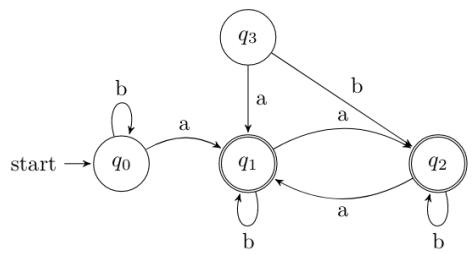

<details>
<summary>flowchart</summary>

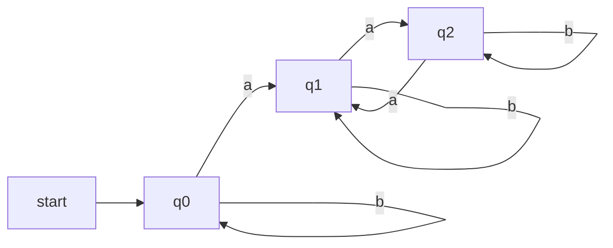
</details>

The minimum state automaton equivalent to the above FSA has the following number of states:

A. 1

B. 2

C. 3

D. 4

# Answer key

# 6.11.13 Minimal State Automata: GATE CSE 2010 | Question: 41

Let $w$ be any string of length $n$ in $\{0,1\}^*$ . Let $L$ be the set of all substrings of $w$ . What is the minimum number of states in non-deterministic finite automation that accepts $L$ ?


A. n - 1

B. n

C. $n + 1$

D. $2^{n - 1}$

gatecse-2010 theory-of-computation finite-automata normal minimal-state-automata

# Answer key

# 6.11.14 Minimal State Automata: GATE CSE 2011 | Question: 42

Definition of a language L with alphabet $\{a\}$ is given as following.

$$
L = \left\{a ^ {n k} \mid k > 0, \text {and} n \text {is a positive integer constant} \right\}
$$

What is the minimum number of states needed in a DFA to recognize L?

A. $k + 1$

B. $n + 1$

C. $2^{n+1}$

D. $2^{k + 1}$

gatecse-2011 theory-of-computation finite-automata normal minimal-state-automata

# Answer key

# 6.11.15 Minimal State Automata: GATE CSE 2011 | Question: 45

A deterministic finite automaton (DFA) D with alphabet $\Sigma=\{a,b\}$ is given below.


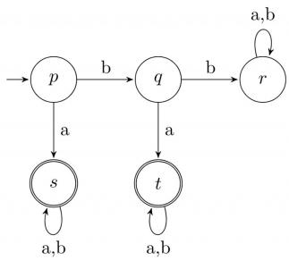

<details>
<summary>flowchart</summary>

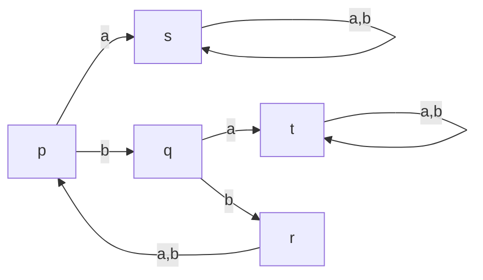
</details>

Which of the following finite state machines is a valid minimal DFA which accepts the same languages as D?

A.

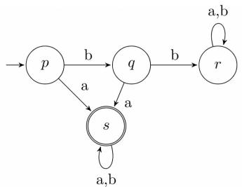

<details>
<summary>flowchart</summary>

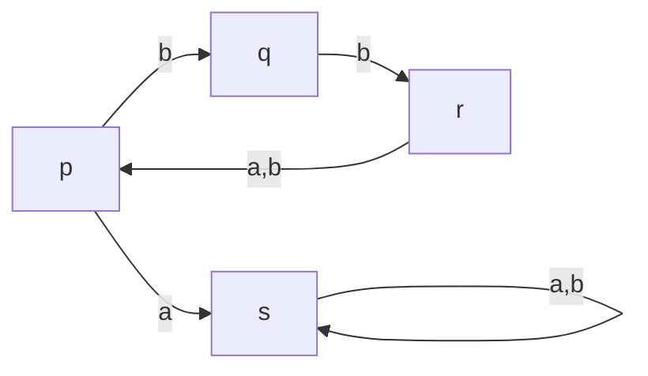
</details>

B.

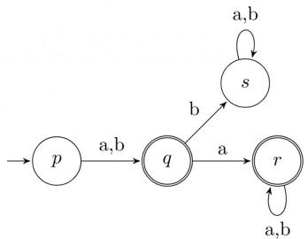

<details>
<summary>flowchart</summary>

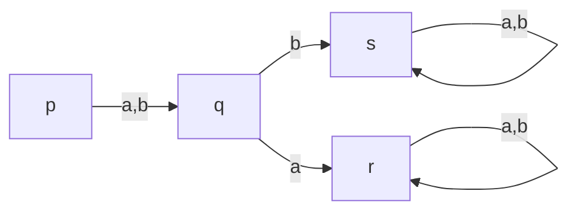
</details>

C.


<details>
<summary>flowchart</summary>

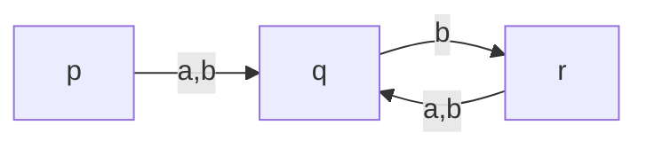
</details>

D.


<details>
<summary>flowchart</summary>

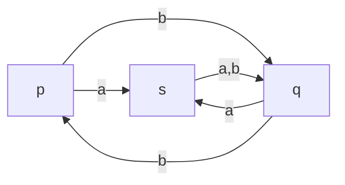
</details>


# 6.11.16 Minimal State Automata: GATE CSE 2015 | Set 1 | Question: 52


<details>
<summary>flowchart</summary>

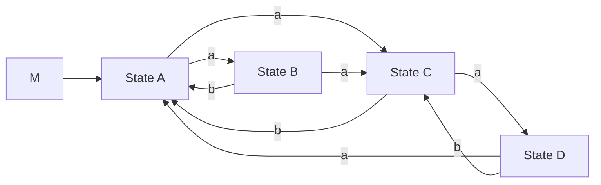
</details>

Consider the DFAs $M$ and $N$ given above. The number of states in a minimal DFA that accept the language $L(M) \cap L(N)$ is \_\_\_\_.

gatecse-2015-set1 theory-of-computation finite-automata easy numerical-answers minimal-state-automata

Answer key

# 6.11.17 Minimal State Automata: GATE CSE 2015 | Set 2 | Question: 53


The number of states in the minimal deterministic finite automaton corresponding to the regular expression $(0+1)^{*}(10)$ is \_\_\_\_.

gatecse-2015-set2 theory-of-computation finite-automata normal numerical-answers minimal-state-automata

Answer key

# 6.11.18 Minimal State Automata: GATE CSE 2015 | Set 3 | Question: 18


Let $L$ be the language represented by the regular expression $\Sigma^{*}0011\Sigma^{*}$ where $\Sigma=\{0,1\}$ . What is the minimum number of states in a DFA that recognizes $\bar{L}$ (complement of $L$ )?

A. 4

B. 5

C. 6

D. 8

gatecse-2015-set3 theory-of-computation finite-automata normal minimal-state-automata

Answer key

# 6.11.19 Minimal State Automata: GATE CSE 2016 | Set 2 | Question: 16


The number of states in the minimum sized DFA that accepts the language defined by the regular expression.

$$
(0 + 1) ^ {*} (0 + 1) (0 + 1) ^ {*}
$$

is \_\_\_\_.

gatecse-2016-set2 theory-of-computation finite-automata normal numerical-answers minimal-state-automata

Answer key

# 6.11.20 Minimal State Automata: GATE CSE 2017 | Set 1 | Question: 22


Consider the language $L$ given by the regular expression $(a + b)^* b(a + b)$ over the alphabet $\{a, b\}$ . The smallest number of states needed in a deterministic finite-state automaton (DFA) accepting $L$ is \_\_\_\_.

gatecse-2017-set1 theory-of-computation finite-automata numerical-answers minimal-state-automata

Answer key

# 6.11.21 Minimal State Automata: GATE CSE 2017 | Set 2 | Question: 25


The minimum possible number of states of a deterministic finite automaton that accepts the regular language $L = \{w_1aw_2 \mid w_1, w_2 \in \{a, b\}^*, |w_1| = 2, |w_2| \geq 3\}$ is \_\_\_\_.

theory-of-computation gatecse-2017-set2 finite-automata numerical-answers minimal-state-automata

Answer key

# 6.11.22 Minimal State Automata: GATE CSE 2018 | Question: 6


Let $N$ be an NFA with $n$ states. Let $k$ be the number of states of a minimal DFA which is equivalent to $N$ . Which one of the following is necessarily true?

A. $k \geq 2^{n}$

B. $k \geq n$

C. $k \leq n^{2}$

D. $k \leq 2^{n}$

gatecse-2018 theory-of-computation minimal-state-automata normal one-mark

# Answer key

# 6.11.23 Minimal State Automata: GATE CSE 2019 | Question: 48

Let $\Sigma$ be the set of all bijections from $\{1, \ldots, 5\}$ to $\{1, \ldots, 5\}$ , where $id$ denotes the identity function, i.e. $id(j) = j, \forall j$ . Let $\circ$ denote composition on functions. For a string $x = x_1 x_2 \ldots x_n \in \Sigma^n, n \geq 0$ , let $\pi(x) = x_1 \circ x_2 \circ \cdots \circ x_n$ . Consider the language $L = \{x \in \Sigma^* \mid \pi(x) = id\}$ . The minimum number of states in any DFA accepting $L$ is \_\_\_\_

gatecse-2019 numerical-answers theory-of-computation finite-automata minimal-state-automata difficult two-marks

# Answer key

# 6.11.24 Minimal State Automata: GATE CSE 2023 | Question: 53

Consider the language L over the alphabet $\{0,1\}$ , given below:

$$
L = \{w \in \{0, 1 \} ^ {*} \mid w \text {does not contain three or more consecutive 1 's} \}.
$$

The minimum number of states in a Deterministic Finite-State Automaton (DFA) for $L$ is \_\_\_\_.

gatecse-2023 theory-of-computation minimal-state-automata numerical-answers two-marks

# Answer key

# 6.11.25 Minimal State Automata: GATE IT 2008 | Question: 6

Let $N$ be an NFA with $n$ states and let $M$ be the minimized DFA with $m$ states recognizing the same language. Which of the following in NECESSARILY true?

A. $m \leq 2^{n}$

B. $n \leq m$

C. $M$ has one accept state

D. $m = 2^{n}$

gateit-2008 theory-of-computation finite-automata normal minimal-state-automata

# Answer key

# 6.12

# Non Determinism (6)

# Practice Test: Test 1 (6Q)

# 6.12.1 Non Determinism: GATE CSE 1992 | Question: 02,xx

In which of the cases stated below is the following statement true?

"For every non-deterministic machine $M_{1}$ there exists an equivalent deterministic machine $M_{2}$ recognizing the same language".

A. $M_{1}$ is non-deterministic finite automaton.  
B. $M_{1}$ is non-deterministic PDA.  
C. $M_{1}$ is a non-deterministic Turing machine.  
D. For no machines $M_{1}$ and $M_{2}$ , the above statement true.

gate1992 theory-of-computation easy non-determinism multiple-selects

# Answer key


# 6.12.2 Non Determinism: GATE CSE 1994 | Question: 1.16

Which of the following conversions is not possible (algorithmically)?


A. Regular grammar to context free grammar  
B. Non-deterministic FSA to deterministic FSA  
C. Non-deterministic PDA to deterministic PDA  
D. Non-deterministic Turing machine to deterministic Turing machine

gate1994 theory-of-computation easy non-determinism

# Answer key

# 6.12.3 Non Determinism: GATE CSE 1998 | Question: 1.11


Regarding the power of recognition of languages, which of the following statements is false?

A. The non-deterministic finite-state automata are equivalent to deterministic finite-state automata.  
B. Non-deterministic Push-down automata are equivalent to deterministic Push-down automata.  
C. Non-deterministic Turing machines are equivalent to deterministic Turing machines.  
D. Multi-tape Turing machines are available are equivalent to Single-tape Turing machines.

gate1998 theory-of-computation easy non-determinism

# Answer key

# 6.12.4 Non Determinism: GATE CSE 2005 | Question: 54


Let $N_f$ and $N_p$ denote the classes of languages accepted by non-deterministic finite automata and non-deterministic push-down automata, respectively. Let $D_f$ and $D_p$ denote the classes of languages accepted by deterministic finite automata and deterministic push-down automata respectively. Which one of the following is TRUE?

A. $D_{f}\subset N_{f}$ and $D_{p}\subset N_{p}$  
C. $D_{f} = N_{f}$ and $D_{p} = N_{p}$

B. $D_{f}\subset N_{f}$ and $D_{p} = N_{p}$

D. $D_{f} = N_{f}$ and $D_{p}\subset N_{p}$

gatecse-2005 theory-of-computation easy non-determinism

# Answer key

# 6.12.5 Non Determinism: GATE CSE 2011 | Question: 8


Which of the following pairs have DIFFERENT expressive power?

A. Deterministic finite automata (DFA) and Non-deterministic finite automata (NFA)  
B. Deterministic push down automata (DPDA) and Non-deterministic push down automata (NPDA)  
C. Deterministic single tape Turing machine and Non-deterministic single tape Turing machine  
D. Single tape Turing machine and multi-tape Turing machine

gatecse-2011 theory-of-computation easy non-determinism

# Answer key

# 6.12.6 Non Determinism: GATE IT 2004 | Question: 9


Which one of the following statements is FALSE?

A. There exist context-free languages such that all the context-free grammars generating them are ambiguous  
B. An unambiguous context-free grammar always has a unique parse tree for each string of the language generated by it  
C. Both deterministic and non-deterministic pushdown automata always accept the same set of languages  
D. A finite set of string from some alphabet is always a regular language

# 6.13

# Number of States (2)

# 6.13.1 Number of States: GATE CSE 2025 | Set 2 | Question: 50

Let $\Sigma = \{1,2,3,4\}$ . For $x \in \Sigma^{*}$ , let $\operatorname{prod}(x)$ be the product of symbols in $x$ modulo 7. We take $\operatorname{prod}(\epsilon) = 1$ , where $\epsilon$ is the null string.


For example, $\operatorname{prod}(124) = (1 \times 2 \times 4) \bmod 7 = 1$ .

Define $L = \{x\in \Sigma^{*}\mid \mathrm{prod}(x) = 2\}$

The number of states in a minimum state DFA for $L$ is \_\_\_\_. (Answer in integer)

gatecse2025-set2 theory-of-computation finite-automata number-of-states numerical-answers two-marks

# Answer key

# 6.13.2 Number of States: GATE CSE 2026 | Set 1 | Question: 16

Let M be a nondeterministic finite automaton (NFA) with 6 states over a finite alphabet.


Which of the following options CANNOT be the number of states in the minimal deterministic finite automaton (DFA) that is equivalent to M ?

A. 32

B. 65

C. 1

D. 128

gatecse-2026-set1 theory-of-computation finite-automata number-of-states multiple-selects one-mark

# Answer key

# 6.14

# Pumping Lemma (2)

# 6.14.1 Pumping Lemma: GATE CSE 2019 | Question: 15

For $\Sigma = \{a, b\}$ , let us consider the regular language $L = \{x \mid x = a^{2+3k} \text{ or } x = b^{10+12k}, k \geq 0\}$ . Which one of the following can be a pumping length (the constant guaranteed by the pumping lemma) for $L$ ?


A. 3

B. 5

C. 9

D. 24

gatecse-2019 theory-of-computation pumping-lemma one-mark

# Answer key

# 6.14.2 Pumping Lemma: GATE IT 2005 | Question: 40

A language L satisfies the Pumping Lemma for regular languages, and also the Pumping Lemma for context-free languages. Which of the following statements about L is TRUE?


A. L is necessarily a regular language.  
B. L is necessarily a context-free language, but not necessarily a regular language.  
C. L is necessarily a non-regular language.  
D. None of the above

gateit-2005 theory-of-computation pumping-lemma easy

# Answer key

# 6.15

# Pushdown Automata (15)

Practice Tests: Test 1 (15Q) Test 2 (4Q)

# 6.15.1 Pushdown Automata: GATE CSE 1996 | Question: 13

Let $Q = (\{q_1, q_2\}, \{a, b\}, \{a, b, \bot\}, \delta, \bot, \phi)$ be a pushdown automaton accepting by empty stack for the language which is the set of all nonempty even palindromes over the set $\{a, b\}$ . Below is an incomplete


specification of the transitions $\delta$ . Complete the specification. The top of the stack is assumed to be at the right end of the string representing stack contents.

1. $\delta (q_{1},a,\bot) = \{(q_{1},\bot a)\}$  
2. $\delta (q_1,b,\bot) = \{(q_1,\bot b)\}$  
3. $\delta (q_{1},a,a) = \{(q_{1},aa)\}$  
4. $\delta (q_{1},b,a) = \{(q_{1},ab)\}$  
5. $\delta (q_{1},a,b) = \{(q_{1},ba)\}$  
6. $\delta (q_{1},b,b) = \{(q_{1},bb)\}$  
7. $\delta (q_{1},a,a) = \{(\dots ,\dots)\}$  
8. $\delta (q_{1},b,b) = \{(\dots ,\dots)\}$  
9. $\delta (q_2,a,a) = \{(q_2,\epsilon)\}$  
10. $\delta (q_2,b,b) = \{(q_2,\epsilon)\}$  
11. $\delta (q_2,\epsilon ,\bot) = \{(q_2,\epsilon)\}$

gate1996 theory-of-computation pushdown-automata normal descriptive

# Answer key

# 6.15.2 Pushdown Automata: GATE CSE 1997 | Question: 6.6

Which of the following languages over $\{a,b,c\}$ is accepted by a deterministic pushdown automata?

A. $\{wcw^R \mid w \in \{a, b\}^*\}$

C. $\{a^n b^n c^n \mid n \geq 0\}$

B. $\{ww^R \mid w \in \{a, b, c\}^*\}$

D. $\{w\mid w$ is a palindrome over $\{a,b,c\}\}$

Note: $w^{R}$ is the string obtained by reversing 'w'.

gate1997 theory-of-computation pushdown-automata easy

# Answer key

# 6.15.3 Pushdown Automata: GATE CSE 1998 | Question: 13

Let $M = (\{q_0, q_1\}, \{0, 1\}, \{z_0, X\}, \delta, q_0, z_0, \phi)$ be a Pushdown automation where $\delta$ is given by

$$
\delta (q _ {0}, 1, z _ {0}) = \{(q _ {0}, X z _ {0}) \}
$$

$$
\delta (q _ {0}, \epsilon , z _ {0}) = \{(q _ {0}, \epsilon) \}
$$

$$
\delta (q _ {0}, 1, X) = \{(q _ {0}, X X) \}
$$

$$
\delta (q _ {1}, 1, X) = \{(q _ {1}, \epsilon) \}
$$

$$
\delta (q _ {0}, 0, X) = \{(q _ {1}, X) \}
$$

$$
\delta (q _ {0}, 0, z _ {0}) = \{(q _ {0}, z _ {0}) \}
$$

a. What is the language accepted by this PDA by empty stack?

b. Describe informally the working of the PDA

gate1998 theory-of-computation pushdown-automata descriptive

# Answer key

# 6.15.4 Pushdown Automata: GATE CSE 1999 | Question: 1.6

Let $L_{1}$ be the set of all languages accepted by a PDA by final state and $L_{2}$ the set of all languages accepted by empty stack. Which of the following is true?

A. $L_{1}=L_{2}$

C. $L_{1} \subset L_{2}$

B. $L_{1} \supset L_{2}$

D. None

normal theory-of-computation gate1999 pushdown-automata

# Answer key


A push down automation (pda) is given in the following extended notation of finite state diagram:


<details>
<summary>flowchart</summary>

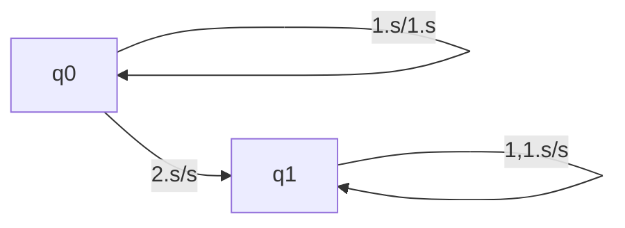
</details>

The nodes denote the states while the edges denote the moves of the pda. The edge labels are of the form $d$ , $s/s'$ where $d$ is the input symbol read and $s$ , $s'$ are the stack contents before and after the move. For example the edge labeled 1, $s/1.s$ denotes the move from state $q_0$ to $q_0$ in which the input symbol 1 is read and pushed to the stack.

A. Introduce two edges with appropriate labels in the above diagram so that the resulting pda accepts the language $\{x2x^R \mid x \in \{0,1\}^*, x^R$ denotes reverse of $x\}$ , by empty stack.  
B. Describe a non-deterministic pda with three states in the above notation that accept the language $\{0^n 1^m \mid n \leq m \leq 2n\}$ by empty stack

gatecse-2000 theory-of-computation descriptive pushdown-automata

Answer key

# 6.15.6 Pushdown Automata: GATE CSE 2001 | Question: 6

Give a deterministic PDA for the language $L = \{a^n cb^{2n} \mid n \geq 1\}$ over the alphabet $\Sigma = \{a, b, c\}$ . Specify the acceptance state.


gatecse-2001 theory-of-computation normal pushdown-automata descriptive

Answer key

# 6.15.7 Pushdown Automata: GATE CSE 2009 | Question: 16, ISRO2017-12

Which one of the following is FALSE?

A. There is a unique minimal DFA for every regular language  
B. Every NFA can be converted to an equivalent PDA.  
C. Complement of every context-free language is recursive.  
D. Every nondeterministic PDA can be converted to an equivalent deterministic PDA.

gatecse-2009 theory-of-computation easy isro2017 pushdown-automata

Answer key

# 6.15.8 Pushdown Automata: GATE CSE 2015 | Set 1 | Question: 51

Consider the NPDA


$$
\langle Q = \{q _ {0}, q _ {1}, q _ {2} \}, \Sigma = \{0, 1 \}, \Gamma = \{0, 1, \bot \}, \delta , q _ {0}, \bot , F = \{q _ {2} \} \rangle
$$

, where (as per usual convention) Q is the set of states, $\Sigma$ is the input alphabet, $\Gamma$ is the stack alphabet, $\delta$ is the state transition function $q_{0}$ is the initial state, $\perp$ is the initial stack symbol, and F is the set of accepting states. The state transition is as follows:


<details>
<summary>flowchart</summary>

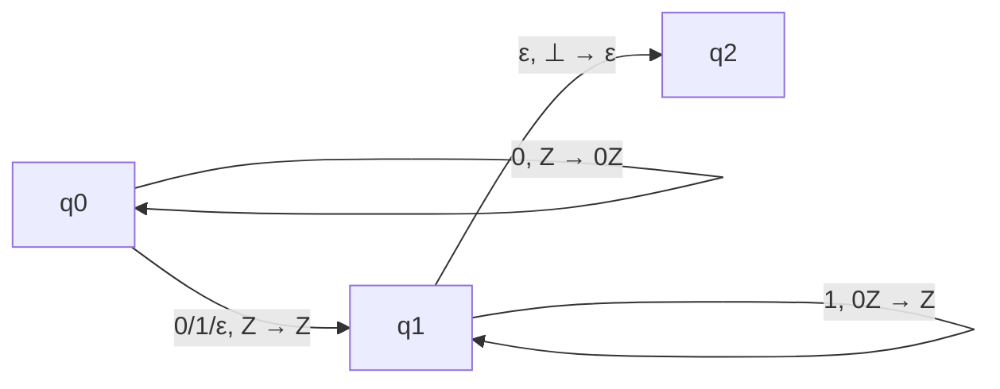
</details>

Which one of the following sequences must follow the string 101100 so that the overall string is accepted by the


automaton?

A. 10110

B. 10010

C. 01010

D. 01001

gatecse-2015-set1 theory-of-computation pushdown-automata normal

Answer key

# 6.15.9 Pushdown Automata: GATE CSE 2016 | Set 1 | Question: 43

Consider the transition diagram of a PDA given below with input alphabet $\Sigma = \{a, b\}$ and stack alphabet $\Gamma = \{X, Z\}$ . $Z$ is the initial stack symbol. Let $L$ denote the language accepted by the PDA


<details>
<summary>flowchart</summary>

```mermaid
graph LR
  A["a, X/XX\na, Z/XZ"] --> C((" ))
  C -->|"b, X/ε"| D((" ))
  D -->|"b, X/ε"| E((" ))
  E -->|"ε, Z/Z"| F((""))
```
</details>

Which one of the following is TRUE?

A. $L = \{a^n b^n \mid n \geq 0\}$ and is not accepted by any finite automata  
B. $L = \{a^n \mid n \geq 0\} \cup \{a^n b^n \mid n \geq 0\}$ and is not accepted by any deterministic PDA  
C. L is not accepted by any Turing machine that halts on every input  
D. $L = \{a^n\mid n\geq 0\} \cup \{a^n b^n\mid n\geq 0\}$ and is deterministic context-free

gatecse-2016-set1 theory-of-computation pushdown-automata normal

Answer key

# 6.15.10 Pushdown Automata: GATE CSE 2021 | Set 1 | Question: 51

In a pushdown automaton $P = (Q, \Sigma, \Gamma, \delta, q_0, F)$ , a transition of the form,


where $p, q \in Q$ , $a \in \Sigma \cup \{\epsilon\}$ , and $X, Y \in \Gamma \cup \{\epsilon\}$ , represents

$$
(q, Y) \in \delta (p, a, X).
$$

Consider the following pushdown automaton over the input alphabet $\Sigma = \{a, b\}$ and stack alphabet $\Gamma = \{\#, A\}$ .


<details>
<summary>flowchart</summary>

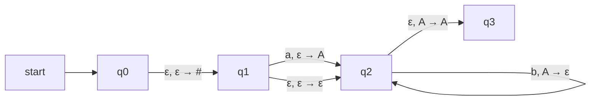
</details>

The number of strings of length 100 accepted by the above pushdown automaton is \_\_\_\_

gatecse-2021-set1 theory-of-computation pushdown-automata numerical-answers two-marks

Answer key

# 6.15.11 Pushdown Automata: GATE CSE 2023 | Question: 30

Consider the pushdown automaton (PDA) $P$ below, which runs on the input alphabet $\{a, b\}$ , has stack alphabet $\{\bot, A\}$ , and has three states $\{s, p, q\}$ , with $s$ being the start state. A transition from state $u$ to state $v$ , labelled $c / X / \gamma$ , where $c$ is an input symbol or $\epsilon, X$ is a stack symbol, and $\gamma$ is a string of stack symbols, represents the fact that in state $u$ , the (PDA) can read $c$ from the input, with $X$ on the top of its stack, pop $X$ from the stack, push in the string $\gamma$ on the stack, and go to state $v$ . In the initial configuration, the stack has only the symbol $\bot$ in it. The (PDA) accepts by empty stack.


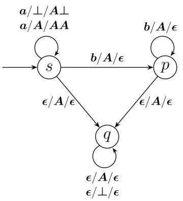

<details>
<summary>flowchart</summary>

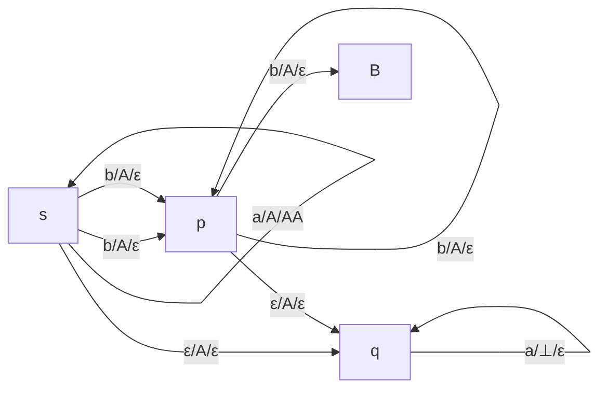
</details>

Which one of the following options correctly describes the language accepted by P?

A. $\{a^m b^n \mid 1 \leq m \text{ and } n < m\}$  
B. $\{a^m b^n \mid 0 \leq n \leq m\}$  
C. $\{a^m b^n \mid 0 \leq m \text{ and } 0 \leq n\}$  
D. $\{a^m\mid 0\leq m\} \cup \{b^n\mid 0\leq n\}$

gatecse-2023 theory-of-computation pushdown-automata two-marks

# Answer key

# 6.15.12 Pushdown Automata: GATE IT 2004 | Question: 40

Let $M = (K, \Sigma, \Gamma, \Delta, s, F)$ be a pushdown automaton, where

$$
K = (s, f), F = \{f \}, \Sigma = \{a, b \}, \Gamma = \{a \} \text {and}
$$

$$
\Delta = \{((s, a, \epsilon), (s, a)), ((s, b, \epsilon), (s, a)), ((s, a, a), (f, \epsilon)), ((f, a, a), (f, \epsilon)), ((f, b, a), (f, \epsilon)) \}.
$$

Which one of the following strings is not a member of $L(M)$ ?

A. aaa

B. aabab

C. baaba

D. bab

gateit-2004 theory-of-computation pushdown-automata normal

# Answer key

# 6.15.13 Pushdown Automata: GATE IT 2005 | Question: 38

Let $P$ be a non-deterministic push-down automaton (NPDA) with exactly one state, $q$ , and exactly one symbol, $Z$ , in its stack alphabet. State $q$ is both the starting as well as the accepting state of the PDA. The stack is initialized with one $Z$ before the start of the operation of the PDA. Let the input alphabet of the PDA be $\Sigma$ . Let $L(P)$ be the language accepted by the PDA by reading a string and reaching its accepting state. Let $N(P)$ be the language accepted by the PDA by reading a string and emptying its stack. Which of the following statements is TRUE?

A. $L(P)$ is necessarily $\Sigma^{*}$ but $N(P)$ is not necessarily $\Sigma^{*}$ .  
B. $N(P)$ is necessarily $\Sigma^{*}$ but $L(P)$ is not necessarily $\Sigma^{*}$ .  
C. Both $L(P)$ and $N(P)$ are necessarily $\Sigma^{*}$ .  
D. Neither $L(P)$ nor $N(P)$ are necessarily $\Sigma^{*}$

gateit-2005 theory-of-computation pushdown-automata normal

# Answer key

# 6.15.14 Pushdown Automata: GATE IT 2006 | Question: 31

Which of the following languages is accepted by a non-deterministic pushdown automaton (PDA) but NOT by a deterministic PDA?

A. $\{a^n b^n c^n \mid n \geq 0\}$  
C. $\{a^{n}b^{n} \mid n \geq 0\}$


# 6.15.15 Pushdown Automata: GATE IT 2006 | Question: 33


Consider the pushdown automaton (PDA) below which runs over the input alphabet $(a, b, c)$ . It has the stack alphabet $\{Z_0, X\}$ where $Z_0$ is the bottom-of-stack marker. The set of states of the PDA is $(s, t, u, f)$ where $s$ is the start state and $f$ is the final state. The PDA accepts by final state. The transitions of the PDA given below are depicted in a standard manner. For example, the transition $(s, b, X) \to (t, XZ_0)$ means that if the PDA is in state $s$ and the symbol on the top of the stack is $X$ , then it can read $b$ from the input and move to state $t$ after popping the top of stack and pushing the symbols $Z_0$ and $X$ (in that order) on the stack.

$$
(s, a, Z _ {0}) \rightarrow (s, X X Z _ {0})
$$

$$
(s, \epsilon , Z _ {0}) \rightarrow (f, \epsilon)
$$

$$
(s, a, X) \rightarrow (s, X X X)
$$

$$
(s, b, X) \rightarrow (t, \epsilon)
$$

$$
(t, b, X) \rightarrow (t, \epsilon)
$$

$$
(t, c, X) \rightarrow (u, \epsilon)
$$

$$
(u, c, X) \rightarrow (u, \epsilon)
$$

$$
(u, \epsilon , Z _ {0}) \rightarrow (f, \epsilon)
$$

The language accepted by the PDA is

A. $\{a^l b^m c^n \mid l = m = n\}$  
C. $\{a^l b^m c^n \mid 2l = m + n\}$  
gateit-2006 theory-of-computation pushdown-automata normal

B. $\{a^l b^m c^n \mid l = m\}$  
D. $\{a^l b^m c^n \mid m = n\}$

Answer key

# 6.16

# Recursive and Recursively Enumerable Languages (16)

Practice Tests: Test 1 (15Q) Test 2 (11Q)

# 6.16.1 Recursive and Recursively Enumerable Languages: GATE CSE 1990 | Question: 3-vi


Recursive languages are:

A. A proper superset of context free languages.  
C. Also called type 0 languages.

B. Always recognizable by pushdown automata.  
D. Recognizable by Turing machines.

gate1990 normal theory-of-computation turing-machine recursive-and-recursively-enumerable-languages multiple-selects

Answer key

# 6.16.2 Recursive and Recursively Enumerable Languages: GATE CSE 2003 | Question: 13

Nobody knows yet if P = NP. Consider the language L defined as follows.

$$
L = \left\{ \begin{array}{l l} (0 + 1) ^ {*} & \text {if} P = N P \\ \phi & \text {otherwise} \end{array} \right.
$$

Which of the following statements is true?

A. $L$ is recursive  
B. $L$ is recursively enumerable but not recursive  
C. $L$ is not recursively enumerable  
D. Whether $L$ is recursively enumerable or not will be known after we find out if $P = NP$

gatecse-2003 theory-of-computation normal recursive-and-recursively-enumerable-languages

Answer key


# 6.16.3 Recursive and Recursively Enumerable Languages: GATE CSE 2003 | Question: 15


If the strings of a language $L$ can be effectively enumerated in lexicographic (i.e., alphabetic) order, which of the following statements is true?

A. $L$ is necessarily finite  
B. L is regular but not necessarily finite  
C. $L$ is context free but not necessarily regular  
D. $L$ is recursive but not necessarily context-free

theory-of-computation gatecse-2003 normal recursive-and-recursively-enumerable-languages

# Answer key

# 6.16.4 Recursive and Recursively Enumerable Languages: GATE CSE 2003 | Question: 54


Define languages $L_{0}$ and $L_{1}$ as follows :

- $L_{0} = \{\langle M, w, 0 \rangle \mid M \text{ halts on } w\}$  
- $L_{1} = \{\langle M, w, 1 \rangle \mid M \text{ does not halts on } w\}$

Here $\langle M, w, i \rangle$ is a triplet, whose first component M is an encoding of a Turing Machine, second component w is a string, and third component i is a bit.

Let $L = L_{0} \cup L_{1}$ . Which of the following is true?

A. L is recursively enumerable, but $L'$ is not  
B. $L'$ is recursively enumerable, but $L$ is not  
C. Both $L$ and $L'$ are recursive  
D. Neither $L$ nor $L'$ is recursively enumerable

theory-of-computation recursive-and-recursively-enumerable-languages gatecse-2003 difficult

# Answer key

# 6.16.5 Recursive and Recursively Enumerable Languages: GATE CSE 2004 | Question: 89


$L_{1}$ is a recursively enumerable language over $\Sigma$ . An algorithm $A$ effectively enumerates its words as $\omega_{1}, \omega_{2}, \omega_{3}, \ldots$ . Define another language $L_{2}$ over $\Sigma \cup \{\#\}$ as $\{w_{i} \# w_{j} \mid w_{i}, w_{j} \in L_{1}, i < j\}$ . Here $\#$ is new symbol. Consider the following assertions.

- $S_{1}: L_{1}$ is recursive implies $L_{2}$ is recursive  
- $S_{2}: L_{2}$ is recursive implies $L_{1}$ is recursive

Which of the following statements is true?

A. Both $S_{1}$ and $S_{2}$ are true

B. $S_{1}$ is true but $S_{2}$ is not necessarily true

C. $S_{2}$ is true but $S_{1}$ is not necessarily true

D. Neither is necessarily true

gatecse-2004 theory-of-computation recursive-and-recursively-enumerable-languages difficult

# Answer key

# 6.16.6 Recursive and Recursively Enumerable Languages: GATE CSE 2005 | Question: 56


Let $L_{1}$ be a recursive language, and let $L_{2}$ be a recursively enumerable but not a recursive language. Which one of the following is TRUE?

A. $L_{1}$ is recursive and $L_{2}$ is recursively enumerable  
B. $L_{1}$ is recursive and $L_{2}$ is not recursively enumerable  
C. $L_{1}$ and $L_{2}$ are recursively enumerable  
D. $L_{1}$ is recursively enumerable and $L_{2}$ is recursive