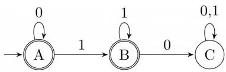
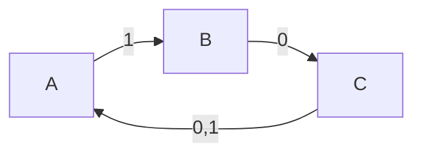
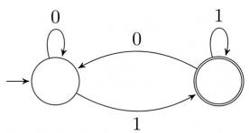
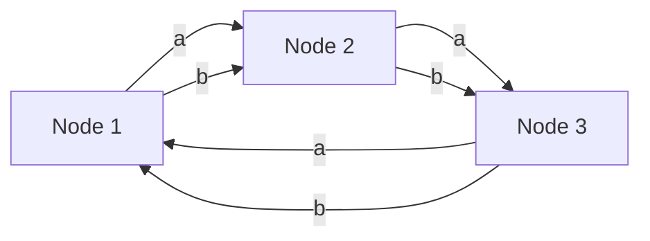
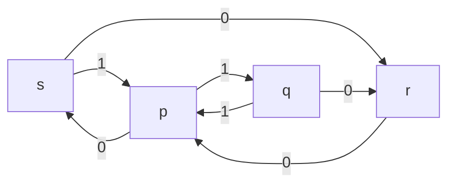
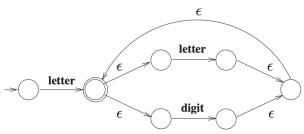
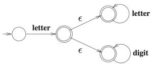
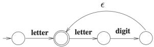
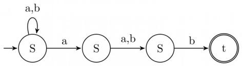

# 6.16.7 Recursive and Recursively Enumerable Languages: GATE CSE 2008 | Question: 13, ISRO2016-36

If $L$ and $\overline{L}$ are recursively enumerable then $L$ is


A. regular

B. context-free

C. context-sensitive

D. recursive

gatecse-2008 theory-of-computation easy isro2016 recursive-and-recursively-enumerable-languages

# Answer key

# 6.16.8 Recursive and Recursively Enumerable Languages: GATE CSE 2008 | Question: 48


Which of the following statements is false?

A. Every NFA can be converted to an equivalent DFA  
B. Every non-deterministic Turing machine can be converted to an equivalent deterministic Turing machine  
C. Every regular language is also a context-free language  
D. Every subset of a recursively enumerable set is recursive

gatecse-2008 theory-of-computation easy recursive-and-recursively-enumerable-languages

# Answer key

# 6.16.9 Recursive and Recursively Enumerable Languages: GATE CSE 2010 | Question: 17


Let $L_{1}$ be the recursive language. Let $L_{2}$ and $L_{3}$ be languages that are recursively enumerable but not recursive. Which of the following statements is not necessarily true?

A. $L_{2} - L_{1}$ is recursively enumerable.  
B. $L_{1} - L_{3}$ is recursively enumerable.  
C. $L_{2} \cap L_{3}$ is recursively enumerable.  
D. $L_{2} \cup L_{3}$ is recursively enumerable.

gatecse-2010 theory-of-computation recursive-and-recursively-enumerable-languages decidability normal

# Answer key

# 6.16.10 Recursive and Recursively Enumerable Languages: GATE CSE 2014 | Set 1 | Question: 35


Let $\bar{L}$ be a language and $\bar{L}$ be its complement. Which one of the following is NOT a viable possibility?

A. Neither $L$ nor $\bar{L}$ is recursively enumerable (r.e.).  
B. One of $\bar{L}$ and $\bar{L}$ is r.e. but not recursive; the other is not r.e.  
C. Both $L$ and $\bar{L}$ are r.e. but not recursive.  
D. Both $L$ and $\bar{L}$ are recursive.

gatecse-2014-set1 theory-of-computation easy recursive-and-recursively-ennumerable-languages

# Answer key

# 6.16.11 Recursive and Recursively Enumerable Languages: GATE CSE 2014 | Set 2 | Question: 16


Let $A \leq_{m} B$ denotes that language $A$ is mapping reducible (also known as many-to-one reducible) to language $B$ . Which one of the following is FALSE?

A. If $A \leq_{m} B$ and $B$ is recursive then $A$ is recursive.  
B. If $A \leq_{m} B$ and $A$ is undecidable then $B$ is undecidable.  
C. If $A \leq_{m} B$ and $B$ is recursively enumerable then $A$ is recursively enumerable.  
D. If $A \leq_{m} B$ and $B$ is not recursively enumerable then $A$ is not recursively enumerable.

# 6.16.12 Recursive and Recursively Enumerable Languages: GATE CSE 2014 | Set 2 | Question: 35

Let $\langle M\rangle$ be the encoding of a Turing machine as a string over $\Sigma = \{0,1\}$ . Let

$L = \{\langle M\rangle \mid M$ is a Turing machine

that accepts a string of length 2014}.


Then $L$ is:

A. decidable and recursively enumerable  
C. undecidable and not recursively enumerable

B. undecidable but recursively enumerable

D. decidable but not recursively enumerable

gatecse-2014-set2 theory-of-computation recursive-and-recursively-enumerable-languages normal

# Answer key

# 6.16.13 Recursive and Recursively Enumerable Languages: GATE CSE 2015 | Set 1 | Question: 3

For any two languages $L_{1}$ and $L_{2}$ such that $L_{1}$ is context-free and $L_{2}$ is recursively enumerable but not recursive, which of the following is/are necessarily true?

I. $\bar{L}_1$ (Complement of $L_{1}$ ) is recursive  
II. $\bar{L}_2$ (Complement of $L_{2}$ ) is recursive  
III. $\bar{L}_1$ is context-free  
IV. $\bar{L}_1 \cup L_2$ is recursively enumerable

A. I only

B. III only

C. III and IV only

D. I and IV only

gatecse-2015-set1 theory-of-computation recursive-and-recursively-enumerable-languages normal

# Answer key

# 6.16.14 Recursive and Recursively Enumerable Languages: GATE CSE 2016 | Set 2 | Question: 44

Consider the following languages.

- $L_{1} = \{\langle M \rangle \mid M \text{ takes at least 2016 steps on some input}\}$ ,  
- $L_{2} = \{\langle M \rangle \mid M \text{ takes at least 2016 steps on all inputs}\}$ and  
- $L_{3} = \{\langle M\rangle \mid M$ accepts $\epsilon\}$ ,

where for each Turing machine $M$ , $\langle M \rangle$ denotes a specific encoding of $M$ . Which one of the following is TRUE?

A. $L_{1}$ is recursive and $L_{2}, L_{3}$ are not recursive  
B. $L_{2}$ is recursive and $L_{1}, L_{3}$ are not recursive  
C. $L_{1}, L_{2}$ are recursive and $L_{3}$ is not recursive  
D. $L_{1}, L_{2}, L_{3}$ are recursive

gatecse-2016-set2 theory-of-computation recursive-and-recursively-enumerable-languages

# Answer key

# 6.16.15 Recursive and Recursively Enumerable Languages: GATE CSE 2021 | Set 1 | Question: 12

Let $\langle M\rangle$ denote an encoding of an automaton $M$ . Suppose that $\Sigma = \{0,1\}$ . Which of the following languages is/are NOT recursive?

A. $L = \{\langle M\rangle \mid M$ is a DFA such that $L(M) = \emptyset \}$  
B. $L = \{\langle M\rangle \mid M$ is a DFA such that $L(M) = \Sigma^{*}\}$  
C. $L = \{\langle M\rangle \mid M$ is a PDA such that $L(M) = \emptyset \}$  
D. $L = \{\langle M\rangle \mid M$ is a PDA such that $L(M) = \Sigma^{*}\}$


# Answer key

# 6.16.16 Recursive and Recursively Enumerable Languages: GATE CSE 2021 | Set 1 | Question: 39

For a Turing machine $M$ , $\langle M\rangle$ denotes an encoding of $M$ . Consider the following two languages.

$$
\begin{array}{l} L _ {1} = \{\langle M \rangle \mid M \text { takes   more   than   2021   steps   on   all   inputs} \} \\ L _ {2} = \{\langle M \rangle \mid M \text { takes   more   than   2021   steps   on   some   input } \} \\ \end{array}
$$

Which one of the following options is correct?

A. Both $L_{1}$ and $L_{2}$ are decidable

B. $L_{1}$ is decidable and $L_{2}$ is undecidable

C. $L_{1}$ is undecidable and $L_{2}$ is decidable

D. Both $L_{1}$ and $L_{2}$ are undecidable

gatecse-2021-set1 theory-of-computation recursive-and-recursively-enumerable-languages decidability easy two-marks

# Answer key

# 6.17

# Reduction (2)

# 6.17.1 Reduction: GATE CSE 2005 | Question: 45

Consider three decision problems $P_{1}$ , $P_{2}$ and $P_{3}$ . It is known that $P_{1}$ is decidable and $P_{2}$ is undecidable. Which one of the following is TRUE?


A. $P_{3}$ is decidable if $P_{1}$ is reducible to $P_{3}$  
B. $P_{3}$ is undecidable if $P_{3}$ is reducible to $P_{2}$  
C. $P_{3}$ is undecidable if $P_{2}$ is reducible to $P_{3}$  
D. $P_{3}$ is decidable if $P_{3}$ is reducible to $P_{2}$ 's complement

gatecse-2005 theory-of-computation decidability normal reduction

# Answer key

# 6.17.2 Reduction: GATE CSE 2016 | Set 1 | Question: 44

Let $X$ be a recursive language and $Y$ be a recursively enumerable but not recursive language. Let $W$ and $Z$ be two languages such that $\overline{Y}$ reduces to $W$ , and $Z$ reduces to $\overline{X}$ (reduction means the standard many-one reduction). Which one of the following statements is TRUE?


A. $W$ can be recursively enumerable and $Z$ is recursive.  
B. $W$ can be recursive and $Z$ is recursively enumerable.  
C. $W$ is not recursively enumerable and $Z$ is recursive.  
D. $W$ is not recursively enumerable and $Z$ is not recursive.

gatecse-2016-set1 theory-of-computation easy recursive-and-recursively-ennumerable-languages reduction

# Answer key

# 6.18

# Regular Expression (29)

Practice Tests: Test 1 (15Q) Test 2 (15Q) Test 3 (7Q)

# 6.18.1 Regular Expression: GATE CSE 1987 | Question: 10d

Give a regular expression over the alphabet $\{0,1\}$ to denote the set of proper non-null substrings of the string 0110.


gate1987 theory-of-computation regular-expression descriptive

# Answer key

# 6.18.2 Regular Expression: GATE CSE 1991 | Question: 03,xiii


Let $r = 1(1 + 0)^{*}$ , $s = 11^{*}0$ and $t = 1^{*}0$ be three regular expressions. Which one of the following is true?

A. $L(s)\subseteq L(r)$ and $L(s)\subseteq L(t)$

B. $L(r)\subseteq L(s)$ and $L(s)\subseteq L(t)$

C. $L(s)\subseteq L(t)$ and $L(s)\subseteq L(r)$

D. $L(t)\subseteq L(s)$ and $L(s)\subseteq L(r)$

E. None of the above

gate1991 theory-of-computation regular-expression normal multiple-selects

# Answer key

# 6.18.3 Regular Expression: GATE CSE 1992 | Question: 02,xvii

Which of the following regular expression identities is/are TRUE?

A. $r^{(*)} = r^{*}$

B. $(r^{*}s^{*}) = (r + s)^{*}$

C. $(r + s)^{*} = r^{*} + s^{*}$

D. $r^{*}s^{*} = r^{*} + s^{*}$

gate1992 theory-of-computation regular-expression easy

# Answer key

# 6.18.4 Regular Expression: GATE CSE 1994 | Question: 2.10

The regular expression for the language recognized by the finite state automaton of figure is \_\_\_\_




<details>
<summary>flowchart</summary>


</details>

gate1994 theory-of-computation finite-automata regular-expression easy fill-in-the-blanks

# Answer key

# 6.18.5 Regular Expression: GATE CSE 1995 | Question: 1.9, ISRO2017-13


In some programming language, an identifier is permitted to be a letter followed by any number of letters or digits. If L and D denote the sets of letters and digits respectively, which of the following expressions defines an identifier?

A. $(L+D)^{+}$

B. $(L.D)^{*}$

C. $L(L + D)^*$

D. $L(L, D)^*$

gate1995 theory-of-computation regular-expression easy isro2017

# Answer key

# 6.18.6 Regular Expression: GATE CSE 1996 | Question: 1.8

Which two of the following four regular expressions are equivalent? ( $\varepsilon$ is the empty string).

i. $(00)^{*}(\varepsilon + 0)$  
ii. (00)\*  
iii. $0^{*}$  
iv. 0(00)\*

A. (i) and (ii)

B. (ii) and (iii)

C. (i) and (iii)

D. (iii) and (iv)

gate1996 theory-of-computation regular-expression easy

# Answer key

# 6.18.7 Regular Expression: GATE CSE 1997 | Question: 6.4


Which one of the following regular expressions over $\{0,1\}$ denotes the set of all strings not containing 100 as substring?

A. $0^{*}(1+0)^{*}$

B. 0\*1010\*

C. 0\*1\*01\*

D. $0^{*}(10 + 1)^{*}$


# Answer key

# 6.18.8 Regular Expression: GATE CSE 1998 | Question: 1.12

The string 1101 does not belong to the set represented by

A. $110^{*}(0 + 1)$

B. $1(0 + 1)^{*}101$

C. $(10)^{*}(01)^{*}(00+11)^{*}$

D. $(00 + (11)^{*}0)^{*}$

gate1998 theory-of-computation regular-expression easy multiple-selects

# Answer key

# 6.18.9 Regular Expression: GATE CSE 1998 | Question: 1.9

If the regular set $A$ is represented by $A = (01 + 1)^*$ and the regular set $B$ is represented by $B = ((01)^* 1^*)^*$ , which of the following is true?

A. $A \subset B$

B. $B \subset A$

C. $A$ and $B$ are incomparable

D. A = B

gate1998 theory-of-computation regular-expression normal

# Answer key

# 6.18.10 Regular Expression: GATE CSE 1998 | Question: 3b

Give a regular expression for the set of binary strings where every 0 is immediately followed by exactly k 1's and preceded by at least k 1's (k is a fixed integer)

gate1998 theory-of-computation regular-expression easy descriptive

# Answer key

# 6.18.11 Regular Expression: GATE CSE 2000 | Question: 1.4

Let $S$ and $T$ be languages over $\Sigma = \{a, b\}$ represented by the regular expressions $(a + b^{*})^{*}$ and $(a + b)^{*}$ , respectively. Which of the following is true?

A. $S \subset T$

B. $T \subset S$

C. S = T

D. $S \cap T = \phi$

gatecse-2000 theory-of-computation regular-expression easy

# Answer key

# 6.18.12 Regular Expression: GATE CSE 2003 | Question: 14

The regular expression $0^{*}(10^{*})^{*}$ denotes the same set as

A. $(1^{*}0)^{*}1^{*}$

B. $0 + (0 + 10)^*$

C. $(0 + 1)^{*}10(0 + 1)^{*}$

D. None of the above

gatecse-2003 theory-of-computation regular-expression easy

# Answer key

# 6.18.13 Regular Expression: GATE CSE 2009 | Question: 15

Which one of the following languages over the alphabet $\{0,1\}$ is described by the regular expression: $(0 + 1)^{*}0(0 + 1)^{*}0(0 + 1)^{*}$ ?

A. The set of all strings containing the substring 00  
B. The set of all strings containing at most two 0's  
C. The set of all strings containing at least two 0's  
D. The set of all strings that begin and end with either 0 or 1

gatecse-2009 theory-of-computation regular-expression easy

# Answer key


# 6.18.14 Regular Expression: GATE CSE 2010 | Question: 39


Let $L = \{w \in (0 + 1)^* \mid w \text{ has even number of } 1s\}$ . i.e., $L$ is the set of all the bit strings with even numbers of 1s. Which one of the regular expressions below represents $L$ ?

A. $(0^{*}10^{*}1)^{*}$  
c. $0^{*}(10^{*}1)^{*}0^{*}$

B. $0^{*}(10^{*}10^{*})^{*}$  
D. $0^{*}1(10^{*}1)^{*}10^{*}$

gatecse-2010 theory-of-computation regular-expression normal

# Answer key

# 6.18.15 Regular Expression: GATE CSE 2014 | Set 1 | Question: 36

Which of the regular expressions given below represent the following DFA?



<details>
<summary>flowchart</summary>

```mermaid
graph LR
  A[""] --> B[""]
  B --> C[""]
  C --> D[""]
  D --> E[""]
  E --> F[""]
  F --> G[""]
  G --> H[""]
  H --> I[""]
  I --> J[""]
  J --> K[""]
  K --> L[""]
  L --> M[""]
```
</details>


1. $0^{*}1(1 + 00^{*}1)^{*}$  
II. $0^{*}1^{*}1 + 11^{*}0^{*}1$  
III. $(0 + 1)^{*}1$

A. I and II only

B. I and III only

C. II and III only

D. I, II and III

gatecse-2014-set1 theory-of-computation regular-expression finite-automata easy

# Answer key

# 6.18.16 Regular Expression: GATE CSE 2014 | Set 3 | Question: 15

The length of the shortest string NOT in the language (over $\Sigma = \{a, b\}$ ) of the following regular expression is \_\_\_\_.

$$
a ^ {*} b ^ {*} (b a) ^ {*} a ^ {*}
$$

gatecse-2014-set3 theory-of-computation regular-expression numerical-answers easy

# Answer key

# 6.18.17 Regular Expression: GATE CSE 2016 | Set 1 | Question: 18


Which one of the following regular expressions represents the language: the set of all binary strings having two consecutive 0's and two consecutive 1's?

A. $(0 + 1)^{*}0011(0 + 1)^{*} + (0 + 1)^{*}1100(0 + 1)^{*}$  
C. $(0 + 1)^{*}00(0 + 1)^{*} + (0 + 1)^{*}11(0 + 1)^{*}$  
gatecse-2016-set1 theory-of-computation regular-expression normal

B. $(0 + 1)^{*}(00(0 + 1)^{*}11 + 11(0 + 1)^{*}00)(0 + 1)^{*}$  
D. $00(0 + 1)^{*}11 + 11(0 + 1)^{*}00$

# Answer key

# 6.18.18 Regular Expression: GATE CSE 2020 | Question: 7

Which one of the following regular expressions represents the set of all binary strings with an odd number of 1's?

A. $((0 + 1)^{*}1(0 + 1)^{*}1)^{*}10^{*}$  
C. $10^{*}(0^{*}10^{*}10^{*})^{*}$

B. $(0^{*}10^{*}10^{*})^{*}0^{*}1$  
D. $(0^{*}10^{*}10^{*})^{*}10^{*}$

gatecse-2020 regular-expression normal theory-of-computation one-mark

# Answer key

# 6.18.19 Regular Expression: GATE CSE 2021 | Set 2 | Question: 47


Which of the following regular expressions represent(s) the set of all binary numbers that are divisible by


three? Assume that the string $\epsilon$ is divisible by three.

A. $(0 + 1(01^{*}0)^{*}1)^{*}$

B. $(0 + 11 + 10(1 + 00)^{*}01)^{*}$

C. $(0^{*}(1(01^{*}0)^{*}1)^{*})^{*}$

D. $(0 + 11 + 11(1 + 00)^{*}00)^{*}$

gatecse-2021-set2 multiple-selects theory-of-computation regular-expression two-marks

# Answer key

# 6.18.20 Regular Expression: GATE CSE 2022 | Question: 2

Which one of the following regular expressions correctly represents the language of the finite automaton given below?


<details>
<summary>flowchart</summary>


</details>

A. $ab^{*}bab^{*} + ba^{*}aba^{*}$  
B. $(ab^{*}b)^{*}ab^{*} + (ba^{*}a)^{*}ba^{*}$  
C. $(ab^{*}b + ba^{*}a)^{*}(a^{*} + b^{*})$  
D. $(ba^{*}a + ab^{*}b)^{*}(ab^{*} + ba^{*})$

gatecse-2022 theory-of-computation finite-automata regular-expression one-mark

# Answer key

# 6.18.21 Regular Expression: GATE CSE 2023 | Question: 4

Consider the Deterministic Finite-state Automaton (DFA) A shown below. The DFA runs on the alphabet $\{0,1\}$ , and has the set of states $\{s,p,q,r\}$ , with s being the start state and p being the only final state.


<details>
<summary>flowchart</summary>


</details>

Which one of the following regular expressions correctly describes the language accepted by A?

A. $1(0^{*}11)^{*}$

B. $0(0+1)^{*}$

C. $1(0 + 11)^{*}$

D. $1(110^{*})^{*}$

gatecse-2023 theory-of-computation regular-expression one-mark

# Answer key

# 6.18.22 Regular Expression: GATE CSE 2023 | Question: 9

Consider the following definition of a lexical token id for an identifier in a programming language, using extended regular expressions:


$$
\begin{array}{l} \text {letter} \quad \rightarrow [ \mathrm{A} - \mathrm{Za} - \mathrm{z} ] \\ \text {digit} \quad \rightarrow [ 0 - 9 ] \\ \mathrm{id} \quad \rightarrow \text {letter} (\text {letter} \mid \text {digit}) ^ {*} \\ \end{array}
$$

Which one of the following Non-deterministic Finite-state Automata with $\epsilon$ -transitions accepts the set of valid identifiers? (A double-circle denotes a final state)

A.  


C.  


<details>
<summary>flowchart</summary>

This diagram illustrates a logical or logical process involving letters, digits, and a cycle with epsilon (ε) and epsilon (ε) inputs.
</details>

gatecse-2023 theory-of-computation regular-expression one-mark

B.  


D.  


# Answer key

# 6.18.23 Regular Expression: GATE CSE 2024 | Set 1 | Question: 51

Consider the following two regular expressions over the alphabet $\{0,1\}$ :

$$
r = 0 ^ {*} + 1 ^ {*}
$$

$$
s = 0 1 ^ {*} + 1 0 ^ {*}
$$

The total number of strings of length less than or equal to 5, which are neither in r nor in s, is \_\_\_\_.

gatecse-2024-set1 numerical-answers theory-of-computation regular-expression two-marks

# Answer key

# 6.18.24 Regular Expression: GATE CSE 2024 | Set 2 | Question: 52

Let $L_{1}$ be the language represented by the regular expression $b^{*}ab^{*}(ab^{*}ab^{*})^{*}$ and $L_{2}=\{w\in(a+b)^{*}||w|\leq4\}$ , where $|w|$ denotes the length of string w. The number of strings in $L_{2}$ which are also in $L_{1}$ is \_\_\_\_.

gatecse-2024-set2 numerical-answers theory-of-computation regular-expression two-marks

# Answer key

# 6.18.25 Regular Expression: GATE IT 2004 | Question: 7

Which one of the following regular expressions is NOT equivalent to the regular expression $(a + b + c)^{*}$ ?

A. $(a^{*} + b^{*} + c^{*})^{*}$  
C. $((ab)^{*} + c^{*})^{*}$

gateit-2004 theory-of-computation regular-expression normal

B. $(a^{*}b^{*}c^{*})^{*}$  
D. $(a^{*}b^{*} + c^{*})^{*}$

# Answer key

# 6.18.26 Regular Expression: GATE IT 2005 | Question: 5

Which of the following statements is TRUE about the regular expression 01\*0?

A. It represents a finite set of finite strings.  
B. It represents an infinite set of finite strings.  
C. It represents a finite set of infinite strings.  
D. It represents an infinite set of infinite strings.

gateit-2005 theory-of-computation regular-expression easy

# Answer key

# 6.18.27 Regular Expression: GATE IT 2006 | Question: 5

Which regular expression best describes the language accepted by the non-deterministic automaton below?




<details>
<summary>flowchart</summary>

```mermaid
graph LR
  A[""] --> B["S"]
  B -->|a| C["S"]
  C -->|a,b| D["S"]
  D -->|b| E["t"]
```
</details>

A. $(a + b)^{*}a(a + b)b$  
C. $(a + b)^{*}a(a + b)^{*}b(a + b)^{*}$

B. $(abb)^{*}$

D. $(a + b)^{*}$

gateit-2006 theory-of-computation regular-expression normal

# Answer key

# 6.18.28 Regular Expression: GATE IT 2007 | Question: 73

Consider the regular expression $R = (a + b)^* (aa + bb)(a + b)^*$

Which one of the regular expressions given below defines the same language as defined by the regular expression $R$ ?

A. $(a(ba)^* + b(ab)^*)(a + b)^+$  
B. $(a(ba)^* + b(ab)^*)^*(a + b)^*$  
C. $(a(ba)^{*}(a + bb) + b(ab)^{*}(b + aa))(a + b)^{*}$  
D. $(a(ba)^{*}(a + bb) + b(ab)^{*}(b + aa))(a + b)^{+}$

gateit-2007 theory-of-computation regular-expression normal

# Answer key

# 6.18.29 Regular Expression: GATE IT 2008 | Question: 5

Which of the following regular expressions describes the language over $\{0,1\}$ consisting of strings that contain exactly two 1's?

A. $(0 + 1)^{*}11(0 + 1)^{*}$

C. $0^{*}10^{*}10^{*}$

gateit-2008 theory-of-computation regular-expression easy

# Answer key

# 6.19

# Regular Grammar (3)

# 6.19.1 Regular Grammar: GATE CSE 1990 | Question: 15a

Is the language generated by the grammar G regular? If so, give a regular expression for it, else prove otherwise

• G:

$\circ S \rightarrow aB$  
$\circ B\rightarrow bC$  
。 $C\to xB$  
。 $C \rightarrow c$

gate1990 descriptive theory-of-computation regular-language regular-grammar

# Answer key

# 6.19.2 Regular Grammar: GATE CSE 2015 | Set 2 | Question: 35

Consider the alphabet $\Sigma=\{0,1\}$ , the null/empty string $\lambda$ and the set of strings $X_{0}, X_{1}$ , and $X_{2}$ generated by the corresponding non-terminals of a regular grammar. $X_{0}, X_{1}$ , and $X_{2}$ are related as follows.

- $X_0 = 1X_1$  
- $X_{1} = 0X_{1} + 1X_{2}$  
- $X_{2} = 0X_{1} + \{\lambda\}$


Which one of the following choices precisely represents the strings in $X_{0}$ ?

A. $10(0^{*} + (10)^{*})1$

B. $10(0^{*} + (10)^{*})^{*}1$

C. $1(0 + 10)^{*}1$

D. $10(0 + 10)^{*}1 + 110(0 + 10)^{*}1$

gatecse-2015-set2 theory-of-computation regular-grammar normal

# Answer key

# 6.19.3 Regular Grammar: GATE IT 2006 | Question: 29

Consider the regular grammar below

$$
S \rightarrow b S \mid a A \mid \epsilon
$$

$$
A \rightarrow a S \mid b A
$$

The Myhill-Nerode equivalence classes for the language generated by the grammar are

A. $\{w\in (a + b)^*\mid \# a(w)$ is even) and $\{w\in (a + b)^*\mid \# a(w)$ is odd}  
B. $\{w\in (a + b)^*\mid \# a(w)\text{ is even})$ and $\{w\in (a + b)^*\mid \# b(w)\text{ is odd}\}$  
C. $\{w\in (a + b)^*\mid \# a(w) = \# b(w)\text{and}\{w\in (a + b)^*\mid \# a(w)\neq \# b(w)\}$  
D. $\{\epsilon\}, \{wa \mid w \in (a + b)^*\text{and}\{wb \mid w \in (a + b)^*\}$

gateit-2006 theory-of-computation normal regular-grammar

# Answer key

# 6.20

# Regular Language (35)

Practice Tests:

Test 1 (15Q)

Test 2 (15Q)

Test 3 (15Q)

Test 4 (7Q)

# 6.20.1 Regular Language: GATE CSE 1987 | Question: 2h

State whether the following statements are TRUE or FALSE:

Regularity is preserved under the operation of string reversal.

gate1987 theory-of-computation regular-language true-false

# Answer key

# 6.20.2 Regular Language: GATE CSE 1987 | Question: 2i

State whether the following statements are TRUE or FALSE:

All subsets of regular sets are regular.

gate1987 theory-of-computation regular-language true-false

# Answer key

# 6.20.3 Regular Language: GATE CSE 1990 | Question: 3-viii

Let $R_{1}$ and $R_{2}$ be regular sets defined over the alphabet $\Sigma$ Then:

A. $R_{1} \cap R_{2}$ is not regular.

B. $R_{1} \cup R_{2}$ is regular.

C. $\Sigma^{*}-R_{1}$ is regular.

D. $R_{1}^{*}$ is not regular.

gate1990 normal theory-of-computation regular-language multiple-selects

# Answer key

# 6.20.4 Regular Language: GATE CSE 1991 | Question: 03,xiv

Which of the following is the strongest correct statement about a finite language over some finite alphabet $\Sigma$ ?

A. It could be undecidable

B. It is Turing-machine recognizable

C. It is a context-sensitive language.

D. It is a regular language.

E. None of the above,


# 6.20.5 Regular Language: GATE CSE 1995 | Question: 2.24

Let $\Sigma = \{0,1\}$ , $L = \Sigma^{*}$ and $R = \{0^{n}1^{n} \mid n > 0\}$ then the languages $L \cup R$ and $R$ are respectively

A. regular, regular

B. not regular, regular

C. regular, not regular

D. not regular, not regular

gate1995 theory-of-computation easy regular-language

# Answer key

# 6.20.6 Regular Language: GATE CSE 1996 | Question: 1.10

Let $L \subseteq \Sigma^{*}$ where $\Sigma = \{a, b\}$ . Which of the following is true?

a. $L = \{x \mid x \text{ has an equal number of } a's \text{ and } b's\}$ is regular  
b. $L = \{a^n b^n \mid n \geq 1\}$ is regular  
c. $L = \{x \mid x \text{ has more number of } a's \text{ than } b's\}$ is regular  
d. $L = \{a^{\dot{m}}b^{n}\mid m\geq 1,n\geq 1\}$ is regular

gate1996 theory-of-computation normal regular-language

# Answer key

# 6.20.7 Regular Language: GATE CSE 1998 | Question: 2.6

Which of the following statements is false?

a. Every finite subset of a non-regular set is regular  
b. Every subset of a regular set is regular  
c. Every finite subset of a regular set is regular  
d. The intersection of two regular sets is regular

gate1998 theory-of-computation easy regular-language

# Answer key

# 6.20.8 Regular Language: GATE CSE 1999 | Question: 6


A. Given that $A$ is regular and $(A \cup B)$ is regular, does it follow that $B$ is necessarily regular? Justify your answer.  
B. Given two finite automata $M1, M2$ , outline an algorithm to decide if $L(M1) \subset L(M2)$ . (note: strict subset)

gate1999 theory-of-computation normal regular-language descriptive

# Answer key

# 6.20.9 Regular Language: GATE CSE 2000 | Question: 2.8

What can be said about a regular language $L$ over $\{a\}$ whose minimal finite state automaton has two states?

A. $L$ must be $\{a^n \mid n \text{ is odd}\}$  
B. $L$ must be $\{a^n \mid n \text{ is even}\}$  
C. $L$ must be $\{a^n\mid n\geq 0\}$  
D. Either $L$ must be $\{a^n \mid n \text{ is odd}\}$ , or $L$ must be $\{a^n \mid n \text{ is even}\}$

gatecse-2000 theory-of-computation easy regular-language

# Answer key


# 6.20.10 Regular Language: GATE CSE 2001 | Question: 1.4

Consider the following two statements:

$S_{1}:\left\{0^{2n}\mid n\geq 1\right\}$ is a regular language

$S_{2}:\{0^{m}1^{n}0^{m + n}\mid m\geq 1$ and $n\geq 1\}$ is a regular language

Which of the following statement is correct?

A. Only $S_{1}$ is correct

B. Only $S_{2}$ is correct

C. Both $S_{1}$ and $S_{2}$ are correct

D. None of $S_{1}$ and $S_{2}$ is correct

gatecse-2001 theory-of-computation easy regular-language

# Answer key

# 6.20.11 Regular Language: GATE CSE 2001 | Question: 2.6

Consider the following languages:

- $L1 = \{ww \mid w \in \{a, b\}^*\}$  
- $L2 = \{ww^R \mid w \in \{a, b\}^*, w^R \text{ is the reverse of } w\}$  
- $L3 = \{0^{2i} \mid \text{i is an integer}\}$  
- $L4 = \left\{ 0^{i^2} \mid \text{i is an integer} \right\}$

Which of the languages are regular?

A. Only $L1$ and $L2$

B. Only $L2, L3$ and $L4$

C. Only $L3$ and $L4$

D. Only L3

gatecse-2001 theory-of-computation normal regular-language

# Answer key

# 6.20.12 Regular Language: GATE CSE 2007 | Question: 31

Which of the following languages is regular?

A. $\{ww^R \mid w \in \{0,1\}^+\}$

B. $\{ww^R x \mid x, w \in \{0,1\}^+\}$

C. $\{wxw^R \mid x, w \in \{0,1\}^+\}$

D. $\{xww^R \mid x, w \in \{0,1\}^+\}$

gatecse-2007 theory-of-computation normal regular-language

# Answer key

# 6.20.13 Regular Language: GATE CSE 2007 | Question: 7

Which of the following is TRUE?

A. Every subset of a regular set is regular  
B. Every finite subset of a non-regular set is regular  
C. The union of two non-regular sets is not regular  
D. Infinite union of finite sets is regular

gatecse-2007 theory-of-computation easy regular-language

# Answer key

# 6.20.14 Regular Language: GATE CSE 2008 | Question: 53

Which of the following are regular sets?

1. $\{a^n b^{2m} \mid n \geq 0, m \geq 0\}$  
II. $\{a^n b^m \mid n = 2m\}$  
III. $\{a^n b^m \mid n \neq m\}$


