# Table of Contents

# Table of Contents 1

# Contributors 12

# 1 CO & Architecture (251) 13

# Topic-wise Key Concepts 13

# Addressing Modes 13

Important Formulas & Concepts 13

Key Properties & Identities 13

Common Pitfalls 13

Standard Problem-Solving Techniques 13

# Average Memory Access Time (AMAT) 13

Important Formulas & Concepts 14

Key Properties & Identities 14

Common Pitfalls 14

Standard Problem-Solving Techniques 14

# Bit Vector 14

Important Formulas & Concepts 14

Key Properties & Identities 14

Common Pitfalls 14

Standard Problem-Solving Techniques 14

# CISC RISC Architecture 14

Important Formulas & Concepts 14

Key Properties & Identities 15

Common Pitfalls 15

Standard Problem-Solving Techniques 15

# Cache Memory 15

Important Formulas & Concepts 15

Key Properties & Identities 15

Common Pitfalls 16

Standard Problem-Solving Techniques 16

# Conflict Misses 16

Important Formulas & Concepts 16

Key Properties & Identities 16

Common Pitfalls 16

Standard Problem-Solving Techniques 16

# Control Unit 16

Important Formulas & Concepts 16

Key Properties & Identities 16

Common Pitfalls 16

Standard Problem-Solving Techniques 17

# DMA (Direct Memory Access) 17

Important Formulas & Concepts 17

Key Properties & Identities 17

Common Pitfalls 17

Standard Problem-Solving Techniques 17

# DRAM (Dynamic Random Access Memory) 17

Important Formulas & Concepts 17

Key Properties & Identities 17

Common Pitfalls 17

Standard Problem-Solving Techniques 17

# Data Dependency 17

Important Formulas & Concepts 17

Key Properties & Identities 18

Common Pitfalls 18

Standard Problem-Solving Techniques 18

# Data Hazards 18

Important Formulas & Concepts 18

Key Properties & Identities 18

Common Pitfalls 18

Standard Problem-Solving Techniques 18

# Data Path 18

Important Formulas & Concepts 18

Key Properties & Identities 18

Common Pitfalls 19

Standard Problem-Solving Techniques 19

# Direct Mapping 19

Important Formulas & Concepts 19  
Key Properties & Identities 19  
Common Pitfalls 19  
Standard Problem-Solving Techniques 19

# Dirty Bit 19

Important Formulas & Concepts 19

Key Properties & Identities 19

Common Pitfalls 19

Standard Problem-Solving Techniques 20

# Disk 20

Important Formulas & Concepts 20

Key Properties & Identities 20

Common Pitfalls 20

Standard Problem-Solving Techniques 20

# Hazards 20

Important Formulas & Concepts 20

Key Properties & Identities 20

Common Pitfalls 21

Standard Problem-Solving Techniques 21

# IO Handling 21

Important Formulas & Concepts 21

Key Properties & Identities 21

Common Pitfalls 21

Standard Problem-Solving Techniques 21

# Instruction Execution 21

Important Formulas & Concepts 21

Key Properties & Identities 21

Common Pitfalls 21

Standard Problem-Solving Techniques 22

# Instruction Format 22

Important Formulas & Concepts 22

Key Properties & Identities 22

Common Pitfalls 22

Standard Problem-Solving Techniques 22

# Instruction Set Architecture (ISA) 22

Important Formulas & Concepts 22

Key Properties & Identities 22

Common Pitfalls 22

Standard Problem-Solving Techniques 22

# Interrupts 22

Important Formulas & Concepts 23

Key Properties & Identities 23

Common Pitfalls 23

Standard Problem-Solving Techniques 23

# Machine Instruction 23

Important Formulas & Concepts 23

Key Properties & Identities 23

Common Pitfalls 23

Standard Problem-Solving Techniques 23

# Memory Interfacing 23

Important Formulas & Concepts 23

Key Properties & Identities 24

Common Pitfalls 24

Standard Problem-Solving Techniques 24

# Microprogramming 24

Important Formulas & Concepts 24

Key Properties & Identities 24

Common Pitfalls 24

Standard Problem-Solving Techniques 24

# Pipelining 24

Important Formulas & Concepts 24

Key Properties & Identities 25

Common Pitfalls 25

Standard Problem-Solving Techniques 25

# Runtime Environment 25

Important Formulas & Concepts 25

Key Properties & Identities 25

Common Pitfalls 25

Standard Problem-Solving Techniques 25

# Speedup 25

Important Formulas & Concepts 25

Key Properties & Identities 26

Common Pitfalls 26

Standard Problem-Solving Techniques 26

# Stall 26

Important Formulas & Concepts 26

Key Properties & Identities 26

Common Pitfalls 26

Standard Problem-Solving Techniques 26

# Virtual Memory 26

Important Formulas & Concepts 26

Key Properties & Identities 27

Common Pitfalls 27

Standard Problem-Solving Techniques 27

# Quick Formula Reference 27

# Important Tips for GATE 27

1.1 Addressing Modes (19) 28

1.2 Average Memory Access Time (3) 32

1.3 Bit Vector (1) 33

1.4 CISC RISC Architecture (2) 34

1.5 Cache Memory (69) 34

1.6 Conflict Misses (1) 50

1.7 Control Unit (1) 50

1.8 DMA (8) 50

1.9 DRAM (1) 52

1.10 Data Dependency (4) 52

1.11 Data Hazards (1) 53

1.12 Data Path (7) 54

1.13 Direct Mapping (5) 57

1.14 Disk (1) 58

1.15 Hazards (1) 58

1.16 IO Handling (8) 59

1.17 Instruction Execution (7) 61

1.18 Instruction Format (11) 62

1.19 Instruction Set Architecture (1) 65

1.20 Interrupts (10) 65

1.21 Machine Instruction (21) 67

1.22 Memory Interfacing (6) 75

1.23 Microprogramming (12) 76

1.24 Pipelining (39) 80

1.25 Runtime Environment (2) 90

1.26 Speedup (6) 91

1.27 Stall (1) 92

1.28 Virtual Memory (3) 92

# Answer Keys 93

# 2 Computer Networks (226) 95

# Topic-wise Key Concepts 95

# Application Layer Protocols 95

Key Concepts: 95

Common Pitfalls and Problem-Solving Techniques: 95

# ARP (Address Resolution Protocol) 95

Key Concepts: 95

Common Pitfalls and Problem-Solving Techniques: 96

# Bit Stuffing 96

Key Concepts: 96

Common Pitfalls and Problem-Solving Techniques: 96

# Bridges 96

Key Concepts: 96

Common Pitfalls and Problem-Solving Techniques: 96

# CRC Polynomial (Cyclic Redundancy Check) 96

Important Formulas and Results: 96

Key Properties and Identities: 96

Common Pitfalls and Problem-Solving Techniques: 97

# CSMA/CD (Carrier Sense Multiple Access with Collision Detection) 97

Important Formulas and Results: 97

Key Properties and Identities: 97

Common Pitfalls and Problem-Solving Techniques: 97

# Channel Utilization 97

Important Formulas and Results: 97

Common Pitfalls and Problem-Solving Techniques: 98

# Communication 98

Key Concepts: 98

Common Pitfalls and Problem-Solving Techniques: 98

# Congestion Control 98

Key Concepts (TCP): 98

Common Pitfalls and Problem-Solving Techniques: 98

# Data Communication 98

Key Concepts: 99

Common Pitfalls and Problem-Solving Techniques: 99

# Distance Vector Routing 99

Key Concepts: 99

Common Pitfalls and Problem-Solving Techniques: 99

# Error Detection 99

Key Concepts: 99

Important Formulas and Results: 99

Common Pitfalls and Problem-Solving Techniques: 99

# Ethernet 99

Key Concepts: 100

Important Formulas and Results: 100

Common Pitfalls and Problem-Solving Techniques: 100

# Fragmentation 100

Important Formulas and Results: 100

Key Properties and Identities: 100

Common Pitfalls and Problem-Solving Techniques: 100

# Hamming Code 100

Important Formulas and Results: 100

Common Pitfalls and Problem-Solving Techniques: 101

# IP Addressing 101

Important Formulas and Results (IPv4): 101

Key Properties and Identities: 101

Common Pitfalls and Problem-Solving Techniques: 101

# IP Packet 101

Key Concepts (IPv4 Header Fields): 101

Common Pitfalls and Problem-Solving Techniques: 101

# ICMP (Internet Control Message Protocol) 102

Key Concepts: 102

Common Pitfalls and Problem-Solving Techniques: 102

# LAN Technologies 102

Key Concepts: 102

Common Pitfalls and Problem-Solving Techniques: 102

# MAC Protocol (Medium Access Control) 102

Key Concepts: 102

Important Formulas and Results: 102

Common Pitfalls and Problem-Solving Techniques: 102

# Network Flow 103

Key Concepts: 103

Common Pitfalls and Problem-Solving Techniques: 103

# Network Layer 103

Key Concepts: 103

Common Pitfalls and Problem-Solving Techniques: 103

# Network Protocols 103

Key Concepts: 103

Common Pitfalls and Problem-Solving Techniques: 103

# Network Switching 103

Key Concepts: 104

Common Pitfalls and Problem-Solving Techniques: 104

# OSI Model 104

Key Concepts: 104

Common Pitfalls and Problem-Solving Techniques: 104

# Probability 104

Key Concepts: 104

Important Formulas and Results: 104

Common Pitfalls and Problem-Solving Techniques: 104

# Pure Aloha 105

Important Formulas and Results: 105

Key Properties and Identities: 105

Common Pitfalls and Problem-Solving Techniques: 105

# Routing 105

Key Concepts: 105

Common Pitfalls and Problem-Solving Techniques: 105

# Routing Protocols 105

Key Concepts: 105

Common Pitfalls and Problem-Solving Techniques: 106

# Sliding Window 106

Important Formulas and Results: 106

Key Properties and Identities: 106

Common Pitfalls and Problem-Solving Techniques: 106

# Slotted Aloha 106

Important Formulas and Results: 106

Key Properties and Identities: 107

Common Pitfalls and Problem-Solving Techniques: 107

# Sockets 107

Key Concepts: 107

Common Pitfalls and Problem-Solving Techniques: 107

# Stop and Wait 107

Important Formulas and Results: 107

Key Properties and Identities: 107

Common Pitfalls and Problem-Solving Techniques: 108

# Subnetting 108

Important Formulas and Results: 108

Common Pitfalls and Problem-Solving Techniques: 108

# TCP (Transmission Control Protocol) 108

Key Concepts: 108

Important Formulas and Results: 108

Common Pitfalls and Problem-Solving Techniques: 108

# Token Bucket 108

Key Concepts: 109

Important Formulas and Results: 109

Common Pitfalls and Problem-Solving Techniques: 109

# UDP (User Datagram Protocol) 109

Key Concepts: 109

Key Properties and Identities: 109

Common Pitfalls and Problem-Solving Techniques: 109

# Wrap Around Time 109

Important Formulas and Results: 109

Key Properties and Identities: 110

Common Pitfalls and Problem-Solving Techniques: 110

# Quick Formula Reference 110

Channel Utilization & Throughput: 110

Error Detection & Correction: 110

MAC Protocols: 110

IP Fragmentation: 110

IP Addressing & Subnetting: 110

Sliding Window Sequence Numbers: 110

Wrap Around Time: 110

# Important Tips for GATE 110

2.1 Application Layer Protocols (13) 111

2.2 Arp (1) 113

2.3 Bit Stuffing (2) 114

2.4 Bridges (3) 114

2.5 CRC Polynomial (5) 116

2.6 CSMA CD (6) 117

2.7 Channel Utilization (1) 118

2.8 Communication (4) 118

2.9 Congestion Control (9) 119

2.10 Data Communication (1) 121

2.11 Distance Vector Routing (8) 121

2.12 Error Detection (8) 125

2.13 Ethernet (7) 127

2.14 Fragmentation (5) 129

2.15 Hamming Code (2) 130

2.16 IP Addressing (8) 131

2.17 IP Packet (12) 132

2.18 lcmp (1) 135

2.19 LAN Technologies (7) 135

2.20 MAC Protocol (4) 136

2.21 Network Flow (4) 137

2.22 Network Layer (6) 138

2.23 Network Protocols (11) 139

2.24 Network Switching (4) 142

2.25 Osi Model (1) 143

2.26 Probability (1) 143

2.27 Pure Aloha (1) 143

2.28 Routing (14) 143

2.29 Routing Protocols (1) 148

2.30 Sliding Window (16) 148

2.31 Slotted Aloha (1) 151

2.32 Sockets (4) 151

2.33 Stop and Wait (6) 152

2.34 Subnetting (21) 153

2.35 TCP (20) 159

2.36 Token Bucket (2) 163

2.37 UDP (4) 163

2.38 Wrap Around Time (2) 164

Answer Keys 165

# 3 Databases (302) 167

Topic-wise Key Concepts 167

Armstrong Axioms 167

Formulas/Theorems: 167

Key Properties/Identities: 167

Common Pitfalls: 167

Problem-Solving Techniques: 167

B Tree 167

Formulas/Theorems: 168

Key Properties/Identities: 168

Common Pitfalls: 168

Problem-Solving Techniques: 168

Candidate Key 168

Formulas/Theorems: 168

Key Properties/Identities: 168

Common Pitfalls: 168

Problem-Solving Techniques: 168

Conflict Serializable 168

Formulas/Theorems: 169

Key Properties/Identities: 169

Common Pitfalls: 169

Problem-Solving Techniques: 169

Database Design 169

Formulas/Theorems: 169

Key Properties/Identities: 169

Common Pitfalls: 169

Problem-Solving Techniques: 169

Database Normalization 169

Formulas/Theorems: 169

Key Properties/Identities: 170

Common Pitfalls: 170

Problem-Solving Techniques: 170

Database Schema 170

Formulas/Theorems: 170

Key Properties/Identities: 170

Common Pitfalls: 170

Problem-Solving Techniques: 170

Decomposition 170

Formulas/Theorems: 170

Key Properties/Identities: 171

Common Pitfalls: 171

Problem-Solving Techniques: 171

ER Diagram 171

Formulas/Theorems: 171

Key Properties/Identities: 171

Common Pitfalls: 171

Problem-Solving Techniques: 171

Functional Dependency 171

Formulas/Theorems: 171

Key Properties/Identities: 172

Common Pitfalls: 172

Problem-Solving Techniques: 172

Indexing 172

Formulas/Theorems: 172

Key Properties/Identities: 172

Common Pitfalls: 172

Problem-Solving Techniques: 172

Joins 172

Formulas/Theorems: 172

Key Properties/Identities: 173

Common Pitfalls: 173

Problem-Solving Techniques: 173

Multivalued Dependency 4NF 173

Formulas/Theorems: 173

Key Properties/Identities: 173

Common Pitfalls: 173

Problem-Solving Techniques: 173

Natural Join 174

Formulas/Theorems: 174

Key Properties/Identities: 174

Common Pitfalls: 174

Problem-Solving Techniques: 174

Normal Forms 174

Formulas/Theorems: 174

Key Properties/Identities: 174

Common Pitfalls: 174

Problem-Solving Techniques: 174

Query 175

Formulas/Theorems: 175

Key Properties/Identities: 175

Common Pitfalls: 175

Problem-Solving Techniques: 175

Referential Integrity 175

Formulas/Theorems: 175

Key Properties/Identities: 175

Common Pitfalls: 175

Problem-Solving Techniques: 175

Relational Algebra 175

Formulas/Theorems: 176

Key Properties/Identities: 176

Common Pitfalls: 176

Problem-Solving Techniques: 176

Relational Calculus 176

Formulas/Theorems: 176

Key Properties/Identities: 176

Common Pitfalls: 176

Problem-Solving Techniques: 176

Relational Model 177

Formulas/Theorems: 177

Key Properties/Identities: 177

Common Pitfalls: 177

Problem-Solving Techniques: 177

SQL 177

Formulas/Theorems: 177

Key Properties/Identities: 177

Common Pitfalls: 177

Problem-Solving Techniques: 177

Safe Query 177

Formulas/Theorems: 178

Key Properties/Identities: 178

Common Pitfalls: 178

Problem-Solving Techniques: 178

Super Key 178

Formulas/Theorems: 178

Key Properties/Identities: 178

Common Pitfalls: 178

Problem-Solving Techniques: 178

Timestamp Ordering 178

Formulas/Theorems: 178

Key Properties/Identities: 179

Common Pitfalls: 179

Problem-Solving Techniques: 179

Transaction and Concurrency 179

Formulas/Theorems: 179

Key Properties/Identities: 179

Common Pitfalls: 179

Problem-Solving Techniques: 179

Tuple Relational Calculus 179

Formulas/Theorems: 179

Key Properties/Identities: 180

Common Pitfalls: 180

Problem-Solving Techniques: 180

Two Phase Locking Protocol 180

Formulas/Theorems: 180

Key Properties/Identities: 180

Common Pitfalls: 180

Problem-Solving Techniques: 180

Quick Formula Reference 180

Important Tips for GATE 181

3.1 Armstrong Axioms (1) 181

3.2 B Tree (32) 182

3.3 Candidate Key (7) 190

3.4 Conflict Serializable (12) 191

3.5 Database Design (1) 195

3.6 Database Normalization (56) 195

3.7 Database Schema (1) 208

3.8 Decomposition (1) 208

3.9 ER Diagram (12) 209

3.10 Functional Dependency (3) 212

3.11 Indexing (15) 213

3.12 Joins (7) 216

3.13 Multivalued Dependency 4nf (1) 218

3.14 Natural Join (3) 218

3.15 Normal Forms (1) 219

3.16 Query (3) 219

3.17 Referential Integrity (6) 221

3.18 Relational Algebra (33) 223

3.19 Relational Calculus (13) 234

3.20 Relational Model (2) 237

3.21 SQL (58) 237

3.22 Safe Query (1) 260

3.23 Super Key (1) 261

3.24 Timestamp Ordering (1) 261

3.25 Transaction and Concurrency (27) 261

3.26 Tuple Relational Calculus (3) 271

3.27 Two Phase Locking Protocol (1) 272

Answer Keys 272

4 Digital Logic (313) 275

Topic-wise Key Concepts 275  
Adder 275  
Array Multiplier 276  
Binary Codes 276  
Boolean Algebra 276  
Booths Algorithm 277  
Canonical Normal Form 277  
Carry Generator 277  
Circuit Output 278  
Combinational Circuit 278  
Conjunctive Normal Form 278  
Decoder 278  
Digital Circuits 279  
Digital Counter 279  
Dual Function 279  
Finite State Machines (FSM) 279  
Fixed Point Representation 280  
Flip Flop 280  
Floating Point Representation 281  
Functional Completeness 281  
IEEE Representation 281  
K Map (Karnaugh Map) 282  
Little Endian Big Endian 282  
Memory Interfacing 282  
Min No Gates 283  
Min Products of Sum Form (MPOS) 283  
Min Sum of Products Form (MSOP) 283  
Multiplexer (MUX) 283  
Number Representation 284  
Number System 284  
Prime Implicants 284  
ROM (Read-Only Memory) 285  
Reduction 285  
Ripple Counter Operation 285  
Shift Registers 285  
Static Hazard 286  
Synchronous Asynchronous Circuits 286  
Quick Formula Reference 286  
Important Tips for GATE 287  
4.1 Adder (9) 287  
4.2 Array Multiplier (2) 289  
4.3 Binary Codes (1) 290  
4.4 Boolean Algebra (34) 290  
4.5 Booths Algorithm (7) 296  
4.6 Canonical Normal Form (10) 297  
4.7 Carry Generator (2) 300  
4.8 Circuit Output (40) 301  
4.9 Combinational Circuit (2) 314  
4.10 Conjunctive Normal Form (1) 315  
4.11 Decoder (3) 316  
4.12 Digital Circuits (7) 316  
4.13 Digital Counter (18) 318  
4.14 Dual Function (1) 323  
4.15 Finite State Machines (4) 323  
4.16 Fixed Point Representation (2) 324  
4.17 Flip Flop (7) 325  
4.18 Floating Point Representation (8) 327  
4.19 Functional Completeness (7) 329  
4.20 IEEE Representation (14) 330  
4.21 K Map (17) 333

4.22 Little Endian Big Endian (1) 338

4.23 Memory Interfacing (5) 339

4.24 Min No Gates (6) 339

4.25 Min Products of Sum Form (2) 341

4.26 Min Sum of Products Form (16) 341

4.27 Multiplexer (14) 345

4.28 Number Representation (57) 348

4.29 Number System (1) 358

4.30 Prime Implicants (2) 358

4.31 ROM (4) 358

4.32 Reduction (1) 359

4.33 Ripple Counter Operation (1) 359

4.34 Shift Registers (2) 359

4.35 Static Hazard (1) 360

4.36 Synchronous Asynchronous Circuits (4) 360

Answer Keys 361

# 5 Operating System (343) 364

Topic-wise Key Concepts 364

Bankers Algorithm 364

Best Fit 364

Context Switch 365

DMA (Direct Memory Access) 365

Deadlock Prevention Avoidance Detection 365

Demand Paging 366

Disk 366

Disk Scheduling 367

File System 367

Fork System Call 367

IO Handling 368

Input Output 368

Inter Process Communication (IPC) 368

Interrupts 369

Least Recently Used (LRU) 369

Linked Allocation 369

Memory Management 369

Multilevel Paging 370

OS Protection 370

Page Replacement 370

Precedence Graph 371

Process 371

Process Scheduling 372

Process Synchronization 372

Resource Allocation 373

Resource Allocation Graph (RAG) 373

Round Robin Scheduling 373

Semaphore 374

SRTF (Shortest Remaining Time First) 374

System Calls 375

Threads 375

Translation Lookaside Buffer (TLB) 375

Virtual Memory 376

Quick Formula Reference 376

Important Tips for GATE 376

5.1 Bankers Algorithm (2) 377

5.2 Best Fit (1) 378

5.3 Context Switch (4) 378

5.4 DMA (1) 379

5.5 Deadlock Prevention Avoidance Detection (4) 379

5.6 Demand Paging (3) 380

5.7 Disk (30) 381

5.8 Disk Scheduling (16) 387  
5.9 File System (7) 390  
5.10 Fork System Call (8) 392  
5.11 IO Handling (7) 394  
5.12 Input Output (1) 395  
5.13 Inter Process Communication (1) 396  
5.14 Interrupts (6) 396  
5.15 Least Recently Used (1) 397  
5.16 Linked Allocation (1) 398  
5.17 Memory Management (9) 398  
5.18 Multilevel Paging (1) 400  
5.19 OS Protection (3) 400  
5.20 Page Replacement (31) 401  
5.21 Precedence Graph (3) 407  
5.22 Process (5) 408  
5.23 Process Scheduling (49) 409  
5.24 Process Synchronization (52) 421  
5.25 Resource Allocation (27) 442  
5.26 Resource Allocation Graph (1) 451  
5.27 Round Robin Scheduling (1) 451  
5.28 Semaphore (11) 451  
5.29 Srtf (1) 455  
5.30 System Calls (1) 455  
5.31 Threads (10) 455  
5.32 Translation Lookaside Buffer (2) 458  
5.33 Virtual Memory (43) 458  
Answer Keys 467

Contributors

<table><tr><td>User</td><td>Answers</td><td>User</td><td>Added</td><td>User</td><td>Done</td></tr><tr><td>Arjun Suresh</td><td>21202, 265</td><td>Kathleen Bankson</td><td>470</td><td>Lakshman Patel (GATE</td><td>639</td></tr><tr><td>Akash Kanase</td><td>3338, 44</td><td>Arjun Suresh</td><td>302</td><td>And Tech)</td><td></td></tr><tr><td>Sachin Mittal</td><td>2663, 22</td><td>GO Editor</td><td>226</td><td>Arjun Suresh</td><td>331</td></tr><tr><td>Rajarshi Sarkar</td><td>2642, 46</td><td>Ishrat Jahan</td><td>194</td><td>kenzou</td><td>248</td></tr><tr><td>Digvijay</td><td>2546, 32</td><td>gatecse</td><td>105</td><td>Milicevic3306</td><td>178</td></tr><tr><td>Amar Vashishth</td><td>2520, 30</td><td>Misbah</td><td>77</td><td>Pooja Khatri</td><td>151</td></tr><tr><td>Akhil Nadh PC</td><td>1796, 11</td><td>Rucha Shelke</td><td>34</td><td>Ajay kumar soni</td><td>110</td></tr><tr><td>Vikrant Singh</td><td>1653, 18</td><td>admin</td><td>32</td><td>Naveen Kumar</td><td>99</td></tr><tr><td>Deepak Poonia</td><td>1557, 21</td><td>Sandeep Singh</td><td>27</td><td>Hira</td><td>72</td></tr><tr><td>Praveen Saini</td><td>1432, 26</td><td>Akash Kanase</td><td>22</td><td>gatecse</td><td>71</td></tr><tr><td>Pooja Palod</td><td>1385, 20</td><td>Madhav kumar</td><td>10</td><td>Shubham Sharma</td><td>69</td></tr><tr><td>Sandeep_Uniyal</td><td>1315, 14</td><td>khush tak</td><td>7</td><td>GO Editor</td><td>59</td></tr><tr><td>Shaik Masthan</td><td>1223, 28</td><td></td><td></td><td>Shri 1</td><td>56</td></tr><tr><td>gatecse</td><td>1215, 18</td><td></td><td></td><td>Misbah</td><td>54</td></tr><tr><td>Sankaranarayanan P.N</td><td>1181, 17</td><td></td><td></td><td>Shaik Masthan</td><td>41</td></tr><tr><td>Ayush Upadhyaya</td><td>1132, 15</td><td></td><td></td><td>shadymademe</td><td>35</td></tr><tr><td>Manu Thakur</td><td>1128, 19</td><td></td><td></td><td>Kavali Yedidyah Sagar</td><td>32</td></tr><tr><td>Gate Keeda</td><td>1084, 20</td><td></td><td></td><td>dj_1</td><td>30</td></tr><tr><td>Prashant Singh</td><td>1003, 18</td><td></td><td></td><td>Deepak Poonia</td><td>28</td></tr><tr><td>Aravind</td><td>940, 14</td><td></td><td></td><td>Pavan Singh</td><td>26</td></tr><tr><td>dd</td><td>909, 4</td><td></td><td></td><td>Akash Dinkar</td><td>26</td></tr><tr><td>Himanshu Agarwal</td><td>890, 8</td><td></td><td></td><td>GO Classes for GATE</td><td>23</td></tr><tr><td>minal</td><td>871, 13</td><td></td><td></td><td>CSE</td><td></td></tr><tr><td>Sourav Roy</td><td>843, 13</td><td></td><td></td><td>Sweta Kumari Rawani</td><td>21</td></tr><tr><td>neha pawar</td><td>842, 12</td><td></td><td></td><td>Krithiga2101</td><td>20</td></tr><tr><td>Abhilash Panicker</td><td>765, 9</td><td></td><td></td><td>jothee_new</td><td>17</td></tr><tr><td>Kalpish Singhal</td><td>760, 6</td><td></td><td></td><td>Sukanya Das</td><td>16</td></tr><tr><td>jayendra</td><td>711, 12</td><td></td><td></td><td>Sachin Mittal</td><td>14</td></tr><tr><td>Mithlesh Upadhyay</td><td>616, 5</td><td></td><td></td><td>soujanyareddy13</td><td>13</td></tr><tr><td>Vicky Bajoria</td><td>616, 9</td><td></td><td></td><td>Subarna Das</td><td>13</td></tr><tr><td>Danish</td><td>548, 6</td><td></td><td></td><td>Shikha Mallick</td><td>12</td></tr><tr><td>Hira</td><td>525, 21</td><td></td><td></td><td>Manoja Rajalakshmi</td><td>11</td></tr><tr><td>Anurag Semwal</td><td>508, 7</td><td></td><td></td><td>Aravindakshan</td><td></td></tr><tr><td>Debasish Das</td><td>502, 5</td><td></td><td></td><td>srestha</td><td>10</td></tr><tr><td>Ahwan Mishra</td><td>492, 5</td><td></td><td></td><td>Abhrajyoti Kundu</td><td>10</td></tr><tr><td>Anoop Sonkar</td><td>472, 7</td><td></td><td></td><td>Lor</td><td>10</td></tr><tr><td>srestha</td><td>459, 8</td><td></td><td></td><td>HIVA</td><td></td></tr></table>

Machine instructions and Addressing modes. ALU, data-path and control unit. Instruction pipelining. Pipeline hazards, Memory hierarchy: cache, main memory and secondary storage; I/O interface (Interrupt and DMA mode)

Mark Distribution in Previous GATE

<table><tr><td>Year</td><td>2026 - 1</td><td>2026 - 2</td><td>2025 - 1</td><td>2025 - 2</td><td>2024 - 1</td><td>2024 - 2</td><td>2023</td><td>2022</td><td>2021 - 1</td><td>2021 - 2</td><td>Minimum</td></tr><tr><td>1 Mark Count</td><td>3</td><td>1</td><td>2</td><td>1</td><td>2</td><td>2</td><td>2</td><td>3</td><td>1</td><td>2</td><td>1</td></tr><tr><td>2 Marks Count</td><td>4</td><td>5</td><td>3</td><td>4</td><td>3</td><td>3</td><td>4</td><td>2</td><td>2</td><td>2</td><td>2</td></tr><tr><td>Total Marks</td><td>11</td><td>11</td><td>8</td><td>9</td><td>8</td><td>8</td><td>10</td><td>7</td><td>5</td><td>6</td><td>5</td></tr></table>

Welcome to the "Computer Organization & Architecture" chapter of your GATE Computer Science preparation. This crucial subject delves into the fundamental design and operational principles of a computer system, from the lowest-level hardware components to how instructions are executed and data is managed. Understanding COA is vital for any computer scientist as it provides the bedrock knowledge for designing efficient systems, writing optimized code, and comprehending the performance implications of software choices. In the GATE CS exam, COA typically carries a weightage of 8-12 marks, with questions ranging from conceptual understanding of architectural principles (like CISC vs. RISC, control unit types) to numerical problems involving cache memory, pipelining performance, virtual memory, and disk access times. Expect a mix of Multiple Choice Questions (MCQs), Multiple Select Questions (MSQs), and Numerical Answer Type (NAT) questions, often requiring precise calculations and a deep grasp of underlying mechanisms.

# Topic-wise Key Concepts

# Addressing Modes

Addressing modes define how the effective address of an operand is calculated. They specify where the operand is located, whether in a register, memory, or as part of the instruction itself, enabling flexible and efficient memory access.

# Important Formulas & Concepts

- Immediate: Operand is part of the instruction. $EA =$ Operand Value. No memory access for operand.  
- Direct: $EA =$ Address (address field in instruction). One memory access to fetch operand.  
- Indirect: $EA = M[\text{Address}]$ (address field points to memory location containing EA). Two memory accesses (one for EA, one for operand).  
- Register: Operand is in a specified register. $EA = R$ . No memory access.  
- Register Indirect: $EA = [R]$ (register contains EA). One memory access to fetch operand.  
- Relative (PC-relative): $EA = PC + \text{Offset}$ (offset from Program Counter). Used for branch instructions.  
- Indexed: $EA = \text{Base\_Address} + \text{Index\_Register}$ . Used for array access.  
- Base-Register: $EA = \text{Base\_Register} + \text{Offset}$ . Used for relocating programs.

# Key Properties & Identities

- Trade-offs exist between instruction length, execution speed, and flexibility.  
- Used to access data, implement control flow, and manage memory.

# Common Pitfalls

\- Confusing direct and indirect addressing, especially regarding the number of memory accesses.

# Standard Problem-Solving Techniques

\- Trace the instruction execution step-by-step to calculate the effective address for given register/memory contents.

# Average Memory Access Time (AMAT)

AMAT is the average time taken to access memory, considering the presence of a cache and its hit/miss rates. It quantifies the performance of the memory hierarchy.

# Important Formulas & Concepts

\- For a single-level cache:

$$
A M A T = T _ {h i t} + M R \times T _ {m i s s \_ p e n a l t y}
$$

where $T_{hit}$ is cache hit time, MR is miss rate, and $T_{miss\_penalty}$ is the time to fetch data from the next level of memory (main memory).

\- For a two-level cache (L1, L2):

$$
A M A T = T _ {L 1 \_ h i t} + M R _ {L 1} \times \left(T _ {L 2 \_ h i t} + M R _ {L 2} \times T _ {\text {main\_memory}}\right)
$$

where $T_{L1\_hit}$ is L1 hit time, $MR_{L1}$ is L1 miss rate, $T_{L2\_hit}$ is L2 hit time, $MR_{L2}$ is L2 miss rate (local miss rate for L2), and $T_{main\_memory}$ is main memory access time.

# Key Properties & Identities

- Lower AMAT indicates better memory system performance.  
- Affected by cache hit rate, miss penalty, and cache access times.

# Common Pitfalls

- Forgetting to add the hit time to the miss penalty when calculating total miss time.  
- Incorrectly applying local vs. global miss rates for multi-level caches.

# Standard Problem-Solving Techniques

\- Draw the memory hierarchy and clearly identify access times and miss rates for each level.

# Bit Vector

A bit vector (or bit array) is a data structure that efficiently stores a sequence of bits. Each bit typically represents a boolean flag or the presence/absence of an element in a set.

# Important Formulas & Concepts

- Storage: $N$ bits require $\lceil N / 8 \rceil$ bytes of storage.  
- Bitwise operations: AND, OR, XOR, NOT, SHIFT for efficient manipulation.

# Key Properties & Identities

- Space-efficient for large sets of boolean flags.  
- Fast bitwise operations for checking, setting, or clearing flags.

# Common Pitfalls

\- Misinterpreting bit positions or the effect of bitwise operations.

# Standard Problem-Solving Techniques

\- Use bit masks to isolate or modify specific bits.

# CISC RISC Architecture

CISC (Complex Instruction Set Computer) and RISC (Reduced Instruction Set Computer) are two contrasting philosophies for designing instruction sets. They represent different approaches to instruction complexity and hardware implementation.

# Important Formulas & Concepts

• CISC Characteristics:

- Many complex instructions, often performing multiple operations (e.g., memory access and arithmetic).  
- Variable instruction length.  
- Microprogrammed control unit.  
- Fewer general-purpose registers, more memory-to-memory operations.  
- Complex addressing modes.

# • RISC Characteristics:

\- Few, simple, fixed-length instructions, typically one operation per instruction.

\- Hardwired control unit.

\- Many general-purpose registers, load/store architecture (only LOAD/STORE access memory).

\- Simple addressing modes.

\- Optimized for pipelining.

# Key Properties & Identities

- RISC generally achieves higher CPI (Cycles Per Instruction) but lower clock cycle time due to simpler instructions, leading to better performance in many cases.  
- CISC aims for fewer instructions per program but higher CPI.

# Common Pitfalls

\- Assuming one architecture is universally superior; their suitability depends on the application and compiler technology.

# Standard Problem-Solving Techniques

\- Compare and contrast features to identify the type of architecture described in a scenario.

# Cache Memory

Cache memory is a small, fast memory component that stores copies of data from frequently used main memory locations. Its purpose is to reduce the average time to access data, exploiting the principle of locality.

# Important Formulas & Concepts

\- Address Breakdown: For a memory address of $M$ bits, a cache with $B$ bytes per block, and $C$ cache lines (or sets):

- Block Offset bits: $\log_2 B$  
- Number of Blocks in Main Memory: $2^{M} / B$  
- Number of Cache Lines: $C$

\- Direct Mapping:

- Index bits: $\log_2 C$  
- Tag bits: $M - (\log_2 C + \log_2 B)$  
。Cache\_Line\_Index = (Main\_Memory\_Block\_Number) (mod C)

\- Set-Associative Mapping (S-way):

- Number of Sets: $C / S$  
- Index bits: $\log_2(C / S)$  
- Tag bits: $M - (\log_2(C / S) + \log_2 B)$  
。Cache\_Set\_Index = (Main\_Memory\_Block\_Number) (mod (C/S))

• Fully Associative Mapping:

- No Index bits.  
- Tag bits: $M - \log_2 B$  
- Any block can go into any cache line.

\- Hit Rate (HR): $\frac{\text{Number of Cache Hits}}{\text{Total Memory Accesses}}$

\- Miss Rate (MR): 1 - HR

# Key Properties & Identities

- Exploits temporal and spatial locality of reference.  
- Mapping techniques (Direct, Set-Associative, Fully Associative) determine where a block can be placed.  
- Write policies (Write-Through, Write-Back) determine when data is written to main memory.

\- Replacement policies (LRU, FIFO, LFU, Random) determine which block to evict on a miss.

# Common Pitfalls

- Incorrectly calculating the number of bits for Tag, Index, and Offset.  
- Confusing the total cache size with the number of cache lines.

# Standard Problem-Solving Techniques

\- Draw the cache structure and trace memory accesses to determine hits/misses and cache contents.

# Conflict Misses

Conflict misses occur in direct-mapped or set-associative caches when multiple memory blocks map to the same cache line or set, and these blocks are actively used, causing them to evict each other even if other cache lines are empty.

# Important Formulas & Concepts

- These are a type of "capacity miss" specifically due to the mapping function.  
- Increasing associativity reduces conflict misses.

# Key Properties & Identities

- Occur when the cache is not full but the required block is evicted due to mapping constraints.  
- Distinguished from compulsory (first-time access) and capacity (cache too small) misses.

# Common Pitfalls

\- Mistaking a conflict miss for a capacity miss or a compulsory miss.

# Standard Problem-Solving Techniques

\- Analyze the memory access pattern and the cache mapping scheme to identify if multiple active blocks map to the same location.

# Control Unit

The control unit is the part of the CPU that directs the operation of the processor. It interprets instructions and generates control signals to coordinate the activities of other components, such as the ALU, registers, and memory.

# Important Formulas & Concepts

- Hardwired Control: Implemented using combinational logic gates.  
- Faster execution.  
- Complex to design and modify for large instruction sets.  
- Used in RISC processors.

\- Microprogrammed Control: Implemented using a sequence of microinstructions stored in a control memory.

- More flexible and easier to design/modify for complex instruction sets.  
- Slower execution due to memory access for microinstructions.  
- Used in CISC processors.

# Key Properties & Identities

• Determines the sequence of micro-operations for each machine instruction.  
- Generates timing and control signals for the entire system.

# Common Pitfalls

\- Not understanding the trade-offs between hardwired and microprogrammed control in terms of speed, flexibility, and design complexity.

# Standard Problem-Solving Techniques

\- Relate the control unit type to the characteristics of CISC/RISC architectures.

# DMA (Direct Memory Access)

DMA is a hardware feature that allows I/O devices to transfer data directly to and from main memory without involving the CPU. This significantly reduces CPU overhead for data transfers, improving system performance.

# Important Formulas & Concepts

• DMA controller manages the data transfer.  
- Cycle Stealing: DMA controller takes control of the bus for one or more memory cycles to transfer data.  
- Burst Mode: DMA controller takes control of the bus and transfers an entire block of data before releasing the bus.

# Key Properties & Identities

- Frees the CPU to perform other tasks during I/O operations.  
- Requires a DMA controller chip.

# Common Pitfalls

\- Misunderstanding that DMA completely bypasses the CPU; the CPU initiates and configures the DMA transfer.

# Standard Problem-Solving Techniques

\- Analyze scenarios to determine when DMA is most beneficial compared to programmed I/O or interrupt-driven I/O.

# DRAM (Dynamic Random Access Memory)

DRAM is the most common type of main memory used in computers. It stores each bit of data in a separate capacitor within an integrated circuit, requiring periodic refreshing to maintain the charge and thus the data.

# Important Formulas & Concepts

• Data stored as charge in capacitors.  
- Requires refresh cycles to prevent data loss.

# Key Properties & Identities

- Volatile (data is lost when power is removed).  
- Higher density and lower cost per bit compared to SRAM.  
- Slower access times than SRAM due to refresh cycles and capacitor charging/discharging.

# Common Pitfalls

\- Confusing DRAM characteristics with SRAM (Static RAM), which uses latches and does not require refreshing.

# Standard Problem-Solving Techniques

\- Compare and contrast DRAM with SRAM based on cost, speed, density, and power consumption.

# Data Dependency

A data dependency exists between two instructions when the second instruction requires data produced by the first instruction, or when they both access the same memory location, potentially leading to incorrect results if executed out of order.

# Important Formulas & Concepts

- RAW (Read After Write) / True Dependency: Instruction $J$ tries to read a source before instruction $I$ writes to it. $I \rightarrow J$ . This is the most common and critical dependency.  
- WAR (Write After Read) / Anti-dependency: Instruction $J$ tries to write to a destination before instruction $I$ reads from it. $I \leftarrow J$ . Can be resolved by renaming.  
- WAW (Write After Write) / Output Dependency: Instruction $J$ tries to write to a destination before instruction $I$ writes to it. $I \Rightarrow J$ . Can be resolved by renaming.

# Key Properties & Identities

- RAW dependencies are true data dependencies and must be preserved.  
- WAR and WAW are name dependencies and can be eliminated by register renaming.

# Common Pitfalls

\- Incorrectly identifying the type of dependency or missing a dependency.

# Standard Problem-Solving Techniques

\- Analyze the read/write sets of instructions to identify dependencies.

# Data Hazards

Data hazards occur in pipelined processors when an instruction attempts to access data before a preceding instruction has made that data available. These hazards can lead to incorrect program execution if not handled.

# Important Formulas & Concepts

- Caused by RAW, WAR, and WAW dependencies.  
- Solutions:

- Stalling (Bubbles/NOPs): Insert NOP instructions to delay the dependent instruction.  
- Forwarding (Bypassing): Route the result of an instruction directly from an internal pipeline register to the input of a subsequent instruction's functional unit, bypassing the register file.  
- Compiler Scheduling: Reorder instructions at compile time to avoid hazards.

# Key Properties & Identities

- Increase the CPI (Cycles Per Instruction) of a pipeline, reducing ideal speedup.  
• Forwarding is the most common hardware solution to reduce stalls due to RAW hazards.

# Common Pitfalls

• Calculating the number of stalls incorrectly, especially when forwarding is present.  
- Not identifying all data dependencies in a given instruction sequence.

# Standard Problem-Solving Techniques

\- Draw pipeline diagrams to visualize instruction flow and identify where stalls or forwarding are needed.

# Data Path

The data path of a CPU consists of the functional units (like the ALU, registers, and multiplexers) and the buses that connect them, through which data flows during instruction execution. It performs the actual data processing operations.

# Important Formulas & Concepts

\- Key components: Program Counter (PC), Instruction Register (IR), Memory Address Register (MAR), Memory Data Register (MDR), General Purpose Registers (GPRs), Arithmetic Logic Unit (ALU).

# Key Properties & Identities

- The data path is controlled by signals generated by the control unit.  
- Its design impacts the clock cycle time and the number of cycles per instruction.

# Common Pitfalls

\- Not understanding how data moves between components for different instruction types.

# Standard Problem-Solving Techniques

\- Trace the flow of data for a specific instruction (e.g., LOAD, ADD) through the datapath components.

# Direct Mapping

Direct mapping is a cache organization technique where each block from main memory can only be placed into one specific line in the cache. This mapping is determined by a simple modular arithmetic function of the memory block address.

# Important Formulas & Concepts

\- Cache Line Index:
  Cache\_Line\_Index = (Main\_Memory\_Block\_Number) (mod Number\_of\_Cache\_Lines)

\- Address Breakdown: A memory address is divided into three fields: Tag, Index, and Block Offset.

- Block Offset bits: $\log_2$ (Block Size in bytes)  
- Index bits: $\log_2(\text{Number of Cache Lines})$  
- Tag bits: Total Address Bits – Index Bits – Block Offset Bits

# Key Properties & Identities

- Simplest to implement and fastest for cache lookup.  
- Suffers from high conflict misses if frequently accessed blocks map to the same cache line.

# Common Pitfalls

\- Incorrectly calculating the number of bits for the Tag, Index, or Block Offset fields.

# Standard Problem-Solving Techniques

\- Given memory and cache parameters, determine the address breakdown and trace memory accesses to identify hits/misses.

# Dirty Bit

A dirty bit (or modified bit) is a flag associated with a cache line or a virtual memory page table entry. It indicates whether the corresponding data block in the cache/page has been modified since it was loaded from the next lower level of memory (main memory/disk).

# Important Formulas & Concepts

- Set to '1' when data in the cache line or page is written to.  
- Set to '0' when the data is clean (matches the lower level memory).

# Key Properties & Identities

- Crucial for write-back cache policies: if the dirty bit is set, the block must be written back to main memory upon eviction.  
- Used in virtual memory page replacement algorithms to avoid unnecessary writes to disk.

# Common Pitfalls

\- Misunderstanding its role in write-through caches (where it's not typically needed) versus write-back caches.

# Standard Problem-Solving Techniques

\- Analyze cache write operations and page replacement scenarios to determine when the dirty bit is set or checked.

# Disk

A disk (hard disk drive) is a non-volatile secondary storage device that stores data magnetically on rotating platters. It is characterized by its large capacity and persistence, but significantly slower access times compared to RAM.

# Important Formulas & Concepts

\- Disk Access Time:

$$
\text {Access\_Time} = \text {Seek\_Time} + \text {Rotational\_Latency} + \text {Transfer\_Time}
$$

- Seek Time: Time taken for the read/write head to move to the correct track. (Often given as average or calculated based on number of tracks).  
- Rotational Latency: Time taken for the desired sector to rotate under the read/write head.

$$
\text {Average\_Rotational\_Latency} = \frac {1}{2} \times \frac {6 0 \text {seconds}}{\text {RPM}}
$$

(where RPM is revolutions per minute).

\- Transfer Time: Time taken to transfer the actual data once the head is positioned.

$$
\text {Transfer\_Time} = \frac {\text {Number of Sectors to Transfer}}{\text {Sectors per Track}} \times \frac {6 0 \text {seconds}}{\text {RPM}}
$$

$$
\text {or Transfer\_Time} = \frac {\text {Amount of Data}}{\text {Transfer Rate}}.
$$

# Key Properties & Identities

• Non-volatile storage.  
- Mechanical components make it orders of magnitude slower than electronic memory.

# Common Pitfalls

- Incorrectly calculating average rotational latency (using $1/2$ of a full rotation).  
- Mixing units (e.g., milliseconds and seconds).

# Standard Problem-Solving Techniques

\- Break down the access time calculation into its three components and calculate each separately.

# Hazards

Hazards are situations in pipelined processors that prevent the next instruction in the instruction stream from executing in its designated clock cycle. They reduce the ideal speedup of a pipeline.

# Important Formulas & Concepts

- Structural Hazards: Occur when two instructions require the same hardware resource at the same time (e.g., single memory port for both instruction fetch and data access).  
- Data Hazards: Occur when an instruction depends on the result of a previous instruction that has not yet completed (RAW, WAR, WAW).  
- Control Hazards (Branch Hazards): Occur when the pipeline makes a wrong guess about the next instruction to fetch (e.g., after a conditional branch).

# Key Properties & Identities

\- All hazards increase the effective CPI (Cycles Per Instruction) of the pipeline.

\- Solutions include stalling, forwarding, and branch prediction.

# Common Pitfalls

\- Confusing the different types of hazards or misidentifying the cause of a stall.

# Standard Problem-Solving Techniques

\- Analyze the instruction sequence and pipeline stage usage to identify potential conflicts.

# IO Handling

I/O handling refers to the mechanisms by which a CPU communicates and exchanges data with peripheral input/output devices. Efficient I/O handling is crucial for system performance.

# Important Formulas & Concepts

\- Programmed I/O (Polling): CPU continuously checks the status of an I/O device.

\- High CPU overhead, simple to implement.

\- Interrupt-Driven I/O: I/O device signals the CPU via an interrupt when it needs attention.

\- Lower CPU overhead than polling, CPU can do other work.

\- Requires interrupt service routines (ISRs).

\- Direct Memory Access (DMA): I/O device transfers data directly to/from memory without CPU intervention.

\- Lowest CPU overhead for large data transfers.

\- Requires a DMA controller.

# Key Properties & Identities

\- Each method has trade-offs in terms of CPU utilization, response time, and complexity.

\- Interrupts allow for asynchronous event handling.

# Common Pitfalls

\- Not understanding the CPU's involvement (or lack thereof) in data transfer for each method.

# Standard Problem-Solving Techniques

\- Evaluate scenarios to determine the most suitable I/O handling method based on data volume and CPU availability.

# Instruction Execution

Instruction execution is the process by which a CPU carries out a single machine instruction. In a pipelined processor, this process is broken down into several sequential stages, allowing multiple instructions to be processed concurrently.

# Important Formulas & Concepts

• Typical 5-stage pipeline:

1. IF (Instruction Fetch): Fetch instruction from memory.  
2. ID (Instruction Decode): Decode instruction, read registers.  
3. EX (Execute): Perform ALU operation.  
4. MEM (Memory Access): Access data memory (load/store).  
5. WB (Write Back): Write result back to register file.

# Key Properties & Identities

• Each stage ideally takes one clock cycle in a pipelined processor.  
- The slowest stage determines the clock cycle time of the pipeline.

# Common Pitfalls

\- Misunderstanding the specific function of each pipeline stage.

# Standard Problem-Solving Techniques

\- Trace an instruction through each stage of the pipeline to understand its execution flow.

# Instruction Format

The instruction format defines the layout of bits within a machine instruction. It specifies how the opcode, operands, and addressing mode information are encoded, directly impacting the instruction set's flexibility and the CPU's decoding complexity.

# Important Formulas & Concepts

- An instruction typically consists of an opcode (operation code) and one or more operand fields.  
- Operand fields can specify registers, memory addresses, or immediate values.  
- Fixed-length instruction format: All instructions have the same length. Simplifies fetching and decoding, good for pipelining (RISC).  
- Variable-length instruction format: Instructions can have different lengths. Allows for more complex instructions and addressing modes, but complicates fetching and decoding (CISC).

# Key Properties & Identities

- The number of bits for the opcode determines the maximum number of unique operations.  
- The number of bits for operand fields determines the number of registers or the addressable memory range.

# Common Pitfalls

\- Incorrectly calculating the maximum number of opcodes or addressable memory given a fixed instruction length.

# Standard Problem-Solving Techniques

\- Given instruction length and operand requirements, calculate the remaining bits for the opcode or vice-versa.

# Instruction Set Architecture (ISA)

The ISA is the abstract model of a computer that is visible to a programmer or compiler writer. It defines the set of instructions, registers, memory organization, data types, and the I/O model that the hardware supports.

# Important Formulas & Concepts

- Includes the instruction set, register set, memory addressing modes, and interrupt handling mechanisms.  
- Forms the interface between software and hardware.

# Key Properties & Identities

- ISA defines what the processor does, while microarchitecture defines how it does it.  
- CISC and RISC are two major ISA design philosophies.

# Common Pitfalls

\- Confusing ISA (the specification) with microarchitecture (the implementation).

# Standard Problem-Solving Techniques

\- Understand that ISA is the contract that allows software to run on different hardware implementations of the same ISA.

# Interrupts

An interrupt is a signal to the CPU indicating an event that requires immediate attention, causing the CPU to temporarily suspend its current task and execute a special routine (Interrupt Service Routine or ISR) to handle the event.

# Important Formulas & Concepts

- Hardware Interrupts: Generated by I/O devices (e.g., keyboard press, disk completion). Asynchronous.  
- Software Interrupts (Exceptions/Traps): Generated by program execution (e.g., division by zero, page fault, system call). Synchronous.  
- Interrupt Vector Table: A table of addresses for ISRs, indexed by interrupt number.

# Key Properties & Identities

- Enable efficient I/O handling and error management without constant CPU polling.  
- Involve saving CPU state, executing ISR, and restoring CPU state.

# Common Pitfalls

\- Misunderstanding the sequence of events during interrupt handling (saving context, jumping to ISR, restoring context).

# Standard Problem-Solving Techniques

\- Trace the flow of control when an interrupt occurs, considering context saving and ISR execution.

# Machine Instruction

A machine instruction is a command or operation that a CPU can directly understand and execute. It is represented in binary code and forms the lowest-level programming language, specific to a particular processor's Instruction Set Architecture.

# Important Formulas & Concepts

- Composed of an opcode and zero or more operands.  
- Each instruction performs a basic operation (e.g., add, load, store, branch).

# Key Properties & Identities

- Directly executable by the hardware.  
- The fundamental unit of computation for the CPU.

# Common Pitfalls

\- Confusing machine instructions (binary) with assembly language instructions (mnemonic representation).

# Standard Problem-Solving Techniques

\- Understand how an assembly instruction translates into its binary machine code equivalent based on the instruction format.

# Memory Interfacing

Memory interfacing is the process of connecting memory devices (RAM, ROM) to the CPU. It involves designing the necessary address decoding logic, connecting data and address buses, and generating control signals to ensure proper communication and data transfer.

# Important Formulas & Concepts

- Address Decoding: Logic gates (decoders, AND gates) used to select the correct memory chip based on the CPU's address lines.  
- Chip Select (CS): A control signal that enables a specific memory chip.

\- Memory Map: The allocation of address ranges to different memory devices.

# Key Properties & Identities

- Ensures that each memory location has a unique address and that the correct device responds to a CPU request.  
- Bus width (data and address) must match between CPU and memory.

# Common Pitfalls

\- Incorrectly designing address decoding logic, leading to address conflicts or unused address space.

# Standard Problem-Solving Techniques

\- Given CPU address lines and memory chip sizes, determine the address ranges and design the minimal decoding logic.

# Microprogramming

Microprogramming is a technique for implementing the control unit of a CPU by storing a sequence of microinstructions in a special control memory. Each machine instruction is executed by a microprogram, which is a sequence of microinstructions.

# Important Formulas & Concepts

- Microinstruction: A low-level instruction that controls the individual functional units of the CPU (e.g., enable ALU, load register).  
- Control Store (CS): Memory where microprograms are stored.

# Key Properties & Identities

\- Offers flexibility: easier to design complex instruction sets and modify existing ones.

\- Slower than hardwired control due to the overhead of fetching and decoding microinstructions.

• Commonly used in CISC processors.

# Common Pitfalls

\- Confusing microinstructions (internal CPU control) with machine instructions (user-level instructions).

# Standard Problem-Solving Techniques

\- Understand how a machine instruction is broken down into a sequence of micro-operations controlled by microinstructions.

# Pipelining

Pipelining is a technique that allows multiple instructions to be in different stages of execution simultaneously, improving the throughput of a processor. It does not reduce the execution time of a single instruction but increases the rate at which instructions complete.

# Important Formulas & Concepts

- Number of stages: $K$  
• Number of instructions: N  
- Clock cycle time: $T_{cycle}$ (determined by the slowest stage).  
- Execution time for N instructions (non-pipelined): $T_{non-pipeline} = N \times K \times T_{cycle}$  
- Execution time for N instructions (ideal pipelined): $T_{pipeline} = (K + N - 1) \times T_{cycle}$  
- Ideal Speedup (S) for large N: $S = \frac{N \times K \times T_{cycle}}{(K + N - 1) \times T_{cycle}} \approx K$  
- Throughput (ideal): $\frac{1}{T_{cycle}}$ instructions per cycle.  
• CPI (Cycles Per Instruction):

- Ideal CPI = 1.  
• Actual CPI = 1 + Stalls per instruction.

# Key Properties & Identities

- Increases instruction throughput, not latency.  
- Performance is limited by hazards (structural, data, control).

# Common Pitfalls

- Incorrectly calculating execution time when stalls are present.  
- Assuming pipelining reduces the execution time of a single instruction.

# Standard Problem-Solving Techniques

\- Draw pipeline diagrams to visualize instruction flow, identify hazards, and calculate stalls.

# Runtime Environment

The runtime environment refers to the state of a program during its execution, encompassing all resources and conditions necessary for the program to run. This includes the CPU's registers, memory (stack, heap, code, data segments), program counter, and operating system services.

# Important Formulas & Concepts

\- Includes CPU state (registers, PC, flags), memory layout (code, data, heap, stack), and OS resources.

# Key Properties & Identities

- Managed by the operating system and supported by the hardware architecture.  
- Defines how programs interact with the underlying system.

# Common Pitfalls

\- Not understanding the distinction between compile-time and run-time aspects of a program.

# Standard Problem-Solving Techniques

\- Understand how memory is organized and utilized by a program during execution (e.g., stack for function calls, heap for dynamic allocation).

# Speedup

Speedup is a measure of how much faster a task executes on an improved system compared to an original system. It quantifies the performance gain achieved by optimizations like pipelining, parallel processing, or using faster components.

# Important Formulas & Concepts

\- General Speedup:

$$
\text {Speedup} = \frac {\text {Execution Time} _ {\text {old}}}{\text {Execution Time} _ {\text {new}}}
$$

\- Amdahl's Law: Calculates the theoretical maximum speedup for a system when only a portion of the task can be improved.

$$
S _ {o v e r a l l} = \frac {1}{(1 - P) + \frac {P}{S _ {e n h a n c e d}}}
$$

where $P$ is the proportion of the program that can be enhanced, and $S_{enhanced}$ is the speedup of the enhanced part.

\- Pipelining Speedup (for large N): $S \approx K$ (number of pipeline stages).

# Key Properties & Identities

- Amdahl's Law highlights that the sequential portion of a program limits overall speedup.  
- Speedup is a dimensionless quantity.

# Common Pitfalls

- Incorrectly applying Amdahl's Law, especially regarding the value of $P$ .  
- Forgetting to account for overheads or non-ideal conditions in pipelining.

# Standard Problem-Solving Techniques

\- Identify the parallelizable and sequential components of a task when using Amdahl's Law.

# Stall

A stall (also known as a bubble or NOP) is a delay introduced into a pipeline to resolve a hazard. When a hazard is detected, the pipeline is temporarily halted for one or more clock cycles, preventing the dependent instruction from proceeding until the hazard is cleared.

# Important Formulas & Concepts

- Stalls increase the CPI (Cycles Per Instruction) of the pipeline.  
- Number of stalls depends on the type of hazard and the pipeline's ability to forward data.

# Key Properties & Identities

- Reduces the effective throughput and speedup of the pipeline.  
- A common method to ensure correctness in the presence of data and control hazards.

# Common Pitfalls

\- Incorrectly calculating the number of stalls required for a given hazard, especially when forwarding is implemented.

# Standard Problem-Solving Techniques

\- Draw pipeline diagrams and mark the clock cycles where stalls are inserted to resolve dependencies.

# Virtual Memory

Virtual memory is a memory management technique that allows a computer to compensate for physical memory shortages by temporarily transferring data from RAM to disk storage. It provides the illusion of a larger, contiguous memory space to programs.

# Important Formulas & Concepts

- Paging: Divides memory into fixed-size blocks (pages and frames).  
• Page Table: Maps virtual page numbers to physical frame numbers.  
- TLB (Translation Lookaside Buffer): A small, fast cache for page table entries.  
• Effective Access Time (EAT) with TLB:

$$
E A T = T L B _ {h i t \_ r a t e} \times \left(T _ {T L B} + T _ {\text {memory}}\right) + T L B _ {\text {miss\_rate}} \times \left(T _ {T L B} + 2 \times T _ {\text {memory}}\right)
$$

where $T_{TLB}$ is TLB access time and $T_{memory}$ is main memory access time.

• Effective Access Time (EAT) with Page Faults:

$$
E A T = (1 - P) \times T _ {m e m o r y} + P \times T _ {p a g e \_ f a u l t}
$$

where P is the page fault rate, $T_{memory}$ is memory access time, and $T_{page\_fault}$ is the time to handle a page fault (including disk I/O).

# Key Properties & Identities

- Provides memory protection, allows multitasking, and enables programs larger than physical memory.  
- Address translation involves converting virtual addresses to physical addresses.

# Common Pitfalls

- Incorrectly calculating EAT, especially when considering both TLB misses and page faults.  
- Confusing page table entries with TLB entries.

# Standard Problem-Solving Techniques

\- Trace the address translation process (TLB lookup, page table lookup, page fault handling).

# Quick Formula Reference

<table><tr><td>Topic</td><td>Formula/Concept</td></tr><tr><td>Average Memory</td><td>· Single-level cache:  $AMAT = T_{hit} + MR \times T_{miss\_penalty}$ </td></tr><tr><td>Access Time (AMAT)</td><td>· Two-level cache:  $AMAT = T_{L1\_hit} + MR_{L1} \times (T_{L2\_hit} + MR_{L2} \times T_{main\_memory})$ </td></tr><tr><td>Cache Memory(Address Breakdown)</td><td>· Block Offset bits:  $\log_2(\text{Block Size})$ · Direct Mapped Index bits:  $\log_2(\text{Number of Cache Lines})$ · Set-Associative Index bits:  $\log_2(\text{Number of Sets})$ · Tag bits: Total Address Bits – Index Bits – Block Offset Bits· Direct Mapped Index:(Main Memory Block Number) (mod Number of Cache Lines)</td></tr><tr><td>Disk Access Time</td><td>· Access_Time = Seek_Time + Rotational_Latency + Transfer_Time· Average_Rotational_Latency =  $\frac{1}{2} \times \frac{60}{\text{RPM}}$ · Transfer_Time =  $\frac{\text{Number of Sectors}}{\text{Sectors per Track}} \times \frac{60}{\text{RPM}}$ </td></tr><tr><td>Pipelining Performance</td><td>· Execution time (N instructions, K stages, ideal):  $T_{pipeline} = (K + N - 1) \times T_{cycle}$ · Ideal Speedup (large N):  $S \approx K$ · Actual CPI: 1 + Stalls per instruction</td></tr><tr><td>Speedup (Amdahl&#x27;s Law)</td><td>·  $S_{overall} = \frac{1}{(1-P) + \frac{P}{S_{enhanced}}}$ </td></tr><tr><td>Virtual Memory (EAT)</td><td>· With TLB:  $EAT = TLB_{hit\_rate} \times (T_{TLB} + T_{memory}) + TLB_{miss\_rate} \times (T_{TLB} + 2 \times T_{memory})$ · With Page Faults:  $EAT = (1 - P) \times T_{memory} + P \times T_{page\_fault}$ </td></tr></table>

# Important Tips for GATE

- Master Numerical Problems: A significant portion of COA questions are numerical, especially on Cache Memory (AMAT, address breakdown), Pipelining (execution time, speedup, stalls), Disk Access Time, and Virtual Memory (EAT). Practice these extensively.  
- Address Breakdown is Key: For cache and virtual memory, thoroughly understand how a logical/physical address is divided into Tag, Index/Page Number, and Offset. This is fundamental for many problems.  
- Pipeline Diagrams: Learn to draw and analyze pipeline diagrams for instruction sequences. This is the best way to identify data/control hazards and calculate the number of stalls or benefits of forwarding.

- Conceptual Clarity: Don't just memorize definitions. Understand the "why" behind concepts. For example, why RISC is better for pipelining, why cache works (locality), or why DMA is used.  
- Distinguish Similar Concepts: Be clear on the differences between CISC/RISC, hardwired/microprogrammed control, various addressing modes, and different types of hazards (structural, data, control).  
- Read Questions Carefully: Pay close attention to units (ns, ms, cycles), specific assumptions (e.g., "no forwarding," "average rotational latency"), and what is being asked (e.g., total time vs. speedup).  
- Amdahl's Law: This formula frequently appears in questions related to performance improvement. Understand how to apply it correctly, especially identifying the parallelizable portion $P$ .  
- Time Management: Some numerical problems can be lengthy. If you get stuck or find a calculation too complex, consider moving on and returning later. Look for shortcuts or approximations if applicable.

# 1.1

# Addressing Modes (19)

Practice Test: Test 1 (15Q)

# 1.1.1 Addressing Modes: GATE CSE 1987 | Question: 1-V

The most relevant addressing mode to write position-independent codes is:

A. Direct mode

B. Indirect mode

C. Relative mode

D. Indexed mode

gate1987 co-and-architecture addressing-modes easy

Answer key

# 1.1.2 Addressing Modes: GATE CSE 1988 | Question: 9iii

In the program scheme given below indicate the instructions containing any operand needing relocation for position independent behaviour. Justify your answer.


$$
Y = 1 0
$$

$$
\mathrm{MOV} \quad X (R _ {0}), R _ {1}
$$

$$
\mathrm{MOV} \quad X, R _ {0}
$$

$$
\mathrm{MOV} \quad 2 (R _ {0}), R _ {1}
$$

$$
\mathrm{MOV} \quad Y (R _ {0}), R _ {5}
$$

•

•

•

$$
X: \text {WORD} 0, 0, 0
$$

gate1988 normal descriptive co-and-architecture addressing-modes

Answer key

# 1.1.3 Addressing Modes: GATE CSE 1989 | Question: 2-ii

Match the pairs in the following questions:

<table><tr><td>(A)</td><td>Base addressing</td><td>(p)</td><td>Reentranecy</td></tr><tr><td>(B)</td><td>Indexed addressing</td><td>(q)</td><td>Accumulator</td></tr><tr><td>(C)</td><td>Stack addressing</td><td>(r)</td><td>Array</td></tr><tr><td>(D)</td><td>Implied addressing</td><td>(s)</td><td>Position independent</td></tr></table>

gate1989 match-the-following co-and-architecture addressing-modes easy

Answer key

# 1.1.4 Addressing Modes: GATE CSE 1993 | Question: 10

The instruction format of a CPU is:


<table><tr><td>OP CODE</td><td>MODE</td><td>RegR</td></tr></table>

Mode and RegR together specify the operand. RegR specifies a CPU register and Mode specifies an addressing mode. In particular, Mode = 2 specifies that 'the register RegR contains the address of the operand, after fetching the operand, the contents of RegR are incremented by 1'.

An instruction at memory location 2000 specifies Mode = 2 and the RegR refers to program counter (PC).

A. What is the address of the operand?  
B. Assuming that is a non-jump instruction, what are the contents of PC after the execution of this instruction?

gate1993 co-and-architecture addressing-modes normal descriptive

# Answer key

# 1.1.5 Addressing Modes: GATE CSE 1996 | Question: 1.16, ISRO2016-42

Relative mode of addressing is most relevant to writing:

A. Co – routines  
C. Shareable code

B. Position – independent code

D. Interrupt Handlers

gate1996 co-and-architecture addressing-modes easy isro2016

# Answer key


# 1.1.6 Addressing Modes: GATE CSE 1998 | Question: 1.19

Which of the following addressing modes permits relocation without any change whatsoever in the code?

A. Indirect addressing  
C. Base register addressing

B. Indexed addressing  
D. PC relative addressing

gate1998 co-and-architecture addressing-modes easy

# Answer key


# 1.1.7 Addressing Modes: GATE CSE 1999 | Question: 2.23

A certain processor supports only the immediate and the direct addressing modes. Which of the following programming language features cannot be implemented on this processor?

A. Pointers  
C. Records

B. Arrays  
D. Recursive procedures with local variable

gate1999 co-and-architecture addressing-modes normal multiple-selects

# Answer key


# 1.1.8 Addressing Modes: GATE CSE 2000 | Question: 1.10

The most appropriate matching for the following pairs

X: Indirect addressing 1: Loops  
Y: Immediate addressing 2: Pointers  
Z: Auto decrement addressing 3: Constants

is

A. $X - 3, Y - 2, Z - 1$  
C. $X - 2, Y - 3, Z - 1$

B. $X - 1, Y - 3, Z - 2$  
D. $X - 3, Y - 1, Z - 2$

gatecse-2000 co-and-architecture easy addressing-modes match-the-following

# Answer key


# 1.1.9 Addressing Modes: GATE CSE 2001 | Question: 2.9

Which is the most appropriate match for the items in the first column with the items in the second column:

<table><tr><td>X. Indirect Addressing</td><td>I. Array implementation</td></tr><tr><td>Y. Indexed Addressing</td><td>II. Writing relocatable code</td></tr><tr><td>Z. Base Register Addressing</td><td>III. Passing array as parameter</td></tr></table>

A. (X, III), (Y, I), (Z, II)  
C. (X, III), (Y, II), (Z, I)

B. (X, II), (Y, III), (Z, I)

gatecse-2001 co-and-architecture addressing-modes easy match-the-following

# Answer key

# 1.1.10 Addressing Modes: GATE CSE 2002 | Question: 1.24

In the absolute addressing mode:

A. the operand is inside the instruction  
B. the address of the operand in inside the instruction  
C. the register containing the address of the operand is specified inside the instruction  
D. the location of the operand is implicit

gatecse-2002 co-and-architecture addressing-modes easy

# Answer key

# 1.1.11 Addressing Modes: GATE CSE 2004 | Question: 20

Which of the following addressing modes are suitable for program relocation at run time?

I. Absolute addressing  
II. Based addressing  
III. Relative addressing  
IV. Indirect addressing

A. I and IV

C. II and III

B. I and II  
D. I, II and IV

gatecse-2004 co-and-architecture addressing-modes easy

# Answer key

# 1.1.12 Addressing Modes: GATE CSE 2005 | Question: 65

Consider a three word machine instruction

$\mathrm{ADDA}[R_{0}],@B$

The first operand (destination) “ $A[R_{0}]$ ” uses indexed addressing mode with $R_{0}$ as the index register. The second operand (source) “@B” uses indirect addressing mode. A and B are memory addresses residing at the second and third words, respectively. The first word of the instruction specifies the opcode, the index register designation and the source and destination addressing modes. During execution of ADD instruction, the two operands are added and stored in the destination (first operand).

The number of memory cycles needed during the execution cycle of the instruction is:

A. 3

B. 4

C. 5

D. 6

gatecse-2005 co-and-architecture addressing-modes normal

# Answer key

# 1.1.13 Addressing Modes: GATE CSE 2005 | Question: 66

Match each of the high level language statements given on the left hand side with the most natural addressing mode from those listed on the right hand side.


(1) $A[I] = B[J]$

(a) Indirect addressing

(2) while (\*A++);

(b) Indexed addressing

(3) int temp $= ^{*} x$

(c) Auto increment

A. $(1,c),(2,b),(3,a)$

B. $(1,c),(2,c),(3,b)$

C. $(1,b),(2,c),(3,a)$

D. $(1,a),(2,b),(3,c)$

gatecse-2005 co-and-architecture addressing-modes match-the-following easy

# Answer key

# 1.1.14 Addressing Modes: GATE CSE 2008 | Question: 33, ISRO2009-80

Which of the following is/are true of the auto-increment addressing mode?


I. It is useful in creating self-relocating code  
II. If it is included in an Instruction Set Architecture, then an additional ALU is required for effective address calculation  
III. The amount of increment depends on the size of the data item accessed

A. I only

B. II only

C. III only

D. II and III only

gatecse-2008 addressing-modes co-and-architecture normal isro2009

# Answer key

# 1.1.15 Addressing Modes: GATE CSE 2011 | Question: 21


Consider a hypothetical processor with an instruction of type LW R1, 20(R2), which during execution reads a 32-bit word from memory and stores it in a 32-bit register R1. The effective address of the memory location is obtained by the addition of a constant 20 and the contents of register R2. Which of the following best reflects the addressing mode implemented by this instruction for the operand in memory?

A. Immediate addressing

B. Register addressing

C. Register Indirect Scaled Addressing

D. Base Indexed Addressing

gatecse-2011 co-and-architecture addressing-modes easy

# Answer key

# 1.1.16 Addressing Modes: GATE CSE 2017 | Set 1 | Question: 11

Consider the $C$ struct defined below:


struct data {
    int marks [100];
    char grade;
    int cnumber;
};
struct data student;

The base address of student is available in register R1. The field student.grade can be accessed efficiently using:

A. Post-increment addressing mode, $(R1)+$  
B. Pre-decrement addressing mode, $-(R1)$  
C. Register direct addressing mode, R1  
D. Index addressing mode, $X(R1)$ , where $X$ is an offset represented in $2's$ complement 16-bit representation

gatecse-2017-set1 co-and-architecture addressing-modes

# Answer key

# 1.1.17 Addressing Modes: GATE CSE 2026 | Set 1 | Question: 4

Match each addressing mode in List I with a data element or an element of a data structure (in a high-level language) in List II:


<table><tr><td>List I</td><td>List II</td></tr><tr><td>P. Immediate</td><td>1. Element of an array</td></tr><tr><td>Q. Indirect</td><td>2. Pointer</td></tr><tr><td>R. Base with index</td><td>3. Element of a record</td></tr><tr><td>S. Base with offset/displacement</td><td>4. Constant</td></tr></table>

A. $\mathrm{P} - 4, \mathrm{Q} - 3, \mathrm{R} - 1, \mathrm{S} - 2$  
B. P - 4, Q - 2, R - 1, S - 3  
C. $\mathrm{P - 1,Q - 4,R - 3,S - 2}$  
D. P - 2, Q - 3, R - 1, S - 4

gatecse-2026-set1 co-and-architecture addressing-modes one-mark

# Answer key

# 1.1.18 Addressing Modes: GATE IT 2006 | Question: 39, ISRO2009-42

Which of the following statements about relative addressing mode is FALSE?

A. It enables reduced instruction size  
B. It allows indexing of array element with same instruction  
C. It enables easy relocation of data  
D. It enables faster address calculation than absolute addressing

gateit-2006 co-and-architecture addressing-modes normal isro2009

# Answer key

# 1.1.19 Addressing Modes: GATE IT 2006 | Question: 40

The memory locations 1000, 1001 and 1020 have data values 18, 1 and 16 respectively before the following program is executed.


$$
\begin{array}{l} \text {MOVI} \quad R _ {s}, 1 \quad ; \text {Move immediate} \\ \text {LOAD} \quad R _ {d}, 1 0 0 0 (R _ {s}) \quad ; \text {Load from memory} \\ \text {ADDI} \quad R _ {d}, 1 0 0 0 \quad ; \text {Add immediate} \\ \text {STOREI} \quad 0 (R _ {d}), 2 0 \quad ; \text {Store immediate} \\ \end{array}
$$

Which of the statements below is TRUE after the program is executed?

A. Memory location 1000 has value 20  
C. Memory location 1021 has value 20

B. Memory location 1020 has value 20

D. Memory location 1001 has value 20

gateit-2006 co-and-architecture addressing-modes normal

# Answer key

# 1.2

# Average Memory Access Time (3)

# 1.2.1 Average Memory Access Time: GATE CSE 1992 | Question: 5-a

The access times of the main memory and the Cache memory, in a computer system, are 500 n sec and 50 nsec, respectively. It is estimated that 80% of the main memory request are for read the rest for write. The hit ratio for the read access only is 0.9 and a write-through policy (where both main and cache memories are updated simultaneously) is used. Determine the average time of the main memory (in ns).

gate1992 co-and-architecture cache-memory normal numerical-answers average-memory-access-time

# Answer key


# 1.2.2 Average Memory Access Time: GATE CSE 2025 | Set 1 | Question: 43


A computer has a memory hierarchy consisting of two-level cache (L1 and L2) and a main memory. If the processor needs to access data from memory, it first looks into L1 cache. If the data is not found in L1

cache, it goes to L2 cache. If it fails to get the data from L2 cache, it goes to main memory, where the data is definitely available. Hit rates and access times of various memory units are shown in the figure. The average memory access time in nanoseconds (ns) is \_\_\_\_. (rounded off to two decimal places)


<details>
<summary>flowchart</summary>

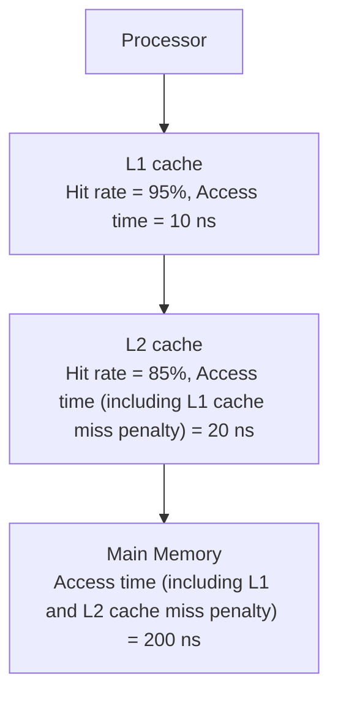
```mermaid
graph TD
  A["Processor"] --> B["L1 cache\nHit rate = 95%, Access time = 10 ns"]
  B --> C["L2 cache\nHit rate = 85%, Access time (including L1 cache miss penalty) = 20 ns"]
  C --> D["Main Memory\nAccess time (including L1 and L2 cache miss penalty) = 200 ns"]
```
</details>

gatecse2025-set1 co-and-architecture cache-memory multilevel-cache average-memory-access-time numerical-answers two-marks

# Answer key

# 1.2.3 Average Memory Access Time: GATE CSE 2025 | Set 2 | Question: 45

Given a computing system with two levels of cache (L1 and L2) and a main memory. The first level (L1) cache access time is 1 nanosecond (ns) and the "hit rate" for L1 cache is 90% while the processor is

accessing the data from L1 cache. Whereas, for the second level (L2) cache, the "hit rate" is 80% and the "miss penalty" for transferring data from L2 cache to L1 cache is 10 ns. The "miss penalty" for the data to be transferred from main memory to L2 cache is 100 ns.

Then the average memory access time in this system in nanoseconds is \_\_\_\_. (rounded off to one decimal place)

gatecse2025-set2 co-and-architecture cache-memory average-memory-access-time multilevel-cache numerical-answers two-marks

# Answer key

# 1.3

# Bit Vector (1)

# 1.3.1 Bit Vector: GATE CSE 2026 | Set 2 | Question: 43

To keep track of free blocks in a file system, one of the two approaches is generally used - using bitmaps (bit vectors) or using linked lists. Consider that the linked list approach is used to keep track of free blocks in

a file system. Assume that the disk size is 16 GB, block size is 2 KB, and block numbers used are 32-bit long. A single pointer of size 4 bytes is used in each block of the list to point to the next block of the list. The number of blocks required to hold the free disk block numbers is \_\_\_\_. (answer in integer)

Note: $1\mathrm{K} = 2^{10}$ and $1\mathrm{G} = 2^{30}$


# 1.4

# CISC RISC Architecture (2)

# 1.4.1 CISC RISC Architecture: GATE CSE 1999 | Question: 2.22

The main difference(s) between a CISC and a RISC processor is/are that a RISC processor typically


A. has fewer instructions  
C. has more registers

B. has fewer addressing modes  
D. is easier to implement using hard-wired logic

gate1999 co-and-architecture normal cisc-risc-architecture multiple-selects

# Answer key

# 1.4.2 CISC RISC Architecture: GATE CSE 2018 | Question: 5

Consider the following processor design characteristics:


I. Register-to-register arithmetic operations only  
II. Fixed-length instruction format  
III. Hardwired control unit

Which of the characteristics above are used in the design of a RISC processor?

A. I and II only

B. II and III only

C. I and III only

D. I, II and III

gatecse-2018 co-and-architecture cisc-risc-architecture easy one-mark

# Answer key

# 1.5

# Cache Memory (69)

Practice Tests: Test 1 (15Q) Test 2 (15Q) Test 3 (15Q) Test 4 (15Q) Test 5 (15Q) Test 6 (15Q) Test 7 (15Q) Test 8 (4Q)

# 1.5.1 Cache Memory: GATE CSE 1987 | Question: 4b

What is cache memory? What is rationale of using cache memory?


gate1987 co-and-architecture cache-memory descriptive

# Answer key

# 1.5.2 Cache Memory: GATE CSE 1989 | Question: 6a

A certain computer system was designed with cache memory of size 1 Kbytes and main memory size of 256 Kbytes. The cache implementation was fully associative cache with 4 bytes per block. The CPU memory data path was 16 bits and the memory was 2—way interleaved. Each memory read request presents two 3 words. A program with the model shown below was run to evaluate the cache design.


<details>
<summary>flowchart</summary>


```mermaid
graph LR
  A["Start of Program"] --> B["Input Data"]
  B --> C["512 Bytes"]
  C --> D["Loop Hundred Times"]
  D --> E["Output Data"]
  E --> F["End of Program"]
```
</details>

Answer the following questions:

i. What is the hit ratio?  
ii. Suggest a change in the program size of model to improve the hit ratio significantly.

gate1989 descriptive co-and-architecture cache-memory

Answer key

# 1.5.3 Cache Memory: GATE CSE 1990 | Question: 7a

A block-set associative cache memory consists of 128 blocks divided into four block sets. The main memory consists of 16,384 blocks and each block contains 256 eight bit words.


1. How many bits are required for addressing the main memory?  
2. How many bits are needed to represent the TAG, SET and WORD fields?

gate1990 descriptive co-and-architecture cache-memory

Answer key

# 1.5.4 Cache Memory: GATE CSE 1993 | Question: 11

In the three-level memory hierarchy shown in the following table, $p_{i}$ denotes the probability that an access request will refer to $M_{i}$ .


<table><tr><td>Hierarchy Level $(M_i)$ </td><td>Access Time $(t_i)$ </td><td>Probability of Access $(p_i)$ </td><td>Page Transfer Time $(T_i)$ </td></tr><tr><td> $M_1$ </td><td> $10^{-6}$ </td><td>0.99000</td><td>0.001 sec</td></tr><tr><td> $M_2$ </td><td> $10^{-5}$ </td><td>0.00998</td><td>0.1 sec</td></tr><tr><td> $M_3$ </td><td> $10^{-4}$ </td><td>0.00002</td><td>--</td></tr></table>

If a miss occurs at level $M_{i}$ , a page transfer occurs from $M_{i+1}$ to $M_{i}$ and the average time required for such a page swap is $T_{i}$ . Calculate the average time $t_{A}$ required for a processor to read one word from this memory system.

gate1993 co-and-architecture cache-memory normal descriptive

Answer key

# 1.5.5 Cache Memory: GATE CSE 1995 | Question: 1.6

The principle of locality justifies the use of:


A. Interrupts

B. DMA

C. Polling

D. Cache Memory

gate1995 co-and-architecture cache-memory easy

Answer key

# 1.5.6 Cache Memory: GATE CSE 1995 | Question: 2.25

A computer system has a $4K$ word cache organized in block-set-associative manner with 4 blocks per set, 64 words per block. The number of bits in the SET and WORD fields of the main memory address format is:


A. 15,40

B. 6,4

C. 7,2

D. 4,6

gate1995 co-and-architecture cache-memory normal

Answer key

# 1.5.7 Cache Memory: GATE CSE 1996 | Question: 26

A computer system has a three-level memory hierarchy, with access time and hit ratios as shown below:


Level 1 (Cache memory)

Access time = 50nsec/byte

<table><tr><td>Size</td><td>Hit ratio</td></tr><tr><td>8M bytes</td><td>0.80</td></tr><tr><td>16M bytes</td><td>0.90</td></tr><tr><td>64M bytes</td><td>0.95</td></tr></table>

Level 2 (Main memory)

Access time = 200nsec/byte

<table><tr><td>Size</td><td>Hit ratio</td></tr><tr><td>4M bytes</td><td>0.98</td></tr><tr><td>16M bytes</td><td>0.99</td></tr><tr><td>64M bytes</td><td>0.995</td></tr></table>

Level 3

Access time = 5μsec/byte

<table><tr><td>Size</td><td>Hit ratio</td></tr><tr><td>260M bytes</td><td>1.0</td></tr></table>

A. What should be the minimum sizes of level 1 and 2 memories to achieve an average access time of less than 100nsec?  
B. What is the average access time achieved using the chosen sizes of level 1 and level 2 memories?

gate1996 co-and-architecture cache-memory normal

# Answer key

# 1.5.8 Cache Memory: GATE CSE 1998 | Question: 18

For a set-associative Cache organization, the parameters are as follows:

<table><tr><td> $t_c$ </td><td>Cache Access Time</td></tr><tr><td> $t_m$ </td><td>Main memory access time</td></tr><tr><td>l</td><td>Number of sets</td></tr><tr><td>b</td><td>Block size</td></tr><tr><td> $k \times b$ </td><td>Set size</td></tr></table>


Calculate the hit ratio for a loop executed 100 times where the size of the loop is $n \times b$ , and $n = k \times m$ is a nonzero integer and $1 \leq m \leq l$ .

Give the value of the hit ratio for $l = 1$ .

gate1998 co-and-architecture cache-memory descriptive

# Answer key

# 1.5.9 Cache Memory: GATE CSE 1999 | Question: 1.22

The main memory of a computer has 2 cm blocks while the cache has 2 c blocks. If the cache uses the set associative mapping scheme with 2 blocks per set, then block k of the main memory maps to the set:


A. $(k \mod m)$ of the cache

C. $(k \mod 2c)$ of the cache

gate1999 co-and-architecture cache-memory normal

B. $(k \mod c)$ of the cache

D. (k mod 2 cm) of the cache

# Answer key

# 1.5.10 Cache Memory: GATE CSE 2001 | Question: 1.7, ISRO2008-18

More than one word are put in one cache block to:

A. exploit the temporal locality of reference in a program

C. reduce the miss penalty

gatecse-2001 co-and-architecture easy cache-memory isro2008

B. exploit the spatial locality of reference in a program

D. none of the above

# Answer key

# 1.5.11 Cache Memory: GATE CSE 2001 | Question: 9

A CPU has 32 — bit memory address and a 256 KB cache memory. The cache is organized as a 4 — way set associative cache with cache block size of 16 bytes.


A. What is the number of sets in the cache?  
B. What is the size (in bits) of the tag field per cache block?

C. What is the number and size of comparators required for tag matching?  
D. How many address bits are required to find the byte offset within a cache block?  
E. What is the total amount of extra memory (in bytes) required for the tag bits?

gatecse-2001 co-and-architecture cache-memory normal descriptive

# Answer key

# 1.5.12 Cache Memory: GATE CSE 2002 | Question: 10


In a C program, an array is declared as float A[2048]. Each array element is 4 Bytes in size, and the starting address of the array is 0x00000000. This program is run on a computer that has a direct mapped data cache of size 8 Kbytes, with block (line) size of 16 Bytes.

A. Which elements of the array conflict with element $A[0]$ in the data cache? Justify your answer briefly.  
B. If the program accesses the elements of this array one by one in reverse order i.e., starting with the last element and ending with the first element, how many data cache misses would occur? Justify your answer briefly. Assume that the data cache is initially empty and that no other data or instruction accesses are to be considered.

gatecse-2002 co-and-architecture cache-memory normal descriptive

# Answer key

# 1.5.13 Cache Memory: GATE CSE 2004 | Question: 65


Consider a small two-way set-associative cache memory, consisting of four blocks. For choosing the block to be replaced, use the least recently used (LRU) scheme. The number of cache misses for the following sequence of block addresses is:

8, 12, 0, 12, 8.

A. 2

B. 3

C. 4

D. 5

gatecse-2004 co-and-architecture cache-memory normal

# Answer key

# 1.5.14 Cache Memory: GATE CSE 2005 | Question: 67


Consider a direct mapped cache of size 32 KB with block size 32 bytes. The CPU generates 32 bit addresses. The number of bits needed for cache indexing and the number of tag bits are respectively,

A. 10,17

B. 10,22

C. 15,17

D. 5,17

gatecse-2005 co-and-architecture cache-memory easy

# Answer key

# 1.5.15 Cache Memory: GATE CSE 2006 | Question: 74


Consider two cache organizations. First one is 32 KB 2-way set associative with 32 byte block size, the second is of same size but direct mapped. The size of an address is 32 bits in both cases. A 2-to-1 multiplexer has latency of 0.6 ns while a k-bit comparator has latency of $\frac{k}{10}$ ns. The hit latency of the set associative organization is $h_{1}$ while that of direct mapped is $h_{2}$ .

The value of $h_{1}$ is:

A. 2.4 ns

B. 2.3 ns

C. 1.8 ns

D. 1.7 ns

gatecse-2006 co-and-architecture cache-memory normal

# Answer key

# 1.5.16 Cache Memory: GATE CSE 2006 | Question: 75


Consider two cache organizations. First one is 32 kB 2-way set associative with 32 byte block size, the second is of same size but direct mapped. The size of an address is 32 bits in both cases. A 2-to-1

multiplexer has latency of 0.6ns while a k-bit comparator has latency of $\frac{k}{10}ns$ . The hit latency of the set associative organization is $h_{1}$ while that of direct mapped is $h_{2}$ .
The value of $h_{2}$ is:

A. 2.4 ns

B. 2.3 ns

C. 1.8 ns

D. 1.7 ns

gatecse-2006 co-and-architecture cache-memory normal

# Answer key

# 1.5.17 Cache Memory: GATE CSE 2006 | Question: 80

A CPU has a 32KB direct mapped cache with 128 byte-block size. Suppose A is two dimensional array of size $512 \times 512$ with elements that occupy 8-bytes each. Consider the following two C code segments, P1 and P2.


P1:

```txt
for (i=0; i<512; i++)
{
    for (j=0; j<512; j++)
    {
        x +=A[i] [j];
    }
}
```

P2:

```txt
for (i=0; i<512; i++)
{
    for (j=0; j<512; j++)
    {
        x +=A[j] [i];
    }
}
```

P1 and P2 are executed independently with the same initial state, namely, the array A is not in the cache and i, j, x are in registers. Let the number of cache misses experienced by P1 be $M_{1}$ and that for P2 be $M_{2}$ .

The value of $M_{1}$ is:

A. 0

B. 2048

C. 16384

D. 262144

gatecse-2006 co-and-architecture cache-memory normal

# Answer key

# 1.5.18 Cache Memory: GATE CSE 2006 | Question: 81

A CPU has a 32 KB direct mapped cache with 128 byte-block size. Suppose A is two dimensional array of size $512 \times 512$ with elements that occupy 8 - bytes each. Consider the following two C code segments, P1 and P2.


P1:

```txt
for (i=0; i<512; i++)
{
    for (j=0; j<512; j++)
    {
        x +=A[i] [j];
    }
}
```

P2:

```txt
for (i=0; i<512; i++)
{
    for (j=0; j<512; j++)
    {
        x +=A[j] [i];
    }
}
```

P1 and P2 are executed independently with the same initial state, namely, the array A is not in the cache and i, j,

x are in registers. Let the number of cache misses experienced by P1 be M1 and that for P2 be M2.

The value of the ratio $\frac{M_{1}}{M_{2}}$ :

A. 0

B. $\frac{1}{16}$

C. $\frac{1}{8}$

D. 16

co-and-architecture cache-memory normal gatecse-2006

# Answer key

# 1.5.19 Cache Memory: GATE CSE 2007 | Question: 10

Consider a 4-way set associative cache consisting of 128 lines with a line size of 64 words. The CPU generates a 20 - bit address of a word in main memory. The number of bits in the TAG, LINE and WORD fields are respectively:


A. 9,6,5

B. 7,7,6

C. 7,5,8

D. 9,5,6

gatecse-2007 co-and-architecture cache-memory normal

# Answer key

# 1.5.20 Cache Memory: GATE CSE 2007 | Question: 80

Consider a machine with a byte addressable main memory of $2^{16}$ bytes. Assume that a direct mapped data cache consisting of 32 lines of 64 bytes each is used in the system. A $50 \times 50$ two-dimensional array of bytes is stored in the main memory starting from memory location 1100H. Assume that the data cache is initially empty. The complete array is accessed twice. Assume that the contents of the data cache do not change in between the two accesses.

How many data misses will occur in total?

A. 48

B. 50

C. 56

D. 59

gatecse-2007 co-and-architecture cache-memory normal

# Answer key

# 1.5.21 Cache Memory: GATE CSE 2007 | Question: 81


Consider a machine with a byte addressable main memory of $2^{16}$ bytes. Assume that a direct mapped data cache consisting of 32 lines of 64 bytes each is used in the system. A 50 x 50 two-dimensional array of bytes is stored in the main memory starting from memory location 1100H. Assume that the data cache is initially empty. The complete array is accessed twice. Assume that the contents of the data cache do not change in between the two accesses.

Which of the following lines of the data cache will be replaced by new blocks in accessing the array for the second time?

A. line 4 to line 11

B. line 4 to line 12

C. line 0 to line 7

D. line 0 to line 8

gatecse-2007 co-and-architecture cache-memory normal

# Answer key

# 1.5.22 Cache Memory: GATE CSE 2008 | Question: 35

For inclusion to hold between two cache levels $L_{1}$ and $L_{2}$ in a multi-level cache hierarchy, which of the following are necessary?


I. $L_{1}$ must be write-through cache  
II. $L_{2}$ must be a write-through cache  
III. The associativity of $L_{2}$ must be greater than that of $L_{1}$  
IV. The $L_{2}$ cache must be at least as large as the $L_{1}$ cache

A. IV only

B. I and IV only

C. I, II and IV only

D. I, II, III and IV

gatecse-2008 co-and-architecture cache-memory normal


# 1.5.23 Cache Memory: GATE CSE 2008 | Question: 71


Consider a machine with a 2-way set associative data cache of size 64Kbytes and block size 16bytes. The cache is managed using 32 bit virtual addresses and the page size is 4Kbytes. A program to be run on this machine begins as follows:

```c
double ARR[1024][1024];
int i, j;
/*Initialize array ARR to 0.0 */
for(i = 0; i < 1024; i++)
    for(j = 0; j < 1024; j++)
        ARR[i][j] = 0.0;
```

The size of double is 8Bytes. Array ARR is located in memory starting at the beginning of virtual page0xFF000 and stored in row major order. The cache is initially empty and no pre-fetching is done. The only data memory references made by the program are those to array ARR.

The total size of the tags in the cache directory is:

A. 32Kbits

B. 34Kbits

C. 64Kbits

D. 68Kbits

gatecse-2008 co-and-architecture cache-memory normal

# Answer key

# 1.5.24 Cache Memory: GATE CSE 2008 | Question: 72

Consider a machine with a 2-way set associative data cache of size 64 Kbytes and block size 16 bytes. The cache is managed using 32 bit virtual addresses and the page size is 4 Kbytes. A program to be run on this machine begins as follows:

```c
double ARR[1024][1024];
int i, j;
/*Initialize array ARR to 0.0 */
for(i = 0; i < 1024; i++)
    for(j = 0; j < 1024; j++)
        ARR[i][j] = 0.0;
```


The size of double is 8 bytes. Array ARR is located in memory starting at the beginning of virtual page0xFF000 and stored in row major order. The cache is initially empty and no pre-fetching is done. The only data memory references made by the program are those to array ARR.

Which of the following array elements have the same cache index as ARR[0][0]?

A. ARR[0][4]

B. ARR[4][0]

C. ARR[0][5]

D. ARR[5][0]

gatecse-2008 co-and-architecture cache-memory normal

# Answer key

# 1.5.25 Cache Memory: GATE CSE 2008 | Question: 73

Consider a machine with a 2-way set associative data cache of size 64 Kbytes and block size 16 bytes. The cache is managed using 32 bit virtual addresses and the page size is 4 Kbytes. A program to be run on this machine begins as follows:

```c
double ARR[1024][1024];
int i, j;
/*Initialize array ARR to 0.0 */
for(i = 0; i < 1024; i++)
    for(j = 0; j < 1024; j++)
        ARR[i][j] = 0.0;
```


The size of double is 8 bytes. Array ARR is located in memory starting at the beginning of virtual page0xFF000 and stored in row major order. The cache is initially empty and no pre-fetching is done. The only data memory references made by the program are those to array ARR.

The cache hit ratio for this initialization loop is:

A. 0%

B. 25%

C. 50%

D. 75%

gatecse-2008 co-and-architecture cache-memory normal

# Answer key

# 1.5.26 Cache Memory: GATE CSE 2009 | Question: 29


Consider a 4-way set associative cache (initially empty) with total 16 cache blocks. The main memory consists of 256 blocks and the request for memory blocks are in the following order:

0,255,1,4,3,8,133,159,216,129,63,8,48,32,73,92,155.

Which one of the following memory block will NOT be in cache if LRU replacement policy is used?

A. 3

B. 8

C. 129

D. 216

gatecse-2009 co-and-architecture cache-memory normal

# Answer key

# 1.5.27 Cache Memory: GATE CSE 2010 | Question: 48


A computer system has an L1 cache, an L2 cache, and a main memory unit connected as shown below. The block size in L1 cache is 4 words. The block size in L2 cache is 16 words. The memory access times are 2 nanoseconds, 20 nanoseconds and 200 nanoseconds for L1 cache, L2 cache and the main memory unit respectively.


<details>
<summary>flowchart</summary>

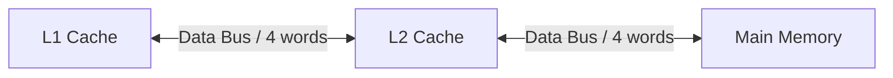
```mermaid
graph LR
  A["L1 Cache"] <-->|Data Bus / 4 words| B["L2 Cache"]
  B <-->|Data Bus / 4 words| C["Main Memory"]
```
</details>

When there is a miss in $L1$ cache and a hit in $L2$ cache, a block is transferred from $L2$ cache to $L1$ cache. What is the time taken for this transfer?

A. 2 nanoseconds

B. 20 nanoseconds

C. 22 nanoseconds

D. 88 nanoseconds

gatecse-2010 co-and-architecture cache-memory normal barc2017

# Answer key

# 1.5.28 Cache Memory: GATE CSE 2010 | Question: 49


A computer system has an L1 cache, an L2 cache, and a main memory unit connected as shown below. The block size in L1 cache is 4 words. The block size in L2 cache is 16 words. The memory access times are 2 nanoseconds, 20 nanoseconds and 200 nanoseconds for L1 cache, L2 cache and the main memory unit respectively.


<details>
<summary>flowchart</summary>


```mermaid
graph LR
  A["L1 Cache"] <-->|Data Bus / 4 words| B["L2 Cache"]
  B <-->|Data Bus / 4 words| C["Main Memory"]
```
</details>

When there is a miss in both L1 cache and L2 cache, first a block is transferred from main memory to L2 cache, and then a block is transferred from L2 cache to L1 cache. What is the total time taken for these transfers?

A. 222 nanoseconds

B. 888 nanoseconds

C. 902 nanoseconds

D. 968 nanoseconds

gatecse-2010 co-and-architecture cache-memory normal

# Answer key

# 1.5.29 Cache Memory: GATE CSE 2011 | Question: 43


An 8KB direct-mapped write-back cache is organized as multiple blocks, each size of 32-bytes. The processor generates 32-bit addresses. The cache controller contains the tag information for each cache block comprising of the following.

- 1 valid bit  
- 1 modified bit  
- As many bits as the minimum needed to identify the memory block mapped in the cache.

What is the total size of memory needed at the cache controller to store meta-data (tags) for the cache?

A. 4864 bits

B. 6144 bits

C. 6656 bits

D. 5376 bits

gatecse-2011 co-and-architecture cache-memory normal

# Answer key

# 1.5.30 Cache Memory: GATE CSE 2012 | Question: 54

A computer has a 256-KByte, 4-way set associative, write back data cache with block size of 32-Bytes. The processor sends 32-bit addresses to the cache controller. Each cache tag directory entry contains, in addition to address tag, 2 valid bits, 1 modified bit and 1 replacement bit.

The number of bits in the tag field of an address is

A. 11

B. 14

C. 16

D. 27

gatecse-2012 co-and-architecture cache-memory normal

# Answer key

# 1.5.31 Cache Memory: GATE CSE 2012 | Question: 55

A computer has a 256-KByte, 4-way set associative, write back data cache with block size of 32 Bytes. The processor sends 32 bit addresses to the cache controller. Each cache tag directory entry contains, in addition to address tag, 2 valid bits, 1 modified bit and 1 replacement bit.

The size of the cache tag directory is:

A. 160 Kbits

B. 136 Kbits

c. 40 Kbits

D. 32 Kbits

normal gatecse-2012 co-and-architecture cache-memory

# Answer key

# 1.5.32 Cache Memory: GATE CSE 2013 | Question: 20

In a k-way set associative cache, the cache is divided into v sets, each of which consists of k lines. The lines of a set are placed in sequence one after another. The lines in set s are sequenced before the lines in

set $(s + 1)$ . The main memory blocks are numbered 0 onwards. The main memory block numbered $j$ must be mapped to any one of the cache lines from

A. $(j\bmod v)*k$ to $(j\bmod v)*k + (k - 1)$  
B. $(j\bmod v)$ to $(j\bmod v) + (k - 1)$  
C. $(j\bmod k)$ to $(j\bmod k) + (v - 1)$  
D. $(j\bmod k)*v$ to $(j\bmod k)*v + (v - 1)$

gatecse-2013 co-and-architecture cache-memory normal

# Answer key

# 1.5.33 Cache Memory: GATE CSE 2014 | Set 1 | Question: 44

An access sequence of cache block addresses is of length $N$ and contains $n$ unique block addresses. The number of unique block addresses between two consecutive accesses to the same block address is bounded above by $k$ . What is the miss ratio if the access sequence is passed through a cache of assoc $A \geq k$ exercising least-recently-used replacement policy?

A. $\left(\frac{n}{N}\right)$

B. $\left(\frac{1}{N}\right)$

C. $\left(\frac{1}{A}\right)$

D. $\left(\frac{k}{n}\right)$

gatecse-2014-set1 co-and-architecture cache-memory normal

# Answer key


# 1.5.34 Cache Memory: GATE CSE 2014 | Set 2 | Question: 43


In designing a computer's cache system, the cache block (or cache line) size is an important parameter. Which one of the following statements is correct in this context?

A. A smaller block size implies better spatial locality  
B. A smaller block size implies a smaller cache tag and hence lower cache tag overhead  
C. A smaller block size implies a larger cache tag and hence lower cache hit time  
D. A smaller block size incurs a lower cache miss penalty

gatecse-2014-set2 co-and-architecture cache-memory normal

Answer key

# 1.5.35 Cache Memory: GATE CSE 2014 | Set 2 | Question: 44


If the associativity of a processor cache is doubled while keeping the capacity and block size unchanged, which one of the following is guaranteed to be NOT affected?

A. Width of tag comparator  
C. Width of way selection multiplexer

B. Width of set index decoder

D. Width of processor to main memory data bus

gatecse-2014-set2 co-and-architecture cache-memory normal

Answer key

# 1.5.36 Cache Memory: GATE CSE 2014 | Set 2 | Question: 9


A 4-way set-associative cache memory unit with a capacity of 16 KB is built using a block size of 8 words. The word length is 32 bits. The size of the physical address space is 4 GB. The number of bits for the TAG field is \_\_\_\_

gatecse-2014-set2 co-and-architecture cache-memory numerical-answers normal

Answer key

# 1.5.37 Cache Memory: GATE CSE 2014 | Set 3 | Question: 44


The memory access time is 1 nanosecond for a read operation with a hit in cache, 5 nanoseconds for a read operation with a miss in cache, 2 nanoseconds for a write operation with a hit in cache and 10 nanoseconds for a write operation with a miss in cache. Execution of a sequence of instructions involves 100 instruction fetch operations, 60 memory operand read operations and 40 memory operand write operations. The cache hit-ratio is 0.9. The average memory access time (in nanoseconds) in executing the sequence of instructions is \_\_\_\_.

gatecse-2014-set3 co-and-architecture cache-memory numerical-answers normal

Answer key

# 1.5.38 Cache Memory: GATE CSE 2015 | Set 2 | Question: 24


Assume that for a certain processor, a read request takes 50 nanoseconds on a cache miss and 5 nanoseconds on a cache hit. Suppose while running a program, it was observed that 80% of the processor's read requests result in a cache hit. The average read access time in nanoseconds is \_\_\_\_.

gatecse-2015-set2 co-and-architecture cache-memory easy numerical-answers

Answer key

# 1.5.39 Cache Memory: GATE CSE 2015 | Set 3 | Question: 14


Consider a machine with a byte addressable main memory of $2^{20}$ bytes, block size of 16 bytes and a direct mapped cache having $2^{12}$ cache lines. Let the addresses of two consecutive bytes in main memory be $(\mathrm{E}201\mathrm{F})_{16}$ and $(\mathrm{E}2020)_{16}$ . What are the tag and cache line addresses (in hex) for main memory address $(\mathrm{E}201\mathrm{F})_{16}$ ?

A. E, 201

B. F, 201

C. E, E20

D. 2,01F

gatecse-2015-set3 co-and-architecture cache-memory normal

# 1.5.40 Cache Memory: GATE CSE 2016 | Set 2 | Question: 32


The width of the physical address on a machine is 40 bits. The width of the tag field in a 512 KB 8-way set associative cache is \_\_\_\_ bits.

gatecse-2016-set2 co-and-architecture cache-memory normal numerical-answers

# Answer key

# 1.5.41 Cache Memory: GATE CSE 2016 | Set 2 | Question: 50


A file system uses an in-memory cache to cache disk blocks. The miss rate of the cache is shown in the figure. The latency to read a block from the cache is 1 ms and to read a block from the disk is 10 ms. Assume that the cost of checking whether a block exists in the cache is negligible. Available cache sizes multiples of 10 MB.

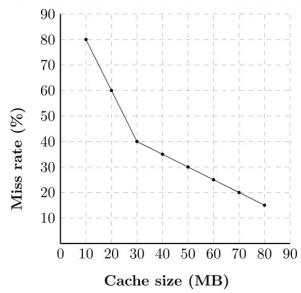

<details>
<summary>line</summary>

| Cache size (MB) | Miss rate (%) |
| --- | --- |
| 10 | 80 |
| 20 | 60 |
| 30 | 40 |
| 40 | 35 |
| 50 | 30 |
| 60 | 25 |
| 70 | 20 |
| 80 | 15 |
</details>

The smallest cache size required to ensure an average read latency of less than 6 ms is \_\_\_\_ MB.

gatecse-2016-set2 co-and-architecture cache-memory normal numerical-answers

# Answer key

# 1.5.42 Cache Memory: GATE CSE 2017 | Set 1 | Question: 25


Consider a two-level cache hierarchy with $L1$ and $L2$ caches. An application incurs 1.4 memory accesses per instruction on average. For this application, the miss rate of $L1$ cache is 0.1; the $L2$ cache experiences, on average, 7 misses per 1000 instructions. The miss rate of $L2$ expressed correct to two decimal places is \_\_\_\_.

gatecse-2017-set1 co-and-architecture cache-memory numerical-answers

# Answer key

# 1.5.43 Cache Memory: GATE CSE 2017 | Set 1 | Question: 54


A cache memory unit with capacity of N words and block size of B words is to be designed. If it is designed as a direct mapped cache, the length of the TAG field is 10 bits. If the cache unit is now designed as a 16-way set-associative cache, the length of the TAG field is \_\_\_\_ bits.

gatecse-2017-set1 co-and-architecture cache-memory normal numerical-answers

# Answer key

# 1.5.44 Cache Memory: GATE CSE 2017 | Set 2 | Question: 29


In a two-level cache system, the access times of $L_{1}$ and $L_{2}$ caches are 1 and 8 clock cycles, respectively. The miss penalty from the $L_{2}$ cache to main memory is 18 clock cycles. The miss rate of $L_{1}$ cache is twice that of $L_{2}$ . The average memory access time (AMAT) of this cache system is 2 cycles. The miss rates of $L_{1}$ and $L_{2}$ respectively are

A. 0.111 and 0.056

B. 0.056 and 0.111

C. 0.0892 and 0.1784

D. 0.1784 and 0.0892

gatecse-2017-set2 cache-memory co-and-architecture normal

# Answer key

# 1.5.45 Cache Memory: GATE CSE 2017 | Set 2 | Question: 45

The read access times and the hit ratios for different caches in a memory hierarchy are as given below:

<table><tr><td>Cache</td><td>Read access time (in nanoseconds)</td><td>Hit ratio</td></tr><tr><td>I-cache</td><td>2</td><td>0.8</td></tr><tr><td>D-cache</td><td>2</td><td>0.9</td></tr><tr><td>L2-cache</td><td>8</td><td>0.9</td></tr></table>


The read access time of main memory in 90 nanoseconds. Assume that the caches use the referred-word-first read policy and the write-back policy. Assume that all the caches are direct mapped caches. Assume that the dirty bit is always 0 for all the blocks in the caches. In execution of a program, 60% of memory reads are for instruction fetch and 40% are for memory operand fetch. The average read access time in nanoseconds (up to 2 decimal places) is \_\_\_\_

gatecse-2017-set2 co-and-architecture cache-memory numerical-answers

# Answer key

# 1.5.46 Cache Memory: GATE CSE 2017 | Set 2 | Question: 53

Consider a machine with a byte addressable main memory of $2^{32}$ bytes divided into blocks of size 32 bytes. Assume that a direct mapped cache having 512 cache lines is used with this machine. The size of the tag field in bits is \_\_\_\_


gatecse-2017-set2 co-and-architecture cache-memory numerical-answers

# Answer key

# 1.5.47 Cache Memory: GATE CSE 2018 | Question: 34

The size of the physical address space of a processor is $2^{P}$ bytes. The word length is $2^{W}$ bytes. The capacity of cache memory is $2^{N}$ bytes. The size of each cache block is $2^{M}$ words. For a K-way set-associative cache memory, the length (in number of bits) of the tag field is


A. $P - N - \log_2K$

B. $P - N + \log_2K$

C. $P - N - M - W - \log_2K$

D. $P - N - M - W + \log_2K$

gatecse-2018 co-and-architecture cache-memory normal two-marks

# Answer key

# 1.5.48 Cache Memory: GATE CSE 2019 | Question: 1

A certain processor uses a fully associative cache of size 16 kB, The cache block size is 16 bytes. Assume that the main memory is byte addressable and uses a 32-bit address. How many bits are required for the Tag and the Index fields respectively in the addresses generated by the processor?


A. 24 bits and 0 bits

B. 28 bits and 4 bits

C. 24 bits and 4 bits

D. 28 bits and 0 bits

gatecse-2019 co-and-architecture cache-memory normal one-mark

# Answer key

# 1.5.49 Cache Memory: GATE CSE 2019 | Question: 45

A certain processor deploys a single-level cache. The cache block size is 8 words and the word size is 4 bytes. The memory system uses a 60-MHz clock. To service a cache miss, the memory controller first takes 1 cycle to accept the starting address of the block, it then takes 3 cycles to fetch all the eight words of the and finally transmits the words of the requested block at the rate of 1 word per cycle. The maximum bandwidth the memory system when the program running on the processor issues a series of read operations is $\times 10^{6}$ bytes/sec.


# 1.5.50 Cache Memory: GATE CSE 2020 | Question: 21


A direct mapped cache memory of 1 MB has a block size of 256 bytes. The cache has an access time of 3 ns and a hit rate of 94%. During a cache miss, it takes 20 ns to bring the first word of a block from the main memory, while each subsequent word takes 5 ns. The word size is 64 bits. The average memory access time in ns (round off to 1 decimal place) is \_\_\_\_.

gatecse-2020 numerical-answers co-and-architecture cache-memory one-mark

# Answer key

# 1.5.51 Cache Memory: GATE CSE 2020 | Question: 30


A computer system with a word length of 32 bits has a 16 MB byte- addressable main memory and a 64 KB, 4-way set associative cache memory with a block size of 256 bytes. Consider the following four physical addresses represented in hexadecimal notation.

- $A1 = 0 \times 42C8A4$ ,  
- $A2 = 0 \times 546888$ ,  
- $A3 = 0 \times 6A289C$ ,  
- $A4 = 0 \times 5E4880$

Which one of the following is TRUE?

A. A1 and A4 are mapped to different cache sets.  
B. A2 and A3 are mapped to the same cache set.  
C. A3 and A4 are mapped to the same cache set.  
D. A1 and A3 are mapped to the same cache set.

gatecse-2020 co-and-architecture cache-memory two-marks

# Answer key

# 1.5.52 Cache Memory: GATE CSE 2021 | Set 1 | Question: 22


Consider a computer system with a byte-addressable primary memory of size $2^{32}$ bytes. Assume the computer system has a direct-mapped cache of size 32 KB ( $1 KB = 2^{10}$ bytes), and each cache block is of size 64 bytes.

The size of the tag field is \_\_\_\_ bits.

gatecse-2021-set1 co-and-architecture cache-memory numerical-answers one-mark

# Answer key

# 1.5.53 Cache Memory: GATE CSE 2021 | Set 2 | Question: 19


Consider a set-associative cache of size 2KB (1KB = 2 $^{10}$ bytes) with cache block size of 64 bytes. Assume that the cache is byte-addressable and a 32 -bit address is used for accessing the cache. If the width of the tag field is 22 bits, the associativity of the cache is \_\_\_\_

gatecse-2021-set2 numerical-answers co-and-architecture cache-memory one-mark

# Answer key

# 1.5.54 Cache Memory: GATE CSE 2021 | Set 2 | Question: 27


Assume a two-level inclusive cache hierarchy, $L1$ and $L2$ , where $L2$ is the larger of the two. Consider the following statements.

- $S_{1}$ : Read misses in a write through $L1$ cache do not result in writebacks of dirty lines to the $L2$  
- $S_{2}$ : Write allocate policy must be used in conjunction with write through caches and no-write allocate policy is used with writeback caches.

Which of the following statements is correct?

A. $S_{1}$ is true and $S_{2}$ is false  
C. $S_{1}$ is true and $S_{2}$ is true

B. $S_{1}$ is false and $S_{2}$ is true  
D. $S_{1}$ is false and $S_{2}$ is false

gatecse-2021-set2 co-and-architecture cache-memory two-marks

# Answer key

# 1.5.55 Cache Memory: GATE CSE 2022 | Question: 14

Let WB and WT be two set associative cache organizations that use LRU algorithm for cache block replacement. WB is a write back cache and WT is a write through cache. Which of the following statements is/are FALSE?


A. Each cache block in WB and WT has a dirty bit.  
B. Every write hit in WB leads to a data transfer from cache to main memory.  
C. Eviction of a block from WT will not lead to data transfer from cache to main memory.  
D. A read miss in WB will never lead to eviction of a dirty block from WB.

gatecse-2022 co-and-architecture cache-memory multiple-selects one-mark

# Answer key

# 1.5.56 Cache Memory: GATE CSE 2022 | Question: 23

A cache memory that has a hit rate of 0.8 has an access latency 10 ns and miss penalty 100 ns. An optimization is done on the cache to reduce the miss rate. However, the optimization results in an increase

of cache access latency to 15 ns, whereas the miss penalty is not affected. The minimum hit rate (rounded off to two decimal places) needed after the optimization such that it should not increase the average memory access time is \_\_\_\_.


gatecse-2022 numerical-answers co-and-architecture cache-memory one-mark

# Answer key

# 1.5.57 Cache Memory: GATE CSE 2023 | Question: 54

An 8-way set associative cache of size 64 KB (1 KB = 1024 bytes) is used in a system with 32-bit address. The address is sub-divided into TAG, INDEX, and BLOCK OFFSET.


The number of bits in the TAG is \_\_\_\_.

gatecse-2023 co-and-architecture cache-memory numerical-answers two-marks

# Answer key

# 1.5.58 Cache Memory: GATE CSE 2024 | Set 1 | Question: 43

Consider two set-associative cache memory architectures: WBC, which uses the write back policy, and WTC, which uses the write through policy. Both of them use the LRU (Least Recently Used) block replacement policy. The cache memory is connected to the main memory. Which of the following statements is/are TRUE?

A. A read miss in WBC never evicts a dirty block  
B. A read miss in WTC never triggers a write back operation of a cache block to main memory  
C. A write hit in WBC can modify the value of the dirty bit of a cache block  
D. A write miss in WTC always writes the victim cache block to main memory before loading the missed block to the cache

gatecse-2024-set1 co-and-architecture cache-memory multiple-selects two-marks

# Answer key


# 1.5.59 Cache Memory: GATE CSE 2024 | Set 1 | Question: 46


A given program has 25% load/store instructions. Suppose the ideal CPI (cycles per instruction) without any memory stalls is 2. The program exhibits 2% miss rate on instruction cache and 8% miss rate on data

cache. The miss penalty is 100 cycles. The speedup (rounded off to two decimal places) achieved with a perfect cache (i.e., with NO data or instruction cache misses) is \_\_\_\_.

gatecse-2024-set1 numerical-answers co-and-architecture cache-memory two-marks

# Answer key

# 1.5.60 Cache Memory: GATE CSE 2026 | Set 1 | Question: 28


The size of the physical address space of a processor is $2^{32}$ bytes. The capacity of a cache memory unit is $2^{23}$ bytes. The cache block size is 128 bytes. The cache memory unit can be built as a direct mapped cache

or as a $K$ -way set-associative cache, where $K = 2^{L}$ and $L \in \{1, 2, 3\}$ . Let the length of the TAG field be $M$ bits for the direct mapped cache, and $N$ bits for the set-associative cache.

Which one of the following options is true?

A. $N = M + L$

B. N = M - L

C. $N = M + K$

D. $N = M - K$

gatecse-2026-set1 co-and-architecture two-marks cache-memory

# Answer key

# 1.5.61 Cache Memory: GATE CSE 2026 | Set 1 | Question: 44


Consider a system that has a cache memory unit and a memory management unit (MMU). The address input to the cache memory is a physical address. The MMU has a translation lookaside buffer (TLB).

Assume that when a page is evicted from the main memory, the corresponding blocks in the cache are marked as invalid.

For a given memory reference, which of the following sequences of events can NEVER happen?

A. TLB miss, Page table hit, Cache hit

B. TLB hit, Page table miss, Cache hit

C. TLB miss, Page table miss, Cache hit

D. TLB miss, Page table miss, Cache miss

gatecse-2026-set1 co-and-architecture cache-memory two-marks multiple-selects

# Answer key

# 1.5.62 Cache Memory: GATE IT 2004 | Question: 12, ISRO2016-77


Consider a system with 2 level cache. Access times of Level 1 cache, Level 2 cache and main memory are 1 ns, 10 ns, and 500 ns respectively. The hit rates of Level 1 and Level 2 caches are 0.8 and 0.9, respectively. What is the average access time of the system ignoring the search time within the cache?

A. 13.0

B. 12.8

C. 12.6

D. 12.4

gateit-2004 co-and-architecture cache-memory normal isro2016

# Answer key

# 1.5.63 Cache Memory: GATE IT 2004 | Question: 48


Consider a fully associative cache with 8 cache blocks (numbered 0 - 7) and the following sequence of memory block requests:

4,3,25,8,19,6,25,8,16,35,45,22,8,3,16,25,7

If LRU replacement policy is used, which cache block will have memory block 7?

A. 4

B. 5

C. 6

D. 7

gateit-2004 co-and-architecture cache-memory normal

# Answer key

# 1.5.64 Cache Memory: GATE IT 2005 | Question: 61


Consider a 2-way set associative cache memory with 4 sets and total 8 cache blocks (0 - 7) and a main memory with 128 blocks (0 - 127). What memory blocks will be present in the cache after the following sequence of memory block references if LRU policy is used for cache block replacement. Assuming that initial cache did not have any memory block from the current job?

0539701655

A. 03571655

C. 05791655

gateit-2005 co-and-architecture cache-memory normal

B. 035791655

D. 35791655

# Answer key

# 1.5.65 Cache Memory: GATE IT 2006 | Question: 42


A cache line is 64 bytes. The main memory has latency 32 ns and bandwidth 1 GBytes/s. The time required to fetch the entire cache line from the main memory is:

A. 32 ns

B. 64 ns

C. 96 ns

D. 128 ns

gateit-2006 co-and-architecture cache-memory normal

# Answer key

# 1.5.66 Cache Memory: GATE IT 2006 | Question: 43


A computer system has a level-1 instruction cache (I-cache), a level-1 data cache (D-cache) and a level-2 cache (L2-cache) with the following specifications:

<table><tr><td></td><td>Capacity</td><td>Mapping Method</td><td>Block Size</td></tr><tr><td>I-Cache</td><td>4K words</td><td>Direct mapping</td><td>4 words</td></tr><tr><td>D-Cache</td><td>4K words</td><td>2 -way set associative mapping</td><td>4 words</td></tr><tr><td>L2-Cache</td><td>64K words</td><td>4-way set associative mapping</td><td>16 words</td></tr></table>

The length of the physical address of a word in the main memory is 30 bits. The capacity of the tag memory in the I-cache, D-cache and L2-cache is, respectively,

A. $1 \, K \times 18$ -bit, $1 \, K \times 19$ -bit, $4 \, K \times 16$ -bit

B. 1 K x 16-bit, 1 K x 19-bit, 4 K x 18-bit

C. 1 K x 16-bit, 512 x 18-bit, 1 K x 16-bit

D. 1 K x 18-bit, 512 x 18-bit, 1 K x 18-bit

gateit-2006 co-and-architecture cache-memory normal

# Answer key

# 1.5.67 Cache Memory: GATE IT 2007 | Question: 37


Consider a Direct Mapped Cache with 8 cache blocks (numbered 0 - 7). If the memory block requests are in the following order

3, 5, 2, 8, 0, 63, 9, 16, 20, 17, 25, 18, 30, 24, 2, 63, 5, 82, 17, 24.

Which of the following memory blocks will not be in the cache at the end of the sequence?

A. 3

B. 18

C. 20

D. 30

gateit-2007 co-and-architecture cache-memory normal

# Answer key

# 1.5.68 Cache Memory: GATE IT 2008 | Question: 80


Consider a computer with a 4-ways set-associative mapped cache of the following characteristics: a total of 1 MB of main memory, a word size of 1 byte, a block size of 128 words and a cache size of 8 KB.

The number of bits in the TAG, SET and WORD fields, respectively are:

A. 7,6,7

B. 8,5,7

C. 8,6,6

D. 9,4,7

gateit-2008 co-and-architecture cache-memory normal

# Answer key

# 1.5.69 Cache Memory: GATE IT 2008 | Question: 81


Consider a computer with a 4-ways set-associative mapped cache of the following characteristics: a total of 1 MB of main memory, a word size of 1 byte, a block size of 128 words and a cache size of 8 KB.

While accessing the memory location 0C795H by the CPU, the contents of the TAG field of the corresponding cache line is:

A. 000011000

B. 110001111

C. 00011000

D. 110010101

gateit-2008 co-and-architecture cache-memory normal

# Answer key

# 1.6

# Conflict Misses (1)

# 1.6.1 Conflict Misses: GATE CSE 2017 | Set 1 | Question: 51


Consider a 2-way set associative cache with 256 blocks and uses LRU replacement. Initially the cache is empty. Conflict misses are those misses which occur due to the contention of multiple blocks for the same cache set. Compulsory misses occur due to first time access to the block. The following sequence of access to memory blocks :

$\{0,128,256,128,0,128,256,128,1,129,257,129,1,129,257,129\}$

is repeated 10 times. The number of conflict misses experienced by the cache is \_\_\_\_.

gatecse-2017-set1 co-and-architecture cache-memory conflict-misses normal numerical-answers

# Answer key

# 1.7

# Control Unit (1)

# 1.7.1 Control Unit: GATE CSE 1987 | Question: 1-vi


A microprogrammed control unit

A. Is faster than a hard-wired control unit.  
B. Facilitates easy implementation of new instruction.  
C. Is useful when very small programs are to be run.  
D. Usually refers to the control unit of a microprocessor.

gate1987 co-and-architecture control-unit microprogramming

# Answer key

# 1.8

# DMA (8)

# Practice Test: Test 1 (12Q)

# 1.8.1 DMA: GATE CSE 2004 | Question: 68


A hard disk with a transfer rate of 10 Mbytes/second is constantly transferring data to memory using DMA. The processor runs at 600 MHz, and takes 300 and 900 clock cycles to initiate and complete DMA transfer respectively. If the size of the transfer is 20 Kbytes, what is the percentage of processor time consumed transfer operation?

A. 5.0%

B. 1.0%

C. 0.5%

D. 0.1%

gatecse-2004 dma normal co-and-architecture

# Answer key

# 1.8.2 DMA: GATE CSE 2005 | Question: 70


Consider a disk drive with the following specifications:

16 surfaces, 512 tracks/surface, 512 sectors/track, 1 KB/sector, rotation speed 3000 rpm. The disk is operated in cycle stealing mode whereby whenever one 4 byte word is ready it is sent to memory; similarly, for writing, the disk interface reads a 4 byte word from the memory in each DMA cycle. Memory cycle time is 40 nsec. The maximum percentage of time that the CPU gets blocked during DMA operation is:

A. 10

B. 25

C. 40

D. 50

gatecse-2005 co-and-architecture disk normal dma

# Answer key

# 1.8.3 DMA: GATE CSE 2016 | Set 1 | Question: 31

The size of the data count register of a DMA controller is 16 bits. The processor needs to transfer a file of 29,154 kilobytes from disk to main memory. The memory is byte addressable. The minimum number of times the DMA controller needs to get the control of the system bus from the processor to transfer the file from the disk to main memory is \_\_\_\_.

gatecse-2016-set1 co-and-architecture dma normal numerical-answers

# Answer key

# 1.8.4 DMA: GATE CSE 2021 | Set 2 | Question: 20

Consider a computer system with DMA support. The DMA module is transferring one 8-bit character in one CPU cycle from a device to memory through cycle stealing at regular intervals. Consider a 2 MHz processor. If 0.5% processor cycles are used for DMA, the data transfer rate of the device is \_\_\_\_ bits per second.

gatecse-2021-set2 numerical-answers co-and-architecture dma one-mark

# Answer key

# 1.8.5 DMA: GATE CSE 2022 | Question: 7


Which one of the following facilitates transfer of bulk data from hard disk to main memory with the highest throughput?

A. DMA based I/O transfer

B. Interrupt driven I/O transfer

C. Polling based I/O transfer

D. Programmed I/O transfer

gatecse-2022 co-and-architecture dma one-mark

# Answer key

# 1.8.6 DMA: GATE CSE 2024 | Set 1 | Question: 5

Which one of the following statements is FALSE?


A. In the cycle stealing mode of DMA, one word of data is transferred between an I/O device and main memory in a stolen cycle  
B. For bulk data transfer, the burst mode of DMA has a higher throughput than the cycle stealing mode  
C. Programmed I/O mechanism has a better CPU utilization than the interrupt driven I/O mechanism  
D. The CPU can start executing an interrupt service routine faster with vectored interrupts than with non-vectored interrupts

gatecse-2024-set1 co-and-architecture dma one-mark

# Answer key

# 1.8.7 DMA: GATE CSE 2024 | Set 2 | Question: 1

Consider a computer with a 4MHz processor. Its DMA controller can transfer 8 bytes in 1 cycle from a device to main memory through cycle stealing at regular intervals. Which one of the following is the data transfer rate (in bits per second) of the DMA controller if 1% of the processor cycles are used for DMA?


A. 2,56,000

B. 3,200

C. 25,60,000

D. 32,000

gatecse-2024-set2 co-and-architecture dma one-mark

# Answer key

# 1.8.8 DMA: GATE IT 2004 | Question: 51

The storage area of a disk has the innermost diameter of 10 cm and outermost diameter of 20 cm. The maximum storage density of the disk is 1400 bits/cm. The disk rotates at a speed of 4200 RPM. The main

memory of a computer has 64-bit word length and 1 $\mu$ s cycle time. If cycle stealing is used for data transfer from the disk, the percentage of memory cycles stolen for transferring one word is

A. 0.5%

B. 1%

C. 5%

D. 10%

gateit-2004 co-and-architecture dma normal

# Answer key

# 1.9

# DRAM (1)

# 1.9.1 DRAM: GATE CSE 2019 | Question: 2

The chip select logic for a certain DRAM chip in a memory system design is shown below. Assume that the memory system has 16 address lines denoted by $A_{15}$ to $A_{0}$ . What is the range of address (in hexadecimal) of the memory system that can get enabled by the chip select (CS) signal?

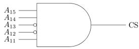

A. C800 to CFFF

B. CA00 to CAFF

C. C800 to C8FF

D. DA00 to DFFF

gatecse-2019 co-and-architecture dram memory-interfacing one-mark

# Answer key

# 1.10

# Data Dependency (4)

# 1.10.1 Data Dependency: GATE CSE 2005 | Question: 68

A 5 stage pipelined CPU has the following sequence of stages:

- IF – instruction fetch from instruction memory  
- RD – Instruction decode and register read  
- EX – Execute: ALU operation for data and address computation  
- MA – Data memory access – for write access, the register read at RD state is used.  
- WB – Register write back

Consider the following sequence of instructions:

- $I_{1}$ : $L$ $R0, loc 1; R0 \Leftarrow M[loc1]$  
- $I_{2}$ : A R0, R0; R0 $\Leftarrow$ R0 + R0  
- $I_{3}: S R2, R0; R2 \Leftarrow R2 - R0$

Let each stage take one clock cycle.

What is the number of clock cycles taken to complete the above sequence of instructions starting from the fetch of $I_{1}$ ?

A. 8

B. 10

C. 12

D. 15

gatecse-2005 co-and-architecture pipelining normal data-dependency

# Answer key


# 1.10.2 Data Dependency: GATE CSE 2008 | Question: 36

Which of the following are NOT true in a pipelined processor?

I. Bypassing can handle all RAW hazards  
II. Register renaming can eliminate all register carried WAR hazards  
III. Control hazard penalties can be eliminated by dynamic branch prediction

A. I and II only

B. I and III only

C. II and III only

D. I, II and III

gatecse-2008

pipelining

co-and-architecture

normal

data-dependency

# Answer key

# 1.10.3 Data Dependency: GATE CSE 2015 | Set 3 | Question: 47

Consider the following code sequence having five instructions from $I_{1}$ to $I_{5}$ . Each of these instructions has the following format.

OP Ri, Rj, Rk

Where operation OP is performed on contents of registers Rj and Rk and the result is stored in register Ri.

$I_{1}$ : ADD R1, R2, R3

$I_{2}$ : MUL R7, R1, R3

$I_{3}$ : SUB R4, R1, R5

$I_{4}$ : ADD R3, R2, R4

$I_{5}$ : MUL R7, R8, R9

Consider the following three statements.

S1: There is an anti-dependence between instructions $I_{2}$ and $I_{5}$  
S2: There is an anti-dependence between instructions $I_{2}$ and $I_{4}$  
S3: Within an instruction pipeline an anti-dependence always creates one or more stalls

Which one of the above statements is/are correct?

A. Only S1 is true

B. Only S2 is true

C. Only S1 and S3 are true

D. Only S2 and S3 are true

gatecse-2015-set3 co-and-architecture pipelining data-dependency normal

# Answer key

# 1.10.4 Data Dependency: GATE IT 2007 | Question: 39

Data forwarding techniques can be used to speed up the operation in presence of data dependencies. Consider the following replacements of LHS with RHS.

i. $R1\to Loc,Loc\to R2\equiv R1\to R2,R1\to Loc$  
ii. $R1\to Loc,Loc\to R2\equiv R1\to R2$  
iii. $R1\to Loc,R2\to Loc\equiv R1\to Loc$  
iv. $R1\to Loc,R2\to Loc\equiv R2\to Loc$

In which of the following options, will the result of executing the RHS be the same as executing the LHS irrespective of the instructions that follow?

A. i and iii

B. i and iv

C. ii and iii

D. ii and iv

gateit-2007 data-dependency co-and-architecture

# Answer key

# 1.11

# Data Hazards (1)

# 1.11.1 Data Hazards: GATE CSE 2026 | Set 1 | Question: 6

Which one of the following dependencies among the register operands of different instructions can cause a data hazard in a pipelined processor?


A. Read-after-read  
C. Write-after-read

B. Read-after-write  
D. Write-after-write

gatecse-2026-set1 co-and-architecture data-hazards easy one-mark

# Answer key

# 1.12

# Data Path (7)

# Practice Test: Test 1 (6Q)

# 1.12.1 Data Path: GATE CSE 1990 | Question: 8a

A single bus CPU consists of four general purpose register, namely, R0, ..., R3, ALU, MAR, MDR, PC, SP and IR (Instruction Register). Assuming suitable microinstructions, write a microroutine for the instruction, ADD R0, R1.


gate1990 descriptive co-and-architecture data-path

# Answer key

# 1.12.2 Data Path: GATE CSE 2001 | Question: 2.13

Consider the following data path of a simple non-pipelined CPU. The registers $A, B, A_1, A_2$ , MDR, the bus and the ALU are 8-bit wide. SP and MAR are 16-bit registers. The MUX is of size $8 \times (2:1)$ and the DEMUX is of size $8 \times (1:2)$ . Each memory operation takes 2 CPU clock cycles and uses MAR (Memory Address Register) and MDR (Memory Date Register). SP can be decremented locally.

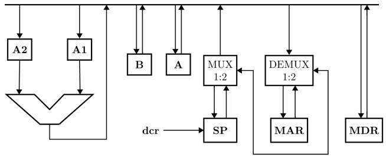

<details>
<summary>flowchart</summary>

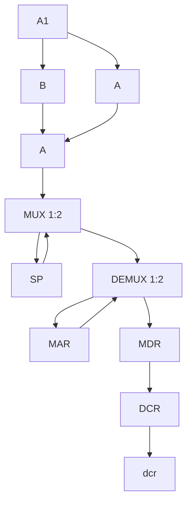
```mermaid
graph TD
  A1["A1"] --> B["B"]
  A1 --> C["A"]
  B --> D["A"]
  C --> D
  D --> E["MUX 1:2"]
  E --> F["SP"]
  F --> E
  E --> G["DEMUX 1:2"]
  G --> H["MAR"]
  H --> G
  G --> I["MDR"]
  I --> J["DCR"]
  J --> K["dcr"]
```
</details>

The CPU instruction "push r" where, r = A or B has the specification

- $M[SP] \leftarrow r$  
- $SP \leftarrow SP - 1$

How many CPU clock cycles are required to execute the "push r" instruction?

A. 2

B. 3

C. 4

D. 5

gatecse-2001 co-and-architecture data-path machine-instruction normal

# Answer key

# 1.12.3 Data Path: GATE CSE 2005 | Question: 79

Consider the following data path of a CPU.


<details>
<summary>flowchart</summary>

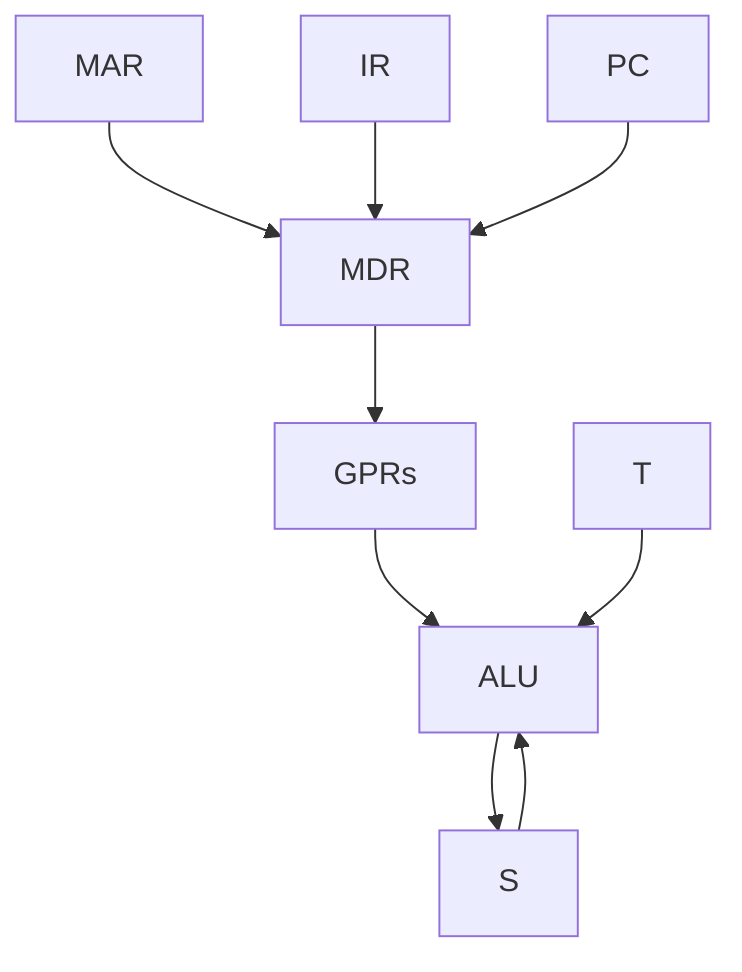
```mermaid
graph TD
  MAR["MAR"] --> MDR["MDR"]
  IR["IR"] --> MDR
  PC["PC"] --> MDR
  MDR --> GPRs["GPRs"]
  GPRs --> ALU["ALU"]
  S["S"] --> ALU
  T["T"] --> ALU
  ALU --> S
```
</details>

The ALU, the bus and all the registers in the data path are of identical size. All operations including incrementation of the PC and the GPRs are to be carried out in the ALU. Two clock cycles are needed for memory read operation – the first one for loading address in the MAR and the next one for loading data from the memory bus into the MDR.

The instruction “add R0, R1” has the register transfer interpretation $R0 \Leftarrow R0 + R1$ . The minimum number of clock cycles needed for execution cycle of this instruction is:

A. 2

B. 3

C. 4

D. 5

gatecse-2005 co-and-architecture machine-instruction data-path normal

# Answer key

# 1.12.4 Data Path: GATE CSE 2005 | Question: 80

Consider the following data path of a CPU.

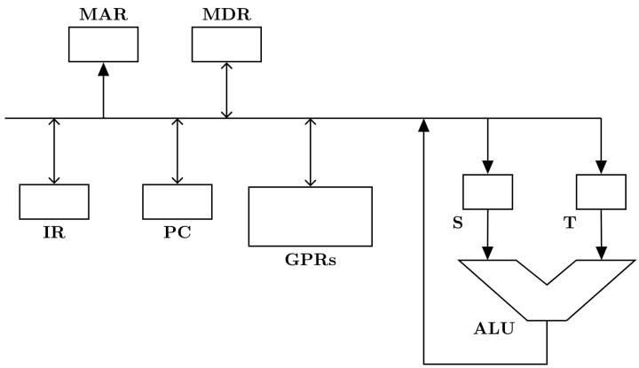

<details>
<summary>flowchart</summary>

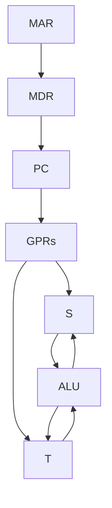
```mermaid
graph TD
  MAR["MAR"] --> MDR["MDR"]
  MDR --> PC["PC"]
  PC --> GPRs["GPRs"]
  GPRs --> S["S"]
  GPRs --> T["T"]
  S --> ALU["ALU"]
  T --> ALU
  ALU --> S
  ALU --> T
```
</details>


The ALU, the bus and all the registers in the data path are of identical size. All operations including incrementation of the PC and the GPRs are to be carried out in the ALU. Two clock cycles are needed for memory read operation – the first one for loading address in the MAR and the next one for loading data from the memory bus into the MDR.

The instruction "call Rn, sub" is a two word instruction. Assuming that PC is incremented during the fetch cycle of the first word of the instruction, its register transfer interpretation is

$$
\mathrm{Rn} \leftarrow \mathrm{PC} + 1;
$$

$$
\mathrm{PC} \leftarrow \mathrm{M} [ \mathrm{PC} ];
$$

The minimum number of CPU clock cycles needed during the execution cycle of this instruction is:

A. 2

B. 3

C. 4

D. 5

co-and-architecture normal gatecse-2005 data-path machine-instruction

# Answer key

Suppose the functions $F$ and $G$ can be computed in 5 and 3 nanoseconds by functional units $U_F$ and $U_G$ , respectively. Given two instances of $U_F$ and two instances of $U_G$ , it is required to implement the computation $F(G(X_i))$ for $1 \leq i \leq 10$ . Ignoring all other delays, the minimum time required to complete this computation is \_\_\_\_ nanoseconds.

gatecse-2016-set2 co-and-architecture data-path normal numerical-answers

# Answer key

# 1.12.6 Data Path: GATE CSE 2020 | Question: 4

Consider the following data path diagram.


<details>
<summary>flowchart</summary>

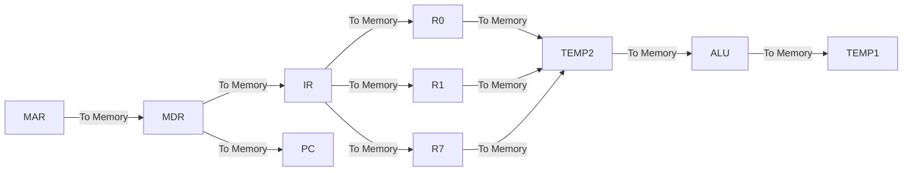
```mermaid
graph LR
  A["MAR"] -->|To Memory| B["MDR"]
  B -->|To Memory| C["IR"]
  B -->|To Memory| D["PC"]
  C -->|To Memory| E["R0"]
  C -->|To Memory| F["R1"]
  C -->|To Memory| G["R7"]
  E -->|To Memory| H["TEMP2"]
  F -->|To Memory| H
  G -->|To Memory| H
  H -->|To Memory| I["ALU"]
  I -->|To Memory| J["TEMP1"]
```
</details>


Consider an instruction: $R0 \leftarrow R1 + R2$ . The following steps are used to execute it over the given data path. Assume that PC is incremented appropriately. The subscripts r and w indicate read and write operations, respectively.

1. $R2_{r}$ , $\mathrm{TEMP1}_r, ALU_{\mathrm{add}}$ , $\mathrm{TEMP2}_w$  
2. $R1_{r}$ , $\mathrm{TEMP1}_w$  
3. $PC_{r}$ , $\mathrm{MAR}_{w}$ , $\mathrm{MEM}_{r}$  
4. TEMP2 $_{r}$ , R0 $_{w}$  
5. $MDR_{r}, IR_{w}$

Which one of the following is the correct order of execution of the above steps?

A. 2,1,4,5,3

B. 1,2,4,3,5

C. 3,5,2,1,4

D. 3,5,1,2,4

gatecse-2020 co-and-architecture data-path one-mark

# Answer key

# 1.12.7 Data Path: GATE CSE 2025 | Set 1 | Question: 17

A partial data path of a processor is given in the figure, where RA, RB, and RZ are 32-bit registers. Which option(s) is/are CORRECT related to arithmetic operations using the data path as shown?


<details>
<summary>flowchart</summary>

```mermaid
graph TD
  subgraph RA["RA(32 bit)"]
  RA --> Mux_A["Mux_A"]
  RA --> RB["RB(32 bit)"]
  end
  subgraph RB["RB(32 bit)"]
  RB --> Mux_B["Mux_B"]
  RB --> RB
  end
  subgraph ALU["ALU control"]
  ALU --> ALU
  ALU --> RZ["RZ(32 bit)"]
  end
  RA -->|Select RA/immediate| Mux_A
  RB -->|Select RB/immediate| Mux_B
  ALU --> ALU
  Mux_A --> ALU
  RB --> Mux_B
```
</details>

A. The data path can implement arithmetic operations involving two registers.  
B. The data path can implement arithmetic operations involving one register and one immediate value.

C. The data path can implement arithmetic operations involving two immediate values.  
D. The data path can only implement arithmetic operations involving one register and one immediate value.

gatecse2025-set1 co-and-architecture data-path multiple-selects one-mark

# Answer key

# 1.13

# Direct Mapping (5)

# 1.13.1 Direct Mapping: GATE CSE 2022 | Question: 44


Consider a system with 2 KB direct mapped data cache with a block size of 64 bytes. The system has a physical address space of 64 KB and a word length of 16 bits. During the execution of a program, four data words P, Q, R, and S are accessed in that order 10 times (i.e., PQRSPQRS...). Hence, there are 40 accesses to data cache altogether. Assume that the data cache is initially empty and no other data words are accessed by the program. The addresses of the first bytes of P, Q, R, and S are 0xA248, 0xC28A, 0xCA8A, and 0xA262, respectively. For the execution of the above program, which of the following statements is/are TRUE with respect to the data cache?

A. Every access to S is a hit.  
B. Once P is brought to the cache it is never evicted.  
C. At the end of the execution only R and S reside in the cache.  
D. Every access to R evicts Q from the cache.

gatecse-2022 co-and-architecture direct-mapping multiple-selects two-marks cache-memory

# Answer key

# 1.13.2 Direct Mapping: GATE CSE 2025 | Set 1 | Question: 26


Consider a memory system with 1M bytes of main memory and 16 K bytes of cache memory. Assume that the processor generates 20-bit memory address, and the cache block size is 16 bytes. If the cache uses direct mapping, how many bits will be required to store all the tag values? [Assume memory is byte addressable, $1 K = 2^{10}$ , $1 M = 2^{20}$ .]

A. $6 \times 2^{10}$

B. $8 \times 2^{10}$

C. $2^{12}$

D. $2^{14}$

gatecse2025-set1 co-and-architecture cache-memory direct-mapping easy two-marks

# Answer key

# 1.13.3 Direct Mapping: GATE CSE 2025 | Set 2 | Question: 29


For a direct-mapped cache, 4 bits are used for the tag field and 12 bits are used to index into a cache block. The size of each cache block is one byte. Assume that there is no other information stored for each cache block.

Which ONE of the following is the CORRECT option for the sizes of the main memory and the cache memory in this system (byte addressable), respectively?

A. 64 KB and 4 KB

B. 128 KB and 16 KB

C. 64 KB and 8 KB

D. 128 KB and 6 KB

gatecse2025-set2 co-and-architecture direct-mapping cache-memory two-marks

# Answer key

# 1.13.4 Direct Mapping: GATE CSE 2026 | Set 2 | Question: 42


Consider a system with a processor and a 4 KB direct mapped cache with block size of 16 bytes. The system has a 16 MB physical memory. Four words P, Q, R, and S are accessed by the processor in the same order 10 times. That is, there are a total of 40 memory references in the sequence P, Q, R, S, P, Q, R, S, ...

Assume that the cache memory is initially empty. The physical addresses of the words are given below (1 word = 1 byte).

P: 0x845B32, Q: 0x845B26, R: 0x845B36, S: 0x846B32

Which of the following statements is/are true?

Note: $1\mathrm{K} = 2^{10}$ and $1\mathrm{M} = 2^{20}$

A. Every access to P results in a cache miss  
B. Every access to R results in a cache hit  
C. Every access to Q results in a cache miss  
D. Except the first access to S, all subsequent accesses to S result in cache hits

gatecse-2026-set2 co-and-architecture direct-mapping cache-memory multiple-selects two-marks

Answer key

# 1.13.5 Direct Mapping: GATE CSE 2026 | Set 2 | Question: 46


Consider a system with 1 MB physical memory and a word length of 1 byte. The system uses a direct mapped cache, with block numbers starting from 0. The word with physical address 0xA2C28 is mapped to the cache block number 176 $_{10}$ . The maximum possible size of the cache (in KB) for this configuration is \_\_\_\_. (answer in integer)

Note: $1\mathrm{K} = 2^{10}$ and $1\mathrm{M} = 2^{20}$

gatecse-2026-set2 co-and-architecture direct-mapping cache-memory numerical-answers two-marks

Answer key

# 1.14

# Disk (1)

# 1.14.1 Disk: GATE CSE 2026 | Set 1 | Question: 49


Consider a hard disk with a rotational speed of 15000 rpm. The time to move the read/write head from a track to its adjacent track is 1 millisecond. Initially, the head is on track 0. The number of sectors per track is 400. The sector size is 1024 bytes. It is necessary to transfer data from 10 randomly located sectors in each of the following tracks in the order: 5, 12 and 7.

The total time for the data transfer (in milliseconds) from the hard disk is \_\_\_\_. (rounded off to one decimal place)

gatecse-2026-set1 numerical-answers operating-system two-marks disk

Answer key

# 1.15

# Hazards (1)

# 1.15.1 Hazards: GATE CSE 2026 | Set 1 | Question: 50


The EX stage of a pipelined processor performs the memory read operations for LOAD instructions, and the operations for the arithmetic and logic instructions. Let $t_{EX}$ denote the time taken by the EX stage to perform the operation for an instruction. For each instruction type, the values of $t_{EX}$ and $M$ (the number of instructions of that type in a sequence of 100 instructions for a program P), are given in the table below.

The duration of the pipeline clock cycle is 1 nanosecond. Assume that the latch time for the interstage buffers in the pipeline is negligible.

<table><tr><td>Instruction</td><td> $t_{EX}$  in nanoseconds</td><td>M</td></tr><tr><td>LOAD</td><td>1.8</td><td>15</td></tr><tr><td>IMUL</td><td>1.5</td><td>10</td></tr><tr><td>IDIV</td><td>2.5</td><td>5</td></tr><tr><td>FADD</td><td>1.7</td><td>10</td></tr><tr><td>FSUB</td><td>1.7</td><td>5</td></tr><tr><td>FMUL</td><td>2.8</td><td>15</td></tr><tr><td>FDIV</td><td>3.2</td><td>5</td></tr><tr><td>All other instructions</td><td>Less than 1.0</td><td>35</td></tr></table>

When program P is executed, the number of clock cycles for which the pipeline is stalled due to structural hazards in the EX stage is \_\_\_\_. (answer in integer)

gatecse-2026-set1 numerical-answers co-and-architecture pipelining hazards two-marks

Answer key

# 1.16

# IO Handling (8)

# 1.16.1 IO Handling: GATE CSE 1987 | Question: 2a

State whether the following statements are TRUE or FALSE


In a microprocessor-based system, if a bus (DMA) request and an interrupt request arrive sumultaneously, the microprocessor attends first to the bus request.

gate1987 co-and-architecture interrupts io-handling true-false

Answer key

# 1.16.2 IO Handling: GATE CSE 1987 | Question: 2b

State whether the following statements are TRUE or FALSE:


Data transfer between a microprocessor and an I/O device is usually faster in memory-mapped-I/O scheme than in I/O-mapped -I/O scheme.

gate1987 co-and-architecture io-handling true-false

Answer key

# 1.16.3 IO Handling: GATE CSE 1990 | Question: 4-ii

State whether the following statements are TRUE or FALSE with reason:


The data transfer between memory and I/O devices using programmed I/O is faster than interrupt-driven I/O.

gate1990 true-false co-and-architecture io-handling interrupts

Answer key

# 1.16.4 IO Handling: GATE CSE 1996 | Question: 1.24

For the daisy chain scheme of connecting I/O devices, which of the following statements is true?


A. It gives non-uniform priority to various devices  
B. It gives uniform priority to all devices  
C. It is only useful for connecting slow devices to a processor device  
D. It requires a separate interrupt pin on the processor for each device

# 1.16.5 IO Handling: GATE CSE 1996 | Question: 25


A hard disk is connected to a 50 MHz processor through a DMA controller. Assume that the initial set-up of a DMA transfer takes 1000 clock cycles for the processor, and assume that the handling of the interrupt at DMA completion requires 500 clock cycles for the processor. The hard disk has a transfer rate of 2000 Kbyt and average block transferred is 4 K bytes. What fraction of the processor time is consumed by the disk, if this is actively transferring 100% of the time?

gate1996 co-and-architecture io-handling dma numerical-answers normal

# Answer key

# 1.16.6 IO Handling: GATE CSE 1997 | Question: 2.4

The correct matching for the following pairs is:


(A) DMA I/O (1) High speed RAM  
(B) Cache (2) Disk  
(C) Interrupt I/O (3) Printer  
(D) Condition Code Register (4) ALU

A. $A - 4$ $B - 3$ $C - 1$ $D - 2$  
C. $A - 4$ $B - 3$ $C - 2$ $D - 1$

B. $A - 2$ $B - 1$ $C - 3$ $D - 4$  
D. $A - 2$ $B - 3$ $C - 4$ $D - 1$

gate1997 co-and-architecture normal io-handling match-the-following

# Answer key

# 1.16.7 IO Handling: GATE CSE 2008 | Question: 64, ISRO2009-13


Which of the following statements about synchronous and asynchronous I/O is NOT true?

A. An ISR is invoked on completion of I/O in synchronous I/O but not in asynchronous I/O  
B. In both synchronous and asynchronous I/O, an ISR (Interrupt Service Routine) is invoked after completion of the I/O  
C. A process making a synchronous I/O call waits until I/O is complete, but a process making an asynchronous I/O call does not wait for completion of the I/O  
D. In the case of synchronous I/O, the process waiting for the completion of I/O is woken up by the ISR that is invoked after the completion of I/O

gatecse-2008 operating-system io-handling normal isro2009

# Answer key

# 1.16.8 IO Handling: GATE CSE 2011 | Question: 28


On a non-pipelined sequential processor, a program segment, which is the part of the interrupt service routine, is given to transfer 500 bytes from an I/O device to memory.

Initialize the address register

Initialize the count to 500

LOOP: Load a byte from device

Store in memory at address given by address register

Increment the address register

Decrement the count

If count !=0 go to LOOP

Assume that each statement in this program is equivalent to a machine instruction which takes one clock cycle to execute if it is a non-load/store instruction. The load-store instructions take two clock cycles to execute.

The designer of the system also has an alternate approach of using the DMA controller to implement the same transfer. The DMA controller requires 20 clock cycles for initialization and other overheads. Each DMA transfer cycle takes two clock cycles to transfer one byte of data from the device to the memory.

What is the approximate speed up when the DMA controller based design is used in a place of the interrupt driven program based input-output?

A. 3.4

B. 4.4

C. 5.1

D. 6.7

gatecse-2011 co-and-architecture dma normal io-handling

Answer key

# 1.17

# Instruction Execution (7)

Practice Test: Test 1 (7Q)

# 1.17.1 Instruction Execution: GATE CSE 1990 | Question: 4-iii

State whether the following statements are TRUE or FALSE with reason:

The flags are affected when conditional CALL or JUMP instructions are executed.

gate1990 true-false co-and-architecture instruction-execution

Answer key

# 1.17.2 Instruction Execution: GATE CSE 1992 | Question: 01-iv

Many of the advanced microprocessors prefetch instructions and store it in an instruction buffer to speed up processing. This speed up is achieved because \_\_\_\_

gate1992 co-and-architecture easy instruction-execution fill-in-the-blanks

Answer key


# 1.17.3 Instruction Execution: GATE CSE 1995 | Question: 1.2

Which of the following statements is true?

A. ROM is a Read/Write memory  
C. Stack works on the principle of LIFO

B. PC points to the last instruction that was executed

D. All instructions affect the flags

gate1995 co-and-architecture normal instruction-execution

Answer key


# 1.17.4 Instruction Execution: GATE CSE 2002 | Question: 1.13

Which of the following is not a form of memory

A. instruction cache  
C. instruction opcode

B. instruction register

gatecse-2002 co-and-architecture easy instruction-execution

Answer key

# 1.17.5 Instruction Execution: GATE CSE 2006 | Question: 43

Consider a new instruction named branch-on-bit-set (mnemonic bbs). The instruction "bbs reg, pos, label" jumps to label if bit in position pos of register operand reg is one. A register is 32 -bits wide and the bits are numbered 0 to 31, bit in position 0 being the least significant. Consider the following emulation of this instruction on a processor that does not have bbs implemented.

temp ← reg&mask

Branch to label if temp is non-zero. The variable temp is a temporary register. For correct emulation, the variable mask must be generated by

A. $mask \leftarrow 0x1 << pos$  
C. mask ← pos  
gatecse-2006 co-and-architecture normal instruction-execution

B. mask ← 0xffffffff << pos  
D. mask ← 0xf

Answer key


Consider a RISC machine where each instruction is exactly 4 bytes long. Conditional and unconditional branch instructions use PC-relative addressing mode with Offset specified in bytes to the target location of the branch instruction. Further the Offset is always with respect to the address of the next instruction in the program sequence. Consider the following instruction sequence

<table><tr><td>Instr. No.</td><td>Instruction</td></tr><tr><td>i:</td><td>add R2, R3, R4</td></tr><tr><td>i+1:</td><td>sub R5, R6, R7</td></tr><tr><td>i+2:</td><td>cmp R1, R9, R10</td></tr><tr><td>i+3:</td><td>beq R1, Offset</td></tr></table>

If the target of the branch instruction is i, then the decimal value of the Offset is \_\_\_\_.

gatecse-2017-set1 co-and-architecture normal numerical-answers instruction-execution

# Answer key

# 1.17.7 Instruction Execution: GATE CSE 2025 | Set 2 | Question: 51

An application executes $6.4 \times 10^{8}$ number of instructions in 6.3 seconds. There are four types of instructions, the details of which are given in the table. The duration of a clock cycle in nanoseconds is \_\_\_\_. (rounded off to one decimal place)


<table><tr><td>Instruction type</td><td>Clock cycles required per instruction (CPI)</td><td>Number of instructions executed</td></tr><tr><td>Branch</td><td>2</td><td> $2.25 \times 10^{8}$ </td></tr><tr><td>Load</td><td>5</td><td> $1.20 \times 10^{8}$ </td></tr><tr><td>Store</td><td>4</td><td> $1.65 \times 10^{8}$ </td></tr><tr><td>Arithmetic</td><td>3</td><td> $1.30 \times 10^{8}$ </td></tr></table>

gatecse2025-set2 co-and-architecture instruction-execution clock-cycles numerical-answers two-marks

# Answer key

# 1.18

# Instruction Format (11)

Practice Test: Test 1 (10Q)

# 1.18.1 Instruction Format: GATE CSE 1988 | Question: 2-ii

Using an expanding opcode encoding for instructions, is it possible to encode all of the following in an instruction format shown in the below figure. Justify your answer.


14 double address instructions  
127 single address instructions  
60 no address (zero address) instructions

<table><tr><td> $\leftarrow 4 \text{ bits} \rightarrow$ </td><td> $\leftarrow 6 \text{ bits} \rightarrow$ </td><td> $\leftarrow 6 \text{ bits} \rightarrow$ </td></tr><tr><td>Opcode</td><td>Operand 1Address</td><td>Operand 2Address</td></tr></table>

gate1988 normal co-and-architecture instruction-format descriptive

# Answer key

# 1.18.2 Instruction Format: GATE CSE 1992 | Question: 01-vi


In an 11-bit computer instruction format, the size of address field is 4-bits. The computer uses expanding OP code technique and has 5 two-address instructions and 32 one-address instructions. The number of zero-address instructions it can support is \_\_\_\_

gate1992 co-and-architecture machine-instruction instruction-format normal numerical-answers

# Answer key

# 1.18.3 Instruction Format: GATE CSE 1994 | Question: 3.2


State True or False with one line explanation

Expanding opcode instruction formats are commonly employed in RISC. (Reduced Instruction Set Computers) machines.

gate1994 co-and-architecture machine-instruction instruction-format normal true-false

# Answer key

# 1.18.4 Instruction Format: GATE CSE 2014 | Set 1 | Question: 9


A machine has a 32-bit architecture, with 1-word long instructions. It has 64 registers, each of which is 32 bits long. It needs to support 45 instructions, which have an immediate operand in addition to two register operands. Assuming that the immediate operand is an unsigned integer, the maximum value of the immediate operand is \_\_\_\_

gatecse-2014-set1 co-and-architecture machine-instruction instruction-format numerical-answers normal

# Answer key

# 1.18.5 Instruction Format: GATE CSE 2016 | Set 2 | Question: 31


Consider a processor with 64 registers and an instruction set of size twelve. Each instruction has five distinct fields, namely, opcode, two source register identifiers, one destination register identifier, and twelve-bit immediate value. Each instruction must be stored in memory in a byte-aligned fashion. If a program has 100 instructions, the amount of memory (in bytes) consumed by the program text is \_\_\_\_.

gatecse-2016-set2 instruction-format machine-instruction co-and-architecture normal numerical-answers

# Answer key

# 1.18.6 Instruction Format: GATE CSE 2018 | Question: 51


A processor has 16 integer registers (R0, R1, ..., R15) and 64 floating point registers (F0, F1, ..., F63). It uses a 2-byte instruction format. There are four categories of instructions:

Type-1, Type-2, Type-3, and Type-4. Type-1 category consists of four instructions, each with 3 integer register operands (3Rs). Type-2 category consists of eight instructions, each with 2 floating point register operands (2Fs). Type-3 category consists of fourteen instructions, each with one integer register operand and one floating point register operand (1R+1F). Type-4 category consists of N instructions, each with a floating point register operand (1F).

The maximum value of N is \_\_\_\_.

gatecse-2018 co-and-architecture machine-instruction instruction-format numerical-answers two-marks

# Answer key

# 1.18.7 Instruction Format: GATE CSE 2020 | Question: 44


A processor has 64 registers and uses 16-bit instruction format. It has two types of instructions: I-type and R-type. Each I-type instruction contains an opcode, a register name, and a 4-bit immediate value. Each R-type instruction contains an opcode and two register names. If there are 8 distinct I-type opcodes, then the maximum number of distinct R-type opcodes is \_\_\_\_.

gatecse-2020 co-and-architecture numerical-answers instruction-format machine-instruction two-marks

# Answer key

# 1.18.8 Instruction Format: GATE CSE 2024 | Set 2 | Question: 47


A processor with 16 general purpose registers uses a 32-bit instruction format. The instruction format consists of an opcode field, an addressing mode field, two register operand fields, and a 16-bit scalar field. If 8 addressing modes are to be supported, the maximum number of unique opcodes possible for every addressing mode is \_\_\_\_.

gatecse-2024-set2 numerical-answers co-and-architecture instruction-format two-marks

# Answer key

# 1.18.9 Instruction Format: GATE CSE 2024 | Set 2 | Question: 51


A processor uses a 32-bit instruction format and supports byte-addressable memory access. The ISA of the processor has 150 distinct instructions. The instructions are equally divided into two types, namely R-type and I-type, whose formats are shown below.

R - type Instruction Format:

<table><tr><td>OPCODE</td><td>UNUSED</td><td>DSTRegister</td><td>SRCRegister1</td><td>SRCRegister2</td></tr></table>

I - type Instruction Format:

<table><tr><td>OPCODE</td><td>DSTRegister</td><td>SRCRegister</td><td>#Immediatevalue/address</td></tr></table>

In the OPCODE, 1 bit is used to distinguish between I-type and R-type instructions and the remaining bits indicate the operation. The processor has 50 architectural registers, and all register fields in the instructions are of equal size.

Let X be the number of bits used to encode the UNUSED field, Y be the number of bits used to encode the OPCODE field, and Z be the number of bits used to encode the immediate value/address field. The value of X+2Y+Z is \_\_\_\_.

gatecse-2024-set2 numerical-answers co-and-architecture instruction-format two-marks

# Answer key

# 1.18.10 Instruction Format: GATE CSE 2026 | Set 1 | Question: 5


Consider a processor P whose instruction set architecture is the load-store architecture. The instruction format is such that the first operand of any instruction is the destination operand.

Which one of the following sequences of instructions corresponds to the high-level language statement $\mathbf{Z} = \mathbf{X} + \mathbf{Y}$ ?

Note: X, Y, and Z are memory operands. R0, R1, and R2 are registers.

A. ADD Z, X, Y  
C. ADD R0, X, Y STORE Z, R0

B. LOAD R0, X ADD Z, R0, Y

D. LOAD R0, X LOAD R1, Y ADD R

2, R0, R1 STORE Z, R2

gatecse-2026-set1 co-and-architecture instruction-format one-mark

# Answer key

# 1.18.11 Instruction Format: GATE CSE 2026 | Set 2 | Question: 34


Consider a processor that has 16 general purpose registers and it uses 2-byte instruction format for all its instructions. Variable-sized opcodes are permitted. There are three different types of instructions; M-type, R-type, and C-type. Each M-type instruction has 2 register operands and a 6-bit immediate operand. Each instruction has 3 register operands. Each C-type instruction has a register operand and a 6-bit offset value. I are 2 unique M-type opcodes and 7 unique R-type opcodes, which one of the following options gives the ma

A processor with 16 general purpose registers uses a 32-bit instruction format. The instruction format consists of an opcode field, an addressing mode field, two register operand fields, and a 16-bit scalar field. If 8 addressing modes are to be supported, the maximum number of unique opcodes possible for every addressing mode is \_\_\_\_.

number of unique opcodes possible for C-type instructions?

A. 8

B. 4

C. 64

D. 16

gatecse-2026-set2 co-and-architecture machine-instruction instruction-format two-marks

Answer key

# 1.19

# Instruction Set Architecture (1)

# 1.19.1 Instruction Set Architecture: GATE CSE 2025 | Set 2 | Question: 18

Which of the following is/are part of an Instruction Set Architecture of a processor?

A. The size of the cache memory

B. The clock frequency of the processor

C. The number of cache memory levels

D. The total number of registers

gatecse2025-set2 co-and-architecture instruction-set-architecture multiple-selects easy one-mark

Answer key

# 1.20

# Interrupts (10)

Practice Test: Test 1 (11Q)

# 1.20.1 Interrupts: GATE CSE 1987 | Question: 1-viii

On receiving an interrupt from a I/O device the CPU:

A. Halts for a predetermined time.  
B. Hands over control of address bus and data bus to the interrupting device.  
C. Branches off to the interrupt service routine immediately.  
D. Branches off to the interrupt service routine after completion of the current instruction.

gate1987 co-and-architecture interrupts

Answer key

# 1.20.2 Interrupts: GATE CSE 1995 | Question: 1.3

In a vectored interrupt:

A. The branch address is assigned to a fixed location in memory  
B. The interrupting source supplies the branch information to the processor through an interrupt vector  
C. The branch address is obtained from a register in the processor  
D. None of the above

gate1995 co-and-architecture interrupts normal

Answer key

# 1.20.3 Interrupts: GATE CSE 1998 | Question: 1.20

Which of the following is true?

A. Unless enabled, a CPU will not be able to process interrupts.  
B. Loop instructions cannot be interrupted till they complete.  
C. A processor checks for interrupts before executing a new instruction.  
D. Only level triggered interrupts are possible on microprocessors.

gate1998 co-and-architecture interrupts normal

Answer key


# 1.20.4 Interrupts: GATE CSE 2002 | Question: 1.9

A device employing INTR line for device interrupt puts the CALL instruction on the data bus while:


A. $\overline{\mathrm{INTA}}$ is active  
C. READY is inactive

B. HOLD is active

D. None of the above

gatecse-2002 co-and-architecture interrupts normal

# Answer key

# 1.20.5 Interrupts: GATE CSE 2005 | Question: 69

A device with data transfer rate 10 KB/sec is connected to a CPU. Data is transferred byte-wise. Let the interrupt overhead be 4 $\mu$ sec. The byte transfer time between the device interface register and CPU or memory is negligible. What is the minimum performance gain of operating the device under interrupt mode over operating it under program-controlled mode?

A. 15

B. 25

C. 35

D. 45

gatecse-2005 co-and-architecture interrupts

# Answer key

# 1.20.6 Interrupts: GATE CSE 2009 | Question: 8, UGCNET-June2012-III: 58

A CPU generally handles an interrupt by executing an interrupt service routine:

A. As soon as an interrupt is raised.  
B. By checking the interrupt register at the end of fetch cycle.  
C. By checking the interrupt register after finishing the execution of the current instruction.  
D. By checking the interrupt register at fixed time intervals.

gatecse-2009 co-and-architecture interrupts normal ugcnetcse-june2012-paper3

# Answer key

# 1.20.7 Interrupts: GATE CSE 2020 | Question: 3

Consider the following statements.


I. Daisy chaining is used to assign priorities in attending interrupts.  
II. When a device raises a vectored interrupt, the CPU does polling to identify the source of interrupt.  
III. In polling, the CPU periodically checks the status bits to know if any device needs its attention.  
IV. During DMA, both the CPU and DMA controller can be bus masters at the same time.

Which of the above statements is/are TRUE?

A. I and II only

B. I and IV only

C. I and III only

D. III only

gatecse-2020 co-and-architecture interrupts one-mark

# Answer key

# 1.20.8 Interrupts: GATE CSE 2023 | Question: 24

A keyboard connected to a computer is used at a rate of 1 keystroke per second. The computer system polls the keyboard every 10 ms (milli seconds) to check for a keystroke and consumes 100 $\mu$ s (micro seconds) for each poll. If it is determined after polling that a key has been pressed, the system consumes an additional 200 $\mu$ s to process the keystroke. Let $T_{1}$ denote the fraction of a second spent in polling and processing a keystroke.

In an alternative implementation, the system uses interrupts instead of polling. An interrupt is raised for every keystroke. It takes a total of 1 ms for servicing an interrupt and processing a keystroke. Let $T_{2}$ denote the fraction of a second spent in servicing the interrupt and processing a keystroke.


The ratio $\frac{T_{1}}{T_{2}}$ is \_\_\_\_. (Rounded off to one decimal place)

gatecse-2023 co-and-architecture interrupts numerical-answers one-mark

# Answer key

# 1.20.9 Interrupts: GATE CSE 2025 | Set 1 | Question: 1


Suppose a program is running on a non-pipelined single processor computer system. The computer is connected to an external device that can interrupt the processor asynchronously. The processor needs to execute the interrupt service routine (ISR) to serve this interrupt. The following steps (not necessarily in order) are taken by the processor when the interrupt arrives:

i. The processor saves the content of the program counter.  
ii. The program counter is loaded with the start address of the ISR.  
iii. The processor finishes the present instruction.

Which ONE of the following is the CORRECT sequence of steps?

A. (iii), (i), (ii)

B. (i), (iii), (ii)

C. (i), (ii), (iii)

D. (iii), (ii), (i)

gatecse2025-set1 co-and-architecture interrupts easy one-mark

# Answer key

# 1.20.10 Interrupts: GATE CSE 2026 | Set 2 | Question: 8

Consider the following two statements about interrupt handling mechanisms in a CPU.


S1: In non-vectored interrupt mechanism, it usually takes more time to start the Interrupt Service Routine (ISR) when compared to that in a vectored interrupt mechanism.  
S2: In daisy-chain interrupt mechanism, the CPU polls all the input devices individually to determine the source of the interrupt.

Which one of the following options is correct with respect to S1 and S2?

A. Both S1 and S2 are true  
B. Both S1 and S2 are false  
C. S1 is true and S2 is false  
D. S1 is false and S2 is true

gatecse-2026-set2 co-and-architecture interrupts one-mark

# Answer key

# 1.21

# Machine Instruction (21)

Practice Tests: Test 1 (15Q) Test 2 (8Q)

# 1.21.1 Machine Instruction: GATE CSE 1988 | Question: 9i

The following program fragment was written in an assembly language for a single address computer with one accumulator register:


LOAD B

MULT C

STORE T1

ADD A

STORE T2

MULT T2

ADD T1

STORE Z

Give the arithmetic expression implemented by the fragment.

gate1988 normal descriptive co-and-architecture machine-instruction

# Answer key

A. Assume that a CPU has only two registers $R_{1}$ and $R_{2}$ and that only the following instruction is available $XOR R_{i}, R_{j}; \{R_{j} \leftarrow R_{i} \oplus R_{j}, \text{ for } i, j = 1, 2\}$

Using this XOR instruction, find an instruction sequence in order to exchange the contents of the registers $R_{1}$ and $R_{2}$

B. The line p of the circuit shown in figure has stuck at 1 fault. Determine an input test to detect the fault.

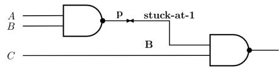

<details>
<summary>flowchart</summary>

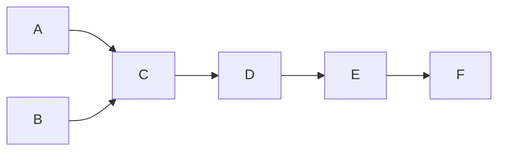
```mermaid
graph LR
  A["A"] --> C["C"]
  B["B"] --> C["C"]
  C["C"] --> D["D"]
  D["D"] --> E["E"]
  E["E"] --> F["F"]
```
</details>

gate1994 co-and-architecture machine-instruction normal descriptive

# Answer key

# 1.21.3 Machine Instruction: GATE CSE 1999 | Question: 17

Consider the following program fragment in the assembly language of a certain hypothetical processor. The processor has three general purpose registers R1, R2 and R3. The meanings of the instructions are shown by comments (starting with ;) after the instructions.


```txt
X: CMP R1, 0; Compare R1 and 0, set flags appropriately in status register
JZ Z; Jump if zero to target Z
MOV R2, R1; Copy contents of R1 to R2
SHR R1; Shift right R1 by 1 bit
SHL R1; Shift left R1 by 1 bit
CMP R2, R1; Compare R2 and R1 and set flag in status register
JZ Y; Jump if zero to target Y
INC R3; Increment R3 by 1;
Y: SHR R1; Shift right R1 by 1 bit
JMP X; Jump to target X
Z:...
```

A. Initially $R1, R2$ and $R3$ contain the values 5,0 and 0 respectively, what are the final values of $R1$ and $R3$ when control reaches $Z$ ?  
B. In general, if $R1, R2$ and $R3$ initially contain the values $n, 0,$ and $0$ respectively. What is the final value of $R3$ when control reaches $Z$ ?

gate1999 co-and-architecture machine-instruction normal descriptive

# Answer key

# 1.21.4 Machine Instruction: GATE CSE 2003 | Question: 48

Consider the following assembly language program for a hypothetical processor $A, B$ , and $C$ are 8-bit registers. The meanings of various instructions are shown as comments.


<div class="mineru-algorithm" style="white-space: pre-wrap; font-family:monospace;">
MOV B, #0          ;    B ← 0
    MOV C, #8          ;    C ← 8
Z:    CMP C, #0          ;    compare C with 0
    JZ X                ;    jump to X if zero flag is set
    SUB C, #1          ;    C ← C - 1
    RRC A, #1          ;    right rotate A through carry by one bit. Thus:
                        ;    If the initial values of A and the carry flag are a7 . . . a0 and
                        ;    c0 respectively, their values after the execution of this
                        ;    instruction will be c0a7 . . . a1 and a0 respectively.
    JC Y                ;    jump to Y if carry flag is set
    JMP Z                ;    jump to Z
Y:    ADD B, #1          ;    B ← B + 1
    JMP Z                ;    jump to Z
X:                    ;
</div>

If the initial value of register A is A0 the value of register B after the program execution will be

A. the number of 0 bits in $A_0$

B. the number of 1 bits in $A_0$

C. $A_{0}$

D. 8

gatecse-2003 co-and-architecture machine-instruction normal

# Answer key

# 1.21.5 Machine Instruction: GATE CSE 2003 | Question: 49

Consider the following assembly language program for a hypothetical processor A, B, and C are 8 bit registers. The meanings of various instructions are shown as comments.


MOV B, ;B←0
#0

MOV C, ;C ← 8
#8

Z: CMP C, ;compare C with 0
#0

JZ X ; jump to X if zero flag is set

SUB C, #1 ; C ← C - 1

RRC A, #1 ; right rotate A through carry by one bit. Thus:

; If the initial values of A and the carry flag are $a_7 \ldots a_0$ and $c_0$ respectively, their values after the execution of this instruction will be $c_0a_7 \ldots a_1$ and $a_0$ respectively.

JC Y          ;jump to Y if carry flag is set
JMP Z          ;jump to Z

Y: ADD B, #1; B ← B + 1

JMP Z ; jump to Z

X:

Which of the following instructions when inserted at location $X$ will ensure that the value of the register $A$ after program execution is as same as its initial value?

A. RRC A, #1

B. NOP; no operation

C. LRC A,#1; left rotate A through carry flag by one bit

D. ADD A,#1

gatecse-2003 co-and-architecture machine-instruction normal

# Answer key

Consider the following program segment for a hypothetical CPU having three user registers $R_{1}$ , $R_{2}$ and $R_{3}$ .

<table><tr><td>Instruction</td><td>Operation</td><td>Instruction size (in words)</td></tr><tr><td>MOV  $R_1, 5000$ </td><td> $R_1 \leftarrow \text{Memory}[5000]$ </td><td>2</td></tr><tr><td>MOV  $R2, (R1)$ </td><td> $R2 \leftarrow \text{Memory}[(R_1)]$ </td><td>1</td></tr><tr><td>ADD  $R_2, R_3$ </td><td> $R2 \leftarrow R_2 + R_3$ </td><td>1</td></tr><tr><td>MOV  $6000, R_2$ </td><td> $\text{Memory}[6000] \leftarrow R_2$ </td><td>2</td></tr><tr><td>HALT</td><td>Machine Halts</td><td>1</td></tr></table>

Consider that the memory is byte addressable with size 32 bits, and the program has been loaded starting from memory location 1000 (decimal). If an interrupt occurs while the CPU has been halted after executing the HALT instruction, the return address (in decimal) saved in the stack will be

A. 1007

B. 1020

C. 1024

D. 1028

gatecse-2004 co-and-architecture machine-instruction normal

Answer key

# 1.21.7 Machine Instruction: GATE CSE 2004 | Question: 64

Consider the following program segment for a hypothetical CPU having three user registers $R_{1}$ , $R_{2}$ and $R_{3}$ .


<table><tr><td>Instruction</td><td>Operation</td><td>Instruction size (in Words)</td></tr><tr><td>MOV  $R_1, 5000$ </td><td> $R1 \leftarrow \text{Memory}[5000]$ </td><td>2</td></tr><tr><td>MOV  $R_2(R_1)$ </td><td> $R2 \leftarrow \text{Memory}[(R_1)]$ </td><td>1</td></tr><tr><td>ADD  $R_2, R_3$ </td><td> $R_2 \leftarrow R_2 + R_3$ </td><td>1</td></tr><tr><td>MOV 6000,  $R_2$ </td><td>Memory[6000]  $\leftarrow R_2$ </td><td>2</td></tr><tr><td>Halt</td><td>Machine Halts</td><td>1</td></tr></table>

Let the clock cycles required for various operations be as follows:

<table><tr><td>Register to/from memory transfer</td><td>3 clock cycles</td></tr><tr><td>ADD with both operands in register</td><td>1 clock cycles</td></tr><tr><td>Instruction fetch and decode</td><td>2 clock cycles</td></tr></table>

The total number of clock cycles required to execute the program is

A. 29

B. 24

C. 23

D. 20

gatecse-2004 co-and-architecture machine-instruction normal

Answer key

# 1.21.8 Machine Instruction: GATE CSE 2006 | Question: 09, ISRO2009-35

A CPU has 24-bit instructions. A program starts at address 300 (in decimal). Which one of the following is a legal program counter (all values in decimal)?


A. 400

B. 500

C. 600

D. 700

gatecse-2006 co-and-architecture machine-instruction easy isro2009

Answer key

In a simplified computer the instructions are:

<table><tr><td>OP  $R_{j}, R_{i}$ </td><td>Perform  $R_{j}$  OP  $R_{i}$  and store the result in register  $R_{j}$ </td></tr><tr><td>OP  $m, R_{i}$ </td><td>Perform  $val$  OP  $R_{i}$  and store the result in register  $R_{i}$   $val$  denotes the content of the memory location  $m$ </td></tr><tr><td>MOV  $m, R_{i}$ </td><td>Moves the content of memory location  $m$  to register  $R_{i}$ </td></tr><tr><td>MOV  $R_{i}, m$ </td><td>Moves the content of register  $R_{i}$  to memory location  $m$ </td></tr></table>

The computer has only two registers, and OP is either ADD or SUB. Consider the following basic block:

$\cdot t_{1} = a + b$  
$\cdot t_{2} = c + d$  
$\cdot t_{3} = e - t_{2}$  
$\cdot t_{4} = t_{1} - t_{3}$

Assume that all operands are initially in memory. The final value of the computation should be in memory. What is the minimum number of MOV instructions in the code generated for this basic block?

A. 2

B. 3

C. 5

D. 6

gatecse-2007 co-and-architecture machine-instruction normal

Answer key

# 1.21.10 Machine Instruction: GATE CSE 2007 | Question: 71

Consider the following program segment. Here R1, R2 and R3 are the general purpose registers.

<table><tr><td></td><td>Instruction</td><td>Operation</td><td>Instruction Size (no. of words)</td></tr><tr><td></td><td>MOV R1,(3000)</td><td>R1← M[3000]</td><td>2</td></tr><tr><td>LOOP:</td><td>MOV R2,(R3)</td><td>R2← M[R3]</td><td>1</td></tr><tr><td></td><td>ADD R2,R1</td><td>R2← R1 + R2</td><td>1</td></tr><tr><td></td><td>MOV (R3),R2</td><td>M[R3]← R2</td><td>1</td></tr><tr><td></td><td>INC R3</td><td>R3← R3 + 1</td><td>1</td></tr><tr><td></td><td>DEC R1</td><td>R1← R1 - 1</td><td>1</td></tr><tr><td></td><td>BNZ LOOP</td><td>Branch on not zero</td><td>2</td></tr><tr><td></td><td>HALT</td><td>Stop</td><td>1</td></tr></table>


Assume that the content of memory location 3000 is 10 and the content of the register R3 is 2000. The content of each of the memory locations from 2000 to 2010 is 100. The program is loaded from the memory location 1000. All the numbers are in decimal.

Assume that the memory is word addressable. The number of memory references for accessing the data in executing the program completely is

A. 10

B. 11

C. 20

D. 21

gatecse-2007 co-and-architecture machine-instruction interrupts normal

Answer key

# 1.21.11 Machine Instruction: GATE CSE 2007 | Question: 72

Consider the following program segment. Here R1, R2 and R3 are the general purpose registers.


<table><tr><td></td><td>Instruction</td><td>Operation</td><td>Instruction Size (no. of words)</td></tr><tr><td></td><td>MOV R1,(3000)</td><td>R1← M[3000]</td><td>2</td></tr><tr><td>LOOP:</td><td>MOV R2,(R3)</td><td>R2← M[R3]</td><td>1</td></tr><tr><td></td><td>ADD R2,R1</td><td>R2← R1 + R2</td><td>1</td></tr><tr><td></td><td>MOV (R3),R2</td><td>M[R3]← R2</td><td>1</td></tr><tr><td></td><td>INC R3</td><td>R3← R3 + 1</td><td>1</td></tr><tr><td></td><td>DEC R1</td><td>R1← R1 - 1</td><td>1</td></tr><tr><td></td><td>BNZ LOOP</td><td>Branch on not zero</td><td>2</td></tr><tr><td></td><td>HALT</td><td>Stop</td><td>1</td></tr></table>

Assume that the content of memory location 3000 is 10 and the content of the register R3 is 2000. The content of each of the memory locations from 2000 to 2010 is 100. The program is loaded from the memory location 1000. All the numbers are in decimal.

Assume that the memory is word addressable. After the execution of this program, the content of memory location 2010 is:

A. 100

B. 101

C. 102

D. 110

gatecse-2007 co-and-architecture machine-instruction interrupts normal

# Answer key

# 1.21.12 Machine Instruction: GATE CSE 2007 | Question: 73

Consider the following program segment. Here R1, R2 and R3 are the general purpose registers.

<table><tr><td></td><td>Instruction</td><td>Operation</td><td>Instruction Size (no. of words)</td></tr><tr><td></td><td>MOV R1,(3000)</td><td>R1← M[3000]</td><td>2</td></tr><tr><td>LOOP:</td><td>MOV R2,(R3)</td><td>R2← M[R3]</td><td>1</td></tr><tr><td></td><td>ADD R2,R1</td><td>R2← R1 + R2</td><td>1</td></tr><tr><td></td><td>MOV (R3),R2</td><td>M[R3]← R2</td><td>1</td></tr><tr><td></td><td>INC R3</td><td>R3← R3 + 1</td><td>1</td></tr><tr><td></td><td>DEC R1</td><td>R1← R1 - 1</td><td>1</td></tr><tr><td></td><td>BNZ LOOP</td><td>Branch on not zero</td><td>2</td></tr><tr><td></td><td>HALT</td><td>Stop</td><td>1</td></tr></table>


Assume that the content of memory location 3000 is 10 and the content of the register R3 is 2000. The content of each of the memory locations from 2000 to 2010 is 100. The program is loaded from the memory location 1000. All the numbers are in decimal.

Assume that the memory is byte addressable and the word size is 32 bits. If an interrupt occurs during the execution of the instruction "INC R3", what return address will be pushed on to the stack?

A. 1005

B. 1020

C. 1024

D. 1040

gatecse-2007 co-and-architecture machine-instruction interrupts normal

# Answer key

# 1.21.13 Machine Instruction: GATE CSE 2008 | Question: 34

Which of the following must be true for the RFE (Return From Exception) instruction on a general purpose processor?

I. It must be a trap instruction  
II. It must be a privileged instruction  
III. An exception cannot be allowed to occur during execution of an RFE instruction

A. I only

B. II only

C. I and II only

D. I, II and III only

gatecse-2008 co-and-architecture machine-instruction normal

# Answer key

# 1.21.14 Machine Instruction: GATE CSE 2015 | Set 2 | Question: 42

Consider a processor with byte-addressable memory. Assume that all registers, including program counter (PC) and Program Status Word (PSW), are size of two bytes. A stack in the main memory is implemented

from memory location $(0100)_{16}$ and it grows upward. The stack pointer (SP) points to the top element of the stack. The current value of SP is $(016E)_{16}$ . The CALL instruction is of two words, the first word is the op-code and the second word is the starting address of the subroutine (one word = 2 bytes). The CALL instruction is implemented as follows:

- Store the current value of PC in the stack  
- Store the value of PSW register in the stack  
- Load the statring address of the subroutine in PC

The content of PC just before the fetch of a CALL instruction is $(5FA0)_{16}$ . After execution of the CALL instruction, the value of the stack pointer is:

A. $(016A)_{16}$

B. $(016C)_{16}$

C. $(0170)_{16}$

D. $(0172)_{16}$

gatecse-2015-set2 co-and-architecture machine-instruction easy

# Answer key

# 1.21.15 Machine Instruction: GATE CSE 2016 | Set 2 | Question: 10

A processor has 40 distinct instruction and 24 general purpose registers. A 32-bit instruction word has an opcode, two registers operands and an immediate operand. The number of bits available for the immediate operand field is \_\_\_\_.

gatecse-2016-set2 machine-instruction co-and-architecture easy numerical-answers

# Answer key

# 1.21.16 Machine Instruction: GATE CSE 2021 | Set 1 | Question: 55

Consider the following instruction sequence where registers R1, R2 and R3 are general purpose and MEMORY[X] denotes the content at the memory location X.

<table><tr><td>Instruction</td><td>Semantics</td><td>Instruction Size (bytes)</td></tr><tr><td>MOV R1, (5000)</td><td>R1 ← MEMORY[5000]</td><td>4</td></tr><tr><td>MOV R2, (R3)</td><td>R2← MEMORY[R3]</td><td>4</td></tr><tr><td>ADDR2, R1</td><td>R2 ← R1 + R2</td><td>2</td></tr><tr><td>MOV (R3), R2</td><td>MEMORY[R3]← R2</td><td>4</td></tr><tr><td>INC R3</td><td>R3 ← R3 + 1</td><td>2</td></tr><tr><td>DEC R1</td><td>R1 ← R1 - 1</td><td>2</td></tr><tr><td>BNZ 1004</td><td>Branch if not zero to the given absolute address</td><td>2</td></tr><tr><td>HALT</td><td>Stop</td><td>1</td></tr></table>


Assume that the content of the memory location 5000 is 10, and the content of the register R3 is 3000. The content of each of the memory locations from 3000 to 3020 is 50. The instruction sequence starts from the memory location 1000. All the numbers are in decimal format. Assume that the memory is byte addressable.

After the execution of the program, the content of memory location 3010 is \_\_\_\_

# 1.21.17 Machine Instruction: GATE CSE 2023 | Question: 31


Consider the given C-code and its corresponding assembly code, with a few operands U1-U4 being unknown. Some useful information as well as the semantics of each unique assembly instruction is annotated as inline comments in the code. The memory is byte-addressable.


<details>
<summary>text_image</summary>

//C-code
int a[10], b[10], i;
// int is 32 bit
for(i=0; i<10; i++)
a[i] = b[i] * 8;
;assembly code (; indicates comments)
;r1-r5 are 32-bit integer registers
;initialize r1=0, r2=10
;initialize r3, r4 with base address of a, b
L01: jeq r1, r2, end ;if(r1==r2) goto end
L02: lw, r5, 0(r4) ;r5 <- Memory[r4+0]
L03: shl, r5, r5, U1 ;r5 <- r5 << U1
L04: sw, r5, 0(r3) ;Memory[r3+0] <- r5
L05: add, r3, r3, U2 ;r3 <- r3+U2
L06: add, r4, r4, U3
L07: add, r1, r1, 1
L08: jmp U4 ;goto U4
L09: end
</details>

Which one of the following options is a CORRECT replacement for operands in the position (U1, U2, U3, U4) in the above assembly code?

A. (8,4,1,L02)

B. (3,4,4,L01)

C. (8,1,1,L02)

D. (3,1,1,L01)

gatecse-2023 co-and-architecture machine-instruction two-marks

# Answer key

# 1.21.18 Machine Instruction: GATE CSE 2025 | Set 1 | Question: 27


A processor has 64 general-purpose registers and 50 distinct instruction types. An instruction is encoded in 32-bits. What is the maximum number of bits that can be used to store the immediate operand for the given instruction?

ADD R1, #25 // R 1=R 1+25

A. 16

B. 20

C. 22

D. 24

gatecse2025-set1 co-and-architecture machine-instruction easy two-marks

# Answer key

# 1.21.19 Machine Instruction: GATE IT 2004 | Question: 46


If we use internal data forwarding to speed up the performance of a CPU (R1, R2 and R3 are registers and M[100] is a memory reference), then the sequence of operations

$$
\mathrm{R1} \rightarrow \mathrm{M} [ 1 0 0 ]
$$

$$
\mathrm{M} [ 1 0 0 ] \rightarrow \mathrm{R} 2
$$

$$
\mathrm{M} [ 1 0 0 ] \rightarrow \mathrm{R} 3
$$

can be replaced by

A. R1 → R3

$$
\mathsf {R 2} \to \mathsf {M} [ 1 0 0 ]
$$

B. M[100] → R2

$$
\mathsf {R 1} \to \mathsf {R 2}
$$

$$
\mathrm{R1} \rightarrow \mathrm{R3}
$$

C. R1 → M[100]

$$
\mathsf {R 2} \to \mathsf {R 3}
$$

D. R1 → R2

$$
\mathsf {R 1} \to \mathsf {R 3}
$$

$$
\mathsf {R 1} \to \mathsf {M} [ 1 0 0 ]
$$

gateit-2004 co-and-architecture machine-instruction easy

# Answer key

# 1.21.20 Machine Instruction: GATE IT 2007 | Question: 41

Following table indicates the latencies of operations between the instruction producing the result and


instruction using the result.

<table><tr><td>Instruction producing the result</td><td>Instruction using the result</td><td>Latency</td></tr><tr><td>ALU Operation</td><td>ALU Operation</td><td>2</td></tr><tr><td>ALU Operation</td><td>Store</td><td>2</td></tr><tr><td>Load</td><td>ALU Operation</td><td>1</td></tr><tr><td>Load</td><td>Store</td><td>0</td></tr></table>

Consider the following code segment:

Load R1, Loc 1; Load R1 from memory location Loc1

Load R2, Loc 2; Load R2 from memory location Loc 2

Add R1, R2, R1; Add R1 and R2 and save result in R1

Dec R2; Decrement R2

Dec R1; Decrement R1

Mpy R1, R2, R3; Multiply R1 and R2 and save result in R3

Store R3, Loc 3; Store R3 in memory location Loc 3

What is the number of cycles needed to execute the above code segment assuming each instruction takes one cycle to execute?

A. 7

B. 10

C. 13

D. 14

gateit-2007 co-and-architecture machine-instruction normal

Answer key

# 1.21.21 Machine Instruction: GATE IT 2008 | Question: 38

Assume that EA = (X)+ is the effective address equal to the contents of location X, with X incremented by one word length after the effective address is calculated; EA = -(X) is the effective address equal to the contents of location X, with X decremented by one word length before the effective address is calculated; EA = (X)- is the effective address equal to the contents of location X, with X decremented by one word length after the effective address is calculated. The format of the instruction is (opcode, source, destination), which means (destination ← source op destination). Using X as a stack pointer, which of the following instructions can pop the top two elements from the stack, perform the addition operation and push the result back to the stack.

A. ADD (X)-, (X)

B. ADD (X), (X)-

C. ADD $-(X)$ , $(X)+$

D. ADD $-(X)$ , $(X)$

gateit-2008 co-and-architecture machine-instruction normal

Answer key

# 1.22

# Memory Interfacing (6)

Practice Test: Test 1 (10Q)

# 1.22.1 Memory Interfacing: GATE CSE 1990 | Question: 4-iv

State whether the following statements are TRUE or FALSE with reason:

Transferring data in blocks from the main memory to the cache memory enables an interleaved main memory unit to operate at its maximum speed.

gate1990 true-false co-and-architecture cache-memory memory-interfacing

Answer key

# 1.22.2 Memory Interfacing: GATE CSE 1991 | Question: 01,ii

In interleaved memory organization, consecutive words are stored in consecutive memory modules in \_\_\_\_ interleaving, whereas consecutive words are stored within the module in \_\_\_\_ interleaving.


gate1991 co-and-architecture normal memory-interfacing descriptive

Answer key

# 1.22.3 Memory Interfacing: GATE CSE 2006 | Question: 41


A CPU has a cache with block size 64 bytes. The main memory has $k$ banks, each bank being $c$ bytes wide. Consecutive $c$ - byte chunks are mapped on consecutive banks with wrap-around. All the $k$ banks can be accessed in parallel, but two accesses to the same bank must be serialized. A cache block access may involve multiple iterations of parallel bank accesses depending on the amount of data obtained by accessing all the $k$ banks in parallel. Each iteration requires decoding the bank numbers to be accessed in parallel and this takes $\frac{k}{2} ns$ . The latency of one bank access is 80 ns. If $c = 2$ and $k = 24$ , the latency of retrieving a cache block starting at address zero from main memory is:

A. 92 ns

B. 104 ns

C. 172 ns

D. 184 ns

gatecse-2006 co-and-architecture cache-memory memory-interfacing normal

# Answer key

# 1.22.4 Memory Interfacing: GATE CSE 2016 | Set 1 | Question: 09

A processor can support a maximum memory of 4 GB, where the memory is word-addressable (a word consists of two bytes). The size of address bus of the processor is at least \_\_\_\_ bits.


gatecse-2016-set1 co-and-architecture easy numerical-answers memory-interfacing

# Answer key

# 1.22.5 Memory Interfacing: GATE CSE 2018 | Question: 23

A 32-bit wide main memory unit with a capacity of 1 GB is built using 256M × 4-bit DRAM chips. The number of rows of memory cells in the DRAM chip is 2 $^{14}$ . The time taken to perform one refresh operation is 50 nanoseconds. The refresh period is 2 milliseconds. The percentage (rounded to the closest integer) time available for performing the memory read/write operations in the main memory unit is \_\_\_\_.


gatecse-2018 co-and-architecture memory-interfacing normal numerical-answers one-mark

# Answer key

# 1.22.6 Memory Interfacing: GATE CSE 2023 | Question: 32

A 4 kilobyte (KB) byte-addressable memory is realized using four 1 KB memory blocks. Two input address lines (IA4 and IA3) are connected to the chip select (CS) port of these memory blocks through a decoder as shown in the figure. The remaining ten input address lines from IA11-IA0 are connected to the address these blocks. The chip select (CS) is active high.


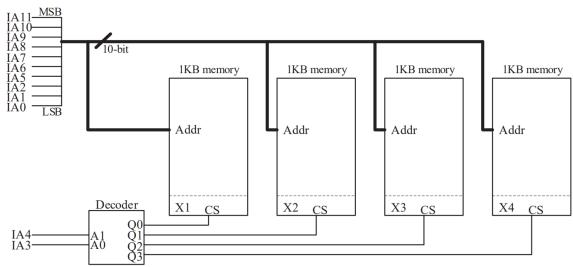

<details>
<summary>flowchart</summary>

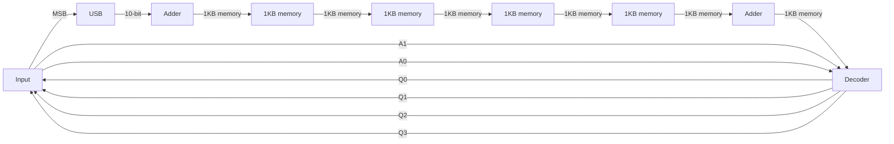
```mermaid
graph LR
  Input["Input"] -->|MSB| USB["USB"]
  USB -->|10-bit| Adder1["Adder"]
  Adder1 -->|1KB memory| Memory1["1KB memory"]
  Memory1 -->|1KB memory| Memory2["1KB memory"]
  Memory2 -->|1KB memory| Memory3["1KB memory"]
  Memory3 -->|1KB memory| Memory4["1KB memory"]
  Memory4 -->|1KB memory| Adder4["Adder"]
  Adder4 -->|1KB memory| Decoder["Decoder"]
  Decoder -->|Q0| Input
  Decoder -->|Q1| Input
  Decoder -->|Q2| Input
  Decoder -->|Q3| Input
  Input -->|A1| Decoder
  Input -->|A0| Decoder
```
</details>

The input memory addresses (IA11-IA0), in decimal, for the starting locations (Addr = 0) of each block (indicated as X1, X2, X3, X4 in the figure) are among the options given below. Which one of the following options is CORRECT?

A. $(0,1,2,3)$

B. (0,1024,2048,3072)

C. (0,8,16,24)

D. $(0,0,0,0)$

gatecse-2023 co-and-architecture memory-interfacing two-marks

# Answer key

# 1.23

# Microprogramming (12)

Practice Test: Test 1 (15Q)

# 1.23.1 Microprogramming: GATE CSE 1987 | Question: 4a


Find out the width of the control memory of a horizontal microprogrammed control unit, given the following specifications:

• 16 control lines for the processor consisting of ALU and 7 registers.  
- Conditional branching facility by checking 4 status bits.  
- Provision to hold 128 words in the control memory.

gate1987 co-and-architecture microprogramming descriptive

Answer key

# 1.23.2 Microprogramming: GATE CSE 1996 | Question: 2.25


A micro program control unit is required to generate a total of 25 control signals. Assume that during any micro instruction, at most two control signals are active. Minimum number of bits required in the control word to generate the required control signals will be:

A. 2

B. 2.5

C. 10

D. 12

gate1996 co-and-architecture microprogramming normal

Answer key

# 1.23.3 Microprogramming: GATE CSE 1997 | Question: 5.3


A micro instruction is to be designed to specify:

a. none or one of the three micro operations of one kind and  
b. none or upto six micro operations of another kind

The minimum number of bits in the micro-instruction is:

A. 9

B. 5

C. 8

D. None of the above

gate1997 co-and-architecture microprogramming normal

Answer key

# 1.23.4 Microprogramming: GATE CSE 1999 | Question: 2.19


Arrange the following configuration for CPU in decreasing order of operating speeds: Hard wired control, Vertical microprogramming, Horizontal microprogramming.

A. Hard wired control, Vertical microprogramming, Horizontal microprogramming.  
B. Hard wired control, Horizontal microprogramming, Vertical microprogramming.  
C. Horizontal microprogramming, Vertical microprogramming, Hard wired control.  
D. Vertical microprogramming, Horizontal microprogramming, Hard wired control.

gate1999 co-and-architecture microprogramming normal

Answer key

# 1.23.5 Microprogramming: GATE CSE 2002 | Question: 2.7


Horizontal microprogramming:

A. does not require use of signal decoders  
B. results in larger sized microinstructions than vertical microprogramming  
C. uses one bit for each control signal  
D. all of the above

gatecse-2002 co-and-architecture microprogramming

Answer key

The microinstructions stored in the control memory of a processor have a width of 26 bits. Each microinstruction is divided into three fields: a micro-operation field of 13 bits, a next address field $(X)$ , and a MUX select field $(Y)$ . There are 8 status bits in the input of the MUX.

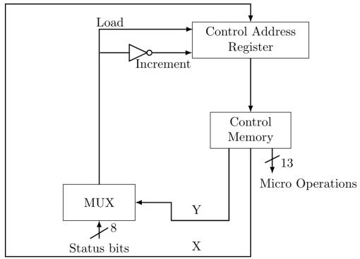

<details>
<summary>flowchart</summary>

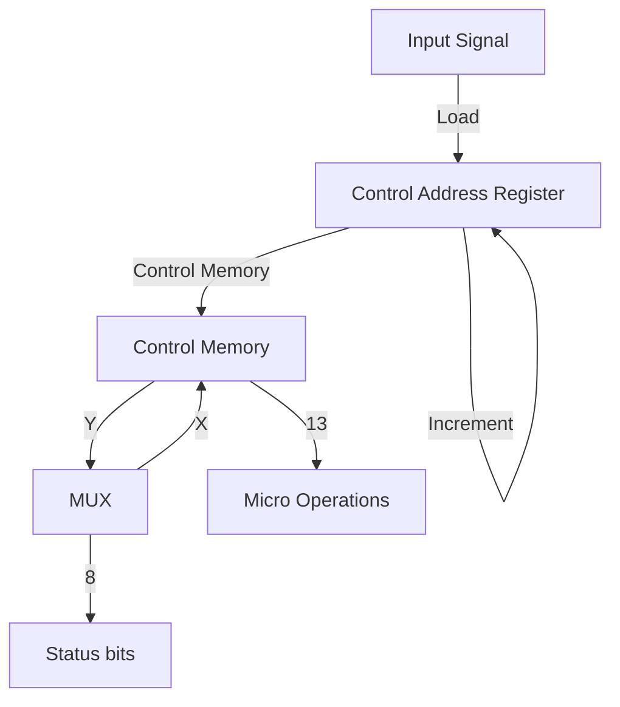
```mermaid
graph TD
  Input["Input Signal"] -->|Load| Register["Control Address Register"]
  Register -->|Increment| Register
  Register -->|Control Memory| Memory["Control Memory"]
  Memory -->|Y| MUX["MUX"]
  MUX -->|8| StatusBits["Status bits"]
  MUX -->|X| Memory
  Memory -->|13| MicroOperations["Micro Operations"]
```
</details>

How many bits are there in the $X$ and $Y$ fields, and what is the size of the control memory in number of words?

A. 10,3,1024

B. 8,5,256

C. 5,8,2048

D. 10,3,512

gatecse-2004 co-and-architecture microprogramming normal

# Answer key

# 1.23.7 Microprogramming: GATE CSE 2013 | Question: 28

Consider the following sequence of micro-operations.


```txt
MBR ← PC
MAR ← X PC ← Y
Memory ← MBR
```

Which one of the following is a possible operation performed by this sequence?

A. Instruction fetch  
C. Conditional branch

B. Operand fetch  
D. Initiation of interrupt service

gatecse-2013 co-and-architecture microprogramming normal

# Answer key

# 1.23.8 Microprogramming: GATE IT 2004 | Question: 49

A CPU has only three instructions I1, I2 and I3, which use the following signals in time steps T1 - T5:

I1 : T1 : Ain, Bout, Cin  
T2 : PCoat, Bin  
T3 : Zout, Ain  
T4: Bin, Cout  
T5 : End

I2 : T1 : Cin, Bout, Din  
T2 : Aout, Bin  
T3: Zout, Ain  
T4: Bin, Cout  
T5 : End

I3 : T1 : Din, Aout  
T2 : Ain, Bout  
T3: Zout, Ain  
T4 : Dout, Ain  
T5 : End

Which of the following logic functions will generate the hardwired control for the signal Ain ?

A. $T1.I1 + T2.I3 + T4.I3 + T3$  
C. $(T1 + T2).I1 + (T2 + T4).I3 + T3$

B. $(T1 + T2 + T3).I3 + T1.I1$  
D. $(T1 + T2).I2 + (T1 + T3).I1 + T3$


# 1.23.9 Microprogramming: GATE IT 2005 | Question: 45


A hardwired CPU uses 10 control signals $S_{1}$ to $S_{10}$ , in various time steps $T_{1}$ to $T_{5}$ , to implement 4 instructions $I_{1}$ to $I_{4}$ as shown below:

<table><tr><td></td><td> $T_1$ </td><td> $T_2$ </td><td> $T_3$ </td><td> $T_4$ </td><td> $T_5$ </td></tr><tr><td> $I_1$ </td><td> $S_1, S_3, S_5$ </td><td> $S_2, S_4, S_6$ </td><td> $S_1, S_7$ </td><td> $S_{10}$ </td><td> $S_3, S_8$ </td></tr><tr><td> $I_2$ </td><td> $S_1, S_3, S_5$ </td><td> $S_8, S_9, S_{10}$ </td><td> $S_5, S_6 S_7$ </td><td> $S_6$ </td><td> $S_{10}$ </td></tr><tr><td> $I_3$ </td><td> $S_1, S_3, S_5$ </td><td> $S_7, S_8, S_{10}$ </td><td> $S_2, S_6, S_9$ </td><td> $S_{10}$ </td><td> $S_1, S_3$ </td></tr><tr><td> $I_4$ </td><td> $S_1, S_3, S_5$ </td><td> $S_2, S_6, S_7$ </td><td> $S_5, S_{10}$ </td><td> $S_6, S_9$ </td><td> $S_{10}$ </td></tr></table>

Which of the following pairs of expressions represent the circuit for generating control signals $S_{5}$ and $S_{10}$ respectively?

$((I_j + I_k)T_n$ indicates that the control signal should be generated in time step $T_{n}$ if the instruction being executed is $I_{j}$ or $l_k$ )

A. $S_{5} = T_{1} + I_{2} \cdot T_{3}$ and  
B. $S_{5} = T_{1} + (I_{2} + I_{4})\cdot T_{3}$ and

$$
S _ {1 0} = (I _ {1} + I _ {3}) \cdot T _ {4} + (I _ {2} + I _ {4}) \cdot T _ {5}
$$

$$
S _ {1 0} = (I _ {1} + I _ {3}) \cdot T _ {4} + (I _ {2} + I _ {4}) \cdot T _ {5}
$$

C. $S_{5} = T_{1} + (I_{2} + I_{4})\cdot T_{3}$ and

$$
S _ {1 0} = (I _ {2} + I _ {3} + I _ {4}) \cdot T _ {2} + (I _ {1} + I _ {3}) \cdot T _ {4} + (I _ {2} + I _ {4}) \cdot T _ {5}
$$

D. $S_{5} = T_{1} + (I_{2} + I_{4})\cdot T_{3}$ and

$$
S _ {1 0} = \left(I _ {2} + I _ {3}\right) \cdot T _ {2} + I _ {4} \cdot T _ {3} + \left(I _ {1} + I _ {3}\right) \cdot T _ {4} + \left(I _ {2} + I _ {4}\right) \cdot T _ {5}
$$

gateit-2005 co-and-architecture microprogramming normal

# Answer key

# 1.23.10 Microprogramming: GATE IT 2005 | Question: 49


An instruction set of a processor has 125 signals which can be divided into 5 groups of mutually exclusive signals as follows:

Group 1 : 20 signals, Group 2 : 70 signals, Group 3 : 2 signals, Group 4 : 10 signals, Group 5 : 23 signals.

How many bits of the control words can be saved by using vertical microprogramming over horizontal microprogramming?

A. 0

B. 103

C. 22

D. 55

gateit-2005 co-and-architecture microprogramming normal

# Answer key

# 1.23.11 Microprogramming: GATE IT 2006 | Question: 41


The data path shown in the figure computes the number of 1s in the 32-bit input word corresponding to an unsigned even integer stored in the shift register.

The unsigned counter, initially zero, is incremented if the most significant bit of the shift register is 1.


<details>
<summary>flowchart</summary>

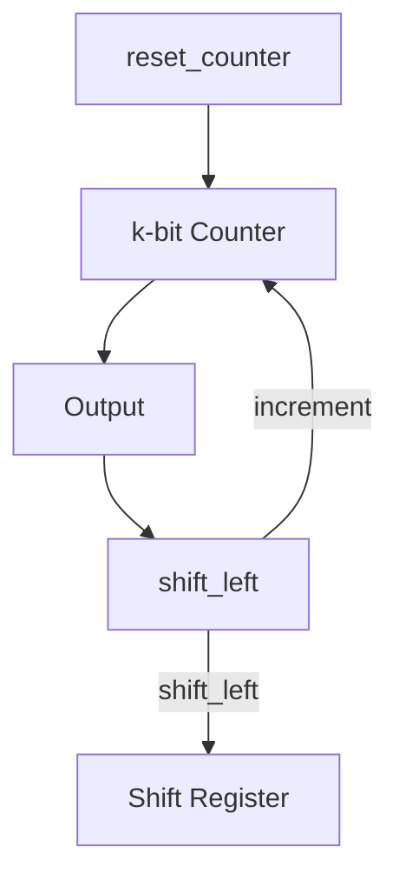
```mermaid
graph TD
  A["reset_counter"] --> B["k-bit Counter"]
  B --> C["Output"]
  C --> D["shift_left"]
  D -->|increment| B
  D -->|shift_left| E["Shift Register"]
```
</details>

The microprogram for the control is shown in the table below with missing control words for microinstructions $I_{1}, I_{2}, \ldots, I_{n}$ .

<table><tr><td>Microinstruction</td><td>Reset_Counter</td><td>Shift_left</td><td>Load_output</td></tr><tr><td>BEGIN</td><td>1</td><td>0</td><td>0</td></tr><tr><td>I1</td><td>?</td><td>?</td><td>?</td></tr><tr><td>:</td><td>:</td><td>:</td><td>:</td></tr><tr><td>In</td><td>?</td><td>?</td><td>?</td></tr><tr><td>END</td><td>0</td><td>0</td><td>1</td></tr></table>

The counter width (k), the number of missing microinstructions (n), and the control word for microinstructions $I_{1}, I_{2}, \ldots, I_{n}$ are, respectively,

A. 32,5,010

B. 5,32,010

C. 5,31,011

D. 5,31,010

gateit-2006 co-and-architecture microprogramming normal

# Answer key

# 1.23.12 Microprogramming: GATE IT 2008 | Question: 39

Consider a CPU where all the instructions require 7 clock cycles to complete execution. There are 140 instructions in the instruction set. It is found that 125 control signals are needed to be generated by the control unit. While designing the horizontal microprogrammed control unit, single address field format is used for branch control logic. What is the minimum size of the control word and control address register?

A. 125,7

B. 125,10

C. 135,9

D. 135,10

gateit-2008 co-and-architecture microprogramming normal

# Answer key

# 1.24

# Pipelining (39)

Practice Tests: Test 1 (15Q) Test 2 (15Q) Test 3 (15Q) Test 4 (15Q) Test 5 (10Q)

# 1.24.1 Pipelining: GATE CSE 1999 | Question: 13

An instruction pipeline consists of 4 stages - Fetch $(F)$ , Decode field $(D)$ , Execute $(E)$ and Result Write $(W)$ . The 5 instructions in a certain instruction sequence need these stages for the different number of clock cycles as shown by the table below

<table><tr><td>Instruction</td><td>F</td><td>D</td><td>E</td><td>W</td></tr><tr><td>1</td><td>1</td><td>2</td><td>1</td><td>1</td></tr><tr><td>2</td><td>1</td><td>2</td><td>2</td><td>1</td></tr><tr><td>3</td><td>2</td><td>1</td><td>3</td><td>2</td></tr><tr><td>4</td><td>1</td><td>3</td><td>2</td><td>1</td></tr><tr><td>5</td><td>1</td><td>2</td><td>1</td><td>2</td></tr></table>


Find the number of clock cycles needed to perform the 5 instructions.

gate1999 co-and-architecture pipelining normal numerical-answers

# Answer key

# 1.24.2 Pipelining: GATE CSE 2000 | Question: 1.8


Comparing the time T1 taken for a single instruction on a pipelined CPU with time T2 taken on a non-pipelined but identical CPU, we can say that

A. $T1 \leq T2$

C. T1 < T2

B. $T1 \geq T2$

D. T1 and T2 plus the time taken for one instruction fetch cycle

gatecse-2000 pipelining co-and-architecture easy

# Answer key

# 1.24.3 Pipelining: GATE CSE 2000 | Question: 12


An instruction pipeline has five stages where each stage take 2 nanoseconds and all instruction use all five stages. Branch instructions are not overlapped. i.e., the instruction after the branch is not fetched till the branch instruction is completed. Under ideal conditions,

A. Calculate the average instruction execution time assuming that 20% of all instructions executed are branch instruction. Ignore the fact that some branch instructions may be conditional.  
B. If a branch instruction is a conditional branch instruction, the branch need not be taken. If the branch is not taken, the following instructions can be overlapped. When $80\%$ of all branch instructions are conditional branch instructions, and $50\%$ of the conditional branch instructions are such that the branch is taken, calculate the average instruction execution time.

gatecse-2000 co-and-architecture pipelining normal descriptive

# Answer key

# 1.24.4 Pipelining: GATE CSE 2001 | Question: 12


Consider a 5-stage pipeline - IF (Instruction Fetch), ID (Instruction Decode and register read), EX (Execute), MEM (memory), and WB (Write Back). All (memory or register) reads take place in the second phase of a clock cycle and all writes occur in the first phase. Consider the execution of the following instruction sequence:

<table><tr><td>I1:</td><td>sub r2, r3, r4</td><td>/*  $r2 \leftarrow r3 - r4$  */</td></tr><tr><td>I2:</td><td>sub r4, r2, r3</td><td>/*  $r4 \leftarrow r2 - r3$  */</td></tr><tr><td>I3:</td><td>sw r2, 100(r1)</td><td>/*  $M[r1 + 100] \leftarrow r2$  */</td></tr><tr><td>I4:</td><td>sub r3, r4, r2</td><td>/*  $r3 \leftarrow r4 - r2$  */</td></tr></table>

A. Show all data dependencies between the four instructions.  
B. Identify the data hazards.  
C. Can all hazards be avoided by forwarding in this case.

gatecse-2001 co-and-architecture pipelining normal descriptive

# Answer key

# 1.24.5 Pipelining: GATE CSE 2002 | Question: 2.6, ISRO2008-19

The performance of a pipelined processor suffers if:

A. the pipeline stages have different delays  
B. consecutive instructions are dependent on each other  
C. the pipeline stages share hardware resources  
D. All of the above


# 1.24.6 Pipelining: GATE CSE 2003 | Question: 10, ISRO-DEC2017-41

For a pipelined CPU with a single ALU, consider the following situations

I. The $j + 1^{st}$ instruction uses the result of the $j^{th}$ instruction as an operand  
II. The execution of a conditional jump instruction  
III. The $j^{th}$ and $j + 1^{st}$ instructions require the ALU at the same time.

Which of the above can cause a hazard

A. I and II only

B. II and III only

C. III only

D. All the three

gatecse-2003 co-and-architecture pipelining normal isrodec2017

# Answer key

# 1.24.7 Pipelining: GATE CSE 2004 | Question: 69

A 4-stage pipeline has the stage delays as 150, 120, 160 and 140 nanoseconds, respectively. Registers that are used between the stages have a delay of 5 nanoseconds each. Assuming constant clocking rate, the total time taken to process 1000 data items on this pipeline will be:

A. 120.4 microseconds

B. 160.5 microseconds

C. 165.5 microseconds

D. 590.0 microseconds

gatecse-2004 co-and-architecture pipelining normal

# Answer key

# 1.24.8 Pipelining: GATE CSE 2006 | Question: 42

A CPU has a five-stage pipeline and runs at 1 GHz frequency. Instruction fetch happens in the first stage of the pipeline. A conditional branch instruction computes the target address and evaluates the condition in the third stage of the pipeline. The processor stops fetching new instructions following a conditional branch until the branch outcome is known. A program executes $10^{9}$ instructions out of which 20% are conditional branches. If each instruction takes one cycle to complete on average, the total execution time of the program is:

A. 1.0 second

B. 1.2 seconds

C. 1.4 seconds

D. 1.6 seconds

gatecse-2006 co-and-architecture pipelining normal

# Answer key

# 1.24.9 Pipelining: GATE CSE 2007 | Question: 37, ISRO2009-37

Consider a pipelined processor with the following four stages:

- IF: Instruction Fetch  
• ID: Instruction Decode and Operand Fetch  
- EX: Execute  
- WB: Write Back

The IF, ID and WB stages take one clock cycle each to complete the operation. The number of clock cycles for the EX stage depends on the instruction. The ADD and SUB instructions need 1 clock cycle and the MUL instruction needs 3 clock cycles in the EX stage. Operand forwarding is used in the pipelined processor. What is the number of clock cycles taken to complete the following sequence of instructions?

ADD R2, R1, R0 R2 ← R1 + R0

MUL R4, R3, R2 R4 $\leftarrow$ R3\*R2

SUB R6, R5, R4 R6 ← R5−R4

A. 7

B. 8

C. 10

D. 14


# Answer key

# 1.24.10 Pipelining: GATE CSE 2008 | Question: 76

Delayed branching can help in the handling of control hazards


For all delayed conditional branch instructions, irrespective of whether the condition evaluates to true or false,

B. The first instruction in the fall through path is executed  
C. The first instruction in the taken path is executed  
D. The branch takes longer to execute than any other instruction

A. The instruction following the conditional branch instruction in memory is executed

gatecse-2008 co-and-architecture pipelining normal

# Answer key

# 1.24.11 Pipelining: GATE CSE 2008 | Question: 77


Delayed branching can help in the handling of control hazards

The following code is to run on a pipelined processor with one branch delay slot:

I1: ADD $R2 \leftarrow R7 + R8$  
12: Sub R4 ← R5-R6  
I3: ADD $R1 \leftarrow R2 + R3$  
I4: STORE Memory [R4] ← R1
BRANCH to Label if R1 == 0

Which of the instructions I1, I2, I3 or I4 can legitimately occupy the delay slot without any program modification?

A. 11

B. 12

C. 13

D. 14

gatecse-2008 co-and-architecture pipelining normal

# Answer key

# 1.24.12 Pipelining: GATE CSE 2009 | Question: 28


Consider a 4 stage pipeline processor. The number of cycles needed by the four instructions $I1, I2, I3, I4$ in stages $S1, S2, S3, S4$ is shown below:

<table><tr><td></td><td>S1</td><td>S2</td><td>S3</td><td>S4</td></tr><tr><td>I1</td><td>2</td><td>1</td><td>1</td><td>1</td></tr><tr><td>I2</td><td>1</td><td>3</td><td>2</td><td>2</td></tr><tr><td>I3</td><td>2</td><td>1</td><td>1</td><td>3</td></tr><tr><td>I4</td><td>1</td><td>2</td><td>2</td><td>2</td></tr></table>

What is the number of cycles needed to execute the following loop?

For (i=1 to 2) {I1; I2; I3; I4;}

A. 16

B. 23

C. 28

D. 30

gatecse-2009 co-and-architecture pipelining normal

# Answer key

# 1.24.13 Pipelining: GATE CSE 2010 | Question: 33


A 5—stage pipelined processor has Instruction Fetch (IF), Instruction Decode (ID), Operand Fetch (OF), Perform Operation (PO) and Write Operand (WO) stages. The IF, ID, OF and WO stages take 1 clock cycle

each for any instruction. The PO stage takes 1 clock cycle for ADD and SUB instructions, 3 clock cycles for MUL instruction and 6 clock cycles for DIV instruction respectively. Operand forwarding is used in the pipeline. What is the number of clock cycles needed to execute the following sequence of instructions?

<table><tr><td>Instruction</td><td>Meaning of instruction</td></tr><tr><td> $t_0$ : MUL  $R_2, R_0, R_1$ </td><td> $R_2 \leftarrow R_0 * R_1$ </td></tr><tr><td> $t_1$ : DIV  $R_5, R_3, R_4$ </td><td> $R_5 \leftarrow R_3 / R_4$ </td></tr><tr><td> $t_2$ : ADD  $R_2, R_5, R_2$ </td><td> $R_2 \leftarrow R_5 + R_2$ </td></tr><tr><td> $t_3$ : SUB  $R_5, R_2, R_6$ </td><td> $R_5 \leftarrow R_2 - R_6$ </td></tr></table>

A. 13

B. 15

C. 17

D. 19

gatecse-2010 co-and-architecture pipelining normal

# Answer key

# 1.24.14 Pipelining: GATE CSE 2011 | Question: 41

Consider an instruction pipeline with four stages (S1, S2, S3 and S4) each with combinational circuit only. The pipeline registers are required between each stage and at the end of the last stage. Delays for the stages and for the pipeline registers are as given in the figure.


<details>
<summary>flowchart</summary>

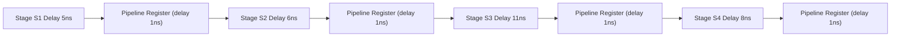
```mermaid
graph LR
  A["Stage S1 Delay 5ns"] --> B["Pipeline Register (delay 1ns)"]
  B --> C["Stage S2 Delay 6ns"]
  C --> D["Pipeline Register (delay 1ns)"]
  D --> E["Stage S3 Delay 11ns"]
  E --> F["Pipeline Register (delay 1ns)"]
  F --> G["Stage S4 Delay 8ns"]
  G --> H["Pipeline Register (delay 1ns)"]
```
</details>

What is the approximate speed up of the pipeline in steady state under ideal conditions when compared to the corresponding non-pipeline implementation?

A. 4.0

B. 2.5

C. 1.1

D. 3.0

gatecse-2011 co-and-architecture pipelining normal

# Answer key

# 1.24.15 Pipelining: GATE CSE 2012 | Question: 20, ISRO2016-23

Register renaming is done in pipelined processors:


A. as an alternative to register allocation at compile time  
B. for efficient access to function parameters and local variables  
C. to handle certain kinds of hazards  
D. as part of address translation

gatecse-2012 co-and-architecture pipelining easy isro2016

# Answer key

# 1.24.16 Pipelining: GATE CSE 2013 | Question: 45

Consider an instruction pipeline with five stages without any branch prediction:


Fetch Instruction (FI), Decode Instruction (DI), Fetch Operand (FO), Execute Instruction (EI) and Write Operand (WO). The stage delays for FI, DI, FO, EI and WO are 5 ns, 7 ns, 10 ns, 8 ns and 6 ns, respectively. There are intermediate storage buffers after each stage and the delay of each buffer is 1 ns. A program consisting of 12 instructions I1, I2, I3, ..., I12 is executed in this pipelined processor. Instruction I4 is the only branch instruction and its branch target is I9. If the branch is taken during the execution of this program, the time (in ns) needed to complete the program is

A. 132

B. 165

C. 176

D. 328

# 1.24.17 Pipelining: GATE CSE 2014 | Set 3 | Question: 43


An instruction pipeline has five stages, namely, instruction fetch (IF), instruction decode and register fetch (ID/RF), instruction execution (EX), memory access (MEM), and register writeback (WB) with stage latencies 1 ns, 2.2 ns, 2 ns, 1 ns, and 0.75 ns, respectively (ns stands for nanoseconds). To gain in terms of frequency designers have decided to split the ID/RF stage into three stages (ID, RF1, RF2) each of latency 2.2/3 ns, the EX stage is split into two stages (EX1, EX2) each of latency 1 ns. The new design has a total of eight stages. A program has 20% branch instructions which execute in the EX stage and produce the next instruction pointer at the end of the EX stage in the old design and at the end of the EX2 stage in the new design. The IF stalls after fetching a branch instruction until the next instruction pointer is computed. All instructions other than branch instruction have an average CPI of one in both the designs. The execution times of this program on the and the new design are P and Q nanoseconds, respectively. The value of P/Q is \_\_\_\_.

gatecse-2014-set3 co-and-architecture pipelining numerical-answers normal

Answer key

# 1.24.18 Pipelining: GATE CSE 2014 | Set 3 | Question: 9

Consider the following processors (ns stands for nanoseconds). Assume that the pipeline registers have zero latency.

• P1: Four-stage pipeline with stage latencies 1 ns, 2 ns, 2 ns, 1 ns.  
• P2: Four-stage pipeline with stage latencies 1 ns, 1.5 ns, 1.5 ns, 1.5 ns.  
• P3: Five-stage pipeline with stage latencies 0.5 ns, 1 ns, 1 ns, 0.6 ns, 1 ns.  
- P4: Five-stage pipeline with stage latencies 0.5 ns, 0.5 ns, 1 ns, 1 ns, 1.1 ns.

Which processor has the highest peak clock frequency?

A. P1

B. P2

C. P3

D. P4

gatecse-2014-set3 co-and-architecture pipelining normal

Answer key

# 1.24.19 Pipelining: GATE CSE 2015 | Set 1 | Question: 38


Consider a non-pipelined processor with a clock rate of 2.5 gigahertz and average cycles per instruction of four. The same processor is upgraded to a pipelined processor with five stages; but due to the internal pipeline delay, the clock speed is reduced to 2 gigahertz. Assume that there are no stalls in the pipelin speedup achieved in this pipelined processor is \_\_\_\_.

gatecse-2015-set1 co-and-architecture pipelining normal numerical-answers

Answer key

# 1.24.20 Pipelining: GATE CSE 2015 | Set 2 | Question: 44


Consider the sequence of machine instruction given below:

<table><tr><td>MUL</td><td>R5, R0, R1</td></tr><tr><td>DIV</td><td>R6, R2, R3</td></tr><tr><td>ADD</td><td>R7, R5, R6</td></tr><tr><td>SUB</td><td>R8, R7, R4</td></tr></table>


In the above sequence, R0 to R8 are general purpose registers. In the instructions shown, the first register shows the result of the operation performed on the second and the third registers. This sequence of instructions is to be executed in a pipelined instruction processor with the following 4 stages: (1) Instruction Fetch and Decode (IF), (2) Operand Fetch (OF), (3) Perform Operation (PO) and (4) Write back the result (WB). The IF, OF and WB stages take 1 clock cycle each for any instruction. The PO stage takes 1 clock cycle for ADD and SUB instruction, 3 clock cycles for MUL instruction and 5 clock cycles for DIV instruction. The pipelined processor uses

operand forwarding from the PO stage to the OF stage. The number of clock cycles taken for the execution of the above sequence of instruction is \_\_\_\_.

gatecse-2015-set2 co-and-architecture pipelining normal numerical-answers

# Answer key

# 1.24.21 Pipelining: GATE CSE 2015 | Set 3 | Question: 51

Consider the following reservation table for a pipeline having three stages $S_{1}$ , $S_{2}$ and $S_{3}$ .

<table><tr><td>Time →</td><td></td><td></td><td></td><td></td><td></td></tr><tr><td></td><td>1</td><td>2</td><td>3</td><td>4</td><td>5</td></tr><tr><td> $S_1$ </td><td>X</td><td></td><td></td><td></td><td>X</td></tr><tr><td> $S_2$ </td><td></td><td>X</td><td></td><td>X</td><td></td></tr><tr><td> $S_3$ </td><td></td><td></td><td>X</td><td></td><td></td></tr></table>


The minimum average latency (MAL) is \_\_\_\_

gatecse-2015-set3 co-and-architecture pipelining difficult numerical-answers

# Answer key

# 1.24.22 Pipelining: GATE CSE 2016 | Set 1 | Question: 32

The stage delays in a 4-stage pipeline are 800, 500, 400 and 300 picoseconds. The first stage (with delay 800 picoseconds) is replaced with a functionality equivalent design involving two stages with respective delays 600 and 350 picoseconds. The throughput increase of the pipeline is \_\_\_\_ percent.


gatecse-2016-set1 co-and-architecture pipelining normal numerical-answers

# Answer key

# 1.24.23 Pipelining: GATE CSE 2016 | Set 2 | Question: 33

Consider a 3 GHz (gigahertz) processor with a three stage pipeline and stage latencies $\tau_{1}$ , $\tau_{2}$ and $\tau_{3}$ such that $\tau_{1} = \frac{3\tau_{2}}{4} = 2\tau_{3}$ . If the longest pipeline stage is split into two pipeline stages of equal latency, the new frequency is \_\_\_\_ GHz, ignoring delays in the pipeline registers.


gatecse-2016-set2 co-and-architecture pipelining normal numerical-answers

# Answer key

# 1.24.24 Pipelining: GATE CSE 2017 | Set 1 | Question: 50

Instruction execution in a processor is divided into 5 stages, Instruction Fetch (IF), Instruction

Decode (ID), Operand fetch (OF), Execute (EX), and Write Back (WB). These stages take 5, 4, 20, 10 and 3 nanoseconds (ns) respectively. A pipelined implementation of the processor requires buffering between each pair of consecutive stages with a delay of 2 ns. Two pipelined implementation of the processor are contemplated:

i. a naive pipeline implementation (NP) with 5 stages and  
ii. an efficient pipeline (EP) where the OF stage is divided into stages OF1 and OF2 with execution times of 12 ns and 8 ns respectively.

The speedup (correct to two decimal places) achieved by EP over NP in executing 20 independent instructions with no hazards is \_\_\_\_.

gatecse-2017-set1 co-and-architecture pipelining normal numerical-answers

# Answer key


The instruction pipeline of a RISC processor has the following stages: Instruction Fetch (IF), Instruction Decode (ID), Operand Fetch (OF), Perform Operation (PO) and Writeback (WB), The IF, ID, OF and WB stages take 1 clock cycle each for every instruction. Consider a sequence of 100 instructions. In the stage, 40 instructions take 3 clock cycles each, 35 instructions take 2 clock cycles each, and the remain instructions take 1 clock cycle each. Assume that there are no data hazards and no control hazards.

The number of clock cycles required for completion of execution of the sequence of instruction is \_\_\_\_.

gatecse-2018 co-and-architecture pipelining numerical-answers two-marks

Answer key

# 1.24.26 Pipelining: GATE CSE 2020 | Question: 43


Consider a non-pipelined processor operating at 2.5 GHz. It takes 5 clock cycles to complete an instruction. You are going to make a 5- stage pipeline out of this processor. Overheads associated with pipelining force you to operate the pipelined processor at 2 GHz. In a given program, assume that 30% are memory instructions, 60% are ALU instructions and the rest are branch instructions. 5% of the memory instructions cause stalls of 50 clock cycles each due to cache misses and 50% of the branch instructions cause stalls of 2 cycles each. Assume that there are no stalls associated with the execution of ALU instructions. For this program, the speedup achieved by the pipelined processor over the non-pipelined processor (round off to 2 decimal places) is \_\_\_\_.

gatecse-2020 numerical-answers co-and-architecture pipelining two-marks

Answer key

# 1.24.27 Pipelining: GATE CSE 2021 | Set 1 | Question: 53


A five-stage pipeline has stage delays of 150, 120, 150, 160 and 140 nanoseconds. The registers that are used between the pipeline stages have a delay of 5 nanoseconds each.

The total time to execute 100 independent instructions on this pipeline, assuming there are no pipeline stalls, is \_\_\_\_ nanoseconds.

gatecse-2021-set1 co-and-architecture pipelining numerical-answers two-marks

Answer key

# 1.24.28 Pipelining: GATE CSE 2021 | Set 2 | Question: 53


Consider a pipelined processor with 5 stages, Instruction Fetch(IF), Instruction Decode(ID), Execute (EX), Memory Access (MEM), and Write Back (WB). Each stage of the pipeline, except the

EX stage, takes one cycle. Assume that the ID stage merely decodes the instruction and the register read is performed in the EX stage. The EX stage takes one cycle for ADD instruction and two cycles for MUL instruction. Ignore pipeline register latencies.

Consider the following sequence of 8 instructions:

$$
\text {ADD, MUL, ADD, MUL, ADD, MUL, ADD, MUL}
$$

Assume that every MUL instruction is data-dependent on the ADD instruction just before it and every ADD instruction (except the first ADD) is data-dependent on the MUL instruction just before it. The speedup defined as follows.

$$
S p e e d u p = \frac {\text {Execution time without operand forwarding}}{\text {Execution time with operand forwarding}}
$$

The Speedup achieved in executing the given instruction sequence on the pipelined processor (rounded to 2 decimal places) is \_\_\_\_

gatecse-2021-set2 co-and-architecture pipelining numerical-answers two-marks

Answer key

# 1.24.29 Pipelining: GATE CSE 2023 | Question: 23


Consider a 3-stage pipelined processor having a delay of 10 ns (nanoseconds), 20 ns, and 14 ns, for the first, second, and the third stages, respectively. Assume that there is no other delay and the processor does not suffer from any pipeline hazards. Also assume that one instruction is fetched every cycle.

The total execution time for executing 100 instructions on this processor is \_\_\_\_ ns.

gatecse-2023 co-and-architecture pipelining numerical-answers one-mark

# Answer key

# 1.24.30 Pipelining: GATE CSE 2024 | Set 1 | Question: 20


Consider a 5-stage pipelined processor with Instruction Fetch (IF), Instruction Decode (ID), Execute (EX), Memory Access (MEM), and Register Writeback (WB) stages. Which of the following statements about forwarding is/are CORRECT?

A. In a pipelined execution, forwarding means the result from a source stage of an earlier instruction is passed on to the destination stage of a later instruction  
B. In forwarding, data from the output of the MEM stage can be passed on to the input of the EX stage of the next instruction  
C. Forwarding cannot prevent all pipeline stalls  
D. Forwarding does not require any extra hardware to retrieve the data from the pipeline stages

gatecse-2024-set1 multiple-selects co-and-architecture pipelining one-mark

# Answer key

# 1.24.31 Pipelining: GATE CSE 2024 | Set 2 | Question: 21


An instruction format has the following structure:

Instruction Number: Opcode destination reg, source reg-1, source reg-2

Consider the following sequence of instructions to be executed in a pipelined processor:

I 1: DIV R3, R1, R2  
I 2: SUB R5, R3, R4  
I 3: ADD R3, R5, R6  
I 4: MUL R7, R3, R8

Which of the following statements is/are TRUE?

A. There is a RAW dependency on R 3 between I 1 and I 2  
B. There is a WAR dependency on R 3 between I 1 and I 3  
C. There is a RAW dependency on R 3 between I 2 and I 3  
D. There is a WAW dependency on R 3 between I 3 and I 4

gatecse-2024-set2 co-and-architecture multiple-selects pipelining one-mark

# Answer key

# 1.24.32 Pipelining: GATE CSE 2024 | Set 2 | Question: 48


A non-pipelined instruction execution unit operating at 2GHz takes an average of 6 cycles to execute an instruction of a program P. The unit is then redesigned to operate on a 5 -stage pipeline at 2GHz. Assume

that the ideal throughput of the pipelined unit is 1 instruction per cycle. In the execution of program P, 20% instructions incur an average of 2 cycles stall due to data hazards and 20% instructions incur an average of 3 cycles stall due to control hazards. The speedup (rounded off to one decimal place) obtained by the pipelined design over the non-pipelined design is \_\_\_\_.

gatecse-2024-set2 numerical-answers co-and-architecture pipelining two-marks

# Answer key

# 1.24.33 Pipelining: GATE CSE 2025 | Set 2 | Question: 46


A 5-stage instruction pipeline has stage delays of 180, 250, 150, 170, and 250, respectively, in nanoseconds. The delay of an inter-stage latch is 10 nanoseconds. Assume that there are no pipeline stalls due to branches and other hazards. The time taken to process 1000 instructions in microseconds is \_\_\_\_ (rounded off to two decimal places)

gatecse2025-set2 co-and-architecture pipelining numerical-answers easy two-marks

# Answer key

# 1.24.34 Pipelining: GATE IT 2004 | Question: 47

Consider a pipeline processor with 4 stages S1 to S4. We want to execute the following loop:


$$
\begin{array}{c} \hline \text {for (i = 1; i <   = 1000; i++)} \\ \{\mathrm{I1}, \mathrm{I2}, \mathrm{I3}, \mathrm{I4} \} \end{array}
$$

where the time taken (in ns) by instructions I1 to I4 for stages S1 to S4 are given below:

<table><tr><td></td><td> $S_{1}$ </td><td> $S_{2}$ </td><td> $S_{3}$ </td><td> $S_{4}$ </td></tr><tr><td>I1</td><td>1</td><td>2</td><td>1</td><td>2</td></tr><tr><td>I2</td><td>2</td><td>1</td><td>2</td><td>1</td></tr><tr><td>I3</td><td>1</td><td>1</td><td>2</td><td>1</td></tr><tr><td>I4</td><td>2</td><td>1</td><td>2</td><td>1</td></tr></table>

The output of I1 for i = 2 will be available after

A. 11 ns

B. 12 ns

C. 13 ns

D. 28 ns

gateit-2004 co-and-architecture pipelining normal

# Answer key

# 1.24.35 Pipelining: GATE IT 2005 | Question: 44


We have two designs D1 and D2 for a synchronous pipeline processor. D1 has 5 pipeline stages with execution times of 3 nsec, 2 nsec, 4 nsec, 2 nsec and 3 nsec while the design D2 has 8 pipeline stages each with 2 nsec execution time. How much time can be saved using design D2 over design D1 for executing 100 instructions?

A. 214 nsec

B. 202 nsec

C. 86 nsec

D. -200 nsec

gateit-2005 co-and-architecture pipelining normal

# Answer key

# 1.24.36 Pipelining: GATE IT 2006 | Question: 78


A pipelined processor uses a 4-stage instruction pipeline with the following stages: Instruction fetch (IF), Instruction decode (ID), Execute (EX) and Writeback (WB). The arithmetic operations as well as the load and store operations are carried out in the EX stage. The sequence of instructions corresponding to the statement $X = (S - R * (P + Q)) / T$ is given below. The values of variables $P, Q, R, S$ and $T$ are available in the registers $R0, R1, R2, R3$ and $R4$ respectively, before the execution of the instruction sequence.

$$
\begin{array}{l} \mathrm{ADD} \quad \mathrm{R5}, \mathrm{R0}, \mathrm{R1} \quad ; \mathrm{R5} \leftarrow \mathrm{R0} + \mathrm{R1} \\ \mathrm{MUL} \quad \mathrm{R6}, \mathrm{R2}, \mathrm{R5} \quad ; \mathrm{R6} \leftarrow \mathrm{R2} ^ {*} \mathrm{R5} \\ \mathrm{SUB} \quad \mathrm{R5}, \mathrm{R3}, \mathrm{R6}; \mathrm{R5} \leftarrow \mathrm{R3} - \mathrm{R6} \\ \mathrm{DIV} \quad \mathrm{R6}, \mathrm{R5}, \mathrm{R4} \quad ; \mathrm{R6} \leftarrow \mathrm{R5} / \mathrm{R4} \\ \text {STORE} \quad \mathrm{R6}, \mathrm{X} \quad ; \mathrm{X} \leftarrow \mathrm{R6} \\ \end{array}
$$

The number of Read-After-Write (RAW) dependencies, Write-After-Read(WAR) dependencies, and Write-After-Write (WAW) dependencies in the sequence of instructions are, respectively,

A. 2,2,4

B. 3,2,3

C. 4,2,2

D. 3,3,2

gateit-2006 co-and-architecture pipelining normal

# Answer key

# 1.24.37 Pipelining: GATE IT 2006 | Question: 79

A pipelined processor uses a 4-stage instruction pipeline with the following stages: Instruction fetch (IF), Instruction decode (ID), Execute (EX) and Writeback (WB). The arithmetic operations as well as the load and store operations are carried out in the EX stage. The sequence of instructions corresponding to the statement $X = (S - R * (P + Q)) / T$ is given below. The values of variables $P, Q, R, S$ and $T$ are available in the registers $R0, R1, R2, R3$ and $R4$ respectively, before the execution of the instruction sequence.

<table><tr><td>ADD</td><td>R5,R0,R1</td><td>;R5←R0+R1</td></tr><tr><td>MUL</td><td>R6,R2,R5</td><td>;R6←R2*R5</td></tr><tr><td>SUB</td><td>R5,R3,R6</td><td>;R5←R3-R6</td></tr><tr><td>DIV</td><td>R6,R5,R4</td><td>;R6←R5/R4</td></tr><tr><td>STORE</td><td>R6,X</td><td>;X←R6</td></tr></table>

The IF, ID and WB stages take 1 clock cycle each. The EX stage takes 1 clock cycle each for the ADD, SUB and STORE operations, and 3 clock cycles each for MUL and DIV operations. Operand forwarding from the EX stage to the ID stage is used. The number of clock cycles required to complete the sequence of instructions is

A. 10

B. 12

C. 14

D. 16

gateit-2006 co-and-architecture pipelining normal

# Answer key

# 1.24.38 Pipelining: GATE IT 2007 | Question: 6, ISRO2011-25

A processor takes 12 cycles to complete an instruction I. The corresponding pipelined processor uses 6 stages with the execution times of 3, 2, 5, 4, 6 and 2 cycles respectively. What is the asymptotic speedup assuming that a very large number of instructions are to be executed?

A. 1.83

B. 2

C. 3

D. 6

gateit-2007 co-and-architecture pipelining normal isro2011

# Answer key

# 1.24.39 Pipelining: GATE IT 2008 | Question: 40

A non pipelined single cycle processor operating at 100 MHz is converted into a synchronous pipelined processor with five stages requiring 2.5 nsec, 1.5 nsec, 2 nsec, 1.5 nsec and 2.5 nsec, respectively. The delay of the latches is 0.5 nsec. The speedup of the pipeline processor for a large number of instructions is:

A. 4.5

B. 4.0

C. 3.33

D. 3.0

gateit-2008 co-and-architecture pipelining normal

# Answer key

# 1.25

# Runtime Environment (2)

# 1.25.1 Runtime Environment: GATE CSE 2001 | Question: 1.10, UGCNET-Dec2012-III: 36

Suppose a processor does not have any stack pointer registers, which of the following statements is true?

A. It cannot have subroutine call instruction  
B. It cannot have nested subroutines call  
C. Interrupts are not possible  
D. All subroutine calls and interrupts are possible


# 1.25.2 Runtime Environment: GATE CSE 2008 | Question: 37, ISRO2009-38


The use of multiple register windows with overlap causes a reduction in the number of memory accesses for:

I. Function locals and parameters  
II. Register saves and restores  
III. Instruction fetches

A. I only

B. II only

C. III only

D. I, II and III

gatecse-2008 co-and-architecture normal isro2009 runtime-environment

# Answer key

# 1.26

# Speedup (6)

# Practice Test: Test 1 (11Q)

# 1.26.1 Speedup: GATE CSE 2014 | Set 1 | Question: 43


Consider a 6-stage instruction pipeline, where all stages are perfectly balanced. Assume that there is no cycle-time overhead of pipelining. When an application is executing on this 6-stage pipeline, the speedup achieved with respect to non-pipelined execution if 25% of the instructions incur 2 pipeline stall cycles is

gatecse-2014-set1 co-and-architecture pipelining numerical-answers normal speedup

# Answer key

# 1.26.2 Speedup: GATE CSE 2014 | Set 1 | Question: 55


Consider two processors $P_1$ and $P_2$ executing the same instruction set. Assume that under identical conditions, for the same input, a program running on $P_2$ takes 25% less time but incurs 20% more CPI (clock cycles per instruction) as compared to the program running on $P_1$ . If the clock frequency of $P_1$ is 1GHz, then the clock frequency of $P_2$ (in GHz) is \_\_\_\_.

gatecse-2014-set1 co-and-architecture numerical-answers normal speedup

# Answer key

# 1.26.3 Speedup: GATE CSE 2024 | Set 1 | Question: 45


The baseline execution time of a program on a 2GHz single core machine is 100 nanoseconds (ns). The code corresponding to 90% of the execution time can be fully parallelized. The overhead for using an additional core is 10 ns when running on a multicore system. Assume that all cores in the multicore system run their share of the parallelized code for an equal amount of time.

The number of cores that minimize the execution time of the program is \_\_\_\_.

gatecse-2024-set1 numerical-answers co-and-architecture speedup two-marks

# Answer key

# 1.26.4 Speedup: GATE CSE 2026 | Set 2 | Question: 47


A non-pipelined instruction execution unit that operates at 1.6 GHz clock takes an average of 5 clock cycles to complete the execution of an instruction. To improve the performance, the system was pipelined with a goal of achieving an average throughput of one instruction per clock cycle. However, it could operate only at 1.2 GHz due to pipeline overheads. While executing a program in the pipelined design, 30% of instructions encountered a stall of 2 cycles due to pipeline hazards. The speed-up obtained by the pipelined design over the non-pipelined one for this program is \_\_\_\_ (rounded off to two decimal places)

Note: $1G = 10^{9}$

# 1.26.5 Speedup: GATE IT 2004 | Question: 50


In an enhancement of a design of a CPU, the speed of a floating point unit has been increased by 20% and the speed of a fixed point unit has been increased by 10%. What is the overall speedup achieved if the ratio of the number of floating point operations to the number of fixed point operations is 2:3 and the floating point operation used to take twice the time taken by the fixed point operation in the original design?

A. 1.155

B. 1.185

C. 1.255

D. 1.285

gateit-2004 normal co-and-architecture speedup

# Answer key

# 1.26.6 Speedup: GATE IT 2007 | Question: 36


The floating point unit of a processor using a design $D$ takes $2t$ cycles compared to $t$ cycles taken by the fixed point unit. There are two more design suggestions $D_1$ and $D_2$ . $D_1$ uses $30\%$ more cycles for fixed point unit but $30\%$ less cycles for floating point unit as compared to design $D$ . $D_2$ uses $40\%$ less cycles for fixed point unit but $10\%$ more cycles for floating point unit as compared to design $D$ . For a given program which has $80\%$ fixed point operations and $20\%$ floating point operations, which of the following ordering reflects the relative performances of three designs?

$(D_{i} > D_{j}$ denotes that $D_{i}$ is faster than $D_{j}$ )

A. $D_{1} > D > D_{2}$

B. $D_{2} > D > D_{1}$

C. $D > D_{2} > D_{1}$

D. $D > D_{1} > D_{2}$

gateit-2007 co-and-architecture normal speedup

# Answer key

# 1.27

# Stall (1)

# 1.27.1 Stall: GATE CSE 2022 | Question: 51


A processor $X_{1}$ operating at 2 GHz has a standard 5-stage RISC instruction pipeline having a base CPI (cycles per instruction) of one without any pipeline hazards. For a given program P that has 30% branch instructions, control hazards incur 2 cycles stall for every branch. A new version of the processor $X_{2}$ operating at same clock frequency has an additional branch predictor unit (BPU) that completely eliminates stalls for correctly predicted branches. There is neither any savings nor any additional stalls for wrong predictions. There are no structural hazards and data hazards for $X_{1}$ and $X_{2}$ . If the BPU has a prediction accuracy of 80%, the speed up (rounded off to two decimal places) obtained by $X_{2}$ over $X_{1}$ in executing P is \_\_\_\_.

gatecse-2022 numerical-answers co-and-architecture pipelining stall two-marks

# Answer key

# 1.28

# Virtual Memory (3)

# 1.28.1 Virtual Memory: GATE CSE 1991 | Question: 03,iii


The total size of address space in a virtual memory system is limited by:

A. the length of MAR

B. the available secondary storage

C. the available main memory

D. all of the above

E. none of the above

gate1991 co-and-architecture virtual-memory normal multiple-selects

# Answer key

# 1.28.2 Virtual Memory: GATE CSE 2004 | Question: 47


Consider a system with a two-level paging scheme in which a regular memory access takes 150 nanoseconds, and servicing a page fault takes 8 milliseconds. An average instruction takes 100 nanoseconds of CPU time, and two memory accesses. The TLB hit ratio is 90%, and the page fault rate is one in every 10,000 instructions. What is the effective average instruction execution time?

A. 645 nanoseconds  
C. 1215 nanoseconds

B. 1050 nanoseconds  
D. 1230 nanoseconds

gatecse-2004 co-and-architecture virtual-memory normal

# Answer key

# 1.28.3 Virtual Memory: GATE CSE 2008 | Question: 38

In an instruction execution pipeline, the earliest that the data TLB (Translation Lookaside Buffer) can be accessed is:


A. before effective address calculation has started  
B. during effective address calculation  
C. after effective address calculation has completed  
D. after data cache lookup has completed

gatecse-2008 co-and-architecture virtual-memory normal

# Answer key

Answer Keys

<table><tr><td>1.1.1</td><td>C</td><td>1.1.2</td><td>N/A</td><td>1.1.3</td><td>N/A</td><td>1.1.4</td><td>N/A</td><td>1.1.5</td><td>B</td></tr><tr><td>1.1.6</td><td>D</td><td>1.1.7</td><td>A;B;C;D</td><td>1.1.8</td><td>C</td><td>1.1.9</td><td>A</td><td>1.1.10</td><td>B</td></tr><tr><td>1.1.11</td><td>C</td><td>1.1.12</td><td>B</td><td>1.1.13</td><td>C</td><td>1.1.14</td><td>C</td><td>1.1.15</td><td>D</td></tr><tr><td>1.1.16</td><td>D</td><td>1.1.17</td><td>B</td><td>1.1.18</td><td>D</td><td>1.1.19</td><td>D</td><td>1.2.1</td><td>180</td></tr><tr><td>1.2.2</td><td>11.83:11.87</td><td>1.2.3</td><td>4:4</td><td>1.3.1</td><td>16417</td><td>1.4.1</td><td>A;B;C;D</td><td>1.4.2</td><td>D</td></tr><tr><td>1.5.1</td><td>N/A</td><td>1.5.2</td><td>N/A</td><td>1.5.3</td><td>22</td><td>1.5.4</td><td>N/A</td><td>1.5.5</td><td>D</td></tr><tr><td>1.5.6</td><td>D</td><td>1.5.7</td><td>61.25</td><td>1.5.8</td><td>N/A</td><td>1.5.9</td><td>B</td><td>1.5.10</td><td>B</td></tr><tr><td>1.5.11</td><td>N/A</td><td>1.5.12</td><td>N/A</td><td>1.5.13</td><td>C</td><td>1.5.14</td><td>A</td><td>1.5.15</td><td>A</td></tr><tr><td>1.5.16</td><td>D</td><td>1.5.17</td><td>C</td><td>1.5.18</td><td>B</td><td>1.5.19</td><td>D</td><td>1.5.20</td><td>C</td></tr><tr><td>1.5.21</td><td>A</td><td>1.5.22</td><td>A</td><td>1.5.23</td><td>D</td><td>1.5.24</td><td>B</td><td>1.5.25</td><td>C</td></tr><tr><td>1.5.26</td><td>D</td><td>1.5.27</td><td>C</td><td>1.5.28</td><td>C</td><td>1.5.29</td><td>D</td><td>1.5.30</td><td>C</td></tr><tr><td>1.5.31</td><td>A</td><td>1.5.32</td><td>A</td><td>1.5.33</td><td>A</td><td>1.5.34</td><td>D</td><td>1.5.35</td><td>D</td></tr><tr><td>1.5.36</td><td>20</td><td>1.5.37</td><td>1.68</td><td>1.5.38</td><td>14</td><td>1.5.39</td><td>A</td><td>1.5.40</td><td>24</td></tr><tr><td>1.5.41</td><td>30</td><td>1.5.42</td><td>0.05</td><td>1.5.43</td><td>14</td><td>1.5.44</td><td>A</td><td>1.5.45</td><td>4.7:4.8</td></tr><tr><td>1.5.46</td><td>18</td><td>1.5.47</td><td>B</td><td>1.5.48</td><td>D</td><td>1.5.49</td><td>160</td><td>1.5.50</td><td>13.3:13.3;13.5:13.5</td></tr><tr><td>1.5.51</td><td>B</td><td>1.5.52</td><td>17:17</td><td>1.5.53</td><td>2:2</td><td>1.5.54</td><td>A</td><td>1.5.55</td><td>A;B;D</td></tr><tr><td>1.5.56</td><td>0.85</td><td>1.5.57</td><td>19</td><td>1.5.58</td><td>B;C</td><td>1.5.59</td><td>3</td><td>1.5.60</td><td>A</td></tr><tr><td>1.5.61</td><td>B;C</td><td>1.5.62</td><td>C</td><td>1.5.63</td><td>B</td><td>1.5.64</td><td>C</td><td>1.5.65</td><td>C</td></tr><tr><td>1.5.66</td><td>A</td><td>1.5.67</td><td>B</td><td>1.5.68</td><td>D</td><td>1.5.69</td><td>A</td><td>1.6.1</td><td>76</td></tr><tr><td>1.7.1</td><td>B</td><td>1.8.1</td><td>D</td><td>1.8.2</td><td>B</td><td>1.8.3</td><td>456</td><td>1.8.4</td><td>80000:80000</td></tr><tr><td>1.8.5</td><td>A</td><td>1.8.6</td><td>C</td><td>1.8.7</td><td>C</td><td>1.8.8</td><td>C</td><td>1.9.1</td><td>A</td></tr><tr><td>1.10.1</td><td>A</td><td>1.10.2</td><td>B</td><td>1.10.3</td><td>B</td><td>1.10.4</td><td>B</td><td>1.11.1</td><td>B</td></tr><tr><td>1.12.1</td><td>N/A</td><td>1.12.2</td><td>D</td><td>1.12.3</td><td>B</td><td>1.12.4</td><td>B</td><td>1.12.5</td><td>28</td></tr><tr><td>1.12.6</td><td>C</td><td>1.12.7</td><td>A;B;C</td><td>1.13.1</td><td>A;B;D</td><td>1.13.2</td><td>A</td><td>1.13.3</td><td>A</td></tr><tr><td>1.13.4</td><td>A;B</td><td>1.13.5</td><td>128</td><td>1.14.1</td><td>77.3:77.3</td><td>1.15.1</td><td>95:95</td><td>1.16.1</td><td>True</td></tr><tr><td>1.16.2</td><td>True</td><td>1.16.3</td><td>False</td><td>1.16.4</td><td>A</td><td>1.16.5</td><td>1.4:1.5</td><td>1.16.6</td><td>B</td></tr><tr><td>1.16.7</td><td>B</td><td>1.16.8</td><td>A</td><td>1.17.1</td><td>False</td><td>1.17.2</td><td>N/A</td><td>1.17.3</td><td>C</td></tr><tr><td>1.17.4</td><td>C</td><td>1.17.5</td><td>A</td><td>1.17.6</td><td>-16.0</td><td>1.17.7</td><td>3.0:3.0</td><td>1.18.1</td><td>N/A</td></tr><tr><td>1.18.2</td><td>256</td><td>1.18.3</td><td>True</td><td>1.18.4</td><td>16383</td><td>1.18.5</td><td>500</td><td>1.18.6</td><td>32</td></tr><tr><td>1.18.7</td><td>14</td><td>1.18.8</td><td>32</td><td>1.18.9</td><td>34</td><td>1.18.10</td><td>D</td><td>1.18.11</td><td>B</td></tr><tr><td>1.19.1</td><td>D</td><td>1.20.1</td><td>D</td><td>1.20.2</td><td>B</td><td>1.20.3</td><td>A</td><td>1.20.4</td><td>A</td></tr><tr><td>1.20.5</td><td>B</td><td>1.20.6</td><td>C</td><td>1.20.7</td><td>C</td><td>1.20.8</td><td>10.2</td><td>1.20.9</td><td>A</td></tr><tr><td>1.20.10</td><td>C</td><td>1.21.1</td><td>N/A</td><td>1.21.2</td><td>N/A</td><td>1.21.3</td><td>N/A</td><td>1.21.4</td><td>B</td></tr><tr><td>1.21.5</td><td>A</td><td>1.21.6</td><td>D</td><td>1.21.7</td><td>B</td><td>1.21.8</td><td>C</td><td>1.21.9</td><td>B</td></tr><tr><td>1.21.10</td><td>D</td><td>1.21.11</td><td>A</td><td>1.21.12</td><td>C</td><td>1.21.13</td><td>D</td><td>1.21.14</td><td>D</td></tr><tr><td>1.21.15</td><td>16</td><td>1.21.16</td><td>50:50</td><td>1.21.17</td><td>B</td><td>1.21.18</td><td>B</td><td>1.21.19</td><td>D</td></tr><tr><td>1.21.20</td><td>C</td><td>1.21.21</td><td>A</td><td>1.22.1</td><td>TBA</td><td>1.22.2</td><td>N/A</td><td>1.22.3</td><td>D</td></tr><tr><td>1.22.4</td><td>31</td><td>1.22.5</td><td>59:60</td><td>1.22.6</td><td>C</td><td>1.23.1</td><td>N/A</td><td>1.23.2</td><td>C</td></tr><tr><td>1.23.3</td><td>C</td><td>1.23.4</td><td>B</td><td>1.23.5</td><td>D</td><td>1.23.6</td><td>A</td><td>1.23.7</td><td>D</td></tr><tr><td>1.23.8</td><td>A</td><td>1.23.9</td><td>D</td><td>1.23.10</td><td>B</td><td>1.23.11</td><td>D</td><td>1.23.12</td><td>D</td></tr><tr><td>1.24.1</td><td>15</td><td>1.24.2</td><td>B</td><td>1.24.3</td><td>N/A</td><td>1.24.4</td><td>N/A</td><td>1.24.5</td><td>D</td></tr><tr><td>1.24.6</td><td>D</td><td>1.24.7</td><td>C</td><td>1.24.8</td><td>C</td><td>1.24.9</td><td>B</td><td>1.24.10</td><td>A</td></tr><tr><td>1.24.11</td><td>D</td><td>1.24.12</td><td>B</td><td>1.24.13</td><td>B</td><td>1.24.14</td><td>B</td><td>1.24.15</td><td>C</td></tr><tr><td>1.24.16</td><td>B</td><td>1.24.17</td><td>1.50:1.60</td><td>1.24.18</td><td>C</td><td>1.24.19</td><td>3.2</td><td>1.24.20</td><td>13</td></tr><tr><td>1.24.21</td><td>3</td><td>1.24.22</td><td>33.0:34.0</td><td>1.24.23</td><td>4</td><td>1.24.24</td><td>1.50:1.51</td><td>1.24.25</td><td>219</td></tr><tr><td>1.24.26</td><td>2.15:2.18</td><td>1.24.27</td><td>17160:17160</td><td>1.24.28</td><td>1.87:1.88</td><td>1.24.29</td><td>2040</td><td>1.24.30</td><td>A;B;C</td></tr><tr><td>1.24.31</td><td>A</td><td>1.24.32</td><td>3</td><td>1.24.33</td><td>260.20:261.20</td><td>1.24.34</td><td>C</td><td>1.24.35</td><td>B</td></tr><tr><td>1.24.36</td><td>C</td><td>1.24.37</td><td>B</td><td>1.24.38</td><td>B</td><td>1.24.39</td><td>C</td><td>1.25.1</td><td>X</td></tr><tr><td>1.25.2</td><td>A</td><td>1.26.1</td><td>4</td><td>1.26.2</td><td>1.6</td><td>1.26.3</td><td>3</td><td>1.26.4</td><td>2.30:2.40</td></tr><tr><td>1.26.5</td><td>A</td><td>1.26.6</td><td>B</td><td>1.27.1</td><td>1.42:1.45</td><td>1.28.1</td><td>A;B</td><td>1.28.2</td><td>D</td></tr><tr><td>1.28.3</td><td>C</td><td></td><td></td><td></td><td></td><td></td><td></td><td></td><td></td></tr></table>

Concept of layering.OSI and TCP/IP Protocol Stacks; Basics of packet, circuit and virtual circuit-switching; Data link layer: framing, error detection, Medium Access Control, Ethernet bridging; Routing protocols: shortest path, flooding, distance vector and link state routing; Fragmentation and IP addressing, IPv4, CIDR notation, Basics of IP support protocols (ARP, DHCP, ICMP), Network Address Translation (NAT); Transport layer: flow control and congestion control, UDP, TCP, sockets; Application layer protocols: DNS, SMTP, HTTP, FTP, Email.

Mark Distribution in Previous GATE

<table><tr><td>Year</td><td>2026 - 1</td><td>2026 - 2</td><td>2025 - 1</td><td>2025 - 2</td><td>2024 - 1</td><td>2024 - 2</td><td>2023</td><td>2022</td><td>2021 - 1</td><td>2021 - 2</td><td>Minimum</td></tr><tr><td>1 Mark Count</td><td>2</td><td>3</td><td>2</td><td>4</td><td>3</td><td>3</td><td>2</td><td>2</td><td>1</td><td>1</td><td>1</td></tr><tr><td>2 Marks Count</td><td>3</td><td>3</td><td>3</td><td>1</td><td>3</td><td>3</td><td>3</td><td>4</td><td>4</td><td>3</td><td>1</td></tr><tr><td>Total Marks</td><td>8</td><td>9</td><td>8</td><td>6</td><td>9</td><td>9</td><td>8</td><td>10</td><td>9</td><td>7</td><td>6</td></tr></table>

The Computer Networks chapter in GATE Computer Science is a fundamental and high-scoring area, essential for understanding how modern computing systems communicate and interact. It covers everything from the physical transmission of data to high-level application protocols, network architecture, and security principles. Mastery of this subject is crucial not only for the GATE exam but also for a career in software development, system administration, and network engineering. Typically, Computer Networks carries a weightage of 8-12 marks in the GATE CS exam, with questions ranging from conceptual understanding of protocols and layers to numerical problems involving network performance, addressing, and error control. Question patterns often include multiple-choice questions (MCQs), multiple-select questions (MSQs), and numerical answer type (NAT) questions, testing both theoretical knowledge and problem-solving skills.

# Topic-wise Key Concepts

# Application Layer Protocols

These protocols are at the highest layer of the TCP/IP model, providing services directly to user applications. They define how applications on different hosts communicate and exchange data.

# Key Concepts:

- HTTP (Hypertext Transfer Protocol): Used for web browsing, client-server model, stateless. Default port 80.  
- FTP (File Transfer Protocol): Used for file transfer, uses two connections (control and data). Default ports 20 (data) and 21 (control).  
- DNS (Domain Name System): Translates domain names to IP addresses. UDP port 53 for queries, TCP port 53 for zone transfers.  
- SMTP (Simple Mail Transfer Protocol): Used for sending emails. Default port 25.  
- POP3 (Post Office Protocol v3): Used for retrieving emails. Default port 110.  
- IMAP (Internet Message Access Protocol): More advanced email retrieval, allows managing mail on server. Default port 143.

# Common Pitfalls and Problem-Solving Techniques:

- Pitfall: Confusing the functions and default port numbers of different protocols.  
- Technique: Create a table mapping protocol to function and port number for quick recall.

# ARP (Address Resolution Protocol)

ARP is a protocol used to map an IP address (Network Layer) to a physical MAC address (Data Link Layer) on a local network. It is essential for IP packets to be encapsulated into Ethernet frames for local delivery.

# Key Concepts:

- ARP Request: Broadcasts a query to all hosts on the local network asking for the MAC address corresponding to a specific IP.  
- ARP Reply: The host with the matching IP address sends a unicast reply containing its MAC address.  
- ARP Cache: Hosts maintain a cache of IP-to-MAC mappings to reduce ARP traffic.

# Common Pitfalls and Problem-Solving Techniques:

- Pitfall: Assuming ARP works across routers; it's a local network protocol.  
- Technique: Understand the ARP process step-by-step for tracing packet flows.

# Bit Stuffing

Bit stuffing is a technique used in the Data Link Layer to prevent the flag sequence from appearing in the data portion of a frame. It ensures that the receiver correctly identifies the start and end of a frame.

# Key Concepts:

- Flag Sequence: A unique bit pattern (e.g., 01111110) used to mark frame boundaries.  
- Stuffing Rule: Whenever five consecutive 1s appear in the data, an extra 0 bit is inserted (stuffed) by the sender.  
- Destuffing Rule: The receiver removes a 0 bit after five consecutive 1s.

# Common Pitfalls and Problem-Solving Techniques:

- Pitfall: Incorrectly stuffing/destuffing bits, especially at the end of the data or near the flag sequence.  
- Technique: Practice with examples, carefully counting consecutive 1s.

# Bridges

Bridges are Data Link Layer devices that connect two or more LAN segments. They filter frames based on MAC addresses, forwarding only those frames destined for another segment, thus reducing collision domains and improving network performance.

# Key Concepts:

- MAC Address Filtering: Bridges maintain a forwarding table (MAC address table) to decide whether to forward or filter frames.  
- Learning: Bridges learn MAC addresses by inspecting the source MAC address of incoming frames.  
- Spanning Tree Protocol (STP): Used to prevent loops in bridged networks by disabling redundant paths.

# Common Pitfalls and Problem-Solving Techniques:

- Pitfall: Confusing bridges with routers (Layer 3) or hubs (Layer 1). Bridges operate at Layer 2.  
- Technique: Trace frame paths in a bridged network, applying learning and forwarding rules.

# CRC Polynomial (Cyclic Redundancy Check)

CRC is a powerful error detection technique used in the Data Link Layer. It appends a checksum (FCS - Frame Check Sequence) to the data, calculated using polynomial division.

# Important Formulas and Results:

\- Let $M(x)$ be the data polynomial and $G(x)$ be the generator polynomial of degree $r$ . To find the CRC remainder $R(x)$ :

$$
\frac {x ^ {r} \cdot M (x)}{G (x)} = Q (x) + \frac {R (x)}{G (x)}
$$

where $R(x)$ is the remainder polynomial of degree less than $r$ .

\- The transmitted codeword $T(x)$ is:

$$
T (x) = x ^ {r} \cdot M (x) + R (x)
$$

This means the codeword is exactly divisible by $G(x)$ .

# Key Properties and Identities:

- CRC can detect all single-bit errors, all double-bit errors, any odd number of errors, and all burst errors of length less than or equal to $r$ .  
- It can detect a high percentage of burst errors longer than $r$ .

# Common Pitfalls and Problem-Solving Techniques:

- Pitfall: Performing binary division incorrectly (modulo-2 arithmetic, no borrows).  
- Technique: Practice modulo-2 polynomial division. Remember to pad the data with $r$ zeros before division.

# CSMA/CD (Carrier Sense Multiple Access with Collision Detection)

CSMA/CD is a MAC protocol used in shared-medium networks like Ethernet. Stations listen before transmitting (carrier sense) and stop transmitting if a collision is detected (collision detection).

# Important Formulas and Results:

\- Slot Time: The maximum time it takes for a collision to be detected by all stations.

$$
\text { Slot   Time } = 2 \times \text { Propagation   Delay }
$$

\- Minimum Frame Size: To ensure a collision is detected before the sender finishes transmitting the frame.

$$
\text {Minimum Frame Size} = \text {Bandwidth} \times \text {Slot Time} = \text {Bandwidth} \times 2 \times \text {Propagation Delay}
$$

# Key Properties and Identities:

- Uses binary exponential backoff algorithm to resolve collisions.  
- Collision domain is the segment where collisions can occur.

# Common Pitfalls and Problem-Solving Techniques:

- Pitfall: Confusing propagation delay with transmission delay. Propagation delay is time for a bit to travel, transmission delay is time to put all bits on wire.  
- Technique: Ensure units are consistent (e.g., convert Mbps to bits/second, km to meters, ms to seconds).

# Channel Utilization

Channel utilization (or efficiency) measures the fraction of time the channel is actively transmitting data, rather than being idle or transmitting overhead. It's a key performance metric for network protocols.

# Important Formulas and Results:

\- General formula:

$$
\text {Utilization} = \frac {\text {Time spent transmitting useful data}}{\text {Total time}}
$$

\- For Stop-and-Wait ARQ:

$$
U = \frac {1}{1 + 2 a}
$$

where $a = \frac{\text{Propagation Delay}}{\text{Transmission Time}} = \frac{T_p}{T_t}$ . This assumes no errors and negligible ACK transmission time.

\- For Sliding Window (Go-Back-N or Selective Repeat) with window size $W$ :

$$
U = \min \left(1, \frac {W}{1 + 2 a}\right)
$$

This assumes no errors. If $W \geq 1 + 2a$ , utilization can be 100%.

\- For Pure Aloha:

$$
S = G \cdot e ^ {- 2 G}
$$

where $S$ is throughput, $G$ is offered load. Max $S \approx 0.184$ at $G = 0.5$ .

\- For Slotted Aloha:

$$
S = G \cdot e ^ {- G}
$$

Max $S \approx 0.368$ at $G = 1$ .

# Common Pitfalls and Problem-Solving Techniques:

- Pitfall: Incorrectly calculating $a$ or not considering the full round-trip time.  
- Technique: Clearly identify $T_{t}$ and $T_{p}$ from the problem statement. Remember $T_{p}$ is one-way.

# Communication

Communication in networks refers to the process of exchanging information between two or more entities. It involves various modes and fundamental concepts that define how data travels.

# Key Concepts:

- Simplex: Data flows in one direction only (e.g., radio broadcast).  
- Half-Duplex: Data flows in both directions, but not simultaneously (e.g., walkie-talkie).  
- Full-Duplex: Data flows in both directions simultaneously (e.g., telephone call).  
- Bandwidth: The maximum data transfer rate of a network path, typically measured in bits per second (bps).  
- Latency (Delay): The time it takes for a data packet to travel from one point to another. Comprises transmission, propagation, processing, and queuing delays.

# Common Pitfalls and Problem-Solving Techniques:

- Pitfall: Confusing bandwidth with throughput. Bandwidth is capacity, throughput is actual rate.  
- Technique: Understand the implications of each communication mode on protocol design (e.g., collision detection in half-duplex).

# Congestion Control

Congestion control mechanisms aim to prevent network collapse by regulating the rate at which senders transmit data when the network is overloaded. TCP implements several strategies for this.

# Key Concepts (TCP):

- Slow Start: Exponentially increases congestion window (cwnd) at the beginning of a connection or after a timeout. cwnd starts at 1 MSS (Maximum Segment Size) and doubles every RTT.  
- Congestion Avoidance: After cwnd reaches ssthresh (slow start threshold), cwnd increases linearly (by 1 MSS per RTT).  
- Fast Retransmit: If the sender receives three duplicate ACKs, it retransmits the lost segment without waiting for a timeout.  
- Fast Recovery: After Fast Retransmit, ssthresh is set to half of the current cwnd, and cwnd is set to ssthresh + 3 MSS. It then enters congestion avoidance.

# Common Pitfalls and Problem-Solving Techniques:

- Pitfall: Incorrectly applying the rules for cwnd and ssthresh changes during slow start, congestion avoidance, and recovery phases.  
- Technique: Draw a graph of cwnd vs. RTT to visualize the changes. Remember the ssthresh value is halved upon a loss.

# Data Communication

Data communication encompasses the processes, technologies, and methods involved in the electronic transmission of information. It covers the physical and logical aspects of moving data between devices.

# Key Concepts:

- Signals: Electrical or electromagnetic waves used to transmit data. Can be analog or digital.  
- Modulation: Converting digital data into analog signals for transmission over analog media.  
- Demodulation: Converting analog signals back into digital data.  
- Multiplexing: Combining multiple data streams into a single stream for transmission (e.g., TDM, FDM, WDM).  
- Switching: Techniques for connecting communication paths (e.g., circuit, packet, message switching).

# Common Pitfalls and Problem-Solving Techniques:

- Pitfall: Confusing modulation with encoding, or different multiplexing techniques.  
- Technique: Understand the purpose and basic mechanism of each concept.

# Distance Vector Routing

Distance Vector Routing is a dynamic routing algorithm where each router maintains a routing table (distance vector) containing the best known distance to each destination and the next hop. Routers exchange their entire routing tables with directly connected neighbors.

# Key Concepts:

\- Bellman-Ford Algorithm: The underlying algorithm for distance vector routing.

$$
D _ {x} (y) = \min _ {v} \{c (x, v) + D _ {v} (y) \}
$$

where $D_x(y)$ is the cost from $x$ to $y$ , $c(x, v)$ is cost from $x$ to neighbor $v$ , and $D_v(y)$ is $v$ 's reported cost to $y$ .

- Count-to-Infinity Problem: A major drawback where routing loops can cause costs to increase indefinitely.  
- Poisoned Reverse: A mechanism to mitigate count-to-infinity by advertising infinite cost for routes learned from a neighbor back to that neighbor.

# Common Pitfalls and Problem-Solving Techniques:

- Pitfall: Incorrectly updating routing tables or failing to identify routing loops.  
- Technique: Simulate the routing table updates step-by-step for a given network topology and link cost changes.

# Error Detection

Error detection techniques are used to determine if errors have occurred during data transmission. They add redundant bits to the data, allowing the receiver to check for integrity.

# Key Concepts:

- Parity Check: Adds a single parity bit to make the total number of 1s even (even parity) or odd (odd parity). Detects single-bit errors.  
- Checksum: Divides data into segments, sums them (using one's complement arithmetic), and takes the one's complement of the sum as the checksum. Detects most errors, but not as robust as CRC.  
- CRC (Cyclic Redundancy Check): Most powerful error detection technique, uses polynomial division. (See CRC Polynomial topic).

# Important Formulas and Results:

\- Internet Checksum: Sum all 16-bit words (or specified size) of the data. If sum exceeds 16 bits, wrap around the carry. Take one's complement of the final sum.

# Common Pitfalls and Problem-Solving Techniques:

- Pitfall: Forgetting one's complement arithmetic for checksum calculations.  
- Technique: Practice checksum calculations, especially with carry bits.

# Ethernet

Ethernet is the most widely used LAN technology, standardized by IEEE 802.3. It defines the physical and Data Link Layer specifications for wired networks, primarily using CSMA/CD.

# Key Concepts:

- MAC Address: A 48-bit (6-byte) unique hardware identifier assigned to each network interface card (NIC).  
- Ethernet Frame Format: Includes Preamble, SFD (Start Frame Delimiter), Destination MAC, Source MAC, Type/Length, Data, and FCS (Frame Check Sequence/CRC).  
- Minimum/Maximum Frame Size: Standard Ethernet has a minimum frame size of 64 bytes (including header and FCS) and a maximum of 1518 bytes.  
- CSMA/CD: The access method used for shared Ethernet segments.

# Important Formulas and Results:

\- Minimum Data Size: 46 bytes (to ensure minimum frame size of 64 bytes, considering 18 bytes of header/trailer).

# Common Pitfalls and Problem-Solving Techniques:

- Pitfall: Confusing the total frame size with the data payload size.  
- Technique: Memorize the Ethernet frame structure and minimum/maximum sizes.

# Fragmentation

Fragmentation is the process at the Network Layer (IP) where a large IP packet is divided into smaller fragments to traverse a network link with a smaller Maximum Transmission Unit (MTU).

# Important Formulas and Results:

\- Offset Field: In the IP header, indicates the position of the fragment's data relative to the original datagram's data, in units of 8 bytes.

$$
\text {New Offset} = \frac {\text {Original Offset} \times 8 + \text {Data Length of Fragment}}{8}
$$

- Total Length Field: In the IP header, indicates the total length of the current fragment (header + data).  
- More Fragments (MF) Flag: Set to 1 for all fragments except the last one.

# Key Properties and Identities:

- Fragmentation can occur at any router along the path.  
- Reassembly typically occurs only at the destination host.  
- The data payload of each fragment (except possibly the last) must be a multiple of 8 bytes.

# Common Pitfalls and Problem-Solving Techniques:

- Pitfall: Incorrectly calculating the offset field or the data length of fragments, especially when the original packet's data length is not a multiple of 8.  
- Technique: Work through fragmentation problems step-by-step, ensuring each fragment's data length is a multiple of 8 (except the last) and updating the offset correctly.

# Hamming Code

Hamming code is an error-correcting code capable of detecting and correcting single-bit errors. It adds redundant parity bits at specific positions within the data.

# Important Formulas and Results:

\- Number of Parity Bits $(p)$ : To correct single-bit errors in a message of $m$ data bits, the number of parity bits $p$ must satisfy:

$$
2 ^ {p} \geq m + p + 1
$$

- Parity Bit Positions: Parity bits are placed at positions that are powers of 2 (1, 2, 4, 8, ...).  
- Parity Check: Each parity bit checks specific data bit positions. For example, parity bit at position $2^{k}$ checks all positions whose binary representation has the $k$ -th bit set.

# Common Pitfalls and Problem-Solving Techniques:

- Pitfall: Incorrectly assigning parity bit positions or calculating parity values.  
- Technique: Systematically determine parity bit positions, then calculate parity values based on the data bits they cover. For error detection/correction, calculate syndrome bits.

# IP Addressing

IP addressing (IPv4 and IPv6) is a fundamental concept in the Network Layer, providing unique logical addresses for devices on a network. IPv4 uses 32-bit addresses, while IPv6 uses 128-bit addresses.

# Important Formulas and Results (IPv4):

- Number of Hosts: For a given subnet mask, if $h$ bits are available for host IDs, then the number of usable hosts is $2^h - 2$ (subtracting network and broadcast addresses).  
- Number of Subnets: If $s$ bits are borrowed from the host portion for subnetting, the number of subnets created is $2^s$ .  
- CIDR (Classless Inter-Domain Routing): Uses a prefix length (e.g., /24) to specify the network portion of an IP address, replacing class-based addressing.

# Key Properties and Identities:

• Network ID: All host bits are 0.  
- Broadcast ID: All host bits are 1.  
- Private IP Ranges: Reserved for private networks (e.g., 10.0.0.0/8, 172.16.0.0/12, 192.168.0.0/16).

# Common Pitfalls and Problem-Solving Techniques:

- Pitfall: Incorrectly calculating subnet masks, network IDs, or broadcast IDs, especially with CIDR notation.  
- Technique: Convert IP addresses and subnet masks to binary for clear visualization. Practice subnetting problems extensively.

# IP Packet

An IP packet (or datagram) is the fundamental unit of data transfer in the Internet Protocol. It consists of an IP header and a data payload.

# Key Concepts (IPv4 Header Fields):

- Version (4 bits): Indicates IPv4 or IPv6.  
- Header Length (IHL, 4 bits): Length of the IP header in 32-bit words. Minimum 5 (20 bytes), maximum 15 (60 bytes).  
- Total Length (16 bits): Total length of the IP datagram (header + data) in bytes. Max 65535 bytes.  
- Identification (16 bits): Used for reassembling fragmented datagrams.  
- Flags (3 bits): Includes DF (Don't Fragment) and MF (More Fragments).  
- Fragment Offset (13 bits): Position of the fragment in the original datagram (in 8-byte units).  
- Time To Live (TTL, 8 bits): Decremented by each router; packet is discarded if TTL reaches 0. Prevents infinite loops.  
- Protocol (8 bits): Indicates the next-level protocol (e.g., 6 for TCP, 17 for UDP, 1 for ICMP).  
- Header Checksum (16 bits): Used for error detection only on the header. Recalculated at each hop.  
- Source IP Address (32 bits): Sender's IP address.  
- Destination IP Address (32 bits): Receiver's IP address.

# Common Pitfalls and Problem-Solving Techniques:

\- Pitfall: Confusing header length (in 32-bit words) with total length (in bytes).

\- Technique: Memorize the key fields and their sizes. Practice calculating header checksums.

# ICMP (Internet Control Message Protocol)

ICMP is a Network Layer protocol used by network devices, like routers, to send error messages and operational information indicating, for example, that a requested service is not available or that a host or router could not be reached.

# Key Concepts:

- Error Reporting: Reports errors such as "Destination Unreachable," "Time Exceeded," "Parameter Problem."  
- Query Messages: Used for diagnostic purposes (e.g., Echo Request/Reply for ping, Timestamp Request/Reply).  
- Traceroute: Uses ICMP Time Exceeded messages to map the path to a destination.

# Common Pitfalls and Problem-Solving Techniques:

- Pitfall: Confusing ICMP's role with routing protocols or transport layer protocols. ICMP is for network diagnostics and error reporting.  
- Technique: Understand the common ICMP message types and their uses (e.g., ping uses type 8/0, traceroute uses type 11).

# LAN Technologies

LAN (Local Area Network) technologies define the standards and methods for connecting devices within a limited geographical area. Ethernet is the dominant LAN technology.

# Key Concepts:

- Ethernet (IEEE 802.3): Dominant wired LAN technology, uses CSMA/CD (for shared media) or full-duplex switching. Various speeds (10 Mbps, 100 Mbps, 1 Gbps, 10 Gbps, etc.).  
- Token Ring (IEEE 802.5): Older LAN technology, uses a token-passing mechanism for media access. Devices form a logical ring.  
- FDDI (Fiber Distributed Data Interface): High-speed token-passing LAN over fiber optics, uses dual rings for redundancy.  
- Wi-Fi (IEEE 802.11): Wireless LAN technology, uses CSMA/CA (Collision Avoidance).

# Common Pitfalls and Problem-Solving Techniques:

- Pitfall: Confusing the MAC access methods (CSMA/CD vs. Token Passing vs. CSMA/CA).  
- Technique: Compare and contrast the characteristics, advantages, and disadvantages of different LAN technologies.

# MAC Protocol (Medium Access Control)

MAC protocols define how multiple stations share a common transmission medium to avoid collisions and ensure fair access. They are part of the Data Link Layer.

# Key Concepts:

- Channel Partitioning Protocols: Divide the channel into smaller, independent channels (e.g., TDMA, FDMA, CDMA).  
- Random Access Protocols: Allow stations to transmit whenever they have data, resolving collisions if they occur (e.g., Aloha, CSMA, CSMA/CD, CSMA/CA).  
- Taking-Turns Protocols: Stations take turns accessing the channel (e.g., Token Ring, Polling).

# Important Formulas and Results:

\- (See Pure Aloha, Slotted Aloha, CSMA/CD for specific formulas).

# Common Pitfalls and Problem-Solving Techniques:

- Pitfall: Misidentifying the type of MAC protocol or its collision resolution mechanism.  
- Technique: Understand the trade-offs between different MAC protocols (efficiency, fairness, complexity).

# Network Flow

Network flow is a concept in graph theory used to model the movement of resources through a network. In computer networks, it can represent data traffic.

# Key Concepts:

- Flow Network: A directed graph where each edge has a capacity and a flow.  
- Source and Sink: Special nodes representing the origin and destination of the flow.  
- Max-Flow Min-Cut Theorem: States that the maximum amount of flow passing from a source to a sink in a flow network is equal to the total capacity of the minimum cut.

# Common Pitfalls and Problem-Solving Techniques:

- Pitfall: While Max-Flow Min-Cut is a core concept, GATE CS typically tests its conceptual understanding rather than complex numerical algorithms like Edmonds-Karp or Dinic.  
- Technique: Focus on understanding the theorem and identifying cuts in simple networks.

# Network Layer

The Network Layer (Layer 3 of the OSI model) is responsible for logical addressing, routing, and forwarding packets across different networks. IP is the primary protocol at this layer.

# Key Concepts:

- Logical Addressing: IP addresses provide unique identification for devices across the internet.  
- Routing: Determining the best path for packets to travel from source to destination.  
- Forwarding: Moving a packet from an incoming interface to an outgoing interface on a router.  
- Protocols: IP, ICMP, IGMP, Routing Protocols (RIP, OSPF, BGP).

# Common Pitfalls and Problem-Solving Techniques:

- Pitfall: Confusing Network Layer functions with Data Link Layer (MAC addressing, framing) or Transport Layer (port numbers, reliability).  
- Technique: Clearly distinguish the responsibilities of each layer in the OSI/TCP-IP model.

# Network Protocols

Network protocols are formal rules and standards that govern how devices communicate and exchange data over a network. They define the format, timing, sequencing, and error control of data transmission.

# Key Concepts:

- TCP/IP Suite: The most widely used set of protocols, forming the basis of the internet. Includes TCP, UDP, IP, HTTP, FTP, etc.  
- Layered Architecture: Protocols are organized into layers (e.g., OSI model, TCP/IP model), with each layer providing services to the layer above it.

# Common Pitfalls and Problem-Solving Techniques:

- Pitfall: Not knowing which protocols operate at which layer or their specific functions.  
- Technique: Create a mental map or table of protocols and their corresponding layers/functions.

# Network Switching

Network switching refers to the mechanisms used to establish connections between communicating devices in a network. Different switching techniques have varying characteristics regarding resource allocation and delay.

# Key Concepts:

- Circuit Switching: A dedicated end-to-end communication path (circuit) is established before data transfer and maintained for the duration of the communication (e.g., traditional telephone networks). Guarantees bandwidth.  
- Packet Switching: Data is broken into small, independent packets, each routed individually through the network. No dedicated path. More efficient use of bandwidth, but variable delay (e.g., Internet).  
- Message Switching: Entire messages are stored and forwarded at each intermediate node. No dedicated path. High delay.

# Common Pitfalls and Problem-Solving Techniques:

- Pitfall: Confusing the characteristics of circuit vs. packet switching, especially regarding setup time, resource reservation, and delay.  
- Technique: Understand the trade-offs: Circuit switching for guaranteed QoS, Packet switching for efficiency and flexibility.

# OSI Model

The OSI (Open Systems Interconnection) model is a conceptual framework that standardizes the functions of a telecommunication or computing system into seven distinct layers. It helps in understanding network architecture and troubleshooting.

# Key Concepts:

1. Physical Layer (Layer 1): Deals with the physical transmission of raw bits over a medium (cables, connectors, voltage levels). PDU: Bit.  
2. Data Link Layer (Layer 2): Provides reliable data transfer between adjacent nodes, framing, MAC addressing, error detection/correction. PDU: Frame.  
3. Network Layer (Layer 3): Handles logical addressing (IP), routing, and forwarding packets across networks. PDU: Packet/Datagram.  
4. Transport Layer (Layer 4): Provides end-to-end communication, reliability (TCP), flow control, congestion control, port addressing. PDU: Segment (TCP), Datagram (UDP).  
5. Session Layer (Layer 5): Manages communication sessions, synchronization, dialog control.  
6. Presentation Layer (Layer 6): Handles data representation, encryption, decryption, compression.  
7. Application Layer (Layer 7): Provides network services directly to user applications (HTTP, FTP, DNS). PDU: Data/Message.

# Common Pitfalls and Problem-Solving Techniques:

- Pitfall: Forgetting the order of layers or the primary function/PDU of each layer.  
- Technique: Use mnemonics (e.g., "Please Do Not Throw Sausage Pizza Away") to remember the order. Focus on the first four layers, as they are most frequently tested.

# Probability

Probability theory is used in computer networks to model and analyze the performance of random access protocols (like Aloha) and to evaluate network reliability and queueing behavior.

# Key Concepts:

- Poisson Distribution: Often used to model arrival rates of packets or frames in random access protocols.  
- Throughput: The rate at which successful transmissions occur.  
- Offered Load (G): The total number of frames generated per unit of time, including retransmissions.

# Important Formulas and Results:

\- (See Pure Aloha, Slotted Aloha for specific probability-based throughput formulas).

# Common Pitfalls and Problem-Solving Techniques:

\- Pitfall: Misinterpreting the meaning of offered load (G) vs. throughput (S).

\- Technique: Understand the assumptions behind probabilistic models (e.g., Poisson arrivals, infinite number of users).

# Pure Aloha

Pure Aloha is a simple random access MAC protocol where stations transmit frames whenever they have data. If a collision occurs, the stations wait a random amount of time and retransmit.

# Important Formulas and Results:

\- Throughput (S): The rate of successful transmissions.

$$
S = G \cdot e ^ {- 2 G}
$$

where G is the offered load (total number of frames generated per frame transmission time, including retransmissions).

• Maximum Throughput ( $S_{max}$ ): Occurs when G = 0.5.

$$
S _ {m a x} = 0. 5 \cdot e ^ {- 2 \cdot 0. 5} = 0. 5 \cdot e ^ {- 1} = \frac {1}{2 e} \approx 0. 1 8 4
$$

# Key Properties and Identities:

- Collision window is $2 \times T_{\text{frame}}$ .  
- Highly inefficient due to frequent collisions.

# Common Pitfalls and Problem-Solving Techniques:

- Pitfall: Forgetting the factor of 2G in the exponent for pure Aloha.  
- Technique: Understand the concept of the vulnerability period for collisions.

# Routing

Routing is the process of selecting paths in a network along which to send network traffic. It involves determining the best route for packets from a source to a destination.

# Key Concepts:

- Static Routing: Routes are manually configured by an administrator. Simple for small networks.  
- Dynamic Routing: Routers exchange routing information and update their tables automatically using routing protocols. Adaptable to network changes.  
- Routing Table: A table stored in a router that maps destination network addresses to the next hop router and outgoing interface.

# Common Pitfalls and Problem-Solving Techniques:

- Pitfall: Confusing routing (path selection) with forwarding (packet movement).  
- Technique: Understand how a router uses its routing table to make forwarding decisions.

# Routing Protocols

Routing protocols are the algorithms and rules that routers use to exchange routing information and build their routing tables. They are classified by their operating scope and algorithm type.

# Key Concepts:

- Interior Gateway Protocols (IGPs): Used within an Autonomous System (AS).  
- RIP (Routing Information Protocol): Distance Vector, uses hop count as metric, max 15 hops.  
- OSPF (Open Shortest Path First): Link State, uses Dijkstra's algorithm, builds a complete topology map.  
- Exterior Gateway Protocols (EGPs): Used between Autonomous Systems.  
- BGP (Border Gateway Protocol): Path Vector, used for inter-domain routing on the Internet.

\- Link State vs. Distance Vector:

- Distance Vector: Routers share their entire routing tables with neighbors. (e.g., RIP)  
- Link State: Routers share information about their directly connected links with all other routers in the AS. (e.g., OSPF)

# Common Pitfalls and Problem-Solving Techniques:

- Pitfall: Confusing RIP with OSPF, or IGPs with EGPs.  
- Technique: Know the key characteristics of each protocol (metric, algorithm type, scope). Practice Dijkstra's algorithm for OSPF-like problems.

# Sliding Window

Sliding Window protocols are flow control mechanisms that allow a sender to transmit multiple frames before receiving an acknowledgment, improving channel utilization. They use a window of sequence numbers.

# Important Formulas and Results:

- Window Size (W): The maximum number of unacknowledged frames a sender can transmit.  
- Sequence Number Bits (n): For a window size $W$ , the minimum number of bits required for sequence numbers depends on the protocol.  
- Go-Back-N: Sender window $W_S$ , Receiver window $W_R = 1$ . Sequence numbers range from 0 to $2^n - 1$ . $W_S + W_R \leq 2^n \implies W_S \leq 2^n - 1$ .  
- Selective Repeat: Sender window $W_{S}$ , Receiver window $W_{R}$ . $W_{S} = W_{R} = 2^{n - 1}$ .  
- Channel Utilization (U) for Sliding Window:

$$
U = \min \left(1, \frac {W _ {S}}{1 + 2 a}\right)
$$

where $a = T_{p} / T_{t}$ .

# Key Properties and Identities:

- Go-Back-N (GBN): If a frame is lost, the sender retransmits that frame and all subsequent frames already sent. Receiver discards out-of-order frames.  
- Selective Repeat (SR): If a frame is lost, only that specific frame is retransmitted. Receiver buffers out-of-order frames. More efficient but complex.

# Common Pitfalls and Problem-Solving Techniques:

- Pitfall: Incorrectly determining the maximum window size for Go-Back-N vs. Selective Repeat for a given number of sequence bits.  
- Technique: Memorize the window size rules for GBN and SR. Practice calculating utilization with different window sizes and $a$ values.

# Slotted Aloha

Slotted Aloha is an improvement over Pure Aloha where time is divided into discrete slots. Stations are only allowed to transmit at the beginning of a slot, reducing the collision window.

# Important Formulas and Results:

\- Throughput (S):

$$
S = G \cdot e ^ {- G}
$$

where G is the offered load.

• Maximum Throughput ( $S_{max}$ ): Occurs when G = 1.

$$
S _ {m a x} = 1 \cdot e ^ {- 1} = \frac {1}{e} \approx 0. 3 6 8
$$

# Key Properties and Identities:

- Collision window is $1 \times T_{frame}$ .  
- Requires global time synchronization.

# Common Pitfalls and Problem-Solving Techniques:

\- Pitfall: Confusing the throughput formula with Pure Aloha (exponent is -G, not -2G).

\- Technique: Understand how slotting reduces the vulnerability period for collisions.

# Sockets

Sockets provide an Application Programming Interface (API) for network communication, allowing applications to send and receive data over a network. They are the endpoints of communication.

# Key Concepts:

- Socket Types:  
- Stream Sockets (TCP): Connection-oriented, reliable, ordered data delivery.  
- Datagram Sockets (UDP): Connectionless, unreliable, unordered data delivery.  
- Common Socket Functions (for TCP server): socket(), bind(), listen(), accept(), send(), recv(), close().  
- Common Socket Functions (for TCP client): socket(), connect(), send(), recv(), close().

# Common Pitfalls and Problem-Solving Techniques:

- Pitfall: Confusing the sequence of system calls for client vs. server, or for TCP vs. UDP.  
- Technique: Memorize the typical sequence of socket calls for both client and server applications.

# Stop and Wait

Stop and Wait is the simplest ARQ (Automatic Repeat Request) protocol for reliable data transfer. The sender transmits one frame and waits for an acknowledgment (ACK) before sending the next.

# Important Formulas and Results:

\- Transmission Time ( $T_t$ ): Time to put the entire frame on the link.

$$
T _ {t} = \frac {\text {Frame Size}}{\text {Bandwidth}}
$$

\- Propagation Delay ( $T_p$ ): Time for the first bit to travel from sender to receiver.

$$
T _ {p} = \frac {\text {Distance}}{\text {Propagation Speed}}
$$

\- Dimensionless Parameter (a): Ratio of propagation delay to transmission time.

$$
a = \frac{T_p}{T_t}
$$

\- Channel Utilization (Efficiency) ( $U$ ):

$$
U = \frac {1}{1 + 2 a}
$$

This assumes no errors and negligible ACK transmission time.

# Key Properties and Identities:

- Sender window size = 1, Receiver window size = 1.  
- Uses 1-bit sequence numbers (0 and 1).  
- Low utilization for high bandwidth-delay product links.

# Common Pitfalls and Problem-Solving Techniques:

- Pitfall: Forgetting to multiply $T_{p}$ by 2 for the round-trip propagation delay in the denominator of the utilization formula.  
- Technique: Always calculate $T_{t}$ and $T_{p}$ first, then $a$ , then $U$ . Pay attention to units.

# Subnetting

Subnetting is the process of dividing a larger IP network into smaller, more manageable subnetworks (subnets). It improves network efficiency, security, and reduces broadcast traffic.

# Important Formulas and Results:

- Number of Subnets: If $s$ bits are borrowed from the host portion of the IP address to create subnets, the number of subnets created is $2^s$ .  
- Number of Usable Hosts per Subnet: If $h$ bits remain for host IDs in a subnet, the number of usable hosts is $2^h - 2$ (excluding the network and broadcast addresses for that subnet).  
- Subnet Mask: A 32-bit number that distinguishes the network portion from the host portion of an IP address. All network/subnet bits are 1, all host bits are 0.

# Common Pitfalls and Problem-Solving Techniques:

- Pitfall: Incorrectly identifying the network ID, broadcast ID, or valid host range for a given IP address and subnet mask.  
- Technique: Convert IP addresses and subnet masks to binary. Draw out the network, subnet, and host portions. Practice finding the first/last usable IP.

# TCP (Transmission Control Protocol)

TCP is a reliable, connection-oriented, byte-stream Transport Layer protocol. It provides error control, flow control, and congestion control, making it suitable for applications requiring high data integrity.

# Key Concepts:

- Connection-Oriented: Establishes a connection using a 3-way handshake before data transfer.  
- Reliable: Uses sequence numbers, acknowledgments (ACKs), and retransmissions to ensure all data arrives correctly.  
- Flow Control: Prevents a fast sender from overwhelming a slow receiver using a receive window (rwnd).  
- Congestion Control: Prevents network congestion (see Congestion Control topic).  
- Full-Duplex: Data can flow in both directions simultaneously.  
- Header Fields: Source/Destination Port, Sequence Number, Acknowledgment Number, Window Size, Checksum, Flags (SYN, ACK, FIN, RST, PSH, URG).

# Important Formulas and Results:

• 3-Way Handshake: SYN -> SYN+ACK -> ACK.  
- 4-Way Handshake (Connection Termination): FIN -> ACK -> FIN -> ACK.

# Common Pitfalls and Problem-Solving Techniques:

- Pitfall: Confusing sequence numbers with acknowledgment numbers, or the purpose of different TCP flags.  
- Technique: Trace the sequence and acknowledgment numbers during a TCP connection setup, data transfer, and termination. Understand the role of the advertised window.

# Token Bucket

The Token Bucket algorithm is a traffic shaping technique used to control the rate at which data is sent over a network. It smooths out bursty traffic and enforces a maximum average rate.

# Key Concepts:

- Bucket Capacity (C): The maximum number of tokens the bucket can hold. Represents the maximum burst size allowed.  
- Token Arrival Rate (r): The rate at which tokens are added to the bucket (e.g., tokens/second). Represents the average allowed transmission rate.  
- Traffic Shaping: Packets can only be sent if there are enough tokens in the bucket. If not, packets are buffered or dropped.

# Important Formulas and Results:

\- Maximum Output Rate: Can be up to the link speed for a burst, but limited by the token rate $r$ over time.

• Maximum Burst Size: Equal to the bucket capacity C.

# Common Pitfalls and Problem-Solving Techniques:

- Pitfall: Confusing token bucket with leaky bucket. Token bucket allows bursts up to capacity, leaky bucket smooths all traffic to a constant rate.  
- Technique: Calculate the maximum burst duration or the time it takes for the bucket to fill given a token rate and capacity.

# UDP (User Datagram Protocol)

UDP is a simple, connectionless, unreliable Transport Layer protocol. It provides minimal services, primarily multiplexing/demultiplexing and basic error checking (optional checksum).

# Key Concepts:

- Connectionless: No connection setup or teardown.  
- Unreliable: No guarantees of delivery, order, or duplicate protection.  
- No Flow Control, No Congestion Control: Applications must handle these if needed.  
- Header Fields: Source Port, Destination Port, Length, Checksum (optional).

# Key Properties and Identities:

- Lower overhead and faster than TCP.  
- Suitable for applications where speed is more critical than reliability (e.g., streaming media, DNS, VoIP).

# Common Pitfalls and Problem-Solving Techniques:

- Pitfall: Attributing TCP features (reliability, flow control) to UDP.  
- Technique: Understand the trade-offs between UDP and TCP and identify appropriate applications for each.

# Wrap Around Time

Wrap Around Time (WAT) refers to the time it takes for the sequence numbers used in a protocol (like TCP) to cycle through all possible values and return to the starting point. It's crucial for preventing ambiguity when old segments with duplicate sequence numbers arrive late.

# Important Formulas and Results:

\- If sequence numbers are in bytes and $N$ is the number of bits for the sequence number field:

$$
\text {Max Sequence Number} = 2 ^ {N}
$$

$$
\text {Wrap Around Time (WAT)} = \frac {2 ^ {N} \times \text {Maximum Segment Size (MSS)}}{\text {Bandwidth}}
$$

(This formula might vary based on how sequence numbers are defined, e.g., per byte or per segment).

\- A simpler form often seen:

$$
\text {WAT} = \frac {\text {Total Sequence Number Space}}{\text {Data Rate}}
$$

# Key Properties and Identities:

- WAT should ideally be greater than the maximum segment lifetime (MSL) to prevent old segments from being misinterpreted.  
- For TCP, the sequence number field is 32 bits.

# Common Pitfalls and Problem-Solving Techniques:

- Pitfall: Forgetting to account for the units of sequence numbers (bytes vs. segments) and bandwidth.  
- Technique: Ensure consistent units. Understand the relationship between WAT and MSL.

# Quick Formula Reference

# Channel Utilization & Throughput:

- Stop-and-Wait ARQ: $U = \frac{1}{1 + 2a}$ where $a = T_p / T_t$  
- Sliding Window ARQ (Go-Back-N/Selective Repeat): $U = \min \left(1, \frac{W}{1 + 2a}\right)$  
- Pure Aloha Throughput: $S = G \cdot e^{-2G}$ (Max $S = 1 / (2e)$ at $G = 0.5$ )  
- Slotted Aloha Throughput: $S = G \cdot e^{-G}$ (Max $S = 1 / e$ at $G = 1$ )  
- Transmission Time: $T_{t}$ = Frame Size/Bandwidth  
- Propagation Delay: $T_p = \text{Distance/Propagation Speed}$

# Error Detection & Correction:

- Hamming Code Parity Bits: $2^{p} \geq m + p + 1$  
- CRC Codeword: $T(x) = x^{r} \cdot M(x) + \bar{R}(x)$

# MAC Protocols:

• CSMA/CD Slot Time: $2 \times$ Propagation Delay  
- CSMA/CD Minimum Frame Size: Bandwidth × 2 × Propagation Delay

# IP Fragmentation:

\- Fragment Offset: New Offset = $\frac{\text{Original Offset} \times 8 + \text{Data Length of Fragment}}{8}$ (in 8-byte units)

# IP Addressing & Subnetting:

- Usable Hosts: $2^{h} - 2$ (where $h$ is host bits)  
- Number of Subnets: $2^{s}$ (where $s$ is subnet bits)

# Sliding Window Sequence Numbers:

- Go-Back-N Sender Window $W_{S}$ : $W_{S} \leq 2^{n} - 1$ (where $n$ is sequence number bits)  
- Selective Repeat Sender/Receiver Window $W_S, W_R$ : $W_S = W_R = 2^{n-1}$

# Wrap Around Time:

\- WAT (bytes): $\frac{2^{N} \times \text{MSS}}{\text{Bandwidth}}$ (where $N$ is sequence number bits)

# Important Tips for GATE

1. Master OSI/TCP-IP Layers: Understand the function of each layer, the protocols operating at each layer, and the PDU (Protocol Data Unit) names. This is foundational and frequently tested.  
2. Practice Numerical Problems Extensively: Focus on channel utilization, throughput, propagation/transmission delay calculations, IP addressing, subnetting, and fragmentation. Pay close attention to units (bits vs. bytes, Mbps vs. Kbps, ms vs. seconds).  
3. Differentiate Flow Control vs. Congestion Control: Understand their distinct goals, mechanisms, and the protocols that implement them (e.g., TCP's window mechanisms for both).  
4. Know Protocol Headers: Be familiar with the key fields in Ethernet, IP, TCP, and UDP headers. Questions often test the purpose or size of specific fields.  
5. Understand ARQ Protocols: Clearly distinguish Stop-and-Wait, Go-Back-N, and Selective Repeat in terms of window sizes, retransmission strategies, and efficiency.  
6. Be Precise with IP Addressing and Subnetting: Convert to binary if needed. Don't confuse network ID, broadcast ID, and usable host addresses. Practice CIDR notation.  
7. Read Questions Carefully: Look for keywords like "negligible ACK time," "error-free channel," "half-duplex," or "full-duplex" as they significantly impact formula application.  
8. Time Management: Some numerical problems can be lengthy. If stuck, make an educated guess (if no negative marking) or move on and return if time permits.

# 2.1 Application Layer Protocols (13)

Practice Tests: Test 1 (15Q) Test 2 (4Q)

# 2.1.1 Application Layer Protocols: GATE CSE 2008 | Question: 14, ISRO2016-74

What is the maximum size of data that the application layer can pass on to the TCP layer below?

A. Any size

B. $2^{16}$ bytes - size of TCP header

C. $2^{16}$ bytes

D. 1500 bytes

gatecse-2008 easy computer-networks application-layer-protocols isro2016

Answer key

# 2.1.2 Application Layer Protocols: GATE CSE 2011 | Question: 4

Consider the different activities related to email.

- m1 : Send an email from mail client to mail server  
- m2 : Download an email from mailbox server to a mail client  
- m3 : Checking email in a web browser

Which is the application level protocol used in each activity?

A. m1 : HTTP m2 : SMTP m3 : POP  
B. m1 : SMTP m2 : FTP m3 : HTTP  
C. m1 : SMTP m2 : POP m3 : HTTP  
D. m1 : POP m2 : SMTP m3 : IMAP

gatecse-2011 computer-networks application-layer-protocols easy

Answer key

# 2.1.3 Application Layer Protocols: GATE CSE 2012 | Question: 10

The protocol data unit (PDU) for the application layer in the Internet stack is:

A. Segment

B. Datagram

C. Message

D. Frame

gatecse-2012 computer-networks application-layer-protocols easy

Answer key

# 2.1.4 Application Layer Protocols: GATE CSE 2016 | Set 1 | Question: 25

Which of the following is/are example(s) of stateful application layer protocol?


i. HTTP  
ii. FTP  
iii. TCP  
iv. POP3

A. (i) and (ii) only

B. (ii) and (iii) only

C. (ii) and (iv) only

D. (iv) only

gatecse-2016-set1 computer-networks application-layer-protocols normal

# Answer key

# 2.1.5 Application Layer Protocols: GATE CSE 2019 | Question: 16

Which of the following protocol pairs can be used to send and retrieve e-mails (in that order)?

A. IMAP, POP3

B. SMTP, POP3

C. SMTP, MIME

D. IMAP, SMTP

gatecse-2019 computer-networks application-layer-protocols one-mark

# Answer key

# 2.1.6 Application Layer Protocols: GATE CSE 2020 | Question: 25

Assume that you have made a request for a web page through your web browser to a web server. Initially the browser cache is empty. Further, the browser is configured to send HTTP requests in non-persistent mode. The web page contains text and five very small images. The minimum number of TCP connections required to display the web page completely in your browser is\_\_\_\_.

gatecse-2020 numerical-answers computer-networks application-layer-protocols one-mark

# Answer key

# 2.1.7 Application Layer Protocols: GATE CSE 2022 | Question: 25

Consider the resolution of the domain name www.gate.org.in by a DNS resolver. Assume that no resource records are cached anywhere across the DNS servers and that iterative query mechanism is used in the resolution. The number of DNS query-response pairs involved in completely resolving the domain name is \_\_\_\_.

gatecse-2022 numerical-answers computer-networks one-mark application-layer-protocols

# Answer key

# 2.1.8 Application Layer Protocols: GATE CSE 2026 | Set 1 | Question: 9

Which of the following statements is/are true with respect to the interaction of a web browser with a web server using HTTP 1.1?

A. HTTP 1.1 facilitates downloading multiple objects of the same webpage over the same TCP connection, if the objects are stored in the same server  
B. HTTP 1.1 facilitates downloading multiple objects of the same webpage over the same TCP connection, even if they are stored in different servers  
C. HTTP 1.1 facilitates sending a request for downloading one object without waiting for a previously requested object to be downloaded completely  
D. HTTP 1.1 facilitates downloading multiple webpages on the same server to be downloaded over a single TCP connection

gatecse-2026-set1 computer-networks application-layer-protocols multiple-selects one-mark

# Answer key

# 2.1.9 Application Layer Protocols: GATE CSE 2026 | Set 2 | Question: 12

Which one of the following protocols may need to broadcast some of its messages?

A. SMTP

B. FTP

C. DHCP

D. HTTP

gatecse-2026-set2 computer-networks application-layer-protocols one-mark


# 2.1.10 Application Layer Protocols: GATE IT 2005 | Question: 25


Consider the three commands : PROMPT, HEAD and RCPT.

Which of the following options indicate a correct association of these commands with protocols where these are used?

A. HTTP, SMTP, FTP

B. FTP, HTTP, SMTP

C. HTTP, FTP, SMTP

D. SMTP, HTTP, FTP

gateit-2005 computer-networks application-layer-protocols normal

# Answer key

# 2.1.11 Application Layer Protocols: GATE IT 2005 | Question: 77


Assume that "host1.mydomain.dom" has an IP address of 145.128.16.8. Which of the following options would be most appropriate as a subsequence of steps in performing the reverse lookup of 145.128.16.8? In the following options "NS" is an abbreviation of "nameserver".

A. Query a NS for the root domain and then NS for the "dom" domains  
B. Directly query a NS for "dom" and then a NS for "mydomain.dom" domains  
C. Query a NS for in-addr.arpa and then a NS for 128.145.in-addr.arpa domains  
D. Directly query a NS for 145.in-addr.arpa and then a NS for 128.145.in-addr.arpa domains

gateit-2005 computer-networks normal application-layer-protocols

# Answer key

# 2.1.12 Application Layer Protocols: GATE IT 2006 | Question: 18


HELO and PORT, respectively, are commands from the protocols:

A. FTP and HTTP  
C. HTTP and TELNET

B. TELNET and POP3  
D. SMTP and FTP

gateit-2006 computer-networks application-layer-protocols normal

# Answer key

# 2.1.13 Application Layer Protocols: GATE IT 2008 | Question: 20


Provide the best matching between the entries in the two columns given in the table below:

<table><tr><td>I. Proxy Server</td><td>a. Firewall</td></tr><tr><td>II. Kazaa, DC++</td><td>b. Caching</td></tr><tr><td>III. Slip</td><td>c. P2P</td></tr><tr><td>IV. DNS</td><td>d. PPP</td></tr></table>

A. I-a, II-d, III-c, IV-b  
C. I-a, II-c, III-d, IV-b

gateit-2008 computer-networks normal application-layer-protocols

# Answer key

# 2.2

# Arp (1)

# 2.2.1 Arp: GATE CSE 2025 | Set 2 | Question: 6


Consider the following statements:

i. Address Resolution Protocol (ARP) provides a mapping from an IP address to the corresponding hardware (link-layer) address.  
ii. A single TCP segment from a sender S to a receiver R cannot carry both data from S to R and acknowledgement for a segment from R to S

Which one of the following is CORRECT?

A. Both (i) and (ii) are TRUE  
C. (i) is FALSE and (ii) is TRUE

B. (i) is TRUE and (ii) is FALSE  
D. Both (i) and (ii) are FALSE

gatecse2025-set2 computer-networks tcp arp easy one-mark

Answer key

# 2.3

# Bit Stuffing (2)

# 2.3.1 Bit Stuffing: GATE CSE 2014 | Set 3 | Question: 24

A bit-stuffing based framing protocol uses an 8-bit delimiter pattern of 01111110. If the output bit-string after stuffing is 01111100101, then the input bit-string is:


A. 0111110100

B. 0111110101

C. 0111111101

D. 0111111111

gatecse-2014-set3 computer-networks error-detection bit-stuffing

Answer key

# 2.3.2 Bit Stuffing: GATE IT 2004 | Question: 80

In a data link protocol, the frame delimiter flag is given by 0111. Assuming that bit stuffing is employed, the transmitter sends the data sequence 01110110 as:


A. 01101011

B. 011010110

C. 011101100

D. 0110101100

gateit-2004 computer-networks network-flow normal bit-stuffing

Answer key

# 2.4

# Bridges (3)

# 2.4.1 Bridges: GATE CSE 2004 | Question: 16

Which of the following is NOT true with respect to a transparent bridge and a router?


A. Both bridge and router selectively forward data packets  
B. A bridge uses IP addresses while a router uses MAC addresses  
C. A bridge builds up its routing table by inspecting incoming packets  
D. A router can connect between a LAN and a WAN

gatecse-2004 computer-networks bridges normal

Answer key

# 2.4.2 Bridges: GATE CSE 2006 | Question: 82

Consider the diagram shown below where a number of LANs are connected by (transparent) bridges. In order to avoid packets looping through circuits in the graph, the bridges organize themselves in a spanning tree. First, the root bridge is identified as the bridge with the least serial number. Next, the root sends out (more) data units to enable the setting up of the spanning tree of shortest paths from the root bridge to each by


Each bridge identifies a port (the root port) through which it will forward frames to the root bridge. Port conflicts are always resolved in favour of the port with the lower index value. When there is a possibility of multiple bridges forwarding to the same LAN (but not through the root port), ties are broken as follows: bridges closest to the root get preference and between such bridges, the one with the lowest serial number is preferred.


<details>
<summary>flowchart</summary>

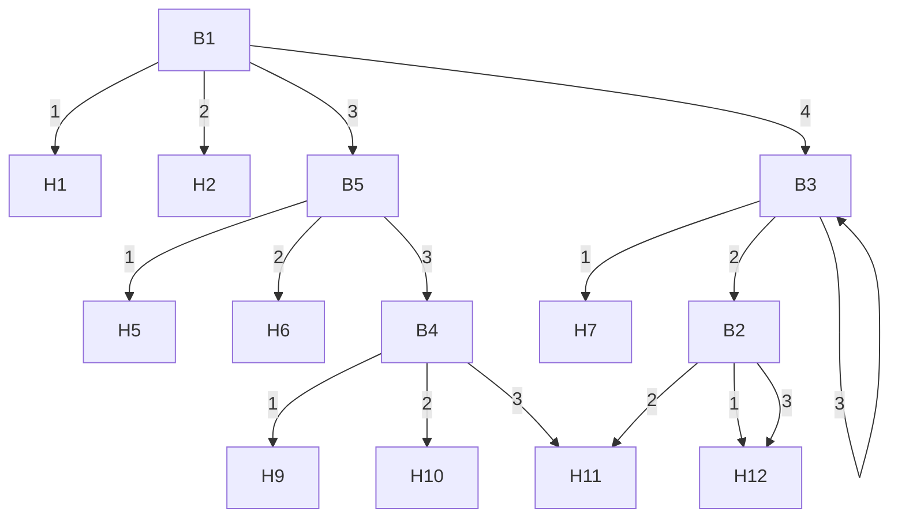
```mermaid
graph TD
  B1["B1"] -->|1| H1["H1"]
  B1 -->|2| H2["H2"]
  B1 -->|3| B5["B5"]
  B1 -->|4| B3["B3"]
  B5 -->|1| H5["H5"]
  B5 -->|2| H6["H6"]
  B5 -->|3| B4["B4"]
  B3 -->|1| H7["H7"]
  B3 -->|2| B2["B2"]
  B3 -->|3| B3
  B4 -->|1| H9["H9"]
  B4 -->|2| H10["H10"]
  B4 -->|3| H11["H11"]
  B2 -->|1| H12["H12"]
  B2 -->|2| H11
  B2 -->|3| H12
```
</details>

For the given connection of LANs by bridges, which one of the following choices represents the depth first traversal of the spanning tree of bridges?

A. B1, B5, B3, B4, B2

B. B1, B3, B5, B2, B4

C. B1, B5, B2, B3, B4

D. B1, B3, B4, B5, B2

gatecse-2006 computer-networks bridges normal

# Answer key

# 2.4.3 Bridges: GATE CSE 2006 | Question: 83

Consider the diagram shown below where a number of LANs are connected by (transparent) bridges. In order to avoid packets looping through circuits in the graph, the bridges organize themselves in a spanning tree. First, the root bridge is identified as the bridge with the least serial number. Next, the root sends out (more) data


units to enable the setting up of the spanning tree of shortest paths from the root bridge to each bridge.

Each bridge identifies a port (the root port) through which it will forward frames to the root bridge. Port conflicts are always resolved in favour of the port with the lower index value. When there is a possibility of multiple bridges forwarding to the same LAN (but not through the root port), ties are broken as follows: bridges closest to the root get preference and between such bridges, the one with the lowest serial number is preferred.


<details>
<summary>flowchart</summary>

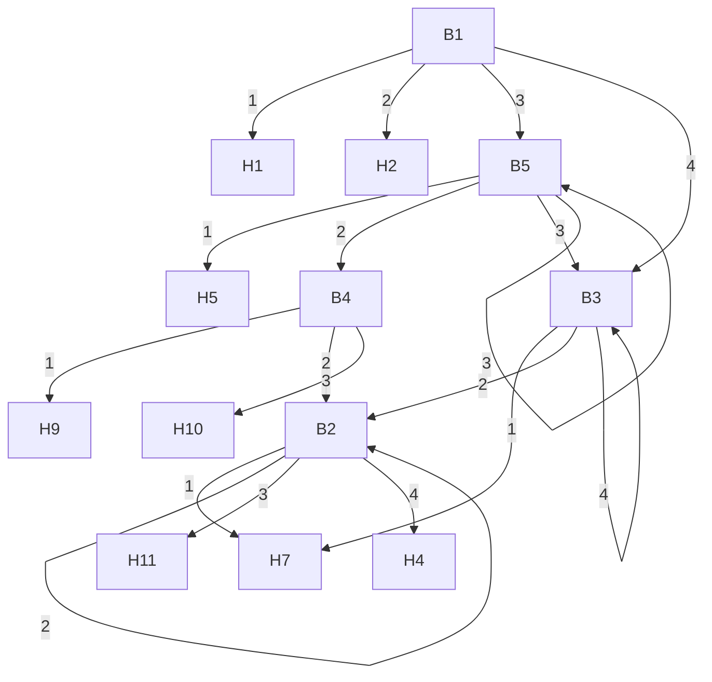
```mermaid
graph TD
  B1["B1"] -->|1| H1["H1"]
  B1 -->|2| H2["H2"]
  B1 -->|3| B5["B5"]
  B1 -->|4| B3["B3"]
  B5 -->|1| H5["H5"]
  B5 -->|2| B4["B4"]
  B5 -->|3| B3
  B3 -->|1| H7["H7"]
  B3 -->|2| B2["B2"]
  B3 -->|3| B3
  B4 -->|1| H9["H9"]
  B4 -->|2| B2
  B4 -->|3| H10["H10"]
  B2 -->|1| H7
  B2 -->|2| B2
  B2 -->|3| H11["H11"]
  B2 -->|4| H4["H4"]
  B5 -->|3| B5
  B3 -->|4| B3
```
</details>

Consider the spanning tree B1, B5, B3, B4, B2 for the given connection of LANs by bridges, that represents the depth first traversal of the spanning tree of bridges. Let host H1 send out a broadcast ping packet. Which of the following options represents the correct forwarding table on B3?

a.

<table><tr><td>Hosts</td><td>Port</td></tr><tr><td>H1, H2, H3, H4</td><td>3</td></tr><tr><td>H5, H6, H9, H10</td><td>1</td></tr><tr><td>H7, H8, H11, H12</td><td>2</td></tr></table>

b.

<table><tr><td>Hosts</td><td>Port</td></tr><tr><td>H1, H2</td><td>4</td></tr><tr><td>H3, H4</td><td>3</td></tr><tr><td>H5, H6</td><td>1</td></tr><tr><td>H7, H8, H9, H10, H11, H12</td><td>2</td></tr></table>

C.

<table><tr><td>Hosts</td><td>Port</td></tr><tr><td>H3, H4</td><td>3</td></tr><tr><td>H5, H6, H9, H10</td><td>1</td></tr><tr><td>H1, H2</td><td>4</td></tr><tr><td>H7, H8, H11, H12</td><td>2</td></tr></table>

d.

<table><tr><td>Hosts</td><td>Port</td></tr><tr><td>H1, H2, H3, H4</td><td>3</td></tr><tr><td>H5, H7, H9, H10</td><td>1</td></tr><tr><td>H7, H8, H11, H12</td><td>4</td></tr></table>

gatecse-2006 computer-networks bridges normal

Answer key

# 2.5

# CRC Polynomial (5)

Practice Test: Test 1 (7Q)

# 2.5.1 CRC Polynomial: GATE CSE 2007 | Question: 68, ISRO2016-73

The message 11001001 is to be transmitted using the CRC polynomial $x^3 + 1$ to protect it from errors. The message that should be transmitted is:


A. 11001001000

B. 11001001011

C. 11001010

D. 110010010011

gatecse-2007 computer-networks error-detection crc-polynomial normal isro2016

Answer key

# 2.5.2 CRC Polynomial: GATE CSE 2017 | Set 1 | Question: 32

A computer network uses polynomials over $GF(2)$ for error checking with 8 bits as information bits and uses $x^{3} + x + 1$ as the generator polynomial to generate the check bits. In this network, the message 01011011 is transmitted as:


A. 01011011010

B. 01011011011

c. 01011011101

D. 01011011100

gatecse-2017-set1 computer-networks crc-polynomial normal

Answer key

# 2.5.3 CRC Polynomial: GATE CSE 2021 | Set 2 | Question: 34

Consider the cyclic redundancy check (CRC) based error detecting scheme having the generator polynomial $X^3 + X + 1$ . Suppose the message $m_4m_3m_2m_1m_0 = 11000$ is to be transmitted. Check bits $c_2c_1c_0$ are appended at the end of the message by the transmitter using the above CRC scheme. The transmitted bit string is denoted by $m_4m_3m_2m_1m_0c_2c_1c_0$ . The value of the checkbit sequence $c_2c_1c_0$ is


A. 101

B. 110

C. 100

D. 111

gatecse-2021-set2 computer-networks crc-polynomial two-marks

# Answer key

# 2.5.4 CRC Polynomial: GATE CSE 2026 | Set 2 | Question: 33

Consider the transmission of data bits 110001011 over a link that uses Cyclic Redundancy Check (CRC) code for error detection. If the generator bit pattern is given to be 1001, which one of the following options shows the remainder bit pattern appended to the data bits before transmission?


A. 011

B. 101

C. 000

D. 100

gatecse-2026-set2 computer-networks crc-polynomial error-detection two-marks

# Answer key

# 2.5.5 CRC Polynomial: GATE IT 2005 | Question: 78

Consider the following message $M = 1010001101$ . The cyclic redundancy check (CRC) for this message using the divisor polynomial $x^5 + x^4 + x^2 + 1$ is:


A. 01110

B. 01011

C. 10101

D. 10110

gateit-2005 computer-networks crc-polynomial normal

# Answer key

# 2.6

# CSMA CD (6)

Practice Test: Test 1 (10Q)

# 2.6.1 CSMA CD: GATE CSE 2015 | Set 3 | Question: 6

Consider a CSMA/CD network that transmits data at a rate of 100 Mbps ( $10^{8}$ bits per second) over a 1 km (kilometre) cable with no repeaters. If the minimum frame size required for this network is 1250 bytes, What is the signal speed (km/sec) in the cable?


A. 8000

B. 10000

C. 16000

D. 20000

gatecse-2015-set3 computer-networks congestion-control csma-cd normal

# Answer key

# 2.6.2 CSMA CD: GATE CSE 2016 | Set 2 | Question: 53

A network has a data transmission bandwidth of $20 \times 10^{6}$ bits per second. It uses CSMA/CD in the MAC layer. The maximum signal propagation time from one node to another node is 40 microseconds. The minimum size of a frame in the network is \_\_\_\_ bytes.


gatecse-2016-set2 computer-networks csma-cd numerical-answers normal

# Answer key

# 2.6.3 CSMA CD: GATE CSE 2018 | Question: 55

Consider a simple communication system where multiple nodes are connected by a shared broadcast medium (like Ethernet or wireless). The nodes in the system use the following carrier-sense based medium


access protocol. A node that receives a packet to transmit will carrier-sense the medium for 5 units of time. If the node does not detect any other transmission, it starts transmitting its packet in the next time unit. If the node detects another transmission, it waits until this other transmission finishes, and then begins to carrier-sense for 5 time units again. Once they start to transmit, nodes do not perform any collision detection and continue transmission even if a collision occurs. All transmissions last for 20 units of time. Assume that the transmission signal travels at the speed of 10 meters per unit time in the medium.

Assume that the system has two nodes P and Q, located at a distance d meters from each other. P start transmitting a packet at time t = 0 after successfully completing its carrier-sense phase. Node Q has a packet to

transmit at time t = 0 and begins to carrier-sense the medium.

The maximum distance $d$ (in meters, rounded to the closest integer) that allows $Q$ to successfully avoid a collision between its proposed transmission and $P$ 's ongoing transmission is \_\_\_\_.

gatecse-2018 computer-networks csma-cd numerical-answers two-marks

Answer key

# 2.6.4 CSMA CD: GATE IT 2005 | Question: 27

Which of the following statements is TRUE about CSMA/CD:


A. IEEE 802.11 wireless LAN runs CSMA/CD protocol  
B. Ethernet is not based on CSMA/CD protocol  
C. CSMA/CD is not suitable for a high propagation delay network like satellite network  
D. There is no contention in a CSMA/CD network

gateit-2005 computer-networks congestion-control csma-cd normal

Answer key

# 2.6.5 CSMA CD: GATE IT 2005 | Question: 71


A network with CSMA/CD protocol in the MAC layer is running at 1Gbps over a 1km cable with no repeaters. The signal speed in the cable is $2 \times 10^{8}$ m/sec. The minimum frame size for this network should be:

A. 10000bits

B. 10000bytes

c. 5000 bits

D. 5000bytes

gateit-2005 computer-networks congestion-control csma-cd normal

Answer key

# 2.6.6 CSMA CD: GATE IT 2008 | Question: 65


The minimum frame size required for a CSMA/CD based computer network running at 1Gbps on a 200m cable with a link speed of $2 \times 10^{8}$ m/sec is:

A. 125bytes

B. 250bytes

C. 500bytes

D. None of the above

gateit-2008 computer-networks csma-cd normal

Answer key

# 2.7

# Channel Utilization (1)

# 2.7.1 Channel Utilization: GATE CSE 2025 | Set 2 | Question: 26


Suppose we are transmitting frames between two nodes using Stop-and-Wait protocol. The frame size is 3000 bits. The transmission rate of the channel is 2000 bps (bits/second) and the propagation delay between the two nodes is 100 milliseconds. Assume that the processing times at the source and destination are negligible. Also, assume that the size of the acknowledgement packet is negligible. Which ONE of the following most accurately gives the channel utilization for the above scenario in percentage?

A. 88.23

B. 93.75

C. 85.44

D. 66.67

gatecse2025-set2 computer-networks stop-and-wait channel-utilization two-marks

Answer key

# 2.8

# Communication (4)

Practice Test: Test 1 (11Q)

# 2.8.1 Communication: GATE CSE 2012 | Question: 44


Consider a source computer (S) transmitting a file of size $10^{6}$ bits to a destination computer (D) over a

network of two routers ( $R_1$ and $R_2$ ) and three links ( $L_1, L_2$ , and $L_3$ ). $L_1$ connects $S$ to $R_1$ ; $L_2$ connects $R_1$ to $R_2$ ; and $L_3$ connects $R_2$ to $D$ . Let each link be of length 100 km. Assume signals travel over each link at a speed of $10^8$ meters per second. Assume that the link bandwidth on each link is 1 Mbps. Let the file be broken down into 1000 packets each of size 1000 bits. Find the total sum of transmission and propagation delays in transmitting the file from $S$ to $D$ ?

A. 1005 ms

B. 1010 ms

c. 3000 ms

D. 3003 ms

gatecse-2012 computer-networks communication normal

# Answer key

# 2.8.2 Communication: GATE CSE 2022 | Question: 49

Consider a 100 Mbps link between an earth station (sender) and a satellite (receiver) at an altitude of 2100 km. The signal propagates at a speed of $3 \times 10^{8}$ m/s. The time taken (in milliseconds, rounded off to two decimal places) for the receiver to completely receive a packet of 1000 bytes transmitted by the sender is \_\_\_\_.

gatecse-2022 numerical-answers computer-networks two-marks communication

# Answer key

# 2.8.3 Communication: GATE IT 2007 | Question: 62

Let us consider a statistical time division multiplexing of packets. The number of sources is 10. In a time unit, a source transmits a packet of 1000 bits. The number of sources sending data for the first 20 time units is 6, 9, 3, 7, 2, 2, 2, 3, 4, 6, 1, 10, 7, 5, 8, 3, 6, 2, 9, 5 respectively. The output capacity of multiplexer is 5000 bits per time unit. Then the average number of backlogged of packets per time unit during the given period is

A. 5

B. 4.45

C. 3.45

D. 0

gateit-2007 computer-networks communication normal

# Answer key

# 2.8.4 Communication: GATE IT 2007 | Question: 64

A broadcast channel has 10 nodes and total capacity of 10 Mbps. It uses polling for medium access. Once a node finishes transmission, there is a polling delay of 80 $\mu$ s to poll the next node. Whenever a node is polled, it is allowed to transmit a maximum of 1000 bytes. The maximum throughput of the broadcast channel is:

A. 1 Mbps

B. 100/11 Mbps

C. 10 Mbps

D. 100 Mbps

gateit-2007 computer-networks communication normal

# Answer key

# 2.9

# Congestion Control (9)

Practice Test: Test 1 (14Q)

# 2.9.1 Congestion Control: GATE CSE 2008 | Question: 56

In the slow start phase of the TCP congestion algorithm, the size of the congestion window:

A. does not increase

B. increase linearly

C. increases quadratically

D. increases exponentially

gatecse-2008 computer-networks congestion-control normal

# Answer key

# 2.9.2 Congestion Control: GATE CSE 2012 | Question: 45

Consider an instance of TCP's Additive Increase Multiplicative Decrease (AIMD) algorithm where the window size at the start of the slow start phase is 2 MSS and the threshold at the start of the first transmission is 8 MSS. Assume that a timeout occurs during the fifth transmission. Find the congestion window size at the end of the tenth transmission.


# Answer key

# 2.9.3 Congestion Control: GATE CSE 2014 | Set 1 | Question: 27

Let the size of congestion window of a TCP connection be 32 KB when a timeout occurs. The round trip time of the connection is 100 msec and the maximum segment size used is 2 KB. The time taken (in msec) by the TCP connection to get back to 32 KB congestion window is \_\_\_\_.


gatecse-2014-set1 computer-networks tcp congestion-control numerical-answers normal

# Answer key

# 2.9.4 Congestion Control: GATE CSE 2018 | Question: 14

Consider the following statements regarding the slow start phase of the TCP congestion control algorithm. Note that cwnd stands for the TCP congestion window and MSS window denotes the Maximum Segments Size:


i. The cwnd increases by 2 MSS on every successful acknowledgment  
ii. The cwnd approximately doubles on every successful acknowledgment  
iii. The cwnd increases by 1 MSS every round trip time  
iv. The cwnd approximately doubles every round trip time

Which one of the following is correct?

A. Only (ii) and (iii) are true

C. Only (iv) is true

B. Only (i) and (iii) are true

D. Only (i) and (iv) are true

gatecse-2018 computer-networks tcp congestion-control normal one-mark

# Answer key

# 2.9.5 Congestion Control: GATE CSE 2020 | Question: 55


Consider a TCP connection between a client and a server with the following specifications; the round trip time is 6 ms, the size of the receiver advertised window is 50 KB, slow-start threshold at the client is 32 KB, and the maximum segment size is 2 KB. The connection is established at time t = 0. Assume that there are no timeouts and errors during transmission. Then the size of the congestion window (in KB) at time $t + 60$ ms after all acknowledgements are processed is \_\_\_\_

gatecse-2020 numerical-answers computer-networks tcp congestion-control two-marks

# Answer key

# 2.9.6 Congestion Control: GATE CSE 2024 | Set 2 | Question: 44


Consider a TCP connection operating at a point of time with the congestion window of size 12 MSS (Maximum Segment Size), when a timeout occurs due to packet loss. Assuming that all the segments transmitted in the next two RTTs (Round Trip Time) are acknowledged correctly, the congestion window size (in MSS) during the third RTT will be \_\_\_\_.

gatecse-2024-set2 numerical-answers computer-networks tcp congestion-control two-marks

# Answer key

# 2.9.7 Congestion Control: GATE CSE 2026 | Set 1 | Question: 34


A TCP sender successfully establishes a connection with a TCP receiver and starts the transmission of segments. The TCP congestion control mechanism's slow-start threshold is set to 10000 segments.

Assume that the round-trip time is fixed at 1 millisecond. Assume that the sender always has data to send, the segments are numbered from 1, and no segment is lost. Let t denote the time (in milliseconds) at which the transmission of segment number 2000 starts.

Which one of the following options is correct?

A. 9 < t < 10  
C. $11 \leq t < 12$

B. $10 < t < 11$  
D. $12 \leq t < 13$

gatecse-2026-set1 two-marks computer-networks congestion-control tcp

# Answer key

# 2.9.8 Congestion Control: GATE CSE 2026 | Set 2 | Question: 48


Consider a new TCP connection between a sender and a receiver. The receiver advertised window is constant at 48 KB, the maximum segment size (MSS) is 2 KB, and the slow start threshold for TCP congestion control is 16 KB. Assume that there are no timeouts or duplicate acknowledgements. The number of rounds of transmission required for the congestion control algorithm of the TCP connection to reach the congestion avoidance phase is \_\_\_\_. (answer in integer)

Note: $1\mathrm{K} = 2^{10}$

gatecse-2026-set2 computer-networks congestion-control tcp numerical-answers two-marks

# Answer key

# 2.9.9 Congestion Control: GATE IT 2005 | Question: 73


On a TCP connection, current congestion window size is Congestion Window = 4 KB. The window size advertised by the receiver is Advertise Window = 6 KB. The last byte sent by the sender is LastByteSent = 10240 and the last byte acknowledged by the receiver is LastByteAcked = 8192. The current window size at the sender is:

A. 2048 bytes

B. 4096 bytes

C. 6144 bytes

D. 8192 bytes

gateit-2005 computer-networks congestion-control normal

# Answer key

# 2.10

# Data Communication (1)

# 2.10.1 Data Communication: GATE CSE 2026 | Set 2 | Question: 55


It is necessary to design a link-layer protocol between two hosts that are directly connected over a lossless link of length 3000 kilometers. Assume that the link bandwidth is $10^{8}$ bits per second and that the propagation delay in the link is 5 nanoseconds per meter. Every transmitted data byte is assigned a sequence number.

Let N be the minimum number of bits needed for the sequence number field in the protocol header such that

i. the sequence numbers do not wrap around before 60 seconds, and  
ii. the maximum utilization of the link is achieved.

The value of $N$ is \_\_\_\_. (answer in integer)

gatecse-2026-set2 computer-networks data-communication numerical-answers two-marks

# Answer key

# 2.11

# Distance Vector Routing (8)

# Practice Test: Test 1 (15Q)

# 2.11.1 Distance Vector Routing: GATE CSE 2010 | Question: 54

Consider a network with 6 routers R1 to R6 connected with links having weights as shown in the following diagram.


<details>
<summary>flowchart</summary>

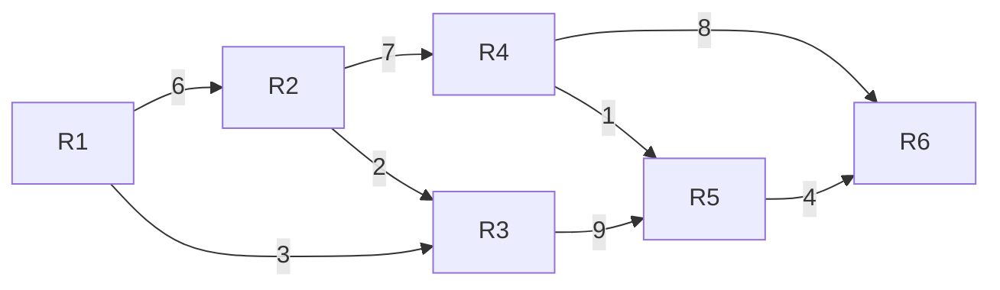
```mermaid
graph LR
  R1["R1"] -->|6| R2["R2"]
  R1 -->|3| R3["R3"]
  R2 -->|7| R4["R4"]
  R2 -->|2| R3
  R3 -->|9| R5["R5"]
  R4 -->|8| R6["R6"]
  R4 -->|1| R5
  R5 -->|4| R6
```
</details>

All the routers use the distance vector based routing algorithm to update their routing tables. Each router starts with its routing table initialized to contain an entry for each neighbor with the weight of the respective connecting link. After all the routing tables stabilize, how many links in the network will never be used for carrying any data?

A. 4

B. 3

C. 2

D. 1

gatecse-2010 computer-networks routing distance-vector-routing normal

# Answer key

# 2.11.2 Distance Vector Routing: GATE CSE 2010 | Question: 55

Consider a network with 6 routers R1 to R6 connected with links having weights as shown in the following diagram.


<details>
<summary>flowchart</summary>


```mermaid
graph LR
  R1["R1"] -->|6| R2["R2"]
  R1 -->|3| R3["R3"]
  R2 -->|7| R4["R4"]
  R2 -->|2| R3
  R3 -->|9| R5["R5"]
  R4 -->|8| R6["R6"]
  R4 -->|1| R5
  R5 -->|4| R6
```
</details>

Suppose the weights of all unused links are changed to 2 and the distance vector algorithm is used again until all routing tables stabilize. How many links will now remain unused?

A. 0

B. 1

C. 2

D. 3

gatecse-2010 computer-networks routing distance-vector-routing normal

# Answer key

# 2.11.3 Distance Vector Routing: GATE CSE 2011 | Question: 52

Consider a network with five nodes, N1 to N5, as shown as below.


<details>
<summary>flowchart</summary>

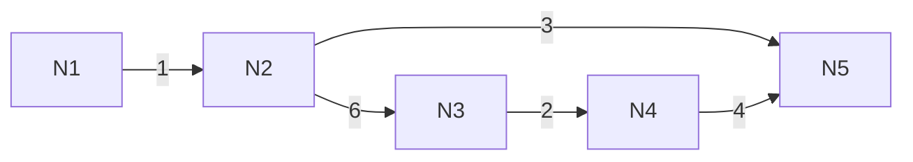
```mermaid
graph LR
  N1["N1"] -->|1| N2["N2"]
  N2 -->|3| N5["N5"]
  N2 -->|6| N3["N3"]
  N3 -->|2| N4["N4"]
  N4 -->|4| N5
```
</details>

The network uses a Distance Vector Routing protocol. Once the routes have been stabilized, the distance vectors at different nodes are as follows.

N1: (0, 1, 7, 8, 4)

N2: (1, 0, 6, 7, 3)  
N3: (7, 6, 0, 2, 6)  
N4: (8, 7, 2, 0, 4)  
N5: (4, 3, 6, 4, 0)

Each distance vector is the distance of the best known path at that instance to nodes, N1 to N5, where the distance to itself is 0. Also, all links are symmetric and the cost is identical in both directions. In each round, all nodes exchange their distance vectors with their respective neighbors. Then all nodes update their distance vectors. In between two rounds, any change in cost of a link will cause the two incident nodes to change only that entry in their distance vectors.

The cost of link $N2 - N3$ reduces to 2 (in both directions). After the next round of updates, what will be the new distance vector at node, $N3$ ?

A. $(3,2,0,2,5)$  
C. $(7,2,0,2,5)$

B. $(3,2,0,2,6)$  
D. (7,2,0,2,6)

gatecse-2011 computer-networks routing distance-vector-routing normal

Answer key

# 2.11.4 Distance Vector Routing: GATE CSE 2011 | Question: 53

Consider a network with five nodes, N1 to N5, as shown as below.


<details>
<summary>flowchart</summary>

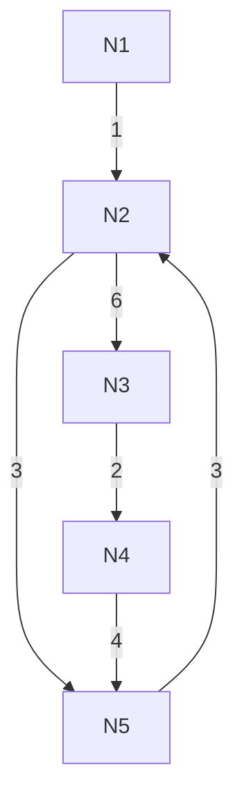
```mermaid
graph TD
  N1["N1"] -->|1| N2["N2"]
  N2 -->|3| N5["N5"]
  N2 -->|6| N3["N3"]
  N3 -->|2| N4["N4"]
  N4 -->|4| N5
  N5 -->|3| N2
```
</details>

The network uses a Distance Vector Routing protocol. Once the routes have been stabilized, the distance vectors at different nodes are as follows.

- N1: $(0,1,7,8,4)$  
- N2: (1,0,6,7,3)  
- N3: (7,6,0,2,6)  
- N4: (8,7,2,0,4)  
- N5: (4,3,6,4,0)

Each distance vector is the distance of the best known path at that instance to nodes, N1 to N5, where the distance to itself is 0. Also, all links are symmetric and the cost is identical in both directions. In each round, all nodes exchange their distance vectors with their respective neighbors. Then all nodes update their distance vectors. In between two rounds, any change in cost of a link will cause the two incident nodes to change only that entry in their distance vectors.

The cost of link $N2 - N3$ reduces to 2 (in both directions). After the next round of updates, the link $N1 - N2$ goes down. $N2$ will reflect this change immediately in its distance vector as cost, $\infty$ . After the NEXT ROUND of update, what will be the cost to $N1$ in the distance vector of $N3$ ?

A. 3

B. 9

C. 10

D. $\infty$

gatecse-2011 computer-networks routing distance-vector-routing normal

Answer key

# 2.11.5 Distance Vector Routing: GATE CSE 2021 | Set 2 | Question: 45


Consider a computer network using the distance vector routing algorithm in its network layer. The partial topology of the network is shown below.

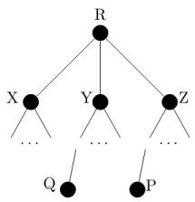

<details>
<summary>flowchart</summary>

```mermaid
graph TD
  R["R"] --> X["X"]
  R["R"] --> Y["Y"]
  R["R"] --> Z["Z"]
  X["X"] --> X
  Y["Y"] --> Y
  Z["Z"] --> Z
  X["X"] --> X
  Y["Y"] --> Y
  Z["Z"] --> Z
  X["X"] --> X
  Y["Y"] --> Y
  Z["Z"] --> Z
  X["X"] --> X
  Y["Y"] --> Y
  Z["Z"] --> Z
  X["X"] --> X
  Y["Y"] --> Y
  Z["Z"] --> Z
  X["Q"] --> Q
  Y["P"] --> P
```
</details>

The objective is to find the shortest-cost path from the router $R$ to routers $P$ and $Q$ . Assume that $R$ does not initially know the shortest routes to $P$ and $Q$ . Assume that $R$ has three neighbouring routers denoted as $X, Y$ and $Z$ . During one iteration, $R$ measures its distance to its neighbours $X, Y$ , and $Z$ as 3, 2 and 5, respectively. Router $R$ gets routing vectors from its neighbours that indicate that the distance to router $P$ from routers $X, Y$ and $Z$ are 7, 6 and 5, respectively. The routing vector also indicates that the distance to router $Q$ from routers $X, Y$ and $Z$ are 4, 6 and 8 respectively. Which of the following statement(s) is/are correct with respect to the new routing table $o$ $R$ , after updation during this iteration?

A. The distance from R to P will be stored as 10  
B. The distance from R to Q will be stored as 7  
C. The next hop router for a packet from $R$ to $P$ is $Y$  
D. The next hop router for a packet from $R$ to $Q$ is $Z$

gatecse-2021-set2 multiple-selects computer-networks distance-vector-routing two-marks

Answer key

# 2.11.6 Distance Vector Routing: GATE CSE 2022 | Question: 47

Consider a network with three routers P, Q, R shown in the figure below. All the links have cost of unity.


The routers exchange distance vector routing information and have converged on the routing tables, after which the link Q-R fails. Assume that P and Q send out routing updates at random times, each at the same average rate. The probability of a routing loop formation (rounded off to one decimal place) between P and Q, leading to count-to-infinity problem, is \_\_\_\_.

gatecse-2022 numerical-answers computer-networks routing distance-vector-routing two-marks

Answer key

# 2.11.7 Distance Vector Routing: GATE IT 2005 | Question: 29

Count to infinity is a problem associated with:


A. link state routing protocol.  
C. DNS while resolving host name  
gateit-2005 computer-networks routing distance-vector-routing normal

B. distance vector routing protocol

D. TCP for congestion control

Answer key

# 2.11.8 Distance Vector Routing: GATE IT 2007 | Question: 60


For the network given in the figure below, the routing tables of the four nodes A, E, D and G are shown. Suppose that F has estimated its delay to its neighbors, A, E, D and G as 8, 10, 12 and 6 msecs respectively and updates its routing table using distance vector routing technique.


Routing Table of A

<table><tr><td>A</td><td>0</td></tr><tr><td>B</td><td>40</td></tr><tr><td>C</td><td>14</td></tr><tr><td>D</td><td>17</td></tr><tr><td>E</td><td>21</td></tr><tr><td>F</td><td>9</td></tr><tr><td>G</td><td>24</td></tr></table>

Routing Table of D

<table><tr><td>A</td><td>20</td></tr><tr><td>B</td><td>8</td></tr><tr><td>C</td><td>30</td></tr><tr><td>D</td><td>0</td></tr><tr><td>E</td><td>14</td></tr><tr><td>F</td><td>7</td></tr><tr><td>G</td><td>22</td></tr></table>

Routing Table of E

<table><tr><td>A</td><td>24</td></tr><tr><td>B</td><td>27</td></tr><tr><td>C</td><td>7</td></tr><tr><td>D</td><td>20</td></tr><tr><td>E</td><td>0</td></tr><tr><td>F</td><td>11</td></tr><tr><td>G</td><td>22</td></tr></table>

Routing Table of G

<table><tr><td>A</td><td>21</td></tr><tr><td>B</td><td>24</td></tr><tr><td>C</td><td>22</td></tr><tr><td>D</td><td>19</td></tr><tr><td>E</td><td>22</td></tr><tr><td>F</td><td>10</td></tr><tr><td>G</td><td>0</td></tr></table>

A.

<table><tr><td>A</td><td>8</td></tr><tr><td>B</td><td>20</td></tr><tr><td>C</td><td>17</td></tr><tr><td>D</td><td>12</td></tr><tr><td>E</td><td>10</td></tr><tr><td>F</td><td>0</td></tr><tr><td>G</td><td>6</td></tr></table>

B.

<table><tr><td>A</td><td>21</td></tr><tr><td>B</td><td>8</td></tr><tr><td>C</td><td>7</td></tr><tr><td>D</td><td>19</td></tr><tr><td>E</td><td>14</td></tr><tr><td>F</td><td>0</td></tr><tr><td>G</td><td>22</td></tr></table>

C.

<table><tr><td>A</td><td>8</td></tr><tr><td>B</td><td>20</td></tr><tr><td>C</td><td>17</td></tr><tr><td>D</td><td>12</td></tr><tr><td>E</td><td>10</td></tr><tr><td>F</td><td>16</td></tr><tr><td>G</td><td>6</td></tr></table>

D.

<table><tr><td>A</td><td>8</td></tr><tr><td>B</td><td>8</td></tr><tr><td>C</td><td>7</td></tr><tr><td>D</td><td>12</td></tr><tr><td>E</td><td>10</td></tr><tr><td>F</td><td>0</td></tr><tr><td>G</td><td>6</td></tr></table>

gateit-2007 computer-networks distance-vector-routing normal

# Answer key

# 2.12

# Error Detection (8)

Practice Test: Test 1 (9Q)

# 2.12.1 Error Detection: GATE CSE 1992 | Question: 01,ii

Consider a 3-bit error detection and 1-bit error correction hamming code for 4-bit data. The extra parity bits required would be \_\_\_\_ and the 3-bit error detection is possible because the code has a minimum distance of \_\_\_\_.

gate1992 computer-networks error-detection normal fill-in-the-blanks

# Answer key

# 2.12.2 Error Detection: GATE CSE 1995 | Question: 1.12

What is the distance of the following code 000000, 010101, 000111, 011001, 111111?

A. 2

B. 3

C. 4

D. 1

gate1995 computer-networks error-detection normal

# Answer key

# 2.12.3 Error Detection: GATE CSE 2009 | Question: 48

Let $G(x)$ be the generator polynomial used for CRC checking. What is the condition that should be satisfied by $G(x)$ to detect odd number of bits in error?

A. $G(x)$ contains more than two terms  
B. $G(x)$ does not divide $1 + x^{k}$ , for any $k$ not exceeding the frame length  
C. $1 + x$ is a factor of $G(x)$  
D. $G(x)$ has an odd number of terms.


# Answer key

# 2.12.4 Error Detection: GATE CSE 2017 | Set 2 | Question: 34

Consider the binary code that consists of only four valid codewords as given below:

00000,01011,10101,11110

Let the minimum Hamming distance of the code $p$ and the maximum number of erroneous bits that can be corrected by the code be $q$ . Then the values of $p$ and $q$ are

A. $p = 3$ and $q = 1$

B. $p = 3$ and $q = 2$

C. p = 4 and q = 1

D. $p = 4$ and $q = 2$

gatecse-2017-set2 computer-networks error-detection

# Answer key

# 2.12.5 Error Detection: GATE IT 2005 | Question: 74

In a communication network, a packet of length L bits takes link $L_{1}$ with a probability of $p_{1}$ or link $L_{2}$ with a probability of $p_{2}$ . Link $L_{1}$ and $L_{2}$ have bit error probability of $b_{1}$ and $b_{2}$ respectively. The probability that the packet will be received without error via either $L_{1}$ or $L_{2}$ is


A. $(1 - b_{1})^{L}p_{1} + (1 - b_{2})^{L}p_{2}$

B. $[1 - (b_1 + b_2)^L]p_1p_2$

C. $(1 - b_{1})^{L}(1 - b_{2})^{L}p_{1}p_{2}$

D. $1 - (b_1^L p_1 + b_2^L p_2)$

gateit-2005 computer-networks error-detection probability normal

# Answer key

# 2.12.6 Error Detection: GATE IT 2007 | Question: 43

An error correcting code has the following code words: 00000000, 00001111, 01010101, 10101010, 11110000. What is the maximum number of bit errors that can be corrected?


A. 0

B. 1

C. 2

D. 3

gateit-2007 computer-networks error-detection normal

# Answer key

# 2.12.7 Error Detection: GATE IT 2008 | Question: 66

Data transmitted on a link uses the following 2D parity scheme for error detection:

Each sequence of 28 bits is arranged in a $4 \times 7$ matrix (rows $r_{0}$ through $r_{3}$ , and columns $d_{7}$ through $d_{1}$ )

and is padded with a column $d_{0}$ and row $r_{4}$ of parity bits computed using the Even parity scheme. Each bit of column $d_{0}$ (respectively, row $r_{4}$ ) gives the parity of the corresponding row (respectively, column). These 40 bits are transmitted over the data link.

<table><tr><td></td><td> $\mathbf{d_7}$ </td><td> $\mathbf{d_6}$ </td><td> $\mathbf{d_5}$ </td><td> $\mathbf{d_4}$ </td><td> $\mathbf{d_3}$ </td><td> $\mathbf{d_2}$ </td><td> $\mathbf{d_1}$ </td><td> $\mathbf{d_0}$ </td></tr><tr><td> $\mathbf{r_0}$ </td><td>0</td><td>1</td><td>0</td><td>1</td><td>0</td><td>0</td><td>1</td><td>1</td></tr><tr><td> $\mathbf{r_1}$ </td><td>1</td><td>1</td><td>0</td><td>0</td><td>1</td><td>1</td><td>1</td><td>0</td></tr><tr><td> $\mathbf{r_2}$ </td><td>0</td><td>0</td><td>0</td><td>1</td><td>0</td><td>1</td><td>0</td><td>0</td></tr><tr><td> $\mathbf{r_3}$ </td><td>0</td><td>1</td><td>1</td><td>0</td><td>1</td><td>0</td><td>1</td><td>0</td></tr><tr><td> $\mathbf{r_4}$ </td><td>1</td><td>1</td><td>0</td><td>0</td><td>0</td><td>1</td><td>1</td><td>0</td></tr></table>

The table shows data received by a receiver and has n corrupted bits. What is the minimum possible value of n?

A. 1

B. 2

C. 3

D. 4

gateit-2008 computer-networks normal error-detection

# Answer key


# 2.12.8 Error Detection: GATE1987-2-i

Match the pairs in the following questions:

<table><tr><td>(A) Cyclic Redundancy Code</td><td>(p) Error Correction</td></tr><tr><td>(B) Serial Communication</td><td>(q) Wired-OR</td></tr><tr><td>(C) Open Collector</td><td>(r) Error detection</td></tr><tr><td>(D) Hamming Code</td><td>(s) RS-232-C</td></tr></table>


gate1989 descriptive computer-networks error-detection

Answer key

# 2.13

# Ethernet (7)

Practice Test: Test 1 (8Q)

# 2.13.1 Ethernet: GATE CSE 2004 | Question: 54

A and B are the only two stations on an Ethernet. Each has a steady queue of frames to send. Both A and B attempt to transmit a frame, collide, and A wins the first backoff race. At the end of this successful transmission by A, both A and B attempt to transmit and collide. The probability that A wins the second backoff race is:

A. 0.5

B. 0.625

C. 0.75

D. 1.0

gatecse-2004 computer-networks ethernet probability normal

Answer key

# 2.13.2 Ethernet: GATE CSE 2013 | Question: 36

Determine the maximum length of the cable (in km) for transmitting data at a rate of 500 Mbps in an Ethernet LAN with frames of size 10,000 bits. Assume the signal speed in the cable to be 2,00,000 km/s.

A. 1

B. 2

C. 2.5

D. 5

gatecse-2013 computer-networks ethernet normal

Answer key

# 2.13.3 Ethernet: GATE CSE 2016 | Set 2 | Question: 24

In an Ethernet local area network, which one of the following statements is TRUE?

A. A station stops to sense the channel once it starts transmitting a frame.  
B. The purpose of the jamming signal is to pad the frames that are smaller than the minimum frame size.  
C. A station continues to transmit the packet even after the collision is detected.  
D. The exponential back off mechanism reduces the probability of collision on retransmissions.

gatecse-2016-set2 computer-networks ethernet normal

Answer key

# 2.13.4 Ethernet: GATE CSE 2022 | Question: 12

Consider an enterprise network with two Ethernet segments, a web server and a firewall, connected via three routers as shown below.


<details>
<summary>flowchart</summary>

This diagram illustrates a network architecture or data flow system where a To Internet is sent to a Firewall, which is then distributed to multiple routers and Ethernet, which are interconnected by a Web Server.
</details>

What is the number of subnets inside the enterprise network?

A. 3

B. 12

C. 6

D. 8

gatecse-2022 computer-networks ethernet one-mark

# Answer key

# 2.13.5 Ethernet: GATE CSE 2024 | Set 2 | Question: 13

Node X has a TCP connection open to node Y. The packets from X to Y go through an intermediate IP router R. Ethernet switch S is the first switch on the network path between X and R. Consider a packet sent from X to Y over this connection.


Which of the following statements is/are TRUE about the destination IP and MAC addresses on this packet at the time it leaves X?

A. The destination IP address is the IP address of R  
B. The destination IP address is the IP address of Y  
C. The destination MAC address is the MAC address of S  
D. The destination MAC address is the MAC address of Y

gatecse-2024-set2 computer-networks multiple-selects ethernet one-mark

# Answer key

# 2.13.6 Ethernet: GATE CSE 2024 | Set 2 | Question: 45

Consider an Ethernet segment with a transmission speed of $10^{8}$ bits/sec and a maximum segment length of 500 meters. If the speed of propagation of the signal in the medium is $2 \times 10^{8}$ meters/sec, then the minimum frame size (in bits) required for collision detection is \_\_\_\_.


gatecse-2024-set2 numerical-answers computer-networks ethernet two-marks

# Answer key

# 2.13.7 Ethernet: GATE IT 2006 | Question: 19

Which of the following statements is TRUE?

A. Both Ethernet frame and IP packet include checksum fields  
B. Ethernet frame includes a checksum field and IP packet includes a CRC field  
C. Ethernet frame includes a CRC field and IP packet includes a checksum field  
D. Both Ethernet frame and IP packet include CRC fields

gateit-2006 computer-networks normal ethernet

# Answer key


# 2.14.1 Fragmentation: GATE CSE 2004 | Question: 56


Consider three IP networks A, B and C. Host $H_{A}$ in network A sends messages each containing 180 bytes of application data to a host $H_{C}$ in network C. The TCP layer prefixes 20 byte header to the message.

This passes through an intermediate network B. The maximum packet size, including 20 byte IP header, in each network is:

• A: 1000 bytes  
- B: 100 bytes  
- C: 1000 bytes

The network A and B are connected through a 1 Mbps link, while B and C are connected by a 512 Kbps link (bps = bits per second).


Assuming that the packets are correctly delivered, how many bytes, including headers, are delivered to the IP layer at the destination for one application message, in the best case? Consider only data packets.

A. 200

B. 220

C. 240

D. 260

gatecse-2004 computer-networks ip-addressing fragmentation tcp normal

Answer key

# 2.14.2 Fragmentation: GATE CSE 2004 | Question: 57


Consider three IP networks $A, B$ and $C$ . Host $H_A$ in network $A$ sends messages each containing 180 bytes of application data to a host $H_C$ in network $C$ . The TCP layer prefixes 20 byte header to the message. This passes through an intermediate network $B$ . The maximum packet size, including 20 byte IP header, in each network, is:

- $A:1000$ bytes  
- $B:100$ bytes  
- $C:1000$ bytes

The network $A$ and $B$ are connected through a 1 Mbps link, while $B$ and $C$ are connected by a 512 Kbps link (bps = bits per second).


What is the rate at which application data is transferred to host $H_{C}$ ? Ignore errors, acknowledgments, and other overheads.

A. 325.5 Kbps

B. 354.5 Kbps

C. 409.6 Kbps

D. 512.0 Kbps

gatecse-2004 computer-networks ip-addressing fragmentation tcp normal

Answer key

# 2.14.3 Fragmentation: GATE CSE 2013 | Question: 37


In an IPv4 datagram, the M bit is 0, the value of HLEN is 10, the value of total length is 400 and the fragment offset value is 300. The position of the datagram, the sequence numbers of the first and the last bytes of the payload, respectively are:

A. Last fragment, 2400 and 2789

B. First fragment, 2400 and 2759

C. Last fragment, 2400 and 2759

D. Middle fragment, 300 and 689

# 2.14.4 Fragmentation: GATE CSE 2025 | Set 1 | Question: 47


Suppose a message of size 15000 bytes is transmitted from a source to a destination using IPv4 protocol via two routers as shown in the figure. Each router has a defined maximum transmission unit (MTU) as shown in the figure, including IP header. The number of fragments that will be delivered to the destination is \_\_\_\_. (Answer in integer)

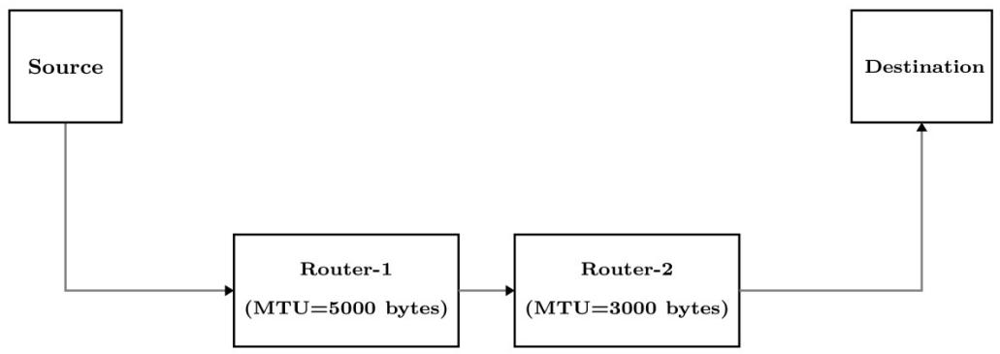

<details>
<summary>flowchart</summary>

```mermaid
graph LR
  A["Source"] --> B["Router-1\n(MTU=5000 bytes)"]
  B --> C["Router-2\n(MTU=3000 bytes)"]
  C --> D["Destination"]
```
</details>

gatecse2025-set1 computer-networks ip-addressing fragmentation numerical-answers two-marks

# Answer key

# 2.14.5 Fragmentation: GATE CSE 2025 | Set 2 | Question: 13


Consider a network that uses Ethernet and IPv4. Assume that IPv4 headers do not use any options field. Each Ethernet frame can carry a maximum of 1500 bytes in its data field. A UDP segment is transmitted. The payload (data) in the UDPO segment is 7488 bytes.

Which ONE of the following choices has the CORRECT total number of fragments transmitted and the size of the last fragment including IPv4 header?

A. 5 fragments 1488 bytes

B. 6 fragments 88 bytes

C. 6 fragments 108 bytes

D. 6 fragments 116 bytes

gatecse2025-set2 computer-networks fragmentation ip-addressing one-mark

# Answer key

# 2.15

# Hamming Code (2)

# 2.15.1 Hamming Code: GATE CSE 1994 | Question: 9

Following 7 bit single error correcting hamming coded message is received.


<table><tr><td>7</td><td>6</td><td>5</td><td>4</td><td>3</td><td>2</td><td>1</td></tr><tr><td>1</td><td>0</td><td>0</td><td>0</td><td>1</td><td>1</td><td>0</td></tr></table>

<table><tr><td>bit No.</td></tr><tr><td>X</td></tr></table>

Determine if the message is correct (assuming that at most 1 bit could be corrupted). If the message contains an error find the bit which is erroneous and gives correct message.

gate1994 computer-networks error-detection hamming-code normal descriptive

# Answer key

# 2.15.2 Hamming Code: GATE CSE 2021 | Set 1 | Question: 29

Assume that a 12-bit Hamming codeword consisting of 8-bit data and 4 check bits is $d_{8}d_{7}d_{6}d_{5}c_{8}d_{4}d_{4}d_{3}d_{2}c_{4}d_{1}c_{2}c_{1}$ , where the data bits and the check bits are given in the following tables:


Data bits

<table><tr><td> $d_{8}$ </td><td> $d_{7}$ </td><td> $d_{6}$ </td><td> $d_{5}$ </td><td> $d_{4}$ </td><td> $d_{3}$ </td><td> $d_{2}$ </td><td> $d_{1}$ </td></tr><tr><td>1</td><td>1</td><td>0</td><td>x</td><td>0</td><td>1</td><td>0</td><td>1</td></tr></table>

Check bits

<table><tr><td> $c_{8}$ </td><td> $c_{4}$ </td><td> $c_{2}$ </td><td> $c_{1}$ </td></tr><tr><td>y</td><td>0</td><td>1</td><td>0</td></tr></table>

Which one of the following choices gives the correct values of x and y?

A. $x$ is 0 and $y$ is 0

B. $x$ is 0 and $y$ is 1

C. $x$ is 1 and $y$ is 0

D. $x$ is 1 and $y$ is 1

gatecse-2021-set1 computer-networks hamming-code two-marks error-detection

Answer key

# 2.16

# IP Addressing (8)

Practice Tests: Test 1 (15Q) Test 2 (2Q)

# 2.16.1 IP Addressing: GATE CSE 2003 | Question: 27

Which of the following assertions is FALSE about the Internet Protocol (IP)?


A. It is possible for a computer to have multiple IP addresses  
B. IP packets from the same source to the same destination can take different routes in the network  
C. IP ensures that a packet is discarded if it is unable to reach its destination within a given number of hops  
D. The packet source cannot set the route of an outgoing packets; the route is determined only by the routing tables in the routers on the way

gatecse-2003 computer-networks ip-addressing normal

Answer key

# 2.16.2 IP Addressing: GATE CSE 2012 | Question: 23

In the IPv4 addressing format, the number of networks allowed under Class C addresses is:


A. $2^{14}$

B. $2^{7}$

C. $2^{21}$

D. $2^{24}$

gatecse-2012 computer-networks ip-addressing easy

Answer key

# 2.16.3 IP Addressing: GATE CSE 2017 | Set 2 | Question: 20

The maximum number of IPv4 router addresses that can be listed in the record route (RR) option field of an IPv4 header is \_\_\_\_.


gatecse-2017-set2 computer-networks ip-addressing numerical-answers

Answer key

# 2.16.4 IP Addressing: GATE CSE 2018 | Question: 54

Consider an IP packet with a length of 4,500 bytes that includes a 20-byte IPv4 header and a 40-byte TCP header. The packet is forwarded to an IPv4 router that supports a Maximum Transmission Unit (MTU) of 600 bytes. Assume that the length of the IP header in all the outgoing fragments of this packet is 20 Assume that the fragmentation offset value stored in the first fragment is 0.


The fragmentation offset value stored in the third fragment is \_\_\_\_.

gatecse-2018 computer-networks ip-addressing numerical-answers two-marks

Answer key

# 2.16.5 IP Addressing: GATE CSE 2023 | Question: 42

Suppose in a web browser, you click on the www.gate-2023.in URL. The browser cache is empty. The IP address for this URL is not cached in your local host, so a DNS lookup is triggered (by the local DNS server deployed on your local host) over the 3-tier DNS hierarchy in an iterative mode. No resource records are cached anywhere across all DNS servers.

Let RTT denote the round trip time between your local host and DNS servers in the DNS hierarchy. The round trip time between the local host and the web server hosting www.gate-2023.in is also equal to RTT. The HTML file associated with the URL is small enough to have negligible transmission time and negligible rendering time by


your web browser, which references 10 equally small objects on the same web server.

Which of the following statements is/are CORRECT about the minimum elapsed time between clicking on the URL and your browser fully rendering it?

A. 7 RTTs, in case of non-persistent HTTP with 5 parallel TCP connections.  
B. 5 RTTs, in case of persistent HTTP with pipelining.  
C. 9 RTTs, in case of non-persistent HTTP with 5 parallel TCP connections.  
D. 6 RTTs, in case of persistent HTTP with pipelining.

gatecse-2023 computer-networks ip-addressing multiple-selects two-marks

# Answer key

# 2.16.6 IP Addressing: GATE CSE 2024 | Set 2 | Question: 28

Which one of the following CIDR prefixes exactly represents the range of IP addresses 10.12.2.0 to 10.12.3.255?


A. 10.12.2.0/23

B. 10.12.2.0/24

C. 10.12.0.0/22

D. 10.12.2.0/22

gatecse-2024-set2 computer-networks ip-addressing two-marks

# Answer key

# 2.16.7 IP Addressing: GATE CSE 2025 | Set 2 | Question: 8


A machine receives an IPv4 datagram. The protocol field of the IPv4 header has the protocol number of a protocol $X$ .

Which ONE of the following is NOT a possible candidate for X?

A. Internet Control Message Protocol (ICMP)

B. Internet Group Management (IGMP)

C. Open Shortest Path First (OSPF)

D. Routing Information Protocol (RIP)

gatecse2025-set2 computer-networks ip-addressing one-mark

# Answer key

# 2.16.8 IP Addressing: GATE CSE 2026 | Set 2 | Question: 23


If an IP network uses a subnet mask of 255.255.240.0, the maximum number of IP addresses that can be assigned to network interfaces is \_\_\_\_. (answer in integer)

gatecse-2026-set2 computer-networks ip-addressing numerical-answers one-mark

# Answer key

# 2.17

# IP Packet (12)

Practice Tests: Test 1 (15Q) Test 2 (3Q)

# 2.17.1 IP Packet: GATE CSE 2006 | Question: 5


For which one of the following reasons does internet protocol(IP) use the time-to-live(TTL) field in IP datagram header?

A. Ensure packets reach destination within that time  
B. Discard packets that reach later than that time  
C. Prevent packets from looping indefinitely  
D. Limit the time for which a packet gets queued in intermediate routers

gatecse-2006 computer-networks ip-addressing ip-packet easy

# Answer key

# 2.17.2 IP Packet: GATE CSE 2010 | Question: 15. PGEE 2018


One of the header fields in an IP datagram is the Time-to-Live (TTL) field. Which of the following statements best explains the need for this field?

A. It can be used to prioritize packets.  
C. It can be used to optimize throughput.

B. It can be used to reduce delays.

D. It can be used to prevent packet looping.

gatecse-2010 computer-networks ip-packet easy

# Answer key

# 2.17.3 IP Packet: GATE CSE 2014 | Set 3 | Question: 25


Host A (on TCP/IP v4 network A) sends an IP datagram D to host B (also on TCP/IP v4 network B). Assume that no error occurred during the transmission of D. When D reaches B, which of the following IP header field(s) may be different from that of the original datagram D?

i. TTL  
ii. Checksum  
iii. Fragment Offset

A. i only

B. i and ii only

C. ii and iii only

D. i, ii and iii

gatecse-2014-set3 computer-networks ip-packet normal

# Answer key

# 2.17.4 IP Packet: GATE CSE 2014 | Set 3 | Question: 28


An IP router with a Maximum Transmission Unit (MTU) of 1500 bytes has received an IP packet of size 4404 bytes with an IP header of length 20 bytes. The values of the relevant fields in the header of the third IP fragment generated by the router for this packet are:

A. MF bit: 0, Datagram Length:1444; Offset: 370  
B. MF bit: 1, Datagram Length: 1424; Offset: 185  
C. MF bit: 1, Datagram Length: 1500; Offset: 370  
D. MF bit: 0, Datagram Length: 1424; Offset: 2960

gatecse-2014-set3 computer-networks fragmentation ip-packet normal

# Answer key

# 2.17.5 IP Packet: GATE CSE 2015 | Set 1 | Question: 22


Which of the following fields of an IP header is NOT modified by a typical IP router?

A. Check sum

B. Source address

C. Time to Live (TTL)

D. Length

gatecse-2015-set1 computer-networks ip-packet easy

# Answer key

# 2.17.6 IP Packet: GATE CSE 2015 | Set 2 | Question: 52


Host A sends a UDP datagram containing 8880 bytes of user data to host B over an Ethernet LAN.

Ethernet frames may carry data up to 1500 bytes (i.e. MTU = 1500 bytes). Size of UDP header is 8 bytes and size of IP header is 20 bytes. There is no option field in IP header. How many total number of IP fragments will be transmitted and what will be the contents of offset field in the last fragment?

A. 6 and 925

B. 6 and 7400

C. 7 and 1110

D. 7 and 8880

gatecse-2015-set2 computer-networks fragmentation ip-packet normal

# Answer key

# 2.17.7 IP Packet: GATE CSE 2016 | Set 1 | Question: 53


An IP datagram of size 1000 bytes arrives at a router. The router has to forward this packet on a link whose MTU (maximum transmission unit) is 100 bytes. Assume that the size of the IP header is 20 bytes.

The number of fragments that the IP datagram will be divided into for transmission is \_\_\_\_.

gatecse-2016-set1 computer-networks fragmentation ip-packet normal numerical-answers

# Answer key

# 2.17.8 IP Packet: GATE CSE 2024 | Set 1 | Question: 21

Which of the following fields is/are modified in the IP header of a packet going out of a network address translation (NAT) device from an internal network to an external network?


A. Source IP  
C. Header Checksum

gatecse-2024-set1 multiple-selects computer-networks ip-packet one-mark

B. Destination IP  
D. Total Length

# Answer key

# 2.17.9 IP Packet: GATE CSE 2024 | Set 1 | Question: 55


Consider sending an IP datagram of size 1420 bytes (including 20 bytes of IP header) from a sender to a receiver over a path of two links with a router between them. The first link (sender to router) has an MTU (Maximum Transmission Unit) size of 542 bytes, while the second link (router to receiver) has an MTU size of 360 bytes. The number of fragments that would be delivered at the receiver is \_\_\_\_.

gatecse-2024-set1 numerical-answers computer-networks ip-packet fragmentation two-marks

# Answer key

# 2.17.10 IP Packet: GATE CSE 2024 | Set 2 | Question: 18

Which of the following statements about IPv4 fragmentation is/are TRUE?


A. The fragmentation of an IP datagram is performed only at the source of the datagram  
B. The fragmentation of an IP datagram is performed at any IP router which finds that the size of the datagram to be transmitted exceeds the MTU  
C. The reassembly of fragments is performed only at the destination of the datagram  
D. The reassembly of fragments is performed at all intermediate routers along the path from the source to the destination

gatecse-2024-set2 computer-networks multiple-selects ip-packet one-mark

# Answer key

# 2.17.11 IP Packet: GATE CSE 2024 | Set 2 | Question: 22


Which of the following fields of an IP header is/are always modified by any router before it forwards the IP packet?

A. Source IP Address  
C. Time to Live (TTL)

gatecse-2024-set2 computer-networks multiple-selects ip-packet easy one-mark

B. Protocol  
D. Header Checksum

# Answer key

# 2.17.12 IP Packet: GATE IT 2004 | Question: 86

In the TCP/IP protocol suite, which one of the following is NOT part of the IP header?


A. Fragment Offset  
C. Destination IP address

gateit-2004 computer-networks ip-packet easy

B. Source IP address  
D. Destination port number

# Answer key

# 2.18.1 icmp: GATE IT 2005 | Question: 26


Traceroute reports a possible route that is taken by packets moving from some host A to some other host B. Which of the following options represents the technique used by traceroute to identify these hosts:

A. By progressively querying routers about the next router on the path to B using ICMP packets, starting with the first router  
B. By requiring each router to append the address to the ICMP packet as it is forwarded to B. The list of all routers en-route to B is returned by B in an ICMP reply packet  
C. By ensuring that an ICMP reply packet is returned to A by each router en-route to B, in the ascending order of their hop distance from A  
D. By locally computing the shortest path from $A$ to $B$

gateit-2005 computer-networks icmp application-layer-protocols normal

Answer key

# 2.19

# LAN Technologies (7)

Practice Test: Test 1 (11Q)

# 2.19.1 LAN Technologies: GATE CSE 2003 | Question: 83


A 2 km long broadcast LAN has $10^{7}$ bps bandwidth and uses CSMA/CD. The signal travels along the wire at $2 \times 10^{8}$ m/s. What is the minimum packet size that can be used on this network?

A. 50 bytes

B. 100 bytes

C. 200 bytes

D. None of the above

gatecse-2003 computer-networks lan-technologies normal

Answer key

# 2.19.2 LAN Technologies: GATE CSE 2007 | Question: 65


There are $n$ stations in slotted LAN. Each station attempts to transmit with a probability $p$ in each time slot. What is the probability that ONLY one station transmits in a given time slot?

A. $np(1-p)^{n-1}$

B. $(1 - p)^{n - 1}$

C. $p(1-p)^{n-1}$

D. $1 - (1 - p)^{n - 1}$

gatecse-2007 computer-networks lan-technologies probability normal

Answer key

# 2.19.3 LAN Technologies: GATE CSE 2014 | Set 2 | Question: 25


In the diagram shown below, L1 is an Ethernet LAN and L2 is a Token-Ring LAN. An IP packet originates from sender S and traverses to R, as shown. The links within each ISP and across the two ISPs, are all point-to-point optical links. The initial value of the TTL field is 32. The maximum possible value of the TTL field when R receives the datagram is \_\_\_\_.


<details>
<summary>flowchart</summary>

```mermaid
graph LR
  subgraph ISP1
    direction TB
  S["S"] --> L1["LAN L1"]
  L1 --> L2["L2"]
  L2 --> ISP1["ISP1"]
  ISP1 --> L3["L3"]
  L3 --> ISP2["ISP2"]
  ISP2 --> L4["L4"]
  L4 --> ISP2
  end
  subgraph ISP2
    direction TB
  ISP2 --> L5["LAN L2"]
  L5 --> R["R"]
  R --> L5
  end
```
</details>

gatecse-2014-set2 computer-networks numerical-answers lan-technologies ethernet normal

Answer key

# 2.19.4 LAN Technologies: GATE CSE 2019 | Question: 49


Consider that 15 machines need to be connected in a LAN using 8-port Ethernet switches. Assume that these switches do not have any separate uplink ports. The minimum number of switches needed is \_\_\_\_

gatecse-2019 numerical-answers computer-networks lan-technologies two-marks

# Answer key

# 2.19.5 LAN Technologies: GATE IT 2004 | Question: 27


A host is connected to a Department network which is part of a University network. The University network, in turn, is part of the Internet. The largest network in which the Ethernet address of the host is unique is

A. the subnet to which the host belongs

C. the University network

gateit-2004 computer-networks lan-technologies ethernet normal

B. the Department network

D. the Internet

# Answer key

# 2.19.6 LAN Technologies: GATE IT 2005 | Question: 28


Which of the following statements is FALSE regarding a bridge?

A. Bridge is a layer 2 device  
C. Bridge is used to connect two or more LAN segments

gateit-2005 computer-networks lan-technologies normal

B. Bridge reduces collision domain  
D. Bridge reduces broadcast domain

# Answer key

# 2.19.7 LAN Technologies: GATE IT 2006 | Question: 66


A router has two full-duplex Ethernet interfaces each operating at 100 Mb/s. Ethernet frames are at least 84 bytes long (including the Preamble and the Inter-Packet-Gap). The maximum packet processing time at the router for wirespeed forwarding to be possible is (in microseconds)

A. 0.01

B. 3.36

C. 6.72

D. 8

gateit-2006 computer-networks lan-technologies ethernet normal

# Answer key

# 2.20

# MAC Protocol (4)

# Practice Test: Test 1 (6Q)

# 2.20.1 MAC Protocol: GATE CSE 2005 | Question: 74


Suppose the round trip propagation delay for a 10 Mbps Ethernet having 48-bit jamming signal is 46.4 $\mu$ s. The minimum frame size is:

A. 94

B. 416

C. 464

D. 512

gatecse-2005 computer-networks mac-protocol ethernet

# Answer key

# 2.20.2 MAC Protocol: GATE CSE 2015 | Set 2 | Question: 8


A link has transmission speed of $10^{6}$ bits/sec. It uses data packets of size 1000 bytes each. Assume that the acknowledgment has negligible transmission delay and that its propagation delay is the same as the data propagation delay. Also, assume that the processing delays at nodes are negligible. The efficiency of the stop-and-wait protocol in this setup is exactly $25\%$ . The value of the one way propagation delay (in milliseconds) is \_\_\_\_.

gatecse-2015-set2 computer-networks mac-protocol stop-and-wait normal numerical-answers

# Answer key

# 2.20.3 MAC Protocol: GATE IT 2004 | Question: 85


Consider a simplified time slotted MAC protocol, where each host always has data to send and transmits with probability $p = 0.2$ in every slot. There is no backoff and one frame can be transmitted in one slot. If more than one host transmits in the same slot, then the transmissions are unsuccessful due to collision. What is the maximum number of hosts which this protocol can support if each host has to be provided a minimum throughput of 0.16 frames per time slot?

A. 1

B. 2

C. 3

D. 4

gateit-2004 computer-networks congestion-control mac-protocol normal

# Answer key

# 2.20.4 MAC Protocol: GATE IT 2005 | Question: 75


In a TDM medium access control bus LAN, each station is assigned one time slot per cycle for transmission. Assume that the length of each time slot is the time to transmit 100 bits plus the end-to-end propagation delay. Assume a propagation speed of $2 \times 10^{8} m/sec$ . The length of the LAN is $1 \text{ km}$ with a bandwidth of 10 Mbps. The maximum number of stations that can be allowed in the LAN so that the throughput of each station can be $2/3 \text{ Mbps}$ is

A. 3

B. 5

C. 10

D. 20

gateit-2005 computer-networks mac-protocol normal

# Answer key

# 2.21

# Network Flow (4)

# Practice Test: Test 1 (5Q)

# 2.21.1 Network Flow: GATE CSE 1992 | Question: 01,v


A simple and reliable data transfer can be accomplished by using the 'handshake protocol'. It accomplishes reliable data transfer because for every data item sent by the transmitter \_\_\_\_.

gate1992 computer-networks network-flow easy fill-in-the-blanks

# Answer key

# 2.21.2 Network Flow: GATE CSE 2017 | Set 2 | Question: 35


Consider two hosts X and Y, connected by a single direct link of rate $10^{6}$ bits/sec. The distance between the two hosts is 10,000 km and the propagation speed along the link is $2 \times 10^{8}$ m/sec. Host X sends a file of 50,000 bytes as one large message to host Y continuously. Let the transmission and propagation delays be p milliseconds and q milliseconds respectively. Then the value of p and q are

A. $p = 50$ and $q = 100$

B. $p = 50$ and $q = 400$

C. $p = 100$ and $q = 50$

D. $p = 400$ and $q = 50$

gatecse-2017-set2 computer-networks network-flow

# Answer key

# 2.21.3 Network Flow: GATE IT 2004 | Question: 87


A TCP message consisting of 2100 bytes is passed to IP for delivery across two networks. The first network can carry a maximum payload of 1200 bytes per frame and the second network can carry a maximum payload of 400 bytes per frame, excluding network overhead. Assume that IP overhead per packet is 20 bytes. What is the total IP overhead in the second network for this transmission?

A. 40 bytes

B. 80 bytes

C. 120 bytes

D. 160 bytes

gateit-2004 computer-networks network-flow normal

# Answer key

# 2.21.4 Network Flow: GATE IT 2006 | Question: 67


A link of capacity 100 Mbps is carrying traffic from a number of sources. Each source generates an on-off traffic stream; when the source is on, the rate of traffic is 10 Mbps, and when the source is off, the rate of traffic is zero. The duty cycle, which is the ratio of on-time to off-time, is 1:2. When there is no buffer at the minimum number of sources that can be multiplexed on the link so that link capacity is not wasted and no loss occurs is S1. Assuming that all sources are synchronized and that the link is provided with a large buffer maximum number of sources that can be multiplexed so that no data loss occurs is S2. The values of S1 are, respectively,

A. 10 and 30

B. 12 and 25

C. 5 and 33

D. 15 and 22

gateit-2006 computer-networks network-flow normal

Answer key

# 2.22

# Network Layer (6)

# 2.22.1 Network Layer: GATE CSE 2003 | Question: 28

Which of the following functionality must be implemented by a transport protocol over and above the network protocol?

A. Recovery from packet losses  
C. Packet delivery in the correct order

B. Detection of duplicate packets

D. End to end connectivity

gatecse-2003 computer-networks network-layer easy

Answer key

# 2.22.2 Network Layer: GATE CSE 2004 | Question: 15

Choose the best matching between Group 1 and Group 2

<table><tr><td>Group-1</td><td>Group-2</td></tr><tr><td>P. Data link layer</td><td>1. Ensures reliable transport of data over a physical point-to-point link</td></tr><tr><td>Q. Network layer</td><td>2. Encodes/decodes data for physical transmission</td></tr><tr><td>R. Transport layer</td><td>3. Allows end-to-end communication between two processes</td></tr><tr><td></td><td>4. Routes data from one network node to the next</td></tr></table>

A. P-1, Q-4, R-3

B. P-2, Q-4, R-1

C. P-2, Q-3, R-1

D. P-1, Q-3, R-2

gatecse-2004 computer-networks network-layer normal

Answer key

# 2.22.3 Network Layer: GATE CSE 2013 | Question: 14

Assume that source S and destination D are connected through two intermediate routers labeled R. Determine how many times each packet has to visit the network layer and the data link layer during a transmission from S to D.

A. Network layer – 4 times and Data link layer – 4 times  
B. Network layer - 4 times and Data link layer - 3 times  
C. Network layer - 4 times and Data link layer - 6 times  
D. Network layer - 2 times and Data link layer - 6 times

gatecse-2013 computer-networks network-layer normal

Answer key


# 2.22.4 Network Layer: GATE CSE 2014 | Set 3 | Question: 23

In the following pairs of OSI protocol layer/sub-layer and its functionality, the INCORRECT pair is

A. Network layer and Routing

B. Data Link Layer and Bit synchronization  
D. Medium Access Control sub-layer and Channel sharing

gatecse-2014-set3 computer-networks network-layer easy

# Answer key

# 2.22.5 Network Layer: GATE CSE 2018 | Question: 13

Match the following:

<table><tr><td>Field</td><td>Length in bits</td></tr><tr><td>P. UDP Header’s Port Number</td><td>I. 48</td></tr><tr><td>Q. Ethernet MAC Address</td><td>II. 8</td></tr><tr><td>R. IPv6 Next Header</td><td>III. 32</td></tr><tr><td>S. TCP Header’s Sequence Number</td><td>IV. 16</td></tr></table>

A. P-III, Q-IV, R-II, S-I  
C. P-IV, Q-I, R-II, S-III

gatecse-2018 computer-networks network-layer match-the-following easy one-mark

# Answer key

# 2.22.6 Network Layer: GATE CSE 2026 | Set 1 | Question: 46

An ISP having an address block 202.16.0.0/15 assigns a block of 6000 IP addresses to a client, using the classless internet domain routing (CIDR) super-netting approach. Which of the following address blocks can be assigned by the ISP?

A. 202.16.0.0/19  
C. 202.16.32.0/19

B. 202.17.64.0/19  
D. 202.17.24.0/19

gatecse-2026-set1 computer-networks two-marks network-layer multiple-selects

# Answer key

# 2.23

# Network Protocols (11)

Practice Test: Test 1 (15Q)

# 2.23.1 Network Protocols: GATE CSE 2005 | Question: 24

The address resolution protocol (ARP) is used for:

A. Finding the IP address from the DNS  
B. Finding the IP address of the default gateway  
C. Finding the IP address that corresponds to a MAC address  
D. Finding the MAC address that corresponds to an IP address

gatecse-2005 computer-networks normal network-protocols

# Answer key

# 2.23.2 Network Protocols: GATE CSE 2007 | Question: 20

Which one of the following uses UDP as the transport protocol?

A. HTTP

B. Telnet

C. DNS

D. SMTP

gatecse-2007 computer-networks network-protocols application-layer-protocols easy

# Answer key


Match the following:

<table><tr><td>(P)</td><td>SMTP</td><td>(1)</td><td>Application layer</td></tr><tr><td>(Q)</td><td>BGP</td><td>(2)</td><td>Transport layer</td></tr><tr><td>(R)</td><td>TCP</td><td>(3)</td><td>Data link layer</td></tr><tr><td>(S)</td><td>PPP</td><td>(4)</td><td>Network layer</td></tr><tr><td></td><td></td><td>(5)</td><td>Physical layer</td></tr></table>

A. P - 2, Q - 1, R - 3, S - 5

B. P - 1, Q - 4, R - 2, S - 3

C. P - 1, Q - 4, R - 2, S - 5

D. P - 2, Q - 4, R - 1, S - 3

gatecse-2007 computer-networks network-layer network-protocols easy match-the-following

# Answer key

# 2.23.4 Network Protocols: GATE CSE 2015 | Set 1 | Question: 17

In one of the pairs of protocols given below, both the protocols can use multiple TCP connections between the same client and the server. Which one is that?


A. HTTP, FTP

B. HTTP, TELNET

C. FTP, SMTP

D. HTTP, SMTP

gatecse-2015-set1 computer-networks network-protocols normal

# Answer key

# 2.23.5 Network Protocols: GATE CSE 2016 | Set 1 | Question: 24

Which one of the following protocols is NOT used to resolve one form of address to another one?


A. DNS

B. ARP

C. DHCP

D. RARP

gatecse-2016-set1 computer-networks network-protocols easy

# Answer key

# 2.23.6 Network Protocols: GATE CSE 2019 | Question: 29

Suppose that in an IP-over-Ethernet network, a machine X wishes to find the MAC address of another machine Y in its subnet. Which one of the following techniques can be used for this?


A. X sends an ARP request packet to the local gateway's IP address which then finds the MAC address of Y and sends to X  
B. X sends an ARP request packet to the local gateway's MAC address which then finds the MAC address of Y and sends to X  
C. X sends an ARP request packet with broadcast MAC address in its local subnet  
D. X sends an ARP request packet with broadcast IP address in its local subnet

gatecse-2019 computer-networks network-protocols two-marks

# Answer key

# 2.23.7 Network Protocols: GATE CSE 2021 | Set 1 | Question: 49

Consider the sliding window flow-control protocol operating between a sender and a receiver over a full-duplex error-free link. Assume the following:


- The time taken for processing the data frame by the receiver is negligible.  
- The time taken for processing the acknowledgement frame by the sender is negligible.  
- The sender has infinite number of frames available for transmission.  
- The size of the data frame is 2,000 bits and the size of the acknowledgement frame is 10 bits.  
- The link data rate in each direction is 1 Mbps ( $= 10^{6}$ bits per second).  
- One way propagation delay of the link is 100 milliseconds.

The minimum value of the sender's window size in terms of the number of frames, (rounded to the nearest integer) needed to achieve a link utilization of 50% is \_\_\_\_.

gatecse-2021-set1 computer-networks network-protocols sliding-window numerical-answers two-marks

# Answer key

# 2.23.8 Network Protocols: GATE CSE 2021 | Set 1 | Question: 8

Consider the following two statements.

- $S_{1}$ : Destination MAC address of an ARP reply is a broadcast address.  
- $S_{2}$ : Destination MAC address of an ARP request is a broadcast address.

Which one of the following choices is correct?

A. Both $S_{1}$ and $S_{2}$ are true

C. $S_{1}$ is false and $S_{2}$ is true

gatecse-2021-set1 computer-networks network-protocols one-mark

B. $S_{1}$ is true and $S_{2}$ is false

D. Both $S_{1}$ and $S_{2}$ are false

# Answer key

# 2.23.9 Network Protocols: GATE CSE 2024 | Set 1 | Question: 6

A user starts browsing a webpage hosted at a remote server. The browser opens a single TCP connection to fetch the entire webpage from the server. The webpage consists of a top-level index page with multiple embedded image objects. Assume that all caches (e.g., DNS cache, browser cache) are all initially empt following packets leave the user's computer in some order.


i. HTTP GET request for the index page  
ii. DNS request to resolve the web server's name to its IP address  
iii. HTTP GET request for an image object  
iv. TCP SYN to open a connection to the web server

Which one of the following is the CORRECT chronological order (earliest in time to latest) of the packets leaving the computer?

A. (iv), (ii), (iii), (i)

C. (ii), (iv), (i), (iii)

gatecse-2024-set1 computer-networks network-protocols one-mark

B. (ii), (iv), (iii), (i)  
D. (iv), (ii), (i), (iii)

# Answer key

# 2.23.10 Network Protocols: GATE IT 2007 | Question: 69

Consider the following clauses:

i. Not inherently suitable for client authentication.  
ii. Not a state sensitive protocol.  
iii. Must be operated with more than one server.  
iv. Suitable for structured message organization.  
v. May need two ports on the serve side for proper operation.

The option that has the maximum number of correct matches is

A. IMAP-i; FTP-ii; HTTP-iii; DNS-iv; POP3-v  
B. FTP-i; POP3-ii; SMTP-iii; HTTP-iv; IMAP-v  
C. POP3-i; SMTP-ii; DNS-iii; IMAP-iv; HTTP-v  
D. SMTP-i; HTTP-ii; IMAP-iii; DNS-iv; FTP-v

gateit-2007 computer-networks network-protocols normal

# Answer key


# 2.23.11 Network Protocols: GATE IT 2008 | Question: 68

Which of the following statements are TRUE?

- S1: TCP handles both congestion and flow control  
- S2: UDP handles congestion but not flow control  
- S3: Fast retransmit deals with congestion but not flow control  
- S4: Slow start mechanism deals with both congestion and flow control

A. $S1, S2$ and $S3$ only

C. S3 and S4 only

B. $S1$ and $S3$ only

D. $S1, S3$ and $S4$ only

gateit-2008 computer-networks network-protocols normal

# Answer key

# 2.24

# Network Switching (4)

# Practice Test: Test 1 (6Q)

# 2.24.1 Network Switching: GATE CSE 2005 | Question: 73

In a packet switching network, packets are routed from source to destination along a single path having two intermediate nodes. If the message size is 24 bytes and each packet contains a header of 3 bytes, then the optimum packet size is:

A. 4

B. 6

C. 7

D. 9

gatecse-2005 computer-networks network-switching normal

# Answer key

# 2.24.2 Network Switching: GATE CSE 2014 | Set 2 | Question: 26

Consider the store and forward packet switched network given below. Assume that the bandwidth of each link is $10^{6}$ bytes / sec. A user on host A sends a file of size $10^{3}$ bytes to host B through routers R1 and R2

in three different ways. In the first case a single packet containing the complete file is transmitted from $A$ to $B$ . In the second case, the file is split into 10 equal parts, and these packets are transmitted from $A$ to $B$ . In the third case, the file is split into 20 equal parts and these packets are sent from $A$ to $B$ . Each packet contains 100 bytes of header information along with the user data. Consider only transmission time and ignore processing, queuing and propagation delays. Also assume that there are no errors during transmission. Let $T1$ , $T2$ and $T3$ be the times taken to transmit the file in the first, second and third case respectively. Which one of the following is CORRECT?

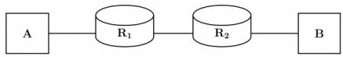

A. $T1 <   T2 <   T3$  
C. $T2 = T3, T3 < T1$

B. $T1 > T2 > T3$  
D. $T1 = T3, T3 > T2$

gatecse-2014-set2 computer-networks network-switching normal

# Answer key

# 2.24.3 Network Switching: GATE CSE 2015 | Set 3 | Question: 36

Two hosts are connected via a packet switch with $10^{7}$ bits per second links. Each link has a propagation delay of 20 microseconds. The switch begins forwarding a packet 35 microseconds after it receives the same. If 10000 bits of data are to be transmitted between the two hosts using a packet size of 5000 bits, the time elapsed between the transmission of the first bit of data and the reception of the last bit of the data in microseconds is \_\_\_\_.

gatecse-2015-set3 computer-networks normal numerical-answers network-switching

# Answer key

# 2.24.4 Network Switching: GATE IT 2004 | Question: 22

Which one of the following statements is FALSE?

A. Packet switching leads to better utilization of bandwidth resources than circuit switching


B. Packet switching results in less variation in delay than circuit switching  
C. Packet switching requires more per-packet processing than circuit switching  
D. Packet switching can lead to reordering unlike in circuit switching

gateit-2004 computer-networks network-switching normal

# Answer key

# 2.25

# Osi Model (1)

# 2.25.1 Osi Model: GATE CSE 2025 | Set 1 | Question: 6

Identify the ONE CORRECT matching between the OSI layers and their corresponding functionalities as shown.


<table><tr><td></td><td>OSI Layers</td><td></td><td>Functionalities</td></tr><tr><td>(a)</td><td>Network Layer</td><td>(I)</td><td>Packet Routing</td></tr><tr><td>(b)</td><td>Transport Layer</td><td>(II)</td><td>Framing and error handling</td></tr><tr><td>(c)</td><td>Datalink layer</td><td>(III)</td><td>Host to host communication</td></tr></table>

A. (a)-(I), (b)-(II), (c)-(III)  
C. (a)-(II), (b)-(I), (c)-(III)

B. (a)-(I), (b)-(III), (c)-(II)  
D. (a)-(III), (b)-(II), (c)-(I)

gatecse2025-set1 computer-networks osi-model easy one-mark

# Answer key

# 2.26

# Probability (1)

# 2.26.1 Probability: GATE CSE 2025 | Set 1 | Question: 46


Suppose a 5-bit message is transmitted from a source to a destination through a noisy channel. The probability that a bit of the message gets flipped during transmission is 0.01. Flipping of each bit is independent of one another. The probability that the message is delivered error-free to the destination is \_\_\_\_ (rounded off to three decimal places)

gatecse2025-set1 computer-networks probability numerical-answers easy two-marks

# Answer key

# 2.27

# Pure Aloha (1)

# 2.27.1 Pure Aloha: GATE CSE 2021 | Set 2 | Question: 54


Consider a network using the pure ALOHA medium access control protocol, where each frame is of length 1,000 bits. The channel transmission rate is 1 Mbps ( $= 10^{6}$ bits per second). The aggregate number of transmissions across all the nodes (including new frame transmissions and retransmitted frames due to coll is modelled as a Poisson process with a rate of 1,000 frames per second. Throughput is defined as the a number of frames successfully transmitted per second. The throughput of the network (rounded to the r integer) is \_\_\_\_

gatecse-2021-set2 computer-networks mac-protocol pure-aloha numerical-answers two-marks

# Answer key

# 2.28

# Routing (14)

Practice Tests: Test 1 (15Q) Test 2 (4Q)

# 2.28.1 Routing: GATE CSE 2005 | Question: 26


In a network of LANs connected by bridges, packets are sent from one LAN to another through intermediate bridges. Since more than one path may exist between two LANs, packets may have to be routed through multiple bridges. Why is the spanning tree algorithm used for bridge-routing?

A. For shortest path routing between LANs

B. For avoiding loops in the routing paths

# Answer key

# 2.28.2 Routing: GATE CSE 2014 | Set 1 | Question: 23


Consider the following three statements about link state and distance vector routing protocols, for a large network with 500 network nodes and 4000 links.

[S1]: The computational overhead in link state protocols is higher than in distance vector protocols.  
[S2]: A distance vector protocol (with split horizon) avoids persistent routing loops, but not a link state protocol.  
[S3]: After a topology change, a link state protocol will converge faster than a distance vector protocol.

Which one of the following is correct about S1, S2, and S3?

A. $S1, S2$ , and $S3$ are all true.  
C. S1 and S2 are true, but S3 is false.

gatecse-2014-set1 computer-networks routing normal

B. $S1, S2$ , and $S3$ are all false.  
D. $S1$ and $S3$ are true, but $S2$ is false.

# Answer key

# 2.28.3 Routing: GATE CSE 2014 | Set 2 | Question: 23

Which of the following is TRUE about the interior gateway routing protocols — Routing Information Protocol (RIP) and Open Shortest Path First (OSPF)


A. RIP uses distance vector routing and OSPF uses link state routing  
B. OSPF uses distance vector routing and RIP uses link state routing  
C. Both RIP and OSPF use link state routing  
D. Both RIP and OSPF use distance vector routing

gatecse-2014-set2 computer-networks routing easy

# Answer key

# 2.28.4 Routing: GATE CSE 2014 | Set 3 | Question: 26

An IP router implementing Classless Inter-domain Routing (CIDR) receives a packet with address 131.23.151.76. The router's routing table has the following entries:


<table><tr><td>Prefix</td><td>Outer Interface Identifier</td></tr><tr><td>131.16.0.0/12</td><td>3</td></tr><tr><td>131.28.0.0/14</td><td>5</td></tr><tr><td>131.19.0.0/16</td><td>2</td></tr><tr><td>131.22.0.0/15</td><td>1</td></tr></table>

The identifier of the output interface on which this packet will be forwarded is \_\_\_\_.

gatecse-2014-set3 computer-networks routing normal numerical-answers

# Answer key

# 2.28.5 Routing: GATE CSE 2017 | Set 2 | Question: 09

Consider the following statements about the routing protocols. Routing Information Protocol (RIP) and Open Shortest Path First (OSPF) in an IPv4 network.


I. RIP uses distance vector routing  
II. RIP packets are sent using UDP  
III. OSPF packets are sent using TCP  
IV. OSPF operation is based on link-state routing

Which of the above statements are CORRECT?

A. I and IV only

B. I, II and III only

C. I, II and IV only

D. II, III and IV only

gatecse-2017-set2 computer-networks routing

Answer key

# 2.28.6 Routing: GATE CSE 2020 | Question: 15

Consider the following statements about the functionality of an IP based router.


I. A router does not modify the IP packets during forwarding.  
II. It is not necessary for a router to implement any routing protocol.  
III. A router should reassemble IP fragments if the MTU of the outgoing link is larger than the size of the incoming IP packet.

Which of the above statements is/are TRUE?

A. I and II only

B. I only

C. II and III only

D. II only

gatecse-2020 computer-networks routing one-mark

Answer key

# 2.28.7 Routing: GATE CSE 2023 | Question: 15

Which of the following statements is/are INCORRECT about the OSPF (Open Shortest Path First) routing protocol used in the Internet?


A. OSPF implements Bellman-Ford algorithm to find shortest paths.  
B. OSPF uses Dijkstra's shortest path algorithm to implement least-cost path routing.  
C. OSPF is used as an inter-domain routing protocol.  
D. OSPF implements hierarchical routing.

gatecse-2023 computer-networks routing multiple-selects one-mark

Answer key

# 2.28.8 Routing: GATE CSE 2024 | Set 1 | Question: 26


Consider a network path P - Q - R between nodes P and R via router Q. Node P sends a file of size $10^{6}$ bytes to R via this path by splitting the file into chunks of $10^{3}$ bytes each. Node P sends these chunks one after the other without any wait time between the successive chunk transmissions. Assume that the size of extra headers added to these chunks is negligible, and that the chunk size is less than the MTU.

Each of the links P - Q and Q - R has a bandwidth of $10^{6}$ bits/sec, and negligible propagation latency. Router Q immediately transmits every packet it receives from P to R, with negligible processing and queueing delays. Router Q can simultaneously receive on link P - Q and transmit on link Q - R.

Assume P starts transmitting the chunks at time t = 0.

Which one of the following options gives the time (in seconds, rounded off to 3 decimal places) at which R receives all the chunks of the file?

A. 8.000

B. 8.008

C. 15.992

D. 16.000

gatecse-2024-set1 computer-networks routing two-marks

Answer key

# 2.28.9 Routing: GATE CSE 2024 | Set 1 | Question: 48


Consider the entries shown below in the forwarding table of an IP router. Each entry consists of an IP prefix and the corresponding next hop router for packets whose destination IP address matches the prefix. The notation "/N" in a prefix indicates a subnet mask with the most significant N bits set to 1.

<table><tr><td>Prefix</td><td>Next hop router</td></tr><tr><td>10.1.1.0 / 24</td><td>R1</td></tr><tr><td>10.1.1.128 / 25</td><td>R2</td></tr><tr><td>10.1.1.64 / 26</td><td>R3</td></tr><tr><td>10.1.1.192 / 26</td><td>R4</td></tr></table>

This router forwards 20 packets each to 5 hosts. The IP addresses of the hosts are 10.1.1.16, 10.1.1.72, 10.1.1.132, 10.1.1.191, and 10.1.1.205. The number of packets forwarded via the next hop router R2 is \_\_\_\_.

gatecse-2024-set1 numerical-answers computer-networks routing two-marks

# Answer key

# 2.28.10 Routing: GATE CSE 2026 | Set 2 | Question: 11

Consider a file of size 4 million bytes being transferred between two hosts connected via a path consisting of three consecutive links of bandwidth 2 Mbps, 500 kbps, and 1 Mbps, respectively. All processing delays and propagation delays are negligible. Assume that there is no other background traffic over the path and no other additional overhead to transfer the file.

Which one of the following is the total time (in seconds) to transfer the file?

Note: $1\mathrm{M} = 10^{6}, 1\mathrm{k} = 10^{3}$

A. 731

B. 64

C. 8

D. 16

gatecse-2026-set2 computer-networks routing one-mark

# Answer key

# 2.28.11 Routing: GATE IT 2005 | Question: 85a

Consider a simple graph with unit edge costs. Each node in the graph represents a router. Each node maintains a routing table indicating the next hop router to be used to relay a packet to its destination and the cost of the path to the destination through that router. Initially, the routing table is empty. The routing table is synchronously updated as follows. In each updated interval, three tasks are performed.

i. A node determines whether its neighbours in the graph are accessible. If so, it sets the tentative cost to each accessible neighbour as 1. Otherwise, the cost is set to $\infty$ .  
ii. From each accessible neighbour, it gets the costs to relay to other nodes via that neighbour (as the next hop).  
iii. Each node updates its routing table based on the information received in the previous two steps by choosing the minimum cost.


<details>
<summary>flowchart</summary>

```mermaid
graph TD
  A["A"] --> B["B"]
  B --> C["C"]
  C --> D["D"]
  D --> E["E"]
  E --> D
  D --> F["F"]
```
</details>

For the graph given above, possible routing tables for various nodes after they have stabilized, are shown in the following options. Identify the correct table.


A.

<table><tr><td>A</td><td>-</td><td>-</td></tr><tr><td>B</td><td>B</td><td>1</td></tr><tr><td>C</td><td>C</td><td>1</td></tr><tr><td>D</td><td>B</td><td>3</td></tr><tr><td>E</td><td>C</td><td>3</td></tr><tr><td>F</td><td>C</td><td>4</td></tr></table>

gateit-2005 computer-networks routing normal

B.

<table><tr><td>A</td><td>A</td><td>1</td></tr><tr><td>B</td><td>B</td><td>1</td></tr><tr><td>C</td><td>-</td><td>-</td></tr><tr><td>D</td><td>D</td><td>1</td></tr><tr><td>E</td><td>E</td><td>1</td></tr><tr><td>F</td><td>E</td><td>3</td></tr></table>

C.

<table><tr><td colspan="3">Table for node B</td></tr><tr><td>A</td><td>A</td><td>1</td></tr><tr><td>B</td><td>-</td><td>-</td></tr><tr><td>C</td><td>C</td><td>1</td></tr><tr><td>D</td><td>D</td><td>1</td></tr><tr><td>E</td><td>C</td><td>2</td></tr><tr><td>F</td><td>D</td><td>2</td></tr></table>

D.

<table><tr><td colspan="3">Table for node D</td></tr><tr><td>A</td><td>B</td><td>3</td></tr><tr><td>B</td><td>B</td><td>1</td></tr><tr><td>C</td><td>C</td><td>1</td></tr><tr><td>D</td><td>-</td><td>-</td></tr><tr><td>E</td><td>E</td><td>1</td></tr><tr><td>F</td><td>F</td><td>1</td></tr></table>

# Answer key

# 2.28.12 Routing: GATE IT 2005 | Question: 85b


Consider a simple graph with unit edge costs. Each node in the graph represents a router. Each node maintains a routing table indicating the next hop router to be used to relay a packet to its destination and the cost of the path to the destination through that router. Initially, the routing table is empty. The routing table is synchronously updated as follows. In each updated interval, three tasks are performed.

i. A node determines whether its neighbors in the graph are accessible. If so, it sets the tentative cost to each accessible neighbor as 1. Otherwise, the cost is set to $\infty$ .  
ii. From each accessible neighbor, it gets the costs to relay to other nodes via that neighbor (as the next hop).  
iii. Each node updates its routing table based on the information received in the previous two steps by choosing the minimum cost.


<details>
<summary>flowchart</summary>

```mermaid
graph TD
  A["A"] --> B["B"]
  B --> C["C"]
  C --> D["D"]
  D --> E["E"]
  E --> D
  D --> F["F"]
```
</details>

Continuing from the earlier problem, suppose at some time t, when the costs have stabilized, node A goes down. The cost from node F to node A at time $(t + 100)$ is :

A. >100 but finite

B. $\infty$

C. 3

D. $>3$ and $\leq 100$

gateit-2005 computer-networks routing normal

# Answer key

# 2.28.13 Routing: GATE IT 2007 | Question: 63


A group of 15 routers is interconnected in a centralized complete binary tree with a router at each tree node. Router i communicates with router j by sending a message to the root of the tree. The root then sends the message back down to router j. The mean number of hops per message, assuming all possible router pairs are equally likely is

A. 3

B. 4.26

C. 4.53

D. 5.26

gateit-2007 computer-networks routing binary-tree normal

# Answer key

# 2.28.14 Routing: GATE IT 2008 | Question: 67


Two popular routing algorithms are Distance Vector(DV) and Link State (LS) routing. Which of the following are true?

(S1): Count to infinity is a problem only with DV and not LS routing  
(S2): In LS, the shortest path algorithm is run only at one node  
(S3): In DV, the shortest path algorithm is run only at one node  
(S4): DV requires lesser number of network messages than LS

A. S1, S2 and S4 only

B. S1, S3 and S4 only

C. S2 and S3 only

D. S1 and S4 only

gateit-2008 computer-networks routing normal

# Answer key

# 2.29

# Routing Protocols (1)

# 2.29.1 Routing Protocols: GATE CSE 2025 | Set 2 | Question: 7

Consider the routing protocols given in List I and the names given in List II:

<table><tr><td colspan="2">List I</td><td colspan="2">List II</td></tr><tr><td>(i)</td><td>Distance Vector routing</td><td>(a)</td><td>Bellman-Ford</td></tr><tr><td>(ii)</td><td>Link state routing</td><td>(b)</td><td>Dijkstra</td></tr></table>


For matching of items in List I with those in List II, which ONE of the following options is CORRECT?

A. (i) - (a) and (ii) - (b)  
C. (i) - (b) and (ii) - (a)

B. (i) - (a) and (ii) - (a)  
D. (i) - (b) and (ii) - (b)

gatecse2025-set2 computer-networks match-the-following routing-protocols easy one-mark

# Answer key

# 2.30

# Sliding Window (16)

Practice Tests: Test 1 (15Q) Test 2 (11Q)

# 2.30.1 Sliding Window: GATE CSE 2003 | Question: 84


Host A is sending data to host B over a full duplex link. A and B are using the sliding window protocol for flow control. The send and receive window sizes are 5 packets each. Data packets (sent only from A to B) are all 1000 bytes long and the transmission time for such a packet is 50 $\mu$ s. Acknowledgment packets (sent only from B to A) are very small and require negligible transmission time. The propagation delay over the link is 200 $\mu$ s. What is the maximum achievable throughput in this communication?

A. $7.69 \times 10^{6}$ Bps  
C. $12.33 \times 10^{6}$ Bps  
gatecse-2003 computer-networks sliding-window normal

B. $11.11 \times 10^{6}$ Bps

D. $15.00 \times 10^{6}$ Bps

# Answer key

# 2.30.2 Sliding Window: GATE CSE 2005 | Question: 25


The maximum window size for data transmission using the selective reject protocol with n-bit frame sequence numbers is:

A. $2^{n}$

B. $2^{n - 1}$

C. $2^{n} - 1$

D. $2^{n - 2}$

gatecse-2005 computer-networks sliding-window easy

# Answer key

# 2.30.3 Sliding Window: GATE CSE 2006 | Question: 44


Station A uses 32 byte packets to transmit messages to Station B using a sliding window protocol. The round trip delay between A and B is 80 milliseconds and the bottleneck bandwidth on the path between A and B is 128 kbps. What is the optimal window size that A should use?

A. 20

B. 40

C. 160

D. 320

gatecse-2006 computer-networks sliding-window normal

# Answer key

# 2.30.4 Sliding Window: GATE CSE 2006 | Question: 46


Station A needs to send a message consisting of 9 packets to Station B using a sliding window (window size 3) and go-back-n error control strategy. All packets are ready and immediately available for transmission. If every 5th packet that A transmits gets lost (but no acks from B ever get lost), then what number of packets that A will transmit for sending the message to B?

A. 12

B. 14

C. 16

D. 18

gatecse-2006 computer-networks sliding-window normal

# Answer key

# 2.30.5 Sliding Window: GATE CSE 2007 | Question: 69


The distance between two stations M and N is L kilometers. All frames are K bits long. The propagation delay per kilometer is t seconds. Let R bits/second be the channel capacity. Assuming that the processing delay is negligible, the minimum number of bits for the sequence number field in a frame for maximum utilization, when the sliding window protocol is used, is:

A. $\lceil \log_2\frac{2LtR + 2K}{K}\rceil$

B. $\lceil \log_2\frac{2LtR}{K}\rceil$

C. $\lceil \log_2\frac{2LtR + K}{K}\rceil$

D. $\lceil \log_2\frac{2LtR + 2K}{2K}\rceil$

gatecse-2007 computer-networks sliding-window normal

# Answer key

# 2.30.6 Sliding Window: GATE CSE 2009 | Question: 57, ISRO2016-75


Frames of 1000 bits are sent over a $10^{6}$ bps duplex link between two hosts. The propagation time is 25 ms. Frames are to be transmitted into this link to maximally pack them in transit (within the link).

What is the minimum number of bits $(I)$ that will be required to represent the sequence numbers distinctly? Assume that no time gap needs to be given between transmission of two frames.

A. I = 2

B. $I = 3$

C. I = 4

D. I = 5

gatecse-2009 computer-networks sliding-window normal isro2016

# Answer key

# 2.30.7 Sliding Window: GATE CSE 2009 | Question: 58


Frames of 1000 bits are sent over a $10^{6}$ bps duplex link between two hosts. The propagation time is 25ms. Frames are to be transmitted into this link to maximally pack them in transit (within the link).

Let $I$ be the minimum number of bits $(I)$ that will be required to represent the sequence numbers distinctly assuming that no time gap needs to be given between transmission of two frames.

Suppose that the sliding window protocol is used with the sender window size of $2^{I}$ , where I is the numbers of bits as mentioned earlier and acknowledgements are always piggy backed. After sending $2^{I}$ frames, what is the minimum time the sender will have to wait before starting transmission of the next frame? (Identify the closest choice ignoring the frame processing time)

A. 16ms

B. 18ms

C. 20ms

D. 22ms

gatecse-2009 computer-networks sliding-window normal

# Answer key

# 2.30.8 Sliding Window: GATE CSE 2014 | Set 1 | Question: 28


Consider a selective repeat sliding window protocol that uses a frame size of 1 KB to send data on a 1.5 Mbps link with a one-way latency of 50 msec. To achieve a link utilization of 60%, the minimum number of bits required to represent the sequence number field is \_\_\_\_.

gatecse-2014-set1 computer-networks sliding-window numerical-answers normal

# Answer key

# 2.30.9 Sliding Window: GATE CSE 2015 | Set 3 | Question: 28


Consider a network connecting two systems located 8000 Km apart. The bandwidth of the network is $500 \times 10^{6}$ bits per second. The propagation speed of the media is $4 \times 10^{6}$ meters per second. It needs to

design a Go-Back- $N$ sliding window protocol for this network. The average packet size is $10^{7}$ bits. The network is to be used to its full capacity. Assume that processing delays at nodes are negligible. Then, the minimum size in bits of the sequence number field has to be \_\_\_\_.

gatecse-2015-set3 computer-networks sliding-window normal numerical-answers

Answer key

# 2.30.10 Sliding Window: GATE CSE 2016 | Set 2 | Question: 55


Consider a $128 \times 10^{3}$ bits/second satellite communication link with one way propagation delay of 150 milliseconds. Selective retransmission (repeat) protocol is used on this link to send data with a frame size of 1 kilobyte. Neglect the transmission time of acknowledgement. The minimum number of bits required sequence number field to achieve 100% utilization is \_\_\_\_.

gatecse-2016-set2 computer-networks sliding-window normal numerical-answers

Answer key

# 2.30.11 Sliding Window: GATE CSE 2026 | Set 1 | Question: 35


Consider the implementation of sliding window protocol over a lossless link, with a window size of W frames, where each frame is of size 1000 bits (including header). The bandwidth of the link is

100kbps $(1k = 10^{3})$ and the one-way propagation delay is 100 milliseconds. Assume that processing times at the sender and receiver are zero and the transmission time of acknowledgements is also zero. Which one of the following options gives the minimum size of W (in number of frames) required to achieve 100% link utilization?

A. 10

B. 21

C. 20

D. 11

gatecse-2026-set1 two-marks sliding-window computer-networks

Answer key

# 2.30.12 Sliding Window: GATE IT 2004 | Question: 81


In a sliding window ARQ scheme, the transmitter's window size is N and the receiver's window size is M. The minimum number of distinct sequence numbers required to ensure correct operation of the ARQ scheme is

A. $\min(M,N)$

B. $\max (M,N)$

C. $M + N$

D. $MN$

gateit-2004 computer-networks sliding-window normal

Answer key

# 2.30.13 Sliding Window: GATE IT 2004 | Question: 83


A 20 Kbps satellite link has a propagation delay of 400 ms. The transmitter employs the "go back n ARQ" scheme with n set to 10. Assuming that each frame is 100 byte long, what is the maximum data rate possible?

A. 5 Kbps

B. 10 Kbps

C. 15 Kbps

D. 20 Kbps

gateit-2004 computer-networks sliding-window normal

Answer key

# 2.30.14 Sliding Window: GATE IT 2004 | Question: 88


Suppose that the maximum transmit window size for a TCP connection is 12000 bytes. Each packet consists of 2000 bytes. At some point in time, the connection is in slow-start phase with a current transmit window of 4000 bytes. Subsequently, the transmitter receives two acknowledgments. Assume that no packet lost and there are no time-outs. What is the maximum possible value of the current transmit window?

A. 4000 bytes

B. 8000 bytes

c. 10000 bytes

D. 12000 bytes

gateit-2004 computer-networks sliding-window normal

# Answer key

# 2.30.15 Sliding Window: GATE IT 2006 | Question: 64

Suppose that it takes 1 unit of time to transmit a packet (of fixed size) on a communication link. The link layer uses a window flow control protocol with a window size of $N$ packets. Each packet causes an ack or a

nak to be generated by the receiver, and ack/nak transmission times are negligible. Further, the round trip time on the link is equal to N units. Consider time i > N. If only acks have been received till time i(no naks), then the goodput evaluated at the transmitter at time i(in packets per unit time) is

A. $1 - \frac{N}{i}$

B. $\frac{i}{(N+i)}$

C. 1

D. $1 - e^{\left(\frac{i}{N}\right)}$

gateit-2006 computer-networks sliding-window normal

# Answer key

# 2.30.16 Sliding Window: GATE IT 2008 | Question: 64

A 1 Mbps satellite link connects two ground stations. The altitude of the satellite is 36,504 km and speed of the signal is $3 \times 10^{8}$ m/s. What should be the packet size for a channel utilization of 25% for a satellite link using go-back-127 sliding window protocol? Assume that the acknowledgment packets are negligible and that there are no errors during communication.


A. 120 bytes

B. 60 bytes

C. 240 bytes

D. 90 bytes

gateit-2008 computer-networks sliding-window normal

# Answer key

# 2.31

# Slotted Aloha (1)

# 2.31.1 Slotted Aloha: GATE CSE 2015 | Set 1 | Question: 29

Consider a LAN with four nodes $S_{1}, S_{2}, S_{3}$ , and $S_{4}$ . Time is divided into fixed-size slots, and a node can begin its transmission only at the beginning of a slot. A collision is said to have occurred if more than one

node transmits in the same slot. The probabilities of generation of a frame in a time slot by $S_{1}, S_{2}, S_{3}$ , and $S_{4}$ are 0.1, 0.2, 0.3 and 0.4 respectively. The probability of sending a frame in the first slot without any collision by any of these four stations is \_\_\_\_.

gatecse-2015-set1 computer-networks normal numerical-answers slotted-aloha

# Answer key

# 2.32

# Sockets (4)

# 2.32.1 Sockets: GATE CSE 2008 | Question: 17

Which of the following system calls results in the sending of SYN packets?


A. socket

B. bind

C. listen

D. connect

gatecse-2008 normal computer-networks sockets

# Answer key

# 2.32.2 Sockets: GATE CSE 2008 | Question: 59

A client process P needs to make a TCP connection to a server process S. Consider the following situation: the server process S executes a socket(), a bind() and a listen() system call in that order, following which

it is preempted. Subsequently, the client process P executes a socket() system call followed by connect() system call to connect to the server process S. The server process has not executed any accept() system call. Which one


of the following events could take place?

A. connect() system call returns successfully  
B. connect() system call blocks  
C. connect() system call returns an error  
D. connect() system call results in a core dump

gatecse-2008 computer-networks sockets normal

# Answer key

# 2.32.3 Sockets: GATE CSE 2014 | Set 2 | Question: 24

Which of the following socket API functions converts an unconnected active TCP socket into a passive socket?


A. connect

B. bind

C. listen

D. accept

gatecse-2014-set2 computer-networks sockets easy

# Answer key

# 2.32.4 Sockets: GATE CSE 2015 | Set 2 | Question: 20

Identify the correct order in which a server process must invoke the function calls accept, bind, listen, and recv according to UNIX socket API.


A. listen, accept, bind, recv

B. bind, listen, accept, recv

C. bind, accept, listen, recv

D. accept, listen, bind, recv

gatecse-2015-set2 computer-networks sockets easy

# Answer key

# 2.33

# Stop and Wait (6)

# Practice Test: Test 1 (13Q)

# 2.33.1 Stop and Wait: GATE CSE 2015 | Set 1 | Question: 53


Suppose that the stop-and-wait protocol is used on a link with a bit rate of 64 kilobits per second and 20 milliseconds propagation delay. Assume that the transmission time for the acknowledgment and the processing time at nodes are negligible. Then the minimum frame size in bytes to achieve a link utilization of at least 50 % is \_\_\_\_.

gatecse-2015-set1 computer-networks stop-and-wait normal numerical-answers

# Answer key

# 2.33.2 Stop and Wait: GATE CSE 2016 | Set 1 | Question: 55


A sender uses the Stop-and-Wait ARQ protocol for reliable transmission of frames. Frames are of size 1000 bytes and the transmission rate at the sender is 80 Kbps(1Kbps = 1000 bits/second). Size of an acknowledgment is 100 bytes and the transmission rate at the receiver is 8 Kbps. The one-way propagation delay is 100 milliseconds.

Assuming no frame is lost, the sender throughput is \_\_\_\_ bytes/second.

gatecse-2016-set1 computer-networks stop-and-wait normal numerical-answers

# Answer key

# 2.33.3 Stop and Wait: GATE CSE 2017 | Set 1 | Question: 45

The values of parameters for the Stop-and-Wait ARQ protocol are as given below:


- Bit rate of the transmission channel = 1 Mbps.  
- Propagation delay from sender to receiver = 0.75 ms.

• Time to process a frame = 0.25 ms.  
- Number of bytes in the information frame = 1980.  
- Number of bytes in the acknowledge frame = 20.  
- Number of overhead bytes in the information frame = 20.

Assume there are no transmission errors. Then, the transmission efficiency (expressed in percentage) of the Stop-and-Wait ARQ protocol for the above parameters is \_\_\_\_ (correct to 2 decimal places).

gatecse-2017-set1 computer-networks stop-and-wait numerical-answers normal

Answer key

# 2.33.4 Stop and Wait: GATE CSE 2023 | Question: 7


Suppose two hosts are connected by a point-to-point link and they are configured to use Stop-and-Wait protocol for reliable data transfer. Identify in which one of the following scenarios, the utilization of the link is the lowest.

A. Longer link length and lower transmission rate  
B. Longer link length and higher transmission rate  
C. Shorter link length and lower transmission rate  
D. Shorter link length and higher transmission rate

gatecse-2023 computer-networks stop-and-wait one-mark

Answer key

# 2.33.5 Stop and Wait: GATE IT 2005 | Question: 72


A channel has a bit rate of 4 kbps and one-way propagation delay of 20 ms. The channel uses stop and wait protocol. The transmission time of the acknowledgment frame is negligible. To get a channel efficiency of at least 50%, the minimum frame size should be

A. 80 bytes

B. 80 bits

C. 160 bytes

D. 160 bits

gateit-2005 computer-networks stop-and-wait normal

Answer key

# 2.33.6 Stop and Wait: GATE IT 2006 | Question: 68


On a wireless link, the probability of packet error is 0.2. A stop-and-wait protocol is used to transfer data across the link. The channel condition is assumed to be independent of transmission to transmission. What is the average number of transmission attempts required to transfer 100 packets?

A. 100

B. 125

C. 150

D. 200

gateit-2006 computer-networks sliding-window stop-and-wait normal

Answer key

2.34

# Subnetting (21)

Practice Tests: Test 1 (15Q) Test 2 (13Q)

# 2.34.1 Subnetting: GATE CSE 2003 | Question: 82, ISRO2009-1


The subnet mask for a particular network is 255.255.31.0. Which of the following pairs of IP addresses could belong to this network?

A. 172.57.88.62 and 172.56.87.23  
C. 191.203.31.87 and 191.234.31.88

B. 10.35.28.2 and 10.35.29.4  
D. 128.8.129.43 and 128.8.161.55

gatecse-2003 computer-networks subnetting normal isro2009

Answer key

The routing table of a router is shown below:

<table><tr><td>Destination</td><td>Subnet Mask</td><td>Interface</td></tr><tr><td>128.75.43.0</td><td>255.255.255.0</td><td>Eth0</td></tr><tr><td>128.75.43.0</td><td>255.255.255.128</td><td>Eth1</td></tr><tr><td>192.12.17.5</td><td>255.255.255.255</td><td>Eth3</td></tr><tr><td>Default</td><td></td><td>Eth2</td></tr></table>

On which interface will the router forward packets addressed to destinations 128.75.43.16 and 192.12.17.10 respectively?

A. Eth1 and Eth2

B. Eth0 and Eth2

C. Eth0 and Eth3

D. Eth1 and Eth3

gatecse-2004 computer-networks subnetting normal

Answer key

# 2.34.3 Subnetting: GATE CSE 2005 | Question: 27


An organization has a class $B$ network and wishes to form subnets for 64 departments. The subnet mask would be:

A. 255.255.0.0

B. 255.255.64.0

C. 255.255.128.0

D. 255.255.252.0

gatecse-2005 computer-networks subnetting normal

Answer key

# 2.34.4 Subnetting: GATE CSE 2006 | Question: 45


Two computers C1 and C2 are configured as follows. C1 has IP address 203.197.2.53 and netmask 255.255.128.0. C2 has IP address 203.197.75.201 and netmask 255.255.192.0. Which one of the following statements is true?

A. C1 and C2 both assume they are on the same network  
B. $C2$ assumes $C1$ is on same network, but $C1$ assumes $C2$ is on a different network  
C. $C1$ assumes $C2$ is on same network, but $C2$ assumes $C1$ is on a different network  
D. C1 and C2 both assume they are on different networks.

gatecse-2006 computer-networks subnetting normal

Answer key

# 2.34.5 Subnetting: GATE CSE 2007 | Question: 67, ISRO2016-72


The address of a class B host is to be split into subnets with a 6-bit subnet number. What is the maximum number of subnets and the maximum number of hosts in each subnet?

A. 62 subnets and 262142 hosts.

B. 64 subnets and 262142 hosts.

C. 62 subnets and 1022 hosts.

D. 64 subnets and 1024 hosts.

gatecse-2007 computer-networks subnetting easy isro2016

Answer key

# 2.34.6 Subnetting: GATE CSE 2008 | Question: 57


If a class $B$ network on the Internet has a subnet mask of 255.255.248.0, what is the maximum number of hosts per subnet?

A. 1022

B. 1023

C. 2046

D. 2047

# 2.34.7 Subnetting: GATE CSE 2010 | Question: 47


Suppose computers A and B have IP addresses 10.105.1.113 and 10.105.1.91 respectively and they both use same netmask N. Which of the values of N given below should not be used if A and B should belong to the same network?

A. 255.255.255.0

B. 255.255.255.128

C. 255.255.255.192

D. 255.255.255.224

gatecse-2010 computer-networks subnetting easy

# Answer key

# 2.34.8 Subnetting: GATE CSE 2012 | Question: 34, ISRO-DEC2017-32


An Internet Service Provider (ISP) has the following chunk of CIDR-based IP addresses available with it: 245.248.128.0/20. The ISP wants to give half of this chunk of addresses to Organization A, and a quarter to Organization B, while retaining the remaining with itself. Which of the following is a valid allocation of addresses to A and B?

A. 245.248.136.0/21 and 245.248.128.0/22  
B. 245.248.128.0/21 and 245.248.128.0/22  
C. 245.248.132.0/22 and 245.248.132.0/21  
D. 245.248.136.0/24 and 245.248.132.0/21

gatecse-2012 computer-networks subnetting normal isrodec2017

# Answer key

# 2.34.9 Subnetting: GATE CSE 2015 | Set 2 | Question: 41

Consider the following routing table at an IP router:

<table><tr><td>Network No</td><td>Net Mask</td><td>Next Hop</td></tr><tr><td>128.96.170.0</td><td>255.255.254.0</td><td>Interface 0</td></tr><tr><td>128.96.168.0</td><td>255.255.254.0</td><td>Interface 1</td></tr><tr><td>128.96.166.0</td><td>255.255.254.0</td><td>R2</td></tr><tr><td>128.96.164.0</td><td>255.255.252.0</td><td>R3</td></tr><tr><td>0.0.0.0</td><td>Default</td><td>R4</td></tr></table>


For each IP address in Group I Identify the correct choice of the next hop from Group II using the entries from the routing table above.

<table><tr><td>Group I</td><td>Group II</td></tr><tr><td>i) 128.96.171.92</td><td>a) Interface 0</td></tr><tr><td>ii) 128.96.167.151</td><td>b) Interface 1</td></tr><tr><td>iii) 128.96.163.151</td><td>c) R2</td></tr><tr><td>iv) 128.96.164.121</td><td>d) R3</td></tr><tr><td></td><td>e) R4</td></tr></table>

A. i-a, ii-c, iii-e, iv-d

B. i-a, ii-d, iii-b, iv-e

C. i-b, ii-c, iii-d, iv-e

D. i-b, ii-c, iii-e, iv-d

gatecse-2015-set2 computer-networks subnetting easy

# Answer key

# 2.34.10 Subnetting: GATE CSE 2015 | Set 3 | Question: 38


In the network 200.10.11.144/27, the fourth octet (in decimal) of the last IP address of the network which can be assigned to a host is \_\_\_\_.

gatecse-2015-set3 computer-networks subnetting normal numerical-answers

# Answer key

# 2.34.11 Subnetting: GATE CSE 2019 | Question: 28


Consider three machines M, N, and P with IP addresses 100.10.5.2, 100.10.5.5, and 100.10.5.6 respectively. The subnet mask is set to 255.255.255.252 for all the three machines. Which one of the following is true?

A. M, N, and P all belong to the same subnet  
C. Only N and P belong to the same subnet

B. Only M and N belong to the same subnet  
D. M, N, and P belong to three different subnets

gatecse-2019 computer-networks subnetting two-marks

# Answer key

# 2.34.12 Subnetting: GATE CSE 2020 | Question: 38


An organization requires a range of IP address to assign one to each of its 1500 computers. The organization has approached an Internet Service Provider (ISP) for this task. The ISP uses CIDR and serves the requests from the available IP address space 202.61.0.0/17. The ISP wants to assign an address space to the organization which will minimize the number of routing entries in the ISP's router using route aggregation. Which of the following address spaces are potential candidates from which the ISP can allot any one of the organization?

1. 202.61.84.0/21  
II. 202.61.104.0/21  
III. 202.61.64.0/21  
IV. 202.61.144.0/21

A. I and II only

B. II and III only

C. III and IV only

D. I and IV only

gatecse-2020 computer-networks subnetting two-marks

# Answer key

# 2.34.13 Subnetting: GATE CSE 2022 | Question: 45

Consider routing table of an organization's router shown below:

<table><tr><td>Subnet Number</td><td>Subnet Mask</td><td>Next Hop</td></tr><tr><td>12.20.164.0</td><td>255.255.252.0</td><td>R1</td></tr><tr><td>12.20.170.0</td><td>255.255.254.0</td><td>R2</td></tr><tr><td>12.20.168.0</td><td>255.255.254.0</td><td>Interface 0</td></tr><tr><td>12.20.166.0</td><td>255.255.254.0</td><td>Interface 1</td></tr><tr><td>default</td><td></td><td>R3</td></tr></table>


Which of the following prefixes in CIDR notation can be collectively used to correctly aggregate all of the subnets in the routing table?

A. 12.20.164.0/20  
C. 12.20.164.0/21

B. 12.20.164.0/22  
D. 12.20.168.0/22

gatecse-2022 computer-networks subnetting multiple-selects two-marks

# Answer key

The forwarding table of a router is shown below.

<table><tr><td>Subnet Number</td><td>Subnet Mask</td><td>Interface ID</td></tr><tr><td>200.150.0.0</td><td>255.255.0.0</td><td>1</td></tr><tr><td>200.150.64.0</td><td>255.255.224.0</td><td>2</td></tr><tr><td>200.150.68.0</td><td>255.255.255.0</td><td>3</td></tr><tr><td>200.150.68.64</td><td>255.255.255.224</td><td>4</td></tr><tr><td>Default</td><td></td><td>0</td></tr></table>

A packet addressed to a destination address 200.150.68.118 arrives at the router. It will be forwarded to the interface with ID \_\_\_\_.

gatecse-2023 computer-networks subnetting numerical-answers two-marks

Answer key

# 2.34.15 Subnetting: GATE CSE 2025 | Set 1 | Question: 30


A packet with the destination IP address 145.36.109.70 arrives at a router whose routing table is shown. Which interface will the packet be forwarded to?

<table><tr><td>Subnet Address</td><td>Subnet Mask ( in CIDR notation)</td><td>Interface</td></tr><tr><td>145.36.0.0</td><td>/16</td><td>E1</td></tr><tr><td>145.36.128.0</td><td>/17</td><td>E2</td></tr><tr><td>145.36.64.0</td><td>/18</td><td>E3</td></tr><tr><td>145.36.255.0</td><td>/24</td><td>E4</td></tr><tr><td>Default</td><td>-</td><td>E5</td></tr></table>

A. E3

B. E1

C. E2

D. E5

gatecse2025-set1 computer-networks subnetting two-marks

Answer key

# 2.34.16 Subnetting: GATE IT 2004 | Question: 26


A subnet has been assigned a subnet mask of 255.255.255.192. What is the maximum number of hosts that can belong to this subnet?

A. 14

B. 30

C. 62

D. 126

gateit-2004 computer-networks subnetting normal

Answer key

# 2.34.17 Subnetting: GATE IT 2005 | Question: 76


A company has a class C network address of 204.204.204.0. It wishes to have three subnets, one with 100 hosts and two with 50 hosts each. Which one of the following options represents a feasible set of subnet address/subnet mask pairs?

A. 204.204.204.128/255.255.255.192

204.204.204.0/255.255.255.128

204.204.204.64/255.255.255.128

B. 204.204.204.0/255.255.255.192

204.204.204.192/255.255.255.128

204.204.204.64/255.255.255.128

C. 204.204.204.128/255.255.255.128

204.204.204.192/255.255.255.192

204.204.204.224/255.255.255.192

D. 204.204.204.128/255.255.255.128

204.204.204.64/255.255.255.192

204.204.204.0/255.255.255.192

gateit-2005 computer-networks subnetting normal

# Answer key

# 2.34.18 Subnetting: GATE IT 2006 | Question: 63, ISRO2015-57

A router uses the following routing table:

<table><tr><td>Destination</td><td>Mask</td><td>Interface</td></tr><tr><td>144.16.0.0</td><td>255.255.0.0</td><td>eth0</td></tr><tr><td>144.16.64.0</td><td>255.255.224.0</td><td>eth1</td></tr><tr><td>144.16.68.0</td><td>255.255.255.0</td><td>eth2</td></tr><tr><td>144.16.68.64</td><td>255.255.255.224</td><td>eth3</td></tr></table>


Packet bearing a destination address 144.16.68.117 arrives at the router. On which interface will it be forwarded?

A. eth0

B. eth1

C. eth2

D. eth3

gateit-2006 computer-networks subnetting normal isro2015

# Answer key

# 2.34.19 Subnetting: GATE IT 2006 | Question: 70

A subnetted Class B network has the following broadcast address: 144.16.95.255 Its subnet mask

A. is necessarily 255.255.224.0  
B. is necessarily 255.255.240.0  
C. is necessarily 255.255.248.0  
D. could be any one of 255.255.224.0, 255.255.240.0, 255.255.248.0

gateit-2006 computer-networks subnetting normal

# Answer key

# 2.34.20 Subnetting: GATE IT 2008 | Question: 84

Host $X$ has IP address 192.168.1.97 and is connected through two routers $R1$ and $R2$ to another host $Y$ with IP address 192.168.1.80. Router $R1$ has IP addresses 192.168.1.135 and 192.168.1.110. $R2$ has IP addresses 192.168.1.67 and 192.168.1.155. The netmask used in the network is 255.255.255.224.

Given the information above, how many distinct subnets are guaranteed to already exist in the network?

A. 1

B. 2

C. 3

D. 6

gateit-2008 computer-networks subnetting normal

# Answer key

# 2.34.21 Subnetting: GATE IT 2008 | Question: 85

Host $X$ has $IP$ address 192.168.1.97 and is connected through two routers $R1$ and $R2$ to another host $Y$ with $IP$ address 192.168.1.80. Router $R1$ has $IP$ addresses 192.168.1.135 and 192.168.1.110. $R2$ has $IP$ addresses 192.168.1.67 and 192.168.1.155. The netmask used in the network is 255.255.255.224.

Which IP address should X configure its gateway as?

A. 192.168.1.67

B. 192.168.1.110


# 2.35

# TCP (20)

Practice Tests: Test 1 (15Q) Test 2 (15Q) Test 3 (4Q)

# 2.35.1 TCP: GATE CSE 2009 | Question: 47

While opening a TCP connection, the initial sequence number is to be derived using a time-of-day (ToD) clock that keeps running even when the host is down. The low order 32 bits of the counter of the ToD clock

is to be used for the initial sequence numbers. The clock counter increments once per milliseconds. The maximum packet lifetime is given to be 64s.

Which one of the choices given below is closest to the minimum permissible rate at which sequence numbers used for packets of a connection can increase?

A. 0.015/s

B. 0.064/s

C. 0.135/s

D. 0.327/s

gatecse-2009 computer-networks tcp difficult ambiguous

# Answer key

# 2.35.2 TCP: GATE CSE 2012 | Question: 22

Which of the following transport layer protocols is used to support electronic mail?

A. SMTP

B. IP

C. TCP

D. UDP

gatecse-2012 computer-networks tcp easy

# Answer key

# 2.35.3 TCP: GATE CSE 2015 | Set 1 | Question: 19

Suppose two hosts use a TCP connection to transfer a large file. Which of the following statements is/are FALSE with respect to the TCP connection?

I. If the sequence number of a segment is $m$ , then the sequence number of the subsequent segment is always $m + 1$ .  
II. If the estimated round trip time at any given point of time is t sec, the value of the retransmission timeout is always set to greater than or equal to t sec.  
III. The size of the advertised window never changes during the course of the TCP connection.  
IV. The number of unacknowledged bytes at the sender is always less than or equal to the advertised window.

A. III only

B. I and III only

C. I and IV only

D. II and IV only

gatecse-2015-set1 computer-networks tcp normal

# Answer key

# 2.35.4 TCP: GATE CSE 2015 | Set 2 | Question: 34

Assume that the bandwidth for a TCP connection is 1048560 bits/sec. Let $\alpha$ be the value of RTT in milliseconds (rounded off to the nearest integer) after which the TCP window scale option is needed. Let $\beta$ be the maximum possible window size with window scale option. Then the values of $\alpha$ and $\beta$ are

A. 63 milliseconds, $65535 \times 2^{14}$  
C. 500 milliseconds, $65535 \times 2^{14}$  
gatecse-2015-set2 computer-networks difficult tcp

B. 63 milliseconds, $65535 \times 2^{16}$  
D. 500 milliseconds, $65535 \times 2^{16}$

# Answer key

# 2.35.5 TCP: GATE CSE 2015 | Set 3 | Question: 22

Consider the following statements.

I. TCP connections are full duplex


II. TCP has no option for selective acknowledgement
III. TCP connections are message streams

A. Only I is correct

B. Only I and III are correct

C. Only II and III are correct

D. All of I, II and III are correct

gatecse-2015-set3 computer-networks tcp easy

# Answer key

# 2.35.6 TCP: GATE CSE 2016 | Set 2 | Question: 25

Identify the correct sequence in which the following packets are transmitted on the network by a host when a browser requests a webpage from a remote server, assuming that the host has just been restarted.


A. HTTP GET request, DNS query, TCP SYN  
C. DNS query, TCP SYN, HTTP GET request.

B. DNS query, HTTP GET request, TCP SYN

D. TCP SYN, DNS query, HTTP GET request.

gatecse-2016-set2 computer-networks normal tcp

# Answer key

# 2.35.7 TCP: GATE CSE 2017 | Set 1 | Question: 14

Consider a TCP client and a TCP server running on two different machines. After completing data transfer, the TCP client calls close to terminate the connection and a FIN segment is sent to the TCP server. Server-side TCP responds by sending an ACK, which is received by the client-side TCP. As per the TCP connection state diagram (RFC 793), in which state does the client-side TCP connection wait for the FIN from the server-side TCP?

A. LAST-ACK

B. TIME-WAIT

C. FIN-WAIT-1

D. FIN-WAIT-2

gatecse-2017-set1 computer-networks tcp

# Answer key

# 2.35.8 TCP: GATE CSE 2021 | Set 1 | Question: 44


A TCP server application is programmed to listen on port number P on host S. A TCP client is connected to the TCP server over the network.


Consider that while the TCP connection was active, the server machine S crashed and rebooted. Assume that the client does not use the TCP keepalive timer. Which of the following behaviors is/are possible?

A. If the client was waiting to receive a packet, it may wait indefinitely  
B. The TCP server application on S can listen on P after reboot  
C. If the client sends a packet after the server reboot, it will receive a RST segment  
D. If the client sends a packet after the server reboot, it will receive a FIN segment

gatecse-2021-set1 multiple-selects computer-networks tcp two-marks

# Answer key

# 2.35.9 TCP: GATE CSE 2021 | Set 1 | Question: 45

Consider two hosts P and Q connected through a router R. The maximum transfer unit (MTU) value of the link between P and R is 1500 bytes, and between R and Q is 820 bytes.


A TCP segment of size 1400 bytes was transferred from P to Q through R, with IP identification value as 0x1234. Assume that the IP header size is 20 bytes. Further, the packet is allowed to be fragmented, i.e., Don't Fragment (DF) flag in the IP header is not set by P.

Which of the following statements is/are correct?

A. Two fragments are created at $R$ and the IP datagram size carrying the second fragment is 620 bytes.  
B. If the second fragment is lost, R will resend the fragment with the IP identification value 0x1234.  
C. If the second fragment is lost, P is required to resend the whole TCP segment.  
D. TCP destination port can be determined by analysing only the second fragment.

# Answer key

# 2.35.10 TCP: GATE CSE 2021 | Set 2 | Question: 7


Consider the three-way handshake mechanism followed during TCP connection establishment between hosts P and Q. Let X and Y be two random 32-bit starting sequence numbers chosen by P and Q respectively. Suppose P sends a TCP connection request message to Q with a TCP segment having SYN bit = 1, SEQ number = X, and ACK bit = 0. Suppose Q accepts the connection request. Which one of the following choices represents the information present in the TCP segment header that is sent by Q to P?

A. SYN bit = 1, SEQ number = X + 1, ACK bit = 0, ACK number = Y, FIN bit = 0  
B. SYN bit = 0, SEQ number = X + 1, ACK bit = 0, ACK number = Y, FIN bit = 1  
C. SYN bit = 1, SEQ number = Y, ACK bit = 1, ACK number = X + 1, FIN bit = 0  
D. SYN bit = 1, SEQ number = Y, ACK bit = 1, ACK number = X, FIN bit = 0

gatecse-2021-set2 computer-networks tcp one-mark

# Answer key

# 2.35.11 TCP: GATE CSE 2022 | Question: 50


Consider the data transfer using TCP over a 1 Gbps link. Assuming that the maximum segment lifetime (MSL) is set to 60 seconds, the minimum number of bits required for the sequence number field of the TCP header, to prevent the sequence number space from wrapping around during the MSL is

gatecse-2022 numerical-answers computer-networks tcp two-marks

# Answer key

# 2.35.12 TCP: GATE CSE 2023 | Question: 40


Suppose you are asked to design a new reliable byte-stream transport protocol like TCP. This protocol, named myTCP, runs over a 100 Mbps network with Round Trip Time of 150 milliseconds and the maximum segment lifetime of 2 minutes.

Which of the following is/are valid lengths of the Sequence Number field in the myTCP header?

A. 30 bits

B. 32 bits

C. 34 bits

D. 36 bits

gatecse-2023 computer-networks tcp multiple-selects two-marks

# Answer key

# 2.35.13 TCP: GATE CSE 2024 | Set 1 | Question: 19


TCP client P successfully establishes a connection to TCP server Q. Let $N_{P}$ denote the sequence number in the SYN sent from P to Q. Let $N_{Q}$ denote the acknowledgement number in the SYN ACK from Q to P. Which of the following statements is/are CORRECT?

A. The sequence number $N_{P}$ is chosen randomly by P  
B. The sequence number $N_{P}$ is always 0 for a new connection  
C. The acknowledgement number $N_{Q}$ is equal to $N_{P}$  
D. The acknowledgement number $N_{Q}$ is equal to $N_{P} + 1$

gatecse-2024-set1 multiple-selects computer-networks tcp one-mark

# Answer key

# 2.35.14 TCP: GATE CSE 2025 | Set 1 | Question: 12


Consider the 3-way handshaking protocol for TCP connection establishment. Let the three packets exchanged during the connection establishment be denoted as P1, P2, and P3, in order. Which of the following option(s) is/are TRUE with respect to TCP header flags that are set in the packets?

A. P3: SYN = 1, ACK = 1  
C. P2: SYN = 0, ACK = 1

B. P2: SYN = 1, ACK = 1  
D. P1: SYN = 1

gatecse2025-set1 computer-networks tcp multiple-selects one-mark

# Answer key

# 2.35.15 TCP: GATE CSE 2026 | Set 1 | Question: 8

With respect to a TCP connection between a client and a server, which one of the following statements is true?


A. The client and server use a two-way handshake mechanism before the start of data transmission  
B. The server cannot initiate closing of the connection before the client initiates closing of the connection  
C. The TCP connection is half-duplex  
D. The client and server can initiate closing of the connection at the same time

gatecse-2026-set1 computer-networks tcp one-mark

# Answer key

# 2.35.16 TCP: GATE IT 2004 | Question: 23

Which one of the following statements is FALSE?


A. TCP guarantees a minimum communication rate  
B. TCP ensures in-order delivery  
C. TCP reacts to congestion by reducing sender window size  
D. TCP employs retransmission to compensate for packet loss

gateit-2004 computer-networks tcp normal

# Answer key

# 2.35.17 TCP: GATE IT 2004 | Question: 28

In TCP, a unique sequence number is assigned to each


A. byte

B. word

C. segment

D. message

gateit-2004 computer-networks tcp easy

# Answer key

# 2.35.18 TCP: GATE IT 2007 | Question: 13

Consider the following statements about the timeout value used in TCP.


i. The timeout value is set to the RTT (Round Trip Time) measured during TCP connection establishment for the entire duration of the connection.  
ii. Appropriate RTT estimation algorithm is used to set the timeout value of a TCP connection.  
iii. Timeout value is set to twice the propagation delay from the sender to the receiver.

Which of the following choices hold?

A. (i) is false, but (ii) and (iii) are true  
C. (i) and (ii) are false, but (iii) is true

B. (i) and (iii) are false, but (ii) is true  
D. $(i),(ii)$ and $(iii)$ are false

gateit-2007 computer-networks tcp normal

# Answer key

# 2.35.19 TCP: GATE IT 2007 | Question: 14

Consider a TCP connection in a state where there are no outstanding ACKs. The sender sends two segments back to back. The sequence numbers of the first and second segments are 230 and 290 respectively. The first segment was lost, but the second segment was received correctly by the receiver. Let


X be

the amount of data carried in the first segment (in bytes), and Y be the ACK number sent by the receiver. The values of X and Y (in that order) are

A. 60 and 290

B. 230 and 291

C. 60 and 231

D. 60 and 230

gateit-2007 computer-networks tcp normal

# Answer key

# 2.35.20 TCP: GATE IT 2008 | Question: 69

The three way handshake for TCP connection establishment is shown below.


<details>
<summary>flowchart</summary>

```mermaid
graph LR
  Client["Client"] -->|SYN| Server["Server"]
  Client -->|SYN+ACK| Server
  Client -->|ACK| Server
```
</details>


Which of the following statements are TRUE?

S1 : Loss of SYN + ACK from the server will not establish a connection  
S2 : Loss of ACK from the client cannot establish the connection  
S3 : The server moves LISTEN → SYN\_RCVD → SYN\_SENT → ESTABLISHED in the state machine on no packet loss  
S4 : The server moves LISTEN → SYN\_RCVD → ESTABLISHED in the state machine on no packet loss

A. $S2$ and $S3$ only

B. S1 and S4 only

C. S1 and S3 only

D. S2 and S4 only

gateit-2008 computer-networks tcp normal

# Answer key

# 2.36

# Token Bucket (2)

# 2.36.1 Token Bucket: GATE CSE 2008 | Question: 58


A computer on a 10Mbps network is regulated by a token bucket. The token bucket is filled at a rate of 2Mbps. It is initially filled to capacity with 16Megabits. What is the maximum duration for which the computer can transmit at the full 10Mbps?

A. 1.6 seconds

B. 2 seconds

C. 5 seconds

D. 8 seconds

gatecse-2008 computer-networks token-bucket

# Answer key

# 2.36.2 Token Bucket: GATE CSE 2016 | Set 1 | Question: 54


For a host machine that uses the token bucket algorithm for congestion control, the token bucket has a capacity of 1 megabyte and the maximum output rate is 20 megabytes per second. Tokens arrive at a rate to sustain output at a rate of 10 megabytes per second. The token bucket is currently full and the machine needs to send 12 megabytes of data. The minimum time required to transmit the data is \_\_\_\_ seconds.

gatecse-2016-set1 computer-networks token-bucket normal numerical-answers

# Answer key

# 2.37

# UDP (4)

# 2.37.1 UDP: GATE CSE 2005 | Question: 23

Packets of the same session may be routed through different paths in:

A. TCP, but not UDP  
C. UDP, but not TCP  
gatecse-2005 computer-networks tcp udp easy

B. TCP and UDP

D. Neither TCP nor UDP

# Answer key

# 2.37.2 UDP: GATE CSE 2013 | Question: 12

The transport layer protocols used for real time multimedia, file transfer, DNS and email, respectively are

A. TCP, UDP, UDP and TCP  
C. UDP, TCP, UDP and TCP

B. UDP, TCP, TCP and UDP

D. TCP, UDP, TCP and UDP

gatecse-2013 computer-networks tcp udp easy

# Answer key

# 2.37.3 UDP: GATE CSE 2017 | Set 2 | Question: 18

Consider socket API on a Linux machine that supports connected UDP sockets. A connected UDP socket is a UDP socket on which connect function has already been called. Which of the following statements is/are CORRECT?

I. A connected UDP socket can be used to communicate with multiple peers simultaneously.  
II. A process can successfully call connect function again for an already connected UDP socket.

A. I only

B. II only

C. Both I and II

D. Neither I nor II

gatecse-2017-set2 computer-networks udp

# Answer key

# 2.37.4 UDP: GATE IT 2006 | Question: 69

A program on machine X attempts to open a UDP connection to port 5376 on a machine Y, and a TCP connection to port 8632 on machine Z. However, there are no applications listening at the corresponding ports on Y and Z. An ICMP Port Unreachable error will be generated by

A. $Y$ but not $Z$

B. $Z$ but not $Y$

C. Neither $Y$ nor $Z$

D. Both $Y$ and $Z$

gateit-2006 computer-networks tcp udp normal

# Answer key

# 2.38

# Wrap Around Time (2)

# 2.38.1 Wrap Around Time: GATE CSE 2014 | Set 3 | Question: 27

Every host in an IPv4 network has a 1-second resolution real-time clock with battery backup. Each host needs to generate up to 1000 unique identifiers per second. Assume that each host has a globally unique IPv4 address. Design a 50-bit globally unique ID for this purpose. After what period (in seconds) will the identifiers generated by a host wrap around?

gatecse-2014-set3 computer-networks ip-addressing wrap-around-time numerical-answers normal

# Answer key

# 2.38.2 Wrap Around Time: GATE CSE 2018 | Question: 25

Consider a long-lived TCP session with an end-to-end bandwidth of 1 Gbps ( $= 10^{9}$ bits-per-second). The session starts with a sequence number of 1234. The minimum time (in seconds, rounded to the closet integer) before this sequence number can be used again is \_\_\_\_.

gatecse-2018 computer-networks tcp wrap-around-time normal numerical-answers one-mark

# Answer key


Answer Keys

<table><tr><td>2.1.1</td><td>A</td><td>2.1.2</td><td>C</td><td>2.1.3</td><td>C</td><td>2.1.4</td><td>C</td><td>2.1.5</td><td>B</td></tr><tr><td>2.1.6</td><td>6</td><td>2.1.7</td><td>4</td><td>2.1.8</td><td>A;C;D</td><td>2.1.9</td><td>C</td><td>2.1.10</td><td>B</td></tr><tr><td>2.1.11</td><td>C</td><td>2.1.12</td><td>D</td><td>2.1.13</td><td>C</td><td>2.2.1</td><td>B</td><td>2.3.1</td><td>B</td></tr><tr><td>2.3.2</td><td>D</td><td>2.4.1</td><td>B</td><td>2.4.2</td><td>A</td><td>2.4.3</td><td>A</td><td>2.5.1</td><td>B</td></tr><tr><td>2.5.2</td><td>C</td><td>2.5.3</td><td>C</td><td>2.5.4</td><td>D</td><td>2.5.5</td><td>A</td><td>2.6.1</td><td>D</td></tr><tr><td>2.6.2</td><td>200</td><td>2.6.3</td><td>50</td><td>2.6.4</td><td>C</td><td>2.6.5</td><td>A</td><td>2.6.6</td><td>B</td></tr><tr><td>2.7.1</td><td>A</td><td>2.8.1</td><td>A</td><td>2.8.2</td><td>7.07:7.09</td><td>2.8.3</td><td>B</td><td>2.8.4</td><td>B</td></tr><tr><td>2.9.1</td><td>D</td><td>2.9.2</td><td>C</td><td>2.9.3</td><td>1100</td><td>2.9.4</td><td>C</td><td>2.9.5</td><td>44</td></tr><tr><td>2.9.6</td><td>4</td><td>2.9.7</td><td>B</td><td>2.9.8</td><td>4:4</td><td>2.9.9</td><td>B</td><td>2.10.1</td><td>30:30</td></tr><tr><td>2.11.1</td><td>C</td><td>2.11.2</td><td>B</td><td>2.11.3</td><td>A</td><td>2.11.4</td><td>C</td><td>2.11.5</td><td>B;C</td></tr><tr><td>2.11.6</td><td>0.5</td><td>2.11.7</td><td>B</td><td>2.11.8</td><td>A</td><td>2.12.1</td><td>3:4</td><td>2.12.2</td><td>A</td></tr><tr><td>2.12.3</td><td>C</td><td>2.12.4</td><td>A</td><td>2.12.5</td><td>A</td><td>2.12.6</td><td>B</td><td>2.12.7</td><td>C</td></tr><tr><td>2.12.8</td><td>N/A</td><td>2.13.1</td><td>B</td><td>2.13.2</td><td>B</td><td>2.13.3</td><td>D</td><td>2.13.4</td><td>C</td></tr><tr><td>2.13.5</td><td>B</td><td>2.13.6</td><td>500</td><td>2.13.7</td><td>C</td><td>2.14.1</td><td>D</td><td>2.14.2</td><td>B</td></tr><tr><td>2.14.3</td><td>C</td><td>2.14.4</td><td>7:7</td><td>2.14.5</td><td>D</td><td>2.15.1</td><td>N/A</td><td>2.15.2</td><td>A</td></tr><tr><td>2.16.1</td><td>D</td><td>2.16.2</td><td>C</td><td>2.16.3</td><td>9</td><td>2.16.4</td><td>144</td><td>2.16.5</td><td>C;D</td></tr><tr><td>2.16.6</td><td>A</td><td>2.16.7</td><td>D</td><td>2.16.8</td><td>4094</td><td>2.17.1</td><td>C</td><td>2.17.2</td><td>D</td></tr><tr><td>2.17.3</td><td>D</td><td>2.17.4</td><td>A</td><td>2.17.5</td><td>B</td><td>2.17.6</td><td>C</td><td>2.17.7</td><td>13</td></tr><tr><td>2.17.8</td><td>A;C</td><td>2.17.9</td><td>6</td><td>2.17.10</td><td>B;C</td><td>2.17.11</td><td>C;D</td><td>2.17.12</td><td>D</td></tr><tr><td>2.18.1</td><td>A</td><td>2.19.1</td><td>D</td><td>2.19.2</td><td>A</td><td>2.19.3</td><td>26</td><td>2.19.4</td><td>3</td></tr><tr><td>2.19.5</td><td>D</td><td>2.19.6</td><td>D</td><td>2.19.7</td><td>B</td><td>2.20.1</td><td>D</td><td>2.20.2</td><td>12</td></tr><tr><td>2.20.3</td><td>B</td><td>2.20.4</td><td>C</td><td>2.21.1</td><td>N/A</td><td>2.21.2</td><td>D</td><td>2.21.3</td><td>C</td></tr><tr><td>2.21.4</td><td>A</td><td>2.22.1</td><td>D</td><td>2.22.2</td><td>A</td><td>2.22.3</td><td>C</td><td>2.22.4</td><td>B</td></tr><tr><td>2.22.5</td><td>C</td><td>2.22.6</td><td>A;B;C</td><td>2.23.1</td><td>D</td><td>2.23.2</td><td>C</td><td>2.23.3</td><td>B</td></tr><tr><td>2.23.4</td><td>A</td><td>2.23.5</td><td>C</td><td>2.23.6</td><td>C</td><td>2.23.7</td><td>50:52</td><td>2.23.8</td><td>C</td></tr><tr><td>2.23.9</td><td>C</td><td>2.23.10</td><td>D</td><td>2.23.11</td><td>B</td><td>2.24.1</td><td>D</td><td>2.24.2</td><td>D</td></tr><tr><td>2.24.3</td><td>1575</td><td>2.24.4</td><td>B</td><td>2.25.1</td><td>B</td><td>2.26.1</td><td>0.949:0.952</td><td>2.27.1</td><td>130:140</td></tr><tr><td>2.28.1</td><td>B</td><td>2.28.2</td><td>D</td><td>2.28.3</td><td>A</td><td>2.28.4</td><td>1</td><td>2.28.5</td><td>C</td></tr><tr><td>2.28.6</td><td>D</td><td>2.28.7</td><td>A;C</td><td>2.28.8</td><td>B</td><td>2.28.9</td><td>40</td><td>2.28.10</td><td>B</td></tr><tr><td>2.28.11</td><td>C</td><td>2.28.12</td><td>A</td><td>2.28.13</td><td>C</td><td>2.28.14</td><td>D</td><td>2.29.1</td><td>A</td></tr><tr><td>2.30.1</td><td>B</td><td>2.30.2</td><td>B</td><td>2.30.3</td><td>B</td><td>2.30.4</td><td>C</td><td>2.30.5</td><td>C</td></tr><tr><td>2.30.6</td><td>D</td><td>2.30.7</td><td>C</td><td>2.30.8</td><td>5</td><td>2.30.9</td><td>8</td><td>2.30.10</td><td>4</td></tr><tr><td>2.30.11</td><td>B</td><td>2.30.12</td><td>C</td><td>2.30.13</td><td>B</td><td>2.30.14</td><td>B</td><td>2.30.15</td><td>A</td></tr><tr><td>2.30.16</td><td>A</td><td>2.31.1</td><td>0.4404</td><td>2.32.1</td><td>D</td><td>2.32.2</td><td>C</td><td>2.32.3</td><td>C</td></tr><tr><td>2.32.4</td><td>B</td><td>2.33.1</td><td>320</td><td>2.33.2</td><td>2500</td><td>2.33.3</td><td>86.5:89.5</td><td>2.33.4</td><td>B</td></tr><tr><td>2.33.5</td><td>D</td><td>2.33.6</td><td>B</td><td>2.34.1</td><td>D</td><td>2.34.2</td><td>A</td><td>2.34.3</td><td>D</td></tr><tr><td>2.34.4</td><td>C</td><td>2.34.5</td><td>C</td><td>2.34.6</td><td>C</td><td>2.34.7</td><td>D</td><td>2.34.8</td><td>A</td></tr><tr><td>2.34.9</td><td>A</td><td>2.34.10</td><td>158</td><td>2.34.11</td><td>C</td><td>2.34.12</td><td>B</td><td>2.34.13</td><td>B;D</td></tr></table>

<table><tr><td>2.34.14</td><td>3</td></tr><tr><td>2.34.19</td><td>D</td></tr><tr><td>2.35.3</td><td>B</td></tr><tr><td>2.35.8</td><td>A;B;C</td></tr><tr><td>2.35.13</td><td>A;D</td></tr><tr><td>2.35.18</td><td>B</td></tr><tr><td>2.37.1</td><td>B</td></tr><tr><td>2.38.2</td><td>34 : 35</td></tr></table>

<table><tr><td>2.34.15</td><td>A</td></tr><tr><td>2.34.20</td><td>C</td></tr><tr><td>2.35.4</td><td>C</td></tr><tr><td>2.35.9</td><td>A;C</td></tr><tr><td>2.35.14</td><td>B;D</td></tr><tr><td>2.35.19</td><td>D</td></tr><tr><td>2.37.2</td><td>C</td></tr></table>

<table><tr><td>2.34.16</td><td>C</td></tr><tr><td>2.34.21</td><td>B</td></tr><tr><td>2.35.5</td><td>A</td></tr><tr><td>2.35.10</td><td>C</td></tr><tr><td>2.35.15</td><td>D</td></tr><tr><td>2.35.20</td><td>B</td></tr><tr><td>2.37.3</td><td>B</td></tr></table>

<table><tr><td>2.34.17</td><td>D</td></tr><tr><td>2.35.1</td><td>A</td></tr><tr><td>2.35.6</td><td>C</td></tr><tr><td>2.35.11</td><td>33</td></tr><tr><td>2.35.16</td><td>A</td></tr><tr><td>2.36.1</td><td>B</td></tr><tr><td>2.37.4</td><td>D</td></tr></table>

<table><tr><td>2.34.18</td><td>C</td></tr><tr><td>2.35.2</td><td>C</td></tr><tr><td>2.35.7</td><td>D</td></tr><tr><td>2.35.12</td><td>B;C;D</td></tr><tr><td>2.35.17</td><td>A</td></tr><tr><td>2.36.2</td><td>1.10:1.19</td></tr><tr><td>2.38.1</td><td>256</td></tr></table>

ER-model. Relational model: Relational algebra, Tuple calculus, SQL. Integrity constraints, Normal forms. File organization, Indexing (e.g., B and B+ trees). Transactions and concurrency control.

Mark Distribution in Previous GATE

<table><tr><td>Year</td><td>2026 - 1</td><td>2026 - 2</td><td>2025 - 1</td><td>2025 - 2</td><td>2024 - 1</td><td>2024 - 2</td><td>2023</td><td>2022</td><td>2021 - 1</td><td>2021 - 2</td><td>Minimum</td></tr><tr><td>1 Mark Count</td><td>2</td><td>2</td><td>1</td><td>1</td><td>4</td><td>4</td><td>1</td><td>3</td><td>2</td><td>1</td><td>1</td></tr><tr><td>2 Marks Count</td><td>2</td><td>2</td><td>3</td><td>4</td><td>2</td><td>2</td><td>2</td><td>2</td><td>3</td><td>3</td><td>2</td></tr><tr><td>Total Marks</td><td>6</td><td>6</td><td>8</td><td>9</td><td>8</td><td>8</td><td>5</td><td>7</td><td>8</td><td>7</td><td>5</td></tr></table>

Welcome to the Databases chapter of your GATE Computer Science preparation. This crucial subject forms the backbone of modern data management and is indispensable for any computer science professional. In GATE, Databases typically carries a significant weightage, ranging from 6 to 10 marks, often featuring a mix of conceptual questions, problem-solving scenarios, and direct application of formulas. You can expect questions on topics like relational algebra/calculus, SQL queries, functional dependencies, normal forms, B-trees, and concurrency control protocols. A strong grasp of these fundamentals is vital not just for the exam but also for practical applications in software development and data engineering.

# Topic-wise Key Concepts

# Armstrong Axioms

Armstrong Axioms are a set of inference rules used to derive all functional dependencies (FDs) implied by a given set of FDs. They are sound (do not generate incorrect FDs) and complete (can generate all correct FDs).

# Formulas/Theorems:

1. Reflexivity: If $B \subseteq A$ , then $A \to B$ . (Trivial FD)  
2. Augmentation: If $A \to B$ , then $AC \to BC$ (where $C$ is any set of attributes).  
3. Transitivity: If $A \to B$ and $B \to C$ , then $A \to C$ .

# Derived Rules:

4. Union: If $A \to B$ and $A \to C$ , then $A \to BC$ .  
5. Decomposition: If $A \to BC$ , then $A \to B$ and $A \to C$ .  
6. Pseudotransitivity: If $A \to B$ and $BC \to D$ , then $AC \to D$ .

# Key Properties/Identities:

- Used to find the closure of an attribute set $X^{+}$ .  
- Fundamental for determining candidate keys and normal forms.

# Common Pitfalls:

- Confusing derived rules with basic axioms.  
- Incorrectly applying augmentation or transitivity.

# Problem-Solving Techniques:

- To find $X^{+}$ : Start with $X$ . Repeatedly add attributes to $X^{+}$ if they are determined by any subset of $X^{+}$ using the given FDs.  
- To check if $A \to B$ is implied by a set of FDs $F$ : Check if $B \subseteq A^{+}$ .

# B Tree

A B-tree is a self-balancing tree data structure that maintains sorted data and allows searches, sequential access, insertions, and deletions in logarithmic time. It is optimized for systems that read and write large blocks of data, such as disk storage.

# Formulas/Theorems:

- Order $m$ : Each node (except root) has at least $\lceil m/2 \rceil$ children and at most $m$ children.  
- Number of keys: A node with $k$ children has $k - 1$ keys.  
- Minimum keys (non-root): $\lceil m / 2 \rceil - 1$ .  
• Maximum keys: m - 1.  
- Maximum height $h$ : For $N$ keys and order $m$ , $h \leq \log_{[m/2]} \left( \frac{N+1}{2} \right)$ .  
- Minimum height $h$ : For $N$ keys and order $m$ , $h \geq \log_m(N + 1)$ .

# Key Properties/Identities:

- All leaf nodes are at the same level.  
- Keys within a node are sorted.  
- Efficient for disk-based indexing due to high fan-out.

# Common Pitfalls:

- Miscalculating minimum/maximum number of keys or children per node.  
- Incorrectly performing split/merge operations during insertion/deletion.

# Problem-Solving Techniques:

- Trace insertion/deletion operations step-by-step, paying attention to splits (when a node overflows) and merges (when a node underflows).  
- Calculate disk I/Os by counting the number of nodes visited (including root and leaf) for search, insertion, or deletion.

# Candidate Key

A Candidate Key is a minimal Super Key. It is a set of attributes that uniquely identifies each tuple in a relation, and no proper subset of these attributes can uniquely identify tuples.

# Formulas/Theorems:

- A set of attributes $K$ is a Candidate Key if:  
1. $K \rightarrow R$ (where R is all attributes in the relation) - Uniqueness property.  
2. For no proper subset $K' \subset K$ , $K' \to R$ - Minimality property.

# Key Properties/Identities:

• Every relation must have at least one candidate key.  
- One candidate key is chosen as the Primary Key.

# Common Pitfalls:

- Confusing with Super Key (Super Key doesn't require minimality).  
- Forgetting to check the minimality condition.

# Problem-Solving Techniques:

- Find the closure of various attribute sets. A set $K$ is a super key if $K^{+}$ contains all attributes of the relation.  
- From the super keys, identify those that are minimal (i.e., no subset is also a super key) to find candidate keys.

# Conflict Serializable

A schedule is Conflict Serializable if it is conflict equivalent to some serial schedule. Two operations conflict if they are on the same data item, belong to different transactions, and at least one of them is a write operation (W-W, W-R, R-W conflicts).

# Formulas/Theorems:

\- Precedence Graph (Serialization Graph):

- Nodes represent transactions.  
- An edge $T_{i} \rightarrow T_{j}$ exists if $T_{i}$ performs an operation that conflicts with an operation of $T_{j}$ , and $T_{i}$ 's operation occurs before $T_{j}$ 's.

\- Theorem: A schedule is conflict serializable if and only if its precedence graph contains no cycles.

# Key Properties/Identities:

• Guarantees that the concurrent execution produces the same result as some sequential execution.

\- A weaker condition than view serializability but easier to test.

# Common Pitfalls:

- Incorrectly identifying conflicting operations (e.g., R-R operations do not conflict).  
- Missing cycles in the precedence graph, especially in complex schedules.

# Problem-Solving Techniques:

- Construct the precedence graph by identifying all conflicting pairs of operations and drawing edges accordingly.  
- Use a cycle detection algorithm (e.g., DFS) on the graph to check for serializability.

# Database Design

Database design is the process of creating a detailed data model for a database. It involves translating conceptual requirements into a logical schema, and then into a physical schema, ensuring data integrity, efficiency, and scalability.

# Formulas/Theorems:

\- No direct formulas, but relies on principles of normalization and ER-to-Relational mapping rules.

# Key Properties/Identities:

- Phases: Conceptual (ER Model), Logical (Relational Schema), Physical (Storage details).  
- Goals: Minimize redundancy, maximize integrity, optimize performance.

# Common Pitfalls:

- Poor choice of primary/foreign keys.  
- Not adequately normalizing the schema, leading to update anomalies.  
• Over-normalization, leading to complex queries and performance issues.

# Problem-Solving Techniques:

- Start with an ER diagram to capture requirements.  
- Apply ER-to-Relational mapping rules systematically.  
- Normalize relations to an appropriate normal form (e.g., BCNF or 3NF) using functional dependencies.

# Database Normalization

Database Normalization is a systematic process of restructuring a relational database schema to minimize data redundancy and improve data integrity. It involves decomposing relations into smaller, well-structured relations based on functional dependencies.

# Formulas/Theorems:

- 1NF (First Normal Form): All attributes must be atomic (no multi-valued or composite attributes).  
- 2NF (Second Normal Form): In 1NF and no non-prime attribute is partially dependent on a candidate key.  
- 3NF (Third Normal Form): In 2NF and no non-prime attribute is transitively dependent on a candidate key.

- BCNF (Boyce-Codd Normal Form): For every non-trivial functional dependency $A \rightarrow B$ , $A$ must be a super key.  
• 4NF (Fourth Normal Form): In BCNF and no non-trivial multi-valued dependencies exist.  
- 5NF (Fifth Normal Form): In 4NF and no non-trivial join dependencies exist.

# Key Properties/Identities:

- Hierarchy: $1NF \subset 2NF \subset 3NF \subset BCNF \subset 4NF \subset 5NF$ .  
- Desirable properties of decomposition: Lossless Join and Dependency Preservation. BCNF decomposition is always lossless but not always dependency preserving. 3NF decomposition is always lossless and dependency preserving.

# Common Pitfalls:

- Incorrectly identifying prime and non-prime attributes.  
- Mistaking partial dependency for transitive dependency.  
- Failing to check for both lossless join and dependency preservation after decomposition.

# Problem-Solving Techniques:

- Identify all candidate keys and functional dependencies.  
- Systematically check for violations of each normal form.  
- If a violation exists, decompose the relation into smaller relations.

# Database Schema

A Database Schema is the logical structure or design of the entire database. It defines the tables, attributes, data types, relationships, and constraints that govern the data within the database. It is defined using Data Definition Language (DDL).

# Formulas/Theorems:

\- No specific formulas, but it's the blueprint for the database.

# Key Properties/Identities:

- Internal Schema: Physical storage structure.  
- Conceptual Schema: Logical structure of the entire database.  
- External Schema (View): User-specific views of the database.  
- Schema defines the intension, while data (instance) defines the extension.

# Common Pitfalls:

- Confusing schema (structure) with database instance (actual data).  
• Overlooking important constraints during schema design.

# Problem-Solving Techniques:

- Understand the mapping from ER diagrams to relational schemas.  
- Be familiar with DDL commands like CREATE TABLE, ALTER TABLE, DROP TABLE.

# Decomposition

Decomposition is the process of breaking down a relation (table) into two or more smaller relations. It is primarily used in normalization to eliminate redundancy and anomalies, ensuring that the resulting relations are in a higher normal form.

# Formulas/Theorems:

- Lossless Join Decomposition: A decomposition of $R$ into $R_1$ and $R_2$ is lossless if $R = R_1 \bowtie R_2$ .  
• Condition: $(R_{1} \cap R_{2}) \rightarrow R_{1}$ or $(R_{1} \cap R_{2}) \rightarrow R_{2}$ must hold based on the FDs of R.

\- Dependency Preservation: A decomposition preserves dependencies if the union of FDs on the decomposed

relations is equivalent to the original set of FDs. Formally, if F is the original set of FDs and $F_{i}$ is the set of FDs on $R_{i}$ , then $(F_{1} \cup F_{2} \cup \cdots \cup F_{k})^{+} = F^{+}$ .

# Key Properties/Identities:

- Desirable properties for decomposition are lossless join and dependency preservation.  
- BCNF decomposition is always lossless but not always dependency preserving.  
- 3NF decomposition is always lossless and dependency preserving.

# Common Pitfalls:

- Incorrectly applying the lossless join test.  
- Failing to check for dependency preservation, especially for BCNF.

# Problem-Solving Techniques:

- For lossless join: Check if the common attributes form a super key for at least one of the decomposed relations.  
- For dependency preservation: For each original FD $A \rightarrow B$ , check if it can be derived from the FDs of the decomposed relations.

# ER Diagram

An Entity-Relationship (ER) Diagram is a high-level conceptual data model that represents the entities, attributes, and relationships within a system. It is used during the conceptual design phase of database development.

# Formulas/Theorems:

\- No direct formulas, but specific rules for mapping to relational schema.

# Key Properties/Identities:

- Entities: Represented by rectangles (e.g., Student, Course).  
- Attributes: Represented by ovals (e.g., Name, ID). Key attributes are underlined.  
- Relationships: Represented by diamonds (e.g., Enrolls, Teaches).  
- Cardinality: (1:1, 1:N, M:N) specifies the number of instances of one entity that can be associated with another.  
- Participation: (Total/Partial) specifies whether an entity instance must participate in a relationship.  
- Weak Entity: An entity that cannot be uniquely identified by its own attributes and depends on a strong (owner) entity. Represented by double rectangles.

# Common Pitfalls:

- Incorrectly identifying cardinalities or participation constraints.  
- Confusing strong and weak entities.  
- Errors in mapping complex ER constructs (e.g., ternary relationships, generalization) to relational schema.

# Problem-Solving Techniques:

- Carefully read the problem description to identify entities, attributes, and relationships.  
- Pay close attention to cardinality and participation rules.  
- Practice mapping ER diagrams to relational schemas using standard rules.

# Functional Dependency

A Functional Dependency (FD) $A \rightarrow B$ means that the value of attribute set A uniquely determines the value of attribute set B. If two tuples have the same values for attributes in A, they must also have the same values for attributes in B.

# Formulas/Theorems:

\- Closure of an attribute set $X^{+}$ : The set of all attributes that are functionally determined by $X$ .

○ Algorithm: Start with $X^{+} = X$ . Repeatedly add attributes $Y$ to $X^{+}$ if there is an FD $W \to Y$ such that $W \subset X^{+}$ .

\- Minimal Cover (or Minimal Basis): A set of FDs $F_{m}$ equivalent to $F$ such that:

1. Every FD in $F_{m}$ has a single attribute on the right-hand side.  
2. No FD in $F_{m}$ can be removed without changing $F_{m}^{+}$ .  
3. No attribute can be removed from the left-hand side of any FD in $F_{m}$ without changing $F_{m}^{+}$ .

# Key Properties/Identities:

- Fundamental for database normalization and identifying keys.  
• Armstrong's Axioms are used to infer FDs.

# Common Pitfalls:

- Incorrectly calculating attribute closure.  
- Errors in finding a minimal cover.

# Problem-Solving Techniques:

- Master the algorithm for finding $X^{+}$ .  
- For minimal cover, systematically apply the three conditions: right-hand side single attribute, remove redundant FDs, remove redundant attributes from LHS.

# Indexing

Indexing is a technique used to optimize the performance of database queries by allowing the database server to quickly locate and retrieve specific rows without scanning the entire table. It creates a data structure (like B-tree or hash table) that stores a small, ordered subset of the data.

# Formulas/Theorems:

- Disk I/O for B-tree index: For a search, typically height of tree + 1 (for data block) disk accesses.  
- Disk I/O for hash index: Typically 1-2 disk accesses for exact match, if no collision.

# Key Properties/Identities:

- Primary Index: Index on the primary key, usually clustered.  
- Secondary Index: Index on non-key attributes, usually unclustered.  
- Clustered Index: Data rows are stored physically in the order of the index key. Only one per table.  
- Unclustered Index: Index stores pointers to the data rows, which are not physically ordered by the index key.

# Common Pitfalls:

- Misunderstanding the difference between clustered and unclustered indexes.  
- Incorrectly calculating disk I/Os for different index types and query patterns.

# Problem-Solving Techniques:

- Analyze the query type (equality search, range search) and index type to determine disk I/O.  
- Remember that clustered indexes can retrieve multiple data records with fewer I/Os for range queries.

# Joins

Joins combine rows from two or more tables based on a related column between them. They are fundamental operations in relational algebra and SQL for retrieving data from multiple relations.

# Formulas/Theorems:

\- Cartesian Product (Cross Join): $R \times S$ . Combines every row of $R$ with every row of $S$ . If $R$ has $n$ tuples and $S$

has $m$ tuples, $R \times S$ has $n \times m$ tuples.

- Theta Join: $R \bowtie_{\theta} S = \sigma_{\theta}(R \times S)$ . Combines tuples from $R$ and $S$ where the condition $\theta$ is true.  
- Equijoin: A theta join where $\theta$ is an equality condition (e.g., $R$ . $A = S$ . $B$ ).  
- Natural Join: $R \bowtie S$ . An equijoin on all common attributes, with duplicate common columns removed from the result.  
- Outer Joins (Left, Right, Full): Preserve tuples that do not have a match in the other relation, filling unmatched attributes with NULLs.

# Key Properties/Identities:

- Result schema of a join is the union of attributes from participating relations (with common attributes appearing once in natural join).  
- Join operations are associative and commutative (for inner joins).

# Common Pitfalls:

- Confusing different types of joins, especially natural join vs. equijoin.  
- Misunderstanding how NULL values are handled in outer joins.  
- Incorrectly calculating the number of tuples in the result.

# Problem-Solving Techniques:

- For natural join, identify common attributes and their values.  
- For outer joins, remember to include unmatched tuples from the specified side(s).  
- Trace the operation step-by-step for small example relations.

# Multivalued Dependency 4NF

A Multivalued Dependency (MVD) $A \rightarrow B$ exists in a relation R if, for a given value of A, there is a set of values for B, and this set is independent of the values of other attributes in R. 4NF (Fourth Normal Form) requires that for every non-trivial MVD $A \rightarrow B$ in a relation, A must be a super key.

# Formulas/Theorems:

- Trivial MVD: $A \twoheadrightarrow B$ is trivial if $B \subseteq A$ or $A \cup B = R$ .  
- MVD Inference Rules (some are similar to FDs):

- Reflexivity: If $B \subseteq A$ , then $A \twoheadrightarrow B$ .  
- Augmentation: If $A \twoheadrightarrow B$ , then $AC \twoheadrightarrow BC$ .  
- Transitivity: If $A \twoheadrightarrow B$ and $B \twoheadrightarrow C$ , then $A \twoheadrightarrow (C - B)$ .  
○ Complementation: If $A \twoheadrightarrow B$ , then $A \twoheadrightarrow (R - A - B)$ .  
○ Union: If $A \rightarrow B$ and $A \rightarrow C$ , then $A \rightarrow BC$ .  
- Decomposition: If $A \twoheadrightarrow B$ and $A \twoheadrightarrow C$ , then $A \twoheadrightarrow (B \cap C)$ , $A \twoheadrightarrow (B - C)$ , and $A \twoheadrightarrow (C - B)$ .  
- Replication (FD to MVD): If $A \to B$ , then $A \twoheadrightarrow B$ .

# Key Properties/Identities:

- MVDs address redundancy arising from multi-valued facts that are independent of each other.  
- 4NF eliminates these MVDs by decomposition.

# Common Pitfalls:

- Confusing MVDs with FDs. MVDs imply FDs, but not vice versa.  
- Incorrectly identifying trivial MVDs.

# Problem-Solving Techniques:

- Identify MVDs by looking for independent multi-valued facts.  
- Decompose relations based on non-trivial MVDs to achieve 4NF. For $R(A, B, C)$ with $A \twoheadrightarrow B$ , decompose into $R_1(A, B)$ and $R_2(A, C)$ .

# Natural Join

The Natural Join operation (⊗) combines two relations based on equality of their common attributes. It implicitly creates an equijoin condition for all attributes that share the same name in both relations and projects out the duplicate common attributes.

# Formulas/Theorems:

\- Given relations $R$ and $S$ , let $C = \text{attributes}(R) \cap \text{attributes}(S)$ be the set of common attributes.

$$
R \bowtie S = \pi_ {\text {attributes} (R) \cup \text {attributes} (S)} \left(\sigma_ {R. c _ {1} = S. c _ {1} \wedge \dots \wedge R. c _ {k} = S. c _ {k}} (R \times S)\right)
$$

where $c_{i}\in C$

# Key Properties/Identities:

- The resulting schema contains all attributes from both relations, with common attributes appearing only once.  
- It is a special case of equijoin followed by projection.

# Common Pitfalls:

- Misunderstanding the implicit join condition (all common attributes).  
- Incorrectly determining the schema or number of tuples in the result.

# Problem-Solving Techniques:

- Identify all common attributes between the two relations.  
- For each pair of tuples (one from each relation), check if their values for all common attributes are equal. If so, combine them into a single result tuple, keeping common attributes only once.

# Normal Forms

Normal Forms (1NF, 2NF, 3NF, BCNF, 4NF, 5NF) are a series of guidelines for designing relational database schemas to reduce data redundancy and improve data integrity. Each normal form builds upon the previous one, imposing stricter rules.

# Formulas/Theorems:

• 1NF: All attributes are atomic.  
- 2NF: In 1NF and no non-prime attribute is partially dependent on any candidate key.  
- 3NF: In 2NF and no non-prime attribute is transitively dependent on any candidate key.  
- BCNF: For every non-trivial FD $A \rightarrow B$ , $A$ is a super key.  
• 4NF: In BCNF and no non-trivial MVDs exist.  
- 5NF: In 4NF and no non-trivial join dependencies exist.

# Key Properties/Identities:

- Higher normal forms generally reduce more redundancy but may require more joins for queries.  
- BCNF is generally preferred, but 3NF is often a practical compromise as it guarantees lossless join and dependency preservation.

# Common Pitfalls:

- Incorrectly identifying candidate keys, which is crucial for all normal forms.  
- Confusing partial, transitive, and multi-valued dependencies.

# Problem-Solving Techniques:

- First, find all candidate keys and the closure of all FDs.  
- Then, systematically check the conditions for 1NF, 2NF, 3NF, and BCNF in order.

\- If a relation is not in a desired normal form, decompose it into smaller relations that satisfy the conditions.

# Query

A query is a request for data or information from a database. Queries are typically written using a query language like SQL, Relational Algebra, or Relational Calculus. They specify what data to retrieve, how to filter it, and how to present it.

# Formulas/Theorems:

\- No specific formulas, but relies on the syntax and semantics of query languages.

# Key Properties/Identities:

- Selectivity: The fraction of tuples that satisfy a selection condition.  
- Projection: Selecting specific columns.  
- Join: Combining data from multiple tables.

# Common Pitfalls:

- Syntax errors in SQL.  
- Logical errors leading to incorrect results (e.g., wrong join conditions, incorrect aggregation).  
- Inefficient queries that perform poorly.

# Problem-Solving Techniques:

- Break down complex queries into smaller, manageable parts.  
- Understand the order of operations in SQL (FROM, WHERE, GROUP BY, HAVING, SELECT, ORDER BY).  
- Practice translating natural language requirements into formal query language expressions.

# Referential Integrity

Referential Integrity is a database concept that ensures that relationships between tables remain consistent. It is enforced using foreign key constraints, which dictate that a foreign key in one table must either match a primary key in another table or be NULL.

# Formulas/Theorems:

\- No specific formulas, but it's a constraint rule.

# Key Properties/Identities:

- Prevents "dangling references" where a foreign key refers to a non-existent primary key.  
- Actions on deletion/update of primary key: CASCADE, SET NULL, SET DEFAULT, RESTRICT (default).

# Common Pitfalls:

- Violating referential integrity constraints during data modification.  
- Misunderstanding the behavior of different ON DELETE/ON UPDATE actions.

# Problem-Solving Techniques:

- Identify primary and foreign keys correctly during schema design.  
- Choose appropriate ON DELETE/ON UPDATE actions based on business rules.  
- Trace data modification operations to check for constraint violations.

# Relational Algebra

Relational Algebra is a procedural query language that takes relations as input and produces relations as output. It consists of a set of fundamental operations (selection, projection, union, set difference, Cartesian product, rename) and

derived operations (join, intersection, division).

# Formulas/Theorems:

- Select: $\sigma_{P}(R)$ (selects tuples satisfying predicate $P$ ).  
- Project: $\pi_A(R)$ (selects attributes $A$ ).  
- Union: $R \cup S$ (combines tuples from $R$ and $S$ ; relations must be union-compatible).  
- Set Difference: $R \setminus S$ (tuples in $R$ but not in $S$ ; union-compatible).  
- Cartesian Product: $R \times S$ (combines every tuple of $R$ with every tuple of $S$ ).  
- Rename: $\rho_{S(A_1,\dots,A_n)}(R)$ (renames relation $R$ to $S$ and its attributes).  
- Intersection: $R \cap S = R \setminus (R \setminus S)$ (derived).  
- Join: $R \bowtie_{P} S = \sigma_{P}(R \times S)$ (derived).

# Key Properties/Identities:

- Closure property: The result of any operation is also a relation.  
- Forms the theoretical basis for SQL.

# Common Pitfalls:

- Incorrectly applying operators, especially for complex queries.  
- Forgetting union compatibility requirements for set operations.  
- Operator precedence issues.

# Problem-Solving Techniques:

- Break down complex queries into a sequence of simpler relational algebra operations.  
- Practice converting SQL queries to relational algebra and vice versa.

# Relational Calculus

Relational Calculus is a non-procedural (declarative) query language that describes what data to retrieve without specifying how to retrieve it. It comes in two forms: Tuple Relational Calculus (TRC) and Domain Relational Calculus (DRC).

# Formulas/Theorems:

- Tuple Relational Calculus (TRC): $\{t \mid P(t)\}$ where $t$ is a tuple variable and $P(t)$ is a formula (predicate) involving $t$ .  
• Example: $\{t \mid t \in \text{Student} \land t. \text{Age} > 20\}$  
- Domain Relational Calculus (DRC): $\{\langle x_1, x_2, \dots, x_n \rangle \mid P(x_1, x_2, \dots, x_n)\}$ where $x_i$ are domain variables and $P$ is a formula.  
• Example: $\{\langle N,A\rangle\mid\exists I(\langle I,N,A\rangle\in Student\land A>20)\}$

# Key Properties/Identities:

- Expressive power equivalent to Relational Algebra (Codd's Theorem).  
- Uses quantifiers ( $\exists$ - existential, $\forall$ - universal).

# Common Pitfalls:

- Incorrectly using quantifiers, especially universal quantification.  
- Formulating predicates that are not "safe" (may yield infinite results).

# Problem-Solving Techniques:

- Translate natural language queries into logical predicates using tuple or domain variables.  
- Pay close attention to the scope of quantifiers.  
- Ensure queries are safe by bounding all variables.

# Relational Model

The Relational Model is a data model based on the concept of relations (tables). Data is organized into two-dimensional tables, where each table represents an entity or a relationship, and rows (tuples) represent records, while columns (attributes) represent fields.

# Formulas/Theorems:

\- No specific formulas, but defines the structure.

# Key Properties/Identities:

- Relation (Table): A set of tuples.  
- Tuple (Row): A record in a relation.  
- Attribute (Column): A named property of a relation.  
- Domain: The set of permissible values for an attribute.  
- Schema: The logical design of the database.  
- Instance: The actual data stored in the database at a particular time.  
- Integrity Constraints: Entity Integrity (Primary Key not NULL), Referential Integrity (Foreign Key rules).

# Common Pitfalls:

- Confusing the formal definitions of relation, tuple, and attribute.  
- Not understanding the role of domains and integrity constraints.

# Problem-Solving Techniques:

- Understand the basic terminology and how data is represented.  
- Be able to identify components of a relational schema.

# SQL

SQL (Structured Query Language) is the standard language for managing and manipulating relational databases. It is used for defining database schemas (DDL), querying data (DML), controlling access (DCL), and managing transactions (TCL).

# Formulas/Theorems:

\- No specific formulas, but adheres to a strict syntax.

# Key Properties/Identities:

- DDL (Data Definition Language): CREATE, ALTER, DROP (for schema objects).  
- DML (Data Manipulation Language): SELECT, INSERT, UPDATE, DELETE (for data).  
- DCL (Data Control Language): GRANT, REVOKE (for permissions).  
- TCL (Transaction Control Language): COMMIT, ROLLBACK, SAVEPOINT.

# Common Pitfalls:

- Complex queries involving subqueries, aggregate functions, GROUP BY, and HAVING clauses.  
- Understanding the order of execution of SQL clauses.  
- Differences in SQL dialects (though GATE usually sticks to standard SQL).

# Problem-Solving Techniques:

- Practice writing queries for various scenarios, including joins, subqueries, and aggregation.  
- Understand the logical processing order of a SELECT statement: FROM -> WHERE -> GROUP BY -> HAVING -> SELECT -> ORDER BY.

# Safe Query

A query in Relational Calculus is considered "safe" if it produces a finite number of tuples as its result for any valid database instance. Unsafe queries can potentially produce an infinite result set, which is undesirable in practice.

# Formulas/Theorems:

\- No direct formulas, but a conceptual property.

# Key Properties/Identities:

• Every query expressible in Relational Algebra is safe.  
- Safety typically requires that all variables are "bounded" – their values must come from the active domain of the database (values currently present in the tables).

# Common Pitfalls:

- Queries with unbounded variables, especially those using universal quantifiers without proper restrictions.  
- Example of unsafe query: $\{t \mid \neg(t \in R)\}$ (all tuples not in $\mathsf{R}$ , potentially infinite).

# Problem-Solving Techniques:

- Ensure that all variables in a relational calculus query are restricted to range over finite sets (e.g., relations in the database or active domain).  
- For universal quantifiers, ensure they are used in a limited context (e.g., "for all X in Y...").

# Super Key

A Super Key is any set of attributes in a relation that, taken together, uniquely identifies each tuple in that relation. It guarantees uniqueness but does not necessarily imply minimality.

# Formulas/Theorems:

\- A set of attributes $K$ is a Super Key if $K \to R$ (where $R$ is all attributes in the relation).

# Key Properties/Identities:

• Every candidate key is a super key.  
- A super key can contain redundant attributes (i.e., attributes not necessary for uniqueness).

# Common Pitfalls:

- Confusing with Candidate Key (Candidate Key is a minimal super key).  
- Forgetting that adding more attributes to a super key still results in a super key.

# Problem-Solving Techniques:

- To find super keys, start with candidate keys and add any combination of remaining attributes.  
- Alternatively, find the closure of attribute sets. Any set $X$ for which $X^{+}$ contains all attributes of the relation is a super key.

# Timestamp Ordering

Timestamp Ordering is a concurrency control protocol that ensures serializability by assigning a unique timestamp to each transaction. Transactions are executed in the order of their timestamps, and conflicts are resolved by rolling back transactions that violate this order.

# Formulas/Theorems:

- Each transaction $T_{i}$ is assigned a unique timestamp $TS(T_{i})$ .  
- Each data item $X$ has a $R\_TS(X)$ (read timestamp) and a $W\_TS(X)$ (write timestamp).  
- Read Rule: If $TS(T_i) < W\_TS(X)$ , $T_i$ must abort and restart with a new timestamp. Otherwise, read $X$ and set

$$
R _ {-} T S (X) = \max (R _ {-} T S (X), T S (T _ {i})).
$$

\- Write Rule: If $TS(T_i) < R\_TS(X)$ or $TS(T_i) < W\_TS(X)$ , $T_i$ must abort and restart. Otherwise, write $X$ and set $W\_TS(X) = TS(T_i)$ .

# Key Properties/Identities:

• Guarantees conflict serializability.  
- Can lead to cascading rollbacks and starvation.  
- Basic timestamp ordering is prone to aborts.

# Common Pitfalls:

- Incorrectly applying the read/write rules, especially the abort conditions.  
- Tracing complex schedules with multiple transactions.

# Problem-Solving Techniques:

- Assign timestamps to transactions.  
- Maintain $R\_TS(X)$ and $W\_TS(X)$ for each data item.  
- Step through the schedule, applying the read and write rules and determining if any transaction needs to abort.

# Transaction and Concurrency

A Transaction is a logical unit of work that accesses and possibly modifies the contents of a database. Concurrency Control is the management of simultaneous operations on a database to ensure data consistency and integrity, especially when multiple transactions execute concurrently.

# Formulas/Theorems:

\- No direct formulas, but concepts like serializability and isolation levels are key.

# Key Properties/Identities:

• ACID Properties of Transactions:

- Atomicity: All or nothing.  
- Consistency: Transaction takes database from one consistent state to another.  
- Isolation: Concurrent transactions appear to execute serially.  
- Durability: Changes are permanent once committed.

\- Concurrency Anomalies: Dirty Read, Lost Update, Unrepeatable Read, Phantom Read.

\- Isolation Levels: Read Uncommitted, Read Committed, Repeatable Read, Serializable.

# Common Pitfalls:

- Identifying which anomaly occurs in a given schedule.  
- Understanding how different concurrency control mechanisms (locking, timestamping) prevent anomalies.

# Problem-Solving Techniques:

- Analyze schedules to identify potential anomalies.  
- Understand how each ACID property is maintained or violated.  
- Relate isolation levels to the anomalies they prevent.

# Tuple Relational Calculus

Tuple Relational Calculus (TRC) is a non-procedural query language where variables range over tuples. It allows users to specify the properties of the tuples they want in the result without detailing the exact steps to retrieve them.

# Formulas/Theorems:

\- General form: $\{t \mid P(t)\}$ where $t$ is a tuple variable and $P(t)$ is a formula (predicate) that $t$ must satisfy.

\- Predicates can involve:

- Membership: $t \in R$  
- Attribute access: $t$ . $A$  
- Comparison operators: $=, \neq, <, >, \leq, \geq$  
- Logical connectives: $\land$ , $\lor$ , $\neg$  
- Quantifiers: ∃ (exists), ∀ (for all)

# Key Properties/Identities:

• Expressive power equivalent to Relational Algebra.  
- More declarative than Relational Algebra.

# Common Pitfalls:

- Incorrectly formulating complex predicates, especially with multiple tuple variables and quantifiers.  
- Ensuring the query is "safe" (produces a finite result).

# Problem-Solving Techniques:

- Break down the query into smaller logical conditions.  
- Use a separate tuple variable for each relation involved in the query.  
- Carefully use quantifiers, ensuring variables are appropriately bound.

# Two Phase Locking Protocol

The Two-Phase Locking (2PL) protocol is a concurrency control mechanism that ensures serializability by requiring transactions to acquire all necessary locks before releasing any. It divides a transaction's execution into two phases: a growing phase and a shrinking phase.

# Formulas/Theorems:

\- No direct formulas, but a protocol with rules for lock acquisition and release.

# Key Properties/Identities:

- Growing Phase: Transaction can acquire new locks but cannot release any.  
- Shrinking Phase: Transaction can release existing locks but cannot acquire new ones.  
• Guarantees conflict serializability.  
- Can lead to deadlocks.  
- Strict 2PL: All exclusive (write) locks are held until commit/rollback, preventing cascading rollbacks.

# Common Pitfalls:

- Incorrectly identifying the growing and shrinking phases.  
- Detecting deadlocks in schedules using 2PL (e.g., using a wait-for graph).  
- Understanding the difference between basic 2PL and strict 2PL.

# Problem-Solving Techniques:

- Trace transaction execution, noting when locks are acquired and released.  
- Construct a wait-for graph to detect deadlocks: an edge $T_{i} \rightarrow T_{j}$ exists if $T_{i}$ is waiting for a lock held by $T_{j}$ . A cycle indicates a deadlock.

# Quick Formula Reference

\- Armstrong Axioms:

- Reflexivity: If $B \subseteq A$ , then $A \to B$  
○ Augmentation: If $A \to B$ , then $AC \to BC$  
- Transitivity: If $A \to B$ and $B \to C$ , then $A \to C$

\- B-Tree (Order $m$ ):

- Min keys (non-root): $\lceil m / 2 \rceil - 1$  
- Max keys: $m - 1$  
- Min children (non-root): $\lceil m / 2 \rceil$  
- Max children: $m$

\- Candidate Key: $K \to R$ and $K$ is minimal.

\- Conflict Serializable: Precedence graph has no cycles.

\- Functional Dependency Closure: $X^{+}$ (algorithm based on Armstrong's axioms).

\- Decomposition Lossless Join: For $R_{1}, R_{2}, (R_{1} \cap R_{2}) \to R_{1}$ or $(R_{1} \cap R_{2}) \to R_{2}$ .

\- Relational Algebra Operators:

- Select: $\sigma_P(R)$  
- Project: $\pi_A(R)$  
- Union: $R \cup S$  
- Set Difference: $R \setminus S$  
。Cartesian Product: $R \times S$  
- Natural Join: $R \bowtie S$

\- Tuple Relational Calculus: $\{t \mid P(t)\}$

\- Timestamp Ordering Rules (for transaction $T_{i}$ on data item $X$ ):

\- Read: If $TS(T_i) < W\_TS(X)$ , abort $T_i$ . Else, $R\_TS(X) = \max(R\_TS(X), TS(T_i))$ .

Write: If $TS(T_i) < R\_TS(X)$ or $TS(T_i) < W\_TS(X)$ , abort $T_i$ . Else, $W\_TS(X) = TS(T_i)$ .

# Important Tips for GATE

- Master Functional Dependencies and Normal Forms: These are high-yield topics. Practice finding candidate keys, attribute closures, and checking normal forms (especially 3NF and BCNF). Understand the implications of lossless join and dependency preservation.  
- Hands-on with Relational Algebra/Calculus and SQL: Be proficient in writing queries in all three languages. Practice converting queries between them. Pay attention to operator precedence in RA and quantifier usage in RC.  
- B-Tree Operations and I/O Calculation: Understand the structure, insertion, deletion, and search operations. Crucially, be able to calculate the number of disk I/Os for various scenarios, as this is a common numerical question.  
- Concurrency Control Protocols: Understand the ACID properties, common anomalies (dirty read, lost update, etc.), and how 2PL and Timestamp Ordering prevent them. Practice drawing precedence graphs for conflict serializability and wait-for graphs for deadlock detection.  
- ER Diagram to Relational Schema Mapping: Know the standard rules for mapping entities, attributes (simple, composite, multi-valued), and relationships (1:1, 1:N, M:N, weak entities) to relational tables.  
- Read Questions Carefully: Database questions often have subtle details. For example, in normalization, the given FDs are critical. In concurrency, the exact sequence of operations matters.  
- Time Management: Some problems, like tracing B-tree operations or complex concurrency schedules, can be time-consuming. Practice efficiently solving these to save time during the exam.  
- Conceptual Clarity: While formulas are important, a deep conceptual understanding of why certain rules exist (e.g., why BCNF is stricter than 3NF, why 2PL guarantees serializability) will help you tackle tricky theoretical questions.

# 3.1

# Armstrong Axioms (1)

# 3.1.1 Armstrong Axioms: GATE CSE 2026 | Set 2 | Question: 32

In the context of schema normalization in relational DBMS, consider a set $\mathbf{F}$ of functional dependencies. The set of all functional dependencies implied by $\mathbf{F}$ is called the closure of $\mathbf{F}$ . To compute the closure of $\mathbf{F}$ , Armstrong's Axioms can be applied. Consider $X, Y$ , and $Z$ as sets of attributes over a relational schema. The three rules of Armstrong's Axioms are described as follows.

Reflexivity: If $Y \subseteq X$ , then $X \to Y$

Augmentation: If $X \to Y$ , then $XZ \to YZ$ for any $Z$

Transitivity: If $X \to Y$ and $Y \to Z$ , then $X \to Z$

The additional rule of Union is defined as follows.

Union: If $X \to Y$ and $X \to Z$ , then $X \to YZ$

It can be proved that the additional rule of Union is also implied by the three rules of Armstrong's Axioms. Listed below are four combinations of these three rules. Which one of these combinations is both necessary and sufficient for the proof?


A. Reflexivity, Augmentation, and  
Transitivity  
C. Transitivity

gatecse-2026-set2 databases database-normalization armstrong-axioms two-marks

B. Reflexivity and Augmentation  
D. Augmentation and Transitivity

Answer key

# 3.2

# B Tree (32)

Practice Tests: Test 1 (15Q) Test 2 (15Q) Test 3 (9Q)

# 3.2.1 B Tree: GATE CSE 1989 | Question: 12a

The below figure shows a $B^{+}$ tree where only key values are indicated in the records. Each block can hold up to three records. A record with a key value 34 is inserted into the $B^{+}$ tree. Obtain the modified $B^{+}$ tree after insertion.


<details>
<summary>flowchart</summary>

```mermaid
graph TD
  A["120"] --> B["32"]
  A --> C["81"]
  A --> D["150"]
  A --> E["520"]
  B --> F["2 8 18"]
  B --> G["32 50 72"]
  B --> H["81 106 -"]
  C --> I["120 140 -"]
  C --> J["150 160 200"]
  C --> K["205 235 240"]
  D --> L["520"]
  E --> M["250 340 420"]
  E --> N["520 601 -"]
```
</details>

descriptive gate1989 databases b-tree

Answer key

# 3.2.2 B Tree: GATE CSE 1994 | Question: 14a

Consider $B^{+}$ - tree of order $d$ shown in figure. (A $B^{+}$ - tree of order $d$ contains between $d$ and $2d$ keys in each node)

Draw the resulting $B^{+}$ - tree after 100 is inserted in the figure below.


<details>
<summary>flowchart</summary>

```mermaid
graph TD
  A["Input 1"] --> B["Input 2"]
  C["Input 3"] --> D["Input 4"]
  E["Input 5"] --> F["Input 6"]
  B --> G["Output 1"]
  D --> H["Output 2"]
  F --> I["Output 3"]
  G --> J["Output 4"]
  H --> K["Output 5"]
  I --> L["Output 6"]
  J --> M["Output 7"]
  K --> N["Output 8"]
  L --> O["Output 9"]
  M --> P["Output 10"]
  N --> Q["Output 11"]
  O --> R["Output 12"]
  P --> S["Output 13"]
  Q --> T["Output 14"]
  R --> U["Output 15"]
  S --> V["Output 16"]
  T --> W["Output 17"]
  U --> X["Output 18"]
  V --> Y["Output 19"]
  W --> Z["Output 20"]
  X --> AA["Output 21"]
  Y --> AB["Output 22"]
  Z --> AC["Output 23"]
  AA --> AD["Output 24"]
  AB --> AE["Output 25"]
  AD --> AF["Output 26"]
  AE --> AG["Output 27"]
  AF --> AH["Output 28"]
  AG --> AI["Output 29"]
  AH --> AJ["Output 30"]
  AI --> AK["Output 31"]
  AJ --> AL["Output 32"]
  AK --> AM["Output 33"]
  AL --> AN["Output 34"]
  AM --> AO["Output 35"]
  AN --> AP["Output 36"]
  AO --> AQ["Output 37"]
  AP --> AR["Output 38"]
  AQ --> AS["Output 39"]
  AR --> AT["Output 40"]
  AS --> AU["Output 41"]
  AT --> AV["Output 42"]
  AU --> AW["Output 43"]
  AV --> AX["Output 44"]
  AW --> AY["Output 45"]
  AX --> AZ["Output 46"]
  AW --> AY --> ABY["Output 47"]
  AX --> AZ --> ABY --> ACY["Output 48"]
  AZ --> ADY["Output 49"]
  ACY --> AEY["Output 50"]
  ADY --> AFY["Output 51"]
  AEY --> AGY["Output 52"]
  AFY --> AGY --> AHY["Output 53"]
  AGY --> AHY --> AIY["Output 54"]
  AHY --> AIY --> AJY["Output 55"]
  AIY --> AKY["Output 56"]
  AJY --> AKY --> ALY["Output 57"]
  AKY --> ALY --> AMY["Output 58"]
  ALY --> AMY --> ANY["Output 59"]
  AMY --> ANY --> AOY["Output 60"]
  ANY --> AOY --> AOY --> ANY --> AOY
  AOY --> ANY --> AOY --> AOY
  ANY --> AOY --> AOY --> AOY
  AOY --> AOY --> AOY --> AOY
  AOY --> AOY --> AOY --> AOY
  AOY --> AOY --> AOY --> AOY
  AOY --> AOY --> AOY --> AOY
  AOY --> AOY --> AOY --> AOY
  AOY --> AOY --> AOY --> AOY
  AOY --> AOY --> AOY --> AOY
  AOY --> AOY --> AOY --> OY["Output 10"]
  AOY --> AOY --> AOY --> AOY --> AOY
  AOY --> AOY --> AOY --> AOY --> AOY
  AOY --> AOY --> AOY --> AOY --> AOY
  AOY --> AOY --> AOY --> AOY --> AOY
  AOY --> AOY --> AOY --> AOY --> AOY
  AOY --> AOY --> AOY --> AOY --> AOY
  AOY --> AOY --> AOY --> AOY --> AOY
  AOY -- "Output 10" --> A1["Output 10"]
  AOY -- "Output 15" --> A2["Output 15"]
  AOY -- "Output 25" --> A3["Output 25"]
  AOY -- "Output 36" --> A4["Output 36"]
  AOY -- "Output 38" --> A5["Output 38"]
  AOY -- "Output 41" --> A6["Output 41"]
  AOY -- "Output 47" --> A7["Output 47"]
  AOY -- "Output 69" --> A8["Output 69"]
  AOY -- "Output 71" --> A9["Output 71"]
  AOY -- "Output 75" --> A10["Output 75"]
  AOY -- "Output 83" --> A11["Output 83"]
  AOY -- "Output 93" --> A12["Output 93"]
  AOY -- "Output 99" --> A13["Output 99"]
  AOY -- "Output 101" --> A14["Output 101"]
  AOY -- "Output 105" --> A15["Output 105"]
```
</details>

gate1994 databases b-tree normal descriptive

Answer key

# 3.2.3 B Tree: GATE CSE 1994 | Question: 14b

For a $B^{+}$ - tree of order $d$ with $n$ leaf nodes, the number of nodes accessed during a search is $O(\_)$ .


gate1994 databases b-tree normal descriptive

Answer key

# 3.2.4 B Tree: GATE CSE 1997 | Question: 19

A $B^{+}$ - tree of order $d$ is a tree in which each internal node has between $d$ and $2d$ key values. An internal node with $M$ key values has $M + 1$ children. The root (if it is an internal node) has between 1 and $2d$ key values. The distance of a node from the root is the length of the path from the root to the node. All leaves are at the same distance from the root. The height of the tree is the distance of a leaf from the root.


A. What is the total number of key values in the internal nodes of a $B^{+}$ -tree with $l$ leaves $(l \geq 2)$ ?  
B. What is the maximum number of internal nodes in a $B^{+}$ - tree of order 4 with 52 leaves?  
C. What is the minimum number of leaves in a $B^{+}$ -tree of order $d$ and height $h(h \geq 1)$ ?

gate1997 databases b-tree normal descriptive

# Answer key

# 3.2.5 B Tree: GATE CSE 1999 | Question: 1.25

Which of the following is correct?

A. B-trees are for storing data on disk and $B^{+}$ trees are for main memory.  
B. Range queries are faster on $B^{+}$ trees.  
C. B-trees are for primary indexes and $B^{+}$ trees are for secondary indexes.  
D. The height of a $B^{+}$ tree is independent of the number of records.

gate1999 databases b-tree normal

# Answer key

# 3.2.6 B Tree: GATE CSE 1999 | Question: 21

Consider a B-tree with degree m, that is, the number of children, c, of any internal node (except the root) is such that $m \leq c \leq 2m - 1$ . Derive the maximum and minimum number of records in the leaf nodes for such a B-tree with height h, $h \geq 1$ . (Assume that the root of a tree is at height 0).

gate1999 databases b-tree normal descriptive

# Answer key

# 3.2.7 B Tree: GATE CSE 2000 | Question: 1.22, UGCNET-June2012-II: 11

B $^{+}$ -trees are preferred to binary trees in databases because

A. Disk capacities are greater than memory capacities  
B. Disk access is much slower than memory access  
C. Disk data transfer rates are much less than memory data transfer rates  
D. Disks are more reliable than memory

gatecse-2000 databases b-tree normal ugcnetcse-june2012-paper2

# Answer key

# 3.2.8 B Tree: GATE CSE 2000 | Question: 21

(a) Suppose you are given an empty $B^{+}$ tree where each node (leaf and internal) can store up to 5 key values. Suppose values 1, 2, $\ldots$ 10 are inserted, in order, into the tree. Show the tree pictorially

i. after 6 insertions, and  
ii. after all 10 insertions

Do NOT show intermediate stages.

(b) Suppose instead of splitting a node when it is full, we try to move a value to the left sibling. If there is no left sibling, or the left sibling is full, we split the node. Show the tree after values $1, 2, \ldots, 9$ have been inserted. Assume, as in (a) that each node can hold up to 5 keys.

(c) In general, suppose a $B^{+}$ tree node can hold a maximum of m keys, and you insert a long sequence of keys in increasing order. Then what approximately is the average number of keys in each leaf level node.

i. in the normal case, and  
ii. with the insertion as in (b).


# 3.2.9 B Tree: GATE CSE 2001 | Question: 22


We wish to construct a $B^{+}$ tree with fan-out (the number of pointers per node) equal to 3 for the following set of key values:

80,50,10,70,30,100,90

Assume that the tree is initially empty and the values are added in the order given.

a. Show the tree after insertion of 10, after insertion of 30, and after insertion of 90. Intermediate trees need not be shown.  
b. The key values 30 and 10 are now deleted from the tree in that order show the tree after each deletion.

gatecse-2001 databases b-tree normal descriptive

# Answer key

# 3.2.10 B Tree: GATE CSE 2002 | Question: 17


a. The following table refers to search items for a key in B-trees and $B^{+}$ trees.

<table><tr><td colspan="2">B-tree</td><td colspan="2"> $\mathbf{B^{+}}$ -tree</td></tr><tr><td>Successful search</td><td>Unsuccessful search</td><td>Successful search</td><td>Unsuccessful search</td></tr><tr><td> $X_1$ </td><td> $X_2$ </td><td> $X_3$ </td><td> $X_4$ </td></tr></table>

A successful search means that the key exists in the database and unsuccessful means that it is not present in the database. Each of the entries $X_{1}, X_{2}, X_{3}$ and $X_{4}$ can have a value of either Constant or Variable. Constant means that the search time is the same, independent of the specific key value, where variable means that it is dependent on the specific key value chosen for the search.

Give the correct values for the entries $X_{1}, X_{2}, X_{3}$ and $X_{4}$ (for example $X_{1} = \text{Constant}$ , $X_{2} = \text{Constant}$ , $X_{3} = \text{Constant}$ , $X_{4} = \text{Constant}$ )

b. Relation $R(A, B)$ has the following view defined on it:

<table><tr><td>CREATE VIEW V AS(SELECT R1.A,R2.BFROM R AS R1, R as R2WHERE R1.B=R2.A)</td></tr></table>

i. The current contents of relation R are shown below. What are the contents of the view V?

<table><tr><td>A</td><td>B</td></tr><tr><td>1</td><td>2</td></tr><tr><td>2</td><td>3</td></tr><tr><td>2</td><td>4</td></tr><tr><td>4</td><td>5</td></tr><tr><td>6</td><td>7</td></tr><tr><td>6</td><td>8</td></tr><tr><td>9</td><td>10</td></tr></table>

ii. The tuples (2, 11) and (11, 6) are now inserted into $R$ . What are the additional tuples that are inserted in $V$ ?

# 3.2.11 B Tree: GATE CSE 2002 | Question: 2.23, UGCNET-June2012-II: 26


A $B^{+}$ - tree index is to be built on the Name attribute of the relation STUDENT. Assume that all the student names are of length 8 bytes, disk blocks are of size 512 bytes, and index pointers are of size 4 bytes. Given the scenario, what would be the best choice of the degree (i.e. number of pointers per node) of the $B^{+}$ - tree?

A. 16

B. 42

C. 43

D. 44

gatecse-2002 databases b-tree normal ugcnetcse-june2012-paper2

# Answer key

# 3.2.12 B Tree: GATE CSE 2003 | Question: 65

Consider the following 2 - 3 - 4 tree (i.e., B-tree with a minimum degree of two) in which each data item is a letter. The usual alphabetical ordering of letters is used in constructing the tree.


<details>
<summary>flowchart</summary>

```mermaid
graph TD
  A["BHI"] --> B["N"]
  B --> C["QT"]
  C --> D["VXZ"]
```
</details>

What is the result of inserting G in the above tree?

A.


<details>
<summary>flowchart</summary>

```mermaid
graph TD
  P["P"] --> U["U"]
  U --> V["V X Z"]
  V --> Q["Q T"]
  Q --> N["N"]
  N --> H["H I"]
  H --> G["G L"]
  G --> B["B"]
```
</details>

C.


gatecse-2003 databases b-tree normal

B.


<details>
<summary>flowchart</summary>

```mermaid
graph TD
  P["P"] --> H["H L"]
  H --> I["I"]
  H --> N["N"]
  H --> U["U"]
  U --> Q["Q T"]
  U --> V["V X Z"]
  I --> H
  N --> U
  Q --> V
```
</details>

D. None of the above

# Answer key

# 3.2.13 B Tree: GATE CSE 2004 | Question: 52


The order of an internal node in a $B+$ tree index is the maximum number of children it can have. Suppose that a child pointer takes 6 bytes, the search field value takes 14 bytes, and the block size is 512 bytes. What is the order of the internal node?

A. 24

B. 25

C. 26

D. 27

gatecse-2004 databases b-tree normal

# Answer key

# 3.2.14 B Tree: GATE CSE 2005 | Question: 28


Which of the following is a key factor for preferring $B^{+}$ -trees to binary search trees for indexing database relations?

A. Database relations have a large number of records  
B. Database relations are sorted on the primary key  
C. $B^{+}$ -trees require less memory than binary search trees  
D. Data transfer from disks is in blocks

gatecse-2005 databases b-tree normal

# Answer key

# 3.2.15 B Tree: GATE CSE 2007 | Question: 63, ISRO2016-59


The order of a leaf node in a $B^{+}$ - tree is the maximum number of (value, data record pointer) pairs it can hold. Given that the block size is 1K bytes, data record pointer is 7 bytes long, the value field is 9 bytes long and a block pointer is 6 bytes long, what is the order of the leaf node?

A. 63

B. 64

C. 67

D. 68

gatecse-2007 databases b-tree normal isro2016

# Answer key

# 3.2.16 B Tree: GATE CSE 2008 | Question: 41

A B-tree of order 4 is built from scratch by 10 successive insertions. What is the maximum number of node splitting operations that may take place?


A. 3

B. 4

C. 5

D. 6

gatecse-2008 databases b-tree normal

# Answer key

# 3.2.17 B Tree: GATE CSE 2009 | Question: 44


The following key values are inserted into a $B^{+}$ - tree in which order of the internal nodes is 3, and that of the leaf nodes is 2, in the sequence given below. The order of internal nodes is the maximum number of tree pointers in each node, and the order of leaf nodes is the maximum number of data items that can be stored in it. The $B^{+}$ - tree is initially empty

10, 3, 6, 8, 4, 2, 1

The maximum number of times leaf nodes would get split up as a result of these insertions is

A. 2

B. 3

C. 4

D. 5

gatecse-2009 databases b-tree normal

# Answer key

# 3.2.18 B Tree: GATE CSE 2010 | Question: 18


Consider a $B^{+}$ -tree in which the maximum number of keys in a node is 5. What is the minimum number of keys in any non-root node?

A. 1

B. 2

C. 3

D. 4

gatecse-2010 databases b-tree easy

# Answer key

# 3.2.19 B Tree: GATE CSE 2015 | Set 2 | Question: 6

With reference to the $B^{+}$ tree index of order 1 shown below, the minimum number of nodes (including the Root node) that must be fetched in order to satisfy the following query. "Get all records with a search key greater than or equal to 7 and less than 15" is \_\_\_\_.


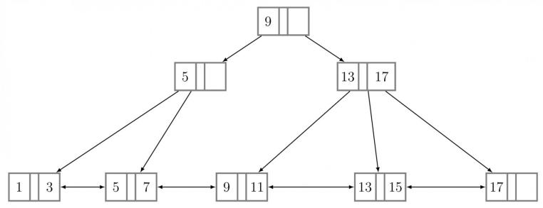

<details>
<summary>flowchart</summary>

```mermaid
graph TD
  A["9"] --> B["5"]
  A --> C["13"]
  B --> D["1"]
  B --> E["5"]
  C --> F["11"]
  C --> G["13"]
  C --> H["15"]
  D --> I["7"]
  E --> I
  F --> I
  G --> I
  H --> I
  I --> J["17"]
```
</details>

gatecse-2015-set2 databases b-tree normal numerical-answers

# Answer key

# 3.2.20 B Tree: GATE CSE 2015 | Set 3 | Question: 46

Consider a $B^{+}$ tree in which the search key is 12 bytes long, block size is 1024 bytes, record pointer is 10 bytes long and the block pointer is 8 bytes long. The maximum number of keys that can be accommodated


in each non-leaf node of the tree is \_\_\_\_.

gatecse-2015-set3 databases b-tree normal numerical-answers

# Answer key

# 3.2.21 B Tree: GATE CSE 2016 | Set 2 | Question: 21

B+ Trees are considered BALANCED because.

A. The lengths of the paths from the root to all leaf nodes are all equal.  
B. The lengths of the paths from the root to all leaf nodes differ from each other by at most 1.  
C. The number of children of any two non-leaf sibling nodes differ by at most 1.  
D. The number of records in any two leaf nodes differ by at most 1.

gatecse-2016-set2 databases b-tree normal

# Answer key

# 3.2.22 B Tree: GATE CSE 2017 | Set 2 | Question: 49

In a $B^{+}$ Tree, if the search-key value is 8 bytes long, the block size is 512 bytes and the pointer size is 2 B, then the maximum order of the $B^{+}$ Tree is \_\_\_\_

gatecse-2017-set2 databases b-tree numerical-answers normal

# Answer key

# 3.2.23 B Tree: GATE CSE 2019 | Question: 14

Which one of the following statements is NOT correct about the $B^{+}$ tree data structure used for creating an index of a relational database table?

A. $B^{+}$ Tree is a height-balanced tree  
B. Non-leaf nodes have pointers to data records  
C. Key values in each node are kept in sorted order  
D. Each leaf node has a pointer to the next leaf node

gatecse-2019 databases b-tree one-mark

# Answer key

# 3.2.24 B Tree: GATE CSE 2024 | Set 1 | Question: 11

In a $\mathbf{B}^{+}$ tree, the requirement of at least half-full (50%) node occupancy is relaxed for which one of the following cases?

A. Only the root node  
C. All internal nodes  
gatecse-2024-set1 databases b-tree one-mark

B. All leaf nodes  
D. Only the leftmost leaf node

# Answer key

# 3.2.25 B Tree: GATE CSE 2025 | Set 1 | Question: 11

Consider the following $B^{+}$ tree with 5 nodes, in which a node can store at most 3 key values The value 23 is now inserted in the $B^{+}$ tree. Which of the following options(s) is/are CORRECT?

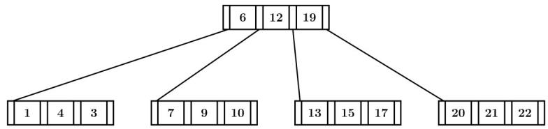

<details>
<summary>flowchart</summary>

```mermaid
graph TD
  A["6"] --> B["1"]
  A --> C["7"]
  A --> D["13"]
  A --> E["20"]
  B --> F["4"]
  C --> G["9"]
  D --> H["15"]
  E --> I["21"]
  F --> J["3"]
  G --> K["10"]
  H --> L["17"]
  I --> M["22"]
```
</details>


A. None of the nodes will split.  
B. At least one node will split and redistribute.


C. The total number of nodes will remain same.  
D. The height of the tree will increase.

gatecse2025-set1 databases b-tree multiple-selects one-mark

# Answer key

# 3.2.26 B Tree: GATE CSE 2025 | Set 2 | Question: 47

In a $B^{+}$ -tree where each node can hold at most four key values, a root to leaf path consists of the following nodes:

$$
\mathrm{A} = (4 9, 7 7, 8 3, -), \mathrm{B} = (7, 1 9, 3 3, 4 4), \mathrm{C} = (2 0 ^ {*}, 2 2 ^ {*}, 2 5 ^ {*}, 2 6 ^ {*})
$$


The \*-marked keys signify that these are data entries in a leaf.

Assume that a pointer between keys $k_{1}$ and $k_{2}$ points to a subtree containing keys in $[k_{1}, k_{2})$ , and that when a leaf is created, the smallest key in it is copied up into its parent.

A record with key value 23 is inserted into the $B^{+}$ -tree.

The smallest key value in the parent of the leaf that contains $25^{*}$ is \_\_\_\_. (Answer in integer)

gatecse2025-set2 databases b-tree numerical-answers two-marks

# Answer key

# 3.2.27 B Tree: GATE DA 2026 | Question: 31

Consider a B+ Tree where the maximum number of key values in each leaf node is 2 and the maximum number of pointers in each non-leaf node is 3. Let the content of the B+ Tree be as shown in the figure.


Which of the following options denotes the key value(s) stored in the root node after inserting a key value3 in the given B+ Tree?


<details>
<summary>flowchart</summary>

```mermaid
graph TD
  A["Input Block 5"] --> B["Parallel Block 1"]
  A --> C["Parallel Block 5"]
  A --> D["Parallel Block 7"]
  A --> E["Parallel Block 8"]
  A --> F["Parallel Block 9"]
  A --> G["Parallel Block 12"]
  B --> C
  C --> D
  D --> E
  E --> F
  F --> G
  G --> H["NULL"]
```
</details>

A. 5

B. 8

C. 3 and 5

D. 3,5 and 8

gateda-2026 databases b-tree two-marks

# Answer key

# 3.2.28 B Tree: GATE IT 2004 | Question: 79

Consider a table $T$ in a relational database with a key field $K$ . A $B$ -tree of order $p$ is used as an access structure on $K$ , where $p$ denotes the maximum number of tree pointers in a B-tree index node. Assume that $K$ is 10 bytes long; disk block size is 512 bytes; each data pointer $P_D$ is 8 bytes long and each block pointer $P_B$ is 5 bytes long. In order for each $B$ -tree node to fit in a single disk block, the maximum value of $p$ is

A. 20

B. 22

C. 23

D. 32

gateit-2004 databases b-tree normal

# Answer key


# 3.2.29 B Tree: GATE IT 2005 | Question: 23, ISRO2017-67


A B-Tree used as an index for a large database table has four levels including the root node. If a new key is inserted in this index, then the maximum number of nodes that could be newly created in the process are

A. 5

B. 4

C. 3

D. 2

gateit-2005

databases

b-tree

normal

isro2017

# Answer key

# 3.2.30 B Tree: GATE IT 2006 | Question: 61


In a database file structure, the search key field is 9 bytes long, the block size is 512 bytes, a record pointer is 7 bytes and a block pointer is 6 bytes. The largest possible order of a non-leaf node in a $B^{+}$ tree implementing this file structure is

A. 23

B. 24

C. 34

D. 44

gateit-2006 databases b-tree normal

# Answer key

# 3.2.31 B Tree: GATE IT 2007 | Question: 84


Consider the $B^{+}$ tree in the adjoining figure, where each node has at most two keys and three links.


<details>
<summary>flowchart</summary>

```mermaid
graph TD
  A["K40"] --> B["K30"]
  A --> C["K50"]
  B --> D["K10 K20"]
  B --> E["K30"]
  C --> F["K40"]
  C --> G["K50"]
```
</details>

Keys K15 and then K25 are inserted into this tree in that order. Exactly how many of the following nodes (disregarding the links) will be present in the tree after the two insertions?

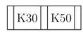


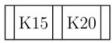

A. 1

B. 2

C. 3

D. 4

gateit-2007 databases b-tree normal

# Answer key

# 3.2.32 B Tree: GATE IT 2007 | Question: 85


Consider the $B^{+}$ tree in the adjoining figure, where each node has at most two keys and three links.

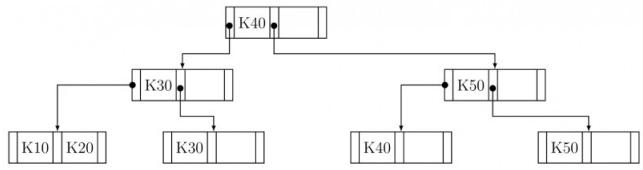

<details>
<summary>flowchart</summary>

```mermaid
graph TD
  A["K40"] --> B["K30"]
  A --> C["K50"]
  B --> D["K10 K20"]
  B --> E["K30"]
  C --> F["K40"]
  C --> G["K50"]
```
</details>

Keys K15 and then K25 are inserted into this tree in that order. Now the key K50 is deleted from the $B^{+}$ tree resulting after the two insertions made earlier. Consider the following statements about the $B^{+}$ tree resulting after this deletion.

i. The height of the tree remains the same.

ii. The node K20

(disregarding the links) is present in the tree.

iii. The root node remains unchanged (disregarding the links).

Which one of the following options is true?

A. Statements (i) and (ii) are true  
C. Statements (iii) and (i) are true

B. Statements (ii) and (iii) are true  
D. All the statements are false

# 3.3

# Candidate Key (7)

Practice Test: Test 1 (6Q)

# 3.3.1 Candidate Key: GATE CSE 1994 | Question: 3.7

An instance of a relational scheme $R(A, B, C)$ has distinct values for attribute $A$ . Can you conclude that $A$ is a candidate key for $R$ ?


gate1994 databases easy database-normalization candidate-key descriptive

Answer key

# 3.3.2 Candidate Key: GATE CSE 2005 | Question: 78

Consider a relation scheme $R = (A, B, C, D, E, H)$ on which the following functional dependencies hold: $\{A \to B, BC \to D, E \to C, D \to A\}$ . What are the candidate keys $R$ ?


A. AE, BE

B. AE, BE, DE

C. AEH, BEH, BCH

D. AEH, BEH, DEH

gatecse-2005 databases candidate-key easy

Answer key

# 3.3.3 Candidate Key: GATE CSE 2011 | Question: 12

Consider a relational table with a single record for each registered student with the following attributes:


1. Registration\_Num: Unique registration number for each registered student  
2. UID: Unique identity number, unique at the national level for each citizen  
3. BankAccount\_Num: Unique account number at the bank. A student can have multiple accounts or joint accounts. This attribute stores the primary account number.  
4. Name: Name of the student  
5. Hostel\_Room: Room number of the hostel

Which of the following options is INCORRECT?

A. BankAccount\_Num is a candidate key  
B. Registration\_Num can be a primary key  
C. UID is a candidate key if all students are from the same country  
D. If $S$ is a super key such that $S \cap \mathrm{UID}$ is NULL then $S \cup \mathrm{UID}$ is also a superkey

gatecse-2011 databases normal candidate-key

Answer key

# 3.3.4 Candidate Key: GATE CSE 2014 | Set 2 | Question: 21

The maximum number of superkeys for the relation schema $R(E, F, G, H)$ with $E$ as the key is \_\_\_\_.


gatecse-2014-set2 databases numerical-answers easy candidate-key

Answer key

# 3.3.5 Candidate Key: GATE CSE 2014 | Set 2 | Question: 22

Given an instance of the STUDENTS relation as shown as below


<table><tr><td>StudentID</td><td>StudentName</td><td>StudentEmail</td><td>StudentAge</td><td>CPI</td></tr><tr><td>2345</td><td>Shankar</td><td>shankar@math</td><td>X</td><td>9.4</td></tr><tr><td>1287</td><td>Swati</td><td>swati@ee</td><td>19</td><td>9.5</td></tr><tr><td>7853</td><td>Shankar</td><td>shankar@cse</td><td>19</td><td>9.4</td></tr><tr><td>9876</td><td>Swati</td><td>swati@mech</td><td>18</td><td>9.3</td></tr><tr><td>8765</td><td>Ganesh</td><td>ganesh@civil</td><td>19</td><td>8.7</td></tr></table>

For (StudentName, StudentAge) to be a key for this instance, the value X should NOT be equal to \_\_\_\_.

gatecse-2014-set2 databases numerical-answers easy candidate-key

Answer key

# 3.3.6 Candidate Key: GATE CSE 2014 | Set 3 | Question: 22

A prime attribute of a relation scheme R is an attribute that appears

A. in all candidate keys of R  
C. in a foreign key of $R$

B. in some candidate key of $R$  
D. only in the primary key of $R$

gatecse-2014-set3 databases easy candidate-key

Answer key

# 3.3.7 Candidate Key: GATE DA 2026 | Question: 7

Let $\mathrm{R}(\mathrm{A},\mathrm{B},\mathrm{C},\mathrm{D},\mathrm{E})$ be a relational schema with functional dependency set $\mathrm{F} = \{\mathrm{A}\to \mathrm{BC},\mathrm{CD}\to \mathrm{E},\mathrm{E}\to \mathrm{A}\}$ .

Which of the following statements is correct?

A. AD, ED and CD are the only candidate keys of R.  
B. AD and ED are the only candidate keys of R.  
C. A, E and CD are the only candidate keys of R.  
D. A and CD are the only candidate keys of R.

gateda-2026 databases functional-dependency candidate-key one-mark

Answer key

# 3.4

# Conflict Serializable (12)

Practice Tests: Test 1 (15Q) Test 2 (4Q)

# 3.4.1 Conflict Serializable: GATE CSE 2007 | Question: 64

Consider the following schedules involving two transactions. Which one of the following statements is TRUE?

- $S_{1}: r_{1}(X); r_{1}(Y); r_{2}(X); r_{2}(Y); w_{2}(Y); w_{1}(X)$  
- $S_{2}:r_{1}(X);r_{2}(X);r_{2}(Y);w_{2}(Y);r_{1}(Y);w_{1}(X)$

A. Both $S_{1}$ and $S_{2}$ are conflict serializable.  
B. $S_{1}$ is conflict serializable and $S_{2}$ is not conflict serializable.  
C. $S_{1}$ is not conflict serializable and $S_{2}$ is conflict serializable.  
D. Both $S_{1}$ and $S_{2}$ are not conflict serializable.

gatecse-2007 databases transaction-and-concurrency normal conflict-serializable

Answer key


# 3.4.2 Conflict Serializable: GATE CSE 2009 | Question: 43


Consider two transactions $T_{1}$ and $T_{2}$ , and four schedules $S_{1}, S_{2}, S_{3}, S_{4}$ , of $T_{1}$ and $T_{2}$ as given below:

$$
T _ {1}: R _ {1} [ x ] W _ {1} [ x ] W _ {1} [ y ]
$$

$$
T _ {2}: R _ {2} [ x ] R _ {2} [ y ] W _ {2} [ y ]
$$

$$
S _ {1}: R _ {1} [ x ] R _ {2} [ x ] R _ {2} [ y ] W _ {1} [ x ] W _ {1} [ y ] W _ {2} [ y ]
$$

$$
S _ {2}: R _ {1} [ x ] R _ {2} [ x ] R _ {2} [ y ] W _ {1} [ x ] W _ {2} [ y ] W _ {1} [ y ]
$$

$$
S _ {3}: R _ {1} [ x ] W _ {1} [ x ] R _ {2} [ x ] W _ {1} [ y ] R _ {2} [ y ] W _ {2} [ y ]
$$

$$
S _ {4}: R _ {2} [ x ] R _ {2} [ y ] R _ {1} [ x ] W _ {1} [ x ] W _ {1} [ y ] W _ {2} [ y ]
$$

Which of the above schedules are conflict-serializable?

A. $S_{1}$ and $S_{2}$

B. $S_{2}$ and $S_{3}$

C. $S_{3}$ only

D. $S_{4}$ only

gatecse-2009 databases transaction-and-concurrency normal conflict-serializable

# Answer key

# 3.4.3 Conflict Serializable: GATE CSE 2014 | Set 1 | Question: 29


Consider the following four schedules due to three transactions (indicated by the subscript) using read and write on a data item x, denoted by $r(x)$ and $w(x)$ respectively. Which one of them is conflict serializable?

A. $r_1(x); r_2(x); w_1(x); r_3(x); w_2(x)$ ;  
B. $r_2(x); r_1(x); w_2(x); r_3(x); w_1(x)$ ;  
C. $r_3(x); r_2(x); r_1(x); w_2(x); w_1(x)$ ;  
D. $r_2(x); w_2(x); r_3(x); r_1(x); w_1(x);$

gatecse-2014-set1 databases transaction-and-concurrency conflict-serializable normal

# Answer key

# 3.4.4 Conflict Serializable: GATE CSE 2014 | Set 2 | Question: 29

Consider the following schedule S of transactions T1, T2, T3, T4 :

<table><tr><td>T1</td><td>T2</td><td>T3</td><td>T4</td></tr><tr><td rowspan="3">Writes(X) Commit</td><td>Reads(X)</td><td rowspan="3">Writes(X) Commit</td><td rowspan="2"></td></tr><tr><td rowspan="2">Writes(Y) Reads(Z) Commit</td></tr><tr><td>Reads(X) Reads(Y) Commit</td></tr></table>


Which one of the following statements is CORRECT?

A. S is conflict-serializable but not recoverable  
B. S is not conflict-serializable but is recoverable  
C. S is both conflict-serializable and recoverable  
D. $\mathbf{S}$ is neither conflict-serializable not is it recoverable

# Answer key

# 3.4.5 Conflict Serializable: GATE CSE 2014 | Set 3 | Question: 29

Consider the transactions $T1, T2$ , and $T3$ and the schedules $S1$ and $S2$ given below.

- $T1: r1(X); r1(Z); w1(X); w1(Z)$  
- $T2: r2(Y); r2(Z); w2(Z)$  
- $T3: r3(Y); r3(X); w3(Y)$  
- $S1: r1(X); r3(Y); r3(X); r2(Y); r2(Z); w3(Y); w2(Z); r1(Z); w1(X); w1(Z)$  
- $S2: r1(X); r3(Y); r2(Y); r3(X); r1(Z); r2(Z); w3(Y); w1(X); w2(Z); w1(Z)$

Which one of the following statements about the schedules is TRUE?

A. Only S1 is conflict-serializable.  
C. Both S1 and S2 are conflict-serializable.

B. Only $S2$ is conflict-serializable.

D. Neither S1 nor S2 is conflict-serializable.

gatecse-2014-set3 databases transaction-and-concurrency conflict-serializable normal

# Answer key

# 3.4.6 Conflict Serializable: GATE CSE 2017 | Set 2 | Question: 44

Two transactions $T_{1}$ and $T_{2}$ are given as

$$
T _ {1}: r _ {1} (X) w _ {1} (X) r _ {1} (Y) w _ {1} (Y)
$$

$$
T _ {2}: r _ {2} (Y) w _ {2} (Y) r _ {2} (Z) w _ {2} (Z)
$$

where $r_i(V)$ denotes a read operation by transaction $T_i$ on a variable $V$ and $w_i(V)$ denotes a write operation by transaction $T_i$ on a variable $V$ . The total number of conflict serializable schedules that can be formed by $T_1$ and $T_2$ is \_\_\_\_

gatecse-2017-set2 databases transaction-and-concurrency numerical-answers conflict-serializable

# Answer key

# 3.4.7 Conflict Serializable: GATE CSE 2020 | Question: 37

Consider a schedule of transactions $T_{1}$ and $T_{2}$ :

<table><tr><td> $T_1$ </td><td> $RA$ </td><td></td><td></td><td> $RC$ </td><td></td><td> $WD$ </td><td></td><td> $WB$ </td><td>Commit</td><td></td></tr><tr><td> $T_2$ </td><td></td><td> $RB$ </td><td> $WB$ </td><td></td><td> $RD$ </td><td></td><td> $WC$ </td><td></td><td></td><td>Commit</td></tr></table>

Here, RX stands for “Read(X)” and WX stands for “Write(X)”. Which one of the following schedules is conflict equivalent to the above schedule?

A.

<table><tr><td> $T_1$ </td><td></td><td></td><td></td><td> $RA$ </td><td> $RC$ </td><td> $WD$ </td><td> $WB$ </td><td></td><td>Commit</td><td></td></tr><tr><td> $T_2$ </td><td> $RB$ </td><td> $WB$ </td><td> $RD$ </td><td></td><td></td><td></td><td></td><td> $WC$ </td><td></td><td>Commit</td></tr></table>

B.

<table><tr><td> $T_1$ </td><td> $RA$ </td><td> $RC$ </td><td> $WD$ </td><td> $WB$ </td><td></td><td></td><td></td><td></td><td>Commit</td><td></td></tr><tr><td> $T_2$ </td><td></td><td></td><td></td><td></td><td> $RB$ </td><td> $WB$ </td><td> $RD$ </td><td> $WC$ </td><td></td><td>Commit</td></tr></table>

C.

<table><tr><td> $T_1$ </td><td> $RA$ </td><td> $RC$ </td><td> $WD$ </td><td></td><td></td><td></td><td> $WB$ </td><td></td><td>Commit</td><td></td></tr><tr><td> $T_2$ </td><td></td><td></td><td></td><td> $RB$ </td><td> $WB$ </td><td> $RD$ </td><td></td><td> $WC$ </td><td></td><td>Commit</td></tr></table>

D.

<table><tr><td> $T_1$ </td><td></td><td></td><td></td><td></td><td> $RA$ </td><td> $RC$ </td><td> $WD$ </td><td> $WB$ </td><td>Commit</td><td></td></tr><tr><td> $T_2$ </td><td> $RB$ </td><td> $WB$ </td><td> $RD$ </td><td> $WC$ </td><td></td><td></td><td></td><td></td><td></td><td>Commit</td></tr></table>


# Answer key

# 3.4.8 Conflict Serializable: GATE CSE 2021 | Set 1 | Question: 32


Let $r_i(z)$ and $w_i(z)$ denote read and write operations respectively on a data item $z$ by a transaction $T_i$ . Consider the following two schedules.

- $S_{1}: r_{1}(x) r_{1}(y) r_{2}(x) r_{2}(y) w_{2}(y) w_{1}(x)$  
- $S_{2}:r_{1}(x)r_{2}(x)r_{2}(y)w_{2}(y)r_{1}(y)w_{1}(x)$

Which one of the following options is correct?

A. $S_{1}$ is conflict serializable, and $S_{2}$ is not conflict serializable  
B. $S_{1}$ is not conflict serializable, and $S_{2}$ is conflict serializable  
C. Both $S_{1}$ and $S_{2}$ are conflict serializable  
D. Niether $S_{1}$ nor $S_{2}$ is conflict serializable

gatecse-2021-set1 databases transaction-and-concurrency conflict-serializable two-marks

# Answer key

# 3.4.9 Conflict Serializable: GATE CSE 2021 | Set 2 | Question: 32


Let $S$ be the following schedule of operations of three transactions $T_{1}$ , $T_{2}$ and $T_{3}$ in a relational database system:

$$
R _ {2} (Y), R _ {1} (X), R _ {3} (Z), R _ {1} (Y) W _ {1} (X), R _ {2} (Z), W _ {2} (Y), R _ {3} (X), W _ {3} (Z)
$$

Consider the statements P and Q below:

- $P$ : $S$ is conflict-serializable.  
- $Q$ : If $T_{3}$ commits before $T_{1}$ finishes, then $S$ is recoverable.

Which one of the following choices is correct?

A. Both $P$ and $Q$ are true  
C. $P$ is false and $Q$ is true

B. $P$ is true and $Q$ is false  
D. Both $P$ and $Q$ are false

gatecse-2021-set2 databases transaction-and-concurrency conflict-serializable two-marks

# Answer key

# 3.4.10 Conflict Serializable: GATE CSE 2022 | Question: 29


Let $R_{i}(z)$ and $W_{i}(z)$ denote read and write operations on a data element z by a transaction $T_{i}$ , respectively. Consider the schedule S with four transactions.

$$
S: R _ {4} (x) R _ {2} (x) R _ {3} (x) R _ {1} (y) W _ {1} (y) W _ {2} (x) W _ {3} (y) R _ {4} (y)
$$

Which one of the following serial schedules is conflict equivalent to $S$ ?

A. $T_{1} \rightarrow T_{3} \rightarrow T_{4} \rightarrow T_{2}$  
C. $T_{4} \rightarrow T_{1} \rightarrow T_{3} \rightarrow T_{2}$

B. $T_{1} \rightarrow T_{4} \rightarrow T_{3} \rightarrow T_{2}$  
D. $T_{3} \rightarrow T_{1} \rightarrow T_{4} \rightarrow T_{2}$

gatecse-2022 databases transaction-and-concurrency conflict-serializable two-marks

# Answer key

# 3.4.11 Conflict Serializable: GATE CSE 2024 | Set 1 | Question: 36


Consider the following read-write schedule S over three transactions $T_1, T_2,$ and $T_3$ , where the subscripts in the schedule indicate transaction IDs:

$$
S: r _ {1} (z); w _ {1} (z); r _ {2} (x); r _ {3} (y); w _ {3} (y); r _ {2} (y); w _ {2} (x); w _ {2} (y);
$$

Which of the following transaction schedules is/are conflict equivalent to S?

A. $T_{1}T_{2}T_{3}$

B. $T_{1}T_{3}T_{2}$

C. $T_{3}T_{2}T_{1}$

D. $T_{3}T_{1}T_{2}$

# 3.4.12 Conflict Serializable: GATE CSE 2025 | Set 2 | Question: 43

Consider the database transactions T1 and T2, and data items X and Y. Which of the schedule(s) is/are conflict serializable?


Transaction T1

<table><tr><td>R1(X)</td></tr><tr><td>W1(Y)</td></tr><tr><td>R1(X)</td></tr><tr><td>W1(X)</td></tr><tr><td>COMMIT(T1)</td></tr></table>

Transaction T2

<table><tr><td>W2(X)</td></tr><tr><td>W2(Y)</td></tr><tr><td>COMMIT(T2)</td></tr></table>

A. R1(X), W2(X), W1(Y), W2(Y), R1(X), W1(X), COMMIT(T2), COMMIT(T1)  
B. W2(X), R1(X), W2(Y), W1(Y), R1(X), COMMIT(T2), W1(X), COMMIT(T1)  
C. R1(X), W1(Y), W2(X), W2(Y), R1(X), W1(X), COMMIT(T1), COMMIT(T2)  
D. W2(X), R1(X), W1(Y), W2(Y), R1(X), COMMIT(T2), W1(X), COMMIT(T1)

gatecse2025-set2 databases conflict-serializable multiple-selects two-marks

Answer key

# 3.5

# Database Design (1)

# 3.5.1 Database Design: GATE CSE 1994 | Question: 3.11

State True or False with reason

Logical data independence is easier to achieve than physical data independence.

gate1994 databases normal database-design true-false

Answer key


# 3.6

# Database Normalization (56)


Practice Tests:

Test 1 (15Q)

Test 2 (15Q)

Test 3 (15Q)

Test 4 (6Q)

# 3.6.1 Database Normalization: GATE CSE 1987 | Question: 2n

State whether the following statements are TRUE or FALSE:


A relation $r$ with schema $(X, Y)$ satisfies the function dependency $X \to Y$ , The tuples $\langle 1, 2 \rangle$ and $\langle 2, 2 \rangle$ can both be in $r$ simultaneously.

gate1987 databases database-normalization true-false

Answer key

# 3.6.2 Database Normalization: GATE CSE 1988 | Question: 12i

What are the three axioms of functional dependency for the relational databases given by Armstrong.


gate1988 normal descriptive databases database-normalization

Answer key

# 3.6.3 Database Normalization: GATE CSE 1988 | Question: 12iia

Using Armstrong's axioms of functional dependency derive the following rules:


$$
\{x \rightarrow y, x \rightarrow z \} \models x \rightarrow y z
$$

(Note: $x \to y$ denotes $y$ is functionally dependent on $x, z \subseteq y$ denotes $z$ is subset of $y$ , and $| =$ means derives).

gate1988 easy descriptive databases database-normalization

# Answer key

# 3.6.4 Database Normalization: GATE CSE 1988 | Question: 12iib

Using Armstrong's axioms of functional dependency derive the following rules:

$$
\{x \rightarrow y, w y \rightarrow z \} \models x w \rightarrow z
$$

(Note: $x \to y$ denotes $y$ is functionally dependent on $x, z \subseteq y$ denotes $z$ is subset of $y$ , and $| =$ means derives).

gate1988 normal descriptive databases database-normalization

# Answer key

# 3.6.5 Database Normalization: GATE CSE 1988 | Question: 12iic

Using Armstrong's axioms of functional dependency derive the following rules:

$$
\{x \rightarrow y, z \subset y \} \mid = x \rightarrow z
$$

(Note: $x \to y$ denotes $y$ is functionally dependent on $x, z \subseteq y$ denotes $z$ is subset of $y$ , and $| =$ means derives).

gate1988 normal descriptive databases database-normalization

# Answer key

# 3.6.6 Database Normalization: GATE CSE 1990 | Question: 2-iv

Match the pairs in the following questions:

<table><tr><td>(a)</td><td>Secondary index</td><td>(p)</td><td>Function dependency</td></tr><tr><td>(b)</td><td>Non-procedural query language</td><td>(q)</td><td>B-tree</td></tr><tr><td>(c)</td><td>Closure of a set of attributes</td><td>(r)</td><td>Domain calculus</td></tr><tr><td>(d)</td><td>Natural join</td><td>(s)</td><td>Relational algebraic operations</td></tr></table>


gate1990 match-the-following database-normalization databases

# Answer key

# 3.6.7 Database Normalization: GATE CSE 1990 | Question: 3-ii

Indicate which of the following statements are true:

A relational database which is in 3NF may still have undesirable data redundancy because there may exist:

A. Transitive functional dependencies  
B. Non-trivial functional dependencies involving prime attributes on the right-side.  
C. Non-trivial functional dependencies involving prime attributes only on the left-side.  
D. Non-trivial functional dependencies involving only prime attributes.

gate1990 normal databases database-normalization multiple-selects

# Answer key

# 3.6.8 Database Normalization: GATE CSE 1994 | Question: 3.6

State True or False with reason


There is always a decomposition into Boyce-Codd normal form (BCNF) that is lossless and dependency preserving.

# Answer key

# 3.6.9 Database Normalization: GATE CSE 1995 | Question: 26

Consider the relation scheme $R(A, B, C)$ with the following functional dependencies:

- $A, B \to C$ ,  
• C → A

A. Show that the scheme R is in 3NF but not in BCNF.

B. Determine the minimal keys of relation R.

gate1995 databases database-normalization normal descriptive

# Answer key

# 3.6.10 Database Normalization: GATE CSE 1997 | Question: 6.9

For a database relation $R(a,b,c,d)$ , where the domains a, b, c, d include only atomic values, only the following functional dependencies and those that can be inferred from them hold

- $a \rightarrow c$  
- $b \rightarrow d$

This relation is

A. in first normal form but not in second normal form

C. in third normal form

gate1997 databases database-normalization normal

# Answer key

B. in second normal form but not in first normal form  
D. none of the above

# 3.6.11 Database Normalization: GATE CSE 1998 | Question: 1.34

Which normal form is considered adequate for normal relational database design?

A. $2NF$

B. $5NF$

C. $4NF$

D. $3NF$

gate1998 databases database-normalization easy

# Answer key

# 3.6.12 Database Normalization: GATE CSE 1998 | Question: 26

Consider the following database relations containing the attributes

- Book\_id  
- Subject\_Category\_of\_book  
- Name\_of\_Author  
- Nationality\_of\_Author

With Book\_id as the primary key.

a. What is the highest normal form satisfied by this relation?

b. Suppose the attributes Book\_title and Author\_address are added to the relation, and the primary key is changed to {Name\_of\_Author, Book\_title}, what will be the highest normal form satisfied by the relation?

gate1998 databases database-normalization normal descriptive

# Answer key

# 3.6.13 Database Normalization: GATE CSE 1999 | Question: 1.24

Let $R = (A, B, C, D, E, F)$ be a relation scheme with the following dependencies


$C \rightarrow F, E \rightarrow A, EC \rightarrow D, A \rightarrow B.$ Which one of the following is a key for R?

A. CD

B. EC

C. AE

D. AC

gate1999 databases database-normalization easy

# Answer key

# 3.6.14 Database Normalization: GATE CSE 1999 | Question: 2.7, UGCNET-June2014-III: 25

Consider the schema $R = (S, T, U, V)$ and the dependencies $S \to T, T \to U, U \to V$ and $V \to S$ . Let $R = (R1 \text{ and } R2)$ be a decomposition such that $R1 \cap R2 \neq \phi$ . The decomposition is


A. not in 2NF

B. in 2NF but not 3NF

C. in 3NF but not in 2NF

D. in both 2NF and 3NF

gate1999 databases database-normalization normal ugcnetjune2014iii

# Answer key

# 3.6.15 Database Normalization: GATE CSE 2000 | Question: 2.24

Given the following relation instance.


<table><tr><td>X</td><td>Y</td><td>Z</td></tr><tr><td>1</td><td>4</td><td>2</td></tr><tr><td>1</td><td>5</td><td>3</td></tr><tr><td>1</td><td>6</td><td>3</td></tr><tr><td>3</td><td>2</td><td>2</td></tr></table>

Which of the following functional dependencies are satisfied by the instance?

A. $XY \rightarrow Z$ and $Z \rightarrow Y$

B. $YZ \to X$ and $Y \to Z$

C. $YZ \to X$ and $X \to Z$

D. $XZ\to Y$ and $Y\to X$

gatecse-2000 databases database-normalization easy

# Answer key

# 3.6.16 Database Normalization: GATE CSE 2001 | Question: 2.23

$R(A,B,C,D)$ is a relation. Which of the following does not have a lossless join, dependency preserving BCNF decomposition?


A. $A \rightarrow B, B \rightarrow CD$

B. $A \to B, B \to C, C \to D$

C. $AB\to C,C\to AD$

D. $A \rightarrow BCD$

gatecse-2001 databases database-normalization normal

# Answer key

# 3.6.17 Database Normalization: GATE CSE 2002 | Question: 1.19

Relation R with an associated set of functional dependencies, F, is decomposed into BCNF. The redundancy (arising out of functional dependencies) in the resulting set of relations is


A. Zero  
B. More than zero but less than that of an equivalent 3NF decomposition  
C. Proportional to the size of $F^{+}$  
D. Indeterminate

gatecse-2002 databases database-normalization normal

# Answer key

# 3.6.18 Database Normalization: GATE CSE 2002 | Question: 16

For relation $\mathbf{R} = (\mathbf{L}, \mathbf{M}, \mathbf{N}, \mathbf{O}, \mathbf{P})$ , the following dependencies hold:


$$
M \rightarrow O, N O \rightarrow P, P \rightarrow L \text { and } L \rightarrow M N
$$

R is decomposed into $\mathbf{R1} = (\mathbf{L}, \mathbf{M}, \mathbf{N}, \mathbf{P})$ and $\mathbf{R2} = (\mathbf{M}, \mathbf{O})$ .

A. Is the above decomposition a lossless-join decomposition? Explain.  
B. Is the above decomposition dependency-preserving? If not, list all the dependencies that are not preserved.  
C. What is the highest normal form satisfied by the above decomposition?

gatecse-2002 databases database-normalization normal descriptive

# Answer key

# 3.6.19 Database Normalization: GATE CSE 2002 | Question: 2.24

Relation $R$ is decomposed using a set of functional dependencies, $F$ , and relation $S$ is decomposed using another set of functional dependencies, $G$ . One decomposition is definitely BCNF, the other is definitely $3NF$ , but it is not known which is which. To make a guaranteed identification, which one of the following should be used on the decompositions? (Assume that the closures of $F$ and $G$ are available).


A. Dependency-preservation

C. BCNF definition

B. Lossless-join

D. 3NF definition

gatecse-2002 databases database-normalization easy

# Answer key

# 3.6.20 Database Normalization: GATE CSE 2002 | Question: 2.25

From the following instance of a relation schema $R(A, B, C)$ , we can conclude that:

<table><tr><td>A</td><td>B</td><td>C</td></tr><tr><td>1</td><td>1</td><td>1</td></tr><tr><td>1</td><td>1</td><td>0</td></tr><tr><td>2</td><td>3</td><td>2</td></tr><tr><td>2</td><td>3</td><td>2</td></tr></table>


A. A functionally determines B and B functionally determines C  
B. $A$ functionally determines $B$ and $B$ does not functionally determine $C$  
C. $B$ does not functionally determine $C$  
D. $A$ does not functionally determine $B$ and $B$ does not functionally determine $C$

gatecse-2002 databases database-normalization

# Answer key

# 3.6.21 Database Normalization: GATE CSE 2003 | Question: 85

Consider the following functional dependencies in a database.

<table><tr><td>Date_of_Birth → Age</td><td>Age → Eligibility</td></tr><tr><td>Name → Roll_number</td><td>Roll_number → Name</td></tr><tr><td>Course_number → Course_name</td><td>Course_number → Instructor</td></tr><tr><td>(Roll_number, Course_number) → Grade</td><td></td></tr></table>


The relation (Roll\_number, Name, Date\_of\_birth, Age) is

A. in second normal form but not in third normal form

C. in BCNF

B. in third normal form but not in BCNF

D. in none of the above

gatecse-2003 databases database-normalization normal

# Answer key

# 3.6.22 Database Normalization: GATE CSE 2004 | Question: 50


The relation scheme Student Performance (name, courseNo, rollNo, grade) has the following functional dependencies:

- name, courseNo, → grade  
- rollNo, courseNo $\rightarrow$ grade  
- name $\rightarrow$ rollNo  
- rollNo $\rightarrow$ name

The highest normal form of this relation scheme is

A. 2NF

B. 3NF

C. BCNF

D. 4NF

gatecse-2004 databases database-normalization normal

Answer key

# 3.6.23 Database Normalization: GATE CSE 2005 | Question: 29, UGCNET-June2015-III: 9

Which one of the following statements about normal forms is FALSE?


A. BCNF is stricter than 3NF  
B. Lossless, dependency-preserving decomposition into 3NF is always possible  
C. Lossless, dependency-preserving decomposition into BCNF is always possible  
D. Any relation with two attributes is in BCNF

gatecse-2005 databases database-normalization easy ugcnetcse-june2015-paper3

Answer key

# 3.6.24 Database Normalization: GATE CSE 2006 | Question: 70

The following functional dependencies are given:


$$
A B \rightarrow C D, A F \rightarrow D, D E \rightarrow F, C \rightarrow G, F \rightarrow E, G \rightarrow A
$$

Which one of the following options is false?

A. $\{CF\}^{*} = \{ACDEFG\}$  
C. $\{AF\}^{*} = \{ACDEFG\}$

gatecse-2006 databases database-normalization normal

Answer key

# 3.6.25 Database Normalization: GATE CSE 2007 | Question: 62, UGCNET-June2014-II: 47

Which one of the following statements is FALSE?


A. Any relation with two attributes is in BCNF  
B. A relation in which every key has only one attribute is in 2NF  
C. A prime attribute can be transitively dependent on a key in a 3 NF relation  
D. A prime attribute can be transitively dependent on a key in a BCNF relation

gatecse-2007 databases database-normalization normal ugcnetcse-june2014-paper2

Answer key

# 3.6.26 Database Normalization: GATE CSE 2008 | Question: 69

Consider the following relational schemes for a library database:


Book (Title, Author, Catalog\_no, Publisher, Year, Price)

Collection(Title, Author, Catalog\_no)

with the following functional dependencies:

I. Title Author → Catalog\_no  
II. Catalog\_no → Title Author Publisher Year  
III. Publisher Title Year → Price

Assume { Author, Title } is the key for both schemes. Which of the following statements is true?

A. Both Book and Collection are in BCNF

B. Both Book and Collection are in 3NF only

C. Book is in 2NF and Collection in 3NF

D. Both Book and Collection are in 2NF only

gatecse-2008 databases database-normalization normal

# Answer key

# 3.6.27 Database Normalization: GATE CSE 2012 | Question: 2

Which of the following is TRUE?


A. Every relation in 3NF is also in BCNF  
B. A relation $\mathbf{R}$ is in 3NF if every non-prime attribute of $\mathbf{R}$ is fully functionally dependent on every key of $R$  
C. Every relation in BCNF is also in 3NF  
D. No relation can be in both BCNF and 3NF

gatecse-2012 databases easy database-normalization

# Answer key

# 3.6.28 Database Normalization: GATE CSE 2013 | Question: 54


Relation $R$ has eight attributes ABCDEFGH. Fields of $R$ contain only atomic values. $F = \{CH \to G, A \to BC, B \to CFH, E \to A, F \to EG\}$ is a set of functional dependencies (FDs) so that $F^{+}$ is exactly the set of FDs that hold for $R$ .

How many candidate keys does the relation R have?

A. 3

B. 4

C. 5

D. 6

gatecse-2013 databases database-normalization normal

# Answer key

# 3.6.29 Database Normalization: GATE CSE 2013 | Question: 55


Relation R has eight attributes ABCDEFGH. Fields of R contain only atomic values. $F = \{CH \rightarrow G, A \rightarrow BC, B \rightarrow CFH, E \rightarrow A, F \rightarrow EG\}$ is a set of functional dependencies (FDs) so that $F^{+}$ is exactly the set of FDs that hold for R.

The relation $R$ is

A. in 1NF, but not in 2NF.

B. in 2NF, but not in 3NF.

C. in 3NF, but not in BCNF.

D. in BCNF.

gatecse-2013 databases database-normalization normal

# Answer key

# 3.6.30 Database Normalization: GATE CSE 2014 | Set 1 | Question: 21


Consider the relation scheme $R = (E, F, G, H, I, J, K, L, M, N)$ and the set of functional dependencies

$$
\{\{E, F \} \rightarrow \{G \}, \{F \} \rightarrow \{I, J \}, \{E, H \} \rightarrow \{K, L \},
$$

$$
\{K \} \to \{M \}, \{L \} \to \{N \} \}
$$

on $R$ . What is the key for $R$ ?

A. $\{E,F\}$

B. $\{E,F,H\}$

C. $\{E,F,H,K,L\}$

D. $\{E\}$

# Answer key

# 3.6.31 Database Normalization: GATE CSE 2014 | Set 1 | Question: 30


Given the following two statements:

S1: Every table with two single-valued attributes is in 1NF, 2NF, 3NF and BCNF.

S2: $AB \to C, D \to E, E \to C$ is a minimal cover for the set of functional dependencies $AB \to C, D \to E, AB \to E, E \to C$ .

Which one of the following is CORRECT?

A. S1 is TRUE and S2 is FALSE.

C. S1 is FALSE and S2 is TRUE.

gatecse-2014-set1 databases database-normalization normal

B. Both S1 and S2 are TRUE.

D. Both S1 and S2 are FALSE.

# Answer key

# 3.6.32 Database Normalization: GATE CSE 2015 | Set 3 | Question: 20


Consider the relation $X(P, Q, R, S, T, U)$ with the following set of functional dependencies

$$
\begin{array}{l} F = \{ \begin{array}{c} \end{array} \\ \{P, R \} \to \{S, T \}, \\ \begin{array}{l} \{P, S, U \} \to \{Q, R \} \\ \} \end{array} \\ \end{array}
$$

Which of the following is the trivial functional dependency in $F^{+}$ , where $F^{+}$ is closure to $F$ ?

A. $\{P,R\} \rightarrow \{S,T\}$

C. $\{P, S\} \to \{S\}$

gatecse-2015-set3 databases database-normalization easy

B. $\{P,R\} \rightarrow \{R,T\}$

D. $\{P,S,U\} \to \{Q\}$

# Answer key

# 3.6.33 Database Normalization: GATE CSE 2016 | Set 1 | Question: 21


Which of the following is NOT a superkey in a relational schema with attributes V, W, X, Y, Z and primary key V Y?

A. VXYZ

B. VWXZ

C. VWXY

D. VWXYZ

gatecse-2016-set1 databases database-normalization easy

# Answer key

# 3.6.34 Database Normalization: GATE CSE 2016 | Set 1 | Question: 23


A database of research articles in a journal uses the following schema.

(VOLUME, NUMBER, STARTPAGE, ENDPAGE, TITLE, YEAR, PRICE)

The primary key is '(VOLUME, NUMBER, STARTPAGE, ENDPAGE)

and the following functional dependencies exist in the schema.

(VOLUME, NUMBER, STARTPAGE, ENDPAGE) → TITLE

(VOLUME, NUMBER) → YEAR

(VOLUME, NUMBER, STARTPAGE, ENDPAGE) → PRICE

The database is redesigned to use the following schemas

(VOLUME, NUMBER, STARTPAGE, ENDPAGE, TITLE, PRICE)

(VOLUME, NUMBER, YEAR)

Which is the weakest normal form that the new database satisfies, but the old one does not?

A. 1NF

B. 2NF

C. 3NF

D. BCNF

# 3.6.35 Database Normalization: GATE CSE 2017 | Set 1 | Question: 16

The following functional dependencies hold true for the relational schema $R\{V,W,X,Y,Z\}$ :


- $V \rightarrow W$  
- $VW \rightarrow X$  
- $Y \rightarrow VX$  
- $Y \to Z$

Which of the following is irreducible equivalent for this set of functional dependencies?

A. $V \rightarrow W$

$$
V \rightarrow X
$$

$$
Y \rightarrow V
$$

$$
Y \rightarrow Z
$$

B. $V \rightarrow W$

$$
W \rightarrow X
$$

$$
Y \rightarrow V
$$

$$
Y \to Z
$$

C. $V \rightarrow W$

$$
V \rightarrow X
$$

$$
Y \rightarrow V
$$

$$
Y \rightarrow X
$$

$$
Y \rightarrow Z
$$

D. $V \to W$

$$
W \rightarrow X
$$

$$
Y \rightarrow V
$$

$$
Y \rightarrow X
$$

$$
Y \to Z
$$

gatecse-2017-set1 databases database-normalization normal

# Answer key

# 3.6.36 Database Normalization: GATE CSE 2018 | Question: 42

Consider the following four relational schemas. For each schema, all non-trivial functional dependencies are listed, The bolded attributes are the respective primary keys.

Schema I: Registration(rollno, courses)

Field ‘courses’ is a set-valued attribute containing the set of courses a student has registered for.

Non-trivial functional dependency

rollno → courses

Schema II: Registration (rollno, coursid, email)

Non-trivial functional dependencies:

rollno, courseid → email

email → rollno

Schema III: Registration (rollno, courseid, marks, grade)

Non-trivial functional dependencies:

rollno, courseid, → marks, grade

marks → grade

Schema IV: Registration (rollno, courseid, credit)

Non-trivial functional dependencies:

rollno, courseid → credit

courseid → credit

Which one of the relational schemas above is in 3NF but not in BCNF?

A. Schema I

B. Schema II

C. Schema III

D. Schema IV

gatecse-2018 databases database-normalization normal two-marks

# Answer key

# 3.6.37 Database Normalization: GATE CSE 2019 | Question: 32

Let the set of functional dependencies $F = \{QR \to S, R \to P, S \to Q\}$ hold on a relation schema $X = (PQRS)$ . $X$ is not in BCNF. Suppose $X$ is decomposed into two schemas $Y$ and $Z$ , where $Y = (PR)$ and $Z = (QRS)$ .


Consider the two statements given below.

I. Both $Y$ and $Z$ are in BCNF  
II. Decomposition of X into Y and Z is dependency preserving and lossless

Which of the above statements is/are correct?

A. Both I and II

B. I only

C. II only

D. Neither I nor II

gatecse-2019 databases database-normalization two-marks

Answer key

# 3.6.38 Database Normalization: GATE CSE 2020 | Question: 36

Consider a relational table R that is in 3NF, but not in BCNF. Which one of the following statements is TRUE?


A. $R$ has a nontrivial functional dependency $X \to A$ , where $X$ is not a superkey and $A$ is a prime attribute.  
B. $R$ has a nontrivial functional dependency $X \to A$ , where $X$ is not a superkey and $A$ is a non-prime attribute and $X$ is not a proper subset of any key.  
C. $R$ has a nontrivial functional dependency $X \to A$ , where $X$ is not a superkey and $A$ is a non-prime attribute and $X$ is a proper subset of some key  
D. A cell in R holds a set instead of an atomic value.

gatecse-2020 databases database-normalization two-marks

Answer key

# 3.6.39 Database Normalization: GATE CSE 2021 | Set 1 | Question: 33

Consider the relation $R(P, Q, S, T, X, Y, Z, W)$ with the following functional dependencies.

$$
P Q \rightarrow X; \quad P \rightarrow Y X; \quad Q \rightarrow Y; \quad Y \rightarrow Z W
$$

Consider the decomposition of the relation R into the constituent relations according to the following two decomposition schemes.

- $D_{1}: \quad R = [(P, Q, S, T); (P, T, X); (Q, Y); (Y, Z, W)]$  
- $D_{2}: \quad R = [(P, Q, S); (T, X); (Q, Y); (Y, Z, W)]$

Which one of the following options is correct?

A. $D_{1}$ is a lossless decomposition, but $D_{2}$ is a lossy decomposition  
B. $D_{1}$ is a lossy decomposition, but $D_{2}$ is a lossless decomposition  
C. Both $D_{1}$ and $D_{2}$ are lossless decompositions  
D. Both $D_{1}$ and $D_{2}$ are lossy decompositions

gatecse-2021-set1 databases database-normalization two-marks

Answer key

# 3.6.40 Database Normalization: GATE CSE 2021 | Set 2 | Question: 40

Suppose the following functional dependencies hold on a relation $U$ with attributes $P, Q, R, S$ , and $T$ :

- $P \rightarrow QR$  
- $RS \rightarrow T$

Which of the following functional dependencies can be inferred from the above functional dependencies?

A. $PS \rightarrow T$

B. $R \rightarrow T$

C. $P \rightarrow R$

D. $PS \rightarrow Q$

gatecse-2021-set2 multiple-selects databases database-normalization two-marks

Answer key

# 3.6.41 Database Normalization: GATE CSE 2022 | Question: 21


Consider a relation $R(A, B, C, D, E)$ with the following three functional dependencies.

$$
A B \rightarrow C; B C \rightarrow D; C \rightarrow E;
$$

The number of superkeys in the relation R is \_\_\_\_.

gatecse-2022 numerical-answers databases database-normalization one-mark

# Answer key

# 3.6.42 Database Normalization: GATE CSE 2022 | Question: 4

In a relational data model, which one of the following statements is TRUE?

A. A relation with only two attributes is always in BCNF.  
B. If all attributes of a relation are prime attributes, then the relation is in BCNF.  
C. Every relation has at least one non-prime attribute.  
D. BCNF decompositions preserve functional dependencies.

gatecse-2022 databases database-normalization one-mark easy

# Answer key


# 3.6.43 Database Normalization: GATE CSE 2024 | Set 1 | Question: 12

Which of the following statements about a relation $\mathbf{R}$ in first normal form (1NF) is/are TRUE?

A. R can have a multi-attribute key  
B. R cannot have a foreign key  
C. R cannot have a composite attribute  
D. R cannot have more than one candidate key

gatecse-2024-set1 multiple-selects databases database-normalization one-mark

# Answer key


# 3.6.44 Database Normalization: GATE CSE 2024 | Set 1 | Question: 34

The symbol → indicates functional dependency in the context of a relational database. Which of the following options is/are TRUE?

A. $(X,Y)\to (Z,W)$ implies $X\to (Z,W)$  
B. $(X,Y)\to (Z,W)$ implies $(X,Y)\to Z$  
C. $((X,Y)\to Z$ and $W\to Y)$ implies $(X,W)\to Z$  
D. $(X\to Y$ and $Y\to Z)$ implies $X\to Z$

gatecse-2024-set1 multiple-selects databases database-normalization two-marks

# Answer key


# 3.6.45 Database Normalization: GATE CSE 2024 | Set 2 | Question: 46

A functional dependency $F: X \to Y$ is termed as a useful functional dependency if and only if it satisfies all the following three conditions:

- X is not the empty set.  
- Y is not the empty set.  
- Intersection of $\mathbf{X}$ and $\mathbf{Y}$ is the empty set.

For a relation R with 4 attributes, the total number of possible useful functional dependencies is \_\_\_\_.


# 3.6.46 Database Normalization: GATE CSE 2025 | Set 2 | Question: 36

Consider the following relational schema along with all the functional dependencies that hold on them.

$$
R 1 (A, B, C, D, E): \{D \to E, E A \to B, E B \to C \}
$$

$$
R 2 (A, B, C, D): \{A \to D, A \to B, C \to A \}
$$

Which of the following statement(s) is/are TRUE?

A. $R1$ is in 3 NF

B. $R2$ is in 3 NF

C. $R1$ is NOT in 3 NF

D. $R2$ is NOT in 3 NF

gatecse2025-set2 databases database-normalization multiple-selects two-marks

# Answer key

# 3.6.47 Database Normalization: GATE CSE 2026 | Set 1 | Question: 21

In the context of relational database normalization, which of the following statements is/are true?

A. It is always possible to obtain a dependency-preserving 3NF decomposition of a relation  
B. It is always possible to obtain a dependency-preserving 1NF decomposition of a relation  
C. It is not always possible to obtain a dependency-preserving BCNF decomposition of a relation  
D. It is not always possible to obtain a dependency-preserving 2NF decomposition of a relation

gatecse-2026-set1 databases database-normalization multiple-selects one-mark

# Answer key

# 3.6.48 Database Normalization: GATE DS&AI 2024 | Question: 36

Given the relational schema $R = (U, V, W, X, Y, Z)$ and the set of functional dependencies:

$$
\{U \to V, U \to W, W X \to Y, W X \to Z, V \to X \}
$$

Which of the following functional dependencies can be derived from the above set?

A. $VW \rightarrow YZ$

B. $WX \rightarrow YZ$

C. $VW \rightarrow U$

D. $V W \rightarrow Y$

gate-ds-ai-2024 databases database-normalization multiple-selects two-marks

# Answer key

# 3.6.49 Database Normalization: GATE Data Science and Artificial Intelligence 2024 | Sample Paper | Question: 26

Given the following relation instances

<table><tr><td>X</td><td>Y</td><td>Z</td></tr><tr><td>1</td><td>4</td><td>2</td></tr><tr><td>1</td><td>5</td><td>3</td></tr><tr><td>1</td><td>4</td><td>3</td></tr><tr><td>1</td><td>5</td><td>2</td></tr><tr><td>3</td><td>2</td><td>1</td></tr></table>


Which of the following conditions is/are TRUE?

A. XY- > Z and Z- > Y

B. YZ- > X and X- >> Y  
C. Y- > X and Y- >> X  
D. XZ- > Y and Y- > X

gateda-sample-paper-2024 database-normalization

# Answer key

# 3.6.50 Database Normalization: GATE IT 2004 | Question: 75

A relation Empdtl is defined with attributes empcode (unique), name, street, city, state and pincode. For any pincode, there is only one city and state. Also, for any given street, city and state, there is just one pincode. In normalization terms, Empdtl is a relation in

A. 1NF only  
C. 3NF and hence also in 2NF and 1NF

B. 2NF and hence also in 1NF

D. BCNF and hence also in 3NF, 2NF and 1NF

gateit-2004 databases database-normalization normal

# Answer key

# 3.6.51 Database Normalization: GATE IT 2005 | Question: 22

A table has fields $F_{1}, F_{2}, F_{3}, F_{4}, F_{5}$ with the following functional dependencies

$$
\cdot F _ {1} \rightarrow F _ {3}, F _ {2} \rightarrow F _ {4}, (F _ {1}. F _ {2}) \rightarrow F _ {5}
$$

In terms of Normalization, this table is in

A. 1 NF

B. 2 NF

C. 3 NF

D. None of these

gateit-2005 databases database-normalization easy

# Answer key

# 3.6.52 Database Normalization: GATE IT 2005 | Question: 70

In a schema with attributes $A, B, C, D$ and $E$ following set of functional dependencies are given

- $A \rightarrow B$  
- $A \to C$  
- $CD \rightarrow E$  
- $B \rightarrow D$  
- $E \rightarrow A$

Which of the following functional dependencies is NOT implied by the above set?

A. $CD \rightarrow AC$

B. $BD \to CD$

C. $BC\to CD$

D. $AC \rightarrow BC$

gateit-2005 databases database-normalization normal

# Answer key

# 3.6.53 Database Normalization: GATE IT 2006 | Question: 60

Consider a relation R with five attributes $V, W, X, Y$ , and $Z$ . The following functional dependencies hold: $VY \to W, WX \to Z$ , and $ZY \to V$ .

Which of the following is a candidate key for R?

A. VXZ

B. VXY

c. VWXY

D. VWXYZ

gateit-2006 databases database-normalization normal

# Answer key


# 3.6.54 Database Normalization: GATE IT 2008 | Question: 61


Let $R(A,B,C,D)$ be a relational schema with the following functional dependencies :

$A \rightarrow B, B \rightarrow C, C \rightarrow D$ and $D \rightarrow B$ . The decomposition of $R$ into $(A, B), (B, C), (B, D)$

A. gives a lossless join, and is dependency preserving  
B. gives a lossless join, but is not dependency preserving  
C. does not give a lossless join, but is dependency preserving  
D. does not give a lossless join and is not dependency preserving

gateit-2008 databases database-normalization normal

Answer key

# 3.6.55 Database Normalization: GATE IT 2008 | Question: 62


Let $R(A, B, C, D, E, P, G)$ be a relational schema in which the following functional dependencies are known to hold: $AB \to CD, DE \to P, C \to E, P \to C$ and $B \to G$ . The relational schema $R$ is

A. in BCNF  
C. in 2NF, but not in 3NF  
gateit-2008 databases database-normalization normal

B. in 3NF, but not in BCNF

Answer key

# 3.6.56 Database Normalization: GATE2001-1.23, UGCNET-June2012-III: 18


Consider a schema $R(A, B, C, D)$ and functional dependencies $A \to B$ and $C \to D$ . Then the decomposition of $\mathsf{R}$ into $R_1(A, B)$ and $R_2(C, D)$ is

A. dependency preserving and lossless join  
B. lossless join but not dependency preserving  
C. dependency preserving but not lossless join  
D. not dependency preserving and not lossless join

gate1998 databases ugcnetcse-june2012-paper3 database-normalization

Answer key

3.7

# Database Schema (1)

# 3.7.1 Database Schema: GATE CSE 2026 | Set 2 | Question: 5

In the context of DBMS, consider the two sets T and S given below.

<table><tr><td>T</td><td>S</td></tr><tr><td>I: Logical schemaII: Physical schemaIII: External schema</td><td>L: ViewsM: File organization and indexesN: Relations</td></tr></table>


Which one of the following is the correct match from T to S ?

A. I - L, II - M, III - N  
B. I - M, II - L, III - N  
C. I-N,II-M,III-L  
D. I - N, II - L, III - M

gatecse-2026-set2 databases database-schema easy one-mark

Answer key

3.8

# Decomposition (1)

# 3.8.1 Decomposition: GATE DA 2025 | Question: 6


If a relational decomposition is not dependency-preserving, which one of the following relational operators will be executed more frequently in order to maintain the dependencies?

A. Selection

B. Projection

C. Join

D. Set union

gateda-2025

databases

decomposition

relational-algebra

easy

one-mark

Answer key

# 3.9

# ER Diagram (12)

Practice Tests: Test 1 (15Q) Test 2 (6Q)

# 3.9.1 ER Diagram: GATE CSE 2005 | Question: 75


Let $E_{1}$ and $E_{2}$ be two entities in an $E / R$ diagram with simple-valued attributes. $R_{1}$ and $R_{2}$ are two relationships between $E_{1}$ and $E_{2}$ , where $R_{1}$ is one-to-many and $R_{2}$ is many-to-many. $R_{1}$ and $R_{2}$ do not have any attributes of their own. What is the minimum number of tables required to represent this situation in the relational model?

A. 2

B. 3

C. 4

D. 5

gatecse-2005

databases

er-diagram

normal

Answer key

# 3.9.2 ER Diagram: GATE CSE 2008 | Question: 82

Consider the following ER diagram


<details>
<summary>flowchart</summary>

```mermaid
graph LR
  M["M"] --> R1{"R1"}
  R1 --> P["P"]
  P --> R2{"R2"}
  R2 --> N["N"]
  N --> N2["N1, N2"]
```
</details>

The minimum number of tables needed to represent M, N, P, R1, R2 is

A. 2

B. 3

C. 4

D. 5

gatecse-2008

databases

er-diagram

normal

Answer key

# 3.9.3 ER Diagram: GATE CSE 2008 | Question: 83

Consider the following ER diagram


<details>
<summary>flowchart</summary>

```mermaid
graph LR
  M["M"] --> R1{"R1"}
  P["P"] --> R2{"R2"}
  N["N"] --> R2{"R2"}
  M --> M1["M1"]
  M --> M2["M2"]
  M --> M3["M3"]
  P --> P1["P1"]
  P --> P2["P2"]
  N --> N1["N1"]
  N --> N2["N2"]
```
</details>

The minimum number of tables needed to represent M, N, P, R1, R2 is

Which of the following is a correct attribute set for one of the tables for the minimum number of tables needed to represent $M, N, P, R1, R2$ ?

A. $M1, M2, M3, P1$

B. $M1, P1, N1, N2$

C. $M1, P1, N1$

D. $M1, P1$

gatecse-2008

databases

er-diagram

normal

Answer key

# 3.9.4 ER Diagram: GATE CSE 2012 | Question: 14

Given the basic ER and relational models, which of the following is INCORRECT?

A. An attribute of an entity can have more than one value


B. An attribute of an entity can be composite  
C. In a row of a relational table, an attribute can have more than one value  
D. In a row of a relational table, an attribute can have exactly one value or a NULL value

gatecse-2012 databases normal er-diagram

# Answer key

# 3.9.5 ER Diagram: GATE CSE 2015 | Set 1 | Question: 41


Consider an Entity-Relationship (ER) model in which entity sets $E_{1}$ and $E_{2}$ are connected by an m:n relationship $R_{12}$ . $E_{1}$ and $E_{3}$ are connected by a 1:n (1 on the side of $E_{1}$ and n on the side of $E_{3}$ ) relationship $R_{13}$ .

$E_{1}$ has two-singled attributes $a_{11}$ and $a_{12}$ of which $a_{11}$ is the key attribute. $E_{2}$ has two singled-valued attributes $a_{21}$ and $a_{22}$ of which $a_{21}$ is the key attribute. $E_{3}$ has two single-valued attributes $a_{31}$ and $a_{32}$ of which $a_{31}$ is the key attribute. The relationships do not have any attributes.

If a relational model is derived from the above ER model, then the minimum number of relations that would be generated if all relation are in 3NF is \_\_\_\_.

gatecse-2015-set1 databases er-diagram normal numerical-answers

# Answer key

# 3.9.6 ER Diagram: GATE CSE 2017 | Set 2 | Question: 17


An ER model of a database consists of entity types A and B. These are connected by a relationship R which does not have its own attribute. Under which one of the following conditions, can the relational table for R be merged with that of A?

A. Relationship R is one-to-many and the participation of A in R is total  
B. Relationship $R$ is one-to-many and the participation of $A$ in $R$ is partial  
C. Relationship $R$ is many-to-one and the participation of $A$ in $R$ is total  
D. Relationship R is many-to-one and the participation of A in R is partial

gatecse-2017-set2 databases er-diagram normal

# Answer key

# 3.9.7 ER Diagram: GATE CSE 2018 | Question: 11


In an Entity-Relationship (ER) model, suppose R is a many-to-one relationship from entity set E1 to entity set E2. Assume that E1 and E2 participate totally in R and that the cardinality of E1 is greater than the cardinality of E2.

Which one of the following is true about R?

A. Every entity in E1 is associated with exactly one entity in E2  
B. Some entity in E1 is associated with more than one entity in E2  
C. Every entity in E2 is associated with exactly one entity in E1  
D. Every entity in E2 is associated with at most one entity in E1

gatecse-2018 databases er-diagram normal one-mark

# Answer key

# 3.9.8 ER Diagram: GATE CSE 2020 | Question: 14


Which one of the following is used to represent the supporting many-one relationships of a weak entity set in an entity-relationship diagram?

A. Diamonds with double/bold border  
C. Ovals with double/bold border

B. Rectangles with double/bold border  
D. Ovals that contain underlined identifiers

# 3.9.9 ER Diagram: GATE CSE 2024 | Set 1 | Question: 10


Let S be the specification: "Instructors teach courses. Students register for courses. Courses are allocated classrooms. Instructors guide students." Which one of the following ER diagrams CORRECTLY represents S?

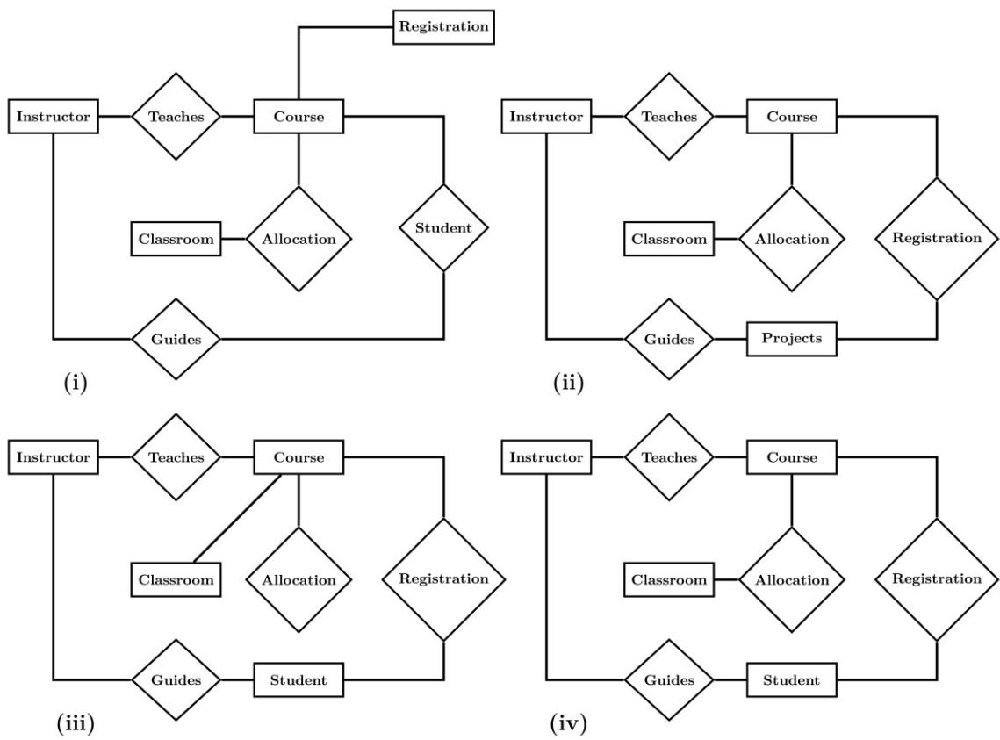

A. (i)

B. (ii)

C. (iii)

D. (iv)

gatecse-2024-set1 databases er-diagram one-mark

Answer key

# 3.9.10 ER Diagram: GATE CSE 2024 | Set 2 | Question: 10


In the context of owner and weak entity sets in the ER (Entity-Relationship) data model, which one of the following statements is TRUE?

A. The weak entity set MUST have total participation in the identifying relationship  
B. The owner entity set MUST have total participation in the identifying relationship  
C. Both weak and owner entity sets MUST have total participation in the identifying relationship  
D. Neither weak entity set nor owner entity set MUST have total participation in the identifying relationship

gatecse-2024-set2 databases er-diagram one-mark

Answer key

# 3.9.11 ER Diagram: GATE IT 2004 | Question: 73


Consider the following entity relationship diagram (ERD), where two entities E1 and E2 have a relation R of cardinality 1:m.


The attributes of $E1$ are $A11$ , $A12$ and $A13$ where $A11$ is the key attribute. The attributes of $E2$ are $A21$ , $A22$ and $A23$ where $A21$ is the key attribute and $A23$ is a multi-valued attribute. Relation $R$ does not have any attribute. A relational database containing minimum number of tables with each table satisfying the requirements of the third normal form (3NF) is designed from the above $ERD$ . The number of tables in the database is

A. 2

B. 3

C. 5

D. 4

gateit-2004

databases

er-diagram

normal

Answer key

# 3.9.12 ER Diagram: GATE IT 2005 | Question: 21

Consider the entities 'hotel room', and 'person' with a many to many relationship 'lodging' as shown below:


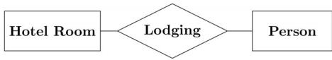

If we wish to store information about the rent payment to be made by person (s) occupying different hotel rooms, then this information should appear as an attribute of

A. Person

B. Hotel Room

C. Lodging

D. None of these

gateit-2005

databases

er-diagram

easy

Answer key

# 3.10

# Functional Dependency (3)


Practice Tests:

Test 1 (15Q)

Test 2 (10Q)

# 3.10.1 Functional Dependency: GATE CSE 2025 | Set 1 | Question: 37

Consider a relational schema team (name, city, owner), with functional dependencies {name → city, name → owner}.


The relation team is decomposed into two relations, t1(name,city) and t2(name, owner). Which of the following statement(s) is/are TRUE?

A. The relation team is NOT in BCNF  
C. The decomposition constitutes a lossless join.

B. The relations $t1$ and $t2$ are in BCNF.  
D. The relation team is NOT in 3 NF.

gatecse2025-set1 databases functional-dependency database-normalization multiple-selects two-marks

Answer key

# 3.10.2 Functional Dependency: GATE CSE 2026 | Set 1 | Question: 20

Let $P, Q, R$ and $S$ be the attributes of a relation in a relational schema. Let $X \to Y$ indicate functional dependency in the context of a relational database, where $X, Y \subseteq \{P, Q, R, S\}$ .


Which of the following options is/are always true?

A. If $(\{P, Q\} \to \{R\}$ and $\{P\} \to \{R\}$ ), then $\{Q\} \to \{R\}$  
B. If $\{P, Q\} \to \{R\}$ , then $(\{P\} \to \{R\}$ or $\{Q\} \to \{R\})$  
C. If $(\{P\} \to \{R\}$ and $\{Q\} \to \{S\}$ ), then $\{P, Q\} \to \{R, S\}$  
D. If $\{P\} \to \{R\}$ , then $\{P, Q\} \to \{R\}$

# 3.10.3 Functional Dependency: GATE DA 2025 | Question: 47


Consider a database relation R with attributes ABCDEFG, and having the following functional dependencies:

$$
\mathrm{A} \rightarrow \mathrm{BCEF} \quad \mathrm{E} \rightarrow \mathrm{DG} \quad \mathrm{BC} \rightarrow \mathrm{A}
$$

Which of the following statements is/are correct?

A. A is the only candidate key of R  
B. A, BC are the candidate keys of R  
C. A, BC, E are the candidate keys of R  
D. Relation R is not in Boyce-Codd Normal Form (BCNF)

gateda-2025 databases functional-dependency multiple-selects two-marks

Answer key

# 3.11

# Indexing (15)

Practice Tests:

Test 1 (15Q)

Test 2 (7Q)

# 3.11.1 Indexing: GATE CSE 1989 | Question: 4-xiv


For secondary key processing which of the following file organizations is preferred? Give a one line justification:

A. Indexed sequential file  
organization.  
C. Inverted file organization.

B. Two-way linked list.

D. Sequential file organization.

gate1989 normal databases indexing descriptive

Answer key

# 3.11.2 Indexing: GATE CSE 1990 | Question: 10b


One giga bytes of data are to be organized as an indexed-sequential file with a uniform blocking factor 8. Assuming a block size of 1 Kilo bytes and a block referencing pointer size of 32 bits, find out the number of levels of indexing that would be required and the size of the index at each level. Determine also the size of the master index. The referencing capability (fanout ratio) per block of index storage may be considered to be 32.

gate1990 databases indexing descriptive

Answer key

# 3.11.3 Indexing: GATE CSE 1993 | Question: 14


An ISAM (indexed sequential) file consists of records of size 64 bytes each, including key field of size 14 bytes. An address of a disk block takes 2 bytes. If the disk block size is 512 bytes and there are 16K records, compute the size of the data and index areas in terms of number blocks. How many levels of tree have for the index?

gate1993 databases indexing normal descriptive

Answer key

# 3.11.4 Indexing: GATE CSE 1998 | Question: 1.35


There are five records in a database.

<table><tr><td>Name</td><td>Age</td><td>Occupation</td><td>Category</td></tr><tr><td>Rama</td><td>27</td><td>CON</td><td>A</td></tr><tr><td>Abdul</td><td>22</td><td>ENG</td><td>A</td></tr><tr><td>Jennifer</td><td>28</td><td>DOC</td><td>B</td></tr><tr><td>Maya</td><td>32</td><td>SER</td><td>D</td></tr><tr><td>Dev</td><td>24</td><td>MUS</td><td>C</td></tr></table>

There is an index file associated with this and it contains the values 1, 3, 2, 5 and 4. Which one of the fields is the index built from?

A. Age

B. Name

C. Occupation

D. Category

gate1998 databases indexing normal

# Answer key

# 3.11.5 Indexing: GATE CSE 2008 | Question: 16, ISRO2016-60

A clustering index is defined on the fields which are of type

A. non-key and ordering  
C. key and ordering

gatecse-2008 easy databases indexing isro2016

B. non-key and non-ordering  
D. key and non-ordering

# Answer key

# 3.11.6 Indexing: GATE CSE 2008 | Question: 70

Consider a file of 16384 records. Each record is 32 bytes long and its key field is of size 6 bytes. The file is ordered on a non-key field, and the file organization is unspanned. The file is stored in a file system with

block size 1024 bytes, and the size of a block pointer is 10 bytes. If the secondary index is built on the key field of the file, and a multi-level index scheme is used to store the secondary index, the number of first-level and second-level blocks in the multi-level index are respectively


A. 8 and 0

B. 128 and 6

C. 256 and 4

D. 512 and 5

gatecse-2008 databases indexing normal

# Answer key

# 3.11.7 Indexing: GATE CSE 2011 | Question: 39

Consider a relational table $r$ with sufficient number of records, having attributes $A_1, A_2, \ldots, A_n$ and let $1 \leq p \leq n$ . Two queries $Q1$ and $Q2$ are given below.

- $Q1: \pi_{A_1, \dots, A_p}(\sigma_{A_p = c}(r))$ where $c$ is a constant  
- $Q2: \pi_{A_1, \dots, A_p} \left( \sigma_{c_1 \leq A_p \leq c_2} (r) \right)$ where $c_1$ and $c_2$ are constants.

The database can be configured to do ordered indexing on $A_{p}$ or hashing on $A_{p}$ . Which of the following statements is TRUE?

A. Ordered indexing will always outperform hashing for both queries  
B. Hashing will always outperform ordered indexing for both queries  
C. Hashing will outperform ordered indexing on $Q1$ , but not on $Q2$  
D. Hashing will outperform ordered indexing on Q2, but not on Q1

gatecse-2011 databases indexing normal

# Answer key

# 3.11.8 Indexing: GATE CSE 2013 | Question: 15

An index is clustered, if

A. it is on a set of fields that form a candidate key


B. it is on a set of fields that include the primary key  
C. the data records of the file are organized in the same order as the data entries of the index  
D. the data records of the file are organized not in the same order as the data entries of the index

gatecse-2013 databases indexing normal

# Answer key

# 3.11.9 Indexing: GATE CSE 2015 | Set 1 | Question: 24

A file is organized so that the ordering of the data records is the same as or close to the ordering of data entries in some index. Then that index is called


A. Dense

B. Sparse

C. Clustered

D. Unclustered

gatecse-2015-set1 databases indexing easy

# Answer key

# 3.11.10 Indexing: GATE CSE 2020 | Question: 54

Consider a database implemented using $B^{+}$ tree for file indexing and installed on a disk drive with block size of 4 KB. The size of search key is 12 bytes and the size of tree/disk pointer is 8 bytes. Assume that the database has one million records. Also assume that no node of the $B^{+}$ tree and no records are present initially in main memory. Consider that each record fits into one disk block. The minimum number of disk accesses required to retrieve any record in the database is \_\_\_\_

gatecse-2020 numerical-answers databases b-tree indexing two-marks

# Answer key

# 3.11.11 Indexing: GATE CSE 2021 | Set 2 | Question: 21

A data file consisting of 1, 50, 000 student-records is stored on a hard disk with block size of 4096 bytes. The data file is sorted on the primary key RollNo. The size of a record pointer for this disk is 7 bytes. Each

student-record has a candidate key attribute called ANum of size 12 bytes. Suppose an index file with records consisting of two fields, ANum value and the record pointer the corresponding student record, is built and stored on the same disk. Assume that the records of data file and index file are not split across disk blocks. The number of blocks in the index file is \_\_\_\_

gatecse-2021-set2 numerical-answers databases indexing one-mark

# Answer key

# 3.11.12 Indexing: GATE CSE 2023 | Question: 52

Consider a database of fixed-length records, stored as an ordered file. The database has 25,000 records, with each record being 100 bytes, of which the primary key occupies 15 bytes. The data file is block-aligned in that each data record is fully contained within a block. The database is indexed by a primary index file, which is also stored as a block-aligned ordered file. The figure below depicts this indexing scheme.

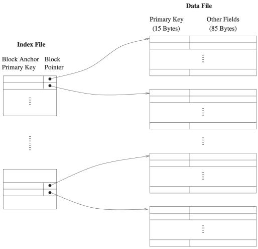

<details>
<summary>flowchart</summary>

This diagram illustrates the data structure and mapping between an Index File and a Data File, showing how specific fields (Primary Key and Other Fields) are mapped to their respective indices.
</details>


Suppose the block size of the file system is 1024 bytes, and a pointer to a block occupies 5 bytes. The system uses binary search on the index file to search for a record with a given key. You may assume that a binary search on an index file of $b$ blocks takes $\lceil \log_2 b \rceil$ block accesses in the worst case.

Given a key, the number of block accesses required to identify the block in the data file that may contain a record with the key, in the worst case, is \_\_\_\_.

gatecse-2023 databases file-system indexing numerical-answers two-marks

# Answer key

# 3.11.13 Indexing: GATE CSE 2024 | Set 2 | Question: 16

Which of the following file organizations is/are I/O efficient for the scan operation in DBMS?

A. Sorted

C. Unclustered tree index

gatecse-2024-set2 databases multiple-selects indexing one-mark

B. Heap

D. Unclustered hash index

# Answer key


# 3.11.14 Indexing: GATE CSE 2026 | Set 2 | Question: 36

An index in a DBMS is said to be dense if an index entry appears for every search-key value in the indexed file. Otherwise it is called a sparse index. Consider the following two statements.


S1: A hash index must be a dense index

S2: A $B^{+}$ tree index can be a sparse index

Which one of the following options is correct?

A. Both S1 and S2 are true

C. S1 is true and S2 is false

B. Both S1 and S2 are false

D. S1 is false and S2 is true

gatecse-2026-set2 databases indexing two-marks

# Answer key

# 3.11.15 Indexing: GATE DA 2026 | Question: 22


In a relational database, a B+ Tree Index is to be constructed for a relation on a key field. In a B+ Tree, a Node Pointer points to a sub-tree and a Data Record Pointer points to a block of database records.

Let, Node size = 4096 bytes, Node Pointer size = 10 bytes, Search Key Field size = 11 bytes and Data Record Pointer size = 12 bytes.

The maximum number of Node Pointers that can be present in a non-leaf node of the B+ Tree is \_. (Answer in integer)

gateda-2026 databases indexing b-tree numerical-answers one-mark

# Answer key

# 3.12

# Joins (7)

# Practice Test: Test 1 (7Q)

# 3.12.1 Joins: GATE CSE 2004 | Question: 14

Consider the following relation schema pertaining to a students database:


• Students (rollno, name, address)  
- Enroll (rollno, courseno, coursename)

where the primary keys are shown underlined. The number of tuples in the student and Enroll tables are 120 and 8 respectively. What are the maximum and minimum number of tuples that can be present in (Student \* Enroll), where '\*' denotes natural join?

A. 8,8

B. 120,8

C. 960,8

D. 960,120

gatecse-2004 databases easy joins natural-join

# Answer key

# 3.12.2 Joins: GATE CSE 2012 | Question: 50

Consider the following relations $A, B$ and $C$ :

<table><tr><td colspan="3">A</td></tr><tr><td>ID</td><td>Name</td><td>Age</td></tr><tr><td>12</td><td>Arun</td><td>60</td></tr><tr><td>15</td><td>Shreya</td><td>24</td></tr><tr><td>99</td><td>Rohit</td><td>11</td></tr></table>


How many tuples does the result of the following relational algebra expression contain? Assume that the schema of $A \cup B$ is the same as that of $A$ .

$$
(A \cup B) \bowtie_ {A. I d > 4 0 \lor C. I d <   1 5} C
$$

A. 7

B. 4

C. 5

D. 9

gatecse-2012 databases joins normal

# Answer key

# 3.12.3 Joins: GATE CSE 2014 | Set 2 | Question: 30

Consider a join (relation algebra) between relations $r(R)$ and $s(S)$ using the nested loop method. There are 3 buffers each of size equal to disk block size, out of which one buffer is reserved for intermediate results. Assuming $\text{size}(r(R)) < \text{size}(s(S))$ , the join will have fewer number of disk block accesses if


A. relation $r(R)$ is in the outer loop.  
B. relation $s(S)$ is in the outer loop.  
C. join selection factor between $r(R)$ and $s(S)$ is more than 0.5.  
D. join selection factor between $r(R)$ and $s(S)$ is less than 0.5.

gatecse-2014-set2 databases normal joins

# Answer key

# 3.12.4 Joins: GATE IT 2005 | Question: 82a

A database table $T_{1}$ has 2000 records and occupies 80 disk blocks. Another table $T_{2}$ has 400 records and occupies 20 disk blocks. These two tables have to be joined as per a specified join condition that needs to be evaluated for every pair of records from these two tables. The memory buffer space available can hold one block of records for $T_{1}$ and one block of records for $T_{2}$ simultaneously at any point in time. No information available on either table.


If Nested-loop join algorithm is employed to perform the join, with the most appropriate choice of table to be used in outer loop, the number of block accesses required for reading the data are

A. 800000

B. 40080

C. 32020

D. 100

gateit-2005 databases normal joins

# Answer key

# 3.12.5 Joins: GATE IT 2005 | Question: 82b

A database table $T_{1}$ has 2000 records and occupies 80 disk blocks. Another table $T_{2}$ has 400 records and occupies 20 disk blocks. These two tables have to be joined as per a specified join condition that needs to be evaluated for every pair of records from these two tables. The memory buffer space available can hold of


one block of records for $T_{1}$ and one block of records for $T_{2}$ simultaneously at any point in time. No index is available on either table.

If, instead of Nested-loop join, Block nested-loop join is used, again with the most appropriate choice of table in the outer loop, the reduction in number of block accesses required for reading the data will be

A. 0

B. 30400

C. 38400

D. 798400

gateit-2005 databases normal joins

# Answer key

# 3.12.6 Joins: GATE IT 2006 | Question: 14

Consider the relations $r_1(\mathrm{P}, \mathrm{Q}, \mathrm{R})$ and $r_2(\mathrm{R}, \mathrm{S}, \mathrm{T})$ with primary keys $\mathbf{P}$ and $\mathbf{R}$ respectively. The relation $r_1$ contains 2000 tuples and $r_2$ contains 2500 tuples. The maximum size of the join $r_1 \bowtie r_2$ is:


A. 2000

B. 2500

C. 4500

D. 5000

gateit-2006 databases joins natural-join normal

# Answer key

# 3.12.7 Joins: GATE IT 2007 | Question: 68

Consider the following relation schemas :


- b-Schema = (b-name, b-city, assets)  
- a-Schema = (a-num, b-name, bal)  
- d-Schema = (c-name, a-number)

Let branch, account and depositor be respectively instances of the above schemas. Assume that account and depositor relations are much bigger than the branch relation.

Consider the following query:

$\Pi_{\mathrm{c - name}}$ ( $\sigma_{\mathrm{b - city}} =$ "Agra" $\wedge$ bal $< 0$ (branch $\bowtie$ (account $\bowtie$ depositor)

Which one of the following queries is the most efficient version of the above query ?

A. $\Pi_{\mathrm{c - name}}$ ( $\sigma_{\mathrm{bal}} < 0$ ( $\sigma_{\mathrm{b - city}} =$ "Agra" branch $\bowtie$ account) $\bowtie$ depositor)  
B. $\Pi_{\mathrm{c - name}}$ ( $\sigma_{\mathrm{b - city}} =$ "Agra" branch $\bowtie$ ( $\sigma_{\mathrm{bal}} < 0$ account $\bowtie$ depositor))  
C. $\Pi_{\mathrm{c - name}}$ (( $\sigma_{\mathrm{b - city}} =$ "Agra" branch $\bowtie$ $\sigma_{\mathrm{b - city}} =$ "Agra" $\wedge$ bal $< 0$ account) $\bowtie$ depositor)  
D. $\Pi_{\mathrm{c - name}}$ ( $\sigma_{\mathrm{b - city} = "Agra"}$ branch $\bowtie$ ( $\sigma_{\mathrm{b - city} = "Agra"} \wedge \text{bal} < 0$ account $\bowtie$ depositor))

gateit-2007 databases joins relational-algebra normal

# Answer key

# 3.13

# Multivalued Dependency 4nf (1)

# 3.13.1 Multivalued Dependency 4nf: GATE IT 2007 | Question: 67

Consider the following implications relating to functional and multivalued dependencies given below, which may or may not be correct.


i. if $A \to \to B$ and $A \to \to C$ then $A \to BC$  
ii. if $A\to B$ and $A\to C$ then $A\to \rightarrow BC$  
iii. if $A\to \rightarrow BC$ and $A\to B$ then $A\to C$  
iv. if $A\to BC$ and $A\to B$ then $A\to \to C$

Exactly how many of the above implications are valid?

A. 0

B. 1

C. 2

D. 3

gateit-2007 databases database-normalization multivalued-dependency-4nf normal

# Answer key

# 3.14

# Natural Join (3)

# 3.14.1 Natural Join: GATE CSE 2005 | Question: 30


Let r be a relation instance with schema $R = (A, B, C, D)$ . We define $r_{1} = \pi_{A,B,C}(R)$ and $r_{2} = \pi_{A,D}(r)$ . Let $s = r_{1} * r_{2}$ where $*$ denotes natural join. Given that the decomposition of r into $r_{1}$ and $r_{2}$ is lossy, which one of the following is TRUE?

A. $s \subset r$

B. $r \cup s = r$

C. $r\subset s$

D. $r * s = s$

gatecse-2005 databases relational-algebra natural-join normal

# Answer key

# 3.14.2 Natural Join: GATE CSE 2010 | Question: 43

The following functional dependencies hold for relations $R(A, B, C)$ and $S(B, D, E)$ .


- $B \to A$  
• A → C

The relation $R$ contains 200 tuples and the relation $S$ contains 100 tuples. What is the maximum number of tuples possible in the natural join $R \bowtie S$ ?

A. 100

B. 200

C. 300

D. 2000

gatecse-2010 databases normal natural-join

# Answer key

# 3.14.3 Natural Join: GATE CSE 2015 | Set 2 | Question: 32


Consider two relations $R_{1}(A,B)$ with the tuples $(1,5),(3,7)$ and $R_{2}(A,C) = (1,7),(4,9)$ .

Assume that $R(A, B, C)$ is the full natural outer join of $R_1$ and $R_2$ . Consider the following tuples of the form $(A, B, C)$ :

$$
a = (1, 5, n u l l), b = (1, n u l l, 7), c = (3, n u l l, 9), d = (4, 7, n u l l), e = (1, 5, 7),
$$

$$
f = (3, 7, n u l l), g = (4, n u l l, 9).
$$

Which one of the following statements is correct?

A. R contains a, b, e, f, g but not c, d.

B. $R$ contains all $a, b, c, d, e, f, g$ .

C. R contains e, f, g but not a, b.

D. $R$ contains $e$ but not $f, g$ .

gatecse-2015-set2 databases normal natural-join

# Answer key

# 3.15

# Normal Forms (1)

# Practice Test: Test 1 (11Q)

# 3.15.1 Normal Forms: GATE DA 2026 | Question: 51


Consider an ER model with the entities E1 ( $A_{11}$ , $A_{12}$ , $A_{13}$ ) and E2 ( $A_{21}$ , $A_{22}$ , $A_{23}$ ), where, $A_{11}$ , $A_{12}$ , $A_{13}$ are the attributes of E1, and $A_{21}$ , $A_{22}$ , $A_{23}$ are the attributes of E2. Let $A_{22}$ be a multivalued attribute. $A_{11}$ and $A_{21}$ are the primary keys of E1 and E2, respectively.

Let R12 be a many-to-many relationship between E1 and E2. Participation of both E1 and E2 in R12 is total.

The minimum number of relations required to convert the ER model into relational model (assuming there is no other functional dependency) where each relation is in third normal form (3NF) is \_\_\_\_. (Answer in integer)

gateda-2026 databases er-diagram normal-forms numerical-answers two-marks

# Answer key

# 3.16

# Query (3)

Consider the following relational database schema:

- EMP (eno name, age)  
- PROJ (pno name)  
• INVOLVED (eno, pno)

EMP contains information about employees. PROJ about projects and involved about which employees involved in which projects. The underlined attributes are the primary keys for the respective relations.

State in English (in not more than 15 words)

What the following relational algebra expressions are designed to determine

i. $\Pi_{eno}(\text{INVOLVED}) - \Pi_{eno}((\Pi_{eno}(\text{INVOLVED}) \times \Pi_{pno}(\text{PROJ})) - \text{INVOLVED})$  
ii. $\Pi_{age}(\mathrm{EMP}) - \Pi_{age}(\sigma_{E.age < Emp.age}((\rho E(\mathrm{EMP})\times \mathrm{EMP}))$

(Note: $\rho E(\text{EMP})$ conceptually makes a copy of EMP and names it E ( $\rho$ is called the rename operator))

gate1997 databases sql descriptive normal relational-algebra query

Answer key

# 3.16.2 Query: GATE DA 2026 | Question: 41


Consider a table Employee(EmpID, TeamID), where the column EmpID (ID of an employee) is the primary key. The column TeamID denotes the team ID of the team of which the employee is a member. TeamID is a NOT NULL column.

We want to display the size of the team (denoted as TeamSize) in which each employee is a member by using SQL. As an example, the desired output for the given Employee table is also shown in tabular form.

Which of the following is/are correct?

Employee

<table><tr><td>EmpID</td><td>TeamID</td></tr><tr><td>1</td><td>8</td></tr><tr><td>2</td><td>8</td></tr><tr><td>3</td><td>8</td></tr><tr><td>4</td><td>7</td></tr><tr><td>5</td><td>7</td></tr><tr><td>6</td><td>9</td></tr></table>

Output

<table><tr><td>EmpID</td><td>TeamSize</td></tr><tr><td>1</td><td>3</td></tr><tr><td>2</td><td>3</td></tr><tr><td>3</td><td>3</td></tr><tr><td>4</td><td>2</td></tr><tr><td>5</td><td>2</td></tr><tr><td>6</td><td>1</td></tr></table>

A.

SELECT E. EmpID, B. TeamSize  
FROM Employee AS E, (SELECT TeamID, COUNT(TeamID) AS  
TeamSize FROM Employee GROUP BY TeamID) AS B  
WHERE E.TeamID = B.TeamID

B. SELECT A. EmpID, COUNT(B.TeamID) AS TeamSize
FROM Employee AS A, Employee AS B
WHERE A.TeamID = B.TeamID AND A. EmpID = B. EmpID
GROUP BY A. EmpID  
C. SELECT B. EmpID, B. TeamSize
FROM (SELECT EmpID, COUNT(TeamID) AS TeamSize
FROM Employee GROUP BY EmpID) AS B  
D.
SELECT A.EmplD, B.TeamSize
FROM Employee AS A, (SELECT COUNT(TeamID) AS TeamSize FROM Employee GROUP BY TeamID) AS B
WHERE A.TeamID = B.TeamID

gateda-2026 databases sql query multiple-selects two-marks

Answer key

# 3.16.3 Query: GATE DA 2026 | Question: 50

Let Account be a relation as shown.


Account

<table><tr><td>AccNo</td><td>Balance</td></tr><tr><td>A1</td><td>5000</td></tr><tr><td>A2</td><td>5000</td></tr><tr><td>A3</td><td>10000</td></tr><tr><td>A4</td><td>15000</td></tr><tr><td>A5</td><td>18000</td></tr></table>

Consider the given SQL query.

SELECT AccNo FROM Account AS A

WHERE (SELECT COUNT(\*) FROM Account AS B

WHERE A.Balance < B.Balance) >= (SELECT COUNT(\*)

FROM Account AS C WHERE A.Balance > C.Balance)

The number of rows returned by the SQL query is \_\_\_\_. (Answer in integer)

gateda-2026 databases sql query numerical-answers two-marks

Answer key

# 3.17

# Referential Integrity (6)

Practice Test: Test 1 (7Q)

# 3.17.1 Referential Integrity: GATE CSE 1997 | Question: 6.10, ISRO2016-54

Let $R(a, b, c)$ and $S(d, e, f)$ be two relations in which $d$ is the foreign key of $S$ that refers to the primary key of $R$ . Consider the following four operations $R$ and $S$

I. Insert into R  
II. Insert into S  
III. Delete from R  
IV. Delete from S

Which of the following can cause violation of the referential integrity constraint above?

A. Both I and IV

B. Both II and III

C. All of these

D. None of these

gate1997 databases referential-integrity easy isro2016

Answer key


The following table has two attributes $A$ and $C$ where $A$ is the primary key and $C$ is the foreign key referencing $A$ with on-delete cascade.

<table><tr><td>A</td><td>C</td></tr><tr><td>2</td><td>4</td></tr><tr><td>3</td><td>4</td></tr><tr><td>4</td><td>3</td></tr><tr><td>5</td><td>2</td></tr><tr><td>7</td><td>2</td></tr><tr><td>9</td><td>5</td></tr><tr><td>6</td><td>4</td></tr></table>

The set of all tuples that must be additionally deleted to preserve referential integrity when the tuple $(2, 4)$ is deleted is:

A. (3,4) and (6,4)

B. (5,2) and (7,2)

C. $(5,2)$ , $(7,2)$ and $(9,5)$

D. (3,4), (4,3) and (6,4)

gatecse-2005 databases referential-integrity normal

# Answer key

# 3.17.3 Referential Integrity: GATE CSE 2012 | Question: 43

Suppose $R_{1}(\underline{A}, B)$ and $R_{2}(\underline{C}, D)$ are two relation schemas. Let $r_{1}$ and $r_{2}$ be the corresponding relation instances. B is a foreign key that refers to C in $R_{2}$ . If data in $r_{1}$ and $r_{2}$ satisfy referential integrity constraints, which of the following is ALWAYS TRUE?

A. $\prod_{B}(r_{1}) - \prod_{C}(r_{2}) = \varnothing$  
B. $\prod_{C}(r_{2})-\prod_{B}(r_{1})=\varnothing$  
C. $\prod_B(r_1) = \prod_C(r_2)$  
D. $\prod_{B}(r_{1})-\prod_{C}(r_{2})\neq\varnothing$

gatecse-2012 databases relational-algebra normal referential-integrity

# Answer key

# 3.17.4 Referential Integrity: GATE CSE 2017 | Set 2 | Question: 19

Consider the following tables T1 and T2.

<table><tr><td>P</td><td>Q</td></tr><tr><td>2</td><td>2</td></tr><tr><td>3</td><td>8</td></tr><tr><td>7</td><td>3</td></tr><tr><td>5</td><td>8</td></tr><tr><td>6</td><td>9</td></tr><tr><td>8</td><td>5</td></tr><tr><td>9</td><td>8</td></tr></table>

<table><tr><td>R</td><td>S</td></tr><tr><td>2</td><td>2</td></tr><tr><td>8</td><td>3</td></tr><tr><td>3</td><td>2</td></tr><tr><td>9</td><td>7</td></tr><tr><td>5</td><td>7</td></tr><tr><td>7</td><td>2</td></tr></table>


In table $T1$ P is the primary key and Q is the foreign key referencing R in table $T2$ with on-delete cascade and on-update cascade. In table $T2$ , R is the primary key and S is the foreign key referencing P in table $T1$ with on-delete set NULL and on-update cascade. In order to delete record $\langle 3,8 \rangle$ from the table $T1$ , the number of additional records that need to be deleted from table $T1$ is \_\_\_\_

# 3.17.5 Referential Integrity: GATE CSE 2021 | Set 2 | Question: 6

Consider the following statements S1 and S2 about the relational data model:


- S1: A relation scheme can have at most one foreign key.  
- S2: A foreign key in a relation scheme $R$ cannot be used to refer to tuples of $R$ .

Which one of the following choices is correct?

A. Both $S1$ and $S2$ are true  
C. $S1$ is false and $S2$ is true  
gatecse-2021-set2 databases referential-integrity one-mark

B. $S1$ is true and $S2$ is false  
D. Both $S1$ and $S2$ are false

# Answer key

# 3.17.6 Referential Integrity: GATE DA 2026 | Question: 16


Consider two relations $r$ and $s$ defined on the relational schemas $R(A, B)$ and $S(E, C)$ , respectively. $A$ is the primary key of $R$ and $E$ is a foreign key of $S$ referencing $A$ in $R$ .

Which of the following operations will NEVER violate the foreign key constraint?

A. Inserting records into relation r  
C. Deleting records from relation r  
gateda-2026 databases referential-integrity multiple-selects one-mark

B. Deleting records from relation s  
D. Inserting records into relation s

# Answer key

# 3.18

# Relational Algebra (33)

Practice Tests:

Test 1 (15Q)

Test 2 (15Q)

Test 3 (15Q)

Test 4 (3Q)

# 3.18.1 Relational Algebra: GATE CSE 1992 | Question: 13b

Suppose we have a database consisting of the following three relations:


<table><tr><td>FREQUENTS</td><td>(CUSTOMER, HOTEL)</td></tr><tr><td>SERVES</td><td>(HOTEL, SNACKS)</td></tr><tr><td>LIKES</td><td>(CUSTOMER, SNACKS)</td></tr></table>

The first indicates the hotels each customer visits, the second tells which snacks each hotel serves and last indicates which snacks are liked by each customer. Express the following query in relational algebra:

Print the hotels the serve the snack that customer Rama likes.

gate1992 databases relational-algebra normal descriptive

# Answer key

# 3.18.2 Relational Algebra: GATE CSE 1994 | Question: 13

Consider the following relational schema:


• COURSES (cno, cname)  
• STUDENTS (rollno, sname, age, year)  
- REGISTERED\_FOR (cno, rollno)

The underlined attributes indicate the primary keys for the relations. The ‘year’ attribute for the STUDENTS relation indicates the year in which the student is currently studying (First year, Second year etc.)

A. Write a relational algebra query to print the roll number of students who have registered for cno 322.  
B. Write a SQL query to print the age and year of the youngest student in each year.


# 3.18.3 Relational Algebra: GATE CSE 1994 | Question: 3.8


Give a relational algebra expression using only the minimum number of operators from $(\cup, -)$ which is equivalent to $R \cap S$ .

gate1994 databases relational-algebra normal descriptive

Answer key

# 3.18.4 Relational Algebra: GATE CSE 1995 | Question: 27


Consider the relation scheme.

<table><tr><td>AUTHOR</td><td>(ANAME, INSTITUTION, ACITY, AGE)</td></tr><tr><td>PUBLISHER</td><td>(PNAME, PCITY)</td></tr><tr><td>BOOK</td><td>(TITLE, ANAME, PNAME)</td></tr></table>

Express the following queries using (one or more of) SELECT, PROJECT, JOIN and DIVIDE operations.

A. Get the names of all publishers.  
B. Get values of all attributes of all authors who have published a book for the publisher with PNAME='TECHNICAL PUBLISHERS'.  
C. Get the names of all authors who have published a book for any publisher located in Madras

gate1995 databases relational-algebra normal descriptive

Answer key

# 3.18.5 Relational Algebra: GATE CSE 1996 | Question: 27


A library relational database system uses the following schema

- USERS (User#, User Name, Home Town)  
• BOOKS (Book#, Book Title, Author Name)  
• ISSUED (Book#, User#, Date)

Explain in one English sentence, what each of the following relational algebra queries is designed to determine

a. $\sigma_{\mathrm{User\# = 6}}$ ( $\pi_{\mathrm{User\# , Book Title}}$ ((USERS $\bowtie$ ISSUED) $\bowtie$ BOOKS))  
b. $\pi_{\text{Author Name}}$ (BOOKS $\bowtie$ $\sigma_{\text{Home Town=Delhi}}$ (USERS $\bowtie$ ISSUED))

gate1996 databases relational-algebra descriptive

Answer key

# 3.18.6 Relational Algebra: GATE CSE 1997 | Question: 76-a


Consider the following relational database schema:

- EMP (eno name, age)  
- PROJ (pno name)  
- INVOLVED (eno, pno)

EMP contains information about employees. PROJ about projects and involved about which employees involved in which projects. The underlined attributes are the primary keys for the respective relations.

What is the relational algebra expression containing one or more of $\{\sigma,\pi,\times,\rho,-\}$ which is equivalent to SQL query.

select eno from EMP|INVOLVED where EMP.eno=INVOLVED.eno and INVOLVED.pno=3

# Answer key

# 3.18.7 Relational Algebra: GATE CSE 1998 | Question: 1.33

Given two union compatible relations $R_{1}(A,B)$ and $R_{2}(C,D)$ , what is the result of the operation $R_{1} \bowtie_{A = C \wedge B = D} R_{2}$ ?


A. $R_{1} \cup R_{2}$

B. $R_{1} \times R_{2}$

C. $R_{1}-R_{2}$

D. $R_{1} \cap R_{2}$

gate1998 normal relational-algebra

# Answer key

# 3.18.8 Relational Algebra: GATE CSE 1998 | Question: 27

Consider the following relational database schemes:


• COURSES (Cno, Name)  
- PRE\_REQ(Cno, Pre\_Cno)  
• COMPLETED (Student\_no, Cno)

COURSES gives the number and name of all the available courses.

PRE\_REQ gives the information about which courses are pre-requisites for a given course.

COMPLETED indicates what courses have been completed by students

Express the following using relational algebra:

List all the courses for which a student with Student\_no 2310 has completed all the pre-requisites.

gate1998 databases relational-algebra normal descriptive

# Answer key

# 3.18.9 Relational Algebra: GATE CSE 1999 | Question: 1.18, ISRO2016-53


Consider the join of a relation R with a relation S. If R has m tuples and S has n tuples then the maximum and minimum sizes of the join respectively are

A. $m + n$ and 0  
B. mn and 0  
C. $m + n$ and $|m - n|$  
D. mn and $m + n$

gate1999 databases relational-algebra easy isro2016

# Answer key

# 3.18.10 Relational Algebra: GATE CSE 2000 | Question: 1.23, ISRO2016-57


Given the relations

- employee (name, salary, dept-no), and  
- department (dept-no, dept-name, address),

Which of the following queries cannot be expressed using the basic relational algebra operations $(\sigma,\pi,\times,\bowtie,\cup,\cap,-)$ ?

A. Department address of every employee  
B. Employees whose name is the same as their department name  
C. The sum of all employees' salaries  
D. All employees of a given department

# Answer key

# 3.18.11 Relational Algebra: GATE CSE 2001 | Question: 1.24


Suppose the adjacency relation of vertices in a graph is represented in a table $\operatorname{Adj}(X, Y)$ . Which of the following queries cannot be expressed by a relational algebra expression of constant length?

A. List all vertices adjacent to a given vertex  
B. List all vertices which have self loops  
C. List all vertices which belong to cycles of less than three vertices  
D. List all vertices reachable from a given vertex

gatecse-2001 databases relational-algebra normal

Answer key

# 3.18.12 Relational Algebra: GATE CSE 2001 | Question: 1.25

Let $r$ and $s$ be two relations over the relation schemes $R$ and $S$ respectively, and let $A$ be an attribute in $R$ . The relational algebra expression $\sigma_{A = a}(r \bowtie s)$ is always equal to


A. $\sigma_{A=a}(r)$  
C. $\sigma_{A = a}(r) \bowtie s$  
gatecse-2001 databases relational-algebra

B. r  
D. None of the above

Answer key

# 3.18.13 Relational Algebra: GATE CSE 2001 | Question: 21-a

Consider a relation examinee (regno, name, score), where regno is the primary key to score is a real number.


Write a relational algebra using $(\Pi, \sigma, \rho, \times)$ to find the list of names which appear more than once in examinee.

gatecse-2001 databases normal descriptive relational-algebra

Answer key

# 3.18.14 Relational Algebra: GATE CSE 2002 | Question: 15

A university placement center maintains a relational database of companies that interview students on campus and make job offers to those successful in the interview. The schema of the database is given below:


<table><tr><td>COMPANY(cname, clocation)</td><td>STUDENT(srollno, sname, sdegree)</td></tr><tr><td>INTERVIEW(cname, srollno, idate)</td><td>OFFER(cname, srollno, osalary)</td></tr></table>

The COMPANY relation gives the name and location of the company. The STUDENT relation gives the student's roll number, name and the degree program for which the student is registered in the university. The INTERVIEW relation gives the date on which a student is interviewed by a company. The OFFER relation gives the salary offered to a student who is successful in a company's interview. The key for each relation is indicated by the underlined attributes

a. Write a relational algebra expressions (using only the operators $\bowtie$ , $\sigma$ , $\pi$ , $\cup$ , —) for the following queries.

i. List the rollnumbers and names of students who attended at least one interview but did not receive any job offer.  
ii. List the rollnumbers and names of students who went for interviews and received job offers from every company with which they interviewed.

b. Write an SQL query to list, for each degree program in which more than five students were offered jobs, the name of the degree and the average offered salary of students in this degree program.

gatecse-2002 databases normal descriptive relational-algebra sql

Answer key

# 3.18.15 Relational Algebra: GATE CSE 2003 | Question: 30


Consider the following SQL query

Select distinct $a_{1}, a_{2}, \ldots, a_{n}$

from $r_1, r_2, \ldots, r_m$

where P

For an arbitrary predicate P, this query is equivalent to which of the following relational algebra expressions?

A. $\Pi_{a_{1},a_{2},\ldots,a_{n}}\sigma_{p}\left(r_{1}\times r_{2}\times\cdots\times r_{m}\right)$  
B. $\Pi_{a_1, a_2, \ldots, a_n} \sigma_p(r_1 \bowtie r_2 \bowtie \cdots \bowtie r_m)$  
C. $\Pi_{a_1, a_2, \ldots, a_n} \sigma_p(r_1 \cup r_2 \cup \dots \cup r_m)$  
D. $\Pi_{a_1, a_2, \ldots, a_n} \sigma_p(r_1 \cap r_2 \cap \dots \cap r_m)$

gatecse-2003 databases relational-algebra normal

Answer key

# 3.18.16 Relational Algebra: GATE CSE 2004 | Question: 51


Consider the relation Student (name, sex, marks), where the primary key is shown underlined, pertaining to students in a class that has at least one boy and one girl. What does the following relational algebra expression produce? (Note: $\rho$ is the rename operator).

$\pi_{name}\left\{\sigma_{sex=female}\left(\text{Student}\right)\right\}-\pi_{name}\left(\text{Student}\bowtie_{(sex=female\wedge x=male\wedge marks\leq m)}\rho_{n,x,m}\left(\text{Student}\right)\right)$

A. names of girl students with the highest marks  
B. names of girl students with more marks than some boy student  
C. names of girl students with marks not less than some boy student  
D. names of girl students with more marks than all the boy students

gatecse-2004 databases relational-algebra normal

Answer key

# 3.18.17 Relational Algebra: GATE CSE 2007 | Question: 59


Information about a collection of students is given by the relation studInfo(studId, name, sex). The relation enroll(studId, coursework) gives which student has enrolled for (or taken) what course(s). Assume that every course is taken by at least one male and at least one female student. What does the following relational algebra expression represent?

$\pi_{\text{courseId}}\left(\left(\pi_{\text{studId}}\left(\sigma_{\text{sex} = ' \text{female'}}\right.\right.\right.\left.\left.\left(\text{studInfo}\right)\right)\times \pi_{\text{courseId}}\left(\text{enroll}\right)\right) - \text{enroll}$

A. Courses in which all the female students are enrolled.  
B. Courses in which a proper subset of female students are enrolled.  
C. Courses in which only male students are enrolled.  
D. None of the above

gatecse-2007 databases relational-algebra normal

Answer key

# 3.18.18 Relational Algebra: GATE CSE 2008 | Question: 68


Let R and S be two relations with the following schema

$$
R (P, Q, R 1, R 2, R 3)
$$

$$
S (P, Q, S 1, S 2)
$$

where $\{P,Q\}$ is the key for both schemas. Which of the following queries are equivalent?

1. $\Pi_P(R \bowtie S)$  
II. $\Pi_P(R) \bowtie \Pi_P(S)$

III. $\Pi_{P}\left(\Pi_{P,Q}\left(R\right)\cap\Pi_{P,Q}\left(S\right)\right)$  
IV. $\Pi_P(\Pi_{P,Q}(R) - (\Pi_{P,Q}(R) - \Pi_{P,Q}(S)))$

A. Only I and II

B. Only I and III

C. Only I, II and III

D. Only I, III and IV

gatecse-2008 databases relational-algebra normal

Answer key

# 3.18.19 Relational Algebra: GATE CSE 2014 | Set 3 | Question: 21

What is the optimized version of the relation algebra expression $\pi_{A1}(\pi_{A2}(\sigma_{F1}(\sigma_{F2}(r))))$ , where $A1, A2$ are sets of attributes in $r$ with $A1 \subset A2$ and $F1, F2$ are Boolean expressions based on the attributes in $r$ ?


A. $\pi_{A1}(\sigma_{(F1\land F2)}(r))$  
C. $\pi_{A2}\big(\sigma_{(F1\land F2)}(r)\big)$

gatecse-2014-set3 databases relational-algebra easy

B. $\pi_{A1}(\sigma_{(F1 \lor F2)}(r))$  
D. $\pi_{A2}\big(\sigma_{(F1\lor F2)}(r)\big)$

Answer key

# 3.18.20 Relational Algebra: GATE CSE 2014 | Set 3 | Question: 30

Consider the relational schema given below, where eld of the relation dependent is a foreign key referring to empld of the relation employee. Assume that every employee has at least one associated dependent in the dependent relation.


- employee (empld, empName, empAge)  
- dependent (depld, eld, depName, depAge)

Consider the following relational algebra query:

$$
\Pi_ {e m p I d} (e m p l o y e e) - \Pi_ {e m p I d} (e m p l o y e e \bowtie_ {(e m p I d = e I D) \wedge (e m p A g e \leq d e p A g e)} d e p e n d e n t)
$$

The above query evaluates to the set of emplds of employees whose age is greater than that of

A. some dependent.  
C. some of his/her dependents.

gatecse-2014-set3 databases relational-algebra normal

B. all dependents.  
D. all of his/her dependents.

Answer key

# 3.18.21 Relational Algebra: GATE CSE 2015 | Set 1 | Question: 7

SELECT operation in SQL is equivalent to


A. The selection operation in relational algebra  
B. The selection operation in relational algebra, except that SELECT in SQL retains duplicates  
C. The projection operation in relational algebra  
D. The projection operation in relational algebra, except that SELECT in SQL retains duplicates

gatecse-2015-set1 databases sql relational-algebra easy

Answer key

# 3.18.22 Relational Algebra: GATE CSE 2017 | Set 1 | Question: 46

Consider a database that has the relation schema CR(StudentName, CourseName). An instance of the schema CR is as given below.

<table><tr><td>StudentName</td><td>CourseName</td></tr><tr><td>SA</td><td>CA</td></tr><tr><td>SA</td><td>CB</td></tr><tr><td>SA</td><td>CC</td></tr><tr><td>SB</td><td>CB</td></tr><tr><td>SB</td><td>CC</td></tr><tr><td>SC</td><td>CA</td></tr><tr><td>SC</td><td>CB</td></tr><tr><td>SC</td><td>CC</td></tr><tr><td>SD</td><td>CA</td></tr><tr><td>SD</td><td>CB</td></tr><tr><td>SD</td><td>CC</td></tr><tr><td>SD</td><td>CD</td></tr><tr><td>SE</td><td>CD</td></tr><tr><td>SE</td><td>CA</td></tr><tr><td>SE</td><td>CB</td></tr><tr><td>SF</td><td>CA</td></tr><tr><td>SF</td><td>CB</td></tr><tr><td>SF</td><td>CC</td></tr></table>

The following query is made on the database.

$$
\cdot T 1 \leftarrow \pi_ {\text {CourseName}} \left(\sigma_ {\text {StudentName} = S A} (C R)\right)
$$

$$
\cdot T 2 \leftarrow C R \div T 1
$$

The number of rows in T2 is \_\_\_\_.

gatecse-2017-set1 databases relational-algebra normal numerical-answers

# Answer key

# 3.18.23 Relational Algebra: GATE CSE 2018 | Question: 41


Consider the relations $r(A, B)$ and $s(B, C)$ , where $s. B$ is a primary key and $r. B$ is a foreign key referencing $s. B$ . Consider the query

$$
Q: r \bowtie (\sigma_ {B <   5} (s))
$$

Let LOJ denote the natural left outer-join operation. Assume that $r$ and $s$ contain no null values.

Which of the following is NOT equivalent to Q?

A. $\sigma_{B < 5}(r \bowtie s)$  
C. $rLOJ(\sigma_{B < 5}(s))$

B. $\sigma_{B < 5}(r LOJ s)$

D. $\sigma_{B < 5}(r)LOJs$

gatecse-2018 databases relational-algebra normal two-marks

# Answer key

# 3.18.24 Relational Algebra: GATE CSE 2019 | Question: 55

Consider the following relations $P(X,Y,Z), Q(X,Y,T)$ and $R(Y,V)$ .


Table: P

<table><tr><td>X</td><td>Y</td><td>Z</td></tr><tr><td>X1</td><td>Y1</td><td>Z1</td></tr><tr><td>X1</td><td>Y1</td><td>Z2</td></tr><tr><td>X2</td><td>Y2</td><td>Z2</td></tr><tr><td>X2</td><td>Y4</td><td>Z4</td></tr></table>

Table: Q

<table><tr><td>X</td><td>Y</td><td>T</td></tr><tr><td>X2</td><td>Y1</td><td>2</td></tr><tr><td>X1</td><td>Y2</td><td>5</td></tr><tr><td>X1</td><td>Y1</td><td>6</td></tr><tr><td>X3</td><td>Y3</td><td>1</td></tr></table>

Table: R.

<table><tr><td>Y</td><td>V</td></tr><tr><td>Y1</td><td>V1</td></tr><tr><td>Y3</td><td>V2</td></tr><tr><td>Y2</td><td>V3</td></tr><tr><td>Y2</td><td>V2</td></tr></table>

How many tuples will be returned by the following relational algebra query?

$$
\Pi_ {x} (\sigma_ {(P. Y = R. Y \land R. V = V 2))} (P \times R)) - \Pi_ {x} (\sigma_ {(Q. Y = R. Y \land Q. T > 2))} (Q \times R))
$$

Answer: \_\_\_\_

gatecse-2019 numerical-answers databases relational-algebra two-marks

Answer key

# 3.18.25 Relational Algebra: GATE CSE 2021 | Set 1 | Question: 27


The following relation records the age of 500 employees of a company, where empNo (indicating the employee number) is the key:

$$
e m p A g e (\underline {{e m p N o}}, a g e)
$$

Consider the following relational algebra expression:

$$
\Pi_ {e m p N o} (e m p A g e \bowtie_ {(a g e > a g e 1)} \rho_ {e m p N o 1, a g e 1} (e m p A g e))
$$

What does the above expression generate?

A. Employee numbers of only those employees whose age is the maximum  
B. Employee numbers of only those employees whose age is more than the age of exactly one other employee  
C. Employee numbers of all employees whose age is not the minimum  
D. Employee numbers of all employees whose age is the minimum

gatecse-2021-set1 databases relational-algebra two-marks

Answer key

# 3.18.26 Relational Algebra: GATE CSE 2022 | Question: 15


Consider the following three relations in a relational database.

Employee(eId, Name), Brand(bId, bName), Own(eId, bId)

Which of the following relational algebra expressions return the set of $elds$ who own all the brands?

A. $\Pi_{eId}(\Pi_{eId,bId}(Own)/\Pi_{bId}(Brand))$  
B. $\Pi_{eId}(Own) - \Pi_{eId}((\Pi_{eId}(Own) \times \Pi_{bId}(Brand)) - \Pi_{eId,bId}(Own))$  
c. $\Pi_{eId}(\Pi_{eId,bId}(Own) / \Pi_{bId}(Own))$  
D. $\Pi_{eId}\left((\Pi_{eId}(Own) \times \Pi_{bId}(Own)) / \Pi_{bId}(Brand)\right)$

gatecse-2022 databases relational-algebra multiple-selects one-mark

Answer key

# 3.18.27 Relational Algebra: GATE CSE 2024 | Set 1 | Question: 25

Consider the following two relations, $R(A,B)$ and $S(A,C)$ :


<table><tr><td colspan="2">R</td></tr><tr><td>A</td><td>B</td></tr><tr><td>10</td><td>20</td></tr><tr><td>20</td><td>30</td></tr><tr><td>30</td><td>40</td></tr><tr><td>30</td><td>50</td></tr><tr><td>50</td><td>95</td></tr></table>

<table><tr><td colspan="2">S</td></tr><tr><td>A</td><td>C</td></tr><tr><td>10</td><td>90</td></tr><tr><td>30</td><td>45</td></tr><tr><td>40</td><td>80</td></tr></table>

The total number of tuples obtained by evaluating the following expression

$$
\sigma_ {B <   C} \left(R \bowtie_ {R. A = S. A} S\right) \text {is} \underline {{\quad}}.
$$

gatecse-2024-set1 numerical-answers databases relational-algebra one-mark

Answer key

# 3.18.28 Relational Algebra: GATE CSE 2024 | Set 2 | Question: 35


The relation schema, Person (pid, city), describes the city of residence for every person uniquely identified by pid. The following relational algebra operators are available: selection, projection, cross product, and rename.

To find the list of cities where at least 3 persons reside, using the above operators, the minimum number of cross product operations that must be used is

A. 1

B. 2

C. 3

D. 4

gatecse-2024-set2 databases relational-algebra two-marks

Answer key

# 3.18.29 Relational Algebra: GATE DA 2025 | Question: 52

Consider the following tables, Loan and Borrower, of a bank.


<table><tr><td colspan="3">Loan</td></tr><tr><td>loan\_number</td><td>branch\_name</td><td>amount</td></tr><tr><td>L11</td><td>Banjara Hills</td><td>90000</td></tr><tr><td>L14</td><td>Kondapur</td><td>50000</td></tr><tr><td>L15</td><td>SR Nagar</td><td>40000</td></tr><tr><td>L22</td><td>SR Nagar</td><td>25000</td></tr><tr><td>L23</td><td>Balanagar</td><td>80000</td></tr><tr><td>L25</td><td>Kondapur</td><td>70000</td></tr><tr><td>L19</td><td>SR Nagar</td><td>65000</td></tr></table>

<table><tr><td colspan="2">Borrower</td></tr><tr><td>customer\_name</td><td>loan\_num</td></tr><tr><td>Anand</td><td>L11</td></tr><tr><td>Karteek</td><td>L11</td></tr><tr><td>Karteek</td><td>L14</td></tr><tr><td>Ankita</td><td>L15</td></tr><tr><td>Gopal</td><td>L19</td></tr><tr><td>Karteek</td><td>L22</td></tr><tr><td>Karteek</td><td>L23</td></tr><tr><td>Sunil</td><td>L23</td></tr><tr><td>Sunil</td><td>L25</td></tr></table>

Query: $\pi_{\text{branch\_name, customer\_name}}$ (Loan $\bowtie$ Borrower) $\div$ $\pi_{\text{branch\_name}}$ (Loan) where $\bowtie$ denotes natural join.

The number of tuples returned by the above relational algebra query is \_\_\_\_ (Answer in integer)

gateda-2025 databases relational-algebra numerical-answers two-marks

Answer key

Consider the following three relations:

Car (model, year, serial, color)

Make (maker, model)

Own (owner, serial)

A tuple in Car represents a specific car of a given model, made in a given year, with a serial number and a color. A tuple in Make specifies that a maker company makes cars of a certain model. A tuple in Own specifies that an owner owns the car with a given serial number. Keys are underlined; (owner, serial) together form key for Own. (▷ denotes natural join)

$$
\pi_ {\text {owner}} \left(\text {Own} \bowtie \left(\sigma_ {\text {color} = ^ {\prime \prime} \text {red}} \right. ^ {\prime \prime} \left(\text {Car} \bowtie \left(\sigma_ {\text {maker} = ^ {\prime \prime} \text {ABC}} \right. ^ {\prime \prime} \text {Make}\right)\right)\left. \right)
$$

Which one of the following options describes what the above expression computes?

A. All owners of a red car, a car made by ABC, or a red car made by ABC  
B. All owners of more than one car, where at least one car is red and made by ABC  
C. All owners of a red car made by ABC  
D. All red cars made by ABC

gateda-2025 databases relational-algebra one-mark

# Answer key

# 3.18.31 Relational Algebra: GATE DA 2026 | Question: 32

Consider the given relations $X, Y$ and $Z$ . The relation $X$ has three columns $P, Q$ and $R$ . The relation $Y$ has three columns $P, Q$ and $S$ . The relation $Z$ has two columns $P$ and $T$ .


<table><tr><td>P</td><td>Q</td><td>R</td></tr><tr><td>P1</td><td>Q1</td><td>R1</td></tr><tr><td>P2</td><td>Q2</td><td>R2</td></tr><tr><td>P3</td><td>Q3</td><td>R2</td></tr></table>

x

<table><tr><td>P</td><td>Q</td><td>S</td></tr><tr><td>P1</td><td>Q1</td><td>2</td></tr><tr><td>P1</td><td>Q2</td><td>5</td></tr><tr><td>P2</td><td>Q1</td><td>6</td></tr><tr><td>P3</td><td>Q3</td><td>1</td></tr></table>

Y

Z

<table><tr><td>P</td><td>T</td></tr><tr><td>P1</td><td>T1</td></tr><tr><td>P3</td><td>T2</td></tr><tr><td>P4</td><td>T3</td></tr><tr><td>P4</td><td>NULL</td></tr></table>

Consider the relational algebra expression

$$
\pi_ {P, R, S} \left[ \left(\sigma_ {(Q = Q 3 \lor R = R 2)} (X \bowtie Y)\right) \bowtie \left(\sigma_ {(S > 1)} (Y \bowtie Z)\right) \right]
$$

where $\bowtie$ denotes natural join operation.

Which of the following options is the correct output for the given expression?

A. Two rows (P1, R1, 2) and (P1, R1, 5)

B. Three rows (P1, R1, 2), (P1, R1, 5) and (P2, R2, 6)

C. One row (P1, R1, 2)

D. Zero rows

# 3.18.32 Relational Algebra: GATE DS&AI 2024 | Question: 16


Consider a database that includes the following relations:

Defender(name, rating, side, goals)

Forward(name, rating, assists, goals)

Team(name, club, price)

Which ONE of the following relational algebra expressions checks that every name occurring in Team appears in either Defender or Forward, where $\phi$ denotes the empty set?

A. $\Pi_{\text{name}}$ (Team) $\backslash$ ( $\Pi_{\text{name}}$ (Defender) $\cap$ $\Pi_{\text{name}}$ (Forward)) = $\phi$  
B. $(\Pi_{\text{name}} (\text{Defender}) \cap \Pi_{\text{name}} (\text{Forward})) \setminus \Pi_{\text{name}} (\text{Team}) = \phi$  
C. $\Pi_{\text{name}}$ (Team) $\backslash$ ( $\Pi_{\text{name}}$ (Defender) $\cup \Pi_{\text{name}}$ (Forward)) = $\phi$  
D. $(\Pi_{\text{name}} (\text{Defender}) \cup \Pi_{\text{name}} (\text{Forward})) \setminus \Pi_{\text{name}} (\text{Team}) = \phi$

gate-ds-ai-2024 relational-algebra databases one-mark

# Answer key

# 3.18.33 Relational Algebra: GATE IT 2005 | Question: 68

A table 'student' with schema (roll, name, hostel, marks), and another table 'hobby' with schema (roll, hobbyname) contains records as shown below:


Table: student

<table><tr><td>Roll</td><td>Name</td><td>Hostel</td><td>Marks</td></tr><tr><td>1798</td><td>Manoj Rathor</td><td>7</td><td>95</td></tr><tr><td>2154</td><td>Soumic Banerjee</td><td>5</td><td>68</td></tr><tr><td>2369</td><td>Gumma Reddy</td><td>7</td><td>86</td></tr><tr><td>2581</td><td>Pradeep pendse</td><td>6</td><td>92</td></tr><tr><td>2643</td><td>Suhas Kulkarni</td><td>5</td><td>78</td></tr><tr><td>2711</td><td>Nitin Kadam</td><td>8</td><td>72</td></tr><tr><td>2872</td><td>Kiran Vora</td><td>5</td><td>92</td></tr><tr><td>2926</td><td>Manoj Kunkalikar</td><td>5</td><td>94</td></tr><tr><td>2959</td><td>Hemant Karkhanis</td><td>7</td><td>88</td></tr><tr><td>3125</td><td>Rajesh Doshi</td><td>5</td><td>82</td></tr></table>

Table: hobby

<table><tr><td>Roll</td><td>Hobby Name</td></tr><tr><td>1798</td><td>chess</td></tr><tr><td>1798</td><td>music</td></tr><tr><td>2154</td><td>music</td></tr><tr><td>2369</td><td>swimming</td></tr><tr><td>2581</td><td>cricket</td></tr><tr><td>2643</td><td>chess</td></tr><tr><td>2643</td><td>hockey</td></tr><tr><td>2711</td><td>volleyball</td></tr><tr><td>2872</td><td>football</td></tr><tr><td>2926</td><td>cricket</td></tr><tr><td>2959</td><td>photography</td></tr><tr><td>3125</td><td>music</td></tr><tr><td>3125</td><td>chess</td></tr></table>

The following SQL query is executed on the above tables:

select hostel

from student natural join hobby

where marks >= 75 and roll between 2000 and 3000;

Relations S and H with the same schema as those of these two tables respectively contain the same information as tuples. A new relation $S'$ is obtained by the following relational algebra operation:

$$
S ^ {\prime} = \Pi_ {\mathrm{hostel}} \left(\left(\sigma_ {s. r o l l = H. r o l l} \left(\sigma_ {m a r k s > 7 5 \text {and} r o l l > 2 0 0 0 \text {and} r o l l <   3 0 0 0} (S)\right) \times (H)\right) \right.
$$

The difference between the number of rows output by the SQL statement and the number of tuples in $S'$ is

A. 6

B. 4

C. 2

D. 0

# 3.19

# Relational Calculus (13)

Practice Test: Test 1 (13Q)

# 3.19.1 Relational Calculus: GATE CSE 1993 | Question: 23


The following relations are used to store data about students, courses, enrollment of students in courses and teachers of courses. Attributes for primary key in each relation are marked by ‘\*’.

```txt
Students (rollno*, sname, saddr)
courses (cno*, cname)
enroll(rollno*, cno*, grade)
teach(tno*, tname, cao*)
```

(cno is course number cname is course name, tno is teacher number, tname is teacher name, sname is student name, etc.)

Write a SQL query for retrieving roll number and name of students who got A grade in at least one course taught by teacher names Ramesh for the above relational database.

gate1993 databases sql relational-calculus normal descriptive

# Answer key

# 3.19.2 Relational Calculus: GATE CSE 1998 | Question: 2.19

Which of the following query transformations (i.e., replacing the l.h.s. expression by the r.h.s expression) is incorrect? R1 and R2 are relations, C1 and C2 are selection conditions and A1 and A2 are attributes of R1.


A. $\sigma_{C_1}(\sigma_{C_2}(R_1))\rightarrow \sigma_{C_2}(\sigma_{C_1}(R_1))$  
B. $\sigma_{C_1}(\pi_{A_1}(R_1))\to \pi_{A_1}(\sigma_{C_1}(R_1))$  
C. $\sigma_{C_1}(R_1\cup R_2)\to \sigma_{C_1}(R_1)\cup \sigma_{C_1}(R_2)$  
D. $\pi_{A_1}(\sigma_{C_1}(R_1))\to \sigma_{C_1}(\pi_{A_1}(R_1))$

gate1998 databases relational-calculus normal

# Answer key

# 3.19.3 Relational Calculus: GATE CSE 1999 | Question: 1.19

The relational algebra expression equivalent to the following tuple calculus expression:

$$
\{t \mid t \in r \land (t [ A ] = 1 0 \land t [ B ] = 2 0) \} \text {is}
$$

A. $\sigma_{(A=10\lor B=20)}(r)$

B. $\sigma_{(A = 10)}(r) \cup \sigma_{(B = 20)}(r)$

C. $\sigma_{(A = 10)}(r)\cap \sigma_{(B = 20)}(r)$

D. $\sigma_{(A = 10)}(r) - \sigma_{(B = 20)}(r)$

gate1999 databases relational-calculus normal

# Answer key


# 3.19.4 Relational Calculus: GATE CSE 2001 | Question: 2.24

Which of the following relational calculus expression is not safe?

A. $\{t \mid \exists u \in R_1(t[A] = u[A]) \land \neg \exists s \in R_2(t[A] = s[A])\}$  
B. $\{t \mid \forall u \in R_1 (u[A] = "x" \Rightarrow \exists s \in R_2 (t[A] = s[A] \land s[A] = u[A]))\}$  
C. $\{t\mid \neg (t\in R_1)\}$  
D. $\{t \mid \exists u \in R_1(t[A] = u[A]) \land \exists s \in R_2(t[A] = s[A])\}$

gatecse-2001 relational-calculus normal databases

# Answer key


# 3.19.5 Relational Calculus: GATE CSE 2002 | Question: 1.20


With regards to the expressive power of the formal relational query languages, which of the following statements is true?

A. Relational algebra is more powerful than relational calculus  
B. Relational algebra has the same power as relational calculus  
C. Relational algebra has the same power as safe relational calculus  
D. None of the above

gatecse-2002 databases relational-calculus normal

Answer key

# 3.19.6 Relational Calculus: GATE CSE 2004 | Question: 13


Let $R_{1}(\underline{A},B,C)$ and $R_{2}(\underline{D},E)$ be two relation schemas, where the primary keys are shown underlined, and let $\underline{C}$ be a foreign key in $R_{1}$ referring to $R_{2}$ . Suppose there is no violation of the above referential integrity constraint in the corresponding relation instances $r_{1}$ and $r_{2}$ . Which of the following relational algebra expressions would necessarily produce an empty relation?

A. $\Pi_D(r_2) - \Pi_C(r_1)$

B. $\Pi_C(r_1) - \Pi_D(r_2)$

C. $\Pi_D(r_1 \bowtie_{C \neq D} r_2)$

D. $\Pi_C(r_1 \bowtie_{C=D} r_2)$

gatecse-2004 databases relational-calculus easy

Answer key

# 3.19.7 Relational Calculus: GATE CSE 2007 | Question: 60


Consider the relation employee(name, sex, supervisorName) with name as the key, supervisorName gives the name of the supervisor of the employee under consideration. What does the following Tuple Relational Calculus query produce?

$\{e.\ name \mid employee(e) \land (\forall x) [\neg employee(x) \lor x.\ supervisorName \neq e.\ name \lor x.\ sex = "male"]\}$

A. Names of employees with a male supervisor.  
B. Names of employees with no immediate male subordinates.  
C. Names of employees with no immediate female subordinates.  
D. Names of employees with a female supervisor.

gatecse-2007 databases relational-calculus normal

Answer key

# 3.19.8 Relational Calculus: GATE CSE 2008 | Question: 15


Which of the following tuple relational calculus expression(s) is/are equivalent to $\forall t\in r(P(t))$ ?

1. $\neg \exists t\in r(P(t))$  
II. $\exists t \notin r(P(t))$  
III. $\neg \exists t\in r(\neg P(t))$  
IV. ∃t∉r(¬P(t))

A. I only

B. II only

C. III only

D. III and IV only

gatecse-2008 databases relational-calculus normal

Answer key

# 3.19.9 Relational Calculus: GATE CSE 2009 | Question: 45


Let $R$ and $S$ be relational schemes such that $R = \{a, b, c\}$ and $S = \{c\}$ . Now consider the following queries on the database:

1. $\pi_{R - S}(r) - \pi_{R - S}\left(\pi_{R - S}(r)\times s - \pi_{R - S,S}(r)\right)$  
2. $\{t \mid t \in \pi_{R-S}(r) \land \forall u \in s (\exists v \in r (u = v[S] \land t = v[R-S]))\}$

3. $\{t \mid t \in \pi_{R-S}(r) \land \forall v \in r (\exists u \in s (u = v[S] \land t = v[R-S]))\}$

4. Select R.a,R.b
From R,S
Where R.c = S.c

Which of the above queries are equivalent?

A. 1 and 2

B. 1 and 3

C. 2 and 4

D. 3 and 4

gatecse-2009 databases relational-calculus difficult

# Answer key

# 3.19.10 Relational Calculus: GATE CSE 2013 | Question: 35

Consider the following relational schema.

• Students(rollno: integer, sname: string)  
- Courses(courseno: integer, cname: string)  
- Registration(rollno: integer, courseno: integer, percent: real)

Which of the following queries are equivalent to this query in English?

"Find the distinct names of all students who score more than $90\%$ in the course numbered 107"

I. SELECT DISTINCT S.sname FROM Students as S, Registration as R WHERE
R.rollno=S.rollno AND R.courseno=107 AND R.percent >90

II. $\prod_{sname}(\sigma_{courseno=107\wedge percent>90}\left(Registration\bowtie Students\right))$ III. $\{T \mid \exists S \in Students, \exists R \in Registration(S. rollno = R. rollno \land R. courseno = 107 \land R. percent > 90 \land T. sname = S. sname)\}$

IV. $\{\langle S_N\rangle \mid \exists S_R\exists R_P(\langle S_R,S_N\rangle \in Students\land$ $\langle S_R,107,R_P\rangle \in Registration\land R_P > 90)\}$

A. I, II, III and IV

B. I, II and III only

C. I, II and IV only

D. II, III and IV only

gatecse-2013 databases sql relational-calculus normal

# Answer key

# 3.19.11 Relational Calculus: GATE IT 2006 | Question: 15

Which of the following relational query languages have the same expressive power?

I. Relational algebra  
II. Tuple relational calculus restricted to safe expressions  
III. Domain relational calculus restricted to safe expressions

A. II and III only

B. I and II only

C. I and III only

D. I, II and III

gateit-2006 databases relational-algebra relational-calculus easy

# Answer key

# 3.19.12 Relational Calculus: GATE IT 2007 | Question: 65

Consider a selection of the form $\sigma_{A\leq 100}(r)$ , where $r$ is a relation with 1000 tuples. Assume that the attribute values for $A$ among the tuples are uniformly distributed in the interval [0, 500]. Which one of the following options is the best estimate of the number of tuples returned by the given selection query?

A. 50

B. 100

C. 150

D. 200

gateit-2007 databases relational-calculus probability normal

# Answer key


# 3.19.13 Relational Calculus: GATE IT 2008 | Question: 75

Consider the following relational schema:

- Student(school-id, sch-roll-no, sname, saddress)  
- School(school-id, sch-name, sch-address, sch-phone)  
- Enrolment(school-id, sch-roll-no, erollno, examname)  
- ExamResult(erollno, examname, marks)

Consider the following tuple relational calculus query.

$\{t \mid \exists E \in \text{Enrolment } t = E.\text{ school-id} \land |\{x \mid x \in \text{Enrolment} \land x.\text{ school-id} = t \land (\exists B \in \text{ExamResult } B.\text{ end})\}$ If a student needs to score more than 35 marks to pass an exam, what does the query return?

A. The empty set  
B. schools with more than 35% of its students enrolled in some exam or the other  
C. schools with a pass percentage above 35% over all exams taken together  
D. schools with a pass percentage above 35% over each exam

gateit-2008 databases relational-calculus normal

Answer key

# 3.20

# Relational Model (2)

# 3.20.1 Relational Model: GATE CSE 2023 | Question: 6

Which one of the options given below refers to the degree (or arity) of a relation in relational database systems?


A. Number of attributes of its relation schema.  
B. Number of tuples stored in the relation.  
C. Number of entries in the relation.  
D. Number of distinct domains of its relation schema.

gatecse-2023 databases relational-model one-mark easy

Answer key

# 3.20.2 Relational Model: GATE DA 2025 | Question: 46

Consider the following two relations, named Customer and Person, in a database:


```txt
Person (
aadhaar CHAR(12) PRIMARY KEY,
name VARCHAR(32));

Customer (
name VARCHAR (32),
email VARCHAR(32) PRIMARY KEY,
phone CHAR(10),
aadhaar CHAR(12),
    FOREIGN KEY (aadhaar) REFERENCES Person(aadhaar));
```

Which of the following statements is/are correct?

A. aadhaar is a candidate key in the Customer relation  
B. phone can be NULL in the Customer relation  
C. aadhaar is a candidate key in the Person relation  
D. aadhaar can be NULL in the Person relation

gateda-2025 databases relational-model multiple-selects two-marks

Answer key

# 3.21

# SQL (58)

# 3.21.1 SQL: GATE CSE 1988 | Question: 12iii

Describe the relational algebraic expression giving the relation returned by the following SQL query.


```sql
Select     SNAME
from     S
Where     SNOin
    (select    SNO
    from     SP
    where     PNOin
        (select    PNO
        from     P
        Where     COLOUR='BLUE'))
```

```txt
gate1988 normal descriptive databases sql
```

# Answer key

# 3.21.2 SQL: GATE CSE 1988 | Question: 12iv


```sql
Select     SNAME
from     S
Where     SNOin
    (select    SNO
    from     SP
    where     PNOin
        (select    PNO
        from     P
        Where     COLOUR='BLUE'))
```

What relations are being used in the above SQL query? Given at least two attributes of each of these relations.

```txt
gate1988 normal descriptive databases sql
```

# Answer key

# 3.21.3 SQL: GATE CSE 1990 | Question: 10-a

Consider the following relational database:


• employees (eno, ename, address, basic-salary)  
- projects (pno, pname, nos-of-staffs-allotted)  
- working (pno, eno, pjob)

The queries regarding data in the above database are formulated below in SQL. Describe in ENGLISH sentences the two queries that have been posted:

```sql
i. SELECT ename
FROM employees
WHERE eno IN
(SELECT eno
FROM working
GROUP BY eno
HAVING COUNT(*)=
(SELECT COUNT(*)
FROM projects))
```

```sql
ii. SELECT pname
FROM projects
WHERE pno IN
(SELECT pno
FROM projects
MINUS
SELECT DISTINCT pno
FROM working);
```

# 3.21.4 SQL: GATE CSE 1991 | Question: 12,b


Suppose a database consist of the following relations:

```prolog
SUPPLIER (SCODE, SNAME, CITY).
PART (PCODE, PNAME, PDESC, CITY).
PROJECTS (PRCODE, PRNAME, PRCITY).
SPPR (SCODE, PCODE, PRCODE, QTY).
```

Write algebraic solution to the following :

i. Get SCODE values for suppliers who supply to both projects PR1 and PR2.  
ii. Get PRCODE values for projects supplied by at least one supplier not in the same city.

```txt
sql gate1991 normal databases descriptive
```

# Answer key

# 3.21.5 SQL: GATE CSE 1991 | Question: 12-a

Suppose a database consist of the following relations:


```prolog
SUPPLIER (SCODE, SNAME, CITY).
PART (PCODE, PNAME, PDESC, CITY).
PROJECTS (PRCODE, PRNAME, PRCITY).
SPPR (SCODE, PCODE, PRCODE, QTY).
```

Write SQL programs corresponding to the following queries:

i. Print PCODE values for parts supplied to any project in DEHLI by a supplier in DELHI.  
ii. Print all triples <CITY, PCODE, CITY> such that a supplier in first city supplies the specified part to a project in the second city, but do not print the triples in which the two CITY values are same.

```txt
gate1991 databases sql normal descriptive
```

# Answer key

# 3.21.6 SQL: GATE CSE 1993 | Question: 24

The following relations are used to store data about students, courses, enrollment of students in courses and teachers of courses. Attributes for primary key in each relation are marked by ‘\*’.


- students(rollno\*, sname, saddr)  
- courses(cno\*, cname)  
- enroll(rollno\*,cno\*,grade)  
- teach(tno\*, tname, cao\*)

(cno is course number, cname is course name, tno is teacher number, tname is teacher name, sname is student name, etc.)

For the relational database given above, the following functional dependencies hold:

- rollno $\rightarrow$ sname, saddr  
- cno $\rightarrow$ cname  
- tno $\rightarrow$ tname  
- rollno, cno $\rightarrow$ grade

a. Is the database in $3^{rd}$ normal form (3NF)?  
b. If yes, prove that it is in 3NF. If not, normalize the relations so that they are in 3NF (without proving).

```txt
gate1993 databases sql normal descriptive database-normalization
```

# Answer key

# 3.21.7 SQL: GATE CSE 1998 | Question: 7-a

Suppose we have a database consisting of the following three relations.


- FREQUENTS (student, parlor) giving the parlors each student visits.  
- SERVES (parlor, ice-cream) indicating what kind of ice-creams each parlor serves.  
- LIKES (student, ice-cream) indicating what ice-creams each student likes.

(Assume that each student likes at least one ice-cream and frequents at least one parlor)

Express the following in SQL:

Print the students that frequent at least one parlor that serves some ice-cream that they like.

gate1998 databases sql descriptive

Answer key

# 3.21.8 SQL: GATE CSE 1999 | Question: 2.25

Which of the following is/are correct?


A. An SQL query automatically eliminates duplicates  
B. An SQL query will not work if there are no indexes on the relations  
C. SQL permits attribute names to be repeated in the same relation  
D. None of the above

gate1999 databases sql easy

Answer key

# 3.21.9 SQL: GATE CSE 1999 | Question: 22-a

Consider the set of relations


- EMP (Employee-no. Dept-no, Employee-name, Salary)  
- DEPT (Dept-no. Dept-name, Location)

Write an SQL query to:

a. Find all employees names who work in departments located at ‘Calcutta’ and whose salary is greater than Rs.50,000.  
b. Calculate, for each department number, the number of employees with a salary greater than Rs. 1,00,000.

gate1999 databases sql easy descriptive

Answer key

# 3.21.10 SQL: GATE CSE 1999 | Question: 22-b

Consider the set of relations


- EMP (Employee-no. Dept-no, Employee-name, Salary)  
- DEPT (Dept-no. Dept-name, Location)

Write an SQL query to:

Calculate, for each department number, the number of employees with a salary greater than Rs. 1,00,000

gate1999 databases sql descriptive easy

Answer key

# 3.21.11 SQL: GATE CSE 2000 | Question: 2.25

Given relations $r(w, x)$ and $s(y, z)$ the result of


select distinct w, x from r, s

is guaranteed to be same as r, provided.

A. r has no duplicates and s is non-empty  
C. s has no duplicates and r is non-empty

gatecse-2000 databases sql

B. r and s have no duplicates  
D. r and s have the same number of tuples

# Answer key

# 3.21.12 SQL: GATE CSE 2000 | Question: 2.26

In SQL, relations can contain null values, and comparisons with null values are treated as unknown. Suppose all comparisons with a null value are treated as false. Which of the following pairs is not equivalent?

A. $x = 5$ not $(\text{not}(x = 5))$  
B. x = 5 x > 4 and x < 6, where x is an integer  
C. $x\neq 5$ not $(x = 5)$  
D. none of the above

gatecse-2000 databases sql normal

# Answer key

# 3.21.13 SQL: GATE CSE 2000 | Question: 22

Consider a bank database with only one relation

transaction (transno, acctno, date, amount)

The amount attribute value is positive for deposits and negative for withdrawals.

a. Define an SQL view TP containing the information (acctno,T1.date,T2.amount)

for every pair of transaction T1,T2 and such that T1 and T2 are transaction on the same account and the date of T2 is < the date of T1.

b. Using only the above view TP, write a query to find for each account the minimum balance it ever reached (not including the 0 balance when the account is created). Assume there is at most one transaction per day on each account and each account has at least one transaction since it was created. To simplify your query, break it up into 2 steps by defining an intermediate view V.

gatecse-2000 databases sql normal descriptive

# Answer key

# 3.21.14 SQL: GATE CSE 2001 | Question: 2.25

Consider a relation geq which represents "greater than or equal to", that is, $(x, y) \in \text{geq only if } y \geq x$ .

create table geq

(
    ib integer not null,
    ub integer not null,
    primary key ib,
    foreign key (ub) references geq on delete cascade
);


Which of the following is possible if tuple $(x,y)$ is deleted?

A. A tuple $(z,w)$ with z > y is deleted  
C. A tuple $(z,w)$ with w < x is deleted

gatecse-2001 databases sql normal

B. A tuple $(z, w)$ with $z > x$ is deleted  
D. The deletion of $(x,y)$ is prohibited

# Answer key

# 3.21.15 SQL: GATE CSE 2001 | Question: 21-b

Consider a relation examinee (regno, name, score), where regno is the primary key to score is a real


number.

Write an SQL query to list the regno of examinees who have a score greater than the average score.

gatecse-2001 databases sql normal descriptive

Answer key

# 3.21.16 SQL: GATE CSE 2001 | Question: 21-c

Consider a relation examinee (regno, name, score), where regno is the primary key to score is a real number.


Suppose the relation appears (regno, centr\_code) specifies the center where an examinee appears. Write an SQL query to list the centr\_code having an examinee of score greater than 80.

gatecse-2001 databases sql normal descriptive

Answer key

# 3.21.17 SQL: GATE CSE 2003 | Question: 86

Consider the set of relations shown below and the SQL query that follows.

Students: (Roll\_number, Name, Date\_of\_birth)

Courses: (Course\_number, Course\_name, Instructor)

Grades: (Roll\_number, Course\_number, Grade)


```txt
Select distinct Name
from Students, Courses, Grades
where Students.Roll_number=Grades.Roll_number
and Courses.Instructor = 'Korth'
and Courses.Course_number = Grades.Course_number
and Grades.Grade = 'A'
```

Which of the following sets is computed by the above query?

A. Names of students who have got an A grade in all courses taught by Korth  
B. Names of students who have got an A grade in all courses  
C. Names of students who have got an A grade in at least one of the courses taught by Korth  
D. None of the above

gatecse-2003 databases sql easy

Answer key

# 3.21.18 SQL: GATE CSE 2004 | Question: 53

The employee information in a company is stored in the relation


\- Employee (name, sex, salary, deptName)

Consider the following SQL query

```txt
Select deptName
  From Employee
  Where sex = 'M'
  Group by deptName
  Having avg(salary) >
    (select avg (salary) from Employee)
```

It returns the names of the department in which

A. the average salary is more than the average salary in the company  
B. the average salary of male employees is more than the average salary of all male employees in the company  
C. the average salary of male employees is more than the average salary of employees in same the department  
D. the average salary of male employees is more than the average salary in the company


# 3.21.19 SQL: GATE CSE 2005 | Question: 77, ISRO2016-55


The relation book (title, price) contains the titles and prices of different books. Assuming that no two books have the same price, what does the following SQL query list?

```sql
select title
from book as B
where (select count(*)
  from book as T
  where T.price>B.price) < 5
```

A. Titles of the four most expensive books  
B. Title of the fifth most inexpensive book  
C. Title of the fifth most expensive book  
D. Titles of the five most expensive books

gatecse-2005 databases sql easy isro2016

# Answer key

# 3.21.20 SQL: GATE CSE 2006 | Question: 67


Consider the relation account (customer, balance) where the customer is a primary key and there are no null values. We would like to rank customers according to decreasing balance. The customer with the largest balance gets rank 1. Ties are not broke but ranks are skipped: if exactly two customers have the largest balance they each get rank 1 and rank 2 is not assigned.

# Query1:

```txt
select A.customer, count(B.customer)
from account A, account B
where A.balance <=B.balance
group by A.customer
```

# Query2:

```txt
select A.customer, 1+count(B.customer)
from account A, account B
where A.balance < B.balance
group by A.customer
```

Consider these statements about Query1 and Query2.

1. Query1 will produce the same row set as Query2 for some but not all databases.  
2. Both Query1 and Query 2 are a correct implementation of the specification  
3. Query1 is a correct implementation of the specification but Query2 is not  
4. Neither Query1 nor Query2 is a correct implementation of the specification  
5. Assigning rank with a pure relational query takes less time than scanning in decreasing balance order assigning ranks using ODBC.

Which two of the above statements are correct?

A. 2 and 5

B. 1 and 3

C. 1 and 4

D. 3 and 5

gatecse-2006 databases sql normal

# Answer key

# 3.21.21 SQL: GATE CSE 2006 | Question: 68


Consider the relation enrolled (student, course) in which (student, course) is the primary key, and the relation paid (student, amount) where student is the primary key. Assume no null values and no foreign keys or integrity constraints.

Given the following four queries:

Query1:

select student from enrolled where student in (select student from paid)

# Query2:

select student from paid where student in (select student from enrolled)

# Query3:

select E.student from enrolled E, paid P where E.student = P.student

# Query4:

select student from paid where exists
  (select \* from enrolled where enrolled.student = paid.student)

Which one of the following statements is correct?

A. All queries return identical row sets for any database  
B. Query2 and Query4 return identical row sets for all databases but there exist databases for which Query1 and Query2 return different row sets  
C. There exist databases for which Query3 returns strictly fewer rows than Query2  
D. There exist databases for which Query4 will encounter an integrity violation at runtime

gatecse-2006 databases sql normal

# Answer key

# 3.21.22 SQL: GATE CSE 2006 | Question: 69

Consider the relation enrolled (student, course) in which (student, course) is the primary key, and the relation paid (student, amount) where student is the primary key. Assume no null values and no foreign keys or integrity constraints. Assume that amounts 6000, 7000, 8000, 9000 and 10000 were each paid by 20% of the students. Consider these query plans (Plan 1 on left, Plan 2 on right) to “list all courses taken by students who have paid more than x”

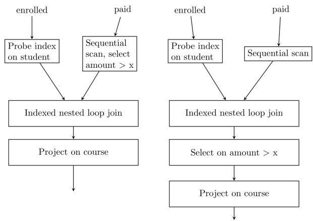

A disk seek takes 4ms, disk data transfer bandwidth is 300 MB/s and checking a tuple to see if amount is greater than x takes 10μs. Which of the following statements is correct?

A. Plan 1 and Plan 2 will not output identical row sets for all databases  
B. A course may be listed more than once in the output of Plan 1 for some databases  
C. For x = 5000, Plan 1 executes faster than Plan 2 for all databases  
D. For x = 9000, Plan I executes slower than Plan 2 for all databases

gatecse-2006 databases sql normal

# Answer key

# 3.21.23 SQL: GATE CSE 2007 | Question: 61

Consider the table employee(empld, name, department, salary) and the two queries $Q_{1}, Q_{2}$ below. Assuming that department 5 has more than one employee, and we want to find the employees who get


higher salary than anyone in the department 5, which one of the statements is TRUE for any arbitrary employee table?

Select e.empId

$Q_{1}$ : From employee e
Where not exists

(Select \* From employee s Where s.department = "5" and s.salary >= e.salary)

Select e.empId

$Q_{2}$ : From employee e
Where e.salary > Any

(Select distinct salary From employee s Where s.department = "5")

A. $Q_{1}$ is the correct query  
C. Both $Q_{1}$ and $Q_{2}$ produce the same answer

B. $Q_{2}$ is the correct query

D. Neither $Q_{1}$ nor $Q_{2}$ is the correct query

gatecse-2007 databases sql normal verbal-aptitude

# Answer key

# 3.21.24 SQL: GATE CSE 2009 | Question: 55

Consider the following relational schema:

Suppliers(sid:integer, sname:string, city:string, street:string)

Parts(pid:integer, pname:string, color:string)

Catalog(sid:integer, pid:integer , cost:real)

Consider the following relational query on the above database:

SELECT S.sname

FROM Suppliers S

WHERE S.sid NOT IN (SELECT C.sid

FROM Catalog C

WHERE C.pid NOT IN (SELECT P.pid

FROM Parts P

WHERE P.color<>'blue'))

Assume that relations corresponding to the above schema are not empty. Which one of the following is the correct interpretation of the above query?

A. Find the names of all suppliers who have supplied a non-blue part.  
B. Find the names of all suppliers who have not supplied a non-blue part.  
C. Find the names of all suppliers who have supplied only non-blue part.  
D. Find the names of all suppliers who have not supplied only blue parts.

gatecse-2009 databases sql normal

# Answer key

# 3.21.25 SQL: GATE CSE 2009 | Question: 56

Consider the following relational schema:

- Suppliers(sid:integer, sname:string, city:string, street:string)  
- Parts(pid:integer, pname:string, color:string)  
- Catalog(sid:integer, pid:integer, cost:real)

Assume that, in the suppliers relation above, each supplier and each street within a city has unique name, and (sname, city) forms a candidate key. No other functional dependencies are implied other than those implied by primary and candidate keys. Which one of the following is TRUE about the above schema?


A. The schema is in BCNF

B. The schema is in 3NF but not in BCNF

C. The schema is in 2NF but not in 3NF

D. The schema is not in 2NF

gatecse-2009 databases sql database-normalization normal

# Answer key

# 3.21.26 SQL: GATE CSE 2010 | Question: 19

A relational schema for a train reservation database is given below.

- passenger(pid, pname, age)  
- reservation(pid, class, tid)

Passenger

<table><tr><td>pid</td><td>pname</td><td>Age</td></tr><tr><td>0</td><td>Sachine</td><td>65</td></tr><tr><td>1</td><td>Rahul</td><td>66</td></tr><tr><td>2</td><td>Sourav</td><td>67</td></tr><tr><td>3</td><td>Anil</td><td>69</td></tr></table>

Reservation

<table><tr><td>pid</td><td>class</td><td>tid</td></tr><tr><td>0</td><td>AC</td><td>8200</td></tr><tr><td>1</td><td>AC</td><td>8201</td></tr><tr><td>2</td><td>SC</td><td>8201</td></tr><tr><td>5</td><td>AC</td><td>8203</td></tr><tr><td>1</td><td>SC</td><td>8204</td></tr><tr><td>3</td><td>AC</td><td>8202</td></tr></table>

What pids are returned by the following SQL query for the above instance of the tables?

SELECT pid

FROM Reservation

WHERE class='AC' AND

EXISTS (SELECT \*

FROM Passenger

WHERE age>65 AND

Passenger.pid=Reservation.pid)

A. 1,0

B. 1,2

C. 1,3

D. 1,5

gatecse-2010 databases sql normal

# Answer key

# 3.21.27 SQL: GATE CSE 2011 | Question: 32

Consider a database table T containing two columns X and Y each of type integer. After the creation of the table, one record $(X=1, Y=1)$ is inserted in the table.

Let MX and MY denote the respective maximum values of X and Y among all records in the table at any point in time. Using MX and MY, new records are inserted in the table 128 times with X and Y values being MX+1, 2\*MY+1 respectively. It may be noted that each time after the insertion, values of MX and MY change.

What will be the output of the following SQL query after the steps mentioned above are carried out?

SELECT Y FROM T WHERE X=7;

A. 127

B. 255

C. 129

D. 257

gatecse-2011 databases sql normal

# Answer key

# 3.21.28 SQL: GATE CSE 2011 | Question: 46

Database table by name Loan\_Records is given below.


<table><tr><td>Borrower</td><td>Bank_Manager</td><td>Loan_Amount</td></tr><tr><td>Ramesh</td><td>Sunderajan</td><td>10000.00</td></tr><tr><td>Suresh</td><td>Ramgopal</td><td>5000.00</td></tr><tr><td>Mahesh</td><td>Sunderajan</td><td>7000.00</td></tr></table>

What is the output of the following SQL query?

SELECT count(\*)

FROM (

SELECT Borrower, Bank\_Manager FROM Loan\_Records) AS S

NATURAL JOIN

(SELECT Bank\_Manager, Loan\_Amount FROM Loan\_Records) AS T

A. 3

B. 9

C. 5

D. 6

gatecse-2011 databases sql normal

Answer key

# 3.21.29 SQL: GATE CSE 2012 | Question: 15

Which of the following statements are TRUE about an SQL query?

P : An SQL query can contain a HAVING clause even if it does not have a GROUP BY clause  
Q : An SQL query can contain a HAVING clause only if it has a GROUP BY clause  
R : All attributes used in the GROUP BY clause must appear in the SELECT clause  
S : Not all attributes used in the GROUP BY clause need to appear in the SELECT clause

A. P and R

B. P and S

C. Q and R

D. Q and S

gatecse-2012 databases easy sql ambiguous

Answer key

# 3.21.30 SQL: GATE CSE 2012 | Question: 51

Consider the following relations A, B and C :


A

<table><tr><td>Id</td><td>Name</td><td>Age</td></tr><tr><td>12</td><td>Arun</td><td>60</td></tr><tr><td>15</td><td>Shreya</td><td>24</td></tr><tr><td>99</td><td>Rohit</td><td>11</td></tr></table>

B

<table><tr><td>Id</td><td>Name</td><td>Age</td></tr><tr><td>15</td><td>Shreya</td><td>24</td></tr><tr><td>25</td><td>Hari</td><td>40</td></tr><tr><td>98</td><td>Rohit</td><td>20</td></tr><tr><td>99</td><td>Rohit</td><td>11</td></tr></table>

C

<table><tr><td>Id</td><td>Phone</td><td>Area</td></tr><tr><td>10</td><td>2200</td><td>02</td></tr><tr><td>99</td><td>2100</td><td>01</td></tr></table>

How many tuples does the result of the following SQL query contain?

SELECT A.Id

FROM A

WHERE A.Age > ALL (SELECT B.Age

FROM B

WHERE B.Name = 'Arun')

A. 4

B. 3

C. 0

D. 1

gatecse-2012 databases sql normal

Answer key

# 3.21.31 SQL: GATE CSE 2014 | Set 1 | Question: 22

Given the following statements:

S1: A foreign key declaration can always be replaced by an equivalent check assertion in SQL.


S2: Given the table $R(a, b, c)$ where a and b together form the primary key, the following is a valid table definition.

```sql
CREATE TABLE S (
  a INTEGER,
  d INTEGER,
  e INTEGER,
  PRIMARY KEY (d),
  FOREIGN KEY (a) references R)
```

Which one of the following statements is CORRECT?

A. S1 is TRUE and S2 is FALSE  
C. S1 is FALSE and S2 is TRUE

B. Both S1 and S2 are TRUE  
D. Both S1 and S2 are FALSE

gatecse-2014-set1 databases normal sql

# Answer key

# 3.21.32 SQL: GATE CSE 2014 | Set 1 | Question: 54

Given the following schema:

employees(emp-id, first-name, last-name, hire-date, dept-id, salary)

departments(dept-id, dept-name, manager-id, location-id)

You want to display the last names and hire dates of all latest hires in their respective departments in the location ID 1700. You issue the following query:

SQL>SELECT last-name, hire-date

FROM employees

WHERE (dept-id, hire-date) IN

(SELECT dept-id, MAX(hire-date)

FROM employees JOIN departments USING(dept-id)

WHERE location-id =1700

GROUP BY dept-id);

What is the outcome?

A. It executes but does not give the correct result  
B. It executes and gives the correct result.  
C. It generates an error because of pairwise comparison.  
D. It generates an error because of the GROUP BY clause cannot be used with table joins in a sub-query.

gatecse-2014-set1 databases sql normal

# Answer key

# 3.21.33 SQL: GATE CSE 2014 | Set 2 | Question: 54

SQL allows duplicate tuples in relations, and correspondingly defines the multiplicity of tuples in the result of joins. Which one of the following queries always gives the same answer as the nested query shown below:

select \* from R where a in (select S.a from S)

A. select R.\* from R, S where R.a=S.a  
B. select distinct R.\* from R,S where R.a=S.a  
C. select R.\* from R,(select distinct a from S) as S1 where R.a=S1.a  
D. select R.\* from R,S where R.a=S.a and is unique R

gatecse-2014-set2 databases sql normal

# Answer key

# 3.21.34 SQL: GATE CSE 2014 | Set 3 | Question: 54

Consider the following relational schema:

employee (empId,empName,empDept)

customer (custId,custName,salesRepld,rating)

salesRepld is a foreign key referring to empld of the employee relation. Assume that each employee makes a sale to at least one customer. What does the following query return?


SELECT empName FROM employee E

WHERE NOT EXISTS (SELECT custld

FROM customer C

WHERE C.salesRepld = E.empld

AND C.rating <> 'GOOD');

A. Names of all the employees with at least one of their customers having a 'GOOD' rating.  
B. Names of all the employees with at most one of their customers having a 'GOOD' rating.  
C. Names of all the employees with none of their customers having a 'GOOD' rating.  
D. Names of all the employees with all their customers having a 'GOOD' rating.

gatecse-2014-set3 databases sql easy

# Answer key

# 3.21.35 SQL: GATE CSE 2015 | Set 1 | Question: 27

Consider the following relation:

Student

<table><tr><td>Roll_No</td><td>Student_Name</td></tr><tr><td>1</td><td>Raj</td></tr><tr><td>2</td><td>Rohit</td></tr><tr><td>3</td><td>Raj</td></tr></table>

Performance

<table><tr><td>Roll_No</td><td>Course</td><td>Marks</td></tr><tr><td>1</td><td>Math</td><td>80</td></tr><tr><td>1</td><td>English</td><td>70</td></tr><tr><td>2</td><td>Math</td><td>75</td></tr><tr><td>3</td><td>English</td><td>80</td></tr><tr><td>2</td><td>Physics</td><td>65</td></tr><tr><td>3</td><td>Math</td><td>80</td></tr></table>


Consider the following SQL query.

SELECT S.Student\_Name, Sum(P. Marks)

FROM Student S, Performance P

WHERE S.Roll\_No= P.Roll\_No

GROUP BY S.STUDENT\_Name

The numbers of rows that will be returned by the SQL query is \_\_\_\_.

gatecse-2015-set1 databases sql normal numerical-answers

# Answer key

# 3.21.36 SQL: GATE CSE 2015 | Set 3 | Question: 3

Consider the following relation

Cinema(theater, address, capacity)

Which of the following options will be needed at the end of the SQL query

SELECT P1.address

FROM Cinema P1


such that it always finds the addresses of theaters with maximum capacity?

A. WHERE P1.capacity >= All (select P2.capacity from Cinema P2)

B. WHERE P1.capacity >= Any (select P2.capacity from Cinema P2)

C. WHERE P1.capacity > All (select max(P2.capacity) from Cinema P2)

D. WHERE P1.capacity > Any (select max(P2.capacity) from Cinema P2)

gatecse-2015-set3 databases sql normal

# Answer key

Consider the following database table named water\_schemes:

Water\_schemes

<table><tr><td>scheme_no</td><td>district_name</td><td>capacity</td></tr><tr><td>1</td><td>Ajmer</td><td>20</td></tr><tr><td>1</td><td>Bikaner</td><td>10</td></tr><tr><td>2</td><td>Bikaner</td><td>10</td></tr><tr><td>3</td><td>Bikaner</td><td>20</td></tr><tr><td>1</td><td>Churu</td><td>10</td></tr><tr><td>2</td><td>Churu</td><td>20</td></tr><tr><td>1</td><td>Dungargarh</td><td>10</td></tr></table>

The number of tuples returned by the following SQL query is \_\_\_\_.

```sql
with total (name, capacity) as
  select district_name, sum (capacity)
  from water_schemes
  group by district_name
with total_avg (capacity) as
  select avg (capacity)
  from total
select name
  from total, total_avg
  where total.capacity ≥ total_avg.capacity
```

gatecse-2016-set2 databases sql normal numerical-answers

# Answer key

# 3.21.38 SQL: GATE CSE 2017 | Set 1 | Question: 23

Consider a database that has the relation schema EMP (EmpId, EmpName, and DeptName). An instance of the schema EMP and a SQL query on it are given below:


<table><tr><td colspan="3">EMP</td></tr><tr><td>EmpId</td><td>EmpName</td><td>DeptName</td></tr><tr><td>1</td><td>XYA</td><td>AA</td></tr><tr><td>2</td><td>XYB</td><td>AA</td></tr><tr><td>3</td><td>XYC</td><td>AA</td></tr><tr><td>4</td><td>XYD</td><td>AA</td></tr><tr><td>5</td><td>XYE</td><td>AB</td></tr><tr><td>6</td><td>XYF</td><td>AB</td></tr><tr><td>7</td><td>XYG</td><td>AB</td></tr><tr><td>8</td><td>XYH</td><td>AC</td></tr><tr><td>9</td><td>XYI</td><td>AC</td></tr><tr><td>10</td><td>XYJ</td><td>AC</td></tr><tr><td>11</td><td>XYK</td><td>AD</td></tr><tr><td>12</td><td>XYL</td><td>AD</td></tr><tr><td>13</td><td>XYM</td><td>AE</td></tr></table>

```sql
SELECT AVG(EC.Num)
FROM EC
WHERE (DeptName, Num) IN
    (SELECT DeptName, COUNT(EmpId) AS
        EC(DeptName, Num)
FROM EMP
GROUP BY DeptName)
```

The output of executing the SQL query is \_\_\_\_.

# 3.21.39 SQL: GATE CSE 2017 | Set 2 | Question: 46

Consider the following database table named top\_scorer.


top\_scorer

<table><tr><td>player</td><td>country</td><td>goals</td></tr><tr><td>Klose</td><td>Germany</td><td>16</td></tr><tr><td>Ronaldo</td><td>Brazil</td><td>15</td></tr><tr><td>G Muller</td><td>Germany</td><td>14</td></tr><tr><td>Fontaine</td><td>France</td><td>13</td></tr><tr><td>Pele</td><td>Brazil</td><td>12</td></tr><tr><td>Klinsmann</td><td>Germany</td><td>11</td></tr><tr><td>Kocsis</td><td>Hungary</td><td>11</td></tr><tr><td>Batistuta</td><td>Argentina</td><td>10</td></tr><tr><td>Cubillas</td><td>Peru</td><td>10</td></tr><tr><td>Lato</td><td>Poland</td><td>10</td></tr><tr><td>Lineker</td><td>England</td><td>10</td></tr><tr><td>T Muller</td><td>Germany</td><td>10</td></tr><tr><td>Rahn</td><td>Germany</td><td>10</td></tr></table>

Consider the following SQL query:

```sql
SELECT ta.player FROM top_scorer AS ta
WHERE ta.goals >ALL (SELECT tb.goals
  FROM top_scorer AS tb
  WHERE tb.country = 'Spain')
AND ta.goals > ANY (SELECT tc.goals
  FROM top_scorer AS tc
  WHERE tc.country='Germany')
```

The number of tuples returned by the above SQL query is \_\_\_\_

gatecse-2017-set2 databases sql numerical-answers

# Answer key

# 3.21.40 SQL: GATE CSE 2018 | Question: 12

Consider the following two tables and four queries in SQL.

Book (isbn, bname), Stock(isbn, copies)

Query 1:

SELECT B.isbn, S.copies FROM Book B INNER JOIN Stock S ON B.isbn=S.isbn;

Query 2:

SELECT B.isbn, S.copies FROM Book B LEFT OUTER JOIN Stock S ON B.isbn=S.isbn;

Query 3:

SELECT B.isbn, S,copies FROM Book B RIGHT OUTER JOIN Stock S ON B.isbn=S.isbn

Query 4:

SELECT B.isbn, S.copies FROM Book B FULL OUTER JOIN Stock S ON B.isbn=S.isbn

Which one of the queries above is certain to have an output that is a superset of the outputs of the other three queries?


# Answer key

# 3.21.41 SQL: GATE CSE 2019 | Question: 51

A relational database contains two tables Student and Performance as shown below:


Table: student

<table><tr><td>Roll_no</td><td>Student_name</td></tr><tr><td>1</td><td>Amit</td></tr><tr><td>2</td><td>Priya</td></tr><tr><td>3</td><td>Vinit</td></tr><tr><td>4</td><td>Rohan</td></tr><tr><td>5</td><td>Smita</td></tr></table>

Table: Performance

<table><tr><td>Roll_no</td><td>Subject_code</td><td>Marks</td></tr><tr><td>1</td><td>A</td><td>86</td></tr><tr><td>1</td><td>B</td><td>95</td></tr><tr><td>1</td><td>C</td><td>90</td></tr><tr><td>2</td><td>A</td><td>89</td></tr><tr><td>2</td><td>C</td><td>92</td></tr><tr><td>3</td><td>C</td><td>80</td></tr></table>

The primary key of the Student table is Roll\_no. For the performance table, the columns Roll\_no. and Subject\_code together form the primary key. Consider the SQL query given below:

SELECT S.Student\_name, sum(P.Marks)

FROM Student S, Performance P

WHERE P.Marks >84

GROUP BY S.Student\_name;

The number of rows returned by the above SQL query is \_\_\_\_

gatecse-2019 numerical-answers databases sql two-marks

# Answer key

# 3.21.42 SQL: GATE CSE 2020 | Question: 13

Consider a relational database containing the following schemas.


Catalogue

<table><tr><td>sno</td><td>pno</td><td>cost</td></tr><tr><td>S1</td><td>P1</td><td>150</td></tr><tr><td>S1</td><td>P2</td><td>50</td></tr><tr><td>S1</td><td>P3</td><td>100</td></tr><tr><td>S2</td><td>P4</td><td>200</td></tr><tr><td>S2</td><td>P5</td><td>250</td></tr><tr><td>S3</td><td>P1</td><td>250</td></tr><tr><td>S3</td><td>P2</td><td>150</td></tr><tr><td>S3</td><td>P5</td><td>300</td></tr><tr><td>S3</td><td>P4</td><td>250</td></tr></table>

Suppliers

<table><tr><td>sno</td><td>sname</td><td>location</td></tr><tr><td>S1</td><td>M/s Royal furniture</td><td>Delhi</td></tr><tr><td>S2</td><td>M/s Balaji furniture</td><td>Bangalore</td></tr><tr><td>S3</td><td>M/s Premium furniture</td><td>Chennai</td></tr></table>

Parts

<table><tr><td>$ \underline{\text{pno}} $</td><td>pname</td><td>part_spec</td></tr><tr><td>$ \underline{P1} $</td><td>Table</td><td>Wood</td></tr><tr><td>$ \underline{P2} $</td><td>Chair</td><td>Wood</td></tr><tr><td>$ \underline{P3} $</td><td>Table</td><td>Steel</td></tr><tr><td>$ \underline{P4} $</td><td>Almirah</td><td>Steel</td></tr><tr><td>$ \underline{P5} $</td><td>Almirah</td><td>Wood</td></tr></table>

The primary key of each table is indicated by underlining the constituent fields.

SELECT s.sno, s.sname

FROM Suppliers s, Catalogue c

WHERE s.sno=c.sno AND

cost > (SELECT AVG (cost)

FROM Catalogue

WHERE pno = 'P4'

GROUP BY pno);

The number of rows returned by the above SQL query is

A. 4

B. 5

C. 0

D. 2

# 3.21.43 SQL: GATE CSE 2021 | Set 1 | Question: 23

A relation $r(A, B)$ in a relational database has 1200 tuples. The attribute A has integer values ranging from 6 to 20, and the attribute B has integer values ranging from 1 to 20. Assume that the attributes A and B are independently distributed.


The estimated number of tuples in the output of $\sigma_{(A>10)\vee(B=18)}(r)$ is \_\_\_\_.

gatecse-2021-set1 databases sql numerical-answers one-mark

# Answer key

# 3.21.44 SQL: GATE CSE 2021 | Set 2 | Question: 31

The relation scheme given below is used to store information about the employees of a company, where empld is the key and deptId indicates the department to which the employee is assigned. Each employee is assigned to exactly one department.


emp(empId, name, gender, salary, deptId)

Consider the following SQL query:

```sql
select deptId, count(*)
from emp
where gender = "female" and salary > (select avg(salary)from emp)
group by deptId;
```

The above query gives, for each department in the company, the number of female employees whose salary is greater than the average salary of

A. employees in the department  
C. female employees in the department

B. employees in the company

D. female employees in the company

gatecse-2021-set2 databases sql easy two-marks

# Answer key

# 3.21.45 SQL: GATE CSE 2022 | Question: 46

Consider the relational database with the following four schemas and their respective instances.

- Student(sNo, sName, dNo) Dept(dNo, dName)  
- Course(cNo, cName, dNo) Register(sNo, cNo)

<table><tr><td></td><td>Students</td><td></td></tr><tr><td>sNo</td><td>sName</td><td>dNo</td></tr><tr><td>S01</td><td>James</td><td>D01</td></tr><tr><td>S02</td><td>Rocky</td><td>D01</td></tr><tr><td>S03</td><td>Jackson</td><td>D02</td></tr><tr><td>S04</td><td>Jane</td><td>D01</td></tr><tr><td>S05</td><td>Milli</td><td>D02</td></tr></table>

<table><tr><td></td><td>Depth</td></tr><tr><td>dNo</td><td>dName</td></tr><tr><td>D01</td><td>CSE</td></tr><tr><td>D02</td><td>EEE</td></tr></table>

<table><tr><td></td><td>Course</td><td></td></tr><tr><td>cNo</td><td>cName</td><td>dNo</td></tr><tr><td>C11</td><td>DS</td><td>D01</td></tr><tr><td>C12</td><td>OS</td><td>D01</td></tr><tr><td>C21</td><td>DE</td><td>D02</td></tr><tr><td>C22</td><td>PT</td><td>D02</td></tr><tr><td>C23</td><td>CV</td><td>D03</td></tr></table>

<table><tr><td></td><td>Register</td></tr><tr><td>sNo</td><td>cNo</td></tr><tr><td>S01</td><td>C11</td></tr><tr><td>S01</td><td>C12</td></tr><tr><td>S02</td><td>C11</td></tr><tr><td>S03</td><td>C21</td></tr><tr><td>S03</td><td>C22</td></tr><tr><td>S03</td><td>C23</td></tr><tr><td>S04</td><td>C11</td></tr><tr><td>S04</td><td>C12</td></tr><tr><td>S05</td><td>C11</td></tr><tr><td>S05</td><td>C21</td></tr></table>


SELECT \* FROM Student AS S WHERE NOT EXIST

(SELECT cNo FROM Course WHERE dNo = "D01"

EXCEPT

SELECT cNo FROM Register WHERE sNo = S.sNo)

The number of rows returned by the above SQL query is \_\_\_\_.

gatecse-2022 numerical-answers databases sql two-marks

# Answer key

# 3.21.46 SQL: GATE CSE 2023 | Question: 51

Consider the following table named Student in a relational database. The primary key of this table is rollNum.


Student

<table><tr><td>rollNum</td><td>name</td><td>gender</td><td>marks</td></tr><tr><td>1</td><td>Naman</td><td>M</td><td>62</td></tr><tr><td>2</td><td>Aliya</td><td>F</td><td>70</td></tr><tr><td>3</td><td>Aliya</td><td>F</td><td>80</td></tr><tr><td>4</td><td>James</td><td>M</td><td>82</td></tr><tr><td>5</td><td>Swati</td><td>F</td><td>65</td></tr></table>

The SQL query below is executed on this database.

SELECT \*

FROM Student

WHERE gender = 'F' AND

marks > 65;

The number of rows returned by the query is \_\_\_\_.

gatecse-2023 databases sql numerical-answers two-marks easy

# Answer key

# 3.21.47 SQL: GATE CSE 2025 | Set 1 | Question: 45

Consider the following database tables of a sports league.


player (pid, pname, age) team(tid, lname, city, cid)

coach (cid, cname) members (pid,tid)

An instance of the table and an SQL query are given.

player

<table><tr><td>pid</td><td>pname</td><td>age</td></tr><tr><td>1</td><td>Jasprit</td><td>31</td></tr><tr><td>2</td><td>Atharva</td><td>24</td></tr><tr><td>3</td><td>Ishan</td><td>26</td></tr><tr><td>4</td><td>Axar</td><td>30</td></tr></table>

coach

<table><tr><td>cid</td><td>cname</td></tr><tr><td>101</td><td>Ricky</td></tr><tr><td>102</td><td>Mark</td></tr><tr><td>103</td><td>Trevor</td></tr></table>

team

<table><tr><td>tid</td><td>tname</td><td>city</td><td>cid</td></tr><tr><td>10</td><td>MI</td><td>Mumbai</td><td>102</td></tr><tr><td>20</td><td>DC</td><td>Delhi</td><td>101</td></tr><tr><td>30</td><td>PK</td><td>Mohali</td><td>103</td></tr></table>

members

<table><tr><td>pid</td><td>tid</td></tr><tr><td>1</td><td>10</td></tr><tr><td>2</td><td>30</td></tr><tr><td>3</td><td>10</td></tr><tr><td>4</td><td>20</td></tr></table>

SELECT MIN (P.age)

FROM player P

WHERE P.pid IN (

SELECT M.pid

FROM team T, coach C, members M

WHERE C.cname = 'Mark'

AND T.cid = C.cid

AND M.tid = T.tid

)

The value returned by the given SQL query is \_\_\_\_. (Answer in integer)

# 3.21.48 SQL: GATE CSE 2025 | Set 2 | Question: 44

Consider the following relational schema:

Students (rollno: integer, name: string, age: integer, cgpa: real)

Courses (courseno: integer, cname: string, credits: integer)

Enrolled (rollno: integer, courseno: integer, grade: string)

Which of the following options is/are correct SQL query/queries to retrieve the names of the students enrolled in course number (i.e., courseno) 1470?

A. SELECT S.name

FROM Students S

WHERE EXISTS (SELECT \* FROM Enrolled E

WHERE E.courseno = 1470

AND E.rollno = S.rollno);

B. SELECT S.name

FROM Students S

WHERE SIZEOF (SELECT \* FROM Enrolled E

WHERE E.courseno = 1470

AND E.rollno = S.rollno) > 0;

C. SELECT S.name

FROM Students S

WHERE 0 < (SELECT COUNT(\*)

FROM Enrolled E

WHERE E.courseno = 1470

AND E.rollno = S.rollno);

D. SELECT S.name

FROM Students S NATURAL JOIN Enrolled E

WHERE E.courseno = 1470;

gatecse2025-set2 databases sql multiple-selects two-marks

# Answer key

# 3.21.49 SQL: GATE DA 2025 | Question: 23

On a relation named Loan of a bank:

<table><tr><td colspan="3">Loan</td></tr><tr><td>loan_number</td><td>branch_name</td><td>amount</td></tr><tr><td>L11</td><td>Banjara Hills</td><td>90000</td></tr><tr><td>L14</td><td>Kondapur</td><td>50000</td></tr><tr><td>L15</td><td>SR Nagar</td><td>40000</td></tr><tr><td>L22</td><td>SR Nagar</td><td>25000</td></tr><tr><td>L23</td><td>Balanagar</td><td>80000</td></tr><tr><td>L25</td><td>Kondapur</td><td>70000</td></tr><tr><td>L19</td><td>SR Nagar</td><td>65000</td></tr></table>


the following SQL query is executed.

SELECT L1.loan\_number

FROM Loan L1

WHERE L1.amount > (SELECT MAX (L2.amount)

FROM Loan L2

WHERE L2.branch\_name = 'SR Nagar');

The number of rows returned by the query is \_\_\_\_ (Answer in integer).

# 3.21.50 SQL: GATE DS&AI 2024 | Question: 21

Consider the following two tables named Raider and Team in a relational database maintained by a Kabaddi league. The attribute ID in table Team references the primary key of the Raider table, ID.


<table><tr><td colspan="4">Raider</td></tr><tr><td>ID</td><td>Name</td><td>Raids</td><td>Raidpoints</td></tr><tr><td>1</td><td>Arjun</td><td>200</td><td>250</td></tr><tr><td>2</td><td>Ankush</td><td>190</td><td>219</td></tr><tr><td>3</td><td>Sunil</td><td>150</td><td>200</td></tr><tr><td>4</td><td>Reza</td><td>150</td><td>190</td></tr><tr><td>5</td><td>Pratham</td><td>175</td><td>220</td></tr><tr><td>6</td><td>Gopal</td><td>193</td><td>215</td></tr></table>

<table><tr><td colspan="3">Team</td></tr><tr><td>City</td><td>ID</td><td>BidPoints</td></tr><tr><td>Jaipur</td><td>2</td><td>200</td></tr><tr><td>Patna</td><td>3</td><td>195</td></tr><tr><td>Hyderabad</td><td>5</td><td>175</td></tr><tr><td>Jaipur</td><td>1</td><td>250</td></tr><tr><td>Patna</td><td>4</td><td>200</td></tr><tr><td>Jaipur</td><td>6</td><td>200</td></tr></table>

The SQL query described below is executed on this database:

SELECT \*

FROM Raider, Team

WHERE Raider.ID=Team.ID AND City="Jaipur" AND

RaidPoints > 200;

The number of rows returned by this query is \_\_\_\_.

gate-ds-ai-2024 numerical-answers databases sql one-mark

# Answer key

# 3.21.51 SQL: GATE DS&AI 2024 | Question: 45

An OTT company is maintaining a large disk-based relational database of different movies with the following schema:

Movie (ID, CustomerRating)

Genre (ID, Name)

Movie\_Genre (MovieID, GenreID)

Consider the following SQL query on the relation database above:

SELECT \*

FROM Movie, Genre, Movie\_Genre

WHERE

Movie.CustomerRating > 3.4 AND

Genre.Name = "Comedy" AND

Movie\_Genre.MovieID = Movie.ID AND

Movie\_Genre.GenreID = Genre.ID;

This SQL query can be sped up using which of the following indexing options?

A. $B^{+}$ tree on all the attributes.  
B. Hash index on Genre.Name and $B^{+}$ tree on the remaining attributes.  
C. Hash index on Movie.CustomerRating and $B^{+}$ tree on the remaining attributes.  
D. Hash index on all the attributes.


A relational database contains two tables student and department in which student table has columns roll\_no, name and dept\_id and department table has columns dept\_id and dept\_name. The following insert statements were executed successfully to populate the empty tables:

```sql
Insert into department values (1, 'Mathematics')
Insert into department values (2, 'Physics')
Insert into student values (I, 'Navin', 1)
Insert into student values (2, 'Mukesh', 2)
Insert into student values (3, 'Gita', 1)
```

How many rows and columns will be retrieved by the following SQL statement?

```sql
Select * from student, department
```

A. 0 row and 4 columns  
C. 3 rows and 5 columns

gateit-2004 databases sql normal

B. 3 rows and 4 columns  
D. 6 rows and 5 columns

# Answer key

# 3.21.53 SQL: GATE IT 2004 | Question: 76

A table T1 in a relational database has the following rows and columns:


<table><tr><td>Roll no.</td><td>Marks</td></tr><tr><td>1</td><td>10</td></tr><tr><td>2</td><td>20</td></tr><tr><td>3</td><td>30</td></tr><tr><td>4</td><td>NULL</td></tr></table>

The following sequence of SQL statements was successfully executed on table T1.

```txt
Update T1 set marks = marks + 5
Select avg(marks) from T1
```

What is the output of the select statement?

A. 18.75

B. 20

C. 25

D. Null

gateit-2004 databases sql normal

# Answer key

# 3.21.54 SQL: GATE IT 2004 | Question: 78

Consider two tables in a relational database with columns and rows as follows:

Table: Student

<table><tr><td>Roll_no</td><td>Name</td><td>Dept_id</td></tr><tr><td>1</td><td>ABC</td><td>1</td></tr><tr><td>2</td><td>DEF</td><td>1</td></tr><tr><td>3</td><td>GHI</td><td>2</td></tr><tr><td>4</td><td>JKL</td><td>3</td></tr></table>

Table: Department

<table><tr><td>Dept_id</td><td>Dept_name</td></tr><tr><td>1</td><td>A</td></tr><tr><td>2</td><td>B</td></tr><tr><td>3</td><td>C</td></tr></table>

Roll\_no is the primary key of the Student table, Dept\_id is the primary key of the Department table and Student.Dept\_id is a foreign key from Department.Dept\_id
What will happen if we try to execute the following two SQL statements?

i. update Student set Dept id = Null where Roll on = 1  
ii. update Department set Dept\_id = Null where Dept\_id = 1

A. Both i and ii will fail

B. i will fail but ii will succeed


# 3.21.55 SQL: GATE IT 2005 | Question: 69


In an inventory management system implemented at a trading corporation, there are several tables designed to hold all the information. Amongst these, the following two tables hold information on which items are supplied by which suppliers, and which warehouse keeps which items along with the stock-level of these

Supply = (supplierid, itemcode)

Inventory = (itemcode, warehouse, stocklevel)

For a specific information required by the management, following SQL query has been written

Select distinct STMP.supplierid

From Supply as STMP

Where not unique (Select ITMP.supplierid

From Inventory, Supply as ITMP

Where STMP.supplierid = ITMP.supplierid

And ITMP.itemcode = Inventory.itemcode

And Inventory.warehouse = 'Nagpur');

For the warehouse at Nagpur, this query will find all suppliers who

A. do not supply any item

C. supply one or more items

gateit-2005 databases sql normal

B. supply exactly one item

D. supply two or more items

# Answer key

# 3.21.56 SQL: GATE IT 2006 | Question: 84

Consider a database with three relation instances shown below. The primary keys for the Drivers and Cars relation are did and cid respectively and the records are stored in ascending order of these primary keys as given in the tables. No indexing is available in the database.

D: Drivers relation

<table><tr><td>did</td><td>dname</td><td>rating</td><td>age</td></tr><tr><td>22</td><td>Karthikeyan</td><td>7</td><td>25</td></tr><tr><td>29</td><td>Salman</td><td>1</td><td>33</td></tr><tr><td>31</td><td>Boris</td><td>8</td><td>55</td></tr><tr><td>32</td><td>Amoldt</td><td>8</td><td>25</td></tr><tr><td>58</td><td>Schumacher</td><td>10</td><td>35</td></tr><tr><td>64</td><td>Sachin</td><td>7</td><td>35</td></tr><tr><td>71</td><td>Senna</td><td>10</td><td>16</td></tr><tr><td>74</td><td>Sachin</td><td>9</td><td>35</td></tr><tr><td>85</td><td>Rahul</td><td>3</td><td>25</td></tr><tr><td>95</td><td>Ralph</td><td>3</td><td>53</td></tr></table>

R: Reserves relation

<table><tr><td>did</td><td>Cid</td><td>day</td></tr><tr><td>22</td><td>101</td><td>10 / 10 / 06</td></tr><tr><td>22</td><td>102</td><td>10 / 10 / 06</td></tr><tr><td>22</td><td>103</td><td>08 / 10 / 06</td></tr><tr><td>22</td><td>104</td><td>07 / 10 / 06</td></tr><tr><td>31</td><td>102</td><td>10 / 11 / 16</td></tr><tr><td>31</td><td>103</td><td>06 / 11 / 16</td></tr><tr><td>31</td><td>104</td><td>12 / 11 / 16</td></tr><tr><td>64</td><td>101</td><td>05 / 09 / 06</td></tr><tr><td>64</td><td>102</td><td>08 / 09 / 06</td></tr><tr><td>74</td><td>103</td><td>08 / 09 / 06</td></tr></table>


C: Cars relation

<table><tr><td>Cid</td><td>Cname</td><td>colour</td></tr><tr><td>101</td><td>Renault</td><td>blue</td></tr><tr><td>102</td><td>Renault</td><td>red</td></tr><tr><td>103</td><td>Ferrari</td><td>green</td></tr><tr><td>104</td><td>Jaguar</td><td>red</td></tr></table>

What is the output of the following SQL query?

```sql
select D.dname
from Drivers D
where D.did in (
    select R.did
    from Cars C, Reserves R
    where R.cid = C.cid and C.colour = 'red'
    intersect
    select R.did
    from Cars C, Reserves R
    where R.cid = C.cid and C.colour = 'green'
)
```

A. Karthikeyan, Boris

B. Sachin, Salman

C. Karthikeyan, Boris, Sachin

D. Schumacher, Senna

gateit-2006 databases sql normal

# Answer key

# 3.21.57 SQL: GATE IT 2006 | Question: 85

Consider a database with three relation instances shown below. The primary keys for the Drivers and Cars relation are did and cid respectively and the records are stored in ascending order of these primary keys as given in the tables. No indexing is available in the database.

D: Drivers relation

<table><tr><td>did</td><td>dname</td><td>rating</td><td>age</td></tr><tr><td>22</td><td>Karthikeyan</td><td>7</td><td>25</td></tr><tr><td>29</td><td>Salman</td><td>1</td><td>33</td></tr><tr><td>31</td><td>Boris</td><td>8</td><td>55</td></tr><tr><td>32</td><td>Amoldt</td><td>8</td><td>25</td></tr><tr><td>58</td><td>Schumacher</td><td>10</td><td>35</td></tr><tr><td>64</td><td>Sachin</td><td>7</td><td>35</td></tr><tr><td>71</td><td>Senna</td><td>10</td><td>16</td></tr><tr><td>74</td><td>Sachin</td><td>9</td><td>35</td></tr><tr><td>85</td><td>Rahul</td><td>3</td><td>25</td></tr><tr><td>95</td><td>Ralph</td><td>3</td><td>53</td></tr></table>

R: Reserves relation

<table><tr><td>did</td><td>Cid</td><td>day</td></tr><tr><td>22</td><td>101</td><td>10 - 10 - 06</td></tr><tr><td>22</td><td>102</td><td>10 - 10 - 06</td></tr><tr><td>22</td><td>103</td><td>08 - 10 - 06</td></tr><tr><td>22</td><td>104</td><td>07 - 10 - 06</td></tr><tr><td>31</td><td>102</td><td>10 - 11 - 16</td></tr><tr><td>31</td><td>103</td><td>06 - 11 - 16</td></tr><tr><td>31</td><td>104</td><td>12 - 11 - 16</td></tr><tr><td>64</td><td>101</td><td>05 - 09 - 06</td></tr><tr><td>64</td><td>102</td><td>08 - 09 - 06</td></tr><tr><td>74</td><td>103</td><td>08 - 09 - 06</td></tr></table>

C: Cars relation

<table><tr><td>Cid</td><td>Cname</td><td>colour</td></tr><tr><td>101</td><td>Renault</td><td>blue</td></tr><tr><td>102</td><td>Renault</td><td>red</td></tr><tr><td>103</td><td>Ferrari</td><td>green</td></tr><tr><td>104</td><td>Jaguar</td><td>red</td></tr></table>

select D.dname

from Drivers D

where D.did in (

select R.did


```txt
from Cars C, Reserves R
where R.cid = C.cid and C.colour = 'red'
intersect
select R.did
from Cars C, Reserves R
where R.cid = C.cid and C.colour = 'green'
)
```

Let $n$ be the number of comparisons performed when the above SQL query is optimally executed. If linear search is used to locate a tuple in a relation using primary key, then $n$ lies in the range:

A. 36 - 40

B. 44 - 48

C. 60 - 64

D. 100 - 104

gateit-2006 databases sql normal

# Answer key

# 3.21.58 SQL: GATE IT 2008 | Question: 74

Consider the following relational schema:

- Student(school-id, sch-roll-no, sname, saddress)  
- School(school-id, sch-name, sch-address, sch-phone)  
- Enrolment(school-id, sch-roll-no, erollno, examname)  
- ExamResult(erollno, examname, marks)

What does the following SQL query output?

```sql
SELECT sch-name, COUNT (*)
FROM School C, Enrolment E, ExamResult R
WHERE E.school-id = C.school-id
AND
E.examname = R.examname AND E.erollno = R.erollno
AND
R.marks = 100 AND E.school-id IN (SELECT school-id
                      FROM student
                      GROUP BY school-id
                      HAVING COUNT (*) > 200)
GROUP By school-id
```

A. for each school with more than 200 students appearing in exams, the name of the school and the number of 100s scored by its students  
B. for each school with more than 200 students in it, the name of the school and the number of 100s scored by its students  
C. for each school with more than 200 students in it, the name of the school and the number of its students scoring 100 in at least one exam  
D. nothing; the query has a syntax error

gateit-2008 databases sql normal

# Answer key

# 3.22

# Safe Query (1)

# 3.22.1 Safe Query: GATE CSE 2017 | Set 1 | Question: 41

Consider a database that has the relation schemas EMP(EmpId, EmpName, DeptId), and DEPT(DeptName, DeptId). Note that the DeptId can be permitted to be NULL in the relation EMP. Consider the following queries on the database expressed in tuple relational calculus.

I. $\{t \mid \exists u \in \text{EMP}(t[\text{EmpName}] = u[\text{EmpName}] \land \forall v \in \text{DEPT}(t[\text{DeptId}] \neq v[\text{DeptId}]))\}$  
II. $\{t \mid \exists u \in \text{EMP}(t[\text{EmpName}] = u[\text{EmpName}] \land \exists v \in \text{DEPT}(t[\text{DeptId}] \neq v[\text{DeptId}]))\}$  
III. {t | ∃u ∈ EMP(t[EmpName] = u[EmpName] ∧ ∃v ∈ DEPT(t[DeptId] = v[DeptId]))}

Which of the above queries are safe?

A. I and II only

B. I and III only

C. II and III only

D. I, II and III


# 3.23

# Super Key (1)

# 3.23.1 Super Key: GATE CSE 2026 | Set 1 | Question: 55


Consider a relational database schema with a relation $R(A, B, C, D)$ . If $\{A, B\}$ and $\{A, C\}$ are the only two candidate keys of the relation $R$ , then the number of superkeys of relation $R$ is \_\_\_\_. (answer in integer)

gatecse-2026-set1 numerical-answers databases super-key two-marks

Answer key

# 3.24

# Timestamp Ordering (1)

# 3.24.1 Timestamp Ordering: GATE CSE 2017 | Set 1 | Question: 42


In a database system, unique timestamps are assigned to each transaction using Lamport's logical clock. Let $TS(T_{1})$ and $TS(T_{2})$ be the timestamps of transactions $T_{1}$ and $T_{2}$ respectively. Besides, $T_{1}$ holds a lock on the resource R, and $T_{2}$ has requested a conflicting lock on the same resource R. The following algorithm is used to prevent deadlocks in the database system assuming that a killed transaction is restarted with the same timestamp.

$$
\text {if} T S (T _ {2}) <   T S (T _ {1}) \text {then}
$$

$$
T _ {1} \text {is killed}
$$

$$
\text { else } T _ {2} \text { waits. }
$$

Assume any transaction that is not killed terminates eventually. Which of the following is TRUE about the database system that uses the above algorithm to prevent deadlocks?

A. The database system is both deadlock-free and starvation-free.  
B. The database system is deadlock-free, but not starvation-free.  
C. The database system is starvation-free, but not deadlock-free.  
D. The database system is neither deadlock-free nor starvation-free.

gatecse-2017-set1 databases timestamp-ordering normal transaction-and-concurrency

Answer key

# 3.25

# Transaction and Concurrency (27)

Practice Tests:

Test 1 (15Q)

Test 2 (15Q)

Test 3 (11Q)

# 3.25.1 Transaction and Concurrency: GATE CS Practice : Transaction Concurrency Control (DBMS)


We have a table Orders with a specific predicate range query

Q: SELECT \* FROM Orders WHERE Value > 1000

Transaction $T_{1}$ executes Q and gets 5 rows.

Transaction $T_{2}$ inserts a new row with Value = 1500 and Commits.

Transaction $T_{1}$ executes Q again.

Under which Isolation Level is it guaranteed that $T_{1}$ will still see exactly 5 rows (i.e., prevent the Phantom Read)?

A. Read Committed

B. Repeatable Read

C. Serializable

D. Both B and C

# 3.25.2 Transaction and Concurrency: GATE CSE 1999 | Question: 2.6

For the schedule given below, which of the following is correct:

1 Read A  
2 Read B  
3 Write A  
4 Read A  
5 Write A  
6 Write B  
7 Read B  
8 Write B

A. This schedule is serializable and can occur in a scheme using 2PL protocol  
B. This schedule is serializable but cannot occur in a scheme using 2PL protocol  
C. This schedule is not serializable but can occur in a scheme using 2PL protocol  
D. This schedule is not serializable and cannot occur in a scheme using 2PL protocol

gate1999 databases transaction-and-concurrency normal

Answer key

# 3.25.3 Transaction and Concurrency: GATE CSE 2003 | Question: 29, ISRO2009-73

Which of the following scenarios may lead to an irrecoverable error in a database system?

A. A transaction writes a data item after it is read by an uncommitted transaction  
B. A transaction reads a data item after it is read by an uncommitted transaction  
C. A transaction reads a data item after it is written by a committed transaction  
D. A transaction reads a data item after it is written by an uncommitted transaction

gatecse-2003 databases transaction-and-concurrency easy isro2009

Answer key

# 3.25.4 Transaction and Concurrency: GATE CSE 2003 | Question: 87

Consider three data items D1, D2, and D3, and the following execution schedule of transactions T1, T2, and T3. In the diagram, $R(D)$ and $W(D)$ denote the actions reading and writing the data item D respectively.


<table><tr><td>T1</td><td>T2</td><td>T3</td></tr><tr><td>R(D1);W(D1);R(D2);W(D2);</td><td>R(D3);R(D2);W(D2);R(D1);W(D1);</td><td>R(D2);R(D3);W(D2);W(D3);</td></tr></table>

Which of the following statements is correct?

A. The schedule is serializable as $T2; T3; T1$  
B. The schedule is serializable as $T2; T1; T3$  
C. The schedule is serializable as $T3; T2; T1$  
D. The schedule is not serializable

gatecse-2003 databases transaction-and-concurrency normal

Answer key

# 3.25.5 Transaction and Concurrency: GATE CSE 2006 | Question: 20, ISRO2015-17

Consider the following log sequence of two transactions on a bank account, with initial balance 12000, that transfer 2000 to a mortgage payment and then apply a 5% interest.


1. T1 start  
2. T1 B old = 12000 new = 10000  
3. T1 M old = 0 new = 2000  
4. T1 commit  
5. T2 start  
6. T2 B old = 10000 new = 10500  
7. T2 commit

Suppose the database system crashes just before log record 7 is written. When the system is restarted, which one statement is true of the recovery procedure?

A. We must redo log record 6 to set B to 10500  
B. We must undo log record 6 to set B to 10000 and then redo log records 2 and 3  
C. We need not redo log records 2 and 3 because transaction T1 has committed  
D. We can apply redo and undo operations in arbitrary order because they are idempotent

gatecse-2006 databases transaction-and-concurrency normal isro2015

Answer key

# 3.25.6 Transaction and Concurrency: GATE CSE 2010 | Question: 20

Which of the following concurrency control protocols ensure both conflict serializability and freedom from deadlock?


I. 2-phase locking  
II. Time-stamp ordering

A. I only

B. II only

C. Both I and II

D. Neither I nor II

gatecse-2010 databases transaction-and-concurrency normal

# Answer key

# 3.25.7 Transaction and Concurrency: GATE CSE 2010 | Question: 42

Consider the following schedule for transactions T1, T2 and T3 :

<table><tr><td>T1</td><td>T2</td><td>T3</td></tr><tr><td>Read(X)</td><td></td><td></td></tr><tr><td></td><td>Read(Y)</td><td></td></tr><tr><td></td><td></td><td>Read(Y)</td></tr><tr><td></td><td>Write(Y)</td><td></td></tr><tr><td>Write(X)</td><td></td><td></td></tr><tr><td></td><td></td><td>Write(X)</td></tr><tr><td></td><td>Read(X)</td><td></td></tr><tr><td></td><td>Write(X)</td><td></td></tr></table>

Which one of the schedules below is the correct serialization of the above?

A. $T1 \rightarrow T3 \rightarrow T2$

B. $T2 \rightarrow T1 \rightarrow T3$

C. $T2 \rightarrow T3 \rightarrow T1$

D. $T3 \rightarrow T1 \rightarrow T2$

gatecse-2010 databases transaction-and-concurrency normal

# Answer key

# 3.25.8 Transaction and Concurrency: GATE CSE 2012 | Question: 27

Consider the following transactions with data items P and Q initialized to zero:

<table><tr><td> $T_1$ </td><td>read (P);read (Q);if P = 0 then Q := Q + 1;write (Q)</td></tr><tr><td> $T_2$ </td><td>read (Q);read (P);if Q = 0 then P := P + 1;write (P)</td></tr></table>

Any non-serial interleaving of T1 and T2 for concurrent execution leads to

A. a serializable schedule  
B. a schedule that is not conflict serializable  
C. a conflict serializable schedule  
D. a schedule for which a precedence graph cannot be drawn

gatecse-2012 databases transaction-and-concurrency normal

# Answer key

# 3.25.9 Transaction and Concurrency: GATE CSE 2015 | Set 2 | Question: 1

Consider the following transaction involving two bank accounts x and y.

read(x); x:=x-50; write (x); read(y); y:=y+50; write(y)

The constraint that the sum of the accounts $x$ and $y$ should remain constant is that of

A. Atomicity

B. Consistency

C. Isolation

D. Durability

gatecse-2015-set2 databases transaction-and-concurrency easy

# Answer key

# 3.25.10 Transaction and Concurrency: GATE CSE 2015 | Set 2 | Question: 46

Consider a simple checkpointing protocol and the following set of operations in the log.

(start, T4); (write, T4, y, 2, 3); (start, T1); (commit, T4); (write, T1, z, 5, 7);

(checkpoint);

(start, T2); (write, T2, x, 1, 9); (commit, T2); (start, T3); (write, T3, z, 7, 2);

If a crash happens now and the system tries to recover using both undo and redo operations, what are the contents of the undo list and the redo list?

A. Undo: T3, T1; Redo: T2  
C. Undo: none; Redo: T2, T4, T3, T1  
gatecse-2015-set2 databases transaction-and-concurrency normal

B. Undo: T3, T1; Redo: T2, T4

D. Undo: T3, T1, T4; Redo: T2

# Answer key

# 3.25.11 Transaction and Concurrency: GATE CSE 2015 | Set 3 | Question: 29

Consider the partial Schedule S involving two transactions T1 and T2. Only the read and the write operations have been shown. The read operation on data item P is denoted by $\text{read}(P)$ and write operation on data item P is denoted by $\text{write}(P)$ .


<table><tr><td colspan="3">Schedule S</td></tr><tr><td rowspan="2">Time Instance</td><td colspan="2">Transaction ID</td></tr><tr><td>T1</td><td>T2</td></tr><tr><td>1</td><td>read(A)</td><td></td></tr><tr><td>2</td><td>write(A)</td><td></td></tr><tr><td>3</td><td></td><td>read(C)</td></tr><tr><td>4</td><td></td><td>write(C)</td></tr><tr><td>5</td><td></td><td>read(B)</td></tr><tr><td>6</td><td></td><td>write(B)</td></tr><tr><td>7</td><td></td><td>read(A)</td></tr><tr><td>8</td><td></td><td>commit</td></tr><tr><td>9</td><td>read(B)</td><td></td></tr></table>

Suppose that the transaction $T1$ fails immediately after time instance 9. Which of the following statements is correct?

A. $T2$ must be aborted and then both $T1$ and $T2$ must be re-started to ensure transaction atomicity  
B. Schedule S is non-recoverable and cannot ensure transaction atomicity  
C. Only T2 must be aborted and then re-started to ensure transaction atomicity  
D. Schedule $S$ is recoverable and can ensure transaction atomicity and nothing else needs to be done

gatecse-2015-set3 databases transaction-and-concurrency normal

# Answer key

# 3.25.12 Transaction and Concurrency: GATE CSE 2016 | Set 1 | Question: 22

Which one of the following is NOT a part of the ACID properties of database transactions?


A. Atomicity

B. Consistency

C. Isolation

D. Deadlock-freedom

gatecse-2016-set1 databases transaction-and-concurrency easy

# Answer key

# 3.25.13 Transaction and Concurrency: GATE CSE 2016 | Set 1 | Question: 51

Consider the following two phase locking protocol. Suppose a transaction $T$ accesses (for read or write operations), a certain set of objects $\{O_1, \ldots, O_k\}$ . This is done in the following manner:


- Step 1. $T$ acquires exclusive locks to $O_1, \ldots, O_k$ in increasing order of their addresses.  
- Step 2. The required operations are performed.  
- Step 3. All locks are released

This protocol will

A. guarantee serializability and deadlock-freedom  
B. guarantee neither serializability nor deadlock-freedom  
C. guarantee serializability but not deadlock-freedom  
D. guarantee deadlock-freedom but not serializability.

gatecse-2016-set1 databases transaction-and-concurrency normal

# Answer key

# 3.25.14 Transaction and Concurrency: GATE CSE 2016 | Set 2 | Question: 22


Suppose a database schedule $S$ involves transactions $T_1, \ldots, T_n$ . Construct the precedence graph of $S$ with vertices representing the transactions and edges representing the conflicts. If $S$ is serializable, which one of the following orderings of the vertices of the precedence graph is guaranteed to yield a serial schedule?

A. Topological order  
C. Breadth-first order

B. Depth-first order  
D. Ascending order of the transaction indices

gatecse-2016-set2 databases transaction-and-concurrency normal

# Answer key

# 3.25.15 Transaction and Concurrency: GATE CSE 2016 | Set 2 | Question: 51


Consider the following database schedule with two transactions $T_{1}$ and $T_{2}$ .

$$
S = r _ {2} (X); r _ {1} (X); r _ {2} (Y); w _ {1} (X); r _ {1} (Y); w _ {2} (X); a _ {1}; a _ {2}
$$

Where $r_{i}(Z)$ denotes a read operation by transaction $T_{i}$ on a variable Z, $w_{i}(Z)$ denotes a write operation by $T_{i}$ on a variable Z and $a_{i}$ denotes an abort by transaction $T_{i}$ .

Which one of the following statements about the above schedule is TRUE?

A. $S$ is non-recoverable.  
C. $S$ does not have a cascading abort.

B. $S$ is recoverable, but has a cascading abort.  
D. $S$ is strict.

gatecse-2016-set2 databases transaction-and-concurrency normal

# Answer key

# 3.25.16 Transaction and Concurrency: GATE CSE 2019 | Question: 11


Consider the following two statements about database transaction schedules:

I. Strict two-phase locking protocol generates conflict serializable schedules that are also recoverable.  
II. Timestamp-ordering concurrency control protocol with Thomas' Write Rule can generate view serializable schedules that are not conflict serializable

Which of the above statements is/are TRUE?

A. I only

B. II only

C. Both I and II

D. Neither I nor II

# Answer key

# 3.25.17 Transaction and Concurrency: GATE CSE 2021 | Set 1 | Question: 13

Suppose a database system crashes again while recovering from a previous crash. Assume checkpointing is not done by the database either during the transactions or during recovery.

Which of the following statements is/are correct?

A. The same undo and redo list will be used while recovering again  
B. The system cannot recover any further  
C. All the transactions that are already undone and redone will not be recovered again  
D. The database will become inconsistent

gatecse-2021-set1 multiple-selects databases transaction-and-concurrency one-mark

# Answer key

# 3.25.18 Transaction and Concurrency: GATE CSE 2024 | Set 2 | Question: 9

Once the DBMS informs the user that a transaction has been successfully completed, its effect should persist even if the system crashes before all its changes are reflected on disk. This property is called

A. durability

B. atomicity

C. consistency

D. isolation

gatecse-2024-set2 databases transaction-and-concurrency easy one-mark

# Answer key

# 3.25.19 Transaction and Concurrency: GATE CSE 2025 | Set 1 | Question: 5

A schedule of three database transactions $T_{1}, T_{2}$ , and $T_{3}$ is shown. $R_{i}(A)$ and $W_{i}(A)$ denote read and write of data item A by transaction $T_{i}, i = 1, 2, 3$ . The transaction $T_{1}$ aborts at the end. Which other transaction(s) will be required to be rolled back?

$$
R _ {1} (X) W _ {1} (Y) R _ {2} (X) R _ {2} (Y) R _ {3} (Y) \text {ABORT} (T _ {1})
$$

A. Only $T_{2}$

B. Only $T_{3}$

C. Both $T_{2}$ and $T_{3}$

D. Neither $T_{2}$ nor $T_{3}$

gatecse2025-set1 databases transaction-and-concurrency one-mark

# Answer key

# 3.25.20 Transaction and Concurrency: GATE CSE 2025 | Set 2 | Question: 17

An audit of a banking transactions system has found that on an earlier occasion, two joint holders of account A attempted simultaneous transfers of Rs. 10000 each from account A to account B. Both transactions read the same value, Rs. 11000, as the initial balance in A and were allowed to go through. B was credit 10000 twice. A was debited only once and ended up with a balance of Rs. 1000.

Which of the following properties is/are certain to have been violated by the system?

A. Atomicity

B. Consistency

C. Isolation

D. Durability

gatecse2025-set2 databases transaction-and-concurrency multiple-selects one-mark

# Answer key

# 3.25.21 Transaction and Concurrency: GATE CSE 2026 | Set 2 | Question: 10

Consider concurrent execution of two transactions T1 and T2 in a DBMS, both of which access a data object A. For these two transactions to not conflict on A, which one of the following statements must be true?

A. Both $T1$ and $T2$ only read $A$

B. $T1$ reads $A$ and $T2$ writes $A$

C. $T1$ writes $A$ and $T2$ reads $A$

D. Both $T1$ and $T2$ write $A$

gatecse-2026-set2 databases transaction-and-concurrency one-mark


# 3.25.22 Transaction and Concurrency: GATE IT 2004 | Question: 21

Which level of locking provides the highest degree of concurrency in a relational database ?


A. Page  
B. Table  
C. Row  
D. Page, table and row level locking allow the same degree of concurrency

gateit-2004 databases normal transaction-and-concurrency

Answer key

# 3.25.23 Transaction and Concurrency: GATE IT 2004 | Question: 77

Consider the following schedule S of transactions T1 and T2 :


<table><tr><td>T1</td><td>T2</td></tr><tr><td>Read(A)</td><td></td></tr><tr><td>A = A - 10</td><td></td></tr><tr><td></td><td>Read(A)</td></tr><tr><td></td><td>Temp = 0.2*A</td></tr><tr><td></td><td>Write(A)</td></tr><tr><td></td><td>Read(B)</td></tr><tr><td>Write(A)</td><td></td></tr><tr><td>Read(B)</td><td></td></tr><tr><td>B = B + 10</td><td></td></tr><tr><td>Write(B)</td><td></td></tr><tr><td></td><td>B = B + Temp</td></tr><tr><td></td><td>Write(B)</td></tr></table>

Which of the following is TRUE about the schedule S?

A. $S$ is serializable only as $T1, T2$  
B. $S$ is serializable only as $T2, T1$  
C. $S$ is serializable both as $T1, T2$ and $T2, T1$  
D. $S$ is not serializable either as $T1, T2$ or as $T2, T1$

gateit-2004 databases transaction-and-concurrency normal

Answer key

# 3.25.24 Transaction and Concurrency: GATE IT 2005 | Question: 24

Amongst the ACID properties of a transaction, the 'Durability' property requires that the changes made to the database by a successful transaction persist


A. Except in case of an Operating System crash  
B. Except in case of a Disk crash  
C. Except in case of a power failure  
D. Always, even if there is a failure of any kind

gateit-2005 databases transaction-and-concurrency easy

Answer key

A company maintains records of sales made by its salespersons and pays them commission based on each individual's total sales made in a year. This data is maintained in a table with following schema:

salesinfo = (salespersonid, totalsales, commission)

In a certain year, due to better business results, the company decides to further reward its salespersons by enhancing the commission paid to them as per the following formula:

If commission ≤ 50000, enhance it by 2%

If 50000 < commission ≤ 100000, enhance it by 4%

If commission > 100000, enhance it by 6%

The IT staff has written three different SQL scripts to calculate enhancement for each slab, each of these scripts is to run as a separate transaction as follows:

T1

```txt
Update salesinfo
Set commission = commission * 1.02
Where commission <= 50000;
```

T2

```txt
Update salesinfo
Set commission = commission * 1.04
Where commission > 50000 and
commission is <= 100000;
```

T3

```txt
Update salesinfo
Set commission = commission * 1.06
Where commission > 100000;
```

Which of the following options of running these transactions will update the commission of all salespersons correctly

A. Execute T1 followed by T2 followed by T3  
B. Execute T2, followed by T3; T1 running concurrently throughout  
C. Execute T3 followed by T2; T1 running concurrently throughout  
D. Execute T3 followed by T2 followed by T1

gateit-2005

databases

transaction-and-concurrency

normal

Answer key

# 3.25.26 Transaction and Concurrency: GATE IT 2007 | Question: 66

Consider the following two transactions: T1 and T2.

T1: read (A);

read (B);

If $A = 0$ then $B \leftarrow B + 1$ ;

write (B);

T2: read (B);

read (A);

If $B \neq 0$ then $A \leftarrow A - 1$ ;

write (A);


Which of the following schemes, using shared and exclusive locks, satisfy the requirements for strict two phase locking for the above transactions?

<table><tr><td rowspan="10">A.</td><td rowspan="10">S1:</td><td>lock S(A);</td><td rowspan="10">S2:</td><td>lock S(B);</td></tr><tr><td>read (A);</td><td>read (B);</td></tr><tr><td>lock S(B);</td><td>lock S(A);</td></tr><tr><td>read (B);</td><td>read (A);</td></tr><tr><td>If A = 0</td><td>If B ≠ 0</td></tr><tr><td>then B ← B + 1;</td><td>then A ← A - 1;</td></tr><tr><td>write (B);</td><td>write (A);</td></tr><tr><td>commit;</td><td>commit;</td></tr><tr><td>unlock (A);</td><td>unlock (B);</td></tr><tr><td>unlock (B);</td><td>unlock (A);</td></tr><tr><td rowspan="10">B.</td><td rowspan="10">S1:</td><td>lock X(A);</td><td rowspan="10">S2:</td><td>lock X(B);</td></tr><tr><td>read (A);</td><td>read (B);</td></tr><tr><td>lock X(B);</td><td>lock X(A);</td></tr><tr><td>read (B);</td><td>read (A);</td></tr><tr><td>If A = 0</td><td>If B ≠ 0</td></tr><tr><td>then B ← B + 1;</td><td>then A ← A - 1;</td></tr><tr><td>write (B);</td><td>write (A);</td></tr><tr><td>unlock (A);</td><td>unlock (A);</td></tr><tr><td>commit;</td><td>commit;</td></tr><tr><td>unlock (B);</td><td>unlock (A);</td></tr><tr><td rowspan="10">C.</td><td rowspan="10">S1:</td><td>lock S(A);</td><td rowspan="10">S2:</td><td>lock S(B);</td></tr><tr><td>read (A);</td><td>read (B);</td></tr><tr><td>lock X(B);</td><td>lock X(A);</td></tr><tr><td>read (B);</td><td>read (A);</td></tr><tr><td>If A = 0</td><td>If B ≠ 0</td></tr><tr><td>then B ← B + 1;</td><td>then A ← A - 1;</td></tr><tr><td>write (B);</td><td>write(A);</td></tr><tr><td>unlock (A);</td><td>unlock (B);</td></tr><tr><td>commit;</td><td>commit;</td></tr><tr><td>unlock (B);</td><td>unlock (A);</td></tr><tr><td rowspan="10">D.</td><td rowspan="10">S1:</td><td>lock S(A);</td><td rowspan="10">S2:</td><td>lock S(B);</td></tr><tr><td>read (A);</td><td>read (B);</td></tr><tr><td>lock X(B);</td><td>lock X(A);</td></tr><tr><td>read (B);</td><td>read (A);</td></tr><tr><td>If A = 0</td><td>If B ≠ 0</td></tr><tr><td>then B ← B + 1;</td><td>then A ←A - 1;</td></tr><tr><td>write (B);</td><td>write (A);</td></tr><tr><td>unlock (A);</td><td>unlock (A);</td></tr><tr><td>unlock (B);</td><td>unlock (A);</td></tr><tr><td>commit;</td><td>commit;</td></tr></table>

# 3.25.27 Transaction and Concurrency: GATE IT 2008 | Question: 63


Consider the following three schedules of transactions T1, T2 and T3. [Notation: In the following NYO represents the action Y (R for read, W for write) performed by transaction N on object O.]

<table><tr><td>(S1)</td><td>2RA</td><td>2WA</td><td>3RC</td><td>2WB</td><td>3WA</td><td>3WC</td><td>1RA</td><td>1RB</td><td>1WA</td><td>1WB</td></tr><tr><td>(S2)</td><td>3RC</td><td>2RA</td><td>2WA</td><td>2WB</td><td>3WA</td><td>1RA</td><td>1RB</td><td>1WA</td><td>1WB</td><td>3WC</td></tr><tr><td>(S3)</td><td>2RA</td><td>3RC</td><td>3WA</td><td>2WA</td><td>2WB</td><td>3WC</td><td>1RA</td><td>1RB</td><td>1WA</td><td>1WB</td></tr></table>

Which of the following statements is TRUE?

A. S1, S2 and S3 are all conflict equivalent to each other  
B. No two of S1, S2 and S3 are conflict equivalent to each other  
C. S2 is conflict equivalent to S3, but not to S1  
D. S1 is conflict equivalent to S2, but not to S3

gateit-2008 databases transaction-and-concurrency normal

Answer key

# 3.26

# Tuple Relational Calculus (3)

# 3.26.1 Tuple Relational Calculus: GATE CSE 2025 | Set 1 | Question: 29

Consider two relations describing teams and players in a sports league:


- teams(tid, tname): tid, tname are team-id and team-name, respectively  
- players(pid,pname,tid): pid, pname, and tid denote player-id, playername and the team-id of the player, respectively

Which ONE of the following tuple relational calculus queries returns the name of the players who play for the team having tname as 'MI'?

A. $\{p.$ pname $|p\in$ players $\wedge \exists t$ ( $t\in$ teams $\wedge p.tid = t.tid\wedge t.tname = 'MI'\})\}$  
B. $\{p.$ pname $|p\in$ teams $\wedge \exists t$ ( $t\in$ players $\wedge p.tid = t.tid\wedge t.tname = 'MI'\})\}$  
C. $\{p.$ pname $|p\in$ players $\wedge \exists t(t\in$ teams $\wedge t.$ tname $= ^{\prime}MI^{\prime})\}$  
D. $\{p.$ pname $|p\in$ teams $\wedge \exists t(t\in$ players $\wedge t.$ tname $= 'MI'\}$

gatecse2025-set1 databases tuple-relational-calculus two-marks

Answer key

# 3.26.2 Tuple Relational Calculus: GATE CSE 2026 | Set 1 | Question: 33

Consider a relational database schema with two relations $R(P, Q)$ and $S(X, Y)$ .

Let $E = \{\langle u\rangle \mid \exists v\exists w\langle u,v\rangle \in R \land \langle v,w\rangle \in S\}$ be a tuple relational calculus expression.

Which one of the following relational algebraic expressions is equivalent to $E$ ?

A. $\Pi_P(R \bowtie_{R.P=S.X} S)$

C. $\Pi_{P}(R\bowtie_{R.P=S.Y}S)$

B. $\Pi_P(S \bowtie_{S.X = R.Q} R)$

D. $\Pi_{P}(S\bowtie_{S.Y=R.Q}R)$

gatecse-2026-set1 databases two-marks tuple-relational-calculus

Answer key

# 3.26.3 Tuple Relational Calculus: GATE DA 2026 | Question: 49

Let there be two relations $X$ and $Y$ as shown. $X$ has three columns $P, Q$ and $R$ . $Y$ has two columns $P$ and $S$ .


<table><tr><td>P</td><td>Q</td><td>R</td></tr><tr><td>P1</td><td>Q1</td><td>R1</td></tr><tr><td>P2</td><td>Q2</td><td>R2</td></tr><tr><td>P3</td><td>Q3</td><td>R2</td></tr></table>

Y

<table><tr><td>P</td><td>S</td></tr><tr><td>P1</td><td>10</td></tr><tr><td>P1</td><td>15</td></tr><tr><td>P2</td><td>20</td></tr><tr><td>P3</td><td>1</td></tr></table>

Consider that the following tuple relational calculus expression is evaluated.

$$
\{t \mid t \in X \land \exists z \in X (t [ P ] = z [ P ]) \land \exists m \in Y (m [ P ] = t [ P ] \land m [ S ] > 1) \}
$$

The number of tuples that will be returned is \_\_\_\_. (Answer in integer)

gateda-2026 databases tuple-relational-calculus numerical-answers two-marks

Answer key

# 3.27

# Two Phase Locking Protocol (1)

# 3.27.1 Two Phase Locking Protocol: GATE CSE 2024 | Set 2 | Question: 17

Which of the following statements about the Two Phase Locking (2PL) protocol is/are TRUE?


A. 2PL permits only serializable schedules  
B. With 2PL, a transaction always locks the data item being read or written just before every operation and always releases the lock just after the operation  
C. With 2PL, once a lock is released on any data item inside a transaction, no more locks on any data item can be obtained inside that transaction  
D. A deadlock is possible with 2PL

gatecse-2024-set2 databases two-phase-locking-protocol multiple-selects transaction-and-concurrency one-mark

Answer key

# Answer Keys

<table><tr><td>3.1.1</td><td>D</td></tr><tr><td>3.2.5</td><td>B</td></tr><tr><td>3.2.10</td><td>N/A</td></tr><tr><td>3.2.15</td><td>A</td></tr><tr><td>3.2.20</td><td>50</td></tr><tr><td>3.2.25</td><td>B;D</td></tr><tr><td>3.2.30</td><td>C</td></tr><tr><td>3.3.3</td><td>A</td></tr></table>

<table><tr><td>3.2.1</td><td>N/A</td></tr><tr><td>3.2.6</td><td>N/A</td></tr><tr><td>3.2.11</td><td>C</td></tr><tr><td>3.2.16</td><td>C</td></tr><tr><td>3.2.21</td><td>A</td></tr><tr><td>3.2.26</td><td>33:33</td></tr><tr><td>3.2.31</td><td>A</td></tr><tr><td>3.3.4</td><td>8</td></tr></table>

<table><tr><td>3.2.2</td><td>N/A</td></tr><tr><td>3.2.7</td><td>B</td></tr><tr><td>3.2.12</td><td>B</td></tr><tr><td>3.2.17</td><td>C</td></tr><tr><td>3.2.22</td><td>52</td></tr><tr><td>3.2.27</td><td>A</td></tr><tr><td>3.2.32</td><td>A</td></tr><tr><td>3.3.5</td><td>19</td></tr></table>

<table><tr><td>3.2.3</td><td>N/A</td></tr><tr><td>3.2.8</td><td>N/A</td></tr><tr><td>3.2.13</td><td>C</td></tr><tr><td>3.2.18</td><td>B</td></tr><tr><td>3.2.23</td><td>B</td></tr><tr><td>3.2.28</td><td>C</td></tr><tr><td>3.3.1</td><td>N/A</td></tr><tr><td>3.3.6</td><td>B</td></tr></table>

<table><tr><td>3.2.4</td><td>N/A</td></tr><tr><td>3.2.9</td><td>N/A</td></tr><tr><td>3.2.14</td><td>D</td></tr><tr><td>3.2.19</td><td>5</td></tr><tr><td>3.2.24</td><td>A</td></tr><tr><td>3.2.29</td><td>A</td></tr><tr><td>3.3.2</td><td>D</td></tr><tr><td>3.3.7</td><td>A</td></tr></table>

<table><tr><td>3.4.1</td><td>C</td></tr><tr><td>3.4.6</td><td>54</td></tr><tr><td>3.4.11</td><td>B;C;D</td></tr><tr><td>3.6.3</td><td>N/A</td></tr><tr><td>3.6.8</td><td>False</td></tr><tr><td>3.6.13</td><td>B</td></tr><tr><td>3.6.18</td><td>N/A</td></tr><tr><td>3.6.23</td><td>C</td></tr><tr><td>3.6.28</td><td>B</td></tr><tr><td>3.6.33</td><td>B</td></tr><tr><td>3.6.38</td><td>A</td></tr><tr><td>3.6.43</td><td>A;C</td></tr><tr><td>3.6.48</td><td>A;B;D</td></tr><tr><td>3.6.53</td><td>B</td></tr><tr><td>3.8.1</td><td>C</td></tr><tr><td>3.9.5</td><td>4</td></tr><tr><td>3.9.10</td><td>A</td></tr><tr><td>3.10.3</td><td>B;D</td></tr><tr><td>3.11.5</td><td>A</td></tr><tr><td>3.11.10</td><td>4</td></tr><tr><td>3.11.15</td><td>195:195</td></tr><tr><td>3.12.5</td><td>B</td></tr><tr><td>3.14.2</td><td>A</td></tr><tr><td>3.16.3</td><td>3:3</td></tr><tr><td>3.17.5</td><td>D</td></tr><tr><td>3.18.4</td><td>N/A</td></tr><tr><td>3.18.9</td><td>B</td></tr><tr><td>3.18.14</td><td>N/A</td></tr><tr><td>3.18.19</td><td>A</td></tr><tr><td>3.18.24</td><td>1</td></tr><tr><td>3.18.29</td><td>1:1</td></tr><tr><td>3.19.1</td><td>N/A</td></tr><tr><td>3.19.6</td><td>B</td></tr><tr><td>3.19.11</td><td>D</td></tr><tr><td>3.21.1</td><td>N/A</td></tr><tr><td>3.21.6</td><td>N/A</td></tr><tr><td>3.21.11</td><td>A</td></tr><tr><td>3.21.16</td><td>N/A</td></tr><tr><td>3.21.21</td><td>B</td></tr><tr><td>3.21.26</td><td>C</td></tr></table>

<table><tr><td>3.4.2</td><td>B</td></tr><tr><td>3.4.7</td><td>A</td></tr><tr><td>3.4.12</td><td>B</td></tr><tr><td>3.6.4</td><td>N/A</td></tr><tr><td>3.6.9</td><td>N/A</td></tr><tr><td>3.6.14</td><td>D</td></tr><tr><td>3.6.19</td><td>C</td></tr><tr><td>3.6.24</td><td>C</td></tr><tr><td>3.6.29</td><td>A</td></tr><tr><td>3.6.34</td><td>B</td></tr><tr><td>3.6.39</td><td>A</td></tr><tr><td>3.6.44</td><td>B;C;D</td></tr><tr><td>3.6.49</td><td>TBA</td></tr><tr><td>3.6.54</td><td>A</td></tr><tr><td>3.9.1</td><td>B</td></tr><tr><td>3.9.6</td><td>C</td></tr><tr><td>3.9.11</td><td>B</td></tr><tr><td>3.11.1</td><td>N/A</td></tr><tr><td>3.11.6</td><td>C</td></tr><tr><td>3.11.11</td><td>698 : 698</td></tr><tr><td>3.12.1</td><td>A</td></tr><tr><td>3.12.6</td><td>A</td></tr><tr><td>3.14.3</td><td>C</td></tr><tr><td>3.17.1</td><td>B</td></tr><tr><td>3.17.6</td><td>A;B</td></tr><tr><td>3.18.5</td><td>N/A</td></tr><tr><td>3.18.10</td><td>C</td></tr><tr><td>3.18.15</td><td>A</td></tr><tr><td>3.18.20</td><td>D</td></tr><tr><td>3.18.25</td><td>C</td></tr><tr><td>3.18.30</td><td>C</td></tr><tr><td>3.19.2</td><td>D</td></tr><tr><td>3.19.7</td><td>C</td></tr><tr><td>3.19.12</td><td>D</td></tr><tr><td>3.21.2</td><td>N/A</td></tr><tr><td>3.21.7</td><td>N/A</td></tr><tr><td>3.21.12</td><td>C</td></tr><tr><td>3.21.17</td><td>C</td></tr><tr><td>3.21.22</td><td>C</td></tr><tr><td>3.21.27</td><td>A</td></tr></table>

<table><tr><td>3.4.3</td><td>D</td></tr><tr><td>3.4.8</td><td>B</td></tr><tr><td>3.5.1</td><td>False</td></tr><tr><td>3.6.5</td><td>N/A</td></tr><tr><td>3.6.10</td><td>A</td></tr><tr><td>3.6.15</td><td>B</td></tr><tr><td>3.6.20</td><td>C</td></tr><tr><td>3.6.25</td><td>D</td></tr><tr><td>3.6.30</td><td>B</td></tr><tr><td>3.6.35</td><td>A</td></tr><tr><td>3.6.40</td><td>A;C;D</td></tr><tr><td>3.6.45</td><td>50</td></tr><tr><td>3.6.50</td><td>B</td></tr><tr><td>3.6.55</td><td>D</td></tr><tr><td>3.9.2</td><td>B</td></tr><tr><td>3.9.7</td><td>A</td></tr><tr><td>3.9.12</td><td>C</td></tr><tr><td>3.11.2</td><td>N/A</td></tr><tr><td>3.11.7</td><td>C</td></tr><tr><td>3.11.12</td><td>6</td></tr><tr><td>3.12.2</td><td>A</td></tr><tr><td>3.12.7</td><td>A</td></tr><tr><td>3.15.1</td><td>4:4</td></tr><tr><td>3.17.2</td><td>C</td></tr><tr><td>3.18.1</td><td>N/A</td></tr><tr><td>3.18.6</td><td>N/A</td></tr><tr><td>3.18.11</td><td>D</td></tr><tr><td>3.18.16</td><td>D</td></tr><tr><td>3.18.21</td><td>D</td></tr><tr><td>3.18.26</td><td>A;B</td></tr><tr><td>3.18.31</td><td>D</td></tr><tr><td>3.19.3</td><td>C</td></tr><tr><td>3.19.8</td><td>C</td></tr><tr><td>3.19.13</td><td>C</td></tr><tr><td>3.21.3</td><td>N/A</td></tr><tr><td>3.21.8</td><td>D</td></tr><tr><td>3.21.13</td><td>N/A</td></tr><tr><td>3.21.18</td><td>D</td></tr><tr><td>3.21.23</td><td>A</td></tr><tr><td>3.21.28</td><td>C</td></tr></table>

<table><tr><td>3.4.4</td><td>C</td></tr><tr><td>3.4.9</td><td>B</td></tr><tr><td>3.6.1</td><td>True</td></tr><tr><td>3.6.6</td><td>N/A</td></tr><tr><td>3.6.11</td><td>D</td></tr><tr><td>3.6.16</td><td>C</td></tr><tr><td>3.6.21</td><td>D</td></tr><tr><td>3.6.26</td><td>C</td></tr><tr><td>3.6.31</td><td>A</td></tr><tr><td>3.6.36</td><td>B</td></tr><tr><td>3.6.41</td><td>8</td></tr><tr><td>3.6.46</td><td>C;D</td></tr><tr><td>3.6.51</td><td>A</td></tr><tr><td>3.6.56</td><td>C</td></tr><tr><td>3.9.3</td><td>A</td></tr><tr><td>3.9.8</td><td>A</td></tr><tr><td>3.10.1</td><td>B;C</td></tr><tr><td>3.11.3</td><td>3</td></tr><tr><td>3.11.8</td><td>C</td></tr><tr><td>3.11.13</td><td>A;B</td></tr><tr><td>3.12.3</td><td>A</td></tr><tr><td>3.13.1</td><td>C</td></tr><tr><td>3.16.1</td><td>N/A</td></tr><tr><td>3.17.3</td><td>A</td></tr><tr><td>3.18.2</td><td>N/A</td></tr><tr><td>3.18.7</td><td>D</td></tr><tr><td>3.18.12</td><td>C</td></tr><tr><td>3.18.17</td><td>B</td></tr><tr><td>3.18.22</td><td>4</td></tr><tr><td>3.18.27</td><td>2</td></tr><tr><td>3.18.32</td><td>C</td></tr><tr><td>3.19.4</td><td>C</td></tr><tr><td>3.19.9</td><td>A</td></tr><tr><td>3.20.1</td><td>A</td></tr><tr><td>3.21.4</td><td>N/A</td></tr><tr><td>3.21.9</td><td>N/A</td></tr><tr><td>3.21.14</td><td>C</td></tr><tr><td>3.21.19</td><td>D</td></tr><tr><td>3.21.24</td><td>X</td></tr><tr><td>3.21.29</td><td>C</td></tr></table>

<table><tr><td>3.4.5</td><td>A</td></tr><tr><td>3.4.10</td><td>A</td></tr><tr><td>3.6.2</td><td>N/A</td></tr><tr><td>3.6.7</td><td>A;B;D</td></tr><tr><td>3.6.12</td><td>N/A</td></tr><tr><td>3.6.17</td><td>A</td></tr><tr><td>3.6.22</td><td>B</td></tr><tr><td>3.6.27</td><td>C</td></tr><tr><td>3.6.32</td><td>C</td></tr><tr><td>3.6.37</td><td>C</td></tr><tr><td>3.6.42</td><td>A</td></tr><tr><td>3.6.47</td><td>A;B;C</td></tr><tr><td>3.6.52</td><td>B</td></tr><tr><td>3.7.1</td><td>C</td></tr><tr><td>3.9.4</td><td>C</td></tr><tr><td>3.9.9</td><td>D</td></tr><tr><td>3.10.2</td><td>C;D</td></tr><tr><td>3.11.4</td><td>C</td></tr><tr><td>3.11.9</td><td>C</td></tr><tr><td>3.11.14</td><td>A</td></tr><tr><td>3.12.4</td><td>C</td></tr><tr><td>3.14.1</td><td>C</td></tr><tr><td>3.16.2</td><td>A</td></tr><tr><td>3.17.4</td><td>0.00</td></tr><tr><td>3.18.3</td><td>N/A</td></tr><tr><td>3.18.8</td><td>N/A</td></tr><tr><td>3.18.13</td><td>N/A</td></tr><tr><td>3.18.18</td><td>D</td></tr><tr><td>3.18.23</td><td>C</td></tr><tr><td>3.18.28</td><td>B</td></tr><tr><td>3.18.33</td><td>B</td></tr><tr><td>3.19.5</td><td>C</td></tr><tr><td>3.19.10</td><td>A</td></tr><tr><td>3.20.2</td><td>B;C</td></tr><tr><td>3.21.5</td><td>N/A</td></tr><tr><td>3.21.10</td><td>N/A</td></tr><tr><td>3.21.15</td><td>N/A</td></tr><tr><td>3.21.20</td><td>C</td></tr><tr><td>3.21.25</td><td>A</td></tr><tr><td>3.21.30</td><td>B</td></tr></table>

<table><tr><td>3.21.31</td><td>D</td></tr><tr><td>3.21.36</td><td>A</td></tr><tr><td>3.21.41</td><td>5</td></tr><tr><td>3.21.46</td><td>2</td></tr><tr><td>3.21.51</td><td>A;B</td></tr><tr><td>3.21.56</td><td>A</td></tr><tr><td>3.24.1</td><td>A</td></tr><tr><td>3.25.5</td><td>B</td></tr><tr><td>3.25.10</td><td>A</td></tr><tr><td>3.25.15</td><td>C</td></tr><tr><td>3.25.20</td><td>B;C</td></tr><tr><td>3.25.25</td><td>D</td></tr><tr><td>3.26.3</td><td>2</td></tr></table>

<table><tr><td>3.21.32</td><td>B</td></tr><tr><td>3.21.37</td><td>2</td></tr><tr><td>3.21.42</td><td>A</td></tr><tr><td>3.21.47</td><td>26:26</td></tr><tr><td>3.21.52</td><td>D</td></tr><tr><td>3.21.57</td><td>B</td></tr><tr><td>3.25.1</td><td>TBA</td></tr><tr><td>3.25.6</td><td>B</td></tr><tr><td>3.25.11</td><td>B</td></tr><tr><td>3.25.16</td><td>C</td></tr><tr><td>3.25.21</td><td>A</td></tr><tr><td>3.25.26</td><td>C</td></tr><tr><td>3.27.1</td><td>A;C;D</td></tr></table>

<table><tr><td>3.21.33</td><td>C</td></tr><tr><td>3.21.38</td><td>2.6</td></tr><tr><td>3.21.43</td><td>819 : 820 ; 205 : 205</td></tr><tr><td>3.21.48</td><td>A;C;D</td></tr><tr><td>3.21.53</td><td>C</td></tr><tr><td>3.21.58</td><td>D</td></tr><tr><td>3.25.2</td><td>D</td></tr><tr><td>3.25.7</td><td>A</td></tr><tr><td>3.25.12</td><td>D</td></tr><tr><td>3.25.17</td><td>A</td></tr><tr><td>3.25.22</td><td>C</td></tr><tr><td>3.25.27</td><td>D</td></tr></table>

<table><tr><td>3.21.34</td><td>D</td></tr><tr><td>3.21.39</td><td>7</td></tr><tr><td>3.21.44</td><td>B</td></tr><tr><td>3.21.49</td><td>3:3</td></tr><tr><td>3.21.54</td><td>C</td></tr><tr><td>3.22.1</td><td>D</td></tr><tr><td>3.25.3</td><td>D</td></tr><tr><td>3.25.8</td><td>B</td></tr><tr><td>3.25.13</td><td>A</td></tr><tr><td>3.25.18</td><td>A</td></tr><tr><td>3.25.23</td><td>X</td></tr><tr><td>3.26.1</td><td>A</td></tr></table>

<table><tr><td>3.21.35</td><td>2</td></tr><tr><td>3.21.40</td><td>D</td></tr><tr><td>3.21.45</td><td>2</td></tr><tr><td>3.21.50</td><td>3</td></tr><tr><td>3.21.55</td><td>D</td></tr><tr><td>3.23.1</td><td>6 : 6</td></tr><tr><td>3.25.4</td><td>D</td></tr><tr><td>3.25.9</td><td>B</td></tr><tr><td>3.25.14</td><td>A</td></tr><tr><td>3.25.19</td><td>C</td></tr><tr><td>3.25.24</td><td>D</td></tr><tr><td>3.26.2</td><td>B</td></tr></table>

Boolean algebra. Combinational and sequential circuits. Minimization. Number representations and computer arithmetic (fixed and floating point)

Mark Distribution in Previous GATE

<table><tr><td>Year</td><td>2026 - 1</td><td>2026 - 2</td><td>2025 - 1</td><td>2025 - 2</td><td>2024 - 1</td><td>2024 - 2</td><td>2023</td><td>2022</td><td>2021 - 1</td><td>2021 - 2</td><td>Minimum</td></tr><tr><td>1 Mark Count</td><td>2</td><td>3</td><td>2</td><td>3</td><td>2</td><td>2</td><td>2</td><td>1</td><td>2</td><td>3</td><td>1</td></tr><tr><td>2 Marks Count</td><td>3</td><td>2</td><td>2</td><td>3</td><td>2</td><td>2</td><td>2</td><td>2</td><td>2</td><td>2</td><td>2</td></tr><tr><td>Total Marks</td><td>8</td><td>7</td><td>6</td><td>9</td><td>6</td><td>6</td><td>6</td><td>5</td><td>6</td><td>7</td><td>5</td></tr></table>

Welcome to the "Digital Logic" chapter of your GATE Computer Science exam preparation. This foundational subject is the bedrock of computer hardware, providing the essential understanding of how digital circuits process information, store data, and execute instructions. It delves into the fundamental building blocks of modern computing systems, from basic logic gates to complex sequential circuits and memory elements. A strong grasp of Digital Logic is crucial not only for direct questions in the GATE exam but also for understanding related concepts in Computer Architecture, Operating Systems, and even some aspects of programming. Typically, Digital Logic carries a weightage of 8-12 marks in the GATE CS paper, with questions ranging from conceptual understanding and circuit analysis to design problems involving minimization, number representation, and sequential circuit behavior. Questions often include Multiple Choice Questions (MCQs), Multiple Select Questions (MSQs), and Numerical Answer Type (NAT) questions, testing both theoretical knowledge and problem-solving skills.

# Topic-wise Key Concepts

# Adder

An adder is a digital circuit that performs the addition of numbers. It is a fundamental component in Arithmetic Logic Units (ALUs) of processors.

\- Half Adder (HA): Adds two single-bit binary numbers. It produces a sum (S) and a carry-out (Cout).

\- Formulas:

$$
S = A \oplus B
$$

$$
C _ {o u t} = A \cdot B
$$

\- Full Adder (FA): Adds three single-bit binary numbers (two input bits and a carry-in). It produces a sum (S) and a carry-out (Cout).

\- Formulas:

$$
S = A \oplus B \oplus C _ {i n}
$$

$$
C _ {o u t} = (A \cdot B) + (C _ {i n} \cdot (A \oplus B))
$$

$$
C _ {o u t} = (A \cdot B) + (B \cdot C _ {i n}) + (C _ {i n} \cdot A)
$$

\- Ripple Carry Adder: An n-bit adder constructed by cascading n full adders, where the carry-out of one stage becomes the carry-in of the next.

\- Propagation Delay: The total delay is proportional to n, as carry ripples through all stages.

$$
T _ {r i p p l e} = n \times T _ {F A \_ c a r r y}.
$$

\- Carry Look-Ahead Adder (CLA): A faster adder that generates carries in parallel, reducing propagation delay. It uses carry generate (G) and carry propagate (P) signals.

\- Formulas for a single stage i:

$$
P _ {i} = A _ {i} \oplus B _ {i}
$$

$$
G _ {i} = A _ {i} \cdot B _ {i}
$$

$$
S _ {i} = P _ {i} \oplus C _ {i}
$$

$$
C _ {i + 1} = G _ {i} + (P _ {i} \cdot C _ {i})
$$

\- For a 4-bit CLA:

$$
C _ {1} = G _ {0} + P _ {0} C _ {0}
$$

$$
C _ {2} = G _ {1} + P _ {1} C _ {1} = G _ {1} + P _ {1} G _ {0} + P _ {1} P _ {0} C _ {0}
$$

$$
C _ {3} = G _ {2} + P _ {2} C _ {2} = G _ {2} + P _ {2} G _ {1} + P _ {2} P _ {1} G _ {0} + P _ {2} P _ {1} P _ {0} C _ {0}
$$

$$
C _ {4} = G _ {3} + P _ {3} C _ {3} = G _ {3} + P _ {3} G _ {2} + P _ {3} P _ {2} G _ {1} + P _ {3} P _ {2} P _ {1} G _ {0} + P _ {3} P _ {2} P _ {1} P _ {0} C _ {0}
$$

- Common Pitfalls: Confusing half adder and full adder functionality. Incorrectly calculating propagation delay for ripple carry vs. CLA.  
- Problem-solving: Be able to draw and analyze basic adder circuits. Calculate delays for different adder types.

# Array Multiplier

An array multiplier is a combinational circuit that performs multiplication of two binary numbers using an array of full adders and AND gates. It's a direct hardware implementation of the traditional "paper-and-pencil" multiplication method.

- Core Idea: For two n-bit numbers, it requires n rows of partial products. Each partial product is generated by ANDing the multiplicand with one bit of the multiplier. These partial products are then summed using an array of adders (often full adders) in a staggered fashion.  
- Structure: An n x m bit array multiplier typically uses n\*m AND gates to generate partial products and (n-1)\*m full adders (or similar) to sum them.  
- Delay: The delay is proportional to $n + m$ , as carries propagate diagonally across the array.  
- Problem-solving: Understand how partial products are formed and summed. Be able to trace the data flow for small examples.

# Binary Codes

Binary codes are systems used to represent numbers, characters, and instructions in digital systems using binary digits (bits).

\- Weighted Codes: Each bit position has a specific weight.

- BCD (8421): Each decimal digit is represented by its 4-bit binary equivalent. E.g., $(9)_{10} = (1001)_{BCD}$ . $(25)_{10} = (00100101)_{BCD}$ .  
- Excess-3: BCD code with 3 added to each digit. Self-complementing.  
- 2421 Code: Another weighted code.

\- Non-Weighted Codes: Bit positions do not have fixed weights.

\- Gray Code: Only one bit changes between successive numbers. Used to prevent glitches in ADCs and K-maps.

- Binary to Gray: $G_{i} = B_{i} \oplus B_{i+1}$ (for MSB to LSB, $G_{n-1} = B_{n-1}$ , $G_{i} = B_{i} \oplus B_{i+1}$ for $i < n-1$ ). More commonly: $G_{i} = B_{i} \oplus B_{i+1}$ , with $B_{n} = 0$ for the MSB. Correct: $G_{MSB} = B_{MSB}$ , $G_{i} = B_{i} \oplus B_{i+1}$ for $i$ from MSB-1 down to 0. Alternative: $G_{i} = B_{i} \oplus B_{i-1}$ for $i > 0$ , $G_{0} = B_{0}$ . Example: Binary 1011 (11) -> Gray: $G_{3} = 1$ , $G_{2} = 1 \oplus 0 = 1$ , $G_{1} = 0 \oplus 1 = 1$ , $G_{0} = 1 \oplus 1 = 0$ . So 1110.  
- Gray to Binary: $B_{MSB} = G_{MSB}$ , $B_i = G_i \oplus B_{i+1}$ (for MSB to LSB). Correct: $B_i = G_i \oplus B_{i+1}$ for $i$ from MSB-1 down to 0, $B_{MSB} = G_{MSB}$ . Example: Gray 1110 -> Binary: $B_3 = 1, B_2 = 1 \oplus 1 = 0, B_1 = 1 \oplus 0 = 1, B_0 = 0 \oplus 1 = 1$ . So 1011.

\- ASCII: 7-bit or 8-bit code for characters.

\- Error Detection Codes (Parity): Adds an extra bit to detect single-bit errors.

- Even Parity: Total number of 1s (including parity bit) is even.  
- Odd Parity: Total number of 1s (including parity bit) is odd.

- Error Correction Codes (Hamming Code): Can detect and correct multiple-bit errors.  
- Common Pitfalls: Confusing BCD with pure binary. Incorrectly converting between binary and Gray code.  
- Problem-solving: Perform conversions between different binary codes.

# Boolean Algebra

Boolean algebra is a mathematical system for analyzing and simplifying digital circuits. It deals with binary variables and logical operations.

\- Basic Postulates:

1. Closure: $A + B$ and $A \cdot B$ are in $\{0,1\}$ .  
2. Commutative: $A + B = B + A$ , $A \cdot B = B \cdot A$ .  
3. Associative: $A + (B + C) = (A + B) + C$ , $A \cdot (B \cdot C) = (A \cdot B) \cdot C$ .

4. Distributive: $A \cdot (B + C) = (A \cdot B) + (A \cdot C)$ , $A + (B \cdot C) = (A + B) \cdot (A + C)$ .  
5. Identity: $A + 0 = A$ , $A \cdot 1 = A$ .  
6. Complement: $A + \bar{A} = 1, A \cdot \bar{A} = 0$ .

• Theorems and Identities:

- Idempotence: $A + A = A$ , $A \cdot A = A$ .  
○ Absorption: $A + (A \cdot B) = A$ , $A \cdot (A + B) = A$ .  
- Consensus: $(A \cdot B) + (\bar{A} \cdot C) + (\bar{B} \cdot C) = (A \cdot B) + (\bar{A} \cdot C)$ . (If $B \cdot C$ is redundant).  
- De Morgan's Laws: $\overline{A + B} = \bar{A} \cdot \bar{B}, \overline{A \cdot B} = \bar{A} + \bar{B}$ .  
- Involution: $\overline{\bar{A}} = A$ .  
- Null Elements: $A + 1 = 1, A \cdot 0 = 0$ .

\- Common Pitfalls: Forgetting the dual of De Morgan's Law. Incorrectly applying consensus theorem.

\- Problem-solving: Simplify Boolean expressions using theorems. Prove identities.

# Booths Algorithm

Booth's algorithm is a multiplication algorithm that multiplies two signed binary numbers in 2's complement representation. It is efficient for numbers with long sequences of 0s or 1s.

\- Core Idea: Instead of adding partial products for every '1' in the multiplier, it looks at pairs of bits in the multiplier.

。00 → No operation (0 \* multiplicand).  
。01 → Add multiplicand.  
。10 → Subtract multiplicand (add 2's complement).  
- 11 → No operation (0 \* multiplicand).

\- Steps:

1. Initialize Product (P) to 0, Multiplicand (M), Multiplier (Q), and an extra bit $Q_{-1} = 0$ .  
2. Repeat n times (where n is the number of bits in Q):

\- Examine $Q_{0}Q_{-1}$ :

- If 01: $P = P + M$ .  
- If 10: $P = P - M$ (add 2's complement of M).  
- If 00 or 11: No operation.

\- Arithmetic Right Shift (ASHR) the combined register $PQQ_{-1}$ .

3. The final product is in PQ.

- Common Pitfalls: Incorrectly performing 2's complement subtraction. Errors in arithmetic right shift (especially for negative numbers). Forgetting the $Q_{-1}$ bit.  
- Problem-solving: Trace the algorithm step-by-step for given signed numbers.

# Canonical Normal Form

Canonical normal forms are standard forms for Boolean expressions, ensuring uniqueness for a given function. They are useful for comparison and synthesis.

\- Canonical Sum of Products (SOP) / Minterm Canonical Form: A sum of minterms. Each minterm is a product term where all variables appear exactly once, either in true or complemented form.

- A minterm is 1 for exactly one combination of inputs.  
- Example: For $F(A, B) = A + B$ , minterms are $\bar{A}B, A\bar{B}, AB$ . So $F(A, B) = \bar{A}B + A\bar{B} + AB$ .  
- Notation: $\sum m(i,j,k,\ldots)$ , where $i,j,k$ are decimal equivalents of minterms.

\- Canonical Product of Sums (POS) / Maxterm Canonical Form: A product of maxterms. Each maxterm is a sum term where all variables appear exactly once, either in true or complemented form.

- A maxterm is 0 for exactly one combination of inputs.  
- Example: For $F(A, B) = A \cdot B$ , maxterms are $A + B, A + \bar{B}, \bar{A} + B$ . So

$$
F (A, B) = (A + B) \cdot (A + \bar {B}) \cdot (\bar {A} + B).
$$

\- Notation: $\prod M(i,j,k,\ldots)$ , where $i, j, k$ are decimal equivalents of maxterms.

- Relationship: If $F = \sum m(i,j,k)$ , then $\bar{F} = \sum m(\text{other indices})$ . Also, $F = \prod M(\text{other indices})$ .  
- Common Pitfalls: Confusing minterms with maxterms, and their corresponding sum/product forms. Incorrectly converting between SOP and POS canonical forms.  
- Problem-solving: Convert truth tables to canonical SOP/POS. Convert between canonical SOP and POS.

# Carry Generator

A carry generator is a combinational circuit used in adders, particularly in Carry Look-Ahead Adders, to quickly compute carry bits, thereby speeding up addition.

- Core Idea: It uses generate (G) and propagate (P) signals to calculate carries in parallel, rather than waiting for them to ripple.  
$\circ G_{i}=A_{i}\cdot B_{i}$ (carry is generated if both input bits are 1).  
$\circ P_{i} = A_{i}\oplus B_{i}$ (carry is propagated if one input bit is 1).  
$\circ C_{i + 1} = G_{i} + (P_{i}\cdot C_{i})$ (carry out is generated or propagated from carry in).  
- Look-ahead Logic: For a 4-bit block, the carry out $C_4$ can be expressed directly in terms of $C_0$ and the $G_i, P_i$ terms, as shown in the Adder section.  
- Problem-solving: Derive carry equations for multi-bit carry look-ahead blocks.

# Circuit Output

The circuit output refers to the final value(s) produced by a digital circuit based on its inputs and internal logic. It can be a single bit or a multi-bit word.

- Combinational Circuits: Output depends only on the present inputs.  
- Sequential Circuits: Output depends on present inputs and past inputs (stored state).  
- Analysis: For a given circuit diagram, determine the Boolean expression for the output(s) in terms of the inputs.  
- Problem-solving: Derive truth tables or Boolean expressions from circuit diagrams. Evaluate output for specific input combinations.

# Combinational Circuit

A combinational circuit is a type of digital circuit whose output depends solely on the current values of its inputs. It has no memory elements.

# - Characteristics:

- No feedback loops.  
- Output changes instantaneously with input changes (after propagation delay).  
- Examples: Adders, Subtractors, Decoders, Encoders, Multiplexers, Demultiplexers.

# - Design Steps:

1. Define the problem (inputs, outputs).  
2. Derive the truth table.  
3. Obtain simplified Boolean expressions (K-map, Quine-McCluskey).  
4. Draw the logic diagram.  
- Common Pitfalls: Confusing combinational with sequential circuits. Overlooking propagation delays in timing analysis.  
- Problem-solving: Design circuits from specifications. Analyze existing circuits.

# Conjunctive Normal Form

Conjunctive Normal Form (CNF) is a standardized way of writing Boolean expressions as a conjunction (AND) of clauses, where each clause is a disjunction (OR) of literals.

- Core Idea: A product of sums (POS) form where each sum term (clause) contains one or more literals. It is not necessarily canonical (i.e., not all variables need to be present in each clause).  
- Example: $(A + \bar{B}) \cdot (\bar{A} + C)$ .  
- Relationship to Canonical POS: Canonical POS (maxterm form) is a specific type of CNF where each clause is a maxterm (contains all variables).  
- Problem-solving: Convert Boolean expressions to CNF.

# Decoder

A decoder is a combinational circuit that converts n input lines into $2^{n}$ output lines. Only one output line is active (high or low) at any given time, corresponding to the binary value of the inputs.

# - Types:

- Binary Decoder (n-to-2 $^{n}$ ): E.g., 2-to-4 decoder, 3-to-8 decoder.  
BCD-to-7 Segment Decoder: Converts BCD input to control a 7-segment display.  
- Enable Input: Most decoders have an enable input (E). If E is inactive, all outputs are inactive.

- Applications: Memory address decoding, data demultiplexing, implementing Boolean functions.  
- An n-to- $2^{n}$ decoder can implement any n-variable Boolean function by ORing the appropriate minterms.  
- Common Pitfalls: Incorrectly interpreting active-high vs. active-low outputs.  
- Problem-solving: Design decoders. Use decoders to implement Boolean functions.

# Digital Circuits

Digital circuits are electronic circuits that operate on discrete voltage levels, typically representing binary 0 and 1. They form the basis of all modern digital systems.

\- Categories:

- Combinational Circuits: Output depends only on current inputs (e.g., gates, adders, decoders).  
Sequential Circuits: Output depends on current inputs and past inputs (memory elements) (e.g., flip-flops, counters, registers).

\- Logic Gates: AND, OR, NOT, NAND, NOR, XOR, XNOR are the basic building blocks.

• Key Properties: Speed (propagation delay), Power Consumption, Fan-in/Fan-out, Noise Margin.

\- Problem-solving: Analyze and design circuits using logic gates.

# Digital Counter

A digital counter is a sequential circuit that cycles through a predefined sequence of states upon receiving input clock pulses. It's essentially a register that increments or decrements its stored value.

\- Types:

○ Asynchronous (Ripple) Counter: Flip-flops are cascaded, and the output of one FF clocks the next. Simple to design but suffers from propagation delay.

\- Synchronous Counter: All flip-flops are clocked simultaneously by a common clock pulse. More complex design but faster and more reliable.

\- Up/Down Counter: Can count in increasing or decreasing order.

Mod-N Counter: Counts from 0 to N-1 and then resets.

\- Design: Involves state diagrams, state tables, flip-flop excitation tables, and K-maps for logic minimization.

\- Formulas: For an n-bit counter, it can count up to $2^{n}$ states (0 to $2^{n} - 1$ ).

\- Common Pitfalls: Incorrectly determining the modulus of a counter. Errors in state table derivation or K-map minimization for synchronous counters.

\- Problem-solving: Analyze existing counter circuits. Design synchronous counters for specific sequences.

# Dual Function

The dual of a Boolean expression is obtained by interchanging OR and AND operations, and 0s and 1s. Variables and their complements remain unchanged.

\- Procedure:

1. Replace all '+' with '.' (OR with AND).  
2. Replace all '.' with '+' (AND with OR).  
3. Replace all '0' with '1'.  
4. Replace all '1' with '0'.

\- Example: Dual of $F = A \cdot B + 0$ is $F^D = (A + B) \cdot 1$ .

\- Principle of Duality: If a Boolean identity is true, its dual is also true.

\- Common Pitfalls: Accidentally complementing variables when finding the dual.

\- Problem-solving: Find the dual of a given Boolean expression.

# Finite State Machines (FSM)

Finite State Machines (FSMs) are mathematical models of computation used to design sequential circuits. They consist of a finite number of states, transitions between states, and actions based on inputs.

\- Components: States, Inputs, Outputs, Transitions.

\- Types:

- Mealy Machine: Output depends on the present state AND the present input.  
- Moore Machine: Output depends only on the present state.

\- Representation: State diagrams, state tables.

\- Design Steps:

1. State Diagram.  
2. State Table.  
3. State Assignment (binary encoding).  
4. Flip-flop excitation table.  
5. K-maps for input equations and output equations.  
6. Logic diagram.

\- Common Pitfalls: Confusing Mealy and Moore outputs. Errors in state assignment or deriving excitation equations.

\- Problem-solving: Design FSMs from specifications. Analyze given FSMs.

# Fixed Point Representation

Fixed-point representation is a method of representing real numbers where the position of the binary point (radix point) is fixed. It's used for numbers with a limited range and high precision.

\- Format: $I.F$ where $I$ is the integer part and $F$ is the fractional part.

\- For an n-bit number with k bits for the fractional part, the range is $-2^{n-k-1}$ to $2^{n-k-1} - 2^{-k}$ (for signed 2's complement).

\- Value: $\sum_{i = -(k)}^{n - k - 1} b_i 2^i$ .

\- Signed Fixed-Point: Typically uses 2's complement for negative numbers.

\- Common Pitfalls: Incorrectly determining the range or precision for a given bit allocation.

\- Problem-solving: Convert decimal numbers to fixed-point binary and vice-versa. Perform arithmetic operations.

# Flip Flop

A flip-flop is a basic 1-bit memory element (sequential circuit) that can store a binary value (0 or 1). It has two stable states and is often edge-triggered.

• Types and Characteristics:

\- SR Flip-Flop: Set-Reset.

- Characteristic Equation: $Q_{next} = S + \bar{R}Q$ , $SR = 0$ (forbidden state if $\mathrm{SR} = 1$ ).  
- Excitation Table:

<table><tr><td> $Q_{n}$ </td><td> $Q_{n+1}$ </td><td> $\mathbf{SR}$ </td></tr><tr><td>0</td><td>0</td><td>0 X</td></tr><tr><td>0</td><td>1</td><td>1 0</td></tr><tr><td>1</td><td>0</td><td>0 1</td></tr><tr><td>1</td><td>1</td><td>X0</td></tr></table>

\- JK Flip-Flop: J-K. Overcomes SR's forbidden state (toggle if JK=11).

- Characteristic Equation: $Q_{next} = J\bar{Q} + \bar{K}Q$ .  
- Excitation Table:

<table><tr><td> $Q_{n}$ </td><td> $Q_{n+1}$ </td><td> $\mathbf{J}$ </td><td> $\mathbf{K}$ </td></tr><tr><td>0</td><td>0</td><td>0</td><td> $\mathbf{X}$ </td></tr><tr><td>0</td><td>1</td><td>1</td><td> $\mathbf{X}$ </td></tr><tr><td>1</td><td>0</td><td> $\mathbf{X}$ </td><td>1</td></tr><tr><td>1</td><td>1</td><td> $\mathbf{X}$ </td><td>0</td></tr></table>

\- D Flip-Flop: Data. Stores the input D when clocked.

- Characteristic Equation: $Q_{next} = D$ .  
- Excitation Table:

<table><tr><td> $Q_n$ </td><td> $Q_{n+1}$ </td><td> $\mathbf{D}$ </td></tr><tr><td>0</td><td>0</td><td>0</td></tr><tr><td>0</td><td>1</td><td>1</td></tr><tr><td>1</td><td>0</td><td>0</td></tr><tr><td>1</td><td>1</td><td>1</td></tr></table>

\- T Flip-Flop: Toggle. Toggles its state if $T = 1$ , holds if $T = 0$ .

\- Characteristic Equation: $Q_{next} = T\bar{Q} + \bar{T}Q = T \oplus Q$ .

\- Excitation Table:

<table><tr><td> $Q_{n}$ </td><td> $Q_{n+1}$ </td><td> $\mathbf{T}$ </td></tr><tr><td>0</td><td>0</td><td>0</td></tr><tr><td>0</td><td>1</td><td>1</td></tr></table>

```txt
1 0 1
1 1 0
```

- Edge-Triggered vs. Level-Triggered: Flip-flops are edge-triggered (positive or negative), latches are level-triggered.  
- Setup Time: Data must be stable before clock edge.  
- Hold Time: Data must be stable after clock edge.  
- Propagation Delay: Time for output to change after clock edge.  
- Common Pitfalls: Confusing characteristic equations with excitation tables. Misinterpreting edge vs. level triggering.  
- Problem-solving: Analyze flip-flop behavior. Use flip-flops to design sequential circuits.

# Floating Point Representation

Floating-point representation is a method to represent real numbers over a wider dynamic range than fixed-point, at the cost of precision. It uses a sign, exponent, and mantissa (significand).

- Format: $\pm M \times B^{E}$ , where M is mantissa, B is base, E is exponent.  
- Normalization: Mantissa is typically normalized to have a leading '1' (implicit in IEEE standard).  
- Bias: Exponent is stored in biased form to allow representation of both positive and negative exponents without a separate sign bit. Biased exponent = Actual exponent + Bias.  
- Common Pitfalls: Errors in converting between decimal and floating-point, especially with bias and normalization.  
- Problem-solving: Convert numbers to/from floating-point format. Understand the implications of range and precision.

# Functional Completeness

A set of logic gates is functionally complete if any Boolean function can be implemented using only gates from that set.

• Minimum Functionally Complete Sets:

○ {AND, OR, NOT}  
○ {NAND} (NAND is universal)  
- {NOR} (NOR is universal)  
○ {AND, NOT}  
○ {OR, NOT}

\- Properties: To be functionally complete, a set of gates must be able to implement NOT, AND, and OR (or NAND/NOR). This requires the ability to implement:

- Inversion (NOT)  
- AND (or OR)  
- The set must not be monotonic (cannot implement NOT).  
- The set must not be self-dual (cannot implement NOT).  
- The set must not be linear (cannot implement AND/OR).  
- The set must not preserve 0 (cannot implement NOT).  
- The set must not preserve 1 (cannot implement NOT).

\- Common Pitfalls: Incorrectly identifying functionally complete sets.

\- Problem-solving: Determine if a given set of gates is functionally complete. Implement basic gates using a universal gate.

# IEEE Representation

The IEEE 754 standard defines formats for representing floating-point numbers in computers, ensuring consistency across different platforms.

\- Single Precision (32-bit):

- 1 bit for Sign (S)  
- 8 bits for Exponent (E) - biased by 127  
- 23 bits for Mantissa (M) - implicit leading '1'  
- Value: $(-1)^{S} \times (1.M)_{base2} \times 2^{(E - 127)}$  
- Range: Approx. ±1.17 × 10 $^{-38}$ to ±3.4 × 10 $^{38}$

• Double Precision (64-bit):

- 1 bit for Sign (S)  
- 11 bits for Exponent (E) - biased by 1023

- 52 bits for Mantissa (M) - implicit leading '1'  
- Value: $(-1)^{S} \times (1.M)_{base2} \times 2^{(E - 1023)}$

# - Special Values:

- Zero: $E = 0, M = 0$  
- Denormalized Numbers: $E = 0, M \neq 0$ (for very small numbers, implicit leading '0')  
- Infinity: $E = \text{all 1s}, M = 0$  
- NaN (Not a Number): $E = \text{all 1s}, M \neq 0$

\- Common Pitfalls: Forgetting the implicit leading '1' in the mantissa. Incorrectly applying the exponent bias.

Handling special values.

\- Problem-solving: Convert decimal numbers to IEEE 754 format and vice-versa. Understand the representation of special values.

# K Map (Karnaugh Map)

A K-map is a graphical method for simplifying Boolean expressions. It provides a systematic way to find the minimal sum-of-products (SOP) or product-of-sums (POS) form.

\- Core Idea: Arranges minterms (or maxterms) in a grid such that adjacent cells differ by only one bit, allowing visual identification of adjacent terms for grouping.

# - Grouping Rules:

- Groups must be powers of 2 (1, 2, 4, 8, ...).  
- Groups must be rectangular or square.  
- Groups can wrap around the edges.  
- Groups should be as large as possible.  
- Every '1' (for SOP) or '0' (for POS) must be covered at least once.

- Prime Implicant (PI): A product term obtained by combining the maximum possible number of adjacent cells in a K-map.  
- Essential Prime Implicant (EPI): A prime implicant that covers at least one minterm (or maxterm) that no other prime implicant covers. EPIs must be included in the minimal expression.  
- Don't Cares (X): Input combinations that never occur or whose output doesn't matter. They can be grouped with 1s (for SOP) or 0s (for POS) to make larger groups.  
- Common Pitfalls: Incorrect grouping (non-power of 2, non-rectangular). Not identifying all EPIs. Not finding the minimal set of PIs.  
- Problem-solving: Simplify Boolean expressions using K-maps for up to 4-5 variables.

# Little Endian Big Endian

These terms refer to the byte ordering conventions used to store multi-byte data (like integers or floating-point numbers) in computer memory.

\- Big-Endian: The most significant byte (MSB) of a multi-byte data unit is stored at the lowest memory address.

\- Example: For $(0x12345678)_{16}$ , at address 1000:

Address Value

<table><tr><td>1000</td><td>12</td></tr><tr><td>1001</td><td>34</td></tr><tr><td>1002</td><td>56</td></tr><tr><td>1003</td><td>78</td></tr></table>

\- Little-Endian: The least significant byte (LSB) of a multi-byte data unit is stored at the lowest memory address.

• Example: For $(0x12345678)_{16}$ , at address 1000:

Address Value

<table><tr><td>1000</td><td>78</td></tr><tr><td>1001</td><td>56</td></tr><tr><td>1002</td><td>34</td></tr><tr><td>1003</td><td>12</td></tr></table>

- Common Pitfalls: Confusing the two, especially when dealing with memory dumps or network protocols.  
- Problem-solving: Determine how a given multi-byte value would be stored in memory under both endianness conventions.

# Memory Interfacing

Memory interfacing involves connecting memory chips to a processor or other digital system, ensuring proper address decoding, data transfer, and control signaling.

\- Address Decoding: Logic circuitry that selects the correct memory chip (or block within a chip) based on the address provided by the processor.

- Full Decoding: Every unique address maps to a unique memory location.  
- Partial Decoding: Multiple addresses map to the same memory location (simpler but less efficient).

- Chip Select (CS): An input pin on memory chips that, when active, enables the chip for read/write operations. Address decoders generate the CS signal.  
- Output Enable (OE) / Read (RD): Enables data output from memory.  
- Write Enable (WE) / Write (WR): Enables data input to memory.  
- Memory Map: A diagram showing how memory addresses are allocated to different memory devices.  
- Formulas: For a memory chip with N address lines and M data lines, its capacity is $2^{N} \times M$ bits.  
- Common Pitfalls: Incorrectly designing address decoding logic. Miscalculating memory capacity or address range.  
- Problem-solving: Design address decoding circuits for given memory chips and address ranges. Calculate memory capacity.

# Min No Gates

Minimizing the number of gates refers to finding the simplest possible logic circuit to implement a given Boolean function, often after minimizing the Boolean expression.

- Core Idea: Directly related to Boolean expression simplification (K-maps, Quine-McCluskey). Fewer terms and fewer literals generally mean fewer gates.  
- Considerations:

- Gate Type: NAND/NOR implementations often require fewer gates than AND/OR/NOT for universal logic.  
- Fan-in: Gates have a maximum number of inputs.  
- Gate Cost: Sometimes gates have different costs (e.g., XOR is more complex than AND).

\- Problem-solving: After K-map simplification, draw the circuit using the minimal SOP/POS. Then convert to universal gates (NAND/NOR) if specified, and count the gates.

# Min Products of Sum Form (MPOS)

The minimal Product of Sums (POS) form is the simplest Boolean expression representing a function as a product of sum terms (maxterms or sum literals).

\- Derivation:

1. Identify the '0's in the truth table or K-map.  
2. Group the '0's in the K-map (following K-map rules).  
3. Each group corresponds to a sum term.  
4. The product of these sum terms is the minimal POS expression.

- Properties: Each sum term is an implicant of the complement of the function.  
- Common Pitfalls: Incorrectly forming sum terms from K-map groups (e.g., $\bar{A}$ for $A=1$ ).  
- Problem-solving: Use K-maps to find the minimal POS expression.

# Min Sum of Products Form (MSOP)

The minimal Sum of Products (SOP) form is the simplest Boolean expression representing a function as a sum of product terms (minterms or product literals).

\- Derivation:

1. Identify the '1's in the truth table or K-map.  
2. Group the '1's in the K-map (following K-map rules).  
3. Each group corresponds to a product term.  
4. The sum of these product terms is the minimal SOP expression.

- Properties: Each product term is an implicant of the function.  
- Common Pitfalls: Not identifying all essential prime implicants. Not selecting the minimal set of prime implicants to cover all 1s.  
- Problem-solving: Use K-maps to find the minimal SOP expression.

# Multiplexer (MUX)

A multiplexer (MUX) is a combinational circuit that selects one of several input data lines and routes it to a single output line. The selection is controlled by a set of select lines.

- Core Idea: An n-to-1 MUX has n data inputs, $\log_2 n$ select lines, and 1 output.  
- Functionality: If there are 's' select lines, it can select from $2^{s}$ data inputs.  
- Applications: Data selection, parallel-to-serial conversion, implementing Boolean functions.  
- An n-variable Boolean function can be implemented using a $(n - 1)$ -variable MUX and external logic on the data inputs.  
- Formulas: For a 2-to-1 MUX with select S, inputs $I_0, I_1$ : $Output = \bar{S}I_0 + SI_1$ .  
- Common Pitfalls: Incorrectly mapping inputs to select lines when implementing functions.  
- Problem-solving: Design MUX circuits. Use MUXes to implement Boolean functions.

# Number Representation

Number representation refers to the various ways in which numerical values (integers, real numbers) are stored and manipulated in digital systems.

\- Unsigned Binary: All bits represent magnitude. Range for n bits: 0 to $2^{n} - 1$ .

\- Signed Magnitude: MSB is sign bit (0 for positive, 1 for negative), remaining bits are magnitude.

- Range for n bits: $-(2^{n-1} - 1)$ to $+(2^{n-1} - 1)$ .  
- Two representations for zero (+0, -0).

\- 1's Complement: Negative numbers are obtained by inverting all bits of the positive number.

- Range for n bits: $-(2^{n-1} - 1)$ to $+(2^{n-1} - 1)$ .  
- Two representations for zero (+0, -0).  
- Addition: Add normally, then add end-around carry to the sum.

\- 2's Complement: Negative numbers are obtained by inverting all bits and adding 1 to the result. Most common representation for signed integers.

- Range for n bits: $-2^{n-1}$ to $+(2^{n-1} - 1)$ .  
- Unique representation for zero.  
- Addition/Subtraction: Perform binary addition directly. Overflow detection: if signs of inputs are same but sign of result is different.

- Fixed-Point and Floating-Point: Covered in their respective sections.  
- Common Pitfalls: Errors in converting between signed representations. Incorrectly detecting overflow.  
- Problem-solving: Convert numbers between different representations. Perform arithmetic operations and detect overflow.

# Number System

A number system is a set of symbols and rules for representing numerical quantities. Digital systems primarily use binary, but conversions to/from decimal, octal, and hexadecimal are common.

- Decimal (Base 10): Digits 0-9.  
• Binary (Base 2): Digits 0, 1.  
- Octal (Base 8): Digits 0-7. Each octal digit corresponds to 3 binary bits.  
- Hexadecimal (Base 16): Digits 0-9, A-F. Each hex digit corresponds to 4 binary bits.  
- Conversions:

- Decimal to Binary/Octal/Hex: Repeated division by base, collecting remainders.  
- Binary/Octal/Hex to Decimal: Sum of (digit \* base^position).  
- Binary to Octal/Hex: Group bits (3 for octal, 4 for hex) and convert each group.  
- Octal/Hex to Binary: Convert each digit to its 3/4-bit binary equivalent.

- Common Pitfalls: Errors in base conversions, especially with fractional parts.  
- Problem-solving: Perform conversions between any two number systems.

# Prime Implicants

In Boolean algebra simplification (e.g., using K-maps), a prime implicant (PI) is a product term that cannot be combined with any other term to eliminate a literal.

- Core Idea: It represents a maximal group of adjacent 1s (or 0s for POS) in a K-map.  
- Essential Prime Implicant (EPI): A prime implicant that covers at least one minterm (or maxterm) that no other prime implicant covers. All EPIs must be included in the minimal expression.

- Redundant Prime Implicant: A prime implicant whose covered minterms are all covered by other prime implicants (including EPIs).  
- Problem-solving: Identify all PIs and EPIs from a K-map. Use them to derive minimal SOP/POS expressions.

# ROM (Read-Only Memory)

ROM is a non-volatile memory device whose contents are programmed during manufacturing or by the user and cannot be easily changed during operation. It's used to store fixed programs or lookup tables.

# - Types:

- Mask ROM: Programmed during manufacturing.  
- PROM (Programmable ROM): User-programmable once.  
- EPROM (Erasable PROM): Erasable by UV light, reprogrammable.  
- EEPROM (Electrically Erasable PROM): Electrically erasable, reprogrammable.  
- Flash Memory: A type of EEPROM, block-erasable.

\- Structure: Consists of an address decoder and an array of memory cells (fuses/transistors).

\- An n-input, m-output ROM can implement m different n-variable Boolean functions.

\- Applications: Storing BIOS, lookup tables, implementing combinational logic functions.

\- Problem-solving: Determine the size of ROM needed for a given function. Implement Boolean functions using ROM.

# Reduction

Reduction in digital logic refers to the process of simplifying Boolean expressions or minimizing the number of gates/components in a circuit while maintaining its functionality.

# - Methods:

- Boolean Algebra: Applying theorems and postulates.  
- Karnaugh Maps (K-maps): Graphical method for up to 5-6 variables.  
- Quine-McCluskey Algorithm: Tabular method for more variables, suitable for computer implementation.

\- Goals: Reduce cost (fewer gates), reduce power consumption, increase speed (fewer gate delays).

\- Common Pitfalls: Not finding the absolute minimal form. Errors in applying simplification rules.

\- Problem-solving: Apply various reduction techniques to simplify Boolean expressions.

# Ripple Counter Operation

A ripple counter (asynchronous counter) is a sequential circuit where the output of one flip-flop serves as the clock input for the next flip-flop in the chain.

# - Operation:

- The first flip-flop (LSB) is clocked by the external clock.  
- Its output (Q) then clocks the next flip-flop, and so on.  
- This creates a "ripple" effect as the clock signal propagates through the stages.

# - Characteristics:

- Simple Design: Easy to construct.  
- Propagation Delay: The total delay accumulates through each flip-flop, leading to a maximum operating frequency limitation. $T_{total} = n \times T_{FF\_delay}$ .  
- Glitches: Due to varying propagation delays, intermediate states may appear briefly, causing glitches.

- Modulus: An n-bit ripple counter counts $2^{n}$ states (Mod- $2^{n}$ ). To achieve Mod-N, external logic is needed to reset the counter at N.  
- Common Pitfalls: Overlooking the cumulative propagation delay. Incorrectly determining the count sequence or modulus.  
- Problem-solving: Analyze the timing and counting sequence of ripple counters. Calculate maximum operating frequency.

# Shift Registers

A shift register is a sequential circuit capable of storing binary data and shifting it left or right by one or more bit positions on each clock pulse.

# - Types:

\- SISO (Serial-In, Serial-Out): Data enters and exits serially.

- SIPO (Serial-In, Parallel-Out): Data enters serially, but all bits are available simultaneously at parallel outputs.  
- PISO (Parallel-In, Serial-Out): Data enters in parallel, then shifts out serially.  
- PIPO (Parallel-In, Parallel-Out): Data enters and exits in parallel.  
- Bidirectional Shift Register: Can shift data both left and right.  
- Universal Shift Register: Can perform all the above operations (SISO, SIPO, PISO, PIPO, load, hold).

\- Applications: Data conversion (serial-to-parallel, parallel-to-serial), data manipulation, sequence generation, arithmetic operations (multiplication/division by powers of 2).

- Structure: Typically built using D flip-flops.  
- Common Pitfalls: Incorrectly tracing data movement for different shift register types.  
- Problem-solving: Analyze the operation of various shift registers. Design circuits using shift registers.

# Static Hazard

A static hazard is a momentary undesirable glitch (a brief 0 or 1 pulse) in the output of a combinational circuit when the input changes, even though the output should remain constant.

# - Types:

Static-1 Hazard: Output should remain 1 but momentarily goes to 0. Occurs when a K-map has two adjacent 1s that are covered by different prime implicants, and there's no overlapping prime implicant to cover the transition path.  
Static-0 Hazard: Output should remain 0 but momentarily goes to 1. Occurs in POS implementations.

- Cause: Unequal propagation delays through different paths in the circuit.  
- Detection: In a K-map for SOP, a static-1 hazard exists between two adjacent 1s if they are not covered by a common prime implicant.  
- Elimination: Add redundant prime implicants to cover all adjacent pairs of 1s (for static-1 hazards) or 0s (for static-0 hazards). This means adding an extra AND gate (for SOP) or OR gate (for POS).  
- Common Pitfalls: Forgetting to check for hazards in minimal circuits. Incorrectly adding redundant terms.  
- Problem-solving: Identify static hazards in a given circuit or K-map. Eliminate hazards by adding redundant terms.

# Synchronous Asynchronous Circuits

This distinction refers to how sequential circuits handle timing and state changes.

# - Synchronous Circuits:

- All memory elements (flip-flops) are controlled by a single, common clock signal.  
- State changes occur only at discrete clock edges.  
- Easier to design and debug due to predictable timing.  
- Less prone to race conditions and hazards.  
- Examples: Synchronous counters, shift registers, FSMs.

# • Asynchronous Circuits:

- Memory elements are not controlled by a common clock.  
- State changes occur in response to changes in input signals, without a clock.  
- Can be faster (no clock propagation delay) and consume less power.  
- Much harder to design and verify due to potential for race conditions and hazards.  
- Examples: Asynchronous (ripple) counters, latches, arbiters.

- Common Pitfalls: Confusing the characteristics and trade-offs of each type. Incorrectly identifying a circuit as synchronous or asynchronous.  
- Problem-solving: Understand the timing behavior of both types of circuits.

# Quick Formula Reference

# - Half Adder:

$\circ S = A \oplus B$  
$\circ C_{out}=A\cdot B$

# - Full Adder:

$\circ S = A \oplus B \oplus C_{in}$  
$\circ C_{out} = (A \cdot B) + (C_{in} \cdot (A \oplus B))$  
$\circ C_{out} = (A \cdot B) + (B \cdot C_{in}) + (C_{in} \cdot A)$

# - Carry Look-Ahead Adder (stage i):

$\circ P_{i} = A_{i}\oplus B_{i}$  
$\circ G_{i}=A_{i}\cdot B_{i}$

$\circ S_{i} = P_{i}\oplus C_{i}$  
$\circ C_{i + 1} = G_{i} + (P_{i}\cdot C_{i})$

- Binary to Gray Code: $G_{i} = B_{i} \oplus B_{i+1}$ (with $B_{n} = 0$ for MSB, or $G_{MSB} = B_{MSB}$ , $G_{i} = B_{i} \oplus B_{i+1}$ for $i < MSB$ ).  
- Gray to Binary Code: $B_{i} = G_{i} \oplus B_{i+1}$ (with $B_{MSB} = G_{MSB}$ ).  
- De Morgan's Laws:

$\circ \overline{A + B} = \bar{A} \cdot \bar{B}$  
$\circ \overline{A\cdot B} = \bar{A} +\bar{B}$

\- Absorption Law:

$\circ A + (A \cdot B) = A$  
$\circ A \cdot (\dot{A} + \dot{B}) = A$

- Consensus Theorem: $(A \cdot B) + (\bar{A} \cdot C) + (B \cdot C) = (A \cdot B) + (\bar{A} \cdot C)$  
- SR Flip-Flop Characteristic Equation: $Q_{next} = S + \bar{R}Q$ (with $SR = 0$ )  
- JK Flip-Flop Characteristic Equation: $Q_{next} = J\bar{Q} + \bar{K}Q$  
- D Flip-Flop Characteristic Equation: $Q_{next} = D$  
- T Flip-Flop Characteristic Equation: $Q_{next} = T \oplus Q$  
- IEEE 754 Single Precision (32-bit): $(-1)^{S} \times (1.M)_{base2} \times 2^{(E - 127)}$  
- IEEE 754 Double Precision (64-bit): $(-1)^{S} \times (1.M)_{base2} \times 2^{(E - 1023)}$  
- Multiplexer (2-to-1): $Output = \bar{S} I_0 + SI_1$  
- Ripple Counter Delay (n-bit): $T_{total} = n \times T_{FF\_delay}$  
- Memory Capacity (N address, M data): $2^{N} \times M$ bits

# Important Tips for GATE

1. Master Boolean Algebra and K-Maps: These are fundamental. Practice simplification extensively for both SOP and POS forms. Be quick and accurate in identifying prime implicants and essential prime implicants.  
2. Understand Number Representations Thoroughly: Pay close attention to signed magnitude, 1's complement, and especially 2's complement. Practice conversions, arithmetic operations (addition, subtraction), and overflow detection for different bit lengths. IEEE 754 floating-point is a recurring topic; know the format, bias, and special values.  
3. Differentiate Combinational vs. Sequential Circuits: Clearly understand their definitions, characteristics, and design methodologies. Be able to identify memory elements (flip-flops, latches) that make a circuit sequential.  
4. Memorize Flip-Flop Characteristic and Excitation Tables: For SR, JK, D, and T flip-flops, these tables are crucial for analyzing and designing sequential circuits (counters, shift registers, FSMs). Don't confuse them.  
5. Practice FSM Design: Be comfortable with state diagrams, state tables, state assignment, and deriving next-state and output equations using K-maps. Pay attention to Mealy vs. Moore machine characteristics.  
6. Beware of "Minimum Number of Gates" Questions: These often require not just Boolean simplification but also considering universal gate implementations (NAND-only or NOR-only logic) and gate fan-in/fan-out constraints.  
7. Focus on Timing and Delays: Understand propagation delays in combinational circuits (e.g., adders) and sequential circuits (e.g., ripple counters). Be able to calculate critical path delays and maximum operating frequencies.  
8. Don't Overlook Hazards: Static hazards are a common trap. Learn how to detect them using K-maps and eliminate them by adding redundant terms.

4.1

Adder (9)

Practice Test: Test 1 (12Q)

# 4.1.1 Adder: GATE CSE 1988 | Question: 4ii

Using binary full adders and other logic gates (if necessary), design an adder for adding 4-bit number (including sign) in $2's$ complement notation.


gate1988 digital-logic descriptive adder

Answer key

# 4.1.2 Adder: GATE CSE 1990 | Question: 1-i

Fill in the blanks:


In the two bit full-adder/subtractor unit shown in below figure, when the switch is in position2 \_\_\_\_ using \_\_\_\_ arithmetic.

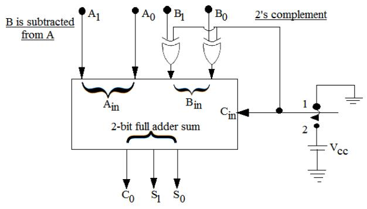

<details>
<summary>flowchart</summary>

```mermaid
graph LR
  A["A1"] --> B["A0"]
  B --> C["B1"]
  C --> D["B0"]
  D --> E["2's complement"]
  E --> F["Cin"]
  F --> G["1"]
  G --> H["2"]
  H --> I["Vcc"]
  I --> J["C0"]
  J --> K["S1"]
  K --> L["S0"]
```
</details>

gate1990 digital-logic adder fill-in-the-blanks

# Answer key

# 4.1.3 Adder: GATE CSE 1997 | Question: 2.5

An N-bit carry lookahead adder, where $N$ is a multiple of 4, employs ICs 74181 (4 bit ALU) and 74182 (4 bit carry lookahead generator).


The minimum addition time using the best architecture for this adder is

A. proportional to N

B. proportional to $\log N$

C. a constant

D. None of the above

gate1997 digital-logic normal adder

# Answer key

# 4.1.4 Adder: GATE CSE 1999 | Question: 2.16

The number of full and half-adders required to add 16-bit numbers is

A. 8 half-adders, 8 full-adders

B. 1 half-adder, 15 full-adders

C. 16 half-adders, 0 full-adders

D. 4 half-adders, 12 full-adders

gate1999 digital-logic normal adder

# Answer key

# 4.1.5 Adder: GATE CSE 2003 | Question: 46

Consider the ALU shown below.


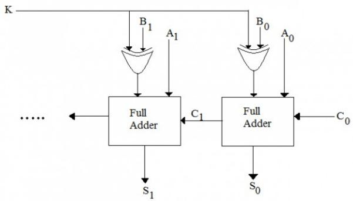

<details>
<summary>flowchart</summary>

```mermaid
graph LR
  K["K"] -->|K| B1["B1"]
  B1 -->|A1| Adder1["Full Adder"]
  Adder1 -->|C1| Adder2["Full Adder"]
  Adder2 -->|C0| Adder2
  Adder2 -->|S0| Adder2
  Adder2 -->|S1| Adder1
  Adder1 -->|S1| Adder1
  Adder2 -->|A0| Adder2
  Adder2 -->|A0| Adder1
```
</details>

If the operands are in $2's$ complement representation, which of the following operations can be performed by suitably setting the control lines $K$ and $C_0$ only (+ and - denote addition and subtraction respectively)?

A. $A + B$ , and $A - B$ , but not $A + 1$

B. $A + B$ , and $A + 1$ , but not $A - B$

C. $A + B$ , but not $A - B$ or $A + 1$

D. $A + B$ , and $A - B$ , and $A + 1$

gatecse-2003 digital-logic normal adder

# 4.1.6 Adder: GATE CSE 2004 | Question: 62


A 4-bit carry look ahead adder, which adds two 4-bit numbers, is designed using AND, OR, NOT, NAND, NOR gates only. Assuming that all the inputs are available in both complemented and uncomplemented forms and the delay of each gate is one time unit, what is the overall propagation delay of the adder? Assume that the carry network has been implemented using two-level AND-OR logic.

A. 4 time units

B. 6 time units

C. 10 time units

D. 12 time units

gatecse-2004 digital-logic normal adder

# Answer key

# 4.1.7 Adder: GATE CSE 2015 | Set 2 | Question: 48


A half adder is implemented with XOR and AND gates. A full adder is implemented with two half adders and one OR gate. The propagation delay of an XOR gate is twice that of an AND/OR gate. The propagation delay of an AND/OR gate is 1.2 microseconds. A 4-bit-ripple-carry binary adder is implemented by using four full adders. The total propagation time of this 4-bit binary adder in microseconds is \_\_\_\_.

gatecse-2015-set2 digital-logic adder normal numerical-answers

# Answer key

# 4.1.8 Adder: GATE CSE 2016 | Set 1 | Question: 33


Consider a carry look ahead adder for adding two n-bit integers, built using gates of fan-in at most two. The time to perform addition using this adder is

A. $\Theta(1)$

B. $\Theta (\log (n))$

C. $\Theta(\sqrt{n})$

D. $\Theta(n)$

gatecse-2016-set1 digital-logic adder normal

# Answer key

# 4.1.9 Adder: GATE CSE 2016 | Set 2 | Question: 07


Consider an eight-bit ripple-carry adder for computing the sum of $A$ and $B$ , where $A$ and $B$ are integers represented in 2's complement form. If the decimal value of $A$ is one, the decimal value of $B$ that leads to the longest latency for the sum to stabilize is \_\_\_\_

gatecse-2016-set2 digital-logic adder normal numerical-answers

# Answer key

# 4.2

# Array Multiplier (2)

# 4.2.1 Array Multiplier: GATE CSE 1999 | Question: 1.21


The maximum gate delay for any output to appear in an array multiplier for multiplying two n bit numbers is

A. $O(n^{2})$

B. $O(n)$

c. $O(\log n)$

D. $O(1)$

gate1999 digital-logic normal array-multiplier

# Answer key

# 4.2.2 Array Multiplier: GATE CSE 2003 | Question: 11


Consider an array multiplier for multiplying two $n$ bit numbers. If each gate in the circuit has a unit delay, the total delay of the multiplier is

A. $\Theta(1)$

B. $\Theta (\log n)$

C. $\Theta(n)$

D. $\Theta(n^{2})$

gatecse-2003 digital-logic normal array-multiplier

# Answer key

# 4.3.1 Binary Codes: GATE CSE 2006 | Question: 40


Consider numbers represented in 4-bit Gray code. Let $h_{3}h_{2}h_{1}h_{0}$ be the Gray code representation of a number n and let $g_{3}g_{2}g_{1}g_{0}$ be the Gray code of $(n+1)(modulo16)$ value of the number. Which one of the following functions is correct?

A. $g_{0}(h_{3}h_{2}h_{1}h_{0}) = \sum (1,2,3,6,10,13,14,15)$  
B. $g_{1}(h_{3}h_{2}h_{1}h_{0}) = \sum (4,9,10,11,12,13,14,15)$  
C. $g_{2}(h_{3}h_{2}h_{1}h_{0}) = \sum (2,4,5,6,7,12,13,15)$  
D. $g_{3}(h_{3}h_{2}h_{1}h_{0}) = \sum (0,1,6,7,10,11,12,13)$

gatecse-2006 digital-logic number-representation binary-codes normal

# Answer key

# 4.4

# Boolean Algebra (34)


<details>
<summary>flowchart</summary>

```mermaid
graph LR
  A["Practice Tests:"] --> B["Test 1 (15Q)"]
  B --> C["Test 2 (15Q)"]
  C --> D["Test 3 (15Q)"]
  D --> E["Test 4 (1Q)"]
  E --> F["Weekly Quiz 1 (15Q)"]
  F --> G["Weekly Quiz 2 (10Q)"]
  H["Weekly Quiz 3 (15Q)"] --> I["Weekly Quiz 4 (15Q)"]
```
</details>

# 4.4.1 Boolean Algebra: GATE CSE 1987 | Question: 1-II

The total number of Boolean functions which can be realised with four variables is:


A. 4

B. 17

C. 256

D. 65,536

gate1987 digital-logic boolean-algebra functions combinatory

# Answer key

# 4.4.2 Boolean Algebra: GATE CSE 1987 | Question: 12-a

The Boolean expression $A \oplus B \oplus A$ is equivalent to


A. $AB + \overline{A}\overline{B}$

B. $\overline{A} B + A\overline{B}$

C. B

D. $\overline{A}$

gate1987 digital-logic boolean-algebra easy

# Answer key

# 4.4.3 Boolean Algebra: GATE CSE 1988 | Question: 2-iii


Let $*$ be defined as a Boolean operation given as $x * y = \overline{x}$ $\overline{y} + xy$ and let $C = A * B$ . If $C = 1$ then prove that $A = B$ .

gate1988 digital-logic descriptive boolean-algebra

# Answer key

# 4.4.4 Boolean Algebra: GATE CSE 1989 | Question: 4-x


A switching function is said to be neutral if the number of input combinations for which its value is 1 is equal to the number of input combinations for which its value is 0. Compute the number of neutral switching functions of n variables (for a given n).

gate1989 descriptive digital-logic boolean-algebra

# Answer key

# 4.4.5 Boolean Algebra: GATE CSE 1989 | Question: 5-a

Find values of Boolean variables A, B, C which satisfy the following equations:


- $A + B = 1$  
- AC = BC

- $A + C = 1$  
- $AB = 0$

gate1989 descriptive digital-logic boolean-algebra

# Answer key

# 4.4.6 Boolean Algebra: GATE CSE 1992 | Question: 02-i

The operation which is commutative but not associative is:

A. AND

B. OR

C. EX-OR

D. NAND

gate1992 easy digital-logic boolean-algebra multiple-selects

# Answer key

# 4.4.7 Boolean Algebra: GATE CSE 1994 | Question: 4


A. Let \* be a Boolean operation defined as $A * B = AB + \overline{A} \overline{B}$ . If $C = A * B$ then evaluate and fill in the blanks:

i. $A * A =$ \_\_\_\_  
ii. $C * A =$ \_\_\_\_

B. Solve the following boolean equations for the values of A, B and C:

$$
\begin{array}{l} A B + \overline {{A}} C = 1 \\ A C + B = 0 \\ \end{array}
$$

gate1994 digital-logic normal boolean-algebra descriptive

# Answer key

# 4.4.8 Boolean Algebra: GATE CSE 1995 | Question: 2.5

What values of A, B, C and D satisfy the following simultaneous Boolean equations?

$$
\overline {{A}} + A B = 0, A B = A C, A B + A \overline {{C}} + C D = \overline {{C}} D
$$

A. $A = 1, B = 0, C = 0, D = 1$

B. $A = 1, B = 1, C = 0, D = 0$

C. $A = 1, B = 0, C = 1, D = 1$

D. $A = 1, B = 0, C = 0, D = 0$

gate1995 digital-logic boolean-algebra easy

# Answer key


# 4.4.9 Boolean Algebra: GATE CSE 1997 | Question: 2-1

Let \* be defined as $x * y = \bar{x} + y$ . Let $z = x * y$ . Value of $z * x$ is

A. $\bar{x} + y$

B. x

C. 0

D. 1

gate1997 digital-logic normal boolean-algebra

# Answer key

# 4.4.10 Boolean Algebra: GATE CSE 1998 | Question: 1.13

What happens when a bit-string is XORed with itself n-times as shown:

$$
[ B \oplus (B \oplus (B \oplus (B \dots n \text {times} ]
$$

A. complements when n is even

B. complements when $n$ is odd

C. divides by $2^{n}$ always

D. remains unchanged when $n$ is even

gate1998 digital-logic normal boolean-algebra

# Answer key


# 4.4.11 Boolean Algebra: GATE CSE 1998 | Question: 2.8

Which of the following operations is commutative but not associative?

A. AND

B. OR

C. NAND

D. EXOR

gate1998 digital-logic easy boolean-algebra

Answer key

# 4.4.12 Boolean Algebra: GATE CSE 1999 | Question: 1.7

Which of the following expressions is not equivalent to $\bar{x}$ ?

A. $x$ NAND $x$

B. $x$ NOR $x$

C. $x$ NAND 1

D. $x$ NOR 1

gate1999 digital-logic easy boolean-algebra

Answer key

# 4.4.13 Boolean Algebra: GATE CSE 2000 | Question: 2.10

The simultaneous equations on the Boolean variables x, y, z and w,

- $x + y + z = 1$  
- $xy = 0$  
- $xz + w = 1$  
- $xy + \bar{z}\bar{w} = 0$

have the following solution for $x, y, z$ and $w$ , respectively:

A. 0100

B. 1101

C. 1011

D. 1000

gatecse-2000 digital-logic boolean-algebra easy

Answer key

# 4.4.14 Boolean Algebra: GATE CSE 2002 | Question: 2-3

Let $f(A,B)=A'+B$ . Simplified expression for function $f(f(x+y,y),z)$ is

A. $x^{\prime} + z$

B. xyz

C. $xy' + z$

D. None of the above

gatecse-2002 digital-logic boolean-algebra normal

Answer key

# 4.4.15 Boolean Algebra: GATE CSE 2004 | Question: 17

A Boolean function $x'y' + xy + x'y$ is equivalent to

A. $x' + y'$

B. $x + y$

C. $x + y'$

D. $x^{\prime} + y$

gatecse-2004 digital-logic easy boolean-algebra

Answer key

# 4.4.16 Boolean Algebra: GATE CSE 2007 | Question: 32

Let $f(w, x, y, z) = \sum (0, 4, 5, 7, 8, 9, 13, 15)$ . Which of the following expressions are NOT equivalent to $f$ ?

P: $x^{\prime}y^{\prime}z^{\prime} + w^{\prime}xy^{\prime} + wy^{\prime}z + xz$  
Q: $w'y'z' +wx'y' + xz$  
R: $w'y'z' +wx'y' + xyz + xy'z$  
S: $x^{\prime}y^{\prime}z^{\prime} +wx^{\prime}y^{\prime} + w^{\prime}y$

A. P only

B. Q and S

C. R and S

D. S only


# 4.4.17 Boolean Algebra: GATE CSE 2007 | Question: 33

Define the connective \* for the Boolean variables X and Y as:

$$
X * Y = X Y + X ^ {\prime} Y ^ {\prime}.
$$

Let $Z = X * Y$ . Consider the following expressions $P, Q$ and $R$ .

$$
P: X = Y * Z,
$$

$$
Q: Y = X * Z,
$$

$$
R: X * Y * Z = 1
$$

Which of the following is TRUE?

A. Only $P$ and $Q$ are valid.

B. Only $Q$ and $R$ are valid.

C. Only $P$ and $\dot{R}$ are valid.

D. All $P, Q, R$ are valid.

gatecse-2007 digital-logic normal boolean-algebra

# Answer key

# 4.4.18 Boolean Algebra: GATE CSE 2008 | Question: 26

If $P, Q, R$ are Boolean variables, then

$(P + \bar{Q})(P.\bar{Q} +P.R)(\bar{P}.\bar{R} +\bar{Q})$ simplifies to

A. $P.\bar{Q}$

B. $P.\bar{R}$

C. $P.\bar{Q} + R$

D. $P, \bar{R} + Q$

gatecse-2008 easy digital-logic boolean-algebra

# Answer key

# 4.4.19 Boolean Algebra: GATE CSE 2012 | Question: 6

The truth table

<table><tr><td>X</td><td>Y</td><td>(X,Y)</td></tr><tr><td>0</td><td>0</td><td>0</td></tr><tr><td>0</td><td>1</td><td>0</td></tr><tr><td>1</td><td>0</td><td>1</td></tr><tr><td>1</td><td>1</td><td>1</td></tr></table>

represents the Boolean function

A. X

B. $X + Y$

C. $X \oplus Y$

D. Y

gatecse-2012 digital-logic easy boolean-algebra

# Answer key

# 4.4.20 Boolean Algebra: GATE CSE 2013 | Question: 21

Which one of the following expressions does NOT represent exclusive NOR of x and y?

A. $xy + x'y'$

B. $x \oplus y'$

C. $x^{\prime}\oplus y$

D. $x' \oplus y'$

gatecse-2013 digital-logic easy boolean-algebra

# Answer key

# 4.4.21 Boolean Algebra: GATE CSE 2014 | Set 3 | Question: 55

Let $\oplus$ denote the exclusive OR (XOR) operation. Let '1' and '0' denote the binary constants. Consider the following Boolean expression for $F$ over two variables $P$ and $Q$ :


$$
F (P, Q) = ((1 \oplus P) \oplus (P \oplus Q)) \oplus ((P \oplus Q) \oplus (Q \oplus 0))
$$

The equivalent expression for $F$ is

A. $P + Q$

B. $\overline{P+Q}$

C. $P \oplus Q$

D. $\overline{P \oplus Q}$

gatecse-2014-set3 digital-logic normal boolean-algebra

# Answer key

# 4.4.22 Boolean Algebra: GATE CSE 2015 | Set 2 | Question: 37

The number of min-terms after minimizing the following Boolean expression is \_\_\_\_.

$$
[ D ^ {\prime} + A B ^ {\prime} + A ^ {\prime} C + A C ^ {\prime} D + A ^ {\prime} C ^ {\prime} D ] ^ {\prime}
$$

gatecse-2015-set2 digital-logic boolean-algebra normal numerical-answers

# Answer key

# 4.4.23 Boolean Algebra: GATE CSE 2016 | Set 1 | Question: 06

Consider the Boolean operator # with the following properties :

$x\#0 = x, x\#1 = \bar{x}, x\#x = 0$ and $x\#\bar{x} = 1$ . Then $x\#y$ is equivalent to

A. $x\bar{y} + \bar{x}y$

B. $x\overline{y} +\overline{x}\overline{y}$

C. $\overline{x}y + xy$

D. $xy + \bar{x} \bar{y}$

gatecse-2016-set1 digital-logic boolean-algebra easy

# Answer key

# 4.4.24 Boolean Algebra: GATE CSE 2016 | Set 2 | Question: 08

Let, $x_{1} \oplus x_{2} \oplus x_{3} \oplus x_{4} = 0$ where $x_{1}, x_{2}, x_{3}, x_{4}$ are Boolean variables, and $\oplus$ is the XOR operator. Which one of the following must always be TRUE?

A. $x_{1}x_{2}x_{3}x_{4} = 0$  
B. $x_{1}x_{3} + x_{2} = 0$  
C. $\bar{x}_1\oplus \bar{x}_3 = \bar{x}_2\oplus \bar{x}_4$  
D. $x_{1} + x_{2} + x_{3} + x_{4} = 0$

gatecse-2016-set2 digital-logic boolean-algebra normal

# Answer key

# 4.4.25 Boolean Algebra: GATE CSE 2017 | Set 2 | Question: 27

If $w, x, y, z$ are Boolean variables, then which one of the following is INCORRECT?

A. $wx + w(x + y) + x(x + y) = x + wy$

B. $\overline{w\bar{x}(y + \bar{z})} +\bar{w} x = \bar{w} +x + \bar{y} z$

C. $(w\bar{x}(y + x\bar{z}) + \bar{w}\bar{x})y = x\bar{y}$

D. $(w + y)(wxy + wyz) = wxy + wyz$

gatecse-2017-set2 digital-logic boolean-algebra normal

# Answer key

# 4.4.26 Boolean Algebra: GATE CSE 2018 | Question: 4

Let $\oplus$ and $\odot$ denote the Exclusive OR and Exclusive NOR operations, respectively. Which one of the following is NOT CORRECT?

A. $\overline{P\oplus Q}=P\odot Q$  
B. $\overline{P} \oplus Q = P \odot Q$  
c. $\overline{P} \oplus \overline{Q} = P \oplus Q$  
D. $P \oplus \overline{P} \oplus Q = (P \odot \overline{P} \odot \overline{Q})$


# 4.4.27 Boolean Algebra: GATE CSE 2019 | Question: 6

Which one of the following is NOT a valid identity?

A. $(x\oplus y)\oplus z = x\oplus (y\oplus z)$  
C. $x \oplus y = x + y$ , if $xy = 0$

B. $(x + y) \oplus z = x \oplus (y + z)$  
D. $x\oplus y = (xy + x'y')'$

gatecse-2019 digital-logic boolean-algebra one-mark

# Answer key

# 4.4.28 Boolean Algebra: GATE CSE 2021 | Set 1 | Question: 42

Consider the following Boolean expression.

$$
F = (X + Y + Z) (\overline {{X}} + Y) (\overline {{Y}} + Z)
$$

Which of the following Boolean expressions is/are equivalent to $\overline{F}$ (complement of $F$ )?

A. $(\overline{X} +\overline{Y} +\overline{Z})(X + \overline{Y})(Y + \overline{Z})$  
B. $X\overline{Y} + \overline{Z}$  
C. $(X + \overline{Z})(\overline{Y} +\overline{Z})$  
D. $X\overline{Y} + Y\overline{Z} + \overline{X}\overline{Y}\overline{Z}$

gatecse-2021-set1 multiple-selects digital-logic boolean-algebra two-marks

# Answer key

# 4.4.29 Boolean Algebra: GATE CSE 2024 | Set 2 | Question: 20

For a Boolean variable x, which of the following statements is/are FALSE?

A. x.1 = x

B. $x + 1 = x$

C. $x \cdot x = 0$

D. $x + \bar{x} = 1$

gatecse-2024-set2 digital-logic boolean-algebra easy multiple-selects one-mark

# Answer key

# 4.4.30 Boolean Algebra: GATE CSE 2025 | Set 1 | Question: 14

Let X be a 3-variable Boolean function that produces output as '1' when at least two of the input variables are '1'. Which of the following statement(s) is/are CORRECT, where a, b, c, d, e are Boolean variables?

A. $X(a,b,X(c,d,e)) = X(X(a,b,c),d,e)$  
B. $X(a,b,X(a,b,c)) = X(a,b,c)$  
C. $X(a,b,X(a,c,d)) = (X(a,b,a)\text{ AND } X(c,d,c))$  
D. $X(a,b,c) = X(a,X(a,b,c),X(a,c,c))$

gatecse2025-set1 digital-logic boolean-algebra multiple-selects one-mark

# Answer key

# 4.4.31 Boolean Algebra: GATE CSE 2025 | Set 2 | Question: 40

Which of the following Boolean algebraic equation(s) is/are CORRECT?

A. $\bar{A}BC + A\bar{B}\bar{C} + \bar{A}\bar{B}\bar{C} + A\bar{B}C + ABC = BC + \bar{B}\bar{C} + \bar{A}\bar{B}$  
B. $AB + \bar{A} C + BC = AB + \bar{A} C$  
C. $(A + C)(\bar{A} + B) = AB + \bar{A} C$  
D. $(A + \bar{B} +\bar{D})(C + D)(\bar{A} +C + D)(A + B + \bar{D}) = \bar{A} D + \bar{C}\bar{D}$


# 4.4.32 Boolean Algebra: GATE CSE 2026 | Set 2 | Question: 6

Which one of the following options is not a property of Boolean Algebra?

Note: + is OR operation, · is AND operation, and / is NOT operation

A. $a + b = b + a$

B. $a \cdot a' = 1$

C. $a + a' = 1$

D. $a \cdot b = b \cdot a$

gatecse-2026-set2 digital-logic boolean-algebra easy one-mark

# Answer key

# 4.4.33 Boolean Algebra: GATE IT 2004 | Question: 44

The function $A\bar{B}C + \bar{A}BC + AB\bar{C} + \bar{A}\bar{B}C + A\bar{B}\bar{C}$ is equivalent to

A. $A\bar{C} + AB + \bar{A} C$

B. $A\bar{B} + A\bar{C} + \bar{A}C$

C. $\bar{A} B + A\bar{C} + A\bar{B}$

D. $\bar{A} B + AC + A\bar{B}$

gateit-2004 digital-logic boolean-algebra easy

# Answer key

# 4.4.34 Boolean Algebra: GATE IT 2005 | Question: 7

Which of the following expressions is equivalent to $(A\oplus B)\oplus C$

A. $(A + B + C)(\bar{A} +\bar{B} +\bar{C})$

B. $(A + B + C)(\bar{A} +\bar{B} +C)$

c. $ABC + \bar{A}(B\oplus C) + \bar{B}(A\oplus C)$

D. None of these

gateit-2005 digital-logic normal boolean-algebra

# Answer key

# 4.5

# Booths Algorithm (7)

Practice Test: Test 1 (6Q)

# 4.5.1 Booths Algorithm: GATE CSE 1990 | Question: 8b

State the Booth's algorithm for multiplication of two numbers. Draw a block diagram for the implementation of the Booth's algorithm for determining the product of two 8-bit signed numbers.

gate1990 descriptive digital-logic booths-algorithm

# Answer key

# 4.5.2 Booths Algorithm: GATE CSE 1996 | Question: 1.23

Booth's algorithm for integer multiplication gives worst performance when the multiplier pattern is

A. 101010...1010

B. 100000...0001

C. 111111...1111

D. 011111...1110

gate1996 digital-logic booths-algorithm normal

# Answer key

# 4.5.3 Booths Algorithm: GATE CSE 1999 | Question: 1.20

Booth's coding in 8 bits for the decimal number -57 is:

A. $0 - 100 + 1000$

B. $0 - 100 + 100 - 1$

C. $0 - 1 + 100 - 10 + 1$

D. $00 - 10 + 100 - 1$

gate1999 digital-logic number-representation booths-algorithm normal

# Answer key


The following two signed 2 's complement numbers (multiplicand M and multiplier Q) are being multiplied using Booth's algorithm:

M: 1100110111101101 and Q: 1010010010101010

The total number of addition and subtraction operations to be performed is \_\_\_\_. (Answer in integer)

gatecse2025-set2 digital-logic booths-algorithm numerical-answers one-mark

Answer key

# 4.5.5 Booths Algorithm: GATE IT 2005 | Question: 8

Using Booth's Algorithm for multiplication, the multiplier -57 will be recoded as

A. 0-1 00 1 0 0-1

C. 0-1001000

gateit-2005 digital-logic booths-algorithm normal

B. 11000111

D. 0100-1001

Answer key

# 4.5.6 Booths Algorithm: GATE IT 2006 | Question: 38


When multiplicand Y is multiplied by multiplier $X = x_{n-1}x_{n-2} \ldots x_{0}$ using bit-pair recoding in Booth's algorithm, partial products are generated according to the following table.


<table><tr><td>Row</td><td> $x_{i+1}$ </td><td> $x_i$ </td><td> $x_{i-1}$ </td><td>Partial Product</td></tr><tr><td>1</td><td>0</td><td>0</td><td>0</td><td>0</td></tr><tr><td>2</td><td>0</td><td>0</td><td>1</td><td>Y</td></tr><tr><td>3</td><td>0</td><td>1</td><td>0</td><td>Y</td></tr><tr><td>4</td><td>0</td><td>1</td><td>1</td><td>2Y</td></tr><tr><td>5</td><td>1</td><td>0</td><td>0</td><td>?</td></tr><tr><td>6</td><td>1</td><td>0</td><td>1</td><td>-Y</td></tr><tr><td>7</td><td>1</td><td>1</td><td>0</td><td>-Y</td></tr><tr><td>8</td><td>1</td><td>1</td><td>1</td><td>?</td></tr></table>

The partial products for rows 5 and 8 are

A. $2 Y$ and $Y$

B. $-2Y$ and $2Y$

C. $-2Y$ and 0

D. 0 and $Y$

gateit-2006 digital-logic booths-algorithm difficult

Answer key

# 4.5.7 Booths Algorithm: GATE IT 2008 | Question: 42

The two numbers given below are multiplied using the Booth's algorithm.

Multiplicand : 0101 1010 1110 1110

Multiplier: 0111 0111 1011 1101

How many additions/Subtractions are required for the multiplication of the above two numbers?

A. 6

B. 8

C. 10

D. 12

gateit-2008 digital-logic booths-algorithm normal

Answer key

4.6

Canonical Normal Form (10)

Practice Test: Test 1 (11Q)


Three switching functions $f_{1}$ , $f_{2}$ and $f_{3}$ are expressed below as sum of minterms.

- $f_{1}(w,x,y,z) = \sum 0,1,2,3,5,12$  
- $f_{2}(w,x,y,z) = \sum 0,1,2,10,13,14,15$  
- $f_{3}(w,x,y,z) = \sum 2,4,5,8$

Express the function $f$ realised by the circuit shown in the below figure as the sum of minterms (in decimal notation).

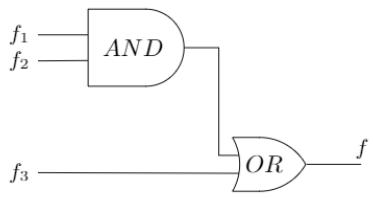

<details>
<summary>text_image</summary>

f₁
f₂
AND
f₃
OR
f
</details>

gate1988 descriptive digital-logic easy circuit-output canonical-normal-form digital-circuits

# Answer key

# 4.6.2 Canonical Normal Form: GATE CSE 2002 | Question: 2-1

Consider the following logic circuit whose inputs are functions $f_{1}$ , $f_{2}$ , $f_{3}$ and output is f

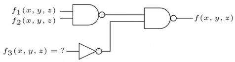

<details>
<summary>text_image</summary>

f₁(x, y, z)
f₂(x, y, z)
f₃(x, y, z) = ?
f(x, y, z)
</details>

Given that

- $f_{1}(x,y,z) = \Sigma(0,1,3,5)$  
- $f_{2}(x,y,z) = \Sigma(6,7)$ , and  
- $f(x,y,z) = \Sigma(1,4,5)$ .

$f_{3}$ is

A. $\Sigma(1,4,5)$

C. $\Sigma(0,1,3,5)$

gatecse-2002 digital-logic normal canonical-normal-form circuit-output

B. $\Sigma(6,7)$  
D. None of the above

# Answer key

# 4.6.3 Canonical Normal Form: GATE CSE 2008 | Question: 8

Given $f_{1}, f_{3}$ and $f$ in canonical sum of products form (in decimal) for the circuit


$$
f _ {1} = \Sigma m (4, 5, 6, 7, 8)
$$

$$
f _ {3} = \Sigma m (1, 6, 1 5)
$$

$$
f = \Sigma m (1, 6, 8, 1 5)
$$

then $f_{2}$ is

A. $\Sigma m(4,6)$

C. $\Sigma m(6,8)$

B. $\Sigma m(4,8)$

D. $\Sigma m(4,6,8)$

gatecse-2008 digital-logic canonical-normal-form easy


# Answer key

# 4.6.4 Canonical Normal Form: GATE CSE 2010 | Question: 6

The minterm expansion of $f(P, Q, R) = PQ + Q\bar{R} + P\bar{R}$ is

A. $m_{2} + m_{4} + m_{6} + m_{7}$

B. $m_0 + m_1 + m_3 + m_5$

C. $m_{0} + m_{1} + m_{6} + m_{7}$

D. $m_{2} + m_{3} + m_{4} + m_{5}$

gatecse-2010 digital-logic canonical-normal-form normal

# Answer key


# 4.6.5 Canonical Normal Form: GATE CSE 2015 | Set 3 | Question: 43

The total number of prime implicants of the function $f(w, x, y, z) = \sum (0, 2, 4, 5, 6, 10)$ is \_\_\_\_


gatecse-2015-set3 digital-logic canonical-normal-form normal numerical-answers

# Answer key

# 4.6.6 Canonical Normal Form: GATE CSE 2015 | Set 3 | Question: 44

Given the function $F = P' + QR$ , where $F$ is a function in three Boolean variables $P, Q$ and $R$ and $P' = !P$ , consider the following statements.


$$
(S 1) F = \sum (4, 5, 6)
$$

$$
(S 2) F = \sum (0, 1, 2, 3, 7)
$$

$$
(S 3) F = \Pi (4, 5, 6)
$$

$$
(S 4) F = \Pi (0, 1, 2, 3, 7)
$$

Which of the following is true?

A. (S1)-False, (S2)-True, (S3)-True, (S4)-False  
B. (S1)-True, (S2)-False, (S3)-False, (S4)-True  
C. (S1)-False, (S2)-False, (S3)-True, (S4)-True  
D. (S1)-True, (S2)-True, (S3)-False, (S4)-False

gatecse-2015-set3 digital-logic canonical-normal-form normal

# Answer key

# 4.6.7 Canonical Normal Form: GATE CSE 2019 | Question: 30

Consider three 4-variable functions $f_{1}$ , $f_{2}$ , and $f_{3}$ , which are expressed in sum-of-minterms as


$$
f _ {1} = \Sigma (0, 2, 5, 8, 1 4),
$$

$$
f _ {2} = \Sigma (2, 3, 6, 8, 1 4, 1 5),
$$

$$
f _ {3} = \Sigma (2, 7, 1 1, 1 4)
$$

For the following circuit with one AND gate and one XOR gate the output function f can be expressed as:


<details>
<summary>text_image</summary>

f₁
f₂
AND
f₃
XOR
f
</details>

A. $\Sigma(7,8,11)$

B. $\Sigma(2,7,8,11,14)$

C. $\Sigma(2,14)$

D. $\Sigma(0,2,3,5,6,7,8,11,14,15)$

gatecse-2019 digital-logic digital-circuits two-marks canonical-normal-form

# Answer key

# 4.6.8 Canonical Normal Form: GATE CSE 2019 | Question: 50

What is the minimum number of 2-input NOR gates required to implement a 4-variable function expressed in sum-of-minterms form as $f = \Sigma(0, 2, 5, 7, 8, 10, 13, 15)$ ? Assume that all the inputs and their complements are available. Answer: \_\_\_\_


# Answer key

# 4.6.9 Canonical Normal Form: GATE CSE 2020 | Question: 28

Consider the Boolean function $z(a, b, c)$ .

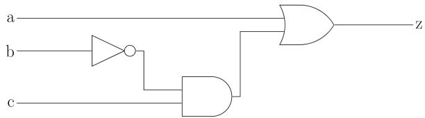

<details>
<summary>flowchart</summary>

```mermaid
graph LR
  a["a"] -->|Input| b["b"]
  b -->|Output| c["c"]
  c -->|Input| d["d"]
  d -->|Output| Z["Z"]
```
</details>

Which one of the following minterm lists represents the circuit given above?

A. $z = \sum (0,1,3,7)$  
C. $z = \sum(2, 4, 5, 6, 7)$

B. $z = \sum (1,4,5,6,7)$

gatecse-2020 digital-logic canonical-normal-form two-marks

# Answer key

# 4.6.10 Canonical Normal Form: GATE CSE 2024 | Set 2 | Question: 40

Consider 4-variable functions f1, f2, f3, f4 expressed in sum-of-minterms form as given below.

$$
f 1 = \sum (0, 2, 3, 5, 7, 8, 1 1, 1 3)
$$

$$
f 2 = \sum (1, 3, 5, 7, 1 1, 1 3, 1 5)
$$

$$
f 3 = \sum (0, 1, 4, 1 1)
$$

$$
f 4 = \sum (0, 2, 6, 1 3)
$$


<details>
<summary>flowchart</summary>

```mermaid
graph LR
  f1["f1"] --> AND["AND"]
  f2["f2"] --> AND
  f3["f3"] --> OR["OR"]
  f4["f4"] --> OR
  AND --> XOR["XOR"]
  OR --> XOR
  XOR --> Y["Y"]
```
</details>

With respect to the circuit given above, which of the following options is/are CORRECT?

A. $\mathbf{Y} = \sum (0,1,2,11,13)$  
C. $Y = \sum (0,1,2,3,4,5,6,7)$

B. $Y = \Pi (3,4,5,6,7,8,9,10,12,14,15)$

D. $Y = \Pi (8,9,10,11,12,13,14,15)$

gatecse-2024-set2 digital-logic canonical-normal-form multiple-selects two-marks

# Answer key

# 4.7

# Carry Generator (2)

# 4.7.1 Carry Generator: GATE CSE 2006 | Question: 36

Given two three bit numbers $a_{2}a_{1}a_{0}$ and $b_{2}b_{1}b_{0}$ and c the carry in, the function that represents the carry generate function when these two numbers are added is:

A. $a_2b_2 + a_2a_1b_1 + a_2a_1a_0b_0 + a_2a_0b_1b_0 + a_1b_2b_1 + a_1a_0b_2b_0 + a_0b_2b_1b_0$  
B. $a_2b_2 + a_2b_1b_0 + a_2a_1b_1b_0 + a_1a_0b_2b_1 + a_1a_0b_2 + a_1a_0b_2b_0 + a_2a_0b_1b_0$  
C. $a_2 + b_2 + (a_2 \oplus b_2)(a_1 + b_1 + (a_1 \oplus b_1) + (a_0 + b_0))$  
D. $a_2b_2 + \overline{a_2} a_1b_1 + \overline{a_2a_1} a_0b_0 + \overline{a_2} a_0\overline{b_1} b_0 + a_1\overline{b_2} b_1 + \overline{a_1} a_0\overline{b_2} b_0 + a_0\overline{b_2b_1} b_0$

gatecse-2006 digital-logic normal carry-generator adder

# Answer key

In a look-ahead carry generator, the carry generate function $G_{i}$ and the carry propagate function $P_{i}$ for inputs $A_{i}$ and $B_{i}$ are given by:

$$
P _ {i} = A _ {i} \oplus B _ {i} \text { and } G _ {i} = A _ {i} B _ {i}
$$

The expressions for the sum bit $S_{i}$ and the carry bit $C_{i+1}$ of the look ahead carry adder are given by:

$$
S _ {i} = P _ {i} \oplus C _ {i} \text {and} C _ {i + 1} = G _ {i} + P _ {i} C _ {i}, \text {where} C _ {0} \text {is the input carry.}
$$

Consider a two-level logic implementation of the look-ahead carry generator. Assume that all $P_{i}$ and $G_{i}$ are available for the carry generator circuit and that the AND and OR gates can have any number of inputs. The number of AND gates and OR gates needed to implement the look-ahead carry generator for a 4-bit adder with $S_{3}, S_{2}, S_{1}, S_{0}$ and $C_{4}$ as its outputs are respectively:

A. 6,3

B. 10,4

C. 6,4

D. 10,5

gatecse-2007 digital-logic normal carry-generator adder

Answer key

# 4.8

# Circuit Output (40)

Practice Tests: Test 1 (15Q) Test 2 (15Q) Test 3 (8Q)

# 4.8.1 Circuit Output: GATE CSE 1987 | Question: 1-IV

The output F of the below multiplexer circuit can be represented by


<details>
<summary>flowchart</summary>

```mermaid
graph LR
  A["A"] -->|"B"| MUX
  B["B"] -->|"C"| MUX
  C["C"] -->|"C"| MUX
  C -->|"C"| MUX
  MUX["MUX"] -->|"F"| F
```
</details>

A. $AB + B\bar{C} +\bar{C} A + \bar{B}\bar{C}$

B. $A \oplus B \oplus C$

C. $A \oplus B$

D. $\bar{A}\bar{B}C + \bar{A}B\bar{C} + A\bar{B}\bar{C}$

gate1987 digital-logic combinational-circuit multiplexer circuit-output

Answer key

# 4.8.2 Circuit Output: GATE CSE 1989 | Question: 4-ix

Explain the behaviour of the following logic circuit with level input A and output B.


<details>
<summary>flowchart</summary>

```mermaid
graph LR
  A["A"] --> B["Logic Block"]
  B --> C["Logic Gate"]
  C --> D["Output Block"]
  D --> E["B"]
```
</details>

gate1989 descriptive digital-logic circuit-output

Answer key

# 4.8.3 Circuit Output: GATE CSE 1990 | Question: 3-i

Choose the correct alternatives (More than one may be correct).


Two NAND gates having open collector outputs are tied together as shown in below figure.

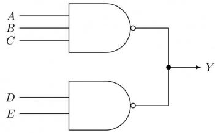

<details>
<summary>text_image</summary>

A
B
C
D
E
Y
</details>

The logic function Y, implemented by the circuit is,

A. $Y = ABC + DE$

B. $Y = \overline{ABC + DE}$

C. $Y = ABC \cdot DE$

D. $Y = \overline{ABC.DE}$

gate1990 normal digital-logic circuit-output

# Answer key

# 4.8.4 Circuit Output: GATE CSE 1991 | Question: 5-a

Analyse the circuit in Fig below and complete the following table

<table><tr><td>a</td><td>b</td><td> $\mathbf{Q_n}$ </td></tr><tr><td>0</td><td>0</td><td></td></tr><tr><td>0</td><td>1</td><td></td></tr><tr><td>1</td><td>0</td><td></td></tr><tr><td>1</td><td>1</td><td></td></tr></table>


<details>
<summary>flowchart</summary>

```mermaid
graph LR
  a["a"] --> B1["B1"]
  b["b"] --> B2["B2"]
  B1 --> C["C"]
  B2 --> C
  C --> D["Q"]
```
</details>

gate1991 digital-logic normal circuit-output sequential-circuit descriptive

# Answer key

# 4.8.5 Circuit Output: GATE CSE 1993 | Question: 19

A control algorithm is implemented by the NAND - gate circuitry given in figure below, where $A$ and $B$ are state variable implemented by $D$ flip-flops, and $P$ is control input. Develop the state transition table for this controller.

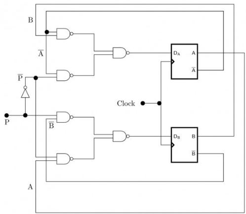

<details>
<summary>text_image</summary>

B
A
P̅
P
A
B̅
Clock
D̅A
A̅
D̅B
B̅
B̅
</details>


gate1993 digital-logic sequential-circuit flip-flop circuit-output normal descriptive

# Answer key

# 4.8.6 Circuit Output: GATE CSE 1993 | Question: 6-3


For the initial state of 000, the function performed by the arrangement of the J-K flip-flops in figure is:


<details>
<summary>flowchart</summary>

```mermaid
graph LR
  A["Clock"] --> B["J"]
  A --> C["K"]
  B --> D["Q"]
  C --> D
  D --> E["J"]
  D --> F["K"]
  E --> G["Q"]
  F --> G
  G --> H["J"]
  G --> I["K"]
  H --> J["Q"]
  I --> J
```
</details>

A. Shift Register

B. Mod- 3 Counter

C. Mod- 6 Counter

D. Mod-2 Counter

E. None of the above

gate1993 digital-logic sequential-circuit flip-flop digital-counter circuit-output multiple-selects

# Answer key

# 4.8.7 Circuit Output: GATE CSE 1993 | Question: 6.1

Identify the logic function performed by the circuit shown in figure.


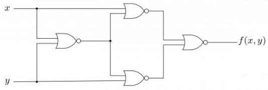

<details>
<summary>flowchart</summary>

```mermaid
graph LR
  x["x"] -->|Input| AND1["Logic Gate 1"]
  y["y"] -->|Input| AND2["Logic Gate 2"]
  AND1 -->|Adder| AND3["Adder Input"]
  AND2 -->|Adder| AND4["Adder Output"]
  AND3 -->|Adder| AND5["Adder Output"]
  AND4 -->|Adder| AND6["Adder Output"]
  AND5 -->|Adder| AND7["Adder Output"]
  AND6 -->|Adder| AND8["Adder Output"]
  AND7 -->|Adder| AND9["Adder Output"]
  AND8 -->|Adder| AND10["Adder Output"]
  AND9 -->|Adder| AND11["Adder Output"]
  AND10 -->|Adder| AND12["Adder Output"]
  AND11 -->|Adder| AND13["Adder Output"]
  AND12 -->|Adder| AND14["Adder Output"]
  AND13 -->|Adder| AND15["Adder Output"]
  AND14 -->|Adder| AND16["Adder Output"]
  AND15 -->|Adder| AND17["Adder Output"]
  AND16 -->|Adder| AND18["Adder Output"]
  AND17 -->|Adder| AND19["Adder Output"]
  AND18 -->|Adder| AND19
  AND19 -->|Adder| AND20["Adder Output"]
  AND20 -->|Adder| AND21["Adder Output"]
  AND21 -->|Adder| AND22["Adder Output"]
  AND22 -->|Adder| AND23["Adder Output"]
  AND23 -->|Adder| AND24["Adder Output"]
  AND24 -->|Adder| AND25["Adder Output"]
  AND25 -->|Adder| AND26["Adder Output"]
  AND26 -->|Adder| AND27["Adder Output"]
  AND27 -->|Adder| AND28["Adder Output"]
  AND28 -->|Adder| AND29["Adder Output"]
  AND29 -->|Adder| AND30["Adder Output"]
  AND30 -->|Adder| AND31["Adder Output"]
  AND31 -->|Adder| AND32["Adder Output"]
  AND32 -->|Adder| AND33["Adder Output"]
  AND33 -->|Adder| AND34["Adder Output"]
  AND34 -->|Adder| AND35["Adder Output"]
  AND35 -->|Adder| AND36["Adder Output"]
  AND36 -->|Adder| AND37["Adder Output"]
  AND37 -->|Adder| AND38["Adder Output"]
  AND38 -->|Adder| AND39["Adder Output"]
  AND39 -->|Adder| AND40["Adder Output"]
  AND40 -->|Adder| AND41["Adder Output"]
  AND41 -->|Adder| AND42["Adder Output"]
  AND42 -->|Adder| AND43["Adder Output"]
  AND43 -->|Adder| AND44["Adder Output"]
  AND44 -->|Adder| AND45["Adder Output"]
  AND45 -->|Adder| AND46["Adder Output"]
  AND46 -->|Adder| AND47["Adder Output"]
  AND47 -->|Adder| AND48["Adder Output"]
  AND48 -->|Adder| AND49["Adder Output"]
  AND49 -->|Adder| AND50["Adder Output"]
  AND50 -->|Adder| AND51["Adder Output"]
  AND51 -->|Adder| AND52["Adder Output"]
  AND52 -->|Adder| AND53["Adder Output"]
  AND53 -->|Adder| AND54["Adder Output"]
  AND54 -->|Adder| AND55["Adder Output"]
  AND55 -->|Adder| AND56["Adder Output"]
  AND56 -->|Adder| AND57["Adder Output"]
  AND57 -->|Adder| AND58["Adder Output"]
  AND58 -->|Adder| AND59["Adder Output"]
  AND59 -->|Adder| AND60["Adder Output"]
  AND60 -->|Adder| AND61["Adder Output"]
  AND61 -->|Adder| AND62["Adder Output"]
  AND62 -->|Adder| AND63["Adder Output"]
  AND63 -->|Adder| AND64["Adder Output"]
  AND64 -->|Adder| AND65["Adder Output"]
  AND65 -->|Adder| AND66["Adder Output"]
  AND66 -->|Adder| AND67["Adder Output"]
  AND67 -->|Adder| AND68["Adder Output"]
  AND68 -->|Adder| AND69["Adder Output"]
  AND69 -->|Adder| AND70["Adder Output"]
  AND70 -->|Adder| AND71["Adder Output"]
  AND71 -->|Adder| AND72["Adder Output"]
  AND72 -->|Adder| AND73["Adder Output"]
  AND73 -->|Adder| AND74["Adder Output"]
  AND74 -->|Adder| AND75["Adder Output"]
  AND75 -->|Adder| AND76["Adder Output"]
  AND76 -->|Adder| AND77["Adder Output"]
  AND77 -->|Adder| AND78["Adder Output"]
  AND78 -->|Adder| AND79["Adder Output"]
  AND79 -->|Adder| AND80["Adder Output"]
  AND80 -->|Adder| AND81["Adder Output"]
  AND81 -->|Adder| AND82["Adder Output"]
  AND82 -->|Adder| AND83["Adder Output"]
  AND83 -->|Adder| AND84["Adder Output"]
  AND84 -->|Adder| AND85["Adder Output"]
  AND85 -->|Adder| AND86["Adder Output"]
  AND86 -->|Adder| AND87["Adder Output"]
  AND87 -->|Adder| AND88["Adder Output"]
  AND88 -->|Adder| AND89["Adder Output"]
  AND89 -->|Adder| AND90["Adder Output"]
  AND90 -->|Adder| AND91["Adder Output"]
  AND91 -->|Adder| AND92["Adder Output"]
  AND92 -->|Adder| AND93["Adder Output"]
  AND93 -->|Adder| AND94["Adder Output"]
  AND94 -->|Adder| AND95["Adder Output"]
  AND95 -->|Adder| AND96["Adder Output"]
  AND96 -->|Adder| AND97["Adder Output"]
  AND97 -->|Adder| AND98["Adder Output"]
  AND98 -->|Adder| AND99["Adder Output"]
  AND99 -->|Adder| AND100["Adder Output"]
```
</details>

A. exclusive OR

B. exclusive NOR

C. NAND

D. NOR

E. None of the above

gate1993 digital-logic combinational-circuit circuit-output normal

# Answer key

# 4.8.8 Circuit Output: GATE CSE 1993 | Question: 6.2

If the state machine described in figure should have a stable state, the restriction on the inputs is given by


<details>
<summary>flowchart</summary>

```mermaid
graph LR
  S1["S1"] -->|a = 0/out 2| S2["S2"]
  S2 -->|b = 0/out 1| S1
  S1 -->|a = 1/out 1| S1
  S2 -->|b = 1/out 2| S2
```
</details>

A. a.b = 1

B. $a + b = 1$

C. $\bar{a} + \bar{b} = 0$

D. $\overline{a.b} = 1$

E. $\overline{a+b}=1$

gate1993 digital-logic normal circuit-output sequential-circuit

# Answer key

# 4.8.9 Circuit Output: GATE CSE 1994 | Question: 1.8

The logic expression for the output of the circuit shown in figure below is:

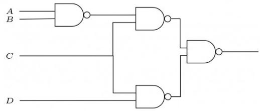

<details>
<summary>text_image</summary>

A
B
C
D
</details>


A. $\overline{AC} + \overline{BC} + CD$

B. $\overline{A} C + \overline{B} C + CD$

c. $ABC + \overline{C}\overline{D}$

D. $\overline{A}\overline{B} +\overline{B}\overline{C} +CD$

gate1994 digital-logic circuit-output normal

# Answer key

# 4.8.10 Circuit Output: GATE CSE 1994 | Question: 11

Find the contents of the flip-flop $Q_{2}, Q_{1}$ and $Q_{0}$ in the circuit of figure, after giving four clock pulses to the clock terminal. Assume $Q_{2}Q_{1}Q_{0}=000$ initially.


<details>
<summary>flowchart</summary>

```mermaid
graph LR
  Clock["Clock"] --> J["J"]
  Clock --> D["D"]
  Clock --> T["T"]
  J --> Q2["Q2"]
  D --> Q1["Q1"]
  T --> Q0["Q0"]
  Q2 --> J
  Q1 --> T
  Q0 --> T
  J --> CK1["CK"]
  D --> CK1
  T --> CK1
  Q0 --> CK0["CK0"]
```
</details>

gate1994 digital-logic sequential-circuit digital-counter circuit-output normal descriptive

# Answer key

# 4.8.11 Circuit Output: GATE CSE 1996 | Question: 2.21

Consider the circuit in below figure which has a four bit binary number $b_{3}b_{2}b_{1}b_{0}$ as input and a five bit binary number, $d_{4}d_{3}d_{2}d_{1}d_{0}$ as output.


<details>
<summary>text_image</summary>

0 0 0 b3 b2 b1 b0
4 - bit
Binary
Adder
cout cin 0
d4 d3 d2 d1 d0
</details>

A. Binary to Hex conversion

B. Binary to BCD conversion

C. Binary to Gray code conversion

D. Binary to radix - 12 conversion

gate1996 digital-logic circuit-output normal

# Answer key

# 4.8.12 Circuit Output: GATE CSE 1996 | Question: 2.22

Consider the circuit in figure. $f$ implements


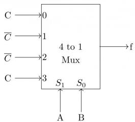

<details>
<summary>text_image</summary>

C→0
C̅→1
C̅→2
C→3
4 to 1
Mux
→f
S₁ S₀
A B
</details>

A. $\overline{A}\overline{B} C + \overline{A} B\overline{C} + ABC$

B. $A + B + C$

C. $A \oplus B \oplus C$

D. $AB + BC + CA$

# 4.8.13 Circuit Output: GATE CSE 1996 | Question: 24-a

Consider the synchronous sequential circuit in the below figure


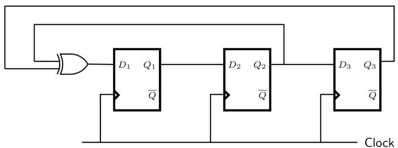

<details>
<summary>flowchart</summary>

```mermaid
graph LR
  Input["Input"] --> D1["D1\nQ1\nQ̅"]
  D1 --> D2["D2\nQ2\nQ̅"]
  D2 --> D3["D3\nQ3\nQ̅"]
  D3 --> Clock["Clock"]
```
</details>

Draw a state diagram, which is implemented by the circuit. Use the following names for the states corresponding to the values of flip-flops as given below.

<table><tr><td>Q1</td><td>Q2</td><td>Q3</td><td>State</td></tr><tr><td>0</td><td>0</td><td>0</td><td> $S_0$ </td></tr><tr><td>0</td><td>0</td><td>1</td><td> $S_1$ </td></tr><tr><td>-</td><td>-</td><td>-</td><td>-</td></tr><tr><td>-</td><td>-</td><td>-</td><td>-</td></tr><tr><td>-</td><td>-</td><td>-</td><td>-</td></tr><tr><td>1</td><td>1</td><td>1</td><td> $S_7$ </td></tr></table>

gate1996 digital-logic circuit-output normal descriptive

# Answer key

# 4.8.14 Circuit Output: GATE CSE 1996 | Question: 24-b

Consider the synchronous sequential circuit in the below figure


<details>
<summary>flowchart</summary>

```mermaid
graph LR
  Input["Input"] --> D1["D1\nQ1\nQ̅"]
  D1 --> D2["D2\nQ2\nQ̅"]
  D2 --> D3["D3\nQ3\nQ̅"]
  D3 --> Clock["Clock"]
```
</details>

Given that the initial state of the circuit is $S_{4}$ , identify the set of states, which are not reachable.

gate1996 normal digital-logic circuit-output descriptive

# Answer key

# 4.8.15 Circuit Output: GATE CSE 1997 | Question: 5.5

Consider a logic circuit shown in figure below. The functions $f_{1}$ , $f_{2}$ and f (in canonical sum of products form in decimal notation) are :

$$
f _ {1} (w, x, y, z) = \sum 8, 9, 1 0
$$

$$
f _ {2} (w, x, y, z) = \sum 7, 8, 1 2, 1 3, 1 4, 1 5
$$

$$
f (w, x, y, z) = \sum 8, 9
$$


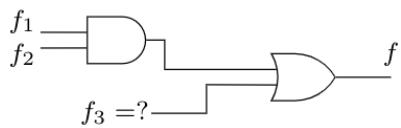

<details>
<summary>text_image</summary>

f₁
f₂
f₃ = ?
f
</details>

The function $f_{3}$ is

A. $\sum 9,10$

B. $\sum 9$

c. $\sum 1,8,9$

D. $\sum8,10,15$

gate1997 digital-logic circuit-output normal

# Answer key

# 4.8.16 Circuit Output: GATE CSE 1999 | Question: 2.8

Consider the circuit shown below. In a certain steady state, the line $Y$ is at $1'$ . What are the possible values of $A, B$ and $C$ in this state?


<details>
<summary>text_image</summary>

A
B
C
Y
</details>

A. $A = 0, B = 0, C = 1$

B. $A = 0, B = 1, C = 1$

C. $A = 1, B = 0, C = 1$

D. $A = 1, B = 1, C = 1$

gate1999 digital-logic circuit-output normal

# Answer key

# 4.8.17 Circuit Output: GATE CSE 2000 | Question: 2.12

The following arrangement of master-slave flip flops


<details>
<summary>text_image</summary>

P
J K
1
Clock
Q
D
</details>

has the initial state of P, Q as 0, 1 (respectively). After three clock cycles the output state P, Q is (respectively),

A. 1,0

B. 1,1

c. 0,0

D. 0,1

gatecse-2000 digital-logic circuit-output normal flip-flop

# Answer key

# 4.8.18 Circuit Output: GATE CSE 2001 | Question: 2.8

Consider the following circuit with initial state $Q_{0}=Q_{1}=0$ . The D Flip-flops are positive edged triggered and have set up times 20 nanosecond and hold times 0.


<details>
<summary>flowchart</summary>

```mermaid
graph LR
  X["X"] --> D0["D0, Q0"]
  C["C"] --> Clk["Clk, Q0"]
  D0 --> C
  Clk --> D1["D1, Q1"]
  D1 --> Y["Y"]
  Clk --> Y
```
</details>

Consider the following timing diagrams of $X$ and $C$ . The clock period of $C \geq 40$ nanosecond. Which one is the correct plot of $Y$ ?

  
gatecse-2001 digital-logic circuit-output normal

# Answer key

# 4.8.19 Circuit Output: GATE CSE 2002 | Question: 2.2

Consider the following multiplexer where $I0, I1, I2, I3$ are four data input lines selected by two address line combinations $A1A0 = 00, 01, 10, 11$ respectively and $f$ is the output of the multiplexor. EN is the Enable input.


<details>
<summary>text_image</summary>

x
y
z
I0 4 to 1
Multiplexer
I1
I2
I3
A1
A0
EN
OUTPUT
f(x,y,z) =?
</details>

The function $f(x, y, z)$ implemented by the above circuit is

A. $xyz'$

B. $xy + z$

C. $x + y$

D. None of the above

gatecse-2002 digital-logic circuit-output normal

# Answer key

# 4.8.20 Circuit Output: GATE CSE 2004 | Question: 61

Consider the partial implementation of a 2-bit counter using T flip-flops following the sequence 0 - 2 - 3 - 1 - 0, as shown below.

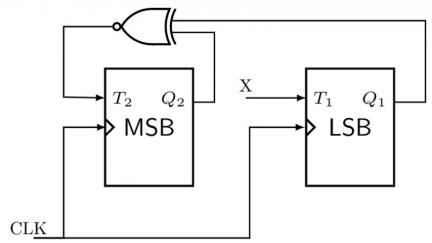

<details>
<summary>flowchart</summary>

```mermaid
graph LR
  CLK["CLK"] --> T2["T2 Q2"]
  CLK --> MSB["MSB"]
  CLK --> LSB["LSB"]
  T2 --> XOR(("+"))
  MSB --> XOR
  XOR --> T1["T1 Q1"]
  T1 --> LSB
  LSB --> XOR
```
</details>

To complete the circuit, the input X should be

A. $Q_{2}^{c}$

B. $Q_{2} + Q_{1}$

C. $(Q_{1} + Q_{2})^{c}$

D. $Q_{1} \oplus Q_{2}$

gatecse-2004 digital-logic circuit-output normal

# Answer key


Consider the following circuit.

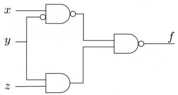

<details>
<summary>flowchart</summary>

```mermaid
graph LR
  x["x"] -->|Output| ANDGate["AND gate"]
  y["y"] -->|Output| ANDGate
  z["z"] -->|Output| ANDGate
  AND_gate["AND gate"] -->|Output| f["f"]
```
</details>

Which one of the following is TRUE?

A. $f$ is independent of $x$

B. $f$ is independent of $y$

C. $f$ is independent of $z$

D. None of $x, y, z$ is redundant

gatecse-2005 digital-logic circuit-output normal

# Answer key

# 4.8.22 Circuit Output: GATE CSE 2005 | Question: 62

Consider the following circuit involving a positive edge triggered D FF.


<details>
<summary>text_image</summary>

A
X
D
CLK
Q
Y
Q'
</details>


Consider the following timing diagram. Let $A_{i}$ represents the logic level on the line A in the i-th clock period.


<details>
<summary>text_image</summary>

clk
0 1 2 3 4 5
X
</details>

Let $A'$ represent the complement of $A$ . The correct output sequence on $Y$ over the clock periods 1 through 5 is:

A. $A_0A_1A_1'A_3A_4$

B. $A_0A_1A_2'A_3A_4$

C. $A_{1}A_{2}A_{2}^{\prime}A_{3}A_{4}$

D. $A_{1}A_{2}^{\prime}A_{3}A_{4}A_{5}^{\prime}$

gatecse-2005 digital-logic circuit-output normal

# Answer key

# 4.8.23 Circuit Output: GATE CSE 2005 | Question: 64

Consider the following circuit:


<details>
<summary>flowchart</summary>

```mermaid
graph LR
  D0["D0"] --> Q0["Q0"]
  Q0 --> D1["D1"]
  D1 --> Q1["Q1"]
  Q1 --> Q1["Q1'"]
  Q0 --> Q0["Q0'"]
  Q0 --> D1
  D1 --> Q1
  Q1 --> clk["clk"]
```
</details>


The flip-flops are positive edge triggered D FFs. Each state is designated as a two-bit string $Q_{0}Q_{1}$ . Let the initial state be 00. The state transition sequence is


B.  
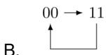

C.  
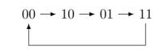

D.  


# 4.8.24 Circuit Output: GATE CSE 2006 | Question: 35


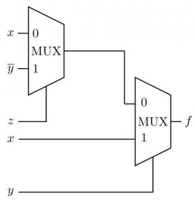

<details>
<summary>text_image</summary>

x 0
MUX 1
ȳ
z
x
y
0
MUX 1
f
</details>

Consider the circuit above. Which one of the following options correctly represents $f(x,y,z)$

A. $x\bar{z} + xy + \bar{y} z$

B. $x\bar{z} + xy + \overline{yz}$

C. $xz + xy + \overline{yz}$

D. $xz + x\bar{y} +\bar{y} z$

gatecse-2006 digital-logic circuit-output normal

# Answer key

# 4.8.25 Circuit Output: GATE CSE 2006 | Question: 37

Consider the circuit in the diagram. The $\oplus$ operator represents Ex-OR. The D flip-flops are initialized to zeroes (cleared).


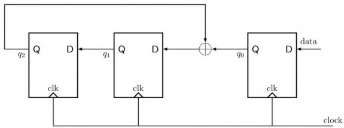

<details>
<summary>flowchart</summary>

```mermaid
graph LR
  Q["Q"] -->|clk| D["D"]
  D -->|clk| Q
  Q -->|clk| D
  D -->|clk| Q
  Q -->|clk| D
  D -->|clk| Q
  Q -->|q0| Center(("+"))
  D -->|q1| Center
  Q -->|q2| Center
  Center -->|data| D
```
</details>

The following data: 100110000 is supplied to the “data” terminal in nine clock cycles. After that the values of $q_{2}q_{1}q_{0}$ are:

A. 000

B. 001

C. 010

D. 101

gatecse-2006 digital-logic circuit-output easy

# Answer key

# 4.8.26 Circuit Output: GATE CSE 2006 | Question: 8

You are given a free running clock with a duty cycle of 50% and a digital waveform f which changes only at the negative edge of the clock. Which one of the following circuits (using clocked D flip-flops) will delay the phase of f by $180^{\circ}$ ?


A.

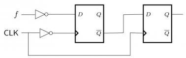

<details>
<summary>text_image</summary>

f
CLK
D Q
Q
D Q
Q
</details>

B.


<details>
<summary>flowchart</summary>

```mermaid
graph LR
  f["f"] --> D["D"]
  CLK["CLK"] --> D
  D --> Q["Q"]
  Q --> D
  D --> Q
  Q --> D
  CLK --> Q
```
</details>

C.


<details>
<summary>flowchart</summary>

```mermaid
graph LR
  f["f"] --> D["D"]
  CLK["CLK"] --> D
  D --> Q["Q"]
  Q --> D
  D --> Q
  Q --> Q
  CLK --> Q
```
</details>

D.

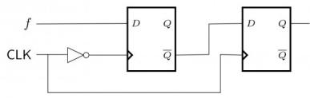

<details>
<summary>text_image</summary>

f
CLK
D Q
Q
D Q
Q̅
</details>

gatecse-2006 digital-logic normal circuit-output

# Answer key

# 4.8.27 Circuit Output: GATE CSE 2007 | Question: 36

The control signal functions of a 4-bit binary counter are given below (where $X$ is "don't care"):

<table><tr><td>Clear</td><td>Clock</td><td>Load</td><td>Count</td><td>Function</td></tr><tr><td>1</td><td>X</td><td>X</td><td>X</td><td>Clear to 0</td></tr><tr><td>0</td><td>X</td><td>0</td><td>0</td><td>No Change</td></tr><tr><td>0</td><td>↑</td><td>1</td><td>X</td><td>Load Input</td></tr><tr><td>0</td><td>↑</td><td>0</td><td>1</td><td>Count Next</td></tr></table>


The counter is connected as follows:


<details>
<summary>flowchart</summary>

```mermaid
graph LR
  A1["A1"] -->|Output| B["4-bit counter"]
  A2["A2"] -->|Output| B
  A3["A3"] -->|Output| B
  A4["A4"] -->|Output| B
  B -->|Clear| C["Clear"]
  C --> B
  B -->|Inputs| D["0 0 1 1"]
  B -->|Inputs| E["0 0 1 1"]
  B -->|Inputs| F["0 0 1 1"]
  B -->|Inputs| G["0 0 1 1"]
  G -->|Inputs| H["1 1"]
  H --> I["Count = 1"]
  H --> J["Load = 0"]
  H --> K["Clock"]
```
</details>

Assume that the counter and gate delays are negligible. If the counter starts at 0, then it cycles through the following sequence:

A. 0,3,4

B. 0,3,4,5

C. 0,1,2,3,4

D. 0,1,2,3,4,5

gatecse-2007 digital-logic circuit-output normal

# Answer key

# 4.8.28 Circuit Output: GATE CSE 2010 | Question: 31

What is the boolean expression for the output f of the combinational logic circuit of NOR gates given below?


<details>
<summary>flowchart</summary>

```mermaid
graph LR
  P["P"] --> Q1["Q"]
  Q1 -->|Output| R1["R"]
  R1 -->|Output| Q2["Q"]
  Q2 -->|Output| R2["R"]
  R2 -->|Output| Q3["Q"]
  Q3 -->|Output| R3["R"]
  R3 -->|Output| Output["f"]
```
</details>

A. $\overline{Q + R}$  
C. $\overline{P+R}$

gatecse-2010 digital-logic circuit-output normal

B. $\overline{P+Q}$  
D. $\overline{P+Q+R}$

# Answer key

# 4.8.29 Circuit Output: GATE CSE 2010 | Question: 32

In the sequential circuit shown below, if the initial value of the output $Q_{1}Q_{0}$ is 00. What are the next four values of $Q_{1}Q_{0}$ ?


<details>
<summary>flowchart</summary>

```mermaid
graph LR
  Clock["Clock"] --> TQ["T Q"]
  Clock --> Q0["Q0"]
  TQ --> TQ2["T Q"]
  TQ2 --> Q1["Q1"]
```
</details>

A. 11, 10, 01, 00

B. 10, 11, 01, 00

c. 10, 00, 01, 11

D. 11, 10, 00, 01

gatecse-2010 digital-logic circuit-output normal

# Answer key

# 4.8.30 Circuit Output: GATE CSE 2010 | Question: 9

The Boolean expression of the output f of the multiplexer shown below is


<details>
<summary>flowchart</summary>

```mermaid
graph LR
  R["R"] --> 0["0"]
  R̄["R̄"] --> 1["1"]
  R̄̄["R̄"] --> 2["2"]
  R["R"] --> 3["3"]
  S1["S₁"] --> S0["S₀"]
  S0 --> f["f"]
  P["P"] --> S1
  Q["Q"] --> S0
```
</details>

A. $\overline{P \oplus Q \oplus R}$

B. $P \oplus Q \oplus R$

C. $P + \dot{Q} + R$

D. $\overline{P + Q + R}$

gatecse-2010 digital-logic circuit-output easy multiplexer

# Answer key

# 4.8.31 Circuit Output: GATE CSE 2011 | Question: 50

Consider the following circuit involving three D-type flip-flops used in a certain type of counter configuration.


<details>
<summary>flowchart</summary>

```mermaid
graph LR
  Clock(("Clock")) --> D1["D"]
  Clock(("Clock")) --> D2["D"]
  Clock(("Clock")) --> D3["D"]
  Clock(("Clock")) --> D4["D"]
  Clock(("Clock")) --> D5["D"]
  Clock(("Clock")) --> D6["D"]
  Clock(("Clock")) --> D7["D"]
  Clock(("Clock")) --> D8["D"]
  Clock(("Clock")) --> D9["D"]
  Clock(("Clock")) --> D10["D"]
  Clock(("Clock")) --> D11["D"]
  Clock(("Clock")) --> D12["D"]
  Clock(("Clock")) --> D13["D"]
  Clock(("Clock")) --> D14["D"]
  Clock(("Clock")) --> D15["D"]
  Clock(("Clock")) --> D16["D"]
  Clock(("Clock")) --> D17["D"]
  Clock(("Clock")) --> D18["D"]
  Clock(("Clock")) --> D19["D"]
  Clock(("Clock")) --> D20["D"]
  Clock(("Clock")) --> D21["D"]
  Clock(("Clock")) --> D22["D"]
  Clock(("Clock")) --> D23["D"]
  Clock(("Clock")) --> D24["D"]
  Clock(("Clock")) --> D25["D"]
  Clock(("Clock")) --> D26["D"]
  Clock(("Clock")) --> D27["D"]
  Clock(("Clock")) --> D28["D"]
  Clock(("Clock")) --> D29["D"]
  Clock(("Clock")) --> D30["D"]
  Clock(("Clock")) --> D31["D"]
  Clock(("Clock")) --> D32["D"]
  Clock(("Clock")) --> D33["D"]
  Clock(("Clock")) --> D34["D"]
  Clock(("Clock")) --> D35["D"]
  Clock(("Clock")) --> D36["D"]
  Clock(("Clock")) --> D37["D"]
  Clock(("Clock")) --> D38["D"]
  Clock(("Clock")) --> D39["D"]
  Clock(("Clock")) --> D40["D"]
  Clock(("Clock")) --> D41["D"]
  Clock(("Clock")) --> D42["D"]
  Clock(("Clock")) --> D43["D"]
  Clock(("Clock")) --> D44["D"]
  Clock(("Clock")) --> D45["D"]
  Clock(("Clock")) --> D46["D"]
  Clock(("Clock")) --> D47["D"]
  Clock(("Clock")) --> D48["D"]
  Clock(("Clock")) --> D49["D"]
  Clock(("Clock")) --> D50["D"]
  Clock(("Clock")) --> D51["D"]
  Clock(("Clock")) --> D52["D"]
  Clock(("Clock")) --> D53["D"]
  Clock(("Clock")) --> D54["D"]
  Clock(("Clock")) --> D55["D"]
  Clock(("Clock")) --> D56["D"]
  Clock(("Clock")) --> D57["D"]
  Clock(("Clock")) --> D58["D"]
  Clock(("Clock")) --> D59["D"]
  Clock(("Clock")) --> D60["D"]
  Clock(("Clock")) --> D61["D"]
  Clock(("Clock")) --> D62["D"]
  Clock(("Clock")) --> D63["D"]
  Clock(("Clock")) --> D64["D"]
  Clock(("Clock")) --> D65["D"]
  Clock(("Clock")) --> D66["D"]
  Clock(("Clock")) --> D67["D"]
  Clock(("Clock")) --> D68["D"]
  Clock(("Clock")) --> D69["D"]
  Clock(("Clock")) --> D70["D"]
  Clock(("Clock")) --> D71["D"]
  Clock(("Clock")) --> D72["D"]
  Clock(("Clock")) --> D73["D"]
  Clock(("Clock")) --> D74["D"]
  Clock(("Clock")) --> D75["D"]
  Clock(("Clock")) --> D76["D"]
  Clock(("Clock")) --> D77["D"]
  Clock(("Clock")) --> D78["D"]
  Clock(("Clock")) --> D79["D"]
  Clock(("Clock")) --> D80["D"]
  Clock(("Clock")) --> D81["D"]
  Clock(("Clock")) --> D82["D"]
  Clock(("Clock")) --> D83["D"]
  Clock(("Clock")) --> D84["D"]
  Clock(("Clock")) --> D85["D"]
  Clock(("Clock")) --> D86["D"]
  Clock(("Clock")) --> D87["D"]
  Clock(("Clock")) --> D88["D"]
  Clock(("Clock")) --> D89["D"]
  Clock(("Clock")) --> D90["D"]
  Clock(("Clock")) --> D91["D"]
  Clock(("Clock")) --> D92["D"]
  Clock(("Clock")) --> D93["D"]
  Clock(("Clock")) --> D94["D"]
  Clock(("Clock")) --> D95["D"]
  Clock(("Clock")) --> D96["D"]
  Clock(("Clock")) --> D97["D"]
  Clock(("Clock")) --> D98["D"]
  Clock(("Clock")) --> D99["D"]
  Clock(("Clock")) --> D100["D"]
  D100 --> P["P"]
  D100 --> Q["Q"]
  D100 --> R["R"]
```
</details>

If at some instance prior to the occurrence of the clock edge, P, Q and R have a value 0, 1 and 0 respectively, what shall be the value of PQR after the clock edge?

A. 000

B. 001

C. 010

D. 011

gatecse-2011 digital-logic circuit-output flip-flop normal

# Answer key

# 4.8.32 Circuit Output: GATE CSE 2011 | Question: 51

Consider the following circuit involving three D-type flip-flops used in a certain type of counter configuration.


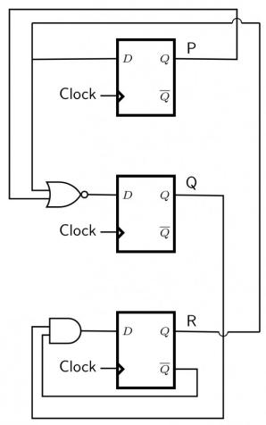

<details>
<summary>text_image</summary>

Clock
D Q
Q̅
P
Clock
D Q
Q̅
Clock
D Q
Q̅
R
Clock
</details>

If all the flip-flops were reset to 0 at power on, what is the total number of distinct outputs (states) represented by PQR generated by the counter?

A. 3

B. 4

C. 5

D. 6

gatecse-2011 digital-logic circuit-output normal

# Answer key

# 4.8.33 Circuit Output: GATE CSE 2014 | Set 3 | Question: 45

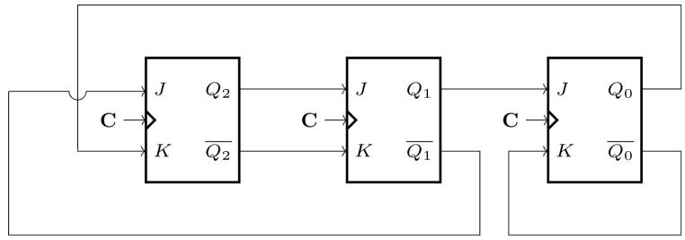

<details>
<summary>flowchart</summary>

```mermaid
graph LR
  Input["Input"] --> Block1["J, Q2"]
  Block1 --> Block2["J, Q1"]
  Block2 --> Block3["J, Q0"]
  Block3 --> Block4["J, Q0"]
  Block4 --> Block5["K, Q2"]
  Block5 --> Block6["K, Q1"]
  Block6 --> Block7["K, Q0"]
```
</details>


The above synchronous sequential circuit built using JK flip-flops is initialized with $Q_{2}Q_{1}Q_{0}=000$ . The state sequence for this circuit for the next 3 clock cycles is

A. 001,010,011

B. 111,110,101

c. 100,110,111

D. 100,011,001

gatecse-2014-set3 digital-logic circuit-output normal

# Answer key

# 4.8.34 Circuit Output: GATE CSE 2025 | Set 2 | Question: 21

Consider the following logic circuit diagram.


<details>
<summary>flowchart</summary>

```mermaid
graph LR
  X["X"] --> Y["Y"]
  Y -->|Input| AND_Gate{"AND Gate"}
  AND_Gate -->|Input| AND["AND"]
  AND_Gate -->|Output| F["F"]
```
</details>


Which is/are the CORRECT option(s) for the output function F ?

A. $\overline{XY}$

B. $\overline{X} +\overline{Y} +X\overline{Y}$

C. $\overline{XY} + \overline{X} + X\overline{Y}$

D. $X + \overline{Y}$

gatecse2025-set2 digital-logic circuit-output multiple-selects easy one-mark

# 4.8.35 Circuit Output: GATE IT 2005 | Question: 10


A two-way switch has three terminals a, b and c. In ON position (logic value 1), a is connected to b, and in OFF position, a is connected to c. Two of these two-way switches S1 and S2 are connected to a bulb as shown below.


<details>
<summary>text_image</summary>

a
b
Switch S1
c
Switch S2
a
c
Bulb
</details>

Which of the following expressions, if true, will always result in the lighting of the bulb?

A. $S1.\overline{S2}$

B. $S1 + S2$

C. $\overline{S1 \oplus S2}$

D. $S1 \oplus S2$

gateit-2005 digital-logic circuit-output normal

# Answer key

# 4.8.36 Circuit Output: GATE IT 2005 | Question: 43

Which of the following input sequences will always generate a 1 at the output z at the end of the third cycle?


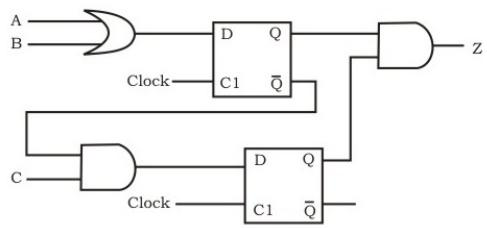

<details>
<summary>text_image</summary>

A
B
C
Clock
D Q
C1 Q̅
Clock
C
D Q
C1 Q̅
Z
</details>

A.

<table><tr><td>A</td><td>B</td><td>C</td></tr><tr><td>0</td><td>0</td><td>0</td></tr><tr><td>1</td><td>0</td><td>1</td></tr><tr><td>1</td><td>1</td><td>1</td></tr></table>

B.

<table><tr><td>A</td><td>B</td><td>C</td></tr><tr><td>1</td><td>0</td><td>1</td></tr><tr><td>1</td><td>1</td><td>0</td></tr><tr><td>1</td><td>1</td><td>1</td></tr></table>

C.

<table><tr><td>A</td><td>B</td><td>C</td></tr><tr><td>0</td><td>1</td><td>1</td></tr><tr><td>1</td><td>0</td><td>1</td></tr><tr><td>1</td><td>1</td><td>1</td></tr></table>

D.

<table><tr><td>A</td><td>B</td><td>C</td></tr><tr><td>0</td><td>0</td><td>1</td></tr><tr><td>1</td><td>1</td><td>0</td></tr><tr><td>1</td><td>1</td><td>1</td></tr></table>

gateit-2005 digital-logic circuit-output normal

# Answer key

# 4.8.37 Circuit Output: GATE IT 2006 | Question: 36

The majority function is a Boolean function $f(x, y, z)$ that takes the value 1 whenever a majority of the variables x, y, z are 1. In the circuit diagram for the majority function shown below, the logic gates for the boxes labeled P and Q are, respectively,


<details>
<summary>text_image</summary>

z y
P
P
Q
1
0
f
x
</details>

A. XOR, AND

B. XOR, XOR

C. OR, OR

D. OR, AND

# 4.8.38 Circuit Output: GATE IT 2007 | Question: 38

The following expression was to be realized using 2-input AND and OR gates. However, during the fabrication all 2-input AND gates were mistakenly substituted by 2-input NAND gates.

$$
(a. b). c + (a ^ {\prime}. c). d + (b. c). d + a. d
$$

What is the function finally realized?

A. 1

C. $a' + b + c' + d'$

gateit-2007 digital-logic circuit-output normal

B. $a' + b' + c' + d'$

D. $a' + b' + c + d'$

# Answer key

# 4.8.39 Circuit Output: GATE IT 2007 | Question: 40

What is the final value stored in the linear feedback shift register if the input is 101101?

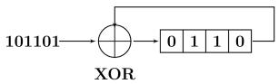

A. 0110

B. 1011

C. 1101

D. 1111

gateit-2007 digital-logic circuit-output normal

# Answer key

# 4.8.40 Circuit Output: GATE IT 2007 | Question: 45

The line T in the following figure is permanently connected to the ground.


<details>
<summary>text_image</summary>

X₁
X₂
X₃
X₄
T
</details>

Which of the following inputs $(X_{1}X_{2}X_{3}X_{4})$ will detect the fault?

A. 0000

B. 0111

C. 1111

D. None of these

gateit-2007 digital-logic circuit-output normal

# Answer key

# 4.9

# Combinational Circuit (2)

# Practice Test: Test 1 (7Q)

# 4.9.1 Combinational Circuit: GATE CSE 2022 | Question: 30

Consider a digital display system (DDS) shown in the figure that displays the contents of register X. A 16-bit code word is used to load a word in X, either from S or from R. S is a 1024-word memory segment and R is a 32-word register file. Based on the value of mode bit M, T selects an input word to load in X. P and Q interface with the corresponding bits in the code word to choose the addressed word. Which one of the following represents the functionality of P, Q, and T?


Code Word  
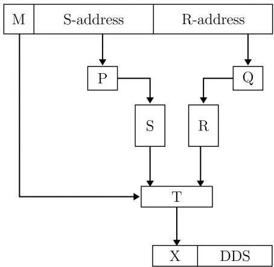

<details>
<summary>flowchart</summary>

```mermaid
graph TD
  M["M"] --> P["P"]
  M --> T["T"]
  S["S-address"] --> P
  S --> S["S"]
  S --> R["R"]
  R --> T
  P --> Q["Q"]
  Q --> R
  Q --> S
  R --> T
  T --> X["X"]
  T --> DDS["DDS"]
```
</details>

A. P is 10:1 multiplexer;  
B. P is $10:2^{10}$ decoder;  
c. P is $10:2^{10}$ decoder;  
D. P is 1:10 de-multiplexer;

Q is 5:1 multiplexer;  
Q is $5:2^{5}$ decoder;  
Q is $5:2^{5}$ decoder;  
Q is 1 : 5 de-multiplexer;

T is 2:1 multiplexer  
T is 2:1 encoder  
T is 2:1 multiplexer  
T is 2:1 multiplexer

gatecse-2022 digital-logic combinational-circuit two-marks

# Answer key

# 4.9.2 Combinational Circuit: GATE CSE 2024 | Set 1 | Question: 18

Consider the circuit shown below where the gates may have propagation delays. Assume that all signal transitions occur instantaneously and that wires have no delays. Which of the following statements about the circuit is/are CORRECT?


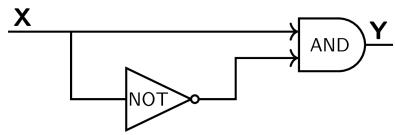

<details>
<summary>flowchart</summary>

```mermaid
graph LR
  X["X"] -->|NOT| NOT["NOT"]
  NOT --> AND["AND"]
  AND --> Y["Y"]
```
</details>

A. With no propagation delays, the output Y is always logic Zero  
B. With no propagation delays, the output $Y$ is always logic One  
C. With propagation delays, the output $Y$ can have a transient logic One after $X$ transitions from logic Zero to logic One  
D. With propagation delays, the output $Y$ can have a transient logic Zero after $X$ transitions from logic One to logic Zero

gatecse-2024-set1 multiple-selects digital-logic combinational-circuit one-mark

# Answer key

# 4.10

# Conjunctive Normal Form (1)

# 4.10.1 Conjunctive Normal Form: GATE CSE 2007 | Question: 48

Which of the following is TRUE about formulae in Conjunctive Normal Form?


A. For any formula, there is a truth assignment for which at least half the clauses evaluate to true.  
B. For any formula, there is a truth assignment for which all the clauses evaluate to true.  
C. There is a formula such that for each truth assignment, at most one-fourth of the clauses evaluate to true.  
D. None of the above.

gatecse-2007 digital-logic normal conjunctive-normal-form canonical-normal-form

# Answer key

# 4.11.1 Decoder: GATE CSE 2007 | Question: 8, ISRO2011-31


How many 3-to-8 line decoders with an enable input are needed to construct a 6-to-64 line decoder without using any other logic gates?

A. 7

B. 8

C. 9

D. 10

gatecse-2007 digital-logic normal isro2011 decoder

Answer key

# 4.11.2 Decoder: GATE CSE 2020 | Question: 20


If there are $m$ input lines and $n$ output lines for a decoder that is used to uniquely address a byte addressable 1 KB RAM, then the minimum value of $m + n$ is \_\_\_\_.

gatecse-2020 numerical-answers digital-logic decoder one-mark

Answer key

# 4.11.3 Decoder: GATE IT 2008 | Question: 9


What Boolean function does the circuit below realize?

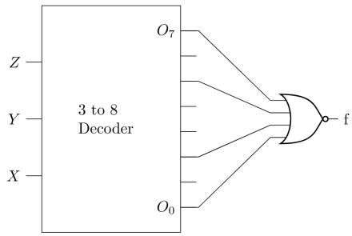

<details>
<summary>text_image</summary>

Z
Y
X
3 to 8
Decoder
O7
O0
f
</details>

A. $xz + \bar{x}\bar{z}$  
C. $\bar{x}\bar{y} + yz$

gateit-2008 digital-logic circuit-output decoder normal

B. $x\bar{z} +\bar{x} z$  
D. $xy + \bar{y}\bar{z}$

Answer key

# 4.12

# Digital Circuits (7)

Practice Test: Test 1 (8Q)

# 4.12.1 Digital Circuits: GATE CSE 1996 | Question: 5


A logic network has two data inputs A and B, and two control inputs $C_{0}$ and $C_{1}$ . It implements the function F according to the following table.

<table><tr><td> $C_1$ </td><td> $C_0$ </td><td> $\mathbf{F}$ </td></tr><tr><td>0</td><td>0</td><td> $\overline{A + B}$ </td></tr><tr><td>0</td><td>1</td><td> $\mathbf{A + B}$ </td></tr><tr><td>1</td><td>0</td><td> $A \oplus B$ </td></tr></table>

Implement the circuit using one 4 to 1 Multiplexer, one 2—input Exclusive OR gate, one 2—input AND gate, one 2—input OR gate and one Inverter.

gate1996 digital-logic normal digital-circuits descriptive

Answer key

A. Express the function $f(x, y, z) = xy' + yz'$ with only one complement operation and one or more AND/OR operations. Draw the logic circuit implementing the expression obtained, using a single NOT gate and one or more AND/OR gates.  
B. Transform the following logic circuit (without expressing its switching function) into an equivalent logic circuit that employs only 6 NAND gates each with 2-inputs.

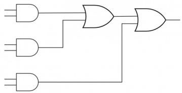

<details>
<summary>text_image</summary>

Logic gate diagram showing a three-input AND gate with inputs and outputs
</details>

gatecse-2002 digital-logic normal descriptive digital-circuits

Answer key

# 4.12.3 Digital Circuits: GATE CSE 2003 | Question: 47

Consider the following circuit composed of XOR gates and non-inverting buffers.


<details>
<summary>text_image</summary>

A
δ₁ = 2
B
δ₂ = 4
</details>


The non-inverting buffers have delays $\delta_{1}=2ns$ and $\delta_{2}=4ns$ as shown in the figure. Both XOR gates and all wires have zero delays. Assume that all gate inputs, outputs, and wires are stable at logic level 0 at time 0. If the following waveform is applied at input A, how many transition(s) (change of logic levels) occur(s) at B during the interval from 0 to 10 ns?


A. 1

B. 2

C. 3

D. 4

gatecse-2003 digital-logic digital-circuits

Answer key

# 4.12.4 Digital Circuits: GATE CSE 2011 | Question: 13

Which one of the following circuits is NOT equivalent to a 2-input XNOR (exclusive NOR) gate?

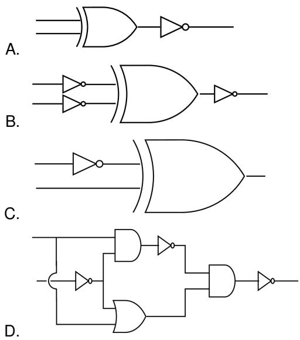


# 4.12.5 Digital Circuits: GATE CSE 2013 | Question: 5

In the following truth table, V = 1 if and only if the input is valid.


Inputs

<table><tr><td> $D_0$ </td><td> $D_1$ </td><td> $D_2$ </td><td> $D_3$ </td></tr><tr><td>0</td><td>0</td><td>0</td><td>0</td></tr><tr><td>1</td><td>0</td><td>0</td><td>0</td></tr><tr><td>x</td><td>1</td><td>0</td><td>0</td></tr><tr><td>x</td><td>x</td><td>1</td><td>0</td></tr><tr><td>x</td><td>x</td><td>x</td><td>1</td></tr></table>

Outputs

<table><tr><td> $X_0$ </td><td> $X_1$ </td><td>V</td></tr><tr><td>x</td><td>x</td><td>0</td></tr><tr><td>0</td><td>0</td><td>1</td></tr><tr><td>0</td><td>1</td><td>1</td></tr><tr><td>1</td><td>0</td><td>1</td></tr><tr><td>1</td><td>1</td><td>1</td></tr></table>

What function does the truth table represent?

A. Priority encoder  
C. Multiplexer

gatecse-2013 digital-logic normal digital-circuits

B. Decoder  
D. Demultiplexer

# Answer key

# 4.12.6 Digital Circuits: GATE CSE 2014 | Set 3 | Question: 8

Consider the following combinational function block involving four Boolean variables x, y, a, b where x, a, b are inputs and y is the output.


```c
f(x, a, b, y)
{
    if(x is 1) y = a;
    else y = b;
}
```

Which one of the following digital logic blocks is the most suitable for implementing this function?

A. Full adder

B. Priority encoder

C. Multiplexor

D. Flip-flop

gatecse-2014-set3 digital-logic easy digital-circuits

# Answer key

# 4.12.7 Digital Circuits: GATE CSE 2026 | Set 2 | Question: 49

Consider the digital circuit shown below with two input lines A and B, two select lines S0 and S1, and an output line Y. The blocks Q and M represent active high 2:4 decoder and 4-to-1 multiplexer, respectively. Out of 16 possible input combinations, the number of combinations that produce Y = 1 is \_\_\_\_ (ans integer)

Note: One input combination is an instance of [A B S1 S0].


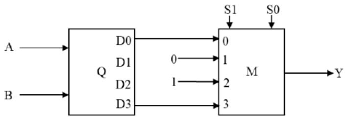

<details>
<summary>flowchart</summary>

```mermaid
graph LR
  A["A"] --> D0["D0\nQ"]
  B["B"] --> D3["D3"]
  D0 -->|0| M["M\n0\n1\n2\n3"]
  D3 --> M
  M -->|S1| S0["S0\n0"]
  M -->|Y| Y["Y"]
```
</details>

gatecse-2026-set2 digital-logic digital-circuits numerical-answers two-marks

# Answer key

# 4.13.1 Digital Counter: GATE CSE 1987 | Question: 1-III


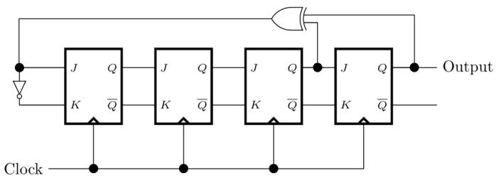

<details>
<summary>flowchart</summary>

This image depicts a block diagram of a digital logic circuit with four identical inverters (J, K) and a clock signal, connected to an AND gate and output.
</details>

The above circuit produces the output sequence:

A. 1111 1111 0000 0000

c. 1111 0001 0011 0101

gate1987 digital-logic sequential-circuit flip-flop digital-counter

B. 1111 0000 1111 0000

D. 1010 1010 1010 1010

# Answer key

# 4.13.2 Digital Counter: GATE CSE 1987 | Question: 10c

Give a minimal DFA that performs as a mod -3, 1's counter, i.e. outputs a 1 each time the number of 1's in the input sequence is a multiple of 3.


gate1987 digital-logic digital-counter descriptive

# Answer key

# 4.13.3 Digital Counter: GATE CSE 1990 | Question: 5-c

For the synchronous counter shown in Fig.3, write the truth table of $Q_{0}, Q_{1}$ , and $Q_{2}$ after each pulse, starting from $Q_{0} = Q_{1} = Q_{2} = 0$ and determine the counting sequence and also the modulus of the counter.


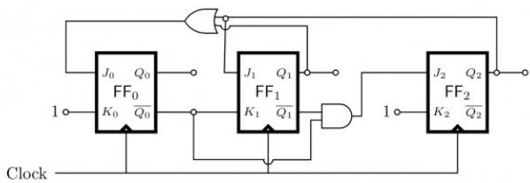

<details>
<summary>text_image</summary>

Clock
J0 Q0
FF0
K0 Q0
1
J1 Q1
FF1
K1 Q1
1
J2 Q2
FF2
K2 Q2
</details>

gate1990 descriptive digital-logic sequential-circuit flip-flop digital-counter

# Answer key

# 4.13.4 Digital Counter: GATE CSE 1991 | Question: 5-c

Find the maximum clock frequency at which the counter in the figure below can be operated. Assume that the propagation delay through each flip flop and each AND gate is 10 ns. Also, assume that the setup time for the JK inputs of the flip flops is negligible.


<details>
<summary>text_image</summary>

1
J0 Q0
K0
J1 Q1
K1
J2 Q2
K2
clock
</details>

gate1991 digital-logic sequential-circuit flip-flop digital-counter

# Answer key

# 4.13.5 Digital Counter: GATE CSE 1994 | Question: 2-1

The number of flip-flops required to construct a binary modulo $N$ counter is \_\_\_\_

gate1994 digital-logic sequential-circuit flip-flop digital-counter fill-in-the-blanks

Answer key


# 4.13.6 Digital Counter: GATE CSE 2002 | Question: 8

Consider the following circuit. $A = a_{2}a_{1}a_{0}$ and $B = b_{2}b_{1}b_{0}$ are three bit binary numbers input to the circuit.

The output is $Z = z_{3}z_{2}z_{1}z_{0}$ . R0, R1 and R2 are registers with loading clock shown. The registers are loaded with their input data with the falling edge of a clock pulse (signal CLOCK shown) and appears as shown. The bits of input number A, B and the full adders are as shown in the circuit. Assume Clock period is greater than the settling time of all circuits.


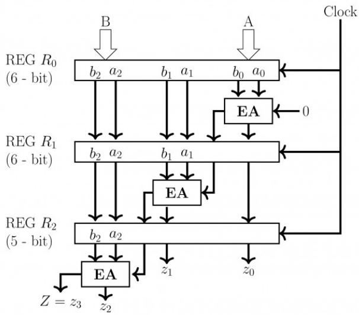

<details>
<summary>flowchart</summary>

This diagram illustrates a multi-bit signal processing system architecture with REG blocks (R0, R1, R2) and EA (Electrical Access) components, showing data flow from input through bit-level operations to output.
</details>

a. For 8 clock pulses on the CLOCK terminal and the inputs $A, B$ as shown, obtain the output $Z$ (sequence of $4 - bit$ values of $Z$ ). Assume initial contents of $R_0, R_1$ and $R_2$ as all zeros.

<table><tr><td>A</td><td>110</td><td>011</td><td>111</td><td>101</td><td>000</td><td>000</td><td>000</td><td>000</td></tr><tr><td>B</td><td>101</td><td>101</td><td>011</td><td>110</td><td>000</td><td>000</td><td>000</td><td>000</td></tr><tr><td>Clock No</td><td>1</td><td>2</td><td>3</td><td>4</td><td>5</td><td>6</td><td>7</td><td>8</td></tr></table>

b. What does the circuit implement?

gatecse-2002 digital-logic normal descriptive digital-counter

Answer key

# 4.13.7 Digital Counter: GATE CSE 2011 | Question: 15

The minimum number of D flip-flops needed to design a mod-258 counter is

A. 9

B. 8

C. 512

D. 258

gatecse-2011 digital-logic easy digital-counter

Answer key

# 4.13.8 Digital Counter: GATE CSE 2014 | Set 2 | Question: 7

Let $k = 2^n$ . A circuit is built by giving the output of an $n$ -bit binary counter as input to an $n$ -to- $2^n$ bit decoder. This circuit is equivalent to a


A. k-bit binary up counter.

B. $k$ -bit binary down counter.

C. k--bit ring counter.

D. k-bit Johnson counter.

gatecse-2014-set2 digital-logic normal digital-counter


# 4.13.9 Digital Counter: GATE CSE 2015 | Set 1 | Question: 20

Consider a 4-bit Johnson counter with an initial value of 0000. The counting sequence of this counter is

A. 0,1,3,7,15,14,12,8,0  
C. 0,2,4,6,8,10,12,14,0

B. 0,1,3,5,7,9,11,13,15,0  
D. 0,8,12,14,15,7,3,1,0

gatecse-2015-set1 digital-logic digital-counter easy

# Answer key

# 4.13.10 Digital Counter: GATE CSE 2015 | Set 2 | Question: 7

The minimum number of JK flip-flops required to construct a synchronous counter with the count sequence $(0,0,1,1,2,2,3,3,0,0,\ldots)$ is \_\_\_\_.

gatecse-2015-set2 digital-logic digital-counter normal numerical-answers

# Answer key

# 4.13.11 Digital Counter: GATE CSE 2016 | Set 1 | Question: 8

We want to design a synchronous counter that counts the sequence 0 - 1 - 0 - 2 - 0 - 3 and then repeats. The minimum number of J-K flip-flops required to implement this counter is \_\_\_\_.

gatecse-2016-set1 digital-logic digital-counter flip-flop normal numerical-answers

# Answer key

# 4.13.12 Digital Counter: GATE CSE 2017 | Set 2 | Question: 42

The next state table of a 2—bit saturating up-counter is given below.

<table><tr><td> $Q_{1}$ </td><td> $Q_{0}$ </td><td> $Q_{1}^{+}$ </td><td> $Q_{0}^{+}$ </td></tr><tr><td>0</td><td>0</td><td>0</td><td>1</td></tr><tr><td>0</td><td>1</td><td>1</td><td>0</td></tr><tr><td>1</td><td>0</td><td>1</td><td>1</td></tr><tr><td>1</td><td>1</td><td>1</td><td>1</td></tr></table>


The counter is built as a synchronous sequential circuit using $T$ flip-flops. The expressions for $T_{1}$ and $T_{0}$ are

A. $T_{1} = Q_{1}Q_{0},\quad T_{0} = \bar{Q}_{1}\bar{Q}_{0}$  
B. $T_{1} = \bar{Q}_{1}Q_{0},\quad T_{0} = \bar{Q}_{1} + \bar{Q}_{0}$  
C. $T_{1} = Q_{1} + Q_{0},\quad T_{0} = \bar{Q}_{1}\bar{Q}_{0}$  
D. $T_{1} = \bar{Q}_{1}Q_{0},\quad T_{0} = Q_{1} + Q_{0}$

gatecse-2017-set2 digital-logic digital-counter

# Answer key

# 4.13.13 Digital Counter: GATE CSE 2021 | Set 1 | Question: 28

Consider a 3-bit counter, designed using T flip-flops, as shown below:


<details>
<summary>flowchart</summary>

```mermaid
graph LR
  Clock["Clock\nPulse"] --> T_P["T_P"]
  T_P --> P["P"]
  P --> T_Q["T_Q"]
  T_Q --> Q["Q"]
  Q --> T_R["T_R"]
  T_R --> R["R"]
  R --> R["R'"]
  T_P --> P["P'"]
  P --> T_Q
  T_Q --> Q["Q'"]
  Q --> T_R
  T_R --> R
  R --> T_P
```
</details>

Assuming the initial state of the counter given by PQR as 000, what are the next three states?


A. 011,101,000

B. 001,010,111

c. 011,101,111

D. 001,010,000

gatecse-2021-set1 digital-logic sequential-circuit digital-counter two-marks

# Answer key

# 4.13.14 Digital Counter: GATE CSE 2023 | Question: 33

Consider a sequential digital circuit consisting of T flip-flops and D flip-flops as shown in the figure. CLKIN is the clock input to the circuit. At the beginning, Q1, Q2 and Q3 have values 0, 1 and 1, respectively.


<details>
<summary>flowchart</summary>

This image depicts a block diagram of a digital logic circuit using a CLKIN and a D flip-flop, showing signal flow from input through Q to T and Q3.
</details>

Which one of the given values of (Q1, Q2, Q3) can NEVER be obtained with this digital circuit?

A. $(0,0,1)$

B. $(1,0,0)$

C. $(1,0,1)$

D. $(1,1,1)$

gatecse-2023 digital-logic flip-flop two-marks digital-counter

# Answer key

# 4.13.15 Digital Counter: GATE CSE 2026 | Set 1 | Question: 27

Consider a 2-bit saturating up/down counter that performs the saturating up count when the input P is 0, and the saturating down count when P is 1. The Next State table of the counter is as shown. The counter is built as a synchronous sequential circuit using D flip-flops.

<table><tr><td>Input</td><td colspan="2">Cureent State</td><td colspan="2">Next State</td></tr><tr><td>P</td><td> $Q_1$ </td><td> $Q_0$ </td><td> $Q_1^+$ </td><td> $Q_0^+$ </td></tr><tr><td>0</td><td>0</td><td>0</td><td>0</td><td>1</td></tr><tr><td>0</td><td>0</td><td>1</td><td>1</td><td>0</td></tr><tr><td>0</td><td>1</td><td>0</td><td>1</td><td>1</td></tr><tr><td>0</td><td>1</td><td>1</td><td>1</td><td>1</td></tr><tr><td>1</td><td>0</td><td>0</td><td>0</td><td>0</td></tr><tr><td>1</td><td>0</td><td>1</td><td>0</td><td>0</td></tr><tr><td>1</td><td>1</td><td>0</td><td>0</td><td>1</td></tr><tr><td>1</td><td>1</td><td>1</td><td>1</td><td>0</td></tr></table>

Which one of the following options corresponds to the expressions for the inputs of the D flip-flops, $D_{1}$ and $D_{0}$ ?

A. $D_{1} = PQ_{1} + \bar{P} Q_{0} + Q_{1}Q_{0}$ $D_0 = PQ_0 + \bar{P} Q_1 + Q_1\overline{Q_0}$  
B. $D_{1} = \bar{P} Q_{1} + \bar{P} Q_{0} + Q_{1}Q_{0}$ $D_0 = \bar{P}\overline{Q_0} +\bar{P} Q_1 + Q_1\overline{Q_0}$  
C. $D_{1} = \bar{P}\overline{Q_{1}} +\bar{P} Q_{0} + Q_{1}Q_{0}$ $D_0 = \bar{P} Q_0 + \bar{P} Q_1 + Q_1\overline{Q_0}$  
D. $D_{1} = P\overline{Q_{1}} +\bar{P} Q_{0} + Q_{1}Q_{0}$ $D_0 = P\overline{Q_0} +\bar{P} Q_1 + Q_1\overline{Q_0}$

gatecse-2026-set1 digital-logic digital-counter sequential-circuit flip-flop two-marks

# Answer key

# 4.13.16 Digital Counter: GATE IT 2005 | Question: 11

How many pulses are needed to change the contents of a 8-bit up counter from 10101100 to 00100111 (rightmost bit is the LSB)?

A. 134

B. 133

C. 124

D. 123

gateit-2005 digital-logic digital-counter normal

# Answer key


# 4.13.17 Digital Counter: GATE IT 2008 | Question: 37

Consider the following state diagram and its realization by a JK flip flop


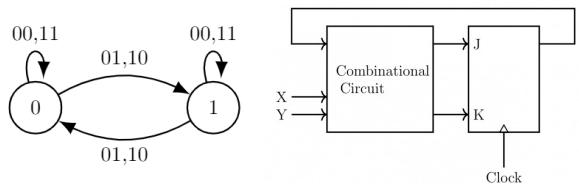

The combinational circuit generates J and K in terms of x, y and Q.

The Boolean expressions for J and K are :

A. $\overline{x\oplus y}$ and $\overline{x\oplus y}$

B. $\overline{x\oplus y}$ and $x\oplus y$

C. $x \oplus y$ and $\overline{x \oplus y}$

D. $x \oplus y$ and $x \oplus y$

gateit-2008 digital-logic boolean-algebra normal digital-counter

# Answer key

# 4.13.18 Digital Counter: GATE1992-04-c

Design a 3-bit counter using D-flip flops such that not more than one flip-flop changes state between any two consecutive states.


gate1992 digital-logic sequential-circuit flip-flop digital-counter normal descriptive

# Answer key

# 4.14

# Dual Function (1)

# 4.14.1 Dual Function: GATE CSE 2014 | Set 2 | Question: 6

The dual of a Boolean function $F(x_{1}, x_{2}, \ldots, x_{n}, +, .,')$ , written as $F^{D}$ is the same expression as that of $F$ with $+$ and $\cdot$ swapped. $F$ is said to be self-dual if $F = F^{D}$ . The number of self-dual functions with $n$ Boolean variables is


A. $2^{n}$

B. $2^{n - 1}$

C. $2^{2^n}$

D. $2^{2^{n - 1}}$

gatecse-2014-set2 digital-logic normal dual-function boolean-algebra

# Answer key

# 4.15

# Finite State Machines (4)

# 4.15.1 Finite State Machines: GATE CSE 1994 | Question: 3.3

State True or False with one line explanation


A FSM (Finite State Machine) can be designed to add two integers of any arbitrary length (arbitrary number of digits).

gate1994 digital-logic normal true-false finite-state-machines

# Answer key

# 4.15.2 Finite State Machines: GATE CSE 1995 | Question: 2.23

A finite state machine with the following state table has a single input x and a single out z.


<table><tr><td rowspan="2">present state</td><td colspan="2">next state, z</td></tr><tr><td>x=1</td><td>x=0</td></tr><tr><td>A</td><td>D,0</td><td>B,0</td></tr><tr><td>B</td><td>B,1</td><td>C,1</td></tr><tr><td>C</td><td>B,0</td><td>D,1</td></tr><tr><td>D</td><td>B,1</td><td>C,0</td></tr></table>

If the initial state is unknown, then the shortest input sequence to reach the final state C is:

A. 01

B. 10

C. 101

D. 110

gate1995 digital-logic normal finite-state-machines

Answer key

# 4.15.3 Finite State Machines: GATE CSE 1996 | Question: 2.23

Consider the following state table for a sequential machine. The number of states in the minimized machine will be


<table><tr><td></td><td></td><td colspan="2">Input</td></tr><tr><td></td><td></td><td>0</td><td>1</td></tr><tr><td rowspan="4">Present State</td><td>A</td><td>D,0</td><td>B,1</td></tr><tr><td>B</td><td>A,0</td><td>C,1</td></tr><tr><td>C</td><td>A,0</td><td>B,1</td></tr><tr><td>D</td><td>A,1</td><td>C,1</td></tr><tr><td></td><td></td><td colspan="2">Next state, Output</td></tr></table>

A. 4

B. 3

C. 2

D. 1

gate1996 normal digital-logic finite-state-machines

Answer key

# 4.15.4 Finite State Machines: GATE CSE 2009 | Question: 27

Given the following state table of an FSM with two states A and B, one input and one output.


<table><tr><td>PRESENT STATE A</td><td>PRESENT STATE B</td><td>Input</td><td>Next State A</td><td>Next State B</td><td>Output</td></tr><tr><td>0</td><td>0</td><td>0</td><td>0</td><td>0</td><td>1</td></tr><tr><td>0</td><td>1</td><td>0</td><td>1</td><td>0</td><td>0</td></tr><tr><td>1</td><td>0</td><td>0</td><td>0</td><td>1</td><td>0</td></tr><tr><td>1</td><td>1</td><td>0</td><td>1</td><td>0</td><td>0</td></tr><tr><td>0</td><td>0</td><td>1</td><td>0</td><td>1</td><td>0</td></tr><tr><td>0</td><td>1</td><td>1</td><td>0</td><td>0</td><td>1</td></tr><tr><td>1</td><td>0</td><td>1</td><td>0</td><td>1</td><td>1</td></tr><tr><td>1</td><td>1</td><td>1</td><td>0</td><td>0</td><td>1</td></tr></table>

If the initial state is A = 0, B = 0 what is the minimum length of an input string which will take the machine to the state A = 0, B = 1 with output = 1.

A. 3

B. 4

C. 5

D. 6

gatecse-2009 digital-logic normal finite-state-machines

Answer key

4.16

# Fixed Point Representation (2)

# 4.16.1 Fixed Point Representation: GATE CSE 2017 | Set 1 | Question: 7

The n-bit fixed-point representation of an unsigned real number X uses f bits for the fraction part. Let i = n - f. The range of decimal values for X in this representation is


A. $2^{-f}$ to $2^{i}$

B. $2^{-f}$ to $\left(2^{i} - 2^{-f}\right)$

C. 0 to $2^{i}$

D. 0 to $\left(2^{i}-2^{-f}\right)$

gatecse-2017-set1 digital-logic number-representation fixed-point-representation

# 4.16.2 Fixed Point Representation: GATE CSE 2018 | Question: 33

Consider the unsigned 8-bit fixed point binary number representation, below,

$$
b _ {7} b _ {6} b _ {5} b _ {4} b _ {3} \cdot b _ {2} b _ {1} b _ {0}
$$


where the position of the primary point is between $b_{3}$ and $b_{2}$ . Assume $b_{7}$ is the most significant bit. Some of the decimal numbers listed below cannot be represented exactly in the above representation:

i. 31.500  
ii. 0.875  
iii. 12.100  
iv. 3.001

Which one of the following statements is true?

A. None of i, ii, iii, iv can be exactly represented  
B. Only ii cannot be exactly represented  
C. Only iii and iv cannot be exactly represented  
D. Only i and ii cannot be exactly represented

gatecse-2018 digital-logic number-representation fixed-point-representation normal two-marks

Answer key

# 4.17

# Flip Flop (7)

Practice Tests: Test 1 (15Q) Test 2 (6Q)

# 4.17.1 Flip Flop: GATE CSE 2001 | Question: 11

A sequential circuit takes an input stream of $0's$ and $1's$ and produces an output stream of $0's$ and $1's$ . Initially it replicates the input on its output until two consecutive $0's$ are encountered on the input. From then onward, it produces an output stream, which is the bit-wise complement of input stream until it encountered consecutive 1's, whereupon the process repeats. An example input and output stream is shown below.


The input stream: 101100|01001011|011

The desired output: 101100|10110100|011

J-K master-slave flip-flops are to be used to design the circuit.

a. Give the state transition diagram  
b. Give the minimized sum-of-product expression for J and K inputs of one of its state flip-flops

gatecse-2001 digital-logic normal descriptive flip-flop

Answer key

# 4.17.2 Flip Flop: GATE CSE 2004 | Question: 18, ISRO2007-31

In an $SR$ latch made by cross-coupling two NAND gates, if both $S$ and $R$ inputs are set to 0, then it will result in

A. $Q = 0, Q' = 1$  
c. $Q = 1, Q' = 1$  
gatecse-2004 digital-logic easy isro2007 flip-flop

B. $Q = 1, Q' = 0$

Answer key

# 4.17.3 Flip Flop: GATE CSE 2015 | Set 1 | Question: 37

A positive edge-triggered D flip-flop is connected to a positive edge-triggered JK flip-flop as follows. The Q


output of the D flip-flop is connected to both the J and K inputs of the JK flip-flop, while the Q output of the JK flip-flop is connected to the input of the D flip-flop. Initially, the output of the D flip-flop is set to logic one and the output of the JK flip-flop is cleared. Which one of the following is the bit sequence (including the initial state) generated at the Q output of the JK flip-flop when the flip-flops are connected to a free-running common clock? Assume that J = K = 1 is the toggle mode and J = K = 0 is the state holding mode of the JK flip-flops. Both the flip-flops have non-zero propagation delays.

A. 0110110...

B. 0100100...

C. 011101110...

D. 011001100...

gatecse-2015-set1 digital-logic flip-flop normal

Answer key

# 4.17.4 Flip Flop: GATE CSE 2017 | Set 1 | Question: 33


Consider a combination of T and D flip-flops connected as shown below. The output of the D flip-flop is connected to the input of the T flip-flop and the output of the T flip-flop is connected to the input of the D flip-flop.


<details>
<summary>flowchart</summary>

```mermaid
graph LR
  T["T\nFlip-Flop"] -->|Q1| D["D\nFlip-Flop"]
  D -->|Q0| T
  T --> Clock
```
</details>

Initially, both $Q_{0}$ and $Q_{1}$ are set to 1 (before the $1^{st}$ clock cycle). The outputs

A. $Q_{1}Q_{0}$ after the $3^{\mathrm{rd}}$ cycle are 11 and after the $4^{\mathrm{th}}$ cycle are 00 respectively.  
B. $Q_{1}Q_{0}$ after the $3^{\mathrm{rd}}$ cycle are 11 and after the $4^{\mathrm{th}}$ cycle are 01 respectively.  
C. $Q_{1}Q_{0}$ after the $3^{\mathrm{rd}}$ cycle are 00 and after the $4^{\mathrm{th}}$ cycle are 11 respectively.  
D. $Q_{1}Q_{0}$ after the $3^{\mathrm{rd}}$ cycle are 01 and after the $4^{\mathrm{th}}$ cycle are 01 respectively.

gatecse-2017-set1 digital-logic flip-flop normal

Answer key

# 4.17.5 Flip Flop: GATE CSE 2018 | Question: 22


Consider the sequential circuit shown in the figure, where both flip-flops used are positive edge-triggered D flip-flops.

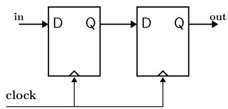

<details>
<summary>flowchart</summary>

```mermaid
graph LR
  A["in"] --> B["D Q"]
  B --> C["D Q"]
  C --> D["out"]
  D --> E["clock"]
```
</details>

The number of states in the state transition diagram of this circuit that have a transition back to the same state on some value of "in" is \_\_\_\_

gatecse-2018 digital-logic flip-flop numerical-answers normal one-mark

Answer key

# 4.17.6 Flip Flop: GATE CSE 2025 | Set 1 | Question: 50


Consider the given sequential circuit designed using D-Flip-flops. The circuit is initialized with some value (initial state). The number of distinct states the circuit will go through before returning back to the initial state is \_\_\_\_. (Answer in integer)

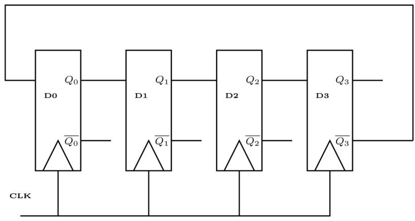

<details>
<summary>text_image</summary>

Q0
D0
Q0
CLK
Q1
D1
Q1
Q1
Q2
D2
Q2
Q2
Q3
D3
Q3
Q3
</details>

gatecse2025-set1 digital-logic flip-flop sequential-circuit numerical-answers two-marks

Answer key

# 4.17.7 Flip Flop: GATE IT 2007 | Question: 7

Which of the following input sequences for a cross-coupled R - S flip-flop realized with two NAND gates may lead to an oscillation?


A. 11,00

B. 01,10

C. 10,01

D. 00,11

gateit-2007 digital-logic normal flip-flop

Answer key

# 4.18

# Floating Point Representation (8)

Practice Test: Test 1 (11Q)

# 4.18.1 Floating Point Representation: GATE CSE 1987 | Question: 1-vii

The exponent of a floating-point number is represented in excess-N code so that:


A. The dynamic range is large.  
C. The smallest number is represented by all zeros.

B. The precision is high.

D. Overflow is avoided.

gate1987 digital-logic number-representation floating-point-representation

Answer key

# 4.18.2 Floating Point Representation: GATE CSE 1989 | Question: 1-vi

Consider an excess -50 representation for floating point numbers with 4 BCD digit mantissa and 2 BCD digit exponent in normalised form. The minimum and maximum positive numbers that can be represented are \_\_\_\_ and \_\_\_\_ respectively.


descriptive gate1989 digital-logic number-representation floating-point-representation

Answer key

# 4.18.3 Floating Point Representation: GATE CSE 1990 | Question: 1-iv-a

A 32-bit floating-point number is represented by a 7-bit signed exponent, and a 24-bit fractional mantissa. The base of the scale factor is 16, The range of the exponent is \_\_\_\_


gate1990 digital-logic number-representation floating-point-representation fill-in-the-blanks

Answer key

# 4.18.4 Floating Point Representation: GATE CSE 1990 | Question: 1-iv-b

A 32-bit floating-point number is represented by a 7-bit signed exponent, and a 24-bit fractional mantissa.


The base of the scale factor is 16,

The range of the exponent is \_\_\_\_, if the scale factor is represented in excess-64 format.

gate1990

digital-logic

number-representation

floating-point-representation

fill-in-the-blanks

# Answer key

# 4.18.5 Floating Point Representation: GATE CSE 1997 | Question: 72

Following floating point number format is given


$f$ is a fraction represented by a $6 - bit$ mantissa (includes sign bit) in sign magnitude form, $e$ is a $4 - bit$ exponent (includes sign hit) in sign magnitude form and $n = (f, e) = f \cdot 2^e$ is a floating point number. Let $A = 54.75$ in decimal and $B = 9.75$ in decimal

a. Represent A and B as floating point numbers in the above format.  
b. Show the steps involved in floating point addition of A and B.  
c. What is the percentage error (up to one position beyond decimal point) in the addition operation in (b)?

gate1997 digital-logic floating-point-representation normal descriptive

# Answer key

# 4.18.6 Floating Point Representation: GATE CSE 2003 | Question: 43

The following is a scheme for floating point number representation using 16 bits.


Bit Position


Let $s, e$ , and $m$ be the numbers represented in binary in the sign, exponent, and mantissa fields respectively. Then the floating point number represented is:

$$
\left\{ \begin{array}{l l} (- 1) ^ {s} \left(1 + m \times 2 ^ {- 9}\right) 2 ^ {e - 3 1}, & \text {if the exponent} \neq 1 1 1 1 1 1 \\ 0, & \text {otherwise} \end{array} \right.
$$

What is the maximum difference between two successive real numbers representable in this system?

A. $2^{-40}$

B. $2^{-9}$

C. $2^{22}$

D. $2^{31}$

gatecse-2003

digital-logic

number-representation

floating-point-representation

normal

# Answer key

# 4.18.7 Floating Point Representation: GATE CSE 2005 | Question: 85-a

Consider the following floating-point format.


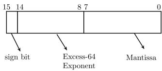

<details>
<summary>text_image</summary>

15 14 8 7 0
sign bit
Excess-64
Exponent
Mantissa
</details>

Mantissa is a pure fraction in sign-magnitude form.

The decimal number $0.239 \times 2^{13}$ has the following hexadecimal representation (without normalization and rounding off):

A. 0D 24

B. 0D 4D

C. 4D 0D

D. 4D 3D

gatecse-2005

digital-logic

number-representation

floating-point-representation

normal

# Answer key

# 4.18.8 Floating Point Representation: GATE CSE 2005 | Question: 85-b

Consider the following floating-point format.


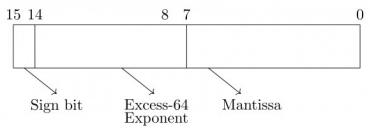

<details>
<summary>text_image</summary>

15 14 8 7 0
Sign bit Excess-64 Exponent Mantissa
</details>

Mantissa is a pure fraction in sign-magnitude form.

The normalized representation for the above format is specified as follows. The mantissa has an implicit 1 preceding the binary (radix) point. Assume that only $0^{\prime}s$ are padded in while shifting a field.

The normalized representation of the above number $(0.239 \times 2^{13})$ is:

A. 0A 20

B. 11 34

C. 49 D0

D. 4A E8

gatecse-2005 digital-logic number-representation floating-point-representation normal

Answer key

# 4.19

# Functional Completeness (7)

Practice Test: Test 1 (5Q)

# 4.19.1 Functional Completeness: GATE CSE 1989 | Question: 4-iii

Show that $\{NOR\}$ is a functionally complete set of Boolean operations.

gate1989 descriptive digital-logic functional-completeness

Answer key


# 4.19.2 Functional Completeness: GATE CSE 1992 | Question: 02-ii

All digital circuits can be realized using only

A. Ex-OR gates

B. Multiplexers

C. Half adders

D. OR gates

gate1992 normal digital-logic digital-circuits multiple-selects functional-completeness combinational-circuit

Answer key

# 4.19.3 Functional Completeness: GATE CSE 1993 | Question: 9

Assume that only half adders are available in your laboratory. Show that any binary function can be implemented using half adders only.

gate1993 digital-logic combinational-circuit adder descriptive functional-completeness

Answer key

# 4.19.4 Functional Completeness: GATE CSE 1998 | Question: 5

The implication gate, shown below has two inputs (x and y); the output is 1 except when x = 1 and y = 0, realize $f = \bar{x}y + x\bar{y}$ using only four implication gates.

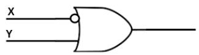

Show that the implication gate is functionally complete.

gate1998 digital-logic functional-completeness descriptive

Answer key

# 4.19.5 Functional Completeness: GATE CSE 1999 | Question: 2.9

Which of the following sets of component(s) is/are sufficient to implement any arbitrary Boolean function?


A. XOR gates, NOT gates  
B. 2 to 1 multiplexers  
C. AND gates, XOR gates  
D. Three-input gates that output $(A, B) + C$ for the inputs $A, B$ and $C$ .

gate1999 digital-logic normal functional-completeness multiple-selects

# Answer key

# 4.19.6 Functional Completeness: GATE CSE 2015 | Set 1 | Question: 39

Consider the operations

$$
f (X, Y, Z) = X ^ {\prime} Y Z + X Y ^ {\prime} + Y ^ {\prime} Z ^ {\prime} \text {and} g (X, Y, Z) = X ^ {\prime} Y Z + X ^ {\prime} Y Z ^ {\prime} + X Y
$$

Which one of the following is correct?

A. Both $\{f\}$ and $\{g\}$ are functionally complete  
B. Only $\{f\}$ is functionally complete  
C. Only $\{g\}$ is functionally complete  
D. Neither $\{f\}$ nor $\{g\}$ is functionally complete

gatecse-2015-set1 boolean-algebra difficult functional-completeness

# Answer key


# 4.19.7 Functional Completeness: GATE IT 2008 | Question: 1

A set of Boolean connectives is functionally complete if all Boolean functions can be synthesized using those. Which of the following sets of connectives is NOT functionally complete?

A. EX-NOR  
C. OR, negation

B. implication, negation  
D. NAND

gateit-2008 digital-logic easy functional-completeness

# Answer key


# 4.20

# IEEE Representation (14)

# Practice Tests: Test 1 (15Q) Test 2 (6Q)

# 4.20.1 IEEE Representation: GATE CSE 2008 | Question: 4

In the IEEE floating point representation the hexadecimal value 0x00000000 corresponds to

A. The normalized value $2^{-127}$

C. The normalized value +0

B. The normalized value $2^{-126}$

D. The special value +0

gatecse-2008 digital-logic floating-point-representation ieee-representation easy

# Answer key


# 4.20.2 IEEE Representation: GATE CSE 2012 | Question: 7

The decimal value 0.5 in IEEE single precision floating point representation has

A. fraction bits of 000...000 and exponent value of 0  
B. fraction bits of 000...000 and exponent value of -1  
C. fraction bits of 100...000 and exponent value of 0  
D. no exact representation

gatecse-2012 digital-logic normal number-representation ieee-representation

# Answer key


# 4.20.3 IEEE Representation: GATE CSE 2014 | Set 2 | Question: 45


The value of a float type variable is represented using the single-precision 32-bit floating point format of IEEE-754 standard that uses 1 bit for sign, 8 bits for biased exponent and 23 bits for the mantissa. A

float type variable X is assigned the decimal value of -14.25. The representation of X in hexadecimal notation is

A. C1640000H

B. 416C0000H

C. 41640000H

D. C16C0000H

gatecse-2014-set2 digital-logic number-representation normal ieee-representation

# Answer key

# 4.20.4 IEEE Representation: GATE CSE 2017 | Set 2 | Question: 12

Given the following binary number in 32-bit (single precision) IEEE-754 format :


# 00111110011011010000000000000000

The decimal value closest to this floating-point number is :

A. $1.45 \times 10^{1}$

B. $1.45 * 10^{-1}$

C. $2.27 \times 10^{-1}$

D. $2.27 \times 10^{1}$

gatecse-2017-set2 digital-logic ieee-representation number-representation floating-point-representation

# Answer key

# 4.20.5 IEEE Representation: GATE CSE 2020 | Question: 29

Consider three registers R1, R2, and R3 that store numbers in IEEE-754 single precision floating point format. Assume that R1 and R2 contain the values (in hexadecimal notation) 0x42200000 and 0xC1200000, respectively.


If $R3 = \frac{R1}{R2}$ , what is the value stored in R3?

A. 0x40800000

B. 0xC0800000

C. 0x83400000

D. 0xC8500000

gatecse-2020 digital-logic ieee-representation floating-point-representation two-marks

# Answer key

# 4.20.6 IEEE Representation: GATE CSE 2021 | Set 1 | Question: 24

Consider the following representation of a number in IEEE 754 single-precision floating point format with a bias of 127.


S:1 E:10000001 F:11110000000000000000000

Here S, E and F denote the sign, exponent, and fraction components of the floating point representation.

The decimal value corresponding to the above representation (rounded to 2 decimal places) is \_\_\_\_.

gatecse-2021-set1 digital-logic number-representation ieee-representation numerical-answers one-mark floating-point-representation

# Answer key

# 4.20.7 IEEE Representation: GATE CSE 2021 | Set 2 | Question: 4

The format of the single-precision floating point representation of a real number as per the IEEE 754 standard is as follows:


<table><tr><td>sign</td><td>exponent</td><td>mantissa</td></tr></table>

Which one of the following choices is correct with respect to the smallest normalized positive number represented using the standard?

A. exponent = 00000000 and mantissa = 000000000000000000000000  
B. exponent = 00000000 and mantissa = 000000000000000000000001  
C. exponent = 00000001 and mantissa = 000000000000000000000000

gatecse-2021-set2 digital-logic number-representation ieee-representation one-mark floating-point-representation

# Answer key

# 4.20.8 IEEE Representation: GATE CSE 2022 | Question: 31

Consider three floating point numbers A, B and C stored in registers $R_{A}$ , $R_{B}$ and $R_{C}$ , respectively as per IEEE-754 single precision floating point format. The 32-bit content stored in these registers (in hexadecimal form) are as follows.

$$
\boxed {\mathrm{R} _ {\mathrm{A}} = 0 \mathrm{xC} 1 4 0 0 0 0 0 \quad \mathrm{R} _ {\mathrm{B}} = 0 \mathrm{x} 4 2 1 0 0 0 0 0 \quad \mathrm{R} _ {\mathrm{C}} = 0 \mathrm{x} 4 1 4 0 0 0 0 0}
$$

Which one of the following is FALSE?

A. $A + C = 0$

B. $C = A + B$

C. $B = 3C$

D. $(B - C) > 0$

gatecse-2022 digital-logic ieee-representation number-representation two-marks floating-point-representation

# Answer key

# 4.20.9 IEEE Representation: GATE CSE 2023 | Question: 35

Consider the IEEE-754 single precision floating point numbers P = 0xC1800000 and Q = 0x3F5C2EF4.

Which one of the following corresponds to the product of these numbers (i.e., $P \times Q$ ), represented in the IEEE-754 single precision format?

A. 0x404C2EF4

B. 0x405C2EF4

C. 0xC15C2EF4

D. 0xC14C2EF4

gatecse-2023 digital-logic number-representation ieee-representation two-marks floating-point-representation

# Answer key

# 4.20.10 IEEE Representation: GATE CSE 2024 | Set 2 | Question: 4

The format of a single-precision floating-point number as per the IEEE 754 standard is:

<table><tr><td>Sign</td><td>Exponent</td><td>Mantissa</td></tr><tr><td>(1 bit)</td><td>(8 bits)</td><td>(23 bits)</td></tr></table>

Choose the largest floating-point number among the following options.

<table><tr><td rowspan="2">A.</td><td>Sign</td><td>Exponent</td><td>Mantissa</td></tr><tr><td>0</td><td>01111111</td><td>11111111111111111111111</td></tr><tr><td rowspan="2">B.</td><td>Sign</td><td>Exponent</td><td>Mantissa</td></tr><tr><td>0</td><td>11111110</td><td>11111111111111111111111</td></tr><tr><td rowspan="2">C.</td><td>Sign</td><td>Exponent</td><td>Mantissa</td></tr><tr><td>0</td><td>11111111</td><td>1111111111111111111111</td></tr><tr><td rowspan="2">D.</td><td>Sign</td><td>Exponent</td><td>Mantissa</td></tr><tr><td>0</td><td>01111111</td><td>000000000000000000000000</td></tr></table>

gatecse-2024-set2 digital-logic number-representation ieee-representation floating-point-representation one-mark

# Answer key

# 4.20.11 IEEE Representation: GATE CSE 2025 | Set 2 | Question: 39

Three floating point numbers X, Y, and Z are stored in three registers $R_{X}$ , $R_{Y}$ , and $R_{Z}$ , respectively in IEEE 754 single precision format as given below in hexadecimal:

$$
\mathrm{R} _ {\mathrm{X}} = 0 \mathrm{xC} 1 1 0 0 0 0 0, \mathrm{R} _ {\mathrm{Y}} = 0 \mathrm{x} 4 0 \mathrm{C} 0 0 0 0 0, \text {and} \mathrm{R} _ {\mathrm{Z}} = 0 \mathrm{x} 4 1 4 0 0 0 0 0
$$


Which of the following option(s) is/are CORRECT?

A. $4(X + Y) + Z = 0$

B. $2Y - Z = 0$

C. $4X + 3Z = 0$

D. $X + Y + Z = 0$

gatecse2025-set2 digital-logic number-representation ieee-representation multiple-selects two-marks

Answer key

# 4.20.12 IEEE Representation: GATE CSE 2026 | Set 1 | Question: 26

Consider the real valued variables X, Y and Z represented using the IEEE 754 singleprecision floating-point format. The binary representations of X and Y in hexadecimal notation are as follows:


$$
X: 3 5 \mathrm{C} 0 0 0 0 0 \quad Y: 3 4 \mathrm{A} 0 0 0 0 0
$$

Let $Z = X + Y$ .

Which one of the following is the binary representation of Z, in hexadecimal notation?

A. 35C80000

B. 35CC0000

C. 35E80000

D. 35EC0000

gatecse-2026-set1 digital-logic ieee-representation floating-point-representation two-marks

Answer key

# 4.20.13 IEEE Representation: GATE CSE 2026 | Set 2 | Question: 24

The 32-bit IEEE 754 single precision representation of a number is 0xC2710000. The number in decimal representation is \_\_\_\_. (rounded off to two decimal places)


gatecse-2026-set2 digital-logic ieee-representation numerical-answers one-mark

Answer key

# 4.20.14 IEEE Representation: GATE IT 2008 | Question: 7

The following bit pattern represents a floating point number in IEEE 754 single precision format 1 10000011 10100000000000000000000

The value of the number in decimal form is

A. -10

B. -13

C. -26

D. None of the above

gateit-2008 digital-logic ieee-representation number-representation floating-point-representation normal

Answer key

4.21

K Map (17)

Practice Tests: Test 1 (15Q) Test 2 (5Q) Weekly Quiz 1 (15Q) Weekly Quiz 2 (15Q)

# 4.21.1 K Map: GATE CSE 1987 | Question: 16-a

A Boolean function f is to be realized only by NOR gates. Its K-map is given below:

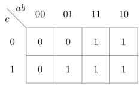

The realization is

A.

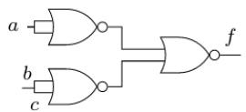

B.


C.


gate1987 digital-logic k-map

Answer key

D.


# 4.21.2 K Map: GATE CSE 1988 | Question: 3a-b

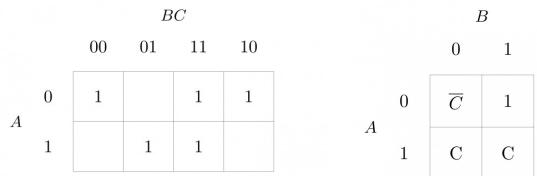


The Karnaugh map of a function of $(A,B,C)$ is shown on the left hand side of the above figure.

The reduced form of the same map is shown on the right hand side, in which the variable $C$ is entered in the map itself. Discuss,

a. The methodology by which the reduced map has been derived and  
b. the rules (or steps) by which the boolean function can be derived from the entries in the reduced map.

gate1988 descriptive digital-logic k-map

Answer key

# 4.21.3 K Map: GATE CSE 1992 | Question: 01-i

The Boolean function in sum of products form where K-map is given below (figure) is \_\_\_\_

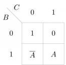


gate1992 digital-logic k-map normal fill-in-the-blanks

Answer key

# 4.21.4 K Map: GATE CSE 1995 | Question: 15-b

What is the equivalent minimal Boolean expression (in sum of products form) for the Karnaugh map given below?


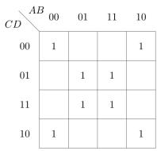

gate1995 digital-logic boolean-algebra k-map normal descriptive

Answer key

What is the equivalent Boolean expression in product-of-sums form for the Karnaugh map given in Fig

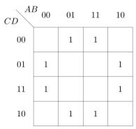

A. $B\overline{D} +\overline{B} D$

B. $(B + \overline{C} + D)(\overline{B} + C + \overline{D})$

C. $(B + D)(\overline{B} +\overline{D})$

D. $(B + \overline{D})(\overline{B} + D)$

gate1996 digital-logic k-map easy

Answer key

# 4.21.6 K Map: GATE CSE 1998 | Question: 2.7

The function represented by the Karnaugh map given below is


A. A. B

B. $AB + BC + CA$

c. $\overline{B\oplus C}$

D. A. BC

gate1998 digital-logic k-map normal

Answer key

# 4.21.7 K Map: GATE CSE 1999 | Question: 1.8

Which of the following functions implements the Karnaugh map shown below?

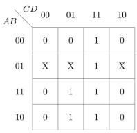

A. $\bar{A}B + CD$

B. $D(C + A)$

C. $AD + \bar{A}B$

D. $(C + D)(\bar{C} + D) + (A + B)$

gate1999 digital-logic k-map easy

Answer key

# 4.21.8 K Map: GATE CSE 2000 | Question: 2.11

Which functions does NOT implement the Karnaugh map given below?

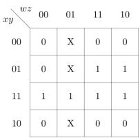

<details>
<summary>heatmap</summary>

| xy \ wz | 00 | 01 | 11 | 10 |
| :--- | :--- | :--- | :--- | :--- |
| 00 | 0 | X | 0 | 0 |
| 01 | 0 | X | 1 | 1 |
| 11 | 1 | 1 | 1 | 1 |
| 10 | 0 | X | 0 | 0 |
</details>

A. $(w + x)y$

B. $xy + yw$


C. $(w + x)(\bar{w} + y)(\bar{x} + y)$

gatecse-2000 digital-logic k-map normal

D. None of the above

Answer key

# 4.21.9 K Map: GATE CSE 2001 | Question: 1.11

Given the following karnaugh map, which one of the following represents the minimal Sum-Of-Products of the map?


<table><tr><td>yz\wx</td><td>00</td><td>01</td><td>11</td><td>10</td></tr><tr><td>00</td><td>0</td><td>X</td><td>0</td><td>X</td></tr><tr><td>01</td><td>X</td><td>1</td><td>X</td><td>1</td></tr><tr><td>11</td><td>0</td><td>X</td><td>1</td><td>0</td></tr><tr><td>10</td><td>0</td><td>1</td><td>X</td><td>0</td></tr></table>

A. $XY + Y'Z$

B. $WX^{\prime}Y^{\prime} + XY + XZ$

C. $W^{\prime}X + Y^{\prime}Z + XY$

D. $XZ + Y$

gatecse-2001 k-map digital-logic normal

Answer key

# 4.21.10 K Map: GATE CSE 2002 | Question: 1.12

Minimum sum of product expression for $f(w, x, y, z)$ shown in Karnaugh-map below


<table><tr><td>yz\wx</td><td>00</td><td>01</td><td>11</td><td>10</td></tr><tr><td>00</td><td>0</td><td>1</td><td>1</td><td>0</td></tr><tr><td>01</td><td>X</td><td>0</td><td>0</td><td>1</td></tr><tr><td>11</td><td>X</td><td>0</td><td>0</td><td>1</td></tr><tr><td>10</td><td>0</td><td>1</td><td>1</td><td>X</td></tr></table>

A. $xz + y'z$

B. $xz' + zx'$

C. $x^{\prime}y + zx^{\prime}$

D. None of the above

gatecse-2002 digital-logic k-map normal

Answer key

# 4.21.11 K Map: GATE CSE 2003 | Question: 45

The literal count of a Boolean expression is the sum of the number of times each literal appears in the expression. For example, the literal count of $(xy + xz')$ is 4. What are the minimum possible literal counts of the product-of-sum and sum-of-product representations respectively of the function given by the following Karnaugh map? Here, X denotes "don't care"

<table><tr><td>xy\zw</td><td>00</td><td>01</td><td>11</td><td>10</td></tr><tr><td>00</td><td>X</td><td>1</td><td>0</td><td>1</td></tr><tr><td>01</td><td>0</td><td>1</td><td>X</td><td>0</td></tr><tr><td>11</td><td>1</td><td>X</td><td>X</td><td>0</td></tr><tr><td>10</td><td>X</td><td>0</td><td>0</td><td>X</td></tr></table>

A. (11,9)

B. (9,13)

C. (9,10)

D. (11,11)

gatecse-2003 digital-logic k-map normal

Answer key

In the Karnaugh map shown below, $X$ denotes a don't care term. What is the minimal form of the function represented by the Karnaugh map?

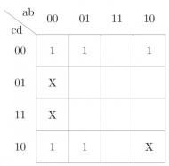

A. $\bar{b}.\bar{d} +\bar{a}.\bar{d}$  
C. $\overline{b}.\overline{d} +\overline{a}.b.\overline{d}$

B. $\bar{a}.\bar{b} +\bar{b}.\bar{d} +\bar{a}.b.\bar{d}$  
D. $\bar{a}, \bar{b} + \bar{b}, \bar{d} + \bar{a}, \bar{d}$

gatecse-2008 digital-logic k-map easy

Answer key

# 4.21.13 K Map: GATE CSE 2012 | Question: 30

What is the minimal form of the Karnaugh map shown below? Assume that $X$ denotes a don't care term

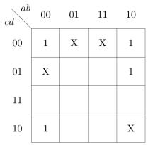

<details>
<summary>other</summary>

| cd \ ab | 00 | 01 | 11 | 10 |
| :--- | :--- | :--- | :--- | :--- |
| 00 | 1 | X | X | 1 |
| 01 | X | | | 1 |
| 11 | | | | |
| 10 | 1 | | | X |
</details>

A. $\overline{b}\overline{d}$  
C. $\bar{b}\bar{d} + a\bar{b}\bar{c}d$

B. $\bar{b}\bar{d} +\bar{b}\bar{c}$  
D. $\bar{b}\bar{d} +\bar{b}\bar{c} +\bar{c}\bar{d}$

gatecse-2012 digital-logic k-map easy

Answer key

# 4.21.14 K Map: GATE CSE 2025 | Set 2 | Question: 33

Given the following Karnaugh Map for a Boolean function $F(w, x, y, z)$ :


<details>
<summary>heatmap</summary>

| wx \ yz | 00 | 01 | 11 | 10 |
| --- | --- | --- | --- | --- |
| 00 | 1 | 0 | 0 | 1 |
| 01 | 0 | 1 | 1 | 0 |
| 11 | 0 | 1 | 1 | 0 |
| 10 | 1 | 0 | 0 | 1 |
</details>


Which one or more of the following Boolean expression(s) represent(s) F ?

A. $\bar{w}\bar{x}\bar{y}\bar{z} + w\bar{x}\bar{y}\bar{z} + \bar{w}\bar{x}y\bar{z} + w\bar{x}y\bar{z} + xz$  
B. $\bar{w}\bar{x}\bar{y}\bar{z} + \bar{w}\bar{x}y\bar{z} + w\bar{x}yz + xz$  
C. $\bar{w}\bar{x}\bar{y}\bar{z} + w\bar{x}\bar{y}\bar{z} + w\bar{x}\bar{y}z + xz$  
D. $\bar{x}\bar{z} + xz$

# 4.21.15 K Map: GATE IT 2006 | Question: 35


The boolean function for a combinational circuit with four inputs is represented by the following Karnaugh map.

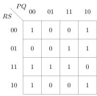

<details>
<summary>heatmap</summary>

| RS \ PQ | 00 | 01 | 11 | 10 |
| :--- | :--- | :--- | :--- | :--- |
| 00 | 1 | 0 | 0 | 1 |
| 01 | 0 | 0 | 1 | 1 |
| 11 | 1 | 1 | 1 | 0 |
| 10 | 1 | 0 | 0 | 1 |
</details>

Which of the product terms given below is an essential prime implicant of the function?

A. QRS

B. PQS

C. PQ'S'

D. Q'S'

gateit-2006 digital-logic k-map normal

Answer key

# 4.21.16 K Map: GATE IT 2007 | Question: 78


Consider the following expression

$$
a \bar {d} + \bar {a} \bar {c} + b \bar {c} d
$$

Which of the following Karnaugh Maps correctly represents the expression?

A.

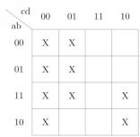

B.


C.

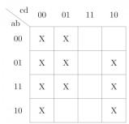

D.


gateit-2007 digital-logic k-map normal

Answer key

# 4.21.17 K Map: GATE IT 2007 | Question: 79


Consider the following expression

$$
a \bar {d} + \bar {a} \bar {c} + b \bar {c} d
$$

Which of the following expressions does not correspond to the Karnaugh Map obtained for the given expression?

A. $\bar{c} \bar{d} + a \bar{d} + ab \bar{c} + \bar{a} \bar{c} d$  
B. $\bar{a}\bar{c} +\bar{c}\bar{d} +a\bar{d} +ab\bar{c} d$  
C. $\bar{a}\bar{c} + a\bar{d} + ab\bar{c} + \bar{c}d$  
D. $\bar{b}\bar{c}\bar{d} + ac\bar{d} + \bar{a}\bar{c} + ab\bar{c}$

gateit-2007 digital-logic k-map normal

Answer key

# 4.22

# Little Endian Big Endian (1)

# 4.22.1 Little Endian Big Endian: GATE CSE 2021 | Set 2 | Question: 44

If the numerical value of a 2-byte unsigned integer on a little endian computer is 255 more than that on a big endian computer, which of the following choices represent(s) the unsigned integer on a little endian computer?

A. 0x6665

B. 0x0001

C. 0x4243

D. 0x0100


# 4.23

# Memory Interfacing (5)

Practice Test: Test 1 (5Q)

# 4.23.1 Memory Interfacing: GATE CSE 1995 | Question: 2.2

The capacity of a memory unit is defined by the number of words multiplied by the number of bits/word. How many separate address and data lines are needed for a memory of $4K \times 16$ ?


A. 10 address, 16 data lines

B. 11 address, 8 data lines

C. 12 address, 16 data lines

D. 12 address, 12 data lines

gate1995 digital-logic memory-interfacing normal

Answer key

# 4.23.2 Memory Interfacing: GATE CSE 2009 | Question: 7, ISRO2015-3

How many $32K \times 1$ RAM chips are needed to provide a memory capacity of 256K bytes?


A. 8

B. 32

C. 64

D. 128

gatecse-2009 digital-logic memory-interfacing easy isro2015

Answer key

# 4.23.3 Memory Interfacing: GATE CSE 2010 | Question: 7

The main memory unit with a capacity of 4 megabytes is built using $1M \times 1$ -bit DRAM chips. Each DRAM chip has 1K rows of cells with 1K cells in each row. The time taken for a single refresh operation is 100 nanoseconds. The time required to perform one refresh operation on all the cells in the memory unit is


A. 100 nanoseconds

B. $100 \times 2^{10}$ nanoseconds

C. $100 \times 2^{20}$ nanoseconds

D. $3200 \times 2^{20}$ nanoseconds

gatecse-2010 digital-logic memory-interfacing normal

Answer key

# 4.23.4 Memory Interfacing: GATE CSE 2013 | Question: 46

A RAM chip has a capacity of 1024 words of 8 bits each (1K × 8). The number of 2 × 4 decoders with enable line needed to construct a 16K × 16 RAM from 1K × 8 RAM is


(A) 4 (B) 5 (C) 6 (D) 7

gatecse-2013 digital-logic normal memory-interfacing

Answer key

# 4.23.5 Memory Interfacing: GATE IT 2005 | Question: 9

A dynamic RAM has a memory cycle time of 64 nsec. It has to be refreshed 100 times per msec and each refresh takes 100 nsec. What percentage of the memory cycle time is used for refreshing?


A. 10

B. 6.4

C. 1

D. 0.64

gateit-2005 digital-logic memory-interfacing normal

Answer key

# 4.24

# Min No Gates (6)

Practice Tests: Test 1 (15Q) Test 2 (7Q)


# 4.24.1 Min No Gates: GATE CSE 1995 | Question: 15-a

Implement a circuit having the following output expression using an inverter and a nand gate

$$
Z = \overline {{A}} + \overline {{B}} + C
$$

gate1995 digital-logic normal descriptive min-no-gates digital-circuits boolean-algebra

# Answer key

# 4.24.2 Min No Gates: GATE CSE 2000 | Question: 9

Design a logic circuit to convert a single digit BCD number to the number modulo six as follows (Do not detect illegal input):


A. Write the truth table for all bits. Label the input bits $I_1, I_2, \ldots$ with $I_1$ as the least significant bit. Label the output bits $R_1, R_2, \ldots$ with $R_1$ as the least significant bit. Use 1 to signify truth.  
B. Draw one circuit for each output bit using, altogether, two two-input AND gates, one two-input OR gate and two NOT gates.

gatecse-2000 digital-logic min-no-gates descriptive

# Answer key

# 4.24.3 Min No Gates: GATE CSE 2004 | Question: 58

A circuit outputs a digit in the form of 4 bits. 0 is represented by 0000, 1 by 0001, ..., 9 by 1001. A combinational circuit is to be designed which takes these 4 bits as input and outputs 1 if the digit $\geq 5$ , and 0 otherwise. If only AND, OR and NOT gates may be used, what is the minimum number of gates required?


A. 2

B. 3

C. 4

D. 5

gatecse-2004 digital-logic normal min-no-gates

# Answer key

# 4.24.4 Min No Gates: GATE CSE 2009 | Question: 6

What is the minimum number of gates required to implement the Boolean function (AB+C) if we have to use only 2-input NOR gates?


A. 2

B. 3

C. 4

D. 5

gatecse-2009 digital-logic min-no-gates normal

# Answer key

# 4.24.5 Min No Gates: GATE CSE 2017 | Set 1 | Question: 21

Consider the Karnaugh map given below, where X represents "don't care" and blank represents 0.


<table><tr><td>dc\ba</td><td>00</td><td>01</td><td>11</td><td>10</td></tr><tr><td>00</td><td></td><td>X</td><td>X</td><td></td></tr><tr><td>01</td><td>1</td><td></td><td></td><td>X</td></tr><tr><td>11</td><td>1</td><td></td><td></td><td>1</td></tr><tr><td>10</td><td></td><td>X</td><td>X</td><td></td></tr></table>

Assume for all inputs $(a, b, c, d)$ , the respective complements $(\bar{a}, \bar{b}, \bar{c}, \bar{d})$ are also available. The above logic is implemented using 2-input NOR gates only. The minimum number of gates required is \_\_\_\_.


gatecse-2017-set1 digital-logic k-map numerical-answers normal min-no-gates

# Answer key

# 4.24.6 Min No Gates: GATE IT 2004 | Question: 8


What is the minimum number of NAND gates required to implement a 2-input EXCLUSIVE-OR function without using any other logic gate?

A. 2

B. 4

C. 5

D. 6

gateit-2004 digital-logic min-no-gates normal

Answer key

# 4.25

# Min Products of Sum Form (2)

# 4.25.1 Min Products of Sum Form: GATE CSE 1990 | Question: 5-a

Find the minimum product of sums of the following expression


$$
f = A B C + \overline {{A}} \overline {{B}} \overline {{C}}
$$

gate1990 digital-logic boolean-algebra min-products-of-sum-form canonical-normal-form descriptive

Answer key

# 4.25.2 Min Products of Sum Form: GATE CSE 2017 | Set 2 | Question: 28

Given $f(w, x, y, z) = \Sigma_m(0, 1, 2, 3, 7, 8, 10) + \Sigma_d(5, 6, 11, 15)$ ; where $d$ represents the 'don't-care' condition in Karnaugh maps. Which of the following is a minimum product-of-sums (POS) form of $f(w, x, y, z)$ ?


A. $f = (\bar{w} +\bar{z})(\bar{x} +z)$

B. $f = (\bar{w} + z)(x + z)$

C. $f = (w + z)(\bar{x} + z)$

D. $f = (w + \bar{z})(\bar{x} +z)$

gatecse-2017-set2 digital-logic min-products-of-sum-form

Answer key

# 4.26

# Min Sum of Products Form (16)

Practice Tests: Test 1 (15Q) Test 2 (1Q)

# 4.26.1 Min Sum of Products Form: GATE CSE 1991 | Question: 5-b


Find the minimum sum of products form of the logic function $f(A, B, C, D) = \Sigma_m(0, 2, 8, 10, 15) + \Sigma_d(3, 11, 12, 14)$ where $m$ and $d$ represent minterm and don't care term respectively.

gate1991 digital-logic boolean-algebra min-sum-of-products-form descriptive

Answer key

# 4.26.2 Min Sum of Products Form: GATE CSE 1997 | Question: 71


Let $f = (\bar{w} + y)(\bar{x} + y)(w + \bar{x} + z)(\bar{w} + z)(\bar{x} + z)$

A. Express f as the minimal sum of products. Write only the answer.  
B. If the output line is stuck at 0, for how many input combinations will the value of f be correct?

gate1997 digital-logic min-sum-of-products-form numerical-answers

Answer key

# 4.26.3 Min Sum of Products Form: GATE CSE 2001 | Question: 10


a. Is the 3-variable function $f = \Sigma(0,1,2,4)$ its self-dual? Justify your answer.  
b. Give a minimal product-of-sum form of the $\bar{b}$ output of the following excess-3 to BCD converter.


<details>
<summary>flowchart</summary>

```mermaid
graph LR
  A["e8"] --> B["Excess - 3 to BCD"]
  C["e4"] --> B
  D["e2"] --> B
  E["e1"] --> B
  B --> F["b8"]
  B --> G["b4"]
  B --> H["b2"]
  B --> I["b1"]
```
</details>

gatecse-2001 digital-logic normal descriptive min-sum-of-products-form

# Answer key

# 4.26.4 Min Sum of Products Form: GATE CSE 2005 | Question: 18

The switching expression corresponding to $f(A, B, C, D) = \Sigma(1, 4, 5, 9, 11, 12)$ is:

A. $BC^{\prime}D^{\prime} + A^{\prime}C^{\prime}D + AB^{\prime}D$

B. $ABC' + ACD + B'C'D$

C. $ACD' + A'BC' + AC'D'$

D. $A^{\prime}BD + ACD^{\prime} + BCD^{\prime}$

gatecse-2005 digital-logic normal min-sum-of-products-form

# Answer key

# 4.26.5 Min Sum of Products Form: GATE CSE 2007 | Question: 9

Consider the following Boolean function of four variables:

$$
f (w, x, y, z) = \Sigma (1, 3, 4, 6, 9, 1 1, 1 2, 1 4)
$$

The function is

A. independent of one variables.

B. independent of two variables.

C. independent of three variables.

D. dependent on all variables

gatecse-2007 digital-logic normal min-sum-of-products-form k-map

# Answer key

# 4.26.6 Min Sum of Products Form: GATE CSE 2011 | Question: 14

The simplified SOP (Sum of Product) from the Boolean expression

$$
(P + \bar {Q} + \bar {R}). (P + \bar {Q} + R). (P + Q + \bar {R})
$$

is

A. $(\bar{P}, Q + \bar{R})$

B. $(P + \bar{Q},\bar{R})$

C. $(\bar{P}.Q + R)$

D. $(P, Q + R)$

gatecse-2011 digital-logic normal min-sum-of-products-form

# Answer key

# 4.26.7 Min Sum of Products Form: GATE CSE 2014 | Set 1 | Question: 45

Consider the 4-to-1 multiplexer with two select lines $S_{1}$ and $S_{0}$ given below

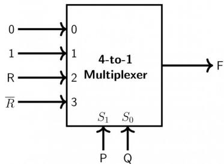

<details>
<summary>text_image</summary>

0 → 0
1 → 1
R → 2
R̅ → 3
4-to-1
Multiplexer
→ F
S₁ S₀
P Q
</details>

The minimal sum-of-products form of the Boolean expression for the output F of the multiplexer is

A. $\bar{P}Q + Q\bar{R} + P\bar{Q}R$

B. $\bar{P}Q + \bar{P}Q\bar{R} + PQ\bar{R} + P\bar{Q}R$

c. $\bar{P} Q R + \bar{P} Q \bar{R} + Q \bar{R} + P \bar{Q} R$

D. $PQ\bar{R}$

gatecse-2014-set1 digital-logic normal multiplexer min-sum-of-products-form


# 4.26.8 Min Sum of Products Form: GATE CSE 2014 | Set 1 | Question: 7

Consider the following Boolean expression for F:

$$
F (P, Q, R, S) = P Q + \bar {P} Q R + \bar {P} Q \bar {R} S
$$

The minimal sum-of-products form of $F$ is

A. $PQ + QR + QS$

B. $P + Q + R + S$

C. $\bar{P} + \bar{Q} + \bar{R} + \bar{S}$

D. $\bar{P}R + \bar{R}\bar{P}S + P$

gatecse-2014-set1 digital-logic normal min-sum-of-products-form

# Answer key


# 4.26.9 Min Sum of Products Form: GATE CSE 2014 | Set 3 | Question: 7

Consider the following minterm expression for F:

$$
F (P, Q, R, S) = \sum 0, 2, 5, 7, 8, 1 0, 1 3, 1 5
$$

The minterms 2, 7, 8 and 13 are 'do not care' terms. The minimal sum-of-products form for $F$ is

A. $Q\bar{S} +\bar{Q} S$

B. $\bar{Q}\bar{S} + QS$

C. $\bar{Q}\bar{R}\bar{S} +\bar{Q} R\bar{S} +Q\bar{R} S + QRS$

D. $\bar{P}\bar{Q}\bar{S} +\bar{P}QS + PQS + P\bar{Q}\bar{S}$

gatecse-2014-set3 digital-logic min-sum-of-products-form normal

# Answer key


# 4.26.10 Min Sum of Products Form: GATE CSE 2018 | Question: 49

Consider the minterm list form of a Boolean function F given below.

$$
F (P, Q, R, S) = \Sigma m (0, 2, 5, 7, 9, 1 1) + d (3, 8, 1 0, 1 2, 1 4)
$$

Here, $m$ denotes a minterm and $d$ denotes a don't care term. The number of essential prime implicants of the function $F$ is \_\_\_\_

gatecse-2018 digital-logic min-sum-of-products-form k-map numerical-answers two-marks

# Answer key


# 4.26.11 Min Sum of Products Form: GATE CSE 2021 | Set 2 | Question: 52

Consider a Boolean function $f(w, x, y, z)$ such that

$$
f (w, 0, 0, z) = 1
$$

$$
f (1, x, 1, z) = x + z
$$

$$
f (w, 1, y, z) = w z + y
$$

The number of literals in the minimal sum-of-products expression of $f$ is \_\_\_\_

gatecse-2021-set2 digital-logic boolean-algebra min-sum-of-products-form numerical-answers two-marks

# Answer key


# 4.26.12 Min Sum of Products Form: GATE CSE 2024 | Set 1 | Question: 37

Consider a Boolean expression given by $\mathrm{F}(\mathrm{X}, \mathrm{Y}, \mathrm{Z}) = \sum(3, 5, 6, 7)$ .

Which of the following statements is/are CORRECT?

A. $\mathrm{F}(\mathrm{X}, \mathrm{Y}, \mathrm{Z}) = \Pi(0, 1, 2, 4)$

B. $\mathrm{F}(\mathrm{X}, \mathrm{Y}, \mathrm{Z}) = \mathrm{X} \mathrm{Y} + \mathrm{Y} \mathrm{Z} + \mathrm{X} \mathrm{Z}$

C. $\mathrm{F}(\mathrm{X}, \mathrm{Y}, \mathrm{Z})$ is independent of input Y

D. $\mathrm{F}(\mathrm{X}, \mathrm{Y}, \mathrm{Z})$ is independent of input
X

gatecse-2024-set1 multiple-selects digital-logic min-sum-of-products-form two-marks


# 4.26.13 Min Sum of Products Form: GATE CSE 2025 | Set 1 | Question: 32

Consider the following four variable Boolean function in sum-of-product form

$$
F \left(b _ {3}, b _ {2}, b _ {1}, b _ {0}\right) = \sum (0, 2, 4, 8, 1 0, 1 1, 1 2)
$$


where the value of the function is computed by considering $b_{3}b_{2}b_{1}b_{0}$ as a 4-bit binary number, where $b_{3}$ denotes the most significant bit and $b_{0}$ denotes the least significant bit. Note that there are no don't care terms. Which ONE of the following options is the CORRECT minimized Boolean expression for F?

A. $\overline{b}_1\overline{b}_0 + \overline{b}_2\overline{b}_0 + b_1\overline{b}_2b_3$

B. $\overline{b}_1\overline{b}_0 + \overline{b}_2\overline{b}_0$

C. $\bar{b}_2\bar{b}_0 + b_1b_2b_3$

D. $\bar{b}_{0}\bar{b}_{2}+\bar{b}_{3}$

gatecse2025-set1 digital-logic min-sum-of-products-form easy two-marks

# Answer key

# 4.26.14 Min Sum of Products Form: GATE CSE 2026 | Set 1 | Question: 38

Consider a Boolean function F with the following minterm expression:


$$
F (P, Q, R, S) = \sum m (1, 2, 3, 4, 5, 7, 1 0, 1 2, 1 3, 1 4)
$$

Which of the following options is/are the minimal sum-of-products expression(s) of F ?

A. $\bar{P} S + Q\bar{R} +\bar{P}\bar{Q} R + \bar{Q} R\bar{S}$  
B. $\bar{P} S + Q\bar{R} +\bar{P}\bar{Q} R + \bar{P} R\bar{S}$  
C. $\bar{P} S + Q\bar{R} + PQ\bar{S} + PR\bar{S}$  
D. $\bar{P} S + \bar{Q} \bar{R} + P \bar{Q} \bar{S} + \bar{Q} R \bar{S}$

gatecse-2026-set1 two-marks digital-logic min-sum-of-products-form k-map multiple-selects

# Answer key

# 4.26.15 Min Sum of Products Form: GATE CSE 2026 | Set 2 | Question: 30

Consider the following 4-variable Boolean function


$$
F (A, B, C, D) = \Sigma m (0, 1, 2, 3, 8, 9, 1 0, 1 1)
$$

Consider $A$ as MSB, $D$ as LSB. Which one of the following options represents the minimal sum of products form for the above function?

Note: + is OR operation, · is AND operation, / is NOT operation

A. $A^{\prime} + B^{\prime} + C^{\prime} + D^{\prime}$

B. $B'$

C. $A^{\prime} \cdot B^{\prime} + A \cdot B$

D. $A'$

gatecse-2026-set2 digital-logic min-sum-of-products-form k-map two-marks

# Answer key

# 4.26.16 Min Sum of Products Form: GATE IT 2008 | Question: 8

Consider the following Boolean function of four variables

$$
f (A, B, C, D) = \Sigma (2, 3, 6, 7, 8, 9, 1 0, 1 1, 1 2, 1 3)
$$

The function is

A. independent of one variable  
C. independent of three variable

gateit-2008 digital-logic normal min-sum-of-products-form

# Answer key


# 4.27.1 Multiplexer: GATE CSE 1990 | Question: 5-b

Show with the help of a block diagram how the Boolean function :

$$
f = A B + B C + C A
$$

can be realised using only a 4:1 multiplexer.

gate1990 descriptive digital-logic combinational-circuit multiplexer

# Answer key


# 4.27.2 Multiplexer: GATE CSE 1998 | Question: 1.14

A multiplexer with a 4-bit data select input is a

A. 4:1 multiplexer  
C. 16:1 multiplexer

gate1998 digital-logic multiplexer easy

B. 2:1 multiplexer  
D. 8:1 multiplexer

# Answer key


# 4.27.3 Multiplexer: GATE CSE 2001 | Question: 2.11

Consider the circuit shown below. The output of a 2 : 1 MUX is given by the function $(ac' + bc)$ .


<details>
<summary>text_image</summary>

1
0
a 2:1
b MUX
c
X₁
g
a
b 2:1
c
X₂
f
</details>

Which of the following is true?

A. $f = X_1' + X_2$  
C. $f = X_{1}^{'} X_{2} + X_{1}^{\prime} X_{2}^{\prime}$

gatecse-2001 digital-logic normal multiplexer

B. $f = X_1'X_2 + X_1X_2'$  
D. $f = X_{1} + X_{2}'$

# Answer key


# 4.27.4 Multiplexer: GATE CSE 2004 | Question: 60

Consider a multiplexer with X and Y as data inputs and Z the as the control input. Z = 0 selects input X, and Z = 1 selects input Y. What are the connections required to realize the 2-variable Boolean function $f = T + R$ , without using any additional hardware?

A. R to X, 1 to Y, T to Z  
C. T to X, R to Y, 0 to Z

gatecse-2004 digital-logic normal multiplexer

B. T to X, R to Y, T to Z  
D. R to X, 0 to Y, T to Z

# Answer key


# 4.27.5 Multiplexer: GATE CSE 2007 | Question: 34

Suppose only one multiplexer and one inverter are allowed to be used to implement any Boolean function of n variables. What is the minimum size of the multiplexer needed?

A. $2^{n}$ line to 1 line  
C. $2^{n - 1}$ line to 1line

B. $2^{n + 1}$ line to 1line  
D. $2^{n - 2}$ line to 1line


# 4.27.6 Multiplexer: GATE CSE 2016 | Set 1 | Question: 30

Consider the two cascade 2 to 1 multiplexers as shown in the figure.


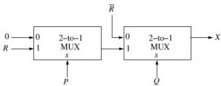

<details>
<summary>flowchart</summary>

```mermaid
graph LR
  A["Input: 0, R"] --> B["Multiplexer 1"]
  B --> C["Output: X"]
  C --> D["Input: 0, Q"]
  D --> E["Multiplexer 2"]
  E --> F["Output: X"]
  F --> G["Input: P"]
  G --> B
  B --> H["Feedback Loop: R"]
```
</details>

The minimal sum of products form of the output X is

A. $\overline{P}\overline{Q} + PQR$

B. $\overline{P} Q + QR$

c. $PQ + \overline{P}\overline{Q} R$

D. $\overline{Q}\overline{R} + PQR$

gatecse-2016-set1 digital-logic multiplexer normal

Answer key

# 4.27.7 Multiplexer: GATE CSE 2020 | Question: 19

A multiplexer is placed between a group of 32 registers and an accumulator to regulate data movement such that at any given point in time the content of only one register will move to the accumulator. The number of select lines needed for the multiplexer is \_\_\_\_.


gatecse-2020 numerical-answers digital-logic multiplexer one-mark

Answer key

# 4.27.8 Multiplexer: GATE CSE 2021 | Set 2 | Question: 5

Which one of the following circuits implements the Boolean function given below?

$f(x,y,z) = m_0 + m_1 + m_3 + m_4 + m_5 + m_6,$ where $m_{i}$ is the $i^{\mathrm{th}}$ minterm.


  
A.

  
C.

gatecse-2021-set2 digital-logic combinational-circuit multiplexer one-mark

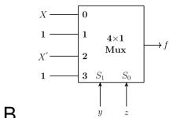  
B.

  
D.

Answer key

# 4.27.9 Multiplexer: GATE CSE 2023 | Question: 11

The output of a 2-input multiplexer is connected back to one of its inputs as shown in the figure.


<details>
<summary>text_image</summary>

Multiplexer
0
1
Q
S
</details>

Match the functional equivalence of this circuit to one of the following options.

A. D Flip-flop

B. D Latch

C. Half-adder

D. Demultiplexer

# 4.27.10 Multiplexer: GATE CSE 2023 | Question: 34


A Boolean digital circuit is composed using two 4-input multiplexers (M1 and M2) and one 2-input multiplexer (M3) as shown in the figure. X0-X7 are the inputs of the multiplexers M1 and M2 and could be connected to either 0 or 1. The select lines of the multiplexers are connected to Boolean variables A, B and C as shown.

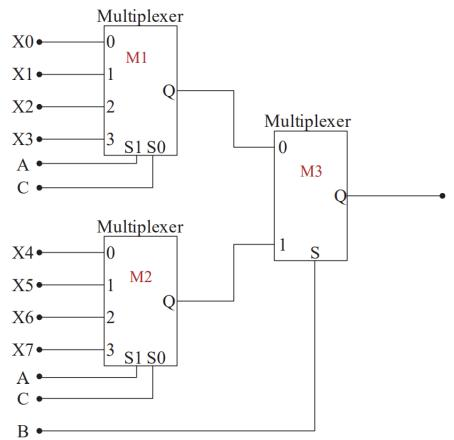

<details>
<summary>text_image</summary>

Multiplexer
0 M1
X0
X1
X2
X3
A
C
S1 S0
Q
Multiplexer
0 M3
Q
1 S
Multiplexer
0 M2
X4
X5
X6
X7
A
C
B
S1 S0
Q
S
</details>

Which one of the following set of values of (X0, X1, X2, X3, X4, X5, X6, X7) will realise the Boolean function $\overline{\mathbf{A}} + \overline{\mathbf{A}} \cdot \overline{\mathbf{C}} + \mathbf{A} \cdot \overline{\mathbf{B}} \cdot \mathbf{C}$ ?

A. $(1,1,0,0,1,1,1,0)$

B. $(1,1,0,0,1,1,0,1)$

C. $(1,1,0,1,1,1,0,0)$

D. $(0,0,1,1,0,1,1,1)$

gatecse-2023 digital-logic combinational-circuit multiplexer two-marks

# Answer key

# 4.27.11 Multiplexer: GATE CSE 2024 | Set 1 | Question: 54


Consider a digital logic circuit consisting of three 2-to-1 multiplexers M1, M2, and M3 as shown below. X1 and X2 are inputs of M1. X3 and X4 are inputs of M2. A, B, and C are select lines of M1, M2, and M3, respectively.


<details>
<summary>flowchart</summary>

```mermaid
graph LR
  X1["X1"] --> 0["0"]
  X2["X2"] --> 1["1"]
  X2 --> S1["S1"]
  S1 -->|A| A
  X3["X3"] --> 0["0"]
  X3 -->|B| B
  X4["X4"] --> 1["1"]
  X4 --> S2["S2"]
  S2 -->|Q2| M2["M2"]
  M2 -->|Q1| M1["M1"]
  M1 -->|Q1| S1
  M2 -->|Q2| M3["M3"]
  M3 -->|Y| Y
  S2 -->|B| B
  S3["S3"] -->|C| C
  M3 -->|C| C
```
</details>

For an instance of inputs $\mathbf{X1} = \mathbf{1}, \mathbf{X2} = \mathbf{1}, \mathbf{X3} = \mathbf{0}$ , and $\mathbf{X4} = \mathbf{0}$ , the number of combinations of A, B, C that give the output $\mathbf{Y} = \mathbf{1}$ is \_\_\_\_.

gatecse-2024-set1 numerical-answers digital-logic multiplexer two-marks

# Answer key

# 4.27.12 Multiplexer: GATE IT 2005 | Question: 48


The circuit shown below implements a 2-input NOR gate using two 2 - 4 MUX (control signal 1 selects the upper input). What are the values of signals x, y and z?

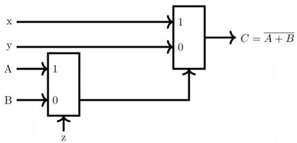

<details>
<summary>flowchart</summary>

```mermaid
graph LR
  x["x"] --> 1["1"]
  y["y"] --> 0["0"]
  A["A"] --> 1["1"]
  B["B"] --> 0["0"]
  z["z"] --> n0["0"]
  n0 --> C["C = A + B"]
```
</details>

A. 1,0,B

B. 1,0,A

C. 0,1,B

D. 0,1,A

gateit-2005 digital-logic normal multiplexer

Answer key

# 4.27.13 Multiplexer: GATE IT 2007 | Question: 8

The following circuit implements a two-input AND gate using two 2 - 1 multiplexers.


<details>
<summary>text_image</summary>

a
1
b
0
X₁
1
0
X₂
X₃
a,b
</details>

What are the values of $X_{1}, X_{2}, X_{3}$ ?

A. $X_{1} = b, X_{2} = 0, X_{3} = a$  
C. $X_{1} = a, X_{2} = b, X_{3} = 1$

gateit-2007 digital-logic normal multiplexer

B. $X_{1} = b, X_{2} = 1, X_{3} = b$  
D. $X_{1} = a, X_{2} = 0, X_{3} = b$

Answer key

# 4.27.14 Multiplexer: GATE1992-04-b

A priority encoder accepts three input signals (A, B and C) and produces a two-bit output $(X_{1}, X_{0})$ corresponding to the highest priority active input signal. Assume $A$ has the highest priority followed by $B$ and $C$ has the lowest priority. If none of the inputs are active the output should be 00, design the priority encoder using 4:1 multiplexers as the main components.

gate1992 digital-logic combinational-circuit multiplexer descriptive

Answer key

# 4.28

# Number Representation (57)

Practice Tests: Test 1 (15Q) Test 2 (15Q) Test 3 (15Q) Test 4 (15Q) Test 5 (9Q)

# 4.28.1 Number Representation: GATE CSE 1990 | Question: 1-viii

The condition for overflow in the addition of two 2's complement numbers in terms of the carry generated by the two most significant bits is \_\_\_\_.

gate1990 digital-logic number-representation fill-in-the-blanks

Answer key

# 4.28.2 Number Representation: GATE CSE 1991 | Question: 01-iii

Consider the number given by the decimal expression:

$$
1 6 ^ {3} * 9 + 1 6 ^ {2} * 7 + 1 6 * 5 + 3
$$


The number of 1's in the unsigned binary representation of the number is \_\_\_\_

# Answer key

# 4.28.3 Number Representation: GATE CSE 1991 | Question: 01-v

When two 4-bit numbers $A = a_{3}a_{2}a_{1}a_{0}$ and $B = b_{3}b_{2}b_{1}b_{0}$ are multiplied, the bit $c_{1}$ of the product C is given by \_\_\_\_


gate1991 digital-logic normal number-representation fill-in-the-blanks

# Answer key

# 4.28.4 Number Representation: GATE CSE 1992 | Question: 4-a

Consider addition in two's complement arithmetic. A carry from the most significant bit does not always correspond to an overflow. Explain what is the condition for overflow in two's complement arithmetic.


gate1992 digital-logic normal number-representation descriptive

# Answer key

# 4.28.5 Number Representation: GATE CSE 1993 | Question: 6.5

Convert the following numbers in the given bases into their equivalents in the desired bases:


A. $(110.101)_2 = (x)_{10}$  
B. $(1118)_{10} = (y)_{H}$

gate1993 digital-logic number-representation normal descriptive

# Answer key

# 4.28.6 Number Representation: GATE CSE 1994 | Question: 2.7

Consider $n$ -bit (including sign bit) $2's$ complement representation of integer numbers. The range of integer values, $N$ , that can be represented is \_\_\_\_ $\leq N \leq$ \_\_\_\_.


gate1994 digital-logic number-representation easy fill-in-the-blanks

# Answer key

# 4.28.7 Number Representation: GATE CSE 1995 | Question: 18

The following is an incomplete Pascal function to convert a given decimal integer (in the range $-8$ to $+7$ ) into a binary integer in 2's complement representation. Determine the expressions $A, B, C$ that complete program.


```vhdl
function TWOSCOMP (N:integer):integer;
  var
  REM, EXPONENT:integer;
  BINARY :integer;
  begin
    if(N>=-8) and (N<=+7) then
      begin
        if N<0 then
          N:=A;
        BINARY:=0;
        EXPONENT:=1;
        while N<>0 do
          begin
            REM:=N mod 2;
            BINARY:=BINARY + B*EXPONENT;
            EXPONENT:=EXPONENT*10;
            N:=C
          end
        TWOSCOMP:=BINARY
      end
  end;
```

# 4.28.8 Number Representation: GATE CSE 1995 | Question: 2.12, ISRO2015-9

The number of 1's in the binary representation of $(3 * 4096 + 15 * 256 + 5 * 16 + 3)$ are:

A. 8

B. 9

C. 10

D. 12

gate1995

digital-logic

number-representation

normal

isro2015

# Answer key

# 4.28.9 Number Representation: GATE CSE 1996 | Question: 1.25

Consider the following floating-point number representation.

<table><tr><td>31</td><td>24</td><td>23</td><td>0</td></tr><tr><td colspan="2">Exponent</td><td colspan="2">Mantissa</td></tr></table>


The exponent is in $2's$ complement representation and the mantissa is in the sign-magnitude representation. The range of the magnitude of the normalized numbers in this representation is

A. 0 to 1

B. 0.5 to 1

C. $2^{-23}$ to 0.5

D. 0.5 to $(1 - 2^{-23})$

gate1996

digital-logic

number-representation

normal

# Answer key

# 4.28.10 Number Representation: GATE CSE 1997 | Question: 5.4

Given $\sqrt{(224)_r} = (13)_r$ .

The value of the radix r is:

A. 10

B. 8

C. 5

D. 6

gate1997

digital-logic

number-representation

normal

# Answer key

# 4.28.11 Number Representation: GATE CSE 1998 | Question: 1.17

The octal representation of an integer is $(342)_8$ . If this were to be treated as an eight-bit integer in an 8085 based computer, its decimal equivalent is

A. 226

B. -98

C. 76

D. -30

gate1998

digital-logic

number-representation

normal

# Answer key

# 4.28.12 Number Representation: GATE CSE 1998 | Question: 2.20

Suppose the domain set of an attribute consists of signed four digit numbers. What is the percentage of reduction in storage space of this attribute if it is stored as an integer rather than in character form?

A. 80\%

B. 20\%

C. 60\%

D. 40\%

gate1998

digital-logic

number-representation

normal

# Answer key

# 4.28.13 Number Representation: GATE CSE 1999 | Question: 2.17

Zero has two representations in

A. Sign-magnitude

C. 1's complement

gate1999

digital-logic

number-representation

easy

multiple-selects

# Answer key

B. $2's$ complement

D. None of the above


# 4.28.14 Number Representation: GATE CSE 2000 | Question: 1.6

The number 43 in $2's$ complement representation is

A. 01010101

B. 11010101

C. 00101011

D. 10101011

gatecse-2000 digital-logic number-representation easy

Answer key

# 4.28.15 Number Representation: GATE CSE 2000 | Question: 2.14

Consider the values of $A = 2.0 \times 10^{30}$ , $B = -2.0 \times 10^{30}$ , $C = 1.0$ , and the sequence

$$
\begin{array}{l} \mathrm{X} := \mathrm{A} + \mathrm{B} \quad \mathrm{Y} := \mathrm{A} + \mathrm{C} \\ \mathrm{X} := \mathrm{X} + \mathrm{C} \quad \mathrm{Y} := \mathrm{Y} + \mathrm{B} \\ \end{array}
$$

executed on a computer where floating point numbers are represented with 32 bits. The values for X and Y will be

A. $X = 1.0, Y = 1.0$

B. $X = 1.0, Y = 0.0$

c. $X = 0.0, Y = 1.0$

D. $X = 0.0, Y = 0.0$

gatecse-2000 digital-logic number-representation normal

Answer key

# 4.28.16 Number Representation: GATE CSE 2001 | Question: 2.10

The $2's$ complement representation of $(-539)_{10}$ in hexadecimal is

A. ABE

B. DBC

C. DE5

D. 9E7

gatecse-2001 digital-logic number-representation easy

Answer key

# 4.28.17 Number Representation: GATE CSE 2002 | Question: 1.14

The decimal value 0.25

A. is equivalent to the binary value 0.1  
B. is equivalent to the binary value 0.01  
C. is equivalent to the binary value 0.00111  
D. cannot be represented precisely in binary

gatecse-2002 digital-logic number-representation easy

Answer key

# 4.28.18 Number Representation: GATE CSE 2002 | Question: 1.15

The $2's$ complement representation of the decimal value $-15$ is

A. 1111

B. 11111

C. 111111

D. 10001

gatecse-2002 digital-logic number-representation easy

Answer key

# 4.28.19 Number Representation: GATE CSE 2002 | Question: 1.16

Sign extension is a step in

A. floating point multiplication  
C. arithmetic left shift

B. signed 16 bit integer addition  
D. converting a signed integer from one size to another

gatecse-2002 digital-logic easy number-representation

Answer key


# 4.28.20 Number Representation: GATE CSE 2002 | Question: 1.21


In $2's$ complement addition, overflow

A. is flagged whenever there is carry from sign bit addition  
B. cannot occur when a positive value is added to a negative value  
C. is flagged when the carries from sign bit and previous bit match  
D. None of the above

gatecse-2002 digital-logic number-representation normal

Answer key

# 4.28.21 Number Representation: GATE CSE 2002 | Question: 9


Consider the following 32-bit floating-point representation scheme as shown in the format below. A value is specified by 3 fields, a one bit sign field (with 0 for positive and 1 for negative values), a 24 bit fraction field (with the binary point is at the left end of the fraction bits), and a 7 bit exponent field (in excess-64 signed integer representation, with 16 is the base of exponentiation). The sign bit is the most significant bit.

<table><tr><td>Sign</td><td>Fraction</td><td>Exponent</td></tr></table>

A. It is required to represent the decimal value -7.5 as a normalized floating point number in the given format. Derive the values of the various fields. Express your final answer in the hexadecimal.

B. What is the largest value that can be represented using this format? Express your answer as the nearest power of 10.

gatecse-2002 digital-logic number-representation normal descriptive

Answer key

# 4.28.22 Number Representation: GATE CSE 2003 | Question: 9


Assuming all numbers are in $2's$ complement representation, which of the following numbers is divisible by 11111011?

A. 11100111

B. 11100100

C. 11010111

D. 11011011

gatecse-2003 digital-logic number-representation normal

Answer key

# 4.28.23 Number Representation: GATE CSE 2004 | Question: 19


If $73_{x}$ (in base- $x$ number system) is equal to $54_{y}$ (in base $y$ -number system), the possible values of $x$ and $y$ are

A. 8,16

B. 10,12

C. 9,13

D. 8,11

gatecse-2004 digital-logic number-representation easy

Answer key

# 4.28.24 Number Representation: GATE CSE 2004 | Question: 28


What is the result of evaluating the following two expressions using three-digit floating point arithmetic with rounding?

$$
(1 1 3. + - 1 1 1.) + 7. 5 1
$$

$$
1 1 3. + (- 1 1 1. + 7. 5 1)
$$

A. 9.51 and 10.0 respectively

B. 10.0 and 9.51 respectively

C. 9.51 and 9.51 respectively

D. 10.0 and 10.0 respectively

gatecse-2004 digital-logic number-representation normal

# 4.28.25 Number Representation: GATE CSE 2004 | Question: 66


Let $A = 11111010$ and $B = 00001010$ be two 8-bit $2's$ complement numbers. Their product in $2's$ complement is

A. 11000100

B. 10011100

C. 10100101

D. 11010101

gatecse-2004 digital-logic number-representation easy

# Answer key

# 4.28.26 Number Representation: GATE CSE 2005 | Question: 16, ISRO2009-18, ISRO2015-2

The range of integers that can be represented by an n bit $2's$ complement number system is:

A. $-2^{n - 1}$ to $(2^{n - 1} - 1)$

B. $-(2^{n-1} - 1)$ to $(2^{n-1} - 1)$

C. $-2^{n - 1}$ to $2^{n - 1}$

D. $-(2^{n-1} + 1)$ to $(2^{n-1} - 1)$

gatecse-2005 digital-logic number-representation easy isro2009 isro2015

# Answer key


# 4.28.27 Number Representation: GATE CSE 2005 | Question: 17

The hexadecimal representation of $(657)_{8}$ is:

A. 1AF

B. D78

C. D71

D. 32F

gatecse-2005 digital-logic number-representation easy

# Answer key


# 4.28.28 Number Representation: GATE CSE 2006 | Question: 39

We consider the addition of two $2^{\prime}s$ complement numbers $b_{n-1}b_{n-2}\ldots b_{0}$ and $a_{n-1}a_{n-2}\ldots a_{0}$ . A binary adder for adding unsigned binary numbers is used to add the two numbers. The sum is denoted by $c_{n-1}c_{n-2}\ldots c_{0}$ and the carry-out by $c_{out}$ . Which one of the following options correctly identifies the overflow condition?

A. $c_{out}\left(\overline{a_{n - 1}\oplus b_{n - 1}}\right)$

B. $a_{n - 1}b_{n - 1}\overline{c_{n - 1}} +\overline{a_{n - 1}}\overline{b_{n - 1}} c_{n - 1}$

C. $c_{out} \oplus c_{n-1}$

D. $a_{n - 1}\oplus b_{n - 1}\oplus c_{n - 1}$

gatecse-2006 digital-logic number-representation normal

# Answer key

# 4.28.29 Number Representation: GATE CSE 2008 | Question: 6

Let $r$ denote number system radix. The only value(s) of $r$ that satisfy the equation $\sqrt{121_r} = 11_r$ is/are

A. decimal 10

B. decimal 11

C. decimal 10 and 11

D. any value > 2

gatecse-2008 digital-logic number-representation normal

# Answer key

# 4.28.30 Number Representation: GATE CSE 2009 | Question: 5, ISRO2017-57

(1217) $_{8}$ is equivalent to

A. $(1217)_{16}$

B. $(028F)_{16}$

C. $(2297)_{10}$

D. $(0B17)_{16}$

gatecse-2009 digital-logic number-representation isro2017

# Answer key

# 4.28.31 Number Representation: GATE CSE 2010 | Question: 8

P is a 16-bit signed integer. The 2's complement representation of P is $(F87B)_{16}$ . The 2's complement


representation of $8 \times P$ is

A. $(C3D8)_{16}$

B. $(187B)_{16}$

C. $(F878)_{16}$

D. $(987B)_{16}$

gatecse-2010 digital-logic number-representation normal

Answer key

# 4.28.32 Number Representation: GATE CSE 2013 | Question: 4

The smallest integer that can be represented by an 8-bit number in $2's$ complement form is

A. -256

B. -128

C. -127

D. 0

gatecse-2013 digital-logic number-representation easy

Answer key

# 4.28.33 Number Representation: GATE CSE 2014 | Set 1 | Question: 8

The base (or radix) of the number system such that the following equation holds is \_\_\_\_.

$$
\frac {3 1 2}{2 0} = 1 3. 1
$$

gatecse-2014-set1 digital-logic number-representation numerical-answers normal

Answer key

# 4.28.34 Number Representation: GATE CSE 2014 | Set 2 | Question: 8

Consider the equation $(123)_{5}=(x8)_{y}$ with x and y as unknown. The number of possible solutions is \_\_\_\_.

gatecse-2014-set2 digital-logic number-representation numerical-answers normal

Answer key

# 4.28.35 Number Representation: GATE CSE 2015 | Set 3 | Question: 35

Consider the equation $(43)_{x} = (y3)_{8}$ where x and y are unknown. The number of possible solutions is \_\_\_\_

gatecse-2015-set3 digital-logic number-representation normal numerical-answers

Answer key

# 4.28.36 Number Representation: GATE CSE 2016 | Set 1 | Question: 07

The 16-bit 2's complement representation of an integer is 1111 1111 1111 0101; its decimal representation is \_\_\_\_

gatecse-2016-set1 digital-logic number-representation normal numerical-answers

Answer key

# 4.28.37 Number Representation: GATE CSE 2016 | Set 2 | Question: 09

Let $X$ be the number of distinct 16-bit integers in $2's$ complement representation. Let $Y$ be the number of distinct 16-bit integers in sign magnitude representation Then $X - Y$ is \_\_\_\_.

gatecse-2016-set2 digital-logic number-representation normal numerical-answers

Answer key

# 4.28.38 Number Representation: GATE CSE 2017 | Set 1 | Question: 9

When two 8-bit numbers $A_{7}\cdots A_{0}$ and $B_{7}\cdots B_{0}$ in 2's complement representation (with $A_{0}$ and $B_{0}$ as the least significant bits) are added using a ripple-carry adder, the sum bits obtained are $S_{7}\cdots S_{0}$ and the carry bits are $C_{7}\cdots C_{0}$ . An overflow is said to have occurred if

A. the carry bit $C_7$ is 1


B. all the carry bits $(C_{7},\cdots,C_{0})$ are 1  
C. $\left(A_{7} \cdot B_{7} \cdot \overline{S_{7}} + \overline{A_{7}} \cdot \overline{B_{7}} \cdot S_{7}\right)$ is 1  
D. $\left(A_0 \cdot B_0 \cdot \overline{S_0} + \overline{A_0} \cdot \overline{B_0} \cdot S_0\right)$ is 1

gatecse-2017-set1 digital-logic number-representation

# Answer key

# 4.28.39 Number Representation: GATE CSE 2017 | Set 2 | Question: 1

The representation of the value of a 16-bit unsigned integer X in hexadecimal number system is BCA9. The representation of the value of X in octal number system is


A. 571244

B. 736251

C. 571247

D. 136251

gatecse-2017-set2 digital-logic number-representation

# Answer key

# 4.28.40 Number Representation: GATE CSE 2019 | Question: 22

Two numbers are chosen independently and uniformly at random from the set $\{1, 2, \ldots, 13\}$ . The probability (rounded off to 3 decimal places) that their 4-bit (unsigned) binary representations have the same most significant bit is \_\_\_\_.


gatecse-2019 numerical-answers digital-logic number-representation probability one-mark

# Answer key

# 4.28.41 Number Representation: GATE CSE 2019 | Question: 4

In 16-bit 2's complement representation, the decimal number -28 is:


A. 1111 1111 0001 1100

B. 0000 0000 1110 0100

C. 1111 1111 1110 0100

D. 1000 0000 1110 0100

gatecse-2019 digital-logic number-representation one-mark

# Answer key

# 4.28.42 Number Representation: GATE CSE 2019 | Question: 8

Consider $Z = X - Y$ where $X, Y$ and $Z$ are all in sign-magnitude form. $X$ and $Y$ are each represented in $n$ bits. To avoid overflow, the representation of $Z$ would require a minimum of:


A. n bits

B. n - 1 bits

C. $n + 1$ bits

D. $n + 2$ bits

gatecse-2019 digital-logic number-representation one-mark

# Answer key

# 4.28.43 Number Representation: GATE CSE 2021 | Set 1 | Question: 6

Let the representation of a number in base 3 be 210. What is the hexadecimal representation of the number?


A. 15

B. 21

C. D2

D. 528

gatecse-2021-set1 digital-logic number-representation normal one-mark

# Answer key

# 4.28.44 Number Representation: GATE CSE 2021 | Set 2 | Question: 18

If $x$ and $y$ are two decimal digits and $(0.1101)_2 = (0.8xy5)_{10}$ , the decimal value of $x + y$ is \_\_\_\_


gatecse-2021-set2 numerical-answers digital-logic number-representation easy one-mark

# Answer key

# 4.28.45 Number Representation: GATE CSE 2022 | Question: 8


Let R1 and R2 be two 4-bit registers that store numbers in 2's complement form. For the operation R1 + R2, which one of the following values of R1 and R2 gives an arithmetic overflow?

A. $\mathrm{R1} = 1011$ and $\mathrm{R2} = 1110$

B. R1 = 1100 and R2 = 1010

C. R1 = 0011 and R2 = 0100

D. R1 = 1001 and R2 = 1111

gatecse-2022 digital-logic number-representation one-mark

# Answer key

# 4.28.46 Number Representation: GATE CSE 2023 | Question: 22


A particular number is written as 132 in radix-4 representation. The same number in radix-5 representation is \_\_\_\_.

gatecse-2023 digital-logic number-representation numerical-answers one-mark

# Answer key

# 4.28.47 Number Representation: GATE CSE 2024 | Set 1 | Question: 3


Consider a system that uses 5 bits for representing signed integers in 2 's complement format. In this system, two integers A and B are represented as A=01010 and B=11010. Which one of the following operations will result in either an arithmetic overflow or an arithmetic underflow?

A. $A + B$

B. $A - B$

C. B - A

D. $2 * B$

gatecse-2024-set1 digital-logic number-representation one-mark

# Answer key

# 4.28.48 Number Representation: GATE CSE 2024 | Set 2 | Question: 39


Which of the following is/are EQUAL to 224 in radix - 5 (i.e., base - 5) notation?

A. 64 in radix -10

B. 100 in radix -8

C. 50 in radix -16

D. 121 in radix -7

gatecse-2024-set2 digital-logic number-representation easy multiple-selects two-marks

# Answer key

# 4.28.49 Number Representation: GATE CSE 2025 | Set 1 | Question: 15


The number -6 can be represented as 1010 in 4-bit 2's complement representation. Which of the following is/are CORRECT 2 's complement representation(s) of -6?

A. 1000 1010 in 8 -bits

B. 1111 1010 in 8-bits

C. 1000 0000 0000 1010 in 16-bits

D. 1111 1111 1111 1010 in 16-bits

gatecse2025-set1 digital-logic number-representation multiple-selects easy one-mark

# Answer key

# 4.28.50 Number Representation: GATE CSE 2026 | Set 1 | Question: 12


Consider the 8-bit signed integers X, Y and Z represented using the sign-magnitude form. The binary representations of X and Y are as follows:

$$
X: 1 0 1 1 0 1 0 0 \quad Y: 0 1 0 0 1 1 0 0
$$

Which of the following operations to compute Z result(s) in an arithmetic overflow?

A. $Z = X + Y$

B. $Z = X - Y$

C. $Z = -X + Y$

D. $Z = -X - Y$

gatecse-2026-set1 digital-logic number-representation multiple-selects one-mark

# Answer key

# 4.28.51 Number Representation: GATE CSE 2026 | Set 2 | Question: 18


In a system, numbers are represented using 4-bit two's complement form. Consider four numbers $N1 = 1011$ , $N2 = 1101$ , $N3 = 1010$ and $N4 = 1001$ in the system. Which of the following operations will result in arithmetic overflow?

A. $N1 + N2$

B. $N2 + N3$

C. $N3 - N4$

D. $N1 + N4$

gatecse-2026-set2 digital-logic number-representation multiple-selects one-mark

# Answer key

# 4.28.52 Number Representation: GATE IT 2004 | Question: 42

Using a 4-bit 2's complement arithmetic, which of the following additions will result in an overflow?

i. 1100 + 1100  
ii. 0011 + 0111  
iii. 1111 + 0111

A. i only

B. ii only

C. iii only

D. i and iii only

gateit-2004 digital-logic number-representation normal

# Answer key

# 4.28.53 Number Representation: GATE IT 2004 | Question: 43

The number $(123456)_8$ is equivalent to

A. $(\mathrm{A72E})_{16}$ and $(22130232)_{4}$  
C. $(\mathrm{A73E})_{16}^{16}$ and $(22130232)_4$  
gateit-2004 digital-logic number-representation normal

B. $(\mathrm{A}72\mathrm{E})_{16}$ and $(22131122)_4$  
D. $\left(\mathrm{A62E}\right)_{16}^{16}$ and $\left(22120232\right)_{4}$

# Answer key

# 4.28.54 Number Representation: GATE IT 2005 | Question: 47

$(34.4)_8 \times (23.4)_8$ evaluates to

A. $(1053.6)_{8}$

B. $(1053.2)_8$

C. $(1024.2)_8$

D. None of these

gateit-2005 digital-logic number-representation normal

# Answer key

# 4.28.55 Number Representation: GATE IT 2006 | Question: 7, ISRO2009-41

The addition of 4 - bit, two's complement, binary numbers 1101 and 0100 results in

A. 0001 and an overflow

B. 1001 and no overflow

C. 0001 and no overflow

D. 1001 and an overflow

gateit-2006 digital-logic number-representation normal isro2009

# Answer key

# 4.28.56 Number Representation: GATE IT 2007 | Question: 42

$$
(C 0 1 2. 2 5) _ {H} - (1 0 1 1 1 0 0 1 1 1 0. 1 0 1) _ {B} =
$$

A. $(135103.412)_{o}$  
C. $(564411.205)_{o}$

B. $(564411.412)_o$  
D. $(135103.205)_o$

gateit-2007 digital-logic number-representation normal

# Answer key

# 4.28.57 Number Representation: GATE IT 2008 | Question: 15

A processor that has the carry, overflow and sign flag bits as part of its program status word (PSW) performs addition of the following two $2's$ complement numbers 01001101 and 11101001. After the execution of this


addition operation, the status of the carry, overflow and sign flags, respectively will be:

A. 1,1,0

B. 1,0,0

c. 0,1,0

D. 1,0,1

gateit-2008 digital-logic number-representation normal co-and-architecture

Answer key

# 4.29

# Number System (1)

Practice Tests:

Weekly Quiz 1 (15Q)

Weekly Quiz 2 (15Q)

Weekly Quiz 3 (15Q)

Weekly Quiz 4 (15Q)

# 4.29.1 Number System: GATE CSE 1988 | Question: 2-vi

Define the value of $r$ in the following: $\sqrt{(41)_r} = (7)_{10}$

gate1988

digital-logic

normal

number-representation

descriptive

number-system

Answer key

# 4.30

# Prime Implicants (2)

Practice Test:

Test 1 (5Q)

# 4.30.1 Prime Implicants: GATE CSE 1997 | Question: 5.1

Let $f(x,y,z)=\bar{x}+\bar{y}x+xz$ be a switching function. Which one of the following is valid?

A. $\bar{y} x$ is a prime implicant of $f$

B. $xz$ is a minterm of $f$

C. $xz$ is an implicant of $f$

D. $y$ is a prime implicant of $f$

gate1997

digital-logic

normal

k-map

prime-implicants

Answer key

# 4.30.2 Prime Implicants: GATE CSE 2004 | Question: 59

Which are the essential prime implicants of the following Boolean function?

$$
f (a, b, c) = a ^ {\prime} c + a c ^ {\prime} + b ^ {\prime} c
$$

A. $a'c$ and $ac'$

B. $a'c$ and $b'c$

C. $a'c$ only.

D. $ac'$ and $bc'$

gatecse-2004

digital-logic

normal

prime-implicants

Answer key

# 4.31

# ROM (4)

# 4.31.1 ROM: GATE CSE 1993 | Question: 6.6

A ROM is used to store the Truth table for binary multiple units that will multiply two 4-bit numbers. The size of the ROM (number of words × number of bits) that is required to accommodate the Truth table is M words × N bits. Write the values of M and N.

gate1993

digital-logic

normal

rom

descriptive

Answer key

# 4.31.2 ROM: GATE CSE 1996 | Question: 1.21

A ROM is used to store the table for multiplication of two 8-bit unsigned integers. The size of ROM required is

A. $256 \times 16$

C. $4K \times 16$

gate1996

digital-logic

normal

rom

B. $64K \times 8$

D. $64K \times 16$

Answer key


# 4.31.3 ROM: GATE CSE 2012 | Question: 19

The amount of ROM needed to implement a 4-bit multiplier is

A. 64 bits

B. 128 bits

C. 1 Kbits

D. 2 Kbits

gatecse-2012 digital-logic normal rom

# Answer key

# 4.31.4 ROM: GATE IT 2004 | Question: 10

What is the minimum size of ROM required to store the complete truth table of an $8 - bit \times 8 - bit$ multiplier?

A. $32K \times 16$ bits

B. $64K \times 16$ bits

C. $16K \times 32$ bits

D. $64K \times 32$ bits

gateit-2004 digital-logic normal rom

# Answer key

# 4.32

# Reduction (1)

# 4.32.1 Reduction: GATE CSE 2026 | Set 1 | Question: 11

Consider the following Boolean expression of a function F :

$$
F (P, Q) = (\bar {P} + Q) \oplus (\bar {P} Q)
$$

Which of the following expressions is/are equivalent to F ?

A. $\overline{P \oplus Q}$

B. $P \oplus Q$

c. $\bar{P} \oplus \dot{Q}$

D. $\bar{P} \oplus \bar{Q}$

gatecse-2026-set1 digital-logic boolean-algebra reduction multiple-selects one-mark

# Answer key

# 4.33

# Ripple Counter Operation (1)

# 4.33.1 Ripple Counter Operation: GATE CSE 2025 | Set 2 | Question: 24

In a 4-bit ripple counter, if the period of the waveform at the last flip-flop is 64 microseconds, then the frequency of the ripple counter in kHz is \_\_\_\_. (Answer in integer)

gatecse2025-set2 digital-logic ripple-counter-operation numerical-answers one-mark

# Answer key

# 4.34

# Shift Registers (2)

# 4.34.1 Shift Registers: GATE CSE 1987 | Question: 13-a

The below figure shows four D-type flip-flops connected as a shift register using a XOR gate. The initial state and three subsequent states for three clock pulses are also given.


<details>
<summary>flowchart</summary>

```mermaid
graph LR
  Clock["Clock"] --> DA["DA"]
  Clock --> DB["DB"]
  Clock --> DC["DC"]
  Clock --> DD["DD"]
  DA --> DA_QA["QA"]
  DA_QA --> DB_QB["QB"]
  DB_QB --> DC_QC["QC"]
  DC_QC --> DD_QD["QD"]
  DD_QD --> DD_QD["QD"]
  DD_QD --> Clock
```
</details>


<table><tr><td>State</td><td> $Q_A$ </td><td> $Q_B$ </td><td> $Q_C$ </td><td> $Q_D$ </td></tr><tr><td>Initial</td><td>1</td><td>1</td><td>1</td><td>1</td></tr><tr><td>After the first clock</td><td>0</td><td>1</td><td>1</td><td>1</td></tr><tr><td>After the second clock</td><td>0</td><td>0</td><td>1</td><td>1</td></tr><tr><td>After the third clock</td><td>0</td><td>0</td><td>0</td><td>1</td></tr></table>

The state $Q_{A}Q_{B}Q_{C}Q_{D}$ after the fourth clock pulse is

A. 0000

B. 1111

C. 1001

D. 1000

gate1987

digital-logic

circuit-output

sequential-circuit

digital-counter

shift-registers

# Answer key

# 4.34.2 Shift Registers: GATE CSE 1991 | Question: 06,a

Using D flip-flop gates, design a parallel-in/serial-out shift register that shifts data from left to right with the following input lines:


i. Clock CLK  
ii. Three parallel data inputs A, B, C  
iii. Serial input $S$  
iv. Control input LOAD/SHIFT.

gate1991

digital-logic

difficult

sequential-circuit

flip-flop

shift-registers

descriptive

# Answer key

# 4.35

# Static Hazard (1)

# 4.35.1 Static Hazard: GATE CSE 2006 | Question: 38

Consider a Boolean function $f(w, x, y, z)$ . Suppose that exactly one of its inputs is allowed to change at a time. If the function happens to be true for two input vectors $i_1 = \langle w_1, x_1, y_1, z_1 \rangle$ and $i_2 = \langle w_2, x_2, y_2, z_2 \rangle$ , we would like the function to remain true as the input changes from $i_1$ to $i_2$ ( $i_1$ and $i_2$ differ in exactly one bit position) without becoming false momentarily. Let $f(w, x, y, z) = \sum (5, 7, 11, 12, 13, 15)$ . Which of the following cube covers of $f$ will ensure that the required property is satisfied?

A. $\overline{w}xz,wx\overline{y},x\overline{y}z,xyz,xyz$  
B. wxy, $\overline{w}xz$ , wyz  
C. $wx\overline{yz},xz,w\overline{x} yz$  
D. $wx\overline{y},wyz,wxz,\overline{w}xz,x\overline{y}z,xyz$

gatecse-2006

digital-logic

min-sum-of-products-form

difficult

static-hazard

# Answer key

# 4.36

# Synchronous Asynchronous Circuits (4)

# 4.36.1 Synchronous Asynchronous Circuits: GATE CSE 1991 | Question: 03-ii

Advantage of synchronous sequential circuits over asynchronous ones is:

A. faster operation  
C. lower hardware requirement  
E. none of the above

B. ease of avoiding problems due to hazards  
D. better noise immunity

gate1991

digital-logic

normal

sequential-circuit

synchronous-asynchronous-circuits

multiple-selects

# Answer key

# 4.36.2 Synchronous Asynchronous Circuits: GATE CSE 1998 | Question: 16

Design a synchronous counter to go through the following states:

$$
1, 4, 2, 3, 1, 4, 2, 3, 1, 4 \dots
$$

gate1998 digital-logic normal descriptive synchronous-asynchronous-circuits

# Answer key

# 4.36.3 Synchronous Asynchronous Circuits: GATE CSE 2001 | Question: 2.12

Consider the circuit given below with initial state $Q_0 = 1$ , $Q_1 = Q_2 = 0$ . The state of the circuit is given by the value $4Q_2 + 2Q_1 + Q_0$


<details>
<summary>flowchart</summary>

```mermaid
graph LR
  Clock["Clock"] --> D0["D0 Q0"]
  D0 --> LSB["LSB"]
  LSB --> D1["D1 Q1"]
  D1 --> MSB["MSB"]
  MSB --> D2["D2 Q2"]
  D2 --> Output["Output"]
  Output --> LSB
```
</details>

Which one of the following is correct state sequence of the circuit?

A. 1,3,4,6,7,5,2

B. 1,2,5,3,7,6,4

C. 1,2,7,3,5,6,4

D. 1,6,5,7,2,3,4

gatecse-2001 digital-logic normal synchronous-asynchronous-circuits

# Answer key

# 4.36.4 Synchronous Asynchronous Circuits: GATE CSE 2003 | Question: 44

A 1-input, 2-output synchronous sequential circuit behaves as follows:

Let $z_{k}, n_{k}$ denote the number of $0^{\prime}s$ and $1^{\prime}s$ respectively in initial k bits of the input

$(z_{k} + n_{k} = k)$ . The circuit outputs 00 until one of the following conditions holds.

- $z_{k} - n_{k} = 2$ . In this case, the output at the k-th and all subsequent clock ticks is 10.  
- $n_k - z_k = 2$ . In this case, the output at the $k$ -th and all subsequent clock ticks is 01.

What is the minimum number of states required in the state transition graph of the above circuit?

A. 5

B. 6

C. 7

D. 8

gatecse-2003 digital-logic synchronous-asynchronous-circuits normal

# Answer key

# Answer Keys

<table><tr><td>4.1.1</td><td>N/A</td></tr><tr><td>4.1.6</td><td>B</td></tr><tr><td>4.2.2</td><td>C</td></tr><tr><td>4.4.4</td><td>N/A</td></tr><tr><td>4.4.9</td><td>B</td></tr><tr><td>4.4.14</td><td>C</td></tr><tr><td>4.4.19</td><td>A</td></tr><tr><td>4.4.24</td><td>C</td></tr><tr><td>4.4.29</td><td>B;C</td></tr><tr><td>4.4.34</td><td>C</td></tr></table>

<table><tr><td>4.1.2</td><td>N/A</td></tr><tr><td>4.1.7</td><td>19.2</td></tr><tr><td>4.3.1</td><td>C</td></tr><tr><td>4.4.5</td><td>N/A</td></tr><tr><td>4.4.10</td><td>D</td></tr><tr><td>4.4.15</td><td>D</td></tr><tr><td>4.4.20</td><td>D</td></tr><tr><td>4.4.25</td><td>C</td></tr><tr><td>4.4.30</td><td>B;D</td></tr><tr><td>4.5.1</td><td>N/A</td></tr></table>

<table><tr><td>4.1.3</td><td>B</td></tr><tr><td>4.1.8</td><td>B</td></tr><tr><td>4.4.1</td><td>D</td></tr><tr><td>4.4.6</td><td>D</td></tr><tr><td>4.4.11</td><td>C</td></tr><tr><td>4.4.16</td><td>D</td></tr><tr><td>4.4.21</td><td>D</td></tr><tr><td>4.4.26</td><td>D</td></tr><tr><td>4.4.31</td><td>B;C;D</td></tr><tr><td>4.5.2</td><td>A</td></tr></table>

<table><tr><td>4.1.4</td><td>B</td></tr><tr><td>4.1.9</td><td>-1</td></tr><tr><td>4.4.2</td><td>C</td></tr><tr><td>4.4.7</td><td>N/A</td></tr><tr><td>4.4.12</td><td>D</td></tr><tr><td>4.4.17</td><td>D</td></tr><tr><td>4.4.22</td><td>1</td></tr><tr><td>4.4.27</td><td>B</td></tr><tr><td>4.4.32</td><td>B</td></tr><tr><td>4.5.3</td><td>B</td></tr></table>

<table><tr><td>4.1.5</td><td>A</td></tr><tr><td>4.2.1</td><td>B</td></tr><tr><td>4.4.3</td><td>N/A</td></tr><tr><td>4.4.8</td><td>A</td></tr><tr><td>4.4.13</td><td>C</td></tr><tr><td>4.4.18</td><td>A</td></tr><tr><td>4.4.23</td><td>A</td></tr><tr><td>4.4.28</td><td>B;C;D</td></tr><tr><td>4.4.33</td><td>B</td></tr><tr><td>4.5.4</td><td>13:13</td></tr></table>


<table><tr><td>4.5.5</td><td>A</td></tr><tr><td>4.6.3</td><td>C</td></tr><tr><td>4.6.8</td><td>3</td></tr><tr><td>4.8.1</td><td>B</td></tr><tr><td>4.8.6</td><td>A;C</td></tr><tr><td>4.8.11</td><td>D</td></tr><tr><td>4.8.16</td><td>B</td></tr><tr><td>4.8.21</td><td>A</td></tr><tr><td>4.8.26</td><td>C</td></tr><tr><td>4.8.31</td><td>D</td></tr><tr><td>4.8.36</td><td>X</td></tr><tr><td>4.9.1</td><td>C</td></tr><tr><td>4.11.3</td><td>B</td></tr><tr><td>4.12.5</td><td>A</td></tr><tr><td>4.13.3</td><td>N/A</td></tr><tr><td>4.13.8</td><td>C</td></tr><tr><td>4.13.13</td><td>A</td></tr><tr><td>4.13.18</td><td>N/A</td></tr><tr><td>4.15.4</td><td>A</td></tr><tr><td>4.17.3</td><td>A</td></tr><tr><td>4.18.1</td><td>C</td></tr><tr><td>4.18.6</td><td>C</td></tr><tr><td>4.19.3</td><td>N/A</td></tr><tr><td>4.20.1</td><td>D</td></tr><tr><td>4.20.6</td><td>-7.75 : -7.75</td></tr><tr><td>4.20.11</td><td>A;B;C</td></tr><tr><td>4.21.2</td><td>N/A</td></tr><tr><td>4.21.7</td><td>B</td></tr><tr><td>4.21.12</td><td>A</td></tr><tr><td>4.21.17</td><td>C</td></tr><tr><td>4.23.4</td><td>B</td></tr><tr><td>4.24.4</td><td>B</td></tr><tr><td>4.26.1</td><td>N/A</td></tr><tr><td>4.26.6</td><td>B</td></tr><tr><td>4.26.11</td><td>6 : 6</td></tr><tr><td>4.26.16</td><td>A</td></tr><tr><td>4.27.5</td><td>C</td></tr><tr><td>4.27.10</td><td>C</td></tr><tr><td>4.28.1</td><td>N/A</td></tr><tr><td>4.28.6</td><td>N/A</td></tr></table>

<table><tr><td>4.5.6</td><td>C</td></tr><tr><td>4.6.4</td><td>A</td></tr><tr><td>4.6.9</td><td>B</td></tr><tr><td>4.8.2</td><td>N/A</td></tr><tr><td>4.8.7</td><td>B</td></tr><tr><td>4.8.12</td><td>C</td></tr><tr><td>4.8.17</td><td>A</td></tr><tr><td>4.8.22</td><td>A</td></tr><tr><td>4.8.27</td><td>C</td></tr><tr><td>4.8.32</td><td>B</td></tr><tr><td>4.8.37</td><td>D</td></tr><tr><td>4.9.2</td><td>A;C</td></tr><tr><td>4.12.1</td><td>N/A</td></tr><tr><td>4.12.6</td><td>C</td></tr><tr><td>4.13.4</td><td>33.33</td></tr><tr><td>4.13.9</td><td>D</td></tr><tr><td>4.13.14</td><td>A</td></tr><tr><td>4.14.1</td><td>D</td></tr><tr><td>4.16.1</td><td>D</td></tr><tr><td>4.17.4</td><td>B</td></tr><tr><td>4.18.2</td><td>N/A</td></tr><tr><td>4.18.7</td><td>D</td></tr><tr><td>4.19.4</td><td>N/A</td></tr><tr><td>4.20.2</td><td>B</td></tr><tr><td>4.20.7</td><td>C</td></tr><tr><td>4.20.12</td><td>C</td></tr><tr><td>4.21.3</td><td>N/A</td></tr><tr><td>4.21.8</td><td>D</td></tr><tr><td>4.21.13</td><td>B</td></tr><tr><td>4.22.1</td><td>A;D</td></tr><tr><td>4.23.5</td><td>C</td></tr><tr><td>4.24.5</td><td>1</td></tr><tr><td>4.26.2</td><td>9</td></tr><tr><td>4.26.7</td><td>A</td></tr><tr><td>4.26.12</td><td>A;B</td></tr><tr><td>4.27.1</td><td>N/A</td></tr><tr><td>4.27.6</td><td>D</td></tr><tr><td>4.27.11</td><td>4</td></tr><tr><td>4.28.2</td><td>9</td></tr><tr><td>4.28.7</td><td>N/A</td></tr></table>

<table><tr><td>4.5.7</td><td>B</td></tr><tr><td>4.6.5</td><td>3</td></tr><tr><td>4.6.10</td><td>C;D</td></tr><tr><td>4.8.3</td><td>B</td></tr><tr><td>4.8.8</td><td>B</td></tr><tr><td>4.8.13</td><td>N/A</td></tr><tr><td>4.8.18</td><td>A</td></tr><tr><td>4.8.23</td><td>D</td></tr><tr><td>4.8.28</td><td>A</td></tr><tr><td>4.8.33</td><td>C</td></tr><tr><td>4.8.38</td><td>C</td></tr><tr><td>4.10.1</td><td>A</td></tr><tr><td>4.12.2</td><td>N/A</td></tr><tr><td>4.12.7</td><td>6:6</td></tr><tr><td>4.13.5</td><td>N/A</td></tr><tr><td>4.13.10</td><td>3</td></tr><tr><td>4.13.15</td><td>B</td></tr><tr><td>4.15.1</td><td>True</td></tr><tr><td>4.16.2</td><td>C</td></tr><tr><td>4.17.5</td><td>2</td></tr><tr><td>4.18.3</td><td>N/A</td></tr><tr><td>4.18.8</td><td>D</td></tr><tr><td>4.19.5</td><td>B;C</td></tr><tr><td>4.20.3</td><td>A</td></tr><tr><td>4.20.8</td><td>B</td></tr><tr><td>4.20.13</td><td>-60.25:-60.25</td></tr><tr><td>4.21.4</td><td>N/A</td></tr><tr><td>4.21.9</td><td>A</td></tr><tr><td>4.21.14</td><td>A;D</td></tr><tr><td>4.23.1</td><td>C</td></tr><tr><td>4.24.1</td><td>N/A</td></tr><tr><td>4.24.6</td><td>B</td></tr><tr><td>4.26.3</td><td>N/A</td></tr><tr><td>4.26.8</td><td>A</td></tr><tr><td>4.26.13</td><td>A</td></tr><tr><td>4.27.2</td><td>C</td></tr><tr><td>4.27.7</td><td>5</td></tr><tr><td>4.27.12</td><td>D</td></tr><tr><td>4.28.3</td><td>N/A</td></tr><tr><td>4.28.8</td><td>C</td></tr></table>

<table><tr><td>4.6.1</td><td>N/A</td></tr><tr><td>4.6.6</td><td>A</td></tr><tr><td>4.7.1</td><td>A</td></tr><tr><td>4.8.4</td><td>N/A</td></tr><tr><td>4.8.9</td><td>B</td></tr><tr><td>4.8.14</td><td>N/A</td></tr><tr><td>4.8.19</td><td>A</td></tr><tr><td>4.8.24</td><td>A</td></tr><tr><td>4.8.29</td><td>A</td></tr><tr><td>4.8.34</td><td>A;B;C</td></tr><tr><td>4.8.39</td><td>A</td></tr><tr><td>4.11.1</td><td>C</td></tr><tr><td>4.12.3</td><td>D</td></tr><tr><td>4.13.1</td><td>C</td></tr><tr><td>4.13.6</td><td>N/A</td></tr><tr><td>4.13.11</td><td>3:4</td></tr><tr><td>4.13.16</td><td>D</td></tr><tr><td>4.15.2</td><td>B</td></tr><tr><td>4.17.1</td><td>N/A</td></tr><tr><td>4.17.6</td><td>7:8</td></tr><tr><td>4.18.4</td><td>N/A</td></tr><tr><td>4.19.1</td><td>N/A</td></tr><tr><td>4.19.6</td><td>B</td></tr><tr><td>4.20.4</td><td>C</td></tr><tr><td>4.20.9</td><td>C</td></tr><tr><td>4.20.14</td><td>C</td></tr><tr><td>4.21.5</td><td>C</td></tr><tr><td>4.21.10</td><td>B</td></tr><tr><td>4.21.15</td><td>D</td></tr><tr><td>4.23.2</td><td>C</td></tr><tr><td>4.24.2</td><td>N/A</td></tr><tr><td>4.25.1</td><td>N/A</td></tr><tr><td>4.26.4</td><td>A</td></tr><tr><td>4.26.9</td><td>B</td></tr><tr><td>4.26.14</td><td>B;D</td></tr><tr><td>4.27.3</td><td>C</td></tr><tr><td>4.27.8</td><td>A</td></tr><tr><td>4.27.13</td><td>A</td></tr><tr><td>4.28.4</td><td>N/A</td></tr><tr><td>4.28.9</td><td>D</td></tr></table>

<table><tr><td>4.6.2</td><td>A</td></tr><tr><td>4.6.7</td><td>A</td></tr><tr><td>4.7.2</td><td>B</td></tr><tr><td>4.8.5</td><td>N/A</td></tr><tr><td>4.8.10</td><td>011</td></tr><tr><td>4.8.15</td><td>B</td></tr><tr><td>4.8.20</td><td>D</td></tr><tr><td>4.8.25</td><td>C</td></tr><tr><td>4.8.30</td><td>B</td></tr><tr><td>4.8.35</td><td>C</td></tr><tr><td>4.8.40</td><td>D</td></tr><tr><td>4.11.2</td><td>1034</td></tr><tr><td>4.12.4</td><td>D</td></tr><tr><td>4.13.2</td><td>N/A</td></tr><tr><td>4.13.7</td><td>A</td></tr><tr><td>4.13.12</td><td>B</td></tr><tr><td>4.13.17</td><td>D</td></tr><tr><td>4.15.3</td><td>B</td></tr><tr><td>4.17.2</td><td>C</td></tr><tr><td>4.17.7</td><td>D</td></tr><tr><td>4.18.5</td><td>N/A</td></tr><tr><td>4.19.2</td><td>B;C</td></tr><tr><td>4.19.7</td><td>A</td></tr><tr><td>4.20.5</td><td>B</td></tr><tr><td>4.20.10</td><td>B</td></tr><tr><td>4.21.1</td><td>D</td></tr><tr><td>4.21.6</td><td>C</td></tr><tr><td>4.21.11</td><td>C</td></tr><tr><td>4.21.16</td><td>A</td></tr><tr><td>4.23.3</td><td>B</td></tr><tr><td>4.24.3</td><td>B</td></tr><tr><td>4.25.2</td><td>A</td></tr><tr><td>4.26.5</td><td>B</td></tr><tr><td>4.26.10</td><td>3</td></tr><tr><td>4.26.15</td><td>B</td></tr><tr><td>4.27.4</td><td>A</td></tr><tr><td>4.27.9</td><td>B</td></tr><tr><td>4.27.14</td><td>N/A</td></tr><tr><td>4.28.5</td><td>N/A</td></tr><tr><td>4.28.10</td><td>C</td></tr><tr><td>4.28.11</td><td>D</td></tr><tr><td>4.28.16</td><td>C</td></tr><tr><td>4.28.21</td><td>N/A</td></tr><tr><td>4.28.26</td><td>A</td></tr><tr><td>4.28.31</td><td>A</td></tr><tr><td>4.28.36</td><td>-11</td></tr><tr><td>4.28.41</td><td>C</td></tr><tr><td>4.28.46</td><td>110</td></tr><tr><td>4.28.51</td><td>B;D</td></tr><tr><td>4.28.56</td><td>A</td></tr><tr><td>4.31.1</td><td>N/A</td></tr><tr><td>4.33.1</td><td>250:250</td></tr><tr><td>4.36.2</td><td>N/A</td></tr></table>

<table><tr><td>4.28.12</td><td>C</td></tr><tr><td>4.28.17</td><td>B</td></tr><tr><td>4.28.22</td><td>A</td></tr><tr><td>4.28.27</td><td>A</td></tr><tr><td>4.28.32</td><td>B</td></tr><tr><td>4.28.37</td><td>1</td></tr><tr><td>4.28.42</td><td>C</td></tr><tr><td>4.28.47</td><td>B</td></tr><tr><td>4.28.52</td><td>B</td></tr><tr><td>4.28.57</td><td>B</td></tr><tr><td>4.31.2</td><td>D</td></tr><tr><td>4.34.1</td><td>D</td></tr><tr><td>4.36.3</td><td>B</td></tr></table>

<table><tr><td>4.28.13</td><td>A;C</td></tr><tr><td>4.28.18</td><td>D</td></tr><tr><td>4.28.23</td><td>D</td></tr><tr><td>4.28.28</td><td>B</td></tr><tr><td>4.28.33</td><td>5</td></tr><tr><td>4.28.38</td><td>C</td></tr><tr><td>4.28.43</td><td>A</td></tr><tr><td>4.28.48</td><td>A;B;D</td></tr><tr><td>4.28.53</td><td>A</td></tr><tr><td>4.29.1</td><td>12</td></tr><tr><td>4.31.3</td><td>D</td></tr><tr><td>4.34.2</td><td>N/A</td></tr><tr><td>4.36.4</td><td>A</td></tr></table>

<table><tr><td>4.28.14</td><td>C</td></tr><tr><td>4.28.19</td><td>D</td></tr><tr><td>4.28.24</td><td>A</td></tr><tr><td>4.28.29</td><td>D</td></tr><tr><td>4.28.34</td><td>3</td></tr><tr><td>4.28.39</td><td>D</td></tr><tr><td>4.28.44</td><td>3 : 3</td></tr><tr><td>4.28.49</td><td>B;D</td></tr><tr><td>4.28.54</td><td>A</td></tr><tr><td>4.30.1</td><td>C</td></tr><tr><td>4.31.4</td><td>B</td></tr><tr><td>4.35.1</td><td>D</td></tr></table>

<table><tr><td>4.28.15</td><td>B</td></tr><tr><td>4.28.20</td><td>B</td></tr><tr><td>4.28.25</td><td>A</td></tr><tr><td>4.28.30</td><td>B</td></tr><tr><td>4.28.35</td><td>5</td></tr><tr><td>4.28.40</td><td>0.502 : 0.504</td></tr><tr><td>4.28.45</td><td>B</td></tr><tr><td>4.28.50</td><td>B;C</td></tr><tr><td>4.28.55</td><td>C</td></tr><tr><td>4.30.2</td><td>A</td></tr><tr><td>4.32.1</td><td>A;C</td></tr><tr><td>4.36.1</td><td>B</td></tr></table>

System calls, Processes, Threads, Inter-process communication, Concurrency and synchronization.

Deadlock. CPU scheduling. Memory management and Virtual memory. File systems. Disks is also under this

Mark Distribution in Previous GATE

<table><tr><td>Year</td><td>2026 - 1</td><td>2026 - 2</td><td>2025 - 1</td><td>2025 - 2</td><td>2024 - 1</td><td>2024 - 2</td><td>2023</td><td>2022</td><td>2021 - 1</td><td>2021 - 2</td><td>Minimum</td></tr><tr><td>1 Mark Count</td><td>2</td><td>1</td><td>2</td><td>1</td><td>2</td><td>2</td><td>3</td><td>2</td><td>4</td><td>2</td><td>1</td></tr><tr><td>2 Marks Count</td><td>2</td><td>3</td><td>3</td><td>3</td><td>4</td><td>4</td><td>3</td><td>4</td><td>1</td><td>3</td><td>1</td></tr><tr><td>Total Marks</td><td>6</td><td>7</td><td>8</td><td>7</td><td>10</td><td>10</td><td>9</td><td>10</td><td>6</td><td>8</td><td>6</td></tr></table>

Welcome to the Operating System (OS) chapter of your GATE Computer Science preparation! This section is designed as a comprehensive, exam-focused reference to help you master the core concepts, formulas, and problem-solving techniques essential for excelling in the GATE exam. Operating Systems form the bedrock of computing, managing hardware and software resources to provide a stable and efficient environment for applications. For GATE CS, OS is a high-scoring subject, typically carrying a weightage of 8-12 marks. Questions range from conceptual understanding of OS principles, numerical problems on scheduling, memory management, and disk I/O, to analytical questions on deadlock and synchronization. A strong grasp of this subject is crucial not only for GATE but also for a fundamental understanding of computer science.

# Topic-wise Key Concepts

# Bankers Algorithm

The Banker's Algorithm is a deadlock avoidance algorithm that checks for a safe state before granting a resource request. It ensures that the system can always find a sequence of processes that can complete their execution without leading to a deadlock.

# - Important Formulas/Theorems:

1. Need Matrix: For each process $P_{i}$ and resource type $R_{j}$ , $Need[i][j] = Max[i][j] - Allocation[i][j]$ . This represents the remaining resources $P_{i}$ may still request.

# 2. Safety Algorithm:

- Initialize $Work = Available$ and $Finish[i] = false$ for all processes.  
- Find an $i$ such that $Finish[i] == false$ and $Need[i] \leq Work$ .  
- If such an $i$ exists, then $Work = Work + Allocation[i]$ and $Finish[i] = true$ . Go to step 2.  
- If no such $i$ exists, the system is in a safe state if $Finish[i] == true$ for all $i$ .

# 3. Resource-Request Algorithm:

- If $Request_i \leq Need_i$ , proceed to step 2. Otherwise, error.  
- If $Request_i \leq Available$ , proceed to step 3. Otherwise, $P_i$ must wait.  
- Pretend to allocate resources: Available = Available - Request $_i$ , Allocation $_i$ = Allocation $_i$ + Request $_i$ , Need $_i$ = Need $_i$ - Request $_i$ .  
- Run Safety Algorithm. If safe, grant request. If unsafe, revert allocation and $P_{i}$ waits.

# - Key Properties:

- Ensures deadlock avoidance by maintaining the system in a safe state.  
- Requires prior knowledge of maximum resource needs for each process.  
- Less conservative than deadlock prevention, allowing higher resource utilization.

# - Common Pitfalls:

- Confusing safe state with deadlock-free state (safe implies deadlock-free, but unsafe doesn't necessarily imply deadlock).  
- Incorrectly calculating the Need matrix or updating Available/Allocation vectors.  
- Not checking all conditions in the Safety Algorithm or Resource-Request Algorithm.

# - Standard Problem-Solving Techniques:

- Systematically trace the Safety Algorithm step-by-step, updating Work and Finish arrays.  
- For resource requests, first check against Need and then against Available, then temporarily allocate and run the Safety Algorithm.

# Best Fit

Best Fit is a dynamic memory allocation algorithm that allocates the smallest available memory hole (partition) that is large enough to satisfy a request. Its goal is to minimize the amount of internal fragmentation.

# - Key Properties:

- Tends to produce the smallest leftover hole, which might be useful for future small requests.  
- Suffers from external fragmentation, where total free memory is sufficient but not contiguous.  
- Requires searching the entire list of free partitions to find the best fit, making it slower than First Fit.

# - Common Pitfalls:

- Confusing it with First Fit or Worst Fit.  
- Incorrectly identifying the "smallest" suitable hole, especially when multiple holes have the same size.

# • Standard Problem-Solving Techniques:

- Maintain a sorted list of free memory blocks (or iterate through all) and select the one with the smallest size greater than or equal to the request.  
- Draw memory maps to visualize allocation and fragmentation.

# Context Switch

A context switch is the mechanism by which the CPU saves the state of the currently executing process or thread and restores the state of another process or thread. This allows multiple processes/threads to share a single CPU.

# - Key Properties:

- Involves saving the Process Control Block (PCB) of the current process and loading the PCB of the next process.  
- An overhead operation, as the CPU is not performing useful work during the switch.  
- Latency is the time taken for a context switch.  
- More frequent context switches (e.g., small time quantum in Round Robin) increase overhead.

# - Common Pitfalls:

- Underestimating the overhead of context switching in performance calculations.  
- Not understanding \*what\* exactly is saved (CPU registers, program counter, stack pointer, etc.).

# DMA (Direct Memory Access)

DMA is a feature of computer systems that allows certain hardware subsystems (like disk drive controllers or network cards) to access main system memory (RAM) independently of the central processing unit (CPU). This significantly improves I/O performance by offloading data transfer from the CPU.

# - Key Properties:

- Reduces CPU overhead for large data transfers, allowing the CPU to perform other tasks.  
- DMA controller manages the transfer, initiating an interrupt only upon completion.  
- "Cycle stealing" occurs when the DMA controller temporarily takes control of the system bus from the CPU to transfer data.  
- Requires careful setup by the CPU (source, destination, size).

# - Common Pitfalls:

- Thinking DMA eliminates CPU involvement entirely (CPU still initiates and handles completion).  
- Not understanding the concept of cycle stealing and its impact on CPU performance.

# Deadlock Prevention Avoidance Detection

These are strategies to deal with deadlocks. Prevention aims to ensure that at least one of the four necessary conditions for deadlock never holds. Avoidance dynamically grants resources only if the system remains in a safe state. Detection allows deadlocks to occur and then finds and resolves them.

# - Important Formulas/Theorems:

# 1. Necessary Conditions for Deadlock (Coffman Conditions):

- $C_1$ : Mutual Exclusion: At least one resource must be held in a non-sharable mode.  
- $C_2$ : Hold and Wait: A process holding at least one resource is waiting to acquire additional resources held by other processes.  
- $C_3$ : No Preemption: Resources cannot be preempted; they can only be released voluntarily by the process holding them.  
- $C_4$ : Circular Wait: A set of processes $\{P_0, P_1, \ldots, P_n\}$ exists such that $P_0$ is waiting for a resource held by $P_1$ , $P_1$ is waiting for a resource held by $P_2$ , ..., $P_{n-1}$ is waiting for a resource held by $P_n$ , and $P_n$ is waiting for a resource held by $P_0$ .

# 2. Deadlock Prevention: Break one or more of the four conditions.

- Break $C_1$ : Spooling (for printers), virtualizing resources.  
- Break $C_2$ : Request all resources at once, or release all resources before requesting new ones.  
- Break $C_3$ : Allow preemption of resources (e.g., CPU, memory).

\- Break $C_4$ : Impose a total ordering of resource types; processes must request resources in increasing order.

3. Deadlock Avoidance: Banker's Algorithm (for multiple instances of resources), Resource-Allocation Graph Algorithm (for single instances).

4. Deadlock Detection:

- If resources have single instances, use a Wait-For Graph. A cycle implies deadlock.  
- If resources have multiple instances, use an algorithm similar to Banker's Safety Algorithm.

\- Key Properties:

- Prevention is conservative, often leading to low resource utilization.  
- Avoidance is more flexible but requires future knowledge of resource requests.  
- Detection allows higher concurrency but incurs overhead for detection and recovery.

\- Common Pitfalls:

- Confusing which condition each prevention strategy addresses.  
- Incorrectly applying RAG for multiple instance resources (a cycle in RAG with multiple instances does not necessarily imply deadlock).  
- Not understanding the trade-offs between the three strategies.

\- Standard Problem-Solving Techniques:

- For prevention, identify which condition is being broken.  
- For avoidance, apply Banker's Algorithm.  
- For detection, draw the RAG or Wait-For Graph and look for cycles.

# Demand Paging

Demand Paging is a virtual memory technique where pages are loaded into main memory only when they are referenced (demanded) by the CPU. This allows for larger virtual address spaces than physical memory and reduces I/O overhead by not loading unused pages.

\- Important Formulas/Theorems:

1. Effective Access Time (EAT):

$$
E A T = (1 - p) \times \text {MemoryAccessTime} + p \times (\text {PageFaultOverhead} + \text {MemoryAccessTime})
$$

Where p is the page fault rate. PageFaultOverhead includes time for interrupt, saving process state, reading page from disk, updating page table, restoring process state.

\- Key Properties:

- Leverages locality of reference to achieve good performance.  
- Reduces physical memory requirements for processes.  
- Introduces page faults, which are expensive operations.  
- Can lead to thrashing if the page fault rate becomes too high.

\- Common Pitfalls:

- Incorrectly calculating EAT, especially the components of page fault overhead.  
- Misunderstanding the concept of locality of reference.  
- Confusing demand paging with simple paging.

\- Standard Problem-Solving Techniques:

Calculate EAT by plugging in given values for page fault rate, memory access time, and page fault overhead.  
- Analyze scenarios for thrashing.

# Disk

A disk (hard disk drive) is a non-volatile storage device that stores data on rotating platters. It is characterized by its physical structure and the time it takes to access data.

\- Important Formulas/Theorems:

1. Disk Access Time:

$$
\text {AccessTime} = \text {SeekTime} + \text {RotationalLatency} + \text {TransferTime}
$$

- Seek Time: Time taken for the disk arm to move the read/write heads to the correct track.  
- Rotational Latency: Time taken for the desired sector to rotate under the read/write head (average is half a rotation).  
- Transfer Time: Time taken to transfer the actual data.

$$
\text {TransferTime} = \frac {\text {NumberOfSectors}}{\text {SectorsPerTrack}} \times \text {RotationTime}
$$

# - Key Properties:

- Data is stored in sectors, which are grouped into tracks, and tracks are stacked into cylinders.  
- Seek time is typically the most significant component of disk access time.  
- Mechanical components make disk access orders of magnitude slower than RAM access.

# - Common Pitfalls:

- Incorrectly calculating average rotational latency (usually half a rotation).  
- Forgetting to include all three components of access time.

# • Standard Problem-Solving Techniques:

\- Break down the problem into calculating each component (seek, rotational, transfer) and then sum them up.

# Disk Scheduling

Disk scheduling algorithms aim to minimize the total head movement of the disk arm, thereby reducing the average disk access time and improving I/O throughput. They reorder pending disk I/O requests.

# - Important Formulas/Theorems:

1. Total Head Movement: Sum of absolute differences between consecutive track numbers accessed.

# - Algorithms:

- FCFS (First-Come, First-Served): Processes requests in the order they arrive. Simple but inefficient.  
- SSTF (Shortest Seek Time First): Selects the request with the minimum seek time from the current head position. Can lead to starvation.  
SCAN (Elevator Algorithm): The disk arm moves from one end of the disk to the other, servicing requests along the way. When it reaches an end, it reverses direction.  
- C-SCAN (Circular SCAN): Similar to SCAN, but when the arm reaches one end, it immediately returns to the other end without servicing requests on the return trip. Provides more uniform wait times.  
- LOOK: Similar to SCAN, but the arm only goes as far as the last request in each direction, then reverses.  
- C-LOOK: Similar to C-SCAN, but the arm only goes as far as the last request in each direction, then returns to the first request in the other direction without going to the absolute end.

# - Key Properties:

- SSTF is optimal for average seek time but can cause starvation.  
- SCAN/C-SCAN/LOOK/C-LOOK provide better fairness and prevent starvation.  
- C-SCAN/C-LOOK are preferred for heavy loads as they provide more uniform service.

# - Common Pitfalls:

- Incorrectly calculating head movement, especially for SCAN/C-SCAN/LOOK/C-LOOK where direction matters.  
- Forgetting to include the initial head position in the calculation.  
- Confusing SCAN with C-SCAN or LOOK with C-LOOK.

# - Standard Problem-Solving Techniques:

Draw a number line representing tracks and mark request positions. Trace the head movement for each algorithm.  
- Carefully track the current head position and the direction of movement.

# File System

A file system is an OS component that controls how data is stored and retrieved. It organizes files into a hierarchical structure, manages file attributes, and provides mechanisms for accessing and protecting files.

# - Key Properties:

- File Attributes: Name, type, location, size, protection, time/date, user ID.  
- File Operations: Create, write, read, reposition, delete, truncate.  
- Directory Structure: Single-level, two-level, tree-structured, acyclic-graph, general graph.  
- Allocation Methods: Contiguous, Linked, Indexed.  
- Free Space Management: Bit vector, linked list, grouping, counting.

# - Common Pitfalls:

- Confusing file allocation methods (e.g., linked vs. indexed).  
- Not understanding the trade-offs of different directory structures (e.g., sharing, path length).

# Fork System Call

The fork() system call creates a new process (child process) that is a duplicate of the calling process (parent process). Both processes then execute concurrently from the point of the fork() call.

# - Key Properties:

- The child process receives a copy of the parent's address space, including code, data, and stack segments (often implemented using copy-on-write).  
- The child process gets a unique Process ID (PID).  
- fork() returns 0 to the child process, the child's PID to the parent process, and -1 on failure.  
- Child process inherits open file descriptors, signals, etc.

# - Common Pitfalls:

- Incorrectly predicting the output of programs involving multiple fork() calls due to confusion about which process is executing which part of the code.  
- Not understanding the return values of fork() in parent vs. child.  
- Assuming parent and child share memory directly (they get copies, though copy-on-write optimizes this).

# - Standard Problem-Solving Techniques:

- Trace the execution path for both parent and child processes separately after each fork().  
- Keep track of the number of processes created. For $N$ fork() calls in a sequence, $2^{N}$ processes are created. If fork() is in a loop, it's more complex.

# IO Handling

I/O handling refers to the mechanisms and techniques used by the operating system to manage data transfer between the CPU/memory and peripheral devices. Efficient I/O handling is crucial for system performance.

# - Key Properties:

- Polling: CPU repeatedly checks the status of an I/O device. Simple but inefficient, wastes CPU cycles.  
- Interrupt-driven I/O: Device notifies the CPU via an interrupt when I/O is complete or ready. More efficient for sporadic I/O.  
- DMA (Direct Memory Access): Device controller transfers data directly to/from memory without CPU intervention. Most efficient for large data transfers.  
- Buffering: Using temporary memory areas to hold data during transfer, smoothing out speed differences.  
- Spooling: Holding data for a device (e.g., printer) in a buffer until the device is ready.

# - Common Pitfalls:

- Confusing the efficiency and use cases of polling vs. interrupts vs. DMA.  
- Not understanding the role of device controllers.

# Input Output

Input/Output (I/O) refers to the communication between an information processing system (like a computer) and the outside world, possibly a human or another information processing system. It involves the transfer of data to and from peripheral devices.

# - Key Properties:

- Can be synchronous (CPU waits for I/O completion) or asynchronous (CPU continues processing while I/O operates in background).  
- Managed by device controllers and device drivers.  
- Performance is often a bottleneck in overall system performance.

# Inter Process Communication (IPC)

IPC refers to mechanisms provided by the operating system that allow independent processes to communicate and synchronize their actions. This is essential for cooperative processes and distributed systems.

# - Key Properties:

- Shared Memory: Processes share a region of memory for direct data exchange. Fastest IPC, but requires explicit synchronization.  
- Message Passing: Processes communicate by sending and receiving messages. Simpler to implement for small data transfers, easier to use in distributed systems.  
- Pipes: Unidirectional (ordinary pipes) or bidirectional (named pipes/FIFOs) communication channels.  
- Sockets: For network communication, allowing processes on different machines to communicate.  
Semaphores/Mutexes/Monitors: Primarily for synchronization, but can indirectly facilitate communication by coordinating access to shared resources.

# - Common Pitfalls:

- Confusing shared memory with message passing (shared memory requires explicit synchronization, message passing often has built-in synchronization).  
- Not understanding the difference between pipes and named pipes.

# Interrupts

An interrupt is a signal to the CPU from a hardware device or a software program that indicates an event has occurred and requires immediate attention. It causes the CPU to temporarily suspend its current task and execute a special routine called an interrupt handler.

# - Key Properties:

- Hardware Interrupts: Generated by I/O devices (e.g., disk completion, keyboard input).  
- Software Interrupts (Traps/Exceptions): Generated by programs (e.g., system calls, division by zero, page fault).  
- Interrupt Vector: A table containing the addresses of interrupt service routines (ISRs) for various interrupt types.  
- Maskable Interrupts: Can be temporarily ignored by the CPU.  
Non-maskable Interrupts (NMI): Critical events that cannot be ignored (e.g., memory parity error).  
- Involves saving the CPU's context (registers, PC) before executing the ISR and restoring it afterward.

# - Common Pitfalls:

- Confusing hardware interrupts with software interrupts (traps).  
- Not understanding the role of the interrupt vector.  
- Forgetting the context saving/restoring overhead.

# Least Recently Used (LRU)

LRU is a page replacement algorithm that replaces the page that has not been used for the longest period of time. It is based on the principle of temporal locality, assuming that pages recently used are likely to be used again soon.

# - Key Properties:

- Generally performs well, approximating the optimal algorithm.  
- Does not suffer from Belady's anomaly (increasing page faults with more frames).  
- Difficult to implement efficiently in hardware, as it requires tracking the exact usage time of each page.  
- Approximations like Second Chance or Clock algorithm are often used in practice.

# - Common Pitfalls:

- Incorrectly identifying the "least recently used" page, especially in complex sequences.  
- Confusing it with FIFO or LFU.

# - Standard Problem-Solving Techniques:

- Maintain a "time stamp" or "counter" for each page, or conceptually keep a stack where the most recently used page is at the top. When a page is referenced, move it to the top. When a page fault occurs, remove the page at the bottom.  
- Trace the page references and page frames step-by-step.

# Linked Allocation

Linked allocation is a file allocation method where each file is stored as a linked list of disk blocks. Each block contains a pointer to the next block in the file.

# - Key Properties:

- No external fragmentation, as any free block can be used.  
- Files can grow dynamically.  
- Sequential access is efficient, but direct access (random access) is very slow due to pointer traversal.  
- Pointer overhead: a portion of each disk block is used for the pointer, reducing data storage capacity.  
- Reliability issue: a lost or damaged pointer can lead to the loss of the rest of the file.

# - Common Pitfalls:

- Confusing it with contiguous or indexed allocation.  
- Overlooking the performance impact on random access or the pointer overhead.

# Memory Management

Memory management is the operating system's function of handling primary memory. It allocates memory to processes, protects processes from each other, and provides an abstraction of a large, uniform memory space.

# - Key Properties:

- Relocation: Mapping logical addresses to physical addresses.  
- Protection: Preventing processes from accessing each other's memory.

- Sharing: Allowing processes to share memory regions.  
- Logical Organization: Segmentation, paging.  
- Physical Organization: Contiguous allocation, non-contiguous allocation.  
- Techniques: Paging, segmentation, virtual memory.

# - Common Pitfalls:

- Confusing internal vs. external fragmentation.  
- Not understanding the difference between logical and physical addresses.

# Multilevel Paging

Multilevel paging (or hierarchical paging) is a technique used in virtual memory systems to reduce the size of the page table. Instead of a single, large page table, it uses a tree-like structure of page tables, where the outer page table points to inner page tables, which then point to physical frames.

# - Important Formulas/Theorems:

1. Effective Access Time (EAT) for N-level Paging:

$$
E A T = (N + 1) \times M e m o r y A c c e s s T i m e
$$

(Assuming no TLB and page tables are in memory).

2. Number of Bits for Page Number: If a logical address is m bits and page size is $2^{k}$ bytes, then page offset is k bits, and page number is $(m - k)$ bits.

3. Number of Entries in Page Table: 2 $^{page number bits}$ .

4. Size of Page Table: $2^{page number bits}$ × size of page table entry.

# - Key Properties:

- Reduces the amount of physical memory required for page tables, especially for sparse address spaces.  
- Increases memory access time because multiple memory accesses are needed to find a physical address (one for each level of page table).  
- Can be combined with TLB to mitigate increased access time.

# - Common Pitfalls:

- Incorrectly calculating the number of bits for each level of the page table.  
- Forgetting to account for all memory accesses when calculating EAT without TLB.

# - Standard Problem-Solving Techniques:

- Break down the virtual address into segments corresponding to each level of the page table and the page offset.  
Calculate the number of page table entries and the size of each page table level.

# OS Protection

OS protection mechanisms ensure that system resources (CPU, memory, files, I/O devices) are used only in ways authorized by the operating system. This prevents malicious or erroneous programs from harming the system or other programs.

# - Key Properties:

Dual-Mode Operation: User mode (restricted privileges) and Kernel mode (full privileges). A mode bit indicates the current mode.  
- Privileged Instructions: Instructions that can only be executed in kernel mode (e.g., I/O instructions, setting timer).  
- System Calls: User programs request OS services, transitioning from user to kernel mode.  
- Memory Protection: Base and limit registers, paging, segmentation.  
- Access Control Lists (ACLs): For files and other resources, specifying who can access what and how.  
Capabilities: Tokens that grant specific access rights to a resource.

# - Common Pitfalls:

- Confusing the purpose of dual-mode operation with memory protection.  
- Not understanding how system calls facilitate a controlled transition to kernel mode.

# Page Replacement

Page replacement algorithms decide which page to remove from main memory when a page fault occurs and no free frames are available. The goal is to minimize the number of page faults.

# - Important Formulas/Theorems:

1. Hit Ratio: $\frac{Number of Page Hits}{Total Page References}$  
2. Miss Ratio (Page Fault Rate): $\frac{Number of Page Faults}{Total Page References}$  
3. HitRatio + MissRatio = 1

# - Algorithms:

- FIFO (First-In, First-Out): Replaces the page that has been in memory the longest. Simple but can suffer from Belady's anomaly.  
- Optimal (OPT/MIN): Replaces the page that will not be used for the longest period of time in the future. Impossible to implement in practice, used as a benchmark.  
- LRU (Least Recently Used): Replaces the page that has not been used for the longest time. Generally good performance, does not suffer from Belady's anomaly, but complex to implement.  
- LFU (Least Frequently Used): Replaces the page with the smallest count of references.  
- MFU (Most Frequently Used): Replaces the page with the largest count of references (less common).  
- Second Chance (Clock): A FIFO variant that gives a page a "second chance" if its reference bit is set.

# - Key Properties:

- Belady's anomaly: For some algorithms (like FIFO), increasing the number of available page frames can increase the number of page faults.  
- Optimal algorithm provides the theoretical minimum number of page faults.

# - Common Pitfalls:

- Incorrectly applying the rules for each algorithm, especially for LRU and Optimal.  
- Forgetting to count the initial page loads as page faults.  
- Misinterpreting Belady's anomaly.

# - Standard Problem-Solving Techniques:

- Trace the page reference string through the page frames for each algorithm, step-by-step, marking hits and faults.  
- Keep track of the state of each page (e.g., arrival time for FIFO, last used time for LRU, future use for Optimal).

# Precedence Graph

A precedence graph (or process graph) is a directed acyclic graph (DAG) used to represent the execution order and dependencies among a set of tasks or processes. An edge from task A to task B means task A must complete before task B can start.

# - Key Properties:

- Nodes represent tasks/processes, edges represent dependencies.  
- Helps in identifying potential parallelism and critical paths.  
- Used in scheduling to ensure correct execution order.  
- Must be acyclic to represent a valid execution sequence.

# - Common Pitfalls:

- Drawing cycles, which implies an impossible dependency.  
- Misinterpreting the meaning of an edge (A -> B means A must finish before B starts, not just that B follows A).

# Process

A process is a program in execution. It is an active entity, unlike a program, which is a passive entity. Each process has its own address space, resources, and execution context.

# - Key Properties:

# - Process States:

- Process Control Block (PCB): Contains all information about a process (state, PC, registers, memory limits, open files, etc.).

■ New: Process being created.  
- Ready: Waiting to be assigned to a processor.  
- Running: Instructions are being executed.  
- Waiting (Blocked): Waiting for some event (e.g., I/O completion, signal).  
- Terminated: Process has finished execution.

- Each process has its own virtual address space, including code, data, and stack segments.  
- Processes are typically heavy-weight compared to threads.

# - Common Pitfalls:

- Confusing a process with a program or a thread.  
- Incorrectly identifying transitions between process states.

# Process Scheduling

Process scheduling is the activity of the operating system that selects which process to run next from the ready queue and allocates the CPU to it. The goal is to optimize various performance metrics.

# - Important Formulas/Theorems:

1. Turnaround Time (TAT): CompletionTime - ArrivalTime  
2. Waiting Time (WT): TurnaroundTime - BurstTime  
3. Response Time (RT): FirstResponseTime - ArrivalTime  
4. Throughput: Number of processes completed per unit time.  
5. CPU Utilization: Percentage of time the CPU is busy.

# - Algorithms:

- FCFS (First-Come, First-Served): Non-preemptive. Simple, but can have high average waiting time (convoy effect).  
- SJF (Shortest Job First): Non-preemptive. Optimal for minimum average waiting time. Requires knowing future burst times.  
- SRTF (Shortest Remaining Time First): Preemptive version of SJF. Optimal for minimum average waiting time.  
Priority Scheduling: Can be preemptive or non-preemptive. Processes with higher priority run first. Can lead to starvation (low-priority processes never run).  
- Round Robin (RR): Preemptive. Each process gets a small unit of CPU time (time quantum). Fair, good for interactive systems.

# - Key Properties:

- Preemptive: CPU can be taken away from a running process.  
- Non-preemptive: CPU is held until process completes or blocks.  
- Starvation: A process may wait indefinitely.  
- Aging: Gradually increasing the priority of processes that wait for a long time to prevent starvation.

# - Common Pitfalls:

- Incorrectly drawing Gantt charts, especially for preemptive algorithms.  
- Mistakes in calculating TAT, WT, or RT.  
- Confusing preemptive vs. non-preemptive versions of algorithms.  
- Not handling arrival times correctly.

# - Standard Problem-Solving Techniques:

Draw a Gantt chart for each algorithm, carefully marking arrival, start, and completion times.  
- Systematically calculate TAT, WT, and RT for each process and then their averages.  
- For preemptive algorithms, check for preemption at every arrival or completion event.

# Process Synchronization

Process synchronization refers to the coordination of multiple processes to ensure that they access shared resources or critical sections in a controlled manner, preventing race conditions and maintaining data consistency.

# - Important Formulas/Theorems:

# 1. Critical Section Problem Requirements:

- Mutual Exclusion: Only one process can be in its critical section at any time.  
- Progress: If no process is in its critical section and some processes want to enter, only those not in their remainder section can participate in the decision, and this decision cannot be postponed indefinitely.  
- Bounded Waiting: There is a limit on the number of times other processes can enter their critical sections after a process has made a request to enter its critical section and before that request is granted.

# - Mechanisms:

Semaphores: Integer variables accessed only through atomic wait() (P) and signal() (V) operations. Can be binary (mutex) or counting.  
- Mutex Locks: A simpler binary semaphore, used for mutual exclusion.  
- Monitors: High-level synchronization construct that encapsulates shared data and procedures that operate on the data, ensuring mutual exclusion and providing condition variables for waiting.  
- Hardware Solutions: TestAndSet, Swap instructions.

# - Key Properties:

- Race Condition: When multiple processes access and modify shared data concurrently, and the final result depends on the order of execution.  
- Deadlock: Can occur with improper use of synchronization primitives (e.g., two processes waiting for each other's resources).

# - Common Pitfalls:

- Incorrectly using wait() and signal() operations, leading to deadlock or starvation.  
- Not ensuring atomicity of synchronization primitives.  
- Confusing mutexes with counting semaphores.

# - Standard Problem-Solving Techniques:

- Trace the execution flow of multiple processes accessing shared resources, observing the values of semaphores or mutexes.  
- Identify potential race conditions and propose synchronization solutions.  
○ Analyze classic synchronization problems (Producer-Consumer, Readers-Writers, Dining Philosophers).

# Resource Allocation

Resource allocation is the process by which the operating system assigns available resources (CPU, memory, I/O devices, files) to processes. This is a fundamental task of the OS, impacting system performance and stability.

# - Key Properties:

- Resources can be preemptable (e.g., CPU) or non-preemptable (e.g., printer).  
- Proper resource allocation is critical to prevent deadlocks and ensure fairness.  
- Involves policies for granting requests and reclaiming resources.

# Resource Allocation Graph (RAG)

A Resource Allocation Graph is a directed graph used to depict the state of a system regarding resources and processes. It helps in visualizing resource allocation and detecting deadlocks.

# - Key Properties:

- Nodes: Processes (circles) and Resource types (rectangles).  
- Edges:  
- Request Edge: From process to resource type (e.g., $P_i \to R_j$ ), indicating $P_i$ is requesting an instance of $R_j$ .  
- Assignment Edge: From resource type to process (e.g., $R_{j} \rightarrow P_{i}$ ), indicating an instance of $R_{j}$ has been allocated to $P_{i}$ .

\- If the RAG contains a cycle, and each resource type has only one instance, then a deadlock exists.

\- If the RAG contains a cycle, and some resource types have multiple instances, a deadlock may exist (further analysis needed).

# - Common Pitfalls:

- Incorrectly drawing request vs. assignment edges.  
- Assuming a cycle always implies deadlock, especially for multiple-instance resources.  
- Not understanding the difference between RAG and Wait-For Graph.

# - Standard Problem-Solving Techniques:

- Draw the RAG based on the given process and resource states.  
- Identify cycles in the graph.  
- If cycles exist, determine if they lead to deadlock based on resource instance counts.

# Round Robin Scheduling

Round Robin (RR) is a preemptive process scheduling algorithm designed for time-sharing systems. Each process is given a small unit of CPU time, called a time quantum (or time slice). When the quantum expires, the process is preempted and added to the end of the ready queue.

# - Important Formulas/Theorems:

1. Turnaround Time (TAT): CompletionTime - ArrivalTime  
2. Waiting Time (WT): TurnaroundTime - BurstTime  
3. Number of Context Switches: Depends on the number of processes and the time quantum.

# - Key Properties:

- Fair scheduling, as every process gets a chance to run.  
- Good for interactive systems, providing quick response times.  
- Performance heavily depends on the time quantum:  
- Small quantum: High context switch overhead, good response time.  
- Large quantum: Approaches FCFS, lower overhead, potentially poor response time.

# - Common Pitfalls:

- Incorrectly handling the time quantum and preemption points.  
- Mistakes in calculating TAT or WT, especially when processes arrive at different times.

\- Forgetting to account for context switch overhead if specified in the problem.

# - Standard Problem-Solving Techniques:

Draw a Gantt chart, carefully allocating CPU time in quantum chunks and moving processes to the end of the ready queue upon preemption.  
- Keep track of remaining burst times for each process.

# Semaphore

A semaphore is a synchronization primitive, a protected integer variable that can only be accessed and modified by two atomic operations: wait() (also known as P or down) and signal() (also known as V or up).

# - Important Formulas/Theorems:

# 1. wait(S) operation:

```txt
wait(S) {
    while (S <= 0); // busy wait
    S--;
}
(Alternatively, block the process if S ≤ 0).
```

# 2. signal(S) operation:

```txt
signal(S) {
    S++;
}
```

(Alternatively, wake up a blocked process if any).

# - Key Properties:

- Counting Semaphore: Can range over an unrestricted domain. Used to control access to a resource with multiple instances.  
- Binary Semaphore (Mutex): Can only be 0 or 1. Used for mutual exclusion (like a lock).  
- Can be used for both mutual exclusion and process synchronization (ordering of events).  
- Improper use can lead to deadlock or starvation.

# - Common Pitfalls:

- Swapping the order of wait() and signal() operations, leading to incorrect synchronization.  
- Using busy-waiting semaphores in a single-processor system (wastes CPU cycles).  
- Not initializing semaphores correctly.

# - Standard Problem-Solving Techniques:

- Trace the values of semaphores as processes execute wait() and signal() operations.  
- Identify critical sections and shared resources to determine appropriate semaphore usage.  
- Solve classic synchronization problems using semaphores.

# SRTF (Shortest Remaining Time First)

SRTF is a preemptive version of the Shortest Job First (SJF) scheduling algorithm. The CPU is allocated to the process with the smallest remaining burst time. If a new process arrives with a shorter burst time than the currently running process's remaining time, the current process is preempted.

# - Important Formulas/Theorems:

1. Turnaround Time (TAT): CompletionTime - ArrivalTime  
2. Waiting Time (WT): TurnaroundTime - BurstTime

# - Key Properties:

- Optimal for minimizing average waiting time.  
- Requires knowing the remaining burst time of all processes, which is difficult in practice.  
- High overhead due to frequent context switches, especially with many short jobs or frequent arrivals.  
- Can suffer from starvation if a continuous stream of short jobs keeps arriving.

# - Common Pitfalls:

- Incorrectly determining when preemption occurs (at every arrival or when a shorter job becomes ready).  
- Mistakes in calculating remaining burst times.  
- Overlooking processes that arrive later but have very short burst times.

# - Standard Problem-Solving Techniques:

- Create a Gantt chart, carefully tracking the remaining burst time of all ready processes at each time unit.  
- At each time unit, check for new arrivals and select the process with the minimum remaining burst time.

# System Calls

System calls provide an interface between a running program and the operating system. They allow user-level programs to request services from the OS kernel, such as file I/O, process creation, memory allocation, and device access.

# - Key Properties:

- Transition from user mode to kernel mode (privileged mode).  
- Typically invoked through a software interrupt (trap).  
- Provide a controlled and secure way for user programs to access protected resources.  
- Examples: fork(), exec(), read(), write(), open(), close(), wait(), exit().

# - Common Pitfalls:

- Confusing system calls with library calls (library calls are user-level functions that may or may not invoke system calls).  
- Not understanding the mode switch involved.

# Threads

A thread (or lightweight process) is a basic unit of CPU utilization within a process. Multiple threads within the same process share the same code section, data section, and other OS resources (like open files, signals), but each has its own program counter, register set, and stack.

# - Key Properties:

- Faster Context Switching: Switching between threads in the same process is faster than switching between processes.  
• Resource Sharing: Threads within a process share memory and resources, facilitating communication.  
- Concurrency: Multiple threads can execute concurrently, improving application responsiveness and throughput on multi-core systems.  
- User-level Threads: Managed by a user-level library, faster to create/manage, but if one thread blocks, the entire process blocks.  
- Kernel-level Threads: Managed by the OS kernel, slower to create/manage, but if one thread blocks, others can still run.  
- Many-to-One, One-to-One, Many-to-Many models: Different mappings between user and kernel threads.

# - Common Pitfalls:

- Confusing threads with processes (threads share memory, processes do not).  
- Forgetting that synchronization is still required for shared data among threads.  
- Misunderstanding the implications of user-level vs. kernel-level threads.

# Translation Lookaside Buffer (TLB)

The TLB is a small, fast hardware cache that stores recent virtual-to-physical address translations. It is used to speed up memory access in paged virtual memory systems by avoiding multiple memory accesses to the page table.

# - Important Formulas/Theorems:

1. Effective Access Time (EAT) with TLB:

$$
E A T = T L B \_ H i t \_ R a t i o \times (T L B \_ A c c e s s \_ T i m e + M e m o r y \_ A c c e s s \_ T i m e) + (1 - T L B \_ H i t \_ R a t i o)
$$

Where Page\_Table\_Access\_Time is the time to access the page table in main memory. If the page table is also in memory, this is another Memory\_Access\_Time.

# - Key Properties:

- Significantly reduces the average memory access time if the hit ratio is high.  
- A TLB miss requires a page table walk (accessing the page table in main memory).  
- TLB entries are flushed on context switches between processes (though some TLBs support ASIDs to avoid this).

# - Common Pitfalls:

- Incorrectly calculating EAT, especially the components for a TLB miss (TLB access + memory access for page table + memory access for data).  
- Forgetting to include TLB access time even on a hit.

# - Standard Problem-Solving Techniques:

- Carefully plug values into the EAT formula, ensuring all access times are accounted for.  
- Understand how a TLB miss impacts the total access time.

# Virtual Memory

Virtual memory is a memory management technique that provides an application with an illusion of a contiguous, large address space, even if the physical memory is fragmented or smaller than the virtual address space. It separates logical memory from physical memory.

# - Key Properties:

- Allows programs to be larger than physical memory.  
- Enables efficient sharing of memory among multiple processes.  
- Provides memory protection.  
- Commonly implemented using paging (demand paging) and swapping.  
- Introduces the concept of page faults.

# - Important Formulas/Theorems:

1. Effective Access Time (EAT): (See Demand Paging and TLB sections for detailed formulas).

# - Common Pitfalls:

- Confusing virtual memory with physical memory.  
- Not understanding the role of the MMU (Memory Management Unit) in address translation.  
- Misinterpreting the benefits and overheads of virtual memory.

# Quick Formula Reference

# • Banker's Algorithm:

\- Need Matrix: $Need[i][j] = Max[i][j] - Allocation[i][j]$

\- Demand Paging / Virtual Memory EAT (without TLB):

$$
E A T = (1 - p) \times \text {MemoryAccessTime} + p \times (\text {PageFaultOverhead} + \text {MemoryAccessTime})
$$

where p is page fault rate.

# - Disk Access Time:

$$
\text {AccessTime} = \text {SeekTime} + \text {RotationalLatency} + \text {TransferTime}
$$

$$
\text {AverageRotationalLatency} = \frac {1}{2} \times \text {RotationTime}
$$

$$
\text {TransferTime} = \frac {\text {NumberOfSectors}}{\text {SectorsPerTrack}} \times \text {RotationTime}
$$

# - Multilevel Paging EAT (without TLB):

$$
E A T = (N + 1) \times M e m o r y A c c e s s T i m e
$$

for N-level paging, assuming page tables are in memory.

# • Page Replacement:

- Hit Ratio: $\frac{\text{Number of Page Hits}}{\text{Total Page References}}$  
- Miss Ratio (Page Fault Rate): $\frac{\text{Number of Page Faults}}{\text{Total Page References}}$  
- HitRatio + MissRatio = 1

# - Process Scheduling Metrics:

- Turnaround Time (TAT): CompletionTime - ArrivalTime  
- Waiting Time (WT): TurnaroundTime - BurstTime  
- Response Time (RT): FirstResponseTime - ArrivalTime

# - TLB EAT:

$$
E A T = T L B \_ H i t \_ R a t i o \times (T L B \_ A c c e s s \_ T i m e + M e m o r y \_ A c c e s s \_ T i m e) + (1 - T L B \_ H i t \_ R a t i o) \times
$$

# Important Tips for GATE

1. Master Numerical Problems: A significant portion of OS questions in GATE are numerical, especially from Process Scheduling (FCFS, SJF, SRTF, RR), Memory Management (Paging, Page Replacement, TLB EAT), and Disk Scheduling. Practice drawing Gantt charts and calculating metrics meticulously.  
2. Understand Preemption: Pay close attention to whether a scheduling algorithm is preemptive or non-preemptive.

This is a common source of error in Gantt chart construction. For preemptive algorithms, always check for new arrivals at each time unit.

3. Trace Algorithms Systematically: For complex algorithms like Banker's, Page Replacement, or Disk Scheduling, trace the steps methodically. Draw diagrams (RAG, memory maps, Gantt charts) to visualize the state changes.  
4. Differentiate Similar Concepts: Be clear on the distinctions between processes and threads, mutexes and semaphores, internal and external fragmentation, logical and physical addresses, and different deadlock strategies (prevention, avoidance, detection).  
5. Read Questions Carefully: Look for keywords like "average," "minimum," "maximum," "at least," "at most," "preemptive," "non-preemptive," and specific units (ms, ns). A small detail can change the entire answer.  
6. Focus on Trade-offs: Many OS concepts involve trade-offs (e.g., performance vs. fairness in scheduling, memory usage vs. access time in paging). Understand why certain design choices are made and their implications.  
7. Review Formulas Regularly: Keep the key formulas for EAT, scheduling metrics, and disk access time handy and review them frequently. Understand the components of each formula.  
8. Practice with GATE Previous Year Questions: This will help you understand the common question patterns, difficulty levels, and time management strategies specific to the GATE exam.

# 5.1

# Bankers Algorithm (2)

Practice Test: Test 1 (8Q)

# 5.1.1 Bankers Algorithm: GATE CSE 2018 | Question: 39


In a system, there are three types of resources: $E, F$ and $G$ . Four processes $P_0, P_1, P_2$ and $P_3$ execute concurrently. At the outset, the processes have declared their maximum resource requirements using a

matrix named Max as given below. For example, $Max[P_{2}, F]$ is the maximum number of instances of F that $P_{2}$ would require. The number of instances of the resources allocated to the various processes at any given state is given by a matrix named Allocation.

Consider a state of the system with the Allocation matrix as shown below, and in which 3 instances of E and 3 instances of F are only resources available.

<table><tr><td colspan="4">Allocation</td><td colspan="4">Max</td></tr><tr><td></td><td>E</td><td>F</td><td>G</td><td></td><td>E</td><td>F</td><td>G</td></tr><tr><td> $P_0$ </td><td>1</td><td>0</td><td>1</td><td> $P_0$ </td><td>4</td><td>3</td><td>1</td></tr><tr><td> $P_1$ </td><td>1</td><td>1</td><td>2</td><td> $P_1$ </td><td>2</td><td>1</td><td>4</td></tr><tr><td> $P_2$ </td><td>1</td><td>0</td><td>3</td><td> $P_2$ </td><td>1</td><td>3</td><td>3</td></tr><tr><td> $P_3$ </td><td>2</td><td>0</td><td>0</td><td> $P_3$ </td><td>5</td><td>4</td><td>1</td></tr></table>

From the perspective of deadlock avoidance, which one of the following is true?

A. The system is in safe state  
B. The system is not in safe state, but would be safe if one more instance of $E$ were available  
C. The system is not in safe state, but would be safe if one more instance of $F$ were available  
D. The system is not in safe state, but would be safe if one more instance of G were available

gatecse-2018 operating-system deadlock-prevention-avoidance-detection bankers-algorithm normal two-marks

# Answer key

# 5.1.2 Bankers Algorithm: GATE CSE 2026 | Set 1 | Question: 19

With respect to deadlocks in an operating system, which of the following statements is/are FALSE?

A. Banker's algorithm is used to prevent deadlocks  
B. Deadlock formation can be prevented by ensuring that the hold and wait condition is not allowed  
C. An assignment edge in a resource allocation graph is marked from a process to a resource  
D. A safe state guarantees that all processes can finish without formation of a deadlock

gatecse-2026-set1 operating-system deadlock-prevention-avoidance-detection bankers-algorithm multiple-selects one-mark

# Answer key


# 5.2.1 Best Fit: GATE CSE 2026 | Set 2 | Question: 45


Consider contiguous allocation of physical memory to processes using variable partitioning scheme. Suppose there are 8 holes in the memory of sizes 20KB, 4 KB, 25 KB, 18 KB, 7 KB, 9 KB, 15 KB, and 12 KB. Assume that no two holes are adjacent. Two processes P1 of size 16 KB and P2 of size 9 KB arrive in that order, and they are allocated memory using the best-fit technique. After allocating space to P1 and P2, the number of holes of size less than 8 KB is \_\_\_\_. (answer in integer)

Note: $1\mathrm{K} = 2^{10}$

gatecse-2026-set2 operating-system memory-management best-fit numerical-answers two-marks

Answer key

# 5.3

# Context Switch (4)

Practice Test: Test 1 (6Q)

# 5.3.1 Context Switch: GATE CSE 1999 | Question: 2.12


Which of the following actions is/are typically not performed by the operating system when switching context from process A to process B?

A. Saving current register values and restoring saved register values for process B.  
B. Changing address translation tables.  
C. Swapping out the memory image of process A to the disk.  
D. Invalidating the translation look-aside buffer.

gate1999 operating-system context-switch normal

Answer key

# 5.3.2 Context Switch: GATE CSE 2000 | Question: 1.20, ISRO2008-47


Which of the following need not necessarily be saved on a context switch between processes?

A. General purpose registers  
C. Program counter  
gatecse-2000 operating-system easy isro2008 context-switch

B. Translation look-aside buffer  
D. All of the above

Answer key

# 5.3.3 Context Switch: GATE CSE 2011 | Question: 6, UGCNET-June2013-III: 62


Let the time taken to switch from user mode to kernel mode of execution be T1 while time taken to switch between two user processes be T2. Which of the following is correct?

A. $T1 > T2$  
C. T1 < T2

B. $T1 = T2$  
D. Nothing can be said about the relation between T1 and T2

gatecse-2011 operating-system context-switch easy ugcnetcse-june2013-paper3

Answer key

# 5.3.4 Context Switch: GATE CSE 2024 | Set 2 | Question: 15


Consider a process P running on a CPU. Which one or more of the following events will always trigger a context switch by the OS that results in process P moving to a non-running state (e.g., ready, blocked)?

A. P makes a blocking system call to read a block of data from the disk  
B. P tries to access a page that is in the swap space, triggering a page fault  
C. An interrupt is raised by the disk to deliver data requested by some other process  
D. A timer interrupt is raised by the hardware


# 5.4

# DMA (1)

# 5.4.1 DMA: GATE CSE 2001 | Question: 8


Consider a disk with the following specifications: 20 surfaces, 1000 tracks/surface, 16 sectors/track, data density 1 KB/sector, rotation speed 3000 rpm. The operating system initiates the transfer between the disk

and the memory sector-wise. Once the head has been placed on the right track, the disk reads a sector in a single scan. It reads bits from the sector while the head is passing over the sector. The read bits are formed into bytes in a serial-in-parallel-out buffer and each byte is then transferred to memory. The disk writing is exactly a complementary process.

For parts (C) and (D) below, assume memory read-write time = 0.1 microseconds/byte, interrupt driven transfer has an interrupt overhead = 0.4 microseconds, the DMA initialization, and termination overhead is negligible compared to the total sector transfer time. DMA requests are always granted.

A. What is the total capacity of the desk?  
B. What is the data transfer rate?  
C. What is the percentage of time the CPU is required for this disk I/O for byte-wise interrupts driven transfer?  
D. What is the maximum percentage of time the CPU is held up for this disk I/O for cycle-stealing DMA transfer?

gatecse-2001 operating-system disk normal descriptive dma

Answer key

# 5.5

# Deadlock Prevention Avoidance Detection (4)

Practice Test: Test 1 (9Q)

# 5.5.1 Deadlock Prevention Avoidance Detection: GATE CSE 2018 | Question: 24


Consider a system with 3 processes that share 4 instances of the same resource type. Each process can request a maximum of K instances. Resources can be requested and releases only one at a time. The largest value of K that will always avoid deadlock is \_\_\_\_

gatecse-2018 operating-system deadlock-prevention-avoidance-detection easy numerical-answers one-mark

Answer key

# 5.5.2 Deadlock Prevention Avoidance Detection: GATE CSE 2021 | Set 2 | Question: 43


Consider a computer system with multiple shared resource types, with one instance per resource type. Each instance can be owned by only one process at a time. Owning and freeing of resources are done by holding a global lock (L). The following scheme is used to own a resource instance:

```txt
function OWNRESOURCE(Resource R)
    Acquire lock L // a global lock
    if R is available then
        Acquire R
        Release lock L
    else
        if R is owned by another process P then
            Terminate P, after releasing all resources owned by P
        Acquire R
        Restart P
        Release lock L
    end if
end if
end function
```

Which of the following choice(s) about the above scheme is/are correct?

A. The scheme ensures that deadlocks will not occur  
B. The scheme may lead to live-lock  
C. The scheme may lead to starvation  
D. The scheme violates the mutual exclusion property


# Answer key

# 5.5.3 Deadlock Prevention Avoidance Detection: GATE CSE 2026 | Set 1 | Question: 25


Consider a system consisting of $k$ instances of a resource $R$ , being shared by 5 processes. Assume that each process requires a maximum of two instances of resource $R$ and a process can request or release only one instance at a time. Further, a process can request the second instance of the resource only after accounting the first instance.

The minimum value of $k$ for the system to be deadlock-free is \_\_\_\_. (answer in integer)

gatecse-2026-set1 operating-system deadlock-prevention-avoidance-detection numerical-answers one-mark

# Answer key

# 5.5.4 Deadlock Prevention Avoidance Detection: GATE IT 2004 | Question: 63


In a certain operating system, deadlock prevention is attempted using the following scheme. Each process is assigned a unique timestamp, and is restarted with the same timestamp if killed. Let $P_h$ be the process holding a resource $R, P_r$ be a process requesting for the same resource $R$ , and $T(P_h)$ and $T(P_r)$ be their timestamps respectively. The decision to wait or preempt one of the processes is based on the following algorithm.

```txt
if T(Pr) < T(Ph) then
    kill Pr
else wait
```

Which one of the following is TRUE?

A. The scheme is deadlock-free, but not starvation-free  
B. The scheme is not deadlock-free, but starvation-free  
C. The scheme is neither deadlock-free nor starvation-free  
D. The scheme is both deadlock-free and starvation-free

gateit-2004 operating-system normal deadlock-prevention-avoidance-detection

# Answer key

# 5.6

# Demand Paging (3)

# 5.6.1 Demand Paging: GATE CSE 2022 | Question: 54


Consider a demand paging system with four page frames (initially empty) and LRU page replacement policy. For the following page reference string

$$
7, 2, 7, 3, 2, 5, 3, 4, 6, 7, 7, 1, 5, 6, 1
$$

the page fault rate, defined as the ratio of number of page faults to the number of memory accesses (rounded off to one decimal place) is \_\_\_\_.

gatecse-2022 numerical-answers operating-system page-replacement demand-paging two-marks

# Answer key

# 5.6.2 Demand Paging: GATE CSE 2025 | Set 1 | Question: 4


Consider a demand paging memory management system with 32-bit logical address, 20-bit physical address, and page size of 2048 bytes. Assuming that the memory is byte addressable, what is the maximum number of entries in the page table?

A. $2^{21}$

B. $2^{20}$

C. $2^{22}$

D. $2^{24}$

gatecse2025-set1 operating-system demand-paging paging easy one-mark

# Answer key

# 5.6.3 Demand Paging: GATE CSE 2025 | Set 2 | Question: 37

Consider a demand paging system with three frames, and the following page reference string: 1 2 3 4 5 4 1 6 4 5 1 3 2 . The contents of the frames are as follows initially and after each reference (from left to right):

<table><tr><td>initially</td><td colspan="13">after</td></tr><tr><td>-</td><td> $1^{*}$ </td><td> $2^{*}$ </td><td> $3^{*}$ </td><td> $4^{*}$ </td><td> $5^{*}$ </td><td>4</td><td>1</td><td> $6^{*}$ </td><td>4</td><td>5</td><td> $1^{*}$ </td><td> $3^{*}$ </td><td> $2^{*}$ </td></tr><tr><td>-</td><td>1</td><td>1</td><td>1</td><td>1</td><td>1</td><td>1</td><td>1</td><td>6</td><td>6</td><td>6</td><td>6</td><td>6</td><td>2</td></tr><tr><td>-</td><td>-</td><td>2</td><td>2</td><td>4</td><td>4</td><td>4</td><td>4</td><td>4</td><td>4</td><td>4</td><td>1</td><td>1</td><td>1</td></tr><tr><td>-</td><td>-</td><td>-</td><td>3</td><td>3</td><td>5</td><td>5</td><td>5</td><td>5</td><td>5</td><td>5</td><td>5</td><td>3</td><td>3</td></tr></table>

The \*-marked references cause page replacements.

Which one or more of the following could be the page replacement policy/policies in use?

A. Least Recently Used page replacement policy  
B. Least Frequently Used page replacement policy  
C. Most Frequently Used page replacement policy  
D. Optimal page replacement policy

gatecse2025-set2 operating-system page-replacement demand-paging multiple-selects two-marks

Answer key

# 5.7

# Disk (30)

Practice Tests: Test 1 (15Q) Test 2 (15Q) Test 3 (2Q)

# 5.7.1 Disk: GATE CSE 1990 | Question: 7-c

A certain moving arm disk-storage device has the following specifications:

• Number of tracks per surface = 404  
- Track storage capacity = 130030 bytes.  
- Disk speed = 3600 rpm  
• Average seek time = 30 m secs.

Estimate the average latency, the disk storage capacity, and the data transfer rate.

gate1990 operating-system disk descriptive

Answer key

# 5.7.2 Disk: GATE CSE 1993 | Question: 6.7

A certain moving arm disk storage, with one head, has the following specifications:

• Number of tracks/recording surface = 200  
- Disk rotation speed = 2400 rpm  
- Track storage capacity = 62,500 bits

The average latency of this device is P ms and the data transfer rate is Q bits/sec. Write the values of P and Q.

gate1993 operating-system disk normal descriptive

Answer key

# 5.7.3 Disk: GATE CSE 1993 | Question: 7.8

The root directory of a disk should be placed

A. at a fixed address in main memory  
C. anywhere on the disk

B. at a fixed location on the disk  
D. at a fixed location on the system disk


E. anywhere on the system disk

gate1993 operating-system disk normal

Answer key

# 5.7.4 Disk: GATE CSE 1995 | Question: 14

If the overhead for formatting a disk is 96 bytes for a 4000 byte sector,


A. Compute the unformatted capacity of the disk for the following parameters:

- Number of surfaces: 8  
- Outer diameter of the disk: 12 cm  
- Inner diameter of the disk: 4 cm  
- Inner track space: 0.1 mm  
- Number of sectors per track: 20

B. If the disk in (A) is rotating at 360 rpm, determine the effective data transfer rate which is defined as the number of bytes transferred per second between disk and memory.

gate1995 operating-system disk normal descriptive

Answer key

# 5.7.5 Disk: GATE CSE 1996 | Question: 23

A file system with a one-level directory structure is implemented on a disk with disk block size of $4K$ bytes. The disk is used as follows:

<table><tr><td>Disk-block 0</td><td>File Allocation Table, consisting of one 8-bit entry per data block, representing the data block address of the next data block in the file</td></tr><tr><td>Disk-block 1</td><td>Directory, with one 32 bit entry per file:</td></tr><tr><td>Disk-block 2</td><td>Data-block 1;</td></tr><tr><td>Disk-block 3</td><td>Data-block 2; etc.</td></tr></table>


a. What is the maximum possible number of files?  
b. What is the maximum possible file size in blocks

gate1996 operating-system disk normal file-system descriptive

Answer key

# 5.7.6 Disk: GATE CSE 1997 | Question: 74


A program P reads and processes 1000 consecutive records from a sequential file F stored on device D without using any file system facilities. Given the following

- Size of each record = 3200 bytes  
- Access time of $D = 10$ msecs  
- Data transfer rate of $D = 800 \times 10^{3}$ bytes/second  
- CPU time to process each record = 3 msecs

What is the elapsed time of $P$ if

A. F contains unblocked records and P does not use buffering?  
B. $F$ contains unblocked records and $P$ uses one buffer (i.e., it always reads ahead into the buffer)?  
C. records of $F$ are organized using a blocking factor of 2 (i.e., each block on $D$ contains two records of $F$ ) and $P$ uses one buffer?

gate1997 operating-system disk

Answer key

# 5.7.7 Disk: GATE CSE 1998 | Question: 2-9

Formatting for a floppy disk refers to

A. arranging the data on the disk in contiguous fashion  
B. writing the directory  
C. erasing the system data  
D. writing identification information on all tracks and sectors

gate1998 operating-system disk normal

Answer key

# 5.7.8 Disk: GATE CSE 1998 | Question: 25-a

Free disk space can be used to keep track of using a free list or a bit map. Disk addresses require d bits. For a disk with B blocks, F of which are free, state the condition under which the free list uses less space than the bit map.

gate1998 operating-system disk descriptive

Answer key

# 5.7.9 Disk: GATE CSE 1998 | Question: 25b

Consider a disk with $c$ cylinders, $t$ tracks per cylinder, $s$ sectors per track and a sector length $s_l$ . A logical file $d_l$ with fixed record length $r_l$ is stored continuously on this disk starting at location $(c_L, t_L, s_L)$ , where $c_L, t_L$ and $S_L$ are the cylinder, track and sector numbers, respectively. Derive the formula to calculate the disk address (i.e. cylinder, track and sector) of a logical record $n$ assuming that $r_l = s_l$ .

gate1998 operating-system disk descriptive

Answer key

# 5.7.10 Disk: GATE CSE 1999 | Question: 2-18, ISRO2008-46

Raid configurations of the disks are used to provide

A. Fault-tolerance  
B. High speed  
C. High data density  
D. (A) & (B)

gate1999 operating-system disk easy isro2008

Answer key

# 5.7.11 Disk: GATE CSE 2001 | Question: 1.22

Which of the following requires a device driver?

A. Register

B. Cache

C. Main memory

D. Disk

gatecse-2001 operating-system disk easy

Answer key

# 5.7.12 Disk: GATE CSE 2003 | Question: 25, ISRO2009-12

Using a larger block size in a fixed block size file system leads to

A. better disk throughput but poorer disk space utilization  
B. better disk throughput and better disk space utilization  
C. poorer disk throughput but better disk space utilization  
D. poorer disk throughput and poorer disk space utilization

gatecse-2003 operating-system disk normal isro2009

Answer key


# 5.7.13 Disk: GATE CSE 2004 | Question: 49


A unix-style I-nodes has 10 direct pointers and one single, one double and one triple indirect pointers. Disk block size is 1 Kbyte, disk block address is 32 bits, and 48-bit integers are used. What is the maximum possible file size?

A. $2^{24}$ bytes

B. $2^{32}$ bytes

C. $2^{34}$ bytes

D. $2^{48}$ bytes

gatecse-2004 operating-system disk normal

# Answer key

# 5.7.14 Disk: GATE CSE 2005 | Question: 21

What is the swap space in the disk used for?

A. Saving temporary html pages

B. Saving process data

C. Storing the super-block

D. Storing device drivers

gatecse-2005 operating-system disk easy

# Answer key


# 5.7.15 Disk: GATE CSE 2007 | Question: 11, ISRO2009-36, ISRO2016-21

Consider a disk pack with 16 surfaces, 128 tracks per surface and 256 sectors per track. 512 bytes of data are stored in a bit serial manner in a sector. The capacity of the disk pack and the number of bits required to specify a particular sector in the disk are respectively:

A. 256 Mbyte, 19 bits

B. 256 Mbyte, 28 bits

C. 512 Mbyte, 20 bits

D. 64 Gbyte, 28 bits

gatecse-2007 operating-system disk normal isro2016

# Answer key


# 5.7.16 Disk: GATE CSE 2008 | Question: 32

For a magnetic disk with concentric circular tracks, the seek latency is not linearly proportional to the seek distance due to

A. non-uniform distribution of requests  
B. arm starting and stopping inertia  
C. higher capacity of tracks on the periphery of the platter  
D. use of unfair arm scheduling policies

gatecse-2008 operating-system disk normal

# Answer key


# 5.7.17 Disk: GATE CSE 2009 | Question: 51

A hard disk has 63 sectors per track, 10 platters each with 2 recording surfaces and 1000 cylinders. The address of a sector is given as a triple $\langle c, h, s \rangle$ , where c is the cylinder number, h is the surface number and s is the sector number. Thus, the $0^{th}$ sector is addresses as $\langle 0, 0, 0 \rangle$ , the $1^{st}$ sector as $\langle 0, 0, 1 \rangle$ , and so on The address $\langle 400, 16, 29 \rangle$ corresponds to sector number:

A. 505035

B. 505036

C. 505037

D. 505038

gatecse-2009 operating-system disk normal

# Answer key

# 5.7.18 Disk: GATE CSE 2009 | Question: 52

A hard disk has 63 sectors per track, 10 platters each with 2 recording surfaces and 1000 cylinders. The address of a sector is given as a triple $\langle c, h, s \rangle$ , where c is the cylinder number, h is the surface number and s is the sector number. Thus, the $0^{th}$ sector is addresses as $\langle 0, 0, 0 \rangle$ , the $1^{st}$ sector as $\langle 0, 0, 1 \rangle$ , and so on

The address of the $1039^{th}$ sector is

A. $\langle0,15,31\rangle$

B. $\langle0,16,30\rangle$

C. $\langle0,16,31\rangle$

D. $\langle0,17,31\rangle$

gatecse-2009 operating-system disk normal

# Answer key

# 5.7.19 Disk: GATE CSE 2011 | Question: 44

An application loads 100 libraries at startup. Loading each library requires exactly one disk access. The seek time of the disk to a random location is given as 10 ms. Rotational speed of disk is 6000 rpm. If all 100 libraries are loaded from random locations on the disk, how long does it take to load all libraries? (The time to transfer data from the disk block once the head has been positioned at the start of the block may be neglected.)

A. 0.50 s

B. 1.50 s

C. 1.25 s

D. 1.00 s

gatecse-2011 operating-system disk normal

# Answer key

# 5.7.20 Disk: GATE CSE 2012 | Question: 41

A file system with 300 GByte disk uses a file descriptor with 8 direct block addresses, 1 indirect block address and 1 doubly indirect block address. The size of each disk block is 128 Bytes and the size of each disk block address is 8 Bytes. The maximum possible file size in this file system is

A. 3 KBytes

B. 35 KBytes

C. 280 KBytes

D. dependent on the size of the disk

gatecse-2012 operating-system disk normal

# Answer key

# 5.7.21 Disk: GATE CSE 2013 | Question: 29

Consider a hard disk with 16 recording surfaces (0 - 15) having 16384 cylinders (0 - 16383) and each cylinder contains 64 sectors (0 - 63). Data storage capacity in each sector is 512 bytes. Data are organized cylinder-wise and the addressing format is $\langle$ cylinder no., surface no., sector no. $\rangle$ . A file of size 42797 KB is stored in the disk and the starting disk location of the file is $\langle$ 1200, 9, 40 $\rangle$ . What is the cylinder number of the last sector of the file, if it is stored in a contiguous manner?

A. 1281

B. 1282

C. 1283

D. 1284

gatecse-2013 operating-system disk normal

# Answer key

# 5.7.22 Disk: GATE CSE 2014 | Set 2 | Question: 20

A FAT (file allocation table) based file system is being used and the total overhead of each entry in the FAT is 4 bytes in size. Given a $100 \times 10^{6}$ bytes disk on which the file system is stored and data block size is $10^{3}$ bytes, the maximum size of a file that can be stored on this disk in units of $10^{6}$ bytes is \_\_\_\_.

gatecse-2014-set2 operating-system disk numerical-answers normal file-system

# Answer key

# 5.7.23 Disk: GATE CSE 2015 | Set 1 | Question: 48

Consider a disk pack with a seek time of 4 milliseconds and rotational speed of 10000 rotations per minute (RPM). It has 600 sectors per track and each sector can store 512 bytes of data. Consider a file stored in the disk. The file contains 2000 sectors. Assume that every sector access necessitates a seek, and the average rotational latency for accessing each sector is half of the time for one complete rotation. The total time (in milliseconds) needed to read the entire file is \_\_\_\_

gatecse-2015-set1 operating-system disk normal numerical-answers

# Answer key


# 5.7.24 Disk: GATE CSE 2015 | Set 2 | Question: 49


Consider a typical disk that rotates at 15000 rotations per minute (RPM) and has a transfer rate of $50 \times 10^{6}$ bytes/sec. If the average seek time of the disk is twice the average rotational delay and the controller's transfer time is 10 times the disk transfer time, the average time (in milliseconds) to read or write a 512-byte sector of the disk is \_\_\_\_

gatecse-2015-set2 operating-system disk normal numerical-answers

# Answer key

# 5.7.25 Disk: GATE CSE 2024 | Set 1 | Question: 44


Consider a 512 GB hard disk with 32 storage surfaces. There are 4096 sectors per track and each sector holds 1024 bytes of data. The number of cylinders in the hard disk is \_\_\_\_.

gatecse-2024-set1 numerical-answers operating-system disk two-marks

# Answer key

# 5.7.26 Disk: GATE CSE 2024 | Set 2 | Question: 43


Consider a disk with the following specifications: rotation speed of 6000 RPM, average seek time of 5 milliseconds, 500 sectors/track, 512-byte sectors. A file has content stored in 3000 sectors located randomly on the disk. Assuming average rotational latency, the total time (in seconds, rounded off to 2 decimal places) to read the entire file from the disk is \_\_\_\_.

gatecse-2024-set2 numerical-answers operating-system disk two-marks

# Answer key

# 5.7.27 Disk: GATE IT 2005 | Question: 63


In a computer system, four files of size 11050 bytes, 4990 bytes, 5170 bytes and 12640 bytes need to be stored. For storing these files on disk, we can use either 100 byte disk blocks or 200 byte disk blocks (but

can't mix block sizes). For each block used to store a file, 4 bytes of bookkeeping information also needs to be stored on the disk. Thus, the total space used to store a file is the sum of the space taken to store the file and the space taken to store the book keeping information for the blocks allocated for storing the file. A disk block can store either bookkeeping information for a file or data from a file, but not both.

What is the total space required for storing the files using 100 byte disk blocks and 200 byte disk blocks respectively?

A. 35400 and 35800 bytes

B. 35800 and 35400 bytes

C. 35600 and 35400 bytes

D. 35400 and 35600 bytes

gateit-2005 operating-system disk normal

# Answer key

# 5.7.28 Disk: GATE IT 2005 | Question: 81-a


A disk has 8 equidistant tracks. The diameters of the innermost and outermost tracks are 1 cm and 8 cm respectively. The innermost track has a storage capacity of 10 MB.

What is the total amount of data that can be stored on the disk if it is used with a drive that rotates it with

I. Constant Linear Velocity  
II. Constant Angular Velocity?

A. I. 80 MB; II. 2040 MB

B. I. 2040 MB; II 80 MB

C. I. 80 MB; II. 360 MB

D. I. 360 MB; II. 80 MB

gateit-2005 operating-system disk normal

# Answer key

# 5.7.29 Disk: GATE IT 2005 | Question: 81-b


A disk has 8 equidistant tracks. The diameters of the innermost and outermost tracks are 1 cm and 8 cm respectively. The innermost track has a storage capacity of 10 MB.

If the disk has 20 sectors per track and is currently at the end of the $5^{th}$ sector of the inner-most track and the head can move at a speed of 10 meters/sec and it is rotating at constant angular velocity of 6000 RPM, how much time will it take to read 1 MB contiguous data starting from the sector 4 of the outer-most track?

A. 13.5 ms

B. 10 ms

C. 9.5 ms

D. 20 ms

gateit-2005 operating-system disk normal

# Answer key

# 5.7.30 Disk: GATE IT 2007 | Question: 44, ISRO2015-34

A hard disk system has the following parameters :

• Number of tracks = 500  
• Number of sectors/track = 100  
• Number of bytes /sector = 500  
- Time taken by the head to move from one track to adjacent track = 1 ms  
- Rotation speed = 600 rpm.

What is the average time taken for transferring 250 bytes from the disk?

A. 300.5 ms

B. 255.5 ms

C. 255 ms

D. 300 ms

gateit-2007 operating-system disk normal isro2015

# Answer key

# 5.8

# Disk Scheduling (16)

# Practice Test: Test 1 (14Q)

# 5.8.1 Disk Scheduling: GATE CSE 1989 | Question: 4-xii

Disk requests come to disk driver for cylinders 10, 22, 20, 2, 40, 6 and 38, in that order at a time when the disk drive is reading from cylinder 20. The seek time is 6 msec per cylinder. Compute the total seek time if the disk arm scheduling algorithm is.

A. First come first served.  
B. Closest cylinder next.

gate1989 descriptive operating-system disk-scheduling

# Answer key

# 5.8.2 Disk Scheduling: GATE CSE 1990 | Question: 9b

Assuming the current disk cylinder to be 50 and the sequence for the cylinders to be 1, 36, 49, 65, 53, 12, 3, 20, 55, 16, 65 and 78 find the sequence of servicing using

1. Shortest seek time first (SSTF) and  
2. Elevator disk scheduling policies.

gate1990 descriptive operating-system disk-scheduling

# Answer key

# 5.8.3 Disk Scheduling: GATE CSE 1995 | Question: 20

The head of a moving head disk with 100 tracks numbered 0 to 99 is currently serving a request at track 55. If the queue of requests kept in FIFO order is

10,70,75,23,65

which of the two disk scheduling algorithms FCFS (First Come First Served) and SSTF (Shortest Seek Time First) will require less head movement? Find the head movement for each of the algorithms.


# 5.8.4 Disk Scheduling: GATE CSE 1997 | Question: 3.6

The correct matching for the following pairs is:

<table><tr><td>(A)</td><td>Disk Scheduling</td><td>(1)</td><td>Round robin</td></tr><tr><td>(B)</td><td>Batch Processing</td><td>(2)</td><td>SCAN</td></tr><tr><td>(C)</td><td>Time-sharing</td><td>(3)</td><td>LIFO</td></tr><tr><td>(D)</td><td>Interrupt processing</td><td>(4)</td><td>FIFO</td></tr></table>

A. A-3 B-4 C-2 D-1

B. A-4 B-3 C-2 D-1

C. A-2 B-4 C-1 D-3

D. A-3 B-4 C-3 D-2

gate1997 operating-system normal disk-scheduling match-the-following

# Answer key

# 5.8.5 Disk Scheduling: GATE CSE 1999 | Question: 1.10

Which of the following disk scheduling strategies is likely to give the best throughput?

A. Farthest cylinder next

B. Nearest cylinder next

C. First come first served

D. Elevator algorithm

gate1999 operating-system disk-scheduling normal

# Answer key

# 5.8.6 Disk Scheduling: GATE CSE 2001 | Question: 20

Consider a disk with the 100 tracks numbered from 0 to 99 rotating at 3000 rpm. The number of sectors per track is 100 and the time to move the head between two successive tracks is 0.2 millisecond.


A. Consider a set of disk requests to read data from tracks 32, 7, 45, 5 and 10. Assuming that the elevator algorithm is used to schedule disk requests, and the head is initially at track 25 moving up (towards larger track numbers), what is the total seek time for servicing the requests?  
B. Consider an initial set of 100 arbitrary disk requests and assume that no new disk requests arrive while servicing these requests. If the head is initially at track 0 and the elevator algorithm is used to schedule disk requests, what is the worse case time to complete all the requests?

gatecse-2001 operating-system disk disk-scheduling normal descriptive

# Answer key

# 5.8.7 Disk Scheduling: GATE CSE 2004 | Question: 12

Consider an operating system capable of loading and executing a single sequential user process at a time. The disk head scheduling algorithm used is First Come First Served (FCFS). If FCFS is replaced by

Shortest Seek Time First (SSTF), claimed by the vendor to give 50% better benchmark results, what is the expected improvement in the I/O performance of user programs?

A. 50%

B. 40%

C. 25%

D. 0%

gatecse-2004 operating-system disk-scheduling normal

# Answer key

# 5.8.8 Disk Scheduling: GATE CSE 2009 | Question: 31

Consider a disk system with 100 cylinders. The requests to access the cylinders occur in following sequence:

4, 34, 10, 7, 19, 73, 2, 15, 6, 20

Assuming that the head is currently at cylinder 50, what is the time taken to satisfy all requests if it takes 1 ms to move from one cylinder to adjacent one and shortest seek time first policy is used?


# Answer key

# 5.8.9 Disk Scheduling: GATE CSE 2014 | Set 1 | Question: 19

Suppose a disk has 201 cylinders, numbered from 0 to 200. At some time the disk arm is at cylinder 100, and there is a queue of disk access requests for cylinders 30, 85, 90, 100, 105, 110, 135 and 145. If

Shortest-Seek Time First (SSTF) is being used for scheduling the disk access, the request for cylinder 90 is serviced after servicing \_\_\_\_ number of requests.

gatecse-2014-set1 operating-system disk-scheduling numerical-answers normal

# Answer key

# 5.8.10 Disk Scheduling: GATE CSE 2015 | Set 1 | Question: 30

Suppose the following disk request sequence (track numbers) for a disk with 100 tracks is given:

45,20,90,10,50,60,80,25,70.

Assume that the initial position of the R/W head is on track 50. The additional distance that will be traversed by the R/W head when the Shortest Seek Time First (SSTF) algorithm is used compared to the SCAN (Elevator) algorithm (assuming that SCAN algorithm moves towards 100 when it starts execution) is \_\_\_\_ tracks.

gatecse-2015-set1 operating-system disk-scheduling normal numerical-answers

# Answer key

# 5.8.11 Disk Scheduling: GATE CSE 2016 | Set 1 | Question: 48

Cylinder a disk queue with requests for I/O to blocks on cylinders 47, 38, 121, 191, 87, 11, 92, 10. The C-

LOOK scheduling algorithm is used. The head is initially at cylinder number 63, moving towards larger cylinder numbers on its servicing pass. The cylinders are numbered from 0 to 199. The total head movement (in number of cylinders) incurred while servicing these requests is \_\_\_\_.

gatecse-2016-set1 operating-system disk-scheduling normal numerical-answers

# Answer key

# 5.8.12 Disk Scheduling: GATE CSE 2018 | Question: 53

Consider a storage disk with 4 platters (numbered as 0, 1, 2 and 3), 200 cylinders (numbered as 0, 1, ..., 199), and 256 sectors per track (numbered as 0, 1, ... 255). The following 6 disk requests of the form [sector number, cylinder number, platter number] are received by the disk controller at the same time:

$[120, 72, 2], [180, 134, 1], [60, 20, 0], [212, 86, 3], [56, 116, 2], [118, 16, 1]$

Currently head is positioned at sector number 100 of cylinder 80, and is moving towards higher cylinder numbers. The average power dissipation in moving the head over 100 cylinders is 20 milliwatts and for reversing the direction of the head movement once is 15 milliwatts. Power dissipation associated with rotational latency and switching of head between different platters is negligible.

The total power consumption in milliwatts to satisfy all of the above disk requests using the Shortest Seek Time First disk scheduling algorithm is \_\_\_\_

gatecse-2018 operating-system disk-scheduling numerical-answers two-marks

# Answer key

# 5.8.13 Disk Scheduling: GATE CSE 2020 | Question: 35

Consider the following five disk access requests of the form (request id, cylinder number) that are present in the disk scheduler queue at a given time.

$(P,155),(Q,85),(R,110),(S,30),(T,115)$


Assume the head is positioned at cylinder 100. The scheduler follows Shortest Seek Time First scheduling to service the requests.

Which one of the following statements is FALSE?

A. T is serviced before P.  
B. $Q$ is serviced after $S$ , but before $T$ .  
C. The head reverses its direction of movement between servicing of Q and P.  
D. R is serviced before P.

gatecse-2020 operating-system disk-scheduling two-marks

# Answer key

# 5.8.14 Disk Scheduling: GATE IT 2004 | Question: 62

A disk has 200 tracks (numbered 0 through 199). At a given time, it was servicing the request of reading data from track 120, and at the previous request, service was for track 90. The pending requests (in order of their arrival) are for track numbers.


30 70 115 130 110 80 20 25.

How many times will the head change its direction for the disk scheduling policies SSTF(Shortest Seek Time First) and FCFS (First Come First Serve)?

A. 2 and 3

B. 3 and 3

C. 3 and 4

D. 4 and 4

gateit-2004 operating-system disk-scheduling normal

# Answer key

# 5.8.15 Disk Scheduling: GATE IT 2007 | Question: 82

The head of a hard disk serves requests following the shortest seek time first(SSTF) policy. The head is initially positioned at track number 180.


Which of the request sets will cause the head to change its direction after servicing every request assuming that the head does not change direction if there is a tie in SSTF and all the requests arrive before the servicing starts?

A. 11,139,170,178,181,184,201,265

B. 10,138,170,178,181,185,201,265

C. 10,139,169,178,181,184,201,265

D. 10,138,170,178,181,185,200,265

gateit-2007 operating-system disk-scheduling normal

# Answer key

# 5.8.16 Disk Scheduling: GATE IT 2007 | Question: 83

The head of a hard disk serves requests following the shortest seek time first (SSTF) policy.


What is the maximum cardinality of the request set, so that the head changes its direction after servicing every request if the total number of tracks are 2048 and the head can start from any track?

A. 9

B. 10

C. 11

D. 12

gateit-2007 operating-system disk-scheduling normal

# Answer key

# 5.9

# File System (7)

# Practice Test: Test 1 (9Q)

# 5.9.1 File System: GATE CSE 2002 | Question: 2.22

In the index allocation scheme of blocks to a file, the maximum possible size of the file depends on


A. the size of the blocks, and the size of the address of the blocks.  
B. the number of blocks used for the index, and the size of the blocks.  
C. the size of the blocks, the number of blocks used for the index, and the size of the address of the blocks.  
D. None of the above


# Answer key

# 5.9.2 File System: GATE CSE 2008 | Question: 20

The data blocks of a very large file in the Unix file system are allocated using

A. continuous allocation

B. linked allocation

C. indexed allocation

D. an extension of indexed allocation

gatecse-2008 file-system operating-system normal

# Answer key

# 5.9.3 File System: GATE CSE 2017 | Set 2 | Question: 08

In a file allocation system, which of the following allocation scheme(s) can be used if no external fragmentation is allowed?

1. Contiguous  
2. Linked  
3. Indexed

A. 1 and 3 only

B. 2 only

C. 3 only

D. 2 and 3 only

gatecse-2017-set2 operating-system file-system normal

# Answer key

# 5.9.4 File System: GATE CSE 2019 | Question: 42

The index node (inode) of a Unix -like file system has 12 direct, one single-indirect and one double-indirect pointers. The disk block size is 4 kB, and the disk block address is 32-bits long. The maximum possible file size is (rounded off to 1 decimal place) \_\_\_\_ GB

gatecse-2019 numerical-answers operating-system file-system two-marks

# Answer key

# 5.9.5 File System: GATE CSE 2021 | Set 1 | Question: 15

Consider a linear list based directory implementation in a file system. Each directory is a list of nodes, where each node contains the file name along with the file metadata, such as the list of pointers to the data blocks. Consider a given directory foo.

Which of the following operations will necessarily require a full scan of foo for successful completion?

A. Creation of a new file in foo

B. Deletion of an existing file from foo

C. Renaming of an existing file in foo

D. Opening of an existing file in foo

gatecse-2021-set1 multiple-selects operating-system file-system one-mark

# Answer key

# 5.9.6 File System: GATE CSE 2022 | Question: 53

Consider two files systems A and B, that use contiguous allocation and linked allocation, respectively. A file of size 100 blocks is already stored in A and also in B. Now, consider inserting a new block in the middle of

the file (between $50^{th}$ and $51^{st}$ block), whose data is already available in the memory. Assume that there are enough free blocks at the end of the file and that the file control blocks are already in memory. Let the number of disk accesses required to insert a block in the middle of the file in A and B are $n_{A}$ and $n_{B}$ , respectively, then the value of $n_{A} + n_{B}$ is \_\_\_\_.

gatecse-2022 numerical-answers operating-system file-system two-marks

# Answer key

# 5.9.7 File System: GATE IT 2004 | Question: 67

In a particular Unix OS, each data block is of size 1024 bytes, each node has 10 direct data block


addresses and three additional addresses: one for single indirect block, one for double indirect block and one for triple indirect block. Also, each block can contain addresses for 128 blocks. Which one of the following is approximately the maximum size of a file in the file system?

A. 512 MB

B. 2 GB

C. 8 GB

D. 16 GB

gateit-2004 operating-system file-system normal

Answer key

# 5.10

# Fork System Call (8)

Practice Test: Test 1 (14Q)

# 5.10.1 Fork System Call: GATE CSE 2005 | Question: 72


Consider the following code fragment:

```txt
if (fork() == 0)
{
    a = a + 5;
    printf("%d, %p n", a, &a);
}
else
{
    a = a - 5;
    printf ("%d, %p n", a,& a);
```

Let $u, v$ be the values printed by the parent process and $x, y$ be the values printed by the child process. Which one of the following is TRUE?

A. $u = x + 10$ and $v = y$

B. $u = x + 10$ and $v! = y$

C. $u + 10 = x$ and $v = y$

D. $u + 10 = x$ and $v! = y$

gatecse-2005 operating-system fork-system-call normal

Answer key

# 5.10.2 Fork System Call: GATE CSE 2008 | Question: 66


A process executes the following code

for(i=0; i<n; i++) fork();

The total number of child processes created is

A. n

B. $2^{n} - 1$

C. $2^{n}$

D. $2^{n + 1} - 1$

gatecse-2008 operating-system fork-system-call normal

Answer key

# 5.10.3 Fork System Call: GATE CSE 2012 | Question: 8


A process executes the code

```javascript
fork();
fork();
fork();
```

The total number of child processes created is

A. 3

B. 4

C. 7

D. 8

gatecse-2012 operating-system easy fork-system-call

Answer key

# 5.10.4 Fork System Call: GATE CSE 2019 | Question: 17


The following C program is executed on a Unix/Linux system :

#include<unistd.h>
int main()

```c
{
    int i;
    for(i=0; i<10; i++)
        if(i%2 == 0)
            fork();
    return 0;
}
```

The total number of child processes created is \_\_\_\_.

gatecse-2019

numerical-answers

operating-system

fork-system-call

one-mark

# Answer key

# 5.10.5 Fork System Call: GATE CSE 2023 | Question: 13

Which one or more of the following options guarantee that a computer system will transition from user mode to kernel mode?


A. Function Call

B. malloc Call

C. Page Fault

D. System Call

gatecse-2023

operating-system

fork-system-call

multiple-selects

one-mark

# Answer key

# 5.10.6 Fork System Call: GATE CSE 2024 | Set 1 | Question: 47

Consider the following code snippet using the fork () and wait () system calls. Assume that the code compiles and runs correctly, and that the system calls run successfully without any errors.


```lisp
int x=3;
while (x>0){
fork ();
printf("hello");
wait (NULL) ;
X-- ;
}
```

The total number of times the printf statement is \_\_\_\_.

gatecse-2024-set1

numerical-answers

operating-system

fork-system-call

two-marks

# Answer key

# 5.10.7 Fork System Call: GATE CSE 2026 | Set 1 | Question: 53

Consider the following program snippet. Assume that the program compiles and runs successfully. Further, assume that the fork() system call is always successful in creating a process.


```c
int main () {
    int i;
    for (i = 0; i < 3; i++) {
        if (fork() == 0) {
            continue;
        }
        break;
    }
    printf("Hello!");
    return 0;
}
```

The total number of times that the printf statement gets executed is \_\_\_\_. (answer in integer)

gatecse-2026-set1

numerical-answers

operating-system

fork-system-call

two-marks

# Answer key

# 5.10.8 Fork System Call: GATE IT 2004 | Question: 64

A process executes the following segment of code :

```javascript
for(i = 1; i <= n; i++)
    fork ();
```


The number of new processes created is

A. n

B. $((n(n + 1)) / 2)$

C. $2^{n} - 1$

D. $3^{n} - 1$

gateit-2004 operating-system fork-system-call easy

Answer key

# 5.11

# IO Handling (7)

Practice Test: Test 1 (8Q)

# 5.11.1 IO Handling: GATE CSE 1996 | Question: 1.20, ISRO2008-56

Which of the following is an example of spooled device?

A. A line printer used to print the output of a number of jobs  
B. A terminal used to enter input data to a running program  
C. A secondary storage device in a virtual memory system  
D. A graphic display device

gate1996 operating-system io-handling normal isro2008

Answer key


# 5.11.2 IO Handling: GATE CSE 1998 | Question: 1.29

Which of the following is an example of a spooled device?

A. The terminal used to enter the input data for the C program being executed  
B. An output device used to print the output of a number of jobs  
C. The secondary memory device in a virtual storage system  
D. The swapping area on a disk used by the swapper

gate1998 operating-system io-handling easy

Answer key


# 5.11.3 IO Handling: GATE CSE 2005 | Question: 19

Which one of the following is true for a CPU having a single interrupt request line and a single interrupt grant line?

A. Neither vectored interrupt nor multiple interrupting devices are possible  
B. Vectored interrupts are not possible but multiple interrupting devices are possible  
C. Vectored interrupts and multiple interrupting devices are both possible  
D. Vectored interrupts are possible but multiple interrupting devices are not possible

gatecse-2005 operating-system io-handling normal

Answer key

# 5.11.4 IO Handling: GATE CSE 2005 | Question: 20

Normally user programs are prevented from handling I/O directly by I/O instructions in them. For CPUs having explicit I/O instructions, such I/O protection is ensured by having the I/O instruction privileged. In a


CPU with memory mapped I/O, there is no explicit I/O instruction. Which one of the following is true for a CPU with memory mapped I/O?

A. I/O protection is ensured by operating system routine(s)  
B. I/O protection is ensured by a hardware trap  
C. I/O protection is ensured during system configuration  
D. I/O protection is not possible

gatecse-2005 operating-system io-handling normal

Answer key

# 5.11.5 IO Handling: GATE CSE 2018 | Question: 9

The following are some events that occur after a device controller issues an interrupt while process $L$ is under execution.


- P. The processor pushes the process status of $L$ onto the control stack  
• Q. The processor finishes the execution of the current instruction  
• R. The processor executes the interrupt service routine  
- S. The processor pops the process status of $L$ from the control stack  
- T. The processor loads the new PC value based on the interrupt

Which of the following is the correct order in which the events above occur?

A. QPTRS

B. PTRSQ

C. TRPQS

D. QTPRS

gatecse-2018 operating-system interrupts normal one-mark co-and-architecture io-handling

Answer key

# 5.11.6 IO Handling: GATE IT 2004 | Question: 11, ISRO2011-33

What is the bit rate of a video terminal unit with 80 characters/line, 8 bits/character and horizontal sweep time of 100 $\mu$ s (including 20 $\mu$ s of retrace time)?


A. 8 Mbps

B. 6.4 Mbps

C. 0.8 Mbps

D. 0.64 Mbps

gateit-2004 operating-system io-handling easy isro2011

Answer key

# 5.11.7 IO Handling: GATE IT 2006 | Question: 8

Which of the following DMA transfer modes and interrupt handling mechanisms will enable the highest I/O band-width?


A. Transparent DMA and Polling interrupts  
C. Block transfer and Vectored interrupts

gateit-2006 operating-system io-handling dma normal

B. Cycle-stealing and Vectored interrupts  
D. Block transfer and Polling interrupts

Answer key

5.12

# Input Output (1)

# 5.12.1 Input Output: GATE CSE 2025 | Set 1 | Question: 19

Suppose in a multiprogramming environment, the following C program segment is executed. A process goes into I/O queue whenever an I/O related operation is performed. Assume that there will always be a context switch whenever a process requests for an I/O, and also whenever the process returns from an I/O. The number of times the process will enter the ready queue during its lifetime (not counting the time the process enters the ready queue when it is run initially) is \_\_\_\_. Answer in integer)


int main()
{

```txt
int x=0,i=0;
scanf("%d",&x);
for(i=0; i<20; i++)
{
x = x+20;
printf("%d\n",x);
}
return 0;
}
```

gatecse2025-set1 operating-system process-scheduling input-output numerical-answers one-mark

# Answer key

# 5.13

# Inter Process Communication (1)

# 5.13.1 Inter Process Communication: GATE CSE 1997 | Question: 3.7

I/O redirection

A. implies changing the name of a file  
B. can be employed to use an existing file as input file for a program  
C. implies connecting 2 programs through a pipe  
D. None of the above

gate1997 operating-system normal inter-process-communication

# Answer key

# 5.14

# Interrupts (6)

# Practice Test: Test 1 (6Q)

# 5.14.1 Interrupts: GATE CSE 1993 | Question: 6.8

The details of an interrupt cycle are shown in figure.


<details>
<summary>flowchart</summary>

```mermaid
graph LR
  A["Arrival of Interrupt Input"] -->|10μ sec| B["Main Program Execution"]
  B -->|10μ sec| C["Saving of CPU State"]
  C -->|80μ sec| D["Interrupt Service Execution"]
  D -->|10μ sec| E["Main Program Execution"]
  E -->|Restoration of CPU state| F["End of Process"]
```
</details>

Given that an interrupt input arrives every 1 msec, what is the percentage of the total time that the CPU devotes for the main program execution.

gate1993 operating-system interrupts normal descriptive

# Answer key

# 5.14.2 Interrupts: GATE CSE 1997 | Question: 3.8

When an interrupt occurs, an operating system

A. ignores the interrupt  
B. always changes state of interrupted process after processing the interrupt  
C. always resumes execution of interrupted process after processing the interrupt  
D. may change state of interrupted process to ‘blocked’ and schedule another process.

# 5.14.3 Interrupts: GATE CSE 1998 | Question: 1.18

Which of the following devices should get higher priority in assigning interrupts?

A. Hard disk

B. Printer

C. Keyboard

D. Floppy disk

gate1998 operating-system interrupts normal

# Answer key

# 5.14.4 Interrupts: GATE CSE 1999 | Question: 1.9

Listed below are some operating system abstractions (in the left column) and the hardware components (in the right column)


<table><tr><td>(A)</td><td>Thread</td><td>1.</td><td>Interrupt</td></tr><tr><td>(B)</td><td>Virtual address space</td><td>2.</td><td>Memory</td></tr><tr><td>(C)</td><td>File system</td><td>3.</td><td>CPU</td></tr><tr><td>(D)</td><td>Signal</td><td>4.</td><td>Disk</td></tr></table>

A. (A) - 2 (B) - 4 (C) - 3 (D) - 1  
B. (A) - 1 (B) - 2 (C) - 3 (D) - 4  
C. (A) - 3 (B) - 2 (C) - 4 (D) - 1  
D. (A) - 4 (B) - 1 (C) - 2 (D) - 3

gate1999 operating-system easy interrupts virtual-memory disk

# Answer key

# 5.14.5 Interrupts: GATE CSE 2001 | Question: 1.12

A processor needs software interrupt to

A. test the interrupt system of the processor  
B. implement co-routines  
C. obtain system services which need execution of privileged instructions  
D. return from subroutine

gatecse-2001 operating-system interrupts easy

# Answer key

# 5.14.6 Interrupts: GATE CSE 2011 | Question: 11

A computer handles several interrupt sources of which of the following are relevant for this question.

- Interrupt from CPU temperature sensor (raises interrupt if CPU temperature is too high)  
- Interrupt from Mouse (raises Interrupt if the mouse is moved or a button is pressed)  
- Interrupt from Keyboard (raises Interrupt if a key is pressed or released)  
- Interrupt from Hard Disk (raises Interrupt when a disk read is completed)

Which one of these will be handled at the HIGHEST priority?

1. Interrupt from Hard Disk  
2. Interrupt from Mouse  
3. Interrupt from Keyboard  
4. Interrupt from CPU temperature sensor

gatecse-2011 operating-system interrupts normal

# Answer key


# 5.15.1 Least Recently Used: GATE CSE 2023 | Question: 47


Consider the following two-dimensional array D in the C programming language, which is stored in row-major order:

```javascript
int D[128][128];
```

Demand paging is used for allocating memory and each physical page frame holds 512 elements of the array D. The Least Recently Used (LRU) page-replacement policy is used by the operating system. A total of 30 physical page frames are allocated to a process which executes the following code snippet:

```txt
for (int i = 0; i < 128; i++)
    for (int j = 0; j < 128; j++)
        D[j][i] *= 10;
```

The number of page faults generated during the execution of this code snippet is \_\_\_\_.

gatecse-2023 operating-system page-replacement least-recently-used page-faults numerical-answers two-marks

Answer key

# 5.16

# Linked Allocation (1)

# 5.16.1 Linked Allocation: GATE CSE 2025 | Set 1 | Question: 41


A disk of size 512 M bytes is divided into blocks of 64 K bytes. A file is stored in the disk using linked allocation. In linked allocation, each data block reserves 4 bytes to store the pointer to the next data block.

The link part of the last data block contains a NULL pointer (also of 4 bytes). Suppose a file of 1 M bytes needs to be stored in the disk. Assume, $1K = 2^{10}$ and $1M = 2^{20}$ . The amount of space in bytes that will be wasted due to internal fragmentation is \_\_\_\_. (Answer in integer)

gatecse2025-set1 operating-system linked-allocation internal-fragmentation numerical-answers two-marks

Answer key

# 5.17

# Memory Management (9)

Practice Tests: Test 1 (15Q) Test 2 (2Q)

# 5.17.1 Memory Management: GATE CSE 1992 | Question: 12-b


Let the page reference and the working set window be $c \ c \ d \ b \ c \ e \ c \ e \ a \ d$ and 4, respectively. The initial working set at time $t = 0$ contains the pages $\{a, d, e\}$ , where $a$ was referenced at time $t = 0$ , $d$ was referenced at time $t = -1$ , and $e$ was referenced at time $t = -2$ . Determine the total number of page faults the average number of page frames used by computing the working set at each reference.

gate1992 operating-system memory-management normal descriptive

Answer key

# 5.17.2 Memory Management: GATE CSE 1995 | Question: 5


A computer installation has 1000k of main memory. The jobs arrive and finish in the following sequences.

```txt
Job 1 requiring 200k arrives
Job 2 requiring 350k arrives
Job 3 requiring 300k arrives
Job 1 finishes
Job 4 requiring 120k arrives
Job 5 requiring 150k arrives
Job 6 requiring 80k arrives
```

A. Draw the memory allocation table using Best Fit and First Fit algorithms.

B. Which algorithm performs better for this sequence?

gate1995 operating-system memory-management normal descriptive

Answer key

# 5.17.3 Memory Management: GATE CSE 1996 | Question: 2.18


A 1000 Kbyte memory is managed using variable partitions but no compaction. It currently has two partitions of sizes 200 Kbyte and 260 Kbyte respectively. The smallest allocation request in Kbyte that could be denied is for

A. 151

B. 181

C. 231

D. 541

gate1996 operating-system memory-management normal

Answer key

# 5.17.4 Memory Management: GATE CSE 1998 | Question: 2.16

The overlay tree for a program is as shown below:


<details>
<summary>flowchart</summary>

```mermaid
graph TD
  Root["Root\n2 KB"] --> A["A\n4 KB"]
  Root --> B["B\n6 KB"]
  Root --> C["C\n8 KB"]
  A --> D["D\n6 KB"]
  A --> E["E\n8 KB"]
  B --> F["F\n2 KB"]
  C --> G["G\n4 KB"]
```
</details>

What will be the size of the partition (in physical memory) required to load (and run) this program?

A. 12 KB

B. 14 KB

c. 10 KB

D. 8 KB

gate1998 operating-system normal memory-management

Answer key

# 5.17.5 Memory Management: GATE CSE 2014 | Set 2 | Question: 55


Consider the main memory system that consists of 8 memory modules attached to the system bus, which is one word wide. When a write request is made, the bus is occupied for 100 nanoseconds (ns) by the data, address, and control signals. During the same 100 ns, and for 500 ns thereafter, the addressed memory module executes one cycle accepting and storing the data. The (internal) operation of different memory modules may overlap in time, but only one request can be on the bus at any time. The maximum number of stores (of one word each) that can be initiated in 1 millisecond is \_\_\_\_

gatecse-2014-set2 operating-system memory-management numerical-answers normal

Answer key

# 5.17.6 Memory Management: GATE CSE 2015 | Set 2 | Question: 30


Consider 6 memory partitions of sizes 200 KB, 400 KB, 600 KB, 500 KB, 300 KB and 250 KB, where KBrefers to kilobyte. These partitions need to be allotted to four processes of sizes 357 KB, 210 KB, 468 KB, 491 KB in that order. If the best-fit algorithm is used, which partitions are NOT allotted to any process?

A. 200 KB and 300 KB

B. 200 KB and 250 KB

C. 250 KB and 300 KB

D. 300 KB and 400 KB

gatecse-2015-set2 operating-system memory-management easy

Answer key

# 5.17.7 Memory Management: GATE CSE 2020 | Question: 11


Consider allocation of memory to a new process. Assume that none of the existing holes in the memory will exactly fit the process's memory requirement. Hence, a new hole of smaller size will be created if allocation is made in any of the existing holes. Which one of the following statement is TRUE?

A. The hole created by first fit is always larger than the hole created by next fit.  
B. The hole created by worst fit is always larger than the hole created by first fit.  
C. The hole created by best fit is never larger than the hole created by first fit.  
D. The hole created by next fit is never larger than the hole created by best fit.

# 5.17.8 Memory Management: GATE IT 2006 | Question: 56


For each of the four processes $P_{1}, P_{2}, P_{3}$ , and $P_{4}$ . The total size in kilobytes (KB) and the number of segments are given below.

<table><tr><td>Process</td><td>Total size (in KB)</td><td>Number of segments</td></tr><tr><td> $P_1$ </td><td>195</td><td>4</td></tr><tr><td> $P_2$ </td><td>254</td><td>5</td></tr><tr><td> $P_3$ </td><td>45</td><td>3</td></tr><tr><td> $P_4$ </td><td>364</td><td>8</td></tr></table>

The page size is 1 KB. The size of an entry in the page table is 4 bytes. The size of an entry in the segment table is 8 bytes. The maximum size of a segment is 256 KB. The paging method for memory management uses two-level paging, and its storage overhead is P. The storage overhead for the segmentation method is S. The storage overhead for the segmentation and paging method is T. What is the relation among the overheads for the different methods of memory management in the concurrent execution of the above four processes?

A. $\mathrm{P} < \mathrm{S} < \mathrm{T}$

B. S < P < T

c. S < T < P

D. $\mathrm{T} < \mathrm{S} < \mathrm{P}$

gateit-2006 operating-system memory-management difficult

# Answer key

# 5.17.9 Memory Management: GATE IT 2007 | Question: 11


Let a memory have four free blocks of sizes 4k, 8k, 20k, 2k. These blocks are allocated following the best-fit strategy. The allocation requests are stored in a queue as shown below.

<table><tr><td>Request No</td><td>J1</td><td>J2</td><td>J3</td><td>J4</td><td>J5</td><td>J6</td><td>J7</td><td>J8</td></tr><tr><td>Request Sizes</td><td>2k</td><td>14k</td><td>3k</td><td>6k</td><td>6k</td><td>10k</td><td>7k</td><td>20k</td></tr><tr><td>Usage Time</td><td>4</td><td>10</td><td>2</td><td>8</td><td>4</td><td>1</td><td>8</td><td>6</td></tr></table>

The time at which the request for J7 will be completed will be

A. 16

B. 19

C. 20

D. 37

gateit-2007 operating-system memory-management normal

# Answer key

# 5.18

# Multilevel Paging (1)

# Practice Test: Test 1 (10Q)

# 5.18.1 Multilevel Paging: GATE CSE 2025 | Set 2 | Question: 48


A computer system supports a logical address space of $2^{32}$ bytes. It uses two-level hierarchical paging with a page size of 4096 bytes. A logical address is divided into a b-bit index to the outer page table, an offset within the page of the inner page table, and an offset within the desired page. Each entry of the inner page table uses eight bytes. All the pages in the system have the same size.

The value of $b$ is \_\_\_\_. (Answer in integer)

gatecse2025-set2 operating-system paging multilevel-paging numerical-answers two-marks

# Answer key

# 5.19

# OS Protection (3)

# 5.19.1 OS Protection: GATE CSE 1999 | Question: 1.11, UGCNET-Dec2015-II: 44

System calls are usually invoked by using


A. a software interrupt  
C. an indirect jump

B. polling  
D. a privileged instruction

gate1999 operating-system normal ugcnetcse-dec2015-paper2 os-protection

# Answer key

# 5.19.2 OS Protection: GATE CSE 2001 | Question: 1.13


A CPU has two modes -- privileged and non-privileged. In order to change the mode from privileged to non-privileged

A. a hardware interrupt is needed  
B. a software interrupt is needed  
C. a privileged instruction (which does not generate an interrupt) is needed  
D. a non-privileged instruction (which does not generate an interrupt) is needed

gatecse-2001 operating-system normal os-protection

# Answer key

# 5.19.3 OS Protection: GATE IT 2005 | Question: 19, UGCNET-June2012-III: 57


A user level process in Unix traps the signal sent on a Ctrl-C input, and has a signal handling routine that saves appropriate files before terminating the process. When a Ctrl-C input is given to this process, what is the mode in which the signal handling routine executes?

A. User mode

B. Kernel mode

C. Superuser mode

D. Privileged mode

gateit-2005 operating-system os-protection normal ugcnetcse-june2012-paper3

# Answer key

# 5.20

# Page Replacement (31)

Practice Tests: Test 1 (15Q) Test 2 (15Q) Test 3 (11Q)

# 5.20.1 Page Replacement: GATE CSE 1993 | Question: 21


The following page addresses, in the given sequence, were generated by a program:

12341352154323

This program is run on a demand paged virtual memory system, with main memory size equal to 4 pages. Indicate the page references for which page faults occur for the following page replacement algorithms.

A. LRU  
B. FIFO

Assume that the main memory is initially empty.

gate1993 operating-system page-replacement normal descriptive

# Answer key

# 5.20.2 Page Replacement: GATE CSE 1994 | Question: 1.13


A memory page containing a heavily used variable that was initialized very early and is in constant use is removed then

A. LRU page replacement algorithm is used

B. FIFO page replacement algorithm is used

C. LFU page replacement algorithm is used

D. None of the above

gate1994 operating-system page-replacement easy

# Answer key

# 5.20.3 Page Replacement: GATE CSE 1994 | Question: 1.24


Consider the following heap (figure) in which blank regions are not in use and hatched region are in use.

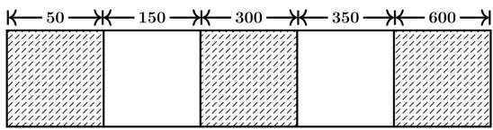

<details>
<summary>text_image</summary>

50 150 300 350 600
</details>

Increasing addresses

The sequence of requests for blocks of sizes 300, 25, 125, 50 can be satisfied if we use

A. either first fit or best fit policy (any one)

B. first fit but not best fit policy

C. best fit but not first fit policy

D. None of the above

gate1994 operating-system page-replacement normal

# Answer key

# 5.20.4 Page Replacement: GATE CSE 1995 | Question: 1.8

Which of the following page replacement algorithms suffers from Belady's anamoly?

A. Optimal replacement

B. LRU

C. FIFO

D. Both (A) and (C)

gate1995 operating-system page-replacement normal

# Answer key

# 5.20.5 Page Replacement: GATE CSE 1995 | Question: 2.7

The address sequence generated by tracing a particular program executing in a pure demand based paging system with 100 records per page with 1 free main memory frame is recorded as follows. What is the number of page faults?

0100, 0200, 0430, 0499, 0510, 0530, 0560, 0120, 0220, 0240, 0260, 0320, 0370

A. 13

B. 8

C. 7

D. 10

gate1995 operating-system page-replacement normal

# Answer key

# 5.20.6 Page Replacement: GATE CSE 1997 | Question: 3.10, ISRO2008-57, ISRO2015-64

Dirty bit for a page in a page table

A. helps avoid unnecessary writes on a paging device

B. helps maintain LRU information

C. allows only read on a page

D. None of the above

gate1997 operating-system page-replacement easy isro2008 isro2015

# Answer key

# 5.20.7 Page Replacement: GATE CSE 1997 | Question: 3.5

Locality of reference implies that the page reference being made by a process

A. will always be to the page used in the previous page reference  
B. is likely to be to one of the pages used in the last few page references  
C. will always be to one of the pages existing in memory  
D. will always lead to a page fault

gate1997 operating-system page-replacement easy

# Answer key

# 5.20.8 Page Replacement: GATE CSE 1997 | Question: 3.9

Thrashing

A. reduces page I/O

B. decreases the degree of


C. implies excessive page I/O

gate1997 operating-system page-replacement easy

# Answer key

multiprogramming

D. improve the system performance

# 5.20.9 Page Replacement: GATE CSE 2001 | Question: 1.21

Consider a virtual memory system with FIFO page replacement policy. For an arbitrary page access pattern, increasing the number of page frames in main memory will


A. always decrease the number of page faults

C. sometimes increase the number of page faults

gatecse-2001 operating-system page-replacement normal

B. always increase the number of page faults

D. never affect the number of page faults

# Answer key

# 5.20.10 Page Replacement: GATE CSE 2002 | Question: 1.23

The optimal page replacement algorithm will select the page that


A. Has not been used for the longest time in the past  
B. Will not be used for the longest time in the future  
C. Has been used least number of times  
D. Has been used most number of times

gatecse-2002 operating-system page-replacement easy

# Answer key

# 5.20.11 Page Replacement: GATE CSE 2004 | Question: 21, ISRO2007-44

The minimum number of page frames that must be allocated to a running process in a virtual memory environment is determined by


A. the instruction set architecture  
C. number of processes in memory

B. page size  
D. physical memory size

gatecse-2004 operating-system virtual-memory page-replacement normal isro2007

# Answer key

# 5.20.12 Page Replacement: GATE CSE 2005 | Question: 22, ISRO2015-36

Increasing the RAM of a computer typically improves performance because:


A. Virtual Memory increases

C. Fewer page faults occur

B. Larger RAMs are faster  
D. Fewer segmentation faults occur

gatecse-2005 operating-system page-replacement easy isro2015

# Answer key

# 5.20.13 Page Replacement: GATE CSE 2007 | Question: 56

A virtual memory system uses First In First Out (FIFO) page replacement policy and allocates a fixed number of frames to a process. Consider the following statements:


P: Increasing the number of page frames allocated to a process sometimes increases the page fault rate.

Q: Some programs do not exhibit locality of reference.

Which one of the following is TRUE?

A. Both P and Q are true, and Q is the reason for P

B. Both P and Q are true, but Q is not the reason for P.

C. P is false but Q is true

D. Both P and Q are false.

gatecse-2007 operating-system page-replacement normal

# Answer key

# 5.20.14 Page Replacement: GATE CSE 2007 | Question: 82


A process has been allocated 3 page frames. Assume that none of the pages of the process are available in the memory initially. The process makes the following sequence of page references (reference string): 1, 2, 1, 3, 7, 4, 5, 6, 3, 1

If optimal page replacement policy is used, how many page faults occur for the above reference string?

A. 7

B. 8

C. 9

D. 10

gatecse-2007 operating-system page-replacement easy

# Answer key

# 5.20.15 Page Replacement: GATE CSE 2007 | Question: 83


A process, has been allocated 3 page frames. Assume that none of the pages of the process are available in the memory initially. The process makes the following sequence of page references (reference string): 1, 2, 1, 3, 7, 4, 5, 6, 3, 1

Least Recently Used (LRU) page replacement policy is a practical approximation to optimal page replacement. For the above reference string, how many more page faults occur with LRU than with the optimal page replacement policy?

A. 0

B. 1

C. 2

D. 3

gatecse-2007 normal operating-system page-replacement

# Answer key

# 5.20.16 Page Replacement: GATE CSE 2009 | Question: 9, ISRO2016-52

In which one of the following page replacement policies, Belady's anomaly may occur?


A. FIFO

B. Optimal

C. LRU

D. MRU

gatecse-2009 operating-system page-replacement easy isro2016

# Answer key

# 5.20.17 Page Replacement: GATE CSE 2010 | Question: 24


A system uses FIFO policy for system replacement. It has 4 page frames with no pages loaded to begin with. The system first accesses 100 distinct pages in some order and then accesses the same 100 pages but now in the reverse order. How many page faults will occur?

A. 196

B. 192

C. 197

D. 195

gatecse-2010 operating-system page-replacement normal

# Answer key

# 5.20.18 Page Replacement: GATE CSE 2012 | Question: 42


Consider the virtual page reference string

$$
1, 2, 3, 2, 4, 1, 3, 2, 4, 1
$$

on a demand paged virtual memory system running on a computer system that has main memory size of 3 page frames which are initially empty. Let LRU, FIFO and OPTIMAL denote the number of page faults under the corresponding page replacement policy. Then

A. OPTIMAL < LRU < FIFO

B. OPTIMAL < FIFO < LRU

c. OPTIMAL = LRU

D. OPTIMAL = FIFO

gatecse-2012 operating-system page-replacement normal

# Answer key

# 5.20.19 Page Replacement: GATE CSE 2014 | Set 1 | Question: 33


Assume that there are 3 page frames which are initially empty. If the page reference string is

1, 2, 3, 4, 2, 1, 5, 3, 2, 4, 6 the number of page faults using the optimal replacement policy is \_\_\_\_.

gatecse-2014-set1 operating-system page-replacement numerical-answers

# Answer key

# 5.20.20 Page Replacement: GATE CSE 2014 | Set 2 | Question: 33


A computer has twenty physical page frames which contain pages numbered 101 through 120. Now a program accesses the pages numbered 1, 2, ..., 100 in that order, and repeats the access sequence THRICE. Which one of the following page replacement policies experiences the same number of faults as the optimal page replacement policy for this program?

A. Least-recently-used  
C. Last-in-first-out

B. First-in-first-out  
D. Most-recently-used

gatecse-2014-set2 operating-system page-replacement ambiguous

# Answer key

# 5.20.21 Page Replacement: GATE CSE 2014 | Set 3 | Question: 20


A system uses 3 page frames for storing process pages in main memory. It uses the Least Recently Used (LRU) page replacement policy. Assume that all the page frames are initially empty. What is the total number of page faults that will occur while processing the page reference string given below?

4, 7, 6, 1, 7, 6, 1, 2, 7, 2

gatecse-2014-set3 operating-system page-replacement numerical-answers normal

# Answer key

# 5.20.22 Page Replacement: GATE CSE 2015 | Set 1 | Question: 47


Consider a main memory with five-page frames and the following sequence of page references: 3, 8, 2, 3, 9, 1, 6, 3, 8, 9, 3, 6, 2, 1, 3. Which one of the following is true with respect to page replacement policies First In First Out (FIFO) and Least Recently Used (LRU)?

A. Both incur the same number of page faults  
B. FIFO incurs 2 more page faults than LRU  
C. LRU incurs 2 more page faults than FIFO  
D. FIFO incurs 1 more page faults than LRU

gatecse-2015-set1 operating-system page-replacement normal

# Answer key

# 5.20.23 Page Replacement: GATE CSE 2016 | Set 1 | Question: 49


Consider a computer system with ten physical page frames. The system is provided with an access sequence $(a_{1}, a_{2}, \ldots, a_{20}, a_{1}, a_{2}, \ldots, a_{20})$ , where each $a_{i}$ is a distinct virtual page number. The difference in the number of page faults between the last-in-first-out page replacement policy and the optimal replacement policy is \_\_\_\_.

gatecse-2016-set1 operating-system page-replacement normal numerical-answers

# Answer key

# 5.20.24 Page Replacement: GATE CSE 2016 | Set 2 | Question: 20


In which one of the following page replacement algorithms it is possible for the page fault rate to increase even when the number of allocated frames increases?

A. LRU (Least Recently Used)

C. MRU (Most Recently Used)

gatecse-2016-set2 operating-system page-replacement easy

# Answer key

B. OPT (Optimal Page Replacement)  
D. FIFO (First In First Out)  
B. OPT (Optimal Page Replacement)  
D. FIFO (First In First Out)

Recall that Belady's anomaly is that the page-fault rate may increase as the number of allocated frames increases. Now, consider the following statements:

- $S_{1}$ : Random page replacement algorithm (where a page chosen at random is replaced) suffers from Belady's anomaly.  
- $S_{2}$ : LRU page replacement algorithm suffers from Belady's anomaly.

Which of the following is CORRECT?

A. $S_{1}$ is true, $S_{2}$ is true  
C. $S_{1}$ is false, $S_{2}$ is true

gatecse-2017-set1 page-replacement operating-system normal

B. $S_{1}$ is true, $S_{2}$ is false  
D. $S_{1}$ is false, $S_{2}$ is false

Answer key

# 5.20.26 Page Replacement: GATE CSE 2021 | Set 1 | Question: 11

In the context of operating systems, which of the following statements is/are correct with respect to paging?


A. Paging helps solve the issue of external fragmentation  
B. Page size has no impact on internal fragmentation  
C. Paging incurs memory overheads  
D. Multi-level paging is necessary to support pages of different sizes

gatecse-2021-set1 multiple-selects operating-system page-replacement one-mark

Answer key

# 5.20.27 Page Replacement: GATE CSE 2021 | Set 2 | Question: 48


Consider a three-level page table to translate a 39—bit virtual address to a physical address as shown below:

←---- 39 - bit virtual address ---->

<table><tr><td>Level 1offset</td><td>Level 2offset</td><td>Level 3offset</td><td>Pageoffset</td></tr><tr><td>9 bits</td><td>9 bits</td><td>9 bits</td><td>12 bits</td></tr></table>

The page size is 4 KB ( $1\text{KB} = 2^{10}$ bytes) and page table entry size at every level is 8 bytes. A process $P$ is currently using 2GB ( $1\text{GB} = 2^{30}$ bytes) virtual memory which is mapped to 2GB of physical memory. The minimum amount of memory required for the page table of $P$ across all levels is \_\_\_\_ KB.

gatecse-2021-set2 numerical-answers operating-system memory-management page-replacement two-marks

Answer key

# 5.20.28 Page Replacement: GATE CSE 2025 | Set 1 | Question: 44


In optimal page replacement algorithm, information about all future page references is available to the operating system (OS). A modification of the optimal page replacement algorithm is as follows:

The OS correctly predicts only up to next 4 page references (including the current page) at the time of allocating a frame to a page.

A process accesses the pages in the following order of page numbers:

$$
1, 3, 2, 4, 2, 3, 1, 2, 4, 3, 1, 4
$$

If the system has three memory frames that are initially empty, the number of page faults that will occur during execution of the process is \_\_\_\_. (Answer in integer)

# 5.20.29 Page Replacement: GATE IT 2007 | Question: 12


The address sequence generated by tracing a particular program executing in a pure demand paging system with 100 bytes per page is

0100, 0200, 0430, 0499, 0510, 0530, 0560, 0120, 0220, 0240, 0260, 0320, 0410.

Suppose that the memory can store only one page and if $x$ is the address which causes a page fault then the bytes from addresses $x$ to $x + 99$ are loaded on to the memory.

How many page faults will occur?

A. 0

B. 4

C. 7

D. 8

gateit-2007 operating-system virtual-memory page-replacement normal

# Answer key

# 5.20.30 Page Replacement: GATE IT 2007 | Question: 58


A demand paging system takes 100 time units to service a page fault and 300 time units to replace a dirty page. Memory access time is 1 time unit. The probability of a page fault is $p$ . In case of a page fault, the probability of page being dirty is also $p$ . It is observed that the average access time is 3 time units. Then the value of $p$ is

A. 0.194

B. 0.233

C. 0.514

D. 0.981

gateit-2007 operating-system page-replacement probability normal

# Answer key

# 5.20.31 Page Replacement: GATE IT 2008 | Question: 41


Assume that a main memory with only 4 pages, each of 16 bytes, is initially empty. The CPU generates the following sequence of virtual addresses and uses the Least Recently Used (LRU) page replacement policy.

0, 4, 8, 20, 24, 36, 44, 12, 68, 72, 80, 84, 28, 32, 88, 92

How many page faults does this sequence cause? What are the page numbers of the pages present in the main memory at the end of the sequence?

A. 6 and 1,2,3,4

B. 7 and 1,2,4,5

C. 8 and 1,2,4,5

D. 9 and 1,2,3,5

gateit-2008 operating-system page-replacement normal

# Answer key

# 5.21

# Precedence Graph (3)

# 5.21.1 Precedence Graph: GATE CSE 1989 | Question: 11b


Consider the following precedence graph (Fig.6) of processes where a node denotes a process and a directed edge from node $P_{i}$ to node $P_{j}$ implies; that $P_{i}$ must complete before $P_{j}$ commences. Implement the graph using FORK and JOIN constructs. The actual computation done by a process may be indicated by a comment line.

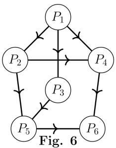

<details>
<summary>flowchart</summary>

```mermaid
graph TD
  P1["P1"] --> P2["P2"]
  P1 --> P4["P4"]
  P2 --> P3["P3"]
  P2 --> P5["P5"]
  P3 --> P5
  P4 --> P6["P6"]
  P5 --> P6
  P6 --> P5
```
</details>

# 5.21.2 Precedence Graph: GATE CSE 1991 | Question: 01-xii


A given set of processes can be implemented by using only parbegin/parend statement, if the precedence graph of these processes is \_\_\_\_

gate1991 operating-system normal precedence-graph fill-in-the-blanks

# Answer key

# 5.21.3 Precedence Graph: GATE CSE 1992 | Question: 12-a

Draw the precedence graph for the concurrent program given below


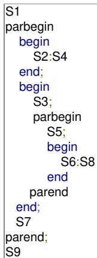

<details>
<summary>text_image</summary>

S1
parbegin
  begin
    S2:S4
  end;
  begin
    S3;
  parbegin
    S5;
    begin
      S6:S8
    end
  parend
  end;
S7
parend;
S9
</details>

gate1992 operating-system normal concurrency precedence-graph descriptive

# Answer key

# 5.22

# Process (5)

Practice Test: Test 1 (7Q)

# 5.22.1 Process: GATE CSE 1996 | Question: 1.18

The process state transition diagram in the below figure is representative of


<details>
<summary>flowchart</summary>

```mermaid
graph TD
  A["RUNNING"] --> B["TERMINATED"]
  C["READY"] --> D["BLOCKED"]
  E["NEW"] --> C
  D --> A
  D --> C
  A --> D
  C --> D
```
</details>

A. a batch operating system  
B. an operating system with a preemptive scheduler  
C. an operating system with a non-preemptive scheduler  
D. a uni-programmed operating system

gate1996 operating-system normal process

# Answer key

# 5.22.2 Process: GATE CSE 2001 | Question: 2.20

Which of the following does not interrupt a running process?

A. A device

B. Timer

C. Scheduler process

D. Power failure

gatecse-2001 operating-system easy process

# 5.22.3 Process: GATE CSE 2002 | Question: 2.21

Which combination of the following features will suffice to characterize an OS as a multi-programmed OS?


a. More than one program may be loaded into main memory at the same time for execution  
b. If a program waits for certain events such as I/O, another program is immediately scheduled for execution  
c. If the execution of a program terminates, another program is immediately scheduled for execution.

A. (a)  
B. (a) and (b)  
C. (a) and (c)  
D. (a), (b) and (c)

gatecse-2002 operating-system normal process

Answer key

# 5.22.4 Process: GATE CSE 2023 | Question: 12

Which one or more of the following need to be saved on a context switch from one thread (T1) of a process to another thread (T2) of the same process?


A. Page table base register  
C. Program counter

gatecse-2023 operating-system process multiple-selects one-mark

B. Stack pointer  
D. General purpose registers

Answer key

# 5.22.5 Process: GATE IT 2006 | Question: 13

The process state transition diagram of an operating system is as given below. Which of the following must be FALSE about the above operating system?


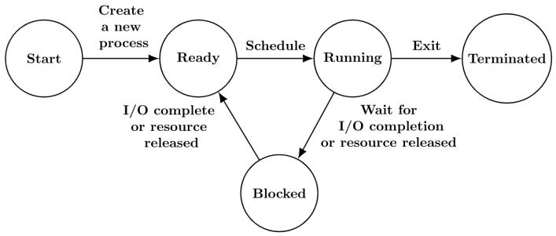

<details>
<summary>flowchart</summary>

```mermaid
graph LR
  Start(("Start")) -->|Create a new process| Ready(("Ready"))
  Ready -->|Schedule| Running(("Running"))
  Running -->|Exit| Terminated(("Terminated"))
  Running -->|Wait for I/O completion or resource released| Blocked(("Blocked"))
  Blocked -->|I/O complete or resource released| Ready
```
</details>

A. It is a multiprogrammed operating system  
C. It uses non-preemptive scheduling

gateit-2006 operating-system normal process

B. It uses preemptive scheduling  
D. It is a multi-user operating system

Answer key

# 5.23

# Process Scheduling (49)

Practice Tests: Test 1 (15Q) Test 2 (15Q) Test 3 (15Q) Test 4 (15Q) Test 5 (2Q)

# 5.23.1 Process Scheduling: GATE CSE 1988 | Question: 2xa

State any undesirable characteristic of the following criteria for measuring performance of an operating system:


# Turn around time

gate1988 normal descriptive operating-system process-scheduling

Answer key

# 5.23.2 Process Scheduling: GATE CSE 1988 | Question: 2xb


State any undesirable characteristic of the following criteria for measuring performance of an operating system:

# Waiting time

gate1988 normal descriptive operating-system process-scheduling

Answer key

# 5.23.3 Process Scheduling: GATE CSE 1990 | Question: 1-vi


The highest-response ratio next scheduling policy favours \_\_\_\_ jobs, but it also limits the waiting time of \_\_\_\_ jobs.

gate1990 operating-system process-scheduling fill-in-the-blanks

Answer key

# 5.23.4 Process Scheduling: GATE CSE 1993 | Question: 7.10


Assume that the following jobs are to be executed on a single processor system

<table><tr><td>Job Id</td><td>CPU Burst Time</td></tr><tr><td>p</td><td>4</td></tr><tr><td>q</td><td>1</td></tr><tr><td>r</td><td>8</td></tr><tr><td>s</td><td>1</td></tr><tr><td>t</td><td>2</td></tr></table>

The jobs are assumed to have arrived at time $0^{+}$ and in the order $p, q, r, s, t$ . Calculate the departure time (completion time) for job $p$ if scheduling is round robin with time slice 1

A. 4

B. 10

C. 11

D. 12

E. None of the above

gate1993 operating-system process-scheduling normal

Answer key

# 5.23.5 Process Scheduling: GATE CSE 1995 | Question: 1.15


Which scheduling policy is most suitable for a time shared operating system?

A. Shortest Job First

B. Round Robin

C. First Come First Serve

D. Elevator

gate1995 operating-system process-scheduling easy

Answer key

# 5.23.6 Process Scheduling: GATE CSE 1995 | Question: 2.6


The sequence \_\_\_\_ is an optimal non-preemptive scheduling sequence for the following jobs which leaves the CPU idle for \_\_\_\_ unit(s) of time.

<table><tr><td>Job</td><td>Arrival Time</td><td>Burst Time</td></tr><tr><td>1</td><td>0.0</td><td>9</td></tr><tr><td>2</td><td>0.6</td><td>5</td></tr><tr><td>3</td><td>1.0</td><td>1</td></tr></table>

A. $\{3,2,1\},1$

B. $\{2,1,3\},0$

C. $\{3,2,1\},0$

D. $\{1,2,3\},5$

gate1995 operating-system process-scheduling normal

# 5.23.7 Process Scheduling: GATE CSE 1996 | Question: 2.20, ISRO2008-15


Four jobs to be executed on a single processor system arrive at time 0 in the order A, B, C, D. Their burst CPU time requirements are 4, 1, 8, 1 time units respectively. The completion time of A under round robin scheduling with time slice of one time unit is

A. 10

B. 4

C. 8

D. 9

gate1996 operating-system process-scheduling normal isro2008

# Answer key

# 5.23.8 Process Scheduling: GATE CSE 1998 | Question: 2.17, UGCNET-Dec2012-III: 43


Consider $n$ processes sharing the CPU in a round-robin fashion. Assuming that each process switch takes $s$ seconds, what must be the quantum size $q$ such that the overhead resulting from process switching is minimized but at the same time each process is guaranteed to get its turn at the CPU at least every $t$ seconds?

A. $q \leq \frac{t - ns}{n - 1}$  
C. $q\leq \frac{t - ns}{n + 1}$

B. $q \geq \frac{t - ns}{n - 1}$  
D. $q \geq \frac{t - ns}{n + 1}$

gate1998 operating-system process-scheduling normal ugcnetcse-dec2012-paper3

# Answer key

# 5.23.9 Process Scheduling: GATE CSE 1998 | Question: 24


a. Four jobs are waiting to be run. Their expected run times are 6, 3, 5 and $x$ . In what order should they be run to minimize the average response time?  
b. Write a concurrent program using par begin-par end to represent the precedence graph shown below.

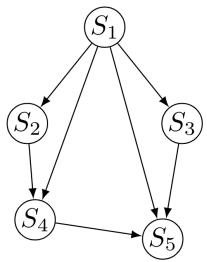

<details>
<summary>flowchart</summary>

```mermaid
graph TD
  S1["S1"] --> S2["S2"]
  S1 --> S3["S3"]
  S1 --> S4["S4"]
  S1 --> S5["S5"]
  S2 --> S4
  S3 --> S5
  S4 --> S5
```
</details>

gate1998 operating-system process-scheduling descriptive

# Answer key

# 5.23.10 Process Scheduling: GATE CSE 1998 | Question: 7-b


In a computer system where the ‘best-fit’ algorithm is used for allocating ‘jobs’ to ‘memory partitions’, the following situation was encountered:

<table><tr><td>Partitions size in KB</td><td>4K 8K 20K 2K</td></tr><tr><td>Job sizes in KB</td><td>2K 14K 3K 6K 6K 10K 20K 2K</td></tr><tr><td>Time for execution</td><td>4 10 2 1 4 1 8 6</td></tr></table>

When will the 20K job complete?

gate1998 operating-system process-scheduling normal

# Answer key

# 5.23.11 Process Scheduling: GATE CSE 2002 | Question: 1.22

Which of the following scheduling algorithms is non-preemptive?


A. Round Robin  
C. Multilevel Queue Scheduling

B. First-In First-Out  
D. Multilevel Queue Scheduling with Feedback

gatecse-2002 operating-system process-scheduling easy

# Answer key

# 5.23.12 Process Scheduling: GATE CSE 2003 | Question: 77

A uni-processor computer system only has two processes, both of which alternate 10 ms CPU bursts with 90 ms I/O bursts. Both the processes were created at nearly the same time. The I/O of both processes can proceed in parallel. Which of the following scheduling strategies will result in the least CPU utilization (over period of time) for this system?


A. First come first served scheduling  
B. Shortest remaining time first scheduling  
C. Static priority scheduling with different priorities for the two processes  
D. Round robin scheduling with a time quantum of 5 ms

gatecse-2003 operating-system process-scheduling normal

# Answer key

# 5.23.13 Process Scheduling: GATE CSE 2004 | Question: 46

Consider the following set of processes, with the arrival times and the CPU-burst times gives in milliseconds.


<table><tr><td>Process</td><td>Arrival Time</td><td>Burst Time</td></tr><tr><td>P1</td><td>0</td><td>5</td></tr><tr><td>P2</td><td>1</td><td>3</td></tr><tr><td>P3</td><td>2</td><td>3</td></tr><tr><td>P4</td><td>4</td><td>1</td></tr></table>

What is the average turnaround time for these processes with the preemptive shortest remaining processing time first (SRPT) algorithm?

A. 5.50

B. 5.75

C. 6.00

D. 6.25

gatecse-2004 operating-system process-scheduling normal

# Answer key

# 5.23.14 Process Scheduling: GATE CSE 2006 | Question: 06, ISRO2009-14

Consider three CPU-intensive processes, which require 10, 20 and 30 time units and arrive at times 0, 2 and 6, respectively. How many context switches are needed if the operating system implements a shortest remaining time first scheduling algorithm? Do not count the context switches at time zero and at the end.


A. 1

B. 2

C. 3

D. 4

gatecse-2006 operating-system process-scheduling normal isro2009

# Answer key

# 5.23.15 Process Scheduling: GATE CSE 2006 | Question: 64

Consider three processes (process id 0, 1, 2 respectively) with compute time bursts 2, 4 and 8 time units. All processes arrive at time zero. Consider the longest remaining time first (LRTF) scheduling algorithm. In LRTF ties are broken by giving priority to the process with the lowest process id. The average turn around tim


A. 13 units

B. 14 units

C. 15 units

D. 16 units

gatecse-2006 operating-system process-scheduling normal

# Answer key

# 5.23.16 Process Scheduling: GATE CSE 2006 | Question: 65


Consider three processes, all arriving at time zero, with total execution time of 10, 20 and 30 units, respectively. Each process spends the first 20% of execution time doing I/O, the next 70% of time doing

computation, and the last 10% of time doing I/O again. The operating system uses a shortest remaining compute time first scheduling algorithm and schedules a new process either when the running process gets blocked on I/O or when the running process finishes its compute burst. Assume that all I/O operations can be overlapped as much as possible. For what percentage of time does the CPU remain idle?

A. 0%

B. 10.6%

C. 30.0%

D. 89.4%

gatecse-2006 operating-system process-scheduling normal

# Answer key

# 5.23.17 Process Scheduling: GATE CSE 2007 | Question: 16

Group 1 contains some CPU scheduling algorithms and Group 2 contains some applications. Match entries in Group 1 to entries in Group 2.

<table><tr><td colspan="2">Group I</td><td colspan="2">Group II</td></tr><tr><td>(P)</td><td>Gang Scheduling</td><td>(1)</td><td>Guaranteed Scheduling</td></tr><tr><td>(Q)</td><td>Rate Monotonic Scheduling</td><td>(2)</td><td>Real-time Scheduling</td></tr><tr><td>(R)</td><td>Fair Share Scheduling</td><td>(3)</td><td>Thread Scheduling</td></tr></table>

A. $P - 3; Q - 2; R - 1$

B. $P - 1; Q - 2; R - 3$

C. $P - 2;Q - 3;R - 1$

D. $P - 1; Q - 3; R - 2$

gatecse-2007 operating-system process-scheduling normal

# Answer key

# 5.23.18 Process Scheduling: GATE CSE 2007 | Question: 55

An operating system used Shortest Remaining System Time first (SRT) process scheduling algorithm. Consider the arrival times and execution times for the following processes:

<table><tr><td>Process</td><td>Execution Time</td><td>Arrival Time</td></tr><tr><td>P1</td><td>20</td><td>0</td></tr><tr><td>P2</td><td>25</td><td>15</td></tr><tr><td>P3</td><td>10</td><td>30</td></tr><tr><td>P4</td><td>15</td><td>45</td></tr></table>

What is the total waiting time for process P2 ?

A. 5

B. 15

C. 40

D. 55

gatecse-2007 operating-system process-scheduling normal

# Answer key

# 5.23.19 Process Scheduling: GATE CSE 2009 | Question: 32

In the following process state transition diagram for a uniprocessor system, assume that there are always some processes in the ready state:


<details>
<summary>flowchart</summary>

```mermaid
graph LR
  Start["Start"] -->|A| Ready["Ready"]
  Ready -->|B| Running["Running"]
  Ready -->|C| Running
  Running -->|D| Terminated["Terminated"]
  Running -->|F| Blocked["Blocked"]
  Blocked -->|E| Ready
```
</details>


Now consider the following statements:

I. If a process makes a transition $D$ , it would result in another process making transition $A$ immediately.  
II. A process $P_{2}$ in blocked state can make transition E while another process $P_{1}$ is in running state.  
III. The OS uses preemptive scheduling.  
IV. The OS uses non-preemptive scheduling.

Which of the above statements are TRUE?

A. I and II

B. I and III

C. II and III

D. II and IV

gatecse-2009 operating-system process-scheduling normal

Answer key

# 5.23.20 Process Scheduling: GATE CSE 2010 | Question: 25

Which of the following statements are true?

I. Shortest remaining time first scheduling may cause starvation  
II. Preemptive scheduling may cause starvation  
III. Round robin is better than FCFS in terms of response time

A. I only

B. I and III only

C. II and III only

D. I, II and III

gatecse-2010 operating-system process-scheduling easy

Answer key

# 5.23.21 Process Scheduling: GATE CSE 2011 | Question: 35

Consider the following table of arrival time and burst time for three processes P0, P1 and P2.

<table><tr><td>Process</td><td>Arrival Time</td><td>Burst Time</td></tr><tr><td>P0</td><td>0 ms</td><td>9</td></tr><tr><td>P1</td><td>1 ms</td><td>4</td></tr><tr><td>P2</td><td>2 ms</td><td>9</td></tr></table>


The pre-emptive shortest job first scheduling algorithm is used. Scheduling is carried out only at arrival or completion of processes. What is the average waiting time for the three processes?

A. 5.0 ms

B. 4.33 ms

C. 6.33 ms

D. 7.33 ms

gatecse-2011 operating-system process-scheduling normal

Answer key

# 5.23.22 Process Scheduling: GATE CSE 2012 | Question: 31

Consider the 3 processes, P1, P2 and P3 shown in the table.

<table><tr><td>Process</td><td>Arrival Time</td><td>Time Units Required</td></tr><tr><td>P1</td><td>0</td><td>5</td></tr><tr><td>P2</td><td>1</td><td>7</td></tr><tr><td>P3</td><td>3</td><td>4</td></tr></table>


The completion order of the 3 processes under the policies FCFS and RR2 (round robin scheduling with CPU quantum of 2 time units) are

A. FCFS: P1, P2, P3 RR2: P1, P2, P3  
B. FCFS: P1, P3, P2 RR2: P1, P3, P2  
C. FCFS: P1, P2, P3 RR2: P1, P3, P2  
D. FCFS: P1, P3, P2 RR2: P1, P2, P3

# 5.23.23 Process Scheduling: GATE CSE 2013 | Question: 10


A scheduling algorithm assigns priority proportional to the waiting time of a process. Every process starts with zero (the lowest priority). The scheduler re-evaluates the process priorities every T time units and decides the next process to schedule. Which one of the following is TRUE if the processes have no I/O operations and all arrive at time zero?

A. This algorithm is equivalent to the first-come-first-serve algorithm.  
B. This algorithm is equivalent to the round-robin algorithm.  
C. This algorithm is equivalent to the shortest-job-first algorithm.  
D. This algorithm is equivalent to the shortest-remaining-time-first algorithm.

gatecse-2013 operating-system process-scheduling normal

# Answer key

# 5.23.24 Process Scheduling: GATE CSE 2014 | Set 1 | Question: 32


Consider the following set of processes that need to be scheduled on a single CPU. All the times are given in milliseconds.

<table><tr><td>Process Name</td><td>Arrival Time</td><td>Execution Time</td></tr><tr><td>A</td><td>0</td><td>6</td></tr><tr><td>B</td><td>3</td><td>2</td></tr><tr><td>C</td><td>5</td><td>4</td></tr><tr><td>D</td><td>7</td><td>6</td></tr><tr><td>E</td><td>10</td><td>3</td></tr></table>

Using the shortest remaining time first scheduling algorithm, the average process turnaround time (in msec) is \_\_\_\_.

gatecse-2014-set1 operating-system process-scheduling numerical-answers normal

# Answer key

# 5.23.25 Process Scheduling: GATE CSE 2014 | Set 2 | Question: 32


Three processes $A$ , $B$ and $C$ each execute a loop of 100 iterations. In each iteration of the loop, a process performs a single computation that requires $t_c$ CPU milliseconds and then initiates a single I/O operation that lasts for $t_{io}$ milliseconds. It is assumed that the computer where the processes execute has sufficient number of I/O devices and the OS of the computer assigns different I/O devices to each process. Also, the scheme overhead of the OS is negligible. The processes have the following characteristics:

<table><tr><td>Process id</td><td> $t_c$ </td><td> $t_{io}$ </td></tr><tr><td>A</td><td>100 ms</td><td>500 ms</td></tr><tr><td>B</td><td>350 ms</td><td>500 ms</td></tr><tr><td>C</td><td>200 ms</td><td>500 ms</td></tr></table>

The processes A, B, and C are started at times 0, 5 and 10 milliseconds respectively, in a pure time sharing system (round robin scheduling) that uses a time slice of 50 milliseconds. The time in milliseconds at which process C would complete its first I/O operation is \_\_\_\_.

gatecse-2014-set2 operating-system process-scheduling numerical-answers normal

# Answer key

# 5.23.26 Process Scheduling: GATE CSE 2014 | Set 3 | Question: 32


An operating system uses shortest remaining time first scheduling algorithm for pre-emptive scheduling of processes. Consider the following set of processes with their arrival times and CPU burst times (in

milliseconds):

<table><tr><td>Process</td><td>Arrival Time</td><td>Burst Time</td></tr><tr><td>P1</td><td>0</td><td>12</td></tr><tr><td>P2</td><td>2</td><td>4</td></tr><tr><td>P3</td><td>3</td><td>6</td></tr><tr><td>P4</td><td>8</td><td>5</td></tr></table>

The average waiting time (in milliseconds) of the processes is \_\_\_\_.

gatecse-2014-set3 operating-system process-scheduling numerical-answers normal

# Answer key

# 5.23.27 Process Scheduling: GATE CSE 2015 | Set 1 | Question: 46

Consider a uniprocessor system executing three tasks $T_1, T_2$ and $T_3$ each of which is composed of an infinite sequence of jobs (or instances) which arrive periodically at intervals of 3, 7 and 20 milliseconds, respectively. The priority of each task is the inverse of its period, and the available tasks are scheduled in order of priority, which is the highest priority task scheduled first. Each instance of $T_1, T_2$ and $T_3$ requires an execution time of 1, 2 and 4 milliseconds, respectively. Given that all tasks initially arrive at the beginning of the $1^{\text{st}}$ millisecond and task preemptions are allowed, the first instance of $T_3$ completes its execution at the end of \_\_\_\_ milliseconds.

gatecse-2015-set1 operating-system process-scheduling normal numerical-answers

# Answer key

# 5.23.28 Process Scheduling: GATE CSE 2015 | Set 3 | Question: 1

The maximum number of processes that can be in Ready state for a computer system with n CPUs is :

A. n

B. $n^2$

C. $2^{n}$

D. Independent of $n$

gatecse-2015-set3 operating-system process-scheduling easy

# Answer key

# 5.23.29 Process Scheduling: GATE CSE 2015 | Set 3 | Question: 34

For the processes listed in the following table, which of the following scheduling schemes will give the lowest average turnaround time?


<table><tr><td>Process</td><td>Arrival Time</td><td>Process Time</td></tr><tr><td>A</td><td>0</td><td>3</td></tr><tr><td>B</td><td>1</td><td>6</td></tr><tr><td>C</td><td>4</td><td>4</td></tr><tr><td>D</td><td>6</td><td>2</td></tr></table>

A. First Come First Serve  
C. Shortest Remaining Time

B. Non-preemptive Shortest job first  
D. Round Robin with Quantum value two

gatecse-2015-set3 operating-system process-scheduling normal

# Answer key

# 5.23.30 Process Scheduling: GATE CSE 2016 | Set 1 | Question: 20

Consider an arbitrary set of CPU-bound processes with unequal CPU burst lengths submitted at the same time to a computer system. Which one of the following process scheduling algorithms would minimize the average waiting time in the ready queue?

A. Shortest remaining time first  
B. Round-robin with the time quantum less than the shortest CPU burst  
C. Uniform random


D. Highest priority first with priority proportional to CPU burst length

gatecse-2016-set1 operating-system process-scheduling normal

Answer key

# 5.23.31 Process Scheduling: GATE CSE 2016 | Set 2 | Question: 47

Consider the following processes, with the arrival time and the length of the CPU burst given in milliseconds. The scheduling algorithm used is preemptive shortest remaining-time first.


<table><tr><td>Process</td><td>Arrival Time</td><td>Burst Time</td></tr><tr><td> $P_1$ </td><td>0</td><td>10</td></tr><tr><td> $P_2$ </td><td>3</td><td>6</td></tr><tr><td> $P_3$ </td><td>7</td><td>1</td></tr><tr><td> $P_4$ </td><td>8</td><td>3</td></tr></table>

The average turn around time of these processes is \_\_\_\_ milliseconds.

gatecse-2016-set2 operating-system process-scheduling normal numerical-answers

Answer key

# 5.23.32 Process Scheduling: GATE CSE 2017 | Set 1 | Question: 24

Consider the following CPU processes with arrival times (in milliseconds) and length of CPU bursts (in milliseconds) as given below:


<table><tr><td>Process</td><td>Arrival Time</td><td>Burst Time</td></tr><tr><td> $P_1$ </td><td>0</td><td>7</td></tr><tr><td> $P_2$ </td><td>3</td><td>3</td></tr><tr><td> $P_3$ </td><td>5</td><td>5</td></tr><tr><td> $P_4$ </td><td>6</td><td>2</td></tr></table>

If the pre-emptive shortest remaining time first scheduling algorithm is used to schedule the processes, then the average waiting time across all processes is \_\_\_\_ milliseconds.

gatecse-2017-set1 operating-system process-scheduling numerical-answers

Answer key

# 5.23.33 Process Scheduling: GATE CSE 2017 | Set 2 | Question: 51

Consider the set of process with arrival time (in milliseconds), CPU burst time (in milliseconds) and priority (0 is the highest priority) shown below. None of the process have I/O burst time


<table><tr><td>Process</td><td>Arrival Time</td><td>Burst Time</td><td>Priority</td></tr><tr><td> $P_1$ </td><td>0</td><td>11</td><td>2</td></tr><tr><td> $P_2$ </td><td>5</td><td>28</td><td>0</td></tr><tr><td> $P_3$ </td><td>12</td><td>2</td><td>3</td></tr><tr><td> $P_4$ </td><td>2</td><td>10</td><td>1</td></tr><tr><td> $P_5$ </td><td>9</td><td>16</td><td>4</td></tr></table>

The average waiting time (in milli seconds) of all the process using premtive priority scheduling algorithm is \_\_\_\_

gatecse-2017-set2 operating-system process-scheduling numerical-answers

Answer key

# 5.23.34 Process Scheduling: GATE CSE 2019 | Question: 41

Consider the following four processes with arrival times (in milliseconds) and their length of CPU bursts (in milliseconds) as shown below:


<table><tr><td>Process</td><td>P1</td><td>P2</td><td>P3</td><td>P4</td></tr><tr><td>Arrival Time</td><td>0</td><td>1</td><td>3</td><td>4</td></tr><tr><td>CPU burst time</td><td>3</td><td>1</td><td>3</td><td>Z</td></tr></table>

These processes are run on a single processor using preemptive Shortest Remaining Time First scheduling algorithm. If the average waiting time of the processes is 1 millisecond, then the value of Z is \_\_\_\_

gatecse-2019 numerical-answers operating-system process-scheduling two-marks

Answer key

# 5.23.35 Process Scheduling: GATE CSE 2020 | Question: 12

Consider the following statements about process state transitions for a system using preemptive scheduling.


I. A running process can move to ready state.  
II. A ready process can move to running state.  
III. A blocked process can move to running state.  
IV. A blocked process can move to ready state.

Which of the above statements are TRUE?

A. I, II, and III only  
C. I, II, and IV only

gatecse-2020 operating-system process-scheduling one-mark easy

B. II and III only  
D. I, II, III and IV only

Answer key

# 5.23.36 Process Scheduling: GATE CSE 2020 | Question: 50


Consider the following set of processes, assumed to have arrived at time 0. Consider the CPU scheduling algorithms Shortest Job First (SJF) and Round Robin (RR). For RR, assume that the processes are scheduled in the order $P_{1}, P_{2}, P_{3}, P_{4}$ .

<table><tr><td>Processes</td><td> $P_{1}$ </td><td> $P_{2}$ </td><td> $P_{3}$ </td><td> $P_{4}$ </td></tr><tr><td>Burst time (in ms)</td><td>8</td><td>7</td><td>2</td><td>4</td></tr></table>

If the time quantum for RR is 4 ms, then the absolute value of the difference between the average turnaround times (in ms) of SJF and RR (round off to 2 decimal places is \_\_\_\_

gatecse-2020 numerical-answers operating-system process-scheduling two-marks

Answer key

# 5.23.37 Process Scheduling: GATE CSE 2021 | Set 1 | Question: 25


Three processes arrive at time zero with CPU bursts of 16, 20 and 10 milliseconds. If the scheduler has prior knowledge about the length of the CPU bursts, the minimum achievable average waiting time for these three processes in a non-preemptive scheduler (rounded to nearest integer) is \_\_\_\_ milliseconds.

gatecse-2021-set1 operating-system process-scheduling numerical-answers one-mark

Answer key

# 5.23.38 Process Scheduling: GATE CSE 2021 | Set 2 | Question: 14


Which of the following statement(s) is/are correct in the context of CPU scheduling?

A. Turnaround time includes waiting time  
B. The goal is to only maximize CPU utilization and minimize throughput  
C. Round-robin policy can be used even when the CPU time required by each of the processes is not known apriori  
D. Implementing preemptive scheduling needs hardware support

# 5.23.39 Process Scheduling: GATE CSE 2023 | Question: 17

Which one or more of the following CPU scheduling algorithms can potentially cause starvation?


A. First-in First-Out  
C. Priority Scheduling

B. Round Robin

D. Shortest Job First

gatecse-2023 operating-system process-scheduling multiple-selects one-mark

# Answer key

# 5.23.40 Process Scheduling: GATE CSE 2024 | Set 1 | Question: 15

Which of the following process state transitions is/are NOT possible?


A. Running to Ready  
C. Ready to Waiting

B. Waiting to Running  
D. Running to Terminated

gatecse-2024-set1 operating-system process-scheduling multiple-selects one-mark

# Answer key

# 5.23.41 Process Scheduling: GATE CSE 2024 | Set 2 | Question: 27

Consider a single processor system with four processes A, B, C, and D, represented as given below, where for each process the first value is its arrival time, and the second value is its CPU burst time.


$$
\mathrm{A} (0, 1 0), \mathrm{B} (2, 6), \mathrm{C} (4, 3), \text {and} \mathrm{D} (6, 7).
$$

Which one of the following options gives the average waiting times when preemptive Shortest Remaining Time First (SRTF) and Non-Preemptive Shortest Job First (NP-SJF) CPU scheduling algorithms are applied to the processes?

A. SRTF = 6, NP - SJF = 7  
B. SRTF = 6, NP - SJF = 7.5  
C. SRTF = 7, NP - SJF = 7.5  
D. SRTF = 7, NP - SJF = 8.5

gatecse-2024-set2 operating-system process-scheduling two-marks

# Answer key

# 5.23.42 Process Scheduling: GATE CSE 2025 | Set 1 | Question: 28

A computer has two processors, $M_{1}$ and $M_{2}$ . Four processes $P_{1}, P_{2}, P_{3}, P_{4}$ with CPU bursts of 20, 16, 25, and 10 milliseconds, respectively, arrive at the same time and these are the only processes in the system. The scheduler uses non-preemptive priority scheduling, with priorities decided as follows:


- $M_1$ uses priority of execution for the processes as, $P_1 > P_3 > P_2 > P_4$ , i.e., $P_1$ and $P_4$ have highest and lowest priorities, respectively.  
- $M_2$ uses priority of execution for the processes as, $P_2 > P_3 > P_4 > P_1$ , i.e., $P_2$ and $P_1$ have highest and lowest priorities, respectively.

A process $P_{i}$ is scheduled to a processor $M_{k}$ , if the processor is free and no other process $P_{j}$ is waiting with higher priority. At any given point of time, a process can be allocated to any one of the free processors without violating the execution priority rules. Ignore the context switch time. What will be the average waiting time of the processes in milliseconds?

A. 9.00

B. 8.75

C. 6.50

D. 7.50

gatecse2025-set1 operating-system process-scheduling two-marks

# Answer key

# 5.23.43 Process Scheduling: GATE CSE 2026 | Set 1 | Question: 54


Consider a CPU that has to execute two types of processes. The first type, Actuators (A), requires a CPU burst of 6 seconds. The second type, Controllers (C), requires a CPU burst of 8 seconds. A new process of type A arrives at time $t = 10, 20, 30, 40$ , and 50 (in seconds). Similarly, a new process of type C arrives at time $t = 11, 22, 33, 44$ , and 55 (in seconds). The CPU scheduling policy is First Come First Serve (FCFS). The first process of type A starts running at $t = 10$ seconds. The average waiting time (in seconds) for the 10 processes is \_\_\_\_. (rounded off to one decimal place)

gatecse-2026-set1 numerical-answers operating-system process-scheduling two-marks

# Answer key

# 5.23.44 Process Scheduling: GATE CSE 2026 | Set 2 | Question: 13

Which one of the following CPU scheduling algorithms cannot be preemptive?

A. Shortest Remaining Time First (SRTF) Scheduling

C. Round Robin Scheduling

gatecse-2026-set2 operating-system process-scheduling one-mark

B. First Come First Serve (FCFS)
Scheduling

D. Priority Scheduling

# Answer key


# 5.23.45 Process Scheduling: GATE IT 2005 | Question: 60

We wish to schedule three processes P1, P2 and P3 on a uniprocessor system. The priorities, CPU time requirements and arrival times of the processes are as shown below.


<table><tr><td>Process</td><td>Priority</td><td>CPU time required</td><td>Arrival time (hh:mm:ss)</td></tr><tr><td>P1</td><td>10 (highest)</td><td>20 sec</td><td>00 : 00 : 05</td></tr><tr><td>P2</td><td>9</td><td>10 sec</td><td>00 : 00 : 03</td></tr><tr><td>P3</td><td>8 (lowest)</td><td>15 sec</td><td>00 : 00 : 00</td></tr></table>

We have a choice of preemptive or non-preemptive scheduling. In preemptive scheduling, a late-arriving higher priority process can preempt a currently running process with lower priority. In non-preemptive scheduling, a late-arriving higher priority process must wait for the currently executing process to complete before it can be scheduled on the processor.

What are the turnaround times (time from arrival till completion) of P2 using preemptive and non-preemptive scheduling respectively?

A. 30 sec, 30 sec

C. 42 sec, 42 sec

B. 30 sec, 10 sec

D. 30 sec, 42 sec

gateit-2005 operating-system process-scheduling normal

# Answer key

# 5.23.46 Process Scheduling: GATE IT 2006 | Question: 12

In the working-set strategy, which of the following is done by the operating system to prevent thrashing?


I. It initiates another process if there are enough extra frames.

II. It selects a process to suspend if the sum of the sizes of the working-sets exceeds the total number of available frames.

A. I only

B. II only

C. Neither I nor II

D. Both I and II

gateit-2006 operating-system process-scheduling normal

# Answer key

# 5.23.47 Process Scheduling: GATE IT 2006 | Question: 54

The arrival time, priority, and duration of the CPU and I/O bursts for each of three processes $P_{1}$ , $P_{2}$ and $P_{3}$ are given in the table below. Each process has a CPU burst followed by an I/O burst followed by another

CPU burst. Assume that each process has its own I/O resource.

<table><tr><td>Process</td><td>Arrival Time</td><td>Priority</td><td>Burst duration (CPU)</td><td>Burst duration (I/O)</td><td>Burst duration) (CPU)</td></tr><tr><td> $P_1$ </td><td>0</td><td>2</td><td>1</td><td>5</td><td>3</td></tr><tr><td> $P_2$ </td><td>2</td><td>3 (lowest)</td><td>3</td><td>3</td><td>1</td></tr><tr><td> $P_3$ </td><td>3</td><td>1 (highest)</td><td>2</td><td>3</td><td>1</td></tr></table>

The multi-programmed operating system uses preemptive priority scheduling. What are the finish times of the processes $P_{1}$ , $P_{2}$ and $P_{3}$ ?

A. 11, 15, 9

B. 10, 15, 9

C. 11, 16, 10

D. 12, 17, 11

gateit-2006 operating-system process-scheduling normal

# Answer key

# 5.23.48 Process Scheduling: GATE IT 2007 | Question: 26

Consider $n$ jobs $J_1, J_2 \ldots J_n$ such that job $J_i$ has execution time $t_i$ and a non-negative integer weight $w_i$ . The weighted mean completion time of the jobs is defined to be $\frac{\sum_{i=1}^{n} w_i T_i}{\sum_{i=1}^{n} w_i}$ , where $T_i$ is the completion time of job $J_i$ . Assuming that there is only one processor available, in what order must the jobs be executed in order to minimize the weighted mean completion time of the jobs?

A. Non-decreasing order of $t_{i}$  
C. Non-increasing order of $w_{i}t_{i}$  
gateit-2007 operating-system process-scheduling normal

# Answer key

# 5.23.49 Process Scheduling: GATE IT 2008 | Question: 55

If the time-slice used in the round-robin scheduling policy is more than the maximum time required to execute any process, then the policy will

A. degenerate to shortest job first  
C. degenerate to first come first serve

gateit-2008 operating-system process-scheduling easy

# Answer key

# 5.24

# Process Synchronization (52)

Practice Tests:

Test 1 (15Q)

Test 2 (15Q)

Test 3 (11Q)

Weekly Quiz 1 (16Q)

# 5.24.1 Process Synchronization: GATE CSE 1987 | Question: 1-xvi

A critical region is

A. One which is enclosed by a pair of P and V operations on semaphores.  
B. A program segment that has not been proved bug-free.  
C. A program segment that often causes unexpected system crashes.  
D. A program segment where shared resources are accessed.

gate1987 operating-system process-synchronization

# Answer key

# 5.24.2 Process Synchronization: GATE CSE 1987 | Question: 8a

Consider the following proposal to the "readers and writers problem."

Shared variables and semaphores:


aw, ar, rw, rr : interger;

mutex, reading, writing: semaphore:

initial values of variables and states of semaphores:

```txt
ar=rr=aw=rw=0
reading_value = writing_value = 0
mutex_value = 1.
Process reader;
begin
repeat
    P(mutex);
    ar := ar+1;
    grantread;
    V(mutex);
    P(reading);
    read;
    P(mutex);
    rr := rr - 1;
    ar := ar - 1;
    grantwrite;
    V(mutex);
    other-work;
until false
end.
Process writer;
begin
while true do
begin
    P(mutex);
    aw := aw + 1;
    grantwrite;
    V(mutex);
    P(writing);
    Write;
    P(mutex);
    rw := rw - 1;
    ar := aw - 1;
    grantread;
    V(mutex);
    other-work;
end
end.
```

```vhdl
Procedure grantread;
begin
  if aw = 0
  then while (rr < ar) do
    begin rr := rr + 1;
      V (reading)
    end
  end;
Procedure grantwrite;
begin
  if rr = 0
  then while (rw < aw) do
    begin rw := rw + 1;
      V (writing)
    end
  end;
end;
```

a. Give the value of the shared variables and the states of semaphores when 12 readers are reading and writers are writing.  
b. Can a group of readers make waiting writers starve? Can writers starve readers?  
c. Explain in two sentences why the solution is incorrect.

gate1987 operating-system process-synchronization descriptive

# Answer key

# 5.24.3 Process Synchronization: GATE CSE 1988 | Question: 10iib

Given below is solution for the critical section problem of two processes $P_0$ and $P_1$ sharing the following variables:


```txt
var flag :array [0..1] of boolean; (initially false)
  turn: 0 .. 1;
```

The program below is for process $P_{i}(i = 0$ or 1) where process $P_{j}(j = 1$ or 0) being the other one.

```matlab
repeat
    flag[i]:= true;
    while turn != i
    do begin
        while flag [j] do skip
        turn:=i;
    end

    critical section

    flag[i]:=false;
until false
```

Determine of the above solution is correct. If it is incorrect, demonstrate with an example how it violates the conditions.

gate1988 descriptive operating-system process-synchronization

# Answer key

Match the pairs:

<table><tr><td>(a)</td><td>Critical region</td><td>(p)</td><td>Hoare&#x27;s monitor</td></tr><tr><td>(b)</td><td>Wait/Signal</td><td>(q)</td><td>Mutual exclusion</td></tr><tr><td>(c)</td><td>Working Set</td><td>(r)</td><td>Principle of locality</td></tr><tr><td>(d)</td><td>Deadlock</td><td>(s)</td><td>Circular Wait</td></tr></table>

match-the-following gate1990 operating-system process-synchronization

Answer key

# 5.24.5 Process Synchronization: GATE CSE 1991 | Question: 11,a

Consider the following scheme for implementing a critical section in a situation with three processes $P_{i}, P_{j}$ and $P_{k}$ .


```txt
Pi;
repeat
    flag[i] := true;
    while flag [j] or flag[k] do
        case turn of
        j: if flag [j] then
        begin
            flag [i] := false;
            while turn != i do skip;
            flag [i] := true;
        end;
        k: if flag [k] then
        begin
            flag [i] := false,
            while turn != i do skip;
            flag [i] := true
        end
    end
    critical section
    if turn = i then turn := j;
        flag [i] := false
    non-critical section
until false;
```

a. Does the scheme ensure mutual exclusion in the critical section? Briefly explain.

gate1991 process-synchronization normal operating-system descriptive

Answer key

# 5.24.6 Process Synchronization: GATE CSE 1991 | Question: 11,b

Consider the following scheme for implementing a critical section in a situation with three processes $P_{i}, P_{j}$ and $P_{k}$ .

Pi;

```matlab
repeat
    flag[i] := true;
    while flag [j] or flag[k] do
        case turn of
        j: if flag [j] then
        begin
            flag [i] := false;
            while turn != i do skip;
            flag [i] := true;
        end;
        k: if flag [k] then
        begin
            flag [i] := false,
            while turn != i do skip;
            flag [i] := true
        end
    end
```


critical section

if turn = i then turn := j;

flag [i] := false

non-critical section

until false;

Is there a situation in which a waiting process can never enter the critical section? If so, explain and suggest modifications to the code to solve this problem

gate1991 process-synchronization normal operating-system descriptive

# Answer key

# 5.24.7 Process Synchronization: GATE CSE 1993 | Question: 22

Write a concurrent program using parbegin-parend and semaphores to represent the precedence constraints of the statements $S_{1}$ to $S_{6}$ , as shown in figure below.


<details>
<summary>flowchart</summary>

```mermaid
graph TD
  S1["S1"] --> S2["S2"]
  S1 --> S3["S3"]
  S2 --> S4["S4"]
  S2 --> S5["S5"]
  S3 --> S5
  S4 --> S6["S6"]
  S6 --> S5
  S5 --> S5
```
</details>

gate1993 operating-system process-synchronization normal descriptive

# Answer key

# 5.24.8 Process Synchronization: GATE CSE 1994 | Question: 27


A. Draw a precedence graph for the following sequential code. The statements are numbered from $S_{1}$ to $S_{6}$

$S_{1}$ read n

$S_{2}\quad\mathrm{i:=1}$

$S_{3}$ if $\mathrm{i} > \mathrm{n}$ next

$S_{4}\quad a(i):=i+1$

$S_{5}\quad\mathrm{i:=i+1}$

$S_{6}$ next:write a(i)

B. Can this graph be converted to a concurrent program using parbegin-parend construct only?

gate1994 operating-system process-synchronization normal descriptive

# Answer key

# 5.24.9 Process Synchronization: GATE CSE 1995 | Question: 19

Consider the following program segment for concurrent processing using semaphore operators $P$ and $V$ for synchronization. Draw the precedence graph for the statements $S_{1}$ to $S_{9}$ .


var

a,b,c,d,e,f,g,h,i,j,k : semaphore;

begin

cobegin

begin S1; V(a); V(b) end;

begin P(a); S2; V(c); V(d) end;

begin P(c); S4; V(e) end;

begin P(d); S5; V(f) end;

begin P(e); P(f); S7; V(k) end

gate1995 operating-system process-synchronization normal descriptive

# Answer key

# 5.24.10 Process Synchronization: GATE CSE 1996 | Question: 1.19, ISRO2008-61

A critical section is a program segment

A. which should run in a certain amount of time  
B. which avoids deadlocks  
C. where shared resources are accessed  
D. which must be enclosed by a pair of semaphore operations, P and V

gate1996 operating-system process-synchronization easy isro2008

# Answer key

# 5.24.11 Process Synchronization: GATE CSE 1996 | Question: 2.19

A solution to the Dining Philosophers Problem which avoids deadlock is to

A. ensure that all philosophers pick up the left fork before the right fork  
B. ensure that all philosophers pick up the right fork before the left fork  
C. ensure that one particular philosopher picks up the left fork before the right fork, and that all other philosophers pick up the right fork before the left fork  
D. None of the above

gate1996 operating-system process-synchronization normal

# Answer key

# 5.24.12 Process Synchronization: GATE CSE 1996 | Question: 21

The concurrent programming constructs fork and join are as below:

Fork <label> which creates a new process executing from the specified label

Join <variable> which decrements the specified synchronization variable (by 1) and terminates the process if the new value is not 0.

Show the precedence graph for S1, S2, S3, S4, and S5 of the concurrent program below.

```txt
N=2
M=2
Fork L3
Fork L4
S1
L1 : join N
S3
L2 : join M
S5
L3:S2
Goto L1
L4:S4
Goto L2
Next:
```


gate1996 operating-system process-synchronization normal descriptive

# Answer key

Each Process $P_{i}, i = 1 \dots 9$ is coded as follows

repeat

```txt
P(mutex)
{Critical section}
V(mutex)
```

forever

The code for $P_{10}$ is identical except it uses V(mutex) in place of P(mutex). What is the largest number of processes that can be inside the critical section at any moment?

A. 1

B. 2

C. 3

D. None

gate1997 operating-system process-synchronization normal

Answer key

# 5.24.14 Process Synchronization: GATE CSE 1997 | Question: 73


A concurrent system consists of 3 processes using a shared resource R in a non-preemptible and mutually exclusive manner. The processes have unique priorities in the range 1...3, 3 being the highest priority. It is required to synchronize the processes such that the resource is always allocated to the highest priority requester. The pseudo code for the system is as follows.

# Shared data

```c
mutex:semaphore = 1;/* initialized to 1*/
process[3]:semaphore = 0; /*all initialized to 0 */
R_requested [3]:boolean = false; /*all initialized to flase */
busy: boolean = false; /*initialized to false */
```

# Code for processes

```vhdl
begin process
my-priority:integer;
my-priority:=____; /*in the range 1..3*/
repeat
    request_R(my-priority);
    P (proceed [my-priority]);
    {use shared resource R}
    release_R (my-priority);
forever
end process;
```

# Procedures

```matlab
procedure request_R(priority);
P(mutex);
if busy = true then
    R_requested [priority]:=true;
else
begin
    V(proceed [priority]);
    busy:=true;
end
V(mutex)
```

Give the pseudo code for the procedure release\_R.

gate1997 operating-system process-synchronization descriptive

Answer key

# 5.24.15 Process Synchronization: GATE CSE 1998 | Question: 1.30

When the result of a computation depends on the speed of the processes involved, there is said to be

A. cycle stealing

B. race condition

C. a time lock

D. a deadlock


# 5.24.16 Process Synchronization: GATE CSE 1999 | Question: 20-a

A certain processor provides a 'test and set' instruction that is used as follows:


TSET register, flag

This instruction atomically copies flag to register and sets flag to 1. Give pseudo-code for implementing the entry and exit code to a critical region using this instruction.

gate1999 operating-system process-synchronization normal descriptive

Answer key

# 5.24.17 Process Synchronization: GATE CSE 1999 | Question: 20-b

Consider the following solution to the producer-consumer problem using a buffer of size 1. Assume that the initial value of count is 0. Also assume that the testing of count and assignment to count are atomic operations.


Producer:

Repeat

Produce an item;

if count = 1 then sleep;

place item in buffer.

count = 1;

Wakeup(Consumer);

Forever

Consumer:

Repeat

if count = 0 then sleep;

Remove item from buffer;

count = 0;

Wakeup(Producer);

Consume item;

Forever;

Show that in this solution it is possible that both the processes are sleeping at the same time.

gate1999 operating-system process-synchronization normal descriptive

Answer key

# 5.24.18 Process Synchronization: GATE CSE 2000 | Question: 1.21

Let $m[0] \ldots m[4]$ be mutexes (binary semaphores) and $P[0] \ldots P[4]$ be processes.

Suppose each process $P[i]$ executes the following:


wait (m[i]); wait (m(i+1) mod 4]);

release (m[i]); release (m(i+1) mod 4]);

# This could cause

A. Thrashing

C. Starvation, but not deadlock

gatecse-2000 operating-system process-synchronization normal

B. Deadlock

D. None of the above

Answer key

# 5.24.19 Process Synchronization: GATE CSE 2000 | Question: 20

a. Fill in the boxes below to get a solution for the reader-writer problem, using a single binary semaphore, mutex (initialized to 1) and busy waiting. Write the box numbers (1, 2 and 3), and their contents in your answer book.


```c
int R = 0, W = 0;

Reader () {
L1: wait (mutex);
if (W == 0) {
    R = R + 1;
    □ ________(1)
}
else {
    □ ________(2)
    goto L1;
}
.../* do the read*/
wait (mutex);
R = R - 1;
signal (mutex);
}
```

```txt
Writer () {
L2: wait (mutex);
if (☐) { ________(3)
    signal (mutex);
    goto L2;
}
W=1;
signal (mutex);
...../*do the write*/
wait( mutex);
W=0;
signal (mutex);
}
```

b. Can the above solution lead to starvation of writers?

gatecse-2000 operating-system process-synchronization normal descriptive

# Answer key

# 5.24.20 Process Synchronization: GATE CSE 2001 | Question: 2.22

Consider Peterson's algorithm for mutual exclusion between two concurrent processes i and j. The program executed by process is shown below.

```txt
repeat
    flag[i] = true;
    turn = j;
    while (P) do no-op;
    Enter critical section, perform actions, then
    exit critical section
    Flag[i] = false;
    Perform other non-critical section actions.
Until false;
```

For the program to guarantee mutual exclusion, the predicate P in the while loop should be

A. flag[j] = true and turn = i

B. flag[j] = true and turn = j

C. flag[i] = true and turn = j

D. flag[i] = true and turn = i

gatecse-2001 operating-system process-synchronization normal

# Answer key

# 5.24.21 Process Synchronization: GATE CSE 2002 | Question: 18-a

Draw the process state transition diagram of an OS in which (i) each process is in one of the five states: created, ready, running, blocked (i.e., sleep or wait), or terminated, and (ii) only non-preemptive scheduling is used by the OS. Label the transitions appropriately.

gatecse-2002 operating-system process-synchronization normal descriptive

# Answer key


The functionality of atomic TEST-AND-SET assembly language instruction is given by the following C function

```txt
int TEST-AND-SET (int *x)
{
    int y;
    A1: y=*x;
    A2: *x=1;
    A3: return y;
}
```

i. Complete the following C functions for implementing code for entering and leaving critical sections on the above TEST-AND-SET instruction.

```c
int mutex=0;
void enter-cs()
{
    while(...........................);

}
void leave-cs()
{ ..............;

}
```

ii. Is the above solution to the critical section problem deadlock free and starvation-free?  
iii. For the above solution, show by an example that mutual exclusion is not ensured if TEST-AND-SET instruction is not atomic?

gatecse-2002 operating-system process-synchronization normal descriptive

Answer key

# 5.24.23 Process Synchronization: GATE CSE 2002 | Question: 20

The following solution to the single producer single consumer problem uses semaphores for synchronization.


```lisp
#define BUFFSIZE 100
buffer buf[BUFFSIZE];
int first = last = 0;
semaphore b_full = 0;
semaphore b_empty = BUFFSIZE

void producer()
{
while(1) {
    produce an item;
    p1:..............................;
    put the item into buff (first);
    first = (first+1)%BUFFSIZE;
    p2:..............................;
}
}

void consumer()
{
while(1) {
    c1:..............................
    take the item from buf[last];
    last = (last+1)%BUFFSIZE;
    c2:..............................;
    consume the item;
}
}
```

A. Complete the dotted part of the above solution.  
B. Using another semaphore variable, insert one line statement each immediately after p1, immediately before p2, immediately after c1 and immediately before c2 so that the program works correctly for multiple producers and consumers.

# 5.24.24 Process Synchronization: GATE CSE 2003 | Question: 80

Suppose we want to synchronize two concurrent processes P and Q using binary semaphores S and T. The code for the processes P and Q is shown below.


<table><tr><td>Process P:</td><td>Process Q:</td></tr><tr><td></td><td></td></tr><tr><td>while(1){W:print &#x27;0&#x27;;print &#x27;0&#x27;;X:}</td><td>while(1){Y:print &#x27;1&#x27;;print &#x27;1&#x27;;Z:}</td></tr><tr><td></td><td></td></tr></table>

Synchronization statements can be inserted only at points $W, X, Y$ , and $Z$

Which of the following will always lead to an output staring with '001100110011'?

A. $P(S)$ at $W, V(S)$ at $X, P(T)$ at $Y, V(T)$ at $Z, S$ and $T$ initially 1  
B. $P(S)$ at $W, V(T)$ at $X, P(T)$ at $Y, V(S)$ at $Z, S$ initially 1, and $T$ initially 0  
C. $P(S)$ at $W, V(T)$ at $X, P(T)$ at $Y, V(S)$ at $Z, S$ and $T$ initially 1  
D. $P(S)$ at $W, V(S)$ at $X, P(T)$ at $Y, V(T)$ at $Z, S$ initially 1, and $T$ initially 0

gatecse-2003 operating-system process-synchronization normal

Answer key

# 5.24.25 Process Synchronization: GATE CSE 2003 | Question: 81

Suppose we want to synchronize two concurrent processes P and Q using binary semaphores S and T. The code for the processes P and Q is shown below.


<table><tr><td>Process P:</td><td>Process Q:</td></tr><tr><td>while(1) {W:print ‘0’;print ‘0’;X:}</td><td>while(1) {Y:print ‘1’;print ‘1’;Z:}</td></tr></table>

Synchronization statements can be inserted only at points W, X, Y, and Z

Which of the following will ensure that the output string never contains a substring of the form $01^{n}0$ and $10^{n}1$ where $n$ is odd?

A. $P(S)$ at $W, V(S)$ at $X, P(T)$ at $Y, V(T)$ at $Z, S$ and $T$ initially 1  
B. $P(S)$ at $W, V(T)$ at $X, P(T)$ at $Y, V(S)$ at Z, S and T initially 1  
C. $P(S)$ at $W, V(S)$ at $X, P(S)$ at $Y, V(S)$ at $Z, S$ initially 1  
D. $V(S)$ at $W, V(T)$ at $X, P(S)$ at $Y, P(T)$ at Z, S and T initially 1

gatecse-2003 operating-system process-synchronization normal

Answer key

# 5.24.26 Process Synchronization: GATE CSE 2004 | Question: 48

Consider two processes $P_{1}$ and $P_{2}$ accessing the shared variables X and Y protected by two binary


semaphores $S_{X}$ and $S_{Y}$ respectively, both initialized to 1. P and V denote the usual semaphore operators, where P decrements the semaphore value, and V increments the semaphore value. The pseudo-code of $P_{1}$ and $P_{2}$ is as follows:

<table><tr><td> $P_1$ :</td><td> $P_2$ :</td></tr><tr><td>While true do {</td><td>While true do {</td></tr><tr><td> $L_1 : \dots \dots$ </td><td> $L_3 : \dots \dots$ </td></tr><tr><td> $L_2 : \dots \dots$ </td><td> $L_4 : \dots \dots$ </td></tr><tr><td> $\mathrm{X} = \mathrm{X} + 1$ ;</td><td> $\mathrm{Y} = \mathrm{Y} + 1$ ;</td></tr><tr><td> $Y = Y - 1$ ;</td><td> $X = Y - 1$ ;</td></tr><tr><td> $V(S_X)$ ;</td><td> $V(S_Y)$ ;</td></tr><tr><td> $V(S_Y)$ ;</td><td> $V(S_X)$ ;</td></tr><tr><td>}</td><td>}</td></tr></table>

In order to avoid deadlock, the correct operators at $L_{1}$ , $L_{2}$ , $L_{3}$ and $L_{4}$ are respectively.

A. $P(S_{Y}), P(S_{X}); P(S_{X}), P(S_{Y})$

B. $P(S_X), P(S_Y); P(S_Y), P(S_X)$

C. $P(S_X), P(S_X); P(S_Y), P(S_Y)$

D. $P(S_X), P(S_Y); P(S_X), P(S_Y)$

gatecse-2004 operating-system process-synchronization normal

# Answer key

# 5.24.27 Process Synchronization: GATE CSE 2006 | Question: 61


The atomic fetch-and-set x, y instruction unconditionally sets the memory location x to 1 and fetches the old value of x in y without allowing any intervening access to the memory location x. Consider the following implementation of P and V functions on a binary semaphore S.

```c
void P (binary_semaphore *s) {
    unsigned y;
    unsigned *x = &(s->value);
    do {
        fetch-and-set x, y;
    } while (y);
}

void V (binary_semaphore *s) {
    S->value = 0;
}
```

Which one of the following is true?

A. The implementation may not work if context switching is disabled in P  
B. Instead of using fetch-and -set, a pair of normal load/store can be used  
C. The implementation of $V$ is wrong  
D. The code does not implement a binary semaphore

gatecse-2006 operating-system process-synchronization normal

# Answer key

# 5.24.28 Process Synchronization: GATE CSE 2006 | Question: 78

Barrier is a synchronization construct where a set of processes synchronizes globally i.e., each process in the set arrives at the barrier and waits for all others to arrive and then all processes leave the barrier. Let the number of processes in the set be three and $S$ be a binary semaphore with the usual $P$ and $V$ functions. Consider the following $C$ implementation of a barrier with line numbers shown on left.

void barrier (void) {

```txt
P(S);
process_arrived++;
V(S);
```


while (process\_arrived !=3);  
5: P(S);  
6: process\_left++;  
if (process\_left==3) {  
process\_arrived = 0;  
process\_left = 0;  
10: }  
11: V(S);

}

The variables process\_arrived and process\_left are shared among all processes and are initialized to zero. In a concurrent program all the three processes call the barrier function when they need to synchronize globally.

The above implementation of barrier is incorrect. Which one of the following is true?

A. The barrier implementation is wrong due to the use of binary semaphore S  
B. The barrier implementation may lead to a deadlock if two barrier in invocations are used in immediate succession.  
C. Lines 6 to 10 need not be inside a critical section  
D. The barrier implementation is correct if there are only two processes instead of three.

gatecse-2006 operating-system process-synchronization normal

Answer key

# 5.24.29 Process Synchronization: GATE CSE 2006 | Question: 79


Barrier is a synchronization construct where a set of processes synchronizes globally i.e., each process in the set arrives at the barrier and waits for all others to arrive and then all processes leave the barrier. Let the number of processes in the set be three and $S$ be a binary semaphore with the usual $P$ and $V$ functions. Consider the following $C$ implementation of a barrier with line numbers shown on left.

void barrier (void) {

```c
P(S);
process_arrived++;
V(S);
while (process_arrived !=3);
  P(S);
  process_left++;
  if (process_left==3) {
    process_arrived = 0;
    process_left = 0;
  }
V(S);
```

}

The variables process\_arrived and process\_left are shared among all processes and are initialized to zero. In a concurrent program all the three processes call the barrier function when they need to synchronize globally.

Which one of the following rectifies the problem in the implementation?

A. Lines 6 to 10 are simply replaced by process\_arrived--  
B. At the beginning of the barrier the first process to enter the barrier waits until process\_arrived becomes zero before proceeding to execute $P(S)$ .  
C. Context switch is disabled at the beginning of the barrier and re-enabled at the end.  
D. The variable process\_left is made private instead of shared

gatecse-2006 operating-system process-synchronization normal

Answer key

# 5.24.30 Process Synchronization: GATE CSE 2007 | Question: 58


Two processes, P1 and P2, need to access a critical section of code. Consider the following synchronization construct used by the processes:

<table><tr><td>/* P1 */while (true) {wants1 = true;while (wants2 == true);/* Critical Section */wants1 = false;}/* Remainder section */</td><td>/* P2 */while (true) {wants2 = true;while (wants1 == true);/* Critical Section */wants2=false;}/* Remainder section */</td></tr></table>

Here, wants1 and wants2 are shared variables, which are initialized to false.

Which one of the following statements is TRUE about the construct?

A. It does not ensure mutual exclusion.  
B. It does not ensure bounded waiting.  
C. It requires that processes enter the critical section in strict alteration.  
D. It does not prevent deadlocks, but ensures mutual exclusion.

gatecse-2007 operating-system process-synchronization normal

Answer key

# 5.24.31 Process Synchronization: GATE CSE 2009 | Question: 33

The enter\_CS() and leave\_CS() functions to implement critical section of a process are realized using test-and-set instruction as follows:

```txt
void enter_CS(X)
{
    while(test-and-set(X));
}

void leave_CS(X)
{
    X = 0;
}
```

In the above solution, $X$ is a memory location associated with the $CS$ and is initialized to 0. Now consider the following statements:

I. The above solution to CS problem is deadlock-free  
II. The solution is starvation free  
III. The processes enter CS in FIFO order  
IV. More than one process can enter CS at the same time

Which of the above statements are TRUE?

A. (I) only

B. (I) and (II)

C. (II) and (III)

D. (IV) only

gatecse-2009 operating-system process-synchronization normal

Answer key

# 5.24.32 Process Synchronization: GATE CSE 2010 | Question: 23

Consider the methods used by processes P1 and P2 for accessing their critical sections whenever needed, as given below. The initial values of shared boolean variables S1 and S2 are randomly assigned.


<table><tr><td>Method used by P1</td><td>Method used by P2</td></tr><tr><td>while (S1 == S2);Critical SectionS1 = S2;</td><td>while (S1 != S2);Critical SectionS2 = not(S1);</td></tr></table>

Which one of the following statements describes the properties achieved?

A. Mutual exclusion but not progress  
C. Neither mutual exclusion nor progress

gatecse-2010 operating-system process-synchronization normal

B. Progress but not mutual exclusion  
D. Both mutual exclusion and progress

# Answer key

# 5.24.33 Process Synchronization: GATE CSE 2010 | Question: 45

The following program consists of 3 concurrent processes and 3 binary semaphores. The semaphores are initialized as $S0 = 1$ , $S1 = 0$ and $S2 = 0$ .


<table><tr><td>Process P0</td><td>Process P1</td><td>Process P2</td></tr><tr><td>while (true) { wait (S0); print ‘0’; release (S1); release (S2); }</td><td>wait (S1); release (S0);</td><td>wait (S2); release (S0);</td></tr></table>

How many times will process P0 print '0'?

A. At least twice  
C. Exactly thrice

gatecse-2010 operating-system process-synchronization normal

B. Exactly twice  
D. Exactly once

# Answer key

# 5.24.34 Process Synchronization: GATE CSE 2012 | Question: 32

Fetch\_And\_Add(X,i) is an atomic Read-Modify-Write instruction that reads the value of memory location X, increments it by the value i, and returns the old value of X. It is used in the pseudocode shown below to implement a busy-wait lock. L is an unsigned integer shared variable initialized to 0. The value of 0 corresponds to lock being available, while any non-zero value corresponds to the lock being not available.

```txt
AcquireLock(L){
    while (Fetch_And_Add(L,1))
        L = 1;
}

ReleaseLock(L){
    L = 0;
}
```

This implementation

A. fails as L can overflow  
B. fails as $L$ can take on a non-zero value when the lock is actually available  
C. works correctly but may starve some processes  
D. works correctly without starvation


# 5.24.35 Process Synchronization: GATE CSE 2013 | Question: 34


A shared variable x, initialized to zero, is operated on by four concurrent processes W, X, Y, Z as follows. Each of the processes W and X reads x from memory, increments by one, stores it to memory, and then

terminates. Each of the processes Y and Z reads x from memory, decrements by two, stores it to memory, and then terminates. Each process before reading x invokes the P operation (i.e., wait) on a counting semaphore S and invokes the V operation (i.e., signal) on the semaphore S after storing x to memory. Semaphore S is initialized to two. What is the maximum possible value of x after all processes complete execution?

A. -2

B. -1

C. 1

D. 2

gatecse-2013 operating-system process-synchronization normal

# Answer key

# 5.24.36 Process Synchronization: GATE CSE 2013 | Question: 39


A certain computation generates two arrays $a$ and $b$ such that $a[i] = f(i)$ for $0 \leq i < n$ and $b[i] = g(a[i])$ for $0 \leq i < n$ . Suppose this computation is decomposed into two concurrent processes $X$ and $Y$ such that

X computes the array a and Y computes the array b. The processes employ two binary semaphores R and S, both initialized to zero. The array a is shared by the two processes. The structures of the processes are shown below.

Process X:

```c
private i;
for (i=0; i< n; i++) {
  a[i] = f(i);
  ExitX(R, S);
}
```

Process Y:

```txt
private i;
for (i=0; i<n; i++) {
    EntryY(R, S);
    b[i] = g(a[i]);
}
```

Which one of the following represents the CORRECT implementations of ExitX and EntryY?

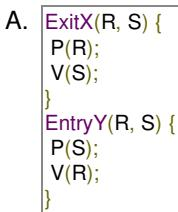


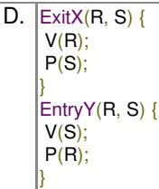

gatecse-2013 operating-system process-synchronization normal

# Answer key

# 5.24.37 Process Synchronization: GATE CSE 2014 | Set 2 | Question: 31


Consider the procedure below for the Producer-Consumer problem which uses semaphores:

```javascript
semaphore n = 0;
semaphore s = 1;
```

```javascript
void producer()
{
    while(true)
    {
        produce();
        semWait(s);
        addToBuffer();
        semSignal(s);
        semSignal(n);
    }
}
```

```txt
void consumer()
{
    while(true)
    {
        semWait(s);
        semWait(n);
        removeFromBuffer();
        semSignal(s);
        consume();
    }
}
```

Which one of the following is TRUE?

A. The producer will be able to add an item to the buffer, but the consumer can never consume it.  
B. The consumer will remove no more than one item from the buffer.  
C. Deadlock occurs if the consumer succeeds in acquiring semaphore s when the buffer is empty.  
D. The starting value for the semaphore n must be 1 and not 0 for deadlock-free operation.

gatecse-2014-set2 operating-system process-synchronization normal

# Answer key

# 5.24.38 Process Synchronization: GATE CSE 2015 | Set 1 | Question: 9

The following two functions P1 and P2 that share a variable B with an initial value of 2 execute concurrently.

<table><tr><td>P1() {C = B - 1;B = 2 * C;}</td><td>P2(){D = 2 * B;B = D - 1;}</td></tr></table>

The number of distinct values that B can possibly take after the execution is \_\_\_\_.

gatecse-2015-set1

operating-system

process-synchronization

normal

numerical-answers

# Answer key

# 5.24.39 Process Synchronization: GATE CSE 2015 | Set 3 | Question: 10

Two processes X and Y need to access a critical section. Consider the following synchronization construct used by both the processes


<table><tr><td>Process X</td><td>Process Y</td></tr><tr><td>/* other code for process X*/while (true){varP = true;while (varQ == true){/* Critical Section */varP = false;}}/* other code for process X */</td><td>/* other code for process Y */while (true){varQ = true;while (varP == true){/* Critical Section */varQ = false;}}/* other code for process Y */</td></tr></table>

Here varP and varQ are shared variables and both are initialized to false. Which one of the following statements is true?

A. The proposed solution prevents deadlock but fails to guarantee mutual exclusion  
B. The proposed solution guarantees mutual exclusion but fails to prevent deadlock  
C. The proposed solution guarantees mutual exclusion and prevents deadlock  
D. The proposed solution fails to prevent deadlock and fails to guarantee mutual exclusion

gatecse-2015-set3 operating-system process-synchronization normal

# Answer key

# 5.24.40 Process Synchronization: GATE CSE 2016 | Set 1 | Question: 50

Consider the following proposed solution for the critical section problem. There are n processes : $P_{0}\ldots P_{n-1}$ . In the code, function pmax returns an integer not smaller than any of its arguments. For all i, $t[i]$ is initialized to zero.

Code for $P_{i}$ ;

```javascript
do {
    c[i]=1; t[i]= pmax (t[0],...,t[n-1])+1; c[i]=0;
    for every j != i in {0,...,n-1} {
        while (c[j]);
        while (t[j] != 0 && t[j] <=t[i]);
    }
    Critical Section;
    t[i]=0;

    Remainder Section;

} while (true);
```

Which of the following is TRUE about the above solution?

A. At most one process can be in the critical section at any time  
B. The bounded wait condition is satisfied  
C. The progress condition is satisfied  
D. It cannot cause a deadlock

gatecse-2016-set1 operating-system process-synchronization difficult ambiguous

# Answer key

# 5.24.41 Process Synchronization: GATE CSE 2016 | Set 2 | Question: 48

Consider the following two-process synchronization solution.


<table><tr><td>PROCESS 0</td><td>Process 1</td></tr><tr><td>Entry: loop while (turn == 1); (critical section)</td><td>Entry: loop while (turn == 0); (critical section)</td></tr><tr><td>Exit: turn = 1;</td><td>Exit turn = 0;</td></tr></table>

The shared variable turn is initialized to zero. Which one of the following is TRUE?

A. This is a correct two- process synchronization solution.  
B. This solution violates mutual exclusion requirement.  
C. This solution violates progress requirement.  
D. This solution violates bounded wait requirement.

gatecse-2016-set2 operating-system process-synchronization normal

Answer key

# 5.24.42 Process Synchronization: GATE CSE 2017 | Set 1 | Question: 27


A multithreaded program $P$ executes with $x$ number of threads and uses $y$ number of locks for ensuring mutual exclusion while operating on shared memory locations. All locks in the program are non-reentrant, i.e., if a thread holds a lock $l$ , then it cannot re-acquire lock $l$ without releasing it. If a thread is unable to access lock, it blocks until the lock becomes available. The minimum value of $x$ and the minimum value of $y$ toget which execution of $P$ can result in a deadlock are:

A. x = 1, y = 2

C. $x = 2, y = 2$

B. $x = 2, y = 1$

D. $x = 1, y = 1$

gatecse-2017-set1 operating-system process-synchronization normal

Answer key

# 5.24.43 Process Synchronization: GATE CSE 2018 | Question: 40


Consider the following solution to the producer-consumer synchronization problem. The shared buffer size is N. Three semaphores empty, full and mutex are defined with respective initial values of 0, N and 1.

Semaphore empty denotes the number of available slots in the buffer, for the consumer to read from. Semaphore full denotes the number of available slots in the buffer, for the producer to write to. The placeholder variables, denoted by P, Q, R and S, in the code below can be assigned either empty or full. The valid semaphore operations are: wait() and signal().

<table><tr><td>Producer:</td><td>Consumer:</td></tr><tr><td>do {wait (P);wait (mutex);//Add item to buffersignal (mutex);signal (Q);}while (1);</td><td>do {wait (R);wait (mutex);//consume item from buffersignal (mutex);signal (S);}while (1);</td></tr></table>

Which one of the following assignments to P, Q, R and S will yield the correct solution?

A. $P:full$ , $Q:full$ , $R:empty$ , $S:empty$  
B. $P: empty$ , $Q: empty$ , $R: full$ , $S: full$  
C. $P:full$ , $Q:empty$ , $R:empty$ , $S:full$  
D. $P: empty$ , $Q: full$ , $R: full$ , $S: empty$

# Answer key

# 5.24.44 Process Synchronization: GATE CSE 2019 | Question: 23

Consider three concurrent processes $P_{1}, P_{2}$ and $P_{3}$ as shown below, which access a shared variable D that has been initialized to 100.


<table><tr><td> $P_{1}$ </td><td> $P_{2}$ </td><td> $P_{3}$ </td></tr><tr><td> $\vdots$ </td><td> $\vdots$ </td><td> $\vdots$ </td></tr><tr><td> $\vdots$ </td><td> $\vdots$ </td><td> $\vdots$ </td></tr><tr><td> $D = D + 20$ </td><td> $D = D - 50$ </td><td> $D = D + 10$ </td></tr><tr><td> $\vdots$ </td><td> $\vdots$ </td><td> $\vdots$ </td></tr><tr><td> $\vdots$ </td><td> $\vdots$ </td><td> $\vdots$ </td></tr></table>

The processes are executed on a uniprocessor system running a time-shared operating system. If the minimum and maximum possible values of $D$ after the three processes have completed execution are $X$ and $Y$ respectively, then the value of $Y - X$ is \_\_\_\_

gatecse-2019 numerical-answers operating-system process-synchronization one-mark

# Answer key

# 5.24.45 Process Synchronization: GATE CSE 2024 | Set 2 | Question: 36

Consider a multi-threaded program with two threads T1 and T2. The threads share two semaphores: s1 (initialized to 1) and s2 (initialized to 0). The threads also share a global variable x (initialized to 0). The threads execute the code shown below.


```txt
//code of T 1
wait (s1);
x = x+1;
print (x);
wait (s2);
signal(s1);
```

```c
// code of T2
wait (s1);
x= x+1;
print (x) ;
signal (s2);
signal (s1);
```

Which of the following outcomes is/are possible when threads T1 and T2 execute concurrently?

A. T1 runs first and prints 1, T2 runs next and prints 2  
B. T2 runs first and prints 1, T1 runs next and prints 2  
C. T1 runs first and prints 1, T2 does not print anything (deadlock)  
D. T2 runs first and prints 1, T1 does not print anything (deadlock)

gatecse-2024-set2 operating-system multiple-selects process-synchronization two-marks

# Answer key

# 5.24.46 Process Synchronization: GATE IT 2004 | Question: 65

The semaphore variables full, empty and mutex are initialized to 0, n and 1, respectively. Process $P_{1}$ repeatedly adds one item at a time to a buffer of size n, and process $P_{2}$ repeatedly removes one item at a time from the same buffer using the programs given below. In the programs, K, L, M and N are unspecified statements.


The statements $K, L, M$ and $N$ are respectively

A. P(full), V(empty), P(full), V(empty)  
C. P(empty), V(full), P(empty), V(full)

gateit-2004 operating-system process-synchronization normal

B. P(full), V(empty), P(empty), V(full)  
D. P(empty), V(full), P(full), V(empty)

# Answer key

# 5.24.47 Process Synchronization: GATE IT 2005 | Question: 41

Given below is a program which when executed spawns two concurrent processes : semaphore X := 0;

/\* Process now forks into concurrent processes P1 & P2 \*/

<table><tr><td>P1</td><td>P2</td></tr><tr><td>repeat forever</td><td>repeat forever</td></tr><tr><td>V(X);</td><td>P(X);</td></tr><tr><td>Compute;</td><td>Compute;</td></tr><tr><td>P(X);</td><td>V(X);</td></tr></table>

Consider the following statements about processes P1 and P2 :

I. It is possible for process $P1$ to starve.  
II. It is possible for process P2 to starve.

Which of the following holds?

A. Both (I) and (II) are true.  
C. (II) is true but (I) is false

gateit-2005 operating-system process-synchronization normal

B. (I) is true but (II) is false.  
D. Both (I) and (II) are false

# Answer key

# 5.24.48 Process Synchronization: GATE IT 2005 | Question: 42

Two concurrent processes $P1$ and $P2$ use four shared resources $R1, R2, R3$ and $R4$ , as shown below.

<table><tr><td>P1</td><td>P2</td></tr><tr><td>Compute:</td><td>Compute;</td></tr><tr><td>Use R1;</td><td>Use R1;</td></tr><tr><td>Use R2;</td><td>Use R2;</td></tr><tr><td>Use R3;</td><td>Use R3;</td></tr><tr><td>Use R4;</td><td>Use R4;</td></tr></table>

Both processes are started at the same time, and each resource can be accessed by only one process at a time. The following scheduling constraints exist between the access of resources by the processes:


- $P2$ must complete use of $R1$ before $P1$ gets access to $R1$ .  
- $P1$ must complete use of $R2$ before $P2$ gets access to $R2$ .  
- $P2$ must complete use of $R3$ before $P1$ gets access to $R3$ .  
- $P1$ must complete use of $R4$ before $P2$ gets access to $R4$ .

There are no other scheduling constraints between the processes. If only binary semaphores are used to enforce the above scheduling constraints, what is the minimum number of binary semaphores needed?

A. 1

B. 2

C. 3

D. 4

gateit-2005 operating-system process-synchronization normal

# Answer key

# 5.24.49 Process Synchronization: GATE IT 2006 | Question: 55

Consider the solution to the bounded buffer producer/consumer problem by using general semaphores $S, F$ , and $E$ . The semaphore $S$ is the mutual exclusion semaphore initialized to 1. The semaphore $F$

corresponds to the number of free slots in the buffer and is initialized to $N$ . The semaphore $E$ corresponds to the number of elements in the buffer and is initialized to 0.

<table><tr><td>Producer Process</td><td>Consumer Process</td></tr><tr><td>Produce an item;</td><td>Wait(E);</td></tr><tr><td>Wait(F);</td><td>Wait(S);</td></tr><tr><td>Wait(S);</td><td>Remove an item from the buffer;</td></tr><tr><td>Append the item to the buffer;</td><td>Signal(S);</td></tr><tr><td>Signal(S);</td><td>Signal(F);</td></tr><tr><td>Signal(E);</td><td>Consume the item;</td></tr></table>


Which of the following interchange operations may result in a deadlock?

I. Interchanging Wait (F) and Wait (S) in the Producer process  
II. Interchanging Signal (S) and Signal (F) in the Consumer process

A. (I) only

B. (II) only

C. Neither (I) nor (II)

D. Both (I) and (II)

gateit-2006 operating-system process-synchronization normal

# Answer key

# 5.24.50 Process Synchronization: GATE IT 2007 | Question: 10

Processes P1 and P2 use critical\_flag in the following routine to achieve mutual exclusion. Assume that critical\_flag is initialized to FALSE in the main program.


```txt
get_exclusive_access ()
{
    if (critical _flag == FALSE) {
        critical_flag = TRUE ;
        critical_region () ;
        critical_flag = FALSE;
    }
}
```

Consider the following statements.

i. It is possible for both P1 and P2 to access critical\_region concurrently.  
ii. This may lead to a deadlock.

Which of the following holds?

A. (i) is false (ii) is true  
C. (i) is true (ii) is false

B. Both (i) and (ii) are false  
D. Both (i) and (ii) are true

gateit-2007 operating-system process-synchronization normal

# 5.24.51 Process Synchronization: GATE IT 2007 | Question: 56


Synchronization in the classical readers and writers problem can be achieved through use of semaphores. In the following incomplete code for readers-writers problem, two binary semaphores mutex and wrt are used to obtain synchronization

```txt
wait (wrt)
writing is performed
signal (wrt)
wait (mutex)
readcount = readcount + 1
if readcount = 1 then S1
S2
reading is performed
S3
readcount = readcount - 1
if readcount = 0 then S4
signal (mutex)
```

The values of $S1, S2, S3, S4$ , (in that order) are

A. signal (mutex), wait (wrt), signal (wrt), wait (mutex)  
B. signal (wrt), signal (mutex), wait (mutex), wait (wrt)  
C. wait (wrt), signal (mutex), wait (mutex), signal (wrt)  
D. signal (mutex), wait (mutex), signal (mutex), wait (mutex)

gateit-2007 operating-system process-synchronization normal

# Answer key

# 5.24.52 Process Synchronization: GATE IT 2008 | Question: 53


The following is a code with two threads, producer and consumer, that can run in parallel. Further, $S$ and $Q$ are binary semaphores quipped with the standard $P$ and $V$ operations.

```txt
semaphore S = 1, Q = 0;
integer x;

producer: consumer:
while (true) do while (true) do
P(S); P(Q);
x = produce (); consume (x);
V(Q); V(S);
done done
```

Which of the following is TRUE about the program above?

A. The process can deadlock  
B. One of the threads can starve  
C. Some of the items produced by the producer may be lost  
D. Values generated and stored in 'x' by the producer will always be consumed before the producer can generate a new value

gateit-2008 operating-system process-synchronization normal

# Answer key

# 5.25

# Resource Allocation (27)

Practice Tests: Test 1 (15Q) Test 2 (10Q)

# 5.25.1 Resource Allocation: GATE CSE 1988 | Question: 11


A number of processes could be in a deadlock state if none of them can execute due to non-availability of sufficient resources. Let $P_{i}, 0 \leq i \leq 4$ represent five processes and let there be four resources types $r_{j}, 0 \leq j \leq 3$ . Suppose the following data structures have been used.

Available: A vector of length 4 such that if Available $[i]=k$ , there are k instances of resource type $r_{j}$ available in

the system.

Allocation. A $5 \times 4$ matrix defining the number of each type currently allocated to each process. If Allocation $[i, j] = k$ then process $p_i$ is currently allocated $k$ instances of resource type $r_j$ .

Max. A $5 \times 4$ matrix indicating the maximum resource need of each process. If $Max[i, j] = k$ then process $p_i$ , may need a maximum of $k$ instances of resource type $r_j$ in order to complete the task.

Assume that system allocated resources only when it does not lead into an unsafe state such that resource requirements in future never cause a deadlock state. Now consider the following snapshot of the system.

<table><tr><td colspan="5">Allocation</td></tr><tr><td></td><td> $r_0$ </td><td> $r_1$ </td><td> $r_2$ </td><td> $r_3$ </td></tr><tr><td> $p_0$ </td><td>0</td><td>0</td><td>1</td><td>2</td></tr><tr><td> $p_1$ </td><td>1</td><td>0</td><td>0</td><td>0</td></tr><tr><td> $p_2$ </td><td>1</td><td>3</td><td>5</td><td>4</td></tr><tr><td> $p_3$ </td><td>0</td><td>6</td><td>3</td><td>2</td></tr><tr><td> $p_4$ </td><td>0</td><td>0</td><td>1</td><td>4</td></tr></table>

<table><tr><td colspan="4">Max</td></tr><tr><td> $r_0$ </td><td> $r_1$ </td><td> $r_2$ </td><td> $r_3$ </td></tr><tr><td>0</td><td>0</td><td>1</td><td>2</td></tr><tr><td>1</td><td>7</td><td>5</td><td>0</td></tr><tr><td>2</td><td>3</td><td>5</td><td>6</td></tr><tr><td>0</td><td>6</td><td>5</td><td>2</td></tr><tr><td>0</td><td>6</td><td>5</td><td>6</td></tr></table>

<table><tr><td colspan="4">Available</td></tr><tr><td> $r_0$ </td><td> $r_1$ </td><td> $r_2$ </td><td> $r_3$ </td></tr><tr><td>1</td><td>5</td><td>2</td><td>0</td></tr></table>

Is the system currently in a safe state? If yes, explain why.

gate1988 normal descriptive operating-system resource-allocation

# Answer key

# 5.25.2 Resource Allocation: GATE CSE 1989 | Question: 11a


i. A system of four concurrent processes, $P, Q, R$ and $S$ , use shared resources $A, B$ and $C$ . The sequences in which processes, $P, Q, R$ and $S$ request and release resources are as follows:

<table><tr><td rowspan="4">Process P:</td><td>1.</td><td>P requests A</td></tr><tr><td>2.</td><td>P requests B</td></tr><tr><td>3.</td><td>P releases A</td></tr><tr><td>4.</td><td>P releases B</td></tr><tr><td rowspan="4">Process Q:</td><td>1.</td><td>Q requests C</td></tr><tr><td>2.</td><td>Q requests A</td></tr><tr><td>3.</td><td>Q releases C</td></tr><tr><td>4.</td><td>P releases A</td></tr><tr><td rowspan="4">Process R:</td><td>1.</td><td>R requests B</td></tr><tr><td>2.</td><td>R requests C</td></tr><tr><td>3.</td><td>R releases B</td></tr><tr><td>4.</td><td>R releases C</td></tr><tr><td rowspan="4">Process S:</td><td>1.</td><td>S requests A</td></tr><tr><td>2.</td><td>S requests C</td></tr><tr><td>3.</td><td>S releases A</td></tr><tr><td>4.</td><td>S releases C</td></tr></table>

If a resource is free, it is granted to a requesting process immediately. There is no preemption of granted resources. A resource is taken back from a process only when the process explicitly releases it.

Can the system of four processes get into a deadlock? If yes, give a sequence (ordering) of operations (for requesting and releasing resources) of these processes which leads to a deadlock.

ii. Will the processes always get into a deadlock? If your answer is no, give a sequence of these operations which leads to completion of all processes.  
iii. What strategies can be used to prevent deadlocks in a system of concurrent processes using shared resources

if preemption of granted resources is not allowed?

descriptive gate1989 operating-system resource-allocation

Answer key

# 5.25.3 Resource Allocation: GATE CSE 1992 | Question: 02-xi


A computer system has 6 tape devices, with n processes competing for them. Each process may need 3 tape drives. The maximum value of n for which the system is guaranteed to be deadlock-free is:

A. 2

B. 3

C. 4

D. 1

gate1992 operating-system resource-allocation normal multiple-selects

Answer key

# 5.25.4 Resource Allocation: GATE CSE 1993 | Question: 7.9, UGCNET-Dec2012-III: 41

Consider a system having m resources of the same type. These resources are shared by 3 processes A, B, and C which have peak demands of 3, 4, and 6 respectively. For what value of m deadlock will not occur?


A. 7

B. 9

C. 10

D. 13

E. 15

gate1993 operating-system resource-allocation normal ugcnetcse-dec2012-paper3 multiple-selects

Answer key

# 5.25.5 Resource Allocation: GATE CSE 1994 | Question: 28

Consider the resource allocation graph in the figure.


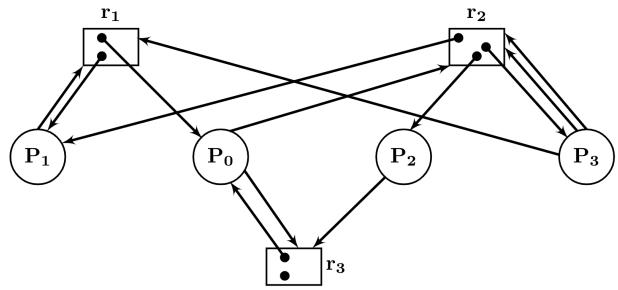

<details>
<summary>flowchart</summary>

```mermaid
graph LR
  P0["P0"] --> r1["r1"]
  P1["P1"] --> r1
  P0 --> r2["r2"]
  P2["P2"] --> r2
  P3["P3"] --> r2
  P0 --> r3["r3"]
  P1 --> r3
  P2 --> r3
  P3 --> r3
```
</details>

A. Find if the system is in a deadlock state  
B. Otherwise, find a safe sequence

gate1994 operating-system resource-allocation normal descriptive

Answer key

# 5.25.6 Resource Allocation: GATE CSE 1996 | Question: 22


A computer system uses the Banker's Algorithm to deal with deadlocks. Its current state is shown in the table below, where P0, P1, P2 are processes, and R0, R1, R2 are resources types.

Maximum Need

<table><tr><td></td><td>R0</td><td>R1</td><td>R2</td></tr><tr><td>P0</td><td>4</td><td>1</td><td>2</td></tr><tr><td>P1</td><td>1</td><td>5</td><td>1</td></tr><tr><td>P2</td><td>1</td><td>2</td><td>3</td></tr></table>

Current Allocation

<table><tr><td></td><td>R0</td><td>R1</td><td>R2</td></tr><tr><td>P0</td><td>1</td><td>0</td><td>2</td></tr><tr><td>P1</td><td>0</td><td>3</td><td>1</td></tr><tr><td>P2</td><td>1</td><td>0</td><td>2</td></tr></table>

Available

<table><tr><td>R0</td><td>R1</td><td>R2</td></tr><tr><td>2</td><td>2</td><td>0</td></tr></table>

A. Show that the system can be in this state  
B. What will the system do on a request by process P0 for one unit of resource type R1?

# Answer key

# 5.25.7 Resource Allocation: GATE CSE 1997 | Question: 6.7


An operating system contains 3 user processes each requiring 2 units of resource $R$ . The minimum number of units of $R$ such that no deadlocks will ever arise is

A. 3

B. 5

C. 4

D. 6

gate1997 operating-system resource-allocation normal

# Answer key

# 5.25.8 Resource Allocation: GATE CSE 1997 | Question: 75


An operating system handles requests to resources as follows.

A process (which asks for some resources, uses them for some time and then exits the system) is assigned a unique timestamp are when it starts. The timestamps are monotonically increasing with time. Let us denote the timestamp of a process $P$ by $TS(P)$ .

When a process P requests for a resource the OS does the following:

i. If no other process is currently holding the resource, the $OS$ awards the resource to $P$ .  
ii. If some process $Q$ with $TS(Q) < TS(P)$ is holding the resource, the $OS$ makes $P$ wait for the resources.  
iii. If some process $Q$ with $TS(Q) > TS(P)$ is holding the resource, the $OS$ restarts $Q$ and awards the resources to $P$ . (Restarting means taking back the resources held by a process, killing it and starting it again with the same timestamp)

When a process releases a resource, the process with the smallest timestamp (if any) amongst those waiting for the resource is awarded the resource.

A. Can a deadlock over arise? If yes, show how. If not prove it.  
B. Can a process P ever starve? If yes, show how. If not prove it.

gate1997 operating-system resource-allocation normal descriptive

# Answer key

# 5.25.9 Resource Allocation: GATE CSE 1998 | Question: 1.32


A computer has six tape drives, with n processes competing for them. Each process may need two drives. What is the maximum value of n for the system to be deadlock free?

A. 6

B. 5

C. 4

D. 3

gate1998 operating-system resource-allocation normal

# Answer key

# 5.25.10 Resource Allocation: GATE CSE 2000 | Question: 2.23


Which of the following is not a valid deadlock prevention scheme?

A. Release all resources before requesting a new resource.  
B. Number the resources uniquely and never request a lower numbered resource than the last one requested.  
C. Never request a resource after releasing any resource.  
D. Request and all required resources be allocated before execution.

gatecse-2000 operating-system resource-allocation normal

# Answer key

Two concurrent processes $P1$ and $P2$ want to use resources $R1$ and $R2$ in a mutually exclusive manner. Initially, $R1$ and $R2$ are free. The programs executed by the two processes are given below.

<table><tr><td colspan="2">Program for P1:</td><td colspan="2">Program for P2:</td></tr><tr><td>S1:</td><td>While (R1 is busy) do no-op;</td><td>Q1:</td><td>While (R1 is busy) do no-op;</td></tr><tr><td>S2:</td><td>Set R1 ← busy;</td><td>Q2:</td><td>Set R1 ← busy;</td></tr><tr><td>S3:</td><td>While (R2 is busy) do no-op;</td><td>Q3:</td><td>While (R2 is busy) do no-op;</td></tr><tr><td>S4:</td><td>Set R2 ← busy;</td><td>Q4:</td><td>Set R2 ← busy;</td></tr><tr><td>S5:</td><td>Use R1 and R2;</td><td>Q5:</td><td>Use R1 and R2;</td></tr><tr><td>S6:</td><td>Set R1 ← free;</td><td>Q6:</td><td>Set R2 ← free;</td></tr><tr><td>S7:</td><td>Set R2 ← free;</td><td>Q7:</td><td>Set R1 ← free;</td></tr></table>

A. Is mutual exclusion guaranteed for $R1$ and $R2$ ? If not show a possible interleaving of the statements of $P1$ and $P2$ such mutual exclusion is violated (i.e., both $P1$ and $P2$ use $R1$ and $R2$ at the same time).  
B. Can deadlock occur in the above program? If yes, show a possible interleaving of the statements of $P1$ and $P2$ leading to deadlock.  
C. Exchange the statements Q1 and Q3 and statements Q2 and Q4. Is mutual exclusion guaranteed now? Can deadlock occur?

gatecse-2001 operating-system resource-allocation normal descriptive

Answer key

# 5.25.12 Resource Allocation: GATE CSE 2005 | Question: 71


Suppose n processes, $P_{1}, \ldots, P_{n}$ share m identical resource units, which can be reserved and released one at a time. The maximum resource requirement of process $P_{i}$ is $s_{i}$ , where $s_{i} > 0$ . Which one of the following is a sufficient condition for ensuring that deadlock does not occur?

A. $\forall i, s_i, < m$  
B. $\forall i, s_i < n$  
C. $\sum_{i=1}^{n} s_i < (m+n)$  
D. $\sum_{i=1}^{n} s_i < (m \times n)$

gatecse-2005 operating-system resource-allocation normal

Answer key

# 5.25.13 Resource Allocation: GATE CSE 2006 | Question: 66


Consider the following snapshot of a system running $n$ processes. Process $i$ is holding $x_{i}$ instances of a resource $R$ , $1 \leq i \leq n$ . Currently, all instances of $R$ are occupied. Further, for all $i$ , process $i$ has placed a request for an additional $y_{i}$ instances while holding the $x_{i}$ instances it already has. There are exactly two processes $p$ and $q$ and such that $y_{p} = y_{q} = 0$ . Which one of the following can serve as a necessary condition to guarantee that the system is not approaching a deadlock?

A. $\min (x_p,x_q) <   \max_{k\neq p,q}y_k$  
C. $\max (x_p,x_q) > 1$

B. $x_{p} + x_{q}\geq \min_{k\neq p,q}y_{k}$  
D. $\min(x_{p},x_{q})>1$

gatecse-2006 operating-system resource-allocation normal

Answer key

A single processor system has three resource types X, Y and Z, which are shared by three processes.

There are 5 units of each resource type. Consider the following scenario, where the column alloc denotes the number of units of each resource type allocated to each process, and the column request denotes the number of units of each resource type requested by a process in order to complete execution. Which of these processes will finish LAST?

<table><tr><td></td><td colspan="3">alloc</td><td colspan="3">request</td></tr><tr><td></td><td>X</td><td>Y</td><td>Z</td><td>X</td><td>Y</td><td>Z</td></tr><tr><td>P0</td><td>1</td><td>2</td><td>1</td><td>1</td><td>0</td><td>3</td></tr><tr><td>P1</td><td>2</td><td>0</td><td>1</td><td>0</td><td>1</td><td>2</td></tr><tr><td>P2</td><td>2</td><td>2</td><td>1</td><td>1</td><td>2</td><td>0</td></tr></table>

A. P0  
C. P2

B. P1  
D. None of the above, since the system is in a deadlock

gatecse-2007 operating-system resource-allocation normal

Answer key

# 5.25.15 Resource Allocation: GATE CSE 2008 | Question: 65

Which of the following is NOT true of deadlock prevention and deadlock avoidance schemes?

A. In deadlock prevention, the request for resources is always granted if the resulting state is safe  
B. In deadlock avoidance, the request for resources is always granted if the resulting state is safe  
C. Deadlock avoidance is less restrictive than deadlock prevention  
D. Deadlock avoidance requires knowledge of resource requirements apriori..

gatecse-2008 operating-system easy resource-allocation

Answer key

# 5.25.16 Resource Allocation: GATE CSE 2009 | Question: 30


Consider a system with 4 types of resources R1 (3 units), R2 (2 units), R3 (3 units), R4 (2 units). A non-preemptive resource allocation policy is used. At any given instance, a request is not entertained if it cannot be completely satisfied. Three processes P1, P2, P3 request the resources as follows if executed independently.

<table><tr><td>Process P1:</td><td>Process P2:</td><td>Process P3:</td></tr><tr><td> $t = 0$ :requests 2 units of  $R2$  $t = 1$ :requests 1 unit of  $R3$  $t = 3$ :requests 2 units of  $R1$  $t = 5$ :releases 1 unit of  $R2$  and 1 unit of  $R1$  $t = 7$ :releases 1 unit of  $R3$  $t = 8$ :requests 2 units of  $R4$  $t = 10$ : Finishes</td><td> $t = 0$ :requests 2 units of  $R3$  $t = 2$ :requests 1 unit of  $R4$  $t = 4$ :requests 1 unit of  $R1$  $t = 6$ :releases 1 unit of  $R3$  $t = 8$ : Finishes</td><td> $t = 0$ :requests 1 unit of  $R4$  $t = 2$ :requests 2 units of  $R1$  $t = 5$ :releases 2 units of  $R1$  $t = 7$ :requests 1 unit of  $R2$  $t = 8$ :requests 1 unit of  $R3$  $t = 9$ : Finishes</td></tr></table>

Which one of the following statements is TRUE if all three processes run concurrently starting at time t = 0?

A. All processes will finish without any deadlock

B. Only P1 and P2 will be in deadlock

C. Only $P1$ and $P3$ will be in deadlock

D. All three processes will be in deadlock

gatecse-2009 operating-system resource-allocation normal

Answer key

A system has $n$ resources $R_0, \ldots, R_{n-1}$ , and $k$ processes $P_0, \ldots, P_{k-1}$ . The implementation of the resource request logic of each process $P_i$ is as follows:

<div class="mineru-algorithm" style="white-space: pre-wrap; font-family:monospace;">
if(i%2 == 0){
    if(i &lt; n) request R_i;
    if(i + 2 &lt; n) request R_{i+2}; }
else{
    if(i &lt; n) request R_{n-i};
    if(i + 2 &lt; n) request R_{n-i-2}; }
</div>

In which of the following situations is a deadlock possible?

A. n = 40, k = 26

B. $n = 21, k = 12$

C. $n = 20, k = 10$

D. $n = 41, k = 19$

gatecse-2010 operating-system resource-allocation normal

# Answer key

# 5.25.18 Resource Allocation: GATE CSE 2013 | Question: 16

Three concurrent processes $X, Y$ , and $Z$ execute three different code segments that access and update certain shared variables. Process $X$ executes the $P$ operation (i.e., wait) on semaphores $a, b$ , and $c$ ;

process Y executes the P operation on semaphores b, c, and d; process Z executes the P operation on semaphores c, d, and a before entering the respective code segments. After completing the execution of its code segment, each process invokes the V operation (i.e., signal) on its three semaphores. All semaphores are binary semaphores initialized to one. Which one of the following represents a deadlock-free order of invoking the P operations by the processes?

A. $X: P(a)P(b)P(c)Y: P(b)P(c)P(d)Z: P(c)P(d)P(a)$  
B. $X:P(b)P(a)P(c)Y:P(b)P(c)P(d)Z:P(a)P(c)P(d)$  
C. $X: P(b)P(a)P(c)Y: P(c)P(b)P(d)Z: P(a)P(c)P(d)$  
D. $X: P(a)P(b)P(c)Y: P(c)P(b)P(d)Z: P(c)P(d)P(a)$

gatecse-2013 operating-system resource-allocation normal

# Answer key

# 5.25.19 Resource Allocation: GATE CSE 2014 | Set 1 | Question: 31

An operating system uses the Banker's algorithm for deadlock avoidance when managing the allocation of three resource types $X, Y$ , and $Z$ to three processes $P0, P1$ , and $P2$ . The table given below presents the

current system state. Here, the Allocation matrix shows the current number of resources of each type allocated to each process and the Max matrix shows the maximum number of resources of each type required by each process during its execution.

<table><tr><td colspan="4">Allocation</td><td colspan="3">Max</td></tr><tr><td></td><td>X</td><td>Y</td><td>Z</td><td>X</td><td>Y</td><td>Z</td></tr><tr><td>P0</td><td>0</td><td>0</td><td>1</td><td>8</td><td>4</td><td>3</td></tr><tr><td>P1</td><td>3</td><td>2</td><td>0</td><td>6</td><td>2</td><td>0</td></tr><tr><td>P2</td><td>2</td><td>1</td><td>1</td><td>3</td><td>3</td><td>3</td></tr></table>

There are 3 units of type X, 2 units of type Y and 2 units of type Z still available. The system is currently in a safe state. Consider the following independent requests for additional resources in the current state:

REQ1: P0 requests 0 units of X, 0 units of Y and 2 units of Z

REQ2: P1 requests 2 units of X, 0 units of Y and 0 units of Z

Which one of the following is TRUE?

A. Only REQ1 can be permitted.  
C. Both REQ1 and REQ2 can be

B. Only REQ2 can be permitted.  
D. Neither REQ1 nor REQ2 can be


# 5.25.20 Resource Allocation: GATE CSE 2014 | Set 3 | Question: 31

A system contains three programs and each requires three tape units for its operation. The minimum number of tape units which the system must have such that deadlocks never arise is \_\_\_\_.


gatecse-2014-set3 operating-system resource-allocation numerical-answers easy

# Answer key

# 5.25.21 Resource Allocation: GATE CSE 2015 | Set 2 | Question: 23

A system has 6 identical resources and N processes competing for them. Each process can request at most 2 resources. Which one of the following values of N could lead to a deadlock?


A. 1

B. 2

C. 3

D. 4

gatecse-2015-set2 operating-system resource-allocation easy

# Answer key

# 5.25.22 Resource Allocation: GATE CSE 2015 | Set 3 | Question: 52

Consider the following policies for preventing deadlock in a system with mutually exclusive resources.


I. Process should acquire all their resources at the beginning of execution. If any resource is not available, all resources acquired so far are released.  
II. The resources are numbered uniquely, and processes are allowed to request for resources only in increasing resource numbers  
III. The resources are numbered uniquely, and processes are allowed to request for resources only in decreasing resource numbers  
IV. The resources are numbered uniquely. A processes is allowed to request for resources only for a resource with resource number larger than its currently held resources

Which of the above policies can be used for preventing deadlock?

A. Any one of (I) and (III) but not (II) or (IV)

B. Any one of (I), (III) and (IV) but not (II)

C. Any one of (II) and (III) but not (I) or (IV)

D. Any one of (I), (II), (III) and (IV)

gatecse-2015-set3 operating-system resource-allocation normal

# Answer key

# 5.25.23 Resource Allocation: GATE CSE 2017 | Set 2 | Question: 33

A system shares 9 tape drives. The current allocation and maximum requirement of tape drives for that processes are shown below:


<table><tr><td>Process</td><td>Current Allocation</td><td>Maximum Requirement</td></tr><tr><td>P1</td><td>3</td><td>7</td></tr><tr><td>P2</td><td>1</td><td>6</td></tr><tr><td>P3</td><td>3</td><td>5</td></tr></table>

Which of the following best describes current state of the system?

A. Safe, Deadlocked

B. Safe, Not Deadlocked

C. Not Safe, Deadlocked

D. Not Safe, Not Deadlocked

gatecse-2017-set2 operating-system resource-allocation normal

# Answer key

Consider the following snapshot of a system running $n$ concurrent processes. Process $i$ is holding $X_{i}$ instances of a resource $R$ , $1 \leq i \leq n$ . Assume that all instances of $R$ are currently in use. Further, for all $i$ , process $i$ can place a request for at most $Y_{i}$ additional instances of $R$ while holding the $X_{i}$ instances it already has. Of the $n$ processes, there are exactly two processes $p$ and $q$ such that $Y_{p} = Y_{q} = 0$ . Which one of the following conditions guarantees that no other process apart from $p$ and $q$ can complete execution?

A. $X_{p} + X_{q} < \operatorname{Min}\{Y_{k} \mid 1 \leq k \leq n, k \neq p, k \neq q\}$  
B. $X_{p} + X_{q} < \operatorname{Max}\{Y_{k} \mid 1 \leq k \leq n, k \neq p, k \neq q\}$  
C. $\operatorname{Min}(X_p, X_q) \geq \operatorname{Min}\{Y_k \mid 1 \leq k \leq n, k \neq p, k \neq q\}$  
D. $\operatorname{Min}(X_p, X_q) \leq \operatorname{Max}\{Y_k \mid 1 \leq k \leq n, k \neq p, k \neq q\}$

gatecse-2019 operating-system two-marks resource-allocation

Answer key

# 5.25.25 Resource Allocation: GATE CSE 2022 | Question: 16

Which of the following statements is/are TRUE with respect to deadlocks?


A. Circular wait is a necessary condition for the formation of deadlock.  
B. In a system where each resource has more than one instance, a cycle in its wait-for graph indicates the presence of a deadlock.  
C. If the current allocation of resources to processes leads the system to unsafe state, then deadlock will necessarily occur.  
D. In the resource-allocation graph of a system, if every edge is an assignment edge, then the system is not in deadlock state.

gatecse-2022 operating-system resource-allocation multiple-selects one-mark

Answer key

# 5.25.26 Resource Allocation: GATE IT 2005 | Question: 62


Two shared resources $R_{1}$ and $R_{2}$ are used by processes $P_{1}$ and $P_{2}$ . Each process has a certain priority for accessing each resource. Let $T_{ij}$ denote the priority of $P_{i}$ for accessing $R_{j}$ . A process $P_{i}$ can snatch a resource $R_{k}$ from process $P_{j}$ if $T_{ik}$ is greater than $T_{jk}$ .

Given the following :

1. $T_{11} > T_{21}$  
II. $T_{12} > T_{22}$  
III. $T_{11} < T_{21}$  
IV. $T_{12} <   T_{22}$

Which of the following conditions ensures that $P_{1}$ and $P_{2}$ can never deadlock?

A. (I) and (IV)

B. (II) and (III)

C. (I) and (II)

D. None of the above

gateit-2005 operating-system resource-allocation normal

Answer key

# 5.25.27 Resource Allocation: GATE IT 2008 | Question: 54


An operating system implements a policy that requires a process to release all resources before making a request for another resource. Select the TRUE statement from the following:

A. Both starvation and deadlock can occur  
B. Starvation can occur but deadlock cannot occur  
C. Starvation cannot occur but deadlock can occur  
D. Neither starvation nor deadlock can occur

# 5.26.1 Resource Allocation Graph: GATE CSE 2025 | Set 2 | Question: 38

$P = \{P_{1}, P_{2}, P_{3}, P_{4}\}$ consists of all active processes in an operating system.

$R = \{R_{1}, R_{2}, R_{3}, R_{4}\}$ consists of single instances of distinct types of resources in the system.

The resource allocation graph has the following assignment and claim edges.

Assignment edges: $R_{1} \to P_{1}, R_{2} \to P_{2}, R_{3} \to P_{3}, R_{4} \to P_{4}$ (the assignment edge $R_{1} \to P_{1}$ means resource $R_{1}$ is assigned to process $P_{1}$ , and so on for others)

Claim edges: $P_{1} \rightarrow R_{2}, P_{2} \rightarrow R_{3}, P_{3} \rightarrow R_{1}, P_{2} \rightarrow R_{4}, P_{4} \rightarrow R_{2}$ (the claim edge $P_{1} \rightarrow R_{2}$ means process $P_{1}$ is waiting for resource $R_{2}$ , and so on for others)

Which of the following statement(s) is/are CORRECT?

A. Aborting $P_{1}$ makes the system deadlock free.  
B. Aborting $P_{3}$ makes the system deadlock free.  
C. Aborting $P_{2}$ makes the system deadlock free.  
D. Aborting $P_{1}$ and $P_{4}$ makes the system deadlock free.

gatecse2025-set2 operating-system resource-allocation-graph multiple-selects two-marks

Answer key

# 5.27

# Round Robin Scheduling (1)

# 5.27.1 Round Robin Scheduling: GATE CSE 2022 | Question: 32

Consider four processes P, Q, R, and S scheduled on a CPU as per round robin algorithm with a time quantum of 4 units. The processes arrive in the order P, Q, R, S, all at time t = 0. There is exactly one context switch from S to Q, exactly one context switch from R to Q, and exactly two context switches from Q to R. There is no context switch from S to P. Switching to a ready process after the termination of another process is also considered a context switch. Which one of the following is NOT possible as CPU burst time (in time units) of these processes?

A. $\mathrm{P} = 4, \mathrm{Q} = 10, \mathrm{R} = 6, \mathrm{S} = 2$  
C. P = 4, Q = 12, R = 5, S = 4

B. $P = 2, Q = 9, R = 5, S = 1$  
D. $\mathrm{P} = 3, \mathrm{Q} = 7, \mathrm{R} = 7, \mathrm{S} = 3$

gatecse-2022 operating-system process-scheduling round-robin-scheduling two-marks

Answer key

# 5.28

# Semaphore (11)

Practice Tests: Test 1 (15Q) Test 2 (3Q)

# 5.28.1 Semaphore: GATE CSE 1990 | Question: 1-vii

Semaphore operations are atomic because they are implemented within the OS \_\_\_\_.

gate1990 operating-system semaphore process-synchronization fill-in-the-blanks

Answer key

# 5.28.2 Semaphore: GATE CSE 1992 | Question: 02,x, ISRO2015-35

At a particular time of computation, the value of a counting semaphore is 7. Then $20P$ operations and $15V$ operations were completed on this semaphore. The resulting value of the semaphore is:

A. 42

B. 2

C. 7

D. 12

gate1992 operating-system semaphore easy isro2015 process-synchronization

Answer key


# 5.28.3 Semaphore: GATE CSE 1998 | Question: 1.31


A counting semaphore was initialized to 10. Then $6P$ (wait) operations and $4V$ (signal) operations were completed on this semaphore. The resulting value of the semaphore is

A. 0

B. 8

C. 10

D. 12

gate1998 operating-system process-synchronization semaphore easy

Answer key

# 5.28.4 Semaphore: GATE CSE 2008 | Question: 63

The P and V operations on counting semaphores, where s is a counting semaphore, are defined as follows:


$$
P (s): \begin{array}{l} s = s - 1; \\ \text {If} s <   0 \text {then wait;} \end{array}
$$

$$
V (s): \begin{array}{l} s = s + 1; \\ \text {If} s \leq 0 \text {then wake up process waiting on} s; \end{array}
$$

Assume that $P_{b}$ and $V_{b}$ the wait and signal operations on binary semaphores are provided. Two binary semaphores $x_{b}$ and $y_{b}$ are used to implement the semaphore operations $P(s)$ and $V(s)$ as follows:

$$
P (s): \begin{array}{l} P _ {b} (x _ {b}); \\ s = s - 1; \\ \text {if} (s <   0) \\ \left\{ \begin{array}{c} V _ {b} (x _ {b}); \\ P _ {b} (y _ {b}); \end{array} \right. \\ \left. \begin{array}{l} \} \\ \text {else} V _ {b} (x _ {b}); \end{array} \right. \end{array}
$$

$$
V (s): \quad \begin{array}{l} P _ {b} (x _ {b}); \\ s = s + 1; \\ \text {if} (s \leq 0) V _ {b} (y _ {b}); \\ V _ {b} (x _ {b}); \end{array}
$$

The initial values of $x_{b}$ and $y_{b}$ are respectively

A. 0 and 0

B. 0 and 1

C. 1 and 0

D. 1 and 1

gatecse-2008 operating-system normal semaphore

Answer key

# 5.28.5 Semaphore: GATE CSE 2016 | Set 2 | Question: 49


Consider a non-negative counting semaphore $S$ . The operation $P(S)$ decrements $S$ , and $V(S)$ increments $S$ . During an execution, 20 $P(S)$ operations and 12 $V(S)$ operations are issued in some order. The largest initial value of $S$ for which at least one $P(S)$ operation will remain blocked is \_\_\_\_

gatecse-2016-set2 operating-system semaphore normal numerical-answers

Answer key

# 5.28.6 Semaphore: GATE CSE 2020 | Question: 34

Each of a set of $n$ processes executes the following code using two semaphores $a$ and $b$ initialized to 1 and 0, respectively. Assume that count is a shared variable initialized to 0 and not used in CODE SECTION P.


# CODE SECTION P

wait(a); count=count+1;

if (count==n) signal (b);

signal (a); wait (b); signal (b);

# CODE SECTION Q

What does the code achieve?

A. It ensures that no process executes CODE SECTION Q before every process has finished CODE SECTION P.  
B. It ensures that almost two processes are in CODE SECTION Q at any time.  
C. It ensures that all processes execute CODE SECTION P mutually exclusively.  
D. It ensures that at most n - 1 processes are in CODE SECTION P at any time.

gatecse-2020 operating-system semaphore two-marks

# Answer key

# 5.28.7 Semaphore: GATE CSE 2021 | Set 1 | Question: 46

Consider the following pseudocode, where S is a semaphore initialized to 5 in line #2 and counter is a shared variable initialized to 0 in line #1. Assume that the increment operation in line #7 is not atomic.


```c
int counter = 0;
Semaphore S = init(5);
void parop(void)
{
    wait(S);
    wait(S);
    counter++;
    signal(S);
    signal(S);
}
```

If five threads execute the function parop concurrently, which of the following program behavior(s) is/are possible?

A. The value of counter is 5 after all the threads successfully complete the execution of parop  
B. The value of counter is 1 after all the threads successfully complete the execution of parop  
C. The value of counter is 0 after all the threads successfully complete the execution of parop  
D. There is a deadlock involving all the threads

gatecse-2021-set1 multiple-selects operating-system process-synchronization semaphore two-marks

# Answer key

# 5.28.8 Semaphore: GATE CSE 2022 | Question: 9

Consider the following threads, $T_{1}$ , $T_{2}$ , and $T_{3}$ executing on a single processor, synchronized using three binary semaphore variables, $S_{1}$ , $S_{2}$ , and $S_{3}$ , operated upon using standard wait() and signal(). The threads can be context switched in any order and at any time.

<table><tr><td> $T_1$ </td><td> $T_2$ </td><td> $T_3$ </td></tr><tr><td>while(true){wait( $S_3$ );print(“C”);signal( $S_2$ );}</td><td>while(true){wait( $S_1$ );print(“B”);signal( $S_3$ );}</td><td>while(true){wait( $S_2$ );print(“A”);signal( $S_1$ );}</td></tr></table>


Which initialization of the semaphores would print the sequence BCABCABCA...?

A. $\mathrm{S}_1 = 1; \mathrm{S}_2 = 1; \mathrm{S}_3 = 1$  
C. $S_{1}=1;S_{2}=0;S_{3}=0$

B. $S_{1} = 1; S_{2} = 1; S_{3} = 0$  
D. $S_{1}=0;S_{2}=1;S_{3}=1$

gatecse-2022 operating-system process-synchronization semaphore one-mark

# Answer key

# 5.28.9 Semaphore: GATE CSE 2023 | Question: 28

Consider the two functions incr and decr shown below.


```txt
incr(){        decr(){
        wait(s);        wait(s);
        X = X+1;        X = X-1;
        signal(s);        signal(s);
    }         }
```

There are 5 threads each invoking incr once, and 3 threads each invoking decr once, on the same shared variable X. The initial value of X is 10.

Suppose there are two implementations of the semaphore S, as follows:

I-1: s is a binary semaphore initialized to 1.

I-2: s is a counting semaphore initialized to 2.

Let V1, V2 be the values of X at the end of execution of all the threads with implementations I-1, I-2, respectively.

Which one of the following choices corresponds to the minimum possible values of V1, V2, respectively?

A. 15,7

B. 7,7

C. 12,7

D. 12,8

gatecse-2023 operating-system semaphore two-marks

# Answer key

# 5.28.10 Semaphore: GATE CSE 2026 | Set 2 | Question: 41

Consider three processes P1, P2, and P3 running identical code, as shown in the pseudocode below. A and B are two binary semaphores initialized to 1 and 0, respectively. X is a shared variable initialized to 0. Each line in the pseudocode is executed atomically.


```txt
Pseudocode of P1, P2, and P3
    Wait(A);
    Print(*);
    X = X+1;
    If (X == 2)
    {
        Print($);
        Signal(B);
    }
    Signal(A);
    Wait(B);
    Print(#);
    Signal(B);
```

Assume that any of the three processes can start to execute first and context switching can happen between these processes at any arbitrary time and in any arbitrary order.

Which of the following patterns is/are possible to be generated as an outcome of the execution of these three processes?

<table><tr><td>A.</td><td>B.</td><td>C.</td><td>D.</td><td></td></tr><tr><td></td><td>**$*###</td><td>**$#*##</td><td>**$##*#</td><td>***$###</td></tr></table>

gatecse-2026-set2 operating-system semaphore multiple-selects two-marks

# Answer key

# 5.28.11 Semaphore: GATE IT 2006 | Question: 57

The wait and signal operations of a monitor are implemented using semaphores as follows. In the following,


- $x$ is a condition variable,  
- mutex is a semaphore initialized to 1,  
- $x$ \_sem is a semaphore initialized to 0,  
- $x$ count is the number of processes waiting on semaphore $x$ sem, initially 0,  
- next is a semaphore initialized to 0,  
- next\_count is the number of processes waiting on semaphore next, initially 0.

The body of each procedure that is visible outside the monitor is replaced with the following:

```txt
P(mutex);
...
body of procedure
...
if (next_count > 0)
```

```txt
V(next);
else
    V(mutex);
```

Each occurrence of x.wait is replaced with the following:

```c
x_count = x_count + 1;
if (next_count > 0)
    V(next);
else
    V(mutex);
-------------------------------------------------------------------------- E1;
x_count = x_count - 1;
```

Each occurrence of x.signal is replaced with the following:

```txt
if (x_count > 0)
{
    next_count = next_count + 1;
    ----------------E2;
    P(next);
    next_count = next_count - 1;
}
```

For correct implementation of the monitor, statements E1 and E2 are, respectively,

A. $P(x\_sem), V(next)$ C. $P(next), V(x\_sem)$

B. $V(next), P(x\_sem)$ D. $P(x\_sem), V(x\_sem)$

gateit-2006 operating-system process-synchronization semaphore normal

Answer key

# 5.29

# Srtf (1)

# 5.29.1 Srtf: GATE CSE 2025 | Set 2 | Question: 16

Processes P1, P2, P3, P4 arrive in that order at times 0, 1, 2, and 8 milliseconds respectively, and have execution times of 10, 13, 6, and 9 milliseconds respectively. Shortest Remaining Time First (SRTF) algorithm is used as the CPU scheduling policy. Ignore context switching times.


Which ONE of the following correctly gives the average turnaround time of the four processes in milliseconds?

A. 22

B. 15

C. 37

D. 19

gatecse2025-set2 operating-system srtf process-scheduling average-turnaround-time one-mark

Answer key

# 5.30

# System Calls (1)

# 5.30.1 System Calls: GATE CSE 2021 | Set 1 | Question: 14

Which of the following standard C library functions will always invoke a system call when executed from a single-threaded process in a UNIX/Linux operating system?


A. exit

B. malloc

C. sleep

D. strlen

gatecse-2021-set1 multiple-selects operating-system system-calls one-mark

Answer key

# 5.31

# Threads (10)

Practice Tests:

Test 1 (15Q)

Test 2 (7Q)

# 5.31.1 Threads: GATE CSE 2004 | Question: 11

Consider the following statements with respect to user-level threads and kernel-supported threads

I. context switch is faster with kernel-supported threads  
II. for user-level threads, a system call can block the entire process  
III. Kernel supported threads can be scheduled independently  
IV. User level threads are transparent to the kernel

Which of the above statements are true?

A. (II), (III) and (IV) only  
C. (I) and (III) only  
gatecse-2004 operating-system threads normal

B. (II) and (III) only

# Answer key

# 5.31.2 Threads: GATE CSE 2007 | Question: 17

Consider the following statements about user level threads and kernel level threads. Which one of the following statements is FALSE?

A. Context switch time is longer for kernel level threads than for user level threads.  
B. User level threads do not need any hardware support.  
C. Related kernel level threads can be scheduled on different processors in a multi-processor system.  
D. Blocking one kernel level thread blocks all related threads.

gatecse-2007 operating-system threads normal

# Answer key

# 5.31.3 Threads: GATE CSE 2011 | Question: 16, UGCNET-June2013-III: 65

A thread is usually defined as a "light weight process" because an Operating System (OS) maintains smaller data structure for a thread than for a process. In relation to this, which of the following statement is TRUE?

A. On per-thread basis, the OS maintains only CPU register state.  
B. The OS does not maintain a separate stack for each thread.  
C. On per-thread basis, the OS does not maintain virtual memory state.  
D. On per-thread basis, the OS maintains only scheduling and accounting information.

gatecse-2011 operating-system threads normal ugcnetcse-june2013-paper3

# Answer key

# 5.31.4 Threads: GATE CSE 2014 | Set 1 | Question: 20

Which one of the following is FALSE?

A. User level threads are not scheduled by the kernel.  
B. When a user level thread is blocked, all other threads of its process are blocked.  
C. Context switching between user level threads is faster than context switching between kernel level threads.  
D. Kernel level threads cannot share the code segment.

gatecse-2014-set1 operating-system threads normal

# Answer key

# 5.31.5 Threads: GATE CSE 2017 | Set 1 | Question: 18

Threads of a process share

A. global variables but not heap  
C. neither global variables nor heap

B. heap but not global variables  
D. both heap and global variables

# 5.31.6 Threads: GATE CSE 2017 | Set 2 | Question: 07

Which of the following is/are shared by all the threads in a process?


I. Program counter  
II. Stack  
III. Address space  
IV. Registers

A. (I) and (II) only

B. (III) only

C. (IV) only

D. (III) and (IV) only

gatecse-2017-set2 operating-system threads

# Answer key

# 5.31.7 Threads: GATE CSE 2021 | Set 2 | Question: 42

Consider the following multi-threaded code segment (in a mix of C and pseudo-code), invoked by two processes $P_{1}$ and $P_{2}$ , and each of the processes spawns two threads $T_{1}$ and $T_{2}$ :


```txt
int x = 0; // global
Lock L1; // global
main () {
    create a thread to execute foo(); // Thread T1
    create a thread to execute foo(); // Thread T2
    wait for the two threads to finish execution;
    print(x);}
foo() {
    int y = 0;
    Acquire L1;
    x = x + 1;
    y = y + 1;
    Release L1;
    print (y);}
```

Which of the following statement(s) is/are correct?

A. Both $P_{1}$ and $P_{2}$ will print the value of x as 2.  
B. At least of $P_{1}$ and $P_{2}$ will print the value of x as 4.  
C. At least one of the threads will print the value of y as 2.  
D. Both $T_{1}$ and $T_{2}$ , in both the processes, will print the value of y as 1.

gatecse-2021-set2 multiple-selects operating-system threads two-marks

# Answer key

# 5.31.8 Threads: GATE CSE 2024 | Set 1 | Question: 14

Which of the following statements about threads is/are TRUE?


A. Threads can only be implemented in kernel space  
B. Each thread has its own file descriptor table for open files  
C. All the threads belonging to a process share a common stack  
D. Threads belonging to a process are by default not protected from each other

gatecse-2024-set1 multiple-selects operating-system threads one-mark

# Answer key

# 5.31.9 Threads: GATE CSE 2024 | Set 1 | Question: 30

Consider the following two threads T1 and T2 that update two shared variables a and b. Assume that initially a = b = 1. Though context switching between threads can happen at any time, each statement of T1 or T2 is executed atomically without interruption.


T1

T2

$$
\mathrm{a} = \mathrm{a} + 1;
$$

$$
\mathrm{b} = 2 * \mathrm{b};
$$

$$
\mathrm{b} = \mathrm{b} + 1;
$$

$$
\mathrm{a} = 2 * a;
$$

Which one of the following options lists all the possible combinations of values of a and b after both T1 and T2 finish execution?

A. $(\mathrm{a} = 4, \mathrm{b} = 4)$ ; $(\mathrm{a} = 3, \mathrm{b} = 3)$ ; $(\mathrm{a} = 4, \mathrm{b} = 3)$  
B. $(\mathrm{a} = 3, \mathrm{b} = 4)$ ; $(\mathrm{a} = 4, \mathrm{b} = 3)$ ; $(\mathrm{a} = 3, \mathrm{b} = 3)$  
C. $(\mathrm{a} = 4, \mathrm{b} = 4)$ ; $(\mathrm{a} = 4, \mathrm{b} = 3)$ ; $(\mathrm{a} = 3, \mathrm{b} = 4)$  
D. $(\mathrm{a} = 2, \mathrm{b} = 2)$ ; $(\mathrm{a} = 2, \mathrm{b} = 3)$ ; $(\mathrm{a} = 3, \mathrm{b} = 4)$

gatecse-2024-set1 operating-system threads two-marks

# Answer key

# 5.31.10 Threads: GATE IT 2004 | Question: 14

Which one of the following is NOT shared by the threads of the same process?

A. Stack  
C. File Descriptor Table  
gateit-2004 operating-system easy threads

# Answer key


# 5.32

# Translation Lookaside Buffer (2)

# 5.32.1 Translation Lookaside Buffer: GATE CSE 2022 | Question: 28

Which one of the following statements is FALSE?


A. The TLB performs an associative search in parallel on all its valid entries using page number of incoming virtual address.  
B. If the virtual address of a word given by CPU has a TLB hit, but the subsequent search for the word results in a cache miss, then the word will always be present in the main memory.  
C. The memory access time using a given inverted page table is always same for all incoming virtual addresses.  
D. In a system that uses hashed page tables, if two distinct virtual addresses V1 and V2 map to the same value while hashing, then the memory access time of these addresses will not be the same.

gatecse-2022 operating-system memory-management translation-lookaside-buffer two-marks

# Answer key

# 5.32.2 Translation Lookaside Buffer: GATE CSE 2026 | Set 2 | Question: 44

A system has a Translation Lookaside Buffer (TLB) that has a reach of 1 MB. TLB reach is defined as the total amount of physical memory that can be accessed through the TLB entries. The paging system uses pages of size 4 KB. The virtual address space is 64 GB and physical address space is 1 GB. If each TLB stores a 4-bit process id, page number, frame number, and a 2-bit control field, then the size of the TLB (in by \_\_\_\_. (answer in integer)


Note: $1\mathrm{K} = 2^{10}, 1\mathrm{M} = 2^{20}, 1\mathrm{G} = 2^{30}$

gatecse-2026-set2 operating-system translation-lookaside-buffer paging numerical-answers two-marks

# Answer key

# 5.33

# Virtual Memory (43)

Practice Tests:

Test 1 (15Q)

Test 2 (15Q)

Test 3 (15Q)

Test 4 (6Q)

# 5.33.1 Virtual Memory: GATE CSE 1989 | Question: 2-iv

Match the pairs in the following:


<table><tr><td>(A)</td><td>Virtual memory</td><td>(p)</td><td>Temporal Locality</td></tr><tr><td>(B)</td><td>Shared memory</td><td>(q)</td><td>Spatial Locality</td></tr><tr><td>(C)</td><td>Look-ahead buffer</td><td>(r)</td><td>Address Translation</td></tr><tr><td>(D)</td><td>Look-aside buffer</td><td>(s)</td><td>Mutual Exclusion</td></tr></table>

match-the-following gate1989 operating-system virtual-memory

# Answer key

# 5.33.2 Virtual Memory: GATE CSE 1990 | Question: 1-v

Under paged memory management scheme, simple lock and key memory protection arrangement may still be required if the \_\_\_\_ processors do not have address mapping hardware.


gate1990 operating-system virtual-memory fill-in-the-blanks

# Answer key

# 5.33.3 Virtual Memory: GATE CSE 1990 | Question: 7-b

In a two-level virtual memory, the memory access time for main memory, $t_{M} = 10^{-8}$ sec, and the memory access time for the secondary memory, $t_{D} = 10^{-3}$ sec. What must be the hit ratio, H such that the access efficiency is within 80 percent of its maximum value?


gate1990 descriptive operating-system virtual-memory

# Answer key

# 5.33.4 Virtual Memory: GATE CSE 1991 | Question: 03-xi

Indicate all the false statements from the statements given below:


A. The amount of virtual memory available is limited by the availability of the secondary memory  
B. Any implementation of a critical section requires the use of an indivisible machine- instruction, such as test-and-set.  
C. The use of monitors ensure that no dead-locks will be caused.  
D. The LRU page-replacement policy may cause thrashing for some type of programs.  
E. The best fit techniques for memory allocation ensures that memory will never be fragmented.

gate1991 operating-system virtual-memory normal multiple-selects

# Answer key

# 5.33.5 Virtual Memory: GATE CSE 1994 | Question: 1.21

Which one of the following statements is true?


A. Macro definitions cannot appear within other macro definitions in assembly language programs  
B. Overlaying is used to run a program which is longer than the address space of a computer  
C. Virtual memory can be used to accommodate a program which is longer than the address space of a computer  
D. It is not possible to write interrupt service routines in a high level language

gate1994 operating-system normal virtual-memory

# Answer key

# 5.33.6 Virtual Memory: GATE CSE 1995 | Question: 1.7

In a paged segmented scheme of memory management, the segment table itself must have a page table because


A. The segment table is often too large to fit in one page  
B. Each segment is spread over a number of pages

C. Segment tables point to page tables and not to the physical locations of the segment  
D. The processor's description base register points to a page table

gate1995 operating-system virtual-memory normal

# Answer key

# 5.33.7 Virtual Memory: GATE CSE 1995 | Question: 2.16

In a virtual memory system the address space specified by the address lines of the CPU must be \_\_\_\_ than the physical memory size and \_\_\_\_ than the secondary storage size.


A. smaller, smaller  
C. larger, smaller

B. smaller, larger  
D. larger, larger

gate1995 operating-system virtual-memory normal

# Answer key

# 5.33.8 Virtual Memory: GATE CSE 1996 | Question: 7

A demand paged virtual memory system uses 16 bit virtual address, page size of 256 bytes, and has 1 Kbyte of main memory. LRU page replacement is implemented using the list, whose current status (page number is decimal) is


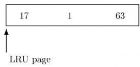

For each hexadecimal address in the address sequence given below, 00FF, 010D, 10FF, 11B0

indicate

i. the new status of the list  
ii. page faults, if any, and  
iii. page replacements, if any.

gate1996 operating-system virtual-memory normal descriptive

# Answer key

# 5.33.9 Virtual Memory: GATE CSE 1998 | Question: 2.18, UGCNET-June2012-III: 48

If an instruction takes i microseconds and a page fault takes an additional j microseconds, the effective instruction time if on the average a page fault occurs every k instruction is:


A. $i + \frac{j}{k}$

B. $i + (j \times k)$

C. $\frac{i+j}{k}$

D. $(i + j) \times k$

gate1998 operating-system virtual-memory easy ugcnetcse-june2012-paper3

# Answer key

# 5.33.10 Virtual Memory: GATE CSE 1999 | Question: 19

A certain computer system has the segmented paging architecture for virtual memory. The memory is byte addressable. Both virtual and physical address spaces contain $2^{16}$ bytes each. The virtual address space is divided into 8 non-overlapping equal size segments. The memory management unit (MMU) has a hard segment table, each entry of which contains the physical address of the page table for the segment. Page are stored in the main memory and consists of 2 byte page table entries.


a. What is the minimum page size in bytes so that the page table for a segment requires at most one page to store it? Assume that the page size can only be a power of 2.  
b. Now suppose that the pages size is 512 bytes. It is proposed to provide a TLB (Transaction look-aside buffer) for speeding up address translation. The proposed TLB will be capable of storing page table entries for 16

recently referenced virtual pages, in a fast cache that will use the direct mapping scheme. What is the number of tag bits that will need to be associated with each cache entry?

c. Assume that each page table entry contains (besides other information) 1 valid bit, 3 bits for page protection and 1 dirty bit. How many bits are available in page table entry for storing the aging information for the page? Assume that the page size is 512 bytes.

gate1999 operating-system virtual-memory normal descriptive

# Answer key

# 5.33.11 Virtual Memory: GATE CSE 1999 | Question: 2.10

A multi-user, multi-processing operating system cannot be implemented on hardware that does not support


A. Address translation  
B. DMA for disk transfer  
C. At least two modes of CPU execution (privileged and non-privileged)  
D. Demand paging

gate1999 operating-system normal virtual-memory multiple-selects

# Answer key

# 5.33.12 Virtual Memory: GATE CSE 1999 | Question: 2.11

Which of the following is/are advantage(s) of virtual memory?


A. Faster access to memory on an average.  
B. Processes can be given protected address spaces.  
C. Linker can assign addresses independent of where the program will be loaded in physical memory.  
D. Program larger than the physical memory size can be run.

gate1999 operating-system virtual-memory easy multiple-selects

# Answer key

# 5.33.13 Virtual Memory: GATE CSE 2000 | Question: 2.22

Suppose the time to service a page fault is on the average 10 milliseconds, while a memory access takes 1 microsecond. Then a 99.99% hit ratio results in average memory access time of


A. 1.9999 milliseconds

C. 9.999 microseconds

gatecse-2000 operating-system easy virtual-memory

B. 1 millisecond

D. 1.9999 microseconds

# Answer key

# 5.33.14 Virtual Memory: GATE CSE 2001 | Question: 1.20

Where does the swap space reside?


A. RAM

B. Disk

C. ROM

D. On-chip cache

gatecse-2001 operating-system easy virtual-memory

# Answer key

# 5.33.15 Virtual Memory: GATE CSE 2001 | Question: 1.8

Which of the following statements is false?


A. Virtual memory implements the translation of a program's address space into physical memory address space  
B. Virtual memory allows each program to exceed the size of the primary memory  
C. Virtual memory increases the degree of multiprogramming  
D. Virtual memory reduces the context switching overhead


# 5.33.16 Virtual Memory: GATE CSE 2001 | Question: 2.21


Consider a machine with 64 MB physical memory and a 32-bit virtual address space. If the page size is 4 KB, what is the approximate size of the page table?

A. 16 MB

B. 8 MB

C. 2 MB

D. 24 MB

gatecse-2001 operating-system virtual-memory normal

# Answer key

# 5.33.17 Virtual Memory: GATE CSE 2002 | Question: 19


A computer uses 32 — bit virtual address, and 32 — bit physical address. The physical memory is byte addressable, and the page size is 4 Kbytes. It is decided to use two level page tables to translate from virtual address to physical address. Equal number of bits should be used for indexing first level and second level page table, and the size of each table entry is 4 bytes.

A. Give a diagram showing how a virtual address would be translated to a physical address.  
B. What is the number of page table entries that can be contained in each page?  
C. How many bits are available for storing protection and other information in each page table entry?

gatecse-2002 operating-system virtual-memory normal descriptive

# Answer key

# 5.33.18 Virtual Memory: GATE CSE 2003 | Question: 26


In a system with 32 bit virtual addresses and 1 KB page size, use of one-level page tables for virtual to physical address translation is not practical because of

A. the large amount of internal fragmentation  
B. the large amount of external fragmentation  
C. the large memory overhead in maintaining page tables  
D. the large computation overhead in the translation process

gatecse-2003 operating-system virtual-memory normal

# Answer key

# 5.33.19 Virtual Memory: GATE CSE 2003 | Question: 78


A processor uses 2 — level page tables for virtual to physical address translation. Page tables for both levels are stored in the main memory. Virtual and physical addresses are both 32 bits wide. The memory is byte addressable. For virtual to physical address translation, the 10 most significant bits of the virtual address are used as index into the first level page table while the next 10 bits are used as index into the second level page table. The 12 least significant bits of the virtual address are used as offset within the page. Assume that the page table entries in both levels of page tables are 4 bytes wide. Further, the processor has a translation look-aside buffer (TLB), with a hit rate of 96%. The TLB caches recently used virtual page numbers and the corresponding physical page numbers. The processor also has a physically addressed cache with a hit rate of 90%. Main memory access time is 10 ns, cache access time is 1 ns, and TLB access time is also 1 ns.

Assuming that no page faults occur, the average time taken to access a virtual address is approximately (to the nearest 0.5 ns)

A. 1.5 ns

B. 2 ns

C. 3 ns

D. 4 ns

gatecse-2003 operating-system normal virtual-memory

# Answer key

# 5.33.20 Virtual Memory: GATE CSE 2003 | Question: 79


A processor uses 2-level page tables for virtual to physical address translation. Page tables for both levels are stored in the main memory. Virtual and physical addresses are both 32 bits wide. The memory is byte

addressable. For virtual to physical address translation, the 10 most significant bits of the virtual address are used as index into the first level page table while the next 10 bits are used as index into the second level page table. The 12 least significant bits of the virtual address are used as offset within the page. Assume that the page table entries in both levels of page tables are 4 bytes wide. Further, the processor has a translation look-aside buffer (TLB), with a hit rate of 96%. The TLB caches recently used virtual page numbers and the corresponding physical page numbers. The processor also has a physically addressed cache with a hit rate of 90%. Main memory access time is 10 ns, cache access time is 1 ns, and TLB access time is also 1 ns.

Suppose a process has only the following pages in its virtual address space: two contiguous code pages starting at virtual address 0x00000000, two contiguous data pages starting at virtual address0x00400000, and a stack page starting at virtual address 0xFFFFF000. The amount of memory required for storing the page tables of this process is

A. 8 KB

B. 12 KB

C. 16 KB

D. 20 KB

gatecse-2003 operating-system normal virtual-memory

Answer key

# 5.33.21 Virtual Memory: GATE CSE 2006 | Question: 62, ISRO2016-50


A CPU generates 32-bit virtual addresses. The page size is 4 KB. The processor has a translation look-aside buffer (TLB) which can hold a total of 128 page table entries and is 4-way set associative. The minimum size of the TLB tag is:

A. 11 bits

B. 13 bits

C. 15 bits

D. 20 bits

gatecse-2006 operating-system virtual-memory normal isro2016

Answer key

# 5.33.22 Virtual Memory: GATE CSE 2006 | Question: 63, UGCNET-June2012-III: 45


A computer system supports 32-bit virtual addresses as well as 32-bit physical addresses. Since the virtual address space is of the same size as the physical address space, the operating system designers decide to get rid of the virtual memory entirely. Which one of the following is true?

A. Efficient implementation of multi-user support is no longer possible  
B. The processor cache organization can be made more efficient now  
C. Hardware support for memory management is no longer needed  
D. CPU scheduling can be made more efficient now

gatecse-2006 operating-system virtual-memory normal ugcnetcse-june2012-paper3

Answer key

# 5.33.23 Virtual Memory: GATE CSE 2008 | Question: 67


A processor uses 36 bit physical address and 32 bit virtual addresses, with a page frame size of 4 Kbytes. Each page table entry is of size 4 bytes. A three level page table is used for virtual to physical address translation, where the virtual address is used as follows:

- Bits 30 – 31 are used to index into the first level page table.  
- Bits 21 – 29 are used to index into the 2nd level page table.  
- Bits 12 – 20 are used to index into the 3rd level page table.  
- Bits 0 – 11 are used as offset within the page.

The number of bits required for addressing the next level page table(or page frame) in the page table entry of the first, second and third level page tables are respectively

A. 20,20,20

B. 24,24,24

C. 24,24,20

D. 25,25,24

# 5.33.24 Virtual Memory: GATE CSE 2009 | Question: 10

The essential content(s) in each entry of a page table is / are

A. Virtual page number

B. Page frame number

C. Both virtual page number and page frame number

D. Access right information

gatecse-2009 operating-system virtual-memory easy

# Answer key


# 5.33.25 Virtual Memory: GATE CSE 2009 | Question: 34

A multilevel page table is preferred in comparison to a single level page table for translating virtual address to physical address because


A. It reduces the memory access time to read or write a memory location.  
B. It helps to reduce the size of page table needed to implement the virtual address space of a process  
C. It is required by the translation lookaside buffer.  
D. It helps to reduce the number of page faults in page replacement algorithms.

gatecse-2009 operating-system virtual-memory easy

# Answer key

# 5.33.26 Virtual Memory: GATE CSE 2011 | Question: 20, UGCNET-June2013-II: 48

Let the page fault service time be 10 milliseconds(ms) in a computer with average memory access time being 20 nanoseconds (ns). If one page fault is generated every $10^{6}$ memory accesses, what is the effective access time for memory?


A. 21 ns

B. 30 ns

C. 23 ns

D. 35 ns

gatecse-2011 operating-system virtual-memory normal ugcnetcse-june2013-paper2

# Answer key

# 5.33.27 Virtual Memory: GATE CSE 2013 | Question: 52

A computer uses 46-bit virtual address, 32-bit physical address, and a three-level paged page table organization. The page table base register stores the base address of the first-level table (T1), which occupies exactly one page. Each entry of T1 stores the base address of a page of the second-level table (T2). Each entry of T2 stores the base address of a page of the third-level table (T3). Each entry of T3 stores a page table entry (PTE). The PTE is 32 bits in size. The processor used in the computer has a 1 MB 16 way set associative virtually indexed physically tagged cache. The cache block size is 64 bytes.

What is the size of a page in KB in this computer?

A. 2

B. 4

C. 8

D. 16

gatecse-2013 operating-system virtual-memory normal

# Answer key

# 5.33.28 Virtual Memory: GATE CSE 2013 | Question: 53

A computer uses 46-bit virtual address, 32-bit physical address, and a three-level paged page table organization. The page table base register stores the base address of the first-level table (T1), which occupies exactly one page. Each entry of T1 stores the base address of a page of the second-level table (T2). Each entry of T2 stores the base address of a page of the third-level table (T3). Each entry of T3 stores a page table entry (PTE). The PTE is 32 bits in size. The processor used in the computer has a 1 MB 16 way set associative virtually indexed physically tagged cache. The cache block size is 64 bytes.

What is the minimum number of page colours needed to guarantee that no two synonyms map to different sets in


the processor cache of this computer?

A. 2

B. 4

C. 8

D. 16

gatecse-2013 normal operating-system virtual-memory

Answer key

# 5.33.29 Virtual Memory: GATE CSE 2014 | Set 3 | Question: 33

Consider a paging hardware with a TLB. Assume that the entire page table and all the pages are in the physical memory. It takes 10 milliseconds to search the TLB and 80 milliseconds to access the physical memory. If the TLB hit ratio is 0.6, the effective memory access time (in milliseconds) is \_\_\_\_.

gatecse-2014-set3 operating-system virtual-memory numerical-answers normal

Answer key

# 5.33.30 Virtual Memory: GATE CSE 2015 | Set 1 | Question: 12

Consider a system with byte-addressable memory, 32-bit logical addresses, 4 kilobyte page size and page table entries of 4 bytes each. The size of the page table in the system in megabytes is \_\_\_\_.

gatecse-2015-set1 operating-system virtual-memory easy numerical-answers

Answer key

# 5.33.31 Virtual Memory: GATE CSE 2015 | Set 2 | Question: 25

A computer system implements a 40-bit virtual address, page size of 8 kilobytes, and a 128-entry translation look-aside buffer (TLB) organized into 32 sets each having 4 ways. Assume that the TLB tag does not store any process id. The minimum length of the TLB tag in bits is \_\_\_\_.

gatecse-2015-set2 operating-system virtual-memory easy numerical-answers

Answer key

# 5.33.32 Virtual Memory: GATE CSE 2015 | Set 2 | Question: 47

A computer system implements 8 kilobyte pages and a 32-bit physical address space. Each page table entry contains a valid bit, a dirty bit, three permission bits, and the translation. If the maximum size of the page table of a process is 24 megabytes, the length of the virtual address supported by the system is \_\_\_\_ bits.

gatecse-2015-set2 operating-system virtual-memory normal numerical-answers

Answer key

# 5.33.33 Virtual Memory: GATE CSE 2016 | Set 1 | Question: 47

Consider a computer system with 40-bit virtual addressing and page size of sixteen kilobytes. If the computer system has a one-level page table per process and each page table entry requires 48 bits, then the size of the per-process page table is \_\_\_\_ megabytes.

gatecse-2016-set1 operating-system virtual-memory easy numerical-answers

Answer key

# 5.33.34 Virtual Memory: GATE CSE 2018 | Question: 10

Consider a process executing on an operating system that uses demand paging. The average time for a memory access in the system is $M$ units if the corresponding memory page is available in memory, and $D$ units if the memory access causes a page fault. It has been experimentally measured that the average time taken for a memory access in the process is $X$ units.

Which one of the following is the correct expression for the page fault rate experienced by the process.

A. $(D - M) / (X - M)$

B. $(X - M) / (D - M)$

C. $(D - X) / (D - M)$

D. $(X - M) / (D - X)$

gatecse-2018 operating-system virtual-memory normal one-mark


# 5.33.35 Virtual Memory: GATE CSE 2019 | Question: 33


Assume that in a certain computer, the virtual addresses are 64 bits long and the physical addresses are 48 bits long. The memory is word addressable. The page size is 8 kB and the word size is 4 bytes. The Translation Look-aside Buffer (TLB) in the address translation path has 128 valid entries. At most how many distinct virtual addresses can be translated without any TLB miss?

A. $16 \times 2^{10}$

C. $4 \times 2^{20}$

B. $256 \times 2^{10}$

D. $8 \times 2^{20}$

gatecse-2019 operating-system virtual-memory two-marks

# Answer key

# 5.33.36 Virtual Memory: GATE CSE 2020 | Question: 53


Consider a paging system that uses 1-level page table residing in main memory and a TLB for address translation. Each main memory access takes 100 ns and TLB lookup takes 20 ns. Each page transfer to/from the disk takes 5000 ns. Assume that the TLB hit ratio is 95%, page fault rate is 10%. Assume that for 20% of the total page faults, a dirty page has to be written back to disk before the required page is read from disk. TLB update time is negligible. The average memory access time in ns (round off to 1 decimal places) is

gatecse-2020 numerical-answers operating-system virtual-memory two-marks

# Answer key

# 5.33.37 Virtual Memory: GATE CSE 2023 | Question: 48


Consider a computer system with 57-bit virtual addressing using multi-level tree-structured page tables with L levels for virtual to physical address translation. The page size is $4\mathrm{KB}(1\mathrm{KB}=1024\mathrm{B})$ and a page table entry at any of the levels occupies 8 bytes.

The value of L is \_\_\_\_.

gatecse-2023 operating-system virtual-memory numerical-answers two-marks

# Answer key

# 5.33.38 Virtual Memory: GATE CSE 2024 | Set 1 | Question: 52


Consider a memory management system that uses a page size of 2 KB. Assume that both the physical and virtual addresses start from 0. Assume that the pages 0, 1, 2, and 3 are stored in the page frames 1, 3, 2, and 0, respectively. The physical address (in decimal format) corresponding to the virtual address 2500 (in decimal format) is \_\_\_\_.

gatecse-2024-set1 numerical-answers operating-system virtual-memory two-marks

# Answer key

# 5.33.39 Virtual Memory: GATE CSE 2024 | Set 2 | Question: 14


Which of the following tasks is/are the responsibility/responsibilities of the memory management unit (MMU) in a system with paging-based memory management?

A. Allocate a new page table for a newly created process  
B. Translate a virtual address to a physical address using the page table  
C. Raise a trap when a virtual address is not found in the page table  
D. Raise a trap when a process tries to write to a page marked with read-only permission in the page table

gatecse-2024-set2 operating-system multiple-selects virtual-memory one-mark

# Answer key

# 5.33.40 Virtual Memory: GATE CSE 2024 | Set 2 | Question: 54


Consider a 32-bit system with 4 KB page size and page table entries of size 4 bytes each. Assume $1 KB = 2^{10}$ bytes. The OS uses a 2-level page table for memory management, with the page table

containing an outer page directory and an inner page table. The OS allocates a page for the outer page directory upon process creation. The OS uses demand paging when allocating memory for the inner page table, i.e., a page of the inner page table is allocated only if it contains at least one valid page table entry.

An active process in this system accesses 2000 unique pages during its execution, and none of the pages are swapped out to disk. After it completes the page accesses, let X denote the minimum and Y denote the maximum number of pages across the two levels of the page table of the process.

The value of X+Y is \_\_\_\_.

gatecse-2024-set2

numerical-answers

operating-system

virtual-memory

two-marks

# Answer key

# 5.33.41 Virtual Memory: GATE IT 2004 | Question: 66


In a virtual memory system, size of the virtual address is 32-bit, size of the physical address is 30-bit, page size is 4 Kbyte and size of each page table entry is 32-bit. The main memory is byte addressable. Which one of the following is the maximum number of bits that can be used for storing protection and other information in each page table entry?

A. 2

B. 10

C. 12

D. 14

gateit-2004 operating-system virtual-memory normal

# Answer key

# 5.33.42 Virtual Memory: GATE IT 2008 | Question: 16


A paging scheme uses a Translation Look-aside Buffer (TLB). A TLB-access takes 10 ns and the main memory access takes 50 ns. What is the effective access time(in ns) if the TLB hit ratio is 90% and there is no page-fault?

A. 54

B. 60

C. 65

D. 75

gateit-2008 operating-system virtual-memory normal

# Answer key

# 5.33.43 Virtual Memory: GATE IT 2008 | Question: 56


Match the following flag bits used in the context of virtual memory management on the left side with the different purposes on the right side of the table below.

<table><tr><td colspan="2">Name of the bit</td><td>Purpose</td></tr><tr><td>I.</td><td>Dirty</td><td>a. Page initialization</td></tr><tr><td>II.</td><td>R/W</td><td>b. Write-back policy</td></tr><tr><td>III.</td><td>Reference</td><td>c. Page protection</td></tr><tr><td>IV.</td><td>Valid</td><td>d. Page replacement policy</td></tr></table>

A. I-d, II-a, III-b, IV-c  
C. I-c, II-d, III-a, IV-b

gateit-2008 operating-system virtual-memory easy match-the-following

B. I-b, II-c, III-a, IV-d  
D. I-b, II-c, III-d, IV-a

# Answer key

# Answer Keys

<table><tr><td>5.1.1</td><td>A</td></tr><tr><td>5.3.3</td><td>C</td></tr></table>

<table><tr><td>5.1.2</td><td>A;C</td></tr><tr><td>5.3.4</td><td>A;B</td></tr></table>

<table><tr><td>5.2.1</td><td>3:3</td></tr><tr><td>5.4.1</td><td>800</td></tr></table>

<table><tr><td>5.3.1</td><td>C</td></tr><tr><td>5.5.1</td><td>2</td></tr></table>

<table><tr><td>5.3.2</td><td>B</td></tr><tr><td>5.5.2</td><td>A;B;C</td></tr><tr><td>5.5.3</td><td>06:06</td></tr><tr><td>5.7.1</td><td>N/A</td></tr><tr><td>5.7.6</td><td>9.006</td></tr><tr><td>5.7.11</td><td>D</td></tr><tr><td>5.7.16</td><td>B</td></tr><tr><td>5.7.21</td><td>D</td></tr><tr><td>5.7.26</td><td>30.06</td></tr><tr><td>5.8.1</td><td>N/A</td></tr><tr><td>5.8.6</td><td>A</td></tr><tr><td>5.8.11</td><td>346</td></tr><tr><td>5.8.16</td><td>C</td></tr><tr><td>5.9.5</td><td>A;C</td></tr><tr><td>5.10.3</td><td>C</td></tr><tr><td>5.10.8</td><td>C</td></tr><tr><td>5.11.5</td><td>A</td></tr><tr><td>5.14.1</td><td>90.00</td></tr><tr><td>5.14.6</td><td>D</td></tr><tr><td>5.17.3</td><td>B</td></tr><tr><td>5.17.8</td><td>B</td></tr><tr><td>5.19.3</td><td>B</td></tr><tr><td>5.20.5</td><td>C</td></tr><tr><td>5.20.10</td><td>B</td></tr><tr><td>5.20.15</td><td>C</td></tr><tr><td>5.20.20</td><td>D</td></tr><tr><td>5.20.25</td><td>B</td></tr><tr><td>5.20.30</td><td>A</td></tr><tr><td>5.22.1</td><td>B</td></tr><tr><td>5.23.1</td><td>N/A</td></tr><tr><td>5.23.6</td><td>A</td></tr><tr><td>5.23.11</td><td>B</td></tr><tr><td>5.23.16</td><td>B</td></tr><tr><td>5.23.21</td><td>A</td></tr><tr><td>5.23.26</td><td>5.5</td></tr><tr><td>5.23.31</td><td>8.25</td></tr><tr><td>5.23.36</td><td>5.25:5.26</td></tr><tr><td>5.23.41</td><td>B</td></tr><tr><td>5.23.46</td><td>D</td></tr><tr><td>5.24.2</td><td>N/A</td></tr><tr><td>5.24.7</td><td>N/A</td></tr><tr><td>5.24.12</td><td>N/A</td></tr></table>

<table><tr><td>5.5.4</td><td>A</td></tr><tr><td>5.7.2</td><td>N/A</td></tr><tr><td>5.7.7</td><td>D</td></tr><tr><td>5.7.12</td><td>A</td></tr><tr><td>5.7.17</td><td>C</td></tr><tr><td>5.7.22</td><td>99.55 : 99.65</td></tr><tr><td>5.7.27</td><td>C</td></tr><tr><td>5.8.2</td><td>N/A</td></tr><tr><td>5.8.7</td><td>D</td></tr><tr><td>5.8.12</td><td>85</td></tr><tr><td>5.9.1</td><td>C</td></tr><tr><td>5.9.6</td><td>153</td></tr><tr><td>5.10.4</td><td>31</td></tr><tr><td>5.11.1</td><td>A</td></tr><tr><td>5.11.6</td><td>B</td></tr><tr><td>5.14.2</td><td>D</td></tr><tr><td>5.15.1</td><td>4096</td></tr><tr><td>5.17.4</td><td>B</td></tr><tr><td>5.17.9</td><td>B</td></tr><tr><td>5.20.1</td><td>N/A</td></tr><tr><td>5.20.6</td><td>A</td></tr><tr><td>5.20.11</td><td>A</td></tr><tr><td>5.20.16</td><td>A</td></tr><tr><td>5.20.21</td><td>6</td></tr><tr><td>5.20.26</td><td>A;C</td></tr><tr><td>5.20.31</td><td>B</td></tr><tr><td>5.22.2</td><td>C</td></tr><tr><td>5.23.2</td><td>N/A</td></tr><tr><td>5.23.7</td><td>D</td></tr><tr><td>5.23.12</td><td>D</td></tr><tr><td>5.23.17</td><td>A</td></tr><tr><td>5.23.22</td><td>C</td></tr><tr><td>5.23.27</td><td>12</td></tr><tr><td>5.23.32</td><td>3</td></tr><tr><td>5.23.37</td><td>12 : 12</td></tr><tr><td>5.23.42</td><td>A</td></tr><tr><td>5.23.47</td><td>B</td></tr><tr><td>5.24.3</td><td>N/A</td></tr><tr><td>5.24.8</td><td>N/A</td></tr><tr><td>5.24.13</td><td>D</td></tr></table>

<table><tr><td>5.6.1</td><td>0.6</td></tr><tr><td>5.7.3</td><td>B</td></tr><tr><td>5.7.8</td><td>N/A</td></tr><tr><td>5.7.13</td><td>C</td></tr><tr><td>5.7.18</td><td>C</td></tr><tr><td>5.7.23</td><td>14020</td></tr><tr><td>5.7.28</td><td>D</td></tr><tr><td>5.8.3</td><td>N/A</td></tr><tr><td>5.8.8</td><td>B</td></tr><tr><td>5.8.13</td><td>B</td></tr><tr><td>5.9.2</td><td>D</td></tr><tr><td>5.9.7</td><td>B</td></tr><tr><td>5.10.5</td><td>C;D</td></tr><tr><td>5.11.2</td><td>B</td></tr><tr><td>5.11.7</td><td>C</td></tr><tr><td>5.14.3</td><td>A</td></tr><tr><td>5.16.1</td><td>65468:65468</td></tr><tr><td>5.17.5</td><td>10000</td></tr><tr><td>5.18.1</td><td>11:11</td></tr><tr><td>5.20.2</td><td>B</td></tr><tr><td>5.20.7</td><td>B</td></tr><tr><td>5.20.12</td><td>C</td></tr><tr><td>5.20.17</td><td>A</td></tr><tr><td>5.20.22</td><td>A</td></tr><tr><td>5.20.27</td><td>4108:4108</td></tr><tr><td>5.21.1</td><td>N/A</td></tr><tr><td>5.22.3</td><td>B</td></tr><tr><td>5.23.3</td><td>N/A</td></tr><tr><td>5.23.8</td><td>A</td></tr><tr><td>5.23.13</td><td>A</td></tr><tr><td>5.23.18</td><td>B</td></tr><tr><td>5.23.23</td><td>B</td></tr><tr><td>5.23.28</td><td>D</td></tr><tr><td>5.23.33</td><td>29</td></tr><tr><td>5.23.38</td><td>A;C;D</td></tr><tr><td>5.23.43</td><td>9.5:9.5</td></tr><tr><td>5.23.48</td><td>D</td></tr><tr><td>5.24.4</td><td>N/A</td></tr><tr><td>5.24.9</td><td>N/A</td></tr><tr><td>5.24.14</td><td>N/A</td></tr></table>

<table><tr><td>5.6.2</td><td>A</td></tr><tr><td>5.7.4</td><td>N/A</td></tr><tr><td>5.7.9</td><td>N/A</td></tr><tr><td>5.7.14</td><td>B</td></tr><tr><td>5.7.19</td><td>B</td></tr><tr><td>5.7.24</td><td>6.1 : 6.2</td></tr><tr><td>5.7.29</td><td>B</td></tr><tr><td>5.8.4</td><td>C</td></tr><tr><td>5.8.9</td><td>3</td></tr><tr><td>5.8.14</td><td>C</td></tr><tr><td>5.9.3</td><td>D</td></tr><tr><td>5.10.1</td><td>C</td></tr><tr><td>5.10.6</td><td>14</td></tr><tr><td>5.11.3</td><td>C</td></tr><tr><td>5.12.1</td><td>21:21</td></tr><tr><td>5.14.4</td><td>C</td></tr><tr><td>5.17.1</td><td>3.2</td></tr><tr><td>5.17.6</td><td>A</td></tr><tr><td>5.19.1</td><td>A</td></tr><tr><td>5.20.3</td><td>B</td></tr><tr><td>5.20.8</td><td>C</td></tr><tr><td>5.20.13</td><td>B</td></tr><tr><td>5.20.18</td><td>B</td></tr><tr><td>5.20.23</td><td>1</td></tr><tr><td>5.20.28</td><td>6:6</td></tr><tr><td>5.21.2</td><td>N/A</td></tr><tr><td>5.22.4</td><td>B;C;D</td></tr><tr><td>5.23.4</td><td>C</td></tr><tr><td>5.23.9</td><td>N/A</td></tr><tr><td>5.23.14</td><td>B</td></tr><tr><td>5.23.19</td><td>C</td></tr><tr><td>5.23.24</td><td>7.2</td></tr><tr><td>5.23.29</td><td>C</td></tr><tr><td>5.23.34</td><td>2</td></tr><tr><td>5.23.39</td><td>C;D</td></tr><tr><td>5.23.44</td><td>B</td></tr><tr><td>5.23.49</td><td>C</td></tr><tr><td>5.24.5</td><td>N/A</td></tr><tr><td>5.24.10</td><td>C</td></tr><tr><td>5.24.15</td><td>B</td></tr></table>

<table><tr><td>5.6.3</td><td>D</td></tr><tr><td>5.7.5</td><td>N/A</td></tr><tr><td>5.7.10</td><td>D</td></tr><tr><td>5.7.15</td><td>A</td></tr><tr><td>5.7.20</td><td>B</td></tr><tr><td>5.7.25</td><td>4096</td></tr><tr><td>5.7.30</td><td>D</td></tr><tr><td>5.8.5</td><td>B</td></tr><tr><td>5.8.10</td><td>10</td></tr><tr><td>5.8.15</td><td>B</td></tr><tr><td>5.9.4</td><td>4.0 : 4.1</td></tr><tr><td>5.10.2</td><td>B</td></tr><tr><td>5.10.7</td><td>4 : 4</td></tr><tr><td>5.11.4</td><td>A</td></tr><tr><td>5.13.1</td><td>B</td></tr><tr><td>5.14.5</td><td>C</td></tr><tr><td>5.17.2</td><td>N/A</td></tr><tr><td>5.17.7</td><td>C</td></tr><tr><td>5.19.2</td><td>C</td></tr><tr><td>5.20.4</td><td>C</td></tr><tr><td>5.20.9</td><td>C</td></tr><tr><td>5.20.14</td><td>A</td></tr><tr><td>5.20.19</td><td>7</td></tr><tr><td>5.20.24</td><td>D</td></tr><tr><td>5.20.29</td><td>C</td></tr><tr><td>5.21.3</td><td>N/A</td></tr><tr><td>5.22.5</td><td>B</td></tr><tr><td>5.23.5</td><td>B</td></tr><tr><td>5.23.10</td><td>19</td></tr><tr><td>5.23.15</td><td>A</td></tr><tr><td>5.23.20</td><td>D</td></tr><tr><td>5.23.25</td><td>1000</td></tr><tr><td>5.23.30</td><td>A</td></tr><tr><td>5.23.35</td><td>C</td></tr><tr><td>5.23.40</td><td>B;C</td></tr><tr><td>5.23.45</td><td>D</td></tr><tr><td>5.24.1</td><td>D</td></tr><tr><td>5.24.6</td><td>N/A</td></tr><tr><td>5.24.11</td><td>C</td></tr><tr><td>5.24.16</td><td>N/A</td></tr></table>

<table><tr><td>5.24.17</td><td>N/A</td></tr><tr><td>5.24.22</td><td>N/A</td></tr><tr><td>5.24.27</td><td>A</td></tr><tr><td>5.24.32</td><td>A</td></tr><tr><td>5.24.37</td><td>C</td></tr><tr><td>5.24.42</td><td>D</td></tr><tr><td>5.24.47</td><td>A</td></tr><tr><td>5.24.52</td><td>D</td></tr><tr><td>5.25.5</td><td>N/A</td></tr><tr><td>5.25.10</td><td>C</td></tr><tr><td>5.25.15</td><td>A</td></tr><tr><td>5.25.20</td><td>7</td></tr><tr><td>5.25.25</td><td>A;D</td></tr><tr><td>5.28.1</td><td>N/A</td></tr><tr><td>5.28.6</td><td>A</td></tr><tr><td>5.28.11</td><td>D</td></tr><tr><td>5.31.3</td><td>C</td></tr><tr><td>5.31.8</td><td>D</td></tr><tr><td>5.33.1</td><td>N/A</td></tr><tr><td>5.33.6</td><td>A</td></tr><tr><td>5.33.11</td><td>A;C</td></tr><tr><td>5.33.16</td><td>C</td></tr><tr><td>5.33.21</td><td>C</td></tr><tr><td>5.33.26</td><td>B</td></tr><tr><td>5.33.31</td><td>22</td></tr><tr><td>5.33.36</td><td>155:156</td></tr><tr><td>5.33.41</td><td>D</td></tr></table>

<table><tr><td>5.24.18</td><td>B</td></tr><tr><td>5.24.23</td><td>N/A</td></tr><tr><td>5.24.28</td><td>B</td></tr><tr><td>5.24.33</td><td>A</td></tr><tr><td>5.24.38</td><td>3</td></tr><tr><td>5.24.43</td><td>C</td></tr><tr><td>5.24.48</td><td>B</td></tr><tr><td>5.25.1</td><td>N/A</td></tr><tr><td>5.25.6</td><td>N/A</td></tr><tr><td>5.25.11</td><td>N/A</td></tr><tr><td>5.25.16</td><td>A</td></tr><tr><td>5.25.21</td><td>D</td></tr><tr><td>5.25.26</td><td>C</td></tr><tr><td>5.28.2</td><td>B</td></tr><tr><td>5.28.7</td><td>A;B;D</td></tr><tr><td>5.29.1</td><td>D</td></tr><tr><td>5.31.4</td><td>D</td></tr><tr><td>5.31.9</td><td>A</td></tr><tr><td>5.33.2</td><td>N/A</td></tr><tr><td>5.33.7</td><td>C</td></tr><tr><td>5.33.12</td><td>B;D</td></tr><tr><td>5.33.17</td><td>N/A</td></tr><tr><td>5.33.22</td><td>C</td></tr><tr><td>5.33.27</td><td>C</td></tr><tr><td>5.33.32</td><td>36</td></tr><tr><td>5.33.37</td><td>5</td></tr><tr><td>5.33.42</td><td>C</td></tr></table>

<table><tr><td>5.24.19</td><td>N/A</td></tr><tr><td>5.24.24</td><td>B</td></tr><tr><td>5.24.29</td><td>B</td></tr><tr><td>5.24.34</td><td>B</td></tr><tr><td>5.24.39</td><td>A</td></tr><tr><td>5.24.44</td><td>80</td></tr><tr><td>5.24.49</td><td>A</td></tr><tr><td>5.25.2</td><td>N/A</td></tr><tr><td>5.25.7</td><td>C</td></tr><tr><td>5.25.12</td><td>C</td></tr><tr><td>5.25.17</td><td>B</td></tr><tr><td>5.25.22</td><td>D</td></tr><tr><td>5.25.27</td><td>B</td></tr><tr><td>5.28.3</td><td>B</td></tr><tr><td>5.28.8</td><td>C</td></tr><tr><td>5.30.1</td><td>A;C</td></tr><tr><td>5.31.5</td><td>D</td></tr><tr><td>5.31.10</td><td>A</td></tr><tr><td>5.33.3</td><td>99.99</td></tr><tr><td>5.33.8</td><td>N/A</td></tr><tr><td>5.33.13</td><td>D</td></tr><tr><td>5.33.18</td><td>C</td></tr><tr><td>5.33.23</td><td>D</td></tr><tr><td>5.33.28</td><td>C</td></tr><tr><td>5.33.33</td><td>384</td></tr><tr><td>5.33.38</td><td>6596</td></tr><tr><td>5.33.43</td><td>D</td></tr></table>

<table><tr><td>5.24.20</td><td>B</td></tr><tr><td>5.24.25</td><td>C</td></tr><tr><td>5.24.30</td><td>D</td></tr><tr><td>5.24.35</td><td>D</td></tr><tr><td>5.24.40</td><td>A</td></tr><tr><td>5.24.45</td><td>B;C</td></tr><tr><td>5.24.50</td><td>C</td></tr><tr><td>5.25.3</td><td>A</td></tr><tr><td>5.25.8</td><td>N/A</td></tr><tr><td>5.25.13</td><td>B</td></tr><tr><td>5.25.18</td><td>B</td></tr><tr><td>5.25.23</td><td>B</td></tr><tr><td>5.26.1</td><td>C;D</td></tr><tr><td>5.28.4</td><td>C</td></tr><tr><td>5.28.9</td><td>C</td></tr><tr><td>5.31.1</td><td>A</td></tr><tr><td>5.31.6</td><td>B</td></tr><tr><td>5.32.1</td><td>C</td></tr><tr><td>5.33.4</td><td>B;C;E</td></tr><tr><td>5.33.9</td><td>A</td></tr><tr><td>5.33.14</td><td>B</td></tr><tr><td>5.33.19</td><td>D</td></tr><tr><td>5.33.24</td><td>B</td></tr><tr><td>5.33.29</td><td>122</td></tr><tr><td>5.33.34</td><td>B</td></tr><tr><td>5.33.39</td><td>B;C;D</td></tr></table>

<table><tr><td>5.24.21</td><td>N/A</td></tr><tr><td>5.24.26</td><td>D</td></tr><tr><td>5.24.31</td><td>A</td></tr><tr><td>5.24.36</td><td>C</td></tr><tr><td>5.24.41</td><td>C</td></tr><tr><td>5.24.46</td><td>D</td></tr><tr><td>5.24.51</td><td>C</td></tr><tr><td>5.25.4</td><td>D;E</td></tr><tr><td>5.25.9</td><td>B</td></tr><tr><td>5.25.14</td><td>C</td></tr><tr><td>5.25.19</td><td>B</td></tr><tr><td>5.25.24</td><td>A</td></tr><tr><td>5.27.1</td><td>D</td></tr><tr><td>5.28.5</td><td>7</td></tr><tr><td>5.28.10</td><td>A;B;C</td></tr><tr><td>5.31.2</td><td>D</td></tr><tr><td>5.31.7</td><td>A;D</td></tr><tr><td>5.32.2</td><td>1536</td></tr><tr><td>5.33.5</td><td>A</td></tr><tr><td>5.33.10</td><td>N/A</td></tr><tr><td>5.33.15</td><td>D</td></tr><tr><td>5.33.20</td><td>C</td></tr><tr><td>5.33.25</td><td>B</td></tr><tr><td>5.33.30</td><td>4</td></tr><tr><td>5.33.35</td><td>B</td></tr><tr><td>5.33.40</td><td>1028</td></tr></table>
