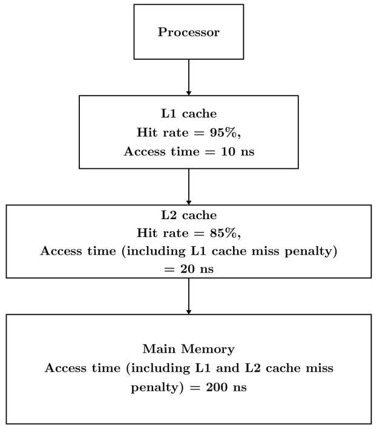
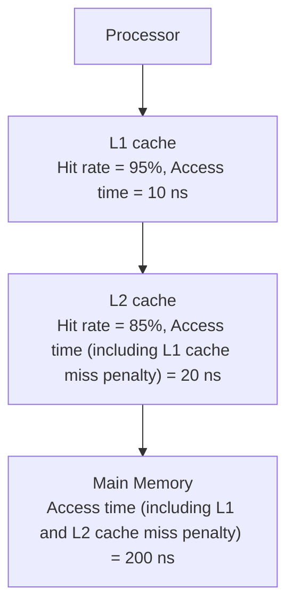
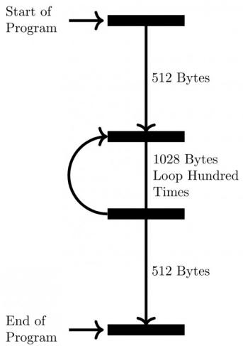

- Ideal CPI = 1.  
• Actual CPI = 1 + Stalls per instruction.

# Key Properties & Identities

- Increases instruction throughput, not latency.  
- Performance is limited by hazards (structural, data, control).

# Common Pitfalls

- Incorrectly calculating execution time when stalls are present.  
- Assuming pipelining reduces the execution time of a single instruction.

# Standard Problem-Solving Techniques

\- Draw pipeline diagrams to visualize instruction flow, identify hazards, and calculate stalls.

# Runtime Environment

The runtime environment refers to the state of a program during its execution, encompassing all resources and conditions necessary for the program to run. This includes the CPU's registers, memory (stack, heap, code, data segments), program counter, and operating system services.

# Important Formulas & Concepts

\- Includes CPU state (registers, PC, flags), memory layout (code, data, heap, stack), and OS resources.

# Key Properties & Identities

- Managed by the operating system and supported by the hardware architecture.  
- Defines how programs interact with the underlying system.

# Common Pitfalls

\- Not understanding the distinction between compile-time and run-time aspects of a program.

# Standard Problem-Solving Techniques

\- Understand how memory is organized and utilized by a program during execution (e.g., stack for function calls, heap for dynamic allocation).

# Speedup

Speedup is a measure of how much faster a task executes on an improved system compared to an original system. It quantifies the performance gain achieved by optimizations like pipelining, parallel processing, or using faster components.

# Important Formulas & Concepts

\- General Speedup:

$$
\text {Speedup} = \frac {\text {Execution Time} _ {\text {old}}}{\text {Execution Time} _ {\text {new}}}
$$

\- Amdahl's Law: Calculates the theoretical maximum speedup for a system when only a portion of the task can be improved.

$$
S _ {o v e r a l l} = \frac {1}{(1 - P) + \frac {P}{S _ {e n h a n c e d}}}
$$

where $P$ is the proportion of the program that can be enhanced, and $S_{enhanced}$ is the speedup of the enhanced part.

\- Pipelining Speedup (for large N): $S \approx K$ (number of pipeline stages).

# Key Properties & Identities

- Amdahl's Law highlights that the sequential portion of a program limits overall speedup.  
- Speedup is a dimensionless quantity.

# Common Pitfalls

- Incorrectly applying Amdahl's Law, especially regarding the value of $P$ .  
- Forgetting to account for overheads or non-ideal conditions in pipelining.

# Standard Problem-Solving Techniques

\- Identify the parallelizable and sequential components of a task when using Amdahl's Law.

# Stall

A stall (also known as a bubble or NOP) is a delay introduced into a pipeline to resolve a hazard. When a hazard is detected, the pipeline is temporarily halted for one or more clock cycles, preventing the dependent instruction from proceeding until the hazard is cleared.

# Important Formulas & Concepts

- Stalls increase the CPI (Cycles Per Instruction) of the pipeline.  
- Number of stalls depends on the type of hazard and the pipeline's ability to forward data.

# Key Properties & Identities

- Reduces the effective throughput and speedup of the pipeline.  
- A common method to ensure correctness in the presence of data and control hazards.

# Common Pitfalls

\- Incorrectly calculating the number of stalls required for a given hazard, especially when forwarding is implemented.

# Standard Problem-Solving Techniques

\- Draw pipeline diagrams and mark the clock cycles where stalls are inserted to resolve dependencies.

# Virtual Memory

Virtual memory is a memory management technique that allows a computer to compensate for physical memory shortages by temporarily transferring data from RAM to disk storage. It provides the illusion of a larger, contiguous memory space to programs.

# Important Formulas & Concepts

- Paging: Divides memory into fixed-size blocks (pages and frames).  
• Page Table: Maps virtual page numbers to physical frame numbers.  
- TLB (Translation Lookaside Buffer): A small, fast cache for page table entries.  
• Effective Access Time (EAT) with TLB:

$$
E A T = T L B _ {h i t \_ r a t e} \times \left(T _ {T L B} + T _ {\text {memory}}\right) + T L B _ {\text {miss\_rate}} \times \left(T _ {T L B} + 2 \times T _ {\text {memory}}\right)
$$

where $T_{TLB}$ is TLB access time and $T_{memory}$ is main memory access time.

• Effective Access Time (EAT) with Page Faults:

$$
E A T = (1 - P) \times T _ {m e m o r y} + P \times T _ {p a g e \_ f a u l t}
$$

where P is the page fault rate, $T_{memory}$ is memory access time, and $T_{page\_fault}$ is the time to handle a page fault (including disk I/O).

# Key Properties & Identities

- Provides memory protection, allows multitasking, and enables programs larger than physical memory.  
- Address translation involves converting virtual addresses to physical addresses.

# Common Pitfalls

- Incorrectly calculating EAT, especially when considering both TLB misses and page faults.  
- Confusing page table entries with TLB entries.

# Standard Problem-Solving Techniques

\- Trace the address translation process (TLB lookup, page table lookup, page fault handling).

# Quick Formula Reference

<table><tr><td>Topic</td><td>Formula/Concept</td></tr><tr><td>Average Memory</td><td>· Single-level cache:  $AMAT = T_{hit} + MR \times T_{miss\_penalty}$ </td></tr><tr><td>Access Time (AMAT)</td><td>· Two-level cache:  $AMAT = T_{L1\_hit} + MR_{L1} \times (T_{L2\_hit} + MR_{L2} \times T_{main\_memory})$ </td></tr><tr><td>Cache Memory(Address Breakdown)</td><td>· Block Offset bits:  $\log_2(\text{Block Size})$ · Direct Mapped Index bits:  $\log_2(\text{Number of Cache Lines})$ · Set-Associative Index bits:  $\log_2(\text{Number of Sets})$ · Tag bits: Total Address Bits – Index Bits – Block Offset Bits· Direct Mapped Index:(Main Memory Block Number) (mod Number of Cache Lines)</td></tr><tr><td>Disk Access Time</td><td>· Access_Time = Seek_Time + Rotational_Latency + Transfer_Time· Average_Rotational_Latency =  $\frac{1}{2} \times \frac{60}{\text{RPM}}$ · Transfer_Time =  $\frac{\text{Number of Sectors}}{\text{Sectors per Track}} \times \frac{60}{\text{RPM}}$ </td></tr><tr><td>Pipelining Performance</td><td>· Execution time (N instructions, K stages, ideal):  $T_{pipeline} = (K + N - 1) \times T_{cycle}$ · Ideal Speedup (large N):  $S \approx K$ · Actual CPI: 1 + Stalls per instruction</td></tr><tr><td>Speedup (Amdahl&#x27;s Law)</td><td>·  $S_{overall} = \frac{1}{(1-P) + \frac{P}{S_{enhanced}}}$ </td></tr><tr><td>Virtual Memory (EAT)</td><td>· With TLB:  $EAT = TLB_{hit\_rate} \times (T_{TLB} + T_{memory}) + TLB_{miss\_rate} \times (T_{TLB} + 2 \times T_{memory})$ · With Page Faults:  $EAT = (1 - P) \times T_{memory} + P \times T_{page\_fault}$ </td></tr></table>

# Important Tips for GATE

- Master Numerical Problems: A significant portion of COA questions are numerical, especially on Cache Memory (AMAT, address breakdown), Pipelining (execution time, speedup, stalls), Disk Access Time, and Virtual Memory (EAT). Practice these extensively.  
- Address Breakdown is Key: For cache and virtual memory, thoroughly understand how a logical/physical address is divided into Tag, Index/Page Number, and Offset. This is fundamental for many problems.  
- Pipeline Diagrams: Learn to draw and analyze pipeline diagrams for instruction sequences. This is the best way to identify data/control hazards and calculate the number of stalls or benefits of forwarding.

- Conceptual Clarity: Don't just memorize definitions. Understand the "why" behind concepts. For example, why RISC is better for pipelining, why cache works (locality), or why DMA is used.  
- Distinguish Similar Concepts: Be clear on the differences between CISC/RISC, hardwired/microprogrammed control, various addressing modes, and different types of hazards (structural, data, control).  
- Read Questions Carefully: Pay close attention to units (ns, ms, cycles), specific assumptions (e.g., "no forwarding," "average rotational latency"), and what is being asked (e.g., total time vs. speedup).  
- Amdahl's Law: This formula frequently appears in questions related to performance improvement. Understand how to apply it correctly, especially identifying the parallelizable portion $P$ .  
- Time Management: Some numerical problems can be lengthy. If you get stuck or find a calculation too complex, consider moving on and returning later. Look for shortcuts or approximations if applicable.

# 1.1

# Addressing Modes (19)

Practice Test: Test 1 (15Q)

# 1.1.1 Addressing Modes: GATE CSE 1987 | Question: 1-V

The most relevant addressing mode to write position-independent codes is:

A. Direct mode

B. Indirect mode

C. Relative mode

D. Indexed mode

gate1987 co-and-architecture addressing-modes easy

Answer key

# 1.1.2 Addressing Modes: GATE CSE 1988 | Question: 9iii

In the program scheme given below indicate the instructions containing any operand needing relocation for position independent behaviour. Justify your answer.

$$
Y = 1 0
$$

$$
\mathrm{MOV} \quad X (R _ {0}), R _ {1}
$$

$$
\mathrm{MOV} \quad X, R _ {0}
$$

$$
\mathrm{MOV} \quad 2 (R _ {0}), R _ {1}
$$

$$
\mathrm{MOV} \quad Y (R _ {0}), R _ {5}
$$

•

•

•

$$
X: \text {WORD} 0, 0, 0
$$

gate1988 normal descriptive co-and-architecture addressing-modes

Answer key

# 1.1.3 Addressing Modes: GATE CSE 1989 | Question: 2-ii

Match the pairs in the following questions:

<table><tr><td>(A)</td><td>Base addressing</td><td>(p)</td><td>Reentranecy</td></tr><tr><td>(B)</td><td>Indexed addressing</td><td>(q)</td><td>Accumulator</td></tr><tr><td>(C)</td><td>Stack addressing</td><td>(r)</td><td>Array</td></tr><tr><td>(D)</td><td>Implied addressing</td><td>(s)</td><td>Position independent</td></tr></table>

gate1989 match-the-following co-and-architecture addressing-modes easy

Answer key

# 1.1.4 Addressing Modes: GATE CSE 1993 | Question: 10

The instruction format of a CPU is:

<table><tr><td>OP CODE</td><td>MODE</td><td>RegR</td></tr></table>

Mode and RegR together specify the operand. RegR specifies a CPU register and Mode specifies an addressing mode. In particular, Mode = 2 specifies that 'the register RegR contains the address of the operand, after fetching the operand, the contents of RegR are incremented by 1'.

An instruction at memory location 2000 specifies Mode = 2 and the RegR refers to program counter (PC).

A. What is the address of the operand?  
B. Assuming that is a non-jump instruction, what are the contents of PC after the execution of this instruction?

gate1993 co-and-architecture addressing-modes normal descriptive

# Answer key

# 1.1.5 Addressing Modes: GATE CSE 1996 | Question: 1.16, ISRO2016-42

Relative mode of addressing is most relevant to writing:

A. Co – routines  
C. Shareable code

B. Position – independent code

D. Interrupt Handlers

gate1996 co-and-architecture addressing-modes easy isro2016

# Answer key

# 1.1.6 Addressing Modes: GATE CSE 1998 | Question: 1.19

Which of the following addressing modes permits relocation without any change whatsoever in the code?

A. Indirect addressing  
C. Base register addressing

B. Indexed addressing  
D. PC relative addressing

gate1998 co-and-architecture addressing-modes easy

# Answer key

# 1.1.7 Addressing Modes: GATE CSE 1999 | Question: 2.23

A certain processor supports only the immediate and the direct addressing modes. Which of the following programming language features cannot be implemented on this processor?

A. Pointers  
C. Records

B. Arrays  
D. Recursive procedures with local variable

gate1999 co-and-architecture addressing-modes normal multiple-selects

# Answer key

# 1.1.8 Addressing Modes: GATE CSE 2000 | Question: 1.10

The most appropriate matching for the following pairs

X: Indirect addressing 1: Loops  
Y: Immediate addressing 2: Pointers  
Z: Auto decrement addressing 3: Constants

is

A. $X - 3, Y - 2, Z - 1$  
C. $X - 2, Y - 3, Z - 1$

B. $X - 1, Y - 3, Z - 2$  
D. $X - 3, Y - 1, Z - 2$

gatecse-2000 co-and-architecture easy addressing-modes match-the-following

# Answer key

# 1.1.9 Addressing Modes: GATE CSE 2001 | Question: 2.9

Which is the most appropriate match for the items in the first column with the items in the second column:

<table><tr><td>X. Indirect Addressing</td><td>I. Array implementation</td></tr><tr><td>Y. Indexed Addressing</td><td>II. Writing relocatable code</td></tr><tr><td>Z. Base Register Addressing</td><td>III. Passing array as parameter</td></tr></table>

A. (X, III), (Y, I), (Z, II)  
C. (X, III), (Y, II), (Z, I)

B. (X, II), (Y, III), (Z, I)

gatecse-2001 co-and-architecture addressing-modes easy match-the-following

# Answer key

# 1.1.10 Addressing Modes: GATE CSE 2002 | Question: 1.24

In the absolute addressing mode:

A. the operand is inside the instruction  
B. the address of the operand in inside the instruction  
C. the register containing the address of the operand is specified inside the instruction  
D. the location of the operand is implicit

gatecse-2002 co-and-architecture addressing-modes easy

# Answer key

# 1.1.11 Addressing Modes: GATE CSE 2004 | Question: 20

Which of the following addressing modes are suitable for program relocation at run time?

I. Absolute addressing  
II. Based addressing  
III. Relative addressing  
IV. Indirect addressing

A. I and IV

C. II and III

B. I and II  
D. I, II and IV

gatecse-2004 co-and-architecture addressing-modes easy

# Answer key

# 1.1.12 Addressing Modes: GATE CSE 2005 | Question: 65

Consider a three word machine instruction

$\mathrm{ADDA}[R_{0}],@B$

The first operand (destination) “ $A[R_{0}]$ ” uses indexed addressing mode with $R_{0}$ as the index register. The second operand (source) “@B” uses indirect addressing mode. A and B are memory addresses residing at the second and third words, respectively. The first word of the instruction specifies the opcode, the index register designation and the source and destination addressing modes. During execution of ADD instruction, the two operands are added and stored in the destination (first operand).

The number of memory cycles needed during the execution cycle of the instruction is:

A. 3

B. 4

C. 5

D. 6

gatecse-2005 co-and-architecture addressing-modes normal

# Answer key

# 1.1.13 Addressing Modes: GATE CSE 2005 | Question: 66

Match each of the high level language statements given on the left hand side with the most natural addressing mode from those listed on the right hand side.

(1) $A[I] = B[J]$

(a) Indirect addressing

(2) while (\*A++);

(b) Indexed addressing

(3) int temp $= ^{*} x$

(c) Auto increment

A. $(1,c),(2,b),(3,a)$

B. $(1,c),(2,c),(3,b)$

C. $(1,b),(2,c),(3,a)$

D. $(1,a),(2,b),(3,c)$

gatecse-2005 co-and-architecture addressing-modes match-the-following easy

# Answer key

# 1.1.14 Addressing Modes: GATE CSE 2008 | Question: 33, ISRO2009-80

Which of the following is/are true of the auto-increment addressing mode?

I. It is useful in creating self-relocating code  
II. If it is included in an Instruction Set Architecture, then an additional ALU is required for effective address calculation  
III. The amount of increment depends on the size of the data item accessed

A. I only

B. II only

C. III only

D. II and III only

gatecse-2008 addressing-modes co-and-architecture normal isro2009

# Answer key

# 1.1.15 Addressing Modes: GATE CSE 2011 | Question: 21

Consider a hypothetical processor with an instruction of type LW R1, 20(R2), which during execution reads a 32-bit word from memory and stores it in a 32-bit register R1. The effective address of the memory location is obtained by the addition of a constant 20 and the contents of register R2. Which of the following best reflects the addressing mode implemented by this instruction for the operand in memory?

A. Immediate addressing

B. Register addressing

C. Register Indirect Scaled Addressing

D. Base Indexed Addressing

gatecse-2011 co-and-architecture addressing-modes easy

# Answer key

# 1.1.16 Addressing Modes: GATE CSE 2017 | Set 1 | Question: 11

Consider the $C$ struct defined below:

struct data {
    int marks [100];
    char grade;
    int cnumber;
};
struct data student;

The base address of student is available in register R1. The field student.grade can be accessed efficiently using:

A. Post-increment addressing mode, $(R1)+$  
B. Pre-decrement addressing mode, $-(R1)$  
C. Register direct addressing mode, R1  
D. Index addressing mode, $X(R1)$ , where $X$ is an offset represented in $2's$ complement 16-bit representation

gatecse-2017-set1 co-and-architecture addressing-modes

# Answer key

# 1.1.17 Addressing Modes: GATE CSE 2026 | Set 1 | Question: 4

Match each addressing mode in List I with a data element or an element of a data structure (in a high-level language) in List II:

<table><tr><td>List I</td><td>List II</td></tr><tr><td>P. Immediate</td><td>1. Element of an array</td></tr><tr><td>Q. Indirect</td><td>2. Pointer</td></tr><tr><td>R. Base with index</td><td>3. Element of a record</td></tr><tr><td>S. Base with offset/displacement</td><td>4. Constant</td></tr></table>

A. $\mathrm{P} - 4, \mathrm{Q} - 3, \mathrm{R} - 1, \mathrm{S} - 2$  
B. P - 4, Q - 2, R - 1, S - 3  
C. $\mathrm{P - 1,Q - 4,R - 3,S - 2}$  
D. P - 2, Q - 3, R - 1, S - 4

gatecse-2026-set1 co-and-architecture addressing-modes one-mark

# Answer key

# 1.1.18 Addressing Modes: GATE IT 2006 | Question: 39, ISRO2009-42

Which of the following statements about relative addressing mode is FALSE?

A. It enables reduced instruction size  
B. It allows indexing of array element with same instruction  
C. It enables easy relocation of data  
D. It enables faster address calculation than absolute addressing

gateit-2006 co-and-architecture addressing-modes normal isro2009

# Answer key

# 1.1.19 Addressing Modes: GATE IT 2006 | Question: 40

The memory locations 1000, 1001 and 1020 have data values 18, 1 and 16 respectively before the following program is executed.

$$
\begin{array}{l} \text {MOVI} \quad R _ {s}, 1 \quad ; \text {Move immediate} \\ \text {LOAD} \quad R _ {d}, 1 0 0 0 (R _ {s}) \quad ; \text {Load from memory} \\ \text {ADDI} \quad R _ {d}, 1 0 0 0 \quad ; \text {Add immediate} \\ \text {STOREI} \quad 0 (R _ {d}), 2 0 \quad ; \text {Store immediate} \\ \end{array}
$$

Which of the statements below is TRUE after the program is executed?

A. Memory location 1000 has value 20  
C. Memory location 1021 has value 20

B. Memory location 1020 has value 20

D. Memory location 1001 has value 20

gateit-2006 co-and-architecture addressing-modes normal

# Answer key

# 1.2

# Average Memory Access Time (3)

# 1.2.1 Average Memory Access Time: GATE CSE 1992 | Question: 5-a

The access times of the main memory and the Cache memory, in a computer system, are 500 n sec and 50 nsec, respectively. It is estimated that 80% of the main memory request are for read the rest for write. The hit ratio for the read access only is 0.9 and a write-through policy (where both main and cache memories are updated simultaneously) is used. Determine the average time of the main memory (in ns).

gate1992 co-and-architecture cache-memory normal numerical-answers average-memory-access-time

# Answer key

# 1.2.2 Average Memory Access Time: GATE CSE 2025 | Set 1 | Question: 43

A computer has a memory hierarchy consisting of two-level cache (L1 and L2) and a main memory. If the processor needs to access data from memory, it first looks into L1 cache. If the data is not found in L1

cache, it goes to L2 cache. If it fails to get the data from L2 cache, it goes to main memory, where the data is definitely available. Hit rates and access times of various memory units are shown in the figure. The average memory access time in nanoseconds (ns) is \_\_\_\_. (rounded off to two decimal places)

flowchart

gatecse2025-set1 co-and-architecture cache-memory multilevel-cache average-memory-access-time numerical-answers two-marks

# Answer key

# 1.2.3 Average Memory Access Time: GATE CSE 2025 | Set 2 | Question: 45

Given a computing system with two levels of cache (L1 and L2) and a main memory. The first level (L1) cache access time is 1 nanosecond (ns) and the "hit rate" for L1 cache is 90% while the processor is

accessing the data from L1 cache. Whereas, for the second level (L2) cache, the "hit rate" is 80% and the "miss penalty" for transferring data from L2 cache to L1 cache is 10 ns. The "miss penalty" for the data to be transferred from main memory to L2 cache is 100 ns.

Then the average memory access time in this system in nanoseconds is \_\_\_\_. (rounded off to one decimal place)

gatecse2025-set2 co-and-architecture cache-memory average-memory-access-time multilevel-cache numerical-answers two-marks

# Answer key

# 1.3

# Bit Vector (1)

# 1.3.1 Bit Vector: GATE CSE 2026 | Set 2 | Question: 43

To keep track of free blocks in a file system, one of the two approaches is generally used - using bitmaps (bit vectors) or using linked lists. Consider that the linked list approach is used to keep track of free blocks in

a file system. Assume that the disk size is 16 GB, block size is 2 KB, and block numbers used are 32-bit long. A single pointer of size 4 bytes is used in each block of the list to point to the next block of the list. The number of blocks required to hold the free disk block numbers is \_\_\_\_. (answer in integer)

Note: $1\mathrm{K} = 2^{10}$ and $1\mathrm{G} = 2^{30}$

# 1.4

# CISC RISC Architecture (2)

# 1.4.1 CISC RISC Architecture: GATE CSE 1999 | Question: 2.22

The main difference(s) between a CISC and a RISC processor is/are that a RISC processor typically

A. has fewer instructions  
C. has more registers

B. has fewer addressing modes  
D. is easier to implement using hard-wired logic

gate1999 co-and-architecture normal cisc-risc-architecture multiple-selects

# Answer key

# 1.4.2 CISC RISC Architecture: GATE CSE 2018 | Question: 5

Consider the following processor design characteristics:

I. Register-to-register arithmetic operations only  
II. Fixed-length instruction format  
III. Hardwired control unit

Which of the characteristics above are used in the design of a RISC processor?

A. I and II only

B. II and III only

C. I and III only

D. I, II and III

gatecse-2018 co-and-architecture cisc-risc-architecture easy one-mark

# Answer key

# 1.5

# Cache Memory (69)

Practice Tests: Test 1 (15Q) Test 2 (15Q) Test 3 (15Q) Test 4 (15Q) Test 5 (15Q) Test 6 (15Q) Test 7 (15Q) Test 8 (4Q)

# 1.5.1 Cache Memory: GATE CSE 1987 | Question: 4b

What is cache memory? What is rationale of using cache memory?

gate1987 co-and-architecture cache-memory descriptive

# Answer key

# 1.5.2 Cache Memory: GATE CSE 1989 | Question: 6a

A certain computer system was designed with cache memory of size 1 Kbytes and main memory size of 256 Kbytes. The cache implementation was fully associative cache with 4 bytes per block. The CPU memory data path was 16 bits and the memory was 2—way interleaved. Each memory read request presents two 3 words. A program with the model shown below was run to evaluate the cache design.

flowchart

Answer the following questions:

i. What is the hit ratio?  
ii. Suggest a change in the program size of model to improve the hit ratio significantly.

gate1989 descriptive co-and-architecture cache-memory

Answer key

# 1.5.3 Cache Memory: GATE CSE 1990 | Question: 7a

A block-set associative cache memory consists of 128 blocks divided into four block sets. The main memory consists of 16,384 blocks and each block contains 256 eight bit words.

1. How many bits are required for addressing the main memory?  
2. How many bits are needed to represent the TAG, SET and WORD fields?

gate1990 descriptive co-and-architecture cache-memory

Answer key

# 1.5.4 Cache Memory: GATE CSE 1993 | Question: 11

In the three-level memory hierarchy shown in the following table, $p_{i}$ denotes the probability that an access request will refer to $M_{i}$ .

<table><tr><td>Hierarchy Level $(M_i)$ </td><td>Access Time $(t_i)$ </td><td>Probability of Access $(p_i)$ </td><td>Page Transfer Time $(T_i)$ </td></tr><tr><td> $M_1$ </td><td> $10^{-6}$ </td><td>0.99000</td><td>0.001 sec</td></tr><tr><td> $M_2$ </td><td> $10^{-5}$ </td><td>0.00998</td><td>0.1 sec</td></tr><tr><td> $M_3$ </td><td> $10^{-4}$ </td><td>0.00002</td><td>--</td></tr></table>

If a miss occurs at level $M_{i}$ , a page transfer occurs from $M_{i+1}$ to $M_{i}$ and the average time required for such a page swap is $T_{i}$ . Calculate the average time $t_{A}$ required for a processor to read one word from this memory system.

gate1993 co-and-architecture cache-memory normal descriptive

Answer key

# 1.5.5 Cache Memory: GATE CSE 1995 | Question: 1.6

The principle of locality justifies the use of:

A. Interrupts

B. DMA

C. Polling

D. Cache Memory

gate1995 co-and-architecture cache-memory easy

Answer key

# 1.5.6 Cache Memory: GATE CSE 1995 | Question: 2.25

A computer system has a $4K$ word cache organized in block-set-associative manner with 4 blocks per set, 64 words per block. The number of bits in the SET and WORD fields of the main memory address format is:

A. 15,40

B. 6,4

C. 7,2

D. 4,6

gate1995 co-and-architecture cache-memory normal

Answer key

# 1.5.7 Cache Memory: GATE CSE 1996 | Question: 26

A computer system has a three-level memory hierarchy, with access time and hit ratios as shown below:

Level 1 (Cache memory)

Access time = 50nsec/byte

<table><tr><td>Size</td><td>Hit ratio</td></tr><tr><td>8M bytes</td><td>0.80</td></tr><tr><td>16M bytes</td><td>0.90</td></tr><tr><td>64M bytes</td><td>0.95</td></tr></table>

Level 2 (Main memory)

Access time = 200nsec/byte

<table><tr><td>Size</td><td>Hit ratio</td></tr><tr><td>4M bytes</td><td>0.98</td></tr><tr><td>16M bytes</td><td>0.99</td></tr><tr><td>64M bytes</td><td>0.995</td></tr></table>

Level 3

Access time = 5μsec/byte

<table><tr><td>Size</td><td>Hit ratio</td></tr><tr><td>260M bytes</td><td>1.0</td></tr></table>

A. What should be the minimum sizes of level 1 and 2 memories to achieve an average access time of less than 100nsec?  
B. What is the average access time achieved using the chosen sizes of level 1 and level 2 memories?

gate1996 co-and-architecture cache-memory normal

# Answer key

# 1.5.8 Cache Memory: GATE CSE 1998 | Question: 18

For a set-associative Cache organization, the parameters are as follows:

<table><tr><td> $t_c$ </td><td>Cache Access Time</td></tr><tr><td> $t_m$ </td><td>Main memory access time</td></tr><tr><td>l</td><td>Number of sets</td></tr><tr><td>b</td><td>Block size</td></tr><tr><td> $k \times b$ </td><td>Set size</td></tr></table>

Calculate the hit ratio for a loop executed 100 times where the size of the loop is $n \times b$ , and $n = k \times m$ is a nonzero integer and $1 \leq m \leq l$ .

Give the value of the hit ratio for $l = 1$ .

gate1998 co-and-architecture cache-memory descriptive

# Answer key

# 1.5.9 Cache Memory: GATE CSE 1999 | Question: 1.22

The main memory of a computer has 2 cm blocks while the cache has 2 c blocks. If the cache uses the set associative mapping scheme with 2 blocks per set, then block k of the main memory maps to the set:

A. $(k \mod m)$ of the cache

C. $(k \mod 2c)$ of the cache

gate1999 co-and-architecture cache-memory normal

B. $(k \mod c)$ of the cache

D. (k mod 2 cm) of the cache

# Answer key

# 1.5.10 Cache Memory: GATE CSE 2001 | Question: 1.7, ISRO2008-18

More than one word are put in one cache block to:

A. exploit the temporal locality of reference in a program

C. reduce the miss penalty

gatecse-2001 co-and-architecture easy cache-memory isro2008

B. exploit the spatial locality of reference in a program

D. none of the above

# Answer key

# 1.5.11 Cache Memory: GATE CSE 2001 | Question: 9

A CPU has 32 — bit memory address and a 256 KB cache memory. The cache is organized as a 4 — way set associative cache with cache block size of 16 bytes.

A. What is the number of sets in the cache?  
B. What is the size (in bits) of the tag field per cache block?

