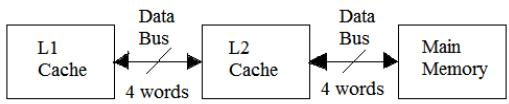
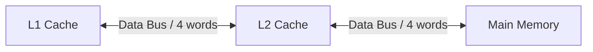
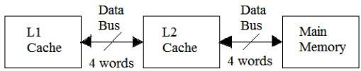

C. What is the number and size of comparators required for tag matching?  
D. How many address bits are required to find the byte offset within a cache block?  
E. What is the total amount of extra memory (in bytes) required for the tag bits?

gatecse-2001 co-and-architecture cache-memory normal descriptive

# Answer key

# 1.5.12 Cache Memory: GATE CSE 2002 | Question: 10


In a C program, an array is declared as float A[2048]. Each array element is 4 Bytes in size, and the starting address of the array is 0x00000000. This program is run on a computer that has a direct mapped data cache of size 8 Kbytes, with block (line) size of 16 Bytes.

A. Which elements of the array conflict with element $A[0]$ in the data cache? Justify your answer briefly.  
B. If the program accesses the elements of this array one by one in reverse order i.e., starting with the last element and ending with the first element, how many data cache misses would occur? Justify your answer briefly. Assume that the data cache is initially empty and that no other data or instruction accesses are to be considered.

gatecse-2002 co-and-architecture cache-memory normal descriptive

# Answer key

# 1.5.13 Cache Memory: GATE CSE 2004 | Question: 65


Consider a small two-way set-associative cache memory, consisting of four blocks. For choosing the block to be replaced, use the least recently used (LRU) scheme. The number of cache misses for the following sequence of block addresses is:

8, 12, 0, 12, 8.

A. 2

B. 3

C. 4

D. 5

gatecse-2004 co-and-architecture cache-memory normal

# Answer key

# 1.5.14 Cache Memory: GATE CSE 2005 | Question: 67


Consider a direct mapped cache of size 32 KB with block size 32 bytes. The CPU generates 32 bit addresses. The number of bits needed for cache indexing and the number of tag bits are respectively,

A. 10,17

B. 10,22

C. 15,17

D. 5,17

gatecse-2005 co-and-architecture cache-memory easy

# Answer key

# 1.5.15 Cache Memory: GATE CSE 2006 | Question: 74


Consider two cache organizations. First one is 32 KB 2-way set associative with 32 byte block size, the second is of same size but direct mapped. The size of an address is 32 bits in both cases. A 2-to-1 multiplexer has latency of 0.6 ns while a k-bit comparator has latency of $\frac{k}{10}$ ns. The hit latency of the set associative organization is $h_{1}$ while that of direct mapped is $h_{2}$ .

The value of $h_{1}$ is:

A. 2.4 ns

B. 2.3 ns

C. 1.8 ns

D. 1.7 ns

gatecse-2006 co-and-architecture cache-memory normal

# Answer key

# 1.5.16 Cache Memory: GATE CSE 2006 | Question: 75


Consider two cache organizations. First one is 32 kB 2-way set associative with 32 byte block size, the second is of same size but direct mapped. The size of an address is 32 bits in both cases. A 2-to-1

multiplexer has latency of 0.6ns while a k-bit comparator has latency of $\frac{k}{10}ns$ . The hit latency of the set associative organization is $h_{1}$ while that of direct mapped is $h_{2}$ .
The value of $h_{2}$ is:

A. 2.4 ns

B. 2.3 ns

C. 1.8 ns

D. 1.7 ns

gatecse-2006 co-and-architecture cache-memory normal

# Answer key

# 1.5.17 Cache Memory: GATE CSE 2006 | Question: 80

A CPU has a 32KB direct mapped cache with 128 byte-block size. Suppose A is two dimensional array of size $512 \times 512$ with elements that occupy 8-bytes each. Consider the following two C code segments, P1 and P2.


P1:

```txt
for (i=0; i<512; i++)
{
    for (j=0; j<512; j++)
    {
        x +=A[i] [j];
    }
}
```

P2:

```txt
for (i=0; i<512; i++)
{
    for (j=0; j<512; j++)
    {
        x +=A[j] [i];
    }
}
```

P1 and P2 are executed independently with the same initial state, namely, the array A is not in the cache and i, j, x are in registers. Let the number of cache misses experienced by P1 be $M_{1}$ and that for P2 be $M_{2}$ .

The value of $M_{1}$ is:

A. 0

B. 2048

C. 16384

D. 262144

gatecse-2006 co-and-architecture cache-memory normal

# Answer key

# 1.5.18 Cache Memory: GATE CSE 2006 | Question: 81

A CPU has a 32 KB direct mapped cache with 128 byte-block size. Suppose A is two dimensional array of size $512 \times 512$ with elements that occupy 8 - bytes each. Consider the following two C code segments, P1 and P2.


P1:

```txt
for (i=0; i<512; i++)
{
    for (j=0; j<512; j++)
    {
        x +=A[i] [j];
    }
}
```

P2:

```txt
for (i=0; i<512; i++)
{
    for (j=0; j<512; j++)
    {
        x +=A[j] [i];
    }
}
```

P1 and P2 are executed independently with the same initial state, namely, the array A is not in the cache and i, j,

x are in registers. Let the number of cache misses experienced by P1 be M1 and that for P2 be M2.

The value of the ratio $\frac{M_{1}}{M_{2}}$ :

A. 0

B. $\frac{1}{16}$

C. $\frac{1}{8}$

D. 16

co-and-architecture cache-memory normal gatecse-2006

# Answer key

# 1.5.19 Cache Memory: GATE CSE 2007 | Question: 10

Consider a 4-way set associative cache consisting of 128 lines with a line size of 64 words. The CPU generates a 20 - bit address of a word in main memory. The number of bits in the TAG, LINE and WORD fields are respectively:


A. 9,6,5

B. 7,7,6

C. 7,5,8

D. 9,5,6

gatecse-2007 co-and-architecture cache-memory normal

# Answer key

# 1.5.20 Cache Memory: GATE CSE 2007 | Question: 80

Consider a machine with a byte addressable main memory of $2^{16}$ bytes. Assume that a direct mapped data cache consisting of 32 lines of 64 bytes each is used in the system. A $50 \times 50$ two-dimensional array of bytes is stored in the main memory starting from memory location 1100H. Assume that the data cache is initially empty. The complete array is accessed twice. Assume that the contents of the data cache do not change in between the two accesses.

How many data misses will occur in total?

A. 48

B. 50

C. 56

D. 59

gatecse-2007 co-and-architecture cache-memory normal

# Answer key

# 1.5.21 Cache Memory: GATE CSE 2007 | Question: 81


Consider a machine with a byte addressable main memory of $2^{16}$ bytes. Assume that a direct mapped data cache consisting of 32 lines of 64 bytes each is used in the system. A 50 x 50 two-dimensional array of bytes is stored in the main memory starting from memory location 1100H. Assume that the data cache is initially empty. The complete array is accessed twice. Assume that the contents of the data cache do not change in between the two accesses.

Which of the following lines of the data cache will be replaced by new blocks in accessing the array for the second time?

A. line 4 to line 11

B. line 4 to line 12

C. line 0 to line 7

D. line 0 to line 8

gatecse-2007 co-and-architecture cache-memory normal

# Answer key

# 1.5.22 Cache Memory: GATE CSE 2008 | Question: 35

For inclusion to hold between two cache levels $L_{1}$ and $L_{2}$ in a multi-level cache hierarchy, which of the following are necessary?


I. $L_{1}$ must be write-through cache  
II. $L_{2}$ must be a write-through cache  
III. The associativity of $L_{2}$ must be greater than that of $L_{1}$  
IV. The $L_{2}$ cache must be at least as large as the $L_{1}$ cache

A. IV only

B. I and IV only

C. I, II and IV only

D. I, II, III and IV

gatecse-2008 co-and-architecture cache-memory normal


# 1.5.23 Cache Memory: GATE CSE 2008 | Question: 71


Consider a machine with a 2-way set associative data cache of size 64Kbytes and block size 16bytes. The cache is managed using 32 bit virtual addresses and the page size is 4Kbytes. A program to be run on this machine begins as follows:

```c
double ARR[1024][1024];
int i, j;
/*Initialize array ARR to 0.0 */
for(i = 0; i < 1024; i++)
    for(j = 0; j < 1024; j++)
        ARR[i][j] = 0.0;
```

The size of double is 8Bytes. Array ARR is located in memory starting at the beginning of virtual page0xFF000 and stored in row major order. The cache is initially empty and no pre-fetching is done. The only data memory references made by the program are those to array ARR.

The total size of the tags in the cache directory is:

A. 32Kbits

B. 34Kbits

C. 64Kbits

D. 68Kbits

gatecse-2008 co-and-architecture cache-memory normal

# Answer key

# 1.5.24 Cache Memory: GATE CSE 2008 | Question: 72

Consider a machine with a 2-way set associative data cache of size 64 Kbytes and block size 16 bytes. The cache is managed using 32 bit virtual addresses and the page size is 4 Kbytes. A program to be run on this machine begins as follows:

```c
double ARR[1024][1024];
int i, j;
/*Initialize array ARR to 0.0 */
for(i = 0; i < 1024; i++)
    for(j = 0; j < 1024; j++)
        ARR[i][j] = 0.0;
```


The size of double is 8 bytes. Array ARR is located in memory starting at the beginning of virtual page0xFF000 and stored in row major order. The cache is initially empty and no pre-fetching is done. The only data memory references made by the program are those to array ARR.

Which of the following array elements have the same cache index as ARR[0][0]?

A. ARR[0][4]

B. ARR[4][0]

C. ARR[0][5]

D. ARR[5][0]

gatecse-2008 co-and-architecture cache-memory normal

# Answer key

# 1.5.25 Cache Memory: GATE CSE 2008 | Question: 73

Consider a machine with a 2-way set associative data cache of size 64 Kbytes and block size 16 bytes. The cache is managed using 32 bit virtual addresses and the page size is 4 Kbytes. A program to be run on this machine begins as follows:

```c
double ARR[1024][1024];
int i, j;
/*Initialize array ARR to 0.0 */
for(i = 0; i < 1024; i++)
    for(j = 0; j < 1024; j++)
        ARR[i][j] = 0.0;
```


The size of double is 8 bytes. Array ARR is located in memory starting at the beginning of virtual page0xFF000 and stored in row major order. The cache is initially empty and no pre-fetching is done. The only data memory references made by the program are those to array ARR.

The cache hit ratio for this initialization loop is:

A. 0%

B. 25%

C. 50%

D. 75%

gatecse-2008 co-and-architecture cache-memory normal

# Answer key

# 1.5.26 Cache Memory: GATE CSE 2009 | Question: 29


Consider a 4-way set associative cache (initially empty) with total 16 cache blocks. The main memory consists of 256 blocks and the request for memory blocks are in the following order:

0,255,1,4,3,8,133,159,216,129,63,8,48,32,73,92,155.

Which one of the following memory block will NOT be in cache if LRU replacement policy is used?

A. 3

B. 8

C. 129

D. 216

gatecse-2009 co-and-architecture cache-memory normal

# Answer key

# 1.5.27 Cache Memory: GATE CSE 2010 | Question: 48


A computer system has an L1 cache, an L2 cache, and a main memory unit connected as shown below. The block size in L1 cache is 4 words. The block size in L2 cache is 16 words. The memory access times are 2 nanoseconds, 20 nanoseconds and 200 nanoseconds for L1 cache, L2 cache and the main memory unit respectively.



<details>
<summary>flowchart</summary>


</details>

When there is a miss in $L1$ cache and a hit in $L2$ cache, a block is transferred from $L2$ cache to $L1$ cache. What is the time taken for this transfer?

A. 2 nanoseconds

B. 20 nanoseconds

C. 22 nanoseconds

D. 88 nanoseconds

gatecse-2010 co-and-architecture cache-memory normal barc2017

# Answer key

# 1.5.28 Cache Memory: GATE CSE 2010 | Question: 49


A computer system has an L1 cache, an L2 cache, and a main memory unit connected as shown below. The block size in L1 cache is 4 words. The block size in L2 cache is 16 words. The memory access times are 2 nanoseconds, 20 nanoseconds and 200 nanoseconds for L1 cache, L2 cache and the main memory unit respectively.



<details>
<summary>flowchart</summary>


</details>

When there is a miss in both L1 cache and L2 cache, first a block is transferred from main memory to L2 cache, and then a block is transferred from L2 cache to L1 cache. What is the total time taken for these transfers?

A. 222 nanoseconds

B. 888 nanoseconds

C. 902 nanoseconds

D. 968 nanoseconds

gatecse-2010 co-and-architecture cache-memory normal

# Answer key

# 1.5.29 Cache Memory: GATE CSE 2011 | Question: 43


An 8KB direct-mapped write-back cache is organized as multiple blocks, each size of 32-bytes. The processor generates 32-bit addresses. The cache controller contains the tag information for each cache block comprising of the following.

- 1 valid bit  
- 1 modified bit  
- As many bits as the minimum needed to identify the memory block mapped in the cache.

What is the total size of memory needed at the cache controller to store meta-data (tags) for the cache?

A. 4864 bits

B. 6144 bits

C. 6656 bits

D. 5376 bits

gatecse-2011 co-and-architecture cache-memory normal

# Answer key

# 1.5.30 Cache Memory: GATE CSE 2012 | Question: 54

A computer has a 256-KByte, 4-way set associative, write back data cache with block size of 32-Bytes. The processor sends 32-bit addresses to the cache controller. Each cache tag directory entry contains, in addition to address tag, 2 valid bits, 1 modified bit and 1 replacement bit.

The number of bits in the tag field of an address is

A. 11

B. 14

C. 16

D. 27

gatecse-2012 co-and-architecture cache-memory normal

# Answer key

# 1.5.31 Cache Memory: GATE CSE 2012 | Question: 55

A computer has a 256-KByte, 4-way set associative, write back data cache with block size of 32 Bytes. The processor sends 32 bit addresses to the cache controller. Each cache tag directory entry contains, in addition to address tag, 2 valid bits, 1 modified bit and 1 replacement bit.

The size of the cache tag directory is:

A. 160 Kbits

B. 136 Kbits

c. 40 Kbits

D. 32 Kbits

normal gatecse-2012 co-and-architecture cache-memory

# Answer key

# 1.5.32 Cache Memory: GATE CSE 2013 | Question: 20

In a k-way set associative cache, the cache is divided into v sets, each of which consists of k lines. The lines of a set are placed in sequence one after another. The lines in set s are sequenced before the lines in

set $(s + 1)$ . The main memory blocks are numbered 0 onwards. The main memory block numbered $j$ must be mapped to any one of the cache lines from

A. $(j\bmod v)*k$ to $(j\bmod v)*k + (k - 1)$  
B. $(j\bmod v)$ to $(j\bmod v) + (k - 1)$  
C. $(j\bmod k)$ to $(j\bmod k) + (v - 1)$  
D. $(j\bmod k)*v$ to $(j\bmod k)*v + (v - 1)$

gatecse-2013 co-and-architecture cache-memory normal

# Answer key

# 1.5.33 Cache Memory: GATE CSE 2014 | Set 1 | Question: 44

An access sequence of cache block addresses is of length $N$ and contains $n$ unique block addresses. The number of unique block addresses between two consecutive accesses to the same block address is bounded above by $k$ . What is the miss ratio if the access sequence is passed through a cache of assoc $A \geq k$ exercising least-recently-used replacement policy?

A. $\left(\frac{n}{N}\right)$

B. $\left(\frac{1}{N}\right)$

C. $\left(\frac{1}{A}\right)$

D. $\left(\frac{k}{n}\right)$

gatecse-2014-set1 co-and-architecture cache-memory normal

# Answer key


# 1.5.34 Cache Memory: GATE CSE 2014 | Set 2 | Question: 43


In designing a computer's cache system, the cache block (or cache line) size is an important parameter. Which one of the following statements is correct in this context?

A. A smaller block size implies better spatial locality  
B. A smaller block size implies a smaller cache tag and hence lower cache tag overhead  
C. A smaller block size implies a larger cache tag and hence lower cache hit time  
D. A smaller block size incurs a lower cache miss penalty

gatecse-2014-set2 co-and-architecture cache-memory normal

Answer key

# 1.5.35 Cache Memory: GATE CSE 2014 | Set 2 | Question: 44


If the associativity of a processor cache is doubled while keeping the capacity and block size unchanged, which one of the following is guaranteed to be NOT affected?

A. Width of tag comparator  
C. Width of way selection multiplexer

B. Width of set index decoder

D. Width of processor to main memory data bus

gatecse-2014-set2 co-and-architecture cache-memory normal

Answer key

# 1.5.36 Cache Memory: GATE CSE 2014 | Set 2 | Question: 9


A 4-way set-associative cache memory unit with a capacity of 16 KB is built using a block size of 8 words. The word length is 32 bits. The size of the physical address space is 4 GB. The number of bits for the TAG field is \_\_\_\_

gatecse-2014-set2 co-and-architecture cache-memory numerical-answers normal

Answer key

# 1.5.37 Cache Memory: GATE CSE 2014 | Set 3 | Question: 44


The memory access time is 1 nanosecond for a read operation with a hit in cache, 5 nanoseconds for a read operation with a miss in cache, 2 nanoseconds for a write operation with a hit in cache and 10 nanoseconds for a write operation with a miss in cache. Execution of a sequence of instructions involves 100 instruction fetch operations, 60 memory operand read operations and 40 memory operand write operations. The cache hit-ratio is 0.9. The average memory access time (in nanoseconds) in executing the sequence of instructions is \_\_\_\_.

gatecse-2014-set3 co-and-architecture cache-memory numerical-answers normal

Answer key

# 1.5.38 Cache Memory: GATE CSE 2015 | Set 2 | Question: 24


Assume that for a certain processor, a read request takes 50 nanoseconds on a cache miss and 5 nanoseconds on a cache hit. Suppose while running a program, it was observed that 80% of the processor's read requests result in a cache hit. The average read access time in nanoseconds is \_\_\_\_.

gatecse-2015-set2 co-and-architecture cache-memory easy numerical-answers

Answer key

# 1.5.39 Cache Memory: GATE CSE 2015 | Set 3 | Question: 14


Consider a machine with a byte addressable main memory of $2^{20}$ bytes, block size of 16 bytes and a direct mapped cache having $2^{12}$ cache lines. Let the addresses of two consecutive bytes in main memory be $(\mathrm{E}201\mathrm{F})_{16}$ and $(\mathrm{E}2020)_{16}$ . What are the tag and cache line addresses (in hex) for main memory address $(\mathrm{E}201\mathrm{F})_{16}$ ?

A. E, 201

B. F, 201

C. E, E20

D. 2,01F

gatecse-2015-set3 co-and-architecture cache-memory normal

# 1.5.40 Cache Memory: GATE CSE 2016 | Set 2 | Question: 32


The width of the physical address on a machine is 40 bits. The width of the tag field in a 512 KB 8-way set associative cache is \_\_\_\_ bits.

gatecse-2016-set2 co-and-architecture cache-memory normal numerical-answers

# Answer key

# 1.5.41 Cache Memory: GATE CSE 2016 | Set 2 | Question: 50


A file system uses an in-memory cache to cache disk blocks. The miss rate of the cache is shown in the figure. The latency to read a block from the cache is 1 ms and to read a block from the disk is 10 ms. Assume that the cost of checking whether a block exists in the cache is negligible. Available cache sizes multiples of 10 MB.


<details>
<summary>line</summary>

| Cache size (MB) | Miss rate (%) |
| --- | --- |
| 10 | 80 |
| 20 | 60 |
| 30 | 40 |
| 40 | 35 |
| 50 | 30 |
| 60 | 25 |
| 70 | 20 |
| 80 | 15 |
</details>

The smallest cache size required to ensure an average read latency of less than 6 ms is \_\_\_\_ MB.

gatecse-2016-set2 co-and-architecture cache-memory normal numerical-answers

# Answer key

# 1.5.42 Cache Memory: GATE CSE 2017 | Set 1 | Question: 25


Consider a two-level cache hierarchy with $L1$ and $L2$ caches. An application incurs 1.4 memory accesses per instruction on average. For this application, the miss rate of $L1$ cache is 0.1; the $L2$ cache experiences, on average, 7 misses per 1000 instructions. The miss rate of $L2$ expressed correct to two decimal places is \_\_\_\_.

gatecse-2017-set1 co-and-architecture cache-memory numerical-answers

# Answer key

# 1.5.43 Cache Memory: GATE CSE 2017 | Set 1 | Question: 54


A cache memory unit with capacity of N words and block size of B words is to be designed. If it is designed as a direct mapped cache, the length of the TAG field is 10 bits. If the cache unit is now designed as a 16-way set-associative cache, the length of the TAG field is \_\_\_\_ bits.

gatecse-2017-set1 co-and-architecture cache-memory normal numerical-answers

# Answer key

# 1.5.44 Cache Memory: GATE CSE 2017 | Set 2 | Question: 29


In a two-level cache system, the access times of $L_{1}$ and $L_{2}$ caches are 1 and 8 clock cycles, respectively. The miss penalty from the $L_{2}$ cache to main memory is 18 clock cycles. The miss rate of $L_{1}$ cache is twice that of $L_{2}$ . The average memory access time (AMAT) of this cache system is 2 cycles. The miss rates of $L_{1}$ and $L_{2}$ respectively are

A. 0.111 and 0.056

B. 0.056 and 0.111

C. 0.0892 and 0.1784

D. 0.1784 and 0.0892

gatecse-2017-set2 cache-memory co-and-architecture normal

# Answer key

# 1.5.45 Cache Memory: GATE CSE 2017 | Set 2 | Question: 45

The read access times and the hit ratios for different caches in a memory hierarchy are as given below:

<table><tr><td>Cache</td><td>Read access time (in nanoseconds)</td><td>Hit ratio</td></tr><tr><td>I-cache</td><td>2</td><td>0.8</td></tr><tr><td>D-cache</td><td>2</td><td>0.9</td></tr><tr><td>L2-cache</td><td>8</td><td>0.9</td></tr></table>


The read access time of main memory in 90 nanoseconds. Assume that the caches use the referred-word-first read policy and the write-back policy. Assume that all the caches are direct mapped caches. Assume that the dirty bit is always 0 for all the blocks in the caches. In execution of a program, 60% of memory reads are for instruction fetch and 40% are for memory operand fetch. The average read access time in nanoseconds (up to 2 decimal places) is \_\_\_\_

gatecse-2017-set2 co-and-architecture cache-memory numerical-answers

# Answer key

# 1.5.46 Cache Memory: GATE CSE 2017 | Set 2 | Question: 53

Consider a machine with a byte addressable main memory of $2^{32}$ bytes divided into blocks of size 32 bytes. Assume that a direct mapped cache having 512 cache lines is used with this machine. The size of the tag field in bits is \_\_\_\_


gatecse-2017-set2 co-and-architecture cache-memory numerical-answers

# Answer key

# 1.5.47 Cache Memory: GATE CSE 2018 | Question: 34

The size of the physical address space of a processor is $2^{P}$ bytes. The word length is $2^{W}$ bytes. The capacity of cache memory is $2^{N}$ bytes. The size of each cache block is $2^{M}$ words. For a K-way set-associative cache memory, the length (in number of bits) of the tag field is


A. $P - N - \log_2K$

B. $P - N + \log_2K$

C. $P - N - M - W - \log_2K$

D. $P - N - M - W + \log_2K$

gatecse-2018 co-and-architecture cache-memory normal two-marks

# Answer key

# 1.5.48 Cache Memory: GATE CSE 2019 | Question: 1

A certain processor uses a fully associative cache of size 16 kB, The cache block size is 16 bytes. Assume that the main memory is byte addressable and uses a 32-bit address. How many bits are required for the Tag and the Index fields respectively in the addresses generated by the processor?


A. 24 bits and 0 bits

B. 28 bits and 4 bits

C. 24 bits and 4 bits

D. 28 bits and 0 bits

gatecse-2019 co-and-architecture cache-memory normal one-mark

# Answer key

# 1.5.49 Cache Memory: GATE CSE 2019 | Question: 45

A certain processor deploys a single-level cache. The cache block size is 8 words and the word size is 4 bytes. The memory system uses a 60-MHz clock. To service a cache miss, the memory controller first takes 1 cycle to accept the starting address of the block, it then takes 3 cycles to fetch all the eight words of the and finally transmits the words of the requested block at the rate of 1 word per cycle. The maximum bandwidth the memory system when the program running on the processor issues a series of read operations is $\times 10^{6}$ bytes/sec.


# 1.5.50 Cache Memory: GATE CSE 2020 | Question: 21


A direct mapped cache memory of 1 MB has a block size of 256 bytes. The cache has an access time of 3 ns and a hit rate of 94%. During a cache miss, it takes 20 ns to bring the first word of a block from the main memory, while each subsequent word takes 5 ns. The word size is 64 bits. The average memory access time in ns (round off to 1 decimal place) is \_\_\_\_.

gatecse-2020 numerical-answers co-and-architecture cache-memory one-mark

# Answer key

# 1.5.51 Cache Memory: GATE CSE 2020 | Question: 30


A computer system with a word length of 32 bits has a 16 MB byte- addressable main memory and a 64 KB, 4-way set associative cache memory with a block size of 256 bytes. Consider the following four physical addresses represented in hexadecimal notation.

- $A1 = 0 \times 42C8A4$ ,  
- $A2 = 0 \times 546888$ ,  
- $A3 = 0 \times 6A289C$ ,  
- $A4 = 0 \times 5E4880$

Which one of the following is TRUE?

A. A1 and A4 are mapped to different cache sets.  
B. A2 and A3 are mapped to the same cache set.  
C. A3 and A4 are mapped to the same cache set.  
D. A1 and A3 are mapped to the same cache set.

gatecse-2020 co-and-architecture cache-memory two-marks

# Answer key

# 1.5.52 Cache Memory: GATE CSE 2021 | Set 1 | Question: 22


Consider a computer system with a byte-addressable primary memory of size $2^{32}$ bytes. Assume the computer system has a direct-mapped cache of size 32 KB ( $1 KB = 2^{10}$ bytes), and each cache block is of size 64 bytes.

The size of the tag field is \_\_\_\_ bits.

gatecse-2021-set1 co-and-architecture cache-memory numerical-answers one-mark

# Answer key

# 1.5.53 Cache Memory: GATE CSE 2021 | Set 2 | Question: 19


Consider a set-associative cache of size 2KB (1KB = 2 $^{10}$ bytes) with cache block size of 64 bytes. Assume that the cache is byte-addressable and a 32 -bit address is used for accessing the cache. If the width of the tag field is 22 bits, the associativity of the cache is \_\_\_\_

gatecse-2021-set2 numerical-answers co-and-architecture cache-memory one-mark

# Answer key

# 1.5.54 Cache Memory: GATE CSE 2021 | Set 2 | Question: 27


Assume a two-level inclusive cache hierarchy, $L1$ and $L2$ , where $L2$ is the larger of the two. Consider the following statements.

- $S_{1}$ : Read misses in a write through $L1$ cache do not result in writebacks of dirty lines to the $L2$  
- $S_{2}$ : Write allocate policy must be used in conjunction with write through caches and no-write allocate policy is used with writeback caches.

Which of the following statements is correct?

A. $S_{1}$ is true and $S_{2}$ is false  
C. $S_{1}$ is true and $S_{2}$ is true

B. $S_{1}$ is false and $S_{2}$ is true  
D. $S_{1}$ is false and $S_{2}$ is false

gatecse-2021-set2 co-and-architecture cache-memory two-marks

# Answer key

# 1.5.55 Cache Memory: GATE CSE 2022 | Question: 14

Let WB and WT be two set associative cache organizations that use LRU algorithm for cache block replacement. WB is a write back cache and WT is a write through cache. Which of the following statements is/are FALSE?


A. Each cache block in WB and WT has a dirty bit.  
B. Every write hit in WB leads to a data transfer from cache to main memory.  
C. Eviction of a block from WT will not lead to data transfer from cache to main memory.  
D. A read miss in WB will never lead to eviction of a dirty block from WB.

gatecse-2022 co-and-architecture cache-memory multiple-selects one-mark

# Answer key

# 1.5.56 Cache Memory: GATE CSE 2022 | Question: 23

A cache memory that has a hit rate of 0.8 has an access latency 10 ns and miss penalty 100 ns. An optimization is done on the cache to reduce the miss rate. However, the optimization results in an increase

of cache access latency to 15 ns, whereas the miss penalty is not affected. The minimum hit rate (rounded off to two decimal places) needed after the optimization such that it should not increase the average memory access time is \_\_\_\_.


gatecse-2022 numerical-answers co-and-architecture cache-memory one-mark

# Answer key

# 1.5.57 Cache Memory: GATE CSE 2023 | Question: 54

An 8-way set associative cache of size 64 KB (1 KB = 1024 bytes) is used in a system with 32-bit address. The address is sub-divided into TAG, INDEX, and BLOCK OFFSET.


The number of bits in the TAG is \_\_\_\_.

gatecse-2023 co-and-architecture cache-memory numerical-answers two-marks

# Answer key

# 1.5.58 Cache Memory: GATE CSE 2024 | Set 1 | Question: 43

Consider two set-associative cache memory architectures: WBC, which uses the write back policy, and WTC, which uses the write through policy. Both of them use the LRU (Least Recently Used) block replacement policy. The cache memory is connected to the main memory. Which of the following statements is/are TRUE?

A. A read miss in WBC never evicts a dirty block  
B. A read miss in WTC never triggers a write back operation of a cache block to main memory  
C. A write hit in WBC can modify the value of the dirty bit of a cache block  
D. A write miss in WTC always writes the victim cache block to main memory before loading the missed block to the cache

gatecse-2024-set1 co-and-architecture cache-memory multiple-selects two-marks

# Answer key


# 1.5.59 Cache Memory: GATE CSE 2024 | Set 1 | Question: 46


A given program has 25% load/store instructions. Suppose the ideal CPI (cycles per instruction) without any memory stalls is 2. The program exhibits 2% miss rate on instruction cache and 8% miss rate on data

cache. The miss penalty is 100 cycles. The speedup (rounded off to two decimal places) achieved with a perfect cache (i.e., with NO data or instruction cache misses) is \_\_\_\_.

gatecse-2024-set1 numerical-answers co-and-architecture cache-memory two-marks

# Answer key

# 1.5.60 Cache Memory: GATE CSE 2026 | Set 1 | Question: 28


The size of the physical address space of a processor is $2^{32}$ bytes. The capacity of a cache memory unit is $2^{23}$ bytes. The cache block size is 128 bytes. The cache memory unit can be built as a direct mapped cache

or as a $K$ -way set-associative cache, where $K = 2^{L}$ and $L \in \{1, 2, 3\}$ . Let the length of the TAG field be $M$ bits for the direct mapped cache, and $N$ bits for the set-associative cache.

Which one of the following options is true?

A. $N = M + L$

B. N = M - L

C. $N = M + K$

D. $N = M - K$

gatecse-2026-set1 co-and-architecture two-marks cache-memory

# Answer key

# 1.5.61 Cache Memory: GATE CSE 2026 | Set 1 | Question: 44


Consider a system that has a cache memory unit and a memory management unit (MMU). The address input to the cache memory is a physical address. The MMU has a translation lookaside buffer (TLB).

Assume that when a page is evicted from the main memory, the corresponding blocks in the cache are marked as invalid.

For a given memory reference, which of the following sequences of events can NEVER happen?

A. TLB miss, Page table hit, Cache hit

B. TLB hit, Page table miss, Cache hit

C. TLB miss, Page table miss, Cache hit

D. TLB miss, Page table miss, Cache miss

gatecse-2026-set1 co-and-architecture cache-memory two-marks multiple-selects

# Answer key

# 1.5.62 Cache Memory: GATE IT 2004 | Question: 12, ISRO2016-77


Consider a system with 2 level cache. Access times of Level 1 cache, Level 2 cache and main memory are 1 ns, 10 ns, and 500 ns respectively. The hit rates of Level 1 and Level 2 caches are 0.8 and 0.9, respectively. What is the average access time of the system ignoring the search time within the cache?

A. 13.0

B. 12.8

C. 12.6

D. 12.4

gateit-2004 co-and-architecture cache-memory normal isro2016

# Answer key

# 1.5.63 Cache Memory: GATE IT 2004 | Question: 48


Consider a fully associative cache with 8 cache blocks (numbered 0 - 7) and the following sequence of memory block requests:

4,3,25,8,19,6,25,8,16,35,45,22,8,3,16,25,7

If LRU replacement policy is used, which cache block will have memory block 7?

A. 4

B. 5

C. 6

D. 7

gateit-2004 co-and-architecture cache-memory normal

# Answer key