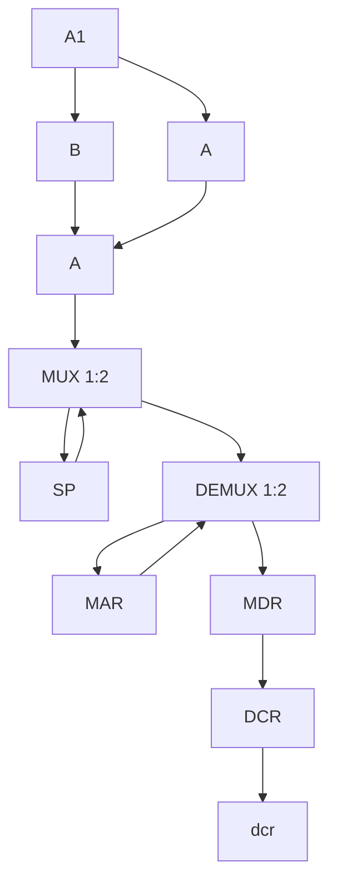
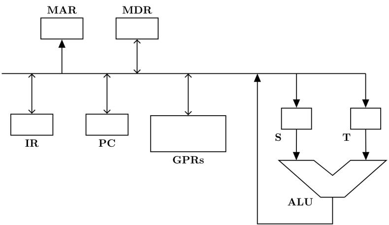
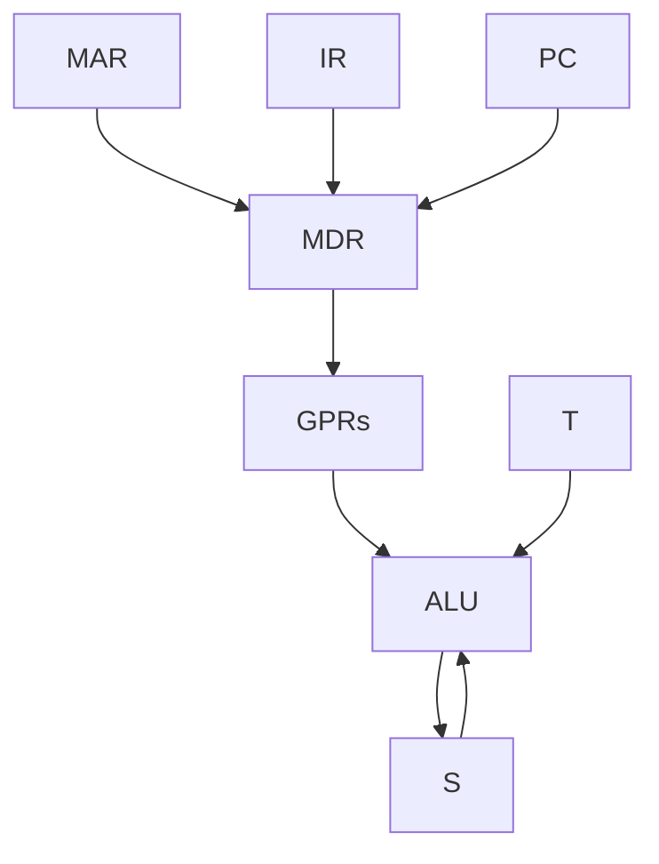
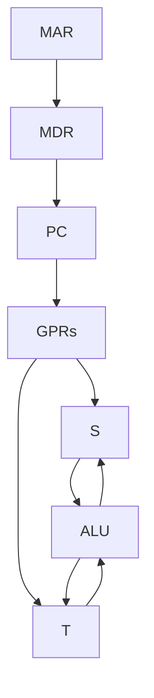
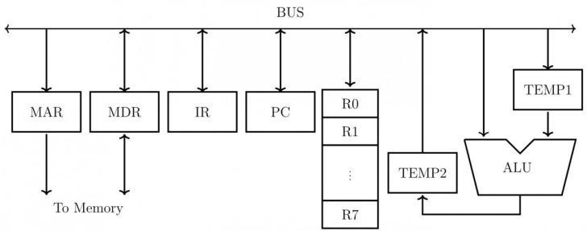
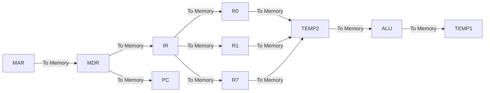
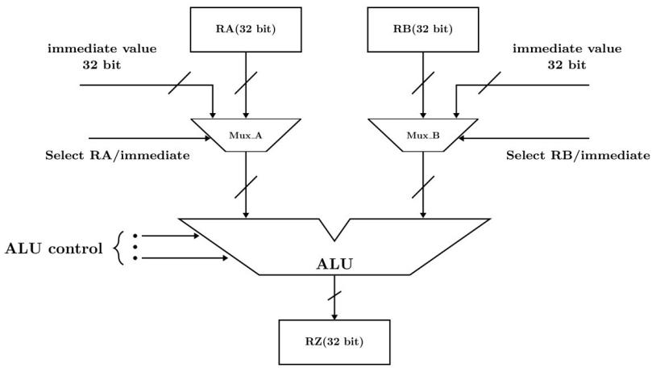

# 1.5.64 Cache Memory: GATE IT 2005 | Question: 61


Consider a 2-way set associative cache memory with 4 sets and total 8 cache blocks (0 - 7) and a main memory with 128 blocks (0 - 127). What memory blocks will be present in the cache after the following sequence of memory block references if LRU policy is used for cache block replacement. Assuming that initial cache did not have any memory block from the current job?

0539701655

A. 03571655

C. 05791655

gateit-2005 co-and-architecture cache-memory normal

B. 035791655

D. 35791655

# Answer key

# 1.5.65 Cache Memory: GATE IT 2006 | Question: 42


A cache line is 64 bytes. The main memory has latency 32 ns and bandwidth 1 GBytes/s. The time required to fetch the entire cache line from the main memory is:

A. 32 ns

B. 64 ns

C. 96 ns

D. 128 ns

gateit-2006 co-and-architecture cache-memory normal

# Answer key

# 1.5.66 Cache Memory: GATE IT 2006 | Question: 43


A computer system has a level-1 instruction cache (I-cache), a level-1 data cache (D-cache) and a level-2 cache (L2-cache) with the following specifications:

<table><tr><td></td><td>Capacity</td><td>Mapping Method</td><td>Block Size</td></tr><tr><td>I-Cache</td><td>4K words</td><td>Direct mapping</td><td>4 words</td></tr><tr><td>D-Cache</td><td>4K words</td><td>2 -way set associative mapping</td><td>4 words</td></tr><tr><td>L2-Cache</td><td>64K words</td><td>4-way set associative mapping</td><td>16 words</td></tr></table>

The length of the physical address of a word in the main memory is 30 bits. The capacity of the tag memory in the I-cache, D-cache and L2-cache is, respectively,

A. $1 \, K \times 18$ -bit, $1 \, K \times 19$ -bit, $4 \, K \times 16$ -bit

B. 1 K x 16-bit, 1 K x 19-bit, 4 K x 18-bit

C. 1 K x 16-bit, 512 x 18-bit, 1 K x 16-bit

D. 1 K x 18-bit, 512 x 18-bit, 1 K x 18-bit

gateit-2006 co-and-architecture cache-memory normal

# Answer key

# 1.5.67 Cache Memory: GATE IT 2007 | Question: 37


Consider a Direct Mapped Cache with 8 cache blocks (numbered 0 - 7). If the memory block requests are in the following order

3, 5, 2, 8, 0, 63, 9, 16, 20, 17, 25, 18, 30, 24, 2, 63, 5, 82, 17, 24.

Which of the following memory blocks will not be in the cache at the end of the sequence?

A. 3

B. 18

C. 20

D. 30

gateit-2007 co-and-architecture cache-memory normal

# Answer key

# 1.5.68 Cache Memory: GATE IT 2008 | Question: 80


Consider a computer with a 4-ways set-associative mapped cache of the following characteristics: a total of 1 MB of main memory, a word size of 1 byte, a block size of 128 words and a cache size of 8 KB.

The number of bits in the TAG, SET and WORD fields, respectively are:

A. 7,6,7

B. 8,5,7

C. 8,6,6

D. 9,4,7

gateit-2008 co-and-architecture cache-memory normal

# Answer key

# 1.5.69 Cache Memory: GATE IT 2008 | Question: 81


Consider a computer with a 4-ways set-associative mapped cache of the following characteristics: a total of 1 MB of main memory, a word size of 1 byte, a block size of 128 words and a cache size of 8 KB.

While accessing the memory location 0C795H by the CPU, the contents of the TAG field of the corresponding cache line is:

A. 000011000

B. 110001111

C. 00011000

D. 110010101

gateit-2008 co-and-architecture cache-memory normal

# Answer key

# 1.6

# Conflict Misses (1)

# 1.6.1 Conflict Misses: GATE CSE 2017 | Set 1 | Question: 51


Consider a 2-way set associative cache with 256 blocks and uses LRU replacement. Initially the cache is empty. Conflict misses are those misses which occur due to the contention of multiple blocks for the same cache set. Compulsory misses occur due to first time access to the block. The following sequence of access to memory blocks :

$\{0,128,256,128,0,128,256,128,1,129,257,129,1,129,257,129\}$

is repeated 10 times. The number of conflict misses experienced by the cache is \_\_\_\_.

gatecse-2017-set1 co-and-architecture cache-memory conflict-misses normal numerical-answers

# Answer key

# 1.7

# Control Unit (1)

# 1.7.1 Control Unit: GATE CSE 1987 | Question: 1-vi


A microprogrammed control unit

A. Is faster than a hard-wired control unit.  
B. Facilitates easy implementation of new instruction.  
C. Is useful when very small programs are to be run.  
D. Usually refers to the control unit of a microprocessor.

gate1987 co-and-architecture control-unit microprogramming

# Answer key

# 1.8

# DMA (8)

# Practice Test: Test 1 (12Q)

# 1.8.1 DMA: GATE CSE 2004 | Question: 68


A hard disk with a transfer rate of 10 Mbytes/second is constantly transferring data to memory using DMA. The processor runs at 600 MHz, and takes 300 and 900 clock cycles to initiate and complete DMA transfer respectively. If the size of the transfer is 20 Kbytes, what is the percentage of processor time consumed transfer operation?

A. 5.0%

B. 1.0%

C. 0.5%

D. 0.1%

gatecse-2004 dma normal co-and-architecture

# Answer key

# 1.8.2 DMA: GATE CSE 2005 | Question: 70


Consider a disk drive with the following specifications:

16 surfaces, 512 tracks/surface, 512 sectors/track, 1 KB/sector, rotation speed 3000 rpm. The disk is operated in cycle stealing mode whereby whenever one 4 byte word is ready it is sent to memory; similarly, for writing, the disk interface reads a 4 byte word from the memory in each DMA cycle. Memory cycle time is 40 nsec. The maximum percentage of time that the CPU gets blocked during DMA operation is:

A. 10

B. 25

C. 40

D. 50

gatecse-2005 co-and-architecture disk normal dma

# Answer key

# 1.8.3 DMA: GATE CSE 2016 | Set 1 | Question: 31

The size of the data count register of a DMA controller is 16 bits. The processor needs to transfer a file of 29,154 kilobytes from disk to main memory. The memory is byte addressable. The minimum number of times the DMA controller needs to get the control of the system bus from the processor to transfer the file from the disk to main memory is \_\_\_\_.

gatecse-2016-set1 co-and-architecture dma normal numerical-answers

# Answer key

# 1.8.4 DMA: GATE CSE 2021 | Set 2 | Question: 20

Consider a computer system with DMA support. The DMA module is transferring one 8-bit character in one CPU cycle from a device to memory through cycle stealing at regular intervals. Consider a 2 MHz processor. If 0.5% processor cycles are used for DMA, the data transfer rate of the device is \_\_\_\_ bits per second.

gatecse-2021-set2 numerical-answers co-and-architecture dma one-mark

# Answer key

# 1.8.5 DMA: GATE CSE 2022 | Question: 7


Which one of the following facilitates transfer of bulk data from hard disk to main memory with the highest throughput?

A. DMA based I/O transfer

B. Interrupt driven I/O transfer

C. Polling based I/O transfer

D. Programmed I/O transfer

gatecse-2022 co-and-architecture dma one-mark

# Answer key

# 1.8.6 DMA: GATE CSE 2024 | Set 1 | Question: 5

Which one of the following statements is FALSE?


A. In the cycle stealing mode of DMA, one word of data is transferred between an I/O device and main memory in a stolen cycle  
B. For bulk data transfer, the burst mode of DMA has a higher throughput than the cycle stealing mode  
C. Programmed I/O mechanism has a better CPU utilization than the interrupt driven I/O mechanism  
D. The CPU can start executing an interrupt service routine faster with vectored interrupts than with non-vectored interrupts

gatecse-2024-set1 co-and-architecture dma one-mark

# Answer key

# 1.8.7 DMA: GATE CSE 2024 | Set 2 | Question: 1

Consider a computer with a 4MHz processor. Its DMA controller can transfer 8 bytes in 1 cycle from a device to main memory through cycle stealing at regular intervals. Which one of the following is the data transfer rate (in bits per second) of the DMA controller if 1% of the processor cycles are used for DMA?


A. 2,56,000

B. 3,200

C. 25,60,000

D. 32,000

gatecse-2024-set2 co-and-architecture dma one-mark

# Answer key

# 1.8.8 DMA: GATE IT 2004 | Question: 51

The storage area of a disk has the innermost diameter of 10 cm and outermost diameter of 20 cm. The maximum storage density of the disk is 1400 bits/cm. The disk rotates at a speed of 4200 RPM. The main

memory of a computer has 64-bit word length and 1 $\mu$ s cycle time. If cycle stealing is used for data transfer from the disk, the percentage of memory cycles stolen for transferring one word is

A. 0.5%

B. 1%

C. 5%

D. 10%

gateit-2004 co-and-architecture dma normal

# Answer key

# 1.9

# DRAM (1)

# 1.9.1 DRAM: GATE CSE 2019 | Question: 2

The chip select logic for a certain DRAM chip in a memory system design is shown below. Assume that the memory system has 16 address lines denoted by $A_{15}$ to $A_{0}$ . What is the range of address (in hexadecimal) of the memory system that can get enabled by the chip select (CS) signal?


A. C800 to CFFF

B. CA00 to CAFF

C. C800 to C8FF

D. DA00 to DFFF

gatecse-2019 co-and-architecture dram memory-interfacing one-mark

# Answer key

# 1.10

# Data Dependency (4)

# 1.10.1 Data Dependency: GATE CSE 2005 | Question: 68

A 5 stage pipelined CPU has the following sequence of stages:

- IF – instruction fetch from instruction memory  
- RD – Instruction decode and register read  
- EX – Execute: ALU operation for data and address computation  
- MA – Data memory access – for write access, the register read at RD state is used.  
- WB – Register write back

Consider the following sequence of instructions:

- $I_{1}$ : $L$ $R0, loc 1; R0 \Leftarrow M[loc1]$  
- $I_{2}$ : A R0, R0; R0 $\Leftarrow$ R0 + R0  
- $I_{3}: S R2, R0; R2 \Leftarrow R2 - R0$

Let each stage take one clock cycle.

What is the number of clock cycles taken to complete the above sequence of instructions starting from the fetch of $I_{1}$ ?

A. 8

B. 10

C. 12

D. 15

gatecse-2005 co-and-architecture pipelining normal data-dependency

# Answer key


# 1.10.2 Data Dependency: GATE CSE 2008 | Question: 36

Which of the following are NOT true in a pipelined processor?

I. Bypassing can handle all RAW hazards  
II. Register renaming can eliminate all register carried WAR hazards  
III. Control hazard penalties can be eliminated by dynamic branch prediction

A. I and II only

B. I and III only

C. II and III only

D. I, II and III

gatecse-2008

pipelining

co-and-architecture

normal

data-dependency

# Answer key

# 1.10.3 Data Dependency: GATE CSE 2015 | Set 3 | Question: 47

Consider the following code sequence having five instructions from $I_{1}$ to $I_{5}$ . Each of these instructions has the following format.

OP Ri, Rj, Rk

Where operation OP is performed on contents of registers Rj and Rk and the result is stored in register Ri.

$I_{1}$ : ADD R1, R2, R3

$I_{2}$ : MUL R7, R1, R3

$I_{3}$ : SUB R4, R1, R5

$I_{4}$ : ADD R3, R2, R4

$I_{5}$ : MUL R7, R8, R9

Consider the following three statements.

S1: There is an anti-dependence between instructions $I_{2}$ and $I_{5}$  
S2: There is an anti-dependence between instructions $I_{2}$ and $I_{4}$  
S3: Within an instruction pipeline an anti-dependence always creates one or more stalls

Which one of the above statements is/are correct?

A. Only S1 is true

B. Only S2 is true

C. Only S1 and S3 are true

D. Only S2 and S3 are true

gatecse-2015-set3 co-and-architecture pipelining data-dependency normal

# Answer key

# 1.10.4 Data Dependency: GATE IT 2007 | Question: 39

Data forwarding techniques can be used to speed up the operation in presence of data dependencies. Consider the following replacements of LHS with RHS.

i. $R1\to Loc,Loc\to R2\equiv R1\to R2,R1\to Loc$  
ii. $R1\to Loc,Loc\to R2\equiv R1\to R2$  
iii. $R1\to Loc,R2\to Loc\equiv R1\to Loc$  
iv. $R1\to Loc,R2\to Loc\equiv R2\to Loc$

In which of the following options, will the result of executing the RHS be the same as executing the LHS irrespective of the instructions that follow?

A. i and iii

B. i and iv

C. ii and iii

D. ii and iv

gateit-2007 data-dependency co-and-architecture

# Answer key

# 1.11

# Data Hazards (1)

# 1.11.1 Data Hazards: GATE CSE 2026 | Set 1 | Question: 6

Which one of the following dependencies among the register operands of different instructions can cause a data hazard in a pipelined processor?


A. Read-after-read  
C. Write-after-read

B. Read-after-write  
D. Write-after-write

gatecse-2026-set1 co-and-architecture data-hazards easy one-mark

# Answer key

# 1.12

# Data Path (7)

# Practice Test: Test 1 (6Q)

# 1.12.1 Data Path: GATE CSE 1990 | Question: 8a

A single bus CPU consists of four general purpose register, namely, R0, ..., R3, ALU, MAR, MDR, PC, SP and IR (Instruction Register). Assuming suitable microinstructions, write a microroutine for the instruction, ADD R0, R1.


gate1990 descriptive co-and-architecture data-path

# Answer key

# 1.12.2 Data Path: GATE CSE 2001 | Question: 2.13

Consider the following data path of a simple non-pipelined CPU. The registers $A, B, A_1, A_2$ , MDR, the bus and the ALU are 8-bit wide. SP and MAR are 16-bit registers. The MUX is of size $8 \times (2:1)$ and the DEMUX is of size $8 \times (1:2)$ . Each memory operation takes 2 CPU clock cycles and uses MAR (Memory Address Register) and MDR (Memory Date Register). SP can be decremented locally.


<details>
<summary>flowchart</summary>


</details>

The CPU instruction "push r" where, r = A or B has the specification

- $M[SP] \leftarrow r$  
- $SP \leftarrow SP - 1$

How many CPU clock cycles are required to execute the "push r" instruction?

A. 2

B. 3

C. 4

D. 5

gatecse-2001 co-and-architecture data-path machine-instruction normal

# Answer key

# 1.12.3 Data Path: GATE CSE 2005 | Question: 79

Consider the following data path of a CPU.




<details>
<summary>flowchart</summary>


</details>

The ALU, the bus and all the registers in the data path are of identical size. All operations including incrementation of the PC and the GPRs are to be carried out in the ALU. Two clock cycles are needed for memory read operation – the first one for loading address in the MAR and the next one for loading data from the memory bus into the MDR.

The instruction “add R0, R1” has the register transfer interpretation $R0 \Leftarrow R0 + R1$ . The minimum number of clock cycles needed for execution cycle of this instruction is:

A. 2

B. 3

C. 4

D. 5

gatecse-2005 co-and-architecture machine-instruction data-path normal

# Answer key

# 1.12.4 Data Path: GATE CSE 2005 | Question: 80

Consider the following data path of a CPU.


<details>
<summary>flowchart</summary>


</details>


The ALU, the bus and all the registers in the data path are of identical size. All operations including incrementation of the PC and the GPRs are to be carried out in the ALU. Two clock cycles are needed for memory read operation – the first one for loading address in the MAR and the next one for loading data from the memory bus into the MDR.

The instruction "call Rn, sub" is a two word instruction. Assuming that PC is incremented during the fetch cycle of the first word of the instruction, its register transfer interpretation is

$$
\mathrm{Rn} \leftarrow \mathrm{PC} + 1;
$$

$$
\mathrm{PC} \leftarrow \mathrm{M} [ \mathrm{PC} ];
$$

The minimum number of CPU clock cycles needed during the execution cycle of this instruction is:

A. 2

B. 3

C. 4

D. 5

co-and-architecture normal gatecse-2005 data-path machine-instruction

# Answer key

Suppose the functions $F$ and $G$ can be computed in 5 and 3 nanoseconds by functional units $U_F$ and $U_G$ , respectively. Given two instances of $U_F$ and two instances of $U_G$ , it is required to implement the computation $F(G(X_i))$ for $1 \leq i \leq 10$ . Ignoring all other delays, the minimum time required to complete this computation is \_\_\_\_ nanoseconds.

gatecse-2016-set2 co-and-architecture data-path normal numerical-answers

# Answer key

# 1.12.6 Data Path: GATE CSE 2020 | Question: 4

Consider the following data path diagram.



<details>
<summary>flowchart</summary>


</details>


Consider an instruction: $R0 \leftarrow R1 + R2$ . The following steps are used to execute it over the given data path. Assume that PC is incremented appropriately. The subscripts r and w indicate read and write operations, respectively.

1. $R2_{r}$ , $\mathrm{TEMP1}_r, ALU_{\mathrm{add}}$ , $\mathrm{TEMP2}_w$  
2. $R1_{r}$ , $\mathrm{TEMP1}_w$  
3. $PC_{r}$ , $\mathrm{MAR}_{w}$ , $\mathrm{MEM}_{r}$  
4. TEMP2 $_{r}$ , R0 $_{w}$  
5. $MDR_{r}, IR_{w}$

Which one of the following is the correct order of execution of the above steps?

A. 2,1,4,5,3

B. 1,2,4,3,5

C. 3,5,2,1,4

D. 3,5,1,2,4

gatecse-2020 co-and-architecture data-path one-mark

# Answer key

# 1.12.7 Data Path: GATE CSE 2025 | Set 1 | Question: 17

A partial data path of a processor is given in the figure, where RA, RB, and RZ are 32-bit registers. Which option(s) is/are CORRECT related to arithmetic operations using the data path as shown?




<details>
<summary>flowchart</summary>

```mermaid
graph TD
  subgraph RA["RA(32 bit)"]
  RA --> Mux_A["Mux_A"]
  RA --> RB["RB(32 bit)"]
  end
  subgraph RB["RB(32 bit)"]
  RB --> Mux_B["Mux_B"]
  RB --> RB
  end
  subgraph ALU["ALU control"]
  ALU --> ALU
  ALU --> RZ["RZ(32 bit)"]
  end
  RA -->|Select RA/immediate| Mux_A
  RB -->|Select RB/immediate| Mux_B
  ALU --> ALU
  Mux_A --> ALU
  RB --> Mux_B
```
</details>

A. The data path can implement arithmetic operations involving two registers.  
B. The data path can implement arithmetic operations involving one register and one immediate value.

C. The data path can implement arithmetic operations involving two immediate values.  
D. The data path can only implement arithmetic operations involving one register and one immediate value.

gatecse2025-set1 co-and-architecture data-path multiple-selects one-mark

# Answer key

# 1.13

# Direct Mapping (5)

# 1.13.1 Direct Mapping: GATE CSE 2022 | Question: 44


Consider a system with 2 KB direct mapped data cache with a block size of 64 bytes. The system has a physical address space of 64 KB and a word length of 16 bits. During the execution of a program, four data words P, Q, R, and S are accessed in that order 10 times (i.e., PQRSPQRS...). Hence, there are 40 accesses to data cache altogether. Assume that the data cache is initially empty and no other data words are accessed by the program. The addresses of the first bytes of P, Q, R, and S are 0xA248, 0xC28A, 0xCA8A, and 0xA262, respectively. For the execution of the above program, which of the following statements is/are TRUE with respect to the data cache?

A. Every access to S is a hit.  
B. Once P is brought to the cache it is never evicted.  
C. At the end of the execution only R and S reside in the cache.  
D. Every access to R evicts Q from the cache.

gatecse-2022 co-and-architecture direct-mapping multiple-selects two-marks cache-memory

# Answer key

# 1.13.2 Direct Mapping: GATE CSE 2025 | Set 1 | Question: 26


Consider a memory system with 1M bytes of main memory and 16 K bytes of cache memory. Assume that the processor generates 20-bit memory address, and the cache block size is 16 bytes. If the cache uses direct mapping, how many bits will be required to store all the tag values? [Assume memory is byte addressable, $1 K = 2^{10}$ , $1 M = 2^{20}$ .]

A. $6 \times 2^{10}$

B. $8 \times 2^{10}$

C. $2^{12}$

D. $2^{14}$

gatecse2025-set1 co-and-architecture cache-memory direct-mapping easy two-marks

# Answer key

# 1.13.3 Direct Mapping: GATE CSE 2025 | Set 2 | Question: 29


For a direct-mapped cache, 4 bits are used for the tag field and 12 bits are used to index into a cache block. The size of each cache block is one byte. Assume that there is no other information stored for each cache block.

Which ONE of the following is the CORRECT option for the sizes of the main memory and the cache memory in this system (byte addressable), respectively?

A. 64 KB and 4 KB

B. 128 KB and 16 KB

C. 64 KB and 8 KB

D. 128 KB and 6 KB

gatecse2025-set2 co-and-architecture direct-mapping cache-memory two-marks

# Answer key

# 1.13.4 Direct Mapping: GATE CSE 2026 | Set 2 | Question: 42


Consider a system with a processor and a 4 KB direct mapped cache with block size of 16 bytes. The system has a 16 MB physical memory. Four words P, Q, R, and S are accessed by the processor in the same order 10 times. That is, there are a total of 40 memory references in the sequence P, Q, R, S, P, Q, R, S, ...

Assume that the cache memory is initially empty. The physical addresses of the words are given below (1 word = 1 byte).

P: 0x845B32, Q: 0x845B26, R: 0x845B36, S: 0x846B32

Which of the following statements is/are true?

Note: $1\mathrm{K} = 2^{10}$ and $1\mathrm{M} = 2^{20}$

A. Every access to P results in a cache miss  
B. Every access to R results in a cache hit  
C. Every access to Q results in a cache miss  
D. Except the first access to S, all subsequent accesses to S result in cache hits

gatecse-2026-set2 co-and-architecture direct-mapping cache-memory multiple-selects two-marks

Answer key

# 1.13.5 Direct Mapping: GATE CSE 2026 | Set 2 | Question: 46


Consider a system with 1 MB physical memory and a word length of 1 byte. The system uses a direct mapped cache, with block numbers starting from 0. The word with physical address 0xA2C28 is mapped to the cache block number 176 $_{10}$ . The maximum possible size of the cache (in KB) for this configuration is \_\_\_\_. (answer in integer)

Note: $1\mathrm{K} = 2^{10}$ and $1\mathrm{M} = 2^{20}$

gatecse-2026-set2 co-and-architecture direct-mapping cache-memory numerical-answers two-marks

Answer key

# 1.14

# Disk (1)

# 1.14.1 Disk: GATE CSE 2026 | Set 1 | Question: 49


Consider a hard disk with a rotational speed of 15000 rpm. The time to move the read/write head from a track to its adjacent track is 1 millisecond. Initially, the head is on track 0. The number of sectors per track is 400. The sector size is 1024 bytes. It is necessary to transfer data from 10 randomly located sectors in each of the following tracks in the order: 5, 12 and 7.

The total time for the data transfer (in milliseconds) from the hard disk is \_\_\_\_. (rounded off to one decimal place)

gatecse-2026-set1 numerical-answers operating-system two-marks disk

Answer key

# 1.15

# Hazards (1)

# 1.15.1 Hazards: GATE CSE 2026 | Set 1 | Question: 50


The EX stage of a pipelined processor performs the memory read operations for LOAD instructions, and the operations for the arithmetic and logic instructions. Let $t_{EX}$ denote the time taken by the EX stage to perform the operation for an instruction. For each instruction type, the values of $t_{EX}$ and $M$ (the number of instructions of that type in a sequence of 100 instructions for a program P), are given in the table below.

The duration of the pipeline clock cycle is 1 nanosecond. Assume that the latch time for the interstage buffers in the pipeline is negligible.

<table><tr><td>Instruction</td><td> $t_{EX}$  in nanoseconds</td><td>M</td></tr><tr><td>LOAD</td><td>1.8</td><td>15</td></tr><tr><td>IMUL</td><td>1.5</td><td>10</td></tr><tr><td>IDIV</td><td>2.5</td><td>5</td></tr><tr><td>FADD</td><td>1.7</td><td>10</td></tr><tr><td>FSUB</td><td>1.7</td><td>5</td></tr><tr><td>FMUL</td><td>2.8</td><td>15</td></tr><tr><td>FDIV</td><td>3.2</td><td>5</td></tr><tr><td>All other instructions</td><td>Less than 1.0</td><td>35</td></tr></table>

When program P is executed, the number of clock cycles for which the pipeline is stalled due to structural hazards in the EX stage is \_\_\_\_. (answer in integer)

gatecse-2026-set1 numerical-answers co-and-architecture pipelining hazards two-marks

Answer key

# 1.16

# IO Handling (8)

# 1.16.1 IO Handling: GATE CSE 1987 | Question: 2a

State whether the following statements are TRUE or FALSE


In a microprocessor-based system, if a bus (DMA) request and an interrupt request arrive sumultaneously, the microprocessor attends first to the bus request.

gate1987 co-and-architecture interrupts io-handling true-false

Answer key

# 1.16.2 IO Handling: GATE CSE 1987 | Question: 2b

State whether the following statements are TRUE or FALSE:


Data transfer between a microprocessor and an I/O device is usually faster in memory-mapped-I/O scheme than in I/O-mapped -I/O scheme.

gate1987 co-and-architecture io-handling true-false

Answer key

# 1.16.3 IO Handling: GATE CSE 1990 | Question: 4-ii

State whether the following statements are TRUE or FALSE with reason:


The data transfer between memory and I/O devices using programmed I/O is faster than interrupt-driven I/O.

gate1990 true-false co-and-architecture io-handling interrupts

Answer key

# 1.16.4 IO Handling: GATE CSE 1996 | Question: 1.24

For the daisy chain scheme of connecting I/O devices, which of the following statements is true?


A. It gives non-uniform priority to various devices  
B. It gives uniform priority to all devices  
C. It is only useful for connecting slow devices to a processor device  
D. It requires a separate interrupt pin on the processor for each device

# 1.16.5 IO Handling: GATE CSE 1996 | Question: 25


A hard disk is connected to a 50 MHz processor through a DMA controller. Assume that the initial set-up of a DMA transfer takes 1000 clock cycles for the processor, and assume that the handling of the interrupt at DMA completion requires 500 clock cycles for the processor. The hard disk has a transfer rate of 2000 Kbyt and average block transferred is 4 K bytes. What fraction of the processor time is consumed by the disk, if this is actively transferring 100% of the time?

gate1996 co-and-architecture io-handling dma numerical-answers normal

# Answer key

# 1.16.6 IO Handling: GATE CSE 1997 | Question: 2.4

The correct matching for the following pairs is:


(A) DMA I/O (1) High speed RAM  
(B) Cache (2) Disk  
(C) Interrupt I/O (3) Printer  
(D) Condition Code Register (4) ALU

A. $A - 4$ $B - 3$ $C - 1$ $D - 2$  
C. $A - 4$ $B - 3$ $C - 2$ $D - 1$

B. $A - 2$ $B - 1$ $C - 3$ $D - 4$  
D. $A - 2$ $B - 3$ $C - 4$ $D - 1$

gate1997 co-and-architecture normal io-handling match-the-following

# Answer key

# 1.16.7 IO Handling: GATE CSE 2008 | Question: 64, ISRO2009-13


Which of the following statements about synchronous and asynchronous I/O is NOT true?

A. An ISR is invoked on completion of I/O in synchronous I/O but not in asynchronous I/O  
B. In both synchronous and asynchronous I/O, an ISR (Interrupt Service Routine) is invoked after completion of the I/O  
C. A process making a synchronous I/O call waits until I/O is complete, but a process making an asynchronous I/O call does not wait for completion of the I/O  
D. In the case of synchronous I/O, the process waiting for the completion of I/O is woken up by the ISR that is invoked after the completion of I/O

gatecse-2008 operating-system io-handling normal isro2009

# Answer key

# 1.16.8 IO Handling: GATE CSE 2011 | Question: 28


On a non-pipelined sequential processor, a program segment, which is the part of the interrupt service routine, is given to transfer 500 bytes from an I/O device to memory.

Initialize the address register

Initialize the count to 500

LOOP: Load a byte from device

Store in memory at address given by address register

Increment the address register

Decrement the count

If count !=0 go to LOOP

Assume that each statement in this program is equivalent to a machine instruction which takes one clock cycle to execute if it is a non-load/store instruction. The load-store instructions take two clock cycles to execute.

The designer of the system also has an alternate approach of using the DMA controller to implement the same transfer. The DMA controller requires 20 clock cycles for initialization and other overheads. Each DMA transfer cycle takes two clock cycles to transfer one byte of data from the device to the memory.