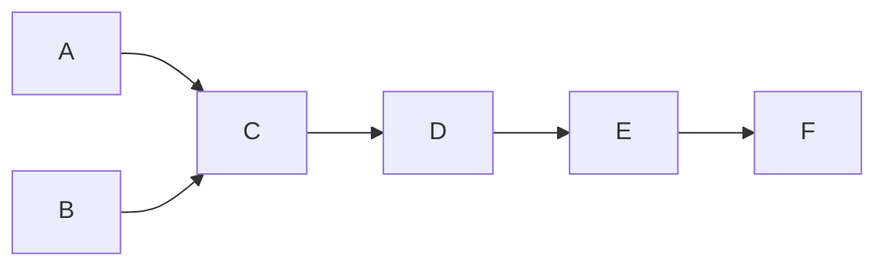

What is the approximate speed up when the DMA controller based design is used in a place of the interrupt driven program based input-output?

A. 3.4

B. 4.4

C. 5.1

D. 6.7

gatecse-2011 co-and-architecture dma normal io-handling

Answer key

# 1.17

# Instruction Execution (7)

Practice Test: Test 1 (7Q)

# 1.17.1 Instruction Execution: GATE CSE 1990 | Question: 4-iii

State whether the following statements are TRUE or FALSE with reason:

The flags are affected when conditional CALL or JUMP instructions are executed.

gate1990 true-false co-and-architecture instruction-execution

Answer key

# 1.17.2 Instruction Execution: GATE CSE 1992 | Question: 01-iv

Many of the advanced microprocessors prefetch instructions and store it in an instruction buffer to speed up processing. This speed up is achieved because \_\_\_\_

gate1992 co-and-architecture easy instruction-execution fill-in-the-blanks

Answer key


# 1.17.3 Instruction Execution: GATE CSE 1995 | Question: 1.2

Which of the following statements is true?

A. ROM is a Read/Write memory  
C. Stack works on the principle of LIFO

B. PC points to the last instruction that was executed

D. All instructions affect the flags

gate1995 co-and-architecture normal instruction-execution

Answer key


# 1.17.4 Instruction Execution: GATE CSE 2002 | Question: 1.13

Which of the following is not a form of memory

A. instruction cache  
C. instruction opcode

B. instruction register

gatecse-2002 co-and-architecture easy instruction-execution

Answer key

# 1.17.5 Instruction Execution: GATE CSE 2006 | Question: 43

Consider a new instruction named branch-on-bit-set (mnemonic bbs). The instruction "bbs reg, pos, label" jumps to label if bit in position pos of register operand reg is one. A register is 32 -bits wide and the bits are numbered 0 to 31, bit in position 0 being the least significant. Consider the following emulation of this instruction on a processor that does not have bbs implemented.

temp ← reg&mask

Branch to label if temp is non-zero. The variable temp is a temporary register. For correct emulation, the variable mask must be generated by

A. $mask \leftarrow 0x1 << pos$  
C. mask ← pos  
gatecse-2006 co-and-architecture normal instruction-execution

B. mask ← 0xffffffff << pos  
D. mask ← 0xf

Answer key


Consider a RISC machine where each instruction is exactly 4 bytes long. Conditional and unconditional branch instructions use PC-relative addressing mode with Offset specified in bytes to the target location of the branch instruction. Further the Offset is always with respect to the address of the next instruction in the program sequence. Consider the following instruction sequence

<table><tr><td>Instr. No.</td><td>Instruction</td></tr><tr><td>i:</td><td>add R2, R3, R4</td></tr><tr><td>i+1:</td><td>sub R5, R6, R7</td></tr><tr><td>i+2:</td><td>cmp R1, R9, R10</td></tr><tr><td>i+3:</td><td>beq R1, Offset</td></tr></table>

If the target of the branch instruction is i, then the decimal value of the Offset is \_\_\_\_.

gatecse-2017-set1 co-and-architecture normal numerical-answers instruction-execution

# Answer key

# 1.17.7 Instruction Execution: GATE CSE 2025 | Set 2 | Question: 51

An application executes $6.4 \times 10^{8}$ number of instructions in 6.3 seconds. There are four types of instructions, the details of which are given in the table. The duration of a clock cycle in nanoseconds is \_\_\_\_. (rounded off to one decimal place)


<table><tr><td>Instruction type</td><td>Clock cycles required per instruction (CPI)</td><td>Number of instructions executed</td></tr><tr><td>Branch</td><td>2</td><td> $2.25 \times 10^{8}$ </td></tr><tr><td>Load</td><td>5</td><td> $1.20 \times 10^{8}$ </td></tr><tr><td>Store</td><td>4</td><td> $1.65 \times 10^{8}$ </td></tr><tr><td>Arithmetic</td><td>3</td><td> $1.30 \times 10^{8}$ </td></tr></table>

gatecse2025-set2 co-and-architecture instruction-execution clock-cycles numerical-answers two-marks

# Answer key

# 1.18

# Instruction Format (11)

Practice Test: Test 1 (10Q)

# 1.18.1 Instruction Format: GATE CSE 1988 | Question: 2-ii

Using an expanding opcode encoding for instructions, is it possible to encode all of the following in an instruction format shown in the below figure. Justify your answer.


14 double address instructions  
127 single address instructions  
60 no address (zero address) instructions

<table><tr><td> $\leftarrow 4 \text{ bits} \rightarrow$ </td><td> $\leftarrow 6 \text{ bits} \rightarrow$ </td><td> $\leftarrow 6 \text{ bits} \rightarrow$ </td></tr><tr><td>Opcode</td><td>Operand 1Address</td><td>Operand 2Address</td></tr></table>

gate1988 normal co-and-architecture instruction-format descriptive

# Answer key

# 1.18.2 Instruction Format: GATE CSE 1992 | Question: 01-vi


In an 11-bit computer instruction format, the size of address field is 4-bits. The computer uses expanding OP code technique and has 5 two-address instructions and 32 one-address instructions. The number of zero-address instructions it can support is \_\_\_\_

gate1992 co-and-architecture machine-instruction instruction-format normal numerical-answers

# Answer key

# 1.18.3 Instruction Format: GATE CSE 1994 | Question: 3.2


State True or False with one line explanation

Expanding opcode instruction formats are commonly employed in RISC. (Reduced Instruction Set Computers) machines.

gate1994 co-and-architecture machine-instruction instruction-format normal true-false

# Answer key

# 1.18.4 Instruction Format: GATE CSE 2014 | Set 1 | Question: 9


A machine has a 32-bit architecture, with 1-word long instructions. It has 64 registers, each of which is 32 bits long. It needs to support 45 instructions, which have an immediate operand in addition to two register operands. Assuming that the immediate operand is an unsigned integer, the maximum value of the immediate operand is \_\_\_\_

gatecse-2014-set1 co-and-architecture machine-instruction instruction-format numerical-answers normal

# Answer key

# 1.18.5 Instruction Format: GATE CSE 2016 | Set 2 | Question: 31


Consider a processor with 64 registers and an instruction set of size twelve. Each instruction has five distinct fields, namely, opcode, two source register identifiers, one destination register identifier, and twelve-bit immediate value. Each instruction must be stored in memory in a byte-aligned fashion. If a program has 100 instructions, the amount of memory (in bytes) consumed by the program text is \_\_\_\_.

gatecse-2016-set2 instruction-format machine-instruction co-and-architecture normal numerical-answers

# Answer key

# 1.18.6 Instruction Format: GATE CSE 2018 | Question: 51


A processor has 16 integer registers (R0, R1, ..., R15) and 64 floating point registers (F0, F1, ..., F63). It uses a 2-byte instruction format. There are four categories of instructions:

Type-1, Type-2, Type-3, and Type-4. Type-1 category consists of four instructions, each with 3 integer register operands (3Rs). Type-2 category consists of eight instructions, each with 2 floating point register operands (2Fs). Type-3 category consists of fourteen instructions, each with one integer register operand and one floating point register operand (1R+1F). Type-4 category consists of N instructions, each with a floating point register operand (1F).

The maximum value of N is \_\_\_\_.

gatecse-2018 co-and-architecture machine-instruction instruction-format numerical-answers two-marks

# Answer key

# 1.18.7 Instruction Format: GATE CSE 2020 | Question: 44


A processor has 64 registers and uses 16-bit instruction format. It has two types of instructions: I-type and R-type. Each I-type instruction contains an opcode, a register name, and a 4-bit immediate value. Each R-type instruction contains an opcode and two register names. If there are 8 distinct I-type opcodes, then the maximum number of distinct R-type opcodes is \_\_\_\_.

gatecse-2020 co-and-architecture numerical-answers instruction-format machine-instruction two-marks

# Answer key

# 1.18.8 Instruction Format: GATE CSE 2024 | Set 2 | Question: 47


A processor with 16 general purpose registers uses a 32-bit instruction format. The instruction format consists of an opcode field, an addressing mode field, two register operand fields, and a 16-bit scalar field. If 8 addressing modes are to be supported, the maximum number of unique opcodes possible for every addressing mode is \_\_\_\_.

gatecse-2024-set2 numerical-answers co-and-architecture instruction-format two-marks

# Answer key

# 1.18.9 Instruction Format: GATE CSE 2024 | Set 2 | Question: 51


A processor uses a 32-bit instruction format and supports byte-addressable memory access. The ISA of the processor has 150 distinct instructions. The instructions are equally divided into two types, namely R-type and I-type, whose formats are shown below.

R - type Instruction Format:

<table><tr><td>OPCODE</td><td>UNUSED</td><td>DSTRegister</td><td>SRCRegister1</td><td>SRCRegister2</td></tr></table>

I - type Instruction Format:

<table><tr><td>OPCODE</td><td>DSTRegister</td><td>SRCRegister</td><td>#Immediatevalue/address</td></tr></table>

In the OPCODE, 1 bit is used to distinguish between I-type and R-type instructions and the remaining bits indicate the operation. The processor has 50 architectural registers, and all register fields in the instructions are of equal size.

Let X be the number of bits used to encode the UNUSED field, Y be the number of bits used to encode the OPCODE field, and Z be the number of bits used to encode the immediate value/address field. The value of X+2Y+Z is \_\_\_\_.

gatecse-2024-set2 numerical-answers co-and-architecture instruction-format two-marks

# Answer key

# 1.18.10 Instruction Format: GATE CSE 2026 | Set 1 | Question: 5


Consider a processor P whose instruction set architecture is the load-store architecture. The instruction format is such that the first operand of any instruction is the destination operand.

Which one of the following sequences of instructions corresponds to the high-level language statement $\mathbf{Z} = \mathbf{X} + \mathbf{Y}$ ?

Note: X, Y, and Z are memory operands. R0, R1, and R2 are registers.

A. ADD Z, X, Y  
C. ADD R0, X, Y STORE Z, R0

B. LOAD R0, X ADD Z, R0, Y

D. LOAD R0, X LOAD R1, Y ADD R

2, R0, R1 STORE Z, R2

gatecse-2026-set1 co-and-architecture instruction-format one-mark

# Answer key

# 1.18.11 Instruction Format: GATE CSE 2026 | Set 2 | Question: 34


Consider a processor that has 16 general purpose registers and it uses 2-byte instruction format for all its instructions. Variable-sized opcodes are permitted. There are three different types of instructions; M-type, R-type, and C-type. Each M-type instruction has 2 register operands and a 6-bit immediate operand. Each instruction has 3 register operands. Each C-type instruction has a register operand and a 6-bit offset value. I are 2 unique M-type opcodes and 7 unique R-type opcodes, which one of the following options gives the ma

A processor with 16 general purpose registers uses a 32-bit instruction format. The instruction format consists of an opcode field, an addressing mode field, two register operand fields, and a 16-bit scalar field. If 8 addressing modes are to be supported, the maximum number of unique opcodes possible for every addressing mode is \_\_\_\_.

number of unique opcodes possible for C-type instructions?

A. 8

B. 4

C. 64

D. 16

gatecse-2026-set2 co-and-architecture machine-instruction instruction-format two-marks

Answer key

# 1.19

# Instruction Set Architecture (1)

# 1.19.1 Instruction Set Architecture: GATE CSE 2025 | Set 2 | Question: 18

Which of the following is/are part of an Instruction Set Architecture of a processor?

A. The size of the cache memory

B. The clock frequency of the processor

C. The number of cache memory levels

D. The total number of registers

gatecse2025-set2 co-and-architecture instruction-set-architecture multiple-selects easy one-mark

Answer key

# 1.20

# Interrupts (10)

Practice Test: Test 1 (11Q)

# 1.20.1 Interrupts: GATE CSE 1987 | Question: 1-viii

On receiving an interrupt from a I/O device the CPU:

A. Halts for a predetermined time.  
B. Hands over control of address bus and data bus to the interrupting device.  
C. Branches off to the interrupt service routine immediately.  
D. Branches off to the interrupt service routine after completion of the current instruction.

gate1987 co-and-architecture interrupts

Answer key

# 1.20.2 Interrupts: GATE CSE 1995 | Question: 1.3

In a vectored interrupt:

A. The branch address is assigned to a fixed location in memory  
B. The interrupting source supplies the branch information to the processor through an interrupt vector  
C. The branch address is obtained from a register in the processor  
D. None of the above

gate1995 co-and-architecture interrupts normal

Answer key

# 1.20.3 Interrupts: GATE CSE 1998 | Question: 1.20

Which of the following is true?

A. Unless enabled, a CPU will not be able to process interrupts.  
B. Loop instructions cannot be interrupted till they complete.  
C. A processor checks for interrupts before executing a new instruction.  
D. Only level triggered interrupts are possible on microprocessors.

gate1998 co-and-architecture interrupts normal

Answer key


# 1.20.4 Interrupts: GATE CSE 2002 | Question: 1.9

A device employing INTR line for device interrupt puts the CALL instruction on the data bus while:


A. $\overline{\mathrm{INTA}}$ is active  
C. READY is inactive

B. HOLD is active

D. None of the above

gatecse-2002 co-and-architecture interrupts normal

# Answer key

# 1.20.5 Interrupts: GATE CSE 2005 | Question: 69

A device with data transfer rate 10 KB/sec is connected to a CPU. Data is transferred byte-wise. Let the interrupt overhead be 4 $\mu$ sec. The byte transfer time between the device interface register and CPU or memory is negligible. What is the minimum performance gain of operating the device under interrupt mode over operating it under program-controlled mode?

A. 15

B. 25

C. 35

D. 45

gatecse-2005 co-and-architecture interrupts

# Answer key

# 1.20.6 Interrupts: GATE CSE 2009 | Question: 8, UGCNET-June2012-III: 58

A CPU generally handles an interrupt by executing an interrupt service routine:

A. As soon as an interrupt is raised.  
B. By checking the interrupt register at the end of fetch cycle.  
C. By checking the interrupt register after finishing the execution of the current instruction.  
D. By checking the interrupt register at fixed time intervals.

gatecse-2009 co-and-architecture interrupts normal ugcnetcse-june2012-paper3

# Answer key

# 1.20.7 Interrupts: GATE CSE 2020 | Question: 3

Consider the following statements.


I. Daisy chaining is used to assign priorities in attending interrupts.  
II. When a device raises a vectored interrupt, the CPU does polling to identify the source of interrupt.  
III. In polling, the CPU periodically checks the status bits to know if any device needs its attention.  
IV. During DMA, both the CPU and DMA controller can be bus masters at the same time.

Which of the above statements is/are TRUE?

A. I and II only

B. I and IV only

C. I and III only

D. III only

gatecse-2020 co-and-architecture interrupts one-mark

# Answer key

# 1.20.8 Interrupts: GATE CSE 2023 | Question: 24

A keyboard connected to a computer is used at a rate of 1 keystroke per second. The computer system polls the keyboard every 10 ms (milli seconds) to check for a keystroke and consumes 100 $\mu$ s (micro seconds) for each poll. If it is determined after polling that a key has been pressed, the system consumes an additional 200 $\mu$ s to process the keystroke. Let $T_{1}$ denote the fraction of a second spent in polling and processing a keystroke.

In an alternative implementation, the system uses interrupts instead of polling. An interrupt is raised for every keystroke. It takes a total of 1 ms for servicing an interrupt and processing a keystroke. Let $T_{2}$ denote the fraction of a second spent in servicing the interrupt and processing a keystroke.


The ratio $\frac{T_{1}}{T_{2}}$ is \_\_\_\_. (Rounded off to one decimal place)

gatecse-2023 co-and-architecture interrupts numerical-answers one-mark

# Answer key

# 1.20.9 Interrupts: GATE CSE 2025 | Set 1 | Question: 1


Suppose a program is running on a non-pipelined single processor computer system. The computer is connected to an external device that can interrupt the processor asynchronously. The processor needs to execute the interrupt service routine (ISR) to serve this interrupt. The following steps (not necessarily in order) are taken by the processor when the interrupt arrives:

i. The processor saves the content of the program counter.  
ii. The program counter is loaded with the start address of the ISR.  
iii. The processor finishes the present instruction.

Which ONE of the following is the CORRECT sequence of steps?

A. (iii), (i), (ii)

B. (i), (iii), (ii)

C. (i), (ii), (iii)

D. (iii), (ii), (i)

gatecse2025-set1 co-and-architecture interrupts easy one-mark

# Answer key

# 1.20.10 Interrupts: GATE CSE 2026 | Set 2 | Question: 8

Consider the following two statements about interrupt handling mechanisms in a CPU.


S1: In non-vectored interrupt mechanism, it usually takes more time to start the Interrupt Service Routine (ISR) when compared to that in a vectored interrupt mechanism.  
S2: In daisy-chain interrupt mechanism, the CPU polls all the input devices individually to determine the source of the interrupt.

Which one of the following options is correct with respect to S1 and S2?

A. Both S1 and S2 are true  
B. Both S1 and S2 are false  
C. S1 is true and S2 is false  
D. S1 is false and S2 is true

gatecse-2026-set2 co-and-architecture interrupts one-mark

# Answer key

# 1.21

# Machine Instruction (21)

Practice Tests: Test 1 (15Q) Test 2 (8Q)

# 1.21.1 Machine Instruction: GATE CSE 1988 | Question: 9i

The following program fragment was written in an assembly language for a single address computer with one accumulator register:


LOAD B

MULT C

STORE T1

ADD A

STORE T2

MULT T2

ADD T1

STORE Z

Give the arithmetic expression implemented by the fragment.

gate1988 normal descriptive co-and-architecture machine-instruction

# Answer key

A. Assume that a CPU has only two registers $R_{1}$ and $R_{2}$ and that only the following instruction is available $XOR R_{i}, R_{j}; \{R_{j} \leftarrow R_{i} \oplus R_{j}, \text{ for } i, j = 1, 2\}$

Using this XOR instruction, find an instruction sequence in order to exchange the contents of the registers $R_{1}$ and $R_{2}$

B. The line p of the circuit shown in figure has stuck at 1 fault. Determine an input test to detect the fault.


<details>
<summary>flowchart</summary>


</details>

gate1994 co-and-architecture machine-instruction normal descriptive

# Answer key

# 1.21.3 Machine Instruction: GATE CSE 1999 | Question: 17

Consider the following program fragment in the assembly language of a certain hypothetical processor. The processor has three general purpose registers R1, R2 and R3. The meanings of the instructions are shown by comments (starting with ;) after the instructions.


```txt
X: CMP R1, 0; Compare R1 and 0, set flags appropriately in status register
JZ Z; Jump if zero to target Z
MOV R2, R1; Copy contents of R1 to R2
SHR R1; Shift right R1 by 1 bit
SHL R1; Shift left R1 by 1 bit
CMP R2, R1; Compare R2 and R1 and set flag in status register
JZ Y; Jump if zero to target Y
INC R3; Increment R3 by 1;
Y: SHR R1; Shift right R1 by 1 bit
JMP X; Jump to target X
Z:...
```

A. Initially $R1, R2$ and $R3$ contain the values 5,0 and 0 respectively, what are the final values of $R1$ and $R3$ when control reaches $Z$ ?  
B. In general, if $R1, R2$ and $R3$ initially contain the values $n, 0,$ and $0$ respectively. What is the final value of $R3$ when control reaches $Z$ ?

gate1999 co-and-architecture machine-instruction normal descriptive

# Answer key

# 1.21.4 Machine Instruction: GATE CSE 2003 | Question: 48

Consider the following assembly language program for a hypothetical processor $A, B$ , and $C$ are 8-bit registers. The meanings of various instructions are shown as comments.


<div class="mineru-algorithm" style="white-space: pre-wrap; font-family:monospace;">
MOV B, #0          ;    B ← 0
    MOV C, #8          ;    C ← 8
Z:    CMP C, #0          ;    compare C with 0
    JZ X                ;    jump to X if zero flag is set
    SUB C, #1          ;    C ← C - 1
    RRC A, #1          ;    right rotate A through carry by one bit. Thus:
                        ;    If the initial values of A and the carry flag are a7 . . . a0 and
                        ;    c0 respectively, their values after the execution of this
                        ;    instruction will be c0a7 . . . a1 and a0 respectively.
    JC Y                ;    jump to Y if carry flag is set
    JMP Z                ;    jump to Z
Y:    ADD B, #1          ;    B ← B + 1
    JMP Z                ;    jump to Z
X:                    ;
</div>

If the initial value of register A is A0 the value of register B after the program execution will be

A. the number of 0 bits in $A_0$

B. the number of 1 bits in $A_0$

C. $A_{0}$

D. 8

gatecse-2003 co-and-architecture machine-instruction normal

# Answer key

# 1.21.5 Machine Instruction: GATE CSE 2003 | Question: 49

Consider the following assembly language program for a hypothetical processor A, B, and C are 8 bit registers. The meanings of various instructions are shown as comments.


MOV B, ;B←0
#0

MOV C, ;C ← 8
#8

Z: CMP C, ;compare C with 0
#0

JZ X ; jump to X if zero flag is set

SUB C, #1 ; C ← C - 1

RRC A, #1 ; right rotate A through carry by one bit. Thus:

; If the initial values of A and the carry flag are $a_7 \ldots a_0$ and $c_0$ respectively, their values after the execution of this instruction will be $c_0a_7 \ldots a_1$ and $a_0$ respectively.

JC Y          ;jump to Y if carry flag is set
JMP Z          ;jump to Z

Y: ADD B, #1; B ← B + 1

JMP Z ; jump to Z

X:

Which of the following instructions when inserted at location $X$ will ensure that the value of the register $A$ after program execution is as same as its initial value?

A. RRC A, #1

B. NOP; no operation

C. LRC A,#1; left rotate A through carry flag by one bit

D. ADD A,#1

gatecse-2003 co-and-architecture machine-instruction normal

# Answer key

Consider the following program segment for a hypothetical CPU having three user registers $R_{1}$ , $R_{2}$ and $R_{3}$ .

<table><tr><td>Instruction</td><td>Operation</td><td>Instruction size (in words)</td></tr><tr><td>MOV  $R_1, 5000$ </td><td> $R_1 \leftarrow \text{Memory}[5000]$ </td><td>2</td></tr><tr><td>MOV  $R2, (R1)$ </td><td> $R2 \leftarrow \text{Memory}[(R_1)]$ </td><td>1</td></tr><tr><td>ADD  $R_2, R_3$ </td><td> $R2 \leftarrow R_2 + R_3$ </td><td>1</td></tr><tr><td>MOV  $6000, R_2$ </td><td> $\text{Memory}[6000] \leftarrow R_2$ </td><td>2</td></tr><tr><td>HALT</td><td>Machine Halts</td><td>1</td></tr></table>

Consider that the memory is byte addressable with size 32 bits, and the program has been loaded starting from memory location 1000 (decimal). If an interrupt occurs while the CPU has been halted after executing the HALT instruction, the return address (in decimal) saved in the stack will be

A. 1007

B. 1020

C. 1024

D. 1028

gatecse-2004 co-and-architecture machine-instruction normal

Answer key

# 1.21.7 Machine Instruction: GATE CSE 2004 | Question: 64

Consider the following program segment for a hypothetical CPU having three user registers $R_{1}$ , $R_{2}$ and $R_{3}$ .


<table><tr><td>Instruction</td><td>Operation</td><td>Instruction size (in Words)</td></tr><tr><td>MOV  $R_1, 5000$ </td><td> $R1 \leftarrow \text{Memory}[5000]$ </td><td>2</td></tr><tr><td>MOV  $R_2(R_1)$ </td><td> $R2 \leftarrow \text{Memory}[(R_1)]$ </td><td>1</td></tr><tr><td>ADD  $R_2, R_3$ </td><td> $R_2 \leftarrow R_2 + R_3$ </td><td>1</td></tr><tr><td>MOV 6000,  $R_2$ </td><td>Memory[6000]  $\leftarrow R_2$ </td><td>2</td></tr><tr><td>Halt</td><td>Machine Halts</td><td>1</td></tr></table>

Let the clock cycles required for various operations be as follows:

<table><tr><td>Register to/from memory transfer</td><td>3 clock cycles</td></tr><tr><td>ADD with both operands in register</td><td>1 clock cycles</td></tr><tr><td>Instruction fetch and decode</td><td>2 clock cycles</td></tr></table>

The total number of clock cycles required to execute the program is

A. 29

B. 24

C. 23

D. 20

gatecse-2004 co-and-architecture machine-instruction normal

Answer key

# 1.21.8 Machine Instruction: GATE CSE 2006 | Question: 09, ISRO2009-35

A CPU has 24-bit instructions. A program starts at address 300 (in decimal). Which one of the following is a legal program counter (all values in decimal)?


A. 400

B. 500

C. 600

D. 700

gatecse-2006 co-and-architecture machine-instruction easy isro2009

Answer key

In a simplified computer the instructions are:

<table><tr><td>OP  $R_{j}, R_{i}$ </td><td>Perform  $R_{j}$  OP  $R_{i}$  and store the result in register  $R_{j}$ </td></tr><tr><td>OP  $m, R_{i}$ </td><td>Perform  $val$  OP  $R_{i}$  and store the result in register  $R_{i}$   $val$  denotes the content of the memory location  $m$ </td></tr><tr><td>MOV  $m, R_{i}$ </td><td>Moves the content of memory location  $m$  to register  $R_{i}$ </td></tr><tr><td>MOV  $R_{i}, m$ </td><td>Moves the content of register  $R_{i}$  to memory location  $m$ </td></tr></table>

The computer has only two registers, and OP is either ADD or SUB. Consider the following basic block:

$\cdot t_{1} = a + b$  
$\cdot t_{2} = c + d$  
$\cdot t_{3} = e - t_{2}$  
$\cdot t_{4} = t_{1} - t_{3}$

Assume that all operands are initially in memory. The final value of the computation should be in memory. What is the minimum number of MOV instructions in the code generated for this basic block?

A. 2

B. 3

C. 5

D. 6

gatecse-2007 co-and-architecture machine-instruction normal

Answer key

# 1.21.10 Machine Instruction: GATE CSE 2007 | Question: 71

Consider the following program segment. Here R1, R2 and R3 are the general purpose registers.

<table><tr><td></td><td>Instruction</td><td>Operation</td><td>Instruction Size (no. of words)</td></tr><tr><td></td><td>MOV R1,(3000)</td><td>R1← M[3000]</td><td>2</td></tr><tr><td>LOOP:</td><td>MOV R2,(R3)</td><td>R2← M[R3]</td><td>1</td></tr><tr><td></td><td>ADD R2,R1</td><td>R2← R1 + R2</td><td>1</td></tr><tr><td></td><td>MOV (R3),R2</td><td>M[R3]← R2</td><td>1</td></tr><tr><td></td><td>INC R3</td><td>R3← R3 + 1</td><td>1</td></tr><tr><td></td><td>DEC R1</td><td>R1← R1 - 1</td><td>1</td></tr><tr><td></td><td>BNZ LOOP</td><td>Branch on not zero</td><td>2</td></tr><tr><td></td><td>HALT</td><td>Stop</td><td>1</td></tr></table>


Assume that the content of memory location 3000 is 10 and the content of the register R3 is 2000. The content of each of the memory locations from 2000 to 2010 is 100. The program is loaded from the memory location 1000. All the numbers are in decimal.

Assume that the memory is word addressable. The number of memory references for accessing the data in executing the program completely is

A. 10

B. 11

C. 20

D. 21

gatecse-2007 co-and-architecture machine-instruction interrupts normal

Answer key

# 1.21.11 Machine Instruction: GATE CSE 2007 | Question: 72

Consider the following program segment. Here R1, R2 and R3 are the general purpose registers.


<table><tr><td></td><td>Instruction</td><td>Operation</td><td>Instruction Size (no. of words)</td></tr><tr><td></td><td>MOV R1,(3000)</td><td>R1← M[3000]</td><td>2</td></tr><tr><td>LOOP:</td><td>MOV R2,(R3)</td><td>R2← M[R3]</td><td>1</td></tr><tr><td></td><td>ADD R2,R1</td><td>R2← R1 + R2</td><td>1</td></tr><tr><td></td><td>MOV (R3),R2</td><td>M[R3]← R2</td><td>1</td></tr><tr><td></td><td>INC R3</td><td>R3← R3 + 1</td><td>1</td></tr><tr><td></td><td>DEC R1</td><td>R1← R1 - 1</td><td>1</td></tr><tr><td></td><td>BNZ LOOP</td><td>Branch on not zero</td><td>2</td></tr><tr><td></td><td>HALT</td><td>Stop</td><td>1</td></tr></table>

Assume that the content of memory location 3000 is 10 and the content of the register R3 is 2000. The content of each of the memory locations from 2000 to 2010 is 100. The program is loaded from the memory location 1000. All the numbers are in decimal.

Assume that the memory is word addressable. After the execution of this program, the content of memory location 2010 is:

A. 100

B. 101

C. 102

D. 110

gatecse-2007 co-and-architecture machine-instruction interrupts normal

# Answer key

# 1.21.12 Machine Instruction: GATE CSE 2007 | Question: 73

Consider the following program segment. Here R1, R2 and R3 are the general purpose registers.

<table><tr><td></td><td>Instruction</td><td>Operation</td><td>Instruction Size (no. of words)</td></tr><tr><td></td><td>MOV R1,(3000)</td><td>R1← M[3000]</td><td>2</td></tr><tr><td>LOOP:</td><td>MOV R2,(R3)</td><td>R2← M[R3]</td><td>1</td></tr><tr><td></td><td>ADD R2,R1</td><td>R2← R1 + R2</td><td>1</td></tr><tr><td></td><td>MOV (R3),R2</td><td>M[R3]← R2</td><td>1</td></tr><tr><td></td><td>INC R3</td><td>R3← R3 + 1</td><td>1</td></tr><tr><td></td><td>DEC R1</td><td>R1← R1 - 1</td><td>1</td></tr><tr><td></td><td>BNZ LOOP</td><td>Branch on not zero</td><td>2</td></tr><tr><td></td><td>HALT</td><td>Stop</td><td>1</td></tr></table>


Assume that the content of memory location 3000 is 10 and the content of the register R3 is 2000. The content of each of the memory locations from 2000 to 2010 is 100. The program is loaded from the memory location 1000. All the numbers are in decimal.

Assume that the memory is byte addressable and the word size is 32 bits. If an interrupt occurs during the execution of the instruction "INC R3", what return address will be pushed on to the stack?

A. 1005

B. 1020

C. 1024

D. 1040

gatecse-2007 co-and-architecture machine-instruction interrupts normal

# Answer key

# 1.21.13 Machine Instruction: GATE CSE 2008 | Question: 34

Which of the following must be true for the RFE (Return From Exception) instruction on a general purpose processor?

I. It must be a trap instruction  
II. It must be a privileged instruction  
III. An exception cannot be allowed to occur during execution of an RFE instruction

