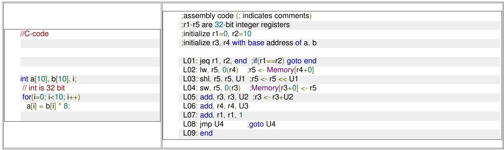
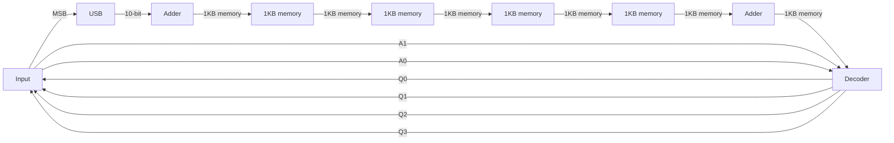
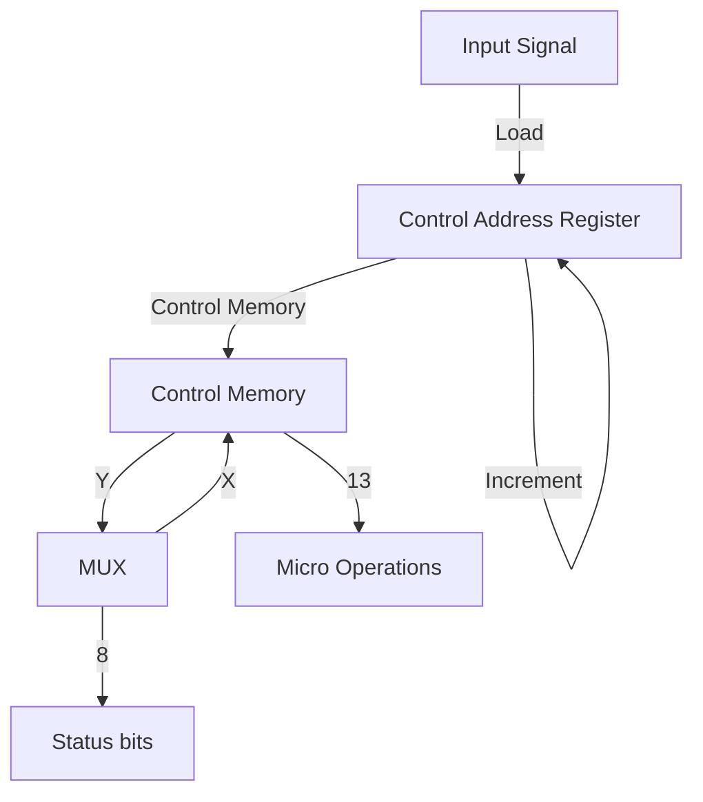
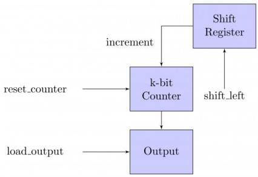
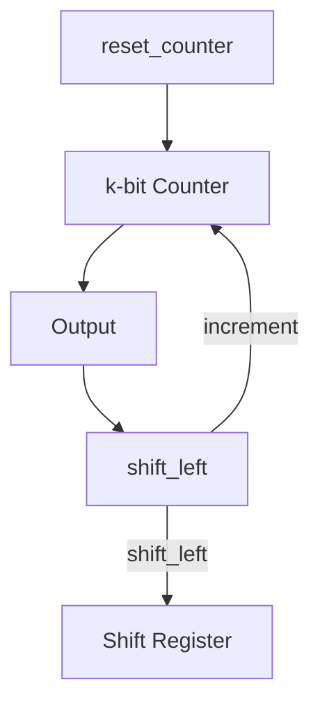
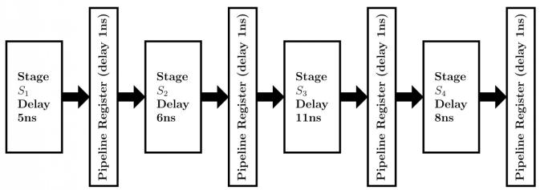

A. I only

B. II only

C. I and II only

D. I, II and III only

gatecse-2008 co-and-architecture machine-instruction normal

# Answer key

# 1.21.14 Machine Instruction: GATE CSE 2015 | Set 2 | Question: 42

Consider a processor with byte-addressable memory. Assume that all registers, including program counter (PC) and Program Status Word (PSW), are size of two bytes. A stack in the main memory is implemented

from memory location $(0100)_{16}$ and it grows upward. The stack pointer (SP) points to the top element of the stack. The current value of SP is $(016E)_{16}$ . The CALL instruction is of two words, the first word is the op-code and the second word is the starting address of the subroutine (one word = 2 bytes). The CALL instruction is implemented as follows:

- Store the current value of PC in the stack  
- Store the value of PSW register in the stack  
- Load the statring address of the subroutine in PC

The content of PC just before the fetch of a CALL instruction is $(5FA0)_{16}$ . After execution of the CALL instruction, the value of the stack pointer is:

A. $(016A)_{16}$

B. $(016C)_{16}$

C. $(0170)_{16}$

D. $(0172)_{16}$

gatecse-2015-set2 co-and-architecture machine-instruction easy

# Answer key

# 1.21.15 Machine Instruction: GATE CSE 2016 | Set 2 | Question: 10

A processor has 40 distinct instruction and 24 general purpose registers. A 32-bit instruction word has an opcode, two registers operands and an immediate operand. The number of bits available for the immediate operand field is \_\_\_\_.

gatecse-2016-set2 machine-instruction co-and-architecture easy numerical-answers

# Answer key

# 1.21.16 Machine Instruction: GATE CSE 2021 | Set 1 | Question: 55

Consider the following instruction sequence where registers R1, R2 and R3 are general purpose and MEMORY[X] denotes the content at the memory location X.

<table><tr><td>Instruction</td><td>Semantics</td><td>Instruction Size (bytes)</td></tr><tr><td>MOV R1, (5000)</td><td>R1 ← MEMORY[5000]</td><td>4</td></tr><tr><td>MOV R2, (R3)</td><td>R2← MEMORY[R3]</td><td>4</td></tr><tr><td>ADDR2, R1</td><td>R2 ← R1 + R2</td><td>2</td></tr><tr><td>MOV (R3), R2</td><td>MEMORY[R3]← R2</td><td>4</td></tr><tr><td>INC R3</td><td>R3 ← R3 + 1</td><td>2</td></tr><tr><td>DEC R1</td><td>R1 ← R1 - 1</td><td>2</td></tr><tr><td>BNZ 1004</td><td>Branch if not zero to the given absolute address</td><td>2</td></tr><tr><td>HALT</td><td>Stop</td><td>1</td></tr></table>


Assume that the content of the memory location 5000 is 10, and the content of the register R3 is 3000. The content of each of the memory locations from 3000 to 3020 is 50. The instruction sequence starts from the memory location 1000. All the numbers are in decimal format. Assume that the memory is byte addressable.

After the execution of the program, the content of memory location 3010 is \_\_\_\_

# 1.21.17 Machine Instruction: GATE CSE 2023 | Question: 31


Consider the given C-code and its corresponding assembly code, with a few operands U1-U4 being unknown. Some useful information as well as the semantics of each unique assembly instruction is annotated as inline comments in the code. The memory is byte-addressable.



<details>
<summary>text_image</summary>

//C-code
int a[10], b[10], i;
// int is 32 bit
for(i=0; i<10; i++)
a[i] = b[i] * 8;
;assembly code (; indicates comments)
;r1-r5 are 32-bit integer registers
;initialize r1=0, r2=10
;initialize r3, r4 with base address of a, b
L01: jeq r1, r2, end ;if(r1==r2) goto end
L02: lw, r5, 0(r4) ;r5 <- Memory[r4+0]
L03: shl, r5, r5, U1 ;r5 <- r5 << U1
L04: sw, r5, 0(r3) ;Memory[r3+0] <- r5
L05: add, r3, r3, U2 ;r3 <- r3+U2
L06: add, r4, r4, U3
L07: add, r1, r1, 1
L08: jmp U4 ;goto U4
L09: end
</details>

Which one of the following options is a CORRECT replacement for operands in the position (U1, U2, U3, U4) in the above assembly code?

A. (8,4,1,L02)

B. (3,4,4,L01)

C. (8,1,1,L02)

D. (3,1,1,L01)

gatecse-2023 co-and-architecture machine-instruction two-marks

# Answer key

# 1.21.18 Machine Instruction: GATE CSE 2025 | Set 1 | Question: 27


A processor has 64 general-purpose registers and 50 distinct instruction types. An instruction is encoded in 32-bits. What is the maximum number of bits that can be used to store the immediate operand for the given instruction?

ADD R1, #25 // R 1=R 1+25

A. 16

B. 20

C. 22

D. 24

gatecse2025-set1 co-and-architecture machine-instruction easy two-marks

# Answer key

# 1.21.19 Machine Instruction: GATE IT 2004 | Question: 46


If we use internal data forwarding to speed up the performance of a CPU (R1, R2 and R3 are registers and M[100] is a memory reference), then the sequence of operations

$$
\mathrm{R1} \rightarrow \mathrm{M} [ 1 0 0 ]
$$

$$
\mathrm{M} [ 1 0 0 ] \rightarrow \mathrm{R} 2
$$

$$
\mathrm{M} [ 1 0 0 ] \rightarrow \mathrm{R} 3
$$

can be replaced by

A. R1 → R3

$$
\mathsf {R 2} \to \mathsf {M} [ 1 0 0 ]
$$

B. M[100] → R2

$$
\mathsf {R 1} \to \mathsf {R 2}
$$

$$
\mathrm{R1} \rightarrow \mathrm{R3}
$$

C. R1 → M[100]

$$
\mathsf {R 2} \to \mathsf {R 3}
$$

D. R1 → R2

$$
\mathsf {R 1} \to \mathsf {R 3}
$$

$$
\mathsf {R 1} \to \mathsf {M} [ 1 0 0 ]
$$

gateit-2004 co-and-architecture machine-instruction easy

# Answer key

# 1.21.20 Machine Instruction: GATE IT 2007 | Question: 41

Following table indicates the latencies of operations between the instruction producing the result and


instruction using the result.

<table><tr><td>Instruction producing the result</td><td>Instruction using the result</td><td>Latency</td></tr><tr><td>ALU Operation</td><td>ALU Operation</td><td>2</td></tr><tr><td>ALU Operation</td><td>Store</td><td>2</td></tr><tr><td>Load</td><td>ALU Operation</td><td>1</td></tr><tr><td>Load</td><td>Store</td><td>0</td></tr></table>

Consider the following code segment:

Load R1, Loc 1; Load R1 from memory location Loc1

Load R2, Loc 2; Load R2 from memory location Loc 2

Add R1, R2, R1; Add R1 and R2 and save result in R1

Dec R2; Decrement R2

Dec R1; Decrement R1

Mpy R1, R2, R3; Multiply R1 and R2 and save result in R3

Store R3, Loc 3; Store R3 in memory location Loc 3

What is the number of cycles needed to execute the above code segment assuming each instruction takes one cycle to execute?

A. 7

B. 10

C. 13

D. 14

gateit-2007 co-and-architecture machine-instruction normal

Answer key

# 1.21.21 Machine Instruction: GATE IT 2008 | Question: 38

Assume that EA = (X)+ is the effective address equal to the contents of location X, with X incremented by one word length after the effective address is calculated; EA = -(X) is the effective address equal to the contents of location X, with X decremented by one word length before the effective address is calculated; EA = (X)- is the effective address equal to the contents of location X, with X decremented by one word length after the effective address is calculated. The format of the instruction is (opcode, source, destination), which means (destination ← source op destination). Using X as a stack pointer, which of the following instructions can pop the top two elements from the stack, perform the addition operation and push the result back to the stack.

A. ADD (X)-, (X)

B. ADD (X), (X)-

C. ADD $-(X)$ , $(X)+$

D. ADD $-(X)$ , $(X)$

gateit-2008 co-and-architecture machine-instruction normal

Answer key

# 1.22

# Memory Interfacing (6)

Practice Test: Test 1 (10Q)

# 1.22.1 Memory Interfacing: GATE CSE 1990 | Question: 4-iv

State whether the following statements are TRUE or FALSE with reason:

Transferring data in blocks from the main memory to the cache memory enables an interleaved main memory unit to operate at its maximum speed.

gate1990 true-false co-and-architecture cache-memory memory-interfacing

Answer key

# 1.22.2 Memory Interfacing: GATE CSE 1991 | Question: 01,ii

In interleaved memory organization, consecutive words are stored in consecutive memory modules in \_\_\_\_ interleaving, whereas consecutive words are stored within the module in \_\_\_\_ interleaving.


gate1991 co-and-architecture normal memory-interfacing descriptive

Answer key

# 1.22.3 Memory Interfacing: GATE CSE 2006 | Question: 41


A CPU has a cache with block size 64 bytes. The main memory has $k$ banks, each bank being $c$ bytes wide. Consecutive $c$ - byte chunks are mapped on consecutive banks with wrap-around. All the $k$ banks can be accessed in parallel, but two accesses to the same bank must be serialized. A cache block access may involve multiple iterations of parallel bank accesses depending on the amount of data obtained by accessing all the $k$ banks in parallel. Each iteration requires decoding the bank numbers to be accessed in parallel and this takes $\frac{k}{2} ns$ . The latency of one bank access is 80 ns. If $c = 2$ and $k = 24$ , the latency of retrieving a cache block starting at address zero from main memory is:

A. 92 ns

B. 104 ns

C. 172 ns

D. 184 ns

gatecse-2006 co-and-architecture cache-memory memory-interfacing normal

# Answer key

# 1.22.4 Memory Interfacing: GATE CSE 2016 | Set 1 | Question: 09

A processor can support a maximum memory of 4 GB, where the memory is word-addressable (a word consists of two bytes). The size of address bus of the processor is at least \_\_\_\_ bits.


gatecse-2016-set1 co-and-architecture easy numerical-answers memory-interfacing

# Answer key

# 1.22.5 Memory Interfacing: GATE CSE 2018 | Question: 23

A 32-bit wide main memory unit with a capacity of 1 GB is built using 256M × 4-bit DRAM chips. The number of rows of memory cells in the DRAM chip is 2 $^{14}$ . The time taken to perform one refresh operation is 50 nanoseconds. The refresh period is 2 milliseconds. The percentage (rounded to the closest integer) time available for performing the memory read/write operations in the main memory unit is \_\_\_\_.


gatecse-2018 co-and-architecture memory-interfacing normal numerical-answers one-mark

# Answer key

# 1.22.6 Memory Interfacing: GATE CSE 2023 | Question: 32

A 4 kilobyte (KB) byte-addressable memory is realized using four 1 KB memory blocks. Two input address lines (IA4 and IA3) are connected to the chip select (CS) port of these memory blocks through a decoder as shown in the figure. The remaining ten input address lines from IA11-IA0 are connected to the address these blocks. The chip select (CS) is active high.


<details>
<summary>flowchart</summary>


</details>

The input memory addresses (IA11-IA0), in decimal, for the starting locations (Addr = 0) of each block (indicated as X1, X2, X3, X4 in the figure) are among the options given below. Which one of the following options is CORRECT?

A. $(0,1,2,3)$

B. (0,1024,2048,3072)

C. (0,8,16,24)

D. $(0,0,0,0)$

gatecse-2023 co-and-architecture memory-interfacing two-marks

# Answer key

# 1.23

# Microprogramming (12)

Practice Test: Test 1 (15Q)

# 1.23.1 Microprogramming: GATE CSE 1987 | Question: 4a


Find out the width of the control memory of a horizontal microprogrammed control unit, given the following specifications:

• 16 control lines for the processor consisting of ALU and 7 registers.  
- Conditional branching facility by checking 4 status bits.  
- Provision to hold 128 words in the control memory.

gate1987 co-and-architecture microprogramming descriptive

Answer key

# 1.23.2 Microprogramming: GATE CSE 1996 | Question: 2.25


A micro program control unit is required to generate a total of 25 control signals. Assume that during any micro instruction, at most two control signals are active. Minimum number of bits required in the control word to generate the required control signals will be:

A. 2

B. 2.5

C. 10

D. 12

gate1996 co-and-architecture microprogramming normal

Answer key

# 1.23.3 Microprogramming: GATE CSE 1997 | Question: 5.3


A micro instruction is to be designed to specify:

a. none or one of the three micro operations of one kind and  
b. none or upto six micro operations of another kind

The minimum number of bits in the micro-instruction is:

A. 9

B. 5

C. 8

D. None of the above

gate1997 co-and-architecture microprogramming normal

Answer key

# 1.23.4 Microprogramming: GATE CSE 1999 | Question: 2.19


Arrange the following configuration for CPU in decreasing order of operating speeds: Hard wired control, Vertical microprogramming, Horizontal microprogramming.

A. Hard wired control, Vertical microprogramming, Horizontal microprogramming.  
B. Hard wired control, Horizontal microprogramming, Vertical microprogramming.  
C. Horizontal microprogramming, Vertical microprogramming, Hard wired control.  
D. Vertical microprogramming, Horizontal microprogramming, Hard wired control.

gate1999 co-and-architecture microprogramming normal

Answer key

# 1.23.5 Microprogramming: GATE CSE 2002 | Question: 2.7


Horizontal microprogramming:

A. does not require use of signal decoders  
B. results in larger sized microinstructions than vertical microprogramming  
C. uses one bit for each control signal  
D. all of the above

gatecse-2002 co-and-architecture microprogramming

Answer key

The microinstructions stored in the control memory of a processor have a width of 26 bits. Each microinstruction is divided into three fields: a micro-operation field of 13 bits, a next address field $(X)$ , and a MUX select field $(Y)$ . There are 8 status bits in the input of the MUX.


<details>
<summary>flowchart</summary>


</details>

How many bits are there in the $X$ and $Y$ fields, and what is the size of the control memory in number of words?

A. 10,3,1024

B. 8,5,256

C. 5,8,2048

D. 10,3,512

gatecse-2004 co-and-architecture microprogramming normal

# Answer key

# 1.23.7 Microprogramming: GATE CSE 2013 | Question: 28

Consider the following sequence of micro-operations.


```txt
MBR ← PC
MAR ← X PC ← Y
Memory ← MBR
```

Which one of the following is a possible operation performed by this sequence?

A. Instruction fetch  
C. Conditional branch

B. Operand fetch  
D. Initiation of interrupt service

gatecse-2013 co-and-architecture microprogramming normal

# Answer key

# 1.23.8 Microprogramming: GATE IT 2004 | Question: 49

A CPU has only three instructions I1, I2 and I3, which use the following signals in time steps T1 - T5:

I1 : T1 : Ain, Bout, Cin  
T2 : PCoat, Bin  
T3 : Zout, Ain  
T4: Bin, Cout  
T5 : End

I2 : T1 : Cin, Bout, Din  
T2 : Aout, Bin  
T3: Zout, Ain  
T4: Bin, Cout  
T5 : End

I3 : T1 : Din, Aout  
T2 : Ain, Bout  
T3: Zout, Ain  
T4 : Dout, Ain  
T5 : End

Which of the following logic functions will generate the hardwired control for the signal Ain ?

A. $T1.I1 + T2.I3 + T4.I3 + T3$  
C. $(T1 + T2).I1 + (T2 + T4).I3 + T3$

B. $(T1 + T2 + T3).I3 + T1.I1$  
D. $(T1 + T2).I2 + (T1 + T3).I1 + T3$


# 1.23.9 Microprogramming: GATE IT 2005 | Question: 45


A hardwired CPU uses 10 control signals $S_{1}$ to $S_{10}$ , in various time steps $T_{1}$ to $T_{5}$ , to implement 4 instructions $I_{1}$ to $I_{4}$ as shown below:

<table><tr><td></td><td> $T_1$ </td><td> $T_2$ </td><td> $T_3$ </td><td> $T_4$ </td><td> $T_5$ </td></tr><tr><td> $I_1$ </td><td> $S_1, S_3, S_5$ </td><td> $S_2, S_4, S_6$ </td><td> $S_1, S_7$ </td><td> $S_{10}$ </td><td> $S_3, S_8$ </td></tr><tr><td> $I_2$ </td><td> $S_1, S_3, S_5$ </td><td> $S_8, S_9, S_{10}$ </td><td> $S_5, S_6 S_7$ </td><td> $S_6$ </td><td> $S_{10}$ </td></tr><tr><td> $I_3$ </td><td> $S_1, S_3, S_5$ </td><td> $S_7, S_8, S_{10}$ </td><td> $S_2, S_6, S_9$ </td><td> $S_{10}$ </td><td> $S_1, S_3$ </td></tr><tr><td> $I_4$ </td><td> $S_1, S_3, S_5$ </td><td> $S_2, S_6, S_7$ </td><td> $S_5, S_{10}$ </td><td> $S_6, S_9$ </td><td> $S_{10}$ </td></tr></table>

Which of the following pairs of expressions represent the circuit for generating control signals $S_{5}$ and $S_{10}$ respectively?

$((I_j + I_k)T_n$ indicates that the control signal should be generated in time step $T_{n}$ if the instruction being executed is $I_{j}$ or $l_k$ )

A. $S_{5} = T_{1} + I_{2} \cdot T_{3}$ and  
B. $S_{5} = T_{1} + (I_{2} + I_{4})\cdot T_{3}$ and

$$
S _ {1 0} = (I _ {1} + I _ {3}) \cdot T _ {4} + (I _ {2} + I _ {4}) \cdot T _ {5}
$$

$$
S _ {1 0} = (I _ {1} + I _ {3}) \cdot T _ {4} + (I _ {2} + I _ {4}) \cdot T _ {5}
$$

C. $S_{5} = T_{1} + (I_{2} + I_{4})\cdot T_{3}$ and

$$
S _ {1 0} = (I _ {2} + I _ {3} + I _ {4}) \cdot T _ {2} + (I _ {1} + I _ {3}) \cdot T _ {4} + (I _ {2} + I _ {4}) \cdot T _ {5}
$$

D. $S_{5} = T_{1} + (I_{2} + I_{4})\cdot T_{3}$ and

$$
S _ {1 0} = \left(I _ {2} + I _ {3}\right) \cdot T _ {2} + I _ {4} \cdot T _ {3} + \left(I _ {1} + I _ {3}\right) \cdot T _ {4} + \left(I _ {2} + I _ {4}\right) \cdot T _ {5}
$$

gateit-2005 co-and-architecture microprogramming normal

# Answer key

# 1.23.10 Microprogramming: GATE IT 2005 | Question: 49


An instruction set of a processor has 125 signals which can be divided into 5 groups of mutually exclusive signals as follows:

Group 1 : 20 signals, Group 2 : 70 signals, Group 3 : 2 signals, Group 4 : 10 signals, Group 5 : 23 signals.

How many bits of the control words can be saved by using vertical microprogramming over horizontal microprogramming?

A. 0

B. 103

C. 22

D. 55

gateit-2005 co-and-architecture microprogramming normal

# Answer key

# 1.23.11 Microprogramming: GATE IT 2006 | Question: 41


The data path shown in the figure computes the number of 1s in the 32-bit input word corresponding to an unsigned even integer stored in the shift register.

The unsigned counter, initially zero, is incremented if the most significant bit of the shift register is 1.



<details>
<summary>flowchart</summary>


</details>

The microprogram for the control is shown in the table below with missing control words for microinstructions $I_{1}, I_{2}, \ldots, I_{n}$ .

<table><tr><td>Microinstruction</td><td>Reset_Counter</td><td>Shift_left</td><td>Load_output</td></tr><tr><td>BEGIN</td><td>1</td><td>0</td><td>0</td></tr><tr><td>I1</td><td>?</td><td>?</td><td>?</td></tr><tr><td>:</td><td>:</td><td>:</td><td>:</td></tr><tr><td>In</td><td>?</td><td>?</td><td>?</td></tr><tr><td>END</td><td>0</td><td>0</td><td>1</td></tr></table>

The counter width (k), the number of missing microinstructions (n), and the control word for microinstructions $I_{1}, I_{2}, \ldots, I_{n}$ are, respectively,

A. 32,5,010

B. 5,32,010

C. 5,31,011

D. 5,31,010

gateit-2006 co-and-architecture microprogramming normal

# Answer key

# 1.23.12 Microprogramming: GATE IT 2008 | Question: 39

Consider a CPU where all the instructions require 7 clock cycles to complete execution. There are 140 instructions in the instruction set. It is found that 125 control signals are needed to be generated by the control unit. While designing the horizontal microprogrammed control unit, single address field format is used for branch control logic. What is the minimum size of the control word and control address register?

A. 125,7

B. 125,10

C. 135,9

D. 135,10

gateit-2008 co-and-architecture microprogramming normal

# Answer key

# 1.24

# Pipelining (39)

Practice Tests: Test 1 (15Q) Test 2 (15Q) Test 3 (15Q) Test 4 (15Q) Test 5 (10Q)

# 1.24.1 Pipelining: GATE CSE 1999 | Question: 13

An instruction pipeline consists of 4 stages - Fetch $(F)$ , Decode field $(D)$ , Execute $(E)$ and Result Write $(W)$ . The 5 instructions in a certain instruction sequence need these stages for the different number of clock cycles as shown by the table below

<table><tr><td>Instruction</td><td>F</td><td>D</td><td>E</td><td>W</td></tr><tr><td>1</td><td>1</td><td>2</td><td>1</td><td>1</td></tr><tr><td>2</td><td>1</td><td>2</td><td>2</td><td>1</td></tr><tr><td>3</td><td>2</td><td>1</td><td>3</td><td>2</td></tr><tr><td>4</td><td>1</td><td>3</td><td>2</td><td>1</td></tr><tr><td>5</td><td>1</td><td>2</td><td>1</td><td>2</td></tr></table>


Find the number of clock cycles needed to perform the 5 instructions.

gate1999 co-and-architecture pipelining normal numerical-answers

# Answer key

# 1.24.2 Pipelining: GATE CSE 2000 | Question: 1.8


Comparing the time T1 taken for a single instruction on a pipelined CPU with time T2 taken on a non-pipelined but identical CPU, we can say that

A. $T1 \leq T2$

C. T1 < T2

B. $T1 \geq T2$

D. T1 and T2 plus the time taken for one instruction fetch cycle

gatecse-2000 pipelining co-and-architecture easy

# Answer key

# 1.24.3 Pipelining: GATE CSE 2000 | Question: 12


An instruction pipeline has five stages where each stage take 2 nanoseconds and all instruction use all five stages. Branch instructions are not overlapped. i.e., the instruction after the branch is not fetched till the branch instruction is completed. Under ideal conditions,

A. Calculate the average instruction execution time assuming that 20% of all instructions executed are branch instruction. Ignore the fact that some branch instructions may be conditional.  
B. If a branch instruction is a conditional branch instruction, the branch need not be taken. If the branch is not taken, the following instructions can be overlapped. When $80\%$ of all branch instructions are conditional branch instructions, and $50\%$ of the conditional branch instructions are such that the branch is taken, calculate the average instruction execution time.

gatecse-2000 co-and-architecture pipelining normal descriptive

# Answer key

# 1.24.4 Pipelining: GATE CSE 2001 | Question: 12


Consider a 5-stage pipeline - IF (Instruction Fetch), ID (Instruction Decode and register read), EX (Execute), MEM (memory), and WB (Write Back). All (memory or register) reads take place in the second phase of a clock cycle and all writes occur in the first phase. Consider the execution of the following instruction sequence:

<table><tr><td>I1:</td><td>sub r2, r3, r4</td><td>/*  $r2 \leftarrow r3 - r4$  */</td></tr><tr><td>I2:</td><td>sub r4, r2, r3</td><td>/*  $r4 \leftarrow r2 - r3$  */</td></tr><tr><td>I3:</td><td>sw r2, 100(r1)</td><td>/*  $M[r1 + 100] \leftarrow r2$  */</td></tr><tr><td>I4:</td><td>sub r3, r4, r2</td><td>/*  $r3 \leftarrow r4 - r2$  */</td></tr></table>

A. Show all data dependencies between the four instructions.  
B. Identify the data hazards.  
C. Can all hazards be avoided by forwarding in this case.

gatecse-2001 co-and-architecture pipelining normal descriptive

# Answer key

# 1.24.5 Pipelining: GATE CSE 2002 | Question: 2.6, ISRO2008-19

The performance of a pipelined processor suffers if:

A. the pipeline stages have different delays  
B. consecutive instructions are dependent on each other  
C. the pipeline stages share hardware resources  
D. All of the above


# 1.24.6 Pipelining: GATE CSE 2003 | Question: 10, ISRO-DEC2017-41

For a pipelined CPU with a single ALU, consider the following situations

I. The $j + 1^{st}$ instruction uses the result of the $j^{th}$ instruction as an operand  
II. The execution of a conditional jump instruction  
III. The $j^{th}$ and $j + 1^{st}$ instructions require the ALU at the same time.

Which of the above can cause a hazard

A. I and II only

B. II and III only

C. III only

D. All the three

gatecse-2003 co-and-architecture pipelining normal isrodec2017

# Answer key

# 1.24.7 Pipelining: GATE CSE 2004 | Question: 69

A 4-stage pipeline has the stage delays as 150, 120, 160 and 140 nanoseconds, respectively. Registers that are used between the stages have a delay of 5 nanoseconds each. Assuming constant clocking rate, the total time taken to process 1000 data items on this pipeline will be:

A. 120.4 microseconds

B. 160.5 microseconds

C. 165.5 microseconds

D. 590.0 microseconds

gatecse-2004 co-and-architecture pipelining normal

# Answer key

# 1.24.8 Pipelining: GATE CSE 2006 | Question: 42

A CPU has a five-stage pipeline and runs at 1 GHz frequency. Instruction fetch happens in the first stage of the pipeline. A conditional branch instruction computes the target address and evaluates the condition in the third stage of the pipeline. The processor stops fetching new instructions following a conditional branch until the branch outcome is known. A program executes $10^{9}$ instructions out of which 20% are conditional branches. If each instruction takes one cycle to complete on average, the total execution time of the program is:

A. 1.0 second

B. 1.2 seconds

C. 1.4 seconds

D. 1.6 seconds

gatecse-2006 co-and-architecture pipelining normal

# Answer key

# 1.24.9 Pipelining: GATE CSE 2007 | Question: 37, ISRO2009-37

Consider a pipelined processor with the following four stages:

- IF: Instruction Fetch  
• ID: Instruction Decode and Operand Fetch  
- EX: Execute  
- WB: Write Back

The IF, ID and WB stages take one clock cycle each to complete the operation. The number of clock cycles for the EX stage depends on the instruction. The ADD and SUB instructions need 1 clock cycle and the MUL instruction needs 3 clock cycles in the EX stage. Operand forwarding is used in the pipelined processor. What is the number of clock cycles taken to complete the following sequence of instructions?

ADD R2, R1, R0 R2 ← R1 + R0

MUL R4, R3, R2 R4 $\leftarrow$ R3\*R2

SUB R6, R5, R4 R6 ← R5−R4

A. 7

B. 8

C. 10

D. 14


# Answer key

# 1.24.10 Pipelining: GATE CSE 2008 | Question: 76

Delayed branching can help in the handling of control hazards


For all delayed conditional branch instructions, irrespective of whether the condition evaluates to true or false,

B. The first instruction in the fall through path is executed  
C. The first instruction in the taken path is executed  
D. The branch takes longer to execute than any other instruction

A. The instruction following the conditional branch instruction in memory is executed

gatecse-2008 co-and-architecture pipelining normal

# Answer key

# 1.24.11 Pipelining: GATE CSE 2008 | Question: 77


Delayed branching can help in the handling of control hazards

The following code is to run on a pipelined processor with one branch delay slot:

I1: ADD $R2 \leftarrow R7 + R8$  
12: Sub R4 ← R5-R6  
I3: ADD $R1 \leftarrow R2 + R3$  
I4: STORE Memory [R4] ← R1
BRANCH to Label if R1 == 0

Which of the instructions I1, I2, I3 or I4 can legitimately occupy the delay slot without any program modification?

A. 11

B. 12

C. 13

D. 14

gatecse-2008 co-and-architecture pipelining normal

# Answer key

# 1.24.12 Pipelining: GATE CSE 2009 | Question: 28


Consider a 4 stage pipeline processor. The number of cycles needed by the four instructions $I1, I2, I3, I4$ in stages $S1, S2, S3, S4$ is shown below:

<table><tr><td></td><td>S1</td><td>S2</td><td>S3</td><td>S4</td></tr><tr><td>I1</td><td>2</td><td>1</td><td>1</td><td>1</td></tr><tr><td>I2</td><td>1</td><td>3</td><td>2</td><td>2</td></tr><tr><td>I3</td><td>2</td><td>1</td><td>1</td><td>3</td></tr><tr><td>I4</td><td>1</td><td>2</td><td>2</td><td>2</td></tr></table>

What is the number of cycles needed to execute the following loop?

For (i=1 to 2) {I1; I2; I3; I4;}

A. 16

B. 23

C. 28

D. 30

gatecse-2009 co-and-architecture pipelining normal

# Answer key

# 1.24.13 Pipelining: GATE CSE 2010 | Question: 33


A 5—stage pipelined processor has Instruction Fetch (IF), Instruction Decode (ID), Operand Fetch (OF), Perform Operation (PO) and Write Operand (WO) stages. The IF, ID, OF and WO stages take 1 clock cycle

each for any instruction. The PO stage takes 1 clock cycle for ADD and SUB instructions, 3 clock cycles for MUL instruction and 6 clock cycles for DIV instruction respectively. Operand forwarding is used in the pipeline. What is the number of clock cycles needed to execute the following sequence of instructions?

<table><tr><td>Instruction</td><td>Meaning of instruction</td></tr><tr><td> $t_0$ : MUL  $R_2, R_0, R_1$ </td><td> $R_2 \leftarrow R_0 * R_1$ </td></tr><tr><td> $t_1$ : DIV  $R_5, R_3, R_4$ </td><td> $R_5 \leftarrow R_3 / R_4$ </td></tr><tr><td> $t_2$ : ADD  $R_2, R_5, R_2$ </td><td> $R_2 \leftarrow R_5 + R_2$ </td></tr><tr><td> $t_3$ : SUB  $R_5, R_2, R_6$ </td><td> $R_5 \leftarrow R_2 - R_6$ </td></tr></table>

A. 13

B. 15

C. 17

D. 19

gatecse-2010 co-and-architecture pipelining normal

# Answer key

# 1.24.14 Pipelining: GATE CSE 2011 | Question: 41

Consider an instruction pipeline with four stages (S1, S2, S3 and S4) each with combinational circuit only. The pipeline registers are required between each stage and at the end of the last stage. Delays for the stages and for the pipeline registers are as given in the figure.




<details>
<summary>flowchart</summary>


</details>

What is the approximate speed up of the pipeline in steady state under ideal conditions when compared to the corresponding non-pipeline implementation?

A. 4.0

B. 2.5

C. 1.1

D. 3.0

gatecse-2011 co-and-architecture pipelining normal

# Answer key

# 1.24.15 Pipelining: GATE CSE 2012 | Question: 20, ISRO2016-23

Register renaming is done in pipelined processors:


A. as an alternative to register allocation at compile time  
B. for efficient access to function parameters and local variables  
C. to handle certain kinds of hazards  
D. as part of address translation

gatecse-2012 co-and-architecture pipelining easy isro2016

# Answer key

# 1.24.16 Pipelining: GATE CSE 2013 | Question: 45

Consider an instruction pipeline with five stages without any branch prediction:


Fetch Instruction (FI), Decode Instruction (DI), Fetch Operand (FO), Execute Instruction (EI) and Write Operand (WO). The stage delays for FI, DI, FO, EI and WO are 5 ns, 7 ns, 10 ns, 8 ns and 6 ns, respectively. There are intermediate storage buffers after each stage and the delay of each buffer is 1 ns. A program consisting of 12 instructions I1, I2, I3, ..., I12 is executed in this pipelined processor. Instruction I4 is the only branch instruction and its branch target is I9. If the branch is taken during the execution of this program, the time (in ns) needed to complete the program is

A. 132

B. 165

C. 176

D. 328