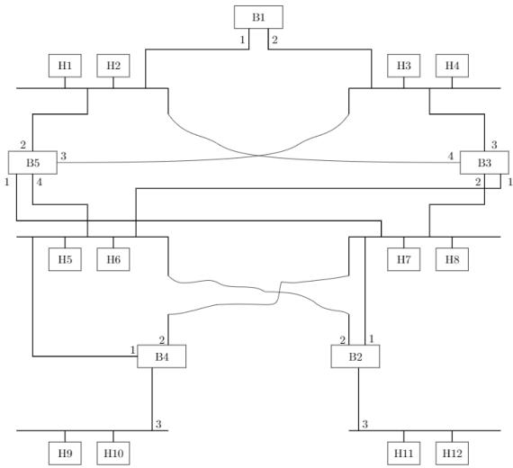
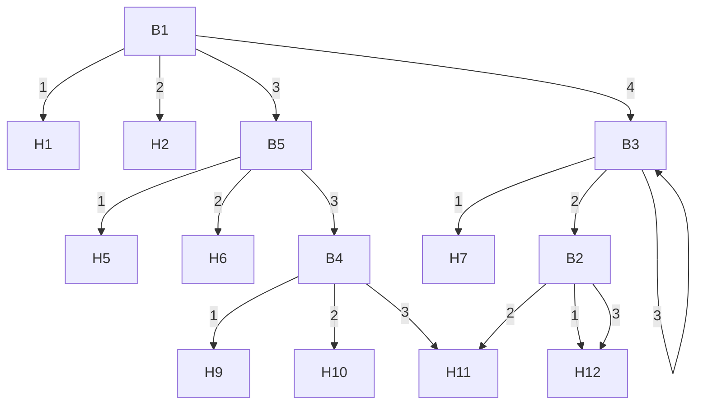
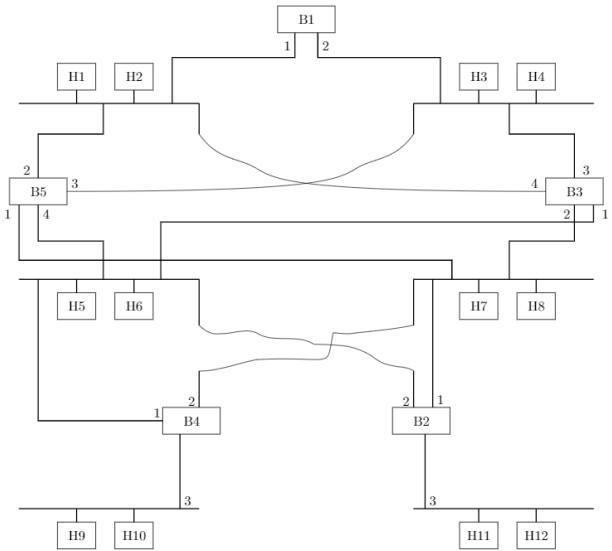
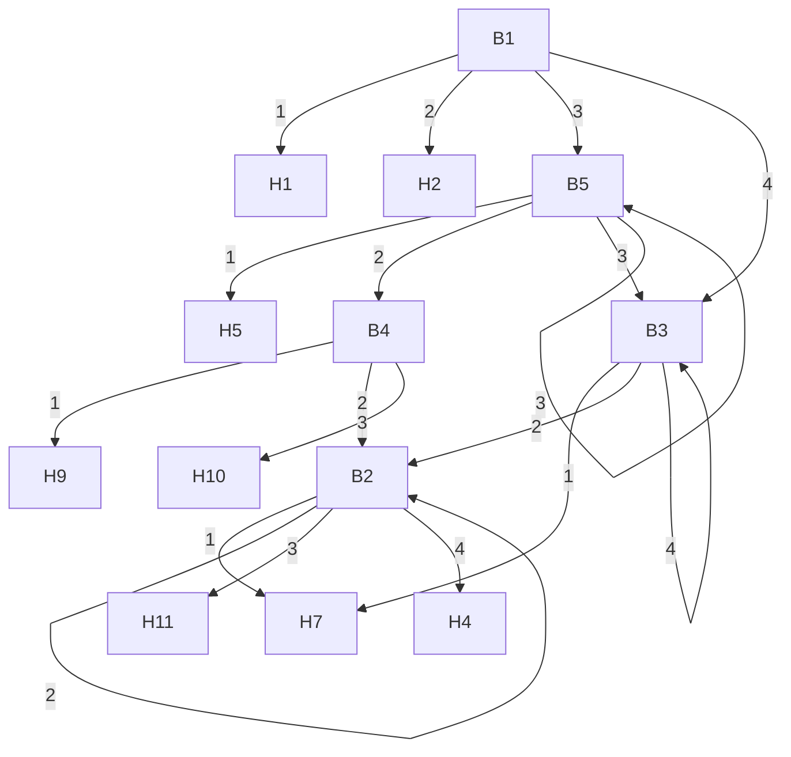

The Token Bucket algorithm is a traffic shaping technique used to control the rate at which data is sent over a network. It smooths out bursty traffic and enforces a maximum average rate.

# Key Concepts:

- Bucket Capacity (C): The maximum number of tokens the bucket can hold. Represents the maximum burst size allowed.  
- Token Arrival Rate (r): The rate at which tokens are added to the bucket (e.g., tokens/second). Represents the average allowed transmission rate.  
- Traffic Shaping: Packets can only be sent if there are enough tokens in the bucket. If not, packets are buffered or dropped.

# Important Formulas and Results:

\- Maximum Output Rate: Can be up to the link speed for a burst, but limited by the token rate $r$ over time.

• Maximum Burst Size: Equal to the bucket capacity C.

# Common Pitfalls and Problem-Solving Techniques:

- Pitfall: Confusing token bucket with leaky bucket. Token bucket allows bursts up to capacity, leaky bucket smooths all traffic to a constant rate.  
- Technique: Calculate the maximum burst duration or the time it takes for the bucket to fill given a token rate and capacity.

# UDP (User Datagram Protocol)

UDP is a simple, connectionless, unreliable Transport Layer protocol. It provides minimal services, primarily multiplexing/demultiplexing and basic error checking (optional checksum).

# Key Concepts:

- Connectionless: No connection setup or teardown.  
- Unreliable: No guarantees of delivery, order, or duplicate protection.  
- No Flow Control, No Congestion Control: Applications must handle these if needed.  
- Header Fields: Source Port, Destination Port, Length, Checksum (optional).

# Key Properties and Identities:

- Lower overhead and faster than TCP.  
- Suitable for applications where speed is more critical than reliability (e.g., streaming media, DNS, VoIP).

# Common Pitfalls and Problem-Solving Techniques:

- Pitfall: Attributing TCP features (reliability, flow control) to UDP.  
- Technique: Understand the trade-offs between UDP and TCP and identify appropriate applications for each.

# Wrap Around Time

Wrap Around Time (WAT) refers to the time it takes for the sequence numbers used in a protocol (like TCP) to cycle through all possible values and return to the starting point. It's crucial for preventing ambiguity when old segments with duplicate sequence numbers arrive late.

# Important Formulas and Results:

\- If sequence numbers are in bytes and $N$ is the number of bits for the sequence number field:

$$
\text {Max Sequence Number} = 2 ^ {N}
$$

$$
\text {Wrap Around Time (WAT)} = \frac {2 ^ {N} \times \text {Maximum Segment Size (MSS)}}{\text {Bandwidth}}
$$

(This formula might vary based on how sequence numbers are defined, e.g., per byte or per segment).

\- A simpler form often seen:

$$
\text {WAT} = \frac {\text {Total Sequence Number Space}}{\text {Data Rate}}
$$

# Key Properties and Identities:

- WAT should ideally be greater than the maximum segment lifetime (MSL) to prevent old segments from being misinterpreted.  
- For TCP, the sequence number field is 32 bits.

# Common Pitfalls and Problem-Solving Techniques:

- Pitfall: Forgetting to account for the units of sequence numbers (bytes vs. segments) and bandwidth.  
- Technique: Ensure consistent units. Understand the relationship between WAT and MSL.

# Quick Formula Reference

# Channel Utilization & Throughput:

- Stop-and-Wait ARQ: $U = \frac{1}{1 + 2a}$ where $a = T_p / T_t$  
- Sliding Window ARQ (Go-Back-N/Selective Repeat): $U = \min \left(1, \frac{W}{1 + 2a}\right)$  
- Pure Aloha Throughput: $S = G \cdot e^{-2G}$ (Max $S = 1 / (2e)$ at $G = 0.5$ )  
- Slotted Aloha Throughput: $S = G \cdot e^{-G}$ (Max $S = 1 / e$ at $G = 1$ )  
- Transmission Time: $T_{t}$ = Frame Size/Bandwidth  
- Propagation Delay: $T_p = \text{Distance/Propagation Speed}$

# Error Detection & Correction:

- Hamming Code Parity Bits: $2^{p} \geq m + p + 1$  
- CRC Codeword: $T(x) = x^{r} \cdot M(x) + \bar{R}(x)$

# MAC Protocols:

• CSMA/CD Slot Time: $2 \times$ Propagation Delay  
- CSMA/CD Minimum Frame Size: Bandwidth × 2 × Propagation Delay

# IP Fragmentation:

\- Fragment Offset: New Offset = $\frac{\text{Original Offset} \times 8 + \text{Data Length of Fragment}}{8}$ (in 8-byte units)

# IP Addressing & Subnetting:

- Usable Hosts: $2^{h} - 2$ (where $h$ is host bits)  
- Number of Subnets: $2^{s}$ (where $s$ is subnet bits)

# Sliding Window Sequence Numbers:

- Go-Back-N Sender Window $W_{S}$ : $W_{S} \leq 2^{n} - 1$ (where $n$ is sequence number bits)  
- Selective Repeat Sender/Receiver Window $W_S, W_R$ : $W_S = W_R = 2^{n-1}$

# Wrap Around Time:

\- WAT (bytes): $\frac{2^{N} \times \text{MSS}}{\text{Bandwidth}}$ (where $N$ is sequence number bits)

# Important Tips for GATE

1. Master OSI/TCP-IP Layers: Understand the function of each layer, the protocols operating at each layer, and the PDU (Protocol Data Unit) names. This is foundational and frequently tested.  
2. Practice Numerical Problems Extensively: Focus on channel utilization, throughput, propagation/transmission delay calculations, IP addressing, subnetting, and fragmentation. Pay close attention to units (bits vs. bytes, Mbps vs. Kbps, ms vs. seconds).  
3. Differentiate Flow Control vs. Congestion Control: Understand their distinct goals, mechanisms, and the protocols that implement them (e.g., TCP's window mechanisms for both).  
4. Know Protocol Headers: Be familiar with the key fields in Ethernet, IP, TCP, and UDP headers. Questions often test the purpose or size of specific fields.  
5. Understand ARQ Protocols: Clearly distinguish Stop-and-Wait, Go-Back-N, and Selective Repeat in terms of window sizes, retransmission strategies, and efficiency.  
6. Be Precise with IP Addressing and Subnetting: Convert to binary if needed. Don't confuse network ID, broadcast ID, and usable host addresses. Practice CIDR notation.  
7. Read Questions Carefully: Look for keywords like "negligible ACK time," "error-free channel," "half-duplex," or "full-duplex" as they significantly impact formula application.  
8. Time Management: Some numerical problems can be lengthy. If stuck, make an educated guess (if no negative marking) or move on and return if time permits.

# 2.1 Application Layer Protocols (13)

Practice Tests: Test 1 (15Q) Test 2 (4Q)

# 2.1.1 Application Layer Protocols: GATE CSE 2008 | Question: 14, ISRO2016-74

What is the maximum size of data that the application layer can pass on to the TCP layer below?

A. Any size

B. $2^{16}$ bytes - size of TCP header

C. $2^{16}$ bytes

D. 1500 bytes

gatecse-2008 easy computer-networks application-layer-protocols isro2016

Answer key

# 2.1.2 Application Layer Protocols: GATE CSE 2011 | Question: 4

Consider the different activities related to email.

- m1 : Send an email from mail client to mail server  
- m2 : Download an email from mailbox server to a mail client  
- m3 : Checking email in a web browser

Which is the application level protocol used in each activity?

A. m1 : HTTP m2 : SMTP m3 : POP  
B. m1 : SMTP m2 : FTP m3 : HTTP  
C. m1 : SMTP m2 : POP m3 : HTTP  
D. m1 : POP m2 : SMTP m3 : IMAP

gatecse-2011 computer-networks application-layer-protocols easy

Answer key

# 2.1.3 Application Layer Protocols: GATE CSE 2012 | Question: 10

The protocol data unit (PDU) for the application layer in the Internet stack is:

A. Segment

B. Datagram

C. Message

D. Frame

gatecse-2012 computer-networks application-layer-protocols easy

Answer key

# 2.1.4 Application Layer Protocols: GATE CSE 2016 | Set 1 | Question: 25

Which of the following is/are example(s) of stateful application layer protocol?

i. HTTP  
ii. FTP  
iii. TCP  
iv. POP3

A. (i) and (ii) only

B. (ii) and (iii) only

C. (ii) and (iv) only

D. (iv) only

gatecse-2016-set1 computer-networks application-layer-protocols normal

# Answer key

# 2.1.5 Application Layer Protocols: GATE CSE 2019 | Question: 16

Which of the following protocol pairs can be used to send and retrieve e-mails (in that order)?

A. IMAP, POP3

B. SMTP, POP3

C. SMTP, MIME

D. IMAP, SMTP

gatecse-2019 computer-networks application-layer-protocols one-mark

# Answer key

# 2.1.6 Application Layer Protocols: GATE CSE 2020 | Question: 25

Assume that you have made a request for a web page through your web browser to a web server. Initially the browser cache is empty. Further, the browser is configured to send HTTP requests in non-persistent mode. The web page contains text and five very small images. The minimum number of TCP connections required to display the web page completely in your browser is\_\_\_\_.

gatecse-2020 numerical-answers computer-networks application-layer-protocols one-mark

# Answer key

# 2.1.7 Application Layer Protocols: GATE CSE 2022 | Question: 25

Consider the resolution of the domain name www.gate.org.in by a DNS resolver. Assume that no resource records are cached anywhere across the DNS servers and that iterative query mechanism is used in the resolution. The number of DNS query-response pairs involved in completely resolving the domain name is \_\_\_\_.

gatecse-2022 numerical-answers computer-networks one-mark application-layer-protocols

# Answer key

# 2.1.8 Application Layer Protocols: GATE CSE 2026 | Set 1 | Question: 9

Which of the following statements is/are true with respect to the interaction of a web browser with a web server using HTTP 1.1?

A. HTTP 1.1 facilitates downloading multiple objects of the same webpage over the same TCP connection, if the objects are stored in the same server  
B. HTTP 1.1 facilitates downloading multiple objects of the same webpage over the same TCP connection, even if they are stored in different servers  
C. HTTP 1.1 facilitates sending a request for downloading one object without waiting for a previously requested object to be downloaded completely  
D. HTTP 1.1 facilitates downloading multiple webpages on the same server to be downloaded over a single TCP connection

gatecse-2026-set1 computer-networks application-layer-protocols multiple-selects one-mark

# Answer key

# 2.1.9 Application Layer Protocols: GATE CSE 2026 | Set 2 | Question: 12

Which one of the following protocols may need to broadcast some of its messages?

A. SMTP

B. FTP

C. DHCP

D. HTTP

gatecse-2026-set2 computer-networks application-layer-protocols one-mark

# 2.1.10 Application Layer Protocols: GATE IT 2005 | Question: 25

Consider the three commands : PROMPT, HEAD and RCPT.

Which of the following options indicate a correct association of these commands with protocols where these are used?

A. HTTP, SMTP, FTP

B. FTP, HTTP, SMTP

C. HTTP, FTP, SMTP

D. SMTP, HTTP, FTP

gateit-2005 computer-networks application-layer-protocols normal

# Answer key

# 2.1.11 Application Layer Protocols: GATE IT 2005 | Question: 77

Assume that "host1.mydomain.dom" has an IP address of 145.128.16.8. Which of the following options would be most appropriate as a subsequence of steps in performing the reverse lookup of 145.128.16.8? In the following options "NS" is an abbreviation of "nameserver".

A. Query a NS for the root domain and then NS for the "dom" domains  
B. Directly query a NS for "dom" and then a NS for "mydomain.dom" domains  
C. Query a NS for in-addr.arpa and then a NS for 128.145.in-addr.arpa domains  
D. Directly query a NS for 145.in-addr.arpa and then a NS for 128.145.in-addr.arpa domains

gateit-2005 computer-networks normal application-layer-protocols

# Answer key

# 2.1.12 Application Layer Protocols: GATE IT 2006 | Question: 18

HELO and PORT, respectively, are commands from the protocols:

A. FTP and HTTP  
C. HTTP and TELNET

B. TELNET and POP3  
D. SMTP and FTP

gateit-2006 computer-networks application-layer-protocols normal

# Answer key

# 2.1.13 Application Layer Protocols: GATE IT 2008 | Question: 20

Provide the best matching between the entries in the two columns given in the table below:

<table><tr><td>I. Proxy Server</td><td>a. Firewall</td></tr><tr><td>II. Kazaa, DC++</td><td>b. Caching</td></tr><tr><td>III. Slip</td><td>c. P2P</td></tr><tr><td>IV. DNS</td><td>d. PPP</td></tr></table>

A. I-a, II-d, III-c, IV-b  
C. I-a, II-c, III-d, IV-b

gateit-2008 computer-networks normal application-layer-protocols

# Answer key

# 2.2

# Arp (1)

# 2.2.1 Arp: GATE CSE 2025 | Set 2 | Question: 6

Consider the following statements:

i. Address Resolution Protocol (ARP) provides a mapping from an IP address to the corresponding hardware (link-layer) address.  
ii. A single TCP segment from a sender S to a receiver R cannot carry both data from S to R and acknowledgement for a segment from R to S

Which one of the following is CORRECT?

A. Both (i) and (ii) are TRUE  
C. (i) is FALSE and (ii) is TRUE

B. (i) is TRUE and (ii) is FALSE  
D. Both (i) and (ii) are FALSE

gatecse2025-set2 computer-networks tcp arp easy one-mark

Answer key

# 2.3

# Bit Stuffing (2)

# 2.3.1 Bit Stuffing: GATE CSE 2014 | Set 3 | Question: 24

A bit-stuffing based framing protocol uses an 8-bit delimiter pattern of 01111110. If the output bit-string after stuffing is 01111100101, then the input bit-string is:

A. 0111110100

B. 0111110101

C. 0111111101

D. 0111111111

gatecse-2014-set3 computer-networks error-detection bit-stuffing

Answer key

# 2.3.2 Bit Stuffing: GATE IT 2004 | Question: 80

In a data link protocol, the frame delimiter flag is given by 0111. Assuming that bit stuffing is employed, the transmitter sends the data sequence 01110110 as:

A. 01101011

B. 011010110

C. 011101100

D. 0110101100

gateit-2004 computer-networks network-flow normal bit-stuffing

Answer key

# 2.4

# Bridges (3)

# 2.4.1 Bridges: GATE CSE 2004 | Question: 16

Which of the following is NOT true with respect to a transparent bridge and a router?

A. Both bridge and router selectively forward data packets  
B. A bridge uses IP addresses while a router uses MAC addresses  
C. A bridge builds up its routing table by inspecting incoming packets  
D. A router can connect between a LAN and a WAN

gatecse-2004 computer-networks bridges normal

Answer key

# 2.4.2 Bridges: GATE CSE 2006 | Question: 82

Consider the diagram shown below where a number of LANs are connected by (transparent) bridges. In order to avoid packets looping through circuits in the graph, the bridges organize themselves in a spanning tree. First, the root bridge is identified as the bridge with the least serial number. Next, the root sends out (more) data units to enable the setting up of the spanning tree of shortest paths from the root bridge to each by

Each bridge identifies a port (the root port) through which it will forward frames to the root bridge. Port conflicts are always resolved in favour of the port with the lower index value. When there is a possibility of multiple bridges forwarding to the same LAN (but not through the root port), ties are broken as follows: bridges closest to the root get preference and between such bridges, the one with the lowest serial number is preferred.

flowchart

For the given connection of LANs by bridges, which one of the following choices represents the depth first traversal of the spanning tree of bridges?

A. B1, B5, B3, B4, B2

B. B1, B3, B5, B2, B4

C. B1, B5, B2, B3, B4

D. B1, B3, B4, B5, B2

gatecse-2006 computer-networks bridges normal

# Answer key

# 2.4.3 Bridges: GATE CSE 2006 | Question: 83

Consider the diagram shown below where a number of LANs are connected by (transparent) bridges. In order to avoid packets looping through circuits in the graph, the bridges organize themselves in a spanning tree. First, the root bridge is identified as the bridge with the least serial number. Next, the root sends out (more) data

units to enable the setting up of the spanning tree of shortest paths from the root bridge to each bridge.

Each bridge identifies a port (the root port) through which it will forward frames to the root bridge. Port conflicts are always resolved in favour of the port with the lower index value. When there is a possibility of multiple bridges forwarding to the same LAN (but not through the root port), ties are broken as follows: bridges closest to the root get preference and between such bridges, the one with the lowest serial number is preferred.

flowchart

Consider the spanning tree B1, B5, B3, B4, B2 for the given connection of LANs by bridges, that represents the depth first traversal of the spanning tree of bridges. Let host H1 send out a broadcast ping packet. Which of the following options represents the correct forwarding table on B3?

a.

<table><tr><td>Hosts</td><td>Port</td></tr><tr><td>H1, H2, H3, H4</td><td>3</td></tr><tr><td>H5, H6, H9, H10</td><td>1</td></tr><tr><td>H7, H8, H11, H12</td><td>2</td></tr></table>

b.

<table><tr><td>Hosts</td><td>Port</td></tr><tr><td>H1, H2</td><td>4</td></tr><tr><td>H3, H4</td><td>3</td></tr><tr><td>H5, H6</td><td>1</td></tr><tr><td>H7, H8, H9, H10, H11, H12</td><td>2</td></tr></table>

C.

<table><tr><td>Hosts</td><td>Port</td></tr><tr><td>H3, H4</td><td>3</td></tr><tr><td>H5, H6, H9, H10</td><td>1</td></tr><tr><td>H1, H2</td><td>4</td></tr><tr><td>H7, H8, H11, H12</td><td>2</td></tr></table>

d.

<table><tr><td>Hosts</td><td>Port</td></tr><tr><td>H1, H2, H3, H4</td><td>3</td></tr><tr><td>H5, H7, H9, H10</td><td>1</td></tr><tr><td>H7, H8, H11, H12</td><td>4</td></tr></table>

gatecse-2006 computer-networks bridges normal

Answer key

# 2.5

# CRC Polynomial (5)

Practice Test: Test 1 (7Q)

# 2.5.1 CRC Polynomial: GATE CSE 2007 | Question: 68, ISRO2016-73

The message 11001001 is to be transmitted using the CRC polynomial $x^3 + 1$ to protect it from errors. The message that should be transmitted is:

A. 11001001000

B. 11001001011

C. 11001010

D. 110010010011

gatecse-2007 computer-networks error-detection crc-polynomial normal isro2016

Answer key

# 2.5.2 CRC Polynomial: GATE CSE 2017 | Set 1 | Question: 32

A computer network uses polynomials over $GF(2)$ for error checking with 8 bits as information bits and uses $x^{3} + x + 1$ as the generator polynomial to generate the check bits. In this network, the message 01011011 is transmitted as:

A. 01011011010

B. 01011011011

c. 01011011101

D. 01011011100

gatecse-2017-set1 computer-networks crc-polynomial normal

Answer key

# 2.5.3 CRC Polynomial: GATE CSE 2021 | Set 2 | Question: 34

Consider the cyclic redundancy check (CRC) based error detecting scheme having the generator polynomial $X^3 + X + 1$ . Suppose the message $m_4m_3m_2m_1m_0 = 11000$ is to be transmitted. Check bits $c_2c_1c_0$ are appended at the end of the message by the transmitter using the above CRC scheme. The transmitted bit string is denoted by $m_4m_3m_2m_1m_0c_2c_1c_0$ . The value of the checkbit sequence $c_2c_1c_0$ is

A. 101

B. 110

C. 100

D. 111

gatecse-2021-set2 computer-networks crc-polynomial two-marks

# Answer key

# 2.5.4 CRC Polynomial: GATE CSE 2026 | Set 2 | Question: 33

Consider the transmission of data bits 110001011 over a link that uses Cyclic Redundancy Check (CRC) code for error detection. If the generator bit pattern is given to be 1001, which one of the following options shows the remainder bit pattern appended to the data bits before transmission?

A. 011

B. 101

C. 000

D. 100

gatecse-2026-set2 computer-networks crc-polynomial error-detection two-marks

# Answer key

# 2.5.5 CRC Polynomial: GATE IT 2005 | Question: 78

Consider the following message $M = 1010001101$ . The cyclic redundancy check (CRC) for this message using the divisor polynomial $x^5 + x^4 + x^2 + 1$ is:

A. 01110

B. 01011

C. 10101

D. 10110

gateit-2005 computer-networks crc-polynomial normal

# Answer key

# 2.6

# CSMA CD (6)

Practice Test: Test 1 (10Q)

# 2.6.1 CSMA CD: GATE CSE 2015 | Set 3 | Question: 6

Consider a CSMA/CD network that transmits data at a rate of 100 Mbps ( $10^{8}$ bits per second) over a 1 km (kilometre) cable with no repeaters. If the minimum frame size required for this network is 1250 bytes, What is the signal speed (km/sec) in the cable?

A. 8000

B. 10000

C. 16000

D. 20000

gatecse-2015-set3 computer-networks congestion-control csma-cd normal

# Answer key

# 2.6.2 CSMA CD: GATE CSE 2016 | Set 2 | Question: 53

A network has a data transmission bandwidth of $20 \times 10^{6}$ bits per second. It uses CSMA/CD in the MAC layer. The maximum signal propagation time from one node to another node is 40 microseconds. The minimum size of a frame in the network is \_\_\_\_ bytes.

gatecse-2016-set2 computer-networks csma-cd numerical-answers normal

# Answer key

# 2.6.3 CSMA CD: GATE CSE 2018 | Question: 55

Consider a simple communication system where multiple nodes are connected by a shared broadcast medium (like Ethernet or wireless). The nodes in the system use the following carrier-sense based medium

access protocol. A node that receives a packet to transmit will carrier-sense the medium for 5 units of time. If the node does not detect any other transmission, it starts transmitting its packet in the next time unit. If the node detects another transmission, it waits until this other transmission finishes, and then begins to carrier-sense for 5 time units again. Once they start to transmit, nodes do not perform any collision detection and continue transmission even if a collision occurs. All transmissions last for 20 units of time. Assume that the transmission signal travels at the speed of 10 meters per unit time in the medium.

Assume that the system has two nodes P and Q, located at a distance d meters from each other. P start transmitting a packet at time t = 0 after successfully completing its carrier-sense phase. Node Q has a packet to

transmit at time t = 0 and begins to carrier-sense the medium.

The maximum distance $d$ (in meters, rounded to the closest integer) that allows $Q$ to successfully avoid a collision between its proposed transmission and $P$ 's ongoing transmission is \_\_\_\_.

gatecse-2018 computer-networks csma-cd numerical-answers two-marks

Answer key

# 2.6.4 CSMA CD: GATE IT 2005 | Question: 27

Which of the following statements is TRUE about CSMA/CD:

A. IEEE 802.11 wireless LAN runs CSMA/CD protocol  
B. Ethernet is not based on CSMA/CD protocol  
C. CSMA/CD is not suitable for a high propagation delay network like satellite network  
D. There is no contention in a CSMA/CD network

gateit-2005 computer-networks congestion-control csma-cd normal

Answer key

# 2.6.5 CSMA CD: GATE IT 2005 | Question: 71

A network with CSMA/CD protocol in the MAC layer is running at 1Gbps over a 1km cable with no repeaters. The signal speed in the cable is $2 \times 10^{8}$ m/sec. The minimum frame size for this network should be:

A. 10000bits

B. 10000bytes

c. 5000 bits

D. 5000bytes

gateit-2005 computer-networks congestion-control csma-cd normal

Answer key

# 2.6.6 CSMA CD: GATE IT 2008 | Question: 65

The minimum frame size required for a CSMA/CD based computer network running at 1Gbps on a 200m cable with a link speed of $2 \times 10^{8}$ m/sec is:

A. 125bytes

B. 250bytes

C. 500bytes

D. None of the above

gateit-2008 computer-networks csma-cd normal

Answer key

# 2.7

# Channel Utilization (1)

# 2.7.1 Channel Utilization: GATE CSE 2025 | Set 2 | Question: 26

Suppose we are transmitting frames between two nodes using Stop-and-Wait protocol. The frame size is 3000 bits. The transmission rate of the channel is 2000 bps (bits/second) and the propagation delay between the two nodes is 100 milliseconds. Assume that the processing times at the source and destination are negligible. Also, assume that the size of the acknowledgement packet is negligible. Which ONE of the following most accurately gives the channel utilization for the above scenario in percentage?

A. 88.23

B. 93.75

C. 85.44

D. 66.67

gatecse2025-set2 computer-networks stop-and-wait channel-utilization two-marks

Answer key

# 2.8

# Communication (4)

Practice Test: Test 1 (11Q)

# 2.8.1 Communication: GATE CSE 2012 | Question: 44

Consider a source computer (S) transmitting a file of size $10^{6}$ bits to a destination computer (D) over a

network of two routers ( $R_1$ and $R_2$ ) and three links ( $L_1, L_2$ , and $L_3$ ). $L_1$ connects $S$ to $R_1$ ; $L_2$ connects $R_1$ to $R_2$ ; and $L_3$ connects $R_2$ to $D$ . Let each link be of length 100 km. Assume signals travel over each link at a speed of $10^8$ meters per second. Assume that the link bandwidth on each link is 1 Mbps. Let the file be broken down into 1000 packets each of size 1000 bits. Find the total sum of transmission and propagation delays in transmitting the file from $S$ to $D$ ?

A. 1005 ms

B. 1010 ms

c. 3000 ms

D. 3003 ms

gatecse-2012 computer-networks communication normal

# Answer key

# 2.8.2 Communication: GATE CSE 2022 | Question: 49

Consider a 100 Mbps link between an earth station (sender) and a satellite (receiver) at an altitude of 2100 km. The signal propagates at a speed of $3 \times 10^{8}$ m/s. The time taken (in milliseconds, rounded off to two decimal places) for the receiver to completely receive a packet of 1000 bytes transmitted by the sender is \_\_\_\_.

gatecse-2022 numerical-answers computer-networks two-marks communication

# Answer key

# 2.8.3 Communication: GATE IT 2007 | Question: 62

Let us consider a statistical time division multiplexing of packets. The number of sources is 10. In a time unit, a source transmits a packet of 1000 bits. The number of sources sending data for the first 20 time units is 6, 9, 3, 7, 2, 2, 2, 3, 4, 6, 1, 10, 7, 5, 8, 3, 6, 2, 9, 5 respectively. The output capacity of multiplexer is 5000 bits per time unit. Then the average number of backlogged of packets per time unit during the given period is

A. 5

B. 4.45

C. 3.45

D. 0

gateit-2007 computer-networks communication normal

# Answer key

# 2.8.4 Communication: GATE IT 2007 | Question: 64

A broadcast channel has 10 nodes and total capacity of 10 Mbps. It uses polling for medium access. Once a node finishes transmission, there is a polling delay of 80 $\mu$ s to poll the next node. Whenever a node is polled, it is allowed to transmit a maximum of 1000 bytes. The maximum throughput of the broadcast channel is:

A. 1 Mbps

B. 100/11 Mbps

C. 10 Mbps

D. 100 Mbps

gateit-2007 computer-networks communication normal

# Answer key

# 2.9

# Congestion Control (9)

Practice Test: Test 1 (14Q)

# 2.9.1 Congestion Control: GATE CSE 2008 | Question: 56

In the slow start phase of the TCP congestion algorithm, the size of the congestion window:

A. does not increase

B. increase linearly

C. increases quadratically

D. increases exponentially

gatecse-2008 computer-networks congestion-control normal

# Answer key

# 2.9.2 Congestion Control: GATE CSE 2012 | Question: 45

Consider an instance of TCP's Additive Increase Multiplicative Decrease (AIMD) algorithm where the window size at the start of the slow start phase is 2 MSS and the threshold at the start of the first transmission is 8 MSS. Assume that a timeout occurs during the fifth transmission. Find the congestion window size at the end of the tenth transmission.

# Answer key

# 2.9.3 Congestion Control: GATE CSE 2014 | Set 1 | Question: 27

Let the size of congestion window of a TCP connection be 32 KB when a timeout occurs. The round trip time of the connection is 100 msec and the maximum segment size used is 2 KB. The time taken (in msec) by the TCP connection to get back to 32 KB congestion window is \_\_\_\_.

gatecse-2014-set1 computer-networks tcp congestion-control numerical-answers normal

# Answer key

# 2.9.4 Congestion Control: GATE CSE 2018 | Question: 14

Consider the following statements regarding the slow start phase of the TCP congestion control algorithm. Note that cwnd stands for the TCP congestion window and MSS window denotes the Maximum Segments Size:

i. The cwnd increases by 2 MSS on every successful acknowledgment  
ii. The cwnd approximately doubles on every successful acknowledgment  
iii. The cwnd increases by 1 MSS every round trip time  
iv. The cwnd approximately doubles every round trip time

Which one of the following is correct?

A. Only (ii) and (iii) are true

C. Only (iv) is true

B. Only (i) and (iii) are true

D. Only (i) and (iv) are true

gatecse-2018 computer-networks tcp congestion-control normal one-mark

# Answer key

# 2.9.5 Congestion Control: GATE CSE 2020 | Question: 55

Consider a TCP connection between a client and a server with the following specifications; the round trip time is 6 ms, the size of the receiver advertised window is 50 KB, slow-start threshold at the client is 32 KB, and the maximum segment size is 2 KB. The connection is established at time t = 0. Assume that there are no timeouts and errors during transmission. Then the size of the congestion window (in KB) at time $t + 60$ ms after all acknowledgements are processed is \_\_\_\_

gatecse-2020 numerical-answers computer-networks tcp congestion-control two-marks

# Answer key

# 2.9.6 Congestion Control: GATE CSE 2024 | Set 2 | Question: 44

Consider a TCP connection operating at a point of time with the congestion window of size 12 MSS (Maximum Segment Size), when a timeout occurs due to packet loss. Assuming that all the segments transmitted in the next two RTTs (Round Trip Time) are acknowledged correctly, the congestion window size (in MSS) during the third RTT will be \_\_\_\_.

gatecse-2024-set2 numerical-answers computer-networks tcp congestion-control two-marks

# Answer key

# 2.9.7 Congestion Control: GATE CSE 2026 | Set 1 | Question: 34

A TCP sender successfully establishes a connection with a TCP receiver and starts the transmission of segments. The TCP congestion control mechanism's slow-start threshold is set to 10000 segments.

Assume that the round-trip time is fixed at 1 millisecond. Assume that the sender always has data to send, the segments are numbered from 1, and no segment is lost. Let t denote the time (in milliseconds) at which the transmission of segment number 2000 starts.

Which one of the following options is correct?