A. 9 < t < 10  
C. $11 \leq t < 12$

B. $10 < t < 11$  
D. $12 \leq t < 13$

gatecse-2026-set1 two-marks computer-networks congestion-control tcp

# Answer key

# 2.9.8 Congestion Control: GATE CSE 2026 | Set 2 | Question: 48

Consider a new TCP connection between a sender and a receiver. The receiver advertised window is constant at 48 KB, the maximum segment size (MSS) is 2 KB, and the slow start threshold for TCP congestion control is 16 KB. Assume that there are no timeouts or duplicate acknowledgements. The number of rounds of transmission required for the congestion control algorithm of the TCP connection to reach the congestion avoidance phase is \_\_\_\_. (answer in integer)

Note: $1\mathrm{K} = 2^{10}$

gatecse-2026-set2 computer-networks congestion-control tcp numerical-answers two-marks

# Answer key

# 2.9.9 Congestion Control: GATE IT 2005 | Question: 73

On a TCP connection, current congestion window size is Congestion Window = 4 KB. The window size advertised by the receiver is Advertise Window = 6 KB. The last byte sent by the sender is LastByteSent = 10240 and the last byte acknowledged by the receiver is LastByteAcked = 8192. The current window size at the sender is:

A. 2048 bytes

B. 4096 bytes

C. 6144 bytes

D. 8192 bytes

gateit-2005 computer-networks congestion-control normal

# Answer key

# 2.10

# Data Communication (1)

# 2.10.1 Data Communication: GATE CSE 2026 | Set 2 | Question: 55

It is necessary to design a link-layer protocol between two hosts that are directly connected over a lossless link of length 3000 kilometers. Assume that the link bandwidth is $10^{8}$ bits per second and that the propagation delay in the link is 5 nanoseconds per meter. Every transmitted data byte is assigned a sequence number.

Let N be the minimum number of bits needed for the sequence number field in the protocol header such that

i. the sequence numbers do not wrap around before 60 seconds, and  
ii. the maximum utilization of the link is achieved.

The value of $N$ is \_\_\_\_. (answer in integer)

gatecse-2026-set2 computer-networks data-communication numerical-answers two-marks

# Answer key

# 2.11

# Distance Vector Routing (8)

# Practice Test: Test 1 (15Q)

# 2.11.1 Distance Vector Routing: GATE CSE 2010 | Question: 54

Consider a network with 6 routers R1 to R6 connected with links having weights as shown in the following diagram.

flowchart

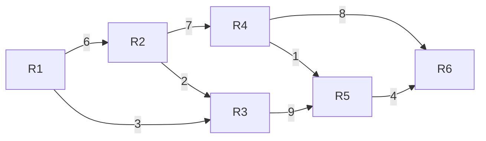

All the routers use the distance vector based routing algorithm to update their routing tables. Each router starts with its routing table initialized to contain an entry for each neighbor with the weight of the respective connecting link. After all the routing tables stabilize, how many links in the network will never be used for carrying any data?

A. 4

B. 3

C. 2

D. 1

gatecse-2010 computer-networks routing distance-vector-routing normal

# Answer key

# 2.11.2 Distance Vector Routing: GATE CSE 2010 | Question: 55

Consider a network with 6 routers R1 to R6 connected with links having weights as shown in the following diagram.

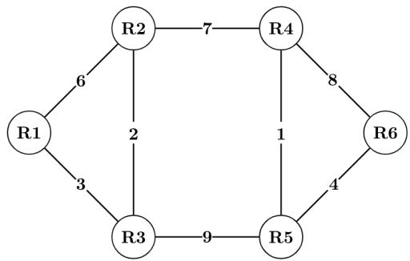

flowchart

Suppose the weights of all unused links are changed to 2 and the distance vector algorithm is used again until all routing tables stabilize. How many links will now remain unused?

A. 0

B. 1

C. 2

D. 3

gatecse-2010 computer-networks routing distance-vector-routing normal

# Answer key

# 2.11.3 Distance Vector Routing: GATE CSE 2011 | Question: 52

Consider a network with five nodes, N1 to N5, as shown as below.

flowchart

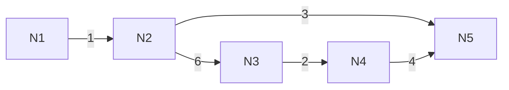

The network uses a Distance Vector Routing protocol. Once the routes have been stabilized, the distance vectors at different nodes are as follows.

N1: (0, 1, 7, 8, 4)

N2: (1, 0, 6, 7, 3)  
N3: (7, 6, 0, 2, 6)  
N4: (8, 7, 2, 0, 4)  
N5: (4, 3, 6, 4, 0)

Each distance vector is the distance of the best known path at that instance to nodes, N1 to N5, where the distance to itself is 0. Also, all links are symmetric and the cost is identical in both directions. In each round, all nodes exchange their distance vectors with their respective neighbors. Then all nodes update their distance vectors. In between two rounds, any change in cost of a link will cause the two incident nodes to change only that entry in their distance vectors.

The cost of link $N2 - N3$ reduces to 2 (in both directions). After the next round of updates, what will be the new distance vector at node, $N3$ ?

A. $(3,2,0,2,5)$  
C. $(7,2,0,2,5)$

B. $(3,2,0,2,6)$  
D. (7,2,0,2,6)

gatecse-2011 computer-networks routing distance-vector-routing normal

Answer key

# 2.11.4 Distance Vector Routing: GATE CSE 2011 | Question: 53

Consider a network with five nodes, N1 to N5, as shown as below.

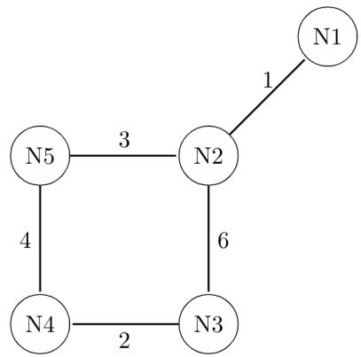

flowchart

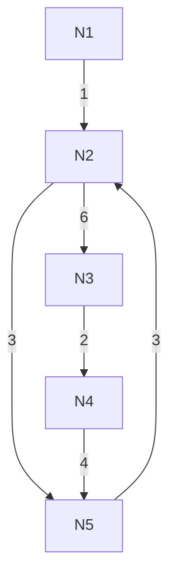

The network uses a Distance Vector Routing protocol. Once the routes have been stabilized, the distance vectors at different nodes are as follows.

- N1: $(0,1,7,8,4)$  
- N2: (1,0,6,7,3)  
- N3: (7,6,0,2,6)  
- N4: (8,7,2,0,4)  
- N5: (4,3,6,4,0)

Each distance vector is the distance of the best known path at that instance to nodes, N1 to N5, where the distance to itself is 0. Also, all links are symmetric and the cost is identical in both directions. In each round, all nodes exchange their distance vectors with their respective neighbors. Then all nodes update their distance vectors. In between two rounds, any change in cost of a link will cause the two incident nodes to change only that entry in their distance vectors.

The cost of link $N2 - N3$ reduces to 2 (in both directions). After the next round of updates, the link $N1 - N2$ goes down. $N2$ will reflect this change immediately in its distance vector as cost, $\infty$ . After the NEXT ROUND of update, what will be the cost to $N1$ in the distance vector of $N3$ ?

A. 3

B. 9

C. 10

D. $\infty$

gatecse-2011 computer-networks routing distance-vector-routing normal

Answer key

# 2.11.5 Distance Vector Routing: GATE CSE 2021 | Set 2 | Question: 45

Consider a computer network using the distance vector routing algorithm in its network layer. The partial topology of the network is shown below.

flowchart

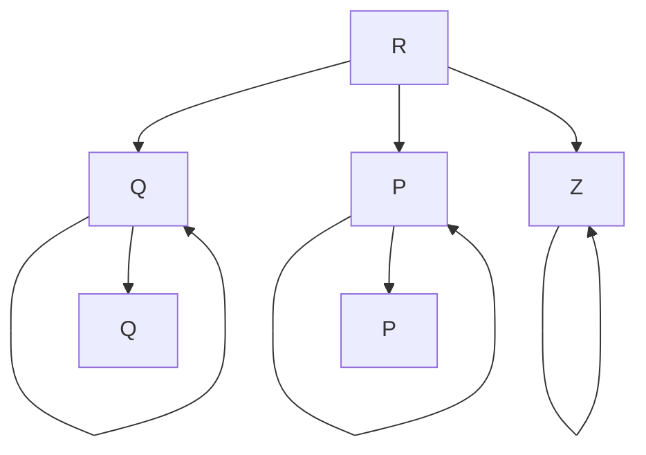

The objective is to find the shortest-cost path from the router $R$ to routers $P$ and $Q$ . Assume that $R$ does not initially know the shortest routes to $P$ and $Q$ . Assume that $R$ has three neighbouring routers denoted as $X, Y$ and $Z$ . During one iteration, $R$ measures its distance to its neighbours $X, Y$ , and $Z$ as 3, 2 and 5, respectively. Router $R$ gets routing vectors from its neighbours that indicate that the distance to router $P$ from routers $X, Y$ and $Z$ are 7, 6 and 5, respectively. The routing vector also indicates that the distance to router $Q$ from routers $X, Y$ and $Z$ are 4, 6 and 8 respectively. Which of the following statement(s) is/are correct with respect to the new routing table $o$ $R$ , after updation during this iteration?

A. The distance from R to P will be stored as 10  
B. The distance from R to Q will be stored as 7  
C. The next hop router for a packet from $R$ to $P$ is $Y$  
D. The next hop router for a packet from $R$ to $Q$ is $Z$

gatecse-2021-set2 multiple-selects computer-networks distance-vector-routing two-marks

Answer key

# 2.11.6 Distance Vector Routing: GATE CSE 2022 | Question: 47

Consider a network with three routers P, Q, R shown in the figure below. All the links have cost of unity.

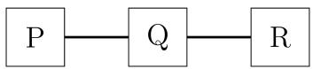

The routers exchange distance vector routing information and have converged on the routing tables, after which the link Q-R fails. Assume that P and Q send out routing updates at random times, each at the same average rate. The probability of a routing loop formation (rounded off to one decimal place) between P and Q, leading to count-to-infinity problem, is \_\_\_\_.

gatecse-2022 numerical-answers computer-networks routing distance-vector-routing two-marks

Answer key

# 2.11.7 Distance Vector Routing: GATE IT 2005 | Question: 29

Count to infinity is a problem associated with:

A. link state routing protocol.  
C. DNS while resolving host name  
gateit-2005 computer-networks routing distance-vector-routing normal

B. distance vector routing protocol

D. TCP for congestion control

Answer key

# 2.11.8 Distance Vector Routing: GATE IT 2007 | Question: 60

For the network given in the figure below, the routing tables of the four nodes A, E, D and G are shown. Suppose that F has estimated its delay to its neighbors, A, E, D and G as 8, 10, 12 and 6 msecs respectively and updates its routing table using distance vector routing technique.

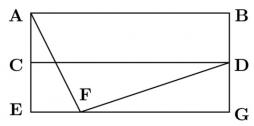

Routing Table of A

<table><tr><td>A</td><td>0</td></tr><tr><td>B</td><td>40</td></tr><tr><td>C</td><td>14</td></tr><tr><td>D</td><td>17</td></tr><tr><td>E</td><td>21</td></tr><tr><td>F</td><td>9</td></tr><tr><td>G</td><td>24</td></tr></table>

Routing Table of D

<table><tr><td>A</td><td>20</td></tr><tr><td>B</td><td>8</td></tr><tr><td>C</td><td>30</td></tr><tr><td>D</td><td>0</td></tr><tr><td>E</td><td>14</td></tr><tr><td>F</td><td>7</td></tr><tr><td>G</td><td>22</td></tr></table>

Routing Table of E

<table><tr><td>A</td><td>24</td></tr><tr><td>B</td><td>27</td></tr><tr><td>C</td><td>7</td></tr><tr><td>D</td><td>20</td></tr><tr><td>E</td><td>0</td></tr><tr><td>F</td><td>11</td></tr><tr><td>G</td><td>22</td></tr></table>

Routing Table of G

<table><tr><td>A</td><td>21</td></tr><tr><td>B</td><td>24</td></tr><tr><td>C</td><td>22</td></tr><tr><td>D</td><td>19</td></tr><tr><td>E</td><td>22</td></tr><tr><td>F</td><td>10</td></tr><tr><td>G</td><td>0</td></tr></table>

A.

<table><tr><td>A</td><td>8</td></tr><tr><td>B</td><td>20</td></tr><tr><td>C</td><td>17</td></tr><tr><td>D</td><td>12</td></tr><tr><td>E</td><td>10</td></tr><tr><td>F</td><td>0</td></tr><tr><td>G</td><td>6</td></tr></table>

B.

<table><tr><td>A</td><td>21</td></tr><tr><td>B</td><td>8</td></tr><tr><td>C</td><td>7</td></tr><tr><td>D</td><td>19</td></tr><tr><td>E</td><td>14</td></tr><tr><td>F</td><td>0</td></tr><tr><td>G</td><td>22</td></tr></table>

C.

<table><tr><td>A</td><td>8</td></tr><tr><td>B</td><td>20</td></tr><tr><td>C</td><td>17</td></tr><tr><td>D</td><td>12</td></tr><tr><td>E</td><td>10</td></tr><tr><td>F</td><td>16</td></tr><tr><td>G</td><td>6</td></tr></table>

D.

<table><tr><td>A</td><td>8</td></tr><tr><td>B</td><td>8</td></tr><tr><td>C</td><td>7</td></tr><tr><td>D</td><td>12</td></tr><tr><td>E</td><td>10</td></tr><tr><td>F</td><td>0</td></tr><tr><td>G</td><td>6</td></tr></table>

gateit-2007 computer-networks distance-vector-routing normal

# Answer key

# 2.12

# Error Detection (8)

Practice Test: Test 1 (9Q)

# 2.12.1 Error Detection: GATE CSE 1992 | Question: 01,ii

Consider a 3-bit error detection and 1-bit error correction hamming code for 4-bit data. The extra parity bits required would be \_\_\_\_ and the 3-bit error detection is possible because the code has a minimum distance of \_\_\_\_.

gate1992 computer-networks error-detection normal fill-in-the-blanks

# Answer key

# 2.12.2 Error Detection: GATE CSE 1995 | Question: 1.12

What is the distance of the following code 000000, 010101, 000111, 011001, 111111?

A. 2

B. 3

C. 4

D. 1

gate1995 computer-networks error-detection normal

# Answer key

# 2.12.3 Error Detection: GATE CSE 2009 | Question: 48

Let $G(x)$ be the generator polynomial used for CRC checking. What is the condition that should be satisfied by $G(x)$ to detect odd number of bits in error?

A. $G(x)$ contains more than two terms  
B. $G(x)$ does not divide $1 + x^{k}$ , for any $k$ not exceeding the frame length  
C. $1 + x$ is a factor of $G(x)$  
D. $G(x)$ has an odd number of terms.

# Answer key

# 2.12.4 Error Detection: GATE CSE 2017 | Set 2 | Question: 34

Consider the binary code that consists of only four valid codewords as given below:

00000,01011,10101,11110

Let the minimum Hamming distance of the code $p$ and the maximum number of erroneous bits that can be corrected by the code be $q$ . Then the values of $p$ and $q$ are

A. $p = 3$ and $q = 1$

B. $p = 3$ and $q = 2$

C. p = 4 and q = 1

D. $p = 4$ and $q = 2$

gatecse-2017-set2 computer-networks error-detection

# Answer key

# 2.12.5 Error Detection: GATE IT 2005 | Question: 74

In a communication network, a packet of length L bits takes link $L_{1}$ with a probability of $p_{1}$ or link $L_{2}$ with a probability of $p_{2}$ . Link $L_{1}$ and $L_{2}$ have bit error probability of $b_{1}$ and $b_{2}$ respectively. The probability that the packet will be received without error via either $L_{1}$ or $L_{2}$ is

A. $(1 - b_{1})^{L}p_{1} + (1 - b_{2})^{L}p_{2}$

B. $[1 - (b_1 + b_2)^L]p_1p_2$

C. $(1 - b_{1})^{L}(1 - b_{2})^{L}p_{1}p_{2}$

D. $1 - (b_1^L p_1 + b_2^L p_2)$

gateit-2005 computer-networks error-detection probability normal

# Answer key

# 2.12.6 Error Detection: GATE IT 2007 | Question: 43

An error correcting code has the following code words: 00000000, 00001111, 01010101, 10101010, 11110000. What is the maximum number of bit errors that can be corrected?

A. 0

B. 1

C. 2

D. 3

gateit-2007 computer-networks error-detection normal

# Answer key

# 2.12.7 Error Detection: GATE IT 2008 | Question: 66

Data transmitted on a link uses the following 2D parity scheme for error detection:

Each sequence of 28 bits is arranged in a $4 \times 7$ matrix (rows $r_{0}$ through $r_{3}$ , and columns $d_{7}$ through $d_{1}$ )

and is padded with a column $d_{0}$ and row $r_{4}$ of parity bits computed using the Even parity scheme. Each bit of column $d_{0}$ (respectively, row $r_{4}$ ) gives the parity of the corresponding row (respectively, column). These 40 bits are transmitted over the data link.

<table><tr><td></td><td> $\mathbf{d_7}$ </td><td> $\mathbf{d_6}$ </td><td> $\mathbf{d_5}$ </td><td> $\mathbf{d_4}$ </td><td> $\mathbf{d_3}$ </td><td> $\mathbf{d_2}$ </td><td> $\mathbf{d_1}$ </td><td> $\mathbf{d_0}$ </td></tr><tr><td> $\mathbf{r_0}$ </td><td>0</td><td>1</td><td>0</td><td>1</td><td>0</td><td>0</td><td>1</td><td>1</td></tr><tr><td> $\mathbf{r_1}$ </td><td>1</td><td>1</td><td>0</td><td>0</td><td>1</td><td>1</td><td>1</td><td>0</td></tr><tr><td> $\mathbf{r_2}$ </td><td>0</td><td>0</td><td>0</td><td>1</td><td>0</td><td>1</td><td>0</td><td>0</td></tr><tr><td> $\mathbf{r_3}$ </td><td>0</td><td>1</td><td>1</td><td>0</td><td>1</td><td>0</td><td>1</td><td>0</td></tr><tr><td> $\mathbf{r_4}$ </td><td>1</td><td>1</td><td>0</td><td>0</td><td>0</td><td>1</td><td>1</td><td>0</td></tr></table>

The table shows data received by a receiver and has n corrupted bits. What is the minimum possible value of n?

A. 1

B. 2

C. 3

D. 4

gateit-2008 computer-networks normal error-detection

# Answer key

# 2.12.8 Error Detection: GATE1987-2-i

Match the pairs in the following questions:

<table><tr><td>(A) Cyclic Redundancy Code</td><td>(p) Error Correction</td></tr><tr><td>(B) Serial Communication</td><td>(q) Wired-OR</td></tr><tr><td>(C) Open Collector</td><td>(r) Error detection</td></tr><tr><td>(D) Hamming Code</td><td>(s) RS-232-C</td></tr></table>

gate1989 descriptive computer-networks error-detection

Answer key

# 2.13

# Ethernet (7)

Practice Test: Test 1 (8Q)

# 2.13.1 Ethernet: GATE CSE 2004 | Question: 54

A and B are the only two stations on an Ethernet. Each has a steady queue of frames to send. Both A and B attempt to transmit a frame, collide, and A wins the first backoff race. At the end of this successful transmission by A, both A and B attempt to transmit and collide. The probability that A wins the second backoff race is:

A. 0.5

B. 0.625

C. 0.75

D. 1.0

gatecse-2004 computer-networks ethernet probability normal

Answer key

# 2.13.2 Ethernet: GATE CSE 2013 | Question: 36

Determine the maximum length of the cable (in km) for transmitting data at a rate of 500 Mbps in an Ethernet LAN with frames of size 10,000 bits. Assume the signal speed in the cable to be 2,00,000 km/s.

A. 1

B. 2

C. 2.5

D. 5

gatecse-2013 computer-networks ethernet normal

Answer key

# 2.13.3 Ethernet: GATE CSE 2016 | Set 2 | Question: 24

In an Ethernet local area network, which one of the following statements is TRUE?

A. A station stops to sense the channel once it starts transmitting a frame.  
B. The purpose of the jamming signal is to pad the frames that are smaller than the minimum frame size.  
C. A station continues to transmit the packet even after the collision is detected.  
D. The exponential back off mechanism reduces the probability of collision on retransmissions.

gatecse-2016-set2 computer-networks ethernet normal

Answer key

# 2.13.4 Ethernet: GATE CSE 2022 | Question: 12

Consider an enterprise network with two Ethernet segments, a web server and a firewall, connected via three routers as shown below.

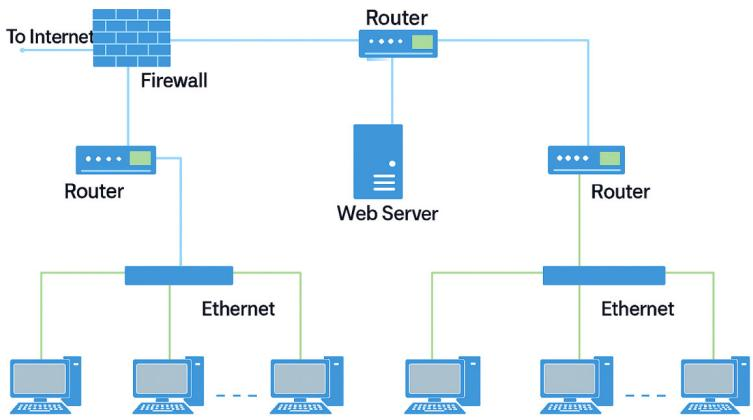

flowchart

This diagram illustrates a network architecture or data flow system where a To Internet is sent to a Firewall, which is then distributed to multiple routers and Ethernet, which are interconnected by a Web Server.

What is the number of subnets inside the enterprise network?

A. 3

B. 12

C. 6

D. 8

gatecse-2022 computer-networks ethernet one-mark

# Answer key

# 2.13.5 Ethernet: GATE CSE 2024 | Set 2 | Question: 13

Node X has a TCP connection open to node Y. The packets from X to Y go through an intermediate IP router R. Ethernet switch S is the first switch on the network path between X and R. Consider a packet sent from X to Y over this connection.

Which of the following statements is/are TRUE about the destination IP and MAC addresses on this packet at the time it leaves X?

A. The destination IP address is the IP address of R  
B. The destination IP address is the IP address of Y  
C. The destination MAC address is the MAC address of S  
D. The destination MAC address is the MAC address of Y

gatecse-2024-set2 computer-networks multiple-selects ethernet one-mark

# Answer key

# 2.13.6 Ethernet: GATE CSE 2024 | Set 2 | Question: 45

Consider an Ethernet segment with a transmission speed of $10^{8}$ bits/sec and a maximum segment length of 500 meters. If the speed of propagation of the signal in the medium is $2 \times 10^{8}$ meters/sec, then the minimum frame size (in bits) required for collision detection is \_\_\_\_.

gatecse-2024-set2 numerical-answers computer-networks ethernet two-marks

# Answer key

# 2.13.7 Ethernet: GATE IT 2006 | Question: 19

Which of the following statements is TRUE?

A. Both Ethernet frame and IP packet include checksum fields  
B. Ethernet frame includes a checksum field and IP packet includes a CRC field  
C. Ethernet frame includes a CRC field and IP packet includes a checksum field  
D. Both Ethernet frame and IP packet include CRC fields

gateit-2006 computer-networks normal ethernet

# Answer key

# 2.14.1 Fragmentation: GATE CSE 2004 | Question: 56

Consider three IP networks A, B and C. Host $H_{A}$ in network A sends messages each containing 180 bytes of application data to a host $H_{C}$ in network C. The TCP layer prefixes 20 byte header to the message.

This passes through an intermediate network B. The maximum packet size, including 20 byte IP header, in each network is:

• A: 1000 bytes  
- B: 100 bytes  
- C: 1000 bytes

The network A and B are connected through a 1 Mbps link, while B and C are connected by a 512 Kbps link (bps = bits per second).

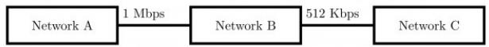

Assuming that the packets are correctly delivered, how many bytes, including headers, are delivered to the IP layer at the destination for one application message, in the best case? Consider only data packets.

A. 200

B. 220

C. 240

D. 260

gatecse-2004 computer-networks ip-addressing fragmentation tcp normal

Answer key

# 2.14.2 Fragmentation: GATE CSE 2004 | Question: 57

Consider three IP networks $A, B$ and $C$ . Host $H_A$ in network $A$ sends messages each containing 180 bytes of application data to a host $H_C$ in network $C$ . The TCP layer prefixes 20 byte header to the message. This passes through an intermediate network $B$ . The maximum packet size, including 20 byte IP header, in each network, is:

- $A:1000$ bytes  
- $B:100$ bytes  
- $C:1000$ bytes

The network $A$ and $B$ are connected through a 1 Mbps link, while $B$ and $C$ are connected by a 512 Kbps link (bps = bits per second).

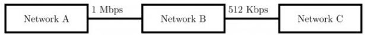

What is the rate at which application data is transferred to host $H_{C}$ ? Ignore errors, acknowledgments, and other overheads.

A. 325.5 Kbps

B. 354.5 Kbps

C. 409.6 Kbps

D. 512.0 Kbps

gatecse-2004 computer-networks ip-addressing fragmentation tcp normal

Answer key

# 2.14.3 Fragmentation: GATE CSE 2013 | Question: 37

In an IPv4 datagram, the M bit is 0, the value of HLEN is 10, the value of total length is 400 and the fragment offset value is 300. The position of the datagram, the sequence numbers of the first and the last bytes of the payload, respectively are:

A. Last fragment, 2400 and 2789

B. First fragment, 2400 and 2759

C. Last fragment, 2400 and 2759

D. Middle fragment, 300 and 689

# 2.14.4 Fragmentation: GATE CSE 2025 | Set 1 | Question: 47

Suppose a message of size 15000 bytes is transmitted from a source to a destination using IPv4 protocol via two routers as shown in the figure. Each router has a defined maximum transmission unit (MTU) as shown in the figure, including IP header. The number of fragments that will be delivered to the destination is \_\_\_\_. (Answer in integer)

flowchart

gatecse2025-set1 computer-networks ip-addressing fragmentation numerical-answers two-marks

# Answer key

# 2.14.5 Fragmentation: GATE CSE 2025 | Set 2 | Question: 13

Consider a network that uses Ethernet and IPv4. Assume that IPv4 headers do not use any options field. Each Ethernet frame can carry a maximum of 1500 bytes in its data field. A UDP segment is transmitted. The payload (data) in the UDPO segment is 7488 bytes.

Which ONE of the following choices has the CORRECT total number of fragments transmitted and the size of the last fragment including IPv4 header?

A. 5 fragments 1488 bytes

B. 6 fragments 88 bytes

C. 6 fragments 108 bytes

D. 6 fragments 116 bytes

gatecse2025-set2 computer-networks fragmentation ip-addressing one-mark

# Answer key

# 2.15

# Hamming Code (2)

# 2.15.1 Hamming Code: GATE CSE 1994 | Question: 9

Following 7 bit single error correcting hamming coded message is received.

<table><tr><td>7</td><td>6</td><td>5</td><td>4</td><td>3</td><td>2</td><td>1</td></tr><tr><td>1</td><td>0</td><td>0</td><td>0</td><td>1</td><td>1</td><td>0</td></tr></table>

<table><tr><td>bit No.</td></tr><tr><td>X</td></tr></table>

Determine if the message is correct (assuming that at most 1 bit could be corrupted). If the message contains an error find the bit which is erroneous and gives correct message.

gate1994 computer-networks error-detection hamming-code normal descriptive

# Answer key

# 2.15.2 Hamming Code: GATE CSE 2021 | Set 1 | Question: 29

Assume that a 12-bit Hamming codeword consisting of 8-bit data and 4 check bits is $d_{8}d_{7}d_{6}d_{5}c_{8}d_{4}d_{4}d_{3}d_{2}c_{4}d_{1}c_{2}c_{1}$ , where the data bits and the check bits are given in the following tables:

Data bits

<table><tr><td> $d_{8}$ </td><td> $d_{7}$ </td><td> $d_{6}$ </td><td> $d_{5}$ </td><td> $d_{4}$ </td><td> $d_{3}$ </td><td> $d_{2}$ </td><td> $d_{1}$ </td></tr><tr><td>1</td><td>1</td><td>0</td><td>x</td><td>0</td><td>1</td><td>0</td><td>1</td></tr></table>

Check bits

<table><tr><td> $c_{8}$ </td><td> $c_{4}$ </td><td> $c_{2}$ </td><td> $c_{1}$ </td></tr><tr><td>y</td><td>0</td><td>1</td><td>0</td></tr></table>

Which one of the following choices gives the correct values of x and y?

A. $x$ is 0 and $y$ is 0

B. $x$ is 0 and $y$ is 1

C. $x$ is 1 and $y$ is 0

D. $x$ is 1 and $y$ is 1

gatecse-2021-set1 computer-networks hamming-code two-marks error-detection

Answer key

# 2.16

# IP Addressing (8)

Practice Tests: Test 1 (15Q) Test 2 (2Q)

# 2.16.1 IP Addressing: GATE CSE 2003 | Question: 27

Which of the following assertions is FALSE about the Internet Protocol (IP)?

A. It is possible for a computer to have multiple IP addresses  
B. IP packets from the same source to the same destination can take different routes in the network  
C. IP ensures that a packet is discarded if it is unable to reach its destination within a given number of hops  
D. The packet source cannot set the route of an outgoing packets; the route is determined only by the routing tables in the routers on the way

gatecse-2003 computer-networks ip-addressing normal

Answer key

# 2.16.2 IP Addressing: GATE CSE 2012 | Question: 23

In the IPv4 addressing format, the number of networks allowed under Class C addresses is:

A. $2^{14}$

B. $2^{7}$

C. $2^{21}$

D. $2^{24}$

gatecse-2012 computer-networks ip-addressing easy

Answer key

# 2.16.3 IP Addressing: GATE CSE 2017 | Set 2 | Question: 20

The maximum number of IPv4 router addresses that can be listed in the record route (RR) option field of an IPv4 header is \_\_\_\_.

gatecse-2017-set2 computer-networks ip-addressing numerical-answers

Answer key

# 2.16.4 IP Addressing: GATE CSE 2018 | Question: 54

Consider an IP packet with a length of 4,500 bytes that includes a 20-byte IPv4 header and a 40-byte TCP header. The packet is forwarded to an IPv4 router that supports a Maximum Transmission Unit (MTU) of 600 bytes. Assume that the length of the IP header in all the outgoing fragments of this packet is 20 Assume that the fragmentation offset value stored in the first fragment is 0.

The fragmentation offset value stored in the third fragment is \_\_\_\_.

gatecse-2018 computer-networks ip-addressing numerical-answers two-marks

Answer key

# 2.16.5 IP Addressing: GATE CSE 2023 | Question: 42

Suppose in a web browser, you click on the www.gate-2023.in URL. The browser cache is empty. The IP address for this URL is not cached in your local host, so a DNS lookup is triggered (by the local DNS server deployed on your local host) over the 3-tier DNS hierarchy in an iterative mode. No resource records are cached anywhere across all DNS servers.

Let RTT denote the round trip time between your local host and DNS servers in the DNS hierarchy. The round trip time between the local host and the web server hosting www.gate-2023.in is also equal to RTT. The HTML file associated with the URL is small enough to have negligible transmission time and negligible rendering time by

your web browser, which references 10 equally small objects on the same web server.

Which of the following statements is/are CORRECT about the minimum elapsed time between clicking on the URL and your browser fully rendering it?

A. 7 RTTs, in case of non-persistent HTTP with 5 parallel TCP connections.  
B. 5 RTTs, in case of persistent HTTP with pipelining.  
C. 9 RTTs, in case of non-persistent HTTP with 5 parallel TCP connections.  
D. 6 RTTs, in case of persistent HTTP with pipelining.

gatecse-2023 computer-networks ip-addressing multiple-selects two-marks

# Answer key

# 2.16.6 IP Addressing: GATE CSE 2024 | Set 2 | Question: 28

Which one of the following CIDR prefixes exactly represents the range of IP addresses 10.12.2.0 to 10.12.3.255?

A. 10.12.2.0/23

B. 10.12.2.0/24

C. 10.12.0.0/22

D. 10.12.2.0/22

gatecse-2024-set2 computer-networks ip-addressing two-marks

# Answer key

# 2.16.7 IP Addressing: GATE CSE 2025 | Set 2 | Question: 8

A machine receives an IPv4 datagram. The protocol field of the IPv4 header has the protocol number of a protocol $X$ .

Which ONE of the following is NOT a possible candidate for X?

A. Internet Control Message Protocol (ICMP)

B. Internet Group Management (IGMP)

C. Open Shortest Path First (OSPF)

D. Routing Information Protocol (RIP)

gatecse2025-set2 computer-networks ip-addressing one-mark

# Answer key

# 2.16.8 IP Addressing: GATE CSE 2026 | Set 2 | Question: 23

If an IP network uses a subnet mask of 255.255.240.0, the maximum number of IP addresses that can be assigned to network interfaces is \_\_\_\_. (answer in integer)

gatecse-2026-set2 computer-networks ip-addressing numerical-answers one-mark

# Answer key

# 2.17

# IP Packet (12)

Practice Tests: Test 1 (15Q) Test 2 (3Q)

# 2.17.1 IP Packet: GATE CSE 2006 | Question: 5

For which one of the following reasons does internet protocol(IP) use the time-to-live(TTL) field in IP datagram header?

A. Ensure packets reach destination within that time  
B. Discard packets that reach later than that time  
C. Prevent packets from looping indefinitely  
D. Limit the time for which a packet gets queued in intermediate routers

gatecse-2006 computer-networks ip-addressing ip-packet easy

# Answer key