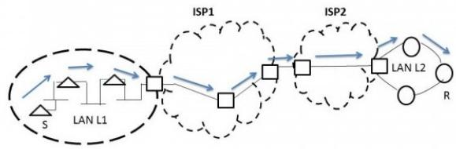

# 2.17.2 IP Packet: GATE CSE 2010 | Question: 15. PGEE 2018


One of the header fields in an IP datagram is the Time-to-Live (TTL) field. Which of the following statements best explains the need for this field?

A. It can be used to prioritize packets.  
C. It can be used to optimize throughput.

B. It can be used to reduce delays.

D. It can be used to prevent packet looping.

gatecse-2010 computer-networks ip-packet easy

# Answer key

# 2.17.3 IP Packet: GATE CSE 2014 | Set 3 | Question: 25


Host A (on TCP/IP v4 network A) sends an IP datagram D to host B (also on TCP/IP v4 network B). Assume that no error occurred during the transmission of D. When D reaches B, which of the following IP header field(s) may be different from that of the original datagram D?

i. TTL  
ii. Checksum  
iii. Fragment Offset

A. i only

B. i and ii only

C. ii and iii only

D. i, ii and iii

gatecse-2014-set3 computer-networks ip-packet normal

# Answer key

# 2.17.4 IP Packet: GATE CSE 2014 | Set 3 | Question: 28


An IP router with a Maximum Transmission Unit (MTU) of 1500 bytes has received an IP packet of size 4404 bytes with an IP header of length 20 bytes. The values of the relevant fields in the header of the third IP fragment generated by the router for this packet are:

A. MF bit: 0, Datagram Length:1444; Offset: 370  
B. MF bit: 1, Datagram Length: 1424; Offset: 185  
C. MF bit: 1, Datagram Length: 1500; Offset: 370  
D. MF bit: 0, Datagram Length: 1424; Offset: 2960

gatecse-2014-set3 computer-networks fragmentation ip-packet normal

# Answer key

# 2.17.5 IP Packet: GATE CSE 2015 | Set 1 | Question: 22


Which of the following fields of an IP header is NOT modified by a typical IP router?

A. Check sum

B. Source address

C. Time to Live (TTL)

D. Length

gatecse-2015-set1 computer-networks ip-packet easy

# Answer key

# 2.17.6 IP Packet: GATE CSE 2015 | Set 2 | Question: 52


Host A sends a UDP datagram containing 8880 bytes of user data to host B over an Ethernet LAN.

Ethernet frames may carry data up to 1500 bytes (i.e. MTU = 1500 bytes). Size of UDP header is 8 bytes and size of IP header is 20 bytes. There is no option field in IP header. How many total number of IP fragments will be transmitted and what will be the contents of offset field in the last fragment?

A. 6 and 925

B. 6 and 7400

C. 7 and 1110

D. 7 and 8880

gatecse-2015-set2 computer-networks fragmentation ip-packet normal

# Answer key

# 2.17.7 IP Packet: GATE CSE 2016 | Set 1 | Question: 53


An IP datagram of size 1000 bytes arrives at a router. The router has to forward this packet on a link whose MTU (maximum transmission unit) is 100 bytes. Assume that the size of the IP header is 20 bytes.

The number of fragments that the IP datagram will be divided into for transmission is \_\_\_\_.

gatecse-2016-set1 computer-networks fragmentation ip-packet normal numerical-answers

# Answer key

# 2.17.8 IP Packet: GATE CSE 2024 | Set 1 | Question: 21

Which of the following fields is/are modified in the IP header of a packet going out of a network address translation (NAT) device from an internal network to an external network?


A. Source IP  
C. Header Checksum

gatecse-2024-set1 multiple-selects computer-networks ip-packet one-mark

B. Destination IP  
D. Total Length

# Answer key

# 2.17.9 IP Packet: GATE CSE 2024 | Set 1 | Question: 55


Consider sending an IP datagram of size 1420 bytes (including 20 bytes of IP header) from a sender to a receiver over a path of two links with a router between them. The first link (sender to router) has an MTU (Maximum Transmission Unit) size of 542 bytes, while the second link (router to receiver) has an MTU size of 360 bytes. The number of fragments that would be delivered at the receiver is \_\_\_\_.

gatecse-2024-set1 numerical-answers computer-networks ip-packet fragmentation two-marks

# Answer key

# 2.17.10 IP Packet: GATE CSE 2024 | Set 2 | Question: 18

Which of the following statements about IPv4 fragmentation is/are TRUE?


A. The fragmentation of an IP datagram is performed only at the source of the datagram  
B. The fragmentation of an IP datagram is performed at any IP router which finds that the size of the datagram to be transmitted exceeds the MTU  
C. The reassembly of fragments is performed only at the destination of the datagram  
D. The reassembly of fragments is performed at all intermediate routers along the path from the source to the destination

gatecse-2024-set2 computer-networks multiple-selects ip-packet one-mark

# Answer key

# 2.17.11 IP Packet: GATE CSE 2024 | Set 2 | Question: 22


Which of the following fields of an IP header is/are always modified by any router before it forwards the IP packet?

A. Source IP Address  
C. Time to Live (TTL)

gatecse-2024-set2 computer-networks multiple-selects ip-packet easy one-mark

B. Protocol  
D. Header Checksum

# Answer key

# 2.17.12 IP Packet: GATE IT 2004 | Question: 86

In the TCP/IP protocol suite, which one of the following is NOT part of the IP header?


A. Fragment Offset  
C. Destination IP address

gateit-2004 computer-networks ip-packet easy

B. Source IP address  
D. Destination port number

# Answer key

# 2.18.1 icmp: GATE IT 2005 | Question: 26


Traceroute reports a possible route that is taken by packets moving from some host A to some other host B. Which of the following options represents the technique used by traceroute to identify these hosts:

A. By progressively querying routers about the next router on the path to B using ICMP packets, starting with the first router  
B. By requiring each router to append the address to the ICMP packet as it is forwarded to B. The list of all routers en-route to B is returned by B in an ICMP reply packet  
C. By ensuring that an ICMP reply packet is returned to A by each router en-route to B, in the ascending order of their hop distance from A  
D. By locally computing the shortest path from $A$ to $B$

gateit-2005 computer-networks icmp application-layer-protocols normal

Answer key

# 2.19

# LAN Technologies (7)

Practice Test: Test 1 (11Q)

# 2.19.1 LAN Technologies: GATE CSE 2003 | Question: 83


A 2 km long broadcast LAN has $10^{7}$ bps bandwidth and uses CSMA/CD. The signal travels along the wire at $2 \times 10^{8}$ m/s. What is the minimum packet size that can be used on this network?

A. 50 bytes

B. 100 bytes

C. 200 bytes

D. None of the above

gatecse-2003 computer-networks lan-technologies normal

Answer key

# 2.19.2 LAN Technologies: GATE CSE 2007 | Question: 65


There are $n$ stations in slotted LAN. Each station attempts to transmit with a probability $p$ in each time slot. What is the probability that ONLY one station transmits in a given time slot?

A. $np(1-p)^{n-1}$

B. $(1 - p)^{n - 1}$

C. $p(1-p)^{n-1}$

D. $1 - (1 - p)^{n - 1}$

gatecse-2007 computer-networks lan-technologies probability normal

Answer key

# 2.19.3 LAN Technologies: GATE CSE 2014 | Set 2 | Question: 25


In the diagram shown below, L1 is an Ethernet LAN and L2 is a Token-Ring LAN. An IP packet originates from sender S and traverses to R, as shown. The links within each ISP and across the two ISPs, are all point-to-point optical links. The initial value of the TTL field is 32. The maximum possible value of the TTL field when R receives the datagram is \_\_\_\_.



<details>
<summary>flowchart</summary>

```mermaid
graph LR
  subgraph ISP1
    direction TB
  S["S"] --> L1["LAN L1"]
  L1 --> L2["L2"]
  L2 --> ISP1["ISP1"]
  ISP1 --> L3["L3"]
  L3 --> ISP2["ISP2"]
  ISP2 --> L4["L4"]
  L4 --> ISP2
  end
  subgraph ISP2
    direction TB
  ISP2 --> L5["LAN L2"]
  L5 --> R["R"]
  R --> L5
  end
```
</details>

gatecse-2014-set2 computer-networks numerical-answers lan-technologies ethernet normal

Answer key

# 2.19.4 LAN Technologies: GATE CSE 2019 | Question: 49


Consider that 15 machines need to be connected in a LAN using 8-port Ethernet switches. Assume that these switches do not have any separate uplink ports. The minimum number of switches needed is \_\_\_\_

gatecse-2019 numerical-answers computer-networks lan-technologies two-marks

# Answer key

# 2.19.5 LAN Technologies: GATE IT 2004 | Question: 27


A host is connected to a Department network which is part of a University network. The University network, in turn, is part of the Internet. The largest network in which the Ethernet address of the host is unique is

A. the subnet to which the host belongs

C. the University network

gateit-2004 computer-networks lan-technologies ethernet normal

B. the Department network

D. the Internet

# Answer key

# 2.19.6 LAN Technologies: GATE IT 2005 | Question: 28


Which of the following statements is FALSE regarding a bridge?

A. Bridge is a layer 2 device  
C. Bridge is used to connect two or more LAN segments

gateit-2005 computer-networks lan-technologies normal

B. Bridge reduces collision domain  
D. Bridge reduces broadcast domain

# Answer key

# 2.19.7 LAN Technologies: GATE IT 2006 | Question: 66


A router has two full-duplex Ethernet interfaces each operating at 100 Mb/s. Ethernet frames are at least 84 bytes long (including the Preamble and the Inter-Packet-Gap). The maximum packet processing time at the router for wirespeed forwarding to be possible is (in microseconds)

A. 0.01

B. 3.36

C. 6.72

D. 8

gateit-2006 computer-networks lan-technologies ethernet normal

# Answer key

# 2.20

# MAC Protocol (4)

# Practice Test: Test 1 (6Q)

# 2.20.1 MAC Protocol: GATE CSE 2005 | Question: 74


Suppose the round trip propagation delay for a 10 Mbps Ethernet having 48-bit jamming signal is 46.4 $\mu$ s. The minimum frame size is:

A. 94

B. 416

C. 464

D. 512

gatecse-2005 computer-networks mac-protocol ethernet

# Answer key

# 2.20.2 MAC Protocol: GATE CSE 2015 | Set 2 | Question: 8


A link has transmission speed of $10^{6}$ bits/sec. It uses data packets of size 1000 bytes each. Assume that the acknowledgment has negligible transmission delay and that its propagation delay is the same as the data propagation delay. Also, assume that the processing delays at nodes are negligible. The efficiency of the stop-and-wait protocol in this setup is exactly $25\%$ . The value of the one way propagation delay (in milliseconds) is \_\_\_\_.

gatecse-2015-set2 computer-networks mac-protocol stop-and-wait normal numerical-answers

# Answer key

# 2.20.3 MAC Protocol: GATE IT 2004 | Question: 85


Consider a simplified time slotted MAC protocol, where each host always has data to send and transmits with probability $p = 0.2$ in every slot. There is no backoff and one frame can be transmitted in one slot. If more than one host transmits in the same slot, then the transmissions are unsuccessful due to collision. What is the maximum number of hosts which this protocol can support if each host has to be provided a minimum throughput of 0.16 frames per time slot?

A. 1

B. 2

C. 3

D. 4

gateit-2004 computer-networks congestion-control mac-protocol normal

# Answer key

# 2.20.4 MAC Protocol: GATE IT 2005 | Question: 75


In a TDM medium access control bus LAN, each station is assigned one time slot per cycle for transmission. Assume that the length of each time slot is the time to transmit 100 bits plus the end-to-end propagation delay. Assume a propagation speed of $2 \times 10^{8} m/sec$ . The length of the LAN is $1 \text{ km}$ with a bandwidth of 10 Mbps. The maximum number of stations that can be allowed in the LAN so that the throughput of each station can be $2/3 \text{ Mbps}$ is

A. 3

B. 5

C. 10

D. 20

gateit-2005 computer-networks mac-protocol normal

# Answer key

# 2.21

# Network Flow (4)

# Practice Test: Test 1 (5Q)

# 2.21.1 Network Flow: GATE CSE 1992 | Question: 01,v


A simple and reliable data transfer can be accomplished by using the 'handshake protocol'. It accomplishes reliable data transfer because for every data item sent by the transmitter \_\_\_\_.

gate1992 computer-networks network-flow easy fill-in-the-blanks

# Answer key

# 2.21.2 Network Flow: GATE CSE 2017 | Set 2 | Question: 35


Consider two hosts X and Y, connected by a single direct link of rate $10^{6}$ bits/sec. The distance between the two hosts is 10,000 km and the propagation speed along the link is $2 \times 10^{8}$ m/sec. Host X sends a file of 50,000 bytes as one large message to host Y continuously. Let the transmission and propagation delays be p milliseconds and q milliseconds respectively. Then the value of p and q are

A. $p = 50$ and $q = 100$

B. $p = 50$ and $q = 400$

C. $p = 100$ and $q = 50$

D. $p = 400$ and $q = 50$

gatecse-2017-set2 computer-networks network-flow

# Answer key

# 2.21.3 Network Flow: GATE IT 2004 | Question: 87


A TCP message consisting of 2100 bytes is passed to IP for delivery across two networks. The first network can carry a maximum payload of 1200 bytes per frame and the second network can carry a maximum payload of 400 bytes per frame, excluding network overhead. Assume that IP overhead per packet is 20 bytes. What is the total IP overhead in the second network for this transmission?

A. 40 bytes

B. 80 bytes

C. 120 bytes

D. 160 bytes

gateit-2004 computer-networks network-flow normal

# Answer key

# 2.21.4 Network Flow: GATE IT 2006 | Question: 67


A link of capacity 100 Mbps is carrying traffic from a number of sources. Each source generates an on-off traffic stream; when the source is on, the rate of traffic is 10 Mbps, and when the source is off, the rate of traffic is zero. The duty cycle, which is the ratio of on-time to off-time, is 1:2. When there is no buffer at the minimum number of sources that can be multiplexed on the link so that link capacity is not wasted and no loss occurs is S1. Assuming that all sources are synchronized and that the link is provided with a large buffer maximum number of sources that can be multiplexed so that no data loss occurs is S2. The values of S1 are, respectively,

A. 10 and 30

B. 12 and 25

C. 5 and 33

D. 15 and 22

gateit-2006 computer-networks network-flow normal

Answer key

# 2.22

# Network Layer (6)

# 2.22.1 Network Layer: GATE CSE 2003 | Question: 28

Which of the following functionality must be implemented by a transport protocol over and above the network protocol?

A. Recovery from packet losses  
C. Packet delivery in the correct order

B. Detection of duplicate packets

D. End to end connectivity

gatecse-2003 computer-networks network-layer easy

Answer key

# 2.22.2 Network Layer: GATE CSE 2004 | Question: 15

Choose the best matching between Group 1 and Group 2

<table><tr><td>Group-1</td><td>Group-2</td></tr><tr><td>P. Data link layer</td><td>1. Ensures reliable transport of data over a physical point-to-point link</td></tr><tr><td>Q. Network layer</td><td>2. Encodes/decodes data for physical transmission</td></tr><tr><td>R. Transport layer</td><td>3. Allows end-to-end communication between two processes</td></tr><tr><td></td><td>4. Routes data from one network node to the next</td></tr></table>

A. P-1, Q-4, R-3

B. P-2, Q-4, R-1

C. P-2, Q-3, R-1

D. P-1, Q-3, R-2

gatecse-2004 computer-networks network-layer normal

Answer key

# 2.22.3 Network Layer: GATE CSE 2013 | Question: 14

Assume that source S and destination D are connected through two intermediate routers labeled R. Determine how many times each packet has to visit the network layer and the data link layer during a transmission from S to D.

A. Network layer – 4 times and Data link layer – 4 times  
B. Network layer - 4 times and Data link layer - 3 times  
C. Network layer - 4 times and Data link layer - 6 times  
D. Network layer - 2 times and Data link layer - 6 times

gatecse-2013 computer-networks network-layer normal

Answer key


# 2.22.4 Network Layer: GATE CSE 2014 | Set 3 | Question: 23

In the following pairs of OSI protocol layer/sub-layer and its functionality, the INCORRECT pair is

A. Network layer and Routing

B. Data Link Layer and Bit synchronization  
D. Medium Access Control sub-layer and Channel sharing

gatecse-2014-set3 computer-networks network-layer easy

# Answer key

# 2.22.5 Network Layer: GATE CSE 2018 | Question: 13

Match the following:

<table><tr><td>Field</td><td>Length in bits</td></tr><tr><td>P. UDP Header’s Port Number</td><td>I. 48</td></tr><tr><td>Q. Ethernet MAC Address</td><td>II. 8</td></tr><tr><td>R. IPv6 Next Header</td><td>III. 32</td></tr><tr><td>S. TCP Header’s Sequence Number</td><td>IV. 16</td></tr></table>

A. P-III, Q-IV, R-II, S-I  
C. P-IV, Q-I, R-II, S-III

gatecse-2018 computer-networks network-layer match-the-following easy one-mark

# Answer key

# 2.22.6 Network Layer: GATE CSE 2026 | Set 1 | Question: 46

An ISP having an address block 202.16.0.0/15 assigns a block of 6000 IP addresses to a client, using the classless internet domain routing (CIDR) super-netting approach. Which of the following address blocks can be assigned by the ISP?

A. 202.16.0.0/19  
C. 202.16.32.0/19

B. 202.17.64.0/19  
D. 202.17.24.0/19

gatecse-2026-set1 computer-networks two-marks network-layer multiple-selects

# Answer key

# 2.23

# Network Protocols (11)

Practice Test: Test 1 (15Q)

# 2.23.1 Network Protocols: GATE CSE 2005 | Question: 24

The address resolution protocol (ARP) is used for:

A. Finding the IP address from the DNS  
B. Finding the IP address of the default gateway  
C. Finding the IP address that corresponds to a MAC address  
D. Finding the MAC address that corresponds to an IP address

gatecse-2005 computer-networks normal network-protocols

# Answer key

# 2.23.2 Network Protocols: GATE CSE 2007 | Question: 20

Which one of the following uses UDP as the transport protocol?

A. HTTP

B. Telnet

C. DNS

D. SMTP

gatecse-2007 computer-networks network-protocols application-layer-protocols easy

# Answer key


Match the following:

<table><tr><td>(P)</td><td>SMTP</td><td>(1)</td><td>Application layer</td></tr><tr><td>(Q)</td><td>BGP</td><td>(2)</td><td>Transport layer</td></tr><tr><td>(R)</td><td>TCP</td><td>(3)</td><td>Data link layer</td></tr><tr><td>(S)</td><td>PPP</td><td>(4)</td><td>Network layer</td></tr><tr><td></td><td></td><td>(5)</td><td>Physical layer</td></tr></table>

A. P - 2, Q - 1, R - 3, S - 5

B. P - 1, Q - 4, R - 2, S - 3

C. P - 1, Q - 4, R - 2, S - 5

D. P - 2, Q - 4, R - 1, S - 3

gatecse-2007 computer-networks network-layer network-protocols easy match-the-following

# Answer key

# 2.23.4 Network Protocols: GATE CSE 2015 | Set 1 | Question: 17

In one of the pairs of protocols given below, both the protocols can use multiple TCP connections between the same client and the server. Which one is that?


A. HTTP, FTP

B. HTTP, TELNET

C. FTP, SMTP

D. HTTP, SMTP

gatecse-2015-set1 computer-networks network-protocols normal

# Answer key

# 2.23.5 Network Protocols: GATE CSE 2016 | Set 1 | Question: 24

Which one of the following protocols is NOT used to resolve one form of address to another one?


A. DNS

B. ARP

C. DHCP

D. RARP

gatecse-2016-set1 computer-networks network-protocols easy

# Answer key

# 2.23.6 Network Protocols: GATE CSE 2019 | Question: 29

Suppose that in an IP-over-Ethernet network, a machine X wishes to find the MAC address of another machine Y in its subnet. Which one of the following techniques can be used for this?


A. X sends an ARP request packet to the local gateway's IP address which then finds the MAC address of Y and sends to X  
B. X sends an ARP request packet to the local gateway's MAC address which then finds the MAC address of Y and sends to X  
C. X sends an ARP request packet with broadcast MAC address in its local subnet  
D. X sends an ARP request packet with broadcast IP address in its local subnet

gatecse-2019 computer-networks network-protocols two-marks

# Answer key

# 2.23.7 Network Protocols: GATE CSE 2021 | Set 1 | Question: 49

Consider the sliding window flow-control protocol operating between a sender and a receiver over a full-duplex error-free link. Assume the following:


- The time taken for processing the data frame by the receiver is negligible.  
- The time taken for processing the acknowledgement frame by the sender is negligible.  
- The sender has infinite number of frames available for transmission.  
- The size of the data frame is 2,000 bits and the size of the acknowledgement frame is 10 bits.  
- The link data rate in each direction is 1 Mbps ( $= 10^{6}$ bits per second).  
- One way propagation delay of the link is 100 milliseconds.

The minimum value of the sender's window size in terms of the number of frames, (rounded to the nearest integer) needed to achieve a link utilization of 50% is \_\_\_\_.

gatecse-2021-set1 computer-networks network-protocols sliding-window numerical-answers two-marks

# Answer key

# 2.23.8 Network Protocols: GATE CSE 2021 | Set 1 | Question: 8

Consider the following two statements.

- $S_{1}$ : Destination MAC address of an ARP reply is a broadcast address.  
- $S_{2}$ : Destination MAC address of an ARP request is a broadcast address.

Which one of the following choices is correct?

A. Both $S_{1}$ and $S_{2}$ are true

C. $S_{1}$ is false and $S_{2}$ is true

gatecse-2021-set1 computer-networks network-protocols one-mark

B. $S_{1}$ is true and $S_{2}$ is false

D. Both $S_{1}$ and $S_{2}$ are false

# Answer key

# 2.23.9 Network Protocols: GATE CSE 2024 | Set 1 | Question: 6

A user starts browsing a webpage hosted at a remote server. The browser opens a single TCP connection to fetch the entire webpage from the server. The webpage consists of a top-level index page with multiple embedded image objects. Assume that all caches (e.g., DNS cache, browser cache) are all initially empt following packets leave the user's computer in some order.


i. HTTP GET request for the index page  
ii. DNS request to resolve the web server's name to its IP address  
iii. HTTP GET request for an image object  
iv. TCP SYN to open a connection to the web server

Which one of the following is the CORRECT chronological order (earliest in time to latest) of the packets leaving the computer?

A. (iv), (ii), (iii), (i)

C. (ii), (iv), (i), (iii)

gatecse-2024-set1 computer-networks network-protocols one-mark

B. (ii), (iv), (iii), (i)  
D. (iv), (ii), (i), (iii)

# Answer key

# 2.23.10 Network Protocols: GATE IT 2007 | Question: 69

Consider the following clauses:

i. Not inherently suitable for client authentication.  
ii. Not a state sensitive protocol.  
iii. Must be operated with more than one server.  
iv. Suitable for structured message organization.  
v. May need two ports on the serve side for proper operation.

The option that has the maximum number of correct matches is

A. IMAP-i; FTP-ii; HTTP-iii; DNS-iv; POP3-v  
B. FTP-i; POP3-ii; SMTP-iii; HTTP-iv; IMAP-v  
C. POP3-i; SMTP-ii; DNS-iii; IMAP-iv; HTTP-v  
D. SMTP-i; HTTP-ii; IMAP-iii; DNS-iv; FTP-v

gateit-2007 computer-networks network-protocols normal

# Answer key


# 2.23.11 Network Protocols: GATE IT 2008 | Question: 68

Which of the following statements are TRUE?

- S1: TCP handles both congestion and flow control  
- S2: UDP handles congestion but not flow control  
- S3: Fast retransmit deals with congestion but not flow control  
- S4: Slow start mechanism deals with both congestion and flow control

A. $S1, S2$ and $S3$ only

C. S3 and S4 only

B. $S1$ and $S3$ only

D. $S1, S3$ and $S4$ only

gateit-2008 computer-networks network-protocols normal

# Answer key

# 2.24

# Network Switching (4)

# Practice Test: Test 1 (6Q)

# 2.24.1 Network Switching: GATE CSE 2005 | Question: 73

In a packet switching network, packets are routed from source to destination along a single path having two intermediate nodes. If the message size is 24 bytes and each packet contains a header of 3 bytes, then the optimum packet size is:

A. 4

B. 6

C. 7

D. 9

gatecse-2005 computer-networks network-switching normal

# Answer key

# 2.24.2 Network Switching: GATE CSE 2014 | Set 2 | Question: 26

Consider the store and forward packet switched network given below. Assume that the bandwidth of each link is $10^{6}$ bytes / sec. A user on host A sends a file of size $10^{3}$ bytes to host B through routers R1 and R2

in three different ways. In the first case a single packet containing the complete file is transmitted from $A$ to $B$ . In the second case, the file is split into 10 equal parts, and these packets are transmitted from $A$ to $B$ . In the third case, the file is split into 20 equal parts and these packets are sent from $A$ to $B$ . Each packet contains 100 bytes of header information along with the user data. Consider only transmission time and ignore processing, queuing and propagation delays. Also assume that there are no errors during transmission. Let $T1$ , $T2$ and $T3$ be the times taken to transmit the file in the first, second and third case respectively. Which one of the following is CORRECT?


A. $T1 <   T2 <   T3$  
C. $T2 = T3, T3 < T1$

B. $T1 > T2 > T3$  
D. $T1 = T3, T3 > T2$

gatecse-2014-set2 computer-networks network-switching normal

# Answer key

# 2.24.3 Network Switching: GATE CSE 2015 | Set 3 | Question: 36

Two hosts are connected via a packet switch with $10^{7}$ bits per second links. Each link has a propagation delay of 20 microseconds. The switch begins forwarding a packet 35 microseconds after it receives the same. If 10000 bits of data are to be transmitted between the two hosts using a packet size of 5000 bits, the time elapsed between the transmission of the first bit of data and the reception of the last bit of the data in microseconds is \_\_\_\_.

gatecse-2015-set3 computer-networks normal numerical-answers network-switching

# Answer key

# 2.24.4 Network Switching: GATE IT 2004 | Question: 22

Which one of the following statements is FALSE?

A. Packet switching leads to better utilization of bandwidth resources than circuit switching


B. Packet switching results in less variation in delay than circuit switching  
C. Packet switching requires more per-packet processing than circuit switching  
D. Packet switching can lead to reordering unlike in circuit switching

gateit-2004 computer-networks network-switching normal

# Answer key

# 2.25

# Osi Model (1)

# 2.25.1 Osi Model: GATE CSE 2025 | Set 1 | Question: 6

Identify the ONE CORRECT matching between the OSI layers and their corresponding functionalities as shown.


<table><tr><td></td><td>OSI Layers</td><td></td><td>Functionalities</td></tr><tr><td>(a)</td><td>Network Layer</td><td>(I)</td><td>Packet Routing</td></tr><tr><td>(b)</td><td>Transport Layer</td><td>(II)</td><td>Framing and error handling</td></tr><tr><td>(c)</td><td>Datalink layer</td><td>(III)</td><td>Host to host communication</td></tr></table>

A. (a)-(I), (b)-(II), (c)-(III)  
C. (a)-(II), (b)-(I), (c)-(III)

B. (a)-(I), (b)-(III), (c)-(II)  
D. (a)-(III), (b)-(II), (c)-(I)

gatecse2025-set1 computer-networks osi-model easy one-mark

# Answer key

# 2.26

# Probability (1)

# 2.26.1 Probability: GATE CSE 2025 | Set 1 | Question: 46


Suppose a 5-bit message is transmitted from a source to a destination through a noisy channel. The probability that a bit of the message gets flipped during transmission is 0.01. Flipping of each bit is independent of one another. The probability that the message is delivered error-free to the destination is \_\_\_\_ (rounded off to three decimal places)

gatecse2025-set1 computer-networks probability numerical-answers easy two-marks

# Answer key

# 2.27

# Pure Aloha (1)

# 2.27.1 Pure Aloha: GATE CSE 2021 | Set 2 | Question: 54


Consider a network using the pure ALOHA medium access control protocol, where each frame is of length 1,000 bits. The channel transmission rate is 1 Mbps ( $= 10^{6}$ bits per second). The aggregate number of transmissions across all the nodes (including new frame transmissions and retransmitted frames due to coll is modelled as a Poisson process with a rate of 1,000 frames per second. Throughput is defined as the a number of frames successfully transmitted per second. The throughput of the network (rounded to the r integer) is \_\_\_\_

gatecse-2021-set2 computer-networks mac-protocol pure-aloha numerical-answers two-marks

# Answer key

# 2.28

# Routing (14)

Practice Tests: Test 1 (15Q) Test 2 (4Q)

# 2.28.1 Routing: GATE CSE 2005 | Question: 26


In a network of LANs connected by bridges, packets are sent from one LAN to another through intermediate bridges. Since more than one path may exist between two LANs, packets may have to be routed through multiple bridges. Why is the spanning tree algorithm used for bridge-routing?

A. For shortest path routing between LANs

B. For avoiding loops in the routing paths

# Answer key

# 2.28.2 Routing: GATE CSE 2014 | Set 1 | Question: 23


Consider the following three statements about link state and distance vector routing protocols, for a large network with 500 network nodes and 4000 links.

[S1]: The computational overhead in link state protocols is higher than in distance vector protocols.  
[S2]: A distance vector protocol (with split horizon) avoids persistent routing loops, but not a link state protocol.  
[S3]: After a topology change, a link state protocol will converge faster than a distance vector protocol.

Which one of the following is correct about S1, S2, and S3?

A. $S1, S2$ , and $S3$ are all true.  
C. S1 and S2 are true, but S3 is false.

gatecse-2014-set1 computer-networks routing normal

B. $S1, S2$ , and $S3$ are all false.  
D. $S1$ and $S3$ are true, but $S2$ is false.

# Answer key

# 2.28.3 Routing: GATE CSE 2014 | Set 2 | Question: 23

Which of the following is TRUE about the interior gateway routing protocols — Routing Information Protocol (RIP) and Open Shortest Path First (OSPF)


A. RIP uses distance vector routing and OSPF uses link state routing  
B. OSPF uses distance vector routing and RIP uses link state routing  
C. Both RIP and OSPF use link state routing  
D. Both RIP and OSPF use distance vector routing

gatecse-2014-set2 computer-networks routing easy

# Answer key

# 2.28.4 Routing: GATE CSE 2014 | Set 3 | Question: 26

An IP router implementing Classless Inter-domain Routing (CIDR) receives a packet with address 131.23.151.76. The router's routing table has the following entries:


<table><tr><td>Prefix</td><td>Outer Interface Identifier</td></tr><tr><td>131.16.0.0/12</td><td>3</td></tr><tr><td>131.28.0.0/14</td><td>5</td></tr><tr><td>131.19.0.0/16</td><td>2</td></tr><tr><td>131.22.0.0/15</td><td>1</td></tr></table>

The identifier of the output interface on which this packet will be forwarded is \_\_\_\_.

gatecse-2014-set3 computer-networks routing normal numerical-answers

# Answer key

# 2.28.5 Routing: GATE CSE 2017 | Set 2 | Question: 09

Consider the following statements about the routing protocols. Routing Information Protocol (RIP) and Open Shortest Path First (OSPF) in an IPv4 network.


I. RIP uses distance vector routing  
II. RIP packets are sent using UDP  
III. OSPF packets are sent using TCP  
IV. OSPF operation is based on link-state routing