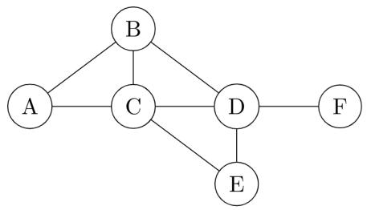
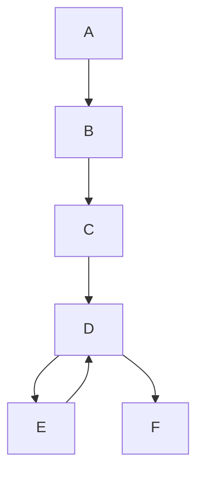
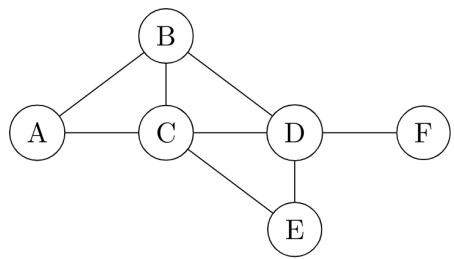

Which of the above statements are CORRECT?

A. I and IV only

B. I, II and III only

C. I, II and IV only

D. II, III and IV only

gatecse-2017-set2 computer-networks routing

Answer key

# 2.28.6 Routing: GATE CSE 2020 | Question: 15

Consider the following statements about the functionality of an IP based router.

I. A router does not modify the IP packets during forwarding.  
II. It is not necessary for a router to implement any routing protocol.  
III. A router should reassemble IP fragments if the MTU of the outgoing link is larger than the size of the incoming IP packet.

Which of the above statements is/are TRUE?

A. I and II only

B. I only

C. II and III only

D. II only

gatecse-2020 computer-networks routing one-mark

Answer key

# 2.28.7 Routing: GATE CSE 2023 | Question: 15

Which of the following statements is/are INCORRECT about the OSPF (Open Shortest Path First) routing protocol used in the Internet?

A. OSPF implements Bellman-Ford algorithm to find shortest paths.  
B. OSPF uses Dijkstra's shortest path algorithm to implement least-cost path routing.  
C. OSPF is used as an inter-domain routing protocol.  
D. OSPF implements hierarchical routing.

gatecse-2023 computer-networks routing multiple-selects one-mark

Answer key

# 2.28.8 Routing: GATE CSE 2024 | Set 1 | Question: 26

Consider a network path P - Q - R between nodes P and R via router Q. Node P sends a file of size $10^{6}$ bytes to R via this path by splitting the file into chunks of $10^{3}$ bytes each. Node P sends these chunks one after the other without any wait time between the successive chunk transmissions. Assume that the size of extra headers added to these chunks is negligible, and that the chunk size is less than the MTU.

Each of the links P - Q and Q - R has a bandwidth of $10^{6}$ bits/sec, and negligible propagation latency. Router Q immediately transmits every packet it receives from P to R, with negligible processing and queueing delays. Router Q can simultaneously receive on link P - Q and transmit on link Q - R.

Assume P starts transmitting the chunks at time t = 0.

Which one of the following options gives the time (in seconds, rounded off to 3 decimal places) at which R receives all the chunks of the file?

A. 8.000

B. 8.008

C. 15.992

D. 16.000

gatecse-2024-set1 computer-networks routing two-marks

Answer key

# 2.28.9 Routing: GATE CSE 2024 | Set 1 | Question: 48

Consider the entries shown below in the forwarding table of an IP router. Each entry consists of an IP prefix and the corresponding next hop router for packets whose destination IP address matches the prefix. The notation "/N" in a prefix indicates a subnet mask with the most significant N bits set to 1.

<table><tr><td>Prefix</td><td>Next hop router</td></tr><tr><td>10.1.1.0 / 24</td><td>R1</td></tr><tr><td>10.1.1.128 / 25</td><td>R2</td></tr><tr><td>10.1.1.64 / 26</td><td>R3</td></tr><tr><td>10.1.1.192 / 26</td><td>R4</td></tr></table>

This router forwards 20 packets each to 5 hosts. The IP addresses of the hosts are 10.1.1.16, 10.1.1.72, 10.1.1.132, 10.1.1.191, and 10.1.1.205. The number of packets forwarded via the next hop router R2 is \_\_\_\_.

gatecse-2024-set1 numerical-answers computer-networks routing two-marks

# Answer key

# 2.28.10 Routing: GATE CSE 2026 | Set 2 | Question: 11

Consider a file of size 4 million bytes being transferred between two hosts connected via a path consisting of three consecutive links of bandwidth 2 Mbps, 500 kbps, and 1 Mbps, respectively. All processing delays and propagation delays are negligible. Assume that there is no other background traffic over the path and no other additional overhead to transfer the file.

Which one of the following is the total time (in seconds) to transfer the file?

Note: $1\mathrm{M} = 10^{6}, 1\mathrm{k} = 10^{3}$

A. 731

B. 64

C. 8

D. 16

gatecse-2026-set2 computer-networks routing one-mark

# Answer key

# 2.28.11 Routing: GATE IT 2005 | Question: 85a

Consider a simple graph with unit edge costs. Each node in the graph represents a router. Each node maintains a routing table indicating the next hop router to be used to relay a packet to its destination and the cost of the path to the destination through that router. Initially, the routing table is empty. The routing table is synchronously updated as follows. In each updated interval, three tasks are performed.

i. A node determines whether its neighbours in the graph are accessible. If so, it sets the tentative cost to each accessible neighbour as 1. Otherwise, the cost is set to $\infty$ .  
ii. From each accessible neighbour, it gets the costs to relay to other nodes via that neighbour (as the next hop).  
iii. Each node updates its routing table based on the information received in the previous two steps by choosing the minimum cost.

flowchart

For the graph given above, possible routing tables for various nodes after they have stabilized, are shown in the following options. Identify the correct table.

A.

<table><tr><td>A</td><td>-</td><td>-</td></tr><tr><td>B</td><td>B</td><td>1</td></tr><tr><td>C</td><td>C</td><td>1</td></tr><tr><td>D</td><td>B</td><td>3</td></tr><tr><td>E</td><td>C</td><td>3</td></tr><tr><td>F</td><td>C</td><td>4</td></tr></table>

gateit-2005 computer-networks routing normal

B.

<table><tr><td>A</td><td>A</td><td>1</td></tr><tr><td>B</td><td>B</td><td>1</td></tr><tr><td>C</td><td>-</td><td>-</td></tr><tr><td>D</td><td>D</td><td>1</td></tr><tr><td>E</td><td>E</td><td>1</td></tr><tr><td>F</td><td>E</td><td>3</td></tr></table>

C.

<table><tr><td colspan="3">Table for node B</td></tr><tr><td>A</td><td>A</td><td>1</td></tr><tr><td>B</td><td>-</td><td>-</td></tr><tr><td>C</td><td>C</td><td>1</td></tr><tr><td>D</td><td>D</td><td>1</td></tr><tr><td>E</td><td>C</td><td>2</td></tr><tr><td>F</td><td>D</td><td>2</td></tr></table>

D.

<table><tr><td colspan="3">Table for node D</td></tr><tr><td>A</td><td>B</td><td>3</td></tr><tr><td>B</td><td>B</td><td>1</td></tr><tr><td>C</td><td>C</td><td>1</td></tr><tr><td>D</td><td>-</td><td>-</td></tr><tr><td>E</td><td>E</td><td>1</td></tr><tr><td>F</td><td>F</td><td>1</td></tr></table>

# Answer key

# 2.28.12 Routing: GATE IT 2005 | Question: 85b

Consider a simple graph with unit edge costs. Each node in the graph represents a router. Each node maintains a routing table indicating the next hop router to be used to relay a packet to its destination and the cost of the path to the destination through that router. Initially, the routing table is empty. The routing table is synchronously updated as follows. In each updated interval, three tasks are performed.

i. A node determines whether its neighbors in the graph are accessible. If so, it sets the tentative cost to each accessible neighbor as 1. Otherwise, the cost is set to $\infty$ .  
ii. From each accessible neighbor, it gets the costs to relay to other nodes via that neighbor (as the next hop).  
iii. Each node updates its routing table based on the information received in the previous two steps by choosing the minimum cost.

flowchart

Continuing from the earlier problem, suppose at some time t, when the costs have stabilized, node A goes down. The cost from node F to node A at time $(t + 100)$ is :

A. >100 but finite

B. $\infty$

C. 3

D. $>3$ and $\leq 100$

gateit-2005 computer-networks routing normal

# Answer key

# 2.28.13 Routing: GATE IT 2007 | Question: 63

A group of 15 routers is interconnected in a centralized complete binary tree with a router at each tree node. Router i communicates with router j by sending a message to the root of the tree. The root then sends the message back down to router j. The mean number of hops per message, assuming all possible router pairs are equally likely is

A. 3

B. 4.26

C. 4.53

D. 5.26

gateit-2007 computer-networks routing binary-tree normal

# Answer key

# 2.28.14 Routing: GATE IT 2008 | Question: 67

Two popular routing algorithms are Distance Vector(DV) and Link State (LS) routing. Which of the following are true?

(S1): Count to infinity is a problem only with DV and not LS routing  
(S2): In LS, the shortest path algorithm is run only at one node  
(S3): In DV, the shortest path algorithm is run only at one node  
(S4): DV requires lesser number of network messages than LS

A. S1, S2 and S4 only

B. S1, S3 and S4 only

C. S2 and S3 only

D. S1 and S4 only

gateit-2008 computer-networks routing normal

# Answer key

# 2.29

# Routing Protocols (1)

# 2.29.1 Routing Protocols: GATE CSE 2025 | Set 2 | Question: 7

Consider the routing protocols given in List I and the names given in List II:

<table><tr><td colspan="2">List I</td><td colspan="2">List II</td></tr><tr><td>(i)</td><td>Distance Vector routing</td><td>(a)</td><td>Bellman-Ford</td></tr><tr><td>(ii)</td><td>Link state routing</td><td>(b)</td><td>Dijkstra</td></tr></table>

For matching of items in List I with those in List II, which ONE of the following options is CORRECT?

A. (i) - (a) and (ii) - (b)  
C. (i) - (b) and (ii) - (a)

B. (i) - (a) and (ii) - (a)  
D. (i) - (b) and (ii) - (b)

gatecse2025-set2 computer-networks match-the-following routing-protocols easy one-mark

# Answer key

# 2.30

# Sliding Window (16)

Practice Tests: Test 1 (15Q) Test 2 (11Q)

# 2.30.1 Sliding Window: GATE CSE 2003 | Question: 84

Host A is sending data to host B over a full duplex link. A and B are using the sliding window protocol for flow control. The send and receive window sizes are 5 packets each. Data packets (sent only from A to B) are all 1000 bytes long and the transmission time for such a packet is 50 $\mu$ s. Acknowledgment packets (sent only from B to A) are very small and require negligible transmission time. The propagation delay over the link is 200 $\mu$ s. What is the maximum achievable throughput in this communication?

A. $7.69 \times 10^{6}$ Bps  
C. $12.33 \times 10^{6}$ Bps  
gatecse-2003 computer-networks sliding-window normal

B. $11.11 \times 10^{6}$ Bps

D. $15.00 \times 10^{6}$ Bps

# Answer key

# 2.30.2 Sliding Window: GATE CSE 2005 | Question: 25

The maximum window size for data transmission using the selective reject protocol with n-bit frame sequence numbers is:

A. $2^{n}$

B. $2^{n - 1}$

C. $2^{n} - 1$

D. $2^{n - 2}$

gatecse-2005 computer-networks sliding-window easy

# Answer key

# 2.30.3 Sliding Window: GATE CSE 2006 | Question: 44

Station A uses 32 byte packets to transmit messages to Station B using a sliding window protocol. The round trip delay between A and B is 80 milliseconds and the bottleneck bandwidth on the path between A and B is 128 kbps. What is the optimal window size that A should use?

A. 20

B. 40

C. 160

D. 320

gatecse-2006 computer-networks sliding-window normal

# Answer key

# 2.30.4 Sliding Window: GATE CSE 2006 | Question: 46

Station A needs to send a message consisting of 9 packets to Station B using a sliding window (window size 3) and go-back-n error control strategy. All packets are ready and immediately available for transmission. If every 5th packet that A transmits gets lost (but no acks from B ever get lost), then what number of packets that A will transmit for sending the message to B?

A. 12

B. 14

C. 16

D. 18

gatecse-2006 computer-networks sliding-window normal

# Answer key

# 2.30.5 Sliding Window: GATE CSE 2007 | Question: 69

The distance between two stations M and N is L kilometers. All frames are K bits long. The propagation delay per kilometer is t seconds. Let R bits/second be the channel capacity. Assuming that the processing delay is negligible, the minimum number of bits for the sequence number field in a frame for maximum utilization, when the sliding window protocol is used, is:

A. $\lceil \log_2\frac{2LtR + 2K}{K}\rceil$

B. $\lceil \log_2\frac{2LtR}{K}\rceil$

C. $\lceil \log_2\frac{2LtR + K}{K}\rceil$

D. $\lceil \log_2\frac{2LtR + 2K}{2K}\rceil$

gatecse-2007 computer-networks sliding-window normal

# Answer key

# 2.30.6 Sliding Window: GATE CSE 2009 | Question: 57, ISRO2016-75

Frames of 1000 bits are sent over a $10^{6}$ bps duplex link between two hosts. The propagation time is 25 ms. Frames are to be transmitted into this link to maximally pack them in transit (within the link).

What is the minimum number of bits $(I)$ that will be required to represent the sequence numbers distinctly? Assume that no time gap needs to be given between transmission of two frames.

A. I = 2

B. $I = 3$

C. I = 4

D. I = 5

gatecse-2009 computer-networks sliding-window normal isro2016

# Answer key

# 2.30.7 Sliding Window: GATE CSE 2009 | Question: 58

Frames of 1000 bits are sent over a $10^{6}$ bps duplex link between two hosts. The propagation time is 25ms. Frames are to be transmitted into this link to maximally pack them in transit (within the link).

Let $I$ be the minimum number of bits $(I)$ that will be required to represent the sequence numbers distinctly assuming that no time gap needs to be given between transmission of two frames.

Suppose that the sliding window protocol is used with the sender window size of $2^{I}$ , where I is the numbers of bits as mentioned earlier and acknowledgements are always piggy backed. After sending $2^{I}$ frames, what is the minimum time the sender will have to wait before starting transmission of the next frame? (Identify the closest choice ignoring the frame processing time)

A. 16ms

B. 18ms

C. 20ms

D. 22ms

gatecse-2009 computer-networks sliding-window normal

# Answer key

# 2.30.8 Sliding Window: GATE CSE 2014 | Set 1 | Question: 28

Consider a selective repeat sliding window protocol that uses a frame size of 1 KB to send data on a 1.5 Mbps link with a one-way latency of 50 msec. To achieve a link utilization of 60%, the minimum number of bits required to represent the sequence number field is \_\_\_\_.

gatecse-2014-set1 computer-networks sliding-window numerical-answers normal

# Answer key

# 2.30.9 Sliding Window: GATE CSE 2015 | Set 3 | Question: 28

Consider a network connecting two systems located 8000 Km apart. The bandwidth of the network is $500 \times 10^{6}$ bits per second. The propagation speed of the media is $4 \times 10^{6}$ meters per second. It needs to

design a Go-Back- $N$ sliding window protocol for this network. The average packet size is $10^{7}$ bits. The network is to be used to its full capacity. Assume that processing delays at nodes are negligible. Then, the minimum size in bits of the sequence number field has to be \_\_\_\_.

gatecse-2015-set3 computer-networks sliding-window normal numerical-answers

Answer key

# 2.30.10 Sliding Window: GATE CSE 2016 | Set 2 | Question: 55

Consider a $128 \times 10^{3}$ bits/second satellite communication link with one way propagation delay of 150 milliseconds. Selective retransmission (repeat) protocol is used on this link to send data with a frame size of 1 kilobyte. Neglect the transmission time of acknowledgement. The minimum number of bits required sequence number field to achieve 100% utilization is \_\_\_\_.

gatecse-2016-set2 computer-networks sliding-window normal numerical-answers

Answer key

# 2.30.11 Sliding Window: GATE CSE 2026 | Set 1 | Question: 35

Consider the implementation of sliding window protocol over a lossless link, with a window size of W frames, where each frame is of size 1000 bits (including header). The bandwidth of the link is

100kbps $(1k = 10^{3})$ and the one-way propagation delay is 100 milliseconds. Assume that processing times at the sender and receiver are zero and the transmission time of acknowledgements is also zero. Which one of the following options gives the minimum size of W (in number of frames) required to achieve 100% link utilization?

A. 10

B. 21

C. 20

D. 11

gatecse-2026-set1 two-marks sliding-window computer-networks

Answer key

# 2.30.12 Sliding Window: GATE IT 2004 | Question: 81

In a sliding window ARQ scheme, the transmitter's window size is N and the receiver's window size is M. The minimum number of distinct sequence numbers required to ensure correct operation of the ARQ scheme is

A. $\min(M,N)$

B. $\max (M,N)$

C. $M + N$

D. $MN$

gateit-2004 computer-networks sliding-window normal

Answer key

# 2.30.13 Sliding Window: GATE IT 2004 | Question: 83

A 20 Kbps satellite link has a propagation delay of 400 ms. The transmitter employs the "go back n ARQ" scheme with n set to 10. Assuming that each frame is 100 byte long, what is the maximum data rate possible?

A. 5 Kbps

B. 10 Kbps

C. 15 Kbps

D. 20 Kbps

gateit-2004 computer-networks sliding-window normal

Answer key

# 2.30.14 Sliding Window: GATE IT 2004 | Question: 88

Suppose that the maximum transmit window size for a TCP connection is 12000 bytes. Each packet consists of 2000 bytes. At some point in time, the connection is in slow-start phase with a current transmit window of 4000 bytes. Subsequently, the transmitter receives two acknowledgments. Assume that no packet lost and there are no time-outs. What is the maximum possible value of the current transmit window?

A. 4000 bytes

B. 8000 bytes

c. 10000 bytes

D. 12000 bytes

gateit-2004 computer-networks sliding-window normal

# Answer key

# 2.30.15 Sliding Window: GATE IT 2006 | Question: 64

Suppose that it takes 1 unit of time to transmit a packet (of fixed size) on a communication link. The link layer uses a window flow control protocol with a window size of $N$ packets. Each packet causes an ack or a

nak to be generated by the receiver, and ack/nak transmission times are negligible. Further, the round trip time on the link is equal to N units. Consider time i > N. If only acks have been received till time i(no naks), then the goodput evaluated at the transmitter at time i(in packets per unit time) is

A. $1 - \frac{N}{i}$

B. $\frac{i}{(N+i)}$

C. 1

D. $1 - e^{\left(\frac{i}{N}\right)}$

gateit-2006 computer-networks sliding-window normal

# Answer key

# 2.30.16 Sliding Window: GATE IT 2008 | Question: 64

A 1 Mbps satellite link connects two ground stations. The altitude of the satellite is 36,504 km and speed of the signal is $3 \times 10^{8}$ m/s. What should be the packet size for a channel utilization of 25% for a satellite link using go-back-127 sliding window protocol? Assume that the acknowledgment packets are negligible and that there are no errors during communication.

A. 120 bytes

B. 60 bytes

C. 240 bytes

D. 90 bytes

gateit-2008 computer-networks sliding-window normal

# Answer key

# 2.31

# Slotted Aloha (1)

# 2.31.1 Slotted Aloha: GATE CSE 2015 | Set 1 | Question: 29

Consider a LAN with four nodes $S_{1}, S_{2}, S_{3}$ , and $S_{4}$ . Time is divided into fixed-size slots, and a node can begin its transmission only at the beginning of a slot. A collision is said to have occurred if more than one

node transmits in the same slot. The probabilities of generation of a frame in a time slot by $S_{1}, S_{2}, S_{3}$ , and $S_{4}$ are 0.1, 0.2, 0.3 and 0.4 respectively. The probability of sending a frame in the first slot without any collision by any of these four stations is \_\_\_\_.

gatecse-2015-set1 computer-networks normal numerical-answers slotted-aloha

# Answer key

# 2.32

# Sockets (4)

# 2.32.1 Sockets: GATE CSE 2008 | Question: 17

Which of the following system calls results in the sending of SYN packets?

A. socket

B. bind

C. listen

D. connect

gatecse-2008 normal computer-networks sockets

# Answer key

# 2.32.2 Sockets: GATE CSE 2008 | Question: 59

A client process P needs to make a TCP connection to a server process S. Consider the following situation: the server process S executes a socket(), a bind() and a listen() system call in that order, following which

it is preempted. Subsequently, the client process P executes a socket() system call followed by connect() system call to connect to the server process S. The server process has not executed any accept() system call. Which one

of the following events could take place?

A. connect() system call returns successfully  
B. connect() system call blocks  
C. connect() system call returns an error  
D. connect() system call results in a core dump

gatecse-2008 computer-networks sockets normal

# Answer key

# 2.32.3 Sockets: GATE CSE 2014 | Set 2 | Question: 24

Which of the following socket API functions converts an unconnected active TCP socket into a passive socket?

A. connect

B. bind

C. listen

D. accept

gatecse-2014-set2 computer-networks sockets easy

# Answer key

# 2.32.4 Sockets: GATE CSE 2015 | Set 2 | Question: 20

Identify the correct order in which a server process must invoke the function calls accept, bind, listen, and recv according to UNIX socket API.

A. listen, accept, bind, recv

B. bind, listen, accept, recv

C. bind, accept, listen, recv

D. accept, listen, bind, recv

gatecse-2015-set2 computer-networks sockets easy

# Answer key

# 2.33

# Stop and Wait (6)

# Practice Test: Test 1 (13Q)

# 2.33.1 Stop and Wait: GATE CSE 2015 | Set 1 | Question: 53

Suppose that the stop-and-wait protocol is used on a link with a bit rate of 64 kilobits per second and 20 milliseconds propagation delay. Assume that the transmission time for the acknowledgment and the processing time at nodes are negligible. Then the minimum frame size in bytes to achieve a link utilization of at least 50 % is \_\_\_\_.

gatecse-2015-set1 computer-networks stop-and-wait normal numerical-answers

# Answer key

# 2.33.2 Stop and Wait: GATE CSE 2016 | Set 1 | Question: 55

A sender uses the Stop-and-Wait ARQ protocol for reliable transmission of frames. Frames are of size 1000 bytes and the transmission rate at the sender is 80 Kbps(1Kbps = 1000 bits/second). Size of an acknowledgment is 100 bytes and the transmission rate at the receiver is 8 Kbps. The one-way propagation delay is 100 milliseconds.

Assuming no frame is lost, the sender throughput is \_\_\_\_ bytes/second.

gatecse-2016-set1 computer-networks stop-and-wait normal numerical-answers

# Answer key

# 2.33.3 Stop and Wait: GATE CSE 2017 | Set 1 | Question: 45

The values of parameters for the Stop-and-Wait ARQ protocol are as given below:

- Bit rate of the transmission channel = 1 Mbps.  
- Propagation delay from sender to receiver = 0.75 ms.

• Time to process a frame = 0.25 ms.  
- Number of bytes in the information frame = 1980.  
- Number of bytes in the acknowledge frame = 20.  
- Number of overhead bytes in the information frame = 20.

Assume there are no transmission errors. Then, the transmission efficiency (expressed in percentage) of the Stop-and-Wait ARQ protocol for the above parameters is \_\_\_\_ (correct to 2 decimal places).

gatecse-2017-set1 computer-networks stop-and-wait numerical-answers normal

Answer key

# 2.33.4 Stop and Wait: GATE CSE 2023 | Question: 7

Suppose two hosts are connected by a point-to-point link and they are configured to use Stop-and-Wait protocol for reliable data transfer. Identify in which one of the following scenarios, the utilization of the link is the lowest.

A. Longer link length and lower transmission rate  
B. Longer link length and higher transmission rate  
C. Shorter link length and lower transmission rate  
D. Shorter link length and higher transmission rate

gatecse-2023 computer-networks stop-and-wait one-mark

Answer key

# 2.33.5 Stop and Wait: GATE IT 2005 | Question: 72

A channel has a bit rate of 4 kbps and one-way propagation delay of 20 ms. The channel uses stop and wait protocol. The transmission time of the acknowledgment frame is negligible. To get a channel efficiency of at least 50%, the minimum frame size should be

A. 80 bytes

B. 80 bits

C. 160 bytes

D. 160 bits

gateit-2005 computer-networks stop-and-wait normal

Answer key

# 2.33.6 Stop and Wait: GATE IT 2006 | Question: 68

On a wireless link, the probability of packet error is 0.2. A stop-and-wait protocol is used to transfer data across the link. The channel condition is assumed to be independent of transmission to transmission. What is the average number of transmission attempts required to transfer 100 packets?

A. 100

B. 125

C. 150

D. 200

gateit-2006 computer-networks sliding-window stop-and-wait normal

Answer key

2.34

# Subnetting (21)

Practice Tests: Test 1 (15Q) Test 2 (13Q)

# 2.34.1 Subnetting: GATE CSE 2003 | Question: 82, ISRO2009-1

The subnet mask for a particular network is 255.255.31.0. Which of the following pairs of IP addresses could belong to this network?

A. 172.57.88.62 and 172.56.87.23  
C. 191.203.31.87 and 191.234.31.88

B. 10.35.28.2 and 10.35.29.4  
D. 128.8.129.43 and 128.8.161.55

gatecse-2003 computer-networks subnetting normal isro2009

Answer key

The routing table of a router is shown below:

<table><tr><td>Destination</td><td>Subnet Mask</td><td>Interface</td></tr><tr><td>128.75.43.0</td><td>255.255.255.0</td><td>Eth0</td></tr><tr><td>128.75.43.0</td><td>255.255.255.128</td><td>Eth1</td></tr><tr><td>192.12.17.5</td><td>255.255.255.255</td><td>Eth3</td></tr><tr><td>Default</td><td></td><td>Eth2</td></tr></table>

On which interface will the router forward packets addressed to destinations 128.75.43.16 and 192.12.17.10 respectively?

A. Eth1 and Eth2

B. Eth0 and Eth2

C. Eth0 and Eth3

D. Eth1 and Eth3

gatecse-2004 computer-networks subnetting normal

Answer key

# 2.34.3 Subnetting: GATE CSE 2005 | Question: 27

An organization has a class $B$ network and wishes to form subnets for 64 departments. The subnet mask would be:

A. 255.255.0.0

B. 255.255.64.0

C. 255.255.128.0

D. 255.255.252.0

gatecse-2005 computer-networks subnetting normal

Answer key

# 2.34.4 Subnetting: GATE CSE 2006 | Question: 45

Two computers C1 and C2 are configured as follows. C1 has IP address 203.197.2.53 and netmask 255.255.128.0. C2 has IP address 203.197.75.201 and netmask 255.255.192.0. Which one of the following statements is true?

A. C1 and C2 both assume they are on the same network  
B. $C2$ assumes $C1$ is on same network, but $C1$ assumes $C2$ is on a different network  
C. $C1$ assumes $C2$ is on same network, but $C2$ assumes $C1$ is on a different network  
D. C1 and C2 both assume they are on different networks.

gatecse-2006 computer-networks subnetting normal

Answer key

# 2.34.5 Subnetting: GATE CSE 2007 | Question: 67, ISRO2016-72

The address of a class B host is to be split into subnets with a 6-bit subnet number. What is the maximum number of subnets and the maximum number of hosts in each subnet?

A. 62 subnets and 262142 hosts.

B. 64 subnets and 262142 hosts.

C. 62 subnets and 1022 hosts.

D. 64 subnets and 1024 hosts.

gatecse-2007 computer-networks subnetting easy isro2016

Answer key

# 2.34.6 Subnetting: GATE CSE 2008 | Question: 57

If a class $B$ network on the Internet has a subnet mask of 255.255.248.0, what is the maximum number of hosts per subnet?

A. 1022

B. 1023

C. 2046

D. 2047

# 2.34.7 Subnetting: GATE CSE 2010 | Question: 47

Suppose computers A and B have IP addresses 10.105.1.113 and 10.105.1.91 respectively and they both use same netmask N. Which of the values of N given below should not be used if A and B should belong to the same network?

A. 255.255.255.0

B. 255.255.255.128

C. 255.255.255.192

D. 255.255.255.224

gatecse-2010 computer-networks subnetting easy

# Answer key

# 2.34.8 Subnetting: GATE CSE 2012 | Question: 34, ISRO-DEC2017-32

An Internet Service Provider (ISP) has the following chunk of CIDR-based IP addresses available with it: 245.248.128.0/20. The ISP wants to give half of this chunk of addresses to Organization A, and a quarter to Organization B, while retaining the remaining with itself. Which of the following is a valid allocation of addresses to A and B?

A. 245.248.136.0/21 and 245.248.128.0/22  
B. 245.248.128.0/21 and 245.248.128.0/22  
C. 245.248.132.0/22 and 245.248.132.0/21  
D. 245.248.136.0/24 and 245.248.132.0/21

gatecse-2012 computer-networks subnetting normal isrodec2017

# Answer key

# 2.34.9 Subnetting: GATE CSE 2015 | Set 2 | Question: 41

Consider the following routing table at an IP router:

<table><tr><td>Network No</td><td>Net Mask</td><td>Next Hop</td></tr><tr><td>128.96.170.0</td><td>255.255.254.0</td><td>Interface 0</td></tr><tr><td>128.96.168.0</td><td>255.255.254.0</td><td>Interface 1</td></tr><tr><td>128.96.166.0</td><td>255.255.254.0</td><td>R2</td></tr><tr><td>128.96.164.0</td><td>255.255.252.0</td><td>R3</td></tr><tr><td>0.0.0.0</td><td>Default</td><td>R4</td></tr></table>

For each IP address in Group I Identify the correct choice of the next hop from Group II using the entries from the routing table above.

<table><tr><td>Group I</td><td>Group II</td></tr><tr><td>i) 128.96.171.92</td><td>a) Interface 0</td></tr><tr><td>ii) 128.96.167.151</td><td>b) Interface 1</td></tr><tr><td>iii) 128.96.163.151</td><td>c) R2</td></tr><tr><td>iv) 128.96.164.121</td><td>d) R3</td></tr><tr><td></td><td>e) R4</td></tr></table>

A. i-a, ii-c, iii-e, iv-d

B. i-a, ii-d, iii-b, iv-e

C. i-b, ii-c, iii-d, iv-e

D. i-b, ii-c, iii-e, iv-d

gatecse-2015-set2 computer-networks subnetting easy

# Answer key

# 2.34.10 Subnetting: GATE CSE 2015 | Set 3 | Question: 38

In the network 200.10.11.144/27, the fourth octet (in decimal) of the last IP address of the network which can be assigned to a host is \_\_\_\_.

gatecse-2015-set3 computer-networks subnetting normal numerical-answers

# Answer key

# 2.34.11 Subnetting: GATE CSE 2019 | Question: 28

Consider three machines M, N, and P with IP addresses 100.10.5.2, 100.10.5.5, and 100.10.5.6 respectively. The subnet mask is set to 255.255.255.252 for all the three machines. Which one of the following is true?

A. M, N, and P all belong to the same subnet  
C. Only N and P belong to the same subnet

B. Only M and N belong to the same subnet  
D. M, N, and P belong to three different subnets

gatecse-2019 computer-networks subnetting two-marks

# Answer key

# 2.34.12 Subnetting: GATE CSE 2020 | Question: 38

An organization requires a range of IP address to assign one to each of its 1500 computers. The organization has approached an Internet Service Provider (ISP) for this task. The ISP uses CIDR and serves the requests from the available IP address space 202.61.0.0/17. The ISP wants to assign an address space to the organization which will minimize the number of routing entries in the ISP's router using route aggregation. Which of the following address spaces are potential candidates from which the ISP can allot any one of the organization?

1. 202.61.84.0/21  
II. 202.61.104.0/21  
III. 202.61.64.0/21  
IV. 202.61.144.0/21

A. I and II only

B. II and III only

C. III and IV only

D. I and IV only

gatecse-2020 computer-networks subnetting two-marks

# Answer key

# 2.34.13 Subnetting: GATE CSE 2022 | Question: 45

Consider routing table of an organization's router shown below:

<table><tr><td>Subnet Number</td><td>Subnet Mask</td><td>Next Hop</td></tr><tr><td>12.20.164.0</td><td>255.255.252.0</td><td>R1</td></tr><tr><td>12.20.170.0</td><td>255.255.254.0</td><td>R2</td></tr><tr><td>12.20.168.0</td><td>255.255.254.0</td><td>Interface 0</td></tr><tr><td>12.20.166.0</td><td>255.255.254.0</td><td>Interface 1</td></tr><tr><td>default</td><td></td><td>R3</td></tr></table>

Which of the following prefixes in CIDR notation can be collectively used to correctly aggregate all of the subnets in the routing table?

A. 12.20.164.0/20  
C. 12.20.164.0/21

B. 12.20.164.0/22  
D. 12.20.168.0/22

gatecse-2022 computer-networks subnetting multiple-selects two-marks

# Answer key