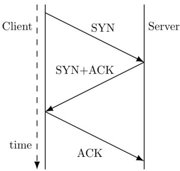
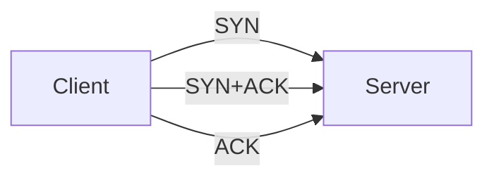

The forwarding table of a router is shown below.

<table><tr><td>Subnet Number</td><td>Subnet Mask</td><td>Interface ID</td></tr><tr><td>200.150.0.0</td><td>255.255.0.0</td><td>1</td></tr><tr><td>200.150.64.0</td><td>255.255.224.0</td><td>2</td></tr><tr><td>200.150.68.0</td><td>255.255.255.0</td><td>3</td></tr><tr><td>200.150.68.64</td><td>255.255.255.224</td><td>4</td></tr><tr><td>Default</td><td></td><td>0</td></tr></table>

A packet addressed to a destination address 200.150.68.118 arrives at the router. It will be forwarded to the interface with ID \_\_\_\_.

gatecse-2023 computer-networks subnetting numerical-answers two-marks

Answer key

# 2.34.15 Subnetting: GATE CSE 2025 | Set 1 | Question: 30

A packet with the destination IP address 145.36.109.70 arrives at a router whose routing table is shown. Which interface will the packet be forwarded to?

<table><tr><td>Subnet Address</td><td>Subnet Mask ( in CIDR notation)</td><td>Interface</td></tr><tr><td>145.36.0.0</td><td>/16</td><td>E1</td></tr><tr><td>145.36.128.0</td><td>/17</td><td>E2</td></tr><tr><td>145.36.64.0</td><td>/18</td><td>E3</td></tr><tr><td>145.36.255.0</td><td>/24</td><td>E4</td></tr><tr><td>Default</td><td>-</td><td>E5</td></tr></table>

A. E3

B. E1

C. E2

D. E5

gatecse2025-set1 computer-networks subnetting two-marks

Answer key

# 2.34.16 Subnetting: GATE IT 2004 | Question: 26

A subnet has been assigned a subnet mask of 255.255.255.192. What is the maximum number of hosts that can belong to this subnet?

A. 14

B. 30

C. 62

D. 126

gateit-2004 computer-networks subnetting normal

Answer key

# 2.34.17 Subnetting: GATE IT 2005 | Question: 76

A company has a class C network address of 204.204.204.0. It wishes to have three subnets, one with 100 hosts and two with 50 hosts each. Which one of the following options represents a feasible set of subnet address/subnet mask pairs?

A. 204.204.204.128/255.255.255.192

204.204.204.0/255.255.255.128

204.204.204.64/255.255.255.128

B. 204.204.204.0/255.255.255.192

204.204.204.192/255.255.255.128

204.204.204.64/255.255.255.128

C. 204.204.204.128/255.255.255.128

204.204.204.192/255.255.255.192

204.204.204.224/255.255.255.192

D. 204.204.204.128/255.255.255.128

204.204.204.64/255.255.255.192

204.204.204.0/255.255.255.192

gateit-2005 computer-networks subnetting normal

# Answer key

# 2.34.18 Subnetting: GATE IT 2006 | Question: 63, ISRO2015-57

A router uses the following routing table:

<table><tr><td>Destination</td><td>Mask</td><td>Interface</td></tr><tr><td>144.16.0.0</td><td>255.255.0.0</td><td>eth0</td></tr><tr><td>144.16.64.0</td><td>255.255.224.0</td><td>eth1</td></tr><tr><td>144.16.68.0</td><td>255.255.255.0</td><td>eth2</td></tr><tr><td>144.16.68.64</td><td>255.255.255.224</td><td>eth3</td></tr></table>

Packet bearing a destination address 144.16.68.117 arrives at the router. On which interface will it be forwarded?

A. eth0

B. eth1

C. eth2

D. eth3

gateit-2006 computer-networks subnetting normal isro2015

# Answer key

# 2.34.19 Subnetting: GATE IT 2006 | Question: 70

A subnetted Class B network has the following broadcast address: 144.16.95.255 Its subnet mask

A. is necessarily 255.255.224.0  
B. is necessarily 255.255.240.0  
C. is necessarily 255.255.248.0  
D. could be any one of 255.255.224.0, 255.255.240.0, 255.255.248.0

gateit-2006 computer-networks subnetting normal

# Answer key

# 2.34.20 Subnetting: GATE IT 2008 | Question: 84

Host $X$ has IP address 192.168.1.97 and is connected through two routers $R1$ and $R2$ to another host $Y$ with IP address 192.168.1.80. Router $R1$ has IP addresses 192.168.1.135 and 192.168.1.110. $R2$ has IP addresses 192.168.1.67 and 192.168.1.155. The netmask used in the network is 255.255.255.224.

Given the information above, how many distinct subnets are guaranteed to already exist in the network?

A. 1

B. 2

C. 3

D. 6

gateit-2008 computer-networks subnetting normal

# Answer key

# 2.34.21 Subnetting: GATE IT 2008 | Question: 85

Host $X$ has $IP$ address 192.168.1.97 and is connected through two routers $R1$ and $R2$ to another host $Y$ with $IP$ address 192.168.1.80. Router $R1$ has $IP$ addresses 192.168.1.135 and 192.168.1.110. $R2$ has $IP$ addresses 192.168.1.67 and 192.168.1.155. The netmask used in the network is 255.255.255.224.

Which IP address should X configure its gateway as?

A. 192.168.1.67

B. 192.168.1.110

# 2.35

# TCP (20)

Practice Tests: Test 1 (15Q) Test 2 (15Q) Test 3 (4Q)

# 2.35.1 TCP: GATE CSE 2009 | Question: 47

While opening a TCP connection, the initial sequence number is to be derived using a time-of-day (ToD) clock that keeps running even when the host is down. The low order 32 bits of the counter of the ToD clock

is to be used for the initial sequence numbers. The clock counter increments once per milliseconds. The maximum packet lifetime is given to be 64s.

Which one of the choices given below is closest to the minimum permissible rate at which sequence numbers used for packets of a connection can increase?

A. 0.015/s

B. 0.064/s

C. 0.135/s

D. 0.327/s

gatecse-2009 computer-networks tcp difficult ambiguous

# Answer key

# 2.35.2 TCP: GATE CSE 2012 | Question: 22

Which of the following transport layer protocols is used to support electronic mail?

A. SMTP

B. IP

C. TCP

D. UDP

gatecse-2012 computer-networks tcp easy

# Answer key

# 2.35.3 TCP: GATE CSE 2015 | Set 1 | Question: 19

Suppose two hosts use a TCP connection to transfer a large file. Which of the following statements is/are FALSE with respect to the TCP connection?

I. If the sequence number of a segment is $m$ , then the sequence number of the subsequent segment is always $m + 1$ .  
II. If the estimated round trip time at any given point of time is t sec, the value of the retransmission timeout is always set to greater than or equal to t sec.  
III. The size of the advertised window never changes during the course of the TCP connection.  
IV. The number of unacknowledged bytes at the sender is always less than or equal to the advertised window.

A. III only

B. I and III only

C. I and IV only

D. II and IV only

gatecse-2015-set1 computer-networks tcp normal

# Answer key

# 2.35.4 TCP: GATE CSE 2015 | Set 2 | Question: 34

Assume that the bandwidth for a TCP connection is 1048560 bits/sec. Let $\alpha$ be the value of RTT in milliseconds (rounded off to the nearest integer) after which the TCP window scale option is needed. Let $\beta$ be the maximum possible window size with window scale option. Then the values of $\alpha$ and $\beta$ are

A. 63 milliseconds, $65535 \times 2^{14}$  
C. 500 milliseconds, $65535 \times 2^{14}$  
gatecse-2015-set2 computer-networks difficult tcp

B. 63 milliseconds, $65535 \times 2^{16}$  
D. 500 milliseconds, $65535 \times 2^{16}$

# Answer key

# 2.35.5 TCP: GATE CSE 2015 | Set 3 | Question: 22

Consider the following statements.

I. TCP connections are full duplex

II. TCP has no option for selective acknowledgement
III. TCP connections are message streams

A. Only I is correct

B. Only I and III are correct

C. Only II and III are correct

D. All of I, II and III are correct

gatecse-2015-set3 computer-networks tcp easy

# Answer key

# 2.35.6 TCP: GATE CSE 2016 | Set 2 | Question: 25

Identify the correct sequence in which the following packets are transmitted on the network by a host when a browser requests a webpage from a remote server, assuming that the host has just been restarted.

A. HTTP GET request, DNS query, TCP SYN  
C. DNS query, TCP SYN, HTTP GET request.

B. DNS query, HTTP GET request, TCP SYN

D. TCP SYN, DNS query, HTTP GET request.

gatecse-2016-set2 computer-networks normal tcp

# Answer key

# 2.35.7 TCP: GATE CSE 2017 | Set 1 | Question: 14

Consider a TCP client and a TCP server running on two different machines. After completing data transfer, the TCP client calls close to terminate the connection and a FIN segment is sent to the TCP server. Server-side TCP responds by sending an ACK, which is received by the client-side TCP. As per the TCP connection state diagram (RFC 793), in which state does the client-side TCP connection wait for the FIN from the server-side TCP?

A. LAST-ACK

B. TIME-WAIT

C. FIN-WAIT-1

D. FIN-WAIT-2

gatecse-2017-set1 computer-networks tcp

# Answer key

# 2.35.8 TCP: GATE CSE 2021 | Set 1 | Question: 44

A TCP server application is programmed to listen on port number P on host S. A TCP client is connected to the TCP server over the network.

Consider that while the TCP connection was active, the server machine S crashed and rebooted. Assume that the client does not use the TCP keepalive timer. Which of the following behaviors is/are possible?

A. If the client was waiting to receive a packet, it may wait indefinitely  
B. The TCP server application on S can listen on P after reboot  
C. If the client sends a packet after the server reboot, it will receive a RST segment  
D. If the client sends a packet after the server reboot, it will receive a FIN segment

gatecse-2021-set1 multiple-selects computer-networks tcp two-marks

# Answer key

# 2.35.9 TCP: GATE CSE 2021 | Set 1 | Question: 45

Consider two hosts P and Q connected through a router R. The maximum transfer unit (MTU) value of the link between P and R is 1500 bytes, and between R and Q is 820 bytes.

A TCP segment of size 1400 bytes was transferred from P to Q through R, with IP identification value as 0x1234. Assume that the IP header size is 20 bytes. Further, the packet is allowed to be fragmented, i.e., Don't Fragment (DF) flag in the IP header is not set by P.

Which of the following statements is/are correct?

A. Two fragments are created at $R$ and the IP datagram size carrying the second fragment is 620 bytes.  
B. If the second fragment is lost, R will resend the fragment with the IP identification value 0x1234.  
C. If the second fragment is lost, P is required to resend the whole TCP segment.  
D. TCP destination port can be determined by analysing only the second fragment.

# Answer key

# 2.35.10 TCP: GATE CSE 2021 | Set 2 | Question: 7

Consider the three-way handshake mechanism followed during TCP connection establishment between hosts P and Q. Let X and Y be two random 32-bit starting sequence numbers chosen by P and Q respectively. Suppose P sends a TCP connection request message to Q with a TCP segment having SYN bit = 1, SEQ number = X, and ACK bit = 0. Suppose Q accepts the connection request. Which one of the following choices represents the information present in the TCP segment header that is sent by Q to P?

A. SYN bit = 1, SEQ number = X + 1, ACK bit = 0, ACK number = Y, FIN bit = 0  
B. SYN bit = 0, SEQ number = X + 1, ACK bit = 0, ACK number = Y, FIN bit = 1  
C. SYN bit = 1, SEQ number = Y, ACK bit = 1, ACK number = X + 1, FIN bit = 0  
D. SYN bit = 1, SEQ number = Y, ACK bit = 1, ACK number = X, FIN bit = 0

gatecse-2021-set2 computer-networks tcp one-mark

# Answer key

# 2.35.11 TCP: GATE CSE 2022 | Question: 50

Consider the data transfer using TCP over a 1 Gbps link. Assuming that the maximum segment lifetime (MSL) is set to 60 seconds, the minimum number of bits required for the sequence number field of the TCP header, to prevent the sequence number space from wrapping around during the MSL is

gatecse-2022 numerical-answers computer-networks tcp two-marks

# Answer key

# 2.35.12 TCP: GATE CSE 2023 | Question: 40

Suppose you are asked to design a new reliable byte-stream transport protocol like TCP. This protocol, named myTCP, runs over a 100 Mbps network with Round Trip Time of 150 milliseconds and the maximum segment lifetime of 2 minutes.

Which of the following is/are valid lengths of the Sequence Number field in the myTCP header?

A. 30 bits

B. 32 bits

C. 34 bits

D. 36 bits

gatecse-2023 computer-networks tcp multiple-selects two-marks

# Answer key

# 2.35.13 TCP: GATE CSE 2024 | Set 1 | Question: 19

TCP client P successfully establishes a connection to TCP server Q. Let $N_{P}$ denote the sequence number in the SYN sent from P to Q. Let $N_{Q}$ denote the acknowledgement number in the SYN ACK from Q to P. Which of the following statements is/are CORRECT?

A. The sequence number $N_{P}$ is chosen randomly by P  
B. The sequence number $N_{P}$ is always 0 for a new connection  
C. The acknowledgement number $N_{Q}$ is equal to $N_{P}$  
D. The acknowledgement number $N_{Q}$ is equal to $N_{P} + 1$

gatecse-2024-set1 multiple-selects computer-networks tcp one-mark

# Answer key

# 2.35.14 TCP: GATE CSE 2025 | Set 1 | Question: 12

Consider the 3-way handshaking protocol for TCP connection establishment. Let the three packets exchanged during the connection establishment be denoted as P1, P2, and P3, in order. Which of the following option(s) is/are TRUE with respect to TCP header flags that are set in the packets?

A. P3: SYN = 1, ACK = 1  
C. P2: SYN = 0, ACK = 1

B. P2: SYN = 1, ACK = 1  
D. P1: SYN = 1

gatecse2025-set1 computer-networks tcp multiple-selects one-mark

# Answer key

# 2.35.15 TCP: GATE CSE 2026 | Set 1 | Question: 8

With respect to a TCP connection between a client and a server, which one of the following statements is true?

A. The client and server use a two-way handshake mechanism before the start of data transmission  
B. The server cannot initiate closing of the connection before the client initiates closing of the connection  
C. The TCP connection is half-duplex  
D. The client and server can initiate closing of the connection at the same time

gatecse-2026-set1 computer-networks tcp one-mark

# Answer key

# 2.35.16 TCP: GATE IT 2004 | Question: 23

Which one of the following statements is FALSE?

A. TCP guarantees a minimum communication rate  
B. TCP ensures in-order delivery  
C. TCP reacts to congestion by reducing sender window size  
D. TCP employs retransmission to compensate for packet loss

gateit-2004 computer-networks tcp normal

# Answer key

# 2.35.17 TCP: GATE IT 2004 | Question: 28

In TCP, a unique sequence number is assigned to each

A. byte

B. word

C. segment

D. message

gateit-2004 computer-networks tcp easy

# Answer key

# 2.35.18 TCP: GATE IT 2007 | Question: 13

Consider the following statements about the timeout value used in TCP.

i. The timeout value is set to the RTT (Round Trip Time) measured during TCP connection establishment for the entire duration of the connection.  
ii. Appropriate RTT estimation algorithm is used to set the timeout value of a TCP connection.  
iii. Timeout value is set to twice the propagation delay from the sender to the receiver.

Which of the following choices hold?

A. (i) is false, but (ii) and (iii) are true  
C. (i) and (ii) are false, but (iii) is true

B. (i) and (iii) are false, but (ii) is true  
D. $(i),(ii)$ and $(iii)$ are false

gateit-2007 computer-networks tcp normal

# Answer key

# 2.35.19 TCP: GATE IT 2007 | Question: 14

Consider a TCP connection in a state where there are no outstanding ACKs. The sender sends two segments back to back. The sequence numbers of the first and second segments are 230 and 290 respectively. The first segment was lost, but the second segment was received correctly by the receiver. Let

X be

the amount of data carried in the first segment (in bytes), and Y be the ACK number sent by the receiver. The values of X and Y (in that order) are

A. 60 and 290

B. 230 and 291

C. 60 and 231

D. 60 and 230

gateit-2007 computer-networks tcp normal

# Answer key

# 2.35.20 TCP: GATE IT 2008 | Question: 69

The three way handshake for TCP connection establishment is shown below.

flowchart

Which of the following statements are TRUE?

S1 : Loss of SYN + ACK from the server will not establish a connection  
S2 : Loss of ACK from the client cannot establish the connection  
S3 : The server moves LISTEN → SYN\_RCVD → SYN\_SENT → ESTABLISHED in the state machine on no packet loss  
S4 : The server moves LISTEN → SYN\_RCVD → ESTABLISHED in the state machine on no packet loss

A. $S2$ and $S3$ only

B. S1 and S4 only

C. S1 and S3 only

D. S2 and S4 only

gateit-2008 computer-networks tcp normal

# Answer key

# 2.36

# Token Bucket (2)

# 2.36.1 Token Bucket: GATE CSE 2008 | Question: 58

A computer on a 10Mbps network is regulated by a token bucket. The token bucket is filled at a rate of 2Mbps. It is initially filled to capacity with 16Megabits. What is the maximum duration for which the computer can transmit at the full 10Mbps?

A. 1.6 seconds

B. 2 seconds

C. 5 seconds

D. 8 seconds

gatecse-2008 computer-networks token-bucket

# Answer key

# 2.36.2 Token Bucket: GATE CSE 2016 | Set 1 | Question: 54

For a host machine that uses the token bucket algorithm for congestion control, the token bucket has a capacity of 1 megabyte and the maximum output rate is 20 megabytes per second. Tokens arrive at a rate to sustain output at a rate of 10 megabytes per second. The token bucket is currently full and the machine needs to send 12 megabytes of data. The minimum time required to transmit the data is \_\_\_\_ seconds.

gatecse-2016-set1 computer-networks token-bucket normal numerical-answers

# Answer key

# 2.37

# UDP (4)

# 2.37.1 UDP: GATE CSE 2005 | Question: 23

Packets of the same session may be routed through different paths in:

A. TCP, but not UDP  
C. UDP, but not TCP  
gatecse-2005 computer-networks tcp udp easy

B. TCP and UDP

D. Neither TCP nor UDP

# Answer key

# 2.37.2 UDP: GATE CSE 2013 | Question: 12

The transport layer protocols used for real time multimedia, file transfer, DNS and email, respectively are

A. TCP, UDP, UDP and TCP  
C. UDP, TCP, UDP and TCP

B. UDP, TCP, TCP and UDP

D. TCP, UDP, TCP and UDP

gatecse-2013 computer-networks tcp udp easy

# Answer key

# 2.37.3 UDP: GATE CSE 2017 | Set 2 | Question: 18

Consider socket API on a Linux machine that supports connected UDP sockets. A connected UDP socket is a UDP socket on which connect function has already been called. Which of the following statements is/are CORRECT?

I. A connected UDP socket can be used to communicate with multiple peers simultaneously.  
II. A process can successfully call connect function again for an already connected UDP socket.

A. I only

B. II only

C. Both I and II

D. Neither I nor II

gatecse-2017-set2 computer-networks udp

# Answer key

# 2.37.4 UDP: GATE IT 2006 | Question: 69

A program on machine X attempts to open a UDP connection to port 5376 on a machine Y, and a TCP connection to port 8632 on machine Z. However, there are no applications listening at the corresponding ports on Y and Z. An ICMP Port Unreachable error will be generated by

A. $Y$ but not $Z$

B. $Z$ but not $Y$

C. Neither $Y$ nor $Z$

D. Both $Y$ and $Z$

gateit-2006 computer-networks tcp udp normal

# Answer key

# 2.38

# Wrap Around Time (2)

# 2.38.1 Wrap Around Time: GATE CSE 2014 | Set 3 | Question: 27

Every host in an IPv4 network has a 1-second resolution real-time clock with battery backup. Each host needs to generate up to 1000 unique identifiers per second. Assume that each host has a globally unique IPv4 address. Design a 50-bit globally unique ID for this purpose. After what period (in seconds) will the identifiers generated by a host wrap around?

gatecse-2014-set3 computer-networks ip-addressing wrap-around-time numerical-answers normal

# Answer key

# 2.38.2 Wrap Around Time: GATE CSE 2018 | Question: 25

Consider a long-lived TCP session with an end-to-end bandwidth of 1 Gbps ( $= 10^{9}$ bits-per-second). The session starts with a sequence number of 1234. The minimum time (in seconds, rounded to the closet integer) before this sequence number can be used again is \_\_\_\_.

gatecse-2018 computer-networks tcp wrap-around-time normal numerical-answers one-mark

# Answer key

Answer Keys

<table><tr><td>2.1.1</td><td>A</td><td>2.1.2</td><td>C</td><td>2.1.3</td><td>C</td><td>2.1.4</td><td>C</td><td>2.1.5</td><td>B</td></tr><tr><td>2.1.6</td><td>6</td><td>2.1.7</td><td>4</td><td>2.1.8</td><td>A;C;D</td><td>2.1.9</td><td>C</td><td>2.1.10</td><td>B</td></tr><tr><td>2.1.11</td><td>C</td><td>2.1.12</td><td>D</td><td>2.1.13</td><td>C</td><td>2.2.1</td><td>B</td><td>2.3.1</td><td>B</td></tr><tr><td>2.3.2</td><td>D</td><td>2.4.1</td><td>B</td><td>2.4.2</td><td>A</td><td>2.4.3</td><td>A</td><td>2.5.1</td><td>B</td></tr><tr><td>2.5.2</td><td>C</td><td>2.5.3</td><td>C</td><td>2.5.4</td><td>D</td><td>2.5.5</td><td>A</td><td>2.6.1</td><td>D</td></tr><tr><td>2.6.2</td><td>200</td><td>2.6.3</td><td>50</td><td>2.6.4</td><td>C</td><td>2.6.5</td><td>A</td><td>2.6.6</td><td>B</td></tr><tr><td>2.7.1</td><td>A</td><td>2.8.1</td><td>A</td><td>2.8.2</td><td>7.07:7.09</td><td>2.8.3</td><td>B</td><td>2.8.4</td><td>B</td></tr><tr><td>2.9.1</td><td>D</td><td>2.9.2</td><td>C</td><td>2.9.3</td><td>1100</td><td>2.9.4</td><td>C</td><td>2.9.5</td><td>44</td></tr><tr><td>2.9.6</td><td>4</td><td>2.9.7</td><td>B</td><td>2.9.8</td><td>4:4</td><td>2.9.9</td><td>B</td><td>2.10.1</td><td>30:30</td></tr><tr><td>2.11.1</td><td>C</td><td>2.11.2</td><td>B</td><td>2.11.3</td><td>A</td><td>2.11.4</td><td>C</td><td>2.11.5</td><td>B;C</td></tr><tr><td>2.11.6</td><td>0.5</td><td>2.11.7</td><td>B</td><td>2.11.8</td><td>A</td><td>2.12.1</td><td>3:4</td><td>2.12.2</td><td>A</td></tr><tr><td>2.12.3</td><td>C</td><td>2.12.4</td><td>A</td><td>2.12.5</td><td>A</td><td>2.12.6</td><td>B</td><td>2.12.7</td><td>C</td></tr><tr><td>2.12.8</td><td>N/A</td><td>2.13.1</td><td>B</td><td>2.13.2</td><td>B</td><td>2.13.3</td><td>D</td><td>2.13.4</td><td>C</td></tr><tr><td>2.13.5</td><td>B</td><td>2.13.6</td><td>500</td><td>2.13.7</td><td>C</td><td>2.14.1</td><td>D</td><td>2.14.2</td><td>B</td></tr><tr><td>2.14.3</td><td>C</td><td>2.14.4</td><td>7:7</td><td>2.14.5</td><td>D</td><td>2.15.1</td><td>N/A</td><td>2.15.2</td><td>A</td></tr><tr><td>2.16.1</td><td>D</td><td>2.16.2</td><td>C</td><td>2.16.3</td><td>9</td><td>2.16.4</td><td>144</td><td>2.16.5</td><td>C;D</td></tr><tr><td>2.16.6</td><td>A</td><td>2.16.7</td><td>D</td><td>2.16.8</td><td>4094</td><td>2.17.1</td><td>C</td><td>2.17.2</td><td>D</td></tr><tr><td>2.17.3</td><td>D</td><td>2.17.4</td><td>A</td><td>2.17.5</td><td>B</td><td>2.17.6</td><td>C</td><td>2.17.7</td><td>13</td></tr><tr><td>2.17.8</td><td>A;C</td><td>2.17.9</td><td>6</td><td>2.17.10</td><td>B;C</td><td>2.17.11</td><td>C;D</td><td>2.17.12</td><td>D</td></tr><tr><td>2.18.1</td><td>A</td><td>2.19.1</td><td>D</td><td>2.19.2</td><td>A</td><td>2.19.3</td><td>26</td><td>2.19.4</td><td>3</td></tr><tr><td>2.19.5</td><td>D</td><td>2.19.6</td><td>D</td><td>2.19.7</td><td>B</td><td>2.20.1</td><td>D</td><td>2.20.2</td><td>12</td></tr><tr><td>2.20.3</td><td>B</td><td>2.20.4</td><td>C</td><td>2.21.1</td><td>N/A</td><td>2.21.2</td><td>D</td><td>2.21.3</td><td>C</td></tr><tr><td>2.21.4</td><td>A</td><td>2.22.1</td><td>D</td><td>2.22.2</td><td>A</td><td>2.22.3</td><td>C</td><td>2.22.4</td><td>B</td></tr><tr><td>2.22.5</td><td>C</td><td>2.22.6</td><td>A;B;C</td><td>2.23.1</td><td>D</td><td>2.23.2</td><td>C</td><td>2.23.3</td><td>B</td></tr><tr><td>2.23.4</td><td>A</td><td>2.23.5</td><td>C</td><td>2.23.6</td><td>C</td><td>2.23.7</td><td>50:52</td><td>2.23.8</td><td>C</td></tr><tr><td>2.23.9</td><td>C</td><td>2.23.10</td><td>D</td><td>2.23.11</td><td>B</td><td>2.24.1</td><td>D</td><td>2.24.2</td><td>D</td></tr><tr><td>2.24.3</td><td>1575</td><td>2.24.4</td><td>B</td><td>2.25.1</td><td>B</td><td>2.26.1</td><td>0.949:0.952</td><td>2.27.1</td><td>130:140</td></tr><tr><td>2.28.1</td><td>B</td><td>2.28.2</td><td>D</td><td>2.28.3</td><td>A</td><td>2.28.4</td><td>1</td><td>2.28.5</td><td>C</td></tr><tr><td>2.28.6</td><td>D</td><td>2.28.7</td><td>A;C</td><td>2.28.8</td><td>B</td><td>2.28.9</td><td>40</td><td>2.28.10</td><td>B</td></tr><tr><td>2.28.11</td><td>C</td><td>2.28.12</td><td>A</td><td>2.28.13</td><td>C</td><td>2.28.14</td><td>D</td><td>2.29.1</td><td>A</td></tr><tr><td>2.30.1</td><td>B</td><td>2.30.2</td><td>B</td><td>2.30.3</td><td>B</td><td>2.30.4</td><td>C</td><td>2.30.5</td><td>C</td></tr><tr><td>2.30.6</td><td>D</td><td>2.30.7</td><td>C</td><td>2.30.8</td><td>5</td><td>2.30.9</td><td>8</td><td>2.30.10</td><td>4</td></tr><tr><td>2.30.11</td><td>B</td><td>2.30.12</td><td>C</td><td>2.30.13</td><td>B</td><td>2.30.14</td><td>B</td><td>2.30.15</td><td>A</td></tr><tr><td>2.30.16</td><td>A</td><td>2.31.1</td><td>0.4404</td><td>2.32.1</td><td>D</td><td>2.32.2</td><td>C</td><td>2.32.3</td><td>C</td></tr><tr><td>2.32.4</td><td>B</td><td>2.33.1</td><td>320</td><td>2.33.2</td><td>2500</td><td>2.33.3</td><td>86.5:89.5</td><td>2.33.4</td><td>B</td></tr><tr><td>2.33.5</td><td>D</td><td>2.33.6</td><td>B</td><td>2.34.1</td><td>D</td><td>2.34.2</td><td>A</td><td>2.34.3</td><td>D</td></tr><tr><td>2.34.4</td><td>C</td><td>2.34.5</td><td>C</td><td>2.34.6</td><td>C</td><td>2.34.7</td><td>D</td><td>2.34.8</td><td>A</td></tr><tr><td>2.34.9</td><td>A</td><td>2.34.10</td><td>158</td><td>2.34.11</td><td>C</td><td>2.34.12</td><td>B</td><td>2.34.13</td><td>B;D</td></tr></table>

<table><tr><td>2.34.14</td><td>3</td></tr><tr><td>2.34.19</td><td>D</td></tr><tr><td>2.35.3</td><td>B</td></tr><tr><td>2.35.8</td><td>A;B;C</td></tr><tr><td>2.35.13</td><td>A;D</td></tr><tr><td>2.35.18</td><td>B</td></tr><tr><td>2.37.1</td><td>B</td></tr><tr><td>2.38.2</td><td>34 : 35</td></tr></table>

<table><tr><td>2.34.15</td><td>A</td></tr><tr><td>2.34.20</td><td>C</td></tr><tr><td>2.35.4</td><td>C</td></tr><tr><td>2.35.9</td><td>A;C</td></tr><tr><td>2.35.14</td><td>B;D</td></tr><tr><td>2.35.19</td><td>D</td></tr><tr><td>2.37.2</td><td>C</td></tr></table>

<table><tr><td>2.34.16</td><td>C</td></tr><tr><td>2.34.21</td><td>B</td></tr><tr><td>2.35.5</td><td>A</td></tr><tr><td>2.35.10</td><td>C</td></tr><tr><td>2.35.15</td><td>D</td></tr><tr><td>2.35.20</td><td>B</td></tr><tr><td>2.37.3</td><td>B</td></tr></table>

<table><tr><td>2.34.17</td><td>D</td></tr><tr><td>2.35.1</td><td>A</td></tr><tr><td>2.35.6</td><td>C</td></tr><tr><td>2.35.11</td><td>33</td></tr><tr><td>2.35.16</td><td>A</td></tr><tr><td>2.36.1</td><td>B</td></tr><tr><td>2.37.4</td><td>D</td></tr></table>

<table><tr><td>2.34.18</td><td>C</td></tr><tr><td>2.35.2</td><td>C</td></tr><tr><td>2.35.7</td><td>D</td></tr><tr><td>2.35.12</td><td>B;C;D</td></tr><tr><td>2.35.17</td><td>A</td></tr><tr><td>2.36.2</td><td>1.10:1.19</td></tr><tr><td>2.38.1</td><td>256</td></tr></table>

ER-model. Relational model: Relational algebra, Tuple calculus, SQL. Integrity constraints, Normal forms. File organization, Indexing (e.g., B and B+ trees). Transactions and concurrency control.

Mark Distribution in Previous GATE

<table><tr><td>Year</td><td>2026 - 1</td><td>2026 - 2</td><td>2025 - 1</td><td>2025 - 2</td><td>2024 - 1</td><td>2024 - 2</td><td>2023</td><td>2022</td><td>2021 - 1</td><td>2021 - 2</td><td>Minimum</td></tr><tr><td>1 Mark Count</td><td>2</td><td>2</td><td>1</td><td>1</td><td>4</td><td>4</td><td>1</td><td>3</td><td>2</td><td>1</td><td>1</td></tr><tr><td>2 Marks Count</td><td>2</td><td>2</td><td>3</td><td>4</td><td>2</td><td>2</td><td>2</td><td>2</td><td>3</td><td>3</td><td>2</td></tr><tr><td>Total Marks</td><td>6</td><td>6</td><td>8</td><td>9</td><td>8</td><td>8</td><td>5</td><td>7</td><td>8</td><td>7</td><td>5</td></tr></table>

Welcome to the Databases chapter of your GATE Computer Science preparation. This crucial subject forms the backbone of modern data management and is indispensable for any computer science professional. In GATE, Databases typically carries a significant weightage, ranging from 6 to 10 marks, often featuring a mix of conceptual questions, problem-solving scenarios, and direct application of formulas. You can expect questions on topics like relational algebra/calculus, SQL queries, functional dependencies, normal forms, B-trees, and concurrency control protocols. A strong grasp of these fundamentals is vital not just for the exam but also for practical applications in software development and data engineering.

# Topic-wise Key Concepts

# Armstrong Axioms

Armstrong Axioms are a set of inference rules used to derive all functional dependencies (FDs) implied by a given set of FDs. They are sound (do not generate incorrect FDs) and complete (can generate all correct FDs).

# Formulas/Theorems:

1. Reflexivity: If $B \subseteq A$ , then $A \to B$ . (Trivial FD)  
2. Augmentation: If $A \to B$ , then $AC \to BC$ (where $C$ is any set of attributes).  
3. Transitivity: If $A \to B$ and $B \to C$ , then $A \to C$ .

# Derived Rules:

4. Union: If $A \to B$ and $A \to C$ , then $A \to BC$ .  
5. Decomposition: If $A \to BC$ , then $A \to B$ and $A \to C$ .  
6. Pseudotransitivity: If $A \to B$ and $BC \to D$ , then $AC \to D$ .

# Key Properties/Identities:

- Used to find the closure of an attribute set $X^{+}$ .  
- Fundamental for determining candidate keys and normal forms.

# Common Pitfalls:

- Confusing derived rules with basic axioms.  
- Incorrectly applying augmentation or transitivity.

# Problem-Solving Techniques:

- To find $X^{+}$ : Start with $X$ . Repeatedly add attributes to $X^{+}$ if they are determined by any subset of $X^{+}$ using the given FDs.  
- To check if $A \to B$ is implied by a set of FDs $F$ : Check if $B \subseteq A^{+}$ .

# B Tree

A B-tree is a self-balancing tree data structure that maintains sorted data and allows searches, sequential access, insertions, and deletions in logarithmic time. It is optimized for systems that read and write large blocks of data, such as disk storage.

# Formulas/Theorems:

- Order $m$ : Each node (except root) has at least $\lceil m/2 \rceil$ children and at most $m$ children.  
- Number of keys: A node with $k$ children has $k - 1$ keys.  
- Minimum keys (non-root): $\lceil m / 2 \rceil - 1$ .  
• Maximum keys: m - 1.  
- Maximum height $h$ : For $N$ keys and order $m$ , $h \leq \log_{[m/2]} \left( \frac{N+1}{2} \right)$ .  
- Minimum height $h$ : For $N$ keys and order $m$ , $h \geq \log_m(N + 1)$ .

# Key Properties/Identities:

- All leaf nodes are at the same level.  
- Keys within a node are sorted.  
- Efficient for disk-based indexing due to high fan-out.

# Common Pitfalls:

- Miscalculating minimum/maximum number of keys or children per node.  
- Incorrectly performing split/merge operations during insertion/deletion.

# Problem-Solving Techniques:

- Trace insertion/deletion operations step-by-step, paying attention to splits (when a node overflows) and merges (when a node underflows).  
- Calculate disk I/Os by counting the number of nodes visited (including root and leaf) for search, insertion, or deletion.

# Candidate Key

A Candidate Key is a minimal Super Key. It is a set of attributes that uniquely identifies each tuple in a relation, and no proper subset of these attributes can uniquely identify tuples.

# Formulas/Theorems:

- A set of attributes $K$ is a Candidate Key if:  
1. $K \rightarrow R$ (where R is all attributes in the relation) - Uniqueness property.  
2. For no proper subset $K' \subset K$ , $K' \to R$ - Minimality property.

# Key Properties/Identities:

• Every relation must have at least one candidate key.  
- One candidate key is chosen as the Primary Key.

# Common Pitfalls:

- Confusing with Super Key (Super Key doesn't require minimality).  
- Forgetting to check the minimality condition.

# Problem-Solving Techniques:

- Find the closure of various attribute sets. A set $K$ is a super key if $K^{+}$ contains all attributes of the relation.  
- From the super keys, identify those that are minimal (i.e., no subset is also a super key) to find candidate keys.

# Conflict Serializable

A schedule is Conflict Serializable if it is conflict equivalent to some serial schedule. Two operations conflict if they are on the same data item, belong to different transactions, and at least one of them is a write operation (W-W, W-R, R-W conflicts).