- Min keys (non-root): $\lceil m / 2 \rceil - 1$  
- Max keys: $m - 1$  
- Min children (non-root): $\lceil m / 2 \rceil$  
- Max children: $m$

\- Candidate Key: $K \to R$ and $K$ is minimal.

\- Conflict Serializable: Precedence graph has no cycles.

\- Functional Dependency Closure: $X^{+}$ (algorithm based on Armstrong's axioms).

\- Decomposition Lossless Join: For $R_{1}, R_{2}, (R_{1} \cap R_{2}) \to R_{1}$ or $(R_{1} \cap R_{2}) \to R_{2}$ .

\- Relational Algebra Operators:

- Select: $\sigma_P(R)$  
- Project: $\pi_A(R)$  
- Union: $R \cup S$  
- Set Difference: $R \setminus S$  
。Cartesian Product: $R \times S$  
- Natural Join: $R \bowtie S$

\- Tuple Relational Calculus: $\{t \mid P(t)\}$

\- Timestamp Ordering Rules (for transaction $T_{i}$ on data item $X$ ):

\- Read: If $TS(T_i) < W\_TS(X)$ , abort $T_i$ . Else, $R\_TS(X) = \max(R\_TS(X), TS(T_i))$ .

Write: If $TS(T_i) < R\_TS(X)$ or $TS(T_i) < W\_TS(X)$ , abort $T_i$ . Else, $W\_TS(X) = TS(T_i)$ .

# Important Tips for GATE

- Master Functional Dependencies and Normal Forms: These are high-yield topics. Practice finding candidate keys, attribute closures, and checking normal forms (especially 3NF and BCNF). Understand the implications of lossless join and dependency preservation.  
- Hands-on with Relational Algebra/Calculus and SQL: Be proficient in writing queries in all three languages. Practice converting queries between them. Pay attention to operator precedence in RA and quantifier usage in RC.  
- B-Tree Operations and I/O Calculation: Understand the structure, insertion, deletion, and search operations. Crucially, be able to calculate the number of disk I/Os for various scenarios, as this is a common numerical question.  
- Concurrency Control Protocols: Understand the ACID properties, common anomalies (dirty read, lost update, etc.), and how 2PL and Timestamp Ordering prevent them. Practice drawing precedence graphs for conflict serializability and wait-for graphs for deadlock detection.  
- ER Diagram to Relational Schema Mapping: Know the standard rules for mapping entities, attributes (simple, composite, multi-valued), and relationships (1:1, 1:N, M:N, weak entities) to relational tables.  
- Read Questions Carefully: Database questions often have subtle details. For example, in normalization, the given FDs are critical. In concurrency, the exact sequence of operations matters.  
- Time Management: Some problems, like tracing B-tree operations or complex concurrency schedules, can be time-consuming. Practice efficiently solving these to save time during the exam.  
- Conceptual Clarity: While formulas are important, a deep conceptual understanding of why certain rules exist (e.g., why BCNF is stricter than 3NF, why 2PL guarantees serializability) will help you tackle tricky theoretical questions.

# 3.1

# Armstrong Axioms (1)

# 3.1.1 Armstrong Axioms: GATE CSE 2026 | Set 2 | Question: 32

In the context of schema normalization in relational DBMS, consider a set $\mathbf{F}$ of functional dependencies. The set of all functional dependencies implied by $\mathbf{F}$ is called the closure of $\mathbf{F}$ . To compute the closure of $\mathbf{F}$ , Armstrong's Axioms can be applied. Consider $X, Y$ , and $Z$ as sets of attributes over a relational schema. The three rules of Armstrong's Axioms are described as follows.

Reflexivity: If $Y \subseteq X$ , then $X \to Y$

Augmentation: If $X \to Y$ , then $XZ \to YZ$ for any $Z$

Transitivity: If $X \to Y$ and $Y \to Z$ , then $X \to Z$

The additional rule of Union is defined as follows.

Union: If $X \to Y$ and $X \to Z$ , then $X \to YZ$

It can be proved that the additional rule of Union is also implied by the three rules of Armstrong's Axioms. Listed below are four combinations of these three rules. Which one of these combinations is both necessary and sufficient for the proof?

A. Reflexivity, Augmentation, and  
Transitivity  
C. Transitivity

gatecse-2026-set2 databases database-normalization armstrong-axioms two-marks

B. Reflexivity and Augmentation  
D. Augmentation and Transitivity

Answer key

# 3.2

# B Tree (32)

Practice Tests: Test 1 (15Q) Test 2 (15Q) Test 3 (9Q)

# 3.2.1 B Tree: GATE CSE 1989 | Question: 12a

The below figure shows a $B^{+}$ tree where only key values are indicated in the records. Each block can hold up to three records. A record with a key value 34 is inserted into the $B^{+}$ tree. Obtain the modified $B^{+}$ tree after insertion.

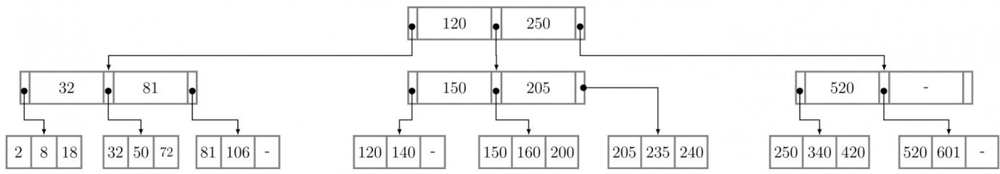

flowchart

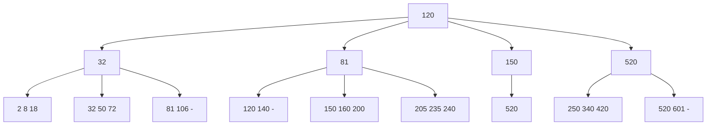

descriptive gate1989 databases b-tree

Answer key

# 3.2.2 B Tree: GATE CSE 1994 | Question: 14a

Consider $B^{+}$ - tree of order $d$ shown in figure. (A $B^{+}$ - tree of order $d$ contains between $d$ and $2d$ keys in each node)

Draw the resulting $B^{+}$ - tree after 100 is inserted in the figure below.

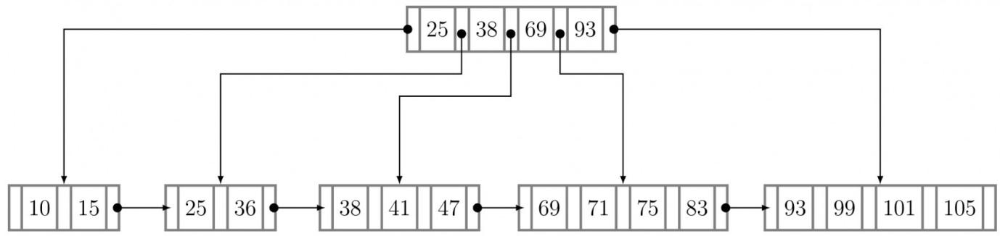

flowchart

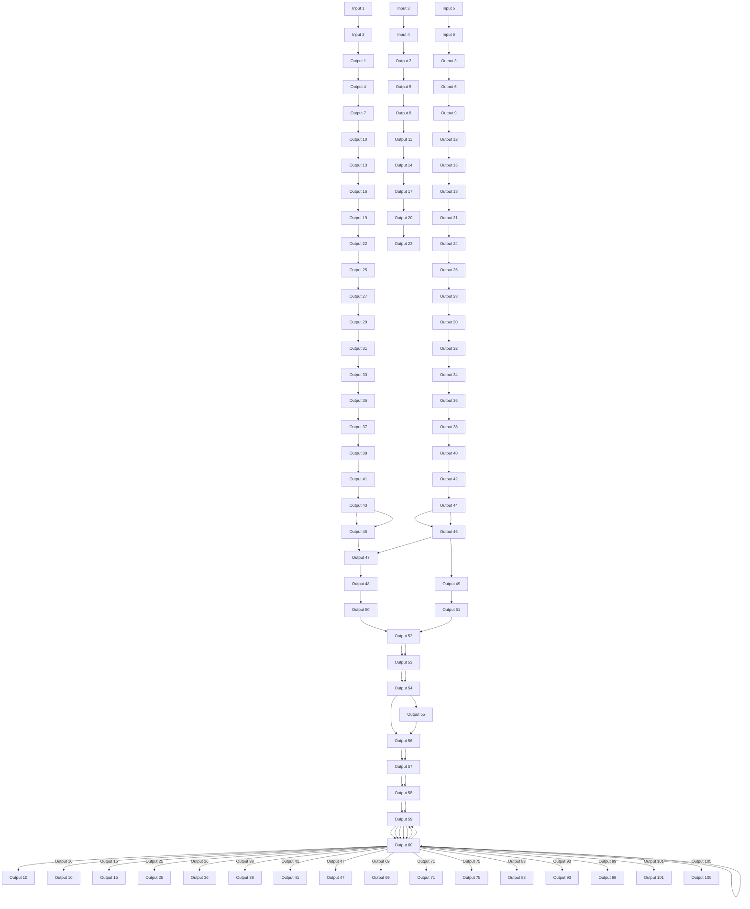

gate1994 databases b-tree normal descriptive

Answer key

# 3.2.3 B Tree: GATE CSE 1994 | Question: 14b

For a $B^{+}$ - tree of order $d$ with $n$ leaf nodes, the number of nodes accessed during a search is $O(\_)$ .

gate1994 databases b-tree normal descriptive

Answer key

# 3.2.4 B Tree: GATE CSE 1997 | Question: 19

A $B^{+}$ - tree of order $d$ is a tree in which each internal node has between $d$ and $2d$ key values. An internal node with $M$ key values has $M + 1$ children. The root (if it is an internal node) has between 1 and $2d$ key values. The distance of a node from the root is the length of the path from the root to the node. All leaves are at the same distance from the root. The height of the tree is the distance of a leaf from the root.

A. What is the total number of key values in the internal nodes of a $B^{+}$ -tree with $l$ leaves $(l \geq 2)$ ?  
B. What is the maximum number of internal nodes in a $B^{+}$ - tree of order 4 with 52 leaves?  
C. What is the minimum number of leaves in a $B^{+}$ -tree of order $d$ and height $h(h \geq 1)$ ?

gate1997 databases b-tree normal descriptive

# Answer key

# 3.2.5 B Tree: GATE CSE 1999 | Question: 1.25

Which of the following is correct?

A. B-trees are for storing data on disk and $B^{+}$ trees are for main memory.  
B. Range queries are faster on $B^{+}$ trees.  
C. B-trees are for primary indexes and $B^{+}$ trees are for secondary indexes.  
D. The height of a $B^{+}$ tree is independent of the number of records.

gate1999 databases b-tree normal

# Answer key

# 3.2.6 B Tree: GATE CSE 1999 | Question: 21

Consider a B-tree with degree m, that is, the number of children, c, of any internal node (except the root) is such that $m \leq c \leq 2m - 1$ . Derive the maximum and minimum number of records in the leaf nodes for such a B-tree with height h, $h \geq 1$ . (Assume that the root of a tree is at height 0).

gate1999 databases b-tree normal descriptive

# Answer key

# 3.2.7 B Tree: GATE CSE 2000 | Question: 1.22, UGCNET-June2012-II: 11

B $^{+}$ -trees are preferred to binary trees in databases because

A. Disk capacities are greater than memory capacities  
B. Disk access is much slower than memory access  
C. Disk data transfer rates are much less than memory data transfer rates  
D. Disks are more reliable than memory

gatecse-2000 databases b-tree normal ugcnetcse-june2012-paper2

# Answer key

# 3.2.8 B Tree: GATE CSE 2000 | Question: 21

(a) Suppose you are given an empty $B^{+}$ tree where each node (leaf and internal) can store up to 5 key values. Suppose values 1, 2, $\ldots$ 10 are inserted, in order, into the tree. Show the tree pictorially

i. after 6 insertions, and  
ii. after all 10 insertions

Do NOT show intermediate stages.

(b) Suppose instead of splitting a node when it is full, we try to move a value to the left sibling. If there is no left sibling, or the left sibling is full, we split the node. Show the tree after values $1, 2, \ldots, 9$ have been inserted. Assume, as in (a) that each node can hold up to 5 keys.

(c) In general, suppose a $B^{+}$ tree node can hold a maximum of m keys, and you insert a long sequence of keys in increasing order. Then what approximately is the average number of keys in each leaf level node.

i. in the normal case, and  
ii. with the insertion as in (b).

# 3.2.9 B Tree: GATE CSE 2001 | Question: 22

We wish to construct a $B^{+}$ tree with fan-out (the number of pointers per node) equal to 3 for the following set of key values:

80,50,10,70,30,100,90

Assume that the tree is initially empty and the values are added in the order given.

a. Show the tree after insertion of 10, after insertion of 30, and after insertion of 90. Intermediate trees need not be shown.  
b. The key values 30 and 10 are now deleted from the tree in that order show the tree after each deletion.

gatecse-2001 databases b-tree normal descriptive

# Answer key

# 3.2.10 B Tree: GATE CSE 2002 | Question: 17

a. The following table refers to search items for a key in B-trees and $B^{+}$ trees.

<table><tr><td colspan="2">B-tree</td><td colspan="2"> $\mathbf{B^{+}}$ -tree</td></tr><tr><td>Successful search</td><td>Unsuccessful search</td><td>Successful search</td><td>Unsuccessful search</td></tr><tr><td> $X_1$ </td><td> $X_2$ </td><td> $X_3$ </td><td> $X_4$ </td></tr></table>

A successful search means that the key exists in the database and unsuccessful means that it is not present in the database. Each of the entries $X_{1}, X_{2}, X_{3}$ and $X_{4}$ can have a value of either Constant or Variable. Constant means that the search time is the same, independent of the specific key value, where variable means that it is dependent on the specific key value chosen for the search.

Give the correct values for the entries $X_{1}, X_{2}, X_{3}$ and $X_{4}$ (for example $X_{1} = \text{Constant}$ , $X_{2} = \text{Constant}$ , $X_{3} = \text{Constant}$ , $X_{4} = \text{Constant}$ )

b. Relation $R(A, B)$ has the following view defined on it:

<table><tr><td>CREATE VIEW V AS(SELECT R1.A,R2.BFROM R AS R1, R as R2WHERE R1.B=R2.A)</td></tr></table>

i. The current contents of relation R are shown below. What are the contents of the view V?

<table><tr><td>A</td><td>B</td></tr><tr><td>1</td><td>2</td></tr><tr><td>2</td><td>3</td></tr><tr><td>2</td><td>4</td></tr><tr><td>4</td><td>5</td></tr><tr><td>6</td><td>7</td></tr><tr><td>6</td><td>8</td></tr><tr><td>9</td><td>10</td></tr></table>

ii. The tuples (2, 11) and (11, 6) are now inserted into $R$ . What are the additional tuples that are inserted in $V$ ?

# 3.2.11 B Tree: GATE CSE 2002 | Question: 2.23, UGCNET-June2012-II: 26

A $B^{+}$ - tree index is to be built on the Name attribute of the relation STUDENT. Assume that all the student names are of length 8 bytes, disk blocks are of size 512 bytes, and index pointers are of size 4 bytes. Given the scenario, what would be the best choice of the degree (i.e. number of pointers per node) of the $B^{+}$ - tree?

A. 16

B. 42

C. 43

D. 44

gatecse-2002 databases b-tree normal ugcnetcse-june2012-paper2

# Answer key

# 3.2.12 B Tree: GATE CSE 2003 | Question: 65

Consider the following 2 - 3 - 4 tree (i.e., B-tree with a minimum degree of two) in which each data item is a letter. The usual alphabetical ordering of letters is used in constructing the tree.

flowchart

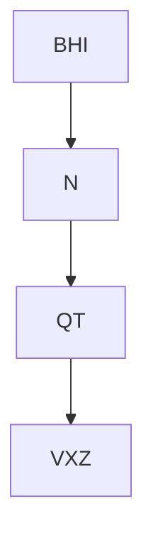

What is the result of inserting G in the above tree?

A.

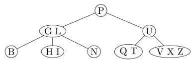

flowchart

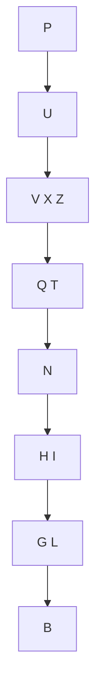

C.

gatecse-2003 databases b-tree normal

B.

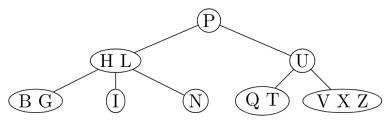

flowchart

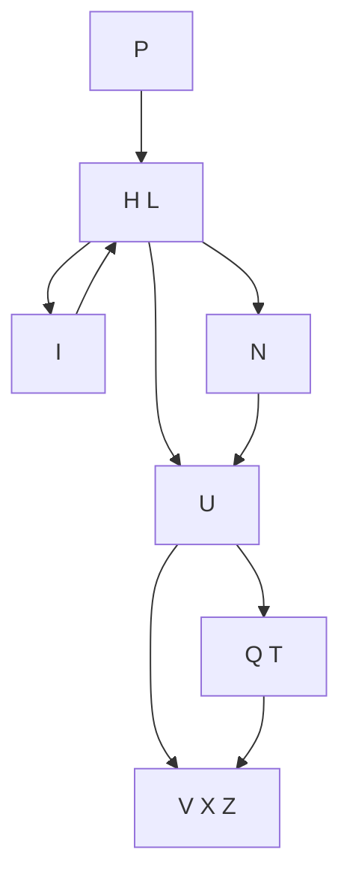

D. None of the above

# Answer key

# 3.2.13 B Tree: GATE CSE 2004 | Question: 52

The order of an internal node in a $B+$ tree index is the maximum number of children it can have. Suppose that a child pointer takes 6 bytes, the search field value takes 14 bytes, and the block size is 512 bytes. What is the order of the internal node?

A. 24

B. 25

C. 26

D. 27

gatecse-2004 databases b-tree normal

# Answer key

# 3.2.14 B Tree: GATE CSE 2005 | Question: 28

Which of the following is a key factor for preferring $B^{+}$ -trees to binary search trees for indexing database relations?

A. Database relations have a large number of records  
B. Database relations are sorted on the primary key  
C. $B^{+}$ -trees require less memory than binary search trees  
D. Data transfer from disks is in blocks

gatecse-2005 databases b-tree normal

# Answer key

# 3.2.15 B Tree: GATE CSE 2007 | Question: 63, ISRO2016-59

The order of a leaf node in a $B^{+}$ - tree is the maximum number of (value, data record pointer) pairs it can hold. Given that the block size is 1K bytes, data record pointer is 7 bytes long, the value field is 9 bytes long and a block pointer is 6 bytes long, what is the order of the leaf node?

A. 63

B. 64

C. 67

D. 68

gatecse-2007 databases b-tree normal isro2016

# Answer key

# 3.2.16 B Tree: GATE CSE 2008 | Question: 41

A B-tree of order 4 is built from scratch by 10 successive insertions. What is the maximum number of node splitting operations that may take place?

A. 3

B. 4

C. 5

D. 6

gatecse-2008 databases b-tree normal

# Answer key

# 3.2.17 B Tree: GATE CSE 2009 | Question: 44

The following key values are inserted into a $B^{+}$ - tree in which order of the internal nodes is 3, and that of the leaf nodes is 2, in the sequence given below. The order of internal nodes is the maximum number of tree pointers in each node, and the order of leaf nodes is the maximum number of data items that can be stored in it. The $B^{+}$ - tree is initially empty

10, 3, 6, 8, 4, 2, 1

The maximum number of times leaf nodes would get split up as a result of these insertions is

A. 2

B. 3

C. 4

D. 5

gatecse-2009 databases b-tree normal

# Answer key

# 3.2.18 B Tree: GATE CSE 2010 | Question: 18

Consider a $B^{+}$ -tree in which the maximum number of keys in a node is 5. What is the minimum number of keys in any non-root node?

A. 1

B. 2

C. 3

D. 4

gatecse-2010 databases b-tree easy

# Answer key

# 3.2.19 B Tree: GATE CSE 2015 | Set 2 | Question: 6

With reference to the $B^{+}$ tree index of order 1 shown below, the minimum number of nodes (including the Root node) that must be fetched in order to satisfy the following query. "Get all records with a search key greater than or equal to 7 and less than 15" is \_\_\_\_.

flowchart

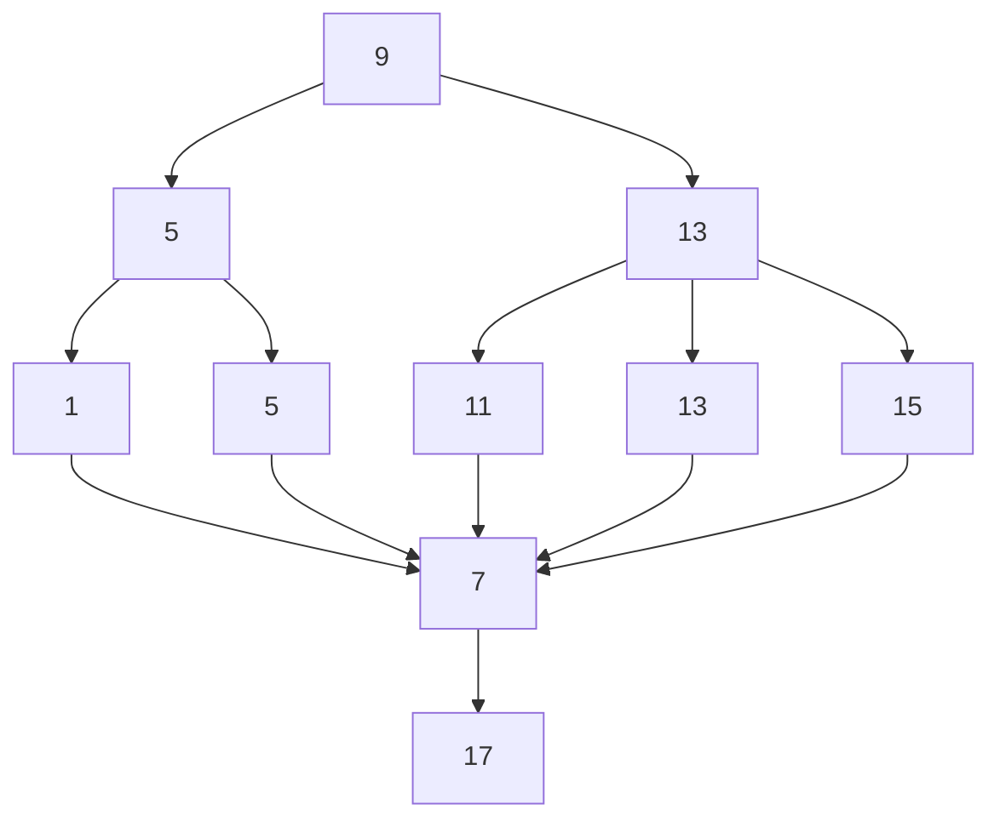

gatecse-2015-set2 databases b-tree normal numerical-answers

# Answer key

# 3.2.20 B Tree: GATE CSE 2015 | Set 3 | Question: 46

Consider a $B^{+}$ tree in which the search key is 12 bytes long, block size is 1024 bytes, record pointer is 10 bytes long and the block pointer is 8 bytes long. The maximum number of keys that can be accommodated

in each non-leaf node of the tree is \_\_\_\_.

gatecse-2015-set3 databases b-tree normal numerical-answers

# Answer key

# 3.2.21 B Tree: GATE CSE 2016 | Set 2 | Question: 21

B+ Trees are considered BALANCED because.

A. The lengths of the paths from the root to all leaf nodes are all equal.  
B. The lengths of the paths from the root to all leaf nodes differ from each other by at most 1.  
C. The number of children of any two non-leaf sibling nodes differ by at most 1.  
D. The number of records in any two leaf nodes differ by at most 1.

gatecse-2016-set2 databases b-tree normal

# Answer key

# 3.2.22 B Tree: GATE CSE 2017 | Set 2 | Question: 49

In a $B^{+}$ Tree, if the search-key value is 8 bytes long, the block size is 512 bytes and the pointer size is 2 B, then the maximum order of the $B^{+}$ Tree is \_\_\_\_

gatecse-2017-set2 databases b-tree numerical-answers normal

# Answer key

# 3.2.23 B Tree: GATE CSE 2019 | Question: 14

Which one of the following statements is NOT correct about the $B^{+}$ tree data structure used for creating an index of a relational database table?

A. $B^{+}$ Tree is a height-balanced tree  
B. Non-leaf nodes have pointers to data records  
C. Key values in each node are kept in sorted order  
D. Each leaf node has a pointer to the next leaf node

gatecse-2019 databases b-tree one-mark

# Answer key

# 3.2.24 B Tree: GATE CSE 2024 | Set 1 | Question: 11

In a $\mathbf{B}^{+}$ tree, the requirement of at least half-full (50%) node occupancy is relaxed for which one of the following cases?

A. Only the root node  
C. All internal nodes  
gatecse-2024-set1 databases b-tree one-mark

B. All leaf nodes  
D. Only the leftmost leaf node

# Answer key

# 3.2.25 B Tree: GATE CSE 2025 | Set 1 | Question: 11

Consider the following $B^{+}$ tree with 5 nodes, in which a node can store at most 3 key values The value 23 is now inserted in the $B^{+}$ tree. Which of the following options(s) is/are CORRECT?

flowchart

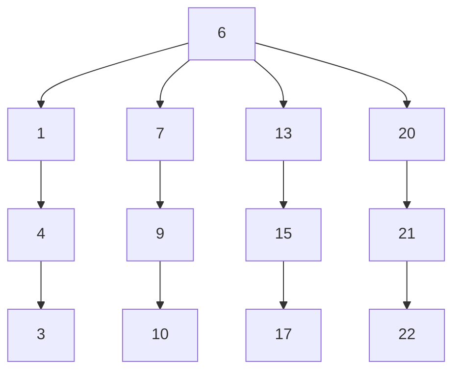

A. None of the nodes will split.  
B. At least one node will split and redistribute.

C. The total number of nodes will remain same.  
D. The height of the tree will increase.

gatecse2025-set1 databases b-tree multiple-selects one-mark

# Answer key

# 3.2.26 B Tree: GATE CSE 2025 | Set 2 | Question: 47

In a $B^{+}$ -tree where each node can hold at most four key values, a root to leaf path consists of the following nodes:

$$
\mathrm{A} = (4 9, 7 7, 8 3, -), \mathrm{B} = (7, 1 9, 3 3, 4 4), \mathrm{C} = (2 0 ^ {*}, 2 2 ^ {*}, 2 5 ^ {*}, 2 6 ^ {*})
$$

The \*-marked keys signify that these are data entries in a leaf.

Assume that a pointer between keys $k_{1}$ and $k_{2}$ points to a subtree containing keys in $[k_{1}, k_{2})$ , and that when a leaf is created, the smallest key in it is copied up into its parent.

A record with key value 23 is inserted into the $B^{+}$ -tree.

The smallest key value in the parent of the leaf that contains $25^{*}$ is \_\_\_\_. (Answer in integer)

gatecse2025-set2 databases b-tree numerical-answers two-marks

# Answer key

# 3.2.27 B Tree: GATE DA 2026 | Question: 31

Consider a B+ Tree where the maximum number of key values in each leaf node is 2 and the maximum number of pointers in each non-leaf node is 3. Let the content of the B+ Tree be as shown in the figure.

Which of the following options denotes the key value(s) stored in the root node after inserting a key value3 in the given B+ Tree?

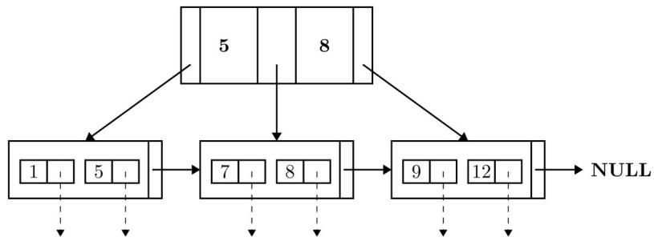

flowchart

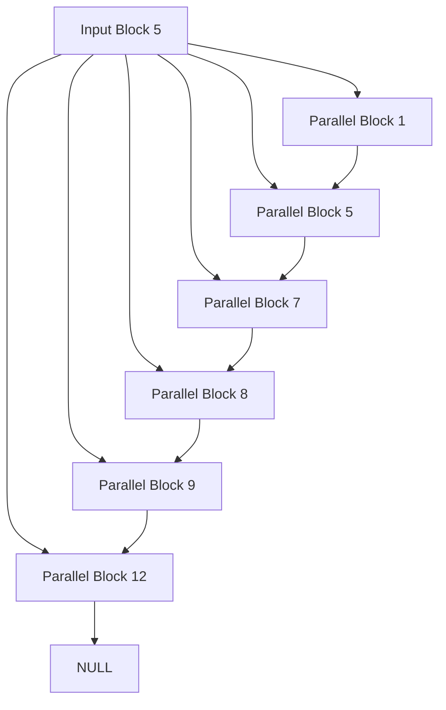

A. 5

B. 8

C. 3 and 5

D. 3,5 and 8

gateda-2026 databases b-tree two-marks

# Answer key

# 3.2.28 B Tree: GATE IT 2004 | Question: 79

Consider a table $T$ in a relational database with a key field $K$ . A $B$ -tree of order $p$ is used as an access structure on $K$ , where $p$ denotes the maximum number of tree pointers in a B-tree index node. Assume that $K$ is 10 bytes long; disk block size is 512 bytes; each data pointer $P_D$ is 8 bytes long and each block pointer $P_B$ is 5 bytes long. In order for each $B$ -tree node to fit in a single disk block, the maximum value of $p$ is

A. 20

B. 22

C. 23

D. 32

gateit-2004 databases b-tree normal

# Answer key

# 3.2.29 B Tree: GATE IT 2005 | Question: 23, ISRO2017-67

A B-Tree used as an index for a large database table has four levels including the root node. If a new key is inserted in this index, then the maximum number of nodes that could be newly created in the process are

A. 5

B. 4

C. 3

D. 2

gateit-2005

databases

b-tree

normal

isro2017

# Answer key

# 3.2.30 B Tree: GATE IT 2006 | Question: 61

In a database file structure, the search key field is 9 bytes long, the block size is 512 bytes, a record pointer is 7 bytes and a block pointer is 6 bytes. The largest possible order of a non-leaf node in a $B^{+}$ tree implementing this file structure is

A. 23

B. 24

C. 34

D. 44

gateit-2006 databases b-tree normal

# Answer key

# 3.2.31 B Tree: GATE IT 2007 | Question: 84

Consider the $B^{+}$ tree in the adjoining figure, where each node has at most two keys and three links.

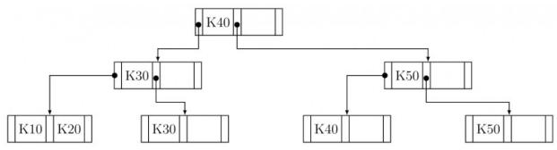

flowchart

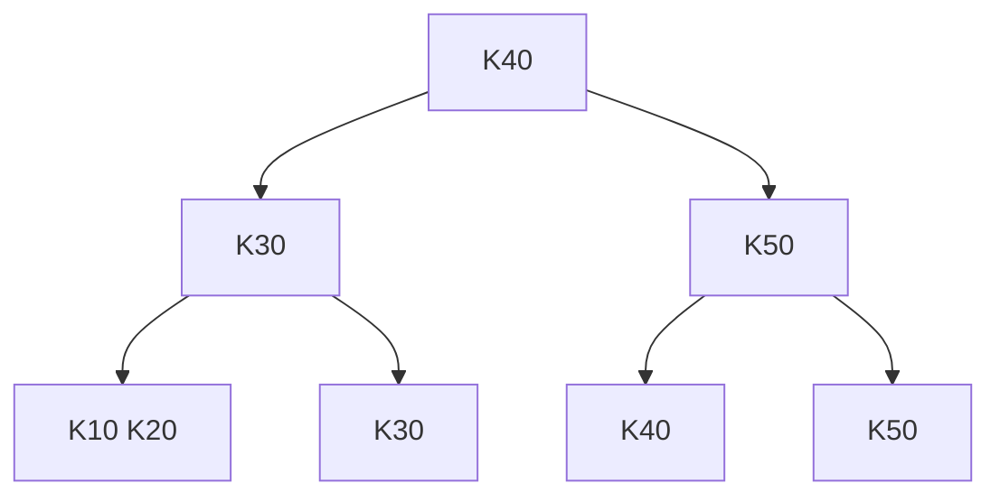

Keys K15 and then K25 are inserted into this tree in that order. Exactly how many of the following nodes (disregarding the links) will be present in the tree after the two insertions?

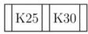

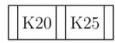

A. 1

B. 2

C. 3

D. 4

gateit-2007 databases b-tree normal

# Answer key

# 3.2.32 B Tree: GATE IT 2007 | Question: 85

Consider the $B^{+}$ tree in the adjoining figure, where each node has at most two keys and three links.

flowchart

Keys K15 and then K25 are inserted into this tree in that order. Now the key K50 is deleted from the $B^{+}$ tree resulting after the two insertions made earlier. Consider the following statements about the $B^{+}$ tree resulting after this deletion.

i. The height of the tree remains the same.

ii. The node K20

(disregarding the links) is present in the tree.

iii. The root node remains unchanged (disregarding the links).

Which one of the following options is true?

A. Statements (i) and (ii) are true  
C. Statements (iii) and (i) are true

B. Statements (ii) and (iii) are true  
D. All the statements are false

# 3.3

# Candidate Key (7)

Practice Test: Test 1 (6Q)

# 3.3.1 Candidate Key: GATE CSE 1994 | Question: 3.7

An instance of a relational scheme $R(A, B, C)$ has distinct values for attribute $A$ . Can you conclude that $A$ is a candidate key for $R$ ?

gate1994 databases easy database-normalization candidate-key descriptive

Answer key

# 3.3.2 Candidate Key: GATE CSE 2005 | Question: 78

Consider a relation scheme $R = (A, B, C, D, E, H)$ on which the following functional dependencies hold: $\{A \to B, BC \to D, E \to C, D \to A\}$ . What are the candidate keys $R$ ?

A. AE, BE

B. AE, BE, DE

C. AEH, BEH, BCH

D. AEH, BEH, DEH

gatecse-2005 databases candidate-key easy

Answer key

# 3.3.3 Candidate Key: GATE CSE 2011 | Question: 12

Consider a relational table with a single record for each registered student with the following attributes:

1. Registration\_Num: Unique registration number for each registered student  
2. UID: Unique identity number, unique at the national level for each citizen  
3. BankAccount\_Num: Unique account number at the bank. A student can have multiple accounts or joint accounts. This attribute stores the primary account number.  
4. Name: Name of the student  
5. Hostel\_Room: Room number of the hostel

Which of the following options is INCORRECT?

A. BankAccount\_Num is a candidate key  
B. Registration\_Num can be a primary key  
C. UID is a candidate key if all students are from the same country  
D. If $S$ is a super key such that $S \cap \mathrm{UID}$ is NULL then $S \cup \mathrm{UID}$ is also a superkey

gatecse-2011 databases normal candidate-key

Answer key

# 3.3.4 Candidate Key: GATE CSE 2014 | Set 2 | Question: 21

The maximum number of superkeys for the relation schema $R(E, F, G, H)$ with $E$ as the key is \_\_\_\_.

gatecse-2014-set2 databases numerical-answers easy candidate-key

Answer key

# 3.3.5 Candidate Key: GATE CSE 2014 | Set 2 | Question: 22

Given an instance of the STUDENTS relation as shown as below

<table><tr><td>StudentID</td><td>StudentName</td><td>StudentEmail</td><td>StudentAge</td><td>CPI</td></tr><tr><td>2345</td><td>Shankar</td><td>shankar@math</td><td>X</td><td>9.4</td></tr><tr><td>1287</td><td>Swati</td><td>swati@ee</td><td>19</td><td>9.5</td></tr><tr><td>7853</td><td>Shankar</td><td>shankar@cse</td><td>19</td><td>9.4</td></tr><tr><td>9876</td><td>Swati</td><td>swati@mech</td><td>18</td><td>9.3</td></tr><tr><td>8765</td><td>Ganesh</td><td>ganesh@civil</td><td>19</td><td>8.7</td></tr></table>

For (StudentName, StudentAge) to be a key for this instance, the value X should NOT be equal to \_\_\_\_.

gatecse-2014-set2 databases numerical-answers easy candidate-key

Answer key

# 3.3.6 Candidate Key: GATE CSE 2014 | Set 3 | Question: 22

A prime attribute of a relation scheme R is an attribute that appears

A. in all candidate keys of R  
C. in a foreign key of $R$

B. in some candidate key of $R$  
D. only in the primary key of $R$

gatecse-2014-set3 databases easy candidate-key

Answer key

# 3.3.7 Candidate Key: GATE DA 2026 | Question: 7

Let $\mathrm{R}(\mathrm{A},\mathrm{B},\mathrm{C},\mathrm{D},\mathrm{E})$ be a relational schema with functional dependency set $\mathrm{F} = \{\mathrm{A}\to \mathrm{BC},\mathrm{CD}\to \mathrm{E},\mathrm{E}\to \mathrm{A}\}$ .

Which of the following statements is correct?

A. AD, ED and CD are the only candidate keys of R.  
B. AD and ED are the only candidate keys of R.  
C. A, E and CD are the only candidate keys of R.  
D. A and CD are the only candidate keys of R.

gateda-2026 databases functional-dependency candidate-key one-mark

Answer key

# 3.4

# Conflict Serializable (12)

Practice Tests: Test 1 (15Q) Test 2 (4Q)

# 3.4.1 Conflict Serializable: GATE CSE 2007 | Question: 64

Consider the following schedules involving two transactions. Which one of the following statements is TRUE?

- $S_{1}: r_{1}(X); r_{1}(Y); r_{2}(X); r_{2}(Y); w_{2}(Y); w_{1}(X)$  
- $S_{2}:r_{1}(X);r_{2}(X);r_{2}(Y);w_{2}(Y);r_{1}(Y);w_{1}(X)$

A. Both $S_{1}$ and $S_{2}$ are conflict serializable.  
B. $S_{1}$ is conflict serializable and $S_{2}$ is not conflict serializable.  
C. $S_{1}$ is not conflict serializable and $S_{2}$ is conflict serializable.  
D. Both $S_{1}$ and $S_{2}$ are not conflict serializable.

gatecse-2007 databases transaction-and-concurrency normal conflict-serializable

Answer key

# 3.4.2 Conflict Serializable: GATE CSE 2009 | Question: 43

Consider two transactions $T_{1}$ and $T_{2}$ , and four schedules $S_{1}, S_{2}, S_{3}, S_{4}$ , of $T_{1}$ and $T_{2}$ as given below:

$$
T _ {1}: R _ {1} [ x ] W _ {1} [ x ] W _ {1} [ y ]
$$

$$
T _ {2}: R _ {2} [ x ] R _ {2} [ y ] W _ {2} [ y ]
$$

$$
S _ {1}: R _ {1} [ x ] R _ {2} [ x ] R _ {2} [ y ] W _ {1} [ x ] W _ {1} [ y ] W _ {2} [ y ]
$$

$$
S _ {2}: R _ {1} [ x ] R _ {2} [ x ] R _ {2} [ y ] W _ {1} [ x ] W _ {2} [ y ] W _ {1} [ y ]
$$

$$
S _ {3}: R _ {1} [ x ] W _ {1} [ x ] R _ {2} [ x ] W _ {1} [ y ] R _ {2} [ y ] W _ {2} [ y ]
$$

$$
S _ {4}: R _ {2} [ x ] R _ {2} [ y ] R _ {1} [ x ] W _ {1} [ x ] W _ {1} [ y ] W _ {2} [ y ]
$$

Which of the above schedules are conflict-serializable?

A. $S_{1}$ and $S_{2}$

B. $S_{2}$ and $S_{3}$

C. $S_{3}$ only

D. $S_{4}$ only

gatecse-2009 databases transaction-and-concurrency normal conflict-serializable

# Answer key

# 3.4.3 Conflict Serializable: GATE CSE 2014 | Set 1 | Question: 29

Consider the following four schedules due to three transactions (indicated by the subscript) using read and write on a data item x, denoted by $r(x)$ and $w(x)$ respectively. Which one of them is conflict serializable?

A. $r_1(x); r_2(x); w_1(x); r_3(x); w_2(x)$ ;  
B. $r_2(x); r_1(x); w_2(x); r_3(x); w_1(x)$ ;  
C. $r_3(x); r_2(x); r_1(x); w_2(x); w_1(x)$ ;  
D. $r_2(x); w_2(x); r_3(x); r_1(x); w_1(x);$

gatecse-2014-set1 databases transaction-and-concurrency conflict-serializable normal

# Answer key

# 3.4.4 Conflict Serializable: GATE CSE 2014 | Set 2 | Question: 29

Consider the following schedule S of transactions T1, T2, T3, T4 :

<table><tr><td>T1</td><td>T2</td><td>T3</td><td>T4</td></tr><tr><td rowspan="3">Writes(X) Commit</td><td>Reads(X)</td><td rowspan="3">Writes(X) Commit</td><td rowspan="2"></td></tr><tr><td rowspan="2">Writes(Y) Reads(Z) Commit</td></tr><tr><td>Reads(X) Reads(Y) Commit</td></tr></table>

Which one of the following statements is CORRECT?

A. S is conflict-serializable but not recoverable  
B. S is not conflict-serializable but is recoverable  
C. S is both conflict-serializable and recoverable  
D. $\mathbf{S}$ is neither conflict-serializable not is it recoverable