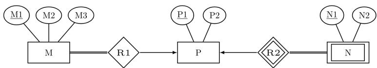
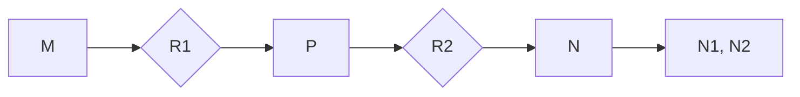
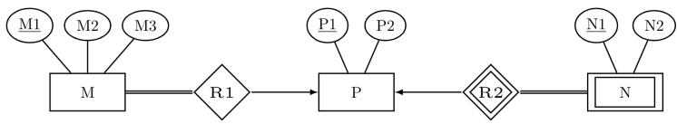
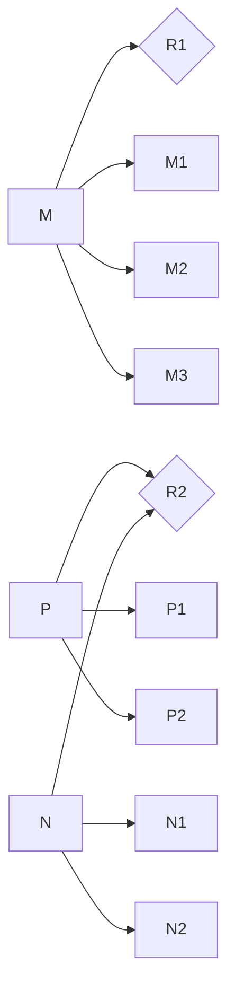
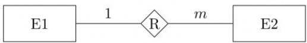

# 3.6.41 Database Normalization: GATE CSE 2022 | Question: 21

Consider a relation $R(A, B, C, D, E)$ with the following three functional dependencies.

$$
A B \rightarrow C; B C \rightarrow D; C \rightarrow E;
$$

The number of superkeys in the relation R is \_\_\_\_.

gatecse-2022 numerical-answers databases database-normalization one-mark

# Answer key

# 3.6.42 Database Normalization: GATE CSE 2022 | Question: 4

In a relational data model, which one of the following statements is TRUE?

A. A relation with only two attributes is always in BCNF.  
B. If all attributes of a relation are prime attributes, then the relation is in BCNF.  
C. Every relation has at least one non-prime attribute.  
D. BCNF decompositions preserve functional dependencies.

gatecse-2022 databases database-normalization one-mark easy

# Answer key

# 3.6.43 Database Normalization: GATE CSE 2024 | Set 1 | Question: 12

Which of the following statements about a relation $\mathbf{R}$ in first normal form (1NF) is/are TRUE?

A. R can have a multi-attribute key  
B. R cannot have a foreign key  
C. R cannot have a composite attribute  
D. R cannot have more than one candidate key

gatecse-2024-set1 multiple-selects databases database-normalization one-mark

# Answer key

# 3.6.44 Database Normalization: GATE CSE 2024 | Set 1 | Question: 34

The symbol → indicates functional dependency in the context of a relational database. Which of the following options is/are TRUE?

A. $(X,Y)\to (Z,W)$ implies $X\to (Z,W)$  
B. $(X,Y)\to (Z,W)$ implies $(X,Y)\to Z$  
C. $((X,Y)\to Z$ and $W\to Y)$ implies $(X,W)\to Z$  
D. $(X\to Y$ and $Y\to Z)$ implies $X\to Z$

gatecse-2024-set1 multiple-selects databases database-normalization two-marks

# Answer key

# 3.6.45 Database Normalization: GATE CSE 2024 | Set 2 | Question: 46

A functional dependency $F: X \to Y$ is termed as a useful functional dependency if and only if it satisfies all the following three conditions:

- X is not the empty set.  
- Y is not the empty set.  
- Intersection of $\mathbf{X}$ and $\mathbf{Y}$ is the empty set.

For a relation R with 4 attributes, the total number of possible useful functional dependencies is \_\_\_\_.

# 3.6.46 Database Normalization: GATE CSE 2025 | Set 2 | Question: 36

Consider the following relational schema along with all the functional dependencies that hold on them.

$$
R 1 (A, B, C, D, E): \{D \to E, E A \to B, E B \to C \}
$$

$$
R 2 (A, B, C, D): \{A \to D, A \to B, C \to A \}
$$

Which of the following statement(s) is/are TRUE?

A. $R1$ is in 3 NF

B. $R2$ is in 3 NF

C. $R1$ is NOT in 3 NF

D. $R2$ is NOT in 3 NF

gatecse2025-set2 databases database-normalization multiple-selects two-marks

# Answer key

# 3.6.47 Database Normalization: GATE CSE 2026 | Set 1 | Question: 21

In the context of relational database normalization, which of the following statements is/are true?

A. It is always possible to obtain a dependency-preserving 3NF decomposition of a relation  
B. It is always possible to obtain a dependency-preserving 1NF decomposition of a relation  
C. It is not always possible to obtain a dependency-preserving BCNF decomposition of a relation  
D. It is not always possible to obtain a dependency-preserving 2NF decomposition of a relation

gatecse-2026-set1 databases database-normalization multiple-selects one-mark

# Answer key

# 3.6.48 Database Normalization: GATE DS&AI 2024 | Question: 36

Given the relational schema $R = (U, V, W, X, Y, Z)$ and the set of functional dependencies:

$$
\{U \to V, U \to W, W X \to Y, W X \to Z, V \to X \}
$$

Which of the following functional dependencies can be derived from the above set?

A. $VW \rightarrow YZ$

B. $WX \rightarrow YZ$

C. $VW \rightarrow U$

D. $V W \rightarrow Y$

gate-ds-ai-2024 databases database-normalization multiple-selects two-marks

# Answer key

# 3.6.49 Database Normalization: GATE Data Science and Artificial Intelligence 2024 | Sample Paper | Question: 26

Given the following relation instances

<table><tr><td>X</td><td>Y</td><td>Z</td></tr><tr><td>1</td><td>4</td><td>2</td></tr><tr><td>1</td><td>5</td><td>3</td></tr><tr><td>1</td><td>4</td><td>3</td></tr><tr><td>1</td><td>5</td><td>2</td></tr><tr><td>3</td><td>2</td><td>1</td></tr></table>

Which of the following conditions is/are TRUE?

A. XY- > Z and Z- > Y

B. YZ- > X and X- >> Y  
C. Y- > X and Y- >> X  
D. XZ- > Y and Y- > X

gateda-sample-paper-2024 database-normalization

# Answer key

# 3.6.50 Database Normalization: GATE IT 2004 | Question: 75

A relation Empdtl is defined with attributes empcode (unique), name, street, city, state and pincode. For any pincode, there is only one city and state. Also, for any given street, city and state, there is just one pincode. In normalization terms, Empdtl is a relation in

A. 1NF only  
C. 3NF and hence also in 2NF and 1NF

B. 2NF and hence also in 1NF

D. BCNF and hence also in 3NF, 2NF and 1NF

gateit-2004 databases database-normalization normal

# Answer key

# 3.6.51 Database Normalization: GATE IT 2005 | Question: 22

A table has fields $F_{1}, F_{2}, F_{3}, F_{4}, F_{5}$ with the following functional dependencies

$$
\cdot F _ {1} \rightarrow F _ {3}, F _ {2} \rightarrow F _ {4}, (F _ {1}. F _ {2}) \rightarrow F _ {5}
$$

In terms of Normalization, this table is in

A. 1 NF

B. 2 NF

C. 3 NF

D. None of these

gateit-2005 databases database-normalization easy

# Answer key

# 3.6.52 Database Normalization: GATE IT 2005 | Question: 70

In a schema with attributes $A, B, C, D$ and $E$ following set of functional dependencies are given

- $A \rightarrow B$  
- $A \to C$  
- $CD \rightarrow E$  
- $B \rightarrow D$  
- $E \rightarrow A$

Which of the following functional dependencies is NOT implied by the above set?

A. $CD \rightarrow AC$

B. $BD \to CD$

C. $BC\to CD$

D. $AC \rightarrow BC$

gateit-2005 databases database-normalization normal

# Answer key

# 3.6.53 Database Normalization: GATE IT 2006 | Question: 60

Consider a relation R with five attributes $V, W, X, Y$ , and $Z$ . The following functional dependencies hold: $VY \to W, WX \to Z$ , and $ZY \to V$ .

Which of the following is a candidate key for R?

A. VXZ

B. VXY

c. VWXY

D. VWXYZ

gateit-2006 databases database-normalization normal

# Answer key

# 3.6.54 Database Normalization: GATE IT 2008 | Question: 61

Let $R(A,B,C,D)$ be a relational schema with the following functional dependencies :

$A \rightarrow B, B \rightarrow C, C \rightarrow D$ and $D \rightarrow B$ . The decomposition of $R$ into $(A, B), (B, C), (B, D)$

A. gives a lossless join, and is dependency preserving  
B. gives a lossless join, but is not dependency preserving  
C. does not give a lossless join, but is dependency preserving  
D. does not give a lossless join and is not dependency preserving

gateit-2008 databases database-normalization normal

Answer key

# 3.6.55 Database Normalization: GATE IT 2008 | Question: 62

Let $R(A, B, C, D, E, P, G)$ be a relational schema in which the following functional dependencies are known to hold: $AB \to CD, DE \to P, C \to E, P \to C$ and $B \to G$ . The relational schema $R$ is

A. in BCNF  
C. in 2NF, but not in 3NF  
gateit-2008 databases database-normalization normal

B. in 3NF, but not in BCNF

Answer key

# 3.6.56 Database Normalization: GATE2001-1.23, UGCNET-June2012-III: 18

Consider a schema $R(A, B, C, D)$ and functional dependencies $A \to B$ and $C \to D$ . Then the decomposition of $\mathsf{R}$ into $R_1(A, B)$ and $R_2(C, D)$ is

A. dependency preserving and lossless join  
B. lossless join but not dependency preserving  
C. dependency preserving but not lossless join  
D. not dependency preserving and not lossless join

gate1998 databases ugcnetcse-june2012-paper3 database-normalization

Answer key

3.7

# Database Schema (1)

# 3.7.1 Database Schema: GATE CSE 2026 | Set 2 | Question: 5

In the context of DBMS, consider the two sets T and S given below.

<table><tr><td>T</td><td>S</td></tr><tr><td>I: Logical schemaII: Physical schemaIII: External schema</td><td>L: ViewsM: File organization and indexesN: Relations</td></tr></table>

Which one of the following is the correct match from T to S ?

A. I - L, II - M, III - N  
B. I - M, II - L, III - N  
C. I-N,II-M,III-L  
D. I - N, II - L, III - M

gatecse-2026-set2 databases database-schema easy one-mark

Answer key

3.8

# Decomposition (1)

# 3.8.1 Decomposition: GATE DA 2025 | Question: 6

If a relational decomposition is not dependency-preserving, which one of the following relational operators will be executed more frequently in order to maintain the dependencies?

A. Selection

B. Projection

C. Join

D. Set union

gateda-2025

databases

decomposition

relational-algebra

easy

one-mark

Answer key

# 3.9

# ER Diagram (12)

Practice Tests: Test 1 (15Q) Test 2 (6Q)

# 3.9.1 ER Diagram: GATE CSE 2005 | Question: 75

Let $E_{1}$ and $E_{2}$ be two entities in an $E / R$ diagram with simple-valued attributes. $R_{1}$ and $R_{2}$ are two relationships between $E_{1}$ and $E_{2}$ , where $R_{1}$ is one-to-many and $R_{2}$ is many-to-many. $R_{1}$ and $R_{2}$ do not have any attributes of their own. What is the minimum number of tables required to represent this situation in the relational model?

A. 2

B. 3

C. 4

D. 5

gatecse-2005

databases

er-diagram

normal

Answer key

# 3.9.2 ER Diagram: GATE CSE 2008 | Question: 82

Consider the following ER diagram

flowchart

The minimum number of tables needed to represent M, N, P, R1, R2 is

A. 2

B. 3

C. 4

D. 5

gatecse-2008

databases

er-diagram

normal

Answer key

# 3.9.3 ER Diagram: GATE CSE 2008 | Question: 83

Consider the following ER diagram

flowchart

The minimum number of tables needed to represent M, N, P, R1, R2 is

Which of the following is a correct attribute set for one of the tables for the minimum number of tables needed to represent $M, N, P, R1, R2$ ?

A. $M1, M2, M3, P1$

B. $M1, P1, N1, N2$

C. $M1, P1, N1$

D. $M1, P1$

gatecse-2008

databases

er-diagram

normal

Answer key

# 3.9.4 ER Diagram: GATE CSE 2012 | Question: 14

Given the basic ER and relational models, which of the following is INCORRECT?

A. An attribute of an entity can have more than one value

B. An attribute of an entity can be composite  
C. In a row of a relational table, an attribute can have more than one value  
D. In a row of a relational table, an attribute can have exactly one value or a NULL value

gatecse-2012 databases normal er-diagram

# Answer key

# 3.9.5 ER Diagram: GATE CSE 2015 | Set 1 | Question: 41

Consider an Entity-Relationship (ER) model in which entity sets $E_{1}$ and $E_{2}$ are connected by an m:n relationship $R_{12}$ . $E_{1}$ and $E_{3}$ are connected by a 1:n (1 on the side of $E_{1}$ and n on the side of $E_{3}$ ) relationship $R_{13}$ .

$E_{1}$ has two-singled attributes $a_{11}$ and $a_{12}$ of which $a_{11}$ is the key attribute. $E_{2}$ has two singled-valued attributes $a_{21}$ and $a_{22}$ of which $a_{21}$ is the key attribute. $E_{3}$ has two single-valued attributes $a_{31}$ and $a_{32}$ of which $a_{31}$ is the key attribute. The relationships do not have any attributes.

If a relational model is derived from the above ER model, then the minimum number of relations that would be generated if all relation are in 3NF is \_\_\_\_.

gatecse-2015-set1 databases er-diagram normal numerical-answers

# Answer key

# 3.9.6 ER Diagram: GATE CSE 2017 | Set 2 | Question: 17

An ER model of a database consists of entity types A and B. These are connected by a relationship R which does not have its own attribute. Under which one of the following conditions, can the relational table for R be merged with that of A?

A. Relationship R is one-to-many and the participation of A in R is total  
B. Relationship $R$ is one-to-many and the participation of $A$ in $R$ is partial  
C. Relationship $R$ is many-to-one and the participation of $A$ in $R$ is total  
D. Relationship R is many-to-one and the participation of A in R is partial

gatecse-2017-set2 databases er-diagram normal

# Answer key

# 3.9.7 ER Diagram: GATE CSE 2018 | Question: 11

In an Entity-Relationship (ER) model, suppose R is a many-to-one relationship from entity set E1 to entity set E2. Assume that E1 and E2 participate totally in R and that the cardinality of E1 is greater than the cardinality of E2.

Which one of the following is true about R?

A. Every entity in E1 is associated with exactly one entity in E2  
B. Some entity in E1 is associated with more than one entity in E2  
C. Every entity in E2 is associated with exactly one entity in E1  
D. Every entity in E2 is associated with at most one entity in E1

gatecse-2018 databases er-diagram normal one-mark

# Answer key

# 3.9.8 ER Diagram: GATE CSE 2020 | Question: 14

Which one of the following is used to represent the supporting many-one relationships of a weak entity set in an entity-relationship diagram?

A. Diamonds with double/bold border  
C. Ovals with double/bold border

B. Rectangles with double/bold border  
D. Ovals that contain underlined identifiers

# 3.9.9 ER Diagram: GATE CSE 2024 | Set 1 | Question: 10

Let S be the specification: "Instructors teach courses. Students register for courses. Courses are allocated classrooms. Instructors guide students." Which one of the following ER diagrams CORRECTLY represents S?

A. (i)

B. (ii)

C. (iii)

D. (iv)

gatecse-2024-set1 databases er-diagram one-mark

Answer key

# 3.9.10 ER Diagram: GATE CSE 2024 | Set 2 | Question: 10

In the context of owner and weak entity sets in the ER (Entity-Relationship) data model, which one of the following statements is TRUE?

A. The weak entity set MUST have total participation in the identifying relationship  
B. The owner entity set MUST have total participation in the identifying relationship  
C. Both weak and owner entity sets MUST have total participation in the identifying relationship  
D. Neither weak entity set nor owner entity set MUST have total participation in the identifying relationship

gatecse-2024-set2 databases er-diagram one-mark

Answer key

# 3.9.11 ER Diagram: GATE IT 2004 | Question: 73

Consider the following entity relationship diagram (ERD), where two entities E1 and E2 have a relation R of cardinality 1:m.

The attributes of $E1$ are $A11$ , $A12$ and $A13$ where $A11$ is the key attribute. The attributes of $E2$ are $A21$ , $A22$ and $A23$ where $A21$ is the key attribute and $A23$ is a multi-valued attribute. Relation $R$ does not have any attribute. A relational database containing minimum number of tables with each table satisfying the requirements of the third normal form (3NF) is designed from the above $ERD$ . The number of tables in the database is

A. 2

B. 3

C. 5

D. 4

gateit-2004

databases

er-diagram

normal

Answer key

# 3.9.12 ER Diagram: GATE IT 2005 | Question: 21

Consider the entities 'hotel room', and 'person' with a many to many relationship 'lodging' as shown below:

If we wish to store information about the rent payment to be made by person (s) occupying different hotel rooms, then this information should appear as an attribute of

A. Person

B. Hotel Room

C. Lodging

D. None of these

gateit-2005

databases

er-diagram

easy

Answer key

# 3.10

# Functional Dependency (3)

Practice Tests:

Test 1 (15Q)

Test 2 (10Q)

# 3.10.1 Functional Dependency: GATE CSE 2025 | Set 1 | Question: 37

Consider a relational schema team (name, city, owner), with functional dependencies {name → city, name → owner}.

The relation team is decomposed into two relations, t1(name,city) and t2(name, owner). Which of the following statement(s) is/are TRUE?

A. The relation team is NOT in BCNF  
C. The decomposition constitutes a lossless join.

B. The relations $t1$ and $t2$ are in BCNF.  
D. The relation team is NOT in 3 NF.

gatecse2025-set1 databases functional-dependency database-normalization multiple-selects two-marks

Answer key

# 3.10.2 Functional Dependency: GATE CSE 2026 | Set 1 | Question: 20

Let $P, Q, R$ and $S$ be the attributes of a relation in a relational schema. Let $X \to Y$ indicate functional dependency in the context of a relational database, where $X, Y \subseteq \{P, Q, R, S\}$ .

Which of the following options is/are always true?

A. If $(\{P, Q\} \to \{R\}$ and $\{P\} \to \{R\}$ ), then $\{Q\} \to \{R\}$  
B. If $\{P, Q\} \to \{R\}$ , then $(\{P\} \to \{R\}$ or $\{Q\} \to \{R\})$  
C. If $(\{P\} \to \{R\}$ and $\{Q\} \to \{S\}$ ), then $\{P, Q\} \to \{R, S\}$  
D. If $\{P\} \to \{R\}$ , then $\{P, Q\} \to \{R\}$

# 3.10.3 Functional Dependency: GATE DA 2025 | Question: 47

Consider a database relation R with attributes ABCDEFG, and having the following functional dependencies:

$$
\mathrm{A} \rightarrow \mathrm{BCEF} \quad \mathrm{E} \rightarrow \mathrm{DG} \quad \mathrm{BC} \rightarrow \mathrm{A}
$$

Which of the following statements is/are correct?

A. A is the only candidate key of R  
B. A, BC are the candidate keys of R  
C. A, BC, E are the candidate keys of R  
D. Relation R is not in Boyce-Codd Normal Form (BCNF)

gateda-2025 databases functional-dependency multiple-selects two-marks

Answer key

# 3.11

# Indexing (15)

Practice Tests:

Test 1 (15Q)

Test 2 (7Q)

# 3.11.1 Indexing: GATE CSE 1989 | Question: 4-xiv

For secondary key processing which of the following file organizations is preferred? Give a one line justification:

A. Indexed sequential file  
organization.  
C. Inverted file organization.

B. Two-way linked list.

D. Sequential file organization.

gate1989 normal databases indexing descriptive

Answer key

# 3.11.2 Indexing: GATE CSE 1990 | Question: 10b

One giga bytes of data are to be organized as an indexed-sequential file with a uniform blocking factor 8. Assuming a block size of 1 Kilo bytes and a block referencing pointer size of 32 bits, find out the number of levels of indexing that would be required and the size of the index at each level. Determine also the size of the master index. The referencing capability (fanout ratio) per block of index storage may be considered to be 32.

gate1990 databases indexing descriptive

Answer key

# 3.11.3 Indexing: GATE CSE 1993 | Question: 14

An ISAM (indexed sequential) file consists of records of size 64 bytes each, including key field of size 14 bytes. An address of a disk block takes 2 bytes. If the disk block size is 512 bytes and there are 16K records, compute the size of the data and index areas in terms of number blocks. How many levels of tree have for the index?

gate1993 databases indexing normal descriptive

Answer key

# 3.11.4 Indexing: GATE CSE 1998 | Question: 1.35

There are five records in a database.

<table><tr><td>Name</td><td>Age</td><td>Occupation</td><td>Category</td></tr><tr><td>Rama</td><td>27</td><td>CON</td><td>A</td></tr><tr><td>Abdul</td><td>22</td><td>ENG</td><td>A</td></tr><tr><td>Jennifer</td><td>28</td><td>DOC</td><td>B</td></tr><tr><td>Maya</td><td>32</td><td>SER</td><td>D</td></tr><tr><td>Dev</td><td>24</td><td>MUS</td><td>C</td></tr></table>

There is an index file associated with this and it contains the values 1, 3, 2, 5 and 4. Which one of the fields is the index built from?

A. Age

B. Name

C. Occupation

D. Category

gate1998 databases indexing normal

# Answer key

# 3.11.5 Indexing: GATE CSE 2008 | Question: 16, ISRO2016-60

A clustering index is defined on the fields which are of type

A. non-key and ordering  
C. key and ordering

gatecse-2008 easy databases indexing isro2016

B. non-key and non-ordering  
D. key and non-ordering

# Answer key

# 3.11.6 Indexing: GATE CSE 2008 | Question: 70

Consider a file of 16384 records. Each record is 32 bytes long and its key field is of size 6 bytes. The file is ordered on a non-key field, and the file organization is unspanned. The file is stored in a file system with

block size 1024 bytes, and the size of a block pointer is 10 bytes. If the secondary index is built on the key field of the file, and a multi-level index scheme is used to store the secondary index, the number of first-level and second-level blocks in the multi-level index are respectively

A. 8 and 0

B. 128 and 6

C. 256 and 4

D. 512 and 5

gatecse-2008 databases indexing normal

# Answer key

# 3.11.7 Indexing: GATE CSE 2011 | Question: 39

Consider a relational table $r$ with sufficient number of records, having attributes $A_1, A_2, \ldots, A_n$ and let $1 \leq p \leq n$ . Two queries $Q1$ and $Q2$ are given below.

- $Q1: \pi_{A_1, \dots, A_p}(\sigma_{A_p = c}(r))$ where $c$ is a constant  
- $Q2: \pi_{A_1, \dots, A_p} \left( \sigma_{c_1 \leq A_p \leq c_2} (r) \right)$ where $c_1$ and $c_2$ are constants.

The database can be configured to do ordered indexing on $A_{p}$ or hashing on $A_{p}$ . Which of the following statements is TRUE?

A. Ordered indexing will always outperform hashing for both queries  
B. Hashing will always outperform ordered indexing for both queries  
C. Hashing will outperform ordered indexing on $Q1$ , but not on $Q2$  
D. Hashing will outperform ordered indexing on Q2, but not on Q1

gatecse-2011 databases indexing normal

# Answer key

# 3.11.8 Indexing: GATE CSE 2013 | Question: 15

An index is clustered, if

A. it is on a set of fields that form a candidate key

B. it is on a set of fields that include the primary key  
C. the data records of the file are organized in the same order as the data entries of the index  
D. the data records of the file are organized not in the same order as the data entries of the index

gatecse-2013 databases indexing normal

# Answer key

# 3.11.9 Indexing: GATE CSE 2015 | Set 1 | Question: 24

A file is organized so that the ordering of the data records is the same as or close to the ordering of data entries in some index. Then that index is called

A. Dense

B. Sparse

C. Clustered

D. Unclustered

gatecse-2015-set1 databases indexing easy

# Answer key

# 3.11.10 Indexing: GATE CSE 2020 | Question: 54

Consider a database implemented using $B^{+}$ tree for file indexing and installed on a disk drive with block size of 4 KB. The size of search key is 12 bytes and the size of tree/disk pointer is 8 bytes. Assume that the database has one million records. Also assume that no node of the $B^{+}$ tree and no records are present initially in main memory. Consider that each record fits into one disk block. The minimum number of disk accesses required to retrieve any record in the database is \_\_\_\_

gatecse-2020 numerical-answers databases b-tree indexing two-marks

# Answer key

# 3.11.11 Indexing: GATE CSE 2021 | Set 2 | Question: 21

A data file consisting of 1, 50, 000 student-records is stored on a hard disk with block size of 4096 bytes. The data file is sorted on the primary key RollNo. The size of a record pointer for this disk is 7 bytes. Each

student-record has a candidate key attribute called ANum of size 12 bytes. Suppose an index file with records consisting of two fields, ANum value and the record pointer the corresponding student record, is built and stored on the same disk. Assume that the records of data file and index file are not split across disk blocks. The number of blocks in the index file is \_\_\_\_

gatecse-2021-set2 numerical-answers databases indexing one-mark

# Answer key

# 3.11.12 Indexing: GATE CSE 2023 | Question: 52

Consider a database of fixed-length records, stored as an ordered file. The database has 25,000 records, with each record being 100 bytes, of which the primary key occupies 15 bytes. The data file is block-aligned in that each data record is fully contained within a block. The database is indexed by a primary index file, which is also stored as a block-aligned ordered file. The figure below depicts this indexing scheme.

flowchart

This diagram illustrates the data structure and mapping between an Index File and a Data File, showing how specific fields (Primary Key and Other Fields) are mapped to their respective indices.

Suppose the block size of the file system is 1024 bytes, and a pointer to a block occupies 5 bytes. The system uses binary search on the index file to search for a record with a given key. You may assume that a binary search on an index file of $b$ blocks takes $\lceil \log_2 b \rceil$ block accesses in the worst case.

Given a key, the number of block accesses required to identify the block in the data file that may contain a record with the key, in the worst case, is \_\_\_\_.

gatecse-2023 databases file-system indexing numerical-answers two-marks

# Answer key

# 3.11.13 Indexing: GATE CSE 2024 | Set 2 | Question: 16

Which of the following file organizations is/are I/O efficient for the scan operation in DBMS?

A. Sorted

C. Unclustered tree index

gatecse-2024-set2 databases multiple-selects indexing one-mark

B. Heap

D. Unclustered hash index

# Answer key

# 3.11.14 Indexing: GATE CSE 2026 | Set 2 | Question: 36

An index in a DBMS is said to be dense if an index entry appears for every search-key value in the indexed file. Otherwise it is called a sparse index. Consider the following two statements.

S1: A hash index must be a dense index

S2: A $B^{+}$ tree index can be a sparse index

Which one of the following options is correct?

A. Both S1 and S2 are true

C. S1 is true and S2 is false

B. Both S1 and S2 are false

D. S1 is false and S2 is true

gatecse-2026-set2 databases indexing two-marks

# Answer key

# 3.11.15 Indexing: GATE DA 2026 | Question: 22

In a relational database, a B+ Tree Index is to be constructed for a relation on a key field. In a B+ Tree, a Node Pointer points to a sub-tree and a Data Record Pointer points to a block of database records.

Let, Node size = 4096 bytes, Node Pointer size = 10 bytes, Search Key Field size = 11 bytes and Data Record Pointer size = 12 bytes.

The maximum number of Node Pointers that can be present in a non-leaf node of the B+ Tree is \_. (Answer in integer)

gateda-2026 databases indexing b-tree numerical-answers one-mark

# Answer key

# 3.12

# Joins (7)

# Practice Test: Test 1 (7Q)

# 3.12.1 Joins: GATE CSE 2004 | Question: 14

Consider the following relation schema pertaining to a students database:

• Students (rollno, name, address)  
- Enroll (rollno, courseno, coursename)

where the primary keys are shown underlined. The number of tuples in the student and Enroll tables are 120 and 8 respectively. What are the maximum and minimum number of tuples that can be present in (Student \* Enroll), where '\*' denotes natural join?