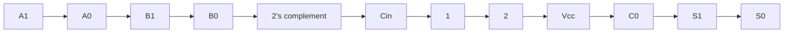
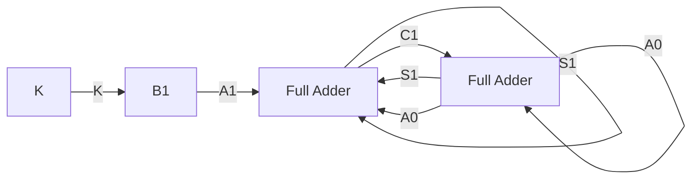

4. Distributive: $A \cdot (B + C) = (A \cdot B) + (A \cdot C)$ , $A + (B \cdot C) = (A + B) \cdot (A + C)$ .  
5. Identity: $A + 0 = A$ , $A \cdot 1 = A$ .  
6. Complement: $A + \bar{A} = 1, A \cdot \bar{A} = 0$ .

• Theorems and Identities:

- Idempotence: $A + A = A$ , $A \cdot A = A$ .  
○ Absorption: $A + (A \cdot B) = A$ , $A \cdot (A + B) = A$ .  
- Consensus: $(A \cdot B) + (\bar{A} \cdot C) + (\bar{B} \cdot C) = (A \cdot B) + (\bar{A} \cdot C)$ . (If $B \cdot C$ is redundant).  
- De Morgan's Laws: $\overline{A + B} = \bar{A} \cdot \bar{B}, \overline{A \cdot B} = \bar{A} + \bar{B}$ .  
- Involution: $\overline{\bar{A}} = A$ .  
- Null Elements: $A + 1 = 1, A \cdot 0 = 0$ .

\- Common Pitfalls: Forgetting the dual of De Morgan's Law. Incorrectly applying consensus theorem.

\- Problem-solving: Simplify Boolean expressions using theorems. Prove identities.

# Booths Algorithm

Booth's algorithm is a multiplication algorithm that multiplies two signed binary numbers in 2's complement representation. It is efficient for numbers with long sequences of 0s or 1s.

\- Core Idea: Instead of adding partial products for every '1' in the multiplier, it looks at pairs of bits in the multiplier.

。00 → No operation (0 \* multiplicand).  
。01 → Add multiplicand.  
。10 → Subtract multiplicand (add 2's complement).  
- 11 → No operation (0 \* multiplicand).

\- Steps:

1. Initialize Product (P) to 0, Multiplicand (M), Multiplier (Q), and an extra bit $Q_{-1} = 0$ .  
2. Repeat n times (where n is the number of bits in Q):

\- Examine $Q_{0}Q_{-1}$ :

- If 01: $P = P + M$ .  
- If 10: $P = P - M$ (add 2's complement of M).  
- If 00 or 11: No operation.

\- Arithmetic Right Shift (ASHR) the combined register $PQQ_{-1}$ .

3. The final product is in PQ.

- Common Pitfalls: Incorrectly performing 2's complement subtraction. Errors in arithmetic right shift (especially for negative numbers). Forgetting the $Q_{-1}$ bit.  
- Problem-solving: Trace the algorithm step-by-step for given signed numbers.

# Canonical Normal Form

Canonical normal forms are standard forms for Boolean expressions, ensuring uniqueness for a given function. They are useful for comparison and synthesis.

\- Canonical Sum of Products (SOP) / Minterm Canonical Form: A sum of minterms. Each minterm is a product term where all variables appear exactly once, either in true or complemented form.

- A minterm is 1 for exactly one combination of inputs.  
- Example: For $F(A, B) = A + B$ , minterms are $\bar{A}B, A\bar{B}, AB$ . So $F(A, B) = \bar{A}B + A\bar{B} + AB$ .  
- Notation: $\sum m(i,j,k,\ldots)$ , where $i,j,k$ are decimal equivalents of minterms.

\- Canonical Product of Sums (POS) / Maxterm Canonical Form: A product of maxterms. Each maxterm is a sum term where all variables appear exactly once, either in true or complemented form.

- A maxterm is 0 for exactly one combination of inputs.  
- Example: For $F(A, B) = A \cdot B$ , maxterms are $A + B, A + \bar{B}, \bar{A} + B$ . So

$$
F (A, B) = (A + B) \cdot (A + \bar {B}) \cdot (\bar {A} + B).
$$

\- Notation: $\prod M(i,j,k,\ldots)$ , where $i, j, k$ are decimal equivalents of maxterms.

- Relationship: If $F = \sum m(i,j,k)$ , then $\bar{F} = \sum m(\text{other indices})$ . Also, $F = \prod M(\text{other indices})$ .  
- Common Pitfalls: Confusing minterms with maxterms, and their corresponding sum/product forms. Incorrectly converting between SOP and POS canonical forms.  
- Problem-solving: Convert truth tables to canonical SOP/POS. Convert between canonical SOP and POS.

# Carry Generator

A carry generator is a combinational circuit used in adders, particularly in Carry Look-Ahead Adders, to quickly compute carry bits, thereby speeding up addition.

- Core Idea: It uses generate (G) and propagate (P) signals to calculate carries in parallel, rather than waiting for them to ripple.  
$\circ G_{i}=A_{i}\cdot B_{i}$ (carry is generated if both input bits are 1).  
$\circ P_{i} = A_{i}\oplus B_{i}$ (carry is propagated if one input bit is 1).  
$\circ C_{i + 1} = G_{i} + (P_{i}\cdot C_{i})$ (carry out is generated or propagated from carry in).  
- Look-ahead Logic: For a 4-bit block, the carry out $C_4$ can be expressed directly in terms of $C_0$ and the $G_i, P_i$ terms, as shown in the Adder section.  
- Problem-solving: Derive carry equations for multi-bit carry look-ahead blocks.

# Circuit Output

The circuit output refers to the final value(s) produced by a digital circuit based on its inputs and internal logic. It can be a single bit or a multi-bit word.

- Combinational Circuits: Output depends only on the present inputs.  
- Sequential Circuits: Output depends on present inputs and past inputs (stored state).  
- Analysis: For a given circuit diagram, determine the Boolean expression for the output(s) in terms of the inputs.  
- Problem-solving: Derive truth tables or Boolean expressions from circuit diagrams. Evaluate output for specific input combinations.

# Combinational Circuit

A combinational circuit is a type of digital circuit whose output depends solely on the current values of its inputs. It has no memory elements.

# - Characteristics:

- No feedback loops.  
- Output changes instantaneously with input changes (after propagation delay).  
- Examples: Adders, Subtractors, Decoders, Encoders, Multiplexers, Demultiplexers.

# - Design Steps:

1. Define the problem (inputs, outputs).  
2. Derive the truth table.  
3. Obtain simplified Boolean expressions (K-map, Quine-McCluskey).  
4. Draw the logic diagram.  
- Common Pitfalls: Confusing combinational with sequential circuits. Overlooking propagation delays in timing analysis.  
- Problem-solving: Design circuits from specifications. Analyze existing circuits.

# Conjunctive Normal Form

Conjunctive Normal Form (CNF) is a standardized way of writing Boolean expressions as a conjunction (AND) of clauses, where each clause is a disjunction (OR) of literals.

- Core Idea: A product of sums (POS) form where each sum term (clause) contains one or more literals. It is not necessarily canonical (i.e., not all variables need to be present in each clause).  
- Example: $(A + \bar{B}) \cdot (\bar{A} + C)$ .  
- Relationship to Canonical POS: Canonical POS (maxterm form) is a specific type of CNF where each clause is a maxterm (contains all variables).  
- Problem-solving: Convert Boolean expressions to CNF.

# Decoder

A decoder is a combinational circuit that converts n input lines into $2^{n}$ output lines. Only one output line is active (high or low) at any given time, corresponding to the binary value of the inputs.

# - Types:

- Binary Decoder (n-to-2 $^{n}$ ): E.g., 2-to-4 decoder, 3-to-8 decoder.  
BCD-to-7 Segment Decoder: Converts BCD input to control a 7-segment display.  
- Enable Input: Most decoders have an enable input (E). If E is inactive, all outputs are inactive.

- Applications: Memory address decoding, data demultiplexing, implementing Boolean functions.  
- An n-to- $2^{n}$ decoder can implement any n-variable Boolean function by ORing the appropriate minterms.  
- Common Pitfalls: Incorrectly interpreting active-high vs. active-low outputs.  
- Problem-solving: Design decoders. Use decoders to implement Boolean functions.

# Digital Circuits

Digital circuits are electronic circuits that operate on discrete voltage levels, typically representing binary 0 and 1. They form the basis of all modern digital systems.

\- Categories:

- Combinational Circuits: Output depends only on current inputs (e.g., gates, adders, decoders).  
Sequential Circuits: Output depends on current inputs and past inputs (memory elements) (e.g., flip-flops, counters, registers).

\- Logic Gates: AND, OR, NOT, NAND, NOR, XOR, XNOR are the basic building blocks.

• Key Properties: Speed (propagation delay), Power Consumption, Fan-in/Fan-out, Noise Margin.

\- Problem-solving: Analyze and design circuits using logic gates.

# Digital Counter

A digital counter is a sequential circuit that cycles through a predefined sequence of states upon receiving input clock pulses. It's essentially a register that increments or decrements its stored value.

\- Types:

○ Asynchronous (Ripple) Counter: Flip-flops are cascaded, and the output of one FF clocks the next. Simple to design but suffers from propagation delay.

\- Synchronous Counter: All flip-flops are clocked simultaneously by a common clock pulse. More complex design but faster and more reliable.

\- Up/Down Counter: Can count in increasing or decreasing order.

Mod-N Counter: Counts from 0 to N-1 and then resets.

\- Design: Involves state diagrams, state tables, flip-flop excitation tables, and K-maps for logic minimization.

\- Formulas: For an n-bit counter, it can count up to $2^{n}$ states (0 to $2^{n} - 1$ ).

\- Common Pitfalls: Incorrectly determining the modulus of a counter. Errors in state table derivation or K-map minimization for synchronous counters.

\- Problem-solving: Analyze existing counter circuits. Design synchronous counters for specific sequences.

# Dual Function

The dual of a Boolean expression is obtained by interchanging OR and AND operations, and 0s and 1s. Variables and their complements remain unchanged.

\- Procedure:

1. Replace all '+' with '.' (OR with AND).  
2. Replace all '.' with '+' (AND with OR).  
3. Replace all '0' with '1'.  
4. Replace all '1' with '0'.

\- Example: Dual of $F = A \cdot B + 0$ is $F^D = (A + B) \cdot 1$ .

\- Principle of Duality: If a Boolean identity is true, its dual is also true.

\- Common Pitfalls: Accidentally complementing variables when finding the dual.

\- Problem-solving: Find the dual of a given Boolean expression.

# Finite State Machines (FSM)

Finite State Machines (FSMs) are mathematical models of computation used to design sequential circuits. They consist of a finite number of states, transitions between states, and actions based on inputs.

\- Components: States, Inputs, Outputs, Transitions.

\- Types:

- Mealy Machine: Output depends on the present state AND the present input.  
- Moore Machine: Output depends only on the present state.

\- Representation: State diagrams, state tables.

\- Design Steps:

1. State Diagram.  
2. State Table.  
3. State Assignment (binary encoding).  
4. Flip-flop excitation table.  
5. K-maps for input equations and output equations.  
6. Logic diagram.

\- Common Pitfalls: Confusing Mealy and Moore outputs. Errors in state assignment or deriving excitation equations.

\- Problem-solving: Design FSMs from specifications. Analyze given FSMs.

# Fixed Point Representation

Fixed-point representation is a method of representing real numbers where the position of the binary point (radix point) is fixed. It's used for numbers with a limited range and high precision.

\- Format: $I.F$ where $I$ is the integer part and $F$ is the fractional part.

\- For an n-bit number with k bits for the fractional part, the range is $-2^{n-k-1}$ to $2^{n-k-1} - 2^{-k}$ (for signed 2's complement).

\- Value: $\sum_{i = -(k)}^{n - k - 1} b_i 2^i$ .

\- Signed Fixed-Point: Typically uses 2's complement for negative numbers.

\- Common Pitfalls: Incorrectly determining the range or precision for a given bit allocation.

\- Problem-solving: Convert decimal numbers to fixed-point binary and vice-versa. Perform arithmetic operations.

# Flip Flop

A flip-flop is a basic 1-bit memory element (sequential circuit) that can store a binary value (0 or 1). It has two stable states and is often edge-triggered.

• Types and Characteristics:

\- SR Flip-Flop: Set-Reset.

- Characteristic Equation: $Q_{next} = S + \bar{R}Q$ , $SR = 0$ (forbidden state if $\mathrm{SR} = 1$ ).  
- Excitation Table:

<table><tr><td> $Q_{n}$ </td><td> $Q_{n+1}$ </td><td> $\mathbf{SR}$ </td></tr><tr><td>0</td><td>0</td><td>0 X</td></tr><tr><td>0</td><td>1</td><td>1 0</td></tr><tr><td>1</td><td>0</td><td>0 1</td></tr><tr><td>1</td><td>1</td><td>X0</td></tr></table>

\- JK Flip-Flop: J-K. Overcomes SR's forbidden state (toggle if JK=11).

- Characteristic Equation: $Q_{next} = J\bar{Q} + \bar{K}Q$ .  
- Excitation Table:

<table><tr><td> $Q_{n}$ </td><td> $Q_{n+1}$ </td><td> $\mathbf{J}$ </td><td> $\mathbf{K}$ </td></tr><tr><td>0</td><td>0</td><td>0</td><td> $\mathbf{X}$ </td></tr><tr><td>0</td><td>1</td><td>1</td><td> $\mathbf{X}$ </td></tr><tr><td>1</td><td>0</td><td> $\mathbf{X}$ </td><td>1</td></tr><tr><td>1</td><td>1</td><td> $\mathbf{X}$ </td><td>0</td></tr></table>

\- D Flip-Flop: Data. Stores the input D when clocked.

- Characteristic Equation: $Q_{next} = D$ .  
- Excitation Table:

<table><tr><td> $Q_n$ </td><td> $Q_{n+1}$ </td><td> $\mathbf{D}$ </td></tr><tr><td>0</td><td>0</td><td>0</td></tr><tr><td>0</td><td>1</td><td>1</td></tr><tr><td>1</td><td>0</td><td>0</td></tr><tr><td>1</td><td>1</td><td>1</td></tr></table>

\- T Flip-Flop: Toggle. Toggles its state if $T = 1$ , holds if $T = 0$ .

\- Characteristic Equation: $Q_{next} = T\bar{Q} + \bar{T}Q = T \oplus Q$ .

\- Excitation Table:

<table><tr><td> $Q_{n}$ </td><td> $Q_{n+1}$ </td><td> $\mathbf{T}$ </td></tr><tr><td>0</td><td>0</td><td>0</td></tr><tr><td>0</td><td>1</td><td>1</td></tr></table>

```txt
1 0 1
1 1 0
```

- Edge-Triggered vs. Level-Triggered: Flip-flops are edge-triggered (positive or negative), latches are level-triggered.  
- Setup Time: Data must be stable before clock edge.  
- Hold Time: Data must be stable after clock edge.  
- Propagation Delay: Time for output to change after clock edge.  
- Common Pitfalls: Confusing characteristic equations with excitation tables. Misinterpreting edge vs. level triggering.  
- Problem-solving: Analyze flip-flop behavior. Use flip-flops to design sequential circuits.

# Floating Point Representation

Floating-point representation is a method to represent real numbers over a wider dynamic range than fixed-point, at the cost of precision. It uses a sign, exponent, and mantissa (significand).

- Format: $\pm M \times B^{E}$ , where M is mantissa, B is base, E is exponent.  
- Normalization: Mantissa is typically normalized to have a leading '1' (implicit in IEEE standard).  
- Bias: Exponent is stored in biased form to allow representation of both positive and negative exponents without a separate sign bit. Biased exponent = Actual exponent + Bias.  
- Common Pitfalls: Errors in converting between decimal and floating-point, especially with bias and normalization.  
- Problem-solving: Convert numbers to/from floating-point format. Understand the implications of range and precision.

# Functional Completeness

A set of logic gates is functionally complete if any Boolean function can be implemented using only gates from that set.

• Minimum Functionally Complete Sets:

○ {AND, OR, NOT}  
○ {NAND} (NAND is universal)  
- {NOR} (NOR is universal)  
○ {AND, NOT}  
○ {OR, NOT}

\- Properties: To be functionally complete, a set of gates must be able to implement NOT, AND, and OR (or NAND/NOR). This requires the ability to implement:

- Inversion (NOT)  
- AND (or OR)  
- The set must not be monotonic (cannot implement NOT).  
- The set must not be self-dual (cannot implement NOT).  
- The set must not be linear (cannot implement AND/OR).  
- The set must not preserve 0 (cannot implement NOT).  
- The set must not preserve 1 (cannot implement NOT).

\- Common Pitfalls: Incorrectly identifying functionally complete sets.

\- Problem-solving: Determine if a given set of gates is functionally complete. Implement basic gates using a universal gate.

# IEEE Representation

The IEEE 754 standard defines formats for representing floating-point numbers in computers, ensuring consistency across different platforms.

\- Single Precision (32-bit):

- 1 bit for Sign (S)  
- 8 bits for Exponent (E) - biased by 127  
- 23 bits for Mantissa (M) - implicit leading '1'  
- Value: $(-1)^{S} \times (1.M)_{base2} \times 2^{(E - 127)}$  
- Range: Approx. ±1.17 × 10 $^{-38}$ to ±3.4 × 10 $^{38}$

• Double Precision (64-bit):

- 1 bit for Sign (S)  
- 11 bits for Exponent (E) - biased by 1023

- 52 bits for Mantissa (M) - implicit leading '1'  
- Value: $(-1)^{S} \times (1.M)_{base2} \times 2^{(E - 1023)}$

# - Special Values:

- Zero: $E = 0, M = 0$  
- Denormalized Numbers: $E = 0, M \neq 0$ (for very small numbers, implicit leading '0')  
- Infinity: $E = \text{all 1s}, M = 0$  
- NaN (Not a Number): $E = \text{all 1s}, M \neq 0$

\- Common Pitfalls: Forgetting the implicit leading '1' in the mantissa. Incorrectly applying the exponent bias.

Handling special values.

\- Problem-solving: Convert decimal numbers to IEEE 754 format and vice-versa. Understand the representation of special values.

# K Map (Karnaugh Map)

A K-map is a graphical method for simplifying Boolean expressions. It provides a systematic way to find the minimal sum-of-products (SOP) or product-of-sums (POS) form.

\- Core Idea: Arranges minterms (or maxterms) in a grid such that adjacent cells differ by only one bit, allowing visual identification of adjacent terms for grouping.

# - Grouping Rules:

- Groups must be powers of 2 (1, 2, 4, 8, ...).  
- Groups must be rectangular or square.  
- Groups can wrap around the edges.  
- Groups should be as large as possible.  
- Every '1' (for SOP) or '0' (for POS) must be covered at least once.

- Prime Implicant (PI): A product term obtained by combining the maximum possible number of adjacent cells in a K-map.  
- Essential Prime Implicant (EPI): A prime implicant that covers at least one minterm (or maxterm) that no other prime implicant covers. EPIs must be included in the minimal expression.  
- Don't Cares (X): Input combinations that never occur or whose output doesn't matter. They can be grouped with 1s (for SOP) or 0s (for POS) to make larger groups.  
- Common Pitfalls: Incorrect grouping (non-power of 2, non-rectangular). Not identifying all EPIs. Not finding the minimal set of PIs.  
- Problem-solving: Simplify Boolean expressions using K-maps for up to 4-5 variables.

# Little Endian Big Endian

These terms refer to the byte ordering conventions used to store multi-byte data (like integers or floating-point numbers) in computer memory.

\- Big-Endian: The most significant byte (MSB) of a multi-byte data unit is stored at the lowest memory address.

\- Example: For $(0x12345678)_{16}$ , at address 1000:

Address Value

<table><tr><td>1000</td><td>12</td></tr><tr><td>1001</td><td>34</td></tr><tr><td>1002</td><td>56</td></tr><tr><td>1003</td><td>78</td></tr></table>

\- Little-Endian: The least significant byte (LSB) of a multi-byte data unit is stored at the lowest memory address.

• Example: For $(0x12345678)_{16}$ , at address 1000:

Address Value

<table><tr><td>1000</td><td>78</td></tr><tr><td>1001</td><td>56</td></tr><tr><td>1002</td><td>34</td></tr><tr><td>1003</td><td>12</td></tr></table>

- Common Pitfalls: Confusing the two, especially when dealing with memory dumps or network protocols.  
- Problem-solving: Determine how a given multi-byte value would be stored in memory under both endianness conventions.

# Memory Interfacing

Memory interfacing involves connecting memory chips to a processor or other digital system, ensuring proper address decoding, data transfer, and control signaling.

\- Address Decoding: Logic circuitry that selects the correct memory chip (or block within a chip) based on the address provided by the processor.

- Full Decoding: Every unique address maps to a unique memory location.  
- Partial Decoding: Multiple addresses map to the same memory location (simpler but less efficient).

- Chip Select (CS): An input pin on memory chips that, when active, enables the chip for read/write operations. Address decoders generate the CS signal.  
- Output Enable (OE) / Read (RD): Enables data output from memory.  
- Write Enable (WE) / Write (WR): Enables data input to memory.  
- Memory Map: A diagram showing how memory addresses are allocated to different memory devices.  
- Formulas: For a memory chip with N address lines and M data lines, its capacity is $2^{N} \times M$ bits.  
- Common Pitfalls: Incorrectly designing address decoding logic. Miscalculating memory capacity or address range.  
- Problem-solving: Design address decoding circuits for given memory chips and address ranges. Calculate memory capacity.

# Min No Gates

Minimizing the number of gates refers to finding the simplest possible logic circuit to implement a given Boolean function, often after minimizing the Boolean expression.

- Core Idea: Directly related to Boolean expression simplification (K-maps, Quine-McCluskey). Fewer terms and fewer literals generally mean fewer gates.  
- Considerations:

- Gate Type: NAND/NOR implementations often require fewer gates than AND/OR/NOT for universal logic.  
- Fan-in: Gates have a maximum number of inputs.  
- Gate Cost: Sometimes gates have different costs (e.g., XOR is more complex than AND).

\- Problem-solving: After K-map simplification, draw the circuit using the minimal SOP/POS. Then convert to universal gates (NAND/NOR) if specified, and count the gates.

# Min Products of Sum Form (MPOS)

The minimal Product of Sums (POS) form is the simplest Boolean expression representing a function as a product of sum terms (maxterms or sum literals).

\- Derivation:

1. Identify the '0's in the truth table or K-map.  
2. Group the '0's in the K-map (following K-map rules).  
3. Each group corresponds to a sum term.  
4. The product of these sum terms is the minimal POS expression.

- Properties: Each sum term is an implicant of the complement of the function.  
- Common Pitfalls: Incorrectly forming sum terms from K-map groups (e.g., $\bar{A}$ for $A=1$ ).  
- Problem-solving: Use K-maps to find the minimal POS expression.

# Min Sum of Products Form (MSOP)

The minimal Sum of Products (SOP) form is the simplest Boolean expression representing a function as a sum of product terms (minterms or product literals).

\- Derivation:

1. Identify the '1's in the truth table or K-map.  
2. Group the '1's in the K-map (following K-map rules).  
3. Each group corresponds to a product term.  
4. The sum of these product terms is the minimal SOP expression.

- Properties: Each product term is an implicant of the function.  
- Common Pitfalls: Not identifying all essential prime implicants. Not selecting the minimal set of prime implicants to cover all 1s.  
- Problem-solving: Use K-maps to find the minimal SOP expression.

# Multiplexer (MUX)

A multiplexer (MUX) is a combinational circuit that selects one of several input data lines and routes it to a single output line. The selection is controlled by a set of select lines.

- Core Idea: An n-to-1 MUX has n data inputs, $\log_2 n$ select lines, and 1 output.  
- Functionality: If there are 's' select lines, it can select from $2^{s}$ data inputs.  
- Applications: Data selection, parallel-to-serial conversion, implementing Boolean functions.  
- An n-variable Boolean function can be implemented using a $(n - 1)$ -variable MUX and external logic on the data inputs.  
- Formulas: For a 2-to-1 MUX with select S, inputs $I_0, I_1$ : $Output = \bar{S}I_0 + SI_1$ .  
- Common Pitfalls: Incorrectly mapping inputs to select lines when implementing functions.  
- Problem-solving: Design MUX circuits. Use MUXes to implement Boolean functions.

# Number Representation

Number representation refers to the various ways in which numerical values (integers, real numbers) are stored and manipulated in digital systems.

\- Unsigned Binary: All bits represent magnitude. Range for n bits: 0 to $2^{n} - 1$ .

\- Signed Magnitude: MSB is sign bit (0 for positive, 1 for negative), remaining bits are magnitude.

- Range for n bits: $-(2^{n-1} - 1)$ to $+(2^{n-1} - 1)$ .  
- Two representations for zero (+0, -0).

\- 1's Complement: Negative numbers are obtained by inverting all bits of the positive number.

- Range for n bits: $-(2^{n-1} - 1)$ to $+(2^{n-1} - 1)$ .  
- Two representations for zero (+0, -0).  
- Addition: Add normally, then add end-around carry to the sum.

\- 2's Complement: Negative numbers are obtained by inverting all bits and adding 1 to the result. Most common representation for signed integers.

- Range for n bits: $-2^{n-1}$ to $+(2^{n-1} - 1)$ .  
- Unique representation for zero.  
- Addition/Subtraction: Perform binary addition directly. Overflow detection: if signs of inputs are same but sign of result is different.

- Fixed-Point and Floating-Point: Covered in their respective sections.  
- Common Pitfalls: Errors in converting between signed representations. Incorrectly detecting overflow.  
- Problem-solving: Convert numbers between different representations. Perform arithmetic operations and detect overflow.

# Number System

A number system is a set of symbols and rules for representing numerical quantities. Digital systems primarily use binary, but conversions to/from decimal, octal, and hexadecimal are common.

- Decimal (Base 10): Digits 0-9.  
• Binary (Base 2): Digits 0, 1.  
- Octal (Base 8): Digits 0-7. Each octal digit corresponds to 3 binary bits.  
- Hexadecimal (Base 16): Digits 0-9, A-F. Each hex digit corresponds to 4 binary bits.  
- Conversions:

- Decimal to Binary/Octal/Hex: Repeated division by base, collecting remainders.  
- Binary/Octal/Hex to Decimal: Sum of (digit \* base^position).  
- Binary to Octal/Hex: Group bits (3 for octal, 4 for hex) and convert each group.  
- Octal/Hex to Binary: Convert each digit to its 3/4-bit binary equivalent.

- Common Pitfalls: Errors in base conversions, especially with fractional parts.  
- Problem-solving: Perform conversions between any two number systems.

# Prime Implicants

In Boolean algebra simplification (e.g., using K-maps), a prime implicant (PI) is a product term that cannot be combined with any other term to eliminate a literal.

- Core Idea: It represents a maximal group of adjacent 1s (or 0s for POS) in a K-map.  
- Essential Prime Implicant (EPI): A prime implicant that covers at least one minterm (or maxterm) that no other prime implicant covers. All EPIs must be included in the minimal expression.

- Redundant Prime Implicant: A prime implicant whose covered minterms are all covered by other prime implicants (including EPIs).  
- Problem-solving: Identify all PIs and EPIs from a K-map. Use them to derive minimal SOP/POS expressions.

# ROM (Read-Only Memory)

ROM is a non-volatile memory device whose contents are programmed during manufacturing or by the user and cannot be easily changed during operation. It's used to store fixed programs or lookup tables.

# - Types:

- Mask ROM: Programmed during manufacturing.  
- PROM (Programmable ROM): User-programmable once.  
- EPROM (Erasable PROM): Erasable by UV light, reprogrammable.  
- EEPROM (Electrically Erasable PROM): Electrically erasable, reprogrammable.  
- Flash Memory: A type of EEPROM, block-erasable.

\- Structure: Consists of an address decoder and an array of memory cells (fuses/transistors).

\- An n-input, m-output ROM can implement m different n-variable Boolean functions.

\- Applications: Storing BIOS, lookup tables, implementing combinational logic functions.

\- Problem-solving: Determine the size of ROM needed for a given function. Implement Boolean functions using ROM.

# Reduction

Reduction in digital logic refers to the process of simplifying Boolean expressions or minimizing the number of gates/components in a circuit while maintaining its functionality.

# - Methods:

- Boolean Algebra: Applying theorems and postulates.  
- Karnaugh Maps (K-maps): Graphical method for up to 5-6 variables.  
- Quine-McCluskey Algorithm: Tabular method for more variables, suitable for computer implementation.

\- Goals: Reduce cost (fewer gates), reduce power consumption, increase speed (fewer gate delays).

\- Common Pitfalls: Not finding the absolute minimal form. Errors in applying simplification rules.

\- Problem-solving: Apply various reduction techniques to simplify Boolean expressions.

# Ripple Counter Operation

A ripple counter (asynchronous counter) is a sequential circuit where the output of one flip-flop serves as the clock input for the next flip-flop in the chain.

# - Operation:

- The first flip-flop (LSB) is clocked by the external clock.  
- Its output (Q) then clocks the next flip-flop, and so on.  
- This creates a "ripple" effect as the clock signal propagates through the stages.

# - Characteristics:

- Simple Design: Easy to construct.  
- Propagation Delay: The total delay accumulates through each flip-flop, leading to a maximum operating frequency limitation. $T_{total} = n \times T_{FF\_delay}$ .  
- Glitches: Due to varying propagation delays, intermediate states may appear briefly, causing glitches.

- Modulus: An n-bit ripple counter counts $2^{n}$ states (Mod- $2^{n}$ ). To achieve Mod-N, external logic is needed to reset the counter at N.  
- Common Pitfalls: Overlooking the cumulative propagation delay. Incorrectly determining the count sequence or modulus.  
- Problem-solving: Analyze the timing and counting sequence of ripple counters. Calculate maximum operating frequency.

# Shift Registers

A shift register is a sequential circuit capable of storing binary data and shifting it left or right by one or more bit positions on each clock pulse.

# - Types:

\- SISO (Serial-In, Serial-Out): Data enters and exits serially.

- SIPO (Serial-In, Parallel-Out): Data enters serially, but all bits are available simultaneously at parallel outputs.  
- PISO (Parallel-In, Serial-Out): Data enters in parallel, then shifts out serially.  
- PIPO (Parallel-In, Parallel-Out): Data enters and exits in parallel.  
- Bidirectional Shift Register: Can shift data both left and right.  
- Universal Shift Register: Can perform all the above operations (SISO, SIPO, PISO, PIPO, load, hold).

\- Applications: Data conversion (serial-to-parallel, parallel-to-serial), data manipulation, sequence generation, arithmetic operations (multiplication/division by powers of 2).

- Structure: Typically built using D flip-flops.  
- Common Pitfalls: Incorrectly tracing data movement for different shift register types.  
- Problem-solving: Analyze the operation of various shift registers. Design circuits using shift registers.

# Static Hazard

A static hazard is a momentary undesirable glitch (a brief 0 or 1 pulse) in the output of a combinational circuit when the input changes, even though the output should remain constant.

# - Types:

Static-1 Hazard: Output should remain 1 but momentarily goes to 0. Occurs when a K-map has two adjacent 1s that are covered by different prime implicants, and there's no overlapping prime implicant to cover the transition path.  
Static-0 Hazard: Output should remain 0 but momentarily goes to 1. Occurs in POS implementations.

- Cause: Unequal propagation delays through different paths in the circuit.  
- Detection: In a K-map for SOP, a static-1 hazard exists between two adjacent 1s if they are not covered by a common prime implicant.  
- Elimination: Add redundant prime implicants to cover all adjacent pairs of 1s (for static-1 hazards) or 0s (for static-0 hazards). This means adding an extra AND gate (for SOP) or OR gate (for POS).  
- Common Pitfalls: Forgetting to check for hazards in minimal circuits. Incorrectly adding redundant terms.  
- Problem-solving: Identify static hazards in a given circuit or K-map. Eliminate hazards by adding redundant terms.

# Synchronous Asynchronous Circuits

This distinction refers to how sequential circuits handle timing and state changes.

# - Synchronous Circuits:

- All memory elements (flip-flops) are controlled by a single, common clock signal.  
- State changes occur only at discrete clock edges.  
- Easier to design and debug due to predictable timing.  
- Less prone to race conditions and hazards.  
- Examples: Synchronous counters, shift registers, FSMs.

# • Asynchronous Circuits:

- Memory elements are not controlled by a common clock.  
- State changes occur in response to changes in input signals, without a clock.  
- Can be faster (no clock propagation delay) and consume less power.  
- Much harder to design and verify due to potential for race conditions and hazards.  
- Examples: Asynchronous (ripple) counters, latches, arbiters.

- Common Pitfalls: Confusing the characteristics and trade-offs of each type. Incorrectly identifying a circuit as synchronous or asynchronous.  
- Problem-solving: Understand the timing behavior of both types of circuits.

# Quick Formula Reference

# - Half Adder:

$\circ S = A \oplus B$  
$\circ C_{out}=A\cdot B$

# - Full Adder:

$\circ S = A \oplus B \oplus C_{in}$  
$\circ C_{out} = (A \cdot B) + (C_{in} \cdot (A \oplus B))$  
$\circ C_{out} = (A \cdot B) + (B \cdot C_{in}) + (C_{in} \cdot A)$

# - Carry Look-Ahead Adder (stage i):

$\circ P_{i} = A_{i}\oplus B_{i}$  
$\circ G_{i}=A_{i}\cdot B_{i}$

$\circ S_{i} = P_{i}\oplus C_{i}$  
$\circ C_{i + 1} = G_{i} + (P_{i}\cdot C_{i})$

- Binary to Gray Code: $G_{i} = B_{i} \oplus B_{i+1}$ (with $B_{n} = 0$ for MSB, or $G_{MSB} = B_{MSB}$ , $G_{i} = B_{i} \oplus B_{i+1}$ for $i < MSB$ ).  
- Gray to Binary Code: $B_{i} = G_{i} \oplus B_{i+1}$ (with $B_{MSB} = G_{MSB}$ ).  
- De Morgan's Laws:

$\circ \overline{A + B} = \bar{A} \cdot \bar{B}$  
$\circ \overline{A\cdot B} = \bar{A} +\bar{B}$

\- Absorption Law:

$\circ A + (A \cdot B) = A$  
$\circ A \cdot (\dot{A} + \dot{B}) = A$

- Consensus Theorem: $(A \cdot B) + (\bar{A} \cdot C) + (B \cdot C) = (A \cdot B) + (\bar{A} \cdot C)$  
- SR Flip-Flop Characteristic Equation: $Q_{next} = S + \bar{R}Q$ (with $SR = 0$ )  
- JK Flip-Flop Characteristic Equation: $Q_{next} = J\bar{Q} + \bar{K}Q$  
- D Flip-Flop Characteristic Equation: $Q_{next} = D$  
- T Flip-Flop Characteristic Equation: $Q_{next} = T \oplus Q$  
- IEEE 754 Single Precision (32-bit): $(-1)^{S} \times (1.M)_{base2} \times 2^{(E - 127)}$  
- IEEE 754 Double Precision (64-bit): $(-1)^{S} \times (1.M)_{base2} \times 2^{(E - 1023)}$  
- Multiplexer (2-to-1): $Output = \bar{S} I_0 + SI_1$  
- Ripple Counter Delay (n-bit): $T_{total} = n \times T_{FF\_delay}$  
- Memory Capacity (N address, M data): $2^{N} \times M$ bits

# Important Tips for GATE

1. Master Boolean Algebra and K-Maps: These are fundamental. Practice simplification extensively for both SOP and POS forms. Be quick and accurate in identifying prime implicants and essential prime implicants.  
2. Understand Number Representations Thoroughly: Pay close attention to signed magnitude, 1's complement, and especially 2's complement. Practice conversions, arithmetic operations (addition, subtraction), and overflow detection for different bit lengths. IEEE 754 floating-point is a recurring topic; know the format, bias, and special values.  
3. Differentiate Combinational vs. Sequential Circuits: Clearly understand their definitions, characteristics, and design methodologies. Be able to identify memory elements (flip-flops, latches) that make a circuit sequential.  
4. Memorize Flip-Flop Characteristic and Excitation Tables: For SR, JK, D, and T flip-flops, these tables are crucial for analyzing and designing sequential circuits (counters, shift registers, FSMs). Don't confuse them.  
5. Practice FSM Design: Be comfortable with state diagrams, state tables, state assignment, and deriving next-state and output equations using K-maps. Pay attention to Mealy vs. Moore machine characteristics.  
6. Beware of "Minimum Number of Gates" Questions: These often require not just Boolean simplification but also considering universal gate implementations (NAND-only or NOR-only logic) and gate fan-in/fan-out constraints.  
7. Focus on Timing and Delays: Understand propagation delays in combinational circuits (e.g., adders) and sequential circuits (e.g., ripple counters). Be able to calculate critical path delays and maximum operating frequencies.  
8. Don't Overlook Hazards: Static hazards are a common trap. Learn how to detect them using K-maps and eliminate them by adding redundant terms.

4.1

Adder (9)

Practice Test: Test 1 (12Q)

# 4.1.1 Adder: GATE CSE 1988 | Question: 4ii

Using binary full adders and other logic gates (if necessary), design an adder for adding 4-bit number (including sign) in $2's$ complement notation.


gate1988 digital-logic descriptive adder

Answer key

# 4.1.2 Adder: GATE CSE 1990 | Question: 1-i

Fill in the blanks:


In the two bit full-adder/subtractor unit shown in below figure, when the switch is in position2 \_\_\_\_ using \_\_\_\_ arithmetic.


<details>
<summary>flowchart</summary>


</details>

gate1990 digital-logic adder fill-in-the-blanks

# Answer key

# 4.1.3 Adder: GATE CSE 1997 | Question: 2.5

An N-bit carry lookahead adder, where $N$ is a multiple of 4, employs ICs 74181 (4 bit ALU) and 74182 (4 bit carry lookahead generator).


The minimum addition time using the best architecture for this adder is

A. proportional to N

B. proportional to $\log N$

C. a constant

D. None of the above

gate1997 digital-logic normal adder

# Answer key

# 4.1.4 Adder: GATE CSE 1999 | Question: 2.16

The number of full and half-adders required to add 16-bit numbers is

A. 8 half-adders, 8 full-adders

B. 1 half-adder, 15 full-adders

C. 16 half-adders, 0 full-adders

D. 4 half-adders, 12 full-adders

gate1999 digital-logic normal adder

# Answer key

# 4.1.5 Adder: GATE CSE 2003 | Question: 46

Consider the ALU shown below.


<details>
<summary>flowchart</summary>


</details>

If the operands are in $2's$ complement representation, which of the following operations can be performed by suitably setting the control lines $K$ and $C_0$ only (+ and - denote addition and subtraction respectively)?

A. $A + B$ , and $A - B$ , but not $A + 1$

B. $A + B$ , and $A + 1$ , but not $A - B$

C. $A + B$ , but not $A - B$ or $A + 1$

D. $A + B$ , and $A - B$ , and $A + 1$

gatecse-2003 digital-logic normal adder