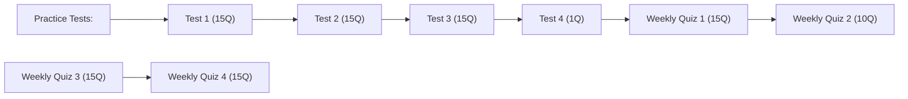
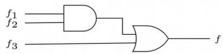
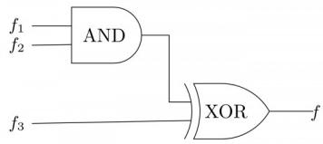
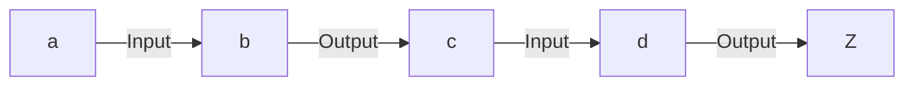
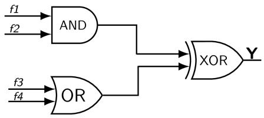
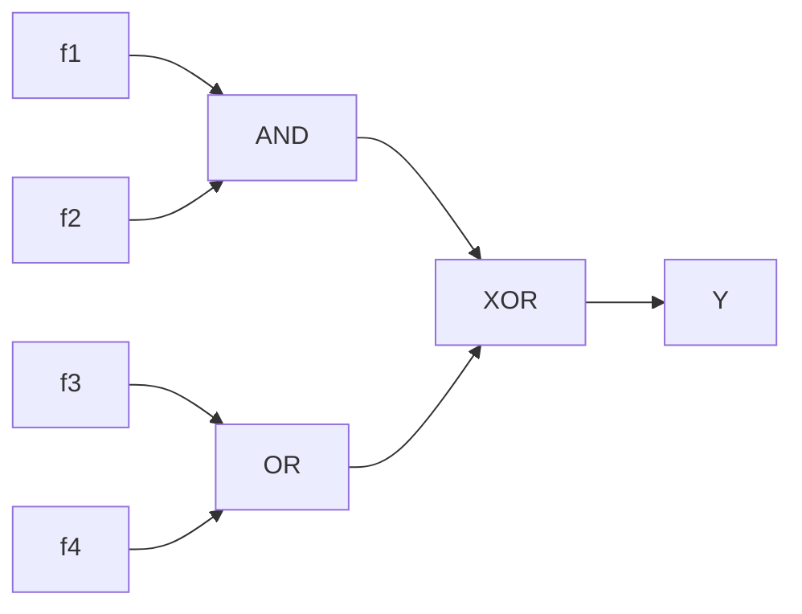

# 4.1.6 Adder: GATE CSE 2004 | Question: 62

A 4-bit carry look ahead adder, which adds two 4-bit numbers, is designed using AND, OR, NOT, NAND, NOR gates only. Assuming that all the inputs are available in both complemented and uncomplemented forms and the delay of each gate is one time unit, what is the overall propagation delay of the adder? Assume that the carry network has been implemented using two-level AND-OR logic.

A. 4 time units

B. 6 time units

C. 10 time units

D. 12 time units

gatecse-2004 digital-logic normal adder

# Answer key

# 4.1.7 Adder: GATE CSE 2015 | Set 2 | Question: 48

A half adder is implemented with XOR and AND gates. A full adder is implemented with two half adders and one OR gate. The propagation delay of an XOR gate is twice that of an AND/OR gate. The propagation delay of an AND/OR gate is 1.2 microseconds. A 4-bit-ripple-carry binary adder is implemented by using four full adders. The total propagation time of this 4-bit binary adder in microseconds is \_\_\_\_.

gatecse-2015-set2 digital-logic adder normal numerical-answers

# Answer key

# 4.1.8 Adder: GATE CSE 2016 | Set 1 | Question: 33

Consider a carry look ahead adder for adding two n-bit integers, built using gates of fan-in at most two. The time to perform addition using this adder is

A. $\Theta(1)$

B. $\Theta (\log (n))$

C. $\Theta(\sqrt{n})$

D. $\Theta(n)$

gatecse-2016-set1 digital-logic adder normal

# Answer key

# 4.1.9 Adder: GATE CSE 2016 | Set 2 | Question: 07

Consider an eight-bit ripple-carry adder for computing the sum of $A$ and $B$ , where $A$ and $B$ are integers represented in 2's complement form. If the decimal value of $A$ is one, the decimal value of $B$ that leads to the longest latency for the sum to stabilize is \_\_\_\_

gatecse-2016-set2 digital-logic adder normal numerical-answers

# Answer key

# 4.2

# Array Multiplier (2)

# 4.2.1 Array Multiplier: GATE CSE 1999 | Question: 1.21

The maximum gate delay for any output to appear in an array multiplier for multiplying two n bit numbers is

A. $O(n^{2})$

B. $O(n)$

c. $O(\log n)$

D. $O(1)$

gate1999 digital-logic normal array-multiplier

# Answer key

# 4.2.2 Array Multiplier: GATE CSE 2003 | Question: 11

Consider an array multiplier for multiplying two $n$ bit numbers. If each gate in the circuit has a unit delay, the total delay of the multiplier is

A. $\Theta(1)$

B. $\Theta (\log n)$

C. $\Theta(n)$

D. $\Theta(n^{2})$

gatecse-2003 digital-logic normal array-multiplier

# Answer key

# 4.3.1 Binary Codes: GATE CSE 2006 | Question: 40

Consider numbers represented in 4-bit Gray code. Let $h_{3}h_{2}h_{1}h_{0}$ be the Gray code representation of a number n and let $g_{3}g_{2}g_{1}g_{0}$ be the Gray code of $(n+1)(modulo16)$ value of the number. Which one of the following functions is correct?

A. $g_{0}(h_{3}h_{2}h_{1}h_{0}) = \sum (1,2,3,6,10,13,14,15)$  
B. $g_{1}(h_{3}h_{2}h_{1}h_{0}) = \sum (4,9,10,11,12,13,14,15)$  
C. $g_{2}(h_{3}h_{2}h_{1}h_{0}) = \sum (2,4,5,6,7,12,13,15)$  
D. $g_{3}(h_{3}h_{2}h_{1}h_{0}) = \sum (0,1,6,7,10,11,12,13)$

gatecse-2006 digital-logic number-representation binary-codes normal

# Answer key

# 4.4

# Boolean Algebra (34)

flowchart

# 4.4.1 Boolean Algebra: GATE CSE 1987 | Question: 1-II

The total number of Boolean functions which can be realised with four variables is:

A. 4

B. 17

C. 256

D. 65,536

gate1987 digital-logic boolean-algebra functions combinatory

# Answer key

# 4.4.2 Boolean Algebra: GATE CSE 1987 | Question: 12-a

The Boolean expression $A \oplus B \oplus A$ is equivalent to

A. $AB + \overline{A}\overline{B}$

B. $\overline{A} B + A\overline{B}$

C. B

D. $\overline{A}$

gate1987 digital-logic boolean-algebra easy

# Answer key

# 4.4.3 Boolean Algebra: GATE CSE 1988 | Question: 2-iii

Let $*$ be defined as a Boolean operation given as $x * y = \overline{x}$ $\overline{y} + xy$ and let $C = A * B$ . If $C = 1$ then prove that $A = B$ .

gate1988 digital-logic descriptive boolean-algebra

# Answer key

# 4.4.4 Boolean Algebra: GATE CSE 1989 | Question: 4-x

A switching function is said to be neutral if the number of input combinations for which its value is 1 is equal to the number of input combinations for which its value is 0. Compute the number of neutral switching functions of n variables (for a given n).

gate1989 descriptive digital-logic boolean-algebra

# Answer key

# 4.4.5 Boolean Algebra: GATE CSE 1989 | Question: 5-a

Find values of Boolean variables A, B, C which satisfy the following equations:

- $A + B = 1$  
- AC = BC

- $A + C = 1$  
- $AB = 0$

gate1989 descriptive digital-logic boolean-algebra

# Answer key

# 4.4.6 Boolean Algebra: GATE CSE 1992 | Question: 02-i

The operation which is commutative but not associative is:

A. AND

B. OR

C. EX-OR

D. NAND

gate1992 easy digital-logic boolean-algebra multiple-selects

# Answer key

# 4.4.7 Boolean Algebra: GATE CSE 1994 | Question: 4

A. Let \* be a Boolean operation defined as $A * B = AB + \overline{A} \overline{B}$ . If $C = A * B$ then evaluate and fill in the blanks:

i. $A * A =$ \_\_\_\_  
ii. $C * A =$ \_\_\_\_

B. Solve the following boolean equations for the values of A, B and C:

$$
\begin{array}{l} A B + \overline {{A}} C = 1 \\ A C + B = 0 \\ \end{array}
$$

gate1994 digital-logic normal boolean-algebra descriptive

# Answer key

# 4.4.8 Boolean Algebra: GATE CSE 1995 | Question: 2.5

What values of A, B, C and D satisfy the following simultaneous Boolean equations?

$$
\overline {{A}} + A B = 0, A B = A C, A B + A \overline {{C}} + C D = \overline {{C}} D
$$

A. $A = 1, B = 0, C = 0, D = 1$

B. $A = 1, B = 1, C = 0, D = 0$

C. $A = 1, B = 0, C = 1, D = 1$

D. $A = 1, B = 0, C = 0, D = 0$

gate1995 digital-logic boolean-algebra easy

# Answer key

# 4.4.9 Boolean Algebra: GATE CSE 1997 | Question: 2-1

Let \* be defined as $x * y = \bar{x} + y$ . Let $z = x * y$ . Value of $z * x$ is

A. $\bar{x} + y$

B. x

C. 0

D. 1

gate1997 digital-logic normal boolean-algebra

# Answer key

# 4.4.10 Boolean Algebra: GATE CSE 1998 | Question: 1.13

What happens when a bit-string is XORed with itself n-times as shown:

$$
[ B \oplus (B \oplus (B \oplus (B \dots n \text {times} ]
$$

A. complements when n is even

B. complements when $n$ is odd

C. divides by $2^{n}$ always

D. remains unchanged when $n$ is even

gate1998 digital-logic normal boolean-algebra

# Answer key

# 4.4.11 Boolean Algebra: GATE CSE 1998 | Question: 2.8

Which of the following operations is commutative but not associative?

A. AND

B. OR

C. NAND

D. EXOR

gate1998 digital-logic easy boolean-algebra

Answer key

# 4.4.12 Boolean Algebra: GATE CSE 1999 | Question: 1.7

Which of the following expressions is not equivalent to $\bar{x}$ ?

A. $x$ NAND $x$

B. $x$ NOR $x$

C. $x$ NAND 1

D. $x$ NOR 1

gate1999 digital-logic easy boolean-algebra

Answer key

# 4.4.13 Boolean Algebra: GATE CSE 2000 | Question: 2.10

The simultaneous equations on the Boolean variables x, y, z and w,

- $x + y + z = 1$  
- $xy = 0$  
- $xz + w = 1$  
- $xy + \bar{z}\bar{w} = 0$

have the following solution for $x, y, z$ and $w$ , respectively:

A. 0100

B. 1101

C. 1011

D. 1000

gatecse-2000 digital-logic boolean-algebra easy

Answer key

# 4.4.14 Boolean Algebra: GATE CSE 2002 | Question: 2-3

Let $f(A,B)=A'+B$ . Simplified expression for function $f(f(x+y,y),z)$ is

A. $x^{\prime} + z$

B. xyz

C. $xy' + z$

D. None of the above

gatecse-2002 digital-logic boolean-algebra normal

Answer key

# 4.4.15 Boolean Algebra: GATE CSE 2004 | Question: 17

A Boolean function $x'y' + xy + x'y$ is equivalent to

A. $x' + y'$

B. $x + y$

C. $x + y'$

D. $x^{\prime} + y$

gatecse-2004 digital-logic easy boolean-algebra

Answer key

# 4.4.16 Boolean Algebra: GATE CSE 2007 | Question: 32

Let $f(w, x, y, z) = \sum (0, 4, 5, 7, 8, 9, 13, 15)$ . Which of the following expressions are NOT equivalent to $f$ ?

P: $x^{\prime}y^{\prime}z^{\prime} + w^{\prime}xy^{\prime} + wy^{\prime}z + xz$  
Q: $w'y'z' +wx'y' + xz$  
R: $w'y'z' +wx'y' + xyz + xy'z$  
S: $x^{\prime}y^{\prime}z^{\prime} +wx^{\prime}y^{\prime} + w^{\prime}y$

A. P only

B. Q and S

C. R and S

D. S only

# 4.4.17 Boolean Algebra: GATE CSE 2007 | Question: 33

Define the connective \* for the Boolean variables X and Y as:

$$
X * Y = X Y + X ^ {\prime} Y ^ {\prime}.
$$

Let $Z = X * Y$ . Consider the following expressions $P, Q$ and $R$ .

$$
P: X = Y * Z,
$$

$$
Q: Y = X * Z,
$$

$$
R: X * Y * Z = 1
$$

Which of the following is TRUE?

A. Only $P$ and $Q$ are valid.

B. Only $Q$ and $R$ are valid.

C. Only $P$ and $\dot{R}$ are valid.

D. All $P, Q, R$ are valid.

gatecse-2007 digital-logic normal boolean-algebra

# Answer key

# 4.4.18 Boolean Algebra: GATE CSE 2008 | Question: 26

If $P, Q, R$ are Boolean variables, then

$(P + \bar{Q})(P.\bar{Q} +P.R)(\bar{P}.\bar{R} +\bar{Q})$ simplifies to

A. $P.\bar{Q}$

B. $P.\bar{R}$

C. $P.\bar{Q} + R$

D. $P, \bar{R} + Q$

gatecse-2008 easy digital-logic boolean-algebra

# Answer key

# 4.4.19 Boolean Algebra: GATE CSE 2012 | Question: 6

The truth table

<table><tr><td>X</td><td>Y</td><td>(X,Y)</td></tr><tr><td>0</td><td>0</td><td>0</td></tr><tr><td>0</td><td>1</td><td>0</td></tr><tr><td>1</td><td>0</td><td>1</td></tr><tr><td>1</td><td>1</td><td>1</td></tr></table>

represents the Boolean function

A. X

B. $X + Y$

C. $X \oplus Y$

D. Y

gatecse-2012 digital-logic easy boolean-algebra

# Answer key

# 4.4.20 Boolean Algebra: GATE CSE 2013 | Question: 21

Which one of the following expressions does NOT represent exclusive NOR of x and y?

A. $xy + x'y'$

B. $x \oplus y'$

C. $x^{\prime}\oplus y$

D. $x' \oplus y'$

gatecse-2013 digital-logic easy boolean-algebra

# Answer key

# 4.4.21 Boolean Algebra: GATE CSE 2014 | Set 3 | Question: 55

Let $\oplus$ denote the exclusive OR (XOR) operation. Let '1' and '0' denote the binary constants. Consider the following Boolean expression for $F$ over two variables $P$ and $Q$ :

$$
F (P, Q) = ((1 \oplus P) \oplus (P \oplus Q)) \oplus ((P \oplus Q) \oplus (Q \oplus 0))
$$

The equivalent expression for $F$ is

A. $P + Q$

B. $\overline{P+Q}$

C. $P \oplus Q$

D. $\overline{P \oplus Q}$

gatecse-2014-set3 digital-logic normal boolean-algebra

# Answer key

# 4.4.22 Boolean Algebra: GATE CSE 2015 | Set 2 | Question: 37

The number of min-terms after minimizing the following Boolean expression is \_\_\_\_.

$$
[ D ^ {\prime} + A B ^ {\prime} + A ^ {\prime} C + A C ^ {\prime} D + A ^ {\prime} C ^ {\prime} D ] ^ {\prime}
$$

gatecse-2015-set2 digital-logic boolean-algebra normal numerical-answers

# Answer key

# 4.4.23 Boolean Algebra: GATE CSE 2016 | Set 1 | Question: 06

Consider the Boolean operator # with the following properties :

$x\#0 = x, x\#1 = \bar{x}, x\#x = 0$ and $x\#\bar{x} = 1$ . Then $x\#y$ is equivalent to

A. $x\bar{y} + \bar{x}y$

B. $x\overline{y} +\overline{x}\overline{y}$

C. $\overline{x}y + xy$

D. $xy + \bar{x} \bar{y}$

gatecse-2016-set1 digital-logic boolean-algebra easy

# Answer key

# 4.4.24 Boolean Algebra: GATE CSE 2016 | Set 2 | Question: 08

Let, $x_{1} \oplus x_{2} \oplus x_{3} \oplus x_{4} = 0$ where $x_{1}, x_{2}, x_{3}, x_{4}$ are Boolean variables, and $\oplus$ is the XOR operator. Which one of the following must always be TRUE?

A. $x_{1}x_{2}x_{3}x_{4} = 0$  
B. $x_{1}x_{3} + x_{2} = 0$  
C. $\bar{x}_1\oplus \bar{x}_3 = \bar{x}_2\oplus \bar{x}_4$  
D. $x_{1} + x_{2} + x_{3} + x_{4} = 0$

gatecse-2016-set2 digital-logic boolean-algebra normal

# Answer key

# 4.4.25 Boolean Algebra: GATE CSE 2017 | Set 2 | Question: 27

If $w, x, y, z$ are Boolean variables, then which one of the following is INCORRECT?

A. $wx + w(x + y) + x(x + y) = x + wy$

B. $\overline{w\bar{x}(y + \bar{z})} +\bar{w} x = \bar{w} +x + \bar{y} z$

C. $(w\bar{x}(y + x\bar{z}) + \bar{w}\bar{x})y = x\bar{y}$

D. $(w + y)(wxy + wyz) = wxy + wyz$

gatecse-2017-set2 digital-logic boolean-algebra normal

# Answer key

# 4.4.26 Boolean Algebra: GATE CSE 2018 | Question: 4

Let $\oplus$ and $\odot$ denote the Exclusive OR and Exclusive NOR operations, respectively. Which one of the following is NOT CORRECT?

A. $\overline{P\oplus Q}=P\odot Q$  
B. $\overline{P} \oplus Q = P \odot Q$  
c. $\overline{P} \oplus \overline{Q} = P \oplus Q$  
D. $P \oplus \overline{P} \oplus Q = (P \odot \overline{P} \odot \overline{Q})$

# 4.4.27 Boolean Algebra: GATE CSE 2019 | Question: 6

Which one of the following is NOT a valid identity?

A. $(x\oplus y)\oplus z = x\oplus (y\oplus z)$  
C. $x \oplus y = x + y$ , if $xy = 0$

B. $(x + y) \oplus z = x \oplus (y + z)$  
D. $x\oplus y = (xy + x'y')'$

gatecse-2019 digital-logic boolean-algebra one-mark

# Answer key

# 4.4.28 Boolean Algebra: GATE CSE 2021 | Set 1 | Question: 42

Consider the following Boolean expression.

$$
F = (X + Y + Z) (\overline {{X}} + Y) (\overline {{Y}} + Z)
$$

Which of the following Boolean expressions is/are equivalent to $\overline{F}$ (complement of $F$ )?

A. $(\overline{X} +\overline{Y} +\overline{Z})(X + \overline{Y})(Y + \overline{Z})$  
B. $X\overline{Y} + \overline{Z}$  
C. $(X + \overline{Z})(\overline{Y} +\overline{Z})$  
D. $X\overline{Y} + Y\overline{Z} + \overline{X}\overline{Y}\overline{Z}$

gatecse-2021-set1 multiple-selects digital-logic boolean-algebra two-marks

# Answer key

# 4.4.29 Boolean Algebra: GATE CSE 2024 | Set 2 | Question: 20

For a Boolean variable x, which of the following statements is/are FALSE?

A. x.1 = x

B. $x + 1 = x$

C. $x \cdot x = 0$

D. $x + \bar{x} = 1$

gatecse-2024-set2 digital-logic boolean-algebra easy multiple-selects one-mark

# Answer key

# 4.4.30 Boolean Algebra: GATE CSE 2025 | Set 1 | Question: 14

Let X be a 3-variable Boolean function that produces output as '1' when at least two of the input variables are '1'. Which of the following statement(s) is/are CORRECT, where a, b, c, d, e are Boolean variables?

A. $X(a,b,X(c,d,e)) = X(X(a,b,c),d,e)$  
B. $X(a,b,X(a,b,c)) = X(a,b,c)$  
C. $X(a,b,X(a,c,d)) = (X(a,b,a)\text{ AND } X(c,d,c))$  
D. $X(a,b,c) = X(a,X(a,b,c),X(a,c,c))$

gatecse2025-set1 digital-logic boolean-algebra multiple-selects one-mark

# Answer key

# 4.4.31 Boolean Algebra: GATE CSE 2025 | Set 2 | Question: 40

Which of the following Boolean algebraic equation(s) is/are CORRECT?

A. $\bar{A}BC + A\bar{B}\bar{C} + \bar{A}\bar{B}\bar{C} + A\bar{B}C + ABC = BC + \bar{B}\bar{C} + \bar{A}\bar{B}$  
B. $AB + \bar{A} C + BC = AB + \bar{A} C$  
C. $(A + C)(\bar{A} + B) = AB + \bar{A} C$  
D. $(A + \bar{B} +\bar{D})(C + D)(\bar{A} +C + D)(A + B + \bar{D}) = \bar{A} D + \bar{C}\bar{D}$

# 4.4.32 Boolean Algebra: GATE CSE 2026 | Set 2 | Question: 6

Which one of the following options is not a property of Boolean Algebra?

Note: + is OR operation, · is AND operation, and / is NOT operation

A. $a + b = b + a$

B. $a \cdot a' = 1$

C. $a + a' = 1$

D. $a \cdot b = b \cdot a$

gatecse-2026-set2 digital-logic boolean-algebra easy one-mark

# Answer key

# 4.4.33 Boolean Algebra: GATE IT 2004 | Question: 44

The function $A\bar{B}C + \bar{A}BC + AB\bar{C} + \bar{A}\bar{B}C + A\bar{B}\bar{C}$ is equivalent to

A. $A\bar{C} + AB + \bar{A} C$

B. $A\bar{B} + A\bar{C} + \bar{A}C$

C. $\bar{A} B + A\bar{C} + A\bar{B}$

D. $\bar{A} B + AC + A\bar{B}$

gateit-2004 digital-logic boolean-algebra easy

# Answer key

# 4.4.34 Boolean Algebra: GATE IT 2005 | Question: 7

Which of the following expressions is equivalent to $(A\oplus B)\oplus C$

A. $(A + B + C)(\bar{A} +\bar{B} +\bar{C})$

B. $(A + B + C)(\bar{A} +\bar{B} +C)$

c. $ABC + \bar{A}(B\oplus C) + \bar{B}(A\oplus C)$

D. None of these

gateit-2005 digital-logic normal boolean-algebra

# Answer key

# 4.5

# Booths Algorithm (7)

Practice Test: Test 1 (6Q)

# 4.5.1 Booths Algorithm: GATE CSE 1990 | Question: 8b

State the Booth's algorithm for multiplication of two numbers. Draw a block diagram for the implementation of the Booth's algorithm for determining the product of two 8-bit signed numbers.

gate1990 descriptive digital-logic booths-algorithm

# Answer key

# 4.5.2 Booths Algorithm: GATE CSE 1996 | Question: 1.23

Booth's algorithm for integer multiplication gives worst performance when the multiplier pattern is

A. 101010...1010

B. 100000...0001

C. 111111...1111

D. 011111...1110

gate1996 digital-logic booths-algorithm normal

# Answer key

# 4.5.3 Booths Algorithm: GATE CSE 1999 | Question: 1.20

Booth's coding in 8 bits for the decimal number -57 is:

A. $0 - 100 + 1000$

B. $0 - 100 + 100 - 1$

C. $0 - 1 + 100 - 10 + 1$

D. $00 - 10 + 100 - 1$

gate1999 digital-logic number-representation booths-algorithm normal

# Answer key

The following two signed 2 's complement numbers (multiplicand M and multiplier Q) are being multiplied using Booth's algorithm:

M: 1100110111101101 and Q: 1010010010101010

The total number of addition and subtraction operations to be performed is \_\_\_\_. (Answer in integer)

gatecse2025-set2 digital-logic booths-algorithm numerical-answers one-mark

Answer key

# 4.5.5 Booths Algorithm: GATE IT 2005 | Question: 8

Using Booth's Algorithm for multiplication, the multiplier -57 will be recoded as

A. 0-1 00 1 0 0-1

C. 0-1001000

gateit-2005 digital-logic booths-algorithm normal

B. 11000111

D. 0100-1001

Answer key

# 4.5.6 Booths Algorithm: GATE IT 2006 | Question: 38

When multiplicand Y is multiplied by multiplier $X = x_{n-1}x_{n-2} \ldots x_{0}$ using bit-pair recoding in Booth's algorithm, partial products are generated according to the following table.

<table><tr><td>Row</td><td> $x_{i+1}$ </td><td> $x_i$ </td><td> $x_{i-1}$ </td><td>Partial Product</td></tr><tr><td>1</td><td>0</td><td>0</td><td>0</td><td>0</td></tr><tr><td>2</td><td>0</td><td>0</td><td>1</td><td>Y</td></tr><tr><td>3</td><td>0</td><td>1</td><td>0</td><td>Y</td></tr><tr><td>4</td><td>0</td><td>1</td><td>1</td><td>2Y</td></tr><tr><td>5</td><td>1</td><td>0</td><td>0</td><td>?</td></tr><tr><td>6</td><td>1</td><td>0</td><td>1</td><td>-Y</td></tr><tr><td>7</td><td>1</td><td>1</td><td>0</td><td>-Y</td></tr><tr><td>8</td><td>1</td><td>1</td><td>1</td><td>?</td></tr></table>

The partial products for rows 5 and 8 are

A. $2 Y$ and $Y$

B. $-2Y$ and $2Y$

C. $-2Y$ and 0

D. 0 and $Y$

gateit-2006 digital-logic booths-algorithm difficult

Answer key

# 4.5.7 Booths Algorithm: GATE IT 2008 | Question: 42

The two numbers given below are multiplied using the Booth's algorithm.

Multiplicand : 0101 1010 1110 1110

Multiplier: 0111 0111 1011 1101

How many additions/Subtractions are required for the multiplication of the above two numbers?

A. 6

B. 8

C. 10

D. 12

gateit-2008 digital-logic booths-algorithm normal

Answer key

4.6

Canonical Normal Form (10)

Practice Test: Test 1 (11Q)

Three switching functions $f_{1}$ , $f_{2}$ and $f_{3}$ are expressed below as sum of minterms.

- $f_{1}(w,x,y,z) = \sum 0,1,2,3,5,12$  
- $f_{2}(w,x,y,z) = \sum 0,1,2,10,13,14,15$  
- $f_{3}(w,x,y,z) = \sum 2,4,5,8$

Express the function $f$ realised by the circuit shown in the below figure as the sum of minterms (in decimal notation).

text_image

f₁
f₂
AND
f₃
OR
f

gate1988 descriptive digital-logic easy circuit-output canonical-normal-form digital-circuits

# Answer key

# 4.6.2 Canonical Normal Form: GATE CSE 2002 | Question: 2-1

Consider the following logic circuit whose inputs are functions $f_{1}$ , $f_{2}$ , $f_{3}$ and output is f

text_image

f₁(x, y, z)
f₂(x, y, z)
f₃(x, y, z) = ?
f(x, y, z)

Given that

- $f_{1}(x,y,z) = \Sigma(0,1,3,5)$  
- $f_{2}(x,y,z) = \Sigma(6,7)$ , and  
- $f(x,y,z) = \Sigma(1,4,5)$ .

$f_{3}$ is

A. $\Sigma(1,4,5)$

C. $\Sigma(0,1,3,5)$

gatecse-2002 digital-logic normal canonical-normal-form circuit-output

B. $\Sigma(6,7)$  
D. None of the above

# Answer key

# 4.6.3 Canonical Normal Form: GATE CSE 2008 | Question: 8

Given $f_{1}, f_{3}$ and $f$ in canonical sum of products form (in decimal) for the circuit

$$
f _ {1} = \Sigma m (4, 5, 6, 7, 8)
$$

$$
f _ {3} = \Sigma m (1, 6, 1 5)
$$

$$
f = \Sigma m (1, 6, 8, 1 5)
$$

then $f_{2}$ is

A. $\Sigma m(4,6)$

C. $\Sigma m(6,8)$

B. $\Sigma m(4,8)$

D. $\Sigma m(4,6,8)$

gatecse-2008 digital-logic canonical-normal-form easy

# Answer key

# 4.6.4 Canonical Normal Form: GATE CSE 2010 | Question: 6

The minterm expansion of $f(P, Q, R) = PQ + Q\bar{R} + P\bar{R}$ is

A. $m_{2} + m_{4} + m_{6} + m_{7}$

B. $m_0 + m_1 + m_3 + m_5$

C. $m_{0} + m_{1} + m_{6} + m_{7}$

D. $m_{2} + m_{3} + m_{4} + m_{5}$

gatecse-2010 digital-logic canonical-normal-form normal

# Answer key

# 4.6.5 Canonical Normal Form: GATE CSE 2015 | Set 3 | Question: 43

The total number of prime implicants of the function $f(w, x, y, z) = \sum (0, 2, 4, 5, 6, 10)$ is \_\_\_\_

gatecse-2015-set3 digital-logic canonical-normal-form normal numerical-answers

# Answer key

# 4.6.6 Canonical Normal Form: GATE CSE 2015 | Set 3 | Question: 44

Given the function $F = P' + QR$ , where $F$ is a function in three Boolean variables $P, Q$ and $R$ and $P' = !P$ , consider the following statements.

$$
(S 1) F = \sum (4, 5, 6)
$$

$$
(S 2) F = \sum (0, 1, 2, 3, 7)
$$

$$
(S 3) F = \Pi (4, 5, 6)
$$

$$
(S 4) F = \Pi (0, 1, 2, 3, 7)
$$

Which of the following is true?

A. (S1)-False, (S2)-True, (S3)-True, (S4)-False  
B. (S1)-True, (S2)-False, (S3)-False, (S4)-True  
C. (S1)-False, (S2)-False, (S3)-True, (S4)-True  
D. (S1)-True, (S2)-True, (S3)-False, (S4)-False

gatecse-2015-set3 digital-logic canonical-normal-form normal

# Answer key

# 4.6.7 Canonical Normal Form: GATE CSE 2019 | Question: 30

Consider three 4-variable functions $f_{1}$ , $f_{2}$ , and $f_{3}$ , which are expressed in sum-of-minterms as

$$
f _ {1} = \Sigma (0, 2, 5, 8, 1 4),
$$

$$
f _ {2} = \Sigma (2, 3, 6, 8, 1 4, 1 5),
$$

$$
f _ {3} = \Sigma (2, 7, 1 1, 1 4)
$$

For the following circuit with one AND gate and one XOR gate the output function f can be expressed as:

text_image

f₁
f₂
AND
f₃
XOR
f

A. $\Sigma(7,8,11)$

B. $\Sigma(2,7,8,11,14)$

C. $\Sigma(2,14)$

D. $\Sigma(0,2,3,5,6,7,8,11,14,15)$

gatecse-2019 digital-logic digital-circuits two-marks canonical-normal-form

# Answer key

# 4.6.8 Canonical Normal Form: GATE CSE 2019 | Question: 50

What is the minimum number of 2-input NOR gates required to implement a 4-variable function expressed in sum-of-minterms form as $f = \Sigma(0, 2, 5, 7, 8, 10, 13, 15)$ ? Assume that all the inputs and their complements are available. Answer: \_\_\_\_

# Answer key

# 4.6.9 Canonical Normal Form: GATE CSE 2020 | Question: 28

Consider the Boolean function $z(a, b, c)$ .

flowchart

Which one of the following minterm lists represents the circuit given above?

A. $z = \sum (0,1,3,7)$  
C. $z = \sum(2, 4, 5, 6, 7)$

B. $z = \sum (1,4,5,6,7)$

gatecse-2020 digital-logic canonical-normal-form two-marks

# Answer key

# 4.6.10 Canonical Normal Form: GATE CSE 2024 | Set 2 | Question: 40

Consider 4-variable functions f1, f2, f3, f4 expressed in sum-of-minterms form as given below.

$$
f 1 = \sum (0, 2, 3, 5, 7, 8, 1 1, 1 3)
$$

$$
f 2 = \sum (1, 3, 5, 7, 1 1, 1 3, 1 5)
$$

$$
f 3 = \sum (0, 1, 4, 1 1)
$$

$$
f 4 = \sum (0, 2, 6, 1 3)
$$

flowchart

With respect to the circuit given above, which of the following options is/are CORRECT?

A. $\mathbf{Y} = \sum (0,1,2,11,13)$  
C. $Y = \sum (0,1,2,3,4,5,6,7)$

B. $Y = \Pi (3,4,5,6,7,8,9,10,12,14,15)$

D. $Y = \Pi (8,9,10,11,12,13,14,15)$

gatecse-2024-set2 digital-logic canonical-normal-form multiple-selects two-marks

# Answer key

# 4.7

# Carry Generator (2)

# 4.7.1 Carry Generator: GATE CSE 2006 | Question: 36

Given two three bit numbers $a_{2}a_{1}a_{0}$ and $b_{2}b_{1}b_{0}$ and c the carry in, the function that represents the carry generate function when these two numbers are added is:

A. $a_2b_2 + a_2a_1b_1 + a_2a_1a_0b_0 + a_2a_0b_1b_0 + a_1b_2b_1 + a_1a_0b_2b_0 + a_0b_2b_1b_0$  
B. $a_2b_2 + a_2b_1b_0 + a_2a_1b_1b_0 + a_1a_0b_2b_1 + a_1a_0b_2 + a_1a_0b_2b_0 + a_2a_0b_1b_0$  
C. $a_2 + b_2 + (a_2 \oplus b_2)(a_1 + b_1 + (a_1 \oplus b_1) + (a_0 + b_0))$  
D. $a_2b_2 + \overline{a_2} a_1b_1 + \overline{a_2a_1} a_0b_0 + \overline{a_2} a_0\overline{b_1} b_0 + a_1\overline{b_2} b_1 + \overline{a_1} a_0\overline{b_2} b_0 + a_0\overline{b_2b_1} b_0$

gatecse-2006 digital-logic normal carry-generator adder

# Answer key

