In a look-ahead carry generator, the carry generate function $G_{i}$ and the carry propagate function $P_{i}$ for inputs $A_{i}$ and $B_{i}$ are given by:

$$
P _ {i} = A _ {i} \oplus B _ {i} \text { and } G _ {i} = A _ {i} B _ {i}
$$

The expressions for the sum bit $S_{i}$ and the carry bit $C_{i+1}$ of the look ahead carry adder are given by:

$$
S _ {i} = P _ {i} \oplus C _ {i} \text {and} C _ {i + 1} = G _ {i} + P _ {i} C _ {i}, \text {where} C _ {0} \text {is the input carry.}
$$

Consider a two-level logic implementation of the look-ahead carry generator. Assume that all $P_{i}$ and $G_{i}$ are available for the carry generator circuit and that the AND and OR gates can have any number of inputs. The number of AND gates and OR gates needed to implement the look-ahead carry generator for a 4-bit adder with $S_{3}, S_{2}, S_{1}, S_{0}$ and $C_{4}$ as its outputs are respectively:

A. 6,3

B. 10,4

C. 6,4

D. 10,5

gatecse-2007 digital-logic normal carry-generator adder

Answer key

# 4.8

# Circuit Output (40)

Practice Tests: Test 1 (15Q) Test 2 (15Q) Test 3 (8Q)

# 4.8.1 Circuit Output: GATE CSE 1987 | Question: 1-IV

The output F of the below multiplexer circuit can be represented by


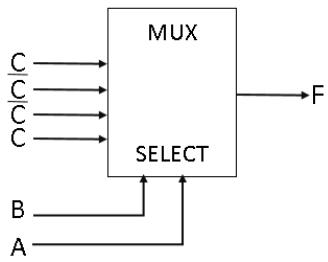

<details>
<summary>flowchart</summary>

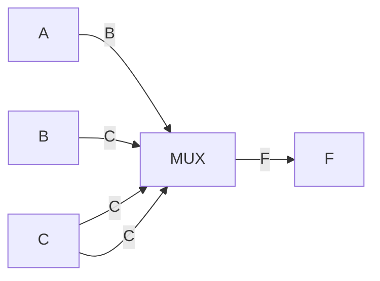
</details>

A. $AB + B\bar{C} +\bar{C} A + \bar{B}\bar{C}$

B. $A \oplus B \oplus C$

C. $A \oplus B$

D. $\bar{A}\bar{B}C + \bar{A}B\bar{C} + A\bar{B}\bar{C}$

gate1987 digital-logic combinational-circuit multiplexer circuit-output

Answer key

# 4.8.2 Circuit Output: GATE CSE 1989 | Question: 4-ix

Explain the behaviour of the following logic circuit with level input A and output B.


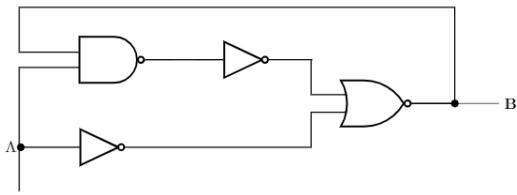

<details>
<summary>flowchart</summary>

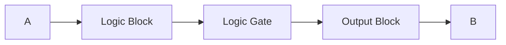
</details>

gate1989 descriptive digital-logic circuit-output

Answer key

# 4.8.3 Circuit Output: GATE CSE 1990 | Question: 3-i

Choose the correct alternatives (More than one may be correct).


Two NAND gates having open collector outputs are tied together as shown in below figure.


<details>
<summary>text_image</summary>

A
B
C
D
E
Y
</details>

The logic function Y, implemented by the circuit is,

A. $Y = ABC + DE$

B. $Y = \overline{ABC + DE}$

C. $Y = ABC \cdot DE$

D. $Y = \overline{ABC.DE}$

gate1990 normal digital-logic circuit-output

# Answer key

# 4.8.4 Circuit Output: GATE CSE 1991 | Question: 5-a

Analyse the circuit in Fig below and complete the following table

<table><tr><td>a</td><td>b</td><td> $\mathbf{Q_n}$ </td></tr><tr><td>0</td><td>0</td><td></td></tr><tr><td>0</td><td>1</td><td></td></tr><tr><td>1</td><td>0</td><td></td></tr><tr><td>1</td><td>1</td><td></td></tr></table>


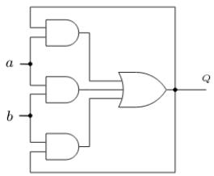

<details>
<summary>flowchart</summary>

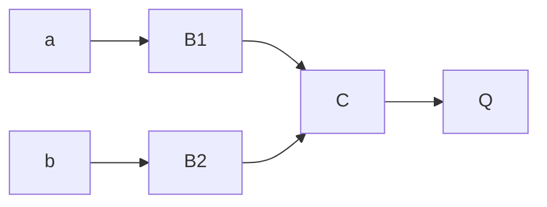
</details>

gate1991 digital-logic normal circuit-output sequential-circuit descriptive

# Answer key

# 4.8.5 Circuit Output: GATE CSE 1993 | Question: 19

A control algorithm is implemented by the NAND - gate circuitry given in figure below, where $A$ and $B$ are state variable implemented by $D$ flip-flops, and $P$ is control input. Develop the state transition table for this controller.


<details>
<summary>text_image</summary>

B
A
P̅
P
A
B̅
Clock
D̅A
A̅
D̅B
B̅
B̅
</details>


gate1993 digital-logic sequential-circuit flip-flop circuit-output normal descriptive

# Answer key

# 4.8.6 Circuit Output: GATE CSE 1993 | Question: 6-3


For the initial state of 000, the function performed by the arrangement of the J-K flip-flops in figure is:

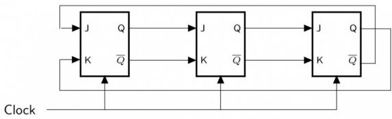

<details>
<summary>flowchart</summary>

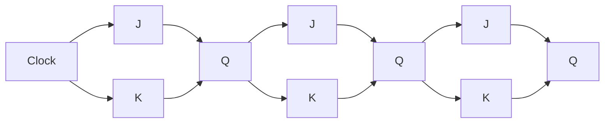
</details>

A. Shift Register

B. Mod- 3 Counter

C. Mod- 6 Counter

D. Mod-2 Counter

E. None of the above

gate1993 digital-logic sequential-circuit flip-flop digital-counter circuit-output multiple-selects

# Answer key

# 4.8.7 Circuit Output: GATE CSE 1993 | Question: 6.1

Identify the logic function performed by the circuit shown in figure.


<details>
<summary>flowchart</summary>

```mermaid
graph LR
  x["x"] -->|Input| AND1["Logic Gate 1"]
  y["y"] -->|Input| AND2["Logic Gate 2"]
  AND1 -->|Adder| AND3["Adder Input"]
  AND2 -->|Adder| AND4["Adder Output"]
  AND3 -->|Adder| AND5["Adder Output"]
  AND4 -->|Adder| AND6["Adder Output"]
  AND5 -->|Adder| AND7["Adder Output"]
  AND6 -->|Adder| AND8["Adder Output"]
  AND7 -->|Adder| AND9["Adder Output"]
  AND8 -->|Adder| AND10["Adder Output"]
  AND9 -->|Adder| AND11["Adder Output"]
  AND10 -->|Adder| AND12["Adder Output"]
  AND11 -->|Adder| AND13["Adder Output"]
  AND12 -->|Adder| AND14["Adder Output"]
  AND13 -->|Adder| AND15["Adder Output"]
  AND14 -->|Adder| AND16["Adder Output"]
  AND15 -->|Adder| AND17["Adder Output"]
  AND16 -->|Adder| AND18["Adder Output"]
  AND17 -->|Adder| AND19["Adder Output"]
  AND18 -->|Adder| AND19
  AND19 -->|Adder| AND20["Adder Output"]
  AND20 -->|Adder| AND21["Adder Output"]
  AND21 -->|Adder| AND22["Adder Output"]
  AND22 -->|Adder| AND23["Adder Output"]
  AND23 -->|Adder| AND24["Adder Output"]
  AND24 -->|Adder| AND25["Adder Output"]
  AND25 -->|Adder| AND26["Adder Output"]
  AND26 -->|Adder| AND27["Adder Output"]
  AND27 -->|Adder| AND28["Adder Output"]
  AND28 -->|Adder| AND29["Adder Output"]
  AND29 -->|Adder| AND30["Adder Output"]
  AND30 -->|Adder| AND31["Adder Output"]
  AND31 -->|Adder| AND32["Adder Output"]
  AND32 -->|Adder| AND33["Adder Output"]
  AND33 -->|Adder| AND34["Adder Output"]
  AND34 -->|Adder| AND35["Adder Output"]
  AND35 -->|Adder| AND36["Adder Output"]
  AND36 -->|Adder| AND37["Adder Output"]
  AND37 -->|Adder| AND38["Adder Output"]
  AND38 -->|Adder| AND39["Adder Output"]
  AND39 -->|Adder| AND40["Adder Output"]
  AND40 -->|Adder| AND41["Adder Output"]
  AND41 -->|Adder| AND42["Adder Output"]
  AND42 -->|Adder| AND43["Adder Output"]
  AND43 -->|Adder| AND44["Adder Output"]
  AND44 -->|Adder| AND45["Adder Output"]
  AND45 -->|Adder| AND46["Adder Output"]
  AND46 -->|Adder| AND47["Adder Output"]
  AND47 -->|Adder| AND48["Adder Output"]
  AND48 -->|Adder| AND49["Adder Output"]
  AND49 -->|Adder| AND50["Adder Output"]
  AND50 -->|Adder| AND51["Adder Output"]
  AND51 -->|Adder| AND52["Adder Output"]
  AND52 -->|Adder| AND53["Adder Output"]
  AND53 -->|Adder| AND54["Adder Output"]
  AND54 -->|Adder| AND55["Adder Output"]
  AND55 -->|Adder| AND56["Adder Output"]
  AND56 -->|Adder| AND57["Adder Output"]
  AND57 -->|Adder| AND58["Adder Output"]
  AND58 -->|Adder| AND59["Adder Output"]
  AND59 -->|Adder| AND60["Adder Output"]
  AND60 -->|Adder| AND61["Adder Output"]
  AND61 -->|Adder| AND62["Adder Output"]
  AND62 -->|Adder| AND63["Adder Output"]
  AND63 -->|Adder| AND64["Adder Output"]
  AND64 -->|Adder| AND65["Adder Output"]
  AND65 -->|Adder| AND66["Adder Output"]
  AND66 -->|Adder| AND67["Adder Output"]
  AND67 -->|Adder| AND68["Adder Output"]
  AND68 -->|Adder| AND69["Adder Output"]
  AND69 -->|Adder| AND70["Adder Output"]
  AND70 -->|Adder| AND71["Adder Output"]
  AND71 -->|Adder| AND72["Adder Output"]
  AND72 -->|Adder| AND73["Adder Output"]
  AND73 -->|Adder| AND74["Adder Output"]
  AND74 -->|Adder| AND75["Adder Output"]
  AND75 -->|Adder| AND76["Adder Output"]
  AND76 -->|Adder| AND77["Adder Output"]
  AND77 -->|Adder| AND78["Adder Output"]
  AND78 -->|Adder| AND79["Adder Output"]
  AND79 -->|Adder| AND80["Adder Output"]
  AND80 -->|Adder| AND81["Adder Output"]
  AND81 -->|Adder| AND82["Adder Output"]
  AND82 -->|Adder| AND83["Adder Output"]
  AND83 -->|Adder| AND84["Adder Output"]
  AND84 -->|Adder| AND85["Adder Output"]
  AND85 -->|Adder| AND86["Adder Output"]
  AND86 -->|Adder| AND87["Adder Output"]
  AND87 -->|Adder| AND88["Adder Output"]
  AND88 -->|Adder| AND89["Adder Output"]
  AND89 -->|Adder| AND90["Adder Output"]
  AND90 -->|Adder| AND91["Adder Output"]
  AND91 -->|Adder| AND92["Adder Output"]
  AND92 -->|Adder| AND93["Adder Output"]
  AND93 -->|Adder| AND94["Adder Output"]
  AND94 -->|Adder| AND95["Adder Output"]
  AND95 -->|Adder| AND96["Adder Output"]
  AND96 -->|Adder| AND97["Adder Output"]
  AND97 -->|Adder| AND98["Adder Output"]
  AND98 -->|Adder| AND99["Adder Output"]
  AND99 -->|Adder| AND100["Adder Output"]
```
</details>

A. exclusive OR

B. exclusive NOR

C. NAND

D. NOR

E. None of the above

gate1993 digital-logic combinational-circuit circuit-output normal

# Answer key

# 4.8.8 Circuit Output: GATE CSE 1993 | Question: 6.2

If the state machine described in figure should have a stable state, the restriction on the inputs is given by


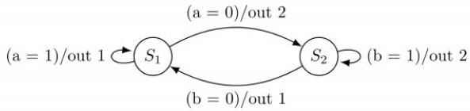

<details>
<summary>flowchart</summary>

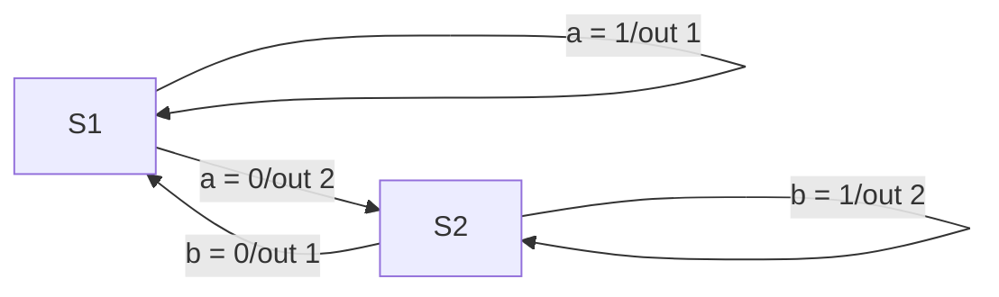
</details>

A. a.b = 1

B. $a + b = 1$

C. $\bar{a} + \bar{b} = 0$

D. $\overline{a.b} = 1$

E. $\overline{a+b}=1$

gate1993 digital-logic normal circuit-output sequential-circuit

# Answer key

# 4.8.9 Circuit Output: GATE CSE 1994 | Question: 1.8

The logic expression for the output of the circuit shown in figure below is:


<details>
<summary>text_image</summary>

A
B
C
D
</details>


A. $\overline{AC} + \overline{BC} + CD$

B. $\overline{A} C + \overline{B} C + CD$

c. $ABC + \overline{C}\overline{D}$

D. $\overline{A}\overline{B} +\overline{B}\overline{C} +CD$

gate1994 digital-logic circuit-output normal

# Answer key

# 4.8.10 Circuit Output: GATE CSE 1994 | Question: 11

Find the contents of the flip-flop $Q_{2}, Q_{1}$ and $Q_{0}$ in the circuit of figure, after giving four clock pulses to the clock terminal. Assume $Q_{2}Q_{1}Q_{0}=000$ initially.


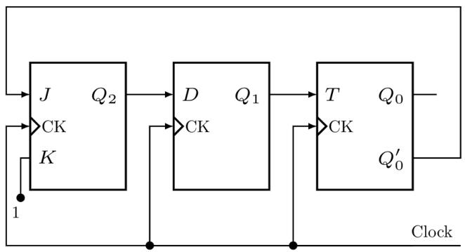

<details>
<summary>flowchart</summary>

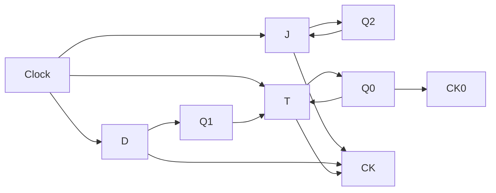
</details>

gate1994 digital-logic sequential-circuit digital-counter circuit-output normal descriptive

# Answer key

# 4.8.11 Circuit Output: GATE CSE 1996 | Question: 2.21

Consider the circuit in below figure which has a four bit binary number $b_{3}b_{2}b_{1}b_{0}$ as input and a five bit binary number, $d_{4}d_{3}d_{2}d_{1}d_{0}$ as output.


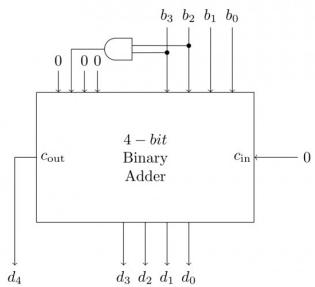

<details>
<summary>text_image</summary>

0 0 0 b3 b2 b1 b0
4 - bit
Binary
Adder
cout cin 0
d4 d3 d2 d1 d0
</details>

A. Binary to Hex conversion

B. Binary to BCD conversion

C. Binary to Gray code conversion

D. Binary to radix - 12 conversion

gate1996 digital-logic circuit-output normal

# Answer key

# 4.8.12 Circuit Output: GATE CSE 1996 | Question: 2.22

Consider the circuit in figure. $f$ implements


<details>
<summary>text_image</summary>

C→0
C̅→1
C̅→2
C→3
4 to 1
Mux
→f
S₁ S₀
A B
</details>

A. $\overline{A}\overline{B} C + \overline{A} B\overline{C} + ABC$

B. $A + B + C$

C. $A \oplus B \oplus C$

D. $AB + BC + CA$

# 4.8.13 Circuit Output: GATE CSE 1996 | Question: 24-a

Consider the synchronous sequential circuit in the below figure


<details>
<summary>flowchart</summary>

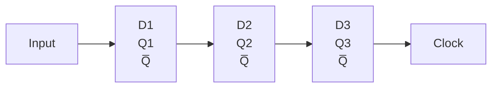
</details>

Draw a state diagram, which is implemented by the circuit. Use the following names for the states corresponding to the values of flip-flops as given below.

<table><tr><td>Q1</td><td>Q2</td><td>Q3</td><td>State</td></tr><tr><td>0</td><td>0</td><td>0</td><td> $S_0$ </td></tr><tr><td>0</td><td>0</td><td>1</td><td> $S_1$ </td></tr><tr><td>-</td><td>-</td><td>-</td><td>-</td></tr><tr><td>-</td><td>-</td><td>-</td><td>-</td></tr><tr><td>-</td><td>-</td><td>-</td><td>-</td></tr><tr><td>1</td><td>1</td><td>1</td><td> $S_7$ </td></tr></table>

gate1996 digital-logic circuit-output normal descriptive

# Answer key

# 4.8.14 Circuit Output: GATE CSE 1996 | Question: 24-b

Consider the synchronous sequential circuit in the below figure


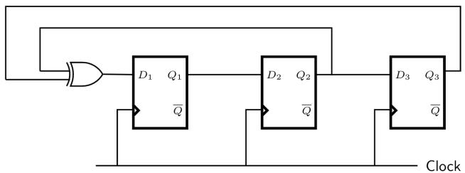

<details>
<summary>flowchart</summary>


</details>

Given that the initial state of the circuit is $S_{4}$ , identify the set of states, which are not reachable.

gate1996 normal digital-logic circuit-output descriptive

# Answer key

# 4.8.15 Circuit Output: GATE CSE 1997 | Question: 5.5

Consider a logic circuit shown in figure below. The functions $f_{1}$ , $f_{2}$ and f (in canonical sum of products form in decimal notation) are :

$$
f _ {1} (w, x, y, z) = \sum 8, 9, 1 0
$$

$$
f _ {2} (w, x, y, z) = \sum 7, 8, 1 2, 1 3, 1 4, 1 5
$$

$$
f (w, x, y, z) = \sum 8, 9
$$


<details>
<summary>text_image</summary>

f₁
f₂
f₃ = ?
f
</details>

The function $f_{3}$ is

A. $\sum 9,10$

B. $\sum 9$

c. $\sum 1,8,9$

D. $\sum8,10,15$

gate1997 digital-logic circuit-output normal

# Answer key

# 4.8.16 Circuit Output: GATE CSE 1999 | Question: 2.8

Consider the circuit shown below. In a certain steady state, the line $Y$ is at $1'$ . What are the possible values of $A, B$ and $C$ in this state?


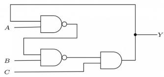

<details>
<summary>text_image</summary>

A
B
C
Y
</details>

A. $A = 0, B = 0, C = 1$

B. $A = 0, B = 1, C = 1$

C. $A = 1, B = 0, C = 1$

D. $A = 1, B = 1, C = 1$

gate1999 digital-logic circuit-output normal

# Answer key

# 4.8.17 Circuit Output: GATE CSE 2000 | Question: 2.12

The following arrangement of master-slave flip flops


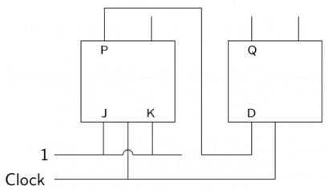

<details>
<summary>text_image</summary>

P
J K
1
Clock
Q
D
</details>

has the initial state of P, Q as 0, 1 (respectively). After three clock cycles the output state P, Q is (respectively),

A. 1,0

B. 1,1

c. 0,0

D. 0,1

gatecse-2000 digital-logic circuit-output normal flip-flop

# Answer key

# 4.8.18 Circuit Output: GATE CSE 2001 | Question: 2.8

Consider the following circuit with initial state $Q_{0}=Q_{1}=0$ . The D Flip-flops are positive edged triggered and have set up times 20 nanosecond and hold times 0.


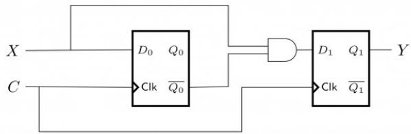

<details>
<summary>flowchart</summary>

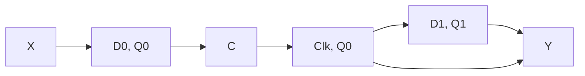
</details>

Consider the following timing diagrams of $X$ and $C$ . The clock period of $C \geq 40$ nanosecond. Which one is the correct plot of $Y$ ?

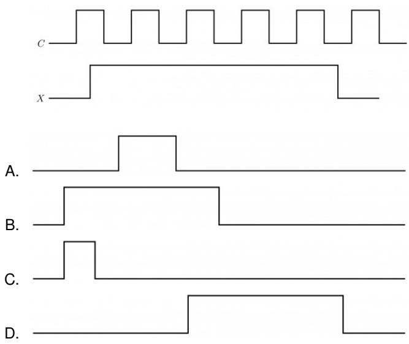  
gatecse-2001 digital-logic circuit-output normal

# Answer key

# 4.8.19 Circuit Output: GATE CSE 2002 | Question: 2.2

Consider the following multiplexer where $I0, I1, I2, I3$ are four data input lines selected by two address line combinations $A1A0 = 00, 01, 10, 11$ respectively and $f$ is the output of the multiplexor. EN is the Enable input.


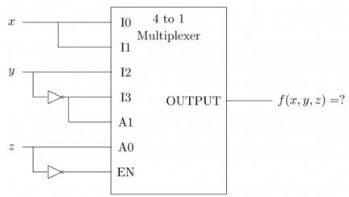

<details>
<summary>text_image</summary>

x
y
z
I0 4 to 1
Multiplexer
I1
I2
I3
A1
A0
EN
OUTPUT
f(x,y,z) =?
</details>

The function $f(x, y, z)$ implemented by the above circuit is

A. $xyz'$

B. $xy + z$

C. $x + y$

D. None of the above

gatecse-2002 digital-logic circuit-output normal

# Answer key

# 4.8.20 Circuit Output: GATE CSE 2004 | Question: 61

Consider the partial implementation of a 2-bit counter using T flip-flops following the sequence 0 - 2 - 3 - 1 - 0, as shown below.


<details>
<summary>flowchart</summary>

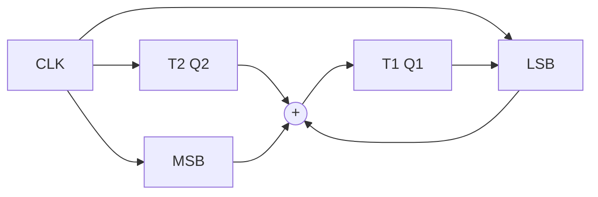
</details>

To complete the circuit, the input X should be

A. $Q_{2}^{c}$

B. $Q_{2} + Q_{1}$

C. $(Q_{1} + Q_{2})^{c}$

D. $Q_{1} \oplus Q_{2}$

gatecse-2004 digital-logic circuit-output normal

# Answer key


Consider the following circuit.


<details>
<summary>flowchart</summary>

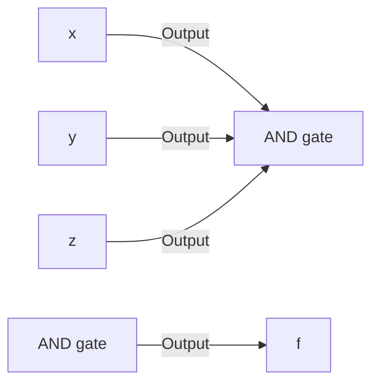
</details>

Which one of the following is TRUE?

A. $f$ is independent of $x$

B. $f$ is independent of $y$

C. $f$ is independent of $z$

D. None of $x, y, z$ is redundant

gatecse-2005 digital-logic circuit-output normal

# Answer key

# 4.8.22 Circuit Output: GATE CSE 2005 | Question: 62

Consider the following circuit involving a positive edge triggered D FF.

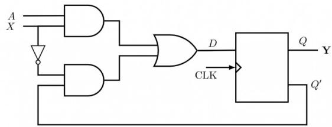

<details>
<summary>text_image</summary>

A
X
D
CLK
Q
Y
Q'
</details>


Consider the following timing diagram. Let $A_{i}$ represents the logic level on the line A in the i-th clock period.

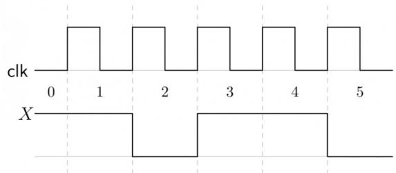

<details>
<summary>text_image</summary>

clk
0 1 2 3 4 5
X
</details>

Let $A'$ represent the complement of $A$ . The correct output sequence on $Y$ over the clock periods 1 through 5 is:

A. $A_0A_1A_1'A_3A_4$

B. $A_0A_1A_2'A_3A_4$

C. $A_{1}A_{2}A_{2}^{\prime}A_{3}A_{4}$

D. $A_{1}A_{2}^{\prime}A_{3}A_{4}A_{5}^{\prime}$

gatecse-2005 digital-logic circuit-output normal

# Answer key

# 4.8.23 Circuit Output: GATE CSE 2005 | Question: 64

Consider the following circuit:

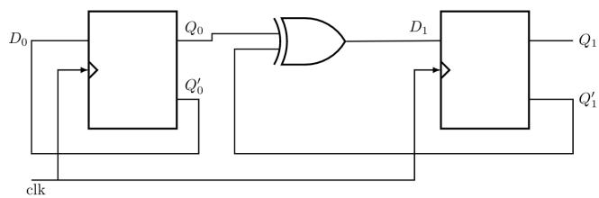

<details>
<summary>flowchart</summary>

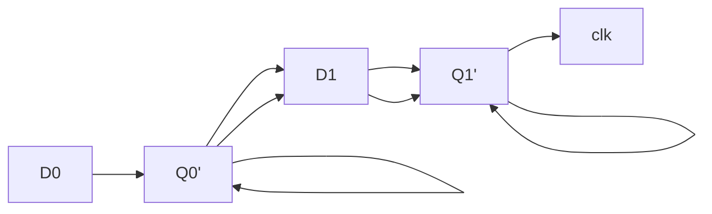
</details>


The flip-flops are positive edge triggered D FFs. Each state is designated as a two-bit string $Q_{0}Q_{1}$ . Let the initial state be 00. The state transition sequence is

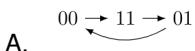

B.  


C.  


D.  
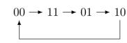

# 4.8.24 Circuit Output: GATE CSE 2006 | Question: 35


<details>
<summary>text_image</summary>

x 0
MUX 1
ȳ
z
x
y
0
MUX 1
f
</details>

Consider the circuit above. Which one of the following options correctly represents $f(x,y,z)$

A. $x\bar{z} + xy + \bar{y} z$

B. $x\bar{z} + xy + \overline{yz}$

C. $xz + xy + \overline{yz}$

D. $xz + x\bar{y} +\bar{y} z$

gatecse-2006 digital-logic circuit-output normal

# Answer key

# 4.8.25 Circuit Output: GATE CSE 2006 | Question: 37

Consider the circuit in the diagram. The $\oplus$ operator represents Ex-OR. The D flip-flops are initialized to zeroes (cleared).


<details>
<summary>flowchart</summary>

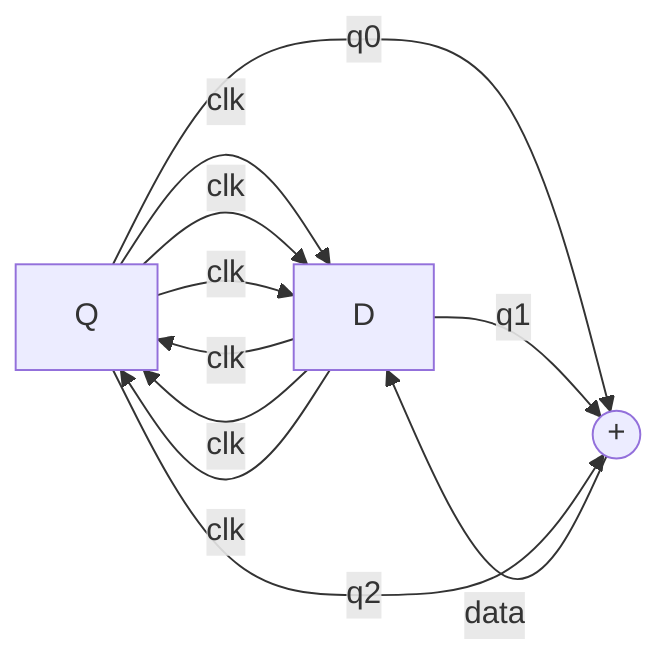
</details>

The following data: 100110000 is supplied to the “data” terminal in nine clock cycles. After that the values of $q_{2}q_{1}q_{0}$ are:

A. 000

B. 001

C. 010

D. 101

gatecse-2006 digital-logic circuit-output easy

# Answer key

# 4.8.26 Circuit Output: GATE CSE 2006 | Question: 8

You are given a free running clock with a duty cycle of 50% and a digital waveform f which changes only at the negative edge of the clock. Which one of the following circuits (using clocked D flip-flops) will delay the phase of f by $180^{\circ}$ ?


A.


<details>
<summary>text_image</summary>

f
CLK
D Q
Q
D Q
Q
</details>

B.

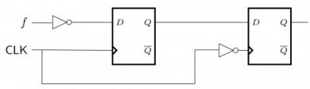

<details>
<summary>flowchart</summary>

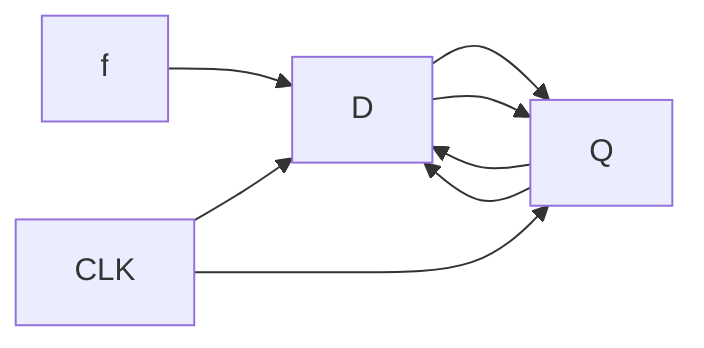
</details>

C.

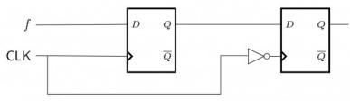

<details>
<summary>flowchart</summary>

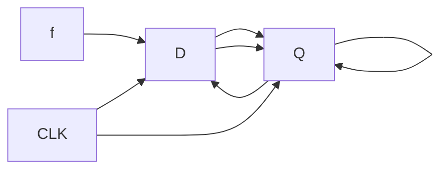
</details>

D.


<details>
<summary>text_image</summary>

f
CLK
D Q
Q
D Q
Q̅
</details>

gatecse-2006 digital-logic normal circuit-output

# Answer key

# 4.8.27 Circuit Output: GATE CSE 2007 | Question: 36

The control signal functions of a 4-bit binary counter are given below (where $X$ is "don't care"):

<table><tr><td>Clear</td><td>Clock</td><td>Load</td><td>Count</td><td>Function</td></tr><tr><td>1</td><td>X</td><td>X</td><td>X</td><td>Clear to 0</td></tr><tr><td>0</td><td>X</td><td>0</td><td>0</td><td>No Change</td></tr><tr><td>0</td><td>↑</td><td>1</td><td>X</td><td>Load Input</td></tr><tr><td>0</td><td>↑</td><td>0</td><td>1</td><td>Count Next</td></tr></table>


The counter is connected as follows:

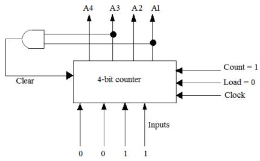

<details>
<summary>flowchart</summary>

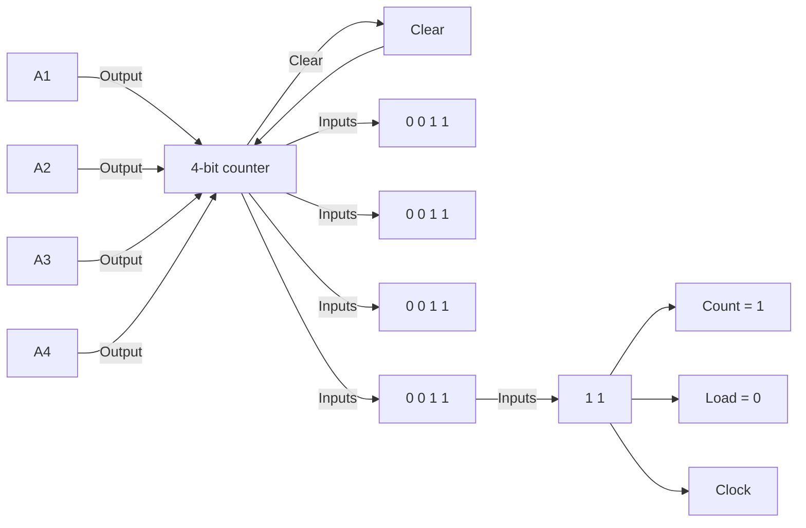
</details>

Assume that the counter and gate delays are negligible. If the counter starts at 0, then it cycles through the following sequence:

A. 0,3,4

B. 0,3,4,5

C. 0,1,2,3,4

D. 0,1,2,3,4,5

gatecse-2007 digital-logic circuit-output normal

# Answer key

# 4.8.28 Circuit Output: GATE CSE 2010 | Question: 31

What is the boolean expression for the output f of the combinational logic circuit of NOR gates given below?


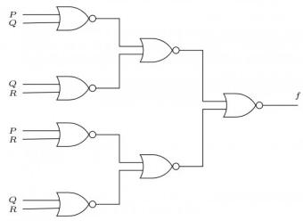

<details>
<summary>flowchart</summary>

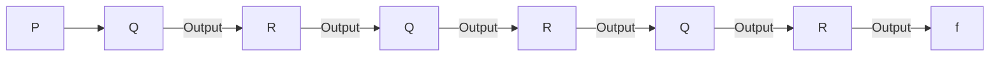
</details>

A. $\overline{Q + R}$  
C. $\overline{P+R}$

gatecse-2010 digital-logic circuit-output normal

B. $\overline{P+Q}$  
D. $\overline{P+Q+R}$

# Answer key

# 4.8.29 Circuit Output: GATE CSE 2010 | Question: 32

In the sequential circuit shown below, if the initial value of the output $Q_{1}Q_{0}$ is 00. What are the next four values of $Q_{1}Q_{0}$ ?


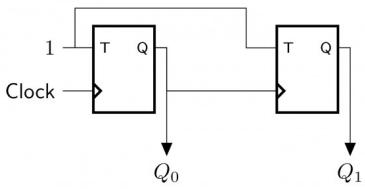

<details>
<summary>flowchart</summary>

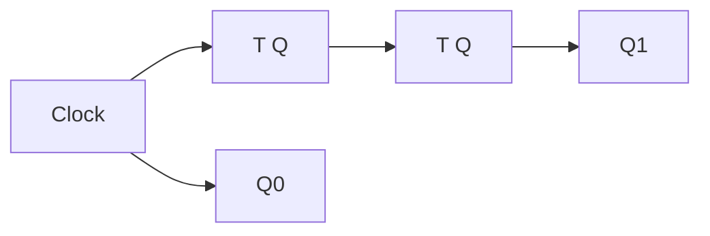
</details>

A. 11, 10, 01, 00

B. 10, 11, 01, 00

c. 10, 00, 01, 11

D. 11, 10, 00, 01

gatecse-2010 digital-logic circuit-output normal

# Answer key

# 4.8.30 Circuit Output: GATE CSE 2010 | Question: 9

The Boolean expression of the output f of the multiplexer shown below is

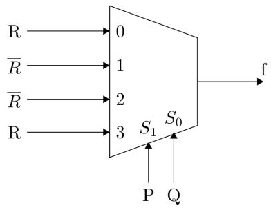

<details>
<summary>flowchart</summary>

```mermaid
graph LR
  R["R"] --> 0["0"]
  R̄["R̄"] --> 1["1"]
  R̄̄["R̄"] --> 2["2"]
  R["R"] --> 3["3"]
  S1["S₁"] --> S0["S₀"]
  S0 --> f["f"]
  P["P"] --> S1
  Q["Q"] --> S0
```
</details>

A. $\overline{P \oplus Q \oplus R}$

B. $P \oplus Q \oplus R$

C. $P + \dot{Q} + R$

D. $\overline{P + Q + R}$

gatecse-2010 digital-logic circuit-output easy multiplexer

# Answer key

# 4.8.31 Circuit Output: GATE CSE 2011 | Question: 50

Consider the following circuit involving three D-type flip-flops used in a certain type of counter configuration.


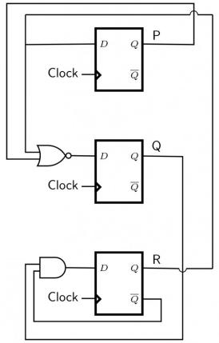

<details>
<summary>flowchart</summary>

```mermaid
graph LR
  Clock(("Clock")) --> D1["D"]
  Clock(("Clock")) --> D2["D"]
  Clock(("Clock")) --> D3["D"]
  Clock(("Clock")) --> D4["D"]
  Clock(("Clock")) --> D5["D"]
  Clock(("Clock")) --> D6["D"]
  Clock(("Clock")) --> D7["D"]
  Clock(("Clock")) --> D8["D"]
  Clock(("Clock")) --> D9["D"]
  Clock(("Clock")) --> D10["D"]
  Clock(("Clock")) --> D11["D"]
  Clock(("Clock")) --> D12["D"]
  Clock(("Clock")) --> D13["D"]
  Clock(("Clock")) --> D14["D"]
  Clock(("Clock")) --> D15["D"]
  Clock(("Clock")) --> D16["D"]
  Clock(("Clock")) --> D17["D"]
  Clock(("Clock")) --> D18["D"]
  Clock(("Clock")) --> D19["D"]
  Clock(("Clock")) --> D20["D"]
  Clock(("Clock")) --> D21["D"]
  Clock(("Clock")) --> D22["D"]
  Clock(("Clock")) --> D23["D"]
  Clock(("Clock")) --> D24["D"]
  Clock(("Clock")) --> D25["D"]
  Clock(("Clock")) --> D26["D"]
  Clock(("Clock")) --> D27["D"]
  Clock(("Clock")) --> D28["D"]
  Clock(("Clock")) --> D29["D"]
  Clock(("Clock")) --> D30["D"]
  Clock(("Clock")) --> D31["D"]
  Clock(("Clock")) --> D32["D"]
  Clock(("Clock")) --> D33["D"]
  Clock(("Clock")) --> D34["D"]
  Clock(("Clock")) --> D35["D"]
  Clock(("Clock")) --> D36["D"]
  Clock(("Clock")) --> D37["D"]
  Clock(("Clock")) --> D38["D"]
  Clock(("Clock")) --> D39["D"]
  Clock(("Clock")) --> D40["D"]
  Clock(("Clock")) --> D41["D"]
  Clock(("Clock")) --> D42["D"]
  Clock(("Clock")) --> D43["D"]
  Clock(("Clock")) --> D44["D"]
  Clock(("Clock")) --> D45["D"]
  Clock(("Clock")) --> D46["D"]
  Clock(("Clock")) --> D47["D"]
  Clock(("Clock")) --> D48["D"]
  Clock(("Clock")) --> D49["D"]
  Clock(("Clock")) --> D50["D"]
  Clock(("Clock")) --> D51["D"]
  Clock(("Clock")) --> D52["D"]
  Clock(("Clock")) --> D53["D"]
  Clock(("Clock")) --> D54["D"]
  Clock(("Clock")) --> D55["D"]
  Clock(("Clock")) --> D56["D"]
  Clock(("Clock")) --> D57["D"]
  Clock(("Clock")) --> D58["D"]
  Clock(("Clock")) --> D59["D"]
  Clock(("Clock")) --> D60["D"]
  Clock(("Clock")) --> D61["D"]
  Clock(("Clock")) --> D62["D"]
  Clock(("Clock")) --> D63["D"]
  Clock(("Clock")) --> D64["D"]
  Clock(("Clock")) --> D65["D"]
  Clock(("Clock")) --> D66["D"]
  Clock(("Clock")) --> D67["D"]
  Clock(("Clock")) --> D68["D"]
  Clock(("Clock")) --> D69["D"]
  Clock(("Clock")) --> D70["D"]
  Clock(("Clock")) --> D71["D"]
  Clock(("Clock")) --> D72["D"]
  Clock(("Clock")) --> D73["D"]
  Clock(("Clock")) --> D74["D"]
  Clock(("Clock")) --> D75["D"]
  Clock(("Clock")) --> D76["D"]
  Clock(("Clock")) --> D77["D"]
  Clock(("Clock")) --> D78["D"]
  Clock(("Clock")) --> D79["D"]
  Clock(("Clock")) --> D80["D"]
  Clock(("Clock")) --> D81["D"]
  Clock(("Clock")) --> D82["D"]
  Clock(("Clock")) --> D83["D"]
  Clock(("Clock")) --> D84["D"]
  Clock(("Clock")) --> D85["D"]
  Clock(("Clock")) --> D86["D"]
  Clock(("Clock")) --> D87["D"]
  Clock(("Clock")) --> D88["D"]
  Clock(("Clock")) --> D89["D"]
  Clock(("Clock")) --> D90["D"]
  Clock(("Clock")) --> D91["D"]
  Clock(("Clock")) --> D92["D"]
  Clock(("Clock")) --> D93["D"]
  Clock(("Clock")) --> D94["D"]
  Clock(("Clock")) --> D95["D"]
  Clock(("Clock")) --> D96["D"]
  Clock(("Clock")) --> D97["D"]
  Clock(("Clock")) --> D98["D"]
  Clock(("Clock")) --> D99["D"]
  Clock(("Clock")) --> D100["D"]
  D100 --> P["P"]
  D100 --> Q["Q"]
  D100 --> R["R"]
```
</details>

If at some instance prior to the occurrence of the clock edge, P, Q and R have a value 0, 1 and 0 respectively, what shall be the value of PQR after the clock edge?

A. 000

B. 001

C. 010

D. 011

gatecse-2011 digital-logic circuit-output flip-flop normal

# Answer key

# 4.8.32 Circuit Output: GATE CSE 2011 | Question: 51

Consider the following circuit involving three D-type flip-flops used in a certain type of counter configuration.


<details>
<summary>text_image</summary>

Clock
D Q
Q̅
P
Clock
D Q
Q̅
Clock
D Q
Q̅
R
Clock
</details>

If all the flip-flops were reset to 0 at power on, what is the total number of distinct outputs (states) represented by PQR generated by the counter?

A. 3

B. 4

C. 5

D. 6

gatecse-2011 digital-logic circuit-output normal

# Answer key

# 4.8.33 Circuit Output: GATE CSE 2014 | Set 3 | Question: 45


<details>
<summary>flowchart</summary>

```mermaid
graph LR
  Input["Input"] --> Block1["J, Q2"]
  Block1 --> Block2["J, Q1"]
  Block2 --> Block3["J, Q0"]
  Block3 --> Block4["J, Q0"]
  Block4 --> Block5["K, Q2"]
  Block5 --> Block6["K, Q1"]
  Block6 --> Block7["K, Q0"]
```
</details>


The above synchronous sequential circuit built using JK flip-flops is initialized with $Q_{2}Q_{1}Q_{0}=000$ . The state sequence for this circuit for the next 3 clock cycles is

A. 001,010,011

B. 111,110,101

c. 100,110,111

D. 100,011,001

gatecse-2014-set3 digital-logic circuit-output normal

# Answer key

# 4.8.34 Circuit Output: GATE CSE 2025 | Set 2 | Question: 21

Consider the following logic circuit diagram.

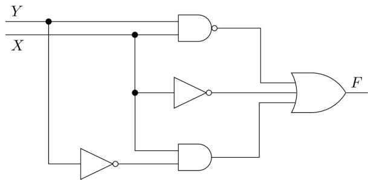

<details>
<summary>flowchart</summary>

```mermaid
graph LR
  X["X"] --> Y["Y"]
  Y -->|Input| AND_Gate{"AND Gate"}
  AND_Gate -->|Input| AND["AND"]
  AND_Gate -->|Output| F["F"]
```
</details>


Which is/are the CORRECT option(s) for the output function F ?

A. $\overline{XY}$

B. $\overline{X} +\overline{Y} +X\overline{Y}$

C. $\overline{XY} + \overline{X} + X\overline{Y}$

D. $X + \overline{Y}$

gatecse2025-set2 digital-logic circuit-output multiple-selects easy one-mark