# 4.8.35 Circuit Output: GATE IT 2005 | Question: 10


A two-way switch has three terminals a, b and c. In ON position (logic value 1), a is connected to b, and in OFF position, a is connected to c. Two of these two-way switches S1 and S2 are connected to a bulb as shown below.

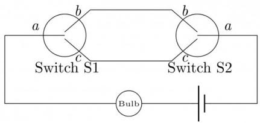

<details>
<summary>text_image</summary>

a
b
Switch S1
c
Switch S2
a
c
Bulb
</details>

Which of the following expressions, if true, will always result in the lighting of the bulb?

A. $S1.\overline{S2}$

B. $S1 + S2$

C. $\overline{S1 \oplus S2}$

D. $S1 \oplus S2$

gateit-2005 digital-logic circuit-output normal

# Answer key

# 4.8.36 Circuit Output: GATE IT 2005 | Question: 43

Which of the following input sequences will always generate a 1 at the output z at the end of the third cycle?


<details>
<summary>text_image</summary>

A
B
C
Clock
D Q
C1 Q̅
Clock
C
D Q
C1 Q̅
Z
</details>

A.

<table><tr><td>A</td><td>B</td><td>C</td></tr><tr><td>0</td><td>0</td><td>0</td></tr><tr><td>1</td><td>0</td><td>1</td></tr><tr><td>1</td><td>1</td><td>1</td></tr></table>

B.

<table><tr><td>A</td><td>B</td><td>C</td></tr><tr><td>1</td><td>0</td><td>1</td></tr><tr><td>1</td><td>1</td><td>0</td></tr><tr><td>1</td><td>1</td><td>1</td></tr></table>

C.

<table><tr><td>A</td><td>B</td><td>C</td></tr><tr><td>0</td><td>1</td><td>1</td></tr><tr><td>1</td><td>0</td><td>1</td></tr><tr><td>1</td><td>1</td><td>1</td></tr></table>

D.

<table><tr><td>A</td><td>B</td><td>C</td></tr><tr><td>0</td><td>0</td><td>1</td></tr><tr><td>1</td><td>1</td><td>0</td></tr><tr><td>1</td><td>1</td><td>1</td></tr></table>

gateit-2005 digital-logic circuit-output normal

# Answer key

# 4.8.37 Circuit Output: GATE IT 2006 | Question: 36

The majority function is a Boolean function $f(x, y, z)$ that takes the value 1 whenever a majority of the variables x, y, z are 1. In the circuit diagram for the majority function shown below, the logic gates for the boxes labeled P and Q are, respectively,


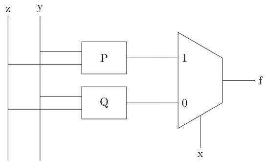

<details>
<summary>text_image</summary>

z y
P
P
Q
1
0
f
x
</details>

A. XOR, AND

B. XOR, XOR

C. OR, OR

D. OR, AND

# 4.8.38 Circuit Output: GATE IT 2007 | Question: 38

The following expression was to be realized using 2-input AND and OR gates. However, during the fabrication all 2-input AND gates were mistakenly substituted by 2-input NAND gates.

$$
(a. b). c + (a ^ {\prime}. c). d + (b. c). d + a. d
$$

What is the function finally realized?

A. 1

C. $a' + b + c' + d'$

gateit-2007 digital-logic circuit-output normal

B. $a' + b' + c' + d'$

D. $a' + b' + c + d'$

# Answer key

# 4.8.39 Circuit Output: GATE IT 2007 | Question: 40

What is the final value stored in the linear feedback shift register if the input is 101101?


A. 0110

B. 1011

C. 1101

D. 1111

gateit-2007 digital-logic circuit-output normal

# Answer key

# 4.8.40 Circuit Output: GATE IT 2007 | Question: 45

The line T in the following figure is permanently connected to the ground.

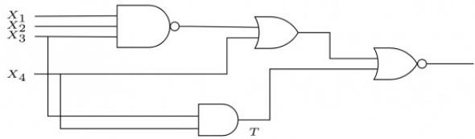

<details>
<summary>text_image</summary>

X₁
X₂
X₃
X₄
T
</details>

Which of the following inputs $(X_{1}X_{2}X_{3}X_{4})$ will detect the fault?

A. 0000

B. 0111

C. 1111

D. None of these

gateit-2007 digital-logic circuit-output normal

# Answer key

# 4.9

# Combinational Circuit (2)

# Practice Test: Test 1 (7Q)

# 4.9.1 Combinational Circuit: GATE CSE 2022 | Question: 30

Consider a digital display system (DDS) shown in the figure that displays the contents of register X. A 16-bit code word is used to load a word in X, either from S or from R. S is a 1024-word memory segment and R is a 32-word register file. Based on the value of mode bit M, T selects an input word to load in X. P and Q interface with the corresponding bits in the code word to choose the addressed word. Which one of the following represents the functionality of P, Q, and T?


Code Word  


<details>
<summary>flowchart</summary>

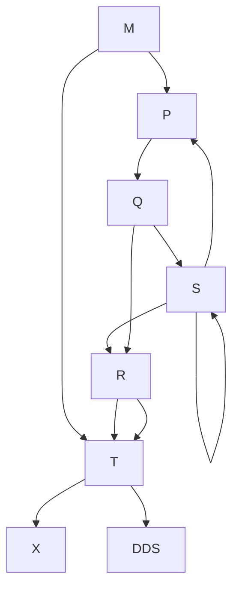
</details>

A. P is 10:1 multiplexer;  
B. P is $10:2^{10}$ decoder;  
c. P is $10:2^{10}$ decoder;  
D. P is 1:10 de-multiplexer;

Q is 5:1 multiplexer;  
Q is $5:2^{5}$ decoder;  
Q is $5:2^{5}$ decoder;  
Q is 1 : 5 de-multiplexer;

T is 2:1 multiplexer  
T is 2:1 encoder  
T is 2:1 multiplexer  
T is 2:1 multiplexer

gatecse-2022 digital-logic combinational-circuit two-marks

# Answer key

# 4.9.2 Combinational Circuit: GATE CSE 2024 | Set 1 | Question: 18

Consider the circuit shown below where the gates may have propagation delays. Assume that all signal transitions occur instantaneously and that wires have no delays. Which of the following statements about the circuit is/are CORRECT?


<details>
<summary>flowchart</summary>

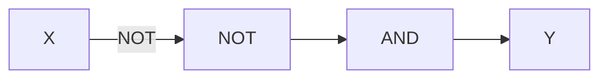
</details>

A. With no propagation delays, the output Y is always logic Zero  
B. With no propagation delays, the output $Y$ is always logic One  
C. With propagation delays, the output $Y$ can have a transient logic One after $X$ transitions from logic Zero to logic One  
D. With propagation delays, the output $Y$ can have a transient logic Zero after $X$ transitions from logic One to logic Zero

gatecse-2024-set1 multiple-selects digital-logic combinational-circuit one-mark

# Answer key

# 4.10

# Conjunctive Normal Form (1)

# 4.10.1 Conjunctive Normal Form: GATE CSE 2007 | Question: 48

Which of the following is TRUE about formulae in Conjunctive Normal Form?


A. For any formula, there is a truth assignment for which at least half the clauses evaluate to true.  
B. For any formula, there is a truth assignment for which all the clauses evaluate to true.  
C. There is a formula such that for each truth assignment, at most one-fourth of the clauses evaluate to true.  
D. None of the above.

gatecse-2007 digital-logic normal conjunctive-normal-form canonical-normal-form

# Answer key

# 4.11.1 Decoder: GATE CSE 2007 | Question: 8, ISRO2011-31


How many 3-to-8 line decoders with an enable input are needed to construct a 6-to-64 line decoder without using any other logic gates?

A. 7

B. 8

C. 9

D. 10

gatecse-2007 digital-logic normal isro2011 decoder

Answer key

# 4.11.2 Decoder: GATE CSE 2020 | Question: 20


If there are $m$ input lines and $n$ output lines for a decoder that is used to uniquely address a byte addressable 1 KB RAM, then the minimum value of $m + n$ is \_\_\_\_.

gatecse-2020 numerical-answers digital-logic decoder one-mark

Answer key

# 4.11.3 Decoder: GATE IT 2008 | Question: 9


What Boolean function does the circuit below realize?


<details>
<summary>text_image</summary>

Z
Y
X
3 to 8
Decoder
O7
O0
f
</details>

A. $xz + \bar{x}\bar{z}$  
C. $\bar{x}\bar{y} + yz$

gateit-2008 digital-logic circuit-output decoder normal

B. $x\bar{z} +\bar{x} z$  
D. $xy + \bar{y}\bar{z}$

Answer key

# 4.12

# Digital Circuits (7)

Practice Test: Test 1 (8Q)

# 4.12.1 Digital Circuits: GATE CSE 1996 | Question: 5


A logic network has two data inputs A and B, and two control inputs $C_{0}$ and $C_{1}$ . It implements the function F according to the following table.

<table><tr><td> $C_1$ </td><td> $C_0$ </td><td> $\mathbf{F}$ </td></tr><tr><td>0</td><td>0</td><td> $\overline{A + B}$ </td></tr><tr><td>0</td><td>1</td><td> $\mathbf{A + B}$ </td></tr><tr><td>1</td><td>0</td><td> $A \oplus B$ </td></tr></table>

Implement the circuit using one 4 to 1 Multiplexer, one 2—input Exclusive OR gate, one 2—input AND gate, one 2—input OR gate and one Inverter.

gate1996 digital-logic normal digital-circuits descriptive

Answer key

A. Express the function $f(x, y, z) = xy' + yz'$ with only one complement operation and one or more AND/OR operations. Draw the logic circuit implementing the expression obtained, using a single NOT gate and one or more AND/OR gates.  
B. Transform the following logic circuit (without expressing its switching function) into an equivalent logic circuit that employs only 6 NAND gates each with 2-inputs.


<details>
<summary>text_image</summary>

Logic gate diagram showing a three-input AND gate with inputs and outputs
</details>

gatecse-2002 digital-logic normal descriptive digital-circuits

Answer key

# 4.12.3 Digital Circuits: GATE CSE 2003 | Question: 47

Consider the following circuit composed of XOR gates and non-inverting buffers.

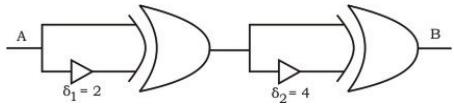

<details>
<summary>text_image</summary>

A
δ₁ = 2
B
δ₂ = 4
</details>


The non-inverting buffers have delays $\delta_{1}=2ns$ and $\delta_{2}=4ns$ as shown in the figure. Both XOR gates and all wires have zero delays. Assume that all gate inputs, outputs, and wires are stable at logic level 0 at time 0. If the following waveform is applied at input A, how many transition(s) (change of logic levels) occur(s) at B during the interval from 0 to 10 ns?

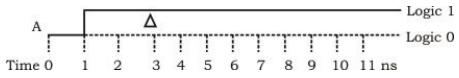

A. 1

B. 2

C. 3

D. 4

gatecse-2003 digital-logic digital-circuits

Answer key

# 4.12.4 Digital Circuits: GATE CSE 2011 | Question: 13

Which one of the following circuits is NOT equivalent to a 2-input XNOR (exclusive NOR) gate?


# 4.12.5 Digital Circuits: GATE CSE 2013 | Question: 5

In the following truth table, V = 1 if and only if the input is valid.


Inputs

<table><tr><td> $D_0$ </td><td> $D_1$ </td><td> $D_2$ </td><td> $D_3$ </td></tr><tr><td>0</td><td>0</td><td>0</td><td>0</td></tr><tr><td>1</td><td>0</td><td>0</td><td>0</td></tr><tr><td>x</td><td>1</td><td>0</td><td>0</td></tr><tr><td>x</td><td>x</td><td>1</td><td>0</td></tr><tr><td>x</td><td>x</td><td>x</td><td>1</td></tr></table>

Outputs

<table><tr><td> $X_0$ </td><td> $X_1$ </td><td>V</td></tr><tr><td>x</td><td>x</td><td>0</td></tr><tr><td>0</td><td>0</td><td>1</td></tr><tr><td>0</td><td>1</td><td>1</td></tr><tr><td>1</td><td>0</td><td>1</td></tr><tr><td>1</td><td>1</td><td>1</td></tr></table>

What function does the truth table represent?

A. Priority encoder  
C. Multiplexer

gatecse-2013 digital-logic normal digital-circuits

B. Decoder  
D. Demultiplexer

# Answer key

# 4.12.6 Digital Circuits: GATE CSE 2014 | Set 3 | Question: 8

Consider the following combinational function block involving four Boolean variables x, y, a, b where x, a, b are inputs and y is the output.


```c
f(x, a, b, y)
{
    if(x is 1) y = a;
    else y = b;
}
```

Which one of the following digital logic blocks is the most suitable for implementing this function?

A. Full adder

B. Priority encoder

C. Multiplexor

D. Flip-flop

gatecse-2014-set3 digital-logic easy digital-circuits

# Answer key

# 4.12.7 Digital Circuits: GATE CSE 2026 | Set 2 | Question: 49

Consider the digital circuit shown below with two input lines A and B, two select lines S0 and S1, and an output line Y. The blocks Q and M represent active high 2:4 decoder and 4-to-1 multiplexer, respectively. Out of 16 possible input combinations, the number of combinations that produce Y = 1 is \_\_\_\_ (ans integer)

Note: One input combination is an instance of [A B S1 S0].


<details>
<summary>flowchart</summary>

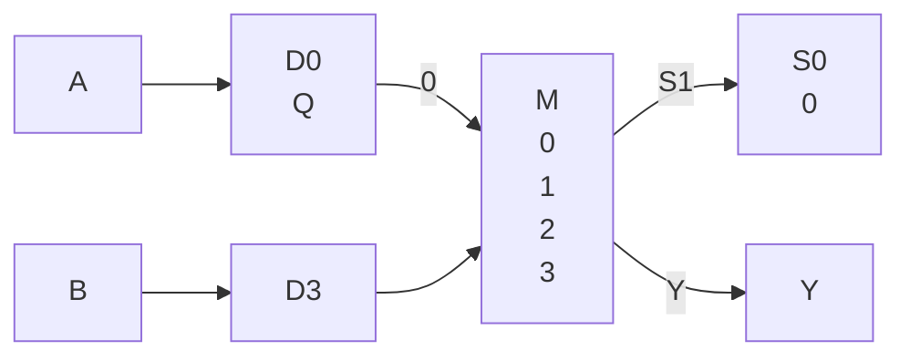
</details>

gatecse-2026-set2 digital-logic digital-circuits numerical-answers two-marks

# Answer key

# 4.13.1 Digital Counter: GATE CSE 1987 | Question: 1-III


<details>
<summary>flowchart</summary>

This image depicts a block diagram of a digital logic circuit with four identical inverters (J, K) and a clock signal, connected to an AND gate and output.
</details>

The above circuit produces the output sequence:

A. 1111 1111 0000 0000

c. 1111 0001 0011 0101

gate1987 digital-logic sequential-circuit flip-flop digital-counter

B. 1111 0000 1111 0000

D. 1010 1010 1010 1010

# Answer key

# 4.13.2 Digital Counter: GATE CSE 1987 | Question: 10c

Give a minimal DFA that performs as a mod -3, 1's counter, i.e. outputs a 1 each time the number of 1's in the input sequence is a multiple of 3.


gate1987 digital-logic digital-counter descriptive

# Answer key

# 4.13.3 Digital Counter: GATE CSE 1990 | Question: 5-c

For the synchronous counter shown in Fig.3, write the truth table of $Q_{0}, Q_{1}$ , and $Q_{2}$ after each pulse, starting from $Q_{0} = Q_{1} = Q_{2} = 0$ and determine the counting sequence and also the modulus of the counter.


<details>
<summary>text_image</summary>

Clock
J0 Q0
FF0
K0 Q0
1
J1 Q1
FF1
K1 Q1
1
J2 Q2
FF2
K2 Q2
</details>

gate1990 descriptive digital-logic sequential-circuit flip-flop digital-counter

# Answer key

# 4.13.4 Digital Counter: GATE CSE 1991 | Question: 5-c

Find the maximum clock frequency at which the counter in the figure below can be operated. Assume that the propagation delay through each flip flop and each AND gate is 10 ns. Also, assume that the setup time for the JK inputs of the flip flops is negligible.


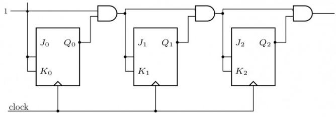

<details>
<summary>text_image</summary>

1
J0 Q0
K0
J1 Q1
K1
J2 Q2
K2
clock
</details>

gate1991 digital-logic sequential-circuit flip-flop digital-counter

# Answer key

# 4.13.5 Digital Counter: GATE CSE 1994 | Question: 2-1

The number of flip-flops required to construct a binary modulo $N$ counter is \_\_\_\_

gate1994 digital-logic sequential-circuit flip-flop digital-counter fill-in-the-blanks

Answer key


# 4.13.6 Digital Counter: GATE CSE 2002 | Question: 8

Consider the following circuit. $A = a_{2}a_{1}a_{0}$ and $B = b_{2}b_{1}b_{0}$ are three bit binary numbers input to the circuit.

The output is $Z = z_{3}z_{2}z_{1}z_{0}$ . R0, R1 and R2 are registers with loading clock shown. The registers are loaded with their input data with the falling edge of a clock pulse (signal CLOCK shown) and appears as shown. The bits of input number A, B and the full adders are as shown in the circuit. Assume Clock period is greater than the settling time of all circuits.


<details>
<summary>flowchart</summary>

This diagram illustrates a multi-bit signal processing system architecture with REG blocks (R0, R1, R2) and EA (Electrical Access) components, showing data flow from input through bit-level operations to output.
</details>

a. For 8 clock pulses on the CLOCK terminal and the inputs $A, B$ as shown, obtain the output $Z$ (sequence of $4 - bit$ values of $Z$ ). Assume initial contents of $R_0, R_1$ and $R_2$ as all zeros.

<table><tr><td>A</td><td>110</td><td>011</td><td>111</td><td>101</td><td>000</td><td>000</td><td>000</td><td>000</td></tr><tr><td>B</td><td>101</td><td>101</td><td>011</td><td>110</td><td>000</td><td>000</td><td>000</td><td>000</td></tr><tr><td>Clock No</td><td>1</td><td>2</td><td>3</td><td>4</td><td>5</td><td>6</td><td>7</td><td>8</td></tr></table>

b. What does the circuit implement?

gatecse-2002 digital-logic normal descriptive digital-counter

Answer key

# 4.13.7 Digital Counter: GATE CSE 2011 | Question: 15

The minimum number of D flip-flops needed to design a mod-258 counter is

A. 9

B. 8

C. 512

D. 258

gatecse-2011 digital-logic easy digital-counter

Answer key

# 4.13.8 Digital Counter: GATE CSE 2014 | Set 2 | Question: 7

Let $k = 2^n$ . A circuit is built by giving the output of an $n$ -bit binary counter as input to an $n$ -to- $2^n$ bit decoder. This circuit is equivalent to a


A. k-bit binary up counter.

B. $k$ -bit binary down counter.

C. k--bit ring counter.

D. k-bit Johnson counter.

gatecse-2014-set2 digital-logic normal digital-counter


# 4.13.9 Digital Counter: GATE CSE 2015 | Set 1 | Question: 20

Consider a 4-bit Johnson counter with an initial value of 0000. The counting sequence of this counter is

A. 0,1,3,7,15,14,12,8,0  
C. 0,2,4,6,8,10,12,14,0

B. 0,1,3,5,7,9,11,13,15,0  
D. 0,8,12,14,15,7,3,1,0

gatecse-2015-set1 digital-logic digital-counter easy

# Answer key

# 4.13.10 Digital Counter: GATE CSE 2015 | Set 2 | Question: 7

The minimum number of JK flip-flops required to construct a synchronous counter with the count sequence $(0,0,1,1,2,2,3,3,0,0,\ldots)$ is \_\_\_\_.

gatecse-2015-set2 digital-logic digital-counter normal numerical-answers

# Answer key

# 4.13.11 Digital Counter: GATE CSE 2016 | Set 1 | Question: 8

We want to design a synchronous counter that counts the sequence 0 - 1 - 0 - 2 - 0 - 3 and then repeats. The minimum number of J-K flip-flops required to implement this counter is \_\_\_\_.

gatecse-2016-set1 digital-logic digital-counter flip-flop normal numerical-answers

# Answer key

# 4.13.12 Digital Counter: GATE CSE 2017 | Set 2 | Question: 42

The next state table of a 2—bit saturating up-counter is given below.

<table><tr><td> $Q_{1}$ </td><td> $Q_{0}$ </td><td> $Q_{1}^{+}$ </td><td> $Q_{0}^{+}$ </td></tr><tr><td>0</td><td>0</td><td>0</td><td>1</td></tr><tr><td>0</td><td>1</td><td>1</td><td>0</td></tr><tr><td>1</td><td>0</td><td>1</td><td>1</td></tr><tr><td>1</td><td>1</td><td>1</td><td>1</td></tr></table>


The counter is built as a synchronous sequential circuit using $T$ flip-flops. The expressions for $T_{1}$ and $T_{0}$ are

A. $T_{1} = Q_{1}Q_{0},\quad T_{0} = \bar{Q}_{1}\bar{Q}_{0}$  
B. $T_{1} = \bar{Q}_{1}Q_{0},\quad T_{0} = \bar{Q}_{1} + \bar{Q}_{0}$  
C. $T_{1} = Q_{1} + Q_{0},\quad T_{0} = \bar{Q}_{1}\bar{Q}_{0}$  
D. $T_{1} = \bar{Q}_{1}Q_{0},\quad T_{0} = Q_{1} + Q_{0}$

gatecse-2017-set2 digital-logic digital-counter

# Answer key

# 4.13.13 Digital Counter: GATE CSE 2021 | Set 1 | Question: 28

Consider a 3-bit counter, designed using T flip-flops, as shown below:

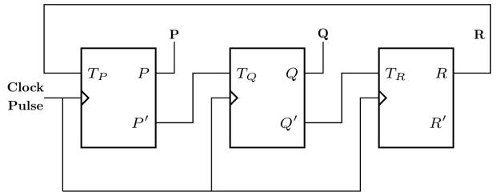

<details>
<summary>flowchart</summary>

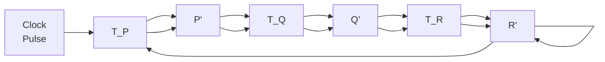
</details>

Assuming the initial state of the counter given by PQR as 000, what are the next three states?


A. 011,101,000

B. 001,010,111

c. 011,101,111

D. 001,010,000

gatecse-2021-set1 digital-logic sequential-circuit digital-counter two-marks

# Answer key

# 4.13.14 Digital Counter: GATE CSE 2023 | Question: 33

Consider a sequential digital circuit consisting of T flip-flops and D flip-flops as shown in the figure. CLKIN is the clock input to the circuit. At the beginning, Q1, Q2 and Q3 have values 0, 1 and 1, respectively.


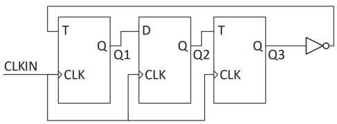

<details>
<summary>flowchart</summary>

This image depicts a block diagram of a digital logic circuit using a CLKIN and a D flip-flop, showing signal flow from input through Q to T and Q3.
</details>

Which one of the given values of (Q1, Q2, Q3) can NEVER be obtained with this digital circuit?

A. $(0,0,1)$

B. $(1,0,0)$

C. $(1,0,1)$

D. $(1,1,1)$

gatecse-2023 digital-logic flip-flop two-marks digital-counter

# Answer key

# 4.13.15 Digital Counter: GATE CSE 2026 | Set 1 | Question: 27

Consider a 2-bit saturating up/down counter that performs the saturating up count when the input P is 0, and the saturating down count when P is 1. The Next State table of the counter is as shown. The counter is built as a synchronous sequential circuit using D flip-flops.

<table><tr><td>Input</td><td colspan="2">Cureent State</td><td colspan="2">Next State</td></tr><tr><td>P</td><td> $Q_1$ </td><td> $Q_0$ </td><td> $Q_1^+$ </td><td> $Q_0^+$ </td></tr><tr><td>0</td><td>0</td><td>0</td><td>0</td><td>1</td></tr><tr><td>0</td><td>0</td><td>1</td><td>1</td><td>0</td></tr><tr><td>0</td><td>1</td><td>0</td><td>1</td><td>1</td></tr><tr><td>0</td><td>1</td><td>1</td><td>1</td><td>1</td></tr><tr><td>1</td><td>0</td><td>0</td><td>0</td><td>0</td></tr><tr><td>1</td><td>0</td><td>1</td><td>0</td><td>0</td></tr><tr><td>1</td><td>1</td><td>0</td><td>0</td><td>1</td></tr><tr><td>1</td><td>1</td><td>1</td><td>1</td><td>0</td></tr></table>

Which one of the following options corresponds to the expressions for the inputs of the D flip-flops, $D_{1}$ and $D_{0}$ ?

A. $D_{1} = PQ_{1} + \bar{P} Q_{0} + Q_{1}Q_{0}$ $D_0 = PQ_0 + \bar{P} Q_1 + Q_1\overline{Q_0}$  
B. $D_{1} = \bar{P} Q_{1} + \bar{P} Q_{0} + Q_{1}Q_{0}$ $D_0 = \bar{P}\overline{Q_0} +\bar{P} Q_1 + Q_1\overline{Q_0}$  
C. $D_{1} = \bar{P}\overline{Q_{1}} +\bar{P} Q_{0} + Q_{1}Q_{0}$ $D_0 = \bar{P} Q_0 + \bar{P} Q_1 + Q_1\overline{Q_0}$  
D. $D_{1} = P\overline{Q_{1}} +\bar{P} Q_{0} + Q_{1}Q_{0}$ $D_0 = P\overline{Q_0} +\bar{P} Q_1 + Q_1\overline{Q_0}$

gatecse-2026-set1 digital-logic digital-counter sequential-circuit flip-flop two-marks

# Answer key

# 4.13.16 Digital Counter: GATE IT 2005 | Question: 11

How many pulses are needed to change the contents of a 8-bit up counter from 10101100 to 00100111 (rightmost bit is the LSB)?

A. 134

B. 133

C. 124

D. 123

gateit-2005 digital-logic digital-counter normal

# Answer key


# 4.13.17 Digital Counter: GATE IT 2008 | Question: 37

Consider the following state diagram and its realization by a JK flip flop


The combinational circuit generates J and K in terms of x, y and Q.

The Boolean expressions for J and K are :

A. $\overline{x\oplus y}$ and $\overline{x\oplus y}$

B. $\overline{x\oplus y}$ and $x\oplus y$

C. $x \oplus y$ and $\overline{x \oplus y}$

D. $x \oplus y$ and $x \oplus y$

gateit-2008 digital-logic boolean-algebra normal digital-counter

# Answer key

# 4.13.18 Digital Counter: GATE1992-04-c

Design a 3-bit counter using D-flip flops such that not more than one flip-flop changes state between any two consecutive states.


gate1992 digital-logic sequential-circuit flip-flop digital-counter normal descriptive

# Answer key

# 4.14

# Dual Function (1)

# 4.14.1 Dual Function: GATE CSE 2014 | Set 2 | Question: 6

The dual of a Boolean function $F(x_{1}, x_{2}, \ldots, x_{n}, +, .,')$ , written as $F^{D}$ is the same expression as that of $F$ with $+$ and $\cdot$ swapped. $F$ is said to be self-dual if $F = F^{D}$ . The number of self-dual functions with $n$ Boolean variables is


A. $2^{n}$

B. $2^{n - 1}$

C. $2^{2^n}$

D. $2^{2^{n - 1}}$

gatecse-2014-set2 digital-logic normal dual-function boolean-algebra

# Answer key

# 4.15

# Finite State Machines (4)

# 4.15.1 Finite State Machines: GATE CSE 1994 | Question: 3.3

State True or False with one line explanation


A FSM (Finite State Machine) can be designed to add two integers of any arbitrary length (arbitrary number of digits).

gate1994 digital-logic normal true-false finite-state-machines

# Answer key

# 4.15.2 Finite State Machines: GATE CSE 1995 | Question: 2.23

A finite state machine with the following state table has a single input x and a single out z.


<table><tr><td rowspan="2">present state</td><td colspan="2">next state, z</td></tr><tr><td>x=1</td><td>x=0</td></tr><tr><td>A</td><td>D,0</td><td>B,0</td></tr><tr><td>B</td><td>B,1</td><td>C,1</td></tr><tr><td>C</td><td>B,0</td><td>D,1</td></tr><tr><td>D</td><td>B,1</td><td>C,0</td></tr></table>

If the initial state is unknown, then the shortest input sequence to reach the final state C is:

A. 01

B. 10

C. 101

D. 110

gate1995 digital-logic normal finite-state-machines

Answer key

# 4.15.3 Finite State Machines: GATE CSE 1996 | Question: 2.23

Consider the following state table for a sequential machine. The number of states in the minimized machine will be


<table><tr><td></td><td></td><td colspan="2">Input</td></tr><tr><td></td><td></td><td>0</td><td>1</td></tr><tr><td rowspan="4">Present State</td><td>A</td><td>D,0</td><td>B,1</td></tr><tr><td>B</td><td>A,0</td><td>C,1</td></tr><tr><td>C</td><td>A,0</td><td>B,1</td></tr><tr><td>D</td><td>A,1</td><td>C,1</td></tr><tr><td></td><td></td><td colspan="2">Next state, Output</td></tr></table>

A. 4

B. 3

C. 2

D. 1

gate1996 normal digital-logic finite-state-machines

Answer key

# 4.15.4 Finite State Machines: GATE CSE 2009 | Question: 27

Given the following state table of an FSM with two states A and B, one input and one output.


<table><tr><td>PRESENT STATE A</td><td>PRESENT STATE B</td><td>Input</td><td>Next State A</td><td>Next State B</td><td>Output</td></tr><tr><td>0</td><td>0</td><td>0</td><td>0</td><td>0</td><td>1</td></tr><tr><td>0</td><td>1</td><td>0</td><td>1</td><td>0</td><td>0</td></tr><tr><td>1</td><td>0</td><td>0</td><td>0</td><td>1</td><td>0</td></tr><tr><td>1</td><td>1</td><td>0</td><td>1</td><td>0</td><td>0</td></tr><tr><td>0</td><td>0</td><td>1</td><td>0</td><td>1</td><td>0</td></tr><tr><td>0</td><td>1</td><td>1</td><td>0</td><td>0</td><td>1</td></tr><tr><td>1</td><td>0</td><td>1</td><td>0</td><td>1</td><td>1</td></tr><tr><td>1</td><td>1</td><td>1</td><td>0</td><td>0</td><td>1</td></tr></table>

If the initial state is A = 0, B = 0 what is the minimum length of an input string which will take the machine to the state A = 0, B = 1 with output = 1.

A. 3

B. 4

C. 5

D. 6

gatecse-2009 digital-logic normal finite-state-machines

Answer key

4.16

# Fixed Point Representation (2)

# 4.16.1 Fixed Point Representation: GATE CSE 2017 | Set 1 | Question: 7

The n-bit fixed-point representation of an unsigned real number X uses f bits for the fraction part. Let i = n - f. The range of decimal values for X in this representation is


A. $2^{-f}$ to $2^{i}$

B. $2^{-f}$ to $\left(2^{i} - 2^{-f}\right)$

C. 0 to $2^{i}$

D. 0 to $\left(2^{i}-2^{-f}\right)$

gatecse-2017-set1 digital-logic number-representation fixed-point-representation