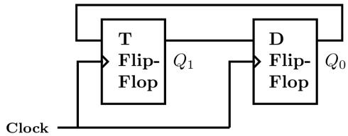
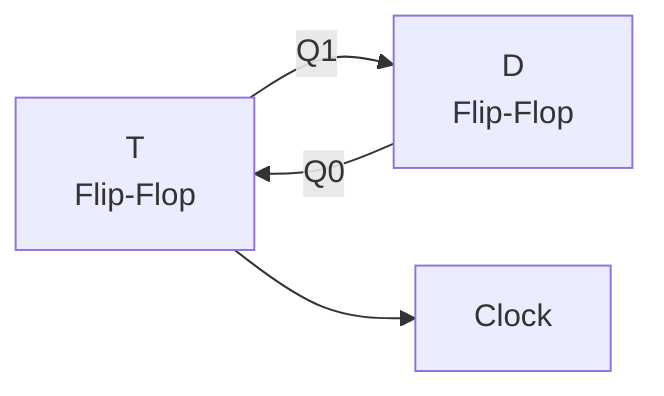
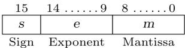
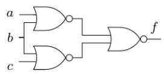
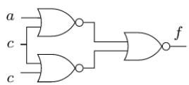
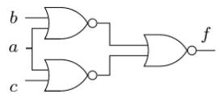
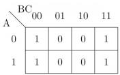

# 4.16.2 Fixed Point Representation: GATE CSE 2018 | Question: 33

Consider the unsigned 8-bit fixed point binary number representation, below,

$$
b _ {7} b _ {6} b _ {5} b _ {4} b _ {3} \cdot b _ {2} b _ {1} b _ {0}
$$

where the position of the primary point is between $b_{3}$ and $b_{2}$ . Assume $b_{7}$ is the most significant bit. Some of the decimal numbers listed below cannot be represented exactly in the above representation:

i. 31.500  
ii. 0.875  
iii. 12.100  
iv. 3.001

Which one of the following statements is true?

A. None of i, ii, iii, iv can be exactly represented  
B. Only ii cannot be exactly represented  
C. Only iii and iv cannot be exactly represented  
D. Only i and ii cannot be exactly represented

gatecse-2018 digital-logic number-representation fixed-point-representation normal two-marks

Answer key

# 4.17

# Flip Flop (7)

Practice Tests: Test 1 (15Q) Test 2 (6Q)

# 4.17.1 Flip Flop: GATE CSE 2001 | Question: 11

A sequential circuit takes an input stream of $0's$ and $1's$ and produces an output stream of $0's$ and $1's$ . Initially it replicates the input on its output until two consecutive $0's$ are encountered on the input. From then onward, it produces an output stream, which is the bit-wise complement of input stream until it encountered consecutive 1's, whereupon the process repeats. An example input and output stream is shown below.

The input stream: 101100|01001011|011

The desired output: 101100|10110100|011

J-K master-slave flip-flops are to be used to design the circuit.

a. Give the state transition diagram  
b. Give the minimized sum-of-product expression for J and K inputs of one of its state flip-flops

gatecse-2001 digital-logic normal descriptive flip-flop

Answer key

# 4.17.2 Flip Flop: GATE CSE 2004 | Question: 18, ISRO2007-31

In an $SR$ latch made by cross-coupling two NAND gates, if both $S$ and $R$ inputs are set to 0, then it will result in

A. $Q = 0, Q' = 1$  
c. $Q = 1, Q' = 1$  
gatecse-2004 digital-logic easy isro2007 flip-flop

B. $Q = 1, Q' = 0$

Answer key

# 4.17.3 Flip Flop: GATE CSE 2015 | Set 1 | Question: 37

A positive edge-triggered D flip-flop is connected to a positive edge-triggered JK flip-flop as follows. The Q

output of the D flip-flop is connected to both the J and K inputs of the JK flip-flop, while the Q output of the JK flip-flop is connected to the input of the D flip-flop. Initially, the output of the D flip-flop is set to logic one and the output of the JK flip-flop is cleared. Which one of the following is the bit sequence (including the initial state) generated at the Q output of the JK flip-flop when the flip-flops are connected to a free-running common clock? Assume that J = K = 1 is the toggle mode and J = K = 0 is the state holding mode of the JK flip-flops. Both the flip-flops have non-zero propagation delays.

A. 0110110...

B. 0100100...

C. 011101110...

D. 011001100...

gatecse-2015-set1 digital-logic flip-flop normal

Answer key

# 4.17.4 Flip Flop: GATE CSE 2017 | Set 1 | Question: 33

Consider a combination of T and D flip-flops connected as shown below. The output of the D flip-flop is connected to the input of the T flip-flop and the output of the T flip-flop is connected to the input of the D flip-flop.

flowchart

Initially, both $Q_{0}$ and $Q_{1}$ are set to 1 (before the $1^{st}$ clock cycle). The outputs

A. $Q_{1}Q_{0}$ after the $3^{\mathrm{rd}}$ cycle are 11 and after the $4^{\mathrm{th}}$ cycle are 00 respectively.  
B. $Q_{1}Q_{0}$ after the $3^{\mathrm{rd}}$ cycle are 11 and after the $4^{\mathrm{th}}$ cycle are 01 respectively.  
C. $Q_{1}Q_{0}$ after the $3^{\mathrm{rd}}$ cycle are 00 and after the $4^{\mathrm{th}}$ cycle are 11 respectively.  
D. $Q_{1}Q_{0}$ after the $3^{\mathrm{rd}}$ cycle are 01 and after the $4^{\mathrm{th}}$ cycle are 01 respectively.

gatecse-2017-set1 digital-logic flip-flop normal

Answer key

# 4.17.5 Flip Flop: GATE CSE 2018 | Question: 22

Consider the sequential circuit shown in the figure, where both flip-flops used are positive edge-triggered D flip-flops.

flowchart

The number of states in the state transition diagram of this circuit that have a transition back to the same state on some value of "in" is \_\_\_\_

gatecse-2018 digital-logic flip-flop numerical-answers normal one-mark

Answer key

# 4.17.6 Flip Flop: GATE CSE 2025 | Set 1 | Question: 50

Consider the given sequential circuit designed using D-Flip-flops. The circuit is initialized with some value (initial state). The number of distinct states the circuit will go through before returning back to the initial state is \_\_\_\_. (Answer in integer)

text_image

Q0
D0
Q0
CLK
Q1
D1
Q1
Q1
Q2
D2
Q2
Q2
Q3
D3
Q3
Q3

gatecse2025-set1 digital-logic flip-flop sequential-circuit numerical-answers two-marks

Answer key

# 4.17.7 Flip Flop: GATE IT 2007 | Question: 7

Which of the following input sequences for a cross-coupled R - S flip-flop realized with two NAND gates may lead to an oscillation?

A. 11,00

B. 01,10

C. 10,01

D. 00,11

gateit-2007 digital-logic normal flip-flop

Answer key

# 4.18

# Floating Point Representation (8)

Practice Test: Test 1 (11Q)

# 4.18.1 Floating Point Representation: GATE CSE 1987 | Question: 1-vii

The exponent of a floating-point number is represented in excess-N code so that:

A. The dynamic range is large.  
C. The smallest number is represented by all zeros.

B. The precision is high.

D. Overflow is avoided.

gate1987 digital-logic number-representation floating-point-representation

Answer key

# 4.18.2 Floating Point Representation: GATE CSE 1989 | Question: 1-vi

Consider an excess -50 representation for floating point numbers with 4 BCD digit mantissa and 2 BCD digit exponent in normalised form. The minimum and maximum positive numbers that can be represented are \_\_\_\_ and \_\_\_\_ respectively.

descriptive gate1989 digital-logic number-representation floating-point-representation

Answer key

# 4.18.3 Floating Point Representation: GATE CSE 1990 | Question: 1-iv-a

A 32-bit floating-point number is represented by a 7-bit signed exponent, and a 24-bit fractional mantissa. The base of the scale factor is 16, The range of the exponent is \_\_\_\_

gate1990 digital-logic number-representation floating-point-representation fill-in-the-blanks

Answer key

# 4.18.4 Floating Point Representation: GATE CSE 1990 | Question: 1-iv-b

A 32-bit floating-point number is represented by a 7-bit signed exponent, and a 24-bit fractional mantissa.

The base of the scale factor is 16,

The range of the exponent is \_\_\_\_, if the scale factor is represented in excess-64 format.

gate1990

digital-logic

number-representation

floating-point-representation

fill-in-the-blanks

# Answer key

# 4.18.5 Floating Point Representation: GATE CSE 1997 | Question: 72

Following floating point number format is given

$f$ is a fraction represented by a $6 - bit$ mantissa (includes sign bit) in sign magnitude form, $e$ is a $4 - bit$ exponent (includes sign hit) in sign magnitude form and $n = (f, e) = f \cdot 2^e$ is a floating point number. Let $A = 54.75$ in decimal and $B = 9.75$ in decimal

a. Represent A and B as floating point numbers in the above format.  
b. Show the steps involved in floating point addition of A and B.  
c. What is the percentage error (up to one position beyond decimal point) in the addition operation in (b)?

gate1997 digital-logic floating-point-representation normal descriptive

# Answer key

# 4.18.6 Floating Point Representation: GATE CSE 2003 | Question: 43

The following is a scheme for floating point number representation using 16 bits.

Bit Position

Let $s, e$ , and $m$ be the numbers represented in binary in the sign, exponent, and mantissa fields respectively. Then the floating point number represented is:

$$
\left\{ \begin{array}{l l} (- 1) ^ {s} \left(1 + m \times 2 ^ {- 9}\right) 2 ^ {e - 3 1}, & \text {if the exponent} \neq 1 1 1 1 1 1 \\ 0, & \text {otherwise} \end{array} \right.
$$

What is the maximum difference between two successive real numbers representable in this system?

A. $2^{-40}$

B. $2^{-9}$

C. $2^{22}$

D. $2^{31}$

gatecse-2003

digital-logic

number-representation

floating-point-representation

normal

# Answer key

# 4.18.7 Floating Point Representation: GATE CSE 2005 | Question: 85-a

Consider the following floating-point format.

text_image

15 14 8 7 0
sign bit
Excess-64
Exponent
Mantissa

Mantissa is a pure fraction in sign-magnitude form.

The decimal number $0.239 \times 2^{13}$ has the following hexadecimal representation (without normalization and rounding off):

A. 0D 24

B. 0D 4D

C. 4D 0D

D. 4D 3D

gatecse-2005

digital-logic

number-representation

floating-point-representation

normal

# Answer key

# 4.18.8 Floating Point Representation: GATE CSE 2005 | Question: 85-b

Consider the following floating-point format.

text_image

15 14 8 7 0
Sign bit Excess-64 Exponent Mantissa

Mantissa is a pure fraction in sign-magnitude form.

The normalized representation for the above format is specified as follows. The mantissa has an implicit 1 preceding the binary (radix) point. Assume that only $0^{\prime}s$ are padded in while shifting a field.

The normalized representation of the above number $(0.239 \times 2^{13})$ is:

A. 0A 20

B. 11 34

C. 49 D0

D. 4A E8

gatecse-2005 digital-logic number-representation floating-point-representation normal

Answer key

# 4.19

# Functional Completeness (7)

Practice Test: Test 1 (5Q)

# 4.19.1 Functional Completeness: GATE CSE 1989 | Question: 4-iii

Show that $\{NOR\}$ is a functionally complete set of Boolean operations.

gate1989 descriptive digital-logic functional-completeness

Answer key

# 4.19.2 Functional Completeness: GATE CSE 1992 | Question: 02-ii

All digital circuits can be realized using only

A. Ex-OR gates

B. Multiplexers

C. Half adders

D. OR gates

gate1992 normal digital-logic digital-circuits multiple-selects functional-completeness combinational-circuit

Answer key

# 4.19.3 Functional Completeness: GATE CSE 1993 | Question: 9

Assume that only half adders are available in your laboratory. Show that any binary function can be implemented using half adders only.

gate1993 digital-logic combinational-circuit adder descriptive functional-completeness

Answer key

# 4.19.4 Functional Completeness: GATE CSE 1998 | Question: 5

The implication gate, shown below has two inputs (x and y); the output is 1 except when x = 1 and y = 0, realize $f = \bar{x}y + x\bar{y}$ using only four implication gates.

Show that the implication gate is functionally complete.

gate1998 digital-logic functional-completeness descriptive

Answer key

# 4.19.5 Functional Completeness: GATE CSE 1999 | Question: 2.9

Which of the following sets of component(s) is/are sufficient to implement any arbitrary Boolean function?

A. XOR gates, NOT gates  
B. 2 to 1 multiplexers  
C. AND gates, XOR gates  
D. Three-input gates that output $(A, B) + C$ for the inputs $A, B$ and $C$ .

gate1999 digital-logic normal functional-completeness multiple-selects

# Answer key

# 4.19.6 Functional Completeness: GATE CSE 2015 | Set 1 | Question: 39

Consider the operations

$$
f (X, Y, Z) = X ^ {\prime} Y Z + X Y ^ {\prime} + Y ^ {\prime} Z ^ {\prime} \text {and} g (X, Y, Z) = X ^ {\prime} Y Z + X ^ {\prime} Y Z ^ {\prime} + X Y
$$

Which one of the following is correct?

A. Both $\{f\}$ and $\{g\}$ are functionally complete  
B. Only $\{f\}$ is functionally complete  
C. Only $\{g\}$ is functionally complete  
D. Neither $\{f\}$ nor $\{g\}$ is functionally complete

gatecse-2015-set1 boolean-algebra difficult functional-completeness

# Answer key

# 4.19.7 Functional Completeness: GATE IT 2008 | Question: 1

A set of Boolean connectives is functionally complete if all Boolean functions can be synthesized using those. Which of the following sets of connectives is NOT functionally complete?

A. EX-NOR  
C. OR, negation

B. implication, negation  
D. NAND

gateit-2008 digital-logic easy functional-completeness

# Answer key

# 4.20

# IEEE Representation (14)

# Practice Tests: Test 1 (15Q) Test 2 (6Q)

# 4.20.1 IEEE Representation: GATE CSE 2008 | Question: 4

In the IEEE floating point representation the hexadecimal value 0x00000000 corresponds to

A. The normalized value $2^{-127}$

C. The normalized value +0

B. The normalized value $2^{-126}$

D. The special value +0

gatecse-2008 digital-logic floating-point-representation ieee-representation easy

# Answer key

# 4.20.2 IEEE Representation: GATE CSE 2012 | Question: 7

The decimal value 0.5 in IEEE single precision floating point representation has

A. fraction bits of 000...000 and exponent value of 0  
B. fraction bits of 000...000 and exponent value of -1  
C. fraction bits of 100...000 and exponent value of 0  
D. no exact representation

gatecse-2012 digital-logic normal number-representation ieee-representation

# Answer key

# 4.20.3 IEEE Representation: GATE CSE 2014 | Set 2 | Question: 45

The value of a float type variable is represented using the single-precision 32-bit floating point format of IEEE-754 standard that uses 1 bit for sign, 8 bits for biased exponent and 23 bits for the mantissa. A

float type variable X is assigned the decimal value of -14.25. The representation of X in hexadecimal notation is

A. C1640000H

B. 416C0000H

C. 41640000H

D. C16C0000H

gatecse-2014-set2 digital-logic number-representation normal ieee-representation

# Answer key

# 4.20.4 IEEE Representation: GATE CSE 2017 | Set 2 | Question: 12

Given the following binary number in 32-bit (single precision) IEEE-754 format :

# 00111110011011010000000000000000

The decimal value closest to this floating-point number is :

A. $1.45 \times 10^{1}$

B. $1.45 * 10^{-1}$

C. $2.27 \times 10^{-1}$

D. $2.27 \times 10^{1}$

gatecse-2017-set2 digital-logic ieee-representation number-representation floating-point-representation

# Answer key

# 4.20.5 IEEE Representation: GATE CSE 2020 | Question: 29

Consider three registers R1, R2, and R3 that store numbers in IEEE-754 single precision floating point format. Assume that R1 and R2 contain the values (in hexadecimal notation) 0x42200000 and 0xC1200000, respectively.

If $R3 = \frac{R1}{R2}$ , what is the value stored in R3?

A. 0x40800000

B. 0xC0800000

C. 0x83400000

D. 0xC8500000

gatecse-2020 digital-logic ieee-representation floating-point-representation two-marks

# Answer key

# 4.20.6 IEEE Representation: GATE CSE 2021 | Set 1 | Question: 24

Consider the following representation of a number in IEEE 754 single-precision floating point format with a bias of 127.

S:1 E:10000001 F:11110000000000000000000

Here S, E and F denote the sign, exponent, and fraction components of the floating point representation.

The decimal value corresponding to the above representation (rounded to 2 decimal places) is \_\_\_\_.

gatecse-2021-set1 digital-logic number-representation ieee-representation numerical-answers one-mark floating-point-representation

# Answer key

# 4.20.7 IEEE Representation: GATE CSE 2021 | Set 2 | Question: 4

The format of the single-precision floating point representation of a real number as per the IEEE 754 standard is as follows:

<table><tr><td>sign</td><td>exponent</td><td>mantissa</td></tr></table>

Which one of the following choices is correct with respect to the smallest normalized positive number represented using the standard?

A. exponent = 00000000 and mantissa = 000000000000000000000000  
B. exponent = 00000000 and mantissa = 000000000000000000000001  
C. exponent = 00000001 and mantissa = 000000000000000000000000

gatecse-2021-set2 digital-logic number-representation ieee-representation one-mark floating-point-representation

# Answer key

# 4.20.8 IEEE Representation: GATE CSE 2022 | Question: 31

Consider three floating point numbers A, B and C stored in registers $R_{A}$ , $R_{B}$ and $R_{C}$ , respectively as per IEEE-754 single precision floating point format. The 32-bit content stored in these registers (in hexadecimal form) are as follows.

$$
\boxed {\mathrm{R} _ {\mathrm{A}} = 0 \mathrm{xC} 1 4 0 0 0 0 0 \quad \mathrm{R} _ {\mathrm{B}} = 0 \mathrm{x} 4 2 1 0 0 0 0 0 \quad \mathrm{R} _ {\mathrm{C}} = 0 \mathrm{x} 4 1 4 0 0 0 0 0}
$$

Which one of the following is FALSE?

A. $A + C = 0$

B. $C = A + B$

C. $B = 3C$

D. $(B - C) > 0$

gatecse-2022 digital-logic ieee-representation number-representation two-marks floating-point-representation

# Answer key

# 4.20.9 IEEE Representation: GATE CSE 2023 | Question: 35

Consider the IEEE-754 single precision floating point numbers P = 0xC1800000 and Q = 0x3F5C2EF4.

Which one of the following corresponds to the product of these numbers (i.e., $P \times Q$ ), represented in the IEEE-754 single precision format?

A. 0x404C2EF4

B. 0x405C2EF4

C. 0xC15C2EF4

D. 0xC14C2EF4

gatecse-2023 digital-logic number-representation ieee-representation two-marks floating-point-representation

# Answer key

# 4.20.10 IEEE Representation: GATE CSE 2024 | Set 2 | Question: 4

The format of a single-precision floating-point number as per the IEEE 754 standard is:

<table><tr><td>Sign</td><td>Exponent</td><td>Mantissa</td></tr><tr><td>(1 bit)</td><td>(8 bits)</td><td>(23 bits)</td></tr></table>

Choose the largest floating-point number among the following options.

<table><tr><td rowspan="2">A.</td><td>Sign</td><td>Exponent</td><td>Mantissa</td></tr><tr><td>0</td><td>01111111</td><td>11111111111111111111111</td></tr><tr><td rowspan="2">B.</td><td>Sign</td><td>Exponent</td><td>Mantissa</td></tr><tr><td>0</td><td>11111110</td><td>11111111111111111111111</td></tr><tr><td rowspan="2">C.</td><td>Sign</td><td>Exponent</td><td>Mantissa</td></tr><tr><td>0</td><td>11111111</td><td>1111111111111111111111</td></tr><tr><td rowspan="2">D.</td><td>Sign</td><td>Exponent</td><td>Mantissa</td></tr><tr><td>0</td><td>01111111</td><td>000000000000000000000000</td></tr></table>

gatecse-2024-set2 digital-logic number-representation ieee-representation floating-point-representation one-mark

# Answer key

# 4.20.11 IEEE Representation: GATE CSE 2025 | Set 2 | Question: 39

Three floating point numbers X, Y, and Z are stored in three registers $R_{X}$ , $R_{Y}$ , and $R_{Z}$ , respectively in IEEE 754 single precision format as given below in hexadecimal:

$$
\mathrm{R} _ {\mathrm{X}} = 0 \mathrm{xC} 1 1 0 0 0 0 0, \mathrm{R} _ {\mathrm{Y}} = 0 \mathrm{x} 4 0 \mathrm{C} 0 0 0 0 0, \text {and} \mathrm{R} _ {\mathrm{Z}} = 0 \mathrm{x} 4 1 4 0 0 0 0 0
$$

Which of the following option(s) is/are CORRECT?

A. $4(X + Y) + Z = 0$

B. $2Y - Z = 0$

C. $4X + 3Z = 0$

D. $X + Y + Z = 0$

gatecse2025-set2 digital-logic number-representation ieee-representation multiple-selects two-marks

Answer key

# 4.20.12 IEEE Representation: GATE CSE 2026 | Set 1 | Question: 26

Consider the real valued variables X, Y and Z represented using the IEEE 754 singleprecision floating-point format. The binary representations of X and Y in hexadecimal notation are as follows:

$$
X: 3 5 \mathrm{C} 0 0 0 0 0 \quad Y: 3 4 \mathrm{A} 0 0 0 0 0
$$

Let $Z = X + Y$ .

Which one of the following is the binary representation of Z, in hexadecimal notation?

A. 35C80000

B. 35CC0000

C. 35E80000

D. 35EC0000

gatecse-2026-set1 digital-logic ieee-representation floating-point-representation two-marks

Answer key

# 4.20.13 IEEE Representation: GATE CSE 2026 | Set 2 | Question: 24

The 32-bit IEEE 754 single precision representation of a number is 0xC2710000. The number in decimal representation is \_\_\_\_. (rounded off to two decimal places)

gatecse-2026-set2 digital-logic ieee-representation numerical-answers one-mark

Answer key

# 4.20.14 IEEE Representation: GATE IT 2008 | Question: 7

The following bit pattern represents a floating point number in IEEE 754 single precision format 1 10000011 10100000000000000000000

The value of the number in decimal form is

A. -10

B. -13

C. -26

D. None of the above

gateit-2008 digital-logic ieee-representation number-representation floating-point-representation normal

Answer key

4.21

K Map (17)

Practice Tests: Test 1 (15Q) Test 2 (5Q) Weekly Quiz 1 (15Q) Weekly Quiz 2 (15Q)

# 4.21.1 K Map: GATE CSE 1987 | Question: 16-a

A Boolean function f is to be realized only by NOR gates. Its K-map is given below:

The realization is

A.

B.

C.

gate1987 digital-logic k-map

Answer key

D.

# 4.21.2 K Map: GATE CSE 1988 | Question: 3a-b

The Karnaugh map of a function of $(A,B,C)$ is shown on the left hand side of the above figure.

The reduced form of the same map is shown on the right hand side, in which the variable $C$ is entered in the map itself. Discuss,

a. The methodology by which the reduced map has been derived and  
b. the rules (or steps) by which the boolean function can be derived from the entries in the reduced map.

gate1988 descriptive digital-logic k-map

Answer key

# 4.21.3 K Map: GATE CSE 1992 | Question: 01-i

The Boolean function in sum of products form where K-map is given below (figure) is \_\_\_\_

gate1992 digital-logic k-map normal fill-in-the-blanks

Answer key

# 4.21.4 K Map: GATE CSE 1995 | Question: 15-b

What is the equivalent minimal Boolean expression (in sum of products form) for the Karnaugh map given below?

gate1995 digital-logic boolean-algebra k-map normal descriptive

Answer key

What is the equivalent Boolean expression in product-of-sums form for the Karnaugh map given in Fig

A. $B\overline{D} +\overline{B} D$

B. $(B + \overline{C} + D)(\overline{B} + C + \overline{D})$

C. $(B + D)(\overline{B} +\overline{D})$

D. $(B + \overline{D})(\overline{B} + D)$

gate1996 digital-logic k-map easy

Answer key

# 4.21.6 K Map: GATE CSE 1998 | Question: 2.7

The function represented by the Karnaugh map given below is

A. A. B

B. $AB + BC + CA$

c. $\overline{B\oplus C}$

D. A. BC

gate1998 digital-logic k-map normal

Answer key

# 4.21.7 K Map: GATE CSE 1999 | Question: 1.8

Which of the following functions implements the Karnaugh map shown below?

A. $\bar{A}B + CD$

B. $D(C + A)$

C. $AD + \bar{A}B$

D. $(C + D)(\bar{C} + D) + (A + B)$

gate1999 digital-logic k-map easy

Answer key

# 4.21.8 K Map: GATE CSE 2000 | Question: 2.11

Which functions does NOT implement the Karnaugh map given below?

heatmap

| xy \ wz | 00 | 01 | 11 | 10 |
| :--- | :--- | :--- | :--- | :--- |
| 00 | 0 | X | 0 | 0 |
| 01 | 0 | X | 1 | 1 |
| 11 | 1 | 1 | 1 | 1 |
| 10 | 0 | X | 0 | 0 |

A. $(w + x)y$

B. $xy + yw$

C. $(w + x)(\bar{w} + y)(\bar{x} + y)$

gatecse-2000 digital-logic k-map normal

D. None of the above

Answer key

# 4.21.9 K Map: GATE CSE 2001 | Question: 1.11

Given the following karnaugh map, which one of the following represents the minimal Sum-Of-Products of the map?

<table><tr><td>yz\wx</td><td>00</td><td>01</td><td>11</td><td>10</td></tr><tr><td>00</td><td>0</td><td>X</td><td>0</td><td>X</td></tr><tr><td>01</td><td>X</td><td>1</td><td>X</td><td>1</td></tr><tr><td>11</td><td>0</td><td>X</td><td>1</td><td>0</td></tr><tr><td>10</td><td>0</td><td>1</td><td>X</td><td>0</td></tr></table>

A. $XY + Y'Z$

B. $WX^{\prime}Y^{\prime} + XY + XZ$

C. $W^{\prime}X + Y^{\prime}Z + XY$

D. $XZ + Y$

gatecse-2001 k-map digital-logic normal

Answer key

# 4.21.10 K Map: GATE CSE 2002 | Question: 1.12

Minimum sum of product expression for $f(w, x, y, z)$ shown in Karnaugh-map below

<table><tr><td>yz\wx</td><td>00</td><td>01</td><td>11</td><td>10</td></tr><tr><td>00</td><td>0</td><td>1</td><td>1</td><td>0</td></tr><tr><td>01</td><td>X</td><td>0</td><td>0</td><td>1</td></tr><tr><td>11</td><td>X</td><td>0</td><td>0</td><td>1</td></tr><tr><td>10</td><td>0</td><td>1</td><td>1</td><td>X</td></tr></table>

A. $xz + y'z$

B. $xz' + zx'$

C. $x^{\prime}y + zx^{\prime}$

D. None of the above

gatecse-2002 digital-logic k-map normal

Answer key

# 4.21.11 K Map: GATE CSE 2003 | Question: 45

The literal count of a Boolean expression is the sum of the number of times each literal appears in the expression. For example, the literal count of $(xy + xz')$ is 4. What are the minimum possible literal counts of the product-of-sum and sum-of-product representations respectively of the function given by the following Karnaugh map? Here, X denotes "don't care"

<table><tr><td>xy\zw</td><td>00</td><td>01</td><td>11</td><td>10</td></tr><tr><td>00</td><td>X</td><td>1</td><td>0</td><td>1</td></tr><tr><td>01</td><td>0</td><td>1</td><td>X</td><td>0</td></tr><tr><td>11</td><td>1</td><td>X</td><td>X</td><td>0</td></tr><tr><td>10</td><td>X</td><td>0</td><td>0</td><td>X</td></tr></table>

A. (11,9)

B. (9,13)

C. (9,10)

D. (11,11)

gatecse-2003 digital-logic k-map normal

Answer key

