In the Karnaugh map shown below, $X$ denotes a don't care term. What is the minimal form of the function represented by the Karnaugh map?

A. $\bar{b}.\bar{d} +\bar{a}.\bar{d}$  
C. $\overline{b}.\overline{d} +\overline{a}.b.\overline{d}$

B. $\bar{a}.\bar{b} +\bar{b}.\bar{d} +\bar{a}.b.\bar{d}$  
D. $\bar{a}, \bar{b} + \bar{b}, \bar{d} + \bar{a}, \bar{d}$

gatecse-2008 digital-logic k-map easy

Answer key

# 4.21.13 K Map: GATE CSE 2012 | Question: 30

What is the minimal form of the Karnaugh map shown below? Assume that $X$ denotes a don't care term

other

| cd \ ab | 00 | 01 | 11 | 10 |
| :--- | :--- | :--- | :--- | :--- |
| 00 | 1 | X | X | 1 |
| 01 | X | | | 1 |
| 11 | | | | |
| 10 | 1 | | | X |

A. $\overline{b}\overline{d}$  
C. $\bar{b}\bar{d} + a\bar{b}\bar{c}d$

B. $\bar{b}\bar{d} +\bar{b}\bar{c}$  
D. $\bar{b}\bar{d} +\bar{b}\bar{c} +\bar{c}\bar{d}$

gatecse-2012 digital-logic k-map easy

Answer key

# 4.21.14 K Map: GATE CSE 2025 | Set 2 | Question: 33

Given the following Karnaugh Map for a Boolean function $F(w, x, y, z)$ :

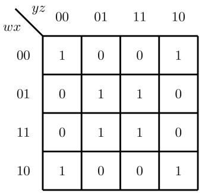

heatmap

| wx \ yz | 00 | 01 | 11 | 10 |
| --- | --- | --- | --- | --- |
| 00 | 1 | 0 | 0 | 1 |
| 01 | 0 | 1 | 1 | 0 |
| 11 | 0 | 1 | 1 | 0 |
| 10 | 1 | 0 | 0 | 1 |

Which one or more of the following Boolean expression(s) represent(s) F ?

A. $\bar{w}\bar{x}\bar{y}\bar{z} + w\bar{x}\bar{y}\bar{z} + \bar{w}\bar{x}y\bar{z} + w\bar{x}y\bar{z} + xz$  
B. $\bar{w}\bar{x}\bar{y}\bar{z} + \bar{w}\bar{x}y\bar{z} + w\bar{x}yz + xz$  
C. $\bar{w}\bar{x}\bar{y}\bar{z} + w\bar{x}\bar{y}\bar{z} + w\bar{x}\bar{y}z + xz$  
D. $\bar{x}\bar{z} + xz$

# 4.21.15 K Map: GATE IT 2006 | Question: 35

The boolean function for a combinational circuit with four inputs is represented by the following Karnaugh map.

heatmap

| RS \ PQ | 00 | 01 | 11 | 10 |
| :--- | :--- | :--- | :--- | :--- |
| 00 | 1 | 0 | 0 | 1 |
| 01 | 0 | 0 | 1 | 1 |
| 11 | 1 | 1 | 1 | 0 |
| 10 | 1 | 0 | 0 | 1 |

Which of the product terms given below is an essential prime implicant of the function?

A. QRS

B. PQS

C. PQ'S'

D. Q'S'

gateit-2006 digital-logic k-map normal

Answer key

# 4.21.16 K Map: GATE IT 2007 | Question: 78

Consider the following expression

$$
a \bar {d} + \bar {a} \bar {c} + b \bar {c} d
$$

Which of the following Karnaugh Maps correctly represents the expression?

A.

B.

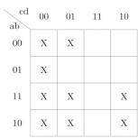

C.

D.

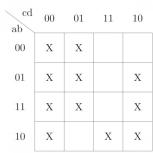

gateit-2007 digital-logic k-map normal

Answer key

# 4.21.17 K Map: GATE IT 2007 | Question: 79

Consider the following expression

$$
a \bar {d} + \bar {a} \bar {c} + b \bar {c} d
$$

Which of the following expressions does not correspond to the Karnaugh Map obtained for the given expression?

A. $\bar{c} \bar{d} + a \bar{d} + ab \bar{c} + \bar{a} \bar{c} d$  
B. $\bar{a}\bar{c} +\bar{c}\bar{d} +a\bar{d} +ab\bar{c} d$  
C. $\bar{a}\bar{c} + a\bar{d} + ab\bar{c} + \bar{c}d$  
D. $\bar{b}\bar{c}\bar{d} + ac\bar{d} + \bar{a}\bar{c} + ab\bar{c}$

gateit-2007 digital-logic k-map normal

Answer key

# 4.22

# Little Endian Big Endian (1)

# 4.22.1 Little Endian Big Endian: GATE CSE 2021 | Set 2 | Question: 44

If the numerical value of a 2-byte unsigned integer on a little endian computer is 255 more than that on a big endian computer, which of the following choices represent(s) the unsigned integer on a little endian computer?

A. 0x6665

B. 0x0001

C. 0x4243

D. 0x0100

# 4.23

# Memory Interfacing (5)

Practice Test: Test 1 (5Q)

# 4.23.1 Memory Interfacing: GATE CSE 1995 | Question: 2.2

The capacity of a memory unit is defined by the number of words multiplied by the number of bits/word. How many separate address and data lines are needed for a memory of $4K \times 16$ ?

A. 10 address, 16 data lines

B. 11 address, 8 data lines

C. 12 address, 16 data lines

D. 12 address, 12 data lines

gate1995 digital-logic memory-interfacing normal

Answer key

# 4.23.2 Memory Interfacing: GATE CSE 2009 | Question: 7, ISRO2015-3

How many $32K \times 1$ RAM chips are needed to provide a memory capacity of 256K bytes?

A. 8

B. 32

C. 64

D. 128

gatecse-2009 digital-logic memory-interfacing easy isro2015

Answer key

# 4.23.3 Memory Interfacing: GATE CSE 2010 | Question: 7

The main memory unit with a capacity of 4 megabytes is built using $1M \times 1$ -bit DRAM chips. Each DRAM chip has 1K rows of cells with 1K cells in each row. The time taken for a single refresh operation is 100 nanoseconds. The time required to perform one refresh operation on all the cells in the memory unit is

A. 100 nanoseconds

B. $100 \times 2^{10}$ nanoseconds

C. $100 \times 2^{20}$ nanoseconds

D. $3200 \times 2^{20}$ nanoseconds

gatecse-2010 digital-logic memory-interfacing normal

Answer key

# 4.23.4 Memory Interfacing: GATE CSE 2013 | Question: 46

A RAM chip has a capacity of 1024 words of 8 bits each (1K × 8). The number of 2 × 4 decoders with enable line needed to construct a 16K × 16 RAM from 1K × 8 RAM is

(A) 4 (B) 5 (C) 6 (D) 7

gatecse-2013 digital-logic normal memory-interfacing

Answer key

# 4.23.5 Memory Interfacing: GATE IT 2005 | Question: 9

A dynamic RAM has a memory cycle time of 64 nsec. It has to be refreshed 100 times per msec and each refresh takes 100 nsec. What percentage of the memory cycle time is used for refreshing?

A. 10

B. 6.4

C. 1

D. 0.64

gateit-2005 digital-logic memory-interfacing normal

Answer key

# 4.24

# Min No Gates (6)

Practice Tests: Test 1 (15Q) Test 2 (7Q)

# 4.24.1 Min No Gates: GATE CSE 1995 | Question: 15-a

Implement a circuit having the following output expression using an inverter and a nand gate

$$
Z = \overline {{A}} + \overline {{B}} + C
$$

gate1995 digital-logic normal descriptive min-no-gates digital-circuits boolean-algebra

# Answer key

# 4.24.2 Min No Gates: GATE CSE 2000 | Question: 9

Design a logic circuit to convert a single digit BCD number to the number modulo six as follows (Do not detect illegal input):

A. Write the truth table for all bits. Label the input bits $I_1, I_2, \ldots$ with $I_1$ as the least significant bit. Label the output bits $R_1, R_2, \ldots$ with $R_1$ as the least significant bit. Use 1 to signify truth.  
B. Draw one circuit for each output bit using, altogether, two two-input AND gates, one two-input OR gate and two NOT gates.

gatecse-2000 digital-logic min-no-gates descriptive

# Answer key

# 4.24.3 Min No Gates: GATE CSE 2004 | Question: 58

A circuit outputs a digit in the form of 4 bits. 0 is represented by 0000, 1 by 0001, ..., 9 by 1001. A combinational circuit is to be designed which takes these 4 bits as input and outputs 1 if the digit $\geq 5$ , and 0 otherwise. If only AND, OR and NOT gates may be used, what is the minimum number of gates required?

A. 2

B. 3

C. 4

D. 5

gatecse-2004 digital-logic normal min-no-gates

# Answer key

# 4.24.4 Min No Gates: GATE CSE 2009 | Question: 6

What is the minimum number of gates required to implement the Boolean function (AB+C) if we have to use only 2-input NOR gates?

A. 2

B. 3

C. 4

D. 5

gatecse-2009 digital-logic min-no-gates normal

# Answer key

# 4.24.5 Min No Gates: GATE CSE 2017 | Set 1 | Question: 21

Consider the Karnaugh map given below, where X represents "don't care" and blank represents 0.

<table><tr><td>dc\ba</td><td>00</td><td>01</td><td>11</td><td>10</td></tr><tr><td>00</td><td></td><td>X</td><td>X</td><td></td></tr><tr><td>01</td><td>1</td><td></td><td></td><td>X</td></tr><tr><td>11</td><td>1</td><td></td><td></td><td>1</td></tr><tr><td>10</td><td></td><td>X</td><td>X</td><td></td></tr></table>

Assume for all inputs $(a, b, c, d)$ , the respective complements $(\bar{a}, \bar{b}, \bar{c}, \bar{d})$ are also available. The above logic is implemented using 2-input NOR gates only. The minimum number of gates required is \_\_\_\_.

gatecse-2017-set1 digital-logic k-map numerical-answers normal min-no-gates

# Answer key

# 4.24.6 Min No Gates: GATE IT 2004 | Question: 8

What is the minimum number of NAND gates required to implement a 2-input EXCLUSIVE-OR function without using any other logic gate?

A. 2

B. 4

C. 5

D. 6

gateit-2004 digital-logic min-no-gates normal

Answer key

# 4.25

# Min Products of Sum Form (2)

# 4.25.1 Min Products of Sum Form: GATE CSE 1990 | Question: 5-a

Find the minimum product of sums of the following expression

$$
f = A B C + \overline {{A}} \overline {{B}} \overline {{C}}
$$

gate1990 digital-logic boolean-algebra min-products-of-sum-form canonical-normal-form descriptive

Answer key

# 4.25.2 Min Products of Sum Form: GATE CSE 2017 | Set 2 | Question: 28

Given $f(w, x, y, z) = \Sigma_m(0, 1, 2, 3, 7, 8, 10) + \Sigma_d(5, 6, 11, 15)$ ; where $d$ represents the 'don't-care' condition in Karnaugh maps. Which of the following is a minimum product-of-sums (POS) form of $f(w, x, y, z)$ ?

A. $f = (\bar{w} +\bar{z})(\bar{x} +z)$

B. $f = (\bar{w} + z)(x + z)$

C. $f = (w + z)(\bar{x} + z)$

D. $f = (w + \bar{z})(\bar{x} +z)$

gatecse-2017-set2 digital-logic min-products-of-sum-form

Answer key

# 4.26

# Min Sum of Products Form (16)

Practice Tests: Test 1 (15Q) Test 2 (1Q)

# 4.26.1 Min Sum of Products Form: GATE CSE 1991 | Question: 5-b

Find the minimum sum of products form of the logic function $f(A, B, C, D) = \Sigma_m(0, 2, 8, 10, 15) + \Sigma_d(3, 11, 12, 14)$ where $m$ and $d$ represent minterm and don't care term respectively.

gate1991 digital-logic boolean-algebra min-sum-of-products-form descriptive

Answer key

# 4.26.2 Min Sum of Products Form: GATE CSE 1997 | Question: 71

Let $f = (\bar{w} + y)(\bar{x} + y)(w + \bar{x} + z)(\bar{w} + z)(\bar{x} + z)$

A. Express f as the minimal sum of products. Write only the answer.  
B. If the output line is stuck at 0, for how many input combinations will the value of f be correct?

gate1997 digital-logic min-sum-of-products-form numerical-answers

Answer key

# 4.26.3 Min Sum of Products Form: GATE CSE 2001 | Question: 10

a. Is the 3-variable function $f = \Sigma(0,1,2,4)$ its self-dual? Justify your answer.  
b. Give a minimal product-of-sum form of the $\bar{b}$ output of the following excess-3 to BCD converter.

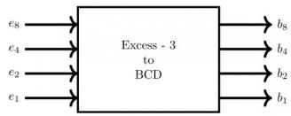

flowchart

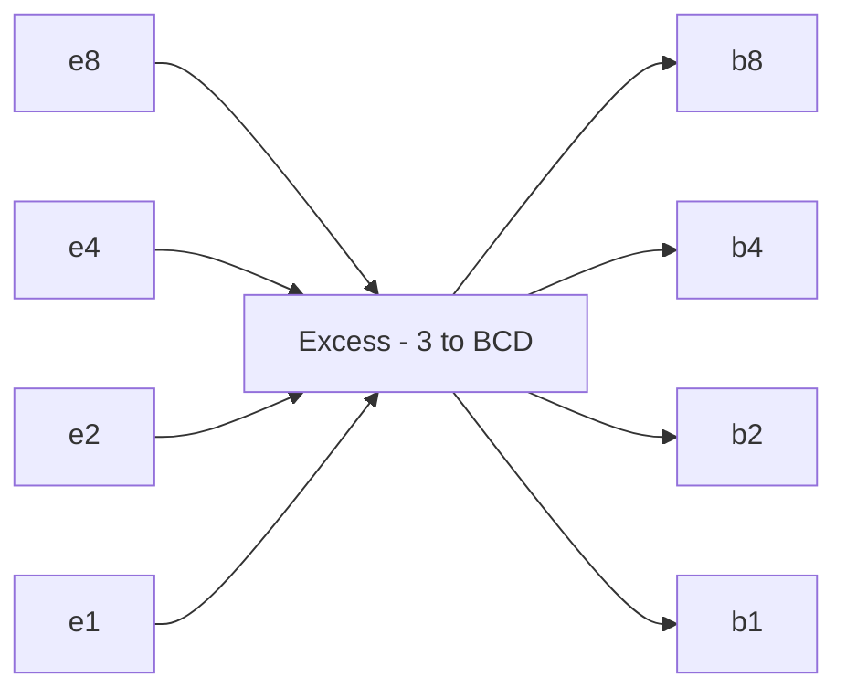

gatecse-2001 digital-logic normal descriptive min-sum-of-products-form

# Answer key

# 4.26.4 Min Sum of Products Form: GATE CSE 2005 | Question: 18

The switching expression corresponding to $f(A, B, C, D) = \Sigma(1, 4, 5, 9, 11, 12)$ is:

A. $BC^{\prime}D^{\prime} + A^{\prime}C^{\prime}D + AB^{\prime}D$

B. $ABC' + ACD + B'C'D$

C. $ACD' + A'BC' + AC'D'$

D. $A^{\prime}BD + ACD^{\prime} + BCD^{\prime}$

gatecse-2005 digital-logic normal min-sum-of-products-form

# Answer key

# 4.26.5 Min Sum of Products Form: GATE CSE 2007 | Question: 9

Consider the following Boolean function of four variables:

$$
f (w, x, y, z) = \Sigma (1, 3, 4, 6, 9, 1 1, 1 2, 1 4)
$$

The function is

A. independent of one variables.

B. independent of two variables.

C. independent of three variables.

D. dependent on all variables

gatecse-2007 digital-logic normal min-sum-of-products-form k-map

# Answer key

# 4.26.6 Min Sum of Products Form: GATE CSE 2011 | Question: 14

The simplified SOP (Sum of Product) from the Boolean expression

$$
(P + \bar {Q} + \bar {R}). (P + \bar {Q} + R). (P + Q + \bar {R})
$$

is

A. $(\bar{P}, Q + \bar{R})$

B. $(P + \bar{Q},\bar{R})$

C. $(\bar{P}.Q + R)$

D. $(P, Q + R)$

gatecse-2011 digital-logic normal min-sum-of-products-form

# Answer key

# 4.26.7 Min Sum of Products Form: GATE CSE 2014 | Set 1 | Question: 45

Consider the 4-to-1 multiplexer with two select lines $S_{1}$ and $S_{0}$ given below

text_image

0 → 0
1 → 1
R → 2
R̅ → 3
4-to-1
Multiplexer
→ F
S₁ S₀
P Q

The minimal sum-of-products form of the Boolean expression for the output F of the multiplexer is

A. $\bar{P}Q + Q\bar{R} + P\bar{Q}R$

B. $\bar{P}Q + \bar{P}Q\bar{R} + PQ\bar{R} + P\bar{Q}R$

c. $\bar{P} Q R + \bar{P} Q \bar{R} + Q \bar{R} + P \bar{Q} R$

D. $PQ\bar{R}$

gatecse-2014-set1 digital-logic normal multiplexer min-sum-of-products-form

# 4.26.8 Min Sum of Products Form: GATE CSE 2014 | Set 1 | Question: 7

Consider the following Boolean expression for F:

$$
F (P, Q, R, S) = P Q + \bar {P} Q R + \bar {P} Q \bar {R} S
$$

The minimal sum-of-products form of $F$ is

A. $PQ + QR + QS$

B. $P + Q + R + S$

C. $\bar{P} + \bar{Q} + \bar{R} + \bar{S}$

D. $\bar{P}R + \bar{R}\bar{P}S + P$

gatecse-2014-set1 digital-logic normal min-sum-of-products-form

# Answer key

# 4.26.9 Min Sum of Products Form: GATE CSE 2014 | Set 3 | Question: 7

Consider the following minterm expression for F:

$$
F (P, Q, R, S) = \sum 0, 2, 5, 7, 8, 1 0, 1 3, 1 5
$$

The minterms 2, 7, 8 and 13 are 'do not care' terms. The minimal sum-of-products form for $F$ is

A. $Q\bar{S} +\bar{Q} S$

B. $\bar{Q}\bar{S} + QS$

C. $\bar{Q}\bar{R}\bar{S} +\bar{Q} R\bar{S} +Q\bar{R} S + QRS$

D. $\bar{P}\bar{Q}\bar{S} +\bar{P}QS + PQS + P\bar{Q}\bar{S}$

gatecse-2014-set3 digital-logic min-sum-of-products-form normal

# Answer key

# 4.26.10 Min Sum of Products Form: GATE CSE 2018 | Question: 49

Consider the minterm list form of a Boolean function F given below.

$$
F (P, Q, R, S) = \Sigma m (0, 2, 5, 7, 9, 1 1) + d (3, 8, 1 0, 1 2, 1 4)
$$

Here, $m$ denotes a minterm and $d$ denotes a don't care term. The number of essential prime implicants of the function $F$ is \_\_\_\_

gatecse-2018 digital-logic min-sum-of-products-form k-map numerical-answers two-marks

# Answer key

# 4.26.11 Min Sum of Products Form: GATE CSE 2021 | Set 2 | Question: 52

Consider a Boolean function $f(w, x, y, z)$ such that

$$
f (w, 0, 0, z) = 1
$$

$$
f (1, x, 1, z) = x + z
$$

$$
f (w, 1, y, z) = w z + y
$$

The number of literals in the minimal sum-of-products expression of $f$ is \_\_\_\_

gatecse-2021-set2 digital-logic boolean-algebra min-sum-of-products-form numerical-answers two-marks

# Answer key

# 4.26.12 Min Sum of Products Form: GATE CSE 2024 | Set 1 | Question: 37

Consider a Boolean expression given by $\mathrm{F}(\mathrm{X}, \mathrm{Y}, \mathrm{Z}) = \sum(3, 5, 6, 7)$ .

Which of the following statements is/are CORRECT?

A. $\mathrm{F}(\mathrm{X}, \mathrm{Y}, \mathrm{Z}) = \Pi(0, 1, 2, 4)$

B. $\mathrm{F}(\mathrm{X}, \mathrm{Y}, \mathrm{Z}) = \mathrm{X} \mathrm{Y} + \mathrm{Y} \mathrm{Z} + \mathrm{X} \mathrm{Z}$

C. $\mathrm{F}(\mathrm{X}, \mathrm{Y}, \mathrm{Z})$ is independent of input Y

D. $\mathrm{F}(\mathrm{X}, \mathrm{Y}, \mathrm{Z})$ is independent of input
X

gatecse-2024-set1 multiple-selects digital-logic min-sum-of-products-form two-marks

# 4.26.13 Min Sum of Products Form: GATE CSE 2025 | Set 1 | Question: 32

Consider the following four variable Boolean function in sum-of-product form

$$
F \left(b _ {3}, b _ {2}, b _ {1}, b _ {0}\right) = \sum (0, 2, 4, 8, 1 0, 1 1, 1 2)
$$

where the value of the function is computed by considering $b_{3}b_{2}b_{1}b_{0}$ as a 4-bit binary number, where $b_{3}$ denotes the most significant bit and $b_{0}$ denotes the least significant bit. Note that there are no don't care terms. Which ONE of the following options is the CORRECT minimized Boolean expression for F?

A. $\overline{b}_1\overline{b}_0 + \overline{b}_2\overline{b}_0 + b_1\overline{b}_2b_3$

B. $\overline{b}_1\overline{b}_0 + \overline{b}_2\overline{b}_0$

C. $\bar{b}_2\bar{b}_0 + b_1b_2b_3$

D. $\bar{b}_{0}\bar{b}_{2}+\bar{b}_{3}$

gatecse2025-set1 digital-logic min-sum-of-products-form easy two-marks

# Answer key

# 4.26.14 Min Sum of Products Form: GATE CSE 2026 | Set 1 | Question: 38

Consider a Boolean function F with the following minterm expression:

$$
F (P, Q, R, S) = \sum m (1, 2, 3, 4, 5, 7, 1 0, 1 2, 1 3, 1 4)
$$

Which of the following options is/are the minimal sum-of-products expression(s) of F ?

A. $\bar{P} S + Q\bar{R} +\bar{P}\bar{Q} R + \bar{Q} R\bar{S}$  
B. $\bar{P} S + Q\bar{R} +\bar{P}\bar{Q} R + \bar{P} R\bar{S}$  
C. $\bar{P} S + Q\bar{R} + PQ\bar{S} + PR\bar{S}$  
D. $\bar{P} S + \bar{Q} \bar{R} + P \bar{Q} \bar{S} + \bar{Q} R \bar{S}$

gatecse-2026-set1 two-marks digital-logic min-sum-of-products-form k-map multiple-selects

# Answer key

# 4.26.15 Min Sum of Products Form: GATE CSE 2026 | Set 2 | Question: 30

Consider the following 4-variable Boolean function

$$
F (A, B, C, D) = \Sigma m (0, 1, 2, 3, 8, 9, 1 0, 1 1)
$$

Consider $A$ as MSB, $D$ as LSB. Which one of the following options represents the minimal sum of products form for the above function?

Note: + is OR operation, · is AND operation, / is NOT operation

A. $A^{\prime} + B^{\prime} + C^{\prime} + D^{\prime}$

B. $B'$

C. $A^{\prime} \cdot B^{\prime} + A \cdot B$

D. $A'$

gatecse-2026-set2 digital-logic min-sum-of-products-form k-map two-marks

# Answer key

# 4.26.16 Min Sum of Products Form: GATE IT 2008 | Question: 8

Consider the following Boolean function of four variables

$$
f (A, B, C, D) = \Sigma (2, 3, 6, 7, 8, 9, 1 0, 1 1, 1 2, 1 3)
$$

The function is

A. independent of one variable  
C. independent of three variable

gateit-2008 digital-logic normal min-sum-of-products-form

# Answer key

# 4.27.1 Multiplexer: GATE CSE 1990 | Question: 5-b

Show with the help of a block diagram how the Boolean function :

$$
f = A B + B C + C A
$$

can be realised using only a 4:1 multiplexer.

gate1990 descriptive digital-logic combinational-circuit multiplexer

# Answer key

# 4.27.2 Multiplexer: GATE CSE 1998 | Question: 1.14

A multiplexer with a 4-bit data select input is a

A. 4:1 multiplexer  
C. 16:1 multiplexer

gate1998 digital-logic multiplexer easy

B. 2:1 multiplexer  
D. 8:1 multiplexer

# Answer key

# 4.27.3 Multiplexer: GATE CSE 2001 | Question: 2.11

Consider the circuit shown below. The output of a 2 : 1 MUX is given by the function $(ac' + bc)$ .

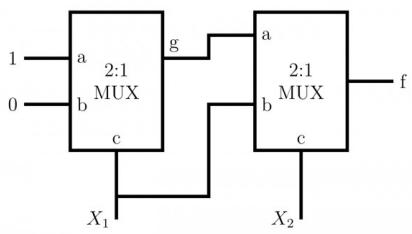

text_image

1
0
a 2:1
b MUX
c
X₁
g
a
b 2:1
c
X₂
f

Which of the following is true?

A. $f = X_1' + X_2$  
C. $f = X_{1}^{'} X_{2} + X_{1}^{\prime} X_{2}^{\prime}$

gatecse-2001 digital-logic normal multiplexer

B. $f = X_1'X_2 + X_1X_2'$  
D. $f = X_{1} + X_{2}'$

# Answer key

# 4.27.4 Multiplexer: GATE CSE 2004 | Question: 60

Consider a multiplexer with X and Y as data inputs and Z the as the control input. Z = 0 selects input X, and Z = 1 selects input Y. What are the connections required to realize the 2-variable Boolean function $f = T + R$ , without using any additional hardware?

A. R to X, 1 to Y, T to Z  
C. T to X, R to Y, 0 to Z

gatecse-2004 digital-logic normal multiplexer

B. T to X, R to Y, T to Z  
D. R to X, 0 to Y, T to Z

# Answer key

# 4.27.5 Multiplexer: GATE CSE 2007 | Question: 34

Suppose only one multiplexer and one inverter are allowed to be used to implement any Boolean function of n variables. What is the minimum size of the multiplexer needed?

A. $2^{n}$ line to 1 line  
C. $2^{n - 1}$ line to 1line

B. $2^{n + 1}$ line to 1line  
D. $2^{n - 2}$ line to 1line

# 4.27.6 Multiplexer: GATE CSE 2016 | Set 1 | Question: 30

Consider the two cascade 2 to 1 multiplexers as shown in the figure.

flowchart

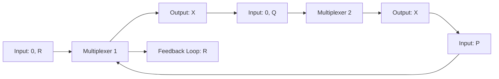

The minimal sum of products form of the output X is

A. $\overline{P}\overline{Q} + PQR$

B. $\overline{P} Q + QR$

c. $PQ + \overline{P}\overline{Q} R$

D. $\overline{Q}\overline{R} + PQR$

gatecse-2016-set1 digital-logic multiplexer normal

Answer key

# 4.27.7 Multiplexer: GATE CSE 2020 | Question: 19

A multiplexer is placed between a group of 32 registers and an accumulator to regulate data movement such that at any given point in time the content of only one register will move to the accumulator. The number of select lines needed for the multiplexer is \_\_\_\_.

gatecse-2020 numerical-answers digital-logic multiplexer one-mark

Answer key

# 4.27.8 Multiplexer: GATE CSE 2021 | Set 2 | Question: 5

Which one of the following circuits implements the Boolean function given below?

$f(x,y,z) = m_0 + m_1 + m_3 + m_4 + m_5 + m_6,$ where $m_{i}$ is the $i^{\mathrm{th}}$ minterm.

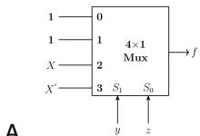  
A.

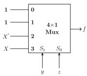  
C.

gatecse-2021-set2 digital-logic combinational-circuit multiplexer one-mark

  
B.

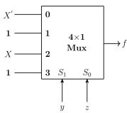  
D.

Answer key

# 4.27.9 Multiplexer: GATE CSE 2023 | Question: 11

The output of a 2-input multiplexer is connected back to one of its inputs as shown in the figure.

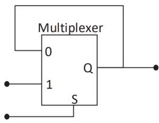

text_image

Multiplexer
0
1
Q
S

Match the functional equivalence of this circuit to one of the following options.

A. D Flip-flop

B. D Latch

C. Half-adder

D. Demultiplexer

# 4.27.10 Multiplexer: GATE CSE 2023 | Question: 34

A Boolean digital circuit is composed using two 4-input multiplexers (M1 and M2) and one 2-input multiplexer (M3) as shown in the figure. X0-X7 are the inputs of the multiplexers M1 and M2 and could be connected to either 0 or 1. The select lines of the multiplexers are connected to Boolean variables A, B and C as shown.

text_image

Multiplexer
0 M1
X0
X1
X2
X3
A
C
S1 S0
Q
Multiplexer
0 M3
Q
1 S
Multiplexer
0 M2
X4
X5
X6
X7
A
C
B
S1 S0
Q
S

Which one of the following set of values of (X0, X1, X2, X3, X4, X5, X6, X7) will realise the Boolean function $\overline{\mathbf{A}} + \overline{\mathbf{A}} \cdot \overline{\mathbf{C}} + \mathbf{A} \cdot \overline{\mathbf{B}} \cdot \mathbf{C}$ ?

A. $(1,1,0,0,1,1,1,0)$

B. $(1,1,0,0,1,1,0,1)$

C. $(1,1,0,1,1,1,0,0)$

D. $(0,0,1,1,0,1,1,1)$

gatecse-2023 digital-logic combinational-circuit multiplexer two-marks

# Answer key

# 4.27.11 Multiplexer: GATE CSE 2024 | Set 1 | Question: 54

Consider a digital logic circuit consisting of three 2-to-1 multiplexers M1, M2, and M3 as shown below. X1 and X2 are inputs of M1. X3 and X4 are inputs of M2. A, B, and C are select lines of M1, M2, and M3, respectively.

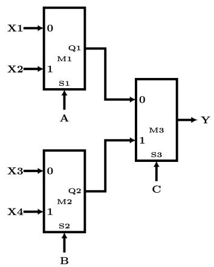

flowchart

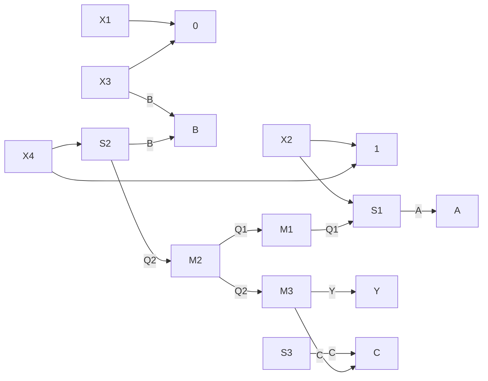

For an instance of inputs $\mathbf{X1} = \mathbf{1}, \mathbf{X2} = \mathbf{1}, \mathbf{X3} = \mathbf{0}$ , and $\mathbf{X4} = \mathbf{0}$ , the number of combinations of A, B, C that give the output $\mathbf{Y} = \mathbf{1}$ is \_\_\_\_.

gatecse-2024-set1 numerical-answers digital-logic multiplexer two-marks

# Answer key

# 4.27.12 Multiplexer: GATE IT 2005 | Question: 48

The circuit shown below implements a 2-input NOR gate using two 2 - 4 MUX (control signal 1 selects the upper input). What are the values of signals x, y and z?

flowchart

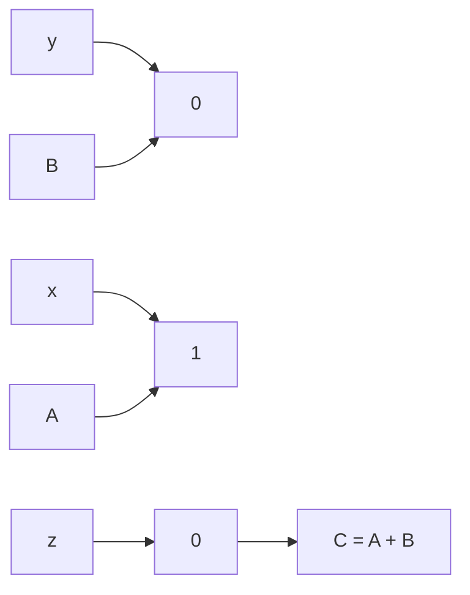

A. 1,0,B

B. 1,0,A

C. 0,1,B

D. 0,1,A

gateit-2005 digital-logic normal multiplexer

Answer key

# 4.27.13 Multiplexer: GATE IT 2007 | Question: 8

The following circuit implements a two-input AND gate using two 2 - 1 multiplexers.

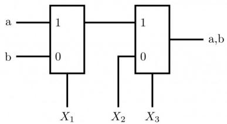

text_image

a
1
b
0
X₁
1
0
X₂
X₃
a,b

What are the values of $X_{1}, X_{2}, X_{3}$ ?

A. $X_{1} = b, X_{2} = 0, X_{3} = a$  
C. $X_{1} = a, X_{2} = b, X_{3} = 1$

gateit-2007 digital-logic normal multiplexer

B. $X_{1} = b, X_{2} = 1, X_{3} = b$  
D. $X_{1} = a, X_{2} = 0, X_{3} = b$

Answer key

# 4.27.14 Multiplexer: GATE1992-04-b

A priority encoder accepts three input signals (A, B and C) and produces a two-bit output $(X_{1}, X_{0})$ corresponding to the highest priority active input signal. Assume $A$ has the highest priority followed by $B$ and $C$ has the lowest priority. If none of the inputs are active the output should be 00, design the priority encoder using 4:1 multiplexers as the main components.

gate1992 digital-logic combinational-circuit multiplexer descriptive

Answer key

# 4.28

# Number Representation (57)

Practice Tests: Test 1 (15Q) Test 2 (15Q) Test 3 (15Q) Test 4 (15Q) Test 5 (9Q)

# 4.28.1 Number Representation: GATE CSE 1990 | Question: 1-viii

The condition for overflow in the addition of two 2's complement numbers in terms of the carry generated by the two most significant bits is \_\_\_\_.

gate1990 digital-logic number-representation fill-in-the-blanks

Answer key

# 4.28.2 Number Representation: GATE CSE 1991 | Question: 01-iii

Consider the number given by the decimal expression:

$$
1 6 ^ {3} * 9 + 1 6 ^ {2} * 7 + 1 6 * 5 + 3
$$

The number of 1's in the unsigned binary representation of the number is \_\_\_\_