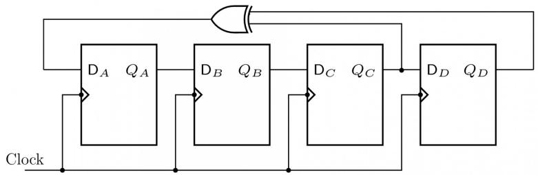
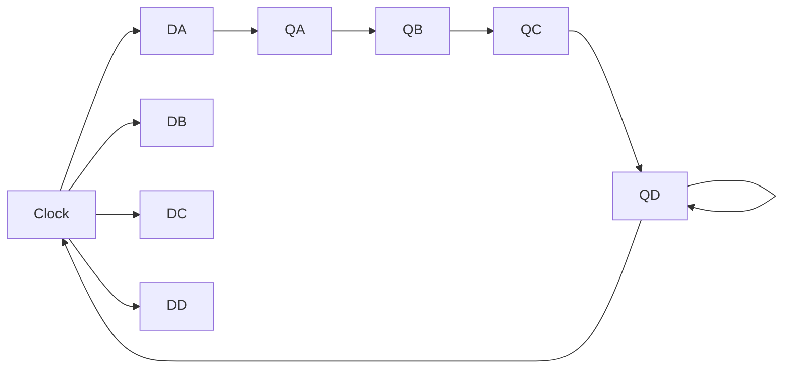

# Answer key

# 4.28.3 Number Representation: GATE CSE 1991 | Question: 01-v

When two 4-bit numbers $A = a_{3}a_{2}a_{1}a_{0}$ and $B = b_{3}b_{2}b_{1}b_{0}$ are multiplied, the bit $c_{1}$ of the product C is given by \_\_\_\_


gate1991 digital-logic normal number-representation fill-in-the-blanks

# Answer key

# 4.28.4 Number Representation: GATE CSE 1992 | Question: 4-a

Consider addition in two's complement arithmetic. A carry from the most significant bit does not always correspond to an overflow. Explain what is the condition for overflow in two's complement arithmetic.


gate1992 digital-logic normal number-representation descriptive

# Answer key

# 4.28.5 Number Representation: GATE CSE 1993 | Question: 6.5

Convert the following numbers in the given bases into their equivalents in the desired bases:


A. $(110.101)_2 = (x)_{10}$  
B. $(1118)_{10} = (y)_{H}$

gate1993 digital-logic number-representation normal descriptive

# Answer key

# 4.28.6 Number Representation: GATE CSE 1994 | Question: 2.7

Consider $n$ -bit (including sign bit) $2's$ complement representation of integer numbers. The range of integer values, $N$ , that can be represented is \_\_\_\_ $\leq N \leq$ \_\_\_\_.


gate1994 digital-logic number-representation easy fill-in-the-blanks

# Answer key

# 4.28.7 Number Representation: GATE CSE 1995 | Question: 18

The following is an incomplete Pascal function to convert a given decimal integer (in the range $-8$ to $+7$ ) into a binary integer in 2's complement representation. Determine the expressions $A, B, C$ that complete program.


```vhdl
function TWOSCOMP (N:integer):integer;
  var
  REM, EXPONENT:integer;
  BINARY :integer;
  begin
    if(N>=-8) and (N<=+7) then
      begin
        if N<0 then
          N:=A;
        BINARY:=0;
        EXPONENT:=1;
        while N<>0 do
          begin
            REM:=N mod 2;
            BINARY:=BINARY + B*EXPONENT;
            EXPONENT:=EXPONENT*10;
            N:=C
          end
        TWOSCOMP:=BINARY
      end
  end;
```

# 4.28.8 Number Representation: GATE CSE 1995 | Question: 2.12, ISRO2015-9

The number of 1's in the binary representation of $(3 * 4096 + 15 * 256 + 5 * 16 + 3)$ are:

A. 8

B. 9

C. 10

D. 12

gate1995

digital-logic

number-representation

normal

isro2015

# Answer key

# 4.28.9 Number Representation: GATE CSE 1996 | Question: 1.25

Consider the following floating-point number representation.

<table><tr><td>31</td><td>24</td><td>23</td><td>0</td></tr><tr><td colspan="2">Exponent</td><td colspan="2">Mantissa</td></tr></table>


The exponent is in $2's$ complement representation and the mantissa is in the sign-magnitude representation. The range of the magnitude of the normalized numbers in this representation is

A. 0 to 1

B. 0.5 to 1

C. $2^{-23}$ to 0.5

D. 0.5 to $(1 - 2^{-23})$

gate1996

digital-logic

number-representation

normal

# Answer key

# 4.28.10 Number Representation: GATE CSE 1997 | Question: 5.4

Given $\sqrt{(224)_r} = (13)_r$ .

The value of the radix r is:

A. 10

B. 8

C. 5

D. 6

gate1997

digital-logic

number-representation

normal

# Answer key

# 4.28.11 Number Representation: GATE CSE 1998 | Question: 1.17

The octal representation of an integer is $(342)_8$ . If this were to be treated as an eight-bit integer in an 8085 based computer, its decimal equivalent is

A. 226

B. -98

C. 76

D. -30

gate1998

digital-logic

number-representation

normal

# Answer key

# 4.28.12 Number Representation: GATE CSE 1998 | Question: 2.20

Suppose the domain set of an attribute consists of signed four digit numbers. What is the percentage of reduction in storage space of this attribute if it is stored as an integer rather than in character form?

A. 80\%

B. 20\%

C. 60\%

D. 40\%

gate1998

digital-logic

number-representation

normal

# Answer key

# 4.28.13 Number Representation: GATE CSE 1999 | Question: 2.17

Zero has two representations in

A. Sign-magnitude

C. 1's complement

gate1999

digital-logic

number-representation

easy

multiple-selects

# Answer key

B. $2's$ complement

D. None of the above


# 4.28.14 Number Representation: GATE CSE 2000 | Question: 1.6

The number 43 in $2's$ complement representation is

A. 01010101

B. 11010101

C. 00101011

D. 10101011

gatecse-2000 digital-logic number-representation easy

Answer key

# 4.28.15 Number Representation: GATE CSE 2000 | Question: 2.14

Consider the values of $A = 2.0 \times 10^{30}$ , $B = -2.0 \times 10^{30}$ , $C = 1.0$ , and the sequence

$$
\begin{array}{l} \mathrm{X} := \mathrm{A} + \mathrm{B} \quad \mathrm{Y} := \mathrm{A} + \mathrm{C} \\ \mathrm{X} := \mathrm{X} + \mathrm{C} \quad \mathrm{Y} := \mathrm{Y} + \mathrm{B} \\ \end{array}
$$

executed on a computer where floating point numbers are represented with 32 bits. The values for X and Y will be

A. $X = 1.0, Y = 1.0$

B. $X = 1.0, Y = 0.0$

c. $X = 0.0, Y = 1.0$

D. $X = 0.0, Y = 0.0$

gatecse-2000 digital-logic number-representation normal

Answer key

# 4.28.16 Number Representation: GATE CSE 2001 | Question: 2.10

The $2's$ complement representation of $(-539)_{10}$ in hexadecimal is

A. ABE

B. DBC

C. DE5

D. 9E7

gatecse-2001 digital-logic number-representation easy

Answer key

# 4.28.17 Number Representation: GATE CSE 2002 | Question: 1.14

The decimal value 0.25

A. is equivalent to the binary value 0.1  
B. is equivalent to the binary value 0.01  
C. is equivalent to the binary value 0.00111  
D. cannot be represented precisely in binary

gatecse-2002 digital-logic number-representation easy

Answer key

# 4.28.18 Number Representation: GATE CSE 2002 | Question: 1.15

The $2's$ complement representation of the decimal value $-15$ is

A. 1111

B. 11111

C. 111111

D. 10001

gatecse-2002 digital-logic number-representation easy

Answer key

# 4.28.19 Number Representation: GATE CSE 2002 | Question: 1.16

Sign extension is a step in

A. floating point multiplication  
C. arithmetic left shift

B. signed 16 bit integer addition  
D. converting a signed integer from one size to another

gatecse-2002 digital-logic easy number-representation

Answer key


# 4.28.20 Number Representation: GATE CSE 2002 | Question: 1.21


In $2's$ complement addition, overflow

A. is flagged whenever there is carry from sign bit addition  
B. cannot occur when a positive value is added to a negative value  
C. is flagged when the carries from sign bit and previous bit match  
D. None of the above

gatecse-2002 digital-logic number-representation normal

Answer key

# 4.28.21 Number Representation: GATE CSE 2002 | Question: 9


Consider the following 32-bit floating-point representation scheme as shown in the format below. A value is specified by 3 fields, a one bit sign field (with 0 for positive and 1 for negative values), a 24 bit fraction field (with the binary point is at the left end of the fraction bits), and a 7 bit exponent field (in excess-64 signed integer representation, with 16 is the base of exponentiation). The sign bit is the most significant bit.

<table><tr><td>Sign</td><td>Fraction</td><td>Exponent</td></tr></table>

A. It is required to represent the decimal value -7.5 as a normalized floating point number in the given format. Derive the values of the various fields. Express your final answer in the hexadecimal.

B. What is the largest value that can be represented using this format? Express your answer as the nearest power of 10.

gatecse-2002 digital-logic number-representation normal descriptive

Answer key

# 4.28.22 Number Representation: GATE CSE 2003 | Question: 9


Assuming all numbers are in $2's$ complement representation, which of the following numbers is divisible by 11111011?

A. 11100111

B. 11100100

C. 11010111

D. 11011011

gatecse-2003 digital-logic number-representation normal

Answer key

# 4.28.23 Number Representation: GATE CSE 2004 | Question: 19


If $73_{x}$ (in base- $x$ number system) is equal to $54_{y}$ (in base $y$ -number system), the possible values of $x$ and $y$ are

A. 8,16

B. 10,12

C. 9,13

D. 8,11

gatecse-2004 digital-logic number-representation easy

Answer key

# 4.28.24 Number Representation: GATE CSE 2004 | Question: 28


What is the result of evaluating the following two expressions using three-digit floating point arithmetic with rounding?

$$
(1 1 3. + - 1 1 1.) + 7. 5 1
$$

$$
1 1 3. + (- 1 1 1. + 7. 5 1)
$$

A. 9.51 and 10.0 respectively

B. 10.0 and 9.51 respectively

C. 9.51 and 9.51 respectively

D. 10.0 and 10.0 respectively

gatecse-2004 digital-logic number-representation normal

# 4.28.25 Number Representation: GATE CSE 2004 | Question: 66


Let $A = 11111010$ and $B = 00001010$ be two 8-bit $2's$ complement numbers. Their product in $2's$ complement is

A. 11000100

B. 10011100

C. 10100101

D. 11010101

gatecse-2004 digital-logic number-representation easy

# Answer key

# 4.28.26 Number Representation: GATE CSE 2005 | Question: 16, ISRO2009-18, ISRO2015-2

The range of integers that can be represented by an n bit $2's$ complement number system is:

A. $-2^{n - 1}$ to $(2^{n - 1} - 1)$

B. $-(2^{n-1} - 1)$ to $(2^{n-1} - 1)$

C. $-2^{n - 1}$ to $2^{n - 1}$

D. $-(2^{n-1} + 1)$ to $(2^{n-1} - 1)$

gatecse-2005 digital-logic number-representation easy isro2009 isro2015

# Answer key


# 4.28.27 Number Representation: GATE CSE 2005 | Question: 17

The hexadecimal representation of $(657)_{8}$ is:

A. 1AF

B. D78

C. D71

D. 32F

gatecse-2005 digital-logic number-representation easy

# Answer key


# 4.28.28 Number Representation: GATE CSE 2006 | Question: 39

We consider the addition of two $2^{\prime}s$ complement numbers $b_{n-1}b_{n-2}\ldots b_{0}$ and $a_{n-1}a_{n-2}\ldots a_{0}$ . A binary adder for adding unsigned binary numbers is used to add the two numbers. The sum is denoted by $c_{n-1}c_{n-2}\ldots c_{0}$ and the carry-out by $c_{out}$ . Which one of the following options correctly identifies the overflow condition?

A. $c_{out}\left(\overline{a_{n - 1}\oplus b_{n - 1}}\right)$

B. $a_{n - 1}b_{n - 1}\overline{c_{n - 1}} +\overline{a_{n - 1}}\overline{b_{n - 1}} c_{n - 1}$

C. $c_{out} \oplus c_{n-1}$

D. $a_{n - 1}\oplus b_{n - 1}\oplus c_{n - 1}$

gatecse-2006 digital-logic number-representation normal

# Answer key

# 4.28.29 Number Representation: GATE CSE 2008 | Question: 6

Let $r$ denote number system radix. The only value(s) of $r$ that satisfy the equation $\sqrt{121_r} = 11_r$ is/are

A. decimal 10

B. decimal 11

C. decimal 10 and 11

D. any value > 2

gatecse-2008 digital-logic number-representation normal

# Answer key

# 4.28.30 Number Representation: GATE CSE 2009 | Question: 5, ISRO2017-57

(1217) $_{8}$ is equivalent to

A. $(1217)_{16}$

B. $(028F)_{16}$

C. $(2297)_{10}$

D. $(0B17)_{16}$

gatecse-2009 digital-logic number-representation isro2017

# Answer key

# 4.28.31 Number Representation: GATE CSE 2010 | Question: 8

P is a 16-bit signed integer. The 2's complement representation of P is $(F87B)_{16}$ . The 2's complement


representation of $8 \times P$ is

A. $(C3D8)_{16}$

B. $(187B)_{16}$

C. $(F878)_{16}$

D. $(987B)_{16}$

gatecse-2010 digital-logic number-representation normal

Answer key

# 4.28.32 Number Representation: GATE CSE 2013 | Question: 4

The smallest integer that can be represented by an 8-bit number in $2's$ complement form is

A. -256

B. -128

C. -127

D. 0

gatecse-2013 digital-logic number-representation easy

Answer key

# 4.28.33 Number Representation: GATE CSE 2014 | Set 1 | Question: 8

The base (or radix) of the number system such that the following equation holds is \_\_\_\_.

$$
\frac {3 1 2}{2 0} = 1 3. 1
$$

gatecse-2014-set1 digital-logic number-representation numerical-answers normal

Answer key

# 4.28.34 Number Representation: GATE CSE 2014 | Set 2 | Question: 8

Consider the equation $(123)_{5}=(x8)_{y}$ with x and y as unknown. The number of possible solutions is \_\_\_\_.

gatecse-2014-set2 digital-logic number-representation numerical-answers normal

Answer key

# 4.28.35 Number Representation: GATE CSE 2015 | Set 3 | Question: 35

Consider the equation $(43)_{x} = (y3)_{8}$ where x and y are unknown. The number of possible solutions is \_\_\_\_

gatecse-2015-set3 digital-logic number-representation normal numerical-answers

Answer key

# 4.28.36 Number Representation: GATE CSE 2016 | Set 1 | Question: 07

The 16-bit 2's complement representation of an integer is 1111 1111 1111 0101; its decimal representation is \_\_\_\_

gatecse-2016-set1 digital-logic number-representation normal numerical-answers

Answer key

# 4.28.37 Number Representation: GATE CSE 2016 | Set 2 | Question: 09

Let $X$ be the number of distinct 16-bit integers in $2's$ complement representation. Let $Y$ be the number of distinct 16-bit integers in sign magnitude representation Then $X - Y$ is \_\_\_\_.

gatecse-2016-set2 digital-logic number-representation normal numerical-answers

Answer key

# 4.28.38 Number Representation: GATE CSE 2017 | Set 1 | Question: 9

When two 8-bit numbers $A_{7}\cdots A_{0}$ and $B_{7}\cdots B_{0}$ in 2's complement representation (with $A_{0}$ and $B_{0}$ as the least significant bits) are added using a ripple-carry adder, the sum bits obtained are $S_{7}\cdots S_{0}$ and the carry bits are $C_{7}\cdots C_{0}$ . An overflow is said to have occurred if

A. the carry bit $C_7$ is 1


B. all the carry bits $(C_{7},\cdots,C_{0})$ are 1  
C. $\left(A_{7} \cdot B_{7} \cdot \overline{S_{7}} + \overline{A_{7}} \cdot \overline{B_{7}} \cdot S_{7}\right)$ is 1  
D. $\left(A_0 \cdot B_0 \cdot \overline{S_0} + \overline{A_0} \cdot \overline{B_0} \cdot S_0\right)$ is 1

gatecse-2017-set1 digital-logic number-representation

# Answer key

# 4.28.39 Number Representation: GATE CSE 2017 | Set 2 | Question: 1

The representation of the value of a 16-bit unsigned integer X in hexadecimal number system is BCA9. The representation of the value of X in octal number system is


A. 571244

B. 736251

C. 571247

D. 136251

gatecse-2017-set2 digital-logic number-representation

# Answer key

# 4.28.40 Number Representation: GATE CSE 2019 | Question: 22

Two numbers are chosen independently and uniformly at random from the set $\{1, 2, \ldots, 13\}$ . The probability (rounded off to 3 decimal places) that their 4-bit (unsigned) binary representations have the same most significant bit is \_\_\_\_.


gatecse-2019 numerical-answers digital-logic number-representation probability one-mark

# Answer key

# 4.28.41 Number Representation: GATE CSE 2019 | Question: 4

In 16-bit 2's complement representation, the decimal number -28 is:


A. 1111 1111 0001 1100

B. 0000 0000 1110 0100

C. 1111 1111 1110 0100

D. 1000 0000 1110 0100

gatecse-2019 digital-logic number-representation one-mark

# Answer key

# 4.28.42 Number Representation: GATE CSE 2019 | Question: 8

Consider $Z = X - Y$ where $X, Y$ and $Z$ are all in sign-magnitude form. $X$ and $Y$ are each represented in $n$ bits. To avoid overflow, the representation of $Z$ would require a minimum of:


A. n bits

B. n - 1 bits

C. $n + 1$ bits

D. $n + 2$ bits

gatecse-2019 digital-logic number-representation one-mark

# Answer key

# 4.28.43 Number Representation: GATE CSE 2021 | Set 1 | Question: 6

Let the representation of a number in base 3 be 210. What is the hexadecimal representation of the number?


A. 15

B. 21

C. D2

D. 528

gatecse-2021-set1 digital-logic number-representation normal one-mark

# Answer key

# 4.28.44 Number Representation: GATE CSE 2021 | Set 2 | Question: 18

If $x$ and $y$ are two decimal digits and $(0.1101)_2 = (0.8xy5)_{10}$ , the decimal value of $x + y$ is \_\_\_\_


gatecse-2021-set2 numerical-answers digital-logic number-representation easy one-mark

# Answer key

# 4.28.45 Number Representation: GATE CSE 2022 | Question: 8


Let R1 and R2 be two 4-bit registers that store numbers in 2's complement form. For the operation R1 + R2, which one of the following values of R1 and R2 gives an arithmetic overflow?

A. $\mathrm{R1} = 1011$ and $\mathrm{R2} = 1110$

B. R1 = 1100 and R2 = 1010

C. R1 = 0011 and R2 = 0100

D. R1 = 1001 and R2 = 1111

gatecse-2022 digital-logic number-representation one-mark

# Answer key

# 4.28.46 Number Representation: GATE CSE 2023 | Question: 22


A particular number is written as 132 in radix-4 representation. The same number in radix-5 representation is \_\_\_\_.

gatecse-2023 digital-logic number-representation numerical-answers one-mark

# Answer key

# 4.28.47 Number Representation: GATE CSE 2024 | Set 1 | Question: 3


Consider a system that uses 5 bits for representing signed integers in 2 's complement format. In this system, two integers A and B are represented as A=01010 and B=11010. Which one of the following operations will result in either an arithmetic overflow or an arithmetic underflow?

A. $A + B$

B. $A - B$

C. B - A

D. $2 * B$

gatecse-2024-set1 digital-logic number-representation one-mark

# Answer key

# 4.28.48 Number Representation: GATE CSE 2024 | Set 2 | Question: 39


Which of the following is/are EQUAL to 224 in radix - 5 (i.e., base - 5) notation?

A. 64 in radix -10

B. 100 in radix -8

C. 50 in radix -16

D. 121 in radix -7

gatecse-2024-set2 digital-logic number-representation easy multiple-selects two-marks

# Answer key

# 4.28.49 Number Representation: GATE CSE 2025 | Set 1 | Question: 15


The number -6 can be represented as 1010 in 4-bit 2's complement representation. Which of the following is/are CORRECT 2 's complement representation(s) of -6?

A. 1000 1010 in 8 -bits

B. 1111 1010 in 8-bits

C. 1000 0000 0000 1010 in 16-bits

D. 1111 1111 1111 1010 in 16-bits

gatecse2025-set1 digital-logic number-representation multiple-selects easy one-mark

# Answer key

# 4.28.50 Number Representation: GATE CSE 2026 | Set 1 | Question: 12


Consider the 8-bit signed integers X, Y and Z represented using the sign-magnitude form. The binary representations of X and Y are as follows:

$$
X: 1 0 1 1 0 1 0 0 \quad Y: 0 1 0 0 1 1 0 0
$$

Which of the following operations to compute Z result(s) in an arithmetic overflow?

A. $Z = X + Y$

B. $Z = X - Y$

C. $Z = -X + Y$

D. $Z = -X - Y$

gatecse-2026-set1 digital-logic number-representation multiple-selects one-mark

# Answer key

# 4.28.51 Number Representation: GATE CSE 2026 | Set 2 | Question: 18


In a system, numbers are represented using 4-bit two's complement form. Consider four numbers $N1 = 1011$ , $N2 = 1101$ , $N3 = 1010$ and $N4 = 1001$ in the system. Which of the following operations will result in arithmetic overflow?

A. $N1 + N2$

B. $N2 + N3$

C. $N3 - N4$

D. $N1 + N4$

gatecse-2026-set2 digital-logic number-representation multiple-selects one-mark

# Answer key

# 4.28.52 Number Representation: GATE IT 2004 | Question: 42

Using a 4-bit 2's complement arithmetic, which of the following additions will result in an overflow?

i. 1100 + 1100  
ii. 0011 + 0111  
iii. 1111 + 0111

A. i only

B. ii only

C. iii only

D. i and iii only

gateit-2004 digital-logic number-representation normal

# Answer key

# 4.28.53 Number Representation: GATE IT 2004 | Question: 43

The number $(123456)_8$ is equivalent to

A. $(\mathrm{A72E})_{16}$ and $(22130232)_{4}$  
C. $(\mathrm{A73E})_{16}^{16}$ and $(22130232)_4$  
gateit-2004 digital-logic number-representation normal

B. $(\mathrm{A}72\mathrm{E})_{16}$ and $(22131122)_4$  
D. $\left(\mathrm{A62E}\right)_{16}^{16}$ and $\left(22120232\right)_{4}$

# Answer key

# 4.28.54 Number Representation: GATE IT 2005 | Question: 47

$(34.4)_8 \times (23.4)_8$ evaluates to

A. $(1053.6)_{8}$

B. $(1053.2)_8$

C. $(1024.2)_8$

D. None of these

gateit-2005 digital-logic number-representation normal

# Answer key

# 4.28.55 Number Representation: GATE IT 2006 | Question: 7, ISRO2009-41

The addition of 4 - bit, two's complement, binary numbers 1101 and 0100 results in

A. 0001 and an overflow

B. 1001 and no overflow

C. 0001 and no overflow

D. 1001 and an overflow

gateit-2006 digital-logic number-representation normal isro2009

# Answer key

# 4.28.56 Number Representation: GATE IT 2007 | Question: 42

$$
(C 0 1 2. 2 5) _ {H} - (1 0 1 1 1 0 0 1 1 1 0. 1 0 1) _ {B} =
$$

A. $(135103.412)_{o}$  
C. $(564411.205)_{o}$

B. $(564411.412)_o$  
D. $(135103.205)_o$

gateit-2007 digital-logic number-representation normal

# Answer key

# 4.28.57 Number Representation: GATE IT 2008 | Question: 15

A processor that has the carry, overflow and sign flag bits as part of its program status word (PSW) performs addition of the following two $2's$ complement numbers 01001101 and 11101001. After the execution of this


addition operation, the status of the carry, overflow and sign flags, respectively will be:

A. 1,1,0

B. 1,0,0

c. 0,1,0

D. 1,0,1

gateit-2008 digital-logic number-representation normal co-and-architecture

Answer key

# 4.29

# Number System (1)

Practice Tests:

Weekly Quiz 1 (15Q)

Weekly Quiz 2 (15Q)

Weekly Quiz 3 (15Q)

Weekly Quiz 4 (15Q)

# 4.29.1 Number System: GATE CSE 1988 | Question: 2-vi

Define the value of $r$ in the following: $\sqrt{(41)_r} = (7)_{10}$

gate1988

digital-logic

normal

number-representation

descriptive

number-system

Answer key

# 4.30

# Prime Implicants (2)

Practice Test:

Test 1 (5Q)

# 4.30.1 Prime Implicants: GATE CSE 1997 | Question: 5.1

Let $f(x,y,z)=\bar{x}+\bar{y}x+xz$ be a switching function. Which one of the following is valid?

A. $\bar{y} x$ is a prime implicant of $f$

B. $xz$ is a minterm of $f$

C. $xz$ is an implicant of $f$

D. $y$ is a prime implicant of $f$

gate1997

digital-logic

normal

k-map

prime-implicants

Answer key

# 4.30.2 Prime Implicants: GATE CSE 2004 | Question: 59

Which are the essential prime implicants of the following Boolean function?

$$
f (a, b, c) = a ^ {\prime} c + a c ^ {\prime} + b ^ {\prime} c
$$

A. $a'c$ and $ac'$

B. $a'c$ and $b'c$

C. $a'c$ only.

D. $ac'$ and $bc'$

gatecse-2004

digital-logic

normal

prime-implicants

Answer key

# 4.31

# ROM (4)

# 4.31.1 ROM: GATE CSE 1993 | Question: 6.6

A ROM is used to store the Truth table for binary multiple units that will multiply two 4-bit numbers. The size of the ROM (number of words × number of bits) that is required to accommodate the Truth table is M words × N bits. Write the values of M and N.

gate1993

digital-logic

normal

rom

descriptive

Answer key

# 4.31.2 ROM: GATE CSE 1996 | Question: 1.21

A ROM is used to store the table for multiplication of two 8-bit unsigned integers. The size of ROM required is

A. $256 \times 16$

C. $4K \times 16$

gate1996

digital-logic

normal

rom

B. $64K \times 8$

D. $64K \times 16$

Answer key


# 4.31.3 ROM: GATE CSE 2012 | Question: 19

The amount of ROM needed to implement a 4-bit multiplier is

A. 64 bits

B. 128 bits

C. 1 Kbits

D. 2 Kbits

gatecse-2012 digital-logic normal rom

# Answer key

# 4.31.4 ROM: GATE IT 2004 | Question: 10

What is the minimum size of ROM required to store the complete truth table of an $8 - bit \times 8 - bit$ multiplier?

A. $32K \times 16$ bits

B. $64K \times 16$ bits

C. $16K \times 32$ bits

D. $64K \times 32$ bits

gateit-2004 digital-logic normal rom

# Answer key

# 4.32

# Reduction (1)

# 4.32.1 Reduction: GATE CSE 2026 | Set 1 | Question: 11

Consider the following Boolean expression of a function F :

$$
F (P, Q) = (\bar {P} + Q) \oplus (\bar {P} Q)
$$

Which of the following expressions is/are equivalent to F ?

A. $\overline{P \oplus Q}$

B. $P \oplus Q$

c. $\bar{P} \oplus \dot{Q}$

D. $\bar{P} \oplus \bar{Q}$

gatecse-2026-set1 digital-logic boolean-algebra reduction multiple-selects one-mark

# Answer key

# 4.33

# Ripple Counter Operation (1)

# 4.33.1 Ripple Counter Operation: GATE CSE 2025 | Set 2 | Question: 24

In a 4-bit ripple counter, if the period of the waveform at the last flip-flop is 64 microseconds, then the frequency of the ripple counter in kHz is \_\_\_\_. (Answer in integer)

gatecse2025-set2 digital-logic ripple-counter-operation numerical-answers one-mark

# Answer key

# 4.34

# Shift Registers (2)

# 4.34.1 Shift Registers: GATE CSE 1987 | Question: 13-a

The below figure shows four D-type flip-flops connected as a shift register using a XOR gate. The initial state and three subsequent states for three clock pulses are also given.



<details>
<summary>flowchart</summary>


</details>


<table><tr><td>State</td><td> $Q_A$ </td><td> $Q_B$ </td><td> $Q_C$ </td><td> $Q_D$ </td></tr><tr><td>Initial</td><td>1</td><td>1</td><td>1</td><td>1</td></tr><tr><td>After the first clock</td><td>0</td><td>1</td><td>1</td><td>1</td></tr><tr><td>After the second clock</td><td>0</td><td>0</td><td>1</td><td>1</td></tr><tr><td>After the third clock</td><td>0</td><td>0</td><td>0</td><td>1</td></tr></table>

The state $Q_{A}Q_{B}Q_{C}Q_{D}$ after the fourth clock pulse is

A. 0000

B. 1111

C. 1001

D. 1000

gate1987

digital-logic

circuit-output

sequential-circuit

digital-counter

shift-registers

# Answer key

# 4.34.2 Shift Registers: GATE CSE 1991 | Question: 06,a

Using D flip-flop gates, design a parallel-in/serial-out shift register that shifts data from left to right with the following input lines:


i. Clock CLK  
ii. Three parallel data inputs A, B, C  
iii. Serial input $S$  
iv. Control input LOAD/SHIFT.

gate1991

digital-logic

difficult

sequential-circuit

flip-flop

shift-registers

descriptive

# Answer key

# 4.35

# Static Hazard (1)

# 4.35.1 Static Hazard: GATE CSE 2006 | Question: 38

Consider a Boolean function $f(w, x, y, z)$ . Suppose that exactly one of its inputs is allowed to change at a time. If the function happens to be true for two input vectors $i_1 = \langle w_1, x_1, y_1, z_1 \rangle$ and $i_2 = \langle w_2, x_2, y_2, z_2 \rangle$ , we would like the function to remain true as the input changes from $i_1$ to $i_2$ ( $i_1$ and $i_2$ differ in exactly one bit position) without becoming false momentarily. Let $f(w, x, y, z) = \sum (5, 7, 11, 12, 13, 15)$ . Which of the following cube covers of $f$ will ensure that the required property is satisfied?

A. $\overline{w}xz,wx\overline{y},x\overline{y}z,xyz,xyz$  
B. wxy, $\overline{w}xz$ , wyz  
C. $wx\overline{yz},xz,w\overline{x} yz$  
D. $wx\overline{y},wyz,wxz,\overline{w}xz,x\overline{y}z,xyz$

gatecse-2006

digital-logic

min-sum-of-products-form

difficult

static-hazard

# Answer key

# 4.36

# Synchronous Asynchronous Circuits (4)

# 4.36.1 Synchronous Asynchronous Circuits: GATE CSE 1991 | Question: 03-ii

Advantage of synchronous sequential circuits over asynchronous ones is:

A. faster operation  
C. lower hardware requirement  
E. none of the above

B. ease of avoiding problems due to hazards  
D. better noise immunity

gate1991

digital-logic

normal

sequential-circuit

synchronous-asynchronous-circuits

multiple-selects

# Answer key


