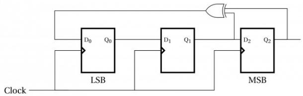
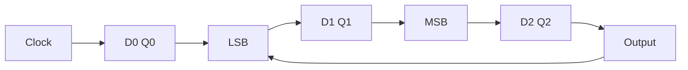

# 4.36.2 Synchronous Asynchronous Circuits: GATE CSE 1998 | Question: 16

Design a synchronous counter to go through the following states:

$$
1, 4, 2, 3, 1, 4, 2, 3, 1, 4 \dots
$$

gate1998 digital-logic normal descriptive synchronous-asynchronous-circuits

# Answer key

# 4.36.3 Synchronous Asynchronous Circuits: GATE CSE 2001 | Question: 2.12

Consider the circuit given below with initial state $Q_0 = 1$ , $Q_1 = Q_2 = 0$ . The state of the circuit is given by the value $4Q_2 + 2Q_1 + Q_0$

flowchart

Which one of the following is correct state sequence of the circuit?

A. 1,3,4,6,7,5,2

B. 1,2,5,3,7,6,4

C. 1,2,7,3,5,6,4

D. 1,6,5,7,2,3,4

gatecse-2001 digital-logic normal synchronous-asynchronous-circuits

# Answer key

# 4.36.4 Synchronous Asynchronous Circuits: GATE CSE 2003 | Question: 44

A 1-input, 2-output synchronous sequential circuit behaves as follows:

Let $z_{k}, n_{k}$ denote the number of $0^{\prime}s$ and $1^{\prime}s$ respectively in initial k bits of the input

$(z_{k} + n_{k} = k)$ . The circuit outputs 00 until one of the following conditions holds.

- $z_{k} - n_{k} = 2$ . In this case, the output at the k-th and all subsequent clock ticks is 10.  
- $n_k - z_k = 2$ . In this case, the output at the $k$ -th and all subsequent clock ticks is 01.

What is the minimum number of states required in the state transition graph of the above circuit?

A. 5

B. 6

C. 7

D. 8

gatecse-2003 digital-logic synchronous-asynchronous-circuits normal

# Answer key

# Answer Keys

<table><tr><td>4.1.1</td><td>N/A</td></tr><tr><td>4.1.6</td><td>B</td></tr><tr><td>4.2.2</td><td>C</td></tr><tr><td>4.4.4</td><td>N/A</td></tr><tr><td>4.4.9</td><td>B</td></tr><tr><td>4.4.14</td><td>C</td></tr><tr><td>4.4.19</td><td>A</td></tr><tr><td>4.4.24</td><td>C</td></tr><tr><td>4.4.29</td><td>B;C</td></tr><tr><td>4.4.34</td><td>C</td></tr></table>

<table><tr><td>4.1.2</td><td>N/A</td></tr><tr><td>4.1.7</td><td>19.2</td></tr><tr><td>4.3.1</td><td>C</td></tr><tr><td>4.4.5</td><td>N/A</td></tr><tr><td>4.4.10</td><td>D</td></tr><tr><td>4.4.15</td><td>D</td></tr><tr><td>4.4.20</td><td>D</td></tr><tr><td>4.4.25</td><td>C</td></tr><tr><td>4.4.30</td><td>B;D</td></tr><tr><td>4.5.1</td><td>N/A</td></tr></table>

<table><tr><td>4.1.3</td><td>B</td></tr><tr><td>4.1.8</td><td>B</td></tr><tr><td>4.4.1</td><td>D</td></tr><tr><td>4.4.6</td><td>D</td></tr><tr><td>4.4.11</td><td>C</td></tr><tr><td>4.4.16</td><td>D</td></tr><tr><td>4.4.21</td><td>D</td></tr><tr><td>4.4.26</td><td>D</td></tr><tr><td>4.4.31</td><td>B;C;D</td></tr><tr><td>4.5.2</td><td>A</td></tr></table>

<table><tr><td>4.1.4</td><td>B</td></tr><tr><td>4.1.9</td><td>-1</td></tr><tr><td>4.4.2</td><td>C</td></tr><tr><td>4.4.7</td><td>N/A</td></tr><tr><td>4.4.12</td><td>D</td></tr><tr><td>4.4.17</td><td>D</td></tr><tr><td>4.4.22</td><td>1</td></tr><tr><td>4.4.27</td><td>B</td></tr><tr><td>4.4.32</td><td>B</td></tr><tr><td>4.5.3</td><td>B</td></tr></table>

<table><tr><td>4.1.5</td><td>A</td></tr><tr><td>4.2.1</td><td>B</td></tr><tr><td>4.4.3</td><td>N/A</td></tr><tr><td>4.4.8</td><td>A</td></tr><tr><td>4.4.13</td><td>C</td></tr><tr><td>4.4.18</td><td>A</td></tr><tr><td>4.4.23</td><td>A</td></tr><tr><td>4.4.28</td><td>B;C;D</td></tr><tr><td>4.4.33</td><td>B</td></tr><tr><td>4.5.4</td><td>13:13</td></tr></table>

<table><tr><td>4.5.5</td><td>A</td></tr><tr><td>4.6.3</td><td>C</td></tr><tr><td>4.6.8</td><td>3</td></tr><tr><td>4.8.1</td><td>B</td></tr><tr><td>4.8.6</td><td>A;C</td></tr><tr><td>4.8.11</td><td>D</td></tr><tr><td>4.8.16</td><td>B</td></tr><tr><td>4.8.21</td><td>A</td></tr><tr><td>4.8.26</td><td>C</td></tr><tr><td>4.8.31</td><td>D</td></tr><tr><td>4.8.36</td><td>X</td></tr><tr><td>4.9.1</td><td>C</td></tr><tr><td>4.11.3</td><td>B</td></tr><tr><td>4.12.5</td><td>A</td></tr><tr><td>4.13.3</td><td>N/A</td></tr><tr><td>4.13.8</td><td>C</td></tr><tr><td>4.13.13</td><td>A</td></tr><tr><td>4.13.18</td><td>N/A</td></tr><tr><td>4.15.4</td><td>A</td></tr><tr><td>4.17.3</td><td>A</td></tr><tr><td>4.18.1</td><td>C</td></tr><tr><td>4.18.6</td><td>C</td></tr><tr><td>4.19.3</td><td>N/A</td></tr><tr><td>4.20.1</td><td>D</td></tr><tr><td>4.20.6</td><td>-7.75 : -7.75</td></tr><tr><td>4.20.11</td><td>A;B;C</td></tr><tr><td>4.21.2</td><td>N/A</td></tr><tr><td>4.21.7</td><td>B</td></tr><tr><td>4.21.12</td><td>A</td></tr><tr><td>4.21.17</td><td>C</td></tr><tr><td>4.23.4</td><td>B</td></tr><tr><td>4.24.4</td><td>B</td></tr><tr><td>4.26.1</td><td>N/A</td></tr><tr><td>4.26.6</td><td>B</td></tr><tr><td>4.26.11</td><td>6 : 6</td></tr><tr><td>4.26.16</td><td>A</td></tr><tr><td>4.27.5</td><td>C</td></tr><tr><td>4.27.10</td><td>C</td></tr><tr><td>4.28.1</td><td>N/A</td></tr><tr><td>4.28.6</td><td>N/A</td></tr></table>

<table><tr><td>4.5.6</td><td>C</td></tr><tr><td>4.6.4</td><td>A</td></tr><tr><td>4.6.9</td><td>B</td></tr><tr><td>4.8.2</td><td>N/A</td></tr><tr><td>4.8.7</td><td>B</td></tr><tr><td>4.8.12</td><td>C</td></tr><tr><td>4.8.17</td><td>A</td></tr><tr><td>4.8.22</td><td>A</td></tr><tr><td>4.8.27</td><td>C</td></tr><tr><td>4.8.32</td><td>B</td></tr><tr><td>4.8.37</td><td>D</td></tr><tr><td>4.9.2</td><td>A;C</td></tr><tr><td>4.12.1</td><td>N/A</td></tr><tr><td>4.12.6</td><td>C</td></tr><tr><td>4.13.4</td><td>33.33</td></tr><tr><td>4.13.9</td><td>D</td></tr><tr><td>4.13.14</td><td>A</td></tr><tr><td>4.14.1</td><td>D</td></tr><tr><td>4.16.1</td><td>D</td></tr><tr><td>4.17.4</td><td>B</td></tr><tr><td>4.18.2</td><td>N/A</td></tr><tr><td>4.18.7</td><td>D</td></tr><tr><td>4.19.4</td><td>N/A</td></tr><tr><td>4.20.2</td><td>B</td></tr><tr><td>4.20.7</td><td>C</td></tr><tr><td>4.20.12</td><td>C</td></tr><tr><td>4.21.3</td><td>N/A</td></tr><tr><td>4.21.8</td><td>D</td></tr><tr><td>4.21.13</td><td>B</td></tr><tr><td>4.22.1</td><td>A;D</td></tr><tr><td>4.23.5</td><td>C</td></tr><tr><td>4.24.5</td><td>1</td></tr><tr><td>4.26.2</td><td>9</td></tr><tr><td>4.26.7</td><td>A</td></tr><tr><td>4.26.12</td><td>A;B</td></tr><tr><td>4.27.1</td><td>N/A</td></tr><tr><td>4.27.6</td><td>D</td></tr><tr><td>4.27.11</td><td>4</td></tr><tr><td>4.28.2</td><td>9</td></tr><tr><td>4.28.7</td><td>N/A</td></tr></table>

<table><tr><td>4.5.7</td><td>B</td></tr><tr><td>4.6.5</td><td>3</td></tr><tr><td>4.6.10</td><td>C;D</td></tr><tr><td>4.8.3</td><td>B</td></tr><tr><td>4.8.8</td><td>B</td></tr><tr><td>4.8.13</td><td>N/A</td></tr><tr><td>4.8.18</td><td>A</td></tr><tr><td>4.8.23</td><td>D</td></tr><tr><td>4.8.28</td><td>A</td></tr><tr><td>4.8.33</td><td>C</td></tr><tr><td>4.8.38</td><td>C</td></tr><tr><td>4.10.1</td><td>A</td></tr><tr><td>4.12.2</td><td>N/A</td></tr><tr><td>4.12.7</td><td>6:6</td></tr><tr><td>4.13.5</td><td>N/A</td></tr><tr><td>4.13.10</td><td>3</td></tr><tr><td>4.13.15</td><td>B</td></tr><tr><td>4.15.1</td><td>True</td></tr><tr><td>4.16.2</td><td>C</td></tr><tr><td>4.17.5</td><td>2</td></tr><tr><td>4.18.3</td><td>N/A</td></tr><tr><td>4.18.8</td><td>D</td></tr><tr><td>4.19.5</td><td>B;C</td></tr><tr><td>4.20.3</td><td>A</td></tr><tr><td>4.20.8</td><td>B</td></tr><tr><td>4.20.13</td><td>-60.25:-60.25</td></tr><tr><td>4.21.4</td><td>N/A</td></tr><tr><td>4.21.9</td><td>A</td></tr><tr><td>4.21.14</td><td>A;D</td></tr><tr><td>4.23.1</td><td>C</td></tr><tr><td>4.24.1</td><td>N/A</td></tr><tr><td>4.24.6</td><td>B</td></tr><tr><td>4.26.3</td><td>N/A</td></tr><tr><td>4.26.8</td><td>A</td></tr><tr><td>4.26.13</td><td>A</td></tr><tr><td>4.27.2</td><td>C</td></tr><tr><td>4.27.7</td><td>5</td></tr><tr><td>4.27.12</td><td>D</td></tr><tr><td>4.28.3</td><td>N/A</td></tr><tr><td>4.28.8</td><td>C</td></tr></table>

<table><tr><td>4.6.1</td><td>N/A</td></tr><tr><td>4.6.6</td><td>A</td></tr><tr><td>4.7.1</td><td>A</td></tr><tr><td>4.8.4</td><td>N/A</td></tr><tr><td>4.8.9</td><td>B</td></tr><tr><td>4.8.14</td><td>N/A</td></tr><tr><td>4.8.19</td><td>A</td></tr><tr><td>4.8.24</td><td>A</td></tr><tr><td>4.8.29</td><td>A</td></tr><tr><td>4.8.34</td><td>A;B;C</td></tr><tr><td>4.8.39</td><td>A</td></tr><tr><td>4.11.1</td><td>C</td></tr><tr><td>4.12.3</td><td>D</td></tr><tr><td>4.13.1</td><td>C</td></tr><tr><td>4.13.6</td><td>N/A</td></tr><tr><td>4.13.11</td><td>3:4</td></tr><tr><td>4.13.16</td><td>D</td></tr><tr><td>4.15.2</td><td>B</td></tr><tr><td>4.17.1</td><td>N/A</td></tr><tr><td>4.17.6</td><td>7:8</td></tr><tr><td>4.18.4</td><td>N/A</td></tr><tr><td>4.19.1</td><td>N/A</td></tr><tr><td>4.19.6</td><td>B</td></tr><tr><td>4.20.4</td><td>C</td></tr><tr><td>4.20.9</td><td>C</td></tr><tr><td>4.20.14</td><td>C</td></tr><tr><td>4.21.5</td><td>C</td></tr><tr><td>4.21.10</td><td>B</td></tr><tr><td>4.21.15</td><td>D</td></tr><tr><td>4.23.2</td><td>C</td></tr><tr><td>4.24.2</td><td>N/A</td></tr><tr><td>4.25.1</td><td>N/A</td></tr><tr><td>4.26.4</td><td>A</td></tr><tr><td>4.26.9</td><td>B</td></tr><tr><td>4.26.14</td><td>B;D</td></tr><tr><td>4.27.3</td><td>C</td></tr><tr><td>4.27.8</td><td>A</td></tr><tr><td>4.27.13</td><td>A</td></tr><tr><td>4.28.4</td><td>N/A</td></tr><tr><td>4.28.9</td><td>D</td></tr></table>

<table><tr><td>4.6.2</td><td>A</td></tr><tr><td>4.6.7</td><td>A</td></tr><tr><td>4.7.2</td><td>B</td></tr><tr><td>4.8.5</td><td>N/A</td></tr><tr><td>4.8.10</td><td>011</td></tr><tr><td>4.8.15</td><td>B</td></tr><tr><td>4.8.20</td><td>D</td></tr><tr><td>4.8.25</td><td>C</td></tr><tr><td>4.8.30</td><td>B</td></tr><tr><td>4.8.35</td><td>C</td></tr><tr><td>4.8.40</td><td>D</td></tr><tr><td>4.11.2</td><td>1034</td></tr><tr><td>4.12.4</td><td>D</td></tr><tr><td>4.13.2</td><td>N/A</td></tr><tr><td>4.13.7</td><td>A</td></tr><tr><td>4.13.12</td><td>B</td></tr><tr><td>4.13.17</td><td>D</td></tr><tr><td>4.15.3</td><td>B</td></tr><tr><td>4.17.2</td><td>C</td></tr><tr><td>4.17.7</td><td>D</td></tr><tr><td>4.18.5</td><td>N/A</td></tr><tr><td>4.19.2</td><td>B;C</td></tr><tr><td>4.19.7</td><td>A</td></tr><tr><td>4.20.5</td><td>B</td></tr><tr><td>4.20.10</td><td>B</td></tr><tr><td>4.21.1</td><td>D</td></tr><tr><td>4.21.6</td><td>C</td></tr><tr><td>4.21.11</td><td>C</td></tr><tr><td>4.21.16</td><td>A</td></tr><tr><td>4.23.3</td><td>B</td></tr><tr><td>4.24.3</td><td>B</td></tr><tr><td>4.25.2</td><td>A</td></tr><tr><td>4.26.5</td><td>B</td></tr><tr><td>4.26.10</td><td>3</td></tr><tr><td>4.26.15</td><td>B</td></tr><tr><td>4.27.4</td><td>A</td></tr><tr><td>4.27.9</td><td>B</td></tr><tr><td>4.27.14</td><td>N/A</td></tr><tr><td>4.28.5</td><td>N/A</td></tr><tr><td>4.28.10</td><td>C</td></tr><tr><td>4.28.11</td><td>D</td></tr><tr><td>4.28.16</td><td>C</td></tr><tr><td>4.28.21</td><td>N/A</td></tr><tr><td>4.28.26</td><td>A</td></tr><tr><td>4.28.31</td><td>A</td></tr><tr><td>4.28.36</td><td>-11</td></tr><tr><td>4.28.41</td><td>C</td></tr><tr><td>4.28.46</td><td>110</td></tr><tr><td>4.28.51</td><td>B;D</td></tr><tr><td>4.28.56</td><td>A</td></tr><tr><td>4.31.1</td><td>N/A</td></tr><tr><td>4.33.1</td><td>250:250</td></tr><tr><td>4.36.2</td><td>N/A</td></tr></table>

<table><tr><td>4.28.12</td><td>C</td></tr><tr><td>4.28.17</td><td>B</td></tr><tr><td>4.28.22</td><td>A</td></tr><tr><td>4.28.27</td><td>A</td></tr><tr><td>4.28.32</td><td>B</td></tr><tr><td>4.28.37</td><td>1</td></tr><tr><td>4.28.42</td><td>C</td></tr><tr><td>4.28.47</td><td>B</td></tr><tr><td>4.28.52</td><td>B</td></tr><tr><td>4.28.57</td><td>B</td></tr><tr><td>4.31.2</td><td>D</td></tr><tr><td>4.34.1</td><td>D</td></tr><tr><td>4.36.3</td><td>B</td></tr></table>

<table><tr><td>4.28.13</td><td>A;C</td></tr><tr><td>4.28.18</td><td>D</td></tr><tr><td>4.28.23</td><td>D</td></tr><tr><td>4.28.28</td><td>B</td></tr><tr><td>4.28.33</td><td>5</td></tr><tr><td>4.28.38</td><td>C</td></tr><tr><td>4.28.43</td><td>A</td></tr><tr><td>4.28.48</td><td>A;B;D</td></tr><tr><td>4.28.53</td><td>A</td></tr><tr><td>4.29.1</td><td>12</td></tr><tr><td>4.31.3</td><td>D</td></tr><tr><td>4.34.2</td><td>N/A</td></tr><tr><td>4.36.4</td><td>A</td></tr></table>

<table><tr><td>4.28.14</td><td>C</td></tr><tr><td>4.28.19</td><td>D</td></tr><tr><td>4.28.24</td><td>A</td></tr><tr><td>4.28.29</td><td>D</td></tr><tr><td>4.28.34</td><td>3</td></tr><tr><td>4.28.39</td><td>D</td></tr><tr><td>4.28.44</td><td>3 : 3</td></tr><tr><td>4.28.49</td><td>B;D</td></tr><tr><td>4.28.54</td><td>A</td></tr><tr><td>4.30.1</td><td>C</td></tr><tr><td>4.31.4</td><td>B</td></tr><tr><td>4.35.1</td><td>D</td></tr></table>

<table><tr><td>4.28.15</td><td>B</td></tr><tr><td>4.28.20</td><td>B</td></tr><tr><td>4.28.25</td><td>A</td></tr><tr><td>4.28.30</td><td>B</td></tr><tr><td>4.28.35</td><td>5</td></tr><tr><td>4.28.40</td><td>0.502 : 0.504</td></tr><tr><td>4.28.45</td><td>B</td></tr><tr><td>4.28.50</td><td>B;C</td></tr><tr><td>4.28.55</td><td>C</td></tr><tr><td>4.30.2</td><td>A</td></tr><tr><td>4.32.1</td><td>A;C</td></tr><tr><td>4.36.1</td><td>B</td></tr></table>

System calls, Processes, Threads, Inter-process communication, Concurrency and synchronization.

Deadlock. CPU scheduling. Memory management and Virtual memory. File systems. Disks is also under this

Mark Distribution in Previous GATE

<table><tr><td>Year</td><td>2026 - 1</td><td>2026 - 2</td><td>2025 - 1</td><td>2025 - 2</td><td>2024 - 1</td><td>2024 - 2</td><td>2023</td><td>2022</td><td>2021 - 1</td><td>2021 - 2</td><td>Minimum</td></tr><tr><td>1 Mark Count</td><td>2</td><td>1</td><td>2</td><td>1</td><td>2</td><td>2</td><td>3</td><td>2</td><td>4</td><td>2</td><td>1</td></tr><tr><td>2 Marks Count</td><td>2</td><td>3</td><td>3</td><td>3</td><td>4</td><td>4</td><td>3</td><td>4</td><td>1</td><td>3</td><td>1</td></tr><tr><td>Total Marks</td><td>6</td><td>7</td><td>8</td><td>7</td><td>10</td><td>10</td><td>9</td><td>10</td><td>6</td><td>8</td><td>6</td></tr></table>

Welcome to the Operating System (OS) chapter of your GATE Computer Science preparation! This section is designed as a comprehensive, exam-focused reference to help you master the core concepts, formulas, and problem-solving techniques essential for excelling in the GATE exam. Operating Systems form the bedrock of computing, managing hardware and software resources to provide a stable and efficient environment for applications. For GATE CS, OS is a high-scoring subject, typically carrying a weightage of 8-12 marks. Questions range from conceptual understanding of OS principles, numerical problems on scheduling, memory management, and disk I/O, to analytical questions on deadlock and synchronization. A strong grasp of this subject is crucial not only for GATE but also for a fundamental understanding of computer science.

# Topic-wise Key Concepts

# Bankers Algorithm

The Banker's Algorithm is a deadlock avoidance algorithm that checks for a safe state before granting a resource request. It ensures that the system can always find a sequence of processes that can complete their execution without leading to a deadlock.

# - Important Formulas/Theorems:

1. Need Matrix: For each process $P_{i}$ and resource type $R_{j}$ , $Need[i][j] = Max[i][j] - Allocation[i][j]$ . This represents the remaining resources $P_{i}$ may still request.

# 2. Safety Algorithm:

- Initialize $Work = Available$ and $Finish[i] = false$ for all processes.  
- Find an $i$ such that $Finish[i] == false$ and $Need[i] \leq Work$ .  
- If such an $i$ exists, then $Work = Work + Allocation[i]$ and $Finish[i] = true$ . Go to step 2.  
- If no such $i$ exists, the system is in a safe state if $Finish[i] == true$ for all $i$ .

# 3. Resource-Request Algorithm:

- If $Request_i \leq Need_i$ , proceed to step 2. Otherwise, error.  
- If $Request_i \leq Available$ , proceed to step 3. Otherwise, $P_i$ must wait.  
- Pretend to allocate resources: Available = Available - Request $_i$ , Allocation $_i$ = Allocation $_i$ + Request $_i$ , Need $_i$ = Need $_i$ - Request $_i$ .  
- Run Safety Algorithm. If safe, grant request. If unsafe, revert allocation and $P_{i}$ waits.

# - Key Properties:

- Ensures deadlock avoidance by maintaining the system in a safe state.  
- Requires prior knowledge of maximum resource needs for each process.  
- Less conservative than deadlock prevention, allowing higher resource utilization.

# - Common Pitfalls:

- Confusing safe state with deadlock-free state (safe implies deadlock-free, but unsafe doesn't necessarily imply deadlock).  
- Incorrectly calculating the Need matrix or updating Available/Allocation vectors.  
- Not checking all conditions in the Safety Algorithm or Resource-Request Algorithm.

# - Standard Problem-Solving Techniques:

- Systematically trace the Safety Algorithm step-by-step, updating Work and Finish arrays.  
- For resource requests, first check against Need and then against Available, then temporarily allocate and run the Safety Algorithm.

# Best Fit

Best Fit is a dynamic memory allocation algorithm that allocates the smallest available memory hole (partition) that is large enough to satisfy a request. Its goal is to minimize the amount of internal fragmentation.

# - Key Properties:

- Tends to produce the smallest leftover hole, which might be useful for future small requests.  
- Suffers from external fragmentation, where total free memory is sufficient but not contiguous.  
- Requires searching the entire list of free partitions to find the best fit, making it slower than First Fit.

# - Common Pitfalls:

- Confusing it with First Fit or Worst Fit.  
- Incorrectly identifying the "smallest" suitable hole, especially when multiple holes have the same size.

# • Standard Problem-Solving Techniques:

- Maintain a sorted list of free memory blocks (or iterate through all) and select the one with the smallest size greater than or equal to the request.  
- Draw memory maps to visualize allocation and fragmentation.

# Context Switch

A context switch is the mechanism by which the CPU saves the state of the currently executing process or thread and restores the state of another process or thread. This allows multiple processes/threads to share a single CPU.

# - Key Properties:

- Involves saving the Process Control Block (PCB) of the current process and loading the PCB of the next process.  
- An overhead operation, as the CPU is not performing useful work during the switch.  
- Latency is the time taken for a context switch.  
- More frequent context switches (e.g., small time quantum in Round Robin) increase overhead.

# - Common Pitfalls:

- Underestimating the overhead of context switching in performance calculations.  
- Not understanding \*what\* exactly is saved (CPU registers, program counter, stack pointer, etc.).

# DMA (Direct Memory Access)

DMA is a feature of computer systems that allows certain hardware subsystems (like disk drive controllers or network cards) to access main system memory (RAM) independently of the central processing unit (CPU). This significantly improves I/O performance by offloading data transfer from the CPU.

# - Key Properties:

- Reduces CPU overhead for large data transfers, allowing the CPU to perform other tasks.  
- DMA controller manages the transfer, initiating an interrupt only upon completion.  
- "Cycle stealing" occurs when the DMA controller temporarily takes control of the system bus from the CPU to transfer data.  
- Requires careful setup by the CPU (source, destination, size).

# - Common Pitfalls:

- Thinking DMA eliminates CPU involvement entirely (CPU still initiates and handles completion).  
- Not understanding the concept of cycle stealing and its impact on CPU performance.

# Deadlock Prevention Avoidance Detection

These are strategies to deal with deadlocks. Prevention aims to ensure that at least one of the four necessary conditions for deadlock never holds. Avoidance dynamically grants resources only if the system remains in a safe state. Detection allows deadlocks to occur and then finds and resolves them.

# - Important Formulas/Theorems:

# 1. Necessary Conditions for Deadlock (Coffman Conditions):

- $C_1$ : Mutual Exclusion: At least one resource must be held in a non-sharable mode.  
- $C_2$ : Hold and Wait: A process holding at least one resource is waiting to acquire additional resources held by other processes.  
- $C_3$ : No Preemption: Resources cannot be preempted; they can only be released voluntarily by the process holding them.  
- $C_4$ : Circular Wait: A set of processes $\{P_0, P_1, \ldots, P_n\}$ exists such that $P_0$ is waiting for a resource held by $P_1$ , $P_1$ is waiting for a resource held by $P_2$ , ..., $P_{n-1}$ is waiting for a resource held by $P_n$ , and $P_n$ is waiting for a resource held by $P_0$ .

# 2. Deadlock Prevention: Break one or more of the four conditions.

- Break $C_1$ : Spooling (for printers), virtualizing resources.  
- Break $C_2$ : Request all resources at once, or release all resources before requesting new ones.  
- Break $C_3$ : Allow preemption of resources (e.g., CPU, memory).

\- Break $C_4$ : Impose a total ordering of resource types; processes must request resources in increasing order.

3. Deadlock Avoidance: Banker's Algorithm (for multiple instances of resources), Resource-Allocation Graph Algorithm (for single instances).

4. Deadlock Detection:

- If resources have single instances, use a Wait-For Graph. A cycle implies deadlock.  
- If resources have multiple instances, use an algorithm similar to Banker's Safety Algorithm.

\- Key Properties:

- Prevention is conservative, often leading to low resource utilization.  
- Avoidance is more flexible but requires future knowledge of resource requests.  
- Detection allows higher concurrency but incurs overhead for detection and recovery.

\- Common Pitfalls:

- Confusing which condition each prevention strategy addresses.  
- Incorrectly applying RAG for multiple instance resources (a cycle in RAG with multiple instances does not necessarily imply deadlock).  
- Not understanding the trade-offs between the three strategies.

\- Standard Problem-Solving Techniques:

- For prevention, identify which condition is being broken.  
- For avoidance, apply Banker's Algorithm.  
- For detection, draw the RAG or Wait-For Graph and look for cycles.

# Demand Paging

Demand Paging is a virtual memory technique where pages are loaded into main memory only when they are referenced (demanded) by the CPU. This allows for larger virtual address spaces than physical memory and reduces I/O overhead by not loading unused pages.

\- Important Formulas/Theorems:

1. Effective Access Time (EAT):

$$
E A T = (1 - p) \times \text {MemoryAccessTime} + p \times (\text {PageFaultOverhead} + \text {MemoryAccessTime})
$$

Where p is the page fault rate. PageFaultOverhead includes time for interrupt, saving process state, reading page from disk, updating page table, restoring process state.

\- Key Properties:

- Leverages locality of reference to achieve good performance.  
- Reduces physical memory requirements for processes.  
- Introduces page faults, which are expensive operations.  
- Can lead to thrashing if the page fault rate becomes too high.

\- Common Pitfalls:

- Incorrectly calculating EAT, especially the components of page fault overhead.  
- Misunderstanding the concept of locality of reference.  
- Confusing demand paging with simple paging.

\- Standard Problem-Solving Techniques:

Calculate EAT by plugging in given values for page fault rate, memory access time, and page fault overhead.  
- Analyze scenarios for thrashing.

# Disk

A disk (hard disk drive) is a non-volatile storage device that stores data on rotating platters. It is characterized by its physical structure and the time it takes to access data.

\- Important Formulas/Theorems:

1. Disk Access Time:

$$
\text {AccessTime} = \text {SeekTime} + \text {RotationalLatency} + \text {TransferTime}
$$

- Seek Time: Time taken for the disk arm to move the read/write heads to the correct track.  
- Rotational Latency: Time taken for the desired sector to rotate under the read/write head (average is half a rotation).  
- Transfer Time: Time taken to transfer the actual data.

$$
\text {TransferTime} = \frac {\text {NumberOfSectors}}{\text {SectorsPerTrack}} \times \text {RotationTime}
$$

# - Key Properties:

- Data is stored in sectors, which are grouped into tracks, and tracks are stacked into cylinders.  
- Seek time is typically the most significant component of disk access time.  
- Mechanical components make disk access orders of magnitude slower than RAM access.

# - Common Pitfalls:

- Incorrectly calculating average rotational latency (usually half a rotation).  
- Forgetting to include all three components of access time.

# • Standard Problem-Solving Techniques:

\- Break down the problem into calculating each component (seek, rotational, transfer) and then sum them up.

# Disk Scheduling

Disk scheduling algorithms aim to minimize the total head movement of the disk arm, thereby reducing the average disk access time and improving I/O throughput. They reorder pending disk I/O requests.

# - Important Formulas/Theorems:

1. Total Head Movement: Sum of absolute differences between consecutive track numbers accessed.

# - Algorithms:

- FCFS (First-Come, First-Served): Processes requests in the order they arrive. Simple but inefficient.  
- SSTF (Shortest Seek Time First): Selects the request with the minimum seek time from the current head position. Can lead to starvation.  
SCAN (Elevator Algorithm): The disk arm moves from one end of the disk to the other, servicing requests along the way. When it reaches an end, it reverses direction.  
- C-SCAN (Circular SCAN): Similar to SCAN, but when the arm reaches one end, it immediately returns to the other end without servicing requests on the return trip. Provides more uniform wait times.  
- LOOK: Similar to SCAN, but the arm only goes as far as the last request in each direction, then reverses.  
- C-LOOK: Similar to C-SCAN, but the arm only goes as far as the last request in each direction, then returns to the first request in the other direction without going to the absolute end.

# - Key Properties:

- SSTF is optimal for average seek time but can cause starvation.  
- SCAN/C-SCAN/LOOK/C-LOOK provide better fairness and prevent starvation.  
- C-SCAN/C-LOOK are preferred for heavy loads as they provide more uniform service.

# - Common Pitfalls:

- Incorrectly calculating head movement, especially for SCAN/C-SCAN/LOOK/C-LOOK where direction matters.  
- Forgetting to include the initial head position in the calculation.  
- Confusing SCAN with C-SCAN or LOOK with C-LOOK.

# - Standard Problem-Solving Techniques:

Draw a number line representing tracks and mark request positions. Trace the head movement for each algorithm.  
- Carefully track the current head position and the direction of movement.

# File System

A file system is an OS component that controls how data is stored and retrieved. It organizes files into a hierarchical structure, manages file attributes, and provides mechanisms for accessing and protecting files.

# - Key Properties:

- File Attributes: Name, type, location, size, protection, time/date, user ID.  
- File Operations: Create, write, read, reposition, delete, truncate.  
- Directory Structure: Single-level, two-level, tree-structured, acyclic-graph, general graph.  
- Allocation Methods: Contiguous, Linked, Indexed.  
- Free Space Management: Bit vector, linked list, grouping, counting.

# - Common Pitfalls:

- Confusing file allocation methods (e.g., linked vs. indexed).  
- Not understanding the trade-offs of different directory structures (e.g., sharing, path length).

# Fork System Call

The fork() system call creates a new process (child process) that is a duplicate of the calling process (parent process). Both processes then execute concurrently from the point of the fork() call.

# - Key Properties:

- The child process receives a copy of the parent's address space, including code, data, and stack segments (often implemented using copy-on-write).  
- The child process gets a unique Process ID (PID).  
- fork() returns 0 to the child process, the child's PID to the parent process, and -1 on failure.  
- Child process inherits open file descriptors, signals, etc.

# - Common Pitfalls:

- Incorrectly predicting the output of programs involving multiple fork() calls due to confusion about which process is executing which part of the code.  
- Not understanding the return values of fork() in parent vs. child.  
- Assuming parent and child share memory directly (they get copies, though copy-on-write optimizes this).

# - Standard Problem-Solving Techniques:

- Trace the execution path for both parent and child processes separately after each fork().  
- Keep track of the number of processes created. For $N$ fork() calls in a sequence, $2^{N}$ processes are created. If fork() is in a loop, it's more complex.

# IO Handling

I/O handling refers to the mechanisms and techniques used by the operating system to manage data transfer between the CPU/memory and peripheral devices. Efficient I/O handling is crucial for system performance.

# - Key Properties:

- Polling: CPU repeatedly checks the status of an I/O device. Simple but inefficient, wastes CPU cycles.  
- Interrupt-driven I/O: Device notifies the CPU via an interrupt when I/O is complete or ready. More efficient for sporadic I/O.  
- DMA (Direct Memory Access): Device controller transfers data directly to/from memory without CPU intervention. Most efficient for large data transfers.  
- Buffering: Using temporary memory areas to hold data during transfer, smoothing out speed differences.  
- Spooling: Holding data for a device (e.g., printer) in a buffer until the device is ready.

# - Common Pitfalls:

- Confusing the efficiency and use cases of polling vs. interrupts vs. DMA.  
- Not understanding the role of device controllers.

# Input Output

Input/Output (I/O) refers to the communication between an information processing system (like a computer) and the outside world, possibly a human or another information processing system. It involves the transfer of data to and from peripheral devices.

# - Key Properties:

- Can be synchronous (CPU waits for I/O completion) or asynchronous (CPU continues processing while I/O operates in background).  
- Managed by device controllers and device drivers.  
- Performance is often a bottleneck in overall system performance.

# Inter Process Communication (IPC)

IPC refers to mechanisms provided by the operating system that allow independent processes to communicate and synchronize their actions. This is essential for cooperative processes and distributed systems.

# - Key Properties:

- Shared Memory: Processes share a region of memory for direct data exchange. Fastest IPC, but requires explicit synchronization.  
- Message Passing: Processes communicate by sending and receiving messages. Simpler to implement for small data transfers, easier to use in distributed systems.  
- Pipes: Unidirectional (ordinary pipes) or bidirectional (named pipes/FIFOs) communication channels.  
- Sockets: For network communication, allowing processes on different machines to communicate.  
Semaphores/Mutexes/Monitors: Primarily for synchronization, but can indirectly facilitate communication by coordinating access to shared resources.

# - Common Pitfalls:

- Confusing shared memory with message passing (shared memory requires explicit synchronization, message passing often has built-in synchronization).  
- Not understanding the difference between pipes and named pipes.

# Interrupts

An interrupt is a signal to the CPU from a hardware device or a software program that indicates an event has occurred and requires immediate attention. It causes the CPU to temporarily suspend its current task and execute a special routine called an interrupt handler.

# - Key Properties:

- Hardware Interrupts: Generated by I/O devices (e.g., disk completion, keyboard input).  
- Software Interrupts (Traps/Exceptions): Generated by programs (e.g., system calls, division by zero, page fault).  
- Interrupt Vector: A table containing the addresses of interrupt service routines (ISRs) for various interrupt types.  
- Maskable Interrupts: Can be temporarily ignored by the CPU.  
Non-maskable Interrupts (NMI): Critical events that cannot be ignored (e.g., memory parity error).  
- Involves saving the CPU's context (registers, PC) before executing the ISR and restoring it afterward.

# - Common Pitfalls:

- Confusing hardware interrupts with software interrupts (traps).  
- Not understanding the role of the interrupt vector.  
- Forgetting the context saving/restoring overhead.

# Least Recently Used (LRU)

LRU is a page replacement algorithm that replaces the page that has not been used for the longest period of time. It is based on the principle of temporal locality, assuming that pages recently used are likely to be used again soon.

# - Key Properties:

- Generally performs well, approximating the optimal algorithm.  
- Does not suffer from Belady's anomaly (increasing page faults with more frames).  
- Difficult to implement efficiently in hardware, as it requires tracking the exact usage time of each page.  
- Approximations like Second Chance or Clock algorithm are often used in practice.

# - Common Pitfalls:

- Incorrectly identifying the "least recently used" page, especially in complex sequences.  
- Confusing it with FIFO or LFU.

# - Standard Problem-Solving Techniques:

- Maintain a "time stamp" or "counter" for each page, or conceptually keep a stack where the most recently used page is at the top. When a page is referenced, move it to the top. When a page fault occurs, remove the page at the bottom.  
- Trace the page references and page frames step-by-step.

# Linked Allocation

Linked allocation is a file allocation method where each file is stored as a linked list of disk blocks. Each block contains a pointer to the next block in the file.

# - Key Properties:

- No external fragmentation, as any free block can be used.  
- Files can grow dynamically.  
- Sequential access is efficient, but direct access (random access) is very slow due to pointer traversal.  
- Pointer overhead: a portion of each disk block is used for the pointer, reducing data storage capacity.  
- Reliability issue: a lost or damaged pointer can lead to the loss of the rest of the file.

# - Common Pitfalls:

- Confusing it with contiguous or indexed allocation.  
- Overlooking the performance impact on random access or the pointer overhead.

# Memory Management

Memory management is the operating system's function of handling primary memory. It allocates memory to processes, protects processes from each other, and provides an abstraction of a large, uniform memory space.

# - Key Properties:

- Relocation: Mapping logical addresses to physical addresses.  
- Protection: Preventing processes from accessing each other's memory.

- Sharing: Allowing processes to share memory regions.  
- Logical Organization: Segmentation, paging.  
- Physical Organization: Contiguous allocation, non-contiguous allocation.  
- Techniques: Paging, segmentation, virtual memory.

# - Common Pitfalls:

- Confusing internal vs. external fragmentation.  
- Not understanding the difference between logical and physical addresses.

# Multilevel Paging

Multilevel paging (or hierarchical paging) is a technique used in virtual memory systems to reduce the size of the page table. Instead of a single, large page table, it uses a tree-like structure of page tables, where the outer page table points to inner page tables, which then point to physical frames.

# - Important Formulas/Theorems:

1. Effective Access Time (EAT) for N-level Paging:

$$
E A T = (N + 1) \times M e m o r y A c c e s s T i m e
$$

(Assuming no TLB and page tables are in memory).

2. Number of Bits for Page Number: If a logical address is m bits and page size is $2^{k}$ bytes, then page offset is k bits, and page number is $(m - k)$ bits.

3. Number of Entries in Page Table: 2 $^{page number bits}$ .

4. Size of Page Table: $2^{page number bits}$ × size of page table entry.

# - Key Properties:

- Reduces the amount of physical memory required for page tables, especially for sparse address spaces.  
- Increases memory access time because multiple memory accesses are needed to find a physical address (one for each level of page table).  
- Can be combined with TLB to mitigate increased access time.

# - Common Pitfalls:

- Incorrectly calculating the number of bits for each level of the page table.  
- Forgetting to account for all memory accesses when calculating EAT without TLB.

# - Standard Problem-Solving Techniques:

- Break down the virtual address into segments corresponding to each level of the page table and the page offset.  
Calculate the number of page table entries and the size of each page table level.

# OS Protection

OS protection mechanisms ensure that system resources (CPU, memory, files, I/O devices) are used only in ways authorized by the operating system. This prevents malicious or erroneous programs from harming the system or other programs.

# - Key Properties:

Dual-Mode Operation: User mode (restricted privileges) and Kernel mode (full privileges). A mode bit indicates the current mode.  
- Privileged Instructions: Instructions that can only be executed in kernel mode (e.g., I/O instructions, setting timer).  
- System Calls: User programs request OS services, transitioning from user to kernel mode.  
- Memory Protection: Base and limit registers, paging, segmentation.  
- Access Control Lists (ACLs): For files and other resources, specifying who can access what and how.  
Capabilities: Tokens that grant specific access rights to a resource.

# - Common Pitfalls:

- Confusing the purpose of dual-mode operation with memory protection.  
- Not understanding how system calls facilitate a controlled transition to kernel mode.

# Page Replacement

Page replacement algorithms decide which page to remove from main memory when a page fault occurs and no free frames are available. The goal is to minimize the number of page faults.

# - Important Formulas/Theorems:

1. Hit Ratio: $\frac{Number of Page Hits}{Total Page References}$  
2. Miss Ratio (Page Fault Rate): $\frac{Number of Page Faults}{Total Page References}$  
3. HitRatio + MissRatio = 1

# - Algorithms:

- FIFO (First-In, First-Out): Replaces the page that has been in memory the longest. Simple but can suffer from Belady's anomaly.  
- Optimal (OPT/MIN): Replaces the page that will not be used for the longest period of time in the future. Impossible to implement in practice, used as a benchmark.  
- LRU (Least Recently Used): Replaces the page that has not been used for the longest time. Generally good performance, does not suffer from Belady's anomaly, but complex to implement.  
- LFU (Least Frequently Used): Replaces the page with the smallest count of references.  
- MFU (Most Frequently Used): Replaces the page with the largest count of references (less common).  
- Second Chance (Clock): A FIFO variant that gives a page a "second chance" if its reference bit is set.

# - Key Properties:

- Belady's anomaly: For some algorithms (like FIFO), increasing the number of available page frames can increase the number of page faults.  
- Optimal algorithm provides the theoretical minimum number of page faults.

# - Common Pitfalls:

- Incorrectly applying the rules for each algorithm, especially for LRU and Optimal.  
- Forgetting to count the initial page loads as page faults.  
- Misinterpreting Belady's anomaly.

# - Standard Problem-Solving Techniques:

- Trace the page reference string through the page frames for each algorithm, step-by-step, marking hits and faults.  
- Keep track of the state of each page (e.g., arrival time for FIFO, last used time for LRU, future use for Optimal).

# Precedence Graph

A precedence graph (or process graph) is a directed acyclic graph (DAG) used to represent the execution order and dependencies among a set of tasks or processes. An edge from task A to task B means task A must complete before task B can start.

# - Key Properties:

- Nodes represent tasks/processes, edges represent dependencies.  
- Helps in identifying potential parallelism and critical paths.  
- Used in scheduling to ensure correct execution order.  
- Must be acyclic to represent a valid execution sequence.

# - Common Pitfalls:

- Drawing cycles, which implies an impossible dependency.  
- Misinterpreting the meaning of an edge (A -> B means A must finish before B starts, not just that B follows A).

# Process

A process is a program in execution. It is an active entity, unlike a program, which is a passive entity. Each process has its own address space, resources, and execution context.

# - Key Properties:

# - Process States:

- Process Control Block (PCB): Contains all information about a process (state, PC, registers, memory limits, open files, etc.).

■ New: Process being created.  
- Ready: Waiting to be assigned to a processor.  
- Running: Instructions are being executed.  
- Waiting (Blocked): Waiting for some event (e.g., I/O completion, signal).  
- Terminated: Process has finished execution.

- Each process has its own virtual address space, including code, data, and stack segments.  
- Processes are typically heavy-weight compared to threads.

# - Common Pitfalls:

- Confusing a process with a program or a thread.  
- Incorrectly identifying transitions between process states.

# Process Scheduling

Process scheduling is the activity of the operating system that selects which process to run next from the ready queue and allocates the CPU to it. The goal is to optimize various performance metrics.

# - Important Formulas/Theorems:

1. Turnaround Time (TAT): CompletionTime - ArrivalTime  
2. Waiting Time (WT): TurnaroundTime - BurstTime  
3. Response Time (RT): FirstResponseTime - ArrivalTime  
4. Throughput: Number of processes completed per unit time.  
5. CPU Utilization: Percentage of time the CPU is busy.

# - Algorithms:

- FCFS (First-Come, First-Served): Non-preemptive. Simple, but can have high average waiting time (convoy effect).  
- SJF (Shortest Job First): Non-preemptive. Optimal for minimum average waiting time. Requires knowing future burst times.  
- SRTF (Shortest Remaining Time First): Preemptive version of SJF. Optimal for minimum average waiting time.  
Priority Scheduling: Can be preemptive or non-preemptive. Processes with higher priority run first. Can lead to starvation (low-priority processes never run).  
- Round Robin (RR): Preemptive. Each process gets a small unit of CPU time (time quantum). Fair, good for interactive systems.

# - Key Properties:

- Preemptive: CPU can be taken away from a running process.  
- Non-preemptive: CPU is held until process completes or blocks.  
- Starvation: A process may wait indefinitely.  
- Aging: Gradually increasing the priority of processes that wait for a long time to prevent starvation.

# - Common Pitfalls:

- Incorrectly drawing Gantt charts, especially for preemptive algorithms.  
- Mistakes in calculating TAT, WT, or RT.  
- Confusing preemptive vs. non-preemptive versions of algorithms.  
- Not handling arrival times correctly.

# - Standard Problem-Solving Techniques:

Draw a Gantt chart for each algorithm, carefully marking arrival, start, and completion times.  
- Systematically calculate TAT, WT, and RT for each process and then their averages.  
- For preemptive algorithms, check for preemption at every arrival or completion event.

# Process Synchronization

Process synchronization refers to the coordination of multiple processes to ensure that they access shared resources or critical sections in a controlled manner, preventing race conditions and maintaining data consistency.

# - Important Formulas/Theorems:

# 1. Critical Section Problem Requirements:

- Mutual Exclusion: Only one process can be in its critical section at any time.  
- Progress: If no process is in its critical section and some processes want to enter, only those not in their remainder section can participate in the decision, and this decision cannot be postponed indefinitely.  
- Bounded Waiting: There is a limit on the number of times other processes can enter their critical sections after a process has made a request to enter its critical section and before that request is granted.

# - Mechanisms:

Semaphores: Integer variables accessed only through atomic wait() (P) and signal() (V) operations. Can be binary (mutex) or counting.  
- Mutex Locks: A simpler binary semaphore, used for mutual exclusion.  
- Monitors: High-level synchronization construct that encapsulates shared data and procedures that operate on the data, ensuring mutual exclusion and providing condition variables for waiting.  
- Hardware Solutions: TestAndSet, Swap instructions.

# - Key Properties:

- Race Condition: When multiple processes access and modify shared data concurrently, and the final result depends on the order of execution.  
- Deadlock: Can occur with improper use of synchronization primitives (e.g., two processes waiting for each other's resources).

# - Common Pitfalls: