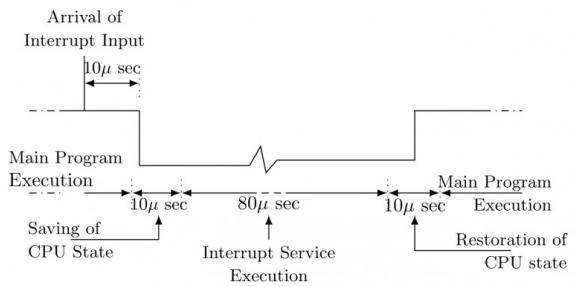

The address of the $1039^{th}$ sector is

A. $\langle0,15,31\rangle$

B. $\langle0,16,30\rangle$

C. $\langle0,16,31\rangle$

D. $\langle0,17,31\rangle$

gatecse-2009 operating-system disk normal

# Answer key

# 5.7.19 Disk: GATE CSE 2011 | Question: 44

An application loads 100 libraries at startup. Loading each library requires exactly one disk access. The seek time of the disk to a random location is given as 10 ms. Rotational speed of disk is 6000 rpm. If all 100 libraries are loaded from random locations on the disk, how long does it take to load all libraries? (The time to transfer data from the disk block once the head has been positioned at the start of the block may be neglected.)

A. 0.50 s

B. 1.50 s

C. 1.25 s

D. 1.00 s

gatecse-2011 operating-system disk normal

# Answer key

# 5.7.20 Disk: GATE CSE 2012 | Question: 41

A file system with 300 GByte disk uses a file descriptor with 8 direct block addresses, 1 indirect block address and 1 doubly indirect block address. The size of each disk block is 128 Bytes and the size of each disk block address is 8 Bytes. The maximum possible file size in this file system is

A. 3 KBytes

B. 35 KBytes

C. 280 KBytes

D. dependent on the size of the disk

gatecse-2012 operating-system disk normal

# Answer key

# 5.7.21 Disk: GATE CSE 2013 | Question: 29

Consider a hard disk with 16 recording surfaces (0 - 15) having 16384 cylinders (0 - 16383) and each cylinder contains 64 sectors (0 - 63). Data storage capacity in each sector is 512 bytes. Data are organized cylinder-wise and the addressing format is $\langle$ cylinder no., surface no., sector no. $\rangle$ . A file of size 42797 KB is stored in the disk and the starting disk location of the file is $\langle$ 1200, 9, 40 $\rangle$ . What is the cylinder number of the last sector of the file, if it is stored in a contiguous manner?

A. 1281

B. 1282

C. 1283

D. 1284

gatecse-2013 operating-system disk normal

# Answer key

# 5.7.22 Disk: GATE CSE 2014 | Set 2 | Question: 20

A FAT (file allocation table) based file system is being used and the total overhead of each entry in the FAT is 4 bytes in size. Given a $100 \times 10^{6}$ bytes disk on which the file system is stored and data block size is $10^{3}$ bytes, the maximum size of a file that can be stored on this disk in units of $10^{6}$ bytes is \_\_\_\_.

gatecse-2014-set2 operating-system disk numerical-answers normal file-system

# Answer key

# 5.7.23 Disk: GATE CSE 2015 | Set 1 | Question: 48

Consider a disk pack with a seek time of 4 milliseconds and rotational speed of 10000 rotations per minute (RPM). It has 600 sectors per track and each sector can store 512 bytes of data. Consider a file stored in the disk. The file contains 2000 sectors. Assume that every sector access necessitates a seek, and the average rotational latency for accessing each sector is half of the time for one complete rotation. The total time (in milliseconds) needed to read the entire file is \_\_\_\_

gatecse-2015-set1 operating-system disk normal numerical-answers

# Answer key


# 5.7.24 Disk: GATE CSE 2015 | Set 2 | Question: 49


Consider a typical disk that rotates at 15000 rotations per minute (RPM) and has a transfer rate of $50 \times 10^{6}$ bytes/sec. If the average seek time of the disk is twice the average rotational delay and the controller's transfer time is 10 times the disk transfer time, the average time (in milliseconds) to read or write a 512-byte sector of the disk is \_\_\_\_

gatecse-2015-set2 operating-system disk normal numerical-answers

# Answer key

# 5.7.25 Disk: GATE CSE 2024 | Set 1 | Question: 44


Consider a 512 GB hard disk with 32 storage surfaces. There are 4096 sectors per track and each sector holds 1024 bytes of data. The number of cylinders in the hard disk is \_\_\_\_.

gatecse-2024-set1 numerical-answers operating-system disk two-marks

# Answer key

# 5.7.26 Disk: GATE CSE 2024 | Set 2 | Question: 43


Consider a disk with the following specifications: rotation speed of 6000 RPM, average seek time of 5 milliseconds, 500 sectors/track, 512-byte sectors. A file has content stored in 3000 sectors located randomly on the disk. Assuming average rotational latency, the total time (in seconds, rounded off to 2 decimal places) to read the entire file from the disk is \_\_\_\_.

gatecse-2024-set2 numerical-answers operating-system disk two-marks

# Answer key

# 5.7.27 Disk: GATE IT 2005 | Question: 63


In a computer system, four files of size 11050 bytes, 4990 bytes, 5170 bytes and 12640 bytes need to be stored. For storing these files on disk, we can use either 100 byte disk blocks or 200 byte disk blocks (but

can't mix block sizes). For each block used to store a file, 4 bytes of bookkeeping information also needs to be stored on the disk. Thus, the total space used to store a file is the sum of the space taken to store the file and the space taken to store the book keeping information for the blocks allocated for storing the file. A disk block can store either bookkeeping information for a file or data from a file, but not both.

What is the total space required for storing the files using 100 byte disk blocks and 200 byte disk blocks respectively?

A. 35400 and 35800 bytes

B. 35800 and 35400 bytes

C. 35600 and 35400 bytes

D. 35400 and 35600 bytes

gateit-2005 operating-system disk normal

# Answer key

# 5.7.28 Disk: GATE IT 2005 | Question: 81-a


A disk has 8 equidistant tracks. The diameters of the innermost and outermost tracks are 1 cm and 8 cm respectively. The innermost track has a storage capacity of 10 MB.

What is the total amount of data that can be stored on the disk if it is used with a drive that rotates it with

I. Constant Linear Velocity  
II. Constant Angular Velocity?

A. I. 80 MB; II. 2040 MB

B. I. 2040 MB; II 80 MB

C. I. 80 MB; II. 360 MB

D. I. 360 MB; II. 80 MB

gateit-2005 operating-system disk normal

# Answer key

# 5.7.29 Disk: GATE IT 2005 | Question: 81-b


A disk has 8 equidistant tracks. The diameters of the innermost and outermost tracks are 1 cm and 8 cm respectively. The innermost track has a storage capacity of 10 MB.

If the disk has 20 sectors per track and is currently at the end of the $5^{th}$ sector of the inner-most track and the head can move at a speed of 10 meters/sec and it is rotating at constant angular velocity of 6000 RPM, how much time will it take to read 1 MB contiguous data starting from the sector 4 of the outer-most track?

A. 13.5 ms

B. 10 ms

C. 9.5 ms

D. 20 ms

gateit-2005 operating-system disk normal

# Answer key

# 5.7.30 Disk: GATE IT 2007 | Question: 44, ISRO2015-34

A hard disk system has the following parameters :

• Number of tracks = 500  
• Number of sectors/track = 100  
• Number of bytes /sector = 500  
- Time taken by the head to move from one track to adjacent track = 1 ms  
- Rotation speed = 600 rpm.

What is the average time taken for transferring 250 bytes from the disk?

A. 300.5 ms

B. 255.5 ms

C. 255 ms

D. 300 ms

gateit-2007 operating-system disk normal isro2015

# Answer key

# 5.8

# Disk Scheduling (16)

# Practice Test: Test 1 (14Q)

# 5.8.1 Disk Scheduling: GATE CSE 1989 | Question: 4-xii

Disk requests come to disk driver for cylinders 10, 22, 20, 2, 40, 6 and 38, in that order at a time when the disk drive is reading from cylinder 20. The seek time is 6 msec per cylinder. Compute the total seek time if the disk arm scheduling algorithm is.

A. First come first served.  
B. Closest cylinder next.

gate1989 descriptive operating-system disk-scheduling

# Answer key

# 5.8.2 Disk Scheduling: GATE CSE 1990 | Question: 9b

Assuming the current disk cylinder to be 50 and the sequence for the cylinders to be 1, 36, 49, 65, 53, 12, 3, 20, 55, 16, 65 and 78 find the sequence of servicing using

1. Shortest seek time first (SSTF) and  
2. Elevator disk scheduling policies.

gate1990 descriptive operating-system disk-scheduling

# Answer key

# 5.8.3 Disk Scheduling: GATE CSE 1995 | Question: 20

The head of a moving head disk with 100 tracks numbered 0 to 99 is currently serving a request at track 55. If the queue of requests kept in FIFO order is

10,70,75,23,65

which of the two disk scheduling algorithms FCFS (First Come First Served) and SSTF (Shortest Seek Time First) will require less head movement? Find the head movement for each of the algorithms.


# 5.8.4 Disk Scheduling: GATE CSE 1997 | Question: 3.6

The correct matching for the following pairs is:

<table><tr><td>(A)</td><td>Disk Scheduling</td><td>(1)</td><td>Round robin</td></tr><tr><td>(B)</td><td>Batch Processing</td><td>(2)</td><td>SCAN</td></tr><tr><td>(C)</td><td>Time-sharing</td><td>(3)</td><td>LIFO</td></tr><tr><td>(D)</td><td>Interrupt processing</td><td>(4)</td><td>FIFO</td></tr></table>

A. A-3 B-4 C-2 D-1

B. A-4 B-3 C-2 D-1

C. A-2 B-4 C-1 D-3

D. A-3 B-4 C-3 D-2

gate1997 operating-system normal disk-scheduling match-the-following

# Answer key

# 5.8.5 Disk Scheduling: GATE CSE 1999 | Question: 1.10

Which of the following disk scheduling strategies is likely to give the best throughput?

A. Farthest cylinder next

B. Nearest cylinder next

C. First come first served

D. Elevator algorithm

gate1999 operating-system disk-scheduling normal

# Answer key

# 5.8.6 Disk Scheduling: GATE CSE 2001 | Question: 20

Consider a disk with the 100 tracks numbered from 0 to 99 rotating at 3000 rpm. The number of sectors per track is 100 and the time to move the head between two successive tracks is 0.2 millisecond.


A. Consider a set of disk requests to read data from tracks 32, 7, 45, 5 and 10. Assuming that the elevator algorithm is used to schedule disk requests, and the head is initially at track 25 moving up (towards larger track numbers), what is the total seek time for servicing the requests?  
B. Consider an initial set of 100 arbitrary disk requests and assume that no new disk requests arrive while servicing these requests. If the head is initially at track 0 and the elevator algorithm is used to schedule disk requests, what is the worse case time to complete all the requests?

gatecse-2001 operating-system disk disk-scheduling normal descriptive

# Answer key

# 5.8.7 Disk Scheduling: GATE CSE 2004 | Question: 12

Consider an operating system capable of loading and executing a single sequential user process at a time. The disk head scheduling algorithm used is First Come First Served (FCFS). If FCFS is replaced by

Shortest Seek Time First (SSTF), claimed by the vendor to give 50% better benchmark results, what is the expected improvement in the I/O performance of user programs?

A. 50%

B. 40%

C. 25%

D. 0%

gatecse-2004 operating-system disk-scheduling normal

# Answer key

# 5.8.8 Disk Scheduling: GATE CSE 2009 | Question: 31

Consider a disk system with 100 cylinders. The requests to access the cylinders occur in following sequence:

4, 34, 10, 7, 19, 73, 2, 15, 6, 20

Assuming that the head is currently at cylinder 50, what is the time taken to satisfy all requests if it takes 1 ms to move from one cylinder to adjacent one and shortest seek time first policy is used?


# Answer key

# 5.8.9 Disk Scheduling: GATE CSE 2014 | Set 1 | Question: 19

Suppose a disk has 201 cylinders, numbered from 0 to 200. At some time the disk arm is at cylinder 100, and there is a queue of disk access requests for cylinders 30, 85, 90, 100, 105, 110, 135 and 145. If

Shortest-Seek Time First (SSTF) is being used for scheduling the disk access, the request for cylinder 90 is serviced after servicing \_\_\_\_ number of requests.

gatecse-2014-set1 operating-system disk-scheduling numerical-answers normal

# Answer key

# 5.8.10 Disk Scheduling: GATE CSE 2015 | Set 1 | Question: 30

Suppose the following disk request sequence (track numbers) for a disk with 100 tracks is given:

45,20,90,10,50,60,80,25,70.

Assume that the initial position of the R/W head is on track 50. The additional distance that will be traversed by the R/W head when the Shortest Seek Time First (SSTF) algorithm is used compared to the SCAN (Elevator) algorithm (assuming that SCAN algorithm moves towards 100 when it starts execution) is \_\_\_\_ tracks.

gatecse-2015-set1 operating-system disk-scheduling normal numerical-answers

# Answer key

# 5.8.11 Disk Scheduling: GATE CSE 2016 | Set 1 | Question: 48

Cylinder a disk queue with requests for I/O to blocks on cylinders 47, 38, 121, 191, 87, 11, 92, 10. The C-

LOOK scheduling algorithm is used. The head is initially at cylinder number 63, moving towards larger cylinder numbers on its servicing pass. The cylinders are numbered from 0 to 199. The total head movement (in number of cylinders) incurred while servicing these requests is \_\_\_\_.

gatecse-2016-set1 operating-system disk-scheduling normal numerical-answers

# Answer key

# 5.8.12 Disk Scheduling: GATE CSE 2018 | Question: 53

Consider a storage disk with 4 platters (numbered as 0, 1, 2 and 3), 200 cylinders (numbered as 0, 1, ..., 199), and 256 sectors per track (numbered as 0, 1, ... 255). The following 6 disk requests of the form [sector number, cylinder number, platter number] are received by the disk controller at the same time:

$[120, 72, 2], [180, 134, 1], [60, 20, 0], [212, 86, 3], [56, 116, 2], [118, 16, 1]$

Currently head is positioned at sector number 100 of cylinder 80, and is moving towards higher cylinder numbers. The average power dissipation in moving the head over 100 cylinders is 20 milliwatts and for reversing the direction of the head movement once is 15 milliwatts. Power dissipation associated with rotational latency and switching of head between different platters is negligible.

The total power consumption in milliwatts to satisfy all of the above disk requests using the Shortest Seek Time First disk scheduling algorithm is \_\_\_\_

gatecse-2018 operating-system disk-scheduling numerical-answers two-marks

# Answer key

# 5.8.13 Disk Scheduling: GATE CSE 2020 | Question: 35

Consider the following five disk access requests of the form (request id, cylinder number) that are present in the disk scheduler queue at a given time.

$(P,155),(Q,85),(R,110),(S,30),(T,115)$


Assume the head is positioned at cylinder 100. The scheduler follows Shortest Seek Time First scheduling to service the requests.

Which one of the following statements is FALSE?

A. T is serviced before P.  
B. $Q$ is serviced after $S$ , but before $T$ .  
C. The head reverses its direction of movement between servicing of Q and P.  
D. R is serviced before P.

gatecse-2020 operating-system disk-scheduling two-marks

# Answer key

# 5.8.14 Disk Scheduling: GATE IT 2004 | Question: 62

A disk has 200 tracks (numbered 0 through 199). At a given time, it was servicing the request of reading data from track 120, and at the previous request, service was for track 90. The pending requests (in order of their arrival) are for track numbers.


30 70 115 130 110 80 20 25.

How many times will the head change its direction for the disk scheduling policies SSTF(Shortest Seek Time First) and FCFS (First Come First Serve)?

A. 2 and 3

B. 3 and 3

C. 3 and 4

D. 4 and 4

gateit-2004 operating-system disk-scheduling normal

# Answer key

# 5.8.15 Disk Scheduling: GATE IT 2007 | Question: 82

The head of a hard disk serves requests following the shortest seek time first(SSTF) policy. The head is initially positioned at track number 180.


Which of the request sets will cause the head to change its direction after servicing every request assuming that the head does not change direction if there is a tie in SSTF and all the requests arrive before the servicing starts?

A. 11,139,170,178,181,184,201,265

B. 10,138,170,178,181,185,201,265

C. 10,139,169,178,181,184,201,265

D. 10,138,170,178,181,185,200,265

gateit-2007 operating-system disk-scheduling normal

# Answer key

# 5.8.16 Disk Scheduling: GATE IT 2007 | Question: 83

The head of a hard disk serves requests following the shortest seek time first (SSTF) policy.


What is the maximum cardinality of the request set, so that the head changes its direction after servicing every request if the total number of tracks are 2048 and the head can start from any track?

A. 9

B. 10

C. 11

D. 12

gateit-2007 operating-system disk-scheduling normal

# Answer key

# 5.9

# File System (7)

# Practice Test: Test 1 (9Q)

# 5.9.1 File System: GATE CSE 2002 | Question: 2.22

In the index allocation scheme of blocks to a file, the maximum possible size of the file depends on


A. the size of the blocks, and the size of the address of the blocks.  
B. the number of blocks used for the index, and the size of the blocks.  
C. the size of the blocks, the number of blocks used for the index, and the size of the address of the blocks.  
D. None of the above


# Answer key

# 5.9.2 File System: GATE CSE 2008 | Question: 20

The data blocks of a very large file in the Unix file system are allocated using

A. continuous allocation

B. linked allocation

C. indexed allocation

D. an extension of indexed allocation

gatecse-2008 file-system operating-system normal

# Answer key

# 5.9.3 File System: GATE CSE 2017 | Set 2 | Question: 08

In a file allocation system, which of the following allocation scheme(s) can be used if no external fragmentation is allowed?

1. Contiguous  
2. Linked  
3. Indexed

A. 1 and 3 only

B. 2 only

C. 3 only

D. 2 and 3 only

gatecse-2017-set2 operating-system file-system normal

# Answer key

# 5.9.4 File System: GATE CSE 2019 | Question: 42

The index node (inode) of a Unix -like file system has 12 direct, one single-indirect and one double-indirect pointers. The disk block size is 4 kB, and the disk block address is 32-bits long. The maximum possible file size is (rounded off to 1 decimal place) \_\_\_\_ GB

gatecse-2019 numerical-answers operating-system file-system two-marks

# Answer key

# 5.9.5 File System: GATE CSE 2021 | Set 1 | Question: 15

Consider a linear list based directory implementation in a file system. Each directory is a list of nodes, where each node contains the file name along with the file metadata, such as the list of pointers to the data blocks. Consider a given directory foo.

Which of the following operations will necessarily require a full scan of foo for successful completion?

A. Creation of a new file in foo

B. Deletion of an existing file from foo

C. Renaming of an existing file in foo

D. Opening of an existing file in foo

gatecse-2021-set1 multiple-selects operating-system file-system one-mark

# Answer key

# 5.9.6 File System: GATE CSE 2022 | Question: 53

Consider two files systems A and B, that use contiguous allocation and linked allocation, respectively. A file of size 100 blocks is already stored in A and also in B. Now, consider inserting a new block in the middle of

the file (between $50^{th}$ and $51^{st}$ block), whose data is already available in the memory. Assume that there are enough free blocks at the end of the file and that the file control blocks are already in memory. Let the number of disk accesses required to insert a block in the middle of the file in A and B are $n_{A}$ and $n_{B}$ , respectively, then the value of $n_{A} + n_{B}$ is \_\_\_\_.

gatecse-2022 numerical-answers operating-system file-system two-marks

# Answer key

# 5.9.7 File System: GATE IT 2004 | Question: 67

In a particular Unix OS, each data block is of size 1024 bytes, each node has 10 direct data block


addresses and three additional addresses: one for single indirect block, one for double indirect block and one for triple indirect block. Also, each block can contain addresses for 128 blocks. Which one of the following is approximately the maximum size of a file in the file system?

A. 512 MB

B. 2 GB

C. 8 GB

D. 16 GB

gateit-2004 operating-system file-system normal

Answer key

# 5.10

# Fork System Call (8)

Practice Test: Test 1 (14Q)

# 5.10.1 Fork System Call: GATE CSE 2005 | Question: 72


Consider the following code fragment:

```txt
if (fork() == 0)
{
    a = a + 5;
    printf("%d, %p n", a, &a);
}
else
{
    a = a - 5;
    printf ("%d, %p n", a,& a);
```

Let $u, v$ be the values printed by the parent process and $x, y$ be the values printed by the child process. Which one of the following is TRUE?

A. $u = x + 10$ and $v = y$

B. $u = x + 10$ and $v! = y$

C. $u + 10 = x$ and $v = y$

D. $u + 10 = x$ and $v! = y$

gatecse-2005 operating-system fork-system-call normal

Answer key

# 5.10.2 Fork System Call: GATE CSE 2008 | Question: 66


A process executes the following code

for(i=0; i<n; i++) fork();

The total number of child processes created is

A. n

B. $2^{n} - 1$

C. $2^{n}$

D. $2^{n + 1} - 1$

gatecse-2008 operating-system fork-system-call normal

Answer key

# 5.10.3 Fork System Call: GATE CSE 2012 | Question: 8


A process executes the code

```javascript
fork();
fork();
fork();
```

The total number of child processes created is

A. 3

B. 4

C. 7

D. 8

gatecse-2012 operating-system easy fork-system-call

Answer key

# 5.10.4 Fork System Call: GATE CSE 2019 | Question: 17


The following C program is executed on a Unix/Linux system :

#include<unistd.h>
int main()

```c
{
    int i;
    for(i=0; i<10; i++)
        if(i%2 == 0)
            fork();
    return 0;
}
```

The total number of child processes created is \_\_\_\_.

gatecse-2019

numerical-answers

operating-system

fork-system-call

one-mark

# Answer key

# 5.10.5 Fork System Call: GATE CSE 2023 | Question: 13

Which one or more of the following options guarantee that a computer system will transition from user mode to kernel mode?


A. Function Call

B. malloc Call

C. Page Fault

D. System Call

gatecse-2023

operating-system

fork-system-call

multiple-selects

one-mark

# Answer key

# 5.10.6 Fork System Call: GATE CSE 2024 | Set 1 | Question: 47

Consider the following code snippet using the fork () and wait () system calls. Assume that the code compiles and runs correctly, and that the system calls run successfully without any errors.


```lisp
int x=3;
while (x>0){
fork ();
printf("hello");
wait (NULL) ;
X-- ;
}
```

The total number of times the printf statement is \_\_\_\_.

gatecse-2024-set1

numerical-answers

operating-system

fork-system-call

two-marks

# Answer key

# 5.10.7 Fork System Call: GATE CSE 2026 | Set 1 | Question: 53

Consider the following program snippet. Assume that the program compiles and runs successfully. Further, assume that the fork() system call is always successful in creating a process.


```c
int main () {
    int i;
    for (i = 0; i < 3; i++) {
        if (fork() == 0) {
            continue;
        }
        break;
    }
    printf("Hello!");
    return 0;
}
```

The total number of times that the printf statement gets executed is \_\_\_\_. (answer in integer)

gatecse-2026-set1

numerical-answers

operating-system

fork-system-call

two-marks

# Answer key

# 5.10.8 Fork System Call: GATE IT 2004 | Question: 64

A process executes the following segment of code :

```javascript
for(i = 1; i <= n; i++)
    fork ();
```


The number of new processes created is

A. n

B. $((n(n + 1)) / 2)$

C. $2^{n} - 1$

D. $3^{n} - 1$

gateit-2004 operating-system fork-system-call easy

Answer key

# 5.11

# IO Handling (7)

Practice Test: Test 1 (8Q)

# 5.11.1 IO Handling: GATE CSE 1996 | Question: 1.20, ISRO2008-56

Which of the following is an example of spooled device?

A. A line printer used to print the output of a number of jobs  
B. A terminal used to enter input data to a running program  
C. A secondary storage device in a virtual memory system  
D. A graphic display device

gate1996 operating-system io-handling normal isro2008

Answer key


# 5.11.2 IO Handling: GATE CSE 1998 | Question: 1.29

Which of the following is an example of a spooled device?

A. The terminal used to enter the input data for the C program being executed  
B. An output device used to print the output of a number of jobs  
C. The secondary memory device in a virtual storage system  
D. The swapping area on a disk used by the swapper

gate1998 operating-system io-handling easy

Answer key


# 5.11.3 IO Handling: GATE CSE 2005 | Question: 19

Which one of the following is true for a CPU having a single interrupt request line and a single interrupt grant line?

A. Neither vectored interrupt nor multiple interrupting devices are possible  
B. Vectored interrupts are not possible but multiple interrupting devices are possible  
C. Vectored interrupts and multiple interrupting devices are both possible  
D. Vectored interrupts are possible but multiple interrupting devices are not possible

gatecse-2005 operating-system io-handling normal

Answer key

# 5.11.4 IO Handling: GATE CSE 2005 | Question: 20

Normally user programs are prevented from handling I/O directly by I/O instructions in them. For CPUs having explicit I/O instructions, such I/O protection is ensured by having the I/O instruction privileged. In a


CPU with memory mapped I/O, there is no explicit I/O instruction. Which one of the following is true for a CPU with memory mapped I/O?

A. I/O protection is ensured by operating system routine(s)  
B. I/O protection is ensured by a hardware trap  
C. I/O protection is ensured during system configuration  
D. I/O protection is not possible

gatecse-2005 operating-system io-handling normal

Answer key

# 5.11.5 IO Handling: GATE CSE 2018 | Question: 9

The following are some events that occur after a device controller issues an interrupt while process $L$ is under execution.


- P. The processor pushes the process status of $L$ onto the control stack  
• Q. The processor finishes the execution of the current instruction  
• R. The processor executes the interrupt service routine  
- S. The processor pops the process status of $L$ from the control stack  
- T. The processor loads the new PC value based on the interrupt

Which of the following is the correct order in which the events above occur?

A. QPTRS

B. PTRSQ

C. TRPQS

D. QTPRS

gatecse-2018 operating-system interrupts normal one-mark co-and-architecture io-handling

Answer key

# 5.11.6 IO Handling: GATE IT 2004 | Question: 11, ISRO2011-33

What is the bit rate of a video terminal unit with 80 characters/line, 8 bits/character and horizontal sweep time of 100 $\mu$ s (including 20 $\mu$ s of retrace time)?


A. 8 Mbps

B. 6.4 Mbps

C. 0.8 Mbps

D. 0.64 Mbps

gateit-2004 operating-system io-handling easy isro2011

Answer key

# 5.11.7 IO Handling: GATE IT 2006 | Question: 8

Which of the following DMA transfer modes and interrupt handling mechanisms will enable the highest I/O band-width?


A. Transparent DMA and Polling interrupts  
C. Block transfer and Vectored interrupts

gateit-2006 operating-system io-handling dma normal

B. Cycle-stealing and Vectored interrupts  
D. Block transfer and Polling interrupts

Answer key

5.12

# Input Output (1)

# 5.12.1 Input Output: GATE CSE 2025 | Set 1 | Question: 19

Suppose in a multiprogramming environment, the following C program segment is executed. A process goes into I/O queue whenever an I/O related operation is performed. Assume that there will always be a context switch whenever a process requests for an I/O, and also whenever the process returns from an I/O. The number of times the process will enter the ready queue during its lifetime (not counting the time the process enters the ready queue when it is run initially) is \_\_\_\_. Answer in integer)


int main()
{

```txt
int x=0,i=0;
scanf("%d",&x);
for(i=0; i<20; i++)
{
x = x+20;
printf("%d\n",x);
}
return 0;
}
```

gatecse2025-set1 operating-system process-scheduling input-output numerical-answers one-mark

# Answer key

# 5.13

# Inter Process Communication (1)

# 5.13.1 Inter Process Communication: GATE CSE 1997 | Question: 3.7

I/O redirection

A. implies changing the name of a file  
B. can be employed to use an existing file as input file for a program  
C. implies connecting 2 programs through a pipe  
D. None of the above

gate1997 operating-system normal inter-process-communication

# Answer key

# 5.14

# Interrupts (6)

# Practice Test: Test 1 (6Q)

# 5.14.1 Interrupts: GATE CSE 1993 | Question: 6.8

The details of an interrupt cycle are shown in figure.



<details>
<summary>flowchart</summary>


</details>

Given that an interrupt input arrives every 1 msec, what is the percentage of the total time that the CPU devotes for the main program execution.

gate1993 operating-system interrupts normal descriptive

# Answer key

# 5.14.2 Interrupts: GATE CSE 1997 | Question: 3.8

When an interrupt occurs, an operating system

A. ignores the interrupt  
B. always changes state of interrupted process after processing the interrupt  
C. always resumes execution of interrupted process after processing the interrupt  
D. may change state of interrupted process to ‘blocked’ and schedule another process.


