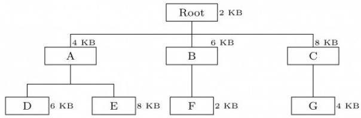
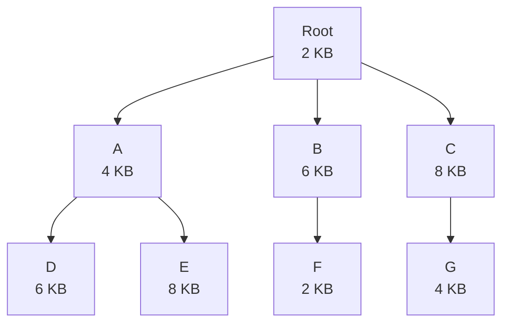
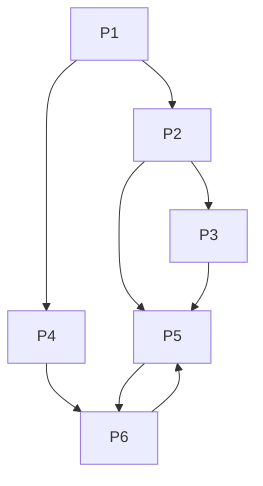
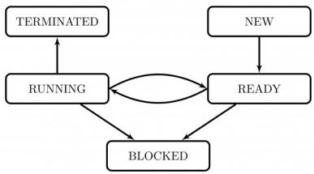
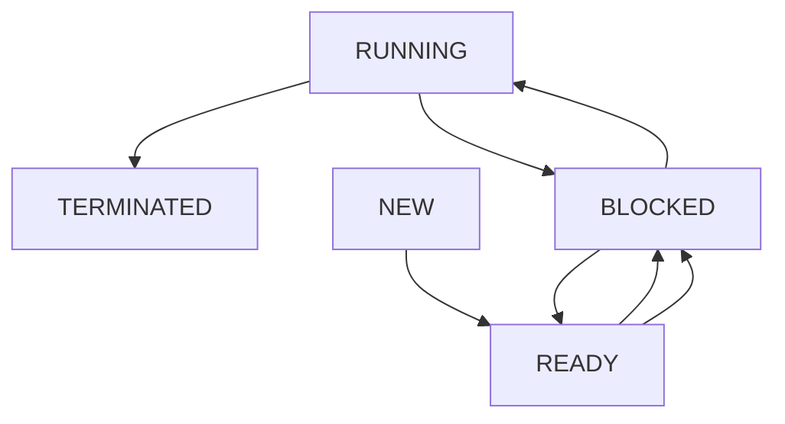

# 5.14.3 Interrupts: GATE CSE 1998 | Question: 1.18

Which of the following devices should get higher priority in assigning interrupts?

A. Hard disk

B. Printer

C. Keyboard

D. Floppy disk

gate1998 operating-system interrupts normal

# Answer key

# 5.14.4 Interrupts: GATE CSE 1999 | Question: 1.9

Listed below are some operating system abstractions (in the left column) and the hardware components (in the right column)


<table><tr><td>(A)</td><td>Thread</td><td>1.</td><td>Interrupt</td></tr><tr><td>(B)</td><td>Virtual address space</td><td>2.</td><td>Memory</td></tr><tr><td>(C)</td><td>File system</td><td>3.</td><td>CPU</td></tr><tr><td>(D)</td><td>Signal</td><td>4.</td><td>Disk</td></tr></table>

A. (A) - 2 (B) - 4 (C) - 3 (D) - 1  
B. (A) - 1 (B) - 2 (C) - 3 (D) - 4  
C. (A) - 3 (B) - 2 (C) - 4 (D) - 1  
D. (A) - 4 (B) - 1 (C) - 2 (D) - 3

gate1999 operating-system easy interrupts virtual-memory disk

# Answer key

# 5.14.5 Interrupts: GATE CSE 2001 | Question: 1.12

A processor needs software interrupt to

A. test the interrupt system of the processor  
B. implement co-routines  
C. obtain system services which need execution of privileged instructions  
D. return from subroutine

gatecse-2001 operating-system interrupts easy

# Answer key

# 5.14.6 Interrupts: GATE CSE 2011 | Question: 11

A computer handles several interrupt sources of which of the following are relevant for this question.

- Interrupt from CPU temperature sensor (raises interrupt if CPU temperature is too high)  
- Interrupt from Mouse (raises Interrupt if the mouse is moved or a button is pressed)  
- Interrupt from Keyboard (raises Interrupt if a key is pressed or released)  
- Interrupt from Hard Disk (raises Interrupt when a disk read is completed)

Which one of these will be handled at the HIGHEST priority?

1. Interrupt from Hard Disk  
2. Interrupt from Mouse  
3. Interrupt from Keyboard  
4. Interrupt from CPU temperature sensor

gatecse-2011 operating-system interrupts normal

# Answer key


# 5.15.1 Least Recently Used: GATE CSE 2023 | Question: 47


Consider the following two-dimensional array D in the C programming language, which is stored in row-major order:

```javascript
int D[128][128];
```

Demand paging is used for allocating memory and each physical page frame holds 512 elements of the array D. The Least Recently Used (LRU) page-replacement policy is used by the operating system. A total of 30 physical page frames are allocated to a process which executes the following code snippet:

```txt
for (int i = 0; i < 128; i++)
    for (int j = 0; j < 128; j++)
        D[j][i] *= 10;
```

The number of page faults generated during the execution of this code snippet is \_\_\_\_.

gatecse-2023 operating-system page-replacement least-recently-used page-faults numerical-answers two-marks

Answer key

# 5.16

# Linked Allocation (1)

# 5.16.1 Linked Allocation: GATE CSE 2025 | Set 1 | Question: 41


A disk of size 512 M bytes is divided into blocks of 64 K bytes. A file is stored in the disk using linked allocation. In linked allocation, each data block reserves 4 bytes to store the pointer to the next data block.

The link part of the last data block contains a NULL pointer (also of 4 bytes). Suppose a file of 1 M bytes needs to be stored in the disk. Assume, $1K = 2^{10}$ and $1M = 2^{20}$ . The amount of space in bytes that will be wasted due to internal fragmentation is \_\_\_\_. (Answer in integer)

gatecse2025-set1 operating-system linked-allocation internal-fragmentation numerical-answers two-marks

Answer key

# 5.17

# Memory Management (9)

Practice Tests: Test 1 (15Q) Test 2 (2Q)

# 5.17.1 Memory Management: GATE CSE 1992 | Question: 12-b


Let the page reference and the working set window be $c \ c \ d \ b \ c \ e \ c \ e \ a \ d$ and 4, respectively. The initial working set at time $t = 0$ contains the pages $\{a, d, e\}$ , where $a$ was referenced at time $t = 0$ , $d$ was referenced at time $t = -1$ , and $e$ was referenced at time $t = -2$ . Determine the total number of page faults the average number of page frames used by computing the working set at each reference.

gate1992 operating-system memory-management normal descriptive

Answer key

# 5.17.2 Memory Management: GATE CSE 1995 | Question: 5


A computer installation has 1000k of main memory. The jobs arrive and finish in the following sequences.

```txt
Job 1 requiring 200k arrives
Job 2 requiring 350k arrives
Job 3 requiring 300k arrives
Job 1 finishes
Job 4 requiring 120k arrives
Job 5 requiring 150k arrives
Job 6 requiring 80k arrives
```

A. Draw the memory allocation table using Best Fit and First Fit algorithms.

B. Which algorithm performs better for this sequence?

gate1995 operating-system memory-management normal descriptive

Answer key

# 5.17.3 Memory Management: GATE CSE 1996 | Question: 2.18


A 1000 Kbyte memory is managed using variable partitions but no compaction. It currently has two partitions of sizes 200 Kbyte and 260 Kbyte respectively. The smallest allocation request in Kbyte that could be denied is for

A. 151

B. 181

C. 231

D. 541

gate1996 operating-system memory-management normal

Answer key

# 5.17.4 Memory Management: GATE CSE 1998 | Question: 2.16

The overlay tree for a program is as shown below:




<details>
<summary>flowchart</summary>


</details>

What will be the size of the partition (in physical memory) required to load (and run) this program?

A. 12 KB

B. 14 KB

c. 10 KB

D. 8 KB

gate1998 operating-system normal memory-management

Answer key

# 5.17.5 Memory Management: GATE CSE 2014 | Set 2 | Question: 55


Consider the main memory system that consists of 8 memory modules attached to the system bus, which is one word wide. When a write request is made, the bus is occupied for 100 nanoseconds (ns) by the data, address, and control signals. During the same 100 ns, and for 500 ns thereafter, the addressed memory module executes one cycle accepting and storing the data. The (internal) operation of different memory modules may overlap in time, but only one request can be on the bus at any time. The maximum number of stores (of one word each) that can be initiated in 1 millisecond is \_\_\_\_

gatecse-2014-set2 operating-system memory-management numerical-answers normal

Answer key

# 5.17.6 Memory Management: GATE CSE 2015 | Set 2 | Question: 30


Consider 6 memory partitions of sizes 200 KB, 400 KB, 600 KB, 500 KB, 300 KB and 250 KB, where KBrefers to kilobyte. These partitions need to be allotted to four processes of sizes 357 KB, 210 KB, 468 KB, 491 KB in that order. If the best-fit algorithm is used, which partitions are NOT allotted to any process?

A. 200 KB and 300 KB

B. 200 KB and 250 KB

C. 250 KB and 300 KB

D. 300 KB and 400 KB

gatecse-2015-set2 operating-system memory-management easy

Answer key

# 5.17.7 Memory Management: GATE CSE 2020 | Question: 11


Consider allocation of memory to a new process. Assume that none of the existing holes in the memory will exactly fit the process's memory requirement. Hence, a new hole of smaller size will be created if allocation is made in any of the existing holes. Which one of the following statement is TRUE?

A. The hole created by first fit is always larger than the hole created by next fit.  
B. The hole created by worst fit is always larger than the hole created by first fit.  
C. The hole created by best fit is never larger than the hole created by first fit.  
D. The hole created by next fit is never larger than the hole created by best fit.

# 5.17.8 Memory Management: GATE IT 2006 | Question: 56


For each of the four processes $P_{1}, P_{2}, P_{3}$ , and $P_{4}$ . The total size in kilobytes (KB) and the number of segments are given below.

<table><tr><td>Process</td><td>Total size (in KB)</td><td>Number of segments</td></tr><tr><td> $P_1$ </td><td>195</td><td>4</td></tr><tr><td> $P_2$ </td><td>254</td><td>5</td></tr><tr><td> $P_3$ </td><td>45</td><td>3</td></tr><tr><td> $P_4$ </td><td>364</td><td>8</td></tr></table>

The page size is 1 KB. The size of an entry in the page table is 4 bytes. The size of an entry in the segment table is 8 bytes. The maximum size of a segment is 256 KB. The paging method for memory management uses two-level paging, and its storage overhead is P. The storage overhead for the segmentation method is S. The storage overhead for the segmentation and paging method is T. What is the relation among the overheads for the different methods of memory management in the concurrent execution of the above four processes?

A. $\mathrm{P} < \mathrm{S} < \mathrm{T}$

B. S < P < T

c. S < T < P

D. $\mathrm{T} < \mathrm{S} < \mathrm{P}$

gateit-2006 operating-system memory-management difficult

# Answer key

# 5.17.9 Memory Management: GATE IT 2007 | Question: 11


Let a memory have four free blocks of sizes 4k, 8k, 20k, 2k. These blocks are allocated following the best-fit strategy. The allocation requests are stored in a queue as shown below.

<table><tr><td>Request No</td><td>J1</td><td>J2</td><td>J3</td><td>J4</td><td>J5</td><td>J6</td><td>J7</td><td>J8</td></tr><tr><td>Request Sizes</td><td>2k</td><td>14k</td><td>3k</td><td>6k</td><td>6k</td><td>10k</td><td>7k</td><td>20k</td></tr><tr><td>Usage Time</td><td>4</td><td>10</td><td>2</td><td>8</td><td>4</td><td>1</td><td>8</td><td>6</td></tr></table>

The time at which the request for J7 will be completed will be

A. 16

B. 19

C. 20

D. 37

gateit-2007 operating-system memory-management normal

# Answer key

# 5.18

# Multilevel Paging (1)

# Practice Test: Test 1 (10Q)

# 5.18.1 Multilevel Paging: GATE CSE 2025 | Set 2 | Question: 48


A computer system supports a logical address space of $2^{32}$ bytes. It uses two-level hierarchical paging with a page size of 4096 bytes. A logical address is divided into a b-bit index to the outer page table, an offset within the page of the inner page table, and an offset within the desired page. Each entry of the inner page table uses eight bytes. All the pages in the system have the same size.

The value of $b$ is \_\_\_\_. (Answer in integer)

gatecse2025-set2 operating-system paging multilevel-paging numerical-answers two-marks

# Answer key

# 5.19

# OS Protection (3)

# 5.19.1 OS Protection: GATE CSE 1999 | Question: 1.11, UGCNET-Dec2015-II: 44

System calls are usually invoked by using


A. a software interrupt  
C. an indirect jump

B. polling  
D. a privileged instruction

gate1999 operating-system normal ugcnetcse-dec2015-paper2 os-protection

# Answer key

# 5.19.2 OS Protection: GATE CSE 2001 | Question: 1.13


A CPU has two modes -- privileged and non-privileged. In order to change the mode from privileged to non-privileged

A. a hardware interrupt is needed  
B. a software interrupt is needed  
C. a privileged instruction (which does not generate an interrupt) is needed  
D. a non-privileged instruction (which does not generate an interrupt) is needed

gatecse-2001 operating-system normal os-protection

# Answer key

# 5.19.3 OS Protection: GATE IT 2005 | Question: 19, UGCNET-June2012-III: 57


A user level process in Unix traps the signal sent on a Ctrl-C input, and has a signal handling routine that saves appropriate files before terminating the process. When a Ctrl-C input is given to this process, what is the mode in which the signal handling routine executes?

A. User mode

B. Kernel mode

C. Superuser mode

D. Privileged mode

gateit-2005 operating-system os-protection normal ugcnetcse-june2012-paper3

# Answer key

# 5.20

# Page Replacement (31)

Practice Tests: Test 1 (15Q) Test 2 (15Q) Test 3 (11Q)

# 5.20.1 Page Replacement: GATE CSE 1993 | Question: 21


The following page addresses, in the given sequence, were generated by a program:

12341352154323

This program is run on a demand paged virtual memory system, with main memory size equal to 4 pages. Indicate the page references for which page faults occur for the following page replacement algorithms.

A. LRU  
B. FIFO

Assume that the main memory is initially empty.

gate1993 operating-system page-replacement normal descriptive

# Answer key

# 5.20.2 Page Replacement: GATE CSE 1994 | Question: 1.13


A memory page containing a heavily used variable that was initialized very early and is in constant use is removed then

A. LRU page replacement algorithm is used

B. FIFO page replacement algorithm is used

C. LFU page replacement algorithm is used

D. None of the above

gate1994 operating-system page-replacement easy

# Answer key

# 5.20.3 Page Replacement: GATE CSE 1994 | Question: 1.24


Consider the following heap (figure) in which blank regions are not in use and hatched region are in use.


<details>
<summary>text_image</summary>

50 150 300 350 600
</details>

Increasing addresses

The sequence of requests for blocks of sizes 300, 25, 125, 50 can be satisfied if we use

A. either first fit or best fit policy (any one)

B. first fit but not best fit policy

C. best fit but not first fit policy

D. None of the above

gate1994 operating-system page-replacement normal

# Answer key

# 5.20.4 Page Replacement: GATE CSE 1995 | Question: 1.8

Which of the following page replacement algorithms suffers from Belady's anamoly?

A. Optimal replacement

B. LRU

C. FIFO

D. Both (A) and (C)

gate1995 operating-system page-replacement normal

# Answer key

# 5.20.5 Page Replacement: GATE CSE 1995 | Question: 2.7

The address sequence generated by tracing a particular program executing in a pure demand based paging system with 100 records per page with 1 free main memory frame is recorded as follows. What is the number of page faults?

0100, 0200, 0430, 0499, 0510, 0530, 0560, 0120, 0220, 0240, 0260, 0320, 0370

A. 13

B. 8

C. 7

D. 10

gate1995 operating-system page-replacement normal

# Answer key

# 5.20.6 Page Replacement: GATE CSE 1997 | Question: 3.10, ISRO2008-57, ISRO2015-64

Dirty bit for a page in a page table

A. helps avoid unnecessary writes on a paging device

B. helps maintain LRU information

C. allows only read on a page

D. None of the above

gate1997 operating-system page-replacement easy isro2008 isro2015

# Answer key

# 5.20.7 Page Replacement: GATE CSE 1997 | Question: 3.5

Locality of reference implies that the page reference being made by a process

A. will always be to the page used in the previous page reference  
B. is likely to be to one of the pages used in the last few page references  
C. will always be to one of the pages existing in memory  
D. will always lead to a page fault

gate1997 operating-system page-replacement easy

# Answer key

# 5.20.8 Page Replacement: GATE CSE 1997 | Question: 3.9

Thrashing

A. reduces page I/O

B. decreases the degree of


C. implies excessive page I/O

gate1997 operating-system page-replacement easy

# Answer key

multiprogramming

D. improve the system performance

# 5.20.9 Page Replacement: GATE CSE 2001 | Question: 1.21

Consider a virtual memory system with FIFO page replacement policy. For an arbitrary page access pattern, increasing the number of page frames in main memory will


A. always decrease the number of page faults

C. sometimes increase the number of page faults

gatecse-2001 operating-system page-replacement normal

B. always increase the number of page faults

D. never affect the number of page faults

# Answer key

# 5.20.10 Page Replacement: GATE CSE 2002 | Question: 1.23

The optimal page replacement algorithm will select the page that


A. Has not been used for the longest time in the past  
B. Will not be used for the longest time in the future  
C. Has been used least number of times  
D. Has been used most number of times

gatecse-2002 operating-system page-replacement easy

# Answer key

# 5.20.11 Page Replacement: GATE CSE 2004 | Question: 21, ISRO2007-44

The minimum number of page frames that must be allocated to a running process in a virtual memory environment is determined by


A. the instruction set architecture  
C. number of processes in memory

B. page size  
D. physical memory size

gatecse-2004 operating-system virtual-memory page-replacement normal isro2007

# Answer key

# 5.20.12 Page Replacement: GATE CSE 2005 | Question: 22, ISRO2015-36

Increasing the RAM of a computer typically improves performance because:


A. Virtual Memory increases

C. Fewer page faults occur

B. Larger RAMs are faster  
D. Fewer segmentation faults occur

gatecse-2005 operating-system page-replacement easy isro2015

# Answer key

# 5.20.13 Page Replacement: GATE CSE 2007 | Question: 56

A virtual memory system uses First In First Out (FIFO) page replacement policy and allocates a fixed number of frames to a process. Consider the following statements:


P: Increasing the number of page frames allocated to a process sometimes increases the page fault rate.

Q: Some programs do not exhibit locality of reference.

Which one of the following is TRUE?

A. Both P and Q are true, and Q is the reason for P

B. Both P and Q are true, but Q is not the reason for P.

C. P is false but Q is true

D. Both P and Q are false.

gatecse-2007 operating-system page-replacement normal

# Answer key

# 5.20.14 Page Replacement: GATE CSE 2007 | Question: 82


A process has been allocated 3 page frames. Assume that none of the pages of the process are available in the memory initially. The process makes the following sequence of page references (reference string): 1, 2, 1, 3, 7, 4, 5, 6, 3, 1

If optimal page replacement policy is used, how many page faults occur for the above reference string?

A. 7

B. 8

C. 9

D. 10

gatecse-2007 operating-system page-replacement easy

# Answer key

# 5.20.15 Page Replacement: GATE CSE 2007 | Question: 83


A process, has been allocated 3 page frames. Assume that none of the pages of the process are available in the memory initially. The process makes the following sequence of page references (reference string): 1, 2, 1, 3, 7, 4, 5, 6, 3, 1

Least Recently Used (LRU) page replacement policy is a practical approximation to optimal page replacement. For the above reference string, how many more page faults occur with LRU than with the optimal page replacement policy?

A. 0

B. 1

C. 2

D. 3

gatecse-2007 normal operating-system page-replacement

# Answer key

# 5.20.16 Page Replacement: GATE CSE 2009 | Question: 9, ISRO2016-52

In which one of the following page replacement policies, Belady's anomaly may occur?


A. FIFO

B. Optimal

C. LRU

D. MRU

gatecse-2009 operating-system page-replacement easy isro2016

# Answer key

# 5.20.17 Page Replacement: GATE CSE 2010 | Question: 24


A system uses FIFO policy for system replacement. It has 4 page frames with no pages loaded to begin with. The system first accesses 100 distinct pages in some order and then accesses the same 100 pages but now in the reverse order. How many page faults will occur?

A. 196

B. 192

C. 197

D. 195

gatecse-2010 operating-system page-replacement normal

# Answer key

# 5.20.18 Page Replacement: GATE CSE 2012 | Question: 42


Consider the virtual page reference string

$$
1, 2, 3, 2, 4, 1, 3, 2, 4, 1
$$

on a demand paged virtual memory system running on a computer system that has main memory size of 3 page frames which are initially empty. Let LRU, FIFO and OPTIMAL denote the number of page faults under the corresponding page replacement policy. Then

A. OPTIMAL < LRU < FIFO

B. OPTIMAL < FIFO < LRU

c. OPTIMAL = LRU

D. OPTIMAL = FIFO

gatecse-2012 operating-system page-replacement normal

# Answer key

# 5.20.19 Page Replacement: GATE CSE 2014 | Set 1 | Question: 33


Assume that there are 3 page frames which are initially empty. If the page reference string is

1, 2, 3, 4, 2, 1, 5, 3, 2, 4, 6 the number of page faults using the optimal replacement policy is \_\_\_\_.

gatecse-2014-set1 operating-system page-replacement numerical-answers

# Answer key

# 5.20.20 Page Replacement: GATE CSE 2014 | Set 2 | Question: 33


A computer has twenty physical page frames which contain pages numbered 101 through 120. Now a program accesses the pages numbered 1, 2, ..., 100 in that order, and repeats the access sequence THRICE. Which one of the following page replacement policies experiences the same number of faults as the optimal page replacement policy for this program?

A. Least-recently-used  
C. Last-in-first-out

B. First-in-first-out  
D. Most-recently-used

gatecse-2014-set2 operating-system page-replacement ambiguous

# Answer key

# 5.20.21 Page Replacement: GATE CSE 2014 | Set 3 | Question: 20


A system uses 3 page frames for storing process pages in main memory. It uses the Least Recently Used (LRU) page replacement policy. Assume that all the page frames are initially empty. What is the total number of page faults that will occur while processing the page reference string given below?

4, 7, 6, 1, 7, 6, 1, 2, 7, 2

gatecse-2014-set3 operating-system page-replacement numerical-answers normal

# Answer key

# 5.20.22 Page Replacement: GATE CSE 2015 | Set 1 | Question: 47


Consider a main memory with five-page frames and the following sequence of page references: 3, 8, 2, 3, 9, 1, 6, 3, 8, 9, 3, 6, 2, 1, 3. Which one of the following is true with respect to page replacement policies First In First Out (FIFO) and Least Recently Used (LRU)?

A. Both incur the same number of page faults  
B. FIFO incurs 2 more page faults than LRU  
C. LRU incurs 2 more page faults than FIFO  
D. FIFO incurs 1 more page faults than LRU

gatecse-2015-set1 operating-system page-replacement normal

# Answer key

# 5.20.23 Page Replacement: GATE CSE 2016 | Set 1 | Question: 49


Consider a computer system with ten physical page frames. The system is provided with an access sequence $(a_{1}, a_{2}, \ldots, a_{20}, a_{1}, a_{2}, \ldots, a_{20})$ , where each $a_{i}$ is a distinct virtual page number. The difference in the number of page faults between the last-in-first-out page replacement policy and the optimal replacement policy is \_\_\_\_.

gatecse-2016-set1 operating-system page-replacement normal numerical-answers

# Answer key

# 5.20.24 Page Replacement: GATE CSE 2016 | Set 2 | Question: 20


In which one of the following page replacement algorithms it is possible for the page fault rate to increase even when the number of allocated frames increases?

A. LRU (Least Recently Used)

C. MRU (Most Recently Used)

gatecse-2016-set2 operating-system page-replacement easy

# Answer key

B. OPT (Optimal Page Replacement)  
D. FIFO (First In First Out)  
B. OPT (Optimal Page Replacement)  
D. FIFO (First In First Out)

Recall that Belady's anomaly is that the page-fault rate may increase as the number of allocated frames increases. Now, consider the following statements:

- $S_{1}$ : Random page replacement algorithm (where a page chosen at random is replaced) suffers from Belady's anomaly.  
- $S_{2}$ : LRU page replacement algorithm suffers from Belady's anomaly.

Which of the following is CORRECT?

A. $S_{1}$ is true, $S_{2}$ is true  
C. $S_{1}$ is false, $S_{2}$ is true

gatecse-2017-set1 page-replacement operating-system normal

B. $S_{1}$ is true, $S_{2}$ is false  
D. $S_{1}$ is false, $S_{2}$ is false

Answer key

# 5.20.26 Page Replacement: GATE CSE 2021 | Set 1 | Question: 11

In the context of operating systems, which of the following statements is/are correct with respect to paging?


A. Paging helps solve the issue of external fragmentation  
B. Page size has no impact on internal fragmentation  
C. Paging incurs memory overheads  
D. Multi-level paging is necessary to support pages of different sizes

gatecse-2021-set1 multiple-selects operating-system page-replacement one-mark

Answer key

# 5.20.27 Page Replacement: GATE CSE 2021 | Set 2 | Question: 48


Consider a three-level page table to translate a 39—bit virtual address to a physical address as shown below:

←---- 39 - bit virtual address ---->

<table><tr><td>Level 1offset</td><td>Level 2offset</td><td>Level 3offset</td><td>Pageoffset</td></tr><tr><td>9 bits</td><td>9 bits</td><td>9 bits</td><td>12 bits</td></tr></table>

The page size is 4 KB ( $1\text{KB} = 2^{10}$ bytes) and page table entry size at every level is 8 bytes. A process $P$ is currently using 2GB ( $1\text{GB} = 2^{30}$ bytes) virtual memory which is mapped to 2GB of physical memory. The minimum amount of memory required for the page table of $P$ across all levels is \_\_\_\_ KB.

gatecse-2021-set2 numerical-answers operating-system memory-management page-replacement two-marks

Answer key

# 5.20.28 Page Replacement: GATE CSE 2025 | Set 1 | Question: 44


In optimal page replacement algorithm, information about all future page references is available to the operating system (OS). A modification of the optimal page replacement algorithm is as follows:

The OS correctly predicts only up to next 4 page references (including the current page) at the time of allocating a frame to a page.

A process accesses the pages in the following order of page numbers:

$$
1, 3, 2, 4, 2, 3, 1, 2, 4, 3, 1, 4
$$

If the system has three memory frames that are initially empty, the number of page faults that will occur during execution of the process is \_\_\_\_. (Answer in integer)

# 5.20.29 Page Replacement: GATE IT 2007 | Question: 12


The address sequence generated by tracing a particular program executing in a pure demand paging system with 100 bytes per page is

0100, 0200, 0430, 0499, 0510, 0530, 0560, 0120, 0220, 0240, 0260, 0320, 0410.

Suppose that the memory can store only one page and if $x$ is the address which causes a page fault then the bytes from addresses $x$ to $x + 99$ are loaded on to the memory.

How many page faults will occur?

A. 0

B. 4

C. 7

D. 8

gateit-2007 operating-system virtual-memory page-replacement normal

# Answer key

# 5.20.30 Page Replacement: GATE IT 2007 | Question: 58


A demand paging system takes 100 time units to service a page fault and 300 time units to replace a dirty page. Memory access time is 1 time unit. The probability of a page fault is $p$ . In case of a page fault, the probability of page being dirty is also $p$ . It is observed that the average access time is 3 time units. Then the value of $p$ is

A. 0.194

B. 0.233

C. 0.514

D. 0.981

gateit-2007 operating-system page-replacement probability normal

# Answer key

# 5.20.31 Page Replacement: GATE IT 2008 | Question: 41


Assume that a main memory with only 4 pages, each of 16 bytes, is initially empty. The CPU generates the following sequence of virtual addresses and uses the Least Recently Used (LRU) page replacement policy.

0, 4, 8, 20, 24, 36, 44, 12, 68, 72, 80, 84, 28, 32, 88, 92

How many page faults does this sequence cause? What are the page numbers of the pages present in the main memory at the end of the sequence?

A. 6 and 1,2,3,4

B. 7 and 1,2,4,5

C. 8 and 1,2,4,5

D. 9 and 1,2,3,5

gateit-2008 operating-system page-replacement normal

# Answer key

# 5.21

# Precedence Graph (3)

# 5.21.1 Precedence Graph: GATE CSE 1989 | Question: 11b


Consider the following precedence graph (Fig.6) of processes where a node denotes a process and a directed edge from node $P_{i}$ to node $P_{j}$ implies; that $P_{i}$ must complete before $P_{j}$ commences. Implement the graph using FORK and JOIN constructs. The actual computation done by a process may be indicated by a comment line.


<details>
<summary>flowchart</summary>


</details>

# 5.21.2 Precedence Graph: GATE CSE 1991 | Question: 01-xii


A given set of processes can be implemented by using only parbegin/parend statement, if the precedence graph of these processes is \_\_\_\_

gate1991 operating-system normal precedence-graph fill-in-the-blanks

# Answer key

# 5.21.3 Precedence Graph: GATE CSE 1992 | Question: 12-a

Draw the precedence graph for the concurrent program given below


<details>
<summary>text_image</summary>

S1
parbegin
  begin
    S2:S4
  end;
  begin
    S3;
  parbegin
    S5;
    begin
      S6:S8
    end
  parend
  end;
S7
parend;
S9
</details>

gate1992 operating-system normal concurrency precedence-graph descriptive

# Answer key

# 5.22

# Process (5)

Practice Test: Test 1 (7Q)

# 5.22.1 Process: GATE CSE 1996 | Question: 1.18

The process state transition diagram in the below figure is representative of



<details>
<summary>flowchart</summary>


</details>

A. a batch operating system  
B. an operating system with a preemptive scheduler  
C. an operating system with a non-preemptive scheduler  
D. a uni-programmed operating system

gate1996 operating-system normal process

# Answer key

# 5.22.2 Process: GATE CSE 2001 | Question: 2.20

Which of the following does not interrupt a running process?

A. A device

B. Timer

C. Scheduler process

D. Power failure

gatecse-2001 operating-system easy process


