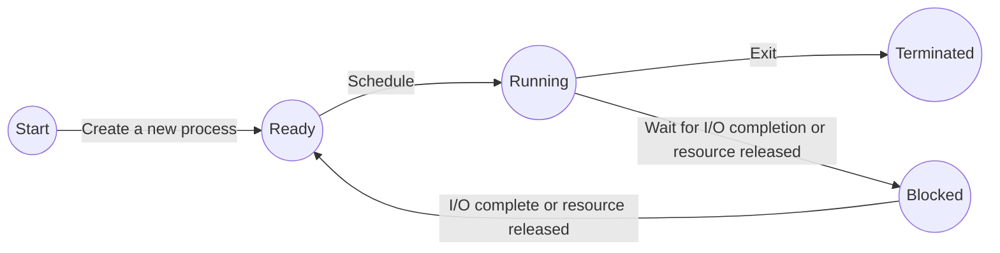
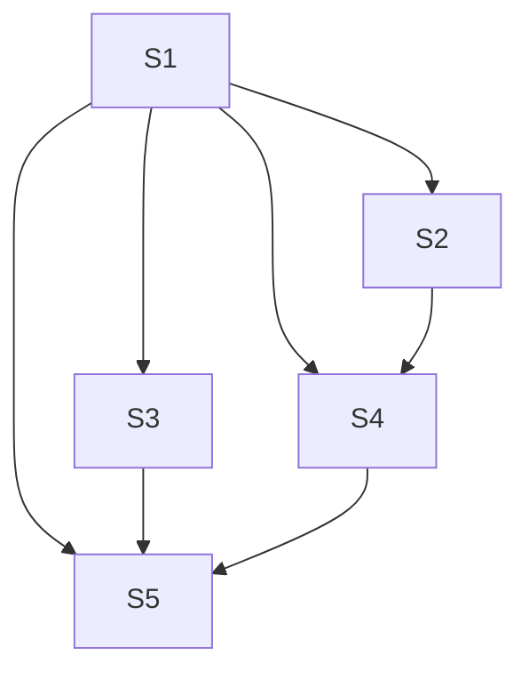
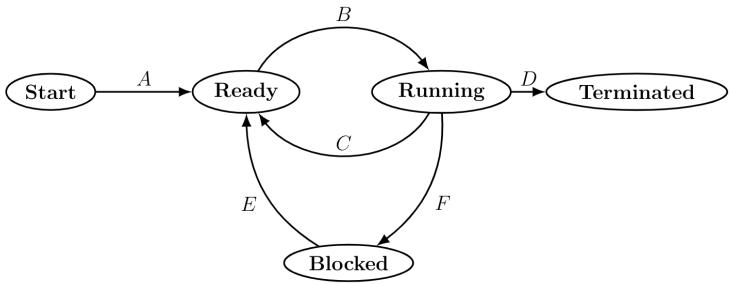
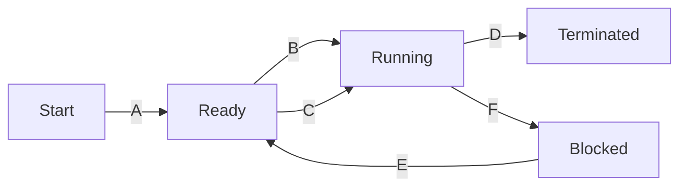

# 5.22.3 Process: GATE CSE 2002 | Question: 2.21

Which combination of the following features will suffice to characterize an OS as a multi-programmed OS?

a. More than one program may be loaded into main memory at the same time for execution  
b. If a program waits for certain events such as I/O, another program is immediately scheduled for execution  
c. If the execution of a program terminates, another program is immediately scheduled for execution.

A. (a)  
B. (a) and (b)  
C. (a) and (c)  
D. (a), (b) and (c)

gatecse-2002 operating-system normal process

Answer key

# 5.22.4 Process: GATE CSE 2023 | Question: 12

Which one or more of the following need to be saved on a context switch from one thread (T1) of a process to another thread (T2) of the same process?

A. Page table base register  
C. Program counter

gatecse-2023 operating-system process multiple-selects one-mark

B. Stack pointer  
D. General purpose registers

Answer key

# 5.22.5 Process: GATE IT 2006 | Question: 13

The process state transition diagram of an operating system is as given below. Which of the following must be FALSE about the above operating system?

flowchart

A. It is a multiprogrammed operating system  
C. It uses non-preemptive scheduling

gateit-2006 operating-system normal process

B. It uses preemptive scheduling  
D. It is a multi-user operating system

Answer key

# 5.23

# Process Scheduling (49)

Practice Tests: Test 1 (15Q) Test 2 (15Q) Test 3 (15Q) Test 4 (15Q) Test 5 (2Q)

# 5.23.1 Process Scheduling: GATE CSE 1988 | Question: 2xa

State any undesirable characteristic of the following criteria for measuring performance of an operating system:

# Turn around time

gate1988 normal descriptive operating-system process-scheduling

Answer key

# 5.23.2 Process Scheduling: GATE CSE 1988 | Question: 2xb

State any undesirable characteristic of the following criteria for measuring performance of an operating system:

# Waiting time

gate1988 normal descriptive operating-system process-scheduling

Answer key

# 5.23.3 Process Scheduling: GATE CSE 1990 | Question: 1-vi

The highest-response ratio next scheduling policy favours \_\_\_\_ jobs, but it also limits the waiting time of \_\_\_\_ jobs.

gate1990 operating-system process-scheduling fill-in-the-blanks

Answer key

# 5.23.4 Process Scheduling: GATE CSE 1993 | Question: 7.10

Assume that the following jobs are to be executed on a single processor system

<table><tr><td>Job Id</td><td>CPU Burst Time</td></tr><tr><td>p</td><td>4</td></tr><tr><td>q</td><td>1</td></tr><tr><td>r</td><td>8</td></tr><tr><td>s</td><td>1</td></tr><tr><td>t</td><td>2</td></tr></table>

The jobs are assumed to have arrived at time $0^{+}$ and in the order $p, q, r, s, t$ . Calculate the departure time (completion time) for job $p$ if scheduling is round robin with time slice 1

A. 4

B. 10

C. 11

D. 12

E. None of the above

gate1993 operating-system process-scheduling normal

Answer key

# 5.23.5 Process Scheduling: GATE CSE 1995 | Question: 1.15

Which scheduling policy is most suitable for a time shared operating system?

A. Shortest Job First

B. Round Robin

C. First Come First Serve

D. Elevator

gate1995 operating-system process-scheduling easy

Answer key

# 5.23.6 Process Scheduling: GATE CSE 1995 | Question: 2.6

The sequence \_\_\_\_ is an optimal non-preemptive scheduling sequence for the following jobs which leaves the CPU idle for \_\_\_\_ unit(s) of time.

<table><tr><td>Job</td><td>Arrival Time</td><td>Burst Time</td></tr><tr><td>1</td><td>0.0</td><td>9</td></tr><tr><td>2</td><td>0.6</td><td>5</td></tr><tr><td>3</td><td>1.0</td><td>1</td></tr></table>

A. $\{3,2,1\},1$

B. $\{2,1,3\},0$

C. $\{3,2,1\},0$

D. $\{1,2,3\},5$

gate1995 operating-system process-scheduling normal

# 5.23.7 Process Scheduling: GATE CSE 1996 | Question: 2.20, ISRO2008-15

Four jobs to be executed on a single processor system arrive at time 0 in the order A, B, C, D. Their burst CPU time requirements are 4, 1, 8, 1 time units respectively. The completion time of A under round robin scheduling with time slice of one time unit is

A. 10

B. 4

C. 8

D. 9

gate1996 operating-system process-scheduling normal isro2008

# Answer key

# 5.23.8 Process Scheduling: GATE CSE 1998 | Question: 2.17, UGCNET-Dec2012-III: 43

Consider $n$ processes sharing the CPU in a round-robin fashion. Assuming that each process switch takes $s$ seconds, what must be the quantum size $q$ such that the overhead resulting from process switching is minimized but at the same time each process is guaranteed to get its turn at the CPU at least every $t$ seconds?

A. $q \leq \frac{t - ns}{n - 1}$  
C. $q\leq \frac{t - ns}{n + 1}$

B. $q \geq \frac{t - ns}{n - 1}$  
D. $q \geq \frac{t - ns}{n + 1}$

gate1998 operating-system process-scheduling normal ugcnetcse-dec2012-paper3

# Answer key

# 5.23.9 Process Scheduling: GATE CSE 1998 | Question: 24

a. Four jobs are waiting to be run. Their expected run times are 6, 3, 5 and $x$ . In what order should they be run to minimize the average response time?  
b. Write a concurrent program using par begin-par end to represent the precedence graph shown below.

flowchart

gate1998 operating-system process-scheduling descriptive

# Answer key

# 5.23.10 Process Scheduling: GATE CSE 1998 | Question: 7-b

In a computer system where the ‘best-fit’ algorithm is used for allocating ‘jobs’ to ‘memory partitions’, the following situation was encountered:

<table><tr><td>Partitions size in KB</td><td>4K 8K 20K 2K</td></tr><tr><td>Job sizes in KB</td><td>2K 14K 3K 6K 6K 10K 20K 2K</td></tr><tr><td>Time for execution</td><td>4 10 2 1 4 1 8 6</td></tr></table>

When will the 20K job complete?

gate1998 operating-system process-scheduling normal

# Answer key

# 5.23.11 Process Scheduling: GATE CSE 2002 | Question: 1.22

Which of the following scheduling algorithms is non-preemptive?

A. Round Robin  
C. Multilevel Queue Scheduling

B. First-In First-Out  
D. Multilevel Queue Scheduling with Feedback

gatecse-2002 operating-system process-scheduling easy

# Answer key

# 5.23.12 Process Scheduling: GATE CSE 2003 | Question: 77

A uni-processor computer system only has two processes, both of which alternate 10 ms CPU bursts with 90 ms I/O bursts. Both the processes were created at nearly the same time. The I/O of both processes can proceed in parallel. Which of the following scheduling strategies will result in the least CPU utilization (over period of time) for this system?

A. First come first served scheduling  
B. Shortest remaining time first scheduling  
C. Static priority scheduling with different priorities for the two processes  
D. Round robin scheduling with a time quantum of 5 ms

gatecse-2003 operating-system process-scheduling normal

# Answer key

# 5.23.13 Process Scheduling: GATE CSE 2004 | Question: 46

Consider the following set of processes, with the arrival times and the CPU-burst times gives in milliseconds.

<table><tr><td>Process</td><td>Arrival Time</td><td>Burst Time</td></tr><tr><td>P1</td><td>0</td><td>5</td></tr><tr><td>P2</td><td>1</td><td>3</td></tr><tr><td>P3</td><td>2</td><td>3</td></tr><tr><td>P4</td><td>4</td><td>1</td></tr></table>

What is the average turnaround time for these processes with the preemptive shortest remaining processing time first (SRPT) algorithm?

A. 5.50

B. 5.75

C. 6.00

D. 6.25

gatecse-2004 operating-system process-scheduling normal

# Answer key

# 5.23.14 Process Scheduling: GATE CSE 2006 | Question: 06, ISRO2009-14

Consider three CPU-intensive processes, which require 10, 20 and 30 time units and arrive at times 0, 2 and 6, respectively. How many context switches are needed if the operating system implements a shortest remaining time first scheduling algorithm? Do not count the context switches at time zero and at the end.

A. 1

B. 2

C. 3

D. 4

gatecse-2006 operating-system process-scheduling normal isro2009

# Answer key

# 5.23.15 Process Scheduling: GATE CSE 2006 | Question: 64

Consider three processes (process id 0, 1, 2 respectively) with compute time bursts 2, 4 and 8 time units. All processes arrive at time zero. Consider the longest remaining time first (LRTF) scheduling algorithm. In LRTF ties are broken by giving priority to the process with the lowest process id. The average turn around tim

A. 13 units

B. 14 units

C. 15 units

D. 16 units

gatecse-2006 operating-system process-scheduling normal

# Answer key

# 5.23.16 Process Scheduling: GATE CSE 2006 | Question: 65

Consider three processes, all arriving at time zero, with total execution time of 10, 20 and 30 units, respectively. Each process spends the first 20% of execution time doing I/O, the next 70% of time doing

computation, and the last 10% of time doing I/O again. The operating system uses a shortest remaining compute time first scheduling algorithm and schedules a new process either when the running process gets blocked on I/O or when the running process finishes its compute burst. Assume that all I/O operations can be overlapped as much as possible. For what percentage of time does the CPU remain idle?

A. 0%

B. 10.6%

C. 30.0%

D. 89.4%

gatecse-2006 operating-system process-scheduling normal

# Answer key

# 5.23.17 Process Scheduling: GATE CSE 2007 | Question: 16

Group 1 contains some CPU scheduling algorithms and Group 2 contains some applications. Match entries in Group 1 to entries in Group 2.

<table><tr><td colspan="2">Group I</td><td colspan="2">Group II</td></tr><tr><td>(P)</td><td>Gang Scheduling</td><td>(1)</td><td>Guaranteed Scheduling</td></tr><tr><td>(Q)</td><td>Rate Monotonic Scheduling</td><td>(2)</td><td>Real-time Scheduling</td></tr><tr><td>(R)</td><td>Fair Share Scheduling</td><td>(3)</td><td>Thread Scheduling</td></tr></table>

A. $P - 3; Q - 2; R - 1$

B. $P - 1; Q - 2; R - 3$

C. $P - 2;Q - 3;R - 1$

D. $P - 1; Q - 3; R - 2$

gatecse-2007 operating-system process-scheduling normal

# Answer key

# 5.23.18 Process Scheduling: GATE CSE 2007 | Question: 55

An operating system used Shortest Remaining System Time first (SRT) process scheduling algorithm. Consider the arrival times and execution times for the following processes:

<table><tr><td>Process</td><td>Execution Time</td><td>Arrival Time</td></tr><tr><td>P1</td><td>20</td><td>0</td></tr><tr><td>P2</td><td>25</td><td>15</td></tr><tr><td>P3</td><td>10</td><td>30</td></tr><tr><td>P4</td><td>15</td><td>45</td></tr></table>

What is the total waiting time for process P2 ?

A. 5

B. 15

C. 40

D. 55

gatecse-2007 operating-system process-scheduling normal

# Answer key

# 5.23.19 Process Scheduling: GATE CSE 2009 | Question: 32

In the following process state transition diagram for a uniprocessor system, assume that there are always some processes in the ready state:

flowchart

Now consider the following statements:

I. If a process makes a transition $D$ , it would result in another process making transition $A$ immediately.  
II. A process $P_{2}$ in blocked state can make transition E while another process $P_{1}$ is in running state.  
III. The OS uses preemptive scheduling.  
IV. The OS uses non-preemptive scheduling.

Which of the above statements are TRUE?

A. I and II

B. I and III

C. II and III

D. II and IV

gatecse-2009 operating-system process-scheduling normal

Answer key

# 5.23.20 Process Scheduling: GATE CSE 2010 | Question: 25

Which of the following statements are true?

I. Shortest remaining time first scheduling may cause starvation  
II. Preemptive scheduling may cause starvation  
III. Round robin is better than FCFS in terms of response time

A. I only

B. I and III only

C. II and III only

D. I, II and III

gatecse-2010 operating-system process-scheduling easy

Answer key

# 5.23.21 Process Scheduling: GATE CSE 2011 | Question: 35

Consider the following table of arrival time and burst time for three processes P0, P1 and P2.

<table><tr><td>Process</td><td>Arrival Time</td><td>Burst Time</td></tr><tr><td>P0</td><td>0 ms</td><td>9</td></tr><tr><td>P1</td><td>1 ms</td><td>4</td></tr><tr><td>P2</td><td>2 ms</td><td>9</td></tr></table>

The pre-emptive shortest job first scheduling algorithm is used. Scheduling is carried out only at arrival or completion of processes. What is the average waiting time for the three processes?

A. 5.0 ms

B. 4.33 ms

C. 6.33 ms

D. 7.33 ms

gatecse-2011 operating-system process-scheduling normal

Answer key

# 5.23.22 Process Scheduling: GATE CSE 2012 | Question: 31

Consider the 3 processes, P1, P2 and P3 shown in the table.

<table><tr><td>Process</td><td>Arrival Time</td><td>Time Units Required</td></tr><tr><td>P1</td><td>0</td><td>5</td></tr><tr><td>P2</td><td>1</td><td>7</td></tr><tr><td>P3</td><td>3</td><td>4</td></tr></table>

The completion order of the 3 processes under the policies FCFS and RR2 (round robin scheduling with CPU quantum of 2 time units) are

A. FCFS: P1, P2, P3 RR2: P1, P2, P3  
B. FCFS: P1, P3, P2 RR2: P1, P3, P2  
C. FCFS: P1, P2, P3 RR2: P1, P3, P2  
D. FCFS: P1, P3, P2 RR2: P1, P2, P3

# 5.23.23 Process Scheduling: GATE CSE 2013 | Question: 10

A scheduling algorithm assigns priority proportional to the waiting time of a process. Every process starts with zero (the lowest priority). The scheduler re-evaluates the process priorities every T time units and decides the next process to schedule. Which one of the following is TRUE if the processes have no I/O operations and all arrive at time zero?

A. This algorithm is equivalent to the first-come-first-serve algorithm.  
B. This algorithm is equivalent to the round-robin algorithm.  
C. This algorithm is equivalent to the shortest-job-first algorithm.  
D. This algorithm is equivalent to the shortest-remaining-time-first algorithm.

gatecse-2013 operating-system process-scheduling normal

# Answer key

# 5.23.24 Process Scheduling: GATE CSE 2014 | Set 1 | Question: 32

Consider the following set of processes that need to be scheduled on a single CPU. All the times are given in milliseconds.

<table><tr><td>Process Name</td><td>Arrival Time</td><td>Execution Time</td></tr><tr><td>A</td><td>0</td><td>6</td></tr><tr><td>B</td><td>3</td><td>2</td></tr><tr><td>C</td><td>5</td><td>4</td></tr><tr><td>D</td><td>7</td><td>6</td></tr><tr><td>E</td><td>10</td><td>3</td></tr></table>

Using the shortest remaining time first scheduling algorithm, the average process turnaround time (in msec) is \_\_\_\_.

gatecse-2014-set1 operating-system process-scheduling numerical-answers normal

# Answer key

# 5.23.25 Process Scheduling: GATE CSE 2014 | Set 2 | Question: 32

Three processes $A$ , $B$ and $C$ each execute a loop of 100 iterations. In each iteration of the loop, a process performs a single computation that requires $t_c$ CPU milliseconds and then initiates a single I/O operation that lasts for $t_{io}$ milliseconds. It is assumed that the computer where the processes execute has sufficient number of I/O devices and the OS of the computer assigns different I/O devices to each process. Also, the scheme overhead of the OS is negligible. The processes have the following characteristics:

<table><tr><td>Process id</td><td> $t_c$ </td><td> $t_{io}$ </td></tr><tr><td>A</td><td>100 ms</td><td>500 ms</td></tr><tr><td>B</td><td>350 ms</td><td>500 ms</td></tr><tr><td>C</td><td>200 ms</td><td>500 ms</td></tr></table>

The processes A, B, and C are started at times 0, 5 and 10 milliseconds respectively, in a pure time sharing system (round robin scheduling) that uses a time slice of 50 milliseconds. The time in milliseconds at which process C would complete its first I/O operation is \_\_\_\_.

gatecse-2014-set2 operating-system process-scheduling numerical-answers normal

# Answer key

# 5.23.26 Process Scheduling: GATE CSE 2014 | Set 3 | Question: 32

An operating system uses shortest remaining time first scheduling algorithm for pre-emptive scheduling of processes. Consider the following set of processes with their arrival times and CPU burst times (in

milliseconds):

<table><tr><td>Process</td><td>Arrival Time</td><td>Burst Time</td></tr><tr><td>P1</td><td>0</td><td>12</td></tr><tr><td>P2</td><td>2</td><td>4</td></tr><tr><td>P3</td><td>3</td><td>6</td></tr><tr><td>P4</td><td>8</td><td>5</td></tr></table>

The average waiting time (in milliseconds) of the processes is \_\_\_\_.

gatecse-2014-set3 operating-system process-scheduling numerical-answers normal

# Answer key

# 5.23.27 Process Scheduling: GATE CSE 2015 | Set 1 | Question: 46

Consider a uniprocessor system executing three tasks $T_1, T_2$ and $T_3$ each of which is composed of an infinite sequence of jobs (or instances) which arrive periodically at intervals of 3, 7 and 20 milliseconds, respectively. The priority of each task is the inverse of its period, and the available tasks are scheduled in order of priority, which is the highest priority task scheduled first. Each instance of $T_1, T_2$ and $T_3$ requires an execution time of 1, 2 and 4 milliseconds, respectively. Given that all tasks initially arrive at the beginning of the $1^{\text{st}}$ millisecond and task preemptions are allowed, the first instance of $T_3$ completes its execution at the end of \_\_\_\_ milliseconds.

gatecse-2015-set1 operating-system process-scheduling normal numerical-answers

# Answer key

# 5.23.28 Process Scheduling: GATE CSE 2015 | Set 3 | Question: 1

The maximum number of processes that can be in Ready state for a computer system with n CPUs is :

A. n

B. $n^2$

C. $2^{n}$

D. Independent of $n$

gatecse-2015-set3 operating-system process-scheduling easy

# Answer key

# 5.23.29 Process Scheduling: GATE CSE 2015 | Set 3 | Question: 34

For the processes listed in the following table, which of the following scheduling schemes will give the lowest average turnaround time?

<table><tr><td>Process</td><td>Arrival Time</td><td>Process Time</td></tr><tr><td>A</td><td>0</td><td>3</td></tr><tr><td>B</td><td>1</td><td>6</td></tr><tr><td>C</td><td>4</td><td>4</td></tr><tr><td>D</td><td>6</td><td>2</td></tr></table>

A. First Come First Serve  
C. Shortest Remaining Time

B. Non-preemptive Shortest job first  
D. Round Robin with Quantum value two

gatecse-2015-set3 operating-system process-scheduling normal

# Answer key

# 5.23.30 Process Scheduling: GATE CSE 2016 | Set 1 | Question: 20

Consider an arbitrary set of CPU-bound processes with unequal CPU burst lengths submitted at the same time to a computer system. Which one of the following process scheduling algorithms would minimize the average waiting time in the ready queue?

A. Shortest remaining time first  
B. Round-robin with the time quantum less than the shortest CPU burst  
C. Uniform random

D. Highest priority first with priority proportional to CPU burst length

gatecse-2016-set1 operating-system process-scheduling normal

Answer key

# 5.23.31 Process Scheduling: GATE CSE 2016 | Set 2 | Question: 47

Consider the following processes, with the arrival time and the length of the CPU burst given in milliseconds. The scheduling algorithm used is preemptive shortest remaining-time first.

<table><tr><td>Process</td><td>Arrival Time</td><td>Burst Time</td></tr><tr><td> $P_1$ </td><td>0</td><td>10</td></tr><tr><td> $P_2$ </td><td>3</td><td>6</td></tr><tr><td> $P_3$ </td><td>7</td><td>1</td></tr><tr><td> $P_4$ </td><td>8</td><td>3</td></tr></table>

The average turn around time of these processes is \_\_\_\_ milliseconds.

gatecse-2016-set2 operating-system process-scheduling normal numerical-answers

Answer key

# 5.23.32 Process Scheduling: GATE CSE 2017 | Set 1 | Question: 24

Consider the following CPU processes with arrival times (in milliseconds) and length of CPU bursts (in milliseconds) as given below:

<table><tr><td>Process</td><td>Arrival Time</td><td>Burst Time</td></tr><tr><td> $P_1$ </td><td>0</td><td>7</td></tr><tr><td> $P_2$ </td><td>3</td><td>3</td></tr><tr><td> $P_3$ </td><td>5</td><td>5</td></tr><tr><td> $P_4$ </td><td>6</td><td>2</td></tr></table>

If the pre-emptive shortest remaining time first scheduling algorithm is used to schedule the processes, then the average waiting time across all processes is \_\_\_\_ milliseconds.

gatecse-2017-set1 operating-system process-scheduling numerical-answers

Answer key

# 5.23.33 Process Scheduling: GATE CSE 2017 | Set 2 | Question: 51

Consider the set of process with arrival time (in milliseconds), CPU burst time (in milliseconds) and priority (0 is the highest priority) shown below. None of the process have I/O burst time

<table><tr><td>Process</td><td>Arrival Time</td><td>Burst Time</td><td>Priority</td></tr><tr><td> $P_1$ </td><td>0</td><td>11</td><td>2</td></tr><tr><td> $P_2$ </td><td>5</td><td>28</td><td>0</td></tr><tr><td> $P_3$ </td><td>12</td><td>2</td><td>3</td></tr><tr><td> $P_4$ </td><td>2</td><td>10</td><td>1</td></tr><tr><td> $P_5$ </td><td>9</td><td>16</td><td>4</td></tr></table>

The average waiting time (in milli seconds) of all the process using premtive priority scheduling algorithm is \_\_\_\_

gatecse-2017-set2 operating-system process-scheduling numerical-answers

Answer key

# 5.23.34 Process Scheduling: GATE CSE 2019 | Question: 41

Consider the following four processes with arrival times (in milliseconds) and their length of CPU bursts (in milliseconds) as shown below:

<table><tr><td>Process</td><td>P1</td><td>P2</td><td>P3</td><td>P4</td></tr><tr><td>Arrival Time</td><td>0</td><td>1</td><td>3</td><td>4</td></tr><tr><td>CPU burst time</td><td>3</td><td>1</td><td>3</td><td>Z</td></tr></table>

These processes are run on a single processor using preemptive Shortest Remaining Time First scheduling algorithm. If the average waiting time of the processes is 1 millisecond, then the value of Z is \_\_\_\_

gatecse-2019 numerical-answers operating-system process-scheduling two-marks

Answer key

# 5.23.35 Process Scheduling: GATE CSE 2020 | Question: 12

Consider the following statements about process state transitions for a system using preemptive scheduling.

I. A running process can move to ready state.  
II. A ready process can move to running state.  
III. A blocked process can move to running state.  
IV. A blocked process can move to ready state.

Which of the above statements are TRUE?

A. I, II, and III only  
C. I, II, and IV only

gatecse-2020 operating-system process-scheduling one-mark easy

B. II and III only  
D. I, II, III and IV only

Answer key

# 5.23.36 Process Scheduling: GATE CSE 2020 | Question: 50

Consider the following set of processes, assumed to have arrived at time 0. Consider the CPU scheduling algorithms Shortest Job First (SJF) and Round Robin (RR). For RR, assume that the processes are scheduled in the order $P_{1}, P_{2}, P_{3}, P_{4}$ .

<table><tr><td>Processes</td><td> $P_{1}$ </td><td> $P_{2}$ </td><td> $P_{3}$ </td><td> $P_{4}$ </td></tr><tr><td>Burst time (in ms)</td><td>8</td><td>7</td><td>2</td><td>4</td></tr></table>

If the time quantum for RR is 4 ms, then the absolute value of the difference between the average turnaround times (in ms) of SJF and RR (round off to 2 decimal places is \_\_\_\_

gatecse-2020 numerical-answers operating-system process-scheduling two-marks

Answer key

# 5.23.37 Process Scheduling: GATE CSE 2021 | Set 1 | Question: 25

Three processes arrive at time zero with CPU bursts of 16, 20 and 10 milliseconds. If the scheduler has prior knowledge about the length of the CPU bursts, the minimum achievable average waiting time for these three processes in a non-preemptive scheduler (rounded to nearest integer) is \_\_\_\_ milliseconds.

gatecse-2021-set1 operating-system process-scheduling numerical-answers one-mark

Answer key

# 5.23.38 Process Scheduling: GATE CSE 2021 | Set 2 | Question: 14

Which of the following statement(s) is/are correct in the context of CPU scheduling?

A. Turnaround time includes waiting time  
B. The goal is to only maximize CPU utilization and minimize throughput  
C. Round-robin policy can be used even when the CPU time required by each of the processes is not known apriori  
D. Implementing preemptive scheduling needs hardware support

# 5.23.39 Process Scheduling: GATE CSE 2023 | Question: 17

Which one or more of the following CPU scheduling algorithms can potentially cause starvation?

A. First-in First-Out  
C. Priority Scheduling

B. Round Robin

D. Shortest Job First

gatecse-2023 operating-system process-scheduling multiple-selects one-mark

# Answer key

# 5.23.40 Process Scheduling: GATE CSE 2024 | Set 1 | Question: 15

Which of the following process state transitions is/are NOT possible?

A. Running to Ready  
C. Ready to Waiting

B. Waiting to Running  
D. Running to Terminated

gatecse-2024-set1 operating-system process-scheduling multiple-selects one-mark

# Answer key

# 5.23.41 Process Scheduling: GATE CSE 2024 | Set 2 | Question: 27

Consider a single processor system with four processes A, B, C, and D, represented as given below, where for each process the first value is its arrival time, and the second value is its CPU burst time.

$$
\mathrm{A} (0, 1 0), \mathrm{B} (2, 6), \mathrm{C} (4, 3), \text {and} \mathrm{D} (6, 7).
$$

Which one of the following options gives the average waiting times when preemptive Shortest Remaining Time First (SRTF) and Non-Preemptive Shortest Job First (NP-SJF) CPU scheduling algorithms are applied to the processes?

A. SRTF = 6, NP - SJF = 7  
B. SRTF = 6, NP - SJF = 7.5  
C. SRTF = 7, NP - SJF = 7.5  
D. SRTF = 7, NP - SJF = 8.5

gatecse-2024-set2 operating-system process-scheduling two-marks

# Answer key

# 5.23.42 Process Scheduling: GATE CSE 2025 | Set 1 | Question: 28

A computer has two processors, $M_{1}$ and $M_{2}$ . Four processes $P_{1}, P_{2}, P_{3}, P_{4}$ with CPU bursts of 20, 16, 25, and 10 milliseconds, respectively, arrive at the same time and these are the only processes in the system. The scheduler uses non-preemptive priority scheduling, with priorities decided as follows:

- $M_1$ uses priority of execution for the processes as, $P_1 > P_3 > P_2 > P_4$ , i.e., $P_1$ and $P_4$ have highest and lowest priorities, respectively.  
- $M_2$ uses priority of execution for the processes as, $P_2 > P_3 > P_4 > P_1$ , i.e., $P_2$ and $P_1$ have highest and lowest priorities, respectively.

A process $P_{i}$ is scheduled to a processor $M_{k}$ , if the processor is free and no other process $P_{j}$ is waiting with higher priority. At any given point of time, a process can be allocated to any one of the free processors without violating the execution priority rules. Ignore the context switch time. What will be the average waiting time of the processes in milliseconds?

A. 9.00

B. 8.75

C. 6.50

D. 7.50

gatecse2025-set1 operating-system process-scheduling two-marks

# Answer key

# 5.23.43 Process Scheduling: GATE CSE 2026 | Set 1 | Question: 54

Consider a CPU that has to execute two types of processes. The first type, Actuators (A), requires a CPU burst of 6 seconds. The second type, Controllers (C), requires a CPU burst of 8 seconds. A new process of type A arrives at time $t = 10, 20, 30, 40$ , and 50 (in seconds). Similarly, a new process of type C arrives at time $t = 11, 22, 33, 44$ , and 55 (in seconds). The CPU scheduling policy is First Come First Serve (FCFS). The first process of type A starts running at $t = 10$ seconds. The average waiting time (in seconds) for the 10 processes is \_\_\_\_. (rounded off to one decimal place)

gatecse-2026-set1 numerical-answers operating-system process-scheduling two-marks

# Answer key

# 5.23.44 Process Scheduling: GATE CSE 2026 | Set 2 | Question: 13

Which one of the following CPU scheduling algorithms cannot be preemptive?

A. Shortest Remaining Time First (SRTF) Scheduling

C. Round Robin Scheduling

gatecse-2026-set2 operating-system process-scheduling one-mark

B. First Come First Serve (FCFS)
Scheduling

D. Priority Scheduling

# Answer key

# 5.23.45 Process Scheduling: GATE IT 2005 | Question: 60

We wish to schedule three processes P1, P2 and P3 on a uniprocessor system. The priorities, CPU time requirements and arrival times of the processes are as shown below.

<table><tr><td>Process</td><td>Priority</td><td>CPU time required</td><td>Arrival time (hh:mm:ss)</td></tr><tr><td>P1</td><td>10 (highest)</td><td>20 sec</td><td>00 : 00 : 05</td></tr><tr><td>P2</td><td>9</td><td>10 sec</td><td>00 : 00 : 03</td></tr><tr><td>P3</td><td>8 (lowest)</td><td>15 sec</td><td>00 : 00 : 00</td></tr></table>

We have a choice of preemptive or non-preemptive scheduling. In preemptive scheduling, a late-arriving higher priority process can preempt a currently running process with lower priority. In non-preemptive scheduling, a late-arriving higher priority process must wait for the currently executing process to complete before it can be scheduled on the processor.

What are the turnaround times (time from arrival till completion) of P2 using preemptive and non-preemptive scheduling respectively?

A. 30 sec, 30 sec

C. 42 sec, 42 sec

B. 30 sec, 10 sec

D. 30 sec, 42 sec

gateit-2005 operating-system process-scheduling normal

# Answer key

# 5.23.46 Process Scheduling: GATE IT 2006 | Question: 12

In the working-set strategy, which of the following is done by the operating system to prevent thrashing?

I. It initiates another process if there are enough extra frames.

II. It selects a process to suspend if the sum of the sizes of the working-sets exceeds the total number of available frames.

A. I only

B. II only

C. Neither I nor II

D. Both I and II

gateit-2006 operating-system process-scheduling normal

# Answer key

# 5.23.47 Process Scheduling: GATE IT 2006 | Question: 54

The arrival time, priority, and duration of the CPU and I/O bursts for each of three processes $P_{1}$ , $P_{2}$ and $P_{3}$ are given in the table below. Each process has a CPU burst followed by an I/O burst followed by another

