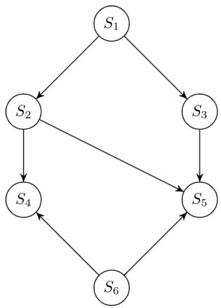
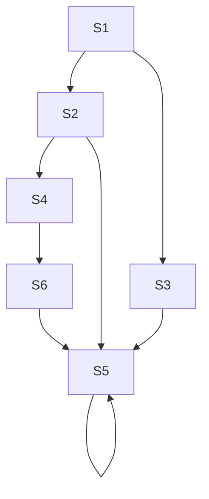

CPU burst. Assume that each process has its own I/O resource.

<table><tr><td>Process</td><td>Arrival Time</td><td>Priority</td><td>Burst duration (CPU)</td><td>Burst duration (I/O)</td><td>Burst duration) (CPU)</td></tr><tr><td> $P_1$ </td><td>0</td><td>2</td><td>1</td><td>5</td><td>3</td></tr><tr><td> $P_2$ </td><td>2</td><td>3 (lowest)</td><td>3</td><td>3</td><td>1</td></tr><tr><td> $P_3$ </td><td>3</td><td>1 (highest)</td><td>2</td><td>3</td><td>1</td></tr></table>

The multi-programmed operating system uses preemptive priority scheduling. What are the finish times of the processes $P_{1}$ , $P_{2}$ and $P_{3}$ ?

A. 11, 15, 9

B. 10, 15, 9

C. 11, 16, 10

D. 12, 17, 11

gateit-2006 operating-system process-scheduling normal

# Answer key

# 5.23.48 Process Scheduling: GATE IT 2007 | Question: 26

Consider $n$ jobs $J_1, J_2 \ldots J_n$ such that job $J_i$ has execution time $t_i$ and a non-negative integer weight $w_i$ . The weighted mean completion time of the jobs is defined to be $\frac{\sum_{i=1}^{n} w_i T_i}{\sum_{i=1}^{n} w_i}$ , where $T_i$ is the completion time of job $J_i$ . Assuming that there is only one processor available, in what order must the jobs be executed in order to minimize the weighted mean completion time of the jobs?

A. Non-decreasing order of $t_{i}$  
C. Non-increasing order of $w_{i}t_{i}$  
gateit-2007 operating-system process-scheduling normal

# Answer key

# 5.23.49 Process Scheduling: GATE IT 2008 | Question: 55

If the time-slice used in the round-robin scheduling policy is more than the maximum time required to execute any process, then the policy will

A. degenerate to shortest job first  
C. degenerate to first come first serve

gateit-2008 operating-system process-scheduling easy

# Answer key

# 5.24

# Process Synchronization (52)

Practice Tests:

Test 1 (15Q)

Test 2 (15Q)

Test 3 (11Q)

Weekly Quiz 1 (16Q)

# 5.24.1 Process Synchronization: GATE CSE 1987 | Question: 1-xvi

A critical region is

A. One which is enclosed by a pair of P and V operations on semaphores.  
B. A program segment that has not been proved bug-free.  
C. A program segment that often causes unexpected system crashes.  
D. A program segment where shared resources are accessed.

gate1987 operating-system process-synchronization

# Answer key

# 5.24.2 Process Synchronization: GATE CSE 1987 | Question: 8a

Consider the following proposal to the "readers and writers problem."

Shared variables and semaphores:


aw, ar, rw, rr : interger;

mutex, reading, writing: semaphore:

initial values of variables and states of semaphores:

```txt
ar=rr=aw=rw=0
reading_value = writing_value = 0
mutex_value = 1.
Process reader;
begin
repeat
    P(mutex);
    ar := ar+1;
    grantread;
    V(mutex);
    P(reading);
    read;
    P(mutex);
    rr := rr - 1;
    ar := ar - 1;
    grantwrite;
    V(mutex);
    other-work;
until false
end.
Process writer;
begin
while true do
begin
    P(mutex);
    aw := aw + 1;
    grantwrite;
    V(mutex);
    P(writing);
    Write;
    P(mutex);
    rw := rw - 1;
    ar := aw - 1;
    grantread;
    V(mutex);
    other-work;
end
end.
```

```vhdl
Procedure grantread;
begin
  if aw = 0
  then while (rr < ar) do
    begin rr := rr + 1;
      V (reading)
    end
  end;
Procedure grantwrite;
begin
  if rr = 0
  then while (rw < aw) do
    begin rw := rw + 1;
      V (writing)
    end
  end;
end;
```

a. Give the value of the shared variables and the states of semaphores when 12 readers are reading and writers are writing.  
b. Can a group of readers make waiting writers starve? Can writers starve readers?  
c. Explain in two sentences why the solution is incorrect.

gate1987 operating-system process-synchronization descriptive

# Answer key

# 5.24.3 Process Synchronization: GATE CSE 1988 | Question: 10iib

Given below is solution for the critical section problem of two processes $P_0$ and $P_1$ sharing the following variables:


```txt
var flag :array [0..1] of boolean; (initially false)
  turn: 0 .. 1;
```

The program below is for process $P_{i}(i = 0$ or 1) where process $P_{j}(j = 1$ or 0) being the other one.

```matlab
repeat
    flag[i]:= true;
    while turn != i
    do begin
        while flag [j] do skip
        turn:=i;
    end

    critical section

    flag[i]:=false;
until false
```

Determine of the above solution is correct. If it is incorrect, demonstrate with an example how it violates the conditions.

gate1988 descriptive operating-system process-synchronization

# Answer key

Match the pairs:

<table><tr><td>(a)</td><td>Critical region</td><td>(p)</td><td>Hoare&#x27;s monitor</td></tr><tr><td>(b)</td><td>Wait/Signal</td><td>(q)</td><td>Mutual exclusion</td></tr><tr><td>(c)</td><td>Working Set</td><td>(r)</td><td>Principle of locality</td></tr><tr><td>(d)</td><td>Deadlock</td><td>(s)</td><td>Circular Wait</td></tr></table>

match-the-following gate1990 operating-system process-synchronization

Answer key

# 5.24.5 Process Synchronization: GATE CSE 1991 | Question: 11,a

Consider the following scheme for implementing a critical section in a situation with three processes $P_{i}, P_{j}$ and $P_{k}$ .


```txt
Pi;
repeat
    flag[i] := true;
    while flag [j] or flag[k] do
        case turn of
        j: if flag [j] then
        begin
            flag [i] := false;
            while turn != i do skip;
            flag [i] := true;
        end;
        k: if flag [k] then
        begin
            flag [i] := false,
            while turn != i do skip;
            flag [i] := true
        end
    end
    critical section
    if turn = i then turn := j;
        flag [i] := false
    non-critical section
until false;
```

a. Does the scheme ensure mutual exclusion in the critical section? Briefly explain.

gate1991 process-synchronization normal operating-system descriptive

Answer key

# 5.24.6 Process Synchronization: GATE CSE 1991 | Question: 11,b

Consider the following scheme for implementing a critical section in a situation with three processes $P_{i}, P_{j}$ and $P_{k}$ .

Pi;

```matlab
repeat
    flag[i] := true;
    while flag [j] or flag[k] do
        case turn of
        j: if flag [j] then
        begin
            flag [i] := false;
            while turn != i do skip;
            flag [i] := true;
        end;
        k: if flag [k] then
        begin
            flag [i] := false,
            while turn != i do skip;
            flag [i] := true
        end
    end
```


critical section

if turn = i then turn := j;

flag [i] := false

non-critical section

until false;

Is there a situation in which a waiting process can never enter the critical section? If so, explain and suggest modifications to the code to solve this problem

gate1991 process-synchronization normal operating-system descriptive

# Answer key

# 5.24.7 Process Synchronization: GATE CSE 1993 | Question: 22

Write a concurrent program using parbegin-parend and semaphores to represent the precedence constraints of the statements $S_{1}$ to $S_{6}$ , as shown in figure below.




<details>
<summary>flowchart</summary>


</details>

gate1993 operating-system process-synchronization normal descriptive

# Answer key

# 5.24.8 Process Synchronization: GATE CSE 1994 | Question: 27


A. Draw a precedence graph for the following sequential code. The statements are numbered from $S_{1}$ to $S_{6}$

$S_{1}$ read n

$S_{2}\quad\mathrm{i:=1}$

$S_{3}$ if $\mathrm{i} > \mathrm{n}$ next

$S_{4}\quad a(i):=i+1$

$S_{5}\quad\mathrm{i:=i+1}$

$S_{6}$ next:write a(i)

B. Can this graph be converted to a concurrent program using parbegin-parend construct only?

gate1994 operating-system process-synchronization normal descriptive

# Answer key

# 5.24.9 Process Synchronization: GATE CSE 1995 | Question: 19

Consider the following program segment for concurrent processing using semaphore operators $P$ and $V$ for synchronization. Draw the precedence graph for the statements $S_{1}$ to $S_{9}$ .


var

a,b,c,d,e,f,g,h,i,j,k : semaphore;

begin

cobegin

begin S1; V(a); V(b) end;

begin P(a); S2; V(c); V(d) end;

begin P(c); S4; V(e) end;

begin P(d); S5; V(f) end;

begin P(e); P(f); S7; V(k) end

gate1995 operating-system process-synchronization normal descriptive

# Answer key

# 5.24.10 Process Synchronization: GATE CSE 1996 | Question: 1.19, ISRO2008-61

A critical section is a program segment

A. which should run in a certain amount of time  
B. which avoids deadlocks  
C. where shared resources are accessed  
D. which must be enclosed by a pair of semaphore operations, P and V

gate1996 operating-system process-synchronization easy isro2008

# Answer key

# 5.24.11 Process Synchronization: GATE CSE 1996 | Question: 2.19

A solution to the Dining Philosophers Problem which avoids deadlock is to

A. ensure that all philosophers pick up the left fork before the right fork  
B. ensure that all philosophers pick up the right fork before the left fork  
C. ensure that one particular philosopher picks up the left fork before the right fork, and that all other philosophers pick up the right fork before the left fork  
D. None of the above

gate1996 operating-system process-synchronization normal

# Answer key

# 5.24.12 Process Synchronization: GATE CSE 1996 | Question: 21

The concurrent programming constructs fork and join are as below:

Fork <label> which creates a new process executing from the specified label

Join <variable> which decrements the specified synchronization variable (by 1) and terminates the process if the new value is not 0.

Show the precedence graph for S1, S2, S3, S4, and S5 of the concurrent program below.

```txt
N=2
M=2
Fork L3
Fork L4
S1
L1 : join N
S3
L2 : join M
S5
L3:S2
Goto L1
L4:S4
Goto L2
Next:
```


gate1996 operating-system process-synchronization normal descriptive

# Answer key

Each Process $P_{i}, i = 1 \dots 9$ is coded as follows

repeat

```txt
P(mutex)
{Critical section}
V(mutex)
```

forever

The code for $P_{10}$ is identical except it uses V(mutex) in place of P(mutex). What is the largest number of processes that can be inside the critical section at any moment?

A. 1

B. 2

C. 3

D. None

gate1997 operating-system process-synchronization normal

Answer key

# 5.24.14 Process Synchronization: GATE CSE 1997 | Question: 73


A concurrent system consists of 3 processes using a shared resource R in a non-preemptible and mutually exclusive manner. The processes have unique priorities in the range 1...3, 3 being the highest priority. It is required to synchronize the processes such that the resource is always allocated to the highest priority requester. The pseudo code for the system is as follows.

# Shared data

```c
mutex:semaphore = 1;/* initialized to 1*/
process[3]:semaphore = 0; /*all initialized to 0 */
R_requested [3]:boolean = false; /*all initialized to flase */
busy: boolean = false; /*initialized to false */
```

# Code for processes

```vhdl
begin process
my-priority:integer;
my-priority:=____; /*in the range 1..3*/
repeat
    request_R(my-priority);
    P (proceed [my-priority]);
    {use shared resource R}
    release_R (my-priority);
forever
end process;
```

# Procedures

```matlab
procedure request_R(priority);
P(mutex);
if busy = true then
    R_requested [priority]:=true;
else
begin
    V(proceed [priority]);
    busy:=true;
end
V(mutex)
```

Give the pseudo code for the procedure release\_R.

gate1997 operating-system process-synchronization descriptive

Answer key

# 5.24.15 Process Synchronization: GATE CSE 1998 | Question: 1.30

When the result of a computation depends on the speed of the processes involved, there is said to be

A. cycle stealing

B. race condition

C. a time lock

D. a deadlock


# 5.24.16 Process Synchronization: GATE CSE 1999 | Question: 20-a

A certain processor provides a 'test and set' instruction that is used as follows:


TSET register, flag

This instruction atomically copies flag to register and sets flag to 1. Give pseudo-code for implementing the entry and exit code to a critical region using this instruction.

gate1999 operating-system process-synchronization normal descriptive

Answer key

# 5.24.17 Process Synchronization: GATE CSE 1999 | Question: 20-b

Consider the following solution to the producer-consumer problem using a buffer of size 1. Assume that the initial value of count is 0. Also assume that the testing of count and assignment to count are atomic operations.


Producer:

Repeat

Produce an item;

if count = 1 then sleep;

place item in buffer.

count = 1;

Wakeup(Consumer);

Forever

Consumer:

Repeat

if count = 0 then sleep;

Remove item from buffer;

count = 0;

Wakeup(Producer);

Consume item;

Forever;

Show that in this solution it is possible that both the processes are sleeping at the same time.

gate1999 operating-system process-synchronization normal descriptive

Answer key

# 5.24.18 Process Synchronization: GATE CSE 2000 | Question: 1.21

Let $m[0] \ldots m[4]$ be mutexes (binary semaphores) and $P[0] \ldots P[4]$ be processes.

Suppose each process $P[i]$ executes the following:


wait (m[i]); wait (m(i+1) mod 4]);

release (m[i]); release (m(i+1) mod 4]);

# This could cause

A. Thrashing

C. Starvation, but not deadlock

gatecse-2000 operating-system process-synchronization normal

B. Deadlock

D. None of the above

Answer key

# 5.24.19 Process Synchronization: GATE CSE 2000 | Question: 20

a. Fill in the boxes below to get a solution for the reader-writer problem, using a single binary semaphore, mutex (initialized to 1) and busy waiting. Write the box numbers (1, 2 and 3), and their contents in your answer book.


```c
int R = 0, W = 0;

Reader () {
L1: wait (mutex);
if (W == 0) {
    R = R + 1;
    □ ________(1)
}
else {
    □ ________(2)
    goto L1;
}
.../* do the read*/
wait (mutex);
R = R - 1;
signal (mutex);
}
```

```txt
Writer () {
L2: wait (mutex);
if (☐) { ________(3)
    signal (mutex);
    goto L2;
}
W=1;
signal (mutex);
...../*do the write*/
wait( mutex);
W=0;
signal (mutex);
}
```

b. Can the above solution lead to starvation of writers?

gatecse-2000 operating-system process-synchronization normal descriptive

# Answer key

# 5.24.20 Process Synchronization: GATE CSE 2001 | Question: 2.22

Consider Peterson's algorithm for mutual exclusion between two concurrent processes i and j. The program executed by process is shown below.

```txt
repeat
    flag[i] = true;
    turn = j;
    while (P) do no-op;
    Enter critical section, perform actions, then
    exit critical section
    Flag[i] = false;
    Perform other non-critical section actions.
Until false;
```

For the program to guarantee mutual exclusion, the predicate P in the while loop should be

A. flag[j] = true and turn = i

B. flag[j] = true and turn = j

C. flag[i] = true and turn = j

D. flag[i] = true and turn = i

gatecse-2001 operating-system process-synchronization normal

# Answer key

# 5.24.21 Process Synchronization: GATE CSE 2002 | Question: 18-a

Draw the process state transition diagram of an OS in which (i) each process is in one of the five states: created, ready, running, blocked (i.e., sleep or wait), or terminated, and (ii) only non-preemptive scheduling is used by the OS. Label the transitions appropriately.

gatecse-2002 operating-system process-synchronization normal descriptive

# Answer key


The functionality of atomic TEST-AND-SET assembly language instruction is given by the following C function

```txt
int TEST-AND-SET (int *x)
{
    int y;
    A1: y=*x;
    A2: *x=1;
    A3: return y;
}
```

i. Complete the following C functions for implementing code for entering and leaving critical sections on the above TEST-AND-SET instruction.

```c
int mutex=0;
void enter-cs()
{
    while(...........................);

}
void leave-cs()
{ ..............;

}
```

ii. Is the above solution to the critical section problem deadlock free and starvation-free?  
iii. For the above solution, show by an example that mutual exclusion is not ensured if TEST-AND-SET instruction is not atomic?

gatecse-2002 operating-system process-synchronization normal descriptive

Answer key

# 5.24.23 Process Synchronization: GATE CSE 2002 | Question: 20

The following solution to the single producer single consumer problem uses semaphores for synchronization.


```lisp
#define BUFFSIZE 100
buffer buf[BUFFSIZE];
int first = last = 0;
semaphore b_full = 0;
semaphore b_empty = BUFFSIZE

void producer()
{
while(1) {
    produce an item;
    p1:..............................;
    put the item into buff (first);
    first = (first+1)%BUFFSIZE;
    p2:..............................;
}
}

void consumer()
{
while(1) {
    c1:..............................
    take the item from buf[last];
    last = (last+1)%BUFFSIZE;
    c2:..............................;
    consume the item;
}
}
```

A. Complete the dotted part of the above solution.  
B. Using another semaphore variable, insert one line statement each immediately after p1, immediately before p2, immediately after c1 and immediately before c2 so that the program works correctly for multiple producers and consumers.

# 5.24.24 Process Synchronization: GATE CSE 2003 | Question: 80

Suppose we want to synchronize two concurrent processes P and Q using binary semaphores S and T. The code for the processes P and Q is shown below.


<table><tr><td>Process P:</td><td>Process Q:</td></tr><tr><td></td><td></td></tr><tr><td>while(1){W:print &#x27;0&#x27;;print &#x27;0&#x27;;X:}</td><td>while(1){Y:print &#x27;1&#x27;;print &#x27;1&#x27;;Z:}</td></tr><tr><td></td><td></td></tr></table>

Synchronization statements can be inserted only at points $W, X, Y$ , and $Z$

Which of the following will always lead to an output staring with '001100110011'?

A. $P(S)$ at $W, V(S)$ at $X, P(T)$ at $Y, V(T)$ at $Z, S$ and $T$ initially 1  
B. $P(S)$ at $W, V(T)$ at $X, P(T)$ at $Y, V(S)$ at $Z, S$ initially 1, and $T$ initially 0  
C. $P(S)$ at $W, V(T)$ at $X, P(T)$ at $Y, V(S)$ at $Z, S$ and $T$ initially 1  
D. $P(S)$ at $W, V(S)$ at $X, P(T)$ at $Y, V(T)$ at $Z, S$ initially 1, and $T$ initially 0

gatecse-2003 operating-system process-synchronization normal

Answer key

# 5.24.25 Process Synchronization: GATE CSE 2003 | Question: 81

Suppose we want to synchronize two concurrent processes P and Q using binary semaphores S and T. The code for the processes P and Q is shown below.


<table><tr><td>Process P:</td><td>Process Q:</td></tr><tr><td>while(1) {W:print ‘0’;print ‘0’;X:}</td><td>while(1) {Y:print ‘1’;print ‘1’;Z:}</td></tr></table>

Synchronization statements can be inserted only at points W, X, Y, and Z

Which of the following will ensure that the output string never contains a substring of the form $01^{n}0$ and $10^{n}1$ where $n$ is odd?

A. $P(S)$ at $W, V(S)$ at $X, P(T)$ at $Y, V(T)$ at $Z, S$ and $T$ initially 1  
B. $P(S)$ at $W, V(T)$ at $X, P(T)$ at $Y, V(S)$ at Z, S and T initially 1  
C. $P(S)$ at $W, V(S)$ at $X, P(S)$ at $Y, V(S)$ at $Z, S$ initially 1  
D. $V(S)$ at $W, V(T)$ at $X, P(S)$ at $Y, P(T)$ at Z, S and T initially 1

gatecse-2003 operating-system process-synchronization normal

Answer key

# 5.24.26 Process Synchronization: GATE CSE 2004 | Question: 48

Consider two processes $P_{1}$ and $P_{2}$ accessing the shared variables X and Y protected by two binary


semaphores $S_{X}$ and $S_{Y}$ respectively, both initialized to 1. P and V denote the usual semaphore operators, where P decrements the semaphore value, and V increments the semaphore value. The pseudo-code of $P_{1}$ and $P_{2}$ is as follows:

<table><tr><td> $P_1$ :</td><td> $P_2$ :</td></tr><tr><td>While true do {</td><td>While true do {</td></tr><tr><td> $L_1 : \dots \dots$ </td><td> $L_3 : \dots \dots$ </td></tr><tr><td> $L_2 : \dots \dots$ </td><td> $L_4 : \dots \dots$ </td></tr><tr><td> $\mathrm{X} = \mathrm{X} + 1$ ;</td><td> $\mathrm{Y} = \mathrm{Y} + 1$ ;</td></tr><tr><td> $Y = Y - 1$ ;</td><td> $X = Y - 1$ ;</td></tr><tr><td> $V(S_X)$ ;</td><td> $V(S_Y)$ ;</td></tr><tr><td> $V(S_Y)$ ;</td><td> $V(S_X)$ ;</td></tr><tr><td>}</td><td>}</td></tr></table>

In order to avoid deadlock, the correct operators at $L_{1}$ , $L_{2}$ , $L_{3}$ and $L_{4}$ are respectively.

A. $P(S_{Y}), P(S_{X}); P(S_{X}), P(S_{Y})$

B. $P(S_X), P(S_Y); P(S_Y), P(S_X)$

C. $P(S_X), P(S_X); P(S_Y), P(S_Y)$

D. $P(S_X), P(S_Y); P(S_X), P(S_Y)$

gatecse-2004 operating-system process-synchronization normal

# Answer key

# 5.24.27 Process Synchronization: GATE CSE 2006 | Question: 61


The atomic fetch-and-set x, y instruction unconditionally sets the memory location x to 1 and fetches the old value of x in y without allowing any intervening access to the memory location x. Consider the following implementation of P and V functions on a binary semaphore S.

```c
void P (binary_semaphore *s) {
    unsigned y;
    unsigned *x = &(s->value);
    do {
        fetch-and-set x, y;
    } while (y);
}

void V (binary_semaphore *s) {
    S->value = 0;
}
```

Which one of the following is true?

A. The implementation may not work if context switching is disabled in P  
B. Instead of using fetch-and -set, a pair of normal load/store can be used  
C. The implementation of $V$ is wrong  
D. The code does not implement a binary semaphore

gatecse-2006 operating-system process-synchronization normal

# Answer key

# 5.24.28 Process Synchronization: GATE CSE 2006 | Question: 78

Barrier is a synchronization construct where a set of processes synchronizes globally i.e., each process in the set arrives at the barrier and waits for all others to arrive and then all processes leave the barrier. Let the number of processes in the set be three and $S$ be a binary semaphore with the usual $P$ and $V$ functions. Consider the following $C$ implementation of a barrier with line numbers shown on left.

void barrier (void) {

```txt
P(S);
process_arrived++;
V(S);
```


while (process\_arrived !=3);  
5: P(S);  
6: process\_left++;  
if (process\_left==3) {  
process\_arrived = 0;  
process\_left = 0;  
10: }  
11: V(S);

}

The variables process\_arrived and process\_left are shared among all processes and are initialized to zero. In a concurrent program all the three processes call the barrier function when they need to synchronize globally.

The above implementation of barrier is incorrect. Which one of the following is true?

A. The barrier implementation is wrong due to the use of binary semaphore S  
B. The barrier implementation may lead to a deadlock if two barrier in invocations are used in immediate succession.  
C. Lines 6 to 10 need not be inside a critical section  
D. The barrier implementation is correct if there are only two processes instead of three.

gatecse-2006 operating-system process-synchronization normal

Answer key

# 5.24.29 Process Synchronization: GATE CSE 2006 | Question: 79


Barrier is a synchronization construct where a set of processes synchronizes globally i.e., each process in the set arrives at the barrier and waits for all others to arrive and then all processes leave the barrier. Let the number of processes in the set be three and $S$ be a binary semaphore with the usual $P$ and $V$ functions. Consider the following $C$ implementation of a barrier with line numbers shown on left.

void barrier (void) {

```c
P(S);
process_arrived++;
V(S);
while (process_arrived !=3);
  P(S);
  process_left++;
  if (process_left==3) {
    process_arrived = 0;
    process_left = 0;
  }
V(S);
```

}

The variables process\_arrived and process\_left are shared among all processes and are initialized to zero. In a concurrent program all the three processes call the barrier function when they need to synchronize globally.

Which one of the following rectifies the problem in the implementation?

A. Lines 6 to 10 are simply replaced by process\_arrived--  
B. At the beginning of the barrier the first process to enter the barrier waits until process\_arrived becomes zero before proceeding to execute $P(S)$ .  
C. Context switch is disabled at the beginning of the barrier and re-enabled at the end.  
D. The variable process\_left is made private instead of shared

gatecse-2006 operating-system process-synchronization normal

Answer key

# 5.24.30 Process Synchronization: GATE CSE 2007 | Question: 58


Two processes, P1 and P2, need to access a critical section of code. Consider the following synchronization construct used by the processes: