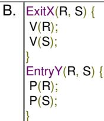
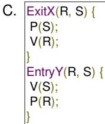
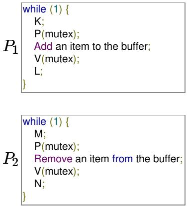
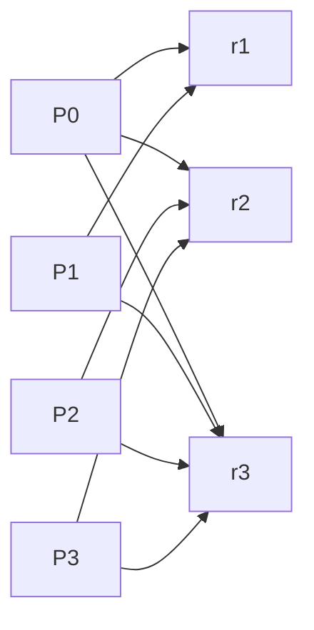

<table><tr><td>/* P1 */while (true) {wants1 = true;while (wants2 == true);/* Critical Section */wants1 = false;}/* Remainder section */</td><td>/* P2 */while (true) {wants2 = true;while (wants1 == true);/* Critical Section */wants2=false;}/* Remainder section */</td></tr></table>

Here, wants1 and wants2 are shared variables, which are initialized to false.

Which one of the following statements is TRUE about the construct?

A. It does not ensure mutual exclusion.  
B. It does not ensure bounded waiting.  
C. It requires that processes enter the critical section in strict alteration.  
D. It does not prevent deadlocks, but ensures mutual exclusion.

gatecse-2007 operating-system process-synchronization normal

Answer key

# 5.24.31 Process Synchronization: GATE CSE 2009 | Question: 33

The enter\_CS() and leave\_CS() functions to implement critical section of a process are realized using test-and-set instruction as follows:

```txt
void enter_CS(X)
{
    while(test-and-set(X));
}

void leave_CS(X)
{
    X = 0;
}
```

In the above solution, $X$ is a memory location associated with the $CS$ and is initialized to 0. Now consider the following statements:

I. The above solution to CS problem is deadlock-free  
II. The solution is starvation free  
III. The processes enter CS in FIFO order  
IV. More than one process can enter CS at the same time

Which of the above statements are TRUE?

A. (I) only

B. (I) and (II)

C. (II) and (III)

D. (IV) only

gatecse-2009 operating-system process-synchronization normal

Answer key

# 5.24.32 Process Synchronization: GATE CSE 2010 | Question: 23

Consider the methods used by processes P1 and P2 for accessing their critical sections whenever needed, as given below. The initial values of shared boolean variables S1 and S2 are randomly assigned.


<table><tr><td>Method used by P1</td><td>Method used by P2</td></tr><tr><td>while (S1 == S2);Critical SectionS1 = S2;</td><td>while (S1 != S2);Critical SectionS2 = not(S1);</td></tr></table>

Which one of the following statements describes the properties achieved?

A. Mutual exclusion but not progress  
C. Neither mutual exclusion nor progress

gatecse-2010 operating-system process-synchronization normal

B. Progress but not mutual exclusion  
D. Both mutual exclusion and progress

# Answer key

# 5.24.33 Process Synchronization: GATE CSE 2010 | Question: 45

The following program consists of 3 concurrent processes and 3 binary semaphores. The semaphores are initialized as $S0 = 1$ , $S1 = 0$ and $S2 = 0$ .


<table><tr><td>Process P0</td><td>Process P1</td><td>Process P2</td></tr><tr><td>while (true) { wait (S0); print ‘0’; release (S1); release (S2); }</td><td>wait (S1); release (S0);</td><td>wait (S2); release (S0);</td></tr></table>

How many times will process P0 print '0'?

A. At least twice  
C. Exactly thrice

gatecse-2010 operating-system process-synchronization normal

B. Exactly twice  
D. Exactly once

# Answer key

# 5.24.34 Process Synchronization: GATE CSE 2012 | Question: 32

Fetch\_And\_Add(X,i) is an atomic Read-Modify-Write instruction that reads the value of memory location X, increments it by the value i, and returns the old value of X. It is used in the pseudocode shown below to implement a busy-wait lock. L is an unsigned integer shared variable initialized to 0. The value of 0 corresponds to lock being available, while any non-zero value corresponds to the lock being not available.

```txt
AcquireLock(L){
    while (Fetch_And_Add(L,1))
        L = 1;
}

ReleaseLock(L){
    L = 0;
}
```

This implementation

A. fails as L can overflow  
B. fails as $L$ can take on a non-zero value when the lock is actually available  
C. works correctly but may starve some processes  
D. works correctly without starvation


# 5.24.35 Process Synchronization: GATE CSE 2013 | Question: 34


A shared variable x, initialized to zero, is operated on by four concurrent processes W, X, Y, Z as follows. Each of the processes W and X reads x from memory, increments by one, stores it to memory, and then

terminates. Each of the processes Y and Z reads x from memory, decrements by two, stores it to memory, and then terminates. Each process before reading x invokes the P operation (i.e., wait) on a counting semaphore S and invokes the V operation (i.e., signal) on the semaphore S after storing x to memory. Semaphore S is initialized to two. What is the maximum possible value of x after all processes complete execution?

A. -2

B. -1

C. 1

D. 2

gatecse-2013 operating-system process-synchronization normal

# Answer key

# 5.24.36 Process Synchronization: GATE CSE 2013 | Question: 39


A certain computation generates two arrays $a$ and $b$ such that $a[i] = f(i)$ for $0 \leq i < n$ and $b[i] = g(a[i])$ for $0 \leq i < n$ . Suppose this computation is decomposed into two concurrent processes $X$ and $Y$ such that

X computes the array a and Y computes the array b. The processes employ two binary semaphores R and S, both initialized to zero. The array a is shared by the two processes. The structures of the processes are shown below.

Process X:

```c
private i;
for (i=0; i< n; i++) {
  a[i] = f(i);
  ExitX(R, S);
}
```

Process Y:

```txt
private i;
for (i=0; i<n; i++) {
    EntryY(R, S);
    b[i] = g(a[i]);
}
```

Which one of the following represents the CORRECT implementations of ExitX and EntryY?







gatecse-2013 operating-system process-synchronization normal

# Answer key

# 5.24.37 Process Synchronization: GATE CSE 2014 | Set 2 | Question: 31


Consider the procedure below for the Producer-Consumer problem which uses semaphores:

```javascript
semaphore n = 0;
semaphore s = 1;
```

```javascript
void producer()
{
    while(true)
    {
        produce();
        semWait(s);
        addToBuffer();
        semSignal(s);
        semSignal(n);
    }
}
```

```txt
void consumer()
{
    while(true)
    {
        semWait(s);
        semWait(n);
        removeFromBuffer();
        semSignal(s);
        consume();
    }
}
```

Which one of the following is TRUE?

A. The producer will be able to add an item to the buffer, but the consumer can never consume it.  
B. The consumer will remove no more than one item from the buffer.  
C. Deadlock occurs if the consumer succeeds in acquiring semaphore s when the buffer is empty.  
D. The starting value for the semaphore n must be 1 and not 0 for deadlock-free operation.

gatecse-2014-set2 operating-system process-synchronization normal

# Answer key

# 5.24.38 Process Synchronization: GATE CSE 2015 | Set 1 | Question: 9

The following two functions P1 and P2 that share a variable B with an initial value of 2 execute concurrently.

<table><tr><td>P1() {C = B - 1;B = 2 * C;}</td><td>P2(){D = 2 * B;B = D - 1;}</td></tr></table>

The number of distinct values that B can possibly take after the execution is \_\_\_\_.

gatecse-2015-set1

operating-system

process-synchronization

normal

numerical-answers

# Answer key

# 5.24.39 Process Synchronization: GATE CSE 2015 | Set 3 | Question: 10

Two processes X and Y need to access a critical section. Consider the following synchronization construct used by both the processes


<table><tr><td>Process X</td><td>Process Y</td></tr><tr><td>/* other code for process X*/while (true){varP = true;while (varQ == true){/* Critical Section */varP = false;}}/* other code for process X */</td><td>/* other code for process Y */while (true){varQ = true;while (varP == true){/* Critical Section */varQ = false;}}/* other code for process Y */</td></tr></table>

Here varP and varQ are shared variables and both are initialized to false. Which one of the following statements is true?

A. The proposed solution prevents deadlock but fails to guarantee mutual exclusion  
B. The proposed solution guarantees mutual exclusion but fails to prevent deadlock  
C. The proposed solution guarantees mutual exclusion and prevents deadlock  
D. The proposed solution fails to prevent deadlock and fails to guarantee mutual exclusion

gatecse-2015-set3 operating-system process-synchronization normal

# Answer key

# 5.24.40 Process Synchronization: GATE CSE 2016 | Set 1 | Question: 50

Consider the following proposed solution for the critical section problem. There are n processes : $P_{0}\ldots P_{n-1}$ . In the code, function pmax returns an integer not smaller than any of its arguments. For all i, $t[i]$ is initialized to zero.

Code for $P_{i}$ ;

```javascript
do {
    c[i]=1; t[i]= pmax (t[0],...,t[n-1])+1; c[i]=0;
    for every j != i in {0,...,n-1} {
        while (c[j]);
        while (t[j] != 0 && t[j] <=t[i]);
    }
    Critical Section;
    t[i]=0;

    Remainder Section;

} while (true);
```

Which of the following is TRUE about the above solution?

A. At most one process can be in the critical section at any time  
B. The bounded wait condition is satisfied  
C. The progress condition is satisfied  
D. It cannot cause a deadlock

gatecse-2016-set1 operating-system process-synchronization difficult ambiguous

# Answer key

# 5.24.41 Process Synchronization: GATE CSE 2016 | Set 2 | Question: 48

Consider the following two-process synchronization solution.


<table><tr><td>PROCESS 0</td><td>Process 1</td></tr><tr><td>Entry: loop while (turn == 1); (critical section)</td><td>Entry: loop while (turn == 0); (critical section)</td></tr><tr><td>Exit: turn = 1;</td><td>Exit turn = 0;</td></tr></table>

The shared variable turn is initialized to zero. Which one of the following is TRUE?

A. This is a correct two- process synchronization solution.  
B. This solution violates mutual exclusion requirement.  
C. This solution violates progress requirement.  
D. This solution violates bounded wait requirement.

gatecse-2016-set2 operating-system process-synchronization normal

Answer key

# 5.24.42 Process Synchronization: GATE CSE 2017 | Set 1 | Question: 27


A multithreaded program $P$ executes with $x$ number of threads and uses $y$ number of locks for ensuring mutual exclusion while operating on shared memory locations. All locks in the program are non-reentrant, i.e., if a thread holds a lock $l$ , then it cannot re-acquire lock $l$ without releasing it. If a thread is unable to access lock, it blocks until the lock becomes available. The minimum value of $x$ and the minimum value of $y$ toget which execution of $P$ can result in a deadlock are:

A. x = 1, y = 2

C. $x = 2, y = 2$

B. $x = 2, y = 1$

D. $x = 1, y = 1$

gatecse-2017-set1 operating-system process-synchronization normal

Answer key

# 5.24.43 Process Synchronization: GATE CSE 2018 | Question: 40


Consider the following solution to the producer-consumer synchronization problem. The shared buffer size is N. Three semaphores empty, full and mutex are defined with respective initial values of 0, N and 1.

Semaphore empty denotes the number of available slots in the buffer, for the consumer to read from. Semaphore full denotes the number of available slots in the buffer, for the producer to write to. The placeholder variables, denoted by P, Q, R and S, in the code below can be assigned either empty or full. The valid semaphore operations are: wait() and signal().

<table><tr><td>Producer:</td><td>Consumer:</td></tr><tr><td>do {wait (P);wait (mutex);//Add item to buffersignal (mutex);signal (Q);}while (1);</td><td>do {wait (R);wait (mutex);//consume item from buffersignal (mutex);signal (S);}while (1);</td></tr></table>

Which one of the following assignments to P, Q, R and S will yield the correct solution?

A. $P:full$ , $Q:full$ , $R:empty$ , $S:empty$  
B. $P: empty$ , $Q: empty$ , $R: full$ , $S: full$  
C. $P:full$ , $Q:empty$ , $R:empty$ , $S:full$  
D. $P: empty$ , $Q: full$ , $R: full$ , $S: empty$

# Answer key

# 5.24.44 Process Synchronization: GATE CSE 2019 | Question: 23

Consider three concurrent processes $P_{1}, P_{2}$ and $P_{3}$ as shown below, which access a shared variable D that has been initialized to 100.


<table><tr><td> $P_{1}$ </td><td> $P_{2}$ </td><td> $P_{3}$ </td></tr><tr><td> $\vdots$ </td><td> $\vdots$ </td><td> $\vdots$ </td></tr><tr><td> $\vdots$ </td><td> $\vdots$ </td><td> $\vdots$ </td></tr><tr><td> $D = D + 20$ </td><td> $D = D - 50$ </td><td> $D = D + 10$ </td></tr><tr><td> $\vdots$ </td><td> $\vdots$ </td><td> $\vdots$ </td></tr><tr><td> $\vdots$ </td><td> $\vdots$ </td><td> $\vdots$ </td></tr></table>

The processes are executed on a uniprocessor system running a time-shared operating system. If the minimum and maximum possible values of $D$ after the three processes have completed execution are $X$ and $Y$ respectively, then the value of $Y - X$ is \_\_\_\_

gatecse-2019 numerical-answers operating-system process-synchronization one-mark

# Answer key

# 5.24.45 Process Synchronization: GATE CSE 2024 | Set 2 | Question: 36

Consider a multi-threaded program with two threads T1 and T2. The threads share two semaphores: s1 (initialized to 1) and s2 (initialized to 0). The threads also share a global variable x (initialized to 0). The threads execute the code shown below.


```txt
//code of T 1
wait (s1);
x = x+1;
print (x);
wait (s2);
signal(s1);
```

```c
// code of T2
wait (s1);
x= x+1;
print (x) ;
signal (s2);
signal (s1);
```

Which of the following outcomes is/are possible when threads T1 and T2 execute concurrently?

A. T1 runs first and prints 1, T2 runs next and prints 2  
B. T2 runs first and prints 1, T1 runs next and prints 2  
C. T1 runs first and prints 1, T2 does not print anything (deadlock)  
D. T2 runs first and prints 1, T1 does not print anything (deadlock)

gatecse-2024-set2 operating-system multiple-selects process-synchronization two-marks

# Answer key

# 5.24.46 Process Synchronization: GATE IT 2004 | Question: 65

The semaphore variables full, empty and mutex are initialized to 0, n and 1, respectively. Process $P_{1}$ repeatedly adds one item at a time to a buffer of size n, and process $P_{2}$ repeatedly removes one item at a time from the same buffer using the programs given below. In the programs, K, L, M and N are unspecified statements.




The statements $K, L, M$ and $N$ are respectively

A. P(full), V(empty), P(full), V(empty)  
C. P(empty), V(full), P(empty), V(full)

gateit-2004 operating-system process-synchronization normal

B. P(full), V(empty), P(empty), V(full)  
D. P(empty), V(full), P(full), V(empty)

# Answer key

# 5.24.47 Process Synchronization: GATE IT 2005 | Question: 41

Given below is a program which when executed spawns two concurrent processes : semaphore X := 0;

/\* Process now forks into concurrent processes P1 & P2 \*/

<table><tr><td>P1</td><td>P2</td></tr><tr><td>repeat forever</td><td>repeat forever</td></tr><tr><td>V(X);</td><td>P(X);</td></tr><tr><td>Compute;</td><td>Compute;</td></tr><tr><td>P(X);</td><td>V(X);</td></tr></table>

Consider the following statements about processes P1 and P2 :

I. It is possible for process $P1$ to starve.  
II. It is possible for process P2 to starve.

Which of the following holds?

A. Both (I) and (II) are true.  
C. (II) is true but (I) is false

gateit-2005 operating-system process-synchronization normal

B. (I) is true but (II) is false.  
D. Both (I) and (II) are false

# Answer key

# 5.24.48 Process Synchronization: GATE IT 2005 | Question: 42

Two concurrent processes $P1$ and $P2$ use four shared resources $R1, R2, R3$ and $R4$ , as shown below.

<table><tr><td>P1</td><td>P2</td></tr><tr><td>Compute:</td><td>Compute;</td></tr><tr><td>Use R1;</td><td>Use R1;</td></tr><tr><td>Use R2;</td><td>Use R2;</td></tr><tr><td>Use R3;</td><td>Use R3;</td></tr><tr><td>Use R4;</td><td>Use R4;</td></tr></table>

Both processes are started at the same time, and each resource can be accessed by only one process at a time. The following scheduling constraints exist between the access of resources by the processes:


- $P2$ must complete use of $R1$ before $P1$ gets access to $R1$ .  
- $P1$ must complete use of $R2$ before $P2$ gets access to $R2$ .  
- $P2$ must complete use of $R3$ before $P1$ gets access to $R3$ .  
- $P1$ must complete use of $R4$ before $P2$ gets access to $R4$ .

There are no other scheduling constraints between the processes. If only binary semaphores are used to enforce the above scheduling constraints, what is the minimum number of binary semaphores needed?

A. 1

B. 2

C. 3

D. 4

gateit-2005 operating-system process-synchronization normal

# Answer key

# 5.24.49 Process Synchronization: GATE IT 2006 | Question: 55

Consider the solution to the bounded buffer producer/consumer problem by using general semaphores $S, F$ , and $E$ . The semaphore $S$ is the mutual exclusion semaphore initialized to 1. The semaphore $F$

corresponds to the number of free slots in the buffer and is initialized to $N$ . The semaphore $E$ corresponds to the number of elements in the buffer and is initialized to 0.

<table><tr><td>Producer Process</td><td>Consumer Process</td></tr><tr><td>Produce an item;</td><td>Wait(E);</td></tr><tr><td>Wait(F);</td><td>Wait(S);</td></tr><tr><td>Wait(S);</td><td>Remove an item from the buffer;</td></tr><tr><td>Append the item to the buffer;</td><td>Signal(S);</td></tr><tr><td>Signal(S);</td><td>Signal(F);</td></tr><tr><td>Signal(E);</td><td>Consume the item;</td></tr></table>


Which of the following interchange operations may result in a deadlock?

I. Interchanging Wait (F) and Wait (S) in the Producer process  
II. Interchanging Signal (S) and Signal (F) in the Consumer process

A. (I) only

B. (II) only

C. Neither (I) nor (II)

D. Both (I) and (II)

gateit-2006 operating-system process-synchronization normal

# Answer key

# 5.24.50 Process Synchronization: GATE IT 2007 | Question: 10

Processes P1 and P2 use critical\_flag in the following routine to achieve mutual exclusion. Assume that critical\_flag is initialized to FALSE in the main program.


```txt
get_exclusive_access ()
{
    if (critical _flag == FALSE) {
        critical_flag = TRUE ;
        critical_region () ;
        critical_flag = FALSE;
    }
}
```

Consider the following statements.

i. It is possible for both P1 and P2 to access critical\_region concurrently.  
ii. This may lead to a deadlock.

Which of the following holds?

A. (i) is false (ii) is true  
C. (i) is true (ii) is false

B. Both (i) and (ii) are false  
D. Both (i) and (ii) are true

gateit-2007 operating-system process-synchronization normal

# 5.24.51 Process Synchronization: GATE IT 2007 | Question: 56


Synchronization in the classical readers and writers problem can be achieved through use of semaphores. In the following incomplete code for readers-writers problem, two binary semaphores mutex and wrt are used to obtain synchronization

```txt
wait (wrt)
writing is performed
signal (wrt)
wait (mutex)
readcount = readcount + 1
if readcount = 1 then S1
S2
reading is performed
S3
readcount = readcount - 1
if readcount = 0 then S4
signal (mutex)
```

The values of $S1, S2, S3, S4$ , (in that order) are

A. signal (mutex), wait (wrt), signal (wrt), wait (mutex)  
B. signal (wrt), signal (mutex), wait (mutex), wait (wrt)  
C. wait (wrt), signal (mutex), wait (mutex), signal (wrt)  
D. signal (mutex), wait (mutex), signal (mutex), wait (mutex)

gateit-2007 operating-system process-synchronization normal

# Answer key

# 5.24.52 Process Synchronization: GATE IT 2008 | Question: 53


The following is a code with two threads, producer and consumer, that can run in parallel. Further, $S$ and $Q$ are binary semaphores quipped with the standard $P$ and $V$ operations.

```txt
semaphore S = 1, Q = 0;
integer x;

producer: consumer:
while (true) do while (true) do
P(S); P(Q);
x = produce (); consume (x);
V(Q); V(S);
done done
```

Which of the following is TRUE about the program above?

A. The process can deadlock  
B. One of the threads can starve  
C. Some of the items produced by the producer may be lost  
D. Values generated and stored in 'x' by the producer will always be consumed before the producer can generate a new value

gateit-2008 operating-system process-synchronization normal

# Answer key

# 5.25

# Resource Allocation (27)

Practice Tests: Test 1 (15Q) Test 2 (10Q)

# 5.25.1 Resource Allocation: GATE CSE 1988 | Question: 11


A number of processes could be in a deadlock state if none of them can execute due to non-availability of sufficient resources. Let $P_{i}, 0 \leq i \leq 4$ represent five processes and let there be four resources types $r_{j}, 0 \leq j \leq 3$ . Suppose the following data structures have been used.

Available: A vector of length 4 such that if Available $[i]=k$ , there are k instances of resource type $r_{j}$ available in

the system.

Allocation. A $5 \times 4$ matrix defining the number of each type currently allocated to each process. If Allocation $[i, j] = k$ then process $p_i$ is currently allocated $k$ instances of resource type $r_j$ .

Max. A $5 \times 4$ matrix indicating the maximum resource need of each process. If $Max[i, j] = k$ then process $p_i$ , may need a maximum of $k$ instances of resource type $r_j$ in order to complete the task.

Assume that system allocated resources only when it does not lead into an unsafe state such that resource requirements in future never cause a deadlock state. Now consider the following snapshot of the system.

<table><tr><td colspan="5">Allocation</td></tr><tr><td></td><td> $r_0$ </td><td> $r_1$ </td><td> $r_2$ </td><td> $r_3$ </td></tr><tr><td> $p_0$ </td><td>0</td><td>0</td><td>1</td><td>2</td></tr><tr><td> $p_1$ </td><td>1</td><td>0</td><td>0</td><td>0</td></tr><tr><td> $p_2$ </td><td>1</td><td>3</td><td>5</td><td>4</td></tr><tr><td> $p_3$ </td><td>0</td><td>6</td><td>3</td><td>2</td></tr><tr><td> $p_4$ </td><td>0</td><td>0</td><td>1</td><td>4</td></tr></table>

<table><tr><td colspan="4">Max</td></tr><tr><td> $r_0$ </td><td> $r_1$ </td><td> $r_2$ </td><td> $r_3$ </td></tr><tr><td>0</td><td>0</td><td>1</td><td>2</td></tr><tr><td>1</td><td>7</td><td>5</td><td>0</td></tr><tr><td>2</td><td>3</td><td>5</td><td>6</td></tr><tr><td>0</td><td>6</td><td>5</td><td>2</td></tr><tr><td>0</td><td>6</td><td>5</td><td>6</td></tr></table>

<table><tr><td colspan="4">Available</td></tr><tr><td> $r_0$ </td><td> $r_1$ </td><td> $r_2$ </td><td> $r_3$ </td></tr><tr><td>1</td><td>5</td><td>2</td><td>0</td></tr></table>

Is the system currently in a safe state? If yes, explain why.

gate1988 normal descriptive operating-system resource-allocation

# Answer key

# 5.25.2 Resource Allocation: GATE CSE 1989 | Question: 11a


i. A system of four concurrent processes, $P, Q, R$ and $S$ , use shared resources $A, B$ and $C$ . The sequences in which processes, $P, Q, R$ and $S$ request and release resources are as follows:

<table><tr><td rowspan="4">Process P:</td><td>1.</td><td>P requests A</td></tr><tr><td>2.</td><td>P requests B</td></tr><tr><td>3.</td><td>P releases A</td></tr><tr><td>4.</td><td>P releases B</td></tr><tr><td rowspan="4">Process Q:</td><td>1.</td><td>Q requests C</td></tr><tr><td>2.</td><td>Q requests A</td></tr><tr><td>3.</td><td>Q releases C</td></tr><tr><td>4.</td><td>P releases A</td></tr><tr><td rowspan="4">Process R:</td><td>1.</td><td>R requests B</td></tr><tr><td>2.</td><td>R requests C</td></tr><tr><td>3.</td><td>R releases B</td></tr><tr><td>4.</td><td>R releases C</td></tr><tr><td rowspan="4">Process S:</td><td>1.</td><td>S requests A</td></tr><tr><td>2.</td><td>S requests C</td></tr><tr><td>3.</td><td>S releases A</td></tr><tr><td>4.</td><td>S releases C</td></tr></table>

If a resource is free, it is granted to a requesting process immediately. There is no preemption of granted resources. A resource is taken back from a process only when the process explicitly releases it.

Can the system of four processes get into a deadlock? If yes, give a sequence (ordering) of operations (for requesting and releasing resources) of these processes which leads to a deadlock.

ii. Will the processes always get into a deadlock? If your answer is no, give a sequence of these operations which leads to completion of all processes.  
iii. What strategies can be used to prevent deadlocks in a system of concurrent processes using shared resources

if preemption of granted resources is not allowed?

descriptive gate1989 operating-system resource-allocation

Answer key

# 5.25.3 Resource Allocation: GATE CSE 1992 | Question: 02-xi


A computer system has 6 tape devices, with n processes competing for them. Each process may need 3 tape drives. The maximum value of n for which the system is guaranteed to be deadlock-free is:

A. 2

B. 3

C. 4

D. 1

gate1992 operating-system resource-allocation normal multiple-selects

Answer key

# 5.25.4 Resource Allocation: GATE CSE 1993 | Question: 7.9, UGCNET-Dec2012-III: 41

Consider a system having m resources of the same type. These resources are shared by 3 processes A, B, and C which have peak demands of 3, 4, and 6 respectively. For what value of m deadlock will not occur?


A. 7

B. 9

C. 10

D. 13

E. 15

gate1993 operating-system resource-allocation normal ugcnetcse-dec2012-paper3 multiple-selects

Answer key

# 5.25.5 Resource Allocation: GATE CSE 1994 | Question: 28

Consider the resource allocation graph in the figure.


<details>
<summary>flowchart</summary>


</details>

A. Find if the system is in a deadlock state  
B. Otherwise, find a safe sequence

gate1994 operating-system resource-allocation normal descriptive

Answer key

# 5.25.6 Resource Allocation: GATE CSE 1996 | Question: 22


A computer system uses the Banker's Algorithm to deal with deadlocks. Its current state is shown in the table below, where P0, P1, P2 are processes, and R0, R1, R2 are resources types.

Maximum Need

<table><tr><td></td><td>R0</td><td>R1</td><td>R2</td></tr><tr><td>P0</td><td>4</td><td>1</td><td>2</td></tr><tr><td>P1</td><td>1</td><td>5</td><td>1</td></tr><tr><td>P2</td><td>1</td><td>2</td><td>3</td></tr></table>

Current Allocation

<table><tr><td></td><td>R0</td><td>R1</td><td>R2</td></tr><tr><td>P0</td><td>1</td><td>0</td><td>2</td></tr><tr><td>P1</td><td>0</td><td>3</td><td>1</td></tr><tr><td>P2</td><td>1</td><td>0</td><td>2</td></tr></table>

Available

<table><tr><td>R0</td><td>R1</td><td>R2</td></tr><tr><td>2</td><td>2</td><td>0</td></tr></table>

A. Show that the system can be in this state  
B. What will the system do on a request by process P0 for one unit of resource type R1?