# Table of Contents

# Table of Contents 1

# Contributors 10

# 1 Discrete Mathematics: Combinatory (51) 12

# Topic-wise Key Concepts 12

# Balls In Bins 12

Important Formulas, Theorems, and Results: 12

Key Properties and Identities: 12

Common Pitfalls or Tricky Points: 12

Standard Problem-Solving Techniques or Shortcuts: 13

# Combinatory 13

Important Formulas, Theorems, and Results: 13

Key Properties and Identities: 13

Common Pitfalls or Tricky Points: 13

Standard Problem-Solving Techniques or Shortcuts: 14

# Counting 14

Important Formulas, Theorems, and Results: 14

Key Properties and Identities: 14

Common Pitfalls or Tricky Points: 14

Standard Problem-Solving Techniques or Shortcuts: 14

# Generating Functions 14

Important Formulas, Theorems, and Results: 14

Key Properties and Identities: 15

Common Pitfalls or Tricky Points: 15

Standard Problem-Solving Techniques or Shortcuts: 15

# Modular Arithmetic 15

Important Formulas, Theorems, and Results: 15

Key Properties and Identities: 16

Common Pitfalls or Tricky Points: 16

Standard Problem-Solving Techniques or Shortcuts: 16

# Pigeonhole Principle 16

Important Formulas, Theorems, and Results: 17

Key Properties and Identities: 17

Common Pitfalls or Tricky Points: 17

Standard Problem-Solving Techniques or Shortcuts: 17

# Recurrence Relation 17

Important Formulas, Theorems, and Results: 17

Key Properties and Identities: 18

Common Pitfalls or Tricky Points: 18

Standard Problem-Solving Techniques or Shortcuts: 18

# Summation 18

Important Formulas, Theorems, and Results: 18

Key Properties and Identities: 19

Common Pitfalls or Tricky Points: 19

Standard Problem-Solving Techniques or Shortcuts: 19

# Quick Formula Reference 19

# Important Tips for GATE 20

1.1 Balls In Bins (6) 20

1.2 Combinatory (18) 21

1.3 Counting (6) 25

1.4 Generating Functions (6) 26

1.5 Modular Arithmetic (2) 27

1.6 Pigeonhole Principle (2) 27

1.7 Recurrence Relation (7) 27

1.8 Summation (4) 29

Answer Keys 30

# 2 Discrete Mathematics: Graph Theory (88) 31

# Topic-wise Key Concepts 31

Counting 31

Degree of Graph 32

Graph Algorithms 32

Graph Coloring 33

Graph Connectivity 34

Graph Isomorphism 34

Graph Matching 35

Graph Planarity 36

Jaccard Coefficient 36

Quick Formula Reference 37

Important Tips for GATE 37

2.1 Counting (3) 38

2.2 Degree of Graph (13) 38

2.3 Graph Algorithms (1) 41

2.4 Graph Coloring (11) 41

2.5 Graph Connectivity (40) 43

2.6 Graph Isomorphism (4) 51

2.7 Graph Matching (2) 52

2.8 Graph Planarity (13) 52

2.9 Jaccard Coefficient (1) 55

Answer Keys 55

# 3 Discrete Mathematics: Mathematical Logic (78) 57

Topic-wise Key Concepts 57

Propositional Logic 57

First Order Logic (Predicate Logic) 59

Logical Reasoning (Inference) 60

Quick Formula Reference 62

Propositional Logic Equivalences 62

Quantifier Equivalences 62

Rules of Inference (Propositional Logic) 63

Rules of Inference (First Order Logic) 63

Important Tips for GATE 63

3.1 First Order Logic (35) 63

3.2 Logical Reasoning (3) 72

3.3 Propositional Logic (40) 73

Answer Keys 81

# 4 Discrete Mathematics: Set Theory & Algebra (173) 82

Topic-wise Key Concepts 82

Set Theory 82

Definition and Core Idea: 82

Important Formulas and Results: 82

Key Properties and Identities: 82

Common Pitfalls & Tricky Points: 83

Problem-Solving Techniques: 83

Relations 83

Definition and Core Idea: 83

Important Formulas and Results: 83

Key Properties and Identities: 83

Common Pitfalls & Tricky Points: 83

Problem-Solving Techniques: 84

Functions 84

Definition and Core Idea: 84

Important Formulas and Results: 84

Key Properties and Identities: 84

Common Pitfalls & Tricky Points: 84

Problem-Solving Techniques: 84

Binary Operation 84

Definition and Core Idea: 85

Important Formulas and Results: 85

Key Properties and Identities: 85

Common Pitfalls & Tricky Points: 85

Problem-Solving Techniques: 85

Group Theory 85

Definition and Core Idea: 85

Important Formulas and Results: 85

Key Properties and Identities: 86

Common Pitfalls & Tricky Points: 86

Problem-Solving Techniques: 86

Identity Function 86

Definition and Core Idea: 86

Important Formulas and Results: 86

Key Properties and Identities: 86

Common Pitfalls & Tricky Points: 86

Problem-Solving Techniques: 86

Lattice 86

Definition and Core Idea: 86

Important Formulas and Results: 87

Key Properties and Identities: 87

Common Pitfalls & Tricky Points: 87

Problem-Solving Techniques: 87

Mathematical Induction 87

Definition and Core Idea: 87

Important Formulas and Results: 87

Key Properties and Identities: 88

Common Pitfalls & Tricky Points: 88

Problem-Solving Techniques: 88

Number Theory 88

Definition and Core Idea: 88

Important Formulas and Results: 88

Key Properties and Identities: 88

Common Pitfalls & Tricky Points: 89

Problem-Solving Techniques: 89

Onto (Surjective Functions) 89

Definition and Core Idea: 89

Important Formulas and Results: 89

Key Properties and Identities: 89

Common Pitfalls & Tricky Points: 89

Problem-Solving Techniques: 89

Partial Order 89

Definition and Core Idea: 89

Important Formulas and Results: 90

Key Properties and Identities: 90

Common Pitfalls & Tricky Points: 90

Problem-Solving Techniques: 90

Polynomials 90

Definition and Core Idea: 90

Important Formulas and Results: 90

Key Properties and Identities: 91

Common Pitfalls & Tricky Points: 91

Problem-Solving Techniques: 91

Quick Formula Reference 91

Important Tips for GATE 92

4.1 Binary Operation (8) 92

4.2 Countable Uncountable Set (2) 94

4.3 Functions (30) 94

4.4 Group Theory (33) 100

4.5 Identify Function (1) 106

4.6 Lattice (10) 106

4.7 Mathematical Induction (2) 109

4.8 Number Theory (7) 109

4.9 Onto (1) 110

4.10 Partial Order (10) 111

4.11 Polynomials (4) 113

4.12 Relations (38) 114

4.13 Set Theory (27) 121

Answer Keys 126

5 Engineering Mathematics: Calculus (69) 128

Topic-wise Key Concepts 128

Limits 128

Continuity 129

Differentiation 130

Maxima Minima 131

Integration 132

Definite Integral 133

Polynomials 133

Summation 134

# Quick Formula Reference 135

Limits 135

Continuity 135

Differentiation 135

Maxima Minima 136

Integration (Indefinite) 136

Definite Integral 136

Polynomials 136

Summation 136

# Important Tips for GATE 136

5.1 Continuity (11) 137

5.2 Definite Integral (4) 139

5.3 Differentiation (11) 140

5.4 Integration (11) 143

5.5 Limits (15) 144

5.6 Maxima Minima (14) 147

5.7 Polynomials (2) 150

5.8 Summation (1) 150

Answer Keys 150

# 6 Engineering Mathematics: Linear Algebra (112) 152

Subject Overview 152

Topic-wise Key Concepts 152

Cartesian Coordinates 152

Determinant 152

Eigen Value 153

Gaussian Elimination 154

LU Decomposition 154

Matrix 155

Multiplicity 156

Orthonormality 156

Rank of Matrix 157

Singular Value Decomposition (SVD) 157

Statistics 158

Subspace 158

System of Equations 159

Vector Space 160

Quick Formula Reference 160

Important Tips for GATE 161

6.1 Cartesian Coordinates (1) 162

6.2 Determinant (12) 162

6.3 Eigen Value (33) 165

6.4 Gaussian Elimination (1) 172

6.5 Lu Decomposition (3) 172

6.6 Matrix (24) 173

6.7 Multiplicity (1) 178

6.8 Orthonormality (2) 178

6.9 Rank of Matrix (7) 179

6.10 Singular Value Decomposition (1) 180

6.11 Statistics (2) 180

6.12 Subspace (1) 181

6.13 System of Equations (17) 181

6.14 Vector Space (7) 186

Answer Keys 187

# 7 Engineering Mathematics: Probability (125) 189

Topic-wise Key Concepts 189

Bayes Theorem 189

Bayesian Network 189

Bernoulli Distribution 190

Binomial Distribution 190

Chi Square Distribution 191

Conditional Probability 191

Continuous Distribution 192

Expectation 192

Exponential Distribution 193

Independent Events 193

Normal Distribution 194

Poisson Distribution 194

Probability 195

Probability Density Function (PDF) 195

Probability Distribution 196

Random Variable 196

Square Invariant 197

Statistics 197

Uniform Distribution 198

Variance 198

Quick Formula Reference 199

Important Tips for GATE 200

7.1 Bayes Theorem (3) 200

7.2 Bayesian Network (2) 201

7.3 Bernoulli Distribution (2) 203

7.4 Binomial Distribution (6) 203

7.5 Chi Square Distribution (1) 204

7.6 Conditional Probability (14) 205

7.7 Continuous Distribution (1) 207

7.8 Expectation (15) 207

7.9 Exponential Distribution (6) 211

7.10 Independent Events (6) 212

7.11 Normal Distribution (4) 213

7.12 Poisson Distribution (5) 214

7.13 Probability (31) 215

7.14 Probability Density Function (1) 221

7.15 Probability Distribution (1) 221

7.16 Random Variable (10) 221

7.17 Square Invariant (1) 223

7.18 Statistics (3) 224

7.19 Uniform Distribution (11) 224

7.20 Variance (2) 226

Answer Keys 226

# 8 General Aptitude: Analytical Aptitude (48) 228

Topic-wise Key Concepts 228

Age Relation 228

Analogy 228

Code Words 229

Coding Decoding 229

Direction Sense 230

Family Relationship 230

Inequality 231

Logical Inference 231

Logical Reasoning 232

Number Relations 232

Odd One 233

Passage Reading 233

Round Table Arrangement 233

Seating Arrangement 234

Sequence Series 234

Statements Follow 235

Quick Formula Reference 236

Important Tips for GATE 236

8.1 Age Relation (2) 237

8.2 Analogy (1) 237

8.3 Code Words (2) 237

8.4 Coding Decoding (1) 238

8.5 Direction Sense (5) 238

8.6 Family Relationship (1) 239

8.7 Logical Inference (1) 240

8.8 Logical Reasoning (18) 240

8.9 Number Relations (1) 245

8.10 Odd One (2) 245

8.11 Passage Reading (2) 246

8.12 Round Table Arrangement (1) 246

8.13 Seating Arrangement (1) 246

8.14 Sequence Series (3) 247

8.15 Statements Follow (7) 247

Answer Keys 249

# 9 General Aptitude: Quantitative Aptitude (197) 250

Topic-wise Key Concepts 250

Absolute Value 250

Age Relation 250

Algebra 250

Alligation Mixture 251

Area 251

Arithmetic Series 251

Average 251

Bar Graph 251

Bayes Theorem 252

Calendar 252

Cartesian Coordinates 252

Circle 252

Clock Time 252

Combinatory (Permutation and Combination) 253

Compound Interest 253

Conditional Probability 253

Cones 253

Contour Plots 254

Cost Market Price 254

Counting 254

Cubes 254

Currency Notes 254

Curves 254

Data Interpretation 255

Digital Image Processing 255

Factors 255

Fractions 255

Functions 255

Geometry 255

Graph Coloring 256

Inequality 256

LCM HCF 256

Line Graph 256

Lines 256

Logarithms 257

Maps 257

Maxima Minima 257

Mensuration 257

Modular Arithmetic 257

Number Representation 257

Number Series 258

Number System 258

Number Theory 258

Numerical Computation 258

Percentage 258

Permutation and Combination 259

Pie Chart 259

Polynomials 259  
Powers 259  
Prime Numbers 259  
Probability 259  
Probability Density Function 260  
Profit Loss 260  
Quadratic Equations 260  
Radar Chart 260  
Ratio Proportion 260  
Scatter Plot 261  
Seating Arrangement 261  
Sequence Series 261  
Set Theory 261  
Shortest Path 261  
Speed Time Distance 262  
Squares 262  
Statistics 262  
System of Equations 262  
Tables / Tabular Data 262  
Triangles 263  
Trigonometry 263  
Unit Digit 263  
Venn Diagram 263  
Volume 263  
Work Time 264  
Quick Formula Reference 264  
Important Tips for GATE 265  
9.1 No Classified Topic (1) 265  
9.2 Absolute Value (5) 265  
9.3 Algebra (1) 266  
9.4 Alligation Mixture (2) 266  
9.5 Area (1) 266  
9.6 Arithmetic Series (3) 267  
9.7 Average (1) 268  
9.8 Bar Graph (4) 268  
9.9 Bayes Theorem (1) 269  
9.10 Cartesian Coordinates (4) 270  
9.11 Circle (3) 270  
9.12 Clock Time (1) 271  
9.13 Combinatory (5) 272  
9.14 Compound Interest (3) 273  
9.15 Conditional Probability (2) 273  
9.16 Contour Plots (2) 274  
9.17 Cost Market Price (4) 274  
9.18 Cubes (2) 275  
9.19 Currency Notes (1) 275  
9.20 Data Interpretation (3) 275  
9.21 Digital Image Processing (1) 277  
9.22 Factors (3) 277  
9.23 Fractions (1) 278  
9.24 Functions (7) 278  
9.25 Geometry (5) 280  
9.26 Graph Coloring (1) 281  
9.27 Line Graph (5) 282  
9.28 Logarithms (6) 284  
9.29 Maps (1) 285  
9.30 Maxima Minima (4) 285  
9.31 Mensuration (1) 286  
9.32 Modular Arithmetic (1) 286  
9.33 Number Representation (1) 286

9.34 Number Series (5) 287

9.35 Number System (4) 287

9.36 Number Theory (2) 288

9.37 Numerical Computation (9) 289

9.38 Percentage (8) 290

9.39 Permutation and Combination (4) 292

9.40 Pie Chart (5) 293

9.41 Polynomials (1) 295

9.42 Powers (1) 295

9.43 Prime Numbers (1) 296

9.44 Probability (17) 296

9.45 Profit Loss (3) 299

9.46 Quadratic Equations (6) 300

9.47 Radar Chart (1) 301

9.48 Ratio Proportion (9) 301

9.49 Sequence Series (4) 303

9.50 Shortest Path (1) 303

9.51 Speed Time Distance (4) 304

9.52 Statistics (3) 305

9.53 System of Equations (1) 305

9.54 Tables (1) 305

9.55 Tabular Data (7) 306

9.56 Triangles (3) 309

9.57 Venn Diagram (7) 309

9.58 Volume (1) 311

9.59 Work Time (3) 311

Answer Keys 312

# 10 General Aptitude: Spatial Aptitude (19) 314

Topic-wise Key Concepts 314

1. 3D Structure 314  
2. Assembling 315  
3. Assembling Pieces 315  
4. Counting Figure 316  
5. Grouping 317  
6. Image Rotation 317  
7. Mirror Image 318  
8. Paper Folding 318  
9. Patterns In Three Dimensions 319  
10. Patterns In Two Dimensions 319

Quick Formula Reference 320

Important Tips for GATE 320

10.1 3d Structure (1) 321  
10.2 Assembling (1) 321  
10.3 Assembling Pieces (1) 322  
10.4 Image Rotation (3) 323  
10.5 Mirror Image (1) 324  
10.6 Paper Folding (5) 324  
10.7 Patterns In Three Dimensions (3) 327  
10.8 Patterns In Two Dimensions (4) 328  
Answer Keys 330

# 11 General Aptitude: Verbal Aptitude (165) 331

Topic-wise Key Concepts 331

Antonyms 331  
Articles 331  
Comparative Forms 332  
English Grammar 332  
Grammatical Error 333  
Incorrect Sentence Part 333  
Most Appropriate Word 333  
Narrative Sequencing 334  
Noun Verb Adjective 334  
Passage Reading 335  
Phrasal Verb 335

Phrase Meaning 335

Prepositions 336

Pronouns 336

Sentence Ordering 337

Statement Sufficiency 337

Statements Follow 337

Synonyms 338

Tenses 338

Verbal Reasoning 339

Word Meaning 339

Word Pairs 340

Quick Formula Reference 340

Important Tips for GATE 341

11.1 Antonyms (7) 341

11.2 Articles (2) 342

11.3 Comparative Forms (2) 343

11.4 English Grammar (5) 343

11.5 Grammatical Error (6) 344

11.6 Incorrect Sentence Part (5) 345

11.7 Most Appropriate Word (47) 346

11.8 Narrative Sequencing (1) 354

11.9 Passage Reading (23) 355

11.10 Phrase Meaning (5) 361

11.11 Prepositions (1) 362

11.12 Sentence Ordering (2) 362

11.13 Statement Sufficiency (2) 363

11.14 Statements Follow (1) 363

11.15 Synonyms (13) 364

11.16 Tenses (9) 366

11.17 Verbal Reasoning (15) 367

11.18 Word Meaning (5) 371

11.19 Word Pairs (14) 372

Answer Keys 374

Contributors

<table><tr><td>User</td><td>☐, Answers</td><td>User</td><td>?Added</td><td>User</td><td>☐Done</td></tr><tr><td>Arjun Suresh</td><td>6823, 127</td><td>Arjun Suresh</td><td>314</td><td>Lakshman Patel (GATE</td><td>424</td></tr><tr><td>Sachin Mittal</td><td>2139, 18</td><td>Kathleen Bankson</td><td>223</td><td>And Tech)</td><td></td></tr><tr><td>Digvijay</td><td>1905, 26</td><td>gatecse</td><td>165</td><td>Arjun Suresh</td><td>325</td></tr><tr><td>Akash Kanase</td><td>1875, 33</td><td>GO Editor</td><td>154</td><td>Milicevic3306</td><td>143</td></tr><tr><td>Amar Vashishth</td><td>1822, 20</td><td>Akash Kanase</td><td>112</td><td>Pavan Singh</td><td>140</td></tr><tr><td>Happy Mittal</td><td>1739, 21</td><td>admin</td><td>69</td><td>kenzou</td><td>103</td></tr><tr><td>Deepak Poonia</td><td>1503, 24</td><td>Ishrat Jahan</td><td>60</td><td>Misbah</td><td>99</td></tr><tr><td>Rajarshi Sarkar</td><td>1381, 31</td><td>Misbah</td><td>60</td><td>soujanyareddy13</td><td>94</td></tr><tr><td>Praveen Saini</td><td>1086, 16</td><td>Sandeep Singh</td><td>21</td><td>Naveen Kumar</td><td>72</td></tr><tr><td>Manish Joshi</td><td>1052, 9</td><td>Rucha Shelke</td><td>16</td><td>gatecse</td><td>65</td></tr><tr><td>Anu</td><td>942, 12</td><td>khush tak</td><td>6</td><td>Shri 1</td><td>59</td></tr><tr><td>Ankit Rokde</td><td>888, 15</td><td></td><td></td><td>Shubham Sharma</td><td>55</td></tr><tr><td>Srinath Jayachandran</td><td>824, 14</td><td></td><td></td><td>V S Silpa</td><td>50</td></tr><tr><td>Lakshman Patel (GATE And Tech)</td><td>634, 18</td><td></td><td></td><td>shadymademe</td><td>31</td></tr><tr><td>Bhagirathi Nayak</td><td>625, 14</td><td></td><td></td><td>Shaik Masthan</td><td>31</td></tr><tr><td>Mithlesh Upadhyay</td><td>601, 5</td><td></td><td></td><td>Hira</td><td>30</td></tr><tr><td>gatecse</td><td>597, 6</td><td></td><td></td><td>Krithiga2101</td><td>25</td></tr><tr><td>ankitgupta.1729</td><td>595, 20</td><td></td><td></td><td>Akash Dinkar</td><td>24</td></tr><tr><td>suraj</td><td>563, 10</td><td></td><td></td><td>Deepak Poonia</td><td>20</td></tr><tr><td>Vikrant Singh</td><td>540, 7</td><td></td><td></td><td>GO Classes for GATE</td><td>18</td></tr><tr><td>Anurag Pandey</td><td>497, 5</td><td></td><td></td><td>CSE</td><td></td></tr><tr><td>Soumya Jain</td><td>493, 6</td><td></td><td></td><td>Pooja Khatri</td><td>17</td></tr><tr><td>srestha</td><td>478, 5</td><td></td><td></td><td>Sukanya Das</td><td>16</td></tr><tr><td>Kathleen Bankson</td><td>475, 19</td><td></td><td></td><td>GO Editor</td><td>15</td></tr><tr><td>Ayush Upadhyaya</td><td>473, 6</td><td></td><td></td><td>goku4199</td><td>15</td></tr><tr><td>Pooja Palod</td><td>450, 9</td><td></td><td></td><td>Kavali Yedidyah Sagar</td><td>14</td></tr><tr><td>Manu Thakur</td><td>430, 9</td><td></td><td></td><td>jothee_new</td><td>13</td></tr><tr><td>Hira</td><td>417, 20</td><td></td><td></td><td>ankitgupta.1729</td><td>12</td></tr><tr><td>zxy123</td><td>416, 12</td><td></td><td></td><td>Sujith K</td><td>12</td></tr><tr><td>Madhur Rawat</td><td>412, 5</td><td></td><td></td><td>Satbir Singh</td><td>11</td></tr><tr><td>Himanshu Agarwal</td><td>391, 6</td><td></td><td></td><td>Sachin Mittal</td><td>10</td></tr><tr><td>Sona Praneeth Akula</td><td>389, 6</td><td></td><td></td><td>Puja Mishra</td><td>9</td></tr><tr><td>Ashwani Kumar</td><td>382, 4</td><td></td><td></td><td>Rajarshi Sarkar</td><td>9</td></tr><tr><td>Shyam Singh</td><td>363, 5</td><td></td><td></td><td>HIVA</td><td></td></tr><tr><td>Leen Sharma</td><td>360, 9</td><td></td><td></td><td>Manoja Rajalakshmi</td><td>7</td></tr><tr><td>Kumar Shikhar Deep</td><td>358, 2</td><td></td><td></td><td>Aravindakshan</td><td></td></tr><tr><td>Abhilash Panicker</td><td>336, 10</td><td></td><td></td><td>Subarna Das</td><td>7</td></tr><tr><td>Rajesh Pradhan</td><td>333, 5</td><td></td><td></td><td>Pooja Palod</td><td>7</td></tr><tr><td>Prashant Singh</td><td>328, 8</td><td></td><td></td><td>Ankit Singh</td><td>6</td></tr><tr><td>Shaik Masthan</td><td>320, 9</td><td></td><td></td><td>Ay_Kay_Ay</td><td>6</td></tr><tr><td>dd</td><td>312, 5</td><td></td><td></td><td>sourav.</td><td>6</td></tr><tr><td>Pragy Agarwal</td><td>309, 4</td><td></td><td></td><td>Bhaskar Saini</td><td>6</td></tr><tr><td>Palash</td><td>307, 4</td><td></td><td></td><td>Manu Thakur</td><td>6</td></tr><tr><td>Ahwan Mishra</td><td>305, 2</td><td></td><td></td><td>Arjun</td><td>5</td></tr><tr><td>Manali</td><td>301, 5</td><td></td><td></td><td></td><td></td></tr><tr><td>Keith Kr</td><td>286, 6</td><td></td><td></td><td></td><td></td></tr><tr><td>Mari Ganesh Kumar</td><td>285, 3</td><td></td><td></td><td></td><td></td></tr><tr><td>Satbir Singh</td><td>280, 16</td><td></td><td></td><td></td><td></td></tr><tr><td>Nikhil Dhama</td><td>266, 7</td><td></td><td></td><td></td><td></td></tr><tr><td>shreya ghosh</td><td>259, 7</td><td></td><td></td><td></td><td></td></tr><tr><td>Saumya Bhattacharya</td><td>257, 3</td><td></td><td></td><td></td><td></td></tr><tr><td>Tamojit Chatterjee</td><td>255, 3</td><td></td><td></td><td></td><td></td></tr><tr><td>Hemant Parihar</td><td>246, 4</td><td></td><td></td><td></td><td></td></tr><tr><td>SAKET NANDAN</td><td>234, 4</td><td></td><td></td><td></td><td></td></tr><tr><td>Anoop Sonkar</td><td>234, 7</td><td></td><td></td><td></td><td></td></tr><tr><td>Shubham Srivastava</td><td>226, 4</td><td></td><td></td><td></td><td></td></tr><tr><td>HABIB MOHAMMAD KHAN</td><td>218, 3</td><td></td><td></td><td></td><td></td></tr><tr><td>jayendra</td><td>216, 6</td><td></td><td></td><td></td><td></td></tr><tr><td>Akash Verma</td><td>212, 9</td><td></td><td></td><td></td><td></td></tr><tr><td>Bhaskar Saini</td><td>208, 7</td><td></td><td></td><td></td><td></td></tr><tr><td>ryan sequeira</td><td>203, 3</td><td></td><td></td><td></td><td></td></tr><tr><td>Sadbhavana Babar</td><td>202, 1</td><td></td><td></td><td></td><td></td></tr><tr><td>Sandeep_Uniyal</td><td>197, 2</td><td></td><td></td><td></td><td></td></tr><tr><td>Vicky rix</td><td>197, 3</td><td></td><td></td><td></td><td></td></tr><tr><td>Bhavdeep Singh</td><td>197, 15</td><td></td><td></td><td></td><td></td></tr><tr><td>Nijhawan</td><td></td><td></td><td></td><td></td><td></td></tr><tr><td>Dhruv Patel</td><td>196, 3</td><td></td><td></td><td></td><td></td></tr><tr><td>Divyanshu Shukla</td><td>194, 2</td><td></td><td></td><td></td><td></td></tr><tr><td>Vicky Bajoria</td><td>192, 3</td><td></td><td></td><td></td><td></td></tr><tr><td>Akash Dinkar</td><td>166, 6</td><td></td><td></td><td></td><td></td></tr><tr><td>Jagdish Singh</td><td>164, 2</td><td></td><td></td><td></td><td></td></tr><tr><td>Gate Keeda</td><td>163, 3</td><td></td><td></td><td></td><td></td></tr><tr><td>Prateeksha Keshari</td><td>163, 3</td><td></td><td></td><td></td><td></td></tr><tr><td>Gaurav Sharma</td><td>159, 3</td><td></td><td></td><td></td><td></td></tr><tr><td>dhruvhacks</td><td>156, 1</td><td></td><td></td><td></td><td></td></tr><tr><td>neha pawar</td><td>156, 3</td><td></td><td></td><td></td><td></td></tr><tr><td>Sankaranarayanan P.N</td><td>153, 2</td><td></td><td></td><td></td><td></td></tr><tr><td>Ashish Deshmukh</td><td>148, 2</td><td></td><td></td><td></td><td></td></tr><tr><td>richa07</td><td>144, 3</td><td></td><td></td><td></td><td></td></tr></table>

Vinay Rachapalli 143, 2

2018 143,3

Subarna Das 143, 3

papesh 142,3

Syllabus: Combinatorics: Counting, Recurrence relations, Generating functions.

Mark Distribution in Previous GATE

<table><tr><td>Year</td><td>2026 - 1</td><td>2026 - 2</td><td>2025 - 1</td><td>2025 - 2</td><td>2024 - 1</td><td>2024 - 2</td><td>2023</td><td>2022</td><td>2021 - 1</td><td>2021 - 2</td><td>Minimum</td></tr><tr><td>1 Mark Count</td><td>1</td><td>0</td><td>1</td><td>0</td><td>0</td><td>0</td><td>1</td><td>1</td><td>1</td><td>0</td><td>0</td></tr><tr><td>2 Marks Count</td><td>0</td><td>0</td><td>0</td><td>0</td><td>0</td><td>0</td><td>1</td><td>2</td><td>0</td><td>1</td><td>0</td></tr><tr><td>Total Marks</td><td>1</td><td>0</td><td>1</td><td>0</td><td>0</td><td>0</td><td>3</td><td>5</td><td>1</td><td>2</td><td>0</td></tr></table>

Welcome to the "Discrete Mathematics: Combinatory" chapter! This section is a cornerstone of computer science, providing the fundamental tools to count, arrange, and select objects, analyze algorithms, and understand probability. For the GATE Computer Science exam, combinatorics is crucial for topics like algorithm analysis (counting operations, permutations), data structures (hashing, tree traversals), probability, and even network protocols. Typically, you can expect 3-5 marks from this area, often in conjunction with probability or algorithm analysis. Questions range from direct application of formulas to more complex problem-solving scenarios requiring a combination of principles, sometimes involving tricky wording or subtle conditions like 'distinct' vs. 'identical' items, or 'empty' vs. 'non-empty' containers.

# Topic-wise Key Concepts

# Balls In Bins

Definition and Core Idea: The "Balls In Bins" paradigm is a versatile model for various counting problems. It involves distributing a certain number of "balls" (items) into a certain number of "bins" (containers or categories), considering whether the balls are identical or distinct, and whether the bins are identical or distinct, and if bins can be empty or must contain at least one ball.

# Important Formulas, Theorems, and Results:

# 1. Distinct Balls into Distinct Bins:

- Any number of balls per bin: If there are $n$ distinct balls and $k$ distinct bins, each ball can go into any of the $k$ bins. Total ways: $k^n$ .  
- At most one ball per bin (injective mapping): This is equivalent to permutations. Total ways:

$$
P (k, n) = \frac {k !}{(k - n) !} \text {   if   } k \geq n, \text {   and   } 0 \text {   otherwise. }
$$

# 2. Identical Balls into Distinct Bins:

$$
C (n + k - 1, k - 1) = C (n + k - 1, n).
$$

• Any number of balls per bin (stars and bars): If there are n identical balls and k distinct bins, this is equivalent to finding non-negative integer solutions to $x_{1} + x_{2} + \cdots + x_{k} = n$ . Total ways:  
- At least one ball per bin (stars and bars with pre-allocation): First, place one ball in each bin, leaving $n - k$ balls to distribute. Total ways: $C((n - k) + k - 1, k - 1) = C(n - 1, k - 1)$ if $n \geq k$ , and 0 otherwise.

3. Distinct Balls into Identical Bins: This is related to Stirling Numbers of the Second Kind.

- Any number of balls per bin: Sum of Stirling numbers of the second kind. Total ways: $\sum_{i=1}^{k} S(n, i)$ .  
- At least one ball per bin: Total ways: $S(n, k)$ .

$$
S (n, k) = \frac {1}{k !} \sum_ {j = 0} ^ {k} (- 1) ^ {j} C (k, j) (k - j) ^ {n}
$$

4. Identical Balls into Identical Bins: This is related to integer partitions.

- Any number of balls per bin: The number of partitions of $n$ into at most $k$ parts, denoted $P(n, k)$ .  
- At least one ball per bin: The number of partitions of $n$ into exactly $k$ parts, denoted $P_k(n)$ . There is no simple closed-form formula; often solved using generating functions or recursion.

# Key Properties and Identities:

- The "stars and bars" formula $C(n + k - 1, k - 1)$ is fundamental for problems involving distributing identical items into distinct categories or finding non-negative integer solutions.  
- Understanding the distinction between "distinct" and "identical" for both balls and bins is paramount.

# Common Pitfalls or Tricky Points:

- Confusing Identical vs. Distinct: This is the most common error. Always identify if the items being distributed and the containers are distinguishable or not.  
- Empty vs. Non-empty Bins: Pay close attention to whether bins are allowed to be empty or if they must contain at least one item. This changes the formula significantly.  
• Overlapping Cases: Ensure that cases are mutually exclusive and exhaustive when breaking down a problem.

# Standard Problem-Solving Techniques or Shortcuts:

- Mapping to Stars and Bars: Many problems can be rephrased as distributing identical items into distinct bins. For example, finding the number of non-negative integer solutions to an equation.  
- Inclusion-Exclusion Principle: For problems where "at least one" condition is difficult to apply directly, use inclusion-exclusion to subtract cases where bins are empty.  
- Complementary Counting: Sometimes it's easier to count the total ways and subtract the "unwanted" ways.

# Combinatory

Definition and Core Idea: Combinatorics is the branch of discrete mathematics concerned with counting, arrangement, and selection of objects. It deals with permutations (arrangements where order matters) and combinations (selections where order does not matter), often involving constraints or repetitions.

# Important Formulas, Theorems, and Results:

# 1. Permutations (Order Matters):

- Permutations of $n$ distinct items taken $k$ at a time: $P(n, k) = \frac{n!}{(n - k)!}$ .  
- Permutations of $n$ distinct items taken $n$ at a time: $P(n, n) = n!$ .  
Permutations with Repetition (multiset permutations): For $n$ items where there are $n_1$ identical items of type 1, $n_2$ of type 2, ..., $n_k$ of type $k$ , and $n_1 + n_2 + \cdots + n_k = n$ . Total ways: $\frac{n!}{n_1!n_2!...n_k!}$ .  
- Circular Permutations: For $n$ distinct items arranged in a circle, total ways: $(n - 1)!$ . If arrangements are symmetric (e.g., beads on a necklace), divide by 2: $\frac{(n - 1)!}{2}$ .

# 2. Combinations (Order Does Not Matter):

• Combinations of n distinct items taken k at a time: $C(n,k)=\binom{n}{k}=\frac{n!}{k!(n-k)!}$ .  
- Combinations with Repetition (multiset combinations): Selecting $k$ items from $n$ types with repetition allowed. Total ways: $C(n + k - 1, k)$ . This is equivalent to the "identical balls into distinct bins" problem.

# 3. Binomial Theorem:

$$
(x + y) ^ {n} = \sum_ {k = 0} ^ {n} \binom {n} {k} x ^ {n - k} y ^ {k}
$$

# 4. Multinomial Theorem:

$$
(x _ {1} + x _ {2} + \dots + x _ {m}) ^ {n} = \sum_ {n _ {1} + \dots + n _ {m} = n} \frac {n !}{n _ {1} ! n _ {2} ! \dots n _ {m} !} x _ {1} ^ {n _ {1}} x _ {2} ^ {n _ {2}} \dots x _ {m} ^ {n _ {m}}
$$

# Key Properties and Identities:

- Symmetry Identity: $C(n, k) = C(n, n - k)$ .  
- Pascal's Identity: $C(n, k) = C(n - 1, k) + C(n - 1, k - 1)$ .  
- Sum of Binomial Coefficients: $\sum_{k=0}^{n} C(n, k) = 2^n$ .  
- Hockey-stick Identity: $\sum_{i=r}^{n} C(i,r) = C(n+1,r+1)$ .

# Common Pitfalls or Tricky Points:

- Overcounting/Undercounting: Ensure each valid arrangement/selection is counted exactly once. This often happens when dealing with symmetry or identical items.  
- "At Least" / "At Most" Conditions: These often require complementary counting or casework.  
- Distinguishing Permutations vs. Combinations: If the order of selection or arrangement matters, it's a permutation. If not, it's a combination.

# Standard Problem-Solving Techniques or Shortcuts:

- Principle of Multiplication: If a task can be broken into a sequence of $k$ independent steps, and step $i$ can be performed in $n_i$ ways, then the total number of ways is $n_1 \times n_2 \times \cdots \times n_k$ .  
- Principle of Addition: If a task can be performed in one of $k$ mutually exclusive ways, and way $i$ can be performed in $n_i$ ways, then the total number of ways is $n_1 + n_2 + \cdots + n_k$ .  
- Complementary Counting: Count the total number of ways and subtract the number of "unwanted" ways. Useful for "at least one" type problems.  
- Casework: Break down a complex problem into simpler, mutually exclusive cases and sum the results.

# Counting

Definition and Core Idea: Counting, in a broader sense, encompasses the fundamental principles used to determine the size of finite sets. It builds upon combinatory concepts and introduces powerful tools like the Principle of Inclusion-Exclusion to handle complex scenarios involving overlapping sets.

# Important Formulas, Theorems, and Results:

# 1. Principle of Inclusion-Exclusion (PIE):

- For two sets: $|A \cup B| = |A| + |B| - |A \cap B|$ .  
- For three sets: $|A \cup B \cup C| = |A| + |B| + |C| - (|A \cap B| + |A \cap C| + |B \cap C|) + |A \cap B \cap C|$ .  
- General form for n sets: $\left| \bigcup_{i=1}^n A_i \right| = \sum_{i} |A_i| - \sum_{i}$

2. Derangements: A permutation of $n$ objects such that no object remains in its original position. The number of derangements of $n$ objects, denoted $D_{n}$ or $!n$ :

$$
D _ {n} = n! \sum_ {k = 0} ^ {n} \frac {(- 1) ^ {k}}{k !} = n! \left(\frac {1}{0 !} - \frac {1}{1 !} + \frac {1}{2 !} - \dots + \frac {(- 1) ^ {n}}{n !}\right)
$$

For large $n, D_{n} \approx \frac{n!}{e}$ .

# Key Properties and Identities:

- PIE is essential for counting elements in the union of non-disjoint sets.  
- Derangements are a specific application of PIE for permutations with no fixed points.

# Common Pitfalls or Tricky Points:

- Incorrectly Identifying Sets for PIE: Clearly define the properties that form the sets $A, B, C, \ldots$ and their intersections.  
- Misapplying PIE: Ensure you are alternating signs correctly and covering all necessary intersections.  
- "At Least One" vs. "Exactly One": PIE typically helps with "at least one" conditions. For "exactly one," you might need to combine PIE with complementary counting or other techniques.

# Standard Problem-Solving Techniques or Shortcuts:

- Casework: Break down complex problems into simpler, mutually exclusive scenarios.  
- Complementary Counting: Count the total possibilities and subtract the undesirable ones. Often used in conjunction with PIE.  
- Direct Application of PIE: For problems involving properties that overlap, PIE is usually the most direct approach.

# Generating Functions

Definition and Core Idea: A generating function is a formal power series where the coefficients represent the terms of a sequence. It provides a powerful algebraic tool for solving recurrence relations, counting problems, and proving combinatorial identities by converting sequence operations into algebraic manipulations.

# Important Formulas, Theorems, and Results:

1. Definition: For a sequence $a_0, a_1, a_2, \ldots$ , its ordinary generating function (OGF) is $G(x) = \sum_{n=0}^{\infty} a_n x^n$ .  
2. Common Generating Functions:

- Constant sequence $1, 1, 1, \ldots: G(x) = \sum_{n=0}^{\infty} x^n = \frac{1}{1-x}$ .  
- Arithmetic progression $1, a, a^2, \ldots: G(x) = \sum_{n=0}^{\infty} (ax)^n = \frac{1}{1 - ax}$ .  
- Binomial coefficients $C(n, k)$ for fixed $n$ : $G(x) = \sum_{k=0}^{n} C(n, k)x^k = (1 + x)^n$ .  
• Combinations with repetition $C(n + k - 1, k)$ for fixed $n$ : $G(x) = \sum_{k=0}^{\infty} C(n + k - 1, k)x^k = \frac{1}{(1 - x)^n}$ .  
- Sequence $a_{n} = n$ : $G(x) = \sum_{n=0}^{\infty} nx^{n} = \frac{x}{(1-x)^{2}}$ .  
- Sequence $a_{n} = n^{2} \colon G(x) = \sum_{n=0}^{\infty} n^{2} x^{n} = \frac{x(1 + x)}{(1 - x)^{3}}$ .

# 3. Operations on Generating Functions:

○ Addition: If $A(x) = \sum a_n x^n$ and $B(x) = \sum b_n x^n$ , then $A(x) + B(x) = \sum (a_n + b_n)x^n$ .  
- Multiplication (Convolution): If $A(x) = \sum a_n x^n$ and $B(x) = \sum b_n x^n$ , then $A(x)B(x) = \sum c_n x^n$ , where $c_n = \sum_{k=0}^n a_k b_{n-k}$ . This is crucial for counting combinations of independent choices.  
- Differentiation: $G'(x) = \sum_{n=1}^{\infty} na_n x^{n-1}$ . So, $xG'(x) = \sum_{n=1}^{\infty} na_n x^n$ .  
- Integration: $\int G(x)dx = \sum_{n=0}^{\infty} \frac{a_n}{n+1} x^{n+1}$ .  
- Shift: $x^{k}G(x) = \sum_{n=0}^{\infty} a_{n}x^{n+k}$ (shifts coefficients to the right). $\frac{G(x) - a_0 - \cdots - a_{k-1}x^{k-1}}{x^k} = \sum_{n=k}^{\infty} a_n x^{n-k}$ (shifts coefficients to the left).

# Key Properties and Identities:

- The coefficient of $x^n$ in a generating function $G(x)$ is $a_n$ , denoted $[x^n]G(x)$ .  
- Generating functions are particularly useful for problems involving sums, combinations with repetition, and solving linear recurrence relations.

# Common Pitfalls or Tricky Points:

- Forming the Correct GF: Carefully translate the problem's constraints (e.g., minimum/maximum number of items, distinct/identical items) into the terms of the generating function.  
- Extracting Coefficients: This often requires partial fraction decomposition for rational functions or using generalized binomial theorem.  
- Confusion with Exponential Generating Functions (EGFs): EGFs are used for permutations, while OGFs are for combinations. GATE typically focuses on OGFs.

# Standard Problem-Solving Techniques or Shortcuts:

# - Solving Recurrence Relations:

1. Write the recurrence relation.  
2. Multiply by $x^n$ and sum over all valid $n$ .  
3. Manipulate the sums to relate them to the generating function $G(x)$ .  
4. Solve for $G(x)$ as a rational function.  
5. Use partial fraction decomposition and known series expansions to find the coefficient of $x^n$ .

\- Counting Combinations: Represent each type of item or choice as a factor in the generating function. The coefficient of $x^n$ in the product of these factors gives the number of ways to choose $n$ items.

# Modular Arithmetic

Definition and Core Idea: Modular arithmetic is a system of arithmetic for integers, where numbers "wrap around" when they reach a certain value—the modulus. It's fundamental in cryptography, number theory, and hashing, and is used in GATE for problems involving remainders, large powers, and divisibility.

# Important Formulas, Theorems, and Results:

1. Congruence Relation: $a \equiv b \pmod{m}$ if $m$ divides $(a - b)$ , or equivalently, $a$ and $b$ have the same remainder when divided by $m$ .

# 2. Basic Properties:

- If $a \equiv b \pmod{m}$ and $c \equiv d \pmod{m}$ , then:  
$a + c \equiv b + d \pmod{m}$  
$a - c \equiv b - d \pmod{m}$  
$\circ ac\equiv bd\pmod{m}$

$a^k \equiv b^k \pmod{m}$ for any positive integer $k$ .

3. Modular Inverse: An integer $a^{-1}$ is the modular multiplicative inverse of $a$ modulo $m$ if $aa^{-1} \equiv 1 \pmod{m}$ .

- An inverse exists if and only if $\gcd(a, m) = 1$ .  
- Can be found using the Extended Euclidean Algorithm.

4. Euler's Totient Function $\phi(n)$ : Counts the number of positive integers up to $n$ that are relatively prime to $n$ .

○ If $n = p_1^{k_1} p_2^{k_2} \ldots p_r^{k_r}$ (prime factorization), then $\phi(n) = n \left(1 - \frac{1}{p_1}\right) \left(1 - \frac{1}{p_2}\right) \ldots \left(1 - \frac{1}{p_r}\right)$ .  
- If $p$ is prime, $\phi(p) = p - 1$ .  
- If $p$ is prime, $\phi(p^k) = p^k - p^{k-1}$ .

5. Fermat's Little Theorem: If $p$ is a prime number, then for any integer $a$ not divisible by $p$ , $a^{p-1} \equiv 1 \pmod{p}$ . Also, $a^p \equiv a \pmod{p}$ for any integer $a$ .  
6. Euler's Theorem: If $n$ and $a$ are coprime positive integers, then $a^{\phi(n)} \equiv 1 \pmod{n}$ . (Fermat's Little Theorem is a special case of Euler's Theorem when $n$ is prime).  
7. Chinese Remainder Theorem (CRT): (Conceptually important, full formula rarely needed for GATE) If integers $n_{1}, n_{2}, \ldots, n_{k}$ are pairwise coprime, then for any given integers $a_{1}, a_{2}, \ldots, a_{k}$ , there exists an integer x that solves the system of congruences:

$$
x \equiv a _ {1} \pmod {n _ {1}}
$$

$$
x \equiv a _ {2} \pmod {n _ {2}}
$$

: : :

$$
x \equiv a _ {k} \pmod {n _ {k}}
$$

Moreover, all solutions x are congruent modulo $N = n_{1}n_{2} \ldots n_{k}$ .

# Key Properties and Identities:

- Modular arithmetic allows us to work with remainders, simplifying calculations involving very large numbers.  
- The concept of modular inverse is critical for division in modular arithmetic (multiplication by inverse).  
- Fermat's Little Theorem and Euler's Theorem are powerful for simplifying large exponents modulo a number.

# Common Pitfalls or Tricky Points:

- Division: Division is not directly defined. Instead, multiply by the modular inverse. If the inverse doesn't exist (i.e., $\gcd(a, m) \neq 1$ ), division is not possible.  
- Negative Results: If a calculation yields a negative number, add the modulus until it's positive. E.g., $-5 \equiv 2 \pmod{7}$ .  
- Large Exponents: Always reduce the exponent modulo $\phi(m)$ (if $\gcd(a, m) = 1$ ) or modulo $m - 1$ (if $m$ is prime and $\gcd(a, m) = 1$ ) to simplify calculations using Euler's or Fermat's theorem.

# Standard Problem-Solving Techniques or Shortcuts:

\- Repeated Squaring (Exponentiation by Squaring): Efficiently compute $a^b$ (mod $m$ ) by repeatedly squaring the base and reducing modulo $m$ .

Example: $a^b = a^{b/2} \cdot a^{b/2}$ if $b$ is even, $a^b = a \cdot a^{(b-1)/2} \cdot a^{(b-1)/2}$ if $b$ is odd.

• Finding Modular Inverse:

- Extended Euclidean Algorithm: For $ax + my = \gcd(a, m)$ . If $\gcd(a, m) = 1$ , then $ax \equiv 1 \pmod{m}$ , so $x$ is the inverse.  
- Fermat's Little Theorem: If $m$ is prime, $a^{m-2} \equiv a^{-1} \pmod{m}$ .  
- Euler's Theorem: If $\gcd(a, m) = 1$ , $a^{\phi(m)-1} \equiv a^{-1} \pmod{m}$ .

\- Properties of Congruence: Apply addition, subtraction, multiplication properties to simplify expressions before taking the final modulo.

# Pigeonhole Principle

Definition and Core Idea: The Pigeonhole Principle (PHP) is a fundamental concept stating that if n items are put into

m containers, with n > m, then at least one container must contain more than one item. It's a simple yet powerful tool for proving existence in combinatorial problems.

# Important Formulas, Theorems, and Results:

1. Basic Pigeonhole Principle: If $n$ pigeons are placed into $m$ pigeonholes, and $n > m$ , then at least one pigeonhole contains more than one pigeon.  
2. Generalized Pigeonhole Principle: If $n$ pigeons are placed into $m$ pigeonholes, then at least one pigeonhole must contain at least $\lceil n / m \rceil$ pigeons.

# Key Properties and Identities:

- PHP is an existence principle; it tells you that something must happen, but not how to find it or how many times it happens.  
- It's often used in proofs to show that a certain condition must hold true.

# Common Pitfalls or Tricky Points:

- Identifying Pigeons and Pigeonholes: The most crucial step is correctly defining what constitutes a "pigeon" and a "pigeonhole" in the context of the problem. This often requires creative thinking.  
- Applying Generalized PHP: Ensure you correctly calculate $\lceil n / m \rceil$ .  
- "At Least" vs. "Exactly": PHP guarantees "at least" a certain number; it doesn't guarantee "exactly."

# Standard Problem-Solving Techniques or Shortcuts:

\- Creative Definitions: The key is to define pigeons and pigeonholes in a way that makes the principle applicable.

\- Pigeons are often the items being distributed or selected.

\- Pigeonholes are often categories, properties, or possible outcomes.

- Proof by Contradiction: Sometimes, assuming the opposite of what you want to prove (i.e., no pigeonhole has more than $k$ pigeons) can lead to a contradiction using PHP.  
- Small Examples: Test with small numbers to understand the problem structure and how to define pigeons/pigeonholes.

# Recurrence Relation

Definition and Core Idea: A recurrence relation is an equation that defines a sequence where each term is given as a function of its preceding terms. They are fundamental in algorithm analysis (e.g., complexity of recursive algorithms), combinatorics (e.g., Fibonacci numbers), and discrete probability.

# Important Formulas, Theorems, and Results:

1. Linear Homogeneous Recurrence Relations with Constant Coefficients:

$$
a _ {n} = c _ {1} a _ {n - 1} + c _ {2} a _ {n - 2} + \dots + c _ {k} a _ {n - k}
$$

• Characteristic Equation: $r^{k} - c_{1}r^{k-1} - c_{2}r^{k-2} - \cdots - c_{k} = 0$ .  
- Distinct Roots: If $r_1, r_2, \ldots, r_k$ are distinct roots, the general solution is $a_n = A_1 r_1^n + A_2 r_2^n + \cdots + A_k r_k^n$ .  
- Repeated Roots: If a root $r$ has multiplicity $m$ , its contribution to the general solution is

$$
(A _ {1} + A _ {2} n + \dots + A _ {m} n ^ {m - 1}) r ^ {n}.
$$

\- The constants $A_{i}$ are determined by the initial conditions.

2. Linear Non-Homogeneous Recurrence Relations:

$$
a _ {n} = c _ {1} a _ {n - 1} + \dots + c _ {k} a _ {n - k} + F (n)
$$

- The general solution is $a_{n} = a_{n}^{(h)} + a_{n}^{(p)}$ , where $a_{n}^{(h)}$ is the homogeneous solution and $a_{n}^{(p)}$ is a particular solution.  
- Finding $a_{n}^{(p)}$ : Guess a form for $a_{n}^{(p)}$ based on $F(n)$ .

- If $F(n)$ is a polynomial of degree $d$ , guess $P(n) = C_d n^d + \cdots + C_0$ . If 1 is a root of the characteristic equation with multiplicity $s$ , multiply by $n^s$ .  
- If $F(n)$ is an exponential $C \cdot b^n$ , guess $A \cdot b^n$ . If $b$ is a root of the characteristic equation with multiplicity $s$ ,

multiply by $n^s$ .

3. Master Theorem (for Divide and Conquer Recurrences): For recurrences of the form $T(n) = aT(n / b) + f(n)$ where $a \geq 1$ , $b > 1$ , and $f(n)$ is asymptotically positive.

1. If $f(n) = O(n^{\log_b a - \epsilon})$ for some $\epsilon > 0$ , then $T(n) = \Theta(n^{\log_b a})$ .  
2. If $f(n) = \Theta(n^{\log_b a})$ , then $T(n) = \Theta(n^{\log_b a} \log n)$ .  
3. If $f(n) = \Omega(n^{\log_b a + \epsilon})$ for some $\epsilon > 0$ , AND $af(n / b) \leq cf(n)$ for some $c < 1$ and sufficiently large $n$ (regularity condition), then $T(n) = \Theta(f(n))$ .

# Key Properties and Identities:

- The order of a recurrence relation is the difference between the largest and smallest indices.  
- Linear recurrence relations with constant coefficients are solvable using the characteristic equation method.  
- The Master Theorem provides a quick way to find asymptotic bounds for many divide-and-conquer algorithms.

# Common Pitfalls or Tricky Points:

\- Incorrect Characteristic Equation: Ensure all terms are on one side and coefficients are correct.

\- Handling Repeated Roots: Don't forget the $n, n^2, \ldots$ factors for repeated roots.

\- Finding Particular Solutions: The guess for $a_{n}^{(p)}$ must be adjusted if it overlaps with the homogeneous solution.

\- Boundary Conditions: Always use initial conditions to find the constants $A_{i}$ in the general solution.

\- Master Theorem Conditions: Carefully check all three cases and the regularity condition for case 3.

# Standard Problem-Solving Techniques or Shortcuts:

- Characteristic Equation Method: The standard approach for linear homogeneous recurrences.  
- Substitution Method: For simpler recurrences, guess a solution and prove it by induction.  
- Generating Functions: A powerful general method for solving linear recurrences (see Generating Functions section).  
- Master Theorem: For divide-and-conquer algorithms, this is the fastest way to find the asymptotic complexity.

# Summation

Definition and Core Idea: Summation involves finding the sum of a sequence of numbers, often expressed using sigma notation. It's crucial for analyzing algorithm complexity, calculating probabilities, and working with series in various mathematical contexts.

# Important Formulas, Theorems, and Results:

1. Arithmetic Series: Sum of an arithmetic progression $a, a + d, a + 2d, \ldots, a + (n - 1)d$ .

$$
\sum_ {i = 0} ^ {n - 1} (a + i d) = \frac {n}{2} (2 a + (n - 1) d)
$$

If $a = 1, d = 1$ , sum of first $n$ integers: $\sum_{i=1}^{n} i = \frac{n(n+1)}{2}$ .

2. Geometric Series: Sum of a geometric progression $a, ar, ar^2, \ldots, ar^{n-1}$ .

$$
\sum_ {i = 0} ^ {n - 1} a r ^ {i} = a \frac {1 - r ^ {n}}{1 - r} \quad (\text {if} r \neq 1)
$$

Infinite Geometric Series: If $|r| < 1$ , then $\sum_{i=0}^{\infty} ar^i = \frac{a}{1-r}$ .

3. Sum of Squares:

$$
\sum_ {i = 1} ^ {n} i ^ {2} = \frac {n (n + 1) (2 n + 1)}{6}
$$

4. Sum of Cubes:

$$
\sum_ {i = 1} ^ {n} i ^ {3} = \left(\frac {n (n + 1)}{2}\right) ^ {2}
$$

5. Harmonic Series: $H_{n} = \sum_{i=1}^{n} \frac{1}{i}$ . $H_{n} \approx \ln n + \gamma$ , where $\gamma \approx 0.577$ (Euler-Mascheroni constant).

6. Telescoping Sums: A sum where intermediate terms cancel out.

$$
\sum_ {i = 1} ^ {n} (a _ {i} - a _ {i + 1}) = (a _ {1} - a _ {2}) + (a _ {2} - a _ {3}) + \dots + (a _ {n} - a _ {n + 1}) = a _ {1} - a _ {n + 1}
$$

# Key Properties and Identities:

- Linearity: $\sum (c\cdot a_i + d\cdot b_i) = c\sum a_i + d\sum b_i$ .  
- Changing the limits of summation requires careful adjustment of the terms.

# Common Pitfalls or Tricky Points:

\- Off-by-One Errors: Incorrectly determining the number of terms in a series (e.g., summing from $i = 0$ to $n - 1$ vs. $i = 1$ to $n$ ).

\- Incorrectly Identifying Series Type: Make sure it's truly arithmetic, geometric, or another standard type before applying formulas.

\- Convergence of Infinite Series: For infinite geometric series, ensure $|r| < 1$ .

# Standard Problem-Solving Techniques or Shortcuts:

- Direct Formula Application: For standard series (arithmetic, geometric, sums of powers), memorize and apply the formulas.  
- Telescoping: Look for terms that can be expressed as differences, leading to cancellation.  
- Splitting Sums: Break a complex sum into multiple simpler sums using linearity.  
- Changing Index: Adjust the summation index to match standard formulas (e.g., starting from 0 or 1).  
- Integral Approximation: For sums that don't have a closed form, integrals can provide good upper and lower bounds (e.g., for harmonic series).

# Quick Formula Reference

\- Permutations:

$\circ P(n,k) = \frac{n!}{(n - k)!}$  
$\circ P(n,n) = n!$  
Permutations with Repetition: $\frac{n!}{n_1!n_2!\dots n_k!}$  
○ Circular Permutations: $(n - 1)!$

\- Combinations:

$\circ C(n,k) = \binom{n}{k} = \frac{n!}{k!(n - k)!}$  
• Combinations with Repetition: $C(n + k - 1, k)$  
- Symmetry: $C(n, k) = C(n, n - k)$  
- Pascal's Identity: $C(n, k) = C(n - 1, k) + C(n - 1, k - 1)$  
- Sum: $\sum_{k=0}^{n} C(n, k) = 2^n$

\- Balls In Bins:

- Distinct Balls, Distinct Bins (any per bin): $k^n$  
- Distinct Balls, Distinct Bins (at most one per bin): $P(k, n)$  
- Identical Balls, Distinct Bins (any per bin): $C(n + k - 1, k - 1)$  
- Identical Balls, Distinct Bins (at least one per bin): $C(n - 1, k - 1)$  
- Distinct Balls, Identical Bins (at least one per bin): $S(n, k)$ (Stirling numbers of 2nd kind)

\- Principle of Inclusion-Exclusion (PIE):

$\circ |A\cup B| = |A| + |B| - |A\cap B|$  
$\circ |A\cup B\cup C| = |A| + |B| + |C| - (|A\cap B| + |A\cap C| + |B\cap C|) + |A\cap B\cap C|$

\- Derangements: $D_{n} = n! \sum_{k=0}^{n} \frac{(-1)^{k}}{k!} \approx \frac{n!}{e}$

\- Generating Functions:

$\circ \frac{1}{1 - x} = \sum_{n = 0}^{\infty}x^{n}$  
$\circ \frac{1}{1 - ax} = \sum_{n = 0}^{\infty}(ax)^{n}$  
$\circ (1 + x)^{n} = \sum_{k = 0}^{n}C(n,k)x^{k}$  
$\circ \frac{1}{(1 - x)^n} = \sum_{k = 0}^{\infty}C(n + k - 1,k)x^k$  
$\circ \frac{x}{(1 - x)^2} = \sum_{n=0}^{\infty} nx^n$

# - Modular Arithmetic:

- Fermat's Little Theorem (p prime, $\gcd(a, p) = 1$ ): $a^{p-1} \equiv 1 \pmod{p}$  
- Euler's Theorem $(\gcd(a, n) = 1): a^{\phi(n)} \equiv 1 \pmod{n}$  
- Euler's Totient Function: $\phi(n) = n \prod_{p \mid n, p \text{ prime}} (1 - \frac{1}{p})$

# - Pigeonhole Principle:

\- Basic: If $n$ pigeons in $m$ holes and $n > m$ , at least one hole has $>1$ pigeon.

\- Generalized: At least one hole has $\lceil n / m \rceil$ pigeons.

# • Recurrence Relations:

Homogeneous Linear: $a_{n}=c_{1}a_{n-1}+\cdots+c_{k}a_{n-k}$ (solve characteristic equation  
- Master Theorem: For $T(n) = aT(n / b) + f(n)$ . Compare $f(n)$ with $n^{\log_b a}$ .

$$
r ^ {k} - c _ {1} r ^ {k - 1} - \dots - c _ {k} = 0).
$$

# - Summation Formulas:

- Arithmetic Series: $\sum_{i=0}^{n-1}(a+id)=\frac{n}{2}(2a+(n-1)d)$  
- Sum of first $n$ integers: $\sum_{i=1}^{n} i = \frac{n(n+1)}{2}$  
- Geometric Series: $\sum_{i=0}^{n-1} ar^{i} = a \frac{1-r^{\overline{n}}}{1-r}$  
• Infinite Geometric Series ( $|r| < 1$ ): $\sum_{i=0}^{\infty} ar^{i} = \frac{a}{1-r}$  
- Sum of Squares: $\sum_{i=1}^{n} i^{2} = \frac{n(n+1)(2n+1)}{6}$  
- Sum of Cubes: $\sum_{i=1}^{n} i^{3} = \left(\frac{n(n+1)}{2}\right)^{2}$

# Important Tips for GATE

1. Read Carefully: Pay extreme attention to keywords like "distinct," "identical," "at least," "at most," "with replacement," "without replacement," "ordered," "unordered," "empty bins allowed," etc. These words dictate which formula or technique to use.  
2. Visualize and Simplify: For combinatorics and PHP problems, try to draw small examples or simplify the problem to a smaller scale to understand the underlying structure. This helps in correctly identifying pigeons/pigeonholes or the counting method.  
3. Master the Basics: Ensure you are fluent with fundamental permutations, combinations, and the stars and bars technique. Many complex problems are built upon these basic principles.  
4. Practice with PYQs: Solve previous year GATE questions diligently. This helps you understand the common patterns, tricky phrasing, and expected depth of knowledge. Pay attention to how different concepts are combined in a single question.  
5. Complementary Counting: For "at least" or "not allowed" type problems, consider using complementary counting (Total ways - Unwanted ways). This can often simplify the problem significantly compared to direct counting.  
6. Time Management for Recurrence Relations: For recurrence relations, if it's a divide-and-conquer type, try the Master Theorem first. If it's a linear recurrence, be quick with characteristic equations and solving for constants using initial conditions.  
7. Modular Arithmetic for Large Numbers: Always reduce intermediate results modulo $m$ in modular arithmetic. For large exponents, use Fermat's Little Theorem or Euler's Theorem to reduce the exponent modulo $\phi(m)$ (or $p - 1$ if $m$ is prime).  
8. Don't Be Afraid of Casework: If a problem seems too complex for a single formula, break it down into mutually exclusive cases. Calculate each case separately and sum the results. Ensure cases are exhaustive.

1.1

# Balls In Bins (6)

# 1.1.1 Balls In Bins: GATE CSE 1999 | Question: 1.3

The number of binary strings of $n$ zeros and $k$ ones in which no two ones are adjacent is

A. $n-1C_{k}$

B. $^{n}C_{k}$

C. $^{n}C_{k+1}$

D. None of the above


# 1.1.2 Balls In Bins: GATE CSE 2000 | Question: 5

A multiset is an unordered collection of elements where elements may repeat any number of times. The size of a multiset is the number of elements in it, counting repetitions.


a. What is the number of multisets of size 4 that can be constructed from $n$ distinct elements so that at least one element occurs exactly twice?  
b. How many multisets can be constructed from n distinct elements?

gatecse-2000 combinatory normal descriptive counting balls-in-bins

# Answer key

# 1.1.3 Balls In Bins: GATE CSE 2002 | Question: 13


a. In how many ways can a given positive integer $n \geq 2$ be expressed as the sum of 2 positive integers (which are not necessarily distinct). For example, for $n = 3$ , the number of ways is 2, i.e., $1 + 2, 2 + 1$ . Give only the answer without any explanation.  
b. In how many ways can a given positive integer $n \geq 3$ be expressed as the sum of 3 positive integers (which are not necessarily distinct). For example, for $n = 4$ , the number of ways is 3, i.e., $1 + 2 + 1, 2 + 1 + 1$ and $1 + 1 + 2$ . Give only the answer without explanation.  
c. In how many ways can a given positive integer $n \geq k$ be expressed as the sum of $k$ positive integers (which are not necessarily distinct). Give only the answer without explanation.

gatecse-2002 combinatory normal descriptive balls-in-bins

# Answer key

# 1.1.4 Balls In Bins: GATE CSE 2003 | Question: 34


m identical balls are to be placed in n distinct bags. You are given that $m \geq kn$ , where k is a natural number $\geq 1$ . In how many ways can the balls be placed in the bags if each bag must contain at least k balls?


gatecse-2003 combinatory balls-in-bins normal


<details>
<summary>text_image</summary>

B. \n\n\n\nm - kn + n - 1\n\n\nn - 1\nD. \n\n\n\nm - kn + n + k - 2\n\n\nn - k
</details>

# Answer key

# 1.1.5 Balls In Bins: GATE CSE 2022 | Question: 22


The number of arrangements of six identical balls in three identical bins is \_\_\_\_.

gatecse-2022 numerical-answers combinatory balls-in-bins one-mark

# Answer key

# 1.1.6 Balls In Bins: GATE IT 2004 | Question: 35


In how many ways can we distribute 5 distinct balls, $B_{1}, B_{2}, \ldots, B_{5}$ in 5 distinct cells, $C_{1}, C_{2}, \ldots, C_{5}$ such that Ball $B_{i}$ is not in cell $C_{i}, \forall i = 1, 2, \ldots, 5$ and each cell contains exactly one ball?

A. 44

B. 96

C. 120

D. 3125

gateit-2004 combinatory normal balls-in-bins

# Answer key

# 1.2.1 Combinatory: GATE CSE 1990 | Question: 3-ix

The number of ways in which 5 $A's$ , 5 $B's$ and 5 $C's$ can be arranged in a row is:

A. $15!/(5!)^{3}$

B. 15!

C. $\left(\frac{15}{5}\right)$

D. $15!(5!3!)$ .

gate1990 normal combinatory

Answer key

# 1.2.2 Combinatory: GATE CSE 1991 | Question: 16,a

Find the number of binary strings $w$ of length $2n$ with an equal number of $1's$ and $0's$ and the property that every prefix of $w$ has at least as many $0's$ as $1's$ .

gate1991 combinatory normal descriptive catalan-number

Answer key

# 1.2.3 Combinatory: GATE CSE 1998 | Question: 1.23

How many sub strings of different lengths (non-zero) can be formed from a character string of length n?

A. n

B. $n^2$

C. $2^{n}$

D. $\frac{n(n+1)}{2}$

gate1998 combinatory normal

Answer key

# 1.2.4 Combinatory: GATE CSE 1999 | Question: 2.2

Two girls have picked 10 roses, 15 sunflowers and 15 daffodils. What is the number of ways they can divide the flowers among themselves?

A. 1638

B. 2100

C. 2640

D. None of the above

gate1999 combinatory normal

Answer key

# 1.2.5 Combinatory: GATE CSE 2001 | Question: 2.1

How many 4-digit even numbers have all 4 digits distinct?

A. 2240

B. 2296

C. 2620

D. 4536

gatecse-2001 combinatory normal

Answer key

# 1.2.6 Combinatory: GATE CSE 2003 | Question: 4

Let $A$ be a sequence of 8 distinct integers sorted in ascending order. How many distinct pairs of sequences, $B$ and $C$ are there such that

i. each is sorted in ascending order,  
ii. $B$ has 5 and $C$ has 3 elements, and  
iii. the result of merging $B$ and $C$ gives $A$

A. 2

B. 30

C. 56

D. 256

gatecse-2003 combinatory normal

Answer key

# 1.2.7 Combinatory: GATE CSE 2003 | Question: 5

n couples are invited to a party with the condition that every husband should be accompanied by his wife. However, a wife need not be accompanied by her husband. The number of different gatherings possible at the party is


A. $2^{n}C_{n} \times 2^{n}$

B. $3^{n}$

C. $\frac{(2n)!}{2^{n}}$

D. $^{2n}C_{n}$

gatecse-2003 combinatory normal

# Answer key

# 1.2.8 Combinatory: GATE CSE 2004 | Question: 75


Mala has the colouring book in which each English letter is drawn two times. She wants to paint each of these 52 prints with one of k colours, such that the colour pairs used to colour any two letters are different.

Both prints of a letter can also be coloured with the same colour. What is the minimum value of $k$ that satisfies this requirement?

A. 9

B. 8

C. 7

D. 6

gatecse-2004 combinatory

# Answer key

# 1.2.9 Combinatory: GATE CSE 2007 | Question: 84


Suppose that a robot is placed on the Cartesian plane. At each step it is allowed to move either one unit up or one unit right, i.e., if it is at $(i,j)$ then it can move to either $(i + 1,j)$ or $(i,j + 1)$ .

How many distinct paths are there for the robot to reach the point $(10,10)$ starting from the initial position $(0,0)$ ?

A. $^{20}C_{10}$

B. $2^{20}$

C. $2^{10}$

D. None of the above

gatecse-2007 combinatory

# Answer key

# 1.2.10 Combinatory: GATE CSE 2007 | Question: 85


Suppose that a robot is placed on the Cartesian plane. At each step it is allowed to move either one unit up or one unit right, i.e., if it is at $(i,j)$ then it can move to either $(i + 1,j)$ or $(i,j + 1)$ .

Suppose that the robot is not allowed to traverse the line segment from $(4,4)$ to $(5,4)$ . With this constraint, how many distinct paths are there for the robot to reach $(10,10)$ starting from $(0,0)$ ?

A. $2^{9}$

c. $^{8}C_{4} \times ^{11}C_{5}$

B. $2^{19}$

D. $^{20}$ C $_{10}$ - $^{8}$ C $_{4}$ × $^{11}$ C $_{5}$

gatecse-2007 combinatory normal discrete-mathematics

# Answer key

# 1.2.11 Combinatory: GATE CSE 2014 | Set 1 | Question: 49


A pennant is a sequence of numbers, each number being 1 or 2. An $n$ —pennant is a sequence of numbers with sum equal to $n$ . For example, $(1, 1, 2)$ is a 4—pennant. The set of all possible 1—pennants is (1), the set of all possible 2—pennants is (2), (1, 1) and the set of all 3—pennants is (2, 1), (1, 1, 1), (1, 2). Note that pennant (1, 2) is not the same as the pennant (2, 1). The number of 10—pennants is \_\_\_\_

gatecse-2014-set1 combinatory numerical-answers normal

# Answer key

# 1.2.12 Combinatory: GATE CSE 2015 | Set 3 | Question: 5


The number of 4 digit numbers having their digits in non-decreasing order (from left to right) constructed by using the digits belonging to the set $\{1, 2, 3\}$ is \_\_\_\_.

gatecse-2015-set3 combinatory normal numerical-answers

# Answer key

# 1.2.13 Combinatory: GATE CSE 2019 | Question: 5


Let $U = \{1, 2, \ldots, n\}$ Let $A = \{(x, X) \mid x \in X, X \subseteq U\}$ . Consider the following two statements on $|A|$ .

1. $|A| = n2^{n-1}$  
II. $|A|=\Sigma_{k=1}^{n}k\binom{n}{k}$

Which of the above statements is/are TRUE?

A. Only I

B. Only II

C. Both I and II

D. Neither I nor II

gatecse-2019 engineering-mathematics discrete-mathematics combinatory one-mark

# Answer key

# 1.2.14 Combinatory: GATE CSE 2020 | Question: 42

The number of permutations of the characters in LILAC so that no character appears in its original position, if the two L's are indistinguishable, is \_\_\_\_.


gatecse-2020 numerical-answers combinatory two-marks

# Answer key

# 1.2.15 Combinatory: GATE CSE 2025 | Set 1 | Question: 20

Let S be the set of all ternary strings defined over the alphabet $\{a, b, c\}$ . Consider all strings in S that contain at least one occurrence of two consecutive symbols, that is, "aa", "bb" or "cc". The number of such strings of length 5 that are possible is \_\_\_\_. (Answer in integer).


gatecse2025-set1 combinatory numerical-answers one-mark

# Answer key

# 1.2.16 Combinatory: GATE CSE 2026 | Set 1 | Question: 2

Consider $4 \times 4$ matrices with their elements from $\{0, 1\}$ . The number of such matrices with even number of 1 s in every row and every column is


A. 512

B. 1025

C. 1023

D. 255

gatecse-2026-set1 combinatory one-mark

# Answer key

# 1.2.17 Combinatory: GATE IT 2005 | Question: 46

A line $L$ in a circuit is said to have a stuck - at - 0 fault if the line permanently has a logic value 0. Similarly a line $L$ in a circuit is said to have a stuck - at - 1 fault if the line permanently has a logic value

1. A circuit is said to have a multiple stuck — at fault if one or more lines have stuck at faults. The total number of distinct multiple stuck — at faults possible in a circuit with N lines is

A. $3^{N}$

B. $3^{N} - 1$

C. $2^{N} - 1$

D. 2

gateit-2005 combinatory normal

# Answer key

# 1.2.18 Combinatory: GATE IT 2008 | Question: 25

In how many ways can b blue balls and r red balls be distributed in n distinct boxes?

A. $\frac{(n + b - 1)!(n + r - 1)!}{(n - 1)!b!(n - 1)!r!}$  
B. $\frac{(n + (b + r) - 1)!}{(n - 1)! (n - 1)! (b + r)!}$  
C. $\frac{n!}{b!r!}$

D. $\frac{(n + (b + r) - 1)!}{n!(b + r - 1)}$

gateit-2008 combinatory normal

Answer key

# 1.3

# Counting (6)

# 1.3.1 Counting: GATE CSE 1990 | Question: 3-iii

The number of rooted binary trees with n nodes is,

A. Equal to the number of ways of multiplying $(n+1)$ matrices.  
B. Equal to the number of ways of arranging n out of 2n distinct elements.  
C. Equal to $\frac{1}{(n + 1)}\binom{2n}{n}$ .  
D. Equal to n!.

gate1990 normal combinatory catalan-number multiple-selects counting

Answer key

# 1.3.2 Counting: GATE CSE 1991 | Question: 02-iv

Match the pairs in the following questions by writing the corresponding letters only.

<table><tr><td>A.</td><td>The number of distinct binary tree with n nodes.</td><td>P.</td><td> $\frac{n!}{2}$ </td></tr><tr><td>B.</td><td>The number of binary strings of the length of 2n with an equal number of 0&#x27;s and 1&#x27;s</td><td>Q.</td><td> $\binom{3n}{n}$ </td></tr><tr><td>C.</td><td>The number of even permutation of n objects.</td><td>R.</td><td> $\binom{2n}{n}$ </td></tr><tr><td>D.</td><td>The number of binary strings of length 6n which are palindromes with 2n 0&#x27;s.</td><td>S.</td><td> $\frac{1}{1+n}\binom{2n}{n}$ </td></tr></table>


gate1991 combinatory normal match-the-following counting

Answer key

# 1.3.3 Counting: GATE CSE 1994 | Question: 1.15

The number of substrings (of all lengths inclusive) that can be formed from a character string of length $n$ is

A. n

B. $n^2$

C. $\frac{n(n-1)}{2}$

D. $\frac{n(n+1)}{2}$

gate1994 combinatory counting normal

Answer key

# 1.3.4 Counting: GATE CSE 2021 | Set 1 | Question: 19

There are 6 jobs with distinct difficulty levels, and 3 computers with distinct processing speeds. Each job is assigned to a computer such that:

- The fastest computer gets the toughest job and the slowest computer gets the easiest job.  
• Every computer gets at least one job.

The number of ways in which this can be done is \_\_\_\_.

gatecse-2021-set1 combinatory counting numerical-answers one-mark

Answer key


# 1.3.5 Counting: GATE CSE 2021 | Set 2 | Question: 50


Let $S$ be a set consisting of 10 elements. The number of tuples of the form $(A, B)$ such that $A$ and $B$ are subsets of $S$ , and $A \subseteq B$ is \_\_\_\_

gatecse-2021-set2 combinatory counting numerical-answers two-marks

# Answer key

# 1.3.6 Counting: GATE CSE 2023 | Question: 38


Let $U = \{1, 2, \ldots, n\}$ , where $n$ is a large positive integer greater than 1000. Let $k$ be a positive integer less than $n$ . Let $A, B$ be subsets of $U$ with $|A| = |B| = k$ and $A \cap B = \emptyset$ . We say that a permutation of $U$ separates $A$ from $B$ if one of the following is true.

- All members of $A$ appear in the permutation before any of the members of $B$ .  
- All members of $B$ appear in the permutation before any of the members of $A$ .

How many permutations of U separate A from B?

A. n!

C. $\binom{n}{2k} (n - 2k)!(k!)^2$

gatecse-2023 combinatory counting two-marks

B. $\binom{n}{2k} (n - 2k)!$

D. $2\binom{n}{2k}(n-2k)!(k!)^{2}$

# Answer key

1.4

# Generating Functions (6)

# 1.4.1 Generating Functions: GATE CSE 1987 | Question: 10b

What is the generating function $G(z)$ for the sequence of Fibonacci numbers?

gate1987 combinatory generating-functions descriptive

# Answer key


# 1.4.2 Generating Functions: GATE CSE 2005 | Question: 50

Let $G(x) = \frac{1}{(1 - x)^2} = \sum_{i=0}^{\infty} g(i)x^i$ , where $|x| < 1$ . What is $g(i)$ ?

A. i

B. $i + 1$

C. 2i

D. $2^{i}$

gatecse-2005 normal generating-functions

# Answer key

# 1.4.3 Generating Functions: GATE CSE 2016 | Set 1 | Question: 26

The coefficient of $x^{12}$ in $(x^{3} + x^{4} + x^{5} + x^{6} + \ldots)^{3}$ is \_\_\_\_.

gatecse-2016-set1 combinatory generating-functions normal numerical-answers

# Answer key


# 1.4.4 Generating Functions: GATE CSE 2017 | Set 2 | Question: 47

If the ordinary generating function of a sequence $\{a_n\}_{n=0}^{\infty}$ is $\frac{1+z}{(1-z)^3}$ , then $a_3 - a_0$ is equal to \_\_\_\_.

gatecse-2017-set2 combinatory generating-functions numerical-answers normal

# Answer key


# 1.4.5 Generating Functions: GATE CSE 2018 | Question: 1


Which one of the following is a closed form expression for the generating function of the sequence $\{a_{n}\}$ , where $a_{n}=2n+3$ for all $n=0,1,2,\ldots$ ?

A. $\frac{3}{(1-x)^{2}}$

B. $\frac{3x}{(1-x)^{2}}$

C. $\frac{2-x}{(1-x)^{2}}$

D. $\frac{3-x}{(1-x)^{2}}$

gatecse-2018 generating-functions normal combinatory one-mark

Answer key

# 1.4.6 Generating Functions: GATE CSE 2022 | Question: 26

Which one of the following is the closed form for the generating function of the sequence $\{a_n\}_{n\geq 0}$ defined below?


$$
a _ {n} = \left\{ \begin{array}{c l} n + 1, & \text {n is odd} \\ 1, & \text {otherwise} \end{array} \right.
$$

A. $\frac{x(1 + x^2)}{(1 - x^2)^2} +\frac{1}{1 - x}$ C. $\frac{2x}{(1 - x^2)^2} +\frac{1}{1 - x}$

B. $\frac{x(3 - x^2)}{(1 - x^2)^2} +\frac{1}{1 - x}$ D. $\frac{x}{(1 - x^2)^2} +\frac{1}{1 - x}$

gatecse-2022 combinatory generating-functions two-marks

Answer key

# 1.5 Modular Arithmetic (2)

# 1.5.1 Modular Arithmetic: GATE CSE 2016 | Set 2 | Question: 29

The value of the expression $13^{99}$ (mod 17) in the range 0 to 16, is \_\_\_\_.

gatecse-2016-set2 modular-arithmetic normal numerical-answers

Answer key

# 1.5.2 Modular Arithmetic: GATE CSE 2019 | Question: 21

The value of $3^{51} \mod 5$ is \_\_\_\_

gatecse-2019 numerical-answers combinatory modular-arithmetic one-mark

Answer key


# 1.6 Pigeonhole Principle (2)

# 1.6.1 Pigeonhole Principle: GATE CSE 2000 | Question: 1.1

The minimum number of cards to be dealt from an arbitrarily shuffled deck of 52 cards to guarantee that three cards are from same suit is


A. 3

B. 8

C. 9

D. 12

gatecse-2000 easy pigeonhole-principle combinatory

Answer key

# 1.6.2 Pigeonhole Principle: GATE CSE 2005 | Question: 44

What is the minimum number of ordered pairs of non-negative numbers that should be chosen to ensure that there are two pairs $(a, b)$ and $(c, d)$ in the chosen set such that, $a \equiv c \mod 3$ and $b \equiv d \mod 5$


A. 4

B. 6

C. 16

D. 24

gatecse-2005 set-theory&algebra normal pigeonhole-principle

Answer key

# 1.7 Recurrence Relation (7)

# 1.7.1 Recurrence Relation: GATE CSE 1996 | Question: 9

The Fibonacci sequence $\{f_{1}, f_{2}, f_{3} \ldots f_{n}\}$ is defined by the following recurrence:

$$
f _ {n + 2} = f _ {n + 1} + f _ {n}, n \geq 1; f _ {2} = 1: f _ {1} = 1
$$

Prove by induction that every third element of the sequence is even.

gate1996 recurrence-relation proof descriptive

Answer key

# 1.7.2 Recurrence Relation: GATE CSE 2016 | Set 1 | Question: 2

Let $a_{n}$ be the number of $n$ -bit strings that do NOT contain two consecutive $1's$ . Which one of the following is the recurrence relation for $a_{n}$ ?

A. $a_{n} = a_{n - 1} + 2a_{n - 2}$  
C. $a_{n} = 2a_{n - 1} + a_{n - 2}$

gatecse-2016-set1 combinatory recurrence-relation easy

B. $a_{n} = a_{n - 1} + a_{n - 2}$  
D. $a_{n} = 2a_{n - 1} + 2a_{n - 2}$

Answer key

# 1.7.3 Recurrence Relation: GATE CSE 2016 | Set 1 | Question: 27

Consider the recurrence relation $a_1 = 8, a_n = 6n^2 + 2n + a_{n-1}$ . Let $a_{99} = K \times 10^4$ . The value of $K$ is \_\_\_\_.

gatecse-2016-set1 combinatory recurrence-relation normal numerical-answers

Answer key

# 1.7.4 Recurrence Relation: GATE CSE 2022 | Question: 41

Consider the following recurrence:

$$
\begin{array}{l} f (1) \quad = \quad 1; \\ f (2 n) \quad = 2 f (n) - 1, \quad \text {for} n \geq 1; \\ f (2 n + 1) = 2 f (n) + 1, \quad \text { for } n \geq 1. \\ \end{array}
$$

Then, which of the following statements is/are TRUE?

A. $f(2^{n} - 1) = 2^{n} - 1$  
C. $f(5 \cdot 2^n) = 2^{n+1} + 1$

B. $f(2^n) = 1$  
D. $f(2^n + 1) = 2^n + 1$

gatecse-2022 combinatory recurrence-relation multiple-selects two-marks

Answer key

# 1.7.5 Recurrence Relation: GATE CSE 2023 | Question: 5

The Lucas sequence $L_{n}$ is defined by the recurrence relation:

$$
L _ {n} = L _ {n - 1} + L _ {n - 2}, \quad \text { for } \quad n \geq 3,
$$

with $L_{1} = 1$ and $L_{2} = 3$ .

Which one of the options given is TRUE?

A. $L_{n} = \left(\frac{1 + \sqrt{5}}{2}\right)^{n} + \left(\frac{1 - \sqrt{5}}{2}\right)^{n}$  
C. $L_{n} = \left(\frac{1 + \sqrt{5}}{2}\right)^{n} + \left(\frac{1 - \sqrt{5}}{3}\right)^{n}$

B. $L_{n} = \left(\frac{1 + \sqrt{5}}{2}\right)^{n} - \left(\frac{1 - \sqrt{5}}{3}\right)^{n}$  
D. $L_{n} = \left(\frac{1 + \sqrt{5}}{2}\right)^{n} - \left(\frac{1 - \sqrt{5}}{2}\right)^{n}$

gatecse-2023 combinatory recurrence-relation one-mark

Answer key


# 1.7.6 Recurrence Relation: GATE IT 2004 | Question: 34

Let $H_{1}, H_{2}, H_{3}, \ldots$ be harmonic numbers. Then, for $n \in Z^{+}$ , $\sum_{j=1}^{n} H_{j}$ can be expressed as

A. $nH_{n + 1} - (n + 1)$  
C. $nH_{n}-n$

B. $(n + 1)H_{n} - n$  
D. $(n + 1)H_{n + 1} - (n + 1)$

gateit-2004 recurrence-relation combinatory normal

# Answer key

# 1.7.7 Recurrence Relation: GATE IT 2007 | Question: 76

Consider the sequence $\langle x_{n}\rangle$ , $n \geq 0$ defined by the recurrence relation $x_{n+1} = c$ . $x_{n}^{2} - 2$ , where c > 0.

Suppose there exists a non-empty, open interval $(a, b)$ such that for all $x_{0}$ satisfying $a < x_{0} < b$ , the sequence converges to a limit. The sequence converges to the value?

A. $\frac{1+\sqrt{1+8c}}{2c}$

B. $\frac{1 - \sqrt{1 + 8c}}{2c}$

C. 2

D. $\frac{2}{2c-1}$

gateit-2007 combinatory normal recurrence-relation

# Answer key

# 1.8

# Summation (4)

# 1.8.1 Summation: GATE CSE 1989 | Question: 4-i

How many substrings (of all lengths inclusive) can be formed from a character string of length n? Assume all characters to be distinct, prove your answer.

gate1989 descriptive combinatory normal proof counting summation

# Answer key

# 1.8.2 Summation: GATE CSE 1994 | Question: 15

Use the patterns given to prove that

A. $\sum_{i=0}^{n-1}(2i+1)=n^{2}$

(You are not permitted to employ induction)


<details>
<summary>text_image</summary>

1
4
9
etc
</details>

B. Use the result obtained in (A) to prove that $\sum_{i=1}^{n} i = \frac{n(n+1)}{2}$

gate1994 combinatory proof summation descriptive

# Answer key

# 1.8.3 Summation: GATE CSE 2008 | Question: 24

Let $P = \sum_{i \text{ odd}}^{1 \leq i \leq 2k} i$ and $Q = \sum_{i \text{ even}}^{1 \leq i \leq 2k} i$ , where $k$ is a positive integer. Then

A. P = Q - k

B. $P = Q + k$

C. P = Q

D. $P = Q + 2k$

gatecse-2008 combinatory easy summation

# Answer key


$$
\sum_ {x = 1} ^ {9 9} \frac {1}{x (x + 1)} = \underline {{\quad}}.
$$

gatecse-2015-set1 combinatory normal numerical-answers summation

Answer key

Answer Keys

<table><tr><td>1.1.1</td><td>D</td></tr><tr><td>1.1.6</td><td>A</td></tr><tr><td>1.2.5</td><td>B</td></tr><tr><td>1.2.10</td><td>D</td></tr><tr><td>1.2.15</td><td>195:195</td></tr><tr><td>1.3.2</td><td>N/A</td></tr><tr><td>1.4.1</td><td>N/A</td></tr><tr><td>1.4.6</td><td>A</td></tr><tr><td>1.7.1</td><td>N/A</td></tr><tr><td>1.7.6</td><td>B</td></tr><tr><td>1.8.4</td><td>0.99</td></tr></table>

<table><tr><td>1.1.2</td><td>N/A</td></tr><tr><td>1.2.1</td><td>A</td></tr><tr><td>1.2.6</td><td>C</td></tr><tr><td>1.2.11</td><td>89</td></tr><tr><td>1.2.16</td><td>A</td></tr><tr><td>1.3.3</td><td>D</td></tr><tr><td>1.4.2</td><td>B</td></tr><tr><td>1.5.1</td><td>4</td></tr><tr><td>1.7.2</td><td>B</td></tr><tr><td>1.7.7</td><td>B</td></tr></table>

<table><tr><td>1.1.3</td><td>N/A</td></tr><tr><td>1.2.2</td><td>N/A</td></tr><tr><td>1.2.7</td><td>B</td></tr><tr><td>1.2.12</td><td>15</td></tr><tr><td>1.2.17</td><td>B</td></tr><tr><td>1.3.4</td><td>65 : 65</td></tr><tr><td>1.4.3</td><td>10</td></tr><tr><td>1.5.2</td><td>2</td></tr><tr><td>1.7.3</td><td>197.9 : 198.1</td></tr><tr><td>1.8.1</td><td>N/A</td></tr></table>

<table><tr><td>1.1.4</td><td>B</td></tr><tr><td>1.2.3</td><td>D</td></tr><tr><td>1.2.8</td><td>C</td></tr><tr><td>1.2.13</td><td>C</td></tr><tr><td>1.2.18</td><td>A</td></tr><tr><td>1.3.5</td><td>59049 : 59049</td></tr><tr><td>1.4.4</td><td>15</td></tr><tr><td>1.6.1</td><td>C</td></tr><tr><td>1.7.4</td><td>A;B;C</td></tr><tr><td>1.8.2</td><td>N/A</td></tr></table>

<table><tr><td>1.1.5</td><td>7</td></tr><tr><td>1.2.4</td><td>D</td></tr><tr><td>1.2.9</td><td>A</td></tr><tr><td>1.2.14</td><td>12</td></tr><tr><td>1.3.1</td><td>A;C</td></tr><tr><td>1.3.6</td><td>D</td></tr><tr><td>1.4.5</td><td>D</td></tr><tr><td>1.6.2</td><td>C</td></tr><tr><td>1.7.5</td><td>A</td></tr><tr><td>1.8.3</td><td>A</td></tr></table>

Syllabus: Connectivity, Matching, Coloring.

Mark Distribution in Previous GATE

<table><tr><td>Year</td><td>2026 - 1</td><td>2026 - 2</td><td>2025 - 1</td><td>2025 - 2</td><td>2024 - 1</td><td>2024 - 2</td><td>2023</td><td>2022</td><td>2021 - 1</td><td>2021 - 2</td><td>Minimum</td></tr><tr><td>1 Mark Count</td><td>0</td><td>0</td><td>0</td><td>0</td><td>1</td><td>1</td><td>0</td><td>1</td><td>1</td><td>0</td><td>0</td></tr><tr><td>2 Marks Count</td><td>3</td><td>1</td><td>0</td><td>0</td><td>1</td><td>2</td><td>1</td><td>3</td><td>1</td><td>0</td><td>0</td></tr><tr><td>Total Marks</td><td>6</td><td>2</td><td>0</td><td>0</td><td>3</td><td>5</td><td>2</td><td>7</td><td>3</td><td>0</td><td>0</td></tr></table>

Welcome to the Graph Theory chapter, a cornerstone of Discrete Mathematics and a frequently tested area in the GATE Computer Science examination. Graph Theory provides a powerful framework for modeling relationships and processes across various domains, from social networks and transportation systems to computer networks and algorithm design. For GATE CS, this subject typically carries a weightage of 5-8 marks, often integrated with Data Structures and Algorithms. Questions range from direct application of definitions and formulas, analysis of graph properties, tracing graph algorithms, to problem-solving scenarios involving connectivity, coloring, and planarity. A strong grasp of graph theory fundamentals is crucial not only for scoring well but also for understanding advanced topics in computer science.

# Topic-wise Key Concepts

# Counting

Counting in graph theory involves determining the number of possible graphs, paths, cycles, or specific structures within graphs. It often relies on fundamental combinatorial principles.

- Definition and Core Idea: This topic focuses on enumerating different types of graphs or substructures within them, using principles of permutations, combinations, and other combinatorial techniques. It's about understanding how many ways a graph can be formed or how many specific patterns exist.  
- Important Formulas, Theorems, and Results:

1. Number of simple labeled graphs with n vertices:

$$
{\bf 2} ^ {\binom {n} {2}} = {\bf 2} ^ {n (n - 1) / 2}
$$

This is because for each pair of n vertices, there can either be an edge or not.

2. Number of simple directed labeled graphs with n vertices:

$$
2 ^ {n (n - 1)}
$$

For each ordered pair of distinct vertices $(u,v)$ , there can be an edge from $u$ to $v$ , or not.

3. Number of spanning trees in a complete graph $K_{n}$ (Cayley's Formula):

$$
n ^ {n - 2}
$$

This formula is critical for counting trees on a given set of labeled vertices.

4. Number of spanning trees in a general graph (Matrix Tree Theorem): This theorem uses the Laplacian matrix of a graph, but its direct application is usually beyond GATE scope; Cayley's formula is more common.  
5. Number of paths of length $k$ between two vertices in an adjacency matrix: The $(i,j)$ -th entry of $A^k$ (where $A$ is the adjacency matrix) gives the number of paths of length $k$ from vertex $i$ to vertex $j$ .

• Key Properties and Identities:

Understanding the difference between labeled and unlabeled graphs is crucial. GATE questions usually imply labeled graphs unless specified.  
- Basic combinatorial identities like $\binom{n}{k} = \frac{n!}{k!(n-k)!}$ and $P(n,k) = \frac{n!}{(n-k)!}$ are fundamental.  
- The Inclusion-Exclusion Principle can be used for more complex counting problems, especially when dealing with properties that overlap.

• Common Pitfalls or Tricky Points:

- Overcounting or Undercounting: Ensure each distinct configuration is counted exactly once.  
- Distinguishing Labeled vs. Unlabeled: Most GATE questions assume labeled vertices unless stated otherwise, which simplifies counting. Unlabeled graph counting is significantly harder.  
- Specific Graph Types: Be careful when counting paths/cycles in specific graph types like trees, complete graphs, or bipartite graphs.

\- Standard Problem-Solving Techniques or Shortcuts:

- Direct Application of Formulas: For simple graphs, complete graphs, and spanning trees, direct formula application is common.  
- Combinatorial Arguments: Break down the problem into smaller, manageable choices and multiply/add the possibilities.  
- Recurrence Relations: For counting paths or specific structures, sometimes a recurrence relation can be formulated and solved.

# Degree of Graph

The degree of a vertex is a fundamental property that quantifies its connectivity within a graph. It's essential for understanding graph structure and validating basic graph properties.

\- Definition and Core Idea: The degree of a vertex $v$ , denoted $\deg(v)$ or $d(v)$ , is the number of edges incident to it. For directed graphs, we distinguish between in-degree (edges pointing to $v$ ) and out-degree (edges pointing from $v$ ).

\- Important Formulas, Theorems, and Results:

1. Handshaking Lemma (for undirected graphs): The sum of the degrees of all vertices in any undirected graph is equal to twice the number of edges.

$$
\sum_ {v \in V} \deg (v) = 2 | E |
$$

This is a cornerstone theorem in graph theory.

2. For directed graphs: The sum of in-degrees equals the sum of out-degrees, and both are equal to the total number of edges.

$$
\sum_ {v \in V} \text {in-deg} (v) = \sum_ {v \in V} \text {out-deg} (v) = | E |
$$

3. Number of odd-degree vertices: In any undirected graph, the number of vertices with odd degree must be even. This is a direct consequence of the Handshaking Lemma.

4. Maximum degree $\Delta(G)$ and Minimum degree $\delta(G)$ : These denote the maximum and minimum degrees among all vertices in graph $G$ , respectively.

• Key Properties and Identities:

- The Handshaking Lemma is a powerful tool for checking the validity of a degree sequence or finding the number of edges.  
- A graph cannot exist if its degree sequence violates the Handshaking Lemma or has an odd number of odd-degree vertices.  
- For a simple graph with $n$ vertices, the maximum degree of any vertex is $n - 1$ .

• Common Pitfalls or Tricky Points:

- Self-loops: In some contexts, a self-loop at a vertex contributes 2 to its degree. GATE questions usually specify if self-loops are allowed or assume simple graphs (no self-loops, no multiple edges).  
- Multiple Edges: If multiple edges are allowed between two vertices, each edge contributes to the degree.  
- Directed vs. Undirected: Always be clear whether the graph is directed or undirected when calculating degrees.

\- Standard Problem-Solving Techniques or Shortcuts:

Direct Application of Handshaking Lemma: Often used to find the number of edges given a degree sequence, or to determine if a given degree sequence is possible.

\- Parity Check: Quickly identify impossible degree sequences by checking the number of odd-degree vertices.

# Graph Algorithms

Graph algorithms are systematic procedures for solving problems on graphs, such as finding paths, spanning trees, or optimal routes. They are central to computer science applications.

\- Definition and Core Idea: These are algorithms designed to traverse, search, analyze, and optimize properties of graphs. They form the backbone of many real-world applications, from network routing to social network analysis.

\- Important Algorithms, Formulas, and Complexities:

1. Breadth-First Search (BFS): Explores a graph layer by layer.

- Purpose: Find shortest path in unweighted graphs, find connected components.  
- Time Complexity: $O(V + E)$ for adjacency list, $O(V^2)$ for adjacency matrix.

2. Depth-First Search (DFS): Explores as far as possible along each branch before backtracking.

\- Purpose: Find connected components, topological sort, detect cycles, find bridges/articulation points.

\- Time Complexity: $O(V + E)$ for adjacency list, $O(V^2)$ for adjacency matrix.

3. Dijkstra's Algorithm: Finds the shortest paths from a single source vertex to all other vertices in a graph with non-negative edge weights.

- Purpose: Single-source shortest path.  
- Time Complexity: $O(E \log V)$ with a Fibonacci heap, $O(E + V \log V)$ with a binary heap, $O(V^2)$ with adjacency matrix.

4. Prim's Algorithm: Finds a Minimum Spanning Tree (MST) in a weighted, undirected graph.

- Purpose: MST.  
- Time Complexity: $O(E \log V)$ with a binary heap, $O(V^2)$ with adjacency matrix.

5. Kruskal's Algorithm: Finds a Minimum Spanning Tree (MST) in a weighted, undirected graph.

- Purpose: MST.  
- Time Complexity: $O(E \log E)$ or $O(E \log V)$ using a Disjoint Set Union (DSU) data structure.

6. Bellman-Ford Algorithm: Finds the shortest paths from a single source vertex to all other vertices, even with negative edge weights. Detects negative cycles.

- Purpose: Single-source shortest path with negative weights.  
- Time Complexity: $O(VE)$ .

7. Floyd-Warshall Algorithm: Finds all-pairs shortest paths in a weighted graph, can handle negative weights but not negative cycles.

- Purpose: All-pairs shortest path.  
- Time Complexity: $O(V^3)$ .

8. Topological Sort: Linear ordering of vertices such that for every directed edge $(u, v)$ , $u$ comes before $v$ . Applicable only to Directed Acyclic Graphs (DAGs).

- Purpose: Ordering tasks with dependencies.  
■ Time Complexity: $O(V + E)$ (using DFS or Kahn's algorithm).

9. Ford-Fulkerson Algorithm (and Edmonds-Karp): Finds the maximum flow in a flow network.

- Purpose: Maximum flow.  
- Time Complexity: Ford-Fulkerson is not polynomial in general; Edmonds-Karp is $O(VE^2)$ .

• Key Properties and Identities:

- Greedy Algorithms: Prim's, Kruskal's, Dijkstra's are greedy algorithms that make locally optimal choices.  
Dynamic Programming: Floyd-Warshall and Bellman-Ford use dynamic programming principles.  
- Connectivity: BFS/DFS can determine if a graph is connected or find its connected components.  
- Cycles: DFS can detect cycles in both directed and undirected graphs.

• Common Pitfalls or Tricky Points:

- Negative Edge Weights: Dijkstra's fails with negative edge weights; use Bellman-Ford or Floyd-Warshall.  
- Disconnected Graphs: Algorithms like Dijkstra's might not reach all vertices if the graph is disconnected from the source.  
- Choosing the Right Algorithm: Understand the constraints (weighted/unweighted, directed/undirected, negative weights, single-source/all-pairs) to select the appropriate algorithm.  
- Adjacency List vs. Matrix: Be aware of how the graph representation affects time complexity.

\- Standard Problem-Solving Techniques or Shortcuts:

Tracing: Practice tracing algorithms step-by-step on small graphs to understand their mechanics.  
- Recognizing Patterns: Identify if a problem can be mapped to a standard graph algorithm (e.g., "minimum cost to connect all cities" suggests MST).  
- Complexity Analysis: Be able to derive or recall the time and space complexity for common algorithms.

# Graph Coloring

Graph coloring assigns labels (colors) to graph elements subject to certain constraints, often used to model scheduling or resource allocation problems.

- Definition and Core Idea: Vertex coloring assigns a color to each vertex such that no two adjacent vertices have the same color. The minimum number of colors required for a graph $G$ is called its chromatic number, denoted $\chi(G)$ .  
- Important Formulas, Theorems, and Results:

1. Chromatic Number $\chi(G)$ : The smallest integer $k$ such that $G$ is $k$ -colorable.  
2. Lower Bound: For any graph $G, \chi(G) \geq \omega(G)$ , where $\omega(G)$ is the clique number (size of the largest clique).  
3. Upper Bound (Brooks' Theorem): For a connected graph $G$ that is neither a complete graph nor an odd cycle, $\chi(G) \leq \Delta(G)$ , where $\Delta(G)$ is the maximum degree. In general, $\chi(G) \leq \Delta(G) + 1$ .  
4. Bipartite Graphs: A graph is bipartite if and only if it contains no odd-length cycles. If a graph is bipartite and has at least one edge, then $\chi(G) = 2$ .

5. Planar Graphs (Four Color Theorem): Every planar graph is 4-colorable. Thus, for any planar graph $G$ , $\chi(G) \leq 4$ .

6. Chromatic Polynomial $P(G, k)$ : A polynomial whose value at integer $k$ is the number of ways to color $G$ using at most $k$ colors. For a graph with $n$ vertices, $P(G, k)$ is a polynomial in $k$ of degree $n$ .

# • Key Properties and Identities:

- A graph is 2-colorable if and only if it is bipartite.  
- If a graph contains a clique of size $k$ , then at least $k$ colors are needed.  
- The chromatic number of a complete graph $K_{n}$ is $n$ .  
- The chromatic number of a cycle graph $C_n$ is 2 if $n$ is even, and 3 if $n$ is odd.

# • Common Pitfalls or Tricky Points:

- Minimum vs. Any Coloring: The goal is to find the minimum number of colors, not just any valid coloring.  
- Identifying Cliques: Finding the largest clique $(\omega(G))$ can be hard, but it provides a lower bound for $\chi(G)$ .  
- Edge Coloring $(\chi'(G))$ : Similar concept but for edges (adjacent edges have different colors). Vizing's Theorem states $\Delta(G) \leq \chi'(G) \leq \Delta(G) + 1$ . GATE usually focuses on vertex coloring.

# - Standard Problem-Solving Techniques or Shortcuts:

- Greedy Coloring: Assign colors iteratively to vertices in some order (e.g., decreasing degree). While not always optimal, it's a common heuristic.  
- Identify Cliques and Odd Cycles: These structures directly give lower bounds for the chromatic number.  
- Trial and Error/Backtracking: For small graphs, try to color with 2, then 3, etc., until a valid coloring is found.

# Graph Connectivity

Graph connectivity measures how robust a graph is to the removal of vertices or edges. It's crucial for network reliability and fault tolerance.

\- Definition and Core Idea: Connectivity refers to the property of a graph being "connected," meaning there's a path between any two vertices. More generally, it quantifies how many vertices or edges must be removed to disconnect the graph.

# - Important Formulas, Theorems, and Results:

1. Connected Graph: A graph is connected if there is a path between every pair of distinct vertices.  
2. Connected Components: Maximal connected subgraphs.  
3. Cut Vertex (Articulation Point): A vertex whose removal increases the number of connected components.  
4. Cut Edge (Bridge): An edge whose removal increases the number of connected components.  
5. Vertex Connectivity $\kappa(G)$ : The minimum number of vertices whose removal disconnects $G$ or reduces it to a trivial graph. A graph is $k$ -connected if $\kappa(G) \geq k$ .

6. Edge Connectivity $\lambda(G)$ : The minimum number of edges whose removal disconnects $G$ . A graph is $k$ -edge-connected if $\lambda(G) \geq k$ .

7. Relationship: For any graph $G, \kappa(G) \leq \lambda(G) \leq \delta(G)$ , where $\delta(G)$ is the minimum degree of $G$ .

8. Menger's Theorem: For any two non-adjacent vertices $u$ and $v$ in a graph $G$ , the maximum number of vertex-disjoint paths between $u$ and $v$ is equal to the minimum number of vertices whose removal separates $u$ and $v$ . (Similar theorem for edge-disjoint paths and edge cuts).

# • Key Properties and Identities:

- A tree with more than one vertex has $\kappa(G) = 1$ and $\lambda(G) = 1$ .  
- A complete graph $K_{n}$ has $\kappa(K_{n}) = n - 1$ and $\lambda(K_{n}) = n - 1$ .  
- If a graph has a bridge, its edge connectivity is 1. If it has an articulation point, its vertex connectivity is 1 (unless it's $K_2$ ).

# • Common Pitfalls or Tricky Points:

- Trivial Graph: For a complete graph $K_{n}$ , removing $n - 1$ vertices disconnects it into a trivial graph (single vertex), so $\kappa(K_{n}) = n - 1$ .  
- Distinguishing Vertex vs. Edge Connectivity: Carefully read whether the question asks for vertex or edge removal.  
- Disconnected Graphs: For a disconnected graph, $\kappa(G) = 0$ and $\lambda(G) = 0$ .

# - Standard Problem-Solving Techniques or Shortcuts:

- BFS/DFS: Can be used to find connected components, bridges, and articulation points.  
- Trial and Error: For small graphs, try removing vertices/edges to find the minimum set that disconnects the graph.  
- Apply $\kappa(G) \leq \lambda(G) \leq \delta(G)$ : This inequality provides quick bounds.

# Graph Isomorphism

Graph isomorphism determines if two graphs are structurally identical, regardless of their vertex labeling or drawing style. It's a fundamental concept for comparing graphs.

\- Definition and Core Idea: Two graphs $G_{1} = (V_{1}, E_{1})$ and $G_{2} = (V_{2}, E_{2})$ are isomorphic if there exists a bijective function $f: V_{1} \to V_{2}$ such that for any pair of vertices $u, v \in V_{1}, \{u, v\} \in E_{1}$ if and only if $\{f(u), f(v)\} \in E_{2}$ . Essentially, they have the same structure.

\- Important Properties (Invariants):

1. Number of Vertices: $|V_{1}| = |V_{2}|$ .  
2. Number of Edges: $|E_{1}| = |E_{2}|$ .  
3. Degree Sequence: Both graphs must have the same degree sequence (multiset of degrees).  
4. Number of Connected Components: Must be the same.  
5. Cycle Lengths: The number of cycles of each specific length must be the same.  
6. Connectivity: Same vertex and edge connectivity.  
7. Chromatic Number: Must be the same.  
8. Presence of Subgraphs: If $G_{1}$ contains a subgraph $H$ , then $G_{2}$ must also contain $H$ .

• Key Properties and Identities:

- If any of the invariants differ, the graphs are definitely NOT isomorphic.  
- If all invariants are the same, the graphs MIGHT be isomorphic, but it's not a guarantee (e.g., regular graphs can have the same degree sequence but be non-isomorphic).  
- The Graph Isomorphism Problem (determining if two graphs are isomorphic) is in NP, but its exact complexity class is unknown (neither P nor NP-complete is proven). For GATE, problems are usually small enough to solve by inspection or invariant checking.

• Common Pitfalls or Tricky Points:

- Proving Non-Isomorphism: This is generally easier; just find one invariant that differs.  
- Proving Isomorphism: This requires finding an explicit bijective mapping $f$ , which can be challenging. Often, it involves matching vertices with identical properties (e.g., same degree, same neighborhood structure).  
- Visual Deception: Graphs drawn differently can be isomorphic, and graphs drawn similarly can be non-isomorphic.

\- Standard Problem-Solving Techniques or Shortcuts:

- Check Invariants Systematically: Start with simple invariants like number of vertices, edges, and degree sequence. If any differ, stop.  
- Match Vertices by Properties: Look for unique vertices (e.g., a vertex with degree 1, or a vertex part of a unique cycle structure) and try to map them.  
- Adjacency Matrix Comparison: If two graphs are isomorphic, their adjacency matrices can be made identical by permuting rows and columns. This is computationally intensive for humans but conceptually useful.

# Graph Matching

Graph matching is about finding a set of edges that do not share any common vertices, often used in assignment problems or resource allocation.

\- Definition and Core Idea: A matching $M$ in a graph $G$ is a set of edges such that no two edges in $M$ share a common vertex. A vertex is matched (or covered) if it is an endpoint of an edge in $M$ ; otherwise, it is unmatched.

\- Important Formulas, Theorems, and Results:

1. Maximum Matching: A matching with the largest possible number of edges.  
2. Perfect Matching: A matching that covers all vertices of the graph. A perfect matching can only exist if $|\bar{V}|$ is even.  
3. Augmenting Path: A path that starts and ends at unmatched vertices, and whose edges alternate between being in the current matching and not in the current matching. An augmenting path can be used to increase the size of a matching.  
4. Hall's Marriage Theorem (for Bipartite Graphs): A bipartite graph $G = (U \cup V, E)$ has a matching that covers all vertices in $U$ if and only if for every subset $A \subseteq U$ , $|N(A)| \geq |A|$ , where $N(A)$ is the set of neighbors of vertices in $A$ .  
5. Tutte's Theorem (for General Graphs): A graph $G$ has a perfect matching if and only if for every subset $S \subseteq V$ , the number of odd components in $G - S$ is less than or equal to $|S|$ . (This is more complex and less common in GATE than Hall's).

• Key Properties and Identities:

- The size of a maximum matching in a bipartite graph can be found using network flow algorithms (e.g., by converting to a max-flow problem).  
- Every perfect matching is a maximum matching, but not vice-versa.  
- A graph can have multiple maximum matchings.

• Common Pitfalls or Tricky Points:

- Confusing Matching with Vertex Cover or Edge Cover: These are related but distinct concepts. A vertex cover is a set of vertices that touch all edges. An edge cover is a set of edges that touch all vertices (only exists if no isolated vertices).  
- General vs. Bipartite Graphs: Finding maximum matchings in general graphs is more complex (e.g., Edmonds' blossom algorithm) than in bipartite graphs. GATE usually focuses on bipartite matching or simpler cases.  
- Existence of Perfect Matching: A perfect matching requires an even number of vertices.

\- Standard Problem-Solving Techniques or Shortcuts:

- Greedy Approach: While not always optimal for maximum matching, a greedy approach (e.g., pick an edge, remove its endpoints, repeat) can give a good starting point.  
- Augmenting Paths: For bipartite graphs, the concept of augmenting paths is key. Start with an empty matching, find an augmenting path, update the matching, and repeat until no more augmenting paths exist. This is the basis of the Hopcroft-Karp algorithm.  
- Applying Hall's Theorem: For bipartite graphs, use Hall's condition to check for the existence of a matching covering one side.

# Graph Planarity

Graph planarity deals with whether a graph can be drawn on a plane without any edges crossing. It has applications in circuit design and network visualization.

- Definition and Core Idea: A graph is planar if it can be drawn in the plane without any edges crossing each other (except at vertices). Such a drawing is called a planar embedding.  
- Important Formulas, Theorems, and Results:

1. Euler's Formula for Planar Graphs: For any connected planar graph with V vertices, E edges, and F faces (regions),

$$
V - E + F = 2
$$

This formula is fundamental for planar graphs.

2. Corollaries of Euler's Formula (for simple connected planar graphs with $V \geq 3$ ):

- If $G$ has no cycles of length 3 (i.e., no $K_{3}$ subgraph), then $E \leq 2V - 4$ .  
- In general, $E \leq 3V - 6$ .  
- There is at least one vertex with degree at most 5 ( $\delta(G) \leq 5$ ).

3. Kuratowski's Theorem: A graph is planar if and only if it does not contain a subgraph that is a subdivision of $K_{5}$ (complete graph on 5 vertices) or $K_{3,3}$ (complete bipartite graph with 3 vertices in each partition).

\- A subdivision of a graph is obtained by replacing edges with paths.

• Key Properties and Identities:

- $K_{5}$ and $K_{3,3}$ are non-planar.  
- Any graph that contains $K_{5}$ or $K_{3,3}$ as a minor (or subdivision) is non-planar.  
- The dual of a planar graph is also planar.

• Common Pitfalls or Tricky Points:

- Misapplying Euler's Formula: Remember it's for connected planar graphs. For disconnected graphs, $V - E + F = 1 + k$ , where $k$ is the number of connected components.  
• Identifying Subdivisions: Recognizing $K_{5}$ or $K_{3,3}$ subdivisions can be tricky. Look for 5 vertices all connected to each other (possibly via paths) or 6 vertices arranged in a bipartite manner.  
- Different Drawings: A graph might look non-planar in one drawing but be planar in another. The definition requires existence of a planar drawing.

\- Standard Problem-Solving Techniques or Shortcuts:

- Check Euler's Formula Corollaries: If $E > 3V - 6$ (or $E > 2V - 4$ if no triangles), the graph is definitely non-planar. This is a quick check for non-planarity.  
- Look for $K_{5}$ or $K_{3,3}$ Subdivisions: Try to simplify the graph by removing degree-2 vertices (which don't affect planarity for Kuratowski's theorem) or identifying dense subgraphs.  
- Redrawing: For small graphs, try to redraw them to eliminate crossings.

# Jaccard Coefficient

The Jaccard Coefficient is a statistical measure used to gauge the similarity between two sets, finding applications in data mining, machine learning, and graph analysis (e.g., comparing neighbor sets).

\- Definition and Core Idea: The Jaccard Coefficient (or Jaccard Index) measures the similarity between two finite

sets, $A$ and $B$ , as the size of their intersection divided by the size of their union. It quantifies the overlap between the sets.

\- Important Formulas, Theorems, and Results:

1. Jaccard Coefficient $J(A, B)$ :

$$
J (A, B) = \frac {| A \cap B |}{| A \cup B |}
$$

2. Jaccard Distance $D_{J}(A,B)$ : Measures dissimilarity.

$$
D _ {J} (A, B) = 1 - J (A, B) = \frac {| A \cup B | - | A \cap B |}{| A \cup B |}
$$

• Key Properties and Identities:

- The Jaccard Coefficient ranges from 0 to 1.  
- $J(A, B) = 1$ if $A = B$ (perfect similarity).  
- $J(A, B) = 0$ if $A \cap B = \emptyset$ (no similarity).

\- It is symmetric: $J(A, B) = J(B, A)$ .

\- It is sensitive to the size of the union; a large union with a small intersection leads to a low coefficient.

• Common Pitfalls or Tricky Points:

- Miscalculating Intersection or Union: Ensure correct set operations, especially when dealing with lists that might contain duplicates (convert to sets first).  
- Empty Sets: If both sets are empty, the Jaccard coefficient is usually defined as 1 (perfect similarity). If one is empty and the other is not, it's 0.  
- Application Context: In graph theory, it's often used to compare the neighborhood sets of two vertices to determine their "structural similarity" or to compare sets of features associated with graph nodes.

\- Standard Problem-Solving Techniques or Shortcuts:

\- Direct Calculation: Identify the elements in the intersection and union, then apply the formula.

\- Venn Diagrams: For small sets, a Venn diagram can help visualize the intersection and union.

# Quick Formula Reference

- Counting Simple Labeled Graphs ( $n$ vertices): $2^{\binom{n}{2}}$  
- Counting Simple Directed Labeled Graphs ( $n$ vertices): $2^{n(n-1)}$  
- Cayley's Formula (Spanning Trees in $K_{n}$ ): $n^{n-2}$  
- Handshaking Lemma (Undirected): $\sum_{v\in V}\deg (v) = 2|E|$  
- Handshaking Lemma (Directed): $\sum_{v\in V}$ in-deg(v) = $\sum_{v\in V}$ out-deg(v) = |E|  
- BFS/DFS Time Complexity: $O(V + E)$ (adj list), $O(V^2)$ (adj matrix)  
- Dijkstra's Time Complexity: $O(E \log V)$ (binary heap), $O(V^2)$ (adj matrix)  
- Prim's/Kruskal's Time Complexity (MST): $O(E \log V)$ or $O(E \log E)$  
- Bellman-Ford Time Complexity: $O(VE)$  
- Floyd-Warshall Time Complexity: $O(V^3)$  
- Topological Sort Time Complexity: $\dot{O}(V + E)$  
- Chromatic Number Lower Bound: $\chi(\dot{G}) \geq \omega(\dot{G})$ (clique number)  
- Bipartite Graph Chromatic Number: $\chi(G) = 2$ (if connected and has edges)  
- Planar Graph Chromatic Number (Four Color Theorem): $\chi(G) \leq 4$  
- Connectivity Relationship: $\kappa(G) \leq \lambda(G) \leq \delta(G)$  
- Euler's Formula (Connected Planar Graph): $V - E + F = 2$  
- Planarity Condition (Simple Connected Planar, $V \geq 3$ ): $E \leq 3V - 6$  
- Planarity Condition (Simple Connected Planar, no $K_{3}, V \geq 3$ ): $E \leq 2V - 4$  
- Kuratowski's Theorem: Planar iff no $K_{5}$ or $K_{3,3}$ subdivision  
- Jaccard Coefficient: $J(A, B) = \frac{|A \cap B|}{|A \cup B|}$  
- Jaccard Distance: $D_{J}(A,B) = 1 - J(A,B)$

\- Chromatic Number Upper Bound (Brooks' Theorem): $\chi(G) \leq \Delta(G)$ (for non-complete, non-odd cycle connected graphs), else $\chi(G) \leq \Delta(G) + 1$

# Important Tips for GATE

1. Master Definitions and Basic Properties: Many GATE questions test fundamental definitions (e.g., what is a bridge, what is a perfect matching) and direct consequences of theorems. Ensure you know what each term means precisely.  
2. Practice Drawing and Visualizing Graphs: For problems involving planarity, isomorphism, or connectivity, sketching the graph and trying different layouts can be immensely helpful. Don't rely solely on abstract representations.  
3. Understand Algorithm Mechanics and Complexity: Don't just memorize complexities; understand how BFS, DFS, Dijkstra's, Prim's, and Kruskal's work step-by-step. Be prepared to trace them on small examples and identify their time/space complexities for both adjacency list and matrix representations.  
4. Pay Attention to Graph Types and Constraints: Is the graph directed or undirected? Weighted or unweighted? Simple or multi-graph? Does it allow self-loops? These details significantly impact which formulas or algorithms apply. For example, Dijkstra's fails with negative edge weights.  
5. Use Invariants for Isomorphism: When checking for isomorphism, systematically compare invariants like number of vertices, edges, degree sequence, and cycle lengths. If any invariant differs, the graphs are not isomorphic. This is a powerful shortcut.  
6. Be Wary of Common Pitfalls: Remember that Euler's formula applies to connected planar graphs. Dijkstra's doesn't work with negative weights. A greedy coloring isn't always optimal. Keep these exceptions in mind.  
7. Time Management for Tracing Problems: For algorithm tracing questions, work carefully and systematically. Use scratch paper to keep track of visited nodes, distances, or parent pointers. Avoid rushing, as a single error can invalidate the entire trace.  
8. Review Special Graph Types: Be familiar with properties of common graphs like complete graphs $(K_{n})$ , complete bipartite graphs $(K_{m,n})$ , cycle graphs $(C_{n})$ , path graphs $(P_{n})$ , and trees. Their specific properties often appear in questions.

# 2.1

# Counting (3)

# 2.1.1 Counting: GATE CSE 2001 | Question: 2.15

How many undirected graphs (not necessarily connected) can be constructed out of a given set $V = \{v_{1}, v_{2}, \ldots, v_{n}\}$ of $n$ vertices?

A. $\frac{n(n-1)}{2}$

B. $2^{n}$

C. n!

D. $2^{\frac{n(n - 1)}{2}}$

gatecse-2001 graph-theory normal counting

# Answer key

# 2.1.2 Counting: GATE CSE 2004 | Question: 79

How many graphs on n labeled vertices exist which have at least $\frac{(n^{2}-3n)}{2}$ edges?

A. $\left(\frac{n^2 - n}{2}\right)C_{\left(\frac{n^2 - 3n}{2}\right)}$

$\left(\frac{n^2 - 3n}{2}\right)\sum_{k = 0}^{2}. (n^2 - n)C_k$

C. $\left(\frac{n^{2}-n}{2}\right)C_{n}$

D. $\sum_{k=0}^{n}\cdot\left(\frac{n^{2}-n}{2}\right)C_{k}$

gatecse-2004 graph-theory combinatory normal counting

# Answer key

# 2.1.3 Counting: GATE CSE 2012 | Question: 38

Let G be a complete undirected graph on 6 vertices. If vertices of G are labeled, then the number of distinct cycles of length 4 in G is equal to

A. 15

B. 30

C. 90

D. 360

gatecse-2012 graph-theory normal marks-to-all counting

# Answer key

# 2.2

# Degree of Graph (13)


# 2.2.1 Degree of Graph: GATE CSE 1987 | Question: 9c

Show that the number of odd-degree vertices in a finite graph is even.

gate1987 graph-theory degree-of-graph descriptive proof

Answer key


# 2.2.2 Degree of Graph: GATE CSE 1991 | Question: 16-b

Show that all vertices in an undirected finite graph cannot have distinct degrees, if the graph has at least two vertices.

gate1991 graph-theory degree-of-graph descriptive proof

Answer key


# 2.2.3 Degree of Graph: GATE CSE 1995 | Question: 24

Prove that in finite graph, the number of vertices of odd degree is always even.

gate1995 graph-theory degree-of-graph proof descriptive

Answer key


# 2.2.4 Degree of Graph: GATE CSE 2003 | Question: 40

A graph $G = (V, E)$ satisfies $|E| \leq 3 \mid V \mid -6$ . The min-degree of $G$ is defined as $\min_{v \in V} \{\text{degree}(v)\}$ . Therefore, min-degree of $G$ cannot be

A. 3

B. 4

C. 5

D. 6

gatecse-2003 graph-theory normal degree-of-graph

Answer key


# 2.2.5 Degree of Graph: GATE CSE 2006 | Question: 71

The $2^{n}$ vertices of a graph $G$ corresponds to all subsets of a set of size $n$ , for $n \geq 6$ . Two vertices of $G$ are adjacent if and only if the corresponding sets intersect in exactly two elements.

The number of vertices of degree zero in G is:

A. 1

B. n

C. $n + 1$

D. $2^{n}$

gatecse-2006 graph-theory normal degree-of-graph

Answer key

# 2.2.6 Degree of Graph: GATE CSE 2006 | Question: 72

The $2^{n}$ vertices of a graph $G$ corresponds to all subsets of a set of size $n$ , for $n \geq 6$ . Two vertices of $G$ are adjacent if and only if the corresponding sets intersect in exactly two elements.

The maximum degree of a vertex in $G$ is:

A. $\binom{\frac{n}{2}}{2}.2^{\frac{n}{2}}$

B. $2^{n - 2}$

C. $2^{n-3} \times 3$

D. $2^{n - 1}$

gatecse-2006 graph-theory normal degree-of-graph

Answer key

# 2.2.7 Degree of Graph: GATE CSE 2009 | Question: 3

Which one of the following is TRUE for any simple connected undirected graph with more than 2 vertices?

A. No two vertices have the same degree.  
B. At least two vertices have the same degree.  
C. At least three vertices have the same degree.  
D. All vertices have the same degree.


# 2.2.8 Degree of Graph: GATE CSE 2010 | Question: 1


Let $G = (V, E)$ be a graph. Define $\xi(G) = \sum_{d} i_d * d$ , where $i_d$ is the number of vertices of degree $d$ in $G$ . If $S$ and $T$ are two different trees with $\xi(S) = \xi(T)$ , then

A. $|S| = 2|T|$ C. $|S| = |T|$

B. $|S| = |T| - 1$ D. $|S| = |T| + 1$

gatecse-2010 graph-theory normal degree-of-graph

# Answer key

# 2.2.9 Degree of Graph: GATE CSE 2010 | Question: 28


The degree sequence of a simple graph is the sequence of the degrees of the nodes in the graph in decreasing order. Which of the following sequences can not be the degree sequence of any graph?

1. 7,6,5,4,4,3,2,1  
II. 6,6,6,6,3,3,2,2  
III. 7,6,6,4,4,3,2,2  
IV. 8,7,7,6,4,2,1,1

A. I and II

B. III and IV

C. IV only

D. II and IV

gatecse-2010 graph-theory degree-of-graph

# Answer key

# 2.2.10 Degree of Graph: GATE CSE 2013 | Question: 25


Which of the following statements is/are TRUE for undirected graphs?

P: Number of odd degree vertices is even.  
Q: Sum of degrees of all vertices is even.

A. P only  
C. Both P and Q

B. Q only  
D. Neither P nor Q

gatecse-2013 graph-theory easy degree-of-graph

# Answer key

# 2.2.11 Degree of Graph: GATE CSE 2014 | Set 1 | Question: 52


An ordered $n$ -tuple $(d_1, d_2, \ldots, d_n)$ with $d_1 \geq d_2 \geq \ldots \geq d_n$ is called graphic if there exists a simple undirected graph with $n$ vertices having degrees $d_1, d_2, \ldots, d_n$ respectively. Which one of the following 6-tuples is NOT graphic?

A. $(1,1,1,1,1,1)$  
C. $(3,3,3,1,0,0)$

B. $(2,2,2,2,2,2)$  
D. (3,2,1,1,1,0)

gatecse-2014-set1 graph-theory normal degree-of-graph

# Answer key

# 2.2.12 Degree of Graph: GATE CSE 2017 | Set 2 | Question: 23


G is an undirected graph with n vertices and 25 edges such that each vertex of G has degree at least 3. Then the maximum possible value of n is \_\_\_\_.

gatecse-2017-set2 graph-theory numerical-answers degree-of-graph

# Answer key

# 2.2.13 Degree of Graph: GATE CSE 2026 | Set 1 | Question: 37


Let $G(V, E)$ be a simple, undirected graph. A vertex cover of G is a subset $V' \subseteq V$ such that for every $(u, v) \in E, u \in V'$ or $v \in V'$ . Let the size of the smallest vertex cover in G be k. Let S be any vertex cover of size k.

For a vertex $v \in V$ , which of the following constraints will always ensure that $v \in S$ ?

A. The degree of $v$ is at least $k + 1$  
B. The vertex $v$ is on a path of length $k + 1$  
C. The vertex v is on a cycle of length $k + 1$  
D. The vertex v is a part of a clique of size k

gatecse-2026-set1 graph-theory two-marks degree-of-graph multiple-selects

Answer key

2.3

# Graph Algorithms (1)

# 2.3.1 Graph Algorithms: GATE CSE 2026 | Set 1 | Question: 45


An undirected, unweighted, simple graph $G(V, E)$ is said to be 2-colorable if there exists a function $c: V \to \{0, 1\}$ such that for every $(u, v) \in E, c(u) \neq c(v)$ .

Which of the following statements about 2-colorable graphs is/are true?

A. If G is 2-colorable, then G may contain cycles of odd length  
B. If G is 2-colorable, then G may contain cycles of even length  
C. An optimal algorithm for testing whether $G$ is 2-colorable runs in time $\Theta(|V| + |E|)$ , if $G$ is represented as an adjacency list  
D. An optimal algorithm for testing whether $G$ is 2-colorable runs in time $\Theta(|E|\log |V|)$ , if $G$ is represented as an adjacency list

gatecse-2026-set1 graph-theory graph-algorithms two-marks multiple-selects

Answer key

2.4

# Graph Coloring (11)

# 2.4.1 Graph Coloring: GATE CSE 2002 | Question: 1.4


The minimum number of colours required to colour the vertices of a cycle with $n$ nodes in such a way that no two adjacent nodes have the same colour is

A. 2

B. 3

C. 4

D. $n - 2\left\lfloor \frac{n}{2}\right\rfloor + 2$

gatecse-2002 graph-theory graph-coloring normal

Answer key

# 2.4.2 Graph Coloring: GATE CSE 2004 | Question: 77


The minimum number of colours required to colour the following graph, such that no two adjacent vertices are assigned the same color, is


<details>
<summary>natural_image</summary>

Geometric diagram of a diamond-shaped figure with internal lines connecting vertices (no text or symbols)
</details>

A. 2

B. 3

C. 4

D. 5

gatecse-2004 graph-theory graph-coloring easy

Answer key

# 2.4.3 Graph Coloring: GATE CSE 2009 | Question: 2


What is the chromatic number of an n vertex simple connected graph which does not contain any odd length cycle? Assume n > 2.

A. 2

B. 3

C. n - 1

D. n

gatecse-2009 graph-theory graph-coloring normal

Answer key

# 2.4.4 Graph Coloring: GATE CSE 2016 | Set 2 | Question: 03

The minimum number of colours that is sufficient to vertex-colour any planar graph is \_\_\_\_.

gatecse-2016-set2 graph-theory graph-coloring normal numerical-answers

Answer key

# 2.4.5 Graph Coloring: GATE CSE 2018 | Question: 18

The chromatic number of the following graph is \_\_\_\_


graph-theory graph-coloring numerical-answers gatecse-2018 one-mark

Answer key

# 2.4.6 Graph Coloring: GATE CSE 2020 | Question: 52


Graph $G$ is obtained by adding vertex $s$ to $K_{3,4}$ and making $s$ adjacent to every vertex of $K_{3,4}$ . The minimum number of colours required to edge-colour $G$ is \_\_\_\_

gatecse-2020 numerical-answers graph-theory graph-coloring two-marks

Answer key

# 2.4.7 Graph Coloring: GATE CSE 2023 | Question: 45


Let $G$ be a simple, finite, undirected graph with vertex set $\{v_1, \ldots, v_n\}$ . Let $\Delta(G)$ denote the maximum degree of $G$ and let $\mathbb{N} = \{1, 2, \ldots\}$ denote the set of all possible colors. Color the vertices of $G$ using the following greedy strategy: for $i = 1, \ldots, n$

$\mathrm{color}(v_i) \leftarrow \min \{j \in \mathbb{N} : \text{no neighbour of } v_i \text{ is colored } j\}$

Which of the following statements is/are TRUE?

A. This procedure results in a proper vertex coloring of G.  
B. The number of colors used is at most $\Delta(G) + 1$ .  
C. The number of colors used is at most $\Delta(G)$ .  
D. The number of colors used is equal to the chromatic number of G.

gatecse-2023 graph-theory graph-coloring multiple-selects two-marks

Answer key

# 2.4.8 Graph Coloring: GATE CSE 2024 | Set 1 | Question: 41


The chromatic number of a graph is the minimum number of colours used in a proper colouring of the graph. Let $G$ be any graph with $n$ vertices and chromatic number $k$ . Which of the following statements is/are always TRUE?

A. G contains a complete subgraph with k vertices


B. G contains an independent set of size at least n/k  
C. $G$ contains at least $k(k - 1) / 2$ edges  
D. G contains a vertex of degree at least k

gatecse-2024-set1 multiple-selects graph-theory graph-coloring two-marks

# Answer key

# 2.4.9 Graph Coloring: GATE CSE 2024 | Set 2 | Question: 50

The chromatic number of a graph is the minimum number of colours used in a proper colouring of the graph. The chromatic number of the following graph is \_\_\_\_.


<details>
<summary>natural_image</summary>

Geometric diagram of interconnected nodes forming a star-like pattern (no text or symbols)
</details>

gatecse-2024-set2 graph-theory numerical-answers graph-coloring two-marks

# Answer key

# 2.4.10 Graph Coloring: GATE IT 2006 | Question: 25

Consider the undirected graph $G$ defined as follows. The vertices of $G$ are bit strings of length $n$ . We have an edge between vertex $u$ and vertex $v$ if and only if $u$ and $v$ differ in exactly one bit position (in other words, $v$ can be obtained from $u$ by flipping a single bit). The ratio of the chromatic number of $G$ to the diameter of $G$ is,

A. $\frac{1}{(2^{n-1})}$

B. $\left(\frac{1}{n}\right)$

C. $\left(\frac{2}{n}\right)$

D. $\left(\frac{3}{n}\right)$

gateit-2006 graph-theory graph-coloring normal

# Answer key

# 2.4.11 Graph Coloring: GATE IT 2008 | Question: 3

What is the chromatic number of the following graph?


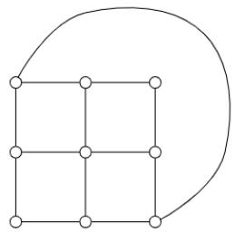

<details>
<summary>natural_image</summary>

Pure geometric diagram of a 3x3 grid with no text, numbers, or symbols
</details>

A. 2

B. 3

C. 4

D. 5

gateit-2008 graph-theory graph-coloring easy

# Answer key

# 2.5

# Graph Connectivity (40)

# 2.5.1 Graph Connectivity: GATE CSE 1987 | Question: 9d


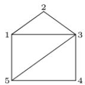

Specify an adjacency-lists representation of the undirected graph given above.

gate1987 graph-theory easy graph-connectivity descriptive

Answer key

# 2.5.2 Graph Connectivity: GATE CSE 1988 | Question: 2xvi

Write the adjacency matrix representation of the graph given in below figure.


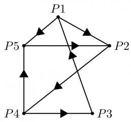

<details>
<summary>flowchart</summary>

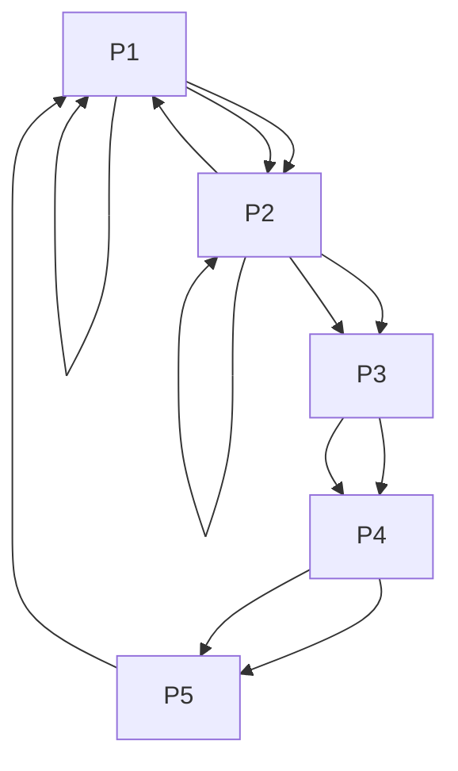
</details>

gate1988 descriptive graph-theory graph-connectivity

Answer key

# 2.5.3 Graph Connectivity: GATE CSE 1990 | Question: 1-viii

A graph which has the same number of edges as its complement must have number of vertices congruent to \_\_\_\_ or \_\_\_\_ modulo 4.


gate1990 graph-theory graph-connectivity fill-in-the-blanks

Answer key

# 2.5.4 Graph Connectivity: GATE CSE 1991 | Question: 01,xv

The maximum number of possible edges in an undirected graph with n vertices and k components is \_\_\_\_.


gate1991 graph-theory graph-connectivity normal fill-in-the-blanks

Answer key

# 2.5.5 Graph Connectivity: GATE CSE 1992 | Question: 03,iii

How many edges can there be in a forest with p components having n vertices in all?


gate1992 graph-theory graph-connectivity descriptive

Answer key

# 2.5.6 Graph Connectivity: GATE CSE 1993 | Question: 8.1

Consider a simple connected graph $G$ with $n$ vertices and $n$ edges ( $n > 2$ ). Then, which of the following statements are true?


A. G has no cycles  
B. The graph obtained by removing any edge from $G$ is not connected  
C. G has at least one cycle  
D. The graph obtained by removing any two edges from G is not connected  
E. None of the above

gate1993 graph-theory graph-connectivity easy multiple-selects

# 2.5.7 Graph Connectivity: GATE CSE 1994 | Question: 1.6, ISRO2008-29

The number of distinct simple graphs with up to three nodes is

A. 15

B. 10

C. 7

D. 9

gate1994

graph-theory

graph-connectivity

combinatory

normal

isro2008

counting

# Answer key

# 2.5.8 Graph Connectivity: GATE CSE 1994 | Question: 2.5

The number of edges in a regular graph of degree $d$ and $n$ vertices is \_\_\_\_

gate1994

graph-theory

easy

graph-connectivity

fill-in-the-blanks

# Answer key

# 2.5.9 Graph Connectivity: GATE CSE 1994 | Question: 24

An independent set in a graph is a subset of vertices such that no two vertices in the subset are connected by an edge. An incomplete scheme for a greedy algorithm to find a maximum independent set in a tree is given below:

```txt
V: Set of all vertices in the tree;
I := φ
while V ≠ φ do
begin
  select a vertex u ∈ V such that
    ________;
    V := V - {u};
    if u is such that
      ________then I := I ∪ {u}
end;
Output(I);
```

A. Complete the algorithm by specifying the property of vertex u in each case.  
B. What is the time complexity of the algorithm?

gate1994

graph-theory

normal descriptive

graph-connectivity

# Answer key

# 2.5.10 Graph Connectivity: GATE CSE 1995 | Question: 1.25

The minimum number of edges in a connected cyclic graph on n vertices is:

A. $n - 1$

B. n

C. $n + 1$

D. None of the above

gate1995

graph-theory

graph-connectivity

easy

# Answer key

# 2.5.11 Graph Connectivity: GATE CSE 1999 | Question: 1.15

The number of articulation points of the following graph is

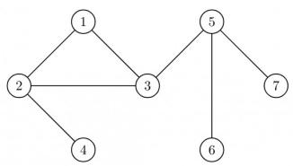

<details>
<summary>flowchart</summary>

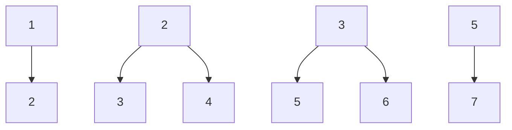
</details>

A. 0

B. 1

C. 2

D. 3

gate1999

graph-theory

graph-connectivity

normal

# Answer key


# 2.5.12 Graph Connectivity: GATE CSE 1999 | Question: 5


Let G be a connected, undirected graph. A cut in G is a set of edges whose removal results in G being broken into two or more components, which are not connected with each other. The size of a cut is called its cardinality. A min-cut of G is a cut in G of minimum cardinality. Consider the following graph:

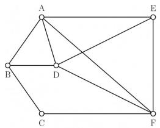

<details>
<summary>text_image</summary>

A
B
D
C
F
E
</details>

a. Which of the following sets of edges is a cut?

i. $\{(A,B),(E,F),(B,D),(A,E),(A,D)\}$ ii. $\{(B,D),(C,F),(A,B)\}$

b. What is cardinality of min-cut in this graph?

c. Prove that if a connected undirected graph $G$ with $n$ vertices has a min-cut of cardinality $k$ , then $G$ has at least $\left(\frac{n \times k}{2}\right)$ edges.

gate1999 graph-theory graph-connectivity normal descriptive proof

# Answer key

# 2.5.13 Graph Connectivity: GATE CSE 2002 | Question: 1.25, ISRO2008-30, ISRO2016-6

The maximum number of edges in a n-node undirected graph without self loops is

A. $n^2$

B. $\frac{n(n-1)}{2}$

C. n - 1

D. $\frac{(n+1)(n)}{2}$

gatecse-2002 graph-theory easy isro2008 isro2016 graph-connectivity

# Answer key

# 2.5.14 Graph Connectivity: GATE CSE 2003 | Question: 8, ISRO2009-53


Let G be an arbitrary graph with n nodes and k components. If a vertex is removed from G, the number of components in the resultant graph must necessarily lie down between

A. $k$ and $n$

B. $k - 1$ and $k + 1$

C. $k - 1$ and $n - 1$

D. $k + 1$ and $n - k$

gatecse-2003 graph-theory graph-connectivity normal isro2009

# Answer key

# 2.5.15 Graph Connectivity: GATE CSE 2004 | Question: 81


Let $G_{1} = (V, E_{1})$ and $G_{2} = (V, E_{2})$ be connected graphs on the same vertex set $V$ with more than two vertices. If $G_{1} \cap G_{2} = (V, E_{1} \cap E_{2})$ is not a connected graph, then the graph $G_{1} \cup G_{2} = (V, E_{1} \cup E_{2})$

A. cannot have a cut vertex

B. must have a cycle

C. must have a cut-edge (bridge)

D. has chromatic number strictly greater than those of $G_{1}$ and $G_{2}$

gatecse-2004 graph-theory difficult graph-connectivity

# Answer key

# 2.5.16 Graph Connectivity: GATE CSE 2005 | Question: 11


Let $G$ be a simple graph with 20 vertices and 100 edges. The size of the minimum vertex cover of $G$ is 8. Then, the size of the maximum independent set of $G$ is:

A. 12

B. 8

C. less than 8

D. more than 12

# 2.5.17 Graph Connectivity: GATE CSE 2006 | Question: 73


The $2^{n}$ vertices of a graph $G$ corresponds to all subsets of a set of size $n$ , for $n \geq 6$ . Two vertices of $G$ are adjacent if and only if the corresponding sets intersect in exactly two elements.

The number of connected components in G is:

A. n

B. $n + 2$

C. $2^{\frac{n}{2}}$

D. $\frac{2^{n}}{n}$

gatecse-2006 graph-theory normal graph-connectivity

# Answer key

# 2.5.18 Graph Connectivity: GATE CSE 2007 | Question: 23


Which of the following graphs has an Eulerian circuit?

A. Any $k$ -regular graph where $k$ is an even number.

C. The complement of a cycle on 25 vertices.

gatecse-2007 graph-theory normal graph-connectivity

B. A complete graph on 90 vertices.

D. None of the above

# Answer key

# 2.5.19 Graph Connectivity: GATE CSE 2008 | Question: 42


G is a graph on n vertices and 2n - 2 edges. The edges of G can be partitioned into two edge-disjoint spanning trees. Which of the following is NOT true for G?

A. For every subset of $k$ vertices, the induced subgraph has at most $2k - 2$ edges.  
B. The minimum cut in G has at least 2 edges.  
C. There are at least 2 edge-disjoint paths between every pair of vertices.  
D. There are at least 2 vertex-disjoint paths between every pair of vertices.

gatecse-2008 graph-connectivity normal

# Answer key

# 2.5.20 Graph Connectivity: GATE CSE 2013 | Question: 26


The line graph $L(G)$ of a simple graph $G$ is defined as follows:

- There is exactly one vertex $v(e)$ in $L(G)$ for each edge $e$ in $G$ .  
- For any two edges $e$ and $e'$ in $G$ , $L(\dot{G})$ has an edge between $v(e)$ and $v(e')$ , if and only if $e$ and $e'$ are incident with the same vertex in $G$ .

Which of the following statements is/are TRUE?

• (P) The line graph of a cycle is a cycle.  
• (Q) The line graph of a clique is a clique.  
• (R) The line graph of a planar graph is planar.  
• (S) The line graph of a tree is a tree.

A. P only

B. $P$ and $R$ only

C. $R$ only

D. $P, Q$ and $S$ only

gatecse-2013 graph-theory normal graph-connectivity

# Answer key

# 2.5.21 Graph Connectivity: GATE CSE 2014 | Set 1 | Question: 51


Consider an undirected graph $G$ where self-loops are not allowed. The vertex set of $G$ is $\{(i,j) \mid 1 \leq i \leq 12, 1 \leq j \leq 12\}$ . There is an edge between $(a, b)$ and $(c, d)$ if $|a - c| \leq 1$ and

$|b-d|\leq1$ . The number of edges in this graph is \_\_\_\_.

gatecse-2014-set1 graph-theory numerical-answers normal graph-connectivity

# Answer key

# 2.5.22 Graph Connectivity: GATE CSE 2014 | Set 2 | Question: 3

The maximum number of edges in a bipartite graph on 12 vertices is \_\_\_\_

gatecse-2014-set2 graph-theory graph-connectivity numerical-answers normal

# Answer key

# 2.5.23 Graph Connectivity: GATE CSE 2014 | Set 3 | Question: 51

If $G$ is the forest with $n$ vertices and $k$ connected components, how many edges does $G$ have?

A. $\left\lfloor\frac{n}{k}\right\rfloor$

B. $\left\lceil\frac{n}{k}\right\rceil$

C. n - k

D. $n - k + 1$

gatecse-2014-set3 graph-theory graph-connectivity normal

# Answer key

# 2.5.24 Graph Connectivity: GATE CSE 2015 | Set 2 | Question: 50

In a connected graph, a bridge is an edge whose removal disconnects the graph. Which one of the following statements is true?

A. A tree has no bridges  
B. A bridge cannot be part of a simple cycle  
C. Every edge of a clique with size $\geq 3$ is a bridge (A clique is any complete subgraph of a graph)  
D. A graph with bridges cannot have cycle

gatecse-2015-set2 graph-theory graph-connectivity easy

# Answer key

# 2.5.25 Graph Connectivity: GATE CSE 2019 | Question: 12

Let $G$ be an undirected complete graph on $n$ vertices, where $n > 2$ . Then, the number of different Hamiltonian cycles in $G$ is equal to

A. $n!$

B. $(n - 1)!$

C. 1

D. $\frac{(n-1)!}{2}$

gatecse-2019 engineering-mathematics discrete-mathematics graph-theory graph-connectivity one-mark

# Answer key

# 2.5.26 Graph Connectivity: GATE CSE 2019 | Question: 38

Let $G$ be any connected, weighted, undirected graph.

I. $G$ has a unique minimum spanning tree, if no two edges of $G$ have the same weight.  
II. $G$ has a unique minimum spanning tree, if, for every cut of $G$ , there is a unique minimum-weight edge crossing the cut.

Which of the following statements is/are TRUE?

A. I only

B. II only

C. Both I and II

D. Neither I nor II

gatecse-2019 engineering-mathematics discrete-mathematics graph-theory graph-connectivity two-marks minimum-spanning-tree algorithms graph-algorithms

# Answer key

# 2.5.27 Graph Connectivity: GATE CSE 2021 | Set 1 | Question: 36

Let $G = (V, E)$ be an undirected unweighted connected graph. The diameter of G is defined as:

$$
\mathrm{diam} (G) = \max _ {u, v \in V} \{\text {the length of shortest path between} u \text {and} v \}
$$

Let $M$ be the adjacency matrix of $G$ .

Define graph $G_{2}$ on the same set of vertices with adjacency matrix N, where

$$
N _ {i j} = \left\{ \begin{array}{l l} 1 & \text {if} M _ {i j} > 0 \text {or} P _ {i j} > 0, \text {where} P = M ^ {2} \\ 0 & \text {otherwise} \end{array} \right.
$$

Which one of the following statements is true?

A. $\mathrm{diam}(G_2) \leq \lceil \mathrm{diam}(G)/2 \rceil$  
B. $\lceil \mathrm{diam}(G) / 2 \rceil < \mathrm{diam}(G_2) < \mathrm{diam}(G)$  
C. $\mathrm{diam}(G_2) = \mathrm{diam}(G)$  
D. $\mathrm{diam}(G) < \mathrm{diam}(G_2) \leq 2 \mathrm{diam}(G)$

gatecse-2021-set1 graph-theory graph-connectivity two-marks

Answer key

# 2.5.28 Graph Connectivity: GATE CSE 2022 | Question: 20


Consider a simple undirected graph of 10 vertices. If the graph is disconnected, then the maximum number of edges it can have is \_\_\_\_.

gatecse-2022 numerical-answers graph-theory graph-connectivity one-mark

Answer key

# 2.5.29 Graph Connectivity: GATE CSE 2022 | Question: 27


Consider a simple undirected unweighted graph with at least three vertices. If $A$ is the adjacency matrix of the graph, then the number of 3-cycles in the graph is given by the trace of

A. $A^{3}$  
C. $A^3$ divided by 3

B. $A^3$ divided by 2

D. $A^3$ divided by 6

gatecse-2022 graph-theory graph-connectivity two-marks

Answer key

# 2.5.30 Graph Connectivity: GATE CSE 2022 | Question: 42


Which of the properties hold for the adjacency matrix $A$ of a simple undirected unweighted graph having $n$ vertices?

A. The diagonal entries of $A^{2}$ are the degrees of the vertices of the graph.  
B. If the graph is connected, then none of the entries of $A^{n - 1} + I_n$ can be zero.  
C. If the sum of all the elements of $A$ is at most $2(n - 1)$ , then the graph must be acyclic.  
D. If there is at least a 1 in each of $A$ 's rows and columns, then the graph must be connected.

gatecse-2022 graph-theory graph-connectivity multiple-selects two-marks

Answer key

# 2.5.31 Graph Connectivity: GATE CSE 2024 | Set 1 | Question: 24


The number of spanning trees in a complete graph of 4 vertices labelled A, B, C, and D is \_\_\_\_.

gatecse-2024-set1 numerical-answers graph-theory graph-connectivity one-mark

Answer key

# 2.5.32 Graph Connectivity: GATE CSE 2024 | Set 2 | Question: 41


Let G be an undirected connected graph in which every edge has a positive integer weight. Suppose that

every spanning tree in G has even weight. Which of the following statements is/are TRUE for every such graph G?

A. All edges in G have even weight  
B. All edges in G have even weight OR all edges in G have odd weight  
C. In each cycle C in G, all edges in C have even weight  
D. In each cycle C in G, either all edges in C have even weight OR all edges in C have odd weight

gatecse-2024-set2 graph-theory multiple-selects graph-connectivity two-marks

# Answer key

# 2.5.33 Graph Connectivity: GATE CSE 2024 | Set 2 | Question: 7

Let A be the adjacency matrix of a simple undirected graph G. Suppose A is its own inverse. Which one of the following statements is always TRUE?


A. G is a cycle

B. G is a perfect matching

C. G is a complete graph

D. There is no such graph G

gatecse-2024-set2 graph-theory graph-connectivity one-mark

# Answer key

# 2.5.34 Graph Connectivity: GATE IT 2004 | Question: 37

What is the number of vertices in an undirected connected graph with 27 edges, 6 vertices of degree 2, 3 vertices of degree 4 and remaining of degree 3?


A. 10

B. 11

C. 18

D. 19

gateit-2004 graph-theory graph-connectivity normal

# Answer key

# 2.5.35 Graph Connectivity: GATE IT 2004 | Question: 5

What is the maximum number of edges in an acyclic undirected graph with n vertices?


A. n - 1

B. n

C. $n + 1$

D. 2n - 1

gateit-2004 graph-theory graph-connectivity normal

# Answer key

# 2.5.36 Graph Connectivity: GATE IT 2005 | Question: 56

Let G be a directed graph whose vertex set is the set of numbers from 1 to 100. There is an edge from a vertex i to a vertex j iff either $j = i + 1$ or j = 3i. The minimum number of edges in a path in G from vertex 1 to vertex 100 is


A. 4

B. 7

C. 23

D. 99

gateit-2005 graph-theory graph-connectivity normal

# Answer key

# 2.5.37 Graph Connectivity: GATE IT 2006 | Question: 11

If all the edge weights of an undirected graph are positive, then any subset of edges that connects all the vertices and has minimum total weight is a


A. Hamiltonian cycle

B. grid

C. hypercube

D. tree

gateit-2006 graph-theory graph-connectivity easy

# Answer key

# 2.5.38 Graph Connectivity: GATE IT 2007 | Question: 25


What is the largest integer m such that every simple connected graph with n vertices and n edges contains at least m different spanning trees?

A. 1

B. 2

C. 3

D. n

gateit-2007 graph-theory graph-connectivity tricky

# Answer key

# 2.5.39 Graph Connectivity: GATE IT 2008 | Question: 27


G is a simple undirected graph. Some vertices of G are of odd degree. Add a node v to G and make it adjacent to each odd degree vertex of G. The resultant graph is sure to be

A. regular

B. complete

C. Hamiltonian

D. Euler

gateit-2008 graph-theory graph-connectivity normal

# Answer key

# 2.5.40 Graph Connectivity: GATE IT 2008 | Question: 4


What is the size of the smallest MIS (Maximal Independent Set) of a chain of nine nodes?

A. 5

B. 4

C. 3

D. 2

gateit-2008 normal graph-connectivity

# Answer key

# 2.6

# Graph Isomorphism (4)

# 2.6.1 Graph Isomorphism: GATE CSE 2012 | Question: 26

Which of the following graphs is isomorphic to


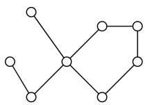

A.

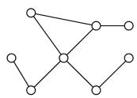

B.


C.


D.


gatecse-2012 graph-theory graph-isomorphism normal

# Answer key

# 2.6.2 Graph Isomorphism: GATE CSE 2014 | Set 2 | Question: 51

A cycle on $n$ vertices is isomorphic to its complement. The value of $n$ is \_\_\_\_.

gatecse-2014-set2 graph-theory numerical-answers normal graph-isomorphism

# Answer key

# 2.6.3 Graph Isomorphism: GATE CSE 2015 | Set 2 | Question: 28


A graph is self-complementary if it is isomorphic to its complement. For all self-complementary graphs on $n$ vertices, $n$ is


A. A multiple of 4  
C. Odd

B. Even  
D. Congruent to 0 mod 4, or, 1 mod 4.

gatecse-2015-set2 graph-theory graph-isomorphism

# Answer key

# 2.6.4 Graph Isomorphism: GATE CSE 2022 | Question: 40

The following simple undirected graph is referred to as the Peterson graph.

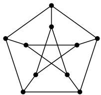

<details>
<summary>natural_image</summary>

Geometric diagram of a pentagon with internal star-like connections (no text or labels)
</details>


Which of the following statements is/are TRUE?

A. The chromatic number of the graph is 3.  
B. The graph has a Hamiltonian path.  
C. The following graph is isomorphic to the Peterson graph.


D. The size of the largest independent set of the given graph is 3. (A subset of vertices of a graph form an independent set if no two vertices of the subset are adjacent.)

gatecse-2022 graph-theory graph-isomorphism multiple-selects two-marks

# Answer key

# 2.7 Graph Matching (2)

# 2.7.1 Graph Matching: GATE CSE 2003 | Question: 36

How many perfect matching are there in a complete graph of 6 vertices?


A. 15

B. 24

C. 30

D. 60

gatecse-2003 graph-theory graph-matching normal

# Answer key

# 2.7.2 Graph Matching: GATE CSE 2026 | Set 1 | Question: 47

Let $G$ be an undirected graph, which is a path on 8 vertices. The number of matchings in $G$ is \_\_\_\_. (answer in integer)


gatecse-2026-set1 graph-theory graph-matching numerical-answers two-marks

# Answer key

# 2.8 Graph Planarity (13)

# 2.8.1 Graph Planarity: GATE CSE 1987 | Question: 2e

State whether the following statement is TRUE or FALSE:


There is a linear-time algorithm for testing the planarity of finite graphs.

# 2.8.2 Graph Planarity: GATE CSE 1989 | Question: 3-vi

Which of the following graphs is/are planar?


gate1989 normal graph-theory graph-planarity descriptive

# Answer key

# 2.8.3 Graph Planarity: GATE CSE 1990 | Question: 3-xi

A graph is planar if and only if,

A. It does not contain a subgraph homeomorphic to $k_{5}$ and $k_{3,3}$ .  
B. It does not contain a subgraph isomorphic to $k_{5}$ and $k_{3,3}$ .  
C. It does not contain a subgraph isomorphic to $k_{5}$ or $k_{3,3}$  
D. It does not contain a subgraph homeomorphic to $k_{5}$ or $k_{3,3}$ .

gate1990 normal graph-theory graph-planarity multiple-selects

# Answer key

# 2.8.4 Graph Planarity: GATE CSE 1992 | Question: 01,x

Maximum number of edges in a planar graph with $n$ vertices is \_\_\_\_

gate1992 graph-theory graph-planarity easy fill-in-the-blanks

# Answer key

# 2.8.5 Graph Planarity: GATE CSE 1992 | Question: 02,viii

A non-planar graph with minimum number of vertices has

A. 9 edges, 6 vertices  
C. 10 edges, 5 vertices  
gate1992 graph-theory normal graph-planarity

B. 6 edges, 4 vertices  
D. 9 edges, 5 vertices

# Answer key

# 2.8.6 Graph Planarity: GATE CSE 2005 | Question: 10

Let $G$ be a simple connected planar graph with 13 vertices and 19 edges. Then, the number of faces in the planar embedding of the graph is:

A. 6

B. 8

C. 9

D. 13

gatecse-2005 graph-theory graph-planarity

# Answer key

# 2.8.7 Graph Planarity: GATE CSE 2005 | Question: 47

Which one of the following graphs is NOT planar?


  
G1

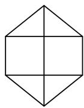  
G2

  
G3

  
G4

A. G1

B. G2

C. G3

D. G4

gatecse-2005 graph-theory graph-planarity normal

# Answer key

# 2.8.8 Graph Planarity: GATE CSE 2008 | Question: 23

Which of the following statements is true for every planar graph on $n$ vertices?

A. The graph is connected  
C. The graph has a vertex-cover of size at most $\frac{3n}{4}$

gatecse-2008 graph-theory normal graph-planarity

B. The graph is Eulerian  
D. The graph has an independent set of size at least $\frac{n}{3}$

# Answer key

# 2.8.9 Graph Planarity: GATE CSE 2011 | Question: 17

K4 and Q3 are graphs with the following structures.


Which one of the following statements is TRUE in relation to these graphs?

A. K4 is a planar while Q3 is not

C. Q3 is planar while K4 is not

gatecse-2011 graph-theory graph-planarity normal

B. Both K4 and Q3 are planar

D. Neither K4 nor Q3 is planar

# Answer key

# 2.8.10 Graph Planarity: GATE CSE 2012 | Question: 17

Let $G$ be a simple undirected planar graph on 10 vertices with 15 edges. If $G$ is a connected graph, then the number of bounded faces in any embedding of $G$ on the plane is equal to

A. 3

B. 4

C. 5

D. 6

gatecse-2012 graph-theory graph-planarity normal

# Answer key

# 2.8.11 Graph Planarity: GATE CSE 2014 | Set 3 | Question: 52

Let $\delta$ denote the minimum degree of a vertex in a graph. For all planar graphs on $n$ vertices with $\delta \geq 3$ , which one of the following is TRUE?

A. In any planar embedding, the number of faces is at least $\frac{n}{2} + 2$


B. In any planar embedding, the number of faces is less than $\frac{n}{2} + 2$  
C. There is a planar embedding in which the number of faces is less than $\frac{n}{2} + 2$  
D. There is a planar embedding in which the number of faces is at most $\frac{n^2}{\delta + 1}$

gatecse-2014-set3 graph-theory graph-planarity normal

# Answer key

# 2.8.12 Graph Planarity: GATE CSE 2015 | Set 1 | Question: 54

Let G be a connected planar graph with 10 vertices. If the number of edges on each face is three, then the number of edges in G is \_\_\_\_.


gatecse-2015-set1 graph-theory graph-connectivity normal graph-planarity numerical-answers

# Answer key

# 2.8.13 Graph Planarity: GATE CSE 2021 | Set 1 | Question: 16

In an undirected connected planar graph $G$ , there are eight vertices and five faces. The number of edges in $G$ is \_\_\_\_.


gatecse-2021-set1 graph-theory graph-planarity numerical-answers easy one-mark

# Answer key

# 2.9

# Jaccard Coefficient (1)

# 2.9.1 Jaccard Coefficient: GATE CSE 2026 | Set 2 | Question: 26

Consider a complete graph $K_{n}$ with n vertices (n > 4). Note that multiple spanning trees can be constructed over $K_{n}$ . Each of these spanning trees is represented as a set of edges. The Jaccard coefficient between any two sets is defined as the ratio of the size of the intersection of the two sets to the union of the two sets.


Which one of the following options gives the lowest possible value for the Jaccard coefficient between any two spanning trees of $K_{n}$ ?

A. $\frac{1}{n}$

B. $\frac{1}{2n-3}$

C. 0

D. $\frac{1}{n-1}$

gatecse-2026-set2 graph-theory jaccard-coefficient two-marks

# Answer key

# Answer Keys

<table><tr><td>2.1.1</td><td>D</td></tr><tr><td>2.2.3</td><td>N/A</td></tr><tr><td>2.2.8</td><td>C</td></tr><tr><td>2.2.13</td><td>A</td></tr><tr><td>2.4.4</td><td>4</td></tr><tr><td>2.4.9</td><td>2</td></tr><tr><td>2.5.3</td><td>N/A</td></tr><tr><td>2.5.8</td><td>N/A</td></tr><tr><td>2.5.13</td><td>B</td></tr><tr><td>2.5.18</td><td>C</td></tr><tr><td>2.5.23</td><td>C</td></tr><tr><td>2.5.28</td><td>36</td></tr><tr><td>2.5.33</td><td>B</td></tr></table>

<table><tr><td>2.1.2</td><td>D</td></tr><tr><td>2.2.4</td><td>D</td></tr><tr><td>2.2.9</td><td>D</td></tr><tr><td>2.3.1</td><td>B;C</td></tr><tr><td>2.4.5</td><td>3</td></tr><tr><td>2.4.10</td><td>C</td></tr><tr><td>2.5.4</td><td>N/A</td></tr><tr><td>2.5.9</td><td>N/A</td></tr><tr><td>2.5.14</td><td>C</td></tr><tr><td>2.5.19</td><td>D</td></tr><tr><td>2.5.24</td><td>B</td></tr><tr><td>2.5.29</td><td>D</td></tr><tr><td>2.5.34</td><td>D</td></tr></table>

<table><tr><td>2.1.3</td><td>X</td></tr><tr><td>2.2.5</td><td>C</td></tr><tr><td>2.2.10</td><td>C</td></tr><tr><td>2.4.1</td><td>D</td></tr><tr><td>2.4.6</td><td>7</td></tr><tr><td>2.4.11</td><td>B</td></tr><tr><td>2.5.5</td><td>N/A</td></tr><tr><td>2.5.10</td><td>B</td></tr><tr><td>2.5.15</td><td>B</td></tr><tr><td>2.5.20</td><td>A</td></tr><tr><td>2.5.25</td><td>C;D</td></tr><tr><td>2.5.30</td><td>A</td></tr><tr><td>2.5.35</td><td>A</td></tr></table>

<table><tr><td>2.2.1</td><td>N/A</td></tr><tr><td>2.2.6</td><td>C</td></tr><tr><td>2.2.11</td><td>C</td></tr><tr><td>2.4.2</td><td>C</td></tr><tr><td>2.4.7</td><td>A;B</td></tr><tr><td>2.5.1</td><td>N/A</td></tr><tr><td>2.5.6</td><td>C;D</td></tr><tr><td>2.5.11</td><td>D</td></tr><tr><td>2.5.16</td><td>A</td></tr><tr><td>2.5.21</td><td>506</td></tr><tr><td>2.5.26</td><td>C</td></tr><tr><td>2.5.31</td><td>16</td></tr><tr><td>2.5.36</td><td>B</td></tr></table>

<table><tr><td>2.2.2</td><td>N/A</td></tr><tr><td>2.2.7</td><td>B</td></tr><tr><td>2.2.12</td><td>16</td></tr><tr><td>2.4.3</td><td>A</td></tr><tr><td>2.4.8</td><td>B;C</td></tr><tr><td>2.5.2</td><td>N/A</td></tr><tr><td>2.5.7</td><td>C</td></tr><tr><td>2.5.12</td><td>N/A</td></tr><tr><td>2.5.17</td><td>B</td></tr><tr><td>2.5.22</td><td>36</td></tr><tr><td>2.5.27</td><td>A</td></tr><tr><td>2.5.32</td><td>D</td></tr><tr><td>2.5.37</td><td>D</td></tr><tr><td>2.5.38</td><td>C</td></tr><tr><td>2.6.3</td><td>D</td></tr><tr><td>2.8.2</td><td>N/A</td></tr><tr><td>2.8.7</td><td>A</td></tr><tr><td>2.8.12</td><td>24</td></tr></table>

<table><tr><td>2.5.39</td><td>D</td></tr><tr><td>2.6.4</td><td>A;B;C</td></tr><tr><td>2.8.3</td><td>D</td></tr><tr><td>2.8.8</td><td>C</td></tr><tr><td>2.8.13</td><td>11 : 11</td></tr></table>

<table><tr><td>2.5.40</td><td>C</td></tr><tr><td>2.7.1</td><td>A</td></tr><tr><td>2.8.4</td><td>N/A</td></tr><tr><td>2.8.9</td><td>B</td></tr><tr><td>2.9.1</td><td>C</td></tr></table>

<table><tr><td>2.6.1</td><td>B</td></tr><tr><td>2.7.2</td><td>34 : 34</td></tr><tr><td>2.8.5</td><td>C</td></tr><tr><td>2.8.10</td><td>D</td></tr></table>

<table><tr><td>2.6.2</td><td>5</td></tr><tr><td>2.8.1</td><td>TBA</td></tr><tr><td>2.8.6</td><td>B</td></tr><tr><td>2.8.11</td><td>A</td></tr></table>

Syllabus: Propositional and first order logic.

Mark Distribution in Previous GATE

<table><tr><td>Year</td><td>2026 - 1</td><td>2026 - 2</td><td>2025 - 1</td><td>2025 - 2</td><td>2024 - 1</td><td>2024 - 2</td><td>2023</td><td>2022</td><td>2021 - 1</td><td>2021 - 2</td><td>Minimum</td></tr><tr><td>1 Mark Count</td><td>0</td><td>1</td><td>0</td><td>1</td><td>0</td><td>1</td><td>1</td><td>0</td><td>1</td><td>1</td><td>0</td></tr><tr><td>2 Marks Count</td><td>0</td><td>0</td><td>1</td><td>0</td><td>0</td><td>0</td><td>0</td><td>0</td><td>0</td><td>0</td><td>0</td></tr><tr><td>Total Marks</td><td>0</td><td>1</td><td>2</td><td>1</td><td>0</td><td>1</td><td>1</td><td>0</td><td>1</td><td>1</td><td>0</td></tr></table>

Welcome to the "Discrete Mathematics: Mathematical Logic" chapter of your GATE Computer Science exam preparation. This section is designed to provide a comprehensive, exam-focused overview of the fundamental concepts, formulas, and problem-solving techniques you'll need to master. Mathematical Logic is the bedrock of computer science, providing the formal tools to reason about computation, verify program correctness, design circuits, and understand artificial intelligence. For the GATE CS exam, this subject typically carries a weightage of 5-8 marks. Questions often involve determining the validity of arguments, checking logical equivalence, translating natural language statements into logical expressions, and identifying tautologies or contradictions. A strong grasp of these concepts is indispensable not just for direct questions but also for understanding the logical underpinnings of other topics like set theory, relations, and algorithms.

# Topic-wise Key Concepts

# Propositional Logic

Propositional Logic, also known as propositional calculus, is the study of propositions (declarative sentences that are either true or false, but not both) and their combinations using logical connectives. It forms the most basic level of logical reasoning, focusing on the truth values of simple statements and how they combine to determine the truth values of complex statements.

- Definition and Core Idea: A proposition is a statement that is unequivocally true or false. Propositional logic uses symbols to represent propositions and logical connectives to form compound propositions, allowing us to analyze their truth values systematically.  
- Important Formulas, Theorems, and Results:

1. Logical Connectives:

- Negation (NOT): $\neg p$ (read as "not p")  
- Conjunction (AND): $p \land q$ (read as "p and q")  
- Disjunction (OR): $p \lor q$ (read as "p or q")  
- Implication (IF...THEN): $p \rightarrow q$ (read as "if p then q" or "p implies q")  
- Biconditional (IF AND ONLY IF): $p \leftrightarrow q$ (read as "p if and only if q")  
- Exclusive OR (XOR): $p \oplus q$ (read as "p xor q")  
- NAND: $p \uparrow q \equiv \neg(p \land q)$  
- NOR: $p \downarrow q \equiv \neg (p \lor q)$

2. Truth Tables: Essential for defining connectives and evaluating compound propositions.

- $\neg p$ : T if p is F, F if p is T.  
- $p \land q$ : T if both p and q are T, else F.  
- $p \lor q$ : T if p is T or q is T (or both), else F.  
- $p \rightarrow q$ : F only if p is T and q is F, else T.  
- $p \leftrightarrow q$ : T if p and q have the same truth value, else F.  
- $p \oplus q$ : T if p and q have different truth values, else F.

3. Tautology, Contradiction, Contingency:

- Tautology: A compound proposition that is always true, regardless of the truth values of its atomic propositions. Example: $p \vee \neg p$ .  
- Contradiction (or Absurdity): A compound proposition that is always false. Example: $p \land \neg p$ .  
- Contingency: A compound proposition that is neither a tautology nor a contradiction (i.e., its truth value depends on the truth values of its atomic propositions).

4. Logical Equivalence (≡): Two propositions $P$ and $Q$ are logically equivalent if $P \leftrightarrow Q$ is a tautology. This means they always have the same truth value.

5. Laws of Logic (Logical Equivalences):

\- Identity Laws:

- $p \land T \equiv p$  
- $p \vee F \equiv p$

\- Domination Laws:

- $p \vee T \equiv T$  
- $p \land F \equiv F$

\- Idempotent Laws:

- $p \vee p \equiv p$  
- $p \land p \equiv p$

\- Double Negation Law: $\neg (\neg p)\equiv p$

■ Commutative Laws:

- $p \vee q \equiv q \vee p$  
- $p \land q \equiv q \land p$

■ Associative Laws:

- $(p \vee q) \vee r \equiv p \vee (q \vee r)$  
- $(p \land q) \land r \equiv p \land (q \land r)$

\- Distributive Laws:

- $p \land (q \lor r) \equiv (p \land q) \lor (p \land r)$  
- $p \vee (q \wedge r) \equiv (p \vee q) \wedge (p \vee r)$

\- De Morgan's Laws:

- $\neg(p \land q) \equiv \neg p \lor \neg q$  
- $\neg(p \lor q) \equiv \neg p \land \neg q$

\- Absorption Laws:

- $p \vee (p \wedge q) \equiv p$  
- $p \land (p \lor q) \equiv p$

\- Inverse Laws (Complement Laws):

- $p \lor \neg p \equiv T$  
- $p \land \neg p \equiv F$

\- Implication Equivalences:

- $p \to q \equiv \neg p \lor q$  
- $p \rightarrow q \equiv \neg q \rightarrow \neg p$ (Contrapositive)  
- $\neg(p \to q) \equiv p \land \neg q$

\- Biconditional Equivalences:

- $p \leftrightarrow q \equiv (p \rightarrow q) \land (q \rightarrow p)$  
- $p \leftrightarrow q \equiv (\neg p \lor q) \land (\neg q \lor p)$  
- $p \leftrightarrow q \equiv \neg p \leftrightarrow \neg q$  
- $p \leftrightarrow q \equiv (p \land q) \lor (\neg p \land \neg q)$

6. Conjunctive Normal Form (CNF) and Disjunctive Normal Form (DNF):

- Literal: A propositional variable or its negation (e.g., $p, \neg q$ ).  
- Clause: A disjunction of literals (e.g., $p \lor \neg q \lor r$ ).  
- CNF: A conjunction of clauses (e.g., $(p \lor \neg q) \land (r \lor s)$ ).  
- Minterm: A conjunction of literals where each variable appears exactly once (e.g., $p \land \neg q \land r$ ).  
- Maxterm: A disjunction of literals where each variable appears exactly once (e.g., $p \vee \neg q \vee r$ ).  
- DNF: A disjunction of minterms (e.g., $(p \land \neg q) \lor (r \land s)$ ).  
- Any propositional formula can be converted into an equivalent CNF or DNF.

- Key Properties and Identities: All the laws of logic listed above are crucial identities for simplification and proving equivalence. Understanding the truth conditions for each connective is fundamental.  
• Common Pitfalls or Tricky Points:

- Confusing implication $(p \to q)$ with causation or "if and only if". Remember $p \to q$ is false only when $p$ is true and $q$ is false.  
- Incorrectly applying De Morgan's Laws, especially with more complex expressions.  
- Misinterpreting the biconditional; it implies mutual implication.  
- Errors in constructing truth tables, particularly for propositions with many variables.  
- Assuming logical equivalence based on partial truth values.

\- Standard Problem-Solving Techniques or Shortcuts:

- Truth Tables: The most direct method for small propositions to check tautology, contradiction, or equivalence.  
- Logical Equivalences: Use the laws of logic to simplify expressions or prove equivalence without truth tables. This is often faster for complex expressions.  
- Substitution: Replace sub-expressions with their known equivalents.  
Proof by Contradiction: To show $P$ is a tautology, assume $\neg P$ is true and derive a contradiction. To show $P \equiv Q$ , assume $\neg (P \leftrightarrow Q)$ is true and derive a contradiction.  
- Conversion to CNF/DNF: Useful for standardization and for certain proof methods like resolution.

# First Order Logic (Predicate Logic)

First Order Logic (FOL), also known as Predicate Logic, extends propositional logic by allowing us to express more complex statements about objects, their properties, and relationships. It introduces predicates, variables, and quantifiers, enabling reasoning about "all" or "some" elements within a domain.

\- Definition and Core Idea: FOL allows us to break down propositions into predicates (properties or relations) and arguments (variables or constants). It introduces quantifiers ( $\forall$ for "for all" and $\exists$ for "there exists") to make statements about collections of objects, providing a richer expressive power than propositional logic.

\- Important Formulas, Theorems, and Results:

1. Components of FOL:

- Predicates: Represent properties or relations (e.g., $P(x)$ for "x is prime", $L(x,y)$ for "x loves y").  
- Variables: Placeholders for objects (e.g., $x, y, z$ ).  
- Constants: Specific objects (e.g., "Socrates", "5").  
- Functions: Map objects to other objects (e.g., $f(x)$ for "father of $x$ ").  
- Quantifiers:

- Universal Quantifier ( $\forall$ ): "For all", "for every", "for each". $\forall xP(x)$ means $P(x)$ is true for every $x$ in the domain.  
- Existential Quantifier (∃): "There exists", "for some", "for at least one". ∃xP(x) means there is at least one x in the domain for which P(x) is true.

2. Scope of Quantifiers, Free and Bound Variables:

- The scope of a quantifier is the part of the formula to which it applies.  
- A variable is bound if it is within the scope of a quantifier using that variable.  
- A variable is free if it is not bound by any quantifier.  
- A formula with no free variables is called a sentence or closed formula and has a definite truth value.

3. Quantifier Equivalences (Negation Rules):

- $\neg \forall xP(x) \equiv \exists x \neg P(x)$ (It is not true that all $x$ have property $P$ if and only if there exists an $x$ that does not have property $P$ ).  
- $\neg \exists xP(x) \equiv \forall x \neg P(x)$ (It is not true that there exists an $x$ with property $P$ if and only if all $x$ do not have property $P$ ).

4. Distributive Properties of Quantifiers:

- $\forall x(P(x) \land Q(x)) \equiv \forall xP(x) \land \forall xQ(x)$  
- $\exists x(P(x) \vee Q(x)) \equiv \exists xP(x) \vee \exists xQ(x)$  
- Important Non-Equivalences:

- $\forall x(P(x) \lor Q(x))$ is NOT equivalent to $\forall xP(x) \lor \forall xQ(x)$ . (e.g., "Every number is even or odd" is true, but "Every number is even or every number is odd" is false).  
- $\exists x(P(x) \land Q(x))$ is NOT equivalent to $\exists xP(x) \land \exists xQ(x)$ . (e.g., "There is a number that is both even and prime" (2) is true, but "There is an even number and there is a prime number" is also true, but the existence of one doesn't imply the other is the same number).

5. Interchange of Quantifiers:

- $\forall x \forall y P(x, y) \equiv \forall y \forall x P(x, y)$  
- $\exists x \exists y P(x, y) \equiv \exists y \exists x P(x, y)$

\- Order Matters for Mixed Quantifiers:

- $\forall x \exists y P(x, y)$ (For every $x$ , there exists a $y$ such that $P(x, y)$ ) is NOT equivalent to $\exists y \forall x P(x, y)$ (There exists a $y$ such that for every $x$ , $P(x, y)$ ).  
- Example: Let $P(x, y)$ be "x loves y". $\forall x \exists y L(x, y)$ means "Everyone loves someone". $\exists y \forall x L(x, y)$ means "There is someone whom everyone loves". These are clearly different.

6. Prenex Normal Form (PNF): A formula is in PNF if all quantifiers are at the beginning of the formula, followed by a quantifier-free formula (called the matrix). Any FOL formula can be converted to an equivalent PNF.

- Key Properties and Identities: The quantifier negation rules are fundamental for manipulating and simplifying FOL expressions. Understanding the implications of quantifier order is critical.  
• Common Pitfalls or Tricky Points:

\- Incorrect Translation: Translating natural language statements into FOL is a major source of errors. Pay close attention to words like "all", "some", "no", "only if", "unless".

- "All A are B": $\forall x(A(x) \to B(x))$ (NOT $\forall x(A(x) \land B(x)))$  
- "Some A are B": $\exists x(A(x) \land B(x))$ (NOT $\exists x(A(x) \to B(x)))$  
- "No A are B": $\forall x(A(x) \to \neg B(x))$ or $\neg \exists x(A(x) \land B(x))$

- Scope Errors: Misplacing parentheses or incorrectly determining the scope of a quantifier.  
- Variable Binding: Confusing free and bound variables, or using the same variable name for different purposes in nested scopes.

\- Order of Mixed Quantifiers: Assuming $\forall x \exists y P(x, y)$ is the same as $\exists y \forall x P(x, y)$ .

\- Standard Problem-Solving Techniques or Shortcuts:

- Step-by-step Translation: Break down complex natural language sentences into smaller parts, translate each, and then combine them. Identify predicates, variables, and connectives first.  
- Applying Quantifier Equivalences: Use negation rules to simplify expressions or move negations inwards.  
- Domain Awareness: Always consider the domain of discourse when evaluating truth values or translating.  
- Counterexamples: To show a statement is false or not equivalent, try to find a specific example in a small domain that makes it false.

# Logical Reasoning (Inference)

Logical Reasoning, or Inference, is the process of deriving conclusions from a set of premises using valid rules. It focuses on the structure of arguments to determine whether a conclusion necessarily follows from the premises, regardless of the actual truth of the premises.

- Definition and Core Idea: An argument is a sequence of propositions, where the first propositions are premises and the final proposition is the conclusion. An argument is valid if, whenever all its premises are true, the conclusion must also be true. The goal is to determine if an argument's structure guarantees the truth of its conclusion given true premises.  
- Important Formulas, Theorems, and Results:

1. Argument Validity: An argument with premises $P_{1}, P_{2}, \ldots, P_{n}$ and conclusion $C$ is valid if the proposition $(P_{1} \land P_{2} \land \ldots \land P_{n}) \to C$ is a tautology.

2. Rules of Inference (for Propositional Logic): These are fundamental valid argument forms.

\- Modus Ponens (Law of Detachment):

$$
\begin{array}{l} p \rightarrow q \\ \frac {p}{\therefore q} \\ \end{array}
$$

Equivalent to $((p\to q)\land p)\to q$ being a tautology.

\- Modus Tollens:

$$
\begin{array}{l} p \rightarrow q \\ \frac {\neg q}{\therefore \neg p} \\ \end{array}
$$

Equivalent to $((p \to q) \land \neg q) \to \neg p$ being a tautology.

\- Hypothetical Syllogism:

$$
\begin{array}{l} p \rightarrow q \\ \frac {q \rightarrow r}{\therefore p \rightarrow r} \\ \end{array}
$$

Equivalent to $((p \rightarrow q) \land (q \rightarrow r)) \rightarrow (p \rightarrow r)$ being a tautology.

\- Disjunctive Syllogism:

$$
\begin{array}{l} \boldsymbol {p} \lor \boldsymbol {q} \\ \frac {\neg p}{\therefore q} \\ \end{array}
$$

Equivalent to $((p \lor q) \land \neg p) \to q$ being a tautology.

\- Addition:

$$
\frac {p}{\therefore p \lor q}
$$

\- Simplification:

$$
\frac {p \land q}{\therefore p}
$$

\- Conjunction:

$$
\begin{array}{c} p \\ \hline q \\ \hline \therefore p \wedge q \end{array}
$$

\- Resolution:

$$
\begin{array}{c} p \lor q \\ \hline \neg q \lor r \\ \hline \therefore p \lor r \end{array}
$$

This is particularly useful in automated theorem proving and for converting to CNF.

■ Constructive Dilemma:

$$
\begin{array}{l} (p \to q) \land (r \to s) \\ \frac {p \lor r}{\therefore q \lor s} \end{array}
$$

\- Destructive Dilemma:

$$
\begin{array}{l} (p \rightarrow q) \land (r \rightarrow s) \\ \frac {\neg q \lor \neg s}{\therefore \neg p \lor \neg r} \\ \end{array}
$$

3. Rules of Inference (for First Order Logic):

\- Universal Instantiation (UI): If $\forall xP(x)$ is true, then $P(c)$ is true for any arbitrary individual $c$ in the domain.

$$
\frac {\forall x P (x)}{\therefore P (c)}
$$

\- Universal Generalization (UG): If $P(c)$ is true for an arbitrary individual $c$ in the domain, then $\forall xP(x)$ is true.

$$
\frac {P (c) \text {for an arbitrary} c}{\therefore \forall x P (x)}
$$

\- Existential Instantiation (EI): If $\exists xP(x)$ is true, then $P(c)$ is true for some specific individual $c$ in the domain. This $c$ must be a new constant not previously used in the proof.

$$
\frac {\exists x P (x)}{\therefore P (c) \text {(for some new c)}}
$$

\- Existential Generalization (EG): If $P(c)$ is true for some specific individual $c$ in the domain, then $\exists x P(x)$ is true.

$$
\frac {P (c) \text {for some specific} c}{\therefore \exists x P (x)}
$$

4. Proof Methods:

\- Direct Proof: Assume premises are true, and use inference rules and logical equivalences to derive the conclusion.

- Indirect Proof (Proof by Contradiction): To prove $C$ from premises $P_1, \ldots, P_n$ , assume $\neg C$ is true along with $P_1, \ldots, P_n$ , and derive a contradiction $(F)$ .  
- Proof by Contraposition: To prove $p \to q$ , prove its contrapositive $\neg q \to \neg p$ .

\- Key Properties and Identities: The validity of each inference rule is a key property. Understanding that these rules preserve truth is fundamental.

• Common Pitfalls or Tricky Points:

\- Fallacies: Invalid argument forms that resemble valid ones.

- Fallacy of Affirming the Consequent: $((p \to q) \land q) \to p$ (NOT a tautology). Example: "If it rains, the ground is wet. The ground is wet. Therefore, it rained." (Could be wet from a sprinkler).  
- Fallacy of Denying the Antecedent: $((p \to q) \land \neg p) \to \neg q$ (NOT a tautology). Example: "If it rains, the ground is wet. It did not rain. Therefore, the ground is not wet." (Could be wet from a sprinkler).

Confusing Validity with Soundness: A valid argument can have false premises and a false conclusion. A sound argument is a valid argument with all true premises (and thus, a true conclusion). GATE questions usually focus on validity.  
- Incorrect Application of Quantifier Rules: Especially with EI and UG, ensure the constant chosen for instantiation is new (for EI) or truly arbitrary (for UG).  
Circular Reasoning: Assuming the conclusion (or something equivalent to it) as a premise.

\- Standard Problem-Solving Techniques or Shortcuts:

- Formal Proofs: List premises and then systematically apply inference rules and logical equivalences to derive the conclusion, citing the rule for each step.  
- Truth Tables (for small arguments): Convert the argument into a single conditional statement $(P_{1} \wedge \ldots \wedge P_{n}) \to C$ and check if it's a tautology.  
- Resolution Principle: Convert all premises and the negation of the conclusion into CNF clauses. Add the negation of the conclusion as a clause. If an empty clause (☐) can be derived through resolution, the original argument is valid.  
Look for Fallacies: If an argument resembles a common fallacy, it's likely invalid.

# Quick Formula Reference

# Propositional Logic Equivalences

- $\neg (\neg p)\equiv p$ (Double Negation)  
- $p \lor q \equiv q \lor p$ (Commutative)  
- $p \land q \equiv q \land p$ (Commutative)  
- $(p \vee q) \vee r \equiv p \vee (q \vee r)$ (Associative)  
- $(p \land q) \land r \equiv p \land (q \land r)$ (Associative)  
- $p \land (q \lor r) \equiv (p \land q) \lor (p \land r)$ (Distributive)  
- $p \lor (q \land r) \equiv (p \lor q) \land (p \lor r)$ (Distributive)  
- $\neg(p \land q) \equiv \neg p \lor \neg q$ (De Morgan's)  
- $\neg(p \lor q) \equiv \neg p \land \neg q$ (De Morgan's)  
- $p \rightarrow q \equiv \neg p \lor q$  
- $p \to q \equiv \neg q \to \neg p$ (Contrapositive)  
- $\neg(p \to q) \equiv p \land \neg q$  
- $p \leftrightarrow q \equiv (p \rightarrow q) \land (q \rightarrow p)$  
- $p \leftrightarrow q \equiv (\underline{p} \land q) \lor (\neg p \land \neg q)$  
- $p \lor \neg p \equiv T$ (Inverse Law)  
- $p \land \neg p \equiv F$ (Inverse Law)  
- $p \vee T \equiv T$ (Domination Law)  
- $p \land F \equiv F$ (Domination Law)  
- $p \land T \equiv p$ (Identity Law)  
- $p \lor F \equiv p$ (Identity Law)  
- $p \vee p \equiv p$ (Idempotent Law)  
- $p \land p \equiv p$ (Idempotent Law)  
- $p \vee (p \wedge q) \equiv p$ (Absorption Law)  
- $p \land (p \lor q) \equiv p$ (Absorption Law)

# Quantifier Equivalences

- $\neg \forall xP(x) \equiv \exists x \neg P(x)$  
- $\neg \exists xP(x) \equiv \forall x \neg P(x)$

- $\forall x(P(x) \land Q(x)) \equiv \forall xP(x) \land \forall xQ(x)$  
- $\exists x(P(x) \vee Q(x)) \equiv \exists xP(x) \vee \exists xQ(x)$  
- $\forall x \forall y P(x, y) \equiv \forall y \forall x P(x, y)$  
- $\exists x \exists y P(x, y) \equiv \exists y \exists x P(x, y)$

# Rules of Inference (Propositional Logic)

- Modus Ponens: $(p \to q) \land p \implies q$  
- Modus Tollens: $(p \to q) \land \neg q \implies \neg p$  
- Hypothetical Syllogism: $(p \to q) \land (q \to r) \implies p \to r$  
- Disjunctive Syllogism: $(p \vee q) \wedge \neg p \implies q$  
- Addition: $p \implies p \lor q$  
- Simplification: $p \land q \implies p$  
- Conjunction: $p, q \implies p \land q$  
- Resolution: $(p \lor q) \land (\neg q \lor r) \implies p \lor r$

# Rules of Inference (First Order Logic)

- Universal Instantiation (UI): $\forall x P(x) \implies P(c)$  
- Universal Generalization (UG): $P(c)$ for arbitrary $c \implies \forall x P(x)$  
- Existential Instantiation (EI): $\exists x P(x) \implies P(c)$ (for new c)  
- Existential Generalization (EG): $P(c)$ for specific $c \implies \exists x P(x)$

# Important Tips for GATE

1. Master Truth Tables: They are the foundation. Be able to quickly construct and interpret truth tables for any compound proposition, especially for 2-3 variables. This helps in verifying tautologies, contradictions, and equivalences.  
2. Memorize Key Equivalences and Inference Rules: Speed and accuracy in GATE questions heavily rely on your ability to recall and apply De Morgan's laws, implication equivalences, and the common rules of inference (Modus Ponens, Modus Tollens, etc.) without hesitation.  
3. Practice Natural Language Translation: A significant portion of GATE questions involves translating English sentences into logical expressions (and vice-versa). Pay close attention to keywords like "all", "some", "no", "only if", "unless", and the correct use of quantifiers and connectives.  
4. Understand Quantifier Scope and Order: Incorrectly interpreting the scope of quantifiers or swapping the order of mixed quantifiers ( $\forall x \exists y$ vs. $\exists y \forall x$ ) is a very common mistake. Always visualize the domain and what each quantifier implies.  
5. Distinguish Validity from Soundness: GATE questions usually ask about the validity of an argument (whether the conclusion logically follows from the premises), not its soundness (which also requires premises to be true in the real world). Focus on the logical structure.  
6. Systematic Approach to Proofs: When asked to prove an argument's validity, don't guess. Start with the premises and systematically apply inference rules and logical equivalences, one step at a time, until you reach the conclusion. Clearly state the rule used for each step.  
7. Identify Common Fallacies: Be aware of fallacies like "Affirming the Consequent" and "Denying the Antecedent". If an argument structure matches a known fallacy, you can quickly identify it as invalid.  
8. Time Management: Some logical reasoning problems can be lengthy, especially those involving formal proofs or complex translations. If a question seems too time-consuming, make an educated guess or mark it for review if time permits, and move on to other questions.

3.1

# First Order Logic (35)

# 3.1.1 First Order Logic: GATE CSE 1989 | Question: 14a

Symbolize the expression "Every mother loves her children" in predicate logic.

gate1989 descriptive first-order-logic mathematical-logic

Answer key


Consider the following first order formula:

$$
\left( \begin{array}{c} \forall x \exists y: R (x, y) \\ \wedge \\ \forall x \forall y: (R (x, y) \Longrightarrow \neg R (y, x)) \\ \wedge \\ \forall x \forall y \forall z: (R (x, y) \wedge R (y, z) \Longrightarrow R (x, z)) \\ \wedge \\ \forall x: \neg R (x, x) \end{array} \right)
$$

Does it have finite models?

Is it satisfiable? If so, give a countable model for it.

gate1991 mathematical-logic first-order-logic descriptive

Answer key

# 3.1.3 First Order Logic: GATE CSE 1992 | Question: 92,xv

Which of the following predicate calculus statements is/are valid?

A. $(\forall (x))P(x)\lor (\forall (x))Q(x)\implies (\forall (x))(P(x)\lor Q(x))$  
B. $(\exists (x))P(x)\land (\exists (x))Q(x)\implies (\exists (x))(P(x)\land Q(x))$  
C. $(\forall (x))(P(x)\lor Q(x))\implies (\forall (x))P(x)\lor (\forall (x))Q(x)$  
D. $(\exists (x))(P(x)\lor Q(x))\implies \sim (\forall (x))P(x)\lor (\exists (x))Q(x)$

gate1992 mathematical-logic normal first-order-logic

Answer key

# 3.1.4 First Order Logic: GATE CSE 2003 | Question: 32

Which of the following is a valid first order formula? (Here $\alpha$ and $\beta$ are first order formulae with $x$ as their only free variable)

A. $((\forall x)[\alpha ]\Rightarrow (\forall x)[\beta ])\Rightarrow (\forall x)[\alpha \Rightarrow \beta ]$  
B. $(\forall x)[\alpha] \Rightarrow (\exists x)[\alpha \land \beta]$  
C. $((\forall x)[\alpha \lor \beta] \Rightarrow (\exists x)[\alpha]) \Rightarrow (\forall x)[\alpha]$  
D. $(\forall x)[\alpha \Rightarrow \beta ]\Rightarrow ((\forall x)[\alpha ])\Rightarrow (\forall x)[\beta ])$

gatecse-2003 mathematical-logic first-order-logic normal

Answer key

# 3.1.5 First Order Logic: GATE CSE 2003 | Question: 33

Consider the following formula and its two interpretations $I_{1}$ and $I_{2}$ .

$$
\alpha : (\forall x) \left[ P _ {x} \Leftrightarrow (\forall y) \left[ Q _ {x y} \Leftrightarrow \neg Q _ {y y} \right] \right] \Rightarrow (\forall x) \left[ \neg P _ {x} \right]
$$

$I_{1}$ : Domain: the set of natural numbers

$P_{x} = 'x$ is a prime number'

$Q_{xy} = 'y$ divides $x'$

$I_{2}$ : same as $I_{1}$ except that $P_{x} = 'x$ is a composite number'.

Which of the following statements is true?

A. $I_{1}$ satisfies $\alpha, I_{2}$ does not  
B. $I_{2}$ satisfies $\alpha, I_{1}$ does not  
C. Neither $I_{1}$ nor $I_{2}$ satisfies $\alpha$  
D. Both $I_{1}$ and $I_{2}$ satisfies $\alpha$

gatecse-2003 mathematical-logic difficult first-order-logic

# Answer key

# 3.1.6 First Order Logic: GATE CSE 2004 | Question: 23, ISRO2007-32

Identify the correct translation into logical notation of the following assertion.

Some boys in the class are taller than all the girls

Note: taller(x, y) is true if x is taller than y.

A. $(\exists x)(\mathrm{boy}(x)\to (\forall y)(\mathrm{girl}(y)\land \mathrm{taller}(x,y)))$  
B. $(\exists x)(\mathrm{boy}(x) \land (\forall y)(\mathrm{girl}(y) \land \mathrm{taller}(x, y)))$  
C. $(\exists x)(\mathrm{boy}(x)\to (\forall y)(\mathrm{girl}(y)\to \mathrm{taller}(x,y)))$  
D. $(\exists x)(\mathrm{boy}(x)\land (\forall y)(\mathrm{girl}(y)\to \mathrm{taller}(x,y)))$

gatecse-2004 mathematical-logic easy isro2007 first-order-logic

# Answer key

# 3.1.7 First Order Logic: GATE CSE 2005 | Question: 41

What is the first order predicate calculus statement equivalent to the following?

"Every teacher is liked by some student"

A. $\forall (x)$ [teacher $(x)\rightarrow \exists (y)$ [student $(y)\rightarrow$ likes $(y,x)$ ]]  
B. $\forall (x)$ [teacher $(x)\to \exists (y)$ [student $(y)\land$ likes $(y,x)$ ]]  
C. $\exists (y)\forall (x)$ [teacher $(x)\to [\text{student}(y)\land \text{likes}(y,x)]]$  
D. $\forall (x)$ [teacher $(x)\land \exists (y)$ [student $(y)\to$ likes $(y,x)$ ]]

gatecse-2005 mathematical-logic easy first-order-logic

# Answer key

# 3.1.8 First Order Logic: GATE CSE 2006 | Question: 26

Which one of the first order predicate calculus statements given below correctly expresses the following English statement?

# Tigers and lions attack if they are hungry or threatened.

A. $\forall x[(\text{tiger}(x) \land \text{lion}(x)) \to (\text{hungry}(x) \lor \text{threatened}(x)) \to \text{attacks}(x)]$  
B. $\forall x[(\mathrm{tiger}(x)\lor \mathrm{lion}(x))\to (\mathrm{hungry}(x)\lor \mathrm{threatened}(x))\land \mathrm{attacks}(x)]$  
C. $\forall x[(\text{tiger}(x) \lor \text{lion}(x)) \to \text{attacks}(x) \to (\text{hungry}(x) \lor \text{threatened}(x))]$  
D. $\forall x[(\text{tiger}(x) \lor \text{lion}(x)) \to (\text{hungry}(x) \lor \text{threatened}(x)) \to \text{attacks}(x)]$


# 3.1.9 First Order Logic: GATE CSE 2007 | Question: 22


Let $\operatorname{Graph}(x)$ be a predicate which denotes that $x$ is a graph. Let $\operatorname{Connected}(x)$ be a predicate which denotes that $x$ is connected. Which of the following first order logic sentences DOES NOT represent the statement:

"Not every graph is connected"

A. $\neg \forall x$ (Graph $(x)\Rightarrow$ Connected $(x)$ )  
C. $\neg \forall x$ $\left(\neg \operatorname{Graph}(x) \lor \operatorname{Connected}(x)\right)$

B. $\exists x\left(\operatorname{Graph}(x) \land \neg \operatorname{Connected}(x)\right)$  
D. $\forall x\left(\operatorname{Graph}(x) \implies \neg \operatorname{Connected}(x)\right)$

gatecse-2007 mathematical-logic easy first-order-logic

# Answer key

# 3.1.10 First Order Logic: GATE CSE 2008 | Question: 30


Let fsa and pda be two predicates such that fsa(x) means x is a finite state automaton and pda(y) means that y is a pushdown automaton. Let equivalent be another predicate such that equivalent(a, b) means a and b are equivalent. Which of the following first order logic statements represent the following?

Each finite state automaton has an equivalent pushdown automaton

A. $(\forall x \text{ fsa } (x)) \implies (\exists y \text{ pda } (y) \land \text{equivalent } (x, y))$  
B. $\neg\forall y\left(\exists x\operatorname{fsa}(x)\implies\operatorname{pda}(y)\land\operatorname{equivalent}(x,y)\right)$  
C. $\forall x\exists y$ (fsa $(x)\land \mathrm{pda}(y)\land$ equivalent $(x,y))$  
D. $\forall x\exists y$ (fsa $(y)\land \mathrm{pda}(x)\land$ equivalent $(x,y))$

gatecse-2008 easy mathematical-logic first-order-logic

# Answer key

# 3.1.11 First Order Logic: GATE CSE 2009 | Question: 23


Which one of the following is the most appropriate logical formula to represent the statement?

"Gold and silver ornaments are precious".

The following notations are used:

- $G(x): x$ is a gold ornament  
- $S(x): x$ is a silver ornament  
- $P(x): x$ is precious

A. $\forall x(P(x) \implies (G(x) \land S(x)))$

C. $\exists x((G(x) \land S(x))) \implies P(x))$

gatecse-2009 mathematical-logic easy first-order-logic

B. $\forall x((G(x) \land S(x)) \implies P(x))$  
D. $\forall x((G(x) \vee S(x)) \implies P(x))$

# Answer key

# 3.1.12 First Order Logic: GATE CSE 2009 | Question: 26


Consider the following well-formed formulae:

1. $\neg \forall x(P(x))$  
II. $\neg \exists x(P(x))$  
III. $\neg \exists x(\neg P(x))$  
IV. $\exists x(\neg P(x))$

Which of the above are equivalent?

A. I and III

B. I and IV

C. II and III

D. II and IV

# 3.1.13 First Order Logic: GATE CSE 2010 | Question: 30


Suppose the predicate $F(x,y,t)$ is used to represent the statement that person $x$ can fool person $y$ at time $t$ .

Which one of the statements below expresses best the meaning of the formula,

$$
\forall x \exists y \exists t (\neg F (x, y, t))
$$

A. Everyone can fool some person at some time  
B. No one can fool everyone all the time  
C. Everyone cannot fool some person all the time  
D. No one can fool some person at some time

gatecse-2010 mathematical-logic easy first-order-logic

# Answer key

# 3.1.14 First Order Logic: GATE CSE 2011 | Question: 30

Which one of the following options is CORRECT given three positive integers $x, y$ and $z$ , and a predicate

$$
P (x) = \neg (x = 1) \land \forall y (\exists z (x = y * z) \Rightarrow (y = x) \lor (y = 1))
$$

A. $P(x)$ being true means that $x$ is a prime number  
B. $P(x)$ being true means that $x$ is a number other than 1  
C. $P(x)$ is always true irrespective of the value of $x$  
D. $P(x)$ being true means that $x$ has exactly two factors other than 1 and $x$

gatecse-2011 mathematical-logic normal first-order-logic

# Answer key


# 3.1.15 First Order Logic: GATE CSE 2012 | Question: 13

What is the correct translation of the following statement into mathematical logic?

"Some real numbers are rational"

A. $\exists x(\mathrm{real}(x)\lor \mathrm{rational}(x))$  
C. $\exists x(\mathrm{real}(x)\land \mathrm{rational}(x))$  
gatecse-2012 mathematical-logic easy first-order-logic

# Answer key


# 3.1.16 First Order Logic: GATE CSE 2013 | Question: 27

What is the logical translation of the following statement?

"None of my friends are perfect."

A. $\exists x(F(x) \land \neg P(x))$  
C. $\exists x(\neg F(x) \land \neg P(x))$

gatecse-2013 mathematical-logic easy first-order-logic

# Answer key


# 3.1.17 First Order Logic: GATE CSE 2013 | Question: 47

Which one of the following is NOT logically equivalent to $\neg \exists x(\forall y(\alpha) \land \forall z(\beta))$ ?

A. $\forall x(\exists z(\neg \beta)\rightarrow \forall y(\alpha))$  
C. $\forall x(\forall y(\alpha)\to \exists z(\neg \beta))$

mathematical-logic normal marks-to-all gatecse-2013 first-order-logic

# Answer key


# 3.1.18 First Order Logic: GATE CSE 2014 | Set 1 | Question: 1

Consider the statement


"Not all that glitters is gold"

Predicate glitters $(x)$ is true if $x$ glitters and predicate gold $(x)$ is true if $x$ is gold. Which one of the following logical formulae represents the above statement?

A. $\forall x:\mathrm{glitters}(x)\Rightarrow \neg \mathrm{gold}(x)$  
B. $\forall x:\mathrm{gold}(x)\Rightarrow \mathrm{glitters}(x)$  
C. $\exists x:\mathrm{gold}(x)\land \neg \mathrm{glitters}(x)$  
D. $\exists x:\mathrm{glitters}(x)\land \neg \mathrm{gold}(x)$

gatecse-2014-set1 mathematical-logic first-order-logic

# Answer key

# 3.1.19 First Order Logic: GATE CSE 2014 | Set 3 | Question: 53

The CORRECT formula for the sentence, "not all Rainy days are Cold" is

A. $\forall d(\text{Rainy}(d) \land \text{-Cold}(d))$  
C. $\exists d(\sim\text{Rainy}(d)\rightarrow\text{Cold}(d))$  
gatecse-2014-set3 mathematical-logic easy first-order-logic

B. $\forall d(\sim \mathrm{Rainy}(d)\rightarrow \mathrm{Cold}(d))$  
D. $\exists d(\mathrm{Rainy}(d) \land \sim\mathrm{Cold}(d))$

# Answer key

# 3.1.20 First Order Logic: GATE CSE 2015 | Set 2 | Question: 55

Which one of the following well-formed formulae is a tautology?

A. $\forall x\exists yR(x,y)\leftrightarrow \exists y\forall xR(x,y)$  
B. $(\forall x[\exists yR(x,y)\to S(x,y)])\to \forall x\exists yS(x,y)$  
C. $[\forall x\exists y (P(x,y)\rightarrow R(x,y))] \leftrightarrow [\forall x\exists y (\neg P(x,y)\lor R(x,y))]]$  
D. $\forall x\forall yP(x,y)\to \forall x\forall yP(y,x)$

gatecse-2015-set2 mathematical-logic normal first-order-logic

# Answer key

# 3.1.21 First Order Logic: GATE CSE 2016 | Set 2 | Question: 27

Which one of the following well-formed formulae in predicate calculus is NOT valid?

A. $(\forall_{x}p(x)\implies \forall_{x}q(x))\implies (\exists_{x}\neg p(x)\lor \forall_{x}q(x))$  
B. $(\exists xp(x) \vee \exists xq(x)) \implies \exists x(p(x) \vee q(x))$  
C. $\exists x(p(x) \land q(x)) \implies (\exists xp(x) \land \exists xq(x))$  
D. $\forall x(p(x) \vee q(x)) \implies (\forall xp(x) \vee \forall xq(x))$

gatecse-2016-set2 mathematical-logic first-order-logic normal

# Answer key

# 3.1.22 First Order Logic: GATE CSE 2017 | Set 1 | Question: 02

Consider the first-order logic sentence $F : \forall x(\exists y R(x, y))$ . Assuming non-empty logical domains, which of the sentences below are implied by F?

1. $\exists y(\exists xR(x,y))$  
II. $\exists y(\forall xR(x,y))$  
III. $\forall y(\exists xR(x,y))$  
IV. $\neg \exists x(\forall y\neg R(x,y))$


A. IV only

B. I and IV only

C. II only

D. II and III only

gatecse-2017-set1 mathematical-logic first-order-logic

# Answer key

# 3.1.23 First Order Logic: GATE CSE 2018 | Question: 28

Consider the first-order logic sentence

$$
\varphi \equiv \exists s \exists t \exists u \forall v \forall w \forall x \forall y \psi (s, t, u, v, w, x, y)
$$

where $\psi(s, t, u, v, w, x, y,)$ is a quantifier-free first-order logic formula using only predicate symbols, and possibly equality, but no function symbols. Suppose $\varphi$ has a model with a universe containing 7 elements.

Which one of the following statements is necessarily true?

A. There exists at least one model of $\varphi$ with universe of size less than or equal to 3  
B. There exists no model of $\varphi$ with universe of size less than or equal to 3  
C. There exists no model of $\varphi$ with universe size of greater than 7  
D. Every model of $\varphi$ has a universe of size equal to 7

gatecse-2018 mathematical-logic normal first-order-logic two-marks

# Answer key

# 3.1.24 First Order Logic: GATE CSE 2019 | Question: 35

Consider the first order predicate formula $\varphi$ :

$$
\forall x [ (\forall z z | x \Rightarrow ((z = x) \lor (z = 1))) \rightarrow \exists w (w > x) \land (\forall z z | w \Rightarrow ((w = z) \lor (z = 1))) ]
$$

Here $a \mid b$ denotes that $a$ divides $b'$ , where $a$ and $b$ are integers. Consider the following sets:

- $S_{1}:\{1,2,3,\ldots ,100\}$  
- $S_{2}$ : Set of all positive integers  
- $S_{3}$ : Set of all integers

Which of the above sets satisfy $\varphi$ ?

A. $S_{1}$ and $S_{2}$

B. $S_{1}$ and $S_{3}$

C. $S_{2}$ and $S_{3}$

D. $S_{1}, S_{2}$ and $S_{3}$

gatecse-2019 discrete-mathematics mathematical-logic first-order-logic two-marks normal

# Answer key

# 3.1.25 First Order Logic: GATE CSE 2020 | Question: 39

Which one of the following predicate formulae is NOT logically valid?

Note that W is a predicate formula without any free occurrence of x.

A. $\forall x(p(x) \vee W) \equiv \forall x p(x) \vee W$  
B. $\exists x(p(x) \wedge W) \equiv \exists x p(x) \wedge W$  
C. $\forall x(p(x)\to W)\equiv \forall x p(x)\to W$  
D. $\exists x(p(x)\to W)\equiv \forall x p(x)\to W$

gatecse-2020 first-order-logic mathematical-logic two-marks

# Answer key

# 3.1.26 First Order Logic: GATE CSE 2023 | Question: 16

Geetha has a conjecture about integers, which is of the form

$$
\forall x (P (x) \Longrightarrow \exists y Q (x, y)),
$$


where P is a statement about integers, and Q is a statement about pairs of integers. Which of the following (one or

more) option(s) would imply Geetha's conjecture?

A. $\exists x(P(x) \land \forall yQ(x, y))$  
B. $\forall x \forall y Q(x, y)$  
C. $\exists y \forall x (P(x) \Longrightarrow Q(x, y))$  
D. $\exists x(P(x) \land \exists yQ(x, y))$

gatecse-2023 mathematical-logic first-order-logic multiple-selects one-mark difficult

# Answer key

# 3.1.27 First Order Logic: GATE CSE 2025 | Set 1 | Question: 38

Which of the following predicate logic formulae/formula is/are CORRECT representation(s) of the statement: "Everyone has exactly one mother"?


The meanings of the predicates used are:

- mother $(y, x): y$ is the mother of $x$  
- noteq $(x,y):x$ and $y$ are not equal

A. $\forall x\exists y\exists z(\mathrm{mother}(y,x)\land \neg \mathrm{mother}(z,x))$  
B. $\forall x\exists y[\mathrm{mother}(y,x)\land \forall z(\mathrm{noteq}(z,y)\rightarrow \neg \mathrm{mother}(z,x))]$  
C. $\forall x \forall y[\text{mother}(y, x) \to \exists z(\text{mother}(z, x) \land \neg \text{note } q(z, y))]$  
D. $\forall x\exists y[\mathrm{mother}(y,x)\land\neg\exists z(\mathrm{note}q(z,y)\land\mathrm{mother}(z,x))]$

gatecse2025-set1 mathematical-logic first-order-logic multiple-selects two-marks

# Answer key

# 3.1.28 First Order Logic: GATE CSE 2025 | Set 2 | Question: 5

Let $P(x)$ be an arbitrary predicate over the domain of natural numbers. Which ONE of the following statements is TRUE?


A. $\left(P(0) \wedge (\forall x[P(x) \Rightarrow P(x+1)])\right) \Rightarrow \forall xP(x)$  
B. $\left(P(0) \wedge (\forall x[P(x) \Rightarrow P(x-1)])\right) \Rightarrow \forall xP(x)$  
C. $\left(P(1000) \wedge (\forall x[P(x) \Rightarrow P(x-1)]\right) \Rightarrow \forall xP(x)$  
D. $\left(P(1000) \wedge (\forall x[P(x) \Rightarrow P(x+1)])\right) \Rightarrow \forall xP(x)$

gatecse2025-set2 mathematical-logic first-order-logic one-mark

# Answer key

# 3.1.29 First Order Logic: GATE CSE 2026 | Set 2 | Question: 1

For two different persons $x$ and $y$ , the predicate $M(x, y)$ denotes that $x$ knows $y$ . Consider the following statement.


There is a person who does not know anyone else, but that person is known by everyone else.

Which one of the following expressions represents the above statement?

A. $(\exists y)(\forall x)((x \neq y) \to (M(x, y) \land \neg M(y, x)))$  
B. $(\forall y)(\exists x)((x \neq y) \to (M(x, y) \land \neg M(y, x)))$  
C. $(\exists y)(\exists x)((x \neq y) \to (M(x,y) \land \neg M(y,x)))$  
D. $(\forall y)(\forall x)((x \neq y) \to (M(x,y) \land \neg M(y,x)))$

gatecse-2026-set2 mathematical-logic first-order-logic one-mark

# Answer key

# 3.1.30 First Order Logic: GATE IT 2004 | Question: 3


Let $a(x,y), b(x,y,)$ and $c(x,y)$ be three statements with variables x and y chosen from some universe. Consider the following statement:

$$
(\exists x) (\forall y) [ (a (x, y) \land b (x, y)) \land \neg c (x, y) ]
$$

Which one of the following is its equivalent?

A. $(\forall x)(\exists y)[(a(x,y) \lor b(x,y)) \to c(x,y)]$  
B. $(\exists x)(\forall y)[(a(x,y)\lor b(x,y))\land \neg c(x,y)]$  
C. $\neg (\forall x)(\exists y)[(a(x,y)\land b(x,y))\to c(x,y)]$  
D. $\neg (\forall x)(\exists y)[(a(x,y)\lor b(x,y))\to c(x,y)]$

gateit-2004 mathematical-logic normal discrete-mathematics first-order-logic

# Answer key

# 3.1.31 First Order Logic: GATE IT 2005 | Question: 36

Let $P(x)$ and $Q(x)$ be arbitrary predicates. Which of the following statements is always TRUE?

A. $((\forall x(P(x) \vee Q(x)))) \implies ((\forall xP(x)) \vee (\forall xQ(x)))$  
B. $(\forall x(P(x) \Longrightarrow Q(x))) \Longrightarrow ((\forall xP(x)) \Longrightarrow (\forall xQ(x)))$  
C. $(\forall x(P(x)) \Rightarrow \forall x(Q(x))) \Rightarrow (\forall x(P(x) \Rightarrow Q(x)))$  
D. $(\forall x(P(x)) \Leftrightarrow (\forall x(Q(x)))) \implies (\forall x(P(x) \Leftrightarrow Q(x)))$

gateit-2005 mathematical-logic first-order-logic normal

# Answer key


# 3.1.32 First Order Logic: GATE IT 2006 | Question: 21

Consider the following first order logic formula in which $R$ is a binary relation symbol.

$$
\forall x \forall y (R (x, y) \implies R (y, x))
$$

The formula is

A. satisfiable and valid  
C. unsatisfiable but its negation is valid

B. satisfiable and so is its negation  
D. satisfiable but its negation is unsatisfiable

gateit-2006 mathematical-logic normal first-order-logic

# Answer key

# 3.1.33 First Order Logic: GATE IT 2007 | Question: 21

Which one of these first-order logic formulae is valid?

A. $\forall x(P(x) \Rightarrow Q(x)) \Rightarrow (\forall xP(x) \Rightarrow \forall xQ(x))$  
B. $\exists x(P(x) \vee Q(x)) \implies (\exists xP(x) \implies \exists xQ(x))$  
C. $\exists x(P(x) \land Q(x)) \iff (\exists xP(x) \land \exists xQ(x))$  
D. $\forall x\exists yP(x,y)\implies \exists y\forall xP(x,y)$

gateit-2007 mathematical-logic normal first-order-logic

# Answer key


# 3.1.34 First Order Logic: GATE IT 2008 | Question: 21

Which of the following first order formulae is logically valid? Here $\alpha(x)$ is a first order formula with $x$ as a free variable, and $\beta$ is a first order formula with no free variable.


A. $[\beta \rightarrow (\exists x, \alpha(x))] \rightarrow [\forall x, \beta \rightarrow \alpha(x)]$  
B. $[\exists x, \beta \rightarrow \alpha(x)] \rightarrow [\beta \rightarrow (\forall x, \alpha(x))]]$  
C. $[\left(\exists x, \alpha(x)\right) \rightarrow \beta] \rightarrow [\forall x, \alpha(x) \rightarrow \beta]$  
D. $[\left(\forall x, \alpha(x)\right) \rightarrow \beta] \rightarrow [\forall x, \alpha(x) \rightarrow \beta]$

gateit-2008 first-order-logic normal

# Answer key

# 3.1.35 First Order Logic: GATE IT 2008 | Question: 22

Which of the following is the negation of $[\forall x, \alpha \to (\exists y, \beta \to (\forall u, \exists v, y))]$

A. $[\exists x, \alpha \rightarrow (\forall y, \beta \rightarrow (\exists u, \forall v, y))] \quad$  
B. $[\exists x, \alpha \to (\forall y, \beta \to (\exists u, \forall v, \neg y))] \quad$  
C. $[\forall x, \neg \alpha \rightarrow (\exists y, \neg \beta \rightarrow (\forall u, \exists v, \neg y))]$  
D. \([\exists x, \alpha \land (\forall y, \beta \land (\exists u, \forall v, \neg y))] \]

gateit-2008 mathematical-logic normal first-order-logic

# Answer key


# 3.2

# Logical Reasoning (3)

# 3.2.1 Logical Reasoning: GATE CSE 2012 | Question: 1

Consider the following logical inferences.

$I_{1}$ : If it rains then the cricket match will not be played.

The cricket match was played.

Inference: There was no rain.

$I_{2}$ : If it rains then the cricket match will not be played.

It did not rain.

Inference: The cricket match was played.

Which of the following is TRUE?

A. Both $I_{1}$ and $I_{2}$ are correct inferences  
B. $I_{1}$ is correct but $I_{2}$ is not a correct inference  
C. $I_{1}$ is not correct but $I_{2}$ is a correct inference  
D. Both $I_{1}$ and $I_{2}$ are not correct inferences

gatecse-2012 mathematical-logic easy logical-reasoning

# Answer key


# 3.2.2 Logical Reasoning: GATE CSE 2015 | Set 2 | Question: 3

Consider the following two statements.

- $S_{1}$ : If a candidate is known to be corrupt, then he will not be elected  
- $S_{2}$ : If a candidate is kind, he will be elected

Which one of the following statements follows from $S_{1}$ and $S_{2}$ as per sound inference rules of logic?

A. If a person is known to be corrupt, he is kind  
B. If a person is not known to be corrupt, he is not kind  
C. If a person is kind, he is not known to be corrupt  
D. If a person is not kind, he is not known to be corrupt

gatecse-2015-set2 mathematical-logic normal logical-reasoning

# Answer key

# 3.2.3 Logical Reasoning: GATE CSE 2015 | Set 3 | Question: 24


In a room there are only two types of people, namely Type 1 and Type 2. Type 1 people always tell the truth and Type 2 people always lie. You give a fair coin to a person in that room, without knowing which type he is from and tell him to toss it and hide the result from you till you ask for it. Upon asking the person the following

"The result of the toss is head if and only if I am telling the truth"

Which of the following options is correct?

A. The result is head  
C. If the person is of Type 2, then the result is tail

B. The result is tail

D. If the person is of Type 1, then the result is tail

gatecse-2015-set3 mathematical-logic difficult logical-reasoning

# Answer key

# 3.3

# Propositional Logic (40)

# 3.3.1 Propositional Logic: GATE CSE 1987 | Question: 10e

Show that the conclusion $(r\to q)$ follows from the premises: $p,(p\to q)\lor (p\land (r\to q))$

gate1987 mathematical-logic propositional-logic proof descriptive

# Answer key


# 3.3.2 Propositional Logic: GATE CSE 1988 | Question: 2vii

Define the validity of a well-formed formula(wff)?

gate1988 descriptive mathematical-logic propositional-logic

# Answer key


# 3.3.3 Propositional Logic: GATE CSE 1989 | Question: 3-v

Which of the following well-formed formulas are equivalent?

A. $P \rightarrow Q$

C. $\neg P \lor Q$

gate1989 normal mathematical-logic propositional-logic multiple-selects

B. $\neg Q \rightarrow \neg P$

D. $\neg\dot{Q}\rightarrow P$

# Answer key


# 3.3.4 Propositional Logic: GATE CSE 1990 | Question: 3-x

Indicate which of the following well-formed formulae are valid:

A. $(P \Rightarrow Q) \land (Q \Rightarrow R) \Rightarrow (P \Rightarrow R)$  
B. $(P\Rightarrow Q)\Rightarrow (\neg P\Rightarrow \neg Q)$  
C. $(P \land (\neg P \lor \neg Q)) \Rightarrow Q$  
D. $(P \Rightarrow R) \vee (Q \Rightarrow R) \Rightarrow ((P \vee Q) \Rightarrow R)$

gate1990 normal mathematical-logic propositional-logic multiple-selects

# Answer key


# 3.3.5 Propositional Logic: GATE CSE 1991 | Question: 03,xii

If $F_{1}$ , $F_{2}$ and $F_{3}$ are propositional formulae such that $F_{1} \wedge F_{2} \to F_{3}$ and $F_{1} \wedge F_{2} \to \sim F_{3}$ are both tautologies, then which of the following is true:

A. Both $F_{1}$ and $F_{2}$ are tautologies

C. Neither is tautologous

E. None of the above

B. The conjunction $F_{1} \wedge F_{2}$ is not satisfiable

D. Neither is satisfiable


# 3.3.6 Propositional Logic: GATE CSE 1992 | Question: 02,xvi

Which of the following is/are a tautology?

A. $a \vee b \rightarrow b \wedge c$

C. $a \vee b \rightarrow (b \rightarrow c)$

gate1992 mathematical-logic easy propositional-logic

B. $a \wedge b \rightarrow b \vee c$

D. $a \rightarrow b \rightarrow (b \rightarrow c)$

# Answer key

# 3.3.7 Propositional Logic: GATE CSE 1992 | Question: 15.a

Use Modus ponens $(A, A \rightarrow B| = B)$ or resolution to show that the following set is inconsistent:

1. $Q(x)\rightarrow P(x)\lor \sim R(a)$  
2. $R(a)\lor \sim Q(a)$  
3. $Q(a)$  
4. $\sim P(y)$

where x and y are universally quantified variables, a is a constant and P, Q, R are monadic predicates.

gate1992 normal mathematical-logic propositional-logic descriptive

# Answer key

# 3.3.8 Propositional Logic: GATE CSE 1993 | Question: 18

Show that proposition C is a logical consequence of the formula

$$
A \land (A \to (B \lor C)) \land (B \to \neg A)
$$

using truth tables.

gate1993 mathematical-logic normal propositional-logic proof descriptive

# Answer key

# 3.3.9 Propositional Logic: GATE CSE 1993 | Question: 8.2

The proposition $p \land (\sim p \lor q)$ is:

A. a tautology B. logically equivalent to $p \wedge q$  
C. logically equivalent to $p \vee q$ D. a contradiction  
E. none of the above

gate1993 mathematical-logic easy propositional-logic

# Answer key

# 3.3.10 Propositional Logic: GATE CSE 1994 | Question: 3.13

Let p and q be propositions. Using only the Truth Table, decide whether

$$
\cdot p \Longleftrightarrow q \text {does not imply} p \rightarrow \neg q
$$

is True or False.

gate1994 mathematical-logic normal propositional-logic true-false

# Answer key

# 3.3.11 Propositional Logic: GATE CSE 1995 | Question: 13

Obtain the principal (canonical) conjunctive normal form of the propositional formula


$$
(\boldsymbol {p} \land \boldsymbol {q}) \lor (\neg \boldsymbol {q} \land \boldsymbol {r})
$$

where $\wedge$ is logical and, $\vee$ is inclusive or and $\neg$ is negation.

gate1995 mathematical-logic propositional-logic normal descriptive

# Answer key

# 3.3.12 Propositional Logic: GATE CSE 1995 | Question: 2.19

If the proposition $\neg p \to q$ is true, then the truth value of the proposition $\neg p \vee (p \to q)$ , where $\neg$ is negation, $\vee$ is inclusive OR and $\to$ is implication, is


A. True

B. Multiple Values

C. False

D. Cannot be determined

gate1995 mathematical-logic normal propositional-logic

# Answer key

# 3.3.13 Propositional Logic: GATE CSE 1996 | Question: 2.3

Which of the following is NOT True?

(Read ∧ as AND, ∨ as OR, ¬ as NOT, → as one way implication and ↔ as two way implication)


A. $((x\to y)\land x)\to y$  
B. $((\neg x\to y)\land (\neg x\to \neg y))\to x$  
C. $(x \to (x \lor y))$  
D. $((x\lor y)\leftrightarrow (\neg x\to \neg y))$

gate1996 mathematical-logic normal propositional-logic

# Answer key

# 3.3.14 Propositional Logic: GATE CSE 1997 | Question: 3.2

Which of the following propositions is a tautology?


A. $(p \lor q) \rightarrow p$

B. $p \vee (q \rightarrow p)$ .

C. $p \vee (p \rightarrow q)$

D. $p \rightarrow (p \rightarrow q)$

gate1997 mathematical-logic easy propositional-logic

# Answer key

# 3.3.15 Propositional Logic: GATE CSE 1998 | Question: 1.5

What is the converse of the following assertion?


\- I stay only if you go

A. I stay if you go  
C. If you do not go then I do not stay

gate1998 mathematical-logic easy propositional-logic

# Answer key

# 3.3.16 Propositional Logic: GATE CSE 1999 | Question: 14

Show that the formula $\left[\left(\sim p \vee q\right) \Rightarrow (q \Rightarrow p)\right]$ is not a tautology.


Let $A$ be a tautology and $B$ any other formula. Prove that $(A \vee B)$ is a tautology.

gate1999 mathematical-logic normal propositional-logic proof descriptive

# Answer key

# 3.3.17 Propositional Logic: GATE CSE 2000 | Question: 2.7


Let $a, b, c, d$ be propositions. Assume that the equivalence $a \Leftrightarrow (b \lor \neg b)$ and $b \Leftrightarrow c$ hold. Then the truth-value of the formula $(a \land b) \to (a \land c) \lor d$ is always

A. True  
C. Same as the truth-value of b  
gatecse-2000 mathematical-logic normal propositional-logic

B. False

# Answer key

# 3.3.18 Propositional Logic: GATE CSE 2001 | Question: 1.3

Consider two well-formed formulas in propositional logic

$$
F _ {1}: P \Rightarrow \neg P \quad F _ {2}: (P \Rightarrow \neg P) \lor (\neg P \Rightarrow P)
$$

Which one of the following statements is correct?

A. $F_{1}$ is satisfiable, $F_{2}$ is valid  
C. $F_{1}$ is unsatisfiable, $F_{2}$ is valid  
gatecse-2001 mathematical-logic easy propositional-logic

B. $F_{1}$ unsatisfiable, $F_{2}$ is satisfiable  
D. $F_{1}$ and $F_{2}$ are both satisfiable

# Answer key

# 3.3.19 Propositional Logic: GATE CSE 2002 | Question: 1.8


"If $X$ then $Y$ unless $Z$ " is represented by which of the following formulas in propositional logic? ("¬" is negation, "∧" is conjunction, and "→" is implication)

A. $(X \land \neg Z) \to Y$  
C. $\dot{X} \rightarrow (Y \land \neg Z)$  
gatecse-2002 mathematical-logic normal propositional-logic

# Answer key

# 3.3.20 Propositional Logic: GATE CSE 2002 | Question: 5b


Determine whether each of the following is a tautology, a contradiction, or neither ("∨" is disjunction, "∧" is conjunction, "→" is implication, "¬" is negation, and "↔" is biconditional (if and only if).

1. $A \leftrightarrow (A \lor A)$  
2. $(A \vee \dot{B}) \rightarrow \dot{B}$  
3. $\dot{A} \wedge (\neg(A \vee B))$

gatecse-2002 mathematical-logic easy descriptive propositional-logic

# Answer key

# 3.3.21 Propositional Logic: GATE CSE 2003 | Question: 72


The following resolution rule is used in logic programming.
Derive clause $(P \lor Q)$ from clauses $(P \lor R)$ , $(Q \lor \neg R)$ Which of the following statements related to this rule is FALSE?

A. $((P\lor R)\land (Q\lor \neg R))\Rightarrow (P\lor Q)$ is logically valid  
B. $(P \vee Q) \Rightarrow ((P \vee R) \wedge (Q \vee \neg R))$ is logically valid  
C. $(P\lor Q)$ is satisfiable if and only if $(P\lor R)\land (Q\lor \neg R)$ is satisfiable  
D. $(P \vee Q) \Rightarrow \text{FALSE}$ if and only if both $P$ and $Q$ are unsatisfiable

gatecse-2003 mathematical-logic normal propositional-logic

# Answer key


# 3.3.22 Propositional Logic: GATE CSE 2004 | Question: 70

The following propositional statement is $(P \implies (Q \lor R)) \implies ((P \land Q) \implies R)$

A. satisfiable but not valid

B. valid

C. a contradiction

D. None of the above

gatecse-2004 mathematical-logic normal propositional-logic

# Answer key

# 3.3.23 Propositional Logic: GATE CSE 2005 | Question: 40

Let $P, Q$ , and $R$ be three atomic propositional assertions. Let $X$ denote $(P \vee Q) \to R$ and $Y$ denote $(P \to R) \vee (Q \to R)$ . Which one of the following is a tautology?

A. $X \equiv Y$

B. $X \to Y$

C. $Y \to X$

D. $\neg Y \rightarrow X$

gatecse-2005 mathematical-logic propositional-logic normal

# Answer key

# 3.3.24 Propositional Logic: GATE CSE 2006 | Question: 27

Consider the following propositional statements:

- $P_{1}:((A\land B)\to C))\equiv ((A\to C)\land (B\to C))$  
- $P_{2}:((A\lor B)\to C))\equiv ((A\to C)\lor (B\to C))$

Which one of the following is true?

A. $P_{1}$ is a tautology, but not $P_{2}$  
C. $P_{1}$ and $P_{2}$ are both tautologies

B. $P_{2}$ is a tautology, but not $P_{1}$  
D. Both $P_{1}$ and $P_{2}$ are not tautologies

gatecse-2006 mathematical-logic normal propositional-logic

# Answer key

# 3.3.25 Propositional Logic: GATE CSE 2008 | Question: 31

P and Q are two propositions. Which of the following logical expressions are equivalent?

1. $P \lor \neg Q$  
II. $\neg (\neg P\land Q)$  
III. $(P\land Q)\lor (P\land \neg Q)\lor (\neg P\land \neg Q)$  
IV. $(P\land Q)\lor (P\land \neg Q)\lor (\neg P\land Q)$

A. Only I and II  
C. Only I, II and IV

gatecse-2008 normal mathematical-logic propositional-logic

# Answer key

# 3.3.26 Propositional Logic: GATE CSE 2009 | Question: 24

The binary operation □ is defined as follows

<table><tr><td>P</td><td>Q</td><td>P□Q</td></tr><tr><td>T</td><td>T</td><td>T</td></tr><tr><td>T</td><td>F</td><td>T</td></tr><tr><td>F</td><td>T</td><td>F</td></tr><tr><td>F</td><td>F</td><td>T</td></tr></table>

Which one of the following is equivalent to $P \vee Q$ ?

A. $\neg Q \square \neg P$  
C. $\neg\dot{P}\Box Q$

B. $P \square \neg Q$  
D. $\neg P\square\neg Q$


# 3.3.27 Propositional Logic: GATE CSE 2014 | Set 1 | Question: 53

Which one of the following propositional logic formulas is TRUE when exactly two of $p, q$ and $r$ are TRUE?


A. $((p\leftrightarrow q)\land r)\lor (p\land q\land \sim r)$  
B. $(\sim (p\leftrightarrow q)\land r)\lor (p\land q\land \sim r)$  
C. $((p\to q)\land r)\lor (p\land q\land \sim r)$  
D. $(\sim (p\leftrightarrow q)\land r)\land (p\land q\land \sim r)$

gatecse-2014-set1 mathematical-logic normal propositional-logic

# Answer key

# 3.3.28 Propositional Logic: GATE CSE 2014 | Set 2 | Question: 53

Which one of the following Boolean expressions is NOT a tautology?


A. $((a \to b) \land (b \to c)) \to (a \to c)$  
B. $(a\to c)\rightarrow (\sim b\to (a\land c))$  
C. $(a\land b\land c)\to (c\lor a)$  
D. $a\to (b\to a)$

gatecse-2014-set2 mathematical-logic propositional-logic normal

# Answer key

# 3.3.29 Propositional Logic: GATE CSE 2014 | Set 3 | Question: 1

Consider the following statements:


• P: Good mobile phones are not cheap  
• Q: Cheap mobile phones are not good

L: P implies Q

M: Q implies P

N: P is equivalent to Q

Which one of the following about L, M, and N is CORRECT?

A. Only L is TRUE.

C. Only N is TRUE.

B. Only M is TRUE.

D. L, M and N are TRUE.

gatecse-2014-set3 mathematical-logic easy propositional-logic

# Answer key

# 3.3.30 Propositional Logic: GATE CSE 2015 | Set 1 | Question: 14

Which one of the following is NOT equivalent to $p \leftrightarrow q$ ?


A. $(\neg p \lor q) \land (p \lor \neg q)$  
B. $(\neg p \lor q) \land (q \rightarrow p)$  
C. $(\neg p \land q) \lor (p \land \neg q)$  
D. $(\neg p \land \neg q) \lor (p \land q)$

gatecse-2015-set1 mathematical-logic easy propositional-logic

# Answer key

# 3.3.31 Propositional Logic: GATE CSE 2016 | Set 1 | Question: 1

Let $p, q, r, s$ represents the following propositions.

- $p: x \in \{8, 9, 10, 11, 12\}$  
- $q : x$ is a composite number.  
- $r : x$ is a perfect square.  
- $s: x$ is a prime number.

The integer $x \geq 2$ which satisfies $\neg((p \Rightarrow q) \land (\neg r \lor \neg s))$ is \_\_\_\_.

gatecse-2016-set1 mathematical-logic normal numerical-answers propositional-logic

# Answer key

# 3.3.32 Propositional Logic: GATE CSE 2016 | Set 2 | Question: 01

Consider the following expressions:

i. false  
ii. Q  
iii. true  
iv. $P \vee Q$  
v. $\neg Q \lor P$

The number of expressions given above that are logically implied by $P \wedge (P \Rightarrow Q)$ is \_\_\_\_.

gatecse-2016-set2 mathematical-logic normal numerical-answers propositional-logic

# Answer key

# 3.3.33 Propositional Logic: GATE CSE 2017 | Set 1 | Question: 01

The statement $(\neg p) \Rightarrow (\neg q)$ is logically equivalent to which of the statements below?

1. $p \Rightarrow q$  
II. $q \Rightarrow p$  
III. $(\neg q)\lor p$  
IV. $(\neg p)\lor q$

A. I only

C. II only

gatecse-2017-set1 mathematical-logic propositional-logic easy

B. I and IV only  
D. II and III only

# Answer key

# 3.3.34 Propositional Logic: GATE CSE 2017 | Set 1 | Question: 29

Let $p, q$ and $r$ be propositions and the expression $(p \rightarrow q) \rightarrow r$ be a contradiction. Then, the expression $(r \rightarrow p) \rightarrow q$ is

A. a tautology  
C. always TRUE when p is FALSE

gatecse-2017-set1 mathematical-logic propositional-logic

B. a contradiction  
D. always TRUE when q is TRUE

# Answer key

# 3.3.35 Propositional Logic: GATE CSE 2017 | Set 2 | Question: 11

Let $p, q, r$ denote the statements "It is raining", "It is cold", and "It is pleasant", respectively. Then the statement "It is not raining and it is pleasant, and it is not pleasant only if it is raining and it is cold" is represented by

A. $(\neg p \land r) \land (\neg r \rightarrow (p \land q))$  
C. $(\neg p \land r) \lor ((p \land q) \rightarrow \neg r)$

B. $(\neg p \land r) \land ((p \land q) \rightarrow \neg r)$  
D. $(\neg p \land r) \lor (r \rightarrow (p \land q))$


# 3.3.36 Propositional Logic: GATE CSE 2021 | Set 1 | Question: 7

Let $p$ and $q$ be two propositions. Consider the following two formulae in propositional logic.


- $S_{1}:(\neg p\land (p\lor q))\to q$  
- $S_{2}:q\to (\neg p\land (p\lor q))$

Which one of the following choices is correct?

A. Both $S_{1}$ and $S_{2}$ are tautologies.  
B. $S_{1}$ is a tautology but $S_{2}$ is not a tautology  
C. $S_{1}$ is not a tautology but $S_{2}$ is a tautology  
D. Neither $S_{1}$ nor $S_{2}$ is a tautology

gatecse-2021-set1 mathematical-logic propositional-logic one-mark

Answer key

# 3.3.37 Propositional Logic: GATE CSE 2021 | Set 2 | Question: 15

Choose the correct choice(s) regarding the following proportional logic assertion S:

$$
S: ((P \land Q) \to R) \to ((P \land Q) \to (Q \to R))
$$

A. S is neither a tautology nor a contradiction  
B. S is a tautology  
C. $S$ is a contradiction  
D. The antecedent of $S$ is logically equivalent to the consequent of $S$

gatecse-2021-set2 multiple-selects mathematical-logic propositional-logic one-mark

Answer key

# 3.3.38 Propositional Logic: GATE CSE 2024 | Set 2 | Question: 2

Let $p$ and $q$ be the following propositions:

$p$ : Fail grade can be given.

q : Student scores more than 50% marks.

Consider the statement: "Fail grade cannot be given when student scores more than 50% marks."

Which one of the following is the CORRECT representation of the above statement in propositional logic?

A. $q \rightarrow \neg p$  
C. $p \rightarrow q$

B. $q \rightarrow p$

gatecse-2024-set2 mathematical-logic propositional-logic one-mark

Answer key

# 3.3.39 Propositional Logic: GATE DS&AI 2024 | Question: 19

Let $x$ and $y$ be two propositions. Which of the following statements is a tautology /are tautologies?

A. $(\neg x \land y) \Rightarrow (y \Rightarrow x)$  
B. $(x \land \neg y) \Rightarrow (\neg x \Rightarrow y)$  
C. $(\neg x \land y) \Rightarrow (\neg x \Rightarrow y)$  
D. $(x\land \neg y)\Rightarrow (y\Rightarrow x)$

gate-ds-ai-2024 mathematical-logic propositional-logic multiple-selects one-mark

Answer key


Let $p, q, r$ and s be four primitive statements. Consider the following arguments:

- $P:[(\neg p \lor q) \land (r \rightarrow s) \land (p \lor r)] \rightarrow (\neg s \rightarrow q)$  
- $Q:[(\neg p \land q) \land [q \rightarrow (p \rightarrow r)]] \rightarrow \neg r$  
- $R:[[(q \land r) \to p] \land (\neg q \lor p)] \to r$  
- $S:[p\land (p\to r)\land (q\lor \neg r)]\to q$

Which of the above arguments are valid?

A. $P$ and $Q$ only

B. $P$ and $R$ only

C. $P$ and $S$ only

D. $P, Q, R$ and $S$

gateit-2004 mathematical-logic normal propositional-logic

# Answer key

Answer Keys

<table><tr><td>3.1.1</td><td>N/A</td></tr><tr><td>3.1.6</td><td>D</td></tr><tr><td>3.1.11</td><td>D</td></tr><tr><td>3.1.16</td><td>D</td></tr><tr><td>3.1.21</td><td>D</td></tr><tr><td>3.1.26</td><td>B;C</td></tr><tr><td>3.1.31</td><td>B</td></tr><tr><td>3.2.1</td><td>B</td></tr><tr><td>3.3.3</td><td>A;B;C</td></tr><tr><td>3.3.8</td><td>N/A</td></tr><tr><td>3.3.13</td><td>D</td></tr><tr><td>3.3.18</td><td>A</td></tr><tr><td>3.3.23</td><td>B</td></tr><tr><td>3.3.28</td><td>B</td></tr><tr><td>3.3.33</td><td>D</td></tr><tr><td>3.3.38</td><td>A</td></tr></table>

<table><tr><td>3.1.2</td><td>N/A</td></tr><tr><td>3.1.7</td><td>B</td></tr><tr><td>3.1.12</td><td>B</td></tr><tr><td>3.1.17</td><td>X</td></tr><tr><td>3.1.22</td><td>B</td></tr><tr><td>3.1.27</td><td>B;D</td></tr><tr><td>3.1.32</td><td>B</td></tr><tr><td>3.2.2</td><td>C</td></tr><tr><td>3.3.4</td><td>A</td></tr><tr><td>3.3.9</td><td>B</td></tr><tr><td>3.3.14</td><td>C</td></tr><tr><td>3.3.19</td><td>A</td></tr><tr><td>3.3.24</td><td>D</td></tr><tr><td>3.3.29</td><td>D</td></tr><tr><td>3.3.34</td><td>D</td></tr><tr><td>3.3.39</td><td>B;C;D</td></tr></table>

<table><tr><td>3.1.3</td><td>A</td></tr><tr><td>3.1.8</td><td>D</td></tr><tr><td>3.1.13</td><td>B</td></tr><tr><td>3.1.18</td><td>D</td></tr><tr><td>3.1.23</td><td>A</td></tr><tr><td>3.1.28</td><td>A</td></tr><tr><td>3.1.33</td><td>A</td></tr><tr><td>3.2.3</td><td>A</td></tr><tr><td>3.3.5</td><td>B</td></tr><tr><td>3.3.10</td><td>True</td></tr><tr><td>3.3.15</td><td>A</td></tr><tr><td>3.3.20</td><td>N/A</td></tr><tr><td>3.3.25</td><td>B</td></tr><tr><td>3.3.30</td><td>C</td></tr><tr><td>3.3.35</td><td>A</td></tr><tr><td>3.3.40</td><td>C</td></tr></table>

<table><tr><td>3.1.4</td><td>D</td></tr><tr><td>3.1.9</td><td>D</td></tr><tr><td>3.1.14</td><td>A</td></tr><tr><td>3.1.19</td><td>D</td></tr><tr><td>3.1.24</td><td>C</td></tr><tr><td>3.1.29</td><td>A</td></tr><tr><td>3.1.34</td><td>C</td></tr><tr><td>3.3.1</td><td>N/A</td></tr><tr><td>3.3.6</td><td>B</td></tr><tr><td>3.3.11</td><td>N/A</td></tr><tr><td>3.3.16</td><td>N/A</td></tr><tr><td>3.3.21</td><td>B</td></tr><tr><td>3.3.26</td><td>B</td></tr><tr><td>3.3.31</td><td>11</td></tr><tr><td>3.3.36</td><td>B</td></tr></table>

<table><tr><td>3.1.5</td><td>D</td></tr><tr><td>3.1.10</td><td>X</td></tr><tr><td>3.1.15</td><td>C</td></tr><tr><td>3.1.20</td><td>C</td></tr><tr><td>3.1.25</td><td>C</td></tr><tr><td>3.1.30</td><td>C</td></tr><tr><td>3.1.35</td><td>D</td></tr><tr><td>3.3.2</td><td>N/A</td></tr><tr><td>3.3.7</td><td>N/A</td></tr><tr><td>3.3.12</td><td>D</td></tr><tr><td>3.3.17</td><td>A</td></tr><tr><td>3.3.22</td><td>A</td></tr><tr><td>3.3.27</td><td>B</td></tr><tr><td>3.3.32</td><td>4</td></tr><tr><td>3.3.37</td><td>B;D</td></tr></table>

Syllabus: Sets, Relations, Functions, Partial orders, Lattices, Monoids, Groups.

Mark Distribution in Previous GATE

<table><tr><td>Year</td><td>2026 - 1</td><td>2026 - 2</td><td>2025 - 1</td><td>2025 - 2</td><td>2024 - 1</td><td>2024 - 2</td><td>2023</td><td>2022</td><td>2021 - 1</td><td>2021 - 2</td><td>Minimum</td></tr><tr><td>1 Mark Count</td><td>0</td><td>1</td><td>1</td><td>0</td><td>1</td><td>1</td><td>0</td><td>1</td><td>0</td><td>1</td><td>0</td></tr><tr><td>2 Marks Count</td><td>0</td><td>0</td><td>1</td><td>1</td><td>1</td><td>1</td><td>2</td><td>0</td><td>2</td><td>1</td><td>0</td></tr><tr><td>Total Marks</td><td>0</td><td>1</td><td>3</td><td>2</td><td>3</td><td>3</td><td>4</td><td>1</td><td>4</td><td>3</td><td>0</td></tr></table>

Welcome to the "Discrete Mathematics: Set Theory & Algebra" chapter, a cornerstone of computer science that underpins many advanced topics. This section is crucial for the GATE Computer Science exam, typically accounting for 8-12 marks. Questions often test your foundational understanding of definitions, properties, and the application of theorems, ranging from direct formula recall to multi-step problem-solving involving logical deduction. Mastering these concepts is not just about scoring well; it's about building the analytical and problem-solving skills essential for a career in computing.

# Topic-wise Key Concepts

# Set Theory

Set theory is the fundamental language for describing collections of objects. It provides the basis for understanding relations, functions, and many other discrete structures.

# Definition and Core Idea:

A set is a well-defined collection of distinct objects, called elements. Sets are typically denoted by capital letters, and their elements are enclosed in curly braces. The core idea is to classify and manipulate collections of items.

# Important Formulas and Results:

- Cardinality: The number of elements in a set $A$ is denoted by $|A|$ .  
- Power Set: The set of all subsets of $A$ , denoted $P(A)$ . If $|A| = n$ , then $|P(A)| = 2^n$ .  
- Principle of Inclusion-Exclusion:

- For two sets: $|A \cup B| = |A| + |B| - |A \cap B|$  
- For three sets: $|A \cup B \cup C| = |A| + |B| + |C| - |A \cap B| - |A \cap C| - |B \cap C| + |A \cap B \cap C|$

# Key Properties and Identities:

• Commutative Laws:

$\circ A\cup B = B\cup A$  
$\circ A\cap B = B\cap A$

• Associative Laws:

$\circ (A\cup B)\cup C = A\cup (B\cup C)$  
$\circ (A\cap B)\cap C = A\cap (B\cap C)$

\- Distributive Laws:

$\circ A\cup (B\cap C) = (A\cup B)\cap (A\cup C)$  
$\circ A\cap (B\cup C) = (A\cap B)\cup (A\cap C)$

\- De Morgan's Laws:

$\circ \overline{A\cup B} = \overline{A}\cap \overline{B}$  
$\circ \overline{A\cap B} = \overline{A}\cup \overline{B}$

\- Idempotent Laws:

$\circ A\cup A = A$  
$\circ A\cap A = A$

\- Identity Laws:

$\circ A\cup\emptyset=A$  
$A\cap U = A$ (where $U$ is the universal set)

\- Complement Laws:

$$
\begin{array}{l} \circ A \cup \overline {{A}} = U \\ \circ A \cap \overline {{A}} = \emptyset \\ \circ \bar {\emptyset} = U \\ \circ \bar {U} = \emptyset \\ \circ \overline {{\overline {{A}}}} = A \\ \end{array}
$$

# Common Pitfalls & Tricky Points:

- Confusing elements with sets containing those elements (e.g., $a \in \{a\}$ but $a \neq \{a\}$ ).  
- Misinterpreting the empty set $\emptyset$ . Remember $\emptyset$ is a subset of every set, and $P(\emptyset) = \{\emptyset\}$ .  
- Errors in applying De Morgan's Laws or Inclusion-Exclusion for complex scenarios.

# Problem-Solving Techniques:

- Use Venn diagrams for visualizing set operations and proving identities for up to three sets.  
- For formal proofs, use element-wise arguments (e.g., to prove $A \subseteq B$ , show that if $x \in A$ , then $x \in B$ ).  
- Apply the Principle of Inclusion-Exclusion systematically for counting problems involving overlapping sets.

# Relations

A relation describes how elements from one set relate to elements of another set (or the same set). It's a fundamental concept for modeling connections and dependencies.

# Definition and Core Idea:

A relation $R$ from set $A$ to set $B$ is a subset of the Cartesian product $A \times B$ . If $(a, b) \in R$ , we say $a$ is related to $b$ , often written $aRb$ . The core idea is to define specific associations between elements.

# Important Formulas and Results:

\- Number of relations: If $|A| = m$ and $|B| = n$ , the number of relations from $A$ to $B$ is $2^{mn}$ .

\- Types of Relations on a Set $A$ :

1. Reflexive: For all $a \in A$ , $(a, a) \in R$ .  
2. Irreflexive: For all $a \in A$ , $(a, a) \notin R$ .  
3. Symmetric: For all $a, b \in A$ , if $(a, b) \in R$ , then $(b, a) \in R$ .  
4. Antisymmetric: For all $a, b \in A$ , if $(a, b) \in R$ and $(b, a) \in R$ , then $a = b$ .  
5. Asymmetric: For all $a, b \in A$ , if $(a, b) \in R$ , then $(b, a) \notin R$ . (Implies irreflexive and antisymmetric).  
6. Transitive: For all $a, b, c \in A$ , if $(a, b) \in R$ and $(b, c) \in R$ , then $(a, c) \in R$ .

\- Equivalence Relation: A relation that is Reflexive, Symmetric, and Transitive.

\- Equivalence Class: If $R$ is an equivalence relation on $A$ , the equivalence class of an element $a \in A$ is $[a]_R = \{x \in A \mid (x, a) \in R\}$ . Equivalence classes partition the set $A$ .

\- Partial Order Relation: A relation that is Reflexive, Antisymmetric, and Transitive. (See Partial Order section for more details).

# Key Properties and Identities:

- The inverse of a relation $R$ is $R^{-1} = \{(b, a) \mid (a, b) \in R\}$ .  
- Composition of relations: If $R_1: A \to \bar{B}$ and $\bar{R}_2: \bar{B} \to \bar{C}$ , then

$$
R _ {2} \circ R _ {1} = \{(a, c) \mid \exists b \in B, (a, b) \in R _ {1} \text {   and   } (b, c) \in R _ {2} \}.
$$

# Common Pitfalls & Tricky Points:

- Confusing symmetric with antisymmetric. A relation can be neither, both (only if it contains only pairs $(a, a)$ ), or one but not the other.  
- Verifying transitivity requires checking all possible chains $(a, b)$ and $(b, c)$ .  
- Forgetting to check reflexivity for equivalence or partial order relations.

# Problem-Solving Techniques:

- Represent relations using directed graphs (digraphs) or adjacency matrices, especially for small sets.  
- To prove a relation is of a certain type, systematically check each property by definition.  
- For equivalence relations, identify the equivalence classes to understand the partition of the set.

# Functions

Functions are special types of relations where each input maps to exactly one output. They are central to all areas of mathematics and computer science.

# Definition and Core Idea:

A function $f$ from set $A$ (domain) to set $B$ (codomain), denoted $f: A \to B$ , assigns to each element $x \in A$ exactly one element $y \in B$ . The core idea is a deterministic mapping from inputs to outputs.

# Important Formulas and Results:

- Range: The set of all actual output values, $\mathrm{range}(f) = \{f(x) \mid x \in A\}$ . Note that $\mathrm{range}(f) \subseteq B$ .  
- Types of Functions:

1. Injective (One-to-one): If $f(x_{1}) = f(x_{2}) \implies x_{1} = x_{2}$ for all $x_{1}, x_{2} \in A$ . Each element in the codomain is mapped to by at most one element in the domain.  
2. Surjective (Onto): For every $y \in B$ , there exists at least one $x \in A$ such that $f(x) = y$ . The range of $f$ is equal to its codomain $B$ .  
3. Bijective (One-to-one and Onto): A function that is both injective and surjective.

- Inverse Function: A function $f: A \to B$ has an inverse function $f^{-1}: B \to A$ if and only if $f$ is bijective. Then $f^{-1}(y) = x \iff f(x) = y$ .  
- Composition of Functions: If $f: A \to B$ and $g: B \to C$ , then $(g \circ f): A \to C$ is defined as $(g \circ f)(x) = g(f(x))$ .  
- Number of Functions: If $|A| = m$ and $|B| = n$ :

• Total functions from A to B: $n^{m}$  
- Injective functions from $A$ to $B$ : $P(n, m) = \frac{n!}{(n - m)!}$ if $m \leq n$ , else 0.  
- Bijective functions from $A$ to $B$ : $n!$ if $m = n$ , else 0.  
- Surjective functions from $A$ to $B$ : $n!\cdot S(m,n)$ , where $S(m,n)$ is the Stirling number of the second kind.

Alternatively, using Inclusion-Exclusion: $\sum_{k=0}^{n}(-1)^{k}\binom{n}{k}(n-k)^{m}$ .

# Key Properties and Identities:

- Composition of functions is associative: $(h \circ g) \circ f = h \circ (g \circ f)$ .  
- If $f$ is bijective, then $f^{-1} \circ f = I_A$ and $f \circ f^{-1} = I_B$ , where $I_A$ and $I_B$ are identity functions on sets $A$ and $B$ respectively.

# Common Pitfalls & Tricky Points:

- Confusing the codomain with the range.  
- Incorrectly assuming a function has an inverse when it's not bijective.  
- Proving surjectivity requires showing that every element in the codomain has a preimage, not just some.

# Problem-Solving Techniques:

- To prove injectivity, assume $f(x_{1}) = f(x_{2})$ and algebraically show $x_{1} = x_{2}$ .  
- To prove surjectivity, take an arbitrary $y$ from the codomain and show there exists an $x$ in the domain such that $f(x) = y$ .  
- When counting functions, carefully identify the constraints (injective, surjective, bijective).

# Binary Operation

A binary operation combines two elements from a set to produce a third element within the same set. It's the foundation

for algebraic structures like groups and rings.

# Definition and Core Idea:

A binary operation \* on a set $S$ is a function \* : $S \times S \to S$ . For any $a, b \in S$ , $a * b$ is a unique element in $S$ . The core idea is to define an internal way to combine elements.

# Important Formulas and Results:

# • Properties of a Binary Operation:

1. Closure: For all $a, b \in S$ , $a * b \in S$ . (This is inherent in the definition).  
2. Associativity: For all $a, b, c \in S$ , $(a * b) * c = a * (b * c)$ .  
3. Commutativity: For all $a, b \in S$ , $a * b = b * a$ .  
4. Identity Element: An element $e \in S$ such that for all $a \in S$ , $a * e = e * a = a$ . If it exists, it is unique.  
5. Inverse Element: For an element $a \in S$ , an element $a^{-1} \in S$ is its inverse if $a * a^{-1} = a^{-1} * a = e$ , where $e$ is the identity element. If an identity exists, inverses are unique for each element.

# Key Properties and Identities:

- If an identity element exists, it is unique.  
- If an identity element exists and the operation is associative, then inverses are unique.

# Common Pitfalls & Tricky Points:

- Forgetting to check closure: the result of the operation must always be in the original set.  
- Misidentifying the identity element or assuming it always exists.  
- Assuming commutativity or associativity when not explicitly stated or proven.

# Problem-Solving Techniques:

- To check properties, test with arbitrary elements or counterexamples.  
- For finite sets, construct a Cayley table (operation table) to check properties visually.

# Group Theory

Group theory studies algebraic structures called groups, which are sets equipped with a binary operation satisfying specific axioms. It's fundamental in cryptography, coding theory, and physics.

# Definition and Core Idea:

A group $(G, *)$ is a set G together with a binary operation $*$ that satisfies four axioms:

1. Closure: For all $a, b \in G$ , $a * b \in G$ .  
2. Associativity: For all $a, b, c \in G$ , $(a * b) * c = a * (b * c)$ .  
3. Identity Element: There exists an element $e \in G$ such that for all $a \in G$ , $a * e = e * a = a$ .  
4. Inverse Element: For each $a \in G$ , there exists an element $a^{-1} \in G$ such that $a * a^{-1} = a^{-1} * a = e$ .

The core idea is to formalize symmetry and transformations.

# Important Formulas and Results:

# - Related Structures:

- Semigroup: A set with an associative binary operation.  
- Monoid: A semigroup with an identity element.  
- Abelian Group (Commutative Group): A group where the operation is commutative ( $a * b = b * a$ ).

- Subgroup: A non-empty subset $H$ of a group $G$ is a subgroup if $H$ is itself a group under the same operation.  
- Subgroup Test: $H$ is a subgroup of $G$ if for all $a, b \in H$ , $a * b^{-1} \in H$ .

- Cyclic Group: A group $G$ is cyclic if there exists an element $g \in G$ such that every element of $G$ can be written as a power of $g$ (i.e., $G = \{g^n \mid n \in \mathbb{Z}\}$ ). $g$ is called a generator.  
- Order of an element: The smallest positive integer $n$ such that $a^n = e$ . If no such $n$ exists, the element has infinite

order.

\- Lagrange's Theorem: If $G$ is a finite group and $H$ is a subgroup of $G$ , then the order of $H$ divides the order of $G$ (i.e., $|H|$ divides $|G|$ ).

# Key Properties and Identities:

- The identity element is unique.  
• Every element has a unique inverse.  
- $(a^{-1})^{-1} = a$  
- $(a*b)^{-1} = b^{-1} * a^{-1}$

# Common Pitfalls & Tricky Points:

- Forgetting to check all four group axioms, especially the existence of inverses for every element.  
- Confusing the order of an element with the order of the group.  
- Misapplying Lagrange's Theorem (it states a necessary condition for a subgroup, not a sufficient one).

# Problem-Solving Techniques:

- To prove a set with an operation is a group, systematically verify all four axioms.  
- To find subgroups, look for subsets that are closed under the operation and contain the identity and inverses.  
- Use Lagrange's Theorem to quickly rule out potential subgroup orders.

# Identity Function

The identity function is a fundamental concept in functions and algebraic structures, acting as a neutral element for function composition.

# Definition and Core Idea:

For any set $A$ , the identity function on $A$ , denoted $I_A$ or $id_A$ , is a function $I_A : A \to A$ such that for every element $x \in A$ , $I_A(x) = x$ . The core idea is a mapping that leaves elements unchanged.

# Important Formulas and Results:

- If $f: A \to B$ is any function, then $f \circ I_A = f$ and $I_B \circ f = f$ .  
- If $f: A \to B$ is a bijective function, then its inverse $f^{-1}: B \to A$ satisfies $f^{-1} \circ f = I_A$ and $f \circ f^{-1} = I_B$ .

# Key Properties and Identities:

- The identity function is always bijective (one-to-one and onto).  
- It serves as the identity element for the operation of function composition.

# Common Pitfalls & Tricky Points:

- Confusing the identity function with a constant function (e.g., $f(x) = c$ ).  
- Forgetting that the identity function is specific to a set $A$ .

# Problem-Solving Techniques:

\- Use the properties of the identity function when simplifying compositions or proving inverse relationships.

# Lattice

Lattices are special types of partially ordered sets where every pair of elements has a unique "least upper bound" and "greatest lower bound." They are crucial in areas like logic, set theory, and computer science for modeling hierarchical structures.

# Definition and Core Idea:

A poset $(L, \preceq)$ is a lattice if for every pair of elements $a, b \in L$ , both their least upper bound (LUB or join, denoted $a \vee b$ ) and greatest lower bound (GLB or meet, denoted $a \wedge b$ ) exist and are unique. The core idea is a structure where elements always have well-defined "closest" common superiors and inferiors.

# Important Formulas and Results:

- Join (Supremum): $a \vee b = \sup \{a, b\}$ .  
- Meet (Infimum): $a \wedge b = \inf \{a, \bar{b}\}$ .  
- Types of Lattices:

\- Distributive Lattice: A lattice where the distributive laws hold:

- $a \wedge (b \vee c) = (a \wedge b) \vee (a \wedge c)$  
- $a \vee (b \wedge c) = (a \vee b) \wedge (a \vee c)$

Complemented Lattice: A bounded lattice (has a greatest element 1 and a least element 0) where every element $a$ has a complement $a'$ such that $a \wedge a' = 0$ and $a \vee a' = 1$ .

\- Boolean Algebra: A distributive and complemented lattice.

# Key Properties and Identities:

- Idempotent Laws: $a \land a = a$ , $a \lor a = a$  
- Commutative Laws: $a \wedge b = b \wedge a, a \vee b = b \vee a$  
- Associative Laws: $(a \land b) \land c = a \land (b \land c), (a \lor b) \lor c = a \lor (b \lor c)$  
- Absorption Laws: $a \land (a \lor b) = a, a \lor (a \land b) = a$  
- Duality Principle: If a statement is true for a lattice, its dual (exchanging $\wedge$ with $\vee$ , $\preceq$ with $\succeq$ , 0 with 1) is also true.

# Common Pitfalls & Tricky Points:

- Not every poset is a lattice. A poset fails to be a lattice if any pair of elements lacks a unique LUB or GLB.  
- Distinguishing between maximal/minimal elements and greatest/least elements in a poset (a lattice always has a greatest and least element if it's bounded).

# Problem-Solving Techniques:

- Draw Hasse diagrams to visually identify LUBs and GLBs for all pairs.  
- To check for distributivity, look for sublattices isomorphic to $N_{5}$ (pentagon lattice) or $M_{3}$ (diamond lattice) in the Hasse diagram (they are non-distributive).

# Mathematical Induction

Mathematical Induction is a powerful proof technique used to establish the truth of a statement for all natural numbers (or a subset thereof). It's essential for proving properties of algorithms, data structures, and number theory results.

# Definition and Core Idea:

The Principle of Mathematical Induction states that to prove a statement $P(n)$ is true for all integers $n \geq n_0$ :

1. Base Case: Show that $P(n_0)$ is true.  
2. Inductive Hypothesis: Assume that $P(k)$ is true for some arbitrary integer $k \geq n_0$ .  
3. Inductive Step: Show that $P(k + 1)$ is true, using the inductive hypothesis.

The core idea is like a chain reaction: if the first domino falls, and falling dominoes always knock over the next one, then all dominoes will fall.

# Important Formulas and Results:

\- Principle of Strong Induction:

1. Base Case: Show that $P(n_0)$ is true.  
2. Inductive Hypothesis: Assume that $P(j)$ is true for all integers $j$ such that $n_0 \leq j \leq k$ , for some arbitrary integer $k \geq n_0$ .  
3. Inductive Step: Show that $P(k + 1)$ is true, using the inductive hypothesis.

# Key Properties and Identities:

\- Both standard and strong induction are equivalent in power; strong induction is often more convenient for proofs where $P(k + 1)$ depends on more than just $P(k)$ .

# Common Pitfalls & Tricky Points:

- Incorrect base case: The statement must hold for the starting value.  
• Assuming what needs to be proven in the inductive step. The inductive hypothesis must be explicitly used.  
- Not clearly stating the inductive hypothesis or the inductive step.  
- Algebraic errors during the inductive step.

# Problem-Solving Techniques:

- Clearly label each step: Base Case, Inductive Hypothesis, Inductive Step.  
- In the inductive step, try to manipulate the expression for $P(k + 1)$ to isolate an instance of $P(k)$ that can be substituted using the hypothesis.  
- For inequalities, sometimes it's easier to prove $P(k + 1) - P(k) \geq 0$ or similar.

# Number Theory

Number theory is the study of integers and their properties, including divisibility, prime numbers, and modular arithmetic. It has direct applications in cryptography, error correction codes, and algorithm analysis.

# Definition and Core Idea:

Number theory explores the relationships and properties of integers. The core idea is to understand the structure and behavior of numbers under various operations.

# Important Formulas and Results:

- Divisibility: $a|b$ means $a$ divides $b$ (i.e., $b = ka$ for some integer $k$ ).  
- Division Algorithm: For integers $a$ (dividend) and $d$ (divisor) with $d > 0$ , there exist unique integers $q$ (quotient) and $r$ (remainder) such that $a = dq + r$ , where $0 \leq r < d$ .  
- Greatest Common Divisor (GCD): $\gcd(a, b)$ is the largest integer that divides both $a$ and $b$ .  
- Euclidean Algorithm: An efficient method to compute GCD. $\gcd(a, b) = \gcd(b, a \pmod{b})$ .  
- Bézout's Identity: For any integers $a, b$ , there exist integers $x, y$ such that $ax + by = \gcd(a, b)$ .  
- Least Common Multiple (LCM): $\operatorname{lcm}(a, b)$ is the smallest positive integer divisible by both $a$ and $b$ .  
- Relationship: $\gcd(a, b) \cdot \operatorname{lcm}(a, b) = |ab|$ .  
- Prime Numbers: A positive integer greater than 1 with exactly two positive divisors: 1 and itself.  
- Fundamental Theorem of Arithmetic: Every integer greater than 1 can be uniquely represented as a product of prime numbers (up to the order of factors).  
- Modular Arithmetic: $a \equiv b \pmod{m}$ means $m \mid (a - b)$ . This is an equivalence relation.  
- Properties:  
- If $a \equiv b \pmod{m}$ and $c \equiv d \pmod{m}$ , then $a + c \equiv b + d \pmod{m}$ and $ac \equiv bd \pmod{m}$ .  
- $(a \pmod{m} + b \pmod{m}) \pmod{m} = (a + b) \pmod{m}$  
- $(a \pmod{m} \cdot b \pmod{m}) \pmod{m} = (a \cdot b) \pmod{m}$  
- Fermat's Little Theorem: If $p$ is a prime number and $a$ is an integer not divisible by $p$ , then $a^{p-1} \equiv 1 \pmod{p}$ . Also, $a^p \equiv a \pmod{p}$ for any integer $a$ .  
- Euler's Totient Function $\phi(n)$ : Counts the number of positive integers up to $n$ that are relatively prime to $n$ .  
○ If $n = p_1^{k_1} p_2^{k_2} \ldots p_r^{k_r}$ is the prime factorization of $n$ , then $\phi(n) = n \left(1 - \frac{1}{p_1}\right) \left(1 - \frac{1}{p_2}\right) \ldots \left(1 - \frac{1}{p_r}\right)$ .  
- If $p$ is prime, $\phi(p) = p - 1$ .  
- Euler's Theorem: If $n$ is a positive integer and $a$ is an integer relatively prime to $n$ (i.e., $\gcd(a, n) = 1$ ), then $a^{\phi(n)} \equiv 1 \pmod{n}$ .

# Key Properties and Identities:

\- Congruence modulo $m$ is an equivalence relation.

\- The set of integers modulo $n$ , $\mathbb{Z}_n = \{0, 1, \dots, n - 1\}$ , forms a ring under addition and multiplication modulo $n$ . If $n$ is prime, $\mathbb{Z}_n$ is a field.

# Common Pitfalls & Tricky Points:

- Mistakes in applying modular arithmetic, especially with negative numbers or division. Remember division is not always well-defined in modular arithmetic (requires modular inverse).  
- Confusing prime numbers with relatively prime numbers.  
- Incorrectly calculating $\phi(n)$ for composite numbers.

# Problem-Solving Techniques:

- Use the Euclidean algorithm for GCD and extended Euclidean algorithm for modular inverses.  
- Simplify large powers in modular arithmetic using Fermat's Little Theorem or Euler's Theorem.  
- For divisibility problems, use properties of congruences.

# Onto (Surjective Functions)

Onto functions, also known as surjective functions, ensure that every element in the codomain is "hit" by at least one element from the domain. This property is vital for understanding mappings that cover their entire target set.

# Definition and Core Idea:

A function $f: A \to B$ is said to be onto (or surjective) if for every element $y \in B$ (the codomain), there exists at least one element $x \in A$ (the domain) such that $f(x) = y$ . The core idea is that the function's range completely fills its codomain.

# Important Formulas and Results:

- A function $f: A \to B$ is surjective if and only if $\text{range}(f) = B$ .  
- If $A$ and $B$ are finite sets, and $f: A \to B$ is surjective, then $|A| \geq |B|$ .  
- The number of surjective functions from a set of size $m$ to a set of size $n$ is given by $\sum_{k=0}^{n}(-1)^{k}\binom{n}{k}(n-k)^{m}$ .

# Key Properties and Identities:

- If $f$ and $g$ are surjective, then $g \circ f$ is surjective.  
- If $g \circ f$ is surjective, then $g$ must be surjective (but $f$ need not be).

# Common Pitfalls & Tricky Points:

- Confusing surjectivity with injectivity. An onto function doesn't require unique preimages.  
- Failing to demonstrate a preimage for an arbitrary element in the codomain, instead just showing some elements have preimages.

# Problem-Solving Techniques:

- To prove a function $f: A \to B$ is surjective, pick an arbitrary $y \in B$ , then show how to construct an $x \in A$ such that $f(x) = y$ . This often involves solving $y = f(x)$ for $x$ .  
- For finite sets, compare the cardinalities of the domain and codomain. If $|A| < |B|$ , no surjective function from $A$ to $B$ can exist.

# Partial Order

Partial order relations define a sense of relative order among elements in a set, but not necessarily for every pair. They are crucial for modeling hierarchies, dependencies, and precedence in computer science (e.g., task scheduling, class inheritance).

# Definition and Core Idea:

A relation $R$ on a set $A$ is a partial order relation if it is reflexive, antisymmetric, and transitive. A set $A$ with a partial order relation $\preceq$ is called a partially ordered set (poset), denoted $(A, \preceq)$ . The core idea is to establish an ordering where some elements might be incomparable.

# Important Formulas and Results:

# • Properties of Partial Order:

1. Reflexive: For all $a \in A$ , $a \prec a$ .  
2. Antisymmetric: For all $a, b \in A$ , if $a \preceq b$ and $b \preceq a$ , then $a = b$ .  
3. Transitive: For all $a, b, c \in A$ , if $a \preceq b$ and $b \preceq c$ , then $a \preceq c$ .  
- Comparability: Two elements $a, b \in A$ are comparable if $a \preceq b$ or $b \preceq a$ . Otherwise, they are incomparable.  
- Total Order (Linear Order): A partial order where every pair of elements is comparable.  
- Hasse Diagram: A graphical representation of a finite poset, where:  
- Elements are represented by nodes.  
- An edge goes upwards from $a$ to $b$ if $a \preceq b$ and there is no $c$ such that $a \preceq c \preceq b$ (i.e., $b$ covers $a$ ).  
- Reflexive loops and transitive edges are omitted.

# - Elements in a Poset:

- Maximal Element: An element $a$ such that there is no $b \in A$ with $a \preceq b$ and $a \neq b$ .  
- Minimal Element: An element $a$ such that there is no $b \in A$ with $b \preceq a$ and $a \neq b$ .  
- Greatest Element (Maximum): An element $g$ such that for all $x \in A$ , $x \preceq g$ . (If it exists, it is unique).  
- Least Element (Minimum): An element $l$ such that for all $x \in A$ , $l \preceq x$ . (If it exists, it is unique).  
- Upper Bound: For a subset $S \subseteq A$ , an element $u \in A$ is an upper bound of $S$ if $s \preceq u$ for all $s \in S$ .  
- Lower Bound: For a subset $S \subseteq A$ , an element $l \in A$ is a lower bound of $S$ if $l \preceq s$ for all $s \in S$ .  
- Least Upper Bound (LUB / Supremum): The least element among all upper bounds of $S$ , denoted $\sup(S)$ .  
- Greatest Lower Bound (GLB / Infimum): The greatest element among all lower bounds of $S$ , denoted $\inf(S)$ .

# Key Properties and Identities:

- A greatest element is always a maximal element, but a maximal element is not necessarily the greatest. Similarly for least and minimal elements.  
- A finite poset always has at least one maximal and one minimal element.

# Common Pitfalls & Tricky Points:

- Confusing maximal/minimal elements with greatest/least elements. A poset can have multiple maximal elements but at most one greatest element.  
- Errors in drawing Hasse diagrams, especially omitting necessary edges or including redundant ones.  
- Incorrectly identifying LUBs or GLBs for subsets.

# Problem-Solving Techniques:

- To verify a partial order, systematically check reflexivity, antisymmetry, and transitivity.  
- Draw Hasse diagrams to visualize the order and identify special elements (maximal, minimal, greatest, least, LUB, GLB).  
- For LUB/GLB, first find all upper/lower bounds, then identify the least/greatest among them.

# Polynomials

Polynomials are fundamental algebraic expressions used extensively in computer science for modeling, interpolation, error correction, and algorithm analysis (e.g., complexity). In discrete mathematics, they often appear in contexts like finite fields and generating functions.

# Definition and Core Idea:

A polynomial in a variable x is an expression of the form $P(x) = a_{n}x^{n} + a_{n-1}x^{n-1} + \cdots + a_{1}x + a_{0}$ , where $a_{i}$ are coefficients (often real or complex numbers, but can be from finite fields in discrete math) and n is a non-negative integer called the degree of the polynomial (if $a_{n} \neq 0$ ). The core idea is to represent relationships using sums of powers of a variable.

# Important Formulas and Results:

- Degree: The highest power of $x$ with a non-zero coefficient.  
- Root (or Zero): A value $c$ such that $P(c) = 0$ .  
- Polynomial Division Algorithm: For polynomials $P(x)$ (dividend) and $D(x)$ (divisor) with $D(x) \neq 0$ , there exist unique polynomials $Q(x)$ (quotient) and $R(x)$ (remainder) such that $P(x) = D(x)Q(x) + R(x)$ , where $\deg(R(x)) < \deg(D(x))$ or $R(x) = 0$ .  
- Remainder Theorem: If a polynomial $P(x)$ is divided by $(x - c)$ , the remainder is $P(c)$ .  
- Factor Theorem: $(x - c)$ is a factor of $P(x)$ if and only if $P(c) = 0$ (i.e., $c$ is a root of $P(x)$ ).  
- Fundamental Theorem of Algebra: Every non-constant polynomial with complex coefficients has at least one complex root. Consequently, a polynomial of degree $n$ has exactly $n$ complex roots (counting multiplicity).  
- Vieta's Formulas: Relate the coefficients of a polynomial to the sums and products of its roots. For a quadratic $ax^2 + bx + c = 0$ with roots $r_1, r_2: r_1 + r_2 = -b / a, r_1r_2 = c / a$ .

# Key Properties and Identities:

- A polynomial of degree $n$ has at most $n$ distinct roots.  
- Polynomials form a ring under addition and multiplication.

# Common Pitfalls & Tricky Points:

- Algebraic errors in polynomial division or evaluating polynomials.  
- Forgetting to count root multiplicities when applying the Fundamental Theorem of Algebra.  
- Not considering the domain of coefficients (e.g., real vs. complex vs. finite field).

# Problem-Solving Techniques:

- Use synthetic division for quick division by $(x - c)$ .  
- Apply the Remainder and Factor Theorems to find roots or factors efficiently.  
- For problems involving roots, Vieta's formulas can often provide shortcuts.

# Quick Formula Reference

\- Set Theory:

$\circ |P(A)| = 2^{|A|}$  
$\circ |A\cup \dot{B}| = |A| + |B| - |A\cap B|$  
- De Morgan's Laws: $\overline{A \cup B} = \overline{A} \cap \overline{B}, \overline{A \cap B} = \overline{A} \cup \overline{B}$

\- Relations:

○ Number of relations from A to B: $2^{|A||B|}$  
- Equivalence Relation: Reflexive, Symmetric, Transitive.  
- Partial Order: Reflexive, Antisymmetric, Transitive.

\- Functions (from $|A| = m$ to $|B| = n$ ):

• Total functions: $n^{m}$  
- Injective functions: $P(n, m) = \frac{n!}{(n - m)!}$ (if $m \leq n$ )  
- Bijective functions: $n!$ (if $m = n$ )  
- Surjective functions: $\sum_{k=0}^{n}(-1)^{k}\binom{n}{k}(n-k)^{m}$  
- Identity function $I_A(x) = x$

\- Group Theory:

- Group Axioms: Closure, Associativity, Identity, Inverse.  
- Lagrange's Theorem: $|H|$ divides $|G|$ for subgroup $H$ of group $G$ .

\- Lattice:

- Poset where every pair has unique LUB (join $\vee$ ) and GLB (meet $\wedge$ ).  
- Distributive Lattice: $a \wedge (b \vee c) = (a \wedge b) \vee (a \wedge c)$ , etc.

• Mathematical Induction:

\- Base Case $P(n_0)$ , Inductive Hypothesis $P(k)$ , Inductive Step $P(k + 1)$ .

\- Number Theory:

- Division Algorithm: $a = dq + r, 0 \leq r < d$  
$\circ \gcd (a,b)\cdot \operatorname {lcm}(a,b) = |ab|$  
- Fermat's Little Theorem: $a^{p-1} \equiv 1 \pmod{p}$ (for prime $p, p \nmid a$ )

- Euler's Totient Function: $\phi(n) = n \prod_{p \mid n, p \text{ prime}} \left(1 - \frac{1}{p}\right)$  
- Euler's Theorem: $a^{\phi(n)} \equiv 1 \pmod{n}$ (for $\gcd(a, n) = 1$ )

# - Polynomials:

- Remainder Theorem: $P(x) \pmod{(x - c)} = P(c)$  
- Factor Theorem: $(x - c)$ is a factor $\iff P(c) = 0$

# Important Tips for GATE

1. Master Definitions and Properties: Many GATE questions directly test your understanding of definitions (e.g., what makes a relation symmetric?) and properties (e.g., De Morgan's laws). Memorize them thoroughly.  
2. Practice with Hasse Diagrams: For partial orders and lattices, drawing Hasse diagrams is crucial. Practice identifying maximal/minimal elements, greatest/least elements, and LUB/GLB from diagrams.  
3. Systematic Verification: When asked to check if a structure is a group, a relation is an equivalence relation, or a function is bijective, systematically go through each axiom/property. Don't skip steps or assume properties.  
4. Number Theory Shortcuts: Familiarize yourself with the Euclidean algorithm for GCD, modular arithmetic properties, and theorems like Fermat's Little Theorem and Euler's Theorem. These are vital for efficiently solving problems involving large numbers or powers.  
5. Inclusion-Exclusion Principle: This principle is frequently tested for counting problems in set theory and functions (especially surjective functions). Practice applying it for 2, 3, and general cases.  
6. Mathematical Induction Structure: Always clearly state your base case, inductive hypothesis, and inductive step. Ensure your inductive step explicitly uses the inductive hypothesis to avoid circular reasoning.  
7. Cardinality vs. Countability: Understand the difference between finite, countably infinite, and uncountable sets. Be familiar with standard examples (e.g., $\mathbb{N},\mathbb{Z},\mathbb{Q}$ are countable; $\mathbb{R},P(\mathbb{N})$ are uncountable) and Cantor's diagonalization argument.  
8. Watch for "If and Only If": Pay close attention to conditions that are "if and only if" (iff) as they imply equivalence and are often key to proving properties or identifying specific structures.

4.1

# Binary Operation (8)

# 4.1.1 Binary Operation: GATE CSE 1989 | Question: 1-v

The number of possible commutative binary operations that can be defined on a set of $n$ elements (for a given $n$ ) is \_\_\_\_.


gate1989 descriptive set-theory&algebra binary-operation

Answer key

# 4.1.2 Binary Operation: GATE CSE 1994 | Question: 2.2

On the set N of non-negative integers, the binary operation \_\_\_\_ is associative and non-commutative.


gate1994 set-theory&algebra normal group-theory binary-operation fill-in-the-blanks

Answer key

# 4.1.3 Binary Operation: GATE CSE 2003 | Question: 38

Consider the set $\{a, b, c\}$ with binary operators + and \* defined as follows:


<table><tr><td>+</td><td>a</td><td>b</td><td>c</td></tr><tr><td>a</td><td>b</td><td>a</td><td>c</td></tr><tr><td>b</td><td>a</td><td>b</td><td>c</td></tr><tr><td>c</td><td>a</td><td>c</td><td>b</td></tr></table>

<table><tr><td>*</td><td>a</td><td>b</td><td>c</td></tr><tr><td>a</td><td>a</td><td>b</td><td>c</td></tr><tr><td>b</td><td>b</td><td>c</td><td>a</td></tr><tr><td>c</td><td>c</td><td>c</td><td>b</td></tr></table>

For example, $a + c = c, c + a = a, c * b = c$ and $b * c = a$ .

Given the following set of equations:

- $(a*x) + (a*y) = c$  
- $(b*x) + (c*y) = c$

The number of solution(s) (i.e., pair(s) $(x, y)$ that satisfy the equations) is

A. 0

B. 1

C. 2

D. 3

gatecse-2003 set-theory&algebra normal binary-operation

# Answer key

# 4.1.4 Binary Operation: GATE CSE 2006 | Question: 28

A logical binary relation $\odot$ , is defined as follows:

<table><tr><td>A</td><td>B</td><td>A ⊙ B</td></tr><tr><td>True</td><td>True</td><td>True</td></tr><tr><td>True</td><td>False</td><td>True</td></tr><tr><td>False</td><td>True</td><td>False</td></tr><tr><td>False</td><td>False</td><td>True</td></tr></table>


Let $\sim$ be the unary negation (NOT) operator, with higher precedence then $\odot$ .

Which one of the following is equivalent to $A \wedge B$ ?

A. $(\sim A\odot B)$ C. $\sim (\sim A\odot \sim B)$

B. $\sim (A\odot \sim B)$ D. $\sim (\sim A\odot B)$

gatecse-2006 set-theory&algebra binary-operation propositional-logic mathematical-logic

# Answer key

# 4.1.5 Binary Operation: GATE CSE 2013 | Question: 1

A binary operation $\oplus$ on a set of integers is defined as $x \oplus y = x^2 + y^2$ . Which one of the following statements is TRUE about $\oplus$ ?

A. Commutative but not associative

C. Associative but not commutative

B. Both commutative and associative

D. Neither commutative nor associative

gatecse-2013 set-theory&algebra easy binary-operation

# Answer key

# 4.1.6 Binary Operation: GATE CSE 2015 | Set 1 | Question: 28

The binary operator ≠ is defined by the following truth table.

<table><tr><td>p</td><td>q</td><td>p ≠ q</td></tr><tr><td>0</td><td>0</td><td>0</td></tr><tr><td>0</td><td>1</td><td>1</td></tr><tr><td>1</td><td>0</td><td>1</td></tr><tr><td>1</td><td>1</td><td>0</td></tr></table>


Which one of the following is true about the binary operator ≠ ?

A. Both commutative and associative

C. Not commutative but associative

B. Commutative but not associative

D. Neither commutative nor associative

gatecse-2015-set1 set-theory&algebra easy binary-operation boolean-algebra

# Answer key

# 4.1.7 Binary Operation: GATE CSE 2015 | Set 3 | Question: 2

Let # be the binary operator defined as

$X\# Y = X' + Y'$ where $X$ and $Y$ are Boolean variables.

Consider the following two statements.

\- $(S_{1})(P\# Q)\# R = P\# (Q\# R)$


$$
\cdot (S _ {2}) Q \# R = (R \# Q)
$$

Which are the following is/are true for the Boolean variables P, Q and R?

A. Only $S_{1}$ is true

B. Only $S_{2}$ is true

C. Both $S_{1}$ and $S_{2}$ are true

D. Neither $S_{1}$ nor $S_{2}$ are true

gatecse-2015-set3 set-theory&algebra binary-operation normal

# Answer key

# 4.1.8 Binary Operation: GATE IT 2006 | Question: 2

For the set $N$ of natural numbers and a binary operation $f: N \times N \to N$ , an element $z \in N$ is called an identity for $f$ , if $f(a, z) = a = f(z, a)$ , for all $a \in N$ . Which of the following binary operations have an identity?

1. $f(x,y) = x + y - 3$  
II. $f(x,y) = \max (x,y)$  
III. $f(x,y) = x^{y}$

A. I and II only

B. II and III only

C. I and III only

D. None of these

gateit-2006 set-theory&algebra easy binary-operation

# Answer key

# 4.2

# Countable Uncountable Set (2)

# 4.2.1 Countable Uncountable Set: GATE CSE 1994 | Question: 3.9

Every subset of a countable set is countable.

State whether the above statement is true or false with reason.

gate1994 set-theory&algebra normal set-theory countable-uncountable-set true-false

# Answer key

# 4.2.2 Countable Uncountable Set: GATE CSE 2018 | Question: 27

Let N be the set of natural numbers. Consider the following sets,

- $P$ : Set of Rational numbers (positive and negative)  
- $Q$ : Set of functions from $\{0,1\}$ to $N$  
- $R$ : Set of functions from $N$ to $\{0,1\}$  
- $S$ : Set of finite subsets of $N$

Which of the above sets are countable?

A. $Q$ and $S$ only

B. $P$ and $S$ only

C. $P$ and $R$ only

D. $P, Q$ and $S$ only

gatecse-2018 set-theory&algebra countable-uncountable-set normal two-marks

# Answer key

# 4.3

# Functions (30)

# 4.3.1 Functions: GATE CSE 1987 | Question: 9b

How many one-to-one functions are there from a set $A$ with $n$ elements onto itself?

gate1987 set-theory&algebra functions descriptive

# Answer key

# 4.3.2 Functions: GATE CSE 1988 | Question: 13ii

If the set S has a finite number of elements, prove that if f maps S onto S, then f is one-to-one.


# 4.3.3 Functions: GATE CSE 1989 | Question: 13c

Find the number of single valued functions from set $A$ to another set $B$ , given that the cardinalities of the sets $A$ and $B$ are $m$ and $n$ respectively.


gate1989 descriptive functions set-theory&algebra

Answer key

# 4.3.4 Functions: GATE CSE 1993 | Question: 8.6

Let $A$ and $B$ be sets with cardinalities $m$ and $n$ respectively. The number of one-one mappings from $A$ to $B$ , when $m < n$ , is


A. $m^{n}$

B. $^{n}P_{m}$

C. $^{m}C_{n}$

D. $^{n}C_{m}$

E. $^{m}P_{n}$

gate1993 set-theory&algebra functions easy

Answer key

# 4.3.5 Functions: GATE CSE 1996 | Question: 1.3

Suppose $X$ and $Y$ are sets and $|X|$ and $|Y|$ are their respective cardinality. It is given that there are exactly 97 functions from $X$ to $Y$ . From this one can conclude that


A. $|X| = 1, |Y| = 97$

C. $|X| = 97, |Y| = 97$

B. $|X| = 97, |Y| = 1$

D. None of the above

gate1996 set-theory&algebra functions normal

Answer key

# 4.3.6 Functions: GATE CSE 1996 | Question: 2.1

Let $R$ denote the set of real numbers. Let $f: R \times R \to R \times R$ be a bijective function defined by $f(x, y) = (x + y, x - y)$ . The inverse function of $f$ is given by


A. $f^{-1}(x,y) = \left(\frac{1}{x + y},\frac{1}{x - y}\right)$

B. $f^{-1}(x,y) = (x - y,x + y)$

C. $f^{-1}(x,y) = \left(\frac{x + y}{2},\frac{x - y}{2}\right)$

$$
f ^ {- 1} (x, y) = [ 2 (x - y), 2 (x + y) ]
$$

gate1996 set-theory&algebra functions normal

Answer key

# 4.3.7 Functions: GATE CSE 1997 | Question: 13

Let $F$ be the set of one-to-one functions from the set $\{1,2,\ldots,n\}$ to the set $\{1,2,\ldots,m\}$ where $m\geq n\geq 1$ .


a. How many functions are members of $F$ ?  
b. How many functions $f$ in $F$ satisfy the property $f(i) = 1$ for some $i, 1 \leq i \leq n$ ?  
c. How many functions $f$ in $F$ satisfy the property $f(i) < f(j)$ for all $i, j$ $1 \leq i \leq j \leq n$ ?

gate1997 set-theory&algebra functions normal descriptive difficult

Answer key

# 4.3.8 Functions: GATE CSE 1998 | Question: 1.8

The number of functions from an $m$ element set to an $n$ element set is

A. $m + n$

B. $m^n$

C. $n^{m}$

D. $m*n$

gate1998 set-theory&algebra combinatory functions easy

# Answer key

# 4.3.9 Functions: GATE CSE 2001 | Question: 2.3

Let $f: A \to B$ a function, and let $E$ and $F$ be subsets of $A$ . Consider the following statements about images.

- $S_{1}:f(E\cup F) = f(E)\cup f(F)$  
- $S_{2}:f(E\cap F) = f(E)\cap f(F)$

Which of the following is true about S1 and S2?

A. Only $S_{1}$ is correct

B. Only $S_{2}$ is correct

C. Both $S_{1}$ and $S_{2}$ are correct

D. None of $S_{1}$ and $S_{2}$ is correct

gatecse-2001 set-theory&algebra functions normal

# Answer key

# 4.3.10 Functions: GATE CSE 2001 | Question: 4

Consider the function $h: N \times N \to N$ so that $h(a, b) = (2a + 1)2^b - 1$ , where $N = \{0, 1, 2, 3, \ldots\}$ is the set of natural numbers.

a. Prove that the function $h$ is an injection (one-one).

b. Prove that it is also a Surjection (onto)

gatecse-2001 functions set-theory&algebra normal descriptive

# Answer key

# 4.3.11 Functions: GATE CSE 2003 | Question: 37

Let $f: A \to B$ be an injective (one-to-one) function. Define $g: 2^A \to 2^B$ as: $g(C) = \{f(x) \mid x \in C\}$ , for all subsets $C$ of $A$ .

Define $h: 2^B \to 2^A$ as: $h(D) = \{x \mid x \in A, f(x) \in D\}$ , for all subsets $D$ of $B$ . Which of the following statements is always true?

A. $g(h(D))\subseteq D$

B. $g(h(D))\supseteq D$

C. $g(h(D)) \cap D = \phi$

D. $g(h(D))\cap (B - D)\neq \phi$

gatecse-2003 set-theory&algebra functions difficult

# Answer key

# 4.3.12 Functions: GATE CSE 2003 | Question: 39

Let $\Sigma = \{a, b, c, d, e\}$ be an alphabet. We define an encoding scheme as follows:

$$
g (a) = 3, g (b) = 5, g (c) = 7, g (d) = 9, g (e) = 1 1.
$$

Let $p_{i}$ denote the i-th prime number $(p_{1}=2)$ .

For a non-empty string $s = a_1 \ldots a_n$ , where each $a_i \in \Sigma$ , define $f(s) = \Pi_{i=1}^n P_i^{g(a_i)}$ .

For a non-empty sequence $\langle s_j, \ldots, s_n \rangle$ of stings from $\Sigma^+$ , define $h(\langle s_i \ldots s_n \rangle) = \Pi_{i=1}^n P_i^{f(s_i)}$

Which of the following numbers is the encoding, h, of a non-empty sequence of strings?

A. $2^{7}3^{7}5^{7}$

B. $2^{8}3^{8}5^{8}$

C. $2^{9}3^{9}5^{9}$

D. $2^{10}3^{10}5^{10}$

# 4.3.13 Functions: GATE CSE 2005 | Question: 43


Let $f: B \to C$ and $g: A \to B$ be two functions and let $h = fog$ . Given that $h$ is an onto function which one of the following is TRUE?

A. $f$ and $g$ should both be onto functions

B. $f$ should be onto but $g$ need not to be onto

C. $g$ should be onto but $f$ need not be onto

D. both $f$ and $g$ need not be onto

gatecse-2005 set-theory&algebra functions normal

# Answer key

# 4.3.14 Functions: GATE CSE 2006 | Question: 2


Let $X, Y, Z$ be sets of sizes $x, y$ and $z$ respectively. Let $W = X \times Y$ and $E$ be the set of all subsets of $W$ . The number of functions from $Z$ to $E$ is

A. $z^{2^{xy}}$

B. $z \times 2^{xy}$

C. $z^{2^{x+y}}$

D. $2^{xyz}$

gatecse-2006 set-theory&algebra normal functions

# Answer key

# 4.3.15 Functions: GATE CSE 2006 | Question: 25


Let $S = \{1, 2, 3, \ldots, m\}, m > 3$ . Let $X_1, \ldots, X_n$ be subsets of $S$ each of size 3. Define a function $f$ from $S$ to the set of natural numbers as, $f(i)$ is the number of sets $X_j$ that contain the element $i$ . That is $f(i) = |\{j \mid i \in X_j\}|$ then $\sum_{i=1}^{m} f(i)$ is:

A. 3m

B. $3n$

C. $2m + 1$

D. $2n + 1$

gatecse-2006 set-theory&algebra normal functions

# Answer key

# 4.3.16 Functions: GATE CSE 2007 | Question: 3


What is the maximum number of different Boolean functions involving n Boolean variables?

A. $n^2$

B. $2^{n}$

C. $2^{2^n}$

D. $2^{n^2}$

gatecse-2007 combinatory functions normal

# Answer key

# 4.3.17 Functions: GATE CSE 2012 | Question: 37


How many onto (or surjective) functions are there from an $n$ -element $(n \geq 2)$ set to a 2-element set?

A. $2^{n}$

B. $2^{n} - 1$

C. $2^{n} - 2$

D. $2(2^{n} - 2)$

gatecse-2012 set-theory&algebra functions normal

# Answer key

# 4.3.18 Functions: GATE CSE 2014 | Set 1 | Question: 50


Let $S$ denote the set of all functions $f: \{0,1\}^4 \to \{0,1\}$ . Denote by $N$ the number of functions from $S$ to the set $\{0,1\}$ . The value of $\log_2 \log_2 N$ is \_\_\_\_.

gatecse-2014-set1 set-theory&algebra functions combinatory numerical-answers

# Answer key

# 4.3.19 Functions: GATE CSE 2014 | Set 3 | Question: 2


Let $X$ and $Y$ be finite sets and $f: X \to Y$ be a function. Which one of the following statements is TRUE?

A. For any subsets $A$ and $B$ of $X$ , $|f(A \cup B)| = |f(A)| + |f(B)|$  
B. For any subsets $A$ and $B$ of $X$ , $f(A \cap B) = f(A) \cap f(B)$  
C. For any subsets $A$ and $B$ of $X$ , $|f(A \cap B)| = \min\{|f(A)|, |f(B)|\}$  
D. For any subsets $S$ and $T$ of $Y$ , $f^{-1}(S \cap T) = f^{-1}(S) \cap f^{-1}(T)$

gatecse-2014-set3 set-theory&algebra functions normal

# Answer key

# 4.3.20 Functions: GATE CSE 2014 | Set 3 | Question: 49


Consider the set of all functions $f: \{0, 1, \ldots, 2014\} \to \{0, 1, \ldots, 2014\}$ such that $f(f(i)) = i$ , for all $0 \leq i \leq 2014$ . Consider the following statements:

P. For each such function it must be the case that for every i, $f(i) = i$ .

$Q$ . For each such function it must be the case that for some $i, f(i) = i$ .

R. Each function must be onto.

Which one of the following is CORRECT?

A. $P, Q$ and $R$ are true

C. Only $P$ and $Q$ are true

gatecse-2014-set3 set-theory&algebra functions normal

B. Only $Q$ and $R$ are true

D. Only $R$ is true

# Answer key

# 4.3.21 Functions: GATE CSE 2015 | Set 1 | Question: 5


If $g(x) = 1 - x$ and $h(x) = \frac{x}{x - 1}$ , then $\frac{g(h(x))}{h(g(x))}$ is:

A. $\frac{h(x)}{g(x)}$

B. $\frac{-1}{x}$

C. $\frac{g(x)}{h(x)}$

D. $\frac{x}{(1-x)^{2}}$

gatecse-2015-set1 set-theory&algebra functions normal

# Answer key

# 4.3.22 Functions: GATE CSE 2015 | Set 2 | Question: 40


The number of onto functions (surjective functions) from set $X = \{1, 2, 3, 4\}$ to set $Y = \{a, b, c\}$ is \_\_\_\_.

gatecse-2015-set2 set-theory&algebra functions normal numerical-answers

# Answer key

# 4.3.23 Functions: GATE CSE 2015 | Set 2 | Question: 54


Let $X$ and $Y$ denote the sets containing 2 and 20 distinct objects respectively and $F$ denote the set of all possible functions defined from $X$ to $Y$ . Let $f$ be randomly chosen from $F$ . The probability of $f$ being one-to-one is \_\_\_\_.

gatecse-2015-set2 set-theory&algebra functions normal numerical-answers

# Answer key

# 4.3.24 Functions: GATE CSE 2016 | Set 1 | Question: 28


A function $f : N^{+} \to N^{+}$ , defined on the set of positive integers $N^{+}$ , satisfies the following properties:

$$
f (n) = f (n / 2) \text {if} n \text {is even}
$$

$$
f (n) = f (n + 5) \text {   if   } n \text {   is   odd }
$$

Let $R = \{i \mid \exists j : f(j) = i\}$ be the set of distinct values that $f$ takes. The maximum possible size of $R$ is

gatecse-2016-set1 set-theory&algebra functions normal numerical-answers

Answer key

# 4.3.25 Functions: GATE CSE 2021 | Set 2 | Question: 11

Consider the following sets, where $n \geq 2$ :

- $S_{1}$ : Set of all $n \times n$ matrices with entries from the set $\{a, b, c\}$  
- $S_{2}$ : Set of all functions from the set $\{0,1,2,\dots,n^{2}-1\}$ to the set $\{0,1,2\}$

Which of the following choice(s) is/are correct?

A. There does not exist a bijection from $S_{1}$ to $S_{2}$  
B. There exists a surjection from $S_{1}$ to $S_{2}$  
C. There exists a bijection from $S_{1}$ to $S_{2}$  
D. There does not exist an injection from $S_{1}$ to $S_{2}$

gatecse-2021-set2 multiple-selects set-theory&algebra functions one-mark

Answer key

# 4.3.26 Functions: GATE CSE 2023 | Question: 39

Let $f: A \to B$ be an onto (or surjective) function, where $A$ and $B$ are nonempty sets. Define an equivalence relation $\sim$ on the set $A$ as


$$
a _ {1} \sim a _ {2} \text {   if   } f (a _ {1}) = f (a _ {2}),
$$

where $a_1, a_2 \in A$ . Let $\mathcal{E} = \{[x] : x \in A\}$ be the set of all the equivalence classes under $\sim$ . Define a new mapping $F : \mathcal{E} \to B$ as

$$
F ([ x ]) = f (x), \quad \text { for   all   the   equivalence   classes   } [ x ] \text {   in   } \mathcal {E}.
$$

Which of the following statements is/are TRUE?

A. $F$ is NOT well-defined.

B. $F$ is an onto (or surjective) function.

C. $F$ is a one-to-one (or injective) function.

D. $F$ is a bijective function.

gatecse-2023 set-theory&algebra functions multiple-selects two-marks

Answer key

# 4.3.27 Functions: GATE CSE 2024 | Set 1 | Question: 22

Let $A$ and $B$ be non-empty finite sets such that there exist one-to-one and onto functions (i) from $A$ to $B$ and (ii) from $A \times A$ to $A \cup B$ . The number of possible values of $|A|$ is \_\_\_\_.


gatecse-2024-set1 numerical-answers set-theory&algebra functions one-mark

Answer key

# 4.3.28 Functions: GATE DA 2026 | Question: 23

The number of bijections $f(\cdot)$ from the set $S = \{1, 2, 3, 4\}$ to itself such that $f(f(n)) = n$ , for all $n \in S$ , is \_\_\_\_. (Answer in integer)


gateda-2026 set-theory&algebra functions numerical-answers one-mark

Answer key

# 4.3.29 Functions: GATE IT 2005 | Question: 31


Let $f$ be a function from a set $A$ to a set $B$ , $g$ a function from $B$ to $C$ , and $h$ a function from $A$ to $C$ , such that $h(a) = g(f(a))$ for all $a \in A$ . Which of the following statements is always true for all such functions $f$ and $g$ ?

A. $g$ is onto $\Longrightarrow h$ is onto  
C. h is onto $\Longrightarrow$ g is onto  
gateit-2005 set-theory&algebra functions normal

B. $h$ is onto $\Longrightarrow f$ is onto

D. $h$ is onto $\Longrightarrow f$ and $g$ are onto

# Answer key

# 4.3.30 Functions: GATE IT 2006 | Question: 6

Given a boolean function $f(x_{1}, x_{2}, \ldots, x_{n})$ , which of the following equations is NOT true?

A. $f(x_{1},x_{2},\dots ,x_{n}) = x_{1}^{\prime}f(x_{1},x_{2},\dots ,x_{n}) + x_{1}f(x_{1},x_{2},\dots ,x_{n})$  
B. $f(x_{1},x_{2},\dots ,x_{n}) = x_{2}f(x_{1},x_{2},\dots ,x_{n}) + x_{2}^{\prime}f(x_{1},x_{2},\dots ,x_{n})$  
C. $f(x_{1},x_{2},\dots ,x_{n}) = x_{n}^{\prime}f(x_{1},x_{2},\dots ,0) + x_{n}\bar{f}(x_{1},x_{2},\dots ,1)$  
D. $f(x_{1},x_{2},\ldots ,x_{n}) = f(0,x_{2},\ldots ,x_{n}) + f(1,x_{2},\ldots ,x_{n})$

gateit-2006 set-theory&algebra functions normal

# Answer key


# 4.4

# Group Theory (33)

# 4.4.1 Group Theory: GATE CSE 1988 | Question: 2xviii

Show that if $G$ is a group such that $(a * b)^2 = a^2 * b^2$ for all $a, b$ belonging to $G$ , then $G$ is an abelian.

gate1988 descriptive group-theory

# Answer key


# 4.4.2 Group Theory: GATE CSE 1990 | Question: 2-x

Match the pairs in the following questions:

<table><tr><td>(a)</td><td>Groups</td><td>(p)</td><td>Associativity</td></tr><tr><td>(b)</td><td>Semigroups</td><td>(q)</td><td>Identity</td></tr><tr><td>(c)</td><td>Monoids</td><td>(r)</td><td>Commutativity</td></tr><tr><td>(d)</td><td>Abelian groups</td><td>(s)</td><td>Left inverse</td></tr></table>


gate1990 match-the-following set-theory&algebra group-theory easy

# Answer key

# 4.4.3 Group Theory: GATE CSE 1992 | Question: 14a

If $G$ is a group of even order, then show that there exists an element $a \neq e$ , the identity in $G$ , such that $a^2 = e$ .

gate1992 set-theory&algebra group-theory normal descriptive proof

# Answer key


# 4.4.4 Group Theory: GATE CSE 1993 | Question: 28

Let $(\{p,q\},*)$ be a semigroup where $p*p=q$ . Show that:

a. $p * q = q * p$ and  
b. $q * q = q$


# Answer key

# 4.4.5 Group Theory: GATE CSE 1994 | Question: 1.10

Some group $(G, o)$ is known to be abelian. Then, which one of the following is true for $G$ ?

A. $g = g^{-1}$ for every $g\in G$

B. $g = g^{2}$ for every $g\in G$

C. $(goh)^2 = g^2oh^2$ for every $g, h \in G$

D. $G$ is of finite order

gate1994 set-theory&algebra group-theory normal

# Answer key

# 4.4.6 Group Theory: GATE CSE 1995 | Question: 2.17

Let $A$ be the set of all non-singular matrices over real number and let $*$ be the matrix multiplication operation. Then


A. A is closed under \* but $\langle A, *\rangle$ is not a semigroup.  
B. $\langle A, * \rangle$ is a semigroup but not a monoid.  
C. $\langle A, * \rangle$ is a monoid but not a group.  
D. $\langle A, *\rangle$ is a group but not an abelian group.

gate1995 set-theory&algebra group-theory

# Answer key

# 4.4.7 Group Theory: GATE CSE 1995 | Question: 21

Let $G_{1}$ and $G_{2}$ be subgroups of a group G.

A. Show that $G_{1} \cap G_{2}$ is also a subgroup of $G$ .  
B. Is $G_{1} \cup G_{2}$ always a subgroup of $G$ ?

gate1995 set-theory&algebra group-theory normal descriptive proof

# Answer key

# 4.4.8 Group Theory: GATE CSE 1996 | Question: 1.4

Which of the following statements is FALSE?


A. The set of rational numbers is an abelian group under addition  
B. The set of integers in an abelian group under addition  
C. The set of rational numbers form an abelian group under multiplication  
D. The set of real numbers excluding zero is an abelian group under multiplication

gate1996 set-theory&algebra group-theory normal

# Answer key

# 4.4.9 Group Theory: GATE CSE 1996 | Question: 2.4

Which one of the following is false?


A. The set of all bijective functions on a finite set forms a group under function composition  
B. The set $\{1,2,\dots p - 1\}$ forms a group under multiplication mod $p$ , where $p$ is a prime number  
C. The set of all strings over a finite alphabet forms a group under concatenation  
D. A subset $S \neq \emptyset$ of $G$ is a subgroup of the group $\langle G, * \rangle$ if and only if for any pair of elements $a, b \in S, a * b^{-1} \in S$

# 4.4.10 Group Theory: GATE CSE 1997 | Question: 3.1

Let $(Z,*)$ be an algebraic structure where Z is the set of integers and the operation \* is defined by $n * m = \max(n, m)$ . Which of the following statements is true for $(Z,*)$ ?


A. $(Z,*)$ is a monoid

B. $(Z,*)$ is an Abelian group

C. $(Z,*)$ is a group

D. None of the above

gate1997 set-theory&algebra group-theory normal

# Answer key

# 4.4.11 Group Theory: GATE CSE 1998 | Question: 12

Let $(A, *)$ be a semigroup, Furthermore, for every a and b in A, if $a \neq b$ , then $a * b \neq b * a$ .


a. Show that for every $a$ in $A$ , $a * a = a$  
b. Show that for every $a, b$ in $A$ , $a * b * a = a$  
c. Show that for every $a, b, c$ in $A$ , $a * b * c = a * c$

gate1998 set-theory&algebra group-theory descriptive

# Answer key

# 4.4.12 Group Theory: GATE CSE 1999 | Question: 4

Let $G$ be a finite group and $H$ be a subgroup of $G$ . For $a \in G$ , define $aH = \{ah \mid h \in H\}$ .


a. Show that $|aH| = |bH|$ .  
b. Show that for every pair of elements $a, b \in G$ , either $aH = bH$ or $aH$ and $bH$ are disjoint.  
c. Use the above to argue that the order of H must divide the order of G.

gate1999 set-theory&algebra group-theory descriptive proof

# Answer key

# 4.4.13 Group Theory: GATE CSE 2000 | Question: 4

Let $S = \{0, 1, 2, 3, 4, 5, 6, 7\}$ and $\otimes$ denote multiplication modulo 8, that is, $x \otimes y = (xy) \mod 8$


a. Prove that $(\{0,1\},\otimes)$ is not a group.  
b. Write three distinct groups $(G, \otimes)$ where $G \subset S$ and $G$ has 2 elements.

gatecse-2000 set-theory&algebra descriptive group-theory

# Answer key

# 4.4.14 Group Theory: GATE CSE 2002 | Question: 1.6

Which of the following is true?


A. The set of all rational negative numbers forms a group under multiplication.  
B. The set of all non-singular matrices forms a group under multiplication.  
C. The set of all matrices forms a group under multiplication.  
D. Both B and C are true.

gatecse-2002 set-theory&algebra group-theory normal

# Answer key

# 4.4.15 Group Theory: GATE CSE 2003 | Question: 7

Consider the set $\Sigma^{*}$ of all strings over the alphabet $\Sigma = \{0,1\}$ . $\Sigma^{*}$ with the concatenation operator for strings


A. does not form a group  
B. forms a non-commutative group  
C. does not have a right identity element  
D. forms a group if the empty string is removed from $\Sigma^{*}$

gatecse-2003 set-theory&algebra group-theory normal

# Answer key

# 4.4.16 Group Theory: GATE CSE 2004 | Question: 72

The following is the incomplete operation table of a 4-element group.

<table><tr><td>*</td><td>e</td><td>a</td><td>b</td><td>c</td></tr><tr><td>e</td><td>e</td><td>a</td><td>b</td><td>c</td></tr><tr><td>a</td><td>a</td><td>b</td><td>c</td><td>e</td></tr><tr><td>b</td><td></td><td></td><td></td><td></td></tr><tr><td>c</td><td></td><td></td><td></td><td></td></tr></table>


The last row of the table is

A. caeb  
C. c b e a

gatecse-2004 set-theory&algebra group-theory normal

B. c b a e  
D. c e a b

# Answer key

# 4.4.17 Group Theory: GATE CSE 2005 | Question: 13

The set $\{1,2,4,7,8,11,13,14\}$ is a group under multiplication modulo 15. The inverses of 4 and 7 are respectively:


A. 3 and 13

B. 2 and 11

C. 4 and 13

D. 8 and 14

gatecse-2005 set-theory&algebra normal group-theory

# Answer key

# 4.4.18 Group Theory: GATE CSE 2005 | Question: 46

Consider the set $H$ of all $3 * 3$ matrices of the type


$$
\left( \begin{array}{c c c} a & f & e \\ 0 & b & d \\ 0 & 0 & c \end{array} \right)
$$

where $a, b, c, d, e$ and $f$ are real numbers and $abc \neq 0$ . Under the matrix multiplication operation, the set $H$ is:

A. a group  
C. a semi group but not a monoid

gatecse-2005 set-theory&algebra group-theory normal

B. a monoid but not a group  
D. neither a group nor a semi group

# Answer key

# 4.4.19 Group Theory: GATE CSE 2006 | Question: 3

The set $\{1,2,3,5,7,8,9\}$ under multiplication modulo 10 is not a group. Given below are four possible reasons. Which one of them is false?


A. It is not closed  
C. 3 does not have an inverse

gatecse-2006 set-theory&algebra group-theory normal

B. 2 does not have an inverse  
D. 8 does not have an inverse

# Answer key


# 4.4.20 Group Theory: GATE CSE 2007 | Question: 21

How many different non-isomorphic Abelian groups of order 4 are there?

A. 2

B. 3

C. 4

D. 5

gatecse-2007 group-theory normal

# Answer key

# 4.4.21 Group Theory: GATE CSE 2009 | Question: 1

Which one of the following is NOT necessarily a property of a Group?

A. Commutativity

B. Associativity

C. Existence of inverse for every element

D. Existence of identity

gatecse-2009 set-theory&algebra easy group-theory

# Answer key

# 4.4.22 Group Theory: GATE CSE 2009 | Question: 22

For the composition table of a cyclic group shown below:

<table><tr><td>*</td><td>a</td><td>b</td><td>c</td><td>d</td></tr><tr><td>a</td><td>a</td><td>b</td><td>c</td><td>d</td></tr><tr><td>b</td><td>b</td><td>a</td><td>d</td><td>c</td></tr><tr><td>c</td><td>c</td><td>d</td><td>b</td><td>a</td></tr><tr><td>d</td><td>d</td><td>c</td><td>a</td><td>b</td></tr></table>


Which one of the following choices is correct?

A. $a, b$ are generators

B. $b, c$ are generators

C. $c, d$ are generators

D. $d, a$ are generators

gatecse-2009 set-theory&algebra normal group-theory

# Answer key

# 4.4.23 Group Theory: GATE CSE 2010 | Question: 4

Consider the set $S = \{1, \omega, \omega^2\}$ , where $\omega$ and $\omega^2$ are cube roots of unity. If $*$ denotes the multiplication operation, the structure $(S, *)$ forms

A. A Group

B. A Ring

C. An integral domain

D. A field

gatecse-2010 set-theory&algebra normal group-theory

# Answer key

# 4.4.24 Group Theory: GATE CSE 2014 | Set 3 | Question: 3

Let $G$ be a group with 15 elements. Let $L$ be a subgroup of $G$ . It is known that $L \neq G$ and that the size of $L$ is at least 4. The size of $L$ is \_\_\_\_.

gatecse-2014-set3 set-theory&algebra group-theory numerical-answers normal

# Answer key

# 4.4.25 Group Theory: GATE CSE 2014 | Set 3 | Question: 50

There are two elements $x, y$ in a group $(G, *)$ such that every element in the group can be written as a product of some number of $x$ 's and $y$ 's in some order. It is known that


$$
x * x = y * y = x * y * x * y = y * x * y * x = e
$$

where $e$ is the identity element. The maximum number of elements in such a group is \_\_\_\_.

gatecse-2014-set3 set-theory&algebra group-theory numerical-answers normal

# Answer key

# 4.4.26 Group Theory: GATE CSE 2018 | Question: 19

Let $G$ be a finite group on 84 elements. The size of a largest possible proper subgroup of $G$ is \_\_\_\_

gatecse-2018 group-theory numerical-answers set-theory&algebra one-mark

# Answer key

# 4.4.27 Group Theory: GATE CSE 2019 | Question: 10

Let G be an arbitrary group. Consider the following relations on G:

- $R_{1} : \forall a, b \in G$ , $aR_{1}b$ if and only if $\exists g \in G$ such that $a = g^{-1}bg$  
- $R_{2}:\forall a,b\in G$ , $aR_{2}b$ if and only if $a = b^{-1}$

Which of the above is/are equivalence relation/relations?

A. $R_{1}$ and $R_{2}$

B. $R_{1}$ only

C. $R_{2}$ only

D. Neither $R_{1}$ nor $R_{2}$

gatecse-2019 engineering-mathematics discrete-mathematics set-theory&algebra group-theory one-mark

# Answer key

# 4.4.28 Group Theory: GATE CSE 2020 | Question: 18

Let $G$ be a group of 35 elements. Then the largest possible size of a subgroup of $G$ other than $G$ itself is \_\_\_\_.

gatecse-2020 numerical-answers group-theory easy one-mark

# Answer key

# 4.4.29 Group Theory: GATE CSE 2021 | Set 1 | Question: 34

Let $G$ be a group of order 6, and $H$ be a subgroup of $G$ such that $1 < |H| < 6$ . Which one of the following options is correct?

A. Both G and H are always cyclic

B. $G$ may not be cyclic, but $H$ is always cyclic

C. $G$ is always cyclic, but $H$ may not be cyclic

D. Both $G$ and $H$ may not be cyclic

gatecse-2021-set1 set-theory&algebra group-theory two-marks

# Answer key

# 4.4.30 Group Theory: GATE CSE 2022 | Question: 17

Which of the following statements is/are TRUE for a group G?

A. If for all $x, y \in G$ , $(xy)^2 = x^2y^2$ , then $G$ is commutative.  
B. If for all $x \in G$ , $x^2 = 1$ , then $G$ is commutative. Here, 1 is the identity element of $G$ .  
C. If the order of $G$ is 2, then $G$ is commutative.  
D. If $G$ is commutative, then a subgroup of $G$ need not be commutative.

gatecse-2022 set-theory&algebra group-theory multiple-selects one-mark

# Answer key

# 4.4.31 Group Theory: GATE CSE 2023 | Question: 41

Let $X$ be a set and $2^{X}$ denote the powerset of $X$ .

Define a binary operation $\Delta$ on $2^{X}$ as follows:


$$
A \Delta B = (A - B) \cup (B - A).
$$

Let $H = (2^{X}, \Delta)$ . Which of the following statements about $H$ is/are correct?

A. $H$ is a group.  
B. Every element in $H$ has an inverse, but $H$ is NOT a group.  
C. For every $A \in 2^{X}$ , the inverse of $A$ is the complement of $A$ .  
D. For every $A \in 2^{X}$ , the inverse of $A$ is $A$ .

gatecse-2023 set-theory&algebra group-theory multiple-selects two-marks

Answer key

# 4.4.32 Group Theory: GATE CSE 2024 | Set 1 | Question: 42

Consider the operators $\diamond$ and $\square$ defined by $a \diamond b = a + 2b$ , $a \square b = ab$ , for positive integers. Which of the following statements is/are TRUE?


A. Operator ◇ obeys the associative law  
B. Operator □ obeys the associative law  
C. Operator ◇ over the operator □ obeys the distributive law  
D. Operator □ over the operator ◇ obeys the distributive law

gatecse-2024-set1 multiple-selects set-theory&algebra group-theory two-marks

Answer key

# 4.4.33 Group Theory: GATE CSE 2024 | Set 2 | Question: 53

Let $Z_{n}$ be the group of integers $\{0,1,2,\ldots,n-1\}$ with addition modulo n as the group operation. The number of elements in the group $Z_{2} \times Z_{3} \times Z_{4}$ that are their own inverses is \_\_\_\_.


gatecse-2024-set2 numerical-answers set-theory&algebra group-theory two-marks

Answer key

# 4.5

# Identify Function (1)

# 4.5.1 Identify Function: GATE CSE 2025 | Set 1 | Question: 39

$A = \{0, 1, 2, 3, \ldots\}$ is the set of non-negative integers. Let $F$ be the set of functions from $A$ to itself. For any two functions, $f_1, f_2 \in \mathbf{F}$ , we define


$$
(f _ {1} \odot f _ {2}) (n) = f _ {1} (n) + f _ {2} (n)
$$

for every number $n$ in $A$ . Which of the following is/are CORRECT about the mathematical structure $(\mathbf{F}, \odot)$ ?

A. $(\mathbf{F},\odot)$ is an Abelian group.  
B. $(\mathrm{F}, \odot)$ is an Abelian monoid.  
C. $(F, \odot)$ is a non-Abelian group.  
D. $(\mathbf{F}, \odot)$ is a non-Abelian monoid.

gatecse2025-set1 set-theory&algebra identify-function group-theory multiple-selects easy two-marks

Answer key

# 4.6

# Lattice (10)

# 4.6.1 Lattice: GATE CSE 1988 | Question: 1vii

The complement(s) of the element 'a' in the lattice shown in below figure is (are) \_\_\_\_


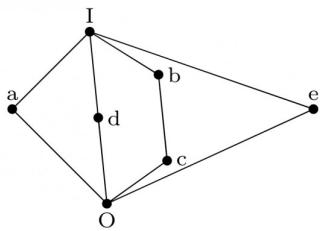

<details>
<summary>text_image</summary>

I
a
b
d
c
O
e
</details>

gate1988 descriptive lattice set-theory&algebra

# Answer key

# 4.6.2 Lattice: GATE CSE 1990 | Question: 17c

Show that the elements of the lattice $(N, \leq)$ , where $N$ is the set of positive intergers and $a \leq b$ if and only if $a$ divides $b$ , satisfy the distributive property.


gate1990 descriptive set-theory&algebra lattice

# Answer key

# 4.6.3 Lattice: GATE CSE 1992 | Question: 14b

Consider the set of integers $\{1, 2, 3, 4, 6, 8, 12, 24\}$ together with the two binary operations LCM (lowest common multiple) and GCD (greatest common divisor). Which of the following algebraic structures does this represent?


A. group

B. ring

C. field

D. lattice

gate1992 set-theory&algebra partial-order lattice normal

# Answer key

# 4.6.4 Lattice: GATE CSE 1994 | Question: 2.9

The Hasse diagrams of all the lattices with up to four elements are \_\_\_\_ (write all the relevant Hasse diagrams)


gate1994 set-theory&algebra lattice normal fill-in-the-blanks

# Answer key

# 4.6.5 Lattice: GATE CSE 1997 | Question: 3.3

In the lattice defined by the Hasse diagram given in following figure, how many complements does the element ‘e’ have?


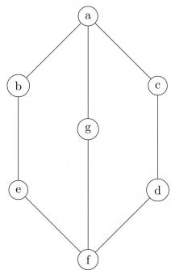

<details>
<summary>flowchart</summary>

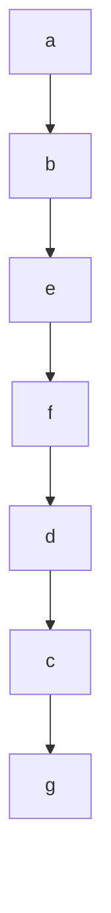
</details>

A. 2

B. 3

C. 0

D. 1

gate1997 set-theory&algebra lattice normal

# Answer key

# 4.6.6 Lattice: GATE CSE 2002 | Question: 4


$S = \{(1,2),(2,1)\}$ is binary relation on set $A = \{1,2,3\}$ . Is it irreflexive? Add the minimum number of ordered pairs to S to make it an equivalence relation. Give the modified S.

Let $S = \{a, b\}$ and let $\square(S)$ be the powerset of $S$ . Consider the binary relation $\subseteq$ (set inclusion)' on $\square(S)$ . Draw the Hasse diagram corresponding to the lattice $(\square(S), \subseteq)$

gatecse-2002 set-theory&algebra normal lattice descriptive

Answer key

# 4.6.7 Lattice: GATE CSE 2005 | Question: 9

The following is the Hasse diagram of the poset $[\{a,b,c,d,e\},\prec]$


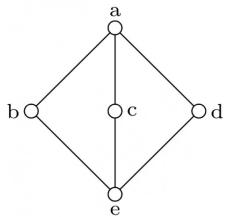

<details>
<summary>text_image</summary>

a
b
c
d
e
</details>

The poset is :

A. not a lattice  
C. a distributive lattice but not a Boolean algebra

gatecse-2005 set-theory&algebra lattice normal

B. a lattice but not a distributive lattice  
D. a Boolean algebra

Answer key

# 4.6.8 Lattice: GATE CSE 2015 | Set 1 | Question: 34

Suppose $L = \{p, q, r, s, t\}$ is a lattice represented by the following Hasse diagram:


<details>
<summary>flowchart</summary>

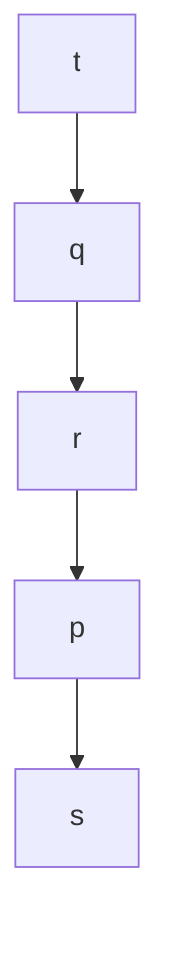
</details>

For any $x, y \in L$ , not necessarily distinct, $x \vee y$ and $x \wedge y$ are join and meet of $x, y$ , respectively. Let $L^3 = \{(x, y, z) : x, y, z \in L\}$ be the set of all ordered triplets of the elements of $L$ . Let $p_r$ be the probability that an element $(x, y, z) \in L^3$ chosen equiprobably satisfies $x \vee (y \wedge z) = (x \vee y) \wedge (x \vee z)$ . Then

A. $p_{r}=0$  
C. $0 < p_{r} \leq \frac{1}{5}$

gatecse-2015-set1 set-theory&algebra normal lattice

B. $p_r = 1$  
D. $\frac{1}{5} < p_r < 1$

Answer key

# 4.6.9 Lattice: GATE CSE 2017 | Set 2 | Question: 21

Consider the set $X = \{a,b,c,d,e\}$ under partial ordering $R = \{(a,a),(a,b),(a,c),(a,d),(a,e),(b,b),(b,c),(b,e),(c,c),(c,e),(d,d),(d,e),(e,e)\}$

The Hasse diagram of the partial order $(X,R)$ is shown below.


<details>
<summary>flowchart</summary>

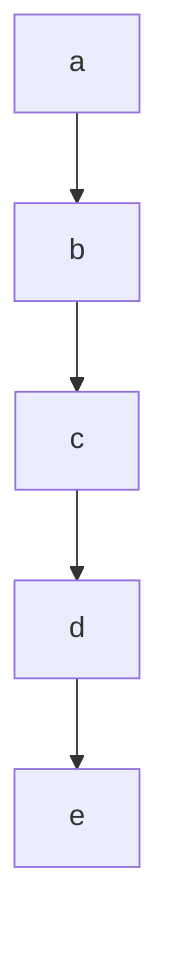
</details>

The minimum number of ordered pairs that need to be added to R to make $(X, R)$ a lattice is \_\_\_\_

gatecse-2017-set2 set-theory&algebra lattice numerical-answers normal

# Answer key

# 4.6.10 Lattice: GATE IT 2008 | Question: 28

Consider the following Hasse diagrams.


ii.  


iii.  


iv.  


Which all of the above represent a lattice?

A. (i) and (iv) only  
C. (iii) only

gateit-2008 set-theory&algebra lattice normal

# Answer key

# 4.7

# Mathematical Induction (2)

# 4.7.1 Mathematical Induction: GATE CSE 1995 | Question: 23

Prove using mathematical induction for $n \geq 5, 2^n > n^2$

gate1995 set-theory&algebra proof mathematical-induction descriptive

# Answer key

# 4.7.2 Mathematical Induction: GATE CSE 2000 | Question: 3

Consider the following sequence:

$$
s _ {1} = s _ {2} = 1 \text {and} s _ {i} = 1 + \min \left(s _ {i - 1}, s _ {i - 2}\right) \text {for} i > 2.
$$

Prove by induction on $n$ that $s_n = \lceil \frac{n}{2} \rceil$ .

gatecse-2000 set-theory&algebra mathematical-induction descriptive

# Answer key

# 4.8

# Number Theory (7)

# 4.8.1 Number Theory: GATE CSE 1995 | Question: 7(A)

Determine the number of divisors of 600.

gate1995 set-theory&algebra number-theory numerical-answers

# Answer key


# 4.8.2 Number Theory: GATE CSE 2014 | Set 2 | Question: 49

The number of distinct positive integral factors of 2014 is \_\_\_\_

gatecse-2014-set2 set-theory&algebra easy numerical-answers number-theory

Answer key

# 4.8.3 Number Theory: GATE CSE 2015 | Set 2 | Question: 9

The number of divisors of 2100 is \_\_\_\_.

gatecse-2015-set2 set-theory&algebra number-theory easy numerical-answers

Answer key

# 4.8.4 Number Theory: GATE IT 2005 | Question: 34

Let $n = p^2 q$ , where $p$ and $q$ are distinct prime numbers. How many numbers $m$ satisfy $1 \leq m \leq n$ and $gcd(m, n) = 1$ ? Note that $gcd(m, n)$ is the greatest common divisor of $m$ and $n$ .

A. $p(q - 1)$  
C. $(p^2 - 1)(q - 1)$

gateit-2005 set-theory&algebra normal number-theory

B. pq  
D. $p(p-1)(q-1)$

Answer key

# 4.8.5 Number Theory: GATE IT 2007 | Question: 16

The minimum positive integer $p$ such that $3^p$ (mod 17) = 1 is

A. 5

B. 8

C. 12

D. 16

gateit-2007 set-theory&algebra normal number-theory

Answer key

# 4.8.6 Number Theory: GATE IT 2008 | Question: 24

The exponent of 11 in the prime factorization of 300! is

A. 27

B. 28

C. 29

D. 30

gateit-2008 set-theory&algebra normal number-theory

Answer key

# 4.8.7 Number Theory: GATE1991-15,a

Show that the product of the least common multiple and the greatest common divisor of two positive integers $a$ and $b$ is $a \times b$ .

gate1991 set-theory&algebra normal number-theory proof descriptive

Answer key

# 4.9

# Onto (1)

# 4.9.1 Onto: GATE CSE 2025 | Set 1 | Question: 7

$g(\cdot)$ is a function from $A$ to $B$ , $f(\cdot)$ is a function from $B$ to $C$ , and their composition defined as $f(g(\cdot))$ is a mapping from $A$ to $C$ .

If $f(\cdot)$ and $f(g(\cdot))$ are onto (surjective) functions, which ONE of the following is TRUE about the function $g(\cdot)$ ?

A. $g(\cdot)$ must be an onto (surjective) function.  
B. $g(\cdot)$ must be a one-to-one (injective) function.  
C. $g(\cdot)$ must be a bijective function, that is, both one-to-one and onto.  
D. $g(\cdot)$ is not required to be a one-to-one or onto function.


# 4.10

# Partial Order (10)

# 4.10.1 Partial Order: GATE CSE 1991 | Question: 01,xiv

If the longest chain in a partial order is of length $n$ , then the partial order can be written as a \_\_\_\_ of $n$ antichains.


gate1991 set-theory&algebra partial-order normal fill-in-the-blanks

# Answer key

# 4.10.2 Partial Order: GATE CSE 1993 | Question: 8.5

The less-than relation, $<$ , on real number is

A. a partial ordering since it is asymmetric and reflexive  
B. a partial ordering since it is antisymmetric and reflexive  
C. not a partial ordering because it is not asymmetric and not reflexive  
D. not a partial ordering because it is not antisymmetric and reflexive  
E. none of the above

gate1993 set-theory&algebra partial-order easy

# Answer key

# 4.10.3 Partial Order: GATE CSE 1996 | Question: 1.2

Let $X = \{2, 3, 6, 12, 24\}$ , Let $\leq$ be the partial order defined by $X \leq Y$ if $x$ divides $y$ . Number of edges in the Hasse diagram of $(X, \leq)$ is


A. 3

B. 4

C. 9

D. None of the above

gate1996 set-theory&algebra partial-order normal

# Answer key

# 4.10.4 Partial Order: GATE CSE 1997 | Question: 6.1

A partial order $\leq$ is defined on the set $S = \{x, a_1, a_2, \ldots, a_n, y\}$ as $x \leq_i a_i$ for all $i$ and $a_i \leq y$ for all $i$ , where $n \geq 1$ . The number of total orders on the set $S$ which contain the partial order $\leq$ is


A. n!

B. $n + 2$

C. n

D. 1

gate1997 set-theory&algebra partial-order normal

# Answer key

# 4.10.5 Partial Order: GATE CSE 1998 | Question: 11

Suppose $A = \{a, b, c, d\}$ and $\Pi_1$ is the following partition of $A$

$$
\Pi_ {1} = \{\{a, b, c \} \{d \} \}
$$

a. List the ordered pairs of the equivalence relations induced by $\Pi_{1}$ .  
b. Draw the graph of the above equivalence relation.  
c. Let $\Pi_2 = \{\{a\}, \{b\}, \{c\}, \{d\}\}$  
Draw a Poset diagram of the poset, $\langle\{\Pi_{1},\Pi_{2},\Pi_{3},\Pi_{4}\}$ , refines $\rangle$ .

$$
\Pi_ {3} = \{\{a, b, c, d \} \}
$$

$$
\text {and} \Pi_ {4} = \{\{a, b \}, \{c, d \} \}
$$


# Answer key


Let $(S, \leq)$ be a partial order with two minimal elements a and b, and a maximum element c. Let $P: S \to \{True, False\}$ be a predicate defined on S. Suppose that $P(a) = True$ , $P(b) = False$ and $P(x) \implies P(y)$ for all $x, y \in S$ satisfying $x \leq y$ , where $\implies$ stands for logical implication. Which of the following statements CANNOT be true?

A. $P(x) = \textbf{True} \text{ for all } x \in S \text{ such that } x \neq b$  
B. $P(x) = \textbf{False}$ for all $x \in S$ such that $x \neq a$ and $x \neq c$  
C. $P(x) = \text{False}$ for all $x \in S$ such that $b \leq x$ and $x \neq c$  
D. $P(x) = \textbf{False}$ for all $x \in S$ such that $a \leq x$ and $b \leq x$

gatecse-2003 set-theory&algebra partial-order normal propositional-logic

# Answer key

# 4.10.7 Partial Order: GATE CSE 2004 | Question: 73

The inclusion of which of the following sets into

$$
S = \{\{1, 2 \}, \{1, 2, 3 \}, \{1, 3, 5 \}, \{1, 2, 4 \}, \{1, 2, 3, 4, 5 \} \}
$$

is necessary and sufficient to make $S$ a complete lattice under the partial order defined by set containment?

A. $\{1\}$  
C. $\{1\},\{1,3\}$

B. $\{1\}, \{2,3\}$  
D. $\{1\}, \{1,3\}, \{1,2,3,4\}, \{1,2,3,5\}$

gatecse-2004 set-theory&algebra partial-order normal

# Answer key

# 4.10.8 Partial Order: GATE CSE 2007 | Question: 26


Consider the set $S = \{a, b, c, d\}$ . Consider the following 4 partitions $\pi_1, \pi_2, \pi_3, \pi_4$ on

$$
S: \pi_ {1} = \{\overline {{a b c d}} \}, \quad \pi_ {2} = \{\overline {{a b}}, \overline {{c d}} \}, \quad \pi_ {3} = \{\overline {{a b c}}, \overline {{d}} \}, \quad \pi_ {4} = \{\bar {a}, \bar {b}, \bar {c}, \bar {d} \}.
$$

Let $\prec$ be the partial order on the set of partitions $S' = \{\pi_1, \pi_2, \pi_3, \pi_4\}$ defined as follows: $\pi_i \prec \pi_j$ if and only if $\pi_i$ refines $\pi_j$ . The poset diagram for $(S', \prec)$ is:

A.

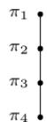

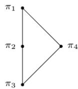

B.

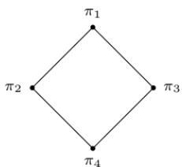

<details>
<summary>flowchart</summary>

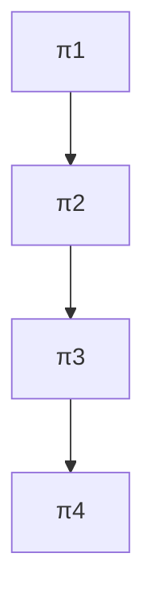
</details>

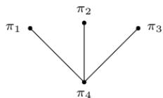

D.

C.

gatecse-2007 set-theory&algebra normal partial-order descriptive

# Answer key

# 4.10.9 Partial Order: GATE CSE 2024 | Set 2 | Question: 24

Let P be the partial order defined on the set $\{1, 2, 3, 4\}$ as follows

$$
P = \{(x, x) \mid x \in \{1, 2, 3, 4 \} \} \cup \{(1, 2), (3, 2), (3, 4) \}
$$

The number of total orders on $\{1,2,3,4\}$ that contain P is \_\_\_\_.


# Answer key

# 4.10.10 Partial Order: GATE IT 2007 | Question: 23

A partial order P is defined on the set of natural numbers as follows. Here $\frac{x}{y}$ denotes integer division.

i. $(0,0) \in P$ .  
ii. $(a,b)\in P$ if and only if $(a\% 10)\leq (b\% 10)$ and $(\frac{a}{10},\frac{b}{10})\in P.$

Consider the following ordered pairs:

i. (101, 22)  
ii. (22, 101)  
iii. (145, 265)  
iv. (0,153)

Which of these ordered pairs of natural numbers are contained in P?

A. (i) and (iii)

B. (ii) and (iv)

C. (i) and (iv)

D. (iii) and (iv)

gateit-2007 set-theory&algebra partial-order normal

# Answer key

# 4.11

# Polynomials (4)

# 4.11.1 Polynomials: GATE CSE 1997 | Question: 4.4

A polynomial $p(x)$ is such that $p(0) = 5, p(1) = 4, p(2) = 9$ and $p(3) = 20$ . The minimum degree it should have is

A. 1

B. 2

C. 3

D. 4

gate1997 set-theory&algebra normal polynomials

# Answer key

# 4.11.2 Polynomials: GATE CSE 2000 | Question: 2.4

A polynomial $p(x)$ satisfies the following:

- $p(1) = p(3) = p(5) = 1$  
- $p(2) = p(4) = -1$

The minimum degree of such a polynomial is

A. 1

B. 2

C. 3

D. 4

gatecse-2000 set-theory&algebra normal polynomials

# Answer key

# 4.11.3 Polynomials: GATE CSE 2014 | Set 2 | Question: 5

A non-zero polynomial $f(x)$ of degree 3 has roots at $x = 1$ , $x = 2$ and $x = 3$ . Which one of the following must be TRUE?

A. $f(0)f(4) < 0$  
C. $f(0) + f(4) > 0$

gatecse-2014-set2 set-theory&algebra polynomials normal

B. $f(0)f(4) > 0$  
D. $f(0) + f(4) < 0$

# Answer key

# 4.11.4 Polynomials: GATE CSE 2017 | Set 2 | Question: 24

Consider the quadratic equation $x^{2} - 13x + 36 = 0$ with coefficients in a base $b$ . The solutions of this


equation in the same base $b$ are $x = 5$ and $x = 6$ . Then $b =$ \_\_\_\_

gatecse-2017-set2 polynomials numerical-answers set-theory&algebra

Answer key

# 4.12

# Relations (38)

# 4.12.1 Relations: GATE CSE 1987 | Question: 2d

State whether the following statements are TRUE or FALSE:

The union of two equivalence relations is also an equivalence relation.

gate1987 set-theory&algebra relations true-false

Answer key


# 4.12.2 Relations: GATE CSE 1987 | Question: 9a

How many binary relations are there on a set A with n elements?

gate1987 set-theory&algebra relations descriptive

Answer key


# 4.12.3 Relations: GATE CSE 1987 | Question: 9e

How many true inclusion relations are there of the form $A \subseteq B$ , where $A$ and $B$ are subsets of a set $S$ with $n$ elements?

gate1987 set-theory&algebra relations descriptive

Answer key


# 4.12.4 Relations: GATE CSE 1989 | Question: 1-iv

The transitive closure of the relation $\{(1,2),(2,3),(3,4),(5,4)\}$ on the set $\{1,2,3,4,5\}$ is \_\_\_\_.

gate1989 set-theory&algebra relations descriptive

Answer key


# 4.12.5 Relations: GATE CSE 1992 | Question: 15.b

Let $S$ be the set of all integers and let $n > 1$ be a fixed integer. Define for $a, b \in S$ , $aRb$ iff $a - b$ is a multiple of $n$ . Show that $R$ is an equivalence relation and find its equivalence classes for $n = 5$ .

gate1992 set-theory&algebra normal relations descriptive

Answer key


# 4.12.6 Relations: GATE CSE 1994 | Question: 2.3

Amongst the properties {reflexivity, symmetry, anti-symmetry, transitivity} the relation $R = \{(x, y) \in N^2 | x \neq y\}$ satisfies \_\_\_\_

gate1994 set-theory&algebra normal relations fill-in-the-blanks

Answer key


# 4.12.7 Relations: GATE CSE 1995 | Question: 1.19

Let $R$ be a symmetric and transitive relation on a set $A$ . Then

A. $R$ is reflexive and hence an equivalence relation  
C. R is reflexive and hence not an equivalence relation

B. $R$ is reflexive and hence a partial order

D. None of the above

gate1995 set-theory&algebra relations normal


# 4.12.8 Relations: GATE CSE 1996 | Question: 2.2


Let $R$ be a non-empty relation on a collection of sets defined by $A R_{B}$ if and only if $A \cap B = \phi$ . Then, (pick the true statement)

A. A is reflexive and transitive

B. $R$ is symmetric and not transitive

C. $R$ is an equivalence relation

D. $R$ is not reflexive and not symmetric

gate1996 set-theory&algebra relations normal

# Answer key

# 4.12.9 Relations: GATE CSE 1996 | Question: 8


Let $F$ be the collection of all functions $f: \{1, 2, 3\} \to \{1, 2, 3\}$ . If $f$ and $g \in F$ , define an equivalence relation $\sim$ by $f \sim g$ if and only if $f(3) = g(3)$ .

a. Find the number of equivalence classes defined by $\sim$ .

b. Find the number of elements in each equivalence class.

gate1996 set-theory&algebra relations functions normal descriptive

# Answer key

# 4.12.10 Relations: GATE CSE 1997 | Question: 14

Let $R$ be a reflexive and transitive relation on a set $A$ . Define a new relation $E$ on $A$ as


$$
E = \{(a, b) \mid (a, b) \in R \text {   and   } (b, a) \in R \}
$$

Prove that $E$ is an equivalence relation on $A$ .

Define a relation $\leq$ on the equivalence classes of $E$ as $E_1 \leq E_2$ if $\exists a, b$ such that $a \in E_1, b \in E_2$ and $(a, b) \in R$ . Prove that $\leq$ is a partial order.

gate1997 set-theory&algebra relations normal proof descriptive

# Answer key

# 4.12.11 Relations: GATE CSE 1997 | Question: 6.3


The number of equivalence relations of the set $\{1,2,3,4\}$ is

A. 15

B. 16

C. 24

D. 4

gate1997 set-theory&algebra relations normal group-theory

# Answer key

# 4.12.12 Relations: GATE CSE 1998 | Question: 1.6


Suppose $A$ is a finite set with $n$ elements. The number of elements in the largest equivalence relation of $A$ is

A. n

B. $n^2$

C. 1

D. $n + 1$

gate1998 set-theory&algebra relations easy

# Answer key

# 4.12.13 Relations: GATE CSE 1998 | Question: 1.7


Let $R_{1}$ and $R_{2}$ be two equivalence relations on a set. Consider the following assertions:

i. $R_{1} \cup R_{2}$ is an equivalence relation  
ii. $R_{1} \cap R_{2}$ is an equivalence relation

Which of the following is correct?

A. Both assertions are true  
B. Assertions (i) is true but assertions (ii) is not true  
C. Assertions (ii) is true but assertions (i) is not true  
D. Neither (i) nor (ii) is true

gate1998 set-theory&algebra relations normal

# Answer key

# 4.12.14 Relations: GATE CSE 1998 | Question: 10a

Prove by induction that the expression for the number of diagonals in a polygon of $n$ sides is $\frac{n(n - 3)}{2}$

gate1998 set-theory&algebra descriptive relations

# Answer key

# 4.12.15 Relations: GATE CSE 1998 | Question: 10b

Let $R$ be a binary relation on $A = \{a, b, c, d, e, f, g, h\}$ represented by the following two component digraph. Find the smallest integers $m$ and $n$ such that $m < n$ and $R^m = R^n$ .


<details>
<summary>flowchart</summary>

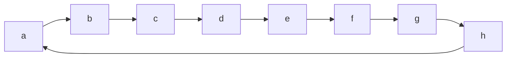
</details>

gate1998 descriptive set-theory&algebra relations

# Answer key

# 4.12.16 Relations: GATE CSE 1998 | Question: 2.3

The binary relation $R = \{(1,1),(2,1),(2,2),(2,3),(2,4),(3,1),(3,2),(3,3),(3,4)\}$ on the set $A = \{1,2,3,4\}$ is


A. reflexive, symmetric and transitive  
C. irreflexive, symmetric and transitive

B. neither reflexive, nor irreflexive but transitive  
D. irreflexive and antisymmetric

gate1998 set-theory&algebra easy relations

# Answer key

# 4.12.17 Relations: GATE CSE 1999 | Question: 1.2

The number of binary relations on a set with n elements is:


A. $n^{2}$

B. $2^{n}$

C. $2^{n^2}$

D. None of the above

gate1999 set-theory&algebra relations combinatory easy

# Answer key

# 4.12.18 Relations: GATE CSE 1999 | Question: 2.3

Let $L$ be a set with a relation $R$ which is transitive, anti-symmetric and reflexive and for any two elements $a, b \in L$ , let the least upper bound $lub(a, b)$ and the greatest lower bound $glb(a, b)$ exist. Which of the following is/are true?


A. $L$ is a poset  
C. $L$ is a lattice

B. $L$ is a Boolean algebra  
D. None of the above

gate1999 set-theory&algebra normal relations multiple-selects

# Answer key


a. Mr. X claims the following:

If a relation R is both symmetric and transitive, then R is reflexive. For this, Mr. X offers the following proof:

"From xRy, using symmetry we get yRx. Now because R is transitive xRy and yRx together imply xRx. Therefore, R is reflexive".

b. Give an example of a relation R which is symmetric and transitive but not reflexive.

gate1999 set-theory&algebra relations normal descriptive

Answer key

# 4.12.20 Relations: GATE CSE 2000 | Question: 2.5

A relation $R$ is defined on the set of integers as $xRy$ iff $(x + y)$ is even. Which of the following statements is true?


A. $R$ is not an equivalence relation  
B. $R$ is an equivalence relation having 1 equivalence class  
C. $R$ is an equivalence relation having 2 equivalence classes  
D. $R$ is an equivalence relation having 3 equivalence classes

gatecse-2000 set-theory&algebra relations normal

Answer key

# 4.12.21 Relations: GATE CSE 2001 | Question: 1.2

Consider the following relations:


- $R_{1}(a, b)$ iff $(a + b)$ is even over the set of integers  
- $R_{2}(a, b)$ iff $(a + b)$ is odd over the set of integers  
- $R_{3}(a, b)$ iff $a, b > 0$ over the set of non-zero rational numbers  
- $R_{4}(a, b)$ iff $|a - b| \leq 2$ over the set of natural numbers

Which of the following statements is correct?

A. $R_{1}$ and $R_{2}$ are equivalence relations, $R_{3}$ and $R_{4}$ are not  
B. $R_{1}$ and $R_{3}$ are equivalence relations, $R_{2}$ and $R_{4}$ are not  
C. $R_{1}$ and $R_{4}$ are equivalence relations, $R_{2}$ and $R_{3}$ are not  
D. $R_{1}, R_{2}, R_{3}$ and $R_{4}$ all are equivalence relations

gatecse-2001 set-theory&algebra normal relations

Answer key

# 4.12.22 Relations: GATE CSE 2002 | Question: 2.17

The binary relation $S = \phi(\text{empty set})$ on a set $A = \{1, 2, 3\}$ is


A. Neither reflexive nor symmetric  
C. Transitive and reflexive

B. Symmetric and reflexive

gatecse-2002 set-theory&algebra normal relations

Answer key

# 4.12.23 Relations: GATE CSE 2002 | Question: 3

Let $A$ be a set of $n (>0)$ elements. Let $N_r$ be the number of binary relations on $A$ and let $N_f$ be the number of functions from $A$ to $A$


A. Give the expression for $N_{r}$ , in terms of n.  
B. Give the expression for $N_{f}$ , terms of $n$ .

C. Which is larger for all possible $n, N_{r}$ or $N_{f}$

gatecse-2002 set-theory&algebra normal descriptive relations

# Answer key

# 4.12.24 Relations: GATE CSE 2004 | Question: 24

Consider the binary relation:

$$
S = \{(x, y) \mid y = x + 1 \text {and} x, y \in \{0, 1, 2 \} \}
$$

The reflexive transitive closure is $S$ is

A. $\{(x,y) \mid y > x \text{ and } x, y \in \{0,1,2\}\}$  
B. $\{(x,y) \mid y \geq x \text{ and } x, y \in \{0,1,2\}\}$  
C. $\{(x,y) \mid y < x \text{ and } x, y \in \{0,1,2\}\}$  
D. $\{(x,y) \mid y \leq x \text{ and } x, y \in \{0,1,2\}\}$

gatecse-2004 set-theory&algebra easy relations

# Answer key

# 4.12.25 Relations: GATE CSE 2005 | Question: 42

Let $R$ and $S$ be any two equivalence relations on a non-empty set $A$ . Which one of the following statements is TRUE?

A. $R \cup S, R \cap S$ are both equivalence relations  
B. $R \cup S$ is an equivalence relation  
C. $R\cap S$ is an equivalence relation  
D. Neither $R \cup S$ nor $R \cap S$ are equivalence relations

gatecse-2005 set-theory&algebra normal relations

# Answer key

# 4.12.26 Relations: GATE CSE 2005 | Question: 7

The time complexity of computing the transitive closure of a binary relation on a set of $n$ elements is known to be:

A. $O(n)$

B. $O(n\log n)$

c. $O\left(n^{\frac{3}{2}}\right)$

D. $O(n^{3})$

gatecse-2005 set-theory&algebra normal relations

# Answer key

# 4.12.27 Relations: GATE CSE 2006 | Question: 4

A relation R is defined on ordered pairs of integers as follows:

$$
(x, y) R (u, v) \text {if} x <   u \text {and} y > v
$$

Then $R$ is:

A. Neither a Partial Order nor an Equivalence Relation  
B. A Partial Order but not a Total Order  
C. A total Order  
D. An Equivalence Relation

gatecse-2006 set-theory&algebra normal relations

# Answer key


# 4.12.28 Relations: GATE CSE 2007 | Question: 2


Let $S$ be a set of $n$ elements. The number of ordered pairs in the largest and the smallest equivalence relations on $S$ are:

A. $n$ and $n$

B. $n^2$ and $n$

C. $n^2$ and 0

D. $n$ and 1

gatecse-2007 set-theory&algebra normal relations

# Answer key

# 4.12.29 Relations: GATE CSE 2009 | Question: 4

Consider the binary relation $R = \{(x, y), (x, z), (z, x), (z, y)\}$ on the set $\{x, y, z\}$ . Which one of the following is TRUE?


A. $R$ is symmetric but NOT antisymmetric

C. R is both symmetric and antisymmetric

B. $R$ is NOT symmetric but antisymmetric

D. R is neither symmetric nor antisymmetric

gatecse-2009 set-theory&algebra easy relations

# Answer key

# 4.12.30 Relations: GATE CSE 2010 | Question: 3

What is the possible number of reflexive relations on a set of 5 elements?


A. $2^{10}$

B. $2^{15}$

C. $2^{20}$

D. $2^{25}$

gatecse-2010 set-theory&algebra easy relations

# Answer key

# 4.12.31 Relations: GATE CSE 2015 | Set 2 | Question: 16

Let $R$ be the relation on the set of positive integers such that $aRb$ and only if $a$ and $b$ are distinct and let have a common divisor other than 1. Which one of the following statements about $R$ is true?


A. $R$ is symmetric and reflexive but not transitive  
B. R is reflexive but not symmetric not transitive  
C. $R$ is transitive but not reflexive and not symmetric  
D. R is symmetric but not reflexive and not transitive

gatecse-2015-set2 set-theory&algebra relations normal

# Answer key

# 4.12.32 Relations: GATE CSE 2015 | Set 3 | Question: 41

Let $R$ be a relation on the set of ordered pairs of positive integers such that $((p,q),(r,s)) \in R$ if and only if $p - s = q - r$ . Which one of the following is true about $R$ ?


A. Both reflexive and symmetric

B. Reflexive but not symmetric

C. Not reflexive but symmetric

D. Neither reflexive nor symmetric

gatecse-2015-set3 set-theory&algebra relations normal

# Answer key

# 4.12.33 Relations: GATE CSE 2016 | Set 2 | Question: 26

A binary relation $R$ on $\mathbb{N} \times \mathbb{N}$ is defined as follows: $(a, b)R(c, d)$ if $a \leq c$ or $b \leq d$ . Consider the following propositions:


- $P: R$ is reflexive.  
- $Q: R$ is transitive.

Which one of the following statements is TRUE?

A. Both $P$ and $Q$ are true.  
C. $P$ is false and $Q$ is true.

B. $P$ is true and $Q$ is false.  
D. Both $P$ and $Q$ are false.

gatecse-2016-set2 set-theory&algebra relations normal

# Answer key

# 4.12.34 Relations: GATE CSE 2020 | Question: 17


Let $\mathcal{R}$ be the set of all binary relations on the set $\{1,2,3\}$ . Suppose a relation is chosen from $\mathcal{R}$ at random. The probability that the chosen relation is reflexive (round off to 3 decimal places) is \_\_\_\_.

gatecse-2020 numerical-answers probability relations one-mark

# Answer key

# 4.12.35 Relations: GATE CSE 2021 | Set 1 | Question: 43


A relation R is said to be circular if aRb and bRc together imply cRa.

Which of the following options is/are correct?

A. If a relation $S$ is reflexive and symmetric, then $S$ is an equivalence relation.  
B. If a relation $S$ is circular and symmetric, then $S$ is an equivalence relation.  
C. If a relation $S$ is reflexive and circular, then $S$ is an equivalence relation.  
D. If a relation $S$ is transitive and circular, then $S$ is an equivalence relation.

gatecse-2021-set1 multiple-selects set-theory&algebra relations two-marks

# Answer key

# 4.12.36 Relations: GATE CSE 2025 | Set 2 | Question: 32


Let $\mathcal{F}$ be the set of all functions from $\{1, \ldots, n\}$ to $\{0, 1\}$ . Define the binary relation $\leqslant$ on $\mathcal{F}$ as follows:

$\forall f, g \in \mathcal{F}, f \preccurlyeq g$ if and only if $\forall x \in \{1, \dots, n\}, f(x) \leq g(x)$ , where $0 \leq 1$ .

Which of the following statement(s) is/are TRUE?

A. $\preccurlyeq$ is a symmetric relation  
B. $(\mathcal{F},\preccurlyeq)$ is a partial order  
C. $(\mathcal{F},\preccurlyeq)$ is a lattice  
D. $\preccurlyeq$ is an equivalence relation

gatecse2025-set2 set-theory&algebra functions relations multiple-selects two-marks

# Answer key

# 4.12.37 Relations: GATE CSE 2026 | Set 2 | Question: 16


Let $R$ be a binary relation on the set $\{1, 2, \ldots, 10\}$ , where $(x, y) \in R$ if the product of $x$ and $y$ is square of an integer. Which of the following properties is/are satisfied by $R$ ?

A. Reflexive

B. Symmetric

C. Transitive

D. Antisymmetric

gatecse-2026-set2 set-theory&algebra relations multiple-selects one-mark

# Answer key

# 4.12.38 Relations: GATE IT 2004 | Question: 4


Let $R_{1}$ be a relation from $A = \{1, 3, 5, 7\}$ to $B = \{2, 4, 6, 8\}$ and $R_{2}$ be another relation from $B$ to $C = \{1, 2, 3, 4\}$ as defined below:

i. An element $x$ in $A$ is related to an element $y$ in $B$ (under $R_1$ ) if $x + y$ is divisible by 3.  
ii. An element $x$ in $B$ is related to an element $y$ in $C$ (under $R_2$ ) if $x + y$ is even but not divisible by 3.

Which is the composite relation $R_{1}R_{2}$ from A to C?

A. $R_{1}R_{2} = \{(1,2),(1,4),(3,3),(5,4),(7,3)\}$

B. $R_{1}R_{2} = \{(1,2),(1,3),(3,2),(5,2),(7,3)\}$  
C. $R_{1}R_{2} = \{(1,2),(3,2),(3,4),(5,4),(7,2)\}$  
D. $R_{1}R_{2} = \{(3,2),(3,4),(5,1),(5,3),(7,1)\}$

gateit-2004 set-theory&algebra relations normal

# Answer key

# 4.13

# Set Theory (27)

# 4.13.1 Set Theory: GATE CSE 1993 | Question: 17

Out of a group of 21 persons, 9 eat vegetables, 10 eat fish and 7 eat eggs. 5 persons eat all three. How many persons eat at least two out of the three dishes?


gate1993 set-theory&algebra easy set-theory descriptive

# Answer key

# 4.13.2 Set Theory: GATE CSE 1993 | Question: 8.3

Let $S$ be an infinite set and $S_{1}\ldots,S_{n}$ be sets such that $S_{1}\cup S_{2}\cup\cdots\cup S_{n}=S$ . Then


A. at least one of the sets $S_{i}$ is a finite set  
B. not more than one of the sets $S_{i}$ can be finite  
C. at least one of the sets $S_{i}$ is an infinite  
D. not more than one of the sets $S_{i}$ can be infinite  
E. None of the above

gate1993 set-theory&algebra normal set-theory

# Answer key

# 4.13.3 Set Theory: GATE CSE 1993 | Question: 8.4

Let $A$ be a finite set of size $n$ . The number of elements in the power set of $A \times A$ is:


A. $2^{2^n}$

B. $2^{n^2}$

C. $(2^{n})^{2}$

D. $\left(2^{2}\right)^{n}$

E. None of the above

gate1993 set-theory&algebra easy set-theory

# Answer key

# 4.13.4 Set Theory: GATE CSE 1994 | Question: 2.4

The number of subsets $\{1,2,\dots,n\}$ with odd cardinality is \_\_\_\_


gate1994 set-theory&algebra easy set-theory fill-in-the-blanks

# Answer key

# 4.13.5 Set Theory: GATE CSE 1995 | Question: 1.20

The number of elements in the power set $P(S)$ of the set $S = \{\{\emptyset\}, 1, \{2, 3\}\}$ is:


A. 2

B. 4

C. 8

D. None of the above

gate1995 set-theory&algebra normal set-theory

# Answer key

# 4.13.6 Set Theory: GATE CSE 1995 | Question: 25b

Determine the number of positive integers ( $\leq$ 720) which are not divisible by any of 2, 3 or 5.


# 4.13.7 Set Theory: GATE CSE 1996 | Question: 1.1

Let $A$ and $B$ be sets and let $A^c$ and $B^c$ denote the complements of the sets $A$ and $B$ . The set $(A - B) \cup (B - A) \cup (A \cap B)$ is equal to


A. $A \cup B$

B. $A^c \cup B^c$

C. $A \cap B$

D. $A^{c} \cap B^{c}$

gate1996 set-theory&algebra easy set-theory

# Answer key

# 4.13.8 Set Theory: GATE CSE 1998 | Question: 2.4

In a room containing 28 people, there are 18 people who speak English, 15 people who speak Hindi and 22 people who speak Kannada. 9 persons speak both English and Hindi, 11 persons speak both Hindi and Kannada whereas 13 persons speak both Kannada and English. How many speak all three languages?


A. 9

B. 8

C. 7

D. 6

gate1998 set-theory&algebra easy set-theory

# Answer key

# 4.13.9 Set Theory: GATE CSE 2000 | Question: 2.6

Let $P(S)$ denotes the power set of set S. Which of the following is always true?


A. $P(P(S)) = P(S)$

B. $P(S)\cap P(P(S)) = \{\varnothing \}$

C. $P(S)\cap S = P(S)$

D. $S \notin P(S)$

gatecse-2000 set-theory&algebra easy set-theory

# Answer key

# 4.13.10 Set Theory: GATE CSE 2000 | Question: 6


Let $S$ be a set of $n$ elements $\{1, 2, \ldots, n\}$ and $G$ a graph with $2^n$ vertices, each vertex corresponding to a distinct subset of $S$ . Two vertices are adjacent iff the symmetric difference of the corresponding sets has exactly 2 elements. Note: The symmetric difference of two sets $R_1$ and $R_2$ is defined as $(R_1 \setminus R_2) \cup (R_2 \setminus R_1)$

Every vertex in G has the same degree. What is the degree of a vertex in G?

How many connected components does G have?

gatecse-2000 set-theory&algebra normal descriptive set-theory

# Answer key

# 4.13.11 Set Theory: GATE CSE 2001 | Question: 2.2

Consider the following statements:


- $S_{1}$ : There exists infinite sets $A, B, C$ such that $A \cap (B \cup C)$ is finite.  
- $S_{2}$ : There exists two irrational numbers $x$ and $y$ such that $(x + y)$ is rational.

Which of the following is true about $S_{1}$ and $S_{2}$ ?

A. Only $S_{1}$ is correct

B. Only $S_{2}$ is correct

C. Both $S_{1}$ and $S_{2}$ are correct

D. None of $S_{1}$ and $S_{2}$ is correct

gatecse-2001 set-theory&algebra normal set-theory

# Answer key

# 4.13.12 Set Theory: GATE CSE 2001 | Question: 3


a. Prove that powerset $(A \cap B) = \text{powerset}(A) \cap \text{powerset}(B)$

b. Let $\mathrm{sum}(n) = 0 + 1 + 2 + \dots + n$ for all natural numbers $n$ . Give an induction proof to show that the following equation is true for all natural numbers $m$ and $n$ :

$$
\mathrm{sum} (m + n) = \mathrm{sum} (m) + \mathrm{sum} (n) + m n
$$

gatecse-2001 set-theory&algebra normal set-theory descriptive

# Answer key

# 4.13.13 Set Theory: GATE CSE 2005 | Question: 8

Let $A, B$ and $C$ be non-empty sets and let $X = (A - B) - C$ and $Y = (A - C) - (B - C)$ . Which one of the following is TRUE?


A. $X = Y$

B. $X \subset Y$

c. $Y \subset X$

D. None of these

gatecse-2005 set-theory&algebra easy set-theory

# Answer key

# 4.13.14 Set Theory: GATE CSE 2006 | Question: 22

Let $E, F$ and $G$ be finite sets. Let

- $X = (E \cap F) - (F \cap G)$ and  
- $Y = (E - (E \cap G)) - (E - F)$ .

Which one of the following is true?

A. $X \subset Y$  
C. X = Y

B. $X \supset Y$  
D. $X - Y \neq \emptyset$ and $Y - X \neq \emptyset$

gatecse-2006 set-theory&algebra normal set-theory

# Answer key

# 4.13.15 Set Theory: GATE CSE 2006 | Question: 24


Given a set of elements $N = 1, 2, \ldots, n$ and two arbitrary subsets $A \subseteq N$ and $B \subseteq N$ , how many of the $n!$ permutations $\pi$ from $N$ to $N$ satisfy $\min(\pi(A)) = \min(\pi(B))$ , where $\min(S)$ is the smallest integer in the set of integers $S$ , and $\pi(S)$ is the set of integers obtained by applying permutation $\pi$ to each element of $S$ ?

A. $(n - |A\cup B|)|A||B|$  
C. $n!\frac{|A\cap B|}{|A\cup B|}$

B. $(|A|^2 + |B|^2)n^2$  
D. $\frac{|A\cap B|^2}{^n\mathbf{C}_{|A\cup B|}}$

gatecse-2006 set-theory&algebra normal set-theory

# Answer key

# 4.13.16 Set Theory: GATE CSE 2008 | Question: 2

If $P, Q, R$ are subsets of the universal set $U$ , then

$$
(P \cap Q \cap R) \cup (P ^ {c} \cap Q \cap R) \cup Q ^ {c} \cup R ^ {c}
$$

is

A. $Q^{c} \cup R^{c}$  
C. $\dot{P}^c\cup Q^c\cup R^c$

B. $P \cup Q^{c} \cup R^{c}$

gatecse-2008 normal set-theory&algebra set-theory

# Answer key

# 4.13.17 Set Theory: GATE CSE 2014 | Set 2 | Question: 50


Consider the following relation on subsets of the set $S$ of integers between 1 and 2014. For two distinct subsets $U$ and $V$ of $S$ we say $U < V$ if the minimum element in the symmetric difference of the two sets is in $U$ .


Consider the following two statements:

- $S1$ : There is a subset of $S$ that is larger than every other subset.  
- $S2$ : There is a subset of $S$ that is smaller than every other subset.

Which one of the following is CORRECT?

A. Both $S1$ and $S2$ are true

B. $S1$ is true and $S2$ is false

C. $S2$ is true and $S1$ is false

D. Neither $S1$ nor $S2$ is true

gatecse-2014-set2 set-theory&algebra normal set-theory

# Answer key

# 4.13.18 Set Theory: GATE CSE 2015 | Set 1 | Question: 16

For a set $A$ , the power set of $A$ is denoted by $2^{A}$ . If $A = \{5, \{6\}, \{7\}\}$ , which of the following options are TRUE?


1. $\varnothing \in 2^{A}$  
II. $\varnothing \subset 2^{A}$  
III. $\{5, \{6\}\} \in 2^A$  
IV. $\{5,\{6\}\} \subseteq 2^A$

A. I and III only

B. II and III only

C. I, II and III only

D. I, II and IV only

gatecse-2015-set1 set-theory&algebra set-theory normal

# Answer key

# 4.13.19 Set Theory: GATE CSE 2015 | Set 2 | Question: 18

The cardinality of the power set of $\{0,1,2,\ldots,10\}$ is \_\_\_\_

gatecse-2015-set2 set-theory&algebra set-theory easy numerical-answers

# Answer key


# 4.13.20 Set Theory: GATE CSE 2015 | Set 3 | Question: 23

Suppose $U$ is the power set of the set $S = \{1, 2, 3, 4, 5, 6\}$ . For any $T \in U$ , let $|T|$ denote the number of elements in $T$ and $T'$ denote the complement of $T$ . For any $T, R \in U$ let $T \setminus R$ be the set of all elements in $T$ which are not in $R$ . Which one of the following is true?


A. $\forall X \in U, (|X| = |X'|)$  
B. $\exists X\in U,\exists Y\in U,(|X| = 5,|Y| = 5$ and $X\cap Y = \phi)$  
C. $\forall X\in U,\forall Y\in U,(|X| = 2,|Y| = 3$ and $X\backslash Y = \phi)$  
D. $\forall X \in U, \forall Y \in U, (X \backslash Y = Y' \backslash X')$

gatecse-2015-set3 set-theory&algebra set-theory normal

# Answer key

# 4.13.21 Set Theory: GATE CSE 2016 | Set 2 | Question: 28

Consider a set U of 23 different compounds in a chemistry lab. There is a subset S of U of 9 compounds, each of which reacts with exactly 3 compounds of U. Consider the following statements:


I. Each compound in U \ S reacts with an odd number of compounds.  
II. At least one compound in U \ S reacts with an odd number of compounds.  
III. Each compound in U \ S reacts with an even number of compounds.

Which one of the above statements is ALWAYS TRUE?

A. Only I

B. Only II

C. Only III

D. None.

# 4.13.22 Set Theory: GATE CSE 2017 | Set 1 | Question: 47

The number of integers between 1 and 500 (both inclusive) that are divisible by 3 or 5 or 7 is


gatecse-2017-set1 set-theory&algebra normal numerical-answers set-theory

# Answer key

# 4.13.23 Set Theory: GATE CSE 2021 | Set 2 | Question: 37

For two $n$ -dimensional real vectors $P$ and $Q$ , the operation $s(P, Q)$ is defined as follows:


$$
s (P, Q) = \sum_ {i = 1} ^ {n} (P [ i ] \cdot Q [ i ])
$$

Let $\mathcal{L}$ be a set of 10-dimensional non-zero real vectors such that for every pair of distinct vectors $P, Q \in \mathcal{L}$ , $s(P, Q) = 0$ . What is the maximum cardinality possible for the set $\mathcal{L}$ ?

A. 9

B. 10

C. 11

D. 100

gatecse-2021-set2 set-theory&algebra set-theory two-marks

# Answer key

# 4.13.24 Set Theory: GATE IT 2004 | Question: 2


In a class of 200 students, 125 students have taken Programming Language course, 85 students have taken Data Structures course, 65 students have taken Computer Organization course; 50 students have taken both Programming Language and Data Structures, 35 students have taken both Programming Language and Computer Organization; 30 students have taken both Data Structures and Computer Organization, 15 students have taken all the three courses.

How many students have not taken any of the three courses?

A. 15

B. 20

C. 25

D. 30

gateit-2004 set-theory&algebra easy set-theory

# Answer key

# 4.13.25 Set Theory: GATE IT 2005 | Question: 33

Let $A$ be a set with $n$ elements. Let $C$ be a collection of distinct subsets of $A$ such that for any two subsets $S_{1}$ and $S_{2}$ in $C$ , either $S_{1} \subset S_{2}$ or $S_{2} \subset S_{1}$ . What is the maximum cardinality of $C$ ?


A. n

B. $n + 1$

C. $2^{n - 1} + 1$

D. n!

gateit-2005 set-theory&algebra normal set-theory

# Answer key

# 4.13.26 Set Theory: GATE IT 2006 | Question: 23

Let $P, Q$ and $R$ be sets let $\Delta$ denote the symmetric difference operator defined as $P\Delta Q = (P \cup Q) - (P \cap Q)$ . Using Venn diagrams, determine which of the following is/are TRUE?


1. $P\Delta (Q\cap R) = (P\Delta Q)\cap (P\Delta R)$  
$\| .P\cap (Q\cap R) = (P\cap Q)\Delta (P\Delta R)$

A. I only

B. II only

C. Neither I nor II

D. Both I and II

gateit-2006 set-theory&algebra normal set-theory

# Answer key

What is the cardinality of the set of integers X defined below?

$X = \{n \mid 1 \leq n \leq 123, n \text{ is not divisible by either } 2, 3 \text{ or } 5\}$

A. 28

B. 33

C. 37

D. 44

gateit-2006 set-theory&algebra normal set-theory

# Answer key

Answer Keys

<table><tr><td>4.1.1</td><td>N/A</td><td>4.1.2</td><td>N/A</td><td>4.1.3</td><td>C</td><td>4.1.4</td><td>D</td><td>4.1.5</td><td>A</td></tr><tr><td>4.1.6</td><td>A</td><td>4.1.7</td><td>B</td><td>4.1.8</td><td>A</td><td>4.2.1</td><td>True</td><td>4.2.2</td><td>D</td></tr><tr><td>4.3.1</td><td>N/A</td><td>4.3.2</td><td>N/A</td><td>4.3.3</td><td>N/A</td><td>4.3.4</td><td>B</td><td>4.3.5</td><td>A</td></tr><tr><td>4.3.6</td><td>C</td><td>4.3.7</td><td>N/A</td><td>4.3.8</td><td>C</td><td>4.3.9</td><td>A</td><td>4.3.10</td><td>N/A</td></tr><tr><td>4.3.11</td><td>A</td><td>4.3.12</td><td>B</td><td>4.3.13</td><td>B</td><td>4.3.14</td><td>D</td><td>4.3.15</td><td>B</td></tr><tr><td>4.3.16</td><td>C</td><td>4.3.17</td><td>C</td><td>4.3.18</td><td>16</td><td>4.3.19</td><td>D</td><td>4.3.20</td><td>B</td></tr><tr><td>4.3.21</td><td>A</td><td>4.3.22</td><td>36</td><td>4.3.23</td><td>0.95</td><td>4.3.24</td><td>2</td><td>4.3.25</td><td>B;C</td></tr><tr><td>4.3.26</td><td>B;C;D</td><td>4.3.27</td><td>2</td><td>4.3.28</td><td>10:10</td><td>4.3.29</td><td>C</td><td>4.3.30</td><td>D</td></tr><tr><td>4.4.1</td><td>N/A</td><td>4.4.2</td><td>N/A</td><td>4.4.3</td><td>N/A</td><td>4.4.4</td><td>N/A</td><td>4.4.5</td><td>C</td></tr><tr><td>4.4.6</td><td>D</td><td>4.4.7</td><td>N/A</td><td>4.4.8</td><td>C</td><td>4.4.9</td><td>C</td><td>4.4.10</td><td>D</td></tr><tr><td>4.4.11</td><td>N/A</td><td>4.4.12</td><td>N/A</td><td>4.4.13</td><td>N/A</td><td>4.4.14</td><td>B</td><td>4.4.15</td><td>A</td></tr><tr><td>4.4.16</td><td>D</td><td>4.4.17</td><td>C</td><td>4.4.18</td><td>A</td><td>4.4.19</td><td>C</td><td>4.4.20</td><td>A</td></tr><tr><td>4.4.21</td><td>A</td><td>4.4.22</td><td>C</td><td>4.4.23</td><td>A</td><td>4.4.24</td><td>5</td><td>4.4.25</td><td>4</td></tr><tr><td>4.4.26</td><td>42</td><td>4.4.27</td><td>B</td><td>4.4.28</td><td>7</td><td>4.4.29</td><td>B</td><td>4.4.30</td><td>A;B;C</td></tr><tr><td>4.4.31</td><td>A;D</td><td>4.4.32</td><td>B;D</td><td>4.4.33</td><td>4</td><td>4.5.1</td><td>B</td><td>4.6.1</td><td>N/A</td></tr><tr><td>4.6.2</td><td>N/A</td><td>4.6.3</td><td>D</td><td>4.6.4</td><td>5</td><td>4.6.5</td><td>B</td><td>4.6.6</td><td>N/A</td></tr><tr><td>4.6.7</td><td>B</td><td>4.6.8</td><td>D</td><td>4.6.9</td><td>0</td><td>4.6.10</td><td>A</td><td>4.7.1</td><td>N/A</td></tr><tr><td>4.7.2</td><td>N/A</td><td>4.8.1</td><td>24</td><td>4.8.2</td><td>8</td><td>4.8.3</td><td>36</td><td>4.8.4</td><td>D</td></tr><tr><td>4.8.5</td><td>D</td><td>4.8.6</td><td>C</td><td>4.8.7</td><td>N/A</td><td>4.9.1</td><td>D</td><td>4.10.1</td><td>N/A</td></tr><tr><td>4.10.2</td><td>E</td><td>4.10.3</td><td>B</td><td>4.10.4</td><td>A</td><td>4.10.5</td><td>N/A</td><td>4.10.6</td><td>D</td></tr><tr><td>4.10.7</td><td>A</td><td>4.10.8</td><td>C</td><td>4.10.9</td><td>5</td><td>4.10.10</td><td>D</td><td>4.11.1</td><td>B</td></tr><tr><td>4.11.2</td><td>D</td><td>4.11.3</td><td>A</td><td>4.11.4</td><td>8</td><td>4.12.1</td><td>False</td><td>4.12.2</td><td>N/A</td></tr><tr><td>4.12.3</td><td>N/A</td><td>4.12.4</td><td>N/A</td><td>4.12.5</td><td>N/A</td><td>4.12.6</td><td>N/A</td><td>4.12.7</td><td>D</td></tr><tr><td>4.12.8</td><td>B</td><td>4.12.9</td><td>N/A</td><td>4.12.10</td><td>N/A</td><td>4.12.11</td><td>A</td><td>4.12.12</td><td>B</td></tr><tr><td>4.12.13</td><td>C</td><td>4.12.14</td><td>N/A</td><td>4.12.15</td><td>N/A</td><td>4.12.16</td><td>B</td><td>4.12.17</td><td>C</td></tr><tr><td>4.12.18</td><td>A;C</td><td>4.12.19</td><td>N/A</td><td>4.12.20</td><td>C</td><td>4.12.21</td><td>B</td><td>4.12.22</td><td>D</td></tr><tr><td>4.12.23</td><td>N/A</td><td>4.12.24</td><td>B</td><td>4.12.25</td><td>C</td><td>4.12.26</td><td>D</td><td>4.12.27</td><td>A</td></tr><tr><td>4.12.28</td><td>B</td><td>4.12.29</td><td>D</td><td>4.12.30</td><td>C</td><td>4.12.31</td><td>D</td><td>4.12.32</td><td>C</td></tr><tr><td>4.12.33</td><td>B</td><td>4.12.34</td><td>0.1249:0.1259</td><td>4.12.35</td><td>C</td><td>4.12.36</td><td>B;C</td><td>4.12.37</td><td>A;B;C</td></tr><tr><td>4.12.38</td><td>C</td><td>4.13.1</td><td>N/A</td><td>4.13.2</td><td>C</td><td>4.13.3</td><td>B</td><td>4.13.4</td><td>N/A</td></tr><tr><td>4.13.5</td><td>C</td><td>4.13.6</td><td>192</td><td>4.13.7</td><td>A</td><td>4.13.8</td><td>D</td><td>4.13.9</td><td>B</td></tr></table>

<table><tr><td>4.13.10</td><td>N/A</td></tr><tr><td>4.13.15</td><td>C</td></tr><tr><td>4.13.20</td><td>D</td></tr><tr><td>4.13.25</td><td>B</td></tr></table>

<table><tr><td>4.13.11</td><td>C</td></tr><tr><td>4.13.16</td><td>D</td></tr><tr><td>4.13.21</td><td>B</td></tr><tr><td>4.13.26</td><td>C</td></tr></table>

<table><tr><td>4.13.12</td><td>N/A</td></tr><tr><td>4.13.17</td><td>A</td></tr><tr><td>4.13.22</td><td>271</td></tr><tr><td>4.13.27</td><td>B</td></tr></table>

<table><tr><td>4.13.13</td><td>A</td></tr><tr><td>4.13.18</td><td>C</td></tr><tr><td>4.13.23</td><td>B</td></tr></table>

<table><tr><td>4.13.14</td><td>C</td></tr><tr><td>4.13.19</td><td>2048</td></tr><tr><td>4.13.24</td><td>C</td></tr></table>

Syllabus: Limits, Continuity, and Differentiability, Maxima and minima, Mean value theorem, Integration.

Mark Distribution in Previous GATE

<table><tr><td>Year</td><td>2026 - 1</td><td>2026 - 2</td><td>2025 - 1</td><td>2025 - 2</td><td>2024 - 1</td><td>2024 - 2</td><td>2023</td><td>2022</td><td>2021 - 1</td><td>2021 - 2</td><td>Minimum</td></tr><tr><td>1 Mark Count</td><td>1</td><td>1</td><td>1</td><td>1</td><td>1</td><td>1</td><td>2</td><td>1</td><td>1</td><td>1</td><td>1</td></tr><tr><td>2 Marks Count</td><td>1</td><td>1</td><td>0</td><td>0</td><td>0</td><td>0</td><td>0</td><td>0</td><td>0</td><td>0</td><td>0</td></tr><tr><td>Total Marks</td><td>3</td><td>3</td><td>1</td><td>1</td><td>1</td><td>1</td><td>2</td><td>1</td><td>1</td><td>1</td><td>1</td></tr></table>

Welcome to the "Engineering Mathematics: Calculus" chapter, a cornerstone of your GATE Computer Science preparation. This section is designed as a comprehensive, exam-focused reference to equip you with the essential concepts, formulas, and problem-solving strategies required to excel in the calculus portion of the GATE exam. Calculus is not merely a collection of mathematical techniques; it is the language of change and optimization, fundamental to understanding algorithms, data structures, probability, and various computational models. A solid grasp of calculus concepts will not only help you score well in the dedicated Engineering Mathematics section but also enhance your analytical abilities for other subjects. Typically, Engineering Mathematics accounts for 8-10% of the total GATE marks, with Calculus being a significant component of this weightage. Questions usually range from direct application of formulas and theorems to conceptual problems involving limits, continuity, differentiation, and integration, often requiring a blend of analytical reasoning and careful calculation. Expect a mix of Multiple Choice Questions (MCQ), Multiple Select Questions (MSQ), and Numerical Answer Type (NAT) questions.

# Topic-wise Key Concepts

# Limits

Definition and Core Idea: A limit describes the behavior of a function as its input approaches a certain value. It tells us what value the function 'tends to' or 'approaches' as the independent variable gets arbitrarily close to a specific point, without necessarily reaching it.

# Important Formulas, Theorems, and Results:

1. Algebra of Limits: If $\lim_{x\to a}f(x) = L$ and $\lim_{x\to a}g(x) = M$ , then:

$\circ \lim_{x\to a}[f(x)\pm g(x)] = L\pm M$  
$\circ \lim_{x\to a}[f(x)\cdot g(x)] = L\cdot M$  
$\circ \lim_{x\to a}\frac{f(x)}{g(x)} = \frac{L}{M},\text{provided} M\neq 0$  
$\circ \lim_{x\to a}[c\cdot f(x)] = c\cdot L$

2. Standard Limits:

$\circ \lim_{x\to 0}\frac{\sin x}{x} = 1$  
$\circ \lim_{x\to 0}\frac{\tan{x}}{x} = 1$  
$\circ \lim_{x\to 0}\frac{1 - \cos x}{x^2} = \frac{1}{2}$  
$\circ \lim_{x\to 0}\frac{e^x - 1}{x} = 1$  
$\circ \lim_{x\to 0}\frac{a^x - 1}{x} = \ln a$  
$\circ \lim_{x\to 0}\frac{\ln(1 + x)}{x} = 1$  
$\circ \lim_{x\to a}\frac{x^{n} - a^{n}}{x - a} = na^{n - 1}$  
$\circ \lim_{x\to \infty}(1 + \frac{1}{x})^x = e$  
$\circ \lim_{x\to 0}(1 + x)^{1 / x} = e$  
$\circ \lim_{x\to \infty}(1 + \frac{k}{x})^x = e^k$

3. L'Hopital's Rule: If $\lim_{x\to a}\frac{f(x)}{g(x)}$ is of the indeterminate form $\frac{0}{0}$ or $\frac{\infty}{\infty}$ , then $\lim_{x\to a}\frac{f(x)}{g(x)} = \lim_{x\to a}\frac{f'(x)}{g'(x)}$ , provided the latter limit exists. This can be applied repeatedly.  
4. Squeeze Theorem (Sandwich Theorem): If $g(x) \leq f(x) \leq h(x)$ for all $x$ in an open interval containing $c$ (except possibly at $c$ itself), and if $\lim_{x \to c} g(x) = L$ and $\lim_{x \to c} h(x) = L$ , then $\lim_{x \to c} f(x) = L$ .

# Key Properties and Identities:

\- Indeterminate forms: $\frac{0}{0}, \frac{\infty}{\infty}, 0 \cdot \infty, \infty - \infty, 1^{\infty}, 0^{0}, \infty^{0}$ . These require special techniques like L'Hopital's Rule or algebraic manipulation.

\- One-sided limits: For a limit to exist, the left-hand limit $(\lim_{x\to a^{-}}f(x))$ and the right-hand limit $(\lim_{x\to a^{+}}f(x))$ must be equal.

# Common Pitfalls or Tricky Points:

- Applying L'Hopital's Rule when the limit is not an indeterminate form.  
- Incorrectly handling one-sided limits, especially for piecewise functions or functions with square roots.  
- Errors in algebraic simplification before applying standard limits.  
- Misinterpreting limits involving infinity (e.g., $\frac{1}{\infty} = 0$ , but $\infty \cdot 0$ is indeterminate).

# Standard Problem-Solving Techniques or Shortcuts:

- Direct Substitution: Always try this first. If it yields a finite value, that's the limit.  
- Factorization and Cancellation: For $\frac{0}{0}$ forms involving polynomials, factorize the numerator and denominator to cancel common terms.  
- Rationalization: For expressions involving square roots, multiply by the conjugate to simplify.  
- Using Standard Limits: Manipulate the expression to fit one of the standard limit forms.  
- L'Hopital's Rule: Apply for $\frac{0}{0}$ or $\frac{\infty}{\infty}$ forms. Remember to differentiate numerator and denominator separately.

• Transforming Indeterminate Forms:

。 $0\cdot \infty \Rightarrow \frac{0}{1 / \infty}$ or $\frac{\infty}{1 / 0}$  
- $\infty - \infty \implies$ combine terms, rationalize, or find a common denominator.  
$\circ 1^{\infty}, 0^{0}, \infty^{0} \implies \text{take natural logarithm: If } y = [f(x)]^{g(x)}, \text{ then } \ln y = g(x) \ln f(x). \text{ Then find } \lim \ln y \text{ and exponentiate the result.}$

# Continuity

Definition and Core Idea: A function is continuous at a point if its graph has no breaks, jumps, or holes at that point. Informally, you can draw the graph without lifting your pen. Formally, it means the function's value at the point is equal to its limit as the input approaches that point.

# Important Formulas, Theorems, and Results:

1. Conditions for Continuity at a Point $x = a$ : A function $f(x)$ is continuous at $x = a$ if and only if all three conditions are met:

a. $f(a)$ is defined (the function exists at $a$ ).  
b. $\lim_{x\to a}f(x)$ exists (the limit exists at $a$ ). This implies $\lim_{x\to a^{-}}f(x) = \lim_{x\to a^{+}}f(x)$ .  
c. $\lim_{x\to a}f(x) = f(a)$ (the limit equals the function value).

2. Continuity on an Interval: A function is continuous on an open interval $(a, b)$ if it is continuous at every point in the interval. It is continuous on a closed interval $[a, b]$ if it is continuous on $(a, b)$ , continuous from the right at $a$ ( $\lim_{x \to a^+} f(x) = f(a)$ ), and continuous from the left at $b$ ( $\lim_{x \to b^-} f(x) = f(b)$ ).

3. Intermediate Value Theorem (IVT): If $f$ is continuous on the closed interval $[a, b]$ and $k$ is any number between $f(a)$ and $f(b)$ , then there exists at least one number $c$ in $(a, b)$ such that $f(c) = k$ .

4. Extreme Value Theorem (EVT): If $f$ is continuous on a closed interval $[a, b]$ , then $f$ attains both an absolute maximum value and an absolute minimum value on that interval.

# Key Properties and Identities:

- The sum, difference, product, and quotient (where the denominator is non-zero) of continuous functions are continuous.  
- The composition of continuous functions is continuous: If $g$ is continuous at $a$ and $f$ is continuous at $g(a)$ , then $(f \circ g)(x) = f(g(x))$ is continuous at $a$ .  
- Polynomials, exponential functions $(e^x, a^x)$ , logarithmic functions $(\ln x, \log_a x)$ , trigonometric functions (sin $x$ , cos $x$ ), and rational functions (where the denominator is non-zero) are continuous in their domains.

# Common Pitfalls or Tricky Points:

- Piecewise Functions: Pay close attention to the points where the definition of the function changes. These are the critical points to check for continuity.  
- Removable Discontinuities: Occur when $\lim_{x\to a}f(x)$ exists but is not equal to $f(a)$ , or $f(a)$ is undefined (e.g., holes in the graph).  
- Jump Discontinuities: Occur when the left-hand and right-hand limits exist but are not equal (e.g., step functions).

- Infinite Discontinuities: Occur when one or both of the one-sided limits are infinite (e.g., vertical asymptotes).  
- Forgetting to check all three conditions for continuity.

# Standard Problem-Solving Techniques or Shortcuts:

- For piecewise functions, evaluate the function value at the transition point, and calculate both the left-hand and right-hand limits at that point. Equate them to find unknown constants.  
- Identify the domain of the function first. Discontinuities often occur at points where the function is undefined (e.g., denominator is zero, negative under square root).  
- For functions involving absolute values, rewrite them as piecewise functions.

# Differentiation

Definition and Core Idea: Differentiation is the process of finding the derivative of a function. The derivative represents the instantaneous rate of change of a function with respect to its independent variable. Geometrically, it gives the slope of the tangent line to the function's graph at a given point.

# Important Formulas, Theorems, and Results:

1. Definition of Derivative: $f'(x) = \lim_{h \to 0} \frac{f(x + h) - f(x)}{h}$

2. Basic Differentiation Rules:

$\circ \frac{d}{dx} (c) = 0$ (where $c$ is a constant)  
$\circ \frac{d}{dx} (x^n) = nx^{n - 1}$  
$\circ \frac{d}{dx} (e^x) = e^x$  
$\circ \frac{d}{dx} (a^x) = a^x\ln a$  
$\circ \frac{d}{dx} (\ln x) = \frac{1}{x}$  
$\circ \frac{d}{dx} (\log_a x) = \frac{1}{x\ln a}$  
$\circ \frac{d}{dx} (\sin x) = \cos x$  
$\circ \frac{d}{dx} (\cos x) = -\sin x$  
$\circ \frac{d}{dx} (\tan x) = \sec^2 x$  
$\circ \frac{d}{dx} (\cot x) = -\csc^2 x$  
$\circ \frac{d}{dx} (\sec x) = \sec x \tan x$  
$\circ \frac{d}{dx} (\csc x) = -\csc x\cot x$  
$\circ \frac{d}{dx} (\sin^{-1}x) = \frac{1}{\sqrt{1 - x^2}}$  
$\circ \frac{d}{dx} (\cos^{-1}x) = -\frac{1}{\sqrt{1 - x^2}}$  
$\circ \frac{d}{dx} (\tan^{-1}x) = \frac{1}{1 + x^2}$

3. Rules of Differentiation:

- Constant Multiple Rule: $\frac{d}{dx} [cf(x)] = c\frac{d}{dx} [f(x)]$  
Sum/Difference Rule: $\frac{d}{dx} [f(x)\pm g(x)] = \frac{d}{dx} [f(x)]\pm \frac{d}{dx} [g(x)]$  
• Product Rule: $\frac{d}{dx}[f(x)g(x)]=f'(x)g(x)+f(x)g'(x)$  
○ Quotient Rule: $\frac{d}{dx}\left[\frac{f(x)}{g(x)}\right]=\frac{f'(x)g(x)-f(x)g'(x)}{[g(x)]^{2}}$  
○ Chain Rule: $\frac{d}{dx}[f(g(x))] = f'(g(x)) \cdot g'(x)$

4. Implicit Differentiation: Used when $y$ is not explicitly defined as a function of $x$ . Differentiate both sides of the equation with respect to $x$ , treating $y$ as a function of $x$ (i.e., use the chain rule for terms involving $y$ ).

5. Rolle's Theorem: If $f$ is continuous on $[a, b]$ , differentiable on $(a, b)$ , and $f(a) = f(b)$ , then there exists at least one $c \in (a, b)$ such that $f'(c) = 0$ .

6. Mean Value Theorem (Lagrange's MVT): If $f$ is continuous on $[a, b]$ and differentiable on $(a, b)$ , then there exists at least one $c \in (a, b)$ such that $f'(c) = \frac{f(b) - f(a)}{b - a}$ .

7. Cauchy's Mean Value Theorem: If $f$ and $g$ are continuous on $[a, b]$ and differentiable on $(a, b)$ , and $g'(x) \neq 0$ for any $x \in (a, b)$ , then there exists at least one $c \in (a, b)$ such that $\frac{f'(c)}{g'(c)} = \frac{f(b) - f(a)}{g(b) - g(a)}$ .

# Key Properties and Identities:

\- Differentiability implies continuity, but continuity does not imply differentiability (e.g., $|x|$ at $x = 0$ ).

\- Higher-order derivatives: $f''(x) = \frac{d}{dx}(f'(x))$ , $f'''(x) = \frac{d}{dx}(f''(x))$ , etc.

# Common Pitfalls or Tricky Points:

- Forgetting the chain rule, especially with composite functions like $\sin(2x)$ or $e^{x^2}$ .  
- Errors in applying the product or quotient rule.  
- Mistakes in implicit differentiation, particularly when differentiating terms involving $y$ (e.g., $\frac{d}{dx}(y^2) = 2y\frac{dy}{dx}$ ).  
- Confusing the derivative of $a^x$ with $x^a$ .  
- Not simplifying expressions before differentiating when possible.

# Standard Problem-Solving Techniques or Shortcuts:

- Logarithmic Differentiation: For functions of the form $y = [f(x)]^{g(x)}$ or complex products/quotients, take the natural logarithm of both sides before differentiating implicitly.  
- Parametric Differentiation: If $x = f(t)$ and $y = g(t)$ , then $\frac{dy}{dx} = \frac{dy/dt}{dx/dt}$ .  
- Derivative of Inverse Function: If $y = f^{-1}(x)$ , then $\frac{dy}{dx} = \frac{1}{f'(y)}$ .  
- Practice recognizing common derivative patterns for speed.

# Maxima Minima

Definition and Core Idea: Maxima and minima (collectively called extrema) refer to the highest and lowest values a function attains within a given interval or its entire domain. A local maximum/minimum is the highest/lowest point in its immediate neighborhood, while a global (absolute) maximum/minimum is the highest/lowest point over the entire domain/interval.

# Important Formulas, Theorems, and Results:

1. Critical Points: A critical point of a function $f(x)$ is a point $c$ in the domain of $f$ where either $f'(c) = 0$ or $f'(c)$ is undefined. Local extrema can only occur at critical points or endpoints of a closed interval.  
2. First Derivative Test: Let c be a critical point of a continuous function f.  
- If $f'(x)$ changes from positive to negative at $c$ , then $f$ has a local maximum at $c$ .  
- If $f'(x)$ changes from negative to positive at $c$ , then $f$ has a local minimum at $c$ .  
- If $f'(x)$ does not change sign at $c$ , then $f$ has neither a local maximum nor a local minimum at $c$ .

3. Second Derivative Test: Let $c$ be a critical point where $f'(c) = 0$ and $f''(c)$ exists.

- If $f''(c) > 0$ , then $f$ has a local minimum at $c$ .  
- If $f''(c) < 0$ , then $f$ has a local maximum at $c$ .  
- If $f''(c) = 0$ , the test is inconclusive (use the First Derivative Test).

4. Concavity:

- If $f''(x) > 0$ on an interval, $f$ is concave up (graph opens upwards).  
- If $f''(x) < 0$ on an interval, $f$ is concave down (graph opens downwards).

5. Inflection Point: A point where the concavity of the function changes. This occurs where $f''(x) = 0$ or $f''(x)$ is undefined, and $f''(x)$ changes sign.

# Key Properties and Identities:

\- For global extrema on a closed interval $[a, b]$ , evaluate $f(x)$ at all critical points in $(a, b)$ and at the endpoints $a$ and $b$ . The largest of these values is the absolute maximum, and the smallest is the absolute minimum.

# Common Pitfalls or Tricky Points:

- Forgetting to check endpoints when finding global extrema on a closed interval.  
- Misinterpreting the results of the second derivative test, especially when $f''(c) = 0$ .  
- Not considering points where $f'(x)$ is undefined as critical points.  
- Errors in algebraic manipulation while finding critical points or second derivatives.  
- Confusing local extrema with global extrema.

# Standard Problem-Solving Techniques or Shortcuts:

# - Optimization Problems:

1. Understand the problem and identify the quantity to be maximized or minimized.

2. Draw a diagram if helpful.  
3. Introduce variables and write the primary equation for the quantity to be optimized.  
4. Write a secondary equation (constraint) relating the variables.  
5. Use the secondary equation to express the primary equation in terms of a single independent variable.  
6. Find the domain of this function.  
7. Differentiate the function, find critical points, and apply the First or Second Derivative Test.  
8. Verify the solution makes sense in the context of the problem.  
- For simple functions, sometimes the graph can quickly indicate extrema.

# Integration

Definition and Core Idea: Integration is the reverse process of differentiation, also known as antidifferentiation. It finds the function whose derivative is the given function. Geometrically, definite integration calculates the area under the curve of a function between two specified limits.

# Important Formulas, Theorems, and Results:

# 1. Basic Integration Formulas (Indefinite Integrals):

$\circ \int k dx = kx + C$  
$\int x^{n}dx = \frac{x^{n + 1}}{n + 1} +C,\text{for} n\neq -1$  
$\circ \int \frac{1}{x} dx = \ln |x| + C$  
$\circ \int e^{x}dx = e^{x} + C$  
$\circ \int a^{x}dx = \frac{a^{x}}{\ln a} +C$  
$\circ \int \sin x dx = -\cos x + C$  
$\int \cos x dx = \sin x + C$  
$\int \sec^2 x dx = \tan x + C$  
$\int \csc^2 x dx = -\cot x + C$  
$\circ \int \sec x\tan xdx = \sec x + C$  
$\int \csc x\cot x dx = -\csc x + C$  
$\circ \int \frac{1}{\sqrt{a^2 - x^2}} dx = \sin^{-1}\left(\frac{x}{a}\right) + C$  
$\circ \int \frac{1}{a^2 + x^2} dx = \frac{1}{a}\tan^{-1}\left(\frac{x}{a}\right) + C$  
$\circ \int \frac{1}{x\sqrt{x^2 - a^2}} dx = \frac{1}{a}\sec^{-1}\left(\frac{x}{a}\right) + C$

# 2. Properties of Indefinite Integrals:

$\circ \int [f(x)\pm g(x)]dx = \int f(x)dx\pm \int g(x)dx$

$\circ \int cf(x)dx = c\int f(x)dx$

3. Integration by Substitution (u-substitution): If $u = g(x)$ , then $du = g'(x) \, dx$ . $\int f(g(x))g'(x) \, dx = \int f(u) \, du$ .

4. Integration by Parts: $\int u dv = uv - \int v du$ . Often remembered by the mnemonic "LIATE" (Logarithmic, Inverse trig, Algebraic, Trigonometric, Exponential) for choosing $u$ .

# Key Properties and Identities:

- Always include the constant of integration $+C$ for indefinite integrals.  
- Trigonometric identities are often crucial for simplifying integrands before integration.

# Common Pitfalls or Tricky Points:

- Forgetting the constant of integration $+C$ .  
- Incorrectly choosing $u$ and $dv$ in integration by parts.  
- Errors in algebraic manipulation or trigonometric identities.  
- Not recognizing when substitution is appropriate.  
- Confusing integration formulas with differentiation formulas (e.g., $\int \frac{1}{x} dx$ vs. $\frac{d}{dx}\ln x$ ).

# Standard Problem-Solving Techniques or Shortcuts:

- Direct Integration: If the integrand matches a basic formula.  
- Substitution: Look for a function and its derivative within the integrand. Let the inner function be $u$ .  
- Integration by Parts: Use for products of functions (e.g., $xe^x$ , $x \sin x$ , $\ln x$ ).  
- Partial Fractions: For rational functions (polynomials divided by polynomials), decompose into simpler fractions that are easier to integrate. (Briefly mention as it's a common technique).

\- Trigonometric Identities: Use identities to simplify powers of trig functions or products of trig functions.

# Definite Integral

Definition and Core Idea: A definite integral represents the net signed area between the graph of a function and the x-axis over a specified interval $[a, b]$ . It is evaluated by finding the antiderivative of the function and then evaluating it at the upper and lower limits of integration.

# Important Formulas, Theorems, and Results:

1. Fundamental Theorem of Calculus (Part 1): If $f$ is continuous on $[a, b]$ , then the function $G(x) = \int_{a}^{x} f(t) dt$ has a derivative at every point in $(a, b)$ , and $G'(x) = f(x)$ .

2. Fundamental Theorem of Calculus (Part 2): If $f$ is continuous on $[a, b]$ and $F$ is any antiderivative of $f$ on $[a, b]$ , then $\int_{a}^{b} f(x) dx = F(b) - F(a)$ .

3. Properties of Definite Integrals:

$\circ \int_{a}^{b}f(x)dx = -\int_{b}^{a}f(x)dx$  
$\circ \int_{a}^{a}f(x)dx = 0$  
$\circ \int_{a}^{b}cf(x)dx = c\int_{a}^{b}f(x)dx$  
$\circ \int_{a}^{b}[f(x)\pm g(x)]dx = \int_{a}^{b}f(x)dx\pm \int_{a}^{b}g(x)dx$  
$\circ \int_{a_{x}}^{b}f(x)dx = \int_{a_{x}}^{c}f(x)dx + \int_{c}^{b}f(x)dx,$ where $a <   c <   b$  
$\circ \int_0^a f(x)dx = \int_0^a f(a - x)dx$ (useful for simplifying integrals)

\- Even/Odd Functions:

\- If $f(x)$ is an even function $(f(-x) = f(x))$ , then $\int_{-a}^{a} f(x) dx = 2 \int_{0}^{a} f(x) dx$ .

\- If $f(x)$ is an odd function $(f(-x) = -f(x))$ , then $\int_{-a}^{a} f(x) \, dx = 0$ .

# Key Properties and Identities:

- The definite integral evaluates to a numerical value, not a function.  
- The constant of integration $+C$ is not included in definite integrals because it cancels out (

$$
F (b) + C - (F (a) + C) = F (b) - F (a)).
$$

# Common Pitfalls or Tricky Points:

- Incorrectly applying the limits of integration (upper limit minus lower limit).  
- Sign errors when evaluating $F(b) - F(a)$ .  
- Forgetting to change the limits of integration when using substitution for definite integrals.  
- Not recognizing even/odd function properties to simplify integrals over symmetric intervals.  
- Improper integrals (involving infinite limits or discontinuities within the interval) are less common in GATE CS but good to be aware of.

# Standard Problem-Solving Techniques or Shortcuts:

- Direct Application of FTC: Find the antiderivative and evaluate at the limits.  
- Substitution: If using substitution, either change the limits of integration to be in terms of $u$ or revert back to $x$ before applying the original limits.  
- Properties of Definite Integrals: Use properties like linearity, interval splitting, and even/odd function rules to simplify the integral before evaluation.  
- Symmetry: For integrals over $[-a, a]$ , check if the integrand is even or odd.

# Polynomials

Definition and Core Idea: A polynomial is an expression consisting of variables and coefficients, involving only the operations of addition, subtraction, multiplication, and non-negative integer exponents of variables. They are fundamental building blocks in calculus as they are continuous and differentiable everywhere.

# Important Formulas, Theorems, and Results:

1. General Form: $P(x) = a_{n}x^{n} + a_{n-1}x^{n-1} + \cdots + a_{1}x + a_{0}$ , where $a_{i}$ are coefficients and n is a non-negative integer (degree).  
2. Remainder Theorem: If a polynomial $P(x)$ is divided by $(x - a)$ , the remainder is $P(a)$ .

3. Factor Theorem: $(x - a)$ is a factor of a polynomial $P(x)$ if and only if $P(a) = 0$ (i.e., $a$ is a root of the polynomial).

4. Fundamental Theorem of Algebra: Every non-constant single-variable polynomial with complex coefficients has at least one complex root. Consequently, a polynomial of degree $n$ has exactly $n$ roots (counting multiplicity) in the complex numbers.

5. Vieta's Formulas (for quadratic and cubic):

- For $ax^2 + bx + c = 0$ with roots $\alpha, \beta$ :  
- $\alpha + \beta = -\frac{b}{a}$  
$\cdot \alpha \beta = \frac{c}{a}$  
- For $ax^3 + bx^2 + cx + d = 0$ with roots $\alpha, \beta, \gamma$ :  
- $\alpha + \beta + \gamma = -\frac{b}{a}$  
- $\alpha \beta + \beta \gamma + \gamma \alpha = \frac{c}{a}$  
- $\alpha \beta \gamma = -\frac{d}{a}$

# Key Properties and Identities:

- Polynomials are continuous and infinitely differentiable everywhere.  
- The degree of a polynomial determines the maximum number of roots it can have.  
- If a polynomial has real coefficients, then any complex roots must occur in conjugate pairs.

# Common Pitfalls or Tricky Points:

- Errors in polynomial division or synthetic division.  
- Misapplying Vieta's formulas (e.g., sign errors).  
- Not considering multiplicity of roots.  
- Confusing roots with factors.

# Standard Problem-Solving Techniques or Shortcuts:

- Synthetic Division: A quick method for dividing a polynomial by a linear factor $(x - a)$ .  
- Rational Root Theorem: Helps find potential rational roots of a polynomial with integer coefficients.  
- Factoring: Look for common factors, use grouping, or quadratic formula for quadratic factors.  
- Derivative for Repeated Roots: If $a$ is a root of $P(x)$ with multiplicity $k > 1$ , then $a$ is also a root of $P'(x)$ with multiplicity $k - 1$ .

# Summation

Definition and Core Idea: Summation is the process of adding a sequence of numbers or terms. It is often represented using sigma notation ( $\sum$ ). In calculus, summation is foundational to understanding series, Riemann sums (for integration), and numerical methods.

# Important Formulas, Theorems, and Results:

1. Arithmetic Progression (AP) Sum: For an AP with first term $a$ , common difference $d$ , and $n$ terms:

$\circ S_{n} = \frac{n}{2} [2a + (n - 1)d]$  
$\circ S_{n} = \frac{\tilde{n}}{2}[a + l]$ , where $l$ is the last term.

2. Geometric Progression (GP) Sum: For a GP with first term a, common ratio r, and n terms:

$\circ S_{n} = \frac{a(r^{n} - 1)}{r - 1},\text{for} r\neq 1$  
$\circ S_{n} = \frac{a(1 - r^{n})}{1 - r},\text{for} r\neq 1$  
- Sum to Infinity for GP: $S_{\infty} = \frac{a}{1 - r}$ , for $|r| < 1$

3. Standard Summation Formulas:

$\circ \sum_{i = 1}^{n}c = nc$  
$\circ \sum_{i = 1}^{n}i = \frac{n(n + 1)}{2}$  
$\circ \sum_{i = 1}^{n}i^{2} = \frac{n(n + 1)(2n + 1)}{6}$  
$\circ \sum_{i = 1}^{n}i^{3} = \left(\frac{n(n + 1)}{2}\right)^{2}$

# Key Properties and Identities:

• Linearity of Summation:

$$
\begin{array}{l} \circ \sum_ {i = 1} ^ {n} (a _ {i} \pm b _ {i}) = \sum_ {i = 1} ^ {n} a _ {i} \pm \sum_ {i = 1} ^ {n} b _ {i} \\ \circ \sum_ {i = 1} ^ {n} c \cdot a _ {i} = c \cdot \sum_ {i = 1} ^ {n} a _ {i} \\ \end{array}
$$

\- Telescoping Sums: Sums where intermediate terms cancel out, e.g., $\sum_{i=1}^{n}(a_i - a_{i+1})$ .

# Common Pitfalls or Tricky Points:

- Off-by-one errors in summation limits.  
- Confusing AP and GP formulas.  
- Incorrectly applying the sum to infinity formula (only valid for $|r| < 1$ ).  
- Errors in algebraic manipulation when simplifying complex summations.

# Standard Problem-Solving Techniques or Shortcuts:

- Identify Series Type: Determine if it's an AP, GP, or a combination.  
- Use Standard Formulas: Apply the formulas for $\sum i, \sum i^2, \sum i^3$ .  
- Split and Combine: Use linearity to break down complex summations into simpler ones.  
- Method of Differences (Telescoping Sums): Express each term as a difference of two consecutive terms to simplify the sum.  
- Generating Functions: (Advanced, less common for direct GATE CS questions, but good for understanding series).

# Quick Formula Reference

# Limits

- L'Hopital's Rule: If $\frac{f(x)}{g(x)}$ is $\frac{0}{0}$ or $\frac{\infty}{\infty}$ , then $\lim \frac{f(x)}{g(x)} = \lim \frac{f'(x)}{g'(x)}$ .

$$
\cdot \lim _ {x \to 0} \frac {\sin x}{x} = 1
$$

$$
\cdot \lim _ {x \to 0} \frac {\tan x}{x} = 1
$$

$$
\cdot \lim _ {x \to 0} \frac {1 - \cos x}{x ^ {2}} = \frac {1}{2}
$$

$$
\cdot \lim _ {x \to 0} \frac {e ^ {x} - 1}{x} = 1
$$

$$
\cdot \lim _ {x \to 0} \frac {a ^ {x} - 1}{x} = \ln a
$$

$$
\cdot \lim _ {x \to 0} \frac {\ln (1 + x)}{x} = 1
$$

$$
\cdot \lim _ {x \to a} \frac {x ^ {n} - a ^ {n}}{x - a} = n a ^ {n - 1}
$$

$$
\cdot \lim _ {x \to \infty} (1 + \frac {1}{x}) ^ {x} = e
$$

$$
\cdot \lim _ {x \to 0} (1 + x) ^ {1 / x} = e
$$

# Continuity

\- Continuous at $x = a$ if: $f(a)$ defined, $\lim_{x \to a} f(x)$ exists, and $\lim_{x \to a} f(x) = f(a)$ .

# Differentiation

Let $u, v$ be functions of $x, c$ be a constant.

$$
\cdot \frac {d}{d x} (c) = 0
$$

$$
\cdot \frac {d}{d x} (x ^ {n}) = n x ^ {n - 1}
$$

$$
\cdot \frac {d}{d x} (e ^ {x}) = e ^ {x}
$$

$$
\cdot \frac {d}{d x} (a ^ {x}) = a ^ {x} \ln a
$$

$$
\cdot \frac {d}{d x} (\ln x) = \frac {1}{x}
$$

$$
\cdot \frac {d}{d x} (\sin x) = \cos x
$$

$$
\cdot \frac {d}{d x} (\cos x) = - \sin x
$$

$$
\cdot \frac {d}{d x} (\tan x) = \sec^ {2} x
$$

$$
\cdot \frac {d}{d x} (c u) = c \frac {d u}{d x}
$$

$$
\cdot \frac {d}{d x} (u \pm v) = \frac {d u}{d x} \pm \frac {d v}{d x}
$$

$$
\cdot \frac {d}{d x} (u v) = u \frac {d v}{d x} + v \frac {d u}{d x}
$$

$\cdot \frac{d}{dx}\left(\frac{u}{v}\right) = \frac{v\frac{du}{dx} - u\frac{dv}{dx}}{v^2}$  
- $\frac{d}{dx}[f(g(x))] = f'(g(x)) \cdot g'(x)$ (Chain Rule)  
- Rolle's Theorem: $f(a) = f(b) \implies \exists c \in (a, b)$ s.t. $f'(c) = 0$  
- Mean Value Theorem: $\exists c \in (a, b)$ s.t. $f'(c) = \frac{f(b) - f(a)}{b - a}$

# Maxima Minima

- Critical points: $f'(x) = 0$ or $f'(x)$ undefined.  
- First Derivative Test: Sign change of $f'(x)$ at critical point.  
- Second Derivative Test: If $f'(c) = 0$ : $f''(c) > 0 \implies \text{local min}$ ; $f''(c) < 0 \implies \text{local max}$ .

# Integration (Indefinite)

- $\int k dx = kx + C$  
- $\int x^n dx = \frac{x^{n + 1}}{n + 1} + C$ , for $n \neq -1$  
$\cdot \int \frac{1}{x} dx = \ln |x| + C$  
$\cdot \int e^{x}dx = e^{x} + C$  
- $\int a^x dx = \frac{a^x}{\ln a} + C$  
- $\int \sin x dx = -\cos x + C$  
- $\int \cos x dx = \sin x + C$  
- $\int \sec^2 x dx = \tan x + C$  
- $\int \frac{1}{\sqrt{a^2 - x^2}} dx = \sin^{-1}\left(\frac{x}{a}\right) + C$  
$\cdot \int \frac{1}{a^2 + x^2} dx = \frac{1}{a}\tan^{-1}\left(\frac{x}{a}\right) + C$  
- Integration by Parts: $\int u dv = uv - \int v du$

# Definite Integral

- Fundamental Theorem of Calculus: $\int_{a}^{b} f(x) dx = F(b) - F(a)$ where $F'(x) = f(x)$ .  
- $\int_{a}^{b}f(x)dx = -\int_{b}^{a}f(x)dx$  
$\cdot \int_{a_{c}}^{b}f(x)dx = \int_{a_{c}}^{c}f(x)dx + \int_{c}^{b}f(x)dx$  
- $\int_0^a f(x)dx = \int_0^a f(a - x)dx$  
- Even function $(f(-x) = f(x))$ : $\int_{-a}^{a} f(x) dx = 2 \int_{0}^{a} f(x) dx$  
- Odd function $(f(-x) = -f(x))$ : $\int_{-a}^{a} f(x) dx = 0$

# Polynomials

- Remainder Theorem: $P(x)$ divided by $(x - a)$ has remainder $P(a)$ .  
- Factor Theorem: $(x - a)$ is a factor of $P(x)$ iff $P(a) = 0$ .  
- Vieta's Formulas (for $ax^2 + bx + c = 0$ ): $\alpha + \beta = -b / a$ , $\alpha \beta = c / a$ .

# Summation

- AP Sum: $S_{n} = \frac{n}{2}[2a + (n - 1)d]$ or $S_{n} = \frac{n}{2}[a + l]$  
- GP Sum: $S_{n} = \frac{a(r^{n} - 1)}{r - 1}$  
- GP Sum to Infinity: $S_{\infty} = \frac{a}{1 - r}$ for $|r| < 1$  
- $\sum_{i=1}^{n} i = \frac{n(n+1)}{2}$  
$\cdot \sum_{i = 1}^{n}i^{2} = \frac{n(n + 1)(2n + 1)}{6}$  
$\cdot \sum_{i = 1}^{n}i^{3} = \left(\frac{n(n + 1)}{2}\right)^{2}$

# Important Tips for GATE

1. Master the Fundamentals: Calculus builds upon basic algebra, trigonometry, and functions. Ensure your foundation in these areas is strong to avoid silly mistakes.  
2. Practice with PYQs: Solve previous year's GATE questions extensively. This helps you understand the typical question patterns, difficulty levels, and time constraints.  
3. Understand Concepts, Don't Just Memorize: While formulas are crucial, knowing \*why\* they work (e.g., the geometric interpretation of derivatives and integrals) will help you tackle trickier conceptual questions and apply them correctly in unfamiliar scenarios.  
4. Pay Attention to Domains and Conditions: For limits, continuity, and differentiability, always check the domain of the function and any specific conditions (e.g., $g(x) \neq 0$ for quotient rule, $|r| < 1$ for infinite GP sum). Piecewise functions are common traps.  
5. Be Careful with Signs and Constants: A common source of error in differentiation and integration is incorrect signs or forgetting the constant of integration $(+C)$ for indefinite integrals. Double-check your calculations.  
6. Time Management: Some calculus problems can be lengthy. Learn to identify problems that might take too much time and mark them for review. Practice solving problems within a strict time limit. Shortcuts like L'Hopital's rule or properties of definite integrals can save valuable time.  
7. Visualize Functions: For problems involving maxima/minima or definite integrals, sketching a rough graph of the function can often provide intuition and help verify your analytical results.  
8. Review Properties of Even/Odd Functions: These properties are frequently tested in definite integral problems, especially over symmetric intervals like $[-a, a]$ , and can significantly simplify calculations.

# 5.1

# Continuity (11)

Practice Test: Test 1 (14Q)

# 5.1.1 Continuity: GATE CSE 1996 | Question: 3

Let $f$ be a function defined by


$$
f (x) = \left\{ \begin{array}{l l} x ^ {2} & \text {for} x \leq 1 \\ a x ^ {2} + b x + c & \text {for} 1 \\ x + d & \text {for} x > 2 \end{array} \right. l t x \leq 2
$$

Find the values for the constants $a, b, c$ and $d$ so that $f$ is continuous and differentiable everywhere on the real line.

gate1996 calculus continuity differentiation normal descriptive

# Answer key

# 5.1.2 Continuity: GATE CSE 1998 | Question: 1.4

Consider the function $y = |x|$ in the interval $[-1, 1]$ . In this interval, the function is

A. continuous and differentiable  
C. differentiable but not continuous

B. continuous but not differentiable  
D. neither continuous nor differentiable

gate1998 calculus continuity differentiation easy

# Answer key

# 5.1.3 Continuity: GATE CSE 2007 | Question: 1

Consider the following two statements about the function $f(x) = |x|$ :

- P. $f(x)$ is continuous for all real values of $x$ .  
• Q. $f(x)$ is differentiable for all real values of x.

Which of the following is TRUE?

A. $P$ is true and $Q$ is false.

C. Both $P$ and $Q$ are true.

B. $P$ is false and $Q$ is true.

D. Both $P$ and $Q$ are false.

gatecse-2007 calculus continuity differentiation easy


# 5.1.4 Continuity: GATE CSE 2013 | Question: 22

Which one of the following functions is continuous at x = 3?


A. $f(x) = \left\{ \begin{array}{ll}2, & \text{if} x = 3\\ x - 1, & \text{if} x > 3\\ \frac{x + 3}{3}, & \text{if} x <   3 \end{array} \right.$  
B. $f(x) = \left\{ \begin{array}{ll}4, & \text{if} x = 3\\ 8 - x, & \text{if} x\neq 3 \end{array} \right.$  
C. $f(x) = \left\{ \begin{array}{ll}x + 3, & \text{if} x\leq 3\\ x - 4, & \text{if} x > 3 \end{array} \right.$  
D. $f(x) = \{\frac{1}{x^3 - 27}, \text{ if } x \neq 3\}$

gatecse-2013 calculus continuity normal

# Answer key

# 5.1.5 Continuity: GATE CSE 2014 | Set 1 | Question: 47


A function $f(x)$ is continuous in the interval [0, 2]. It is known that $f(0) = f(2) = -1$ and $f(1) = 1$ . Which one of the following statements must be true?

A. There exists a $y$ in the interval $(0,1)$ such that $f(y) = f(y + 1)$  
B. For every $y$ in the interval $(0,1), f(y) = f(2 - y)$  
C. The maximum value of the function in the interval $(0,2)$ is 1  
D. There exists a $y$ in the interval $(0,1)$ such that $f(y) = -f(2 - y)$

gatecse-2014-set1 calculus continuity tricky

# Answer key

# 5.1.6 Continuity: GATE CSE 2015 | Set 2 | Question: 26


Let $f(x) = x^{-(\frac{1}{3})}$ and $A$ denote the area of region bounded by $f(x)$ and the X-axis, when $x$ varies from -1 to 1. Which of the following statements is/are TRUE?

I. $f$ is continuous in $[-1, 1]$  
II. $f$ is not bounded in $[-1,1]$  
III. $A$ is nonzero and finite

A. II only

B. III only

C. II and III only

D. I, II and III

gatecse-2015-set2 calculus continuity functions normal

# Answer key

# 5.1.7 Continuity: GATE CSE 2021 | Set 2 | Question: 25


Suppose that $f: \mathbb{R} \to \mathbb{R}$ is a continuous function on the interval $[-3, 3]$ and a differentiable function in the interval $(-3, 3)$ such that for every $x$ in the interval, $f'(x) \leq 2$ . If $f(-3) = 7$ , then $f(3)$ is at most

gatecse-2021-set2 numerical-answers calculus continuity one-mark

# Answer key

# 5.1.8 Continuity: GATE CSE 2026 | Set 1 | Question: 22

Consider the function $f:\mathbb{R}\to\mathbb{R}$ defined as follows:


$$
f (x) = \left\{ \begin{array}{l l} c _ {1} e ^ {x} - c _ {2} \log_ {\mathrm{e}} \bigl (\frac {1}{x} \bigr), & \text {if} x > 0 \\ 3 & \text {otherwise} \end{array} \right.
$$

where $c_{1}, c_{2} \in \mathbb{R}$ .

If $f$ is continuous at $x = 0$ , then $c_1 + c_2 =$ \_\_\_\_. (answer in integer)

gatecse-2026-set1 calculus continuity numerical-answers one-mark

Answer key

# 5.1.9 Continuity: GATE CSE 2026 | Set 2 | Question: 54

Consider a function $f:(0,1)\to \{0,1\}$ defined as follows.

For a real number $r \in (0,1)$ , $f(r) = 1$ if the second digit after the decimal point in $r$ is one of the four digits 2, 3, 6 and 7. Otherwise, $f(r)$ is equal to 0.

The number of points in (0,1) at which $f$ is discontinuous is \_\_\_\_. (answer in integer)

gatecse-2026-set2 calculus continuity numerical-answers two-marks

Answer key

# 5.1.10 Continuity: GATE DS&AI 2024 | Question: 27

Let $f: \mathbb{R} \to \mathbb{R}$ be a function. Note: $\mathbb{R}$ denotes the set of real numbers.

$$
f (x) = \left\{ \begin{array}{c l l} - x, & \text {if} x & l t - 2 \\ a x ^ {2} + b x + c, & \text {if} x \in [ - 2, 2 ] \\ x, & \text {if} x > 2 \end{array} \right.
$$


Which ONE of the following choices gives the values of $a, b, c$ that make the function $f$ continuous and differentiable?

A. $a = \frac{1}{4}, b = 0, c = 1$  
C. $a=0, b=0, c=0$

B. $a = \frac{1}{2}, b = 0, c = 0$  
D. $a = \tilde{1}, b = 1, c = -4$

gate-ds-ai-2024 calculus continuity differentiation two-marks

Answer key

# 5.1.11 Continuity: GATE2010 ME

The function $y = |2 - 3x|$

A. is continuous $\forall x\in R$ and differentiable $\forall x\in R$  
B. is continuous $\forall x\in R$ and differentiable $\forall x\in R$ except at $x = \frac{3}{2}$  
C. is continuous $\forall x\in R$ and differentiable $\forall x\in R$ except at $x = \frac{2}{3}$  
D. is continuous $\forall x\in R$ except $x = 3$ and differentiable $\forall x\in R$

calculus gate2010me engineering-mathematics continuity

Answer key


# 5.2

# Definite Integral (4)

Practice Test: Test 1 (12Q)

# 5.2.1 Definite Integral: GATE CSE 2023 | Question: 21

The value of the definite integral

$$
\int_ {- 3} ^ {3} \int_ {- 2} ^ {2} \int_ {- 1} ^ {1} \left(4 x ^ {2} y - z ^ {3}\right) \mathrm{d} z \mathrm{d} y \mathrm{d} x
$$

is \_\_\_\_. (Rounded off to the nearest integer)

gatecse-2023 calculus definite-integral numerical-answers one-mark

Answer key

# 5.2.2 Definite Integral: GATE CSE 2024 | Set 2 | Question: 6

Let $f(x)$ be a continuous function from R to R such that

$$
f (x) = 1 - f (2 - x)
$$

Which one of the following options is the CORRECT value of $\int_0^2 f(x)dx$ ?

A. 0

B. 1

C. 2

D. -1

gatecse-2024-set2 calculus definite-integral one-mark

Answer key

# 5.2.3 Definite Integral: GATE CSE 2025 | Set 2 | Question: 2

The value of $x$ such that $x > 1$ , satisfying the equation $\int_{1}^{x} t \ln t dt = \frac{1}{4}$ is

A. $\sqrt{e}$

B. e

C. $e^{2}$

D. $e - 1$

gatecse2025-set2 calculus definite-integral one-mark

Answer key

# 5.2.4 Definite Integral: GATE CSE 2026 | Set 2 | Question: 17

For a real number $a$ , let $I(a) = \int_{-1}^{1} (3x^2 - ax + 1) dx$ . Which of the following statements is/are true?

A. The value of $I(a)$ is independent of the value of $a$  
B. The value of $I(a)$ can vary with the value of a  
C. There exists $a \in (-\infty, +\infty)$ such that $I(a)$ is a positive real number  
D. There exists $a \in (-\infty, +\infty)$ such that $I(a)$ is a negative real number

gatecse-2026-set2 calculus definite-integral multiple-selects one-mark

Answer key

# 5.3

# Differentiation (11)

Practice Tests: Test 1 (15Q) Test 2 (10Q)

# 5.3.1 Differentiation: GATE CSE 1996 | Question: 1.6

The formula used to compute an approximation for the second derivative of a function $f$ at a point $x_0$ is

A. $\frac{f(x_0 + h) + f(x_0 - h)}{2}$  
C. $\frac{f(x_0 + h) + 2f(x_0) + f(x_0 - h)}{h^2}$

B. $\frac{f(x_0 + h) - f(x_0 - h)}{2h}$  
D. $\frac{f(x_0 + h) - 2f(x_0) + f(x_0 - h)}{h^2}$

gate1996 calculus differentiation normal


# 5.3.2 Differentiation: GATE CSE 2014 | Set 1 | Question: 46

The function $f(x) = x \sin x$ satisfies the following equation:

$$
f ^ {\prime \prime} (x) + f (x) + t \cos x = 0
$$

The value of $t$ is \_\_\_\_.

gatecse-2014-set1 calculus easy numerical-answers differentiation

Answer key

# 5.3.3 Differentiation: GATE CSE 2014 | Set 1 | Question: 6

Let the function


$$
f (\theta) = \left| \begin{array}{c c c} \sin \theta & \cos \theta & \tan \theta \\ \sin (\frac {\pi}{6}) & \cos (\frac {\pi}{6}) & \tan (\frac {\pi}{6}) \\ \sin (\frac {\pi}{3}) & \cos (\frac {\pi}{3}) & \tan (\frac {\pi}{3}) \end{array} \right|
$$

where

$\theta \in \left[\frac{\pi}{6},\frac{\pi}{3}\right]$ and $f^{\prime}(\theta)$ denote the derivative of $f$ with respect to $\theta$ . Which of the following statements is/are TRUE?

I. There exists $\theta \in (\frac{\pi}{6},\frac{\pi}{3})$ such that $f^{\prime}(\theta) = 0$  
II. There exists $\theta \in (\frac{\pi}{6},\frac{\pi}{3})$ such that $f^{\prime}(\theta)\neq 0$

A. I only

B. II only

C. Both I and II

D. Neither I nor II

gatecse-2014-set1 calculus differentiation normal

Answer key

# 5.3.4 Differentiation: GATE CSE 2016 | Set 2 | Question: 02

Let $f(x)$ be a polynomial and $g(x) = f'(x)$ be its derivative. If the degree of $(f(x) + f(-x))$ is 10, then the degree of $(g(x) - g(-x))$ is \_\_\_\_.


gatecse-2016-set2 calculus normal numerical-answers differentiation

Answer key

# 5.3.5 Differentiation: GATE CSE 2017 | Set 2 | Question: 10

If $f(x) = R \sin \left(\frac{\pi x}{2}\right) + S$ , $f' \left(\frac{1}{2}\right) = \sqrt{2}$ and $\int_0^1 f(x) dx = \frac{2R}{\pi}$ , then the constants $R$ and $S$ are


A. $\frac{2}{\pi}$ and $\frac{16}{\pi}$

B. $\frac{2}{\pi}$ and 0

C. $\frac{4}{\pi}$ and 0

D. $\frac{4}{\pi}$ and $\frac{16}{\pi}$

gatecse-2017-set2 engineering-mathematics calculus differentiation

Answer key

# 5.3.6 Differentiation: GATE CSE 2024 | Set 1 | Question: 1

Let $f: \mathbb{R} \to \mathbb{R}$ be a function such that $f(x) = \max \{x, x^3\}, x \in \mathbb{R}$ , where $\mathbb{R}$ is the set of all real numbers. The set of all points where $f(x)$ is NOT differentiable is


A. $\{-1,1,2\}$

B. $\{-2,-1,1\}$

C. $\{0,1\}$

D. $\{-1,0,1\}$

gatecse-2024-set1 calculus differentiation one-mark

Answer key

# 5.3.7 Differentiation: GATE CSE 2025 | Set 1 | Question: 21

Consider the given function $f(x)$ .

$$
f (x) = \left\{ \begin{array}{l l} a x + b & \text {for} x <   1 \\ x ^ {3} + x ^ {2} + 1 & \text {for} x \geq 1 \end{array} \right.
$$

If the function is differentiable everywhere, the value of $b$ must be \_\_\_\_. (rounded off to one decimal place)

gatecse2025-set1 calculus differentiation numerical-answers one-mark

Answer key

# 5.3.8 Differentiation: GATE CSE 2026 | Set 1 | Question: 36

Let $f: \mathbb{R} \to \mathbb{R}$ be defined as follows:


$$
f (x) = \left(\frac {| x |}{2} - x\right) \left(x - \frac {| x |}{2}\right)
$$

Which of the following statements is/are true?

A. $f$ has a local maximum

B. $f$ has a local minimum

C. $f'$ is continuous over $\mathbb{R}$

D. $f'$ is not differentiable over $\mathbb{R}$

gatecse-2026-set1 two-marks differentiation calculus multiple-selects

Answer key

# 5.3.9 Differentiation: GATE DA 2025 | Question: 14

Consider two functions $f: \mathbb{R} \to \mathbb{R}$ and $g: \mathbb{R} \to (1, \infty)$ . Both functions are differentiable at a point $c$ . Which of the following functions is/are ALWAYS differentiable at $c$ ? The symbol $\cdot$ denotes product and the symbol $\circ$ denotes composition of functions.


A. $f \pm g$

B. $f \cdot g$

C. $\frac{f}{g}$

D. $f \circ g + g \circ f$

gateda-2025 calculus differentiation limits multiple-selects one-mark

Answer key

# 5.3.10 Differentiation: GATE DA 2025 | Question: 4

Let $f(x) = \frac{e^x - e^{-x}}{2}, x \in \mathbb{R}$ . Let $f^{(k)}(a)$ denote the $k^{th}$ derivative of $f$ evaluated at $a$ . What is the value of $f^{(10)}(0)$ ? (Note: ! denotes factorial)


A. 0

B. 1

C. $\frac{1}{10!}$

D. $\frac{2}{10!}$

gateda-2025 calculus differentiation one-mark

Answer key

# 5.3.11 Differentiation: GATE DA 2025 | Question: 41

Let $f: \mathbb{R} \to \mathbb{R}$ be a twice-differentiable function and suppose its second derivative satisfies $f''(x) > 0$ for all $x \in \mathbb{R}$ . Which of the following statements is/are ALWAYS correct?


A. $f$ has a local minima  
B. There does not exist $x$ and $y, x \neq y$ , such that $f'(x) = f'(y) = 0$  
C. f has at most one global minimum  
D. $f$ has at most one local minimum

gateda-2025 calculus maxima-minima differentiation multiple-selects two-marks

Answer key

# 5.4.1 Integration: GATE CSE 1993 | Question: 02.6

The value of the double integral $\int_{0}^{1}\int_{0}^{\frac{1}{x}}\frac{x}{1+y^{2}}dxdy$ is \_\_\_\_.

gate1993 calculus integration normal fill-in-the-blanks

Answer key


# 5.4.2 Integration: GATE CSE 1998 | Question: 8

a. Find the points of local maxima and minima, if any, of the following function defined in $0 \leq x \leq 6$ .

$$
x ^ {3} - 6 x ^ {2} + 9 x + 1 5
$$

b. Integrate

$$
\int_ {- \pi} ^ {\pi} x \cos x d x
$$

gate1998 calculus maxima-minima integration normal descriptive

Answer key

# 5.4.3 Integration: GATE CSE 2000 | Question: 2.3

Let $S = \sum_{i=3}^{100} i \log_2 i$ , and $T = \int_2^{100} x \log_2 x dx$ .

Which of the following statements is true?

A. S > T

B. S = T

C. $S <   T$ and $2S > T$

D. $2S \leq T$

gatecse-2000 calculus integration normal

Answer key


# 5.4.4 Integration: GATE CSE 2009 | Question: 25

$$
\int_ {0} ^ {\pi / 4} (1 - \tan x) / (1 + \tan x)   d x
$$

A. 0

B. 1

C. ln2

D. $1 / 2 \ln 2$

gatecse-2009 calculus integration normal

Answer key

# 5.4.5 Integration: GATE CSE 2011 | Question: 31

Given $i = \sqrt{-1}$ , what will be the evaluation of the definite integral $\int_{0}^{\pi/2} \frac{\cos x + i \sin x}{\cos x - i \sin x} dx$ ?

A. 0

B. 2

C. -i

D. i

gatecse-2011 calculus integration normal

Answer key

# 5.4.6 Integration: GATE CSE 2014 | Set 3 | Question: 47

The value of the integral given below is


$$
\int_ {0} ^ {\pi} x ^ {2} \cos x d x
$$

A. $-2\pi$

B. $\pi$

C. $-\pi$

D. $2 \pi$

gatecse-2014-set3 calculus limits integration normal

# Answer key

# 5.4.7 Integration: GATE CSE 2014 | Set 3 | Question: 6

If $\int_{0}^{2\pi}|x\sin x|dx = k\pi$ , then the value of $k$ is equal to \_\_\_\_.

gatecse-2014-set3 calculus integration limits numerical-answers easy

# Answer key

# 5.4.8 Integration: GATE CSE 2015 | Set 1 | Question: 44

Compute the value of:


$$
\int_{\frac{1}{\pi}}^{\frac{2}{\pi}}\frac{\cos(1 / x)}{x^2} dx
$$

gatecse-2015-set1 calculus integration normal numerical-answers

# Answer key

# 5.4.9 Integration: GATE CSE 2015 | Set 3 | Question: 45

If for non-zero $x$ , $af(x) + bf(\frac{1}{x}) = \frac{1}{x} - 25$ where $a \neq b$ then $\int_{1}^{2} f(x) dx$ is

A. $\frac{1}{a^2 - b^2}\left[a(\ln 2 - 25) + \frac{47b}{2}\right]$  
C. $\frac{1}{a^2 - b^2}\left[a(2\ln 2 - 25) + \frac{47b}{2}\right]$

gatecse-2015-set3 calculus integration normal

B. $\frac{1}{a^2 - b^2}\left[a(2\ln 2 - 25) - \frac{47b}{2}\right]$  
D. $\frac{1}{a^2 - b^2}\left[a(\ln 2 - 25) - \frac{47b}{2}\right]$

# Answer key

# 5.4.10 Integration: GATE CSE 2018 | Question: 16

The value of $\int_0^{\pi /4}x\cos (x^2)dx$ correct to three decimal places (assuming that $\pi = 3.14$ ) is \_\_\_\_

gatecse-2018 calculus integration normal numerical-answers one-mark

# Answer key

# 5.4.11 Integration: GATE IT 2005 | Question: 35

What is the value of $\int_0^{2\pi}(x - \pi)^2 (\sin x)dx$

A. -1

B. 0

C. 1

D. $\pi$

gateit-2005 calculus integration normal

# Answer key

# 5.5

# Limits (15)

Practice Tests:

Test 1 (15Q)

Test 2 (15Q)

Test 3 (8Q)

# 5.5.1 Limits: GATE CSE 1993 | Question: 02.1

$$
\lim _ {x \to 0} \frac {x (e ^ {x} - 1) + 2 (\cos x - 1)}{x (1 - \cos x)} \text {is} \underline {{\quad}}
$$

gate1993 limits calculus normal fill-in-the-blanks

# Answer key

# 5.5.2 Limits: GATE CSE 1995 | Question: 7(B)

Compute without using power series expansion $\lim_{x\to 0}\frac{\sin x}{x}$ .

gate1995 calculus limits numerical-answers

# Answer key

# 5.5.3 Limits: GATE CSE 2008 | Question: 1

$$
\lim _ {x \to \infty} \frac {x - \sin x}{x + \cos x} \text {equals}
$$

A. 1

B. -1

C. $\infty$

D. $-\infty$

gatecse-2008 calculus limits easy

# Answer key

# 5.5.4 Limits: GATE CSE 2010 | Question: 5

What is the value of $\lim_{n\to \infty}\left(1 - \frac{1}{n}\right)^{2n}$ ?

A. 0

B. $e^{-2}$

C. $e^{-1/2}$

D. 1

gatecse-2010 calculus limits normal

# Answer key

# 5.5.5 Limits: GATE CSE 2015 | Set 1 | Question: 4

$$
\lim _ {x \to \infty} x ^ {\frac {1}{x}} \text {is}
$$

A. $\infty$

B. 0

C. 1

D. Not defined

gatecse-2015-set1 calculus limits normal

# Answer key

# 5.5.6 Limits: GATE CSE 2015 | Set 3 | Question: 9

The value of $\lim_{x\to \infty}(1 + x^2)^{e^{-x}}$ is

A. 0

B. $\frac{1}{2}$

C. 1

D. $\infty$

gatecse-2015-set3 calculus limits normal

# Answer key

# 5.5.7 Limits: GATE CSE 2016 | Set 1 | Question: 3

$$
\lim _ {x \to 4} \frac {\sin (x - 4)}{x - 4} = \underline {}
$$


# 5.5.8 Limits: GATE CSE 2017 | Set 1 | Question: 28

The value of $\lim_{x\to 1}\frac{x^7 - 2x^5 + 1}{x^3 - 3x^2 + 2}$

A. is 0

B. is -1

C. is 1

D. does not exist

gatecse-2017-set1 calculus limits normal

Answer key

# 5.5.9 Limits: GATE CSE 2019 | Question: 13

Compute $\lim_{x\to 3}\frac{x^4 - 81}{2x^2 - 5x - 3}$

A. 1

B. 53/12

C. 108/7

D. Limit does not exist

gatecse-2019 engineering-mathematics calculus limits one-mark

Answer key

# 5.5.10 Limits: GATE CSE 2021 | Set 1 | Question: 20

Consider the following expression.

$$
\lim _ {x \to - 3} \frac {\sqrt {2 x + 2 2} - 4}{x + 3}
$$

The value of the above expression (rounded to 2 decimal places) is \_\_\_\_.

gatecse-2021-set1 calculus limits numerical-answers one-mark

Answer key

# 5.5.11 Limits: GATE CSE 2022 | Question: 24

The value of the following limit is \_\_\_\_.

$$
\lim _ {x \to 0 ^ {+}} \frac {\sqrt {x}}{1 - e ^ {2 \sqrt {x}}}
$$

gatecse-2022 numerical-answers calculus limits one-mark

Answer key

# 5.5.12 Limits: GATE DA 2025 | Question: 22

$$
\lim _ {t \to + \infty} \sqrt {t ^ {2} + t} - t =
$$

(Round off to one decimal place)

gateda-2025 calculus limits numerical-answers one-mark

Answer key

# 5.5.13 Limits: GATE DA 2025 | Question: 49

Let $f: \mathbb{R} \to \mathbb{R}$ be such that $|f(x) - f(y)| \leq (x - y)^2$ for all $x, y \in \mathbb{R}$ . Then $f(1) - f(0) =$ \_\_\_\_ (Answer in integer)


# 5.5.14 Limits: GATE DS&AI 2024 | Question: 50

Evaluate the following limit:

$$
\lim _ {x \to 0} \frac {\ln \bigl ((x ^ {2} + 1) \cos x \bigr)}{x ^ {2}} =
$$

gate-ds-ai-2024 calculus numerical-answers limits engineering-mathematics two-marks

Answer key

# 5.5.15 Limits: GATE Data Science and Artificial Intelligence 2024 | Sample Paper | Question: 5

$\lim_{x\to 2}\frac{\sqrt{x}-\sqrt{2}}{x - 2}$

A. 0

B. $\sqrt{2}$

C. $\frac{1}{2\sqrt{2}}$

D. $\frac{1}{\sqrt{2}}$

gateda-sample-paper-2024 calculus limits

Answer key

# 5.6

# Maxima Minima (14)

Practice Tests: Test 1 (15Q) Test 2 (15Q) Test 3 (6Q)

# 5.6.1 Maxima Minima: GATE CSE 1987 | Question: 1-xxvi

If $f(x_{i}).f(x_{i + 1}) < 0$ then

A. There must be a root of $f(x)$ between $x_{i}$ and $x_{i+1}$  
B. There need not be a root of $f(x)$ between $x_{i}$ and $x_{i + 1}$  
C. There fourth derivative of $f(x)$ with respect to $x$ vanishes at $x_{i}$  
D. The fourth derivative of $f(x)$ with respect to $x$ vanishes at $x_{i+1}$

gate1987 calculus maxima-minima

Answer key

# 5.6.2 Maxima Minima: GATE CSE 1995 | Question: 1.21

In the interval $[0, \pi]$ the equation $x = \cos x$ has

A. No solution

B. Exactly one solution

C. Exactly two solutions

D. An infinite number of solutions

gate1995 calculus normal maxima-minima

Answer key

# 5.6.3 Maxima Minima: GATE CSE 1995 | Question: 25a

Find the minimum value of $3 - 4x + 2x^{2}$ .

gate1995 calculus maxima-minima easy descriptive

Answer key

# 5.6.4 Maxima Minima: GATE CSE 1997 | Question: 4.1

What is the maximum value of the function $f(x) = 2x^{2} - 2x + 6$ in the interval $[0, 2]$ ?


A. 6

B. 10

C. 12

D. 5.5

gate1997 calculus maxima-minima normal

# Answer key

# 5.6.5 Maxima Minima: GATE CSE 2008 | Question: 25

A point on a curve is said to be an extremum if it is a local minimum or a local maximum. The number of distinct extrema for the curve $3x^4 - 16x^3 + 24x^2 + 37$ is


A. 0

B. 1

C. 2

D. 3

gatecse-2008 calculus maxima-minima easy

# Answer key

# 5.6.6 Maxima Minima: GATE CSE 2012 | Question: 9

Consider the function $f(x) = \sin (x)$ in the interval $x = \left[\frac{\pi}{4}, \frac{7\pi}{4}\right]$ . The number and location(s) of the local minima of this function are


A. One, at $\frac{\pi}{2}$

B. One, at $\frac{3\pi}{2}$

C. Two, at $\frac{\pi}{2}$ and $\frac{3\pi}{2}$

D. Two, at $\frac{\pi}{4}$ and $\frac{3\pi}{2}$

gatecse-2012 calculus maxima-minima normal

# Answer key

# 5.6.7 Maxima Minima: GATE CSE 2015 | Set 2 | GA | Question: 3

Consider a function $f(x) = 1 - |x|$ on $-1 \leq x \leq 1$ . The value of $x$ at which the function attains a maximum, and the maximum value of the function are:


A. 0, -1

B. -1,0

c. 0,1

D. -1,2

gatecse-2015-set2 set-theory&algebra functions normal maxima-minima

# Answer key

# 5.6.8 Maxima Minima: GATE CSE 2020 | Question: 1

Consider the functions


l. $e^{-x}$

II. $x^{2} - \sin x$

III. $\sqrt{x^3 + 1}$

Which of the above functions is/are increasing everywhere in $[0,1]$ ?

A. III only

B. II only

C. II and III only

D. I and III only

gatecse-2020 engineering-mathematics calculus maxima-minima one-mark

# Answer key

# 5.6.9 Maxima Minima: GATE CSE 2023 | Question: 18

Let

$$
f (x) = x ^ {3} + 1 5 x ^ {2} - 3 3 x - 3 6
$$


be a real-valued function.

Which of the following statements is/are TRUE?

A. $f(x)$ does not have a local maximum.

B. $f(x)$ has a local maximum.

C. $f(x)$ does not have a local minimum.

D. $f(x)$ has a local minimum.

gatecse-2023 calculus maxima-minima multiple-selects one-mark

# Answer key

# 5.6.10 Maxima Minima: GATE DA 2025 | Question: 39


Consider the function $f(x) = \frac{x^3}{3} + \frac{7}{2} x^2 + 10x + \frac{133}{2}, x \in [-8,0]$ . Which of the following statements is/are correct?

A. The maximum value of $f$ is attained at $x = -5$  
B. The minimum value of $f$ is attained at $x = -2$  
C. The maximum value of $f$ is $\frac{133}{2}$  
D. The minimum value of the derivative of $f$ is attained at $x = -\frac{7}{2}$

gateda-2025 calculus maxima-minima multiple-selects two-marks

# Answer key

# 5.6.11 Maxima Minima: GATE DA 2026 | Question: 17

Let $f(x) = x^{3} - 3x^{2} + 2$ be a function defined on $(-1,3]$ .

Which of the following statements is/are correct?

A. $f(x)$ has exactly two roots in $[-0.9, 0]$ .

B. $f(x)$ has a minimum at 2 only.

C. $f(x)$ has maximum at 0 only.

D. $f(x)$ has a root at 1.

gateda-2026 calculus maxima-minima multiple-selects one-mark

# Answer key


# 5.6.12 Maxima Minima: GATE DS&AI 2024 | Question: 40

Consider the function $f: \mathbb{R} \to \mathbb{R}$ where $\mathbb{R}$ is the set of all real numbers.

$$
f (x) = \frac {x ^ {4}}{4} - \frac {2 x ^ {3}}{3} - \frac {3 x ^ {2}}{2} + 1
$$


Which of the following statements is/are TRUE?

A. x = 0 is a local maximum of f  
C. x = -1 is a local maximum of f

B. $x = 3$ is a local minimum of $f$  
D. $x = 0$ is a local minimum of $f$

gate-ds-ai-2024 calculus maxima-minima multiple-selects two-marks

# Answer key

# 5.6.13 Maxima Minima: GATE DS&AI 2024 | Question: 5


For any twice differentiable function $f: \mathbb{R} \to \mathbb{R}$ , if at some $x^* \in \mathbb{R}$ , $f'(x^*) = 0$ and $f''(x^*) > 0$ , then the function $f$ necessarily has a \_\_\_\_ at $x = x^*$ .

Note: R denotes the set of real numbers.

A. local minimum

C. local maximum

gate-ds-ai-2024 calculus maxima-minima one-mark

# Answer key

# 5.6.14 Maxima Minima: GATE IT 2008 | Question: 31

If $f(x)$ is defined as follows, what is the minimum value of $f(x)$ for $x \in (0,2]$ ?

$$
f (x) = \left\{ \begin{array}{l l} \frac {2 5}{8 x} & \text {when} x \leq \frac {3}{2} \\ x + \frac {1}{x} & \text {otherwise} \end{array} \right.
$$

A. 2

B. $2\frac{1}{12}$

C. $2\frac{1}{6}$

D. $2\frac{1}{2}$

gateit-2008 calculus maxima-minima normal

Answer key

# 5.7

# Polynomials (2)

# 5.7.1 Polynomials: GATE CSE 1987 | Question: 1-xxii

The equation $7x^{7} + 14x^{6} + 12x^{5} + 3x^{4} + 12x^{3} + 10x^{2} + 5x + 7 = 0$ has

A. All complex roots

B. At least one real root

C. Four pairs of imaginary roots

D. None of the above

gate1987 calculus polynomials

Answer key

# 5.7.2 Polynomials: GATE CSE 1995 | Question: 2.8

If the cube roots of unity are $1, \omega$ and $\omega^2$ , then the roots of the following equation are

$$
(x - 1) ^ {3} + 8 = 0
$$

A. $-1, 1 + 2\omega, 1 + 2\omega^2$

B. $1, 1 - 2\omega, 1 - 2\omega^2$

C. $-1, 1 - 2\omega, 1 - 2\omega^2$

D. $-1, 1 + 2\omega, -1 + 2\omega^2$

gate1995 calculus normal polynomials

Answer key

# 5.8

# Summation (1)

# 5.8.1 Summation: GATE DA 2026 | Question: 25

The value of $\sum_{i=0}^{\infty}\sum_{j=1}^{\infty}2^{-i}3^{-j}$ is \_\_\_\_. (Answer in integer)

gateda-2026 calculus numerical-answers one-mark summation

Answer key

# Answer Keys

<table><tr><td>5.1.1</td><td>N/A</td></tr><tr><td>5.1.6</td><td>C</td></tr><tr><td>5.1.11</td><td>C</td></tr><tr><td>5.3.1</td><td>D</td></tr><tr><td>5.3.6</td><td>D</td></tr><tr><td>5.3.11</td><td>B;C;D</td></tr><tr><td>5.4.5</td><td>D</td></tr><tr><td>5.4.10</td><td>0.288 : 0.289</td></tr><tr><td>5.5.4</td><td>B</td></tr><tr><td>5.5.9</td><td>C</td></tr></table>

<table><tr><td>5.1.2</td><td>B</td></tr><tr><td>5.1.7</td><td>19 : 19</td></tr><tr><td>5.2.1</td><td>0</td></tr><tr><td>5.3.2</td><td>-2</td></tr><tr><td>5.3.7</td><td>-2.1:-1.9</td></tr><tr><td>5.4.1</td><td>N/A</td></tr><tr><td>5.4.6</td><td>A</td></tr><tr><td>5.4.11</td><td>B</td></tr><tr><td>5.5.5</td><td>C</td></tr><tr><td>5.5.10</td><td>0.25 : 0.25</td></tr></table>

<table><tr><td>5.1.3</td><td>A</td></tr><tr><td>5.1.8</td><td>03 : 03</td></tr><tr><td>5.2.2</td><td>B</td></tr><tr><td>5.3.3</td><td>C</td></tr><tr><td>5.3.8</td><td>A;C;D</td></tr><tr><td>5.4.2</td><td>N/A</td></tr><tr><td>5.4.7</td><td>4</td></tr><tr><td>5.5.1</td><td>1</td></tr><tr><td>5.5.6</td><td>C</td></tr><tr><td>5.5.11</td><td>-0.5</td></tr></table>

<table><tr><td>5.1.4</td><td>A</td></tr><tr><td>5.1.9</td><td>40:40</td></tr><tr><td>5.2.3</td><td>A</td></tr><tr><td>5.3.4</td><td>9</td></tr><tr><td>5.3.9</td><td>A;B;C</td></tr><tr><td>5.4.3</td><td>A</td></tr><tr><td>5.4.8</td><td>-1</td></tr><tr><td>5.5.2</td><td>1</td></tr><tr><td>5.5.7</td><td>1</td></tr><tr><td>5.5.12</td><td>0.5:0.5</td></tr></table>

<table><tr><td>5.1.5</td><td>A</td></tr><tr><td>5.1.10</td><td>A</td></tr><tr><td>5.2.4</td><td>A;C</td></tr><tr><td>5.3.5</td><td>C</td></tr><tr><td>5.3.10</td><td>A</td></tr><tr><td>5.4.4</td><td>D</td></tr><tr><td>5.4.9</td><td>A</td></tr><tr><td>5.5.3</td><td>A</td></tr><tr><td>5.5.8</td><td>C</td></tr><tr><td>5.5.13</td><td>0:0</td></tr></table>


<table><tr><td>5.5.14</td><td>0.5</td></tr><tr><td>5.6.4</td><td>B</td></tr><tr><td>5.6.9</td><td>B;D</td></tr><tr><td>5.6.14</td><td>B</td></tr></table>

<table><tr><td>5.5.15</td><td>C</td></tr><tr><td>5.6.5</td><td>B</td></tr><tr><td>5.6.10</td><td>C;D</td></tr><tr><td>5.7.1</td><td>B</td></tr></table>

<table><tr><td>5.6.1</td><td>A</td></tr><tr><td>5.6.6</td><td>D</td></tr><tr><td>5.6.11</td><td>B;D</td></tr><tr><td>5.7.2</td><td>C</td></tr></table>

<table><tr><td>5.6.2</td><td>B</td></tr><tr><td>5.6.7</td><td>C</td></tr><tr><td>5.6.12</td><td>A;B</td></tr><tr><td>5.8.1</td><td>1:1</td></tr></table>

<table><tr><td>5.6.3</td><td>1</td></tr><tr><td>5.6.8</td><td>A</td></tr><tr><td>5.6.13</td><td>A</td></tr></table>

Syllabus: Matrices, determinants, System of linear equations, Eigenvalues and eigenvectors, LU decomposition.

Mark Distribution in Previous GATE

<table><tr><td>Year</td><td>2026 - 1</td><td>2026 - 2</td><td>2025 - 1</td><td>2025 - 2</td><td>2024 - 1</td><td>2024 - 2</td><td>2023</td><td>2022</td><td>2021 - 1</td><td>2021 - 2</td><td>Minimum</td></tr><tr><td>1 Mark Count</td><td>2</td><td>1</td><td>1</td><td>2</td><td>1</td><td>0</td><td>2</td><td>1</td><td>0</td><td>1</td><td>0</td></tr><tr><td>2 Marks Count</td><td>0</td><td>1</td><td>1</td><td>1</td><td>1</td><td>1</td><td>0</td><td>2</td><td>1</td><td>1</td><td>0</td></tr><tr><td>Total Marks</td><td>2</td><td>3</td><td>3</td><td>4</td><td>3</td><td>2</td><td>2</td><td>5</td><td>2</td><td>3</td><td>2</td></tr></table>

Welcome to the "Engineering Mathematics: Linear Algebra" chapter of your GATE Computer Science preparation. This section serves as a comprehensive, exam-focused reference to help you master the fundamental concepts and problem-solving techniques essential for success.

# Subject Overview

Linear Algebra is the branch of mathematics concerning vector spaces and linear mappings between such spaces. It is a cornerstone of modern computing, underpinning areas like machine learning (e.g., PCA, SVMs, neural networks), computer graphics, data science, algorithm design, and optimization. For GATE CS, Linear Algebra typically contributes a significant portion of the Engineering Mathematics section, often carrying 3-5 marks out of the total 8-10 marks allocated to mathematics. Questions can range from direct computational problems (e.g., finding determinants, eigenvalues, ranks) to conceptual understanding (e.g., properties of vector spaces, subspaces, consistency of systems of equations) and application-based scenarios. Proficiency in this subject is not just about scoring marks but also about building a strong mathematical foundation for advanced computer science topics.

# Topic-wise Key Concepts

# Cartesian Coordinates

Cartesian coordinates provide a way to uniquely specify the position of a point in a space using numerical values. In 2D, a point is defined by its distance from two perpendicular axes (x, y), and in 3D, by its distance from three mutually perpendicular axes (x, y, z).

- Definition: A system that uses an ordered set of numbers (coordinates) to specify the location of a point in a space. For a 2D plane, it's $(x,y)$ ; for 3D space, it's $(x,y,z)$ .  
- Distance Formula (2D): The distance between two points $P_{1}(x_{1},y_{1})$ and $P_{2}(x_{2},y_{2})$ is given by:

$$
d = \sqrt {(x _ {2} - x _ {1}) ^ {2} + (y _ {2} - y _ {1}) ^ {2}}
$$

\- Distance Formula (3D): The distance between two points $P_{1}(x_{1},y_{1},z_{1})$ and $P_{2}(x_{2},y_{2},z_{2})$ is given by:

$$
d = \sqrt {(x _ {2} - x _ {1}) ^ {2} + (y _ {2} - y _ {1}) ^ {2} + (z _ {2} - z _ {1}) ^ {2}}
$$

\- Midpoint Formula (2D): The midpoint $M$ of a line segment connecting $P_{1}(x_{1},y_{1})$ and $P_{2}(x_{2},y_{2})$ is:

$$
M = \left(\frac {x _ {1} + x _ {2}}{2}, \frac {y _ {1} + y _ {2}}{2}\right)
$$

\- Properties:

- Allows geometric problems to be translated into algebraic ones.  
- Forms the basis for vector representation and operations.

\- Common Pitfalls:

- Confusing x and y coordinates, especially when dealing with transformations.  
- Incorrectly applying distance or midpoint formulas.

\- Problem-Solving Techniques:

- Visualize the points and vectors in the coordinate system.  
- Break down complex geometric problems into simpler algebraic calculations.

# Determinant

The determinant is a scalar value that can be computed from the elements of a square matrix. It provides crucial information about the matrix, such as its invertibility and the volume scaling factor of the linear transformation it represents.

\- Definition: A scalar value associated with a square matrix $A$ , denoted as $\det(A)$ or $|A|$ .

\- Formulas:

1. For a $2 \times 2$ matrix: If $A = \begin{pmatrix} a & b \\ c & d \end{pmatrix}$ , then $|A| = ad - bc$ .

2. For a $3 \times 3$ matrix (Sarrus' Rule): If $A = \begin{pmatrix} a & b & c \\ d & e & f \\ g & h & i \end{pmatrix}$ , then

$|A| = a(ei - fh) - b(di - fg) + c(dh - eg)$ . This can also be written as $a \begin{vmatrix} e & f \\ h & i \end{vmatrix} - b \begin{vmatrix} d & f \\ g & i \end{vmatrix} + c \begin{vmatrix} d & e \\ g & h \end{vmatrix}$ .

3. General $n \times n$ matrix (Laplace Expansion/Cofactor Expansion): $|A| = \sum_{j=1}^{n} (-1)^{i+j} a_{ij} M_{ij}$ (along row $i$ ) or $|A| = \sum_{i=1}^{n} (-1)^{i+j} a_{ij} M_{ij}$ (along column $j$ ) where $M_{ij}$ is the minor (determinant of the submatrix obtained by deleting row $i$ and column $j$ ).

\- Properties:

$\circ \det (A^T) = \det (A)$  
$\circ \det (AB) = \det (A)\det (B)$  
$\circ \det (kA) = k^n\det (A)$ for an $n\times n$ matrix $A$ and scalar $k$ .  
- If a matrix has a row or column of zeros, its determinant is 0.  
- If a matrix has two identical rows or columns, its determinant is 0.  
- If a matrix is triangular (upper or lower), its determinant is the product of its diagonal elements.  
- Swapping two rows/columns changes the sign of the determinant.  
- Adding a multiple of one row/column to another row/column does not change the determinant.  
- A square matrix $A$ is invertible if and only if $\det(A) \neq 0$ .  
$\circ \det (A^{-1}) = \frac{1}{\det(A)}$

\- Common Pitfalls:

- Sign errors in cofactor expansion.  
- Incorrectly applying properties, especially for scalar multiplication $\operatorname{det}(kA)$ .  
- Assuming $\det(A + B) = \det(A) + \det(B)$ (which is generally false).

\- Problem-Solving Techniques:

- For larger matrices, use row/column operations to create zeros and simplify the calculation before applying cofactor expansion (e.g., make it triangular).  
- Exploit properties (e.g., identical rows/columns, triangular form) to quickly find the determinant.  
- Choose the row or column with the most zeros for cofactor expansion.

# Eigen Value

Eigenvalues are special scalar values associated with a square matrix that characterize its fundamental properties. When a linear transformation is applied to an eigenvector, the eigenvector's direction remains unchanged, only its magnitude is scaled by the corresponding eigenvalue.

- Definition: For a square matrix $A$ , a scalar $\lambda$ is an eigenvalue if there exists a non-zero vector $\mathbf{v}$ (eigenvector) such that $A\mathbf{v} = \lambda \mathbf{v}$ .  
- Formulas/Theorems:

1. Characteristic Equation: To find eigenvalues, solve the equation $\det(A - \lambda I) = 0$ , where $I$ is the identity matrix of the same dimension as $A$ .  
2. Cayley-Hamilton Theorem: Every square matrix satisfies its own characteristic equation. If $P(\lambda) = \det(A - \lambda I)$ is the characteristic polynomial, then $P(A) = 0$ . This is useful for finding powers of a matrix or its inverse.  
3. Sum of Eigenvalues: The sum of the eigenvalues of a matrix $A$ is equal to its trace (sum of diagonal elements): $\sum \lambda_i = \text{trace}(A)$ .  
4. Product of Eigenvalues: The product of the eigenvalues of a matrix $A$ is equal to its determinant: $\prod \lambda_i = \det(A)$ .

\- Properties:

- If $\lambda$ is an eigenvalue of $A$ , then $\lambda^k$ is an eigenvalue of $A^k$ .  
- If $\lambda$ is an eigenvalue of $A$ , then $1 / \lambda$ is an eigenvalue of $A^{-1}$ (if $A$ is invertible).

- If $\lambda$ is an eigenvalue of $A$ , then $k\lambda$ is an eigenvalue of $kA$ .  
- The eigenvalues of a symmetric matrix are always real.  
- Eigenvectors corresponding to distinct eigenvalues are linearly independent.  
- For a real symmetric matrix, eigenvectors corresponding to distinct eigenvalues are orthogonal.  
- The eigenvalues of a triangular matrix (upper or lower) are its diagonal entries.  
- A matrix $A$ is singular (non-invertible) if and only if 0 is an eigenvalue of $A$ .

# - Common Pitfalls:

- Algebraic errors when solving the characteristic equation.  
- Forgetting to check for non-zero eigenvectors.  
- Confusing algebraic and geometric multiplicity.

# - Problem-Solving Techniques:

• Always start by setting up the characteristic equation $\det(A - \lambda I) = 0$ .  
- For $2 \times 2$ matrices, use $\lambda^2 - \text{trace}(A)\lambda + \det(A) = 0$ .  
- Use the sum and product of eigenvalues properties to verify your calculated eigenvalues or to find a missing eigenvalue.  
- For eigenvectors, substitute each eigenvalue back into $(A - \lambda I)\mathbf{v} = \mathbf{0}$ and solve the resulting system of equations.

# Gaussian Elimination

Gaussian elimination is an algorithm used to solve systems of linear equations, find the rank of a matrix, compute the inverse of a matrix, and calculate determinants. It transforms a matrix into row echelon form using elementary row operations.

\- Definition: A systematic procedure to transform a matrix into row echelon form (or reduced row echelon form) using elementary row operations.

# • Elementary Row Operations:

1. Swapping two rows ( $R_i \leftrightarrow R_j$ ).  
2. Multiplying a row by a non-zero scalar $(kR_{i} \rightarrow R_{i})$ .  
3. Adding a multiple of one row to another row ( $R_i + kR_j \to R_i$ ).

\- Row Echelon Form (REF): A matrix is in REF if:

- All non-zero rows are above any rows of all zeros.  
- The leading entry (pivot) of each non-zero row is in a column to the right of the leading entry of the row above it.  
- All entries in a column below a leading entry are zeros.

\- Reduced Row Echelon Form (RREF): A matrix is in RREF if it is in REF and:

\- The leading entry in each non-zero row is 1 (called a leading 1).

\- Each column containing a leading 1 has zeros everywhere else.

# - Applications:

- Solving systems of linear equations.  
- Finding the rank of a matrix.  
- Computing the inverse of a matrix (by augmenting $[A|I]$ and reducing to $[I|A^{-1}]$ ).  
- Calculating determinants (by keeping track of row operations).

# - Common Pitfalls:

- Arithmetic errors during row operations.  
- Forgetting to apply operations to the augmented part of the matrix when solving systems or finding inverses.  
- Incorrectly identifying pivot elements.

# - Problem-Solving Techniques:

- Always aim to create zeros below the pivot elements first.  
- Work column by column from left to right.  
- Use fractions carefully; sometimes it's better to multiply a row to avoid fractions temporarily.  
- For solving systems, use back-substitution after reaching REF.

# LU Decomposition

LU decomposition factors a square matrix A into the product of a lower triangular matrix L and an upper triangular matrix U. This factorization is particularly useful for efficiently solving multiple systems of linear equations with the same coefficient matrix, as it simplifies the process into two triangular systems.

- Definition: A factorization of a square matrix $A$ into the product of a lower triangular matrix $L$ (with 1s on the diagonal) and an upper triangular matrix $U$ , such that $A = LU$ .

# - Process:

1. Use Gaussian elimination to transform $A$ into an upper triangular matrix $U$ .  
2. The lower triangular matrix $L$ is constructed using the multipliers used in the Gaussian elimination process. If $R_{i} - kR_{j} \to R_{i}$ was used, then $L_{ij} = k$ . The diagonal elements of $L$ are 1s.  
3. If row swaps are needed, a permutation matrix $P$ is introduced, such that $PA = LU$ .

\- Solving $Ax = b$ using LU Decomposition:

1. Substitute A = LU: LUx = b.  
2. Let $U\mathbf{x} = \mathbf{y}$ .  
3. Solve $L\mathbf{y} = \mathbf{b}$ for $\mathbf{y}$ using forward substitution (since $L$ is lower triangular).  
4. Solve $Ux = y$ for x using backward substitution (since U is upper triangular).

\- Properties:

- Not all matrices have an LU decomposition without pivoting (row swaps).  
- If $A$ is non-singular and all its leading principal minors are non-zero, then $A$ has a unique LU decomposition.

\- Common Pitfalls:

- Incorrectly forming $L$ from the multipliers.  
- Errors in forward or backward substitution.  
- Forgetting the permutation matrix $P$ if row swaps are involved.

• Problem-Solving Techniques:

- Carefully track the multipliers used in Gaussian elimination to construct $L$ .  
- Practice forward and backward substitution for efficiency.  
- Recognize when pivoting is necessary (e.g., if a pivot element becomes zero).

# Matrix

A matrix is a rectangular array of numbers, symbols, or expressions arranged in rows and columns. Matrices are fundamental to linear algebra, representing linear transformations, systems of equations, and data structures.

\- Definition: A rectangular array of numbers (or functions) arranged in $m$ rows and $n$ columns. Denoted as $A_{m \times n}$ .

\- Types of Matrices:

- Square Matrix: $m = n$ .  
- Row Matrix: $m = 1$ .  
- Column Matrix (Vector): $n = 1$ .  
- Identity Matrix ( $I$ ): Square matrix with 1s on the main diagonal and 0s elsewhere. $AI = IA = A$ .  
- Zero Matrix (0): All elements are 0. $A + 0 = A$ .  
- Diagonal Matrix: Square matrix where all non-diagonal elements are 0.  
- Scalar Matrix: A diagonal matrix where all diagonal elements are equal.  
- Symmetric Matrix: $A = A^T$ .  
- Skew-Symmetric Matrix: $A = -A^T$ . Diagonal elements are 0.  
- Orthogonal Matrix: $AA^{T} = A^{T}A = I$ , which implies $A^{-1} = A^{T}$ . Determinant is $\pm 1$ .  
- Invertible/Non-singular Matrix: A square matrix $A$ for which there exists a matrix $A^{-1}$ such that $AA^{-1} = A^{-1}A = I$ . $\det(A) \neq 0$ .  
- Singular Matrix: A square matrix $A$ for which $\det(A) = 0$ . It does not have an inverse.

\- Operations:

1. Addition/Subtraction: Element-wise, only for matrices of the same dimensions. $(A + B)_{ij} = A_{ij} + B_{ij}$ .  
2. Scalar Multiplication: Multiply each element by the scalar. $(kA)_{ij} = kA_{ij}$ .  
3. Matrix Multiplication: $(AB)_{ij} = \sum_{k=1}^{p} A_{ik} B_{kj}$ . Requires number of columns of $A$ to equal number of rows of $B$ . Resulting matrix has dimensions $m \times q$ if $A$ is $m \times p$ and $B$ is $p \times q$ .  
4. Transpose $(A^T)$ : Rows become columns and columns become rows. $(A^T)_{ij} = A_{ji}$ .  
5. Inverse $(A^{-1})$ : For a $2 \times 2$ matrix $A = \begin{pmatrix} a & b \\ c & d \end{pmatrix}$ , $A^{-1} = \frac{1}{ad - bc} \begin{pmatrix} d & -b \\ -c & a \end{pmatrix}$ . For general $n \times n$ , $A^{-1} = \frac{1}{\det(A)} \mathrm{adj}(A)$ , where $\mathrm{adj}(A)$ is the adjugate matrix (transpose of the cofactor matrix).

\- Properties:

- Matrix addition is commutative: $A + B = B + A$ .  
- Matrix multiplication is associative: $(AB)C = A(BC)$ .  
- Matrix multiplication is generally NOT commutative: $AB \neq BA$ .  
$\circ (A + B)^{T} = A^{T} + B^{T}.$  
$\circ (AB)^{T} = B^{T}A^{T}.$  
$\circ (A^{-1})^{-1} = A.$

$\circ (AB)^{-1} = B^{-1}A^{-1}.$  
$\circ (A^T)^{-1} = (A^{-1})^T.$

\- Common Pitfalls:

- Incorrect dimensions for addition or multiplication.  
- Assuming commutativity for matrix multiplication.  
- Errors in calculating inverses, especially for larger matrices.

\- Problem-Solving Techniques:

- Always check dimensions before performing operations.  
- For matrix multiplication, visualize the dot products of rows and columns.  
- For inverses, use the adjugate formula for $2 \times 2$ and Gaussian elimination for larger matrices.

# Multiplicity

Multiplicity refers to how many times an eigenvalue appears as a root of the characteristic polynomial (algebraic multiplicity) and the dimension of its corresponding eigenspace (geometric multiplicity). These concepts are crucial for understanding diagonalizability of a matrix.

\- Definition:

○ Algebraic Multiplicity (AM): The number of times an eigenvalue $\lambda$ appears as a root of the characteristic polynomial $\det(A - \lambda I) = 0$ .  
- Geometric Multiplicity (GM): The dimension of the eigenspace corresponding to $\lambda$ , which is the number of linearly independent eigenvectors associated with $\lambda$ . It is given by $n - \operatorname{rank}(A - \lambda I)$ , where $n$ is the dimension of the matrix.

• Properties/Theorems:

- For any eigenvalue $\lambda$ , $1 \leq \mathrm{GM}(\lambda) \leq \mathrm{AM}(\lambda)$ .  
- A matrix $A$ is diagonalizable if and only if for every eigenvalue $\lambda$ , $\mathrm{AM}(\lambda) = \mathrm{GM}(\lambda)$ .  
- If all eigenvalues are distinct, then $\mathrm{AM}(\lambda) = \mathrm{GM}(\lambda) = 1$ for all $\lambda$ , and the matrix is diagonalizable.

\- Common Pitfalls:

- Confusing AM and GM.  
- Incorrectly calculating the rank of $(A - \lambda I)$ .  
- Assuming diagonalizability based only on AM without checking GM.

\- Problem-Solving Techniques:

- First, find all eigenvalues and their algebraic multiplicities by solving $\det(A - \lambda I) = 0$ .  
- For each eigenvalue, calculate the rank of $(A - \lambda I)$ to find its geometric multiplicity.  
- Compare AM and GM for each eigenvalue to determine diagonalizability.

# Orthonormality

Orthonormality describes a set of vectors that are mutually orthogonal (perpendicular) and each has a unit length (normalized). Orthonormal bases simplify many calculations in linear algebra, particularly in projections and coordinate transformations.

\- Definition:

- Orthogonal Vectors: Two vectors $\mathbf{u}$ and $\mathbf{v}$ are orthogonal if their dot product is zero: $\mathbf{u} \cdot \mathbf{v} = \mathbf{u}^T \mathbf{v} = 0$ .  
- Normalized Vector: A vector $\mathbf{u}$ is normalized if its length (magnitude) is 1: $\|\mathbf{u}\| = \sqrt{\mathbf{u} \cdot \mathbf{u}} = 1$ .  
- Orthonormal Set: A set of vectors $\{\mathbf{v}_1, \mathbf{v}_2, \ldots, \mathbf{v}_k\}$ is orthonormal if they are mutually orthogonal and each vector is normalized. That is, $\mathbf{v}_i \cdot \mathbf{v}_j = \delta_{ij}$ (Kronecker delta), where $\delta_{ij} = 1$ if $i = j$ and $0$ if $i \neq j$ .

\- Gram-Schmidt Orthonormalization Process: A procedure to transform a set of linearly independent vectors $\{\mathbf{x}_1, \ldots, \mathbf{x}_k\}$ into an orthonormal set $\{\mathbf{u}_1, \ldots, \mathbf{u}_k\}$ .

1. $\mathbf{v}_1 = \mathbf{x}_1$  
2. $\mathbf{v}_2 = \mathbf{x}_2 - \mathrm{proj}_{\mathbf{v}_1}\mathbf{x}_2 = \mathbf{x}_2 - \frac{\mathbf{x}_2\cdot\mathbf{v}_1}{\|\mathbf{v}_1\|^2}\mathbf{v}_1$  
3. $\mathbf{v}_3 = \mathbf{x}_3 - \mathrm{proj}_{\mathbf{v}_1}\mathbf{x}_3 - \mathrm{proj}_{\mathbf{v}_2}\mathbf{x}_3 = \mathbf{x}_3 - \frac{\mathbf{x}_3\cdot\mathbf{v}_1}{\|\mathbf{v}_1\|^2}\mathbf{v}_1 - \frac{\mathbf{x}_3\cdot\mathbf{v}_2}{\|\mathbf{v}_2\|^2}\mathbf{v}_2$  
4. Continue for all vectors.  
5. Normalize each $\mathbf{v}_i\colon \mathbf{u}_i = \frac{\mathbf{v}_i}{||\mathbf{v}_i||}$ .

\- Properties:

- An orthonormal set of vectors is always linearly independent.  
- If $Q$ is an orthogonal matrix (columns form an orthonormal set), then $Q^T Q = I$ , and $Q^{-1} = Q^T$ .  
• For an orthogonal matrix Q, $\|Qx\| = \|x\|$ (preserves length).  
- For an orthogonal matrix $Q$ , $(Q\mathbf{x}) \cdot (Q\mathbf{y}) = \mathbf{x} \cdot \mathbf{y}$ (preserves dot product and angle).

# - Common Pitfalls:

- Arithmetic errors in Gram-Schmidt, especially with projections.  
- Forgetting to normalize vectors after making them orthogonal.  
- Confusing orthogonal with orthonormal.

# - Problem-Solving Techniques:

- Systematically apply the Gram-Schmidt process, calculating one orthogonal vector at a time.  
- Double-check dot products to ensure orthogonality.  
- Always normalize the final set of orthogonal vectors.

# Rank of Matrix

The rank of a matrix is a fundamental property that measures the "linear independence" present in its rows and columns. It indicates the dimension of the vector space spanned by its rows or columns, and is crucial for understanding the solvability of linear systems.

\- Definition: The maximum number of linearly independent row vectors (row rank) or column vectors (column rank) in a matrix. The row rank is always equal to the column rank.

# • Calculation Methods:

1. Using Row Echelon Form: The rank of a matrix is the number of non-zero rows in its row echelon form.  
2. Using Determinants (Minors): The rank of a matrix $A$ is the largest integer $r$ such that there exists an $r \times r$ submatrix of $A$ with a non-zero determinant.

# • Properties/Theorems:

- For an $m \times n$ matrix $A$ , $\operatorname{rank}(A) \leq \min(m, n)$ .  
- $\operatorname{rank}(A) = 0$ if and only if $A$ is a zero matrix.  
$\circ \mathrm{rank}(A) = \mathrm{rank}(A^T)$ .  
- $\operatorname{rank}(AB) \leq \min(\operatorname{rank}(A), \operatorname{rank}(B))$ .  
- Rank-Nullity Theorem: For an $m \times n$ matrix $A$ , $\text{rank}(A) + \text{nullity}(A) = n$ , where $\text{nullity}(A)$ is the dimension of the null space (kernel) of $A$ .

\- A square matrix $A$ of size $n \times n$ is invertible if and only if $\operatorname{rank}(A) = n$ .

\- For a system $A\mathbf{x} = \mathbf{b}$ :

- Consistent if $\operatorname{rank}(A) = \operatorname{rank}([A|\mathbf{b}])$ .  
- Unique solution if $\operatorname{rank}(A) = \operatorname{rank}([A|\mathbf{b}]) = n$ (number of variables).  
- Infinitely many solutions if $\operatorname{rank}(A) = \operatorname{rank}([A|\mathbf{b}]) < n$ .  
- Inconsistent if $\operatorname{rank}(A) \neq \operatorname{rank}([A|\mathbf{b}])$ .

# - Common Pitfalls:

- Errors in Gaussian elimination leading to incorrect row echelon form.  
- Misinterpreting the number of non-zero rows.  
- Not considering the augmented matrix for system consistency.

# - Problem-Solving Techniques:

- The most reliable method is to reduce the matrix to row echelon form using Gaussian elimination and count the number of non-zero rows.  
- For smaller matrices, checking determinants of submatrices can be faster.  
- Use the Rank-Nullity Theorem to find nullity if rank is known, or vice versa.

# Singular Value Decomposition (SVD)

Singular Value Decomposition is a powerful matrix factorization technique that decomposes any $m \times n$ matrix A into three matrices: $U, \Sigma$ , and $V^{T}$ . It generalizes the concept of eigenvalues and eigenvectors to non-square matrices and has broad applications in data compression, noise reduction, and recommender systems.

\- Definition: Any $m \times n$ matrix $A$ can be factored as $A = U\Sigma V^T$ , where:

- $U$ is an $m \times m$ orthogonal matrix whose columns are the left singular vectors of $A$ .  
- $\Sigma$ is an $m \times n$ diagonal matrix with non-negative real numbers on the diagonal, called singular values $(\sigma_i)$ , arranged in decreasing order. The non-zero singular values are $\sigma_1 \geq \sigma_2 \geq \cdots \geq \sigma_r > 0$ , where $r = \text{rank}(A)$ .  
$\circ V$ is an $n \times n$ orthogonal matrix whose columns are the right singular vectors of $A$ . $V^{T}$ is its transpose.

# - Relationship to Eigenvalues:

- The singular values $\sigma_{i}$ of $A$ are the square roots of the eigenvalues of $A^{T}A$ (or $AA^{T}$ ).  
- The columns of $V$ are the eigenvectors of $A^T A$ .  
- The columns of $U$ are the eigenvectors of $AA^T$ .

# • Properties/Applications:

- SVD exists for any matrix (square or rectangular).  
- The number of non-zero singular values is equal to the rank of the matrix.  
- Low-rank approximation: By keeping only the largest singular values and corresponding singular vectors, SVD can approximate a matrix with fewer components, useful for data compression.  
- Pseudo-inverse: The SVD can be used to compute the Moore-Penrose pseudo-inverse of a matrix.  
Principal Component Analysis (PCA): SVD is closely related to PCA, where singular vectors correspond to principal components.

# - Common Pitfalls:

- Confusing singular values with eigenvalues.  
- Incorrectly calculating eigenvectors for $A^T A$ or $AA^T$ .  
- Not arranging singular values in decreasing order.

# - Problem-Solving Techniques:

- Calculate $A^T A$ (or $AA^T$ ).  
- Find the eigenvalues of $A^T A$ . The square roots of these eigenvalues are the singular values $\sigma_i$ .  
- Find the eigenvectors of $A^T A$ . These form the columns of $V$ .  
- Find the eigenvectors of $AA^T$ . These form the columns of $U$ .  
• Alternatively, $U_{i} = \frac{1}{\sigma_{i}} AV_{i}$ .

# Statistics

While a broad field, within the context of linear algebra for GATE CS, statistics primarily involves concepts like mean, variance, covariance, and their matrix representations. These are crucial for understanding data analysis techniques like PCA, which heavily rely on linear algebra.

\- Definition (Linear Algebra Context): Focuses on the mathematical tools (vectors, matrices) used to analyze and model data, particularly in multivariate statistics.

# - Key Concepts:

1. Mean: For a vector $\mathbf{x} = [x_1, \ldots, x_n]^T$ , the mean is $\bar{x} = \frac{1}{n} \sum_{i=1}^{n} x_i$ .  
2. Variance: A measure of how spread out the data is. For a vector $\mathbf{x}$ , $\operatorname{Var}(\mathbf{x}) = \frac{1}{n-1} \sum_{i=1}^{n} (x_i - \bar{x})^2$ .  
3. Covariance: A measure of how two variables change together. For two vectors x and y,  
4. Covariance Matrix: For a dataset with $p$ variables and $n$ observations, the covariance matrix $\Sigma$ is a $p \times p$ symmetric matrix where $\Sigma_{ij} = \mathrm{Cov}(\mathbf{x}_i, \mathbf{x}_j)$ and $\Sigma_{ii} = \mathrm{Var}(\mathbf{x}_i)$ .

$$
\mathrm{Cov} (\mathbf {x}, \mathbf {y}) = \frac {1}{n - 1} \sum_ {i = 1} ^ {n} (x _ {i} - \bar {x}) (y _ {i} - \bar {y}).
$$

$$
\Sigma = \frac {1}{n - 1} X ^ {T} X
$$

where X is the data matrix with columns centered (mean subtracted).

5. Principal Component Analysis (PCA): A dimensionality reduction technique that uses the eigenvectors of the covariance matrix (or SVD of the data matrix) to find orthogonal directions (principal components) of maximum variance in the data.

# - Properties:

- Covariance matrix is always symmetric and positive semi-definite.  
- Eigenvalues of the covariance matrix represent the variance along the principal components.  
- Eigenvectors of the covariance matrix are the principal components.

# - Common Pitfalls:

- Confusing variance with standard deviation.  
- Incorrectly calculating covariance or covariance matrix.  
- Not centering data before calculating covariance matrix for PCA.

# - Problem-Solving Techniques:

- Understand the definitions of mean, variance, and covariance.  
- For PCA, compute the covariance matrix, then find its eigenvalues and eigenvectors.  
- Relate SVD to PCA: SVD of the centered data matrix directly gives principal components and singular values related to variance.

# Subspace

A subspace is a subset of a vector space that itself satisfies the properties of a vector space. It must contain the zero vector, be closed under vector addition, and closed under scalar multiplication. Subspaces are fundamental building

blocks for understanding the structure of vector spaces.

\- Definition: A subset $W$ of a vector space $V$ is a subspace of $V$ if $W$ is itself a vector space under the operations defined on $V$ .

\- Conditions for a Subspace: A non-empty subset $W$ of a vector space $V$ is a subspace if and only if:

1. The zero vector of $V$ is in $W(\mathbf{0} \in W)$ .  
2. $W$ is closed under vector addition: If $\mathbf{u}, \mathbf{v} \in W$ , then $\mathbf{u} + \mathbf{v} \in W$ .  
3. $W$ is closed under scalar multiplication: If $\mathbf{u} \in W$ and $c$ is any scalar, then $\mathbf{c}\mathbf{u} \in W$ .

\- Important Subspaces Associated with a Matrix $A$ :

- Column Space (Col(A)): The span of the column vectors of $A$ . It is a subspace of $\mathbb{R}^m$ (if $A$ is $m \times n$ ). $\dim(\text{Col}(A)) = \text{rank}(A)$ .  
- Row Space (Row(A)): The span of the row vectors of $A$ . It is a subspace of $\mathbb{R}^n$ . $\dim(\text{Row}(A)) = \text{rank}(A)$ .  
- Null Space (Null(A) or Ker(A)): The set of all vectors $\mathbf{x}$ such that $A\mathbf{x} = \mathbf{0}$ . It is a subspace of $\mathbb{R}^n$ . $\dim(\text{Null}(A)) = \text{nullity}(A)$ .  
- Left Null Space (Null( $A^T$ ): The set of all vectors $\mathbf{y}$ such that $A^T\mathbf{y} = \mathbf{0}$ . It is a subspace of $\mathbb{R}^m$ .

\- Properties:

- The intersection of two subspaces is always a subspace.  
- The union of two subspaces is generally not a subspace.  
- The sum of two subspaces $W_{1} + W_{2} = \{\mathbf{w}_{1} + \mathbf{w}_{2} \mid \mathbf{w}_{1} \in W_{1}, \mathbf{w}_{2} \in W_{2}\}$ is a subspace.

\- Common Pitfalls:

- Forgetting to check all three conditions for a subspace (especially the zero vector).  
- Confusing the column space with the null space.  
- Assuming the union of subspaces is a subspace.

\- Problem-Solving Techniques:

- To check if a set is a subspace, verify the three conditions.  
- To find a basis for the column space, identify the pivot columns of the original matrix after reducing to REF.  
To find a basis for the null space, solve $A\mathbf{x} = \mathbf{0}$ and express the solution in terms of free variables.  
- To find a basis for the row space, use the non-zero rows of the REF of the matrix.

# System of Equations

A system of linear equations is a collection of one or more linear equations involving the same set of variables. Linear algebra provides powerful tools to determine the existence and nature of solutions (unique, infinite, or no solution) for such systems.

\- Definition: A set of equations of the form $a_{11}x_1 + \cdots + a_{1n}x_n = b_1, \ldots, a_{m1}x_1 + \cdots + a_{mn}x_n = b_m$ . This can be written in matrix form as $A\mathbf{x} = \mathbf{b}$ , where $A$ is the coefficient matrix, $\mathbf{x}$ is the vector of variables, and $\mathbf{b}$ is the constant vector.

\- Types of Systems:

Homogeneous System: $Ax = 0$ . Always consistent (has at least the trivial solution $\mathbf{x} = \mathbf{0}$ ).  
• Non-homogeneous System: Ax = b where $b \neq 0$ .

\- Consistency and Number of Solutions (using Rank):

1. Consistent System: A system has at least one solution if $\text{rank}(A) = \text{rank}([A|\mathbf{b}])$ .

- Unique Solution: If $\operatorname{rank}(A) = \operatorname{rank}([A|\mathbf{b}]) = n$ (number of variables).  
- Infinitely Many Solutions: If $\operatorname{rank}(A) = \operatorname{rank}([A|\mathbf{b}]) < n$ . The number of free variables is $n - \operatorname{rank}(A)$ .

2. Inconsistent System: A system has no solution if $\text{rank}(A) \neq \text{rank}([A|\mathbf{b}])$ .

\- Solution Methods:

- Gaussian Elimination/Row Reduction: Transform the augmented matrix $[A|\mathbf{b}]$ into row echelon form to solve by back-substitution.  
- Matrix Inverse Method: If $A$ is square and invertible, $\mathbf{x} = A^{-1}\mathbf{b}$ . (Only for unique solutions).  
- Cramer's Rule: For a square system with a unique solution, $x_{i} = \frac{\det(A_{i})}{\det(A)}$ , where $A_{i}$ is the matrix formed by replacing the $i$ -th column of $A$ with $\mathbf{b}$ . (Computationally expensive for larger systems).

• Properties of Homogeneous Systems:

- Always has the trivial solution $\mathbf{x} = \mathbf{0}$ .  
- Has non-trivial solutions if and only if $\det(A) = 0$ (for square $A$ ) or $\operatorname{rank}(A) < n$ .  
- The set of all solutions forms the null space of $A$ .

\- Common Pitfalls:

- Arithmetic errors during row operations.  
- Incorrectly determining consistency or number of solutions.

\- Applying Cramer's rule or inverse method when not applicable (e.g., non-square matrix, singular matrix).

# - Problem-Solving Techniques:

- Always form the augmented matrix $[A|\mathbf{b}]$ .  
- Use Gaussian elimination to reduce the augmented matrix to row echelon form.  
- Analyze the rank of $A$ and $[A|\mathbf{b}]$ to determine consistency and number of solutions.  
- For homogeneous systems, look for non-trivial solutions if $\det(A) = 0$ or $\operatorname{rank}(A) < n$ .

# Vector Space

A vector space is a fundamental algebraic structure consisting of a set of vectors, along with two operations: vector addition and scalar multiplication, which satisfy a set of ten axioms. It provides a generalized framework for working with vectors beyond simple geometric arrows.

- Definition: A non-empty set $V$ of objects, called vectors, on which two operations are defined: vector addition (denoted by $+$ ) and scalar multiplication (denoted by juxtaposition), subject to ten axioms. The scalars are typically real numbers ( $\mathbb{R}$ ) or complex numbers ( $\mathbb{C}$ ).  
- Axioms of a Vector Space: For all $\mathbf{u}, \mathbf{v}, \mathbf{w} \in V$ and all scalars $c, d$ :

1. $\mathbf{u} + \mathbf{v} \in V$ (Closure under addition)  
2. $\mathbf{u} + \mathbf{v} = \mathbf{v} + \mathbf{u}$ (Commutativity of addition)  
3. $(\mathbf{u} + \mathbf{v}) + \mathbf{w} = \mathbf{u} + (\mathbf{v} + \mathbf{w})$ (Associativity of addition)  
4. There exists a zero vector $\mathbf{0} \in V$ such that $\mathbf{u} + \mathbf{0} = \mathbf{u}$ (Additive identity)  
5. For each $\mathbf{u} \in V$ , there exists an additive inverse $-\mathbf{u} \in V$ such that $\mathbf{u} + (-\mathbf{u}) = \mathbf{0}$ (Additive inverse)  
6. $\mathbf{c}\mathbf{u} \in V$ (Closure under scalar multiplication)  
7. $c(\mathbf{u} + \mathbf{v}) = c\mathbf{u} + c\mathbf{v}$ (Distributivity of scalar over vector addition)  
8. $(c + d)\mathbf{u} = c\mathbf{u} + d\mathbf{u}$ (Distributivity of scalar over scalar addition)  
9. $c(d\mathbf{u}) = (cd)\mathbf{u}$ (Associativity of scalar multiplication)  
10. 1u = u (Multiplicative identity)

# - Key Concepts:

- Span: The set of all possible linear combinations of a set of vectors $\{\mathbf{v}_1, \ldots, \mathbf{v}_k\}$ . Denoted as $\operatorname{span}\{\mathbf{v}_1, \ldots, \mathbf{v}_k\}$ . It is always a subspace.  
- Linear Independence: A set of vectors $\{\mathbf{v}_1, \ldots, \mathbf{v}_k\}$ is linearly independent if the only solution to $c_1\mathbf{v}_1 + \cdots + c_k\mathbf{v}_k = \mathbf{0}$ is $c_1 = \cdots = c_k = 0$ .  
- Basis: A set of vectors in a vector space $V$ that is linearly independent and spans $V$ . The number of vectors in a basis is unique and is called the dimension of the vector space.  
Dimension: The number of vectors in any basis for a vector space $V$ , denoted as $\dim(V)$ .

# • Examples of Vector Spaces:

- $\mathbb{R}^n$ (n-dimensional real coordinate space)  
- The set of all $m \times n$ matrices.  
- The set of all polynomials of degree at most $n$ .  
- The set of all continuous functions on an interval.

# - Common Pitfalls:

- Forgetting to check all axioms when verifying if a set is a vector space.  
- Confusing a vector space with a subspace.  
- Incorrectly determining linear independence or a basis.

# - Problem-Solving Techniques:

- To check if a set is a vector space, verify all ten axioms.  
To check linear independence, set up the equation $c_{1}v_{1}+\cdots+c_{k}v_{k}=0$ and solve the resulting system of linear equations.  
To find a basis, identify a linearly independent set that spans the space. For $\mathbb{R}^n$ , this often involves finding pivot columns of a matrix formed by the vectors.

# Quick Formula Reference

# - Determinant:

$$
\circ 2 \times 2: | A | = a d - b c \text {for} A = \left( \begin{array}{c c} a & b \\ c & d \end{array} \right)
$$

- Properties: $|A^T| = |A|$ , $|AB| = |A||B|$ , $|kA| = k^n |A|$ , $|A^{-1}| = 1 / |A|$  
• Invertible iff |A| ≠ 0

# - Matrix Operations:

\- Matrix Multiplication: $(AB)_{ij} = \sum_{k} A_{ik} B_{kj}$

- Inverse $2 \times 2$ : $A^{-1} = \frac{1}{ad - bc} \left( \begin{array}{cc}d & -b\\ -c & a \end{array} \right)$  
- General Inverse: $A^{-1} = \frac{1}{\det(A)} \operatorname{adj}(A)$  
- Transpose Properties: $(A + \overset{\cdot}{B})^T = A^T + B^T$ , $(AB)^T = B^T A^T$  
- Inverse Properties: $(A^{-1})^{-1} = A, (AB)^{-1} = B^{-1}A^{-1}$

# • Eigenvalues & Eigenvectors:

- Characteristic Equation: $\det(A - \lambda I) = 0$  
- Sum of Eigenvalues: $\sum \lambda_{i} = \text{trace}(A)$  
- Product of Eigenvalues: $\prod \lambda_i = \det(A)$  
- Cayley-Hamilton Theorem: $P(A) = 0$ where $P(\lambda)$ is the characteristic polynomial.  
○ Algebraic Multiplicity (AM): Number of times $\lambda$ is a root.  
- Geometric Multiplicity (GM): $\dim(\text{Null}(A - \lambda I)) = n - \text{rank}(A - \lambda I)$  
- Diagonalizable if $\mathrm{AM}(\lambda) = \mathrm{GM}(\lambda)$ for all $\lambda$ .

# - Rank of Matrix:

- Number of non-zero rows in REF.  
- $\operatorname{rank}(A) \leq \min(m, n)$ for $m \times n$ matrix.  
- Rank-Nullity Theorem: $\operatorname{rank}(A) + \operatorname{nullity}(A) = n$ (number of columns).  
- System $A\mathbf{x} = \mathbf{b}$ consistent if $\operatorname{rank}(A) = \operatorname{rank}([A|\mathbf{b}])$ .  
- Unique solution if $\operatorname{rank}(A) = \operatorname{rank}([A|\mathbf{b}]) = n$ .  
• Infinite solutions if $\text{rank}(A) = \text{rank}([A|\mathbf{b}]) < n$ .  
- No solution if $\operatorname{rank}(A) \neq \operatorname{rank}([A|\mathbf{b}])$ .

# - LU Decomposition:

$\circ A = L\bar{U}$ (or $PA = L\bar{U}$ with permutation matrix $P$ )  
- Solve $A\mathbf{x} = \mathbf{b}$ by $L\mathbf{y} = \mathbf{b}$ (forward substitution) then $U\mathbf{x} = \mathbf{y}$ (backward substitution).

# - Orthonormality:

- Orthogonal: $\mathbf{u} \cdot \mathbf{v} = 0$  
- Normalized: ||u|| = 1  
- Orthonormal: $\mathbf{u}_i \cdot \mathbf{u}_j = \delta_{ij}$  
○ Orthogonal Matrix $Q: Q^{T}Q = I \implies Q^{-1} = Q^{T}$ .

# - Singular Value Decomposition (SVD):

$\circ A = U\Sigma V^{T}$  
- Singular values $\sigma_{i}$ are $\sqrt{\lambda_{i}(A^{T}A)}$ .  
- Columns of $V$ are eigenvectors of $A^T A$ .  
- Columns of $U$ are eigenvectors of $AA^T$ .

# - Subspace Conditions:

- Contains zero vector.  
- Closed under addition.  
- Closed under scalar multiplication.

# Important Tips for GATE

1. Master the Basics: Ensure a strong understanding of fundamental definitions (e.g., matrix types, vector space axioms, linear independence). Many conceptual questions test these directly.  
2. Practice Gaussian Elimination: This is a core algorithm. Practice it diligently for solving systems, finding rank, and computing inverses. Accuracy and speed are crucial here.  
3. Understand Eigenvalue/Eigenvector Properties: Don't just memorize formulas. Understand \*why\* the sum of eigenvalues equals the trace and the product equals the determinant. These properties are often used as shortcuts or for verification.  
4. Pay Attention to Matrix Dimensions: Always check if matrix operations (addition, multiplication) are valid based on dimensions. This prevents common errors, especially in matrix multiplication.  
5. Rank-Nullity Theorem is Your Friend: This theorem is incredibly useful for quickly finding the nullity if the rank is known, or vice versa, and for analyzing the nature of solutions to linear systems.  
6. Beware of Calculation Errors: Linear algebra problems often involve extensive calculations. Use the virtual calculator carefully and double-check intermediate steps. Simple arithmetic mistakes are a common reason for losing marks.  
7. Distinguish Between Similar Concepts: Clearly differentiate between algebraic and geometric multiplicity, orthogonal and orthonormal vectors, and the various matrix subspaces (column space, null space, row space).  
8. Practice Previous Year Questions: Solve as many GATE previous year questions as possible. This will familiarize

you with the typical question patterns, difficulty levels, and time constraints. Focus on understanding the solution approach rather than just getting the answer.

# 6.1

# Cartesian Coordinates (1)

# 6.1.1 Cartesian Coordinates: GATE IT 2007 | Question: 80


Let $P_{1}, P_{2}, \ldots, P_{n}$ be n points in the xy-plane such that no three of them are collinear. For every pair of points $P_{i}$ and $P_{j}$ , let $L_{ij}$ be the line passing through them. Let $L_{ab}$ be the line with the steepest gradient amongst all $\frac{n(n-1)}{2}$ lines.

Which one of the following properties should necessarily be satisfied?

A. $P_{a}$ and $P_{b}$ are adjacent to each other with respect to their $x$ -coordinate  
B. Either $P_{a}$ or $P_{b}$ has the largest or the smallest $y$ -coordinate among all the points  
C. The difference between $x$ -coordinates $P_{a}$ and $P_{b}$ is minimum  
D. None of the above

gateit-2007 linear-algebra cartesian-coordinates

Answer key

# 6.2

# Determinant (12)

Practice Tests: Test 1 (15Q) Test 2 (4Q)

# 6.2.1 Determinant: GATE CSE 1997 | Question: 1.3

The determinant of the matrix $\begin{bmatrix} 6 & -8 & 1 & 1 \\ 0 & 2 & 4 & 6 \\ 0 & 0 & 4 & 8 \\ 0 & 0 & 0 & -1 \end{bmatrix}$

A. 11

B. -48

C. 0

D. -24

gate1997 linear-algebra normal determinant

Answer key

# 6.2.2 Determinant: GATE CSE 2000 | Question: 1.3

The determinant of the matrix

$$
\left[ \begin{array}{c c c c} 2 & 0 & 0 & 0 \\ 8 & 1 & 7 & 2 \\ 2 & 0 & 2 & 0 \\ 9 & 0 & 6 & 1 \end{array} \right]
$$

A. 4

B. 0

C. 15

D. 20

gatecse-2000 linear-algebra easy determinant

Answer key

# 6.2.3 Determinant: GATE CSE 2013 | Question: 3

Which one of the following does NOT equal

$$
\left| \begin{array}{ccc} 1 & x & x ^ {2} \\ 1 & y & y ^ {2} \\ 1 & z & z ^ {2} \end{array} \right| \quad ?
$$


$$
\begin{array}{c c c} \text {A.} & \left| \begin{array}{c c c} 1 & x (x + 1) & x + 1 \\ 1 & y (y + 1) & y + 1 \\ 1 & z (z + 1) & z + 1 \end{array} \right| \\ \text {C.} & \left| \begin{array}{c c c} 0 & x - y & x ^ {2} - y ^ {2} \\ 0 & y - z & y ^ {2} - z ^ {2} \\ 1 & z & z ^ {2} \end{array} \right| \end{array}
$$

gatecse-2013 linear-algebra normal determinant

$$
\begin{array}{l} \text {B.} \left| \begin{array}{c c c} 1 & x + 1 & x ^ {2} + 1 \\ 1 & y + 1 & y ^ {2} + 1 \\ 1 & z + 1 & z ^ {2} + 1 \end{array} \right| \\ \text {D.} \left| \begin{array}{c c c} 2 & x + y & x ^ {2} + y ^ {2} \\ 2 & y + z & y ^ {2} + z ^ {2} \\ 1 & z & z ^ {2} \end{array} \right| \\ \end{array}
$$

# Answer key

# 6.2.4 Determinant: GATE CSE 2014 | Set 2 | Question: 4

If the matrix $A$ is such that


$$
A = \left[ \begin{array}{c} 2 \\ - 4 \\ 7 \end{array} \right] \left[ \begin{array}{c c c} 1 & 9 & 5 \end{array} \right]
$$

then the determinant of $A$ is equal to \_\_\_\_.

gatecse-2014-set2 linear-algebra numerical-answers easy determinant

# Answer key

# 6.2.5 Determinant: GATE CSE 2019 | Question: 9

Let $X$ be a square matrix. Consider the following two statements on $X$ .

I. $X$ is invertible  
II. Determinant of $X$ is non-zero

Which one of the following is TRUE?

A. I implies II; II does not imply I  
C. I does not imply II; II does not imply I

B. II implies I; I does not imply II  
D. I and II are equivalent statements

gatecse-2019 engineering-mathematics linear-algebra determinant one-mark

# Answer key

# 6.2.6 Determinant: GATE CSE 2023 | Question: 8

Let


$$
A = \left[ \begin{array}{c c c c} 1 & 2 & 3 & 4 \\ 4 & 1 & 2 & 3 \\ 3 & 4 & 1 & 2 \\ 2 & 3 & 4 & 1 \end{array} \right]
$$

and


$$
B = \left[ \begin{array}{c c c c} 3 & 4 & 1 & 2 \\ 4 & 1 & 2 & 3 \\ 1 & 2 & 3 & 4 \\ 2 & 3 & 4 & 1 \end{array} \right]
$$

Let $\det(A)$ and $\det(B)$ denote the determinants of the matrices $A$ and $B$ , respectively.

Which one of the options given below is TRUE?

A. $\det(A)=\det(B)$

B. $\det(B) = -\det(A)$  
C. $\det(A)=0$  
D. $\det(AB)=\det(A)+\det(B)$

gatecse-2023 linear-algebra determinant one-mark easy

# Answer key

# 6.2.7 Determinant: GATE CSE 2024 | Set 2 | Question: 37

Let $A$ be an $n \times n$ matrix over the set of all real numbers $\mathbb{R}$ . Let $B$ be a matrix obtained from $A$ by swapping two rows. Which of the following statements is/are TRUE?


A. The determinant of B is the negative of the determinant of A  
B. If $A$ is invertible, then $B$ is also invertible  
C. If $A$ is symmetric, then $B$ is also symmetric  
D. If the trace of $A$ is zero, then the trace of $B$ is also zero

gatecse-2024-set2 linear-algebra multiple-selects matrix determinant two-marks

# Answer key

# 6.2.8 Determinant: GATE CSE 2025 | Set 2 | Question: 4

Let $L, M$ , and $N$ be non-singular matrices of order 3 satisfying the equations $L^2 = L^{-1}$ , $M = L^8$ and $N = L^2$ .


Which ONE of the following is the value of the determinant of $(M - N)$ ?

A. 0

B. 1

C. 2

D. 3

gatecse2025-set2 linear-algebra determinant easy one-mark

# Answer key

# 6.2.9 Determinant: GATE CSE 2026 | Set 2 | Question: 52

The determinant of a $4 \times 4$ matrix $A$ is 3. The value of the determinant of $2A$ is \_\_\_\_. (answer in integer)


gatecse-2026-set2 linear-algebra determinant numerical-answers two-marks

# Answer key

# 6.2.10 Determinant: GATE DS&AI 2024 | Question: 25

Consider the $3 \times 3$ matrix $\boldsymbol{M} = \begin{bmatrix} 1 & 2 & 3 \\ 3 & 1 & 3 \\ 4 & 3 & 6 \end{bmatrix}$ .

The determinant of $(M^{2}+12M)$ is \_\_\_\_.

gate-ds-ai-2024 numerical-answers matrix determinant linear-algebra easy one-mark

# Answer key

# 6.2.11 Determinant: GATE IT 2004 | Question: 32

Let $A$ be an $n \times n$ matrix of the following form.


$$
A = \left[ \begin{array}{c c c c c c c c c} 3 & 1 & 0 & 0 & 0 & \dots & 0 & 0 & 0 \\ 1 & 3 & 1 & 0 & 0 & \dots & 0 & 0 & 0 \\ 0 & 1 & 3 & 1 & 0 & \dots & 0 & 0 & 0 \\ 0 & 0 & 1 & 3 & 1 & \dots & 0 & 0 & 0 \\ \dots & & & & & \\ \dots & & & & & \\ 0 & 0 & 0 & 0 & 0 & \dots & 1 & 3 & 1 \\ 0 & 0 & 0 & 0 & 0 & \dots & 0 & 1 & 3 \end{array} \right] _ {n \times n}
$$

What is the value of the determinant of A?

A. $\left(\frac{5 + \sqrt{3}}{2}\right)^{n - 1}\left(\frac{5\sqrt{3} + 7}{2\sqrt{3}}\right) + \left(\frac{5 - \sqrt{3}}{2}\right)^{n - 1}\left(\frac{5\sqrt{3} - 7}{2\sqrt{3}}\right)$  
B. $\left(\frac{7 + \sqrt{5}}{2}\right)^{n - 1}\left(\frac{7\sqrt{5} + 3}{2\sqrt{5}}\right) + \left(\frac{7 - \sqrt{5}}{2}\right)^{n - 1}\left(\frac{7\sqrt{5} - 3}{2\sqrt{5}}\right)$  
C. $\left(\frac{3 + \sqrt{7}}{2}\right)^{n - 1}\left(\frac{3\sqrt{7} + 5}{2\sqrt{7}}\right) + \left(\frac{3 - \sqrt{7}}{2}\right)^{n - 1}\left(\frac{3\sqrt{7} - 5}{2\sqrt{7}}\right)$  
D. $\left(\frac{3 + \sqrt{5}}{2}\right)^{n - 1}\left(\frac{3\sqrt{5} + 7}{2\sqrt{5}}\right) + \left(\frac{3 - \sqrt{5}}{2}\right)^{n - 1}\left(\frac{3\sqrt{5} - 7}{2\sqrt{5}}\right)$

gateit-2004 linear-algebra matrix normal determinant

Answer key

# 6.2.12 Determinant: GATE IT 2005 | Question: 3

The determinant of the matrix given below is

$$
\left[ \begin{array}{c c c c} 0 & 1 & 0 & 2 \\ - 1 & 1 & 1 & 3 \\ 0 & 0 & 0 & 1 \\ 1 & - 2 & 0 & 1 \end{array} \right]
$$

A. -1

B. 0

C. 1

D. 2

gateit-2005 linear-algebra normal determinant

Answer key

6.3

Eigen Value (33)

Practice Tests:

Test 1 (15Q)

Test 2 (15Q)

Test 3 (15Q)

Test 4 (13Q)

# 6.3.1 Eigen Value: GATE CSE 1993 | Question: 01.1

The eigen vector $(s)$ of the matrix

$$
\left[ \begin{array}{c c c} 0 & 0 & \alpha \\ 0 & 0 & 0 \\ 0 & 0 & 0 \end{array} \right], \alpha \neq 0
$$

is (are)

A. $(0,0,\alpha)$

B. $(\alpha,0,0)$

c. $(0,0,1)$

D. $(0,\alpha,0)$

gate1993 eigen-value linear-algebra easy multiple-selects

Answer key


# 6.3.2 Eigen Value: GATE CSE 2002 | Question: 5a

Obtain the eigen values of the matrix

$$
A = \left[ \begin{array}{c c c c} 1 & 2 & 3 4 & 4 9 \\ 0 & 2 & 4 3 & 9 4 \\ 0 & 0 & - 2 & 1 0 4 \\ 0 & 0 & 0 & - 1 \end{array} \right]
$$

gatecse-2002 linear-algebra eigen-value normal descriptive

# Answer key

# 6.3.3 Eigen Value: GATE CSE 2005 | Question: 49

What are the eigenvalues of the following $2 \times 2$ matrix?

$$
\left( \begin{array}{c c} 2 & - 1 \\ - 4 & 5 \end{array} \right)
$$

A. -1 and 1

B. 1 and 6

C. 2 and 5

D. 4 and -1

gatecse-2005 linear-algebra eigen-value easy

# Answer key

# 6.3.4 Eigen Value: GATE CSE 2007 | Question: 25

Let $A$ be a $4 \times 4$ matrix with eigen values -5,-2,1,4. Which of the following is an eigen value of the matrix $\begin{bmatrix} A & I \\ I & A \end{bmatrix}$ , where $I$ is the $4 \times 4$ identity matrix?


A. -5

B. -7

C. 2

D. 1

gatecse-2007 eigen-value linear-algebra difficult

# Answer key

# 6.3.5 Eigen Value: GATE CSE 2008 | Question: 28

How many of the following matrices have an eigenvalue 1?

$$
\left[ \begin{array}{c c} 1 & 0 \\ 0 & 0 \end{array} \right] \left[ \begin{array}{c c} 0 & 1 \\ 0 & 0 \end{array} \right] \left[ \begin{array}{c c} 1 & - 1 \\ 1 & 1 \end{array} \right] \text {and} \left[ \begin{array}{c c} - 1 & 0 \\ 1 & - 1 \end{array} \right]
$$

A. one

B. two

C. three

D. four

gatecse-2008 eigen-value linear-algebra easy

# Answer key

# 6.3.6 Eigen Value: GATE CSE 2010 | Question: 29

Consider the following matrix

$$
A = \left[ \begin{array}{c c} 2 & 3 \\ x & y \end{array} \right]
$$

If the eigenvalues of A are 4 and 8, then

A. x = 4, y = 10

B. $x = 5, y = 8$

C. $x = 3, y = 9$

D. $x = -4, y = 10$

gatecse-2010 linear-algebra eigen-value easy

# Answer key


# 6.3.7 Eigen Value: GATE CSE 2011 | Question: 40

Consider the matrix as given below.


$$
\left[ \begin{array}{c c c} 1 & 2 & 3 \\ 0 & 4 & 7 \\ 0 & 0 & 3 \end{array} \right]
$$

Which one of the following options provides the CORRECT values of the eigenvalues of the matrix?

A. 1,4,3

B. 3,7,3

C. 7,3,2

D. 1,2,3

gatecse-2011 linear-algebra eigen-value easy

# Answer key

# 6.3.8 Eigen Value: GATE CSE 2012 | Question: 11

Let $A$ be the $2 \times 2$ matrix with elements $a_{11} = a_{12} = a_{21} = +1$ and $a_{22} = -1$ . Then the eigenvalues of the matrix $A^{19}$ are


A. 1024 and -1024

B. $1024\sqrt{2}$ and $-1024\sqrt{2}$

C. $4\sqrt{2}$ and $-4\sqrt{2}$

D. $512\sqrt{2}$ and $-512\sqrt{2}$

gatecse-2012 linear-algebra eigen-value easy

# Answer key

# 6.3.9 Eigen Value: GATE CSE 2014 | Set 1 | Question: 5

The value of the dot product of the eigenvectors corresponding to any pair of different eigenvalues of a $4 - by - 4$ symmetric positive definite matrix is \_\_\_\_


gatecse-2014-set1 linear-algebra eigen-value numerical-answers normal

# Answer key

# 6.3.10 Eigen Value: GATE CSE 2014 | Set 2 | Question: 47

The product of the non-zero eigenvalues of the matrix is \_\_\_\_


$$
\left( \begin{array}{c c c c c} 1 & 0 & 0 & 0 & 1 \\ 0 & 1 & 1 & 1 & 0 \\ 0 & 1 & 1 & 1 & 0 \\ 0 & 1 & 1 & 1 & 0 \\ 1 & 0 & 0 & 0 & 1 \end{array} \right)
$$

gatecse-2014-set2 linear-algebra eigen-value normal numerical-answers

# Answer key

# 6.3.11 Eigen Value: GATE CSE 2014 | Set 3 | Question: 4

Which one of the following statements is TRUE about every $n \times n$ matrix with only real eigenvalues?


A. If the trace of the matrix is positive and the determinant of the matrix is negative, at least one of its eigenvalues is negative.  
B. If the trace of the matrix is positive, all its eigenvalues are positive.  
C. If the determinant of the matrix is positive, all its eigenvalues are positive.  
D. If the product of the trace and determinant of the matrix is positive, all its eigenvalues are positive.

gatecse-2014-set3 linear-algebra eigen-value normal

# Answer key

# 6.3.12 Eigen Value: GATE CSE 2015 | Set 1 | Question: 36


Consider the following $2 \times 2$ matrix $A$ where two elements are unknown and are marked by $a$ and $b$ . The eigenvalues of this matrix are -1 and 7. What are the values of $a$ and $b$ ?

$$
A = \left( \begin{array}{c c} 1 & 4 \\ b & a \end{array} \right)
$$

A. $a = 6, b = 4$

B. $a = 4, b = 6$

C. $a = 3, b = 5$

D. $a = 5, b = 3$

gatecse-2015-set1 linear-algebra eigen-value easy

# Answer key

# 6.3.13 Eigen Value: GATE CSE 2015 | Set 2 | Question: 5


The larger of the two eigenvalues of the matrix $\begin{bmatrix}4 & 5 \\ 2 & 1\end{bmatrix}$ is \_\_\_\_.

gatecse-2015-set2 linear-algebra eigen-value easy numerical-answers

# Answer key

# 6.3.14 Eigen Value: GATE CSE 2015 | Set 3 | Question: 15


In the given matrix $\begin{bmatrix}1 & -1 & 2 \\ 0 & 1 & 0 \\ 1 & 2 & 1\end{bmatrix}$ , one of the eigenvalues is 1. The eigenvectors corresponding to the eigenvalue 1 are

A. $\{a(4,2,1) \mid a \neq 0, a \in \mathbb{R}\}$  
B. $\{a(-4,2,1) \mid a \neq 0, a \in \mathbb{R}\}$  
C. $\{a(\sqrt{2},0,1)\mid a\neq 0,a\in \mathbb{R}\}$  
D. $\{a(-\sqrt{2},0,1) \mid a \neq 0, a \in \mathbb{R}\}$

gatecse-2015-set3 linear-algebra eigen-value normal

# Answer key

# 6.3.15 Eigen Value: GATE CSE 2016 | Set 1 | Question: 05


Two eigenvalues of a $3 \times 3$ real matrix $P$ are $(2 + \sqrt{-1})$ and 3. The determinant of $P$ is \_\_\_\_

gatecse-2016-set1 linear-algebra eigen-value numerical-answers normal

# Answer key

# 6.3.16 Eigen Value: GATE CSE 2016 | Set 2 | Question: 06


Suppose that the eigenvalues of matrix $A$ are 1, 2, 4. The determinant of $(A^{-1})^T$ is \_\_\_\_.

gatecse-2016-set2 linear-algebra eigen-value normal numerical-answers

# Answer key

# 6.3.17 Eigen Value: GATE CSE 2017 | Set 1 | Question: 31


Let $A$ be $n \times n$ real valued square symmetric matrix of rank 2 with $\sum_{i=1}^{n} \sum_{j=1}^{n} A_{ij}^{2} = 50$ . Consider the following statements.

I. One eigenvalue must be in $[-5,5]$  
II. The eigenvalue with the largest magnitude must be strictly greater than 5

Which of the above statements about eigenvalues of A is/are necessarily CORRECT?

A. Both I and II

B. I only

C. II only

D. Neither I nor II

# 6.3.18 Eigen Value: GATE CSE 2017 | Set 2 | Question: 52

If the characteristic polynomial of a $3 \times 3$ matrix $M$ over $\mathbb{R}$ (the set of real numbers) is $\lambda^3 - 4\lambda^2 + a\lambda + 30$ , $a \in \mathbb{R}$ , and one eigenvalue of $M$ is 2, then the largest among the absolute values of the eigenvalues of $M$ is \_\_\_\_


gatecse-2017-set2 engineering-mathematics linear-algebra numerical-answers eigen-value

# Answer key

# 6.3.19 Eigen Value: GATE CSE 2018 | Question: 17

Consider a matrix $A = uv^{T}$ where $u = \begin{pmatrix} 1 \\ 2 \end{pmatrix}$ , $v = \begin{pmatrix} 1 \\ 1 \end{pmatrix}$ . Note that $v^{T}$ denotes the transpose of $v$ . The largest eigenvalue of $A$ is \_\_\_\_


gatecse-2018 linear-algebra eigen-value normal numerical-answers one-mark

# Answer key

# 6.3.20 Eigen Value: GATE CSE 2018 | Question: 26

Consider a matrix P whose only eigenvectors are the multiples of $\begin{bmatrix}1\\ 4\end{bmatrix}$ .

Consider the following statements.

I. P does not have an inverse  
II. P has a repeated eigenvalue  
III. P cannot be diagonalized

Which one of the following options is correct?

A. Only I and III are necessarily true

C. Only I and II are necessarily true

gatecse-2018 linear-algebra matrix eigen-value normal two-marks

B. Only II is necessarily true  
D. Only II and III are necessarily true

# Answer key

# 6.3.21 Eigen Value: GATE CSE 2019 | Question: 44

Consider the following matrix:

$$
R = \left[ \begin{array}{c c c c} 1 & 2 & 4 & 8 \\ 1 & 3 & 9 & 2 7 \\ 1 & 4 & 1 6 & 6 4 \\ 1 & 5 & 2 5 & 1 2 5 \end{array} \right]
$$

The absolute value of the product of Eigen values of R is \_\_\_\_

gatecse-2019 numerical-answers engineering-mathematics linear-algebra eigen-value two-marks

# Answer key

# 6.3.22 Eigen Value: GATE CSE 2021 | Set 1 | Question: 52

Consider the following matrix.

$$
\left( \begin{array}{c c c c} 0 & 1 & 1 & 1 \\ 1 & 0 & 1 & 1 \\ 1 & 1 & 0 & 1 \\ 1 & 1 & 1 & 0 \end{array} \right)
$$


The largest eigenvalue of the above matrix is \_\_\_\_.

gatecse-2021-set1 linear-algebra matrix eigen-value numerical-answers two-marks

# Answer key

# 6.3.23 Eigen Value: GATE CSE 2022 | Question: 43

Which of the following is/are the eigenvector(s) for the matrix given below?

$$
\left( \begin{array}{c c c c} - 9 & - 6 & - 2 & - 4 \\ - 8 & - 6 & - 3 & - 1 \\ 2 0 & 1 5 & 8 & 5 \\ 3 2 & 2 1 & 7 & 1 2 \end{array} \right)
$$

$$
\begin{array}{l} \text {A.} \left( \begin{array}{c} - 1 \\ 1 \\ 0 \\ 1 \end{array} \right) \\ \text {C.} \left( \begin{array}{c} - 1 \\ 0 \\ 2 \\ 2 \end{array} \right) \end{array}
$$

gatecse-2022 linear-algebra eigen-value multiple-selects two-marks

$$
\begin{array}{l} \text {B.} \left( \begin{array}{c} 1 \\ 0 \\ - 1 \\ 0 \\ 0 \end{array} \right) \\ \text {D.} \left( \begin{array}{c} 1 \\ - 3 \\ 0 \end{array} \right) \end{array}
$$

# Answer key

# 6.3.24 Eigen Value: GATE CSE 2023 | Question: 20

Let $A$ be the adjacency matrix of the graph with vertices $\{1, 2, 3, 4, 5\}$ .


<details>
<summary>flowchart</summary>

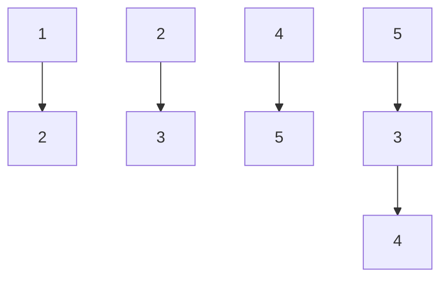
</details>

Let $\lambda_1, \lambda_2, \lambda_3, \lambda_4$ , and $\lambda_5$ be the five eigenvalues of $A$ . Note that these eigenvalues need not be distinct.

The value of $\lambda_{1}+\lambda_{2}+\lambda_{3}+\lambda_{4}+\lambda_{5}=$ \_\_\_\_

gatecse-2023 linear-algebra eigen-value numerical-answers one-mark

# Answer key

# 6.3.25 Eigen Value: GATE CSE 2024 | Set 1 | Question: 2

The product of all eigenvalues of the matrix $\begin{bmatrix}1 & 2 & 3 \\ 4 & 5 & 6 \\ 7 & 8 & 9\end{bmatrix}$ is

A. -1

B. 0

C. 1

D. 2

gatecse-2024-set1 linear-algebra eigen-value one-mark

# Answer key

# 6.3.26 Eigen Value: GATE CSE 2025 | Set 1 | Question: 31

Let $A$ be a $2 \times 2$ matrix as given.


$$
A = \left[ \begin{array}{c c} 1 & 1 \\ 1 & - 1 \end{array} \right]
$$

What are the eigenvalues of the matrix $A^{13}$ ?

A. 1, -1

B. $2\sqrt{2}, - 2\sqrt{2}$

C. $4\sqrt{2}, - 4\sqrt{2}$

D. $64\sqrt{2}, - 64\sqrt{2}$

gatecse2025-set1 linear-algebra matrix eigen-value easy two-marks

# Answer key

# 6.3.27 Eigen Value: GATE DA 2025 | Question: 18

Let $A = I_{n} + xx^{\top}$ , where $I_{n}$ is the $n \times n$ identity matrix and $x \in \mathbb{R}^{n}, x^{\top}x = 1$ . Which of the following options is/are correct?

A. Rank of $A$ is $n$

B. $A$ is invertible

C. 0 is an eigenvalue of $A$

D. $A^{-1}$ has a negative eigenvalue

gateda-2025 linear-algebra matrix eigen-value multiple-selects one-mark

# Answer key

# 6.3.28 Eigen Value: GATE DA 2026 | Question: 36

Let $\gamma_{1},\gamma_{2},\gamma_{3}$ be the eigenvalues of the matrix $\left[ \begin{array}{ccc}1 & 0 & 0\\ 0 & \cos t & \sin t\\ 0 & -\sin t & \cos t \end{array} \right],$ where $t\in [-\pi ,\pi ]$ is in radians.

Which one of the following options lists all the possible values of $t$ satisfying $\gamma_1 + \gamma_2 + \gamma_3 = 1 + \sqrt{2}$ ?

A. $\left\{\frac{\pi}{3}, -\frac{\pi}{4}\right\}$ C. $\left\{\frac{\pi}{4}, -\frac{\pi}{4}\right\}$

B. $\left\{\frac{\pi}{4}, -\frac{\pi}{3}\right\}$ D. $\left\{\frac{\pi}{3}, -\frac{\pi}{3}\right\}$

gateda-2026 linear-algebra matrix eigen-value two-marks

# Answer key

# 6.3.29 Eigen Value: GATE DA 2026 | Question: 55

Let $A = \left( I_n - \frac{1}{n} \mathbf{1} \mathbf{1}^T \right)$ be a matrix, where $\mathbf{1} = (1, 1, 1, \ldots, 1)^T \in \mathbb{R}^n$ and $I_n$ is the identity matrix of order $n$ .

The value of $\max_S x^T Ax$ , where $S = \{x \in \mathbb{R}^n \mid x^T x = 1\}$ , is \_\_\_\_. (Answer in integer)

gateda-2026 linear-algebra eigen-value numerical-answers two-marks

# Answer key

# 6.3.30 Eigen Value: GATE DS&AI 2024 | Question: 3

Consider the matrix $M = \begin{bmatrix} 2 & -1 \\ 3 & 1 \end{bmatrix}$ .

Which ONE of the following statements is TRUE?

A. The eigenvalues of M are non-negative and real.  
B. The eigenvalues of M are complex conjugate pairs.  
C. One eigenvalue of $M$ is positive and real, and another eigenvalue of $M$ is zero.  
D. One eigenvalue of $M$ is non-negative and real, and another eigenvalue of $M$ is negative and real.

gate-ds-ai-2024 eigen-value linear-algebra one-mark

# Answer key


# 6.3.31 Eigen Value: GATE Data Science and Artificial Intelligence 2024 | Sample Paper | Question: 17


For matrix $H = \begin{bmatrix} 9 & -2 \\ -2 & 6 \end{bmatrix}$ , one of the eigenvalues is 5. Then, the other eigenvalue is

A. 12

B. 10

C. 8

D. 6

gateda-sample-paper-2024 linear-algebra eigen-value easy

# Answer key

# 6.3.32 Eigen Value: GATE IT 2006 | Question: 26

What are the eigenvalues of the matrix P given below

$$
P = \left( \begin{array}{c c c} a & 1 & 0 \\ 1 & a & 1 \\ 0 & 1 & a \end{array} \right)
$$

A. $a, a - \sqrt{2}, a + \sqrt{2}$

B. $a, a, a$

C. $0, a, 2a$

D. $-a, 2a, 2a$

gateit-2006 linear-algebra eigen-value normal

# Answer key

# 6.3.33 Eigen Value: GATE IT 2007 | Question: 2


Let $A$ be the matrix $\begin{bmatrix} 3 & 1 \\ 1 & 2 \end{bmatrix}$ . What is the maximum value of $x^T Ax$ where the maximum is taken over all $x$ that are the unit eigenvectors of $A$ ?

A. 5

B. $\frac{(5+\sqrt{5})}{2}$

C. 3

D. $\frac{(5-\sqrt{5})}{2}$

gateit-2007 linear-algebra eigen-value normal

# Answer key

# 6.4

# Gaussian Elimination (1)

# 6.4.1 Gaussian Elimination: GATE DA 2025 | Question: 2


The number of additions and multiplications involved in performing Gaussian elimination on any $n \times n$ upper triangular matrix is of the order

A. $O(n)$

B. $O(n^{2})$

C. $O(n^{3})$

D. $O(n^{4})$

gateda-2025 linear-algebra matrix gaussian-elimination one-mark

# Answer key

# 6.5

# Lu Decomposition (3)

# 6.5.1 Lu Decomposition: GATE CSE 2015 | Set 1 | Question: 18


In the LU decomposition of the matrix $\begin{bmatrix}2&2\\ 4&9\end{bmatrix}$ , if the diagonal elements of U are both 1, then the lower diagonal entry $l_{22}$ of L is \_\_\_\_.

gatecse-2015-set1 linear-algebra lu-decomposition numerical-answers

# Answer key


Consider solving the following system of simultaneous equations using LU decomposition.

$$
x _ {1} + x _ {2} - 2 x _ {3} = 4
$$

$$
x _ {1} + 3 x _ {2} - x _ {3} = 7
$$

$$
2 x _ {1} + x _ {2} - 5 x _ {3} = 7
$$

where $L$ and $U$ are denoted as

$$
L = \left( \begin{array}{c c c} L _ {1 1} & 0 & 0 \\ L _ {2 1} & L _ {2 2} & 0 \\ L _ {3 1} & L _ {3 2} & L _ {3 3} \end{array} \right), U = \left( \begin{array}{c c c} U _ {1 1} & U _ {1 2} & U _ {1 3} \\ 0 & U _ {2 2} & U _ {2 3} \\ 0 & 0 & U _ {3 3} \end{array} \right)
$$

Which one of the following is the correct combination of values for $L_{32}$ , $U_{33}$ , and $x_{1}$ ?

A. $L_{32} = 2, U_{33} = -\frac{1}{2}, x_1 = -1$  
C. $L_{32} = -\frac{1}{2}, U_{33} = \bar{2}, x_1 = 0$

gatecse-2022 linear-algebra lu-decomposition matrix system-of-equations two-marks

B. $L_{32} = 2, U_{33} = 2, x_1 = -1$  
D. $L_{32} = -\frac{1}{2}, U_{33} = -\frac{1}{2}, x_1 = 0$

Answer key

# 6.5.3 Lu Decomposition: GATE CSE 2025 | Set 2 | Question: 34

Consider a system of linear equations $PX = Q$ where $P \in \mathbb{R}^{3 \times 3}$ and $\mathbf{Q} \in \mathbb{R}^{3 \times 1}$ . Suppose $P$ has an LU decomposition, $P = LU$ , where


$$
L = \left[ \begin{array}{c c c} 1 & 0 & 0 \\ l _ {2 1} & 1 & 0 \\ l _ {3 1} & l _ {3 2} & 1 \end{array} \right] \text {and} U = \left[ \begin{array}{c c c} u _ {1 1} & u _ {1 2} & u _ {1 3} \\ 0 & u _ {2 2} & u _ {2 3} \\ 0 & 0 & u _ {3 3} \end{array} \right].
$$

Which of the following statement(s) is/are TRUE?

A. The system $PX = Q$ can be solved by first solving $LY = Q$ and then $UX = Y$ .  
B. If $P$ is invertible, then both $L$ and $U$ are invertible.  
C. If $P$ is singular, then at least one of the diagonal elements of $U$ is zero.  
D. If P is symmetric, then both L and U are symmetric.

gatecse2025-set2 linear-algebra system-of-equations matrix lu-decomposition multiple-selects two-marks

Answer key

# 6.6

# Matrix (24)

Practice Tests: Test 1 (15Q) Test 2 (15Q) Test 3 (15Q)

# 6.6.1 Matrix: GATE CSE 1987 | Question: 1-xxiii

A square matrix is singular whenever

A. The rows are linearly independent  
C. The row are linearly dependent

gate1987 linear-algebra matrix

B. The columns are linearly independent  
D. None of the above

Answer key

# 6.6.2 Matrix: GATE CSE 1988 | Question: 16i

Assume that the matrix $A$ given below, has factorization of the form $LU = PA$ , where $L$ is lower-triangular with all diagonal elements equal to 1, $U$ is upper-triangular, and $P$ is a permutation matrix. For


$$
A = \left[ \begin{array}{c c c} 2 & 5 & 9 \\ 4 & 6 & 5 \\ 8 & 2 & 3 \end{array} \right]
$$

Compute L, U, and P using Gaussian elimination with partial pivoting.

gate1988 normal descriptive linear-algebra matrix

Answer key

# 6.6.3 Matrix: GATE CSE 1993 | Question: 02.7

If $A = \begin{pmatrix} 1 & 0 & 0 & 1 \\ 0 & -1 & 0 & -1 \\ 0 & 0 & i & i \\ 0 & 0 & 0 & -i \end{pmatrix}$ the matrix $A^4$ , calculated by the use of Cayley-Hamilton theorem or otherwise, is \_\_\_\_

gate1993 linear-algebra normal matrix fill-in-the-blanks

Answer key

# 6.6.4 Matrix: GATE CSE 1994 | Question: 1.2

Let $A$ and $B$ be real symmetric matrices of size $n \times n$ . Then which one of the following is true?

A. $AA' = I$

B. $A = A^{-1}$

C. $AB = BA$

D. $(AB)' = BA$

gate1994 linear-algebra normal matrix

Answer key

# 6.6.5 Matrix: GATE CSE 1994 | Question: 3.12

Find the inverse of the matrix $\begin{bmatrix} 1 & 0 & 1 \\ -1 & 1 & 1 \\ 0 & 1 & 0 \end{bmatrix}$

gate1994 linear-algebra matrix easy descriptive

Answer key

# 6.6.6 Matrix: GATE CSE 1996 | Question: 10

Let $A = \begin{bmatrix} a_{11} & a_{12} \\ a_{21} & a_{22} \end{bmatrix}$ and $B = \begin{bmatrix} b_{11} & b_{12} \\ b_{21} & b_{22} \end{bmatrix}$ be two matrices such that $AB = I$ . Let $C = A \begin{bmatrix} 1 & 0 \\ 1 & 1 \end{bmatrix}$ and $CD = I$ . Express the elements of $D$ in terms of the elements of $B$ .

gate1996 linear-algebra matrix normal descriptive

Answer key

# 6.6.7 Matrix: GATE CSE 1996 | Question: 2.6

The matrices $\begin{bmatrix}\cos\theta & -\sin\theta \\ \sin\theta & \cos\theta\end{bmatrix}$ and $\begin{bmatrix}a & 0 \\ 0 & b\end{bmatrix}$ commute under multiplication

A. if $a = b$ or $\theta = n\pi, n$ an integer

C. never

B. always

D. if $a\cos \theta = b\sin \theta$

gate1996 linear-algebra normal matrix


# 6.6.8 Matrix: GATE CSE 1997 | Question: 4.2


Let $A = (a_{ij})$ be an n-rowed square matrix and $I_{12}$ be the matrix obtained by interchanging the first and second rows of the n-rowed Identity matrix. Then $AI_{12}$ is such that its first

A. Row is the same as its second row

B. Row is the same as the second row of $A$

C. Column is the same as the second column of $A$

D. Row is all zero

gate1997 linear-algebra easy matrix

# Answer key

# 6.6.9 Matrix: GATE CSE 1998 | Question: 2.2


Consider the following determinant $\Delta = \left| \begin{array}{ccc}1 & a & bc\\ 1 & b & ca\\ 1 & c & ab \end{array} \right|$

Which of the following is a factor of $\Delta$ ?

A. $a + b$

B. a - b

C. $a + b + c$

D. abc

gate1998 linear-algebra matrix normal

# Answer key

# 6.6.10 Matrix: GATE CSE 2001 | Question: 1.1


Consider the following statements:

- S1: The sum of two singular $n \times n$ matrices may be non-singular  
- S2: The sum of two $n \times n$ non-singular matrices may be singular

Which one of the following statements is correct?

A. S1 and S2 both are true

B. $S1$ is true, $S2$ is false

C. $S1$ is false, $S2$ is true

D. S1 and S2 both are false

gatecse-2001 linear-algebra normal matrix

# Answer key

# 6.6.11 Matrix: GATE CSE 2004 | Question: 26


The number of different $n \times n$ symmetric matrices with each element being either 0 or 1 is: (Note: power $(2, X)$ is same as $2^{X}$ )

A. power $(2,n)$

B. power $(2, n^{2})$

C. power $\left(2, \frac{(n^2 + n)}{2}\right)$

D. power $\left(2, \frac{(n^2 - n)}{2}\right)$

gatecse-2004 linear-algebra normal matrix

# Answer key

# 6.6.12 Matrix: GATE CSE 2004 | Question: 27


Let $A, B, C, D$ be $n \times n$ matrices, each with non-zero determinant. If $ABCD = I$ , then $B^{-1}$ is

A. $D^{-1}C^{-1}A^{-1}$

B. CDA

C. ADC

D. Does not necessarily exist

gatecse-2004 linear-algebra normal matrix

# Answer key

# 6.6.13 Matrix: GATE CSE 2004 | Question: 76


In an $M \times N$ matrix all non-zero entries are covered in $a$ rows and $b$ columns. Then the maximum number of non-zero entries, such that no two are on the same row or column, is

A. $\leq a + b$

B. $\leq \max (a,b)$

C. $\leq \min (M - a, N - b)$

D. $\leq \min (a,b)$

gatecse-2004 linear-algebra normal matrix

# Answer key

# 6.6.14 Matrix: GATE CSE 2006 | Question: 23


F is an $n \times n$ real matrix. b is an $n \times 1$ real vector. Suppose there are two $n \times 1$ vectors, u and v such that, $u \neq v$ and Fu = b, Fv = b. Which one of the following statements is false?

A. Determinant of F is zero.  
B. There are an infinite number of solutions to Fx = b  
C. There is an $x \neq 0$ such that $Fx = 0$  
D. F must have two identical rows

gatecse-2006 linear-algebra normal matrix

# Answer key

# 6.6.15 Matrix: GATE CSE 2015 | Set 2 | Question: 27

Perform the following operations on the matrix $\begin{bmatrix}3 & 4 & 45 \\ 7 & 9 & 105 \\ 13 & 2 & 195\end{bmatrix}$

i. Add the third row to the second row  
ii. Subtract the third column from the first column.

The determinant of the resultant matrix is \_\_\_\_.

gatecse-2015-set2 linear-algebra matrix easy numerical-answers

# Answer key


# 6.6.16 Matrix: GATE CSE 2022 | Question: 10

Consider the following two statements with respect to the matrices $A_{m \times n}, B_{n \times m}, C_{n \times n}$ and $D_{n \times n}$ .

Statement 1: tr(AB) = tr(BA)

Statement 2: tr(CD) = tr(DC)

where $tr()$ represents the trace of a matrix. Which one of the following holds?

A. Statement 1 is correct and Statement 2 is wrong.  
B. Statement 1 is wrong and Statement 2 is correct.  
C. Both Statement 1 and Statement 2 are correct.  
D. Both Statement 1 and Statement 2 are wrong.

gatecse-2022 linear-algebra matrix one-mark

# Answer key


# 6.6.17 Matrix: GATE CSE 2025 | Set 2 | Question: 1

If $A = \begin{pmatrix} 1 & 2 \\ 2 & -1 \end{pmatrix}$ , then which ONE of the following is $A^8$ ?

A. $\begin{pmatrix}25&0\\0&25\end{pmatrix}$

B. $\begin{pmatrix}125&0\\0&125\end{pmatrix}$


C. $\begin{pmatrix}625&0\\0&625\end{pmatrix}$

gatecse2025-set2 linear-algebra matrix easy one-mark

D. $\begin{pmatrix}3125&0\\0&3125\end{pmatrix}$

Answer key

# 6.6.18 Matrix: GATE CSE 2026 | Set 1 | Question: 10

Let $n > 1$ . Consider an $n \times n$ matrix $M$ with its elements from $\mathbb{R}$ . Let the vector $(0,1,0,0,\ldots,0) \in \mathbb{R}^n$ be in the null space of $M$ .


Which of the following options is/are always correct?

A. Determinant of $M$ is 1  
B. Determinant of $M$ is 0  
C. Rank of M is 1  
D. There are at least two non-zero vectors in the null space of M

gatecse-2026-set1 linear-algebra matrix multiple-selects one-mark

Answer key

# 6.6.19 Matrix: GATE DA 2025 | Question: 27

Let $A \in R^{n \times n}$ be such that $A^3 = A$ . Which one of the following statements is ALWAYS correct?

A. $A$ is invertible  
C. The sum of the diagonal elements of $A$ is 1

B. Determinant of $A$ is 0  
D. $A$ and $A^2$ have the same rank

gateda-2025 linear-algebra matrix two-marks

Answer key

# 6.6.20 Matrix: GATE DA 2025 | Question: 42


An $n \times n$ matrix $A$ with real entries satisfies the property: $\|Ax\|^2 = \|x\|^2$ , for all $x \in \mathbb{R}^n$ , where $\|\cdot\|$ denotes the Euclidean norm. Which of the following statements is/are ALWAYS correct?

A. A must be orthogonal  
C. The eigenvalues of $A$ are either $+1$ or $-1$

B. $A = I$ , where $I$ denotes the identity matrix, is the only solution  
D. A has full rank

gateda-2025 linear-algebra matrix multiple-selects two-marks

Answer key

# 6.6.21 Matrix: GATE DA 2026 | Question: 11


Let $M = \begin{pmatrix} \cos \theta & -\sin \theta \\ \sin \theta & \cos \theta \end{pmatrix}$ be a $2 \times 2$ matrix, where $\theta = \frac{2\pi}{5}$ , and $I_2 = \begin{pmatrix} 1 & 0 \\ 0 & 1 \end{pmatrix}$ .

Which of the following options is equal to $M^{2026}$ ?

A. $M^{2}$

B. $M$

C. $M^{-1}$

D. $I_{2}$

gateda-2026 linear-algebra matrix one-mark

Answer key

# 6.6.22 Matrix: GATE DA 2026 | Question: 42


Let $M = \left( I_n - \frac{1}{n} \mathbf{1} \mathbf{1}^T \right)$ be a matrix, where $\mathbf{1} = (1, 1, 1, \ldots, 1)^T \in \mathbb{R}^n$ and $I_n$ is the identity matrix of order $n$ .

Which of the following options is/are correct?

A. $M^T = M$  
C. Trace(M) = n

B. $M^2 = I_n$  
D. $M$ is a projection matrix


# Answer key

# 6.6.23 Matrix: GATE IT 2004 | Question: 36

If matrix $X = \begin{bmatrix} a & 1 \\ -a^2 + a - 1 & 1 - a \end{bmatrix}$ and $X^2 - X + I = O$ (I is the identity matrix and O is the zero matrix), then the inverse of $X$ is


A. $\begin{bmatrix} 1 - a & -1 \\ a^2 & a \end{bmatrix}$ C. $\begin{bmatrix} -a & 1 \\ -a^2 + a - 1 & 1 - a \end{bmatrix}$

gateit-2004 linear-algebra matrix normal

B. $\begin{bmatrix}1-a&-1\\ a^{2}-a+1&a\end{bmatrix}$ D. $\begin{bmatrix}a^{2}-a+1&a\\ 1&1-a\end{bmatrix}$

# Answer key

# 6.6.24 Matrix: GATE IT 2008 | Question: 29

If $M$ is a square matrix with a zero determinant, which of the following assertion (s) is (are) correct?

S1: Each row of M can be represented as a linear combination of the other rows  
S2: Each column of M can be represented as a linear combination of the other columns  
S3: MX = 0 has a nontrivial solution  
S4: M has an inverse

A. $S3$ and $S2$

B. $S1$ and $S4$

C. $S1$ and $S3$

D. $S1, S2$ and $S3$

gateit-2008 linear-algebra normal matrix

# Answer key

# 6.7

# Multiplicity (1)

# 6.7.1 Multiplicity: GATE CSE 2026 | Set 1 | Question: 3

For $n > 1$ , the maximum multiplicity of any eigenvalue of an $n \times n$ matrix with elements from $\mathbb{R}$ is


A. n

B. n - 1

C. 1

D. $n + 1$

gatecse-2026-set1 eigen-value multiplicity linear-algebra one-mark

# Answer key

# 6.8

# Orthonormality (2)

# 6.8.1 Orthonormality: GATE DA 2025 | Question: 15

Which of the following statements is/are correct?


A. $\mathbb{R}^n$ has a unique set of orthonormal basis vectors  
B. $\mathbb{R}^n$ does not have a unique set of orthonormal basis vectors  
C. Linearly independent vectors in $\mathbb{R}^n$ are orthonormal  
D. Orthonormal vectors $\mathbb{R}^n$ are linearly independent

gateda-2025 linear-algebra vector-space orthonormality multiple-selects one-mark

# Answer key

# 6.8.2 Orthonormality: GATE DA 2025 | Question: 40

Let $x_{1}, x_{2}, x_{3}, x_{4}, x_{5}$ be a system of orthonormal vectors in $\mathbb{R}^{10}$ . Consider the matrix $A = x_{1}x_{1}^{\top} + \ldots + x_{5}x_{5}^{\top}$ . Which of the following statements is/are correct?


A. Singular values of A are also its eigenvalues

B. Singular values of $A$ are either 0 or 1


# 6.9

# Rank of Matrix (7)

Practice Tests: Test 1 (15Q) Test 2 (6Q)

# 6.9.1 Rank of Matrix: GATE CSE 1994 | Question: 1.9

The rank of matrix $\begin{bmatrix}0&0&-3\\ 9&3&5\\ 3&1&1\end{bmatrix}$ is:

A. 0

B. 1

C. 2

D. 3

gate1994 linear-algebra matrix rank-of-matrix easy

Answer key

# 6.9.2 Rank of Matrix: GATE CSE 1995 | Question: 1.24

The rank of the following $(n + 1) \times (n + 1)$ matrix, where $a$ is a real number is

$$
\left[ \begin{array}{c c c c c} 1 & a & a ^ {2} & \ldots & a ^ {n} \\ 1 & a & a ^ {2} & \ldots & a ^ {n} \\ \vdots & \vdots & \vdots & & \vdots \\ \vdots & \vdots & \vdots & & \vdots \\ 1 & a & a ^ {2} & \ldots & a ^ {n} \end{array} \right]
$$

A. 1

B. 2

C. n

D. Depends on the value of $a$

gate1995 linear-algebra matrix normal rank-of-matrix

Answer key

# 6.9.3 Rank of Matrix: GATE CSE 1998 | Question: 2.1

The rank of the matrix given below is:

$$
\left[ \begin{array}{c c c c} 1 & 4 & 8 & 7 \\ 0 & 0 & 3 & 0 \\ 4 & 2 & 3 & 1 \\ 3 & 1 2 & 2 4 & 2 1 \end{array} \right]
$$

A. 3

B. 1

C. 2

D. 4

gate1998 linear-algebra matrix normal rank-of-matrix

Answer key

# 6.9.4 Rank of Matrix: GATE CSE 2002 | Question: 1.1

The rank of the matrix $\begin{bmatrix}1 & 1 \\ 0 & 0\end{bmatrix}$ is

A. 4

B. 2

C. 1

D. 0

gatecse-2002 linear-algebra easy rank-of-matrix

Answer key


# 6.9.5 Rank of Matrix: GATE CSE 2017 | Set 2 | Question: 22


$$
\text {Let} P = \left[ \begin{array}{c c c} 1 & 1 & - 1 \\ 2 & - 3 & 4 \\ 3 & - 2 & 3 \end{array} \right] \text {and} Q = \left[ \begin{array}{c c c} - 1 & - 2 & - 1 \\ 6 & 1 2 & 6 \\ 5 & 1 0 & 5 \end{array} \right] \text {be two matrices}.
$$

Then the rank of $P + Q$ is \_\_\_\_.

gatecse-2017-set2 linear-algebra rank-of-matrix numerical-answers

Answer key

# 6.9.6 Rank of Matrix: GATE CSE 2020 | Question: 27

Let $A$ and $B$ be two $n \times n$ matrices over real numbers. Let $\text{rank}(M)$ and $\det(M)$ denote the rank and determinant of a matrix $M$ , respectively. Consider the following statements.


1. $\mathrm{rank}(AB) = \mathrm{rank}(A)\mathrm{rank}(B)$  
II. $\det (AB) = \det (A)\det (B)$  
III. $\operatorname{rank}(A + B) \leq \operatorname{rank}(A) + \operatorname{rank}(B)$  
IV. $\det(A + B) \leq \det(A) + \det(B)$

Which of the above statements are TRUE?

A. I and II only

B. I and IV only

C. II and III only

D. III and IV only

gatecse-2020

linear-algebra

matrix

two-marks

rank-of-matrix

Answer key

# 6.9.7 Rank of Matrix: GATE CSE 2021 | Set 2 | Question: 24

Suppose that $P$ is a $4 \times 5$ matrix such that every solution of the equation $\mathrm{Px} = 0$ is a scalar multiple of $[2 \quad 5 \quad 4 \quad 3 \quad 1]^T$ . The rank of $P$ is \_\_\_\_


gatecse-2021-set2 numerical-answers linear-algebra matrix rank-of-matrix one-mark

Answer key

# 6.10

# Singular Value Decomposition (1)

Practice Test: Test 1 (5Q)

# 6.10.1 Singular Value Decomposition: GATE DS&AI 2024 | Question: 51


Let $\mathbf{u} = \begin{bmatrix} 1 \\ 2 \\ 3 \\ 4 \\ 5 \end{bmatrix}$ , and let $\sigma_1, \sigma_2, \sigma_3, \sigma_4, \sigma_5$ be the singular values of the matrix $\mathbf{M} = \mathbf{u}\mathbf{u}^{\mathrm{T}}$ (where $\mathbf{u}^{\mathrm{T}}$ is the

transpose of u). The value of $\sum_{i=1}^{5}\sigma_{i}$ is \_\_\_\_

gate-ds-ai-2024 linear-algebra singular-value-decomposition numerical-answers two-marks

Answer key

# 6.11

# Statistics (2)

Practice Test: Test 1 (12Q)

# 6.11.1 Statistics: GATE 2023 Stats Exam Q. 13

Consider the following statements.


(I) Let $A$ and $B$ be two $n \times n$ real matrices. If $B$ is invertible, then $\operatorname{rank}(BA) = \operatorname{rank}(A)$ .

(II) Let $A$ be an $n \times n$ real matrix. If $A^2\mathbf{x} = \mathbf{b}$ has a solution for every $\mathbf{b} \in \mathbb{R}^n$ , then $A\mathbf{x} = \mathbf{b}$ also has a solution for every $\mathbf{b} \in \mathbb{R}^n$ .

Which of the above statements is/are true?

A. & Only (I)

B. & Only (II)

C. & Both (I) and (II)

D. & Neither (I) nor (II)

gate-preparation linear-algebra statistics

Answer key

# 6.11.2 Statistics: GATE STATISTICS 2021 Q.13


Let $A$ be the $2 \times 2$ real matrix having eigenvalues 1 and -1, with corresponding eigenvectors $\begin{bmatrix} \frac{\sqrt{3}}{2} \\ \frac{1}{2} \end{bmatrix}$ and $\begin{bmatrix} \frac{-1}{2} \\ \frac{\sqrt{3}}{2} \end{bmatrix}$ , respectively. If $A^{2021} = \begin{bmatrix} a & b \\ c & d \end{bmatrix}$ , then $a + b + c + d$ equals \_\_\_\_ (round off to 2 decimal places).

statistics linear-algebra gate-preparation

Answer key

# 6.12

# Subspace (1)

# 6.12.1 Subspace: GATE DS&AI 2024 | Question: 37

Select all choices that are subspaces of $R^{3}$ .

Note: $\mathbb{R}$ denotes the set of real numbers.

A. $\left\{\mathbf{x} = \begin{bmatrix} x_1 \\ x_2 \\ x_3 \end{bmatrix} \in \mathbb{R}^3 : \mathbf{x} = \alpha \begin{bmatrix} 1 \\ 1 \\ 0 \end{bmatrix} + \beta \begin{bmatrix} 1 \\ 0 \\ 0 \end{bmatrix}, \alpha, \beta \in \mathbb{R} \right\}$  
B. $\left\{\mathbf{x} = \begin{bmatrix} x_1 \\ x_2 \\ x_3 \end{bmatrix} \in \mathbb{R}^3 : \mathbf{x} = \alpha^2 \begin{bmatrix} 1 \\ 2 \\ 0 \end{bmatrix} + \beta^2 \begin{bmatrix} 1 \\ 0 \\ 1 \end{bmatrix}, \alpha, \beta \in \mathbb{R} \right\}$  
C. $\left\{\mathbf{x} = \begin{bmatrix} x_1 \\ x_2 \\ x_3 \end{bmatrix} \in \mathbb{R}^3 : 5x_1 + 2x_3 = 0, 4x_1 - 2x_2 + 3x_3 = 0 \right\}$  
D. $\left\{\mathbf{x}=\begin{bmatrix}x_{1}\\x_{2}\\x_{3}\end{bmatrix}\in\mathbb{R}^{3}:5x_{1}+2x_{3}+4=0\right\}$

gate-ds-ai-2024 linear-algebra vector-space subspace multiple-selects two-marks

Answer key

# 6.13

# System of Equations (17)

Practice Tests:

Test 1 (15Q)

Test 2 (15Q)

Test 3 (7Q)


# 6.13.1 System of Equations: GATE CSE 1996 | Question: 1.7


Let Ax = b be a system of linear equations where A is an $m \times n$ matrix and b is a $m \times 1$ column vector and X is an $n \times 1$ column vector of unknowns. Which of the following is false?

A. The system has a solution if and only if, both $A$ and the augmented matrix $[Ab]$ have the same rank.  
B. If m < n and b is the zero vector, then the system has infinitely many solutions.  
C. If m = n and b is a non-zero vector, then the system has a unique solution.  
D. The system will have only a trivial solution when $m = n$ , $b$ is the zero vector and $\operatorname{rank}(A) = n$ .

gate1996 linear-algebra system-of-equations normal

# Answer key

# 6.13.2 System of Equations: GATE CSE 1998 | Question: 1.2

Consider the following set of equations

- $x + 2y = 5$  
- $4x + 8y = 12$  
- $3x + 6y + 3z = 15$

This set

A. has unique solution  
C. has finite number of solutions  
gate1998 linear-algebra system-of-equations easy

B. has no solution  
D. has infinite number of solutions

# Answer key

# 6.13.3 System of Equations: GATE CSE 1998 | Question: 9


Derive the expressions for the number of operations required to solve a system of linear equations in n unknowns using the Gaussian Elimination Method. Assume that one operation refers to a multiplication followed by an addition.

gate1998 linear-algebra system-of-equations descriptive

# Answer key

# 6.13.4 System of Equations: GATE CSE 2003 | Question: 41


Consider the following system of linear equations


$$
\left( \begin{array}{c c c} 2 & 1 & - 4 \\ 4 & 3 & - 1 2 \\ 1 & 2 & - 8 \end{array} \right) \left( \begin{array}{c} x \\ y \\ z \end{array} \right) = \left( \begin{array}{c} \alpha \\ 5 \\ 7 \end{array} \right)
$$

Notice that the second and the third columns of the coefficient matrix are linearly dependent. For how many values of $\alpha$ , does this system of equations have infinitely many solutions?

A. 0

B. 1

C. 2

D. 3

gatecse-2003 linear-algebra system-of-equations normal

# Answer key

# 6.13.5 System of Equations: GATE CSE 2004 | Question: 71

How many solutions does the following system of linear equations have?

- $-x + 5y = -1$  
- $x - y = 2$  
- $x + 3y = 3$

A. infinitely many

B. two distinct solutions


C. unique

D. none

gatecse-2004 linear-algebra system-of-equations normal

Answer key

# 6.13.6 System of Equations: GATE CSE 2005 | Question: 48

Consider the following system of linear equations :

$$
2 x _ {1} - x _ {2} + 3 x _ {3} = 1
$$

$$
3 x _ {1} + 2 x _ {2} + 5 x _ {3} = 2
$$

$$
- x _ {1} + 4 x _ {2} + x _ {3} = 3
$$

The system of equations has

A. no solution

C. more than one but a finite number of solutions

gatecse-2005 linear-algebra system-of-equations normal

B. a unique solution

D. an infinite number of solutions

Answer key

# 6.13.7 System of Equations: GATE CSE 2008 | Question: 3

The following system of equations

- $x_{1} + x_{2} + 2x_{3} = 1$  
- $x_{1} + 2x_{2} + 3x_{3} = 2$  
- $x_{1} + 4x_{2} + \alpha x_{3} = 4$

has a unique solution. The only possible value(s) for $\alpha$ is/are

A. 0

B. either 0 or 1

C. one of 0, 1, or -1

D. any real number

gatecse-2008 easy linear-algebra system-of-equations

Answer key

# 6.13.8 System of Equations: GATE CSE 2014 | Set 1 | Question: 4

Consider the following system of equations:

- $3x + 2y = 1$  
- $4x + 7z = 1$  
- $x + y + z = 3$  
- $x - 2y + 7z = 0$

The number of solutions for this system is \_\_\_\_

gatecse-2014-set1 linear-algebra system-of-equations numerical-answers normal

Answer key

# 6.13.9 System of Equations: GATE CSE 2015 | Set 3 | Question: 33

If the following system has non-trivial solution,

- $px + qy + rz = 0$  
- $qx + ry + pz = 0$  
- $rx + py + qz = 0,$

then which one of the following options is TRUE?

A. $p - q + r = 0$ or $p = q = -r$  
C. $p + q + r = 0$ or p = q = r

gatecse-2015-set3 linear-algebra system-of-equations normal

B. $p + q - r = 0$ or $p = -q = r$  
D. $p - q + r = 0$ or $p = -q = -r$


# 6.13.10 System of Equations: GATE CSE 2016 | Set 2 | Question: 04

Consider the systems, each consisting of m linear equations in n variables.


I. If $m < n$ , then all such systems have a solution.  
II. If $m > n$ , then none of these systems has a solution.  
III. If $m = n$ , then there exists a system which has a solution.

Which one of the following is CORRECT?

A. I, II and III are true.

C. Only III is true.

gatecse-2016-set2 linear-algebra system-of-equations normal

# Answer key

# 6.13.11 System of Equations: GATE CSE 2017 | Set 1 | Question: 3

Let $c_{1}\ldots c_{n}$ be scalars, not all zero, such that $\sum_{i=1}^{n}c_{i}a_{i}=0$ where $a_{i}$ are column vectors in $R^{n}$ .


Consider the set of linear equations

$$
A x = b
$$

where $A = [a_{1},\dots ,a_{n}]$ and $b = \sum_{i = 1}^{n}a_{i}$ . The set of equations has

A. a unique solution at $x = J_{n}$ where $J_{n}$ denotes a $n$ -dimensional vector of all 1.  
B. no solution  
C. infinitely many solutions  
D. finitely many solutions

gatecse-2017-set1 linear-algebra system-of-equations normal

# Answer key

# 6.13.12 System of Equations: GATE CSE 2024 | Set 1 | Question: 39


Let $A$ be any $n \times m$ matrix, where $m > n$ . Which of the following statements is/are TRUE about the system of linear equations $Ax = 0$ ?

A. There exist at least m - n linearly independent solutions to this system  
B. There exist $m - n$ linearly independent vectors such that every solution is a linear combination of these vectors  
C. There exists a non-zero solution in which at least $m - n$ variables are 0  
D. There exists a solution in which at least n variables are non-zero

gatecse-2024-set1 multiple-selects linear-algebra system-of-equations two-marks

# Answer key

# 6.13.13 System of Equations: GATE CSE 2025 | Set 1 | Question: 13


Consider the given system of linear equations for variables x and y, where k is a real-valued constant. Which of the following option(s) is/are CORRECT?

$$
\begin{array}{l} x + k y = 1 \\ k x + y = - 1 \\ \end{array}
$$

A. There is exactly one value of $k$ for which the above system of equations has no solution.  
B. There exist an infinite number of values of k for which the system of equations has no solution.  
C. There exists exactly one value of $k$ for which the system of equations has exactly one solution.  
D. There exists exactly one value of $k$ for which the system of equations has an infinite number of solutions.

# 6.13.14 System of Equations: GATE CSE 2026 | Set 2 | Question: 21

Consider the system of linear equations given below.

$$
a x + y = b
$$

$$
1 6 x + a y = 2 4
$$


Suppose the values of $a$ and $b$ are chosen such that the system of linear equations produce multiple solutions. Then the product of $a$ and $b$ is \_\_\_\_. (answer in integer)

gatecse-2026-set2 linear-algebra system-of-equations numerical-answers one-mark

# Answer key

# 6.13.15 System of Equations: GATE DA 2025 | Question: 3

The sum of the elements in each row of $A \in \mathbb{R}^{n \times n}$ is 1. If $B = A^3 - 2A^2 + A$ , which one of the following statements is correct (for $x \in \mathbb{R}^n$ )?


A. The equation Bx = 0 has no solution  
B. The equation Bx = 0 has exactly two solutions  
C. The equation $Bx = 0$ has infinitely many solutions  
D. The equation Bx = 0 has a unique solution

gateda-2025 linear-algebra system-of-equations one-mark

# Answer key

# 6.13.16 System of Equations: GATE DS&AI 2024 | Question: 38

Which of the following statements is/are TRUE?

Note: R denotes the set of real numbers.


A. There exist $\mathbf{M} \in \mathbb{R}^{3 \times 3}$ , $\mathbf{p} \in \mathbb{R}^3$ , and $\mathbf{q} \in \mathbb{R}^3$ such that $\mathbf{M} \mathbf{x} = \mathbf{p}$ has a unique solution and $\mathbf{M} \mathbf{x} = \mathbf{q}$ has infinite solutions.  
B. There exist $\mathbf{M} \in \mathbb{R}^{3 \times 3}$ , $\mathbf{p} \in \mathbb{R}^3$ , and $\mathbf{q} \in \mathbb{R}^3$ such that $\mathbf{M} \mathbf{x} = \mathbf{p}$ has no solutions and $\mathbf{M} \mathbf{x} = \mathbf{q}$ has infinite solutions.  
C. There exist $\mathbf{M} \in \mathbb{R}^{2 \times 3}$ , $\mathbf{p} \in \mathbb{R}^2$ , and $\mathbf{q} \in \mathbb{R}^2$ such that $\mathbf{M} \mathbf{x} = \mathbf{p}$ has a unique solution and $\mathbf{M} \mathbf{x} = \mathbf{q}$ has infinite solutions.  
D. There exist $\mathbf{M} \in \mathbb{R}^{3 \times 2}$ , $\mathbf{p} \in \mathbb{R}^3$ , and $\mathbf{q} \in \mathbb{R}^3$ such that $\mathbf{M}\mathbf{x} = \mathbf{p}$ has a unique solution and $\mathbf{M}\mathbf{x} = \mathbf{q}$ has no solutions.

linear-algebra system-of-equations gate-ds-ai-2024 multiple-selects two-marks

# Answer key

# 6.13.17 System of Equations: GATE IT 2004 | Question: 6

What values of x, y and z satisfy the following system of linear equations?


$$
\left[ \begin{array}{c c c} 1 & 2 & 3 \\ 1 & 3 & 4 \\ 2 & 2 & 3 \end{array} \right] \left[ \begin{array}{c} x \\ y \\ z \end{array} \right] = \left[ \begin{array}{c} 6 \\ 8 \\ 1 2 \end{array} \right]
$$

A. $x = 6, y = 3, z = 2$

B. $x = 12, y = 3, z = -4$

C. $x = 6, y = 6, z = -4$

D. $x = 12, y = -3, z = 0$

gateit-2004 linear-algebra system-of-equations easy

# Answer key

# 6.14.1 Vector Space: GATE CSE 1995 | Question: 2.13

A unit vector perpendicular to both the vectors $a = 2i - 3j + k$ and $b = i + j - 2k$ is:

A. $\frac{1}{\sqrt{3}} (i + j + k)$

B. $\frac{1}{3} (i + j - k)$

C. $\frac{1}{3} (i - j - k)$

D. $\frac{1}{\sqrt{3}}(i+j-k)$

gate1995 linear-algebra normal vector-space

Answer key

# 6.14.2 Vector Space: GATE CSE 2007 | Question: 27

Consider the set of (column) vectors defined by


$$
X = \left\{x \in R ^ {3} \mid x _ {1} + x _ {2} + x _ {3} = 0, \text {where} x ^ {T} = [ x _ {1}, x _ {2}, x _ {3} ] ^ {T} \right\}
$$

.Which of the following is TRUE?

A. $\left\{[1, -1, 0]^T, [1, 0, -1]^T\right\}$ is a basis for the subspace $X$ .  
B. $\left\{[1, -1, 0]^T, [1, 0, -1]^T\right\}$ is a linearly independent set, but it does not span $X$ and therefore is not a basis of $X$ .  
C. $X$ is not a subspace of $R^3$ .  
D. None of the above

gatecse-2007 linear-algebra normal vector-space

Answer key

# 6.14.3 Vector Space: GATE CSE 2014 | Set 3 | Question: 5

If $V_{1}$ and $V_{2}$ are 4-dimensional subspaces of a 6-dimensional vector space $V$ , then the smallest possible dimension of $V_{1} \cap V_{2}$ is \_\_\_\_.

gatecse-2014-set3 linear-algebra vector-space normal numerical-answers

Answer key

# 6.14.4 Vector Space: GATE CSE 2017 | Set 1 | Question: 30

Let $u$ and $v$ be two vectors in $\mathbf{R}^2$ whose Euclidean norms satisfy $\| u \| = 2 \| v \|$ . What is the value of $\alpha$ such that $w = u + \alpha v$ bisects the angle between $u$ and $v$ ?

A. 2

B. $\frac{1}{2}$

C. 1

D. $\frac{-1}{2}$

gatecse-2017-set1 linear-algebra normal vector-space

Answer key

# 6.14.5 Vector Space: GATE DA 2025 | Question: 28

Let $\{x_1, x_2, \ldots, x_n\}$ be a set of linearly independent vectors in $\mathbb{R}^n$ . Let the $(i, j)$ -th element of matrix $A \in \mathbb{R}^{n \times n}$ be given by $A_{ij} = x_i^\top x_j, 1 \leq i, j \leq n$ . Which one of the following statements is correct?

A. $A$ is invertible

B. 0 is a singular value of $A$

C. Determinant of $A$ is 0

D. $z^{\top}Az = 0$ for some non-zero $z\in \mathbb{R}^n$

gateda-2025 linear-algebra vector-space matrix two-marks

Answer key


Consider a set $S_{1} = \left\{x = (x_{1}, x_{2}, x_{3})^{T} \in \mathbb{R}^{3} \mid x^{T} x \leq 16 \right\}$ . Let $S_{2}$ be another set which is a subspace of $\mathbb{R}^{3}$ with dimension two.

Which of the following gives the area of $S_{1} \cap S_{2}$ ?

A. $16\pi$

B. $4\pi$

C. $4\pi^{2}$

D. $16\pi^{2}$

gateda-2026 linear-algebra vector-space one-mark

# Answer key

# 6.14.7 Vector Space: GATE DS&AI 2024 | Question: 39


Let $\mathbb{R}$ be the set of real numbers, $U$ be a subspace of $\mathbb{R}^3$ and $\mathbf{M} \in \mathbb{R}^{3 \times 3}$ be the matrix corresponding to the projection on to the subspace $U$ .

Which of the following statements is/are TRUE?

A. If $U$ is a 1-dimensional subspace of $\mathbb{R}^3$ , then the null space of $\mathbf{M}$ is a 1-dimensional subspace.  
B. If $U$ is a 2-dimensional subspace of $\mathbb{R}^3$ , then the null space of $M$ is a 1-dimensional subspace.  
C. $M^{2}=M$  
D. $M^{3}=M$

gate-ds-ai-2024 linear-algebra vector-space multiple-selects two-marks

# Answer key

Answer Keys

<table><tr><td>6.1.1</td><td>A</td></tr><tr><td>6.2.5</td><td>D</td></tr><tr><td>6.2.10</td><td>0</td></tr><tr><td>6.3.3</td><td>B</td></tr><tr><td>6.3.8</td><td>D</td></tr><tr><td>6.3.13</td><td>6</td></tr><tr><td>6.3.18</td><td>5</td></tr><tr><td>6.3.23</td><td>A;C;D</td></tr><tr><td>6.3.28</td><td>C</td></tr><tr><td>6.3.33</td><td>B</td></tr><tr><td>6.6.1</td><td>C</td></tr><tr><td>6.6.6</td><td>N/A</td></tr><tr><td>6.6.11</td><td>C</td></tr><tr><td>6.6.16</td><td>C</td></tr><tr><td>6.6.21</td><td>B</td></tr><tr><td>6.8.1</td><td>B;D</td></tr><tr><td>6.9.4</td><td>C</td></tr><tr><td>6.11.1</td><td>TBA</td></tr><tr><td>6.13.3</td><td>N/A</td></tr></table>

<table><tr><td>6.2.1</td><td>B</td></tr><tr><td>6.2.6</td><td>B</td></tr><tr><td>6.2.11</td><td>D</td></tr><tr><td>6.3.4</td><td>C</td></tr><tr><td>6.3.9</td><td>0</td></tr><tr><td>6.3.14</td><td>B</td></tr><tr><td>6.3.19</td><td>3</td></tr><tr><td>6.3.24</td><td>2</td></tr><tr><td>6.3.29</td><td>1:1</td></tr><tr><td>6.4.1</td><td>B</td></tr><tr><td>6.6.2</td><td>N/A</td></tr><tr><td>6.6.7</td><td>A</td></tr><tr><td>6.6.12</td><td>B</td></tr><tr><td>6.6.17</td><td>C</td></tr><tr><td>6.6.22</td><td>A;D</td></tr><tr><td>6.8.2</td><td>A;B</td></tr><tr><td>6.9.5</td><td>2</td></tr><tr><td>6.11.2</td><td>TBA</td></tr><tr><td>6.13.4</td><td>B</td></tr></table>

<table><tr><td>6.2.2</td><td>A</td></tr><tr><td>6.2.7</td><td>A;B</td></tr><tr><td>6.2.12</td><td>A</td></tr><tr><td>6.3.5</td><td>A</td></tr><tr><td>6.3.10</td><td>6</td></tr><tr><td>6.3.15</td><td>15</td></tr><tr><td>6.3.20</td><td>D</td></tr><tr><td>6.3.25</td><td>B</td></tr><tr><td>6.3.30</td><td>B</td></tr><tr><td>6.5.1</td><td>5</td></tr><tr><td>6.6.3</td><td>N/A</td></tr><tr><td>6.6.8</td><td>C</td></tr><tr><td>6.6.13</td><td>D</td></tr><tr><td>6.6.18</td><td>B;D</td></tr><tr><td>6.6.23</td><td>B</td></tr><tr><td>6.9.1</td><td>C</td></tr><tr><td>6.9.6</td><td>C</td></tr><tr><td>6.12.1</td><td>A;C</td></tr><tr><td>6.13.5</td><td>C</td></tr></table>

<table><tr><td>6.2.3</td><td>A</td></tr><tr><td>6.2.8</td><td>A</td></tr><tr><td>6.3.1</td><td>B;D</td></tr><tr><td>6.3.6</td><td>D</td></tr><tr><td>6.3.11</td><td>A</td></tr><tr><td>6.3.16</td><td>0.125</td></tr><tr><td>6.3.21</td><td>12</td></tr><tr><td>6.3.26</td><td>D</td></tr><tr><td>6.3.31</td><td>B</td></tr><tr><td>6.5.2</td><td>D</td></tr><tr><td>6.6.4</td><td>D</td></tr><tr><td>6.6.9</td><td>B</td></tr><tr><td>6.6.14</td><td>D</td></tr><tr><td>6.6.19</td><td>D</td></tr><tr><td>6.6.24</td><td>D</td></tr><tr><td>6.9.2</td><td>A</td></tr><tr><td>6.9.7</td><td>4:4</td></tr><tr><td>6.13.1</td><td>C</td></tr><tr><td>6.13.6</td><td>B</td></tr></table>

<table><tr><td>6.2.4</td><td>0</td></tr><tr><td>6.2.9</td><td>48:48</td></tr><tr><td>6.3.2</td><td>N/A</td></tr><tr><td>6.3.7</td><td>A</td></tr><tr><td>6.3.12</td><td>D</td></tr><tr><td>6.3.17</td><td>B</td></tr><tr><td>6.3.22</td><td>3 : 3</td></tr><tr><td>6.3.27</td><td>A;B</td></tr><tr><td>6.3.32</td><td>A</td></tr><tr><td>6.5.3</td><td>A;B;C</td></tr><tr><td>6.6.5</td><td>N/A</td></tr><tr><td>6.6.10</td><td>A</td></tr><tr><td>6.6.15</td><td>0</td></tr><tr><td>6.6.20</td><td>A;D</td></tr><tr><td>6.7.1</td><td>A</td></tr><tr><td>6.9.3</td><td>A</td></tr><tr><td>6.10.1</td><td>55</td></tr><tr><td>6.13.2</td><td>B</td></tr><tr><td>6.13.7</td><td>X</td></tr><tr><td>6.13.8</td><td>1</td></tr><tr><td>6.13.13</td><td>A;D</td></tr><tr><td>6.14.1</td><td>A</td></tr><tr><td>6.14.6</td><td>A</td></tr></table>

<table><tr><td>6.13.9</td><td>C</td></tr><tr><td>6.13.14</td><td>24:24</td></tr><tr><td>6.14.2</td><td>A</td></tr><tr><td>6.14.7</td><td>B;C;D</td></tr></table>

<table><tr><td>6.13.10</td><td>C</td></tr><tr><td>6.13.15</td><td>C</td></tr><tr><td>6.14.3</td><td>2</td></tr></table>

<table><tr><td>6.13.11</td><td>C</td></tr><tr><td>6.13.16</td><td>B;D</td></tr><tr><td>6.14.4</td><td>A</td></tr></table>

<table><tr><td>6.13.12</td><td>A</td></tr><tr><td>6.13.17</td><td>C</td></tr><tr><td>6.14.5</td><td>A</td></tr></table>

Syllabus: Random variables, Uniform, Normal, Exponential, Poisson and Binomial distributions. Mean, median, mode and standard deviation. Conditional probability and Bayes theorem

Mark Distribution in Previous GATE

<table><tr><td>Year</td><td>2026 - 1</td><td>2026 - 2</td><td>2025 - 1</td><td>2025 - 2</td><td>2024 - 1</td><td>2024 - 2</td><td>2023</td><td>2022</td><td>2021 - 1</td><td>2021 - 2</td><td>Minimum</td></tr><tr><td>1 Mark Count</td><td>1</td><td>1</td><td>1</td><td>0</td><td>2</td><td>1</td><td>0</td><td>0</td><td>1</td><td>1</td><td>0</td></tr><tr><td>2 Marks Count</td><td>1</td><td>1</td><td>1</td><td>2</td><td>1</td><td>1</td><td>1</td><td>0</td><td>2</td><td>2</td><td>0</td></tr><tr><td>Total Marks</td><td>3</td><td>3</td><td>3</td><td>4</td><td>4</td><td>3</td><td>2</td><td>0</td><td>5</td><td>5</td><td>0</td></tr></table>

Welcome to the "Engineering Mathematics: Probability" chapter, a cornerstone for any aspiring GATE Computer Science candidate. This subject delves into the mathematical framework for quantifying uncertainty, analyzing random phenomena, and making informed decisions in the face of incomplete information. For GATE CS, a solid understanding of probability is indispensable, as it forms the theoretical bedrock for crucial areas like algorithms (randomized algorithms, average-case analysis), data structures (hash tables, skip lists), machine learning (classification, regression, neural networks, Bayesian inference), artificial intelligence, networking (queueing theory, packet loss), and even operating systems (scheduling, resource allocation). Typically, probability questions constitute a significant portion of the Engineering Mathematics section, often contributing 3-5 marks directly, with concepts frequently integrated into 1-mark or 2-mark questions across other CS topics. Questions can range from direct formula application and conceptual understanding to problem-solving involving combinations of distributions and theorems, often requiring careful interpretation of scenarios.

# Topic-wise Key Concepts

# Bayes Theorem

Definition and Core Idea: Bayes' Theorem describes the probability of an event, based on prior knowledge of conditions that might be related to the event. It's a fundamental concept for updating beliefs or probabilities as new evidence becomes available, forming the basis of Bayesian inference.

# - Important Formulas, Theorems, and Results:

1. Bayes' Theorem: For two events A and B, where $P(B) > 0$ ,

$$
P (A | B) = \frac {P (B | A) P (A)}{P (B)}
$$

where $P(B)$ can be expanded using the law of total probability:

$$
P (B) = P (B | A) P (A) + P (B | A ^ {c}) P (A ^ {c})
$$

More generally, for a partition $A_{1}, A_{2}, \ldots, A_{n}$ of the sample space,

$$
P (A _ {i} | B) = \frac {P (B | A _ {i}) P (A _ {i})}{\sum_ {j = 1} ^ {n} P (B | A _ {j}) P (A _ {j})}
$$

# • Key Properties and Identities:

- Allows for the calculation of posterior probability $P(A|B)$ from prior probability $P(A)$ and likelihood $P(B|A)$ .  
- Crucial for diagnostic testing, spam filtering, and machine learning algorithms (e.g., Naive Bayes).

# • Common Pitfalls or Tricky Points:

- Confusing $P(A|B)$ with $P(B|A)$ .  
- Incorrectly calculating the denominator $P(B)$ by not considering all mutually exclusive and exhaustive cases.  
• Not identifying the correct prior probabilities $P(A_{i})$ and conditional probabilities $P(B|A_{i})$ .

# - Standard Problem-Solving Techniques or Shortcuts:

- Clearly define events $A$ and $B$ .  
- Break down the problem into identifying $P(A), P(B|A)$ , and $P(B|A^c)$ (or $P(B|A_i)$ ).  
- Use tree diagrams to visualize conditional probabilities and total probability.

# Bayesian Network

Definition and Core Idea: A Bayesian Network (BN) is a probabilistic graphical model that represents a set of random

variables and their conditional dependencies via a directed acyclic graph (DAG). Nodes represent random variables, and directed edges represent conditional dependencies, allowing for efficient representation and inference of joint probability distributions.

\- Important Formulas, Theorems, and Results:

1. Joint Probability Distribution: For a Bayesian Network with nodes $X_{1},\ldots ,X_{n}$ , the joint probability distribution is given by the product of the conditional probability distributions of each node given its parents:

$$
P (X _ {1}, \dots , X _ {n}) = \prod_ {i = 1} ^ {n} P (X _ {i} | \text {Parents} (X _ {i}))
$$

2. Conditional Independence: A node is conditionally independent of its non-descendants given its parents.

• Key Properties and Identities:

- Provides a compact representation of joint probability distributions, especially for many variables.  
• Facilitates inference (e.g., calculating $P(X|E)$ where E is evidence).  
- The graph structure explicitly shows the assumed conditional independencies.

• Common Pitfalls or Tricky Points:

- Misinterpreting the direction of edges or the meaning of conditional independence.  
- Incorrectly applying the chain rule for joint probability without respecting the network's structure.  
- Confusing marginal independence with conditional independence.

\- Standard Problem-Solving Techniques or Shortcuts:

- Identify parents for each node to write down the joint probability.  
- Use d-separation rules to determine conditional independencies graphically.  
- For inference, apply variable elimination or message passing algorithms (though GATE questions are usually simpler, focusing on structure and basic inference).

# Bernoulli Distribution

Definition and Core Idea: The Bernoulli distribution is a discrete probability distribution for a random variable that takes value 1 with probability p (success) and value 0 with probability 1 - p (failure). It models a single trial of an experiment with only two possible outcomes.

\- Important Formulas, Theorems, and Results:

1. Probability Mass Function (PMF): For a Bernoulli random variable X,

$$
P (X = x) = p ^ {x} (1 - p) ^ {1 - x} \quad \text { for } x \in \{0, 1 \}
$$

2. Mean (Expectation): $E[X] = p$

3. Variance: $\operatorname{Var}(X) = p(1 - p)$

• Key Properties and Identities:

- It's the simplest discrete distribution.  
- The sum of $n$ independent Bernoulli trials follows a Binomial distribution.

• Common Pitfalls or Tricky Points:

- Confusing Bernoulli with Binomial (Bernoulli is a single trial, Binomial is multiple trials).  
- Incorrectly identifying $p$ (probability of success).

\- Standard Problem-Solving Techniques or Shortcuts:

- Identify the "success" event and its probability $p$ .  
- Directly apply formulas for mean and variance.

# Binomial Distribution

Definition and Core Idea: The Binomial distribution models the number of successes in a fixed number of independent Bernoulli trials, each with the same probability of success p. It is a discrete probability distribution.

\- Important Formulas, Theorems, and Results:

1. Probability Mass Function (PMF): For $X \sim B(n, p)$ ,

$$
P (X = k) = \binom {n} {k} p ^ {k} (1 - p) ^ {n - k} \quad \text {for} k \in \{0, 1, \dots , n \}
$$

where $\binom{n}{k} = \frac{n!}{k!(n - k)!}$ is the binomial coefficient.

2. Mean (Expectation): $E[X] = np$  
3. Variance: $\operatorname{Var}(X) = np(1 - p)$  
4. Standard Deviation: $\sigma = \sqrt{np(1 - p)}$

• Key Properties and Identities:

- Sum of $n$ independent Bernoulli random variables.  
- Symmetric if $p = 0.5$ , skewed otherwise.  
- Approximated by Poisson distribution when $n$ is large and $p$ is small (and $np$ is moderate).  
- Approximated by Normal distribution when $n$ is large (and $np > 5$ , $n(1 - p) > 5$ ).

• Common Pitfalls or Tricky Points:

- Incorrectly identifying $n$ (number of trials) or $p$ (probability of success).  
- Miscalculating binomial coefficients.  
- Confusing "at least," "at most," "exactly" in problem statements (e.g., $P(X \geq k)$ vs. $P(X = k)$ ).

\- Standard Problem-Solving Techniques or Shortcuts:

- Identify if the problem involves a fixed number of independent trials with two outcomes.  
- Use the complement rule for "at least" or "at most" probabilities (e.g., $P(X \geq k) = 1 - P(X < k)$ ).  
- Memorize mean and variance formulas.

# Chi Square Distribution

Definition and Core Idea: The Chi-Square $(\chi^{2})$ distribution is a continuous probability distribution that arises in statistics, particularly in hypothesis testing and confidence interval estimation. It is the distribution of a sum of the squares of independent standard normal random variables.

\- Important Formulas, Theorems, and Results:

1. Definition: If $Z_{1}, Z_{2}, \ldots, Z_{k}$ are independent standard normal random variables (i.e., $Z_{i} \sim N(0,1)$ ), then the random variable $X = \sum_{i=1}^{k} Z_{i}^{2}$ follows a Chi-Square distribution with $k$ degrees of freedom, denoted $X \sim \chi^{2}(k)$ .  
2. Probability Density Function (PDF):

$$
f (x; k) = \frac {1}{2 ^ {k / 2} \Gamma (k / 2)} x ^ {(k / 2) - 1} e ^ {- x / 2} \quad \text { for } x > 0
$$

where $\Gamma$ is the Gamma function.

3. Mean (Expectation): $E[X] = k$  
4. Variance: $\operatorname{Var}(X) = 2\bar{k}$

• Key Properties and Identities:

- Skewed to the right, but becomes more symmetric as $k$ increases.  
- Used in goodness-of-fit tests, tests of independence, and for variance estimation.  
- The sum of independent chi-square random variables is also a chi-square random variable with degrees of freedom equal to the sum of their individual degrees of freedom.

• Common Pitfalls or Tricky Points:

- Incorrectly identifying the degrees of freedom $k$ .  
- Confusing the $Z_{i}^{2}$ definition with other squared terms.  
- GATE questions usually focus on its properties or its role in statistical tests rather than direct PDF calculations.

\- Standard Problem-Solving Techniques or Shortcuts:

- Understand that it's a sum of squared standard normal variables.  
- Memorize mean and variance in terms of degrees of freedom.  
- Recognize its application in hypothesis testing contexts (e.g., for categorical data).

# Conditional Probability

Definition and Core Idea: Conditional probability is the probability of an event occurring given that another event has already occurred. It quantifies how the probability of an event changes when new information is available.

\- Important Formulas, Theorems, and Results:

1. Definition: For two events $A$ and $B$ , with $P(B) > 0$ , the conditional probability of $A$ given $B$ is:

$$
P (A | B) = \frac {P (A \cap B)}{P (B)}
$$

2. Multiplication Rule of Probability:

$$
P (A \cap B) = P (A | B) P (B) = P (B | A) P (A)
$$

3. Law of Total Probability: If $A_{1}, A_{2}, \ldots, A_{n}$ form a partition of the sample space, then for any event B:

$$
P (B) = \sum_ {i = 1} ^ {n} P (B | A _ {i}) P (A _ {i})
$$

• Key Properties and Identities:

- If $A$ and $B$ are independent, $P(A|B) = P(A)$ .  
$\circ P(A|A) = 1.$  
$\circ P(A^{\dot{c}}|B) = 1 - P(A|B).$

• Common Pitfalls or Tricky Points:

- Incorrectly identifying $P(A \cap B)$ or $P(B)$ .  
- Confusing $P(A|B)$ with $P(B|A)$ or $P(A \cap B)$ .  
- Not recognizing when events are independent, which simplifies calculations.

\- Standard Problem-Solving Techniques or Shortcuts:

- Clearly define the events $A$ and $B$ .  
- Use Venn diagrams or tree diagrams to visualize the sample space and events.  
- Break down complex problems into simpler conditional probabilities.

# Continuous Distribution

Definition and Core Idea: A continuous probability distribution describes the probabilities of a random variable taking on values in a continuous range (e.g., real numbers). Unlike discrete distributions, the probability of a continuous random variable taking on any single exact value is zero.

\- Important Formulas, Theorems, and Results:

1. Probability Density Function (PDF): $f(x)$ such that $f(x) \geq 0$ for all $x$ , and $\int_{-\infty}^{\infty} f(x) dx = 1$ .  
2. Probability of an Interval: $P(a \leq X \leq b) = \int_{a}^{b} f(x) dx$ .  
3. Cumulative Distribution Function (CDF): $F(x) = P(X \leq x) = \int_{-\infty}^{x} f(t) dt$ .  
4. Relationship between PDF and CDF: $f(x) = \frac{d}{dx} F(x)$ (where $F(x)$ is differentiable).  
5. Mean (Expectation): $E[X] = \int_{-\infty}^{\infty} x f(x) dx$ .  
6. Variance: $\operatorname{Var}(X) = E[X^2] - (E[X])^2 = \int_{-\infty}^{\infty}(x - E[X])^2 f(x)dx$ .

• Key Properties and Identities:

$\circ P(X=x)=0$ for any specific value x.  
- The area under the PDF curve over its entire range is 1.  
- The CDF is non-decreasing and ranges from 0 to 1.

• Common Pitfalls or Tricky Points:

- Confusing PDF with PMF (for discrete distributions).  
- Incorrectly calculating integrals for probabilities, mean, or variance.  
- Forgetting that $P(a \leq X \leq b) = P(a < X < b)$ for continuous distributions.

\- Standard Problem-Solving Techniques or Shortcuts:

- Always check if the given function is a valid PDF (non-negative and integrates to 1).  
- Use integration for calculating probabilities and moments.  
- Understand the relationship between PDF and CDF.

# Expectation

Definition and Core Idea: The expectation (or expected value, mean) of a random variable is the weighted average of all possible values that the random variable can take, with the weights being their respective probabilities. It represents the "long-run average" or central tendency of the random variable.

\- Important Formulas, Theorems, and Results:

1. For Discrete Random Variable X:

$$
E [ X ] = \sum_ {x} x P (X = x)
$$

2. For Continuous Random Variable X:

$$
E [ X ] = \int_ {- \infty} ^ {\infty} x f (x) d x
$$

3. Expectation of a Function of a Random Variable $g(X)$ :

\- Discrete: $E[g(X)] = \sum_{x} g(x)P(X = x)$

\- Continuous: $E[g(X)] = \int_{-\infty}^{\infty} g(x)f(x)dx$

4. Linearity of Expectation: For any random variables X, Y and constants a, b:

$$
E [ a X + b Y ] = a E [ X ] + b E [ Y ]
$$

5. Expectation of Product (for Independent Variables): If $X$ and $Y$ are independent, then

$$
E [ X Y ] = E [ X ] E [ Y ].
$$

• Key Properties and Identities:

$\circ E[c] = c$ for a constant $c$ .  
$\circ E[\bar{X} - E[X]] = 0.$  
- Expectation is a linear operator.

• Common Pitfalls or Tricky Points:

- Confusing $E[X^2]$ with $(E[X])^2$ . They are generally not equal.  
- Applying $E[XY] = E[X]E[Y]$ when $X$ and $Y$ are not independent.  
- Incorrectly summing or integrating over the wrong range.

\- Standard Problem-Solving Techniques or Shortcuts:

- Identify whether the variable is discrete or continuous.  
- Use linearity of expectation extensively, as it holds even for dependent variables.  
- For complex functions, break them down using linearity.

# Exponential Distribution

Definition and Core Idea: The Exponential distribution is a continuous probability distribution that describes the time between events in a Poisson process, i.e., a process in which events occur continuously and independently at a constant average rate. It is memoryless, meaning the past duration does not affect future duration.

\- Important Formulas, Theorems, and Results:

1. Probability Density Function (PDF): For $X \sim \text{Exp}(\lambda)$ ,

$$
f (x; \lambda) = \lambda e ^ {- \lambda x} \quad \text { for } x \geq 0
$$

where $\lambda > 0$ is the rate parameter.

2. Cumulative Distribution Function (CDF):

$$
F (x; \lambda) = P (X \leq x) = 1 - e ^ {- \lambda x} \quad \text { for } x \geq 0
$$

3. Mean (Expectation): $E[X] = \frac{1}{\lambda}$  
4. Variance: $\operatorname{Var}(X) = \frac{1}{\lambda^2}$  
5. Memoryless Property: $P(X > s + t | X > s) = P(X > t)$ for any $s, t \geq 0$ .

• Key Properties and Identities:

- Models waiting times, lifetimes of components, etc.  
- Its rate parameter $\lambda$ is the inverse of the mean.  
- The only continuous distribution with the memoryless property.

• Common Pitfalls or Tricky Points:

- Confusing the rate parameter $\lambda$ with the mean $1 / \lambda$ .  
- Incorrectly applying the memoryless property or forgetting its implications.  
- Errors in integration for probabilities or moments if not using CDF.

\- Standard Problem-Solving Techniques or Shortcuts:

- Identify problems involving "time until" an event or "lifetime" with a constant rate.  
- Directly use CDF for $P(X \leq x)$ or $P(X > x)$ .  
- Apply the memoryless property to simplify conditional probability questions.

# Independent Events

Definition and Core Idea: Two events are independent if the occurrence of one does not affect the probability of the other occurring. Their probabilities multiply to give the probability of both occurring.

\- Important Formulas, Theorems, and Results:

1. Definition: Events A and B are independent if and only if:

$$
P (A \cap B) = P (A) P (B)
$$

2. Equivalent Conditions: If $P(B) > 0$ , then $A$ and $B$ are independent if and only if $P(A|B) = P(A)$ . Similarly, if $P(A) > 0$ , then $P(B|A) = P(B)$ .

3. Independence of Complements: If $A$ and $B$ are independent, then $A$ and $B^c$ , $A^c$ and $B$ , and $A^c$ and $B^c$ are also independent.

• Key Properties and Identities:

- Simplifies calculations involving joint probabilities.  
- Crucial assumption for many statistical models and distributions (e.g., Binomial, Poisson).

• Common Pitfalls or Tricky Points:

Confusing independent events with mutually exclusive events (disjoint events). Mutually exclusive events cannot be independent unless one has zero probability.  
- Assuming independence when it's not explicitly stated or logically implied.  
- Incorrectly applying the product rule for dependent events.

\- Standard Problem-Solving Techniques or Shortcuts:

- Always check the definition $P(A \cap B) = P(A)P(B)$ to verify independence.  
- If events are independent, use the simplified conditional probability $P(A|B) = P(A)$ .

# Normal Distribution

Definition and Core Idea: The Normal (or Gaussian) distribution is a symmetric, bell-shaped continuous probability distribution that is ubiquitous in natural and social sciences. It is characterized by its mean ( $\mu$ ) and standard deviation ( $\sigma$ ), and is central to the Central Limit Theorem.

\- Important Formulas, Theorems, and Results:

1. Probability Density Function (PDF): For $X \sim N(\mu, \sigma^{2})$ ,

$$
f (x; \mu , \sigma) = \frac {1}{\sigma \sqrt {2 \pi}} e ^ {- \frac {1}{2} \left(\frac {x - \mu}{\sigma}\right) ^ {2}} \quad \text {for} - \infty <   x <   \infty
$$

2. Mean (Expectation): $E[X] = \mu$  
3. Variance: $\operatorname{Var}(X) = \sigma^2$  
4. Standard Deviation: $\mathrm{SD}(X) = \sigma$  
5. Standard Normal Distribution: A normal distribution with $\mu = 0$ and $\sigma = 1$ , denoted $Z \sim N(0,1)$ .  
6. Standardization: If $X \sim N(\mu, \sigma^2)$ , then $Z = \frac{X - \mu}{\sigma} \sim N(0, 1)$ .  
7. Empirical Rule (68-95-99.7 Rule): Approximately 68% of data falls within $1\sigma$ of the mean, 95% within $2\sigma$ , and 99.7% within $3\sigma$ .

• Key Properties and Identities:

- Symmetric about its mean.  
- The mean, median, and mode are all equal to $\mu$ .  
- Sum of independent normal random variables is also normal.  
- Central Limit Theorem: The sum/average of a large number of independent and identically distributed random variables, regardless of their original distribution, tends towards a normal distribution.

• Common Pitfalls or Tricky Points:

- Not standardizing correctly before using Z-tables (if tables were provided, though GATE usually tests concepts).  
- Confusing variance $\sigma^2$ with standard deviation $\sigma$ .  
- Assuming normality when not justified, especially for small sample sizes.

\- Standard Problem-Solving Techniques or Shortcuts:

- Convert any normal variable to a standard normal variable using $Z = (X - \mu) / \sigma$ .  
- Use the symmetry of the normal distribution: $P(Z < -z) = P(Z > z)$ .  
- Apply the empirical rule for quick estimations.

# Poisson Distribution

Definition and Core Idea: The Poisson distribution is a discrete probability distribution that expresses the probability of a given number of events occurring in a fixed interval of time or space if these events occur with a known constant mean rate and independently of the time since the last event.

\- Important Formulas, Theorems, and Results:

1. Probability Mass Function (PMF): For $X \sim \text{Pois}(\lambda)$ ,

$$
P (X = k) = \frac {e ^ {- \lambda} \lambda^ {k}}{k !} \quad \text {for} k \in \{0, 1, 2, \dots \}
$$

where $\lambda > 0$ is the average rate of events in the interval.

2. Mean (Expectation): $E[X] = \lambda$  
3. Variance: $\operatorname{Var}(X) = \lambda$

• Key Properties and Identities:

- Models rare events.  
- The mean and variance are equal ( $\lambda$ ).  
- Can approximate the Binomial distribution when $n$ is large and $p$ is small, with $\lambda = np$ .  
- The sum of independent Poisson random variables is also a Poisson random variable (with rate parameter equal to the sum of individual rates).

• Common Pitfalls or Tricky Points:

- Incorrectly identifying $\lambda$ (the average rate for the specified interval). Ensure $\lambda$ is consistent with the time/space unit of the problem.  
- Miscalculating factorials or powers of $\lambda$ .  
- Confusing "at least," "at most," "exactly" in problem statements.

\- Standard Problem-Solving Techniques or Shortcuts:

- Identify problems involving counts of events over a fixed interval.  
- Use the complement rule for "at least" probabilities.  
- Remember that mean and variance are both $\lambda$ .

# Probability

Definition and Core Idea: Probability is a numerical measure of the likelihood of an event occurring. It is a value between 0 and 1, where 0 indicates impossibility and 1 indicates certainty. It forms the foundation for understanding randomness and uncertainty.

\- Important Formulas, Theorems, and Results:

1. Axioms of Probability:

- For any event $A, 0 \leq P(A) \leq 1$ .  
- $P(S) = 1$ where $S$ is the sample space.  
- For a sequence of mutually exclusive events $A_1, A_2, \ldots, P(\bigcup_{i=1}^{\infty} A_i) = \sum_{i=1}^{\infty} P(A_i)$ .

2. Complement Rule: $P(A^c) = 1 - P(A)$ .  
3. Addition Rule: $P(A \cup B) = P(A) + \dot{P}(B) - P(A \cap B)$ .  
4. For Mutually Exclusive Events: If $A \cap B = \emptyset$ , then $P(A \cup B) = P(A) + P(B)$ .

• Key Properties and Identities:

- Probabilities are non-negative.  
- The sum of probabilities of all possible outcomes is 1.  
- The probability of the impossible event is 0.

• Common Pitfalls or Tricky Points:

- Incorrectly identifying the sample space or events.  
- Misapplying the addition rule without accounting for overlaps.  
- Confusing "and" (∩) with "or" (∪).

\- Standard Problem-Solving Techniques or Shortcuts:

- Clearly define the sample space and events.  
- Use Venn diagrams for visualizing events and their intersections/unions.  
- For equally likely outcomes, $P(A) = \frac{\text{Number of outcomes in A}}{\text{Total number of outcomes}}$ .

# Probability Density Function (PDF)

Definition and Core Idea: The Probability Density Function (PDF), denoted $f(x)$ , is a function associated with continuous random variables. It describes the relative likelihood for the random variable to take on a given value. The area under the PDF curve over an interval gives the probability that the variable falls within that interval.

\- Important Formulas, Theorems, and Results:

1. Properties of a PDF:

- $f(x) \geq 0$ for all $x$ .  
$\int_{-\infty}^{\infty}f(x)dx = 1.$

2. Probability Calculation: $P(a \leq X \leq b) = \int_{a}^{b} f(x) dx$ .

3. Relationship with CDF: $f(x) = \frac{d}{dx} F(x)$ , where $F(x)$ is the Cumulative Distribution Function.

• Key Properties and Identities:

- The PDF itself does not give a probability; rather, its integral over an interval does.  
- For continuous variables, $P(X = x) = 0$ .

• Common Pitfalls or Tricky Points:

- Interpreting $f(x)$ as $P(X = x)$ . This is incorrect for continuous variables.  
- Forgetting to check if the PDF integrates to 1 over its entire domain.  
- Errors in integration limits or the function itself.

\- Standard Problem-Solving Techniques or Shortcuts:

- Always verify the two properties of a PDF.  
- Use integration to find probabilities over intervals.  
- If given a CDF, differentiate to find the PDF.

# Probability Distribution

Definition and Core Idea: A probability distribution is a mathematical function that describes all possible values and likelihoods that a random variable can take within a given range. It can be discrete (Probability Mass Function, PMF) or continuous (Probability Density Function, PDF).

\- Important Formulas, Theorems, and Results:

1. For Discrete Distributions (PMF $P(X = x)$ ):

- $0 \leq P(X = x) \leq 1$ for all $x$ .  
- $\sum_{x} P(X = x) = 1$ .

2. For Continuous Distributions (PDF $f(x)$ ):

- $f(x) \geq 0$ for all $x$ .  
$\int_{-\infty}^{\infty}f(x)dx = 1.$

3. Cumulative Distribution Function (CDF): $F(x) = P(X \leq x)$ .

- For discrete: $F(x) = \sum_{t \leq x} P(X = t)$ .  
- For continuous: $F(x) = \int_{-\infty}^{x} f(t) dt$ .

• Key Properties and Identities:

- Completely characterizes a random variable's behavior.  
。CDF is non-decreasing, $F(-\infty) = 0$ , $F(\infty) = 1$ .  
- Allows calculation of probabilities, expected values, and variances.

• Common Pitfalls or Tricky Points:

- Confusing PMF and PDF.  
- Incorrectly applying summation for continuous or integration for discrete.  
• Not understanding the difference between $P(X = x)$ and $P(X \leq x)$ .

\- Standard Problem-Solving Techniques or Shortcuts:

- Identify whether the random variable is discrete or continuous.  
- Use the appropriate function (PMF/PDF) and its properties to solve problems.  
- Understand the relationship between PMF/PDF and CDF.

# Random Variable

Definition and Core Idea: A random variable is a variable whose value is a numerical outcome of a random phenomenon. It is a function that maps outcomes from a sample space to real numbers. Random variables can be discrete (taking countable values) or continuous (taking values in an interval).

\- Important Formulas, Theorems, and Results:

1. Discrete Random Variable: Takes on a finite or countably infinite number of values (e.g., number of heads in coin flips).  
2. Continuous Random Variable: Takes on any value within a given interval (e.g., height, temperature).  
3. Probability Distribution: Each random variable has an associated probability distribution (PMF or PDF) that describes the probabilities of its possible values.

• Key Properties and Identities:

- Transforms qualitative outcomes into quantitative values.  
- Allows for mathematical analysis of random phenomena.  
- The sum, difference, product, or quotient of random variables is also a random variable.

# • Common Pitfalls or Tricky Points:

- Confusing the random variable itself with the values it can take.  
- Not correctly defining the sample space before defining the random variable.  
- Misidentifying whether a variable is discrete or continuous.

# - Standard Problem-Solving Techniques or Shortcuts:

- Clearly define the random variable and its possible values.  
- Determine if it's discrete or continuous to choose the correct probability distribution type.  
- Map real-world scenarios to appropriate random variable definitions.

# Square Invariant

Definition and Core Idea: While "Square Invariant" is not a standard term for a probability distribution or theorem, in the context of probability and statistics, it most likely refers to properties or transformations related to the square of a random variable, particularly in the calculation of moments or variance, or in the context of distributions like the Chi-Square distribution which involves sums of squared normal variables. It implies that certain properties hold true even after squaring the variable or that a transformation involving squaring preserves some characteristic.

# - Important Formulas, Theorems, and Results:

1. Second Moment: $E[X^2] = \sum x^2 P(X = x)$ (discrete) or $\int x^2 f(x) dx$ (continuous). This is a key "square" quantity.  
2. Variance Definition: $\operatorname{Var}(X) = E[(X - E[X])^2] = E[X^2] - (E[X])^2$ . This formula shows how $E[X^2]$ is used to calculate variance.  
3. Chi-Square Distribution: Defined as the sum of squares of independent standard normal random variables, $X = \sum_{i=1}^{k} Z_i^2 \sim \chi^2(k)$ . This is a direct application of squaring random variables.  
4. Properties of Variance: $\operatorname{Var}(aX) = a^2\operatorname{Var}(X)$ . This shows how scaling affects the variance (a square property).

# • Key Properties and Identities:

- $E[X^2]$ is always non-negative.  
- Variance measures the spread of a distribution in squared units.  
- The Chi-Square distribution is fundamental for statistical inference involving variances.

# • Common Pitfalls or Tricky Points:

- Confusing $E[X^2]$ with $(E[X])^2$ . They are distinct and generally not equal.  
- Incorrectly calculating $E[X^2]$ by not squaring the values before applying expectation.  
- Misinterpreting the degrees of freedom in Chi-Square related problems.

# - Standard Problem-Solving Techniques or Shortcuts:

- When calculating variance, always compute $E[X]$ and $E[X^2]$ separately.  
- Recognize that problems involving sums of squared normal variables point towards the Chi-Square distribution.  
- Remember that variance is always non-negative.

# Statistics

Definition and Core Idea: Statistics is the science of collecting, analyzing, interpreting, presenting, and organizing data. In the context of probability, statistics involves using data from a sample to make inferences about a larger population, often relying on probability distributions to quantify uncertainty.

# - Important Formulas, Theorems, and Results:

# 1. Measures of Central Tendency:

- Mean ( $\mu$ or $\bar{x}$ ): Average value.  
■ Median: Middle value when data is ordered.  
■ Mode: Most frequent value.

# 2. Measures of Dispersion:

- Variance ( $\sigma^2$ or $s^2$ ): Average of the squared differences from the mean.  
- Standard Deviation ( $\sigma$ or $s$ ): Square root of variance, in original units.  
- Range: Max value - Min value.

# 3. Sample vs. Population:

- Population Mean: $\mu = E[X]$  
- Sample Mean: $\bar{X} = \frac{1}{n} \sum_{i=1}^{n} X_i$

- Population Variance: $\sigma^2 = E[(X - \mu)^2]$  
- Sample Variance: $s^2 = \frac{1}{n-1} \sum_{i=1}^{n} (X_i - \bar{X})^2$ (unbiased estimator)

• Key Properties and Identities:

- Statistics provides tools to summarize and interpret data.  
- Probability distributions are models for the underlying data generation process.  
- Central Limit Theorem is a bridge between probability and statistics.

• Common Pitfalls or Tricky Points:

- Confusing population parameters $(\mu, \sigma^2)$ with sample statistics $(\bar{x}, s^2)$ .  
- Using $n$ instead of $n - 1$ in the denominator for sample variance (for unbiased estimation).  
- Misinterpreting the meaning of different measures (e.g., mean vs. median for skewed data).

\- Standard Problem-Solving Techniques or Shortcuts:

- Identify whether the problem refers to a population or a sample.  
- Know the definitions and formulas for common descriptive statistics.  
- Understand how probability distributions are used to model observed data.

# Uniform Distribution

Definition and Core Idea: The Uniform distribution is a continuous probability distribution where all values within a given interval $[a, b]$ are equally likely. It has a constant probability density over its support and zero elsewhere.

\- Important Formulas, Theorems, and Results:

1. Probability Density Function (PDF): For $X \sim U(a, b)$ ,

$$
f (x) = \left\{ \begin{array}{l l} \frac {1}{b - a} & \text {for} a \leq x \leq b \\ 0 & \text {otherwise} \end{array} \right.
$$

2. Cumulative Distribution Function (CDF):

$$
F (x) = \left\{ \begin{array}{l l} 0 & \text {for} x <   a \\ \frac {x - a}{b - a} & \text {for} a \leq x \leq b \\ 1 & \text {for} x > b \end{array} \right.
$$

3. Mean (Expectation): $E[X] = \frac{a + b}{2}$

4. Variance: $\operatorname{Var}(X) = \frac{(b - a)^2}{12}$

• Key Properties and Identities:

- All outcomes within the interval $[a, b]$ are equally probable.  
- Often used as a null hypothesis or a simple model when no other information is available.

• Common Pitfalls or Tricky Points:

- Incorrectly identifying the interval $[a, b]$ .  
- Errors in calculating probabilities for sub-intervals (e.g., $P(c \leq X \leq d) = \frac{d - c}{b - a}$ ).  
- Forgetting the constant $1/12$ in the variance formula.

\- Standard Problem-Solving Techniques or Shortcuts:

- Draw the PDF as a rectangle for visualization.  
- Probabilities are simply the ratio of the length of the sub-interval to the length of the total interval.  
- Memorize mean and variance formulas.

# Variance

Definition and Core Idea: Variance is a measure of the spread or dispersion of a set of data points around their mean. It quantifies how much the values of a random variable deviate from its expected value, on average. A higher variance indicates greater variability.

\- Important Formulas, Theorems, and Results:

1. Definition: $\operatorname{Var}(X) = E[(X - E[X])^2]$  
2. Computational Formula: $\operatorname{Var}(X) = E[X^2] - (E[X])^2$  
3. For Discrete Random Variable X:

$$
\mathrm{Var} (X) = \sum_ {x} (x - E [ X ]) ^ {2} P (X = x) = \sum_ {x} x ^ {2} P (X = x) - (E [ X ]) ^ {2}
$$

# 4. For Continuous Random Variable X:

$$
\mathrm{Var} (X) = \int_ {- \infty} ^ {\infty} (x - E [ X ]) ^ {2} f (x) d x = \int_ {- \infty} ^ {\infty} x ^ {2} f (x) d x - (E [ X ]) ^ {2}
$$

# 5. Properties of Variance:

- $\operatorname{Var}(c) = 0$ for a constant $c$ .  
- $\operatorname{Var}(aX) = a^2\operatorname{Var}(X)$ for a constant $a$ .  
- $\operatorname{Var}(X + c) = \operatorname{Var}(X)$ for a constant $c$ .  
- $\operatorname{Var}(aX + b) = a^2\operatorname{Var}(X)$ .  
- For independent random variables $X, Y: \operatorname{Var}(X + Y) = \operatorname{Var}(X) + \operatorname{Var}(Y)$ .  
- For independent random variables $X, Y$ : $\operatorname{Var}(X - Y) = \operatorname{Var}(X) + \operatorname{Var}(Y)$ .

# 6. Standard Deviation: $\mathrm{SD}(X) = \sqrt{\mathrm{Var}(X)}$ .

# • Key Properties and Identities:

- Variance is always non-negative.  
- It is expressed in squared units of the random variable.  
- It measures the average squared deviation from the mean.

# • Common Pitfalls or Tricky Points:

- Forgetting to square the deviations or the constant $a$ when applying properties.  
Assuming $\operatorname{Var}(X + Y) = \operatorname{Var}(X) + \operatorname{Var}(Y)$ when $X$ and $Y$ are not independent (this requires covariance terms).  
- Confusing variance with standard deviation.

# - Standard Problem-Solving Techniques or Shortcuts:

- Always use the computational formula $\operatorname{Var}(X) = E[X^2] - (E[X])^2$ as it's often easier.  
- Leverage the properties of variance to simplify calculations for linear transformations or sums of independent variables.  
- Calculate $E[X]$ first, then $E[X^2]$ .

# Quick Formula Reference

# - Basic Probability

- Addition Rule: $P(A \cup B) = P(A) + P(B) - P(A \cap B)$  
- Complement Rule: $P(A^c) = 1 - P(A)$

# • Conditional Probability

○ Definition: $P(A|B)=\frac{P(A\cap B)}{P(B)}$  
○ Multiplication Rule: $P(A \cap \dot{B}) = P(A|B)P(B)$  
- Law of Total Probability: $P(B) = \sum_{i=1}^{n} P(B|A_i)P(A_i)$

# - Independent Events

\- Condition: $P(A \cap B) = P(A)P(B)$ or $P(A|B) = P(A)$

# - Bayes Theorem

\- Formula: $P(A|B) = \frac{P(B|A)P(A)}{P(B)}$

# - Expectation (Mean)

- Discrete: $E[X] = \sum_{x} xP(X = x)$  
- Continuous: $E[X] = \int_{-\infty}^{\infty} x f(x) dx$  
○ Linearity: $E[aX + bY] = aE[X] + bE[Y]$

# - Variance

- Definition: $\operatorname{Var}(X) = E[(X - E[X])^2]$  
- Computational: $\operatorname{Var}(X) = E[X^2] - (E[X])^2$  
- Properties: $\operatorname{Var}(aX + b) = a^2\operatorname{Var}(X)$  
- For independent $X, Y: \operatorname{Var}(X \pm Y) = \operatorname{Var}(X) + \operatorname{Var}(Y)$  
- Standard Deviation: $\mathrm{SD}(X) = \sqrt{\mathrm{Var}(X)}$

# - Bernoulli Distribution ( $X \in \{0,1\}$ , $P(X = 1) = p$ )

$\circ$ PMF: $P(X = x) = p^{x}(1 - p)^{1 - x}$  
- Mean: $E[X] = p$  
- Variance: $\operatorname{Var}(X) = p(1 - p)$

# - Binomial Distribution ( $X \sim B(n, p)$ )

$\circ$ PMF: $P(X = k) = \binom{n}{k} p^k (1 - p)^{n - k}$  
- Mean: $E[X] = np$  
- Variance: $\operatorname{Var}(X) = np(1 - p)$

\- Poisson Distribution ( $X \sim \text{Pois}(\lambda)$ )

$\circ$ PMF: $P(X = k) = \frac{e^{-\lambda}\lambda^k}{k!}$  
○ Mean: $E[X] = \lambda$  
- Variance: $\operatorname{Var}(X) = \lambda$

\- Uniform Distribution $(X \sim U(a, b))$

$\circ$ PDF: $f(x) = \frac{1}{b - a}$ for $a \leq x \leq b$ , else 0  
$\circ$ Mean: $E[X] = \frac{a + b}{2}$  
- Variance: $\operatorname{Var}(X) = \frac{(b - a)^2}{12}$

\- Exponential Distribution ( $\bar{X} \sim \text{Exp}(\lambda)$ )

$\circ$ PDF: $f(x) = \lambda e^{-\lambda x}$ for $x \geq 0$ , else 0  
$\circ$ CDF: $F(x) = 1 - e^{-\lambda x}$ for $x\geq 0$  
$\circ$ Mean: $E[X] = \frac{1}{\lambda}$  
- Variance: $\operatorname{Var}(\hat{X}) = \frac{1}{\lambda^2}$  
○ Memoryless: $P(X > s + t | X > s) = P(X > t)$

\- Normal Distribution ( $X \sim N(\mu, \sigma^2)$ )

$\circ$ PDF: $f(x) = \frac{1}{\sigma\sqrt{2\pi}} e^{-\frac{1}{2}\left(\frac{x - \mu}{\sigma}\right)^2}$  
- Mean: $E[X] = \mu$  
- Variance: $\operatorname{Var}(X) = \sigma^2$  
- Standardization: $Z = \frac{X - \mu}{\sigma} \sim N(0,1)$

\- Chi-Square Distribution ( $X \sim \chi^2(k)$ )

- Definition: Sum of $k$ squared independent standard normal variables.  
- Mean: $E[X] = k$  
- Variance: $\operatorname{Var}(X) = 2k$

# Important Tips for GATE

1. Master the Fundamentals: Ensure a strong grasp of basic probability axioms, conditional probability, and independence. Many complex problems are built upon these foundational concepts. Don't rush through them.  
2. Understand Discrete vs. Continuous: Clearly distinguish between discrete and continuous random variables.  
Know when to use summation (PMF) versus integration (PDF), and remember that $P(X = x) = 0$ for continuous variables.  
3. Memorize Key Distribution Properties: For each distribution (Bernoulli, Binomial, Poisson, Uniform, Exponential, Normal, Chi-Square), memorize their PMF/PDF, mean, and variance. This saves crucial time in the exam.  
4. Practice Conditional Probability and Bayes' Theorem: These are frequently tested. Practice problems that require careful identification of events and application of the formulas, especially those involving multiple stages or diagnostic scenarios.  
5. Pay Attention to Keywords: Words like "at least," "at most," "exactly," "given that," "independent," and "without replacement" significantly alter problem interpretation and solution approach. Read questions carefully.  
6. Leverage Linearity of Expectation and Variance Properties: $E[aX + bY] = aE[X] + bE[Y]$ is powerful as it holds even for dependent variables. For variance, remember $\operatorname{Var}(aX + b) = a^2\operatorname{Var}(X)$ and $\operatorname{Var}(X \pm Y) = \operatorname{Var}(X) + \operatorname{Var}(Y)$ only for independent variables.  
7. Don't Confuse Mean and Variance Parameters: For Exponential distribution, $\lambda$ is the rate, mean is $1/\lambda$ . For Normal, $\mu$ is mean, $\sigma^{2}$ is variance (not $\sigma$ ). Small errors here are common pitfalls.  
8. Practice Problem Solving: The best way to prepare is to solve a wide variety of problems from previous GATE papers and standard textbooks. Focus on understanding the logic behind each step, not just getting the answer.

7.1

# Bayes Theorem (3)

# 7.1.1 Bayes Theorem: GATE CSE 2018 | Question: 44

Consider Guwahati, $(G)$ and Delhi $(D)$ whose temperatures can be classified as high $(H)$ , medium $(M)$ and low $(L)$ . Let $P(H_G)$ denote the probability that Guwahati has high temperature. Similarly, $P(M_G)$ and


$P(L_{G})$ denotes the probability of Guwahati having medium and low temperatures respectively. Similarly, we use $P(H_{D})$ , $P(M_{D})$ and $P(L_{D})$ for Delhi. The following table gives the conditional probabilities for Delhi's temperature given Guwahati's temperature.

<table><tr><td></td><td> $H_D$ </td><td> $M_D$ </td><td> $L_D$ </td></tr><tr><td> $H_G$ </td><td>0.40</td><td>0.48</td><td>0.12</td></tr><tr><td> $M_G$ </td><td>0.10</td><td>0.65</td><td>0.25</td></tr><tr><td> $L_G$ </td><td>0.01</td><td>0.50</td><td>0.49</td></tr></table>

Consider the first row in the table above. The first entry denotes that if Guwahati has high temperature $(H_{G})$ then the probability of Delhi also having a high temperature $(H_{D})$ is 0.40; i.e., $P(H_{D} \mid H_{G}) = 0.40$ . Similarly, the next two entries are $P(M_{D} \mid H_{G}) = 0.48$ and $P(L_{D} \mid H_{G}) = 0.12$ . Similarly for the other rows.

If it is known that $P(H_{G}) = 0.2$ , $P(M_{G}) = 0.5$ , and $P(L_{G}) = 0.3$ , then the probability (correct to two decimal places) that Guwahati has high temperature given that Delhi has high temperature is \_\_\_\_.

gatecse-2018 probability bayes-theorem conditional-probability numerical-answers two-marks

# Answer key

# 7.1.2 Bayes Theorem: GATE CSE 2021 | Set 1 | Question: 54


A sender (S) transmits a signal, which can be one of the two kinds: H and L with probabilities 0.1 and 0.9 respectively, to a receiver (R).

In the graph below, the weight of edge $(u,v)$ is the probability of receiving v when u is transmitted, where $u,v \in \{H,L\}$ . For example, the probability that the received signal is L given the transmitted signal was H, is 0.7.


<details>
<summary>flowchart</summary>

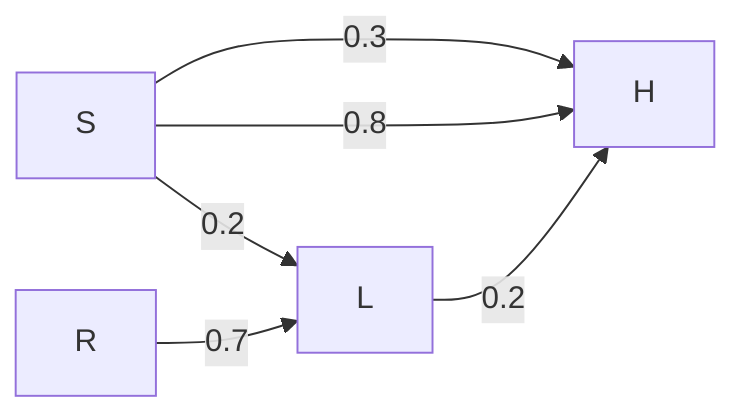
</details>

If the received signal is H, the probability that the transmitted signal was H (rounded to 2 decimal places) is \_\_\_\_.

gatecse-2021-set1 probability bayes-theorem conditional-probability numerical-answers two-marks

# Answer key

# 7.1.3 Bayes Theorem: GATE DA 2025 | Question: 21

There are three boxes containing white balls and black balls.


Box -1 contains 2 black and 1 white balls.

Box- 2 contains 1 black and 2 white balls.

Box -3 contains 3 black and 3 white balls.

In a random experiment, one of these boxes is selected, where the probability of choosing Box-1 is $\frac{1}{2}$ , Box-2 is $\frac{1}{6}$ , and Box-3 is $\frac{1}{3}$ . A ball is drawn at random from the selected box. Given that the ball drawn is white, the probability that it is drawn from Box-2 is \_\_\_\_ (Round off to two decimal places)

gateda-2025 probability bayes-theorem numerical-answers one-mark

# Answer key

# 7.2.1 Bayesian Network: GATE DS&AI 2024 | Question: 14

Consider five random variables $U, V, W, X$ , and $Y$ whose joint distribution satisfies:

$$
P (U, V, W, X, Y) = P (U) P (V) P (W \mid U, V) P (X \mid W) P (Y \mid W)
$$

Which ONE of the following statements is FALSE?

A. $Y$ is conditionally independent of $V$ given $W$  
B. $X$ is conditionally independent of $U$ given $W$  
C. $U$ and $V$ are conditionally independent given $W$  
D. $Y$ and $X$ are conditionally independent given $W$

gate-ds-ai-2024 probability random-variable bayesian-network one-mark

# Answer key

# 7.2.2 Bayesian Network: GATE DS&AI 2024 | Question: 54

Given the following Bayesian Network consisting of four Bernoulli random variables and the associated conditional probability tables:


<details>
<summary>flowchart</summary>

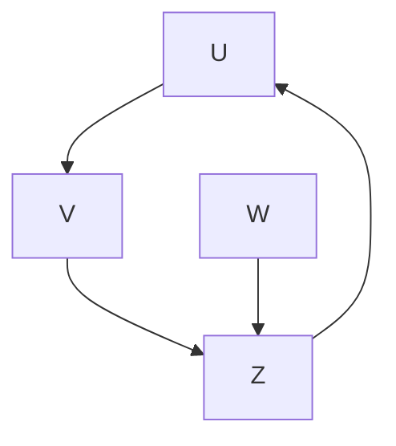
</details>

<table><tr><td></td><td> $P(\cdot)$ </td></tr><tr><td> $U = 0$ </td><td>0.5</td></tr><tr><td> $U = 1$ </td><td>0.5</td></tr></table>

<table><tr><td></td><td> $P(V=0 \mid \cdot)$ </td><td> $P(V=1 \mid \cdot)$ </td></tr><tr><td> $U=0$ </td><td>0.5</td><td>0.5</td></tr><tr><td> $U=1$ </td><td>0.5</td><td>0.5</td></tr></table>

<table><tr><td></td><td> $P(W=0 \mid \cdot)$ </td><td> $P(W=1 \mid \cdot)$ </td></tr><tr><td> $U=0$ </td><td>1</td><td>0</td></tr><tr><td> $U=1$ </td><td>0</td><td>1</td></tr></table>

<table><tr><td></td><td></td><td> $P(Z=0 \mid \cdot)$ </td><td> $P(Z=1 \mid \cdot)$ </td></tr><tr><td> $V=0$ </td><td> $W=0$ </td><td>0.5</td><td>0.5</td></tr><tr><td> $V=0$ </td><td> $W=1$ </td><td>1</td><td>0</td></tr><tr><td> $V=1$ </td><td> $W=0$ </td><td>1</td><td>0</td></tr><tr><td> $V=1$ </td><td> $W=1$ </td><td>0.5</td><td>0.5</td></tr></table>

The value of $P(U=1,V=1,W=1,Z=1)=$ \_\_\_\_ (rounded off to three decimal places).

gate-ds-ai-2024 probability bayesian-network numerical-answers two-marks

# Answer key

# 7.3

# Bernoulli Distribution (2)

# 7.3.1 Bernoulli Distribution: GATE DA 2025 | Question: 30

A random variable $X$ is said to be distributed as Bernoulli(θ), denoted by $X \sim \text{Bernoulli}(\theta)$ , if

$$
P (X = 1) = \theta , \quad P (X = 0) = 1 - \theta
$$


for $0 < \theta < 1$ . Let $Y = \sum_{i=1}^{300} X_i$ , where $X_i \sim \text{Bernoulli}(\theta)$ , $i = 1, 2, \ldots, 300$ be independent and identically distributed random variables with $\theta = 0.25$ . The value of $P(60 \leq Y \leq 90)$ , after approximation through Central Limit Theorem, is given by (Recall that $\phi(x) = \frac{1}{\sqrt{2\pi}} \int_{-\infty}^{x} e^{-\frac{t^2}{2}} dt$ )

A. $\phi(2) - \phi(-2)$

B. $\phi(1) - \phi(-1)$

C. $\phi(3)-\phi(-3)$

D. $\phi(90) - \phi(60)$

gateda-2025 probability random-variable bernoulli-distribution two-marks

# Answer key

# 7.3.2 Bernoulli Distribution: GATE DA 2026 | Question: 54

Let $A_{5 \times 5}$ be a matrix such that each of its elements follows Bernoulli(p = 0.50) distribution independently.


The probability that the row-sum of the second row and the column-sum of the third column are both equal to 3 is \_\_\_\_ (Rounded off to two decimal places)

gateda-2026 probability bernoulli-distribution numerical-answers two-marks

# Answer key

# 7.4

# Binomial Distribution (6)

# Practice Test: Test 1 (10Q)

# 7.4.1 Binomial Distribution: GATE CSE 2002 | Question: 2.16

Four fair coins are tossed simultaneously. The probability that at least one head and one tail turn up is


A. $\frac{1}{16}$

B. $\frac{1}{8}$

C. $\frac{7}{8}$

D. $\frac{15}{16}$

gatecse-2002 probability easy binomial-distribution

# Answer key

# 7.4.2 Binomial Distribution: GATE CSE 2005 | Question: 52


A random bit string of length n is constructed by tossing a fair coin n times and setting a bit to 0 or 1 depending on outcomes head and tail, respectively. The probability that two such randomly generated strings are not identical is:

A. $\frac{1}{2^{n}}$

B. $1 - \frac{1}{n}$

C. $\frac{1}{n!}$

D. $1 - \frac{1}{2^n}$

gatecse-2005 probability binomial-distribution easy

# Answer key

# 7.4.3 Binomial Distribution: GATE CSE 2006 | Question: 21


For each element in a set of size 2n, an unbiased coin is tossed. The 2n coin tosses are independent. An element is chosen if the corresponding coin toss was a head. The probability that exactly n elements are chosen is

A. $\frac{2^{n}C_{n}}{4^{n}}$

B. $\frac{2^{n}C_{n}}{2^{n}}$

C. $\frac{1}{2nC_{n}}$

D. $\frac{1}{2}$

gatecse-2006 probability binomial-distribution normal

# Answer key

# 7.4.4 Binomial Distribution: GATE IT 2005 | Question: 32


An unbiased coin is tossed repeatedly until the outcome of two successive tosses is the same. Assuming that the trials are independent, the expected number of tosses is

A. 3

B. 4

C. 5

D. 6

gateit-2005 probability binomial-distribution expectation normal

# Answer key

# 7.4.5 Binomial Distribution: GATE IT 2006 | Question: 22


When a coin is tossed, the probability of getting a Head is p, 0 < p < 1. Let N be the random variable denoting the number of tosses till the first Head appears, including the toss where the Head appears. Assuming that successive tosses are independent, the expected value of N is

A. $\frac{1}{p}$

B. $\frac{1}{(1-p)}$

C. $\frac{1}{p^{2}}$

D. $\frac{1}{(1-p^{2})}$

gateit-2006 probability binomial-distribution expectation normal

# Answer key

# 7.4.6 Binomial Distribution: GATE IT 2007 | Question: 1


Suppose there are two coins. The first coin gives heads with probability $\frac{5}{8}$ when tossed, while the second coin gives heads with probability $\frac{1}{4}$ . One of the two coins is picked up at random with equal probability and that what is the probability of obtaining heads?

A. $\left(\frac{7}{8}\right)$

B. $\left(\frac{1}{2}\right)$

C. $\left(\frac{7}{16}\right)$

D. $\left(\frac{5}{32}\right)$

gateit-2007 probability normal binomial-distribution

# Answer key

# 7.5

# Chi Square Distribution (1)

# 7.5.1 Chi Square Distribution: GATE DA 2026 | Question: 43

Let $X_{1}, X_{2}, \ldots, X_{n}$ be n independent random variables. Each of the random variables follows Normal $(\mu = 0, \sigma^{2} = 1)$ distribution. Define $X = \frac{1}{n} \sum_{i=1}^{n} X_{i}$ .

Which of the following statements is/are correct?

A. $\sum_{i=1}^{n} X_{i}^{2}$ follows Chi-square distribution with n degrees of freedom.  
B. $\sum_{i=1}^{n} (X_i - \bar{X})^2$ follows Chi-square distribution with $(n-1)$ degrees of freedom.  
C. $X_{1}^{2} + X_{n}^{2}$ follows exponential distribution with mean 2.  
D. $(\sqrt{n}X)^{2}$ follows Chi-square distribution with 2 degrees of freedom.

gateda-2026 random-variable normal-distribution chi-square-distribution multiple-selects two-marks

Answer key

7.6

# Conditional Probability (14)

Practice Tests: Test 1 (15Q) Test 2 (15Q) Test 3 (15Q)

# 7.6.1 Conditional Probability: GATE CSE 1994 | Question: 1.4, ISRO2017-2

Let A and B be any two arbitrary events, then, which one of the following is TRUE?

A. $P(A\cap B) = P(A)P(B)$  
C. $P(A \mid B) = P(A \cap B) P(B)$  
gate1994 probability conditional-probability normal isro2017

B. $P(A \cup B) = P(A) + P(B)$

D. $P(A \cup B) \leq P(A) + P(B)$

Answer key

# 7.6.2 Conditional Probability: GATE CSE 1994 | Question: 2.6

The probability of an event $B$ is $P_{1}$ . The probability that events $A$ and $B$ occur together is $P_{2}$ while the probability that $A$ and $\bar{B}$ occur together is $P_{3}$ . The probability of the event $A$ in terms of $P_{1}, P_{2}$ and $P_{3}$ is


gate1994 probability normal conditional-probability fill-in-the-blanks

Answer key

# 7.6.3 Conditional Probability: GATE CSE 2003 | Question: 3

Let $P(E)$ denote the probability of the event E. Given $P(A) = 1$ , $P(B) = \frac{1}{2}$ , the values of $P(A \mid B)$ and $P(B \mid A)$ respectively are

A. $\left(\frac{1}{4}\right),\left(\frac{1}{2}\right)$

B. $\left(\frac{1}{2}\right),\left(\frac{1}{4}\right)$

C. $\left(\frac{1}{2}\right),1$

D. $1, \left(\frac{1}{2}\right)$

gatecse-2003 probability easy conditional-probability

Answer key

# 7.6.4 Conditional Probability: GATE CSE 2005 | Question: 51

Box P has 2 red balls and 3 blue balls and box Q has 3 red balls and 1 blue ball. A ball is selected as follows: (i) select a box (ii) choose a ball from the selected box such that each ball in the box is equally likely

to be chosen. The probabilities of selecting boxes $P$ and $Q$ are $\frac{1}{3}$ and $\frac{2}{3}$ respectively. Given that a ball selected in the above process is a red ball, the probability that it came from the box $P$ is:

A. $\frac{4}{19}$

B. $\frac{5}{19}$

C. $\frac{2}{9}$

D. $\frac{19}{30}$

gatecse-2005 probability conditional-probability normal

Answer key

# 7.6.5 Conditional Probability: GATE CSE 2008 | Question: 27

Aishwarya studies either computer science or mathematics everyday. If she studies computer science on a day, then the probability that she studies mathematics the next day is 0.6. If she studies mathematics on a day, then the probability that she studies computer science the next day is 0.4. Given that Aishwarya studies computer science on Monday, what is the probability that she studies computer science on Wednesday?


A. 0.24

B. 0.36

C. 0.4

D. 0.6

gatecse-2008 probability normal conditional-probability

# Answer key

# 7.6.6 Conditional Probability: GATE CSE 2009 | Question: 21

An unbalanced dice (with 6 faces, numbered from 1 to 6) is thrown. The probability that the face value is odd is $90\%$ of the probability that the face value is even. The probability of getting any even numbered face is the same. If the probability that the face is even given that it is greater than 3 is 0.75, which one of the options is closest to the probability that the face value exceeds 3?


A. 0.453

B. 0.468

C. 0.485

D. 0.492

gatecse-2009 probability normal conditional-probability

# Answer key

# 7.6.7 Conditional Probability: GATE CSE 2011 | Question: 3

If two fair coins are flipped and at least one of the outcomes is known to be a head, what is the probability that both outcomes are heads?


A. $\left(\frac{1}{3}\right)$

B. $\left(\frac{1}{4}\right)$

C. $\left(\frac{1}{2}\right)$

D. $\left(\frac{2}{3}\right)$

gatecse-2011 probability easy conditional-probability

# Answer key

# 7.6.8 Conditional Probability: GATE CSE 2012 | Question: 33

Suppose a fair six-sided die is rolled once. If the value on the die is 1, 2, or 3, the die is rolled a second time. What is the probability that the sum total of values that turn up is at least 6?


A. $\frac{10}{21}$

B. $\frac{5}{12}$

C. $\frac{2}{3}$

D. $\frac{1}{6}$

gatecse-2012 probability conditional-probability normal

# Answer key

# 7.6.9 Conditional Probability: GATE CSE 2016 | Set 2 | Question: 05

Suppose that a shop has an equal number of LED bulbs of two different types. The probability of an LED bulb lasting more than 100 hours given that it is of Type 1 is 0.7, and given that it is of Type 2 is 0.4. The probability that an LED bulb chosen uniformly at random lasts more than 100 hours is \_\_\_\_.


gatecse-2016-set2 probability conditional-probability normal numerical-answers

# Answer key

# 7.6.10 Conditional Probability: GATE CSE 2017 | Set 2 | Question: 26

$P$ and $Q$ are considering to apply for a job. The probability that $P$ applies for the job is $\frac{1}{4}$ , the probability that $P$ applies for the job given that $Q$ applies for the job is $\frac{1}{2}$ , and the probability that $Q$ applies for the job given that $P$ applies for the job is $\frac{1}{3}$ . Then the probability that $P$ does not apply for the job given that $Q$ does not apply for this job is


A. $\left(\frac{4}{5}\right)$

B. $\left(\frac{5}{6}\right)$

C. $\left(\frac{7}{8}\right)$

D. $\left(\frac{11}{12}\right)$

gatecse-2017-set2 probability conditional-probability

# Answer key

# 7.6.11 Conditional Probability: GATE CSE 2024 | Set 1 | Question: 53


A bag contains 10 red balls and 15 blue balls. Two balls are drawn randomly without replacement. Given that the first ball drawn is red, the probability (rounded off to 3 decimal places) that both balls drawn are red is \_\_\_\_.

gatecse-2024-set1 numerical-answers probability conditional-probability two-marks

# Answer key

# 7.6.12 Conditional Probability: GATE CSE 2026 | Set 2 | Question: 53


Suppose an unbiased coin is tossed 6 times. Each coin toss is independent of all previous coin tosses. Let $E_{1}$ be the event that among the second, fourth, and sixth coin tosses, there are at least two heads. Let $E_{2}$ be the event that among the first, second, third, and fifth coin tosses, there are equal number of heads and tails.

The conditional probability $\mathrm{P}\left(E_1 \mid E_2\right)$ is equal to \_\_\_\_. (rounded off to one decimal place)

gatecse-2026-set2 conditional-probability numerical-answers two-marks

# Answer key

# 7.6.13 Conditional Probability: GATE DA 2026 | Question: 47


A clinic specializes in testing for a disease D. The result of the test can be either positive or negative.

A study revealed that if a person suffers from the disease D, the test result in that clinic comes out positive 80% of the time, and negative 20% of the time. If a person is not suffering from the disease D, the test comes out positive 10% of the time and negative 90% of the time. It is also known that among the general population, the disease D occurs in 30% of the individuals.

If a person tests positive for D in that clinic, the probability that he/she actually suffers from the disease D is \_\_\_\_. (Rounded off to two decimal places)

gateda-2026 probability conditional-probability numerical-answers two-marks

# Answer key

# 7.6.14 Conditional Probability: GATE IT 2006 | Question: 1


In a certain town, the probability that it will rain in the afternoon is known to be 0.6. Moreover, meteorological data indicates that if the temperature at noon is less than or equal to $25^{\circ}C$ , the probability that it will rain in the afternoon is 0.4. The temperature at noon is equally likely to be above $25^{\circ}C$ , or at/below $25^{\circ}C$ . What is the probability that it will rain in the afternoon on a day when the temperature at noon is above $25^{\circ}C$ ?

A. 0.4

B. 0.6

C. 0.8

D. 0.9

gateit-2006 probability normal conditional-probability

# Answer key

# 7.7

# Continuous Distribution (1)

# 7.7.1 Continuous Distribution: GATE CSE 2016 | Set 1 | Question: 04


A probability density function on the interval $[a, 1]$ is given by $1 / x^2$ and outside this interval the value of the function is zero. The value of $a$ is \_\_\_\_.

gatecse-2016-set1 probability normal numerical-answers continuous-distribution

# Answer key

# 7.8

# Expectation (15)

Practice Tests: Test 1 (15Q) Test 2 (15Q) Test 3 (3Q)

# 7.8.1 Expectation: GATE CSE 1999 | Question: 1.1


Suppose that the expectation of a random variable X is 5. Which of the following statements is true?

A. There is a sample point at which X has the value 5.  
B. There is a sample point at which X has value greater than 5.  
C. There is a sample point at which $X$ has a value greater than equal to 5.  
D. None of the above.

gate1999 probability expectation easy

# Answer key

# 7.8.2 Expectation: GATE CSE 2004 | Question: 74


An examination paper has 150 multiple choice questions of one mark each, with each question having four choices. Each incorrect answer fetches -0.25 marks. Suppose 1000 students choose all their answers randomly with uniform probability. The sum total of the expected marks obtained by all these students is

A. 0

B. 2550

C. 7525

D. 9375

gatecse-2004 probability expectation normal

# Answer key

# 7.8.3 Expectation: GATE CSE 2006 | Question: 18


We are given a set $X = \{X_1, \ldots, X_n\}$ where $X_i = 2^i$ . A sample $S \subseteq X$ is drawn by selecting each $X_i$ independently with probability $P_i = \frac{1}{2}$ . The expected value of the smallest number in sample $S$ is:

A. $\left(\frac{1}{n}\right)$

B. 2

C. $\sqrt{n}$

D. n

gatecse-2006 probability expectation normal

# Answer key

# 7.8.4 Expectation: GATE CSE 2011 | Question: 18


If the difference between the expectation of the square of a random variable $\left(E\left[X^{2}\right]\right)$ and the square of the expectation of the random variable $\left(E\left[X\right]\right)^{2}$ is denoted by R, then

A. R = 0

B. R < 0

C. $R \geq 0$

D. R > 0

gatecse-2011 probability random-variable expectation normal

# Answer key

# 7.8.5 Expectation: GATE CSE 2013 | Question: 24


Consider an undirected random graph of eight vertices. The probability that there is an edge between a pair of vertices is $\frac{1}{2}$ . What is the expected number of unordered cycles of length three?

A. $\frac{1}{8}$

B. 1

C. 7

D. 8

gatecse-2013 probability expectation normal

# Answer key

# 7.8.6 Expectation: GATE CSE 2014 | Set 2 | Question: 2


Each of the nine words in the sentence "The quick brown fox jumps over the lazy dog" is written on a separate piece of paper. These nine pieces of paper are kept in a box. One of the pieces is drawn at random from the box. The expected length of the word drawn is \_\_\_\_. (The answer should be rounded decimal place.)

# 7.8.7 Expectation: GATE CSE 2017 | Set 2 | Question: 31


For any discrete random variable $X$ , with probability mass function $P(X = j) = p_j, p_j \geq 0, j \in \{0, \dots, N\}$ , and $\Sigma_{j=0}^N p_j = 1$ , define the polynomial function

$g_{x}(z) = \Sigma_{j = 0}^{N}p_{j}z^{j}$ . For a certain discrete random variable $Y$ , there exists a scalar $\beta \in [0,1]$ such that $g_{y}(z) = (1 - \beta +\beta z)^{N}$ . The expectation of $Y$ is

A. $N\beta (1 - \beta)$

C. $N(1 - \beta)$

B. $N\beta$

D. Not expressible in terms of N and $\beta$ alone

gatecse-2017-set2 probability random-variable difficult expectation

# Answer key

# 7.8.8 Expectation: GATE CSE 2021 | Set 1 | Question: 35


Consider the two statements.

- $S_{1}$ : There exist random variables $X$ and $Y$ such that $(\mathbb{E}[(X-\mathbb{E}(X))(Y-\mathbb{E}(Y))])^{2} > \text{Var}[X]\text{Var}[Y]$  
- $S_{2}$ : For all random variables $X$ and $Y$ , $\operatorname{Cov}[X,Y] = \mathbb{E}[|X - \mathbb{E}[X]| |Y - \mathbb{E}[Y]|]$

Which one of the following choices is correct?

A. Both $S_{1}$ and $S_{2}$ are true  
C. $S_{1}$ is false, but $S_{2}$ is true

B. $S_{1}$ is true, but $S_{2}$ is false

gatecse-2021-set1 probability random-variable difficult two-marks expectation

# Answer key

# 7.8.9 Expectation: GATE CSE 2021 | Set 2 | Question: 29


In an examination, a student can choose the order in which two questions (QuesA and QuesB) must be attempted.

- If the first question is answered wrong, the student gets zero marks.  
- If the first question is answered correctly and the second question is not answered correctly, the student gets the marks only for the first question.  
- If both the questions are answered correctly, the student gets the sum of the marks of the two questions.

The following table shows the probability of correctly answering a question and the marks of the question respectively.

<table><tr><td>question</td><td>probability of answering correctly</td><td>marks</td></tr><tr><td>QuesA</td><td>0.8</td><td>10</td></tr><tr><td>QuesB</td><td>0.5</td><td>20</td></tr></table>

Assuming that the student always wants to maximize her expected marks in the examination, in which order should she attempt the questions and what is the expected marks for that order (assume that the questions are independent)?

A. First QuesA and then QuesB. Expected marks 14.  
B. First QuesB and then QuesA. Expected marks 14.  
C. First QuesB and then QuesA. Expected marks 22.  
D. First QuesA and then QuesB. Expected marks 16.

gatecse-2021-set2 probability expectation two-marks

# Answer key

# 7.8.10 Expectation: GATE CSE 2026 | Set 1 | Question: 48


Let $X$ be a random variable which takes values in the set $\{1, 2, 3, 4, 5, 6, 7, 8\}$ . Further, $\Pr(X = 1) = \Pr(X = 2) = \Pr(X = 5) = \Pr(X = 7) = \frac{1}{6}$ and

$$
\Pr (X = 3) = \Pr (X = 4) = \Pr (X = 6) = \Pr (X = 8) = \frac {1}{1 2}.
$$

The expected value of $X$ , denoted by $E[X]$ , is equal to \_\_\_\_. (rounded off to two decimal places)

gatecse-2026-set1 numerical-answers two-marks probability expectation

# Answer key

# 7.8.11 Expectation: GATE DA 2025 | Question: 1

Suppose $X$ and $Y$ are random variables. The conditional expectation of $X$ given $Y$ is denoted by $E[X \mid Y]$ . Then $E[E[X \mid Y]]$ equals

A. $E[X\mid Y]$

B. $\frac{E[X]}{E[Y]}$

C. $E[X]$

D. $E[Y]$

gateda-2025 probability random-variable expectation one-mark

# Answer key

# 7.8.12 Expectation: GATE DA 2025 | Question: 10

Let $X = aZ + b$ , where $Z$ is a standard normal random variable, and $a, b$ are two unknown constants. It is given that


$$
E [ X ] = 1, \quad E [ (X - E [ X ]) Z ] = - 2, \quad E \left[ (X - E [ X ]) ^ {2} \right] = 4
$$

where $E[X]$ denotes the expectation of random variable X. The values of a, b are:

A. $a = -2, b = 1$

B. $a = 2, b = -1$

C. $a = -2, b = -1$

D. $a = 1, b = 1$

gateda-2025 probability expectation random-variable one-mark

# Answer key

# 7.8.13 Expectation: GATE DA 2025 | Question: 51

A bag contains 5 white balls and 10 black balls. In a random experiment, n balls are drawn from the bag one at a time with replacement. Let $S_{n}$ denote the total number of black balls drawn in the experiment.


The expectation of $S_{100}$ denoted by $E[S_{100}] =$ \_\_\_\_. (Round off to one decimal place)

gateda-2025 probability expectation numerical-answers two-marks

# Answer key

# 7.8.14 Expectation: GATE DS&AI 2024 | Question: 26

A fair six-sided die (with faces numbered 1, 2, 3, 4, 5, 6) is repeatedly thrown independently.

What is the expected number of times the die is thrown until two consecutive throws of even numbers are seen?

A. 2

B. 4

C. 6

D. 8

gate-ds-ai-2024 probability expectation two-marks

# Answer key

# 7.8.15 Expectation: GATE DS&AI 2024 | Question: 49

Consider a joint probability density function of two random variables X and Y

$$
f _ {X, Y} (x, y) = \left\{ \begin{array}{c l} 2 x y, & 0 <   x <   2, \quad 0 <   y <   x \\ 0, & \text {otherwise} \end{array} \right.
$$


Then, $E[Y \mid X = 1.5]$ is \_\_\_\_

gate-ds-ai-2024 probability expectation numerical-answers two-marks

Answer key

# 7.9

# Exponential Distribution (6)

Practice Test: Test 1 (7Q)

# 7.9.1 Exponential Distribution: GATE CSE 2021 | Set 1 | Question: 18

The lifetime of a component of a certain type is a random variable whose probability density function is exponentially distributed with parameter 2. For a randomly picked component of this type, the probability that its lifetime exceeds the expected lifetime (rounded to 2 decimal places) is \_\_\_\_.


gatecse-2021-set1 probability random-variable numerical-answers one-mark exponential-distribution

Answer key

# 7.9.2 Exponential Distribution: GATE DA 2025 | Question: 11

It is given that $P(X \geq 2) = 0.25$ for an exponentially distributed random variable $X$ with $E[X] = \frac{1}{\lambda}$ , where $E[X]$ denotes the expectation of $X$ . What is the value of $\lambda$ ? (In denotes natural logarithm)


A. ln2

B. ln4

C. ln3

D. ln0.25

gateda-2025 probability exponential-distribution expectation one-mark

Answer key

# 7.9.3 Exponential Distribution: GATE DA 2025 | Question: 31

For $x \in \mathbb{R}$ , the floor function is denoted by $f(x) = \lfloor x \rfloor$ and defined as follows

$$
\lfloor x \rfloor = k, \quad k \leq x <   k + 1,
$$


where $k$ is an integer. Let $Y = \lfloor X \rfloor$ , where $X$ is an exponentially distributed random variable with mean $\frac{1}{\ln 10}$ , where $\ln$ denotes natural logarithm. For any positive integer $\ell$ , one can write the probability of the event $Y = \ell$ as follows

$$
P (Y = \ell) = q ^ {\ell} (1 - q)
$$

The value of $q$ is

A. 0.1

B. 0.01

C. 0.5

D. 0.434

gateda-2025 probability random-variable exponential-distribution two-marks

Answer key

# 7.9.4 Exponential Distribution: GATE DA 2026 | Question: 24

Let $X$ be an exponentially distributed random variable with mean $\lambda (>0)$ . If $P(X > 5) = 0.35$ , then the conditional probability $P(X > 10 \mid X > 5)$ is \_\_\_\_. (Rounded off to two decimal places)


gateda-2026 conditional-probability random-variable exponential-distribution numerical-answers one-mark

Answer key

# 7.9.5 Exponential Distribution: GATE DS&AI 2024 | Question: 47

Let X be a random variable exponentially distributed with parameter $\lambda > 0$ . The probability density function of X is given by:


$$
f _ {X} (x) = \left\{ \begin{array}{l l} \lambda e ^ {- \lambda x}, & x \geq 0 \\ 0, & \text {otherwise} \end{array} \right.
$$

If $5E(X) = \text{Var}(X)$ , where $E(X)$ and $\text{Var}(X)$ indicate the expectation and variance of $X$ , respectively, the value of $\lambda$ is \_\_\_\_ (rounded off to one decimal place).

gate-ds-ai-2024 numerical-answers probability random-variable exponential-distribution two-marks

Answer key

# 7.9.6 Exponential Distribution: GATE IT 2004 | Question: 33

Let $X$ and $Y$ be two exponentially distributed and independent random variables with mean $\alpha$ and $\beta$ , respectively. If $Z = \min(X, Y)$ , then the mean of $Z$ is given by


A. $\left(\frac{1}{\alpha + \beta}\right)$ C. $\left(\frac{\alpha\beta}{\alpha + \beta}\right)$

B. $\min(\alpha,\beta)$

D. $\alpha + \beta$

gateit-2004 probability exponential-distribution random-variable normal

Answer key

# 7.10

# Independent Events (6)

Practice Test: Test 1 (13Q)

# 7.10.1 Independent Events: GATE CSE 1994 | Question: 2.8

Let $A, B$ , and $C$ be independent events which occur with probabilities 0.8, 0.5, and 0.3 respectively. The probability of occurrence of at least one of the event is \_\_\_\_


gate1994 probability normal numerical-answers independent-events

Answer key

# 7.10.2 Independent Events: GATE CSE 1999 | Question: 2.1

Consider two events $E_1$ and $E_2$ such that probability of $E_1$ , $P_r[E_1] = \frac{1}{2}$ , probability of $E_2$ , $P_r[E_2] = \frac{1}{3}$ , and probability of $E_1$ , and $E_2$ , $P_r[E_1 \text{ and } E_2] = \frac{1}{5}$ . Which of the following statements is/are true?


A. $P_{r}[E_{1}\text{ or } E_{2}]$ is $\frac{2}{3}$

B. Events $E_{1}$ and $E_{2}$ are independent

C. Events $E_{1}$ and $E_{2}$ are not independent

D. $P_{r}[E_{1}\mid E_{2}] = \frac{4}{5}$

gate1999 probability normal independent-events

Answer key

# 7.10.3 Independent Events: GATE CSE 2000 | Question: 2.2

$E_{1}$ and $E_{2}$ are events in a probability space satisfying the following constraints:


- $Pr(E_1) = Pr(E_2)$  
- $Pr(E_1 \cup E_2) = 1$  
- $E_{1}$ and $E_{2}$ are independent

The value of $Pr(E_1)$ , the probability of the event $E_1$ , is

A. 0

B. $\frac{1}{4}$

C. $\frac{1}{2}$

D. 1

gatecse-2000 probability easy independent-events

Answer key

# 7.10.4 Independent Events: GATE CSE 2023 | Question: 43


Consider a random experiment where two fair coins are tossed. Let A be the event that denotes HEAD on both the throws, B be the event that denotes HEAD on the first throw, and C be the event that denotes HEAD on the second throw. Which of the following statements is/are TRUE?

A. $A$ and $B$ are independent.

B. $A$ and $C$ are independent.

C. $B$ and $C$ are independent.

D. $\operatorname{Prob}(B \mid C) = \operatorname{Prob}(B)$

gatecse-2023 probability independent-events multiple-selects two-marks

# Answer key

# 7.10.5 Independent Events: GATE DA 2025 | Question: 44

Consider a coin-toss experiment where the probability of head showing up is p. In the $i^{th}$ coin toss, let $X_{i}=1$ if head appears, and $X_{i}=0$ if tail appears. Consider


$$
\hat {p} = \frac {1}{n} \sum_ {i = 1} ^ {n} X _ {i}
$$

where n is the total number of independent coin tosses.

Which of the following statements is/are correct?

A. $E[\hat{p}] = p$

B. $E[\hat{p}] = \frac{p}{n}$

C. A s n increases, variance of $\hat{p}$ decreases

D. Variance of $\hat{p}$ does not depend on $n$

gateda-2025 probability independent-events multiple-selects two-marks

# Answer key

# 7.10.6 Independent Events: GATE DS&AI 2024 | Question: 2

Three fair coins are tossed independently. $T$ is the event that two or more tosses result in heads. $S$ is the event that two or more tosses result in tails.


What is the probability of the event $T \cap S$ ?

A. 0

B. 0.5

C. 0.25

D. 1

gate-ds-ai-2024 probability independent-events one-mark

# Answer key

# 7.11

# Normal Distribution (4)

Practice Test: Test 1 (7Q)

# 7.11.1 Normal Distribution: GATE CSE 2008 | Question: 29

Let $X$ be a random variable following normal distribution with mean +1 and variance 4. Let $Y$ be another normal variable with mean -1 and variance unknown. If $P(X \leq -1) = P(Y \geq 2)$ , the standard deviation of $Y$ is


A. 3

B. 2

C. $\sqrt{2}$

D. 1

gatecse-2008 random-variable normal-distribution probability normal

# Answer key

# 7.11.2 Normal Distribution: GATE CSE 2017 Set-1 | Question:37


Let X be a Gaussian random variable with mean 0 and variance $\sigma_{2}$ . Let $Y = \max(X, 0)$ where $\max(a, b)$ is the maximum of a and b. The median of Y is \_\_\_\_.

# Answer key

# 7.11.3 Normal Distribution: GATE CSE 2017 | Set 1 | Question: 19


Let $X$ be a Gaussian random variable with mean 0 and variance $\sigma^2$ . Let $Y = \max(X, 0)$ where $\max(a, b)$ is the maximum of $a$ and $b$ . The median of $Y$ is \_\_\_\_.

gatecse-2017-set1 probability numerical-answers normal-distribution

# Answer key

# 7.11.4 Normal Distribution: GATE DA 2026 | Question: 18


Suppose a random variable $Z$ follows $\text{Normal}(\mu = 0, \sigma^2 = 1)$ distribution with probability density function $g(z)$ and cumulative distribution function $G(z)$ . Another random variable $Y$ follows $t_1$ distribution with probability density function $h(y)$ and cumulative distribution function $H(y)$ . Let $c$ be the positive real number for which $g(c) = h(c)$ .

Which of the following statements is/are correct?

A. $G(0) = H(0)$

B. $G(c) < H(c)$

C. $G(-c) < H(-c)$

D. $g(0) = h(0)$

gateda-2026 probability random-variable normal-distribution multiple-selects one-mark

# Answer key

# 7.12

# Poisson Distribution (5)

Practice Test: Test 1 (5Q)

# 7.12.1 Poisson Distribution: GATE CSE 1989 | Question: 4-viii


$P_{n}(t)$ is the probability of n events occurring during a time interval t. How will you express $P_{0}(t+h)$ in terms of $P_{0}(h)$ , if $P_{0}(t)$ has stationary independent increments? (Note: $P_{t}(t)$ is the probability density function).

gate1989 descriptive probability poisson-distribution

# Answer key

# 7.12.2 Poisson Distribution: GATE CSE 2013 | Question: 2


Suppose p is the number of cars per minute passing through a certain road junction between 5 PM and 6 PM, and p has a Poisson distribution with mean 3. What is the probability of observing fewer than 3 cars during any given minute in this interval?

A. $\frac{8}{(2e^{3})}$

B. $\frac{9}{(2e^{3})}$

C. $\frac{17}{(2e^{3})}$

D. $\frac{26}{(2e^{3})}$

gatecse-2013 probability poisson-distribution normal

# Answer key

# 7.12.3 Poisson Distribution: GATE CSE 2017 | Set 2 | Question: 48


If a random variable $X$ has a Poisson distribution with mean 5, then the expectation $E\left[(x + 2)^2\right]$ equals

gatecse-2017-set2 expectation poisson-distribution numerical-answers probability

# Answer key

# 7.12.4 Poisson Distribution: GATE DA 2026 | Question: 35

Let


$$
L = \lim _ {n \to \infty} \sum_ {k = 0} ^ {n} \frac {e ^ {- n} n ^ {k}}{k !}
$$

Which of the following is the value of L?

A. 0.5

B. 1.0

C. 0

D. $e^{-1}$

gateda-2026 probability poisson-distribution two-marks

Answer key

# 7.12.5 Poisson Distribution: GATE IT 2007 | Question: 57

In a multi-user operating system on an average, 20 requests are made to use a particular resource per hour. The arrival of requests follows a Poisson distribution. The probability that either one, three or five requests are made in 45 minutes is given by :

A. $6.9 \times 10^{6} \times e^{-20}$

B. $1.02 \times 10^{6} \times e^{-20}$

C. $6.9 \times 10^{3} \times e^{-20}$

D. $1.02 \times 10^{3} \times e^{-20}$

gateit-2007 probability poisson-distribution normal

Answer key

# 7.13

# Probability (31)

Practice Tests:

Test 1 (15Q)

Test 2 (15Q)

Test 3 (15Q)

Test 4 (15Q)

Test 5 (15Q)

# 7.13.1 Probability: GATE CSE 1995 | Question: 1.18

The probability that a number selected at random between 100 and 999 (both inclusive) will not contain the digit 7 is:

A. $\frac{16}{25}$

B. $\left(\frac{9}{10}\right)^{3}$

C. $\frac{27}{75}$

D. $\frac{18}{25}$

gate1995 probability normal

Answer key

# 7.13.2 Probability: GATE CSE 1995 | Question: 2.14

A bag contains 10 white balls and 15 black balls. Two balls are drawn in succession. The probability that one of them is black and the other is white is:

A. $\frac{2}{3}$

B. $\frac{4}{5}$

C. $\frac{1}{2}$

D. $\frac{1}{3}$

gate1995 probability normal

Answer key

# 7.13.3 Probability: GATE CSE 1996 | Question: 1.5

Two dice are thrown simultaneously. The probability that at least one of them will have 6 facing up is

A. $\frac{1}{36}$

B. $\frac{1}{3}$

C. $\frac{25}{36}$

D. $\frac{11}{36}$

gate1996 probability easy

Answer key

# 7.13.4 Probability: GATE CSE 1996 | Question: 2.7

The probability that top and bottom cards of a randomly shuffled deck are both aces is

A. $\frac{4}{52} \times \frac{4}{52}$

B. $\frac{4}{52} \times \frac{3}{52}$

C. $\frac{4}{52} \times \frac{3}{51}$

D. $\frac{4}{52} \times \frac{4}{51}$


# 7.13.5 Probability: GATE CSE 1997 | Question: 1.1

The probability that it will rain today is 0.5. The probability that it will rain tomorrow is 0.6. The probability that it will rain either today or tomorrow is 0.7. What is the probability that it will rain today and tomorrow?


A. 0.3

B. 0.25

C. 0.35

D. 0.4

gate1997 probability easy

# Answer key

# 7.13.6 Probability: GATE CSE 1998 | Question: 1.1

A die is rolled three times. The probability that exactly one odd number turns up among the three outcomes is


A. $\frac{1}{6}$

B. $\frac{3}{8}$

C. $\frac{1}{8}$

D. $\frac{1}{2}$

gate1998 probability easy

# Answer key

# 7.13.7 Probability: GATE CSE 2001 | Question: 2.4

Seven (distinct) car accidents occurred in a week. What is the probability that they all occurred on the same day?


A.

B.

C.

D.

$$
\frac {1}{7 ^ {7}}
$$

$$
\frac {1}{7 ^ {6}}
$$

$$
\frac {1}{2 ^ {7}}
$$

$$
\frac {7}{2 ^ {7}}
$$

gatecse-2001 probability normal

# Answer key

# 7.13.8 Probability: GATE CSE 2004 | Question: 25

If a fair coin is tossed four times. What is the probability that two heads and two tails will result?


A. $\frac{3}{8}$

B. $\frac{1}{2}$

C. $\frac{5}{8}$

D. $\frac{3}{4}$

gatecse-2004 probability easy

# Answer key

# 7.13.9 Probability: GATE CSE 2010 | Question: 26

Consider a company that assembles computers. The probability of a faulty assembly of any computer is p. The company therefore subjects each computer to a testing process. This testing process gives the correct result for any computer with a probability of q. What is the probability of a computer being declared faulty?


A. $pq + (1 - p)(1 - q)$

B. $(1 - q)p$

C. $(1-p)q$

D. pq

gatecse-2010 probability easy

# Answer key

# 7.13.10 Probability: GATE CSE 2010 | Question: 27

What is the probability that divisor of $10^{99}$ is a multiple of $10^{96}$ ?


A. $\left(\frac{1}{625}\right)$

B. $\left(\frac{4}{625}\right)$

C. $\left(\frac{12}{625}\right)$

D. $\left(\frac{16}{625}\right)$

gatecse-2010 probability normal

# Answer key

# 7.13.11 Probability: GATE CSE 2011 | Question: 34


A deck of 5 cards (each carrying a distinct number from 1 to 5) is shuffled thoroughly. Two cards are then removed one at a time from the deck. What is the probability that the two cards are selected with the number on the first card being one higher than the number on the second card?

A. $\left(\frac{1}{5}\right)$

B. $\left(\frac{4}{25}\right)$

c. $\left(\frac{1}{4}\right)$

D. $\left(\frac{2}{5}\right)$

gatecse-2011 probability normal

# Answer key

# 7.13.12 Probability: GATE CSE 2014 | Set 1 | Question: 48

Four fair six-sided dice are rolled. The probability that the sum of the results being 22 is $\frac{X}{1296}$ . The value of $X$ is \_\_\_\_

gatecse-2014-set1 probability numerical-answers normal

# Answer key

# 7.13.13 Probability: GATE CSE 2014 | Set 2 | Question: 1

The security system at an IT office is composed of 10 computers of which exactly four are working. To check whether the system is functional, the officials inspect four of the computers picked at random (without replacement). The system is deemed functional if at least three of the four computers inspected are working. Let the probability that the system is deemed functional be denoted by $p$ . Then $100p =$ \_\_\_\_.

gatecse-2014-set2 probability numerical-answers normal

# Answer key

# 7.13.14 Probability: GATE CSE 2014 | Set 2 | Question: 48

The probability that a given positive integer lying between 1 and 100 (both inclusive) is NOT divisible by 2, 3 or 5 is \_\_\_\_.

gatecse-2014-set2 probability numerical-answers normal

# Answer key

# 7.13.15 Probability: GATE CSE 2014 | Set 3 | Question: 48

Let $S$ be a sample space and two mutually exclusive events $A$ and $B$ be such that $A \cup B = S$ . If $P(.)$ denotes the probability of the event, the maximum value of $P(A)P(B)$ is \_\_\_\_.

gatecse-2014-set3 probability numerical-answers normal

# Answer key

# 7.13.16 Probability: GATE CSE 2016 | Set 1 | Question: 29

Consider the following experiment.

Step 1. Flip a fair coin twice.

Step 2. If the outcomes are (TAILS, HEADS) then output Y and stop.

Step 3. If the outcomes are either (HEADS, HEADS) or (HEADS, TAILS), then output N and stop.

Step 4. If the outcomes are (TAILS, TAILS), then go to Step 1.

The probability that the output of the experiment is Y is (up to two decimal places)

gatecse-2016-set1 probability normal numerical-answers

# Answer key


# 7.13.17 Probability: GATE CSE 2018 | Question: 15


Two people, $P$ and $Q$ , decide to independently roll two identical dice, each with 6 faces, numbered 1 to 6. The person with the lower number wins. In case of a tie, they roll the dice repeatedly until there is no tie.

Define a trial as a throw of the dice by $P$ and $Q$ . Assume that all 6 numbers on each dice are equi-probable and that all trials are independent. The probability (rounded to 3 decimal places) that one of them wins on the third trial is \_\_\_\_

gatecse-2018 probability normal numerical-answers one-mark

# Answer key

# 7.13.18 Probability: GATE CSE 2021 | Set 2 | Question: 33


A bag has $r$ red balls and $b$ black balls. All balls are identical except for their colours. In a trial, a ball is randomly drawn from the bag, its colour is noted and the ball is placed back into the bag along with another

ball of the same colour. Note that the number of balls in the bag will increase by one, after the trial. A sequence of four such trials is conducted. Which one of the following choices gives the probability of drawing a red ball in the fourth trial?

A.

$$
\frac {r}{r + b}
$$

B.

$$
\frac {r}{r + b + 3}
$$

C.

$$
\frac {r + 3}{r + b + 3}
$$

D. $\left(\frac{r}{r + b}\right)\left(\frac{r + 1}{r + b + 1}\right)\left(\frac{r + 2}{r + b + 2}\right)\left(\frac{r + 3}{r + b + 3}\right)$

gatecse-2021-set2 probability normal two-marks

# Answer key

# 7.13.19 Probability: GATE CSE 2024 | Set 1 | Question: 17


Let $A$ and $B$ be two events in a probability space with $P(A) = 0.3$ , $P(B) = 0.5$ , and $P(A \cap B) = 0.1$ . Which of the following statements is/are TRUE?

A. The two events $A$ and $B$ are independent  
B. $P(A \cup B) = 0.7$  
C. $P(A \cap B^c) = 0.2$ , where $B^c$ is the complement of the event $B$  
D. $P(A^{c} \cap B^{c}) = 0.4$ , where $A^{c}$ and $B^{c}$ are the complements of the events $A$ and $B$ , respectively

gatecse-2024-set1 multiple-selects probability one-mark

# Answer key

# 7.13.20 Probability: GATE CSE 2024 | Set 2 | Question: 8


When six unbiased dice are rolled simultaneously, the probability of getting all distinct numbers (i.e., 1, 2, 3, 4, 5, and 6) is

A. $\frac{1}{324}$

B. $\frac{5}{324}$

C. $\frac{7}{324}$

D. $\frac{11}{324}$

gatecse-2024-set2 probability one-mark

# Answer key

# 7.13.21 Probability: GATE CSE 2025 | Set 1 | Question: 22


A box contains 5 coins: 4 regular coins and 1 fake coin. When a regular coin is tossed, the probability $P(\text{head}) = 0.5$ and for a fake coin, $P(\text{head}) = 1$ . You pick a coin at random and toss it twice, and get two heads. The probability that the coin you have chosen is the fake coin is \_\_\_\_. (rounded off to two decimal places)

gatecse2025-set1 probability numerical-answers one-mark

# Answer key

# 7.13.22 Probability: GATE CSE 2026 | Set 1 | Question: 1


An urn contains one red ball and one blue ball. At each step, a ball is picked uniformly at random from the urn, and this ball together with another ball of the same color is put back in the urn. The probability that there are equal number of red and blue balls after two steps is

A. 1/4

B. 1/3

C. 1/2

D. 2/3

gatecse-2026-set1 probability one-mark

# Answer key

# 7.13.23 Probability: GATE DA 2025 | Question: 35


A random experiment consists of throwing 100 fair dice, each die having six faces numbered 1 to 6. An event A represents the set of all outcomes where at least one of the dice shows a 1. Then, $P(A) =$

A. 0

B. 1

C. $1 - \left(\frac{5}{6}\right)^{100}$

D. $\left(\frac{5}{6}\right)^{100}$

gateda-2025 probability two-marks

# Answer key

# 7.13.24 Probability: GATE DA 2026 | Question: 10


Suppose that a computer program provides a non-negative and integer-valued random solution to the equation $n_{1} + n_{2} + n_{3} + n_{4} = 20$ .

Which of the following is the probability that all of $n_1, n_2, n_3, n_4$ in the provided solution are positive?

A. $\binom{19}{3} / \binom{23}{3}$ C. $\binom{20}{3} / \binom{23}{3}$

B. $\binom{20}{4} / \binom{24}{4}$ D. $\binom{19}{4} / \binom{24}{4}$

gateda-2026 probability one-mark

# Answer key

# 7.13.25 Probability: GATE DA 2026 | Question: 9


Let $M$ be a randomly chosen non-empty subset of $S = \{1, 2, 3, \dots, 2026\}$ .

Which of the following is the probability that the product of all the elements of M is even?

A. $2^{1013}\left(2^{1013} - 1\right) / 2^{2026}$ C. $2^{1013}\left(2^{1013} - 1\right) / \left(2^{2026} - 1\right)$

B. $2^{1013} / 2^{2026}$ D. $1 / (2^{2026} - 1)$

gateda-2026 probability one-mark

# Answer key

# 7.13.26 Probability: GATE DS&AI 2024 | Question: 48


Consider two events T and S. Let $\bar{T}$ denote the complement of the event T. The probability associated with different events are given as follows:

$$
P (\bar {T}) = 0. 6, \quad P (S \mid T) = 0. 3, \quad P (S \mid \bar {T}) = 0. 6
$$

Then, $P(T \mid S)$ is \_\_\_\_ (rounded off to two decimal places).

# Answer key

# 7.13.27 Probability: GATE Data Science and Artificial Intelligence 2024 | Sample Paper | Question: 7


A fair coin is flipped twice and it is known that at least one tail is observed. The probability of getting two tails is

A. $\frac{1}{2}$

B. $\frac{1}{3}$

C. $\frac{2}{3}$

D. $\frac{1}{4}$

gateda-sample-paper-2024 engineering-mathematics probability

# Answer key

# 7.13.28 Probability: GATE IT 2004 | Question: 1


In a population of N families, 50% of the families have three children, 30% of the families have two children and the remaining families have one child. What is the probability that a randomly picked child belongs to a family with two children?

A. $\left(\frac{3}{23}\right)$

B. $\left(\frac{6}{23}\right)$

C. $\left(\frac{3}{10}\right)$

D. $\left(\frac{3}{5}\right)$

gateit-2004 probability normal

# Answer key

# 7.13.29 Probability: GATE IT 2005 | Question: 1


A bag contains 10 blue marbles, 20 green marbles and 30 red marbles. A marble is drawn from the bag, its colour recorded and it is put back in the bag. This process is repeated 3 times. The probability that no two of the marbles drawn have the same colour is

A. $\left(\frac{1}{36}\right)$

B. $\left(\frac{1}{6}\right)$

c. $\left(\frac{1}{4}\right)$

D. $\left(\frac{1}{3}\right)$

gateit-2005 probability normal

# Answer key

# 7.13.30 Probability: GATE IT 2008 | Question: 2


A sample space has two events $A$ and $B$ such that probabilities

$$
P (A \cap B) = \frac {1}{2}, P (A ^ {\prime}) = \frac {1}{3}, P (B ^ {\prime}) = \frac {1}{3}. \text {What is} P (A \cup B)?
$$

A. $\left(\frac{11}{12}\right)$

B. $\left(\frac{10}{12}\right)$

C. $\left(\frac{9}{12}\right)$

D. $\left(\frac{8}{12}\right)$

gateit-2008 probability easy

# Answer key

# 7.13.31 Probability: GATE IT 2008 | Question: 23


What is the probability that in a randomly chosen group of r people at least three people have the same birthday?

A. $1 - \frac{365 - 364\ldots(365 - r + 1)}{365^r}$  
B. $\frac{365 \cdot 364 \ldots (365 - r + 1)}{365^r} + {}^r C_1 \cdot 365 \cdot \frac{364.363 \ldots (364 - (r - 2) + 1)}{364^{r + 2}}$  
C. $1 - \frac{365 \cdot 364 \ldots (365 - r + 1)}{365^r} -^r C_2 \cdot 365 \cdot \frac{364 \cdot 363 \ldots (364 - (r - 2) + 1)}{364^{r - 2}}$  
D. $\frac{365 \cdot 364 \ldots (365 - r + 1)}{365^r}$

# 7.14

# Probability Density Function (1)

# 7.14.1 Probability Density Function: GATE CSE 2003 | Question: 60, ISRO2007-45

A program consists of two modules executed sequentially. Let $f_{1}(t)$ and $f_{2}(t)$ respectively denote the probability density functions of time taken to execute the two modules. The probability density function of the overall time taken to execute the program is given by

A. $f_{1}(t) + f_{2}(t)$

B. $\int_0^t f_1(x)f_2(x)dx$

C. $\int_0^t f_1(x)f_2(t - x)dx$

D. $\max \{f_1(t), f_2(t)\}$

gatecse-2003 probability normal isro2007 probability-density-function

# Answer key

# 7.15

# Probability Distribution (1)

# 7.15.1 Probability Distribution: GATE CSE 2025 | Set 1 | Question: 48

Consider a probability distribution given by the density function $P(x)$ .

$$
P (x) = \left\{ \begin{array}{c} C x ^ {2}, \text {for} 1 \leq x \leq 4 \\ 0, \text {for} x <   1 \text {or} x > 4 \end{array} \right.
$$


The probability that $x$ lies between 2 and 3, i.e., $P(2 \leq x \leq 3)$ is \_\_\_\_. (rounded off to three decimal places)

gatecse2025-set1 probability probability-distribution numerical-answers two-marks

# Answer key

# 7.16

# Random Variable (10)

Practice Tests: Test 1 (15Q) Test 2 (15Q) Test 3 (11Q)

# 7.16.1 Random Variable: GATE CSE 2005 | Question: 12, ISRO2009-64

Let $f(x)$ be the continuous probability density function of a random variable x, the probability that $a < x \leq b$ , is:

A. $f(b - a)$

B. $f(b) - f(a)$

C. $\int_{a}^{b}f(x)dx$

D. $\int\limits_{a}^{b}xf(x)dx$

gatecse-2005 probability random-variable easy isro2009

# Answer key

# 7.16.2 Random Variable: GATE CSE 2011 | Question: 33


Consider a finite sequence of random values $X = [x_1, x_2, \ldots, x_n]$ . Let $\mu_x$ be the mean and $\sigma_x$ be the standard deviation of $X$ . Let another finite sequence $Y$ of equal length be derived from this as $y_i = a * x_i + b$ , where $a$ and $b$ are positive constants. Let $\mu_y$ be the mean and $\sigma_y$ be the standard deviation of this sequence.

Which one of the following statements is INCORRECT?

A. Index position of mode of X in X is the same as the index position of mode of Y in Y  
B. Index position of median of $X$ in $X$ is the same as the index position of median of $Y$ in $Y$  
C. $\mu_y = a\mu_x + b$  
D. $\sigma_{y} = a\sigma_{x} + b$


# Answer key

# 7.16.3 Random Variable: GATE CSE 2012 | Question: 21

Consider a random variable X that takes values +1 and -1 with probability 0.5 each. The values of the cumulative distribution function $F(x)$ at x = -1 and +1 are


A. 0 and 0.5

B. 0 and 1

C. 0.5 and 1

D. 0.25 and 0.75

gatecse-2012 probability random-variable easy

# Answer key

# 7.16.4 Random Variable: GATE CSE 2015 | Set 3 | Question: 37

Suppose $X_{i}$ for $i = 1,2,3$ are independent and identically distributed random variables whose probability mass functions are $Pr[X_{i} = 0] = Pr[X_{i} = 1] = \frac{1}{2}$ for $i = 1,2,3$ . Define another random variable $Y = X_{1}X_{2} \oplus X_{3}$ , where $\oplus$ denotes XOR. Then $Pr[Y = 0 \mid X_{3} = 0] =$ \_\_\_\_.


gatecse-2015-set3 probability random-variable normal numerical-answers

# Answer key

# 7.16.5 Random Variable: GATE CSE 2026 | Set 2 | Question: 4

The probability density function $f(x)$ of a random variable X which takes real values is


$$
f (x) = \frac {1}{3 \sqrt {2 \pi}} \exp \biggl (- \frac {x ^ {2}}{1 8} \biggr), \quad x \in (- \infty , + \infty)
$$

Which one of the following statements is correct about the random variable X?

A. $X$ is an exponential random variable

B. $X$ is a normal random variable

C. X is a Poisson random variable

D. $X$ is a uniform random variable

gatecse-2026-set2 probability random-variable one-mark

# Answer key

# 7.16.6 Random Variable: GATE DA 2025 | Question: 29

Consider the cumulative distribution function (CDF) of a random variable X :


$$
F _ {X} (x) = \left\{ \begin{array}{l l} 0 & x \leq - 1 \\ \frac {1}{4} (x + 1) ^ {2} & - 1 \leq x \leq 1 \\ 1 & x \geq 1 \end{array} \right.
$$

The value of $P(X^{2} \leq 0.25)$ is

A. 0.625

B. 0.25

C. 0.5

D. 0.5625

gateda-2025 probability random-variable two-marks

# Answer key

# 7.16.7 Random Variable: GATE DA 2025 | Question: 9

Let $X$ be a continuous random variable whose cumulative distribution function (CDF) $F_{X}(x)$ , for some $t$ , is given as follows:


$$
F _ {X} (x) = \left\{ \begin{array}{l l} 0 & x \leq t \\ \frac {x - t}{4 - t} & t \leq x \leq 4 \\ 1 & x \geq 4 \end{array} \right.
$$

If the median of X is 3, then what is the value of t?

A. 2

B. 1

C. -1

D. 0

gateda-2025 probability random-variable one-mark

Answer key

# 7.16.8 Random Variable: GATE DA 2026 | Question: 44

Let X be a discrete valued random variable with cumulative distribution function $F(x)$ .

Which of the following statements is/are correct?

A. $F(x)$ is always a positive function.

B. $F(x)$ is a non-decreasing function.

C. $F(x)$ has jump discontinuity.

D. $F(x)$ is a left continuous function.

gateda-2026 random-variable probability multiple-selects two-marks

Answer key

# 7.16.9 Random Variable: GATE DS&AI 2024 | Question: 1

Consider the following statements:

i. The mean and variance of a Poisson random variable are equal.  
ii. For a standard normal random variable, the mean is zero and the variance is one.

Which ONE of the following options is correct?

A. Both (i) and (ii) are true

B. (i) is true and (ii) is false

C. (ii) is true and (i) is false

D. Both (i) and (ii) are false

gate-ds-ai-2024 probability random-variable one-mark

Answer key

# 7.16.10 Random Variable: GATE DS&AI 2024 | Question: 55

Two fair coins are tossed independently. $X$ is a random variable that takes a value of 1 if both tosses are heads and 0 otherwise. $Y$ is a random variable that takes a value of 1 if at least one of the tosses is heads and 0 otherwise.

The value of the covariance of X and Y is \_\_\_\_ (rounded off to three decimal places).

gate-ds-ai-2024 probability random-variable numerical-answers two-marks

Answer key

7.17

# Square Invariant (1)

# 7.17.1 Square Invariant: GATE CSE 2025 | Set 2 | Question: 54

A quadratic polynomial $(x - \alpha)(x - \beta)$ over complex numbers is said to be square invariant if $(x - \alpha)(x - \beta) = (x - \alpha^2)(x - \beta^2)$ . Suppose from the set of all square invariant quadratic polynomials we choose one at random.

The probability that the roots of the chosen polynomial are equal is \_\_\_\_. (rounded off to one decimal place)

gatecse2025-set2 probability square-invariant numerical-answers two-marks

Answer key


# 7.18.1 Statistics: GATE CSE 2021 | Set 2 | Question: 22

For a given biased coin, the probability that the outcome of a toss is a head is 0.4. This coin is tossed 1,000 times. Let $X$ denote the random variable whose value is the number of times that head appeared in these 1,000 tosses. The standard deviation of $X$ (rounded to 2 decimal place) is \_\_\_\_


gatecse-2021-set2 numerical-answers probability random-variable one-mark statistics

# Answer key

# 7.18.2 Statistics: GATE CSE 2024 | Set 2 | Question: 34

Let $x$ and $y$ be random variables, not necessarily independent, that take real values in the interval $[0, 1]$ . Let $z = xy$ and let the mean values of $x, y, z$ be $\bar{x}, \bar{y}, \bar{z}$ , respectively. Which one of the following statements is TRUE?


A. $\bar{z} = \bar{x}\bar{y}$  
C. $\bar{z} \geq \bar{x}\bar{y}$

B. $\bar{z} \leq \bar{x}\bar{y}$  
D. $\bar{z} \leq \bar{x}$

gatecse-2024-set2 probability random-variable statistics two-marks

# Answer key

# 7.18.3 Statistics: GATE DA 2026 | Question: 52

For a given data set $\{x_{1}, x_{2}, \ldots, x_{n}\}$ , where $n = 100$ , it is known that


$$
\frac {1}{2 0 0 0} \sum_ {i = 1} ^ {n} \sum_ {j = 1} ^ {n} \left(x _ {i} - x _ {j}\right) ^ {2} = 9 9
$$

Let us denote $\bar{x} = \frac{1}{n}\sum_{i = 1}^{n}x_{i}$

The value of $\frac{1}{99}\sum_{i=1}^{n}\left(x_{i}-\bar{x}\right)^{2}$ is \_\_\_\_. (Answer in integer)

gateda-2026 numerical-answers two-marks statistics

# Answer key

# 7.19

# Uniform Distribution (11)

Practice Tests: Test 1 (15Q) Test 2 (3Q)

# 7.19.1 Uniform Distribution: GATE CSE 1998 | Question: 3a

Two friends agree to meet at a park with the following conditions. Each will reach the park between 4:00 pm and 5:00 pm and will see if the other has already arrived. If not, they will wait for 10 minutes or the end of the hour whichever is earlier and leave. What is the probability that the two will not meet?


gate1998 probability normal numerical-answers uniform-distribution

# Answer key

# 7.19.2 Uniform Distribution: GATE CSE 2004 | Question: 78

Two n bit binary strings, $S_{1}$ and $S_{2}$ are chosen randomly with uniform probability. The probability that the Hamming distance between these strings (the number of bit positions where the two strings differ) is equal to d is


A. $\frac{nC_{d}}{2^{n}}$

B. $\frac{nC_{d}}{2^{d}}$

C. $\frac{d}{2^{n}}$

D. $\frac{1}{2^{d}}$

gatecse-2004 probability normal uniform-distribution

# Answer key

# 7.19.3 Uniform Distribution: GATE CSE 2004 | Question: 80


A point is randomly selected with uniform probability in the $X - Y$ plane within the rectangle with corners at $(0,0),(1,0),(1,2)$ and $(0,2)$ . If $p$ is the length of the position vector of the point, the expected value of $p^2$ is

A. $\left(\frac{2}{3}\right)$

B. 1

C. $\left(\frac{4}{3}\right)$

D. $\left(\frac{5}{3}\right)$

gatecse-2004 probability uniform-distribution expectation normal

# Answer key

# 7.19.4 Uniform Distribution: GATE CSE 2007 | Question: 24

Suppose we uniformly and randomly select a permutation from the 20! permutations of 1, 2, 3... , 20. What is the probability that 2 appears at an earlier position than any other even number in the selected permutation?

A. $\left(\frac{1}{2}\right)$

B. $\left(\frac{1}{10}\right)$

C. $\left(\frac{9!}{20!}\right)$

D. None of these

gatecse-2007 probability easy uniform-distribution

# Answer key

# 7.19.5 Uniform Distribution: GATE CSE 2014 | Set 1 | Question: 2

Suppose you break a stick of unit length at a point chosen uniformly at random. Then the expected length of the shorter stick is \_\_\_\_.

gatecse-2014-set1 probability uniform-distribution expectation numerical-answers normal

# Answer key

# 7.19.6 Uniform Distribution: GATE CSE 2019 | Question: 47

Suppose $Y$ is distributed uniformly in the open interval (1,6). The probability that the polynomial $3x^{2} + 6xY + 3Y + 6$ has only real roots is (rounded off to 1 decimal place) \_\_\_\_

gatecse-2019 numerical-answers engineering-mathematics probability uniform-distribution two-marks

# Answer key

# 7.19.7 Uniform Distribution: GATE CSE 2020 | Question: 45

For $n > 2$ , let $a \in \{0,1\}^n$ be a non-zero vector. Suppose that $x$ is chosen uniformly at random from $\{0,1\}^n$ . Then, the probability that $\sum_{i=1}^{n} a_i x_i$ is an odd number is \_\_\_\_

gatecse-2020 numerical-answers probability uniform-distribution two-marks

# Answer key

# 7.19.8 Uniform Distribution: GATE CSE 2024 | Set 1 | Question: 4

Consider a permutation sampled uniformly at random from the set of all permutations of $\{1,2,3,\cdots,n\}$ for some $n \geq 4$ . Let X be the event that 1 occurs before 2 in the permutation, and Y the event that 3 occurs before 4. Which one of the following statements is TRUE?

A. The events X and Y are mutually exclusive

C. Either event X or Y must occur

gatecse-2024-set1 probability uniform-distribution one-mark

B. The events $X$ and $Y$ are independent

D. Event X is more likely than event Y

# Answer key

# 7.19.9 Uniform Distribution: GATE CSE 2025 | Set 2 | Question: 55

The unit interval $(0,1)$ is divided at a point chosen uniformly distributed over $(0,1)$ in $\mathbb{R}$ into two disjoint subintervals.


The expected length of the subinterval that contains 0.4 is \_\_\_\_. (rounded off to two decimal places)

gatecse2025-set2 probability uniform-distribution numerical-answers two-marks

# Answer key

# 7.19.10 Uniform Distribution: GATE DA 2026 | Question: 53


Let $X$ be a random variable that follows Uniform $(-1,1)$ distribution. The conditional distribution of the random variable $Y$ given $X = x$ is the Uniform $(x^{2} - 0.1, x^{2} + 0.1)$ distribution.

The value of correlation $(X,Y)$ is \_\_\_\_. (Answer in integer)

gateda-2026 probability random-variable uniform-distribution numerical-answers two-marks

# Answer key

# 7.19.11 Uniform Distribution: GATE DS&AI 2024 | Question: 46


Let $X$ be a random variable uniformly distributed in the interval [1,3] and $Y$ be a random variable uniformly distributed in the interval [2,4]. If $X$ and $Y$ are independent of each other, the probability $P(X \geq Y)$ is \_\_\_\_ (rounded off to three decimal places).

gate-ds-ai-2024 numerical-answers random-variable probability uniform-distribution two-marks

# Answer key

# 7.20

# Variance (2)

Practice Test: Test 1 (5Q)

# 7.20.1 Variance: GATE DA 2025 | Question: 26


Let $Y = Z^2$ , $Z = \frac{X - \mu}{\sigma}$ , where $X$ is a normal random variable with mean $\mu$ and variance $\sigma^2$ . The variance of $Y$ is

A. 1

B. 2

C. 3

D. 4

gateda-2025 probability random-variable variance two-marks

# Answer key

# 7.20.2 Variance: GATE DA 2026 | Question: 34


Let $X$ and $Y$ be two independent random variables. $X$ follows Bernoulli(p = 0.3) distribution and $Y$ follows Normal $(\mu = 0, \sigma^2 = 100)$ distribution.

Which of the following options is the variance of $(2X - 1)Y$ ?

A. 100

B. 90

C. 49

D. 21

gateda-2026 probability random-variable normal-distribution variance two-marks

# Answer key

# Answer Keys

<table><tr><td>7.1.1</td><td>0.60 : 0.61</td></tr><tr><td>7.3.1</td><td>A</td></tr><tr><td>7.4.4</td><td>A</td></tr><tr><td>7.6.2</td><td>N/A</td></tr><tr><td>7.6.7</td><td>A</td></tr></table>

<table><tr><td>7.1.2</td><td>0.04 : 0.04</td></tr><tr><td>7.3.2</td><td>0.08:0.12</td></tr><tr><td>7.4.5</td><td>A</td></tr><tr><td>7.6.3</td><td>D</td></tr><tr><td>7.6.8</td><td>B</td></tr></table>

<table><tr><td>7.1.3</td><td>0.25:0.25</td></tr><tr><td>7.4.1</td><td>C</td></tr><tr><td>7.4.6</td><td>C</td></tr><tr><td>7.6.4</td><td>A</td></tr><tr><td>7.6.9</td><td>0.55</td></tr></table>

<table><tr><td>7.2.1</td><td>C</td></tr><tr><td>7.4.2</td><td>D</td></tr><tr><td>7.5.1</td><td>A;B;C</td></tr><tr><td>7.6.5</td><td>C</td></tr><tr><td>7.6.10</td><td>A</td></tr></table>

<table><tr><td>7.2.2</td><td>0.125</td></tr><tr><td>7.4.3</td><td>A</td></tr><tr><td>7.6.1</td><td>D</td></tr><tr><td>7.6.6</td><td>B</td></tr><tr><td>7.6.11</td><td>0.375</td></tr><tr><td>7.6.12</td><td>0.5:0.5</td></tr><tr><td>7.8.2</td><td>D</td></tr><tr><td>7.8.7</td><td>B</td></tr><tr><td>7.8.12</td><td>A</td></tr><tr><td>7.9.2</td><td>A</td></tr><tr><td>7.10.1</td><td>0.93</td></tr><tr><td>7.10.6</td><td>A</td></tr><tr><td>7.12.1</td><td>N/A</td></tr><tr><td>7.13.1</td><td>D</td></tr><tr><td>7.13.6</td><td>B</td></tr><tr><td>7.13.11</td><td>A</td></tr><tr><td>7.13.16</td><td>0.33 : 0.34</td></tr><tr><td>7.13.21</td><td>0.49:0.51</td></tr><tr><td>7.13.26</td><td>0.25</td></tr><tr><td>7.13.31</td><td>X</td></tr><tr><td>7.16.3</td><td>C</td></tr><tr><td>7.16.8</td><td>B;C</td></tr><tr><td>7.18.2</td><td>D</td></tr><tr><td>7.19.4</td><td>B</td></tr><tr><td>7.19.9</td><td>0.70:0.80</td></tr></table>

<table><tr><td>7.6.13</td><td>0.76:0.78</td></tr><tr><td>7.8.3</td><td>D</td></tr><tr><td>7.8.8</td><td>D</td></tr><tr><td>7.8.13</td><td>66.6:66.7</td></tr><tr><td>7.9.3</td><td>A</td></tr><tr><td>7.10.2</td><td>C</td></tr><tr><td>7.11.1</td><td>A</td></tr><tr><td>7.12.2</td><td>C</td></tr><tr><td>7.13.2</td><td>C</td></tr><tr><td>7.13.7</td><td>B</td></tr><tr><td>7.13.12</td><td>10</td></tr><tr><td>7.13.17</td><td>0.0230 : 0.0232</td></tr><tr><td>7.13.22</td><td>B</td></tr><tr><td>7.13.27</td><td>B</td></tr><tr><td>7.14.1</td><td>C</td></tr><tr><td>7.16.4</td><td>0.75</td></tr><tr><td>7.16.9</td><td>A</td></tr><tr><td>7.18.3</td><td>10:10</td></tr><tr><td>7.19.5</td><td>0.24 : 0.27</td></tr><tr><td>7.19.10</td><td>0:0</td></tr></table>

<table><tr><td>7.6.14</td><td>C</td></tr><tr><td>7.8.4</td><td>C</td></tr><tr><td>7.8.9</td><td>D</td></tr><tr><td>7.8.14</td><td>C</td></tr><tr><td>7.9.4</td><td>0.34:0.36</td></tr><tr><td>7.10.3</td><td>D</td></tr><tr><td>7.11.2</td><td>TBA</td></tr><tr><td>7.12.3</td><td>54</td></tr><tr><td>7.13.3</td><td>D</td></tr><tr><td>7.13.8</td><td>A</td></tr><tr><td>7.13.13</td><td>11.85 : 11.95</td></tr><tr><td>7.13.18</td><td>A</td></tr><tr><td>7.13.23</td><td>C</td></tr><tr><td>7.13.28</td><td>B</td></tr><tr><td>7.15.1</td><td>0.300:0.302</td></tr><tr><td>7.16.5</td><td>B</td></tr><tr><td>7.16.10</td><td>0.062:0.063</td></tr><tr><td>7.19.1</td><td>0.69:0.70</td></tr><tr><td>7.19.6</td><td>0.8</td></tr><tr><td>7.19.11</td><td>0.125</td></tr></table>

<table><tr><td>7.7.1</td><td>0.5</td></tr><tr><td>7.8.5</td><td>C</td></tr><tr><td>7.8.10</td><td>4.24 : 4.26</td></tr><tr><td>7.8.15</td><td>X</td></tr><tr><td>7.9.5</td><td>0.2</td></tr><tr><td>7.10.4</td><td>C;D</td></tr><tr><td>7.11.3</td><td>0</td></tr><tr><td>7.12.4</td><td>A</td></tr><tr><td>7.13.4</td><td>C</td></tr><tr><td>7.13.9</td><td>A</td></tr><tr><td>7.13.14</td><td>0.259 : 0.261</td></tr><tr><td>7.13.19</td><td>B;C</td></tr><tr><td>7.13.24</td><td>A</td></tr><tr><td>7.13.29</td><td>B</td></tr><tr><td>7.16.1</td><td>C</td></tr><tr><td>7.16.6</td><td>C</td></tr><tr><td>7.17.1</td><td>0.5:0.5</td></tr><tr><td>7.19.2</td><td>A</td></tr><tr><td>7.19.7</td><td>0.5</td></tr><tr><td>7.20.1</td><td>B</td></tr></table>

<table><tr><td>7.8.1</td><td>C</td></tr><tr><td>7.8.6</td><td>3.8 : 3.9</td></tr><tr><td>7.8.11</td><td>C</td></tr><tr><td>7.9.1</td><td>0.35 : 0.39</td></tr><tr><td>7.9.6</td><td>C</td></tr><tr><td>7.10.5</td><td>A;C</td></tr><tr><td>7.11.4</td><td>A;C</td></tr><tr><td>7.12.5</td><td>B</td></tr><tr><td>7.13.5</td><td>D</td></tr><tr><td>7.13.10</td><td>A</td></tr><tr><td>7.13.15</td><td>0.25</td></tr><tr><td>7.13.20</td><td>B</td></tr><tr><td>7.13.25</td><td>C</td></tr><tr><td>7.13.30</td><td>B</td></tr><tr><td>7.16.2</td><td>D</td></tr><tr><td>7.16.7</td><td>A</td></tr><tr><td>7.18.1</td><td>15.00 : 16.00</td></tr><tr><td>7.19.3</td><td>D</td></tr><tr><td>7.19.8</td><td>B</td></tr><tr><td>7.20.2</td><td>A</td></tr></table>

Logic: deduction and induction, Analogy, Numerical relations and reasoning

Mark Distribution in Previous GATE

<table><tr><td>Year</td><td>2026 - 1</td><td>2026 - 2</td><td>2025 - 1</td><td>2025 - 2</td><td>2024 - 1</td><td>2024 - 2</td><td>2023</td><td>2022</td><td>2021 - 1</td><td>2021 - 2</td><td>Minimum</td></tr><tr><td>1 Mark Count</td><td>1</td><td>1</td><td>2</td><td>0</td><td>0</td><td>1</td><td>1</td><td>1</td><td>0</td><td>0</td><td>0</td></tr><tr><td>2 Marks Count</td><td>2</td><td>3</td><td>0</td><td>2</td><td>0</td><td>1</td><td>1</td><td>1</td><td>1</td><td>1</td><td>0</td></tr><tr><td>Total Marks</td><td>5</td><td>7</td><td>2</td><td>4</td><td>0</td><td>3</td><td>3</td><td>3</td><td>2</td><td>2</td><td>0</td></tr></table>

Welcome to the "General Aptitude: Analytical Aptitude" chapter, a crucial component of your GATE Computer Science exam preparation. This section is designed to sharpen your logical reasoning, problem-solving abilities, and critical thinking skills, which are not only vital for the exam but also fundamental to a successful career in computer science. Analytical Aptitude questions typically form a significant portion of the 15 marks allocated to the General Aptitude section in GATE, often appearing as Multiple Choice Questions (MCQs), Multiple Select Questions (MSQs), or Numerical Answer Type (NAT) questions. Mastering these topics will not only boost your overall score but also enhance your ability to approach complex computational problems with a structured and logical mindset.

# Topic-wise Key Concepts

# Age Relation

Definition and Core Idea: Age relation problems involve determining the current or past/future ages of individuals based on given conditions, often expressed as ratios, sums, or differences. The core idea is to translate these verbal conditions into algebraic equations.

# - Important Formulas and Results:

1. If the current age of a person is x years, then their age n years ago was $(x - n)$ years.  
2. If the current age of a person is $x$ years, then their age $n$ years hence (in the future) will be $(x + n)$ years.  
3. If the ratio of ages of two persons A and B is $a: \bar{b}$ , their ages can be represented as $ax$ and $bx$ for some constant $x$ .

# • Key Properties and Identities:

- The difference in ages between two people remains constant throughout their lives.  
- Ratios of ages change over time, but the underlying age values can be determined by setting up equations.

# • Common Pitfalls or Tricky Points:

\- Confusing "ago" with "hence" when setting up equations.

- Incorrectly applying ratios (e.g., assuming the constant $x$ in $ax : bx$ is the same for different time periods without adjustment).  
- Making calculation errors in solving linear equations.

# - Standard Problem-Solving Techniques or Shortcuts:

\- Assign variables (e.g., $x, y$ ) to the current ages of the individuals involved.

\- Formulate linear equations based on the given conditions.

\- Solve the system of equations. For ratio problems, use a common multiplier.

\- Always check if the calculated ages are logically consistent (e.g., no negative ages).

# Analogy

Definition and Core Idea: Analogy questions test your ability to identify the relationship between a given pair of items (words, numbers, letters, or symbols) and then find another pair that shares the exact same relationship. The core idea is pattern recognition and logical extension.

\- Important Formulas and Results: No mathematical formulas. The "results" are types of relationships:

1. Synonym/Antonym: e.g., GOOD : BAD :: HAPPY : SAD  
2. Part-Whole: e.g., FINGER : HAND :: TOE : FOOT  
3. Cause-Effect: e.g., FIRE : ASH :: EVENT : MEMORY  
4. Worker-Tool: e.g., CARPENTER : SAW :: WRITER : PEN  
5. Product-Raw Material: e.g., SHOE : LEATHER :: WINE : GRAPES  
6. Quantity-Unit: e.g., LENGTH : METER :: MASS : KILOGRAM  
7. Gender: e.g., LION : LIONESS :: NEPHEW : NIECE  
8. Study-Topic: e.g., BIOLOGY : LIFE :: GEOLOGY : EARTH  
9. Function: e.g., KNIFE : CUT :: ERASER : ERASE

10. Degree of Intensity: e.g., WARM : HOT :: ANNOY : ENRAGE

• Key Properties and Identities:

- The relationship must be consistent and precise.  
- Consider the order of elements in the pair; it often matters.  
- Relationships can be direct or indirect, but should be the strongest possible link.

• Common Pitfalls or Tricky Points:

- Choosing an option with a weak or secondary relationship.  
- Overthinking and finding obscure connections.  
- Not considering all options before making a choice.  
- Ignoring the direction of the relationship (e.g., tool-worker vs. worker-tool).

\- Standard Problem-Solving Techniques or Shortcuts:

- Clearly identify the relationship between the first pair. Express it as a sentence (e.g., "A is a type of B," "A causes B").  
- Apply the exact same relationship to the options provided.  
- If multiple options seem plausible, look for the most specific and direct relationship.  
- Consider different categories of relationships (functional, structural, categorical, etc.).

# Code Words

Definition and Core Idea: Code word problems involve deciphering a hidden rule used to transform one set of words or letters into another. The core idea is to identify the pattern of transformation and apply it to a new word.

\- Important Formulas and Results: No mathematical formulas. "Results" are common coding patterns:

1. Letter Shifting: Each letter is shifted by a fixed number of positions in the alphabet (e.g., A becomes C, B becomes D).  
2. Letter Reversal: The order of letters in the word is reversed.  
3. Substitution: Specific letters are replaced by other specific letters or symbols.  
4. Position-based Coding: Letters are coded based on their position in the word or alphabet.  
5. Mixed Patterns: A combination of the above, e.g., shifting and reversing.

• Key Properties and Identities:

- The coding rule is consistent throughout the given examples.  
- The rule can be simple (e.g., +1 shift) or complex (e.g., vowel-consonant specific shifts).

• Common Pitfalls or Tricky Points:

- Missing subtle patterns, especially when multiple rules are combined.  
- Assuming a simple rule when a more complex one is in play.  
- Not considering the alphabet's cyclical nature (e.g., $Z + 1 = A$ ).

\- Standard Problem-Solving Techniques or Shortcuts:

Write down the alphabet and its numerical positions (A=1, B=2, ..., Z=26).  
- Compare the original word with its coded form letter by letter.  
- Look for common differences in positions, reversals, or direct substitutions.  
- Test your identified rule with any other given examples before applying it to the question.

# Coding Decoding

Definition and Core Idea: Coding-decoding problems are an extension of code words, often involving numbers, symbols, or more intricate letter manipulations. The core idea remains to identify the underlying coding rule and apply it to decode a message or encode a new one.

\- Important Formulas and Results: No specific formulas, but common methods:

1. Alphabet Position Values: Using $A = 1, B = 2, \dots, Z = 26$ and performing arithmetic operations.  
2. Opposite Letter Coding: Replacing a letter with its opposite (e.g., A with Z, B with Y).  
3. Symbol Substitution: Each letter or digit is replaced by a unique symbol.  
4. Matrix/Grid Coding: Letters are coded based on their position in a predefined grid.  
5. Mixed Operations: Combining letter shifts with numerical operations or symbol substitutions.

• Key Properties and Identities:

- The coding scheme is logical and consistent.  
- Often, the same letter/number will have the same code throughout a problem.

• Common Pitfalls or Tricky Points:

- Overlooking multiple layers of coding (e.g., shift then reverse).  
- Miscalculating numerical positions or applying incorrect arithmetic.  
- Assuming a simple pattern when a more complex one exists.

\- Standard Problem-Solving Techniques or Shortcuts:

- For letter-to-number codes, always write down the alphabet with its numerical positions.  
- Look for common letters in different coded words to deduce their codes.  
- Identify if the code is based on position, value, type (vowel/consonant), or a combination.  
- Systematically test hypotheses about the coding rule.

# Direction Sense

Definition and Core Idea: Direction sense problems involve determining the relative position and direction of a person or object after a series of movements. The core idea is to visualize or diagram the movements and apply principles of geometry.

# - Important Formulas and Results:

1. Pythagorean Theorem: For finding the shortest distance between two points when movements form a right-angled triangle. If a person moves $x$ units in one perpendicular direction and $y$ units in another, the shortest distance $d$ from the starting point is given by $d = \sqrt{x^2 + y^2}$ .  
2. Cardinal Directions: North (N), South (S), East (E), West (W).  
3. Intermediate Directions: Northeast (NE), Northwest (NW), Southeast (SE), Southwest (SW).

# • Key Properties and Identities:

- A right turn means a 90-degree clockwise rotation. A left turn means a 90-degree anti-clockwise rotation.  
- "Facing North" and "moving North" are distinct concepts.  
- Shadow problems: In the morning, shadow falls to the West. In the evening, shadow falls to the East. At noon, no shadow (or directly below).

# • Common Pitfalls or Tricky Points:

- Confusing left/right turns, especially when facing different directions.  
- Misinterpreting "from" and "to" in distance calculations.  
- Calculation errors in applying the Pythagorean theorem.  
- Not distinguishing between "distance travelled" and "shortest distance from start".

# - Standard Problem-Solving Techniques or Shortcuts:

- Draw a clear diagram. Use a cross (+) to represent cardinal directions.  
- Start from a central point and mark each movement.  
- Use coordinates (x, y) to track position, where North is +y, South is -y, East is +x, West is -x.  
- For shortest distance, identify if a right-angled triangle is formed.

# Family Relationship

Definition and Core Idea: Family relationship problems require you to deduce the relationship between two individuals based on a series of statements describing their familial connections. The core idea is to construct a mental or physical family tree.

\- Important Formulas and Results: No mathematical formulas. "Results" are standard family relations:

1. Parent: Father/Mother  
2. Sibling: Brother/Sister  
3. Spouse: Husband/Wife  
4. Child: Son/Daughter  
5. Grandparent: Father's/Mother's Father/Mother  
6. Grandchild: Son's/Daughter's Son/Daughter  
7. Uncle/Aunt: Parent's Brother/Sister  
8. Nephew/Niece: Sibling's Son/Daughter  
9. Cousin: Uncle's/Aunt's Child  
10. In-laws: Relations by marriage (e.g., Father-in-law, Sister-in-law).

# • Key Properties and Identities:

- Relationships are reciprocal (e.g., if A is B's father, B is A's child).  
- Gender is crucial; do not assume gender unless explicitly stated or implied.

# • Common Pitfalls or Tricky Points:

- Confusing genders (e.g., assuming "cousin" implies male or female).  
- Misinterpreting complex statements with multiple "of"s (e.g., "my father's only son's wife").  
- Making assumptions not explicitly stated in the problem.  
- Overlooking the possibility of multiple relationships for a single individual.

# - Standard Problem-Solving Techniques or Shortcuts:

Draw a family tree diagram. Use symbols for gender (e.g., + for male, - for female) and relationships (e.g., horizontal line for siblings, vertical line for parent-child, double horizontal line for marriage).  
- Break down complex statements into smaller, manageable parts.

- Start from a definite relationship and build outwards.  
- Work backwards from the person whose relationship is being asked.

# Inequality

Definition and Core Idea: Inequality problems involve comparing quantities using relational operators like greater than ( $>$ ), less than ( $<$ ), greater than or equal to ( $\geq$ ), less than or equal to ( $\leq$ ), and not equal to ( $\neq$ ). The core idea is to deduce valid conclusions from a set of given inequality statements.

# - Important Formulas and Results:

1. Transitivity: If $a > b$ and $b > c$ , then $a > c$ . Similarly for $<, \geq, \leq$ .  
2. Addition/Subtraction: If $a > b$ , then $a + c > b + c$ and $a - c > b - c$ .

3. Multiplication/Division by Positive: If $a > b$ and $c > 0$ , then $ac > bc$ and $\frac{a}{c} > \frac{b}{c}$ .

4. Multiplication/Division by Negative: If $a > b$ and $c < 0$ , then $ac < bc$ and $\frac{a}{c} < \frac{b}{c}$ . (Note: The inequality sign reverses).

# 5. Combining Inequalities:

- If $a > b$ and $c > d$ , then $a + c > b + d$ .  
- If $a > b$ and $c < d$ , no definite conclusion can be drawn about $a + c$ vs $b + d$ .

# • Key Properties and Identities:

- The direction of the inequality sign is crucial.  
- An equality sign (=) can be treated as both ≥ and ≤.  
- If there is a break in the chain of comparison (e.g., $A > B$ and $C < B$ ), direct comparison between $A$ and $C$ might not be possible without more information.

# • Common Pitfalls or Tricky Points:

- Incorrectly reversing the inequality sign when multiplying or dividing by a negative number.  
- Assuming a direct relationship between two variables when the chain of comparison is broken.  
- Confusing strict inequalities $(>, <)$ with non-strict ones $(\ge, \le)$ .

# - Standard Problem-Solving Techniques or Shortcuts:

- Combine the given statements into a single chain of inequalities (e.g., $A > B \geq C < D$ ).  
- Identify common elements to link different statements.  
- For conclusions, trace the path between the two variables in question. If a consistent direction of inequality exists, the conclusion is valid.  
- If the path involves opposing inequality signs (e.g., $A > B < C$ ), no definite conclusion can be drawn.

# Logical Inference

Definition and Core Idea: Logical inference involves drawing valid conclusions from a set of given premises (statements) using established rules of logic. The core idea is to determine what must be true if the premises are true, without introducing external information.

\- Important Formulas and Results: No mathematical formulas. "Results" are rules of inference:

1. Modus Ponens: If P then Q. P. Therefore, Q. ((P → Q) ∧ P) → Q  
2. Modus Tollens: If P then Q. Not Q. Therefore, Not P. ((P → Q) ∧ ¬Q) → ¬P  
3. Hypothetical Syllogism: If P then Q. If Q then R. Therefore, If P then R. ((P → Q) ∧ (Q → R)) → (P → R)  
4. Disjunctive Syllogism: P or Q. Not P. Therefore, Q. ((P ∨ Q) ∧ ¬P) → Q  
5. Conjunction: P. Q. Therefore, P and Q. $(P \land Q) \rightarrow (P \land Q)$  
6. Simplification: P and Q. Therefore, P. $(P \land Q) \rightarrow P$

# • Key Properties and Identities:

- A conclusion is logically valid if it necessarily follows from the premises, regardless of whether the premises themselves are true in reality.  
- Validity is about the structure of the argument, not the truth of its content.

# • Common Pitfalls or Tricky Points:

- Making assumptions not explicitly stated in the premises.  
- Confusing correlation with causation.  
- Committing logical fallacies (e.g., affirming the consequent, denying the antecedent).  
- Drawing conclusions that are merely possible, not necessary.

# - Standard Problem-Solving Techniques or Shortcuts:

- Represent statements symbolically (e.g., P for "It is raining," Q for "The ground is wet").  
- Use Venn diagrams for categorical propositions (All A are B, Some A are B, No A are B).  
- Test each conclusion against the premises to see if it must be true.

\- Eliminate options that introduce new information or are only possibly true.

# Logical Reasoning

Definition and Core Idea: Logical reasoning is a broad category encompassing various types of puzzles and problems that require deductive or inductive thinking to arrive at a solution. It tests your ability to analyze information, identify patterns, and draw sound conclusions. The core idea is systematic analysis and deduction.

\- Important Formulas and Results: No specific mathematical formulas. "Results" are principles of reasoning:

1. Deductive Reasoning: Moving from general principles to specific conclusions (guaranteed if premises are true).  
2. Inductive Reasoning: Moving from specific observations to general conclusions (probabilistic).  
3. Abductive Reasoning: Inferring the simplest or most likely explanation for an observation.

• Key Properties and Identities:

- Consistency: The solution must not contradict any given statement.  
- Completeness: All conditions must be satisfied.  
- Uniqueness: Often, there is only one correct solution (though some problems may have multiple).

• Common Pitfalls or Tricky Points:

- Jumping to conclusions without considering all possibilities.  
- Misinterpreting complex statements or conditions.  
- Failing to account for all constraints.  
- Getting overwhelmed by the amount of information.

\- Standard Problem-Solving Techniques or Shortcuts:

- Break down the problem into smaller, manageable parts.  
- Use tables, grids, or diagrams to organize information and track deductions.  
- Start with the most definite statements or constraints.  
- Use elimination: rule out options that contradict any condition.  
- Test hypotheses: try a possible solution and see if it fits all conditions.

# Number Relations

Definition and Core Idea: Number relation problems involve identifying the underlying pattern or relationship between numbers in a given sequence, set, or pair. The core idea is to discover the rule that governs the numbers and apply it to find missing terms or solve related questions.

\- Important Formulas and Results:

1. Arithmetic Progression (AP):

- $n$ -th term: $a_{n} = a_{1} + (n - 1)d$ , where $a_{1}$ is the first term and $d$ is the common difference.  
- Sum of $n$ terms: $S_{n} = \frac{n}{2}(2a_{1} + (n - 1)d)$ or $S_{n} = \frac{n}{2}(a_{1} + a_{n})$ .

2. Geometric Progression (GP):

\- $n$ -th term: $a_{n} = a_{1}r^{n - 1}$ , where $a_{1}$ is the first term and $r$ is the common ratio.

\- Sum of $n$ terms: $S_{n} = \frac{a_{1}(r^{n} - 1)}{r - 1}$ (for $r \neq 1$ ).

3. Harmonic Progression (HP): A sequence is an HP if the reciprocals of its terms form an AP.

4. Special Number Series:

- Squares: $1, 4, 9, 16, \ldots, n^2$  
- Cubes: 1, 8, 27, 64, ..., $n^3$  
■ Prime Numbers: 2, 3, 5, 7, 11, ...  
- Fibonacci Sequence: $F_{n} = F_{n-1} + F_{n-2}$ (e.g., 0, 1, 1, 2, 3, 5, ...)

• Key Properties and Identities:

- Patterns can involve addition, subtraction, multiplication, division, squares, cubes, prime numbers, or combinations.  
- Sometimes patterns involve alternating operations or multiple interleaved series.  
- Digit sums or specific properties of digits can also form patterns.

• Common Pitfalls or Tricky Points:

- Assuming a simple AP or GP when the pattern is more complex (e.g., double difference series).  
- Missing alternating patterns or interleaved series.  
- Calculation errors, especially with larger numbers or multiple operations.  
- Not considering all types of number properties (primes, squares, cubes).

\- Standard Problem-Solving Techniques or Shortcuts:

Calculate differences between consecutive terms. If not constant, calculate differences of differences (second-order differences).  
- Calculate ratios between consecutive terms.

- Check for squares, cubes, or prime numbers.  
- Look for alternating patterns or two interleaved series.  
- Consider operations on digits (sum of digits, product of digits).  
- Test your identified pattern with all given terms before predicting the next.

# Odd One

Definition and Core Idea: "Odd One Out" problems require you to identify the item (word, number, letter, or figure) that does not belong to a group, based on a shared characteristic among the others. The core idea is classification and identifying the exception.

\- Important Formulas and Results: No mathematical formulas. "Results" are common classification criteria:

1. Category: All items belong to a specific category except one (e.g., fruits, vegetables, animals).  
2. Property: All items share a common property except one (e.g., all are prime numbers, all are even).  
3. Function: All items serve a similar function except one (e.g., tools for cutting, modes of transport).  
4. Structure/Pattern: All items follow a specific structural or sequential pattern except one (e.g., letter series, number series).  
5. Relationship: All items have a specific relationship with each other except one.

• Key Properties and Identities:

- The shared characteristic must be consistent and evident for the majority of the items.  
- The "odd one" will lack this specific characteristic.

• Common Pitfalls or Tricky Points:

- Finding a superficial or weak connection for the "odd one" instead of a strong common property for the rest.  
- Not considering all possible patterns or categories.  
- Overlooking a more obvious pattern in favor of a complex one.  
- Subjectivity: sometimes multiple patterns might exist, but usually one is intended.

\- Standard Problem-Solving Techniques or Shortcuts:

- Analyze each item individually to identify its properties.  
- Look for a common theme, category, or pattern that applies to at least three (or more, if applicable) of the items.  
- The item that does not fit this common theme is the odd one out.  
- Consider different types of relationships: semantic, numerical, alphabetical, functional.

# Passage Reading

Definition and Core Idea: Passage reading (or reading comprehension) problems involve reading a given text and answering questions based solely on the information provided in that passage. The core idea is to understand the main idea, identify supporting details, and draw logical inferences from the text.

\- Important Formulas and Results: No mathematical formulas. "Results" are reading comprehension strategies:

1. Main Idea: The central theme or argument of the passage.  
2. Supporting Details: Facts, examples, or explanations that elaborate on the main idea.  
3. Inference: A conclusion logically derived from the text, but not explicitly stated.  
4. Author's Tone: The author's attitude towards the subject matter (e.g., critical, objective, enthusiastic).

• Key Properties and Identities:

- All answers must be directly supported by the passage.  
- Avoid bringing in outside knowledge or personal opinions.  
- Distinguish between what is explicitly stated and what can be logically inferred.

• Common Pitfalls or Tricky Points:

- Misinterpreting details or the main idea.  
- Making assumptions not supported by the text.  
- Falling for distractors that are partially true or true in general but not in the context of the passage.  
- Time pressure leading to superficial reading.

\- Standard Problem-Solving Techniques or Shortcuts:

- Read the questions first: This helps you know what to look for while reading the passage.  
- Skim the passage for the main idea: Read the first and last sentences of each paragraph.  
- Read the passage carefully: Pay attention to keywords, transition words, and specific details.  
- Locate answers: For specific detail questions, find the relevant sentence(s) in the passage.  
- Infer carefully: For inference questions, ensure your conclusion is a necessary consequence of the text.  
- Eliminate options: Rule out options that are clearly incorrect, not mentioned, or contradict the passage.

# Round Table Arrangement

Definition and Core Idea: Round table arrangement problems involve arranging people or objects around a circular table or in a circular formation based on given conditions. The core idea is to understand relative positioning in a circle and apply principles of circular permutations.

# - Important Formulas and Results:

1. Circular Permutations (Distinct items): For n distinct items arranged in a circle, the number of arrangements is $(n - 1)!$ . This is because in a circle, the starting point is arbitrary, so we fix one person's position and arrange the remaining $(n - 1)$ people linearly.

2. Circular Permutations (Symmetric items): If clockwise and anti-clockwise arrangements are considered the same (e.g., arranging beads in a necklace), the number of arrangements is $\frac{(n-1)!}{2}$ .

# • Key Properties and Identities:

- In a circular arrangement, "left" and "right" are relative to the person's facing direction.  
- "Opposite" means directly across the table.  
- Fixing one person's position eliminates rotational symmetry and converts the problem into a linear arrangement for the remaining people.

# • Common Pitfalls or Tricky Points:

- Confusing left/right turns in a circular setup.  
- Misinterpreting "between" (e.g., "A is between B and C" means B-A-C or C-A-B).  
- Not fixing a reference point, leading to overcounting arrangements.  
- Assuming a specific number of seats when not explicitly stated.

# - Standard Problem-Solving Techniques or Shortcuts:

- Draw a circle and mark the number of seats.  
- Always start by fixing one person's position (e.g., at the "top" of the circle) to establish a reference.  
- Place individuals with definite positions or relationships first (e.g., "A is opposite B").  
- Use symbols or abbreviations for people.  
- Deduce relative positions step-by-step, eliminating possibilities.  
- For "left" and "right", imagine yourself sitting in that person's position.

# Seating Arrangement

Definition and Core Idea: Seating arrangement problems involve arranging people or objects in a linear row, multiple rows, or other geometric shapes (excluding circles, which are covered separately) based on given conditions. The core idea is to deduce the exact positions by satisfying all constraints.

# - Important Formulas and Results:

1. Linear Permutations: For $n$ distinct items arranged in a line, the number of arrangements is $n!$ .  
2. Adjacent Items: If certain items must sit together, treat them as a single block and arrange the block and other items, then arrange items within the block.

# • Key Properties and Identities:

In a linear arrangement, "left" and "right" are absolute (from the perspective of an observer facing the arrangement).  
- If people are facing each other in two rows, their left/right directions will be opposite.

# • Common Pitfalls or Tricky Points:

- Misinterpreting "immediate left/right" versus "left/right" (which can mean anywhere to the left/right).  
- Confusing "between" (e.g., "A is between B and C" means B-A-C, not necessarily immediately).  
- Incorrectly handling "facing each other" in multi-row arrangements.  
- Not considering all possible scenarios before finalizing an arrangement.

# - Standard Problem-Solving Techniques or Shortcuts:

Draw a diagram representing the seating arrangement (e.g., a line for a single row, two parallel lines for two rows).  
- Start with definite information (e.g., "A is at one end").  
- Place individuals with clear relationships first (e.g., "B is immediately to the left of C").  
- Use symbols or abbreviations.  
- For complex conditions, create multiple possible scenarios and eliminate those that contradict other statements.  
- Pay close attention to words like "only," "not," "exactly," which impose strict constraints.

# Sequence Series

Definition and Core Idea: Sequence and series problems involve identifying the pattern in a given set of numbers or letters arranged in a specific order and then finding the missing term, the next term, or a specific term in the sequence. The core idea is to discover the rule that generates the sequence.

# - Important Formulas and Results:

# 1. Arithmetic Progression (AP):

- $n$ -th term: $a_{n} = a_{1} + (n - 1)d$  
- Sum of $n$ terms: $S_{n} = \frac{n}{2}(2a_{1} + (n - 1)d)$ or $S_{n} = \frac{n}{2}(a_{1} + a_{n})$

# 2. Geometric Progression (GP):

- $n$ -th term: $a_{n} = a_{1}r^{n-1}$  
- Sum of $n$ terms: $S_{n} = \frac{a_{1}(r^{n} - 1)}{r - 1}$ (for $r \neq 1$ )

3. Harmonic Progression (HP): A sequence whose reciprocals form an AP.

4. Fibonacci Sequence: $F_{n} = F_{n - 1} + F_{n - 2}$ (starting with $F_{0} = 0, F_{1} = 1$ ).

# 5. Other Common Patterns:

- Squares: 1, 4, 9, 16, ...  
- Cubes: 1, 8, 27, 64, ...  
■ Prime numbers: 2, 3, 5, 7, 11, ...  
- Double difference series (differences between terms form an AP/GP).  
■ Alternating series (two patterns interleaved).  
- Series based on operations on digits (sum of digits, product of digits).

# • Key Properties and Identities:

- Patterns can involve arithmetic operations, powers, roots, prime numbers, or combinations.  
Letter series often use alphabetical positions (A=1, B=2, etc.) and apply numerical patterns.  
- Sometimes the pattern is a combination of two or more simple patterns.

# • Common Pitfalls or Tricky Points:

- Assuming a simple pattern (AP/GP) when a more complex one (e.g., double difference, alternating) is present.  
- Calculation errors, especially with larger numbers or multiple steps.  
- Not considering all possible types of numerical relationships (powers, primes, etc.).  
- In letter series, forgetting the cyclical nature of the alphabet (Z to A).

# - Standard Problem-Solving Techniques or Shortcuts:

Calculate the differences between consecutive terms. If not constant, calculate the differences of these differences.  
- Calculate the ratios between consecutive terms.  
- Check if terms are squares, cubes, or related to prime numbers.  
- Look for alternating patterns or two interleaved series.  
- For letter series, convert letters to their numerical positions and look for numerical patterns.  
- Test your identified pattern with all given terms to ensure consistency.

# Statements Follow

Definition and Core Idea: "Statements Follow" problems (often syllogisms) present a set of statements (premises) and ask you to determine which of the given conclusions logically and necessarily follow from these statements. The core idea is to deduce conclusions strictly based on the provided information, without using external knowledge.

\- Important Formulas and Results: No mathematical formulas. "Results" are principles of syllogistic reasoning:

# 1. Categorical Propositions:

■ All A are B (Universal Affirmative)  
■ No A are B (Universal Negative)  
■ Some A are B (Particular Affirmative)  
■ Some A are not B (Particular Negative)

2. Rules for Validity: A conclusion is valid if it necessarily follows from the premises.

3. Venn Diagrams: A visual tool to represent categorical propositions and test the validity of conclusions.

# • Key Properties and Identities:

- The truth of the premises is assumed for the purpose of testing validity.  
- A conclusion is valid if it is impossible for the premises to be true and the conclusion false.  
- "Some" implies "at least one" and does not exclude "all."

# • Common Pitfalls or Tricky Points:

- Making assumptions based on real-world knowledge that are not stated in the premises.  
- Confusing "some" with "all" or "most."  
- Drawing conclusions that are merely possible, not necessary.  
- Misinterpreting the negation of a statement (e.g., the negation of "All A are B" is "Some A are not B," not "No A are B").

# - Standard Problem-Solving Techniques or Shortcuts:

Use Venn Diagrams: Draw overlapping circles for each category mentioned in the statements. Shade or mark regions to represent the information.

- Combine Statements: Look for a common term between two statements to link them.  
- Test Each Conclusion: Check if the conclusion is necessarily true based on your diagram or combined statements. If there's any possibility for the conclusion to be false while premises are true, it's invalid.  
- Avoid External Knowledge: Stick strictly to the information given in the statements.  
- Focus on Necessity: The conclusion must necessarily follow, not just possibly.

# Quick Formula Reference

# - Age Relation:

- Age $n$ years ago: $x - n$  
- Age $n$ years hence: $x + n$  
- Age difference is constant.

# - Direction Sense:

- Shortest distance (Pythagorean): $d = \sqrt{x^2 + y^2}$  
- Right turn = 90° clockwise; Left turn = 90° anti-clockwise.

# - Inequality:

- Transitivity: $a > b, b > c \implies a > c$  
- Multiply/Divide by negative: Reverse inequality sign ( $a > b, c < 0 \implies ac < bc$ )

# - Logical Inference:

- Modus Ponens: $((P \to Q) \land P) \to Q$  
- Modus Tollens: $((P \to Q) \land \neg Q) \to \neg P$  
○ Hypothetical Syllogism: $((P\to Q)\land (Q\to R))\to (P\to R)$

# • Number Relations & Sequence Series:

$\circ \mathbf{AP}:a_{n} = a_{1} + (n - 1)d,S_{n} = \frac{n}{2} (2a_{1} + (n - 1)d)$  
$\circ \mathbf{GP}:a_{n} = a_{1}r^{n - 1},S_{n} = \frac{a_{1}(r^{n} - 1)}{r - 1}$  
- HP: Reciprocals form an AP.  
- Fibonacci: $F_{n} = F_{n - 1} + F_{n - 2}$

# - Round Table Arrangement:

- $n$ distinct items: $(n - 1)!$ arrangements  
- Symmetric items (e.g., necklace): $\frac{(n-1)!}{2}$ arrangements

# - Seating Arrangement:

- $n$ distinct items in a line: $n!$ arrangements  
- Treat adjacent items as a block for permutation calculations.

# - General (Analogy, Coding, Odd One, Family, Passage, Statements Follow):

- Focus on pattern recognition, logical deduction, and strict adherence to given information.  
- Use diagrams (family tree, Venn diagrams, direction maps) to visualize and organize information.  
- Avoid external assumptions.

# Important Tips for GATE

1. Read Carefully and Comprehensively: Many errors in Analytical Aptitude stem from misreading the question or statements. Pay close attention to keywords like "only," "all," "some," "not," "immediate," "opposite," and "between."  
2. Visualize and Diagram: For topics like Direction Sense, Family Relationship, Seating Arrangement, Round Table Arrangement, and Statements Follow, drawing clear diagrams (maps, family trees, tables, Venn diagrams) is invaluable. It helps organize information and prevents errors.  
3. Break Down Complex Problems: Don't get overwhelmed by lengthy problem descriptions. Break them into smaller, manageable statements. Address definite information first, then deduce relative positions or conditions.  
4. Avoid External Assumptions: In logical reasoning and inference problems, stick strictly to the information provided in the statements. Do not bring in real-world knowledge or personal opinions unless explicitly required (e.g., general knowledge analogies).  
5. Practice Pattern Recognition: For Number Relations, Sequence Series, Coding-Decoding, and Analogy, consistent practice helps you quickly identify common patterns (AP, GP, squares, cubes, prime numbers, letter shifts, types of relationships).  
6. Time Management: Analytical Aptitude questions can be time-consuming. If a problem seems overly complex or you're stuck, mark it and move on. Return to it if time permits. Sometimes, eliminating options can be faster than finding the direct answer.  
7. Check Your Work: Before finalizing an answer, quickly cross-verify your solution against all given conditions. This is especially crucial for arrangement problems where a single misplaced person can invalidate the entire setup.  
8. Understand Negations: Be clear about what constitutes a negation of a statement. For instance, the negation of "All A are B" is "Some A are not B," not "No A are B." This is vital for logical inference and statements follow

# 8.1

# Age Relation (2)

# 8.1.1 Age Relation: GATE CSE 2010 | Question: 62


Hari(H), Gita(G), Irfan(I) and Saira(S) are siblings (i.e., brothers and sisters). All were born on 1 $^{st}$ January. The age difference between any two successive siblings (that is born one after another) is less than three years. Given the following facts:

i. Hari's age + Gita's age > Irfan's age + Saira's age  
ii. The age difference between Gita and Saira is one year. However Gita is not the oldest and Saira is not the youngest.  
iii. There are no twins.

In what order they were born (oldest first)?

A. HSIG

B. SGHI

C. IGSH

D. IHSG

gatecse-2010

analytical-aptitude

logical-reasoning

normal

age-relation

# Answer key

# 8.1.2 Age Relation: GATE2013 CE: GA-10


Abhishek is elder to Savar. Savar is younger to Anshul. Which of the given conclusions is logically valid and is inferred from the above statements?

A. Abhishek is elder to Anshul  
C. Abhishek and Anshul are of the same age

B. Anshul is elder to Abhishek

D. No conclusion follows

gate2013-ce logical-reasoning age-relation easy

# Answer key

# 8.2

# Analogy (1)

# 8.2.1 Analogy: GATE CSE 2026 | Set 2 | GA | Question: 6


Water : P : Food : Q

Choose the P and Q combination from the options below to form a meaningful analogy.

A. P = Thirst; Q = Hunger  
C. $\mathbf{P} =$ Thirst; $\mathbf{Q} =$ Satiated

gatecse-2026-set2 analytical-aptitude analogy two-marks

# Answer key

# 8.3

# Code Words (2)

Practice Test: Test 1 (5Q)

# 8.3.1 Code Words: GATE CSE 2015 | Set 3 | GA | Question: 1


If ROAD is written as URDG, then SWAN should be written as:

A. VXDQ

B. VZDQ

C. VZDP

D. UXDQ

gatecse-2015-set3

analytical-aptitude

easy

logical-reasoning

code-words

code-language

# Answer key

# 8.3.2 Code Words: GATE CSE 2016 | Set 1 | GA | Question: 04


If 'relftaga' means carefree, 'otaga' means careful and 'fertaga' means careless, which of the following could mean 'aftercare'?

A. zentaga

B. tagafer.

C. tagazen.

D. relffer.

# 8.4

# Coding Decoding (1)

# 8.4.1 Coding Decoding: GATE CSE 2025 | Set 2 | GA | Question: 7

If IMAGE and FIELD are coded as FHBNJ and EMFJG respectively then, which one among the given options is the most appropriate code for BEACH?


A. CEADP

B. IDBFC

C. JGIBC

D. IBCEC

gatecse2025-set2 analytical-aptitude coding-decoding two-marks

# Answer key

# 8.5

# Direction Sense (5)

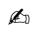

Practice Test: Test 1 (14Q)

# 8.5.1 Direction Sense: GATE CSE 2015 | Set 2 | GA | Question: 7

Four branches of a company are located at M, N, O and P. M is north of N at a distance of 4 km; P is south of O at a distance of 2 km; N is southeast of O by 1 km. What is the distance between M and P in km?


A. 5.34

B. 6.74

C. 28.5

D. 45.49

gatecse-2015-set2 analytical-aptitude normal direction-sense

# Answer key

# 8.5.2 Direction Sense: GATE CSE 2017 | Set 2 | GA | Question: 3

There are five buildings called V, W, X, Y and Z in a row (not necessarily in that order). V is to the West of W. Z is to the East of X and the West of V. W is to the West of Y. Which is the building in the middle?


A. V

B. W

C. X

D. Y

gatecse-2017-set2 analytical-aptitude direction-sense normal

# Answer key

# 8.5.3 Direction Sense: GATE CSE 2019 | GA | Question: 10

Three of the five students are allocated to a hostel put in special requests to the warden, Given the floor plan of the vacant rooms, select the allocation plan that will accommodate all their requests.

Request by X: Due to pollen allergy, I want to avoid a wing next to the garden.

Request by Y: I want to live as far from the washrooms as possible, since I am very much sensitive to smell.

Request by Z: I believe in Vaastu and so I want to stay in South-West wing.

The shaded rooms are already occupied. WR is washroom

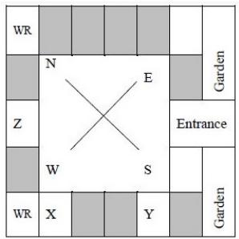

<details>
<summary>text_image</summary>

WR
N
E
Z
W
S
Entrance
WR
X
Y
Garden
Garden
</details>

A.

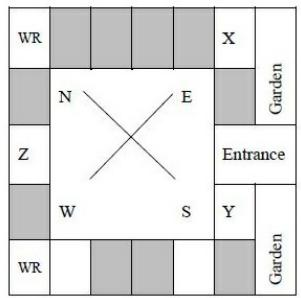

<details>
<summary>text_image</summary>

WR
N
E
X
Garden
Z
Entrance
W
S
Y
Garden
WR
</details>

B.


C.  
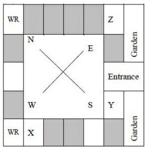

<details>
<summary>text_image</summary>

WR
N
E
Z
Garden
Entrance
W
S
Y
Garden
WR
X
</details>

gatecse-2019 general-aptitude analytical-aptitude easy direction-sense two-marks

D.  


<details>
<summary>text_image</summary>

WR
N
E
Garden
Entrance
W
S
Y
Garden
WR
X
Z
</details>

# Answer key

# 8.5.4 Direction Sense: GATE CSE 2025 | Set 1 | GA | Question: 5

According to the map shown in the figure, which one of the following statements is correct?

Note: The figure shown is representative.


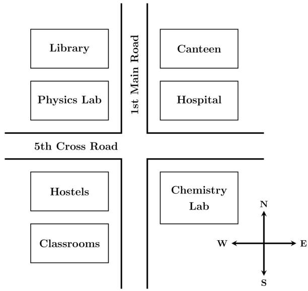

<details>
<summary>text_image</summary>

Library
Physics Lab
1st Main Road
Canteen
Hospital
5th Cross Road
Hostels
Classrooms
Chemistry Lab
N
W ← → E
S
</details>

A. The library is located to the northwest of the canteen.  
B. The hospital is located to the east of the chemistry lab.  
C. The chemistry lab is to the southeast of physics lab.  
D. The classrooms and canteen are next to each other.

gatecse2025-set1 analytical-aptitude direction-sense easy one-mark

# Answer key

# 8.5.5 Direction Sense: GATE2014 AG: GA-9

X is 1 km northeast of Y. Y is 1 km southeast of Z. W is 1 km west of Z. P is 1 km south of W. Q is 1 km east of P. What is the distance between X and Q in km?


A. 1

B. $\sqrt{2}$

C. $\sqrt{3}$

D. 2

gate2014-ag analytical-aptitude direction-sense normal

# Answer key

# 8.6

# Family Relationship (1)

Practice Test: Test 1 (9Q)


# 8.6.1 Family Relationship: GATE CSE 2025 | Set 1 | GA | Question: 4

Consider the relationships among P, Q, R, S, and T:

- P is the brother of Q.  
- S is the daughter of Q.  
- T is the sister of S.  
- R is the mother of Q.

The following statements are made based on the relationships given above.

1. R is the grandmother of S.  
2. P is the uncle of S and T.  
3. R has only one son.  
4. Q has only one daughter.

Which one of the following options is correct?

A. Both (1) and (2) are true.  
C. Only (3) is true.

B. Both (1) and (3) are true.  
D. Only (4) is true.

gatecse2025-set1 analytical-aptitude logical-reasoning family-relationship one-mark

# Answer key

# 8.7

# Logical Inference (1)

# 8.7.1 Logical Inference: GATE CSE 2025 | Set 2 | GA | Question: 6

Based only on the conversation below, identify the logically correct inference:

"Even if I had known that you were in the hospital, I would not have gone there to see you", Ramya told Josephine.

A. Ramya knew that Josephine was in the hospital.  
B. Ramya did not know that Josephine was in the hospital.  
C. Ramya and Josephine were once close friends; but now, they are not.  
D. Josephine was in the hospital due to an injury to her leg.

gatecse2025-set2 analytical-aptitude logical-inference two-marks

# Answer key

# 8.8

# Logical Reasoning (18)

Practice Tests: Test 1 (15Q) Test 2 (15Q) Test 3 (15Q) Test 4 (15Q) Test 5 (3Q)

# 8.8.1 Logical Reasoning: GATE CSE 2010 | Question: 61

$$
\text {If} 1 3 7 + 2 7 6 = 4 3 5 \text {how much is} 7 3 1 + 6 7 2?
$$

A. 534

B. 1403

C. 1623

D. 1513

gatecse-2010 analytical-aptitude normal logical-reasoning

# Answer key

# 8.8.2 Logical Reasoning: GATE CSE 2015 | Set 3 | GA | Question: 7

The head of newly formed government desires to appoint five of the six selected members P, Q, R, S, T and U to portfolios of Home, Power, Defense, Telecom, and Finance. U does not want any portfolio if S gets one of the five. R wants either Home or Finance or no portfolio. Q says that if S gets Power or Telecom, then she must get the other one. T insists on a portfolio if P gets one.

Which is the valid distribution of portfolios?

A. P-Home, Q-Power, R-Defense, S-Telecom, T-Finance  
B. R-Home, S-Power, P-Defense, Q-Telecom, T-Finance

C. P-Home, Q-Power, T-Defense, S-Telecom, U-Finance  
D. Q-Home, $\bar{U}$ -Power, T-Defense, R-Telecom, P-Finance

gatecse-2015-set3 analytical-aptitude normal logical-reasoning

# Answer key

# 8.8.3 Logical Reasoning: GATE CSE 2017 | Set 2 | GA | Question: 7


There are three boxes. One contains apples, another contains oranges and the last one contains both apples and oranges. All three are known to be incorrectly labeled. If you are permitted to open just one box and then pull out and inspect only one fruit, which box would you open to determine the contents of all three boxes?

A. The box labeled 'Apples'

B. The box labeled ‘Apples and Oranges’

C. The box labeled 'Oranges'

D. Cannot be determined

gatecse-2017-set2 analytical-aptitude normal tricky logical-reasoning

# Answer key

# 8.8.4 Logical Reasoning: GATE CSE 2021 | Set 2 | GA | Question: 10


Six students P, Q, R, S, T and U, with distinct heights, compare their heights and make the following observations.

• Observation I: S is taller than R.  
- Observation II: Q is the shortest of all.  
- Observation III: U is taller than only one student.  
• Observation IV: T is taller than S but is not the tallest

The number of students that are taller than R is the same as the number of students shorter than \_\_\_\_.

A. T

B. R

C. S

D. P

gatecse-2021-set2

analytical-aptitude

logical-reasoning

two-marks

# Answer key

# 8.8.5 Logical Reasoning: GATE CSE 2023 | GA | Question: 4


A survey for a certain year found that 90% of pregnant women received medical care at least once before giving birth. Of these women, 60% received medical care from doctors, while 40% received medical care from other healthcare providers.

Given this information, which one of the following statements can be inferred with certainty?

A. More than half of the pregnant women received medical care at least once from a doctor.  
B. Less than half of the pregnant women received medical care at least once from a doctor.  
C. More than half of the pregnant women received medical care at most once from a doctor.  
D. Less than half of the pregnant women received medical care at most once from a doctor.

gatecse-2023 analytical-aptitude logical-reasoning one-mark

# Answer key

# 8.8.6 Logical Reasoning: GATE CSE 2026 | Set 1 | GA | Question: 5


'When the teacher is in the room, all students stand silently.'

If the above statement is true, which one of the following statements is not necessarily true?

A. If any student is not standing silently, then the teacher is not in the room.  
B. When the teacher is in the room, all students are silent.  
C. If all students are standing, then the teacher is in the room.  
D. When the teacher is in the room, all students are standing.

# 8.8.7 Logical Reasoning: GATE CSE 2026 | Set 1 | GA | Question: 6


Combinatorics deals with problems involving counting. For example, "How many distinct arrangements of N distinct objects in M spaces on a circle are possible?" is a typical problem in combinatorics. This kind of counting is sometimes used in the modeling of several physical phenomena. Often, in such models, the different combinatorial possibilities are assigned probability values. Assigning probabilities enables the computation of the average values of physical quantities.

Consider the following statements:

P : Combinatorics is always invoked in the modeling of physical phenomena.

Q : Modeling some physical phenomena involves assigning probabilities to combinatorial possibilities in order to compute average values of physical quantities.

Based on the passage above, what can be inferred about statements P and Q?

A. P is False and Q is False

B. P is False and Q is True

C. P is True and Q is False

D. P is True and Q is True

gatecse-2026-set1 analytical-aptitude logical-reasoning combinatory two-marks

# Answer key

# 8.8.8 Logical Reasoning: GATE CSE 2026 | Set 1 | GA | Question: 9


In the 2020 summer Olympics' Javelin throw finals, Neeraj Chopra exhibited a spectacular performance to win the gold medal. The silver medal was won by Jakub Vadlejch and the bronze medal was won by Vitezlav Vesely. There were six rounds of throws with each athlete having one throw per round. The best of all the throws of each athlete is considered for the medal. Following were the observations about the throws:

i. The first and second rounds were dominated by Neeraj Chopra with a gold medal performance in his second throw, while the other two athletes did not have any medal winning throws in these rounds.  
ii. The throws in the last round by both Jakub Vadlejch and Vitezlav Vesely were fouls and were not considered for scoring.  
iii. After four rounds, Vitezlav Vesely was in the second position and could not improve upon his best throw in the succeeding rounds.  
iv. In the fourth round, the throw by Jakub Vadlejch was the best in that round.

In which round did Vitezlav Vesely have his best throw?

A. Third

B. Fourth

C. Fifth

D. Sixth

gatecse-2026-set1 analytical-aptitude logical-reasoning two-marks

# Answer key

# 8.8.9 Logical Reasoning: GATE CSE 2026 | Set 2 | GA | Question: 5


'When it is raining, peacocks dance.'

Based only on this sentence, which one of the following options is necessarily true?

A. Peacocks dance only when it is raining.  
B. When peacocks dance, it is raining.  
C. When peacocks are not dancing, it is not raining.  
D. When it is not raining, peacocks do not dance.

gatecse-2026-set2 analytical-aptitude logical-reasoning one-mark

# Answer key

# 8.8.10 Logical Reasoning: GATE CSE 2026 | Set 2 | GA | Question: 7


Two tiles are missing in Panel I. Which one of the options in Panel II is the appropriate choice for the missing tiles?

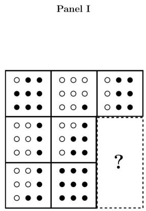

<details>
<summary>text_image</summary>

Panel I
?
</details>

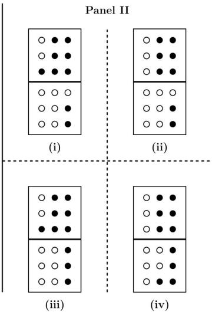

<details>
<summary>text_image</summary>

Panel II
(i)
(ii)
(iii)
(iv)
</details>

A. (i)

B. (ii)

C. (iii)

D. (iv)

gatecse-2026-set2

analytical-aptitude

two-marks

logical-reasoning

Answer key

# 8.8.11 Logical Reasoning: GATE CSE 2026 | Set 2 | GA | Question: 9

The figure in Panel I below is a grid of cells with four rows and four columns. The numbers on the top and on the left represent the number of cells that are to be shaded in that column and row, respectively. Which one of the options shown in Panel II below represents the grid shaded correctly?


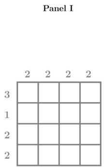

<details>
<summary>text_image</summary>

Panel I
3 2 2 2
1
2
2
</details>


<details>
<summary>text_image</summary>

Panel II
(i)
(ii)
(iii)
(iv)
</details>

A. (i)

B. (ii)

C. (iii)

D. (iv)

gatecse-2026-set2

analytical-aptitude

two-marks

logical-reasoning

Answer key

# 8.8.12 Logical Reasoning: GATE DA 2026 | GA | Question: 5

'If his latest movie had been a commercial success, the actor would have made enough money to sponsor his next movie.'

Based only on the above sentence, which one of the following statements is true?

A. The actor will certainly sponsor his next movie.  
B. His latest movie was a commercial success.  
C. The actor made enough money from his latest movie.  
D. His latest movie was not commercially successful.


# 8.8.13 Logical Reasoning: GATE DA 2026 | GA | Question: 8


Rishi and Swathi are students of Class 5. Pavan and Tanvi are students of Class 4. Rishi and Pavan are boys. Swathi and Tanvi are girls. The four students played a total of three games of chess. The games were played one after another. A player who lost a game did not participate in any more games. It was observed that:

I. the first game was the only game where two students of the same class played against each other,  
II. the students of Class 5 won more games than the students of Class 4, and  
III. the boys won two games and the girls won one game.

The student who did not lose any game is \_\_\_\_.

A. Pavan

B. Rishi

C. Swathi

D. Tanvi

gateda-2026 analytical-aptitude logical-reasoning two-marks

# Answer key

# 8.8.14 Logical Reasoning: GATE2011 GG: GA-8


Three sisters $(R, S, \text{and} T)$ received a total of 24 toys during Christmas. The toys were initially divided among them in a certain proportion. Subsequently, $R$ gave some toys to $S$ which doubled the share of $S$ .

Then $S$ in turn gave some of her toys to $T$ , which doubled $T'$ 's share. Next, some of $T'$ 's toys were given to $R$ , which doubled the number of toys that $R$ currently had. As a result of all such exchanges, the three sisters were left with equal number of toys. How many toys did $R$ have originally?

A. 8

B. 9

C. 11

D. 12

gate2011-gg logical-reasoning analytical-aptitude

# Answer key

# 8.8.15 Logical Reasoning: GATE2011 MN: GA-63


L, M and N are waiting in a queue meant for children to enter the zoo. There are 5 children between L and M, and 8 children between M and N. If there are 3 children ahead of N and 21 children behind L, then what is the minimum number of children in the queue?

A. 28

B. 27

C. 41

D. 40

analytical-aptitude gate2011-mn logical-reasoning

# Answer key

# 8.8.16 Logical Reasoning: GATE2012 AR: GA-8


Ravi is taller than Arun but shorter than Iqbal. Sam is shorter than Ravi. Mohan is shorter than Arun. Balu is taller than Mohan and Sam. The tallest person can be

A. Mohan

B. Ravi

C. Balu

D. Arun

gate2012-ar logical-reasoning

# Answer key

# 8.8.17 Logical Reasoning: GATE2012 CY: GA-9


There are eight bags of rice looking alike, seven of which have equal weight and one is slightly heavier. The weighing balance is of unlimited capacity. Using this balance, the minimum number of weighings required to identify the heavier bag is

A. 2

B. 3

C. 4

D. 8

gate2012-cy analytical-aptitude logical-reasoning

# Answer key

# 8.8.18 Logical Reasoning: GATE2014 AE: GA-7


Anuj, Bhola, Chandan, Dilip, Eswar and Faisal live on different floors in a six-storeyed building (the ground floor is numbered 1, the floor above it 2, and so on) Anuj lives on an even-numbered floor, Bhola does not live on an odd numbered floor. Chandan does not live on any of the floors below Faisal's floor. Dilip does not live on floor number 2. Eswar does not live on a floor immediately above or immediately below Bhola. Faisal lives three floors above Dilip. Which of the following floor-person combinations is correct?

<table><tr><td></td><td>Anuj</td><td>Bhola</td><td>Chandan</td><td>Dilip</td><td>Eswar</td><td>Faisal</td></tr><tr><td>(A)</td><td>6</td><td>2</td><td>5</td><td>1</td><td>3</td><td>4</td></tr><tr><td>(B)</td><td>2</td><td>6</td><td>5</td><td>1</td><td>3</td><td>4</td></tr><tr><td>(C)</td><td>4</td><td>2</td><td>6</td><td>3</td><td>1</td><td>5</td></tr><tr><td>(D)</td><td>2</td><td>4</td><td>6</td><td>1</td><td>3</td><td>5</td></tr></table>

gate2014-ae logical-reasoning analytical-aptitude descriptive

Answer key

# 8.9

# Number Relations (1)

# 8.9.1 Number Relations: GATE CSE 2024 | Set 2 | GA | Question: 10

In the $4 \times 4$ array shown below, each cell of the first three rows has either a cross $(X)$ or a number.


<table><tr><td>1</td><td>X</td><td>4</td><td>3</td></tr><tr><td>X</td><td>5</td><td>5</td><td>4</td></tr><tr><td>3</td><td>X</td><td>6</td><td>X</td></tr><tr><td></td><td></td><td></td><td></td></tr></table>

The number in a cell represents the count of the immediate neighboring cells (left, right, top, bottom, diagonals) NOT having a cross $(X)$ . Given that the last row has no crosses $(X)$ , the sum of the four numbers to be filled in the last row is

A. 11

B. 10

C. 12

D. 9

gatecse-2024-set2 analytical-aptitude number-relations two-marks

Answer key

# 8.10

# Odd One (2)

Practice Test: Test 1 (6Q)

# 8.10.1 Odd One: GATE CSE 2016 | Set 2 | GA | Question: 04

Pick the odd one from the following options.

A. CADBE

B. JHKIL

C. XVYWZ

D. ONPMQ

gatecse-2016-set2 analytical-aptitude odd-one normal

Answer key

# 8.10.2 Odd One: GATE2014 AE: GA-6

Find the odd one in the following group: ALRVX, EPVZB, ITZDF, OYEIK

A. ALRVX

B. EPVZB

C. ITZDF

D. OYEIK


# 8.11

# Passage Reading (2)

Practice Tests: Test 1 (6Q) Test 2 (15Q) Test 3 (15Q) Test 4 (15Q) Test 5 (5Q)

# 8.11.1 Passage Reading: GATE CSE 2022 | GA | Question: 7


In a recently conducted national entrance test, boys constituted 65% of those who appeared for the test. Girls constituted the remaining candidates and they accounted for 60% of the qualified candidates.

Which one of the following is the correct logical inference based on the information provided in the above passage?

A. Equal number of boys and girls qualified  
B. Equal number of boys and girls appeared for the test  
C. The number of boys who appeared for the test is less than the number of girls who appeared  
D. The number of boys who qualified the test is less than the number of girls who qualified

gatecse-2022 analytical-aptitude logical-reasoning passage-reading two-marks

Answer key

# 8.11.2 Passage Reading: GATE CSE 2023 | GA | Question: 6


The country of Zombieland is in distress since more than 75% of its working population is suffering from serious health issues. Studies conducted by competent health experts concluded that a complete lack of physical exercise among its working population was one of the leading causes of their health issues. As one of the measures to address the problem, the Government of Zombieland has decided to provide monetary incentives to those who ride bicycles to work.

Based only on the information provided above, which one of the following statements can be logically inferred with certainty?

A. All the working population of Zombieland will henceforth ride bicycles to work.  
B. Riding bicycles will ensure that all of the working population of Zombieland is free of health issues.  
C. The health experts suggested to the Government of Zombieland to declare riding bicycles as mandatory.  
D. The Government of Zombieland believes that riding bicycles is a form of physical exercise.

gatecse-2023 analytical-aptitude logical-reasoning passage-reading two-marks

Answer key

# 8.12

# Round Table Arrangement (1)

Practice Test: Test 1 (9Q)

# 8.12.1 Round Table Arrangement: GATE CSE 2017 | Set 1 | GA | Question: 7


Six people are seated around a circular table. There are at least two men and two women. There are at least three right-handed persons. Every woman has a left-handed person to her immediate right. None of the women are right-handed. The number of women at the table is

A. 2

C. 4

B. 3

D. Cannot be determined

gatecse-2017-set1 analytical-aptitude round-table-arrangement

Answer key

# 8.13

# Seating Arrangement (1)

# 8.13.1 Seating Arrangement: GATE CSE 2017 | Set 1 | GA | Question: 3


Rahul, Murali, Srinivas and Arul are seated around a square table. Rahul is sitting to the left of Murali. Srinivas is sitting to the right of Arul. Which of the following pairs are seated opposite each other?

A. Rahul and Murali

B. Srinivas and Arul

C. Srinvas and Murali

D. Srinivas and Rahul

gatecse-2017-set1 analytical-aptitude logical-reasoning seating-arrangement

# Answer key

# 8.14

# Sequence Series (3)

Practice Tests: Test 1 (15Q) Test 2 (1Q)

# 8.14.1 Sequence Series: GATE CSE 2020 | GA | Question: 7

If $P = 3, R = 27, T = 243$ , then $Q + S =$ \_\_\_\_

A. 40

B. 80

C. 90

D. 110

gatecse-2020 analytical-aptitude logical-reasoning sequence-series two-marks

# Answer key

# 8.14.2 Sequence Series: GATE CSE 2024 | Set 2 | GA | Question: 5

In the sequence 6, 9, 14, x, 30, 41, a possible value of x is

A. 25

B. 21

C. 18

D. 20

gatecse-2024-set2 analytical-aptitude sequence-series one-mark

# Answer key

# 8.14.3 Sequence Series: GATE2010 MN: GA-7

Given the sequence $A, B, B, C, C, C, D, D, D, D, \ldots$ etc., that is one $A$ , two $B's$ , three $C's$ , four $D's$ , five $E's$ and so on, the $240^{th}$ letter in the sequence will be:

A. V

B. U

C. T

D. W

general-aptitude logical-reasoning gate2010-mn sequence-series

# Answer key

# 8.15

# Statements Follow (7)

Practice Tests: Test 1 (15Q) Test 2 (15Q) Test 3 (7Q)

# 8.15.1 Statements Follow: GATE CSE 2016 | Set 1 | GA | Question: 08

Consider the following statements relating to the level of poker play of four players P, Q, R and S.

I. $P$ always beats $Q$  
II. $R$ always beats $S$  
III. $S$ loses to $P$ only sometimes.  
IV. $R$ always loses to $Q$

Which of the following can be logically inferred from the above statements?

i. P is likely to beat all the three other players  
ii. $S$ is the absolute worst player in the set

A. (i). only

B. (ii) only  
D. neither (i) nor (ii)

C. (i) and (ii) only'

gatecse-2016-set1 analytical-aptitude normal statements-follow

# Answer key

# 8.15.2 Statements Follow: GATE CSE 2016 | Set 2 | GA | Question: 08

All hill-stations have a lake. Ooty has two lakes.

Which of the statement(s) below is/are logically valid and can be inferred from the above sentences?


i. Ooty is not a hill-station.  
ii. No hill-station can have more than one lake.

A. (i) only.  
C. Both (i) and (ii)

gatecse-2016-set2 analytical-aptitude easy statements-follow

B. (ii) only.  
D. Neither (i) nor (ii)

# Answer key

# 8.15.3 Statements Follow: GATE CSE 2021 | Set 1 | GA | Question: 9

Given below are two statements 1 and 2, and two conclusions I and II


- Statement 1: All bacteria are microorganisms.  
- Statement 2: All pathogens are microorganisms.  
- Conclusion I: Some pathogens are bacteria.  
- Conclusion II: All pathogens are not bacteria.

Based on the above statements and conclusions, which one of the following options is logically CORRECT?

A. Only conclusion I is correct  
C. Either conclusion I or II is correct

B. Only conclusion $\Pi$ is correct  
D. Neither conclusion I nor II is correct

gatecse-2021-set1 analytical-aptitude logical-reasoning statements-follow two-marks

# Answer key

# 8.15.4 Statements Follow: GATE CSE 2022 | GA | Question: 4

Given below are four statements.


- Statement 1: All students are inquisitive.  
- Statement 2: Some students are inquisitive.  
- Statement 3: No student is inquisitive.  
- Statement 4: Some students are not inquisitive.

From the given four statements, find the two statements that CANNOT BE TRUE simultaneously, assuming that there is at least one student in the class.

A. Statement 1 and Statement 3  
C. Statement 2 and Statement 4

B. Statement 1 and Statement 2  
D. Statement 3 and Statement 4

gatecse-2022 analytical-aptitude logical-reasoning statements-follow one-mark

# Answer key

# 8.15.5 Statements Follow: GATE DS&AI 2024 | GA | Question: 6

Thousands of years ago, some people began dairy farming. This coincided with a number of mutations in a particular gene that resulted in these people developing the ability to digest dairy milk.


Based on the given passage, which of the following can be inferred?

A. All human beings can digest dairy milk.  
B. No human being can digest dairy milk.  
C. Digestion of dairy milk is essential for human beings.  
D. In human beings, digestion of dairy milk resulted from a mutated gene.

gate-ds-ai-2024 analytical-aptitude logical-reasoning statements-follow two-marks

# Answer key

# 8.15.6 Statements Follow: GATE2013 AE: GA-9

\- All professors are researchers


• Some scientists are professors

Which of the given conclusions is logically valid and is inferred from the above arguments?

A. All scientists are researchers  
C. Some researchers are scientists

B. All professors are scientists

D. No conclusion follows

gate2013-ae analytical-aptitude logical-reasoning statements-follow

# Answer key

# 8.15.7 Statements Follow: GATE2014 AG: GA-6

In a group of four children, Som is younger to Riaz. Shiv is elder to Ansu. Ansu is youngest in the group. Which of the following statements is/are required to find the eldest child in the group?


# Statements

1. Shiv is younger to Riaz.  
2. Shiv is elder to Som.

A. Statement 1 by itself determines the eldest child.  
B. Statement 2 by itself determines the eldest child.  
C. Statements 1 and 2 are both required to determine the eldest child.  
D. Statements 1 and 2 are not sufficient to determine the eldest child.

gate2014-ag analytical-aptitude normal statements-follow

# Answer key

Answer Keys

<table><tr><td>8.1.1</td><td>B</td></tr><tr><td>8.4.1</td><td>B</td></tr><tr><td>8.5.5</td><td>C</td></tr><tr><td>8.8.3</td><td>B</td></tr><tr><td>8.8.8</td><td>A</td></tr><tr><td>8.8.13</td><td>D</td></tr><tr><td>8.8.18</td><td>B</td></tr><tr><td>8.11.2</td><td>D</td></tr><tr><td>8.14.3</td><td>A</td></tr><tr><td>8.15.5</td><td>D</td></tr></table>

<table><tr><td>8.1.2</td><td>D</td></tr><tr><td>8.5.1</td><td>A</td></tr><tr><td>8.6.1</td><td>A</td></tr><tr><td>8.8.4</td><td>C</td></tr><tr><td>8.8.9</td><td>C</td></tr><tr><td>8.8.14</td><td>C</td></tr><tr><td>8.9.1</td><td>A</td></tr><tr><td>8.12.1</td><td>A</td></tr><tr><td>8.15.1</td><td>D</td></tr><tr><td>8.15.6</td><td>C</td></tr></table>

<table><tr><td>8.2.1</td><td>A</td></tr><tr><td>8.5.2</td><td>A</td></tr><tr><td>8.7.1</td><td>B</td></tr><tr><td>8.8.5</td><td>A</td></tr><tr><td>8.8.10</td><td>A</td></tr><tr><td>8.8.15</td><td>A</td></tr><tr><td>8.10.1</td><td>D</td></tr><tr><td>8.13.1</td><td>C</td></tr><tr><td>8.15.2</td><td>D</td></tr><tr><td>8.15.7</td><td>A</td></tr></table>

<table><tr><td>8.3.1</td><td>B</td></tr><tr><td>8.5.3</td><td>D</td></tr><tr><td>8.8.1</td><td>C</td></tr><tr><td>8.8.6</td><td>C</td></tr><tr><td>8.8.11</td><td>B</td></tr><tr><td>8.8.16</td><td>C</td></tr><tr><td>8.10.2</td><td>D</td></tr><tr><td>8.14.1</td><td>C</td></tr><tr><td>8.15.3</td><td>C;D</td></tr></table>

<table><tr><td>8.3.2</td><td>C</td></tr><tr><td>8.5.4</td><td>C</td></tr><tr><td>8.8.2</td><td>B</td></tr><tr><td>8.8.7</td><td>B</td></tr><tr><td>8.8.12</td><td>D</td></tr><tr><td>8.8.17</td><td>A</td></tr><tr><td>8.11.1</td><td>D</td></tr><tr><td>8.14.2</td><td>B</td></tr><tr><td>8.15.4</td><td>A</td></tr></table>

Syllabus: Numerical computation, Numerical estimation, Numerical reasoning and data interpretation

Mark Distribution in Previous GATE

<table><tr><td>Year</td><td>2026 - 1</td><td>2026 - 2</td><td>2025 - 1</td><td>2025 - 2</td><td>2024 - 1</td><td>2024 - 2</td><td>2023</td><td>2022</td><td>2021 - 1</td><td>2021 - 2</td><td>Minimum</td></tr><tr><td>1 Mark Count</td><td>2</td><td>2</td><td>1</td><td>2</td><td>4</td><td>3</td><td>1</td><td>2</td><td>1</td><td>2</td><td>1</td></tr><tr><td>2 Marks Count</td><td>2</td><td>2</td><td>3</td><td>3</td><td>2</td><td>2</td><td>2</td><td>2</td><td>3</td><td>2</td><td>2</td></tr><tr><td>Total Marks</td><td>6</td><td>6</td><td>7</td><td>8</td><td>8</td><td>7</td><td>5</td><td>6</td><td>7</td><td>6</td><td>5</td></tr></table>

Welcome to the Quantitative Aptitude section of your GATE Computer Science preparation! This chapter is designed to equip you with the essential mathematical and logical reasoning skills crucial for success in the General Aptitude section of the GATE exam. Quantitative Aptitude tests your ability to solve numerical problems, interpret data, and apply fundamental mathematical concepts efficiently and accurately. Typically, this section carries a significant weightage, often contributing 8-10 marks out of the total 15 marks for General Aptitude, with questions ranging from direct formula application to complex problem-solving and data interpretation. Mastering these topics is not just about scoring in aptitude; it also sharpens your analytical thinking, which is invaluable for the core Computer Science subjects.

# Topic-wise Key Concepts

# Absolute Value

The absolute value of a real number $x$ , denoted $|x|$ , is its non-negative value regardless of its sign. It represents the distance of $x$ from zero on the number line.

- Definition: $|x| = x$ if $x \geq 0$ , and $|x| = -x$ if $x < 0$ .  
- Properties:

1. $|x|\geq 0$  
2. $|-\overline{x}|=|x|$  
3. $|xy| = |x||y|$  
4. $|x / y| = |x| / |y|$ (for $y \neq 0$ )  
5. Triangle Inequality: $|x + y| \leq |x| + |y|$

\- Solving Equations/Inequalities:

1. $|x| = a \implies x = a$ or $x = -a$ (for $a \geq 0$ )  
2. $|x| < a \implies -a < x < a$ (for $a > 0$ )  
3. $|x| > a \implies x < -a$ or $x > a$ (for $a \geq 0$ )

- Pitfall: Forgetting to consider both positive and negative cases when removing the absolute value sign.  
- Technique: Isolate the absolute value term, then apply the appropriate definition or rule.

# Age Relation

Age relation problems involve finding the current or future/past ages of individuals based on given conditions, usually forming linear equations.

- Core Idea: Translate word problems into algebraic equations involving variables for ages.  
- Technique: Assign variables (e.g., $x$ for current age), form equations based on the relationships (e.g., "A is twice as old as B" $\Longrightarrow A = 2B$ ), and solve the system of equations.  
- Pitfall: Misinterpreting phrases like "X years ago" or "X years hence".

# Algebra

Algebra deals with symbols and rules for manipulating these symbols. It involves basic operations, factorization, and algebraic identities.

\- Identities:

1. $(a + b)^2 = a^2 + 2ab + b^2$  
2. $(a - b)^2 = a^2 - 2ab + b^2$  
3. $a^2 - b^2 = (a - b)(a + b)$  
4. $(a + b)^{3} = a^{3} + b^{3} + 3ab(a + b)$

5. $(a - b)^{3} = a^{3} - b^{3} - 3ab(a - b)$  
6. $a^3 + b^3 = (a + b)(a^2 - ab + b^2)$  
7. $a^3 - b^3 = (a - b)(a^2 + ab + b^2)$  
8. $a^3 + b^3 + c^3 - 3abc = (a + b + c)(a^2 + b^2 + c^2 - ab - bc - ca)$  
9. If $a + b + c = 0$ , then $a^3 + b^3 + c^3 = 3abc$

\- Pitfall: Sign errors, incorrect order of operations (PEMDAS/BODMAS).

\- Technique: Simplify expressions using identities, factorize, and solve equations systematically.

# Alligation Mixture

Alligation is a rule that helps determine the ratio in which two or more ingredients of different prices must be mixed to produce a mixture of a desired price.

\- Formula:

$$
\frac {\text {Quantity of Cheaper}}{\text {Quantity of Dearer}} = \frac {\text {Price of Dearer} - \text {Mean Price}}{\text {Mean Price} - \text {Price of Cheaper}}
$$

\- Technique: Use the "alligation cross" diagram to visualize and solve problems quickly.

\- Pitfall: Incorrectly identifying the cheaper, dearer, or mean price.

# Area

Area is the measure of the extent of a two-dimensional surface or shape.

\- Formulas:

1. Square: $s^{2}$ (where s is side)  
2. Rectangle: $l \times w$ (where $l$ is length, $w$ is width)  
3. Circle: $\pi r^2$ (where $r$ is radius)  
4. Triangle: $\frac{1}{2} \times \text{base} \times \text{height}$ (or Heron's formula: $\sqrt{s(s - a)(s - b)(s - c)}$ where $s = (a + b + c)/2$ )  
5. Parallelogram: base × height  
6. Trapezoid: $\frac{1}{2} \times$ (sum of parallel sides) $\times$ height  
7. Rhombus: $\frac{1}{2} \times d_1 \times d_2$ (where $d_1, d_2$ are diagonals)  
- Pitfall: Using perimeter formulas instead of area, or incorrect units.  
- Technique: Identify the shape, recall the correct formula, and ensure consistent units.

# Arithmetic Series

An arithmetic series is the sum of terms in an arithmetic progression, where the difference between consecutive terms is constant (common difference $d$ ).

\- Formulas:

1. $n$ -th term: $a_{n} = a_{1} + (n - 1)d$  
2. Sum of $n$ terms: $S_{n} = \frac{n}{2}(a_{1} + a_{n})$ or $S_{n} = \frac{n}{2}(2a_{1} + (n - 1)d)$  
- Pitfall: Off-by-one errors when calculating $n$ , especially when given ranges.  
- Technique: Clearly identify $a_1$ , $d$ , and $n$ .

# Average

The average (arithmetic mean) is the sum of a set of values divided by the number of values.

- Formula: Average = $\frac{\text{Sum of quantities}}{\text{Number of quantities}}$  
- Weighted Average: Weighted Average = $\frac{\sum(w_i x_i)}{\sum w_i}$  
- Technique: Use the formula directly. For weighted averages, ensure correct weights are applied.  
- Pitfall: Confusing average with median or mode.

# Bar Graph

A bar graph uses rectangular bars to represent data, with the length or height of the bars proportional to the values they

represent.

- Core Idea: Visual representation of discrete data for comparison.  
- Technique: Carefully read labels, scales, and legends. Compare bar heights/lengths to answer questions about quantities, differences, or ratios.  
- Pitfall: Misinterpreting scales or units on the axes.

# Bayes Theorem

Bayes' Theorem describes the probability of an event, based on prior knowledge of conditions that might be related to the event.

- Formula: $P(A|B) = \frac{P(B|A)P(A)}{P(B)}$  
- Key Terms: $P(A|B)$ is posterior probability, $P(B|A)$ is likelihood, $P(A)$ is prior probability, $P(B)$ is evidence.  
- Pitfall: Confusing conditional probabilities $P(A|B)$ and $P(B|A)$ .  
- Technique: Break down the problem into individual probabilities and substitute into the formula.

# Calendar

Calendar problems involve determining the day of the week for a given date or finding specific dates based on calendar logic.

- Core Idea: Based on the concept of "odd days" (remainder when days are divided by 7).  
- Key Concepts:

1. Ordinary year = 365 days = 52 weeks + 1 odd day  
2. Leap year = 366 days = 52 weeks + 2 odd days  
3. Leap year rules: Divisible by 4, unless it's a century year not divisible by 400.  
4. Odd days for centuries: 100 years = 5 odd days, 200 years = 3, 300 years = 1, 400 years = 0.

\- Technique: Calculate total odd days from a reference date (e.g., Jan 1, 0001) to the target date.

\- Pitfall: Incorrectly identifying leap years or counting odd days.

# Cartesian Coordinates

Cartesian coordinates define the position of a point in a plane using two perpendicular axes (x and y).

\- Key Formulas:

1. Distance between $(x_{1},y_{1})$ and $(x_{2},y_{2})$ : $D = \sqrt{(x_2 - x_1)^2 + (y_2 - y_1)^2}$  
2. Midpoint of a segment: $M = \left(\frac{x_{1} + x_{2}}{2}, \frac{y_{1} + y_{2}}{2}\right)$  
3. Section Formula (dividing in ratio $m:n$ ): $\left(\frac{mx_2 + nx_1}{m + n},\frac{my_2 + ny_1}{m + n}\right)$  
4. Area of triangle with vertices $(x_{1},y_{1}),(x_{2},y_{2}),(x_{3},y_{3})$ : $\frac{1}{2}|x_1(y_2 - y_3) + x_2(y_3 - y_1) + x_3(y_1 - y_2)|$  
- Pitfall: Sign errors in distance or section formula.  
- Technique: Plot points if helpful, apply formulas carefully.

# Circle

A circle is the set of all points in a plane that are equidistant from a central point.

\- Formulas:

1. Circumference: $C = 2\pi r = \pi d$  
2. Area: $A = \pi r^{2}$  
3. Equation of a circle (center $(h,k)$ , radius $r$ ): $(x - h)^2 + (y - k)^2 = r^2$  
4. Area of sector: $\frac{\theta}{360^{\circ}} \times \pi r^{2}$ (where $\theta$ is central angle in degrees)  
5. Length of arc: $\frac{\theta}{360^{\circ}} \times 2\pi r$  
- Pitfall: Confusing radius with diameter, or circumference with area.  
- Technique: Identify given parameters and apply the correct formula.

# Clock Time

Clock time problems involve calculating angles between clock hands, or determining exact times based on relative speeds of hands.

# - Key Rates:

1. Hour hand: $0.5^{\circ}$ per minute  
2. Minute hand: $6^{\circ}$ per minute  
3. Relative speed: 5.5° per minute (minute hand gains on hour hand)

- Formula for angle between hands at H hours M minutes: $|30H - \frac{11}{2}M|$  
- Technique: Calculate the position of each hand relative to 12, then find the difference.  
- Pitfall: Not considering the hour hand's movement within the hour.

# Combinatory (Permutation and Combination)

Combinatory deals with counting arrangements (permutations) and selections (combinations) of objects.

# - Formulas:

1. Permutation (arrangement of $k$ items from $n$ ): $P(n, k) = \frac{n!}{(n - k)!}$  
2. Combination (selection of $k$ items from $n$ ): $C(n, k) = \frac{n!}{k!(n-k)!}$  
3. $n!=n\times(n-1)\times\cdots\times1,0!=1$

- Key Principle: Permutation is about order, combination is not. "Arrangement" implies permutation, "selection" or "group" implies combination.  
- Pitfall: Confusing permutation with combination.  
- Technique: Determine if order matters. Use multiplication principle for sequential events, addition principle for mutually exclusive events.

# Compound Interest

Compound interest is interest calculated on the initial principal, which also includes all of the accumulated interest from previous periods on a deposit or loan.

# - Formulas:

1. Amount (compounded annually): $A = P\left(1 + \frac{R}{100}\right)^T$  
2. Compound Interest (CI): CI = A - P  
3. Amount (compounded $n$ times a year): $A = P\left(1 + \frac{R}{100n}\right)^{nT}$  
4. Amount (compounded continuously): $A = Pe^{RT / 100}$

- Pitfall: Confusing simple interest with compound interest, or incorrect compounding frequency.  
- Technique: Identify principal (P), rate (R), time (T), and compounding frequency.

# Conditional Probability

Conditional probability is the probability of an event occurring given that another event has already occurred.

- Formula: $P(A|B) = \frac{P(A \cap B)}{P(B)}$ (where $P(B) > 0$ )  
• Key Idea: The sample space is reduced to event B.  
- Pitfall: Misidentifying the intersection event or the conditioning event.  
- Technique: Clearly define events A and B, find their intersection, and the probability of B.

# Cones

A cone is a three-dimensional geometric shape that tapers smoothly from a flat base (usually circular) to a point called the apex or vertex.

# - Formulas:

1. Volume: $V = \frac{1}{3}\pi r^{2}h$  
2. Curved Surface Area (CSA): $CSA = \pi rl$ (where $l$ is slant height, $l = \sqrt{r^2 + h^2}$ )  
3. Total Surface Area (TSA): $TSA = \pi r(l + r)$

- Pitfall: Confusing height $(h)$ with slant height $(l)$ .  
- Technique: Use Pythagorean theorem to find $l$ if $r$ and $h$ are given.

# Contour Plots

Contour plots (or isoline maps) display three-dimensional data on a two-dimensional plane, where lines connect points of equal value.

- Core Idea: Visualize a third variable (e.g., elevation, temperature) over a surface.  
- Technique: Interpret the density and values of contour lines. Closely spaced lines indicate a steep gradient, widely spaced lines indicate a gentle gradient.  
- Pitfall: Misinterpreting the values represented by the lines or the gradient.

# Cost Market Price

These problems involve concepts of cost price (CP), selling price (SP), market price (MP), profit, loss, and discount.

# - Formulas:

1. Profit = SP - CP (if SP > CP)  
2. Loss = CP - SP (if CP > SP)  
3. Profit/Loss $\% = \frac{\text{Profit/Loss}}{\text{CP}} \times 100$  
4. Discount = MP - SP  
5. Discount $\% = \frac{\text{Discount}}{\text{MP}} \times 100$  
6. $\mathrm{SP} = \mathrm{CP} \times (1 \pm \frac{\mathrm{Profit/Loss} \backslash \%}{100})$  
7. $\mathrm{SP} = \mathrm{MP} \times (1 - \frac{\text{Discount} \backslash \%}{100})$

- Pitfall: Calculating profit/loss % on SP instead of CP, or discount % on CP instead of MP.  
- Technique: Clearly identify CP, SP, MP, and the base for percentage calculations.

# Counting

Counting principles involve determining the number of possible outcomes for various events.

# - Principles:

1. Addition Principle: If event A can occur in $m$ ways and event B in $n$ ways, and they are mutually exclusive, then A or B can occur in $m + n$ ways.  
2. Multiplication Principle: If event A can occur in $m$ ways and event B in $n$ ways, then A and B can occur in $m \times n$ ways.  
- Technique: Break down complex counting problems into simpler, sequential or mutually exclusive steps.  
- Pitfall: Overcounting or undercounting by misapplying the principles.

# Cubes

A cube is a three-dimensional solid object bounded by six square faces, facets or sides, with three meeting at each vertex.

# - Formulas:

1. Volume: $V = a^3$ (where $a$ is side length)  
2. Surface Area: $SA = 6a^{2}$  
3. Diagonal of a face: $a\sqrt{2}$  
4. Main Diagonal of the cube: $a\sqrt{3}$  
- Pitfall: Confusing surface area with volume, or face diagonal with main diagonal.  
- Technique: Visualize the cube and its dimensions.

# Currency Notes

Problems involve calculating the total value of currency notes of different denominations or determining the number of notes of each denomination given a total amount.

- Core Idea: Form linear equations based on the value and count of notes.  
- Technique: Assign variables to the number of notes of each denomination and set up equations.  
- Pitfall: Calculation errors with large numbers or multiple denominations.

# Curves

In quantitative aptitude, "curves" generally refer to the graphs of functions, requiring interpretation of their shape, slope, and points of interest.

- Core Idea: Visual representation of relationships between variables.  
- Technique: Analyze the trend (increasing/decreasing), points of maxima/minima, and intersections.  
- Pitfall: Misinterpreting the axes or the units.

# Data Interpretation

Data interpretation involves extracting, analyzing, and drawing conclusions from various forms of data presentation like tables, charts (bar, pie, line, scatter, radar), and graphs.

- Core Idea: Critical analysis of presented data to answer specific questions.  
- Technique: Read titles, labels, scales, and legends carefully. Perform calculations (percentages, ratios, averages) based on the data.  
- Pitfall: Rushing calculations, misreading data points, or making assumptions not supported by the data.

# Digital Image Processing

While a CS topic, in QA it might appear as basic numerical problems related to image size, resolution, or data storage.

- Core Idea: Image represented as a grid of pixels.  
- Key Concepts:  
1. Resolution: Width × Height (in pixels)  
2. Color Depth: Bits per pixel (e.g., 8-bit for 256 colors, 24-bit for true color)  
3. Image Size (uncompressed): Resolution × Color Depth (in bits)  
- Technique: Apply multiplication principles for calculating total bits/bytes.  
- Pitfall: Unit conversions (bits to bytes, KB to MB).

# Factors

Factors (or divisors) of a number are integers that divide the number evenly without leaving a remainder.

- Core Idea: Finding numbers that multiply to give the original number.  
- Properties:  
1. For $N = p_1^{a_1}p_2^{a_2}\ldots p_k^{a_k}$ (prime factorization):  
2. Number of factors: $(a_{1}+1)(a_{2}+1)\ldots(a_{k}+1)$  
3. Sum of factors: $(1 + p_{1} + \cdots + p_{1}^{a_{1}})(1 + p_{2} + \cdots + p_{2}^{a_{2}}) \ldots$  
- Technique: Prime factorization is key to finding number and sum of factors.  
- Pitfall: Missing factors, especially 1 and the number itself.

# Fractions

Fractions represent a part of a whole, expressed as a ratio of two integers (numerator/denominator).

- Operations: Addition, subtraction, multiplication, division.  
- Properties: Equivalent fractions, proper/improper fractions, mixed numbers.  
- Technique: Find common denominators for addition/subtraction. Invert and multiply for division. Simplify fractions.  
- Pitfall: Errors in finding common denominators or simplifying.

# Functions

A function is a relation between a set of inputs and a set of permissible outputs with the property that each input is related to exactly one output.

- Core Idea: Mapping inputs to outputs. $y = f(x)$ .  
- Key Concepts: Domain (set of inputs), Range (set of outputs), types (linear, quadratic, polynomial).  
- Technique: Evaluate functions at given points, understand their graphs, and solve for unknowns.  
- Pitfall: Incorrectly applying function rules or misinterpreting domain/range restrictions.

# Geometry

Geometry deals with the properties and relations of points, lines, surfaces, solids, and higher dimensional analogs.

- Core Idea: Understanding shapes, angles, and spatial relationships.  
- Key Theorems: Pythagorean theorem, properties of parallel lines and transversals, angle sum property of triangles, similar/congruent triangles.  
- Technique: Draw diagrams, identify knowns and unknowns, apply relevant theorems and formulas.  
- Pitfall: Assuming properties not explicitly stated or derivable.

# Graph Coloring

Graph coloring assigns colors to elements of a graph subject to certain constraints. In QA, it's usually simplified to finding the minimum number of colors for a small graph.

- Core Idea: Assign colors to vertices such that no two adjacent vertices share the same color.  
- Technique: Start coloring from a vertex with high degree; systematically assign colors, avoiding conflicts with neighbors.  
- Pitfall: Missing a valid coloring or not finding the minimum.

# Inequality

Inequalities are mathematical statements comparing two expressions using symbols like $<, >, \leq, \geq$ .

# - Properties:

1. Adding/subtracting a number from both sides does not change the inequality direction.  
2. Multiplying/dividing by a positive number does not change the inequality direction.  
3. Multiplying/dividing by a negative number reverses the inequality direction.  
- Technique: Solve like equations, but remember to flip the sign when multiplying/dividing by a negative number. For quadratic inequalities, use sign analysis of factors.  
- Pitfall: Forgetting to reverse the inequality sign.

# LCM HCF

LCM (Least Common Multiple) is the smallest positive integer divisible by each of a given set of integers. HCF (Highest Common Factor) or GCD (Greatest Common Divisor) is the largest positive integer that divides each of a given set of integers.

# - Formulas:

1. For two numbers $a$ and $b$ : $\mathrm{LCM}(a, b) \times \mathrm{HCF}(a, b) = a \times b$  
2. To find LCM/HCF: Use prime factorization method.  
- Technique: Prime factorization is the most reliable method.  
- Pitfall: Confusing LCM with HCF, especially in word problems.

# Line Graph

A line graph displays information as a series of data points connected by straight line segments, showing trends over time or categories.

- Core Idea: Visualizing trends and changes over a continuous variable.  
- Technique: Observe the slope of the lines to understand rates of change, identify peaks and troughs.  
- Pitfall: Misinterpreting the scale or the meaning of the trend.

# Lines

Lines in coordinate geometry are one-dimensional figures with properties like slope, intercepts, and equations.

# - Formulas:

1. Slope (m) of a line through $(x_{1},y_{1})$ and $(x_{2},y_{2})$ : $m = \frac{y_2 - y_1}{x_2 - x_1}$  
2. Equation of a line (slope-intercept form): $y = mx + c$ (where $c$ is y-intercept)  
3. Equation of a line (point-slope form): $y - y_{1} = m(x - x_{1})$  
4. Parallel lines: $m_{1}=m_{2}$  
5. Perpendicular lines: $m_{1}m_{2} = -1$  
- Pitfall: Sign errors in slope calculation, confusing parallel with perpendicular conditions.

\- Technique: Identify slope and a point, then use the appropriate equation form.

# Logarithms

Logarithms are the inverse operation to exponentiation. The logarithm of a number $x$ to the base $b$ is the exponent to which $b$ must be raised to produce $x$ .

- Definition: $\log_b a = c \iff b^c = a$  
- Properties:

1. $\log_b(xy) = \log_b x + \log_b y$  
2. $\log_b(x / y) = \log_b x - \log_b y$  
3. $\log_b x^n = n \log_b x$  
4. $\log_b b = 1, \log_b 1 = 0$  
5. Change of Base: $\log_b a = \frac{\log_c a}{\log_c b}$

- Pitfall: Misapplying properties, especially for addition/subtraction.  
- Technique: Convert between logarithmic and exponential forms, use properties to simplify.

# Maps

Map problems involve interpreting scale, distances, and directions on maps.

- Core Idea: Scale represents the ratio of a distance on the map to the corresponding distance on the ground.  
- Formula: Map Distance = Actual Distance × Scale  
- Technique: Pay close attention to the scale (e.g., 1:100000 or 1 cm = 10 km) and units.  
- Pitfall: Incorrect unit conversions.

# Maxima Minima

Finding the maximum or minimum value of a function or expression.

- Core Idea: Identifying the highest or lowest point a function can reach.  
- For Quadratic Function $f(x) = ax^{2} + bx + c$ :

1. Vertex at $x = -b / (2a)$  
2. If a > 0, minimum value at vertex.  
3. If a < 0, maximum value at vertex.

- General Technique (Calculus-based, if applicable): Find derivative $f'(x)$ , set to zero to find critical points. Use second derivative test for max/min.  
- Pitfall: Confusing local maxima/minima with global maxima/minima.

# Mensuration

Mensuration is the branch of mathematics that deals with the measurement of geometric figures and their parameters like length, area, and volume. This topic consolidates formulas for various 2D and 3D shapes.

- Core Idea: Applying geometric formulas to calculate dimensions, areas, and volumes.  
- Technique: Refer to specific topics like Area, Volume, Cones, Cubes, Circles, Triangles for detailed formulas.  
- Pitfall: Incorrectly applying formulas or unit conversions.

# Modular Arithmetic

Modular arithmetic is a system of arithmetic for integers, where numbers "wrap around" when reaching a certain value —the modulus.

- Definition: $a \equiv b \pmod{m}$ means $a$ and $b$ have the same remainder when divided by $m$ , or $m$ divides $(a - b)$ .  
- Properties:

1. If $a \equiv b \pmod{m}$ and $c \equiv d \pmod{m}$ , then $a + c \equiv b + d \pmod{m}$ and $ac \equiv bd \pmod{m}$ .

2. $(a \times b) (\bmod m) = ((a (\bmod m)) \times (b (\bmod m))) (\bmod m)$

- Technique: Use properties to simplify large numbers before finding remainders. Useful for unit digit problems.  
- Pitfall: Incorrectly handling negative numbers in modulo operations.

# Number Representation

Number representation deals with how numbers are written and interpreted, often involving different bases (e.g., decimal, binary).

- Core Idea: Converting numbers between different bases.  
- Technique: For base-10 to base-B, repeatedly divide by B and collect remainders. For base-B to base-10, use positional notation (sum of digits × base to power of position).  
- Pitfall: Errors in powers of the base or order of remainders.

# Number Series

Number series problems involve identifying the pattern in a sequence of numbers and finding the next term or a missing term.

- Types: Arithmetic, geometric, difference series, squares/cubes, prime numbers, alternating patterns, Fibonacci-like.  
- Technique: Look for common differences, common ratios, differences of differences, squares/cubes, or combinations of operations.  
- Pitfall: Overlooking subtle patterns or assuming a simple pattern too quickly.

# Number System

The number system classifies numbers (natural, whole, integers, rational, irrational, real, complex) and includes concepts like divisibility rules, prime/composite numbers.

- Divisibility Rules: (e.g., by 2, 3, 4, 5, 6, 8, 9, 10, 11).  
- Classification:

1. Natural Numbers: $\{1,2,3,\ldots\}$

2. Whole Numbers: {0, 1, 2, 3, ...}

3. Integers: {...,-2,-1,0,1,2,...}

4. Rational Numbers: $\{p / q \mid p, q$ are integers, $q \neq 0\}$

5. Irrational Numbers: Non-terminating, non-repeating decimals (e.g., $\sqrt{2}, \pi$ )

6. Real Numbers: Rational + Irrational

Technique: Apply divisibility rules, understand properties of number types.

\- Pitfall: Confusing different sets of numbers (e.g., integers vs. whole numbers).

# Number Theory

Number theory is a branch of pure mathematics devoted primarily to the study of integers and integer-valued functions, including primes, divisibility, and modular arithmetic.

- Core Idea: Properties of integers. (Overlaps with Factors, Prime Numbers, Modular Arithmetic).  
• Key Concepts: Prime numbers, composite numbers, factors, multiples, HCF, LCM, divisibility.  
- Technique: Use prime factorization, apply divisibility rules, understand modular arithmetic.  
- Pitfall: Misapplying theorems or properties.

# Numerical Computation

Numerical computation involves performing calculations accurately and efficiently, often with approximations, rounding, and significant figures.

- Core Idea: Precision and accuracy in calculations.  
- Technique: Estimate answers, use approximations (e.g., $\pi \approx 22/7$ or 3.14), understand rules for significant figures and rounding.  
- Pitfall: Rounding too early, leading to accumulated errors.

# Percentage

Percentage is a way of expressing a number or ratio as a fraction of 100. It is often denoted using the percent sign, "%".

\- Formulas:

1. Value = Base × $\frac{Percentage}{100}$  
2. Percentage Change = $\frac{Change}{Original Value} \times 100$

3. Successive Percentage Change: If an item changes by $x\%$ then by $y\%$ , net change is $(x + y + \frac{xy}{100})\%$ .

- Pitfall: Calculating percentage change based on the wrong base value.  
- Technique: Convert percentages to decimals or fractions for calculations.

# Permutation and Combination

Refer to "Combinatory" section for details.

# Pie Chart

A pie chart is a circular statistical graphic, which is divided into slices to illustrate numerical proportion.

- Core Idea: Visualizing parts of a whole as proportions.  
- Properties: The sum of all percentages in a pie chart must be 100%, and the sum of all central angles must be 360°.  
- Technique: Relate percentages to degrees (1% = 3.6°). Calculate proportions and compare sectors.  
- Pitfall: Misinterpreting the size of sectors or the total quantity.

# Polynomials

A polynomial is an expression consisting of variables and coefficients, that involves only the operations of addition, subtraction, multiplication, and non-negative integer exponents of variables.

• Key Concepts: Degree, roots (zeros), factors.  
- Theorems:

1. Remainder Theorem: If a polynomial $P(x)$ is divided by $(x - a)$ , the remainder is $P(a)$ .

2. Factor Theorem: $(x - a)$ is a factor of $P(x)$ if and only if $P(a) = 0$ .

- Technique: Factorization, synthetic division, applying remainder/factor theorems.  
- Pitfall: Errors in algebraic manipulation or sign errors.

# Powers

Powers (or exponents) indicate the number of times a base number is multiplied by itself.

\- Rules of Exponents:

1. $x^{a} \cdot x^{b} = x^{a + b}$  
2. $x^{a} / x^{b} = x^{a - b}$  
3. $(x^{a})^{b} = x^{ab}$  
4. $(xy)^{a} = x^{a}y^{a}$  
5. $(x / y)^{a} = x^{a} / y^{a}$  
6. $x^{0}=1$ (for $x\neq0$ )  
7. $x^{-a} = 1 / x^{a}$  
8. $x^{1 / n} = \sqrt[n]{x}$

- Pitfall: Incorrectly applying rules, especially with negative exponents or fractions.  
- Technique: Simplify expressions using exponent rules, convert to common base if possible.

# Prime Numbers

A prime number is a natural number greater than 1 that has no positive divisors other than 1 and itself.

\- Properties:

1. 2 is the only even prime number.  
2. Every integer greater than 1 is either prime or can be uniquely expressed as a product of primes (Fundamental Theorem of Arithmetic).

- Technique: To check if $N$ is prime, test divisibility by primes up to $\sqrt{N}$ .  
- Pitfall: Confusing 1 as a prime number (it's not).

# Probability

Probability is the measure of the likelihood that an event will occur.

\- Formula: $P(E) = \frac{\text{Number of Favorable Outcomes}}{\text{Total Number of Possible Outcomes}}$

\- Properties:

1. $0 \leq P(E) \leq 1$  
2. $P(\mathrm{not}E) = 1 - P(E)$  
3. $P(A \cup B) = P(A) + P(B) - P(A \cap B)$  
4. For independent events: $P(A \cap B) = P(A)P(B)$

\- Technique: Clearly define the sample space and the event. Use counting techniques (P&C) to find favorable and total outcomes.

\- Pitfall: Incorrectly identifying sample space or favorable outcomes, or assuming independence when events are dependent.

# Probability Density Function

For continuous random variables, the Probability Density Function (PDF) describes the relative likelihood for the random variable to take on a given value. The probability of the variable falling within a range is given by the integral of the PDF over that range.

\- Core Idea: For continuous variables, $P(a \leq X \leq b) = \int_{a}^{b} f(x) dx$ .

\- Property: $\int_{-\infty}^{\infty} f(x) dx = 1$

\- Technique: Understand that for continuous variables, $P(X = x) = 0$ . Focus on areas under the curve.

\- Pitfall: Treating PDF values directly as probabilities (they are not).

# Profit Loss

Refer to "Cost Market Price" section for details.

# Quadratic Equations

A quadratic equation is a polynomial equation of the second degree, typically written as $ax^2 + bx + c = 0$ .

\- Formulas:

1. Quadratic Formula (roots): $x = \frac{-b \pm \sqrt{b^2 - 4ac}}{2a}$  
2. Discriminant: $D = b^{2} - 4ac$

- If $D > 0$ , two distinct real roots.  
- If $D = 0$ , two equal real roots.  
- If $D < 0$ , no real roots (complex roots).

3. Sum of roots: $\alpha + \beta = -b / a$  
4. Product of roots: $\alpha\beta = c/a$

- Technique: Factorization, completing the square, or using the quadratic formula.  
- Pitfall: Sign errors in the quadratic formula or discriminant.

# Radar Chart

A radar chart (or spider chart) displays multivariate data in the form of a two-dimensional chart of three or more quantitative variables represented on axes starting from the same point.

- Core Idea: Comparing multiple attributes of one or more items.  
- Technique: Compare the area covered by different polygons or the values along each axis.  
- Pitfall: Overcrowding with too many variables or items, making comparisons difficult.

# Ratio Proportion

Ratio is a comparison of two quantities by division. Proportion states that two ratios are equal.

\- Formulas:

1. Ratio: $a:b = a / b$  
2. Proportion: $a:b::c:d \implies a/b = c/d \implies ad = bc$ (product of extremes = product of means)  
3. Direct Proportion: $y = kx$  
4. Inverse Proportion: $y = k / x$

- Technique: Simplify ratios, use cross-multiplication for proportions, apply unitary method for direct/inverse proportion problems.  
- Pitfall: Incorrectly setting up ratios or proportions, especially in word problems.

# Scatter Plot

A scatter plot uses Cartesian coordinates to display values for two variables for a set of data. The data is displayed as a collection of points, each having the value of one variable determining the position on the horizontal axis and the value of the other variable determining the position on the vertical axis.

- Core Idea: Visualizing the relationship (correlation) between two variables.  
- Technique: Observe the trend of points (positive, negative, or no correlation), strength of correlation (tightness of points).  
- Pitfall: Inferring causation from correlation.

# Seating Arrangement

Seating arrangement problems involve arranging people or objects in a specific order (linear, circular, etc.) based on given conditions.

- Core Idea: Logical deduction and application of permutation principles.  
- Technique: Draw diagrams, start with fixed positions or most restrictive conditions, use elimination. For circular arrangements, fix one person's position first.  
- Pitfall: Missing a condition, or misinterpreting "left/right" in circular arrangements.

# Sequence Series

A sequence is an ordered list of numbers. A series is the sum of the terms of a sequence. (Refer to Arithmetic Series for specific formulas).

- Core Idea: Identifying patterns and calculating sums.  
- Types: Arithmetic, Geometric, Harmonic, special series (squares, cubes).  
- Geometric Series:  
1. $n$ -th term: $a_{n} = ar^{n-1}$  
2. Sum of $n$ terms: $S_{n} = \frac{a(r^{n} - 1)}{r - 1}$ (for $r \neq 1$ )  
3. Sum to infinity: $S_{\infty} = \frac{a}{1 - r}$ (for $|r| < 1$ )  
- Technique: Determine the type of sequence, find the common difference/ratio, and apply the correct formula.  
- Pitfall: Confusing arithmetic and geometric series formulas.

# Set Theory

Set theory deals with collections of objects (sets) and their properties and operations.

- Key Concepts: Union $(\cup)$ , Intersection $(\cap)$ , Complement $(A'$ or $A^c)$ , Difference $(A - B)$ , Subset $(\subseteq)$ , Cardinality $(|A|)$ .  
- Formulas:  
1. $|A \cup B| = |A| + |B| - |A \cap B|$  
2. $|A \cup B \cup C| = |A| + |B| + |C| - |A \cap B| - |A \cap C| - |B \cap C| + |A \cap B \cap C|$  
- Technique: Use Venn diagrams to visualize and solve problems involving multiple sets.  
- Pitfall: Double-counting or missing elements in set operations.

# Shortest Path

While a CS algorithm topic, in QA, it might involve finding the shortest distance between two points on a simple grid or a small, explicitly given graph.

- Core Idea: Finding the minimum distance or cost to travel between two nodes.  
- Technique: For simple graphs, inspect paths and sum edge weights. For grids, use Manhattan distance or Euclidean distance depending on movement rules.  
- Pitfall: Missing a shorter path or incorrectly calculating path length.

# Speed Time Distance

These problems relate speed, time, and distance, often involving relative motion, trains, or boats.

# - Formulas:

1. Distance = Speed × Time  
2. Average Speed = $\frac{Total Distance}{Total Time}$  
3. Relative Speed (same direction): $|S_{1}-S_{2}|$  
4. Relative Speed (opposite direction): $S_{1} + S_{2}$  
5. Conversion: 1 km/hr = 5/18 m/s

- Technique: Ensure consistent units. For relative speed, determine if objects are moving towards or away from each other.  
- Pitfall: Unit conversion errors, or misapplying relative speed concepts.

# Squares

A square is a regular quadrilateral, which means it has four equal sides and four equal angles ( $90^{\circ}$ each).

# - Formulas:

1. Area: $s^{2}$  
2. Perimeter: 4s  
3. Diagonal: $s\sqrt{2}$

- Properties: All sides equal, all angles $90^{\circ}$ , diagonals bisect each other at $90^{\circ}$ .  
- Technique: Apply formulas directly. Recognize perfect squares.  
- Pitfall: Confusing square properties with other quadrilaterals.

# Statistics

Statistics involves the collection, analysis, interpretation, presentation, and organization of data.

# - Key Measures:

1. Mean: Average of all values.  
2. Median: Middle value when data is ordered.  
3. Mode: Most frequent value.  
4. Range: Max value - Min value.  
5. Standard Deviation: Measure of data dispersion (basic understanding).  
- Technique: Calculate measures of central tendency and dispersion. Interpret basic statistical graphs.  
- Pitfall: Confusing mean, median, and mode.

# System of Equations

A system of equations is a set of two or more equations containing common variables, which are to be solved simultaneously.

- Core Idea: Finding values for variables that satisfy all equations simultaneously.  
1. Substitution: Solve one equation for a variable, substitute into others.  
2. Elimination: Add/subtract equations to eliminate a variable.  
3. Matrix methods: For larger systems (less common in basic QA).  
- Pitfall: Algebraic errors during substitution or elimination.

# - Techniques:

# Tables / Tabular Data

Tables organize data into rows and columns, providing a structured way to present information.

- Core Idea: Extracting specific data points and performing calculations based on row/column totals or individual entries.  
- Technique: Carefully read row and column headers, identify the required data, and perform calculations (sum, average, percentage, ratio).  
- Pitfall: Misreading data from the wrong row/column, or incorrect calculations.

# Triangles

A triangle is a polygon with three edges and three vertices. It is one of the basic shapes in geometry.

# - Properties:

1. Sum of angles = 180°.  
2. Triangle Inequality: Sum of any two sides is greater than the third side.  
3. Types: Equilateral, Isosceles, Scalene, Right-angled, Acute, Obtuse.

# - Formulas:

1. Area: $\frac{1}{2} \times$ base $\times$ height (or Heron's formula)  
2. Pythagorean Theorem (for right triangle): $a^2 + b^2 = c^2$

\- Technique: Draw diagrams, identify triangle type, apply relevant theorems (e.g., Pythagorean, similar triangles).

\- Pitfall: Assuming a triangle is right-angled or isosceles without sufficient information.

# Trigonometry

Trigonometry deals with the relationships between the sides and angles of triangles, particularly right-angled triangles.

# - Ratios (SOH CAH TOA):

1. $\sin \theta = \frac{\text{Opposite}}{\text{Hypotenuse}}$  
2. $\cos \theta = \frac{\text{Adjacent}}{\text{Hypotenuse}}$  
3. $\tan \theta = \frac{\text{Opposite}}{\text{Adjacent}} = \frac{\sin \theta}{\cos \theta}$

# - Identities:

1. $\sin^2\theta +\cos^2\theta = 1$  
2. $\sec^2\theta -\tan^2\theta = 1$  
3. $\csc^2\theta -\cot^2\theta = 1$

- Standard Angles: Memorize values for $0^{\circ}, 30^{\circ}, 45^{\circ}, 60^{\circ}, 90^{\circ}$ .  
- Technique: Draw right triangles, label sides, apply appropriate ratios.  
- Pitfall: Confusing ratios, or incorrect use of identities.

# Unit Digit

Finding the unit digit of large powers or complex expressions.

- Core Idea: The unit digit of powers of a number follows a cycle.  
- Technique: Identify the cyclicity of the unit digit of the base number (e.g., 2: 2,4,8,6; 3: 3,9,7,1; 4: 4,6; 5: 5; 6: 6; 7: 7,9,3,1; 8: 8,4,2,6; 9: 9,1). Divide the exponent by the cycle length and use the remainder.  
- Pitfall: Errors in determining the cycle or using the remainder.

# Venn Diagram

Venn diagrams are graphical representations used to show relationships between sets. (Refer to Set Theory for formulas).

- Core Idea: Visualizing set operations and relationships.  
- Technique: Draw overlapping circles (or other shapes) to represent sets. Fill in the numbers in each region based on the given information, starting from the innermost intersection.  
- Pitfall: Incorrectly placing numbers in regions or misinterpreting the meaning of overlapping areas.

# Volume

Volume is the amount of three-dimensional space occupied by an object or substance.

# - Formulas:

1. Cube: $a^3$  
2. Cuboid: $l \times w \times h$  
3. Cylinder: $\pi r^{2}h$  
4. Cone: $\frac{1}{3}\pi r^{2}h$  
5. Sphere: $\frac{4}{3}\pi r^{3}$

6. Hemisphere: $\frac{2}{3}\pi r^3$

- Technique: Identify the 3D shape, recall the correct formula, ensure consistent units.  
- Pitfall: Confusing volume with surface area, or using incorrect dimensions.

# Work Time

Work-time problems involve calculating the time taken to complete a task by individuals or groups, often working at different rates.

- Core Idea: Work = Rate × Time. Rate is typically "work per unit time".  
- Formulas:

1. If A takes x days, A's 1-day work = 1/x.

2. If A and B work together, their combined 1-day work = 1/x + 1/y.

3. Efficiency $\propto \frac{1}{Time}$

4. Men × Days × Hours/Work = Constant (for multiple workers)

- Technique: Convert all work rates to a common unit (e.g., work per day). Use LCM method for efficiency.  
- Pitfall: Incorrectly adding/subtracting rates, or misinterpreting "together" vs. "alone" work.

# Quick Formula Reference

• Absolute Value: $|x| = a \implies x = \pm a$ ; $(|x|a \implies x<-a \text{ or } x>a)$  
- Algebraic Identities: $(a + b)^2 = a^2 + 2ab + b^2$ , $a^2 - b^2 = (a - b)(a + b)$ , $a^3 + b^3 = (a + b)(a^2 - ab + b^2)$  
- Alligation: $\frac{Q_C}{Q_D} = \frac{P_D - P_M}{P_M - P_C}$  
- Area: Square $s^2$ , Rectangle $lw$ , Circle $\pi r^2$ , Triangle $\frac{1}{2}bh$  
- Arithmetic Series: $a_{n} = a_{1} + (n - 1)d$ , $S_{n} = \frac{n}{2}(a_{1} - a_{n})$  
• Average: $\frac{\sum x}{n}$  
- Bayes Theorem: $P(A|B) = \frac{P(B|A)P(A)}{P(B)}$  
- Cartesian Coordinates: Distance $\sqrt{(x_2 - x_1)^2 + (y_2 - y_1)^2}$ , Midpoint $\left(\frac{x_1 + x_2}{2}, \frac{y_1 + y_2}{2}\right)$  
- Circle: Circumference $2\pi r$ , Area $\pi r^{2}$  
- Clock Angle: $|30H - \frac{11}{2}M|$  
- Combinations: $C(n, k) = \frac{n!}{k!(n - k)!}$  
- Permutations: $P(n, k) = \frac{n!}{(n - k)!}$  
- Compound Interest: $A = P(1 + R / 100)^T$  
- Conditional Probability: $P(A|B) = \frac{P(A \cap B)}{P(B)}$  
- Cone: Volume $\frac{1}{3}\pi r^2 h$ , CSA $\pi rl$ , TSA $\pi r(l + r)$  
- Cost/Profit/Loss: Profit/Loss $\% = \frac{\text{Profit/Loss}}{\text{CP}} \times 100$ , Discount $\% = \frac{\text{Discount}}{\text{MP}} \times 100$  
- Cube: Volume $a^3$ , Surface Area $6a^2$  
- Factors: For $N = p_1^{a_1} \ldots p_k^{a_k}$ , No. of factors $(a_1 + 1) \ldots (a_k + 1)$  
- Geometric Series: $a_{n} = ar^{n - 1}, S_{n} = \frac{a(r^{n} - 1)}{r - 1}$  
- LCM HCF: $\mathrm{LCM}(a, b) \times \mathrm{HCF}(a, b) = a \times b$  
- Lines: Slope $m = \frac{y_2 - y_1}{x_2 - x_1}$ , $y = mx + c$ , Parallel $m_1 = m_2$ , Perpendicular $m_1m_2 = -1$  
- Logarithms: $\log (xy) = \log x + \log y, \log (x / y) = \log x - \log y, \log x^n = n \log x$  
• Percentage: Value = Base × $\frac{Percentage}{100}$  
- Probability: $P(E) = \frac{\text{ Favorable}}{\text{Total}}$  
- Quadratic Equation: $x = \frac{-b \pm \sqrt{b^2 - 4ac}}{2a}$ , Sum of roots $-b / a$ , Product of roots $c / a$  
- Ratio Proportion: $a:b::c:d \stackrel{2^a}{\Longrightarrow} ad=bc$  
- Set Theory: $|A \cup B| = |A| + |B| - |A \cap B|$  
- Speed Time Distance: $D = S \times T$ , Relative Speed (same) $|S_1 - S_2|$ , (opposite) $S_1 + S_2$  
- Trigonometry: $\sin \theta = O / H, \cos \theta = A / H, \tan \theta = O / A, \sin^2 \theta + \cos^2 \theta = 1$  
- Volume: Cube $a^3$ , Cuboid $lwh$ , Cylinder $\pi r^2 h$ , Cone $\frac{1}{3}\pi r^2 h$ , Sphere $\frac{4}{3}\pi r^3$  
• Work Time: Work = Rate × Time

# Important Tips for GATE

1. Master Fundamentals: Ensure a strong grasp of basic arithmetic, algebra, geometry, and data interpretation. Many complex problems are built upon these foundational concepts.  
2. Memorize Formulas: Quantitative Aptitude is heavily formula-driven. Create flashcards or a dedicated notebook for all key formulas and identities. Regular revision is crucial.  
3. Practice Data Interpretation: DI questions are common and can be time-consuming. Practice reading various charts (bar, pie, line, scatter, radar) and tables accurately and quickly. Pay attention to scales and units.  
4. Time Management: Aptitude questions often have quick solutions if the right approach is identified. Don't get stuck on one question; if it's taking too long, mark it for review and move on.  
5. Unit Consistency: Always check and convert units to be consistent within a problem (e.g., km/hr to m/s, cm to meters) to avoid common calculation errors.  
6. Approximation Skills: For questions with close options or complex calculations, develop the ability to estimate and approximate to quickly narrow down choices.  
7. Identify Question Type: Quickly categorize the problem (e.g., P&C, Profit/Loss, Speed-Time) to recall the relevant formulas and problem-solving strategies.  
8. Review Common Pitfalls: Be aware of typical mistakes like sign errors in algebra, confusing permutations with combinations, or misinterpreting relative speed. Consciously check for these during practice.

# 9.1

# No Classified Topic (1)

# 9.1.1 GATE CSE 2026 | Set 2 | GA | Question: 4


The values of Stock A and Stock B on a particular day are Rs. 50 and Rs. 80, respectively. An investor invests Rs. 100 in Stock A and Rs. 80 in Stock B. He sells all the stocks the next day when the value of Stock A is Rs. 55 and Stock B is Rs. 70. The profit made by the investor is Rs. \_\_\_\_

A. 0

B. 5

C. 10

D. 20

gatecse-2026-set2 quantitative-aptitude one-mark

Answer key

# 9.2

# Absolute Value (5)

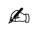

Practice Test: Test 1 (10Q)

# 9.2.1 Absolute Value: GATE CSE 2014 | Set 2 | GA | Question: 8

If $x$ is real and $|x^2 - 2x + 3| = 11$ , then possible values of $|-x^3 + x^2 - x|$ include

A. 2,4

B. 2,14

C. 4,52

D. 14,52

gatecse-2014-set2 quantitative-aptitude normal absolute-value

Answer key

# 9.2.2 Absolute Value: GATE CSE 2017 | Set 1 | GA | Question: 8

The expression $\frac{(x+y)-|x-y|}{2}$ is equal to :

A. The maximum of $x$ and $y$

B. The minimum of $x$ and $y$

C. 1

D. None of the above

gatecse-2017-set1 general-aptitude quantitative-aptitude maxima-minima absolute-value easy

Answer key

# 9.2.3 Absolute Value: GATE2011 AG: GA-7

Given that $f(y) = \frac{|y|}{y}$ , and $q$ is non-zero real number, the value of $|f(q) - f(-q)|$ is

A. 0

B. -1

C. 1

D. 2

general-aptitude quantitative-aptitude gate2011-ag absolute-value

Answer key


# 9.2.4 Absolute Value: GATE2013 AE: GA-8


If $|-2X + 9| = 3$ then the possible value of $|-X| - X^2$ would be:

A. 30

B. -30

C. -42

D. 42

gate2013-ae quantitative-aptitude absolute-value

# Answer key

# 9.2.5 Absolute Value: GATE2013 CE: GA-7

If $|4X - 7| = 5$ then the values of $2 \mid X \mid - \mid -X \mid$ is:

A. $2, \left(\frac{1}{3}\right)$

B. $\left(\frac{1}{2}\right)$ ,3

C. $\left(\frac{3}{2}\right)$ ,9

D. $\left(\frac{2}{3}\right)$ ,9

gate2013-ce quantitative-aptitude absolute-value

# Answer key

# 9.3

# Algebra (1)

Practice Tests: Test 1 (15Q) Test 2 (12Q)

# 9.3.1 Algebra: GATE2011 MN: GA-61

If $\frac{(2y + 1)}{(y + 2)} < 1$ , then which of the following alternatives gives the CORRECT range of $y$ ?

A. $-2 < y < 2$

B. $-2 < y < 1$

C. $-3 < y < 1$

D. $-4 < y < 1$

quantitative-aptitude gate2011-mn algebra

# Answer key

# 9.4

# Alligation Mixture (2)

Practice Test: Test 1 (8Q)

# 9.4.1 Alligation Mixture: GATE CSE 2011 | Question: 65

A container originally contains 10 litres of pure spirit. From this container, 1 litre of spirit replaced with 1 litre of water. Subsequently, 1 litre of the mixture is again replaced with 1 litre of water and this process is repeated one more time. How much spirit is now left in the container?

A. 7.58 litres

B. 7.84 litres

C. 7 litres

D. 7.29 litres

gatecse-2011 quantitative-aptitude normal alligation-mixture

# Answer key

# 9.4.2 Alligation Mixture: GATE2010 TF: GA-9

A tank has 100 liters of water. At the end of every hour, the following two operations are performed in sequence: i) water equal to $m\%$ of the current contents of the tank is added to the tank, ii) water equal to $n\%$ of the current contents of the tank is removed from the tank. At the end of 5 hours, the tank contains exactly 100 liters of water. The relation between $m$ and $n$ is :

A. m = n

B. $m > n$

C. m < n

D. None of the previous

general-aptitude quantitative-aptitude gate2010-tf alligation-mixture

# Answer key

# 9.5

# Area (1)


# 9.5.1 Area: GATE CSE 2025 | Set 1 | GA | Question: 7


In the diagram, the lines QR and ST are parallel to each other. The shortest distance between these two lines is half the shortest distance between the point P and line QR. What is the ratio of the area of the triangle PST to the area of the trapezium SQRT?

Note: The figure shown is representative.


<details>
<summary>text_image</summary>

P
S
T
Q
R
</details>

A. $\frac{1}{3}$

B. $\frac{1}{4}$

C. $\frac{2}{5}$

D. $\frac{1}{2}$

gatecse2025-set1 quantitative-aptitude geometry area two-marks

Answer key

# 9.6

# Arithmetic Series (3)

Practice Test: Test 1 (10Q)

# 9.6.1 Arithmetic Series: GATE CSE 2013 | Question: 58

What will be the maximum sum of 44, 42, 40, ...?

A. 502

B. 504

C. 506

D. 500

gatecse-2013 quantitative-aptitude easy arithmetic-series

Answer key

# 9.6.2 Arithmetic Series: GATE CSE 2015 | Set 2 | GA | Question: 6

If the list of letters P, R, S, T, U is an arithmetic sequence, which of the following are also in arithmetic sequence?

1. $2P, 2R, 2S, 2T, 2U$  
II. $P - 3,R - 3,S - 3,T - 3,U - 3$  
III. $P^2, R^2, S^2, T^2, U^2$

A. I only

B. I and II

C. II and III

D. I and III

gatecse-2015-set2 quantitative-aptitude normal arithmetic-series

Answer key

# 9.6.3 Arithmetic Series: GATE2011 AG: GA-6

The sum of $n$ terms of the series $4 + 44 + 444 + \ldots \ldots$ is

A. $\frac{4}{81}\left[10^{n + 1} - 9n - 1\right]$  
B. $\frac{4}{81} [10^{n - 1} - 9n - 1]$


C. $\frac{4}{81} [10^{n + 1} - 9n - 10]$  
D. $\frac{4}{81} [10^n - 9n - 10]$

general-aptitude quantitative-aptitude gate2011-ag arithmetic-series

Answer key

# 9.7

# Average (1)

Practice Test: Test 1 (13Q)

# 9.7.1 Average: GATE CSE 2025 | Set 1 | GA | Question: 3


The average marks obtained by a class in an examination were calculated as 30.8. However, while checking the marks entered, the teacher found that the marks of one student were entered incorrectly as 24 instead of 42. After correcting the marks, the average becomes 31.4. How many students does the class have?

A. 25

B. 28

C. 30

D. 32

gatecse2025-set1 quantitative-aptitude average one-mark

Answer key

# 9.8

# Bar Graph (4)

Practice Tests: Test 1 (15Q) Test 2 (4Q)

# 9.8.1 Bar Graph: GATE CSE 2015 | Set 3 | GA | Question: 10

The exports and imports (in crores of Rs.) of a country from the year 2000 to 2007 are given in the following bar chart. In which year is the combined percentage increase in imports and exports the highest?


<details>
<summary>bar</summary>

| Year | Exports | Imports |
| --- | --- | --- |
| 2000 | 50 | 40 |
| 2001 | 60 | 50 |
| 2002 | 70 | 60 |
| 2003 | 60 | 70 |
| 2004 | 70 | 80 |
| 2005 | 70 | 90 |
| 2006 | 100 | 120 |
| 2007 | 110 | 120 |
</details>

gatecse-2015-set3 quantitative-aptitude data-interpretation normal numerical-answers bar-graph

Answer key

# 9.8.2 Bar Graph: GATE CSE 2020 | GA | Question: 10

The total revenue of a company during 2014 – 2018 is shown in the bar graph. If the total expenditure of the company in each year is 500 million rupees, then the aggregate profit or loss (in percentage) on the total expenditure of the company during 2014 – 2018 is \_\_\_\_.


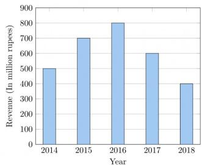

<details>
<summary>bar</summary>

| Year | Revenue (In million rupees) |
| --- | --- |
| 2014 | ~500 |
| 2015 | ~700 |
| 2016 | ~800 |
| 2017 | ~600 |
| 2018 | ~400 |
</details>

A. 16.67% profit  
C. 20% profit

B. 16.67% loss  
D. 20% loss

# 9.8.3 Bar Graph: GATE CSE 2021 | Set 2 | GA | Question: 9

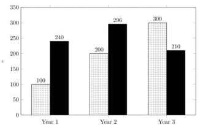

<details>
<summary>bar</summary>

| Category | Series 1 (Dotted) | Series 2 (Solid) |
| --- | --- | --- |
| Year 1 | 100 | 240 |
| Year 2 | 200 | 296 |
| Year 3 | 300 | 210 |
</details>

Number of units Net Profit (₹)


The number of units of a product sold in three different years and the respective net profits are presented in the figure above. The cost/unit in Year 3 was ₹ 1, which was half the cost/unit in Year 2. The cost/unit in Year 3 was one-third of the cost/unit in Year 1. Taxes were paid on the selling price at 10%, 13%, and 15% respectively for the three years. Net profit is calculated as the difference between the selling price and the sum of cost and taxes paid in that year.

The ratio of the selling price in Year 2 to the selling price in Year 3 is \_\_\_\_.

A. 4:3

B. 1:1

C. 3:4

D. 1:2

gatecse-2021-set2 quantitative-aptitude data-interpretation bar-graph two-marks

# Answer key

# 9.8.4 Bar Graph: GATE DA 2025 | GA | Question: 10

The number of patients per shift (X) consulting Dr. Gita in her past 100 shifts is shown in the figure. If the amount she earns is ₹ 1000(X - 0.2), what is the average amount (in ₹) she has earned per shift in the past 100 shifts?

Note: The figure shown is representative.


<details>
<summary>bar</summary>

| Number of patients per shift (X) | Number of shifts |
| --- | --- |
| 5 | 20 |
| 6 | 40 |
| 7 | 30 |
| 8 | 10 |
</details>

A. 6,100

B. 6,300

C. 6,000

D. 6,500

gateda-2025 quantitative-aptitude bar-graph data-interpretation two-marks

# Answer key

# 9.9

# Bayes Theorem (1)

# 9.9.1 Bayes Theorem: GATE CSE 2012 | Question: 63

An automobile plant contracted to buy shock absorbers from two suppliers $X$ and $Y$ . $X$ supplies $60\%$ and $Y$ supplies $40\%$ of the shock absorbers. All shock absorbers are subjected to a quality test. The ones that pass the quality test are considered reliable. Of $X's$ shock absorbers, $96\%$ are reliable. Of $Y's$ shock absorbers, $72\%$ are reliable.

The probability that a randomly chosen shock absorber, which is found to be reliable, is made by Y is


A. 0.288

B. 0.334

C. 0.667

D. 0.720

gatecse-2012 quantitative-aptitude bayes-theorem probability normal conditional-probability

# Answer key

# 9.10

# Cartesian Coordinates (4)

# Practice Test: Test 1 (10Q)

# 9.10.1 Cartesian Coordinates: GATE CSE 2020 | GA | Question: 9

Two straight lines are drawn perpendicular to each other in $X - Y$ plane. If $\alpha$ and $\beta$ are the acute angles the straight lines make with the X-axis, then $\alpha + \beta$ is \_\_\_\_.


A. $60^{\circ}$

B. $90^{\circ}$

C. $120^{\circ}$

D. $180^{\circ}$

gatecse-2020 quantitative-aptitude geometry cartesian-coordinates two-marks

# Answer key

# 9.10.2 Cartesian Coordinates: GATE CSE 2022 | GA | Question: 2

A function $y(x)$ is defined in the interval $[0,1]$ on the x-axis as


$$
y (x) = \left\{ \begin{array}{l l} 2 & \text {if} \quad 0 \leq x <   \frac {1}{3} \\ 3 & \text {if} \quad \frac {1}{3} \leq x <   \frac {3}{4} \\ 1 & \text {if} \quad \frac {3}{4} \leq x \leq 1 \end{array} \right.
$$

Which one of the following is the area under the curve for the interval $[0,1]$ on the $x$ -axis?

A. $\frac{5}{6}$

B. $\frac{6}{5}$

C. $\frac{13}{6}$

D. $\frac{6}{13}$

gatecse-2022 quantitative-aptitude cartesian-coordinates area one-mark

# Answer key

# 9.10.3 Cartesian Coordinates: GATE2012 AE: GA-9

Two points $(4, p)$ and $(0, q)$ lie on a straight line having a slope of $3/4$ . The value of $(p - q)$ is


A. -3

B. 0

C. 3

D. 4

gate2012-ae quantitative-aptitude cartesian-coordinates geometry

# Answer key

# 9.10.4 Cartesian Coordinates: GATE2014 AE: GA-4

If $y = 5x^{2} + 3$ , then the tangent at $x = 0$ , $y = 3$


A. passes through $x = 0, y = 0$

B. has a slope of +1

C. is parallel to the $x$ -axis

D. has a slope of -1

gate2014-ae quantitative-aptitude geometry cartesian-coordinates

# Answer key

# 9.11

# Circle (3)

# Practice Test: Test 1 (10Q)

# 9.11.1 Circle: GATE CSE 2018 | GA | Question: 3

The area of a square is $d$ . What is the area of the circle which has the diagonal of the square as its diameter?


A. $\pi d$

B. $\pi d^{2}$

c. $\frac{1}{4}\pi d^{2}$

D. $\frac{1}{2}\pi d$

# Answer key

# 9.11.2 Circle: GATE CSE 2020 | GA | Question: 8

The figure below shows an annular ring with outer and inner as $b$ and $a$ , respectively. The annular space has been painted in the form of blue colour circles touching the outer and inner periphery of annular space. If maximum $n$ number of circles can be painted, then the unpainted area available in annular space is \_\_\_\_.


<details>
<summary>text_image</summary>

b
a
</details>

A. $\pi [(b^2 - a^2) - \frac{n}{4} (b - a)^2 ]$  
C. $\pi [(b^2 -a^2) + \frac{\dot{n}}{4} (b - a)^2 ]$

gatecse-2020 quantitative-aptitude geometry circle area two-marks

B. $\pi [(b^2 - a^2) - n(b - a)^2]$  
D. $\pi [(b^2 -a^2) + n(b - a)^2 ]$

# Answer key

# 9.11.3 Circle: GATE DA 2026 | GA | Question: 10

In the given figure, $P, Q$ , and $R$ are three points on a circle of radius $10 \, \text{cm}$ with $O$ as its center, $\overline{PQ} = \overline{RQ}$ , and $\angle PQR = 45^\circ$ . The figure is representative. The area of the shaded region $PQRO$ is \_\_\_\_ $\text{cm}^2$ .


<details>
<summary>text_image</summary>

Q
45°
O
P
R
</details>

A. 50

B. $25\sqrt{2}$

C. $50\sqrt{2}$

D. 100

gateda-2026 quantitative-aptitude geometry circle area two-marks

# Answer key

# 9.12

# Clock Time (1)

# Practice Test: Test 1 (11Q)

# 9.12.1 Clock Time: GATE CSE 2014 | Set 2 | GA | Question: 10

At what time between 6 a. m. and 7 a. m. will the minute hand and hour hand of a clock make an angle


closest to 60°?

A. 6:22 a.m.

B. 6:27 a.m.

C. 6:38 a.m.

D. 6:45 a.m.

gatecse-2014-set2 quantitative-aptitude normal clock-time

Answer key

# 9.13

# Combinatory (5)

Practice Test: Test 1 (13Q)

# 9.13.1 Combinatory: GATE CSE 2010 | Question: 65

Given digits 2, 2, 3, 3, 3, 4, 4, 4, 4 how many distinct 4 digit numbers greater than 3000 can be formed?

A. 50

B. 51

C. 52

D. 54

gatecse-2010 quantitative-aptitude combinatory normal

Answer key

# 9.13.2 Combinatory: GATE CSE 2016 | Set 2 | GA | Question: 09

In a $2 \times 4$ rectangle grid shown below, each cell is rectangle. How many rectangles can be observed in the grid?


A. 21

B. 27

C. 30

D. 36

gatecse-2016-set2 quantitative-aptitude normal combinatory

Answer key

# 9.13.3 Combinatory: GATE CSE 2017 | Set 1 | GA | Question: 9

Arun, Gulab, Neel and Shweta must choose one shirt each from a pile of four shirts coloured red, pink, blue and white respectively. Arun dislikes the colour red and Shweta dislikes the colour white. Gulab and Neel like all the colours. In how many different ways can they choose the shirts so that no one has a shirt with a colour he or she dislikes?

A. 21

B. 18

C. 16

D. 14

gatecse-2017-set1 combinatory quantitative-aptitude

Answer key

# 9.13.4 Combinatory: GATE2011 MN: GA-59

In how many ways 3 scholarships can be awarded to 4 applicants, when each applicant can receive any number of scholarships?

A. 4

B. 12

C. 64

D. 81

quantitative-aptitude gate2011-mn combinatory

Answer key

# 9.13.5 Combinatory: GATE2012 AR: GA-5

Ten teams participate in a tournament. Every team plays each of the other teams twice. The total number of matches to be played is

A. 20

B. 45

C. 60

D. 90

gate2012-ar quantitative-aptitude combinatory

Answer key


# 9.14.1 Compound Interest: GATE DS&AI 2024 | GA | Question: 8

Person 1 and Person 2 invest in three mutual funds A, B, and C. The amounts they invest in each of these mutual funds are given in the table.


<table><tr><td></td><td>Mutual fund A</td><td>Mutual fund B</td><td>Mutual fund C</td></tr><tr><td>Person1</td><td>10,000</td><td>20,000</td><td>20,000</td></tr><tr><td>Person2</td><td>20,000</td><td>15,000</td><td>15,000</td></tr></table>

At the end of one year, the total amount that Person 1 gets is ₹500 more than Person 2. The annual rate of return for the mutual funds B and C is 15% each. What is the annual rate of return for the mutual fund A?

A. 7.5%

B. 10%

C. 15%

D. 20%

gate-ds-ai-2024 quantitative-aptitude compound-interest two-marks

# Answer key

# 9.14.2 Compound Interest: GATE2010 MN: GA-5

A person invest Rs.1000 at 10% annual compound interest for 2 years. At the end of two years, the whole amount is invested at an annual simple interest of 12% for 5 years. The total value of the investment finally is :

A. 1776

B. 1760

C. 1920

D. 1936

general-aptitude quantitative-aptitude gate2010-mn compound-interest

# Answer key

# 9.14.3 Compound Interest: GATE2014 AG: GA-5

The population of a new city is 5 million and is growing at 20% annually. How many years would it take to double at this growth rate?

A. 3 - 4 years

B. 4 - 5 years

C. 5 - 6 years

D. 6 - 7 years

gate2014-ag quantitative-aptitude compound-interest normal

# Answer key

# 9.15

# Conditional Probability (2)

# Practice Test: Test 1 (6Q)

# 9.15.1 Conditional Probability: GATE2013 AE: GA-10

In a factory, two machines M1 and M2 manufacture 60% and 40% of the autocomponents respectively. Out of the total production, 2% of M1 and 3% of M2 are found to be defective. If a randomly drawn autocomponent from the combined lot is found defective, what is the probability that it was manufactured by M2?

A. 0.35

B. 0.45

C. 0.5

D. 0.4

gate2013-ae quantitative-aptitude conditional-probability

# Answer key

# 9.15.2 Conditional Probability: GATE2014 AG: GA-10

10% of the population in a town is $HIV^{+}$ . A new diagnostic kit for HIV detection is available; this kit correctly identifies $HIV^{+}$ individuals 95% of the time, and $HIV^{-}$ individuals 89% of the time. A particular patient is tested using this kit and is found to be positive. The probability that the individual is actually positive is


# 9.16

# Contour Plots (2)

# 9.16.1 Contour Plots: GATE CSE 2017 | Set 1 | GA | Question: 10

A contour line joins locations having the same height above the mean sea level. The following is a contour plot of a geographical region. Contour lines are shown at $25\mathrm{m}$ intervals in this plot. If in a flood, the water level rises to $525\mathrm{m}$ , which of the villages $P, Q, R, S, T$ get submerged?


<details>
<summary>text_image</summary>

425
450
R
Q
550
P
500
T
500
450
S
</details>

A. $P, Q$

B. $P, Q, T$

C. R, S, T

D. $Q, R, S$

gatecse-2017-set1 general-aptitude quantitative-aptitude data-interpretation normal contour-plots

# Answer key

# 9.16.2 Contour Plots: GATE CSE 2017 | Set 2 | GA | Question: 10

An air pressure contour line joins locations in a region having the same atmospheric pressure. The following is an air pressure contour plot of a geographical region. Contour lines are shown at 0.05 bar intervals in this plot.


If the possibility of a thunderstorm is given by how fast air pressure rises or drops over a region, which of the following regions is most likely to have a thunderstorm?

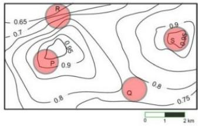

<details>
<summary>contour</summary>

| Zone | Value |
| --- | --- |
| R | 0.65 |
| P | 0.9 |
| Q | 0.8 |
| S | 0.95 |
</details>

A. P

B. Q

C. R

D. S

gatecse-2017-set2 quantitative-aptitude data-interpretation normal contour-plots

# Answer key

# 9.17

# Cost Market Price (4)

# Practice Test: Test 1 (7Q)

# 9.17.1 Cost Market Price: GATE CSE 2011 | Question: 63

The variable cost $(V)$ of manufacturing a product varies according to the equation V = 4q, where q is the quantity produced. The fixed cost $(F)$ of production of same product reduces with q according to the equation $F = \frac{100}{q}$ . How many units should be produced to minimize the total cost $(V + F)$ ?


A. 5

B. 4

C. 7

D. 6

gatecse-2011 quantitative-aptitude cost-market-price normal

# Answer key

# 9.17.2 Cost Market Price: GATE CSE 2012 | Question: 56


The cost function for a product in a firm is given by $5q^{2}$ , where q is the amount of production. The firm can sell the product at a market price of ₹50 per unit. The number of units to be produced by the firm such that the profit is maximized is

A. 5

B. 10

C. 15

D. 25

gatecse-2012 quantitative-aptitude cost-market-price normal

# Answer key

# 9.17.3 Cost Market Price: GATE CSE 2019 | GA | Question: 4

Ten friends planned to share equally the cost of buying a gift for their teacher. When two of them decided not to contribute, each of the other friends had to pay Rs. 150 more. The cost of the gift was Rs. \_\_\_\_


A. 666

B. 3000

C. 6000

D. 12000

gatecse-2019 general-aptitude quantitative-aptitude cost-market-price one-mark

# Answer key

# 9.17.4 Cost Market Price: GATE2014 AE: GA-5

A foundry has a fixed daily cost of Rs 50,000 whenever it operates and a variable cost of RS 800Q, where Q is the daily production in tonnes. What is the cost of production in Rs per tonne for a daily production of 100 tonnes.


gate2014-ae quantitative-aptitude cost-market-price numerical-answers

# Answer key

# 9.18

# Cubes (2)

# 9.18.1 Cubes: GATE CSE 2016 | Set 1 | GA | Question: 05

A cube is built using 64 cubic blocks of side one unit. After it is built, one cubic block is removed from every corner of the cube. The resulting surface area of the body (in square units) after the removal is \_\_\_\_.


a. 56

b. 64

c. 72

d. 96

gatecse-2016-set1 quantitative-aptitude geometry normal cubes

# Answer key

# 9.18.2 Cubes: GATE CSE 2021 | Set 2 | GA | Question: 3

If $\theta$ is the angle, in degrees, between the longest diagonal of the cube and any one of the edges of the cube, then, $\cos\theta=$


A. $\frac{1}{2}$

B. $\frac{1}{\sqrt{3}}$

C. $\frac{1}{\sqrt{2}}$

D. $\frac{\sqrt{3}}{2}$

gatecse-2021-set2 quantitative-aptitude mensuration cubes one-mark

# Answer key

# 9.19

# Currency Notes (1)

# 9.19.1 Currency Notes: GATE2012 CY: GA-10

Raju has 14 currency notes in his pocket consisting of only Rs. 20 notes and Rs. 10 notes. The total money value of the notes is Rs. 230. The number of Rs. 10 notes that Raju has is


A. 5

B. 6

C. 9

D. 10

gate2012-cy quantitative-aptitude numerical-computation currency-notes

# Answer key

# 9.20

# Data Interpretation (3)

# 9.20.1 Data Interpretation: GATE CSE 2011 | Question: 62


P, Q, R and S are four types of dangerous microbes recently found in a human habitat. The area of each circle with its diameter printed in brackets represents the growth of a single microbe surviving human immunity system within 24 hours of entering the body. The danger to human beings varies proportionately with the toxicity, potency and growth attributed to a microbe shown in the figure below:

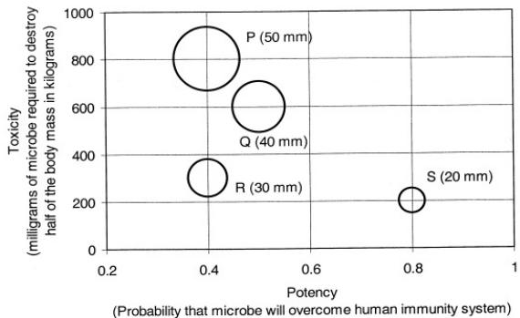

<details>
<summary>bubble</summary>

| Category | Potency | Toxicity (milligrams of microbe required to destroy half of the body mass in kilograms) |
| --- | --- | --- |
| P (50 mm) | ~0.4 | ~800 |
| Q (40 mm) | ~0.5 | ~600 |
| R (30 mm) | ~0.4 | ~300 |
| S (20 mm) | ~0.8 | ~200 |
</details>

A pharmaceutical company is contemplating the development of a vaccine against the most dangerous microbe. Which microbe should the company target in its first attempt?

A. P

B. Q

C. R

D. S

gatecse-2011 quantitative-aptitude data-interpretation normal

# Answer key

# 9.20.2 Data Interpretation: GATE CSE 2026 | Set 2 | GA | Question: 8


Figures (i) and (ii) represent intercity highway systems. The black dots represent cities and the line segments between them represent intercity highways.

A salesperson needs to make a trip. She needs to start from a city, visit each of the remaining cities exactly once, and finally return to the same city from which she started.

Which one of the following options is then true?

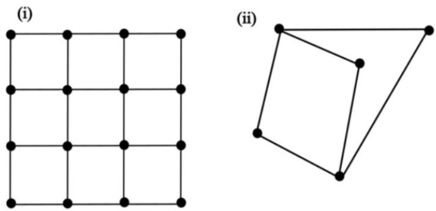

(i)  


<details>
<summary>natural_image</summary>

Pure grid pattern with 13 numbered points (no text or symbols)
</details>

(ii)  


<details>
<summary>natural_image</summary>

Two overlapping polygons with black dots at vertices (no text or symbols)
</details>

A. Such a trip is possible for (i), but not for (ii).  
B. Such a trip is possible for (ii), but not for (i).  
C. Such a trip is possible for both (i) and (ii).  
D. Such a trip is possible neither for (i) nor for (ii).

gatecse-2026-set2 quantitative-aptitude data-interpretation two-marks

# Answer key

# 9.20.3 Data Interpretation: GATE DA 2025 | GA | Question: 7

Weight of a person can be expressed as a function of their age. The function usually varies from person to person. Suppose this function is identical for two brothers, and it monotonically increases till the age of 50 years and then it monotonically decreases. Let $a_1$ and $a_2$ (in years) denote the ages of the brothers and $a_1 < a_2$ .

Which one of the following statements is correct about their age on the day when they attain the same weight?

A. $a_{1} < a_{2} < 50$  
C. $50 < a_{1} < a_{2}$

gateda-2025 quantitative-aptitude data-interpretation two-marks

B. $a_1 < 50 < a_2$  
D. Either $a_1 = 50$ or $a_2 = 50$

# Answer key

# 9.21

# Digital Image Processing (1)

# 9.21.1 Digital Image Processing: GATE DA 2025 | GA | Question: 3

A $4 \times 4$ digital image has pixel intensities $(U)$ as shown in the figure. The number of pixels with $U \leq 4$ is:

<table><tr><td>0</td><td>1</td><td>0</td><td>2</td></tr><tr><td>4</td><td>7</td><td>3</td><td>3</td></tr><tr><td>5</td><td>5</td><td>4</td><td>4</td></tr><tr><td>6</td><td>7</td><td>3</td><td>2</td></tr></table>

A. 3

B. 8

C. 11

D. 9

gateda-2025 quantitative-aptitude digital-image-processing easy one-mark

# Answer key

# 9.22

# Factors (3)

Practice Test: Test 1 (5Q)

# 9.22.1 Factors: GATE CSE 2013 | Question: 62

Out of all the 2-digit integers between 1 and 100, a 2-digit number has to be selected at random. What is the probability that the selected number is not divisible by 7?


A. $\left(\frac{13}{90}\right)$

B. $\left(\frac{12}{90}\right)$

C. $\left(\frac{78}{90}\right)$

D. $\left(\frac{77}{90}\right)$

gatecse-2013 quantitative-aptitude easy probability factors

# Answer key

# 9.22.2 Factors: GATE CSE 2018 | GA | Question: 4

What would be the smallest natural number which when divided either by 20 or by 42 or by 76 leaves a remainder of 7 in each case?


A. 3047

B. 6047

C. 7987

D. 63847

gatecse-2018 quantitative-aptitude factors one-mark

# Answer key

# 9.22.3 Factors: GATE2010 MN: GA-8

Consider the set of integers $\{1,2,3,\ldots,5000\}$ . The number of integers that is divisible by neither 3 nor 4 is :


A. 1668

B. 2084

C. 2500

D. 2916

general-aptitude quantitative-aptitude gate2010-mn factors

# Answer key

# 9.23

# Fractions (1)

# 9.23.1 Fractions: GATE CSE 2018 | GA | Question: 6

In appreciation of the social improvements completed in a town, a wealthy philanthropist decided to gift Rs 750 to each male senior citizen in the town and Rs 1000 to each female senior citizen. Altogether, there


were 300 senior citizens eligible for this gift. However, only $\frac{8^{th}}{9}$ of the eligible men and $\frac{2^{rd}}{3}$ of the eligible women claimed the gift. How much money (in Rupees) did the philanthropist give away in total?

A. 1,50,000

B. 2,00,000

C. 1,75,000

D. 1,51,000

gatecse-2018 quantitative-aptitude fractions normal two-marks

# Answer key

# 9.24

# Functions (7)

Practice Tests: Test 1 (15Q) Test 2 (7Q)

# 9.24.1 Functions: GATE CSE 2015 | Set 2 | GA | Question: 9

If $p, q, r, s$ are distinct integers such that:

$$
f (p, q, r, s) = \max (p, q, r, s)
$$

$$
g (p, q, r, s) = \min (p, q, r, s)
$$

$$
h (p, q, r, s) = \text {remainder of} \frac {(p \times q)}{(r \times s)} \text {if} (p \times q) > (r \times s)
$$

or remainder of $\frac{(r \times s)}{(p \times q)}$ if $(r \times s) > (p \times q)$

Also a function $fgh(p, q, r, s) = f(p, q, r, s) \times g(p, q, r, s) \times h(p, q, r, s)$

Also the same operations are valid with two variable functions of the form $f(p, q)$

What is the value of $fg(h(2,5,7,3),4,6,8)$ ?

gatecse-2015-set2 functions normal numerical-answers

# Answer key


# 9.24.2 Functions: GATE CSE 2015 | Set 3 | GA | Question: 5


A function $f(x)$ is linear and has a value of 29 at $x = -2$ and 39 at $x = 3$ . Find its value at $x = 5$ .

A. 59

B. 45

C. 43

D. 35

gatecse-2015-set3 quantitative-aptitude normal functions

Answer key

# 9.24.3 Functions: GATE CSE 2015 | Set 3 | GA | Question: 8

Choose the most appropriate equation for the function drawn as thick line, in the plot below.


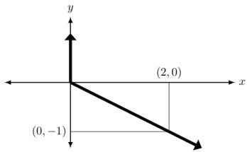

<details>
<summary>text_image</summary>

y
(2, 0)
x
(0, -1)
</details>

A. $x = y - |y|$

B. $x = -(y - |y|)$

C. $x = y + |y|$

D. $x = -(y + |y|)$

gatecse-2015-set3 quantitative-aptitude normal functions

Answer key

# 9.24.4 Functions: GATE CSE 2023 | GA | Question: 7

Consider two functions of time (t),

$$
f (t) = 0. 0 1 t ^ {2}
$$

$$
g (t) = 4 t
$$

where $0 < t < \infty$ .

Now consider the following two statements:

i. For some $t > 0, g(t) > f(t)$ .  
ii. There exists a $T$ , such that $f(t) > g(t)$ for all $t > T$ .

Which one of the following options is TRUE?

A. only (i) is correct  
B. only (ii) is correct  
C. both (i) and (ii) are correct  
D. neither (i) nor (ii) is correct

gatecse-2023 quantitative-aptitude functions two-marks

Answer key

# 9.24.5 Functions: GATE CSE 2023 | GA | Question: 9

$f(x)$ and $g(y)$ are functions of x and y, respectively, and $f(x) = g(y)$ for all values of x and y. Which one of the following options is necessarily TRUE for a x and y?

A. $f(x) = 0$ and $g(y) = 0$

B. $f(x) = g(y) =$ constant

C. $f(x) \neq \text{constant} \quad \text{constant} \quad \text{and } g(y) \neq$ constant

D. $f(x) + g(y) = f(x) - g(y)$

gatecse-2023 quantitative-aptitude functions two-marks

Answer key

# 9.24.6 Functions: GATE2010 MN: GA-10

Given the following four functions $f_{1}(n) = n^{100}$ , $f_{2}(n) = (1.2)^{n}$ , $f_{3}(n) = 2^{n/2}$ , $f_{4}(n) = 3^{n/3}$ which function will have the largest value for sufficiently large values of $n$ ( $i.e. n \to \infty$ )?


A. $f_{4}$

B. $f_{3}$

C. $f_{2}$

D. $f_{1}$

general-aptitude quantitative-aptitude gate2010-mn functions

# Answer key

# 9.24.7 Functions: GATE2012 AR: GA-7

Let $f(x) = x - [x]$ , where $x \geq 0$ and $[x]$ is the greatest integer not larger than $x$ . Then $f(x)$ is a

A. monotonically increasing function  
B. monotonically decreasing function  
C. linearly increasing function between two integers  
D. linearly decreasing function between two integers

gate2012-ar quantitative-aptitude functions normal

# Answer key

# 9.25

# Geometry (5)

Practice Tests: Test 1 (15Q) Test 2 (15Q) Test 3 (4Q)

# 9.25.1 Geometry: GATE CSE 2014 | Set 1 | GA | Question: 10

When a point inside of a tetrahedron (a solid with four triangular surfaces) is connected by straight lines to its corners, how many (new) internal planes are created with these lines?

gatecse-2014-set1 quantitative-aptitude geometry combinatory normal numerical-answers

# Answer key

# 9.25.2 Geometry: GATE CSE 2024 | Set 1 | GA | Question: 7

A rectangular paper sheet of dimensions $54 \, cm \times 4 \, cm$ is taken. The two longer edges of the sheet are joined together to create a cylindrical tube. A cube whose surface area is equal to the area of the sheet is also taken.

Then, the ratio of the volume of the cylindrical tube to the volume of the cube is

A. $1/\pi$

B. $2/\pi$

C. $3/\pi$

D. $4/\pi$

gatecse-2024-set1 quantitative-aptitude geometry two-marks

# Answer key

# 9.25.3 Geometry: GATE CSE 2025 | Set 2 | GA | Question: 9

In the Given figure, PQRS is a square of side 2 cm and PLMN is a rectangle. The corner L of the rectangle is on the side QR. Side MN of the rectangle passes through the corner S of the square.

What is the area (in $cm^{2}$ ) of the rectangle PLMN?

Note: The figure shown is representative.

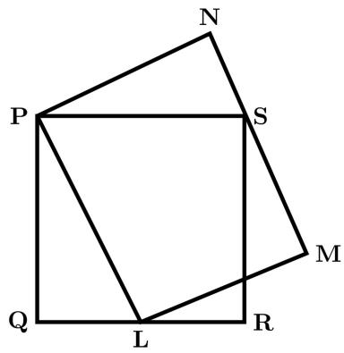

<details>
<summary>text_image</summary>

N
P
S
Q
L
R
M
</details>


A. $2\sqrt{2}$

B. 2

C. 8

D. 4

gatecse2025-set2 quantitative-aptitude geometry two-marks

# Answer key

# 9.25.4 Geometry: GATE DA 2025 | GA | Question: 4

In the given figure, the numbers associated with the rectangle, triangle, and ellipse are 1, 2, and 3, respectively. Which one among the given options is the most appropriate combination of P, Q, and R?


<details>
<summary>text_image</summary>

1
4
P
3
R
2
Q
</details>

A. $P = 6; Q = 5; R = 3$

B. $P = 5; Q = 6; R = 3$

C. $P = 3; Q = 6; R = 6$

D. $P = 5; Q = 3; R = 6$

gateda-2025 quantitative-aptitude geometry one-mark

# Answer key

# 9.25.5 Geometry: GATE DA 2025 | GA | Question: 8

A regular dodecagon (12-sided regular polygon) is inscribed in a circle of radius r cm as shown in the figure. The side of the dodecagon is d cm. All the triangles (numbered 1 to 12) in the figure are used to form squares of side r cm and each numbered triangle is used only once to form a square.


The number of squares that can be formed and the number of triangles required to form each square, respectively, are:

Note: The figure shown is representative.


<details>
<summary>text_image</summary>

10
1
2
d
9
8
3
7
4
12
6
5
11
</details>

A. 3;4

B. 4;3

C. 3;3

D. 3;2

gateda-2025 quantitative-aptitude geometry two-marks

# Answer key

# 9.26.1 Graph Coloring: GATE DS&AI 2024 | GA | Question: 2


The 15 parts of the given figure are to be painted such that no two adjacent parts with shared boundaries (excluding corners) have the same color. The minimum number of colors required is


<details>
<summary>natural_image</summary>

Geometric diagram of a circle inscribed in a larger circle, with internal square and polygonal lines forming a square (no text or symbols)
</details>

A. 4  
B. 3  
C. 5  
D. 6

gate-ds-ai-2024 quantitative-aptitude graph-coloring one-mark easy

Answer key

# 9.27

# Line Graph (5)

Practice Test: Test 1 (12Q)

# 9.27.1 Line Graph: GATE CSE 2014 | Set 2 | GA | Question: 9

The ratio of male to female students in a college for five years is plotted in the following line graph. If the number of female students doubled in 2009, by what percent did the number of male students increase in 2009?


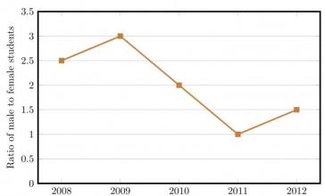

<details>
<summary>line</summary>

| Year | Ratio of male to female students |
| --- | --- |
| 2008 | 2.5 |
| 2009 | 3.0 |
| 2010 | 2.0 |
| 2011 | 1.0 |
| 2012 | 1.5 |
</details>

gatecse-2014-set2 quantitative-aptitude data-interpretation numerical-answers normal line-graph

Answer key

# 9.27.2 Line Graph: GATE CSE 2014 | Set 3 | GA | Question: 9

The ratio of male to female students in a college for five years is plotted in the following line graph. If the number of female students in 2011 and 2012 is equal, what is the ratio of male students in 2012 to male students in 2011?


<details>
<summary>line</summary>

| Year | Ratio of male to female students |
| --- | --- |
| 2008 | 2.5 |
| 2009 | 3.0 |
| 2010 | 2.0 |
| 2011 | 1.0 |
| 2012 | 1.5 |
</details>

A. 1:1

B. 2:1

C. 1.5:1

D. 2.5:1

gatecse-2014-set3 quantitative-aptitude data-interpretation normal line-graph

Answer key

# 9.27.3 Line Graph: GATE CSE 2016 | Set 2 | GA | Question: 10


<details>
<summary>line</summary>

| x | f(x) |
| --- | --- |
| -3 | -2 |
| -1 | 0 |
| 1 | 2 |
| 3 | 0 |
</details>

A. $f(x) = 1 - |x - 1|$  
C. $f(x)=2-|x-1|$

gatecse-2016-set2 quantitative-aptitude data-interpretation normal line-graph

B. $f(x) = 1 + |x - 1|$  
D. $f(x) = 2 + |x - 1|$

# Answer key

# 9.27.4 Line Graph: GATE2011 AG: GA-9

The fuel consumed by a motorcycle during a journey while traveling at various speeds is indicated in the graph below.


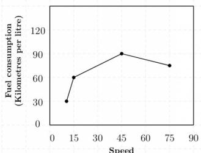

<details>
<summary>line</summary>

| Speed | Fuel consumption (Kilometres per litre) |
| --- | --- |
| 10 | 32 |
| 15 | 61 |
| 45 | 92 |
| 75 | 78 |
</details>

(Kilometres per hour)

The distances covered during four laps of the journey are listed in the table below

<table><tr><td>Lap</td><td>Distance(kilometres)</td><td>Average Speed(kilometres per hour)</td></tr><tr><td>P</td><td>15</td><td>15</td></tr><tr><td>Q</td><td>75</td><td>45</td></tr><tr><td>R</td><td>40</td><td>75</td></tr><tr><td>S</td><td>10</td><td>10</td></tr></table>

From the given data, we can conclude that the fuel consumed per kilometre was least during the lap

A. P

B. Q

C. R

D. S

general-aptitude quantitative-aptitude gate2011-ag data-interpretation line-graph

# Answer key

# 9.27.5 Line Graph: GATE2014 AE: GA-10

The monthly rainfall chart based on 50 years of rainfall in Agra is shown in the following figure.


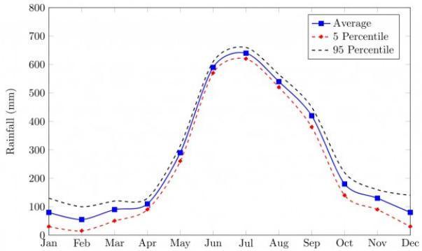

<details>
<summary>line</summary>

| Month | Average (mm) | 5 Percentile (mm) | 95 Percentile (mm) |
| --- | --- | --- | --- |
| Jan | ~80 | ~30 | ~130 |
| Feb | ~60 | ~20 | ~100 |
| Mar | ~90 | ~50 | ~120 |
| Apr | ~110 | ~90 | ~130 |
| May | ~290 | ~260 | ~300 |
| Jun | ~590 | ~570 | ~600 |
| Jul | ~640 | ~620 | ~660 |
| Aug | ~540 | ~520 | ~570 |
| Sep | ~420 | ~380 | ~450 |
| Oct | ~180 | ~140 | ~200 |
| Nov | ~130 | ~90 | ~160 |
| Dec | ~80 | ~30 | ~140 |
</details>

Which of the following are true? (k percentile is the value such that k percent of the data fall below that value)

i. On average, it rains more in July than in December  
ii. Every year, the amount of rainfall in August is more than that in January  
iii. July rainfall can be estimated with better confidence than February rainfall  
iv. In August, there is at least 500 mm of rainfall

A. (i) and (ii)

B. (i) and (iii)

C. (ii) and (iii)

D. (iii) and (iv)

gate2014-ae quantitative-aptitude data-interpretation line-graph

Answer key

# 9.28

# Logarithms (6)

Practice Tests: Test 1 (15Q) Test 2 (4Q)

# 9.28.1 Logarithms: GATE CSE 2011 | Question: 57

If $\log (\mathrm{P}) = (1 / 2)\log (\mathrm{Q}) = (1 / 3)\log (\mathrm{R})$ , then which of the following options is TRUE?

A. $P^{2}=Q^{3}R^{2}$

B. $Q^{2}=PR$

C. $Q^{2}=R^{3}P$

D. $R = P^{2}Q^{2}$

gatecse-2011 quantitative-aptitude normal logarithms

Answer key

# 9.28.2 Logarithms: GATE CSE 2018 | GA | Question: 7

If $pqr \neq 0$ and $p^{-x} = \frac{1}{q}$ , $q^{-y} = \frac{1}{r}$ , $r^{-z} = \frac{1}{p}$ , what is the value of the product $xyz$ ?

A. -1

B. $\frac{1}{pqr}$

C. 1

D. pqr

gatecse-2018 quantitative-aptitude ratio-proportion two-marks logarithms

Answer key

# 9.28.3 Logarithms: GATE CSE 2024 | Set 1 | GA | Question: 5

For positive non-zero real variables p and q, if

$$
\log \bigl (p ^ {2} + q ^ {2} \bigr) = \log p + \log q + 2 \log 3,
$$

then, the value of $\frac{p^4 + q^4}{p^2q^2}$ is

A. 79

B. 81

C. 9

D. 83

gatecse-2024-set1 quantitative-aptitude logarithms one-mark

Answer key

# 9.28.4 Logarithms: GATE CSE 2024 | Set 2 | GA | Question: 4

For positive non-zero real variables x and y, if

$$
\ln \bigg (\frac {x + y}{2} \bigg) = \frac {1}{2} [ \ln (x) + \ln (y) ]
$$

then, the value of $\frac{x}{y} + \frac{y}{x}$ is

A. 1

B. $1 / 2$

C. 2

D. 4

gatecse-2024-set2 quantitative-aptitude logarithms one-mark

Answer key


# 9.28.5 Logarithms: GATE DA 2026 | GA | Question: 4


Consider two distinct positive real numbers $m, n$ , with $m > n$ . Let $x = n^{\log_{10}(m)}$ and $y = m^{\log_{10}(n)}$ . The relation between $x$ and $y$ is \_\_\_\_.

A. x > y

B. x < y

C. x = y

D. $x = \log_{10}(y)$

gateda-2026 quantitative-aptitude logarithms one-mark

# Answer key

# 9.28.6 Logarithms: GATE2012 AR: GA-6

A value of $x$ that satisfies the equation $\log x + \log (x - 7) = \log (x + 11) + \log 2$ is

A. 1

B. 2

C. 7

D. 11

gate2012-ar quantitative-aptitude logarithms

# Answer key

# 9.29

# Maps (1)

# 9.29.1 Maps: GATE CSE 2025 | Set 2 | GA | Question: 10


The diagram below shows a river system consisting of 7 segments, marked $P, Q, R, S, T, U$ , and $V$ . It splits the land into 5 zones, marked $Z1, Z2, Z3, Z4$ , and $Z5$ . We need to connect these zones using the least number of bridges, Out of the following options, which one is correct?

Note: The figure shown is representative.


<details>
<summary>text_image</summary>

Z2
R
Z3
P
Q
T
V
Z1
S
Z5
U
Z4
</details>

A. Bridges on $P, Q$ and $T$

C. Bridges on $Q, R, T$ and $V$

gatecse2025-set2 quantitative-aptitude maps two-marks

B. Bridges on $P, Q, S$ and $T$

D. Bridges on $P, Q, S, U$ and $V$

# Answer key

# 9.30

# Maxima Minima (4)

# Practice Test: Test 1 (5Q)

# 9.30.1 Maxima Minima: GATE CSE 2012 | Question: 62

A political party orders an arch for the entrance to the ground in which the annual convention is being held. The profile of the arch follows the equation $y = 2x - 0.1x^{2}$ where $y$ is the height of the arch in meters. The maximum possible height of the arch is

A. 8 meters

B. 10 meters

C. 12 meters

D. 14 meters

gatecse-2012 quantitative-aptitude normal maxima-minima

# Answer key


# 9.30.2 Maxima Minima: GATE CSE 2017 | Set 2 | GA | Question: 9

The number of roots of $e^x + 0.5x^2 - 2 = 0$ in the range $[-5, 5]$ is

A. 0

B. 1

C. 2

D. 3

gatecse-2017-set2 quantitative-aptitude normal maxima-minima calculus

# Answer key

# 9.30.3 Maxima Minima: GATE2010 TF: GA-5

Consider the function $f(x) = \max (7 - x, x + 3)$ . In which range does $f$ take its minimum value?

A. $-6 \leq x < -2$

B. $-2 \leq x < 2$

C. $2 \leq x < 6$

D. $6 \leq x < 10$

general-aptitude quantitative-aptitude gate2010-tf maxima-minima functions

# Answer key

# 9.30.4 Maxima Minima: GATE2013 CE: GA-6

$X$ and $Y$ are two positive real numbers such that $2X + Y \leq 6$ and $X + 2Y \leq 8$ . For which of the following values of

$(X,Y)$ the function $f(X,Y) = 3X + 6Y$ will give maximum value?

A. $\left(\frac{4}{3},\frac{10}{3}\right)$

B. $\left(\frac{8}{3},\frac{20}{3}\right)$

C. $\left(\frac{8}{3}, \frac{10}{3}\right)$

D. $\left(\frac{4}{3},\frac{20}{3}\right)$

gate2013-ce quantitative-aptitude maxima-minima

# Answer key

# 9.31

# Mensuration (1)

# 9.31.1 Mensuration: GATE DA 2025 | GA | Question: 5

A rectangle has a length L and a width W, where L > W. If the width, W, is increased by 10%, which one of the following statements is correct for all values of L and W?

A. Perimeter increases by 10%.

B. Length of the diagonals increases by 10%.

C. Area increases by 10%.

D. The rectangle becomes a square.

gateda-2025 quantitative-aptitude mensuration one-mark

# Answer key

# 9.32

# Modular Arithmetic (1)

# 9.32.1 Modular Arithmetic: GATE2012 CY: GA-1

If $(1.001)^{1259} = 3.52$ and $(1.001)^{2062} = 7.85$ , then $(1.001)^{3321} =$

A. 2.23

B. 4.33

C. 11.37

D. 27.64

gate2012-cy quantitative-aptitude modular-arithmetic

# Answer key

# 9.33

# Number Representation (1)

# 9.33.1 Number Representation: GATE DA 2026 | GA | Question: 2

The product of the digits of a three-digit number is 70. The sum of the digits of this three-digit number is

A. 12

B. 14

C. 16

D. 18


# 9.34

# Number Series (5)

Practice Test: Test 1 (10Q)

# 9.34.1 Number Series: GATE CSE 2013 | Question: 61

Find the sum of the expression

$$
\frac {1}{\sqrt {1} + \sqrt {2}} + \frac {1}{\sqrt {2} + \sqrt {3}} + \frac {1}{\sqrt {3} + \sqrt {4}} + \dots + \frac {1}{\sqrt {8 0} + \sqrt {8 1}}
$$

A. 7

B. 8

C. 9

D. 10

gatecse-2013 quantitative-aptitude normal number-series

# Answer key

# 9.34.2 Number Series: GATE CSE 2014 | Set 2 | GA | Question: 5

The value of $\sqrt{12 + \sqrt{12 + \sqrt{12 + \ldots}}}$ is

A. 3.464

B. 3.932

C. 4.000

D. 4.444

gatecse-2014-set2 quantitative-aptitude easy number-series

# Answer key

# 9.34.3 Number Series: GATE CSE 2014 | Set 3 | GA | Question: 4

Which number does not belong in the series below?

2,5,10,17,26,37,50,64

A. 17

B. 37

C. 64

D. 26

gatecse-2014-set3 quantitative-aptitude number-series easy

# Answer key

# 9.34.4 Number Series: GATE2010 TF: GA-7

Consider the series $\frac{1}{2} + \frac{1}{3} - \frac{1}{4} + \frac{1}{8} + \frac{1}{9} - \frac{1}{16} + \frac{1}{32} + \frac{1}{27} - \frac{1}{64} + \ldots$ . The sum of the infinite series above is:

A. $\infty$

B. $\frac{5}{6}$

C. $\frac{1}{2}$

D. 0

general-aptitude quantitative-aptitude gate2010-tf number-series

# Answer key

# 9.34.5 Number Series: GATE2013 EE: GA-10

Find the sum to 'n' terms of the series $10 + 84 + 734 + \ldots$

A. $\frac{9(9^n + 1)}{10} + 1$

B. $\frac{9(9^n - 1)}{8} + 1$

C. $\frac{9(9^n - 1)}{8} + n$

D. $\frac{9(9^n - 1)}{8} + n^2$

gate2013-ee quantitative-aptitude number-series

# Answer key

# 9.35

# Number System (4)

Practice Tests: Test 1 (15Q) Test 2 (15Q) Test 3 (2Q)

# 9.35.1 Number System: GATE CSE 2014 | Set 3 | GA | Question: 10

Consider the equation: $(7526)_8 - (Y)_8 = (4364)_8$ , where $(X)_N$ stands for $X$ to the base $N$ . Find $Y$ .


A. 1634

B. 1737

C. 3142

D. 3162

gatecse-2014-set3 quantitative-aptitude number-system normal digital-logic

# Answer key

# 9.35.2 Number System: GATE CSE 2017 | Set 2 | GA | Question: 8

$X$ is a 30 digit number starting with the digit 4 followed by the digit 7. Then the number $X^3$ will have


A. 90 digits

B. 91 digits

C. 92 digits

D. 93 digits

gatecse-2017-set2 quantitative-aptitude number-system

# Answer key

# 9.35.3 Number System: GATE DA 2026 | GA | Question: 9

P, Q, R, S, X, and Y are distinct single-digit whole numbers taking values from 0 to 9.

$PQ$ is a two-digit number with $Q$ being in the units place and $P$ in the tens place. Similarly, $RS$ is a two-digit number.


It is known that $PQ$ and $RS$ are consecutive numbers and $(PQ)^2 + (RS)^2 = XYP$ , with $XYP$ being a three-digit number.

The value of $Y$ is \_\_\_\_

A. 4

B. 5

C. 6

D. 7

gateda-2026 quantitative-aptitude two-marks number-system

# Answer key

# 9.35.4 Number System: GATE2010 MN: GA-9

A positive integer m in base 10 when represented in base 2 has the representation p and in base 3 has the representation q. We get p - q = 990 where the subtraction is done in base 10. Which of the following is necessarily true?


A. $m \geq 14$

B. $9 \leq m \leq 13$

C. $6 \leq m \leq 8$

D. m < 6

general-aptitude quantitative-aptitude gate2010-mn number-system

# Answer key

# 9.36

# Number Theory (2)

# Practice Test: Test 1 (7Q)

# 9.36.1 Number Theory: GATE CSE 2025 | Set 2 | GA | Question: 3

If $P e^{x} = Q e^{-x}$ for all real values of $x$ , which one of the following statements is true?


A. P = Q = 0

B. P = Q = 1

C. $P = 1; Q = -1$

D. $\frac{P}{Q}=0$

gatecse2025-set2 quantitative-aptitude mathematical-logic one-mark number-theory

# Answer key

# 9.36.2 Number Theory: GATE2012 AE: GA-8

If a prime number on division by 4 gives a remainder of 1, then that number can be expressed as


A. sum of squares of two natural numbers  
B. sum of cubes of two natural numbers  
C. sum of square roots of two natural numbers  
D. sum of cube roots of two natural numbers

# 9.37

# Numerical Computation (9)

Practice Tests: Test 1 (15Q) Test 2 (3Q)

# 9.37.1 Numerical Computation: GATE CSE 2014 | Set 1 | GA | Question: 4

$$
\text {If} \left(z + \frac {1}{z}\right) ^ {2} = 9 8, \text {compute} \left(z ^ {2} + \frac {1}{z ^ {2}}\right).
$$

gatecse-2014-set1 quantitative-aptitude easy numerical-answers numerical-computation

Answer key

# 9.37.2 Numerical Computation: GATE CSE 2014 | Set 2 | GA | Question: 4

What is the average of all multiples of 10 from 2 to 198?

A. 90

B. 100

C. 110

D. 120

gatecse-2014-set2 quantitative-aptitude easy numerical-computation factors

Answer key

# 9.37.3 Numerical Computation: GATE CSE 2017 | Set 1 | GA | Question: 4

Find the smallest number y such that $y \times 162$ is a perfect cube.

A. 24

B. 27

C. 32

D. 36

gatecse-2017-set1 general-aptitude quantitative-aptitude easy numerical-computation

Answer key

# 9.37.4 Numerical Computation: GATE CSE 2017 | Set 2 | GA | Question: 4

A test has twenty questions worth 100 marks in total. There are two types of questions. Multiple choice questions are worth 3 marks each and essay questions are worth 11 marks each. How many multiple choice questions does the exam have?

A. 12

B. 15

C. 18

D. 19

gatecse-2017-set2 quantitative-aptitude numerical-computation

Answer key

# 9.37.5 Numerical Computation: GATE CSE 2026 | Set 1 | GA | Question: 3

Consider a knock-out women's badminton singles tournament where there are no ties. The loser in each game is eliminated from the tournament. Every player plays until she is defeated or remains the last undefeated player. The last undefeated player is declared the winner of the tournament. If there are 64 players in the beginning of the tournament, how many games should be played in total to declare the winner of the tournament?

A. 127

B. 64

C. 63

D. 32

gatecse-2026-set1 quantitative-aptitude numerical-computation easy one-mark

Answer key

# 9.37.6 Numerical Computation: GATE CSE 2026 | Set 1 | GA | Question: 4

A student needs to enroll for a minimum of 60 credits. A student cannot enroll for more than 70 credits. The credits are divided amongst project and three distinct sets of courses namely, core courses, specialization courses, and elective courses. It is compulsory for a student to enroll for exactly 15 credits of core courses and exactly 20 credits of project. In addition, a student has to enroll for a minimum of 10 credits of specialization


courses. The maximum credits of elective courses that a student can enroll for is \_\_\_\_

A. 10

B. 15

C. 20

D. 25

gatecse-2026-set1 quantitative-aptitude numerical-computation one-mark

# Answer key

# 9.37.7 Numerical Computation: GATE CSE 2026 | Set 1 | GA | Question: 8

For positive real numbers $S$ and $K$ , the function $H_K(S)$ is defined as:

$H_{K}(S) = \max (S - K,0)$ . The max function is defined as:

$$
\max (a, b) = \left\{ \begin{array}{l l} a, & \text {when} a > b \\ b, & \text {when} a \leq b \end{array} \right.
$$

The graph below shows the plot of a function $N(S)$ versus $S$ .

$N(S)$ can be expressed as \_\_\_\_.


<details>
<summary>line</summary>

| S | N(S) |
| --- | --- |
| 0 | 0 |
| 10 | 0 |
| 20 | 10 |
| 30 | 10 |
</details>

A. $H_{10}(S) - H_{20}(S)$  
C. $-H_{10}(S)+H_{20}(S)$

gatecse-2026-set1 quantitative-aptitude numerical-computation two-marks

B. $H_{10}(S) - 2H_{20}(S)$  
D. $H_{15}(S)-H_{20}(S)$

# Answer key

# 9.37.8 Numerical Computation: GATE2010 TF: GA-10

A student is answering a multiple choice examination with 65 questions with a marking scheme as follows:

i) 1 marks for each correct answer, ii) $-\frac{1}{4}$ for a wrong answer, iii) $-\frac{1}{8}$ for a question that has not been attempted. If the student gets 37 marks in the test then the least possible number of questions the student has NOT answered is:

A. 6

B. 5

C. 7

D. 4

general-aptitude quantitative-aptitude gate2010-tf numerical-computation

# Answer key

# 9.37.9 Numerical Computation: GATE2013 CE: GA-1

A number is as much greater than 75 as it is smaller than 117. The number is:

A. 91

B. 93

C. 89

D. 96

gate2013-ce quantitative-aptitude numerical-computation

# Answer key


# 9.38.1 Percentage: GATE CSE 2014 | Set 1 | GA | Question: 8


Round-trip tickets to a tourist destination are eligible for a discount of 10% on the total fare. In addition, groups of 4 or more get a discount of 5% on the total fare. If the one way single person fare is Rs 100, a group of 5 tourists purchasing round-trip tickets will be charged Rs \_\_\_\_

gatecse-2014-set1 quantitative-aptitude easy numerical-answers percentage

Answer key

# 9.38.2 Percentage: GATE CSE 2014 | Set 3 | GA | Question: 8


The Gross Domestic Product (GDP) in Rupees grew at 7% during 2012 – 2013. For international comparison, the GDP is compared in US Dollars (USD) after conversion based on the market exchange rate. During the period 2012 – 2013 the exchange rate for the USD increased from Rs. 50/USD to Rs.60/USD. India's GDP in USD during the period 2012 – 2013

A. increased by 5%

B. decreased by 13%

C. decreased by 20%

D. decreased by 11%

gatecse-2014-set3 quantitative-aptitude normal percentage

Answer key

# 9.38.3 Percentage: GATE CSE 2024 | Set 1 | GA | Question: 4


The number of coins of ₹1, ₹5, and ₹10 denominations that a person has are in the ratio 5 : 3 : 13. Of the total amount, the percentage of money in ₹5 coins is

A. 21%

B. $14\frac{2}{7}\%$

C. 10%

D. 30%

gatecse-2024-set1 quantitative-aptitude percentage one-mark

Answer key

# 9.38.4 Percentage: GATE2011 AG: GA-4


There are two candidates $P$ and $Q$ in an election. During the campaign, $40\%$ of the voters promised to vote for $P$ , and rest for $Q$ . However, on the day of election $15\%$ of the voters went back on their promise to vote for $P$ and instead voted for $Q$ . $25\%$ of the voters went back on their promise to vote for $Q$ and instead voted for $P$ . Suppose, $P$ lost by 2 votes, then what was the total number of voters?

A. 100

B. 110

C. 90

D. 95

general-aptitude quantitative-aptitude gate2011-ag percentage

Answer key

# 9.38.5 Percentage: GATE2012 AE: GA-7


The total runs scored by four cricketers $P, Q, R$ and $S$ in years 2009 and 2010 are given in the following table;

<table><tr><td>Player</td><td>2009</td><td>2010</td></tr><tr><td>P</td><td>802</td><td>1008</td></tr><tr><td>Q</td><td>765</td><td>912</td></tr><tr><td>R</td><td>429</td><td>619</td></tr><tr><td>S</td><td>501</td><td>701</td></tr></table>

The player with the lowest percentage increase in total runs is

A. P

B. Q

C. R

D. S

# 9.38.6 Percentage: GATE2012 CY: GA-8

The data given in the following table summarizes the monthly budget of an average household.

<table><tr><td>Category</td><td>Amount(Rs.)</td></tr><tr><td>Food</td><td>4000</td></tr><tr><td>Rent</td><td>2000</td></tr><tr><td>Savings</td><td>1500</td></tr><tr><td>Other expenses</td><td>1800</td></tr><tr><td>Clothing</td><td>1200</td></tr></table>


The approximate percentage of the monthly budget NOT spent on savings is

A. 10%

B. 14%

C. 81%

D. 86%

gate2012-cy quantitative-aptitude percentage

# Answer key

# 9.38.7 Percentage: GATE2013 EE: GA-2

In the summer of 2012, in New Delhi, the mean temperature of Monday to Wednesday was $41^{\circ}C$ and of Tuesday to Thursday was $43^{\circ}C$ . If the temperature on Thursday was 15% higher than that of Monday, then the temperature in ${}^{\circ}C$ on Thursday was


A. 40

B. 43

C. 46

D. 49

gate2013-ee quantitative-aptitude percentage

# Answer key

# 9.38.8 Percentage: GATE2014 AE: GA-9

One percent of the people of country X are taller than 6 ft. Two percent of the people of country Y are taller than 6 ft. There are thrice as many people in country X as in country Y. Taking both countries together, what is the percentage of people taller than 6 ft?


A. 3.0

B. 2.5

C. 1.5

D. 1.25

gate2014-ae percentage quantitative-aptitude

# Answer key

# 9.39

# Permutation and Combination (4)

# Practice Test: Test 1 (14Q)

# 9.39.1 Permutation and Combination: GATE CSE 2024 | Set 2 | GA | Question: 2

Two wizards try to create a spell using all the four elements, water, air, fire, and earth. For this, they decide to mix all these elements in all possible orders. They also decide to work independently. After trying all possible combination of elements, they conclude that the spell does not work.


How many attempts does each wizard make before coming to this conclusion, independently?

A. 24

B. 48

C. 16

D. 12

gatecse-2024-set2 quantitative-aptitude permutation-and-combination one-mark

# Answer key

# 9.39.2 Permutation and Combination: GATE CSE 2025 | Set 1 | GA | Question: 10


A shop has 4 distinct flavors of ice-cream. One can purchase any number of scoops of any flavor. The order in which the scoops are purchased is inconsequential. If one wants to purchase 3 scoops of ice-cream, in how many ways can one make that purchase?

A. 4

B. 20

C. 24

D. 48

gatecse2025-set1 quantitative-aptitude permutation-and-combination two-marks

# Answer key

# 9.39.3 Permutation and Combination: GATE DA 2026 | GA | Question: 7

Five integers are picked from 0 to 20, with possible repetitions, such that their mean is 12, median is 18, and they have a single mode of 20.

Ignoring permutations, the number of ways to pick these five integers is \_\_\_\_

A. 0

B. 1

C. 2

D. 3

gateda-2026 quantitative-aptitude permutation-and-combination two-marks

# Answer key

# 9.39.4 Permutation and Combination: GATE DS&AI 2024 | GA | Question: 3

How many 4-digit positive integers divisible by 3 can be formed using only the digits $\{1,3,4,6,7\}$ , such that no digit appears more than once in a number?

A. 24

B. 48

C. 72

D. 12

gate-ds-ai-2024 quantitative-aptitude permutation-and-combination one-mark

# Answer key

# 9.40

# Pie Chart (5)

Practice Tests: Test 1 (15Q) Test 2 (7Q)

# 9.40.1 Pie Chart: GATE CSE 2015 | Set 1 | GA | Question: 9

The pie chart below has the breakup of the number of students from different departments in an engineering college for the year 2012. The proportion of male to female students in each department is 5:4. There are 40 males in Electrical Engineering. What is the difference between the numbers of female students in the department and the female students in the Mechanical department?


<details>
<summary>pie</summary>

| Category | Percentage |
| --- | --- |
| Computer Science | 40% |
| Civil | 30% |
| Electrical | 20% |
| Mechanical | 10% |
</details>

gatecse-2015-set1 quantitative-aptitude data-interpretation numerical-answers pie-chart

# Answer key

# 9.40.2 Pie Chart: GATE CSE 2024 | Set 1 | GA | Question: 8

The pie chart presents the percentage contribution of different macronutrients to a typical 2,000 kcal diet of a person.


Macronutrient energy contribution  


<details>
<summary>pie</summary>

| Category | Percentage |
| --- | --- |
| Carbohydrates | 35% |
| Proteins | 20% |
| Unsaturated fat | 20% |
| Saturated fat | 20% |
| Trans fat | 5% |
</details>

The typical energy density (kcal/g) of these macronutrients is given in the table.

<table><tr><td>Macronutrient</td><td>Energy density (kcal/g)</td></tr><tr><td>Carbohydrates</td><td>4</td></tr><tr><td>Proteins</td><td>4</td></tr><tr><td>Unsaturated fat</td><td>9</td></tr><tr><td>Saturated fat</td><td>9</td></tr><tr><td>Trans fat</td><td>9</td></tr></table>

The total fat (all three types), in grams, this person consumes is

A. 44.4

B. 77.8

C. 100

D. 3,600

gatecse-2024-set1 quantitative-aptitude pie-chart two-marks

Answer key

# 9.40.3 Pie Chart: GATE CSE 2024 | Set 2 | GA | Question: 8

The pie charts depict the shares of various power generation technologies in the total electricity generation of a country for the years 2007 and 2023.


<details>
<summary>pie</summary>

| Category | Percentage |
| --- | --- |
| Coal | 35% |
| Gas | 25% |
| Hydro | 30% |
| Wind | 5% |
| Solar | 5% |
</details>


<details>
<summary>pie</summary>

| Category | Value (%) |
| --- | --- |
| Solar | 20% |
| Coal | 20% |
| Gas | 15% |
| Wind | 10% |
| Hydro | 35% |
</details>

The renewable sources of electricity generation consist of Hydro, Solar and Wind. Assuming that the total electricity generated remains the same from 2007 to 2023, what is the percentage increase in the share of the renewable sources of electricity generation over this period?

A. 25%

B. 50%

C. 77.5%

D. 62.5%

gatecse-2024-set2 quantitative-aptitude pie-chart two-marks

Answer key

# 9.40.4 Pie Chart: GATE DS&AI 2024 | GA | Question: 5

In an election, the share of valid votes received by the four candidates A, B, C, and D is represented by the pie chart shown. The total number of votes cast in the election were 1,15,000, out of which 5,000 were invalid.


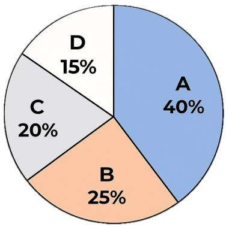

<details>
<summary>pie</summary>

| Category | Percentage |
| --- | --- |
| A | 40% |
| B | 25% |
| C | 20% |
| D | 15% |
</details>

Based on the data provided, the total number of valid votes received by the candidates B and C is

A. 45,000

B. 49,500

C. 51,750

D. 54,000

gate-ds-ai-2024 quantitative-aptitude pie-chart one-mark

# Answer key

# 9.40.5 Pie Chart: GATE2014 AG: GA-8

The total exports and revenues from the exports of a country are given in the two pie charts below. The pie chart for exports shows the quantity of each item as a percentage of the total quantity of exports. The pie chart for the revenues shows the percentage of the total revenue generated through export of each item. The total quantity of exports of all the items is 5 lakh tonnes and the total revenues are 250 crore rupees. What is the ratio of the revenue generated through export of Item 1 per kilogram to the revenue generated through export of Item 4 per kilogram?

Exports  


<details>
<summary>pie</summary>

| Category | Percentage |
| --- | --- |
| Item 1 | 11% |
| Item 2 | 20% |
| Item 3 | 19% |
| Item 4 | 22% |
| Item 5 | 12% |
| Item 6 | 16% |
</details>

Revenues  
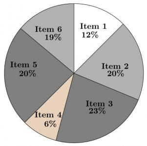

<details>
<summary>pie</summary>

| Category | Value (%) |
| --- | --- |
| Item 1 | 12% |
| Item 2 | 20% |
| Item 3 | 23% |
| Item 4 | 6% |
| Item 5 | 20% |
| Item 6 | 19% |
</details>

A. 1:2

B. 2:1

C. 1:4

D. 4:1

gate2014-ag quantitative-aptitude data-interpretation pie-chart ratio-proportion normal

# Answer key

# 9.41

# Polynomials (1)

Practice Test: Test 1 (5Q)

# 9.41.1 Polynomials: GATE CSE 2016 | Set 1 | GA | Question: 09

If $f(x) = 2x^{7} + 3x - 5$ , which of the following is a factor of $f(x)$ ?

A. $(x^{3}+8)$

B. $(x-1)$

C. $(2x-5)$

D. $(x+1)$

gatecse-2016-set1 quantitative-aptitude polynomials normal

# Answer key

# 9.42

# Powers (1)


# 9.42.1 Powers: GATE DA 2025 | GA | Question: 9

If a real variable $x$ satisfies $3^{x^2} = 27 \times 9^x$ , then the value of $\frac{2^{x^2}}{(2^x)^2}$ is:

A. $2^{-1}$

B. $2^{0}$

C. $2^{3}$

D. $2^{15}$

gateda-2025 quantitative-aptitude powers two-marks

Answer key

# 9.43

# Prime Numbers (1)

# 9.43.1 Prime Numbers: GATE CSE 2025 | Set 2 | GA | Question: 5


Let $p_{1}$ and $p_{2}$ denote two arbitrary prime numbers. Which one of the following statements is correct for all values of $p_{1}$ and $p_{2}$ ?

A. $p_1 + p_2$ not a prime number  
C. $p_1 + p_2 + 1$ is a prime number

B. $p_1p_2$ is not a prime number

D. $p_1p_2 + 1$ is a prime number

gatecse2025-set2 quantitative-aptitude easy prime-numbers one-mark

Answer key

# 9.44

# Probability (17)

Practice Tests:

Test 1 (15Q)

Test 2 (15Q)

Test 3 (10Q)

# 9.44.1 Probability: GATE CSE 2015 | Set 1 | GA | Question: 10


The probabilities that a student passes in mathematics, physics and chemistry are m, p and c respectively. Of these subjects, the student has 75% chance of passing in at least one, a 50% chance of passing in at least two and a 40% chance of passing in exactly two. Following relations are drawn in m, p, c:

1. $p + m + c = 27/20$  
II. $p + m + c = 13 / 20$  
III. $(p)\times (m)\times (c) = 1 / 10$

A. Only relation I is true.  
C. Relations II and III are true.

gatecse-2015-set1 quantitative-aptitude probability

Answer key

# 9.44.2 Probability: GATE CSE 2015 | Set 1 | GA | Question: 3


Given Set A = 2, 3, 4, 5 and Set B = 11, 12, 13, 14, 15, two numbers are randomly selected, one from each set. What is the probability that the sum of the two numbers equals 16?

A. 0.20

B. 0.25

C. 0.30

D. 0.33

gatecse-2015-set1 quantitative-aptitude probability normal

Answer key

# 9.44.3 Probability: GATE CSE 2017 | Set 1 | GA | Question: 5


The probability that a k-digit number does NOT contain the digits 0, 5, or 9 is

A. $0.3^{k}$

B. $0.6^{k}$

C. $0.7^{k}$

D. $0.9^{k}$

gatecse-2017-set1 general-aptitude quantitative-aptitude probability easy

Answer key


# 9.44.4 Probability: GATE CSE 2017 | Set 2 | GA | Question: 5


There are 3 red socks, 4 green socks and 3 blue socks. You choose 2 socks. The probability that they are of the same colour is

A. $\frac{1}{5}$

B. $\frac{7}{30}$

C. $\frac{1}{4}$

D. $\frac{4}{15}$

gatecse-2017-set2 quantitative-aptitude probability

# Answer key

# 9.44.5 Probability: GATE CSE 2018 | GA | Question: 10


A six sided unbiased die with four green faces and two red faces is rolled seven times. Which of the following combinations is the most likely outcome of the experiment?

A. Three green faces and four red faces.

B. Four green faces and three red faces.

C. Five green faces and two red faces.

D. Six green faces and one red face

gatecse-2018 quantitative-aptitude probability normal two-marks

# Answer key

# 9.44.6 Probability: GATE CSE 2021 | Set 1 | GA | Question: 8


There are five bags each containing identical sets of ten distinct chocolates. One chocolate is picked from each bag.

The probability that at least two chocolates are identical is \_\_\_\_

A. 0.3024

B. 0.4235

C. 0.6976

D. 0.8125

gatecse-2021-set1 quantitative-aptitude probability two-marks

# Answer key

# 9.44.7 Probability: GATE CSE 2022 | GA | Question: 8


A box contains five balls of same size and shape. Three of them are green coloured balls and two of them are orange coloured balls. Balls are drawn from the box one at a time. If a green ball is drawn, it is not replaced. If an orange ball is drawn, it is replaced with another orange ball.

First ball is drawn. What is the probability of getting an orange ball in the next draw?

A. $\frac{1}{2}$

B. $\frac{8}{25}$

C. $\frac{19}{50}$

D. $\frac{23}{50}$

gatecse-2022 quantitative-aptitude probability two-marks

# Answer key

# 9.44.8 Probability: GATE CSE 2025 | Set 1 | GA | Question: 8


A fair six-faced dice, with the faces labelled ‘1’, ‘2’, ‘3’, ‘4’, ‘5’, and ‘6’, is rolled thrice. What is the probability of rolling ‘6’ exactly once?

A. $\frac{75}{216}$

B. $\frac{1}{6}$

C. $\frac{1}{18}$

D. $\frac{25}{216}$

gatecse2025-set1 quantitative-aptitude probability easy two-marks

# Answer key

# 9.44.9 Probability: GATE CSE 2026 | Set 1 | GA | Question: 10


An unbiased six-faced dice whose faces are marked with numbers 1, 2, 3, 4, 5, and 6 is rolled twice in succession and the number on the top face is recorded each time. The probability that the number appearing in the second roll is an integer multiple of the number appearing in the first roll is \_\_\_\_

A. $\frac{1}{6}$

B. $\frac{5}{18}$

C. $\frac{7}{18}$

D. $\frac{5}{6}$

# Answer key

# 9.44.10 Probability: GATE CSE 2026 | Set 2 | GA | Question: 10


An unbiased six-faced dice whose faces are marked with numbers 1, 2, 3, 4, 5, and 6 is rolled twice in succession and the number on the top face is recorded each time. The probability that the sum of the two recorded numbers is a prime number is \_\_\_\_

A. $\frac{3}{36}$

B. $\frac{13}{36}$

C. $\frac{15}{36}$

D. $\frac{19}{36}$

gatecse-2026-set2 quantitative-aptitude probability two-marks

# Answer key

# 9.44.11 Probability: GATE CSE 2026 | Set 2 | GA | Question: 3


A day can only be cloudy or sunny. The probability of a day being cloudy is 0.5, independent of the condition on other days. What is the probability that in any given four days, there will be three cloudy days and one sunny day?

A. 1/4

B. 3/4

C. 2/3

D. 3/8

gatecse-2026-set2 quantitative-aptitude probability one-mark

# Answer key

# 9.44.12 Probability: GATE DS&AI 2024 | GA | Question: 7


The probability of a boy or a girl being born is $1/2$ . For a family having only three children, what is the probability of having two girls and one boy?

A. 3/8

B. 1/8

C. 1/4

D. 1/2

gate-ds-ai-2024 quantitative-aptitude probability two-marks

# Answer key

# 9.44.13 Probability: GATE2012 AE: GA-6


Two policemen, A and B, fire once each at the same time at an escaping convict. The probability that A hits the convict is three times the probability that B hits the convict. If the probability of the convict not getting injured is 0.5, the probability that B hits the convict is

A. 0.14

B. 0.22

C. 0.33

D. 0.40

gate2012-ae quantitative-aptitude probability

# Answer key

# 9.44.14 Probability: GATE2012 AR: GA-9


A smuggler has 10 capsules in which five are filled with narcotic drugs and the rest contain the original medicine. All the 10 capsules are mixed in a single box, from which the customs officials picked two capsules at random and tested for the presence of narcotic drugs. The probability that the smuggler will be is

A. 0.50

B. 0.67

C. 0.78

D. 0.82

gate2012-ar quantitative-aptitude probability

# Answer key

# 9.44.15 Probability: GATE2012 CY: GA-7


A and B are friends. They decide to meet between 1:00 pm and 2:00 pm on a given day. There is a condition that whoever arrives first will not wait for the other for more than 15 minutes. The probability that they will meet on that day is

A. 1/4

B. 1/16

C. 7/16

D. 9/16

gate2012-cy quantitative-aptitude probability

# Answer key

# 9.44.16 Probability: GATE2013 EE: GA-6

What is the chance that a leap year, selected at random, will contain 53 Saturdays?

A. 2/7

B. 3/7

C. 1/7

D. 5/7

gate2013-ee quantitative-aptitude probability

# Answer key

# 9.44.17 Probability: GATE2014 AG: GA-4

In any given year, the probability of an earthquake greater than Magnitude 6 occurring in the Garhwal Himalayas is 0.04. The average time between successive occurrences of such earthquakes is \_\_\_\_ years.


gate2014-ag quantitative-aptitude probability numerical-answers normal

# Answer key

# 9.45

# Profit Loss (3)

Practice Test: Test 1 (14Q)

# 9.45.1 Profit Loss: GATE CSE 2021 | Set 1 | GA | Question: 7

<table><tr><td>Items</td><td>Cost(₹)</td><td>Profit \%</td><td>Marked Price(₹)</td></tr><tr><td>P</td><td>5,400</td><td>---</td><td>5,860</td></tr><tr><td>Q</td><td>---</td><td>25</td><td>10,000</td></tr></table>


Details of prices of two items $P$ and $Q$ are presented in the above table. The ratio of cost of item $P$ to cost of item $Q$ is 3:4. Discount is calculated as the difference between the marked price and the selling price. The profit percentage is calculated as the ratio of the difference between selling price and cost, to the cost

$$
(\text{Profit}\% = \frac{\text{Selling price} - \text{Cost}}{\text{Cost}}\times 100)
$$

The discount on item Q, as a percentage of its marked price, is \_\_\_\_

A. 25

B. 12.5

C. 10

D. 5

gatecse-2021-set1 quantitative-aptitude profit-loss two-marks

# Answer key

# 9.45.2 Profit Loss: GATE CSE 2024 | Set 2 | GA | Question: 7

A person sold two different items at the same price. He made $10\%$ profit in one item, and $10\%$ loss in the other item. In selling these two items, the person made a total of


A. 1% profit

B. 2% profit

C. 1% loss

D. 2% loss

gatecse-2024-set2 quantitative-aptitude profit-loss two-marks

# Answer key

# 9.45.3 Profit Loss: GATE2013 CE: GA-9

A firm is selling its product at Rs. 60 per unit. The total cost of production is Rs. 100 and firm is earning total profit of Rs. 500. Later, the total cost increased by 30%. By what percentage the price should be increased to maintained the same profit level.


A. 5

B. 10

C. 15

D. 30

quantitative-aptitude gate2013-ce profit-loss

# Answer key

# 9.46

# Quadratic Equations (6)

# Practice Test: Test 1 (13Q)

# 9.46.1 Quadratic Equations: GATE CSE 2014 | Set 1 | GA | Question: 5

The roots of $ax^2 + bx + c = 0$ are real and positive. $a, b$ and $c$ are real. Then $ax^2 + b \mid x \mid +c = 0$ has

A. no roots

B. 2 real roots

C. 3 real roots

D. 4 real roots

gatecse-2014-set1 quantitative-aptitude quadratic-equations normal

# Answer key

# 9.46.2 Quadratic Equations: GATE CSE 2016 | Set 2 | GA | Question: 05

In a quadratic function, the value of the product of the roots $(\alpha, \beta)$ is 4. Find the value of

$$
\frac {\alpha^ {n} + \beta^ {n}}{\alpha^ {- n} + \beta^ {- n}}
$$

A. $n^4$

B. $4^{n}$

C. $2^{2n - 1}$

D. $4^{n - 1}$

gatecse-2016-set2 quantitative-aptitude quadratic-equations normal

# Answer key

# 9.46.3 Quadratic Equations: GATE CSE 2021 | Set 2 | GA | Question: 4

If $\left(x - \frac{1}{2}\right)^2 -\left(x - \frac{3}{2}\right)^2 = x + 2$ , then the value of $x$ is:

A. 2

B. 4

C. 6

D. 8

gatecse-2021-set2 quantitative-aptitude quadratic-equations one-mark

# Answer key

# 9.46.4 Quadratic Equations: GATE CSE 2022 | GA | Question: 3

Let $r$ be a root of the equation $x^{2} + 2x + 6 = 0$ .

Then the value of the expression $(r + 2)(r + 3)(r + 4)(r + 5)$ is

A. 51

B. -51

C. 126

D. -126

gatecse-2022 quantitative-aptitude quadratic-equations one-mark

# Answer key

# 9.46.5 Quadratic Equations: GATE2011 MN: GA-62

A student attempted to solve a quadratic equation in $x$ twice. However, in the first attempt, he incorrectly wrote the constant term and ended up with the roots as (4, 3). In the second attempt, he incorrectly wrote down the coefficient of $x$ and got the roots as (3, 2). Based on the above information, the roots of the correct quadratic equation are

A. $(-3,4)$

B. $(3,-4)$

C. (6,1)

D. $(4,2)$

gate2011-mn quadratic-equations quantitative-aptitude

# Answer key

# 9.46.6 Quadratic Equations: GATE2013 EE: GA-8

The set of values of $p$ for which the roots of the equation $3x^{2} + 2x + p(p - 1) = 0$ are of opposite sign is


A. $(-∞,0)$

B. $(0,1)$

C. $(1,\infty)$

D. $(0,\infty)$

gate2013-ee quantitative-aptitude quadratic-equations

Answer key

# 9.47

# Radar Chart (1)

# 9.47.1 Radar Chart: GATE2011 GG: GA-9

The quality of services delivered by a company consists of six factors as shown below in the radar diagram. The dots in the figure indicate the score for each factor on a scale of 0 to 10. The standardized coefficient for each factor is given in the parentheses. The contribution of each factor to the overall service quality is directly proportional to the factor score and its standardized coefficient.

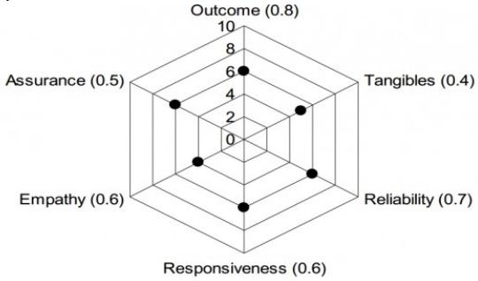

<details>
<summary>radar</summary>

| Dimension | Value |
| --- | --- |
| Outcome | 6 |
| Tangibles | 4 |
| Reliability | 7 |
| Responsiveness | 6 |
| Empathy | 6 |
| Assurance | 5 |
</details>

The lowest contribution among all the above factors to the overall quality of services delivered by the company is

A. 10%

B. 20%

C. 24%

D. 40%

gate2011-gg difficult quantitative-aptitude data-interpretation radar-chart

Answer key

# 9.48

# Ratio Proportion (9)

Practice Tests:

Test 1 (15Q)

Test 2 (15Q)

Test 3 (3Q)

# 9.48.1 Ratio Proportion: GATE CSE 2016 | Set 1 | GA | Question: 10

In a process, the number of cycles to failure decreases exponentially with an increase in load. At a load of 80 units, it takes 100 cycles for failure. When the load is halved, it takes 10000 cycles for failure. The load for which the failure will happen in 5000 cycles is \_\_\_\_.

A. 40.00

B. 46.02

C. 60.01

D. 92.02

gatecse-2016-set1 quantitative-aptitude ratio-proportion normal

Answer key

# 9.48.2 Ratio Proportion: GATE CSE 2018 | GA | Question: 8

In a party, 60% of the invited guests are male and 40% are female. If 80% of the invited guests attended the party and if all the invited female guests attended, what would be the ratio of males to females among the attendees in the party?

A. 2:3

B. 1:1

C. 3:2

D. 2:1

gatecse-2018 quantitative-aptitude ratio-proportion two-marks

Answer key


# 9.48.3 Ratio Proportion: GATE CSE 2021 | Set 1 | GA | Question: 1


The ratio of boys to girls in a class is 7 to 3.

Among the options below, an acceptable value for the total number of students in the class is:

A. 21

B. 37

C. 50

D. 73

gatecse-2021-set1 quantitative-aptitude ratio-proportion one-mark

# Answer key

# 9.48.4 Ratio Proportion: GATE CSE 2021 | Set 2 | GA | Question: 8


The number of students in three classes is in the ratio 3 : 13 : 6. If 18 students are added to each class, the ratio changes to 15 : 35 : 21.

The total number of students in all the three classes in the beginning was:

A. 22

B. 66

C. 88

D. 110

gatecse-2021-set2 ratio-proportion quantitative-aptitude two-marks

# Answer key

# 9.48.5 Ratio Proportion: GATE CSE 2024 | Set 1 | GA | Question: 2


If two distinct non-zero real variables $x$ and $y$ are such that $(x + y)$ is proportional to $(x - y)$ then the value of $\frac{x}{y}$

A. depends on $xy$

B. depends only on $x$ and not on $y$

C. depends only on $y$ and not on $x$

D. is a constant

gatecse-2024-set1 quantitative-aptitude ratio-proportion one-mark

# Answer key

# 9.48.6 Ratio Proportion: GATE2011 AG: GA-8


Three friends, $R, S$ and $T$ shared toffee from a bowl. $R$ took $\frac{1}{3}^{\mathrm{rd}}$ of the toffees, but returned four to the bowl. $S$ took $\frac{1}{4}^{\mathrm{th}}$ of what was left but returned three toffees to the bowl. $T$ took half of the remainder but returned two back into the bowl. If the bowl had 17 toffees left, how may toffees were originally there in the bowl?

A. 38

B. 31

C. 48

D. 41

general-aptitude quantitative-aptitude gate2011-ag ratio-proportion

# Answer key

# 9.48.7 Ratio Proportion: GATE2011 GG: GA-4


If m students require a total of m pages of stationery in m days, then 100 students will require 100 pages of stationery in

A. 100 days

B. m/100 days

C. $100 / m$ days

D. m days

gate2011-gg quantitative-aptitude ratio-proportion

# Answer key

# 9.48.8 Ratio Proportion: GATE2013 AE: GA-1

If $3 \leq X \leq 5$ and $8 \leq Y \leq 11$ then which of the following options is TRUE?

A. $\left(\frac{3}{5} \leq \frac{X}{Y} \leq \frac{8}{5}\right)$ C. $\left(\frac{3}{11} \leq \frac{X}{Y} \leq \frac{8}{5}\right)$

B. $\left(\frac{3}{11} \leq \frac{X}{Y} \leq \frac{5}{8}\right)$ D. $\left(\frac{3}{5} \leq \frac{X}{Y} \leq \frac{8}{11}\right)$

gate2013-ae quantitative-aptitude ratio-proportion normal

# Answer key


# 9.48.9 Ratio Proportion: GATE2014 AE: GA-8


The smallest angle of a triangle is equal to two thirds of the smallest angle of a quadrilateral. The ratio between the angles of the quadrilateral is 3:4:5:6. The largest angle of the triangle is twice its smallest angle. What is the sum, in degrees, of the second largest angle of the triangle and the largest angle quadrilateral?

gate2014-ae quantitative-aptitude ratio-proportion numerical-answers

# Answer key

# 9.49

# Sequence Series (4)

Practice Tests: Test 1 (15Q) Test 2 (1Q)

# 9.49.1 Sequence Series: GATE CSE 2012 | Question: 65

Given the sequence of terms, AD CG FK JP, the next term is

A. OV

B. OW

C. PV

D. PW

gatecse-2012 quantitative-aptitude sequence-series easy

# Answer key

# 9.49.2 Sequence Series: GATE CSE 2018 | GA | Question: 5

What is the missing number in the following sequence?

$$
2, 1 2, 6 0, 2 4 0, 7 2 0, 1 4 4 0, \_, 0
$$

A. 2880

B. 1440

C. 720

D. 0

gatecse-2018 quantitative-aptitude sequence-series easy one-mark

# Answer key

# 9.49.3 Sequence Series: GATE CSE 2023 | GA | Question: 3

A series of natural numbers $F_{1}, F_{2}, F_{3}, F_{4}, F_{5}, F_{6}, F_{7}, \ldots$ obeys $F_{n+1} = F_{n} + F_{n-1}$ for all integers $n \geq 2$ .

If $F_{6} = 37$ , and $F_{7} = 60$ , then what is $F_{1}$ ?

A. 4

B. 5

C. 8

D. 9

gatecse-2023 quantitative-aptitude sequence-series one-mark

# Answer key

# 9.49.4 Sequence Series: GATE DS&AI 2024 | GA | Question: 4

The sum of the following infinite series is

$$
2 + \frac {1}{2} + \frac {1}{3} + \frac {1}{4} + \frac {1}{8} + \frac {1}{9} + \frac {1}{1 6} + \frac {1}{2 7} + \dots
$$

A. 11/3

B. 7/2

C. 13/4

D. 9/2

gate-ds-ai-2024 quantitative-aptitude sequence-series one-mark

# Answer key

# 9.50

# Shortest Path (1)

# 9.50.1 Shortest Path: GATE CSE 2020 | GA | Question: 5

There are multiple routes to reach from node 1 to node 2, as shown in the network.


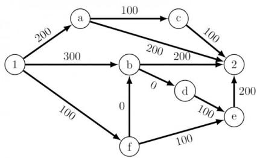

<details>
<summary>flowchart</summary>

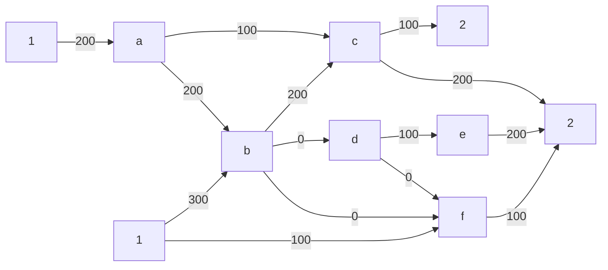
</details>

The cost of travel on an edge between two nodes is given in rupees. Nodes ‘a’, ‘b’, ‘c’, ‘d’, ‘e’, and ‘f’ are toll booths. The toll price at toll booths marked ‘a’ and ‘e’ is Rs. 200, and is Rs. 100 for the other toll booths. Which is the cheapest route from node 1 to node 2?

A. 1 - a - c - 2

B. $1 - f - b - 2$

C. 1 - b - 2

D. $1 - f - e - 2$

gatecse-2020 quantitative-aptitude graph-theory shortest-path one-mark

# Answer key

# 9.51

# Speed Time Distance (4)

Practice Tests: Test 1 (15Q) Test 2 (11Q)

# 9.51.1 Speed Time Distance: GATE CSE 2013 | Question: 64

A tourist covers half of his journey by train at 60 km/h, half of the remainder by bus at 30 km/h and the rest by cycle at 10 km/h. The average speed of the tourist in km/h during his entire journey is


A. 36

B. 30

C. 24

D. 18

gatecse-2013 quantitative-aptitude easy speed-time-distance

# Answer key

# 9.51.2 Speed Time Distance: GATE CSE 2019 | GA | Question: 3

Two cars at the same time from the same location and go in the same direction. The speed of the first car is 50 km/h and the speed of the second car is 60 km/h. The number of hours it takes for the distance between the two cars to be 20 km is \_\_\_\_.


A. 1

B. 2

C. 3

D. 6

gatecse-2019 general-aptitude quantitative-aptitude speed-time-distance one-mark

# Answer key

# 9.51.3 Speed Time Distance: GATE2013 AE: GA-6

Velocity of an object fired directly in upward direction is given by $V = 80 - 32t$ , where $t$ (time) is in seconds. When will the velocity be between $32 \, m/sec$ and $64 \, m/sec$ ?


A. $\left(1, \frac{3}{2}\right)$ C. $\left(\frac{1}{2}, \frac{3}{2}\right)$

B. $\left(\frac{1}{2},1\right)$ D. $(1,3)$

gate2013-ae quantitative-aptitude speed-time-distance

# Answer key

# 9.51.4 Speed Time Distance: GATE2013 EE: GA-9

A car travels $8\mathrm{km}$ in the first quarter of an hour, $6\mathrm{km}$ in the second quarter and $16\mathrm{km}$ in the third quarter. The average speed of the car in km per hour over the entire journey is


A. 30

B. 36

C. 40

D. 24

gate2013-ee speed-time-distance quantitative-aptitude

# 9.52

# Statistics (3)

Practice Test: Test 1 (11Q)

# 9.52.1 Statistics: GATE CSE 2012 | Question: 64

Which of the following assertions are CORRECT?

- P: Adding 7 to each entry in a list adds 7 to the mean of the list  
• Q: Adding 7 to each entry in a list adds 7 to the standard deviation of the list  
- R: Doubling each entry in a list doubles the mean of the list  
- S: Doubling each entry in a list leaves the standard deviation of the list unchanged

A. P, Q

B. $Q, R$

C. $P, R$

D. $R, S$

gatecse-2012 quantitative-aptitude statistics normal

# Answer key

# 9.52.2 Statistics: GATE CSE 2024 | Set 1 | GA | Question: 3

Consider the following sample of numbers:

9,18,11,14,15,17,10,69,11,13

The median of the sample is

A. 13.5

B. 14

C. 11

D. 18.7

gatecse-2024-set1 quantitative-aptitude statistics one-mark

# Answer key

# 9.52.3 Statistics: GATE2012 AE: GA-5

The arithmetic mean of five different natural numbers is 12. The largest possible value among the numbers is

A. 12

B. 40

C. 50

D. 60

gate2012-ae statistics quantitative-aptitude

# Answer key

# 9.53

# System of Equations (1)

# 9.53.1 System of Equations: GATE2011 GG: GA-6

The number of solutions for the following system of inequalities is

- $X_{1} \geq 0$  
- $X_{2} \geq 0$  
- $X_{1} + X_{2} \leq 10$  
- $2X_{1} + 2X_{2} \geq 22$

A. 0

B. infinite

C. 1

D. 2

gate2011-gg quantitative-aptitude system-of-equations

# Answer key

# 9.54

# Tables (1)

# 9.54.1 Tables: GATE CSE 2025 | Set 2 | GA | Question: 8

Which one of the following options is correct for the given data in the table?


<table><tr><td>Iteration (i)</td><td>0</td><td>1</td><td>2</td><td>3</td></tr><tr><td>Input (I)</td><td>20</td><td>-4</td><td>10</td><td>15</td></tr><tr><td>Output (X)</td><td>20</td><td>16</td><td>26</td><td>41</td></tr><tr><td>Output (Y)</td><td>20</td><td>-80</td><td>-800</td><td>-12000</td></tr></table>

A. $X(i) = X(i - 1) + I(i)$ ; $Y(i) = Y(i - 1)I(i)$ ; $i > 0$  
B. $X(i) = X(i - 1)I(i)$ ; $Y(i) = Y(i - 1) + I(i)$ ; $i > 0$  
C. $X(i) = X(i - 1)I(i)$ ; $Y(i) = Y(i - 1)I(i)$ ; $i > 0$  
D. $X(i) = X(i - 1) + I(i)$ ; $Y(i) = Y(i - 1)I(i - 1)$ ; $i > 0$

gatecse2025-set2 quantitative-aptitude tables two-marks

Answer key

9.55

# Tabular Data (7)

Practice Test: Test 1 (12Q)

# 9.55.1 Tabular Data: GATE CSE 2014 | Set 1 | GA | Question: 9

In a survey, 300 respondents were asked whether they own a vehicle or not. If yes, they were further asked to mention whether they own a car or scooter or both. Their responses are tabulated below. What percent of respondents do not own a scooter?


<table><tr><td></td><td></td><td>Men</td><td>Women</td></tr><tr><td>Own vehicle</td><td>Car</td><td>40</td><td>34</td></tr><tr><td>Own vehicle</td><td>Scooter</td><td>30</td><td>20</td></tr><tr><td>Own vehicle</td><td>Both</td><td>60</td><td>46</td></tr><tr><td>Do not own vehicle</td><td></td><td>20</td><td>50</td></tr></table>

gatecse-2014-set1 quantitative-aptitude normal numerical-answers data-interpretation tabular-data

Answer key

# 9.55.2 Tabular Data: GATE CSE 2014 | Set 3 | GA | Question: 5

The table below has question-wise data on the performance of students in an examination. The marks for each question are also listed. There is no negative or partial marking in the examination.


<table><tr><td>Q No.</td><td>Marks</td><td>Answered Correctly</td><td>Answered Wrongly</td><td>Not Attempted</td></tr><tr><td>1</td><td>2</td><td>21</td><td>17</td><td>6</td></tr><tr><td>2</td><td>3</td><td>15</td><td>27</td><td>2</td></tr><tr><td>3</td><td>2</td><td>23</td><td>18</td><td>3</td></tr></table>

What is the average of the marks obtained by the class in the examination?

A. 1.34

B. 1.74

C. 3.02

D. 3.91

gatecse-2014-set3 quantitative-aptitude normal data-interpretation tabular-data

Answer key

# 9.55.3 Tabular Data: GATE CSE 2015 | Set 1 | GA | Question: 6

The number of students in a class who have answered correctly, wrongly, or not attempted each question in an exam, are listed in the table below. The marks for each question are also listed. There is no negative or partial marking.


<table><tr><td>Q No.</td><td>Marks</td><td>Answered Correctly</td><td>Answered Wrongly</td><td>Not Attempted</td></tr><tr><td>1</td><td>2</td><td>21</td><td>17</td><td>6</td></tr><tr><td>2</td><td>3</td><td>15</td><td>27</td><td>2</td></tr><tr><td>3</td><td>1</td><td>11</td><td>29</td><td>4</td></tr><tr><td>4</td><td>2</td><td>23</td><td>18</td><td>3</td></tr><tr><td>5</td><td>5</td><td>31</td><td>12</td><td>1</td></tr></table>

What is the average of the marks obtained by the class in the examination?

A. 2.290

B. 2.970

C. 6.795

D. 8.795

gatecse-2015-set1 quantitative-aptitude easy data-interpretation tabular-data

Answer key

# 9.55.4 Tabular Data: GATE CSE 2016 | Set 1 | GA | Question: 06

A shaving set company sells 4 different types of razors- Elegance, Smooth, Soft and Executive.

Elegance sells at Rs. 48, Smooth at Rs. 63, Soft at Rs. 78 and Executive at Rs. 173 per piece. The table below shows the numbers of each razor sold in each quarter of a year.

<table><tr><td>Quarter/Product</td><td>Elegance</td><td>Smooth</td><td>Soft</td><td>Executive</td></tr><tr><td>Q1</td><td>27300</td><td>20009</td><td>17602</td><td>9999</td></tr><tr><td>Q2</td><td>25222</td><td>19392</td><td>18445</td><td>8942</td></tr><tr><td>Q3</td><td>28976</td><td>22429</td><td>19544</td><td>10234</td></tr><tr><td>Q4</td><td>21012</td><td>18229</td><td>16595</td><td>10109</td></tr></table>

Which product contributes the greatest fraction to the revenue of the company in that year?

A. Elegance

B. Executive

C. Smooth

D. Soft

gatecse-2016-set1 quantitative-aptitude data-interpretation easy tabular-data

Answer key

# 9.55.5 Tabular Data: GATE2011 MN: GA-64

Four archers P, Q, R, and S try to hit a bull's eye during a tournament consisting of seven rounds. As illustrated in the figure below, a player receives 10 points for hitting the bull's eye, 5 points for hitting within the inner circle and 1 point for hitting within the outer circle.


<details>
<summary>donut</summary>

| Level | Points |
| --- | --- |
| Outer circle | 1 |
| Inner circle | 5 |
| Bull's eye | 10 |
</details>

The final scores received by the players during the tournament are listed in the table below.


<table><tr><td>Round</td><td>P</td><td>Q</td><td>R</td><td>S</td></tr><tr><td>1</td><td>1</td><td>5</td><td>1</td><td>10</td></tr><tr><td>2</td><td>5</td><td>10</td><td>10</td><td>1</td></tr><tr><td>3</td><td>1</td><td>1</td><td>1</td><td>5</td></tr><tr><td>4</td><td>10</td><td>10</td><td>1</td><td>1</td></tr><tr><td>5</td><td>1</td><td>5</td><td>5</td><td>10</td></tr><tr><td>6</td><td>10</td><td>5</td><td>1</td><td>1</td></tr><tr><td>7</td><td>5</td><td>10</td><td>1</td><td>1</td></tr></table>

The most accurate and the most consistent players during the tournament are respectively

A. P and S

B. Q and R

C. Q and Q

D. R and Q

gate2011-mn data-interpretation quantitative-aptitude tabular-data

Answer key

# 9.55.6 Tabular Data: GATE2013 AE: GA-7

Following table gives data on tourist from different countries visiting India in the year 2011

<table><tr><td>Country</td><td>Number of tourists</td></tr><tr><td>USA</td><td>2000</td></tr><tr><td>England</td><td>3500</td></tr><tr><td>Germany</td><td>1200</td></tr><tr><td>Italy</td><td>1100</td></tr><tr><td>Japan</td><td>2400</td></tr><tr><td>Australia</td><td>2300</td></tr><tr><td>France</td><td>1000</td></tr></table>


Which two countries contributed to the one third of the total number of tourists who visited India in 2011?

A. USA and Japan

B. USA and Australia

C. England and France

D. Japan and Australia

gate2013-ae quantitative-aptitude data-interpretation normal tabular-data

Answer key

# 9.55.7 Tabular Data: GATE2013 CE: GA-8

Following table provides figures(in rupees) on annual expenditure of a firm for two years -2010 and 2011.

<table><tr><td>Category</td><td>2010</td><td>2011</td></tr><tr><td>Raw material</td><td>5200</td><td>6240</td></tr><tr><td>Power &amp; fuel</td><td>7000</td><td>9450</td></tr><tr><td>Salary &amp; wages</td><td>9000</td><td>12600</td></tr><tr><td>Plant &amp; machinery</td><td>20000</td><td>25000</td></tr><tr><td>Advertising</td><td>15000</td><td>19500</td></tr><tr><td>Research &amp; Development</td><td>22000</td><td>26400</td></tr></table>


In 2011, which of the two categories have registered increase by same percentage?

A. Raw material and Salary & wages.  
C. Power & fuel and Advertising.

B. Salary & wages and Advertising.  
D. Raw material and research & Development.

# 9.56

# Triangles (3)

Practice Test: Test 1 (11Q)

# 9.56.1 Triangles: GATE CSE 2015 | Set 2 | GA | Question: 8

In a triangle $PQR, PS$ is the angle bisector of $\angle QPR$ and $\angle QPS = 60^\circ$ . What is the length of $PS$ ?


<details>
<summary>text_image</summary>

P
r
q
Q
s
p
R
</details>

A. $\left(\frac{(q + r)}{qr}\right)$ C. $\sqrt{(q^2 + r^2)}$

B. $\left(\frac{qr}{q + r}\right)$ D. $\left(\frac{(q + r)^2}{qr}\right)$

gatecse-2015-set2 quantitative-aptitude geometry difficult triangles

# Answer key

# 9.56.2 Triangles: GATE CSE 2018 | GA | Question: 9

In the figure below, $\angle DEC + \angle BFC$ is equal to \_\_\_\_


<details>
<summary>text_image</summary>

E
D C F
A B
</details>

A. $\angle BCD - \angle BAD$ C. $\angle BAD + \angle BCD$

B. $\angle BAD + \angle BCF$ D. $\angle CBA + \angle ADC$

gatecse-2018 quantitative-aptitude geometry normal triangles two-marks

# Answer key

# 9.56.3 Triangles: GATE CSE 2022 | GA | Question: 9

The corners and mid-points of the sides of a triangle are named using the distinct letters P, Q, R, S, T and U, but not necessarily in the same order. Consider the following statements:


- The line joining P and R is parallel to the line joining Q and S.  
- P is placed on the side opposite to the corner T.  
- S and U cannot be placed on the same side.

Which one of the following statements is correct based on the above information?

A. P cannot be placed at a corner  
C. U cannot be placed at a mid-point

gatecse-2022 quantitative-aptitude geometry triangles two-marks

# Answer key

# 9.57

# Venn Diagram (7)

Practice Tests: Test 1 (15Q) Test 2 (3Q)


# 9.57.1 Venn Diagram: GATE CSE 2010 | Question: 59


25 persons are in a room. 15 of them play hockey, 17 of them play football and 10 of them play both hockey and football. Then the number of persons playing neither hockey nor football is:

A. 2

B. 17

C. 13

D. 3

gatecse-2010 quantitative-aptitude easy set-theory&algebra venn-diagram

Answer key

# 9.57.2 Venn Diagram: GATE CSE 2016 | Set 2 | GA | Question: 06


Among 150 faculty members in an institute, 55 are connected with each other through Facebook and 85 are connected through Whatsapp. 30 faculty members do not have Facebook or Whatsapp accounts. The numbers of faculty members connected only through Facebook accounts is \_\_\_\_.

A. 35

B. 45

C. 65

D. 90

gatecse-2016-set2 quantitative-aptitude venn-diagram easy

Answer key

# 9.57.3 Venn Diagram: GATE CSE 2019 | GA | Question: 7


In the given diagram, teachers are represented in the triangle, researchers in the circle and administrators in the rectangle. Out of the total number of the people, the percentage of administrators shall be in the range of


<details>
<summary>funnel</summary>

| Region | Value |
| --- | --- |
| Teachers | 70 |
| Administrators | 20 |
| Researchers | 40 |
</details>

A. 0 to 15

B. 16 to 30

C. 31 to 45

D. 46 to 60

gatecse-2019 general-aptitude quantitative-aptitude venn-diagram two-marks

Answer key

# 9.57.4 Venn Diagram: GATE CSE 2019 | GA | Question: 9


In a college, there are three student clubs, 60 students are only in the Drama club, 80 students are only in the Dance club, 30 students are only in Maths club, 40 students are in both Drama and Dance clubs, 12

students are in both Dance and Maths clubs, 7 students are in both Drama and Maths clubs, and 2 students are in all clubs. If 75% of the students in the college are not in any of these clubs, then the total number of students in the college is \_\_\_\_.

A. 1000

B. 975

C. 900

D. 225

gatecse-2019 general-aptitude quantitative-aptitude venn-diagram two-marks

Answer key

# 9.57.5 Venn Diagram: GATE CSE 2024 | Set 2 | GA | Question: 3


In an engineering college of 10,000 students, 1,500 like neither their core branches nor other branches. The number of students who like their core branches is $1/4^{th}$ of the number of students who like other branches. The number of students who like both their core and other branches is 500.

The number of students who like their core branches is

A. 1,800

B. 3,500

C. 1,600

D. 1,500

# 9.57.6 Venn Diagram: GATE2010 TF: GA-8


A gathering of 50 linguists discovered that 4 knew Kannada, Telugu and Tamil, 7 knew only Telugu and Tamil, 5 knew only Kannada and Tamil, 6 knew only Telugu and Kannada. If the number of linguists who knew Tamil is 24 and those who knew Kannada is also 24, how many linguists knew only Telugu?

A. 9

B. 10

C. 11

D. 8

general-aptitude quantitative-aptitude gate2010-tf venn-diagram

# Answer key

# 9.57.7 Venn Diagram: GATE2011 GG: GA-7


In a class of 300 students in an M.Tech programme, each student is required to take at least one subject from the following three:

• M600: Advanced Engineering Mathematics  
• C600: Computational Methods for Engineers  
• E600: Experimental Techniques for Engineers

The registration data for the M.Tech class shows that 100 students have taken M600, 200 students have taken C600, and 60 students have taken E600. What is the maximum possible number of students in the class who have taken all the above three subjects?

A. 20

B. 30

C. 40

D. 50

gate2011-gg quantitative-aptitude set-theory&algebra venn-diagram

# Answer key

# 9.58

# Volume (1)

# 9.58.1 Volume: GATE CSE 2021 | Set 1 | GA | Question: 6


We have 2 rectangular sheets of paper, M and N, of dimensions 6 cm × 1 cm each. Sheet M is rolled to form an open cylinder by bringing the short edges of the sheet together. Sheet N is cut into equal square patches and assembled to form the largest possible closed cube. Assuming the ends of the cylinder are closed, the ratio of the volume of the cylinder to that of the cube is \_\_\_\_.

A. $\frac{\pi}{2}$

B. $\frac{3}{\pi}$

C. $\frac{9}{\pi}$

D. $3\pi$

gatecse-2021-set1 quantitative-aptitude mensuration volume two-marks

# Answer key

# 9.59

# Work Time (3)

Practice Tests: Test 1 (15Q) Test 2 (8Q)

# 9.59.1 Work Time: GATE CSE 2010 | Question: 64


5 skilled workers can build a wall in 20 days; 8 semi-skilled workers can build a wall in 25 days; 10 unskilled workers can build a wall in 30 days. If a team has 2 skilled, 6 semi-skilled and 5 unskilled workers, how long it will take to build the wall?

A. 20 days

B. 18 days

C. 16 days

D. 15 days

gatecse-2010 quantitative-aptitude normal work-time

# Answer key

# 9.59.2 Work Time: GATE CSE 2011 | Question: 64


A transporter receives the same number of orders each day. Currently, he has some pending orders (backlog) to be shipped. If he uses 7 trucks, then at the end of the $4^{th}$ day he can clear all the orders.

Alternatively, if he uses only 3 trucks, then all the orders are cleared at the end of the $10^{th}$ day. What is the minimum number of trucks required so that there will be no pending order at the end of $5^{th}$ day?

A. 4

B. 5

C. 6

D. 7

gatecse-2011 quantitative-aptitude normal work-time

# Answer key

# 9.59.3 Work Time: GATE CSE 2013 | Question: 65

The current erection cost of a structure is Rs. 13,200. If the labour wages per day increase by 1/5 of the current wages and the working hours decrease by 1/24 of the current period, then the new cost of erection in Rs. is


A. 16,500

B. 15,180

c. 11,000

D. 10,120

gatecse-2013 quantitative-aptitude normal work-time

# Answer key

Answer Keys

<table><tr><td>9.1.1</td><td>A</td><td>9.2.1</td><td>D</td><td>9.2.2</td><td>B</td><td>9.2.3</td><td>D</td><td>9.2.4</td><td>B</td></tr><tr><td>9.2.5</td><td>B</td><td>9.3.1</td><td>B</td><td>9.4.1</td><td>D</td><td>9.4.2</td><td>B</td><td>9.5.1</td><td>A</td></tr><tr><td>9.6.1</td><td>C</td><td>9.6.2</td><td>B</td><td>9.6.3</td><td>C</td><td>9.7.1</td><td>C</td><td>9.8.1</td><td>2006</td></tr><tr><td>9.8.2</td><td>C</td><td>9.8.3</td><td>A</td><td>9.8.4</td><td>A</td><td>9.9.1</td><td>B</td><td>9.10.1</td><td>B</td></tr><tr><td>9.10.2</td><td>C</td><td>9.10.3</td><td>C</td><td>9.10.4</td><td>C</td><td>9.11.1</td><td>D</td><td>9.11.2</td><td>A</td></tr><tr><td>9.11.3</td><td>C</td><td>9.12.1</td><td>A</td><td>9.13.1</td><td>B</td><td>9.13.2</td><td>C</td><td>9.13.3</td><td>D</td></tr><tr><td>9.13.4</td><td>C</td><td>9.13.5</td><td>D</td><td>9.14.1</td><td>B</td><td>9.14.2</td><td>D</td><td>9.14.3</td><td>A</td></tr><tr><td>9.15.1</td><td>C</td><td>9.15.2</td><td>0.4895 : 0.4897</td><td>9.16.1</td><td>C</td><td>9.16.2</td><td>C</td><td>9.17.1</td><td>A</td></tr><tr><td>9.17.2</td><td>A</td><td>9.17.3</td><td>C</td><td>9.17.4</td><td>1300</td><td>9.18.1</td><td>D</td><td>9.18.2</td><td>B</td></tr><tr><td>9.19.1</td><td>A</td><td>9.20.1</td><td>D</td><td>9.20.2</td><td>A</td><td>9.20.3</td><td>B</td><td>9.21.1</td><td>C</td></tr><tr><td>9.22.1</td><td>D</td><td>9.22.2</td><td>C</td><td>9.22.3</td><td>C</td><td>9.23.1</td><td>B</td><td>9.24.1</td><td>8</td></tr><tr><td>9.24.2</td><td>C</td><td>9.24.3</td><td>B</td><td>9.24.4</td><td>C</td><td>9.24.5</td><td>B</td><td>9.24.6</td><td>A</td></tr><tr><td>9.24.7</td><td>C</td><td>9.25.1</td><td>6</td><td>9.25.2</td><td>A</td><td>9.25.3</td><td>D</td><td>9.25.4</td><td>A</td></tr><tr><td>9.25.5</td><td>A</td><td>9.26.1</td><td>A</td><td>9.27.1</td><td>140</td><td>9.27.2</td><td>C</td><td>9.27.3</td><td>C</td></tr><tr><td>9.27.4</td><td>B</td><td>9.27.5</td><td>B</td><td>9.28.1</td><td>B</td><td>9.28.2</td><td>C</td><td>9.28.3</td><td>A</td></tr><tr><td>9.28.4</td><td>C</td><td>9.28.5</td><td>C</td><td>9.28.6</td><td>D</td><td>9.29.1</td><td>C</td><td>9.30.1</td><td>B</td></tr><tr><td>9.30.2</td><td>C</td><td>9.30.3</td><td>C</td><td>9.30.4</td><td>A</td><td>9.31.1</td><td>C</td><td>9.32.1</td><td>D</td></tr><tr><td>9.33.1</td><td>B</td><td>9.34.1</td><td>B</td><td>9.34.2</td><td>C</td><td>9.34.3</td><td>C</td><td>9.34.4</td><td>B</td></tr><tr><td>9.34.5</td><td>D</td><td>9.35.1</td><td>C</td><td>9.35.2</td><td>A</td><td>9.35.3</td><td>C</td><td>9.35.4</td><td>B</td></tr><tr><td>9.36.1</td><td>A</td><td>9.36.2</td><td>X</td><td>9.37.1</td><td>96</td><td>9.37.2</td><td>B</td><td>9.37.3</td><td>D</td></tr><tr><td>9.37.4</td><td>B</td><td>9.37.5</td><td>C</td><td>9.37.6</td><td>D</td><td>9.37.7</td><td>A</td><td>9.37.8</td><td>A</td></tr><tr><td>9.37.9</td><td>D</td><td>9.38.1</td><td>850</td><td>9.38.2</td><td>D</td><td>9.38.3</td><td>C</td><td>9.38.4</td><td>A</td></tr><tr><td>9.38.5</td><td>B</td><td>9.38.6</td><td>D</td><td>9.38.7</td><td>C</td><td>9.38.8</td><td>D</td><td>9.39.1</td><td>A</td></tr><tr><td>9.39.2</td><td>B</td><td>9.39.3</td><td>B</td><td>9.39.4</td><td>B</td><td>9.40.1</td><td>32</td><td>9.40.2</td><td>C</td></tr><tr><td>9.40.3</td><td>D</td><td>9.40.4</td><td>B</td><td>9.40.5</td><td>D</td><td>9.41.1</td><td>B</td><td>9.42.1</td><td>C</td></tr><tr><td>9.43.1</td><td>B</td><td>9.44.1</td><td>D</td><td>9.44.2</td><td>A</td><td>9.44.3</td><td>C</td><td>9.44.4</td><td>D</td></tr></table>

<table><tr><td>9.44.5</td><td>C</td></tr><tr><td>9.44.10</td><td>C</td></tr><tr><td>9.44.15</td><td>C</td></tr><tr><td>9.45.3</td><td>A</td></tr><tr><td>9.46.5</td><td>C</td></tr><tr><td>9.48.3</td><td>C</td></tr><tr><td>9.48.8</td><td>B</td></tr><tr><td>9.49.4</td><td>B</td></tr><tr><td>9.51.4</td><td>C</td></tr><tr><td>9.54.1</td><td>A</td></tr><tr><td>9.55.5</td><td>B</td></tr><tr><td>9.56.3</td><td>B</td></tr><tr><td>9.57.5</td><td>A</td></tr><tr><td>9.59.2</td><td>C</td></tr></table>

<table><tr><td>9.44.6</td><td>C</td></tr><tr><td>9.44.11</td><td>A</td></tr><tr><td>9.44.16</td><td>A</td></tr><tr><td>9.46.1</td><td>D</td></tr><tr><td>9.46.6</td><td>B</td></tr><tr><td>9.48.4</td><td>C</td></tr><tr><td>9.48.9</td><td>180</td></tr><tr><td>9.50.1</td><td>B</td></tr><tr><td>9.52.1</td><td>C</td></tr><tr><td>9.55.1</td><td>48</td></tr><tr><td>9.55.6</td><td>C</td></tr><tr><td>9.57.1</td><td>D</td></tr><tr><td>9.57.6</td><td>C</td></tr><tr><td>9.59.3</td><td>B</td></tr></table>

<table><tr><td>9.44.7</td><td>D</td></tr><tr><td>9.44.12</td><td>A</td></tr><tr><td>9.44.17</td><td>25</td></tr><tr><td>9.46.2</td><td>B</td></tr><tr><td>9.47.1</td><td>A</td></tr><tr><td>9.48.5</td><td>D</td></tr><tr><td>9.49.1</td><td>A</td></tr><tr><td>9.51.1</td><td>C</td></tr><tr><td>9.52.2</td><td>A</td></tr><tr><td>9.55.2</td><td>C</td></tr><tr><td>9.55.7</td><td>D</td></tr><tr><td>9.57.2</td><td>A</td></tr><tr><td>9.57.7</td><td>B</td></tr></table>

<table><tr><td>9.44.8</td><td>A</td></tr><tr><td>9.44.13</td><td>A</td></tr><tr><td>9.45.1</td><td>C</td></tr><tr><td>9.46.3</td><td>B</td></tr><tr><td>9.48.1</td><td>B</td></tr><tr><td>9.48.6</td><td>C</td></tr><tr><td>9.49.2</td><td>B</td></tr><tr><td>9.51.2</td><td>B</td></tr><tr><td>9.52.3</td><td>C</td></tr><tr><td>9.55.3</td><td>C</td></tr><tr><td>9.56.1</td><td>B</td></tr><tr><td>9.57.3</td><td>C</td></tr><tr><td>9.58.1</td><td>C</td></tr></table>

<table><tr><td>9.44.9</td><td>C</td></tr><tr><td>9.44.14</td><td>C</td></tr><tr><td>9.45.2</td><td>C</td></tr><tr><td>9.46.4</td><td>D</td></tr><tr><td>9.48.2</td><td>B</td></tr><tr><td>9.48.7</td><td>D</td></tr><tr><td>9.49.3</td><td>A</td></tr><tr><td>9.51.3</td><td>C</td></tr><tr><td>9.53.1</td><td>A</td></tr><tr><td>9.55.4</td><td>B</td></tr><tr><td>9.56.2</td><td>A</td></tr><tr><td>9.57.4</td><td>C</td></tr><tr><td>9.59.1</td><td>D</td></tr></table>

Transformation of shapes: translation, rotation, scaling, mirroring, assembling, and grouping, Paper folding, cutting, and patterns in 2 and 3 dimensions

Mark Distribution in Previous GATE

<table><tr><td>Year</td><td>2026 - 1</td><td>2026 - 2</td><td>2025 - 1</td><td>2025 - 2</td><td>2024 - 1</td><td>2024 - 2</td><td>2023</td><td>2022</td><td>2021 - 1</td><td>2021 - 2</td><td>Minimum</td></tr><tr><td>1 Mark Count</td><td>1</td><td>1</td><td>0</td><td>1</td><td>0</td><td>0</td><td>1</td><td>1</td><td>2</td><td>1</td><td>0</td></tr><tr><td>2 Marks Count</td><td>1</td><td>0</td><td>1</td><td>0</td><td>2</td><td>1</td><td>1</td><td>1</td><td>0</td><td>1</td><td>0</td></tr><tr><td>Total Marks</td><td>3</td><td>1</td><td>2</td><td>1</td><td>4</td><td>2</td><td>3</td><td>3</td><td>2</td><td>3</td><td>1</td></tr></table>

Welcome to the "General Aptitude: Spatial Aptitude" chapter of your GATE Computer Science exam preparation. This section is designed to equip you with the essential concepts, strategies, and quick references needed to excel in spatial reasoning questions. Spatial aptitude tests your ability to visualize, interpret, and manipulate objects and patterns in two and three dimensions. For GATE CS, mastering this area is crucial not just for the General Aptitude section, but also for developing fundamental visualization skills that are indirectly beneficial in areas like computer graphics, data structures, and algorithms. Typically, you can expect 1-3 questions from Spatial Aptitude in the General Aptitude section, contributing 2-5 marks. Questions often involve identifying patterns, mentally rotating shapes, understanding mirror images, or assembling figures, usually presented as Multiple Choice Questions (MCQs).

# Topic-wise Key Concepts

# 1. 3D Structure

Definition and Core Idea: This topic involves understanding and visualizing three-dimensional objects from their two-dimensional representations (like orthographic or isometric views) or vice-versa. It requires the ability to mentally construct, deconstruct, and manipulate 3D shapes, identifying their hidden faces, edges, and vertices.

# Important Formulas, Theorems, and Results:

\- Euler's Formula for Polyhedra: For any simple (convex) polyhedron, the number of vertices $(V)$ , edges $(E)$ , and faces $(F)$ are related by the formula:

$$
V - E + F = 2
$$

This formula is fundamental for checking the consistency of polyhedral structures.

• Common Polyhedra Properties:

。Cube: $V = 8, E = 12, F = 6$  
- Cuboid: $V = 8, E = 12, F = 6$  
- Triangular Prism: $V = 6, E = 9, F = 5$  
- Square Pyramid: $V = 5, E = 8, F = 5$  
- Tetrahedron: $V = 4, E = 6, F = 4$

# Key Properties and Identities:

- Orthographic Projections: These are 2D views (Front, Top, Side) that show the true shape and size of one face of an object, without perspective distortion.  
- Isometric Views: A 3D representation where all three axes are equally foreshortened, giving a sense of depth and volume. Parallel lines remain parallel.  
- Nets of 3D Shapes: A 2D pattern that can be folded to form a 3D shape. Understanding nets is crucial for visualizing how faces connect.  
- Hidden Lines: In 2D representations of 3D objects, dashed lines often represent edges that are not directly visible from the chosen viewpoint.

# Common Pitfalls or Tricky Points:

- Misinterpreting hidden lines or confusing different orthographic views.  
- Incorrectly counting faces, edges, or vertices, especially when parts are hidden or joined.  
- Difficulty in visualizing the folding/unfolding of complex nets.  
- Confusing isometric projection with perspective projection.

# Standard Problem-Solving Techniques or Shortcuts:

- Mental Rotation and Manipulation: Practice mentally rotating and viewing objects from different angles.  
- Feature Tracking: Focus on a unique corner, edge, or patterned face and track its position across different views or during folding.  
- Elimination Strategy: Quickly eliminate options that clearly violate geometric principles or don't match specific features.  
- Auxiliary Views: If struggling, mentally sketch an additional view to clarify the structure.  
- Nets to 3D: For nets, identify adjacent faces and opposite faces. Opposite faces never share an edge.

# 2. Assembling

Definition and Core Idea: This topic involves combining given 2D or 3D components to form a complete shape or object, or identifying which set of components can form a specified shape. It tests your spatial reasoning to fit parts together precisely without overlap or gaps.

Important Formulas, Theorems, and Results: No specific mathematical formulas are typically used. The core idea relies on geometric principles of congruence, tessellation, and conservation of area/volume.

# Key Properties and Identities:

- Congruence: Pieces must match exactly in shape and size to fit together.  
- Tessellation: The ability of shapes to fit together without gaps or overlaps to cover a surface (for 2D assembling).  
- Conservation of Area/Volume: The total area (for 2D) or volume (for 3D) of the assembled figure must equal the sum of the areas/volumes of its constituent pieces.  
- Edge/Face Matching: The edges or faces that meet must be identical in length and shape.  
- Symmetry: Recognizing symmetry in the target shape or individual pieces can aid assembly.

# Common Pitfalls or Tricky Points:

• Overlooking small details or subtle differences in piece shapes.  
- Assuming pieces can be resized, distorted, or flipped (unless explicitly allowed).  
- Not considering all possible orientations (rotations and reflections) for each piece.  
- Difficulty in visualizing how irregular shapes fit into complex outlines.

# Standard Problem-Solving Techniques or Shortcuts:

- Start with Distinctive Pieces: Begin by placing pieces with unique shapes, sharp corners, or specific patterns that have limited fitting options.  
- Work from the Edges/Corners: For outline-based problems, try to fill the outer boundaries first.  
- Identify Complementary Shapes: Look for pieces whose contours fit together like puzzle pieces.  
- Mental Rotation and Translation: Actively rotate and slide pieces mentally to test fits.  
- Elimination: If a piece clearly doesn't fit in any orientation, eliminate the option containing it.

# 3. Assembling Pieces

Definition and Core Idea: This topic is a specific type of assembling, often focusing on arranging a set of smaller, usually irregular, 2D pieces to form a larger, specified 2D figure. It's akin to solving a jigsaw puzzle or tangram, requiring visualization of how shapes fit together, including rotation and reflection.

Important Formulas, Theorems, and Results: No specific formulas. The principles are geometric matching and conservation of area.

# Key Properties and Identities:

- Area Conservation: The sum of the areas of the individual pieces must equal the area of the final assembled figure.  
- Edge and Vertex Matching: Edges of adjacent pieces must align perfectly, and vertices must meet precisely.  
- No Overlap or Gaps: The assembled figure must be solid, with no parts of pieces overlapping and no empty spaces within the boundary.  
- Orientation Flexibility: Pieces can usually be rotated and/or reflected unless specified otherwise.

# Common Pitfalls or Tricky Points:

- Incorrectly assuming a piece can be flipped (reflected) when only rotation is allowed, or vice-versa.  
- Misjudging the size or shape of internal gaps that need to be filled.  
- Difficulty in visualizing how multiple irregular pieces combine to form a regular outline.  
• Overlooking that pieces might need to be rotated by angles other than 90 degrees.

# Standard Problem-Solving Techniques or Shortcuts:

- Focus on Unique Features: Identify pieces with distinct curves, sharp angles, or long straight edges.  
- Largest Piece First: Often, starting with the largest or most complex piece helps define the initial structure.  
- Work from the Outside In: Try to form the outer boundary of the target figure first.  
- Consider Negative Space: Sometimes, it's easier to visualize the shape of the 'hole' that needs to be filled by the remaining pieces.  
- Trial and Error (Mental): Mentally try fitting pieces, eliminating options as you go.

# 4. Counting Figure

Definition and Core Idea: This involves systematically counting the number of specific geometric shapes (e.g., triangles, squares, rectangles, cubes) within a complex, often overlapping, figure. The core idea is to develop a structured approach to avoid double-counting or missing any figures.

# Important Formulas, Theorems, and Results:

• Number of Squares in an $n \times n$ Grid:

$$
\sum_ {k = 1} ^ {n} k ^ {2} = \frac {n (n + 1) (2 n + 1)}{6}
$$

For example, in a $3 \times 3$ grid, it's $3^2 + 2^2 + 1^2 = 9 + 4 + 1 = 14$ squares.

\- Number of Rectangles in an $n \times m$ Grid:

$$
\left(\frac {n (n + 1)}{2}\right) \times \left(\frac {m (m + 1)}{2}\right)
$$

This counts all possible rectangles, including squares.

\- Number of Triangles in a Simple Base with $n$ Segments: If a base line is divided into $n$ segments and a common vertex is connected to all endpoints, the number of triangles formed is:

$$
\frac {n (n + 1)}{2}
$$

This applies to triangles sharing a common vertex and lying on the same base line. More complex configurations require specific counting methods.

\- Number of Cubes in a Stack: For a stack of unit cubes, count cubes layer by layer, or by identifying visible and hidden cubes based on the structure.

# Key Properties and Identities:

- Hierarchical Counting: Often, figures can be counted by their size (e.g., 1-unit squares, 2x2 squares, etc.) or by the number of smaller units they encompass.  
- Systematic Listing: Labeling vertices or sections can help in systematically listing and counting figures without repetition.  
- Symmetry: If a figure is symmetrical, counting one part and multiplying can be a shortcut, but be careful with figures on the axis of symmetry.

# Common Pitfalls or Tricky Points:

- Double-counting figures or missing smaller, embedded figures.  
- Not having a systematic approach, leading to confusion and errors.  
- Difficulty in visualizing overlapping shapes, especially triangles or rectangles.  
- For 3D figures, forgetting to count hidden cubes or structures.

# Standard Problem-Solving Techniques or Shortcuts:

- Size-Based Counting: Count all figures of the smallest size, then combinations of two, three, and so on, up to the largest possible figure.  
- Vertex/Line-Based Counting: For triangles, identify a common vertex and count the number of base segments. For rectangles, count horizontal and vertical lines.  
- Decomposition: Break down complex figures into simpler, countable components.

- Labeling: Assign numbers or letters to distinct regions or vertices to help track counted figures.  
- Pattern Recognition: For grids, apply the formulas directly.

# 5. Grouping

Definition and Core Idea: This topic involves identifying a common characteristic or underlying rule among a set of figures and grouping them accordingly, or identifying the 'odd one out' that does not share the common property. It primarily tests pattern recognition and classification based on visual attributes.

Important Formulas, Theorems, and Results: No specific formulas. Relies purely on observational skills and logical deduction.

# Key Properties and Identities:

- Number of Elements/Sides: Counting internal components, sides of a polygon, or lines.  
- Symmetry: Presence or absence of rotational, reflectional, or point symmetry.  
- Orientation: The direction or alignment of figures or their internal components.  
- Shading/Filling Patterns: Whether parts are filled, hollow, or have specific textures.  
- Relative Positions: The spatial relationship between different elements within a figure (e.g., inside/outside, left/right).  
- Transformations: Whether figures are related by rotation, reflection, or translation.  
- Connectivity: Whether elements are connected or separate.

# Common Pitfalls or Tricky Points:

- Focusing on superficial differences rather than fundamental commonalities.  
- Missing subtle patterns or rules that apply to most figures.  
- Not considering all possible attributes (e.g., only looking at shape, not shading or orientation).  
- Assuming a simple rule when a more complex one is at play.

# Standard Problem-Solving Techniques or Shortcuts:

- Attribute Listing: For each figure, list all observable attributes (e.g., number of sides, type of lines, shading, orientation of internal arrow).  
- Compare and Contrast: Systematically compare each figure with the others to find commonalities or unique features.  
- Hypothesis Testing: Formulate a hypothesis about a potential grouping rule and test it against all figures.  
- Look for Deviations: When finding the odd one out, identify the property that one figure lacks or possesses uniquely.  
- Consider Transformations: Check if figures can be grouped based on being rotations or reflections of each other.

# 6. Image Rotation

Definition and Core Idea: This topic involves mentally rotating a 2D or 3D object to match a given orientation or to predict its appearance after a specified rotation. It tests your ability to visualize how shapes and their internal components change position relative to each other during rotation.

Important Formulas, Theorems, and Results: No specific formulas, but understanding angular rotation (e.g., $90^{\circ}$ , $180^{\circ}$ , $270^{\circ}$ clockwise/anticlockwise) is key.

# Key Properties and Identities:

- Relative Positions: The spatial relationship between different parts of the object remains constant during rotation. Only the object's overall orientation changes.  
- Clockwise vs. Anticlockwise: Distinguish between the direction of rotation.  
- Degrees of Rotation: Standard rotations are often multiples of 90 degrees. A 180-degree rotation results in an inverted image (upside down). A 360-degree rotation returns the object to its original orientation.  
- Fixed Point/Axis: Rotation occurs around a central point (for 2D) or an axis (for 3D).

# Common Pitfalls or Tricky Points:

- Incorrectly rotating parts of the image independently instead of the whole figure.  
- Confusing clockwise with anticlockwise rotation.  
- Misjudging the exact angle of rotation, especially for non-90-degree rotations.  
- Difficulty in tracking multiple features simultaneously during rotation.

# Standard Problem-Solving Techniques or Shortcuts:

- Focus on a Distinctive Feature: Pick a unique part of the figure (e.g., an arrow, a specific corner, a shaded region) and track its movement during rotation.  
- Mental Overlay: Imagine overlaying the rotated figure onto the original to check alignment.  
- Use Reference Points: Mentally fix a point on the figure and observe its path during rotation.  
- Elimination: Quickly rule out options that are clearly not rotations (e.g., reflections, altered shapes).  
- Practice with Physical Objects: If struggling, use a physical object (like a matchbox or a drawn shape on paper) and rotate it to build intuition.

# 7. Mirror Image

Definition and Core Idea: This topic involves determining the appearance of an object or figure when reflected across a mirror line (which can be vertical, horizontal, or diagonal). The core idea is to understand the concept of lateral inversion.

Important Formulas, Theorems, and Results: No specific formulas. The principle is geometric reflection.

# Key Properties and Identities:

- Lateral Inversion (Vertical Mirror): For a vertical mirror, left becomes right, and right becomes left. The top and bottom parts remain in their respective positions.  
- Vertical Inversion (Horizontal Mirror): For a horizontal mirror, top becomes bottom, and bottom becomes top. The left and right parts remain in their respective positions.  
- Distance Preservation: Every point in the original figure is the same perpendicular distance from the mirror line as its corresponding point in the mirror image.  
- Symmetry: If a figure has reflectional symmetry along the mirror line, its mirror image will be identical to the original.  
- Text/Numbers: Letters and numbers appear reversed in a mirror image (e.g., 'b' becomes 'd', 'p' becomes 'q', '6' becomes '9'). Some letters (A, H, I, M, O, T, U, V, W, X, Y) are symmetrical and appear unchanged in a vertical mirror.

# Common Pitfalls or Tricky Points:

- Confusing mirror image with rotation (especially 180-degree rotation, which looks similar to a horizontal mirror image followed by a vertical mirror image).  
- Incorrectly reflecting across diagonal mirror lines, which requires more complex visualization.  
- Misinterpreting internal patterns or text within the figure.  
- Forgetting that the 'depth' or 'front-back' orientation is also inverted in a 3D mirror image.

# Standard Problem-Solving Techniques or Shortcuts:

\- Imagine Folding: Mentally fold the paper along the mirror line. The image should appear on the other side.

\- Point-by-Point Reflection: For complex figures, reflect key points or vertices one by one.

\- Feature Tracking: Pick a distinctive feature (e.g., an arrow, a shaded corner) and visualize its reflected position.

\- Elimination: Rule out options that show rotation or distortion instead of reflection.

\- Practice with Letters/Numbers: Familiarize yourself with the mirror images of common letters and digits.

# 8. Paper Folding

Definition and Core Idea: This topic involves visualizing a sequence of folds made on a piece of paper and then predicting the pattern of holes or cuts when the paper is unfolded, or vice-versa. The core idea is to mentally reverse the folding process, understanding how cuts/holes multiply and reflect across each fold line.

Important Formulas, Theorems, and Results: No specific formulas. Relies on principles of symmetry and reflection.

# Key Properties and Identities:

- Symmetry: Each fold line acts as a mirror line. When the paper is unfolded, any cut or hole will be reflected across that fold line.  
- Number of Layers: A cut made through multiple layers of folded paper will result in multiple holes upon unfolding, corresponding to the number of layers cut.  
- Order of Unfolding: The paper must be unfolded in the reverse order of folding. The last fold made is the first one to be unfolded.  
- Position of Cuts: The position of a cut relative to the edges and previous fold lines is crucial.

# Common Pitfalls or Tricky Points:

- Incorrectly reversing the order of folds during unfolding.  
- Missing reflections across fold lines, especially when multiple folds are involved.  
- Misjudging the number of layers a cut passes through.  
- Difficulty in visualizing the exact shape and position of holes after multiple reflections.  
- Confusing the orientation of the paper after each fold.

# Standard Problem-Solving Techniques or Shortcuts:

- Work Backward: Start from the final folded and cut state and mentally unfold the paper step-by-step, applying reflection at each fold line.  
- Draw Each Stage: If the problem is complex, quickly sketch the paper at each stage of unfolding, marking the reflections of the cuts.  
- Identify Fold Lines as Mirror Lines: Each fold line becomes an axis of symmetry for the cuts/holes when unfolded.  
- Focus on a Single Cut/Hole: Track how one specific cut or hole multiplies and reflects across the folds.  
- Eliminate Options: Use the first few unfolding steps to eliminate options that don't match the expected pattern.

# 9. Patterns In Three Dimensions

Definition and Core Idea: This topic involves identifying sequences or transformations of 3D objects, predicting the next object in a series, or identifying relationships between 3D patterns. It extends 2D pattern recognition skills to three dimensions, often involving rotation, translation, and changes in internal features of 3D shapes.

Important Formulas, Theorems, and Results: No specific formulas. Relies on understanding 3D geometry and transformations.

# Key Properties and Identities:

# • 3D Transformations:

- Rotation: Around X, Y, or Z axes (e.g., a cube rotating on its edge or face).  
- Translation: Movement along an axis.  
- Scaling: Change in size (less common in GATE spatial aptitude).

- Internal Features: Patterns, markings, or smaller objects within the 3D structure can also follow a sequence of changes.  
- Structural Changes: Addition or removal of smaller cubes or components from a larger 3D structure.  
- Perspective Changes: How the 2D representation of a 3D object changes with different viewpoints.

# Common Pitfalls or Tricky Points:

- Difficulty in visualizing complex 3D changes from static 2D representations.  
- Missing subtle transformations or changes in internal elements.  
- Confusing rotations around different axes.  
• Overlooking hidden changes in the back or underside of the 3D object.

# Standard Problem-Solving Techniques or Shortcuts:

- Focus on One Aspect at a Time: Analyze the pattern of change for one specific feature (e.g., the top face, a specific corner, an internal dot) before combining observations.  
- Mentally Manipulate: Actively imagine the 3D objects moving or transforming.  
- Look for Consistent Rules: Identify a clear, repeatable rule or sequence of operations that applies to all given figures in the series.  
- Use a Reference Point/Axis: Mentally fix a point or an axis on the object to track its movement or rotation.  
- Elimination: Rule out options that clearly do not follow the established pattern.

# 10. Patterns In Two Dimensions

Definition and Core Idea: This topic involves identifying the underlying rule or sequence in a series of 2D figures and predicting the next figure, or finding the odd one out. It requires recognizing transformations (rotation, reflection, translation), changes in number, size, shading, or arrangement of elements within the figures.

Important Formulas, Theorems, and Results: No specific formulas. Relies on logical deduction and visual pattern recognition.

# Key Properties and Identities:

# - Transformations:

\- Rotation: Clockwise or anticlockwise, by specific degrees (e.g., $45^{\circ}$ , $90^{\circ}$ , $180^{\circ}$ ).

- Reflection: Across a horizontal, vertical, or diagonal axis.  
- Translation: Movement of the entire figure or its components in a specific direction.

• Changes in Attributes:

- Number: Increase or decrease in the count of elements.  
- Size/Shape: Enlargement, reduction, or alteration of shapes.  
- Shading/Filling: Alternating or progressive changes in shading.  
- Arrangement: Changes in the relative positions of components.  
- Connectivity: Elements joining or separating.

- Alternating Patterns: A pattern that alternates between two or more states.  
- Progressive Patterns: A pattern that changes incrementally with each step.

# Common Pitfalls or Tricky Points:

• Overlooking subtle changes in size, orientation, or shading.  
- Assuming a simple pattern when a more complex, multi-layered rule is present.  
- Not considering all possible transformations (e.g., only looking for rotation, ignoring reflection).  
- Getting confused by multiple elements changing simultaneously.

# Standard Problem-Solving Techniques or Shortcuts:

- Systematic Analysis: Break down the figure into its constituent elements. Analyze how each element (e.g., outer shape, inner shape, arrow, dot, shading) changes from one figure to the next.  
- Track One Element at a Time: If multiple elements are changing, focus on one element's transformation throughout the series before moving to the next.  
- Look for Cycles: Identify if a pattern repeats after a certain number of figures.  
- Identify the Rule: Formulate a clear rule (e.g., "the inner square rotates 90 degrees clockwise, and the outer circle alternates shading").  
- Test the Rule: Apply your hypothesized rule to the subsequent figures in the series to confirm its validity.  
- Elimination: Use the identified pattern to quickly eliminate options that do not conform.

# Quick Formula Reference

This section consolidates the key formulas and mathematical results important for Spatial Aptitude problems.

\- Euler's Formula for Polyhedra: For any simple polyhedron, the relationship between vertices $(V)$ , edges $(E)$ , and faces $(F)$ is given by:

$$
V - E + F = 2
$$

\- Number of Squares in an $n \times n$ Grid: The total number of squares (of all sizes) in an $n \times n$ grid is:

$$
\sum_ {k = 1} ^ {n} k ^ {2} = \frac {n (n + 1) (2 n + 1)}{6}
$$

\- Number of Rectangles in an $n \times m$ Grid: The total number of rectangles (including squares) in an $n \times m$ grid is:

$$
\left(\frac {n (n + 1)}{2}\right) \times \left(\frac {m (m + 1)}{2}\right)
$$

\- Number of Triangles in a Simple Base with $n$ Segments: If a base line is divided into $n$ segments and a common vertex is connected to all endpoints, the number of triangles formed is:

$$
\frac {n (n + 1)}{2}
$$

# Important Tips for GATE

Mastering Spatial Aptitude for GATE requires not just understanding concepts but also developing effective exam strategies. Here are some practical tips:

1. Visualize Actively, Don't Just Observe: Spatial aptitude is about mental manipulation. Don't just look at the figures; actively imagine them moving, rotating, folding, or reflecting. Close your eyes briefly if it helps to form a clearer mental image.

2. Adopt a Systematic Approach: Avoid haphazard guessing. For each problem type (e.g., counting, paper folding, pattern series), develop and follow a structured method. This prevents errors like double-counting or missing steps.  
3. Focus on Key Features and Reference Points: When dealing with rotations, reflections, or complex patterns, identify a unique or distinctive element (e.g., a specific corner, an arrow, a shaded region). Track its movement or transformation throughout the sequence or across options.  
4. Leverage the Elimination Strategy: In multiple-choice questions, often several options can be quickly ruled out because they clearly violate a fundamental rule (e.g., a reflection instead of a rotation, an extra piece in an assembly). This narrows down your choices and increases your chances.  
5. Practice Under Time Constraints: Spatial aptitude questions can be time-consuming due to the mental effort required. Practice solving problems within strict time limits to improve your speed and efficiency. The more you practice, the faster your visualization skills will become.  
6. Clearly Differentiate Mirror Image from Rotation: These are common sources of confusion. Remember that a mirror image involves lateral inversion (left-right flip for a vertical mirror), while rotation changes orientation without flipping. A 180-degree rotation can sometimes look similar to a mirror image, so pay close attention.  
7. Don't Hesitate to Sketch (Mentally or Physically): For complex problems like paper folding or 3D structures, a quick mental or physical sketch of intermediate steps can significantly clarify the problem and prevent errors. This is especially useful for tracking reflections in paper folding.  
8. Start with Simpler Problems to Build Confidence: If you find a particular type of spatial problem challenging, begin with simpler variations to build your foundational understanding and confidence before tackling more complex ones. Gradually increase the difficulty.

10.1

3d Structure (1)

# 10.1.1 3d Structure: GATE CSE 2026 | Set 1 | GA | Question: 7

In Panel I of the figure below, the front view and top view of a structure are shown. Which one of the 3D structures shown in Panel II possesses the views shown in Panel I?


Panel I  
  
Front
View

  
Top View


<details>
<summary>text_image</summary>

Panel II
Top View
Top View
Front
View (i)
Front
View (ii)
Top View
Top View
Front
View (iii)
Top View
Front
View (iv)
</details>

A. (i)

B. (ii)

C. (iii)

D. (iv)

gatecse-2026-set1 spatial-aptitude 3d-structure two-marks

Answer key

10.2

Assembling (1)

# 10.2.1 Assembling: GATE DA 2026 | GA | Question: 3

The four pieces of a puzzle are shown in the figure below.


<details>
<summary>natural_image</summary>

Abstract black geometric shapes on white background (no text or symbols)
</details>


<details>
<summary>natural_image</summary>

Abstract black geometric shapes on white background (no text or symbols)
</details>

Which one of the figures labelled as P, Q, R, and S can be constructed by using each of the four pieces only once without overlaps?


<details>
<summary>natural_image</summary>

Abstract white geometric shape on black background (no text or symbols)
</details>

P


<details>
<summary>natural_image</summary>

Abstract white silhouette of a person on black background (no text or symbols)
</details>

Q


<details>
<summary>natural_image</summary>

Silhouette of a bird perched on a bird's head against a black background (no text or symbols)
</details>

R


<details>
<summary>natural_image</summary>

Abstract white geometric shape on black background (no text or symbols)
</details>

S


<details>
<summary>natural_image</summary>

Abstract white geometric shape on black background (no text or symbols)
</details>

P


<details>
<summary>natural_image</summary>

Abstract white shape resembling a keyhole on black background (no text or symbols)
</details>

Q


<details>
<summary>natural_image</summary>

Abstract white geometric shape on black background (no text or symbols)
</details>

R


<details>
<summary>natural_image</summary>

Abstract white geometric shape on black background (no text or symbols)
</details>

S

A. P

B. Q

C. R

D. S

gateda-2026 spatial-aptitude assembling one-mark

Answer key

10.3

Assembling Pieces (1)

10.3.1 Assembling Pieces: GATE CSE 2021 | Set 2 | GA | Question: 7


<details>
<summary>natural_image</summary>

Abstract geometric line drawing with interconnected step-like shapes (no text or symbols)
</details>

A jigsaw puzzle has 2 pieces. One of the pieces is shown above. Which one of the given options for the missing piece when assembled will form a rectangle? The piece can be moved, rotated or flipped to assemble with the above piece.

A.  


<details>
<summary>natural_image</summary>

Abstract geometric line drawing with irregular shapes and no text or symbols
</details>

B.  


<details>
<summary>natural_image</summary>

Abstract geometric line drawing with irregular shapes and no text or symbols
</details>

C.  


<details>
<summary>natural_image</summary>

Abstract geometric line drawing with irregular shapes and no text or symbols
</details>

D.  


<details>
<summary>natural_image</summary>

Abstract geometric line drawing with irregular shapes and no text or symbols
</details>

gatecse-2021-set2 spatial-aptitude assembling-pieces two-marks

# Answer key

# 10.4

# Image Rotation (3)

Practice Test: Test 1 (7Q)

# 10.4.1 Image Rotation: GATE CSE 2022 | GA | Question: 5

A palindrome is a word that reads the same forwards and backwards. In a game of words, a player has the following two plates painted with letters.


From the additional plates given in the options, which one of the combinations of additional plates would allow the player to construct a five-letter palindrome. The player should use all the five plates exactly once. The plates can be rotated in their plane.

A. D D J  
B.  
R A R  
C.  
Z E D  
D.  
I T Y

gatecse-2022 spatial-aptitude image-rotation one-mark

# Answer key

# 10.4.2 Image Rotation: GATE CSE 2023 | GA | Question: 10

Which one of the options best describes the transformation of the 2-dimensional figure $\mathbf{P}$ to $\mathbf{Q}$ , and then to $\mathbf{R}$ , as shown?


<details>
<summary>flowchart</summary>


</details>

A. Operation 1: A clockwise rotation by $90^{\circ}$ about an axis perpendicular to the plane of the figure  
Operation 2: A reflection along a horizontal line  
B. Operation 1: A counter clockwise rotation by $90^{\circ}$ about an axis perpendicular to the plane of the figure  
Operation 2: A reflection along a horizontal line  
C. Operation 1: A clockwise rotation by 90° about an axis perpendicular to the plane of the figure  
Operation 2: A reflection along a vertical line  
D. Operation 1: A counter clockwise rotation by $180^{\circ}$ about an axis perpendicular to the plane of the figure  
Operation 2: A reflection along a vertical line

gatecse-2023

spatial-aptitude

image-rotation

two-marks

Answer key

# 10.4.3 Image Rotation: GATE DS&AI 2024 | GA | Question: 9

Three different views of a dice are shown in the figure below.


The piece of paper that can be folded to make this dice is


B.  


C.  


D.  


gate-ds-ai-2024

spatial-aptitude

image-rotation

two-marks

Answer key

# 10.5

# Mirror Image (1)


Practice Test:

Test 1 (10Q)

# 10.5.1 Mirror Image: GATE CSE 2024 | Set 1 | GA | Question: 10

The least number of squares to be added in the figure to make A B a line of symmetry is


<details>
<summary>natural_image</summary>

Pure geometric diagram with two connected squares and a horizontal dashed line labeled A and B (no text or symbols within the shapes)
</details>

A. 6

B. 4

C. 5

D. 7

gatecse-2024-set1

spatial-aptitude

mirror-image

two-marks

Answer key

# 10.6

# Paper Folding (5)


Practice Tests:

Test 1 (15Q)

Test 2 (5Q)


<details>
<summary>flowchart</summary>


</details>

A circular sheet of paper is folded along the lines in the directions shown. The paper, after being punched in the final folded state as shown and unfolded in the reverse order of folding, will look like \_\_\_\_.


B.  


D.  


gatecse-2021-set1 spatial-aptitude paper-folding one-mark

Answer key

# 10.6.2 Paper Folding: GATE CSE 2021 | Set 2 | GA | Question: 2


<details>
<summary>line</summary>

| X | Y |
| --- | --- |
| ~1 | ~0.2 |
| ~2 | ~0.3 |
| ~3 | ~0.4 |
| ~4 | ~0.5 |
| ~5 | ~0.6 |
| ~6 | ~0.7 |
| ~7 | ~0.8 |
| ~8 | ~0.9 |
| ~9 | ~1.0 |
| ~10 | ~0.9 |
| ~11 | ~0.8 |
| ~12 | ~0.7 |
| ~13 | ~0.6 |
| ~14 | ~0.5 |
| ~15 | ~0.4 |
| ~16 | ~0.3 |
| ~17 | ~0.2 |
</details>

A transparent square sheet shown above is folded along the dotted line. The folded sheet will look like \_\_\_\_.


<details>
<summary>natural_image</summary>

Pure geometric diagram with dashed rectangle and curved lines, no text or symbols
</details>

B.  


<details>
<summary>natural_image</summary>

Geometric diagram showing a rectangle divided into two parts with a curved line and shaded regions, labeled C. (no text or symbols within the diagram itself)
</details>

D.  


gatecse-2021-set2 spatial-aptitude paper-folding one-mark

Answer key

# 10.6.3 Paper Folding: GATE CSE 2024 | Set 1 | GA | Question: 9

A rectangular paper of $20 \, cm \times 8 \, cm$ is folded 3 times. Each fold is made along the line of symmetry, which is perpendicular to its long edge. The perimeter of the final folded sheet (in cm) is


A. 18

B. 24

C. 20

D. 21

# 10.6.4 Paper Folding: GATE CSE 2025 | Set 1 | GA | Question: 9


A square paper, shown in figure (I), is folded along the dotted lines as shown in the figures (II) and (III). Then a few cuts are made as shown in figure (IV). Which one of the following patterns will be obtained when the paper is unfolded?

Note: The figures shown are representative.

  
(I)

  
(II)

  
(III)

  
(IV)

A.  


<details>
<summary>natural_image</summary>

Pure geometric diagram with black squares and directional arrows inside a square (no text or symbols)
</details>

B.  


C.  


<details>
<summary>natural_image</summary>

Pure geometric diagram with black squares and arrows inside a square (no text or symbols)
</details>

D.  


gatecse2025-set1 spatial-aptitude paper-folding two-marks

# Answer key

# 10.6.5 Paper Folding: GATE CSE 2025 | Set 2 | GA | Question: 4

The paper as shown the figure is folded to make a cube where each square corresponds to a particular face of the cube. Which one of the following options correctly represents the cube?


Note: The figures showin are representative.


<details>
<summary>natural_image</summary>

Abstract geometric pattern with four connected squares and circles, no text or symbols present
</details>

A.  


B.  


C.  


D.  


gatecse2025-set2 spatial-aptitude paper-folding easy one-mark

Answer key

# 10.7

# Patterns In Three Dimensions (3)

Practice Test: Test 1 (10Q)

# 10.7.1 Patterns In Three Dimensions: GATE CSE 2023 | GA | Question: 5

Looking at the surface of a smooth 3-dimensional object from the outside, which one of the following options is TRUE?


A. The surface of the object must be concave everywhere.  
B. The surface of the object must be convex everywhere.  
C. The surface of the object may be concave in some places and convex in other places.  
D. The object can have edges, but no corners.

gatecse-2023 spatial-aptitude patterns-in-three-dimensions one-mark

Answer key

# 10.7.2 Patterns In Three Dimensions: GATE CSE 2024 | Set 2 | GA | Question: 9

A cube is to be cut into 8 pieces of equal size and shape. Here, each cut should be straight and it should not stop till it reaches the other end of the cube.


The minimum number of such cuts required is

A. 3

B. 4

C. 7

D. 8

# Answer key

# 10.7.3 Patterns In Three Dimensions: GATE DS&AI 2024 | GA | Question: 10

Visualize two identical right circular cones such that one is inverted over the other and they share a common circular base. If a cutting plane passes through the vertices of the assembled cones, what shape does the outer boundary of the resulting cross-section make?


A. A rhombus

B. A triangle

C. An ellipse

D. A hexagon

gate-ds-ai-2024 spatial-aptitude patterns-in-three-dimensions two-marks

# Answer key

# 10.8

# Patterns In Two Dimensions (4)

# Practice Test: Test 1 (10Q)

# 10.8.1 Patterns In Two Dimensions: GATE CSE 2021 | Set 1 | GA | Question: 2

A polygon is convex if, for every pair of points, $\mathbf{P}$ and $\mathbf{Q}$ belonging to the polygon, the line segment PQ lies completely inside or on the polygon.

Which one of the following is NOT a convex polygon?


A.  


B.  


C.  


D.  


gatecse-2021-set1 spatial-aptitude patterns-in-two-dimensions one-mark

# Answer key

# 10.8.2 Patterns In Two Dimensions: GATE CSE 2022 | GA | Question: 10

A plot of land must be divided between four families. They want their individual plots to be similar in shape, not necessarily equal in area. The land has equally spaced poles, marked as dots in the below figure. Two ropes, R1 and R2, are already present and cannot be moved.


What is the least number of additional straight ropes needed to create the desired plots? A single rope can pass through three poles that are aligned in a straight line.


<details>
<summary>text_image</summary>

R1
R2
</details>

A. 2

B. 4

C. 5

D. 3

gatecse-2022 spatial-aptitude patterns-in-two-dimensions two-marks

# Answer key

# 10.8.3 Patterns In Two Dimensions: GATE CSE 2026 | Set 1 | GA | Question: 2

The figure shows two 4-tile patterns.


Either one or both of the patterns can be used any number of times and in any orientation to construct a new pattern. Which one of the options below cannot be constructed by using only these two 4-tile patterns assuming there are no overlaps among them?

A.  


B.  


C.  


D.  


E.  


F.  


G.  


H.  


gatecse-2026-set1 spatial-aptitude patterns-in-two-dimensions one-mark

Answer key

# 10.8.4 Patterns In Two Dimensions: GATE CSE 2026 | Set 2 | GA | Question: 2

A black square PQRS has been cut into two parts. One part of it is shown in Panel I. Which one of the shapes in Panel II is the other part?


Panel II  
(i)

(ii)

(iii)

(iv)

A. (i)

B. (ii)

C. (iii)

D. (iv)

gatecse-2026-set2

spatial-aptitude

one-mark

patterns-in-two-dimensions

Answer key

Answer Keys

<table><tr><td>10.1.1</td><td>D</td></tr><tr><td>10.4.3</td><td>A</td></tr><tr><td>10.6.4</td><td>A</td></tr><tr><td>10.8.1</td><td>A</td></tr></table>

<table><tr><td>10.2.1</td><td>A</td></tr><tr><td>10.5.1</td><td>A</td></tr><tr><td>10.6.5</td><td>A</td></tr><tr><td>10.8.2</td><td>D</td></tr></table>

<table><tr><td>10.3.1</td><td>A</td></tr><tr><td>10.6.1</td><td>A</td></tr><tr><td>10.7.1</td><td>C</td></tr><tr><td>10.8.3</td><td>C</td></tr></table>

<table><tr><td>10.4.1</td><td>B</td></tr><tr><td>10.6.2</td><td>B</td></tr><tr><td>10.7.2</td><td>A</td></tr><tr><td>10.8.4</td><td>C</td></tr></table>

<table><tr><td>10.4.2</td><td>A</td></tr><tr><td>10.6.3</td><td>A</td></tr><tr><td>10.7.3</td><td>A</td></tr></table>

Syllabus: English grammar, Sentence completion. Verbal analogies, Word groups. Instructions, Critical reasoning and Verbal deduction

Mark Distribution in Previous GATE

<table><tr><td>Year</td><td>2026 - 1</td><td>2026 - 2</td><td>2025 - 1</td><td>2025 - 2</td><td>2024 - 1</td><td>2024 - 2</td><td>2023</td><td>2022</td><td>2021 - 1</td><td>2021 - 2</td><td>Minimum</td></tr><tr><td>1 Mark Count</td><td>1</td><td>1</td><td>2</td><td>2</td><td>1</td><td>1</td><td>2</td><td>1</td><td>2</td><td>2</td><td>1</td></tr><tr><td>2 Marks Count</td><td>0</td><td>0</td><td>1</td><td>0</td><td>1</td><td>1</td><td>1</td><td>1</td><td>1</td><td>1</td><td>0</td></tr><tr><td>Total Marks</td><td>1</td><td>1</td><td>4</td><td>2</td><td>3</td><td>3</td><td>4</td><td>3</td><td>4</td><td>4</td><td>1</td></tr></table>

Welcome to the "General Aptitude: Verbal Aptitude" chapter of your GATE Computer Science exam preparation. This section is designed to equip you with the essential linguistic and reasoning skills necessary to excel in the verbal aptitude segment of the GATE exam. Verbal Aptitude assesses your comprehension of English language, grammar, vocabulary, and logical reasoning abilities, which are crucial not just for the exam but also for effective communication in your professional career. Typically, verbal aptitude questions constitute a significant portion (around 5-8 marks out of 15 for General Aptitude) and can range from direct vocabulary and grammar questions to more complex reading comprehension and logical deduction problems. Mastering these topics can significantly boost your overall GATE score.

# Topic-wise Key Concepts

# Antonyms

Definition and core idea: Antonyms are words that have opposite meanings. Understanding antonyms enhances vocabulary and comprehension by highlighting contrasts in meaning.

# • Key properties and identities:

- Antonyms can be absolute (e.g., hot/cold) or relative (e.g., happy/sad).  
- Often formed by adding prefixes (e.g., un-, dis-, in-, im-, non-) to a word.  
- Context is crucial; a word can have different antonyms depending on its usage.

# - Common pitfalls:

- Choosing a word that is merely different, not opposite.  
- Ignoring prefixes/suffixes that might indicate an antonym.  
- Misinterpreting the nuance of the given word.

# - Standard problem-solving techniques:

1. Understand the exact meaning of the given word.  
2. Look for prefixes that reverse meaning (e.g., capable -> incapable).  
3. Consider the context if the word has multiple meanings.  
4. Eliminate options that are synonyms or unrelated.  
5. If unsure, try to use the options in a sentence to see which one creates an opposite meaning.

# Articles

Definition and core idea: Articles are words (a, an, the) that define whether a noun is specific or unspecific. They are determiners that precede nouns.

# - Important formulas, theorems, and results:

1. Indefinite Article 'a': Used before singular, countable nouns that begin with a consonant sound. E.g., a book, a university (starts with 'y' sound).  
2. Indefinite Article 'an': Used before singular, countable nouns that begin with a vowel sound. E.g., an apple, an hour (starts with 'o' sound).  
3. Definite Article 'the': Used before specific or unique nouns, or nouns that have been previously mentioned. E.g., the sun, the book I read yesterday.  
4. Zero Article: No article is used before plural countable nouns, uncountable nouns, proper nouns, or abstract nouns when speaking generally. E.g., water is essential, students learn.

# • Key properties and identities:

- 'A' and 'an' are used for general or non-specific items.  
- 'The' is used for specific or previously identified items.  
- Sound, not spelling, determines 'a' vs. 'an'.

# - Common pitfalls:

\- Confusing 'a' and 'an' based on spelling rather than sound.

- Overusing 'the' with general nouns or proper nouns.  
- Omitting articles where they are required for singular countable nouns.

# - Standard problem-solving techniques:

1. Identify if the noun is singular/plural, countable/uncountable.  
2. Determine if the noun is specific or general in the context.  
3. Pay attention to the initial sound of the word following the article.  
4. Check for common phrases or idioms that require specific article usage.

# Comparative Forms

Definition and core idea: Comparative forms of adjectives and adverbs are used to compare two things, while superlative forms are used to compare three or more things.

# - Important formulas, theorems, and results:

1. One-syllable adjectives/adverbs: Add -er for comparative, -est for superlative. E.g., tall → taller → tallest.  
2. Two-syllable adjectives ending in -y: Change -y to -i and add -er/-est. E.g., happy → happier → happiest.  
3. Two or more syllable adjectives/adverbs: Use more for comparative, most for superlative. E.g., beautiful → more beautiful → most beautiful.  
4. Irregular forms: Some words have irregular comparative/superlative forms. E.g., good → better → best; bad → worse → worst; much/many → more → most.  
5. Comparison structure: Comparative forms are often followed by than. E.g., $X$ is taller than $Y$ .

# • Key properties and identities:

- Do not use double comparatives/superlatives (e.g., "more happier" is incorrect).  
- Ensure logical comparison (comparing like with like).

# - Common pitfalls:

- Using "more" or "most" with -er or -est endings.  
- Incorrectly forming irregular comparatives/superlatives.  
- Making illogical comparisons (e.g., "My car is faster than John").

# - Standard problem-solving techniques:

1. Count the syllables of the adjective/adverb.  
2. Check for irregular forms.  
3. Ensure the comparison is grammatically and logically sound.

# English Grammar

Definition and core idea: English grammar refers to the set of structural rules governing the composition of clauses, phrases, and words in the English language. It ensures clarity and correctness in communication.

# - Important formulas, theorems, and results:

1. Basic Sentence Structure: Subject + Verb + Object (SVO) is the most common structure. E.g., She reads a book.  
2. Parts of Speech: Nouns, Pronouns, Verbs, Adjectives, Adverbs, Prepositions, Conjunctions, Interjections. Each has specific roles.  
3. Subject-Verb Agreement: The verb must agree in number with its subject. E.g., He runs (singular); They run (plural).  
4. Tense Consistency: Maintain a consistent tense throughout a sentence or paragraph unless there's a specific reason to change.  
5. Parallelism: Similar items in a series or comparison should be in the same grammatical form. E.g., Helikes swimming, hiking, and cycling.

# • Key properties and identities:

- Grammar provides the framework for meaningful sentences.  
- Correct grammar prevents ambiguity and misinterpretation.

# - Common pitfalls:

- Errors in subject-verb agreement, pronoun agreement, and tense usage.  
- Lack of parallelism.  
- Misplaced modifiers.  
- Incorrect punctuation.

# - Standard problem-solving techniques:

1. Break down the sentence into its core components (subject, verb, object).  
2. Identify the part of speech for each word.  
3. Check for agreement (subject-verb, pronoun-antecedent).

4. Look for consistency in tense and structure.  
5. Read the sentence aloud to catch awkward phrasing or obvious errors.

# Grammatical Error

Definition and core idea: Grammatical errors are mistakes in the structure or usage of language that violate standard English grammar rules. Identifying and correcting them is key to effective communication.

# • Key properties and identities:

Common error types include subject-verb agreement, pronoun agreement, tense consistency, parallelism, misplaced modifiers, comma splices, run-on sentences, fragment sentences, and incorrect word choice.

# - Common pitfalls:

- Overlooking subtle errors, especially in complex sentences.  
- Focusing only on obvious errors and missing nuanced ones.  
- Not knowing the specific rule being tested.

# - Standard problem-solving techniques:

1. Read the sentence carefully, looking for any awkward phrasing.  
2. Check for subject-verb agreement (singular subject, singular verb; plural subject, plural verb).  
3. Verify pronoun-antecedent agreement (pronoun matches the noun it refers to in number and gender).  
4. Ensure tense consistency throughout the sentence.  
5. Look for parallel structure in lists or comparisons.  
6. Identify misplaced or dangling modifiers.  
7. Check for correct use of articles, prepositions, and conjunctions.  
8. Consider punctuation errors.

# Incorrect Sentence Part

Definition and core idea: This question type presents a sentence divided into several parts, one of which contains a grammatical error. The task is to identify the erroneous part.

# • Key properties and identities:

- Errors can span any grammatical rule: subject-verb agreement, tense, pronouns, articles, prepositions, parallelism, vocabulary, etc.  
- Often, the error is subtle and requires careful attention to detail.

# - Common pitfalls:

- Rushing through the sentence and missing the error.  
- Fixating on one type of error and ignoring others.  
- Assuming a part is correct because it "sounds" okay.

# - Standard problem-solving techniques:

1. Read the entire sentence first to understand its meaning and flow.  
2. Examine each part individually, checking for common grammatical errors:

- Subject-Verb Agreement: Does the verb match the subject in number?  
- Tense: Is the tense consistent and appropriate for the context?  
- Pronouns: Do pronouns agree with their antecedents in number, gender, and case?  
- Articles/Prepositions: Are they used correctly?  
- Parallelism: Are items in a list or comparison structured similarly?  
- Word Choice/Vocabulary: Is the correct word used (e.g., affect vs. effect)?  
- Modifiers: Are adjectives and adverbs placed correctly?

3. If no error is found, consider the "No Error" option if available.

# Most Appropriate Word

Definition and core idea: This involves choosing the word that best fits the meaning and context of a given sentence or passage from a set of options.

# • Key properties and identities:

- Requires strong vocabulary and understanding of nuances in word meanings.  
- Context is paramount; a word might be grammatically correct but semantically inappropriate.

# - Common pitfalls:

- Choosing a word that is a near-synonym but doesn't fit the exact context.  
- Ignoring the tone or register of the sentence.  
- Misinterpreting the overall meaning of the sentence.

# - Standard problem-solving techniques:

1. Read the sentence carefully to grasp its full meaning and tone.  
2. Consider the part of speech required for the blank (noun, verb, adjective, adverb).  
3. Substitute each option into the sentence.  
4. Evaluate which option makes the most sense semantically and grammatically.  
5. Look for collocations (words that naturally go together) or idiomatic expressions.  
6. Eliminate options that are clearly incorrect in meaning or grammar.

# Narrative Sequencing

Definition and core idea: This task involves arranging a set of jumbled sentences or paragraphs into a coherent and logical narrative sequence.

# • Key properties and identities:

- A coherent narrative follows a logical progression, often chronological, cause-and-effect, or problem-solution.  
- Transition words and pronouns are crucial clues.

# - Common pitfalls:

- Ignoring transition words or pronoun references.  
- Focusing only on the first sentence and not the overall flow.  
- Assuming a chronological order when a different logical order is intended.

# - Standard problem-solving techniques:

1. Identify the opening sentence: Look for sentences that introduce a topic, character, or setting, often without pronouns or conjunctions referring to previous sentences.  
2. Identify transition words/phrases: Words like however, therefore, meanwhile, subsequently, in addition, finally, etc., indicate relationships between sentences.  
3. Look for pronoun references: A pronoun (he, she, it, they, this, that) must refer back to a noun introduced in a previous sentence.  
4. Establish cause-and-effect or chronological order: Determine if events follow a time sequence or if one event leads to another.  
5. Identify the concluding sentence: Look for sentences that summarize or provide a final thought.  
6. Form pairs: Try to identify two sentences that logically follow each other.  
7. Read the assembled sequence: Once you have an order, read it through to ensure it flows logically and makes sense.

# Noun Verb Adjective

Definition and core idea: This topic focuses on understanding the definitions, functions, and interrelationships of nouns (naming words), verbs (action/state words), and adjectives (describing words).

# - Important formulas, theorems, and results:

1. Noun: Names a person, place, thing, or idea. Can be subject or object. E.g., student, city, book, freedom.  
2. Verb: Expresses an action, occurrence, or state of being. E.g., run, become, is.  
3. Adjective: Modifies or describes a noun or pronoun. Answers questions like "which one?", "what kind?", "how many?". E.g., happy, blue, three.  
- Nouns: -tion, -sion, -ment, -ness, -ity, -ance, -ence, -er, -or (e.g., information, development, happiness).  
- Verbs: -ate, -ify, -ize, -en (e.g., activate, simplify, modernize).  
- Adjectives: -ful, -less, -able, -ible, -ous, -ic, -al, -y (e.g., beautiful, hopeless, capable).

# 4. Common Suffixes:

# • Key properties and identities:

○ A word's function (noun, verb, adjective) can change based on context (e.g., "run" as a verb vs. "a run" as a noun).  
- Understanding these parts of speech is fundamental to sentence construction and error identification.

# - Common pitfalls:

- Confusing words that have similar forms but different parts of speech (e.g., "advice" (noun) vs. "advise" (verb)).  
- Incorrectly identifying the function of a word in a sentence.

# - Standard problem-solving techniques:

1. Identify the word's role in the sentence (e.g., is it naming something, performing an action, or describing something?).  
2. Look for common suffixes that indicate a specific part of speech.  
3. Test the word by replacing it with a clear example of a noun, verb, or adjective to see if the sentence structure

remains valid.

# Passage Reading

Definition and core idea: This involves reading a given passage and answering comprehension questions based on its content, including main idea, specific details, inference, and author's tone.

# • Key properties and identities:

- Questions can be direct (explicitly stated in the text) or inferential (requiring logical deduction from the text).  
- Understanding the main idea and supporting details is crucial.

# - Common pitfalls:

- Reading too slowly or too quickly without comprehension.  
- Making assumptions not supported by the text.  
- Getting bogged down by unfamiliar vocabulary.  
- Misinterpreting the author's intent or tone.

# - Standard problem-solving techniques:

1. Skim the passage first: Read quickly to get a general idea of the topic, main argument, and structure. Pay attention to the first and last sentences of paragraphs.  
2. Read the questions: Understand what information you need to find. This helps you focus your reading.  
3. Scan for keywords: For specific detail questions, scan the passage for keywords from the question.  
4. Read carefully for answers: When you locate relevant sections, read them thoroughly to understand the context and find the exact answer.  
5. Inferential questions: Look for clues, implications, and logical connections within the text. Avoid bringing in outside knowledge.  
6. Main idea questions: Often found in the introduction or conclusion, or can be derived from summarizing the key points.  
7. Vocabulary in context: Use surrounding words and sentences to deduce the meaning of unfamiliar words.

# Phrasal Verb

Definition and core idea: A phrasal verb is a verb combined with a preposition or an adverb (or both) to create a new meaning that is often different from the original verb's meaning.

# - Important formulas, theorems, and results:

1. Verb + Preposition (e.g., look after = care for)  
2. Verb + Adverb (e.g., break down = stop functioning)  
3. Verb + Adverb + Preposition (e.g., look up to = admire)

# • Key properties and identities:

- Meanings are often idiomatic and cannot be deduced from the individual words.  
- Can be separable (object can go between verb and particle) or inseparable.

# - Common pitfalls:

- Assuming the literal meaning of the words.  
- Confusing similar-looking phrasal verbs.  
- Incorrectly using separable/inseparable phrasal verbs.

# - Standard problem-solving techniques:

1. Memorize common phrasal verbs and their meanings.  
2. Pay close attention to the context of the sentence to infer meaning.  
3. If unsure, try to replace the phrasal verb with a single-word synonym to see if it fits.

# Phrase Meaning

Definition and core idea: This involves understanding the meaning of idiomatic expressions, proverbs, or common phrases that often have a figurative meaning different from the literal interpretation of their individual words.

# • Key properties and identities:

- Idioms are non-literal and culturally specific.  
- Context is vital for interpreting the correct nuance of a phrase.

# - Common pitfalls:

- Interpreting phrases literally.  
- Confusing similar-sounding idioms.  
- Not recognizing the figurative nature of the expression.

# - Standard problem-solving techniques:

1. Read the sentence containing the phrase carefully to understand the overall context.  
2. If the phrase is unfamiliar, try to infer its meaning from the surrounding words and the situation described.  
3. Consider the options provided and see which one logically fits the context.  
4. Eliminate options that represent a literal interpretation or are completely irrelevant.  
5. Familiarity with common idioms and proverbs is the best preparation.

# Prepositions

Definition and core idea: Prepositions are words that show the relationship between a noun or pronoun and other words in a sentence, indicating location, time, direction, or manner.

# - Important formulas, theorems, and results:

# 1. Prepositions of Place:

- in: for enclosed spaces, cities, countries (e.g., in the room, in India).  
- on: for surfaces, streets, specific days (e.g., on the table, on Monday).  
- at: for specific points, addresses, events (e.g., at the corner, at 5 PM).

# 2. Prepositions of Time:

- in: for months, years, seasons, long periods (e.g., in July, in 2023).  
- on: for specific days, dates (e.g., on Friday, on August 15th).  
- at: for specific times (e.g., at noon, at midnight).

3. Prepositions of Direction: to, into, onto, from, through, across. E.g., go to school, jump into the water.

4. Fixed Prepositional Phrases: Many verbs, adjectives, and nouns are followed by specific prepositions (e.g., afraid of, depend on, good at).

# • Key properties and identities:

- Prepositions always introduce a prepositional phrase, which includes a noun or pronoun (the object of the preposition).  
- Their usage is often idiomatic and requires memorization.

# - Common pitfalls:

- Confusing prepositions with similar meanings (e.g., "between" vs. "among").  
- Incorrectly using fixed prepositional phrases.  
- Omitting necessary prepositions or adding unnecessary ones.

# - Standard problem-solving techniques:

1. Identify the relationship the preposition is trying to express (place, time, direction, etc.).  
2. Check if the verb, adjective, or noun preceding the blank requires a specific preposition.  
3. Consider the context and the object of the preposition.  
4. Memorize common fixed prepositional phrases.

# Pronouns

Definition and core idea: Pronouns are words that replace nouns to avoid repetition. They must agree with the nouns they refer to (antecedents) in number, gender, and case.

# - Important formulas, theorems, and results:

# 1. Types of Pronouns:

- Personal: I, you, he, she, it, we, they (subjective); me, you, him, her, it, us, them (objective).  
- Possessive: mine, yours, his, hers, its, ours, theirs.  
■ Reflexive/Intensive:  
myself, yourself, himself, herself, itself, ourselves, yourselves, themselves.  
■ Relative: who, whom, whose, which, that.  
- Demonstrative: this, that, these, those.  
- Indefinite: everyone, somebody, nothing, all, many, few.

2. Pronoun-Antecedent Agreement: A pronoun must agree with its antecedent in number (singular/plural) and gender (masculine/feminine/neuter). E.g., Thestudent submitted his assignment. Thestudents submitted their assignments.

# 3. Pronoun Case:

- Subjective Case: Used when the pronoun is the subject of a verb (e.g., He went).  
- Objective Case: Used when the pronoun is the object of a verb or preposition (e.g., Shesaw him, Giveitto me).

# • Key properties and identities:

- Pronouns clarify sentences by preventing redundancy.  
- Correct pronoun usage is essential for grammatical accuracy.

# - Common pitfalls:

- Incorrect agreement in number or gender with the antecedent.  
- Confusing subjective and objective cases (e.g., "between you and I" instead of "between you and me").  
- Ambiguous pronoun reference (unclear what noun the pronoun refers to).  
- Using "its" (possessive) vs. "it's" (it is).

# - Standard problem-solving techniques:

1. Identify the pronoun and its antecedent (the noun it replaces).  
2. Check for agreement in number (singular/plural) and gender.  
3. Determine if the pronoun is acting as a subject or an object to choose the correct case.  
4. Ensure the pronoun's reference is clear and unambiguous.

# Sentence Ordering

Definition and core idea: Similar to Narrative Sequencing, this involves arranging jumbled parts of a single sentence (or a short paragraph) into a grammatically correct and logically coherent order.

# • Key properties and identities:

- Focuses on sentence structure, grammatical rules, and logical flow within a single sentence or a very short set of related sentences.  
- Often involves identifying the subject, verb, and object, and then arranging modifiers correctly.

# - Common pitfalls:

- Creating grammatically incorrect structures.  
- Producing a sentence that is grammatically correct but makes no logical sense.  
- Misplacing modifiers, leading to ambiguity.

# - Standard problem-solving techniques:

1. Identify the subject and main verb: These usually form the core of the sentence.  
2. Look for introductory phrases/clauses: These often come at the beginning.  
3. Identify conjunctions: Words like and, but, or, because, while connect clauses or phrases.  
4. Check for pronoun references: Ensure pronouns follow their antecedents.  
5. Consider logical flow: What event or idea logically precedes another?  
6. Read the assembled sentence: Ensure it is grammatically correct, makes sense, and flows naturally.

# Statement Sufficiency

Definition and core idea: In this type of question, a question is given, followed by two or more statements. You need to determine whether the information in the statements is sufficient to answer the question.

# • Key properties and identities:

- Focus is on sufficiency, not necessarily on finding the answer itself.  
- Statements are evaluated independently first, then together if neither is sufficient alone.

# - Common pitfalls:

- Trying to solve the question instead of just checking sufficiency.  
- Assuming information not explicitly given in the statements.  
- Incorrectly combining statements.

# - Standard problem-solving techniques:

1. Analyze the question: Understand exactly what information is required to answer it.  
2. Evaluate Statement 1 alone: Can the question be answered using only the information in Statement 1? Ignore Statement 2.  
3. Evaluate Statement 2 alone: Can the question be answered using only the information in Statement 2? Ignore Statement 1.  
4. Evaluate Statements 1 and 2 together: If neither statement alone is sufficient, check if combining them provides enough information.

# 5. Select the appropriate option:

■ Statement 1 alone is sufficient.  
■ Statement 2 alone is sufficient.  
- Either Statement 1 alone or Statement 2 alone is sufficient.  
- Both Statement 1 and Statement 2 together are sufficient (but neither alone).  
- Neither Statement 1 nor Statement 2 nor both together are sufficient.

# Statements Follow

Definition and core idea: This involves analyzing a set of given statements (premises) and determining which

conclusion(s) logically follow from them, often based on principles of deductive reasoning.

# - Important formulas, theorems, and results:

1. Deductive Reasoning: If the premises are true, the conclusion must be true.

\- Example: All A are B. All B are C. Therefore, All A are C.

2. Categorical Syllogisms: Often involve "All," "No," "Some" statements.

- All X are Y (Universal Affirmative)  
- No X are Y (Universal Negative)  
- Some X are Y (Particular Affirmative)  
- Some X are not Y (Particular Negative)

3. Venn Diagrams: A useful tool for visually representing relationships between categories and testing the validity of conclusions.

# • Key properties and identities:

- Conclusions must be derived solely from the given statements, without external knowledge.  
- Focus on logical necessity, not probability or common sense.

# - Common pitfalls:

- Bringing in outside knowledge or personal opinions.  
- Making assumptions not supported by the statements.  
- Confusing "some" with "all" or "none."  
- Errors in interpreting negative statements.

# - Standard problem-solving techniques:

1. Read statements carefully: Understand the exact meaning of each premise.  
2. Use Venn Diagrams: Draw circles to represent the categories and their relationships as described by the statements.  
3. Test each conclusion: Check if the conclusion is necessarily true based on your diagram or logical deduction. If there's even one scenario where the conclusion is false, it does not follow.  
4. Avoid assumptions: Stick strictly to the information provided in the statements.

# Synonyms

Definition and core idea: Synonyms are words that have the same or very similar meanings. Understanding synonyms expands vocabulary and allows for varied expression.

# • Key properties and identities:

- Few words are perfect synonyms; most have slightly different connotations or contexts of use.  
- Can often be identified by root words, prefixes, and suffixes.

# - Common pitfalls:

- Choosing a word that is related but not a true synonym.  
- Ignoring the context in which the word is used.  
- Misinterpreting the nuance of the given word.

# - Standard problem-solving techniques:

1. Understand the precise meaning of the given word.  
2. Consider the context if the word has multiple meanings.  
3. Look for words with similar roots or derivations.  
4. Substitute each option into a sentence where the original word is used to see which one fits best.  
5. Eliminate options that are antonyms or unrelated.

# Tenses

Definition and core idea: Tenses indicate the time an action occurs (past, present, future) and its aspect (simple, continuous, perfect, perfect continuous), showing whether an action is completed, ongoing, or habitual.

# - Important formulas, theorems, and results:

1. Simple Present: $S + V1 + (s/es)$ (for 3rd person singular). Used for habits, facts, scheduled events. E.g., He walks.  
2. Present Continuous: $S + is/am/are + V - ing$ . Used for actions happening now or temporary actions. E.g., He is walking.  
3. Present Perfect: $S + has/have + V3$ . Used for actions completed in the past but with present relevance. E.g., He has walked.  
4. Present Perfect Continuous: $S + has/have + been + V - ing$ . Used for actions that started in the past and continue to the present. E.g., He has been walking.

5. Simple Past: $S + V2$ . Used for completed actions in the past. E.g., He walked.  
6. Past Continuous: $S + was / were + V - ing$ . Used for actions ongoing in the past. E.g., He was walking.  
7. Past Perfect: $S + had + V3$ . Used for an action completed before another past action. E.g., He had walked before I arrived.  
8. Past Perfect Continuous: $S + had + been + V - ing$ . Used for an action ongoing up to a point in the past. E.g., $He$ had been walking for an hour when I saw him.  
9. Simple Future: $S + will / shall + V1$ . Used for future actions. E.g., He will walk.

10. Future Continuous: $S + will/shall + be + V - ing$ . Used for actions ongoing at a specific time in the future. E.g., He will be walking.

11. Future Perfect: $S + will/shall + have + V3$ . Used for actions that will be completed by a certain time in the future. E.g., He will have walked 10 km by then.

12. Future Perfect Continuous: $S + will/shall + have + been + V - ing$ . Used for actions that will have been ongoing up to a point in the future. E.g., He will have been walking for two hours.

# • Key properties and identities:

- Tense consistency is crucial within a sentence or paragraph.  
- Time markers (e.g., yesterday, now, next week, since, for) often indicate the appropriate tense.

# - Common pitfalls:

- Incorrectly mixing tenses within a sentence.  
- Confusing similar tenses (e.g., simple past vs. present perfect).  
- Incorrect verb forms (V1, V2, V3).

# - Standard problem-solving techniques:

1. Identify the time frame of the action (past, present, future).  
2. Determine the aspect (simple, continuous, perfect, perfect continuous) based on whether the action is completed, ongoing, or has relevance to another time.  
3. Look for time expressions or other verbs in the sentence that provide clues about the correct tense.  
4. Ensure tense consistency, especially in complex sentences or reported speech.

# Verbal Reasoning

Definition and core idea: Verbal Reasoning assesses the ability to understand and logically process information presented in words, including analogies, critical reasoning, and logical deduction from textual information.

# • Key properties and identities:

- Requires analytical thinking and the ability to identify patterns, relationships, and logical fallacies.  
- Often involves drawing conclusions, identifying assumptions, or evaluating arguments.

# - Common pitfalls:

- Making assumptions not explicitly stated.  
- Confusing correlation with causation.  
- Allowing personal bias to influence judgment.  
- Misinterpreting logical connectors (e.g., "if...then," "unless").

# - Standard problem-solving techniques:

1. Read carefully: Understand the exact meaning of all statements and the question.  
2. Identify the core argument/relationship: For analogies, determine the relationship between the first pair. For critical reasoning, identify the premise(s) and conclusion.  
3. Break down complex statements: Simplify sentences to their core logical components.  
4. Look for keywords: Words like therefore, because, however, if, then, unless, all, some, none are crucial for logical deduction.  
5. Test options: For multiple-choice questions, evaluate each option against the given information.  
6. Avoid outside knowledge: Base your reasoning strictly on the provided text.

# Word Meaning

Definition and core idea: This involves understanding the precise definition of a word, often in a given context, and choosing the option that best reflects that meaning.

# • Key properties and identities:

- Words can have multiple meanings; context determines the relevant one.  
- Knowledge of root words, prefixes, and suffixes can help deduce meanings.

# - Common pitfalls:

- Choosing a common meaning of a word when the context implies a less common one.  
- Misinterpreting the nuance or connotation of a word.

\- Ignoring contextual clues.

# - Standard problem-solving techniques:

1. Read the sentence or phrase containing the word carefully.  
2. Try to infer the meaning of the word from its context (surrounding words, overall sentence meaning).  
3. Look for synonyms or antonyms within the sentence that might provide clues.  
4. Break down the word into its root, prefix, and suffix if applicable.  
5. Substitute each option into the sentence to see which one makes the most sense.  
6. Eliminate options that are clearly incorrect or irrelevant.

# Word Pairs

Definition and core idea: This question type presents a pair of words that share a specific relationship, and you must identify another pair of words from the options that shares the same relationship (analogies).

# - Important formulas, theorems, and results:

# 1. Common Relationship Types:

- Synonym: Happy : Joyful  
- Antonym: Hot : Cold  
- Part-Whole: Finger : Hand  
- Cause-Effect: Rain : Flood  
- Tool-User: Pen : Writer  
- Object-Function: Knife : Cut  
- Category-Member: Fruit : Apple  
- Intensity: Warm : Hot  
- Producer-Product: Baker : Bread  
■ Action-Object: Read : Book

# • Key properties and identities:

- The relationship must be consistent across both pairs.  
- The order of words in the pair often matters (e.g., cause-effect is different from effect-cause).

# - Common pitfalls:

- Identifying a weak or incorrect relationship in the original pair.  
- Finding a relationship in the options that is similar but not identical to the original.  
- Ignoring the order of the words in the pair.

# - Standard problem-solving techniques:

1. Identify the precise relationship: Clearly define how the two words in the given pair are related. Be specific (e.g., "is a type of," "is used to," "is the opposite of").  
2. Formulate a sentence: Create a simple sentence that expresses the relationship (e.g., "A finger is a part of a hand").  
3. Apply the sentence to options: Test each option by plugging its words into your sentence. The option that fits best is likely the answer.  
4. Consider nuances: If multiple options seem plausible, re-evaluate the strength and specificity of the relationship.  
5. Check for order: Ensure the order of the words in the option pair matches the order of the relationship in the original pair.

# Quick Formula Reference

For Verbal Aptitude, "formulas" refer to core rules, structures, and patterns. Here's a consolidated list:

# - Articles:

- 'a': Singular, countable, consonant sound.  
- 'an': Singular, countable, vowel sound.  
- 'the': Specific, unique, or previously mentioned.  
- Zero Article: General plural/uncountable/abstract nouns, proper nouns.

# • Comparative Forms:

- 1-syllable: $Adj + -er / -est$  
- 2-syllable ending in -y: $Adj(-y \rightarrow -i) + -er / -est$  
• 2+ syllables: more/most + Adj  
- Irregular: good → better → best, bad → worse → worst, etc.

# - English Grammar (Core):

\- Sentence Structure: $S + V + O$ (common).

- Subject-Verb Agreement: $SingularS \to SingularV$ , $PluralS \to PluralV$ .  
- Tense Consistency: Maintain consistent tense.  
- Parallelism: Similar items in same grammatical form.

# - Pronouns:

- Agreement: Pronoun matches antecedent in number, gender.  
- Case: Subjective ( $I, he, she, we, they$ ) for subjects; Objective ( $me, him, her, us, them$ ) for objects.

# • Tenses (Basic Structures):

- Simple Present: $S + V1 + (s / es)$  
- Present Continuous: $S + is/am/are + V - ing$  
- Present Perfect: $S + has / have + V3$  
- Simple Past: $S + V2$  
- Past Continuous: $S + was/were + V - ing$  
- Past Perfect: $S + had + V3$  
- Simple Future: $S + will / shall + V1$

- Phrasal Verbs: Verb + Preposition/Adverb (often idiomatic meaning).  
- Statement Sufficiency: Evaluate Statement 1 alone, then Statement 2 alone, then both together.  
- Statements Follow (Deductive Logic): If $Premise_1$ and $Premise_2$ are true, then $Conclusion$ MUST be true. Use Venn Diagrams.  
- Word Pairs (Analogies): Identify the specific relationship $A: B$ and find $C: D$ with the same relationship.

# Important Tips for GATE

1. Build a Strong Vocabulary: Many questions (Synonyms, Antonyms, Word Meaning, Most Appropriate Word, Word Pairs, Phrasal Verbs, Phrase Meaning) directly test vocabulary. Read widely, use flashcards, and learn root words, prefixes, and suffixes.  
2. Master Grammar Rules: Questions on Articles, Comparative Forms, English Grammar, Grammatical Error, Incorrect Sentence Part, Prepositions, Pronouns, and Tenses require a solid understanding of fundamental grammar. Practice identifying common errors.  
3. Read Actively and Critically: For Passage Reading, Narrative Sequencing, and Verbal Reasoning, don't just read passively. Actively look for main ideas, supporting details, logical connections, transition words, and author's tone. Practice skimming and scanning.  
4. Context is King: For vocabulary-based questions and even grammar, the context of the sentence or passage is crucial. A word's meaning or the correct grammatical form can change depending on its usage. Always read the full sentence.  
5. Practice Time Management: Verbal Aptitude questions can be time-consuming, especially Passage Reading and Sentence Ordering. Practice solving questions under timed conditions to improve speed and accuracy. Don't get stuck on one question; move on and return if time permits.  
6. Eliminate Options Strategically: For multiple-choice questions, if you're unsure of the answer, try to eliminate obviously incorrect options first. This increases your chances of selecting the correct answer, especially if negative marking is less severe.  
7. Don't Overthink Verbal Reasoning: For Statement Sufficiency and Statements Follow, stick strictly to the information given in the statements. Do not bring in outside knowledge or make assumptions. Focus purely on logical deduction.  
8. Review Common Pitfalls: Be aware of common errors like subject-verb agreement, pronoun-antecedent agreement, tense shifts, double comparatives, and literal interpretation of idioms. Regularly review these tricky areas.

11.1

Antonyms (7)

Practice Test: Test 1 (7Q)

# 11.1.1 Antonyms: GATE CSE 2011 | Question: 60

Choose the word from the options given below that is most nearly opposite in the meaning to the given word
Amalgamate

A. merge

B. split

C. collect

D. separate

gatecse-2011 verbal-aptitude antonyms normal

Answer key


# 11.1.2 Antonyms: GATE CSE 2014 | Set 3 | GA | Question: 3

Choose the word that is opposite in meaning to the word “coherent”.

A. sticky

B. well-connected

C. rambling

D. friendly

gatecse-2014-set3 verbal-aptitude antonyms easy

# Answer key

# 11.1.3 Antonyms: GATE CSE 2026 | Set 1 | GA | Question: 1

The antonym of the word protagonist is \_\_\_\_.

A. agnostic

B. antagonist

C. arsonist

D. anarchist

gatecse-2026-set1 verbal-aptitude antonyms easy one-mark

# Answer key

# 11.1.4 Antonyms: GATE DA 2026 | GA | Question: 1

Verbosity : Brevity :: Insolence : \_\_\_\_

Choose the word that best fills the blank.

A. Innocence

B. Respect

C. Solace

D. Wealth

gateda-2026 verbal-aptitude antonyms one-mark

# Answer key

# 11.1.5 Antonyms: GATE2011 AG: GA-2

Choose the word from the questions given below that is most nearly opposite in meaning to the given word: Frequency

A. periodicity

B. rarity

C. gradualness

D. persistency

general-aptitude verbal-aptitude gate2011-ag antonyms

# Answer key

# 11.1.6 Antonyms: GATE2011 GG: GA-2

Choose the word from the options given below that is most nearly opposite in meaning to the given word:

# Polemical

A. imitative

B. conciliatory

C. truthful

D. ideological

gate2011-gg verbal-aptitude antonyms

# Answer key

# 11.1.7 Antonyms: GATE2011 MN: GA-56

Choose the word from the options given below that is most nearly opposite in meaning to the given word: Deference

A. aversion

B. resignation

C. suspicion

D. contempt

verbal-aptitude gate2011-mn antonyms

# Answer key

# 11.2

# Articles (2)

# 11.2.1 Articles: GATE CSE 2016 | Set 2 | GA | Question: 01

The man who is now Municipal Commissioner worked as \_\_\_\_.


A. the security guard at a university  
C. a security guard at university

gatecse-2016-set2 verbal-aptitude english-grammar normal articles

B. a security guard at the university  
D. the security guard at the university

# Answer key

# 11.2.2 Articles: GATE CSE 2025 | Set 1 | GA | Question: 1

Ravi had \_\_\_\_ younger brother who taught at \_\_\_\_ university. He was widely regarded as \_\_\_\_ honorable man.

Select the option with the correct sequence of articles to fill in the blanks.

A. a; a; an  
C. a; an; a

gatecse2025-set1 verbal-aptitude articles easy one-mark

# Answer key

# 11.3

# Comparative Forms (2)


Practice Test: Test 1 (7Q)

# 11.3.1 Comparative Forms: GATE CSE 2015 | Set 1 | GA | Question: 1

Didn't you buy \_\_\_\_ when you went shopping?

A. any paper

B. much paper

C. no paper

D. a few paper

gatecse-2015-set1 verbal-aptitude easy english-grammar comparative-forms

# Answer key

# 11.3.2 Comparative Forms: GATE CSE 2021 | Set 2 | GA | Question: 1

Gauri said that she can play the keyboard \_\_\_\_ her sister.

A. as well as

B. as better as

C. as nicest as

D. as worse as

gatecse-2021-set2 verbal-aptitude comparative-forms one-mark

# Answer key

# 11.4

# English Grammar (5)

# Practice Tests:

Test 1 (15Q) Test 2 (11Q)

# 11.4.1 English Grammar: GATE CSE 2015 | Set 2 | GA | Question: 1

We \_\_\_\_ our friends's birthday and we \_\_\_\_ how to make it up to him.

A. completely forgot --- don't just know  
C. completely forgot --- just don't know

gatecse-2015-set2 verbal-aptitude easy english-grammar

# Answer key

# 11.4.2 English Grammar: GATE CSE 2015 | Set 3 | GA | Question: 2

The Tamil version of \_\_\_\_ John Abraham-starrer Madras Cafe \_\_\_\_ cleared by the Censor Board with no cuts last week, but the film's distributor \_\_\_\_ no takers among the exhibitors for a release in Tamilnadu \_\_\_\_ this Friday.

A. Mr., was, found, on  
C. the, was, found, on

gatecse-2015-set3 verbal-aptitude normal english-grammar

B. a, was, found, at  
D. a, being, find, at

# Answer key


# 11.4.3 English Grammar: GATE CSE 2017 | Set 2 | GA | Question: 2

Saturn is \_\_\_\_ to be seen on a clear night with the naked eye.

A. enough bright

B. bright enough

C. as enough bright

D. bright as enough

gatecse-2017-set2 verbal-aptitude english-grammar

# Answer key

# 11.4.4 English Grammar: GATE CSE 2020 | GA | Question: 1

Raman is confident of speaking English \_\_\_\_ six months as he has been practising regularly \_\_\_\_ the last three weeks

A. during, for

B. for, since

C. for, in

D. within, for

gatecse-2020 verbal-aptitude english-grammar one-mark

# Answer key

# 11.4.5 English Grammar: GATE CSE 2021 | Set 1 | GA | Question: 3

Consider the following sentences:

i. Everybody in the class is prepared for the exam.  
ii. Babu invited Danish to his home because he enjoys playing chess.

Which of the following is the CORRECT observation about the above two sentences?

A. (i) is grammatically correct and (ii) is unambiguous  
B. (i) is grammatically incorrect and (ii) is unambiguous  
C. (i) is grammatically correct and (ii) is ambiguous  
D. (i) is grammatically incorrect and (ii) is ambiguous

gatecse-2021-set1 verbal-aptitude english-grammar one-mark

# Answer key

# 11.5

# Grammatical Error (6)

# Practice Test: Test 1 (11Q)

# 11.5.1 Grammatical Error: GATE CSE 2012 | Question: 59

Choose the grammatically INCORRECT sentence:

A. They gave us the money back less the service charges of Three Hundred rupees.  
B. This country's expenditure is not less than that of Bangladesh.  
C. The committee initially asked for a funding of Fifty Lakh rupees, but later settled for a lesser sum.  
D. This country's expenditure on educational reforms is very less.

gatecse-2012 verbal-aptitude grammatical-error normal

# Answer key

# 11.5.2 Grammatical Error: GATE CSE 2013 | Question: 60

Choose the grammatically INCORRECT sentence:

A. He is of Asian origin.  
C. She is an European.

B. They belonged to Africa.  
D. They migrated from India to Australia.

gatecse-2013 verbal-aptitude grammatical-error normal

# Answer key


# 11.5.3 Grammatical Error: GATE CSE 2015 | Set 2 | GA | Question: 10


Out of the following 4 sentences, select the most suitable sentence with respect to grammar and usage:

A. Since the report lacked needed information, it was of no use to them.  
B. The report was useless to them because there were no needed information in it.  
C. Since the report did not contain the needed information, it was not real useful to them.  
D. Since the report lacked needed information, it would not had been useful to them.

gatecse-2015-set2 verbal-aptitude normal english-grammar grammatical-error

# Answer key

# 11.5.4 Grammatical Error: GATE CSE 2016 | Set 1 | GA | Question: 01


Out of the following four sentences, select the most suitable sentence with respect to grammar and usage.

A. I will not leave the place until the minister does not meet me.  
B. I will not leave the place until the minister doesn't meet me.  
C. I will not leave the place until the minister meet me.  
D. I will not leave the place until the minister meets me.

gatecse-2016-set1 verbal-aptitude english-grammar easy grammatical-error

# Answer key

# 11.5.5 Grammatical Error: GATE2012 AR: GA-3


Choose the grammatically CORRECT sentence:

A. He laid in bed till 8 o'clock in the morning.  
B. He layed in bed till 8 o'clock in the morning.  
C. He lain in bed till 8 o'clock in the morning.  
D. He lay in bed till 8 o'clock in the morning.

gate2012-ar verbal-aptitude english-grammar easy grammatical-error

# Answer key

# 11.5.6 Grammatical Error: GATE2013 EE: GA-4


Choose the grammatically CORRECT sentence:

A. Two and two add four.

C. Two and two are four.

gate2013-ee english-grammar verbal-aptitude grammatical-error

B. Two and two become four.

D. Two and two make four.

# Answer key

# 11.6

# Incorrect Sentence Part (5)

# Practice Test: Test 1 (6Q)

# 11.6.1 Incorrect Sentence Part: GATE CSE 2014 | Set 3 | GA | Question: 1

While trying to collect

$\frac{\text{was losing consciousness.}}{\text{IV}}$

an

envelope from under the table, $\frac{II}{II}$

Mr. X fell down
III

and


Which one of the above underlined parts of the sentence is NOT appropriate?

A. I

B. II

C. III

D. IV

gatecse-2014-set3 verbal-aptitude easy english-grammar incorrect-sentence-part

# Answer key

# 11.6.2 Incorrect Sentence Part: GATE2012 AR: GA-4


Which one of the parts (A, B, C, D) in the sentence contains an ERROR?

No sooner had the doctor seen the results of the blood test, than he suggested the patient to see the specialist.

A. no sooner had

B. results of the blood test

C. suggested the patient

D. see the specialist

gate2012-ar verbal-aptitude incorrect-sentence-part

# Answer key

# 11.6.3 Incorrect Sentence Part: GATE2012 CY: GA-2


One of the parts $(A, B, C, D)$ in the sentence given below contains an ERROR. Which one of the following is INCORRECT?

I requested that he should be given the driving test today instead of tomorrow.

A. requested that

B. should be given

C. the driving test

D. instead of tomorrow

gate2012-cy verbal-aptitude incorrect-sentence-part

# Answer key

# 11.6.4 Incorrect Sentence Part: GATE2013 AE: GA-4


All engineering students should learn mechanics, mathematics and how to do computation.

|

||

III

IV

Which of the above underlined parts of the sentence is not appropriate?

a. I

b. II

c. III

d. IV

gate2013-ae verbal-aptitude incorrect-sentence-part

# Answer key

# 11.6.5 Incorrect Sentence Part: GATE2013 CE: GA-2


The professor $\frac{\text{ordered to}}{\text{II}}\frac{\text{the students to go}}{\text{III}}\frac{\text{out of the class.}}{\text{IV}}$

Which of the above underlined parts of the sentence is grammatically incorrect?

A. I

B. II

C. III

D. IV

gate2013-ce incorrect-sentence-part verbal-aptitude

# Answer key

# 11.7

# Most Appropriate Word (47)

Practice Tests: Test 1 (15Q) Test 10 (3Q) Test 2 (15Q) Test 3 (15Q) Test 4 (15Q) Test 5 (15Q) Test 6 (15Q) Test 7 (15Q)

Test 8 (15Q) | Test 9 (15Q)

# 11.7.1 Most Appropriate Word: GATE CSE 2010 | Question: 56


Choose the most appropriate word from the options given below to complete the following sentence: His rather casual remarks on politics \_\_\_\_ his lack of seriousness about the subject.

A. masked

B. belied

C. betrayed

D. suppressed

gatecse-2010 verbal-aptitude most-appropriate-word normal

# Answer key

# 11.7.2 Most Appropriate Word: GATE CSE 2010 | Question: 58


Choose the most appropriate word from the options given below to complete the following sentence:

If we manage to \_\_\_\_ our natural resources, we would leave a better planet for our children.

A. uphold

B. restrain

C. cherish

D. conserve

gatecse-2010 verbal-aptitude most-appropriate-word easy

# Answer key

# 11.7.3 Most Appropriate Word: GATE CSE 2011 | Question: 58

Choose the most appropriate word(s) from the options given below to complete the following sentence. I contemplated \_\_\_\_ Singapore for my vacation but decided against it.

A. to visit

B. having to visit

C. visiting

D. for a visit

gatecse-2011 verbal-aptitude most-appropriate-word easy

# Answer key

# 11.7.4 Most Appropriate Word: GATE CSE 2011 | Question: 59

Choose the most appropriate word from the options given below to complete the following sentence.

If you are trying to make a strong impression on your audience, you cannot do so by being understated, tentative or \_\_\_\_.

A. hyperbolic

B. restrained

C. argumentative

D. indifferent

gatecse-2011 verbal-aptitude most-appropriate-word normal

# Answer key

# 11.7.5 Most Appropriate Word: GATE CSE 2012 | Question: 57

Choose the most appropriate alternative from the options given below to complete the following sentence: Despite several \_\_\_\_ the mission succeeded in its attempt to resolve the conflict.

A. attempts

B. setbacks

C. meetings

D. delegations

gatecse-2012 verbal-aptitude easy most-appropriate-word

# Answer key

# 11.7.6 Most Appropriate Word: GATE CSE 2012 | Question: 60

Choose the most appropriate alternative from the options given below to complete the following sentence: Suresh's dog is the one \_\_\_\_ was hurt in the stampede.

A. that

B. which

C. who

D. whom

gatecse-2012 verbal-aptitude most-appropriate-word normal

# Answer key

# 11.7.7 Most Appropriate Word: GATE CSE 2014 | Set 1 | GA | Question: 2

Choose the most appropriate word from the options given below to complete the following sentence.

She could not understand the judges awarding her the first prize, because she thought that her performance was quite \_\_\_\_.

A. superb

B. medium

C. mediocre

D. exhilarating

gatecse-2014-set1 verbal-aptitude most-appropriate-word easy

# Answer key

# 11.7.8 Most Appropriate Word: GATE CSE 2014 | Set 2 | GA | Question: 1

Choose the most appropriate phrase from the options given below to complete the following sentence. India is a post-colonial country because


A. it was a former British colony  
B. Indian Information Technology professionals have colonized the world  
C. India does not follow any colonial practices  
D. India has helped other countries gain freedom

gatecse-2014-set2 verbal-aptitude most-appropriate-word easy

# Answer key

# 11.7.9 Most Appropriate Word: GATE CSE 2015 | Set 2 | GA | Question: 4

A generic term that includes various items of clothing such as a skirt, a pair of trousers and a shirt is

A. fabric

B. textile

C. fiber

D. apparel

gatecse-2015-set2 verbal-aptitude easy most-appropriate-word

# Answer key

# 11.7.10 Most Appropriate Word: GATE CSE 2015 | Set 3 | GA | Question: 3

Extreme focus on syllabus and studying for tests has become such a dominant concern of Indian student that they close their minds to anything \_\_\_\_ to the requirements of the exam.


A. related

B. extraneous

C. outside

D. useful

gatecse-2015-set3 verbal-aptitude normal most-appropriate-word

# Answer key

# 11.7.11 Most Appropriate Word: GATE CSE 2016 | Set 1 | GA | Question: 03

Archimedes said, "Give me a lever long enough and a fulcrum on which to place it, and I will move the world."


The sentence above is an example of a \_\_\_\_ statement.

A. figurative

B. collateral

C. literal

D. figurine

gatecse-2016-set1 verbal-aptitude normal most-appropriate-word

# Answer key

# 11.7.12 Most Appropriate Word: GATE CSE 2017 | Set 1 | GA | Question: 2

Research in the workplace reveals that people work for many reasons \_\_\_\_.


A. money beside

B. beside money

C. money besides

D. besides money

gatecse-2017-set1 general-aptitude verbal-aptitude english-grammar most-appropriate-word

# Answer key

# 11.7.13 Most Appropriate Word: GATE CSE 2018 | GA | Question: 1

"From where are they bringing their books? \_\_\_\_ bringing \_\_\_\_ books from \_\_\_\_"


The words that best fill the blanks in the above sentence are

A. Their, they're, there

B. They're, their, there

C. There, their, they're

D. They're, there, there

gatecse-2018 verbal-aptitude most-appropriate-word easy one-mark

# Answer key

# 11.7.14 Most Appropriate Word: GATE CSE 2018 | GA | Question: 2

A \_\_\_\_ investigation can sometimes yield new facts, but typically organized ones are more successful. The word that best fills the blank in the above sentence is


A. meandering

B. timely

C. consistent

D. systematic

# Answer key

# 11.7.15 Most Appropriate Word: GATE CSE 2019 | GA | Question: 1

The expenditure on the project \_\_\_\_ as follows: equipment Rs.20 lakhs, salaries Rs.12 lakhs, and contingency Rs.3 lakhs.


A. break down

B. break

C. breaks down

D. breaks

gatecse-2019 general-aptitude verbal-aptitude most-appropriate-word one-mark

# Answer key

# 11.7.16 Most Appropriate Word: GATE CSE 2019 | GA | Question: 2

The search engine's business model \_\_\_\_ around the fulcrum of trust.


A. revolves

B. plays

C. sinks

D. bursts

gatecse-2019 general-aptitude verbal-aptitude most-appropriate-word one-mark

# Answer key

# 11.7.17 Most Appropriate Word: GATE CSE 2019 | GA | Question: 5

A court is to a judge as \_\_\_\_ is to a teacher


A. a student

B. a punishment

C. a syllabus

D. a school

gatecse-2019 general-aptitude verbal-aptitude most-appropriate-word one-mark

# Answer key

# 11.7.18 Most Appropriate Word: GATE CSE 2022 | GA | Question: 1

The \_\_\_\_ is too high for it to be considered \_\_\_\_.


A. fair / fare

B. faer / fair

C. fare / fare

D. fare / fair

gatecse-2022 verbal-aptitude most-appropriate-word one-mark

# Answer key

# 11.7.19 Most Appropriate Word: GATE CSE 2023 | GA | Question: 1

We reached the station late, and \_\_\_\_ missed the train.


A. near

B. nearly

C. utterly

D. mostly

gatecse-2023 verbal-aptitude most-appropriate-word one-mark

# Answer key

# 11.7.20 Most Appropriate Word: GATE CSE 2024 | Set 1 | GA | Question: 1

If ' → ' denotes increasing order of intensity, then the meaning of the words

[dry → arid → parched] is analogous to [diet → fast → \_\_\_\_.

Which one of the given options is appropriate to fill the blank?


A. starve

B. reject

C. feast

D. deny

gatecse-2024-set1 verbal-aptitude most-appropriate-word one-mark

# Answer key

# 11.7.21 Most Appropriate Word: GATE CSE 2024 | Set 1 | GA | Question: 6

In the given text, the blanks are numbered (i) - (iv). Select the best match for all the blanks.

Steve was advised to keep his head (i) before heading (ii) to bat; for, while he had a head (iii) batting, he could only do so with a cool head iv his shoulders.


A. (i) down (ii) down (iii) on (iv) for  
C. (i) down (ii) out (iii) for (iv) on

B. (i) on (ii) down (iii) for (iv) on  
D. (i) on (ii) out (iii) on (iv) for

gatecse-2024-set1 verbal-aptitude most-appropriate-word two-marks

# Answer key

# 11.7.22 Most Appropriate Word: GATE CSE 2024 | Set 2 | GA | Question: 1


If '→' denotes increasing order of intensity, then the meaning of the words [walk → jog → sprint] is analogous to [bothered → \_\_\_\_→ daunted].

Which one of the given options is appropriate to fill the blank?

A. phased

B. phrased

C. fazed

D. fused

gatecse-2024-set2 verbal-aptitude most-appropriate-word one-mark

# Answer key

# 11.7.23 Most Appropriate Word: GATE CSE 2025 | Set 1 | GA | Question: 2


The CEO's decision to downsize the workforce was considered myopic because it sacrificed long-term stability to accommodate short-term gains.

Select the most appropriate option that can replace the word "myopic" without changing the meaning of the sentence.

A. visionary

B. shortsighted

C. progressive

D. innovative

gatecse2025-set1 verbal-aptitude most-appropriate-word easy one-mark

# Answer key

# 11.7.24 Most Appropriate Word: GATE CSE 2025 | Set 2 | GA | Question: 1


Despite his initial hesitation, Rehman's \_\_\_\_ to contribute to the success of the project never wavered.

Select the most appropriate option to complete the above sentence.

A. ambivalence

B. satisfaction

C. resolve

D. revolve

gatecse2025-set2 verbal-aptitude most-appropriate-word easy one-mark

# Answer key

# 11.7.25 Most Appropriate Word: GATE DA 2025 | GA | Question: 1


Courage : Bravery :: Yearning : \_\_\_\_.

Select the most appropriate option to complete the analogy.

A. Longing

B. Yelling

C. Yawning

D. Glaring

gateda-2025 verbal-aptitude most-appropriate-word easy one-mark

# Answer key

# 11.7.26 Most Appropriate Word: GATE DS&AI 2024 | GA | Question: 1


If '→' denotes increasing order of intensity, then the meaning of the words [sick → infirm → moribund] is analogous to [silly → \_\_\_\_ → daft].

Which one of the given options is appropriate to fill the blank?

A. frown

B. fawn

C. vein

D. vain

gate-ds-ai-2024 verbal-aptitude most-appropriate-word one-mark

# Answer key

# 11.7.27 Most Appropriate Word: GATE2010 MN: GA-3

Choose the most appropriate word from the options given below to complete the following sentence: The committee wrote a \_\_\_\_ report, extolling only the strengths of the proposal.


A. reasonable

B. supportive

C. biased

D. fragmented

general-aptitude verbal-aptitude gate2010-mn most-appropriate-word

# Answer key

# 11.7.28 Most Appropriate Word: GATE2010 MN: GA-4

Choose the most appropriate word from the options given below to complete the following sentence: If the country has to achieve real prosperity, it is \_\_\_\_ that the fruits of progress reach all, and in equal measure.


A. inevitable

B. contingent

C. oblivious

D. imperative

general-aptitude verbal-aptitude gate2010-mn most-appropriate-word

# Answer key

# 11.7.29 Most Appropriate Word: GATE2010 TF: GA-3

Choose the most appropriate word from the options given below to complete the following sentence:

The two child norm with \_\_\_\_ for the violators will have significant implications for our demographic profile.


A. disincentives

B. incitements

C. restrictions

D. restraints

general-aptitude verbal-aptitude gate2010-tf most-appropriate-word

# Answer key

# 11.7.30 Most Appropriate Word: GATE2010 TF: GA-4

Choose the most appropriate word from the options given below to complete the following sentence: There is no fixed relation between food and famine; famines can occur with or without a substantial \_\_\_\_ in food output.


A. aberration

B. weakening

C. decline

D. deterioration

general-aptitude verbal-aptitude gate2010-tf most-appropriate-word

# Answer key

# 11.7.31 Most Appropriate Word: GATE2011 AG: GA-1

Choose the most appropriate word from the options given below to complete the following sentence: Under ethical guidelines recently adopted by the India Medical Association, human genes are to be manipulated only to correct diseases for which \_\_\_\_ treatments are unsatisfactory.


A. similar

B. most

C. uncommon

D. available

general-aptitude verbal-aptitude gate2011-ag most-appropriate-word

# Answer key

# 11.7.32 Most Appropriate Word: GATE2011 AG: GA-3

Choose the most appropriate word from the options given below to complete the following sentence: It was her view that the country's problem had been \_\_\_\_ by foreign technocrats, so that to invite them to come back would be counter-productive.


A. identified

C. exacerbated

B. ascertained

D. analysed

general-aptitude verbal-aptitude gate2011-ag most-appropriate-word

# 11.7.33 Most Appropriate Word: GATE2011 GG: GA-1

Choose the most appropriate word or phrase from the options given below to complete the following sentence.


The environmentalists hope \_\_\_\_ the lake to its pristine condition.

A. in restoring

B. in the restoration of

C. to restore

D. restoring

gate2011-gg verbal-aptitude most-appropriate-word

# Answer key

# 11.7.34 Most Appropriate Word: GATE2011 GG: GA-3

Choose the most appropriate word from the options given below to complete the following sentence.


Despite the mixture's \_\_\_\_ nature, we found that by lowering its temperature in the laboratory we could dramatically reduce its tendency to vaporize.

A. acerbic

B. resilient

C. volatile

D. heterogeneous

gate2011-gg verbal-aptitude most-appropriate-word normal

# Answer key

# 11.7.35 Most Appropriate Word: GATE2011 GG: GA-5

Choose the most appropriate words from the options given below to complete the following sentence.


Because she had a reputation for \_\_\_\_ we were surprised and pleased when she greeted us so \_\_\_\_.

A. insolence ..... irately

B. insouciance ..... curtly

C. graciousness ..... amiably

D. querulousness ..... affably

gate2011-gg most-appropriate-word verbal-aptitude

# Answer key

# 11.7.36 Most Appropriate Word: GATE2011 MN: GA-57

Choose the most appropriate word(s) from the options given below to complete the following sentence. We lost confidence in him because he never \_\_\_\_ the grandiose promises he had made.


A. delivered

B. delivered on

C. forgot

D. reneged on

gate2011-mn verbal-aptitude most-appropriate-word

# Answer key

# 11.7.37 Most Appropriate Word: GATE2011 MN: GA-58

Choose the word or phrase that best completes the sentence below.
\_\_\_\_ in the frozen wastes of Arctic takes special equipment.


A. To survive

B. Surviving

C. Survival

D. That survival

verbal-aptitude gate2011-mn most-appropriate-word

# Answer key

# 11.7.38 Most Appropriate Word: GATE2011 MN: GA-60

Choose the most appropriate word from the options given below to complete the following sentence.


The \_\_\_\_ of evidence was on the side of the plaintiff since all but one witness testified that his story was correct.

A. paucity

B. propensity

C. preponderance

D. accuracy

verbal-aptitude gate2011-mn most-appropriate-word

# Answer key

# 11.7.39 Most Appropriate Word: GATE2012 AE: GA-3

Choose the most appropriate alternative from the options given below to complete the following sentence:


The administrators went on to implement yet another unreasonable measure, arguing that the measures were already \_\_\_\_ and one more would hardly make a difference.

A. reflective

B. utopian

C. luxuriant

D. unpopular

gate2012-ae most-appropriate-word verbal-aptitude

# Answer key

# 11.7.40 Most Appropriate Word: GATE2012 AE: GA-4

Choose the most appropriate alternative from the options given below to complete the following sentence:

To those of us who had always thought him timid, his \_\_\_\_ came as a surprise.


A. intrepidity

B. inevitability

C. inability

D. inertness

gate2012-ae verbal-aptitude most-appropriate-word

# Answer key

# 11.7.41 Most Appropriate Word: GATE2012 AR: GA-2

Choose the most appropriate pair of words from the options given below to complete the following sentence:


The high level of \_\_\_\_ of the questions in the test was \_\_\_\_ by an increase in the period of time allotted for answering them.

A. difficulty, compensated

B. exactitude, magnified

C. aptitude, decreased

D. attitude, mitigated

gate2012-ar most-appropriate-word verbal-aptitude normal

# Answer key

# 11.7.42 Most Appropriate Word: GATE2012 CY: GA-4

Choose the most appropriate word from the options given below to complete the following sentence:


Given the seriousness of the situation that he had to face, his \_\_\_\_ was impressive.

A. beggary

B. nomenclature

C. jealousy

D. nonchalance

gate2012-cy most-appropriate-word

# Answer key

# 11.7.43 Most Appropriate Word: GATE2013 CE: GA-4

Friendship, no matter how \_\_\_\_ it is, has its limitations.


A. cordial

B. intimate

C. secret

D. pleasant

gate2013-ce most-appropriate-word verbal-aptitude

# Answer key

# 11.7.44 Most Appropriate Word: GATE2013 EE: GA-3

Complete the sentence:


Dare \_\_\_\_ mistakes.

A. commit

B. to commit

C. committed

D. committing

gate2013-ee most-appropriate-word easy verbal-aptitude

# Answer key

# 11.7.45 Most Appropriate Word: GATE2014 AE: GA-2

Choose the most appropriate word from the options given below to complete the following sentence.

One of his biggest \_\_\_\_ was his ability to forgive.

A. vice

B. virtues

C. choices

D. strength

gate2014-ae most-appropriate-word

# Answer key

# 11.7.46 Most Appropriate Word: GATE2014 AG: GA-1

Choose the most appropriate word from the options given below to complete the following sentence. A person suffering from Alzheimer's disease \_\_\_\_ short-term memory loss.

A. Experienced

B. Has experienced

C. Is experiencing

D. Experiences

gate2014-ag verbal-aptitude most-appropriate-word normal

# Answer key

# 11.7.47 Most Appropriate Word: GATE2014 AG: GA-2

Choose the most appropriate word from the options given below to complete the following sentence. \_\_\_\_ is the key to their happiness; they are satisfied with what they have.

A. Contentment

B. Ambition

C. Perseverance

D. Hunger

gate2014-ag verbal-aptitude most-appropriate-word easy

# Answer key

# 11.8

# Narrative Sequencing (1)

# 11.8.1 Narrative Sequencing: GATE DA 2025 | GA | Question: 6

Column-I has statements made by Shanthala; and, Column-II has responses given by Kanishk.

<table><tr><td></td><td>Column-I</td><td></td><td>Column-II</td></tr><tr><td>P.</td><td>This house is in a mess.</td><td>1.</td><td>Alright, I won’t bring it up during our conversations.</td></tr><tr><td>Q.</td><td>I am not happy with the marks given to me.</td><td>2.</td><td>Well, you can easily look it up.</td></tr><tr><td>R.</td><td>Politics is a subject I avoid talking about.</td><td>3.</td><td>No problem, let me clear it up for you.</td></tr><tr><td>S.</td><td>I don’t know what this word means.</td><td>4.</td><td>Don’t worry, I will take it up with your teacher.</td></tr></table>


Identify the option that has the correct match between Column-I and Column-II.

A. $\mathrm{P} - 2; \mathrm{Q} - 3; \mathrm{R} - 1; \mathrm{S} - 4$  
B. P - 3; Q - 4; R - 1; S - 2

C. $\mathrm{P} - 4; \mathrm{Q} - 1; \mathrm{R} - 2; \mathrm{S} - 3$  
D. P - 1; Q - 2; R - 4; S - 3

gateda-2025 verbal-aptitude narrative-sequencing two-marks

# Answer key

# 11.9

# Passage Reading (23)

Practice Tests: Test 1 (6Q) Test 2 (15Q) Test 3 (15Q) Test 4 (15Q) Test 5 (5Q)

# 11.9.1 Passage Reading: GATE CSE 2010 | Question: 63


Modern warfare has changed from large scale clashes of armies to suppression of civilian populations. Chemical agents that do their work silently appear to be suited to such warfare; and regretfully, there exist people in military establishments who think that chemical agents are useful tools for their cause.

Which of the following statements best sums up the meaning of the above passage:

A. Modern warfare has resulted in civil strife.  
B. Chemical agents are useful in modern warfare.  
C. Use of chemical agents in warfare would be undesirable.  
D. People in military establishments like to use chemical agents in war.

gatecse-2010 verbal-aptitude passage-reading normal

# Answer key

# 11.9.2 Passage Reading: GATE CSE 2011 | Question: 61


Few school curricula include a unit on how to deal with bereavement and grief, and yet all students at some point in their lives suffer from losses through death and parting.

Based on the above passage which topic would not be included in a unit on bereavement?

A. how to write a letter of condolence  
B. what emotional stages are passed through in the healing process  
C. what the leading causes of death are  
D. how to give support to a grieving friend

gatecse-2011 verbal-aptitude passage-reading normal

# Answer key

# 11.9.3 Passage Reading: GATE CSE 2013 | Question: 63


After several defeats in wars, Robert Bruce went in exile and wanted to commit suicide. Just before committing suicide, he came across a spider attempting tirelessly to have its net. Time and again, the spider

failed but that did not deter it to refrain from making attempts. Such attempts by the spider made Bruce curious. Thus, Bruce started observing the near-impossible goal of the spider to have the net. Ultimately, the spider succeeded in having its net despite several failures. Such act of the spider encouraged Bruce not to commit suicide. And then, Bruce went back again and won many a battle, and the rest is history.

Which one of the following assertions is best supported by the above information?

A. Failure is the pillar of success.  
C. Life begins and ends with adventures.

gatecse-2013 verbal-aptitude passage-reading normal

B. Honesty is the best policy.  
D. No adversity justifies giving up hope.

# Answer key

# 11.9.4 Passage Reading: GATE CSE 2014 | Set 1 | GA | Question: 6


The Palghat Gap (or Palakkad Gap), a region about 30 km wide in the southern part of the Western Ghats in India, is lower than the hilly terrain to its north and south. The exact reasons for the formation of this gap are not clear. It results in the neighbouring regions of Tamil Nadu getting more rainfall from the South West monsoon and the neighbouring regions of Kerala having higher summer temperatures.

What can be inferred from this passage?

# Select one:

A. The Palghat gap is caused by high rainfall and high temperatures in southern Tamil Nadu and Kerala  
B. The regions in Tamil Nadu and Kerala that are near the Palghat Gap are low-lying  
C. The low terrain of the Palghat Gap has a significant impact on weather patterns in neighbouring parts of Tamil Nadu and Kerala  
D. Higher summer temperatures result in higher rainfall near the Palghat Gap area.

gatecse-2014-set1 verbal-aptitude passage-reading normal

# Answer key

# 11.9.5 Passage Reading: GATE CSE 2014 | Set 2 | GA | Question: 6


The old city of Koenigsberg, which had a German majority population before World War 2, is now called Kaliningrad. After the events of the war, Kaliningrad is now a Russian territory and has a predominantly Russian population. It is bordered by the Baltic Sea on the north and the countries of Poland to the south and west and Lithuania to the east respectively. Which of the statements below can be inferred from this passage?

A. Kaliningrad was historically Russian in its ethnic make up  
B. Kaliningrad is a part of Russia despite it not being contiguous with the rest of Russia.  
C. Koenigsberg was renamed Kaliningrad, as that was its original Russian name  
D. Poland and Lithuania are on the route from Kaliningrad to the rest of Russia

gatecse-2014-set2 verbal-aptitude passage-reading normal

# Answer key

# 11.9.6 Passage Reading: GATE CSE 2014 | Set 2 | GA | Question: 7


Number of people diagnosed with dengue fever (contracted from the bite of a mosquito) in North India is twice the number diagnosed last year. Municipal authorities have concluded that measures to control the mosquito population have failed in this region.

Which one of the following statements, if true, does not contradict this conclusion?

A. A high proportion of the affected population has returned from neighbouring countries where dengue is prevalent  
B. More cases of dengue are now reported because of an increase in the Municipal Office's administrative efficiency  
C. Many more cases of dengue are being diagnosed this year since the introduction of a new and effective diagnostic test  
D. The number of people with malarial fever (also contracted from mosquito bites) has increased this year

gatecse-2014-set2 verbal-aptitude passage-reading normal

# Answer key

# 11.9.7 Passage Reading: GATE CSE 2014 | Set 3 | GA | Question: 6


A dance programme is scheduled for 10.00 a.m. Some students are participating in the programme and they need to come an hour earlier than the start of the event. These students should be accompanied by a parent. Other students and parents should come in time for the programme. The instruction you think that is appropriate for this is

A. Students should come at 9.00 a.m. and parents should come at 10.00 a.m.

B. Participating students should come at 9.00 a.m. accompanied by a parent, and other parents and students should come by 10.00 a.m.  
C. Students who are not participating should come by 10.00 a.m. and they should not bring their parents. Participating students should come at 9.00 a.m.  
D. Participating students should come before 9.00 a.m. Parents who accompany them should come at 9.00 a.m. All others should come at 10.00 a.m.

gatecse-2014-set3 verbal-aptitude passage-reading easy

# Answer key

# 11.9.8 Passage Reading: GATE CSE 2014 | Set 3 | GA | Question: 7

By the beginning of the $20^{th}$ century, several hypotheses were being proposed, suggesting a paradigm shift in our understanding of the universe. However, the clinching evidence was provided by experimental measurements of the position of a star which was directly behind our sun.

Which of the following inference(s) may be drawn from the above passage?

i. Our understanding of the universe changes based on the positions of stars  
ii. Paradigm shifts usually occur at the beginning of centuries  
iii. Stars are important objects in the universe  
iv. Experimental evidence was important in confirming this paradigm shift

A. i, ii and iv

B. iii only

C. i and iv

D. iv only

gatecse-2014-set3 verbal-aptitude passage-reading easy

# Answer key

# 11.9.9 Passage Reading: GATE CSE 2015 | Set 3 | GA | Question: 9

Most experts feel that in spite of possessing all the technical skills required to be a batsman of the highest order, he is unlikely to be so due to lack of requisite temperament. He was guilty of throwing away his wicket several time after working hard to lay a strong foundation. His critics pointed out that until he addressed his problem, success at the highest level will continue to elude him.

Which of the statement(s) below is/are logically valid and can be inferred from the above passage?

i. He was already a successful batsman at the highest level.  
ii. He was to improve his temperament in order to become a great batsman.  
iii. He failed to make many of his good starts count.  
iv. Improving his technical skills will guarantee success.

A. iii and iv

B. ii and iii

C. i, ii and iii

D. ii only

gatecse-2015-set3 verbal-aptitude normal passage-reading

# Answer key

# 11.9.10 Passage Reading: GATE CSE 2016 | Set 2 | GA | Question: 07

Computers were invented for performing only high-end useful computations. However, it is no understatement that they have taken over our world today. The internet, for example, is ubiquitous. Many believe that the internet itself is an unintended consequence of the original invention. With the advent of mobile computing on our phones, a whole new dimension is now enabled. One is left wondering if all these developments are good or, more importantly, required.

Which of the statement(s) below is/are logically valid and can be inferred from the above paragraph?

(i) The author believes that computers are not good for us.  
(ii) Mobile computers and the internet are both intended inventions.

A. (i) only  
C. Both (i) and (ii)

B. (ii) only  
D. Neither (i) nor (ii)

gatecse-2016-set2 verbal-aptitude passage-reading normal

# Answer key


# 11.9.11 Passage Reading: GATE CSE 2017 | Set 1 | GA | Question: 6


"The hold of the nationalist imagination on our colonial past is such that anything inadequately or improperly nationalist is just not history."

Which of the following statements best reflects the author's opinion?

A. Nationalists are highly imaginative.  
B. History is viewed through the filter of nationalism.  
C. Our colonial past never happened.  
D. Nationalism has to be both adequately and properly imagined.

gatecse-2017-set1 general-aptitude verbal-aptitude passage-reading

Answer key

# 11.9.12 Passage Reading: GATE CSE 2022 | GA | Question: 6


Some people believe that “what gets measured, improves”. Some others believe that “what gets measured, gets gamed”. One possible reason for the difference in the beliefs is the work culture in organizations. In organizations with good work culture, metrics help improve outcomes. However, the same metrics are counterproductive in organizations with poor work culture.

Which one of the following is the CORRECT logical inference based on the information in the above passage?

A. Metrics are useful in organizations with poor work culture  
B. Metrics are useful in organizations with good work culture  
C. Metrics are always counterproductive in organizations with good work culture  
D. Metrics are never useful in organizations with good work culture

gatecse-2022 verbal-aptitude passage-reading two-marks

Answer key

# 11.9.13 Passage Reading: GATE CSE 2025 | Set 1 | GA | Question: 6


"I put the brown paper in my pocket along with the chalks, and possibly other things. I suppose every one must have reflected how primeval and how poetical are the things that one carries in one's pocket: the pocket-knife, for instance the type of all human tools, the infant of the sword. Once I planned to write a b poems entirely about the things in my pocket. But I found it would be too long: and the age of the great e past."

(From G.K. Chesterton's "A Piece of Chalk")

Based only on the information provided in the above passage, which one of the following statements is true?

A. The author of the passage carries a mirror in his pocket to reflect upon things.  
B. The author of the passage had decided to write a poem on epics.  
C. The pocket-knife is described as the infant of the sword.  
D. Epics are described as too inconvenient to write.

gatecse2025-set1 verbal-aptitude passage-reading two-marks

Answer key

# 11.9.14 Passage Reading: GATE2010 MN: GA-6


The ban on smoking in designated public places can save a large number of people from the well-known effects of environmental tobacco smoke. Passive smoking seriously impairs respiratory health. The ban rightly seeks to protect non-smokers from its ill effects.

Which of the following statements best sums up the meaning of the above passage:

A. Effects of environmental tobacco are well known.  
B. The ban on smoking in public places protects the non-smokers.  
C. Passive smoking is bad for health.  
D. The ban on smoking in public places excludes passive smoking.

# 11.9.15 Passage Reading: GATE2010 TF: GA-6


It has taken fifty-six long and frustrating, years to turn bronze, into gold for India's Olympics aspirations. Beijing 2008 marks a defining moment in India's Olympic history. From Delhi to Beijing is a long journey but one that our Olympians have undertaken with courage.

Which of the following statement best sums up the meaning of the above passage:

A. India's participation in Olympics has been frustrating.  
B. Beijing Olympics was a landmark in India's Olympic history.  
C. Our Olympians have undertaken a long journey to Beijing.  
D. India's bronze medal turned into gold at Beijing.

general-aptitude verbal-aptitude gate2010-tf passage-reading

Answer key

# 11.9.16 Passage Reading: GATE2011 AG: GA-10


The horse has played a little known but very important role in the field of medicine. Horses were injected with toxins of diseases until their blood built up immunities. Then a serum was made from their blood. Serums to fight with diphtheria and tetanus were developed this way.

It can be inferred from the passage, that horses were

A. given immunity to diseases  
C. given medicines to fight toxins

B. generally quite immune to diseases  
D. given diphtheria and tetanus serums

general-aptitude verbal-aptitude gate2011-ag passage-reading

Answer key

# 11.9.17 Passage Reading: GATE2011 GG: GA-10


In order to develop to full potential, a baby needs to be physically able to respond to the environment.

It can be inferred from the passage that

A. Full physical potential is needed in order for a baby to be able to respond to the environment.  
B. It is necessary for a baby to be able to physically respond to the environment for it to develop its full potential.  
C. Response to the environment of physically able babies needs to be developed to its full potential.  
D. A physically able baby needs to develop its full potential in order to respond to its environment.

gate2011-gg logical-reasoning passage-reading

Answer key

# 11.9.18 Passage Reading: GATE2011 MN: GA-65


Nimbus clouds are dark and ragged, stratus clouds appear dull in colour and cover the entire sky. Cirrus clouds are thin and delicate, whereas cumulus clouds look like cotton balls.

It can be inferred from the passage that

A. A cumulus cloud on the ground is called fog  
B. It is easy to predict the weather by studying clouds  
C. Clouds are generally of very different shapes, sizes and mass  
D. There are four basic cloud types: stratus, nimbus, cumulus and cirrus

# 11.9.19 Passage Reading: GATE2012 AE: GA-10


In the early nineteenth century, theories of social evolution were inspired less by Biology than by the conviction of social scientists that there was a growing improvement in social institutions. Progress was taken for granted and social scientists attempted to discover its laws and phases.

Which one of the following inferences may be drawn with the greatest accuracy from the above passage? Social scientists

A. did not question that progress was a fact.  
C. framed the laws of progress.

B. did not approve of Biology.

D. emphasized Biology over Social Sciences.

gate2012-ae verbal-aptitude passage-reading

# Answer key

# 11.9.20 Passage Reading: GATE2012 AR: GA-10


The documents expose the cynicism of the government officials – and yet as the media website reflects, not a single newspaper has reported on their existence.

Which one of the following inferences may be drawn with the greatest accuracy from the above passage?

A. Nobody other than the government officials knew about the existence of the documents.  
B. Newspapers did report about the documents but nobody cared.  
C. Media reports did not show the existence of the documents.  
D. The documents reveal the attitude of the government officials.

gate2012-ar verbal-aptitude passage-reading

# Answer key

# 11.9.21 Passage Reading: GATE2012 CY: GA-6


One of the legacies of the Roman legions was discipline. In the legions, military law prevailed and discipline was brutal. Discipline on the battlefield kept units obedient, intact and fighting, even when the odds and conditions were against them.

Which one of the following statements best sums up the meaning of the above passage?

A. Thorough regimentation was the main reason for the efficiency of the Roman legions even in adverse circumstances.  
B. The legions were treated inhumanly as if the men were animals.  
C. Discipline was the armies' inheritance from their seniors.  
D. The harsh discipline to which the legions were subjected to led to the odds and conditions being against them.

gate2012-cy verbal-aptitude passage-reading

# Answer key

# 11.9.22 Passage Reading: GATE2014 AE: GA-3


Rajan was not happy that Sajan decided to do the project on his own. On observing his unhappiness, Sajan explained to Rajan that he preferred to work independently.

Which one of the statements below is logically valid and can be inferred from the above sentences?

A. Rajan has decided to work only in a group.  
B. Rajan and Sajan were formed into a group against their wishes.  
C. Sajan had decided to give in to Rajan's request to work with him.  
D. Rajan had believed that Sajan and he would be working together.

# Answer key

# 11.9.23 Passage Reading: GATE2014 AG: GA-7

Moving into a world of big data will require us to change our thinking about the merits of exactitude. To apply the conventional mindset of measurement to the digital, connected world of the twenty-first century is to miss

a crucial point. As mentioned earlier, the obsession with exactness is an artefact of the information-deprived analog era. When data was sparse, every data point was critical, and thus great care was taken to avoid letting any point bias the analysis. From “BIG DATA” Viktor Mayer-Schonberger and Kenneth Cukier. The main point of the paragraph is:

A. The twenty-first century is a digital world  
B. Big data is obsessed with exactness  
C. Exactitude is not critical in dealing with big data  
D. Sparse data leads to a bias in the analysis

gate2014-ag verbal-aptitude passage-reading normal

# Answer key

# 11.10

# Phrase Meaning (5)

# Practice Test: Test 1 (8Q)

# 11.10.1 Phrase Meaning: GATE CSE 2014 | Set 1 | GA | Question: 1

Which of the following options is the closest in meaning to the phrase in bold in the sentence below?

It is fascinating to see life forms cope with varied environmental conditions.

A. Adopt to

B. Adapt to

C. Adept in

D. Accept with

verbal-aptitude gatecse-2014-set1 phrase-meaning easy

# Answer key

# 11.10.2 Phrase Meaning: GATE CSE 2014 | Set 1 | GA | Question: 3

In a press meet on the recent scam, the minister said, "The buck stops here". What did the minister convey by the statement?

A. He wants all the money  
C. He will assume final responsibility  
gatecse-2014-set1 verbal-aptitude normal phrase-meaning

# Answer key

# 11.10.3 Phrase Meaning: GATE CSE 2015 | Set 1 | GA | Question: 2

Which of the following options is the closest in meaning of the sentence below?

She enjoyed herself immensely at the party.

A. She had a terrible time at the party

B. She had a horrible time at the party  
D. She had a terrifying time at the party

gatecse-2015-set1 verbal-aptitude easy phrase-meaning

# Answer key

# 11.10.4 Phrase Meaning: GATE CSE 2015 | Set 1 | GA | Question: 7

Select the alternative meaning of the underlined part of the sentence.

The chain snatchers took to their heels when the police party arrived.

A. Took shelter in a thick jungle

B. Open indiscriminate fire


C. Took to flight

D. Unconditionally surrendered

gatecse-2015-set1 verbal-aptitude phrase-meaning easy

Answer key

# 11.10.5 Phrase Meaning: GATE CSE 2016 | Set 2 | GA | Question: 02

Nobody knows how the Indian cricket team is going to cope with the difficult and seamer-friendly wickets in Australia.


Choose the option which is closest in meaning to the underlined phrase in the above sentence.

A. Put up with.

B. Put in with.

C. Put down to.

D. Put up against.

gatecse-2016-set2 verbal-aptitude phrase-meaning normal

Answer key

# 11.11

# Prepositions (1)


Practice Test: Test 1 (10Q)

# 11.11.1 Prepositions: GATE DA 2026 | GA | Question: 6

'My friend and I parted \_\_\_\_ the door \_\_\_\_ the cabin that I had rented \_\_\_\_ the night.'

Choose the option with the correct sequence of words to fill the blanks.

A. at; of; for

B. for; at; of

C. of; for; in

D. in; of; for

gateda-2026 verbal-aptitude fill-in-the-blanks two-marks prepositions

Answer key

# 11.12

# Sentence Ordering (2)


Practice Test: Test 1 (5Q)

# 11.12.1 Sentence Ordering: GATE CSE 2023 | GA | Question: 8

Which one of the following sentence sequences creates a coherent narrative?

i. Once on the terrace, on her way to her small room in the corner, she notices the man right away.  
ii. She begins to pant by the time she has climbed all the stairs.  
iii. Mina has bought vegetables and rice at the market, so her bags are heavy.  
iv. He was leaning against the parapet, watching the traffic below.

A. (i), (ii), (iv), (iii)

B. (ii), (iii), (i), (iv)

C. (iv), (ii), (i), (iii)

D. (iii), (ii), (i), (iv)

gatecse-2023 verbal-aptitude sentence-ordering two-marks

Answer key

# 11.12.2 Sentence Ordering: GATE CSE 2024 | Set 2 | GA | Question: 6

Sequence the following sentences in a coherent passage.


P: This fortuitous geological event generated a colossal amount of energy and heat that resulted in the rocks rising to an average height of 4 km across the contact zone.

Q: Thus, the geophysicists tend to think of the Himalayas as an active geological event rather than as a static geological feature.

R : The natural process of the cooling of this massive edifice absorbed large quantities of atmospheric carbon dioxide, altering the earth's atmosphere and making it better suited for life.

S: Many millennia ago, a breakaway chunk of bedrock from the Antarctic Plate collided with the massive Eurasian


Plate.

A. QPSR

B. QSPR

c. SPRQ

D. SRPQ

gatecse-2024-set2 verbal-aptitude sentence-ordering two-marks

Answer key

# 11.13

# Statement Sufficiency (2)

# 11.13.1 Statement Sufficiency: GATE CSE 2015 | Set 1 | GA | Question: 4

Based on the given statements, select the most appropriate option to solve the given question.

If two floors in a certain building are 9 feet apart, how many steps are there in a set of stairs that extends from the first floor to the second floor of the building?

Statements:

I. Each step is 3/4 foot high.  
II. Each step is 1 foot wide.

A. Statements I alone is sufficient, but statement II alone is not sufficient.  
B. Statements II alone is sufficient, but statement I alone is not sufficient.  
C. Both statements together are sufficient, but neither statement alone is sufficient.  
D. Statements I and II together are not sufficient.

gatecse-2015-set1 verbal-aptitude easy statement-sufficiency

Answer key

# 11.13.2 Statement Sufficiency: GATE CSE 2015 | Set 2 | GA | Question: 5

Based on the given statements, select the most appropriate option to solve the given question.

What will be the total weight of 10 poles each of same weight?

Statements:

I. One fourth of the weight of the pole is 5 Kg.  
II. The total weight of these poles is 160 Kg more than the total weight of two poles.  
A. Statement I alone is not sufficient.  
B. Statement II alone is not sufficient.  
C. Either I or II alone is sufficient.  
D. Both statements I and II together are not sufficient.

gatecse-2015-set2 normal logical-reasoning statement-sufficiency

Answer key

# 11.14

# Statements Follow (1)

Practice Tests: Test 1 (15Q) Test 2 (15Q) Test 3 (7Q)

# 11.14.1 Statements Follow: GATE CSE 2015 | Set 1 | GA | Question: 8

The given statement is followed by some courses of action. Assuming the statement to be true, decide the correct option.

Statement:

There has been a significant drop in the water level in the lakes supplying water to the city.

Course of action:

I. The water supply authority should impose a partial cut in supply to tackle the situation.  
II. The government should appeal to all the residents through mass media for minimal use of water.  
III. The government should ban the water supply in lower areas.


A. Statements I and II follow.  
C. Statements II and III follow.

B. Statements I and III follow.  
D. All the statements follow.

gatecse-2015-set1 verbal-aptitude normal statements-follow

# Answer key

# 11.15

# Synonyms (13)

Practice Tests: Test 1 (15Q) Test 2 (6Q)

# 11.15.1 Synonyms: GATE CSE 2010 | Question: 57

Which of the following options is the closest in meaning to the word given below:

# Circuitous

A. cyclic

B. indirect

C. confusing

D. crooked

gatecse-2010 verbal-aptitude word-meaning normal synonyms

# Answer key

# 11.15.2 Synonyms: GATE CSE 2011 | Question: 56

Which of the following options is the closest in the meaning to the word below:

# Inexplicable

A. Incomprehensible

B. Indelible

C. Inextricable

D. Infallible

gatecse-2011 verbal-aptitude synonyms normal

# Answer key

# 11.15.3 Synonyms: GATE CSE 2012 | Question: 58

Which one of the following options is the closest in meaning to the word given below?

# Mitigate

A. Diminish

B. Divulge

C. Dedicate

D. Denote

gatecse-2012 verbal-aptitude synonyms easy

# Answer key

# 11.15.4 Synonyms: GATE CSE 2013 | Question: 56

Which one of the following options is the closest in meaning to the word given below?

# Nadir

A. Highest

B. Lowest

C. Medium

D. Integration

gatecse-2013 verbal-aptitude synonyms normal

# Answer key

# 11.15.5 Synonyms: GATE CSE 2017 | Set 2 | GA | Question: 1

Choose the option with words that are not synonyms.

A. aversion, dislike

B. luminous, radiant

C. plunder, loot

D. yielding, resistant

gatecse-2017-set2 verbal-aptitude synonyms

# Answer key

# 11.15.6 Synonyms: GATE CSE 2026 | Set 2 | GA | Question: 1

Expedite, Hasten, Hurry, \_\_\_\_

Fill the blank by choosing a word with a meaning similar to that of the words given above.


A. Accelerate

B. Retard

C. Provide

D. Disable

gatecse-2026-set2 verbal-aptitude synonyms one-mark

# Answer key

# 11.15.7 Synonyms: GATE2010 MN: GA-1

Which of the following options is the closest in meaning to the word below:

# Exhort

A. urge

B. condemn

C. restrain

D. scold

general-aptitude verbal-aptitude gate2010-mn synonyms

# Answer key

# 11.15.8 Synonyms: GATE2010 TF: GA-1

Which of the following options is the closest in meaning to the word below:

# Ephemeral

A. effeminate

B. ghostlike

C. soft

D. short-lived

general-aptitude verbal-aptitude gate2010-tf synonyms

# Answer key

# 11.15.9 Synonyms: GATE2012 AR: GA-1

Which one of the following options is the closest in meaning to the word given below?

# Pacify

A. Excite

B. Soothe

C. Deplete

D. Tire

gate2012-ar verbal-aptitude synonyms

# Answer key

# 11.15.10 Synonyms: GATE2012 CY: GA-3

Which one of the following options is the closest in meaning to the word given below?

# Latitude

A. Eligibility

B. Freedom

C. Coercion

D. Meticulousness

gate2012-cy verbal-aptitude synonyms

# Answer key

# 11.15.11 Synonyms: GATE2013 CE: GA-3

Which of the following options is the closest in meaning to the word given below: Primeval

A. Modern

B. Historic

C. Primitive

D. Antique

gate2013-ce synonyms most-appropriate-word

# Answer key

# 11.15.12 Synonyms: GATE2013 EE: GA-1

They were requested not to quarrel with others.

Which one of the following options is the closest in meaning to the word quarrel?

A. make out

B. call out

C. dig out

D. fall out

gate2013-ee verbal-aptitude synonyms

# Answer key


# 11.15.13 Synonyms: GATE2014 AE: GA-1


A student is required to demonstrate a high level of comprehension of the subject, especially in the social sciences.

The word closest in meaning to comprehension is

A. understanding

B. meaning

C. concentration

D. stability

gate2014-ae synonyms verbal-aptitude

Answer key

# 11.16

# Tenses (9)

Practice Tests: Test 1 (15Q) Test 2 (11Q)

# 11.16.1 Tenses: GATE CSE 2013 | Question: 59

Were you a bird, you \_\_\_\_ in the sky.

A. would fly

B. shall fly

C. should fly

D. shall have flown

gatecse-2013 verbal-aptitude tenses normal

Answer key

# 11.16.2 Tenses: GATE CSE 2014 | Set 2 | GA | Question: 2

Who \_\_\_\_ was coming to see us this evening?

A. you said

B. did you say

C. did you say that

D. had you said

gatecse-2014-set2 verbal-aptitude tenses normal

Answer key

# 11.16.3 Tenses: GATE CSE 2014 | Set 3 | GA | Question: 2

If she \_\_\_\_ how to calibrate the instrument, she \_\_\_\_ done the experiment.

A. knows, will have

B. knew, had

C. had known, could have

D. should have known, would have

gatecse-2014-set3 verbal-aptitude easy english-grammar tenses

Answer key

# 11.16.4 Tenses: GATE CSE 2017 | Set 1 | GA | Question: 1

After Rajendra Chola returned from his voyage to Indonesia, he \_\_\_\_ to visit the temple in Thanjavur.

A. was wishing

B. is wishing

C. wished

D. had wished

gatecse-2017-set1 general-aptitude verbal-aptitude tenses english-grammar normal

Answer key

# 11.16.5 Tenses: GATE DA 2025 | GA | Question: 2

We \_\_\_\_ tennis in the lawn when it suddenly started to rain.

Select the most appropriate option to complete the above sentence.

A. have been playing

B. had been playing

C. would have been playing

D. could be playing

gateda-2025 verbal-aptitude tenses easy one-mark

Answer key

# 11.16.6 Tenses: GATE2012 AE: GA-1

Choose the most appropriate alternative from the options given below to complete the following sentence:


# I \_\_\_\_ to have bought a diamond ring.

A. have a liking

B. should have liked

C. would like

D. may like

gate2012-ae tenses verbal-aptitude

# Answer key

# 11.16.7 Tenses: GATE2012 AE: GA-2

Choose the most appropriate alternative from the options given below to complete the following sentence:

Food prices \_\_\_\_ again this month.

A. have raised  
C. have been rising

B. have been raising  
D. have arose

gate2012-ae verbal-aptitude tenses

# Answer key

# 11.16.8 Tenses: GATE2012 CY: GA-5

Choose the most appropriate alternative from the options given below to complete the following sentence:

If the tired soldier wanted to lie down, he \_\_\_\_ the mattress out on the balcony.

A. should take  
C. should have taken  
gate2012-cy tenses verbal-aptitude

B. shall take  
D. will have taken

# Answer key

# 11.16.9 Tenses: GATE2013 AE: GA-2

The Headmaster \_\_\_\_ to speak to you. Which of the following options is incorrect to complete the above sentence?

A. is wanting  
C. want  
gate2013-ae verbal-aptitude english-grammar tenses

B. wants  
D. was wanting

# Answer key

# 11.17

# Verbal Reasoning (15)

Practice Tests:

Test 1 (15Q)

Test 2 (15Q)

Test 3 (15Q)

Test 4 (2Q)

# 11.17.1 Verbal Reasoning: GATE CSE 2012 | Question: 61

Wanted Temporary, Part-time persons for the post of Field Interviewer to conduct personal interviews to collect and collate economic data. Requirements: High School-pass, must be available for Day, Evening and Saturday work. Transportation paid, expenses reimbursed.

Which one of the following is the best inference from the above advertisement?

A. Gender-discriminatory  
C. Not designed to make the post attractive

B. Xenophobic  
D. Not gender-discriminatory

gatecse-2012 verbal-aptitude verbal-reasoning normal

# Answer key

# 11.17.2 Verbal Reasoning: GATE CSE 2014 | Set 1 | GA | Question: 7

Geneticists say that they are very close to confirming the genetic roots of psychiatric illnesses such as depression and schizophrenia, and consequently, that doctors will be able to eradicate these diseases through early identification and gene therapy.

On which of the following assumptions does the statement above rely?

Select one:


A. Strategies are now available for eliminating psychiatric illnesses  
B. Certain psychiatric illnesses have a genetic basis  
C. All human diseases can be traced back to genes and how they are expressed  
D. In the future, genetics will become the only relevant field for identifying psychiatric illnesses

gatecse-2014-set1 verbal-aptitude verbal-reasoning normal

# Answer key

# 11.17.3 Verbal Reasoning: GATE CSE 2015 | Set 3 | GA | Question: 6

Alexander turned his attention towards India, since he had conquered Persia.

Which one of the statements below is logically valid and can be inferred from the above sentence?


A. Alexander would not have turned his attention towards India had he not conquered Persia.  
B. Alexander was not ready to rest on his laurels, and wanted to march to India.  
C. Alexander was not completely in control of his army and could command it to move towards India.  
D. Since Alexander's kingdom extended to Indian borders after the conquest of Persia, he was keen to move further.

gatecse-2015-set3 verbal-aptitude normal verbal-reasoning

# Answer key

# 11.17.4 Verbal Reasoning: GATE CSE 2016 | Set 1 | GA | Question: 07

Indian currency notes show the denomination indicated in at least seventeen languages. If this is not an indication of the nation's diversity, nothing else is.

Which of the following can be logically inferred from the above sentences?


A. India is a country of exactly seventeen languages.  
B. Linguistic pluralism is the only indicator of a nation's diversity.  
C. Indian currency notes have sufficient space for all the Indian languages.  
D. Linguistic pluralism is strong evidence of India's diversity.

gatecse-2016-set1 verbal-aptitude verbal-reasoning normal

# Answer key

# 11.17.5 Verbal Reasoning: GATE CSE 2017 | Set 2 | GA | Question: 6

"We lived in a culture that denied any merit to literary works, considering them important only when they were handmaidens to something seemingly more urgent – namely ideology. This was a country where all gestures, even the most private, were interpreted in political terms."

The author's belief that ideology is not as important as literature is revealed by the word:


A. 'culture'  
C. 'urgent'

gatecse-2017-set2 passage-reading verbal-reasoning

# Answer key

# 11.17.6 Verbal Reasoning: GATE CSE 2019 | GA | Question: 6

The police arrested four criminals -P, Q, R and S. The criminals knew each other. They made the following statements:


- $P$ says "Q committed the crime."  
- $Q$ says "S committed the crime."  
- $R$ says “I did not do it.”  
- $S$ says "What Q said about me is false".

Assume only one of the arrested four committed the crime and only one of the statements made above is true. Who committed the crime?

A. P

B. R

C. S

D. Q

gatecse-2019 verbal-aptitude verbal-reasoning two-marks

# Answer key

# 11.17.7 Verbal Reasoning: GATE CSE 2019 | GA | Question: 8

"A recent High Court judgement has sought to dispel the idea of begging as a disease – which leads to its stigmatization and criminalization – and to regard it as a symptom. The underlying disease is the failure of the state to protect citizens who fall through the social security net."

Which one of the following statements can be inferred from the given passage?

A. Beggars are lazy people who beg because they are unwilling to work  
B. Beggars are created because of the lack of social welfare schemes  
C. Begging is an offence that has to be dealt with firmly  
D. Begging has to be banned because it adversely affects the welfare of the state

gatecse-2019 general-aptitude verbal-aptitude verbal-reasoning two-marks

# Answer key

# 11.17.8 Verbal Reasoning: GATE CSE 2020 | GA | Question: 4

The dawn of the 21st century witnessed the melting glaciers oscillating between giving too much and too little to billions of people who depend on them for fresh water. The UN climate report estimates that without

deep cuts to man-made emissions, at least $30\%$ of the northern hemisphere's surface permafrost could melt by the end of the century. Given this situation of imminent global exodus of billions of people displaced by rising seas, nation-states need to rethink their carbon footprint for political concerns, if not for environmental ones.

Which one of the following statements can be inferred from the given passage?

A. Nation-states do not have environmental concerns.  
B. Nation-states are responsible for providing fresh water to billions of people.  
C. Billions of people are responsible for man-made emissions.  
D. Billions of people are affected by melting glaciers.

gatecse-2020 verbal-aptitude verbal-reasoning passage-reading one-mark

# Answer key

# 11.17.9 Verbal Reasoning: GATE CSE 2020 | GA | Question: 6

Goods and Services Tax (GST) is an indirect tax introduced in India in 2017 that is imposed on the supply of goods and services, and it subsumes all indirect taxes except few. It is a destination-based tax imposed on goods and services used, and it is not imposed at the point of origin from where goods come. GST also has a few components specific to state governments, central government and Union Territories (UTs).

Which one of the following statements can be inferred from the given passage?

A. GST is imposed on the production of goods and services.  
B. GST includes all indirect taxes.  
C. GST does not have a component specific to UT.  
D. GST is imposed at the point of usage of goods and services.

gatecse-2020 verbal-aptitude verbal-reasoning passage-reading two-marks

# Answer key

# 11.17.10 Verbal Reasoning: GATE CSE 2021 | Set 1 | GA | Question: 10

Some people suggest anti-obesity measures (AOM) such as displaying calorie information in restaurant menus. Such measures sidestep addressing the core problems that cause obesity: poverty and income inequality.

Which one of the following statements summarizes the passage?


A. The proposed AOM addresses the core problems that cause obesity  
B. If obesity reduces, poverty will naturally reduce, since obesity causes poverty  
C. AOM are addressing the core problems and are likely to succeed  
D. AOM are addressing the problem superficially

gatecse-2021-set1 verbal-aptitude verbal-reasoning passage-reading two-marks

# Answer key

# 11.17.11 Verbal Reasoning: GATE CSE 2021 | Set 2 | GA | Question: 6


Listening to music during exercise improves performance and reduces discomfort. Scientists researched whether listening to music while studying can help students learn better and the results were inconclusive.

Students who needed external stimulation for studying fared worse while students who did not need any external stimulation benefited from music.

Which one of the following statements is the CORRECT inference of the above passage?

A. Listening to music has no effect on learning and a positive effect on physical exercise  
B. Listening to music has a clear positive effect both in physical exercise and on learning  
C. Listening to music has a clear positive effect on physical exercise. Music has a positive effect on learning only in some students  
D. Listening to music has a clear positive effect on learning in all students. Music has a positive effect only in some students who exercise

gatecse-2021-set2 verbal-aptitude verbal-reasoning passage-reading two-marks

# Answer key

# 11.17.12 Verbal Reasoning: GATE2013 AE: GA-3

Mahatama Gandhi was known for his humility as


A. he played an important role in humiliating exit of British from India.  
B. he worked for humanitarian causes.  
C. he displayed modesty in his interactions.  
D. he was a fine human being

gate2013-ae verbal-aptitude verbal-reasoning

# Answer key

# 11.17.13 Verbal Reasoning: GATE2013 EE: GA-5


Statement: You can always give me a ring whenever you need.

Which one of the following is the best inference from the above statement?

A. Because I have a nice caller tune.  
B. Because I have a better telephone facility.  
C. Because a friend in need is a friend indeed.  
D. Because you need not pay towards the telephone bills when you give me a ring.

gate2013-ee verbal-reasoning verbal-aptitude

# Answer key

# 11.17.14 Verbal Reasoning: GATE2013 EE: GA-7


Statement: There were different streams of freedom movements in colonial India carried out by the moderates, liberals, radicals, socialists, and so on.

Which one of the following is the best inference from the above statement?

A. The emergence of nationalism in colonial India led to our Independence.  
B. Nationalism in India emerged in the context of colonialism.  
C. Nationalism in India is homogeneous.

D. Nationalism in India is heterogeneous

gate2013-ee passage-reading verbal-aptitude verbal-reasoning

Answer key

# 11.17.15 Verbal Reasoning: GATE2014 AG: GA-3

Which of the following options is the closest in meaning to the sentence below?

"As a woman, I have no country."

A. Women have no country.  
B. Women are not citizens of any country.  
C. Women's solidarity knows no national boundaries.  
D. Women of all countries have equal legal rights.

gate2014-ag general-aptitude verbal-aptitude verbal-reasoning normal

Answer key

# 11.18

# Word Meaning (5)

Practice Tests: Test 1 (15Q) Test 2 (4Q)

# 11.18.1 Word Meaning: GATE CSE 2014 | Set 2 | GA | Question: 3

Match the columns.

<table><tr><td>Column 1</td><td>Column 2</td></tr><tr><td>1. eradicate</td><td>P. misrepresent</td></tr><tr><td>2. distort</td><td>Q. soak completely</td></tr><tr><td>3. saturate</td><td>R. use</td></tr><tr><td>4. utilize</td><td>S. destroy utterly</td></tr></table>

A. 1:S, 2:P, 3:Q, 4:R  
C. 1:Q, 2:R, 3:S, 4:P

gatecse-2014-set2 verbal-aptitude word-meaning normal match-the-following

B. 1:P, 2:Q, 3:R, 4:S  
D. 1:S, 2:P, 3:R, 4:Q

Answer key

# 11.18.2 Word Meaning: GATE CSE 2015 | Set 2 | GA | Question: 2

Choose the statement where underlined word is used correctly.

A. The industrialist had a personnel jet.  
B. I write my experience in my personnel diary.  
C. All personnel are being given the day off.  
D. Being religious is a personnel aspect.

gatecse-2015-set2 verbal-aptitude word-meaning normal

Answer key

# 11.18.3 Word Meaning: GATE CSE 2016 | Set 1 | GA | Question: 02

A rewording of something written or spoken is a \_\_\_\_.

A. paraphrase

B. paradox

C. paradigm

D. paraffin

gatecse-2016-set1 verbal-aptitude word-meaning normal

Answer key


# 11.18.4 Word Meaning: GATE CSE 2016 | Set 2 | GA | Question: 03

Find the odd one in the following group of words.

mock, deride, praise, jeer

A. Mock

B. Deride

C. Praise

D. Jeer

gatecse-2016-set2 verbal-aptitude word-meaning easy

# Answer key

# 11.18.5 Word Meaning: GATE CSE 2020 | GA | Question: 2

His knowledge of the subject was excellent but his classroom performance was \_\_\_\_.

A. extremely poor

B. good

C. desirable

D. praiseworthy

gatecse-2020 verbal-aptitude english-grammar word-meaning one-mark

# Answer key

# 11.19

# Word Pairs (14)

Practice Tests:

Test 1 (15Q)

Test 2 (15Q)

Test 3 (5Q)

# 11.19.1 Word Pairs: GATE CSE 2010 | Question: 60

The question below consists of a pair of related words followed by four pairs of words. Select the pair that best expresses the relation in the original pair.


# Unemployed : Worker

A. fallow : land

B. unaware : sleeper

C. wit : jester

D. renovated : house

gatecse-2010 verbal-aptitude word-pairs normal

# Answer key

# 11.19.2 Word Pairs: GATE CSE 2013 | Question: 57

Complete the sentence:

Universalism is to particularism as diffuseness is to \_\_\_\_.

A. specificity

B. neutrality

C. generality

D. adaptation

gatecse-2013 verbal-aptitude normal word-pairs

# Answer key

# 11.19.3 Word Pairs: GATE CSE 2015 | Set 1 | GA | Question: 5

Which one of the following combinations is incorrect?

A. Acquiescence - Submission

B. Wheedle - Roundabout

C. Flippancy - Lightness

D. Profligate - Extravagant

gatecse-2015-set1 verbal-aptitude difficult word-pairs

# Answer key

# 11.19.4 Word Pairs: GATE CSE 2015 | Set 3 | GA | Question: 4

Select the pair of best expresses a relationship similar to that expressed in the pair:

# Children : Pediatrician

A. Adult : Orthopaedist

B. Females : Gynaecologist

C. Kidney : Nephrologist

D. Skin : Dermatologist

gatecse-2015-set3 verbal-aptitude easy word-pairs

# Answer key


# 11.19.5 Word Pairs: GATE CSE 2020 | GA | Question: 3

Select the word that fits the analogy:

Cook : Cook :: Fly : \_\_\_\_

A. Flyer

B. Flying

C. Flew

D. Flighter

gatecse-2020 verbal-aptitude word-pairs one-mark

# Answer key

# 11.19.6 Word Pairs: GATE CSE 2021 | Set 1 | GA | Question: 5

\_\_\_\_ is to surgery as writer is to \_\_\_\_

Which one of the following options maintains a similar logical relation in the above sentence?

A. Plan, outline

B. Hospital, library

C. Doctor, book

D. Medicine, grammar

gatecse-2021-set1 verbal-aptitude word-pairs one-mark

# Answer key

# 11.19.7 Word Pairs: GATE CSE 2021 | Set 2 | GA | Question: 5

Pen : Write :: Knife : \_\_\_\_

Which one of the following options maintains a similar logical relation in the above?

A. Vegetables

B. Sharp

C. Cut

D. Blunt

gatecse-2021-set2 verbal-aptitude word-pairs one-mark easy

# Answer key

# 11.19.8 Word Pairs: GATE CSE 2023 | GA | Question: 2

Kind : \_\_\_\_ : : Often : Frequently (By word meaning)

A. Mean

B. Type

C. Cruel

D. Kindly

gatecse-2023 verbal-aptitude word-pairs one-mark

# Answer key

# 11.19.9 Word Pairs: GATE CSE 2025 | Set 2 | GA | Question: 2

Bird : Nest :: Bee : \_\_\_\_

A. Kennel

B. Hammock

C. Hive

D. Lair

gatecse2025-set2 verbal-aptitude word-pairs easy one-mark

# Answer key

# 11.19.10 Word Pairs: GATE2010 MN: GA-2

The question below consists of a pair of related words followed by four pairs of words. Select the pair that best expresses the relation in the original pair.

# Preamble : Constitution

A. amendment : law

B. prologue : play

C. episode : serial

D. plot : story

general-aptitude verbal-aptitude gate2010-mn word-pairs

# Answer key

# 11.19.11 Word Pairs: GATE2010 TF: GA-2

The question below consists of a pair of related words followed by four pairs of words. Select the pair the best expresses the relation in the original pair.


# Erudition : Scholar

A. steadfast : mercurial  
C. skill : craftsman

general-aptitude verbal-aptitude gate2010-tf word-pairs

B. competence : strict  
D. nurse : doctor

# Answer key

# 11.19.12 Word Pairs: GATE2011 AG: GA-5


The question below consists of a pair of related words followed by four pairs of words. Select the pair that best expresses the relation in the original pair:

# Gladiator : Arena

A. dancer : stage  
C. teacher : classroom

general-aptitude verbal-aptitude gate2011-ag word-pairs

B. commuter : train  
D. lawyer : courtroom

# Answer key

# 11.19.13 Word Pairs: GATE2013 AE: GA-5


Select the pair that best expresses a relationship similar to that expressed in the pair:

# water: pipe::

A. cart: road  
C. sea: beach

B. electricity: wire  
D. music: instrument

gate2013-ae verbal-aptitude word-pairs

# Answer key

# 11.19.14 Word Pairs: GATE2013 CE: GA-5


Select the pair that best expresses a relationship similar to that expressed in the pair:

# Medicine: Health

A. Science: Experiment  
C. Education: Knowledge

gate2013-ce word-pairs verbal-aptitude

B. Wealth: Peace  
D. Money: Happiness

# Answer key

# Answer Keys

<table><tr><td>11.1.1</td><td>D</td></tr><tr><td>11.1.6</td><td>B</td></tr><tr><td>11.3.2</td><td>A</td></tr><tr><td>11.4.5</td><td>C</td></tr><tr><td>11.5.5</td><td>D</td></tr><tr><td>11.6.4</td><td>D</td></tr><tr><td>11.7.4</td><td>B</td></tr><tr><td>11.7.9</td><td>D</td></tr><tr><td>11.7.14</td><td>A</td></tr><tr><td>11.7.19</td><td>B</td></tr><tr><td>11.7.24</td><td>C</td></tr><tr><td>11.7.29</td><td>A</td></tr><tr><td>11.7.34</td><td>C</td></tr></table>

<table><tr><td>11.1.2</td><td>C</td></tr><tr><td>11.1.7</td><td>D</td></tr><tr><td>11.4.1</td><td>C</td></tr><tr><td>11.5.1</td><td>D</td></tr><tr><td>11.5.6</td><td>D</td></tr><tr><td>11.6.5</td><td>B</td></tr><tr><td>11.7.5</td><td>B</td></tr><tr><td>11.7.10</td><td>B</td></tr><tr><td>11.7.15</td><td>C</td></tr><tr><td>11.7.20</td><td>A</td></tr><tr><td>11.7.25</td><td>A</td></tr><tr><td>11.7.30</td><td>C</td></tr><tr><td>11.7.35</td><td>D</td></tr></table>

<table><tr><td>11.1.3</td><td>B</td></tr><tr><td>11.2.1</td><td>B</td></tr><tr><td>11.4.2</td><td>C</td></tr><tr><td>11.5.2</td><td>C</td></tr><tr><td>11.6.1</td><td>D</td></tr><tr><td>11.7.1</td><td>C</td></tr><tr><td>11.7.6</td><td>A</td></tr><tr><td>11.7.11</td><td>A</td></tr><tr><td>11.7.16</td><td>A</td></tr><tr><td>11.7.21</td><td>C</td></tr><tr><td>11.7.26</td><td>D</td></tr><tr><td>11.7.31</td><td>D</td></tr><tr><td>11.7.36</td><td>B</td></tr></table>

<table><tr><td>11.1.4</td><td>B</td></tr><tr><td>11.2.2</td><td>A</td></tr><tr><td>11.4.3</td><td>B</td></tr><tr><td>11.5.3</td><td>A</td></tr><tr><td>11.6.2</td><td>D</td></tr><tr><td>11.7.2</td><td>D</td></tr><tr><td>11.7.7</td><td>C</td></tr><tr><td>11.7.12</td><td>D</td></tr><tr><td>11.7.17</td><td>D</td></tr><tr><td>11.7.22</td><td>C</td></tr><tr><td>11.7.27</td><td>C</td></tr><tr><td>11.7.32</td><td>C</td></tr><tr><td>11.7.37</td><td>C</td></tr></table>

<table><tr><td>11.1.5</td><td>B</td></tr><tr><td>11.3.1</td><td>A</td></tr><tr><td>11.4.4</td><td>D</td></tr><tr><td>11.5.4</td><td>D</td></tr><tr><td>11.6.3</td><td>B</td></tr><tr><td>11.7.3</td><td>C</td></tr><tr><td>11.7.8</td><td>A</td></tr><tr><td>11.7.13</td><td>B</td></tr><tr><td>11.7.18</td><td>D</td></tr><tr><td>11.7.23</td><td>B</td></tr><tr><td>11.7.28</td><td>D</td></tr><tr><td>11.7.33</td><td>C</td></tr><tr><td>11.7.38</td><td>C</td></tr></table>

<table><tr><td>11.7.39</td><td>D</td><td>11.7.40</td><td>A</td><td>11.7.41</td><td>A</td><td>11.7.42</td><td>D</td><td>11.7.43</td><td>B</td></tr><tr><td>11.7.44</td><td>A</td><td>11.7.45</td><td>B</td><td>11.7.46</td><td>D</td><td>11.7.47</td><td>A</td><td>11.8.1</td><td>B</td></tr><tr><td>11.9.1</td><td>D</td><td>11.9.2</td><td>C</td><td>11.9.3</td><td>D</td><td>11.9.4</td><td>C</td><td>11.9.5</td><td>B</td></tr><tr><td>11.9.6</td><td>D</td><td>11.9.7</td><td>B</td><td>11.9.8</td><td>D</td><td>11.9.9</td><td>B</td><td>11.9.10</td><td>D</td></tr><tr><td>11.9.11</td><td>B</td><td>11.9.12</td><td>B</td><td>11.9.13</td><td>C</td><td>11.9.14</td><td>B</td><td>11.9.15</td><td>B</td></tr><tr><td>11.9.16</td><td>A</td><td>11.9.17</td><td>B</td><td>11.9.18</td><td>D</td><td>11.9.19</td><td>A</td><td>11.9.20</td><td>D</td></tr><tr><td>11.9.21</td><td>A</td><td>11.9.22</td><td>D</td><td>11.9.23</td><td>C</td><td>11.10.1</td><td>B</td><td>11.10.2</td><td>C</td></tr><tr><td>11.10.3</td><td>C</td><td>11.10.4</td><td>C</td><td>11.10.5</td><td>A</td><td>11.11.1</td><td>A</td><td>11.12.1</td><td>D</td></tr><tr><td>11.12.2</td><td>C</td><td>11.13.1</td><td>A</td><td>11.13.2</td><td>C</td><td>11.14.1</td><td>A</td><td>11.15.1</td><td>B</td></tr><tr><td>11.15.2</td><td>A</td><td>11.15.3</td><td>A</td><td>11.15.4</td><td>B</td><td>11.15.5</td><td>D</td><td>11.15.6</td><td>A</td></tr><tr><td>11.15.7</td><td>A</td><td>11.15.8</td><td>D</td><td>11.15.9</td><td>B</td><td>11.15.10</td><td>B</td><td>11.15.11</td><td>C</td></tr><tr><td>11.15.12</td><td>D</td><td>11.15.13</td><td>A</td><td>11.16.1</td><td>A</td><td>11.16.2</td><td>B</td><td>11.16.3</td><td>C</td></tr><tr><td>11.16.4</td><td>C</td><td>11.16.5</td><td>B</td><td>11.16.6</td><td>C</td><td>11.16.7</td><td>C</td><td>11.16.8</td><td>A</td></tr><tr><td>11.16.9</td><td>C</td><td>11.17.1</td><td>D</td><td>11.17.2</td><td>B</td><td>11.17.3</td><td>A</td><td>11.17.4</td><td>D</td></tr><tr><td>11.17.5</td><td>B</td><td>11.17.6</td><td>B</td><td>11.17.7</td><td>B</td><td>11.17.8</td><td>D</td><td>11.17.9</td><td>D</td></tr><tr><td>11.17.10</td><td>D</td><td>11.17.11</td><td>C</td><td>11.17.12</td><td>C</td><td>11.17.13</td><td>C</td><td>11.17.14</td><td>D</td></tr><tr><td>11.17.15</td><td>C</td><td>11.18.1</td><td>A</td><td>11.18.2</td><td>C</td><td>11.18.3</td><td>A</td><td>11.18.4</td><td>C</td></tr><tr><td>11.18.5</td><td>A</td><td>11.19.1</td><td>A</td><td>11.19.2</td><td>A</td><td>11.19.3</td><td>B</td><td>11.19.4</td><td>B</td></tr><tr><td>11.19.5</td><td>A</td><td>11.19.6</td><td>C</td><td>11.19.7</td><td>C</td><td>11.19.8</td><td>B,D</td><td>11.19.9</td><td>C</td></tr><tr><td>11.19.10</td><td>B</td><td>11.19.11</td><td>C</td><td>11.19.12</td><td>D</td><td>11.19.13</td><td>B</td><td>11.19.14</td><td>C</td></tr></table>
